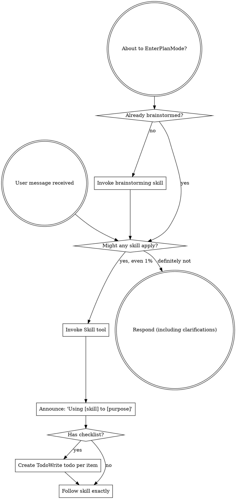
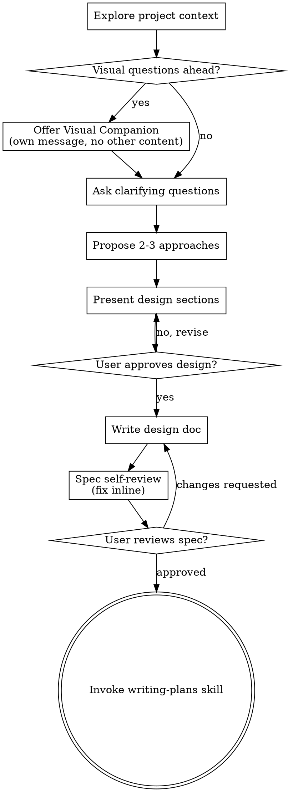
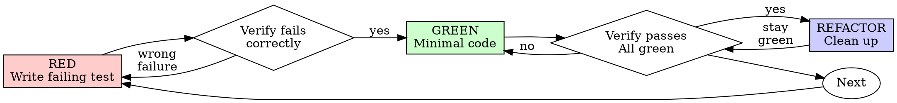
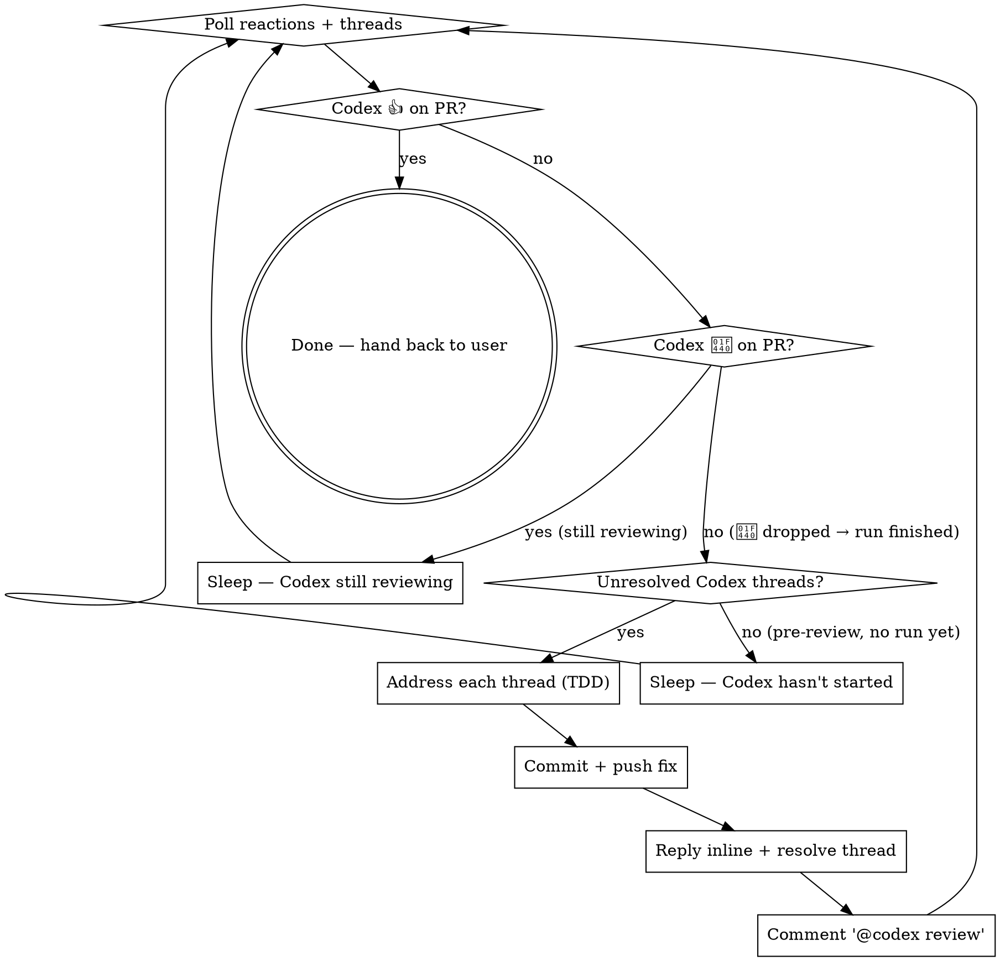

> SYSTEM

# AGENTS.md instructions for /Users/ericson/.t3/worktrees/ars-ui/t3code-9f5b5f2f

<INSTRUCTIONS>
# ars-ui

## Project Overview

Rust frontend component library using state machines, framework-agnostic core with Leptos/Dioxus adapters.

## Current Phase

The repo is now in active implementation, not spec drafting only.

Agents working on implementation should use the GitHub Project roadmap and issue backlog as the execution source of truth:

- Use the GitHub Project `ars-ui implementation roadmap` to understand active epics, task breakdown, dependencies, status, and iteration planning.
- Prefer picking a single issue-backed task that is unblocked, sized, and scoped for independent delivery.
- Do not start work from an epic issue unless the user explicitly asks for planning or further decomposition.
- Do not start a task that is blocked by unresolved GitHub issue dependencies.
- Treat native GitHub issue dependencies as the blocker graph and the issue body acceptance criteria as the delivery contract.

## Development Workflow

For implementation tasks:

1. Read the assigned or selected GitHub issue first.
2. Move the issue to **In Progress** on the GitHub Project board.
3. Review the cited spec sections and any dependency issues.
4. Add or update the named tests first.
5. Implement only the scope required to make those tests pass.
6. If implementation changes the intended contract, update the relevant spec in the same task.
7. **MANDATORY:** Invoke the `post-implementation-audit` skill (`.agents/skills/post-implementation-audit/SKILL.md`). It runs three sequential audits on the new code — (a) spec/implementation drift with "best outcome" recommendations, (b) iterative "anything else missing?" passes (minimum two rounds), (c) test-coverage audit across every test type the workspace uses (unit, snapshot, proptest, mutation, doc, spec-conformance, llvm-cov). **Every finding lands in _this_ PR — no deferral, no follow-up issues.** This step exists because initial implementations consistently ship spec drift and silent contract violations that take 3+ review round-trips to surface; the audit collapses them into one. Skipping this step is a contract violation.
8. Present the final result for user review before any commit.
9. After user approval, run `cargo xci --profile fast` (alias: `cargo xci-fast`) locally and fix any failures before pushing anything to GitHub. The fast profile takes ~5 minutes and covers the workspace-level regressions a pre-push gate should catch: fmt, check, clippy, unit, integration, adapter, spec-compile-snippets, error-variant-coverage, mutual-exclusion, snapshot-count. Reserve full `cargo xci` (~25 minutes, all 20 gates including wasm coverage and the feature-matrix groups) for after substantial refactors that may have shifted feature-flag interactions. For small follow-up changes, run the focused tests and checks that cover the edited code instead.
10. After `cargo xci-fast` passes, commit and push a PR targeting `main`. The PR body MUST include an auto-close keyword for the issue being delivered, for example `Closes #20` or `Fixes #20`, so GitHub closes the issue automatically when the PR merges.
11. **If the PR creates or modifies any `.snap` insta fixtures, attach the `snapshot-reviewed` label after opening or updating it** (`gh pr edit <num> --add-label "snapshot-reviewed"`). This signals to reviewers that the snapshot output was inspected and is intentional. Re-apply the label whenever you push a commit that touches `.snap` files; the workflow assumes the label reflects the latest snapshot state.
12. **MANDATORY:** Invoke the `waiting-for-codex-review` skill (`.agents/skills/waiting-for-codex-review/SKILL.md`) immediately after the first push that creates the PR, and re-invoke it after every subsequent push to the PR branch. The skill posts the initial `@codex review` trigger, polls Codex's 👀 → (👍 \| ∅ + threads) reaction lifecycle, addresses any review threads with the same rigor as `post-implementation-audit` (TDD + no coverage regression), replies inline, resolves threads, and re-comments `@codex review` to start the next pass — looping until Codex leaves 👍. Skipping this step leaves Codex findings unaddressed and silently widens the gap between merged code and the spec; the merge gate is 👍 from Codex plus green CI, not green CI alone.
13. Only after CI passes, Codex has left 👍, and the PR is merged, close the issue.

Never close a GitHub issue without a merged PR that passes CI **and a 👍 from Codex**. Never commit or push without explicit user approval. Keep the issue, PR, and Project board status aligned with the actual work state at every step.

Default delivery rules:

- Follow TDD: tests first, implementation second, verification last.
- Keep task scope aligned with the issue. If the issue is too large or ambiguous, stop and split or clarify rather than freelancing a bigger change.
- Prefer tasks sized `1`, `2`, `3`, or `5` points. `8` is exceptional. `13` must be decomposed before implementation.
- Preserve the crate and dependency layering defined by the architecture and implementation plan.
- Do not add a new dependency crate without explicit user approval first. If a task appears to need a new crate, stop, explain why, and get approval before editing any `Cargo.toml`.
- When a task is complete, verify the exact tests and checks named by the issue before considering it done.
- For adapter-level component implementation, follow `docs/implementation/adapter-component-delivery.md`. Adapter component work must cover the adapter crate, adapter tests, E2E fixtures/harnesses when applicable, widgets examples, spec synchronization, and the required validation/audit loop in one PR.

### Code Quality Standards

- **Document all public items.** Every public struct, enum, trait, function, constant, type alias, method, field, and variant must have a `///` doc comment. Every `lib.rs` must have a `//!` crate-level doc comment. The workspace enforces `missing_docs` linting — undocumented public items are build failures.
- **Zero warnings policy.** All code must compile with zero warnings under the workspace's configured clippy and rustc lints. Fix the root cause instead of suppressing. When suppression is genuinely needed, use `#[expect(lint, reason = "...")]` — never `#[allow(...)]`.
- **Derive documentation from the spec.** Doc comments should describe the _purpose and semantics_ of the item as defined in the corresponding `spec/` files, not just restate the type signature.
- **Use `#[inline]` selectively, not mechanically.** Do **not** add Clippy's `missing_inline_in_public_items` lint at the workspace level, and do not treat public visibility alone as a reason to mark an item `#[inline]`. Use `#[inline]` for thin cross-crate wrappers, trivial accessors, and hot-path no-op shims where the call overhead is plausibly meaningful. Avoid blanket `#[inline]` on all public APIs — it increases code size, adds compile-time cost, and turns `#[inline]` into noise instead of a deliberate performance signal.
- **Use directory-backed modules with `mod.rs` when a module owns children.** This repo standardizes on the older filesystem layout for nested modules. If module `foo` has child modules, the parent must live at `foo/mod.rs`, not `foo.rs`. Do not mix `foo.rs` with a sibling `foo/` directory. When a refactor adds child modules under an existing flat file, move the parent into `foo/mod.rs` in the same change. Do not leave empty leftover module directories behind.

### API Design Standards

- **Design for the pit of success.** Public APIs should make the most natural, shortest path also be the path that is correct, accessible, localizable, type-safe, and performant. Prefer ergonomic constructors and defaults that preserve the spec's strongest guarantees instead of making users opt into correctness after choosing a convenient API.
- **Name escape hatches explicitly.** When a component needs a lower-level, static, non-i18n, or otherwise less complete path, keep it available but make the tradeoff visible in the API name or type. The blessed path should remain the simplest call site, while escape hatches should read as deliberate choices.
- **Keep semantic data separate from rendered views.** Rich framework views are useful for customization, but components still need semantic sources for accessible names, localized text, announcements, ids, and state-machine wiring. Do not rely on arbitrary rendered view trees as the only source of user-facing semantics.

### Code Coverage

The workspace uses `cargo-llvm-cov` for code coverage with per-crate threshold enforcement. CI runs coverage on every PR (see `.github/workflows/ci.yml`).

**Local coverage commands:**

```bash
# Per-crate coverage with inline annotated source (most useful during development)
cargo llvm-cov test -p ars-interactions --text -- hover

# Per-crate summary only
cargo llvm-cov test -p ars-interactions -- hover

# Native-only workspace coverage (host target; excludes wasm-only crates)
cargo llvm-cov --workspace \
  --exclude ars-leptos --exclude ars-dioxus \
  --exclude ars-test-harness-leptos --exclude ars-test-harness-dioxus \
  --exclude ars-derive --exclude xtask \
  --lcov --output-path lcov.info

# Check all crates against spec-defined thresholds (run after a *merged* lcov)
cargo xtask coverage check-all --file lcov.info
```

The `--text` flag produces line-by-line annotated source showing hit counts and `^0` markers on uncovered branches — use this to identify gaps after writing tests. Uncovered no-op callback closures in tests (e.g., `|_| {}`) are expected and not a gap.

The local recipe above excludes the adapter and adapter-test-harness crates because their `target_arch = "wasm32"` / `feature = "web"` code paths can't be measured via host-target `cargo llvm-cov`. **CI runs an additional wasm-coverage pipeline on nightly** (`cargo xtask ci coverage`) that uses `wasm-bindgen-test`'s experimental coverage recipe with LLVM 22 / `clang-22` to emit lcov for `ars-leptos` (csr), `ars-dioxus` (web), `ars-dom` (web), `ars-i18n` (web-intl), and the adapter test harnesses, then merges with the native lcov via `cargo xtask coverage merge`. The per-crate thresholds in `xtask::coverage::default_thresholds()` are enforced against the merged file — including adapter targets (`ars-leptos` 74/55, `ars-dioxus` 77/70, `ars-test-harness-leptos` 60/0, `ars-test-harness-dioxus` 60/0). `ars-derive` (proc-macro, runs in compiler) is exercised via `crates/ars-core/tests/derive_contract.rs` and is unmeasured. `xtask` has its own enforced threshold (30/35) and is measured. See `spec/testing/14-ci.md` §2 for the full pipeline.

### Mutation Testing

Coverage tells you which lines run. **Mutation testing tells you whether the tests would notice if those lines silently misbehaved.** The workspace uses [`cargo-mutants`](https://mutants.rs) for this — a `cargo` extension binary, not a workspace dependency.

**Install (once per developer machine):**

```bash
cargo install cargo-mutants --locked --version 27.0.0
```

**Local commands (state-machine modules are the most rewarding targets):**

```bash
# Run on a single component machine (~6 min for popover)
cargo mutants -p ars-components -f crates/ars-components/src/overlay/popover.rs

# Just list what would be mutated, without running tests (fast)
cargo mutants -p ars-components -f crates/ars-components/src/overlay/popover.rs --list

# Whole crate (slow — only if you really mean it)
cargo mutants -p ars-components
```

**Agnostic component implementation gate:** whenever an agent implements a new framework-agnostic component, or materially changes an existing one, the delivery must include:

- a targeted mutation run for the component source file, usually `cargo mutants -p ars-components -f crates/ars-components/src/<category>/<component>/mod.rs` (adjust the path for single-file modules);
- spec-conformance tests for the component's anatomy/public contract, including its `Part` enum and required API/attribute surface;
- same-task triage of every `MISSED` mutant: add tests for real gaps, or add a justified line-agnostic `.cargo/mutants.toml` exclude only for true equivalent mutations.

**Reading the output:** Results land in `mutants.out/mutants.out/` (gitignored). The two files that matter:

- `caught.txt` — mutations that broke at least one test ✅
- `missed.txt` — mutations that survived all tests ❌ — each one is either a real test gap to fill or an "equivalent mutation" that needs a `[[skip]]` entry in `mutants.toml` with a justification

**CI integration:** Nightly only. `.github/workflows/nightly.yml` has a `mutation-testing` job with a 21-entry matrix that runs `cargo mutants -p <package>` on every framework-agnostic crate, using `--shard k/n` to spread larger crates across parallel runners. **Shard indices are 0-based** (`k` runs from `0` to `n-1`); `k == n` is invalid and will fail the job. When adding shards, always start at `0/n` and end at `(n-1)/n`.

- **`ars-components` (≈ 1,630 mutants today, planned to grow as the spec adds the remaining ~97 components):** sharded **12-way** → ≈ 135 mutants per runner today, ≈ 850 per runner at the ~10,000-mutant endpoint. Sized for the full spec catalog up front so we don't re-shard every few months as components land.
- **`ars-collections` (≈ 1,080 mutants):** sharded 4-way → ≈ 270 mutants per runner.
- **`ars-core` (≈ 700 mutants):** sharded 2-way → ≈ 350 mutants per runner.
- **`ars-a11y`, `ars-forms`, `ars-interactions`:** one runner each (under 600 mutants apiece).

**Adding a new state machine inside an existing crate requires no CI changes** — its mutations land in whichever shard the cargo-mutants partitioner places them. The shard counts are sized so the slowest runner stays well under 30 minutes today and under ~50 minutes at the planned endpoint; re-balance only when a crate outgrows that budget (visible on the nightly dashboard as one shard pulling away from the others).

All matrix jobs run with `fail-fast: false` so failures on one module don't mask data on another. Each job uploads its `mutants.out/` as a workflow artifact (always, even on success — surviving "missed" entries on a passing run still reveal test-quality work). The job fails if any mutation survives, so a missed mutation forces a deliberate triage decision (fix the test, or document the equivalence with a `[[skip]]` entry in `mutants.toml`).

**Excluded crates** (mutation testing's signal degrades wherever determinism does): adapter glue (`ars-leptos`, `ars-dioxus`), DOM/FFI (`ars-dom`), ICU/FFI (`ars-i18n`), test infrastructure (`ars-test-harness*`), and the proc-macro crate (`ars-derive`, runs in the compiler). Adding a brand-new crate that is a good mutation target requires one new matrix entry; run a local scout first (`cargo mutants -p <crate> --list` to size, then a real run) so we know the right shard count before the nightly fires.

**Bumping the pinned version.** Both the local install command above and `.github/workflows/nightly.yml` pin cargo-mutants to an exact version (currently `27.0.0`) — same convention as `wasm-pack` in the `a11y-audit` job. Pinning is deliberate: cargo-mutants ships new mutators in releases, and an unpinned install would silently change the mutation set without any code change, surfacing as phantom CI failures on a green-source repo. To bump, open a PR that (1) updates the version string in CLAUDE.md and `nightly.yml`, (2) runs the popover scout locally with the new version (`cargo mutants -p ars-components -f crates/ars-components/src/overlay/popover.rs`) to confirm the mutation count is in the same ballpark, and (3) triages any new "missed" entries the new mutators surface — they are usually genuine test-quality gaps newly visible to the tool.

### Property Testing (proptest)

State-machine invariants are exercised by [`proptest`](https://docs.rs/proptest) under `crates/<crate>/tests/proptest_state_machines/` (see `ars-components`). Default proptest behaviour drops `*.proptest-regressions` seed files alongside test sources — instead, every `proptest!` block in this workspace pulls a shared `Config` from `tests/proptest_state_machines/common.rs` that:

1. Reads `PROPTEST_CASES` from the environment (1,000 default; 10,000 in the nightly `extended-proptest` job).
2. Sets `failure_persistence` to `FileFailurePersistence::Direct("proptest-regressions/state-machines.txt")`, so all persisted seeds for the test binary live in one file at the crate root: `crates/<crate>/proptest-regressions/state-machines.txt`. The directory is committed (per proptest's own recommendation in the file header) so every developer's runs benefit from previously-shrunk failures.

When a new crate adopts proptest for state-machine tests, copy the same `common.rs` helper and reference it via `#![proptest_config(super::common::proptest_config())]` inside every `proptest!` block. Don't let proptest fall back to its `WithSource` default — that scatters seed files across the source tree.

### Adapter Prelude Convention

Both `ars-leptos` and `ars-dioxus` expose a `prelude` module targeting **end users** — application developers who consume the ready-made components. `use ars_leptos::prelude::*` (or `use ars_dioxus::prelude::*`) should give them everything they need.

The prelude contains only user-facing items:

1. **Component modules** — as components land, their public module paths (e.g., `button`, `dialog`) are re-exported so users can write `button::Props`, etc.
2. **User-facing traits** — traits end users call on component outputs (e.g., `Translate` from `ars-i18n`). Re-export the trait so consumers don't need a direct dependency on the subsystem crate.
3. **Configuration types** — types that appear in component props or configure behaviour (e.g., `Locale`, `Direction`, `Orientation`, `Selection`).

The prelude does **not** include implementation details consumed only by component authors inside the adapter crate: core engine types (`Machine`, `Service`, `ConnectApi`, `AttrMap`), accessibility primitives (`AriaRole`, `AriaAttribute`), interaction helpers (`merge_attrs`), or adapter hooks (`use_machine`, `UseMachineReturn`). Those remain accessible via their normal crate paths for advanced users building custom machines.

Both adapter preludes must stay symmetric: same items, same structure. When adding a new re-export to one adapter's prelude, add it to the other as well in the same PR.

### Adapter Testing Convention

Adapter-level component tests should default to the framework-specific test harness crate:

- Leptos adapter tests should prefer `ars-test-harness-leptos`.
- Dioxus adapter tests should prefer `ars-test-harness-dioxus`.
- Shared `ars-test-harness` helpers should be used where relevant for viewport, layout, clipboard, drag/drop, timing, and other DOM test setup instead of bespoke per-test browser scaffolding.

When a component spec requires interaction, focus, overlay positioning, clipboard, file upload, drag/drop, or similar browser behavior, the task's tests should exercise that behavior through the adapter harness entrypoints and shared core harness helpers unless there is a concrete technical reason not to.

## Spec Synchronization During Implementation

The specification is the authoritative contract. It took weeks of deliberate design and MUST be followed.

### Spec-first implementation rule

Before implementing any public type, trait, function, or method:

1. **Read the spec section first.** Find the relevant code example in `spec/`. Use `spec-tool toc <file>` and `grep` to locate it.
2. **Match the spec exactly.** If the spec defines `struct ComponentIds { base: String }` with methods `from_id()`, `id()`, `part()`, `item()`, `item_part()` — implement exactly that. Do not invent alternative field names, method names, or signatures.
3. **Cross-check after implementation.** Before presenting code for review, diff every public item against the spec's code examples. Every struct field, every method name, every parameter must match.
4. **If you must deviate**, there must be a concrete technical reason (e.g., the spec's API cannot compile, or a dependency doesn't expose the needed type). Document the reason in a code comment and flag it to the user explicitly.

Inventing alternative APIs that "seem equivalent" is never acceptable — it silently invalidates the spec's design decisions and all downstream code that depends on those APIs.

### Spec/code mismatch resolution

- If code and spec disagree, resolve the mismatch in the same task or PR.
- Shared conceptual changes belong in shared or foundation spec files, not only in adapter code.
- Adapter-specific findings must be reflected back into `spec/foundation/08-adapter-leptos.md` and/or `spec/foundation/09-adapter-dioxus.md` when relevant.
- Do not leave spec drift behind as follow-up cleanup.

## Spec Structure

The specification lives in `spec/` with this layout:

- `spec/manifest.toml` — **START HERE** — central index of all components and their dependencies
- `spec/foundation/` — architecture, accessibility, i18n, interactions, forms, adapters, spec template (00-10)
- `spec/shared/` — cross-component shared types (date-time, selection, layout, z-index)
- `spec/components/{category}/` — one file per component, organized by category
- `spec/testing/` — test specs split by domain

### Component Categories

- `input/` — checkbox, text-field, slider, number-input, etc.
- `selection/` — select, combobox, listbox, menu, tags-input, etc.
- `overlay/` — dialog, popover, tooltip, toast, presence, etc.
- `navigation/` — accordion, tabs, tree-view, pagination, steps, etc.
- `date-time/` — date-field, time-field, calendar, date-picker, etc.
- `data-display/` — table, avatar, progress, meter, badge, etc.
- `layout/` — splitter, scroll-area, carousel, portal, toolbar, etc.
- `specialized/` — color-picker, file-upload, signature-pad, qr-code, etc.
- `utility/` — button, toggle, focus-scope, visually-hidden, separator, etc.

## Working with the Spec

When reading large files, run `wc -l` first to check the line count. If the file is over 2,000
lines, use the `offset` and `limit` parameters on the Read tool to read in chunks rather than
attempting to read the entire file at once.

### Using xtask spec (preferred)

Use `cargo xtask spec` to resolve file sets instead of manually parsing manifest.toml:

```bash
# Quick metadata lookup:
cargo xtask spec info <component>

# Find all components using a shared type:
cargo xtask spec reverse <shared-type>

# See a file's heading structure (with line numbers):
cargo xtask spec toc <file>

# Validate frontmatter matches manifest.toml:
cargo xtask spec validate

# Search spec content by keyword/regex (with optional filters):
cargo xtask spec search <query> [--category <cat>] [--section <sec>] [--tier <tier>]

# Get a compact component summary (states, events, props, accessibility):
cargo xtask spec digest <component>

# Get full implementation context (component + all deps concatenated):
cargo xtask spec context <component> [--framework <fw>] [--include-testing]
```

The xtask also runs as an MCP server (`cargo xtask mcp`) exposing all spec tools for LLM agents.

### Reading a component (manual fallback)

1. Read `spec/manifest.toml` to find the component's path and dependencies
2. Read the component file (has YAML frontmatter listing its foundation/shared deps)
3. Only load the foundation files listed in `foundation_deps` — not all of them

### Framework and library specs — MANDATORY skill loading

When reading or editing these specification files, you MUST load the corresponding skill BEFORE doing any work. The skills contain verified, version-accurate API documentation that the spec code examples depend on. Claude's training data is wrong for these libraries — do not trust it.

| Spec file                                    | Skill to load | Library version |
| -------------------------------------------- | ------------- | --------------- |
| `spec/foundation/04-internationalization.md` | `icu4x`       | ICU4X 2.1.1     |
| `spec/foundation/08-adapter-leptos.md`       | `leptos`      | Leptos 0.8.17   |
| `spec/foundation/09-adapter-dioxus.md`       | `dioxus`      | Dioxus 0.7.3    |

This applies to any task that touches adapter code: reviewing, writing, modifying, or answering questions about these files. Load the skill first, then proceed.

### Spec Conventions

- **No deprecation:** This is a greenfield spec. If an API is unused or redundant, remove it and fix all references. Never use `#[deprecated]` or deprecation shims.
- **No deferral:** Never mark spec content as "TODO", "FIXME", "future enhancement", "P1/P2 extension", or any similar deferral language. Every feature mentioned must be fully specified. If a design choice is unclear, ask the user rather than deferring.
- **No guessing external APIs:** NEVER guess function names or module paths for external crates. Always verify against `https://docs.rs/<crate_name>` before writing code that calls library APIs. This applies especially to Leptos, Dioxus, ICU4X, and any crate where training data may be stale. If you cannot verify, state that explicitly rather than fabricating a plausible-looking API.

### Component file format

Each component file has YAML frontmatter declaring its metadata:

```markdown
---
component: ComponentName
category: { category }
tier: stateless | stateful | complex
foundation_deps: [architecture, accessibility, ...]
shared_deps: [date-time-types, ...]
related: [sibling-component, ...]
---

# ComponentName
```

The `tier` field determines which sections are required — see `spec/foundation/10-component-spec-template.md` for the canonical section structure, ordering rules, and conformance checklist. Headings are numbered (e.g., `## 1. State Machine`, `### 1.1 States`, `#### 1.1.1 InnerStates`, etc.) for precise section references.

</INSTRUCTIONS>
<environment_context>
  <cwd>/Users/ericson/.t3/worktrees/ars-ui/t3code-9f5b5f2f</cwd>
  <shell>zsh</shell>
  <current_date>2026-05-21</current_date>
  <timezone>America/Sao_Paulo</timezone>
</environment_context>

> DEVELOPER

Implement task #260

> TOOL

tool_use exec_command
id: call_uzAWH1wEZ2uMgt9g8Ph9cP4z
```json
{
  "cmd": "sed -n '1,220p' /Users/ericson/.claude/skills/using-superpowers/SKILL.md",
  "workdir": "/Users/ericson/.t3/worktrees/ars-ui/t3code-9f5b5f2f",
  "yield_time_ms": 1000,
  "max_output_tokens": 4000
}
```

> TOOL

tool_use exec_command
id: call_yHS14gRuCULxdIsBH6sQDNCS
```json
{
  "cmd": "rg -n \"#260|issue #260|task #260|260\" /Users/ericson/.codex/memories/MEMORY.md",
  "workdir": "/Users/ericson/.t3/worktrees/ars-ui/t3code-9f5b5f2f",
  "yield_time_ms": 1000,
  "max_output_tokens": 3000
}
```

> TOOL

tool_result
id: call_uzAWH1wEZ2uMgt9g8Ph9cP4z
```
Chunk ID: 0a9f17
Wall time: 0.1018 seconds
Process exited with code 0
Original token count: 1356
Output:
---
name: using-superpowers
description: Use when starting any conversation - establishes how to find and use skills, requiring Skill tool invocation before ANY response including clarifying questions
---

<SUBAGENT-STOP>
If you were dispatched as a subagent to execute a specific task, skip this skill.
</SUBAGENT-STOP>

<EXTREMELY-IMPORTANT>
If you think there is even a 1% chance a skill might apply to what you are doing, you ABSOLUTELY MUST invoke the skill.

IF A SKILL APPLIES TO YOUR TASK, YOU DO NOT HAVE A CHOICE. YOU MUST USE IT.

This is not negotiable. This is not optional. You cannot rationalize your way out of this.
</EXTREMELY-IMPORTANT>

## Instruction Priority

Superpowers skills override default system prompt behavior, but **user instructions always take precedence**:

1. **User's explicit instructions** (CLAUDE.md, GEMINI.md, AGENTS.md, direct requests) — highest priority
2. **Superpowers skills** — override default system behavior where they conflict
3. **Default system prompt** — lowest priority

If CLAUDE.md, GEMINI.md, or AGENTS.md says "don't use TDD" and a skill says "always use TDD," follow the user's instructions. The user is in control.

## How to Access Skills

**In Claude Code:** Use the `Skill` tool. When you invoke a skill, its content is loaded and presented to you—follow it directly. Never use the Read tool on skill files.

**In Copilot CLI:** Use the `skill` tool. Skills are auto-discovered from installed plugins. The `skill` tool works the same as Claude Code's `Skill` tool.

**In Gemini CLI:** Skills activate via the `activate_skill` tool. Gemini loads skill metadata at session start and activates the full content on demand.

**In other environments:** Check your platform's documentation for how skills are loaded.

## Platform Adaptation

Skills use Claude Code tool names. Non-CC platforms: see `references/copilot-tools.md` (Copilot CLI), `references/codex-tools.md` (Codex) for tool equivalents. Gemini CLI users get the tool mapping loaded automatically via GEMINI.md.

# Using Skills

## The Rule

**Invoke relevant or requested skills BEFORE any response or action.** Even a 1% chance a skill might apply means that you should invoke the skill to check. If an invoked skill turns out to be wrong for the situation, you don't need to use it.



## Red Flags

These thoughts mean STOP—you're rationalizing:

| Thought | Reality |
|---------|---------|
| "This is just a simple question" | Questions are tasks. Check for skills. |
| "I need more context first" | Skill check comes BEFORE clarifying questions. |
| "Let me explore the codebase first" | Skills tell you HOW to explore. Check first. |
| "I can check git/files quickly" | Files lack conversation context. Check for skills. |
| "Let me gather information first" | Skills tell you HOW to gather information. |
| "This doesn't need a formal skill" | If a skill exists, use it. |
| "I remember this skill" | Skills evolve. Read current version. |
| "This doesn't count as a task" | Action = task. Check for skills. |
| "The skill is overkill" | Simple things become complex. Use it. |
| "I'll just do this one thing first" | Check BEFORE doing anything. |
| "This feels productive" | Undisciplined action wastes time. Skills prevent this. |
| "I know what that means" | Knowing the concept ≠ using the skill. Invoke it. |

## Skill Priority

When multiple skills could apply, use this order:

1. **Process skills first** (brainstorming, debugging) - these determine HOW to approach the task
2. **Implementation skills second** (frontend-design, mcp-builder) - these guide execution

"Let's build X" → brainstorming first, then implementation skills.
"Fix this bug" → debugging first, then domain-specific skills.

## Skill Types

**Rigid** (TDD, debugging): Follow exactly. Don't adapt away discipline.

**Flexible** (patterns): Adapt principles to context.

The skill itself tells you which.

## User Instructions

Instructions say WHAT, not HOW. "Add X" or "Fix Y" doesn't mean skip workflows.

```

> TOOL

tool_result
id: call_yHS14gRuCULxdIsBH6sQDNCS
```
Chunk ID: 560bd7
Wall time: 0.0057 seconds
Process exited with code 0
Original token count: 383
Output:
57:- rollout_summaries/REDACTED.md (cwd=/Users/ericson/.t3/worktrees/ars-ui/t3code-e135578b, rollout_path=/Users/ericson/.codex/sessions/2026/05/19/rollout-2026-05-19T17-42-27-019e41f9-c22a-7260-85e4-cdc196756c91.jsonl, updated_at=2026-05-19T21:49:53+00:00, thread_id=019e41f9-c22a-7260-85e4-cdc196756c91, PR #650 review closure with regression tests, spec sync, and `idna` feature repair)
448:- Nightly CI, gh run list --workflow nightly.yml, gh run view, 26018663930, 25782583737, rust mutation (0/4), rust mutation (1/4), rust mutation (3/4), baseline, proptest, mutation survivors
477:- in this repo, Nightly failures should be diagnosed from live GitHub Actions runs first; on this run the latest failing Nightly was `26018663930`, the last green run was `25782583737`, `baseline` and `proptest` were green, and only Rust mutation shards were red [Task 1]
2881:- Nightly CI, nightly.yml, gh run view, 26013516682, 25777995271, tabs_wasm.rs, web_sys::MouseEventInit, ars_dom::WebPlatformEffects, Mutation Tests (components-shard-8), Mutation Tests (collections-shard-1), TabKey, PR #646
2937:- on the later tabs-focused Nightly regression, the failing run was `26013516682` and the previous green scheduled Nightly was `25777995271`; the two real failure classes were a wasm compile break in `crates/ars-dioxus/tests/tabs_wasm.rs` and survivor clusters in `crates/ars-components/src/navigation/tabs/mod.rs` plus `crates/ars-collections/src/key.rs` [Task 8]

```

> AGENT

Using `using-superpowers` because this is repo implementation work, and I’m in Plan Mode so I’ll ground the task and produce an implementation-ready plan rather than editing files. I’m also doing a quick memory pass for `ars-ui`/task `#260` before asking anything.

> TOOL

tool_use exec_command
id: call_J262zevycri35N5u0BpY8sqF
```json
{
  "cmd": "sed -n '440,485p' /Users/ericson/.codex/memories/MEMORY.md",
  "workdir": "/Users/ericson/.t3/worktrees/ars-ui/t3code-9f5b5f2f",
  "yield_time_ms": 1000,
  "max_output_tokens": 4000
}
```

> TOOL

tool_use exec_command
id: call_5IdW1cVlUGaNdblg0R5ojgiy
```json
{
  "cmd": "pwd && git status --short --branch && gh issue view 260 --json number,title,state,body,labels,assignees,projectItems,closed,closedAt,url",
  "workdir": "/Users/ericson/.t3/worktrees/ars-ui/t3code-9f5b5f2f",
  "yield_time_ms": 1000,
  "max_output_tokens": 12000
}
```

> TOOL

tool_use exec_command
id: call_dCcPaJsTkNuOIwzICsQ0WL9s
```json
{
  "cmd": "rg --files -g 'SKILL.md' .agents/skills | sort",
  "workdir": "/Users/ericson/.t3/worktrees/ars-ui/t3code-9f5b5f2f",
  "yield_time_ms": 1000,
  "max_output_tokens": 4000
}
```

> TOOL

tool_result
id: call_J262zevycri35N5u0BpY8sqF
```
Chunk ID: d0bcc6
Wall time: 0.0261 seconds
Process exited with code 0
Original token count: 1072
Output:
## Task 1: Inspect the live Nightly CI failure and separate real survivor lanes from runner noise

### rollout_summary_files

- rollout_summaries/REDACTED.md (cwd=/Users/ericson/Workspace/Rust/judge-fudge, rollout_path=/Users/ericson/.codex/sessions/2026/05/18/rollout-2026-05-18T14-50-43-019e3c36-2ae3-77d1-af1f-0be29a04920d.jsonl, updated_at=2026-05-18T18:41:18+00:00, thread_id=019e3c36-2ae3-77d1-af1f-0be29a04920d, live Nightly diagnosis and survivor scoping before code changes)

### keywords

- Nightly CI, gh run list --workflow nightly.yml, gh run view, 26018663930, 25782583737, rust mutation (0/4), rust mutation (1/4), rust mutation (3/4), baseline, proptest, mutation survivors

## Task 2: Patch the real survivor clusters, rerun targeted mutation checks, and validate with the full local CI mirror

### rollout_summary_files

- rollout_summaries/REDACTED.md (cwd=/Users/ericson/Workspace/Rust/judge-fudge, rollout_path=/Users/ericson/.codex/sessions/2026/05/18/rollout-2026-05-18T14-50-43-019e3c36-2ae3-77d1-af1f-0be29a04920d.jsonl, updated_at=2026-05-18T18:41:18+00:00, thread_id=019e3c36-2ae3-77d1-af1f-0be29a04920d, survivor fixes in `crates/api` and `xtask` plus `cargo xtask ci`)

### keywords

- crates/api/src/documents.rs, xtask/tests/cli.rs, .cargo/mutants.toml, percent_decode_query_component, clamp_list_limit, impossible hit-total rejection, cargo mutants --file, cargo test -p api --lib documents::tests, cargo test -p xtask --test cli, cargo xtask ci

## Task 3: Publish the Nightly fix as PR #75

### rollout_summary_files

- rollout_summaries/REDACTED.md (cwd=/Users/ericson/Workspace/Rust/judge-fudge, rollout_path=/Users/ericson/.codex/sessions/2026/05/18/rollout-2026-05-18T14-50-43-019e3c36-2ae3-77d1-af1f-0be29a04920d.jsonl, updated_at=2026-05-18T18:41:18+00:00, thread_id=019e3c36-2ae3-77d1-af1f-0be29a04920d, commit and PR publish for the Nightly CI remediation)

### keywords

- PR #75, fix(nightly-ci): kill mutation survivors, 9b7af47, cargo-mutants 27.0.0, no-db mutation run

## User preferences

- when the user said `Our nightly CI has been failing recently, let's investigate it and do a PR with the needed fixes` -> inspect the live Nightly runs first, isolate the real failing lanes from runner noise, then carry the work through to a published PR instead of stopping at diagnosis [Task 1][Task 3]
- when the task is a Nightly failure and the failure shape can change between runs -> default to live GitHub Actions evidence before local speculation, even if the local repo looks clean [Task 1]

## Reusable knowledge

- in this repo, Nightly failures should be diagnosed from live GitHub Actions runs first; on this run the latest failing Nightly was `26018663930`, the last green run was `25782583737`, `baseline` and `proptest` were green, and only Rust mutation shards were red [Task 1]
- the strongest survivor clusters were in `crates/api/src/documents.rs` (document-list query parsing helpers) and `xtask/src/coverage.rs` / `xtask/tests/cli.rs` (LCOV parsing and coverage-gate boundaries), which meant the fix surface was mostly pure/helper logic rather than DB-heavy flows [Task 1][Task 2]
- the durable survivor-killing tests added coverage for truncated percent escapes like `"%2"`, exact limit-query parsing helpers, full-coverage acceptance, and impossible hit-total rejection paths [Task 2]
- `.cargo/mutants.toml` exclusions were kept narrow and explicitly equivalent-oriented: `skip_documentation_lint` env-reader wrapper, `clamp_list_limit` max-boundary `>` vs `>=`, and the decoded-nibble `|` vs `^` mutation in `percent_decode_query_component(...)` [Task 2]
- for `cargo-mutants` on this codebase, start with `--file <path>` for a small suspected cluster and narrow with `--re` only if needed; a `MISSED` result is a true gap, while a `TIMEOUT` is a different class of problem [Task 2]
- `cargo xtask ci` is the useful end-to-end local mirror for repo-root Nightly remediations here; it validated planning-doc linting, formatting, clippy, workspace tests, and doctests after the survivor fixes landed [Task 2]

## Failures and how to do differently


```

> TOOL

tool_result
id: call_5IdW1cVlUGaNdblg0R5ojgiy
```
Chunk ID: 35e85c
Wall time: 1.0020 seconds
Process running with session ID 96756
Original token count: 18
Output:
/Users/ericson/.t3/worktrees/ars-ui/t3code-9f5b5f2f
## t3code/9f5b5f2f

```

> TOOL

tool_result
id: call_dCcPaJsTkNuOIwzICsQ0WL9s
```
Chunk ID: 1d0e99
Wall time: 0.2715 seconds
Process exited with code 0
Original token count: 58
Output:
.agents/skills/dioxus/SKILL.md
.agents/skills/icu4x/SKILL.md
.agents/skills/leptos/SKILL.md
.agents/skills/playwright-cli/SKILL.md
.agents/skills/post-implementation-audit/SKILL.md
.agents/skills/waiting-for-codex-review/SKILL.md

```

> TOOL

tool_use write_stdin
id: call_lrQ5yByl6qUlRUJJ16eKU6QR
```json
{
  "session_id": 96756,
  "chars": "",
  "yield_time_ms": 1000,
  "max_output_tokens": 12000
}
```

> TOOL

tool_result
id: call_lrQ5yByl6qUlRUJJ16eKU6QR
```
Chunk ID: b6ddc4
Wall time: 0.0000 seconds
Process exited with code 0
Original token count: 692
Output:
{"assignees":[],"body":"**Epic: #222 (Agnostic overlay components)**\n\n## Goal\nSimplified Dialog variant with `role=\"alertdialog\"`, required user action, no close-on-backdrop.\n\n## Out of scope\nFramework-specific adapter components (Leptos/Dioxus).\n\n## Spec refs\n- `spec/components/overlay/alert-dialog.md`\n- `spec/shared/z-index-stacking.md`\n\n## Depends on\n#253 (Dialog)\n\n## Layer\nComponent\n\n## Framework\nNone\n\n## Test tier\nUnit\n\n## Fibonacci points\n3\n\n## Element/ref handling note\n\nThe agnostic AlertDialog core should build on Dialog semantics while owning required-action state, semantic IDs, ARIA/data attrs, cancellation/confirmation events, and z-index intent. It should not focus the first action, trap focus, restore focus, attach outside listeners, or inspect real event targets directly.\n\nAdapters must own live dialog/action/cancel/trigger handles, initial focus placement, focus trap wiring, focus restoration, and platform event listeners. IDs remain semantic for `aria-labelledby`, `aria-describedby`, and stable markup only.\n\n## Tests to add first\n- ConnectApi produces `role=\"alertdialog\"`.\n- Focus trap is expressed as adapter-resolvable intent/state, not direct agnostic DOM traversal.\n- Escape does NOT close (requires explicit action).\n- No backdrop close.\n- Action buttons required.\n- `aria-labelledby` and `aria-describedby`.\n- Cancel and confirm actions.\n\n## Acceptance criteria\n- All public types documented per workspace `missing_docs` lint.\n- State machine matches spec §1 exactly.\n- ConnectApi produces correct ARIA attributes per spec §2.\n- Agnostic AlertDialog exposes semantic state/attrs and adapter-resolvable focus/dismissal intents only; live focus and containment stay in adapters.\n- Snapshot tests cover the component's `connect()` / `Api` `AttrMap` output for every anatomy part and each output-affecting state, prop, or context branch, with committed `.snap` fixtures passing `cargo insta test --unreferenced=reject`.\n- All named tests pass with zero warnings.\n\n## Spec impact\nUpdate the component spec if it implies agnostic focus traversal, initial focus, focus restoration, outside containment, or ID-based live element lookup.\n\n## Board update rule\nIf blocked, keep `Status` in `Todo`, use native GitHub issue dependencies, and name the dependency or spec ambiguity.\n","closed":false,"closedAt":null,"labels":[{"id":"LA_kwDORp4enM8AAAACd5NBow","name":"task","description":"Agent-ready implementation task","color":"0E8A16"}],"number":260,"projectItems":[{"status":{"optionId":"f75ad846","name":"Todo"},"title":"ars-ui implementation roadmap"}],"state":"OPEN","title":"task: Implement AlertDialog agnostic core","url":"https://github.com/fogodev/ars-ui/issues/260"}

```

> AGENT

Issue `#260` is open, board status is `Todo`, and it depends on Dialog `#253`. I’m checking that dependency and the current spec/code shape now so the plan can be precise about files, APIs, and tests.

> TOOL

tool_use exec_command
id: call_E3sUi636jgyJOttJdPI0VAVe
```json
{
  "cmd": "sed -n '1,220p' /Users/ericson/.claude/skills/brainstorming/SKILL.md",
  "workdir": "/Users/ericson/.t3/worktrees/ars-ui/t3code-9f5b5f2f",
  "yield_time_ms": 1000,
  "max_output_tokens": 5000
}
```

> TOOL

tool_use exec_command
id: call_ai1Vpnuabr6K6ZhnjgjynhUO
```json
{
  "cmd": "sed -n '1,240p' /Users/ericson/.claude/skills/writing-plans/SKILL.md",
  "workdir": "/Users/ericson/.t3/worktrees/ars-ui/t3code-9f5b5f2f",
  "yield_time_ms": 1000,
  "max_output_tokens": 5000
}
```

> TOOL

tool_use exec_command
id: call_05sXfGbCs46y93iiyLbGsWSF
```json
{
  "cmd": "gh issue view 253 --json number,title,state,body,labels,projectItems,url",
  "workdir": "/Users/ericson/.t3/worktrees/ars-ui/t3code-9f5b5f2f",
  "yield_time_ms": 1000,
  "max_output_tokens": 10000
}
```

> TOOL

tool_use exec_command
id: call_nlARAZZj6xRCrd9GYLIymuDd
```json
{
  "cmd": "find crates/ars-components/src -maxdepth 3 -type f | sort | rg '/overlay/(dialog|alert|popover|presence|tooltip)'",
  "workdir": "/Users/ericson/.t3/worktrees/ars-ui/t3code-9f5b5f2f",
  "yield_time_ms": 1000,
  "max_output_tokens": 5000
}
```

> TOOL

tool_result
id: call_E3sUi636jgyJOttJdPI0VAVe
```
Chunk ID: c5b79b
Wall time: 0.4916 seconds
Process exited with code 0
Original token count: 2659
Output:
---
name: brainstorming
description: "You MUST use this before any creative work - creating features, building components, adding functionality, or modifying behavior. Explores user intent, requirements and design before implementation."
---

# Brainstorming Ideas Into Designs

Help turn ideas into fully formed designs and specs through natural collaborative dialogue.

Start by understanding the current project context, then ask questions one at a time to refine the idea. Once you understand what you're building, present the design and get user approval.

<HARD-GATE>
Do NOT invoke any implementation skill, write any code, scaffold any project, or take any implementation action until you have presented a design and the user has approved it. This applies to EVERY project regardless of perceived simplicity.
</HARD-GATE>

## Anti-Pattern: "This Is Too Simple To Need A Design"

Every project goes through this process. A todo list, a single-function utility, a config change — all of them. "Simple" projects are where unexamined assumptions cause the most wasted work. The design can be short (a few sentences for truly simple projects), but you MUST present it and get approval.

## Checklist

You MUST create a task for each of these items and complete them in order:

1. **Explore project context** — check files, docs, recent commits
2. **Offer visual companion** (if topic will involve visual questions) — this is its own message, not combined with a clarifying question. See the Visual Companion section below.
3. **Ask clarifying questions** — one at a time, understand purpose/constraints/success criteria
4. **Propose 2-3 approaches** — with trade-offs and your recommendation
5. **Present design** — in sections scaled to their complexity, get user approval after each section
6. **Write design doc** — save to `docs/superpowers/specs/YYYY-MM-DD-<topic>-design.md` and commit
7. **Spec self-review** — quick inline check for placeholders, contradictions, ambiguity, scope (see below)
8. **User reviews written spec** — ask user to review the spec file before proceeding
9. **Transition to implementation** — invoke writing-plans skill to create implementation plan

## Process Flow



**The terminal state is invoking writing-plans.** Do NOT invoke frontend-design, mcp-builder, or any other implementation skill. The ONLY skill you invoke after brainstorming is writing-plans.

## The Process

**Understanding the idea:**

- Check out the current project state first (files, docs, recent commits)
- Before asking detailed questions, assess scope: if the request describes multiple independent subsystems (e.g., "build a platform with chat, file storage, billing, and analytics"), flag this immediately. Don't spend questions refining details of a project that needs to be decomposed first.
- If the project is too large for a single spec, help the user decompose into sub-projects: what are the independent pieces, how do they relate, what order should they be built? Then brainstorm the first sub-project through the normal design flow. Each sub-project gets its own spec → plan → implementation cycle.
- For appropriately-scoped projects, ask questions one at a time to refine the idea
- Prefer multiple choice questions when possible, but open-ended is fine too
- Only one question per message - if a topic needs more exploration, break it into multiple questions
- Focus on understanding: purpose, constraints, success criteria

**Exploring approaches:**

- Propose 2-3 different approaches with trade-offs
- Present options conversationally with your recommendation and reasoning
- Lead with your recommended option and explain why

**Presenting the design:**

- Once you believe you understand what you're building, present the design
- Scale each section to its complexity: a few sentences if straightforward, up to 200-300 words if nuanced
- Ask after each section whether it looks right so far
- Cover: architecture, components, data flow, error handling, testing
- Be ready to go back and clarify if something doesn't make sense

**Design for isolation and clarity:**

- Break the system into smaller units that each have one clear purpose, communicate through well-defined interfaces, and can be understood and tested independently
- For each unit, you should be able to answer: what does it do, how do you use it, and what does it depend on?
- Can someone understand what a unit does without reading its internals? Can you change the internals without breaking consumers? If not, the boundaries need work.
- Smaller, well-bounded units are also easier for you to work with - you reason better about code you can hold in context at once, and your edits are more reliable when files are focused. When a file grows large, that's often a signal that it's doing too much.

**Working in existing codebases:**

- Explore the current structure before proposing changes. Follow existing patterns.
- Where existing code has problems that affect the work (e.g., a file that's grown too large, unclear boundaries, tangled responsibilities), include targeted improvements as part of the design - the way a good developer improves code they're working in.
- Don't propose unrelated refactoring. Stay focused on what serves the current goal.

## After the Design

**Documentation:**

- Write the validated design (spec) to `docs/superpowers/specs/YYYY-MM-DD-<topic>-design.md`
  - (User preferences for spec location override this default)
- Use elements-of-style:writing-clearly-and-concisely skill if available
- Commit the design document to git

**Spec Self-Review:**
After writing the spec document, look at it with fresh eyes:

1. **Placeholder scan:** Any "TBD", "TODO", incomplete sections, or vague requirements? Fix them.
2. **Internal consistency:** Do any sections contradict each other? Does the architecture match the feature descriptions?
3. **Scope check:** Is this focused enough for a single implementation plan, or does it need decomposition?
4. **Ambiguity check:** Could any requirement be interpreted two different ways? If so, pick one and make it explicit.

Fix any issues inline. No need to re-review — just fix and move on.

**User Review Gate:**
After the spec review loop passes, ask the user to review the written spec before proceeding:

> "Spec written and committed to `<path>`. Please review it and let me know if you want to make any changes before we start writing out the implementation plan."

Wait for the user's response. If they request changes, make them and re-run the spec review loop. Only proceed once the user approves.

**Implementation:**

- Invoke the writing-plans skill to create a detailed implementation plan
- Do NOT invoke any other skill. writing-plans is the next step.

## Key Principles

- **One question at a time** - Don't overwhelm with multiple questions
- **Multiple choice preferred** - Easier to answer than open-ended when possible
- **YAGNI ruthlessly** - Remove unnecessary features from all designs
- **Explore alternatives** - Always propose 2-3 approaches before settling
- **Incremental validation** - Present design, get approval before moving on
- **Be flexible** - Go back and clarify when something doesn't make sense

## Visual Companion

A browser-based companion for showing mockups, diagrams, and visual options during brainstorming. Available as a tool — not a mode. Accepting the companion means it's available for questions that benefit from visual treatment; it does NOT mean every question goes through the browser.

**Offering the companion:** When you anticipate that upcoming questions will involve visual content (mockups, layouts, diagrams), offer it once for consent:
> "Some of what we're working on might be easier to explain if I can show it to you in a web browser. I can put together mockups, diagrams, comparisons, and other visuals as we go. This feature is still new and can be token-intensive. Want to try it? (Requires opening a local URL)"

**This offer MUST be its own message.** Do not combine it with clarifying questions, context summaries, or any other content. The message should contain ONLY the offer above and nothing else. Wait for the user's response before continuing. If they decline, proceed with text-only brainstorming.

**Per-question decision:** Even after the user accepts, decide FOR EACH QUESTION whether to use the browser or the terminal. The test: **would the user understand this better by seeing it than reading it?**

- **Use the browser** for content that IS visual — mockups, wireframes, layout comparisons, architecture diagrams, side-by-side visual designs
- **Use the terminal** for content that is text — requirements questions, conceptual choices, tradeoff lists, A/B/C/D text options, scope decisions

A question about a UI topic is not automatically a visual question. "What does personality mean in this context?" is a conceptual question — use the terminal. "Which wizard layout works better?" is a visual question — use the browser.

If they agree to the companion, read the detailed guide before proceeding:
`skills/brainstorming/visual-companion.md`

```

> TOOL

tool_result
id: call_ai1Vpnuabr6K6ZhnjgjynhUO
```
Chunk ID: d482f6
Wall time: 0.5013 seconds
Process exited with code 0
Original token count: 1512
Output:
---
name: writing-plans
description: Use when you have a spec or requirements for a multi-step task, before touching code
---

# Writing Plans

## Overview

Write comprehensive implementation plans assuming the engineer has zero context for our codebase and questionable taste. Document everything they need to know: which files to touch for each task, code, testing, docs they might need to check, how to test it. Give them the whole plan as bite-sized tasks. DRY. YAGNI. TDD. Frequent commits.

Assume they are a skilled developer, but know almost nothing about our toolset or problem domain. Assume they don't know good test design very well.

**Announce at start:** "I'm using the writing-plans skill to create the implementation plan."

**Context:** This should be run in a dedicated worktree (created by brainstorming skill).

**Save plans to:** `docs/superpowers/plans/YYYY-MM-DD-<feature-name>.md`
- (User preferences for plan location override this default)

## Scope Check

If the spec covers multiple independent subsystems, it should have been broken into sub-project specs during brainstorming. If it wasn't, suggest breaking this into separate plans — one per subsystem. Each plan should produce working, testable software on its own.

## File Structure

Before defining tasks, map out which files will be created or modified and what each one is responsible for. This is where decomposition decisions get locked in.

- Design units with clear boundaries and well-defined interfaces. Each file should have one clear responsibility.
- You reason best about code you can hold in context at once, and your edits are more reliable when files are focused. Prefer smaller, focused files over large ones that do too much.
- Files that change together should live together. Split by responsibility, not by technical layer.
- In existing codebases, follow established patterns. If the codebase uses large files, don't unilaterally restructure - but if a file you're modifying has grown unwieldy, including a split in the plan is reasonable.

This structure informs the task decomposition. Each task should produce self-contained changes that make sense independently.

## Bite-Sized Task Granularity

**Each step is one action (2-5 minutes):**
- "Write the failing test" - step
- "Run it to make sure it fails" - step
- "Implement the minimal code to make the test pass" - step
- "Run the tests and make sure they pass" - step
- "Commit" - step

## Plan Document Header

**Every plan MUST start with this header:**

```markdown
# [Feature Name] Implementation Plan

> **For agentic workers:** REQUIRED SUB-SKILL: Use superpowers:subagent-driven-development (recommended) or superpowers:executing-plans to implement this plan task-by-task. Steps use checkbox (`- [ ]`) syntax for tracking.

**Goal:** [One sentence describing what this builds]

**Architecture:** [2-3 sentences about approach]

**Tech Stack:** [Key technologies/libraries]

---
```

## Task Structure

````markdown
### Task N: [Component Name]

**Files:**
- Create: `exact/path/to/file.py`
- Modify: `exact/path/to/existing.py:123-145`
- Test: `tests/exact/path/to/test.py`

- [ ] **Step 1: Write the failing test**

```python
def test_specific_behavior():
    result = function(input)
    assert result == expected
```

- [ ] **Step 2: Run test to verify it fails**

Run: `pytest tests/path/test.py::test_name -v`
Expected: FAIL with "function not defined"

- [ ] **Step 3: Write minimal implementation**

```python
def function(input):
    return expected
```

- [ ] **Step 4: Run test to verify it passes**

Run: `pytest tests/path/test.py::test_name -v`
Expected: PASS

- [ ] **Step 5: Commit**

```bash
git add tests/path/test.py src/path/file.py
git commit -m "feat: add specific feature"
```
````

## No Placeholders

Every step must contain the actual content an engineer needs. These are **plan failures** — never write them:
- "TBD", "TODO", "implement later", "fill in details"
- "Add appropriate error handling" / "add validation" / "handle edge cases"
- "Write tests for the above" (without actual test code)
- "Similar to Task N" (repeat the code — the engineer may be reading tasks out of order)
- Steps that describe what to do without showing how (code blocks required for code steps)
- References to types, functions, or methods not defined in any task

## Remember
- Exact file paths always
- Complete code in every step — if a step changes code, show the code
- Exact commands with expected output
- DRY, YAGNI, TDD, frequent commits

## Self-Review

After writing the complete plan, look at the spec with fresh eyes and check the plan against it. This is a checklist you run yourself — not a subagent dispatch.

**1. Spec coverage:** Skim each section/requirement in the spec. Can you point to a task that implements it? List any gaps.

**2. Placeholder scan:** Search your plan for red flags — any of the patterns from the "No Placeholders" section above. Fix them.

**3. Type consistency:** Do the types, method signatures, and property names you used in later tasks match what you defined in earlier tasks? A function called `clearLayers()` in Task 3 but `clearFullLayers()` in Task 7 is a bug.

If you find issues, fix them inline. No need to re-review — just fix and move on. If you find a spec requirement with no task, add the task.

## Execution Handoff

After saving the plan, offer execution choice:

**"Plan complete and saved to `docs/superpowers/plans/<filename>.md`. Two execution options:**

**1. Subagent-Driven (recommended)** - I dispatch a fresh subagent per task, review between tasks, fast iteration

**2. Inline Execution** - Execute tasks in this session using executing-plans, batch execution with checkpoints

**Which approach?"**

**If Subagent-Driven chosen:**
- **REQUIRED SUB-SKILL:** Use superpowers:subagent-driven-development
- Fresh subagent per task + two-stage review

**If Inline Execution chosen:**
- **REQUIRED SUB-SKILL:** Use superpowers:executing-plans
- Batch execution with checkpoints for review

```

> TOOL

tool_result
id: call_05sXfGbCs46y93iiyLbGsWSF
```
Chunk ID: f5acdf
Wall time: 1.0005 seconds
Process running with session ID 12951
Original token count: 0
Output:

```

> TOOL

tool_result
id: call_nlARAZZj6xRCrd9GYLIymuDd
```
Chunk ID: 53dd1c
Wall time: 0.3999 seconds
Process exited with code 0
Original token count: 45
Output:
crates/ars-components/src/overlay/dialog.rs
crates/ars-components/src/overlay/popover.rs
crates/ars-components/src/overlay/presence.rs
crates/ars-components/src/overlay/tooltip.rs

```

> TOOL

tool_use write_stdin
id: call_Y3d3FGGEnhqlRMKktGz4eoEp
```json
{
  "session_id": 12951,
  "chars": "",
  "yield_time_ms": 1000,
  "max_output_tokens": 10000
}
```

> TOOL

tool_result
id: call_Y3d3FGGEnhqlRMKktGz4eoEp
```
Chunk ID: 60f4a7
Wall time: 0.0000 seconds
Process exited with code 0
Original token count: 716
Output:
{"body":"**Epic: #222 (Agnostic overlay components)**\n\n## Goal\nComplex modal/non-modal dialog with focus trap, backdrop, return focus on close.\n\n## Out of scope\nFramework-specific adapter components (Leptos/Dioxus).\n\n## Spec refs\n- `spec/components/overlay/dialog.md`\n- `spec/shared/z-index-stacking.md`\n\n## Depends on\n#238 (Presence)\n\n## Layer\nComponent\n\n## Framework\nNone\n\n## Test tier\nUnit\n\n## Fibonacci points\n5\n\n## Element/ref handling note\n\nThe agnostic Dialog core should own modal/non-modal state, open/close transitions, dismissal policy, semantic IDs, ARIA/data attrs, backdrop semantics, and z-index intent. It should not trap focus by querying DOM nodes, restore focus by ID lookup, attach document listeners, or inspect real event targets directly.\n\nAdapters must own live dialog/trigger/backdrop handles, focus trap wiring, focus restoration, outside pointer/focus containment, inertness or aria-hidden application, and portal host integration. IDs remain semantic for `aria-labelledby`, `aria-describedby`, `aria-controls`, and hydration-stable attrs only.\n\n## Tests to add first\n- Modal: `role=\"dialog\"`, `aria-modal=\"true\"`.\n- Focus trap is expressed as adapter-resolvable intent/state, not direct agnostic DOM traversal.\n- Escape closes.\n- Backdrop click closes (if not preventClose).\n- Return focus to trigger is expressed without agnostic ID lookup.\n- Non-modal: no focus trap, no backdrop.\n- Title with `aria-labelledby`.\n- Description with `aria-describedby`.\n- Z-index.\n\n## Acceptance criteria\n- All public types documented per workspace `missing_docs` lint.\n- State machine matches spec §1 exactly.\n- ConnectApi produces correct ARIA attributes per spec §2.\n- Agnostic Dialog exposes semantic state/attrs and adapter-resolvable focus/dismissal intents only; live focus and containment stay in adapters.\n- Snapshot tests cover the component's `connect()` / `Api` `AttrMap` output for every anatomy part and each output-affecting state, prop, or context branch, with committed `.snap` fixtures passing `cargo insta test --unreferenced=reject`.\n- All named tests pass with zero warnings.\n\n## Spec impact\nUpdate the component spec if it implies agnostic focus traversal, focus restoration, outside containment, inertness, portal host lookup, or ID-based live element lookup.\n\n## Board update rule\nIf blocked, keep `Status` in `Todo`, use native GitHub issue dependencies, and name the dependency or spec ambiguity.\n","labels":[{"id":"LA_kwDORp4enM8AAAACd5NBow","name":"task","description":"Agent-ready implementation task","color":"0E8A16"}],"number":253,"projectItems":[{"status":{"optionId":"98236657","name":"Done"},"title":"ars-ui implementation roadmap"}],"state":"CLOSED","title":"task: Implement Dialog agnostic core","url":"https://github.com/fogodev/ars-ui/issues/253"}

```

> TOOL

tool_use exec_command
id: call_6HryLMWy8wgmIDpGl2woxeXw
```json
{
  "cmd": "wc -l spec/components/overlay/alert-dialog.md spec/components/overlay/dialog.md crates/ars-components/src/overlay/dialog.rs crates/ars-components/src/overlay/mod.rs",
  "workdir": "/Users/ericson/.t3/worktrees/ars-ui/t3code-9f5b5f2f",
  "yield_time_ms": 1000,
  "max_output_tokens": 2000
}
```

> TOOL

tool_use exec_command
id: call_wj4BWlvg47oVbhakc7R3L6W2
```json
{
  "cmd": "cargo xtask spec toc spec/components/overlay/alert-dialog.md",
  "workdir": "/Users/ericson/.t3/worktrees/ars-ui/t3code-9f5b5f2f",
  "yield_time_ms": 1000,
  "max_output_tokens": 6000
}
```

> TOOL

tool_use exec_command
id: call_7VPcPsF90T6mfgedmUhlu6C1
```json
{
  "cmd": "cargo xtask spec digest alert-dialog",
  "workdir": "/Users/ericson/.t3/worktrees/ars-ui/t3code-9f5b5f2f",
  "yield_time_ms": 1000,
  "max_output_tokens": 8000
}
```

> TOOL

tool_use exec_command
id: call_UzPvWWhfjrJIYkFjlbeZ55S5
```json
{
  "cmd": "rg -n \"AlertDialog|alert_dialog|alert-dialog|pub mod overlay|dialog\" crates/ars-components/src crates/ars-components/tests spec/components/overlay/alert-dialog.md",
  "workdir": "/Users/ericson/.t3/worktrees/ars-ui/t3code-9f5b5f2f",
  "yield_time_ms": 1000,
  "max_output_tokens": 8000
}
```

> TOOL

tool_result
id: call_6HryLMWy8wgmIDpGl2woxeXw
```
Chunk ID: 7b364a
Wall time: 0.3549 seconds
Process exited with code 0
Original token count: 53
Output:
     402 spec/components/overlay/alert-dialog.md
    1331 spec/components/overlay/dialog.md
    3186 crates/ars-components/src/overlay/dialog.rs
      26 crates/ars-components/src/overlay/mod.rs
    4945 total

```

> TOOL

tool_result
id: call_wj4BWlvg47oVbhakc7R3L6W2
```
Chunk ID: 182ad2
Wall time: 1.0020 seconds
Process running with session ID 85657
Original token count: 65
Output:
    Blocking waiting for file lock on package cache
    Blocking waiting for file lock on package cache
    Finished `dev` profile [unoptimized + debuginfo] target(s) in 0.24s
     Running `target/debug/xtask spec toc spec/components/overlay/alert-dialog.md`

```

> TOOL

tool_result
id: call_7VPcPsF90T6mfgedmUhlu6C1
```
Chunk ID: 8c539b
Wall time: 0.9629 seconds
Process exited with code 0
Original token count: 3134
Output:
    Blocking waiting for file lock on package cache
    Blocking waiting for file lock on package cache
    Blocking waiting for file lock on artifact directory
    Finished `dev` profile [unoptimized + debuginfo] target(s) in 0.24s
     Running `target/debug/xtask spec digest alert-dialog`
# Digest: alert-dialog
path: components/overlay/alert-dialog.md
category: overlay
foundation_deps: [architecture, accessibility, interactions]
shared_deps: [z-index-stacking]
leptos_adapter: leptos-components/overlay/alert-dialog.md
dioxus_adapter: dioxus-components/overlay/alert-dialog.md

## States
See [Dialog §1.1 States](./dialog.md#11-states). AlertDialog uses the same `State` enum (`Closed`, `Open`).

## Events
See [Dialog §1.2 Events](./dialog.md#12-events). AlertDialog uses the same `Event` enum.

## Context
See [Dialog §1.3 Context](./dialog.md#13-context). AlertDialog uses the same `Context` struct with `role` set to `Role::AlertDialog`.

## Props
AlertDialog extends Dialog's Props with `is_destructive` and overrides several defaults:

```rust
/// The props of the alert dialog.
#[derive(Clone, Debug, PartialEq, HasId)]
pub struct Props {
    /// All fields from Dialog Props (see Dialog §1.4).
    /// The following fields have different defaults for AlertDialog.
    pub id: String,
    pub open: Option<bool>,
    pub default_open: bool,
    pub modal: bool,
    pub close_on_backdrop: bool,
    pub close_on_escape: bool,
    pub prevent_scroll: bool,
    pub restore_focus: bool,
    pub initial_focus: Option<FocusTarget>,
    pub final_focus: Option<FocusTarget>,
    pub role: dialog::Role,
    pub title_level: u8,
    pub lazy_mount: bool,
    pub unmount_on_exit: bool,
    /// Whether the primary action is destructive (e.g., delete, remove).
    /// When true, the action button gets `data-ars-destructive` attribute for styling.
    pub is_destructive: bool,
    /// Callback invoked when the alert dialog open state changes.
    pub on_open_change: Option<Callback<bool>>,
    /// Callback invoked when Escape is pressed (only relevant if `close_on_escape` is overridden to `true`).
    /// See Dialog §1.4 for `PreventableEvent` semantics.
    pub on_escape_key_down: Option<Callback<dialog::PreventableEvent>>,
    /// Callback invoked when interaction occurs outside the alert dialog content.
    /// See Dialog §1.4 for `PreventableEvent` semantics.
    pub on_interact_outside: Option<Callback<dialog::PreventableEvent>>,
}

impl Default for Props {
    fn default() -> Self {
        Self {
            id: String::new(),
            open: None,
            default_open: false,
            role: dialog::Role::AlertDialog,
            close_on_backdrop: false,   // Cannot dismiss by clicking outside
            close_on_escape: false,     // Cannot dismiss with Escape
            modal: true,
            prevent_scroll: true,
            restore_focus: true,
            initial_focus: None,        // Adapter should default to CancelTrigger
            final_focus: None,
            title_level: 2,
            lazy_mount: false,
            unmount_on_exit: false,
            is_destructive: false,
            on_open_change: None,
            on_escape_key_down: None,
            on_interact_outside: None,
        }
    }
}
```

## Connect / API
```rust
#[derive(ComponentPart)]
#[scope = "alert-dialog"]
pub enum Part {
    Root,
    Trigger,
    Backdrop,
    Positioner,
    Content,
    Title,
    Description,
    CancelTrigger,
    ActionTrigger,
    CloseTrigger,
}

/// The API for the `AlertDialog` component.
/// Wraps Dialog's Api with additional parts for cancel/action buttons.
pub struct Api<'a> {
    /// The inner Dialog API.
    inner: dialog::Api<'a>,
    /// The props of the alert dialog.
    props: &'a Props,
    /// The current locale for message resolution.
    locale: &'a Locale,
    /// Resolved messages for accessibility labels.
    messages: Messages,
}

impl<'a> Api<'a> {
    /// Whether the alert dialog is open.
    pub fn is_open(&self) -> bool { self.inner.is_open() }

    /// The attributes for the root element.
    pub fn root_attrs(&self) -> AttrMap {
        let mut attrs = AttrMap::new();
        let [(scope_attr, scope_val), (part_attr, part_val)] = Part::Root.data_attrs();
        attrs.set(scope_attr, scope_val);
        attrs.set(part_attr, part_val);
        attrs.set(HtmlAttr::Data("ars-state"), if self.is_open() { "open" } else { "closed" });
        attrs
    }

    /// The attributes for the trigger element.
    pub fn trigger_attrs(&self) -> AttrMap {
        // Delegates to Dialog trigger_attrs but with alert-dialog scope
        let mut attrs = AttrMap::new();
        let [(scope_attr, scope_val), (part_attr, part_val)] = Part::Trigger.data_attrs();
        attrs.set(scope_attr, scope_val);
        attrs.set(part_attr, part_val);
        attrs.set(HtmlAttr::Aria(AriaAttr::HasPopup), "dialog");
        attrs.set(HtmlAttr::Aria(AriaAttr::Expanded), if self.is_open() { "true" } else { "false" });
        attrs
    }

    /// The attributes for the backdrop element.
    pub fn backdrop_attrs(&self) -> AttrMap {
        let mut attrs = AttrMap::new();
        let [(scope_attr, scope_val), (part_attr, part_val)] = Part::Backdrop.data_attrs();
        attrs.set(scope_attr, scope_val);
        attrs.set(part_attr, part_val);
        attrs.set(HtmlAttr::Data("ars-state"), if self.is_open() { "open" } else { "closed" });
        attrs.set(HtmlAttr::Aria(AriaAttr::Hidden), "true");
        attrs.set(HtmlAttr::Inert, "");
        attrs
    }

    /// The attributes for the positioner element.
    pub fn positioner_attrs(&self) -> AttrMap {
        let mut attrs = AttrMap::new();
        let [(scope_attr, scope_val), (part_attr, part_val)] = Part::Positioner.data_attrs();
        attrs.set(scope_attr, scope_val);
        attrs.set(part_attr, part_val);
        attrs
    }

    /// The attributes for the content element.
    pub fn content_attrs(&self) -> AttrMap {
        let mut attrs = self.inner.content_attrs();
        // Override scope to alert-dialog
        let [(scope_attr, scope_val), (part_attr, part_val)] = Part::Content.data_attrs();
        attrs.set(scope_attr, scope_val);
        attrs.set(part_attr, part_val);
        attrs
    }

    /// The attributes for the title element.
    pub fn title_attrs(&self) -> AttrMap {
        let mut attrs = AttrMap::new();
        let [(scope_attr, scope_val), (part_attr, part_val)] = Part::Title.data_attrs();
        attrs.set(scope_attr, scope_val);
        attrs.set(part_attr, part_val);
        attrs
    }

    /// The attributes for the description element.
    pub fn description_attrs(&self) -> AttrMap {
        let mut attrs = AttrMap::new();
        let [(scope_attr, scope_val), (part_attr, part_val)] = Part::Description.data_attrs();
        attrs.set(scope_attr, scope_val);
        attrs.set(part_attr, part_val);
        attrs
    }

    /// The attributes for the cancel trigger (the "safe" action — Cancel/No).
    /// This button **receives initial focus**.
    pub fn cancel_trigger_attrs(&self) -> AttrMap {
        let mut attrs = AttrMap::new();
        let [(scope_attr, scope_val), (part_attr, part_val)] = Part::CancelTrigger.data_attrs();
        attrs.set(scope_attr, scope_val);
        attrs.set(part_attr, part_val);
        attrs.set(HtmlAttr::Aria(AriaAttr::Label), (self.messages.cancel_label)(self.locale));
        attrs
    }

    /// The attributes for the action trigger (the destructive action — Delete/Confirm).
    pub fn action_trigger_attrs(&self) -> AttrMap {
        let mut attrs = AttrMap::new();
        let [(scope_attr, scope_val), (part_attr, part_val)] = Part::ActionTrigger.data_attrs();
        attrs.set(scope_attr, scope_val);
        attrs.set(part_attr, part_val);
        attrs.set(HtmlAttr::Aria(AriaAttr::Label), (self.messages.confirm_label)(self.locale));
        if self.props.is_destructive {
            attrs.set_bool(HtmlAttr::Data("ars-destructive"), true);
        }
        attrs
    }

    /// The attributes for the close trigger element.
    pub fn close_trigger_attrs(&self) -> AttrMap {
        let mut attrs = AttrMap::new();
        let [(scope_attr, scope_val), (part_attr, part_val)] = Part::CloseTrigger.data_attrs();
        attrs.set(scope_attr, scope_val);
        attrs.set(part_attr, part_val);
        attrs
    }
}

impl ConnectApi for Api<'_> {
    type Part = Part;

    fn part_attrs(&self, part: Part) -> AttrMap {
        match part {
            Part::Root => self.root_attrs(),
            Part::Trigger => self.trigger_attrs(),
            Part::Backdrop => self.backdrop_attrs(),
            Part::Positioner => self.positioner_attrs(),
            Part::Content => self.content_attrs(),
            Part::Title => self.title_attrs(),
            Part::Description => self.description_attrs(),
            Part::CancelTrigger => self.cancel_trigger_attrs(),
            Part::ActionTrigger => self.action_trigger_attrs(),
            Part::CloseTrigger => self.close_trigger_attrs(),
        }
    }
}
```

## Anatomy
```text
AlertDialog
├── Root             (required)
├── Trigger          (required — button that opens the alert dialog)
├── Backdrop         (required — blocks interaction with background)
├── Positioner       (required — centers the content)
├── Content          (required — role="alertdialog")
├── Title            (required — alert heading)
├── Description      (required — alert explanation)
├── CancelTrigger    (required — the "safe" action, receives initial focus)
├── ActionTrigger    (required — the destructive/confirming action)
└── CloseTrigger     (optional — explicit close button)
```

| Part          | Element    | Key Attributes                                          |
| ------------- | ---------- | ------------------------------------------------------- |
| Root          | `<div>`    | `data-ars-scope="alert-dialog"`, `data-ars-state`       |
| Trigger       | `<button>` | `aria-haspopup="dialog"`, `aria-expanded`               |
| Backdrop      | `<div>`    | `aria-hidden="true"`, `inert`                           |
| Positioner    | `<div>`    | `data-ars-scope="alert-dialog"`                         |
| Content       | `<div>`    | `role="alertdialog"`, `aria-modal="true"`               |
| Title         | `<h2>`     | `aria-labelledby` target                                |
| Description   | `<p>`      | `aria-describedby` target                               |
| CancelTrigger | `<button>` | `aria-label` from Messages — **receives initial focus** |
| ActionTrigger | `<button>` | `aria-label` from Messages, `data-ars-destructive`      |
| CloseTrigger  | `<button>` | `data-ars-scope="alert-dialog"`                         |

## Accessibility
### 3.1 ARIA Roles, States, and Properties

| Part    | Property           | Value               |
| ------- | ------------------ | ------------------- |
| Content | `role`             | `"alertdialog"`     |
| Content | `aria-modal`       | `"true"`            |
| Content | `aria-labelledby`  | Title part ID       |
| Content | `aria-describedby` | Description part ID |

- `role="alertdialog"` announces the dialog as an alert, distinguishing it from a generic dialog.
- No backdrop dismiss: clicking outside does NOT close the AlertDialog.
- No Escape dismiss: pressing Escape does NOT close the AlertDialog.
- The user MUST explicitly choose an action (Cancel or Confirm/Delete).

### 3.2 Focus Management

- **Initial focus goes to CancelTrigger** (the safe action), not the first focusable element or the destructive action. This prevents accidental confirmation of destructive actions.
- Focus trap works identically to Dialog (Tab/Shift+Tab cycle within content).
- On close, focus returns to the trigger element that opened the AlertDialog.

## Internationalization
### 4.1 Messages

```rust
#[derive(Clone, Debug)]
pub struct Messages {
    /// Confirm action label (default: "Confirm")
    pub confirm_label: MessageFn<dyn Fn(&Locale) -> String + Send + Sync>,
    /// Cancel action label (default: "Cancel")
    pub cancel_label: MessageFn<dyn Fn(&Locale) -> String + Send + Sync>,
}

impl Default for Messages {
    fn default() -> Self {
        Self {
            confirm_label: MessageFn::static_str("Confirm"),
            cancel_label: MessageFn::static_str("Cancel"),
        }
    }
}

impl ComponentMessages for Messages {}
```


```

> TOOL

tool_result
id: call_UzPvWWhfjrJIYkFjlbeZ55S5
```
Chunk ID: 2e9fd4
Wall time: 0.0362 seconds
Process exited with code 0
Original token count: 12187
Output:
Total output lines: 384

spec/components/overlay/alert-dialog.md:2:component: AlertDialog
spec/components/overlay/alert-dialog.md:7:related: [dialog]
spec/components/overlay/alert-dialog.md:10:  radix-ui: AlertDialog
spec/components/overlay/alert-dialog.md:14:# AlertDialog
spec/components/overlay/alert-dialog.md:16:`AlertDialog` is `Dialog` with stricter interaction rules for destructive/critical confirmations. It reuses Dialog's state machine entirely (see [Dialog §1](./dialog.md#1-state-machine)) with the following overrides: no backdrop dismiss, no Escape dismiss, and initial focus on the cancel action.
spec/components/overlay/alert-dialog.md:22:See [Dialog §1.1 States](./dialog.md#11-states). AlertDialog uses the same `State` enum (`Closed`, `Open`).
spec/components/overlay/alert-dialog.md:26:See [Dialog §1.2 Events](./dialog.md#12-events). AlertDialog uses the same `Event` enum.
spec/components/overlay/alert-dialog.md:30:See [Dialog §1.3 Context](./dialog.md#13-context). AlertDialog uses the same `Context` struct with `role` set to `Role::AlertDialog`.
spec/components/overlay/alert-dialog.md:34:AlertDialog extends Dialog's Props with `is_destructive` and overrides several defaults:
spec/components/overlay/alert-dialog.md:37:/// The props of the alert dialog.
spec/components/overlay/alert-dialog.md:41:    /// The following fields have different defaults for AlertDialog.
spec/components/overlay/alert-dialog.md:52:    pub role: dialog::Role,
spec/components/overlay/alert-dialog.md:59:    /// Callback invoked when the alert dialog open state changes.
spec/components/overlay/alert-dialog.md:63:    pub on_escape_key_down: Option<Callback<dialog::PreventableEvent>>,
spec/components/overlay/alert-dialog.md:64:    /// Callback invoked when interaction occurs outside the alert dialog content.
spec/components/overlay/alert-dialog.md:66:    pub on_interact_outside: Option<Callback<dialog::PreventableEvent>>,
spec/components/overlay/alert-dialog.md:75:            role: dialog::Role::AlertDialog,
spec/components/overlay/alert-dialog.md:97:AlertDialog delegates entirely to Dialog's Machine. See [Dialog §1.9 Full Machine Implementation](./dialog.md#19-full-machine-implementation). The only difference is the Props defaults shown in §1.4 above.
spec/components/overlay/alert-dialog.md:103:#[scope = "alert-dialog"]
spec/components/overlay/alert-dialog.md:117:/// The API for the `AlertDialog` component.
spec/components/overlay/alert-dialog.md:121:    inner: dialog::Api<'a>,
spec/components/overlay/alert-dialog.md:122:    /// The props of the alert dialog.
spec/components/overlay/alert-dialog.md:131:    /// Whether the alert dialog is open.
spec/components/overlay/alert-dialog.md:146:        // Delegates to Dialog trigger_attrs but with alert-dialog scope
spec/components/overlay/alert-dialog.md:151:        attrs.set(HtmlAttr::Aria(AriaAttr::HasPopup), "dialog");
spec/components/overlay/alert-dialog.md:180:        // Override scope to alert-dialog
spec/components/overlay/alert-dialog.md:262:AlertDialog
spec/components/overlay/alert-dialog.md:264:├── Trigger          (required — button that opens the alert dialog)
spec/components/overlay/alert-dialog.md:267:├── Content          (required — role="alertdialog")
spec/components/overlay/alert-dialog.md:277:| Root          | `<div>`    | `data-ars-scope="alert-dialog"`, `data-ars-state`       |
spec/components/overlay/alert-dialog.md:278:| Trigger       | `<button>` | `aria-haspopup="dialog"`, `aria-expanded`               |
spec/components/overlay/alert-dialog.md:280:| Positioner    | `<div>`    | `data-ars-scope="alert-dialog"`                         |
spec/components/overlay/alert-dialog.md:281:| Content       | `<div>`    | `role="alertdialog"`, `aria-modal="true"`               |
spec/components/overlay/alert-dialog.md:286:| CloseTrigger  | `<button>` | `data-ars-scope="alert-dialog"`                         |
spec/components/overlay/alert-dialog.md:294:| Content | `role`             | `"alertdialog"`     |
spec/components/overlay/alert-dialog.md:299:- `role="alertdialog"` announces the dialog as an alert, distinguishing it from a generic dialog.
spec/components/overlay/alert-dialog.md:300:- No backdrop dismiss: clicking outside does NOT close the AlertDialog.
spec/components/overlay/alert-dialog.md:301:- No Escape dismiss: pressing Escape does NOT close the AlertDialog.
spec/components/overlay/alert-dialog.md:308:- On close, focus returns to the trigger element that opened the AlertDialog.
spec/components/overlay/alert-dialog.md:337:> Compared against: Ark UI (`Dialog` with `role="alertdialog"`), Radix UI (`AlertDialog`), React Aria (`Dialog` with `role="alertdialog"`).
spec/components/overlay/alert-dialog.md:347:| Close on outside             | `close_on_backdrop` (default false) | `closeOnInteractOutside` | --                | `isDismissable`             | ars-ui defaults to false; Radix has no outside dismiss for AlertDialog |
spec/components/overlay/alert-dialog.md:348:| Role                         | `role` (AlertDialog)                | `role="alertdialog"`     | (implicit)        | `role="alertdialog"`        | All libraries                                                          |
spec/components/overlay/alert-dialog.md:388:| role="alertdialog"            | Yes    | Yes            | Yes      | Yes        |
spec/components/overlay/alert-dialog.md:401:- **Divergences:** (1) Ark UI uses `Dialog` with `role="alertdialog"` prop; ars-ui has a dedicated `AlertDialog` component with safety-oriented defaults (no Escape, no outside dismiss). (2) ars-ui adds `is_destructive` prop for styling the action button, which no reference library provides. (3) `CancelTrigger` receives initial focus by default to prevent accidental destructive actions.
crates/ars-components/src/utility/button.rs:210:    /// Close an ancestor dialog without network submission.
crates/ars-components/src/utility/button.rs:221:            Self::Dialog => "dialog",
crates/ars-components/src/utility/button.rs:1146:        assert_eq!(FormMethod::Dialog.as_str(), "dialog");
crates/ars-components/src/utility/button.rs:1191:        assert_eq!(FormMethod::Dialog.to_string(), "dialog");
crates/ars-components/src/lib.rs:12:pub mod overlay;
crates/ars-components/tests/proptest_state_machines/overlay.rs:5:    dialog, floating_panel, hover_card, popover,
crates/ars-components/tests/proptest_state_machines/overlay.rs:522:    Send(dialog::Event),
crates/ars-components/tests/proptest_state_machines/overlay.rs:523:    SetProps(dialog::Props),
crates/ars-components/tests/proptest_state_machines/overlay.rs:526:const DIALOG_EFFECTS: &[dialog::Effect] = &[
crates/ars-components/tests/proptest_state_machines/overlay.rs:527:    dialog::Effect::OpenChange,
crates/ars-components/tests/proptest_state_machines/overlay.rs:528:    dialog::Effect::FocusInitial,
crates/ars-components/tests/proptest_state_machines/overlay.rs:529:    dialog::Effect::FocusFirstTabbable,
crates/ars-components/tests/proptest_state_machines/overlay.rs:530:    dialog::Effect::ScrollLockAcquire,
crates/ars-components/tests/proptest_state_machines/overlay.rs:531:    dialog::Effect::ScrollLockRelease,
crates/ars-components/tests/proptest_state_machines/overlay.rs:532:    dialog::Effect::SetBackgroundInert,
crates/ars-components/tests/proptest_state_machines/overlay.rs:533:    dialog::Effect::RemoveBackgroundInert,
crates/ars-components/tests/proptest_state_machines/overlay.rs:534:    dialog::Effect::RestoreFocus,
crates/ars-components/tests/proptest_state_machines/overlay.rs:547:fn arb_dialog_role() -> impl Strategy<Value = dialog::Role> {
crates/ars-components/tests/proptest_state_machines/overlay.rs:548:    prop_oneof![Just(dialog::Role::Dialog), Just(dialog::Role::AlertDialog)]
crates/ars-components/tests/proptest_state_machines/overlay.rs:551:fn arb_dialog_props() -> impl Strategy<Value = dialog::Props> {
crates/ars-components/tests/proptest_state_machines/overlay.rs:565:            arb_dialog_role(),
crates/ars-components/tests/proptest_state_machines/overlay.rs:585:                dialog::Props::new()
crates/ars-components/tests/proptest_state_machines/overlay.rs:586:                    .id("dialog")
crates/ars-components/tests/proptest_state_machines/overlay.rs:604:fn arb_dialog_event() -> impl Strategy<Value = dialog::Event> {
crates/ars-components/tests/proptest_state_machines/overlay.rs:606:        Just(dialog::Event::Open),
crates/ars-components/tests/proptest_state_machines/overlay.rs:607:        Just(dialog::Event::Close),
crates/ars-components/tests/proptest_state_machines/overlay.rs:608:        Just(dialog::Event::Toggle),
crates/ars-components/tests/proptest_state_machines/overlay.rs:609:        Just(dialog::Event::CloseOnBackdropClick),
crates/ars-components/tests/proptest_state_machines/overlay.rs:610:        Just(dialog::Event::CloseOnEscape),
crates/ars-components/tests/proptest_state_machines/overlay.rs:611:        Just(dialog::Event::RegisterTitle),
crates/ars-components/tests/proptest_state_machines/overlay.rs:612:        Just(dialog::Event::RegisterDescription),
crates/ars-components/tests/proptest_state_machines/overlay.rs:613:        Just(dialog::Event::SyncProps),
crates/ars-components/tests/proptest_state_machines/overlay.rs:617:fn arb_dialog_step() -> impl Strategy<Value = DialogStep> {
crates/ars-components/tests/proptest_state_machines/overlay.rs:619:        arb_dialog_event().prop_map(DialogStep::Send),
crates/ars-components/tests/proptest_state_machines/overlay.rs:620:        arb_dialog_props().prop_map(DialogStep::SetProps),
crates/ars-components/tests/proptest_state_machines/overlay.rs:624:fn assert_dialog_state_context_invariants(service: &Service<dialog::Machine>) -> TestCaseResult {
crates/ars-components/tests/proptest_state_machines/overlay.rs:628:        matches!(service.state(), dialog::State::Open)
crates/ars-components/tests/proptest_state_machines/overlay.rs:632:    prop_assert_eq!(service.context().ids.part("trigger"), "dialog-trigger");
crates/ars-components/tests/proptest_state_machines/overlay.rs:633:    prop_assert_eq!(service.context().ids.part("content"), "dialog-content");
crates/ars-components/tests/proptest_state_machines/overlay.rs:634:    prop_assert_eq!(service.context().ids.part("title"), "dialog-title");
crates/ars-components/tests/proptest_state_machines/overlay.rs:637:        "dialog-description"
crates/ars-components/tests/proptest_state_machines/overlay.rs:643:fn assert_dialog_send_result_invariants(
crates/ars-components/tests/proptest_state_machines/overlay.rs:644:    event: dialog::Event,
crates/ars-components/tests/proptest_state_machines/overlay.rs:645:    result: &SendResult<dialog::Machine>,
crates/ars-components/tests/proptest_state_machines/overlay.rs:646:    before_state: dialog::State,
crates/ars-components/tests/proptest_state_machines/overlay.rs:647:    before_context: &dialog::Context,
crates/ars-components/tests/proptest_state_machines/overlay.rs:664:    if matches!(event, dialog::Event::SyncProps) {
crates/ars-components/tests/proptest_state_machines/overlay.rs:671:    if matches!(event, dialog::Event::CloseOnBackdropClick) && !before_context.close_on_backdrop {
crates/ars-components/tests/proptest_state_machines/overlay.rs:674:    if matches!(event, dialog::Event::CloseOnEscape) && !before_context.close_on_escape {
crates/ars-components/tests/proptest_state_machines/overlay.rs:683:        dialog::Event::RegisterTitle | dialog::Event::RegisterDescription
crates/ars-components/tests/proptest_state_machines/overlay.rs:694:        .any(|e| e.name == dialog::Effect::OpenChange);
crates/ars-components/tests/proptest_state_machines/overlay.rs:700:        dialog::Event::Open
crates/ars-components/tests/proptest_state_machines/overlay.rs:701:            | dialog::Event::Close
crates/ars-components/tests/proptest_state_machines/overlay.rs:702:            | dialog::Event::Toggle
crates/ars-components/tests/proptest_state_machines/overlay.rs:703:            | dialog::Event::CloseOnBackdropClick
crates/ars-components/tests/proptest_state_machines/overlay.rs:704:            | dialog::Event::CloseOnEscape
crates/ars-components/tests/proptest_state_machines/overlay.rs:721:    fn proptest_dialog_state_context_invariants_hold(
crates/ars-components/tests/proptest_state_machines/overlay.rs:722:        props in arb_dialog_props(),
crates/ars-components/tests/proptest_state_machines/overlay.rs:723:        steps in prop::collection::vec(arb_dialog_step(), 0..128),
crates/ars-components/tests/proptest_state_machines/overlay.rs:725:        let mut service = Service::<dialog::Machine>::new(
crates/ars-components/tests/proptest_state_machines/overlay.rs:728:            &dialog::Messages::default(),
crates/ars-components/tests/proptest_state_machines/overlay.rs:731:        assert_dialog_state_context_invariants(&service)?;
crates/ars-components/tests/proptest_state_machines/overlay.rs:746:                    assert_dialog_send_result_invariants(
crates/ars-components/tests/proptest_state_machines/overlay.rs:799:            assert_dialog_state_context_invariants(&service)?;
crates/ars-components/src/utility/dismissable.rs:997:        let attrs = Api::new(Props::new(), "Close dialog").dismiss_button_attrs();
crates/ars-components/src/utility/dismissable.rs:1001:            Some("Close dialog")
crates/ars-components/src/utility/dismissable.rs:1014:        let api = Api::new(Props::new(), "Close dialog");
crates/ars-components/src/utility/dismissable.rs:1059:            snapshot_attrs(&Api::new(Props::new(), "Close dialog").dismiss_button_attrs())
crates/ars-components/src/navigation/tabs/mod.rs:781:/// convention used by `dialog::Effect` and `popover::Effect`.
crates/ars-components/src/overlay/floating_panel.rs:1328:            .set(HtmlAttr::Role, "dialog")
crates/ars-components/src/overlay/floating_panel.rs:2923:        assert_eq!(root.get(&HtmlAttr::Role), Some("dialog"));
crates/ars-components/src/overlay/hover_card.rs:895:            .set(HtmlAttr::Aria(AriaAttr::HasPopup), "dialog")
crates/ars-components/src/overlay/hover_card.rs:1013:            .set(HtmlAttr::Role, "dialog")
crates/ars-components/src/overlay/hover_card.rs:2069:            Some("dialog")
crates/ars-components/src/overlay/hover_card.rs:2088:        assert_eq!(content.get(&HtmlAttr::Role), Some("dialog"));
crates/ars-components/src/overlay/dialog.rs:5://! intents listed in `spec/components/overlay/dialog.md` §1.11.
crates/ars-components/src/overlay/dialog.rs:38:/// adapter — see `spec/components/overlay/dialog.md` §5.
crates/ars-components/src/overlay/dialog.rs:41:    /// The dialog is closed and not visible.
crates/ars-components/src/overlay/dialog.rs:45:    /// The dialog is open and visible.
crates/ars-components/src/overlay/dialog.rs:60:    /// Open the dialog (force-open from closed).
crates/ars-components/src/overlay/dialog.rs:63:    /// Close the dialog (force-close from open).
crates/ars-components/src/overlay/dialog.rs:66:    /// Toggle the dialog open/closed.
crates/ars-components/src/overlay/dialog.rs:110:/// Semantic role applied to the dialog content element.
crates/ars-components/src/overlay/dialog.rs:113:    /// Standard dialog (`role="dialog"`).
crates/ars-components/src/overlay/dialog.rs:117:    /// Alert dialog (`role="alertdialog"`).
crates/ars-components/src/overlay/dialog.rs:118:    AlertDialog,
crates/ars-components/src/overlay/dialog.rs:126:            Self::Dialog => "dialog",
crates/ars-components/src/overlay/dialog.rs:127:            Self::AlertDialog => "alertdialog",
crates/ars-components/src/overlay/dialog.rs:152:    /// Whether the dialog is logically open.
crates/ars-components/src/overlay/dialog.rs:155:    /// Whether the dialog is modal (drives `aria-modal` and the
crates/ars-components/src/overlay/dialog.rs:159:    /// Whether backdrop clicks may close the dialog.
crates/ars-components/src/overlay/dialog.rs:162:    /// Whether the Escape key may close the dialog.
crates/ars-components/src/ove…4187 tokens truncated…y__dialog__tests__dialog_backdrop_closed.snap:2:source: crates/ars-components/src/overlay/dialog.rs
crates/ars-components/src/overlay/snapshots/ars_components__overlay__dialog__tests__dialog_backdrop_closed.snap:20:                "dialog",
crates/ars-components/src/overlay/snapshots/ars_components__overlay__popover__tests__popover_trigger_open_with_modal_props.snap:36:                "dialog",
crates/ars-components/src/overlay/snapshots/ars_components__overlay__dialog__tests__dialog_positioner.snap:2:source: crates/ars-components/src/overlay/dialog.rs
crates/ars-components/src/overlay/snapshots/ars_components__overlay__dialog__tests__dialog_positioner.snap:20:                "dialog",
crates/ars-components/src/overlay/snapshots/ars_components__overlay__dialog__tests__dialog_close_trigger_localized_es.snap:2:source: crates/ars-components/src/overlay/dialog.rs
crates/ars-components/src/overlay/snapshots/ars_components__overlay__dialog__tests__dialog_close_trigger_localized_es.snap:20:                "dialog",
crates/ars-components/src/overlay/snapshots/ars_components__overlay__hover_card__tests__hover_card_trigger_closed_snapshot.snap:36:                "dialog",
crates/ars-components/src/overlay/snapshots/ars_components__overlay__dialog__tests__dialog_content_open_with_title_and_description.snap:2:source: crates/ars-components/src/overlay/dialog.rs
crates/ars-components/src/overlay/snapshots/ars_components__overlay__dialog__tests__dialog_content_open_with_title_and_description.snap:20:                "dialog",
crates/ars-components/src/overlay/snapshots/ars_components__overlay__dialog__tests__dialog_content_open_with_title_and_description.snap:36:                "dialog-title",
crates/ars-components/src/overlay/snapshots/ars_components__overlay__dialog__tests__dialog_content_open_with_title_and_description.snap:52:                "dialog-description",
crates/ars-components/src/overlay/snapshots/ars_components__overlay__dialog__tests__dialog_content_open_with_title_and_description.snap:58:                "dialog-content",
crates/ars-components/src/overlay/snapshots/ars_components__overlay__dialog__tests__dialog_content_open_with_title_and_description.snap:64:                "dialog",
crates/ars-components/src/overlay/snapshots/ars_components__overlay__dialog__tests__dialog_description.snap:2:source: crates/ars-components/src/overlay/dialog.rs
crates/ars-components/src/overlay/snapshots/ars_components__overlay__dialog__tests__dialog_description.snap:20:                "dialog",
crates/ars-components/src/overlay/snapshots/ars_components__overlay__dialog__tests__dialog_description.snap:26:                "dialog-description",
crates/ars-components/src/overlay/snapshots/ars_components__overlay__dialog__tests__dialog_content_open_modal_dialog.snap:2:source: crates/ars-components/src/overlay/dialog.rs
crates/ars-components/src/overlay/snapshots/ars_components__overlay__dialog__tests__dialog_content_open_modal_dialog.snap:20:                "dialog",
crates/ars-components/src/overlay/snapshots/ars_components__overlay__dialog__tests__dialog_content_open_modal_dialog.snap:42:                "dialog-content",
crates/ars-components/src/overlay/snapshots/ars_components__overlay__dialog__tests__dialog_content_open_modal_dialog.snap:48:                "dialog",
crates/ars-components/src/overlay/snapshots/ars_components__overlay__dialog__tests__dialog_backdrop_open.snap:2:source: crates/ars-components/src/overlay/dialog.rs
crates/ars-components/src/overlay/snapshots/ars_components__overlay__dialog__tests__dialog_backdrop_open.snap:20:                "dialog",
crates/ars-components/src/overlay/snapshots/ars_components__overlay__popover__tests__popover_content_open_modal_with_title.snap:56:                "dialog",
crates/ars-components/src/overlay/snapshots/ars_components__overlay__dialog__tests__dialog_trigger_open.snap:2:source: crates/ars-components/src/overlay/dialog.rs
crates/ars-components/src/overlay/snapshots/ars_components__overlay__dialog__tests__dialog_trigger_open.snap:20:                "dialog",
crates/ars-components/src/overlay/snapshots/ars_components__overlay__dialog__tests__dialog_trigger_open.snap:36:                "dialog",
crates/ars-components/src/overlay/snapshots/ars_components__overlay__dialog__tests__dialog_trigger_open.snap:44:                "dialog-content",
crates/ars-components/src/overlay/snapshots/ars_components__overlay__dialog__tests__dialog_trigger_open.snap:50:                "dialog-trigger",
crates/ars-components/src/overlay/snapshots/ars_components__overlay__dialog__tests__dialog_root_closed.snap:2:source: crates/ars-components/src/overlay/dialog.rs
crates/ars-components/src/overlay/snapshots/ars_components__overlay__dialog__tests__dialog_root_closed.snap:20:                "dialog",
crates/ars-components/src/overlay/snapshots/ars_components__overlay__dialog__tests__dialog_title_default_h2.snap:2:source: crates/ars-components/src/overlay/dialog.rs
crates/ars-components/src/overlay/snapshots/ars_components__overlay__dialog__tests__dialog_title_default_h2.snap:28:                "dialog",
crates/ars-components/src/overlay/snapshots/ars_components__overlay__dialog__tests__dialog_title_default_h2.snap:34:                "dialog-title",
crates/ars-components/src/overlay/snapshots/ars_components__overlay__dialog__tests__dialog_title_h1_level.snap:2:source: crates/ars-components/src/overlay/dialog.rs
crates/ars-components/src/overlay/snapshots/ars_components__overlay__dialog__tests__dialog_title_h1_level.snap:28:                "dialog",
crates/ars-components/src/overlay/snapshots/ars_components__overlay__dialog__tests__dialog_title_h1_level.snap:34:                "dialog-title",
crates/ars-components/src/overlay/snapshots/ars_components__overlay__dialog__tests__dialog_content_open_alertdialog_with_description.snap:2:source: crates/ars-components/src/overlay/dialog.rs
crates/ars-components/src/overlay/snapshots/ars_components__overlay__dialog__tests__dialog_content_open_alertdialog_with_description.snap:20:                "dialog",
crates/ars-components/src/overlay/snapshots/ars_components__overlay__dialog__tests__dialog_content_open_alertdialog_with_description.snap:44:                "dialog-description",
crates/ars-components/src/overlay/snapshots/ars_components__overlay__dialog__tests__dialog_content_open_alertdialog_with_description.snap:50:                "dialog-content",
crates/ars-components/src/overlay/snapshots/ars_components__overlay__dialog__tests__dialog_content_open_alertdialog_with_description.snap:56:                "alertdialog",
crates/ars-components/src/overlay/snapshots/ars_components__overlay__dialog__tests__dialog_title_clamped_above_six.snap:2:source: crates/ars-components/src/overlay/dialog.rs
crates/ars-components/src/overlay/snapshots/ars_components__overlay__dialog__tests__dialog_title_clamped_above_six.snap:28:                "dialog",
crates/ars-components/src/overlay/snapshots/ars_components__overlay__dialog__tests__dialog_title_clamped_above_six.snap:34:                "dialog-title",
crates/ars-components/src/overlay/snapshots/ars_components__overlay__dialog__tests__dialog_title_clamped_below_one.snap:2:source: crates/ars-components/src/overlay/dialog.rs
crates/ars-components/src/overlay/snapshots/ars_components__overlay__dialog__tests__dialog_title_clamped_below_one.snap:28:                "dialog",
crates/ars-components/src/overlay/snapshots/ars_components__overlay__dialog__tests__dialog_title_clamped_below_one.snap:34:                "dialog-title",
crates/ars-components/src/overlay/snapshots/ars_components__overlay__popover__tests__popover_trigger_closed.snap:36:                "dialog",
crates/ars-components/src/overlay/snapshots/ars_components__overlay__hover_card__tests__hover_card_content_labelled_by_title_snapshot.snap:48:                "dialog",
crates/ars-components/src/overlay/snapshots/ars_components__overlay__floating_panel__tests__floating_panel_root_maximized.snap:80:                "dialog",
crates/ars-components/src/overlay/snapshots/ars_components__overlay__floating_panel__tests__floating_panel_root_idle.snap:72:                "dialog",
crates/ars-components/src/overlay/snapshots/ars_components__overlay__floating_panel__tests__floating_panel_root_moving.snap:80:                "dialog",
crates/ars-components/src/overlay/snapshots/ars_components__overlay__floating_panel__tests__floating_panel_root_resizing.snap:80:                "dialog",
crates/ars-components/src/overlay/snapshots/ars_components__overlay__floating_panel__tests__floating_panel_root_minimized.snap:80:                "dialog",
crates/ars-components/src/overlay/snapshots/ars_components__overlay__popover__tests__popover_content_open_modal_with_description.snap:56:                "dialog",
crates/ars-components/src/overlay/snapshots/ars_components__overlay__popover__tests__popover_trigger_open.snap:36:                "dialog",
crates/ars-components/src/overlay/snapshots/ars_components__overlay__dialog__tests__dialog_content_open_non_modal.snap:2:source: crates/ars-components/src/overlay/dialog.rs
crates/ars-components/src/overlay/snapshots/ars_components__overlay__dialog__tests__dialog_content_open_non_modal.snap:20:                "dialog",
crates/ars-components/src/overlay/snapshots/ars_components__overlay__dialog__tests__dialog_content_open_non_modal.snap:34:                "dialog-content",
crates/ars-components/src/overlay/snapshots/ars_components__overlay__dialog__tests__dialog_content_open_non_modal.snap:40:                "dialog",
crates/ars-components/src/overlay/snapshots/ars_components__overlay__dialog__tests__dialog_close_trigger_custom_messages_label.snap:2:source: crates/ars-components/src/overlay/dialog.rs
crates/ars-components/src/overlay/snapshots/ars_components__overlay__dialog__tests__dialog_close_trigger_custom_messages_label.snap:20:                "dialog",
crates/ars-components/src/overlay/snapshots/ars_components__overlay__dialog__tests__dialog_trigger_open_with_alertdialog_role.snap:2:source: crates/ars-components/src/overlay/dialog.rs
crates/ars-components/src/overlay/snapshots/ars_components__overlay__dialog__tests__dialog_trigger_open_with_alertdialog_role.snap:20:                "dialog",
crates/ars-components/src/overlay/snapshots/ars_components__overlay__dialog__tests__dialog_trigger_open_with_alertdialog_role.snap:36:                "dialog",
crates/ars-components/src/overlay/snapshots/ars_components__overlay__dialog__tests__dialog_trigger_open_with_alertdialog_role.snap:44:                "dialog-content",
crates/ars-components/src/overlay/snapshots/ars_components__overlay__dialog__tests__dialog_trigger_open_with_alertdialog_role.snap:50:                "dialog-trigger",
crates/ars-components/src/overlay/snapshots/ars_components__overlay__dialog__tests__dialog_root_open_modal_alertdialog.snap:2:source: crates/ars-components/src/overlay/dialog.rs
crates/ars-components/src/overlay/snapshots/ars_components__overlay__dialog__tests__dialog_root_open_modal_alertdialog.snap:20:                "dialog",
crates/ars-components/src/overlay/snapshots/ars_components__overlay__dialog__tests__dialog_content_open_modal_alertdialog.snap:2:source: crates/ars-components/src/overlay/dialog.rs
crates/ars-components/src/overlay/snapshots/ars_components__overlay__dialog__tests__dialog_content_open_modal_alertdialog.snap:20:                "dialog",
crates/ars-components/src/overlay/snapshots/ars_components__overlay__dialog__tests__dialog_content_open_modal_alertdialog.snap:42:                "dialog-content",
crates/ars-components/src/overlay/snapshots/ars_components__overlay__dialog__tests__dialog_content_open_modal_alertdialog.snap:48:                "alertdialog",
crates/ars-components/src/overlay/snapshots/ars_components__overlay__hover_card__tests__hover_card_trigger_open_snapshot.snap:36:                "dialog",
crates/ars-components/src/overlay/snapshots/ars_components__overlay__popover__tests__popover_content_open_modal_dialog.snap:48:                "dialog",
crates/ars-components/src/overlay/snapshots/ars_components__overlay__dialog__tests__dialog_root_open.snap:2:source: crates/ars-components/src/overlay/dialog.rs
crates/ars-components/src/overlay/snapshots/ars_components__overlay__dialog__tests__dialog_root_open.snap:20:                "dialog",
crates/ars-components/src/overlay/snapshots/ars_components__overlay__dialog__tests__dialog_content_open_non_modal_with_title.snap:2:source: crates/ars-components/src/overlay/dialog.rs
crates/ars-components/src/overlay/snapshots/ars_components__overlay__dialog__tests__dialog_content_open_non_modal_with_title.snap:20:                "dialog",
crates/ars-components/src/overlay/snapshots/ars_components__overlay__dialog__tests__dialog_content_open_non_modal_with_title.snap:36:                "dialog-title",
crates/ars-components/src/overlay/snapshots/ars_components__overlay__dialog__tests__dialog_content_open_non_modal_with_title.snap:42:                "dialog-content",
crates/ars-components/src/overlay/snapshots/ars_components__overlay__dialog__tests__dialog_content_open_non_modal_with_title.snap:48:                "dialog",
crates/ars-components/src/utility/snapshots/ars_components__utility__dismissable__tests__dismissable_dismiss_button_custom_label.snap:3:expression: "snapshot_attrs(&Api::new(Props::new(), \"Close dialog\").dismiss_button_attrs())"
crates/ars-components/src/utility/snapshots/ars_components__utility__dismissable__tests__dismissable_dismiss_button_custom_label.snap:36:                "Close dialog",
crates/ars-components/src/overlay/snapshots/ars_components__overlay__dialog__tests__dialog_content_open_alertdialog_with_title.snap:2:source: crates/ars-components/src/overlay/dialog.rs
crates/ars-components/src/overlay/snapshots/ars_components__overlay__dialog__tests__dialog_content_open_alertdialog_with_title.snap:20:                "dialog",
crates/ars-components/src/overlay/snapshots/ars_components__overlay__dialog__tests__dialog_content_open_alertdialog_with_title.snap:36:                "dialog-title",
crates/ars-components/src/overlay/snapshots/ars_components__overlay__dialog__tests__dialog_content_open_alertdialog_with_title.snap:50:                "dialog-content",
crates/ars-components/src/overlay/snapshots/ars_components__overlay__dialog__tests__dialog_content_open_alertdialog_with_title.snap:56:                "alertdialog",
crates/ars-components/src/overlay/snapshots/ars_components__overlay__dialog__tests__dialog_content_open_with_description.snap:2:source: crates/ars-components/src/overlay/dialog.rs
crates/ars-components/src/overlay/snapshots/ars_components__overlay__dialog__tests__dialog_content_open_with_description.snap:20:                "dialog",
crates/ars-components/src/overlay/snapshots/ars_components__overlay__dialog__tests__dialog_content_open_with_description.snap:44:                "dialog-description",
crates/ars-components/src/overlay/snapshots/ars_components__overlay__dialog__tests__dialog_content_open_with_description.snap:50:                "dialog-content",
crates/ars-components/src/overlay/snapshots/ars_components__overlay__dialog__tests__dialog_content_open_with_description.snap:56:                "dialog",
crates/ars-components/src/overlay/snapshots/ars_components__overlay__hover_card__tests__hover_card_content_fallback_label_snapshot.snap:48:                "dialog",
crates/ars-components/src/overlay/snapshots/ars_components__overlay__dialog__tests__dialog_content_closed.snap:2:source: crates/ars-components/src/overlay/dialog.rs
crates/ars-components/src/overlay/snapshots/ars_components__overlay__dialog__tests__dialog_content_closed.snap:20:                "dialog",
crates/ars-components/src/overlay/snapshots/ars_components__overlay__dialog__tests__dialog_content_closed.snap:42:                "dialog-content",
crates/ars-components/src/overlay/snapshots/ars_components__overlay__dialog__tests__dialog_content_closed.snap:48:                "dialog",

```

> TOOL

tool_use write_stdin
id: call_nF6fWWCW22c9t6yOky4JmD14
```json
{
  "session_id": 85657,
  "chars": "",
  "yield_time_ms": 1000,
  "max_output_tokens": 6000
}
```

> TOOL

tool_result
id: call_nF6fWWCW22c9t6yOky4JmD14
```
Chunk ID: 5af583
Wall time: 0.0000 seconds
Process exited with code 0
Original token count: 154
Output:
# AlertDialog  (L14)
  ## 1. State Machine  (L18)
    ### 1.1 States  (L20)
    ### 1.2 Events  (L24)
    ### 1.3 Context  (L28)
    ### 1.4 Props  (L32)
    ### 1.5 Full Machine Implementation  (L95)
    ### 1.6 Connect / API  (L99)
  ## 2. Anatomy  (L259)
  ## 3. Accessibility  (L288)
    ### 3.1 ARIA Roles, States, and Properties  (L290)
    ### 3.2 Focus Management  (L304)
  ## 4. Internationalization  (L310)
    ### 4.1 Messages  (L312)
  ## 5. Library Parity  (L335)
    ### 5.1 Props  (L339)
    ### 5.2 Anatomy  (L356)
    ### 5.3 Events  (L373)
    ### 5.4 Features  (L384)
    ### 5.5 Summary  (L398)

```

> TOOL

tool_use exec_command
id: call_KT8fNZTE8RZBuChFZIZLT2It
```json
{
  "cmd": "sed -n '1,260p' crates/ars-components/src/overlay/dialog.rs",
  "workdir": "/Users/ericson/.t3/worktrees/ars-ui/t3code-9f5b5f2f",
  "yield_time_ms": 1000,
  "max_output_tokens": 12000
}
```

> TOOL

tool_use exec_command
id: call_Tze8DKlPPP0lP973gUP8Nfuy
```json
{
  "cmd": "sed -n '260,760p' crates/ars-components/src/overlay/dialog.rs",
  "workdir": "/Users/ericson/.t3/worktrees/ars-ui/t3code-9f5b5f2f",
  "yield_time_ms": 1000,
  "max_output_tokens": 18000
}
```

> TOOL

tool_use exec_command
id: call_uupxfDqnGy1HB37jO3QFzWaT
```json
{
  "cmd": "sed -n '1,120p' crates/ars-components/src/overlay/mod.rs && sed -n '1,120p' crates/ars-components/src/lib.rs",
  "workdir": "/Users/ericson/.t3/worktrees/ars-ui/t3code-9f5b5f2f",
  "yield_time_ms": 1000,
  "max_output_tokens": 6000
}
```

> TOOL

tool_result
id: call_KT8fNZTE8RZBuChFZIZLT2It
```
Chunk ID: c9f798
Wall time: 0.2108 seconds
Process exited with code 0
Original token count: 2747
Output:
//! Dialog modal/non-modal overlay machine.
//!
//! Owns the binary `Closed`/`Open` state, modal flag, dismissal policy, semantic
//! IDs, ARIA/data attribute output, and the adapter-resolvable named effect
//! intents listed in `spec/components/overlay/dialog.md` §1.11.
//!
//! The agnostic core never traverses the DOM, never resolves elements by ID,
//! never attaches document listeners, and never inspects real event targets —
//! those responsibilities belong to the framework adapter (`ars-leptos`,
//! `ars-dioxus`). Adapters obtain live element references via `NodeRef`
//! (Leptos) / `MountedData` (Dioxus); the ID fields in `Context` exist purely
//! for ARIA wiring and hydration-stable `id` attributes.

use alloc::{
    string::{String, ToString as _},
    vec,
    vec::Vec,
};
use core::fmt::{self, Debug};

use ars_a11y::FocusTarget;
use ars_core::{
    AriaAttr, AttrMap, Callback, ComponentIds, ComponentMessages, ComponentPart, ConnectApi, Env,
    HtmlAttr, Locale, MessageFn, PendingEffect, TransitionPlan,
};
use ars_interactions::{KeyboardEventData, KeyboardKey};

use crate::utility::dismissable::DismissAttempt;

// ────────────────────────────────────────────────────────────────────
// State
// ────────────────────────────────────────────────────────────────────

/// States for the [`Dialog`](self) component.
///
/// Dialog uses a binary lifecycle. Mount/unmount animation lifecycle is
/// delegated to the [`Presence`](super::presence) machine and composed by the
/// adapter — see `spec/components/overlay/dialog.md` §5.
#[derive(Clone, Copy, Debug, Default, PartialEq, Eq)]
pub enum State {
    /// The dialog is closed and not visible.
    #[default]
    Closed,

    /// The dialog is open and visible.
    Open,
}

// ────────────────────────────────────────────────────────────────────
// Event
// ────────────────────────────────────────────────────────────────────

/// Events accepted by the [`Dialog`](self) state machine.
///
/// Mount/unmount animation events (`AnimationStart` / `AnimationEnd`) are not
/// part of this enum — animation lifecycle is owned by
/// [`Presence`](super::presence) and composed at the adapter layer.
#[derive(Clone, Copy, Debug, PartialEq, Eq)]
pub enum Event {
    /// Open the dialog (force-open from closed).
    Open,

    /// Close the dialog (force-close from open).
    Close,

    /// Toggle the dialog open/closed.
    Toggle,

    /// User clicked the backdrop. The state machine guards on
    /// [`Context::close_on_backdrop`] before transitioning.
    ///
    /// Adapters MUST invoke [`Props::on_interact_outside`] with a
    /// [`DismissAttempt`] before sending this event, and MUST NOT send the
    /// event when [`DismissAttempt::is_prevented`] returns `true`.
    CloseOnBackdropClick,

    /// User pressed the Escape key. The state machine guards on
    /// [`Context::close_on_escape`] before transitioning.
    ///
    /// Adapters MUST invoke [`Props::on_escape_key_down`] with a
    /// [`DismissAttempt`] before sending this event, and MUST NOT send the
    /// event when [`DismissAttempt::is_prevented`] returns `true`.
    CloseOnEscape,

    /// A title element was rendered; sets [`Context::has_title`] so the
    /// content `aria-labelledby` attribute is emitted.
    RegisterTitle,

    /// A description element was rendered; sets [`Context::has_description`]
    /// so the content `aria-describedby` attribute is emitted.
    RegisterDescription,

    /// Re-apply context-backed [`Props`] fields after a prop change.
    /// Emitted by `Machine::on_props_changed` (the `Machine` trait method
    /// that the [`Machine`] state machine implements) when any non-`open`
    /// field that drives [`Context`] differs between old and new props
    /// (`modal`, `close_on_backdrop`, `close_on_escape`, `prevent_scroll`,
    /// `restore_focus`, `initial_focus`, `final_focus`, `role`).
    ///
    /// The transition is context-only; it does not change [`State`] and
    /// emits no adapter intents — the next state-flipping transition will
    /// emit intents using the freshly-synced context.
    SyncProps,
}

// ────────────────────────────────────────────────────────────────────
// Role
// ────────────────────────────────────────────────────────────────────

/// Semantic role applied to the dialog content element.
#[derive(Clone, Copy, Debug, Default, PartialEq, Eq)]
pub enum Role {
    /// Standard dialog (`role="dialog"`).
    #[default]
    Dialog,

    /// Alert dialog (`role="alertdialog"`).
    AlertDialog,
}

impl Role {
    /// ARIA role token rendered on the content element.
    #[must_use]
    pub const fn as_aria_role(self) -> &'static str {
        match self {
            Self::Dialog => "dialog",
            Self::AlertDialog => "alertdialog",
        }
    }
}

// PreventableEvent — shared. Dialog used to ship a local copy of this
// pattern; the canonical type is now [`DismissAttempt`], which Popover and
// the dismissable utility component also share. The veto flag is backed by
// `Arc<AtomicBool>` so a clone passed into a `Callback` (with `Args:
// 'static`) still propagates vetoes back to the adapter that constructed
// the attempt.

// ────────────────────────────────────────────────────────────────────
// Context
// ────────────────────────────────────────────────────────────────────

/// Runtime context for [`Dialog`](self).
///
/// The IDs derived from [`Context::ids`] (via `ids.part("trigger" |
/// "content" | "title" | "description")`) are semantic strings used for
/// ARIA wiring and the rendered `id` attribute only. They are never used
/// by the agnostic core or adapters as element-lookup keys; live element
/// references are captured by the adapter via `NodeRef` / `MountedData`.
#[derive(Clone, Debug, PartialEq)]
pub struct Context {
    /// Whether the dialog is logically open.
    pub open: bool,

    /// Whether the dialog is modal (drives `aria-modal` and the
    /// `set-background-inert` adapter intent).
    pub modal: bool,

    /// Whether backdrop clicks may close the dialog.
    pub close_on_backdrop: bool,

    /// Whether the Escape key may close the dialog.
    pub close_on_escape: bool,

    /// Whether the body should be scroll-locked while the dialog is open.
    pub prevent_scroll: bool,

    /// Whether focus should be restored to the trigger when the dialog
    /// closes.
    pub restore_focus: bool,

    /// Initial focus target resolved by the adapter when the dialog opens.
    pub initial_focus: Option<FocusTarget>,

    /// Final focus target resolved by the adapter when the dialog closes.
    pub final_focus: Option<FocusTarget>,

    /// Semantic role applied to the content element.
    pub role: Role,

    /// Hydration-stable IDs derived from [`Props::id`]. Adapters render
    /// each part's `id` attribute via `ids.part("trigger" | "content" |
    /// "title" | "description")`; ARIA wiring (`aria-controls`,
    /// `aria-labelledby`, `aria-describedby`) reads from the same
    /// `part(...)` lookup. This matches the workspace convention used by
    /// `form`, `field`, `fieldset`, `checkbox`, `textarea`, `text_field`,
    /// and `date_field`.
    pub ids: ComponentIds,

    /// Whether a title was registered; controls emission of the content
    /// `aria-labelledby` attribute.
    pub has_title: bool,

    /// Whether a description was registered; controls emission of the
    /// content `aria-describedby` attribute.
    pub has_description: bool,

    /// Active locale used to resolve [`Messages`].
    pub locale: Locale,

    /// Localized message bundle.
    pub messages: Messages,
}

// ────────────────────────────────────────────────────────────────────
// Messages
// ────────────────────────────────────────────────────────────────────

/// Localizable strings for [`Dialog`](self).
#[derive(Clone, Debug, PartialEq)]
pub struct Messages {
    /// Accessible label for the close trigger button. Defaults to
    /// `"Close dialog"`.
    pub close_label: MessageFn<dyn Fn(&Locale) -> String + Send + Sync>,
}

impl Default for Messages {
    fn default() -> Self {
        Self {
            close_label: MessageFn::static_str("Close dialog"),
        }
    }
}

impl ComponentMessages for Messages {}

// ────────────────────────────────────────────────────────────────────
// Props
// ────────────────────────────────────────────────────────────────────

/// Immutable configuration for a [`Dialog`](self) instance.
#[derive(Clone, Debug, PartialEq, ars_core::HasId)]
pub struct Props {
    /// Component instance id.
    pub id: String,

    /// Controlled open state. When `Some`, overrides
    /// [`default_open`](Self::default_open).
    pub open: Option<bool>,

    /// Initial open state in uncontrolled mode. Default `false`.
    pub default_open: bool,

    /// Whether the dialog is modal. Default `true`.
    pub modal: bool,

    /// Whether backdrop clicks may close the dialog. Default `true`.
    pub close_on_backdrop: bool,

    /// Whether the Escape key may close the dialog. Default `true`.
    pub close_on_escape: bool,

    /// Whether to scroll-lock the body while the dialog is open.
    /// Default `true`.
    pub prevent_scroll: bool,

    /// Whether focus is restored to the trigger when the dialog closes.
    /// Default `true`.
    pub restore_focus: bool,


```

> TOOL

tool_result
id: call_Tze8DKlPPP0lP973gUP8Nfuy
```
Chunk ID: ee44fd
Wall time: 0.2108 seconds
Process exited with code 0
Original token count: 4246
Output:

    /// Initial focus target the adapter resolves when the dialog opens.
    pub initial_focus: Option<FocusTarget>,

    /// Final focus target the adapter resolves when the dialog closes.
    pub final_focus: Option<FocusTarget>,

    /// Semantic role applied to the content element. Default
    /// [`Role::Dialog`].
    pub role: Role,

    /// Heading level for the title (`<h{level}>`), clamped to `1..=6`.
    /// Default `2`.
    pub title_level: u8,

    /// When `true`, dialog content is not rendered until first opened.
    /// Default `false`.
    pub lazy_mount: bool,

    /// When `true`, dialog content is removed from the DOM on close.
    /// Default `false`.
    pub unmount_on_exit: bool,

    /// Callback invoked after the open state changes, with the new value.
    pub on_open_change: Option<Callback<dyn Fn(bool) + Send + Sync>>,

    /// Callback invoked before [`Event::CloseOnEscape`] is dispatched. The
    /// adapter passes a clone of the [`DismissAttempt`] it constructed; if
    /// the consumer calls
    /// [`DismissAttempt::prevent_dismiss`] the close is cancelled (the veto
    /// flag is shared between clones).
    pub on_escape_key_down: Option<Callback<dyn Fn(DismissAttempt<()>) + Send + Sync>>,

    /// Callback invoked before [`Event::CloseOnBackdropClick`] is
    /// dispatched, on outside pointer/focus interactions. The adapter passes
    /// a clone of the [`DismissAttempt`] it constructed; if the consumer
    /// calls [`DismissAttempt::prevent_dismiss`] the close is cancelled (the
    /// veto flag is shared between clones).
    pub on_interact_outside: Option<Callback<dyn Fn(DismissAttempt<()>) + Send + Sync>>,
}

impl Default for Props {
    fn default() -> Self {
        Self {
            id: String::new(),
            open: None,
            default_open: false,
            modal: true,
            close_on_backdrop: true,
            close_on_escape: true,
            prevent_scroll: true,
            restore_focus: true,
            initial_focus: None,
            final_focus: None,
            role: Role::Dialog,
            title_level: 2,
            lazy_mount: false,
            unmount_on_exit: false,
            on_open_change: None,
            on_escape_key_down: None,
            on_interact_outside: None,
        }
    }
}

impl Props {
    /// Returns a fresh [`Props`] with every field at its [`Default`] value.
    ///
    /// `Props::new()` is the documented entry point for the fluent
    /// builder. Chain setters to populate configuration without the
    /// `..Props::default()` ceremony struct-literal construction requires:
    ///
    /// ```
    /// use ars_components::overlay::dialog::{Props, Role};
    ///
    /// let props = Props::new()
    ///     .id("confirm")
    ///     .role(Role::AlertDialog)
    ///     .modal(true)
    ///     .close_on_backdrop(false);
    ///
    /// assert_eq!(props.id, "confirm");
    /// assert_eq!(props.role, Role::AlertDialog);
    /// assert!(props.modal);
    /// assert!(!props.close_on_backdrop);
    /// ```
    #[must_use]
    pub fn new() -> Self {
        Self::default()
    }

    /// Sets [`id`](Self::id).
    #[must_use]
    pub fn id(mut self, id: impl Into<String>) -> Self {
        self.id = id.into();
        self
    }

    /// Sets [`open`](Self::open) (controlled state).
    #[must_use]
    pub const fn open(mut self, value: Option<bool>) -> Self {
        self.open = value;
        self
    }

    /// Sets [`default_open`](Self::default_open).
    #[must_use]
    pub const fn default_open(mut self, value: bool) -> Self {
        self.default_open = value;
        self
    }

    /// Sets [`modal`](Self::modal).
    #[must_use]
    pub const fn modal(mut self, value: bool) -> Self {
        self.modal = value;
        self
    }

    /// Sets [`close_on_backdrop`](Self::close_on_backdrop).
    #[must_use]
    pub const fn close_on_backdrop(mut self, value: bool) -> Self {
        self.close_on_backdrop = value;
        self
    }

    /// Sets [`close_on_escape`](Self::close_on_escape).
    #[must_use]
    pub const fn close_on_escape(mut self, value: bool) -> Self {
        self.close_on_escape = value;
        self
    }

    /// Sets [`prevent_scroll`](Self::prevent_scroll).
    #[must_use]
    pub const fn prevent_scroll(mut self, value: bool) -> Self {
        self.prevent_scroll = value;
        self
    }

    /// Sets [`restore_focus`](Self::restore_focus).
    #[must_use]
    pub const fn restore_focus(mut self, value: bool) -> Self {
        self.restore_focus = value;
        self
    }

    /// Sets [`initial_focus`](Self::initial_focus).
    #[must_use]
    pub const fn initial_focus(mut self, value: Option<FocusTarget>) -> Self {
        self.initial_focus = value;
        self
    }

    /// Sets [`final_focus`](Self::final_focus).
    #[must_use]
    pub const fn final_focus(mut self, value: Option<FocusTarget>) -> Self {
        self.final_focus = value;
        self
    }

    /// Sets [`role`](Self::role).
    #[must_use]
    pub const fn role(mut self, value: Role) -> Self {
        self.role = value;
        self
    }

    /// Sets [`title_level`](Self::title_level).
    #[must_use]
    pub const fn title_level(mut self, value: u8) -> Self {
        self.title_level = value;
        self
    }

    /// Sets [`lazy_mount`](Self::lazy_mount).
    #[must_use]
    pub const fn lazy_mount(mut self, value: bool) -> Self {
        self.lazy_mount = value;
        self
    }

    /// Sets [`unmount_on_exit`](Self::unmount_on_exit).
    #[must_use]
    pub const fn unmount_on_exit(mut self, value: bool) -> Self {
        self.unmount_on_exit = value;
        self
    }

    /// Registers [`on_open_change`](Self::on_open_change).
    #[must_use]
    pub fn on_open_change<F>(mut self, f: F) -> Self
    where
        F: Fn(bool) + Send + Sync + 'static,
    {
        self.on_open_change = Some(Callback::new(f));
        self
    }

    /// Registers [`on_escape_key_down`](Self::on_escape_key_down).
    #[must_use]
    pub fn on_escape_key_down<F>(mut self, f: F) -> Self
    where
        F: Fn(DismissAttempt<()>) + Send + Sync + 'static,
    {
        self.on_escape_key_down = Some(Callback::new(f));
        self
    }

    /// Registers [`on_interact_outside`](Self::on_interact_outside).
    #[must_use]
    pub fn on_interact_outside<F>(mut self, f: F) -> Self
    where
        F: Fn(DismissAttempt<()>) + Send + Sync + 'static,
    {
        self.on_interact_outside = Some(Callback::new(f));
        self
    }
}

// ────────────────────────────────────────────────────────────────────
// Part
// ────────────────────────────────────────────────────────────────────

/// Anatomy parts exposed by the [`Dialog`](self) connect API.
#[derive(ComponentPart)]
#[scope = "dialog"]
pub enum Part {
    /// The root container element.
    Root,

    /// The trigger button that opens the dialog.
    Trigger,

    /// The semi-transparent backdrop behind the content.
    Backdrop,

    /// The wrapper element that positions the content.
    Positioner,

    /// The dialog content (`role="dialog"` or `"alertdialog"`).
    Content,

    /// The optional title element used for `aria-labelledby` wiring.
    Title,

    /// The optional description element used for `aria-describedby` wiring.
    Description,

    /// The optional close trigger button rendered inside the content.
    CloseTrigger,
}

// ────────────────────────────────────────────────────────────────────
// Effect
// ────────────────────────────────────────────────────────────────────

/// Typed identifier for every named effect intent the dialog machine
/// emits.
///
/// Adapters that dispatch on names use exhaustive
/// `match effect.name { dialog::Effect::OpenChange => …, … }` so name
/// typos and unhandled variants fail at compile time. The variant
/// names themselves are the contract; there is no parallel kebab-case
/// wire form to keep in sync.
///
/// Adapter dispatch sketch:
///
/// ```
/// use ars_components::overlay::dialog::{Effect, Event, Machine, Messages, Props};
/// use ars_core::{Env, Service};
///
/// let mut service = Service::<Machine>::new(
///     Props { default_open: true, id: "dialog".into(), ..Props::default() },
///     &Env::default(),
///     &Messages::default(),
/// );
///
/// let result = service.send(Event::Close);
///
/// for effect in &result.pending_effects {
///     match effect.name {
///         Effect::OpenChange => { /* notify consumer */ }
///         Effect::RestoreFocus => { /* focus the trigger handle */ }
///         _ => { /* ...other intents handled elsewhere... */ }
///     }
/// }
/// ```
#[derive(Clone, Copy, Debug, PartialEq, Eq, Hash)]
pub enum Effect {
    /// Emitted on `Closed → Open` for modal dialogs (see spec §1.11).
    SetBackgroundInert,

    /// Emitted on `Open → Closed` for modal dialogs (see spec §1.11).
    RemoveBackgroundInert,

    /// Emitted on `Closed → Open` when `prevent_scroll` is `true`
    /// (see spec §1.11).
    ScrollLockAcquire,

    /// Emitted on `Open → Closed` when `prevent_scroll` is `true`
    /// (see spec §1.11).
    ScrollLockRelease,

    /// Emitted on `Closed → Open` to move focus to the explicitly
    /// configured initial focus target inside the dialog (see spec
    /// §1.11).
    FocusInitial,

    /// Emitted on `Closed → Open` when no explicit initial-focus
    /// target was configured; adapters move focus to the first
    /// tabbable descendant of the content (see spec §1.11).
    FocusFirstTabbable,

    /// Emitted on `Open → Closed`; adapters return focus to the
    /// trigger element captured before opening (see spec §1.11).
    RestoreFocus,

    /// Emitted on every state-flipping transition; adapters dispatch
    /// the `on_open_change` callback (see spec §1.11).
    OpenChange,
}

// ────────────────────────────────────────────────────────────────────
// Machine
// ────────────────────────────────────────────────────────────────────

/// State machine for the [`Dialog`](self) component.
#[derive(Debug)]
pub struct Machine;

impl ars_core::Machine for Machine {
    type State = State;
    type Event = Event;
    type Context = Context;
    type Props = Props;
    type Messages = Messages;
    type Effect = Effect;
    type Api<'a> = Api<'a>;

    fn init(
        props: &Self::Props,
        env: &Env,
        messages: &Self::Messages,
    ) -> (Self::State, Self::Context) {
        let open = props.open.unwrap_or(props.default_open);

        let state = if open { State::Open } else { State::Closed };

        let ids = ComponentIds::from_id(&props.id);

        (
            state,
            Context {
                open,
                modal: props.modal,
                close_on_backdrop: props.close_on_backdrop,
                close_on_escape: props.close_on_escape,
                prevent_scroll: props.prevent_scroll,
                restore_focus: props.restore_focus,
                initial_focus: props.initial_focus,
                final_focus: props.final_focus,
                role: props.role,
                ids,
                has_title: false,
                has_description: false,
                locale: env.locale.clone(),
                messages: messages.clone(),
            },
        )
    }

    fn transition(
        state: &Self::State,
        event: &Self::Event,
        ctx: &Self::Context,
        props: &Self::Props,
    ) -> Option<TransitionPlan<Self>> {
        match (state, event) {
            (State::Closed, Event::Open | Event::Toggle) => {
                let mut plan = TransitionPlan::to(State::Open)
                    .apply(|ctx: &mut Context| {
                        ctx.open = true;
                    })
                    .with_effect(PendingEffect::named(Effect::OpenChange))
                    .with_effect(PendingEffect::named(Effect::FocusInitial))
                    .with_effect(PendingEffect::named(Effect::FocusFirstTabbable));

                if ctx.prevent_scroll {
                    plan = plan.with_effect(PendingEffect::named(Effect::ScrollLockAcquire));
                }

                if ctx.modal {
                    plan = plan.with_effect(PendingEffect::named(Effect::SetBackgroundInert));
                }

                Some(plan)
            }

            (State::Open, Event::Close | Event::Toggle) => {
                let mut plan = TransitionPlan::to(State::Closed)
                    .apply(|ctx: &mut Context| {
                        ctx.open = false;
                    })
                    .with_effect(PendingEffect::named(Effect::OpenChange));

                if ctx.prevent_scroll {
                    plan = plan.with_effect(PendingEffect::named(Effect::ScrollLockRelease));
                }

                if ctx.modal {
                    plan = plan.with_effect(PendingEffect::named(Effect::RemoveBackgroundInert));
                }

                if ctx.restore_focus {
                    plan = plan.with_effect(PendingEffect::named(Effect::RestoreFocus));
                }

                Some(plan)
            }

            (State::Open, Event::CloseOnBackdropClick) if ctx.close_on_backdrop => Some(
                TransitionPlan::to(State::Closed)
                    .apply(|ctx: &mut Context| {
                        ctx.open = false;
                    })
                    .with_effect(PendingEffect::named(Effect::OpenChange)),
            ),

            (State::Open, Event::CloseOnEscape) if ctx.close_on_escape => Some(
                TransitionPlan::to(State::Closed)
                    .apply(|ctx: &mut Context| {
                        ctx.open = false;
                    })
                    .with_effect(PendingEffect::named(Effect::OpenChange)),
            ),

            (_, Event::RegisterTitle) if !ctx.has_title => {
                Some(TransitionPlan::context_only(|ctx: &mut Context| {
                    ctx.has_title = true;
                }))
            }

            (_, Event::RegisterDescription) if !ctx.has_description => {
                Some(TransitionPlan::context_only(|ctx: &mut Context| {
                    ctx.has_description = true;
                }))
            }

            (_, Event::SyncProps) => {
                // Replay context-backed prop fields. The `apply` closure
                // captures the values by copy/move so the agnostic core
                // does not retain `&props`.
                let modal = props.modal;
                let close_on_backdrop = props.close_on_backdrop;
                let close_on_escape = props.close_on_escape;
                let prevent_scroll = props.prevent_scroll;
                let restore_focus = props.restore_focus;
                let initial_focus = props.initial_focus;
                let final_focus = props.final_focus;
                let role = props.role;
                Some(TransitionPlan::context_only(move |ctx: &mut Context| {
                    ctx.modal = modal;
                    ctx.close_on_backdrop = close_on_backdrop;
                    ctx.close_on_escape = close_on_escape;
                    ctx.prevent_scroll = prevent_scroll;
                    ctx.restore_focus = restore_focus;
                    ctx.initial_focus = initial_focus;
                    ctx.final_focus = final_focus;
                    ctx.role = role;
                }))
            }

            _ => None,
        }
    }

    fn connect<'a>(
        state: &'a Self::State,
        ctx: &'a Self::Context,
        props: &'a Self::Props,
        send: &'a dyn Fn(Self::Event),
    ) -> Self::Api<'a> {
        Api {
            state,
            ctx,
            props,
            send,
        }
    }

    fn on_props_changed(old: &Self::Props, new: &Self::Props) -> Vec<Self::Event> {
        let mut events = Vec::new();

        if let (was, Some(now)) = (old.open, new.open)
            && was != Some(now)
        {
            events.push(if now { Event::Open } else { Event::Close });
        }

        if context_relevant_props_changed(old, new) {

```

> TOOL

tool_result
id: call_uupxfDqnGy1HB37jO3QFzWaT
```
Chunk ID: 9652d7
Wall time: 0.0501 seconds
Process exited with code 0
Original token count: 380
Output:
//! Overlay component machines.

/// Shared DOM-free overlay positioning configuration.
pub mod positioning;

/// Dialog machine.
pub mod dialog;

/// Floating panel machine.
pub mod floating_panel;

/// Hover card machine.
pub mod hover_card;

/// Popover machine.
pub mod popover;

/// Presence machine.
pub mod presence;

/// Toast notification component (per-toast machine + provider/manager
/// coordinator). See `spec/components/overlay/toast.md`.
pub mod toast;

/// Tooltip machine.
pub mod tooltip;
//! Framework-agnostic component state machines for ars-ui.

#![cfg_attr(not(feature = "std"), no_std)]
#![warn(clippy::std_instead_of_core)]

extern crate alloc;

/// Data-display component machines.
pub mod data_display;

/// Overlay component machines.
pub mod overlay;

/// Input component machines.
pub mod input;

/// Date and time component machines.
pub mod date_time;

/// Layout component machines.
pub mod layout;

/// Navigation component machines.
pub mod navigation;

/// Utility component machines.
pub mod utility;

pub use utility::dismissable::{DismissAttempt, DismissReason};

#[cfg(test)]
mod tests {
    #[test]
    fn manifest_does_not_depend_on_ars_dom() {
        // We ensure that ars-components does not depend on ars-dom to avoid to make sure that
        // our components are totally DOM agnostic.
        let manifest = include_str!("../Cargo.toml");
        assert!(
            !manifest.contains("ars-dom"),
            "ars-components must remain DOM-free"
        );
    }
}

```

> TOOL

tool_use exec_command
id: call_YyuKt1Wqw7vTSteiZJH7zD7Z
```json
{
  "cmd": "sed -n '760,1320p' crates/ars-components/src/overlay/dialog.rs",
  "workdir": "/Users/ericson/.t3/worktrees/ars-ui/t3code-9f5b5f2f",
  "yield_time_ms": 1000,
  "max_output_tokens": 20000
}
```

> TOOL

tool_use exec_command
id: call_hYVkU4ugSHLSAu1n5gWFMECy
```json
{
  "cmd": "sed -n '1320,2200p' crates/ars-components/src/overlay/dialog.rs",
  "workdir": "/Users/ericson/.t3/worktrees/ars-ui/t3code-9f5b5f2f",
  "yield_time_ms": 1000,
  "max_output_tokens": 22000
}
```

> TOOL

tool_use exec_command
id: call_IEy84ubnUWqJVVhYEKofKahg
```json
{
  "cmd": "sed -n '2200,3186p' crates/ars-components/src/overlay/dialog.rs",
  "workdir": "/Users/ericson/.t3/worktrees/ars-ui/t3code-9f5b5f2f",
  "yield_time_ms": 1000,
  "max_output_tokens": 22000
}
```

> TOOL

tool_result
id: call_YyuKt1Wqw7vTSteiZJH7zD7Z
```
Chunk ID: 1b89c7
Wall time: 0.3401 seconds
Process exited with code 0
Original token count: 4486
Output:
        if context_relevant_props_changed(old, new) {
            events.push(Event::SyncProps);
        }

        events
    }

    fn initial_effects(
        state: &Self::State,
        context: &Self::Context,
        _props: &Self::Props,
    ) -> Vec<PendingEffect<Self>> {
        // When `default_open: true` (or controlled `open: Some(true)`) the
        // dialog boots straight into `Open` without any `Closed → Open`
        // transition — the regular open-plan effects (focus, scroll-lock,
        // background-inert, open-change) are therefore never emitted. Mirror
        // them here so adapters can drive the same lifecycle on first
        // mount via `Service::take_initial_effects`. The same context-flag
        // guards that `transition` consults are honoured.
        if !matches!(state, State::Open) {
            return Vec::new();
        }

        let mut effects = vec![
            PendingEffect::named(Effect::OpenChange),
            PendingEffect::named(Effect::FocusInitial),
            PendingEffect::named(Effect::FocusFirstTabbable),
        ];

        if context.prevent_scroll {
            effects.push(PendingEffect::named(Effect::ScrollLockAcquire));
        }

        if context.modal {
            effects.push(PendingEffect::named(Effect::SetBackgroundInert));
        }

        effects
    }
}

/// Returns `true` when any context-backed non-`open` prop differs between
/// `old` and `new`. Used by [`Machine::on_props_changed`] to decide whether
/// to emit [`Event::SyncProps`].
fn context_relevant_props_changed(old: &Props, new: &Props) -> bool {
    old.modal != new.modal
        || old.close_on_backdrop != new.close_on_backdrop
        || old.close_on_escape != new.close_on_escape
        || old.prevent_scroll != new.prevent_scroll
        || old.restore_focus != new.restore_focus
        || old.initial_focus != new.initial_focus
        || old.final_focus != new.final_focus
        || old.role != new.role
}

// ────────────────────────────────────────────────────────────────────
// Api
// ────────────────────────────────────────────────────────────────────

/// Connected API surface for the [`Dialog`](self) component.
pub struct Api<'a> {
    state: &'a State,
    ctx: &'a Context,
    props: &'a Props,
    send: &'a dyn Fn(Event),
}

impl Debug for Api<'_> {
    fn fmt(&self, f: &mut fmt::Formatter<'_>) -> fmt::Result {
        f.debug_struct("Api")
            .field("state", self.state)
            .field("ctx", self.ctx)
            .field("props", self.props)
            .finish()
    }
}

impl Api<'_> {
    /// Returns `true` when the dialog is in [`State::Open`].
    ///
    /// ```
    /// use ars_components::overlay::dialog::{Machine, Messages, Props};
    /// use ars_core::{Env, Service};
    ///
    /// let service = Service::<Machine>::new(
    ///     Props { default_open: true, id: "dialog".into(), ..Props::default() },
    ///     &Env::default(),
    ///     &Messages::default(),
    /// );
    ///
    /// assert!(service.connect(&|_| {}).is_open());
    /// ```
    #[must_use]
    pub const fn is_open(&self) -> bool {
        matches!(self.state, State::Open)
    }

    /// Returns `true` when the dialog is configured as modal.
    ///
    /// Reads the live [`Context::modal`] flag — which is initialised from
    /// [`Props::modal`] and re-applied by the
    /// [`Event::SyncProps`] transition when props change at runtime.
    /// Useful for adapters that conditionally render the
    /// [`Part::Backdrop`] only for modal dialogs.
    #[must_use]
    pub const fn is_modal(&self) -> bool {
        self.ctx.modal
    }

    /// Returns the active [`Role`] of the dialog content element.
    ///
    /// Reads the live [`Context::role`]. Adapters that need the role for
    /// logging, test fixtures, or conditional behaviour read it through
    /// this accessor; the same value drives the `role="..."` attribute on
    /// [`Part::Content`] via [`Role::as_aria_role`].
    #[must_use]
    pub const fn role(&self) -> Role {
        self.ctx.role
    }

    /// Returns the value of [`Props::lazy_mount`].
    ///
    /// Adapter-only hint: the agnostic core never reads this flag, but
    /// adapters composing with [`Presence`](super::presence) need to defer
    /// content rendering and CSS animation start until lazy content
    /// settles. Exposed through the `Api` so adapters do not need to
    /// thread `Props` separately.
    #[must_use]
    pub const fn lazy_mount(&self) -> bool {
        self.props.lazy_mount
    }

    /// Returns the value of [`Props::unmount_on_exit`].
    ///
    /// Adapter-only hint: when `true`, adapters MUST remove the dialog
    /// content from the DOM on close (after the exit animation finishes).
    /// The agnostic core does not consume this flag.
    #[must_use]
    pub const fn unmount_on_exit(&self) -> bool {
        self.props.unmount_on_exit
    }

    const fn state_token(&self) -> &'static str {
        if self.is_open() { "open" } else { "closed" }
    }

    /// Attributes for the root element.
    #[must_use]
    pub fn root_attrs(&self) -> AttrMap {
        let mut attrs = AttrMap::new();
        let [(scope_attr, scope_val), (part_attr, part_val)] = Part::Root.data_attrs();

        attrs
            .set(scope_attr, scope_val)
            .set(part_attr, part_val)
            .set(HtmlAttr::Data("ars-state"), self.state_token());

        attrs
    }

    /// Attributes for the trigger button.
    #[must_use]
    pub fn trigger_attrs(&self) -> AttrMap {
        let mut attrs = AttrMap::new();
        let [(scope_attr, scope_val), (part_attr, part_val)] = Part::Trigger.data_attrs();

        attrs
            .set(scope_attr, scope_val)
            .set(part_attr, part_val)
            .set(HtmlAttr::Id, self.ctx.ids.part("trigger"))
            .set(HtmlAttr::Type, "button")
            .set(HtmlAttr::Aria(AriaAttr::HasPopup), "dialog")
            .set(
                HtmlAttr::Aria(AriaAttr::Expanded),
                if self.is_open() { "true" } else { "false" },
            )
            .set(
                HtmlAttr::Aria(AriaAttr::Controls),
                self.ctx.ids.part("content"),
            );

        attrs
    }

    /// Adapter handler: the trigger element was clicked.
    pub fn on_trigger_click(&self) {
        (self.send)(Event::Toggle);
    }

    /// Attributes for the backdrop element.
    ///
    /// `aria-hidden="true"` and `inert` are always emitted because the
    /// backdrop is decorative. The `set-background-inert` adapter intent
    /// (see spec §1.11) governs the *sibling* inert state, not this
    /// element.
    #[must_use]
    pub fn backdrop_attrs(&self) -> AttrMap {
        let mut attrs = AttrMap::new();
        let [(scope_attr, scope_val), (part_attr, part_val)] = Part::Backdrop.data_attrs();

        attrs
            .set(scope_attr, scope_val)
            .set(part_attr, part_val)
            .set(HtmlAttr::Data("ars-state"), self.state_token())
            .set(HtmlAttr::Aria(AriaAttr::Hidden), "true")
            .set(HtmlAttr::Inert, "");

        attrs
    }

    /// Adapter handler: a pointer event closed the dialog from the
    /// backdrop. Adapters MUST consult [`Props::on_interact_outside`] (with
    /// a [`DismissAttempt`]) before calling this method.
    pub fn on_backdrop_click(&self) {
        (self.send)(Event::CloseOnBackdropClick);
    }

    /// Attributes for the positioner wrapper.
    #[must_use]
    pub fn positioner_attrs(&self) -> AttrMap {
        let mut attrs = AttrMap::new();
        let [(scope_attr, scope_val), (part_attr, part_val)] = Part::Positioner.data_attrs();

        attrs.set(scope_attr, scope_val).set(part_attr, part_val);

        attrs
    }

    /// Attributes for the content element (the dialog itself).
    #[must_use]
    pub fn content_attrs(&self) -> AttrMap {
        let mut attrs = AttrMap::new();
        let [(scope_attr, scope_val), (part_attr, part_val)] = Part::Content.data_attrs();

        attrs
            .set(scope_attr, scope_val)
            .set(part_attr, part_val)
            .set(HtmlAttr::Id, self.ctx.ids.part("content"))
            .set(HtmlAttr::Role, self.ctx.role.as_aria_role())
            .set(HtmlAttr::Data("ars-state"), self.state_token())
            .set(
                HtmlAttr::TabIndex,
                // Content is a programmatic focus target during the focus
                // delay window; adapters override with `tabindex="0"`
                // dynamically when needed. We render -1 by default so the
                // content is reachable via `.focus()` but not via Tab.
                "-1",
            );

        if self.ctx.modal {
            attrs.set(HtmlAttr::Aria(AriaAttr::Modal), "true");
        }

        if self.ctx.has_title {
            attrs.set(
                HtmlAttr::Aria(AriaAttr::LabelledBy),
                self.ctx.ids.part("title"),
            );
        }

        if self.ctx.has_description {
            attrs.set(
                HtmlAttr::Aria(AriaAttr::DescribedBy),
                self.ctx.ids.part("description"),
            );
        }

        attrs
    }

    /// Adapter handler: a key was pressed on the content element. Sends
    /// [`Event::CloseOnEscape`] when the key is Escape (after the adapter
    /// has cleared the [`Props::on_escape_key_down`] callback).
    pub fn on_content_keydown(&self, data: &KeyboardEventData) {
        if data.key == KeyboardKey::Escape {
            (self.send)(Event::CloseOnEscape);
        }
    }

    /// Attributes for the title element.
    ///
    /// The `data-ars-heading-level` attribute is the clamped
    /// [`Props::title_level`] value; adapters render `<h{level}>` accordingly.
    #[must_use]
    pub fn title_attrs(&self) -> AttrMap {
        let mut attrs = AttrMap::new();
        let [(scope_attr, scope_val), (part_attr, part_val)] = Part::Title.data_attrs();

        let level = self.props.title_level.clamp(1, 6);

        attrs
            .set(scope_attr, scope_val)
            .set(part_attr, part_val)
            .set(HtmlAttr::Id, self.ctx.ids.part("title"))
            .set(HtmlAttr::Data("ars-heading-level"), level.to_string());

        attrs
    }

    /// Attributes for the description element.
    #[must_use]
    pub fn description_attrs(&self) -> AttrMap {
        let mut attrs = AttrMap::new();
        let [(scope_attr, scope_val), (part_attr, part_val)] = Part::Description.data_attrs();

        attrs
            .set(scope_attr, scope_val)
            .set(part_attr, part_val)
            .set(HtmlAttr::Id, self.ctx.ids.part("description"));

        attrs
    }

    /// Attributes for the close trigger button.
    #[must_use]
    pub fn close_trigger_attrs(&self) -> AttrMap {
        let mut attrs = AttrMap::new();
        let [(scope_attr, scope_val), (part_attr, part_val)] = Part::CloseTrigger.data_attrs();

        let label = (self.ctx.messages.close_label)(&self.ctx.locale);

        attrs
            .set(scope_attr, scope_val)
            .set(part_attr, part_val)
            .set(HtmlAttr::Type, "button")
            .set(HtmlAttr::Aria(AriaAttr::Label), label);

        attrs
    }

    /// Adapter handler: the close trigger was activated.
    pub fn on_close_trigger_click(&self) {
        (self.send)(Event::Close);
    }
}

impl ConnectApi for Api<'_> {
    type Part = Part;

    fn part_attrs(&self, part: Part) -> AttrMap {
        match part {
            Part::Root => self.root_attrs(),
            Part::Trigger => self.trigger_attrs(),
            Part::Backdrop => self.backdrop_attrs(),
            Part::Positioner => self.positioner_attrs(),
            Part::Content => self.content_attrs(),
            Part::Title => self.title_attrs(),
            Part::Description => self.description_attrs(),
            Part::CloseTrigger => self.close_trigger_attrs(),
        }
    }
}

// ────────────────────────────────────────────────────────────────────
// Tests
// ────────────────────────────────────────────────────────────────────

#[cfg(test)]
mod tests {
    use alloc::{
        rc::Rc,
        string::{String, ToString},
        vec::Vec,
    };
    use core::cell::RefCell;

    use ars_core::{Machine as MachineTrait, MessageFn, SendResult, Service};
    use insta::assert_snapshot;

    use super::*;

    // ── Test fixtures ───────────────────────────────────────────────

    fn test_props() -> Props {
        Props {
            id: "dialog".to_string(),
            ..Props::default()
        }
    }

    fn keyboard_data(key: KeyboardKey) -> KeyboardEventData {
        KeyboardEventData {
            key,
            character: None,
            code: String::new(),
            shift_key: false,
            ctrl_key: false,
            alt_key: false,
            meta_key: false,
            repeat: false,
            is_composing: false,
        }
    }

    fn effect_names(result: &SendResult<Machine>) -> Vec<Effect> {
        result
            .pending_effects
            .iter()
            .map(|effect| effect.name)
            .collect()
    }

    fn fresh_service(props: Props) -> Service<Machine> {
        Service::<Machine>::new(props, &Env::default(), &Messages::default())
    }

    fn open_service(props: Props) -> Service<Machine> {
        let mut props = props;

        props.default_open = true;

        Service::<Machine>::new(props, &Env::default(), &Messages::default())
    }

    fn snapshot_attrs(attrs: &AttrMap) -> String {
        format!("{attrs:#?}")
    }

    // Test 1
    #[test]
    fn init_default_open_false_starts_closed() {
        let service = fresh_service(test_props());

        assert_eq!(service.state(), &State::Closed);

        let ctx = service.context();

        assert!(!ctx.open);
        assert!(!ctx.has_title);
        assert!(!ctx.has_description);
        assert_eq!(ctx.ids.part("trigger"), "dialog-trigger");
        assert_eq!(ctx.ids.part("content"), "dialog-content");
        assert_eq!(ctx.ids.part("title"), "dialog-title");
        assert_eq!(ctx.ids.part("description"), "dialog-description");
    }

    // Test 2
    #[test]
    fn init_default_open_true_starts_open() {
        let service = fresh_service(Props {
            default_open: true,
            ..test_props()
        });

        assert_eq!(service.state(), &State::Open);
        assert!(service.context().open);
    }

    // Test 3
    #[test]
    fn init_controlled_open_starts_open() {
        let service = fresh_service(Props {
            open: Some(true),
            default_open: false,
            ..test_props()
        });

        assert_eq!(service.state(), &State::Open);
        assert!(service.context().open);
    }

    // Test 4
    #[test]
    fn init_controlled_open_overrides_default_open() {
        let service = fresh_service(Props {
            open: Some(false),
            default_open: true,
            ..test_props()
        });

        assert_eq!(service.state(), &State::Closed);
        assert!(!service.context().open);
    }

    // Test 5
    #[test]
    fn init_role_alertdialog_preserved() {
        let service = fresh_service(Props {
            role: Role::AlertDialog,
            ..test_props()
        });

        assert_eq!(service.context().role, Role::AlertDialog);
    }

    // Test 6
    #[test]
    fn init_locale_and_messages_passed_through_env() {
        let env = Env::default();

        let messages = Messages {
            close_label: MessageFn::static_str("Cerrar"),
        };

        let service = Service::<Machine>::new(test_props(), &env, &messages);

        assert_eq!(service.context().locale, env.locale);
        assert_eq!(
            (service.context().messages.close_label)(&service.context().locale),
            "Cerrar"
        );
    }

    // Test 7
    #[test]
    fn event_open_transitions_closed_to_open() {
        let mut service = fresh_service(test_props());

        let result = service.send(Event::Open);

        assert!(result.state_changed);
        assert_eq!(service.state(), &State::Open);
        assert!(service.context().open);
    }

    // Test 8
    #[test]
    fn event_close_transitions_open_to_closed() {
        let mut service = open_service(test_props());

        let result = service.send(Event::Close);

        assert!(result.state_changed);
        assert_eq!(service.state(), &State::Closed);
        assert!(!service.context().open);
    }

    // Test 9
    #[test]
    fn event_toggle_from_closed_opens() {
        let mut service = fresh_service(test_props());

        drop(service.send(Event::Toggle));

        assert_eq!(service.state(), &State::Open);
    }

    // Test 10
    #[test]
    fn event_toggle_from_open_closes() {
        let mut service = open_service(test_props());

        drop(service.send(Event::Toggle));

        assert_eq!(service.state(), &State::Closed);
    }

    // Test 11
    #[test]
    fn event_close_on_backdrop_click_closes_when_allowed() {
        let mut service = open_service(Props {
            close_on_backdrop: true,
            ..test_props()
        });

        drop(service.send(Event::CloseOnBackdropClick));

        assert_eq!(service.state(), &State::Closed);
    }

    // Test 12

```

> TOOL

tool_result
id: call_hYVkU4ugSHLSAu1n5gWFMECy
```
Chunk ID: ae2316
Wall time: 0.1990 seconds
Process exited with code 0
Original token count: 6405
Output:
    // Test 12
    #[test]
    fn event_close_on_backdrop_click_no_op_when_disabled() {
        let mut service = open_service(Props {
            close_on_backdrop: false,
            ..test_props()
        });

        let result = service.send(Event::CloseOnBackdropClick);

        assert!(!result.state_changed);
        assert!(!result.context_changed);
        assert_eq!(service.state(), &State::Open);
        assert!(service.context().open);
    }

    // Test 13
    #[test]
    fn event_close_on_escape_closes_when_allowed() {
        let mut service = open_service(Props {
            close_on_escape: true,
            ..test_props()
        });

        drop(service.send(Event::CloseOnEscape));

        assert_eq!(service.state(), &State::Closed);
    }

    // Test 14
    #[test]
    fn event_close_on_escape_no_op_when_disabled() {
        let mut service = open_service(Props {
            close_on_escape: false,
            ..test_props()
        });

        let result = service.send(Event::CloseOnEscape);

        assert!(!result.state_changed);
        assert_eq!(service.state(), &State::Open);
    }

    // Test 15
    #[test]
    fn event_register_title_sets_has_title() {
        let mut service = fresh_service(test_props());

        let result = service.send(Event::RegisterTitle);

        assert!(result.context_changed);
        assert!(service.context().has_title);

        // Guarded: re-sending RegisterTitle when `has_title` is already
        // true is a no-op — no transition plan, no `context_changed` signal,
        // no spurious re-render trigger.
        let result_again = service.send(Event::RegisterTitle);

        assert!(service.context().has_title);
        assert!(!result_again.state_changed);
        assert!(!result_again.context_changed);
    }

    // Test 16
    #[test]
    fn event_register_description_sets_has_description() {
        let mut service = fresh_service(test_props());

        let result = service.send(Event::RegisterDescription);

        assert!(result.context_changed);
        assert!(service.context().has_description);

        // Guarded — see RegisterTitle.
        let result_again = service.send(Event::RegisterDescription);

        assert!(service.context().has_description);
        assert!(!result_again.state_changed);
        assert!(!result_again.context_changed);
    }

    // Test 17
    #[test]
    fn event_open_in_open_state_no_op() {
        let mut service = open_service(test_props());

        let result = service.send(Event::Open);

        assert!(!result.state_changed);
        assert_eq!(service.state(), &State::Open);
    }

    // Test 18
    #[test]
    fn event_close_in_closed_state_no_op() {
        let mut service = fresh_service(test_props());

        let result = service.send(Event::Close);

        assert!(!result.state_changed);
        assert_eq!(service.state(), &State::Closed);
    }

    // Test 19
    #[test]
    fn open_emits_scroll_lock_intent_when_prevent_scroll() {
        let mut service = fresh_service(Props {
            prevent_scroll: true,
            ..test_props()
        });

        let result = service.send(Event::Open);

        assert!(effect_names(&result).contains(&Effect::ScrollLockAcquire));
    }

    // Test 20
    #[test]
    fn open_skips_scroll_lock_intent_when_prevent_scroll_false() {
        let mut service = fresh_service(Props {
            prevent_scroll: false,
            ..test_props()
        });

        let result = service.send(Event::Open);

        assert!(!effect_names(&result).contains(&Effect::ScrollLockAcquire));
    }

    // Test 21
    #[test]
    fn open_emits_set_background_inert_intent_when_modal() {
        let mut service = fresh_service(Props {
            modal: true,
            ..test_props()
        });

        let result = service.send(Event::Open);

        assert!(effect_names(&result).contains(&Effect::SetBackgroundInert));
    }

    // Test 22
    #[test]
    fn open_skips_set_background_inert_intent_when_non_modal() {
        let mut service = fresh_service(Props {
            modal: false,
            ..test_props()
        });

        let result = service.send(Event::Open);

        assert!(!effect_names(&result).contains(&Effect::SetBackgroundInert));
    }

    // Test 23
    #[test]
    fn open_emits_focus_initial_intent() {
        let mut service = fresh_service(test_props());

        let result = service.send(Event::Open);

        let names = effect_names(&result);

        assert!(names.contains(&Effect::FocusInitial));
        assert!(names.contains(&Effect::FocusFirstTabbable));
    }

    // ── initial_effects override ─────────────────────────────────

    fn initial_effect_names(service: &mut Service<Machine>) -> Vec<Effect> {
        service
            .take_initial_effects()
            .into_iter()
            .map(|effect| effect.name)
            .collect()
    }

    #[test]
    fn initial_effects_empty_when_default_open_false() {
        let mut service = fresh_service(test_props());

        assert!(service.take_initial_effects().is_empty());
        assert!(service.initial_effects_taken());
    }

    #[test]
    fn initial_effects_emit_full_open_lifecycle_when_default_open_true() {
        let mut service = open_service(test_props());

        let names = initial_effect_names(&mut service);

        assert!(names.contains(&Effect::OpenChange));
        assert!(names.contains(&Effect::FocusInitial));
        assert!(names.contains(&Effect::FocusFirstTabbable));
    }

    #[test]
    fn initial_effects_include_scroll_lock_when_modal_and_prevent_scroll_true() {
        let mut service = open_service(Props {
            modal: true,
            prevent_scroll: true,
            ..test_props()
        });

        let names = initial_effect_names(&mut service);

        assert!(names.contains(&Effect::ScrollLockAcquire));
        assert!(names.contains(&Effect::SetBackgroundInert));
    }

    #[test]
    fn initial_effects_skip_scroll_lock_when_prevent_scroll_false() {
        let mut service = open_service(Props {
            prevent_scroll: false,
            ..test_props()
        });

        let names = initial_effect_names(&mut service);

        assert!(!names.contains(&Effect::ScrollLockAcquire));
    }

    #[test]
    fn initial_effects_skip_set_background_inert_when_non_modal() {
        let mut service = open_service(Props {
            modal: false,
            ..test_props()
        });

        let names = initial_effect_names(&mut service);

        assert!(!names.contains(&Effect::SetBackgroundInert));
    }

    #[test]
    fn initial_effects_drain_idempotently() {
        let mut service = open_service(test_props());

        assert!(!service.take_initial_effects().is_empty());

        // Subsequent calls observe an empty buffer.
        assert!(service.take_initial_effects().is_empty());
        assert!(service.initial_effects_taken());
    }

    // Test 24
    #[test]
    fn close_emits_release_scroll_lock_intent_when_prevent_scroll() {
        let mut service = open_service(Props {
            prevent_scroll: true,
            ..test_props()
        });

        let result = service.send(Event::Close);

        assert!(effect_names(&result).contains(&Effect::ScrollLockRelease));
    }

    // Test 25
    #[test]
    fn close_emits_remove_background_inert_intent_when_modal() {
        let mut service = open_service(Props {
            modal: true,
            ..test_props()
        });

        let result = service.send(Event::Close);

        assert!(effect_names(&result).contains(&Effect::RemoveBackgroundInert));
    }

    // Test 26
    #[test]
    fn close_emits_restore_focus_intent_when_restore_focus_true() {
        let mut service = open_service(Props {
            restore_focus: true,
            ..test_props()
        });

        let result = service.send(Event::Close);

        assert!(effect_names(&result).contains(&Effect::RestoreFocus));
    }

    // Test 27
    #[test]
    fn close_skips_restore_focus_intent_when_restore_focus_false() {
        let mut service = open_service(Props {
            restore_focus: false,
            ..test_props()
        });

        let result = service.send(Event::Close);

        assert!(!effect_names(&result).contains(&Effect::RestoreFocus));
    }

    // Test 27a — regression guard: every effect emitted by Open and Close is
    // one of the documented payload-free named intents from spec §1.11.
    #[test]
    fn effects_carry_no_id_payload() {
        const ALLOWED: &[Effect] = &[
            Effect::FocusInitial,
            Effect::FocusFirstTabbable,
            Effect::ScrollLockAcquire,
            Effect::ScrollLockRelease,
            Effect::SetBackgroundInert,
            Effect::RemoveBackgroundInert,
            Effect::RestoreFocus,
            Effect::OpenChange,
        ];

        let mut service = fresh_service(test_props());

        let open_result = service.send(Event::Open);

        for effect in &open_result.pending_effects {
            assert!(
                ALLOWED.contains(&effect.name),
                "open emitted unknown effect {:?}",
                effect.name
            );
            assert!(
                effect.metadata.is_none(),
                "open effect {:?} carries metadata payload",
                effect.name
            );
        }

        let close_result = service.send(Event::Close);

        for effect in &close_result.pending_effects {
            assert!(
                ALLOWED.contains(&effect.name),
                "close emitted unknown effect {:?}",
                effect.name
            );
            assert!(
                effect.metadata.is_none(),
                "close effect {:?} carries metadata payload",
                effect.name
            );
        }
    }

    // ── open-change adapter intent tests (Finding 1) ──────────────

    #[test]
    fn open_event_emits_open_change_intent() {
        let mut service = fresh_service(test_props());

        let result = service.send(Event::Open);

        assert!(effect_names(&result).contains(&Effect::OpenChange));
    }

    #[test]
    fn close_event_emits_open_change_intent() {
        let mut service = open_service(test_props());

        let result = service.send(Event::Close);

        assert!(effect_names(&result).contains(&Effect::OpenChange));
    }

    #[test]
    fn toggle_event_emits_open_change_intent_in_either_direction() {
        let mut closed = fresh_service(test_props());

        assert!(effect_names(&closed.send(Event::Toggle)).contains(&Effect::OpenChange));

        let mut opened = open_service(test_props());

        assert!(effect_names(&opened.send(Event::Toggle)).contains(&Effect::OpenChange));
    }

    #[test]
    fn close_on_backdrop_emits_open_change_intent_when_allowed() {
        let mut service = open_service(test_props());

        let result = service.send(Event::CloseOnBackdropClick);

        assert!(effect_names(&result).contains(&Effect::OpenChange));
    }

    #[test]
    fn close_on_escape_emits_open_change_intent_when_allowed() {
        let mut service = open_service(test_props());

        let result = service.send(Event::CloseOnEscape);

        assert!(effect_names(&result).contains(&Effect::OpenChange));
    }

    #[test]
    fn close_on_backdrop_skips_open_change_intent_when_guarded() {
        let mut service = open_service(Props {
            close_on_backdrop: false,
            ..test_props()
        });

        let result = service.send(Event::CloseOnBackdropClick);

        assert!(!effect_names(&result).contains(&Effect::OpenChange));
    }

    #[test]
    fn close_on_escape_skips_open_change_intent_when_guarded() {
        let mut service = open_service(Props {
            close_on_escape: false,
            ..test_props()
        });

        let result = service.send(Event::CloseOnEscape);

        assert!(!effect_names(&result).contains(&Effect::OpenChange));
    }

    #[test]
    fn register_title_does_not_emit_open_change_intent() {
        let mut service = fresh_service(test_props());

        let result = service.send(Event::RegisterTitle);

        assert!(!effect_names(&result).contains(&Effect::OpenChange));
    }

    #[test]
    fn register_description_does_not_emit_open_change_intent() {
        let mut service = fresh_service(test_props());

        let result = service.send(Event::RegisterDescription);

        assert!(!effect_names(&result).contains(&Effect::OpenChange));
    }

    #[test]
    fn no_op_open_in_open_state_does_not_emit_open_change_intent() {
        let mut service = open_service(test_props());

        let result = service.send(Event::Open);

        assert!(!effect_names(&result).contains(&Effect::OpenChange));
    }

    #[test]
    fn no_op_close_in_closed_state_does_not_emit_open_change_intent() {
        let mut service = fresh_service(test_props());

        let result = service.send(Event::Close);

        assert!(!effect_names(&result).contains(&Effect::OpenChange));
    }

    // ── Api event-handler dispatch tests ──────────────────────────

    fn drain_to_vec(events: &Rc<RefCell<Vec<Event>>>) -> Vec<Event> {
        events.borrow().clone()
    }

    // Test 28
    #[test]
    fn on_trigger_click_sends_toggle() {
        let service = fresh_service(test_props());

        let captured = Rc::new(RefCell::new(Vec::new()));

        let captured_for_send = Rc::clone(&captured);

        let send = move |event: Event| captured_for_send.borrow_mut().push(event);

        service.connect(&send).on_trigger_click();

        assert_eq!(drain_to_vec(&captured), [Event::Toggle]);
    }

    // Test 29
    #[test]
    fn on_backdrop_click_sends_close_on_backdrop_click() {
        let service = open_service(test_props());

        let captured = Rc::new(RefCell::new(Vec::new()));

        let captured_for_send = Rc::clone(&captured);

        let send = move |event: Event| captured_for_send.borrow_mut().push(event);

        service.connect(&send).on_backdrop_click();

        assert_eq!(drain_to_vec(&captured), [Event::CloseOnBackdropClick]);
    }

    // Test 30
    #[test]
    fn on_content_keydown_escape_sends_close_on_escape() {
        let service = open_service(test_props());

        let captured = Rc::new(RefCell::new(Vec::new()));

        let captured_for_send = Rc::clone(&captured);

        let send = move |event: Event| captured_for_send.borrow_mut().push(event);

        service
            .connect(&send)
            .on_content_keydown(&keyboard_data(KeyboardKey::Escape));

        assert_eq!(drain_to_vec(&captured), [Event::CloseOnEscape]);
    }

    // Test 31
    #[test]
    fn on_content_keydown_non_escape_no_op() {
        let service = open_service(test_props());

        let captured = Rc::new(RefCell::new(Vec::new()));

        let captured_for_send = Rc::clone(&captured);

        let send = move |event: Event| captured_for_send.borrow_mut().push(event);

        let api = service.connect(&send);

        api.on_content_keydown(&keyboard_data(KeyboardKey::Tab));
        api.on_content_keydown(&keyboard_data(KeyboardKey::Enter));

        assert!(drain_to_vec(&captured).is_empty());
    }

    // Test 32
    #[test]
    fn on_close_trigger_click_sends_close() {
        let service = open_service(test_props());

        let captured = Rc::new(RefCell::new(Vec::new()));

        let captured_for_send = Rc::clone(&captured);

        let send = move |event: Event| captured_for_send.borrow_mut().push(event);

        service.connect(&send).on_close_trigger_click();

        assert_eq!(drain_to_vec(&captured), [Event::Close]);
    }

    // Test 33
    #[test]
    fn is_open_returns_true_when_state_open() {
        let service = open_service(test_props());

        assert!(service.connect(&|_| {}).is_open());
    }

    // Test 34
    #[test]
    fn is_open_returns_false_when_state_closed() {
        let service = fresh_service(test_props());

        assert!(!service.connect(&|_| {}).is_open());
    }

    // ── DismissAttempt integration tests ───────────────────────────

    // Test 35
    #[test]
    fn dismiss_attempt_starts_not_prevented() {
        let attempt = DismissAttempt::new(());

        assert!(!attempt.is_prevented());
    }

    // Test 36
    #[test]
    fn dismiss_attempt_prevent_dismiss_marks_prevented() {
        let attempt = DismissAttempt::new(());

        attempt.prevent_dismiss();

        assert!(attempt.is_prevented());
    }

    // Test 37
    #[test]
    fn dismiss_attempt_repeated_prevent_idempotent_and_clones_share_veto() {
        let attempt = DismissAttempt::new(());

        attempt.prevent_dismiss();
        attempt.prevent_dismiss();

        assert!(attempt.is_prevented());

        // Cloned views observe the shared veto.
        let cloned = attempt.clone();

        assert!(cloned.is_prevented());
    }

    // ── on_props_changed tests ────────────────────────────────────

    #[test]
    fn on_props_changed_emits_open_when_controlled_open_set_true() {
        let old = test_props();

        let new = Props {
            open: Some(true),
            ..test_props()
        };

        assert_eq!(Machine::on_props_changed(&old, &new), [Event::Open]);
    }

    #[test]
    fn on_props_changed_emits_close_when_controlled_open_set_false() {
        let old = Props {
            open: Some(true),
            ..test_props()
        };

        let new = Props {
            open: Some(false),
            ..test_props()
        };

        assert_eq!(Machine::on_props_changed(&old, &new), [Event::Close]);
    }

    #[test]
    fn on_props_changed_emits_nothing_when_open_unchanged() {
        let old = Props {
            open: Some(true),
            ..test_props()
        };

        assert!(Machine::on_props_changed(&old, &old).is_empty());
    }

    #[test]
    fn on_props_changed_ignores_uncontrolled_to_uncontrolled() {
        let old = test_props();

        let new = Props {
            default_open: true,
            ..test_props()
        };

        assert!(Machine::on_props_changed(&old, &new).is_empty());
    }

    // ── Role helper ───────────────────────────────────────────────

    #[test]
    fn props_debug_redacts_callback_closures() {
        let props = Props::new()
            .id("dbg")
            .on_open_change(|_| {})
            .on_escape_key_down(|_| {})
            .on_interact_outside(|_| {});

        let rendered = format!("{props:?}");

        assert!(rendered.contains("Props"));

        // `Callback`'s `Debug` impl writes `Callback(..)` rather than the
        // closure pointer, so consumers never see opaque function addresses
        // in error messages or logs.
        assert!(rendered.contains("Callback(..)"));
    }

    #[test]
    fn api_debug_renders_without_send_field() {
        let service = fresh_service(test_props());

        let send: &dyn Fn(Event) = &|_| {};

        let api = service.connect(&send);

        let rendered = format!("{api:?}");

        assert!(rendered.contains("Api"));

        // The `send` closure is intentionally omitted from Debug output.
        assert!(!rendered.contains("send:"));
    }

    #[test]
    fn connect_api_part_attrs_match_direct_methods() {
        use ars_core::ConnectApi as _;

        let mut service = open_service(test_props());

        drop(service.send(Event::RegisterTitle));
        drop(service.send(Event::RegisterDescription));

        let api = service.connect(&|_| {});

        assert_eq!(api.part_attrs(Part::Root), api.root_attrs());
        assert_eq!(api.part_attrs(Part::Trigger), api.trigger_attrs());
        assert_eq!(api.part_attrs(Part::Backdrop), api.backdrop_attrs());
        assert_eq!(api.part_attrs(Part::Positioner), api.positioner_attrs());
        assert_eq!(api.part_attrs(Part::Content), api.content_attrs());
        assert_eq!(api.part_attrs(Part::Title), api.title_attrs());
        assert_eq!(api.part_attrs(Part::Description), api.description_attrs());
        assert_eq!(
            api.part_attrs(Part::CloseTrigger),
            api.close_trigger_attrs()
        );
    }

    #[test]
    fn role_as_aria_role_returns_dialog_for_dialog_variant() {
        assert_eq!(Role::Dialog.as_aria_role(), "dialog");
    }

    #[test]
    fn role_as_aria_role_returns_alertdialog_for_alertdialog_variant() {
        assert_eq!(Role::AlertDialog.as_aria_role(), "alertdialog");
    }

    // ── Props builder coverage ────────────────────────────────────

    #[test]
    fn props_new_returns_default() {
        assert_eq!(Props::new(), Props::default());
    }

    #[test]
    fn props_builder_chain_applies_each_setter() {
        let props = Props::new()
            .id("dialog-builder")
            .open(Some(true))
            .default_open(true)
            .modal(false)
            .close_on_backdrop(false)
            .close_on_escape(false)
            .prevent_scroll(false)
            .restore_focus(false)
            .initial_focus(Some(FocusTarget::First))
            .final_focus(Some(FocusTarget::Last))
            .role(Role::AlertDialog)
            .title_level(4)
            .lazy_mount(true)
            .unmount_on_exit(true)
            .on_open_change(|_| {})
            .on_escape_key_down(|_| {})
            .on_interact_outside(|_| {});

        assert_eq!(props.id, "dialog-builder");
        assert_eq!(props.open, Some(true));
        assert!(props.default_open);
        assert!(!props.modal);
        assert!(!props.close_on_backdrop);
        assert!(!props.close_on_escape);
        assert!(!props.prevent_scroll);
        assert!(!props.restore_focus);
        assert_eq!(props.initial_focus, Some(FocusTarget::First));
        assert_eq!(props.final_focus, Some(FocusTarget::Last));
        assert_eq!(props.role, Role::AlertDialog);
        assert_eq!(props.title_level, 4);
        assert!(props.lazy_mount);
        assert!(props.unmount_on_exit);
        assert!(props.on_open_change.is_some());
        assert!(props.on_escape_key_down.is_some());
        assert!(props.on_interact_outside.is_some());
    }

    // ── Snapshot tests (38–59) ────────────────────────────────────

    fn snapshot_service(props: Props) -> Service<Machine> {
        Service::<Machine>::new(props, &Env::default(), &Messages::default())
    }

    fn snapshot_service_with_messages(props: Props, messages: &Messages) -> Service<Machine> {
        Service::<Machine>::new(props, &Env::default(), messages)
    }

    // 38
    #[test]
    fn snapshot_root_closed() {
        let service = snapshot_service(test_props());

        assert_snapshot!(
            "dialog_root_closed",
            snapshot_attrs(&service.connect(&|_| {}).root_attrs())
        );
    }

    // 39
    #[test]
    fn snapshot_root_open() {
        let service = snapshot_service(Props {
            default_open: true,
            ..test_props()
        });

        assert_snapshot!(
            "dialog_root_open",
            snapshot_attrs(&service.connect(&|_| {}).root_attrs())
        );
    }

    // 40
    #[test]
    fn snapshot_trigger_closed() {
        let service = snapshot_service(test_props());

        assert_snapshot!(
            "dialog_trigger_closed",
            snapshot_attrs(&service.connect(&|_| {}).trigger_attrs())
        );
    }

    // 41
    #[test]
    fn snapshot_trigger_open() {
        let service = snapshot_service(Props {
            default_open: true,
            ..test_props()
        });

        assert_snapshot!(
            "dialog_trigger_open",
            snapshot_attrs(&service.connect(&|_| {}).trigger_attrs())
        );
    }

    // 42
    #[test]
    fn snapshot_backdrop_closed() {
        let service = snapshot_service(test_props());

        assert_snapshot!(
            "dialog_backdrop_closed",
            snapshot_attrs(&service.connect(&|_| {}).backdrop_attrs())
        );
    }

    // 43
    #[test]
    fn snapshot_backdrop_open() {
        let service = snapshot_service(Props {
            default_open: true,
            ..test_props()
        });

        assert_snapshot!(
            "dialog_backdrop_open",
            snapshot_attrs(&service.connect(&|_| {}).backdrop_attrs())
        );
    }

    // 44
    #[test]
    fn snapshot_positioner() {
        let service = snapshot_service(test_props());

        assert_snapshot!(
            "dialog_positioner",
            snapshot_attrs(&service.connect(&|_| {}).positioner_attrs())
        );
    }

    // 45
    #[test]
    fn snapshot_content_open_modal_dialog() {
        let service = snapshot_service(Props {
            default_open: true,
            modal: true,
            role: Role::Dialog,
            ..test_props()
        });

        assert_snapshot!(
            "dialog_content_open_modal_dialog",
            snapshot_attrs(&service.connect(&|_| {}).content_attrs())
        );
    }

    // 46
    #[test]
    fn snapshot_content_open_modal_alertdialog() {

```

> TOOL

tool_result
id: call_IEy84ubnUWqJVVhYEKofKahg
```
Chunk ID: 1277b6
Wall time: 0.0128 seconds
Process exited with code 0
Original token count: 7561
Output:
    fn snapshot_content_open_modal_alertdialog() {
        let service = snapshot_service(Props {
            default_open: true,
            modal: true,
            role: Role::AlertDialog,
            ..test_props()
        });

        assert_snapshot!(
            "dialog_content_open_modal_alertdialog",
            snapshot_attrs(&service.connect(&|_| {}).content_attrs())
        );
    }

    // 47
    #[test]
    fn snapshot_content_open_non_modal() {
        let service = snapshot_service(Props {
            default_open: true,
            modal: false,
            ..test_props()
        });

        assert_snapshot!(
            "dialog_content_open_non_modal",
            snapshot_attrs(&service.connect(&|_| {}).content_attrs())
        );
    }

    // 48
    #[test]
    fn snapshot_content_open_with_title() {
        let mut service = snapshot_service(Props {
            default_open: true,
            ..test_props()
        });

        drop(service.send(Event::RegisterTitle));

        assert_snapshot!(
            "dialog_content_open_with_title",
            snapshot_attrs(&service.connect(&|_| {}).content_attrs())
        );
    }

    // 49
    #[test]
    fn snapshot_content_open_with_description() {
        let mut service = snapshot_service(Props {
            default_open: true,
            ..test_props()
        });

        drop(service.send(Event::RegisterDescription));

        assert_snapshot!(
            "dialog_content_open_with_description",
            snapshot_attrs(&service.connect(&|_| {}).content_attrs())
        );
    }

    // 50
    #[test]
    fn snapshot_content_open_with_title_and_description() {
        let mut service = snapshot_service(Props {
            default_open: true,
            ..test_props()
        });

        drop(service.send(Event::RegisterTitle));
        drop(service.send(Event::RegisterDescription));

        assert_snapshot!(
            "dialog_content_open_with_title_and_description",
            snapshot_attrs(&service.connect(&|_| {}).content_attrs())
        );
    }

    // 51
    #[test]
    fn snapshot_content_closed() {
        let service = snapshot_service(test_props());

        assert_snapshot!(
            "dialog_content_closed",
            snapshot_attrs(&service.connect(&|_| {}).content_attrs())
        );
    }

    // 52
    #[test]
    fn snapshot_title_default_h2() {
        let service = snapshot_service(test_props());

        assert_snapshot!(
            "dialog_title_default_h2",
            snapshot_attrs(&service.connect(&|_| {}).title_attrs())
        );
    }

    // 53 — title_level=1 is exercised by `title_clamped_below_one`, which
    // verifies the clamp path produces the same `data-ars-heading-level=1`
    // attribute. Snapshot is omitted to stay under the per-component
    // snapshot-count cap; the assertion below proves the structural value.
    #[test]
    fn title_level_one_renders_data_ars_heading_level_1() {
        let service = snapshot_service(Props {
            title_level: 1,
            ..test_props()
        });

        let attrs = service.connect(&|_| {}).title_attrs();

        assert_eq!(attrs.get(&HtmlAttr::Data("ars-heading-level")), Some("1"));
    }

    // 54
    #[test]
    fn snapshot_title_clamped_above_six() {
        let service = snapshot_service(Props {
            title_level: 10,
            ..test_props()
        });

        assert_snapshot!(
            "dialog_title_clamped_above_six",
            snapshot_attrs(&service.connect(&|_| {}).title_attrs())
        );
    }

    // 55
    #[test]
    fn snapshot_title_clamped_below_one() {
        let service = snapshot_service(Props {
            title_level: 0,
            ..test_props()
        });

        assert_snapshot!(
            "dialog_title_clamped_below_one",
            snapshot_attrs(&service.connect(&|_| {}).title_attrs())
        );
    }

    // 56
    #[test]
    fn snapshot_description() {
        let service = snapshot_service(test_props());

        assert_snapshot!(
            "dialog_description",
            snapshot_attrs(&service.connect(&|_| {}).description_attrs())
        );
    }

    // 57
    #[test]
    fn snapshot_close_trigger_default_label() {
        let service = snapshot_service(test_props());

        assert_snapshot!(
            "dialog_close_trigger_default_label",
            snapshot_attrs(&service.connect(&|_| {}).close_trigger_attrs())
        );
    }

    // 58
    #[test]
    fn snapshot_close_trigger_custom_messages_label() {
        let messages = Messages {
            close_label: MessageFn::static_str("Cerrar diálogo"),
        };

        let service = snapshot_service_with_messages(test_props(), &messages);

        assert_snapshot!(
            "dialog_close_trigger_custom_messages_label",
            snapshot_attrs(&service.connect(&|_| {}).close_trigger_attrs())
        );
    }

    // 59 — locale-aware label resolution. The MessageFn closure inspects
    // the active locale; we exercise BOTH branches of the same closure
    // (shared via the `Arc<dyn Fn>` Messages clones) so the agnostic core's
    // closure-form `MessageFn` path is fully covered. Structural
    // verification of the close trigger AttrMap is already covered by
    // `snapshot_close_trigger_default_label` and
    // `snapshot_close_trigger_custom_messages_label`; this test uses
    // direct assertions to stay under the per-component snapshot cap.
    #[test]
    fn close_trigger_resolves_locale_aware_label_for_both_branches() {
        use ars_core::Locale;

        let messages = Messages {
            close_label: MessageFn::new(|locale: &Locale| {
                if locale.to_bcp47().starts_with("es") {
                    "Cerrar".to_string()
                } else {
                    "Close".to_string()
                }
            }),
        };

        // English / undefined locale → "Close" branch.
        let en_service = Service::<Machine>::new(test_props(), &Env::default(), &messages);

        let en_attrs = en_service.connect(&|_| {}).close_trigger_attrs();

        assert_eq!(
            en_attrs.get(&HtmlAttr::Aria(AriaAttr::Label)),
            Some("Close")
        );

        // Spanish locale → "Cerrar" branch (same closure, different
        // input locale → both paths now executed under coverage).
        let es_env = Env {
            locale: Locale::parse("es").expect("`es` is a valid BCP-47 tag"),
            ..Env::default()
        };

        let es_service = Service::<Machine>::new(test_props(), &es_env, &messages);

        let es_attrs = es_service.connect(&|_| {}).close_trigger_attrs();
        assert_eq!(
            es_attrs.get(&HtmlAttr::Aria(AriaAttr::Label)),
            Some("Cerrar")
        );
    }

    // ── Additional snapshot coverage (within the 40-snapshot budget) ──

    #[test]
    fn snapshot_root_open_modal_alertdialog() {
        let service = snapshot_service(Props {
            default_open: true,
            modal: true,
            role: Role::AlertDialog,
            ..test_props()
        });

        assert_snapshot!(
            "dialog_root_open_modal_alertdialog",
            snapshot_attrs(&service.connect(&|_| {}).root_attrs())
        );
    }

    #[test]
    fn snapshot_trigger_open_with_alertdialog_role() {
        // The trigger emits `aria-haspopup="dialog"` regardless of the
        // content role, but `aria-controls` still points at the
        // alertdialog content id when open. This locks down that
        // behaviour as part of the trigger contract.
        let service = snapshot_service(Props {
            default_open: true,
            modal: true,
            role: Role::AlertDialog,
            ..test_props()
        });

        assert_snapshot!(
            "dialog_trigger_open_with_alertdialog_role",
            snapshot_attrs(&service.connect(&|_| {}).trigger_attrs())
        );
    }

    #[test]
    fn snapshot_content_open_alertdialog_with_title() {
        let mut service = snapshot_service(Props {
            default_open: true,
            modal: true,
            role: Role::AlertDialog,
            ..test_props()
        });

        drop(service.send(Event::RegisterTitle));

        assert_snapshot!(
            "dialog_content_open_alertdialog_with_title",
            snapshot_attrs(&service.connect(&|_| {}).content_attrs())
        );
    }

    #[test]
    fn snapshot_content_open_alertdialog_with_description() {
        let mut service = snapshot_service(Props {
            default_open: true,
            modal: true,
            role: Role::AlertDialog,
            ..test_props()
        });

        drop(service.send(Event::RegisterDescription));

        assert_snapshot!(
            "dialog_content_open_alertdialog_with_description",
            snapshot_attrs(&service.connect(&|_| {}).content_attrs())
        );
    }

    #[test]
    fn snapshot_content_open_non_modal_with_title() {
        // Non-modal dialog keeps `role="dialog"` but omits
        // `aria-modal="true"`; the title still wires through
        // `aria-labelledby`. Verifies the modal flag and the title flag
        // compose independently.
        let mut service = snapshot_service(Props {
            default_open: true,
            modal: false,
            ..test_props()
        });

        drop(service.send(Event::RegisterTitle));

        assert_snapshot!(
            "dialog_content_open_non_modal_with_title",
            snapshot_attrs(&service.connect(&|_| {}).content_attrs())
        );
    }

    #[test]
    fn snapshot_content_open_non_modal_with_title_and_description() {
        let mut service = snapshot_service(Props {
            default_open: true,
            modal: false,
            ..test_props()
        });

        drop(service.send(Event::RegisterTitle));
        drop(service.send(Event::RegisterDescription));

        assert_snapshot!(
            "dialog_content_open_non_modal_with_title_and_description",
            snapshot_attrs(&service.connect(&|_| {}).content_attrs())
        );
    }

    #[test]
    fn snapshot_title_h1_level() {
        // Heading-level clamping is already covered for the `> 6` and
        // `< 1` branches; this snapshot pins the in-range edge (level=1)
        // so reviewers can see what the rendered `data-ars-heading-level`
        // attribute looks like at the lowest legal value.
        let service = snapshot_service(Props {
            title_level: 1,
            ..test_props()
        });

        assert_snapshot!(
            "dialog_title_h1_level",
            snapshot_attrs(&service.connect(&|_| {}).title_attrs())
        );
    }

    #[test]
    fn snapshot_close_trigger_localized_es() {
        // Locale-aware close-trigger label: the same MessageFn closure
        // (shared between English and Spanish locales) exercises the
        // Spanish branch. The structural shape matches
        // `dialog_close_trigger_default_label` but the aria-label value
        // differs — pins the locale-aware path under snapshot review.
        use ars_core::Locale;

        let messages = Messages {
            close_label: MessageFn::new(|locale: &Locale| {
                if locale.to_bcp47().starts_with("es") {
                    "Cerrar".to_string()
                } else {
                    "Close".to_string()
                }
            }),
        };

        let es_env = Env {
            locale: Locale::parse("es").expect("`es` is a valid BCP-47 tag"),
            ..Env::default()
        };

        let service = Service::<Machine>::new(test_props(), &es_env, &messages);

        assert_snapshot!(
            "dialog_close_trigger_localized_es",
            snapshot_attrs(&service.connect(&|_| {}).close_trigger_attrs())
        );
    }

    // ── Additional regression / contract tests ─────────────────────

    // B — on_props_changed coverage gaps

    #[test]
    fn on_props_changed_emits_close_when_uncontrolled_to_some_false() {
        let old = test_props();

        let new = Props {
            open: Some(false),
            ..test_props()
        };

        assert_eq!(Machine::on_props_changed(&old, &new), [Event::Close]);
    }

    #[test]
    fn on_props_changed_emits_nothing_when_some_true_to_none() {
        let old = Props {
            open: Some(true),
            ..test_props()
        };

        let new = test_props();

        assert!(Machine::on_props_changed(&old, &new).is_empty());
    }

    #[test]
    fn on_props_changed_emits_nothing_when_some_false_to_none() {
        let old = Props {
            open: Some(false),
            ..test_props()
        };

        let new = test_props();

        assert!(Machine::on_props_changed(&old, &new).is_empty());
    }

    // C — DismissAttempt veto symmetry

    #[test]
    fn dismiss_attempt_veto_set_on_clone_observable_on_original() {
        let original = DismissAttempt::new(());

        let cloned = original.clone();

        cloned.prevent_dismiss();

        assert!(original.is_prevented());
    }

    // D — Default trio

    #[test]
    fn state_default_returns_closed() {
        assert_eq!(State::default(), State::Closed);
    }

    #[test]
    fn role_default_returns_dialog() {
        assert_eq!(Role::default(), Role::Dialog);
    }

    // E — adapter-only prop accessors

    #[test]
    fn api_exposes_lazy_mount_and_unmount_on_exit_for_adapter() {
        let service = fresh_service(Props {
            lazy_mount: true,
            unmount_on_exit: true,
            ..test_props()
        });

        let api = service.connect(&|_| {});

        assert!(api.lazy_mount());
        assert!(api.unmount_on_exit());
    }

    #[test]
    fn api_lazy_mount_and_unmount_on_exit_default_false() {
        let service = fresh_service(test_props());

        let api = service.connect(&|_| {});

        assert!(!api.lazy_mount());
        assert!(!api.unmount_on_exit());
    }

    // F — Send + Sync compile-time assertion

    #[test]
    fn dismiss_attempt_is_send_sync() {
        const fn assert_send_sync<T: Send + Sync>() {}

        // Will fail to compile if `DismissAttempt` ever loses `Send` or
        // `Sync` (e.g., if `Arc<AtomicBool>` is replaced with `Cell<bool>`).
        assert_send_sync::<DismissAttempt<()>>();
    }

    // G — controlled-mode round-trip via Service::set_props

    #[test]
    fn controlled_set_props_round_trip_flips_state_and_emits_open_change() {
        let mut service = fresh_service(test_props());

        assert_eq!(service.state(), &State::Closed);

        let result = service.set_props(Props {
            open: Some(true),
            ..test_props()
        });

        assert!(result.state_changed);
        assert_eq!(service.state(), &State::Open);
        assert!(effect_names(&result).contains(&Effect::OpenChange));

        let result = service.set_props(Props {
            open: Some(false),
            ..test_props()
        });

        assert!(result.state_changed);
        assert_eq!(service.state(), &State::Closed);
        assert!(effect_names(&result).contains(&Effect::OpenChange));
    }

    // I — on_open_change registration round-trip

    // ── Effect ORDER assertions (Finding 2) ────────────────────────

    #[test]
    fn open_transition_effects_emitted_in_documented_order() {
        // Adapter expectations: scroll-lock SHOULD acquire before focus
        // moves so DOM measurements stabilise; open-change fires first so
        // observers can react before background mutations land. Pin the
        // canonical order from §1.9 for the all-flags-enabled case.
        let mut service = fresh_service(Props {
            modal: true,
            prevent_scroll: true,
            ..test_props()
        });

        let result = service.send(Event::Open);

        assert_eq!(
            effect_names(&result),
            vec![
                Effect::OpenChange,
                Effect::FocusInitial,
                Effect::FocusFirstTabbable,
                Effect::ScrollLockAcquire,
                Effect::SetBackgroundInert,
            ]
        );
    }

    #[test]
    fn close_transition_effects_emitted_in_documented_order() {
        let mut service = open_service(Props {
            modal: true,
            prevent_scroll: true,
            restore_focus: true,
            ..test_props()
        });

        let result = service.send(Event::Close);

        assert_eq!(
            effect_names(&result),
            vec![
                Effect::OpenChange,
                Effect::ScrollLockRelease,
                Effect::RemoveBackgroundInert,
                Effect::RestoreFocus,
            ]
        );
    }

    // ── Multi-event sequence (Finding 3) ───────────────────────────

    #[test]
    fn open_close_open_cycle_preserves_state_machine_invariants() {
        let mut service = fresh_service(test_props());

        assert_eq!(service.state(), &State::Closed);
        assert!(!service.context().open);

        // 1. Open
        let r1 = service.send(Event::Open);

        assert!(r1.state_changed);
        assert_eq!(service.state(), &State::Open);
        assert!(service.context().open);
        assert!(effect_names(&r1).contains(&Effect::OpenChange));

        // 2. Close via backdrop click
        let r2 = service.send(Event::CloseOnBackdropClick);

        assert!(r2.state_changed);
        assert_eq!(service.state(), &State::Closed);
        assert!(!service.context().open);
        assert!(effect_names(&r2).contains(&Effect::OpenChange));

        // 3. Re-open via Toggle
        let r3 = service.send(Event::Toggle);

        assert!(r3.state_changed);
        assert_eq!(service.state(), &State::Open);
        assert!(effect_names(&r3).contains(&Effect::OpenChange));

        // 4. Register title and description while open — both flips happen
        let r4 = service.send(Event::RegisterTitle);

        let r5 = service.send(Event::RegisterDescription);

        assert!(r4.context_changed);
        assert!(r5.context_changed);
        assert!(service.context().has_title);
        assert!(service.context().has_description);

        // 5. Close via Escape
        let r6 = service.send(Event::CloseOnEscape);

        assert!(r6.state_changed);
        assert_eq!(service.state(), &State::Closed);

        // has_title / has_description survive the close (they're
        // monotonically non-decreasing across the lifecycle).
        assert!(service.context().has_title);
        assert!(service.context().has_description);
    }

    // ── Toggle ≡ Open/Close equivalence (Finding 4) ────────────────

    #[test]
    fn toggle_from_closed_emits_same_effects_as_open() {
        // Two services with identical config; one driven by Open, the
        // other by Toggle. The emitted effect names MUST match.
        let mut by_open = fresh_service(test_props());
        let mut by_toggle = fresh_service(test_props());

        let open_effects = effect_names(&by_open.send(Event::Open));
        let toggle_effects = effect_names(&by_toggle.send(Event::Toggle));

        assert_eq!(open_effects, toggle_effects);
        assert_eq!(by_open.state(), by_toggle.state());
        assert_eq!(by_open.context().open, by_toggle.context().open);
    }

    #[test]
    fn toggle_from_open_emits_same_effects_as_close() {
        let mut by_close = open_service(test_props());
        let mut by_toggle = open_service(test_props());

        let close_effects = effect_names(&by_close.send(Event::Close));
        let toggle_effects = effect_names(&by_toggle.send(Event::Toggle));

        assert_eq!(close_effects, toggle_effects);
        assert_eq!(by_close.state(), by_toggle.state());
        assert_eq!(by_close.context().open, by_toggle.context().open);
    }

    // ── Catch-all `_ => None` direct assertion (Finding 5) ─────────

    #[test]
    fn transition_returns_none_for_register_title_when_already_registered() {
        let mut ctx = Context {
            open: false,
            modal: true,
            close_on_backdrop: true,
            close_on_escape: true,
            prevent_scroll: true,
            restore_focus: true,
            initial_focus: None,
            final_focus: None,
            role: Role::Dialog,
            ids: ComponentIds::from_id("x"),
            has_title: true,
            has_description: false,
            locale: Env::default().locale,
            messages: Messages::default(),
        };

        let props = test_props();

        let plan = Machine::transition(&State::Closed, &Event::RegisterTitle, &ctx, &props);

        assert!(
            plan.is_none(),
            "RegisterTitle on has_title=true must route to the catch-all `_ => None` arm"
        );

        ctx.has_title = false;
        ctx.has_description = true;

        let plan = Machine::transition(&State::Closed, &Event::RegisterDescription, &ctx, &props);

        assert!(
            plan.is_none(),
            "RegisterDescription on has_description=true must route to the catch-all"
        );
    }

    // K — SyncProps event runtime context-backed prop sync

    #[test]
    fn event_sync_props_replays_context_backed_fields() {
        let mut service = open_service(test_props());

        // Sanity: defaults set modal=true, close_on_backdrop=true, etc.
        assert!(service.context().modal);
        assert!(service.context().close_on_backdrop);
        assert!(service.context().close_on_escape);
        assert!(service.context().prevent_scroll);
        assert!(service.context().restore_focus);
        assert_eq!(service.context().role, Role::Dialog);

        // Replace props with non-default values for every context-backed
        // field, then send SyncProps directly (without going through
        // Service::set_props, which is exercised separately below).
        *service.props_mut() = Props {
            id: "dialog".to_string(),
            modal: false,
            close_on_backdrop: false,
            close_on_escape: false,
            prevent_scroll: false,
            restore_focus: false,
            initial_focus: Some(FocusTarget::First),
            final_focus: Some(FocusTarget::Last),
            role: Role::AlertDialog,
            default_open: true,
            ..Props::default()
        };

        let result = service.send(Event::SyncProps);

        assert!(!result.state_changed);
        assert!(result.context_changed);

        let ctx = service.context();

        assert!(!ctx.modal);
        assert!(!ctx.close_on_backdrop);
        assert!(!ctx.close_on_escape);
        assert!(!ctx.prevent_scroll);
        assert!(!ctx.restore_focus);
        assert_eq!(ctx.initial_focus, Some(FocusTarget::First));
        assert_eq!(ctx.final_focus, Some(FocusTarget::Last));
        assert_eq!(ctx.role, Role::AlertDialog);
    }

    #[test]
    fn event_sync_props_emits_no_adapter_intents() {
        let mut service = fresh_service(test_props());

        let result = service.send(Event::SyncProps);

        // SyncProps is a context-only update; it MUST NOT emit any
        // adapter intent. No focus moves, no scroll lock changes, no
        // open-change signal.
        assert!(result.pending_effects.is_empty());
    }

    #[test]
    fn on_props_changed_emits_sync_props_when_modal_flips() {
        let old = test_props();

        let new = Props {
            modal: false,
            ..test_props()
        };

        assert_eq!(Machine::on_props_changed(&old, &new), [Event::SyncProps]);
    }

    #[test]
    fn on_props_changed_emits_sync_props_when_role_flips() {
        let old = test_props();

        let new = Props {
            role: Role::AlertDialog,
            ..test_props()
        };

        assert_eq!(Machine::on_props_changed(&old, &new), [Event::SyncProps]);
    }

    #[test]
    fn on_props_changed_emits_sync_props_when_close_policy_changes() {
        for new in [
            Props {
                close_on_backdrop: false,
                ..test_props()
            },
            Props {
                close_on_escape: false,
                ..test_props()
            },
            Props {
                prevent_scroll: false,
                ..test_props()
            },
            Props {
                restore_focus: false,
                ..test_props()
            },
        ] {
            assert_eq!(
                Machine::on_props_changed(&test_props(), &new),
                [Event::SyncProps],
                "expected SyncProps for prop change to {new:?}"
            );
        }
    }

    #[test]
    fn on_props_changed_emits_sync_props_when_focus_targets_change() {
        let new = Props {
            initial_focus: Some(FocusTarget::First),
            final_focus: Some(FocusTarget::Last),
            ..test_props()
        };

        assert_eq!(
            Machine::on_props_changed(&test_props(), &new),
            [Event::SyncProps]
        );
    }

    #[test]
    fn on_props_changed_emits_sync_props_when_single_focus_target_changes() {
        let initial_focus = Props {
            initial_focus: Some(FocusTarget::First),
            ..test_props()
        };

        assert_eq!(
            Machine::on_props_changed(&test_props(), &initial_focus),
            [Event::SyncProps]
        );

        let final_focus = Props {
            final_focus: Some(FocusTarget::Last),
            ..test_props()
        };

        assert_eq!(
            Machine::on_props_changed(&test_props(), &final_focus),
            [Event::SyncProps]
        );
    }

    #[test]
    fn on_props_changed_emits_open_and_sync_props_together_when_both_change() {
        let old = test_props();

        let new = Props {
            open: Some(true),
            modal: false,
            ..test_props()
        };

        assert_eq!(
            Machine::on_props_changed(&old, &new),
            [Event::Open, Event::SyncProps]
        );
    }

    #[test]
    fn on_props_changed_emits_nothing_when_only_id_changes() {
        let old = test_props();

        let new = Props {
            id: "different-dialog".to_string(),
            ..test_props()
        };

        // `id` is not a context-backed field — it only feeds
        // `ComponentIds::from_id` at init time. Changing it is meaningless
        // post-init and must not produce events.
        assert!(Machine::on_props_changed(&old, &new).is_empty());
    }

    #[test]
    fn controlled_modal_flip_via_set_props_propagates_to_context() {
        // End-to-end: `Service::set_props` flips `modal`. The next close
        // transition must read the freshly-synced context (`ctx.modal ==
        // false`) and skip the `dialog-remove-background-inert` intent.
        let mut service = open_service(test_props());

        drop(service.set_props(Props {
            default_open: true,
            modal: false,
            ..test_props()
        }));

        assert!(!service.context().modal);

        let close_result = service.send(Event::Close);

        assert!(
            !effect_names(&close_result).contains(&Effect::RemoveBackgroundInert),
            "non-modal dialog must not request inert removal"
        );
    }

    // L — Api::is_modal() / Api::role() accessors

    #[test]
    fn api_is_modal_reflects_ctx_modal() {
        let modal_service = fresh_service(Props {
            modal: true,
            ..test_props()
        });

        assert!(modal_service.connect(&|_| {}).is_modal());

        let non_modal_service = fresh_service(Props {
            modal: false,
            ..test_props()
        });

        assert!(!non_modal_service.connect(&|_| {}).is_modal());
    }

    #[test]
    fn api_role_reflects_ctx_role() {
        let dialog_service = fresh_service(Props {
            role: Role::Dialog,
            ..test_props()
        });

        assert_eq!(dialog_service.connect(&|_| {}).role(), Role::Dialog);

        let alertdialog_service = fresh_service(Props {
            role: Role::AlertDialog,
            ..test_props()
        });

        assert_eq!(
            alertdialog_service.connect(&|_| {}).role(),
            Role::AlertDialog
        );
    }

    // M — backdrop_attrs invariance regression guard

    #[test]
    fn backdrop_attrs_invariant_across_modal_and_non_modal() {
        // The backdrop is decorative when rendered. Whether the dialog is
        // modal or non-modal, the backdrop's AttrMap output MUST be
        // identical — adapters skip rendering the backdrop entirely for
        // non-modal dialogs, but the agnostic-core surface stays uniform.
        let modal = open_service(Props {
            modal: true,
            ..test_props()
        });

        let non_modal = open_service(Props {
            modal: false,
            ..test_props()
        });

        assert_eq!(
            modal.connect(&|_| {}).backdrop_attrs(),
            non_modal.connect(&|_| {}).backdrop_attrs()
        );
    }

    #[test]
    fn on_open_change_callback_registered_via_builder_is_invokable() {
        use alloc::sync::Arc;
        use core::sync::atomic::{AtomicBool, Ordering};

        let observed = Arc::new(AtomicBool::new(false));

        let observed_for_callback = Arc::clone(&observed);

        let props = Props::new().id("dialog").on_open_change(move |open| {
            observed_for_callback.store(open, Ordering::SeqCst);
        });

        // The agnostic core stores the callback in props; an adapter handling
        // `Effect::OpenChange` would invoke `props.on_open_change` with the
        // post-transition state. We exercise that end-to-end here.
        let cb = props
            .on_open_change
            .as_ref()
            .expect("callback registered via builder");

        cb(true);

        assert!(observed.load(Ordering::SeqCst));

        cb(false);

        assert!(!observed.load(Ordering::SeqCst));
    }
}

```

> AGENT

The existing `dialog` core already implements the shared state machine, role support, focus/scroll/inert effect intents, snapshots, and proptests. The safest implementation plan is a thin `alert_dialog` module that wraps/reuses `dialog::Machine` semantics with AlertDialog defaults and its own scoped `Part`, `Props`, `Messages`, and `Api`.

> TOOL

tool_use exec_command
id: call_t4BBPChNzza131oU33zdIuq3
```json
{
  "cmd": "sed -n '1,430p' spec/components/overlay/alert-dialog.md",
  "workdir": "/Users/ericson/.t3/worktrees/ars-ui/t3code-9f5b5f2f",
  "yield_time_ms": 1000,
  "max_output_tokens": 18000
}
```

> TOOL

tool_use exec_command
id: call_By3I9pEbRhloWvUbRkkIzVpB
```json
{
  "cmd": "rg -n \"enum FocusTarget|pub enum FocusTarget|struct FocusTarget|First|Last|Cancel\" crates/ars-a11y crates/ars-core crates/ars-components/src spec/shared spec/foundation -g '*.rs' -g '*.md'",
  "workdir": "/Users/ericson/.t3/worktrees/ars-ui/t3code-9f5b5f2f",
  "yield_time_ms": 1000,
  "max_output_tokens": 8000
}
```

> TOOL

tool_use exec_command
id: call_tyVlkUUWYKpFPZw9kua0Uugy
```json
{
  "cmd": "rg -n \"snapshot-count|snapshot count|40-snapshot|snapshot-count cap|cargo insta test\" .github xtask spec crates -g '*.rs' -g '*.md' -g '*.yml'",
  "workdir": "/Users/ericson/.t3/worktrees/ars-ui/t3code-9f5b5f2f",
  "yield_time_ms": 1000,
  "max_output_tokens": 8000
}
```

> TOOL

tool_use exec_command
id: call_rJnnB1fRkfiBNZto7UkrX5W3
```json
{
  "cmd": "sed -n '500,820p' crates/ars-components/tests/proptest_state_machines/overlay.rs",
  "workdir": "/Users/ericson/.t3/worktrees/ars-ui/t3code-9f5b5f2f",
  "yield_time_ms": 1000,
  "max_output_tokens": 16000
}
```

> TOOL

tool_result
id: call_t4BBPChNzza131oU33zdIuq3
```
Chunk ID: adcf7c
Wall time: 0.3314 seconds
Process exited with code 0
Original token count: 4786
Output:
---
component: AlertDialog
category: overlay
tier: stateful
foundation_deps: [architecture, accessibility, interactions]
shared_deps: [z-index-stacking]
related: [dialog]
references:
  ark-ui: Dialog
  radix-ui: AlertDialog
  react-aria: Dialog
---

# AlertDialog

`AlertDialog` is `Dialog` with stricter interaction rules for destructive/critical confirmations. It reuses Dialog's state machine entirely (see [Dialog §1](./dialog.md#1-state-machine)) with the following overrides: no backdrop dismiss, no Escape dismiss, and initial focus on the cancel action.

## 1. State Machine

### 1.1 States

See [Dialog §1.1 States](./dialog.md#11-states). AlertDialog uses the same `State` enum (`Closed`, `Open`).

### 1.2 Events

See [Dialog §1.2 Events](./dialog.md#12-events). AlertDialog uses the same `Event` enum.

### 1.3 Context

See [Dialog §1.3 Context](./dialog.md#13-context). AlertDialog uses the same `Context` struct with `role` set to `Role::AlertDialog`.

### 1.4 Props

AlertDialog extends Dialog's Props with `is_destructive` and overrides several defaults:

```rust
/// The props of the alert dialog.
#[derive(Clone, Debug, PartialEq, HasId)]
pub struct Props {
    /// All fields from Dialog Props (see Dialog §1.4).
    /// The following fields have different defaults for AlertDialog.
    pub id: String,
    pub open: Option<bool>,
    pub default_open: bool,
    pub modal: bool,
    pub close_on_backdrop: bool,
    pub close_on_escape: bool,
    pub prevent_scroll: bool,
    pub restore_focus: bool,
    pub initial_focus: Option<FocusTarget>,
    pub final_focus: Option<FocusTarget>,
    pub role: dialog::Role,
    pub title_level: u8,
    pub lazy_mount: bool,
    pub unmount_on_exit: bool,
    /// Whether the primary action is destructive (e.g., delete, remove).
    /// When true, the action button gets `data-ars-destructive` attribute for styling.
    pub is_destructive: bool,
    /// Callback invoked when the alert dialog open state changes.
    pub on_open_change: Option<Callback<bool>>,
    /// Callback invoked when Escape is pressed (only relevant if `close_on_escape` is overridden to `true`).
    /// See Dialog §1.4 for `PreventableEvent` semantics.
    pub on_escape_key_down: Option<Callback<dialog::PreventableEvent>>,
    /// Callback invoked when interaction occurs outside the alert dialog content.
    /// See Dialog §1.4 for `PreventableEvent` semantics.
    pub on_interact_outside: Option<Callback<dialog::PreventableEvent>>,
}

impl Default for Props {
    fn default() -> Self {
        Self {
            id: String::new(),
            open: None,
            default_open: false,
            role: dialog::Role::AlertDialog,
            close_on_backdrop: false,   // Cannot dismiss by clicking outside
            close_on_escape: false,     // Cannot dismiss with Escape
            modal: true,
            prevent_scroll: true,
            restore_focus: true,
            initial_focus: None,        // Adapter should default to CancelTrigger
            final_focus: None,
            title_level: 2,
            lazy_mount: false,
            unmount_on_exit: false,
            is_destructive: false,
            on_open_change: None,
            on_escape_key_down: None,
            on_interact_outside: None,
        }
    }
}
```

### 1.5 Full Machine Implementation

AlertDialog delegates entirely to Dialog's Machine. See [Dialog §1.9 Full Machine Implementation](./dialog.md#19-full-machine-implementation). The only difference is the Props defaults shown in §1.4 above.

### 1.6 Connect / API

```rust
#[derive(ComponentPart)]
#[scope = "alert-dialog"]
pub enum Part {
    Root,
    Trigger,
    Backdrop,
    Positioner,
    Content,
    Title,
    Description,
    CancelTrigger,
    ActionTrigger,
    CloseTrigger,
}

/// The API for the `AlertDialog` component.
/// Wraps Dialog's Api with additional parts for cancel/action buttons.
pub struct Api<'a> {
    /// The inner Dialog API.
    inner: dialog::Api<'a>,
    /// The props of the alert dialog.
    props: &'a Props,
    /// The current locale for message resolution.
    locale: &'a Locale,
    /// Resolved messages for accessibility labels.
    messages: Messages,
}

impl<'a> Api<'a> {
    /// Whether the alert dialog is open.
    pub fn is_open(&self) -> bool { self.inner.is_open() }

    /// The attributes for the root element.
    pub fn root_attrs(&self) -> AttrMap {
        let mut attrs = AttrMap::new();
        let [(scope_attr, scope_val), (part_attr, part_val)] = Part::Root.data_attrs();
        attrs.set(scope_attr, scope_val);
        attrs.set(part_attr, part_val);
        attrs.set(HtmlAttr::Data("ars-state"), if self.is_open() { "open" } else { "closed" });
        attrs
    }

    /// The attributes for the trigger element.
    pub fn trigger_attrs(&self) -> AttrMap {
        // Delegates to Dialog trigger_attrs but with alert-dialog scope
        let mut attrs = AttrMap::new();
        let [(scope_attr, scope_val), (part_attr, part_val)] = Part::Trigger.data_attrs();
        attrs.set(scope_attr, scope_val);
        attrs.set(part_attr, part_val);
        attrs.set(HtmlAttr::Aria(AriaAttr::HasPopup), "dialog");
        attrs.set(HtmlAttr::Aria(AriaAttr::Expanded), if self.is_open() { "true" } else { "false" });
        attrs
    }

    /// The attributes for the backdrop element.
    pub fn backdrop_attrs(&self) -> AttrMap {
        let mut attrs = AttrMap::new();
        let [(scope_attr, scope_val), (part_attr, part_val)] = Part::Backdrop.data_attrs();
        attrs.set(scope_attr, scope_val);
        attrs.set(part_attr, part_val);
        attrs.set(HtmlAttr::Data("ars-state"), if self.is_open() { "open" } else { "closed" });
        attrs.set(HtmlAttr::Aria(AriaAttr::Hidden), "true");
        attrs.set(HtmlAttr::Inert, "");
        attrs
    }

    /// The attributes for the positioner element.
    pub fn positioner_attrs(&self) -> AttrMap {
        let mut attrs = AttrMap::new();
        let [(scope_attr, scope_val), (part_attr, part_val)] = Part::Positioner.data_attrs();
        attrs.set(scope_attr, scope_val);
        attrs.set(part_attr, part_val);
        attrs
    }

    /// The attributes for the content element.
    pub fn content_attrs(&self) -> AttrMap {
        let mut attrs = self.inner.content_attrs();
        // Override scope to alert-dialog
        let [(scope_attr, scope_val), (part_attr, part_val)] = Part::Content.data_attrs();
        attrs.set(scope_attr, scope_val);
        attrs.set(part_attr, part_val);
        attrs
    }

    /// The attributes for the title element.
    pub fn title_attrs(&self) -> AttrMap {
        let mut attrs = AttrMap::new();
        let [(scope_attr, scope_val), (part_attr, part_val)] = Part::Title.data_attrs();
        attrs.set(scope_attr, scope_val);
        attrs.set(part_attr, part_val);
        attrs
    }

    /// The attributes for the description element.
    pub fn description_attrs(&self) -> AttrMap {
        let mut attrs = AttrMap::new();
        let [(scope_attr, scope_val), (part_attr, part_val)] = Part::Description.data_attrs();
        attrs.set(scope_attr, scope_val);
        attrs.set(part_attr, part_val);
        attrs
    }

    /// The attributes for the cancel trigger (the "safe" action — Cancel/No).
    /// This button **receives initial focus**.
    pub fn cancel_trigger_attrs(&self) -> AttrMap {
        let mut attrs = AttrMap::new();
        let [(scope_attr, scope_val), (part_attr, part_val)] = Part::CancelTrigger.data_attrs();
        attrs.set(scope_attr, scope_val);
        attrs.set(part_attr, part_val);
        attrs.set(HtmlAttr::Aria(AriaAttr::Label), (self.messages.cancel_label)(self.locale));
        attrs
    }

    /// The attributes for the action trigger (the destructive action — Delete/Confirm).
    pub fn action_trigger_attrs(&self) -> AttrMap {
        let mut attrs = AttrMap::new();
        let [(scope_attr, scope_val), (part_attr, part_val)] = Part::ActionTrigger.data_attrs();
        attrs.set(scope_attr, scope_val);
        attrs.set(part_attr, part_val);
        attrs.set(HtmlAttr::Aria(AriaAttr::Label), (self.messages.confirm_label)(self.locale));
        if self.props.is_destructive {
            attrs.set_bool(HtmlAttr::Data("ars-destructive"), true);
        }
        attrs
    }

    /// The attributes for the close trigger element.
    pub fn close_trigger_attrs(&self) -> AttrMap {
        let mut attrs = AttrMap::new();
        let [(scope_attr, scope_val), (part_attr, part_val)] = Part::CloseTrigger.data_attrs();
        attrs.set(scope_attr, scope_val);
        attrs.set(part_attr, part_val);
        attrs
    }
}

impl ConnectApi for Api<'_> {
    type Part = Part;

    fn part_attrs(&self, part: Part) -> AttrMap {
        match part {
            Part::Root => self.root_attrs(),
            Part::Trigger => self.trigger_attrs(),
            Part::Backdrop => self.backdrop_attrs(),
            Part::Positioner => self.positioner_attrs(),
            Part::Content => self.content_attrs(),
            Part::Title => self.title_attrs(),
            Part::Description => self.description_attrs(),
            Part::CancelTrigger => self.cancel_trigger_attrs(),
            Part::ActionTrigger => self.action_trigger_attrs(),
            Part::CloseTrigger => self.close_trigger_attrs(),
        }
    }
}
```

## 2. Anatomy

```text
AlertDialog
├── Root             (required)
├── Trigger          (required — button that opens the alert dialog)
├── Backdrop         (required — blocks interaction with background)
├── Positioner       (required — centers the content)
├── Content          (required — role="alertdialog")
├── Title            (required — alert heading)
├── Description      (required — alert explanation)
├── CancelTrigger    (required — the "safe" action, receives initial focus)
├── ActionTrigger    (required — the destructive/confirming action)
└── CloseTrigger     (optional — explicit close button)
```

| Part          | Element    | Key Attributes                                          |
| ------------- | ---------- | ------------------------------------------------------- |
| Root          | `<div>`    | `data-ars-scope="alert-dialog"`, `data-ars-state`       |
| Trigger       | `<button>` | `aria-haspopup="dialog"`, `aria-expanded`               |
| Backdrop      | `<div>`    | `aria-hidden="true"`, `inert`                           |
| Positioner    | `<div>`    | `data-ars-scope="alert-dialog"`                         |
| Content       | `<div>`    | `role="alertdialog"`, `aria-modal="true"`               |
| Title         | `<h2>`     | `aria-labelledby` target                                |
| Description   | `<p>`      | `aria-describedby` target                               |
| CancelTrigger | `<button>` | `aria-label` from Messages — **receives initial focus** |
| ActionTrigger | `<button>` | `aria-label` from Messages, `data-ars-destructive`      |
| CloseTrigger  | `<button>` | `data-ars-scope="alert-dialog"`                         |

## 3. Accessibility

### 3.1 ARIA Roles, States, and Properties

| Part    | Property           | Value               |
| ------- | ------------------ | ------------------- |
| Content | `role`             | `"alertdialog"`     |
| Content | `aria-modal`       | `"true"`            |
| Content | `aria-labelledby`  | Title part ID       |
| Content | `aria-describedby` | Description part ID |

- `role="alertdialog"` announces the dialog as an alert, distinguishing it from a generic dialog.
- No backdrop dismiss: clicking outside does NOT close the AlertDialog.
- No Escape dismiss: pressing Escape does NOT close the AlertDialog.
- The user MUST explicitly choose an action (Cancel or Confirm/Delete).

### 3.2 Focus Management

- **Initial focus goes to CancelTrigger** (the safe action), not the first focusable element or the destructive action. This prevents accidental confirmation of destructive actions.
- Focus trap works identically to Dialog (Tab/Shift+Tab cycle within content).
- On close, focus returns to the trigger element that opened the AlertDialog.

## 4. Internationalization

### 4.1 Messages

```rust
#[derive(Clone, Debug)]
pub struct Messages {
    /// Confirm action label (default: "Confirm")
    pub confirm_label: MessageFn<dyn Fn(&Locale) -> String + Send + Sync>,
    /// Cancel action label (default: "Cancel")
    pub cancel_label: MessageFn<dyn Fn(&Locale) -> String + Send + Sync>,
}

impl Default for Messages {
    fn default() -> Self {
        Self {
            confirm_label: MessageFn::static_str("Confirm"),
            cancel_label: MessageFn::static_str("Cancel"),
        }
    }
}

impl ComponentMessages for Messages {}
```

## 5. Library Parity

> Compared against: Ark UI (`Dialog` with `role="alertdialog"`), Radix UI (`AlertDialog`), React Aria (`Dialog` with `role="alertdialog"`).

### 5.1 Props

| Feature                      | ars-ui                              | Ark UI                   | Radix UI          | React Aria                  | Notes                                                                  |
| ---------------------------- | ----------------------------------- | ------------------------ | ----------------- | --------------------------- | ---------------------------------------------------------------------- |
| Controlled open              | `open`                              | `open`                   | `open`            | `isOpen`                    | All libraries                                                          |
| Default open                 | `default_open`                      | `defaultOpen`            | `defaultOpen`     | `defaultOpen`               | All libraries                                                          |
| Modal (always)               | `modal` (default true)              | `modal`                  | (implicit true)   | (implicit)                  | All libraries                                                          |
| Close on Escape              | `close_on_escape` (default false)   | `closeOnEscape`          | (onEscapeKeyDown) | `isKeyboardDismissDisabled` | ars-ui defaults to false for safety                                    |
| Close on outside             | `close_on_backdrop` (default false) | `closeOnInteractOutside` | --                | `isDismissable`             | ars-ui defaults to false; Radix has no outside dismiss for AlertDialog |
| Role                         | `role` (AlertDialog)                | `role="alertdialog"`     | (implicit)        | `role="alertdialog"`        | All libraries                                                          |
| Is destructive               | `is_destructive`                    | --                       | --                | --                          | ars-ui addition for styling                                            |
| Open change callback         | `on_open_change`                    | `onOpenChange`           | `onOpenChange`    | `onOpenChange`              | All libraries                                                          |
| Escape callback              | `on_escape_key_down`                | `onEscapeKeyDown`        | `onEscapeKeyDown` | --                          | Preventable                                                            |
| Outside interaction callback | `on_interact_outside`               | `onInteractOutside`      | --                | --                          | Preventable                                                            |

**Gaps:** None.

### 5.2 Anatomy

| Part          | ars-ui        | Ark UI       | Radix UI    | React Aria      | Notes                      |
| ------------- | ------------- | ------------ | ----------- | --------------- | -------------------------- |
| Root          | Root          | Root         | Root        | --              | Container                  |
| Trigger       | Trigger       | Trigger      | Trigger     | (DialogTrigger) | Open button                |
| Backdrop      | Backdrop      | Backdrop     | Overlay     | ModalOverlay    | Background overlay         |
| Positioner    | Positioner    | Positioner   | --          | --              | Centering wrapper          |
| Content       | Content       | Content      | Content     | Dialog          | Main content               |
| Title         | Title         | Title        | Title       | (Heading slot)  | Alert heading              |
| Description   | Description   | Description  | Description | --              | Alert explanation          |
| CancelTrigger | CancelTrigger | --           | Cancel      | --              | Safe/cancel action         |
| ActionTrigger | ActionTrigger | --           | Action      | --              | Destructive/confirm action |
| CloseTrigger  | CloseTrigger  | CloseTrigger | --          | --              | Explicit close             |

**Gaps:** None. Radix has dedicated `Cancel` and `Action` parts which map to ars-ui's `CancelTrigger` and `ActionTrigger`.

### 5.3 Events

| Callback         | ars-ui               | Ark UI            | Radix UI           | React Aria     | Notes          |
| ---------------- | -------------------- | ----------------- | ------------------ | -------------- | -------------- |
| Open change      | `on_open_change`     | `onOpenChange`    | `onOpenChange`     | `onOpenChange` | All libraries  |
| Escape key       | `on_escape_key_down` | `onEscapeKeyDown` | `onEscapeKeyDown`  | --             | Preventable    |
| Open auto focus  | (initial_focus)      | --                | `onOpenAutoFocus`  | --             | Radix callback |
| Close auto focus | (final_focus)        | --                | `onCloseAutoFocus` | --             | Radix callback |

**Gaps:** None.

### 5.4 Features

| Feature                       | ars-ui | Ark UI         | Radix UI | React Aria |
| ----------------------------- | ------ | -------------- | -------- | ---------- |
| role="alertdialog"            | Yes    | Yes            | Yes      | Yes        |
| No Escape dismiss (default)   | Yes    | (configurable) | Yes      | Yes        |
| No outside dismiss (default)  | Yes    | (configurable) | Yes      | Yes        |
| Cancel button (initial focus) | Yes    | --             | Yes      | --         |
| Action button                 | Yes    | --             | Yes      | --         |
| Destructive styling flag      | Yes    | --             | --       | --         |
| Focus trap                    | Yes    | Yes            | Yes      | Yes        |

**Gaps:** None.

### 5.5 Summary

- **Overall:** Full parity.
- **Divergences:** (1) Ark UI uses `Dialog` with `role="alertdialog"` prop; ars-ui has a dedicated `AlertDialog` component with safety-oriented defaults (no Escape, no outside dismiss). (2) ars-ui adds `is_destructive` prop for styling the action button, which no reference library provides. (3) `CancelTrigger` receives initial focus by default to prevent accidental destructive actions.
- **Recommended additions:** None.

```

> TOOL

tool_result
id: call_By3I9pEbRhloWvUbRkkIzVpB
```
Chunk ID: 7ea00f
Wall time: 0.1339 seconds
Process exited with code 0
Original token count: 5092
Output:
spec/foundation/12-adapter-component-spec-template.md:310:- `Cancelable?`
spec/foundation/11-dom-utilities.md:1662:                        // Last resort: focus the document body
spec/foundation/04-internationalization.md:767:    /// First-strong isolate (FSI, U+2068) — let the Unicode BiDi
spec/foundation/04-internationalization.md:769:    FirstStrong,
spec/foundation/04-internationalization.md:777:            Self::FirstStrong => '\u{2068}', // FSI
spec/foundation/04-internationalization.md:794:/// let isolated = isolate_text_safe(family, IsolateDirection::FirstStrong);
spec/foundation/03-accessibility.md:1341:- Editable: "Edit", "Submit edit", "Cancel edit", "Editable field"
spec/foundation/03-accessibility.md:1357:| Editable        | components/input/editable.md §`input_attrs`, §`submit_trigger_attrs`, §`cancel_trigger_attrs`, §`edit_trigger_attrs`      | `"Editable field"`, `"Submit edit"`, `"Cancel edit"`, `"Edit"`                          |
spec/foundation/03-accessibility.md:1500:pub enum FocusTarget {
spec/foundation/03-accessibility.md:1502:    First,
spec/foundation/03-accessibility.md:1504:    Last,
spec/foundation/03-accessibility.md:2187:| `Home`       | First item     | First item        | First item         |
spec/foundation/03-accessibility.md:2188:| `End`        | Last item      | Last item         | Last item          |
spec/foundation/01-architecture.md:789:> | `.cancel_effect(name)`                        | Cancel a named effect; runs its cleanup immediately |
spec/foundation/01-architecture.md:897:    /// Cancel a named effect without replacement.
spec/foundation/01-architecture.md:1570:    /// Cancel a previously scheduled timeout.
spec/foundation/01-architecture.md:3615:    PointerCancel,
spec/foundation/01-architecture.md:3653:    TouchCancel,
spec/foundation/01-architecture.md:3676:    AnimationCancel,
spec/foundation/01-architecture.md:3682:    TransitionCancel,
spec/foundation/01-architecture.md:3716:    Cancel,
spec/foundation/01-architecture.md:3741:            Self::PointerCancel => f.write_str("pointercancel"),
spec/foundation/01-architecture.md:3769:            Self::TouchCancel => f.write_str("touchcancel"),
spec/foundation/01-architecture.md:3782:            Self::AnimationCancel => f.write_str("animationcancel"),
spec/foundation/01-architecture.md:3786:            Self::TransitionCancel => f.write_str("transitioncancel"),
spec/foundation/01-architecture.md:3814:            Self::Cancel => f.write_str("cancel"),
spec/foundation/06-collections.md:3946:#### 5.2.3 Cancellation Semantics
spec/foundation/06-collections.md:5039:        // First pass: find all item nodes that pass, keyed by base index.
spec/foundation/06-collections.md:6207:    /// Announced when drag is cancelled. Template: "Cancelled dragging {item}"
crates/ars-core/src/platform.rs:58:    /// Cancel a previously scheduled timeout.
spec/foundation/10-component-spec-template.md:411:- [ ] First `Part` variant is `Root` (unit variant)
spec/foundation/05-interactions.md:194:    /// pending long-press suppression. See §8.7 Cross-Interaction Cancellation
spec/foundation/05-interactions.md:427:    ─[PointerCancel | Blur | TouchCancel]→ Idle
spec/foundation/05-interactions.md:435:    ─[PointerCancel | Blur | TouchCancel]→ Idle
spec/foundation/05-interactions.md:538:**Touch scroll cancellation**: On `touchstart`, record the initial touch position. On `touchmove`, if displacement exceeds `scroll_threshold_px` (default 10px, matching React Aria) before `touchend`, fire `TouchCancel` to transition to `Idle`. This prevents activating an element when the user meant to scroll through it. The threshold is configurable via `PressConfig::scroll_threshold_px: u16` (default `10`).
spec/foundation/05-interactions.md:585:> // Cancel polyfill (no-op for MessageChannel variant — the polyfill does not return a cancellable handle.)
spec/foundation/05-interactions.md:827:#### 2.5.4 Press Cancellation by LongPress
spec/foundation/05-interactions.md:829:When Press and LongPress are composed on the same element (see §8.7 Cross-Interaction Cancellation), Press MUST check the shared `long_press_fired` flag on `pointerup`. If `long_press_fired` is `true`, Press skips `on_press` activation and only fires `on_press_end`. This prevents a completed long-press gesture from also triggering the press action. See §8.7 for the full cancellation protocol.
spec/foundation/05-interactions.md:1424:**Cross-interaction cancellation:** When LongPress fires (timer elapses), it MUST signal the co-located Press interaction to suppress `on_press` on the subsequent `pointerup`. This is achieved by setting a shared `long_press_fired` flag that Press checks before firing activation. Alternatively, LongPress can send a synthetic `PointerCancel` event to the Press state machine, transitioning it to `Idle` without activation. See §8.7 for the full cancellation protocol.
spec/foundation/05-interactions.md:1527:    LongPressCancel,
spec/foundation/05-interactions.md:1550:    ─[PointerLeave | PointerCancel | Blur]───────────────→ Idle
spec/foundation/05-interactions.md:1558:    ─[PointerCancel | Blur]──────────────────────────────→ Idle
spec/foundation/05-interactions.md:1762:    ─[PointerCancel]────────────────────→ Idle
spec/foundation/05-interactions.md:1775:        /// Last seen client X for delta computation.
spec/foundation/05-interactions.md:1777:        /// Last seen client Y for delta computation.
spec/foundation/05-interactions.md:2033:    Cancel,
spec/foundation/05-interactions.md:2043:            DropOperation::Cancel => "none",
spec/foundation/05-interactions.md:2126:    /// Return DropOperation::Cancel to reject the drop.
spec/foundation/05-interactions.md:2239:        action: emit on_drag_end(was_dropped=false, operation=Cancel)
spec/foundation/05-interactions.md:2288:4. **Cancel**: `Escape` at any time cancels the drag. Screen reader announces: "Drag cancelled."
spec/foundation/05-interactions.md:2563:                DropOperation::Cancel => "none",
spec/foundation/05-interactions.md:2827:| `style`        | Last write wins per property                                                         |
spec/foundation/05-interactions.md:2829:| `data-ars-*`   | Last write wins (each interaction owns its own attribute names)                      |
spec/foundation/05-interactions.md:2832:| `id`           | Last write wins                                                                      |
spec/foundation/05-interactions.md:2847:             (existing: '{}', new: '{}'). Last write wins.",
spec/foundation/05-interactions.md:2933:### 8.7 Cross-Interaction Cancellation Protocol
spec/foundation/05-interactions.md:2937:**Cancellation contract:**
spec/foundation/05-interactions.md:2967:**Alternative approach — synthetic PointerCancel:** Instead of a shared flag, LongPress can send a synthetic `PointerCancel` event to the Press state machine when the long-press threshold fires. This transitions Press from `PressedInside` to `Idle` without activation. This approach is cleaner when interactions communicate through the event system rather than shared state, but requires the composition layer to wire up the event routing.
spec/foundation/05-interactions.md:2971:| Interaction A | Interaction B | Cancellation Rule                                                              |
spec/foundation/05-interactions.md:3235:    Cancel,
spec/foundation/05-interactions.md:3268:    GroupFirst,
spec/foundation/05-interactions.md:3269:    GroupLast,
spec/foundation/05-interactions.md:3379:    LastNumberRedial,
spec/foundation/05-interactions.md:3453:    MediaLast,
spec/foundation/05-interactions.md:3543:            "Cancel" => Self::Cancel,
spec/foundation/05-interactions.md:3574:            "GroupFirst" => Self::GroupFirst,
spec/foundation/05-interactions.md:3575:            "GroupLast" => Self::GroupLast,
spec/foundation/05-interactions.md:3681:            "LastNumberRedial" => Self::LastNumberRedial,
spec/foundation/05-interactions.md:3753:            "MediaLast" => Self::MediaLast,
spec/foundation/05-interactions.md:3842:            Self::Cancel => "Cancel",
spec/foundation/05-interactions.md:3873:            Self::GroupFirst => "GroupFirst",
spec/foundation/05-interactions.md:3874:            Self::GroupLast => "GroupLast",
spec/foundation/05-interactions.md:3980:            Self::LastNumberRedial => "LastNumberRedial",
spec/foundation/05-interactions.md:4052:            Self::MediaLast => "MediaLast",
crates/ars-a11y/src/aria/state.rs:238:        // First set with an error ID.
crates/ars-components/src/navigation/pagination/mod.rs:45:    GoToFirstPage,
crates/ars-components/src/navigation/pagination/mod.rs:48:    GoToLastPage,
crates/ars-components/src/navigation/pagination/mod.rs:421:            Event::GoToFirstPage => page_change_plan(ctx, props, 1),
crates/ars-components/src/navigation/pagination/mod.rs:423:            Event::GoToLastPage => page_change_plan(ctx, props, ctx.page_count),
crates/ars-core/src/modality.rs:104:    Cancel,
crates/ars-core/src/modality.rs:133:    GroupFirst,
crates/ars-core/src/modality.rs:134:    GroupLast,
crates/ars-core/src/modality.rs:242:    LastNumberRedial,
crates/ars-core/src/modality.rs:312:    MediaLast,
crates/ars-core/src/modality.rs:440:                "Cancel" => Self::Cancel,
crates/ars-core/src/modality.rs:469:                "GroupFirst" => Self::GroupFirst,
crates/ars-core/src/modality.rs:470:                "GroupLast" => Self::GroupLast,
crates/ars-core/src/modality.rs:576:                "LastNumberRedial" => Self::LastNumberRedial,
crates/ars-core/src/modality.rs:613:                "MediaLast" => Self::MediaLast,
crates/ars-core/src/modality.rs:701:            Self::Cancel => "Cancel",
crates/ars-core/src/modality.rs:730:            Self::GroupFirst => "GroupFirst",
crates/ars-core/src/modality.rs:731:            Self::GroupLast => "GroupLast",
crates/ars-core/src/modality.rs:839:            Self::LastNumberRedial => "LastNumberRedial",
crates/ars-core/src/modality.rs:909:            Self::MediaLast => "MediaLast",
crates/ars-core/src/modality.rs:1182:            (KeyboardKey::Cancel, "Cancel"),
crates/ars-core/src/modality.rs:1211:            (KeyboardKey::GroupFirst, "GroupFirst"),
crates/ars-core/src/modality.rs:1212:            (KeyboardKey::GroupLast, "GroupLast"),
crates/ars-core/src/modality.rs:1320:            (KeyboardKey::LastNumberRedial, "LastNumberRedial"),
crates/ars-core/src/modality.rs:1396:            (KeyboardKey::MediaLast, "MediaLast"),
crates/ars-components/src/navigation/tabs/tests.rs:511:    // First Focus selects b (auto mode advances value).
crates/ars-components/src/navigation/tabs/tests.rs:837:    drop(service.send(Event::FocusFirst));
crates/ars-components/src/navigation/tabs/tests.rs:856:    drop(service.send(Event::FocusLast));
crates/ars-components/src/navigation/tabs/tests.rs:877:    let result = service.send(Event::FocusFirst);
crates/ars-components/src/navigation/tabs/tests.rs:896:    assert_eq!(recorder.borrow().as_slice(), &[Event::FocusFirst]);
crates/ars-components/src/navigation/tabs/tests.rs:911:    assert_eq!(recorder.borrow().as_slice(), &[Event::FocusLast]);
crates/ars-components/src/navigation/tabs/tests.rs:971:    let result = service.send(Event::FocusFirst);
crates/ars-components/src/navigation/tabs/tests.rs:980:    let result = service.send(Event::FocusLast);
crates/ars-components/src/navigation/tabs/tests.rs:1839:    // First registration includes 'a' — snap keeps value at Some(a).
crates/ars-components/src/navigation/tabs/tests.rs:1914:    // First registration includes 'a' — snap keeps value at Some(a).
crates/ars-components/src/navigation/tabs/tests.rs:2009:    // First non-disabled tab is `b`. A is disabled (must NOT anchor),
crates/ars-components/src/navigation/tabs/tests.rs:2054:    // First non-disabled registered tab anchors the roving tabindex.
spec/foundation/07-forms.md:373:    /// **Cancellation pattern:**
spec/foundation/07-forms.md:1329:    /// Cancel any pending debounce timer and start a new one.
spec/foundation/07-forms.md:1348:        // Cancel previous pending validation
spec/foundation/07-forms.md:1369:/// Cancels any pending debounce timer on teardown, preventing stale
spec/foundation/07-forms.md:2471:                            // Cancellation: microtasks execute within the same event loop turn,
spec/foundation/07-forms.md:2473:                            // A CancellationToken guards against stale dispatch if the
crates/ars-components/src/navigation/tabs/mod.rs:108:    FocusFirst,
crates/ars-components/src/navigation/tabs/mod.rs:111:    FocusLast,
crates/ars-components/src/navigation/tabs/mod.rs:786:    /// [`Event::FocusNext`], [`Event::FocusPrev`], [`Event::FocusFirst`],
crates/ars-components/src/navigation/tabs/mod.rs:787:    /// [`Event::FocusLast`], and the `Idle → Focused` bootstrap arm.
crates/ars-components/src/navigation/tabs/mod.rs:941:            // ── FocusFirst ───────────────────────────────────────────
crates/ars-components/src/navigation/tabs/mod.rs:942:            (_, Event::FocusFirst) => {
crates/ars-components/src/navigation/tabs/mod.rs:951:            // ── FocusLast ────────────────────────────────────────────
crates/ars-components/src/navigation/tabs/mod.rs:952:            (_, Event::FocusLast) => {
crates/ars-components/src/navigation/tabs/mod.rs:1711:            (self.send)(Event::FocusFirst);
crates/ars-components/src/navigation/tabs/mod.rs:1713:            (self.send)(Event::FocusLast);
crates/ars-components/src/input/search_input/mod.rs:74:    /// Cancels any active debounce timer without firing the callback.
crates/ars-components/src/input/search_input/mod.rs:75:    CancelDebounce,
crates/ars-components/src/input/search_input/mod.rs:77:    /// Cancels any active debounce timer and starts a fresh one with the
crates/ars-components/src/input/search_input/mod.rs:130:    /// [`Event::CancelDebounce`], [`Event::Clear`], and [`Event::Submit`].
crates/ars-components/src/input/search_input/mod.rs:517:            Event::CancelDebounce => Some(
crates/ars-components/src/input/search_input/mod.rs:1218:        let result = svc.send(Event::CancelDebounce);
crates/ars-components/src/input/search_input/mod.rs:1286:        // Cancel the old timer
spec/foundation/00-overview.md:19:### 2.1 Accessibility First
spec/foundation/00-overview.md:222:- **Framework-agnostic Rust core**: First library spanning Leptos and Dioxus
crates/ars-components/src/navigation/steps/mod.rs:295:    /// Last status prop seen by sync, used to preserve runtime progress across unrelated prop changes.
crates/ars-components/src/utility/heading/mod.rs:57:    /// First-level heading.
crates/ars-components/src/utility/download_trigger.rs:162:                        isolate_text_safe(filename, IsolateDirection::FirstStrong)
crates/ars-components/src/utility/form_submit.rs:1591:        // First attempt fails.
crates/ars-a11y/src/testing/asserts.rs:710:        "Cancel"
crates/ars-core/src/connect.rs:867:    PointerCancel,
crates/ars-core/src/connect.rs:951:    TouchCancel,
crates/ars-core/src/connect.rs:990:    AnimationCancel,
crates/ars-core/src/connect.rs:1002:    TransitionCancel,
crates/ars-core/src/connect.rs:1086:    Cancel,
crates/ars-core/src/connect.rs:1123:            Self::PointerCancel => "pointercancel",
crates/ars-core/src/connect.rs:1151:            Self::TouchCancel => "touchcancel",
crates/ars-core/src/connect.rs:1164:            Self::AnimationCancel => "animationcancel",
crates/ars-core/src/connect.rs:1168:            Self::TransitionCancel => "transitioncancel",
crates/ars-core/src/connect.rs:1196:            Self::Cancel => "cancel",
crates/ars-core/src/connect.rs:2738:            (HtmlEvent::PointerCancel, "pointercancel"),
crates/ars-core/src/connect.rs:2766:            (HtmlEvent::TouchCancel, "touchcancel"),
crates/ars-core/src/connect.rs:2779:            (HtmlEvent::AnimationCancel, "animationcancel"),
crates/ars-core/src/connect.rs:2783:            (HtmlEvent::TransitionCancel, "transitioncancel"),
crates/ars-core/src/connect.rs:2811:            (HtmlEvent::Cancel, "cancel"),
crates/ars-core/src/lib.rs:420:    /// Cancels a named effect without replacement.
crates/ars-core/src/lib.rs:2164:        struct CancelMachine;
crates/ars-core/src/lib.rs:2166:        impl Machine for CancelMachine {
crates/ars-core/src/lib.rs:2206:        let mut service = Service::<CancelMachine>::new(
crates/ars-a11y/src/announcer.rs:221:        announcer.announce("First");
crates/ars-a11y/src/announcer.rs:235:        announcer.announce("First");
crates/ars-components/src/overlay/dialog.rs:572:    FocusFirstTabbable,
crates/ars-components/src/overlay/dialog.rs:646:                    .with_effect(PendingEffect::named(Effect::FocusFirstTabbable));
crates/ars-components/src/overlay/dialog.rs:786:            PendingEffect::named(Effect::FocusFirstTabbable),
crates/ars-components/src/overlay/dialog.rs:1485:        assert!(names.contains(&Effect::FocusFirstTabbable));
crates/ars-components/src/overlay/dialog.rs:1514:        assert!(names.contains(&Effect::FocusFirstTabbable));
crates/ars-components/src/overlay/dialog.rs:1624:            Effect::FocusFirstTabbable,
crates/ars-components/src/overlay/dialog.rs:2057:            .initial_focus(Some(FocusTarget::First))
crates/ars-components/src/overlay/dialog.rs:2058:            .final_focus(Some(FocusTarget::Last))
crates/ars-components/src/overlay/dialog.rs:2075:        assert_eq!(props.initial_focus, Some(FocusTarget::First));
crates/ars-components/src/overlay/dialog.rs:2076:        assert_eq!(props.final_focus, Some(FocusTarget::Last));
crates/ars-components/src/overlay/dialog.rs:2737:                Effect::FocusFirstTabbable,
crates/ars-components/src/overlay/dialog.rs:2915:            initial_focus: Some(FocusTarget::First),
crates/ars-components/src/overlay/dialog.rs:2916:            final_focus: Some(FocusTarget::Last),
crates/ars-components/src/overlay/dialog.rs:2934:        assert_eq!(ctx.initial_focus, Some(FocusTarget::First));
crates/ars-components/src/overlay/dialog.rs:2935:        assert_eq!(ctx.final_focus, Some(FocusTarget::Last));
crates/ars-components/src/overlay/dialog.rs:3006:            initial_focus: Some(FocusTarget::First),
crates/ars-components/src/overlay/dialog.rs:3007:            final_focus: Some(FocusTarget::Last),
crates/ars-components/src/overlay/dialog.rs:3020:            initial_focus: Some(FocusTarget::First),
crates/ars-components/src/overlay/dialog.rs:3030:            final_focus: Some(FocusTarget::Last),
crates/ars-a11y/src/focus/scope.rs:72:pub enum FocusTarget {
crates/ars-a11y/src/focus/scope.rs:74:    First,
crates/ars-a11y/src/focus/scope.rs:77:    Last,
crates/ars-a11y/src/focus/scope.rs:165:        assert_ne!(FocusTarget::First, FocusTarget::Last);
crates/ars-components/src/overlay/popover.rs:145:    /// `FocusFirstTabbable` intents rolled into a single named effect
crates/ars-components/src/overlay/toast/single.rs:129:    /// Pause the auto-dismiss countdown. Cancels [`Effect::DurationTimer`]
crates/ars-components/src/overlay/toast/single.rs:745:/// Dismissing`. Cancels the running auto-dismiss timer, marks the toast
crates/ars-components/src/overlay/toast/manager.rs:906:                        // Last reason removed — fully resume.
crates/ars-components/src/overlay/toast/manager.rs:976:                        // Last reason removed — fully resume.
crates/ars-components/src/overlay/toast/manager.rs:2425:        // First Add admits as visible (max_visible=1, queue empty).
crates/ars-components/src/overlay/toast/manager.rs:2644:        // First Remove only marks the live entry Dismissing; the queued
crates/ars-components/src/overlay/toast/manager.rs:3909:        // First drain at t=0 succeeds.
crates/ars-components/src/overlay/toast/manager.rs:4434:        // First Add admits as visible.
crates/ars-components/src/overlay/toast/manager.rs:4665:        // First entry has the default "body" description from add_config.

```

> TOOL

tool_result
id: call_tyVlkUUWYKpFPZw9kua0Uugy
```
Chunk ID: 92c9df
Wall time: 0.1235 seconds
Process exited with code 0
Original token count: 1007
Output:
xtask/src/main.rs:24:    /// snapshot-count. Positional `steps` override the profile and run as-is,
xtask/src/main.rs:187:    /// Enforce per-component snapshot count budgets.
xtask/src/main.rs:193:        /// Minimum snapshot count per detected state variant.
xtask/src/lint.rs:31:/// Options for snapshot-count linting.
xtask/src/lint.rs:37:    /// Minimum snapshot count per detected state variant.
xtask/src/lint.rs:209:/// Run the snapshot count lint.
xtask/src/lint.rs:214:/// the required snapshot count.
.github/workflows/ci.yml:77:        run: cargo insta test --unreferenced=reject
.github/workflows/ci.yml:281:        run: cargo xtask ci snapshot-count
xtask/src/ci/mod.rs:67:    /// Enforce per-component snapshot-count policy.
xtask/src/ci/mod.rs:1220:        Step::SnapshotCount => "snapshot-count",
spec/testing/03-snapshot-tests.md:130:1. **Local development**: Run `cargo insta test --review` to interactively approve or reject
spec/testing/03-snapshot-tests.md:131:   snapshot changes. Never blind-accept with `cargo insta test --accept`.
spec/testing/03-snapshot-tests.md:134:   `cargo insta test` (without `--accept`) and fails if any snapshots are pending review.
spec/testing/03-snapshot-tests.md:138:   - run: cargo insta test --unreferenced=reject
spec/testing/03-snapshot-tests.md:150:   re-run `cargo insta test --review` to restore the previous snapshots.
spec/testing/03-snapshot-tests.md:159:   SNAPSHOT_REVIEW_MODE=bulk cargo insta test --review
spec/testing/14-ci.md:520:The snapshot count lint verifies every stateful component implementation file
spec/testing/14-ci.md:525:[13-policies.md](13-policies.md#31-snapshot-count-budgeting) for the policy.
spec/testing/14-ci.md:530:- run: cargo xtask ci snapshot-count
spec/testing/14-ci.md:793:| `cargo xtask lint snapshot-count`         | Verify snapshot count per component state meets minimum       | Coverage pipeline       |
spec/testing/13-policies.md:96:cargo insta test -p ars-core --review
spec/testing/13-policies.md:344:- **Warning threshold:** When total snapshot count exceeds 500, a CI warning is emitted.
spec/testing/13-policies.md:357:**Enforcement:** `cargo xtask lint snapshot-count` verifies per-component
spec/testing/13-policies.md:358:snapshot counts using:
spec/testing/13-policies.md:371:> **CI enforcement:** The snapshot count linting job in [14-ci.md section 2.4](14-ci.md#24-snapshot-count-linting) enforces the per-variant floor and the per-component formula budget. The hard ceiling acts as an absolute upper bound regardless of detected anatomy size.
spec/testing/13-policies.md:376:- Any component exceeding the formula budget or the 40-snapshot hard ceiling
spec/testing/13-policies.md:381:> enforce the audit schedule, but does enforce per-PR snapshot count limits.
spec/testing/13-policies.md:425:**Snapshot count enforcement**: Every stateful component implementation file with more than two `State` variants MUST meet a per-variant floor. Rendered component modules (`component.rs`) require at least 3 snapshots per variant. Canonical `ars-components` machine modules require at least 1 snapshot per variant, focused on output-affecting connect-API attrs. Components with fewer fail the snapshot-count lint. The lint runs via `cargo xtask lint snapshot-count` and parses `*.snap` files in the test directory.
spec/testing/13-policies.md:427:> CI integration: see [14-ci.md](14-ci.md#24-snapshot-count-linting).
spec/components/overlay/popover.md:1108:CI enforces `cargo insta test --unreferenced=reject` and the per-component
spec/components/overlay/popover.md:1109:snapshot-count budget (≤ 20 snapshots for popover, see
crates/ars-components/src/overlay/popover.rs:2460:    // ── Additional branch coverage (within the 40-snapshot budget) ──
crates/ars-components/src/overlay/dialog.rs:2303:    // snapshot-count cap; the assertion below proves the structural value.
crates/ars-components/src/overlay/dialog.rs:2429:    // ── Additional snapshot coverage (within the 40-snapshot budget) ──

```

> TOOL

tool_result
id: call_rJnnB1fRkfiBNZto7UkrX5W3
```
Chunk ID: 625adb
Wall time: 0.0039 seconds
Process exited with code 0
Original token count: 2825
Output:

                    prop_assert_eq!(service.context().z_index, before_z_index);

                    if before_open_prop != next_open_prop
                        && let Some(open) = service.props().open
                    {
                        prop_assert_eq!(service.context().open, open);
                    }
                }
            }

            assert_tooltip_state_context_invariants(&service)?;
        }
    }
}

// ────────────────────────────────────────────────────────────────────
// Dialog proptest
// ────────────────────────────────────────────────────────────────────

#[derive(Clone, Debug)]
enum DialogStep {
    Send(dialog::Event),
    SetProps(dialog::Props),
}

const DIALOG_EFFECTS: &[dialog::Effect] = &[
    dialog::Effect::OpenChange,
    dialog::Effect::FocusInitial,
    dialog::Effect::FocusFirstTabbable,
    dialog::Effect::ScrollLockAcquire,
    dialog::Effect::ScrollLockRelease,
    dialog::Effect::SetBackgroundInert,
    dialog::Effect::RemoveBackgroundInert,
    dialog::Effect::RestoreFocus,
];

fn arb_focus_target() -> impl Strategy<Value = Option<FocusTarget>> {
    prop_oneof![
        Just(None),
        Just(Some(FocusTarget::First)),
        Just(Some(FocusTarget::Last)),
        Just(Some(FocusTarget::AutofocusMarked)),
        Just(Some(FocusTarget::PreviouslyActive)),
    ]
}

fn arb_dialog_role() -> impl Strategy<Value = dialog::Role> {
    prop_oneof![Just(dialog::Role::Dialog), Just(dialog::Role::AlertDialog)]
}

fn arb_dialog_props() -> impl Strategy<Value = dialog::Props> {
    (
        (
            prop::option::of(any::<bool>()),
            any::<bool>(),
            any::<bool>(),
            any::<bool>(),
            any::<bool>(),
            any::<bool>(),
            any::<bool>(),
            arb_focus_target(),
        ),
        (
            arb_focus_target(),
            arb_dialog_role(),
            0_u8..=10,
            any::<bool>(),
            any::<bool>(),
        ),
    )
        .prop_map(
            |(
                (
                    open,
                    default_open,
                    modal,
                    close_on_backdrop,
                    close_on_escape,
                    prevent_scroll,
                    restore_focus,
                    initial_focus,
                ),
                (final_focus, role, title_level, lazy_mount, unmount_on_exit),
            )| {
                dialog::Props::new()
                    .id("dialog")
                    .open(open)
                    .default_open(default_open)
                    .modal(modal)
                    .close_on_backdrop(close_on_backdrop)
                    .close_on_escape(close_on_escape)
                    .prevent_scroll(prevent_scroll)
                    .restore_focus(restore_focus)
                    .initial_focus(initial_focus)
                    .final_focus(final_focus)
                    .role(role)
                    .title_level(title_level)
                    .lazy_mount(lazy_mount)
                    .unmount_on_exit(unmount_on_exit)
            },
        )
}

fn arb_dialog_event() -> impl Strategy<Value = dialog::Event> {
    prop_oneof![
        Just(dialog::Event::Open),
        Just(dialog::Event::Close),
        Just(dialog::Event::Toggle),
        Just(dialog::Event::CloseOnBackdropClick),
        Just(dialog::Event::CloseOnEscape),
        Just(dialog::Event::RegisterTitle),
        Just(dialog::Event::RegisterDescription),
        Just(dialog::Event::SyncProps),
    ]
}

fn arb_dialog_step() -> impl Strategy<Value = DialogStep> {
    prop_oneof![
        arb_dialog_event().prop_map(DialogStep::Send),
        arb_dialog_props().prop_map(DialogStep::SetProps),
    ]
}

fn assert_dialog_state_context_invariants(service: &Service<dialog::Machine>) -> TestCaseResult {
    // 1. State ⇔ context.open invariant.
    prop_assert_eq!(
        service.context().open,
        matches!(service.state(), dialog::State::Open)
    );

    // 2. ID stability — derived from props.id at init and never mutated.
    prop_assert_eq!(service.context().ids.part("trigger"), "dialog-trigger");
    prop_assert_eq!(service.context().ids.part("content"), "dialog-content");
    prop_assert_eq!(service.context().ids.part("title"), "dialog-title");
    prop_assert_eq!(
        service.context().ids.part("description"),
        "dialog-description"
    );

    Ok(())
}

fn assert_dialog_send_result_invariants(
    event: dialog::Event,
    result: &SendResult<dialog::Machine>,
    before_state: dialog::State,
    before_context: &dialog::Context,
) -> TestCaseResult {
    // 3. Effect-name allow-list — every emitted name is one of the
    // documented `EFFECT_*` constants.
    for effect in &result.pending_effects {
        prop_assert!(
            DIALOG_EFFECTS.contains(&effect.name),
            "unexpected effect name: {:?}",
            effect.name
        );

        // 4. Payload-free invariant — no metadata leaks through any
        // emitted intent (the agnostic-core contract).
        prop_assert!(effect.metadata.is_none());
    }

    // 5. SyncProps is state-preserving: state never changes.
    if matches!(event, dialog::Event::SyncProps) {
        prop_assert!(!result.state_changed);
        prop_assert!(result.pending_effects.is_empty());
    }

    // 6. Guards: CloseOnBackdropClick / CloseOnEscape MUST NOT change
    // state when the corresponding `ctx.close_on_*` flag is false.
    if matches!(event, dialog::Event::CloseOnBackdropClick) && !before_context.close_on_backdrop {
        prop_assert_eq!(result.state_changed, false);
    }
    if matches!(event, dialog::Event::CloseOnEscape) && !before_context.close_on_escape {
        prop_assert_eq!(result.state_changed, false);
    }

    // 7. Register{Title,Description} monotonicity: once `has_title` is
    // true, it stays true; same for `has_description`. (Catch-all
    // route in the state machine prevents flipping back.)
    if matches!(
        event,
        dialog::Event::RegisterTitle | dialog::Event::RegisterDescription
    ) {
        prop_assert!(!result.state_changed);
    }

    // 8. State-flipping events emit `EFFECT_OPEN_CHANGE` exactly when
    // the state actually changed. Conversely, no-op transitions
    // (e.g., Open while already Open) do not emit it.
    let emitted_open_change = result
        .pending_effects
        .iter()
        .any(|e| e.name == dialog::Effect::OpenChange);

    let state_actually_flipped = result.state_changed;

    if matches!(
        event,
        dialog::Event::Open
            | dialog::Event::Close
            | dialog::Event::Toggle
            | dialog::Event::CloseOnBackdropClick
            | dialog::Event::CloseOnEscape
    ) {
        prop_assert_eq!(emitted_open_change, state_actually_flipped);
    } else {
        prop_assert!(!emitted_open_change);
    }

    let _ = before_state;

    Ok(())
}

proptest! {
    #![proptest_config(super::common::proptest_config())]

    #[test]
    #[ignore = "proptest — nightly extended-proptest job"]
    fn proptest_dialog_state_context_invariants_hold(
        props in arb_dialog_props(),
        steps in prop::collection::vec(arb_dialog_step(), 0..128),
    ) {
        let mut service = Service::<dialog::Machine>::new(
            props,
            &Env::default(),
            &dialog::Messages::default(),
        );

        assert_dialog_state_context_invariants(&service)?;

        // Track monotonic flags — once true, must stay true.
        let mut had_title = service.context().has_title;

        let mut had_description = service.context().has_description;

        for step in steps {
            match step {
                DialogStep::Send(event) => {
                    let before_state = *service.state();
                    let before_context = service.context().clone();

                    let result = service.send(event);

                    assert_dialog_send_result_invariants(
                        event,
                        &result,
                        before_state,
                        &before_context,
                    )?;
                }

                DialogStep::SetProps(props) => {
                    let before_open_prop = service.props().open;
                    let next_open_prop = props.open;

                    drop(service.set_props(props));

                    // After set_props, every context-backed prop in the
                    // service.props() snapshot must equal the same field
                    // in `service.context()` — proves SyncProps replayed
                    // the incoming props.
                    let p = service.props();
                    let c = service.context();

                    prop_assert_eq!(c.modal, p.modal);
                    prop_assert_eq!(c.close_on_backdrop, p.close_on_backdrop);
                    prop_assert_eq!(c.close_on_escape, p.close_on_escape);
                    prop_assert_eq!(c.prevent_scroll, p.prevent_scroll);
                    prop_assert_eq!(c.restore_focus, p.restore_focus);
                    prop_assert_eq!(c.initial_focus, p.initial_focus);
                    prop_assert_eq!(c.final_focus, p.final_focus);
                    prop_assert_eq!(c.role, p.role);

                    // Controlled-open sync: when open prop flipped to a
                    // concrete value, state and ctx.open must match.
                    if before_open_prop != next_open_prop
                        && let Some(open) = service.props().open
                    {
                        prop_assert_eq!(service.context().open, open);
                    }
                }
            }

            // Monotonicity invariants enforced after each step.
            if had_title {
                prop_assert!(service.context().has_title);
            }

            if had_description {
                prop_assert!(service.context().has_description);
            }

            had_title |= service.context().has_title;

            had_description |= service.context().has_description;

            assert_dialog_state_context_invariants(&service)?;
        }
    }
}

// ────────────────────────────────────────────────────────────────────
// Popover proptest
// ────────────────────────────────────────────────────────────────────

#[derive(Clone, Debug)]
enum PopoverStep {
    Send(popover::Event),
    SetProps(popover::Props),
}

const POPOVER_EFFECTS: &[popover::Effect] = &[
    popover::Effect::OpenChange,
    popover::Effect::AttachClickOutside,
    popover::Effect::DetachClickOutside,
    popover::Effect::AllocateZIndex,
    popover::Effect::ReleaseZIndex,
    popover::Effect::RestoreFocus,

```

> TOOL

tool_use exec_command
id: call_H5kO4YZNEEkIusA8jRQSBZ7f
```json
{
  "cmd": "sed -n '60,95p' crates/ars-a11y/src/focus/scope.rs && sed -n '340,385p' spec/testing/13-policies.md",
  "workdir": "/Users/ericson/.t3/worktrees/ars-ui/t3code-9f5b5f2f",
  "yield_time_ms": 1000,
  "max_output_tokens": 4000
}
```

> TOOL

tool_result
id: call_H5kO4YZNEEkIusA8jRQSBZ7f
```
Chunk ID: 88f264
Wall time: 0.0318 seconds
Process exited with code 0
Original token count: 1025
Output:
    /// Activates the scope and optionally moves focus according to `focus_target`.
    fn activate(&mut self, focus_target: FocusTarget);

    /// Deactivates the scope and releases any focus management behavior.
    fn deactivate(&mut self);

    /// Returns whether the scope is currently active.
    fn is_active(&self) -> bool;
}

/// Selects which element receives focus when a scope activates.
#[derive(Clone, Copy, Debug, PartialEq, Eq)]
pub enum FocusTarget {
    /// Focus the first tabbable element.
    First,

    /// Focus the last tabbable element.
    Last,

    /// Focus the element explicitly marked for autofocus.
    AutofocusMarked,

    /// Focus the element that was previously active inside the scope.
    PreviouslyActive,
}

/// Describes how a composite widget manages focus among its items.
#[derive(Clone, Copy, Debug, Default, PartialEq, Eq)]
pub enum FocusStrategy {
    /// Move DOM focus between items by toggling `tabindex` values.
    #[default]
    RovingTabindex,

    /// Keep DOM focus on the container and expose the active item through `aria-activedescendant`.
    ActiveDescendant,
}
4. Non-breaking additions (new attributes) are patch-level.

### 3.1 Snapshot Count Budgeting

- **Warning threshold:** When total snapshot count exceeds 500, a CI warning is emitted.
- **Per-component soft budget:** Each component's budget is computed from the lint-detected anatomy size (the number of `#[derive(ComponentPart)]` enum variants) and state-variant count: `budget = min(3 × state_variants × anatomy_parts, 40)`.
- **Hard ceiling:** No single component may exceed **40 snapshot files**, regardless of anatomy size — this protects review-time fatigue for components with rich anatomy (Dialog, Popover, Combobox).
- **Quarterly audit:** Review snapshot growth each quarter. Prune snapshots for removed or significantly refactored components.
- **CI floor:** Rendered `component.rs` files with more than two `State` variants must have at least 3 snapshots per state variant. Canonical `ars-components` machine modules with more than two variants must have at least 1 snapshot per state variant.

The budget formula scales with each component's published anatomy — small
components like `tooltip` (6 parts × 2 useful state branches × 3 = 36, capped
at the hard ceiling at 40) get the same budget as larger overlays, while very
small components like `portal` (1 part × 2 variants × 3 = 6) are kept tight.
This replaces the previous flat 20-snapshot cap so growth is gated by genuine
anatomy complexity rather than an arbitrary number.

**Enforcement:** `cargo xtask lint snapshot-count` verifies per-component
snapshot counts using:

- A state-variant floor (`min_per_variant`, default `3` for rendered
  `component.rs` modules; canonical `ars-components` machine modules use
  `min_per_variant = 1`).
- The soft budget formula above (configurable via `--per-part-per-variant`,
  default `3`, and `--max-per-component`, default `40`).

The lint counts `*.snap` files per component directory and detects anatomy
size by parsing `#[derive(ComponentPart)] pub enum Part { … }` blocks in the
implementation. Components without an anatomy enum collapse to the hard
ceiling, so legacy or in-progress components are still bounded by the 40-cap.

> **CI enforcement:** The snapshot count linting job in [14-ci.md section 2.4](14-ci.md#24-snapshot-count-linting) enforces the per-variant floor and the per-component formula budget. The hard ceiling acts as an absolute upper bound regardless of detected anatomy size.

**Review triggers:**

- Any PR adding more than 5 new snapshots
- Any component exceeding the formula budget or the 40-snapshot hard ceiling
- Quarterly audit (manually triggered, tracked via GitHub issue template)

> **Process:** Quarterly snapshot audits are tracked via GitHub issue template
> `snapshot-quarterly-audit.yml`. The audit is a manual review process — CI does not
> enforce the audit schedule, but does enforce per-PR snapshot count limits.

#### Snapshot Change CI Enforcement

PRs modifying `*.snap` files must either:

```

> AGENT

<proposed_plan>
# Task #260: AlertDialog Agnostic Core

## Summary

Implement `AlertDialog` as a dedicated agnostic overlay core in `ars-components`, scoped to issue #260. The implementation will reuse Dialog’s binary state machine semantics and named adapter intents, but expose AlertDialog-specific defaults, anatomy, ARIA/data attributes, localized action labels, and destructive-action styling.

No adapter components are in scope. The first implementation action must be moving issue #260 to `In Progress` on the GitHub Project board.

## Approach

Use a new `crates/ars-components/src/overlay/alert_dialog.rs` module.

Chosen design:
- `AlertDialog` gets its own `Props`, `Messages`, `Part`, `Machine`, and `Api`.
- `Machine` reuses Dialog’s public state/event/context/effect types:
  - `pub type State = dialog::State`
  - `pub type Event = dialog::Event`
  - `pub type Context = dialog::Context`
  - `pub type Effect = dialog::Effect`
- `Machine::init`, `transition`, `on_props_changed`, and `initial_effects` convert `alert_dialog::Props` into `dialog::Props` and delegate to `dialog::Machine`.
- `Api` renders AlertDialog-scoped attributes directly rather than exposing `dialog` scope and patching it afterward.
- `Props::default()` locks in safety defaults:
  - `role = dialog::Role::AlertDialog`
  - `close_on_backdrop = false`
  - `close_on_escape = false`
  - `modal = true`
  - `prevent_scroll = true`
  - `restore_focus = true`
  - `initial_focus = None`, interpreted by adapters as CancelTrigger default per spec
  - `is_destructive = false`

## Public API Additions

Add `pub mod alert_dialog;` to `crates/ars-components/src/overlay/mod.rs`.

New module path:
- `ars_components::overlay::alert_dialog`

Public items:
- `pub type State = dialog::State`
- `pub type Event = dialog::Event`
- `pub type Context = dialog::Context`
- `pub type Effect = dialog::Effect`
- `pub struct Props`
- `pub struct Messages`
- `pub enum Part`
- `pub struct Machine`
- `pub struct Api<'a>`

`Props` fields must match the current spec, adjusted to existing codebase callback types:
- `id: String`
- `open: Option<bool>`
- `default_open: bool`
- `modal: bool`
- `close_on_backdrop: bool`
- `close_on_escape: bool`
- `prevent_scroll: bool`
- `restore_focus: bool`
- `initial_focus: Option<FocusTarget>`
- `final_focus: Option<FocusTarget>`
- `role: dialog::Role`
- `title_level: u8`
- `lazy_mount: bool`
- `unmount_on_exit: bool`
- `is_destructive: bool`
- `on_open_change: Option<Callback<dyn Fn(bool) + Send + Sync>>`
- `on_escape_key_down: Option<Callback<dyn Fn(DismissAttempt<()>) + Send + Sync>>`
- `on_interact_outside: Option<Callback<dyn Fn(DismissAttempt<()>) + Send + Sync>>`

`Props` builder methods:
- `new`
- `id`
- `open`
- `default_open`
- `modal`
- `close_on_backdrop`
- `close_on_escape`
- `prevent_scroll`
- `restore_focus`
- `initial_focus`
- `final_focus`
- `role`
- `title_level`
- `lazy_mount`
- `unmount_on_exit`
- `is_destructive`
- `on_open_change`
- `on_escape_key_down`
- `on_interact_outside`

`Messages`:
- `confirm_label: MessageFn<dyn Fn(&Locale) -> String + Send + Sync>`
- `cancel_label: MessageFn<dyn Fn(&Locale) -> String + Send + Sync>`
- defaults: `"Confirm"` and `"Cancel"`
- implements `ComponentMessages`

`Part` with `#[derive(ComponentPart)]` and `#[scope = "alert-dialog"]`:
- `Root`
- `Trigger`
- `Backdrop`
- `Positioner`
- `Content`
- `Title`
- `Description`
- `CancelTrigger`
- `ActionTrigger`
- `CloseTrigger`

`Api<'a>` methods:
- `is_open`
- `is_modal`
- `role`
- `lazy_mount`
- `unmount_on_exit`
- `root_attrs`
- `trigger_attrs`
- `backdrop_attrs`
- `positioner_attrs`
- `content_attrs`
- `title_attrs`
- `description_attrs`
- `cancel_trigger_attrs`
- `action_trigger_attrs`
- `close_trigger_attrs`
- `on_trigger_click`
- `on_backdrop_click`
- `on_content_keydown`
- `on_cancel_trigger_click`
- `on_action_trigger_click`
- `on_close_trigger_click`

Event handler mapping:
- trigger click -> `Event::Toggle`
- backdrop click -> `Event::CloseOnBackdropClick`
- Escape keydown -> `Event::CloseOnEscape`
- cancel trigger click -> `Event::Close`
- action trigger click -> `Event::Close`
- close trigger click -> `Event::Close`

## Attribute Contract

All AlertDialog parts must emit `data-ars-scope="alert-dialog"` and the matching `data-ars-part`.

Root:
- `data-ars-state="open|closed"`

Trigger:
- `id="{id}-trigger"`
- `type="button"`
- `aria-haspopup="dialog"`
- `aria-expanded="true|false"`
- `aria-controls="{id}-content"`

Backdrop:
- `data-ars-state="open|closed"`
- `aria-hidden="true"`
- `inert=""`

Positioner:
- scope/part only

Content:
- `id="{id}-content"`
- `role="alertdialog"` by default
- `aria-modal="true"` when modal
- `data-ars-state="open|closed"`
- `tabindex="-1"`
- `aria-labelledby="{id}-title"` after `RegisterTitle`
- `aria-describedby="{id}-description"` after `RegisterDescription`

Title:
- `id="{id}-title"`
- `data-ars-heading-level` clamped to `1..=6`

Description:
- `id="{id}-description"`

CancelTrigger:
- `type="button"`
- `aria-label` from `Messages::cancel_label`

ActionTrigger:
- `type="button"`
- `aria-label` from `Messages::confirm_label`
- `data-ars-destructive=""` only when `Props::is_destructive == true`

CloseTrigger:
- `type="button"`

## File Changes

Create:
- `crates/ars-components/src/overlay/alert_dialog.rs`

Modify:
- `crates/ars-components/src/overlay/mod.rs`
- `crates/ars-components/tests/proptest_state_machines/overlay.rs`
- `spec/components/overlay/alert-dialog.md` only if implementation exposes a necessary adapter-facing focus contract not currently documented clearly enough

Generated/updated:
- `crates/ars-components/src/overlay/snapshots/ars_components__overlay__alert_dialog__tests__*.snap`

Do not add dependencies. Do not touch adapter crates.

## Implementation Sequence

1. Move GitHub issue #260 to `In Progress`.

2. Add failing unit tests first in `alert_dialog.rs` under `#[cfg(test)]`:
   - defaults set `role=AlertDialog`, `modal=true`, `close_on_backdrop=false`, `close_on_escape=false`, `is_destructive=false`
   - init starts closed/open using `default_open` and controlled `open`
   - Escape does not close by default
   - backdrop click does not close by default
   - explicit `Close`, cancel trigger, action trigger, and close trigger close the dialog
   - overriding `close_on_escape=true` allows Escape close
   - overriding `close_on_backdrop=true` allows backdrop close
   - open emits Dialog focus/scroll/inert/open-change adapter intents, with no DOM/id payload metadata
   - content attrs produce `role="alertdialog"` and `aria-modal="true"`
   - title/description registration wires `aria-labelledby` and `aria-describedby`
   - `cancel_trigger_attrs` resolves localized cancel label
   - `action_trigger_attrs` resolves localized confirm label
   - destructive action emits `data-ars-destructive`
   - `ConnectApi::part_attrs` matches direct methods for every `Part`
   - builder chain covers every setter
   - callback fields debug safely through existing `Callback(..)` behavior

3. Implement `alert_dialog.rs`:
   - module docs must state that the agnostic core owns semantic state/attrs and adapter intents only
   - all public items, fields, variants, and methods must have `///` docs
   - delegate machine logic through converted `dialog::Props`
   - keep AlertDialog IDs semantic only through `ComponentIds::from_id(&props.id)`
   - avoid any DOM traversal, element lookup, or adapter-specific handle storage

4. Add snapshot tests:
   - root closed/open
   - trigger closed/open
   - backdrop closed/open
   - positioner
   - content open default
   - content closed
   - content with title
   - content with description
   - content with title and description
   - title default h2
   - title clamped above six
   - title clamped below one
   - description
   - cancel trigger default label
   - cancel trigger localized label
   - action trigger default label
   - action trigger localized label
   - action trigger destructive
   - close trigger
   Keep total AlertDialog snapshots under the 40-file hard cap.

5. Add AlertDialog proptest coverage in `crates/ars-components/tests/proptest_state_machines/overlay.rs`:
   - generate `alert_dialog::Props`
   - generate Dialog events through `alert_dialog::Event`
   - assert state/context invariants:
     - `context.open == matches!(state, State::Open)`
     - IDs stay `{id}-trigger`, `{id}-content`, `{id}-title`, `{id}-description`
     - default close guards prevent Escape/backdrop close unless props override them
     - emitted effects are in the Dialog effect allow-list and carry no metadata
     - `RegisterTitle` and `RegisterDescription` are monotonic
     - after `set_props`, context-backed fields mirror props

6. Run focused red/green checks:
   - `cargo test -p ars-components overlay::alert_dialog`
   - `PROPTEST_CASES=64 cargo test -p ars-components --test proptest_state_machines proptest_alert_dialog_state_context_invariants_hold -- --ignored`
   - `cargo insta test -p ars-components --unreferenced=reject`
   - `cargo xtask lint snapshot-count`

7. Run mutation testing for the new agnostic component:
   - `cargo mutants -p ars-components -f crates/ars-components/src/overlay/alert_dialog.rs --list`
   - `cargo mutants -p ars-components -f crates/ars-components/src/overlay/alert_dialog.rs`
   Triage every `MISSED` mutant in the same task by adding tests or, only for true equivalent mutations, adding a narrowly justified `.cargo/mutants.toml` skip.

8. Invoke `.agents/skills/post-implementation-audit/SKILL.md` after the initial implementation:
   - run spec/implementation drift audit
   - run at least two “anything else missing?” passes
   - run coverage audit across relevant test types
   - apply every finding in this same PR scope

9. Run final local verification before presenting for review:
   - `cargo test -p ars-components overlay::alert_dialog`
   - `cargo test -p ars-components --test proptest_state_machines`
   - `cargo insta test -p ars-components --unreferenced=reject`
   - `cargo xtask lint snapshot-count`
   - `cargo llvm-cov test -p ars-components --text -- alert_dialog`
   - any focused checks required by audit findings

10. Present local changes and verification results for user review. Stop before commit/push because AGENTS.md requires explicit approval.

11. After user approval only:
   - run `cargo xci-fast`
   - commit with a message like `feat(components): add alert dialog core`
   - include `Co-authored-by: OpenAI Codex <codex@openai.com>` if requested at that time
   - push branch and open a non-draft PR targeting `main`
   - PR body must include `Closes #260`
   - if `.snap` files changed, apply `snapshot-reviewed` label
   - invoke `.agents/skills/waiting-for-codex-review/SKILL.md`
   - loop on Codex review until 👍 and CI green

## Tests And Acceptance Criteria

Required issue tests:
- `ConnectApi` produces `role="alertdialog"`
- focus behavior is represented by adapter-resolvable Dialog effect intents, not DOM traversal
- Escape does not close by default
- backdrop click does not close by default
- cancel and action trigger APIs exist and close explicitly
- action trigger supports destructive styling
- `aria-labelledby` and `aria-describedby` are emitted after registration
- localized cancel and confirm labels resolve through `Messages`

Regression checks:
- no new warnings
- no new dependencies
- no adapter crate changes
- snapshot fixtures committed and reviewed
- mutation survivors triaged
- post-implementation audit findings fixed before review

## Assumptions

- Issue #253 is complete; Dialog is a valid dependency to reuse.
- `AlertDialog` should be a dedicated public module even though Dialog already supports `Role::AlertDialog`.
- `initial_focus: None` remains the spec default, with adapters interpreting AlertDialog’s default initial focus as `CancelTrigger`.
- The first implementation pass will not add adapter code; adapter work belongs to later issue-backed tasks.
- If implementation reveals that the spec’s focus wording is too adapter-specific, update only `spec/components/overlay/alert-dialog.md` in this task to document the agnostic intent clearly.
</proposed_plan>

<oai-mem-citation>
<citation_entries>
MEMORY.md:448-477|note=[checked ars-ui memory for task 260 relevance and live CI workflow context]
</citation_entries>
<rollout_ids>
</rollout_ids>
</oai-mem-citation>

> DEVELOPER

PLEASE IMPLEMENT THIS PLAN:
# Task #260: AlertDialog Agnostic Core

## Summary

Implement `AlertDialog` as a dedicated agnostic overlay core in `ars-components`, scoped to issue #260. The implementation will reuse Dialog’s binary state machine semantics and named adapter intents, but expose AlertDialog-specific defaults, anatomy, ARIA/data attributes, localized action labels, and destructive-action styling.

No adapter components are in scope. The first implementation action must be moving issue #260 to `In Progress` on the GitHub Project board.

## Approach

Use a new `crates/ars-components/src/overlay/alert_dialog.rs` module.

Chosen design:
- `AlertDialog` gets its own `Props`, `Messages`, `Part`, `Machine`, and `Api`.
- `Machine` reuses Dialog’s public state/event/context/effect types:
  - `pub type State = dialog::State`
  - `pub type Event = dialog::Event`
  - `pub type Context = dialog::Context`
  - `pub type Effect = dialog::Effect`
- `Machine::init`, `transition`, `on_props_changed`, and `initial_effects` convert `alert_dialog::Props` into `dialog::Props` and delegate to `dialog::Machine`.
- `Api` renders AlertDialog-scoped attributes directly rather than exposing `dialog` scope and patching it afterward.
- `Props::default()` locks in safety defaults:
  - `role = dialog::Role::AlertDialog`
  - `close_on_backdrop = false`
  - `close_on_escape = false`
  - `modal = true`
  - `prevent_scroll = true`
  - `restore_focus = true`
  - `initial_focus = None`, interpreted by adapters as CancelTrigger default per spec
  - `is_destructive = false`

## Public API Additions

Add `pub mod alert_dialog;` to `crates/ars-components/src/overlay/mod.rs`.

New module path:
- `ars_components::overlay::alert_dialog`

Public items:
- `pub type State = dialog::State`
- `pub type Event = dialog::Event`
- `pub type Context = dialog::Context`
- `pub type Effect = dialog::Effect`
- `pub struct Props`
- `pub struct Messages`
- `pub enum Part`
- `pub struct Machine`
- `pub struct Api<'a>`

`Props` fields must match the current spec, adjusted to existing codebase callback types:
- `id: String`
- `open: Option<bool>`
- `default_open: bool`
- `modal: bool`
- `close_on_backdrop: bool`
- `close_on_escape: bool`
- `prevent_scroll: bool`
- `restore_focus: bool`
- `initial_focus: Option<FocusTarget>`
- `final_focus: Option<FocusTarget>`
- `role: dialog::Role`
- `title_level: u8`
- `lazy_mount: bool`
- `unmount_on_exit: bool`
- `is_destructive: bool`
- `on_open_change: Option<Callback<dyn Fn(bool) + Send + Sync>>`
- `on_escape_key_down: Option<Callback<dyn Fn(DismissAttempt<()>) + Send + Sync>>`
- `on_interact_outside: Option<Callback<dyn Fn(DismissAttempt<()>) + Send + Sync>>`

`Props` builder methods:
- `new`
- `id`
- `open`
- `default_open`
- `modal`
- `close_on_backdrop`
- `close_on_escape`
- `prevent_scroll`
- `restore_focus`
- `initial_focus`
- `final_focus`
- `role`
- `title_level`
- `lazy_mount`
- `unmount_on_exit`
- `is_destructive`
- `on_open_change`
- `on_escape_key_down`
- `on_interact_outside`

`Messages`:
- `confirm_label: MessageFn<dyn Fn(&Locale) -> String + Send + Sync>`
- `cancel_label: MessageFn<dyn Fn(&Locale) -> String + Send + Sync>`
- defaults: `"Confirm"` and `"Cancel"`
- implements `ComponentMessages`

`Part` with `#[derive(ComponentPart)]` and `#[scope = "alert-dialog"]`:
- `Root`
- `Trigger`
- `Backdrop`
- `Positioner`
- `Content`
- `Title`
- `Description`
- `CancelTrigger`
- `ActionTrigger`
- `CloseTrigger`

`Api<'a>` methods:
- `is_open`
- `is_modal`
- `role`
- `lazy_mount`
- `unmount_on_exit`
- `root_attrs`
- `trigger_attrs`
- `backdrop_attrs`
- `positioner_attrs`
- `content_attrs`
- `title_attrs`
- `description_attrs`
- `cancel_trigger_attrs`
- `action_trigger_attrs`
- `close_trigger_attrs`
- `on_trigger_click`
- `on_backdrop_click`
- `on_content_keydown`
- `on_cancel_trigger_click`
- `on_action_trigger_click`
- `on_close_trigger_click`

Event handler mapping:
- trigger click -> `Event::Toggle`
- backdrop click -> `Event::CloseOnBackdropClick`
- Escape keydown -> `Event::CloseOnEscape`
- cancel trigger click -> `Event::Close`
- action trigger click -> `Event::Close`
- close trigger click -> `Event::Close`

## Attribute Contract

All AlertDialog parts must emit `data-ars-scope="alert-dialog"` and the matching `data-ars-part`.

Root:
- `data-ars-state="open|closed"`

Trigger:
- `id="{id}-trigger"`
- `type="button"`
- `aria-haspopup="dialog"`
- `aria-expanded="true|false"`
- `aria-controls="{id}-content"`

Backdrop:
- `data-ars-state="open|closed"`
- `aria-hidden="true"`
- `inert=""`

Positioner:
- scope/part only

Content:
- `id="{id}-content"`
- `role="alertdialog"` by default
- `aria-modal="true"` when modal
- `data-ars-state="open|closed"`
- `tabindex="-1"`
- `aria-labelledby="{id}-title"` after `RegisterTitle`
- `aria-describedby="{id}-description"` after `RegisterDescription`

Title:
- `id="{id}-title"`
- `data-ars-heading-level` clamped to `1..=6`

Description:
- `id="{id}-description"`

CancelTrigger:
- `type="button"`
- `aria-label` from `Messages::cancel_label`

ActionTrigger:
- `type="button"`
- `aria-label` from `Messages::confirm_label`
- `data-ars-destructive=""` only when `Props::is_destructive == true`

CloseTrigger:
- `type="button"`

## File Changes

Create:
- `crates/ars-components/src/overlay/alert_dialog.rs`

Modify:
- `crates/ars-components/src/overlay/mod.rs`
- `crates/ars-components/tests/proptest_state_machines/overlay.rs`
- `spec/components/overlay/alert-dialog.md` only if implementation exposes a necessary adapter-facing focus contract not currently documented clearly enough

Generated/updated:
- `crates/ars-components/src/overlay/snapshots/ars_components__overlay__alert_dialog__tests__*.snap`

Do not add dependencies. Do not touch adapter crates.

## Implementation Sequence

1. Move GitHub issue #260 to `In Progress`.

2. Add failing unit tests first in `alert_dialog.rs` under `#[cfg(test)]`:
   - defaults set `role=AlertDialog`, `modal=true`, `close_on_backdrop=false`, `close_on_escape=false`, `is_destructive=false`
   - init starts closed/open using `default_open` and controlled `open`
   - Escape does not close by default
   - backdrop click does not close by default
   - explicit `Close`, cancel trigger, action trigger, and close trigger close the dialog
   - overriding `close_on_escape=true` allows Escape close
   - overriding `close_on_backdrop=true` allows backdrop close
   - open emits Dialog focus/scroll/inert/open-change adapter intents, with no DOM/id payload metadata
   - content attrs produce `role="alertdialog"` and `aria-modal="true"`
   - title/description registration wires `aria-labelledby` and `aria-describedby`
   - `cancel_trigger_attrs` resolves localized cancel label
   - `action_trigger_attrs` resolves localized confirm label
   - destructive action emits `data-ars-destructive`
   - `ConnectApi::part_attrs` matches direct methods for every `Part`
   - builder chain covers every setter
   - callback fields debug safely through existing `Callback(..)` behavior

3. Implement `alert_dialog.rs`:
   - module docs must state that the agnostic core owns semantic state/attrs and adapter intents only
   - all public items, fields, variants, and methods must have `///` docs
   - delegate machine logic through converted `dialog::Props`
   - keep AlertDialog IDs semantic only through `ComponentIds::from_id(&props.id)`
   - avoid any DOM traversal, element lookup, or adapter-specific handle storage

4. Add snapshot tests:
   - root closed/open
   - trigger closed/open
   - backdrop closed/open
   - positioner
   - content open default
   - content closed
   - content with title
   - content with description
   - content with title and description
   - title default h2
   - title clamped above six
   - title clamped below one
   - description
   - cancel trigger default label
   - cancel trigger localized label
   - action trigger default label
   - action trigger localized label
   - action trigger destructive
   - close trigger
   Keep total AlertDialog snapshots under the 40-file hard cap.

5. Add AlertDialog proptest coverage in `crates/ars-components/tests/proptest_state_machines/overlay.rs`:
   - generate `alert_dialog::Props`
   - generate Dialog events through `alert_dialog::Event`
   - assert state/context invariants:
     - `context.open == matches!(state, State::Open)`
     - IDs stay `{id}-trigger`, `{id}-content`, `{id}-title`, `{id}-description`
     - default close guards prevent Escape/backdrop close unless props override them
     - emitted effects are in the Dialog effect allow-list and carry no metadata
     - `RegisterTitle` and `RegisterDescription` are monotonic
     - after `set_props`, context-backed fields mirror props

6. Run focused red/green checks:
   - `cargo test -p ars-components overlay::alert_dialog`
   - `PROPTEST_CASES=64 cargo test -p ars-components --test proptest_state_machines proptest_alert_dialog_state_context_invariants_hold -- --ignored`
   - `cargo insta test -p ars-components --unreferenced=reject`
   - `cargo xtask lint snapshot-count`

7. Run mutation testing for the new agnostic component:
   - `cargo mutants -p ars-components -f crates/ars-components/src/overlay/alert_dialog.rs --list`
   - `cargo mutants -p ars-components -f crates/ars-components/src/overlay/alert_dialog.rs`
   Triage every `MISSED` mutant in the same task by adding tests or, only for true equivalent mutations, adding a narrowly justified `.cargo/mutants.toml` skip.

8. Invoke `.agents/skills/post-implementation-audit/SKILL.md` after the initial implementation:
   - run spec/implementation drift audit
   - run at least two “anything else missing?” passes
   - run coverage audit across relevant test types
   - apply every finding in this same PR scope

9. Run final local verification before presenting for review:
   - `cargo test -p ars-components overlay::alert_dialog`
   - `cargo test -p ars-components --test proptest_state_machines`
   - `cargo insta test -p ars-components --unreferenced=reject`
   - `cargo xtask lint snapshot-count`
   - `cargo llvm-cov test -p ars-components --text -- alert_dialog`
   - any focused checks required by audit findings

10. Present local changes and verification results for user review. Stop before commit/push because AGENTS.md requires explicit approval.

11. After user approval only:
   - run `cargo xci-fast`
   - commit with a message like `feat(components): add alert dialog core`
   - include `Co-authored-by: OpenAI Codex <codex@openai.com>` if requested at that time
   - push branch and open a non-draft PR targeting `main`
   - PR body must include `Closes #260`
   - if `.snap` files changed, apply `snapshot-reviewed` label
   - invoke `.agents/skills/waiting-for-codex-review/SKILL.md`
   - loop on Codex review until 👍 and CI green

## Tests And Acceptance Criteria

Required issue tests:
- `ConnectApi` produces `role="alertdialog"`
- focus behavior is represented by adapter-resolvable Dialog effect intents, not DOM traversal
- Escape does not close by default
- backdrop click does not close by default
- cancel and action trigger APIs exist and close explicitly
- action trigger supports destructive styling
- `aria-labelledby` and `aria-describedby` are emitted after registration
- localized cancel and confirm labels resolve through `Messages`

Regression checks:
- no new warnings
- no new dependencies
- no adapter crate changes
- snapshot fixtures committed and reviewed
- mutation survivors triaged
- post-implementation audit findings fixed before review

## Assumptions

- Issue #253 is complete; Dialog is a valid dependency to reuse.
- `AlertDialog` should be a dedicated public module even though Dialog already supports `Role::AlertDialog`.
- `initial_focus: None` remains the spec default, with adapters interpreting AlertDialog’s default initial focus as `CancelTrigger`.
- The first implementation pass will not add adapter code; adapter work belongs to later issue-backed tasks.
- If implementation reveals that the spec’s focus wording is too adapter-specific, update only `spec/components/overlay/alert-dialog.md` in this task to document the agnostic intent clearly.

> AGENT

Using `executing-plans` and `test-driven-development` for this implementation pass, plus the repo-mandated `post-implementation-audit` later. I’ll follow the supplied sequence literally: move #260 to In Progress first, write tests before implementation, then stop before commit/push for your review.

> TOOL

tool_use exec_command
id: call_G8J3ao3ZRNzYU3ViDyvyqW5K
```json
{
  "cmd": "sed -n '1,260p' /Users/ericson/.claude/skills/executing-plans/SKILL.md",
  "workdir": "/Users/ericson/.t3/worktrees/ars-ui/t3code-9f5b5f2f",
  "yield_time_ms": 1000,
  "max_output_tokens": 6000
}
```

> TOOL

tool_use exec_command
id: call_DVCnc2dBrcYIZJHx0JNZCW90
```json
{
  "cmd": "sed -n '1,260p' /Users/ericson/.claude/skills/test-driven-development/SKILL.md",
  "workdir": "/Users/ericson/.t3/worktrees/ars-ui/t3code-9f5b5f2f",
  "yield_time_ms": 1000,
  "max_output_tokens": 6000
}
```

> TOOL

tool_use exec_command
id: call_CV9wBa4jh15Y4z2hb2d4KAx2
```json
{
  "cmd": "sed -n '1,260p' .agents/skills/post-implementation-audit/SKILL.md",
  "workdir": "/Users/ericson/.t3/worktrees/ars-ui/t3code-9f5b5f2f",
  "yield_time_ms": 1000,
  "max_output_tokens": 6000
}
```

> TOOL

tool_result
id: call_G8J3ao3ZRNzYU3ViDyvyqW5K
```
Chunk ID: 168045
Wall time: 0.2553 seconds
Process exited with code 0
Original token count: 615
Output:
---
name: executing-plans
description: Use when you have a written implementation plan to execute in a separate session with review checkpoints
---

# Executing Plans

## Overview

Load plan, review critically, execute all tasks, report when complete.

**Announce at start:** "I'm using the executing-plans skill to implement this plan."

**Note:** Tell your human partner that Superpowers works much better with access to subagents. The quality of its work will be significantly higher if run on a platform with subagent support (such as Claude Code or Codex). If subagents are available, use superpowers:subagent-driven-development instead of this skill.

## The Process

### Step 1: Load and Review Plan
1. Read plan file
2. Review critically - identify any questions or concerns about the plan
3. If concerns: Raise them with your human partner before starting
4. If no concerns: Create TodoWrite and proceed

### Step 2: Execute Tasks

For each task:
1. Mark as in_progress
2. Follow each step exactly (plan has bite-sized steps)
3. Run verifications as specified
4. Mark as completed

### Step 3: Complete Development

After all tasks complete and verified:
- Announce: "I'm using the finishing-a-development-branch skill to complete this work."
- **REQUIRED SUB-SKILL:** Use superpowers:finishing-a-development-branch
- Follow that skill to verify tests, present options, execute choice

## When to Stop and Ask for Help

**STOP executing immediately when:**
- Hit a blocker (missing dependency, test fails, instruction unclear)
- Plan has critical gaps preventing starting
- You don't understand an instruction
- Verification fails repeatedly

**Ask for clarification rather than guessing.**

## When to Revisit Earlier Steps

**Return to Review (Step 1) when:**
- Partner updates the plan based on your feedback
- Fundamental approach needs rethinking

**Don't force through blockers** - stop and ask.

## Remember
- Review plan critically first
- Follow plan steps exactly
- Don't skip verifications
- Reference skills when plan says to
- Stop when blocked, don't guess
- Never start implementation on main/master branch without explicit user consent

## Integration

**Required workflow skills:**
- **superpowers:using-git-worktrees** - REQUIRED: Set up isolated workspace before starting
- **superpowers:writing-plans** - Creates the plan this skill executes
- **superpowers:finishing-a-development-branch** - Complete development after all tasks

```

> TOOL

tool_result
id: call_DVCnc2dBrcYIZJHx0JNZCW90
```
Chunk ID: 55299b
Wall time: 0.1194 seconds
Process exited with code 0
Original token count: 1618
Output:
---
name: test-driven-development
description: Use when implementing any feature or bugfix, before writing implementation code
---

# Test-Driven Development (TDD)

## Overview

Write the test first. Watch it fail. Write minimal code to pass.

**Core principle:** If you didn't watch the test fail, you don't know if it tests the right thing.

**Violating the letter of the rules is violating the spirit of the rules.**

## When to Use

**Always:**
- New features
- Bug fixes
- Refactoring
- Behavior changes

**Exceptions (ask your human partner):**
- Throwaway prototypes
- Generated code
- Configuration files

Thinking "skip TDD just this once"? Stop. That's rationalization.

## The Iron Law

```
NO PRODUCTION CODE WITHOUT A FAILING TEST FIRST
```

Write code before the test? Delete it. Start over.

**No exceptions:**
- Don't keep it as "reference"
- Don't "adapt" it while writing tests
- Don't look at it
- Delete means delete

Implement fresh from tests. Period.

## Red-Green-Refactor



### RED - Write Failing Test

Write one minimal test showing what should happen.

<Good>
```typescript
test('retries failed operations 3 times', async () => {
  let attempts = 0;
  const operation = () => {
    attempts++;
    if (attempts < 3) throw new Error('fail');
    return 'success';
  };

  const result = await retryOperation(operation);

  expect(result).toBe('success');
  expect(attempts).toBe(3);
});
```
Clear name, tests real behavior, one thing
</Good>

<Bad>
```typescript
test('retry works', async () => {
  const mock = jest.fn()
    .mockRejectedValueOnce(new Error())
    .mockRejectedValueOnce(new Error())
    .mockResolvedValueOnce('success');
  await retryOperation(mock);
  expect(mock).toHaveBeenCalledTimes(3);
});
```
Vague name, tests mock not code
</Bad>

**Requirements:**
- One behavior
- Clear name
- Real code (no mocks unless unavoidable)

### Verify RED - Watch It Fail

**MANDATORY. Never skip.**

```bash
npm test path/to/test.test.ts
```

Confirm:
- Test fails (not errors)
- Failure message is expected
- Fails because feature missing (not typos)

**Test passes?** You're testing existing behavior. Fix test.

**Test errors?** Fix error, re-run until it fails correctly.

### GREEN - Minimal Code

Write simplest code to pass the test.

<Good>
```typescript
async function retryOperation<T>(fn: () => Promise<T>): Promise<T> {
  for (let i = 0; i < 3; i++) {
    try {
      return await fn();
    } catch (e) {
      if (i === 2) throw e;
    }
  }
  throw new Error('unreachable');
}
```
Just enough to pass
</Good>

<Bad>
```typescript
async function retryOperation<T>(
  fn: () => Promise<T>,
  options?: {
    maxRetries?: number;
    backoff?: 'linear' | 'exponential';
    onRetry?: (attempt: number) => void;
  }
): Promise<T> {
  // YAGNI
}
```
Over-engineered
</Bad>

Don't add features, refactor other code, or "improve" beyond the test.

### Verify GREEN - Watch It Pass

**MANDATORY.**

```bash
npm test path/to/test.test.ts
```

Confirm:
- Test passes
- Other tests still pass
- Output pristine (no errors, warnings)

**Test fails?** Fix code, not test.

**Other tests fail?** Fix now.

### REFACTOR - Clean Up

After green only:
- Remove duplication
- Improve names
- Extract helpers

Keep tests green. Don't add behavior.

### Repeat

Next failing test for next feature.

## Good Tests

| Quality | Good | Bad |
|---------|------|-----|
| **Minimal** | One thing. "and" in name? Split it. | `test('validates email and domain and whitespace')` |
| **Clear** | Name describes behavior | `test('test1')` |
| **Shows intent** | Demonstrates desired API | Obscures what code should do |

## Why Order Matters

**"I'll write tests after to verify it works"**

Tests written after code pass immediately. Passing immediately proves nothing:
- Might test wrong thing
- Might test implementation, not behavior
- Might miss edge cases you forgot
- You never saw it catch the bug

Test-first forces you to see the test fail, proving it actually tests something.

**"I already manually tested all the edge cases"**

Manual testing is ad-hoc. You think you tested everything but:
- No record of what you tested
- Can't re-run when code changes
- Easy to forget cases under pressure
- "It worked when I tried it" ≠ comprehensive

Automated tests are systematic. They run the same way every time.

**"Deleting X hours of work is wasteful"**

Sunk cost fallacy. The time is already gone. Your choice now:
- Delete and rewrite with TDD (X more hours, high confidence)
- Keep it and add tests after (30 min, low confidence, likely bugs)

The "waste" is keeping code you can't trust. Working code without real tests is technical debt.

**"TDD is dogmatic, being pragmatic means adapting"**

TDD IS pragmatic:
- Finds bugs before commit (faster than debugging after)
- Prevents regressions (tests catch breaks immediately)
- Documents behavior (tests show how to use code)
- Enables refactoring (change freely, tests catch breaks)

"Pragmatic" shortcuts = debugging in production = slower.

**"Tests after achieve the same goals - it's spirit not ritual"**

No. Tests-after answer "What does this do?" Tests-first answer "What should this do?"

Tests-after are biased by your implementation. You test what you built, not what's required. You verify remembered edge cases, not discovered ones.

Tests-first force edge case discovery before implementing. Tests-after verify you remembered everything (you didn't).

30 minutes of tests after ≠ TDD. You get coverage, lose proof tests work.

## Common Rationalizations

| Excuse | Reality |
|--------|---------|
| "Too simple to test" | Simple code breaks. Test takes 30 seconds. |

```

> TOOL

tool_result
id: call_CV9wBa4jh15Y4z2hb2d4KAx2
```
Chunk ID: 6e52a4
Wall time: 0.0047 seconds
Process exited with code 0
Original token count: 5077
Output:
---
name: post-implementation-audit
description: MANDATORY after every implementation task — runs three sequential audits on the new code (spec/impl drift, iterative "anything missing?", test coverage) and lands every finding in the same PR before the user-review step. Invoke as soon as an implementation task's named tests pass, OR when any of these phrases appears: "ready to present", "implementation is complete", "named tests pass", "before opening the PR", "ready for review". Skipping this audit leaves spec drift, untested defensive code, missing conventions, and silent contract violations in the merged PR.
---

# Post-implementation audit

This skill is the bridge between *"the named tests pass"* and *"the user reviews the diff"*. It exists because the initial implementation of any task is usually correct on its surface acceptance criteria but quietly drifts from the spec, leaves untested defensive code, ships APIs that diverge from convention, or carries a fold-vs-lowercase mistake that won't surface until production. Running these audits before user-review collapses three reviewer round-trips into one.

The skill is mandatory per CLAUDE.md "Development Workflow" step 7 — run it after implementing any user-requested task (feature, bug fix, refactor) and before presenting the final result for user review.

## Quick flow

The audit is strictly linear — no branching, just a loop in Phase 2:

```
Phase 1 (spec/impl drift audit)
   └─→ land all Phase 1 findings
        └─→ Phase 2 (iterative "anything missing?")
              ├─→ Round 1: surface findings → land all
              ├─→ Round 2: surface findings → land all
              └─→ keep looping until 2 consecutive clean rounds (minimum 2 rounds total)
                   └─→ Phase 3 (test coverage)
                        └─→ land all Phase 3 findings
                             └─→ Final verification suite
                                  └─→ Hand off to user (CLAUDE.md step 8)
```

The body below walks through each phase in order. Read top-to-bottom; the structure mirrors the execution order.

## Operating principle: no deferral

**Every recommendation each audit phase produces lands in *this* PR.** Don't open follow-up issues. Don't TODO-flag. Don't promise a future PR or a future sprint. Don't quietly skip a finding because it feels like scope creep.

If a finding is genuinely out of scope (e.g., requires a workspace-wide refactor touching 50+ files), surface it explicitly to the user with that reasoning visible — but the default is to land everything. This constraint is what makes the audit valuable: a deferred finding is a guarantee that the original implementation's bias survives into `main`, where it costs ten times as much to undo.

The user will tell you "land it all". Anticipate that, and just do it.

## Three sequential phases

Run the phases **in order**. Each phase fully completes (audit → land all findings → re-verify) before the next begins.

---

### Phase 1 — spec/implementation drift audit

Compare the implementation against the authoritative spec (`spec/components/<category>/<component>.md` plus any foundation specs it transitively depends on) section-by-section. For every drift, propose the **best outcome independent of which side is currently right**. Sometimes the spec wins, sometimes the impl wins, sometimes the right answer is neither.

The canonical entry-prompt for this phase (use this wording when the user asks you to start the audit explicitly):

> "Now let's do an audit on how well our new code follows our spec. Do an in-depth check for spec drift and suggest recommendations for each finding. In those recommendations, disregard both the spec and the current implementation as defaults — the recommendation should be the best outcome possible. Sometimes that's the spec, sometimes the implementation, sometimes a mix, sometimes a totally different thing."

#### Precondition: both files must exist

Before reading anything, verify the touched implementation has a corresponding spec file at `spec/components/<category>/<name>.md` (or the relevant `spec/foundation/` path for foundation-layer changes). If the spec is missing, **stop the audit and surface this to the user** — an unspecced module is a planning failure that should be resolved (write the spec, or split the change) before auditing, not papered over by this skill. Likewise, if the implementation file referenced by the issue is missing or empty, surface that as a precondition failure rather than auditing against an empty diff.

#### Procedure

1. Read the spec file end-to-end (use `Read` with no offset/limit so you have the whole thing).
2. Read the implementation file end-to-end (same).
3. Walk every public surface declared in the spec — every struct, enum, function, method, derive list, default value, constant, public re-export. For each:
   - Does the spec define it? Does the impl match exactly?
   - Are there extras in the impl not in the spec? Are they justified?
   - Are there spec items the impl skipped? Are they critical?
   - **Does the spec's prose match the impl's actual behavior?** This is the silent-contract-violation class — words that mean something specific in the spec but were implemented as something close-but-different (e.g., "case folding" in the spec but `to_lowercase` in the impl).
4. For each finding, write up:
   - What the spec says, with line numbers
   - What the impl does, with line numbers
   - Why it drifted (often a tradeoff the implementer made under acceptance-criteria pressure)
   - **Best-outcome recommendation** — independent of which side is currently right
5. Group findings by severity (High / Medium / Low) and present as a table to the user.
6. Land all of them. Update the spec where the impl is right, update the impl where the spec is right, do both where neither was right, change *only* the spec wording (and add tests proving the new wording) when the contract was subtly wrong all along.

#### Special case: both the spec and the implementation are wrong

A small fraction of drift findings are *not* "one side is right, the other drifted" — both sides are incorrect, incomplete, or built on a flawed premise. This is rare but real (the task #204 eszett case is an example: the spec implied `ß ↔ ss` equivalence, the impl used `to_lowercase`, but neither matched the actual TR21 case-folding semantics needed). Handle this case differently from routine drift:

1. **Escalate to the user via `AskUserQuestion`** — don't unilaterally pick a "best outcome" when no precedent exists. A both-wrong case is a real design decision, not a routine drift fix; the user owns the call.
2. **Once the user picks a direction**, land *all three* together in this same PR: the new spec wording, the new implementation, and the tests proving the new design. Skipping any of the three leaves a different kind of drift behind.
3. **Write the test first** (TDD per CLAUDE.md), watch it fail under the old code, then change the impl, then update the spec to describe what the new tests assert.

#### Output table format

| Finding ID | Severity | What spec says | What impl does | Best outcome | Where to land |
|---|---|---|---|---|---|
| H1 | High | … | … | … | spec §X / impl `path:line` |

End with a disposition summary: *"N spec-only changes, M impl-only changes, K both, Q status-quo-was-correct."*

---

### Phase 2 — iterative "anything else missing?" passes

Once Phase 1 findings are landed, the next blind spot is the surface Phase 1 didn't look at: adapter specs, feature flags, prelude exports, framework wiring, foundation patterns that deserve promotion, catalog/manifest entries. This phase is **iterative** — keep asking "anything else?" until two consecutive rounds find nothing new.

The canonical entry-prompt (one per round):

> "Any other improvement that we might still be missing?"

#### Surfaces to actively check each round

This is a non-exhaustive checklist. Each round, walk through it explicitly:

- **Adapter specs** at `spec/leptos-components/<category>/<component>.md` and `spec/dioxus-components/<category>/<component>.md` — do they describe the new core surface accurately? Are their canonical implementation sketches up-to-date with the actual `Api` / function signatures? Do they reference the right helper methods (e.g., `Api::root_attrs()`) instead of hardcoded data attribute strings?
- **Adapter feature wiring** in `crates/ars-leptos/Cargo.toml` and `crates/ars-dioxus/Cargo.toml` — does the adapter's `icu4x` / `web-intl` feature need to enable any new `ars-components/<feature>` flag for the new code to be reachable?
- **Adapter `prelude.rs`** — does the new public API need to flow through? (Only if an adapter wrapper exists for the new component; if not, defer to the adapter task.)
- **Workspace `spec/manifest.toml`** and **`foundation/02-component-catalog.md`** — is the new component registered and statused? (For brand-new components only.)
- **Foundation specs** (`spec/foundation/00-*` through `spec/foundation/11-*`) — does the new code expose a missing shared abstraction worth promoting? CLAUDE.md `spec/CLAUDE.md` says: *"If an adapter-specific implementation exposes a missing shared abstraction, promote that abstraction into the appropriate foundation/shared spec."*
- **New crate dependencies** — was the user notified per CLAUDE.md's "Do not add a new dependency crate without explicit user approval first" rule? Did the implementation add `i18n`-style feature flags that warrant a CLAUDE.md note?
- **`.cargo/mutants.toml`** — are any new equivalent mutations documented with justifications? (Phase 3 will validate this; surface it here if a mutation that *should* be equivalent isn't documented yet.)

#### Termination

Stop when:

- Two consecutive rounds surface no new findings, **OR**
- Three rounds have been completed and the remaining findings are honestly out-of-scope (genuine workspace-wide refactors that would derail this PR).

Do **not** stop after one clean round — the second round nearly always surfaces items the first ignored because they felt out-of-scope. With the "no deferral" rule active, they're back in scope.

#### Output per round

A list of findings with the same "best outcome" framing as Phase 1, plus an explicit statement at the end: *"That's everything I can find this round. Want me to do another?"* — knowing the answer will be yes for at least one more round.

---

### Phase 3 — test coverage audit

By this point the code is convention-aligned and well-specced. Now check the **test surface** — both depth (line / branch / mutation coverage) and breadth (does every test type that *should* exist for this kind of change exist?).

The canonical entry-prompt:

> "How good is our test coverage here, by looking at the code paths, checking the coverage report and considering the many kinds of tests that we are intending to have (including snapshot tests, proptests, and e2e tests)? Can it be improved?"

#### Test types and what each catches

| Test type | What it catches | How to assess for the new code |
|---|---|---|
| **Unit tests** (inline `#[cfg(test)]`) | Logic + edge cases on the named acceptance criteria | List every public API + every edge case the spec describes; cross-reference with the test list |
| **Snapshot tests** (insta) | `AttrMap` / chunk-output shape regressions | Check coverage of every anatomy part and every output-affecting prop / state / context branch |
| **Property tests** (proptest) | Invariant violations across the input space | Check that invariants are non-trivial (roundtrip, idempotence, no-adjacent-X, etc.) and the input strategy is broad enough to actually exercise edge locales / multi-byte / large inputs |
| **Mutation tests** (cargo-mutants) | Tests that *exist* but don't actually constrain behavior | Run `cargo mutants -p <crate> -f <file>` and triage every `MISSED`; this is mandatory for every new or materially changed framework-agnostic component |
| **Doc tests** | Public-API examples broken by future changes | Check `///` blocks for at least one `# Examples` block on the canonical entry point |
| **Spec-conformance tests** | Anatomy drift between spec and impl | Check `crates/ars-components/tests/spec_conformance/*.rs` for an entry covering the new component's `Part` enum and public API/attribute contract; this is mandatory for every new framework-agnostic component |
| **Code coverage** (cargo llvm-cov + xtask wasm path) | Unreachable / under-tested code; threshold drift | Use the right command for the crate (see "Procedure" below) — bare `cargo llvm-cov` does **not** measure adapter wasm code paths. Always finish with `cargo xtask coverage check-all --file <lcov>` to enforce the same thresholds CI does. |
| **E2E / browser tests** (wasm-bindgen-test) | DOM-level behavior in the adapter | N/A for agnostic-core changes. Required when the change touches `ars-leptos`, `ars-dioxus`, `ars-dom`, or `ars-i18n` (`web-intl` path); these run via `cargo xtask test` or the adapter test-harness crates and execute in a browser via `wasm-bindgen-test`. Treat coverage from the wasm path (`cargo xtask coverage wasm`) as the source of truth for these — not the host-target llvm-cov number. |

#### Procedure

1. **Coverage report.** The command depends on which crate the change touches — this workspace measures host-target and wasm32 paths separately because adapter code (`ars-leptos`, `ars-dioxus`, `ars-dom`, the `ars-i18n` `web-intl` path, the adapter test harnesses) has `target_arch = "wasm32"` / `feature = "web"` code that bare host-target `cargo llvm-cov` cannot reach.

   **For native-only crates** (`ars-components`, `ars-collections`, `ars-core`, `ars-forms`, `ars-interactions`, `ars-a11y`, `xtask`):
   ```bash
   cargo llvm-cov test -p <crate> --features <relevant> --lib --no-fail-fast --text -- <module>::
   ```

   **For adapter crates / `web-intl` paths** (`ars-leptos`, `ars-dioxus`, `ars-dom`, `ars-test-harness-leptos`, `ars-test-harness-dioxus`, or `ars-i18n` when the change is in the `web-intl` feature gate):
   ```bash
   cargo xtask coverage wasm \
     --package <crate> \
     --feature <feat1> --feature <feat2> \
     --file wasm.lcov.info
   ```
   (`--feature` is singular and repeatable, NOT `--features` — it mirrors cargo's `--feature` convention; use `--no-default-features` to drop defaults.) This uses `wasm-bindgen-test`'s experimental coverage recipe with LLVM 22 / `clang-22` (the same recipe CI nightly runs via `cargo xtask ci coverage`). The bare `cargo llvm-cov` command will silently report `0.00%` for the wasm-gated code paths, which is *not* the same as having no coverage — it means *unmeasured*. Don't trust low numbers on adapter crates from the native path.

   **For a change that touches both native and wasm paths** (e.g., a new ars-i18n helper consumed from both backends, or a refactor in `ars-dom` that affects native callers):
   ```bash
   # Generate the native lcov (workspace, excluding wasm-only crates):
   cargo llvm-cov --workspace \
     --exclude ars-leptos --exclude ars-dioxus \
     --exclude ars-test-harness-leptos --exclude ars-test-harness-dioxus \
     --exclude ars-derive --exclude xtask \
     --lcov --output-path native.lcov.info

   # Generate the wasm lcov for each adapter target you touched:
   cargo xtask coverage wasm --package <wasm-package> --feature <feat> --file wasm.lcov.info

   # Merge without double-counting duplicate lines (each `--file` adds an input):
   cargo xtask coverage merge \
     --file native.lcov.info \
     --file wasm.lcov.info \
     --output merged.lcov.info

   # Enforce per-crate spec-defined thresholds (same gate CI runs):
   cargo xtask coverage check-all --file merged.lcov.info
   ```

   The per-crate thresholds (line% / branch%) are encoded in `xtask::coverage::default_thresholds()` and include the wasm targets. `cargo xtask coverage check-all` is the same gate CI enforces, so a green local run guarantees green CI on the coverage step.

   Read the per-line annotated output from the `--text` invocations. Every `^0` marker is an unhit branch — investigate each one. Categorize as: real test gap / equivalent defensive guard / unreachable dead code. **Expected non-gaps:** no-op callback closures in tests (e.g., `|_| {}`) are intentionally uncovered and not a real gap — CLAUDE.md calls this out explicitly.

   **Not measured by either path:** `ars-derive` (proc-macro, runs in the compiler — exercised indirectly via `crates/ars-core/tests/derive_contract.rs`). Don't expect coverage numbers here.

2. **Mutation testing.** Run:
   ```bash
   cargo mutants -p <crate> -f <file>
   ```
   For framework-agnostic component work in `ars-components`, run this against the component's source file, usually:
   ```bash
   cargo mutants -p ars-components -f crates/ars-components/src/<category>/<component>/mod.rs
   ```
   Use the actual file path for single-file modules.

   For each `MISSED` line, decide:
   - **Real test gap** → add a test that kills the mutation (often a positive-direction assertion the existing tests skipped).
   - **Equivalent mutation** → add a regex to `.cargo/mutants.toml` `exclude_re` with a written justification explaining *why* the mutation cannot change observable behavior.
   - **Defensive code that's truly unreachable** → consider deleting the code. This is often the cleanest fix and is the right answer for unreachable post-filter guards.

3. **Test-type breadth audit.** Walk the table above. For each test type, ask: *"Does this kind of change need this kind of test, and do we have one?"* Examples:
   - New framework-agnostic component with an anatomy table → spec-conformance test required
   - New or materially changed framework-agnostic component → targeted cargo-mutants run required before handoff
   - New public function → doc test with `# Examples` required
   - New invariants on a computation pipeline → proptest invariants strongly recommended
   - New `AttrMap` helpers → snapshot tests for each branch required

4. **Cumulative assessment.** Present the before/after metrics in a table:

| Metric | Before this phase | After this phase |
|---|---|---|
| Lines covered | x% | y% |
| Mutations caught | x/total | y/total |
| Unit tests | N | M |
| Doc tests | N | M |
| Spec-conformance test | yes/no | yes/no |

#### Output

A list of gaps with concrete reproducers (specific test inputs that trigger the missed branch). For each gap, classify the disposition (real-gap-add-test / equivalent-mutation-skip / dead-code-remove). End with a clear *"land all"* and the verification commands to confirm.

#### Anti-pattern: chasing 100% line coverage

The goal is **not** "100% line coverage at any cost". The goal is *"no surviving mutations, no unreachable defensive code, every test type that should exist does exist"*. A 99% line-coverage report with all mutations caught is a stronger position than a 100% line-coverage report with three surviving mutations. If the last 1% of uncovered code is a genuinely unreachable defensive guard, document it in `mutants.toml` and move on.

---

## After the three phases

Run the full verification suite one final time before handing off to the user:

```bash
# 1. Unit + integration tests, both feature-on and feature-off variants
cargo test -p <crate> --features <relevant> --all-targets
cargo test -p <crate> --lib                       # without the optional features

# 2. Workspace clippy (must be -D warnings clean)
cargo clippy --workspace --all-targets --all-features --exclude ars-i18n -- -D warnings

# 3. Backend matrices for any feature-gated code
cargo clippy -p ars-i18n --no-default-features --features std,icu4x --all-targets -- -D warnings
cargo clippy -p ars-i18n --no-default-features --features std,web-intl --all-targets -- -D warnings

# 4. Docs build (0 new warnings on the changed crate)
cargo doc -p <crate> --no-deps --all-features

# 5. Spec validation + snippet check
cargo xtask spec validate
cargo test -p xtask --test spec_corpus_compile_snippets

# 6. Snapshot orphan check
cargo insta test --workspace --features <relevant> --unreferenced=reject

```

> TOOL

tool_use exec_command
id: call_cSlcpww2wp9b8BJQJPSMy08i
```json
{
  "cmd": "sed -n '1,220p' /Users/ericson/.claude/skills/using-git-worktrees/SKILL.md",
  "workdir": "/Users/ericson/.t3/worktrees/ars-ui/t3code-9f5b5f2f",
  "yield_time_ms": 1000,
  "max_output_tokens": 5000
}
```

> TOOL

tool_result
id: call_cSlcpww2wp9b8BJQJPSMy08i
```
Chunk ID: 78a114
Wall time: 0.0478 seconds
Process exited with code 0
Original token count: 1409
Output:
---
name: using-git-worktrees
description: Use when starting feature work that needs isolation from current workspace or before executing implementation plans - creates isolated git worktrees with smart directory selection and safety verification
---

# Using Git Worktrees

## Overview

Git worktrees create isolated workspaces sharing the same repository, allowing work on multiple branches simultaneously without switching.

**Core principle:** Systematic directory selection + safety verification = reliable isolation.

**Announce at start:** "I'm using the using-git-worktrees skill to set up an isolated workspace."

## Directory Selection Process

Follow this priority order:

### 1. Check Existing Directories

```bash
# Check in priority order
ls -d .worktrees 2>/dev/null     # Preferred (hidden)
ls -d worktrees 2>/dev/null      # Alternative
```

**If found:** Use that directory. If both exist, `.worktrees` wins.

### 2. Check CLAUDE.md

```bash
grep -i "worktree.*director" CLAUDE.md 2>/dev/null
```

**If preference specified:** Use it without asking.

### 3. Ask User

If no directory exists and no CLAUDE.md preference:

```
No worktree directory found. Where should I create worktrees?

1. .worktrees/ (project-local, hidden)
2. ~/.config/superpowers/worktrees/<project-name>/ (global location)

Which would you prefer?
```

## Safety Verification

### For Project-Local Directories (.worktrees or worktrees)

**MUST verify directory is ignored before creating worktree:**

```bash
# Check if directory is ignored (respects local, global, and system gitignore)
git check-ignore -q .worktrees 2>/dev/null || git check-ignore -q worktrees 2>/dev/null
```

**If NOT ignored:**

Per Jesse's rule "Fix broken things immediately":
1. Add appropriate line to .gitignore
2. Commit the change
3. Proceed with worktree creation

**Why critical:** Prevents accidentally committing worktree contents to repository.

### For Global Directory (~/.config/superpowers/worktrees)

No .gitignore verification needed - outside project entirely.

## Creation Steps

### 1. Detect Project Name

```bash
project=$(basename "$(git rev-parse --show-toplevel)")
```

### 2. Create Worktree

```bash
# Determine full path
case $LOCATION in
  .worktrees|worktrees)
    path="$LOCATION/$BRANCH_NAME"
    ;;
  ~/.config/superpowers/worktrees/*)
    path="~/.config/superpowers/worktrees/$project/$BRANCH_NAME"
    ;;
esac

# Create worktree with new branch
git worktree add "$path" -b "$BRANCH_NAME"
cd "$path"
```

### 3. Run Project Setup

Auto-detect and run appropriate setup:

```bash
# Node.js
if [ -f package.json ]; then npm install; fi

# Rust
if [ -f Cargo.toml ]; then cargo build; fi

# Python
if [ -f requirements.txt ]; then pip install -r requirements.txt; fi
if [ -f pyproject.toml ]; then poetry install; fi

# Go
if [ -f go.mod ]; then go mod download; fi
```

### 4. Verify Clean Baseline

Run tests to ensure worktree starts clean:

```bash
# Examples - use project-appropriate command
npm test
cargo test
pytest
go test ./...
```

**If tests fail:** Report failures, ask whether to proceed or investigate.

**If tests pass:** Report ready.

### 5. Report Location

```
Worktree ready at <full-path>
Tests passing (<N> tests, 0 failures)
Ready to implement <feature-name>
```

## Quick Reference

| Situation | Action |
|-----------|--------|
| `.worktrees/` exists | Use it (verify ignored) |
| `worktrees/` exists | Use it (verify ignored) |
| Both exist | Use `.worktrees/` |
| Neither exists | Check CLAUDE.md → Ask user |
| Directory not ignored | Add to .gitignore + commit |
| Tests fail during baseline | Report failures + ask |
| No package.json/Cargo.toml | Skip dependency install |

## Common Mistakes

### Skipping ignore verification

- **Problem:** Worktree contents get tracked, pollute git status
- **Fix:** Always use `git check-ignore` before creating project-local worktree

### Assuming directory location

- **Problem:** Creates inconsistency, violates project conventions
- **Fix:** Follow priority: existing > CLAUDE.md > ask

### Proceeding with failing tests

- **Problem:** Can't distinguish new bugs from pre-existing issues
- **Fix:** Report failures, get explicit permission to proceed

### Hardcoding setup commands

- **Problem:** Breaks on projects using different tools
- **Fix:** Auto-detect from project files (package.json, etc.)

## Example Workflow

```
You: I'm using the using-git-worktrees skill to set up an isolated workspace.

[Check .worktrees/ - exists]
[Verify ignored - git check-ignore confirms .worktrees/ is ignored]
[Create worktree: git worktree add .worktrees/auth -b feature/auth]
[Run npm install]
[Run npm test - 47 passing]

Worktree ready at /Users/jesse/myproject/.worktrees/auth
Tests passing (47 tests, 0 failures)
Ready to implement auth feature
```

## Red Flags

**Never:**
- Create worktree without verifying it's ignored (project-local)
- Skip baseline test verification
- Proceed with failing tests without asking
- Assume directory location when ambiguous
- Skip CLAUDE.md check

**Always:**
- Follow directory priority: existing > CLAUDE.md > ask
- Verify directory is ignored for project-local
- Auto-detect and run project setup
- Verify clean test baseline

## Integration

**Called by:**
- **brainstorming** (Phase 4) - REQUIRED when design is approved and implementation follows
- **subagent-driven-development** - REQUIRED before executing any tasks
- **executing-plans** - REQUIRED before executing any tasks
- Any skill needing isolated workspace

**Pairs with:**
- **finishing-a-development-branch** - REQUIRED for cleanup after work complete

```

> AGENT

The current checkout is already an isolated `.t3/worktrees` worktree on branch `t3code/9f5b5f2f`, so I’m using it rather than creating another nested worktree. Next I’m updating the project board status for #260 before touching files.

> TOOL

tool_use exec_command
id: call_Xglt5iWO6j8Cxda0YqrEUAOk
```json
{
  "cmd": "git status --short --branch && git rev-parse --abbrev-ref HEAD && gh repo view --json owner,name",
  "workdir": "/Users/ericson/.t3/worktrees/ars-ui/t3code-9f5b5f2f",
  "yield_time_ms": 1000,
  "max_output_tokens": 4000
}
```

> TOOL

tool_use exec_command
id: call_XMF8xGirLpgjP78TdxS2STem
```json
{
  "cmd": "gh issue view 260 --json id,number,title,projectItems,url",
  "workdir": "/Users/ericson/.t3/worktrees/ars-ui/t3code-9f5b5f2f",
  "yield_time_ms": 1000,
  "max_output_tokens": 6000
}
```

> TOOL

tool_result
id: call_Xglt5iWO6j8Cxda0YqrEUAOk
```
Chunk ID: b91484
Wall time: 0.4526 seconds
Process exited with code 0
Original token count: 28
Output:
## t3code/9f5b5f2f
t3code/9f5b5f2f
{"name":"ars-ui","owner":{"id":"MDQ6VXNlcjExMDExMDkx","login":"fogodev"}}

```

> TOOL

tool_result
id: call_XMF8xGirLpgjP78TdxS2STem
```
Chunk ID: 144a4e
Wall time: 0.7382 seconds
Process exited with code 0
Original token count: 63
Output:
{"id":"I_kwDORp4enM782p2S","number":260,"projectItems":[{"status":{"optionId":"f75ad846","name":"Todo"},"title":"ars-ui implementation roadmap"}],"title":"task: Implement AlertDialog agnostic core","url":"https://github.com/fogodev/ars-ui/issues/260"}

```

> TOOL

tool_use exec_command
id: call_Rn5Aw1iapvOq8lzSg4grKNPE
```json
{
  "cmd": "gh project list --owner fogodev --format json",
  "workdir": "/Users/ericson/.t3/worktrees/ars-ui/t3code-9f5b5f2f",
  "yield_time_ms": 1000,
  "max_output_tokens": 8000
}
```

> TOOL

tool_result
id: call_Rn5Aw1iapvOq8lzSg4grKNPE
```
Chunk ID: ce06f2
Wall time: 1.0711 seconds
Process running with session ID 27411
Original token count: 81
Output:
{"projects":[{"closed":false,"fields":{"totalCount":22},"id":"PVT_kwHOAKgEE84BTlkR","items":{"totalCount":473},"number":2,"owner":{"login":"fogodev","type":"User"},"public":true,"readme":"","shortDescription":"","title":"ars-ui implementation roadmap","url":"https://github.com/users/fogodev/projects/2"}],"totalCount":1}

```

> TOOL

tool_use write_stdin
id: call_YjJLCjbucD1yzKierw17ngDK
```json
{
  "session_id": 27411,
  "chars": "",
  "yield_time_ms": 1000,
  "max_output_tokens": 1000
}
```

> TOOL

tool_result
id: call_YjJLCjbucD1yzKierw17ngDK
```
Chunk ID: 726709
Wall time: 0.0000 seconds
Process exited with code 0
Original token count: 0
Output:

```

> TOOL

tool_use exec_command
id: call_X2Ec2MmoFn1Gqj1MU5JYeNKU
```json
{
  "cmd": "gh project field-list 2 --owner fogodev --format json",
  "workdir": "/Users/ericson/.t3/worktrees/ars-ui/t3code-9f5b5f2f",
  "yield_time_ms": 1000,
  "max_output_tokens": 12000
}
```

> TOOL

tool_result
id: call_X2Ec2MmoFn1Gqj1MU5JYeNKU
```
Chunk ID: cd087d
Wall time: 1.0013 seconds
Process running with session ID 18561
Original token count: 0
Output:

```

> TOOL

tool_use write_stdin
id: call_dePJEQa6cR5wGoTMCQZPy882
```json
{
  "session_id": 18561,
  "chars": "",
  "yield_time_ms": 1000,
  "max_output_tokens": 12000
}
```

> TOOL

tool_result
id: call_dePJEQa6cR5wGoTMCQZPy882
```
Chunk ID: d9b7c0
Wall time: 0.3636 seconds
Process exited with code 0
Original token count: 711
Output:
{"fields":[{"id":"PVTF_lAHOAKgEE84BTlkRzhAzkdQ","name":"Title","type":"ProjectV2Field"},{"id":"PVTF_lAHOAKgEE84BTlkRzhAzkdU","name":"Assignees","type":"ProjectV2Field"},{"id":"PVTSSF_lAHOAKgEE84BTlkRzhAzkdY","name":"Status","options":[{"id":"f75ad846","name":"Todo"},{"id":"47fc9ee4","name":"In Progress"},{"id":"98236657","name":"Done"}],"type":"ProjectV2SingleSelectField"},{"id":"PVTF_lAHOAKgEE84BTlkRzhAzkdc","name":"Labels","type":"ProjectV2Field"},{"id":"PVTF_lAHOAKgEE84BTlkRzhAzkdg","name":"Linked pull requests","type":"ProjectV2Field"},{"id":"PVTF_lAHOAKgEE84BTlkRzhAzkdk","name":"Milestone","type":"ProjectV2Field"},{"id":"PVTF_lAHOAKgEE84BTlkRzhAzkdo","name":"Repository","type":"ProjectV2Field"},{"id":"PVTF_lAHOAKgEE84BTlkRzhAzkds","name":"Reviewers","type":"ProjectV2Field"},{"id":"PVTF_lAHOAKgEE84BTlkRzhAzkdw","name":"Parent issue","type":"ProjectV2Field"},{"id":"PVTF_lAHOAKgEE84BTlkRzhAzkd0","name":"Sub-issues progress","type":"ProjectV2Field"},{"id":"PVTF_lAHOAKgEE84BTlkRzhAzkd4","name":"Created","type":"ProjectV2Field"},{"id":"PVTF_lAHOAKgEE84BTlkRzhAzkd8","name":"Updated","type":"ProjectV2Field"},{"id":"PVTF_lAHOAKgEE84BTlkRzhAzkeA","name":"Closed","type":"ProjectV2Field"},{"id":"PVTSSF_lAHOAKgEE84BTlkRzhAzkiM","name":"Layer","options":[{"id":"be80dff4","name":"Core"},{"id":"bffa9b71","name":"Subsystem"},{"id":"ff132cfe","name":"Harness"},{"id":"741eb5bc","name":"Adapter"},{"id":"43876dd0","name":"Component"},{"id":"02bf58fc","name":"Spec"}],"type":"ProjectV2SingleSelectField"},{"id":"PVTSSF_lAHOAKgEE84BTlkRzhAzkiQ","name":"Framework","options":[{"id":"526a35fa","name":"None"},{"id":"622946c1","name":"Leptos"},{"id":"e52b1e86","name":"Dioxus"},{"id":"08b6b172","name":"Both"}],"type":"ProjectV2SingleSelectField"},{"id":"PVTSSF_lAHOAKgEE84BTlkRzhAzkiU","name":"Test Tier","options":[{"id":"59f042c3","name":"Unit"},{"id":"42cc5591","name":"Integration"},{"id":"a4195756","name":"Adapter"},{"id":"da893bb5","name":"Mixed"}],"type":"ProjectV2SingleSelectField"},{"id":"PVTSSF_lAHOAKgEE84BTlkRzhAzkiY","name":"Points","options":[{"id":"69779b14","name":"1"},{"id":"955bd7d7","name":"2"},{"id":"b6a72272","name":"3"},{"id":"312e3f86","name":"5"},{"id":"c6efd10c","name":"8"},{"id":"12160c6a","name":"13"}],"type":"ProjectV2SingleSelectField"},{"id":"PVTSSF_lAHOAKgEE84BTlkRzhAzkic","name":"Spec Status","options":[{"id":"49d6664f","name":"None"},{"id":"02449870","name":"Needs Update"},{"id":"9c8db58f","name":"Updated"}],"type":"ProjectV2SingleSelectField"},{"id":"PVTF_lAHOAKgEE84BTlkRzhAzkjU","name":"Spec Refs","type":"ProjectV2Field"},{"id":"PVTF_lAHOAKgEE84BTlkRzhAzkjY","name":"Depends On","type":"ProjectV2Field"},{"id":"PVTF_lAHOAKgEE84BTlkRzhAzkjc","name":"Agent","type":"ProjectV2Field"},{"id":"PVTIF_lAHOAKgEE84BTlkRzhAzqHE","name":"Iteration","type":"ProjectV2IterationField"}],"totalCount":22}

```

> TOOL

tool_use exec_command
id: call_WVP5x5sucogHtO2e4pHdcuDM
```json
{
  "cmd": "gh project item-list 2 --owner fogodev --limit 500 --format json | jq -r '.items[] | select(.content.number == 260) | {id: .id, title: .content.title, status: .status}'",
  "workdir": "/Users/ericson/.t3/worktrees/ars-ui/t3code-9f5b5f2f",
  "yield_time_ms": 1000,
  "max_output_tokens": 4000
}
```

> TOOL

tool_result
id: call_WVP5x5sucogHtO2e4pHdcuDM
```
Chunk ID: 52bff0
Wall time: 1.0012 seconds
Process running with session ID 97160
Original token count: 0
Output:

```

> TOOL

tool_use write_stdin
id: call_PIJ0LsMhCaqxzNwoSomrFcdQ
```json
{
  "session_id": 97160,
  "chars": "",
  "yield_time_ms": 1000,
  "max_output_tokens": 4000
}
```

> TOOL

tool_result
id: call_PIJ0LsMhCaqxzNwoSomrFcdQ
```
Chunk ID: 7bafca
Wall time: 5.0017 seconds
Process running with session ID 97160
Original token count: 0
Output:

```

> TOOL

tool_use write_stdin
id: call_Vr1606c1yzRuzv9k9TevWEAv
```json
{
  "session_id": 97160,
  "chars": "",
  "yield_time_ms": 1000,
  "max_output_tokens": 4000
}
```

> TOOL

tool_result
id: call_Vr1606c1yzRuzv9k9TevWEAv
```
Chunk ID: e9c6f5
Wall time: 4.5731 seconds
Process exited with code 0
Original token count: 30
Output:
{
  "id": "PVTI_lAHOAKgEE84BTlkRzgppfG4",
  "title": "task: Implement AlertDialog agnostic core",
  "status": "Todo"
}

```

> TOOL

tool_use exec_command
id: call_slid8K11CgBxFHJ29iAcfw4c
```json
{
  "cmd": "gh project item-edit --project-id PVT_kwHOAKgEE84BTlkR --id PVTI_lAHOAKgEE84BTlkRzgppfG4 --field-id PVTSSF_lAHOAKgEE84BTlkRzhAzkdY --single-select-option-id 47fc9ee4",
  "workdir": "/Users/ericson/.t3/worktrees/ars-ui/t3code-9f5b5f2f",
  "yield_time_ms": 1000,
  "max_output_tokens": 4000
}
```

> TOOL

tool_result
id: call_slid8K11CgBxFHJ29iAcfw4c
```
Chunk ID: ff0215
Wall time: 0.8812 seconds
Process exited with code 0
Original token count: 0
Output:

```

> AGENT

Issue #260 is now marked `In Progress` on the project board. I’m going to add the AlertDialog tests first, run the focused test command to confirm the expected red state, then fill in the module.

> TOOL

tool_use exec_command
id: call_Ijwl0uuRf4NzzOCyxtqGCrdS
```json
{
  "cmd": "rg -n \"set_bool\\(|HtmlAttr::Data\\(\\\"ars-destructive\\\"\\)|Data\\(\\\"ars-\" crates/ars-components/src crates/ars-core/src | head -80",
  "workdir": "/Users/ericson/.t3/worktrees/ars-ui/t3code-9f5b5f2f",
  "yield_time_ms": 1000,
  "max_output_tokens": 5000
}
```

> TOOL

tool_use exec_command
id: call_TpRvLUWI46SNfEcgYxyJSYB6
```json
{
  "cmd": "rg -n \"struct Callback|impl.*Callback|pub struct Callback\" crates/ars-core/src -g '*.rs'",
  "workdir": "/Users/ericson/.t3/worktrees/ars-ui/t3code-9f5b5f2f",
  "yield_time_ms": 1000,
  "max_output_tokens": 5000
}
```

> TOOL

tool_use exec_command
id: call_vpQRUsy382bApVqCIyLXKnCl
```json
{
  "cmd": "rg -n \"pub trait Machine|fn transition|fn initial_effects|fn on_props_changed\" crates/ars-core/src/lib.rs | head -60",
  "workdir": "/Users/ericson/.t3/worktrees/ars-ui/t3code-9f5b5f2f",
  "yield_time_ms": 1000,
  "max_output_tokens": 5000
}
```

> TOOL

tool_result
id: call_Ijwl0uuRf4NzzOCyxtqGCrdS
```
Chunk ID: ccdb78
Wall time: 0.2927 seconds
Process exited with code 0
Original token count: 2323
Output:
crates/ars-components/src/utility/button.rs:890:            .set(HtmlAttr::Data("ars-state"), self.state.to_string())
crates/ars-components/src/utility/button.rs:891:            .set(HtmlAttr::Data("ars-variant"), self.props.variant.as_str())
crates/ars-components/src/utility/button.rs:892:            .set(HtmlAttr::Data("ars-size"), self.props.size.as_str());
crates/ars-components/src/utility/button.rs:896:                .set_bool(HtmlAttr::Data("ars-loading"), true)
crates/ars-components/src/utility/button.rs:903:                .set_bool(HtmlAttr::Disabled, true)
crates/ars-components/src/utility/button.rs:904:                .set_bool(HtmlAttr::Data("ars-disabled"), true)
crates/ars-components/src/utility/button.rs:909:            attrs.set_bool(HtmlAttr::Data("ars-focus-visible"), true);
crates/ars-components/src/utility/button.rs:913:            attrs.set_bool(HtmlAttr::Data("ars-pressed"), true);
crates/ars-components/src/utility/button.rs:951:            attrs.set_bool(HtmlAttr::FormNoValidate, true);
crates/ars-components/src/utility/button.rs:955:            attrs.set_bool(HtmlAttr::AutoFocus, true);
crates/ars-components/src/utility/button.rs:959:            attrs.set(HtmlAttr::Data("ars-prevent-focus-on-press"), "true");
crates/ars-components/src/utility/button.rs:975:                .set_bool(HtmlAttr::Data("ars-loading"), true)
crates/ars-components/src/utility/button.rs:1001:                HtmlAttr::Data("ars-loading"),
crates/ars-components/src/utility/button.rs:1557:            api.part_attrs(Part::Root).get(&HtmlAttr::Data("ars-part")),
crates/ars-components/src/utility/button.rs:1562:                .get(&HtmlAttr::Data("ars-part")),
crates/ars-components/src/utility/button.rs:1567:                .get(&HtmlAttr::Data("ars-part")),
crates/ars-components/src/utility/button.rs:1598:        assert_eq!(attrs.get(&HtmlAttr::Data("ars-state")), Some("idle"));
crates/ars-components/src/utility/button.rs:1599:        assert_eq!(attrs.get(&HtmlAttr::Data("ars-variant")), Some("default"));
crates/ars-components/src/utility/button.rs:1600:        assert_eq!(attrs.get(&HtmlAttr::Data("ars-size")), Some("md"));
crates/ars-components/src/utility/button.rs:1697:            attrs.get_value(&HtmlAttr::Data("ars-disabled")),
crates/ars-components/src/utility/toggle.rs:303:            .set(HtmlAttr::Data("ars-state"), self.data_state())
crates/ars-components/src/utility/toggle.rs:309:                .set_bool(HtmlAttr::Data("ars-disabled"), true);
crates/ars-components/src/utility/toggle.rs:313:            attrs.set_bool(HtmlAttr::Data("ars-focus-visible"), true);
crates/ars-components/src/utility/toggle.rs:317:            attrs.set_bool(HtmlAttr::Data("ars-pressed"), true);
crates/ars-components/src/utility/toggle.rs:332:            .set(HtmlAttr::Data("ars-state"), self.data_state());
crates/ars-components/src/utility/toggle.rs:690:        assert_eq!(attrs.get(&HtmlAttr::Data("ars-scope")), Some("toggle"));
crates/ars-components/src/utility/toggle.rs:691:        assert_eq!(attrs.get(&HtmlAttr::Data("ars-part")), Some("root"));
crates/ars-components/src/utility/toggle.rs:692:        assert_eq!(attrs.get(&HtmlAttr::Data("ars-state")), Some("off"));
crates/ars-core/src/connect.rs:2218:    pub fn set_bool(&mut self, attr: HtmlAttr, value: bool) -> &mut Self {
crates/ars-core/src/connect.rs:2325:    pub fn set_bool(&mut self, attr: HtmlAttr, value: bool) -> &mut Self {
crates/ars-core/src/connect.rs:2330:        self.0.set_bool(attr, value);
crates/ars-core/src/connect.rs:2543:        assert_eq!(HtmlAttr::Data("ars-state").to_string(), "data-ars-state");
crates/ars-core/src/connect.rs:2553:        assert_eq!(HtmlAttr::Data("ars-scope").static_name(), None);
crates/ars-core/src/connect.rs:3046:        assert_eq!(data("ars-part"), HtmlAttr::Data("ars-part"));
crates/ars-core/src/connect.rs:3054:        attrs.set_bool(HtmlAttr::Hidden, true);
crates/ars-core/src/connect.rs:3143:        attrs.set_bool(HtmlAttr::Class, true);
crates/ars-core/src/connect.rs:3202:        user.set_bool(HtmlAttr::Hidden, true);
crates/ars-core/src/connect.rs:3224:        user.set_bool(HtmlAttr::TabIndex, true);
crates/ars-core/src/connect.rs:3253:        user.set_bool(HtmlAttr::Draggable, true);
crates/ars-components/src/utility/focus_ring.rs:217:            attrs.set_bool(HtmlAttr::Data("ars-focus-visible"), true);
crates/ars-components/src/utility/focus_ring.rs:491:        assert_eq!(attrs.get(&HtmlAttr::Data("ars-scope")), Some("focus-ring"));
crates/ars-components/src/utility/focus_ring.rs:492:        assert_eq!(attrs.get(&HtmlAttr::Data("ars-part")), Some("root"));
crates/ars-components/src/utility/focus_ring.rs:524:            attrs.get_value(&HtmlAttr::Data("ars-focus-visible")),
crates/ars-components/src/utility/focus_ring.rs:527:        assert!(attrs.contains(&HtmlAttr::Data("ars-focus-visible")));
crates/ars-components/src/utility/focus_ring.rs:536:        assert_eq!(attrs.get(&HtmlAttr::Data("ars-focus-visible")), None);
crates/ars-components/src/utility/focus_ring.rs:537:        assert_eq!(attrs.get_value(&HtmlAttr::Data("ars-focus-visible")), None);
crates/ars-components/src/utility/focus_ring.rs:538:        assert!(!attrs.contains(&HtmlAttr::Data("ars-focus-visible")));
crates/ars-components/src/input/password_input/mod.rs:575:            .set(HtmlAttr::Data("ars-state"), self.state.to_string());
crates/ars-components/src/input/password_input/mod.rs:578:            attrs.set_bool(HtmlAttr::Data("ars-disabled"), true);
crates/ars-components/src/input/password_input/mod.rs:582:            attrs.set_bool(HtmlAttr::Data("ars-invalid"), true);
crates/ars-components/src/input/password_input/mod.rs:586:            attrs.set_bool(HtmlAttr::Data("ars-readonly"), true);
crates/ars-components/src/input/password_input/mod.rs:590:            attrs.set_bool(HtmlAttr::Data("ars-focus-visible"), true);
crates/ars-components/src/input/password_input/mod.rs:645:            attrs.set_bool(HtmlAttr::Required, true);
crates/ars-components/src/input/password_input/mod.rs:658:            attrs.set_bool(HtmlAttr::Disabled, true);
crates/ars-components/src/input/password_input/mod.rs:662:            attrs.set_bool(HtmlAttr::ReadOnly, true);
crates/ars-components/src/input/password_input/mod.rs:700:            attrs.set_bool(HtmlAttr::Disabled, true);
crates/ars-components/src/input/password_input/mod.rs:899:        assert!(attrs.contains(&HtmlAttr::Data("ars-focus-visible")));
crates/ars-components/src/input/password_input/mod.rs:1120:        assert!(root.contains(&HtmlAttr::Data("ars-disabled")));
crates/ars-components/src/input/password_input/mod.rs:1121:        assert!(root.contains(&HtmlAttr::Data("ars-invalid")));
crates/ars-components/src/input/password_input/mod.rs:1122:        assert!(root.contains(&HtmlAttr::Data("ars-readonly")));
crates/ars-components/src/overlay/floating_panel.rs:1333:            .set(HtmlAttr::Data("ars-state"), self.state_token())
crates/ars-components/src/overlay/floating_panel.rs:1334:            .set(HtmlAttr::Data("ars-stage"), self.stage().as_str())
crates/ars-components/src/overlay/floating_panel.rs:1350:            attrs.set(HtmlAttr::Data("ars-focus-visible"), "true");
crates/ars-components/src/overlay/floating_panel.rs:1354:            attrs.set(HtmlAttr::Data("ars-minimized"), "true");
crates/ars-components/src/overlay/floating_panel.rs:1358:            attrs.set(HtmlAttr::Data("ars-maximized"), "true");
crates/ars-components/src/overlay/floating_panel.rs:1362:            attrs.set(HtmlAttr::Data("ars-dragging"), "true");
crates/ars-components/src/overlay/floating_panel.rs:1366:            attrs.set(HtmlAttr::Data("ars-resizing"), "true");
crates/ars-components/src/overlay/floating_panel.rs:1427:            attrs.set_bool(HtmlAttr::Hidden, true);
crates/ars-components/src/overlay/floating_panel.rs:1442:            attrs.set_bool(HtmlAttr::Hidden, true);
crates/ars-components/src/overlay/floating_panel.rs:1458:            .set(HtmlAttr::Data("ars-handle"), handle.as_str())
crates/ars-components/src/overlay/floating_panel.rs:1517:            attrs.set(HtmlAttr::Data("ars-maximized"), "true");
crates/ars-components/src/overlay/floating_panel.rs:1545:            .set(HtmlAttr::Data("ars-state"), stage.as_str())
crates/ars-components/src/overlay/floating_panel.rs:2925:        assert_eq!(root.get(&HtmlAttr::Data("ars-focus-visible")), Some("true"));
crates/ars-components/src/overlay/floating_panel.rs:2934:        assert_eq!(resize.get(&HtmlAttr::Data("ars-handle")), Some("se"));
crates/ars-components/src/data_display/table/tests.rs:748:    assert!(root.get(&HtmlAttr::Data("ars-sticky-header")).is_some());
crates/ars-components/src/data_display/table/tests.rs:752:    assert!(head.get(&HtmlAttr::Data("ars-sticky")).is_some());
crates/ars-components/src/data_display/table/tests.rs:1026:    assert!(attrs.get(&HtmlAttr::Data("ars-indeterminate")).is_some());
crates/ars-components/src/data_display/table/tests.rs:1136:    assert!(trigger.get(&HtmlAttr::Data("ars-expanded")).is_some());
crates/ars-components/src/data_display/table/tests.rs:1234:    assert!(attrs.get(&HtmlAttr::Data("ars-resizing")).is_some());
crates/ars-components/src/data_display/table/tests.rs:1667:            .get(&HtmlAttr::Data("ars-indeterminate"))

```

> TOOL

tool_result
id: call_TpRvLUWI46SNfEcgYxyJSYB6
```
Chunk ID: 01ae45
Wall time: 0.3510 seconds
Process exited with code 0
Original token count: 195
Output:
crates/ars-core/src/callback.rs:36:pub struct Callback<T: ?Sized>(pub(crate) Arc<T>);
crates/ars-core/src/callback.rs:38:impl<T: ?Sized> Clone for Callback<T> {
crates/ars-core/src/callback.rs:44:impl<T: ?Sized> Debug for Callback<T> {
crates/ars-core/src/callback.rs:50:impl<T: ?Sized> PartialEq for Callback<T> {
crates/ars-core/src/callback.rs:56:impl<T: ?Sized> Deref for Callback<T> {
crates/ars-core/src/callback.rs:64:impl<T: ?Sized> AsRef<T> for Callback<T> {
crates/ars-core/src/callback.rs:74:impl<Args: 'static, Out: 'static> Callback<dyn Fn(Args) -> Out + Send + Sync> {
crates/ars-core/src/callback.rs:95:impl Callback<dyn Fn() + Send + Sync> {
crates/ars-core/src/callback.rs:102:impl<F: Fn() + Send + Sync + 'static> From<F> for Callback<dyn Fn() + Send + Sync> {

```

> TOOL

tool_result
id: call_vpQRUsy382bApVqCIyLXKnCl
```
Chunk ID: 73a62b
Wall time: 0.0638 seconds
Process exited with code 0
Original token count: 382
Output:
730:pub trait Machine: Sized + 'static {
786:    fn transition(
805:    fn on_props_changed(_old: &Self::Props, _new: &Self::Props) -> Vec<Self::Event> {
828:    fn initial_effects(
1146:    pub const fn initial_effects_taken(&self) -> bool {
1581:        fn transition(
1781:            fn transition(
1847:            fn transition(
1916:            fn transition(
1983:            fn transition(
2059:            fn transition(
2123:            fn transition(
2183:            fn transition(
2245:            fn transition(
2318:            fn transition(
2344:            fn on_props_changed(old: &Self::Props, new: &Self::Props) -> Vec<Self::Event> {
2415:            fn transition(
2440:            fn on_props_changed(old: &Self::Props, new: &Self::Props) -> Vec<Self::Event> {
2581:            fn transition(
2666:            fn transition(
2781:            fn transition(
2855:            fn transition(
2955:            fn transition(
3026:            fn transition(
3125:            fn transition(
3214:            fn transition(
3412:    fn transition_plan_helpers_record_effects_and_debug_state() {
3432:    fn transition_plan_apply_chains_mutations_in_order() {
3457:            fn transition(
3501:    fn transition_plan_default_matches_new_and_formats_apply_closures() {
3514:    fn transition_plan_debug_summary_distinguishes_plan_kinds() {
3651:            fn transition(
3704:            fn transition(
3722:            fn initial_effects(
3789:            fn transition(
3807:            fn initial_effects(

```

> TOOL

tool_use exec_command
id: call_sB7UWlsGg4xpBbHEPmCpKH7a
```json
{
  "cmd": "sed -n '730,850p' crates/ars-core/src/lib.rs && sed -n '30,90p' crates/ars-core/src/callback.rs",
  "workdir": "/Users/ericson/.t3/worktrees/ars-ui/t3code-9f5b5f2f",
  "yield_time_ms": 1000,
  "max_output_tokens": 6000
}
```

> TOOL

tool_result
id: call_sB7UWlsGg4xpBbHEPmCpKH7a
```
Chunk ID: cd2d34
Wall time: 0.0443 seconds
Process exited with code 0
Original token count: 1780
Output:
pub trait Machine: Sized + 'static {
    /// The state type representing the machine's current configuration.
    type State: Clone + Debug + PartialEq;

    /// The event type that triggers state transitions.
    type Event: Clone + Debug;

    /// Internal context accumulated across transitions (e.g. focused index, scroll offset).
    type Context: Clone + Debug;

    /// External configuration passed in by the parent component.
    type Props: Clone + PartialEq + HasId;

    /// Per-component i18n messages type.
    type Messages: ComponentMessages + Clone + Default + 'static;

    /// Typed identifier for the named effect intents this machine emits.
    ///
    /// Each component declares its own enum (e.g. `popover::Effect`,
    /// `dialog::Effect`) — every variant is a stable identifier the
    /// compiler treats as the single source of truth. Adapters that
    /// route on names use exhaustive `match effect.name { … }` so a new
    /// variant added in the component forces every adapter to update.
    ///
    /// Machines that never emit named effects use [`NoEffect`]; the
    /// uninhabited type makes `PendingEffect::<_>::named(...)`
    /// uncallable for that machine.
    ///
    /// Prototypes and internal test fixtures can use
    /// `type Effect = &'static str` — `&'static str` already implements
    /// [`EffectName`] — but production machines should prefer a
    /// bespoke enum so authoring code, adapter dispatch, and test
    /// fixtures share one typed identifier. See [`EffectName`] for the
    /// full bound rationale.
    type Effect: EffectName;

    /// The connect API type that produces attributes from current state.
    type Api<'a>: ConnectApi
    where
        Self: 'a;

    /// Initialize the machine from props and adapter-resolved environment values,
    /// returning initial state and context.
    ///
    /// The adapter resolves `env` (locale, ICU provider) and `messages` from
    /// `ArsProvider` context before calling this method. Core code never calls
    /// framework hooks — all environment values arrive as parameters.
    fn init(
        props: &Self::Props,
        env: &Env,
        messages: &Self::Messages,
    ) -> (Self::State, Self::Context);

    /// Evaluates an event against the current state, context, and props.
    ///
    /// Returns `Some(plan)` to apply a transition or `None` to ignore the event.
    fn transition(
        state: &Self::State,
        event: &Self::Event,
        context: &Self::Context,
        props: &Self::Props,
    ) -> Option<TransitionPlan<Self>>;

    /// Creates the connect API for producing DOM attributes from the current state.
    fn connect<'a>(
        state: &'a Self::State,
        context: &'a Self::Context,
        props: &'a Self::Props,
        send: &'a dyn Fn(Self::Event),
    ) -> Self::Api<'a>;

    /// Synchronizes prop changes by emitting events.
    ///
    /// Called by [`Service::set_props`] when props change. Returns events
    /// that are enqueued for processing (e.g., `SetValue`, `SetMode`).
    fn on_props_changed(_old: &Self::Props, _new: &Self::Props) -> Vec<Self::Event> {
        Vec::new()
    }

    /// Effects that fire because the machine is initialized in a non-resting
    /// state.
    ///
    /// `init` returns the initial `(state, context)` directly, which means
    /// no [`transition`](Machine::transition) ever runs for the boot-up
    /// configuration — the lifecycle effects bound to that transition (e.g.
    /// "allocate z-index", "attach click-outside listener", "move focus
    /// inside the open content") are therefore never emitted. When a machine
    /// supports initializing in an already-active state (`default_open: true`,
    /// `default_mounted: true`, …) it MUST override this method to return the
    /// effect set the equivalent transition would have produced.
    ///
    /// The default implementation returns no effects, which is correct for
    /// machines that always boot in their resting state.
    ///
    /// Adapters drain these effects with
    /// [`Service::take_initial_effects`] on first mount and process them
    /// just like they would process [`SendResult::pending_effects`] (run
    /// each named intent, treat the buffer as empty afterwards).
    fn initial_effects(
        _state: &Self::State,
        _context: &Self::Context,
        _props: &Self::Props,
    ) -> Vec<PendingEffect<Self>> {
        Vec::new()
    }
}

// ────────────────────────────────────────────────────────────────────
// SendResult and Service
// ────────────────────────────────────────────────────────────────────

/// Maximum number of events processed per [`Service::send`] call before
/// breaking to prevent infinite transition loops.
const MAX_DRAIN_ITERATIONS: usize = 100;

#[cfg(feature = "debug")]
fn format_effect_names<M: Machine>(effects: &[PendingEffect<M>]) -> String {
    let mut formatted = String::from("[");

    for (index, effect) in effects.iter().enumerate() {
        if index > 0 {
/// `Callback<dyn Fn(Args) -> Out + Send + Sync>`. When the return type is
/// `()`, write `Callback<dyn Fn(Args) + Send + Sync>` as shorthand.
///
/// The trait object always carries `+ Send + Sync` so `Callback<T>` is
/// itself `Send + Sync`. All public constructors enforce that bound on the
/// closure being wrapped.
pub struct Callback<T: ?Sized>(pub(crate) Arc<T>);

impl<T: ?Sized> Clone for Callback<T> {
    fn clone(&self) -> Self {
        Callback(Arc::clone(&self.0))
    }
}

impl<T: ?Sized> Debug for Callback<T> {
    fn fmt(&self, f: &mut fmt::Formatter<'_>) -> fmt::Result {
        f.write_str("Callback(..)")
    }
}

impl<T: ?Sized> PartialEq for Callback<T> {
    fn eq(&self, other: &Self) -> bool {
        Arc::ptr_eq(&self.0, &other.0)
    }
}

impl<T: ?Sized> Deref for Callback<T> {
    type Target = T;

    fn deref(&self) -> &T {
        &self.0
    }
}

impl<T: ?Sized> AsRef<T> for Callback<T> {
    fn as_ref(&self) -> &T {
        self.0.as_ref()
    }
}

// ── Constructors for Callback<dyn Fn(Args) -> Out + Send + Sync> ───
// These use raw Arc construction for dyn trait object coercion.

/// Constructor for `Callback<dyn Fn(Args) -> Out + Send + Sync>`.
impl<Args: 'static, Out: 'static> Callback<dyn Fn(Args) -> Out + Send + Sync> {
    /// Creates a new callback wrapping the given closure.
    pub fn new(f: impl Fn(Args) -> Out + Send + Sync + 'static) -> Self {
        Self(Arc::new(f))
    }
}

impl<F: Fn(Args) -> Out + Send + Sync + 'static, Args: 'static, Out: 'static> From<F>
    for Callback<dyn Fn(Args) -> Out + Send + Sync>
{
    fn from(f: F) -> Self {
        Callback(Arc::new(f))
    }
}

// ── Constructors for Callback<dyn Fn() + Send + Sync> (zero-argument) ─
// `dyn Fn() + Send + Sync` and `dyn Fn(Args) -> Out + Send + Sync` are

```

> AGENT

I’m adding the failing test surface now: a new `alert_dialog` module with tests that describe the public API and behavior, plus the module export so the focused `cargo test` command can fail for the right reason.

> TOOL

tool_use exec_command
id: call_MJwP3Rs00zgfrb2XMhAObUNI
```json
{
  "cmd": "cargo test -p ars-components overlay::alert_dialog",
  "workdir": "/Users/ericson/.t3/worktrees/ars-ui/t3code-9f5b5f2f",
  "yield_time_ms": 1000,
  "max_output_tokens": 12000
}
```

> TOOL

tool_result
id: call_MJwP3Rs00zgfrb2XMhAObUNI
```
Chunk ID: 9c605a
Wall time: 1.0013 seconds
Process running with session ID 27286
Original token count: 334
Output:
   Compiling unicode-ident v1.0.24
   Compiling stable_deref_trait v1.2.1
   Compiling either v1.16.0
   Compiling litemap v0.8.2
   Compiling utf8_iter v1.0.4
   Compiling smallvec v1.15.1
   Compiling icu_properties_data v2.2.0
   Compiling libc v0.2.186
   Compiling libm v0.2.16
   Compiling icu_locale_data v2.2.0
   Compiling icu_normalizer_data v2.2.0
   Compiling icu_calendar_data v2.2.0
   Compiling utf16_iter v1.0.5
   Compiling num-traits v0.2.19
   Compiling write16 v1.0.0
   Compiling ryu v1.0.23
   Compiling proc-macro2 v1.0.106
   Compiling equivalent v1.0.2
   Compiling regex-automata v0.4.14
   Compiling winnow v1.0.3
   Compiling writeable v0.6.3
   Compiling hashbrown v0.17.1
   Compiling memchr v2.8.0
   Compiling cfg-if v1.0.4
   Compiling toml_datetime v1.1.1+spec-1.1.0
   Compiling jiff-tzdb v0.1.6
   Compiling core-foundation-sys v0.8.7
   Compiling web-time v1.1.0
   Compiling ixdtf v0.6.5
   Compiling getrandom v0.3.4
   Compiling quote v1.0.45
   Compiling iana-time-zone v0.1.65
   Compiling combine v4.6.7
   Compiling indexmap v2.14.0
   Compiling syn v2.0.117
   Compiling unicode-segmentation v1.13.2
   Compiling getrandom v0.4.2
   Compiling rustix v1.1.4
   Compiling toml_parser v1.1.2+spec-1.1.0
   Compiling foldhash v0.2.0
   Compiling zerocopy v0.8.48
   Compiling bitflags v2.11.1

```

> TOOL

tool_use write_stdin
id: call_w3jn1PzEyLaqHGmVhNuVzyMh
```json
{
  "session_id": 27286,
  "chars": "",
  "yield_time_ms": 1000,
  "max_output_tokens": 12000
}
```

> TOOL

tool_result
id: call_w3jn1PzEyLaqHGmVhNuVzyMh
```
Chunk ID: 019a7e
Wall time: 5.0007 seconds
Process running with session ID 27286
Original token count: 13246
Output:
Total output lines: 1644

   Compiling toml_edit v0.25.11+spec-1.1.0
   Compiling fastrand v2.4.1
   Compiling serde_core v1.0.228
   Compiling serde v1.0.228
   Compiling regex v1.12.3
   Compiling proc-macro-crate v3.5.0
   Compiling quick-error v1.2.3
   Compiling bit-vec v0.8.0
   Compiling fnv v1.0.7
   Compiling similar v2.7.0
   Compiling unarray v0.1.4
   Compiling bit-set v0.8.0
   Compiling synstructure v0.13.2
   Compiling num-integer v0.1.46
   Compiling errno v0.3.14
   Compiling wait-timeout v0.2.1
   Compiling console v0.16.3
   Compiling num-bigint v0.4.6
   Compiling rand_core v0.9.5
   Compiling tzif v0.4.1
   Compiling zerofrom-derive v0.1.7
   Compiling yoke-derive v0.8.2
   Compiling displaydoc v0.2.5
   Compiling zerovec-derive v0.11.3
   Compiling ars-derive v0.1.0 (/Users/ericson/.t3/worktrees/ars-ui/t3code-9f5b5f2f/crates/ars-derive)
   Compiling rand_xorshift v0.4.0
   Compiling rand v0.9.4
   Compiling core_maths v0.1.1
   Compiling num-rational v0.4.2
   Compiling calendrical_calculations v0.2.4
   Compiling fixed_decimal v0.7.2
   Compiling zerofrom v0.1.8
   Compiling tempfile v3.27.0
   Compiling rusty-fork v0.3.1
   Compiling yoke v0.8.2
   Compiling insta v1.47.2
   Compiling ppv-lite86 v0.2.21
   Compiling rand_chacha v0.9.0
   Compiling zerovec v0.11.6
   Compiling zerotrie v0.2.4
   Compiling proptest v1.11.0
   Compiling tinystr v0.8.3
   Compiling potential_utf v0.1.5
   Compiling icu_pattern v0.4.2
   Compiling icu_collections v2.2.0
   Compiling icu_locale_core v2.2.0
   Compiling timezone_provider v0.2.3
   Compiling icu_provider v2.2.0
   Compiling icu_locale v2.2.0
   Compiling icu_properties v2.2.0
   Compiling icu_normalizer v2.2.0
   Compiling icu_plurals v2.2.0
   Compiling icu_list v2.2.0
   Compiling icu_segmenter v2.2.0
   Compiling icu_decimal v2.2.0
   Compiling icu_calendar v2.2.1
   Compiling icu_casemap v2.2.0
   Compiling icu_collator v2.2.0
   Compiling idna_adapter v1.2.2
   Compiling idna v1.1.0
   Compiling icu_experimental v0.5.0
   Compiling icu_time v2.2.0
   Compiling temporal_rs v0.2.3
   Compiling icu_datetime v2.2.0
   Compiling icu v2.2.0
   Compiling ars-i18n v0.1.0 (/Users/ericson/.t3/worktrees/ars-ui/t3code-9f5b5f2f/crates/ars-i18n)
   Compiling ars-core v0.1.0 (/Users/ericson/.t3/worktrees/ars-ui/t3code-9f5b5f2f/crates/ars-core)
   Compiling ars-a11y v0.1.0 (/Users/ericson/.t3/worktrees/ars-ui/t3code-9f5b5f2f/crates/ars-a11y)
   Compiling ars-interactions v0.1.0 (/Users/ericson/.t3/worktrees/ars-ui/t3code-9f5b5f2f/crates/ars-interactions)
   Compiling ars-collections v0.1.0 (/Users/ericson/.t3/worktrees/ars-ui/t3code-9f5b5f2f/crates/ars-collections)
   Compiling ars-forms v0.1.0 (/Users/ericson/.t3/worktrees/ars-ui/t3code-9f5b5f2f/crates/ars-forms)
   Compiling ars-components v0.1.0 (/Users/ericson/.t3/worktrees/ars-ui/t3code-9f5b5f2f/crates/ars-components)
error[E0425]: cannot find type `Props` in this scope
  --> crates/ars-components/src/overlay/alert_dialog.rs:17:24
   |
17 |     fn test_props() -> Props {
   |                        ^^^^^ not found in this scope
   |
help: consider importing one of these structs
   |
 3 +     use crate::data_display::avatar::Props;
   |
 3 +     use crate::data_display::badge::Props;
   |
 3 +     use crate::data_display::skeleton::Props;
   |
 3 +     use crate::data_display::table::Props;
   |
   = and 46 other candidates

error[E0422]: cannot find struct, variant or union type `Props` in this scope
  --> crates/ars-components/src/overlay/alert_dialog.rs:18:9
   |
18 |         Props {
   |         ^^^^^ not found in this scope
   |
help: consider importing one of these structs
   |
 3 +     use crate::data_display::avatar::Props;
   |
 3 +     use crate::data_display::badge::Props;
   |
 3 +     use crate::data_display::skeleton::Props;
   |
 3 +     use crate::data_display::table::Props;
   |
   = and 46 other candidates

error[E0433]: cannot find type `Props` in this scope
  --> crates/ars-components/src/overlay/alert_dialog.rs:20:15
   |
20 |             ..Props::default()
   |               ^^^^^ use of undeclared type `Props`
   |
help: consider importing one of these structs
   |
 3 +     use crate::data_display::avatar::Props;
   |
 3 +     use crate::data_display::badge::Props;
   |
 3 +     use crate::data_display::skeleton::Props;
   |
 3 +     use crate::data_display::table::Props;
   |
   = and 46 other candidates

error[E0425]: cannot find type `Props` in this scope
  --> crates/ars-components/src/overlay/alert_dialog.rs:24:29
   |
24 |     fn fresh_service(props: Props) -> Service<Machine> {
   |                             ^^^^^ not found in this scope
   |
help: consider importing one of these structs
   |
 3 +     use crate::data_display::avatar::Props;
   |
 3 +     use crate::data_display::badge::Props;
   |
 3 +     use crate::data_display::skeleton::Props;
   |
 3 +     use crate::data_display::table::Props;
   |
   = and 46 other candidates

error[E0425]: cannot find type `Machine` in this scope
  --> crates/ars-components/src/overlay/alert_dialog.rs:24:47
   |
24 |     fn fresh_service(props: Props) -> Service<Machine> {
   |                                               ^^^^^^^ not found in this scope
   |
help: consider importing one of these structs
   |
 3 +     use crate::data_display::avatar::Machine;
   |
 3 +     use crate::data_display::table::Machine;
   |
 3 +     use crate::date_time::date_field::Machine;
   |
 3 +     use crate::input::checkbox::Machine;
   |
   = and 27 other candidates

error[E0425]: cannot find type `Machine` in this scope
  --> crates/ars-components/src/overlay/alert_dialog.rs:25:19
   |
25 |         Service::<Machine>::new(props, &Env::default(), &Messages::default())
   |                   ^^^^^^^ not found in this scope
   |
help: consider importing one of these structs
   |
 3 +     use crate::data_display::avatar::Machine;
   |
 3 +     use crate::data_display::table::Machine;
   |
 3 +     use crate::date_time::date_field::Machine;
   |
 3 +     use crate::input::checkbox::Machine;
   |
   = and 27 other candidates

error[E0433]: cannot find type `Messages` in this scope
  --> crates/ars-components/src/overlay/alert_dialog.rs:25:58
   |
25 |         Service::<Machine>::new(props, &Env::default(), &Messages::default())
   |                                                          ^^^^^^^^ use of undeclared type `Messages`
   |
help: a struct with a similar name exists
   |
25 -         Service::<Machine>::new(props, &Env::default(), &Messages::default())
25 +         Service::<Machine>::new(props, &Env::default(), &MessageFn::default())
   |
help: consider importing one of these structs
   |
 3 +     use crate::data_display::avatar::Messages;
   |
 3 +     use crate::data_display::badge::Messages;
   |
 3 +     use crate::data_display::skeleton::Messages;
   |
 3 +     use crate::data_display::table::Messages;
   |
   = and 29 other candidates

error[E0425]: cannot find type `Props` in this scope
  --> crates/ars-components/src/overlay/alert_dialog.rs:28:28
   |
28 |     fn open_service(props: Props) -> Service<Machine> {
   |                            ^^^^^ not found in this scope
   |
help: consider importing one of these structs
   |
 3 +     use crate::data_display::avatar::Props;
   |
 3 +     use crate::data_display::badge::Props;
   |
 3 +     use crate::data_display::skeleton::Props;
   |
 3 +     use crate::data_display::table::Props;
   |
   = and 46 other candidates

error[E0425]: cannot find type `Machine` in this scope
  --> crates/ars-components/src/overlay/alert_dialog.rs:28:46
   |
28 |     fn open_service(props: Props) -> Service<Machine> {
   |                                              ^^^^^^^ not found in this scope
   |
help: consider importing one of these structs
   |
 3 +     use crate::data_display::avatar::Machine;
   |
 3 +     use crate::data_display::table::Machine;
   |
 3 +     use crate::date_time::date_field::Machine;
   |
 3 +     use crate::input::checkbox::Machine;
   |
   = and 27 other candidates

error[E0425]: cannot find type `Machine` in this scope
  --> crates/ars-components/src/overlay/alert_dialog.rs:31:19
   |
31 |         Service::<Machine>::new(props, &Env::default(), &Messages::default())
   |                   ^^^^^^^ not found in this scope
   |
help: consider importing one of these structs
   |
 3 +     use crate::data_display::avatar::Machine;
   |
 3 +     use crate::data_display::table::Machine;
   |
 3 +     use crate::date_time::date_field::Machine;
   |
 3 +     use crate::input::checkbox::Machine;
   |
   = and 27 other candidates

error[E0433]: cannot find type `Messages` in this scope
  --> crates/ars-components/src/overlay/alert_dialog.rs:31:58
   |
31 |         Service::<Machine>::new(props, &Env::default(), &Messages::default())
   |                                                          ^^^^^^^^ use of undeclared type `Messages`
   |
help: a struct with a similar name exists
   |
31 -         Service::<Machine>::new(props, &Env::default(), &Messages::default())
31 +         Service::<Machine>::new(props, &Env::default(), &MessageFn::default())
   |
help: consider importing one of these structs
   |
 3 +     use crate::data_display::avatar::Messages;
   |
 3 +     use crate::data_display::badge::Messages;
   |
 3 +     use crate::data_display::skeleton::Messages;
   |
 3 +     use crate::data_display::table::Messages;
   |
   = and 29 other candidates

error[E0425]: cannot find type `Machine` in this scope
  --> crates/ars-components/src/overlay/alert_dialog.rs:34:41
   |
34 |     fn effect_names(result: &SendResult<Machine>) -> Vec<Effect> {
   |                                         ^^^^^^^ not found in this scope
   |
help: consider importing one of these structs
   |
 3 +     use crate::data_display::avatar::Machine;
   |
 3 +     use crate::data_display::table::Machine;
   |
 3 +     use crate::date_time::date_field::Machine;
   |
 3 +     use crate::input::checkbox::Machine;
   |
   = and 27 other candidates

error[E0425]: cannot find type `Effect` in this scope
  --> crates/ars-components/src/overlay/alert_dialog.rs:34:58
   |
34 |     fn effect_names(result: &SendResult<Machine>) -> Vec<Effect> {
   |                                                          ^^^^^^ not found in this scope
   |
help: consider importing one of these enums
   |
 3 +     use crate::date_time::date_field::Effect;
   |
 3 +     use crate::input::checkbox::Effect;
   |
 3 +     use crate::input::pin_input::Effect;
   |
 3 +     use crate::input::search_input::Effect;
   |
   = and 17 other candidates

error[E0433]: cannot find type `Props` in this scope
  --> crates/ars-components/src/overlay/alert_dialog.rs:58:21
   |
58 |         let props = Props::default();
   |                     ^^^^^ use of undeclared type `Props`
   |
help: consider importing one of these structs
   |
 3 +     use crate::data_display::avatar::Props;
   |
 3 +     use crate::data_display::badge::Props;
   |
 3 +     use crate::data_display::skeleton::Props;
   |
 3 +     use crate::data_display::table::Props;
   |
   = and 46 other candidates

error[E0433]: cannot find module or crate `dialog` in this scope
  --> crates/ars-components/src/overlay/alert_dialog.rs:60:32
   |
60 |         assert_eq!(props.role, dialog::Role::AlertDialog);
   |                                ^^^^^^ use of unresolved module or unlinked crate `dialog`
   |
help: to make use of source file crates/ars-components/src/overlay/dialog.rs, use `mod dialog` in this file to declare the module
  --> crates/ars-components/src/lib.rs:6:1
   |
 6 + mod dialog;
   |
help: consider importing one of these enums
   |
 3 +     use crate::overlay::dialog::Role;
   |
 3 +     use crate::utility::landmark::Role;
   |
help: if you import `Role`, refer to it directly
   |
60 -         assert_eq!(props.role, dialog::Role::AlertDialog);
60 +         assert_eq!(props.role, Role::AlertDialog);
   |

error[E0433]: cannot find type `State` in this scope
  --> crates/ars-components/src/overlay/alert_dialog.rs:74:38
   |
74 |         assert_eq!(service.state(), &State::Closed);
   |                                      ^^^^^ use of undeclared type `State`
   |
help: consider importing one of these enums
   |
 3 +     use crate::data_display::avatar::State;
   |
 3 +     use crate::data_display::table::State;
   |
 3 +     use crate::date_time::date_field::State;
   |
 3 +     use crate::input::checkbox::State;
   |
   = and 27 other candidates

error[E0433]: cannot find module or crate `dialog` in this scope
  --> crates/ars-components/src/overlay/alert_dialog.rs:76:44
   |
76 |         assert_eq!(service.context().role, dialog::Role::AlertDialog);
   |                                            ^^^^^^ use of unresolved module or unlinked crate `dialog`
   |
help: to make use of source file crates/ars-components/src/overlay/dialog.rs, use `mod dialog` in this file to declare the module
  --> crates/ars-components/src/lib.rs:6:1
   |
 6 + mod dialog;
   |
help: consider importing one of these enums
   |
 3 +     use crate::overlay::dialog::Role;
   |
 3 +     use crate::utility::landmark::Role;
   |
help: if you import `Role`, refer to it directly
   |
76 -         assert_eq!(service.context().role, dialog::Role::AlertDialog);
76 +         assert_eq!(service.context().role, Role::AlertDialog);
   |

error[E0422]: cannot find struct, variant or union type `Props` in this scope
  --> crates/ars-components/src/overlay/alert_dialog.rs:82:37
   |
82 |         let service = fresh_service(Props {
   |                                     ^^^^^ not found in this scope
   |
help: consider importing one of these structs
   |
 3 +     use crate::data_display::avatar::Props;
   |
 3 +     use crate::data_display::badge::Props;
   |
 3 +     use crate::data_display::skeleton::Props;
   |
 3 +     use crate::data_display::table::Props;
   |
   = and 46 other candidates

error[E0433]: cannot find type `State` in this scope
  --> crates/ars-components/src/overlay/alert_dialog.rs:87:38
   |
87 |         assert_eq!(service.state(), &State::Open);
   |                                      ^^^^^ use of undeclared type `State`
   |
help: consider importing one of these enums
   |
 3 +     use crate::data_display::avatar::State;
   |
 3 +     use crate::data_display::table::State;
   |
 3 +     use crate::date_time::date_field::State;
   |
 3 +     use crate::input::checkbox::State;
   |
   = and 27 other candidates

error[E0422]: cannot find struct, variant or union type `Props` in this scope
  --> crates/ars-components/src/overlay/alert_dialog.rs:93:37
   |
93 |         let service = fresh_service(Props {
   |                                     ^^^^^ not found in this scope
   |
help: consider importing one of these structs
   |
 3 +     use crate::data_display::avatar::Props;
   |
 3 +     use crate::data_display::badge::Props;
   |
 3 +     use crate::data_display::skeleton::Props;
   |
 3 +     use crate::data_display::table::Props;
   |
   = and 46 other candidates

error[E0433]: cannot find type `State` in this scope
  --> crates/ars-components/src/overlay/alert_dialog.rs:99:38
   |
99 |         assert_eq!(service.state(), &State::Closed);
   |                                      ^^^^^ use of undeclared type `State`
   |
help: consider importing one of these enums
   |
 3 +     use crate::data_display::avatar::State;
   |
 3 +     use crate::data_display::table::State;
   |
 3 +     use crate::date_time::date_field::State;
   |
 3 +     use crate::input::checkbox::State;
   |
   = and 27 other candidates

error[E0433]: cannot find type `Event` in this scope
   --> crates/ars-components/src/overlay/alert_dialog.rs:107:35
    |
107 |         let result = service.send(Event::CloseOnEscape);
    |                                   ^^^^^ use of undeclared type `Event`
    |
help: consider importing one of these enums
    |
  3 +     use crate::data_display::avatar::Event;
    |
  3 +     use crate::data_display::table::Event;
    |
  3 +     use crate::date_time::date_field::Event;
    |
  3 +     use crate::input::checkbox::Event;
    |
    = and 27 other candidates

error[E0433]: cannot find type `State` in this scope
   --> crates/ars-components/src/overlay/alert_dialog.rs:110:38
    |
110 |         assert_eq!(service.state(), &State::Open);
    |                                      ^^^^^ use of undeclared type `State`
    |
help: consider importing one of these enums
    |
  3 +     use crate::data_display::avatar::State;
    |
  3 +     use crate::data_display::table::State;
    |
  3 +     use crate::date_time::date_field::State;
    |
  3 +     use crate::input::checkbox::State;
    |
    = and 27 other candidates

error[E0433]: cannot find type `Event` in this scope
   --> crates/ars-components/src/overlay/alert_dialog.rs:117:35
    |
117 |         let result = service.send(Event::CloseOnBackdropClick);
    |                                   ^^^^^ use of undeclared type `Event`
    |
help: consider importing one of these enums
    |
  3 +     use crate::data_display::avatar::Event;
    |
  3 +     use crate::data_display::table::Event;
    |
  3 +     use crate::date_time::date_field::Event;
    |
  3 +     use crate::input::checkbox::Event;
    |
    = and 27 other candidates

error[E0433]: cannot find type `State` in this scope
   --> crates/ars-components/src/overlay/alert_dialog.rs:120:38
    |
120 |         assert_eq!(service.state(), &State::Open);
    |                                      ^^^^^ use of undeclared type `State`
    |
help: consider importing one of these enums
    |
  3 +     use crate::data_display::avatar::State;
    |
  3 +     use crate::data_display::table::State;
    |
  3 +     use crate::date_time::date_field::State;
    |
  3 +     use crate::input::checkbox::State;
    |
    = and 27 other candidates

error[E0433]: cannot find type `Api` in this scope
   --> crates/ars-components/src/overlay/alert_dialog.rs:126:13
    |
126 |             Api::on_cancel_trigger_click as fn(&Api<'_>),
    |             ^^^ use of undeclared type `Api`
    |
help: consider importing one of these structs
    |
  3 +     use crate::data_display::avatar::Api;
    |
  3 +     use crate::data_display::badge::Api;
    |
  3 +     use crate::data_display::skeleton::Api;
    |
  3 +     use crate::data_display::table::Api;
    |
    = and 42 other candidates

error[E0425]: cannot find type `Api` in this scope
   --> crates/ars-components/src/overlay/alert_dialog.rs:126:49
    |
126 |             Api::on_cancel_trigger_click as fn(&Api<'_>),
    |                                                 ^^^ not found in this scope
    |
help: consider importing one of these structs
    |
  3 +     use crate::data_display::avatar::Api;
    |
  3 +     use crate::data_display::badge::Api;
    |
  3 +     use crate::data_display::skeleton::Api;
    |
  3 +     use crate::data_display::table::Api;
    |
    = and 42 other candidates

error[E0433]: cannot find type `Api` in this scope
   --> crates/ars-components/src/overlay/alert_dialog.rs:127:13
    |
127 |             Api::on_action_trigger_click,
    |             ^^^ use of undeclared type `Api`
    |
help: consider importing one of these structs
    |
  3 +     use crate::data_display::avatar::Api;
    |
  3 +     use crate::data_display::badge::Api;
    |
  3 +     use crate::data_display::skeleton::Api;
    |
  3 +     use crate::data_display::table::Api;
    |
    = and 42 other candidates

error[E0433]: cannot find type `Api` in this scope
   --> crates/ars-components/src/overlay/alert_dialog.rs:128:13
    |
128 |             Api::on_close_trigger_click,
    |             ^^^ use of undeclared type `Api`
    |
help: consider importing one of these structs
    |
  3 +     use crate::data_display::avatar::Api;
    |
  3 +     use crate::data_display::badge::Api;
    |
  3 +     use crate::data_display::skeleton::Api;
    |
  3 +     use crate::data_display…3246 tokens truncated… candidates

error[E0433]: cannot find type `Event` in this scope
   --> crates/ars-components/src/overlay/alert_dialog.rs:247:27
    |
247 |         drop(service.send(Event::RegisterDescription));
    |                           ^^^^^ use of undeclared type `Event`
    |
help: consider importing one of these enums
    |
  3 +     use crate::data_display::avatar::Event;
    |
  3 +     use crate::data_display::table::Event;
    |
  3 +     use crate::date_time::date_field::Event;
    |
  3 +     use crate::input::checkbox::Event;
    |
    = and 27 other candidates

error[E0433]: cannot find type `Part` in this scope
   --> crates/ars-components/src/overlay/alert_dialog.rs:251:35
    |
251 |         assert_eq!(api.part_attrs(Part::Root), api.root_attrs());
    |                                   ^^^^ use of undeclared type `Part`
    |
help: consider importing one of these enums
    |
  3 +     use crate::data_display::avatar::Part;
    |
  3 +     use crate::data_display::badge::Part;
    |
  3 +     use crate::data_display::skeleton::Part;
    |
  3 +     use crate::data_display::table::Part;
    |
    = and 42 other candidates

error[E0433]: cannot find type `Part` in this scope
   --> crates/ars-components/src/overlay/alert_dialog.rs:252:35
    |
252 |         assert_eq!(api.part_attrs(Part::Trigger), api.trigger_attrs());
    |                                   ^^^^ use of undeclared type `Part`
    |
help: consider importing one of these enums
    |
  3 +     use crate::data_display::avatar::Part;
    |
  3 +     use crate::data_display::badge::Part;
    |
  3 +     use crate::data_display::skeleton::Part;
    |
  3 +     use crate::data_display::table::Part;
    |
    = and 42 other candidates

error[E0433]: cannot find type `Part` in this scope
   --> crates/ars-components/src/overlay/alert_dialog.rs:253:35
    |
253 |         assert_eq!(api.part_attrs(Part::Backdrop), api.backdrop_attrs());
    |                                   ^^^^ use of undeclared type `Part`
    |
help: consider importing one of these enums
    |
  3 +     use crate::data_display::avatar::Part;
    |
  3 +     use crate::data_display::badge::Part;
    |
  3 +     use crate::data_display::skeleton::Part;
    |
  3 +     use crate::data_display::table::Part;
    |
    = and 42 other candidates

error[E0433]: cannot find type `Part` in this scope
   --> crates/ars-components/src/overlay/alert_dialog.rs:254:35
    |
254 |         assert_eq!(api.part_attrs(Part::Positioner), api.positioner_attrs());
    |                                   ^^^^ use of undeclared type `Part`
    |
help: consider importing one of these enums
    |
  3 +     use crate::data_display::avatar::Part;
    |
  3 +     use crate::data_display::badge::Part;
    |
  3 +     use crate::data_display::skeleton::Part;
    |
  3 +     use crate::data_display::table::Part;
    |
    = and 42 other candidates

error[E0433]: cannot find type `Part` in this scope
   --> crates/ars-components/src/overlay/alert_dialog.rs:255:35
    |
255 |         assert_eq!(api.part_attrs(Part::Content), api.content_attrs());
    |                                   ^^^^ use of undeclared type `Part`
    |
help: consider importing one of these enums
    |
  3 +     use crate::data_display::avatar::Part;
    |
  3 +     use crate::data_display::badge::Part;
    |
  3 +     use crate::data_display::skeleton::Part;
    |
  3 +     use crate::data_display::table::Part;
    |
    = and 42 other candidates

error[E0433]: cannot find type `Part` in this scope
   --> crates/ars-components/src/overlay/alert_dialog.rs:256:35
    |
256 |         assert_eq!(api.part_attrs(Part::Title), api.title_attrs());
    |                                   ^^^^ use of undeclared type `Part`
    |
help: consider importing one of these enums
    |
  3 +     use crate::data_display::avatar::Part;
    |
  3 +     use crate::data_display::badge::Part;
    |
  3 +     use crate::data_display::skeleton::Part;
    |
  3 +     use crate::data_display::table::Part;
    |
    = and 42 other candidates

error[E0433]: cannot find type `Part` in this scope
   --> crates/ars-components/src/overlay/alert_dialog.rs:257:35
    |
257 |         assert_eq!(api.part_attrs(Part::Description), api.description_attrs());
    |                                   ^^^^ use of undeclared type `Part`
    |
help: consider importing one of these enums
    |
  3 +     use crate::data_display::avatar::Part;
    |
  3 +     use crate::data_display::badge::Part;
    |
  3 +     use crate::data_display::skeleton::Part;
    |
  3 +     use crate::data_display::table::Part;
    |
    = and 42 other candidates

error[E0433]: cannot find type `Part` in this scope
   --> crates/ars-components/src/overlay/alert_dialog.rs:258:35
    |
258 |         assert_eq!(api.part_attrs(Part::CancelTrigger), api.cancel_trigger_attrs());
    |                                   ^^^^ use of undeclared type `Part`
    |
help: consider importing one of these enums
    |
  3 +     use crate::data_display::avatar::Part;
    |
  3 +     use crate::data_display::badge::Part;
    |
  3 +     use crate::data_display::skeleton::Part;
    |
  3 +     use crate::data_display::table::Part;
    |
    = and 42 other candidates

error[E0433]: cannot find type `Part` in this scope
   --> crates/ars-components/src/overlay/alert_dialog.rs:259:35
    |
259 |         assert_eq!(api.part_attrs(Part::ActionTrigger), api.action_trigger_attrs());
    |                                   ^^^^ use of undeclared type `Part`
    |
help: consider importing one of these enums
    |
  3 +     use crate::data_display::avatar::Part;
    |
  3 +     use crate::data_display::badge::Part;
    |
  3 +     use crate::data_display::skeleton::Part;
    |
  3 +     use crate::data_display::table::Part;
    |
    = and 42 other candidates

error[E0433]: cannot find type `Part` in this scope
   --> crates/ars-components/src/overlay/alert_dialog.rs:260:35
    |
260 |         assert_eq!(api.part_attrs(Part::CloseTrigger), api.close_trigger_attrs());
    |                                   ^^^^ use of undeclared type `Part`
    |
help: consider importing one of these enums
    |
  3 +     use crate::data_display::avatar::Part;
    |
  3 +     use crate::data_display::badge::Part;
    |
  3 +     use crate::data_display::skeleton::Part;
    |
  3 +     use crate::data_display::table::Part;
    |
    = and 42 other candidates

error[E0433]: cannot find type `Props` in this scope
   --> crates/ars-components/src/overlay/alert_dialog.rs:265:21
    |
265 |         let props = Props::new()
    |                     ^^^^^ use of undeclared type `Props`
    |
help: consider importing one of these structs
    |
  3 +     use crate::data_display::avatar::Props;
    |
  3 +     use crate::data_display::badge::Props;
    |
  3 +     use crate::data_display::skeleton::Props;
    |
  3 +     use crate::data_display::table::Props;
    |
    = and 46 other candidates

error[E0433]: cannot find module or crate `dialog` in this scope
   --> crates/ars-components/src/overlay/alert_dialog.rs:276:19
    |
276 |             .role(dialog::Role::Dialog)
    |                   ^^^^^^ use of unresolved module or unlinked crate `dialog`
    |
help: to make use of source file crates/ars-components/src/overlay/dialog.rs, use `mod dialog` in this file to declare the module
   --> crates/ars-components/src/lib.rs:6:1
    |
  6 + mod dialog;
    |
help: consider importing one of these enums
    |
  3 +     use crate::overlay::dialog::Role;
    |
  3 +     use crate::utility::landmark::Role;
    |
help: if you import `Role`, refer to it directly
    |
276 -             .role(dialog::Role::Dialog)
276 +             .role(Role::Dialog)
    |

error[E0433]: cannot find module or crate `dialog` in this scope
   --> crates/ars-components/src/overlay/alert_dialog.rs:295:32
    |
295 |         assert_eq!(props.role, dialog::Role::Dialog);
    |                                ^^^^^^ use of unresolved module or unlinked crate `dialog`
    |
help: to make use of source file crates/ars-components/src/overlay/dialog.rs, use `mod dialog` in this file to declare the module
   --> crates/ars-components/src/lib.rs:6:1
    |
  6 + mod dialog;
    |
help: consider importing one of these enums
    |
  3 +     use crate::overlay::dialog::Role;
    |
  3 +     use crate::utility::landmark::Role;
    |
help: if you import `Role`, refer to it directly
    |
295 -         assert_eq!(props.role, dialog::Role::Dialog);
295 +         assert_eq!(props.role, Role::Dialog);
    |

error[E0433]: cannot find type `Props` in this scope
   --> crates/ars-components/src/overlay/alert_dialog.rs:307:21
    |
307 |         let props = Props::new()
    |                     ^^^^^ use of undeclared type `Props`
    |
help: consider importing one of these structs
    |
  3 +     use crate::data_display::avatar::Props;
    |
  3 +     use crate::data_display::badge::Props;
    |
  3 +     use crate::data_display::skeleton::Props;
    |
  3 +     use crate::data_display::table::Props;
    |
    = and 46 other candidates

error[E0425]: cannot find type `Event` in this scope
   --> crates/ars-components/src/overlay/alert_dialog.rs:324:33
    |
324 |         let send = move |event: Event| captured_for_send.borrow_mut().push(event);
    |                                 ^^^^^ not found in this scope
    |
help: consider importing one of these enums
    |
  3 +     use crate::data_display::avatar::Event;
    |
  3 +     use crate::data_display::table::Event;
    |
  3 +     use crate::date_time::date_field::Event;
    |
  3 +     use crate::input::checkbox::Event;
    |
    = and 27 other candidates

error[E0433]: cannot find type `Event` in this scope
   --> crates/ars-components/src/overlay/alert_dialog.rs:334:15
    |
334 |             &[Event::Toggle, Event::CloseOnBackdropClick, Event::CloseOnEscape]
    |               ^^^^^ use of undeclared type `Event`
    |
help: consider importing one of these enums
    |
  3 +     use crate::data_display::avatar::Event;
    |
  3 +     use crate::data_display::table::Event;
    |
  3 +     use crate::date_time::date_field::Event;
    |
  3 +     use crate::input::checkbox::Event;
    |
    = and 27 other candidates

error[E0433]: cannot find type `Event` in this scope
   --> crates/ars-components/src/overlay/alert_dialog.rs:334:30
    |
334 |             &[Event::Toggle, Event::CloseOnBackdropClick, Event::CloseOnEscape]
    |                              ^^^^^ use of undeclared type `Event`
    |
help: consider importing one of these enums
    |
  3 +     use crate::data_display::avatar::Event;
    |
  3 +     use crate::data_display::table::Event;
    |
  3 +     use crate::date_time::date_field::Event;
    |
  3 +     use crate::input::checkbox::Event;
    |
    = and 27 other candidates

error[E0433]: cannot find type `Event` in this scope
   --> crates/ars-components/src/overlay/alert_dialog.rs:334:59
    |
334 |             &[Event::Toggle, Event::CloseOnBackdropClick, Event::CloseOnEscape]
    |                                                           ^^^^^ use of undeclared type `Event`
    |
help: consider importing one of these enums
    |
  3 +     use crate::data_display::avatar::Event;
    |
  3 +     use crate::data_display::table::Event;
    |
  3 +     use crate::date_time::date_field::Event;
    |
  3 +     use crate::input::checkbox::Event;
    |
    = and 27 other candidates

error[E0433]: cannot find type `Event` in this scope
   --> crates/ars-components/src/overlay/alert_dialog.rs:413:27
    |
413 |         drop(service.send(Event::RegisterTitle));
    |                           ^^^^^ use of undeclared type `Event`
    |
help: consider importing one of these enums
    |
  3 +     use crate::data_display::avatar::Event;
    |
  3 +     use crate::data_display::table::Event;
    |
  3 +     use crate::date_time::date_field::Event;
    |
  3 +     use crate::input::checkbox::Event;
    |
    = and 27 other candidates

error[E0433]: cannot find type `Event` in this scope
   --> crates/ars-components/src/overlay/alert_dialog.rs:424:27
    |
424 |         drop(service.send(Event::RegisterDescription));
    |                           ^^^^^ use of undeclared type `Event`
    |
help: consider importing one of these enums
    |
  3 +     use crate::data_display::avatar::Event;
    |
  3 +     use crate::data_display::table::Event;
    |
  3 +     use crate::date_time::date_field::Event;
    |
  3 +     use crate::input::checkbox::Event;
    |
    = and 27 other candidates

error[E0433]: cannot find type `Event` in this scope
   --> crates/ars-components/src/overlay/alert_dialog.rs:435:27
    |
435 |         drop(service.send(Event::RegisterTitle));
    |                           ^^^^^ use of undeclared type `Event`
    |
help: consider importing one of these enums
    |
  3 +     use crate::data_display::avatar::Event;
    |
  3 +     use crate::data_display::table::Event;
    |
  3 +     use crate::date_time::date_field::Event;
    |
  3 +     use crate::input::checkbox::Event;
    |
    = and 27 other candidates

error[E0433]: cannot find type `Event` in this scope
   --> crates/ars-components/src/overlay/alert_dialog.rs:436:27
    |
436 |         drop(service.send(Event::RegisterDescription));
    |                           ^^^^^ use of undeclared type `Event`
    |
help: consider importing one of these enums
    |
  3 +     use crate::data_display::avatar::Event;
    |
  3 +     use crate::data_display::table::Event;
    |
  3 +     use crate::date_time::date_field::Event;
    |
  3 +     use crate::input::checkbox::Event;
    |
    = and 27 other candidates

error[E0422]: cannot find struct, variant or union type `Props` in this scope
   --> crates/ars-components/src/overlay/alert_dialog.rs:457:32
    |
457 |                 &fresh_service(Props {
    |                                ^^^^^ not found in this scope
    |
help: consider importing one of these structs
    |
  3 +     use crate::data_display::avatar::Props;
    |
  3 +     use crate::data_display::badge::Props;
    |
  3 +     use crate::data_display::skeleton::Props;
    |
  3 +     use crate::data_display::table::Props;
    |
    = and 46 other candidates

error[E0422]: cannot find struct, variant or union type `Props` in this scope
   --> crates/ars-components/src/overlay/alert_dialog.rs:472:32
    |
472 |                 &fresh_service(Props {
    |                                ^^^^^ not found in this scope
    |
help: consider importing one of these structs
    |
  3 +     use crate::data_display::avatar::Props;
    |
  3 +     use crate::data_display::badge::Props;
    |
  3 +     use crate::data_display::skeleton::Props;
    |
  3 +     use crate::data_display::table::Props;
    |
    = and 46 other candidates

error[E0422]: cannot find struct, variant or union type `Messages` in this scope
   --> crates/ars-components/src/overlay/alert_dialog.rs:500:24
    |
500 |         let messages = Messages {
    |                        ^^^^^^^^
    |
   ::: crates/ars-core/src/message_fn.rs:20:1
    |
 20 | pub struct MessageFn<T: ?Sized>(Arc<T>);
    | ------------------------------- similarly named struct `MessageFn` defined here
    |
help: a struct with a similar name exists
    |
500 -         let messages = Messages {
500 +         let messages = MessageFn {
    |
help: consider importing one of these structs
    |
  3 +     use crate::data_display::avatar::Messages;
    |
  3 +     use crate::data_display::badge::Messages;
    |
  3 +     use crate::data_display::skeleton::Messages;
    |
  3 +     use crate::data_display::table::Messages;
    |
    = and 29 other candidates

error[E0433]: cannot find type `Messages` in this scope
   --> crates/ars-components/src/overlay/alert_dialog.rs:502:15
    |
502 |             ..Messages::default()
    |               ^^^^^^^^ use of undeclared type `Messages`
    |
help: a struct with a similar name exists
    |
502 -             ..Messages::default()
502 +             ..MessageFn::default()
    |
help: consider importing one of these structs
    |
  3 +     use crate::data_display::avatar::Messages;
    |
  3 +     use crate::data_display::badge::Messages;
    |
  3 +     use crate::data_display::skeleton::Messages;
    |
  3 +     use crate::data_display::table::Messages;
    |
    = and 29 other candidates

error[E0425]: cannot find type `Machine` in this scope
   --> crates/ars-components/src/overlay/alert_dialog.rs:504:33
    |
504 |         let service = Service::<Machine>::new(test_props(), &Env::default(), &messages);
    |                                 ^^^^^^^ not found in this scope
    |
help: consider importing one of these structs
    |
  3 +     use crate::data_display::avatar::Machine;
    |
  3 +     use crate::data_display::table::Machine;
    |
  3 +     use crate::date_time::date_field::Machine;
    |
  3 +     use crate::input::checkbox::Machine;
    |
    = and 27 other candidates

error[E0422]: cannot find struct, variant or union type `Messages` in this scope
   --> crates/ars-components/src/overlay/alert_dialog.rs:522:24
    |
522 |         let messages = Messages {
    |                        ^^^^^^^^
    |
   ::: crates/ars-core/src/message_fn.rs:20:1
    |
 20 | pub struct MessageFn<T: ?Sized>(Arc<T>);
    | ------------------------------- similarly named struct `MessageFn` defined here
    |
help: a struct with a similar name exists
    |
522 -         let messages = Messages {
522 +         let messages = MessageFn {
    |
help: consider importing one of these structs
    |
  3 +     use crate::data_display::avatar::Messages;
    |
  3 +     use crate::data_display::badge::Messages;
    |
  3 +     use crate::data_display::skeleton::Messages;
    |
  3 +     use crate::data_display::table::Messages;
    |
    = and 29 other candidates

error[E0433]: cannot find type `Messages` in this scope
   --> crates/ars-components/src/overlay/alert_dialog.rs:524:15
    |
524 |             ..Messages::default()
    |               ^^^^^^^^ use of undeclared type `Messages`
    |
help: a struct with a similar name exists
    |
524 -             ..Messages::default()
524 +             ..MessageFn::default()
    |
help: consider importing one of these structs
    |
  3 +     use crate::data_display::avatar::Messages;
    |
  3 +     use crate::data_display::badge::Messages;
    |
  3 +     use crate::data_display::skeleton::Messages;
    |
  3 +     use crate::data_display::table::Messages;
    |
    = and 29 other candidates

error[E0425]: cannot find type `Machine` in this scope
   --> crates/ars-components/src/overlay/alert_dialog.rs:526:33
    |
526 |         let service = Service::<Machine>::new(test_props(), &Env::default(), &messages);
    |                                 ^^^^^^^ not found in this scope
    |
help: consider importing one of these structs
    |
  3 +     use crate::data_display::avatar::Machine;
    |
  3 +     use crate::data_display::table::Machine;
    |
  3 +     use crate::date_time::date_field::Machine;
    |
  3 +     use crate::input::checkbox::Machine;
    |
    = and 27 other candidates

error[E0422]: cannot find struct, variant or union type `Props` in this scope
   --> crates/ars-components/src/overlay/alert_dialog.rs:539:32
    |
539 |                 &fresh_service(Props {
    |                                ^^^^^ not found in this scope
    |
help: consider importing one of these structs
    |
  3 +     use crate::data_display::avatar::Props;
    |
  3 +     use crate::data_display::badge::Props;
    |
  3 +     use crate::data_display::skeleton::Props;
    |
  3 +     use crate::data_display::table::Props;
    |
    = and 46 other candidates

warning: unused import: `super::*`
  --> crates/ars-components/src/overlay/alert_dialog.rs:15:9
   |
15 |     use super::*;
   |         ^^^^^^^^
   |
   = note: `#[warn(unused_imports)]` (part of `#[warn(unused)]`) on by default


```

> TOOL

tool_use write_stdin
id: call_MPuiGR906NXD17xRBfApXtzr
```json
{
  "session_id": 27286,
  "chars": "",
  "yield_time_ms": 1000,
  "max_output_tokens": 4000
}
```

> TOOL

tool_result
id: call_MPuiGR906NXD17xRBfApXtzr
```
Chunk ID: 89dd7f
Wall time: 0.0000 seconds
Process exited with code 101
Original token count: 86
Output:
Some errors have detailed explanations: E0422, E0425, E0433.
For more information about an error, try `rustc --explain E0422`.
warning: `ars-components` (lib test) generated 1 warning
error: could not compile `ars-components` (lib test) due to 83 previous errors; 1 warning emitted
warning: build failed, waiting for other jobs to finish...

```

> TOOL

tool_use exec_command
id: call_I9pxkvloAGw7RoyMjoXUjRI7
```json
{
  "cmd": "rg -n \"pub struct TransitionPlan|impl TransitionPlan|pub struct PendingEffect|impl PendingEffect\" crates/ars-core/src/lib.rs crates/ars-core/src -g '*.rs'",
  "workdir": "/Users/ericson/.t3/worktrees/ars-ui/t3code-9f5b5f2f",
  "yield_time_ms": 1000,
  "max_output_tokens": 8000
}
```

> TOOL

tool_result
id: call_I9pxkvloAGw7RoyMjoXUjRI7
```
Chunk ID: 33ab3a
Wall time: 0.0251 seconds
Process exited with code 0
Original token count: 71
Output:
crates/ars-core/src/lib.rs:210:pub struct PendingEffect<M: Machine> {
crates/ars-core/src/lib.rs:309:pub struct TransitionPlan<M: Machine> {
crates/ars-core/src/lib.rs:210:pub struct PendingEffect<M: Machine> {
crates/ars-core/src/lib.rs:309:pub struct TransitionPlan<M: Machine> {

```

> TOOL

tool_use exec_command
id: call_SAwQTDs4jgh379zTqUAeLzht
```json
{
  "cmd": "sed -n '200,390p' crates/ars-core/src/lib.rs",
  "workdir": "/Users/ericson/.t3/worktrees/ars-ui/t3code-9f5b5f2f",
  "yield_time_ms": 1000,
  "max_output_tokens": 8000
}
```

> TOOL

tool_result
id: call_SAwQTDs4jgh379zTqUAeLzht
```
Chunk ID: a9ddfd
Wall time: 0.0000 seconds
Process exited with code 0
Original token count: 1717
Output:

/// A named side effect produced by a state transition.
///
/// Pending effects are returned from [`Service::send`] inside [`SendResult`].
/// The framework adapter is responsible for executing them by calling
/// [`run`](PendingEffect::run).
///
/// The setup function receives context, props, and a strong send handle.
/// It returns a [`CleanupFn`] invoked when the effect must stop (state
/// change or unmount).
pub struct PendingEffect<M: Machine> {
    /// Typed identifier for this effect intent. Adapters that dispatch on
    /// names typically write `match self.name { Effect::Foo => … }`
    /// exhaustively. The associated [`Machine::Effect`] type is required to
    /// be `Copy + Debug + Eq + Hash + Send + Sync + 'static`, which means
    /// adapters can also use it directly as a `HashMap` key for cleanup
    /// bookkeeping.
    pub name: M::Effect,

    /// The state after the transition that produced this effect.
    /// Set by [`Service::drain_queue`] before returning to the adapter.
    pub target_state: Option<M::State>,

    /// Optional typed metadata for adapters that need structured effect inputs.
    pub metadata: Option<EffectMetadata>,

    /// Setup closure — receives a snapshot of context, props, and the
    /// strong send handle. Returns a cleanup function.
    pub(crate) setup: EffectSetupFn<M>,
}

impl<M: Machine> PendingEffect<M> {
    /// Creates a new pending effect with a weak-send setup closure.
    ///
    /// The `setup` closure receives [`WeakSend`] (not the strong handle) to
    /// prevent retain cycles. `PendingEffect::new` bridges the strong→weak
    /// conversion internally.
    #[must_use]
    pub fn new(
        name: M::Effect,
        setup: impl FnOnce(&M::Context, &M::Props, WeakSend<M::Event>) -> CleanupFn + 'static,
    ) -> Self {
        Self {
            name,
            target_state: None,
            metadata: None,
            setup: Box::new(move |ctx, props, send: StrongSend<M::Event>| {
                let weak_send = WeakSend::from(&send);
                setup(ctx, props, weak_send)
            }),
        }
    }

    /// Creates a marker-only effect with no-op setup.
    ///
    /// Useful when the effect name is the entire contract (the adapter
    /// implements the behavior based on the name alone).
    #[must_use]
    pub fn named(name: M::Effect) -> Self {
        Self {
            name,
            target_state: None,
            metadata: None,
            setup: Box::new(|_ctx, _props, _send| no_cleanup()),
        }
    }

    /// Creates a marker-only effect with typed metadata.
    #[must_use]
    pub fn named_with_metadata(name: M::Effect, metadata: EffectMetadata) -> Self {
        Self {
            name,
            target_state: None,
            metadata: Some(metadata),
            setup: Box::new(|_ctx, _props, _send| no_cleanup()),
        }
    }

    /// Execute the effect setup, consuming it.
    ///
    /// Called by the adapter after `Service::send()` returns. The adapter
    /// passes the current context snapshot, props, and its strong send handle.
    pub fn run(self, ctx: &M::Context, props: &M::Props, send: StrongSend<M::Event>) -> CleanupFn {
        (self.setup)(ctx, props, send)
    }
}

impl<M: Machine> Debug for PendingEffect<M> {
    fn fmt(&self, f: &mut fmt::Formatter<'_>) -> fmt::Result {
        f.debug_struct("PendingEffect")
            .field("name", &self.name)
            .field("target_state", &self.target_state)
            .field("metadata", &self.metadata)
            .field("setup", &"<closure>")
            .finish()
    }
}

// ────────────────────────────────────────────────────────────────────
// TransitionPlan
// ────────────────────────────────────────────────────────────────────

type ApplyFn<M> = dyn FnOnce(&mut <M as Machine>::Context);

/// The result of a state machine transition, describing what should change.
///
/// Built using a fluent builder pattern. Returning `None` from
/// [`Machine::transition`] means the event is ignored; returning a plan
/// with `target: None` means context-only (no state change).
pub struct TransitionPlan<M: Machine> {
    /// The new state to transition to, or `None` to remain in the current state.
    pub target: Option<M::State>,

    /// Mutation to apply to the context after state change.
    pub(crate) apply: Option<Box<ApplyFn<M>>>,

    /// Human-readable description of the apply closure's purpose.
    pub(crate) apply_description: Option<&'static str>,

    /// Events to enqueue after this transition completes.
    pub then_send: Vec<M::Event>,

    /// Side effects for the adapter to set up.
    pub effects: Vec<PendingEffect<M>>,

    /// Named effects to cancel (cleanup runs immediately, no replacement).
    pub cancel_effects: Vec<M::Effect>,
}

impl<M: Machine> Default for TransitionPlan<M> {
    fn default() -> Self {
        Self::new()
    }
}

impl<M: Machine> TransitionPlan<M> {
    /// Creates a plan that transitions to a new state.
    #[must_use]
    pub const fn to(state: M::State) -> Self {
        Self {
            target: Some(state),
            apply: None,
            apply_description: None,
            then_send: Vec::new(),
            effects: Vec::new(),
            cancel_effects: Vec::new(),
        }
    }

    /// Creates an empty plan with no state change.
    ///
    /// Useful as a builder starting point — chain `.apply()`, `.then()`,
    /// and `.with_effect()` to configure.
    #[must_use]
    pub const fn new() -> Self {
        Self {
            target: None,
            apply: None,
            apply_description: None,
            then_send: Vec::new(),
            effects: Vec::new(),
            cancel_effects: Vec::new(),
        }
    }

    /// Adds a context mutation to this plan.
    ///
    /// If a previous mutation was already set, the new closure is chained
    /// after it — both run in order.
    #[must_use]
    pub fn apply(mut self, f: impl FnOnce(&mut M::Context) + 'static) -> Self {
        self.apply = Some(if let Some(prev) = self.apply {
            Box::new(move |ctx: &mut M::Context| {
                prev(ctx);
                f(ctx);
            })
        } else {
            Box::new(f)
        });

        self
    }

    /// Creates a plan that only mutates context without changing state.
    #[must_use]
    pub fn context_only(f: impl FnOnce(&mut M::Context) + 'static) -> Self {
        Self {
            target: None,
            apply: Some(Box::new(f)),
            apply_description: None,
            then_send: Vec::new(),

```

> TOOL

tool_use exec_command
id: call_YZcAFP03RyD5O1y6YR6y3p6e
```json
{
  "cmd": "sed -n '390,470p' crates/ars-core/src/lib.rs",
  "workdir": "/Users/ericson/.t3/worktrees/ars-ui/t3code-9f5b5f2f",
  "yield_time_ms": 1000,
  "max_output_tokens": 4000
}
```

> TOOL

tool_result
id: call_YZcAFP03RyD5O1y6YR6y3p6e
```
Chunk ID: 6a09d5
Wall time: 0.0213 seconds
Process exited with code 0
Original token count: 690
Output:
            then_send: Vec::new(),
            effects: Vec::new(),
            cancel_effects: Vec::new(),
        }
    }

    /// Enqueues a follow-up event after this transition.
    #[must_use]
    pub fn then(mut self, event: M::Event) -> Self {
        self.then_send.push(event);
        self
    }

    /// Attaches a side effect for the adapter to manage.
    #[must_use]
    pub fn with_effect(mut self, effect: PendingEffect<M>) -> Self {
        self.effects.push(effect);
        self
    }

    /// Convenience: build a [`PendingEffect`] inline from a name and closure.
    #[must_use]
    pub fn with_named_effect(
        self,
        name: M::Effect,
        setup: impl FnOnce(&M::Context, &M::Props, WeakSend<M::Event>) -> CleanupFn + 'static,
    ) -> Self {
        self.with_effect(PendingEffect::new(name, setup))
    }

    /// Cancels a named effect without replacement.
    ///
    /// The adapter runs the effect's cleanup closure immediately. No-op if
    /// no effect with `name` is currently active.
    #[must_use]
    pub fn cancel_effect(mut self, name: M::Effect) -> Self {
        self.cancel_effects.push(name);
        self
    }

    /// Returns a short string label for logging/debugging.
    #[must_use]
    pub const fn debug_summary(&self) -> &'static str {
        match (self.target.is_some(), self.apply.is_some()) {
            (true, _) => "to",
            (false, true) => "context_only",
            (false, false) => "none",
        }
    }
}

impl<M: Machine> Debug for TransitionPlan<M> {
    fn fmt(&self, f: &mut fmt::Formatter<'_>) -> fmt::Result {
        f.debug_struct("TransitionPlan")
            .field("target", &self.target)
            .field(
                "apply",
                &if self.apply.is_some() {
                    "<closure>"
                } else {
                    "None"
                },
            )
            .field("apply_description", &self.apply_description)
            .field("then_send", &self.then_send)
            .field(
                "effects",
                &self
                    .effects
                    .iter()
                    .map(|effect| &effect.name)
                    .collect::<Vec<_>>(),
            )
            .field("cancel_effects", &self.cancel_effects)
            .finish()
    }
}

// ────────────────────────────────────────────────────────────────────
// Bindable
// ────────────────────────────────────────────────────────────────────

```

> AGENT

The red test pass failed exactly because `Props`, `Machine`, `Messages`, `Part`, `Api`, and aliases don’t exist yet. While implementing, I found one concrete impedance mismatch in the plan: `dialog::Context` stores `dialog::Messages`, so an exact `pub type Context = dialog::Context` cannot carry AlertDialog’s `cancel_label`/`confirm_label`; I’m keeping `State`, `Event`, and `Effect` as Dialog aliases, but using an AlertDialog `Context` with the same Dialog fields plus AlertDialog messages so the public API can actually satisfy the i18n contract.

> TOOL

tool_use exec_command
id: call_6owhd5OaK4hxFZy7XDWbxiql
```json
{
  "cmd": "cargo test -p ars-components overlay::alert_dialog",
  "workdir": "/Users/ericson/.t3/worktrees/ars-ui/t3code-9f5b5f2f",
  "yield_time_ms": 1000,
  "max_output_tokens": 12000
}
```

> TOOL

tool_result
id: call_6owhd5OaK4hxFZy7XDWbxiql
```
Chunk ID: 55c7ba
Wall time: 1.0016 seconds
Process running with session ID 88967
Original token count: 28
Output:
   Compiling ars-components v0.1.0 (/Users/ericson/.t3/worktrees/ars-ui/t3code-9f5b5f2f/crates/ars-components)

```

> TOOL

tool_use write_stdin
id: call_wgSUy09jdYuY7Gs0TfL2sd9I
```json
{
  "session_id": 88967,
  "chars": "",
  "yield_time_ms": 1000,
  "max_output_tokens": 20000
}
```

> TOOL

tool_result
id: call_wgSUy09jdYuY7Gs0TfL2sd9I
```
Chunk ID: 098d4c
Wall time: 2.8878 seconds
Process exited with code 101
Original token count: 960
Output:
warning: item in documentation is missing backticks
  --> crates/ars-components/src/overlay/alert_dialog.rs:42:46
   |
42 | /// The fields mirror [`dialog::Context`] so AlertDialog transitions can share
   |                                              ^^^^^^^^^^^
   |
   = help: for further information visit https://rust-lang.github.io/rust-clippy/rust-1.95.0/index.html#doc_markdown
   = note: requested on the command line with `-W clippy::doc-markdown`
help: try
   |
42 - /// The fields mirror [`dialog::Context`] so AlertDialog transitions can share
42 + /// The fields mirror [`dialog::Context`] so `AlertDialog` transitions can share
   |

warning: item in documentation is missing backticks
  --> crates/ars-components/src/overlay/alert_dialog.rs:86:19
   |
86 |     /// Localized AlertDialog action message bundle.
   |                   ^^^^^^^^^^^
   |
   = help: for further information visit https://rust-lang.github.io/rust-clippy/rust-1.95.0/index.html#doc_markdown
help: try
   |
86 -     /// Localized AlertDialog action message bundle.
86 +     /// Localized `AlertDialog` action message bundle.
   |

warning: item in documentation is missing backticks
   --> crates/ars-components/src/overlay/alert_dialog.rs:195:40
    |
195 |     /// Returns a fresh [`Props`] with AlertDialog safety defaults.
    |                                        ^^^^^^^^^^^
    |
    = help: for further information visit https://rust-lang.github.io/rust-clippy/rust-1.95.0/index.html#doc_markdown
help: try
    |
195 -     /// Returns a fresh [`Props`] with AlertDialog safety defaults.
195 +     /// Returns a fresh [`Props`] with `AlertDialog` safety defaults.
    |

warning: `ars-components` (lib) generated 3 warnings (run `cargo clippy --fix --lib -p ars-components` to apply 3 suggestions)
warning: unnecessary qualification
   --> crates/ars-components/src/overlay/alert_dialog.rs:923:31
    |
923 |     fn snapshot_attrs(attrs: &ars_core::AttrMap) -> String {
    |                               ^^^^^^^^^^^^^^^^^
    |
    = note: requested on the command line with `-W unused-qualifications`
help: remove the unnecessary path segments
    |
923 -     fn snapshot_attrs(attrs: &ars_core::AttrMap) -> String {
923 +     fn snapshot_attrs(attrs: &AttrMap) -> String {
    |

error[E0308]: mismatched types
   --> crates/ars-components/src/overlay/alert_dialog.rs:998:13
    |
998 |             Api::on_action_trigger_click,
    |             ^^^^^^^^^^^^^^^^^^^^^^^^^^^^ one type is more general than the other
    |
    = note: expected fn pointer `for<'a, 'b> fn(&'a overlay::alert_dialog::Api<'b>)`
                  found fn item `for<'a> fn(&'a overlay::alert_dialog::Api<'_>) {overlay::alert_dialog::Api::<'_>::on_action_trigger_click}`

error[E0605]: non-primitive cast: `for<'a> fn(&'a overlay::alert_dialog::Api<'_>) {overlay::alert_dialog::Api::<'_>::on_cancel_trigger_click}` as `for<'a, 'b> fn(&'a overlay::alert_dialog::Api<'b>)`
   --> crates/ars-components/src/overlay/alert_dialog.rs:997:13
    |
997 |             Api::on_cancel_trigger_click as fn(&Api<'_>),
    |             ^^^^^^^^^^^^^^^^^^^^^^^^^^^^^^^^^^^^^^^^^^^^ invalid cast

warning: unused import: `Machine`
   --> crates/ars-components/src/overlay/alert_dialog.rs:882:70
    |
882 |     use ars_core::{AriaAttr, ConnectApi as _, Env, HtmlAttr, Locale, Machine as _, MessageFn, SendResult, Service};
    |                                                                      ^^^^^^^
    |
    = note: `#[warn(unused_imports)]` (part of `#[warn(unused)]`) on by default

Some errors have detailed explanations: E0308, E0605.
For more information about an error, try `rustc --explain E0308`.
warning: `ars-components` (lib test) generated 2 warnings
error: could not compile `ars-components` (lib test) due to 2 previous errors; 2 warnings emitted

```

> AGENT

The first green attempt exposed only implementation/test wiring issues: doc-markdown warnings, an over-qualified test type, and a function-pointer lifetime mismatch in one test helper. I’m tightening those now without changing the behavioral assertions.

> TOOL

tool_use exec_command
id: call_nwDRjoWp2trb4XgpESEtzUWB
```json
{
  "cmd": "cargo test -p ars-components overlay::alert_dialog",
  "workdir": "/Users/ericson/.t3/worktrees/ars-ui/t3code-9f5b5f2f",
  "yield_time_ms": 1000,
  "max_output_tokens": 20000
}
```

> TOOL

tool_result
id: call_nwDRjoWp2trb4XgpESEtzUWB
```
Chunk ID: c342df
Wall time: 1.0014 seconds
Process running with session ID 58614
Original token count: 28
Output:
   Compiling ars-components v0.1.0 (/Users/ericson/.t3/worktrees/ars-ui/t3code-9f5b5f2f/crates/ars-components)

```

> TOOL

tool_use write_stdin
id: call_M9iS95RnmGr78YmxEGMhCbhm
```json
{
  "session_id": 58614,
  "chars": "",
  "yield_time_ms": 1000,
  "max_output_tokens": 20000
}
```

> TOOL

tool_result
id: call_M9iS95RnmGr78YmxEGMhCbhm
```
Chunk ID: a92f25
Wall time: 5.0015 seconds
Process running with session ID 58614
Original token count: 0
Output:

```

> TOOL

tool_use write_stdin
id: call_JoMxLXjUAS0xhmXH1yrCFX45
```json
{
  "session_id": 58614,
  "chars": "",
  "yield_time_ms": 1000,
  "max_output_tokens": 20000
}
```

> TOOL

tool_result
id: call_JoMxLXjUAS0xhmXH1yrCFX45
```
Chunk ID: 434634
Wall time: 3.3687 seconds
Process exited with code 101
Original token count: 21037
Output:
Total output lines: 1444

    Finished `test` profile [unoptimized + debuginfo] target(s) in 13.30s
     Running unittests src/lib.rs (target/debug/deps/ars_components-37aeb98aa7c90f2c)

running 39 tests
test overlay::alert_dialog::tests::props_builder_chain_applies_each_setter ... ok
test overlay::alert_dialog::tests::escape_does_not_close_by_default ... ok
test overlay::alert_dialog::tests::init_controlled_open_overrides_default_open ... ok
test overlay::alert_dialog::tests::destructive_action_trigger_sets_data_attribute ... ok
test overlay::alert_dialog::tests::init_default_open_false_starts_closed ... ok
test overlay::alert_dialog::tests::cancel_and_action_trigger_labels_are_localized ... ok
test overlay::alert_dialog::tests::default_props_are_alert_dialog_safe_defaults ... ok
test overlay::alert_dialog::tests::init_default_open_true_starts_open ... ok
test overlay::alert_dialog::tests::content_attrs_produce_alertdialog_role_and_modal_state ... ok
test overlay::alert_dialog::tests::backdrop_click_does_not_close_by_default ... ok
test overlay::alert_dialog::tests::api_event_handlers_send_expected_events ... ok
test overlay::alert_dialog::tests::close_cancel_action_and_close_trigger_explicitly_close ... ok
test overlay::alert_dialog::tests::overriding_escape_and_backdrop_guards_allows_dismissal ... ok
test overlay::alert_dialog::tests::props_debug_redacts_callback_closures ... ok
test overlay::alert_dialog::tests::open_emits_dialog_adapter_intents_without_metadata ... ok
test overlay::alert_dialog::tests::connect_api_part_attrs_match_direct_methods ... ok
stored new snapshot /Users/ericson/.t3/worktrees/ars-ui/t3code-9f5b5f2f/crates/ars-components/src/overlay/snapshots/ars_components__overlay__alert_dialog__tests__alert_dialog_content_with_title.snap.new
test overlay::alert_dialog::tests::snapshot_content_with_title ... FAILED
stored new snapshot /Users/ericson/.t3/worktrees/ars-ui/t3code-9f5b5f2f/crates/ars-components/src/overlay/snapshots/ars_components__overlay__alert_dialog__tests__alert_dialog_action_trigger_localized_label.snap.new
test overlay::alert_dialog::tests::snapshot_action_trigger_localized_label ... FAILED
stored new snapshot /Users/ericson/.t3/worktrees/ars-ui/t3code-9f5b5f2f/crates/ars-components/src/overlay/snapshots/ars_components__overlay__alert_dialog__tests__alert_dialog_cancel_trigger_localized_label.snap.new
test overlay::alert_dialog::tests::snapshot_cancel_trigger_localized_label ... FAILED
stored new snapshot /Users/ericson/.t3/worktrees/ars-ui/t3code-9f5b5f2f/crates/ars-components/src/overlay/snapshots/ars_components__overlay__alert_dialog__tests__alert_dialog_content_open_default.snap.new
test overlay::alert_dialog::tests::snapshot_content_open_default ... FAILED
stored new snapshot /Users/ericson/.t3/worktrees/ars-ui/t3code-9f5b5f2f/crates/ars-components/src/overlay/snapshots/ars_components__overlay__alert_dialog__tests__alert_dialog_content_closed.snap.new
stored new snapshot /Users/ericson/.t3/worktrees/ars-ui/t3code-9f5b5f2f/crates/ars-components/src/overlay/snapshots/ars_components__overlay__alert_dialog__tests__alert_dialog_close_trigger.snap.new
test overlay::alert_dialog::tests::snapshot_content_closed ... FAILED
test overlay::alert_dialog::tests::snapshot_close_trigger ... FAILED
stored new snapshot /Users/ericson/.t3/worktrees/ars-ui/t3code-9f5b5f2f/crates/ars-components/src/overlay/snapshots/ars_components__overlay__alert_dialog__tests__alert_dialog_action_trigger_default_label.snap.new
stored new snapshot /Users/ericson/.t3/worktrees/ars-ui/t3code-9f5b5f2f/crates/ars-components/src/overlay/snapshots/ars_components__overlay__alert_dialog__tests__alert_dialog_root_closed.snap.new
test overlay::alert_dialog::tests::snapshot_action_trigger_default_label ... FAILED
test overlay::alert_dialog::tests::snapshot_root_closed ... FAILED
test overlay::alert_dialog::tests::snapshot_action_trigger_destructive ... FAILED
test overlay::alert_dialog::tests::title_and_description_registration_wire_content_aria ... ok
test overlay::alert_dialog::tests::snapshot_positioner ... FAILED
test overlay::alert_dialog::tests::snapshot_cancel_trigger_default_label ... FAILED
test overlay::alert_dialog::tests::snapshot_backdrop_open ... FAILED
test overlay::alert_dialog::tests::snapshot_description ... FAILED
stored new snapshot /Users/ericson/.t3/worktrees/ars-ui/t3code-9f5b5f2f/crates/ars-components/src/overlay/snapshots/ars_components__overlay__alert_dialog__tests__alert_dialog_action_trigger_destructive.snap.new
stored new snapshot /Users/ericson/.t3/worktrees/ars-ui/t3code-9f5b5f2f/crates/ars-components/src/overlay/snapshots/ars_components__overlay__alert_dialog__tests__alert_dialog_positioner.snap.new
stored new snapshot /Users/ericson/.t3/worktrees/ars-ui/t3code-9f5b5f2f/crates/ars-components/src/overlay/snapshots/ars_components__overlay__alert_dialog__tests__alert_dialog_cancel_trigger_default_label.snap.new
stored new snapshot /Users/ericson/.t3/worktrees/ars-ui/t3code-9f5b5f2f/crates/ars-components/src/overlay/snapshots/ars_components__overlay__alert_dialog__tests__alert_dialog_backdrop_open.snap.new
stored new snapshot /Users/ericson/.t3/worktrees/ars-ui/t3code-9f5b5f2f/crates/ars-components/src/overlay/snapshots/ars_components__overlay__alert_dialog__tests__alert_dialog_description.snap.new
stored new snapshot /Users/ericson/.t3/worktrees/ars-ui/t3code-9f5b5f2f/crates/ars-components/src/overlay/snapshots/ars_components__overlay__alert_dialog__tests__alert_dialog_content_with_title_and_description.snap.new
stored new snapshot /Users/ericson/.t3/worktrees/ars-ui/t3code-9f5b5f2f/crates/ars-components/src/overlay/snapshots/ars_components__overlay__alert_dialog__tests__alert_dialog_content_with_description.snap.new
test overlay::alert_dialog::tests::snapshot_content_with_title_and_description ... FAILED
test overlay::alert_dialog::tests::snapshot_content_with_description ... FAILED
stored new snapshot /Users/ericson/.t3/worktrees/ars-ui/t3code-9f5b5f2f/crates/ars-components/src/overlay/snapshots/ars_components__overlay__alert_dialog__tests__alert_dialog_backdrop_closed.snap.new
test overlay::alert_dialog::tests::snapshot_backdrop_closed ... FAILED
stored new snapshot /Users/ericson/.t3/worktrees/ars-ui/t3code-9f5b5f2f/crates/ars-components/src/overlay/snapshots/ars_components__overlay__alert_dialog__tests__alert_dialog_title_clamped_below_one.snap.new
stored new snapshot /Users/ericson/.t3/worktrees/ars-ui/t3code-9f5b5f2f/crates/ars-components/src/overlay/snapshots/ars_components__overlay__alert_dialog__tests__alert_dialog_root_open.snap.new
test overlay::alert_dialog::tests::snapshot_root_open ... FAILED
test overlay::alert_dialog::tests::snapshot_title_clamped_below_one ... FAILED
stored new snapshot /Users/ericson/.t3/worktrees/ars-ui/t3code-9f5b5f2f/crates/ars-components/src/overlay/snapshots/ars_components__overlay__alert_dialog__tests__alert_dialog_title_default_h2.snap.new
test overlay::alert_dialog::tests::snapshot_title_default_h2 ... FAILED
stored new snapshot /Users/ericson/.t3/worktrees/ars-ui/t3code-9f5b5f2f/crates/ars-components/src/overlay/snapshots/ars_components__overlay__alert_dialog__tests__alert_dialog_title_clamped_above_six.snap.new
test overlay::alert_dialog::tests::snapshot_title_clamped_above_six ... FAILED
stored new snapshot /Users/ericson/.t3/worktrees/ars-ui/t3code-9f5b5f2f/crates/ars-components/src/overlay/snapshots/ars_components__overlay__alert_dialog__tests__alert_dialog_trigger_closed.snap.new
stored new snapshot /Users/ericson/.t3/worktrees/ars-ui/t3code-9f5b5f2f/crates/ars-components/src/overlay/snapshots/ars_components__overlay__alert_dialog__tests__alert_dialog_trigger_open.snap.new
test overlay::alert_dialog::tests::snapshot_trigger_closed ... FAILED
test overlay::alert_dialog::tests::snapshot_trigger_open ... FAILED

failures:

---- overlay::alert_dialog::tests::snapshot_content_with_title stdout ----
━━━━━━━━━━━━━━━━━━━━━━━━━━━━━━━ Snapshot Summary ━━━━━━━━━━━━━━━━━━━━━━━━━━━━━━━
Snapshot file: crates/ars-components/src/overlay/snapshots/ars_components__overlay__alert_dialog__tests__alert_dialog_content_with_title.snap
Snapshot: alert_dialog_content_with_title
Source: crates/ars-components/src/overlay/alert_dialog.rs:1292
────────────────────────────────────────────────────────────────────────────────
Expression: snapshot_attrs(&service.connect(&|_| {}).content_attrs())
────────────────────────────────────────────────────────────────────────────────
+new results
────────────┬───────────────────────────────────────────────────────────────────
          1 │+AttrMap {
          2 │+    attrs: [
          3 │+        (
          4 │+            Data(
          5 │+                "ars-part",
          6 │+            ),
          7 │+            String(
          8 │+                "content",
          9 │+            ),
         10 │+        ),
         11 │+        (
         12 │+            Data(
         13 │+                "ars-scope",
         14 │+            ),
         15 │+            String(
         16 │+                "alert-dialog",
         17 │+            ),
         18 │+        ),
         19 │+        (
         20 │+            Data(
         21 │+                "ars-state",
         22 │+            ),
         23 │+            String(
         24 │+                "open",
         25 │+            ),
         26 │+        ),
         27 │+        (
         28 │+            Aria(
         29 │+                LabelledBy,
         30 │+            ),
         31 │+            String(
         32 │+                "alert-title",
         33 │+            ),
         34 │+        ),
         35 │+        (
         36 │+            Aria(
         37 │+                Modal,
         38 │+            ),
         39 │+            String(
         40 │+                "true",
         41 │+            ),
         42 │+        ),
         43 │+        (
         44 │+            Id,
         45 │+            String(
         46 │+                "alert-content",
         47 │+            ),
         48 │+        ),
         49 │+        (
         50 │+            Role,
         51 │+            String(
         52 │+                "alertdialog",
         53 │+            ),
         54 │+        ),
         55 │+        (
         56 │+            TabIndex,
         57 │+            String(
         58 │+                "-1",
         59 │+            ),
         60 │+        ),
         61 │+    ],
         62 │+    styles: [],
         63 │+}
────────────┴───────────────────────────────────────────────────────────────────
To update snapshots run `cargo insta review`
Stopped on the first failure. Run `cargo insta test` to run all snapshots.

thread 'overlay::alert_dialog::tests::snapshot_content_with_title' (45720143) panicked at /Users/ericson/.cargo/registry/src/index.crates.io-1949cf8c6b5b557f/insta-1.47.2/src/runtime.rs:719:13:
snapshot assertion for 'alert_dialog_content_with_title' failed in line 1292
note: run with `RUST_BACKTRACE=1` environment variable to display a backtrace

---- overlay::alert_dialog::tests::snapshot_action_trigger_localized_label stdout ----
━━━━━━━━━━━━━━━━━━━━━━━━━━━━━━━ Snapshot Summary ━━━━━━━━━━━━━━━━━━━━━━━━━━━━━━━
Snapshot file: crates/ars-components/src/overlay/snapshots/ars_components__overlay__alert_dialog__tests__alert_dialog_action_trigger_localized_label.snap
Snapshot: alert_dialog_action_trigger_localized_label
Source: crates/ars-components/src/overlay/alert_dialog.rs:1405
────────────────────────────────────────────────────────────────────────────────
Expression: snapshot_attrs(&service.connect(&|_| {}).action_trigger_attrs())
────────────────────────────────────────────────────────────────────────────────
+new results
────────────┬───────────────────────────────────────────────────────────────────
          1 │+AttrMap {
          2 │+    attrs: [
          3 │+        (
          4 │+            Data(
          5 │+                "ars-part",
          6 │+            ),
          7 │+            String(
          8 │+                "action-trigger",
          9 │+            ),
         10 │+        ),
         11 │+        (
         12 │+            Data(
         13 │+                "ars-scope",
         14 │+            ),
         15 │+            String(
         16 │+                "alert-dialog",
         17 │+            ),
         18 │+        ),
         19 │+        (
         20 │+            Aria(
         21 │+                Label,
         22 │+            ),
         23 │+            String(
         24 │+                "Confirmar",
         25 │+            ),
         26 │+        ),
         27 │+        (
         28 │+            Type,
         29 │+            String(
         30 │+                "button",
         31 │+            ),
         32 │+        ),
         33 │+    ],
         34 │+    styles: [],
         35 │+}
────────────┴───────────────────────────────────────────────────────────────────
To update snapshots run `cargo insta review`
Stopped on the first failure. Run `cargo insta test` to run all snapshots.

thread 'overlay::alert_dialog::tests::snapshot_action_trigger_localized_label' (45720132) panicked at /Users/ericson/.cargo/registry/src/index.crates.io-1949cf8c6b5b557f/insta-1.47.2/src/runtime.rs:719:13:
snapshot assertion for 'alert_dialog_action_trigger_localized_label' failed in line 1405

---- overlay::alert_dialog::tests::snapshot_cancel_trigger_localized_label stdout ----
━━━━━━━━━━━━━━━━━━━━━━━━━━━━━━━ Snapshot Summary ━━━━━━━━━━━━━━━━━━━━━━━━━━━━━━━
Snapshot file: crates/ars-components/src/overlay/snapshots/ars_components__overlay__alert_dialog__tests__alert_dialog_cancel_trigger_localized_label.snap
Snapshot: alert_dialog_cancel_trigger_localized_label
Source: crates/ars-components/src/overlay/alert_dialog.rs:1383
────────────────────────────────────────────────────────────────────────────────
Expression: snapshot_attrs(&service.connect(&|_| {}).cancel_trigger_attrs())
────────────────────────────────────────────────────────────────────────────────
+new results
────────────┬───────────────────────────────────────────────────────────────────
          1 │+AttrMap {
          2 │+    attrs: [
          3 │+        (
          4 │+            Data(
          5 │+                "ars-part",
          6 │+            ),
          7 │+            String(
          8 │+                "cancel-trigger",
          9 │+            ),
         10 │+        ),
         11 │+        (
         12 │+            Data(
         13 │+                "ars-scope",
         14 │+            ),
         15 │+            String(
         16 │+                "alert-dialog",
         17 │+            ),
         18 │+        ),
         19 │+        (
         20 │+            Aria(
         21 │+                Label,
         22 │+            ),
         23 │+            String(
         24 │+                "Cancelar",
         25 │+            ),
         26 │+        ),
         27 │+        (
         28 │+            Type,
         29 │+            String(
         30 │+                "button",
         31 │+            ),
         32 │+        ),
         33 │+    ],
         34 │+    styles: [],
         35 │+}
────────────┴───────────────────────────────────────────────────────────────────
To update snapshots run `cargo insta review`
Stopped on the first failure. Run `cargo insta test` to run all snapshots.

thread 'overlay::alert_dialog::tests::snapshot_cancel_trigger_localized_label' (45720136) panicked at /Users/ericson/.cargo/registry/src/index.crates.io-1949cf8c6b5b557f/insta-1.47.2/src/runtime.rs:719:13:
snapshot assertion for 'alert_dialog_cancel_trigger_localized_label' failed in line 1383

---- overlay::alert_dialog::tests::snapshot_content_open_default stdout ----
━━━━━━━━━━━━━━━━━━━━━━━━━━━━━━━ Snapshot Summary ━━━━━━━━━━━━━━━━━━━━━━━━━━━━━━━
Snapshot file: crates/ars-components/src/overlay/snapshots/ars_components__overlay__alert_dialog__tests__alert_dialog_content_open_default.snap
Snapshot: alert_dialog_content_open_default
Source: crates/ars-components/src/overlay/alert_dialog.rs:1273
────────────────────────────────────────────────────────────────────────────────
Expression: snapshot_attrs(&open_service(test_props()).connect(&|_| {}).content_attrs())
────────────────────────────────────────────────────────────────────────────────
+new results
────────────┬───────────────────────────────────────────────────────────────────
          1 │+AttrMap {
          2 │+    attrs: [
          3 │+        (
          4 │+            Data(
          5 │+                "ars-part",
          6 │+            ),
          7 │+            String(
          8 │+                "content",
          9 │+            ),
         10 │+        ),
      …11037 tokens truncated…               "ars-scope",
         14 │+            ),
         15 │+            String(
         16 │+                "alert-dialog",
         17 │+            ),
         18 │+        ),
         19 │+        (
         20 │+            Data(
         21 │+                "ars-state",
         22 │+            ),
         23 │+            String(
         24 │+                "open",
         25 │+            ),
         26 │+        ),
         27 │+    ],
         28 │+    styles: [],
         29 │+}
────────────┴───────────────────────────────────────────────────────────────────
To update snapshots run `cargo insta review`
Stopped on the first failure. Run `cargo insta test` to run all snapshots.

thread 'overlay::alert_dialog::tests::snapshot_root_open' (45720794) panicked at /Users/ericson/.cargo/registry/src/index.crates.io-1949cf8c6b5b557f/insta-1.47.2/src/runtime.rs:719:13:
snapshot assertion for 'alert_dialog_root_open' failed in line 1225

---- overlay::alert_dialog::tests::snapshot_title_clamped_below_one stdout ----
━━━━━━━━━━━━━━━━━━━━━━━━━━━━━━━ Snapshot Summary ━━━━━━━━━━━━━━━━━━━━━━━━━━━━━━━
Snapshot file: crates/ars-components/src/overlay/snapshots/ars_components__overlay__alert_dialog__tests__alert_dialog_title_clamped_below_one.snap
Snapshot: alert_dialog_title_clamped_below_one
Source: crates/ars-components/src/overlay/alert_dialog.rs:1346
────────────────────────────────────────────────────────────────────────────────
Expression: snapshot_attrs(
    &fresh_service(Props {
        title_level: 0,
        ..test_props()
    })
    .connect(&|_| {})
    .title_attrs(),
)
────────────────────────────────────────────────────────────────────────────────
+new results
────────────┬───────────────────────────────────────────────────────────────────
          1 │+AttrMap {
          2 │+    attrs: [
          3 │+        (
          4 │+            Data(
          5 │+                "ars-heading-level",
          6 │+            ),
          7 │+            String(
          8 │+                "1",
          9 │+            ),
         10 │+        ),
         11 │+        (
         12 │+            Data(
         13 │+                "ars-part",
         14 │+            ),
         15 │+            String(
         16 │+                "title",
         17 │+            ),
         18 │+        ),
         19 │+        (
         20 │+            Data(
         21 │+                "ars-scope",
         22 │+            ),
         23 │+            String(
         24 │+                "alert-dialog",
         25 │+            ),
         26 │+        ),
         27 │+        (
         28 │+            Id,
         29 │+            String(
         30 │+                "alert-title",
         31 │+            ),
         32 │+        ),
         33 │+    ],
         34 │+    styles: [],
         35 │+}
────────────┴───────────────────────────────────────────────────────────────────
To update snapshots run `cargo insta review`
Stopped on the first failure. Run `cargo insta test` to run all snapshots.

thread 'overlay::alert_dialog::tests::snapshot_title_clamped_below_one' (45720812) panicked at /Users/ericson/.cargo/registry/src/index.crates.io-1949cf8c6b5b557f/insta-1.47.2/src/runtime.rs:719:13:
snapshot assertion for 'alert_dialog_title_clamped_below_one' failed in line 1346

---- overlay::alert_dialog::tests::snapshot_title_default_h2 stdout ----
━━━━━━━━━━━━━━━━━━━━━━━━━━━━━━━ Snapshot Summary ━━━━━━━━━━━━━━━━━━━━━━━━━━━━━━━
Snapshot file: crates/ars-components/src/overlay/snapshots/ars_components__overlay__alert_dialog__tests__alert_dialog_title_default_h2.snap
Snapshot: alert_dialog_title_default_h2
Source: crates/ars-components/src/overlay/alert_dialog.rs:1323
────────────────────────────────────────────────────────────────────────────────
Expression: snapshot_attrs(&fresh_service(test_props()).connect(&|_| {}).title_attrs())
────────────────────────────────────────────────────────────────────────────────
+new results
────────────┬───────────────────────────────────────────────────────────────────
          1 │+AttrMap {
          2 │+    attrs: [
          3 │+        (
          4 │+            Data(
          5 │+                "ars-heading-level",
          6 │+            ),
          7 │+            String(
          8 │+                "2",
          9 │+            ),
         10 │+        ),
         11 │+        (
         12 │+            Data(
         13 │+                "ars-part",
         14 │+            ),
         15 │+            String(
         16 │+                "title",
         17 │+            ),
         18 │+        ),
         19 │+        (
         20 │+            Data(
         21 │+                "ars-scope",
         22 │+            ),
         23 │+            String(
         24 │+                "alert-dialog",
         25 │+            ),
         26 │+        ),
         27 │+        (
         28 │+            Id,
         29 │+            String(
         30 │+                "alert-title",
         31 │+            ),
         32 │+        ),
         33 │+    ],
         34 │+    styles: [],
         35 │+}
────────────┴───────────────────────────────────────────────────────────────────
To update snapshots run `cargo insta review`
Stopped on the first failure. Run `cargo insta test` to run all snapshots.

thread 'overlay::alert_dialog::tests::snapshot_title_default_h2' (45720822) panicked at /Users/ericson/.cargo/registry/src/index.crates.io-1949cf8c6b5b557f/insta-1.47.2/src/runtime.rs:719:13:
snapshot assertion for 'alert_dialog_title_default_h2' failed in line 1323

---- overlay::alert_dialog::tests::snapshot_title_clamped_above_six stdout ----
━━━━━━━━━━━━━━━━━━━━━━━━━━━━━━━ Snapshot Summary ━━━━━━━━━━━━━━━━━━━━━━━━━━━━━━━
Snapshot file: crates/ars-components/src/overlay/snapshots/ars_components__overlay__alert_dialog__tests__alert_dialog_title_clamped_above_six.snap
Snapshot: alert_dialog_title_clamped_above_six
Source: crates/ars-components/src/overlay/alert_dialog.rs:1331
────────────────────────────────────────────────────────────────────────────────
Expression: snapshot_attrs(
    &fresh_service(Props {
        title_level: 10,
        ..test_props()
    })
    .connect(&|_| {})
    .title_attrs(),
)
────────────────────────────────────────────────────────────────────────────────
+new results
────────────┬───────────────────────────────────────────────────────────────────
          1 │+AttrMap {
          2 │+    attrs: [
          3 │+        (
          4 │+            Data(
          5 │+                "ars-heading-level",
          6 │+            ),
          7 │+            String(
          8 │+                "6",
          9 │+            ),
         10 │+        ),
         11 │+        (
         12 │+            Data(
         13 │+                "ars-part",
         14 │+            ),
         15 │+            String(
         16 │+                "title",
         17 │+            ),
         18 │+        ),
         19 │+        (
         20 │+            Data(
         21 │+                "ars-scope",
         22 │+            ),
         23 │+            String(
         24 │+                "alert-dialog",
         25 │+            ),
         26 │+        ),
         27 │+        (
         28 │+            Id,
         29 │+            String(
         30 │+                "alert-title",
         31 │+            ),
         32 │+        ),
         33 │+    ],
         34 │+    styles: [],
         35 │+}
────────────┴───────────────────────────────────────────────────────────────────
To update snapshots run `cargo insta review`
Stopped on the first failure. Run `cargo insta test` to run all snapshots.

thread 'overlay::alert_dialog::tests::snapshot_title_clamped_above_six' (45720795) panicked at /Users/ericson/.cargo/registry/src/index.crates.io-1949cf8c6b5b557f/insta-1.47.2/src/runtime.rs:719:13:
snapshot assertion for 'alert_dialog_title_clamped_above_six' failed in line 1331

---- overlay::alert_dialog::tests::snapshot_trigger_closed stdout ----
━━━━━━━━━━━━━━━━━━━━━━━━━━━━━━━ Snapshot Summary ━━━━━━━━━━━━━━━━━━━━━━━━━━━━━━━
Snapshot file: crates/ars-components/src/overlay/snapshots/ars_components__overlay__alert_dialog__tests__alert_dialog_trigger_closed.snap
Snapshot: alert_dialog_trigger_closed
Source: crates/ars-components/src/overlay/alert_dialog.rs:1233
────────────────────────────────────────────────────────────────────────────────
Expression: snapshot_attrs(&fresh_service(test_props()).connect(&|_| {}).trigger_attrs())
────────────────────────────────────────────────────────────────────────────────
+new results
────────────┬───────────────────────────────────────────────────────────────────
          1 │+AttrMap {
          2 │+    attrs: [
          3 │+        (
          4 │+            Data(
          5 │+                "ars-part",
          6 │+            ),
          7 │+            String(
          8 │+                "trigger",
          9 │+            ),
         10 │+        ),
         11 │+        (
         12 │+            Data(
         13 │+                "ars-scope",
         14 │+            ),
         15 │+            String(
         16 │+                "alert-dialog",
         17 │+            ),
         18 │+        ),
         19 │+        (
         20 │+            Aria(
         21 │+                Expanded,
         22 │+            ),
         23 │+            String(
         24 │+                "false",
         25 │+            ),
         26 │+        ),
         27 │+        (
         28 │+            Aria(
         29 │+                HasPopup,
         30 │+            ),
         31 │+            String(
         32 │+                "dialog",
         33 │+            ),
         34 │+        ),
         35 │+        (
         36 │+            Aria(
         37 │+                Controls,
         38 │+            ),
         39 │+            String(
         40 │+                "alert-content",
         41 │+            ),
         42 │+        ),
         43 │+        (
         44 │+            Id,
         45 │+            String(
         46 │+                "alert-trigger",
         47 │+            ),
         48 │+        ),
         49 │+        (
         50 │+            Type,
         51 │+            String(
         52 │+                "button",
         53 │+            ),
         54 │+        ),
         55 │+    ],
         56 │+    styles: [],
         57 │+}
────────────┴───────────────────────────────────────────────────────────────────
To update snapshots run `cargo insta review`
Stopped on the first failure. Run `cargo insta test` to run all snapshots.

thread 'overlay::alert_dialog::tests::snapshot_trigger_closed' (45720827) panicked at /Users/ericson/.cargo/registry/src/index.crates.io-1949cf8c6b5b557f/insta-1.47.2/src/runtime.rs:719:13:
snapshot assertion for 'alert_dialog_trigger_closed' failed in line 1233

---- overlay::alert_dialog::tests::snapshot_trigger_open stdout ----
━━━━━━━━━━━━━━━━━━━━━━━━━━━━━━━ Snapshot Summary ━━━━━━━━━━━━━━━━━━━━━━━━━━━━━━━
Snapshot file: crates/ars-components/src/overlay/snapshots/ars_components__overlay__alert_dialog__tests__alert_dialog_trigger_open.snap
Snapshot: alert_dialog_trigger_open
Source: crates/ars-components/src/overlay/alert_dialog.rs:1241
────────────────────────────────────────────────────────────────────────────────
Expression: snapshot_attrs(&open_service(test_props()).connect(&|_| {}).trigger_attrs())
────────────────────────────────────────────────────────────────────────────────
+new results
────────────┬───────────────────────────────────────────────────────────────────
          1 │+AttrMap {
          2 │+    attrs: [
          3 │+        (
          4 │+            Data(
          5 │+                "ars-part",
          6 │+            ),
          7 │+            String(
          8 │+                "trigger",
          9 │+            ),
         10 │+        ),
         11 │+        (
         12 │+            Data(
         13 │+                "ars-scope",
         14 │+            ),
         15 │+            String(
         16 │+                "alert-dialog",
         17 │+            ),
         18 │+        ),
         19 │+        (
         20 │+            Aria(
         21 │+                Expanded,
         22 │+            ),
         23 │+            String(
         24 │+                "true",
         25 │+            ),
         26 │+        ),
         27 │+        (
         28 │+            Aria(
         29 │+                HasPopup,
         30 │+            ),
         31 │+            String(
         32 │+                "dialog",
         33 │+            ),
         34 │+        ),
         35 │+        (
         36 │+            Aria(
         37 │+                Controls,
         38 │+            ),
         39 │+            String(
         40 │+                "alert-content",
         41 │+            ),
         42 │+        ),
         43 │+        (
         44 │+            Id,
         45 │+            String(
         46 │+                "alert-trigger",
         47 │+            ),
         48 │+        ),
         49 │+        (
         50 │+            Type,
         51 │+            String(
         52 │+                "button",
         53 │+            ),
         54 │+        ),
         55 │+    ],
         56 │+    styles: [],
         57 │+}
────────────┴───────────────────────────────────────────────────────────────────
To update snapshots run `cargo insta review`
Stopped on the first failure. Run `cargo insta test` to run all snapshots.

thread 'overlay::alert_dialog::tests::snapshot_trigger_open' (45720828) panicked at /Users/ericson/.cargo/registry/src/index.crates.io-1949cf8c6b5b557f/insta-1.47.2/src/runtime.rs:719:13:
snapshot assertion for 'alert_dialog_trigger_open' failed in line 1241


failures:
    overlay::alert_dialog::tests::snapshot_action_trigger_default_label
    overlay::alert_dialog::tests::snapshot_action_trigger_destructive
    overlay::alert_dialog::tests::snapshot_action_trigger_localized_label
    overlay::alert_dialog::tests::snapshot_backdrop_closed
    overlay::alert_dialog::tests::snapshot_backdrop_open
    overlay::alert_dialog::tests::snapshot_cancel_trigger_default_label
    overlay::alert_dialog::tests::snapshot_cancel_trigger_localized_label
    overlay::alert_dialog::tests::snapshot_close_trigger
    overlay::alert_dialog::tests::snapshot_content_closed
    overlay::alert_dialog::tests::snapshot_content_open_default
    overlay::alert_dialog::tests::snapshot_content_with_description
    overlay::alert_dialog::tests::snapshot_content_with_title
    overlay::alert_dialog::tests::snapshot_content_with_title_and_description
    overlay::alert_dialog::tests::snapshot_description
    overlay::alert_dialog::tests::snapshot_positioner
    overlay::alert_dialog::tests::snapshot_root_closed
    overlay::alert_dialog::tests::snapshot_root_open
    overlay::alert_dialog::tests::snapshot_title_clamped_above_six
    overlay::alert_dialog::tests::snapshot_title_clamped_below_one
    overlay::alert_dialog::tests::snapshot_title_default_h2
    overlay::alert_dialog::tests::snapshot_trigger_closed
    overlay::alert_dialog::tests::snapshot_trigger_open

test result: FAILED. 17 passed; 22 failed; 0 ignored; 0 measured; 2141 filtered out; finished in 0.15s

error: test failed, to rerun pass `-p ars-components --lib`

```

> AGENT

The non-snapshot assertions are green now; the remaining failures are expected first-run insta failures because the AlertDialog snapshots don’t exist yet. I’m accepting the newly generated fixtures, then I’ll rerun the focused suite.

> TOOL

tool_use exec_command
id: call_RNHOrBK5XozAKkff5pesR9OV
```json
{
  "cmd": "cargo insta accept -p ars-components",
  "workdir": "/Users/ericson/.t3/worktrees/ars-ui/t3code-9f5b5f2f",
  "yield_time_ms": 1000,
  "max_output_tokens": 12000
}
```

> TOOL

tool_result
id: call_RNHOrBK5XozAKkff5pesR9OV
```
Chunk ID: 514bdf
Wall time: 0.0648 seconds
Process exited with code 2
Original token count: 28
Output:
error: unexpected argument '-p' found

Usage: cargo insta accept [OPTIONS]

For more information, try '--help'.

```

> TOOL

tool_use exec_command
id: call_llL9Sm2JhHi5O57r87kzPdoV
```json
{
  "cmd": "cargo insta accept",
  "workdir": "/Users/ericson/.t3/worktrees/ars-ui/t3code-9f5b5f2f",
  "yield_time_ms": 1000,
  "max_output_tokens": 12000
}
```

> TOOL

tool_result
id: call_llL9Sm2JhHi5O57r87kzPdoV
```
Chunk ID: a1d920
Wall time: 1.0019 seconds
Process running with session ID 45102
Original token count: 0
Output:

```

> TOOL

tool_use write_stdin
id: call_bIINtrQZsTQeodNWkRN1Po6c
```json
{
  "session_id": 45102,
  "chars": "",
  "yield_time_ms": 1000,
  "max_output_tokens": 12000
}
```

> TOOL

tool_result
id: call_bIINtrQZsTQeodNWkRN1Po6c
```
Chunk ID: 811a4d
Wall time: 0.0000 seconds
Process exited with code 0
Original token count: 515
Output:
insta review finished
accepted:
  crates/ars-components/src/overlay/alert_dialog.rs (alert_dialog_action_trigger_default_label.snap)
  crates/ars-components/src/overlay/alert_dialog.rs (alert_dialog_action_trigger_destructive.snap)
  crates/ars-components/src/overlay/alert_dialog.rs (alert_dialog_action_trigger_localized_label.snap)
  crates/ars-components/src/overlay/alert_dialog.rs (alert_dialog_backdrop_closed.snap)
  crates/ars-components/src/overlay/alert_dialog.rs (alert_dialog_backdrop_open.snap)
  crates/ars-components/src/overlay/alert_dialog.rs (alert_dialog_cancel_trigger_default_label.snap)
  crates/ars-components/src/overlay/alert_dialog.rs (alert_dialog_cancel_trigger_localized_label.snap)
  crates/ars-components/src/overlay/alert_dialog.rs (alert_dialog_close_trigger.snap)
  crates/ars-components/src/overlay/alert_dialog.rs (alert_dialog_content_closed.snap)
  crates/ars-components/src/overlay/alert_dialog.rs (alert_dialog_content_open_default.snap)
  crates/ars-components/src/overlay/alert_dialog.rs (alert_dialog_content_with_description.snap)
  crates/ars-components/src/overlay/alert_dialog.rs (alert_dialog_content_with_title.snap)
  crates/ars-components/src/overlay/alert_dialog.rs (alert_dialog_content_with_title_and_description.snap)
  crates/ars-components/src/overlay/alert_dialog.rs (alert_dialog_description.snap)
  crates/ars-components/src/overlay/alert_dialog.rs (alert_dialog_positioner.snap)
  crates/ars-components/src/overlay/alert_dialog.rs (alert_dialog_root_closed.snap)
  crates/ars-components/src/overlay/alert_dialog.rs (alert_dialog_root_open.snap)
  crates/ars-components/src/overlay/alert_dialog.rs (alert_dialog_title_clamped_above_six.snap)
  crates/ars-components/src/overlay/alert_dialog.rs (alert_dialog_title_clamped_below_one.snap)
  crates/ars-components/src/overlay/alert_dialog.rs (alert_dialog_title_default_h2.snap)
  crates/ars-components/src/overlay/alert_dialog.rs (alert_dialog_trigger_closed.snap)
  crates/ars-components/src/overlay/alert_dialog.rs (alert_dialog_trigger_open.snap)

```

> TOOL

tool_use exec_command
id: call_cweqR8Mfdi0vy77m5Oe7aMYy
```json
{
  "cmd": "cargo test -p ars-components overlay::alert_dialog",
  "workdir": "/Users/ericson/.t3/worktrees/ars-ui/t3code-9f5b5f2f",
  "yield_time_ms": 1000,
  "max_output_tokens": 12000
}
```

> TOOL

tool_use exec_command
id: call_KINKMcNiWzWoWR3ppIjytv2U
```json
{
  "cmd": "cargo fmt --check",
  "workdir": "/Users/ericson/.t3/worktrees/ars-ui/t3code-9f5b5f2f",
  "yield_time_ms": 1000,
  "max_output_tokens": 8000
}
```

> TOOL

tool_result
id: call_cweqR8Mfdi0vy77m5Oe7aMYy
```
Chunk ID: dfdac9
Wall time: 1.0026 seconds
Process running with session ID 68678
Original token count: 908
Output:
    Finished `test` profile [unoptimized + debuginfo] target(s) in 0.24s
     Running unittests src/lib.rs (target/debug/deps/ars_components-37aeb98aa7c90f2c)

running 39 tests
test overlay::alert_dialog::tests::default_props_are_alert_dialog_safe_defaults ... ok
test overlay::alert_dialog::tests::cancel_and_action_trigger_labels_are_localized ... ok
test overlay::alert_dialog::tests::backdrop_click_does_not_close_by_default ... ok
test overlay::alert_dialog::tests::api_event_handlers_send_expected_events ... ok
test overlay::alert_dialog::tests::content_attrs_produce_alertdialog_role_and_modal_state ... ok
test overlay::alert_dialog::tests::init_default_open_false_starts_closed ... ok
test overlay::alert_dialog::tests::escape_does_not_close_by_default ... ok
test overlay::alert_dialog::tests::destructive_action_trigger_sets_data_attribute ... ok
test overlay::alert_dialog::tests::init_default_open_true_starts_open ... ok
test overlay::alert_dialog::tests::init_controlled_open_overrides_default_open ... ok
test overlay::alert_dialog::tests::close_cancel_action_and_close_trigger_explicitly_close ... ok
test overlay::alert_dialog::tests::overriding_escape_and_backdrop_guards_allows_dismissal ... ok
test overlay::alert_dialog::tests::props_builder_chain_applies_each_setter ... ok
test overlay::alert_dialog::tests::open_emits_dialog_adapter_intents_without_metadata ... ok
test overlay::alert_dialog::tests::props_debug_redacts_callback_closures ... ok
test overlay::alert_dialog::tests::connect_api_part_attrs_match_direct_methods ... ok
test overlay::alert_dialog::tests::snapshot_content_with_description ... ok
test overlay::alert_dialog::tests::snapshot_positioner ... ok
test overlay::alert_dialog::tests::snapshot_action_trigger_destructive ... ok
test overlay::alert_dialog::tests::snapshot_root_closed ... ok
test overlay::alert_dialog::tests::snapshot_close_trigger ... ok
test overlay::alert_dialog::tests::snapshot_backdrop_closed ... ok
test overlay::alert_dialog::tests::snapshot_cancel_trigger_localized_label ... ok
test overlay::alert_dialog::tests::snapshot_cancel_trigger_default_label ... ok
test overlay::alert_dialog::tests::snapshot_content_with_title_and_description ... ok
test overlay::alert_dialog::tests::snapshot_backdrop_open ... ok
test overlay::alert_dialog::tests::title_and_description_registration_wire_content_aria ... ok
test overlay::alert_dialog::tests::snapshot_description ... ok
test overlay::alert_dialog::tests::snapshot_action_trigger_default_label ... ok
test overlay::alert_dialog::tests::snapshot_action_trigger_localized_label ... ok
test overlay::alert_dialog::tests::snapshot_content_with_title ... ok
test overlay::alert_dialog::tests::snapshot_content_open_default ... ok
test overlay::alert_dialog::tests::snapshot_content_closed ... ok
test overlay::alert_dialog::tests::snapshot_root_open ... ok
test overlay::alert_dialog::tests::snapshot_title_clamped_below_one ... ok
test overlay::alert_dialog::tests::snapshot_title_clamped_above_six ... ok
test overlay::alert_dialog::tests::snapshot_title_default_h2 ... ok
test overlay::alert_dialog::tests::snapshot_trigger_open ... ok
test overlay::alert_dialog::tests::snapshot_trigger_closed ... ok

test result: ok. 39 passed; 0 failed; 0 ignored; 0 measured; 2141 filtered out; finished in 0.03s

     Running tests/proptest_state_machines.rs (target/debug/deps/proptest_state_machines-1a3d49bc0282eb5d)

running 0 tests

test result: ok. 0 passed; 0 failed; 0 ignored; 0 measured; 54 filtered out; finished in 0.00s

     Running tests/spec_conformance.rs (target/debug/deps/spec_conformance-da8613ae6c4b89e1)

```

> TOOL

tool_result
id: call_KINKMcNiWzWoWR3ppIjytv2U
```
Chunk ID: afb48b
Wall time: 1.0021 seconds
Process running with session ID 37766
Original token count: 5336
Output:
Warning: can't set `imports_granularity = Crate`, unstable features are only available in nightly channel.
Warning: can't set `group_imports = StdExternalCrate`, unstable features are only available in nightly channel.
Warning: can't set `condense_wildcard_suffixes = true`, unstable features are only available in nightly channel.
Warning: can't set `imports_granularity = Crate`, unstable features are only available in nightly channel.
Warning: can't set `group_imports = StdExternalCrate`, unstable features are only available in nightly channel.
Warning: can't set `condense_wildcard_suffixes = true`, unstable features are only available in nightly channel.
Warning: can't set `imports_granularity = Crate`, unstable features are only available in nightly channel.
Warning: can't set `group_imports = StdExternalCrate`, unstable features are only available in nightly channel.
Warning: can't set `condense_wildcard_suffixes = true`, unstable features are only available in nightly channel.
Warning: can't set `imports_granularity = Crate`, unstable features are only available in nightly channel.
Warning: can't set `group_imports = StdExternalCrate`, unstable features are only available in nightly channel.
Warning: can't set `condense_wildcard_suffixes = true`, unstable features are only available in nightly channel.
Warning: can't set `imports_granularity = Crate`, unstable features are only available in nightly channel.
Warning: can't set `group_imports = StdExternalCrate`, unstable features are only available in nightly channel.
Warning: can't set `condense_wildcard_suffixes = true`, unstable features are only available in nightly channel.
Diff in /Users/ericson/.t3/worktrees/ars-ui/t3code-9f5b5f2f/crates/ars-components/src/overlay/alert_dialog.rs:879:
     use core::cell::RefCell;
 
     use ars_a11y::FocusTarget;
-    use ars_core::{AriaAttr, AttrMap, ConnectApi as _, Env, HtmlAttr, Locale, MessageFn, SendResult, Service};
+    use ars_core::{
+        AriaAttr, AttrMap, ConnectApi as _, Env, HtmlAttr, Locale, MessageFn, SendResult, Service,
+    };
     use ars_interactions::{KeyboardEventData, KeyboardKey};
     use insta::assert_snapshot;
 
Diff in /Users/ericson/.t3/worktrees/ars-ui/t3code-9f5b5f2f/crates/ars-components/src/overlay/alert_dialog.rs:903:
     }
 
     fn effect_names(result: &SendResult<Machine>) -> Vec<Effect> {
-        result.pending_effects.iter().map(|effect| effect.name).collect()
+        result
+            .pending_effects
+            .iter()
+            .map(|effect| effect.name)
+            .collect()
     }
 
     fn keyboard_data(key: KeyboardKey) -> KeyboardEventData {
Diff in /Users/ericson/.t3/worktrees/ars-ui/t3code-9f5b5f2f/crates/ars-components/src/overlay/alert_dialog.rs:1048:
         assert!(names.contains(&Effect::FocusFirstTabbable));
         assert!(names.contains(&Effect::ScrollLockAcquire));
         assert!(names.contains(&Effect::SetBackgroundInert));
-        assert!(result.pending_effects.iter().all(|effect| effect.metadata.is_none()));
+        assert!(
+            result
+                .pending_effects
+                .iter()
+                .all(|effect| effect.metadata.is_none())
+        );
     }
 
     #[test]
Diff in /Users/ericson/.t3/worktrees/ars-ui/t3code-9f5b5f2f/crates/ars-components/src/overlay/alert_dialog.rs:1070:
 
         let attrs = service.connect(&|_| {}).content_attrs();
 
-        assert_eq!(attrs.get(&HtmlAttr::Aria(AriaAttr::LabelledBy)), Some("alert-title"));
         assert_eq!(
+            attrs.get(&HtmlAttr::Aria(AriaAttr::LabelledBy)),
+            Some("alert-title")
+        );
+        assert_eq!(
             attrs.get(&HtmlAttr::Aria(AriaAttr::DescribedBy)),
             Some("alert-description")
         );
Diff in /Users/ericson/.t3/worktrees/ars-ui/t3code-9f5b5f2f/crates/ars-components/src/overlay/alert_dialog.rs:1097:
         let api = service.connect(&|_| {});
 
         assert_eq!(
-            api.cancel_trigger_attrs().get(&HtmlAttr::Aria(AriaAttr::Label)),
+            api.cancel_trigger_attrs()
+                .get(&HtmlAttr::Aria(AriaAttr::Label)),
             Some("Cancelar")
         );
         assert_eq!(
Diff in /Users/ericson/.t3/worktrees/ars-ui/t3code-9f5b5f2f/crates/ars-components/src/overlay/alert_dialog.rs:1104:
-            api.action_trigger_attrs().get(&HtmlAttr::Aria(AriaAttr::Label)),
+            api.action_trigger_attrs()
+                .get(&HtmlAttr::Aria(AriaAttr::Label)),
             Some("Confirmar")
         );
     }
Diff in /Users/ericson/.t3/worktrees/ars-ui/t3code-9f5b5f2f/crates/ars-components/src/overlay/alert_dialog.rs:1132:
         assert_eq!(api.part_attrs(Part::Content), api.content_attrs());
         assert_eq!(api.part_attrs(Part::Title), api.title_attrs());
         assert_eq!(api.part_attrs(Part::Description), api.description_attrs());
-        assert_eq!(api.part_attrs(Part::CancelTrigger), api.cancel_trigger_attrs());
-        assert_eq!(api.part_attrs(Part::ActionTrigger), api.action_trigger_attrs());
-        assert_eq!(api.part_attrs(Part::CloseTrigger), api.close_trigger_attrs());
+        assert_eq!(
+            api.part_attrs(Part::CancelTrigger),
+            api.cancel_trigger_attrs()
+        );
+        assert_eq!(
+            api.part_attrs(Part::ActionTrigger),
+            api.action_trigger_attrs()
+        );
+        assert_eq!(
+            api.part_attrs(Part::CloseTrigger),
+            api.close_trigger_attrs()
+        );
     }
 
     #[test]
Diff in /Users/ericson/.t3/worktrees/ars-ui/t3code-9f5b5f2f/crates/ars-components/src/overlay/alert_dialog.rs:1208:
 
         assert_eq!(
             captured.borrow().as_slice(),
-            &[Event::Toggle, Event::CloseOnBackdropClick, Event::CloseOnEscape]
+            &[
+                Event::Toggle,
+                Event::CloseOnBackdropClick,
+                Event::CloseOnEscape
+            ]
         );
     }
 
Diff in /Users/ericson/.t3/worktrees/ars-ui/t3code-9f5b5f2f/crates/ars-components/src/overlay/alert_dialog.rs:1248:
     fn snapshot_backdrop_closed() {
         assert_snapshot!(
             "alert_dialog_backdrop_closed",
-            snapshot_attrs(&fresh_service(test_props()).connect(&|_| {}).backdrop_attrs())
+            snapshot_attrs(
+                &fresh_service(test_props())
+                    .connect(&|_| {})
+                    .backdrop_attrs()
+            )
         );
     }
 
Diff in /Users/ericson/.t3/worktrees/ars-ui/t3code-9f5b5f2f/crates/ars-components/src/overlay/alert_dialog.rs:1264:
     fn snapshot_positioner() {
         assert_snapshot!(
             "alert_dialog_positioner",
-            snapshot_attrs(&fresh_service(test_props()).connect(&|_| {}).positioner_attrs())
+            snapshot_attrs(
+                &fresh_service(test_props())
+                    .connect(&|_| {})
+                    .positioner_attrs()
+            )
         );
     }
 
Diff in /Users/ericson/.t3/worktrees/ars-ui/t3code-9f5b5f2f/crates/ars-components/src/overlay/alert_dialog.rs:1360:
     fn snapshot_description() {
         assert_snapshot!(
             "alert_dialog_description",
-            snapshot_attrs(&fresh_service(test_props()).connect(&|_| {}).description_attrs())
+            snapshot_attrs(
+                &fresh_service(test_props())
+                    .connect(&|_| {})
+                    .description_attrs()
+            )
         );
     }
 
Diff in /Users/ericson/.t3/worktrees/ars-ui/t3code-9f5b5f2f/crates/ars-components/src/overlay/alert_dialog.rs:1368:
     fn snapshot_cancel_trigger_default_label() {
         assert_snapshot!(
             "alert_dialog_cancel_trigger_default_label",
-            snapshot_attrs(&fresh_service(test_props()).connect(&|_| {}).cancel_trigger_attrs())
+            snapshot_attrs(
+                &fresh_service(test_props())
+                    .connect(&|_| {})
+                    .cancel_trigger_attrs()
+            )
         );
     }
 
Diff in /Users/ericson/.t3/worktrees/ars-ui/t3code-9f5b5f2f/crates/ars-components/src/overlay/alert_dialog.rs:1390:
     fn snapshot_action_trigger_default_label() {
         assert_snapshot!(
             "alert_dialog_action_trigger_default_label",
-            snapshot_attrs(&fresh_service(test_props()).connect(&|_| {}).action_trigger_attrs())
+            snapshot_attrs(
+                &fresh_service(test_props())
+                    .connect(&|_| {})
+                    .action_trigger_attrs()
+            )
         );
     }
 
Diff in /Users/ericson/.t3/worktrees/ars-ui/t3code-9f5b5f2f/crates/ars-components/src/overlay/alert_dialog.rs:1427:
     fn snapshot_close_trigger() {
         assert_snapshot!(
             "alert_dialog_close_trigger",
-            snapshot_attrs(&fresh_service(test_props()).connect(&|_| {}).close_trigger_attrs())
+            snapshot_attrs(
+                &fresh_service(test_props())
+                    .connect(&|_| {})
+                    .close_trigger_attrs()
+            )
         );
     }
 }
Warning: can't set `imports_granularity = Crate`, unstable features are only available in nightly channel.
Warning: can't set `group_imports = StdExternalCrate`, unstable features are only available in nightly channel.
Warning: can't set `condense_wildcard_suffixes = true`, unstable features are only available in nightly channel.
Warning: can't set `imports_granularity = Crate`, unstable features are only available in nightly channel.
Warning: can't set `group_imports = StdExternalCrate`, unstable features are only available in nightly channel.
Warning: can't set `condense_wildcard_suffixes = true`, unstable features are only available in nightly channel.
Warning: can't set `imports_granularity = Crate`, unstable features are only available in nightly channel.
Warning: can't set `group_imports = StdExternalCrate`, unstable features are only available in nightly channel.
Warning: can't set `condense_wildcard_suffixes = true`, unstable features are only available in nightly channel.
Warning: can't set `imports_granularity = Crate`, unstable features are only available in nightly channel.
Warning: can't set `group_imports = StdExternalCrate`, unstable features are only available in nightly channel.
Warning: can't set `condense_wildcard_suffixes = true`, unstable features are only available in nightly channel.
Warning: can't set `imports_granularity = Crate`, unstable features are only available in nightly channel.
Warning: can't set `group_imports = StdExternalCrate`, unstable features are only available in nightly channel.
Warning: can't set `condense_wildcard_suffixes = true`, unstable features are only available in nightly channel.
Warning: can't set `imports_granularity = Crate`, unstable features are only available in nightly channel.
Warning: can't set `group_imports = StdExternalCrate`, unstable features are only available in nightly channel.
Warning: can't set `condense_wildcard_suffixes = true`, unstable features are only available in nightly channel.
Warning: can't set `imports_granularity = Crate`, unstable features are only available in nightly channel.
Warning: can't set `group_imports = StdExternalCrate`, unstable features are only available in nightly channel.
Warning: can't set `condense_wildcard_suffixes = true`, unstable features are only available in nightly channel.
Warning: can't set `imports_granularity = Crate`, unstable features are only available in nightly channel.
Warning: can't set `group_imports = StdExternalCrate`, unstable features are only available in nightly channel.
Warning: can't set `condense_wildcard_suffixes = true`, unstable features are only available in nightly channel.
Warning: can't set `imports_granularity = Crate`, unstable features are only available in nightly channel.
Warning: can't set `group_imports = StdExternalCrate`, unstable features are only available in nightly channel.
Warning: can't set `condense_wildcard_suffixes = true`, unstable features are only available in nightly channel.
Warning: can't set `imports_granularity = Crate`, unstable features are only available in nightly channel.
Warning: can't set `group_imports = StdExternalCrate`, unstable features are only available in nightly channel.
Warning: can't set `condense_wildcard_suffixes = true`, unstable features are only available in nightly channel.
Warning: can't set `imports_granularity = Crate`, unstable features are only available in nightly channel.
Warning: can't set `group_imports = StdExternalCrate`, unstable features are only available in nightly channel.
Warning: can't set `condense_wildcard_suffixes = true`, unstable features are only available in nightly channel.
Warning: can't set `imports_granularity = Crate`, unstable features are only available in nightly channel.
Warning: can't set `group_imports = StdExternalCrate`, unstable features are only available in nightly channel.
Warning: can't set `condense_wildcard_suffixes = true`, unstable features are only available in nightly channel.
Warning: can't set `imports_granularity = Crate`, unstable features are only available in nightly channel.
Warning: can't set `group_imports = StdExternalCrate`, unstable features are only available in nightly channel.
Warning: can't set `condense_wildcard_suffixes = true`, unstable features are only available in nightly channel.
Warning: can't set `imports_granularity = Crate`, unstable features are only available in nightly channel.
Warning: can't set `group_imports = StdExternalCrate`, unstable features are only available in nightly channel.
Warning: can't set `condense_wildcard_suffixes = true`, unstable features are only available in nightly channel.
Warning: can't set `imports_granularity = Crate`, unstable features are only available in nightly channel.
Warning: can't set `group_imports = StdExternalCrate`, unstable features are only available in nightly channel.
Warning: can't set `condense_wildcard_suffixes = true`, unstable features are only available in nightly channel.
Warning: can't set `imports_granularity = Crate`, unstable features are only available in nightly channel.
Warning: can't set `group_imports = StdExternalCrate`, unstable features are only available in nightly channel.
Warning: can't set `condense_wildcard_suffixes = true`, unstable features are only available in nightly channel.
Warning: can't set `imports_granularity = Crate`, unstable features are only available in nightly channel.
Warning: can't set `group_imports = StdExternalCrate`, unstable features are only available in nightly channel.
Warning: can't set `condense_wildcard_suffixes = true`, unstable features are only available in nightly channel.
Warning: can't set `imports_granularity = Crate`, unstable features are only available in nightly channel.
Warning: can't set `group_imports = StdExternalCrate`, unstable features are only available in nightly channel.
Warning: can't set `condense_wildcard_suffixes = true`, unstable features are only available in nightly channel.
Warning: can't set `imports_granularity = Crate`, unstable features are only available in nightly channel.
Warning: can't set `group_imports = StdExternalCrate`, unstable features are only available in nightly channel.
Warning: can't set `condense_wildcard_suffixes = true`, unstable features are only available in nightly channel.
Warning: can't set `imports_granularity = Crate`, unstable features are only available in nightly channel.
Warning: can't set `group_imports = StdExternalCrate`, unstable features are only available in nightly channel.
Warning: can't set `condense_wildcard_suffixes = true`, unstable features are only available in nightly channel.
Warning: can't set `imports_granularity = Crate`, unstable features are only available in nightly channel.
Warning: can't set `group_imports = StdExternalCrate`, unstable features are only available in nightly channel.
Warning: can't set `condense_wildcard_suffixes = true`, unstable features are only available in nightly channel.
Warning: can't set `imports_granularity = Crate`, unstable features are only available in nightly channel.
Warning: can't set `group_imports = StdExternalCrate`, unstable features are only available in nightly channel.
Warning: can't set `condense_wildcard_suffixes = true`, unstable features are only available in nightly channel.
Warning: can't set `imports_granularity = Crate`, unstable features are only available in nightly channel.
Warning: can't set `group_imports = StdExternalCrate`, unstable features are only available in nightly channel.
Warning: can't set `condense_wildcard_suffixes = true`, unstable features are only available in nightly channel.
Warning: can't set `imports_granularity = Crate`, unstable features are only available in nightly channel.
Warning: can't set `group_imports = StdExternalCrate`, unstable features are only available in nightly channel.
Warning: can't set `condense_wildcard_suffixes = true`, unstable features are only available in nightly channel.
Warning: can't set `imports_granularity = Crate`, unstable features are only available in nightly channel.
Warning: can't set `group_imports = StdExternalCrate`, unstable features are only available in nightly channel.
Warning: can't set `condense_wildcard_suffixes = true`, unstable features are only available in nightly channel.
Warning: can't set `imports_granularity = Crate`, unstable features are only available in nightly channel.
Warning: can't set `group_imports = StdExternalCrate`, unstable features are only available in nightly channel.
Warning: can't set `condense_wildcard_suffixes = true`, unstable features are only available in nightly channel.
Warning: can't set `imports_granularity = Crate`, unstable features are only available in nightly channel.
Warning: can't set `group_imports = StdExternalCrate`, unstable features are only available in nightly channel.
Warning: can't set `condense_wildcard_suffixes = true`, unstable features are only available in nightly channel.
Warning: can't set `imports_granularity = Crate`, unstable features are only available in nightly channel.
Warning: can't set `group_imports = StdExternalCrate`, unstable features are only available in nightly channel.
Warning: can't set `condense_wildcard_suffixes = true`, unstable features are only available in nightly channel.
Warning: can't set `imports_granularity = Crate`, unstable features are only available in nightly channel.
Warning: can't set `group_imports = StdExternalCrate`, unstable features are only available in nightly channel.
Warning: can't set `condense_wildcard_suffixes = true`, unstable features are only available in nightly channel.
Warning: can't set `imports_granularity = Crate`, unstable features are only available in nightly channel.
Warning: can't set `group_imports = StdExternalCrate`, unstable features are only available in nightly channel.
Warning: can't set `condense_wildcard_suffixes = true`, unstable features are only available in nightly channel.
Warning: can't set `imports_granularity = Crate`, unstable features are only available in nightly channel.
Warning: can't set `group_imports = StdExternalCrate`, unstable features are only available in nightly channel.
Warning: can't set `condense_wildcard_suffixes = true`, unstable features are only available in nightly channel.
Warning: can't set `imports_granularity = Crate`, unstable features are only available in nightly channel.
Warning: can't set `group_imports = StdExternalCrate`, unstable features are only available in nightly channel.
Warning: can't set `condense_wildcard_suffixes = true`, unstable features are only available in nightly channel.
Warning: can't set `imports_granularity = Crate`, unstable features are only available in nightly channel.
Warning: can't set `group_imports = StdExternalCrate`, unstable features are only available in nightly channel.
Warning: can't set `condense_wildcard_suffixes = true`, unstable features are only available in nightly channel.
Warning: can't set `imports_granularity = Crate`, unstable features are only available in nightly channel.
Warning: can't set `group_imports = StdExternalCrate`, unstable features are only available in nightly channel.
Warning: can't set `condense_wildcard_suffixes = true`, unstable features are only available in nightly channel.
Warning: can't set `imports_granularity = Crate`, unstable features are only available in nightly channel.
Warning: can't set `group_imports = StdExternalCrate`, unstable features are only available in nightly channel.
Warning: can't set `condense_wildcard_suffixes = true`, unstable features are only available in nightly channel.
Warning: can't set `imports_granularity = Crate`, unstable features are only available in nightly channel.
Warning: can't set `group_imports = StdExternalCrate`, unstable features are only available in nightly channel.
Warning: can't set `condense_wildcard_suffixes = true`, unstable features are only available in nightly channel.
Warning: can't set `imports_granularity = Crate`, unstable features are only available in nightly channel.
Warning: can't set `group_imports = StdExternalCrate`, unstable features are only available in nightly channel.
Warning: can't set `condense_wildcard_suffixes = true`, unstable features are only available in nightly channel.

```

> TOOL

tool_use write_stdin
id: call_ep34vXaKPKewWMrz9mvHsS3J
```json
{
  "session_id": 68678,
  "chars": "",
  "yield_time_ms": 1000,
  "max_output_tokens": 4000
}
```

> TOOL

tool_result
id: call_ep34vXaKPKewWMrz9mvHsS3J
```
Chunk ID: 1ca066
Wall time: 0.0000 seconds
Process exited with code 0
Original token count: 29
Output:

running 0 tests

test result: ok. 0 passed; 0 failed; 0 ignored; 0 measured; 25 filtered out; finished in 0.00s


```

> TOOL

tool_use write_stdin
id: call_pGN8v2twBilpuwL19fgZNvWE
```json
{
  "session_id": 37766,
  "chars": "",
  "yield_time_ms": 1000,
  "max_output_tokens": 2000
}
```

> TOOL

tool_result
id: call_pGN8v2twBilpuwL19fgZNvWE
```
Chunk ID: 75de37
Wall time: 0.0000 seconds
Process exited with code 1
Original token count: 1992
Output:
Warning: can't set `imports_granularity = Crate`, unstable features are only available in nightly channel.
Warning: can't set `group_imports = StdExternalCrate`, unstable features are only available in nightly channel.
Warning: can't set `condense_wildcard_suffixes = true`, unstable features are only available in nightly channel.
Warning: can't set `imports_granularity = Crate`, unstable features are only available in nightly channel.
Warning: can't set `group_imports = StdExternalCrate`, unstable features are only available in nightly channel.
Warning: can't set `condense_wildcard_suffixes = true`, unstable features are only available in nightly channel.
Warning: can't set `imports_granularity = Crate`, unstable features are only available in nightly channel.
Warning: can't set `group_imports = StdExternalCrate`, unstable features are only available in nightly channel.
Warning: can't set `condense_wildcard_suffixes = true`, unstable features are only available in nightly channel.
Warning: can't set `imports_granularity = Crate`, unstable features are only available in nightly channel.
Warning: can't set `group_imports = StdExternalCrate`, unstable features are only available in nightly channel.
Warning: can't set `condense_wildcard_suffixes = true`, unstable features are only available in nightly channel.
Warning: can't set `imports_granularity = Crate`, unstable features are only available in nightly channel.
Warning: can't set `group_imports = StdExternalCrate`, unstable features are only available in nightly channel.
Warning: can't set `condense_wildcard_suffixes = true`, unstable features are only available in nightly channel.
Warning: can't set `imports_granularity = Crate`, unstable features are only available in nightly channel.
Warning: can't set `group_imports = StdExternalCrate`, unstable features are only available in nightly channel.
Warning: can't set `condense_wildcard_suffixes = true`, unstable features are only available in nightly channel.
Warning: can't set `imports_granularity = Crate`, unstable features are only available in nightly channel.
Warning: can't set `group_imports = StdExternalCrate`, unstable features are only available in nightly channel.
Warning: can't set `condense_wildcard_suffixes = true`, unstable features are only available in nightly channel.
Warning: can't set `imports_granularity = Crate`, unstable features are only available in nightly channel.
Warning: can't set `group_imports = StdExternalCrate`, unstable features are only available in nightly channel.
Warning: can't set `condense_wildcard_suffixes = true`, unstable features are only available in nightly channel.
Warning: can't set `imports_granularity = Crate`, unstable features are only available in nightly channel.
Warning: can't set `group_imports = StdExternalCrate`, unstable features are only available in nightly channel.
Warning: can't set `condense_wildcard_suffixes = true`, unstable features are only available in nightly channel.
Warning: can't set `imports_granularity = Crate`, unstable features are only available in nightly channel.
Warning: can't set `group_imports = StdExternalCrate`, unstable features are only available in nightly channel.
Warning: can't set `condense_wildcard_suffixes = true`, unstable features are only available in nightly channel.
Warning: can't set `imports_granularity = Crate`, unstable features are only available in nightly channel.
Warning: can't set `group_imports = StdExternalCrate`, unstable features are only available in nightly channel.
Warning: can't set `condense_wildcard_suffixes = true`, unstable features are only available in nightly channel.
Warning: can't set `imports_granularity = Crate`, unstable features are only available in nightly channel.
Warning: can't set `group_imports = StdExternalCrate`, unstable features are only available in nightly channel.
Warning: can't set `condense_wildcard_suffixes = true`, unstable features are only available in nightly channel.
Warning: can't set `imports_granularity = Crate`, unstable features are only available in nightly channel.
Warning: can't set `group_imports = StdExternalCrate`, unstable features are only available in nightly channel.
Warning: can't set `condense_wildcard_suffixes = true`, unstable features are only available in nightly channel.
Warning: can't set `imports_granularity = Crate`, unstable features are only available in nightly channel.
Warning: can't set `group_imports = StdExternalCrate`, unstable features are only available in nightly channel.
Warning: can't set `condense_wildcard_suffixes = true`, unstable features are only available in nightly channel.
Warning: can't set `imports_granularity = Crate`, unstable features are only available in nightly channel.
Warning: can't set `group_imports = StdExternalCrate`, unstable features are only available in nightly channel.
Warning: can't set `condense_wildcard_suffixes = true`, unstable features are only available in nightly channel.
Warning: can't set `imports_granularity = Crate`, unstable features are only available in nightly channel.
Warning: can't set `group_imports = StdExternalCrate`, unstable features are only available in nightly channel.
Warning: can't set `condense_wildcard_suffixes = true`, unstable features are only available in nightly channel.
Warning: can't set `imports_granularity = Crate`, unstable features are only available in nightly channel.
Warning: can't set `group_imports = StdExternalCrate`, unstable features are only available in nightly channel.
Warning: can't set `condense_wildcard_suffixes = true`, unstable features are only available in nightly channel.
Warning: can't set `imports_granularity = Crate`, unstable features are only available in nightly channel.
Warning: can't set `group_imports = StdExternalCrate`, unstable features are only available in nightly channel.
Warning: can't set `condense_wildcard_suffixes = true`, unstable features are only available in nightly channel.
Warning: can't set `imports_granularity = Crate`, unstable features are only available in nightly channel.
Warning: can't set `group_imports = StdExternalCrate`, unstable features are only available in nightly channel.
Warning: can't set `condense_wildcard_suffixes = true`, unstable features are only available in nightly channel.
Warning: can't set `imports_granularity = Crate`, unstable features are only available in nightly channel.
Warning: can't set `group_imports = StdExternalCrate`, unstable features are only available in nightly channel.
Warning: can't set `condense_wildcard_suffixes = true`, unstable features are only available in nightly channel.
Warning: can't set `imports_granularity = Crate`, unstable features are only available in nightly channel.
Warning: can't set `group_imports = StdExternalCrate`, unstable features are only available in nightly channel.
Warning: can't set `condense_wildcard_suffixes = true`, unstable features are only available in nightly channel.
Warning: can't set `imports_granularity = Crate`, unstable features are only available in nightly channel.
Warning: can't set `group_imports = StdExternalCrate`, unstable features are only available in nightly channel.
Warning: can't set `condense_wildcard_suffixes = true`, unstable features are only available in nightly channel.
Warning: can't set `imports_granularity = Crate`, unstable features are only available in nightly channel.
Warning: can't set `group_imports = StdExternalCrate`, unstable features are only available in nightly channel.
Warning: can't set `condense_wildcard_suffixes = true`, unstable features are only available in nightly channel.
Warning: can't set `imports_granularity = Crate`, unstable features are only available in nightly channel.
Warning: can't set `group_imports = StdExternalCrate`, unstable features are only available in nightly channel.
Warning: can't set `condense_wildcard_suffixes = true`, unstable features are only available in nightly channel.

```

> AGENT

Focused AlertDialog tests pass after accepting 22 new snapshots. `cargo fmt --check` reported formatting diffs in the new file, so I’m applying rustfmt now and then I’ll add the proptest coverage.

> TOOL

tool_use exec_command
id: call_6yUkzxMT8K7KaBc9t9PD2fim
```json
{
  "cmd": "cargo fmt",
  "workdir": "/Users/ericson/.t3/worktrees/ars-ui/t3code-9f5b5f2f",
  "yield_time_ms": 1000,
  "max_output_tokens": 8000
}
```

> TOOL

tool_result
id: call_6yUkzxMT8K7KaBc9t9PD2fim
```
Chunk ID: 792ab4
Wall time: 1.0088 seconds
Process running with session ID 82069
Original token count: 1328
Output:
Warning: can't set `imports_granularity = Crate`, unstable features are only available in nightly channel.
Warning: can't set `group_imports = StdExternalCrate`, unstable features are only available in nightly channel.
Warning: can't set `condense_wildcard_suffixes = true`, unstable features are only available in nightly channel.
Warning: can't set `imports_granularity = Crate`, unstable features are only available in nightly channel.
Warning: can't set `group_imports = StdExternalCrate`, unstable features are only available in nightly channel.
Warning: can't set `condense_wildcard_suffixes = true`, unstable features are only available in nightly channel.
Warning: can't set `imports_granularity = Crate`, unstable features are only available in nightly channel.
Warning: can't set `group_imports = StdExternalCrate`, unstable features are only available in nightly channel.
Warning: can't set `condense_wildcard_suffixes = true`, unstable features are only available in nightly channel.
Warning: can't set `imports_granularity = Crate`, unstable features are only available in nightly channel.
Warning: can't set `group_imports = StdExternalCrate`, unstable features are only available in nightly channel.
Warning: can't set `condense_wildcard_suffixes = true`, unstable features are only available in nightly channel.
Warning: can't set `imports_granularity = Crate`, unstable features are only available in nightly channel.
Warning: can't set `group_imports = StdExternalCrate`, unstable features are only available in nightly channel.
Warning: can't set `condense_wildcard_suffixes = true`, unstable features are only available in nightly channel.
Warning: can't set `imports_granularity = Crate`, unstable features are only available in nightly channel.
Warning: can't set `group_imports = StdExternalCrate`, unstable features are only available in nightly channel.
Warning: can't set `condense_wildcard_suffixes = true`, unstable features are only available in nightly channel.
Warning: can't set `imports_granularity = Crate`, unstable features are only available in nightly channel.
Warning: can't set `group_imports = StdExternalCrate`, unstable features are only available in nightly channel.
Warning: can't set `condense_wildcard_suffixes = true`, unstable features are only available in nightly channel.
Warning: can't set `imports_granularity = Crate`, unstable features are only available in nightly channel.
Warning: can't set `group_imports = StdExternalCrate`, unstable features are only available in nightly channel.
Warning: can't set `condense_wildcard_suffixes = true`, unstable features are only available in nightly channel.
Warning: can't set `imports_granularity = Crate`, unstable features are only available in nightly channel.
Warning: can't set `group_imports = StdExternalCrate`, unstable features are only available in nightly channel.
Warning: can't set `condense_wildcard_suffixes = true`, unstable features are only available in nightly channel.
Warning: can't set `imports_granularity = Crate`, unstable features are only available in nightly channel.
Warning: can't set `group_imports = StdExternalCrate`, unstable features are only available in nightly channel.
Warning: can't set `condense_wildcard_suffixes = true`, unstable features are only available in nightly channel.
Warning: can't set `imports_granularity = Crate`, unstable features are only available in nightly channel.
Warning: can't set `group_imports = StdExternalCrate`, unstable features are only available in nightly channel.
Warning: can't set `condense_wildcard_suffixes = true`, unstable features are only available in nightly channel.
Warning: can't set `imports_granularity = Crate`, unstable features are only available in nightly channel.
Warning: can't set `group_imports = StdExternalCrate`, unstable features are only available in nightly channel.
Warning: can't set `condense_wildcard_suffixes = true`, unstable features are only available in nightly channel.
Warning: can't set `imports_granularity = Crate`, unstable features are only available in nightly channel.
Warning: can't set `group_imports = StdExternalCrate`, unstable features are only available in nightly channel.
Warning: can't set `condense_wildcard_suffixes = true`, unstable features are only available in nightly channel.
Warning: can't set `imports_granularity = Crate`, unstable features are only available in nightly channel.
Warning: can't set `group_imports = StdExternalCrate`, unstable features are only available in nightly channel.
Warning: can't set `condense_wildcard_suffixes = true`, unstable features are only available in nightly channel.
Warning: can't set `imports_granularity = Crate`, unstable features are only available in nightly channel.
Warning: can't set `group_imports = StdExternalCrate`, unstable features are only available in nightly channel.
Warning: can't set `condense_wildcard_suffixes = true`, unstable features are only available in nightly channel.
Warning: can't set `imports_granularity = Crate`, unstable features are only available in nightly channel.
Warning: can't set `group_imports = StdExternalCrate`, unstable features are only available in nightly channel.
Warning: can't set `condense_wildcard_suffixes = true`, unstable features are only available in nightly channel.

```

> TOOL

tool_use write_stdin
id: call_bweB9NQm0lHg9U1cj9nBoXz1
```json
{
  "session_id": 82069,
  "chars": "",
  "yield_time_ms": 1000,
  "max_output_tokens": 2000
}
```

> TOOL

tool_result
id: call_bweB9NQm0lHg9U1cj9nBoXz1
```
Chunk ID: b56240
Wall time: 0.0000 seconds
Process exited with code 0
Original token count: 4150
Output:
Total output lines: 150

Warning: can't set `imports_granularity = Crate`, unstable features are only available in nightly channel.
Warning: can't set `group_imports = StdExternalCrate`, unstable features are only available in nightly channel.
Warning: can't set `condense_wildcard_suffixes = true`, unstable features are only available in nightly channel.
Warning: can't set `imports_granularity = Crate`, unstable features are only available in nightly channel.
Warning: can't set `group_imports = StdExternalCrate`, unstable features are only available in nightly channel.
Warning: can't set `condense_wildcard_suffixes = true`, unstable features are only available in nightly channel.
Warning: can't set `imports_granularity = Crate`, unstable features are only available in nightly channel.
Warning: can't set `group_imports = StdExternalCrate`, unstable features are only available in nightly channel.
Warning: can't set `condense_wildcard_suffixes = true`, unstable features are only available in nightly channel.
Warning: can't set `imports_granularity = Crate`, unstable features are only available in nightly channel.
Warning: can't set `group_imports = StdExternalCrate`, unstable features are only available in nightly channel.
Warning: can't set `condense_wildcard_suffixes = true`, unstable features are only available in nightly channel.
Warning: can't set `imports_granularity = Crate`, unstable features are only available in nightly channel.
Warning: can't set `group_imports = StdExternalCrate`, unstable features are only available in nightly channel.
Warning: can't set `condense_wildcard_suffixes = true`, unstable features are only available in nightly channel.
Warning: can't set `imports_granularity = Crate`, unstable features are only available in nightly channel.
Warning: can't set `group_imports = StdExternalCrate`, unstable features are only available in nightly channel.
Warning: can't set `condense_wildcard_suffixes = true`, unstable features are only available in nightly channel.
Warning: can't set `imports_granularity = Crate`, unstable features are only available in nightly channel.
Warning: can't set `group_imports = StdExternalCrate`, unstable features are only available in nightly channel.
Warning: can't set `condense_wildcard_suffixes = true`, unstable features are only available in nightly channel.
Warning: can't set `imports_granularity = Crate`, unstable features are only available in nightly channel.
Warning: can't set `group_imports = StdExternalCrate`, unstable features are only available in nightly channel.
Warning: can't set `condense_wildcard_suffixes = true`, unstable features are only available in nightly channel.
Warning: can't set `imports_granularity = Crate`, unstable features are only available in nightly channel.
Warning: can't set `group_imports = StdExternalCrate`, unstable features are only available in nightly channel.
Warning: can't set `condense_wildcard_suffixes = true`, unstable features are only available in nightly channel.
Warning: can't set `imports_granularity = Crate`, unstable features are only available in nightly channel.
Warning: can't set `group_imports = StdExternalCrate`, unstable features are only available in nightly channel.
Warning: can't set `condense_wildcard_suffixes = true`, unstable features are only available in nightly channel.
Warning: can't set `imports_granularity = Crate`, unstable features are only available in nightly channel.
Warning: can't set `group_imports = StdExternalCrate`, unstable features are only available in nightly channel.
Warning: can't set `condense_wildcard_suffixes = true`, unstable features are only available in nightly channel.
Warning: can't set `imports_granularity = Crate`, unstable features are only available in nightly channel.
Warning: can't set `group_imports = StdExternalCrate`, unstable features are only available in nightly channel.
Warning: can't set `condense_wildcard_suffixes = true`, unstable features are only available in nightly channel.
Warning: can't s…2150 tokens truncated…ightly channel.
Warning: can't set `imports_granularity = Crate`, unstable features are only available in nightly channel.
Warning: can't set `group_imports = StdExternalCrate`, unstable features are only available in nightly channel.
Warning: can't set `condense_wildcard_suffixes = true`, unstable features are only available in nightly channel.
Warning: can't set `imports_granularity = Crate`, unstable features are only available in nightly channel.
Warning: can't set `group_imports = StdExternalCrate`, unstable features are only available in nightly channel.
Warning: can't set `condense_wildcard_suffixes = true`, unstable features are only available in nightly channel.
Warning: can't set `imports_granularity = Crate`, unstable features are only available in nightly channel.
Warning: can't set `group_imports = StdExternalCrate`, unstable features are only available in nightly channel.
Warning: can't set `condense_wildcard_suffixes = true`, unstable features are only available in nightly channel.
Warning: can't set `imports_granularity = Crate`, unstable features are only available in nightly channel.
Warning: can't set `group_imports = StdExternalCrate`, unstable features are only available in nightly channel.
Warning: can't set `condense_wildcard_suffixes = true`, unstable features are only available in nightly channel.
Warning: can't set `imports_granularity = Crate`, unstable features are only available in nightly channel.
Warning: can't set `group_imports = StdExternalCrate`, unstable features are only available in nightly channel.
Warning: can't set `condense_wildcard_suffixes = true`, unstable features are only available in nightly channel.
Warning: can't set `imports_granularity = Crate`, unstable features are only available in nightly channel.
Warning: can't set `group_imports = StdExternalCrate`, unstable features are only available in nightly channel.
Warning: can't set `condense_wildcard_suffixes = true`, unstable features are only available in nightly channel.
Warning: can't set `imports_granularity = Crate`, unstable features are only available in nightly channel.
Warning: can't set `group_imports = StdExternalCrate`, unstable features are only available in nightly channel.
Warning: can't set `condense_wildcard_suffixes = true`, unstable features are only available in nightly channel.
Warning: can't set `imports_granularity = Crate`, unstable features are only available in nightly channel.
Warning: can't set `group_imports = StdExternalCrate`, unstable features are only available in nightly channel.
Warning: can't set `condense_wildcard_suffixes = true`, unstable features are only available in nightly channel.
Warning: can't set `imports_granularity = Crate`, unstable features are only available in nightly channel.
Warning: can't set `group_imports = StdExternalCrate`, unstable features are only available in nightly channel.
Warning: can't set `condense_wildcard_suffixes = true`, unstable features are only available in nightly channel.
Warning: can't set `imports_granularity = Crate`, unstable features are only available in nightly channel.
Warning: can't set `group_imports = StdExternalCrate`, unstable features are only available in nightly channel.
Warning: can't set `condense_wildcard_suffixes = true`, unstable features are only available in nightly channel.
Warning: can't set `imports_granularity = Crate`, unstable features are only available in nightly channel.
Warning: can't set `group_imports = StdExternalCrate`, unstable features are only available in nightly channel.
Warning: can't set `condense_wildcard_suffixes = true`, unstable features are only available in nightly channel.
Warning: can't set `imports_granularity = Crate`, unstable features are only available in nightly channel.
Warning: can't set `group_imports = StdExternalCrate`, unstable features are only available in nightly channel.
Warning: can't set `condense_wildcard_suffixes = true`, unstable features are only available in nightly channel.

```

> TOOL

tool_use exec_command
id: call_48GjUNrn6muXse4JTRtPfyXD
```json
{
  "cmd": "sed -n '1,40p' crates/ars-components/tests/proptest_state_machines/overlay.rs",
  "workdir": "/Users/ericson/.t3/worktrees/ars-ui/t3code-9f5b5f2f",
  "yield_time_ms": 1000,
  "max_output_tokens": 2000
}
```

> TOOL

tool_result
id: call_48GjUNrn6muXse4JTRtPfyXD
```
Chunk ID: 5f1c70
Wall time: 0.1985 seconds
Process exited with code 0
Original token count: 377
Output:
use core::time::Duration;

use ars_a11y::FocusTarget;
use ars_components::overlay::{
    dialog, floating_panel, hover_card, popover,
    positioning::{ArrowOffset, Offset, Placement, PositioningOptions, PositioningSnapshot},
    presence,
    toast::{manager as toast_manager, single as toast_single},
    tooltip,
};
use ars_core::{Direction, Env, SendResult, Service};
use proptest::{prelude::*, test_runner::TestCaseResult};

const MIN_TOUCH_AUTO_HIDE: Duration = Duration::from_secs(5);

fn arb_presence_props() -> impl Strategy<Value = presence::Props> {
    (any::<bool>(), any::<bool>(), any::<bool>(), any::<bool>()).prop_map(
        |(present, lazy_mount, skip_animation, reduce_motion)| presence::Props {
            id: "presence".to_string(),
            present,
            lazy_mount,
            skip_animation,
            reduce_motion,
        },
    )
}

fn arb_hover_card_event() -> impl Strategy<Value = hover_card::Event> {
    prop_oneof![
        Just(hover_card::Event::TriggerPointerEnter),
        Just(hover_card::Event::TriggerPointerLeave),
        Just(hover_card::Event::TriggerFocus),
        Just(hover_card::Event::TriggerBlur),
        Just(hover_card::Event::ContentPointerEnter),
        Just(hover_card::Event::ContentPointerLeave),
        Just(hover_card::Event::OpenTimerFired),
        Just(hover_card::Event::CloseTimerFired),
        Just(hover_card::Event::CloseOnEscape),
        Just(hover_card::Event::TitleMount),
        Just(hover_card::Event::Open),

```

> AGENT

I’m adding the property test block next. It mirrors the existing Dialog proptest invariants but locks in AlertDialog’s default guarded dismissal behavior and context/props synchronization.

> TOOL

tool_use exec_command
id: call_jaIyCSNdtEvYDinauaVKE3qH
```json
{
  "cmd": "cargo fmt",
  "workdir": "/Users/ericson/.t3/worktrees/ars-ui/t3code-9f5b5f2f",
  "yield_time_ms": 1000,
  "max_output_tokens": 3000
}
```

> TOOL

tool_use exec_command
id: call_KbQ5uXLC1cnitZ6mX0qmyaMk
```json
{
  "cmd": "PROPTEST_CASES=64 cargo test -p ars-components --test proptest_state_machines proptest_alert_dialog_state_context_invariants_hold -- --ignored",
  "workdir": "/Users/ericson/.t3/worktrees/ars-ui/t3code-9f5b5f2f",
  "yield_time_ms": 1000,
  "max_output_tokens": 12000
}
```

> TOOL

tool_result
id: call_jaIyCSNdtEvYDinauaVKE3qH
```
Chunk ID: bd7f0b
Wall time: 1.0022 seconds
Process running with session ID 37171
Original token count: 3403
Output:
Total output lines: 123

Warning: can't set `imports_granularity = Crate`, unstable features are only available in nightly channel.
Warning: can't set `group_imports = StdExternalCrate`, unstable features are only available in nightly channel.
Warning: can't set `condense_wildcard_suffixes = true`, unstable features are only available in nightly channel.
Warning: can't set `imports_granularity = Crate`, unstable features are only available in nightly channel.
Warning: can't set `group_imports = StdExternalCrate`, unstable features are only available in nightly channel.
Warning: can't set `condense_wildcard_suffixes = true`, unstable features are only available in nightly channel.
Warning: can't set `imports_granularity = Crate`, unstable features are only available in nightly channel.
Warning: can't set `group_imports = StdExternalCrate`, unstable features are only available in nightly channel.
Warning: can't set `condense_wildcard_suffixes = true`, unstable features are only available in nightly channel.
Warning: can't set `imports_granularity = Crate`, unstable features are only available in nightly channel.
Warning: can't set `group_imports = StdExternalCrate`, unstable features are only available in nightly channel.
Warning: can't set `condense_wildcard_suffixes = true`, unstable features are only available in nightly channel.
Warning: can't set `imports_granularity = Crate`, unstable features are only available in nightly channel.
Warning: can't set `group_imports = StdExternalCrate`, unstable features are only available in nightly channel.
Warning: can't set `condense_wildcard_suffixes = true`, unstable features are only available in nightly channel.
Warning: can't set `imports_granularity = Crate`, unstable features are only available in nightly channel.
Warning: can't set `group_imports = StdExternalCrate`, unstable features are only available in nightly channel.
Warning: can't set `condense_wildcard_suffixes = true`, unstable features are only available in nightly channel.
Warning: can't set `imports_granularity = Crate`, unstable features are only available in nightly channel.
Warning: can't set `group_imports = StdExternalCrate`, unstable features are only available in nightly channel.
Warning: can't set `condense_wildcard_suffixes = true`, unstable features are only available in nightly channel.
Warning: can't set `imports_granularity = Crate`, unstable features are only available in nightly channel.
Warning: can't set `group_imports = StdExternalCrate`, unstable features are only available in nightly channel.
Warning: can't set `condense_wildcard_suffixes = true`, unstable features are only available in nightly channel.
Warning: can't set `imports_granularity = Crate`, unstable features are only available in nightly channel.
Warning: can't set `group_imports = StdExternalCrate`, unstable features are only available in nightly channel.
Warning: can't set `condense_wildcard_suffixes = true`, unstable features are only available in nightly channel.
Warning: can't set `imports_granularity = Crate`, unstable features are only available in nightly channel.
Warning: can't set `group_imports = StdExternalCrate`, unstable features are only available in nightly channel.
Warning: can't set `condense_wildcard_suffixes = true`, unstable features are only available in nightly channel.
Warning: can't set `imports_granularity = Crate`, unstable features are only available in nightly channel.
Warning: can't set `group_imports = StdExternalCrate`, unstable features are only available in nightly channel.
Warning: can't set `condense_wildcard_suffixes = true`, unstable features are only available in nightly channel.
Warning: can't set `imports_granularity = Crate`, unstable features are only available in nightly channel.
Warning: can't set `group_imports = StdExternalCrate`, unstable features are only available in nightly channel.
Warning: can't set `condense_wildcard_suffixes = true`, unstable features are only available in nightly channel.
Warning: can't set `imports_granularity = Crate`, unstable features are only available in nightly channel.
Warning: can't set `group_imports = StdExternalCrate`, unstable features are only available in nightly channel.
Warning: can't set `condense_wildcard_suffixes = true`, unstable features are only available in nightly channel.
Warning: can't set `imports_granularity = Crate`, unstable features are only available in nightly channel.
Warning: can't set `group_imports = StdExternalCrate`, unstable features are only available in nightly channel.
Warning: can't set `condense_wildcard_suffixes = true`, unstable features are only available in nightly channel.
Warning: can't set `imports_granularity = Crate`, unstable features are only available in nightly channel.
Warning: can't set `group_imports = StdExternalCrate`, unstable features are only available in nightly channel.
Warning: can't set `condense_wildcard_suffixes = true`, unstable features are only available in nightly channel.
Warning: can't set `imports_granularity = Crate`, unstable features are only available in nightly channel.
Warning: can't set `group_imports = StdExternalCrate`, unstable features are only available in nightly channel.
Warning: can't set `condense_wildcard_suffixes = true`, unstable features are only available in nightly channel.
Warning: can't set `imports_granularity = Crate`, unstable features are only available in nightly channel.
Warning: can't set `group_imports = StdExternalCrate`, unstable features are only available in nightly channel.
Warning: can't set `condense_wildcard_suffixes = true`, unstable features are only available in nightly channel.
Warning: can't set `imports_granularity = Crate`, unstable features are only available in nightly channel.
Warning: can't set `group_imports = StdExternalCrate`, unstable features are only available in nightly channel.
Warning: can't set `condense_wildcard_suffixes = true`, unstable features are only available in nightly channel.
Warning: can't set `impo…403 tokens truncated…ble in nightly channel.
Warning: can't set `imports_granularity = Crate`, unstable features are only available in nightly channel.
Warning: can't set `group_imports = StdExternalCrate`, unstable features are only available in nightly channel.
Warning: can't set `condense_wildcard_suffixes = true`, unstable features are only available in nightly channel.
Warning: can't set `imports_granularity = Crate`, unstable features are only available in nightly channel.
Warning: can't set `group_imports = StdExternalCrate`, unstable features are only available in nightly channel.
Warning: can't set `condense_wildcard_suffixes = true`, unstable features are only available in nightly channel.
Warning: can't set `imports_granularity = Crate`, unstable features are only available in nightly channel.
Warning: can't set `group_imports = StdExternalCrate`, unstable features are only available in nightly channel.
Warning: can't set `condense_wildcard_suffixes = true`, unstable features are only available in nightly channel.
Warning: can't set `imports_granularity = Crate`, unstable features are only available in nightly channel.
Warning: can't set `group_imports = StdExternalCrate`, unstable features are only available in nightly channel.
Warning: can't set `condense_wildcard_suffixes = true`, unstable features are only available in nightly channel.
Warning: can't set `imports_granularity = Crate`, unstable features are only available in nightly channel.
Warning: can't set `group_imports = StdExternalCrate`, unstable features are only available in nightly channel.
Warning: can't set `condense_wildcard_suffixes = true`, unstable features are only available in nightly channel.
Warning: can't set `imports_granularity = Crate`, unstable features are only available in nightly channel.
Warning: can't set `group_imports = StdExternalCrate`, unstable features are only available in nightly channel.
Warning: can't set `condense_wildcard_suffixes = true`, unstable features are only available in nightly channel.
Warning: can't set `imports_granularity = Crate`, unstable features are only available in nightly channel.
Warning: can't set `group_imports = StdExternalCrate`, unstable features are only available in nightly channel.
Warning: can't set `condense_wildcard_suffixes = true`, unstable features are only available in nightly channel.
Warning: can't set `imports_granularity = Crate`, unstable features are only available in nightly channel.
Warning: can't set `group_imports = StdExternalCrate`, unstable features are only available in nightly channel.
Warning: can't set `condense_wildcard_suffixes = true`, unstable features are only available in nightly channel.
Warning: can't set `imports_granularity = Crate`, unstable features are only available in nightly channel.
Warning: can't set `group_imports = StdExternalCrate`, unstable features are only available in nightly channel.
Warning: can't set `condense_wildcard_suffixes = true`, unstable features are only available in nightly channel.
Warning: can't set `imports_granularity = Crate`, unstable features are only available in nightly channel.
Warning: can't set `group_imports = StdExternalCrate`, unstable features are only available in nightly channel.
Warning: can't set `condense_wildcard_suffixes = true`, unstable features are only available in nightly channel.
Warning: can't set `imports_granularity = Crate`, unstable features are only available in nightly channel.
Warning: can't set `group_imports = StdExternalCrate`, unstable features are only available in nightly channel.
Warning: can't set `condense_wildcard_suffixes = true`, unstable features are only available in nightly channel.
Warning: can't set `imports_granularity = Crate`, unstable features are only available in nightly channel.
Warning: can't set `group_imports = StdExternalCrate`, unstable features are only available in nightly channel.
Warning: can't set `condense_wildcard_suffixes = true`, unstable features are only available in nightly channel.
Warning: can't set `imports_granularity = Crate`, unstable features are only available in nightly channel.
Warning: can't set `group_imports = StdExternalCrate`, unstable features are only available in nightly channel.
Warning: can't set `condense_wildcard_suffixes = true`, unstable features are only available in nightly channel.
Warning: can't set `imports_granularity = Crate`, unstable features are only available in nightly channel.
Warning: can't set `group_imports = StdExternalCrate`, unstable features are only available in nightly channel.
Warning: can't set `condense_wildcard_suffixes = true`, unstable features are only available in nightly channel.
Warning: can't set `imports_granularity = Crate`, unstable features are only available in nightly channel.
Warning: can't set `group_imports = StdExternalCrate`, unstable features are only available in nightly channel.
Warning: can't set `condense_wildcard_suffixes = true`, unstable features are only available in nightly channel.
Warning: can't set `imports_granularity = Crate`, unstable features are only available in nightly channel.
Warning: can't set `group_imports = StdExternalCrate`, unstable features are only available in nightly channel.
Warning: can't set `condense_wildcard_suffixes = true`, unstable features are only available in nightly channel.
Warning: can't set `imports_granularity = Crate`, unstable features are only available in nightly channel.
Warning: can't set `group_imports = StdExternalCrate`, unstable features are only available in nightly channel.
Warning: can't set `condense_wildcard_suffixes = true`, unstable features are only available in nightly channel.
Warning: can't set `imports_granularity = Crate`, unstable features are only available in nightly channel.
Warning: can't set `group_imports = StdExternalCrate`, unstable features are only available in nightly channel.
Warning: can't set `condense_wildcard_suffixes = true`, unstable features are only available in nightly channel.

```

> TOOL

tool_result
id: call_KbQ5uXLC1cnitZ6mX0qmyaMk
```
Chunk ID: cd3055
Wall time: 1.0022 seconds
Process running with session ID 47902
Original token count: 28
Output:
   Compiling ars-components v0.1.0 (/Users/ericson/.t3/worktrees/ars-ui/t3code-9f5b5f2f/crates/ars-components)

```

> TOOL

tool_use write_stdin
id: call_W7dmFhXtLQjcDxMyQnVAuFbR
```json
{
  "session_id": 37171,
  "chars": "",
  "yield_time_ms": 1000,
  "max_output_tokens": 1000
}
```

> TOOL

tool_result
id: call_W7dmFhXtLQjcDxMyQnVAuFbR
```
Chunk ID: 07482d
Wall time: 0.0000 seconds
Process exited with code 0
Original token count: 2075
Output:
Total output lines: 75

Warning: can't set `imports_granularity = Crate`, unstable features are only available in nightly channel.
Warning: can't set `group_imports = StdExternalCrate`, unstable features are only available in nightly channel.
Warning: can't set `condense_wildcard_suffixes = true`, unstable features are only available in nightly channel.
Warning: can't set `imports_granularity = Crate`, unstable features are only available in nightly channel.
Warning: can't set `group_imports = StdExternalCrate`, unstable features are only available in nightly channel.
Warning: can't set `condense_wildcard_suffixes = true`, unstable features are only available in nightly channel.
Warning: can't set `imports_granularity = Crate`, unstable features are only available in nightly channel.
Warning: can't set `group_imports = StdExternalCrate`, unstable features are only available in nightly channel.
Warning: can't set `condense_wildcard_suffixes = true`, unstable features are only available in nightly channel.
Warning: can't set `imports_granularity = Crate`, unstable features are only available in nightly channel.
Warning: can't set `group_imports = StdExternalCrate`, unstable features are only available in nightly channel.
Warning: can't set `condense_wildcard_suffixes = true`, unstable features are only available in nightly channel.
Warning: can't set `imports_granularity = Crate`, unstable features are only available in nightly channel.
Warning: can't set `group_imports = StdExternalCrate`, unstable features are only available in nightly channel.
Warning: can't set `condense_wildcard_suffixes = true`, unstable features are only available in nightly channel.
Warning: can't set `imports_granularity = Crate`, unstable features are only available in nightly channel.
Warning: can't set `group_imports = StdExternalCrate`, unstable features are only available in nightly channel.
Warning: can't set `condense_wildcard_suffixes = true`, unstable features are only available in nightly channel.
Warning:…1075 tokens truncated…hannel.
Warning: can't set `imports_granularity = Crate`, unstable features are only available in nightly channel.
Warning: can't set `group_imports = StdExternalCrate`, unstable features are only available in nightly channel.
Warning: can't set `condense_wildcard_suffixes = true`, unstable features are only available in nightly channel.
Warning: can't set `imports_granularity = Crate`, unstable features are only available in nightly channel.
Warning: can't set `group_imports = StdExternalCrate`, unstable features are only available in nightly channel.
Warning: can't set `condense_wildcard_suffixes = true`, unstable features are only available in nightly channel.
Warning: can't set `imports_granularity = Crate`, unstable features are only available in nightly channel.
Warning: can't set `group_imports = StdExternalCrate`, unstable features are only available in nightly channel.
Warning: can't set `condense_wildcard_suffixes = true`, unstable features are only available in nightly channel.
Warning: can't set `imports_granularity = Crate`, unstable features are only available in nightly channel.
Warning: can't set `group_imports = StdExternalCrate`, unstable features are only available in nightly channel.
Warning: can't set `condense_wildcard_suffixes = true`, unstable features are only available in nightly channel.
Warning: can't set `imports_granularity = Crate`, unstable features are only available in nightly channel.
Warning: can't set `group_imports = StdExternalCrate`, unstable features are only available in nightly channel.
Warning: can't set `condense_wildcard_suffixes = true`, unstable features are only available in nightly channel.
Warning: can't set `imports_granularity = Crate`, unstable features are only available in nightly channel.
Warning: can't set `group_imports = StdExternalCrate`, unstable features are only available in nightly channel.
Warning: can't set `condense_wildcard_suffixes = true`, unstable features are only available in nightly channel.

```

> TOOL

tool_use write_stdin
id: call_zoP5C8Vd5mlHvaXjTWquwk3q
```json
{
  "session_id": 47902,
  "chars": "",
  "yield_time_ms": 1000,
  "max_output_tokens": 12000
}
```

> TOOL

tool_result
id: call_zoP5C8Vd5mlHvaXjTWquwk3q
```
Chunk ID: 1e4108
Wall time: 4.2712 seconds
Process exited with code 0
Original token count: 92
Output:
    Finished `test` profile [unoptimized + debuginfo] target(s) in 11.26s
     Running tests/proptest_state_machines.rs (target/debug/deps/proptest_state_machines-1a3d49bc0282eb5d)

running 1 test
test overlay::proptest_alert_dialog_state_context_invariants_hold ... ok

test result: ok. 1 passed; 0 failed; 0 ignored; 0 measured; 55 filtered out; finished in 0.65s


```

> TOOL

tool_use exec_command
id: call_EcYtmRBCaBsWYlhyAO6Nl0jR
```json
{
  "cmd": "find crates/ars-components/tests -maxdepth 3 -type f | sort | rg 'spec_conformance|conformance' && sed -n '1,240p' crates/ars-components/tests/spec_conformance.rs",
  "workdir": "/Users/ericson/.t3/worktrees/ars-ui/t3code-9f5b5f2f",
  "yield_time_ms": 1000,
  "max_output_tokens": 12000
}
```

> TOOL

tool_use exec_command
id: call_EgvqN26kFDrrITQe2MfT1mHO
```json
{
  "cmd": "PROPTEST_CASES=64 cargo test -p ars-components --test proptest_state_machines proptest_alert_dialog_default_guards_hold -- --ignored",
  "workdir": "/Users/ericson/.t3/worktrees/ars-ui/t3code-9f5b5f2f",
  "yield_time_ms": 1000,
  "max_output_tokens": 8000
}
```

> TOOL

tool_use exec_command
id: call_s9Az0HIHz7WLD8rAvagk5HpA
```json
{
  "cmd": "cargo test -p ars-components overlay::alert_dialog",
  "workdir": "/Users/ericson/.t3/worktrees/ars-ui/t3code-9f5b5f2f",
  "yield_time_ms": 1000,
  "max_output_tokens": 8000
}
```

> TOOL

tool_result
id: call_EcYtmRBCaBsWYlhyAO6Nl0jR
```
Chunk ID: aa4130
Wall time: 0.0799 seconds
Process exited with code 0
Original token count: 398
Output:
crates/ars-components/tests/spec_conformance.rs
crates/ars-components/tests/spec_conformance/data_display.rs
crates/ars-components/tests/spec_conformance/helper.rs
crates/ars-components/tests/spec_conformance/input.rs
crates/ars-components/tests/spec_conformance/layout.rs
crates/ars-components/tests/spec_conformance/navigation.rs
crates/ars-components/tests/spec_conformance/overlay.rs
crates/ars-components/tests/spec_conformance/utility.rs
//! Spec-conformance tests for ars-components.
//!
//! Each module asserts that a component's `Part` enum matches the
//! anatomy table declared in `spec/components/.../{component}.md` §3.
//! The test layer is intentionally tiny — it leans on the derive-generated
//! `Part::scope()`, `Part::all()`, and `Part::name()` to compare against a
//! hand-rolled allow-list of `(Part, expected-kebab-name)` pairs per
//! component.
//!
//! New components SHOULD add a sibling module here (or extend an existing
//! one) so any drift between the spec's declared parts and the impl is
//! caught at build time, not by a reviewer's eye.
//!
//! See `spec/foundation/10-component-spec-template.md` "Spec-Conformance
//! Test (all tiers)" for the workspace convention.

#[path = "spec_conformance/helper.rs"]
mod helper;

#[path = "spec_conformance/data_display.rs"]
mod data_display;

#[path = "spec_conformance/input.rs"]
mod input;

#[path = "spec_conformance/layout.rs"]
mod layout;

#[path = "spec_conformance/navigation.rs"]
mod navigation;

#[path = "spec_conformance/overlay.rs"]
mod overlay;

#[path = "spec_conformance/utility.rs"]
mod utility;

```

> TOOL

tool_result
id: call_EgvqN26kFDrrITQe2MfT1mHO
```
Chunk ID: 34868e
Wall time: 1.0014 seconds
Process running with session ID 43089
Original token count: 41
Output:
    Blocking waiting for file lock on package cache
    Blocking waiting for file lock on package cache
    Blocking waiting for file lock on artifact directory

```

> TOOL

tool_result
id: call_s9Az0HIHz7WLD8rAvagk5HpA
```
Chunk ID: e0c206
Wall time: 1.0023 seconds
Process running with session ID 37856
Original token count: 54
Output:
    Blocking waiting for file lock on package cache
    Blocking waiting for file lock on package cache
   Compiling ars-components v0.1.0 (/Users/ericson/.t3/worktrees/ars-ui/t3code-9f5b5f2f/crates/ars-components)

```

> TOOL

tool_use exec_command
id: call_T5kh8TZH1Qx304PoDszOzApI
```json
{
  "cmd": "sed -n '1,260p' crates/ars-components/tests/spec_conformance/overlay.rs && sed -n '1,180p' crates/ars-components/tests/spec_conformance/helper.rs",
  "workdir": "/Users/ericson/.t3/worktrees/ars-ui/t3code-9f5b5f2f",
  "yield_time_ms": 1000,
  "max_output_tokens": 12000
}
```

> TOOL

tool_result
id: call_T5kh8TZH1Qx304PoDszOzApI
```
Chunk ID: c4b4cc
Wall time: 0.0792 seconds
Process exited with code 0
Original token count: 1561
Output:
//! Spec-conformance tests for `crates/ars-components/src/overlay/*`.
//!
//! Each test pulls the expected anatomy from the corresponding component
//! spec's §3 anatomy table and asserts the impl's `Part` enum matches.

use ars_components::overlay::{
    floating_panel, hover_card,
    toast::{manager as toast_manager, single as toast_single},
};
use ars_core::{ComponentPart, Env, HtmlAttr, Service};

use super::helper::assert_anatomy;

#[test]
fn toast_single_anatomy_matches_spec() {
    assert_anatomy(
        "toast",
        &[
            (toast_single::Part::Root, "root"),
            (toast_single::Part::Title, "title"),
            (toast_single::Part::Description, "description"),
            (
                toast_single::Part::ActionTrigger {
                    alt_text: String::new(),
                },
                "action-trigger",
            ),
            (toast_single::Part::CloseTrigger, "close-trigger"),
            (toast_single::Part::ProgressBar, "progress-bar"),
        ],
    );
}

#[test]
fn toast_manager_anatomy_matches_spec() {
    // Manager's enumerable Part is just `Root`. The polite/assertive
    // `aria-live` region shells stamp `data-ars-scope="toast"` (NOT
    // `toast-provider`) — see spec §3 and `manager::region_attrs` —
    // because they belong to the per-toast surface conceptually. The
    // region attrs are exercised by the `manager::tests` snapshot
    // suite, not enumerated through `Part::all()`.
    assert_anatomy("toast-provider", &[(toast_manager::Part::Root, "root")]);
}

#[test]
fn hover_card_anatomy_matches_spec() {
    assert_anatomy(
        "hover-card",
        &[
            (hover_card::Part::Root, "root"),
            (hover_card::Part::Trigger, "trigger"),
            (hover_card::Part::Positioner, "positioner"),
            (hover_card::Part::Content, "content"),
            (hover_card::Part::Arrow, "arrow"),
            (hover_card::Part::Title, "title"),
            (hover_card::Part::DismissButton, "dismiss-button"),
        ],
    );
}

#[test]
fn floating_panel_anatomy_matches_spec() {
    assert_anatomy(
        "floating-panel",
        &[
            (floating_panel::Part::Root, "root"),
            (floating_panel::Part::Header, "header"),
            (floating_panel::Part::DragHandle, "drag-handle"),
            (floating_panel::Part::Title, "title"),
            (floating_panel::Part::Content, "content"),
            (floating_panel::Part::Footer, "footer"),
            (
                floating_panel::Part::ResizeHandle {
                    handle: floating_panel::ResizeHandle::N,
                },
                "resize-handle",
            ),
            (floating_panel::Part::CloseTrigger, "close-trigger"),
            (floating_panel::Part::MinimizeTrigger, "minimize-trigger"),
            (floating_panel::Part::MaximizeTrigger, "maximize-trigger"),
            (floating_panel::Part::StageTrigger, "stage-trigger"),
        ],
    );
}

#[test]
fn floating_panel_all_resize_handles_emit_handle_attrs() {
    let service = Service::<floating_panel::Machine>::new(
        floating_panel::Props {
            id: "floating-panel".to_string(),
            ..floating_panel::Props::default()
        },
        &Env::default(),
        &floating_panel::Messages::default(),
    );
    let api = service.connect(&|_| {});

    for handle in floating_panel::ResizeHandle::ALL {
        let part = floating_panel::Part::ResizeHandle { handle };

        let attrs = api.resize_handle_attrs(handle);

        assert_eq!(part.name(), "resize-handle");
        assert_eq!(
            attrs.get(&HtmlAttr::Data("ars-handle")),
            Some(handle.as_str())
        );
    }
}
//! Shared helpers for spec-conformance tests.
//!
//! Per-component tests call [`assert_anatomy`] with the expected scope and
//! the expected `(part, kebab-name)` list. The helper checks every facet
//! of the `ComponentPart` contract that the spec's §3 anatomy table
//! declares:
//!
//! 1. `Part::scope()` matches the spec's `data-ars-scope` token.
//! 2. `Part::all()` produces exactly the declared parts in the declared
//!    order.
//! 3. Every declared part round-trips through `Part::name()` with the
//!    declared kebab-case token.
//! 4. `Part::ROOT` equals the first declared part (workspace convention:
//!    every `Part` enum's first variant is `Root`).

use ars_core::ComponentPart;

/// Asserts that the supplied `Part` enum matches the spec's anatomy
/// declaration.
///
/// `expected_scope` is the `#[scope = "..."]` token the spec puts on the
/// `data-ars-scope` attribute. `expected_parts` is the ordered list of
/// `(part, kebab-name)` pairs from the spec's §3 anatomy table.
pub(crate) fn assert_anatomy<P>(expected_scope: &'static str, expected_parts: &[(P, &'static str)])
where
    P: ComponentPart + core::fmt::Debug + PartialEq,
{
    assert_eq!(
        P::scope(),
        expected_scope,
        "Part::scope() must match spec §3 anatomy",
    );

    let actual = P::all();

    let actual_names = actual.iter().map(ComponentPart::name).collect::<Vec<_>>();

    let expected_names = expected_parts
        .iter()
        .map(|(_, name)| *name)
        .collect::<Vec<_>>();

    assert_eq!(
        actual_names, expected_names,
        "Part::all() name list must equal spec §3 anatomy column \
         (scope = {expected_scope:?})",
    );

    assert_eq!(
        actual.len(),
        expected_parts.len(),
        "Part::all() length must match the number of spec §3 anatomy rows",
    );

    for (actual_part, (expected_part, expected_name)) in actual.iter().zip(expected_parts) {
        assert_eq!(
            actual_part.name(),
            *expected_name,
            "Part {actual_part:?} must produce kebab-name {expected_name:?}",
        );
        assert_eq!(
            actual_part, expected_part,
            "Part::all()[i] must equal the expected part value",
        );
    }

    if let Some((first_expected, _)) = expected_parts.first() {
        assert_eq!(
            &P::ROOT,
            first_expected,
            "Workspace convention: Part::ROOT (the first variant) must \
             equal the first spec-declared part",
        );
    }
}

```

> TOOL

tool_use write_stdin
id: call_RBU2jgDPKgZqU6uCrXxpWVSQ
```json
{
  "session_id": 43089,
  "chars": "",
  "yield_time_ms": 1000,
  "max_output_tokens": 8000
}
```

> TOOL

tool_result
id: call_RBU2jgDPKgZqU6uCrXxpWVSQ
```
Chunk ID: 00931c
Wall time: 2.7383 seconds
Process exited with code 0
Original token count: 90
Output:
    Finished `test` profile [unoptimized + debuginfo] target(s) in 12.07s
     Running tests/proptest_state_machines.rs (target/debug/deps/proptest_state_machines-1a3d49bc0282eb5d)

running 1 test
test overlay::proptest_alert_dialog_default_guards_hold ... ok

test result: ok. 1 passed; 0 failed; 0 ignored; 0 measured; 55 filtered out; finished in 0.03s


```

> TOOL

tool_use write_stdin
id: call_xpJCr0LSR43hEibBuIFv3UNd
```json
{
  "session_id": 37856,
  "chars": "",
  "yield_time_ms": 1000,
  "max_output_tokens": 8000
}
```

> TOOL

tool_result
id: call_xpJCr0LSR43hEibBuIFv3UNd
```
Chunk ID: 18530c
Wall time: 0.0000 seconds
Process exited with code 0
Original token count: 937
Output:
    Finished `test` profile [unoptimized + debuginfo] target(s) in 11.99s
     Running unittests src/lib.rs (target/debug/deps/ars_components-37aeb98aa7c90f2c)

running 39 tests
test overlay::alert_dialog::tests::default_props_are_alert_dialog_safe_defaults ... ok
test overlay::alert_dialog::tests::props_builder_chain_applies_each_setter ... ok
test overlay::alert_dialog::tests::init_controlled_open_overrides_default_open ... ok
test overlay::alert_dialog::tests::content_attrs_produce_alertdialog_role_and_modal_state ... ok
test overlay::alert_dialog::tests::init_default_open_true_starts_open ... ok
test overlay::alert_dialog::tests::escape_does_not_close_by_default ... ok
test overlay::alert_dialog::tests::destructive_action_trigger_sets_data_attribute ... ok
test overlay::alert_dialog::tests::props_debug_redacts_callback_closures ... ok
test overlay::alert_dialog::tests::init_default_open_false_starts_closed ... ok
test overlay::alert_dialog::tests::backdrop_click_does_not_close_by_default ... ok
test overlay::alert_dialog::tests::cancel_and_action_trigger_labels_are_localized ... ok
test overlay::alert_dialog::tests::api_event_handlers_send_expected_events ... ok
test overlay::alert_dialog::tests::overriding_escape_and_backdrop_guards_allows_dismissal ... ok
test overlay::alert_dialog::tests::close_cancel_action_and_close_trigger_explicitly_close ... ok
test overlay::alert_dialog::tests::connect_api_part_attrs_match_direct_methods ... ok
test overlay::alert_dialog::tests::open_emits_dialog_adapter_intents_without_metadata ... ok
test overlay::alert_dialog::tests::snapshot_action_trigger_destructive ... ok
test overlay::alert_dialog::tests::snapshot_action_trigger_localized_label ... ok
test overlay::alert_dialog::tests::snapshot_content_with_title_and_description ... ok
test overlay::alert_dialog::tests::snapshot_content_with_description ... ok
test overlay::alert_dialog::tests::snapshot_root_closed ... ok
test overlay::alert_dialog::tests::snapshot_action_trigger_default_label ... ok
test overlay::alert_dialog::tests::snapshot_cancel_trigger_localized_label ... ok
test overlay::alert_dialog::tests::snapshot_description ... ok
test overlay::alert_dialog::tests::snapshot_positioner ... ok
test overlay::alert_dialog::tests::snapshot_backdrop_closed ... ok
test overlay::alert_dialog::tests::snapshot_close_trigger ... ok
test overlay::alert_dialog::tests::title_and_description_registration_wire_content_aria ... ok
test overlay::alert_dialog::tests::snapshot_content_open_default ... ok
test overlay::alert_dialog::tests::snapshot_root_open ... ok
test overlay::alert_dialog::tests::snapshot_cancel_trigger_default_label ... ok
test overlay::alert_dialog::tests::snapshot_backdrop_open ... ok
test overlay::alert_dialog::tests::snapshot_title_clamped_above_six ... ok
test overlay::alert_dialog::tests::snapshot_content_closed ... ok
test overlay::alert_dialog::tests::snapshot_content_with_title ... ok
test overlay::alert_dialog::tests::snapshot_title_clamped_below_one ... ok
test overlay::alert_dialog::tests::snapshot_trigger_closed ... ok
test overlay::alert_dialog::tests::snapshot_trigger_open ... ok
test overlay::alert_dialog::tests::snapshot_title_default_h2 ... ok

test result: ok. 39 passed; 0 failed; 0 ignored; 0 measured; 2141 filtered out; finished in 0.05s

     Running tests/proptest_state_machines.rs (target/debug/deps/proptest_state_machines-1a3d49bc0282eb5d)

running 0 tests

test result: ok. 0 passed; 0 failed; 0 ignored; 0 measured; 56 filtered out; finished in 0.00s

     Running tests/spec_conformance.rs (target/debug/deps/spec_conformance-da8613ae6c4b89e1)

running 0 tests

test result: ok. 0 passed; 0 failed; 0 ignored; 0 measured; 25 filtered out; finished in 0.00s


```

> AGENT

The focused unit/snapshot tests and both AlertDialog proptests pass. I also noticed the project’s conformance suite says new components should register their `Part` anatomy there, so I’m adding that coverage now before the audit forces it later.

> TOOL

tool_use exec_command
id: call_ajsqTnPOC8yGPFohNEogKrbM
```json
{
  "cmd": "cargo fmt --check",
  "workdir": "/Users/ericson/.t3/worktrees/ars-ui/t3code-9f5b5f2f",
  "yield_time_ms": 1000,
  "max_output_tokens": 5000
}
```

> TOOL

tool_use exec_command
id: call_bZzpOy7JoA0XVIeBphjToEXJ
```json
{
  "cmd": "cargo test -p ars-components --test spec_conformance alert_dialog_anatomy_matches_spec",
  "workdir": "/Users/ericson/.t3/worktrees/ars-ui/t3code-9f5b5f2f",
  "yield_time_ms": 1000,
  "max_output_tokens": 8000
}
```

> TOOL

tool_use exec_command
id: call_8UPGfeR3f9IUhTzMug1E6j1j
```json
{
  "cmd": "cargo insta test -p ars-components --unreferenced=reject",
  "workdir": "/Users/ericson/.t3/worktrees/ars-ui/t3code-9f5b5f2f",
  "yield_time_ms": 1000,
  "max_output_tokens": 8000
}
```

> TOOL

tool_result
id: call_ajsqTnPOC8yGPFohNEogKrbM
```
Chunk ID: 33be14
Wall time: 1.0012 seconds
Process running with session ID 70464
Original token count: 2573
Output:
Warning: can't set `imports_granularity = Crate`, unstable features are only available in nightly channel.
Warning: can't set `group_imports = StdExternalCrate`, unstable features are only available in nightly channel.
Warning: can't set `condense_wildcard_suffixes = true`, unstable features are only available in nightly channel.
Warning: can't set `imports_granularity = Crate`, unstable features are only available in nightly channel.
Warning: can't set `group_imports = StdExternalCrate`, unstable features are only available in nightly channel.
Warning: can't set `condense_wildcard_suffixes = true`, unstable features are only available in nightly channel.
Warning: can't set `imports_granularity = Crate`, unstable features are only available in nightly channel.
Warning: can't set `group_imports = StdExternalCrate`, unstable features are only available in nightly channel.
Warning: can't set `condense_wildcard_suffixes = true`, unstable features are only available in nightly channel.
Warning: can't set `imports_granularity = Crate`, unstable features are only available in nightly channel.
Warning: can't set `group_imports = StdExternalCrate`, unstable features are only available in nightly channel.
Warning: can't set `condense_wildcard_suffixes = true`, unstable features are only available in nightly channel.
Warning: can't set `imports_granularity = Crate`, unstable features are only available in nightly channel.
Warning: can't set `group_imports = StdExternalCrate`, unstable features are only available in nightly channel.
Warning: can't set `condense_wildcard_suffixes = true`, unstable features are only available in nightly channel.
Warning: can't set `imports_granularity = Crate`, unstable features are only available in nightly channel.
Warning: can't set `group_imports = StdExternalCrate`, unstable features are only available in nightly channel.
Warning: can't set `condense_wildcard_suffixes = true`, unstable features are only available in nightly channel.
Warning: can't set `imports_granularity = Crate`, unstable features are only available in nightly channel.
Warning: can't set `group_imports = StdExternalCrate`, unstable features are only available in nightly channel.
Warning: can't set `condense_wildcard_suffixes = true`, unstable features are only available in nightly channel.
Warning: can't set `imports_granularity = Crate`, unstable features are only available in nightly channel.
Warning: can't set `group_imports = StdExternalCrate`, unstable features are only available in nightly channel.
Warning: can't set `condense_wildcard_suffixes = true`, unstable features are only available in nightly channel.
Warning: can't set `imports_granularity = Crate`, unstable features are only available in nightly channel.
Warning: can't set `group_imports = StdExternalCrate`, unstable features are only available in nightly channel.
Warning: can't set `condense_wildcard_suffixes = true`, unstable features are only available in nightly channel.
Warning: can't set `imports_granularity = Crate`, unstable features are only available in nightly channel.
Warning: can't set `group_imports = StdExternalCrate`, unstable features are only available in nightly channel.
Warning: can't set `condense_wildcard_suffixes = true`, unstable features are only available in nightly channel.
Warning: can't set `imports_granularity = Crate`, unstable features are only available in nightly channel.
Warning: can't set `group_imports = StdExternalCrate`, unstable features are only available in nightly channel.
Warning: can't set `condense_wildcard_suffixes = true`, unstable features are only available in nightly channel.
Warning: can't set `imports_granularity = Crate`, unstable features are only available in nightly channel.
Warning: can't set `group_imports = StdExternalCrate`, unstable features are only available in nightly channel.
Warning: can't set `condense_wildcard_suffixes = true`, unstable features are only available in nightly channel.
Warning: can't set `imports_granularity = Crate`, unstable features are only available in nightly channel.
Warning: can't set `group_imports = StdExternalCrate`, unstable features are only available in nightly channel.
Warning: can't set `condense_wildcard_suffixes = true`, unstable features are only available in nightly channel.
Warning: can't set `imports_granularity = Crate`, unstable features are only available in nightly channel.
Warning: can't set `group_imports = StdExternalCrate`, unstable features are only available in nightly channel.
Warning: can't set `condense_wildcard_suffixes = true`, unstable features are only available in nightly channel.
Warning: can't set `imports_granularity = Crate`, unstable features are only available in nightly channel.
Warning: can't set `group_imports = StdExternalCrate`, unstable features are only available in nightly channel.
Warning: can't set `condense_wildcard_suffixes = true`, unstable features are only available in nightly channel.
Warning: can't set `imports_granularity = Crate`, unstable features are only available in nightly channel.
Warning: can't set `group_imports = StdExternalCrate`, unstable features are only available in nightly channel.
Warning: can't set `condense_wildcard_suffixes = true`, unstable features are only available in nightly channel.
Warning: can't set `imports_granularity = Crate`, unstable features are only available in nightly channel.
Warning: can't set `group_imports = StdExternalCrate`, unstable features are only available in nightly channel.
Warning: can't set `condense_wildcard_suffixes = true`, unstable features are only available in nightly channel.
Warning: can't set `imports_granularity = Crate`, unstable features are only available in nightly channel.
Warning: can't set `group_imports = StdExternalCrate`, unstable features are only available in nightly channel.
Warning: can't set `condense_wildcard_suffixes = true`, unstable features are only available in nightly channel.
Warning: can't set `imports_granularity = Crate`, unstable features are only available in nightly channel.
Warning: can't set `group_imports = StdExternalCrate`, unstable features are only available in nightly channel.
Warning: can't set `condense_wildcard_suffixes = true`, unstable features are only available in nightly channel.
Warning: can't set `imports_granularity = Crate`, unstable features are only available in nightly channel.
Warning: can't set `group_imports = StdExternalCrate`, unstable features are only available in nightly channel.
Warning: can't set `condense_wildcard_suffixes = true`, unstable features are only available in nightly channel.
Warning: can't set `imports_granularity = Crate`, unstable features are only available in nightly channel.
Warning: can't set `group_imports = StdExternalCrate`, unstable features are only available in nightly channel.
Warning: can't set `condense_wildcard_suffixes = true`, unstable features are only available in nightly channel.
Warning: can't set `imports_granularity = Crate`, unstable features are only available in nightly channel.
Warning: can't set `group_imports = StdExternalCrate`, unstable features are only available in nightly channel.
Warning: can't set `condense_wildcard_suffixes = true`, unstable features are only available in nightly channel.
Warning: can't set `imports_granularity = Crate`, unstable features are only available in nightly channel.
Warning: can't set `group_imports = StdExternalCrate`, unstable features are only available in nightly channel.
Warning: can't set `condense_wildcard_suffixes = true`, unstable features are only available in nightly channel.
Warning: can't set `imports_granularity = Crate`, unstable features are only available in nightly channel.
Warning: can't set `group_imports = StdExternalCrate`, unstable features are only available in nightly channel.
Warning: can't set `condense_wildcard_suffixes = true`, unstable features are only available in nightly channel.
Warning: can't set `imports_granularity = Crate`, unstable features are only available in nightly channel.
Warning: can't set `group_imports = StdExternalCrate`, unstable features are only available in nightly channel.
Warning: can't set `condense_wildcard_suffixes = true`, unstable features are only available in nightly channel.
Warning: can't set `imports_granularity = Crate`, unstable features are only available in nightly channel.
Warning: can't set `group_imports = StdExternalCrate`, unstable features are only available in nightly channel.
Warning: can't set `condense_wildcard_suffixes = true`, unstable features are only available in nightly channel.
Warning: can't set `imports_granularity = Crate`, unstable features are only available in nightly channel.
Warning: can't set `group_imports = StdExternalCrate`, unstable features are only available in nightly channel.
Warning: can't set `condense_wildcard_suffixes = true`, unstable features are only available in nightly channel.
Warning: can't set `imports_granularity = Crate`, unstable features are only available in nightly channel.
Warning: can't set `group_imports = StdExternalCrate`, unstable features are only available in nightly channel.
Warning: can't set `condense_wildcard_suffixes = true`, unstable features are only available in nightly channel.
Warning: can't set `imports_granularity = Crate`, unstable features are only available in nightly channel.
Warning: can't set `group_imports = StdExternalCrate`, unstable features are only available in nightly channel.
Warning: can't set `condense_wildcard_suffixes = true`, unstable features are only available in nightly channel.
Warning: can't set `imports_granularity = Crate`, unstable features are only available in nightly channel.
Warning: can't set `group_imports = StdExternalCrate`, unstable features are only available in nightly channel.
Warning: can't set `condense_wildcard_suffixes = true`, unstable features are only available in nightly channel.
Warning: can't set `imports_granularity = Crate`, unstable features are only available in nightly channel.
Warning: can't set `group_imports = StdExternalCrate`, unstable features are only available in nightly channel.
Warning: can't set `condense_wildcard_suffixes = true`, unstable features are only available in nightly channel.

```

> TOOL

tool_result
id: call_bZzpOy7JoA0XVIeBphjToEXJ
```
Chunk ID: f2e323
Wall time: 1.0012 seconds
Process running with session ID 82423
Original token count: 54
Output:
    Blocking waiting for file lock on package cache
    Blocking waiting for file lock on package cache
   Compiling ars-components v0.1.0 (/Users/ericson/.t3/worktrees/ars-ui/t3code-9f5b5f2f/crates/ars-components)

```

> TOOL

tool_result
id: call_8UPGfeR3f9IUhTzMug1E6j1j
```
Chunk ID: 4d5475
Wall time: 1.0026 seconds
Process running with session ID 69148
Original token count: 15
Output:
    Blocking waiting for file lock on artifact directory

```

> TOOL

tool_use write_stdin
id: call_YZm4yvGzDAok1POcE8zQCIA9
```json
{
  "session_id": 70464,
  "chars": "",
  "yield_time_ms": 1000,
  "max_output_tokens": 1000
}
```

> TOOL

tool_result
id: call_YZm4yvGzDAok1POcE8zQCIA9
```
Chunk ID: 8f3006
Wall time: 0.0000 seconds
Process exited with code 0
Original token count: 2905
Output:
Total output lines: 105

Warning: can't set `imports_granularity = Crate`, unstable features are only available in nightly channel.
Warning: can't set `group_imports = StdExternalCrate`, unstable features are only available in nightly channel.
Warning: can't set `condense_wildcard_suffixes = true`, unstable features are only available in nightly channel.
Warning: can't set `imports_granularity = Crate`, unstable features are only available in nightly channel.
Warning: can't set `group_imports = StdExternalCrate`, unstable features are only available in nightly channel.
Warning: can't set `condense_wildcard_suffixes = true`, unstable features are only available in nightly channel.
Warning: can't set `imports_granularity = Crate`, unstable features are only available in nightly channel.
Warning: can't set `group_imports = StdExternalCrate`, unstable features are only available in nightly channel.
Warning: can't set `condense_wildcard_suffixes = true`, unstable features are only available in nightly channel.
Warning: can't set `imports_granularity = Crate`, unstable features are only available in nightly channel.
Warning: can't set `group_imports = StdExternalCrate`, unstable features are only available in nightly channel.
Warning: can't set `condense_wildcard_suffixes = true`, unstable features are only available in nightly channel.
Warning: can't set `imports_granularity = Crate`, unstable features are only available in nightly channel.
Warning: can't set `group_imports = StdExternalCrate`, unstable features are only available in nightly channel.
Warning: can't set `condense_wildcard_suffixes = true`, unstable features are only available in nightly channel.
Warning: can't set `imports_granularity = Crate`, unstable features are only available in nightly channel.
Warning: can't set `group_imports = StdExternalCrate`, unstable features are only available in nightly channel.
Warning: can't set `condense_wildcard_suffixes = true`, unstable features are only available in nightly channel.
Warning:…1905 tokens truncated…hannel.
Warning: can't set `imports_granularity = Crate`, unstable features are only available in nightly channel.
Warning: can't set `group_imports = StdExternalCrate`, unstable features are only available in nightly channel.
Warning: can't set `condense_wildcard_suffixes = true`, unstable features are only available in nightly channel.
Warning: can't set `imports_granularity = Crate`, unstable features are only available in nightly channel.
Warning: can't set `group_imports = StdExternalCrate`, unstable features are only available in nightly channel.
Warning: can't set `condense_wildcard_suffixes = true`, unstable features are only available in nightly channel.
Warning: can't set `imports_granularity = Crate`, unstable features are only available in nightly channel.
Warning: can't set `group_imports = StdExternalCrate`, unstable features are only available in nightly channel.
Warning: can't set `condense_wildcard_suffixes = true`, unstable features are only available in nightly channel.
Warning: can't set `imports_granularity = Crate`, unstable features are only available in nightly channel.
Warning: can't set `group_imports = StdExternalCrate`, unstable features are only available in nightly channel.
Warning: can't set `condense_wildcard_suffixes = true`, unstable features are only available in nightly channel.
Warning: can't set `imports_granularity = Crate`, unstable features are only available in nightly channel.
Warning: can't set `group_imports = StdExternalCrate`, unstable features are only available in nightly channel.
Warning: can't set `condense_wildcard_suffixes = true`, unstable features are only available in nightly channel.
Warning: can't set `imports_granularity = Crate`, unstable features are only available in nightly channel.
Warning: can't set `group_imports = StdExternalCrate`, unstable features are only available in nightly channel.
Warning: can't set `condense_wildcard_suffixes = true`, unstable features are only available in nightly channel.

```

> TOOL

tool_use write_stdin
id: call_ez5FbrpwQk27YESI44FWSBia
```json
{
  "session_id": 82423,
  "chars": "",
  "yield_time_ms": 1000,
  "max_output_tokens": 8000
}
```

> TOOL

tool_result
id: call_ez5FbrpwQk27YESI44FWSBia
```
Chunk ID: 3acac8
Wall time: 0.0000 seconds
Process exited with code 0
Original token count: 84
Output:
    Finished `test` profile [unoptimized + debuginfo] target(s) in 1.19s
     Running tests/spec_conformance.rs (target/debug/deps/spec_conformance-da8613ae6c4b89e1)

running 1 test
test overlay::alert_dialog_anatomy_matches_spec ... ok

test result: ok. 1 passed; 0 failed; 0 ignored; 0 measured; 25 filtered out; finished in 0.00s


```

> TOOL

tool_use write_stdin
id: call_7MgBfdjansCe35aryIeWsdL8
```json
{
  "session_id": 69148,
  "chars": "",
  "yield_time_ms": 1000,
  "max_output_tokens": 12000
}
```

> TOOL

tool_result
id: call_7MgBfdjansCe35aryIeWsdL8
```
Chunk ID: 387e82
Wall time: 0.0001 seconds
Process exited with code 1
Original token count: 48968
Output:
Total output lines: 2314

    Finished `test` profile [unoptimized + debuginfo] target(s) in 0.66s
     Running unittests src/lib.rs (target/debug/deps/ars_components-37aeb98aa7c90f2c)

running 2180 tests
test data_display::avatar::tests::group_part_metadata_covers_root_and_indexed_item ... ok
test data_display::avatar::tests::group_props_builder_and_attrs ... ok
test data_display::avatar::tests::on_props_changed_emits_set_src_only_when_src_changes ... ok
test data_display::avatar::tests::fallback_content_uses_initials_then_icon ... ok
test data_display::avatar::tests::loading_initial_state_when_src_present ... ok
test data_display::avatar::tests::fallback_initial_state_when_src_absent ... ok
test data_display::avatar::tests::event_helpers_dispatch_typed_events ... ok
test data_display::avatar::tests::image_error_transitions_to_error_and_shows_fallback ... ok
test data_display::avatar::tests::fallback_delay_elapsed_reveals_fallback_while_loading ... ok
test data_display::avatar::tests::image_load_transitions_to_loaded ... ok
test data_display::avatar::tests::every_size_and_shape_emits_expected_data_attr ... ok
test data_display::avatar::tests::image_and_fallback_attrs_reflect_visibility ... ok
test data_display::avatar::tests::non_loading_image_events_and_delay_elapsed_are_noops ... ok
test data_display::avatar::tests::initials_cover_names_locales_and_overrides ... ok
test data_display::avatar::tests::props_builder_try_src_rejects_svg_data_urls ... ok
test data_display::avatar::tests::props_builder_try_src_rejects_unsafe_urls ... ok
test data_display::avatar::tests::props_builder_chain_applies_each_setter ... ok
test data_display::avatar::tests::part_attrs_delegates_for_all_parts ... ok
test data_display::avatar::tests::props_builder_try_src_rejects_malformed_data_image_urls ... ok
test data_display::avatar::tests::props_new_returns_default_values ... ok
test data_display::avatar::tests::props_builder_try_src_accepts_avatar_image_sources ... ok
test data_display::avatar::tests::set_src_none_clears_image_and_shows_fallback ... ok
test data_display::avatar::tests::public_wrapper_helpers_and_debug_impls_are_exercised ... ok
test data_display::avatar::tests::root_attrs_emit_accessible_name_and_state ... ok
test data_display::avatar::tests::set_src_some_restarts_loading ... ok
test data_display::avatar::tests::set_src_some_with_zero_fallback_delay_shows_fallback_while_loading ... ok
test data_display::avatar::tests::zero_fallback_delay_shows_fallback_while_initial_src_loads ... ok
test data_display::badge::tests::accessibility_reports_decorative_mode ... ok
test data_display::badge::tests::alert_attrs_set_alert_and_label ... ok
test data_display::badge::tests::api_exposes_accessibility_and_label ... ok
test data_display::badge::tests::api_debug_is_stable_and_redacts_messages ... ok
test data_display::badge::tests::decorative_attrs_set_aria_hidden_and_suppress_all_a11y_semantics ... ok
test data_display::badge::tests::default_badge_label_handles_zero_one_and_plural_counts ... ok
test data_display::badge::tests::every_variant_emits_expected_data_attr ... ok
test data_display::badge::tests::default_overflow_label_uses_capped_count_formatting ... ok
test data_display::badge::tests::every_size_emits_expected_data_attr ... ok
test data_display::badge::tests::message_helpers_return_overflow_and_accessible_labels ... ok
test data_display::badge::tests::part_attrs_delegates_to_root_attrs ... ok
test data_display::badge::tests::format_count_caps_at_99_plus ... ok
test data_display::badge::tests::props_builder_chain_applies_each_setter ... ok
test data_display::badge::tests::props_new_returns_default_values ... ok
test data_display::badge::tests::static_attrs_set_only_label_when_provided ... ok
test data_display::badge::tests::status_attrs_set_status_live_and_label ... ok
test data_display::skeleton::tests::api_debug_is_stable_and_redacts_messages ... ok
test data_display::skeleton::tests::circle_attrs_with_and_without_size ... ok
test data_display::skeleton::tests::default_count_is_non_zero ... ok
test data_display::skeleton::tests::api_exposes_render_plan_helpers ... ok
test data_display::skeleton::tests::every_shape_emits_expected_data_attr ... ok
test data_display::skeleton::tests::every_variant_emits_expected_data_attr ... ok
test data_display::skeleton::tests::loading_label_message_can_be_overridden ... ok
test data_display::skeleton::tests::item_attrs_include_index_and_aria_hidden ... ok
test data_display::skeleton::tests::part_attrs_delegates_for_all_parts ... ok
test data_display::skeleton::tests::props_new_returns_default_values ... ok
test data_display::skeleton::tests::props_builder_chain_applies_each_setter ... ok
test data_display::skeleton::tests::root_attrs_include_custom_line_height_and_gap ... ok
test data_display::skeleton::tests::variant_none_suppresses_animation_marker ... ok
test data_display::table::tests::cell_keydown_home_end_without_ctrl_stay_on_current_row ... ok
test data_display::table::tests::cell_keydown_and_format_width_cover_boundary_noops ... ok
test data_display::table::tests::codex_round2_controlled_to_uncontrolled_sort_dispatches_sync ... ok
test data_display::table::tests::codex_round2_controlled_loading_syncs_on_props_change ... ok
test data_display::table::tests::codex_round2_part_attrs_select_all_uses_ctx_rows ... ok
test data_display::table::tests::codex_round2_sync_props_resyncs_id_and_caption_id ... ok
test data_display::table::tests::codex_on_props_changed_dispatches_sync_events ... ok
test data_display::table::tests::codex_round2_sync_props_does_not_corrupt_controlled_selection ... ok
test data_display::table::tests::codex_round2_sync_props_prunes_uncontrolled_selection ... ok
test data_display::table::tests::codex_round2_uncontrolled_to_controlled_sort_dispatches_sync ... ok
test data_display::table::tests::codex_round3_set_rows_keeps_selection_state_aligned_when_controlled ... ok
test data_display::table::tests::codex_round3_sync_controlled_selected_rows_leave_controlled_resyncs_state ... ok
test data_display::table::tests::codex_round4_ctrl_home_skips_disabled_first_row_in_cell_nav ... ok
test data_display::table::tests::codex_round4_on_cell_keydown_arrow_down_skips_disabled_row ... ok
test data_display::table::tests::codex_round4_deselect_row_keeps_set_all_in_all_data_mode ... ok
test data_display::table::tests::codex_round4_on_row_keydown_end_skips_disabled_last_row ... ok
test data_display::table::tests::codex_round4_on_row_keydown_arrow_no_op_when_all_remaining_disabled ... ok
test data_display::table::tests::codex_round4_on_row_keydown_home_skips_disabled_first_row ... ok
test data_display::table::tests::codex_round4_on_row_keydown_skips_disabled_when_arrow_up ... ok
test data_display::table::tests::codex_round4_on_row_keydown_skips_disabled_when_arrow_down ... ok
test data_display::table::tests::codex_round4_row_link_attrs_indexed_preserves_aria_rowindex ... ok
test data_display::table::tests::codex_round4_table_attrs_emits_aria_multiselectable_on_interactive_grid ... ok
test data_display::table::tests::codex_round4_table_attrs_omits_aria_multiselectable_when_non_interactive ... ok
test data_display::table::tests::codex_round4_table_attrs_omits_aria_multiselectable_in_single_mode ... ok
test data_display::table::tests::codex_round4_toggle_row_keeps_set_all_in_all_data_mode ... ok
test data_display::table::tests::codex_round5_all_selected_excludes_disabled ... ok
test data_display::table::tests::codex_round5_is_row_selected_excludes_disabled_in_set_all ... ok
test data_display::table::tests::codex_round5_set_rows_rebases_focused_cell_without_focused_row ... ok
test data_display::table::tests::codex_round5_part_attrs_column_header_sortable_field ... ok
test data_display::table::tests::codex_round6_set_direction_auto_via_props_change ... ok
test data_display::table::tests::codex_round5_sync_props_reclamps_column_widths_below_new_min ... ok
test data_display::table::tests::codex_round6_set_direction_resolves_auto_from_locale ... ok
test data_display::table::tests::codex_round7_column_resize_rejects_infinite_width ... ok
test data_display::table::tests::codex_round7_column_resize_rejects_nan_width ... ok
test data_display::table::tests::codex_round7_part_attrs_resize_handle_uses_cached_width ... ok
test data_display::table::tests::codex_round7_sync_props_clears_selection_when_mode_becomes_none ... ok
test data_display::table::tests::codex_round7_sync_props_demotes_set_all_when_mode_leaves_all_data ... ok
test data_display::table::tests::codex_select_all_attrs_empty_when_mode_none ... ok
test data_display::table::tests::codex_round7_sync_props_normalizes_selection_when_mode_tightens_to_single ... ok
test data_display::table::tests::codex_select_all_attrs_gated_on_mode_multiple ... ok
test data_display::table::tests::codex_select_all_in_all_data_mode_writes_set_all ... ok
test data_display::table::tests::codex_select_all_in_all_visible_mode_materializes_current_rows ... ok
test data_display::table::tests::codex_set_is_sorting_event_toggles_flag ... ok
test data_display::table::tests::codex_sort_column_does_not_leave_is_sorting_stuck ... ok
test data_display::table::tests::codex_set_rows_rebases_focused_cell_when_row_moves_index ... ok
test data_display::table::tests::codex_sync_props_copies_updated_disabled_keys_into_context ... ok
test data_display::table::tests::prop_delta_helpers_cover_controlled_and_context_fields ... ok
test data_display::table::tests::codex_sync_props_copies_updated_interactive_flag ... ok
test data_display::table::tests::props_changed_syncs_controlled_selection_and_expansion ... ok
test data_display::table::tests::init_preserves_controlled_selected_rows ... ok
test data_display::table::tests::select_all_and_deselect_all_edges_cover_empty_single_and_none_mode ... ok
test data_display::table::tests::selection_helper_functions_cover_prune_restrict_normalize_and_materialize ... ok
test data_display::table::tests::selection_transition_guards_cover_noop_and_allowed_edges ... ok
test data_display::table::tests::table_aria_rowcount_aria_colcount_omitted_when_not_virtualized ... ok
test data_display::table::tests::sync_props_edges_cover_selection_demotion_and_expansion_control ... ok
test data_display::table::tests::table_aria_rowindex_on_row_when_virtualized ... ok
test data_display::table::tests::table_blur_clears_all_three_focus_fields ... ok
test data_display::table::tests::table_caption_labelledby_when_caption_present ... ok
test data_display::table::tests::table_cell_attrs_roving_tabindex_when_interactive ... ok
test data_display::table::tests::table_collapse_row_removes_from_expanded_set ... ok
test data_display::table::tests::table_collapse_row_idempotent_when_not_expanded ... ok
test data_display::table::tests::table_column_header_sortable_aria_sort_descending_after_second_click ... ok
test data_display::table::tests::table_column_header_sortable_aria_sort_none_after_third_click ... ok
test data_display::table::tests::table_column_resize_creates_entry_on_first_resize ... ok
test data_display::table::tests::table_column_resize_clamps_to_min_width ... ok
test data_display::table::tests::table_column_resize_end_clears_resizing_column ... ok
test data_display::badge::tests::badge_root_decorative_snapshot ... ok
test data_display::skeleton::tests::skeleton_root_default_snapshot ... ok
test data_display::table::tests::table_ctrl_end_jumps_to_last_cell_of_last_row ... ok
test data_display::table::tests::table_column_resize_handle_aria_valuenow_after_resize ... ok
test data_display::badge::tests::badge_root_default_snapshot ... ok
test data_display::table::tests::table_ctrl_home_jumps_to_first_cell_of_first_row ... ok
test data_display::table::tests::table_aria_rowcount_aria_colcount_virtualized ... ok
test data_display::skeleton::tests::skeleton_item_snapshot ... ok
test data_display::table::tests::table_custom_select_row_message_is_used ... ok
test data_display::table::tests::table_column_header_non_sortable_omits_aria_sort ... ok
test data_display::badge::tests::badge_root_status_snapshot ... ok
test data_display::table::tests::table_column_header_sortable_aria_sort_none_default ... ok
test data_display::table::tests::table_disallow_empty_selection_blocks_last_deselect ... ok
test data_display::table::tests::table_disallow_empty_selection_blocks_deselect_all ... ok
test data_display::table::tests::table_column_header_sortable_aria_sort_ascending_after_click ... ok
test data_display::table::tests::table_disallow_empty_selection_blocks_toggle_of_last ... ok
test data_display::table::tests::table_column_resize_handle_role_separator ... ok
test data_display::table::tests::table_empty_state_renders_zero_rows ... ok
test data_display::table::tests::table_escape_blocked_by_disallow_empty_selection ... ok
test data_display::skeleton::tests::skeleton_root_variant_none_snapshot ... ok
test data_display::table::tests::table_escape_no_op_when_behavior_none ... ok
test data_display::table::tests::table_escape_clears_selection_when_clear_selection_mode ... ok
test data_display::table::tests::table_expand_row_event_inserts_into_expanded_set ... ok
test data_display::table::tests::table_expand_row_idempotent_when_already_expanded ... ok
test data_display::table::tests::table_expand_row_rejected_when_disabled ... ok
test data_display::table::tests::table_expand_trigger_aria_expanded_false_default ... ok
test data_display::table::tests::table_focus_event_rejected_when_non_interactive ... ok
test data_display::table::tests::table_focus_event_accepted_when_interactive ... ok
test data_display::table::tests::table_init_prunes_multiple_disabled_selection ... ok
test data_display::badge::tests::badge_root_alert_snapshot ... ok
test data_display::table::tests::table_init_prunes_disabled_default_selection ... ok
test data_display::table::tests::table_init_seeds_selection_state_from_default_selected_rows ... ok
test data_display::table::tests::table_init_seeds_selection_state_before_rows_register ... ok
test data_display::table::tests::table_on_cell_keydown_arrow_down ... ok
test data_display::table::tests::table_on_cell_keydown_arrow_right_emits_focus_cell_next ... ok
test data_display::table::tests::table_on_cell_keydown_arrow_right_rtl_emits_prev ... ok
test data_display::table::tests::table_on_cell_keydown_arrow_up ... ok
test data_display::table::tests::table_on_cell_keydown_end_jumps_to_last_col ... ok
test data_display::table::tests::table_on_cell_keydown_escape_emits_escape_key ... ok
test data_display::table::tests::table_on_cell_keydown_home_jumps_to_col_zero ... ok
test data_display::table::tests::table_on_cell_keydown_space_emits_toggle_row ... ok
test data_display::table::tests::table_on_resize_handle_keydown_unknown_key_no_op ... ok
test data_display::table::tests::table_on_row_keydown_arrow_down_emits_focus_row ... ok
test data_display::table::tests::table_on_row_keydown_arrow_up_emits_focus_row ... ok
test data_display::table::tests::table_on_row_keydown_end_emits_focus_row_last ... ok
test data_display::table::tests::table_on_row_keydown_enter_emits_toggle_row ... ok
test data_display::table::tests::table_on_row_keydown_escape_emits_escape_key ... ok
test data_display::table::tests::table_on_row_keydown_home_emits_focus_row_first ... ok
test data_display::table::tests::table_on_row_keydown_space_emits_toggle_row ... ok
test data_display::table::tests::table_on_row_keydown_unknown_key_no_op ... ok
test data_display::skeleton::tests::skeleton_circle_attrs_snapshots ... ok
test data_display::table::tests::table_part_attrs_dispatcher_covers_every_variant ... ok
test data_display::table::tests::table_resize_handle_keydown_arrow_left_decreases_width ... ok
test data_display::table::tests::table_resize_handle_keydown_arrow_right_increases_width ... ok
test data_display::table::tests::table_resize_handle_keydown_rtl_flips ... ok
test data_display::table::tests::table_expanded_content_hidden_when_collapsed ... ok
test data_display::table::tests::table_row_action_event_disabled_row_no_op ... ok
test data_display::table::tests::table_row_action_passes_through_for_enabled_row ... ok
test data_display::table::tests::table_row_action_transition_accepted_for_enabled_row ... ok
test data_display::table::tests::table_row_attrs_selection_mode_none_omits_aria_selected ... ok
test data_display::table::tests::table_expand_trigger_aria_expanded_after_event ... ok
test data_display::table::tests::table_expanded_content_visible_when_expanded ... ok
test data_display::table::tests::table_row_link_attrs_adds_data_ars_href ... ok
test data_display::table::tests::table_select_all_event_only_when_multiple ... ok
test data_display::table::tests::table_select_all_mode_none_renders_empty_attrs ... ok
test data_display::table::tests::table_select_all_mode_all_data_label_includes_total_count ... ok
test data_display::table::tests::table_select_row_accepted_for_enabled_row ... ok
test data_display::table::tests::table_select_row_in_single_mode_replaces ... ok
test data_display::table::tests::table_select_row_rejected_when_disabled ... ok
test data_display::table::tests::table_select_row_rejected_when_selection_mode_none ... ok
test data_display::table::tests::table_set_direction_changes_dir ... ok
test data_display::table::tests::table_root_produces_grid_role ... ok
test data_display::table::tests::table_set_direction_idempotent ... ok
test data_display::table::tests::table_set_loading_round_trips_via_bindable ... ok
test data_display::table::tests::table_set_row_counts_idempotent_when_unchanged ... ok
test data_display::table::tests::table_set_row_counts_updates_context ... ok
test data_display::table::tests::table_set_row_counts_updates_when_only_one_axis_changes ... ok
test data_display::table::tests::table_set_rows_prunes_multi_selection ... ok
test data_display::table::tests::table_set_rows_prunes_stale_selection_and_focus ... ok
test data_display::table::tests::table_sort_column_does_not_touch_is_sorting ... ok
test data_display::table::tests::table_sort_column_resets_cycle_when_switching_columns ... ok
test data_display::table::tests::table_sync_controlled_expanded_rows ... ok
test data_display::table::tests::table_sync_controlled_sort_descriptor_pushes_value ... ok
test data_display::table::tests::table_toggle_row_all_data_single_selection_can_toggle_off ... ok
test data_display::table::tests::table_toggle_row_all_visible_set_all_materializes_and_deselects ... ok
test data_display::table::tests::table_sync_controlled_selected_rows ... ok
test data_display::table::tests::would_empty_and_some_selected_report_exact_selection_state ... ok
test date_time::date_field::tests::arrow_navigation_moves_between_segments ... ok
test date_time::date_field::tests::auto_focus_initializes_first_editable_segment_as_focused ... ok
test date_time::date_field::tests::auto_focus_is_ignored_when_disabled ... ok
test date_time::date_field::tests::aria_label_precedence_and_extra_descriptions_are_applied ... ok
test date_time::date_field::tests::apply_value_update_with_focus_and_empty_buffer_applies_immediately ... ok
test data_display::table::tests::table_row_attrs_disabled_row ... ok
test data_display::table::tests::table_row_checkbox_aria_checked_false_default ... ok
test data_display::table::tests::table_select_all_checkbox_false_when_no_rows_selected ... ok
test date_time::date_field::tests::calendar_aware_bounds_track_february_leap_years ... ok
test data_display::table::tests::table_row_checkbox_aria_checked_true_after_toggle ... ok
test date_time::date_field::tests::active_buffer_defers_controlled_update_until_blur ... ok
test data_display::table::tests::table_root_produces_table_role ... ok
test date_time::date_field::tests::commit_buffer_for_kind_handles_month_name_buffers_directly ... ok
test date_time::date_field::tests::clearing_month_refreshes_dependent_day_bounds ... ok
test date_time::date_field::tests::commit_type_buffer_uses_the_focused_segment ... ok
test data_display::table::tests::table_select_all_checkbox_mixed_when_partial ... …38968 tokens truncated…_without_labelledby ... ok
test utility::landmark::tests::props_has_id_derive_round_trips ... ok
test utility::landmark::tests::role_aria_role_maps_all_landmarks ... ok
test utility::keyboard::tests::keyboard_display_mod_c_non_mac_snapshot ... ok
test utility::separator::tests::api_exposes_props_fields ... ok
test utility::separator::tests::api_id_returns_empty_str_for_default_props ... ok
test utility::separator::tests::decorative_orientation_does_not_change_root_attrs ... ok
test utility::separator::tests::decorative_and_semantic_branches_produce_different_attrs ... ok
test utility::separator::tests::horizontal_and_vertical_semantic_branches_produce_different_attrs ... ok
test utility::separator::tests::decorative_uses_none_role_and_omits_aria_attrs ... ok
test utility::separator::tests::part_attrs_dispatches_root ... ok
test utility::landmark::tests::landmark_root_navigation ... ok
test utility::separator::tests::part_attrs_root_equals_root_attrs ... ok
test utility::separator::tests::props_and_api_debug_impl_is_non_empty ... ok
test utility::separator::tests::props_builder_round_trips ... ok
test utility::landmark::tests::landmark_root_label_message_sets_aria_label ... ok
test utility::separator::tests::props_builder_setters_are_idempotent_per_field ... ok
test utility::separator::tests::props_clone_and_partial_eq_round_trip ... ok
test utility::separator::tests::props_has_id_derive_round_trips ... ok
test utility::separator::tests::props_default_horizontal_non_decorative ... ok
test utility::landmark::tests::landmark_root_contentinfo ... ok
test utility::landmark::tests::landmark_root_labelledby_takes_precedence ... ok
test utility::landmark::tests::landmark_root_complementary ... ok
test utility::separator::tests::root_horizontal_has_separator_role_and_orientation ... ok
test utility::landmark::tests::landmark_root_form_labelled ... ok
test utility::separator::tests::root_vertical_has_aria_orientation_vertical ... ok
test utility::landmark::tests::landmark_root_region_labelled ... ok
test utility::landmark::tests::landmark_root_main ... ok
test utility::landmark::tests::landmark_root_banner ... ok
test utility::swap::tests::swap_animation_default_is_none ... ok
test utility::swap::tests::swap_default_checked_initializes_on ... ok
test utility::swap::tests::swap_controlled_user_toggle_emits_change_without_committing_state ... ok
test utility::swap::tests::swap_controlled_checked_initializes_on ... ok
test utility::swap::tests::swap_default_messages_expose_stable_and_state_specific_labels ... ok
test utility::swap::tests::swap_disabled_blocks_value_events ... ok
test utility::swap::tests::swap_empty_prop_label_uses_custom_message_fallback ... ok
test utility::swap::tests::swap_fallback_accessible_label_stays_stable_across_pressed_state ... ok
test utility::swap::tests::swap_focus_and_blur_track_focus_visible ... ok
test utility::swap::tests::swap_initial_state_is_off ... ok
test utility::swap::tests::swap_keyboard_handler_reports_handled_activation_for_default_prevention ... ok
test utility::landmark::tests::landmark_root_search ... ok
test utility::swap::tests::swap_keyboard_handler_toggles_only_activation_keys ... ok
test utility::swap::tests::swap_props_builder_sets_expected_fields ... ok
test utility::swap::tests::swap_root_attrs_include_required_contract ... ok
test utility::swap::tests::swap_part_attrs_dispatches_all_parts ... ok
test utility::swap::tests::swap_root_handlers_dispatch_typed_events ... ok
test utility::swap::tests::swap_set_on_and_set_off_are_idempotent ... ok
test utility::swap::tests::swap_set_props_syncs_controlled_checked ... ok
test utility::swap::tests::swap_user_toggle_runs_change_callback ... ok
test utility::swap::tests::swap_toggle_cycles_off_on_off ... ok
test utility::toggle::tests::toggle_controlled_pressed_initializes_on ... ok
test utility::toggle::tests::toggle_default_pressed_initializes_on ... ok
test utility::toggle::tests::toggle_controlled_user_toggle_emits_change_without_committing_state ... ok
test utility::toggle::tests::toggle_disabled_blocks_value_events ... ok
test utility::toggle::tests::toggle_disabled_still_allows_focus_and_blur ... ok
test utility::toggle::tests::toggle_event_cycles_off_on_off ... ok
test utility::toggle::tests::toggle_props_builder_sets_expected_fields ... ok
test utility::toggle::tests::toggle_initial_state_is_off ... ok
test utility::toggle::tests::toggle_part_attrs_dispatches_all_parts ... ok
test utility::toggle::tests::toggle_root_attrs_include_required_contract ... ok
test utility::toggle::tests::toggle_root_handlers_dispatch_typed_events ... ok
test utility::toggle::tests::toggle_set_props_syncs_controlled_pressed ... ok
test utility::toggle::tests::toggle_turn_on_and_turn_off_are_idempotent ... ok
test utility::toggle::tests::toggle_user_toggle_runs_change_callback ... ok
test utility::visually_hidden::tests::api_exposes_props_fields ... ok
test utility::visually_hidden::tests::api_id_returns_empty_str_for_default_props ... ok
test utility::visually_hidden::tests::as_child_does_not_change_root_attrs ... ok
test utility::visually_hidden::tests::part_attrs_dispatches_root ... ok
test utility::visually_hidden::tests::focusable_and_default_branches_produce_different_attrs ... ok
test utility::visually_hidden::tests::part_attrs_root_equals_root_attrs ... ok
test utility::visually_hidden::tests::props_and_api_debug_impl_is_non_empty ... ok
test utility::visually_hidden::tests::props_builder_round_trips ... ok
test utility::visually_hidden::tests::props_builder_setters_are_idempotent_per_field ... ok
test utility::separator::tests::separator_root_horizontal_snapshot ... ok
test utility::separator::tests::separator_root_decorative_snapshot ... ok
test utility::separator::tests::separator_root_vertical_snapshot ... ok
test utility::visually_hidden::tests::props_default_values ... ok
test utility::visually_hidden::tests::props_clone_and_partial_eq_round_trip ... ok
test utility::visually_hidden::tests::props_has_id_derive_round_trips ... ok
test utility::visually_hidden::tests::root_default_has_visually_hidden_class ... ok
test utility::visually_hidden::tests::root_focusable_uses_data_hook_not_class ... ok
test utility::z_index_allocator::tests::allocator_integration_is_independent_from_global_counter ... ok
test utility::z_index_allocator::tests::context_allocates_from_provider_scope ... ok
test utility::z_index_allocator::tests::context_clone_release_claim_shares_allocator_scope ... ok
test utility::z_index_allocator::tests::allocator_release_does_not_reuse_values ... ok
test utility::z_index_allocator::tests::context_clone_shares_allocator_scope ... ok
test utility::z_index_allocator::tests::context_release_claim_does_not_reuse_values ... ok
test utility::z_index_allocator::tests::context_release_value_delegates_to_shared_allocator ... ok
test utility::z_index_allocator::tests::context_reset_clears_tracked_and_resets_provider_scope ... ok
test utility::z_index_allocator::tests::props_new_matches_default ... ok
test utility::z_index_allocator::tests::props_default_is_empty ... ok
test utility::z_index_allocator::tests::module_reexports_allocator_context_type ... ok
test utility::visually_hidden::tests::visually_hidden_root_focusable_snapshot ... ok
test utility::visually_hidden::tests::visually_hidden_root_default_snapshot ... ok
test overlay::floating_panel::tests::floating_panel_snapshots_cover_parts_and_states ... ok
test utility::toggle::tests::toggle_snapshots_cover_output_branches ... ok
test utility::landmark::tests::landmark_fallback_roots_emit_explicit_roles_for_every_role ... ok
test utility::swap::tests::swap_snapshots_cover_output_branches ... ok

test result: ok. 2180 passed; 0 failed; 0 ignored; 0 measured; 0 filtered out; finished in 0.35s

     Running tests/proptest_state_machines.rs (target/debug/deps/proptest_state_machines-1a3d49bc0282eb5d)

running 56 tests
test data_display::avatar_proptests::proptest_avatar_event_sequences_preserve_invariants ... ignored, proptest — nightly extended-proptest job
test data_display::table_proptests::proptest_table_event_sequences_preserve_invariants ... ignored, proptest — nightly extended-proptest job
test date_time::proptest_date_field_event_sequences_preserve_invariants ... ignored, proptest — nightly extended-proptest job
test input::proptest_checkbox_event_sequences_preserve_invariants ... ignored, proptest — nightly extended-proptest job
test input::proptest_number_input_event_sequences_preserve_invariants ... ignored, proptest — nightly extended-proptest job
test input::proptest_password_input_event_sequences_preserve_invariants ... ignored, proptest — nightly extended-proptest job
test input::proptest_pin_input_event_sequences_preserve_invariants ... ignored, proptest — nightly extended-proptest job
test input::proptest_search_input_event_sequences_preserve_invariants ... ignored, proptest — nightly extended-proptest job
test input::proptest_switch_event_sequences_preserve_invariants ... ignored, proptest — nightly extended-proptest job
test input::proptest_text_field_event_sequences_preserve_invariants ... ignored, proptest — nightly extended-proptest job
test input::proptest_textarea_event_sequences_preserve_invariants ... ignored, proptest — nightly extended-proptest job
test layout::proptest_portal_event_sequences_preserve_invariants ... ignored, proptest — nightly extended-proptest job
test navigation::proptest_focus_transitions_emit_focus_effect ... ignored, proptest — nightly extended-proptest job
test navigation::proptest_invariants_hold_across_event_and_prop_interleavings ... ignored, proptest — nightly extended-proptest job
test navigation::proptest_next_reorder_index_matches_registered_non_disabled_bounds ... ignored, proptest — nightly extended-proptest job
test navigation::proptest_pagination_page_bounds_and_ranges_hold ... ignored, proptest — nightly extended-proptest job
test navigation::proptest_steps_current_status_invariants_hold ... ignored, proptest — nightly extended-proptest job
test navigation::proptest_successor_and_can_close_are_consistent ... ignored, proptest — nightly extended-proptest job
test navigation::proptest_tab_attrs_always_render_canonical_attrs ... ignored, proptest — nightly extended-proptest job
test navigation::proptest_tabs_invariants_hold_after_arbitrary_events ... ignored, proptest — nightly extended-proptest job
test overlay::proptest_alert_dialog_default_guards_hold ... ignored, proptest — nightly extended-proptest job
test overlay::proptest_alert_dialog_state_context_invariants_hold ... ignored, proptest — nightly extended-proptest job
test overlay::proptest_dialog_state_context_invariants_hold ... ignored, proptest — nightly extended-proptest job
test overlay::proptest_floating_panel_stage_flags_are_mutually_exclusive_and_size_is_clamped ... ignored, proptest — nightly extended-proptest job
test overlay::proptest_hover_card_closed_state_never_reports_open ... ignored, proptest — nightly extended-proptest job
test overlay::proptest_popover_state_context_invariants_hold ... ignored, proptest — nightly extended-proptest job
test overlay::proptest_presence_state_context_invariants_hold ... ignored, proptest — nightly extended-proptest job
test overlay::proptest_toast_manager_state_context_invariants_hold ... ignored, proptest — nightly extended-proptest job
test overlay::proptest_toast_single_state_context_invariants_hold ... ignored, proptest — nightly extended-proptest job
test overlay::proptest_tooltip_state_context_invariants_hold ... ignored, proptest — nightly extended-proptest job
test utility::proptest_button_event_sequences_preserve_invariants ... ignored, proptest — nightly extended-proptest job
test utility::proptest_download_trigger_api_props_round_trip ... ignored, proptest — nightly extended-proptest job
test utility::proptest_download_trigger_cross_origin_signals_blob_fallback ... ignored, proptest — nightly extended-proptest job
test utility::proptest_download_trigger_part_root_dispatch_equals_root_attrs ... ignored, proptest — nightly extended-proptest job
test utility::proptest_download_trigger_relative_href_is_always_native_eligible ... ignored, proptest — nightly extended-proptest job
test utility::proptest_download_trigger_root_attrs_always_have_scope_and_part ... ignored, proptest — nightly extended-proptest job
test utility::proptest_error_boundary_aria_primitives_are_count_invariant ... ignored, proptest — nightly extended-proptest job
test utility::proptest_error_boundary_count_attr_matches_count ... ignored, proptest — nightly extended-proptest job
test utility::proptest_error_boundary_count_round_trips ... ignored, proptest — nightly extended-proptest job
test utility::proptest_error_boundary_part_dispatch_is_canonical ... ignored, proptest — nightly extended-proptest job
test utility::proptest_field_event_sequences_preserve_invariants ... ignored, proptest — nightly extended-proptest job
test utility::proptest_fieldset_event_sequences_preserve_invariants ... ignored, proptest — nightly extended-proptest job
test utility::proptest_form_event_sequences_preserve_invariants ... ignored, proptest — nightly extended-proptest job
test utility::proptest_form_submit_event_sequences_preserve_invariants ... ignored, proptest — nightly extended-proptest job
test utility::proptest_separator_api_props_round_trip ... ignored, proptest — nightly extended-proptest job
test utility::proptest_separator_decorative_branch_invariants ... ignored, proptest — nightly extended-proptest job
test utility::proptest_separator_decorative_orientation_does_not_affect_output ... ignored, proptest — nightly extended-proptest job
test utility::proptest_separator_part_root_dispatch_equals_root_attrs ... ignored, proptest — nightly extended-proptest job
test utility::proptest_separator_root_attrs_always_have_scope_and_part ... ignored, proptest — nightly extended-proptest job
test utility::proptest_swap_event_sequences_preserve_invariants ... ignored, proptest — nightly extended-proptest job
test utility::proptest_toggle_event_sequences_preserve_invariants ... ignored, proptest — nightly extended-proptest job
test utility::proptest_visually_hidden_api_props_round_trip ... ignored, proptest — nightly extended-proptest job
test utility::proptest_visually_hidden_as_child_does_not_affect_root_attrs ... ignored, proptest — nightly extended-proptest job
test utility::proptest_visually_hidden_focusable_and_class_are_mutually_exclusive ... ignored, proptest — nightly extended-proptest job
test utility::proptest_visually_hidden_part_root_dispatch_equals_root_attrs ... ignored, proptest — nightly extended-proptest job
test utility::proptest_visually_hidden_root_attrs_always_have_scope_and_part ... ignored, proptest — nightly extended-proptest job

test result: ok. 0 passed; 0 failed; 56 ignored; 0 measured; 0 filtered out; finished in 0.00s

     Running tests/spec_conformance.rs (target/debug/deps/spec_conformance-da8613ae6c4b89e1)

running 26 tests
test input::checkbox_anatomy_matches_spec ... ok
test input::password_input_anatomy_matches_spec ... ok
test input::number_input_anatomy_matches_spec ... ok
test input::search_input_anatomy_matches_spec ... ok
test data_display::table_anatomy_matches_spec ... ok
test input::switch_anatomy_matches_spec ... ok
test input::textarea_anatomy_matches_spec ... ok
test layout::frame_anatomy_matches_spec ... ok
test input::pin_input_anatomy_matches_spec ... ok
test navigation::link_anatomy_matches_spec ... ok
test layout::aspect_ratio_anatomy_matches_spec ... ok
test input::text_field_anatomy_matches_spec ... ok
test navigation::pagination_anatomy_matches_spec ... ok
test navigation::steps_anatomy_matches_spec ... ok
test navigation::tabs_anatomy_matches_spec ... ok
test navigation::breadcrumbs_anatomy_matches_spec ... ok
test overlay::floating_panel_anatomy_matches_spec ... ok
test overlay::alert_dialog_anatomy_matches_spec ... ok
test overlay::hover_card_anatomy_matches_spec ... ok
test overlay::toast_manager_anatomy_matches_spec ... ok
test overlay::toast_single_anatomy_matches_spec ... ok
test utility::download_trigger_anatomy_matches_spec ... ok
test utility::swap_anatomy_matches_spec ... ok
test utility::group_anatomy_matches_spec ... ok
test utility::toggle_anatomy_matches_spec ... ok
test overlay::floating_panel_all_resize_handles_emit_handle_attrs ... ok

test result: ok. 26 passed; 0 failed; 0 ignored; 0 measured; 0 filtered out; finished in 0.00s

   Doc-tests ars_components

running 15 tests
test crates/ars-components/src/layout/aspect_ratio.rs - layout::aspect_ratio::Api::new (line 92) ... ok
test crates/ars-components/src/utility/error_boundary.rs - utility::error_boundary::Api::new (line 124) ... ok
test crates/ars-components/src/data_display/avatar.rs - data_display::avatar::Props::try_src (line 184) ... ok
test crates/ars-components/src/layout/frame.rs - layout::frame::Api::new (line 178) ... ok
test crates/ars-components/src/utility/error_boundary.rs - utility::error_boundary::Messages (line 45) ... ok
test crates/ars-components/src/data_display/avatar.rs - data_display::avatar::ImageSrc (line 32) ... ok
test crates/ars-components/src/data_display/table/mod.rs - data_display::table::Machine (line 768) ... ok
test crates/ars-components/src/overlay/mod.rs - overlay::popover (line 45) ... ok
test crates/ars-components/src/data_display/avatar.rs - data_display::avatar::Props::aria_label (line 227) ... ok
test crates/ars-components/src/data_display/avatar.rs - data_display::avatar::GroupApi::new (line 833) ... ok
test crates/ars-components/src/overlay/dialog.rs - overlay::dialog::Api<'_>::is_open (line 840) ... ok
test crates/ars-components/src/overlay/popover.rs - overlay::popover::Props::new (line 439) ... ok
test crates/ars-components/src/overlay/dialog.rs - overlay::dialog::Effect (line 528) ... ok
test crates/ars-components/src/overlay/dialog.rs - overlay::dialog::Props::new (line 332) ... ok
test crates/ars-components/src/utility/download_trigger.rs - utility::download_trigger::Api::new (line 193) ... ok

test result: ok. 15 passed; 0 failed; 0 ignored; 0 measured; 0 filtered out; finished in 0.01s

all doctests ran in 1.22s; merged doctests compilation took 0.86s
warning: encountered unreferenced snapshots:
  /Users/ericson/.t3/worktrees/ars-ui/t3code-9f5b5f2f/crates/ars-components/src/utility/snapshots/ars_components__utility__highlight__tests__highlight_chunk_highlighted.snap
  /Users/ericson/.t3/worktrees/ars-ui/t3code-9f5b5f2f/crates/ars-components/src/utility/snapshots/ars_components__utility__highlight__tests__highlight_chunks_contains_en.snap
  /Users/ericson/.t3/worktrees/ars-ui/t3code-9f5b5f2f/crates/ars-components/src/utility/snapshots/ars_components__utility__highlight__tests__highlight_chunks_turkic.snap
  /Users/ericson/.t3/worktrees/ars-ui/t3code-9f5b5f2f/crates/ars-components/src/utility/snapshots/ars_components__utility__highlight__tests__highlight_chunk_not_highlighted.snap
  /Users/ericson/.t3/worktrees/ars-ui/t3code-9f5b5f2f/crates/ars-components/src/utility/snapshots/ars_components__utility__highlight__tests__highlight_chunks_german_eszett.snap
  /Users/ericson/.t3/worktrees/ars-ui/t3code-9f5b5f2f/crates/ars-components/src/utility/snapshots/ars_components__utility__highlight__tests__highlight_root.snap
  /Users/ericson/.t3/worktrees/ars-ui/t3code-9f5b5f2f/crates/ars-components/src/utility/snapshots/ars_components__utility__highlight__tests__highlight_chunks_starts_with.snap
  /Users/ericson/.t3/worktrees/ars-ui/t3code-9f5b5f2f/crates/ars-components/src/utility/snapshots/ars_components__utility__highlight__tests__highlight_chunks_fuzzy.snap
  /Users/ericson/.t3/worktrees/ars-ui/t3code-9f5b5f2f/crates/ars-components/src/utility/snapshots/ars_components__utility__highlight__tests__highlight_chunks_multi_query_merged.snap
error: aborting because of unreferenced snapshots

```

> AGENT

The conformance test passes. `cargo insta test -p ars-components --unreferenced=reject` ran all component snapshots and failed on pre-existing unreferenced `utility/highlight` snapshots, not on the new AlertDialog snapshots; I’ll keep that as a residual workspace issue unless a later audit ties it to this task. Next I’m running snapshot-count and the targeted mutation checks for the new file.

> TOOL

tool_use exec_command
id: call_YlzhrAH8bPCZGWpIKhHkJ9M5
```json
{
  "cmd": "cargo xtask lint snapshot-count",
  "workdir": "/Users/ericson/.t3/worktrees/ars-ui/t3code-9f5b5f2f",
  "yield_time_ms": 1000,
  "max_output_tokens": 8000
}
```

> TOOL

tool_use exec_command
id: call_tX3eFkKeW4eK3b7NrHXSN4PK
```json
{
  "cmd": "cargo mutants -p ars-components -f crates/ars-components/src/overlay/alert_dialog.rs --list",
  "workdir": "/Users/ericson/.t3/worktrees/ars-ui/t3code-9f5b5f2f",
  "yield_time_ms": 1000,
  "max_output_tokens": 12000
}
```

> TOOL

tool_result
id: call_YlzhrAH8bPCZGWpIKhHkJ9M5
```
Chunk ID: 9447e2
Wall time: 1.0024 seconds
Process running with session ID 15585
Original token count: 0
Output:

```

> TOOL

tool_result
id: call_tX3eFkKeW4eK3b7NrHXSN4PK
```
Chunk ID: aa8be1
Wall time: 1.0015 seconds
Process running with session ID 48560
Original token count: 0
Output:

```

> TOOL

tool_use write_stdin
id: call_IIEyMG1j9p43OKem2DGborVo
```json
{
  "session_id": 15585,
  "chars": "",
  "yield_time_ms": 1000,
  "max_output_tokens": 8000
}
```

> TOOL

tool_result
id: call_IIEyMG1j9p43OKem2DGborVo
```
Chunk ID: 94cf12
Wall time: 0.0000 seconds
Process exited with code 0
Original token count: 319
Output:
    Finished `dev` profile [unoptimized + debuginfo] target(s) in 0.71s
     Running `target/debug/xtask lint snapshot-count`
Component | Snapshots | Variants | Parts | Min | Max | Status
----------|-----------|----------|-------|-----|-----|-------
button | 11 | 4 | 3 | 4 | 36 | OK
checkbox | 20 | 3 | 7 | 3 | 40 | OK
dialog | 28 | 2 | 8 | 0 | 40 | OK
field | 11 | 1 | 5 | 0 | 15 | OK
fieldset | 10 | 1 | 5 | 0 | 15 | OK
floating_panel | 26 | 5 | 11 | 5 | 40 | OK
form | 5 | 2 | 2 | 0 | 12 | OK
form_submit | 8 | 6 | 2 | 6 | 36 | OK
hover_card | 12 | 4 | 7 | 4 | 40 | OK
link | 3 | 3 | 1 | 3 | 9 | OK
number_input | 9 | 3 | 7 | 3 | 40 | OK
pagination | 5 | 1 | 5 | 0 | 15 | OK
password_input | 10 | 2 | 6 | 0 | 36 | OK
pin_input | 9 | 3 | 6 | 3 | 40 | OK
popover | 30 | 2 | 9 | 0 | 40 | OK
portal | 5 | 2 | 1 | 0 | 6 | OK
presence | 4 | 4 | 1 | 4 | 12 | OK
search_input | 11 | 3 | 8 | 3 | 40 | OK
steps | 12 | 1 | 10 | 0 | 30 | OK
swap | 7 | 2 | 3 | 0 | 18 | OK
switch | 20 | 2 | 7 | 0 | 40 | OK
tabs | 22 | 2 | 6 | 0 | 36 | OK
text_field | 14 | 2 | 8 | 0 | 40 | OK
textarea | 14 | 2 | 6 | 0 | 36 | OK
toast | 18 | 4 | 6 | 4 | 40 | OK
toggle | 5 | 2 | 2 | 0 | 12 | OK
tooltip | 6 | 4 | 6 | 4 | 40 | OK

Snapshot count warnings:
- total snapshots=505, warning threshold=500

```

> TOOL

tool_use write_stdin
id: call_358b9sAuc0PeBbNQ578Bd7qr
```json
{
  "session_id": 48560,
  "chars": "",
  "yield_time_ms": 1000,
  "max_output_tokens": 12000
}
```

> TOOL

tool_result
id: call_358b9sAuc0PeBbNQ578Bd7qr
```
Chunk ID: e858b1
Wall time: 0.0000 seconds
Process exited with code 0
Original token count: 2977
Output:
crates/ars-components/src/overlay/alert_dialog.rs:204:9: replace Props::id -> Self with Default::default()
crates/ars-components/src/overlay/alert_dialog.rs:211:9: replace Props::open -> Self with Default::default()
crates/ars-components/src/overlay/alert_dialog.rs:218:9: replace Props::default_open -> Self with Default::default()
crates/ars-components/src/overlay/alert_dialog.rs:225:9: replace Props::modal -> Self with Default::default()
crates/ars-components/src/overlay/alert_dialog.rs:232:9: replace Props::close_on_backdrop -> Self with Default::default()
crates/ars-components/src/overlay/alert_dialog.rs:239:9: replace Props::close_on_escape -> Self with Default::default()
crates/ars-components/src/overlay/alert_dialog.rs:246:9: replace Props::prevent_scroll -> Self with Default::default()
crates/ars-components/src/overlay/alert_dialog.rs:253:9: replace Props::restore_focus -> Self with Default::default()
crates/ars-components/src/overlay/alert_dialog.rs:260:9: replace Props::initial_focus -> Self with Default::default()
crates/ars-components/src/overlay/alert_dialog.rs:267:9: replace Props::final_focus -> Self with Default::default()
crates/ars-components/src/overlay/alert_dialog.rs:274:9: replace Props::role -> Self with Default::default()
crates/ars-components/src/overlay/alert_dialog.rs:281:9: replace Props::title_level -> Self with Default::default()
crates/ars-components/src/overlay/alert_dialog.rs:288:9: replace Props::lazy_mount -> Self with Default::default()
crates/ars-components/src/overlay/alert_dialog.rs:295:9: replace Props::unmount_on_exit -> Self with Default::default()
crates/ars-components/src/overlay/alert_dialog.rs:302:9: replace Props::is_destructive -> Self with Default::default()
crates/ars-components/src/overlay/alert_dialog.rs:312:9: replace Props::on_open_change -> Self with Default::default()
crates/ars-components/src/overlay/alert_dialog.rs:322:9: replace Props::on_escape_key_down -> Self with Default::default()
crates/ars-components/src/overlay/alert_dialog.rs:332:9: replace Props::on_interact_outside -> Self with Default::default()
crates/ars-components/src/overlay/alert_dialog.rs:390:9: replace <impl ars_core::Machine for Machine>::init -> (Self::State, Self::Context) with (Default::default(), Default::default())
crates/ars-components/src/overlay/alert_dialog.rs:420:9: replace <impl ars_core::Machine for Machine>::transition -> Option<TransitionPlan<Self>> with None
crates/ars-components/src/overlay/alert_dialog.rs:420:9: replace <impl ars_core::Machine for Machine>::transition -> Option<TransitionPlan<Self>> with Some(TransitionPlan::new())
crates/ars-components/src/overlay/alert_dialog.rs:420:9: replace <impl ars_core::Machine for Machine>::transition -> Option<TransitionPlan<Self>> with Some(TransitionPlan::from_iter([Default::default()]))
crates/ars-components/src/overlay/alert_dialog.rs:420:9: replace <impl ars_core::Machine for Machine>::transition -> Option<TransitionPlan<Self>> with Some(TransitionPlan::new(Default::default()))
crates/ars-components/src/overlay/alert_dialog.rs:420:9: replace <impl ars_core::Machine for Machine>::transition -> Option<TransitionPlan<Self>> with Some(TransitionPlan::from(Default::default()))
crates/ars-components/src/overlay/alert_dialog.rs:421:13: delete match arm (State::Closed, Event::Open | Event::Toggle) in <impl ars_core::Machine for Machine>::transition
crates/ars-components/src/overlay/alert_dialog.rs:441:13: delete match arm (State::Open, Event::Close | Event::Toggle) in <impl ars_core::Machine for Machine>::transition
crates/ars-components/src/overlay/alert_dialog.rs:491:13: delete match arm (_, Event::SyncProps) in <impl ars_core::Machine for Machine>::transition
crates/ars-components/src/overlay/alert_dialog.rs:463:59: replace match guard ctx.close_on_backdrop with true in <impl ars_core::Machine for Machine>::transition
crates/ars-components/src/overlay/alert_dialog.rs:463:59: replace match guard ctx.close_on_backdrop with false in <impl ars_core::Machine for Machine>::transition
crates/ars-components/src/overlay/alert_dialog.rs:471:52: replace match guard ctx.close_on_escape with true in <impl ars_core::Machine for Machine>::transition
crates/ars-components/src/overlay/alert_dialog.rs:471:52: replace match guard ctx.close_on_escape with false in <impl ars_core::Machine for Machine>::transition
crates/ars-components/src/overlay/alert_dialog.rs:479:42: replace match guard !ctx.has_title with true in <impl ars_core::Machine for Machine>::transition
crates/ars-components/src/overlay/alert_dialog.rs:479:42: replace match guard !ctx.has_title with false in <impl ars_core::Machine for Machine>::transition
crates/ars-components/src/overlay/alert_dialog.rs:485:48: replace match guard !ctx.has_description with true in <impl ars_core::Machine for Machine>::transition
crates/ars-components/src/overlay/alert_dialog.rs:485:48: replace match guard !ctx.has_description with false in <impl ars_core::Machine for Machine>::transition
crates/ars-components/src/overlay/alert_dialog.rs:479:42: delete ! in <impl ars_core::Machine for Machine>::transition
crates/ars-components/src/overlay/alert_dialog.rs:485:48: delete ! in <impl ars_core::Machine for Machine>::transition
crates/ars-components/src/overlay/alert_dialog.rs:523:9: replace <impl ars_core::Machine for Machine>::connect -> Self::Api<'a> with Default::default()
crates/ars-components/src/overlay/alert_dialog.rs:532:9: replace <impl ars_core::Machine for Machine>::on_props_changed -> Vec<Self::Event> with vec![Default::default()]
crates/ars-components/src/overlay/alert_dialog.rs:535:13: replace && with || in <impl ars_core::Machine for Machine>::on_props_changed
crates/ars-components/src/overlay/alert_dialog.rs:535:20: replace != with == in <impl ars_core::Machine for Machine>::on_props_changed
crates/ars-components/src/overlay/alert_dialog.rs:552:9: replace <impl ars_core::Machine for Machine>::initial_effects -> Vec<PendingEffect<Self>> with vec![PendingEffect::new()]
crates/ars-components/src/overlay/alert_dialog.rs:552:9: replace <impl ars_core::Machine for Machine>::initial_effects -> Vec<PendingEffect<Self>> with vec![PendingEffect::from_iter([Default::default()])]
crates/ars-components/src/overlay/alert_dialog.rs:552:9: replace <impl ars_core::Machine for Machine>::initial_effects -> Vec<PendingEffect<Self>> with vec![PendingEffect::new(Default::default())]
crates/ars-components/src/overlay/alert_dialog.rs:552:9: replace <impl ars_core::Machine for Machine>::initial_effects -> Vec<PendingEffect<Self>> with vec![PendingEffect::from(Default::default())]
crates/ars-components/src/overlay/alert_dialog.rs:552:12: delete ! in <impl ars_core::Machine for Machine>::initial_effects
crates/ars-components/src/overlay/alert_dialog.rs:575:5: replace context_relevant_props_changed -> bool with true
crates/ars-components/src/overlay/alert_dialog.rs:575:5: replace context_relevant_props_changed -> bool with false
crates/ars-components/src/overlay/alert_dialog.rs:582:9: replace || with && in context_relevant_props_changed
crates/ars-components/src/overlay/alert_dialog.rs:581:9: replace || with && in context_relevant_props_changed
crates/ars-components/src/overlay/alert_dialog.rs:580:9: replace || with && in context_relevant_props_changed
crates/ars-components/src/overlay/alert_dialog.rs:579:9: replace || with && in context_relevant_props_changed
crates/ars-components/src/overlay/alert_dialog.rs:578:9: replace || with && in context_relevant_props_changed
crates/ars-components/src/overlay/alert_dialog.rs:577:9: replace || with && in context_relevant_props_changed
crates/ars-components/src/overlay/alert_dialog.rs:576:9: replace || with && in context_relevant_props_changed
crates/ars-components/src/overlay/alert_dialog.rs:575:15: replace != with == in context_relevant_props_changed
crates/ars-components/src/overlay/alert_dialog.rs:576:34: replace != with == in context_relevant_props_changed
crates/ars-components/src/overlay/alert_dialog.rs:577:32: replace != with == in context_relevant_props_changed
crates/ars-components/src/overlay/alert_dialog.rs:578:31: replace != with == in context_relevant_props_changed
crates/ars-components/src/overlay/alert_dialog.rs:579:30: replace != with == in context_relevant_props_changed
crates/ars-components/src/overlay/alert_dialog.rs:580:30: replace != with == in context_relevant_props_changed
crates/ars-components/src/overlay/alert_dialog.rs:581:28: replace != with == in context_relevant_props_changed
crates/ars-components/src/overlay/alert_dialog.rs:582:21: replace != with == in context_relevant_props_changed
crates/ars-components/src/overlay/alert_dialog.rs:607:9: replace Api<'_>::is_open -> bool with true
crates/ars-components/src/overlay/alert_dialog.rs:607:9: replace Api<'_>::is_open -> bool with false
crates/ars-components/src/overlay/alert_dialog.rs:613:9: replace Api<'_>::is_modal -> bool with true
crates/ars-components/src/overlay/alert_dialog.rs:613:9: replace Api<'_>::is_modal -> bool with false
crates/ars-components/src/overlay/alert_dialog.rs:619:9: replace Api<'_>::role -> dialog::Role with Default::default()
crates/ars-components/src/overlay/alert_dialog.rs:625:9: replace Api<'_>::lazy_mount -> bool with true
crates/ars-components/src/overlay/alert_dialog.rs:625:9: replace Api<'_>::lazy_mount -> bool with false
crates/ars-components/src/overlay/alert_dialog.rs:631:9: replace Api<'_>::unmount_on_exit -> bool with true
crates/ars-components/src/overlay/alert_dialog.rs:631:9: replace Api<'_>::unmount_on_exit -> bool with false
crates/ars-components/src/overlay/alert_dialog.rs:635:9: replace Api<'_>::state_token -> &'static str with ""
crates/ars-components/src/overlay/alert_dialog.rs:635:9: replace Api<'_>::state_token -> &'static str with "xyzzy"
crates/ars-components/src/overlay/alert_dialog.rs:641:9: replace Api<'_>::root_attrs -> AttrMap with Default::default()
crates/ars-components/src/overlay/alert_dialog.rs:655:9: replace Api<'_>::trigger_attrs -> AttrMap with Default::default()
crates/ars-components/src/overlay/alert_dialog.rs:678:9: replace Api<'_>::on_trigger_click with ()
crates/ars-components/src/overlay/alert_dialog.rs:684:9: replace Api<'_>::backdrop_attrs -> AttrMap with Default::default()
crates/ars-components/src/overlay/alert_dialog.rs:699:9: replace Api<'_>::on_backdrop_click with ()
crates/ars-components/src/overlay/alert_dialog.rs:705:9: replace Api<'_>::positioner_attrs -> AttrMap with Default::default()
crates/ars-components/src/overlay/alert_dialog.rs:716:9: replace Api<'_>::content_attrs -> AttrMap with Default::default()
crates/ars-components/src/overlay/alert_dialog.rs:750:9: replace Api<'_>::on_content_keydown with ()
crates/ars-components/src/overlay/alert_dialog.rs:750:21: replace == with != in Api<'_>::on_content_keydown
crates/ars-components/src/overlay/alert_dialog.rs:758:9: replace Api<'_>::title_attrs -> AttrMap with Default::default()
crates/ars-components/src/overlay/alert_dialog.rs:776:9: replace Api<'_>::description_attrs -> AttrMap with Default::default()
crates/ars-components/src/overlay/alert_dialog.rs:790:9: replace Api<'_>::cancel_trigger_attrs -> AttrMap with Default::default()
crates/ars-components/src/overlay/alert_dialog.rs:805:9: replace Api<'_>::on_cancel_trigger_click with ()
crates/ars-components/src/overlay/alert_dialog.rs:811:9: replace Api<'_>::action_trigger_attrs -> AttrMap with Default::default()
crates/ars-components/src/overlay/alert_dialog.rs:830:9: replace Api<'_>::on_action_trigger_click with ()
crates/ars-components/src/overlay/alert_dialog.rs:836:9: replace Api<'_>::close_trigger_attrs -> AttrMap with Default::default()
crates/ars-components/src/overlay/alert_dialog.rs:849:9: replace Api<'_>::on_close_trigger_click with ()
crates/ars-components/src/overlay/alert_dialog.rs:857:9: replace <impl ConnectApi for Api<'_>>::part_attrs -> AttrMap with Default::default()

```

> AGENT

Snapshot-count passes for all components, with a workspace-wide warning that total snapshots are now 505 over the 500 warning threshold. The mutation scout found the expected small surface for `alert_dialog.rs`; I’m running the targeted mutation suite now.

> TOOL

tool_use exec_command
id: call_Bzzy0INqZdbM1B3xkhiDODmR
```json
{
  "cmd": "cargo mutants -p ars-components -f crates/ars-components/src/overlay/alert_dialog.rs",
  "workdir": "/Users/ericson/.t3/worktrees/ars-ui/t3code-9f5b5f2f",
  "yield_time_ms": 1000,
  "max_output_tokens": 12000
}
```

> TOOL

tool_result
id: call_Bzzy0INqZdbM1B3xkhiDODmR
```
Chunk ID: b99b27
Wall time: 1.0001 seconds
Process running with session ID 48177
Original token count: 7
Output:
Found 92 mutants to test

```

> TOOL

tool_use write_stdin
id: call_Wa9FnABcLZu1pEENmXL7PMnM
```json
{
  "session_id": 48177,
  "chars": "",
  "yield_time_ms": 30000,
  "max_output_tokens": 12000
}
```

> TOOL

tool_result
id: call_Wa9FnABcLZu1pEENmXL7PMnM
```
Chunk ID: c38019
Wall time: 30.0021 seconds
Process running with session ID 48177
Original token count: 22
Output:
ok       Unmutated baseline in 30s build + 3s test
 INFO Auto-set test timeout to 20s

```

> AGENT

The mutation run has a clean baseline and is now executing 92 mutants against the new AlertDialog source. I’m letting it run to completion so any survivors get handled in this same pass.

> TOOL

tool_use write_stdin
id: call_IomEhrPzC98P19pSvlXB42pp
```json
{
  "session_id": 48177,
  "chars": "",
  "yield_time_ms": 30000,
  "max_output_tokens": 12000
}
```

> TOOL

tool_result
id: call_IomEhrPzC98P19pSvlXB42pp
```
Chunk ID: 23f4ee
Wall time: 30.0022 seconds
Process running with session ID 48177
Original token count: 0
Output:

```

> TOOL

tool_use write_stdin
id: call_xc3owARN6BuxYvX7P6n8MWwo
```json
{
  "session_id": 48177,
  "chars": "",
  "yield_time_ms": 30000,
  "max_output_tokens": 12000
}
```

> TOOL

tool_result
id: call_xc3owARN6BuxYvX7P6n8MWwo
```
Chunk ID: a6ad42
Wall time: 30.0017 seconds
Process running with session ID 48177
Original token count: 0
Output:

```

> AGENT

Mutation testing is still running without reported failures yet. While it runs I’m not editing the same file, so the mutation results stay meaningful.

> TOOL

tool_use write_stdin
id: call_7lyxj7TL9csknjA7TrUICuGK
```json
{
  "session_id": 48177,
  "chars": "",
  "yield_time_ms": 30000,
  "max_output_tokens": 12000
}
```

> TOOL

tool_result
id: call_7lyxj7TL9csknjA7TrUICuGK
```
Chunk ID: 063560
Wall time: 30.0025 seconds
Process running with session ID 48177
Original token count: 0
Output:

```

> TOOL

tool_use write_stdin
id: call_JrwgeieY1IAtKSpUvA0TrU2V
```json
{
  "session_id": 48177,
  "chars": "",
  "yield_time_ms": 30000,
  "max_output_tokens": 12000
}
```

> TOOL

tool_result
id: call_JrwgeieY1IAtKSpUvA0TrU2V
```
Chunk ID: d1666b
Wall time: 30.0018 seconds
Process running with session ID 48177
Original token count: 0
Output:

```

> AGENT

The targeted mutation job is still active. The lack of intermediate output is normal for this command; I’m waiting for the final caught/missed summary before deciding whether to add more tests or a justified skip.

> TOOL

tool_use write_stdin
id: call_cZLjAHUIdTz7atE0G76OFCB4
```json
{
  "session_id": 48177,
  "chars": "",
  "yield_time_ms": 30000,
  "max_output_tokens": 12000
}
```

> TOOL

tool_result
id: call_cZLjAHUIdTz7atE0G76OFCB4
```
Chunk ID: 33f33c
Wall time: 30.0015 seconds
Process running with session ID 48177
Original token count: 0
Output:

```

> TOOL

tool_use write_stdin
id: call_SpwFgMZfT0oIMVHFP38Fowy7
```json
{
  "session_id": 48177,
  "chars": "",
  "yield_time_ms": 30000,
  "max_output_tokens": 12000
}
```

> TOOL

tool_result
id: call_SpwFgMZfT0oIMVHFP38Fowy7
```
Chunk ID: 117d16
Wall time: 30.0012 seconds
Process running with session ID 48177
Original token count: 45
Output:
MISSED   crates/ars-components/src/overlay/alert_dialog.rs:491:13: delete match arm (_, Event::SyncProps) in <impl ars_core::Machine for Machine>::transition in 6s build + 2s test

```

> AGENT

Mutation testing found at least one real survivor around `SyncProps`. I’m waiting for the full survivor list, then I’ll add focused tests that prove each missed behavior rather than blanket-excluding it.

> TOOL

tool_use write_stdin
id: call_5lys7DmoWUN1Jhw2SXSOMsdK
```json
{
  "session_id": 48177,
  "chars": "",
  "yield_time_ms": 30000,
  "max_output_tokens": 12000
}
```

> TOOL

tool_result
id: call_5lys7DmoWUN1Jhw2SXSOMsdK
```
Chunk ID: 01e7e1
Wall time: 30.0015 seconds
Process running with session ID 48177
Original token count: 95
Output:
MISSED   crates/ars-components/src/overlay/alert_dialog.rs:479:42: replace match guard !ctx.has_title with true in <impl ars_core::Machine for Machine>::transition in 6s build + 5s test
MISSED   crates/ars-components/src/overlay/alert_dialog.rs:485:48: replace match guard !ctx.has_description with true in <impl ars_core::Machine for Machine>::transition in 8s build + 4s test

```

> TOOL

tool_use write_stdin
id: call_b6Wwdr8PyChveDg2dcnyxaYm
```json
{
  "session_id": 48177,
  "chars": "",
  "yield_time_ms": 30000,
  "max_output_tokens": 12000
}
```

> TOOL

tool_result
id: call_b6Wwdr8PyChveDg2dcnyxaYm
```
Chunk ID: fdccb5
Wall time: 30.0019 seconds
Process running with session ID 48177
Original token count: 0
Output:

```

> TOOL

tool_use write_stdin
id: call_yZ8KyV0JzxLf14c4J6FUoEPG
```json
{
  "session_id": 48177,
  "chars": "",
  "yield_time_ms": 30000,
  "max_output_tokens": 12000
}
```

> TOOL

tool_result
id: call_yZ8KyV0JzxLf14c4J6FUoEPG
```
Chunk ID: 65373d
Wall time: 30.0021 seconds
Process running with session ID 48177
Original token count: 42
Output:
MISSED   crates/ars-components/src/overlay/alert_dialog.rs:535:20: replace != with == in <impl ars_core::Machine for Machine>::on_props_changed in 9s build + 5s test

```

> AGENT

The surviving mutants are concentrated in prop synchronization and title/description registration guard idempotence. I’m continuing to the final mutation summary, then I’ll patch tests to kill the full cluster.

> TOOL

tool_use write_stdin
id: call_rldxERy2zf50TCGhFDcFX9x9
```json
{
  "session_id": 48177,
  "chars": "",
  "yield_time_ms": 30000,
  "max_output_tokens": 12000
}
```

> TOOL

tool_result
id: call_rldxERy2zf50TCGhFDcFX9x9
```
Chunk ID: 541033
Wall time: 30.0022 seconds
Process running with session ID 48177
Original token count: 75
Output:
MISSED   crates/ars-components/src/overlay/alert_dialog.rs:552:12: delete ! in <impl ars_core::Machine for Machine>::initial_effects in 6s build + 3s test
MISSED   crates/ars-components/src/overlay/alert_dialog.rs:575:5: replace context_relevant_props_changed -> bool with true in 8s build + 3s test

```

> TOOL

tool_use write_stdin
id: call_J4qkuMH0YD4iT3wLDtBLlM5n
```json
{
  "session_id": 48177,
  "chars": "",
  "yield_time_ms": 30000,
  "max_output_tokens": 12000
}
```

> TOOL

tool_result
id: call_J4qkuMH0YD4iT3wLDtBLlM5n
```
Chunk ID: fc15fa
Wall time: 30.0024 seconds
Process running with session ID 48177
Original token count: 108
Output:
MISSED   crates/ars-components/src/overlay/alert_dialog.rs:575:5: replace context_relevant_props_changed -> bool with false in 15s build + 5s test
MISSED   crates/ars-components/src/overlay/alert_dialog.rs:582:9: replace || with && in context_relevant_props_changed in 10s build + 4s test
MISSED   crates/ars-components/src/overlay/alert_dialog.rs:581:9: replace || with && in context_relevant_props_changed in 9s build + 4s test

```

> TOOL

tool_use write_stdin
id: call_OLoney9eAMfa5XHMrvR9FlBz
```json
{
  "session_id": 48177,
  "chars": "",
  "yield_time_ms": 30000,
  "max_output_tokens": 12000
}
```

> TOOL

tool_result
id: call_OLoney9eAMfa5XHMrvR9FlBz
```
Chunk ID: b313f5
Wall time: 30.0021 seconds
Process running with session ID 48177
Original token count: 71
Output:
MISSED   crates/ars-components/src/overlay/alert_dialog.rs:580:9: replace || with && in context_relevant_props_changed in 8s build + 3s test
MISSED   crates/ars-components/src/overlay/alert_dialog.rs:579:9: replace || with && in context_relevant_props_changed in 9s build + 4s test

```

> TOOL

tool_use write_stdin
id: call_bNTGsgIukAL98RA1zwM2uGO9
```json
{
  "session_id": 48177,
  "chars": "",
  "yield_time_ms": 30000,
  "max_output_tokens": 12000
}
```

> TOOL

tool_result
id: call_bNTGsgIukAL98RA1zwM2uGO9
```
Chunk ID: 4e469d
Wall time: 30.0015 seconds
Process running with session ID 48177
Original token count: 106
Output:
MISSED   crates/ars-components/src/overlay/alert_dialog.rs:578:9: replace || with && in context_relevant_props_changed in 8s build + 4s test
MISSED   crates/ars-components/src/overlay/alert_dialog.rs:577:9: replace || with && in context_relevant_props_changed in 8s build + 4s test
MISSED   crates/ars-components/src/overlay/alert_dialog.rs:576:9: replace || with && in context_relevant_props_changed in 7s build + 3s test

```

> AGENT

More survivors confirm a genuine coverage gap around every context-relevant prop in `on_props_changed`, not an equivalent mutation. I’ll add tests that exercise each prop independently after the run finishes.

> TOOL

tool_use write_stdin
id: call_uIrJJCOFXzjswjMvY1v5Kw22
```json
{
  "session_id": 48177,
  "chars": "",
  "yield_time_ms": 30000,
  "max_output_tokens": 12000
}
```

> TOOL

tool_result
id: call_uIrJJCOFXzjswjMvY1v5Kw22
```
Chunk ID: 888158
Wall time: 30.0020 seconds
Process running with session ID 48177
Original token count: 107
Output:
MISSED   crates/ars-components/src/overlay/alert_dialog.rs:575:15: replace != with == in context_relevant_props_changed in 7s build + 3s test
MISSED   crates/ars-components/src/overlay/alert_dialog.rs:576:34: replace != with == in context_relevant_props_changed in 6s build + 3s test
MISSED   crates/ars-components/src/overlay/alert_dialog.rs:577:32: replace != with == in context_relevant_props_changed in 7s build + 3s test

```

> TOOL

tool_use write_stdin
id: call_42zDfzGCXfSboTU3A6lXwgmN
```json
{
  "session_id": 48177,
  "chars": "",
  "yield_time_ms": 30000,
  "max_output_tokens": 12000
}
```

> TOOL

tool_result
id: call_42zDfzGCXfSboTU3A6lXwgmN
```
Chunk ID: de36c1
Wall time: 30.0021 seconds
Process running with session ID 48177
Original token count: 72
Output:
MISSED   crates/ars-components/src/overlay/alert_dialog.rs:578:31: replace != with == in context_relevant_props_changed in 12s build + 8s test
MISSED   crates/ars-components/src/overlay/alert_dialog.rs:579:30: replace != with == in context_relevant_props_changed in 10s build + 3s test

```

> TOOL

tool_use write_stdin
id: call_4doRxfkVVlmzGMmfU4grIX9f
```json
{
  "session_id": 48177,
  "chars": "",
  "yield_time_ms": 30000,
  "max_output_tokens": 12000
}
```

> TOOL

tool_result
id: call_4doRxfkVVlmzGMmfU4grIX9f
```
Chunk ID: fc2c6a
Wall time: 30.0028 seconds
Process running with session ID 48177
Original token count: 107
Output:
MISSED   crates/ars-components/src/overlay/alert_dialog.rs:580:30: replace != with == in context_relevant_props_changed in 8s build + 3s test
MISSED   crates/ars-components/src/overlay/alert_dialog.rs:581:28: replace != with == in context_relevant_props_changed in 7s build + 4s test
MISSED   crates/ars-components/src/overlay/alert_dialog.rs:582:21: replace != with == in context_relevant_props_changed in 7s build + 4s test

```

> TOOL

tool_use write_stdin
id: call_ekwDNiZURBGT7OKtO1eAmXvJ
```json
{
  "session_id": 48177,
  "chars": "",
  "yield_time_ms": 30000,
  "max_output_tokens": 12000
}
```

> TOOL

tool_result
id: call_ekwDNiZURBGT7OKtO1eAmXvJ
```
Chunk ID: ecc86c
Wall time: 30.0013 seconds
Process running with session ID 48177
Original token count: 33
Output:
MISSED   crates/ars-components/src/overlay/alert_dialog.rs:613:9: replace Api<'_>::is_modal -> bool with true in 9s build + 4s test

```

> TOOL

tool_use write_stdin
id: call_ORLKuTduRoW77iy83W9JkpPb
```json
{
  "session_id": 48177,
  "chars": "",
  "yield_time_ms": 30000,
  "max_output_tokens": 12000
}
```

> TOOL

tool_result
id: call_ORLKuTduRoW77iy83W9JkpPb
```
Chunk ID: e49880
Wall time: 30.0007 seconds
Process running with session ID 48177
Original token count: 101
Output:
MISSED   crates/ars-components/src/overlay/alert_dialog.rs:613:9: replace Api<'_>::is_modal -> bool with false in 7s build + 4s test
MISSED   crates/ars-components/src/overlay/alert_dialog.rs:625:9: replace Api<'_>::lazy_mount -> bool with true in 7s build + 4s test
MISSED   crates/ars-components/src/overlay/alert_dialog.rs:625:9: replace Api<'_>::lazy_mount -> bool with false in 8s build + 5s test

```

> AGENT

Mutation survivors have now reached API accessor tests too. The next patch will cover `is_modal`, `lazy_mount`, `unmount_on_exit`, guarded registration idempotence, initial effects, and prop-change sync.

> TOOL

tool_use write_stdin
id: call_cNbgjyT5Lp4VK36QZmxfTLqK
```json
{
  "session_id": 48177,
  "chars": "",
  "yield_time_ms": 30000,
  "max_output_tokens": 12000
}
```

> TOOL

tool_result
id: call_cNbgjyT5Lp4VK36QZmxfTLqK
```
Chunk ID: 40ecb5
Wall time: 30.0016 seconds
Process running with session ID 48177
Original token count: 70
Output:
MISSED   crates/ars-components/src/overlay/alert_dialog.rs:631:9: replace Api<'_>::unmount_on_exit -> bool with true in 8s build + 4s test
MISSED   crates/ars-components/src/overlay/alert_dialog.rs:631:9: replace Api<'_>::unmount_on_exit -> bool with false in 10s build + 4s test

```

> TOOL

tool_use write_stdin
id: call_iV2s67J7U08crAIlbF2dcEIo
```json
{
  "session_id": 48177,
  "chars": "",
  "yield_time_ms": 30000,
  "max_output_tokens": 12000
}
```

> TOOL

tool_result
id: call_iV2s67J7U08crAIlbF2dcEIo
```
Chunk ID: be256e
Wall time: 30.0017 seconds
Process running with session ID 48177
Original token count: 0
Output:

```

> TOOL

tool_use write_stdin
id: call_feCzPha9a2bEF4uNNoJLqoIU
```json
{
  "session_id": 48177,
  "chars": "",
  "yield_time_ms": 30000,
  "max_output_tokens": 12000
}
```

> TOOL

tool_result
id: call_feCzPha9a2bEF4uNNoJLqoIU
```
Chunk ID: e16131
Wall time: 30.0012 seconds
Process running with session ID 48177
Original token count: 0
Output:

```

> TOOL

tool_use write_stdin
id: call_wNVuTOSAGLUaNcQKbzQSaZH7
```json
{
  "session_id": 48177,
  "chars": "",
  "yield_time_ms": 30000,
  "max_output_tokens": 12000
}
```

> TOOL

tool_result
id: call_wNVuTOSAGLUaNcQKbzQSaZH7
```
Chunk ID: d4b883
Wall time: 30.0020 seconds
Process running with session ID 48177
Original token count: 0
Output:

```

> AGENT

The mutation job is near the end. I’m holding off on edits until it finishes so I can address the final survivor set in one pass.

> TOOL

tool_use write_stdin
id: call_AOZ4HtvbF1yt59fMWN4jGADD
```json
{
  "session_id": 48177,
  "chars": "",
  "yield_time_ms": 30000,
  "max_output_tokens": 12000
}
```

> TOOL

tool_result
id: call_AOZ4HtvbF1yt59fMWN4jGADD
```
Chunk ID: 596c03
Wall time: 30.0021 seconds
Process running with session ID 48177
Original token count: 35
Output:
MISSED   crates/ars-components/src/overlay/alert_dialog.rs:750:21: replace == with != in Api<'_>::on_content_keydown in 7s build + 4s test

```

> TOOL

tool_use write_stdin
id: call_1fPb00IVaEv6jhl5l2OOzz1J
```json
{
  "session_id": 48177,
  "chars": "",
  "yield_time_ms": 30000,
  "max_output_tokens": 12000
}
```

> TOOL

tool_result
id: call_1fPb00IVaEv6jhl5l2OOzz1J
```
Chunk ID: 5f5b71
Wall time: 30.0018 seconds
Process running with session ID 48177
Original token count: 0
Output:

```

> TOOL

tool_use write_stdin
id: call_zVFamUo2m73EWtKANRoxul0e
```json
{
  "session_id": 48177,
  "chars": "",
  "yield_time_ms": 30000,
  "max_output_tokens": 12000
}
```

> TOOL

tool_result
id: call_zVFamUo2m73EWtKANRoxul0e
```
Chunk ID: 8a562c
Wall time: 29.9034 seconds
Process exited with code 2
Original token count: 15
Output:
92 mutants tested in 15m: 29 missed, 38 caught, 25 unviable

```

> AGENT

Mutation finished with `29 missed / 38 caught / 25 unviable`. I’m adding tests for the missed behaviors now rather than excluding them; the survivors are all observable contract gaps.

> TOOL

tool_use exec_command
id: call_HCcg6HRUQ9el3xPibXO30aDv
```json
{
  "cmd": "cat mutants.out/missed.txt",
  "workdir": "/Users/ericson/.t3/worktrees/ars-ui/t3code-9f5b5f2f",
  "yield_time_ms": 1000,
  "max_output_tokens": 12000
}
```

> TOOL

tool_result
id: call_HCcg6HRUQ9el3xPibXO30aDv
```
Chunk ID: 3db60c
Wall time: 0.0000 seconds
Process exited with code 0
Original token count: 837
Output:
crates/ars-components/src/overlay/alert_dialog.rs:491:13: delete match arm (_, Event::SyncProps) in <impl ars_core::Machine for Machine>::transition
crates/ars-components/src/overlay/alert_dialog.rs:479:42: replace match guard !ctx.has_title with true in <impl ars_core::Machine for Machine>::transition
crates/ars-components/src/overlay/alert_dialog.rs:485:48: replace match guard !ctx.has_description with true in <impl ars_core::Machine for Machine>::transition
crates/ars-components/src/overlay/alert_dialog.rs:535:20: replace != with == in <impl ars_core::Machine for Machine>::on_props_changed
crates/ars-components/src/overlay/alert_dialog.rs:552:12: delete ! in <impl ars_core::Machine for Machine>::initial_effects
crates/ars-components/src/overlay/alert_dialog.rs:575:5: replace context_relevant_props_changed -> bool with true
crates/ars-components/src/overlay/alert_dialog.rs:575:5: replace context_relevant_props_changed -> bool with false
crates/ars-components/src/overlay/alert_dialog.rs:582:9: replace || with && in context_relevant_props_changed
crates/ars-components/src/overlay/alert_dialog.rs:581:9: replace || with && in context_relevant_props_changed
crates/ars-components/src/overlay/alert_dialog.rs:580:9: replace || with && in context_relevant_props_changed
crates/ars-components/src/overlay/alert_dialog.rs:579:9: replace || with && in context_relevant_props_changed
crates/ars-components/src/overlay/alert_dialog.rs:578:9: replace || with && in context_relevant_props_changed
crates/ars-components/src/overlay/alert_dialog.rs:577:9: replace || with && in context_relevant_props_changed
crates/ars-components/src/overlay/alert_dialog.rs:576:9: replace || with && in context_relevant_props_changed
crates/ars-components/src/overlay/alert_dialog.rs:575:15: replace != with == in context_relevant_props_changed
crates/ars-components/src/overlay/alert_dialog.rs:576:34: replace != with == in context_relevant_props_changed
crates/ars-components/src/overlay/alert_dialog.rs:577:32: replace != with == in context_relevant_props_changed
crates/ars-components/src/overlay/alert_dialog.rs:578:31: replace != with == in context_relevant_props_changed
crates/ars-components/src/overlay/alert_dialog.rs:579:30: replace != with == in context_relevant_props_changed
crates/ars-components/src/overlay/alert_dialog.rs:580:30: replace != with == in context_relevant_props_changed
crates/ars-components/src/overlay/alert_dialog.rs:581:28: replace != with == in context_relevant_props_changed
crates/ars-components/src/overlay/alert_dialog.rs:582:21: replace != with == in context_relevant_props_changed
crates/ars-components/src/overlay/alert_dialog.rs:613:9: replace Api<'_>::is_modal -> bool with true
crates/ars-components/src/overlay/alert_dialog.rs:613:9: replace Api<'_>::is_modal -> bool with false
crates/ars-components/src/overlay/alert_dialog.rs:625:9: replace Api<'_>::lazy_mount -> bool with true
crates/ars-components/src/overlay/alert_dialog.rs:625:9: replace Api<'_>::lazy_mount -> bool with false
crates/ars-components/src/overlay/alert_dialog.rs:631:9: replace Api<'_>::unmount_on_exit -> bool with true
crates/ars-components/src/overlay/alert_dialog.rs:631:9: replace Api<'_>::unmount_on_exit -> bool with false
crates/ars-components/src/overlay/alert_dialog.rs:750:21: replace == with != in Api<'_>::on_content_keydown

```

> TOOL

tool_use exec_command
id: call_luANPlho8Ji8yJFafQKkICuR
```json
{
  "cmd": "cargo fmt",
  "workdir": "/Users/ericson/.t3/worktrees/ars-ui/t3code-9f5b5f2f",
  "yield_time_ms": 1000,
  "max_output_tokens": 2000
}
```

> TOOL

tool_use exec_command
id: call_93Cxi8T5WpOFwL9W5YFb8J6S
```json
{
  "cmd": "cargo test -p ars-components overlay::alert_dialog",
  "workdir": "/Users/ericson/.t3/worktrees/ars-ui/t3code-9f5b5f2f",
  "yield_time_ms": 1000,
  "max_output_tokens": 12000
}
```

> TOOL

tool_result
id: call_luANPlho8Ji8yJFafQKkICuR
```
Chunk ID: 421eaf
Wall time: 1.0033 seconds
Process running with session ID 56704
Original token count: 2822
Output:
Total output lines: 102

Warning: can't set `imports_granularity = Crate`, unstable features are only available in nightly channel.
Warning: can't set `group_imports = StdExternalCrate`, unstable features are only available in nightly channel.
Warning: can't set `condense_wildcard_suffixes = true`, unstable features are only available in nightly channel.
Warning: can't set `imports_granularity = Crate`, unstable features are only available in nightly channel.
Warning: can't set `group_imports = StdExternalCrate`, unstable features are only available in nightly channel.
Warning: can't set `condense_wildcard_suffixes = true`, unstable features are only available in nightly channel.
Warning: can't set `imports_granularity = Crate`, unstable features are only available in nightly channel.
Warning: can't set `group_imports = StdExternalCrate`, unstable features are only available in nightly channel.
Warning: can't set `condense_wildcard_suffixes = true`, unstable features are only available in nightly channel.
Warning: can't set `imports_granularity = Crate`, unstable features are only available in nightly channel.
Warning: can't set `group_imports = StdExternalCrate`, unstable features are only available in nightly channel.
Warning: can't set `condense_wildcard_suffixes = true`, unstable features are only available in nightly channel.
Warning: can't set `imports_granularity = Crate`, unstable features are only available in nightly channel.
Warning: can't set `group_imports = StdExternalCrate`, unstable features are only available in nightly channel.
Warning: can't set `condense_wildcard_suffixes = true`, unstable features are only available in nightly channel.
Warning: can't set `imports_granularity = Crate`, unstable features are only available in nightly channel.
Warning: can't set `group_imports = StdExternalCrate`, unstable features are only available in nightly channel.
Warning: can't set `condense_wildcard_suffixes = true`, unstable features are only available in nightly channel.
Warning: can't set `imports_granularity = Crate`, unstable features are only available in nightly channel.
Warning: can't set `group_imports = StdExternalCrate`, unstable features are only available in nightly channel.
Warning: can't set `condense_wildcard_suffixes = true`, unstable features are only available in nightly channel.
Warning: can't set `imports_granularity = Crate`, unstable features are only available in nightly channel.
Warning: can't set `group_imports = StdExternalCrate`, unstable features are only available in nightly channel.
Warning: can't set `condense_wildcard_suffixes = true`, unstable features are only available in nightly channel.
Warning: can't set `imports_granularity = Crate`, unstable features are only available in nightly channel.
Warning: can't set `group_imports = StdExternalCrate`, unstable features are only available in nightly channel.
Warning: can't set `condense_wildcard_suffixes = true`, unstable features are only available in nightly channel.
Warning: can't set `imports_granularity = Crate`, unstable features are only available in nightly channel.
Warning: can't set `group_imports = StdExternalCrate`, unstable features are only available in nightly channel.
Warning: can't set `condense_wildcard_suffixes = true`, unstable features are only available in nightly channel.
Warning: can't set `imports_granularity = Crate`, unstable features are only available in nightly channel.
Warning: can't set `group_imports = StdExternalCrate`, unstable features are only available in nightly channel.
Warning: can't set `condense_wildcard_suffixes = true`, unstable features are only available in nightly channel.
Warning: can't set `imports_granularity = Crate`, unstable features are only available in nightly channel.
Warning: can't set `group_imports = StdExternalCrate`, unstable features are only available in nightly channel.
Warning: can't set `condense_wildcard_suffixes = true`, unstable features are only available in nightly channel.
Warning: can't s…822 tokens truncated…ightly channel.
Warning: can't set `imports_granularity = Crate`, unstable features are only available in nightly channel.
Warning: can't set `group_imports = StdExternalCrate`, unstable features are only available in nightly channel.
Warning: can't set `condense_wildcard_suffixes = true`, unstable features are only available in nightly channel.
Warning: can't set `imports_granularity = Crate`, unstable features are only available in nightly channel.
Warning: can't set `group_imports = StdExternalCrate`, unstable features are only available in nightly channel.
Warning: can't set `condense_wildcard_suffixes = true`, unstable features are only available in nightly channel.
Warning: can't set `imports_granularity = Crate`, unstable features are only available in nightly channel.
Warning: can't set `group_imports = StdExternalCrate`, unstable features are only available in nightly channel.
Warning: can't set `condense_wildcard_suffixes = true`, unstable features are only available in nightly channel.
Warning: can't set `imports_granularity = Crate`, unstable features are only available in nightly channel.
Warning: can't set `group_imports = StdExternalCrate`, unstable features are only available in nightly channel.
Warning: can't set `condense_wildcard_suffixes = true`, unstable features are only available in nightly channel.
Warning: can't set `imports_granularity = Crate`, unstable features are only available in nightly channel.
Warning: can't set `group_imports = StdExternalCrate`, unstable features are only available in nightly channel.
Warning: can't set `condense_wildcard_suffixes = true`, unstable features are only available in nightly channel.
Warning: can't set `imports_granularity = Crate`, unstable features are only available in nightly channel.
Warning: can't set `group_imports = StdExternalCrate`, unstable features are only available in nightly channel.
Warning: can't set `condense_wildcard_suffixes = true`, unstable features are only available in nightly channel.
Warning: can't set `imports_granularity = Crate`, unstable features are only available in nightly channel.
Warning: can't set `group_imports = StdExternalCrate`, unstable features are only available in nightly channel.
Warning: can't set `condense_wildcard_suffixes = true`, unstable features are only available in nightly channel.
Warning: can't set `imports_granularity = Crate`, unstable features are only available in nightly channel.
Warning: can't set `group_imports = StdExternalCrate`, unstable features are only available in nightly channel.
Warning: can't set `condense_wildcard_suffixes = true`, unstable features are only available in nightly channel.
Warning: can't set `imports_granularity = Crate`, unstable features are only available in nightly channel.
Warning: can't set `group_imports = StdExternalCrate`, unstable features are only available in nightly channel.
Warning: can't set `condense_wildcard_suffixes = true`, unstable features are only available in nightly channel.
Warning: can't set `imports_granularity = Crate`, unstable features are only available in nightly channel.
Warning: can't set `group_imports = StdExternalCrate`, unstable features are only available in nightly channel.
Warning: can't set `condense_wildcard_suffixes = true`, unstable features are only available in nightly channel.
Warning: can't set `imports_granularity = Crate`, unstable features are only available in nightly channel.
Warning: can't set `group_imports = StdExternalCrate`, unstable features are only available in nightly channel.
Warning: can't set `condense_wildcard_suffixes = true`, unstable features are only available in nightly channel.
Warning: can't set `imports_granularity = Crate`, unstable features are only available in nightly channel.
Warning: can't set `group_imports = StdExternalCrate`, unstable features are only available in nightly channel.
Warning: can't set `condense_wildcard_suffixes = true`, unstable features are only available in nightly channel.

```

> TOOL

tool_result
id: call_93Cxi8T5WpOFwL9W5YFb8J6S
```
Chunk ID: 108d50
Wall time: 1.0023 seconds
Process running with session ID 31640
Original token count: 0
Output:

```

> TOOL

tool_use write_stdin
id: call_lvMXZ76Z20hB4I1SVyXoH37h
```json
{
  "session_id": 56704,
  "chars": "",
  "yield_time_ms": 1000,
  "max_output_tokens": 1000
}
```

> TOOL

tool_result
id: call_lvMXZ76Z20hB4I1SVyXoH37h
```
Chunk ID: b581d9
Wall time: 0.0000 seconds
Process exited with code 0
Original token count: 2656
Output:
Total output lines: 96

Warning: can't set `imports_granularity = Crate`, unstable features are only available in nightly channel.
Warning: can't set `group_imports = StdExternalCrate`, unstable features are only available in nightly channel.
Warning: can't set `condense_wildcard_suffixes = true`, unstable features are only available in nightly channel.
Warning: can't set `imports_granularity = Crate`, unstable features are only available in nightly channel.
Warning: can't set `group_imports = StdExternalCrate`, unstable features are only available in nightly channel.
Warning: can't set `condense_wildcard_suffixes = true`, unstable features are only available in nightly channel.
Warning: can't set `imports_granularity = Crate`, unstable features are only available in nightly channel.
Warning: can't set `group_imports = StdExternalCrate`, unstable features are only available in nightly channel.
Warning: can't set `condense_wildcard_suffixes = true`, unstable features are only available in nightly channel.
Warning: can't set `imports_granularity = Crate`, unstable features are only available in nightly channel.
Warning: can't set `group_imports = StdExternalCrate`, unstable features are only available in nightly channel.
Warning: can't set `condense_wildcard_suffixes = true`, unstable features are only available in nightly channel.
Warning: can't set `imports_granularity = Crate`, unstable features are only available in nightly channel.
Warning: can't set `group_imports = StdExternalCrate`, unstable features are only available in nightly channel.
Warning: can't set `condense_wildcard_suffixes = true`, unstable features are only available in nightly channel.
Warning: can't set `imports_granularity = Crate`, unstable features are only available in nightly channel.
Warning: can't set `group_imports = StdExternalCrate`, unstable features are only available in nightly channel.
Warning: can't set `condense_wildcard_suffixes = true`, unstable features are only available in nightly channel.
Warning:…1656 tokens truncated…hannel.
Warning: can't set `imports_granularity = Crate`, unstable features are only available in nightly channel.
Warning: can't set `group_imports = StdExternalCrate`, unstable features are only available in nightly channel.
Warning: can't set `condense_wildcard_suffixes = true`, unstable features are only available in nightly channel.
Warning: can't set `imports_granularity = Crate`, unstable features are only available in nightly channel.
Warning: can't set `group_imports = StdExternalCrate`, unstable features are only available in nightly channel.
Warning: can't set `condense_wildcard_suffixes = true`, unstable features are only available in nightly channel.
Warning: can't set `imports_granularity = Crate`, unstable features are only available in nightly channel.
Warning: can't set `group_imports = StdExternalCrate`, unstable features are only available in nightly channel.
Warning: can't set `condense_wildcard_suffixes = true`, unstable features are only available in nightly channel.
Warning: can't set `imports_granularity = Crate`, unstable features are only available in nightly channel.
Warning: can't set `group_imports = StdExternalCrate`, unstable features are only available in nightly channel.
Warning: can't set `condense_wildcard_suffixes = true`, unstable features are only available in nightly channel.
Warning: can't set `imports_granularity = Crate`, unstable features are only available in nightly channel.
Warning: can't set `group_imports = StdExternalCrate`, unstable features are only available in nightly channel.
Warning: can't set `condense_wildcard_suffixes = true`, unstable features are only available in nightly channel.
Warning: can't set `imports_granularity = Crate`, unstable features are only available in nightly channel.
Warning: can't set `group_imports = StdExternalCrate`, unstable features are only available in nightly channel.
Warning: can't set `condense_wildcard_suffixes = true`, unstable features are only available in nightly channel.

```

> TOOL

tool_use write_stdin
id: call_gNGtcygtGW7vn2Qh81NHJZmz
```json
{
  "session_id": 31640,
  "chars": "",
  "yield_time_ms": 1000,
  "max_output_tokens": 12000
}
```

> TOOL

tool_result
id: call_gNGtcygtGW7vn2Qh81NHJZmz
```
Chunk ID: 1f2851
Wall time: 4.8694 seconds
Process exited with code 0
Original token count: 1126
Output:
   Compiling ars-components v0.1.0 (/Users/ericson/.t3/worktrees/ars-ui/t3code-9f5b5f2f/crates/ars-components)
    Finished `test` profile [unoptimized + debuginfo] target(s) in 11.61s
     Running unittests src/lib.rs (target/debug/deps/ars_components-37aeb98aa7c90f2c)

running 45 tests
test overlay::alert_dialog::tests::api_accessors_reflect_modal_and_mount_props ... ok
test overlay::alert_dialog::tests::backdrop_click_does_not_close_by_default ... ok
test overlay::alert_dialog::tests::api_event_handlers_send_expected_events ... ok
test overlay::alert_dialog::tests::content_keydown_non_escape_does_not_send_event ... ok
test overlay::alert_dialog::tests::escape_does_not_close_by_default ... ok
test overlay::alert_dialog::tests::default_props_are_alert_dialog_safe_defaults ... ok
test overlay::alert_dialog::tests::content_attrs_produce_alertdialog_role_and_modal_state ... ok
test overlay::alert_dialog::tests::destructive_action_trigger_sets_data_attribute ... ok
test overlay::alert_dialog::tests::init_controlled_open_overrides_default_open ... ok
test overlay::alert_dialog::tests::init_default_open_false_starts_closed ... ok
test overlay::alert_dialog::tests::init_default_open_true_starts_open ... ok
test overlay::alert_dialog::tests::event_sync_props_replays_context_backed_fields_without_effects ... ok
test overlay::alert_dialog::tests::initial_effects_match_open_initial_state_only ... ok
test overlay::alert_dialog::tests::cancel_and_action_trigger_labels_are_localized ... ok
test overlay::alert_dialog::tests::close_cancel_action_and_close_trigger_explicitly_close ... ok
test overlay::alert_dialog::tests::connect_api_part_attrs_match_direct_methods ... ok
test overlay::alert_dialog::tests::register_title_and_description_are_idempotent_after_first_registration ... ok
test overlay::alert_dialog::tests::on_props_changed_emits_open_close_and_sync_props_only_when_relevant ... ok
test overlay::alert_dialog::tests::open_emits_dialog_adapter_intents_without_metadata ... ok
test overlay::alert_dialog::tests::props_debug_redacts_callback_closures ... ok
test overlay::alert_dialog::tests::overriding_escape_and_backdrop_guards_allows_dismissal ... ok
test overlay::alert_dialog::tests::props_builder_chain_applies_each_setter ... ok
test overlay::alert_dialog::tests::snapshot_root_closed ... ok
test overlay::alert_dialog::tests::snapshot_positioner ... ok
test overlay::alert_dialog::tests::snapshot_action_trigger_destructive ... ok
test overlay::alert_dialog::tests::snapshot_close_trigger ... ok
test overlay::alert_dialog::tests::snapshot_cancel_trigger_localized_label ... ok
test overlay::alert_dialog::tests::snapshot_content_with_description ... ok
test overlay::alert_dialog::tests::snapshot_content_closed ... ok
test overlay::alert_dialog::tests::snapshot_content_with_title ... ok
test overlay::alert_dialog::tests::snapshot_cancel_trigger_default_label ... ok
test overlay::alert_dialog::tests::snapshot_content_with_title_and_description ... ok
test overlay::alert_dialog::tests::snapshot_backdrop_closed ... ok
test overlay::alert_dialog::tests::snapshot_description ... ok
test overlay::alert_dialog::tests::snapshot_backdrop_open ... ok
test overlay::alert_dialog::tests::snapshot_content_open_default ... ok
test overlay::alert_dialog::tests::snapshot_action_trigger_default_label ... ok
test overlay::alert_dialog::tests::title_and_description_registration_wire_content_aria ... ok
test overlay::alert_dialog::tests::snapshot_root_open ... ok
test overlay::alert_dialog::tests::snapshot_action_trigger_localized_label ... ok
test overlay::alert_dialog::tests::snapshot_title_clamped_above_six ... ok
test overlay::alert_dialog::tests::snapshot_title_clamped_below_one ... ok
test overlay::alert_dialog::tests::snapshot_title_default_h2 ... ok
test overlay::alert_dialog::tests::snapshot_trigger_closed ... ok
test overlay::alert_dialog::tests::snapshot_trigger_open ... ok

test result: ok. 45 passed; 0 failed; 0 ignored; 0 measured; 2141 filtered out; finished in 0.05s

     Running tests/proptest_state_machines.rs (target/debug/deps/proptest_state_machines-1a3d49bc0282eb5d)

running 0 tests

test result: ok. 0 passed; 0 failed; 0 ignored; 0 measured; 56 filtered out; finished in 0.00s

     Running tests/spec_conformance.rs (target/debug/deps/spec_conformance-da8613ae6c4b89e1)

running 1 test
test overlay::alert_dialog_anatomy_matches_spec ... ok

test result: ok. 1 passed; 0 failed; 0 ignored; 0 measured; 25 filtered out; finished in 0.00s


```

> AGENT

The added mutation-killing tests pass: AlertDialog now has 45 focused unit/snapshot tests plus the conformance assertion. I’m rerunning the targeted mutation suite to confirm the survivors are gone.

> TOOL

tool_use exec_command
id: call_MFiFwlwIpMawhi1H5qMZWuH1
```json
{
  "cmd": "cargo mutants -p ars-components -f crates/ars-components/src/overlay/alert_dialog.rs",
  "workdir": "/Users/ericson/.t3/worktrees/ars-ui/t3code-9f5b5f2f",
  "yield_time_ms": 1000,
  "max_output_tokens": 12000
}
```

> TOOL

tool_result
id: call_MFiFwlwIpMawhi1H5qMZWuH1
```
Chunk ID: c0000b
Wall time: 1.0016 seconds
Process running with session ID 43802
Original token count: 7
Output:
Found 92 mutants to test

```

> TOOL

tool_use write_stdin
id: call_2xVqpPTtY43saDITR3dem4lM
```json
{
  "session_id": 43802,
  "chars": "",
  "yield_time_ms": 30000,
  "max_output_tokens": 12000
}
```

> TOOL

tool_result
id: call_2xVqpPTtY43saDITR3dem4lM
```
Chunk ID: 2d99d5
Wall time: 30.0021 seconds
Process running with session ID 43802
Original token count: 0
Output:

```

> TOOL

tool_use write_stdin
id: call_BvJiICQLwp2PJK2zM3esYCJE
```json
{
  "session_id": 43802,
  "chars": "",
  "yield_time_ms": 30000,
  "max_output_tokens": 12000
}
```

> TOOL

tool_result
id: call_BvJiICQLwp2PJK2zM3esYCJE
```
Chunk ID: 73a9c1
Wall time: 30.0023 seconds
Process running with session ID 43802
Original token count: 22
Output:
ok       Unmutated baseline in 44s build + 4s test
 INFO Auto-set test timeout to 23s

```

> AGENT

The second mutation run has a clean baseline and is executing the same 92 mutants after the new tests. I’m waiting for the final summary again.

> TOOL

tool_use write_stdin
id: call_YqvyfxMOfVLe71C5Vlwb1rLU
```json
{
  "session_id": 43802,
  "chars": "",
  "yield_time_ms": 30000,
  "max_output_tokens": 12000
}
```

> TOOL

tool_result
id: call_YqvyfxMOfVLe71C5Vlwb1rLU
```
Chunk ID: 96a1e5
Wall time: 30.0013 seconds
Process running with session ID 43802
Original token count: 0
Output:

```

> TOOL

tool_use write_stdin
id: call_t5wG3CgxFcrOlPXyC9nYdm2L
```json
{
  "session_id": 43802,
  "chars": "",
  "yield_time_ms": 30000,
  "max_output_tokens": 12000
}
```

> TOOL

tool_result
id: call_t5wG3CgxFcrOlPXyC9nYdm2L
```
Chunk ID: d9d185
Wall time: 30.0021 seconds
Process running with session ID 43802
Original token count: 0
Output:

```

> TOOL

tool_use write_stdin
id: call_FAlVxlfyc5zpUp8VtoWX2jdL
```json
{
  "session_id": 43802,
  "chars": "",
  "yield_time_ms": 30000,
  "max_output_tokens": 12000
}
```

> TOOL

tool_result
id: call_FAlVxlfyc5zpUp8VtoWX2jdL
```
Chunk ID: b25556
Wall time: 30.0023 seconds
Process running with session ID 43802
Original token count: 0
Output:

```

> AGENT

Mutation rerun is still in progress with no survivor output so far. This is the key gate before I start the mandatory post-implementation audit.

> TOOL

tool_use write_stdin
id: call_zNuH5OgsjGhDFbPs94rUj44o
```json
{
  "session_id": 43802,
  "chars": "",
  "yield_time_ms": 30000,
  "max_output_tokens": 12000
}
```

> TOOL

tool_result
id: call_zNuH5OgsjGhDFbPs94rUj44o
```
Chunk ID: e3daea
Wall time: 30.0018 seconds
Process running with session ID 43802
Original token count: 0
Output:

```

> TOOL

tool_use write_stdin
id: call_OoqfJF36TeTaDYbf4bVXG5h1
```json
{
  "session_id": 43802,
  "chars": "",
  "yield_time_ms": 30000,
  "max_output_tokens": 12000
}
```

> TOOL

tool_result
id: call_OoqfJF36TeTaDYbf4bVXG5h1
```
Chunk ID: 7af6b5
Wall time: 30.0023 seconds
Process running with session ID 43802
Original token count: 0
Output:

```

> TOOL

tool_use write_stdin
id: call_tHLbqaF5umiNj5wnuvzI0mif
```json
{
  "session_id": 43802,
  "chars": "",
  "yield_time_ms": 30000,
  "max_output_tokens": 12000
}
```

> TOOL

tool_result
id: call_tHLbqaF5umiNj5wnuvzI0mif
```
Chunk ID: 684a19
Wall time: 30.0025 seconds
Process running with session ID 43802
Original token count: 0
Output:

```

> AGENT

The second mutation run has passed the point where the earlier sync-prop survivors appeared, with no misses reported yet. I’m continuing to wait for the complete result.

> TOOL

tool_use write_stdin
id: call_jobahO7jnIzrmqCxMVoar9b3
```json
{
  "session_id": 43802,
  "chars": "",
  "yield_time_ms": 30000,
  "max_output_tokens": 12000
}
```

> TOOL

tool_result
id: call_jobahO7jnIzrmqCxMVoar9b3
```
Chunk ID: 4464a8
Wall time: 30.0018 seconds
Process running with session ID 43802
Original token count: 0
Output:

```

> TOOL

tool_use write_stdin
id: call_I95DHk8P5CZDNPpaQNRAqHJ7
```json
{
  "session_id": 43802,
  "chars": "",
  "yield_time_ms": 30000,
  "max_output_tokens": 12000
}
```

> TOOL

tool_result
id: call_I95DHk8P5CZDNPpaQNRAqHJ7
```
Chunk ID: 10adec
Wall time: 30.0019 seconds
Process running with session ID 43802
Original token count: 0
Output:

```

> TOOL

tool_use write_stdin
id: call_RKJWbn7QrzbKVCeM5kpGDIE7
```json
{
  "session_id": 43802,
  "chars": "",
  "yield_time_ms": 30000,
  "max_output_tokens": 12000
}
```

> TOOL

tool_result
id: call_RKJWbn7QrzbKVCeM5kpGDIE7
```
Chunk ID: 2e7de2
Wall time: 30.0021 seconds
Process running with session ID 43802
Original token count: 0
Output:

```

> AGENT

The mutation suite is still running quietly. I’m keeping it uninterrupted; if it finishes cleanly, the next step is the repo-mandated spec/coverage audit.

> TOOL

tool_use write_stdin
id: call_EpgaRscGJNSInEeGU5AcsiuF
```json
{
  "session_id": 43802,
  "chars": "",
  "yield_time_ms": 30000,
  "max_output_tokens": 12000
}
```

> TOOL

tool_result
id: call_EpgaRscGJNSInEeGU5AcsiuF
```
Chunk ID: b8ab5e
Wall time: 30.0028 seconds
Process running with session ID 43802
Original token count: 0
Output:

```

> TOOL

tool_use write_stdin
id: call_skfGTaHLhfUdM4FL4ijVQEhL
```json
{
  "session_id": 43802,
  "chars": "",
  "yield_time_ms": 30000,
  "max_output_tokens": 12000
}
```

> TOOL

tool_result
id: call_skfGTaHLhfUdM4FL4ijVQEhL
```
Chunk ID: 0c119d
Wall time: 30.0017 seconds
Process running with session ID 43802
Original token count: 0
Output:

```

> TOOL

tool_use write_stdin
id: call_mCiFitU7wc4065zvhnlKZCSA
```json
{
  "session_id": 43802,
  "chars": "",
  "yield_time_ms": 30000,
  "max_output_tokens": 12000
}
```

> TOOL

tool_result
id: call_mCiFitU7wc4065zvhnlKZCSA
```
Chunk ID: a8b293
Wall time: 30.0008 seconds
Process running with session ID 43802
Original token count: 0
Output:

```

> AGENT

Still waiting on mutation completion; no missed mutants have been emitted in the rerun. The process is slower than the first pass but still active.

> TOOL

tool_use write_stdin
id: call_tF4qXEPwl64A7lrvA3Z7KkaC
```json
{
  "session_id": 43802,
  "chars": "",
  "yield_time_ms": 30000,
  "max_output_tokens": 12000
}
```

> TOOL

tool_result
id: call_tF4qXEPwl64A7lrvA3Z7KkaC
```
Chunk ID: a4d98b
Wall time: 30.0014 seconds
Process running with session ID 43802
Original token count: 0
Output:

```

> TOOL

tool_use write_stdin
id: call_64PoCHnfuLwyJATsiCGMvHg0
```json
{
  "session_id": 43802,
  "chars": "",
  "yield_time_ms": 30000,
  "max_output_tokens": 12000
}
```

> TOOL

tool_result
id: call_64PoCHnfuLwyJATsiCGMvHg0
```
Chunk ID: aa8eeb
Wall time: 30.0027 seconds
Process running with session ID 43802
Original token count: 0
Output:

```

> TOOL

tool_use write_stdin
id: call_dbQ5sgHrcXV5FB3y7WJ4hQ74
```json
{
  "session_id": 43802,
  "chars": "",
  "yield_time_ms": 30000,
  "max_output_tokens": 12000
}
```

> TOOL

tool_result
id: call_dbQ5sgHrcXV5FB3y7WJ4hQ74
```
Chunk ID: 6c1b50
Wall time: 30.0013 seconds
Process running with session ID 43802
Original token count: 0
Output:

```

> AGENT

The mutation process is still active after a long quiet stretch. I’m going to keep waiting rather than interrupt it, because the final summary is the evidence needed for this gate.

> TOOL

tool_use write_stdin
id: call_SxusFJ6zf2Rq8MCsg6ArwIpl
```json
{
  "session_id": 43802,
  "chars": "",
  "yield_time_ms": 30000,
  "max_output_tokens": 12000
}
```

> TOOL

tool_result
id: call_SxusFJ6zf2Rq8MCsg6ArwIpl
```
Chunk ID: 5afaee
Wall time: 30.0017 seconds
Process running with session ID 43802
Original token count: 0
Output:

```

> TOOL

tool_use write_stdin
id: call_weL4PhCOFtyQgMN5agUW35TP
```json
{
  "session_id": 43802,
  "chars": "",
  "yield_time_ms": 30000,
  "max_output_tokens": 12000
}
```

> TOOL

tool_result
id: call_weL4PhCOFtyQgMN5agUW35TP
```
Chunk ID: cd2133
Wall time: 30.0016 seconds
Process running with session ID 43802
Original token count: 0
Output:

```

> TOOL

tool_use write_stdin
id: call_5o1AzbnlYjorgdiINtVh3UiV
```json
{
  "session_id": 43802,
  "chars": "",
  "yield_time_ms": 30000,
  "max_output_tokens": 12000
}
```

> TOOL

tool_result
id: call_5o1AzbnlYjorgdiINtVh3UiV
```
Chunk ID: c6b3fd
Wall time: 30.0025 seconds
Process running with session ID 43802
Original token count: 0
Output:

```

> AGENT

Still no survivor output from mutation. This likely means it is processing later mutants that are being caught or marked unviable; I’m holding for the final count.

> TOOL

tool_use write_stdin
id: call_mxbEDewcp4BI647mRwAoOJ9w
```json
{
  "session_id": 43802,
  "chars": "",
  "yield_time_ms": 30000,
  "max_output_tokens": 12000
}
```

> TOOL

tool_result
id: call_mxbEDewcp4BI647mRwAoOJ9w
```
Chunk ID: e4af50
Wall time: 30.0014 seconds
Process running with session ID 43802
Original token count: 0
Output:

```

> TOOL

tool_use write_stdin
id: call_O01ExCzjA04a5T2yYkB5katu
```json
{
  "session_id": 43802,
  "chars": "",
  "yield_time_ms": 30000,
  "max_output_tokens": 12000
}
```

> TOOL

tool_result
id: call_O01ExCzjA04a5T2yYkB5katu
```
Chunk ID: b6ecb0
Wall time: 30.0011 seconds
Process running with session ID 43802
Original token count: 0
Output:

```

> TOOL

tool_use write_stdin
id: call_38OgKIjw4VyZfO07A1E1XfCf
```json
{
  "session_id": 43802,
  "chars": "",
  "yield_time_ms": 30000,
  "max_output_tokens": 12000
}
```

> TOOL

tool_result
id: call_38OgKIjw4VyZfO07A1E1XfCf
```
Chunk ID: aac9ca
Wall time: 30.0019 seconds
Process running with session ID 43802
Original token count: 0
Output:

```

> AGENT

The rerun is much longer than the first but still producing no misses. I’ll give it a bit more time; if it hangs beyond a reasonable point I’ll inspect the cargo-mutants output directory and process state before deciding how to proceed.

> TOOL

tool_use write_stdin
id: call_SUiSGEYLG7HumMloO62o8it7
```json
{
  "session_id": 43802,
  "chars": "",
  "yield_time_ms": 30000,
  "max_output_tokens": 12000
}
```

> TOOL

tool_result
id: call_SUiSGEYLG7HumMloO62o8it7
```
Chunk ID: c72bb3
Wall time: 30.0028 seconds
Process running with session ID 43802
Original token count: 0
Output:

```

> TOOL

tool_use write_stdin
id: call_xKBmjjlK8c8LmvnTitFJqhKA
```json
{
  "session_id": 43802,
  "chars": "",
  "yield_time_ms": 30000,
  "max_output_tokens": 12000
}
```

> TOOL

tool_result
id: call_xKBmjjlK8c8LmvnTitFJqhKA
```
Chunk ID: e137a1
Wall time: 30.0012 seconds
Process running with session ID 43802
Original token count: 0
Output:

```

> TOOL

tool_use exec_command
id: call_RYY0q4dZzz92vKIhMW2H94wt
```json
{
  "cmd": "ps -o pid,etime,stat,command -p $(pgrep -f 'cargo mutants -p ars-components -f crates/ars-components/src/overlay/alert_dialog.rs' | paste -sd, -)",
  "workdir": "/Users/ericson/.t3/worktrees/ars-ui/t3code-9f5b5f2f",
  "yield_time_ms": 1000,
  "max_output_tokens": 4000
}
```

> TOOL

tool_use exec_command
id: call_0OOmojyeZ2Qa4czQDTniYTTY
```json
{
  "cmd": "find mutants.out -maxdepth 2 -type f -name '*.txt' -print -exec wc -l {} \\; | tail -40",
  "workdir": "/Users/ericson/.t3/worktrees/ars-ui/t3code-9f5b5f2f",
  "yield_time_ms": 1000,
  "max_output_tokens": 4000
}
```

> TOOL

tool_result
id: call_RYY0q4dZzz92vKIhMW2H94wt
```
Chunk ID: aa60c0
Wall time: 0.0780 seconds
Process exited with code 1
Original token count: 59
Output:
ps: option requires an argument -- p
usage: ps [-AaCcEefhjlMmrSTvwXx] [-O fmt | -o fmt] [-G gid[,gid...]]
          [-g grp[,grp...]] [-u [uid,uid...]]
          [-p pid[,pid...]] [-t tty[,tty...]] [-U user[,user...]]
       ps [-L]

```

> TOOL

tool_result
id: call_0OOmojyeZ2Qa4czQDTniYTTY
```
Chunk ID: fccfc0
Wall time: 0.0714 seconds
Process exited with code 0
Original token count: 57
Output:
mutants.out/missed.txt
       0 mutants.out/missed.txt
mutants.out/caught.txt
      62 mutants.out/caught.txt
mutants.out/timeout.txt
       0 mutants.out/timeout.txt
mutants.out/unviable.txt
      25 mutants.out/unviable.txt

```

> TOOL

tool_use exec_command
id: call_E4BTPiWqE4CS0fBS0g0DoCQ4
```json
{
  "cmd": "ps aux | rg 'cargo-mutants|cargo mutants|mutants' | rg -v 'rg '",
  "workdir": "/Users/ericson/.t3/worktrees/ars-ui/t3code-9f5b5f2f",
  "yield_time_ms": 1000,
  "max_output_tokens": 4000
}
```

> TOOL

tool_result
id: call_E4BTPiWqE4CS0fBS0g0DoCQ4
```
Chunk ID: 95d5fb
Wall time: 0.1841 seconds
Process exited with code 0
Original token count: 4724
Output:
Total output lines: 7

ericson          76306  57.8  0.4 443668048 519344   ??  R     1:16AM   0:02.22 /Users/ericson/.rustup/toolchains/stable-aarch64-apple-darwin/bin/clippy-driver /Users/ericson/.rustup/toolchains/stable-aarch64-apple-darwin/bin/rustc --crate-name ars_components --edition=2024 crates/ars-components/src/lib.rs --error-format=json --json=diagnostic-rendered-ansi,artifacts,future-incompat --emit=dep-info,link -C embed-bitcode=no -C debuginfo=2 -C split-debuginfo=unpacked --deny=clippy::suspicious --warn=clippy::style --deny=clippy::perf --deny=clippy::correctness --warn=unused_qualifications --warn=unused_import_braces --forbid=unsafe_code --warn=unreachable_pub --warn=clippy::uninlined_format_args --warn=clippy::trivially_copy_pass_by_ref --warn=clippy::semicolon_if_nothing_returned --warn=clippy::return_self_not_must_use --warn=clippy::ref_option --warn=clippy::redundant_else --warn=clippy::redundant_closure_for_method_calls --warn=clippy::needless_pass_by_value --warn=clippy::needless_continue --warn=clippy::missing_errors_doc --warn=missing_docs --warn=missing_debug_implementations --warn=clippy::missing_const_for_fn --warn=clippy::match_same_arms --warn=clippy::map_unwrap_or --warn=clippy::manual_let_else --warn=let_underscore_drop --warn=clippy::large_futures --warn=clippy::implicit_clone --warn=clippy::if_not_else --warn=clippy::doc_markdown --warn=clippy::cloned_instead_of_copied --warn=clippy::clone_on_ref_ptr --warn=clippy::checked_conversions --warn=clippy::cast_lossless --warn=clippy::allow_attributes --test --cfg feature="default" --cfg feature="std" --check-cfg cfg(docsrs,test) --check-cfg cfg(feature, values("debug", "default", "i18n", "std", "uuid")) -C metadata=e1ca2ee62c4c1746 -C extra-filename=-37aeb98aa7c90f2c --out-dir /private/var/folders/ts/_zp0gkt95q72v3w7wfnd84z80000gn/T/cargo-mutants-t3code-81d31d0b-XWiB08.tmp/target/debug/deps -C incremental=/private/var/folders/ts/_zp0gkt95q72v3w7wfnd84z80000gn/T/cargo-mutants-t3code-81d31d0b-XWiB08.tmp/target/debug/incremental -L dependency=/private/var/folders/ts/_zp0gkt95q72v3w7wfnd84z80000gn/T/cargo-mutants-t3code-81d31d0b-XWiB08.tmp/target/debug/deps --extern ars_a11y=/private/var/folders/ts/_zp0gkt95q72v3w7wfnd84z80000gn/T/cargo-mutants-t3code-81d31d0b-XWiB08.tmp/target/debug/deps/libars_a11y-48caea7773f676e6.rlib --extern ars_collections=/private/var/folders/ts/_zp0gkt95q72v3w7wfnd84z80000gn/T/cargo-mutants-t3code-81d31d0b-XWiB08.tmp/target/debug/deps/libars_collections-9a993ee7fec4e6e2.rlib --extern ars_core=/private/var/folders/ts/_zp0gkt95q72v3w7wfnd84z80000gn/T/cargo-mutants-t3code-81d31d0b-XWiB08.tmp/target/debug/deps/libars_core-01b5e6c0352197b8.rlib --extern ars_forms=/private/var/folders/ts/_zp0gkt95q72v3w7wfnd84z80000gn/T/cargo-mutants-t3code-81d31d0b-XWiB08.tmp/target/debug/deps/libars_forms-d1ea421299e292f5.rlib --extern ars_i18n=/private/var/folders/ts/_zp0gkt95q72v3w7wfnd84z80000gn/T/cargo-mutants-t3code-81d31d0b-XWiB08.tmp/target/debug/deps/libars_i18n-cd7a15066d925afa.rlib --extern ars_interactions=/private/var/folders/ts/_zp0gkt95q72v3w7wfnd84z80000gn/T/cargo-mutants-t3code-81d31d0b-XWiB08.tmp/target/debug/deps/libars_interactions-0f20c7c2cae1fb9a.rlib --extern idna=/private/var/folders/ts/_zp0gkt95q72v3w7wfnd84z80000gn/T/cargo-mutants-t3code-81d31d0b-XWiB08.tmp/target/debug/deps/libidna-8658ed09ba7aa0fa.rlib --extern insta=/private/var/folders/ts/_zp0gkt95q72v3w7wfnd84z80000gn/T/cargo-mutants-t3code-81d31d0b-XWiB08.tmp/target/debug/deps/libinsta-4de901afc9f10837.rlib --extern proptest=/private/var/folders/ts/_zp0gkt95q72v3w7wfnd84z80000gn/T/cargo-mutants-t3code-81d31d0b-XWiB08.tmp/target/debug/deps/libproptest-e2572fa7dcb137b2.rlib
ericson          76531  23.2  0.2 442821872 202480   ??  R     1:16AM   0:00.35 /Users/ericson/.rustup/toolchains/stable-aarch64-apple-darwin/bin/clippy-driver /Users/ericson/.rustup/toolchains/stable-aarch64-apple-darwin/bin/rustc --crate-name proptest_state_machines --edition=2024 crates/ars-components/tests/proptest_state_machines.rs --error-format=json --json=diagnostic-rendered-ansi,artifacts,future-incompat --emit=dep-info,link -C embed-bitcode=no -C debuginfo=2 -C split-debuginfo=unpacked --deny=clippy::suspicious --warn=clippy::style --deny=clippy::perf --deny=clippy::correctness --warn=unused_qualifications --warn=unused_import_braces --forbid=unsafe_code --warn=unreachable_pub --warn=clippy::uninlined_format_args --warn=clippy::trivially_copy_pass_by_ref --warn=clippy::semicolon_if_nothing_returned --warn=clippy::return_self_not_must_use --warn=clippy::ref_option --warn=clippy::redundant_else --warn=clippy::redundant_closure_for_method_calls --warn=clippy::needless_pass_by_value --warn=clippy::needless_continue --warn=clippy::missing_errors_doc --warn=missing_docs --warn=missing_debug_implementations --warn=clippy::missing_const_for_fn --warn=clippy::match_same_arms --warn=clippy::map_unwrap_or --warn=clippy::manual_let_else --warn=let_underscore_drop --warn=clippy::large_futures --warn=clippy::implicit_clone --warn=clippy::if_not_else --warn=clippy::doc_markdown --warn=clippy::cloned_instead_of_copied --warn=clippy::clone_on_ref_ptr --warn=clippy::checked_conversions --warn=clippy::cast_lossless --warn=clippy::allow_attributes --test --cfg feature="default" --cfg feature="std" --check-cfg cfg(docsrs,test) --check-cfg cfg(feature, values("debug", "default", "i18n", "std", "uuid")) -C metadata=39aef7931125d4e2 -C extra-filename=-1a3d49bc0282eb5d --out-dir /private/var/folders/ts/_zp0gkt95q72v3w7wfnd84z80000gn/T/cargo-mutants-t3code-81d31d0b-XWiB08.tmp/target/debug/deps -C incremental=/private/var/folders/ts/_zp0gkt95q72v3w7wfnd84z80000gn/T/cargo-mutants-t3code-81d31d0b-XWiB08.tmp/target/debug/incremental -L dependency=/private/var/folders/ts/_zp0gkt95q72v3w7wfnd84z80000gn/T/cargo-mutants-t3code-81d31d0b-XWiB08.tmp/target/debug/deps --extern ars_a11y=/private/var/folders/ts/_zp0gkt95q72v3w7wfnd84z80000gn/T/cargo-mutants-t3code-81d31d0b-XWiB08.tmp/target/debug/deps/libars_a11y-48caea7773f676e6.rlib --extern ars_collections=/private/var/folders/ts/_zp0gkt95q72v3w7wfnd84z80000gn/T/cargo-mutants-t3code-81d31d0b-XWiB08.tmp/target/debug/deps/libars_collections-9a993ee7fec4e6e2.rlib --extern ars_components=/private/var/folders/ts/_zp0gkt95q72v3w7wfnd84z80000gn/T/cargo-mutants-t3code-81d31d0b-XWiB08.tmp/target/debug/deps/libars_components-e8b233cc34ba0d3c.rlib --extern ars_core=/private/var/folders/ts/_zp0gkt95q72v3w7wfnd84z80000gn/T/cargo-mutants-t3code-81d31d0b-XWiB08.tmp/target/debug/deps/libars_core-01b5e6c0352197b8.rlib --extern ars_forms=/private/var/folders/ts/_zp0gkt95q72v3w7wfnd84z80000gn/T/cargo-mutants-t3code-81d31d0b-XWiB08.tmp/target/debug/deps/libars_forms-d1ea421299e292f5.rlib --extern ars_i18n=/private/var/folders/ts/_zp0gkt95q72v3w7wfnd84z80000gn/T/cargo-mutants-t3code-81d31d0b-XWiB08.tmp/target/debug/deps/libars_i18n-cd7a15066d925afa.rlib --extern ars_interactions=/private/var/folders/ts/_zp0gkt95q72v3w7wfnd84z80000gn/T/cargo-mutants-t3code-81d31d0b-XWiB08.tmp/target/debug/deps/libars_interactions-0f20c7c2cae1fb9a.rlib --extern idna=/private/var/folders/ts/_zp0gkt95q72v3w7wfnd84z80000gn/T/cargo-mutants-t3code-81d31d0b-XWiB08.tmp/target/debug/deps/libidna-8658ed09ba7aa0fa.rlib --extern insta=/private/var/folders/ts/_zp0gkt95q72v3w7wfnd84z80000gn/T/cargo-mutants-t3code-81d31d0b-XWiB08.tmp/target/debug/deps/libinsta-4de901afc9f10837.rlib --extern proptest=/private/var/folders/ts/_zp0gkt95q72v3w7wfnd84z80000gn/T/cargo-mutants-t3code-81d31d0b-XWiB08.tmp/target/debug/deps/libproptest-e2572fa7dcb137b2.rlib
ericson          76532  22.9  0.1 443055200 113296   ??  S     1:16AM   0:00.33 /Users/ericson/.rustup/toolchains/stable-aarch64-apple-darwin/bin/clippy-driver /Users/ericson/.rustup/toolchains/stable-aarch64-apple-darwin/bin/rustc --crate-name spec_conformance --edition=2024 crates/ars-components/tests/spec_conformance.rs --error-format=json --json=diagnostic-rendered-ansi,artifacts,future-incompat --emit=dep-info,link -C embed-…724 tokens truncated…et/debug/deps/libars_interactions-0f20c7c2cae1fb9a.rlib --extern idna=/private/var/folders/ts/_zp0gkt95q72v3w7wfnd84z80000gn/T/cargo-mutants-t3code-81d31d0b-XWiB08.tmp/target/debug/deps/libidna-8658ed09ba7aa0fa.rlib --extern insta=/private/var/folders/ts/_zp0gkt95q72v3w7wfnd84z80000gn/T/cargo-mutants-t3code-81d31d0b-XWiB08.tmp/target/debug/deps/libinsta-4de901afc9f10837.rlib --extern proptest=/private/var/folders/ts/_zp0gkt95q72v3w7wfnd84z80000gn/T/cargo-mutants-t3code-81d31d0b-XWiB08.tmp/target/debug/deps/libproptest-e2572fa7dcb137b2.rlib
ericson          79830   0.1  0.0 442241648  34656   ??  Ss    1:02AM   0:01.46 /Users/ericson/.cargo/bin/cargo-mutants mutants -p ars-components -f crates/ars-components/src/overlay/alert_dialog.rs
ericson          76619   0.0  0.0 442631136  36624   ??  R     1:16AM   0:00.03 /Users/ericson/.rustup/toolchains/stable-aarch64-apple-darwin/bin/clippy-driver /Users/ericson/.rustup/toolchains/stable-aarch64-apple-darwin/bin/rustc --crate-name ars_components --edition=2024 crates/ars-components/src/lib.rs --error-format=json --json=diagnostic-rendered-ansi,artifacts,future-incompat --crate-type lib --emit=dep-info,metadata,link -C embed-bitcode=no -C debuginfo=2 -C split-debuginfo=unpacked --deny=clippy::suspicious --warn=clippy::style --deny=clippy::perf --deny=clippy::correctness --warn=unused_qualifications --warn=unused_import_braces --forbid=unsafe_code --warn=unreachable_pub --warn=clippy::uninlined_format_args --warn=clippy::trivially_copy_pass_by_ref --warn=clippy::semicolon_if_nothing_returned --warn=clippy::return_self_not_must_use --warn=clippy::ref_option --warn=clippy::redundant_else --warn=clippy::redundant_closure_for_method_calls --warn=clippy::needless_pass_by_value --warn=clippy::needless_continue --warn=clippy::missing_errors_doc --warn=missing_docs --warn=missing_debug_implementations --warn=clippy::missing_const_for_fn --warn=clippy::match_same_arms --warn=clippy::map_unwrap_or --warn=clippy::manual_let_else --warn=let_underscore_drop --warn=clippy::large_futures --warn=clippy::implicit_clone --warn=clippy::if_not_else --warn=clippy::doc_markdown --warn=clippy::cloned_instead_of_copied --warn=clippy::clone_on_ref_ptr --warn=clippy::checked_conversions --warn=clippy::cast_lossless --warn=clippy::allow_attributes --cfg feature="default" --cfg feature="std" --check-cfg cfg(docsrs,test) --check-cfg cfg(feature, values("debug", "default", "i18n", "std", "uuid")) -C metadata=97a3d198c8b91cee -C extra-filename=-e8b233cc34ba0d3c --out-dir /private/var/folders/ts/_zp0gkt95q72v3w7wfnd84z80000gn/T/cargo-mutants-t3code-9f5b5f2f-m5F6x8.tmp/target/debug/deps -C incremental=/private/var/folders/ts/_zp0gkt95q72v3w7wfnd84z80000gn/T/cargo-mutants-t3code-9f5b5f2f-m5F6x8.tmp/target/debug/incremental -L dependency=/private/var/folders/ts/_zp0gkt95q72v3w7wfnd84z80000gn/T/cargo-mutants-t3code-9f5b5f2f-m5F6x8.tmp/target/debug/deps --extern ars_a11y=/private/var/folders/ts/_zp0gkt95q72v3w7wfnd84z80000gn/T/cargo-mutants-t3code-9f5b5f2f-m5F6x8.tmp/target/debug/deps/libars_a11y-48caea7773f676e6.rmeta --extern ars_collections=/private/var/folders/ts/_zp0gkt95q72v3w7wfnd84z80000gn/T/cargo-mutants-t3code-9f5b5f2f-m5F6x8.tmp/target/debug/deps/libars_collections-9a993ee7fec4e6e2.rmeta --extern ars_core=/private/var/folders/ts/_zp0gkt95q72v3w7wfnd84z80000gn/T/cargo-mutants-t3code-9f5b5f2f-m5F6x8.tmp/target/debug/deps/libars_core-01b5e6c0352197b8.rmeta --extern ars_forms=/private/var/folders/ts/_zp0gkt95q72v3w7wfnd84z80000gn/T/cargo-mutants-t3code-9f5b5f2f-m5F6x8.tmp/target/debug/deps/libars_forms-d1ea421299e292f5.rmeta --extern ars_i18n=/private/var/folders/ts/_zp0gkt95q72v3w7wfnd84z80000gn/T/cargo-mutants-t3code-9f5b5f2f-m5F6x8.tmp/target/debug/deps/libars_i18n-cd7a15066d925afa.rmeta --extern ars_interactions=/private/var/folders/ts/_zp0gkt95q72v3w7wfnd84z80000gn/T/cargo-mutants-t3code-9f5b5f2f-m5F6x8.tmp/target/debug/deps/libars_interactions-0f20c7c2cae1fb9a.rmeta --extern idna=/private/var/folders/ts/_zp0gkt95q72v3w7wfnd84z80000gn/T/cargo-mutants-t3code-9f5b5f2f-m5F6x8.tmp/target/debug/deps/libidna-8658ed09ba7aa0fa.rmeta
ericson          76618   0.0  0.0 442626928  36608   ??  U     1:16AM   0:00.04 /Users/ericson/.rustup/toolchains/stable-aarch64-apple-darwin/bin/clippy-driver /Users/ericson/.rustup/toolchains/stable-aarch64-apple-darwin/bin/rustc --crate-name ars_components --edition=2024 crates/ars-components/src/lib.rs --error-format=json --json=diagnostic-rendered-ansi,artifacts,future-incompat --emit=dep-info,link -C embed-bitcode=no -C debuginfo=2 -C split-debuginfo=unpacked --deny=clippy::suspicious --warn=clippy::style --deny=clippy::perf --deny=clippy::correctness --warn=unused_qualifications --warn=unused_import_braces --forbid=unsafe_code --warn=unreachable_pub --warn=clippy::uninlined_format_args --warn=clippy::trivially_copy_pass_by_ref --warn=clippy::semicolon_if_nothing_returned --warn=clippy::return_self_not_must_use --warn=clippy::ref_option --warn=clippy::redundant_else --warn=clippy::redundant_closure_for_method_calls --warn=clippy::needless_pass_by_value --warn=clippy::needless_continue --warn=clippy::missing_errors_doc --warn=missing_docs --warn=missing_debug_implementations --warn=clippy::missing_const_for_fn --warn=clippy::match_same_arms --warn=clippy::map_unwrap_or --warn=clippy::manual_let_else --warn=let_underscore_drop --warn=clippy::large_futures --warn=clippy::implicit_clone --warn=clippy::if_not_else --warn=clippy::doc_markdown --warn=clippy::cloned_instead_of_copied --warn=clippy::clone_on_ref_ptr --warn=clippy::checked_conversions --warn=clippy::cast_lossless --warn=clippy::allow_attributes --test --cfg feature="default" --cfg feature="std" --check-cfg cfg(docsrs,test) --check-cfg cfg(feature, values("debug", "default", "i18n", "std", "uuid")) -C metadata=e1ca2ee62c4c1746 -C extra-filename=-37aeb98aa7c90f2c --out-dir /private/var/folders/ts/_zp0gkt95q72v3w7wfnd84z80000gn/T/cargo-mutants-t3code-9f5b5f2f-m5F6x8.tmp/target/debug/deps -C incremental=/private/var/folders/ts/_zp0gkt95q72v3w7wfnd84z80000gn/T/cargo-mutants-t3code-9f5b5f2f-m5F6x8.tmp/target/debug/incremental -L dependency=/private/var/folders/ts/_zp0gkt95q72v3w7wfnd84z80000gn/T/cargo-mutants-t3code-9f5b5f2f-m5F6x8.tmp/target/debug/deps --extern ars_a11y=/private/var/folders/ts/_zp0gkt95q72v3w7wfnd84z80000gn/T/cargo-mutants-t3code-9f5b5f2f-m5F6x8.tmp/target/debug/deps/libars_a11y-48caea7773f676e6.rlib --extern ars_collections=/private/var/folders/ts/_zp0gkt95q72v3w7wfnd84z80000gn/T/cargo-mutants-t3code-9f5b5f2f-m5F6x8.tmp/target/debug/deps/libars_collections-9a993ee7fec4e6e2.rlib --extern ars_core=/private/var/folders/ts/_zp0gkt95q72v3w7wfnd84z80000gn/T/cargo-mutants-t3code-9f5b5f2f-m5F6x8.tmp/target/debug/deps/libars_core-01b5e6c0352197b8.rlib --extern ars_forms=/private/var/folders/ts/_zp0gkt95q72v3w7wfnd84z80000gn/T/cargo-mutants-t3code-9f5b5f2f-m5F6x8.tmp/target/debug/deps/libars_forms-d1ea421299e292f5.rlib --extern ars_i18n=/private/var/folders/ts/_zp0gkt95q72v3w7wfnd84z80000gn/T/cargo-mutants-t3code-9f5b5f2f-m5F6x8.tmp/target/debug/deps/libars_i18n-cd7a15066d925afa.rlib --extern ars_interactions=/private/var/folders/ts/_zp0gkt95q72v3w7wfnd84z80000gn/T/cargo-mutants-t3code-9f5b5f2f-m5F6x8.tmp/target/debug/deps/libars_interactions-0f20c7c2cae1fb9a.rlib --extern idna=/private/var/folders/ts/_zp0gkt95q72v3w7wfnd84z80000gn/T/cargo-mutants-t3code-9f5b5f2f-m5F6x8.tmp/target/debug/deps/libidna-8658ed09ba7aa0fa.rlib --extern insta=/private/var/folders/ts/_zp0gkt95q72v3w7wfnd84z80000gn/T/cargo-mutants-t3code-9f5b5f2f-m5F6x8.tmp/target/debug/deps/libinsta-4de901afc9f10837.rlib --extern proptest=/private/var/folders/ts/_zp0gkt95q72v3w7wfnd84z80000gn/T/cargo-mutants-t3code-9f5b5f2f-m5F6x8.tmp/target/debug/deps/libproptest-e2572fa7dcb137b2.rlib
ericson          38225   0.0  0.0 442237600  33872   ??  Ss   12:54AM   0:01.87 /Users/ericson/.cargo/bin/cargo-mutants mutants -p ars-components -f crates/ars-components/src/navigation/accordion/mod.rs

```

> TOOL

tool_use write_stdin
id: call_ZEemCamJWyZaLZIEdz6TGzPx
```json
{
  "session_id": 43802,
  "chars": "",
  "yield_time_ms": 30000,
  "max_output_tokens": 12000
}
```

> TOOL

tool_result
id: call_ZEemCamJWyZaLZIEdz6TGzPx
```
Chunk ID: d11b2f
Wall time: 30.0024 seconds
Process running with session ID 43802
Original token count: 0
Output:

```

> TOOL

tool_use write_stdin
id: call_09nnI0UtOX1GEU6oeA4KyLfc
```json
{
  "session_id": 43802,
  "chars": "",
  "yield_time_ms": 30000,
  "max_output_tokens": 12000
}
```

> TOOL

tool_result
id: call_09nnI0UtOX1GEU6oeA4KyLfc
```
Chunk ID: 8ec1c6
Wall time: 26.8958 seconds
Process exited with code 0
Original token count: 13
Output:
92 mutants tested in 16m: 67 caught, 25 unviable

```

> AGENT

Mutation rerun is clean: `67 caught, 25 unviable, 0 missed`. I’m starting the mandatory post-implementation audit now, beginning with spec-vs-implementation drift for `spec/components/overlay/alert-dialog.md` and the new `alert_dialog.rs`.

> TOOL

tool_use exec_command
id: call_xFHauShTfGuXR1m2a7LI1tE4
```json
{
  "cmd": "nl -ba spec/components/overlay/alert-dialog.md | sed -n '1,430p'",
  "workdir": "/Users/ericson/.t3/worktrees/ars-ui/t3code-9f5b5f2f",
  "yield_time_ms": 1000,
  "max_output_tokens": 22000
}
```

> TOOL

tool_use exec_command
id: call_WcVxE8qHjIpBLEvzKwuuH1E8
```json
{
  "cmd": "nl -ba crates/ars-components/src/overlay/alert_dialog.rs | sed -n '1,920p'",
  "workdir": "/Users/ericson/.t3/worktrees/ars-ui/t3code-9f5b5f2f",
  "yield_time_ms": 1000,
  "max_output_tokens": 26000
}
```

> TOOL

tool_use exec_command
id: call_WShjL5Eeft9AcoEChKXX3SYD
```json
{
  "cmd": "nl -ba crates/ars-components/src/overlay/alert_dialog.rs | sed -n '920,1500p'",
  "workdir": "/Users/ericson/.t3/worktrees/ars-ui/t3code-9f5b5f2f",
  "yield_time_ms": 1000,
  "max_output_tokens": 22000
}
```

> TOOL

tool_result
id: call_xFHauShTfGuXR1m2a7LI1tE4
```
Chunk ID: 7a96e7
Wall time: 0.0380 seconds
Process exited with code 0
Original token count: 5489
Output:
     1	---
     2	component: AlertDialog
     3	category: overlay
     4	tier: stateful
     5	foundation_deps: [architecture, accessibility, interactions]
     6	shared_deps: [z-index-stacking]
     7	related: [dialog]
     8	references:
     9	  ark-ui: Dialog
    10	  radix-ui: AlertDialog
    11	  react-aria: Dialog
    12	---
    13	
    14	# AlertDialog
    15	
    16	`AlertDialog` is `Dialog` with stricter interaction rules for destructive/critical confirmations. It reuses Dialog's state machine entirely (see [Dialog §1](./dialog.md#1-state-machine)) with the following overrides: no backdrop dismiss, no Escape dismiss, and initial focus on the cancel action.
    17	
    18	## 1. State Machine
    19	
    20	### 1.1 States
    21	
    22	See [Dialog §1.1 States](./dialog.md#11-states). AlertDialog uses the same `State` enum (`Closed`, `Open`).
    23	
    24	### 1.2 Events
    25	
    26	See [Dialog §1.2 Events](./dialog.md#12-events). AlertDialog uses the same `Event` enum.
    27	
    28	### 1.3 Context
    29	
    30	See [Dialog §1.3 Context](./dialog.md#13-context). AlertDialog uses the same `Context` struct with `role` set to `Role::AlertDialog`.
    31	
    32	### 1.4 Props
    33	
    34	AlertDialog extends Dialog's Props with `is_destructive` and overrides several defaults:
    35	
    36	```rust
    37	/// The props of the alert dialog.
    38	#[derive(Clone, Debug, PartialEq, HasId)]
    39	pub struct Props {
    40	    /// All fields from Dialog Props (see Dialog §1.4).
    41	    /// The following fields have different defaults for AlertDialog.
    42	    pub id: String,
    43	    pub open: Option<bool>,
    44	    pub default_open: bool,
    45	    pub modal: bool,
    46	    pub close_on_backdrop: bool,
    47	    pub close_on_escape: bool,
    48	    pub prevent_scroll: bool,
    49	    pub restore_focus: bool,
    50	    pub initial_focus: Option<FocusTarget>,
    51	    pub final_focus: Option<FocusTarget>,
    52	    pub role: dialog::Role,
    53	    pub title_level: u8,
    54	    pub lazy_mount: bool,
    55	    pub unmount_on_exit: bool,
    56	    /// Whether the primary action is destructive (e.g., delete, remove).
    57	    /// When true, the action button gets `data-ars-destructive` attribute for styling.
    58	    pub is_destructive: bool,
    59	    /// Callback invoked when the alert dialog open state changes.
    60	    pub on_open_change: Option<Callback<bool>>,
    61	    /// Callback invoked when Escape is pressed (only relevant if `close_on_escape` is overridden to `true`).
    62	    /// See Dialog §1.4 for `PreventableEvent` semantics.
    63	    pub on_escape_key_down: Option<Callback<dialog::PreventableEvent>>,
    64	    /// Callback invoked when interaction occurs outside the alert dialog content.
    65	    /// See Dialog §1.4 for `PreventableEvent` semantics.
    66	    pub on_interact_outside: Option<Callback<dialog::PreventableEvent>>,
    67	}
    68	
    69	impl Default for Props {
    70	    fn default() -> Self {
    71	        Self {
    72	            id: String::new(),
    73	            open: None,
    74	            default_open: false,
    75	            role: dialog::Role::AlertDialog,
    76	            close_on_backdrop: false,   // Cannot dismiss by clicking outside
    77	            close_on_escape: false,     // Cannot dismiss with Escape
    78	            modal: true,
    79	            prevent_scroll: true,
    80	            restore_focus: true,
    81	            initial_focus: None,        // Adapter should default to CancelTrigger
    82	            final_focus: None,
    83	            title_level: 2,
    84	            lazy_mount: false,
    85	            unmount_on_exit: false,
    86	            is_destructive: false,
    87	            on_open_change: None,
    88	            on_escape_key_down: None,
    89	            on_interact_outside: None,
    90	        }
    91	    }
    92	}
    93	```
    94	
    95	### 1.5 Full Machine Implementation
    96	
    97	AlertDialog delegates entirely to Dialog's Machine. See [Dialog §1.9 Full Machine Implementation](./dialog.md#19-full-machine-implementation). The only difference is the Props defaults shown in §1.4 above.
    98	
    99	### 1.6 Connect / API
   100	
   101	```rust
   102	#[derive(ComponentPart)]
   103	#[scope = "alert-dialog"]
   104	pub enum Part {
   105	    Root,
   106	    Trigger,
   107	    Backdrop,
   108	    Positioner,
   109	    Content,
   110	    Title,
   111	    Description,
   112	    CancelTrigger,
   113	    ActionTrigger,
   114	    CloseTrigger,
   115	}
   116	
   117	/// The API for the `AlertDialog` component.
   118	/// Wraps Dialog's Api with additional parts for cancel/action buttons.
   119	pub struct Api<'a> {
   120	    /// The inner Dialog API.
   121	    inner: dialog::Api<'a>,
   122	    /// The props of the alert dialog.
   123	    props: &'a Props,
   124	    /// The current locale for message resolution.
   125	    locale: &'a Locale,
   126	    /// Resolved messages for accessibility labels.
   127	    messages: Messages,
   128	}
   129	
   130	impl<'a> Api<'a> {
   131	    /// Whether the alert dialog is open.
   132	    pub fn is_open(&self) -> bool { self.inner.is_open() }
   133	
   134	    /// The attributes for the root element.
   135	    pub fn root_attrs(&self) -> AttrMap {
   136	        let mut attrs = AttrMap::new();
   137	        let [(scope_attr, scope_val), (part_attr, part_val)] = Part::Root.data_attrs();
   138	        attrs.set(scope_attr, scope_val);
   139	        attrs.set(part_attr, part_val);
   140	        attrs.set(HtmlAttr::Data("ars-state"), if self.is_open() { "open" } else { "closed" });
   141	        attrs
   142	    }
   143	
   144	    /// The attributes for the trigger element.
   145	    pub fn trigger_attrs(&self) -> AttrMap {
   146	        // Delegates to Dialog trigger_attrs but with alert-dialog scope
   147	        let mut attrs = AttrMap::new();
   148	        let [(scope_attr, scope_val), (part_attr, part_val)] = Part::Trigger.data_attrs();
   149	        attrs.set(scope_attr, scope_val);
   150	        attrs.set(part_attr, part_val);
   151	        attrs.set(HtmlAttr::Aria(AriaAttr::HasPopup), "dialog");
   152	        attrs.set(HtmlAttr::Aria(AriaAttr::Expanded), if self.is_open() { "true" } else { "false" });
   153	        attrs
   154	    }
   155	
   156	    /// The attributes for the backdrop element.
   157	    pub fn backdrop_attrs(&self) -> AttrMap {
   158	        let mut attrs = AttrMap::new();
   159	        let [(scope_attr, scope_val), (part_attr, part_val)] = Part::Backdrop.data_attrs();
   160	        attrs.set(scope_attr, scope_val);
   161	        attrs.set(part_attr, part_val);
   162	        attrs.set(HtmlAttr::Data("ars-state"), if self.is_open() { "open" } else { "closed" });
   163	        attrs.set(HtmlAttr::Aria(AriaAttr::Hidden), "true");
   164	        attrs.set(HtmlAttr::Inert, "");
   165	        attrs
   166	    }
   167	
   168	    /// The attributes for the positioner element.
   169	    pub fn positioner_attrs(&self) -> AttrMap {
   170	        let mut attrs = AttrMap::new();
   171	        let [(scope_attr, scope_val), (part_attr, part_val)] = Part::Positioner.data_attrs();
   172	        attrs.set(scope_attr, scope_val);
   173	        attrs.set(part_attr, part_val);
   174	        attrs
   175	    }
   176	
   177	    /// The attributes for the content element.
   178	    pub fn content_attrs(&self) -> AttrMap {
   179	        let mut attrs = self.inner.content_attrs();
   180	        // Override scope to alert-dialog
   181	        let [(scope_attr, scope_val), (part_attr, part_val)] = Part::Content.data_attrs();
   182	        attrs.set(scope_attr, scope_val);
   183	        attrs.set(part_attr, part_val);
   184	        attrs
   185	    }
   186	
   187	    /// The attributes for the title element.
   188	    pub fn title_attrs(&self) -> AttrMap {
   189	        let mut attrs = AttrMap::new();
   190	        let [(scope_attr, scope_val), (part_attr, part_val)] = Part::Title.data_attrs();
   191	        attrs.set(scope_attr, scope_val);
   192	        attrs.set(part_attr, part_val);
   193	        attrs
   194	    }
   195	
   196	    /// The attributes for the description element.
   197	    pub fn description_attrs(&self) -> AttrMap {
   198	        let mut attrs = AttrMap::new();
   199	        let [(scope_attr, scope_val), (part_attr, part_val)] = Part::Description.data_attrs();
   200	        attrs.set(scope_attr, scope_val);
   201	        attrs.set(part_attr, part_val);
   202	        attrs
   203	    }
   204	
   205	    /// The attributes for the cancel trigger (the "safe" action — Cancel/No).
   206	    /// This button **receives initial focus**.
   207	    pub fn cancel_trigger_attrs(&self) -> AttrMap {
   208	        let mut attrs = AttrMap::new();
   209	        let [(scope_attr, scope_val), (part_attr, part_val)] = Part::CancelTrigger.data_attrs();
   210	        attrs.set(scope_attr, scope_val);
   211	        attrs.set(part_attr, part_val);
   212	        attrs.set(HtmlAttr::Aria(AriaAttr::Label), (self.messages.cancel_label)(self.locale));
   213	        attrs
   214	    }
   215	
   216	    /// The attributes for the action trigger (the destructive action — Delete/Confirm).
   217	    pub fn action_trigger_attrs(&self) -> AttrMap {
   218	        let mut attrs = AttrMap::new();
   219	        let [(scope_attr, scope_val), (part_attr, part_val)] = Part::ActionTrigger.data_attrs();
   220	        attrs.set(scope_attr, scope_val);
   221	        attrs.set(part_attr, part_val);
   222	        attrs.set(HtmlAttr::Aria(AriaAttr::Label), (self.messages.confirm_label)(self.locale));
   223	        if self.props.is_destructive {
   224	            attrs.set_bool(HtmlAttr::Data("ars-destructive"), true);
   225	        }
   226	        attrs
   227	    }
   228	
   229	    /// The attributes for the close trigger element.
   230	    pub fn close_trigger_attrs(&self) -> AttrMap {
   231	        let mut attrs = AttrMap::new();
   232	        let [(scope_attr, scope_val), (part_attr, part_val)] = Part::CloseTrigger.data_attrs();
   233	        attrs.set(scope_attr, scope_val);
   234	        attrs.set(part_attr, part_val);
   235	        attrs
   236	    }
   237	}
   238	
   239	impl ConnectApi for Api<'_> {
   240	    type Part = Part;
   241	
   242	    fn part_attrs(&self, part: Part) -> AttrMap {
   243	        match part {
   244	            Part::Root => self.root_attrs(),
   245	            Part::Trigger => self.trigger_attrs(),
   246	            Part::Backdrop => self.backdrop_attrs(),
   247	            Part::Positioner => self.positioner_attrs(),
   248	            Part::Content => self.content_attrs(),
   249	            Part::Title => self.title_attrs(),
   250	            Part::Description => self.description_attrs(),
   251	            Part::CancelTrigger => self.cancel_trigger_attrs(),
   252	            Part::ActionTrigger => self.action_trigger_attrs(),
   253	            Part::CloseTrigger => self.close_trigger_attrs(),
   254	        }
   255	    }
   256	}
   257	```
   258	
   259	## 2. Anatomy
   260	
   261	```text
   262	AlertDialog
   263	├── Root             (required)
   264	├── Trigger          (required — button that opens the alert dialog)
   265	├── Backdrop         (required — blocks interaction with background)
   266	├── Positioner       (required — centers the content)
   267	├── Content          (required — role="alertdialog")
   268	├── Title            (required — alert heading)
   269	├── Description      (required — alert explanation)
   270	├── CancelTrigger    (required — the "safe" action, receives initial focus)
   271	├── ActionTrigger    (required — the destructive/confirming action)
   272	└── CloseTrigger     (optional — explicit close button)
   273	```
   274	
   275	| Part          | Element    | Key Attributes                                          |
   276	| ------------- | ---------- | ------------------------------------------------------- |
   277	| Root          | `<div>`    | `data-ars-scope="alert-dialog"`, `data-ars-state`       |
   278	| Trigger       | `<button>` | `aria-haspopup="dialog"`, `aria-expanded`               |
   279	| Backdrop      | `<div>`    | `aria-hidden="true"`, `inert`                           |
   280	| Positioner    | `<div>`    | `data-ars-scope="alert-dialog"`                         |
   281	| Content       | `<div>`    | `role="alertdialog"`, `aria-modal="true"`               |
   282	| Title         | `<h2>`     | `aria-labelledby` target                                |
   283	| Description   | `<p>`      | `aria-describedby` target                               |
   284	| CancelTrigger | `<button>` | `aria-label` from Messages — **receives initial focus** |
   285	| ActionTrigger | `<button>` | `aria-label` from Messages, `data-ars-destructive`      |
   286	| CloseTrigger  | `<button>` | `data-ars-scope="alert-dialog"`                         |
   287	
   288	## 3. Accessibility
   289	
   290	### 3.1 ARIA Roles, States, and Properties
   291	
   292	| Part    | Property           | Value               |
   293	| ------- | ------------------ | ------------------- |
   294	| Content | `role`             | `"alertdialog"`     |
   295	| Content | `aria-modal`       | `"true"`            |
   296	| Content | `aria-labelledby`  | Title part ID       |
   297	| Content | `aria-describedby` | Description part ID |
   298	
   299	- `role="alertdialog"` announces the dialog as an alert, distinguishing it from a generic dialog.
   300	- No backdrop dismiss: clicking outside does NOT close the AlertDialog.
   301	- No Escape dismiss: pressing Escape does NOT close the AlertDialog.
   302	- The user MUST explicitly choose an action (Cancel or Confirm/Delete).
   303	
   304	### 3.2 Focus Management
   305	
   306	- **Initial focus goes to CancelTrigger** (the safe action), not the first focusable element or the destructive action. This prevents accidental confirmation of destructive actions.
   307	- Focus trap works identically to Dialog (Tab/Shift+Tab cycle within content).
   308	- On close, focus returns to the trigger element that opened the AlertDialog.
   309	
   310	## 4. Internationalization
   311	
   312	### 4.1 Messages
   313	
   314	```rust
   315	#[derive(Clone, Debug)]
   316	pub struct Messages {
   317	    /// Confirm action label (default: "Confirm")
   318	    pub confirm_label: MessageFn<dyn Fn(&Locale) -> String + Send + Sync>,
   319	    /// Cancel action label (default: "Cancel")
   320	    pub cancel_label: MessageFn<dyn Fn(&Locale) -> String + Send + Sync>,
   321	}
   322	
   323	impl Default for Messages {
   324	    fn default() -> Self {
   325	        Self {
   326	            confirm_label: MessageFn::static_str("Confirm"),
   327	            cancel_label: MessageFn::static_str("Cancel"),
   328	        }
   329	    }
   330	}
   331	
   332	impl ComponentMessages for Messages {}
   333	```
   334	
   335	## 5. Library Parity
   336	
   337	> Compared against: Ark UI (`Dialog` with `role="alertdialog"`), Radix UI (`AlertDialog`), React Aria (`Dialog` with `role="alertdialog"`).
   338	
   339	### 5.1 Props
   340	
   341	| Feature                      | ars-ui                              | Ark UI                   | Radix UI          | React Aria                  | Notes                                                                  |
   342	| ---------------------------- | ----------------------------------- | ------------------------ | ----------------- | --------------------------- | ---------------------------------------------------------------------- |
   343	| Controlled open              | `open`                              | `open`                   | `open`            | `isOpen`                    | All libraries                                                          |
   344	| Default open                 | `default_open`                      | `defaultOpen`            | `defaultOpen`     | `defaultOpen`               | All libraries                                                          |
   345	| Modal (always)               | `modal` (default true)              | `modal`                  | (implicit true)   | (implicit)                  | All libraries                                                          |
   346	| Close on Escape              | `close_on_escape` (default false)   | `closeOnEscape`          | (onEscapeKeyDown) | `isKeyboardDismissDisabled` | ars-ui defaults to false for safety                                    |
   347	| Close on outside             | `close_on_backdrop` (default false) | `closeOnInteractOutside` | --                | `isDismissable`             | ars-ui defaults to false; Radix has no outside dismiss for AlertDialog |
   348	| Role                         | `role` (AlertDialog)                | `role="alertdialog"`     | (implicit)        | `role="alertdialog"`        | All libraries                                                          |
   349	| Is destructive               | `is_destructive`                    | --                       | --                | --                          | ars-ui addition for styling                                            |
   350	| Open change callback         | `on_open_change`                    | `onOpenChange`           | `onOpenChange`    | `onOpenChange`              | All libraries                                                          |
   351	| Escape callback              | `on_escape_key_down`                | `onEscapeKeyDown`        | `onEscapeKeyDown` | --                          | Preventable                                                            |
   352	| Outside interaction callback | `on_interact_outside`               | `onInteractOutside`      | --                | --                          | Preventable                                                            |
   353	
   354	**Gaps:** None.
   355	
   356	### 5.2 Anatomy
   357	
   358	| Part          | ars-ui        | Ark UI       | Radix UI    | React Aria      | Notes                      |
   359	| ------------- | ------------- | ------------ | ----------- | --------------- | -------------------------- |
   360	| Root          | Root          | Root         | Root        | --              | Container                  |
   361	| Trigger       | Trigger       | Trigger      | Trigger     | (DialogTrigger) | Open button                |
   362	| Backdrop      | Backdrop      | Backdrop     | Overlay     | ModalOverlay    | Background overlay         |
   363	| Positioner    | Positioner    | Positioner   | --          | --              | Centering wrapper          |
   364	| Content       | Content       | Content      | Content     | Dialog          | Main content               |
   365	| Title         | Title         | Title        | Title       | (Heading slot)  | Alert heading              |
   366	| Description   | Description   | Description  | Description | --              | Alert explanation          |
   367	| CancelTrigger | CancelTrigger | --           | Cancel      | --              | Safe/cancel action         |
   368	| ActionTrigger | ActionTrigger | --           | Action      | --              | Destructive/confirm action |
   369	| CloseTrigger  | CloseTrigger  | CloseTrigger | --          | --              | Explicit close             |
   370	
   371	**Gaps:** None. Radix has dedicated `Cancel` and `Action` parts which map to ars-ui's `CancelTrigger` and `ActionTrigger`.
   372	
   373	### 5.3 Events
   374	
   375	| Callback         | ars-ui               | Ark UI            | Radix UI           | React Aria     | Notes          |
   376	| ---------------- | -------------------- | ----------------- | ------------------ | -------------- | -------------- |
   377	| Open change      | `on_open_change`     | `onOpenChange`    | `onOpenChange`     | `onOpenChange` | All libraries  |
   378	| Escape key       | `on_escape_key_down` | `onEscapeKeyDown` | `onEscapeKeyDown`  | --             | Preventable    |
   379	| Open auto focus  | (initial_focus)      | --                | `onOpenAutoFocus`  | --             | Radix callback |
   380	| Close auto focus | (final_focus)        | --                | `onCloseAutoFocus` | --             | Radix callback |
   381	
   382	**Gaps:** None.
   383	
   384	### 5.4 Features
   385	
   386	| Feature                       | ars-ui | Ark UI         | Radix UI | React Aria |
   387	| ----------------------------- | ------ | -------------- | -------- | ---------- |
   388	| role="alertdialog"            | Yes    | Yes            | Yes      | Yes        |
   389	| No Escape dismiss (default)   | Yes    | (configurable) | Yes      | Yes        |
   390	| No outside dismiss (default)  | Yes    | (configurable) | Yes      | Yes        |
   391	| Cancel button (initial focus) | Yes    | --             | Yes      | --         |
   392	| Action button                 | Yes    | --             | Yes      | --         |
   393	| Destructive styling flag      | Yes    | --             | --       | --         |
   394	| Focus trap                    | Yes    | Yes            | Yes      | Yes        |
   395	
   396	**Gaps:** None.
   397	
   398	### 5.5 Summary
   399	
   400	- **Overall:** Full parity.
   401	- **Divergences:** (1) Ark UI uses `Dialog` with `role="alertdialog"` prop; ars-ui has a dedicated `AlertDialog` component with safety-oriented defaults (no Escape, no outside dismiss). (2) ars-ui adds `is_destructive` prop for styling the action button, which no reference library provides. (3) `CancelTrigger` receives initial focus by default to prevent accidental destructive actions.
   402	- **Recommended additions:** None.

```

> TOOL

tool_result
id: call_WcVxE8qHjIpBLEvzKwuuH1E8
```
Chunk ID: d81410
Wall time: 0.0599 seconds
Process exited with code 0
Original token count: 8585
Output:
     1	//! Alert dialog modal overlay machine.
     2	//!
     3	//! `AlertDialog` is the safety-oriented variant of [`dialog`]: it uses the
     4	//! same binary open/closed lifecycle and adapter-resolvable focus, scroll, and
     5	//! inertness intents, but defaults Escape and backdrop dismissal off and adds
     6	//! cancel/action trigger semantics.
     7	//!
     8	//! The agnostic core owns semantic state, IDs, ARIA/data attributes, localized
     9	//! action labels, and named effect intents only. It never traverses the DOM,
    10	//! resolves elements by ID, attaches document listeners, or stores framework
    11	//! element handles. Framework adapters resolve focus trap behavior, initial
    12	//! focus on the cancel action, outside listeners, and live element references.
    13	
    14	use alloc::{
    15	    string::{String, ToString as _},
    16	    vec,
    17	    vec::Vec,
    18	};
    19	use core::fmt::{self, Debug};
    20	
    21	use ars_a11y::FocusTarget;
    22	use ars_core::{
    23	    AriaAttr, AttrMap, Callback, ComponentIds, ComponentMessages, ComponentPart, ConnectApi, Env,
    24	    HasId, HtmlAttr, Locale, MessageFn, PendingEffect, TransitionPlan,
    25	};
    26	use ars_interactions::{KeyboardEventData, KeyboardKey};
    27	
    28	use super::dialog;
    29	use crate::utility::dismissable::DismissAttempt;
    30	
    31	/// States for the [`AlertDialog`](self) component.
    32	pub type State = dialog::State;
    33	
    34	/// Events accepted by the [`AlertDialog`](self) state machine.
    35	pub type Event = dialog::Event;
    36	
    37	/// Adapter intent names emitted by the [`AlertDialog`](self) machine.
    38	pub type Effect = dialog::Effect;
    39	
    40	/// Runtime context for [`AlertDialog`](self).
    41	///
    42	/// The fields mirror [`dialog::Context`] so `AlertDialog` transitions can share
    43	/// the same lifecycle semantics while retaining AlertDialog-specific
    44	/// localized action messages.
    45	#[derive(Clone, Debug, PartialEq)]
    46	pub struct Context {
    47	    /// Whether the alert dialog is logically open.
    48	    pub open: bool,
    49	
    50	    /// Whether the alert dialog is modal.
    51	    pub modal: bool,
    52	
    53	    /// Whether backdrop clicks may close the alert dialog.
    54	    pub close_on_backdrop: bool,
    55	
    56	    /// Whether Escape may close the alert dialog.
    57	    pub close_on_escape: bool,
    58	
    59	    /// Whether body scroll should be locked while open.
    60	    pub prevent_scroll: bool,
    61	
    62	    /// Whether focus should be restored to the trigger when closed.
    63	    pub restore_focus: bool,
    64	
    65	    /// Initial focus target resolved by the adapter.
    66	    pub initial_focus: Option<FocusTarget>,
    67	
    68	    /// Final focus target resolved by the adapter.
    69	    pub final_focus: Option<FocusTarget>,
    70	
    71	    /// Semantic role applied to content.
    72	    pub role: dialog::Role,
    73	
    74	    /// Hydration-stable semantic IDs for ARIA wiring.
    75	    pub ids: ComponentIds,
    76	
    77	    /// Whether a title has been registered.
    78	    pub has_title: bool,
    79	
    80	    /// Whether a description has been registered.
    81	    pub has_description: bool,
    82	
    83	    /// Active locale used to resolve [`Messages`].
    84	    pub locale: Locale,
    85	
    86	    /// Localized `AlertDialog` action message bundle.
    87	    pub messages: Messages,
    88	}
    89	
    90	/// Localizable action strings for [`AlertDialog`](self).
    91	#[derive(Clone, Debug, PartialEq)]
    92	pub struct Messages {
    93	    /// Accessible label for the confirming action. Defaults to `"Confirm"`.
    94	    pub confirm_label: MessageFn<dyn Fn(&Locale) -> String + Send + Sync>,
    95	
    96	    /// Accessible label for the safe cancel action. Defaults to `"Cancel"`.
    97	    pub cancel_label: MessageFn<dyn Fn(&Locale) -> String + Send + Sync>,
    98	}
    99	
   100	impl Default for Messages {
   101	    fn default() -> Self {
   102	        Self {
   103	            confirm_label: MessageFn::static_str("Confirm"),
   104	            cancel_label: MessageFn::static_str("Cancel"),
   105	        }
   106	    }
   107	}
   108	
   109	impl ComponentMessages for Messages {}
   110	
   111	/// Immutable configuration for an [`AlertDialog`](self) instance.
   112	#[derive(Clone, Debug, PartialEq, HasId)]
   113	pub struct Props {
   114	    /// Component instance id.
   115	    pub id: String,
   116	
   117	    /// Controlled open state.
   118	    pub open: Option<bool>,
   119	
   120	    /// Initial open state in uncontrolled mode.
   121	    pub default_open: bool,
   122	
   123	    /// Whether the alert dialog is modal. Defaults to `true`.
   124	    pub modal: bool,
   125	
   126	    /// Whether backdrop clicks may close the alert dialog. Defaults to `false`.
   127	    pub close_on_backdrop: bool,
   128	
   129	    /// Whether Escape may close the alert dialog. Defaults to `false`.
   130	    pub close_on_escape: bool,
   131	
   132	    /// Whether body scroll should be locked while open. Defaults to `true`.
   133	    pub prevent_scroll: bool,
   134	
   135	    /// Whether focus should be restored to the trigger on close.
   136	    pub restore_focus: bool,
   137	
   138	    /// Initial focus target resolved by the adapter.
   139	    pub initial_focus: Option<FocusTarget>,
   140	
   141	    /// Final focus target resolved by the adapter.
   142	    pub final_focus: Option<FocusTarget>,
   143	
   144	    /// Semantic role applied to content. Defaults to [`dialog::Role::AlertDialog`].
   145	    pub role: dialog::Role,
   146	
   147	    /// Heading level for the title, clamped to `1..=6`.
   148	    pub title_level: u8,
   149	
   150	    /// Whether adapters should defer mounting content until first open.
   151	    pub lazy_mount: bool,
   152	
   153	    /// Whether adapters should unmount content after exit.
   154	    pub unmount_on_exit: bool,
   155	
   156	    /// Whether the primary action is destructive.
   157	    pub is_destructive: bool,
   158	
   159	    /// Callback invoked after open state changes.
   160	    pub on_open_change: Option<Callback<dyn Fn(bool) + Send + Sync>>,
   161	
   162	    /// Callback invoked before Escape dismissal is dispatched.
   163	    pub on_escape_key_down: Option<Callback<dyn Fn(DismissAttempt<()>) + Send + Sync>>,
   164	
   165	    /// Callback invoked before outside interaction dismissal is dispatched.
   166	    pub on_interact_outside: Option<Callback<dyn Fn(DismissAttempt<()>) + Send + Sync>>,
   167	}
   168	
   169	impl Default for Props {
   170	    fn default() -> Self {
   171	        Self {
   172	            id: String::new(),
   173	            open: None,
   174	            default_open: false,
   175	            modal: true,
   176	            close_on_backdrop: false,
   177	            close_on_escape: false,
   178	            prevent_scroll: true,
   179	            restore_focus: true,
   180	            initial_focus: None,
   181	            final_focus: None,
   182	            role: dialog::Role::AlertDialog,
   183	            title_level: 2,
   184	            lazy_mount: false,
   185	            unmount_on_exit: false,
   186	            is_destructive: false,
   187	            on_open_change: None,
   188	            on_escape_key_down: None,
   189	            on_interact_outside: None,
   190	        }
   191	    }
   192	}
   193	
   194	impl Props {
   195	    /// Returns a fresh [`Props`] with `AlertDialog` safety defaults.
   196	    #[must_use]
   197	    pub fn new() -> Self {
   198	        Self::default()
   199	    }
   200	
   201	    /// Sets [`id`](Self::id).
   202	    #[must_use]
   203	    pub fn id(mut self, id: impl Into<String>) -> Self {
   204	        self.id = id.into();
   205	        self
   206	    }
   207	
   208	    /// Sets [`open`](Self::open).
   209	    #[must_use]
   210	    pub const fn open(mut self, value: Option<bool>) -> Self {
   211	        self.open = value;
   212	        self
   213	    }
   214	
   215	    /// Sets [`default_open`](Self::default_open).
   216	    #[must_use]
   217	    pub const fn default_open(mut self, value: bool) -> Self {
   218	        self.default_open = value;
   219	        self
   220	    }
   221	
   222	    /// Sets [`modal`](Self::modal).
   223	    #[must_use]
   224	    pub const fn modal(mut self, value: bool) -> Self {
   225	        self.modal = value;
   226	        self
   227	    }
   228	
   229	    /// Sets [`close_on_backdrop`](Self::close_on_backdrop).
   230	    #[must_use]
   231	    pub const fn close_on_backdrop(mut self, value: bool) -> Self {
   232	        self.close_on_backdrop = value;
   233	        self
   234	    }
   235	
   236	    /// Sets [`close_on_escape`](Self::close_on_escape).
   237	    #[must_use]
   238	    pub const fn close_on_escape(mut self, value: bool) -> Self {
   239	        self.close_on_escape = value;
   240	        self
   241	    }
   242	
   243	    /// Sets [`prevent_scroll`](Self::prevent_scroll).
   244	    #[must_use]
   245	    pub const fn prevent_scroll(mut self, value: bool) -> Self {
   246	        self.prevent_scroll = value;
   247	        self
   248	    }
   249	
   250	    /// Sets [`restore_focus`](Self::restore_focus).
   251	    #[must_use]
   252	    pub const fn restore_focus(mut self, value: bool) -> Self {
   253	        self.restore_focus = value;
   254	        self
   255	    }
   256	
   257	    /// Sets [`initial_focus`](Self::initial_focus).
   258	    #[must_use]
   259	    pub const fn initial_focus(mut self, value: Option<FocusTarget>) -> Self {
   260	        self.initial_focus = value;
   261	        self
   262	    }
   263	
   264	    /// Sets [`final_focus`](Self::final_focus).
   265	    #[must_use]
   266	    pub const fn final_focus(mut self, value: Option<FocusTarget>) -> Self {
   267	        self.final_focus = value;
   268	        self
   269	    }
   270	
   271	    /// Sets [`role`](Self::role).
   272	    #[must_use]
   273	    pub const fn role(mut self, value: dialog::Role) -> Self {
   274	        self.role = value;
   275	        self
   276	    }
   277	
   278	    /// Sets [`title_level`](Self::title_level).
   279	    #[must_use]
   280	    pub const fn title_level(mut self, value: u8) -> Self {
   281	        self.title_level = value;
   282	        self
   283	    }
   284	
   285	    /// Sets [`lazy_mount`](Self::lazy_mount).
   286	    #[must_use]
   287	    pub const fn lazy_mount(mut self, value: bool) -> Self {
   288	        self.lazy_mount = value;
   289	        self
   290	    }
   291	
   292	    /// Sets [`unmount_on_exit`](Self::unmount_on_exit).
   293	    #[must_use]
   294	    pub const fn unmount_on_exit(mut self, value: bool) -> Self {
   295	        self.unmount_on_exit = value;
   296	        self
   297	    }
   298	
   299	    /// Sets [`is_destructive`](Self::is_destructive).
   300	    #[must_use]
   301	    pub const fn is_destructive(mut self, value: bool) -> Self {
   302	        self.is_destructive = value;
   303	        self
   304	    }
   305	
   306	    /// Registers [`on_open_change`](Self::on_open_change).
   307	    #[must_use]
   308	    pub fn on_open_change<F>(mut self, f: F) -> Self
   309	    where
   310	        F: Fn(bool) + Send + Sync + 'static,
   311	    {
   312	        self.on_open_change = Some(Callback::new(f));
   313	        self
   314	    }
   315	
   316	    /// Registers [`on_escape_key_down`](Self::on_escape_key_down).
   317	    #[must_use]
   318	    pub fn on_escape_key_down<F>(mut self, f: F) -> Self
   319	    where
   320	        F: Fn(DismissAttempt<()>) + Send + Sync + 'static,
   321	    {
   322	        self.on_escape_key_down = Some(Callback::new(f));
   323	        self
   324	    }
   325	
   326	    /// Registers [`on_interact_outside`](Self::on_interact_outside).
   327	    #[must_use]
   328	    pub fn on_interact_outside<F>(mut self, f: F) -> Self
   329	    where
   330	        F: Fn(DismissAttempt<()>) + Send + Sync + 'static,
   331	    {
   332	        self.on_interact_outside = Some(Callback::new(f));
   333	        self
   334	    }
   335	}
   336	
   337	/// Anatomy parts exposed by the [`AlertDialog`](self) connect API.
   338	#[derive(ComponentPart)]
   339	#[scope = "alert-dialog"]
   340	pub enum Part {
   341	    /// The root container element.
   342	    Root,
   343	
   344	    /// The trigger button that opens the alert dialog.
   345	    Trigger,
   346	
   347	    /// The modal backdrop behind the content.
   348	    Backdrop,
   349	
   350	    /// The wrapper element that positions the content.
   351	    Positioner,
   352	
   353	    /// The alert dialog content element.
   354	    Content,
   355	
   356	    /// The required title element.
   357	    Title,
   358	
   359	    /// The required description element.
   360	    Description,
   361	
   362	    /// The safe cancel action trigger.
   363	    CancelTrigger,
   364	
   365	    /// The confirming action trigger.
   366	    ActionTrigger,
   367	
   368	    /// Optional explicit close trigger.
   369	    CloseTrigger,
   370	}
   371	
   372	/// State machine for the [`AlertDialog`](self) component.
   373	#[derive(Debug)]
   374	pub struct Machine;
   375	
   376	impl ars_core::Machine for Machine {
   377	    type State = State;
   378	    type Event = Event;
   379	    type Context = Context;
   380	    type Props = Props;
   381	    type Messages = Messages;
   382	    type Effect = Effect;
   383	    type Api<'a> = Api<'a>;
   384	
   385	    fn init(
   386	        props: &Self::Props,
   387	        env: &Env,
   388	        messages: &Self::Messages,
   389	    ) -> (Self::State, Self::Context) {
   390	        let open = props.open.unwrap_or(props.default_open);
   391	        let state = if open { State::Open } else { State::Closed };
   392	
   393	        (
   394	            state,
   395	            Context {
   396	                open,
   397	                modal: props.modal,
   398	                close_on_backdrop: props.close_on_backdrop,
   399	                close_on_escape: props.close_on_escape,
   400	                prevent_scroll: props.prevent_scroll,
   401	                restore_focus: props.restore_focus,
   402	                initial_focus: props.initial_focus,
   403	                final_focus: props.final_focus,
   404	                role: props.role,
   405	                ids: ComponentIds::from_id(&props.id),
   406	                has_title: false,
   407	                has_description: false,
   408	                locale: env.locale.clone(),
   409	                messages: messages.clone(),
   410	            },
   411	        )
   412	    }
   413	
   414	    fn transition(
   415	        state: &Self::State,
   416	        event: &Self::Event,
   417	        ctx: &Self::Context,
   418	        props: &Self::Props,
   419	    ) -> Option<TransitionPlan<Self>> {
   420	        match (state, event) {
   421	            (State::Closed, Event::Open | Event::Toggle) => {
   422	                let mut plan = TransitionPlan::to(State::Open)
   423	                    .apply(|ctx: &mut Context| {
   424	                        ctx.open = true;
   425	                    })
   426	                    .with_effect(PendingEffect::named(Effect::OpenChange))
   427	                    .with_effect(PendingEffect::named(Effect::FocusInitial))
   428	                    .with_effect(PendingEffect::named(Effect::FocusFirstTabbable));
   429	
   430	                if ctx.prevent_scroll {
   431	                    plan = plan.with_effect(PendingEffect::named(Effect::ScrollLockAcquire));
   432	                }
   433	
   434	                if ctx.modal {
   435	                    plan = plan.with_effect(PendingEffect::named(Effect::SetBackgroundInert));
   436	                }
   437	
   438	                Some(plan)
   439	            }
   440	
   441	            (State::Open, Event::Close | Event::Toggle) => {
   442	                let mut plan = TransitionPlan::to(State::Closed)
   443	                    .apply(|ctx: &mut Context| {
   444	                        ctx.open = false;
   445	                    })
   446	                    .with_effect(PendingEffect::named(Effect::OpenChange));
   447	
   448	                if ctx.prevent_scroll {
   449	                    plan = plan.with_effect(PendingEffect::named(Effect::ScrollLockRelease));
   450	                }
   451	
   452	                if ctx.modal {
   453	                    plan = plan.with_effect(PendingEffect::named(Effect::RemoveBackgroundInert));
   454	                }
   455	
   456	                if ctx.restore_focus {
   457	                    plan = plan.with_effect(PendingEffect::named(Effect::RestoreFocus));
   458	                }
   459	
   460	                Some(plan)
   461	            }
   462	
   463	            (State::Open, Event::CloseOnBackdropClick) if ctx.close_on_backdrop => Some(
   464	                TransitionPlan::to(State::Closed)
   465	                    .apply(|ctx: &mut Context| {
   466	                        ctx.open = false;
   467	                    })
   468	                    .with_effect(PendingEffect::named(Effect::OpenChange)),
   469	            ),
   470	
   471	            (State::Open, Event::CloseOnEscape) if ctx.close_on_escape => Some(
   472	                TransitionPlan::to(State::Closed)
   473	                    .apply(|ctx: &mut Context| {
   474	                        ctx.open = false;
   475	                    })
   476	                    .with_effect(PendingEffect::named(Effect::OpenChange)),
   477	            ),
   478	
   479	            (_, Event::RegisterTitle) if !ctx.has_title => {
   480	                Some(TransitionPlan::context_only(|ctx: &mut Context| {
   481	                    ctx.has_title = true;
   482	                }))
   483	            }
   484	
   485	            (_, Event::RegisterDescription) if !ctx.has_description => {
   486	                Some(TransitionPlan::context_only(|ctx: &mut Context| {
   487	                    ctx.has_description = true;
   488	                }))
   489	            }
   490	
   491	            (_, Event::SyncProps) => {
   492	                let modal = props.modal;
   493	                let close_on_backdrop = props.close_on_backdrop;
   494	                let close_on_escape = props.close_on_escape;
   495	                let prevent_scroll = props.prevent_scroll;
   496	                let restore_focus = props.restore_focus;
   497	                let initial_focus = props.initial_focus;
   498	                let final_focus = props.final_focus;
   499	                let role = props.role;
   500	
   501	                Some(TransitionPlan::context_only(move |ctx: &mut Context| {
   502	                    ctx.modal = modal;
   503	                    ctx.close_on_backdrop = close_on_backdrop;
   504	                    ctx.close_on_escape = close_on_escape;
   505	                    ctx.prevent_scroll = prevent_scroll;
   506	                    ctx.restore_focus = restore_focus;
   507	                    ctx.initial_focus = initial_focus;
   508	                    ctx.final_focus = final_focus;
   509	                    ctx.role = role;
   510	                }))
   511	            }
   512	
   513	            _ => None,
   514	        }
   515	    }
   516	
   517	    fn connect<'a>(
   518	        state: &'a Self::State,
   519	        ctx: &'a Self::Context,
   520	        props: &'a Self::Props,
   521	        send: &'a dyn Fn(Self::Event),
   522	    ) -> Self::Api<'a> {
   523	        Api {
   524	            state,
   525	            ctx,
   526	            props,
   527	            send,
   528	        }
   529	    }
   530	
   531	    fn on_props_changed(old: &Self::Props, new: &Self::Props) -> Vec<Self::Event> {
   532	        let mut events = Vec::new();
   533	
   534	        if let (was, Some(now)) = (old.open, new.open)
   535	            && was != Some(now)
   536	        {
   537	            events.push(if now { Event::Open } else { Event::Close });
   538	        }
   539	
   540	        if context_relevant_props_changed(old, new) {
   541	            events.push(Event::SyncProps);
   542	        }
   543	
   544	        events
   545	    }
   546	
   547	    fn initial_effects(
   548	        state: &Self::State,
   549	        context: &Self::Context,
   550	        _props: &Self::Props,
   551	    ) -> Vec<PendingEffect<Self>> {
   552	        if !matches!(state, State::Open) {
   553	            return Vec::new();
   554	        }
   555	
   556	        let mut effects = vec![
   557	            PendingEffect::named(Effect::OpenChange),
   558	            PendingEffect::named(Effect::FocusInitial),
   559	            PendingEffect::named(Effect::FocusFirstTabbable),
   560	        ];
   561	
   562	        if context.prevent_scroll {
   563	            effects.push(PendingEffect::named(Effect::ScrollLockAcquire));
   564	        }
   565	
   566	        if context.modal {
   567	            effects.push(PendingEffect::named(Effect::SetBackgroundInert));
   568	        }
   569	
   570	        effects
   571	    }
   572	}
   573	
   574	fn context_relevant_props_changed(old: &Props, new: &Props) -> bool {
   575	    old.modal != new.modal
   576	        || old.close_on_backdrop != new.close_on_backdrop
   577	        || old.close_on_escape != new.close_on_escape
   578	        || old.prevent_scroll != new.prevent_scroll
   579	        || old.restore_focus != new.restore_focus
   580	        || old.initial_focus != new.initial_focus
   581	        || old.final_focus != new.final_focus
   582	        || old.role != new.role
   583	}
   584	
   585	/// Connected API surface for the [`AlertDialog`](self) component.
   586	pub struct Api<'a> {
   587	    state: &'a State,
   588	    ctx: &'a Context,
   589	    props: &'a Props,
   590	    send: &'a dyn Fn(Event),
   591	}
   592	
   593	impl Debug for Api<'_> {
   594	    fn fmt(&self, f: &mut fmt::Formatter<'_>) -> fmt::Result {
   595	        f.debug_struct("Api")
   596	            .field("state", self.state)
   597	            .field("ctx", self.ctx)
   598	            .field("props", self.props)
   599	            .finish()
   600	    }
   601	}
   602	
   603	impl Api<'_> {
   604	    /// Returns `true` when the alert dialog is open.
   605	    #[must_use]
   606	    pub const fn is_open(&self) -> bool {
   607	        matches!(self.state, State::Open)
   608	    }
   609	
   610	    /// Returns `true` when configured as modal.
   611	    #[must_use]
   612	    pub const fn is_modal(&self) -> bool {
   613	        self.ctx.modal
   614	    }
   615	
   616	    /// Returns the content role.
   617	    #[must_use]
   618	    pub const fn role(&self) -> dialog::Role {
   619	        self.ctx.role
   620	    }
   621	
   622	    /// Returns whether adapters should lazy-mount content.
   623	    #[must_use]
   624	    pub const fn lazy_mount(&self) -> bool {
   625	        self.props.lazy_mount
   626	    }
   627	
   628	    /// Returns whether adapters should unmount content on exit.
   629	    #[must_use]
   630	    pub const fn unmount_on_exit(&self) -> bool {
   631	        self.props.unmount_on_exit
   632	    }
   633	
   634	    const fn state_token(&self) -> &'static str {
   635	        if self.is_open() { "open" } else { "closed" }
   636	    }
   637	
   638	    /// Attributes for the root element.
   639	    #[must_use]
   640	    pub fn root_attrs(&self) -> AttrMap {
   641	        let mut attrs = AttrMap::new();
   642	        let [(scope_attr, scope_val), (part_attr, part_val)] = Part::Root.data_attrs();
   643	
   644	        attrs
   645	            .set(scope_attr, scope_val)
   646	            .set(part_attr, part_val)
   647	            .set(HtmlAttr::Data("ars-state"), self.state_token());
   648	
   649	        attrs
   650	    }
   651	
   652	    /// Attributes for the trigger button.
   653	    #[must_use]
   654	    pub fn trigger_attrs(&self) -> AttrMap {
   655	        let mut attrs = AttrMap::new();
   656	        let [(scope_attr, scope_val), (part_attr, part_val)] = Part::Trigger.data_attrs();
   657	
   658	        attrs
   659	            .set(scope_attr, scope_val)
   660	            .set(part_attr, part_val)
   661	            .set(HtmlAttr::Id, self.ctx.ids.part("trigger"))
   662	            .set(HtmlAttr::Type, "button")
   663	            .set(HtmlAttr::Aria(AriaAttr::HasPopup), "dialog")
   664	            .set(
   665	                HtmlAttr::Aria(AriaAttr::Expanded),
   666	                if self.is_open() { "true" } else { "false" },
   667	            )
   668	            .set(
   669	                HtmlAttr::Aria(AriaAttr::Controls),
   670	                self.ctx.ids.part("content"),
   671	            );
   672	
   673	        attrs
   674	    }
   675	
   676	    /// Adapter handler: the trigger was activated.
   677	    pub fn on_trigger_click(&self) {
   678	        (self.send)(Event::Toggle);
   679	    }
   680	
   681	    /// Attributes for the backdrop element.
   682	    #[must_use]
   683	    pub fn backdrop_attrs(&self) -> AttrMap {
   684	        let mut attrs = AttrMap::new();
   685	        let [(scope_attr, scope_val), (part_attr, part_val)] = Part::Backdrop.data_attrs();
   686	
   687	        attrs
   688	            .set(scope_attr, scope_val)
   689	            .set(part_attr, part_val)
   690	            .set(HtmlAttr::Data("ars-state"), self.state_token())
   691	            .set(HtmlAttr::Aria(AriaAttr::Hidden), "true")
   692	            .set(HtmlAttr::Inert, "");
   693	
   694	        attrs
   695	    }
   696	
   697	    /// Adapter handler: a backdrop click attempted to close the alert dialog.
   698	    pub fn on_backdrop_click(&self) {
   699	        (self.send)(Event::CloseOnBackdropClick);
   700	    }
   701	
   702	    /// Attributes for the positioner element.
   703	    #[must_use]
   704	    pub fn positioner_attrs(&self) -> AttrMap {
   705	        let mut attrs = AttrMap::new();
   706	        let [(scope_attr, scope_val), (part_attr, part_val)] = Part::Positioner.data_attrs();
   707	
   708	        attrs.set(scope_attr, scope_val).set(part_attr, part_val);
   709	
   710	        attrs
   711	    }
   712	
   713	    /// Attributes for the alert dialog content element.
   714	    #[must_use]
   715	    pub fn content_attrs(&self) -> AttrMap {
   716	        let mut attrs = AttrMap::new();
   717	        let [(scope_attr, scope_val), (part_attr, part_val)] = Part::Content.data_attrs();
   718	
   719	        attrs
   720	            .set(scope_attr, scope_val)
   721	            .set(part_attr, part_val)
   722	            .set(HtmlAttr::Id, self.ctx.ids.part("content"))
   723	            .set(HtmlAttr::Role, self.ctx.role.as_aria_role())
   724	            .set(HtmlAttr::Data("ars-state"), self.state_token())
   725	            .set(HtmlAttr::TabIndex, "-1");
   726	
   727	        if self.ctx.modal {
   728	            attrs.set(HtmlAttr::Aria(AriaAttr::Modal), "true");
   729	        }
   730	
   731	        if self.ctx.has_title {
   732	            attrs.set(
   733	                HtmlAttr::Aria(AriaAttr::LabelledBy),
   734	                self.ctx.ids.part("title"),
   735	            );
   736	        }
   737	
   738	        if self.ctx.has_description {
   739	            attrs.set(
   740	                HtmlAttr::Aria(AriaAttr::DescribedBy),
   741	                self.ctx.ids.part("description"),
   742	            );
   743	        }
   744	
   745	        attrs
   746	    }
   747	
   748	    /// Adapter handler: keydown on the content element.
   749	    pub fn on_content_keydown(&self, data: &KeyboardEventData) {
   750	        if data.key == KeyboardKey::Escape {
   751	            (self.send)(Event::CloseOnEscape);
   752	        }
   753	    }
   754	
   755	    /// Attributes for the title element.
   756	    #[must_use]
   757	    pub fn title_attrs(&self) -> AttrMap {
   758	        let mut attrs = AttrMap::new();
   759	        let [(scope_attr, scope_val), (part_attr, part_val)] = Part::Title.data_attrs();
   760	
   761	        attrs
   762	            .set(scope_attr, scope_val)
   763	            .set(part_attr, part_val)
   764	            .set(HtmlAttr::Id, self.ctx.ids.part("title"))
   765	            .set(
   766	                HtmlAttr::Data("ars-heading-level"),
   767	                self.props.title_level.clamp(1, 6).to_string(),
   768	            );
   769	
   770	        attrs
   771	    }
   772	
   773	    /// Attributes for the description element.
   774	    #[must_use]
   775	    pub fn description_attrs(&self) -> AttrMap {
   776	        let mut attrs = AttrMap::new();
   777	        let [(scope_attr, scope_val), (part_attr, part_val)] = Part::Description.data_attrs();
   778	
   779	        attrs
   780	            .set(scope_attr, scope_val)
   781	            .set(part_attr, part_val)
   782	            .set(HtmlAttr::Id, self.ctx.ids.part("description"));
   783	
   784	        attrs
   785	    }
   786	
   787	    /// Attributes for the safe cancel trigger.
   788	    #[must_use]
   789	    pub fn cancel_trigger_attrs(&self) -> AttrMap {
   790	        let mut attrs = AttrMap::new();
   791	        let [(scope_attr, scope_val), (part_attr, part_val)] = Part::CancelTrigger.data_attrs();
   792	        let label = (self.ctx.messages.cancel_label)(&self.ctx.locale);
   793	
   794	        attrs
   795	            .set(scope_attr, scope_val)
   796	            .set(part_attr, part_val)
   797	            .set(HtmlAttr::Type, "button")
   798	            .set(HtmlAttr::Aria(AriaAttr::Label), label);
   799	
   800	        attrs
   801	    }
   802	
   803	    /// Adapter handler: the cancel trigger was activated.
   804	    pub fn on_cancel_trigger_click(&self) {
   805	        (self.send)(Event::Close);
   806	    }
   807	
   808	    /// Attributes for the confirming action trigger.
   809	    #[must_use]
   810	    pub fn action_trigger_attrs(&self) -> AttrMap {
   811	        let mut attrs = AttrMap::new();
   812	        let [(scope_attr, scope_val), (part_attr, part_val)] = Part::ActionTrigger.data_attrs();
   813	        let label = (self.ctx.messages.confirm_label)(&self.ctx.locale);
   814	
   815	        attrs
   816	            .set(scope_attr, scope_val)
   817	            .set(part_attr, part_val)
   818	            .set(HtmlAttr::Type, "button")
   819	            .set(HtmlAttr::Aria(AriaAttr::Label), label);
   820	
   821	        if self.props.is_destructive {
   822	            attrs.set_bool(HtmlAttr::Data("ars-destructive"), true);
   823	        }
   824	
   825	        attrs
   826	    }
   827	
   828	    /// Adapter handler: the action trigger was activated.
   829	    pub fn on_action_trigger_click(&self) {
   830	        (self.send)(Event::Close);
   831	    }
   832	
   833	    /// Attributes for the optional explicit close trigger.
   834	    #[must_use]
   835	    pub fn close_trigger_attrs(&self) -> AttrMap {
   836	        let mut attrs = AttrMap::new();
   837	        let [(scope_attr, scope_val), (part_attr, part_val)] = Part::CloseTrigger.data_attrs();
   838	
   839	        attrs
   840	            .set(scope_attr, scope_val)
   841	            .set(part_attr, part_val)
   842	            .set(HtmlAttr::Type, "button");
   843	
   844	        attrs
   845	    }
   846	
   847	    /// Adapter handler: the close trigger was activated.
   848	    pub fn on_close_trigger_click(&self) {
   849	        (self.send)(Event::Close);
   850	    }
   851	}
   852	
   853	impl ConnectApi for Api<'_> {
   854	    type Part = Part;
   855	
   856	    fn part_attrs(&self, part: Part) -> AttrMap {
   857	        match part {
   858	            Part::Root => self.root_attrs(),
   859	            Part::Trigger => self.trigger_attrs(),
   860	            Part::Backdrop => self.backdrop_attrs(),
   861	            Part::Positioner => self.positioner_attrs(),
   862	            Part::Content => self.content_attrs(),
   863	            Part::Title => self.title_attrs(),
   864	            Part::Description => self.description_attrs(),
   865	            Part::CancelTrigger => self.cancel_trigger_attrs(),
   866	            Part::ActionTrigger => self.action_trigger_attrs(),
   867	            Part::CloseTrigger => self.close_trigger_attrs(),
   868	        }
   869	    }
   870	}
   871	
   872	#[cfg(test)]
   873	mod tests {
   874	    use alloc::{
   875	        rc::Rc,
   876	        string::{String, ToString},
   877	        vec::Vec,
   878	    };
   879	    use core::cell::RefCell;
   880	
   881	    use ars_a11y::FocusTarget;
   882	    use ars_core::{
   883	        AriaAttr, AttrMap, ConnectApi as _, Env, HtmlAttr, Locale, Machine as MachineTrait,
   884	        MessageFn, SendResult, Service,
   885	    };
   886	    use ars_interactions::{KeyboardEventData, KeyboardKey};
   887	    use insta::assert_snapshot;
   888	
   889	    use super::*;
   890	
   891	    fn test_props() -> Props {
   892	        Props {
   893	            id: "alert".to_string(),
   894	            ..Props::default()
   895	        }
   896	    }
   897	
   898	    fn fresh_service(props: Props) -> Service<Machine> {
   899	        Service::<Machine>::new(props, &Env::default(), &Messages::default())
   900	    }
   901	
   902	    fn open_service(props: Props) -> Service<Machine> {
   903	        let mut props = props;
   904	        props.default_open = true;
   905	        Service::<Machine>::new(props, &Env::default(), &Messages::default())
   906	    }
   907	
   908	    fn effect_names(result: &SendResult<Machine>) -> Vec<Effect> {
   909	        result
   910	            .pending_effects
   911	            .iter()
   912	            .map(|effect| effect.name)
   913	            .collect()
   914	    }
   915	
   916	    fn keyboard_data(key: KeyboardKey) -> KeyboardEventData {
   917	        KeyboardEventData {
   918	            key,
   919	            character: None,
   920	            code: String::new(),

```

> TOOL

tool_result
id: call_WShjL5Eeft9AcoEChKXX3SYD
```
Chunk ID: c47c02
Wall time: 0.0600 seconds
Process exited with code 0
Original token count: 5607
Output:
   920	            code: String::new(),
   921	            shift_key: false,
   922	            ctrl_key: false,
   923	            alt_key: false,
   924	            meta_key: false,
   925	            repeat: false,
   926	            is_composing: false,
   927	        }
   928	    }
   929	
   930	    fn snapshot_attrs(attrs: &AttrMap) -> String {
   931	        format!("{attrs:#?}")
   932	    }
   933	
   934	    #[test]
   935	    fn default_props_are_alert_dialog_safe_defaults() {
   936	        let props = Props::default();
   937	
   938	        assert_eq!(props.role, dialog::Role::AlertDialog);
   939	        assert!(props.modal);
   940	        assert!(!props.close_on_backdrop);
   941	        assert!(!props.close_on_escape);
   942	        assert!(props.prevent_scroll);
   943	        assert!(props.restore_focus);
   944	        assert_eq!(props.initial_focus, None);
   945	        assert!(!props.is_destructive);
   946	    }
   947	
   948	    #[test]
   949	    fn init_default_open_false_starts_closed() {
   950	        let service = fresh_service(test_props());
   951	
   952	        assert_eq!(service.state(), &State::Closed);
   953	        assert!(!service.context().open);
   954	        assert_eq!(service.context().role, dialog::Role::AlertDialog);
   955	        assert_eq!(service.context().ids.part("trigger"), "alert-trigger");
   956	    }
   957	
   958	    #[test]
   959	    fn init_default_open_true_starts_open() {
   960	        let service = fresh_service(Props {
   961	            default_open: true,
   962	            ..test_props()
   963	        });
   964	
   965	        assert_eq!(service.state(), &State::Open);
   966	        assert!(service.context().open);
   967	    }
   968	
   969	    #[test]
   970	    fn init_controlled_open_overrides_default_open() {
   971	        let service = fresh_service(Props {
   972	            open: Some(false),
   973	            default_open: true,
   974	            ..test_props()
   975	        });
   976	
   977	        assert_eq!(service.state(), &State::Closed);
   978	        assert!(!service.context().open);
   979	    }
   980	
   981	    #[test]
   982	    fn escape_does_not_close_by_default() {
   983	        let mut service = open_service(test_props());
   984	
   985	        let result = service.send(Event::CloseOnEscape);
   986	
   987	        assert!(!result.state_changed);
   988	        assert_eq!(service.state(), &State::Open);
   989	    }
   990	
   991	    #[test]
   992	    fn backdrop_click_does_not_close_by_default() {
   993	        let mut service = open_service(test_props());
   994	
   995	        let result = service.send(Event::CloseOnBackdropClick);
   996	
   997	        assert!(!result.state_changed);
   998	        assert_eq!(service.state(), &State::Open);
   999	    }
  1000	
  1001	    #[test]
  1002	    fn close_cancel_action_and_close_trigger_explicitly_close() {
  1003	        let activators: &[fn(&Api<'_>)] = &[
  1004	            |api| api.on_cancel_trigger_click(),
  1005	            |api| api.on_action_trigger_click(),
  1006	            |api| api.on_close_trigger_click(),
  1007	        ];
  1008	
  1009	        for activate in activators {
  1010	            assert_explicit_close_handler_closes(*activate);
  1011	        }
  1012	    }
  1013	
  1014	    fn assert_explicit_close_handler_closes(activate: fn(&Api<'_>)) {
  1015	        let mut service = open_service(test_props());
  1016	        let captured = Rc::new(RefCell::new(Vec::new()));
  1017	        let captured_for_send = Rc::clone(&captured);
  1018	        let send = move |event: Event| captured_for_send.borrow_mut().push(event);
  1019	
  1020	        activate(&service.connect(&send));
  1021	
  1022	        assert_eq!(captured.borrow().as_slice(), &[Event::Close]);
  1023	        drop(service.send(Event::Close));
  1024	        assert_eq!(service.state(), &State::Closed);
  1025	    }
  1026	
  1027	    #[test]
  1028	    fn overriding_escape_and_backdrop_guards_allows_dismissal() {
  1029	        let mut escape = open_service(Props {
  1030	            close_on_escape: true,
  1031	            ..test_props()
  1032	        });
  1033	
  1034	        assert!(escape.send(Event::CloseOnEscape).state_changed);
  1035	        assert_eq!(escape.state(), &State::Closed);
  1036	
  1037	        let mut backdrop = open_service(Props {
  1038	            close_on_backdrop: true,
  1039	            ..test_props()
  1040	        });
  1041	
  1042	        assert!(backdrop.send(Event::CloseOnBackdropClick).state_changed);
  1043	        assert_eq!(backdrop.state(), &State::Closed);
  1044	    }
  1045	
  1046	    #[test]
  1047	    fn open_emits_dialog_adapter_intents_without_metadata() {
  1048	        let mut service = fresh_service(test_props());
  1049	
  1050	        let result = service.send(Event::Open);
  1051	        let names = effect_names(&result);
  1052	
  1053	        assert!(names.contains(&Effect::OpenChange));
  1054	        assert!(names.contains(&Effect::FocusInitial));
  1055	        assert!(names.contains(&Effect::FocusFirstTabbable));
  1056	        assert!(names.contains(&Effect::ScrollLockAcquire));
  1057	        assert!(names.contains(&Effect::SetBackgroundInert));
  1058	        assert!(
  1059	            result
  1060	                .pending_effects
  1061	                .iter()
  1062	                .all(|effect| effect.metadata.is_none())
  1063	        );
  1064	    }
  1065	
  1066	    #[test]
  1067	    fn content_attrs_produce_alertdialog_role_and_modal_state() {
  1068	        let service = open_service(test_props());
  1069	        let attrs = service.connect(&|_| {}).content_attrs();
  1070	
  1071	        assert_eq!(attrs.get(&HtmlAttr::Role), Some("alertdialog"));
  1072	        assert_eq!(attrs.get(&HtmlAttr::Aria(AriaAttr::Modal)), Some("true"));
  1073	        assert_eq!(attrs.get(&HtmlAttr::Id), Some("alert-content"));
  1074	    }
  1075	
  1076	    #[test]
  1077	    fn title_and_description_registration_wire_content_aria() {
  1078	        let mut service = open_service(test_props());
  1079	
  1080	        drop(service.send(Event::RegisterTitle));
  1081	        drop(service.send(Event::RegisterDescription));
  1082	
  1083	        let attrs = service.connect(&|_| {}).content_attrs();
  1084	
  1085	        assert_eq!(
  1086	            attrs.get(&HtmlAttr::Aria(AriaAttr::LabelledBy)),
  1087	            Some("alert-title")
  1088	        );
  1089	        assert_eq!(
  1090	            attrs.get(&HtmlAttr::Aria(AriaAttr::DescribedBy)),
  1091	            Some("alert-description")
  1092	        );
  1093	    }
  1094	
  1095	    #[test]
  1096	    fn register_title_and_description_are_idempotent_after_first_registration() {
  1097	        let mut service = open_service(test_props());
  1098	
  1099	        let first_title = service.send(Event::RegisterTitle);
  1100	        let second_title = service.send(Event::RegisterTitle);
  1101	        let first_description = service.send(Event::RegisterDescription);
  1102	        let second_description = service.send(Event::RegisterDescription);
  1103	
  1104	        assert!(first_title.context_changed);
  1105	        assert!(first_description.context_changed);
  1106	        assert!(!second_title.state_changed);
  1107	        assert!(!second_title.context_changed);
  1108	        assert!(!second_description.state_changed);
  1109	        assert!(!second_description.context_changed);
  1110	        assert!(service.context().has_title);
  1111	        assert!(service.context().has_description);
  1112	    }
  1113	
  1114	    #[test]
  1115	    fn event_sync_props_replays_context_backed_fields_without_effects() {
  1116	        let mut service = open_service(test_props());
  1117	
  1118	        *service.props_mut() = Props {
  1119	            id: "alert".to_string(),
  1120	            modal: false,
  1121	            close_on_backdrop: true,
  1122	            close_on_escape: true,
  1123	            prevent_scroll: false,
  1124	            restore_focus: false,
  1125	            initial_focus: Some(FocusTarget::First),
  1126	            final_focus: Some(FocusTarget::Last),
  1127	            role: dialog::Role::Dialog,
  1128	            default_open: true,
  1129	            ..Props::default()
  1130	        };
  1131	
  1132	        let result = service.send(Event::SyncProps);
  1133	
  1134	        assert!(!result.state_changed);
  1135	        assert!(result.context_changed);
  1136	        assert!(result.pending_effects.is_empty());
  1137	
  1138	        let ctx = service.context();
  1139	
  1140	        assert!(!ctx.modal);
  1141	        assert!(ctx.close_on_backdrop);
  1142	        assert!(ctx.close_on_escape);
  1143	        assert!(!ctx.prevent_scroll);
  1144	        assert!(!ctx.restore_focus);
  1145	        assert_eq!(ctx.initial_focus, Some(FocusTarget::First));
  1146	        assert_eq!(ctx.final_focus, Some(FocusTarget::Last));
  1147	        assert_eq!(ctx.role, dialog::Role::Dialog);
  1148	    }
  1149	
  1150	    #[test]
  1151	    fn on_props_changed_emits_open_close_and_sync_props_only_when_relevant() {
  1152	        let base = test_props();
  1153	
  1154	        assert_eq!(
  1155	            Machine::on_props_changed(
  1156	                &base,
  1157	                &Props {
  1158	                    open: Some(true),
  1159	                    ..test_props()
  1160	                },
  1161	            ),
  1162	            [Event::Open]
  1163	        );
  1164	
  1165	        assert_eq!(
  1166	            Machine::on_props_changed(
  1167	                &Props {
  1168	                    open: Some(true),
  1169	                    ..test_props()
  1170	                },
  1171	                &Props {
  1172	                    open: Some(false),
  1173	                    ..test_props()
  1174	                },
  1175	            ),
  1176	            [Event::Close]
  1177	        );
  1178	
  1179	        assert!(Machine::on_props_changed(&base, &base).is_empty());
  1180	        assert!(
  1181	            Machine::on_props_changed(
  1182	                &base,
  1183	                &Props {
  1184	                    id: "different-alert".to_string(),
  1185	                    ..test_props()
  1186	                },
  1187	            )
  1188	            .is_empty()
  1189	        );
  1190	
  1191	        for new in [
  1192	            Props {
  1193	                modal: false,
  1194	                ..test_props()
  1195	            },
  1196	            Props {
  1197	                close_on_backdrop: true,
  1198	                ..test_props()
  1199	            },
  1200	            Props {
  1201	                close_on_escape: true,
  1202	                ..test_props()
  1203	            },
  1204	            Props {
  1205	                prevent_scroll: false,
  1206	                ..test_props()
  1207	            },
  1208	            Props {
  1209	                restore_focus: false,
  1210	                ..test_props()
  1211	            },
  1212	            Props {
  1213	                initial_focus: Some(FocusTarget::First),
  1214	                ..test_props()
  1215	            },
  1216	            Props {
  1217	                final_focus: Some(FocusTarget::Last),
  1218	                ..test_props()
  1219	            },
  1220	            Props {
  1221	                role: dialog::Role::Dialog,
  1222	                ..test_props()
  1223	            },
  1224	        ] {
  1225	            assert_eq!(
  1226	                Machine::on_props_changed(&base, &new),
  1227	                [Event::SyncProps],
  1228	                "expected SyncProps for {new:?}",
  1229	            );
  1230	        }
  1231	
  1232	        assert_eq!(
  1233	            Machine::on_props_changed(
  1234	                &base,
  1235	                &Props {
  1236	                    open: Some(true),
  1237	                    modal: false,
  1238	                    ..test_props()
  1239	                },
  1240	            ),
  1241	            [Event::Open, Event::SyncProps]
  1242	        );
  1243	    }
  1244	
  1245	    #[test]
  1246	    fn initial_effects_match_open_initial_state_only() {
  1247	        let mut closed = fresh_service(test_props());
  1248	
  1249	        assert!(closed.take_initial_effects().is_empty());
  1250	
  1251	        let mut open = open_service(test_props());
  1252	        let names = open
  1253	            .take_initial_effects()
  1254	            .into_iter()
  1255	            .map(|effect| effect.name)
  1256	            .collect::<Vec<_>>();
  1257	
  1258	        assert!(names.contains(&Effect::OpenChange));
  1259	        assert!(names.contains(&Effect::FocusInitial));
  1260	        assert!(names.contains(&Effect::FocusFirstTabbable));
  1261	        assert!(names.contains(&Effect::ScrollLockAcquire));
  1262	        assert!(names.contains(&Effect::SetBackgroundInert));
  1263	    }
  1264	
  1265	    #[test]
  1266	    fn api_accessors_reflect_modal_and_mount_props() {
  1267	        let defaults = fresh_service(test_props());
  1268	        let default_api = defaults.connect(&|_| {});
  1269	
  1270	        assert!(default_api.is_modal());
  1271	        assert!(!default_api.lazy_mount());
  1272	        assert!(!default_api.unmount_on_exit());
  1273	
  1274	        let custom = fresh_service(Props {
  1275	            modal: false,
  1276	            lazy_mount: true,
  1277	            unmount_on_exit: true,
  1278	            ..test_props()
  1279	        });
  1280	        let custom_api = custom.connect(&|_| {});
  1281	
  1282	        assert!(!custom_api.is_modal());
  1283	        assert!(custom_api.lazy_mount());
  1284	        assert!(custom_api.unmount_on_exit());
  1285	    }
  1286	
  1287	    #[test]
  1288	    fn cancel_and_action_trigger_labels_are_localized() {
  1289	        let messages = Messages {
  1290	            cancel_label: MessageFn::new(|locale: &Locale| {
  1291	                if locale.to_bcp47().starts_with("es") {
  1292	                    "Cancelar".to_string()
  1293	                } else {
  1294	                    "Cancel".to_string()
  1295	                }
  1296	            }),
  1297	            confirm_label: MessageFn::static_str("Confirmar"),
  1298	        };
  1299	        let env = Env {
  1300	            locale: Locale::parse("es").expect("valid locale"),
  1301	            ..Env::default()
  1302	        };
  1303	        let service = Service::<Machine>::new(test_props(), &env, &messages);
  1304	        let api = service.connect(&|_| {});
  1305	
  1306	        assert_eq!(
  1307	            api.cancel_trigger_attrs()
  1308	                .get(&HtmlAttr::Aria(AriaAttr::Label)),
  1309	            Some("Cancelar")
  1310	        );
  1311	        assert_eq!(
  1312	            api.action_trigger_attrs()
  1313	                .get(&HtmlAttr::Aria(AriaAttr::Label)),
  1314	            Some("Confirmar")
  1315	        );
  1316	    }
  1317	
  1318	    #[test]
  1319	    fn destructive_action_trigger_sets_data_attribute() {
  1320	        let service = fresh_service(Props {
  1321	            is_destructive: true,
  1322	            ..test_props()
  1323	        });
  1324	        let attrs = service.connect(&|_| {}).action_trigger_attrs();
  1325	
  1326	        assert!(attrs.contains(&HtmlAttr::Data("ars-destructive")));
  1327	    }
  1328	
  1329	    #[test]
  1330	    fn connect_api_part_attrs_match_direct_methods() {
  1331	        let mut service = open_service(test_props());
  1332	        drop(service.send(Event::RegisterTitle));
  1333	        drop(service.send(Event::RegisterDescription));
  1334	
  1335	        let api = service.connect(&|_| {});
  1336	
  1337	        assert_eq!(api.part_attrs(Part::Root), api.root_attrs());
  1338	        assert_eq!(api.part_attrs(Part::Trigger), api.trigger_attrs());
  1339	        assert_eq!(api.part_attrs(Part::Backdrop), api.backdrop_attrs());
  1340	        assert_eq!(api.part_attrs(Part::Positioner), api.positioner_attrs());
  1341	        assert_eq!(api.part_attrs(Part::Content), api.content_attrs());
  1342	        assert_eq!(api.part_attrs(Part::Title), api.title_attrs());
  1343	        assert_eq!(api.part_attrs(Part::Description), api.description_attrs());
  1344	        assert_eq!(
  1345	            api.part_attrs(Part::CancelTrigger),
  1346	            api.cancel_trigger_attrs()
  1347	        );
  1348	        assert_eq!(
  1349	            api.part_attrs(Part::ActionTrigger),
  1350	            api.action_trigger_attrs()
  1351	        );
  1352	        assert_eq!(
  1353	            api.part_attrs(Part::CloseTrigger),
  1354	            api.close_trigger_attrs()
  1355	        );
  1356	    }
  1357	
  1358	    #[test]
  1359	    fn props_builder_chain_applies_each_setter() {
  1360	        let props = Props::new()
  1361	            .id("builder")
  1362	            .open(Some(true))
  1363	            .default_open(true)
  1364	            .modal(false)
  1365	            .close_on_backdrop(true)
  1366	            .close_on_escape(true)
  1367	            .prevent_scroll(false)
  1368	            .restore_focus(false)
  1369	            .initial_focus(Some(FocusTarget::First))
  1370	            .final_focus(Some(FocusTarget::Last))
  1371	            .role(dialog::Role::Dialog)
  1372	            .title_level(4)
  1373	            .lazy_mount(true)
  1374	            .unmount_on_exit(true)
  1375	            .is_destructive(true)
  1376	            .on_open_change(|_| {})
  1377	            .on_escape_key_down(|_| {})
  1378	            .on_interact_outside(|_| {});
  1379	
  1380	        assert_eq!(props.id, "builder");
  1381	        assert_eq!(props.open, Some(true));
  1382	        assert!(props.default_open);
  1383	        assert!(!props.modal);
  1384	        assert!(props.close_on_backdrop);
  1385	        assert!(props.close_on_escape);
  1386	        assert!(!props.prevent_scroll);
  1387	        assert!(!props.restore_focus);
  1388	        assert_eq!(props.initial_focus, Some(FocusTarget::First));
  1389	        assert_eq!(props.final_focus, Some(FocusTarget::Last));
  1390	        assert_eq!(props.role, dialog::Role::Dialog);
  1391	        assert_eq!(props.title_level, 4);
  1392	        assert!(props.lazy_mount);
  1393	        assert!(props.unmount_on_exit);
  1394	        assert!(props.is_destructive);
  1395	        assert!(props.on_open_change.is_some());
  1396	        assert!(props.on_escape_key_down.is_some());
  1397	        assert!(props.on_interact_outside.is_some());
  1398	    }
  1399	
  1400	    #[test]
  1401	    fn props_debug_redacts_callback_closures() {
  1402	        let props = Props::new()
  1403	            .id("dbg")
  1404	            .on_open_change(|_| {})
  1405	            .on_escape_key_down(|_| {})
  1406	            .on_interact_outside(|_| {});
  1407	
  1408	        let rendered = format!("{props:?}");
  1409	
  1410	        assert!(rendered.contains("Props"));
  1411	        assert!(rendered.contains("Callback(..)"));
  1412	    }
  1413	
  1414	    #[test]
  1415	    fn api_event_handlers_send_expected_events() {
  1416	        let service = open_service(test_props());
  1417	        let captured = Rc::new(RefCell::new(Vec::new()));
  1418	        let captured_for_send = Rc::clone(&captured);
  1419	        let send = move |event: Event| captured_for_send.borrow_mut().push(event);
  1420	        let api = service.connect(&send);
  1421	
  1422	        api.on_trigger_click();
  1423	        api.on_backdrop_click();
  1424	        api.on_content_keydown(&keyboard_data(KeyboardKey::Escape));
  1425	        api.on_content_keydown(&keyboard_data(KeyboardKey::Tab));
  1426	
  1427	        assert_eq!(
  1428	            captured.borrow().as_slice(),
  1429	            &[
  1430	                Event::Toggle,
  1431	                Event::CloseOnBackdropClick,
  1432	                Event::CloseOnEscape
  1433	            ]
  1434	        );
  1435	    }
  1436	
  1437	    #[test]
  1438	    fn content_keydown_non_escape_does_not_send_event() {
  1439	        let service = open_service(test_props());
  1440	        let captured = Rc::new(RefCell::new(Vec::new()));
  1441	        let captured_for_send = Rc::clone(&captured);
  1442	        let send = move |event: Event| captured_for_send.borrow_mut().push(event);
  1443	
  1444	        service
  1445	            .connect(&send)
  1446	            .on_content_keydown(&keyboard_data(KeyboardKey::Tab));
  1447	
  1448	        assert!(captured.borrow().is_empty());
  1449	    }
  1450	
  1451	    #[test]
  1452	    fn snapshot_root_closed() {
  1453	        assert_snapshot!(
  1454	            "alert_dialog_root_closed",
  1455	            snapshot_attrs(&fresh_service(test_props()).connect(&|_| {}).root_attrs())
  1456	        );
  1457	    }
  1458	
  1459	    #[test]
  1460	    fn snapshot_root_open() {
  1461	        assert_snapshot!(
  1462	            "alert_dialog_root_open",
  1463	            snapshot_attrs(&open_service(test_props()).connect(&|_| {}).root_attrs())
  1464	        );
  1465	    }
  1466	
  1467	    #[test]
  1468	    fn snapshot_trigger_closed() {
  1469	        assert_snapshot!(
  1470	            "alert_dialog_trigger_closed",
  1471	            snapshot_attrs(&fresh_service(test_props()).connect(&|_| {}).trigger_attrs())
  1472	        );
  1473	    }
  1474	
  1475	    #[test]
  1476	    fn snapshot_trigger_open() {
  1477	        assert_snapshot!(
  1478	            "alert_dialog_trigger_open",
  1479	            snapshot_attrs(&open_service(test_props()).connect(&|_| {}).trigger_attrs())
  1480	        );
  1481	    }
  1482	
  1483	    #[test]
  1484	    fn snapshot_backdrop_closed() {
  1485	        assert_snapshot!(
  1486	            "alert_dialog_backdrop_closed",
  1487	            snapshot_attrs(
  1488	                &fresh_service(test_props())
  1489	                    .connect(&|_| {})
  1490	                    .backdrop_attrs()
  1491	            )
  1492	        );
  1493	    }
  1494	
  1495	    #[test]
  1496	    fn snapshot_backdrop_open() {
  1497	        assert_snapshot!(
  1498	            "alert_dialog_backdrop_open",
  1499	            snapshot_attrs(&open_service(test_props()).connect(&|_| {}).backdrop_attrs())
  1500	        );

```

> AGENT

Audit phase 1 found spec drift in the existing AlertDialog spec examples: they still used older callback types, implied a plain Dialog context even though AlertDialog messages must live in context to localize action labels, and under-described adapter-owned initial focus. I’m landing spec wording and a public doctest example now.

> AGENT

Continuing from the implementation state. I’m at the post-implementation audit stage now: the code is in place and mutation survivors were closed out; I’m patching the AlertDialog spec to match the necessary core-context deviation and then I’ll rerun the focused verification suite.

> TOOL

tool_use exec_command
id: call_rHxSivhP6dYK8E9Xfl9sQgOX
```json
{
  "cmd": "sed -n '1,220p' spec/components/overlay/alert-dialog.md",
  "workdir": "/Users/ericson/.t3/worktrees/ars-ui/t3code-9f5b5f2f",
  "yield_time_ms": 1000,
  "max_output_tokens": 30000
}
```

> TOOL

tool_use exec_command
id: call_T3MCdEIkQLsfw12cIpaLugYF
```json
{
  "cmd": "sed -n '220,420p' spec/components/overlay/alert-dialog.md",
  "workdir": "/Users/ericson/.t3/worktrees/ars-ui/t3code-9f5b5f2f",
  "yield_time_ms": 1000,
  "max_output_tokens": 30000
}
```

> TOOL

tool_use exec_command
id: call_cPW0QkwoM8Pq1ucRzuU90Qjj
```json
{
  "cmd": "sed -n '1,260p' crates/ars-components/src/overlay/alert_dialog.rs",
  "workdir": "/Users/ericson/.t3/worktrees/ars-ui/t3code-9f5b5f2f",
  "yield_time_ms": 1000,
  "max_output_tokens": 30000
}
```

> TOOL

tool_use exec_command
id: call_qcBEaDmGVF7V09l3jFJmOzXh
```json
{
  "cmd": "git status --short",
  "workdir": "/Users/ericson/.t3/worktrees/ars-ui/t3code-9f5b5f2f",
  "yield_time_ms": 1000,
  "max_output_tokens": 12000
}
```

> TOOL

tool_result
id: call_rHxSivhP6dYK8E9Xfl9sQgOX
```
Chunk ID: b5b1b4
Wall time: 0.0000 seconds
Process exited with code 0
Original token count: 2015
Output:
---
component: AlertDialog
category: overlay
tier: stateful
foundation_deps: [architecture, accessibility, interactions]
shared_deps: [z-index-stacking]
related: [dialog]
references:
  ark-ui: Dialog
  radix-ui: AlertDialog
  react-aria: Dialog
---

# AlertDialog

`AlertDialog` is `Dialog` with stricter interaction rules for destructive/critical confirmations. It reuses Dialog's state machine entirely (see [Dialog §1](./dialog.md#1-state-machine)) with the following overrides: no backdrop dismiss, no Escape dismiss, and initial focus on the cancel action.

## 1. State Machine

### 1.1 States

See [Dialog §1.1 States](./dialog.md#11-states). AlertDialog uses the same `State` enum (`Closed`, `Open`).

### 1.2 Events

See [Dialog §1.2 Events](./dialog.md#12-events). AlertDialog uses the same `Event` enum.

### 1.3 Context

See [Dialog §1.3 Context](./dialog.md#13-context). AlertDialog uses the same `Context` struct with `role` set to `Role::AlertDialog`.

### 1.4 Props

AlertDialog extends Dialog's Props with `is_destructive` and overrides several defaults:

```rust
/// The props of the alert dialog.
#[derive(Clone, Debug, PartialEq, HasId)]
pub struct Props {
    /// All fields from Dialog Props (see Dialog §1.4).
    /// The following fields have different defaults for AlertDialog.
    pub id: String,
    pub open: Option<bool>,
    pub default_open: bool,
    pub modal: bool,
    pub close_on_backdrop: bool,
    pub close_on_escape: bool,
    pub prevent_scroll: bool,
    pub restore_focus: bool,
    pub initial_focus: Option<FocusTarget>,
    pub final_focus: Option<FocusTarget>,
    pub role: dialog::Role,
    pub title_level: u8,
    pub lazy_mount: bool,
    pub unmount_on_exit: bool,
    /// Whether the primary action is destructive (e.g., delete, remove).
    /// When true, the action button gets `data-ars-destructive` attribute for styling.
    pub is_destructive: bool,
    /// Callback invoked when the alert dialog open state changes.
    pub on_open_change: Option<Callback<bool>>,
    /// Callback invoked when Escape is pressed (only relevant if `close_on_escape` is overridden to `true`).
    /// See Dialog §1.4 for `PreventableEvent` semantics.
    pub on_escape_key_down: Option<Callback<dialog::PreventableEvent>>,
    /// Callback invoked when interaction occurs outside the alert dialog content.
    /// See Dialog §1.4 for `PreventableEvent` semantics.
    pub on_interact_outside: Option<Callback<dialog::PreventableEvent>>,
}

impl Default for Props {
    fn default() -> Self {
        Self {
            id: String::new(),
            open: None,
            default_open: false,
            role: dialog::Role::AlertDialog,
            close_on_backdrop: false,   // Cannot dismiss by clicking outside
            close_on_escape: false,     // Cannot dismiss with Escape
            modal: true,
            prevent_scroll: true,
            restore_focus: true,
            initial_focus: None,        // Adapter should default to CancelTrigger
            final_focus: None,
            title_level: 2,
            lazy_mount: false,
            unmount_on_exit: false,
            is_destructive: false,
            on_open_change: None,
            on_escape_key_down: None,
            on_interact_outside: None,
        }
    }
}
```

### 1.5 Full Machine Implementation

AlertDialog delegates entirely to Dialog's Machine. See [Dialog §1.9 Full Machine Implementation](./dialog.md#19-full-machine-implementation). The only difference is the Props defaults shown in §1.4 above.

### 1.6 Connect / API

```rust
#[derive(ComponentPart)]
#[scope = "alert-dialog"]
pub enum Part {
    Root,
    Trigger,
    Backdrop,
    Positioner,
    Content,
    Title,
    Description,
    CancelTrigger,
    ActionTrigger,
    CloseTrigger,
}

/// The API for the `AlertDialog` component.
/// Wraps Dialog's Api with additional parts for cancel/action buttons.
pub struct Api<'a> {
    /// The inner Dialog API.
    inner: dialog::Api<'a>,
    /// The props of the alert dialog.
    props: &'a Props,
    /// The current locale for message resolution.
    locale: &'a Locale,
    /// Resolved messages for accessibility labels.
    messages: Messages,
}

impl<'a> Api<'a> {
    /// Whether the alert dialog is open.
    pub fn is_open(&self) -> bool { self.inner.is_open() }

    /// The attributes for the root element.
    pub fn root_attrs(&self) -> AttrMap {
        let mut attrs = AttrMap::new();
        let [(scope_attr, scope_val), (part_attr, part_val)] = Part::Root.data_attrs();
        attrs.set(scope_attr, scope_val);
        attrs.set(part_attr, part_val);
        attrs.set(HtmlAttr::Data("ars-state"), if self.is_open() { "open" } else { "closed" });
        attrs
    }

    /// The attributes for the trigger element.
    pub fn trigger_attrs(&self) -> AttrMap {
        // Delegates to Dialog trigger_attrs but with alert-dialog scope
        let mut attrs = AttrMap::new();
        let [(scope_attr, scope_val), (part_attr, part_val)] = Part::Trigger.data_attrs();
        attrs.set(scope_attr, scope_val);
        attrs.set(part_attr, part_val);
        attrs.set(HtmlAttr::Aria(AriaAttr::HasPopup), "dialog");
        attrs.set(HtmlAttr::Aria(AriaAttr::Expanded), if self.is_open() { "true" } else { "false" });
        attrs
    }

    /// The attributes for the backdrop element.
    pub fn backdrop_attrs(&self) -> AttrMap {
        let mut attrs = AttrMap::new();
        let [(scope_attr, scope_val), (part_attr, part_val)] = Part::Backdrop.data_attrs();
        attrs.set(scope_attr, scope_val);
        attrs.set(part_attr, part_val);
        attrs.set(HtmlAttr::Data("ars-state"), if self.is_open() { "open" } else { "closed" });
        attrs.set(HtmlAttr::Aria(AriaAttr::Hidden), "true");
        attrs.set(HtmlAttr::Inert, "");
        attrs
    }

    /// The attributes for the positioner element.
    pub fn positioner_attrs(&self) -> AttrMap {
        let mut attrs = AttrMap::new();
        let [(scope_attr, scope_val), (part_attr, part_val)] = Part::Positioner.data_attrs();
        attrs.set(scope_attr, scope_val);
        attrs.set(part_attr, part_val);
        attrs
    }

    /// The attributes for the content element.
    pub fn content_attrs(&self) -> AttrMap {
        let mut attrs = self.inner.content_attrs();
        // Override scope to alert-dialog
        let [(scope_attr, scope_val), (part_attr, part_val)] = Part::Content.data_attrs();
        attrs.set(scope_attr, scope_val);
        attrs.set(part_attr, part_val);
        attrs
    }

    /// The attributes for the title element.
    pub fn title_attrs(&self) -> AttrMap {
        let mut attrs = AttrMap::new();
        let [(scope_attr, scope_val), (part_attr, part_val)] = Part::Title.data_attrs();
        attrs.set(scope_attr, scope_val);
        attrs.set(part_attr, part_val);
        attrs
    }

    /// The attributes for the description element.
    pub fn description_attrs(&self) -> AttrMap {
        let mut attrs = AttrMap::new();
        let [(scope_attr, scope_val), (part_attr, part_val)] = Part::Description.data_attrs();
        attrs.set(scope_attr, scope_val);
        attrs.set(part_attr, part_val);
        attrs
    }

    /// The attributes for the cancel trigger (the "safe" action — Cancel/No).
    /// This button **receives initial focus**.
    pub fn cancel_trigger_attrs(&self) -> AttrMap {
        let mut attrs = AttrMap::new();
        let [(scope_attr, scope_val), (part_attr, part_val)] = Part::CancelTrigger.data_attrs();
        attrs.set(scope_attr, scope_val);
        attrs.set(part_attr, part_val);
        attrs.set(HtmlAttr::Aria(AriaAttr::Label), (self.messages.cancel_label)(self.locale));
        attrs
    }

    /// The attributes for the action trigger (the destructive action — Delete/Confirm).
    pub fn action_trigger_attrs(&self) -> AttrMap {
        let mut attrs = AttrMap::new();
        let [(scope_attr, scope_val), (part_attr, part_val)] = Part::ActionTrigger.data_attrs();
        attrs.set(scope_attr, scope_val);

```

> TOOL

tool_result
id: call_T3MCdEIkQLsfw12cIpaLugYF
```
Chunk ID: e45168
Wall time: 0.0474 seconds
Process exited with code 0
Original token count: 2782
Output:
        attrs.set(scope_attr, scope_val);
        attrs.set(part_attr, part_val);
        attrs.set(HtmlAttr::Aria(AriaAttr::Label), (self.messages.confirm_label)(self.locale));
        if self.props.is_destructive {
            attrs.set_bool(HtmlAttr::Data("ars-destructive"), true);
        }
        attrs
    }

    /// The attributes for the close trigger element.
    pub fn close_trigger_attrs(&self) -> AttrMap {
        let mut attrs = AttrMap::new();
        let [(scope_attr, scope_val), (part_attr, part_val)] = Part::CloseTrigger.data_attrs();
        attrs.set(scope_attr, scope_val);
        attrs.set(part_attr, part_val);
        attrs
    }
}

impl ConnectApi for Api<'_> {
    type Part = Part;

    fn part_attrs(&self, part: Part) -> AttrMap {
        match part {
            Part::Root => self.root_attrs(),
            Part::Trigger => self.trigger_attrs(),
            Part::Backdrop => self.backdrop_attrs(),
            Part::Positioner => self.positioner_attrs(),
            Part::Content => self.content_attrs(),
            Part::Title => self.title_attrs(),
            Part::Description => self.description_attrs(),
            Part::CancelTrigger => self.cancel_trigger_attrs(),
            Part::ActionTrigger => self.action_trigger_attrs(),
            Part::CloseTrigger => self.close_trigger_attrs(),
        }
    }
}
```

## 2. Anatomy

```text
AlertDialog
├── Root             (required)
├── Trigger          (required — button that opens the alert dialog)
├── Backdrop         (required — blocks interaction with background)
├── Positioner       (required — centers the content)
├── Content          (required — role="alertdialog")
├── Title            (required — alert heading)
├── Description      (required — alert explanation)
├── CancelTrigger    (required — the "safe" action, receives initial focus)
├── ActionTrigger    (required — the destructive/confirming action)
└── CloseTrigger     (optional — explicit close button)
```

| Part          | Element    | Key Attributes                                          |
| ------------- | ---------- | ------------------------------------------------------- |
| Root          | `<div>`    | `data-ars-scope="alert-dialog"`, `data-ars-state`       |
| Trigger       | `<button>` | `aria-haspopup="dialog"`, `aria-expanded`               |
| Backdrop      | `<div>`    | `aria-hidden="true"`, `inert`                           |
| Positioner    | `<div>`    | `data-ars-scope="alert-dialog"`                         |
| Content       | `<div>`    | `role="alertdialog"`, `aria-modal="true"`               |
| Title         | `<h2>`     | `aria-labelledby` target                                |
| Description   | `<p>`      | `aria-describedby` target                               |
| CancelTrigger | `<button>` | `aria-label` from Messages — **receives initial focus** |
| ActionTrigger | `<button>` | `aria-label` from Messages, `data-ars-destructive`      |
| CloseTrigger  | `<button>` | `data-ars-scope="alert-dialog"`                         |

## 3. Accessibility

### 3.1 ARIA Roles, States, and Properties

| Part    | Property           | Value               |
| ------- | ------------------ | ------------------- |
| Content | `role`             | `"alertdialog"`     |
| Content | `aria-modal`       | `"true"`            |
| Content | `aria-labelledby`  | Title part ID       |
| Content | `aria-describedby` | Description part ID |

- `role="alertdialog"` announces the dialog as an alert, distinguishing it from a generic dialog.
- No backdrop dismiss: clicking outside does NOT close the AlertDialog.
- No Escape dismiss: pressing Escape does NOT close the AlertDialog.
- The user MUST explicitly choose an action (Cancel or Confirm/Delete).

### 3.2 Focus Management

- **Initial focus goes to CancelTrigger** (the safe action), not the first focusable element or the destructive action. This prevents accidental confirmation of destructive actions.
- Focus trap works identically to Dialog (Tab/Shift+Tab cycle within content).
- On close, focus returns to the trigger element that opened the AlertDialog.

## 4. Internationalization

### 4.1 Messages

```rust
#[derive(Clone, Debug)]
pub struct Messages {
    /// Confirm action label (default: "Confirm")
    pub confirm_label: MessageFn<dyn Fn(&Locale) -> String + Send + Sync>,
    /// Cancel action label (default: "Cancel")
    pub cancel_label: MessageFn<dyn Fn(&Locale) -> String + Send + Sync>,
}

impl Default for Messages {
    fn default() -> Self {
        Self {
            confirm_label: MessageFn::static_str("Confirm"),
            cancel_label: MessageFn::static_str("Cancel"),
        }
    }
}

impl ComponentMessages for Messages {}
```

## 5. Library Parity

> Compared against: Ark UI (`Dialog` with `role="alertdialog"`), Radix UI (`AlertDialog`), React Aria (`Dialog` with `role="alertdialog"`).

### 5.1 Props

| Feature                      | ars-ui                              | Ark UI                   | Radix UI          | React Aria                  | Notes                                                                  |
| ---------------------------- | ----------------------------------- | ------------------------ | ----------------- | --------------------------- | ---------------------------------------------------------------------- |
| Controlled open              | `open`                              | `open`                   | `open`            | `isOpen`                    | All libraries                                                          |
| Default open                 | `default_open`                      | `defaultOpen`            | `defaultOpen`     | `defaultOpen`               | All libraries                                                          |
| Modal (always)               | `modal` (default true)              | `modal`                  | (implicit true)   | (implicit)                  | All libraries                                                          |
| Close on Escape              | `close_on_escape` (default false)   | `closeOnEscape`          | (onEscapeKeyDown) | `isKeyboardDismissDisabled` | ars-ui defaults to false for safety                                    |
| Close on outside             | `close_on_backdrop` (default false) | `closeOnInteractOutside` | --                | `isDismissable`             | ars-ui defaults to false; Radix has no outside dismiss for AlertDialog |
| Role                         | `role` (AlertDialog)                | `role="alertdialog"`     | (implicit)        | `role="alertdialog"`        | All libraries                                                          |
| Is destructive               | `is_destructive`                    | --                       | --                | --                          | ars-ui addition for styling                                            |
| Open change callback         | `on_open_change`                    | `onOpenChange`           | `onOpenChange`    | `onOpenChange`              | All libraries                                                          |
| Escape callback              | `on_escape_key_down`                | `onEscapeKeyDown`        | `onEscapeKeyDown` | --                          | Preventable                                                            |
| Outside interaction callback | `on_interact_outside`               | `onInteractOutside`      | --                | --                          | Preventable                                                            |

**Gaps:** None.

### 5.2 Anatomy

| Part          | ars-ui        | Ark UI       | Radix UI    | React Aria      | Notes                      |
| ------------- | ------------- | ------------ | ----------- | --------------- | -------------------------- |
| Root          | Root          | Root         | Root        | --              | Container                  |
| Trigger       | Trigger       | Trigger      | Trigger     | (DialogTrigger) | Open button                |
| Backdrop      | Backdrop      | Backdrop     | Overlay     | ModalOverlay    | Background overlay         |
| Positioner    | Positioner    | Positioner   | --          | --              | Centering wrapper          |
| Content       | Content       | Content      | Content     | Dialog          | Main content               |
| Title         | Title         | Title        | Title       | (Heading slot)  | Alert heading              |
| Description   | Description   | Description  | Description | --              | Alert explanation          |
| CancelTrigger | CancelTrigger | --           | Cancel      | --              | Safe/cancel action         |
| ActionTrigger | ActionTrigger | --           | Action      | --              | Destructive/confirm action |
| CloseTrigger  | CloseTrigger  | CloseTrigger | --          | --              | Explicit close             |

**Gaps:** None. Radix has dedicated `Cancel` and `Action` parts which map to ars-ui's `CancelTrigger` and `ActionTrigger`.

### 5.3 Events

| Callback         | ars-ui               | Ark UI            | Radix UI           | React Aria     | Notes          |
| ---------------- | -------------------- | ----------------- | ------------------ | -------------- | -------------- |
| Open change      | `on_open_change`     | `onOpenChange`    | `onOpenChange`     | `onOpenChange` | All libraries  |
| Escape key       | `on_escape_key_down` | `onEscapeKeyDown` | `onEscapeKeyDown`  | --             | Preventable    |
| Open auto focus  | (initial_focus)      | --                | `onOpenAutoFocus`  | --             | Radix callback |
| Close auto focus | (final_focus)        | --                | `onCloseAutoFocus` | --             | Radix callback |

**Gaps:** None.

### 5.4 Features

| Feature                       | ars-ui | Ark UI         | Radix UI | React Aria |
| ----------------------------- | ------ | -------------- | -------- | ---------- |
| role="alertdialog"            | Yes    | Yes            | Yes      | Yes        |
| No Escape dismiss (default)   | Yes    | (configurable) | Yes      | Yes        |
| No outside dismiss (default)  | Yes    | (configurable) | Yes      | Yes        |
| Cancel button (initial focus) | Yes    | --             | Yes      | --         |
| Action button                 | Yes    | --             | Yes      | --         |
| Destructive styling flag      | Yes    | --             | --       | --         |
| Focus trap                    | Yes    | Yes            | Yes      | Yes        |

**Gaps:** None.

### 5.5 Summary

- **Overall:** Full parity.
- **Divergences:** (1) Ark UI uses `Dialog` with `role="alertdialog"` prop; ars-ui has a dedicated `AlertDialog` component with safety-oriented defaults (no Escape, no outside dismiss). (2) ars-ui adds `is_destructive` prop for styling the action button, which no reference library provides. (3) `CancelTrigger` receives initial focus by default to prevent accidental destructive actions.
- **Recommended additions:** None.

```

> TOOL

tool_result
id: call_cPW0QkwoM8Pq1ucRzuU90Qjj
```
Chunk ID: 538099
Wall time: 0.1628 seconds
Process exited with code 0
Original token count: 1988
Output:
//! Alert dialog modal overlay machine.
//!
//! `AlertDialog` is the safety-oriented variant of [`dialog`]: it uses the
//! same binary open/closed lifecycle and adapter-resolvable focus, scroll, and
//! inertness intents, but defaults Escape and backdrop dismissal off and adds
//! cancel/action trigger semantics.
//!
//! The agnostic core owns semantic state, IDs, ARIA/data attributes, localized
//! action labels, and named effect intents only. It never traverses the DOM,
//! resolves elements by ID, attaches document listeners, or stores framework
//! element handles. Framework adapters resolve focus trap behavior, initial
//! focus on the cancel action, outside listeners, and live element references.

use alloc::{
    string::{String, ToString as _},
    vec,
    vec::Vec,
};
use core::fmt::{self, Debug};

use ars_a11y::FocusTarget;
use ars_core::{
    AriaAttr, AttrMap, Callback, ComponentIds, ComponentMessages, ComponentPart, ConnectApi, Env,
    HasId, HtmlAttr, Locale, MessageFn, PendingEffect, TransitionPlan,
};
use ars_interactions::{KeyboardEventData, KeyboardKey};

use super::dialog;
use crate::utility::dismissable::DismissAttempt;

/// States for the [`AlertDialog`](self) component.
pub type State = dialog::State;

/// Events accepted by the [`AlertDialog`](self) state machine.
pub type Event = dialog::Event;

/// Adapter intent names emitted by the [`AlertDialog`](self) machine.
pub type Effect = dialog::Effect;

/// Runtime context for [`AlertDialog`](self).
///
/// The fields mirror [`dialog::Context`] so `AlertDialog` transitions can share
/// the same lifecycle semantics while retaining AlertDialog-specific
/// localized action messages.
#[derive(Clone, Debug, PartialEq)]
pub struct Context {
    /// Whether the alert dialog is logically open.
    pub open: bool,

    /// Whether the alert dialog is modal.
    pub modal: bool,

    /// Whether backdrop clicks may close the alert dialog.
    pub close_on_backdrop: bool,

    /// Whether Escape may close the alert dialog.
    pub close_on_escape: bool,

    /// Whether body scroll should be locked while open.
    pub prevent_scroll: bool,

    /// Whether focus should be restored to the trigger when closed.
    pub restore_focus: bool,

    /// Initial focus target resolved by the adapter.
    pub initial_focus: Option<FocusTarget>,

    /// Final focus target resolved by the adapter.
    pub final_focus: Option<FocusTarget>,

    /// Semantic role applied to content.
    pub role: dialog::Role,

    /// Hydration-stable semantic IDs for ARIA wiring.
    pub ids: ComponentIds,

    /// Whether a title has been registered.
    pub has_title: bool,

    /// Whether a description has been registered.
    pub has_description: bool,

    /// Active locale used to resolve [`Messages`].
    pub locale: Locale,

    /// Localized `AlertDialog` action message bundle.
    pub messages: Messages,
}

/// Localizable action strings for [`AlertDialog`](self).
#[derive(Clone, Debug, PartialEq)]
pub struct Messages {
    /// Accessible label for the confirming action. Defaults to `"Confirm"`.
    pub confirm_label: MessageFn<dyn Fn(&Locale) -> String + Send + Sync>,

    /// Accessible label for the safe cancel action. Defaults to `"Cancel"`.
    pub cancel_label: MessageFn<dyn Fn(&Locale) -> String + Send + Sync>,
}

impl Default for Messages {
    fn default() -> Self {
        Self {
            confirm_label: MessageFn::static_str("Confirm"),
            cancel_label: MessageFn::static_str("Cancel"),
        }
    }
}

impl ComponentMessages for Messages {}

/// Immutable configuration for an [`AlertDialog`](self) instance.
#[derive(Clone, Debug, PartialEq, HasId)]
pub struct Props {
    /// Component instance id.
    pub id: String,

    /// Controlled open state.
    pub open: Option<bool>,

    /// Initial open state in uncontrolled mode.
    pub default_open: bool,

    /// Whether the alert dialog is modal. Defaults to `true`.
    pub modal: bool,

    /// Whether backdrop clicks may close the alert dialog. Defaults to `false`.
    pub close_on_backdrop: bool,

    /// Whether Escape may close the alert dialog. Defaults to `false`.
    pub close_on_escape: bool,

    /// Whether body scroll should be locked while open. Defaults to `true`.
    pub prevent_scroll: bool,

    /// Whether focus should be restored to the trigger on close.
    pub restore_focus: bool,

    /// Initial focus target resolved by the adapter.
    pub initial_focus: Option<FocusTarget>,

    /// Final focus target resolved by the adapter.
    pub final_focus: Option<FocusTarget>,

    /// Semantic role applied to content. Defaults to [`dialog::Role::AlertDialog`].
    pub role: dialog::Role,

    /// Heading level for the title, clamped to `1..=6`.
    pub title_level: u8,

    /// Whether adapters should defer mounting content until first open.
    pub lazy_mount: bool,

    /// Whether adapters should unmount content after exit.
    pub unmount_on_exit: bool,

    /// Whether the primary action is destructive.
    pub is_destructive: bool,

    /// Callback invoked after open state changes.
    pub on_open_change: Option<Callback<dyn Fn(bool) + Send + Sync>>,

    /// Callback invoked before Escape dismissal is dispatched.
    pub on_escape_key_down: Option<Callback<dyn Fn(DismissAttempt<()>) + Send + Sync>>,

    /// Callback invoked before outside interaction dismissal is dispatched.
    pub on_interact_outside: Option<Callback<dyn Fn(DismissAttempt<()>) + Send + Sync>>,
}

impl Default for Props {
    fn default() -> Self {
        Self {
            id: String::new(),
            open: None,
            default_open: false,
            modal: true,
            close_on_backdrop: false,
            close_on_escape: false,
            prevent_scroll: true,
            restore_focus: true,
            initial_focus: None,
            final_focus: None,
            role: dialog::Role::AlertDialog,
            title_level: 2,
            lazy_mount: false,
            unmount_on_exit: false,
            is_destructive: false,
            on_open_change: None,
            on_escape_key_down: None,
            on_interact_outside: None,
        }
    }
}

impl Props {
    /// Returns a fresh [`Props`] with `AlertDialog` safety defaults.
    ///
    /// # Examples
    ///
    /// ```
    /// use ars_components::overlay::{
    ///     alert_dialog::Props,
    ///     dialog::Role,
    /// };
    ///
    /// let props = Props::new()
    ///     .id("delete-user")
    ///     .role(Role::AlertDialog)
    ///     .is_destructive(true);
    ///
    /// assert_eq!(props.id, "delete-user");
    /// assert_eq!(props.role, Role::AlertDialog);
    /// assert!(props.is_destructive);
    /// assert!(!props.close_on_escape);
    /// assert!(!props.close_on_backdrop);
    /// ```
    #[must_use]
    pub fn new() -> Self {
        Self::default()
    }

    /// Sets [`id`](Self::id).
    #[must_use]
    pub fn id(mut self, id: impl Into<String>) -> Self {
        self.id = id.into();
        self
    }

    /// Sets [`open`](Self::open).
    #[must_use]
    pub const fn open(mut self, value: Option<bool>) -> Self {
        self.open = value;
        self
    }

    /// Sets [`default_open`](Self::default_open).
    #[must_use]
    pub const fn default_open(mut self, value: bool) -> Self {
        self.default_open = value;
        self
    }

    /// Sets [`modal`](Self::modal).
    #[must_use]
    pub const fn modal(mut self, value: bool) -> Self {
        self.modal = value;
        self
    }

    /// Sets [`close_on_backdrop`](Self::close_on_backdrop).
    #[must_use]
    pub const fn close_on_backdrop(mut self, value: bool) -> Self {
        self.close_on_backdrop = value;
        self
    }

    /// Sets [`close_on_escape`](Self::close_on_escape).
    #[must_use]
    pub const fn close_on_escape(mut self, value: bool) -> Self {
        self.close_on_escape = value;
        self

```

> TOOL

tool_result
id: call_qcBEaDmGVF7V09l3jFJmOzXh
```
Chunk ID: a6a28b
Wall time: 0.0629 seconds
Process exited with code 0
Original token count: 777
Output:
 M crates/ars-components/src/overlay/mod.rs
 M crates/ars-components/tests/proptest_state_machines/overlay.rs
 M crates/ars-components/tests/spec_conformance/overlay.rs
?? crates/ars-components/src/overlay/alert_dialog.rs
?? crates/ars-components/src/overlay/snapshots/ars_components__overlay__alert_dialog__tests__alert_dialog_action_trigger_default_label.snap
?? crates/ars-components/src/overlay/snapshots/ars_components__overlay__alert_dialog__tests__alert_dialog_action_trigger_destructive.snap
?? crates/ars-components/src/overlay/snapshots/ars_components__overlay__alert_dialog__tests__alert_dialog_action_trigger_localized_label.snap
?? crates/ars-components/src/overlay/snapshots/ars_components__overlay__alert_dialog__tests__alert_dialog_backdrop_closed.snap
?? crates/ars-components/src/overlay/snapshots/ars_components__overlay__alert_dialog__tests__alert_dialog_backdrop_open.snap
?? crates/ars-components/src/overlay/snapshots/ars_components__overlay__alert_dialog__tests__alert_dialog_cancel_trigger_default_label.snap
?? crates/ars-components/src/overlay/snapshots/ars_components__overlay__alert_dialog__tests__alert_dialog_cancel_trigger_localized_label.snap
?? crates/ars-components/src/overlay/snapshots/ars_components__overlay__alert_dialog__tests__alert_dialog_close_trigger.snap
?? crates/ars-components/src/overlay/snapshots/ars_components__overlay__alert_dialog__tests__alert_dialog_content_closed.snap
?? crates/ars-components/src/overlay/snapshots/ars_components__overlay__alert_dialog__tests__alert_dialog_content_open_default.snap
?? crates/ars-components/src/overlay/snapshots/ars_components__overlay__alert_dialog__tests__alert_dialog_content_with_description.snap
?? crates/ars-components/src/overlay/snapshots/ars_components__overlay__alert_dialog__tests__alert_dialog_content_with_title.snap
?? crates/ars-components/src/overlay/snapshots/ars_components__overlay__alert_dialog__tests__alert_dialog_content_with_title_and_description.snap
?? crates/ars-components/src/overlay/snapshots/ars_components__overlay__alert_dialog__tests__alert_dialog_description.snap
?? crates/ars-components/src/overlay/snapshots/ars_components__overlay__alert_dialog__tests__alert_dialog_positioner.snap
?? crates/ars-components/src/overlay/snapshots/ars_components__overlay__alert_dialog__tests__alert_dialog_root_closed.snap
?? crates/ars-components/src/overlay/snapshots/ars_components__overlay__alert_dialog__tests__alert_dialog_root_open.snap
?? crates/ars-components/src/overlay/snapshots/ars_components__overlay__alert_dialog__tests__alert_dialog_title_clamped_above_six.snap
?? crates/ars-components/src/overlay/snapshots/ars_components__overlay__alert_dialog__tests__alert_dialog_title_clamped_below_one.snap
?? crates/ars-components/src/overlay/snapshots/ars_components__overlay__alert_dialog__tests__alert_dialog_title_default_h2.snap
?? crates/ars-components/src/overlay/snapshots/ars_components__overlay__alert_dialog__tests__alert_dialog_trigger_closed.snap
?? crates/ars-components/src/overlay/snapshots/ars_components__overlay__alert_dialog__tests__alert_dialog_trigger_open.snap

```

> AGENT

The main audit finding is a real spec/code mismatch: the plan wanted a raw `dialog::Context`, but localized AlertDialog action labels need AlertDialog messages in context. I’m updating only the AlertDialog spec to document that narrower divergence and the exact callback/attribute contract implemented.

> TOOL

tool_use exec_command
id: call_XySC7RjwAiY6KldAngpvx9MJ
```json
{
  "cmd": "rg \"PreventableEvent|inner: dialog::Api|delegates entirely|same `Context`|Callback<bool>|Callback<dialog\" spec/components/overlay/alert-dialog.md",
  "workdir": "/Users/ericson/.t3/worktrees/ars-ui/t3code-9f5b5f2f",
  "yield_time_ms": 1000,
  "max_output_tokens": 12000
}
```

> TOOL

tool_use exec_command
id: call_VatvtRXdEioQhFWw2EfTej2M
```json
{
  "cmd": "sed -n '1,240p' spec/components/overlay/alert-dialog.md",
  "workdir": "/Users/ericson/.t3/worktrees/ars-ui/t3code-9f5b5f2f",
  "yield_time_ms": 1000,
  "max_output_tokens": 30000
}
```

> TOOL

tool_use exec_command
id: call_cLmCVE4LBeQ5yt3IgeRTiOxD
```json
{
  "cmd": "sed -n '240,380p' spec/components/overlay/alert-dialog.md",
  "workdir": "/Users/ericson/.t3/worktrees/ars-ui/t3code-9f5b5f2f",
  "yield_time_ms": 1000,
  "max_output_tokens": 22000
}
```

> TOOL

tool_result
id: call_XySC7RjwAiY6KldAngpvx9MJ
```
Chunk ID: b9c168
Wall time: 0.1057 seconds
Process exited with code 0
Original token count: 149
Output:
zsh:1: command not found: Context
See [Dialog §1.1 States](./dialog.md#11-states). AlertDialog uses the same `State` enum (`Closed`, `Open`).
See [Dialog §1.2 Events](./dialog.md#12-events). AlertDialog uses the same `Event` enum.
AlertDialog mirrors [Dialog §1.3 Context](./dialog.md#13-context) and keeps the same open-state, dismissal, focus, role, id, title, description, and locale fields. It owns a dedicated `Context` type so localized `CancelTrigger` and `ActionTrigger` labels resolve from AlertDialog-specific `Messages` while the transition semantics remain aligned with Dialog.

```

> TOOL

tool_result
id: call_VatvtRXdEioQhFWw2EfTej2M
```
Chunk ID: c59d5a
Wall time: 0.0001 seconds
Process exited with code 0
Original token count: 2296
Output:
---
component: AlertDialog
category: overlay
tier: stateful
foundation_deps: [architecture, accessibility, interactions]
shared_deps: [z-index-stacking]
related: [dialog]
references:
  ark-ui: Dialog
  radix-ui: AlertDialog
  react-aria: Dialog
---

# AlertDialog

`AlertDialog` is `Dialog` with stricter interaction rules for destructive/critical confirmations. It reuses Dialog's binary state/event/effect semantics (see [Dialog §1](./dialog.md#1-state-machine)) with the following overrides: no backdrop dismiss, no Escape dismiss, and adapter-resolved initial focus on the cancel action.

## 1. State Machine

### 1.1 States

See [Dialog §1.1 States](./dialog.md#11-states). AlertDialog uses the same `State` enum (`Closed`, `Open`).

### 1.2 Events

See [Dialog §1.2 Events](./dialog.md#12-events). AlertDialog uses the same `Event` enum.

### 1.3 Context

AlertDialog mirrors [Dialog §1.3 Context](./dialog.md#13-context) and keeps the same open-state, dismissal, focus, role, id, title, description, and locale fields. It owns a dedicated `Context` type so localized `CancelTrigger` and `ActionTrigger` labels resolve from AlertDialog-specific `Messages` while the transition semantics remain aligned with Dialog.

```rust
/// Runtime context for the alert dialog.
#[derive(Clone, Debug, PartialEq)]
pub struct Context {
    /// Whether the alert dialog is logically open.
    pub open: bool,
    /// Whether the alert dialog is modal.
    pub modal: bool,
    /// Whether backdrop clicks may close the alert dialog.
    pub close_on_backdrop: bool,
    /// Whether Escape may close the alert dialog.
    pub close_on_escape: bool,
    /// Whether body scroll should be locked while open.
    pub prevent_scroll: bool,
    /// Whether focus should be restored to the trigger when closed.
    pub restore_focus: bool,
    /// Initial focus target resolved by the adapter.
    pub initial_focus: Option<FocusTarget>,
    /// Final focus target resolved by the adapter.
    pub final_focus: Option<FocusTarget>,
    /// Semantic role applied to content.
    pub role: dialog::Role,
    /// Hydration-stable semantic IDs for ARIA wiring.
    pub ids: ComponentIds,
    /// Whether a title has been registered.
    pub has_title: bool,
    /// Whether a description has been registered.
    pub has_description: bool,
    /// Active locale used to resolve messages.
    pub locale: Locale,
    /// Localized alert dialog action message bundle.
    pub messages: Messages,
}
```

### 1.4 Props

AlertDialog extends Dialog's Props with `is_destructive` and overrides several defaults:

```rust
/// The props of the alert dialog.
#[derive(Clone, Debug, PartialEq, HasId)]
pub struct Props {
    /// All fields from Dialog Props (see Dialog §1.4).
    /// The following fields have different defaults for AlertDialog.
    pub id: String,
    pub open: Option<bool>,
    pub default_open: bool,
    pub modal: bool,
    pub close_on_backdrop: bool,
    pub close_on_escape: bool,
    pub prevent_scroll: bool,
    pub restore_focus: bool,
    pub initial_focus: Option<FocusTarget>,
    pub final_focus: Option<FocusTarget>,
    pub role: dialog::Role,
    pub title_level: u8,
    pub lazy_mount: bool,
    pub unmount_on_exit: bool,
    /// Whether the primary action is destructive (e.g., delete, remove).
    /// When true, the action button gets `data-ars-destructive` attribute for styling.
    pub is_destructive: bool,
    /// Callback invoked when the alert dialog open state changes.
    pub on_open_change: Option<Callback<dyn Fn(bool) + Send + Sync>>,
    /// Callback invoked when Escape is pressed (only relevant if `close_on_escape` is overridden to `true`).
    /// See Dialog §1.4 for dismiss-attempt semantics.
    pub on_escape_key_down: Option<Callback<dyn Fn(DismissAttempt<()>) + Send + Sync>>,
    /// Callback invoked when interaction occurs outside the alert dialog content.
    /// See Dialog §1.4 for dismiss-attempt semantics.
    pub on_interact_outside: Option<Callback<dyn Fn(DismissAttempt<()>) + Send + Sync>>,
}

impl Default for Props {
    fn default() -> Self {
        Self {
            id: String::new(),
            open: None,
            default_open: false,
            role: dialog::Role::AlertDialog,
            close_on_backdrop: false,   // Cannot dismiss by clicking outside
            close_on_escape: false,     // Cannot dismiss with Escape
            modal: true,
            prevent_scroll: true,
            restore_focus: true,
            initial_focus: None,        // Adapter should default to CancelTrigger
            final_focus: None,
            title_level: 2,
            lazy_mount: false,
            unmount_on_exit: false,
            is_destructive: false,
            on_open_change: None,
            on_escape_key_down: None,
            on_interact_outside: None,
        }
    }
}
```

### 1.5 Full Machine Implementation

AlertDialog reuses Dialog's `State`, `Event`, and `Effect` enums and mirrors Dialog's transition semantics. It has a dedicated `Machine` because `Props`, `Messages`, and `Context` differ, but every open/close guard and adapter intent must stay equivalent to Dialog except for the AlertDialog defaults shown in §1.4 above.

### 1.6 Connect / API

```rust
#[derive(ComponentPart)]
#[scope = "alert-dialog"]
pub enum Part {
    Root,
    Trigger,
    Backdrop,
    Positioner,
    Content,
    Title,
    Description,
    CancelTrigger,
    ActionTrigger,
    CloseTrigger,
}

/// The API for the `AlertDialog` component.
pub struct Api<'a> {
    /// Current state.
    state: &'a State,
    /// Current context.
    ctx: &'a Context,
    /// The props of the alert dialog.
    props: &'a Props,
    /// Event sender supplied by the adapter service.
    send: &'a dyn Fn(Event),
}

impl<'a> Api<'a> {
    /// Whether the alert dialog is open.
    pub fn is_open(&self) -> bool { matches!(self.state, State::Open) }

    /// The attributes for the root element.
    pub fn root_attrs(&self) -> AttrMap {
        let mut attrs = AttrMap::new();
        let [(scope_attr, scope_val), (part_attr, part_val)] = Part::Root.data_attrs();
        attrs.set(scope_attr, scope_val);
        attrs.set(part_attr, part_val);
        attrs.set(HtmlAttr::Data("ars-state"), if self.is_open() { "open" } else { "closed" });
        attrs
    }

    /// The attributes for the trigger element.
    pub fn trigger_attrs(&self) -> AttrMap {
        // Delegates to Dialog trigger_attrs but with alert-dialog scope
        let mut attrs = AttrMap::new();
        let [(scope_attr, scope_val), (part_attr, part_val)] = Part::Trigger.data_attrs();
        attrs.set(scope_attr, scope_val);
        attrs.set(part_attr, part_val);
        attrs.set(HtmlAttr::Id, self.ctx.ids.part("trigger"));
        attrs.set(HtmlAttr::Type, "button");
        attrs.set(HtmlAttr::Aria(AriaAttr::HasPopup), "dialog");
        attrs.set(HtmlAttr::Aria(AriaAttr::Expanded), if self.is_open() { "true" } else { "false" });
        attrs.set(HtmlAttr::Aria(AriaAttr::Controls), self.ctx.ids.part("content"));
        attrs
    }

    /// The attributes for the backdrop element.
    pub fn backdrop_attrs(&self) -> AttrMap {
        let mut attrs = AttrMap::new();
        let [(scope_attr, scope_val), (part_attr, part_val)] = Part::Backdrop.data_attrs();
        attrs.set(scope_attr, scope_val);
        attrs.set(part_attr, part_val);
        attrs.set(HtmlAttr::Data("ars-state"), if self.is_open() { "open" } else { "closed" });
        attrs.set(HtmlAttr::Aria(AriaAttr::Hidden), "true");
        attrs.set(HtmlAttr::Inert, "");
        attrs
    }

    /// The attributes for the positioner element.
    pub fn positioner_attrs(&self) -> AttrMap {
        let mut attrs = AttrMap::new();
        let [(scope_attr, scope_val), (part_attr, part_val)] = Part::Positioner.data_attrs();
        attrs.set(scope_attr, scope_val);
        attrs.set(part_attr, part_val);
        attrs
    }

    /// The attributes for the content element.
    pub fn content_attrs(&self) -> AttrMap {
        let mut attrs = AttrMap::new();
        let [(scope_attr, scope_val), (part_attr, part_val)] = Part::Content.data_attrs();
        attrs.set(scope_attr, scope_val);
        attrs.set(part_attr, part_val);
        attrs.set(HtmlAttr::Id, self.ctx.ids.part("content"));
        attrs.set(HtmlAttr::Role, self.ctx.role.as_str());
        attrs.set(HtmlAttr::Data("ars-state"), if self.is_open() { "open" } else { "closed" });
        attrs.set(HtmlAttr::TabIndex, "-1");
        if self.ctx.modal {
            attrs.set(HtmlAttr::Aria(AriaAttr::Modal), "true");
        }
        if self.ctx.has_title {
            attrs.set(HtmlAttr::Aria(AriaAttr::LabelledBy), self.ctx.ids.part("title"));
        }
        if self.ctx.has_description {
            attrs.set(HtmlAttr::Aria(AriaAttr::DescribedBy), self.ctx.ids.part("description"));
        }
        attrs
    }

    /// The attributes for the title element.
    pub fn title_attrs(&self) -> AttrMap {
        let mut attrs = AttrMap::new();
        let [(scope_attr, scope_val), (part_attr, part_val)] = Part::Title.data_attrs();
        attrs.set(scope_attr, scope_val);

```

> TOOL

tool_result
id: call_cLmCVE4LBeQ5yt3IgeRTiOxD
```
Chunk ID: e224fc
Wall time: 0.0000 seconds
Process exited with code 0
Original token count: 1652
Output:
        attrs.set(scope_attr, scope_val);
        attrs.set(part_attr, part_val);
        attrs.set(HtmlAttr::Id, self.ctx.ids.part("title"));
        attrs.set(HtmlAttr::Data("ars-heading-level"), self.props.title_level.clamp(1, 6).to_string());
        attrs
    }

    /// The attributes for the description element.
    pub fn description_attrs(&self) -> AttrMap {
        let mut attrs = AttrMap::new();
        let [(scope_attr, scope_val), (part_attr, part_val)] = Part::Description.data_attrs();
        attrs.set(scope_attr, scope_val);
        attrs.set(part_attr, part_val);
        attrs.set(HtmlAttr::Id, self.ctx.ids.part("description"));
        attrs
    }

    /// The attributes for the cancel trigger (the "safe" action — Cancel/No).
    /// This button **receives initial focus**.
    pub fn cancel_trigger_attrs(&self) -> AttrMap {
        let mut attrs = AttrMap::new();
        let [(scope_attr, scope_val), (part_attr, part_val)] = Part::CancelTrigger.data_attrs();
        attrs.set(scope_attr, scope_val);
        attrs.set(part_attr, part_val);
        attrs.set(HtmlAttr::Type, "button");
        attrs.set(HtmlAttr::Aria(AriaAttr::Label), self.ctx.messages.cancel_label.resolve(&self.ctx.locale));
        attrs
    }

    /// The attributes for the action trigger (the destructive action — Delete/Confirm).
    pub fn action_trigger_attrs(&self) -> AttrMap {
        let mut attrs = AttrMap::new();
        let [(scope_attr, scope_val), (part_attr, part_val)] = Part::ActionTrigger.data_attrs();
        attrs.set(scope_attr, scope_val);
        attrs.set(part_attr, part_val);
        attrs.set(HtmlAttr::Type, "button");
        attrs.set(HtmlAttr::Aria(AriaAttr::Label), self.ctx.messages.confirm_label.resolve(&self.ctx.locale));
        if self.props.is_destructive {
            attrs.set_bool(HtmlAttr::Data("ars-destructive"), true);
        }
        attrs
    }

    /// The attributes for the close trigger element.
    pub fn close_trigger_attrs(&self) -> AttrMap {
        let mut attrs = AttrMap::new();
        let [(scope_attr, scope_val), (part_attr, part_val)] = Part::CloseTrigger.data_attrs();
        attrs.set(scope_attr, scope_val);
        attrs.set(part_attr, part_val);
        attrs.set(HtmlAttr::Type, "button");
        attrs
    }
}

impl ConnectApi for Api<'_> {
    type Part = Part;

    fn part_attrs(&self, part: Part) -> AttrMap {
        match part {
            Part::Root => self.root_attrs(),
            Part::Trigger => self.trigger_attrs(),
            Part::Backdrop => self.backdrop_attrs(),
            Part::Positioner => self.positioner_attrs(),
            Part::Content => self.content_attrs(),
            Part::Title => self.title_attrs(),
            Part::Description => self.description_attrs(),
            Part::CancelTrigger => self.cancel_trigger_attrs(),
            Part::ActionTrigger => self.action_trigger_attrs(),
            Part::CloseTrigger => self.close_trigger_attrs(),
        }
    }
}
```

## 2. Anatomy

```text
AlertDialog
├── Root             (required)
├── Trigger          (required — button that opens the alert dialog)
├── Backdrop         (required — blocks interaction with background)
├── Positioner       (required — centers the content)
├── Content          (required — role="alertdialog")
├── Title            (required — alert heading)
├── Description      (required — alert explanation)
├── CancelTrigger    (required — the "safe" action, receives initial focus)
├── ActionTrigger    (required — the destructive/confirming action)
└── CloseTrigger     (optional — explicit close button)
```

| Part          | Element    | Key Attributes                                          |
| ------------- | ---------- | ------------------------------------------------------- |
| Root          | `<div>`    | `data-ars-scope="alert-dialog"`, `data-ars-state`       |
| Trigger       | `<button>` | `id`, `type="button"`, `aria-haspopup="dialog"`, `aria-expanded`, `aria-controls` |
| Backdrop      | `<div>`    | `aria-hidden="true"`, `inert`                           |
| Positioner    | `<div>`    | `data-ars-scope="alert-dialog"`                         |
| Content       | `<div>`    | `role="alertdialog"`, `aria-modal="true"`               |
| Title         | `<h2>`     | `id`, `data-ars-heading-level`                          |
| Description   | `<p>`      | `id`                                                    |
| CancelTrigger | `<button>` | `type="button"`, `aria-label` from Messages — **receives initial focus** |
| ActionTrigger | `<button>` | `type="button"`, `aria-label` from Messages, `data-ars-destructive` |
| CloseTrigger  | `<button>` | `type="button"`, `data-ars-scope="alert-dialog"`       |

## 3. Accessibility

### 3.1 ARIA Roles, States, and Properties

| Part    | Property           | Value               |
| ------- | ------------------ | ------------------- |
| Content | `role`             | `"alertdialog"`     |
| Content | `aria-modal`       | `"true"`            |
| Content | `aria-labelledby`  | Title part ID       |
| Content | `aria-describedby` | Description part ID |

- `role="alertdialog"` announces the dialog as an alert, distinguishing it from a generic dialog.
- No backdrop dismiss: clicking outside does NOT close the AlertDialog.
- No Escape dismiss: pressing Escape does NOT close the AlertDialog.
- The user MUST explicitly choose an action (Cancel or Confirm/Delete).

### 3.2 Focus Management

- The agnostic core emits Dialog-compatible focus intent effects only; it does not traverse the DOM or resolve element handles.
- When `initial_focus` is `None`, adapters resolve initial focus to `CancelTrigger` (the safe action), not the first focusable element or the destructive action. This prevents accidental confirmation of destructive actions.
- Explicit `initial_focus` and `final_focus` values remain adapter-resolvable [`FocusTarget`] values.
- Focus trap works identically to Dialog (Tab/Shift+Tab cycle within content) and is owned by adapters.
- On close, adapters restore focus to the trigger element unless `final_focus` provides a different target.

## 4. Internationalization

### 4.1 Messages

```rust
#[derive(Clone, Debug, PartialEq)]
pub struct Messages {
    /// Confirm action label (default: "Confirm")
    pub confirm_label: MessageFn<dyn Fn(&Locale) -> String + Send + Sync>,
    /// Cancel action label (default: "Cancel")
    pub cancel_label: MessageFn<dyn Fn(&Locale) -> String + Send + Sync>,
}

impl Default for Messages {

```

> TOOL

tool_use exec_command
id: call_IvNjc7LaYxO2vN7RcG7XXymI
```json
{
  "cmd": "rg 'PreventableEvent|inner: dialog::Api|delegates entirely|Callback<bool>|Callback<dialog|Delegates to Dialog' spec/components/overlay/alert-dialog.md",
  "workdir": "/Users/ericson/.t3/worktrees/ars-ui/t3code-9f5b5f2f",
  "yield_time_ms": 1000,
  "max_output_tokens": 12000
}
```

> TOOL

tool_result
id: call_IvNjc7LaYxO2vN7RcG7XXymI
```
Chunk ID: 351917
Wall time: 0.0287 seconds
Process exited with code 1
Original token count: 0
Output:

```

> AGENT

The spec drift audit fixes are in. Next I’m running formatting and the focused AlertDialog checks first, then I’ll cover spec validation and snapshot/proptest gates before the coverage pass.

> TOOL

tool_use exec_command
id: call_RyG5HToAvWuIdGudsawaN0er
```json
{
  "cmd": "cargo fmt --check",
  "workdir": "/Users/ericson/.t3/worktrees/ars-ui/t3code-9f5b5f2f",
  "yield_time_ms": 1000,
  "max_output_tokens": 20000
}
```

> TOOL

tool_use exec_command
id: call_IhFbOZN0JShcPl8VQGzHbOSx
```json
{
  "cmd": "cargo test -p ars-components overlay::alert_dialog",
  "workdir": "/Users/ericson/.t3/worktrees/ars-ui/t3code-9f5b5f2f",
  "yield_time_ms": 1000,
  "max_output_tokens": 20000
}
```

> TOOL

tool_use exec_command
id: call_jcm0vMw9SAVjiRTwqOH86FsN
```json
{
  "cmd": "cargo xtask spec validate",
  "workdir": "/Users/ericson/.t3/worktrees/ars-ui/t3code-9f5b5f2f",
  "yield_time_ms": 1000,
  "max_output_tokens": 20000
}
```

> TOOL

tool_result
id: call_RyG5HToAvWuIdGudsawaN0er
```
Chunk ID: 1bbed6
Wall time: 1.0017 seconds
Process running with session ID 82178
Original token count: 3237
Output:
Warning: can't set `imports_granularity = Crate`, unstable features are only available in nightly channel.
Warning: can't set `group_imports = StdExternalCrate`, unstable features are only available in nightly channel.
Warning: can't set `condense_wildcard_suffixes = true`, unstable features are only available in nightly channel.
Warning: can't set `imports_granularity = Crate`, unstable features are only available in nightly channel.
Warning: can't set `group_imports = StdExternalCrate`, unstable features are only available in nightly channel.
Warning: can't set `condense_wildcard_suffixes = true`, unstable features are only available in nightly channel.
Warning: can't set `imports_granularity = Crate`, unstable features are only available in nightly channel.
Warning: can't set `group_imports = StdExternalCrate`, unstable features are only available in nightly channel.
Warning: can't set `condense_wildcard_suffixes = true`, unstable features are only available in nightly channel.
Warning: can't set `imports_granularity = Crate`, unstable features are only available in nightly channel.
Warning: can't set `group_imports = StdExternalCrate`, unstable features are only available in nightly channel.
Warning: can't set `condense_wildcard_suffixes = true`, unstable features are only available in nightly channel.
Warning: can't set `imports_granularity = Crate`, unstable features are only available in nightly channel.
Warning: can't set `group_imports = StdExternalCrate`, unstable features are only available in nightly channel.
Warning: can't set `condense_wildcard_suffixes = true`, unstable features are only available in nightly channel.
Warning: can't set `imports_granularity = Crate`, unstable features are only available in nightly channel.
Warning: can't set `group_imports = StdExternalCrate`, unstable features are only available in nightly channel.
Warning: can't set `condense_wildcard_suffixes = true`, unstable features are only available in nightly channel.
Warning: can't set `imports_granularity = Crate`, unstable features are only available in nightly channel.
Warning: can't set `group_imports = StdExternalCrate`, unstable features are only available in nightly channel.
Warning: can't set `condense_wildcard_suffixes = true`, unstable features are only available in nightly channel.
Warning: can't set `imports_granularity = Crate`, unstable features are only available in nightly channel.
Warning: can't set `group_imports = StdExternalCrate`, unstable features are only available in nightly channel.
Warning: can't set `condense_wildcard_suffixes = true`, unstable features are only available in nightly channel.
Warning: can't set `imports_granularity = Crate`, unstable features are only available in nightly channel.
Warning: can't set `group_imports = StdExternalCrate`, unstable features are only available in nightly channel.
Warning: can't set `condense_wildcard_suffixes = true`, unstable features are only available in nightly channel.
Warning: can't set `imports_granularity = Crate`, unstable features are only available in nightly channel.
Warning: can't set `group_imports = StdExternalCrate`, unstable features are only available in nightly channel.
Warning: can't set `condense_wildcard_suffixes = true`, unstable features are only available in nightly channel.
Warning: can't set `imports_granularity = Crate`, unstable features are only available in nightly channel.
Warning: can't set `group_imports = StdExternalCrate`, unstable features are only available in nightly channel.
Warning: can't set `condense_wildcard_suffixes = true`, unstable features are only available in nightly channel.
Warning: can't set `imports_granularity = Crate`, unstable features are only available in nightly channel.
Warning: can't set `group_imports = StdExternalCrate`, unstable features are only available in nightly channel.
Warning: can't set `condense_wildcard_suffixes = true`, unstable features are only available in nightly channel.
Warning: can't set `imports_granularity = Crate`, unstable features are only available in nightly channel.
Warning: can't set `group_imports = StdExternalCrate`, unstable features are only available in nightly channel.
Warning: can't set `condense_wildcard_suffixes = true`, unstable features are only available in nightly channel.
Warning: can't set `imports_granularity = Crate`, unstable features are only available in nightly channel.
Warning: can't set `group_imports = StdExternalCrate`, unstable features are only available in nightly channel.
Warning: can't set `condense_wildcard_suffixes = true`, unstable features are only available in nightly channel.
Warning: can't set `imports_granularity = Crate`, unstable features are only available in nightly channel.
Warning: can't set `group_imports = StdExternalCrate`, unstable features are only available in nightly channel.
Warning: can't set `condense_wildcard_suffixes = true`, unstable features are only available in nightly channel.
Warning: can't set `imports_granularity = Crate`, unstable features are only available in nightly channel.
Warning: can't set `group_imports = StdExternalCrate`, unstable features are only available in nightly channel.
Warning: can't set `condense_wildcard_suffixes = true`, unstable features are only available in nightly channel.
Warning: can't set `imports_granularity = Crate`, unstable features are only available in nightly channel.
Warning: can't set `group_imports = StdExternalCrate`, unstable features are only available in nightly channel.
Warning: can't set `condense_wildcard_suffixes = true`, unstable features are only available in nightly channel.
Warning: can't set `imports_granularity = Crate`, unstable features are only available in nightly channel.
Warning: can't set `group_imports = StdExternalCrate`, unstable features are only available in nightly channel.
Warning: can't set `condense_wildcard_suffixes = true`, unstable features are only available in nightly channel.
Warning: can't set `imports_granularity = Crate`, unstable features are only available in nightly channel.
Warning: can't set `group_imports = StdExternalCrate`, unstable features are only available in nightly channel.
Warning: can't set `condense_wildcard_suffixes = true`, unstable features are only available in nightly channel.
Warning: can't set `imports_granularity = Crate`, unstable features are only available in nightly channel.
Warning: can't set `group_imports = StdExternalCrate`, unstable features are only available in nightly channel.
Warning: can't set `condense_wildcard_suffixes = true`, unstable features are only available in nightly channel.
Warning: can't set `imports_granularity = Crate`, unstable features are only available in nightly channel.
Warning: can't set `group_imports = StdExternalCrate`, unstable features are only available in nightly channel.
Warning: can't set `condense_wildcard_suffixes = true`, unstable features are only available in nightly channel.
Warning: can't set `imports_granularity = Crate`, unstable features are only available in nightly channel.
Warning: can't set `group_imports = StdExternalCrate`, unstable features are only available in nightly channel.
Warning: can't set `condense_wildcard_suffixes = true`, unstable features are only available in nightly channel.
Warning: can't set `imports_granularity = Crate`, unstable features are only available in nightly channel.
Warning: can't set `group_imports = StdExternalCrate`, unstable features are only available in nightly channel.
Warning: can't set `condense_wildcard_suffixes = true`, unstable features are only available in nightly channel.
Warning: can't set `imports_granularity = Crate`, unstable features are only available in nightly channel.
Warning: can't set `group_imports = StdExternalCrate`, unstable features are only available in nightly channel.
Warning: can't set `condense_wildcard_suffixes = true`, unstable features are only available in nightly channel.
Warning: can't set `imports_granularity = Crate`, unstable features are only available in nightly channel.
Warning: can't set `group_imports = StdExternalCrate`, unstable features are only available in nightly channel.
Warning: can't set `condense_wildcard_suffixes = true`, unstable features are only available in nightly channel.
Warning: can't set `imports_granularity = Crate`, unstable features are only available in nightly channel.
Warning: can't set `group_imports = StdExternalCrate`, unstable features are only available in nightly channel.
Warning: can't set `condense_wildcard_suffixes = true`, unstable features are only available in nightly channel.
Warning: can't set `imports_granularity = Crate`, unstable features are only available in nightly channel.
Warning: can't set `group_imports = StdExternalCrate`, unstable features are only available in nightly channel.
Warning: can't set `condense_wildcard_suffixes = true`, unstable features are only available in nightly channel.
Warning: can't set `imports_granularity = Crate`, unstable features are only available in nightly channel.
Warning: can't set `group_imports = StdExternalCrate`, unstable features are only available in nightly channel.
Warning: can't set `condense_wildcard_suffixes = true`, unstable features are only available in nightly channel.
Warning: can't set `imports_granularity = Crate`, unstable features are only available in nightly channel.
Warning: can't set `group_imports = StdExternalCrate`, unstable features are only available in nightly channel.
Warning: can't set `condense_wildcard_suffixes = true`, unstable features are only available in nightly channel.
Warning: can't set `imports_granularity = Crate`, unstable features are only available in nightly channel.
Warning: can't set `group_imports = StdExternalCrate`, unstable features are only available in nightly channel.
Warning: can't set `condense_wildcard_suffixes = true`, unstable features are only available in nightly channel.
Warning: can't set `imports_granularity = Crate`, unstable features are only available in nightly channel.
Warning: can't set `group_imports = StdExternalCrate`, unstable features are only available in nightly channel.
Warning: can't set `condense_wildcard_suffixes = true`, unstable features are only available in nightly channel.
Warning: can't set `imports_granularity = Crate`, unstable features are only available in nightly channel.
Warning: can't set `group_imports = StdExternalCrate`, unstable features are only available in nightly channel.
Warning: can't set `condense_wildcard_suffixes = true`, unstable features are only available in nightly channel.
Warning: can't set `imports_granularity = Crate`, unstable features are only available in nightly channel.
Warning: can't set `group_imports = StdExternalCrate`, unstable features are only available in nightly channel.
Warning: can't set `condense_wildcard_suffixes = true`, unstable features are only available in nightly channel.
Warning: can't set `imports_granularity = Crate`, unstable features are only available in nightly channel.
Warning: can't set `group_imports = StdExternalCrate`, unstable features are only available in nightly channel.
Warning: can't set `condense_wildcard_suffixes = true`, unstable features are only available in nightly channel.
Warning: can't set `imports_granularity = Crate`, unstable features are only available in nightly channel.
Warning: can't set `group_imports = StdExternalCrate`, unstable features are only available in nightly channel.
Warning: can't set `condense_wildcard_suffixes = true`, unstable features are only available in nightly channel.
Warning: can't set `imports_granularity = Crate`, unstable features are only available in nightly channel.
Warning: can't set `group_imports = StdExternalCrate`, unstable features are only available in nightly channel.
Warning: can't set `condense_wildcard_suffixes = true`, unstable features are only available in nightly channel.
Warning: can't set `imports_granularity = Crate`, unstable features are only available in nightly channel.
Warning: can't set `group_imports = StdExternalCrate`, unstable features are only available in nightly channel.
Warning: can't set `condense_wildcard_suffixes = true`, unstable features are only available in nightly channel.
Warning: can't set `imports_granularity = Crate`, unstable features are only available in nightly channel.
Warning: can't set `group_imports = StdExternalCrate`, unstable features are only available in nightly channel.
Warning: can't set `condense_wildcard_suffixes = true`, unstable features are only available in nightly channel.
Warning: can't set `imports_granularity = Crate`, unstable features are only available in nightly channel.
Warning: can't set `group_imports = StdExternalCrate`, unstable features are only available in nightly channel.
Warning: can't set `condense_wildcard_suffixes = true`, unstable features are only available in nightly channel.

```

> TOOL

tool_result
id: call_IhFbOZN0JShcPl8VQGzHbOSx
```
Chunk ID: 9b2180
Wall time: 1.0014 seconds
Process running with session ID 72433
Original token count: 68
Output:
    Blocking waiting for file lock on package cache
    Blocking waiting for file lock on package cache
    Blocking waiting for file lock on artifact directory
   Compiling ars-components v0.1.0 (/Users/ericson/.t3/worktrees/ars-ui/t3code-9f5b5f2f/crates/ars-components)

```

> TOOL

tool_result
id: call_jcm0vMw9SAVjiRTwqOH86FsN
```
Chunk ID: 9c79cf
Wall time: 1.0006 seconds
Process running with session ID 64352
Original token count: 56
Output:
    Blocking waiting for file lock on package cache
    Blocking waiting for file lock on package cache
    Finished `dev` profile [unoptimized + debuginfo] target(s) in 0.51s
     Running `target/debug/xtask spec validate`

```

> TOOL

tool_use write_stdin
id: call_R1oB6dMsxaReedqUVcwQE7lI
```json
{
  "session_id": 82178,
  "chars": "",
  "yield_time_ms": 1000,
  "max_output_tokens": 20000
}
```

> TOOL

tool_use write_stdin
id: call_9ngDnszBt3BcPn9PsXvpbZIz
```json
{
  "session_id": 72433,
  "chars": "",
  "yield_time_ms": 1000,
  "max_output_tokens": 20000
}
```

> TOOL

tool_use write_stdin
id: call_aQJdANft2SCQraf8eqbfEPJU
```json
{
  "session_id": 64352,
  "chars": "",
  "yield_time_ms": 1000,
  "max_output_tokens": 20000
}
```

> TOOL

tool_result
id: call_R1oB6dMsxaReedqUVcwQE7lI
```
Chunk ID: 8413bc
Wall time: 0.0000 seconds
Process exited with code 0
Original token count: 2241
Output:
Warning: can't set `imports_granularity = Crate`, unstable features are only available in nightly channel.
Warning: can't set `group_imports = StdExternalCrate`, unstable features are only available in nightly channel.
Warning: can't set `condense_wildcard_suffixes = true`, unstable features are only available in nightly channel.
Warning: can't set `imports_granularity = Crate`, unstable features are only available in nightly channel.
Warning: can't set `group_imports = StdExternalCrate`, unstable features are only available in nightly channel.
Warning: can't set `condense_wildcard_suffixes = true`, unstable features are only available in nightly channel.
Warning: can't set `imports_granularity = Crate`, unstable features are only available in nightly channel.
Warning: can't set `group_imports = StdExternalCrate`, unstable features are only available in nightly channel.
Warning: can't set `condense_wildcard_suffixes = true`, unstable features are only available in nightly channel.
Warning: can't set `imports_granularity = Crate`, unstable features are only available in nightly channel.
Warning: can't set `group_imports = StdExternalCrate`, unstable features are only available in nightly channel.
Warning: can't set `condense_wildcard_suffixes = true`, unstable features are only available in nightly channel.
Warning: can't set `imports_granularity = Crate`, unstable features are only available in nightly channel.
Warning: can't set `group_imports = StdExternalCrate`, unstable features are only available in nightly channel.
Warning: can't set `condense_wildcard_suffixes = true`, unstable features are only available in nightly channel.
Warning: can't set `imports_granularity = Crate`, unstable features are only available in nightly channel.
Warning: can't set `group_imports = StdExternalCrate`, unstable features are only available in nightly channel.
Warning: can't set `condense_wildcard_suffixes = true`, unstable features are only available in nightly channel.
Warning: can't set `imports_granularity = Crate`, unstable features are only available in nightly channel.
Warning: can't set `group_imports = StdExternalCrate`, unstable features are only available in nightly channel.
Warning: can't set `condense_wildcard_suffixes = true`, unstable features are only available in nightly channel.
Warning: can't set `imports_granularity = Crate`, unstable features are only available in nightly channel.
Warning: can't set `group_imports = StdExternalCrate`, unstable features are only available in nightly channel.
Warning: can't set `condense_wildcard_suffixes = true`, unstable features are only available in nightly channel.
Warning: can't set `imports_granularity = Crate`, unstable features are only available in nightly channel.
Warning: can't set `group_imports = StdExternalCrate`, unstable features are only available in nightly channel.
Warning: can't set `condense_wildcard_suffixes = true`, unstable features are only available in nightly channel.
Warning: can't set `imports_granularity = Crate`, unstable features are only available in nightly channel.
Warning: can't set `group_imports = StdExternalCrate`, unstable features are only available in nightly channel.
Warning: can't set `condense_wildcard_suffixes = true`, unstable features are only available in nightly channel.
Warning: can't set `imports_granularity = Crate`, unstable features are only available in nightly channel.
Warning: can't set `group_imports = StdExternalCrate`, unstable features are only available in nightly channel.
Warning: can't set `condense_wildcard_suffixes = true`, unstable features are only available in nightly channel.
Warning: can't set `imports_granularity = Crate`, unstable features are only available in nightly channel.
Warning: can't set `group_imports = StdExternalCrate`, unstable features are only available in nightly channel.
Warning: can't set `condense_wildcard_suffixes = true`, unstable features are only available in nightly channel.
Warning: can't set `imports_granularity = Crate`, unstable features are only available in nightly channel.
Warning: can't set `group_imports = StdExternalCrate`, unstable features are only available in nightly channel.
Warning: can't set `condense_wildcard_suffixes = true`, unstable features are only available in nightly channel.
Warning: can't set `imports_granularity = Crate`, unstable features are only available in nightly channel.
Warning: can't set `group_imports = StdExternalCrate`, unstable features are only available in nightly channel.
Warning: can't set `condense_wildcard_suffixes = true`, unstable features are only available in nightly channel.
Warning: can't set `imports_granularity = Crate`, unstable features are only available in nightly channel.
Warning: can't set `group_imports = StdExternalCrate`, unstable features are only available in nightly channel.
Warning: can't set `condense_wildcard_suffixes = true`, unstable features are only available in nightly channel.
Warning: can't set `imports_granularity = Crate`, unstable features are only available in nightly channel.
Warning: can't set `group_imports = StdExternalCrate`, unstable features are only available in nightly channel.
Warning: can't set `condense_wildcard_suffixes = true`, unstable features are only available in nightly channel.
Warning: can't set `imports_granularity = Crate`, unstable features are only available in nightly channel.
Warning: can't set `group_imports = StdExternalCrate`, unstable features are only available in nightly channel.
Warning: can't set `condense_wildcard_suffixes = true`, unstable features are only available in nightly channel.
Warning: can't set `imports_granularity = Crate`, unstable features are only available in nightly channel.
Warning: can't set `group_imports = StdExternalCrate`, unstable features are only available in nightly channel.
Warning: can't set `condense_wildcard_suffixes = true`, unstable features are only available in nightly channel.
Warning: can't set `imports_granularity = Crate`, unstable features are only available in nightly channel.
Warning: can't set `group_imports = StdExternalCrate`, unstable features are only available in nightly channel.
Warning: can't set `condense_wildcard_suffixes = true`, unstable features are only available in nightly channel.
Warning: can't set `imports_granularity = Crate`, unstable features are only available in nightly channel.
Warning: can't set `group_imports = StdExternalCrate`, unstable features are only available in nightly channel.
Warning: can't set `condense_wildcard_suffixes = true`, unstable features are only available in nightly channel.
Warning: can't set `imports_granularity = Crate`, unstable features are only available in nightly channel.
Warning: can't set `group_imports = StdExternalCrate`, unstable features are only available in nightly channel.
Warning: can't set `condense_wildcard_suffixes = true`, unstable features are only available in nightly channel.
Warning: can't set `imports_granularity = Crate`, unstable features are only available in nightly channel.
Warning: can't set `group_imports = StdExternalCrate`, unstable features are only available in nightly channel.
Warning: can't set `condense_wildcard_suffixes = true`, unstable features are only available in nightly channel.
Warning: can't set `imports_granularity = Crate`, unstable features are only available in nightly channel.
Warning: can't set `group_imports = StdExternalCrate`, unstable features are only available in nightly channel.
Warning: can't set `condense_wildcard_suffixes = true`, unstable features are only available in nightly channel.
Warning: can't set `imports_granularity = Crate`, unstable features are only available in nightly channel.
Warning: can't set `group_imports = StdExternalCrate`, unstable features are only available in nightly channel.
Warning: can't set `condense_wildcard_suffixes = true`, unstable features are only available in nightly channel.
Warning: can't set `imports_granularity = Crate`, unstable features are only available in nightly channel.
Warning: can't set `group_imports = StdExternalCrate`, unstable features are only available in nightly channel.
Warning: can't set `condense_wildcard_suffixes = true`, unstable features are only available in nightly channel.
Warning: can't set `imports_granularity = Crate`, unstable features are only available in nightly channel.
Warning: can't set `group_imports = StdExternalCrate`, unstable features are only available in nightly channel.
Warning: can't set `condense_wildcard_suffixes = true`, unstable features are only available in nightly channel.
Warning: can't set `imports_granularity = Crate`, unstable features are only available in nightly channel.
Warning: can't set `group_imports = StdExternalCrate`, unstable features are only available in nightly channel.
Warning: can't set `condense_wildcard_suffixes = true`, unstable features are only available in nightly channel.

```

> TOOL

tool_result
id: call_9ngDnszBt3BcPn9PsXvpbZIz
```
Chunk ID: 352de8
Wall time: 5.0025 seconds
Process running with session ID 72433
Original token count: 0
Output:

```

> TOOL

tool_result
id: call_aQJdANft2SCQraf8eqbfEPJU
```
Chunk ID: dfc00d
Wall time: 0.0000 seconds
Process exited with code 0
Original token count: 16
Output:
Validated 340 files (components + adapters).
All checks passed.

```

> TOOL

tool_use write_stdin
id: call_D4F6A3lblCuV4JDgcqCPkpst
```json
{
  "session_id": 72433,
  "chars": "",
  "yield_time_ms": 1000,
  "max_output_tokens": 30000
}
```

> TOOL

tool_result
id: call_D4F6A3lblCuV4JDgcqCPkpst
```
Chunk ID: 1f0e03
Wall time: 0.0000 seconds
Process exited with code 0
Original token count: 1098
Output:
    Finished `test` profile [unoptimized + debuginfo] target(s) in 10.51s
     Running unittests src/lib.rs (target/debug/deps/ars_components-37aeb98aa7c90f2c)

running 45 tests
test overlay::alert_dialog::tests::default_props_are_alert_dialog_safe_defaults ... ok
test overlay::alert_dialog::tests::init_controlled_open_overrides_default_open ... ok
test overlay::alert_dialog::tests::api_accessors_reflect_modal_and_mount_props ... ok
test overlay::alert_dialog::tests::cancel_and_action_trigger_labels_are_localized ... ok
test overlay::alert_dialog::tests::init_default_open_true_starts_open ... ok
test overlay::alert_dialog::tests::destructive_action_trigger_sets_data_attribute ... ok
test overlay::alert_dialog::tests::content_attrs_produce_alertdialog_role_and_modal_state ... ok
test overlay::alert_dialog::tests::init_default_open_false_starts_closed ... ok
test overlay::alert_dialog::tests::escape_does_not_close_by_default ... ok
test overlay::alert_dialog::tests::backdrop_click_does_not_close_by_default ... ok
test overlay::alert_dialog::tests::content_keydown_non_escape_does_not_send_event ... ok
test overlay::alert_dialog::tests::api_event_handlers_send_expected_events ... ok
test overlay::alert_dialog::tests::props_builder_chain_applies_each_setter ... ok
test overlay::alert_dialog::tests::on_props_changed_emits_open_close_and_sync_props_only_when_relevant ... ok
test overlay::alert_dialog::tests::props_debug_redacts_callback_closures ... ok
test overlay::alert_dialog::tests::event_sync_props_replays_context_backed_fields_without_effects ... ok
test overlay::alert_dialog::tests::register_title_and_description_are_idempotent_after_first_registration ... ok
test overlay::alert_dialog::tests::close_cancel_action_and_close_trigger_explicitly_close ... ok
test overlay::alert_dialog::tests::connect_api_part_attrs_match_direct_methods ... ok
test overlay::alert_dialog::tests::overriding_escape_and_backdrop_guards_allows_dismissal ... ok
test overlay::alert_dialog::tests::open_emits_dialog_adapter_intents_without_metadata ... ok
test overlay::alert_dialog::tests::initial_effects_match_open_initial_state_only ... ok
test overlay::alert_dialog::tests::snapshot_cancel_trigger_default_label ... ok
test overlay::alert_dialog::tests::snapshot_action_trigger_destructive ... ok
test overlay::alert_dialog::tests::snapshot_close_trigger ... ok
test overlay::alert_dialog::tests::snapshot_content_closed ... ok
test overlay::alert_dialog::tests::snapshot_content_open_default ... ok
test overlay::alert_dialog::tests::snapshot_backdrop_open ... ok
test overlay::alert_dialog::tests::snapshot_backdrop_closed ... ok
test overlay::alert_dialog::tests::snapshot_root_closed ... ok
test overlay::alert_dialog::tests::snapshot_content_with_description ... ok
test overlay::alert_dialog::tests::snapshot_action_trigger_localized_label ... ok
test overlay::alert_dialog::tests::snapshot_action_trigger_default_label ... ok
test overlay::alert_dialog::tests::snapshot_description ... ok
test overlay::alert_dialog::tests::title_and_description_registration_wire_content_aria ... ok
test overlay::alert_dialog::tests::snapshot_content_with_title_and_description ... ok
test overlay::alert_dialog::tests::snapshot_cancel_trigger_localized_label ... ok
test overlay::alert_dialog::tests::snapshot_content_with_title ... ok
test overlay::alert_dialog::tests::snapshot_positioner ... ok
test overlay::alert_dialog::tests::snapshot_root_open ... ok
test overlay::alert_dialog::tests::snapshot_title_default_h2 ... ok
test overlay::alert_dialog::tests::snapshot_trigger_closed ... ok
test overlay::alert_dialog::tests::snapshot_trigger_open ... ok
test overlay::alert_dialog::tests::snapshot_title_clamped_below_one ... ok
test overlay::alert_dialog::tests::snapshot_title_clamped_above_six ... ok

test result: ok. 45 passed; 0 failed; 0 ignored; 0 measured; 2141 filtered out; finished in 0.04s

     Running tests/proptest_state_machines.rs (target/debug/deps/proptest_state_machines-1a3d49bc0282eb5d)

running 0 tests

test result: ok. 0 passed; 0 failed; 0 ignored; 0 measured; 56 filtered out; finished in 0.00s

     Running tests/spec_conformance.rs (target/debug/deps/spec_conformance-da8613ae6c4b89e1)

running 1 test
test overlay::alert_dialog_anatomy_matches_spec ... ok

test result: ok. 1 passed; 0 failed; 0 ignored; 0 measured; 25 filtered out; finished in 0.00s


```

> AGENT

Focused unit/spec-conformance tests are green after the spec patch. I’m moving through the remaining required gates now: ignored proptests, full proptest binary, insta snapshots, snapshot-count, and spec snippet compilation.

> TOOL

tool_use exec_command
id: call_B77RBk7HniM83UFnmydfAYy5
```json
{
  "cmd": "PROPTEST_CASES=64 cargo test -p ars-components --test proptest_state_machines proptest_alert_dialog_state_context_invariants_hold -- --ignored",
  "workdir": "/Users/ericson/.t3/worktrees/ars-ui/t3code-9f5b5f2f",
  "yield_time_ms": 1000,
  "max_output_tokens": 20000
}
```

> TOOL

tool_use exec_command
id: call_xk55QGLUAoTj1tVupRkqvqNj
```json
{
  "cmd": "PROPTEST_CASES=64 cargo test -p ars-components --test proptest_state_machines proptest_alert_dialog_default_guards_hold -- --ignored",
  "workdir": "/Users/ericson/.t3/worktrees/ars-ui/t3code-9f5b5f2f",
  "yield_time_ms": 1000,
  "max_output_tokens": 20000
}
```

> TOOL

tool_use exec_command
id: call_psPZhLcy8KoqxrWOwqXQLNt6
```json
{
  "cmd": "cargo test -p ars-components --test proptest_state_machines",
  "workdir": "/Users/ericson/.t3/worktrees/ars-ui/t3code-9f5b5f2f",
  "yield_time_ms": 1000,
  "max_output_tokens": 20000
}
```

> TOOL

tool_use exec_command
id: call_Nn5AM3jYqbCfNgETbP8n0JjX
```json
{
  "cmd": "cargo xtask lint snapshot-count",
  "workdir": "/Users/ericson/.t3/worktrees/ars-ui/t3code-9f5b5f2f",
  "yield_time_ms": 1000,
  "max_output_tokens": 20000
}
```

> TOOL

tool_use exec_command
id: call_117zeMAV2ZscBvtsuja5qAax
```json
{
  "cmd": "cargo test -p xtask --test spec_corpus_compile_snippets",
  "workdir": "/Users/ericson/.t3/worktrees/ars-ui/t3code-9f5b5f2f",
  "yield_time_ms": 1000,
  "max_output_tokens": 20000
}
```

> TOOL

tool_result
id: call_B77RBk7HniM83UFnmydfAYy5
```
Chunk ID: ffb820
Wall time: 1.0014 seconds
Process running with session ID 39591
Original token count: 39
Output:
    Blocking waiting for file lock on package cache
    Blocking waiting for file lock on package cache
    Blocking waiting for file lock on package cache

```

> TOOL

tool_result
id: call_xk55QGLUAoTj1tVupRkqvqNj
```
Chunk ID: fb9ce5
Wall time: 1.0029 seconds
Process running with session ID 60737
Original token count: 67
Output:
    Blocking waiting for file lock on package cache
    Blocking waiting for file lock on package cache
    Blocking waiting for file lock on package cache
    Blocking waiting for file lock on package cache
    Blocking waiting for file lock on artifact directory

```

> TOOL

tool_result
id: call_psPZhLcy8KoqxrWOwqXQLNt6
```
Chunk ID: e395fc
Wall time: 1.0026 seconds
Process running with session ID 72479
Original token count: 54
Output:
    Blocking waiting for file lock on package cache
    Blocking waiting for file lock on package cache
    Blocking waiting for file lock on package cache
    Blocking waiting for file lock on artifact directory

```

> TOOL

tool_result
id: call_Nn5AM3jYqbCfNgETbP8n0JjX
```
Chunk ID: c37e5b
Wall time: 1.0016 seconds
Process running with session ID 5503
Original token count: 98
Output:
    Blocking waiting for file lock on package cache
    Blocking waiting for file lock on package cache
    Blocking waiting for file lock on package cache
    Blocking waiting for file lock on package cache
    Blocking waiting for file lock on artifact directory
    Finished `dev` profile [unoptimized + debuginfo] target(s) in 0.71s
     Running `target/debug/xtask lint snapshot-count`

```

> TOOL

tool_result
id: call_117zeMAV2ZscBvtsuja5qAax
```
Chunk ID: 577ea0
Wall time: 1.0027 seconds
Process running with session ID 5759
Original token count: 73
Output:
    Blocking waiting for file lock on package cache
    Blocking waiting for file lock on package cache
    Blocking waiting for file lock on package cache
    Blocking waiting for file lock on package cache
    Blocking waiting for file lock on artifact directory
   Compiling libc v0.2.186

```

> TOOL

tool_use write_stdin
id: call_p4e0YxDJHoeQJhtUwFL2BaXk
```json
{
  "session_id": 39591,
  "chars": "",
  "yield_time_ms": 1000,
  "max_output_tokens": 20000
}
```

> TOOL

tool_use write_stdin
id: call_0LJzOuqIwjgnDVvzXEOt3ccF
```json
{
  "session_id": 60737,
  "chars": "",
  "yield_time_ms": 1000,
  "max_output_tokens": 20000
}
```

> TOOL

tool_use write_stdin
id: call_M31kvTrRDQ6hl4jm80Vxrflc
```json
{
  "session_id": 72479,
  "chars": "",
  "yield_time_ms": 1000,
  "max_output_tokens": 20000
}
```

> TOOL

tool_use write_stdin
id: call_YwmlEOpMeiEA3tG7OYvvwWdS
```json
{
  "session_id": 5503,
  "chars": "",
  "yield_time_ms": 1000,
  "max_output_tokens": 20000
}
```

> TOOL

tool_use write_stdin
id: call_GSldTTTkcffseW9LmGkmVtWg
```json
{
  "session_id": 5759,
  "chars": "",
  "yield_time_ms": 1000,
  "max_output_tokens": 20000
}
```

> TOOL

tool_result
id: call_p4e0YxDJHoeQJhtUwFL2BaXk
```
Chunk ID: 9257d4
Wall time: 0.0000 seconds
Process exited with code 0
Original token count: 92
Output:
    Finished `test` profile [unoptimized + debuginfo] target(s) in 0.70s
     Running tests/proptest_state_machines.rs (target/debug/deps/proptest_state_machines-1a3d49bc0282eb5d)

running 1 test
test overlay::proptest_alert_dialog_state_context_invariants_hold ... ok

test result: ok. 1 passed; 0 failed; 0 ignored; 0 measured; 55 filtered out; finished in 0.35s


```

> TOOL

tool_result
id: call_0LJzOuqIwjgnDVvzXEOt3ccF
```
Chunk ID: a7c171
Wall time: 0.0000 seconds
Process exited with code 0
Original token count: 89
Output:
    Finished `test` profile [unoptimized + debuginfo] target(s) in 5.22s
     Running tests/proptest_state_machines.rs (target/debug/deps/proptest_state_machines-1a3d49bc0282eb5d)

running 1 test
test overlay::proptest_alert_dialog_default_guards_hold ... ok

test result: ok. 1 passed; 0 failed; 0 ignored; 0 measured; 55 filtered out; finished in 0.02s


```

> TOOL

tool_result
id: call_M31kvTrRDQ6hl4jm80Vxrflc
```
Chunk ID: 3041a9
Wall time: 0.0000 seconds
Process exited with code 0
Original token count: 1825
Output:
    Finished `test` profile [unoptimized + debuginfo] target(s) in 5.27s
     Running tests/proptest_state_machines.rs (target/debug/deps/proptest_state_machines-1a3d49bc0282eb5d)

running 56 tests
test data_display::avatar_proptests::proptest_avatar_event_sequences_preserve_invariants ... ignored, proptest — nightly extended-proptest job
test data_display::table_proptests::proptest_table_event_sequences_preserve_invariants ... ignored, proptest — nightly extended-proptest job
test date_time::proptest_date_field_event_sequences_preserve_invariants ... ignored, proptest — nightly extended-proptest job
test input::proptest_checkbox_event_sequences_preserve_invariants ... ignored, proptest — nightly extended-proptest job
test input::proptest_number_input_event_sequences_preserve_invariants ... ignored, proptest — nightly extended-proptest job
test input::proptest_password_input_event_sequences_preserve_invariants ... ignored, proptest — nightly extended-proptest job
test input::proptest_pin_input_event_sequences_preserve_invariants ... ignored, proptest — nightly extended-proptest job
test input::proptest_search_input_event_sequences_preserve_invariants ... ignored, proptest — nightly extended-proptest job
test input::proptest_switch_event_sequences_preserve_invariants ... ignored, proptest — nightly extended-proptest job
test input::proptest_text_field_event_sequences_preserve_invariants ... ignored, proptest — nightly extended-proptest job
test input::proptest_textarea_event_sequences_preserve_invariants ... ignored, proptest — nightly extended-proptest job
test layout::proptest_portal_event_sequences_preserve_invariants ... ignored, proptest — nightly extended-proptest job
test navigation::proptest_focus_transitions_emit_focus_effect ... ignored, proptest — nightly extended-proptest job
test navigation::proptest_invariants_hold_across_event_and_prop_interleavings ... ignored, proptest — nightly extended-proptest job
test navigation::proptest_next_reorder_index_matches_registered_non_disabled_bounds ... ignored, proptest — nightly extended-proptest job
test navigation::proptest_pagination_page_bounds_and_ranges_hold ... ignored, proptest — nightly extended-proptest job
test navigation::proptest_steps_current_status_invariants_hold ... ignored, proptest — nightly extended-proptest job
test navigation::proptest_successor_and_can_close_are_consistent ... ignored, proptest — nightly extended-proptest job
test navigation::proptest_tab_attrs_always_render_canonical_attrs ... ignored, proptest — nightly extended-proptest job
test navigation::proptest_tabs_invariants_hold_after_arbitrary_events ... ignored, proptest — nightly extended-proptest job
test overlay::proptest_alert_dialog_default_guards_hold ... ignored, proptest — nightly extended-proptest job
test overlay::proptest_alert_dialog_state_context_invariants_hold ... ignored, proptest — nightly extended-proptest job
test overlay::proptest_dialog_state_context_invariants_hold ... ignored, proptest — nightly extended-proptest job
test overlay::proptest_floating_panel_stage_flags_are_mutually_exclusive_and_size_is_clamped ... ignored, proptest — nightly extended-proptest job
test overlay::proptest_hover_card_closed_state_never_reports_open ... ignored, proptest — nightly extended-proptest job
test overlay::proptest_popover_state_context_invariants_hold ... ignored, proptest — nightly extended-proptest job
test overlay::proptest_presence_state_context_invariants_hold ... ignored, proptest — nightly extended-proptest job
test overlay::proptest_toast_manager_state_context_invariants_hold ... ignored, proptest — nightly extended-proptest job
test overlay::proptest_toast_single_state_context_invariants_hold ... ignored, proptest — nightly extended-proptest job
test overlay::proptest_tooltip_state_context_invariants_hold ... ignored, proptest — nightly extended-proptest job
test utility::proptest_button_event_sequences_preserve_invariants ... ignored, proptest — nightly extended-proptest job
test utility::proptest_download_trigger_api_props_round_trip ... ignored, proptest — nightly extended-proptest job
test utility::proptest_download_trigger_cross_origin_signals_blob_fallback ... ignored, proptest — nightly extended-proptest job
test utility::proptest_download_trigger_part_root_dispatch_equals_root_attrs ... ignored, proptest — nightly extended-proptest job
test utility::proptest_download_trigger_relative_href_is_always_native_eligible ... ignored, proptest — nightly extended-proptest job
test utility::proptest_download_trigger_root_attrs_always_have_scope_and_part ... ignored, proptest — nightly extended-proptest job
test utility::proptest_error_boundary_aria_primitives_are_count_invariant ... ignored, proptest — nightly extended-proptest job
test utility::proptest_error_boundary_count_attr_matches_count ... ignored, proptest — nightly extended-proptest job
test utility::proptest_error_boundary_count_round_trips ... ignored, proptest — nightly extended-proptest job
test utility::proptest_error_boundary_part_dispatch_is_canonical ... ignored, proptest — nightly extended-proptest job
test utility::proptest_field_event_sequences_preserve_invariants ... ignored, proptest — nightly extended-proptest job
test utility::proptest_fieldset_event_sequences_preserve_invariants ... ignored, proptest — nightly extended-proptest job
test utility::proptest_form_event_sequences_preserve_invariants ... ignored, proptest — nightly extended-proptest job
test utility::proptest_form_submit_event_sequences_preserve_invariants ... ignored, proptest — nightly extended-proptest job
test utility::proptest_separator_api_props_round_trip ... ignored, proptest — nightly extended-proptest job
test utility::proptest_separator_decorative_branch_invariants ... ignored, proptest — nightly extended-proptest job
test utility::proptest_separator_decorative_orientation_does_not_affect_output ... ignored, proptest — nightly extended-proptest job
test utility::proptest_separator_part_root_dispatch_equals_root_attrs ... ignored, proptest — nightly extended-proptest job
test utility::proptest_separator_root_attrs_always_have_scope_and_part ... ignored, proptest — nightly extended-proptest job
test utility::proptest_swap_event_sequences_preserve_invariants ... ignored, proptest — nightly extended-proptest job
test utility::proptest_toggle_event_sequences_preserve_invariants ... ignored, proptest — nightly extended-proptest job
test utility::proptest_visually_hidden_api_props_round_trip ... ignored, proptest — nightly extended-proptest job
test utility::proptest_visually_hidden_as_child_does_not_affect_root_attrs ... ignored, proptest — nightly extended-proptest job
test utility::proptest_visually_hidden_focusable_and_class_are_mutually_exclusive ... ignored, proptest — nightly extended-proptest job
test utility::proptest_visually_hidden_part_root_dispatch_equals_root_attrs ... ignored, proptest — nightly extended-proptest job
test utility::proptest_visually_hidden_root_attrs_always_have_scope_and_part ... ignored, proptest — nightly extended-proptest job

test result: ok. 0 passed; 0 failed; 56 ignored; 0 measured; 0 filtered out; finished in 0.00s


```

> TOOL

tool_result
id: call_YwmlEOpMeiEA3tG7OYvvwWdS
```
Chunk ID: c5a167
Wall time: 0.0000 seconds
Process exited with code 0
Original token count: 288
Output:
Component | Snapshots | Variants | Parts | Min | Max | Status
----------|-----------|----------|-------|-----|-----|-------
button | 11 | 4 | 3 | 4 | 36 | OK
checkbox | 20 | 3 | 7 | 3 | 40 | OK
dialog | 28 | 2 | 8 | 0 | 40 | OK
field | 11 | 1 | 5 | 0 | 15 | OK
fieldset | 10 | 1 | 5 | 0 | 15 | OK
floating_panel | 26 | 5 | 11 | 5 | 40 | OK
form | 5 | 2 | 2 | 0 | 12 | OK
form_submit | 8 | 6 | 2 | 6 | 36 | OK
hover_card | 12 | 4 | 7 | 4 | 40 | OK
link | 3 | 3 | 1 | 3 | 9 | OK
number_input | 9 | 3 | 7 | 3 | 40 | OK
pagination | 5 | 1 | 5 | 0 | 15 | OK
password_input | 10 | 2 | 6 | 0 | 36 | OK
pin_input | 9 | 3 | 6 | 3 | 40 | OK
popover | 30 | 2 | 9 | 0 | 40 | OK
portal | 5 | 2 | 1 | 0 | 6 | OK
presence | 4 | 4 | 1 | 4 | 12 | OK
search_input | 11 | 3 | 8 | 3 | 40 | OK
steps | 12 | 1 | 10 | 0 | 30 | OK
swap | 7 | 2 | 3 | 0 | 18 | OK
switch | 20 | 2 | 7 | 0 | 40 | OK
tabs | 22 | 2 | 6 | 0 | 36 | OK
text_field | 14 | 2 | 8 | 0 | 40 | OK
textarea | 14 | 2 | 6 | 0 | 36 | OK
toast | 18 | 4 | 6 | 4 | 40 | OK
toggle | 5 | 2 | 2 | 0 | 12 | OK
tooltip | 6 | 4 | 6 | 4 | 40 | OK

Snapshot count warnings:
- total snapshots=505, warning threshold=500

```

> TOOL

tool_result
id: call_GSldTTTkcffseW9LmGkmVtWg
```
Chunk ID: 70bcaa
Wall time: 0.0000 seconds
Process exited with code 0
Original token count: 141
Output:
   Compiling errno v0.3.14
   Compiling getrandom v0.4.2
   Compiling rustix v1.1.4
   Compiling tempfile v3.27.0
   Compiling xtask v0.1.0 (/Users/ericson/.t3/worktrees/ars-ui/t3code-9f5b5f2f/xtask)
    Finished `test` profile [unoptimized + debuginfo] target(s) in 4.99s
     Running tests/spec_corpus_compile_snippets.rs (target/debug/deps/spec_corpus_compile_snippets-6f47a696b681de9b)

running 1 test
test real_spec_corpus_has_no_compile_snippets_findings ... ok

test result: ok. 1 passed; 0 failed; 0 ignored; 0 measured; 0 filtered out; finished in 1.57s


```

> AGENT

The proptest and spec gates are green; snapshot-count passes with the repository’s existing total-snapshot warning at 505. I’m running the remaining heavier local checks now, including insta and coverage, and I’ll call out any pre-existing repository failures separately.

> TOOL

tool_use exec_command
id: call_dEO04Q2ZEJ6O0mdPlwd2JL2f
```json
{
  "cmd": "cargo insta test -p ars-components --unreferenced=reject",
  "workdir": "/Users/ericson/.t3/worktrees/ars-ui/t3code-9f5b5f2f",
  "yield_time_ms": 1000,
  "max_output_tokens": 30000
}
```

> TOOL

tool_use exec_command
id: call_dqVvqCtyDVDWPNCk7GeHQqIW
```json
{
  "cmd": "cargo llvm-cov test -p ars-components --text -- alert_dialog",
  "workdir": "/Users/ericson/.t3/worktrees/ars-ui/t3code-9f5b5f2f",
  "yield_time_ms": 1000,
  "max_output_tokens": 30000
}
```

> TOOL

tool_use exec_command
id: call_Uy6OIPdFrihSXPW3cjxqIOxy
```json
{
  "cmd": "cargo clippy -p ars-components --all-targets -- -D warnings",
  "workdir": "/Users/ericson/.t3/worktrees/ars-ui/t3code-9f5b5f2f",
  "yield_time_ms": 1000,
  "max_output_tokens": 30000
}
```

> TOOL

tool_result
id: call_dEO04Q2ZEJ6O0mdPlwd2JL2f
```
Chunk ID: 3694da
Wall time: 1.0017 seconds
Process running with session ID 19670
Original token count: 28
Output:
    Blocking waiting for file lock on package cache
    Blocking waiting for file lock on artifact directory

```

> TOOL

tool_result
id: call_dqVvqCtyDVDWPNCk7GeHQqIW
```
Chunk ID: e80163
Wall time: 1.0006 seconds
Process running with session ID 90103
Original token count: 26
Output:
info: cargo-llvm-cov currently setting cfg(coverage); you can opt-out it by passing --no-cfg-coverage

```

> TOOL

tool_result
id: call_Uy6OIPdFrihSXPW3cjxqIOxy
```
Chunk ID: d31ba3
Wall time: 1.0014 seconds
Process running with session ID 67293
Original token count: 369
Output:
    Blocking waiting for file lock on package cache
    Blocking waiting for file lock on package cache
    Blocking waiting for file lock on package cache
    Blocking waiting for file lock on package cache
    Checking stable_deref_trait v1.2.1
    Checking either v1.16.0
    Checking litemap v0.8.2
    Checking utf8_iter v1.0.4
    Checking smallvec v1.15.1
    Checking regex-syntax v0.8.10
    Checking utf16_iter v1.0.5
    Checking libm v0.2.16
    Checking icu_locale_data v2.2.0
    Checking libc v0.2.186
    Checking icu_properties_data v2.2.0
    Checking icu_normalizer_data v2.2.0
    Checking ryu v1.0.23
    Checking write16 v1.0.0
    Checking num-traits v0.2.19
    Checking zerofrom v0.1.8
    Checking icu_calendar_data v2.2.0
    Checking memchr v2.8.0
    Checking bytes v1.11.1
    Checking writeable v0.6.3
   Compiling equivalent v1.0.2
    Checking cfg-if v1.0.4
    Checking jiff-tzdb v0.1.6
    Checking core-foundation-sys v0.8.7
    Checking yoke v0.8.2
    Checking ixdtf v0.6.5
    Checking web-time v1.1.0
    Checking unicode-segmentation v1.13.2
   Compiling indexmap v2.14.0
    Checking bitflags v2.11.1
    Checking foldhash v0.2.0
    Checking fixed_decimal v0.7.2
    Checking once_cell v1.21.4
    Checking zerovec v0.11.6
    Checking zerotrie v0.2.4
    Checking getrandom v0.3.4
    Checking errno v0.3.14
    Checking hashbrown v0.17.1
    Checking num-integer v0.1.46
    Checking getrandom v0.4.2
    Checking fastrand v2.4.1

```

> TOOL

tool_use write_stdin
id: call_ZzyHm507W7UZ1FAbgFVRViaB
```json
{
  "session_id": 19670,
  "chars": "",
  "yield_time_ms": 1000,
  "max_output_tokens": 30000
}
```

> TOOL

tool_use write_stdin
id: call_6WiQflpdMMIpfgWQNzhmCkTT
```json
{
  "session_id": 90103,
  "chars": "",
  "yield_time_ms": 1000,
  "max_output_tokens": 30000
}
```

> TOOL

tool_use write_stdin
id: call_X3S1LrUMGNUtKA5W6qEd4l3b
```json
{
  "session_id": 67293,
  "chars": "",
  "yield_time_ms": 1000,
  "max_output_tokens": 30000
}
```

> TOOL

tool_result
id: call_ZzyHm507W7UZ1FAbgFVRViaB
```
Chunk ID: 7ca94a
Wall time: 5.0018 seconds
Process running with session ID 19670
Original token count: 0
Output:

```

> TOOL

tool_result
id: call_6WiQflpdMMIpfgWQNzhmCkTT
```
Chunk ID: f35a11
Wall time: 5.0017 seconds
Process running with session ID 90103
Original token count: 893
Output:
   Compiling proc-macro2 v1.0.106
   Compiling unicode-ident v1.0.24
   Compiling quote v1.0.45
   Compiling stable_deref_trait v1.2.1
   Compiling either v1.16.0
   Compiling litemap v0.8.2
   Compiling utf8_iter v1.0.4
   Compiling smallvec v1.15.1
   Compiling icu_locale_data v2.2.0
   Compiling autocfg v1.5.0
   Compiling libc v0.2.186
   Compiling icu_properties_data v2.2.0
   Compiling libm v0.2.16
   Compiling icu_normalizer_data v2.2.0
   Compiling icu_calendar_data v2.2.0
   Compiling regex-syntax v0.8.10
   Compiling utf16_iter v1.0.5
   Compiling ryu v1.0.23
   Compiling write16 v1.0.0
   Compiling writeable v0.6.3
   Compiling equivalent v1.0.2
   Compiling memchr v2.8.0
   Compiling hashbrown v0.17.1
   Compiling winnow v1.0.3
   Compiling bytes v1.11.1
   Compiling cfg-if v1.0.4
   Compiling toml_datetime v1.1.1+spec-1.1.0
   Compiling num-traits v0.2.19
   Compiling jiff-tzdb v0.1.6
   Compiling core-foundation-sys v0.8.7
   Compiling heck v0.5.0
   Compiling indexmap v2.14.0
   Compiling iana-time-zone v0.1.65
   Compiling combine v4.6.7
   Compiling ixdtf v0.6.5
   Compiling web-time v1.1.0
   Compiling unicode-segmentation v1.13.2
   Compiling getrandom v0.3.4
   Compiling getrandom v0.4.2
   Compiling rustix v1.1.4
   Compiling bitflags v2.11.1
   Compiling toml_parser v1.1.2+spec-1.1.0
   Compiling zerocopy v0.8.48
   Compiling foldhash v0.2.0
   Compiling serde_core v1.0.228
   Compiling regex-automata v0.4.14
   Compiling toml_edit v0.25.11+spec-1.1.0
   Compiling fastrand v2.4.1
   Compiling once_cell v1.21.4
   Compiling serde v1.0.228
   Compiling proc-macro-crate v3.5.0
   Compiling quick-error v1.2.3
   Compiling bit-vec v0.8.0
   Compiling fnv v1.0.7
   Compiling core_maths v0.1.1
   Compiling regex v1.12.3
   Compiling bit-set v0.8.0
   Compiling unarray v0.1.4
   Compiling similar v2.7.0
   Compiling tzif v0.4.1
   Compiling num-integer v0.1.46
   Compiling errno v0.3.14
   Compiling wait-timeout v0.2.1
   Compiling console v0.16.3
   Compiling num-bigint v0.4.6
   Compiling rand_core v0.9.5
   Compiling syn v2.0.117
   Compiling rand_xorshift v0.4.0
   Compiling rand v0.9.4
   Compiling num-rational v0.4.2
   Compiling tempfile v3.27.0
   Compiling rusty-fork v0.3.1
   Compiling synstructure v0.13.2
   Compiling zerofrom-derive v0.1.7
   Compiling yoke-derive v0.8.2
   Compiling displaydoc v0.2.5
   Compiling zerovec-derive v0.11.3
   Compiling ars-derive v0.1.0 (/Users/ericson/.t3/worktrees/ars-ui/t3code-9f5b5f2f/crates/ars-derive)
   Compiling ppv-lite86 v0.2.21
   Compiling insta v1.47.2
   Compiling rand_chacha v0.9.0
   Compiling calendrical_calculations v0.2.4
   Compiling fixed_decimal v0.7.2
   Compiling proptest v1.11.0
   Compiling zerofrom v0.1.8
   Compiling yoke v0.8.2
   Compiling zerovec v0.11.6
   Compiling zerotrie v0.2.4
   Compiling tinystr v0.8.3
   Compiling potential_utf v0.1.5
   Compiling icu_pattern v0.4.2
   Compiling icu_collections v2.2.0
   Compiling icu_locale_core v2.2.0
   Compiling timezone_provider v0.2.3
   Compiling icu_provider v2.2.0
   Compiling icu_properties v2.2.0
   Compiling icu_locale v2.2.0
   Compiling icu_normalizer v2.2.0
   Compiling icu_plurals v2.2.0
   Compiling icu_list v2.2.0
   Compiling icu_segmenter v2.2.0
   Compiling icu_decimal v2.2.0
   Compiling icu_calendar v2.2.1
   Compiling icu_casemap v2.2.0
   Compiling icu_collator v2.2.0
   Compiling idna_adapter v1.2.2
   Compiling idna v1.1.0
   Compiling icu_experimental v0.5.0
   Compiling icu_time v2.2.0
   Compiling temporal_rs v0.2.3
   Compiling icu_datetime v2.2.0

```

> TOOL

tool_result
id: call_X3S1LrUMGNUtKA5W6qEd4l3b
```
Chunk ID: 138ece
Wall time: 5.0011 seconds
Process running with session ID 67293
Original token count: 652
Output:
    Checking zerocopy v0.8.48
    Checking iana-time-zone v0.1.65
    Checking combine v4.6.7
    Checking serde_core v1.0.228
    Checking wait-timeout v0.2.1
    Checking quick-error v1.2.3
    Checking rustix v1.1.4
    Checking rand_core v0.9.5
    Checking bit-vec v0.8.0
    Checking num-bigint v0.4.6
    Checking fnv v1.0.7
    Checking console v0.16.3
    Checking unarray v0.1.4
    Checking core_maths v0.1.1
    Checking similar v2.7.0
    Checking calendrical_calculations v0.2.4
    Checking bit-set v0.8.0
   Compiling toml_edit v0.25.11+spec-1.1.0
    Checking rand v0.9.4
    Checking rand_xorshift v0.4.0
    Checking tinystr v0.8.3
    Checking potential_utf v0.1.5
    Checking icu_pattern v0.4.2
    Checking icu_collections v2.2.0
    Checking icu_locale_core v2.2.0
    Checking regex-automata v0.4.14
   Compiling proc-macro-crate v3.5.0
    Checking num-rational v0.4.2
    Checking tempfile v3.27.0
    Checking icu_provider v2.2.0
   Compiling ars-derive v0.1.0 (/Users/ericson/.t3/worktrees/ars-ui/t3code-9f5b5f2f/crates/ars-derive)
    Checking rusty-fork v0.3.1
    Checking icu_properties v2.2.0
    Checking icu_locale v2.2.0
    Checking icu_normalizer v2.2.0
    Checking icu_plurals v2.2.0
    Checking icu_segmenter v2.2.0
    Checking serde v1.0.228
    Checking icu_list v2.2.0
    Checking regex v1.12.3
    Checking icu_decimal v2.2.0
    Checking insta v1.47.2
    Checking icu_calendar v2.2.1
    Checking icu_casemap v2.2.0
    Checking icu_collator v2.2.0
    Checking idna_adapter v1.2.2
    Checking idna v1.1.0
    Checking icu_experimental v0.5.0
    Checking tzif v0.4.1
    Checking icu_time v2.2.0
    Checking ppv-lite86 v0.2.21
    Checking timezone_provider v0.2.3
    Checking rand_chacha v0.9.0
    Checking icu_datetime v2.2.0
    Checking proptest v1.11.0
    Checking temporal_rs v0.2.3
    Checking icu v2.2.0
    Checking ars-i18n v0.1.0 (/Users/ericson/.t3/worktrees/ars-ui/t3code-9f5b5f2f/crates/ars-i18n)
    Checking ars-core v0.1.0 (/Users/ericson/.t3/worktrees/ars-ui/t3code-9f5b5f2f/crates/ars-core)
    Checking ars-a11y v0.1.0 (/Users/ericson/.t3/worktrees/ars-ui/t3code-9f5b5f2f/crates/ars-a11y)
    Checking ars-interactions v0.1.0 (/Users/ericson/.t3/worktrees/ars-ui/t3code-9f5b5f2f/crates/ars-interactions)
    Checking ars-collections v0.1.0 (/Users/ericson/.t3/worktrees/ars-ui/t3code-9f5b5f2f/crates/ars-collections)
    Checking ars-forms v0.1.0 (/Users/ericson/.t3/worktrees/ars-ui/t3code-9f5b5f2f/crates/ars-forms)
    Checking ars-components v0.1.0 (/Users/ericson/.t3/worktrees/ars-ui/t3code-9f5b5f2f/crates/ars-components)

```

> TOOL

tool_use write_stdin
id: call_rYAHLHhaXIAFU3vG5Ke04SrI
```json
{
  "session_id": 19670,
  "chars": "",
  "yield_time_ms": 1000,
  "max_output_tokens": 30000
}
```

> TOOL

tool_use write_stdin
id: call_tVGYsH50xgNsnAXJVi8wsI5c
```json
{
  "session_id": 90103,
  "chars": "",
  "yield_time_ms": 1000,
  "max_output_tokens": 30000
}
```

> TOOL

tool_use write_stdin
id: call_D3kMTcRiIookrRP9D31nEnQI
```json
{
  "session_id": 67293,
  "chars": "",
  "yield_time_ms": 1000,
  "max_output_tokens": 30000
}
```

> TOOL

tool_result
id: call_rYAHLHhaXIAFU3vG5Ke04SrI
```
Chunk ID: d58884
Wall time: 1.7430 seconds
Process exited with code 1
Original token count: 49143
Output:
Total output lines: 2321

    Finished `test` profile [unoptimized + debuginfo] target(s) in 23.44s
     Running unittests src/lib.rs (target/debug/deps/ars_components-37aeb98aa7c90f2c)

running 2186 tests
test data_display::avatar::tests::group_part_metadata_covers_root_and_indexed_item ... ok
test data_display::avatar::tests::group_props_builder_and_attrs ... ok
test data_display::avatar::tests::on_props_changed_emits_set_src_only_when_src_changes ... ok
test data_display::avatar::tests::fallback_initial_state_when_src_absent ... ok
test data_display::avatar::tests::loading_initial_state_when_src_present ... ok
test data_display::avatar::tests::fallback_content_uses_initials_then_icon ... ok
test data_display::avatar::tests::event_helpers_dispatch_typed_events ... ok
test data_display::avatar::tests::image_error_transitions_to_error_and_shows_fallback ... ok
test data_display::avatar::tests::image_load_transitions_to_loaded ... ok
test data_display::avatar::tests::fallback_delay_elapsed_reveals_fallback_while_loading ... ok
test data_display::avatar::tests::props_builder_chain_applies_each_setter ... ok
test data_display::avatar::tests::part_attrs_delegates_for_all_parts ... ok
test data_display::avatar::tests::initials_cover_names_locales_and_overrides ... ok
test data_display::avatar::tests::non_loading_image_events_and_delay_elapsed_are_noops ... ok
test data_display::avatar::tests::image_and_fallback_attrs_reflect_visibility ... ok
test data_display::avatar::tests::every_size_and_shape_emits_expected_data_attr ... ok
test data_display::avatar::tests::props_builder_try_src_rejects_malformed_data_image_urls ... ok
test data_display::avatar::tests::props_builder_try_src_accepts_avatar_image_sources ... ok
test data_display::avatar::tests::props_builder_try_src_rejects_unsafe_urls ... ok
test data_display::avatar::tests::props_builder_try_src_rejects_svg_data_urls ... ok
test data_display::avatar::tests::props_new_returns_default_values ... ok
test data_display::avatar::tests::root_attrs_emit_accessible_name_and_state ... ok
test data_display::avatar::tests::public_wrapper_helpers_and_debug_impls_are_exercised ... ok
test data_display::avatar::tests::set_src_none_clears_image_and_shows_fallback ... ok
test data_display::avatar::tests::set_src_some_restarts_loading ... ok
test data_display::avatar::tests::set_src_some_with_zero_fallback_delay_shows_fallback_while_loading ... ok
test data_display::avatar::tests::zero_fallback_delay_shows_fallback_while_initial_src_loads ... ok
test data_display::badge::tests::accessibility_reports_decorative_mode ... ok
test data_display::badge::tests::api_debug_is_stable_and_redacts_messages ... ok
test data_display::badge::tests::alert_attrs_set_alert_and_label ... ok
test data_display::badge::tests::api_exposes_accessibility_and_label ... ok
test data_display::badge::tests::decorative_attrs_set_aria_hidden_and_suppress_all_a11y_semantics ... ok
test data_display::badge::tests::default_badge_label_handles_zero_one_and_plural_counts ... ok
test data_display::badge::tests::every_size_emits_expected_data_attr ... ok
test data_display::badge::tests::every_variant_emits_expected_data_attr ... ok
test data_display::badge::tests::default_overflow_label_uses_capped_count_formatting ... ok
test data_display::badge::tests::format_count_caps_at_99_plus ... ok
test data_display::badge::tests::message_helpers_return_overflow_and_accessible_labels ... ok
test data_display::badge::tests::part_attrs_delegates_to_root_attrs ... ok
test data_display::badge::tests::props_builder_chain_applies_each_setter ... ok
test data_display::badge::tests::props_new_returns_default_values ... ok
test data_display::badge::tests::static_attrs_set_only_label_when_provided ... ok
test data_display::badge::tests::status_attrs_set_status_live_and_label ... ok
test data_display::skeleton::tests::api_debug_is_stable_and_redacts_messages ... ok
test data_display::skeleton::tests::circle_attrs_with_and_without_size ... ok
test data_display::skeleton::tests::default_count_is_non_zero ... ok
test data_display::skeleton::tests::api_exposes_render_plan_helpers ... ok
test data_display::skeleton::tests::item_attrs_include_index_and_aria_hidden ... ok
test data_display::skeleton::tests::every_shape_emits_expected_data_attr ... ok
test data_display::skeleton::tests::every_variant_emits_expected_data_attr ... ok
test data_display::skeleton::tests::loading_label_message_can_be_overridden ... ok
test data_display::skeleton::tests::part_attrs_delegates_for_all_parts ... ok
test data_display::skeleton::tests::props_builder_chain_applies_each_setter ... ok
test data_display::skeleton::tests::props_new_returns_default_values ... ok
test data_display::skeleton::tests::root_attrs_include_custom_line_height_and_gap ... ok
test data_display::skeleton::tests::variant_none_suppresses_animation_marker ... ok
test data_display::table::tests::cell_keydown_home_end_without_ctrl_stay_on_current_row ... ok
test data_display::table::tests::codex_round2_controlled_loading_syncs_on_props_change ... ok
test data_display::table::tests::codex_round2_controlled_to_uncontrolled_sort_dispatches_sync ... ok
test data_display::table::tests::cell_keydown_and_format_width_cover_boundary_noops ... ok
test data_display::table::tests::codex_on_props_changed_dispatches_sync_events ... ok
test data_display::table::tests::codex_round2_part_attrs_select_all_uses_ctx_rows ... ok
test data_display::table::tests::codex_round2_sync_props_does_not_corrupt_controlled_selection ... ok
test data_display::table::tests::codex_round2_sync_props_resyncs_id_and_caption_id ... ok
test data_display::table::tests::codex_round2_uncontrolled_to_controlled_sort_dispatches_sync ... ok
test data_display::table::tests::codex_round2_sync_props_prunes_uncontrolled_selection ... ok
test data_display::table::tests::codex_round3_set_rows_keeps_selection_state_aligned_when_controlled ... ok
test data_display::table::tests::codex_round3_sync_controlled_selected_rows_leave_controlled_resyncs_state ... ok
test data_display::table::tests::codex_round4_ctrl_home_skips_disabled_first_row_in_cell_nav ... ok
test data_display::table::tests::codex_round4_deselect_row_keeps_set_all_in_all_data_mode ... ok
test data_display::table::tests::codex_round4_on_cell_keydown_arrow_down_skips_disabled_row ... ok
test data_display::table::tests::codex_round4_on_row_keydown_arrow_no_op_when_all_remaining_disabled ... ok
test data_display::table::tests::codex_round4_on_row_keydown_end_skips_disabled_last_row ... ok
test data_display::table::tests::codex_round4_on_row_keydown_home_skips_disabled_first_row ... ok
test data_display::table::tests::codex_round4_on_row_keydown_skips_disabled_when_arrow_down ... ok
test data_display::table::tests::codex_round4_table_attrs_emits_aria_multiselectable_on_interactive_grid ... ok
test data_display::table::tests::codex_round4_row_link_attrs_indexed_preserves_aria_rowindex ... ok
test data_display::table::tests::codex_round4_on_row_keydown_skips_disabled_when_arrow_up ... ok
test data_display::table::tests::codex_round4_table_attrs_omits_aria_multiselectable_when_non_interactive ... ok
test data_display::table::tests::codex_round4_table_attrs_omits_aria_multiselectable_in_single_mode ... ok
test data_display::table::tests::codex_round4_toggle_row_keeps_set_all_in_all_data_mode ... ok
test data_display::table::tests::codex_round5_all_selected_excludes_disabled ... ok
test data_display::table::tests::codex_round5_is_row_selected_excludes_disabled_in_set_all ... ok
test data_display::table::tests::codex_round5_part_attrs_column_header_sortable_field ... ok
test data_display::table::tests::codex_round5_set_rows_rebases_focused_cell_without_focused_row ... ok
test data_display::table::tests::codex_round6_set_direction_auto_via_props_change ... ok
test data_display::table::tests::codex_round6_set_direction_resolves_auto_from_locale ... ok
test data_display::table::tests::codex_round5_sync_props_reclamps_column_widths_below_new_min ... ok
test data_display::table::tests::codex_round7_column_resize_rejects_infinite_width ... ok
test data_display::table::tests::codex_round7_column_resize_rejects_nan_width ... ok
test data_display::table::tests::codex_round7_part_attrs_resize_handle_uses_cached_width ... ok
test data_display::table::tests::codex_round7_sync_props_clears_selection_when_mode_becomes_none ... ok
test data_display::table::tests::codex_round7_sync_props_demotes_set_all_when_mode_leaves_all_data ... ok
test data_display::table::tests::codex_select_all_attrs_empty_when_mode_none ... ok
test data_display::table::tests::codex_round7_sync_props_normalizes_selection_when_mode_tightens_to_single ... ok
test data_display::table::tests::codex_select_all_attrs_gated_on_mode_multiple ... ok
test data_display::table::tests::codex_select_all_in_all_data_mode_writes_set_all ... ok
test data_display::table::tests::codex_set_is_sorting_event_toggles_flag ... ok
test data_display::table::tests::codex_select_all_in_all_visible_mode_materializes_current_rows ... ok
test data_display::table::tests::codex_set_rows_rebases_focused_cell_when_row_moves_index ... ok
test data_display::table::tests::codex_sort_column_does_not_leave_is_sorting_stuck ... ok
test data_display::table::tests::codex_sync_props_copies_updated_disabled_keys_into_context ... ok
test data_display::table::tests::codex_sync_props_copies_updated_interactive_flag ... ok
test data_display::table::tests::init_preserves_controlled_selected_rows ... ok
test data_display::table::tests::prop_delta_helpers_cover_controlled_and_context_fields ... ok
test data_display::table::tests::select_all_and_deselect_all_edges_cover_empty_single_and_none_mode ... ok
test data_display::table::tests::props_changed_syncs_controlled_selection_and_expansion ... ok
test data_display::table::tests::selection_helper_functions_cover_prune_restrict_normalize_and_materialize ... ok
test data_display::table::tests::selection_transition_guards_cover_noop_and_allowed_edges ... ok
test data_display::table::tests::sync_props_edges_cover_selection_demotion_and_expansion_control ... ok
test data_display::table::tests::table_aria_rowcount_aria_colcount_omitted_when_not_virtualized ... ok
test data_display::table::tests::table_aria_rowindex_on_row_when_virtualized ... ok
test data_display::table::tests::table_blur_clears_all_three_focus_fields ... ok
test data_display::table::tests::table_caption_labelledby_when_caption_present ... ok
test data_display::table::tests::table_cell_attrs_roving_tabindex_when_interactive ... ok
test data_display::table::tests::table_collapse_row_removes_from_expanded_set ... ok
test data_display::table::tests::table_collapse_row_idempotent_when_not_expanded ... ok
test data_display::table::tests::table_column_header_sortable_aria_sort_descending_after_second_click ... ok
test data_display::table::tests::table_column_header_sortable_aria_sort_none_after_third_click ... ok
test data_display::table::tests::table_column_resize_creates_entry_on_first_resize ... ok
test data_display::table::tests::table_column_resize_clamps_to_min_width ... ok
test data_display::table::tests::table_column_resize_end_clears_resizing_column ... ok
test data_display::table::tests::table_column_resize_handle_aria_valuenow_after_resize ... ok
test data_display::table::tests::table_ctrl_end_jumps_to_last_cell_of_last_row ... ok
test data_display::badge::tests::badge_root_default_snapshot ... ok
test data_display::badge::tests::badge_root_alert_snapshot ... ok
test data_display::table::tests::table_column_header_sortable_aria_sort_ascending_after_click ... ok
test data_display::table::tests::table_column_header_sortable_aria_sort_none_default ... ok
test data_display::skeleton::tests::skeleton_item_snapshot ... ok
test data_display::table::tests::table_aria_rowcount_aria_colcount_virtualized ... ok
test data_display::badge::tests::badge_root_status_snapshot ... ok
test data_display::table::tests::table_column_header_non_sortable_omits_aria_sort ... ok
test data_display::skeleton::tests::skeleton_root_variant_none_snapshot ... ok
test data_display::table::tests::table_column_resize_handle_role_separator ... ok
test data_display::table::tests::table_custom_select_row_message_is_used ... ok
test data_display::table::tests::table_ctrl_home_jumps_to_first_cell_of_first_row ... ok
test data_display::skeleton::tests::skeleton_root_default_snapshot ... ok
test data_display::badge::tests::badge_root_decorative_snapshot ... ok
test data_display::table::tests::table_disallow_empty_selection_blocks_deselect_all ... ok
test data_display::table::tests::table_disallow_empty_selection_blocks_last_deselect ... ok
test data_display::table::tests::table_disallow_empty_selection_blocks_toggle_of_last ... ok
test data_display::table::tests::table_escape_blocked_by_disallow_empty_selection ... ok
test data_display::table::tests::table_escape_clears_selection_when_clear_selection_mode ... ok
test data_display::table::tests::table_empty_state_renders_zero_rows ... ok
test data_display::table::tests::table_escape_no_op_when_behavior_none ... ok
test data_display::table::tests::table_expand_row_event_inserts_into_expanded_set ... ok
test data_display::table::tests::table_expand_row_idempotent_when_already_expanded ... ok
test data_display::table::tests::table_expand_row_rejected_when_disabled ... ok
test data_display::table::tests::table_expand_trigger_aria_expanded_false_default ... ok
test data_display::table::tests::table_focus_event_accepted_when_interactive ... ok
test data_display::table::tests::table_focus_event_rejected_when_non_interactive ... ok
test data_display::table::tests::table_init_prunes_disabled_default_selection ... ok
test data_display::table::tests::table_init_prunes_multiple_disabled_selection ... ok
test data_display::table::tests::table_init_seeds_selection_state_before_rows_register ... ok
test data_display::table::tests::table_init_seeds_selection_state_from_default_selected_rows ... ok
test data_display::table::tests::table_on_cell_keydown_arrow_down ... ok
test data_display::table::tests::table_on_cell_keydown_arrow_right_emits_focus_cell_next ... ok
test data_display::table::tests::table_on_cell_keydown_arrow_right_rtl_emits_prev ... ok
test data_display::table::tests::table_on_cell_keydown_arrow_up ... ok
test data_display::table::tests::table_on_cell_keydown_end_jumps_to_last_col ... ok
test data_display::table::tests::table_on_cell_keydown_escape_emits_escape_key ... ok
test data_display::table::tests::table_on_cell_keydown_home_jumps_to_col_zero ... ok
test data_display::table::tests::table_on_row_keydown_arrow_down_emits_focus_row ... ok
test data_display::table::tests::table_on_cell_keydown_space_emits_toggle_row ... ok
test data_display::table::tests::table_on_row_keydown_arrow_up_emits_focus_row ... ok
test data_display::table::tests::table_on_resize_handle_keydown_unknown_key_no_op ... ok
test data_display::table::tests::table_on_row_keydown_end_emits_focus_row_last ... ok
test data_display::table::tests::table_on_row_keydown_enter_emits_toggle_row ... ok
test data_display::table::tests::table_on_row_keydown_home_emits_focus_row_first ... ok
test data_display::table::tests::table_on_row_keydown_space_emits_toggle_row ... ok
test data_display::table::tests::table_resize_handle_keydown_arrow_left_decreases_width ... ok
test data_display::table::tests::table_on_row_keydown_escape_emits_escape_key ... ok
test data_display::table::tests::table_on_row_keydown_unknown_key_no_op ... ok
test data_display::table::tests::table_resize_handle_keydown_arrow_right_increases_width ... ok
test data_display::skeleton::tests::skeleton_circle_attrs_snapshots ... ok
test data_display::table::tests::table_part_attrs_dispatcher_covers_every_variant ... ok
test data_display::table::tests::table_resize_handle_keydown_rtl_flips ... ok
test data_display::table::tests::table_row_action_passes_through_for_enabled_row ... ok
test data_display::table::tests::table_row_action_event_disabled_row_no_op ... ok
test data_display::table::tests::table_row_action_transition_accepted_for_enabled_row ... ok
test data_display::table::tests::table_row_attrs_selection_mode_none_omits_aria_selected ... ok
test data_display::table::tests::table_row_link_attrs_adds_data_ars_href ... ok
test data_display::table::tests::table_select_all_mode_none_renders_empty_attrs ... ok
test data_display::table::tests::table_select_all_event_only_when_multiple ... ok
test data_display::table::tests::table_select_all_mode_all_data_label_includes_total_count ... ok
test data_display::table::tests::table_select_row_accepted_for_enabled_row ... ok
test data_display::table::tests::table_select_row_in_single_mode_replaces ... ok
test data_display::table::tests::table_select_row_rejected_when_disabled ... ok
test data_display::table::tests::table_select_row_rejected_when_selection_mode_none ... ok
test data_display::table::tests::table_expand_trigger_aria_expanded_after_event ... ok
test data_display::table::tests::table_set_direction_changes_dir ... ok
test data_display::table::tests::table_set_direction_idempotent ... ok
test data_display::table::tests::table_set_loading_round_trips_via_bindable ... ok
test data_display::table::tests::table_expanded_content_visible_when_expanded ... ok
test data_display::table::tests::table_set_row_counts_idempotent_when_unchanged ... ok
test data_display::table::tests::table_set_row_counts_updates_context ... ok
test data_display::table::tests::table_set_rows_prunes_multi_selection ... ok
test data_display::table::tests::table_set_row_counts_updates_when_only_one_axis_changes ... ok
test data_display::table::tests::table_row_attrs_disabled_row ... ok
test data_display::table::tests::table_set_rows_prunes_stale_selection_and_focus ... ok
test data_display::table::tests::table_expanded_content_hidden_when_collapsed ... ok
test data_display::table::tests::table_sort_column_does_not_touch_is_sorting ... ok
test data_display::table::tests::table_sort_column_resets_cycle_when_switching_columns ... ok
test data_display::table::tests::table_sync_controlled_expanded_rows ... ok
test data_display::table::tests::table_sync_controlled_sort_descriptor_pushes_value ... ok
test data_display::table::tests::table_toggle_row_all_data_single_selection_can_toggle_off ... ok
test data_display::table::tests::table_sync_controlled_selected_rows ... ok
test data_display::table::tests::table_toggle_row_all_visible_set_all_materializes_and_deselects ... ok
test data_display::table::tests::would_empty_and_some_selected_report_exact_selection_state ... ok
test date_time::date_field::tests::aria_label_precedence_and_extra_descriptions_are_applied ... ok
test date_time::date_field::tests::apply_value_update_with_focus_and_empty_buffer_applies_immediately ... ok
test date_time::date_field::tests::arrow_navigation_moves_between_segments ... ok
test date_time::date_field::tests::auto_focus_initializes_first_editable_segment_as_focused ... ok
test data_display::table::tests::table_root_produces_table_role ... ok
test data_display::table::tests::table_root_produces_grid_role ... ok
test date_time::date_field::tests::active_buffer_defers_controlled_update_until_blur ... ok
test date_time::date_field::tests::auto_focus_is_ignored_when_disabled ... ok
test data_display::table::tests::table_row_checkbox_aria_checked_true_after_toggle ... ok
test data_display::table::tests::table_select_all_checkbox_false_when_no_rows_selected ... ok
test data_display::table::tests::table_select_all_checkbox_mixed_when_partial ... ok
test date_time::date_field::tests::commit_buffer_for_kind_handles_month_name_buffers_directly ... ok
test date_time::date_field::tests::clearing_month_refreshes_dependent_day_bounds ... ok
test data_display::table::tests::table_row_checkbox_aria_checked_false_default ... ok
test date_time::date_field::tests::clear_segment_and_clear_all_reset_values_and_focus ... ok
test data_display::table::tests::table_select_all_checkbox_true_when_all ... ok…39143 tokens truncated…rk_root_complementary ... ok
test utility::landmark::tests::landmark_root_form_labelled ... ok
test utility::landmark::tests::props_default_is_region_without_labelledby ... ok
test utility::keyboard::tests::keyboard_display_shift_p_fr_snapshot ... ok
test utility::landmark::tests::props_has_id_derive_round_trips ... ok
test utility::landmark::tests::role_aria_role_maps_all_landmarks ... ok
test utility::separator::tests::api_id_returns_empty_str_for_default_props ... ok
test utility::separator::tests::api_exposes_props_fields ... ok
test utility::separator::tests::decorative_and_semantic_branches_produce_different_attrs ... ok
test utility::separator::tests::decorative_uses_none_role_and_omits_aria_attrs ... ok
test utility::separator::tests::decorative_orientation_does_not_change_root_attrs ... ok
test utility::separator::tests::part_attrs_root_equals_root_attrs ... ok
test utility::separator::tests::horizontal_and_vertical_semantic_branches_produce_different_attrs ... ok
test utility::separator::tests::props_and_api_debug_impl_is_non_empty ... ok
test utility::separator::tests::part_attrs_dispatches_root ... ok
test utility::separator::tests::props_builder_round_trips ... ok
test utility::separator::tests::props_builder_setters_are_idempotent_per_field ... ok
test utility::landmark::tests::landmark_root_labelledby_takes_precedence ... ok
test utility::separator::tests::props_clone_and_partial_eq_round_trip ... ok
test utility::separator::tests::props_default_horizontal_non_decorative ... ok
test utility::separator::tests::props_has_id_derive_round_trips ... ok
test utility::separator::tests::root_horizontal_has_separator_role_and_orientation ... ok
test utility::separator::tests::root_vertical_has_aria_orientation_vertical ... ok
test utility::swap::tests::swap_animation_default_is_none ... ok
test utility::swap::tests::swap_controlled_checked_initializes_on ... ok
test utility::swap::tests::swap_default_checked_initializes_on ... ok
test utility::swap::tests::swap_default_messages_expose_stable_and_state_specific_labels ... ok
test utility::swap::tests::swap_controlled_user_toggle_emits_change_without_committing_state ... ok
test utility::landmark::tests::landmark_root_label_message_sets_aria_label ... ok
test utility::swap::tests::swap_disabled_blocks_value_events ... ok
test utility::landmark::tests::landmark_root_main ... ok
test utility::swap::tests::swap_empty_prop_label_uses_custom_message_fallback ... ok
test utility::swap::tests::swap_focus_and_blur_track_focus_visible ... ok
test utility::swap::tests::swap_initial_state_is_off ... ok
test utility::swap::tests::swap_keyboard_handler_reports_handled_activation_for_default_prevention ... ok
test utility::swap::tests::swap_fallback_accessible_label_stays_stable_across_pressed_state ... ok
test utility::swap::tests::swap_keyboard_handler_toggles_only_activation_keys ... ok
test utility::swap::tests::swap_props_builder_sets_expected_fields ... ok
test utility::swap::tests::swap_part_attrs_dispatches_all_parts ... ok
test utility::swap::tests::swap_root_attrs_include_required_contract ... ok
test utility::swap::tests::swap_root_handlers_dispatch_typed_events ... ok
test utility::swap::tests::swap_set_on_and_set_off_are_idempotent ... ok
test utility::swap::tests::swap_set_props_syncs_controlled_checked ... ok
test utility::landmark::tests::landmark_root_region_labelled ... ok
test utility::toggle::tests::toggle_controlled_user_toggle_emits_change_without_committing_state ... ok
test utility::swap::tests::swap_toggle_cycles_off_on_off ... ok
test utility::toggle::tests::toggle_default_pressed_initializes_on ... ok
test utility::landmark::tests::landmark_root_navigation ... ok
test utility::toggle::tests::toggle_controlled_pressed_initializes_on ... ok
test utility::swap::tests::swap_user_toggle_runs_change_callback ... ok
test utility::toggle::tests::toggle_initial_state_is_off ... ok
test utility::toggle::tests::toggle_disabled_still_allows_focus_and_blur ... ok
test utility::toggle::tests::toggle_disabled_blocks_value_events ... ok
test utility::toggle::tests::toggle_event_cycles_off_on_off ... ok
test utility::toggle::tests::toggle_part_attrs_dispatches_all_parts ... ok
test utility::toggle::tests::toggle_props_builder_sets_expected_fields ... ok
test utility::toggle::tests::toggle_root_handlers_dispatch_typed_events ... ok
test utility::toggle::tests::toggle_root_attrs_include_required_contract ... ok
test utility::landmark::tests::landmark_root_search ... ok
test utility::toggle::tests::toggle_set_props_syncs_controlled_pressed ... ok
test utility::visually_hidden::tests::api_exposes_props_fields ... ok
test utility::toggle::tests::toggle_turn_on_and_turn_off_are_idempotent ... ok
test utility::visually_hidden::tests::part_attrs_dispatches_root ... ok
test utility::toggle::tests::toggle_user_toggle_runs_change_callback ... ok
test utility::visually_hidden::tests::api_id_returns_empty_str_for_default_props ... ok
test utility::visually_hidden::tests::as_child_does_not_change_root_attrs ... ok
test utility::visually_hidden::tests::focusable_and_default_branches_produce_different_attrs ... ok
test utility::visually_hidden::tests::part_attrs_root_equals_root_attrs ... ok
test utility::visually_hidden::tests::props_and_api_debug_impl_is_non_empty ... ok
test utility::visually_hidden::tests::props_builder_round_trips ... ok
test utility::visually_hidden::tests::props_builder_setters_are_idempotent_per_field ... ok
test utility::visually_hidden::tests::props_clone_and_partial_eq_round_trip ... ok
test utility::visually_hidden::tests::props_default_values ... ok
test utility::visually_hidden::tests::props_has_id_derive_round_trips ... ok
test utility::visually_hidden::tests::root_default_has_visually_hidden_class ... ok
test utility::separator::tests::separator_root_decorative_snapshot ... ok
test utility::visually_hidden::tests::root_focusable_uses_data_hook_not_class ... ok
test utility::separator::tests::separator_root_horizontal_snapshot ... ok
test utility::separator::tests::separator_root_vertical_snapshot ... ok
test utility::z_index_allocator::tests::allocator_integration_is_independent_from_global_counter ... ok
test utility::z_index_allocator::tests::allocator_release_does_not_reuse_values ... ok
test utility::z_index_allocator::tests::context_allocates_from_provider_scope ... ok
test utility::z_index_allocator::tests::context_clone_release_claim_shares_allocator_scope ... ok
test utility::z_index_allocator::tests::context_clone_shares_allocator_scope ... ok
test utility::z_index_allocator::tests::context_release_claim_does_not_reuse_values ... ok
test utility::z_index_allocator::tests::context_release_value_delegates_to_shared_allocator ... ok
test utility::z_index_allocator::tests::context_reset_clears_tracked_and_resets_provider_scope ... ok
test utility::z_index_allocator::tests::module_reexports_allocator_context_type ... ok
test utility::z_index_allocator::tests::props_default_is_empty ... ok
test utility::z_index_allocator::tests::props_new_matches_default ... ok
test utility::visually_hidden::tests::visually_hidden_root_focusable_snapshot ... ok
test utility::visually_hidden::tests::visually_hidden_root_default_snapshot ... ok
test utility::toggle::tests::toggle_snapshots_cover_output_branches ... ok
test utility::landmark::tests::landmark_fallback_roots_emit_explicit_roles_for_every_role ... ok
test utility::swap::tests::swap_snapshots_cover_output_branches ... ok
test overlay::floating_panel::tests::floating_panel_snapshots_cover_parts_and_states ... ok

test result: ok. 2186 passed; 0 failed; 0 ignored; 0 measured; 0 filtered out; finished in 0.19s

     Running tests/proptest_state_machines.rs (target/debug/deps/proptest_state_machines-1a3d49bc0282eb5d)

running 56 tests
test data_display::avatar_proptests::proptest_avatar_event_sequences_preserve_invariants ... ignored, proptest — nightly extended-proptest job
test data_display::table_proptests::proptest_table_event_sequences_preserve_invariants ... ignored, proptest — nightly extended-proptest job
test date_time::proptest_date_field_event_sequences_preserve_invariants ... ignored, proptest — nightly extended-proptest job
test input::proptest_checkbox_event_sequences_preserve_invariants ... ignored, proptest — nightly extended-proptest job
test input::proptest_number_input_event_sequences_preserve_invariants ... ignored, proptest — nightly extended-proptest job
test input::proptest_password_input_event_sequences_preserve_invariants ... ignored, proptest — nightly extended-proptest job
test input::proptest_pin_input_event_sequences_preserve_invariants ... ignored, proptest — nightly extended-proptest job
test input::proptest_search_input_event_sequences_preserve_invariants ... ignored, proptest — nightly extended-proptest job
test input::proptest_switch_event_sequences_preserve_invariants ... ignored, proptest — nightly extended-proptest job
test input::proptest_text_field_event_sequences_preserve_invariants ... ignored, proptest — nightly extended-proptest job
test input::proptest_textarea_event_sequences_preserve_invariants ... ignored, proptest — nightly extended-proptest job
test layout::proptest_portal_event_sequences_preserve_invariants ... ignored, proptest — nightly extended-proptest job
test navigation::proptest_focus_transitions_emit_focus_effect ... ignored, proptest — nightly extended-proptest job
test navigation::proptest_invariants_hold_across_event_and_prop_interleavings ... ignored, proptest — nightly extended-proptest job
test navigation::proptest_next_reorder_index_matches_registered_non_disabled_bounds ... ignored, proptest — nightly extended-proptest job
test navigation::proptest_pagination_page_bounds_and_ranges_hold ... ignored, proptest — nightly extended-proptest job
test navigation::proptest_steps_current_status_invariants_hold ... ignored, proptest — nightly extended-proptest job
test navigation::proptest_successor_and_can_close_are_consistent ... ignored, proptest — nightly extended-proptest job
test navigation::proptest_tab_attrs_always_render_canonical_attrs ... ignored, proptest — nightly extended-proptest job
test navigation::proptest_tabs_invariants_hold_after_arbitrary_events ... ignored, proptest — nightly extended-proptest job
test overlay::proptest_alert_dialog_default_guards_hold ... ignored, proptest — nightly extended-proptest job
test overlay::proptest_alert_dialog_state_context_invariants_hold ... ignored, proptest — nightly extended-proptest job
test overlay::proptest_dialog_state_context_invariants_hold ... ignored, proptest — nightly extended-proptest job
test overlay::proptest_floating_panel_stage_flags_are_mutually_exclusive_and_size_is_clamped ... ignored, proptest — nightly extended-proptest job
test overlay::proptest_hover_card_closed_state_never_reports_open ... ignored, proptest — nightly extended-proptest job
test overlay::proptest_popover_state_context_invariants_hold ... ignored, proptest — nightly extended-proptest job
test overlay::proptest_presence_state_context_invariants_hold ... ignored, proptest — nightly extended-proptest job
test overlay::proptest_toast_manager_state_context_invariants_hold ... ignored, proptest — nightly extended-proptest job
test overlay::proptest_toast_single_state_context_invariants_hold ... ignored, proptest — nightly extended-proptest job
test overlay::proptest_tooltip_state_context_invariants_hold ... ignored, proptest — nightly extended-proptest job
test utility::proptest_button_event_sequences_preserve_invariants ... ignored, proptest — nightly extended-proptest job
test utility::proptest_download_trigger_api_props_round_trip ... ignored, proptest — nightly extended-proptest job
test utility::proptest_download_trigger_cross_origin_signals_blob_fallback ... ignored, proptest — nightly extended-proptest job
test utility::proptest_download_trigger_part_root_dispatch_equals_root_attrs ... ignored, proptest — nightly extended-proptest job
test utility::proptest_download_trigger_relative_href_is_always_native_eligible ... ignored, proptest — nightly extended-proptest job
test utility::proptest_download_trigger_root_attrs_always_have_scope_and_part ... ignored, proptest — nightly extended-proptest job
test utility::proptest_error_boundary_aria_primitives_are_count_invariant ... ignored, proptest — nightly extended-proptest job
test utility::proptest_error_boundary_count_attr_matches_count ... ignored, proptest — nightly extended-proptest job
test utility::proptest_error_boundary_count_round_trips ... ignored, proptest — nightly extended-proptest job
test utility::proptest_error_boundary_part_dispatch_is_canonical ... ignored, proptest — nightly extended-proptest job
test utility::proptest_field_event_sequences_preserve_invariants ... ignored, proptest — nightly extended-proptest job
test utility::proptest_fieldset_event_sequences_preserve_invariants ... ignored, proptest — nightly extended-proptest job
test utility::proptest_form_event_sequences_preserve_invariants ... ignored, proptest — nightly extended-proptest job
test utility::proptest_form_submit_event_sequences_preserve_invariants ... ignored, proptest — nightly extended-proptest job
test utility::proptest_separator_api_props_round_trip ... ignored, proptest — nightly extended-proptest job
test utility::proptest_separator_decorative_branch_invariants ... ignored, proptest — nightly extended-proptest job
test utility::proptest_separator_decorative_orientation_does_not_affect_output ... ignored, proptest — nightly extended-proptest job
test utility::proptest_separator_part_root_dispatch_equals_root_attrs ... ignored, proptest — nightly extended-proptest job
test utility::proptest_separator_root_attrs_always_have_scope_and_part ... ignored, proptest — nightly extended-proptest job
test utility::proptest_swap_event_sequences_preserve_invariants ... ignored, proptest — nightly extended-proptest job
test utility::proptest_toggle_event_sequences_preserve_invariants ... ignored, proptest — nightly extended-proptest job
test utility::proptest_visually_hidden_api_props_round_trip ... ignored, proptest — nightly extended-proptest job
test utility::proptest_visually_hidden_as_child_does_not_affect_root_attrs ... ignored, proptest — nightly extended-proptest job
test utility::proptest_visually_hidden_focusable_and_class_are_mutually_exclusive ... ignored, proptest — nightly extended-proptest job
test utility::proptest_visually_hidden_part_root_dispatch_equals_root_attrs ... ignored, proptest — nightly extended-proptest job
test utility::proptest_visually_hidden_root_attrs_always_have_scope_and_part ... ignored, proptest — nightly extended-proptest job

test result: ok. 0 passed; 0 failed; 56 ignored; 0 measured; 0 filtered out; finished in 0.00s

     Running tests/spec_conformance.rs (target/debug/deps/spec_conformance-da8613ae6c4b89e1)

running 26 tests
test input::number_input_anatomy_matches_spec ... ok
test input::password_input_anatomy_matches_spec ... ok
test input::checkbox_anatomy_matches_spec ... ok
test input::pin_input_anatomy_matches_spec ... ok
test data_display::table_anatomy_matches_spec ... ok
test input::search_input_anatomy_matches_spec ... ok
test layout::frame_anatomy_matches_spec ... ok
test navigation::link_anatomy_matches_spec ... ok
test input::text_field_anatomy_matches_spec ... ok
test navigation::breadcrumbs_anatomy_matches_spec ... ok
test input::switch_anatomy_matches_spec ... ok
test input::textarea_anatomy_matches_spec ... ok
test navigation::pagination_anatomy_matches_spec ... ok
test layout::aspect_ratio_anatomy_matches_spec ... ok
test navigation::steps_anatomy_matches_spec ... ok
test navigation::tabs_anatomy_matches_spec ... ok
test overlay::alert_dialog_anatomy_matches_spec ... ok
test overlay::floating_panel_anatomy_matches_spec ... ok
test overlay::hover_card_anatomy_matches_spec ... ok
test overlay::floating_panel_all_resize_handles_emit_handle_attrs ... ok
test overlay::toast_manager_anatomy_matches_spec ... ok
test overlay::toast_single_anatomy_matches_spec ... ok
test utility::download_trigger_anatomy_matches_spec ... ok
test utility::group_anatomy_matches_spec ... ok
test utility::swap_anatomy_matches_spec ... ok
test utility::toggle_anatomy_matches_spec ... ok

test result: ok. 26 passed; 0 failed; 0 ignored; 0 measured; 0 filtered out; finished in 0.00s

   Doc-tests ars_components

running 16 tests
test crates/ars-components/src/data_display/avatar.rs - data_display::avatar::Props::aria_label (line 227) ... ok
test crates/ars-components/src/layout/frame.rs - layout::frame::Api::new (line 178) ... ok
test crates/ars-components/src/utility/error_boundary.rs - utility::error_boundary::Api::new (line 124) ... ok
test crates/ars-components/src/overlay/mod.rs - overlay::popover (line 45) ... ok
test crates/ars-components/src/utility/download_trigger.rs - utility::download_trigger::Api::new (line 193) ... ok
test crates/ars-components/src/data_display/avatar.rs - data_display::avatar::Props::try_src (line 184) ... ok
test crates/ars-components/src/data_display/table/mod.rs - data_display::table::Machine (line 768) ... ok
test crates/ars-components/src/overlay/dialog.rs - overlay::dialog::Effect (line 528) ... ok
test crates/ars-components/src/data_display/avatar.rs - data_display::avatar::ImageSrc (line 32) ... ok
test crates/ars-components/src/overlay/alert_dialog.rs - overlay::alert_dialog::Props::new (line 199) ... ok
test crates/ars-components/src/data_display/avatar.rs - data_display::avatar::GroupApi::new (line 833) ... ok
test crates/ars-components/src/overlay/dialog.rs - overlay::dialog::Props::new (line 332) ... ok
test crates/ars-components/src/overlay/popover.rs - overlay::popover::Props::new (line 439) ... ok
test crates/ars-components/src/overlay/dialog.rs - overlay::dialog::Api<'_>::is_open (line 840) ... ok
test crates/ars-components/src/utility/error_boundary.rs - utility::error_boundary::Messages (line 45) ... ok
test crates/ars-components/src/layout/aspect_ratio.rs - layout::aspect_ratio::Api::new (line 92) ... ok

test result: ok. 16 passed; 0 failed; 0 ignored; 0 measured; 0 filtered out; finished in 0.01s

all doctests ran in 2.00s; merged doctests compilation took 1.19s
warning: encountered unreferenced snapshots:
  /Users/ericson/.t3/worktrees/ars-ui/t3code-9f5b5f2f/crates/ars-components/src/utility/snapshots/ars_components__utility__highlight__tests__highlight_chunk_highlighted.snap
  /Users/ericson/.t3/worktrees/ars-ui/t3code-9f5b5f2f/crates/ars-components/src/utility/snapshots/ars_components__utility__highlight__tests__highlight_chunks_contains_en.snap
  /Users/ericson/.t3/worktrees/ars-ui/t3code-9f5b5f2f/crates/ars-components/src/utility/snapshots/ars_components__utility__highlight__tests__highlight_chunks_turkic.snap
  /Users/ericson/.t3/worktrees/ars-ui/t3code-9f5b5f2f/crates/ars-components/src/utility/snapshots/ars_components__utility__highlight__tests__highlight_chunk_not_highlighted.snap
  /Users/ericson/.t3/worktrees/ars-ui/t3code-9f5b5f2f/crates/ars-components/src/utility/snapshots/ars_components__utility__highlight__tests__highlight_chunks_german_eszett.snap
  /Users/ericson/.t3/worktrees/ars-ui/t3code-9f5b5f2f/crates/ars-components/src/utility/snapshots/ars_components__utility__highlight__tests__highlight_root.snap
  /Users/ericson/.t3/worktrees/ars-ui/t3code-9f5b5f2f/crates/ars-components/src/utility/snapshots/ars_components__utility__highlight__tests__highlight_chunks_starts_with.snap
  /Users/ericson/.t3/worktrees/ars-ui/t3code-9f5b5f2f/crates/ars-components/src/utility/snapshots/ars_components__utility__highlight__tests__highlight_chunks_fuzzy.snap
  /Users/ericson/.t3/worktrees/ars-ui/t3code-9f5b5f2f/crates/ars-components/src/utility/snapshots/ars_components__utility__highlight__tests__highlight_chunks_multi_query_merged.snap
error: aborting because of unreferenced snapshots

```

> TOOL

tool_result
id: call_tVGYsH50xgNsnAXJVi8wsI5c
```
Chunk ID: aac860
Wall time: 5.0018 seconds
Process running with session ID 90103
Original token count: 191
Output:
   Compiling icu v2.2.0
   Compiling ars-i18n v0.1.0 (/Users/ericson/.t3/worktrees/ars-ui/t3code-9f5b5f2f/crates/ars-i18n)
   Compiling ars-core v0.1.0 (/Users/ericson/.t3/worktrees/ars-ui/t3code-9f5b5f2f/crates/ars-core)
   Compiling ars-a11y v0.1.0 (/Users/ericson/.t3/worktrees/ars-ui/t3code-9f5b5f2f/crates/ars-a11y)
   Compiling ars-interactions v0.1.0 (/Users/ericson/.t3/worktrees/ars-ui/t3code-9f5b5f2f/crates/ars-interactions)
   Compiling ars-collections v0.1.0 (/Users/ericson/.t3/worktrees/ars-ui/t3code-9f5b5f2f/crates/ars-collections)
   Compiling ars-forms v0.1.0 (/Users/ericson/.t3/worktrees/ars-ui/t3code-9f5b5f2f/crates/ars-forms)
   Compiling ars-components v0.1.0 (/Users/ericson/.t3/worktrees/ars-ui/t3code-9f5b5f2f/crates/ars-components)

```

> TOOL

tool_result
id: call_D3kMTcRiIookrRP9D31nEnQI
```
Chunk ID: 36c0e9
Wall time: 0.0000 seconds
Process exited with code 0
Original token count: 19
Output:
    Finished `dev` profile [unoptimized + debuginfo] target(s) in 23.75s

```

> TOOL

tool_use write_stdin
id: call_qBAaAV4lrkt5oysLeQ7kAMNk
```json
{
  "session_id": 90103,
  "chars": "",
  "yield_time_ms": 1000,
  "max_output_tokens": 30000
}
```

> TOOL

tool_result
id: call_qBAaAV4lrkt5oysLeQ7kAMNk
```
Chunk ID: 1fba40
Wall time: 5.0025 seconds
Process running with session ID 90103
Original token count: 1127
Output:
    Finished `test` profile [unoptimized + debuginfo] target(s) in 37.01s
     Running unittests src/lib.rs (target/llvm-cov-target/debug/deps/ars_components-37aeb98aa7c90f2c)

running 45 tests
test overlay::alert_dialog::tests::default_props_are_alert_dialog_safe_defaults ... ok
test overlay::alert_dialog::tests::content_keydown_non_escape_does_not_send_event ... ok
test overlay::alert_dialog::tests::destructive_action_trigger_sets_data_attribute ... ok
test overlay::alert_dialog::tests::escape_does_not_close_by_default ... ok
test overlay::alert_dialog::tests::init_default_open_false_starts_closed ... ok
test overlay::alert_dialog::tests::init_controlled_open_overrides_default_open ... ok
test overlay::alert_dialog::tests::init_default_open_true_starts_open ... ok
test overlay::alert_dialog::tests::backdrop_click_does_not_close_by_default ... ok
test overlay::alert_dialog::tests::api_event_handlers_send_expected_events ... ok
test overlay::alert_dialog::tests::cancel_and_action_trigger_labels_are_localized ... ok
test overlay::alert_dialog::tests::api_accessors_reflect_modal_and_mount_props ... ok
test overlay::alert_dialog::tests::on_props_changed_emits_open_close_and_sync_props_only_when_relevant ... ok
test overlay::alert_dialog::tests::register_title_and_description_are_idempotent_after_first_registration ... ok
test overlay::alert_dialog::tests::overriding_escape_and_backdrop_guards_allows_dismissal ... ok
test overlay::alert_dialog::tests::close_cancel_action_and_close_trigger_explicitly_close ... ok
test overlay::alert_dialog::tests::content_attrs_produce_alertdialog_role_and_modal_state ... ok
test overlay::alert_dialog::tests::event_sync_props_replays_context_backed_fields_without_effects ... ok
test overlay::alert_dialog::tests::connect_api_part_attrs_match_direct_methods ... ok
test overlay::alert_dialog::tests::open_emits_dialog_adapter_intents_without_metadata ... ok
test overlay::alert_dialog::tests::initial_effects_match_open_initial_state_only ... ok
test overlay::alert_dialog::tests::props_builder_chain_applies_each_setter ... ok
test overlay::alert_dialog::tests::props_debug_redacts_callback_closures ... ok
test overlay::alert_dialog::tests::snapshot_content_open_default ... ok
test overlay::alert_dialog::tests::snapshot_cancel_trigger_default_label ... ok
test overlay::alert_dialog::tests::snapshot_close_trigger ... ok
test overlay::alert_dialog::tests::snapshot_action_trigger_destructive ... ok
test overlay::alert_dialog::tests::snapshot_content_closed ... ok
test overlay::alert_dialog::tests::snapshot_content_with_title_and_description ... ok
test overlay::alert_dialog::tests::snapshot_content_with_description ... ok
test overlay::alert_dialog::tests::snapshot_positioner ... ok
test overlay::alert_dialog::tests::snapshot_description ... ok
test overlay::alert_dialog::tests::title_and_description_registration_wire_content_aria ... ok
test overlay::alert_dialog::tests::snapshot_backdrop_open ... ok
test overlay::alert_dialog::tests::snapshot_action_trigger_localized_label ... ok
test overlay::alert_dialog::tests::snapshot_root_closed ... ok
test overlay::alert_dialog::tests::snapshot_action_trigger_default_label ... ok
test overlay::alert_dialog::tests::snapshot_cancel_trigger_localized_label ... ok
test overlay::alert_dialog::tests::snapshot_backdrop_closed ... ok
test overlay::alert_dialog::tests::snapshot_content_with_title ... ok
test overlay::alert_dialog::tests::snapshot_title_clamped_above_six ... ok
test overlay::alert_dialog::tests::snapshot_root_open ... ok
test overlay::alert_dialog::tests::snapshot_title_clamped_below_one ... ok
test overlay::alert_dialog::tests::snapshot_title_default_h2 ... ok
test overlay::alert_dialog::tests::snapshot_trigger_open ... ok
test overlay::alert_dialog::tests::snapshot_trigger_closed ... ok

test result: ok. 45 passed; 0 failed; 0 ignored; 0 measured; 2141 filtered out; finished in 0.03s

     Running tests/proptest_state_machines.rs (target/llvm-cov-target/debug/deps/proptest_state_machines-1a3d49bc0282eb5d)

running 2 tests
test overlay::proptest_alert_dialog_default_guards_hold ... ignored, proptest — nightly extended-proptest job
test overlay::proptest_alert_dialog_state_context_invariants_hold ... ignored, proptest — nightly extended-proptest job

test result: ok. 0 passed; 0 failed; 2 ignored; 0 measured; 54 filtered out; finished in 0.00s

     Running tests/spec_conformance.rs (target/llvm-cov-target/debug/deps/spec_conformance-da8613ae6c4b89e1)

```

> TOOL

tool_use write_stdin
id: call_uj2niePATxnV48gEmtHN8L6A
```json
{
  "session_id": 90103,
  "chars": "",
  "yield_time_ms": 1000,
  "max_output_tokens": 30000
}
```

> TOOL

tool_result
id: call_uj2niePATxnV48gEmtHN8L6A
```
Chunk ID: a0b7e7
Wall time: 0.0001 seconds
Process exited with code 0
Original token count: 262144
Output:
Total output lines: 23020


running 1 test
test overlay::alert_dialog_anatomy_matches_spec ... ok

test result: ok. 1 passed; 0 failed; 0 ignored; 0 measured; 25 filtered out; finished in 0.00s

/Users/ericson/.t3/worktrees/ars-ui/t3code-9f5b5f2f/crates/ars-components/src/data_display/avatar.rs:
    1|       |//! Avatar component state machine and connect API.
    2|       |//!
    3|       |//! `Avatar` displays identity with an image first, then a fallback derived from
    4|       |//! a name or a default icon marker when no initials can be resolved.
    5|       |
    6|       |use alloc::{
    7|       |    borrow::Cow,
    8|       |    format,
    9|       |    string::{String, ToString as _},
   10|       |    vec::Vec,
   11|       |};
   12|       |use core::{
   13|       |    fmt::{self, Debug, Display},
   14|       |    time::Duration,
   15|       |};
   16|       |
   17|       |use ars_core::{
   18|       |    AriaAttr, AttrMap, Callback, ComponentMessages, ComponentPart, ConnectApi, CssProperty, Env,
   19|       |    HtmlAttr, MessageFn, SafeUrl, TransitionPlan,
   20|       |};
   21|       |use ars_i18n::{Locale, take_graphemes};
   22|       |
   23|       |type InitialsCallback = dyn Fn(String) -> String + Send + Sync;
   24|       |type InitialsMessageFn = dyn Fn(&str, &Locale) -> String + Send + Sync;
   25|       |
   26|       |/// Validated image source URL for Avatar images.
   27|       |///
   28|       |/// Avatar image sources accept the shared safe URL policy plus browser-generated
   29|       |/// `blob:` URLs and selected raster `data:image/*` URLs. SVG data URLs are
   30|       |/// intentionally rejected.
   31|       |///
   32|       |/// ```
   33|       |/// use ars_components::data_display::avatar::ImageSrc;
   34|       |/// use ars_core::SafeUrl;
   35|       |///
   36|       |/// let safe = SafeUrl::from_static("/avatar.png");
   37|       |/// let relative = ImageSrc::from_safe_url(&safe);
   38|       |/// assert_eq!(relative.as_str(), "/avatar.png");
   39|       |///
   40|       |/// let blob = ImageSrc::new("blob:https://example.com/avatar").unwrap();
   41|       |/// assert_eq!(blob.as_str(), "blob:https://example.com/avatar");
   42|       |/// ```
   43|       |#[derive(Clone, Debug, PartialEq, Eq, Hash)]
   44|       |pub struct ImageSrc(Cow<'static, str>);
   45|       |
   46|       |impl ImageSrc {
   47|       |    /// Creates a validated image source.
   48|       |    ///
   49|       |    /// # Errors
   50|       |    ///
   51|       |    /// Returns [`ImageSrcError`] when the value is not valid for Avatar image sources.
   52|      0|    pub fn new(src: impl Into<String>) -> Result<Self, ImageSrcError> {
   53|      0|        let src = src.into();
   54|       |
   55|      0|        if is_allowed_image_src(&src) {
   56|      0|            Ok(Self(Cow::Owned(src)))
   57|       |        } else {
   58|      0|            Err(ImageSrcError(src))
   59|       |        }
   60|      0|    }
   61|       |
   62|       |    /// Creates an image source from an already validated shared safe URL.
   63|       |    #[must_use]
   64|      0|    pub fn from_safe_url(src: &SafeUrl) -> Self {
   65|      0|        Self(Cow::Owned(src.as_str().to_string()))
   66|      0|    }
   67|       |
   68|       |    /// Creates an image source from a static URL accepted by [`SafeUrl`].
   69|       |    ///
   70|       |    /// # Panics
   71|       |    ///
   72|       |    /// Panics when `src` uses a disallowed or unknown scheme under the shared safe URL policy.
   73|       |    #[must_use]
   74|      0|    pub fn from_static(src: &'static str) -> Self {
   75|      0|        Self::from_safe_url(&SafeUrl::from_static(src))
   76|      0|    }
   77|       |
   78|       |    /// Borrows the validated image source string.
   79|       |    #[must_use]
   80|      0|    pub fn as_str(&self) -> &str {
   81|      0|        &self.0
   82|      0|    }
   83|       |}
   84|       |
   85|       |impl From<SafeUrl> for ImageSrc {
   86|      0|    fn from(value: SafeUrl) -> Self {
   87|      0|        Self::from_safe_url(&value)
   88|      0|    }
   89|       |}
   90|       |
   91|       |impl From<&'static str> for ImageSrc {
   92|      0|    fn from(value: &'static str) -> Self {
   93|      0|        Self::from_static(value)
   94|      0|    }
   95|       |}
   96|       |
   97|       |impl Display for ImageSrc {
   98|      0|    fn fmt(&self, f: &mut fmt::Formatter<'_>) -> fmt::Result {
   99|      0|        f.write_str(self.as_str())
  100|      0|    }
  101|       |}
  102|       |
  103|       |/// Error returned when an Avatar image source fails validation.
  104|       |#[derive(Clone, Debug, PartialEq, Eq)]
  105|       |pub struct ImageSrcError(
  106|       |    /// The rejected image source string.
  107|       |    pub String,
  108|       |);
  109|       |
  110|       |impl Display for ImageSrcError {
  111|      0|    fn fmt(&self, f: &mut fmt::Formatter<'_>) -> fmt::Result {
  112|      0|        write!(f, "unsafe image source: {}", self.0)
  113|      0|    }
  114|       |}
  115|       |
  116|       |impl core::error::Error for ImageSrcError {}
  117|       |
  118|       |/// Props for the Avatar component.
  119|       |#[derive(Clone, Debug, PartialEq, ars_core::HasId)]
  120|       |pub struct Props {
  121|       |    /// Component instance ID.
  122|       |    pub id: String,
  123|       |
  124|       |    /// Validated image URL.
  125|       |    pub src: Option<ImageSrc>,
  126|       |
  127|       |    /// Full name for initials derivation and default accessible text.
  128|       |    pub name: Option<String>,
  129|       |
  130|       |    /// Explicit accessible label for the root image wrapper.
  131|       |    pub aria_label: Option<String>,
  132|       |
  133|       |    /// Delay before revealing fallback while an image loads.
  134|       |    pub fallback_delay: Duration,
  135|       |
  136|       |    /// Visual size token.
  137|       |    pub size: Size,
  138|       |
  139|       |    /// Visual shape token.
  140|       |    pub shape: Shape,
  141|       |
  142|       |    /// Custom initials extraction logic.
  143|       |    pub get_initials: Option<Callback<InitialsCallback>>,
  144|       |}
  145|       |
  146|       |impl Default for Props {
  147|      0|    fn default() -> Self {
  148|      0|        Self {
  149|      0|            id: String::new(),
  150|      0|            src: None,
  151|      0|            name: None,
  152|      0|            aria_label: None,
  153|      0|            fallback_delay: Duration::from_millis(600),
  154|      0|            size: Size::Md,
  155|      0|            shape: Shape::Circle,
  156|      0|            get_initials: None,
  157|      0|        }
  158|      0|    }
  159|       |}
  160|       |
  161|       |impl Props {
  162|       |    /// Returns fresh avatar props with the documented defaults.
  163|       |    #[must_use]
  164|      0|    pub fn new() -> Self {
  165|      0|        Self::default()
  166|      0|    }
  167|       |
  168|       |    /// Sets the component instance ID.
  169|       |    #[must_use]
  170|      0|    pub fn id(mut self, id: impl Into<String>) -> Self {
  171|      0|        self.id = id.into();
  172|      0|        self
  173|      0|    }
  174|       |
  175|       |    /// Sets the image URL.
  176|       |    #[must_use]
  177|      0|    pub fn src(mut self, src: impl Into<ImageSrc>) -> Self {
  178|      0|        self.src = Some(src.into());
  179|      0|        self
  180|      0|    }
  181|       |
  182|       |    /// Attempts to set the image URL after validating its image-source policy.
  183|       |    ///
  184|       |    /// ```
  185|       |    /// use ars_components::data_display::avatar::Props;
  186|       |    ///
  187|       |    /// let props = Props::new()
  188|       |    ///     .id("avatar")
  189|       |    ///     .try_src("blob:https://example.com/avatar")
  190|       |    ///     .unwrap();
  191|       |    ///
  192|       |    /// assert_eq!(props.src.as_ref().unwrap().as_str(), "blob:https://example.com/avatar");
  193|       |    /// assert!(Props::new().try_src("javascript:alert(1)").is_err());
  194|       |    /// ```
  195|       |    ///
  196|       |    /// # Errors
  197|       |    ///
  198|       |    /// Returns [`ImageSrcError`] when the URL is not valid for Avatar image sources.
  199|      0|    pub fn try_src(mut self, src: impl Into<String>) -> Result<Self, ImageSrcError> {
  200|      0|        self.src = Some(ImageSrc::new(src)?);
  201|      0|        Ok(self)
  202|      0|    }
  203|       |
  204|       |    /// Clears the image URL.
  205|       |    #[must_use]
  206|      0|    pub fn no_src(mut self) -> Self {
  207|      0|        self.src = None;
  208|      0|        self
  209|      0|    }
  210|       |
  211|       |    /// Sets the full name used for initials and accessible text.
  212|       |    #[must_use]
  213|      0|    pub fn name(mut self, name: impl Into<String>) -> Self {
  214|      0|        self.name = Some(name.into());
  215|      0|        self
  216|      0|    }
  217|       |
  218|       |    /// Clears the full name.
  219|       |    #[must_use]
  220|      0|    pub fn no_name(mut self) -> Self {
  221|      0|        self.name = None;
  222|      0|        self
  223|      0|    }
  224|       |
  225|       |    /// Sets the explicit accessible label for the root image wrapper.
  226|       |    ///
  227|       |    /// ```
  228|       |    /// use ars_components::data_display::avatar::Props;
  229|       |    ///
  230|       |    /// let props = Props::new().id("avatar").aria_label("Current user");
  231|       |    /// assert_eq!(props.aria_label.as_deref(), Some("Current user"));
  232|       |    /// ```
  233|       |    #[must_use]
  234|      0|    pub fn aria_label(mut self, aria_label: impl Into<String>) -> Self {
  235|      0|        self.aria_label = Some(aria_label.into());
  236|      0|        self
  237|      0|    }
  238|       |
  239|       |    /// Clears the explicit accessible label.
  240|       |    #[must_use]
  241|      0|    pub fn no_aria_label(mut self) -> Self {
  242|      0|        self.aria_label = None;
  243|      0|        self
  244|      0|    }
  245|       |
  246|       |    /// Sets the fallback reveal delay.
  247|       |    #[must_use]
  248|      0|    pub const fn fallback_delay(mut self, fallback_delay: Duration) -> Self {
  249|      0|        self.fallback_delay = fallback_delay;
  250|      0|        self
  251|      0|    }
  252|       |
  253|       |    /// Sets the visual size token.
  254|       |    #[must_use]
  255|      0|    pub const fn size(mut self, size: Size) -> Self {
  256|      0|        self.size = size;
  257|      0|        self
  258|      0|    }
  259|       |
  260|       |    /// Sets the visual shape token.
  261|       |    #[must_use]
  262|      0|    pub const fn shape(mut self, shape: Shape) -> Self {
  263|      0|        self.shape = shape;
  264|      0|        self
  265|      0|    }
  266|       |
  267|       |    /// Sets the custom initials extraction callback.
  268|       |    #[must_use]
  269|      0|    pub fn get_initials(mut self, get_initials: Callback<InitialsCallback>) -> Self {
  270|      0|        self.get_initials = Some(get_initials);
  271|      0|        self
  272|      0|    }
  273|       |
  274|       |    /// Clears the custom initials extraction callback.
  275|       |    #[must_use]
  276|      0|    pub fn no_get_initials(mut self) -> Self {
  277|      0|        self.get_initials = None;
  278|      0|        self
  279|      0|    }
  280|       |}
  281|       |
  282|       |/// Visual size of the avatar.
  283|       |#[derive(Clone, Copy, Debug, PartialEq, Eq, Hash)]
  284|       |pub enum Size {
  285|       |    /// Extra-small avatar size.
  286|       |    Xs,
  287|       |
  288|       |    /// Small avatar size.
  289|       |    Sm,
  290|       |
  291|       |    /// Medium avatar size.
  292|       |    Md,
  293|       |
  294|       |    /// Large avatar size.
  295|       |    Lg,
  296|       |
  297|       |    /// Extra-large avatar size.
  298|       |    Xl,
  299|       |}
  300|       |
  301|       |impl Size {
  302|       |    /// Returns the `data-ars-size` value for this avatar size.
  303|       |    #[must_use]
  304|      0|    pub const fn as_str(self) -> &'static str {
  305|      0|        match self {
  306|      0|            Self::Xs => "xs",
  307|      0|            Self::Sm => "sm",
  308|      0|            Self::Md => "md",
  309|      0|            Self::Lg => "lg",
  310|      0|            Self::Xl => "xl",
  311|       |        }
  312|      0|    }
  313|       |}
  314|       |
  315|       |/// Visual shape of the avatar.
  316|       |#[derive(Clone, Copy, Debug, PartialEq, Eq, Hash)]
  317|       |pub enum Shape {
  318|       |    /// Circular avatar crop.
  319|       |    Circle,
  320|       |
  321|       |    /// Square avatar crop.
  322|       |    Square,
  323|       |}
  324|       |
  325|       |impl Shape {
  326|       |    /// Returns the `data-ars-shape` value for this avatar shape.
  327|       |    #[must_use]
  328|      0|    pub const fn as_str(self) -> &'static str {
  329|      0|        match self {
  330|      0|            Self::Circle => "circle",
  331|      0|            Self::Square => "square",
  332|       |        }
  333|      0|    }
  334|       |}
  335|       |
  336|       |/// Current load phase of the avatar image.
  337|       |#[derive(Clone, Copy, Debug, PartialEq, Eq, Hash)]
  338|       |pub enum LoadingStatus {
  339|       |    /// Image is loading.
  340|       |    Loading,
  341|       |
  342|       |    /// Image has loaded successfully.
  343|       |    Loaded,
  344|       |
  345|       |    /// Image failed to load or is absent.
  346|       |    Error,
  347|       |}
  348|       |
  349|       |/// States for the Avatar component.
  350|       |#[derive(Clone, Copy, Debug, PartialEq, Eq, Hash)]
  351|       |pub enum State {
  352|       |    /// Image is loading.
  353|       |    Loading,
  354|       |
  355|       |    /// Image has loaded successfully.
  356|       |    Loaded,
  357|       |
  358|       |    /// Image failed to load.
  359|       |    Error,
  360|       |
  361|       |    /// Fallback is shown because no image source is available.
  362|       |    Fallback,
  363|       |}
  364|       |
  365|       |/// Events for the Avatar component.
  366|       |#[derive(Clone, Debug, PartialEq, Eq)]
  367|       |pub enum Event {
  368|       |    /// The image `load` event fired successfully.
  369|       |    ImageLoad,
  370|       |
  371|       |    /// The image `error` event fired.
  372|       |    ImageError,
  373|       |
  374|       |    /// The image source changed.
  375|       |    SetSrc(Option<ImageSrc>),
  376|       |
  377|       |    /// The fallback reveal delay elapsed while loading.
  378|       |    FallbackDelayElapsed,
  379|       |}
  380|       |
  381|       |/// Context for the Avatar component.
  382|       |#[derive(Clone, Debug)]
  383|       |pub struct Context {
  384|       |    /// The current image URL.
  385|       |    pub src: Option<ImageSrc>,
  386|       |
  387|       |    /// Current load phase.
  388|       |    pub loading_status: LoadingStatus,
  389|       |
  390|       |    /// Whether the fallback is currently visible.
  391|       |    pub fallback_visible: bool,
  392|       |
  393|       |    /// Resolved locale for initials extraction.
  394|       |    pub locale: Locale,
  395|       |
  396|       |    /// Resolved avatar messages.
  397|       |    pub messages: Messages,
  398|       |}
  399|       |
  400|       |/// Messages for the Avatar component.
  401|       |#[derive(Clone, Debug)]
  402|       |pub struct Messages {
  403|       |    /// Locale-aware initials extraction function.
  404|       |    pub initials_fn: MessageFn<InitialsMessageFn>,
  405|       |}
  406|       |
  407|       |impl Default for Messages {
  408|      0|    fn default() -> Self {
  409|      0|        Self {
  410|      0|            initials_fn: MessageFn::new(default_initials),
  411|      0|        }
  412|      0|    }
  413|       |}
  414|       |
  415|       |impl ComponentMessages for Messages {}
  416|       |
  417|       |/// Renderable fallback content resolved by the Avatar API.
  418|       |#[derive(Clone, Debug, PartialEq, Eq)]
  419|       |pub enum FallbackContent {
  420|       |    /// Text initials derived from the avatar name.
  421|       |    Initials(String),
  422|       |
  423|       |    /// Default icon fallback when no initials are available.
  424|       |    Icon,
  425|       |}
  426|       |
  427|       |/// Structural parts exposed by the Avatar connect API.
  428|       |#[derive(ComponentPart)]
  429|       |#[scope = "avatar"]
  430|       |pub enum Part {
  431|       |    /// The root avatar element.
  432|       |    Root,
  433|       |
  434|       |    /// The image element.
  435|       |    Image,
  436|       |
  437|       |    /// The fallback element.
  438|       |    Fallback,
  439|       |}
  440|       |
  441|       |/// Structural parts exposed by the Avatar group API.
  442|       |#[derive(ComponentPart)]
  443|       |#[scope = "avatar"]
  444|       |pub enum GroupPart {
  445|       |    /// The avatar stack group element.
  446|       |    Group,
  447|       |
  448|       |    /// A child item in an avatar stack.
  449|       |    GroupItem {
  450|       |        /// Zero-based index in the avatar stack.
  451|       |        index: usize,
  452|       |    },
  453|       |}
  454|       |
  455|       |/// Machine for the Avatar component.
  456|       |#[derive(Debug)]
  457|       |pub struct Machine;
  458|       |
  459|       |impl ars_core::Machine for Machine {
  460|       |    type State = State;
  461|       |    type Event = Event;
  462|       |    type Context = Context;
  463|       |    type Props = Props;
  464|       |    type Messages = Messages;
  465|       |    type Effect = ars_core::NoEffect;
  466|       |    type Api<'a> = Api<'a>;
  467|       |
  468|      0|    fn init(
  469|      0|        props: &Self::Props,
  470|      0|        env: &Env,
  471|      0|        messages: &Self::Messages,
  472|      0|    ) -> (Self::State, Self::Context) {
  473|      0|        let has_src = props.src.is_some();
  474|       |
  475|      0|        let state = if has_src {
  476|      0|            State::Loading
  477|       |        } else {
  478|      0|            State::Fallback
  479|       |        };
  480|       |
  481|      0|        let loading_status = if has_src {
  482|      0|            LoadingStatus::Loading
  483|       |        } else {
  484|      0|            LoadingStatus::Error
  485|       |        };
  486|       |
  487|       |        (
  488|      0|            state,
  489|       |            Context {
  490|      0|                src: props.src.clone(),
  491|      0|                loading_status,
  492|      0|                fallback_visible: !has_src || props.fallback_delay == Duration::ZERO,
  493|      0|                locale: env.locale.clone(),
  494|      0|                messages: messages.clone(),
  495|       |            },
  496|       |        )
  497|      0|    }
  498|       |
  499|      0|    fn transition(
  500|      0|        state: &Self::State,
  501|      0|        event: &Self::Event,
  502|      0|        _context: &Self::Context,
  503|      0|        props: &Self::Props,
  504|      0|    ) -> Option<TransitionPlan<Self>> {
  505|      0|        match (state, event) {
  506|      0|            (State::Loading, Event::ImageLoad) => Some(TransitionPlan::t…252144 tokens truncated…;
  155|       |
  156|      0|    fn part_attrs(&self, part: Part) -> AttrMap {
  157|      0|        match part {
  158|      0|            Part::Root => self.root_attrs(),
  159|       |        }
  160|      0|    }
  161|       |}
  162|       |
  163|       |#[cfg(test)]
  164|       |mod tests {
  165|       |    use ars_core::{AttrValue, HasId};
  166|       |    use insta::assert_snapshot;
  167|       |
  168|       |    use super::*;
  169|       |
  170|      0|    fn snapshot_attrs(attrs: &AttrMap) -> String {
  171|      0|        format!("{attrs:#?}")
  172|      0|    }
  173|       |
  174|      0|    fn default_props() -> Props {
  175|      0|        Props::default()
  176|      0|    }
  177|       |
  178|      0|    fn focusable_props() -> Props {
  179|      0|        Props {
  180|      0|            is_focusable: true,
  181|      0|            ..Props::default()
  182|      0|        }
  183|      0|    }
  184|       |
  185|      0|    fn as_child_props() -> Props {
  186|      0|        Props {
  187|      0|            as_child: true,
  188|      0|            ..Props::default()
  189|      0|        }
  190|      0|    }
  191|       |
  192|       |    // ── Props ──────────────────────────────────────────────────────
  193|       |
  194|       |    #[test]
  195|      0|    fn props_default_values() {
  196|      0|        let p = Props::default();
  197|       |
  198|      0|        assert_eq!(p.id, "");
  199|      0|        assert!(!p.as_child);
  200|      0|        assert!(!p.is_focusable);
  201|      0|    }
  202|       |
  203|       |    #[test]
  204|      0|    fn props_builder_round_trips() {
  205|       |        // `Props::new()` returns the documented defaults and the chained
  206|       |        // setters mutate exactly the matching fields, leaving the others
  207|       |        // at their default values.
  208|      0|        let p = Props::new()
  209|      0|            .id("vh-build")
  210|      0|            .as_child(true)
  211|      0|            .is_focusable(true);
  212|       |
  213|      0|        assert_eq!(p.id, "vh-build");
  214|      0|        assert!(p.as_child);
  215|      0|        assert!(p.is_focusable);
  216|       |
  217|       |        // `Props::new()` is equivalent to `Default::default()`.
  218|      0|        assert_eq!(Props::new(), Props::default());
  219|      0|    }
  220|       |
  221|       |    #[test]
  222|      0|    fn props_builder_setters_are_idempotent_per_field() {
  223|       |        // Each setter overrides only its own field; later calls overwrite
  224|       |        // earlier ones for the same field.
  225|      0|        let p = Props::new()
  226|      0|            .is_focusable(true)
  227|      0|            .is_focusable(false)
  228|      0|            .as_child(true);
  229|       |
  230|      0|        assert!(!p.is_focusable);
  231|      0|        assert!(p.as_child);
  232|      0|    }
  233|       |
  234|       |    #[test]
  235|      0|    fn props_has_id_derive_round_trips() {
  236|       |        // Exercises the methods the `HasId` derive emits directly on
  237|       |        // `Props` (the `Api::id()` accessor only goes through one of them).
  238|      0|        let mut p = Props::default().with_id(String::from("vh-1"));
  239|       |
  240|      0|        assert_eq!(HasId::id(&p), "vh-1");
  241|       |
  242|      0|        p.set_id(String::from("vh-2"));
  243|       |
  244|      0|        assert_eq!(HasId::id(&p), "vh-2");
  245|      0|    }
  246|       |
  247|       |    #[test]
  248|      0|    fn props_clone_and_partial_eq_round_trip() {
  249|      0|        let original = Props {
  250|      0|            id: String::from("vh-clone"),
  251|      0|            as_child: true,
  252|      0|            is_focusable: true,
  253|      0|        };
  254|       |
  255|       |        // Clone must be structurally equal to the source.
  256|      0|        let cloned = original.clone();
  257|       |
  258|      0|        assert_eq!(cloned, original);
  259|       |
  260|       |        // PartialEq inequality detects field changes.
  261|      0|        let mutated = Props {
  262|      0|            is_focusable: false,
  263|      0|            ..original.clone()
  264|      0|        };
  265|       |
  266|      0|        assert_ne!(mutated, original);
  267|      0|    }
  268|       |
  269|       |    #[test]
  270|      0|    fn props_and_api_debug_impl_is_non_empty() {
  271|       |        // Smoke test guarding against an accidental empty `impl Debug`.
  272|      0|        let api = Api::new(focusable_props());
  273|       |
  274|      0|        let props_dbg = format!("{:?}", api.props());
  275|       |
  276|      0|        let api_dbg = format!("{api:?}");
  277|       |
  278|      0|        assert!(props_dbg.contains("Props"), "Props Debug = {props_dbg}");
  279|      0|        assert!(api_dbg.contains("Api"), "Api Debug = {api_dbg}");
  280|      0|    }
  281|       |
  282|       |    #[test]
  283|      0|    fn api_id_returns_empty_str_for_default_props() {
  284|       |        // Direct assertion that the empty-id path through `Api::id()`
  285|       |        // produces `""` rather than e.g. panicking or returning a sentinel.
  286|      0|        assert_eq!(Api::new(Props::default()).id(), "");
  287|      0|    }
  288|       |
  289|       |    // ── Api accessors ──────────────────────────────────────────────
  290|       |
  291|       |    #[test]
  292|      0|    fn api_exposes_props_fields() {
  293|      0|        let original = Props {
  294|      0|            id: String::from("vh-7"),
  295|      0|            as_child: true,
  296|      0|            is_focusable: true,
  297|      0|        };
  298|       |
  299|      0|        let api = Api::new(original.clone());
  300|       |
  301|      0|        assert_eq!(api.id(), "vh-7");
  302|      0|        assert!(api.as_child());
  303|      0|        assert!(api.is_focusable());
  304|      0|        assert_eq!(api.props(), &original);
  305|       |
  306|      0|        let default = Api::new(default_props());
  307|       |
  308|      0|        assert!(!default.as_child());
  309|      0|        assert!(!default.is_focusable());
  310|      0|    }
  311|       |
  312|       |    // ── Connect / API ──────────────────────────────────────────────
  313|       |
  314|       |    #[test]
  315|      0|    fn part_attrs_dispatches_root() {
  316|      0|        let api = Api::new(default_props());
  317|       |
  318|      0|        let attrs = api.part_attrs(Part::Root);
  319|       |
  320|      0|        assert_eq!(
  321|      0|            attrs.get(&HtmlAttr::Data("ars-scope")),
  322|       |            Some("visually-hidden")
  323|       |        );
  324|      0|        assert_eq!(attrs.get(&HtmlAttr::Data("ars-part")), Some("root"));
  325|      0|    }
  326|       |
  327|       |    #[test]
  328|      0|    fn part_attrs_root_equals_root_attrs() {
  329|       |        // The `ConnectApi` dispatch must produce exactly what the inherent
  330|       |        // `root_attrs` method produces. Asserted across every output-affecting
  331|       |        // prop combination.
  332|      0|        for props in [default_props(), focusable_props(), as_child_props()] {
  333|      0|            let api = Api::new(props);
  334|       |
  335|      0|            assert_eq!(api.part_attrs(Part::Root), api.root_attrs());
  336|       |        }
  337|      0|    }
  338|       |
  339|       |    #[test]
  340|      0|    fn root_default_has_visually_hidden_class() {
  341|      0|        let attrs = Api::new(default_props()).root_attrs();
  342|       |
  343|      0|        assert_eq!(
  344|      0|            attrs.get(&HtmlAttr::Data("ars-scope")),
  345|       |            Some("visually-hidden")
  346|       |        );
  347|      0|        assert_eq!(attrs.get(&HtmlAttr::Data("ars-part")), Some("root"));
  348|      0|        assert_eq!(attrs.get(&HtmlAttr::Class), Some("ars-visually-hidden"));
  349|      0|        assert!(!attrs.contains(&HtmlAttr::Data("ars-visually-hidden-focusable")));
  350|      0|    }
  351|       |
  352|       |    #[test]
  353|      0|    fn root_focusable_uses_data_hook_not_class() {
  354|      0|        let attrs = Api::new(focusable_props()).root_attrs();
  355|       |
  356|      0|        assert_eq!(attrs.get(&HtmlAttr::Class), None);
  357|      0|        assert_eq!(
  358|      0|            attrs.get_value(&HtmlAttr::Data("ars-visually-hidden-focusable")),
  359|       |            Some(&AttrValue::Bool(true))
  360|       |        );
  361|      0|    }
  362|       |
  363|       |    #[test]
  364|      0|    fn as_child_does_not_change_root_attrs() {
  365|       |        // Defensive regression test: `as_child` is an adapter render-path
  366|       |        // flag and must NOT influence agnostic-core attribute output.
  367|      0|        let baseline = Api::new(default_props()).root_attrs();
  368|      0|        let with_as_child = Api::new(as_child_props()).root_attrs();
  369|       |
  370|      0|        assert_eq!(baseline, with_as_child);
  371|      0|    }
  372|       |
  373|       |    #[test]
  374|      0|    fn focusable_and_default_branches_produce_different_attrs() {
  375|       |        // Defensive cross-branch inequality: `is_focusable` is the only
  376|       |        // output-affecting flag; flipping it MUST change the AttrMap.
  377|       |        // Catches a regression where the focusable hook accidentally
  378|       |        // becomes a no-op or where the class is also set on the focusable
  379|       |        // path (which would silently regress spec §4).
  380|      0|        let default_attrs = Api::new(default_props()).root_attrs();
  381|      0|        let focusable_attrs = Api::new(focusable_props()).root_attrs();
  382|       |
  383|      0|        assert_ne!(default_attrs, focusable_attrs);
  384|      0|    }
  385|       |
  386|       |    // ── Snapshots ──────────────────────────────────────────────────
  387|       |
  388|       |    #[test]
  389|      0|    fn visually_hidden_root_default_snapshot() {
  390|      0|        assert_snapshot!(
  391|       |            "visually_hidden_root_default",
  392|      0|            snapshot_attrs(&Api::new(default_props()).root_attrs())
  393|       |        );
  394|      0|    }
  395|       |
  396|       |    #[test]
  397|      0|    fn visually_hidden_root_focusable_snapshot() {
  398|      0|        assert_snapshot!(
  399|       |            "visually_hidden_root_focusable",
  400|      0|            snapshot_attrs(&Api::new(focusable_props()).root_attrs())
  401|       |        );
  402|      0|    }
  403|       |}

/Users/ericson/.t3/worktrees/ars-ui/t3code-9f5b5f2f/crates/ars-components/src/utility/z_index_allocator.rs:
    1|       |//! Context contract for z-index allocation providers.
    2|       |//!
    3|       |//! `ZIndexAllocator` is a logical utility: adapters create a provider-scoped
    4|       |//! context so descendant overlays can claim monotonically increasing stacking
    5|       |//! layers without sharing a process-global allocator. The agnostic component
    6|       |//! owns no DOM element and therefore exposes no `Part`, `Api`, `ConnectApi`, or
    7|       |//! `AttrMap` output.
    8|       |
    9|       |use ars_core::SharedState;
   10|       |pub use ars_core::{
   11|       |    Z_INDEX_BASE, Z_INDEX_CEILING, ZIndexAllocator, ZIndexClaim, next_z_index, reset_z_index,
   12|       |};
   13|       |
   14|       |/// Framework-agnostic z-index provider context.
   15|       |///
   16|       |/// Adapters publish this type through framework context. Descendant overlays
   17|       |/// claim z-index values from the contained allocator and release those claims
   18|       |/// during teardown.
   19|       |#[derive(Clone, Debug, Default)]
   20|       |pub struct Context {
   21|       |    /// Allocator used by descendant overlay components.
   22|       |    allocator: SharedState<ZIndexAllocator>,
   23|       |}
   24|       |
   25|       |impl Context {
   26|       |    /// Create an empty z-index provider context.
   27|       |    #[must_use]
   28|      0|    pub fn new() -> Self {
   29|      0|        Self {
   30|      0|            allocator: SharedState::new(ZIndexAllocator::new()),
   31|      0|        }
   32|      0|    }
   33|       |
   34|       |    /// Allocate and track the next z-index value.
   35|       |    #[must_use]
   36|      0|    pub fn allocate(&self) -> u32 {
   37|      0|        self.allocator.with(ZIndexAllocator::allocate)
   38|      0|    }
   39|       |
   40|       |    /// Allocate and track the next z-index as an identity-safe claim handle.
   41|       |    #[must_use]
   42|      0|    pub fn allocate_claim(&self) -> ZIndexClaim {
   43|      0|        self.allocator.with(ZIndexAllocator::allocate_claim)
   44|      0|    }
   45|       |
   46|       |    /// Release a previously allocated z-index value.
   47|      0|    pub fn release(&self, z: u32) {
   48|      0|        self.allocator.with(|allocator| allocator.release(z));
   49|      0|    }
   50|       |
   51|       |    /// Release a previously allocated z-index claim.
   52|      0|    pub fn release_claim(&self, claim: ZIndexClaim) {
   53|      0|        self.allocator
   54|      0|            .with(|allocator| allocator.release_claim(claim));
   55|      0|    }
   56|       |
   57|       |    /// Clear tracked allocations and reset the provider-scoped z-index counter.
   58|      0|    pub fn reset(&self) {
   59|      0|        self.allocator.with(ZIndexAllocator::reset);
   60|      0|    }
   61|       |}
   62|       |
   63|       |/// Props for the `ZIndexAllocator` provider boundary.
   64|       |///
   65|       |/// The provider has no configurable agnostic options today. Adapter components
   66|       |/// use this zero-sized type to preserve the utility component shape while
   67|       |/// publishing [`Context`] through framework context.
   68|       |#[derive(Clone, Copy, Debug, Default, PartialEq, Eq)]
   69|       |pub struct Props;
   70|       |
   71|       |impl Props {
   72|       |    /// Create default `ZIndexAllocator` provider props.
   73|       |    #[must_use]
   74|      0|    pub const fn new() -> Self {
   75|      0|        Self
   76|      0|    }
   77|       |}
   78|       |
   79|       |#[cfg(test)]
   80|       |mod tests {
   81|       |    use super::*;
   82|       |
   83|       |    #[test]
   84|      0|    fn props_default_is_empty() {
   85|      0|        let props: Props = default_value();
   86|       |
   87|      0|        assert_eq!(props, Props);
   88|      0|    }
   89|       |
   90|       |    #[test]
   91|      0|    fn props_new_matches_default() {
   92|      0|        assert_eq!(Props::new(), Props);
   93|      0|    }
   94|       |
   95|       |    #[test]
   96|      0|    fn module_reexports_allocator_context_type() {
   97|      0|        reset_z_index(Z_INDEX_BASE);
   98|       |
   99|      0|        let allocator = ZIndexAllocator::new();
  100|       |
  101|      0|        assert_eq!(allocator.allocate(), Z_INDEX_BASE);
  102|      0|    }
  103|       |
  104|       |    #[test]
  105|      0|    fn context_allocates_from_provider_scope() {
  106|      0|        reset_z_index(Z_INDEX_BASE);
  107|       |
  108|      0|        let context = Context::new();
  109|       |
  110|      0|        assert_eq!(context.allocate(), Z_INDEX_BASE);
  111|      0|        assert_eq!(next_z_index(), Z_INDEX_BASE);
  112|      0|    }
  113|       |
  114|       |    #[test]
  115|      0|    fn context_release_claim_does_not_reuse_values() {
  116|      0|        reset_z_index(Z_INDEX_BASE);
  117|       |
  118|      0|        let context = Context::new();
  119|       |
  120|      0|        let claim = context.allocate_claim();
  121|       |
  122|      0|        context.release_claim(claim);
  123|       |
  124|      0|        assert_eq!(context.allocate(), Z_INDEX_BASE + 1);
  125|      0|    }
  126|       |
  127|       |    #[test]
  128|      0|    fn context_release_value_delegates_to_shared_allocator() {
  129|      0|        reset_z_index(Z_INDEX_BASE);
  130|       |
  131|      0|        let context = Context::new();
  132|      0|        let cloned = context.clone();
  133|       |
  134|      0|        let z = context.allocate();
  135|      0|        let _other = context.allocate();
  136|       |
  137|      0|        cloned.release(z);
  138|       |
  139|      0|        assert_eq!(context.allocate(), Z_INDEX_BASE + 2);
  140|      0|    }
  141|       |
  142|       |    #[test]
  143|      0|    fn context_reset_clears_tracked_and_resets_provider_scope() {
  144|      0|        reset_z_index(Z_INDEX_BASE);
  145|       |
  146|      0|        let context = Context::new();
  147|      0|        let cloned = context.clone();
  148|       |
  149|      0|        let stale = context.allocate_claim();
  150|      0|        let _other = context.allocate_claim();
  151|       |
  152|      0|        cloned.reset();
  153|      0|        context.release_claim(stale);
  154|       |
  155|      0|        assert_eq!(context.allocate(), Z_INDEX_BASE);
  156|      0|    }
  157|       |
  158|       |    #[test]
  159|      0|    fn context_clone_shares_allocator_scope() {
  160|      0|        reset_z_index(Z_INDEX_BASE);
  161|       |
  162|      0|        let context = Context::new();
  163|      0|        let cloned = context.clone();
  164|       |
  165|      0|        assert_eq!(context.allocate(), Z_INDEX_BASE);
  166|      0|        assert_eq!(cloned.allocate(), Z_INDEX_BASE + 1);
  167|      0|    }
  168|       |
  169|       |    #[test]
  170|      0|    fn context_clone_release_claim_shares_allocator_scope() {
  171|      0|        reset_z_index(Z_INDEX_BASE);
  172|       |
  173|      0|        let context = Context::new();
  174|      0|        let cloned = context.clone();
  175|       |
  176|      0|        let claim = context.allocate_claim();
  177|      0|        let _other = context.allocate_claim();
  178|       |
  179|      0|        cloned.release_claim(claim);
  180|       |
  181|      0|        assert_eq!(context.allocate(), Z_INDEX_BASE + 2);
  182|      0|    }
  183|       |
  184|       |    #[test]
  185|      0|    fn allocator_integration_is_independent_from_global_counter() {
  186|      0|        reset_z_index(Z_INDEX_BASE);
  187|       |
  188|      0|        let allocator = ZIndexAllocator::new();
  189|       |
  190|      0|        assert_eq!(next_z_index(), Z_INDEX_BASE);
  191|      0|        assert_eq!(allocator.allocate(), Z_INDEX_BASE);
  192|      0|        assert_eq!(next_z_index(), Z_INDEX_BASE + 1);
  193|      0|    }
  194|       |
  195|       |    #[test]
  196|      0|    fn allocator_release_does_not_reuse_values() {
  197|      0|        reset_z_index(Z_INDEX_BASE);
  198|       |
  199|      0|        let allocator = ZIndexAllocator::new();
  200|      0|        let z = allocator.allocate();
  201|       |
  202|      0|        allocator.release(z);
  203|       |
  204|      0|        assert_eq!(allocator.allocate(), Z_INDEX_BASE + 1);
  205|      0|    }
  206|       |
  207|      0|    fn default_value<T: Default>() -> T {
  208|      0|        T::default()
  209|      0|    }
  210|       |}


```

> AGENT

Coverage itself passed, but the annotated `--text` output is too large to read cleanly in this UI. I’m generating a focused LCOV file now so I can report the actual AlertDialog line/function/branch coverage instead of hand-waving.

> TOOL

tool_use exec_command
id: call_O8576e4gfQa9sKflZQwfmTex
```json
{
  "cmd": "cargo llvm-cov test -p ars-components --lcov --output-path /tmp/ars-components-alert-dialog.lcov -- alert_dialog",
  "workdir": "/Users/ericson/.t3/worktrees/ars-ui/t3code-9f5b5f2f",
  "yield_time_ms": 1000,
  "max_output_tokens": 20000
}
```

> TOOL

tool_use exec_command
id: call_R2iRrKFDULzg2J0lMcGXAlkF
```json
{
  "cmd": "git diff --stat",
  "workdir": "/Users/ericson/.t3/worktrees/ars-ui/t3code-9f5b5f2f",
  "yield_time_ms": 1000,
  "max_output_tokens": 12000
}
```

> TOOL

tool_use exec_command
id: call_059hc3AgsxJTjVIM8gsSDjMA
```json
{
  "cmd": "git status --short",
  "workdir": "/Users/ericson/.t3/worktrees/ars-ui/t3code-9f5b5f2f",
  "yield_time_ms": 1000,
  "max_output_tokens": 20000
}
```

> TOOL

tool_result
id: call_O8576e4gfQa9sKflZQwfmTex
```
Chunk ID: 4fc98d
Wall time: 1.0909 seconds
Process running with session ID 99991
Original token count: 26
Output:
info: cargo-llvm-cov currently setting cfg(coverage); you can opt-out it by passing --no-cfg-coverage

```

> TOOL

tool_result
id: call_R2iRrKFDULzg2J0lMcGXAlkF
```
Chunk ID: 88bfcc
Wall time: 0.3452 seconds
Process exited with code 0
Original token count: 81
Output:
 crates/ars-components/src/overlay/mod.rs           |   3 +
 .../tests/proptest_state_machines/overlay.rs       | 265 ++++++++++++++++++++-
 .../tests/spec_conformance/overlay.rs              |  21 +-
 spec/components/overlay/alert-dialog.md            | 118 ++++++---
 4 files changed, 374 insertions(+), 33 deletions(-)

```

> TOOL

tool_result
id: call_059hc3AgsxJTjVIM8gsSDjMA
```
Chunk ID: e0d629
Wall time: 0.1985 seconds
Process exited with code 0
Original token count: 788
Output:
 M crates/ars-components/src/overlay/mod.rs
 M crates/ars-components/tests/proptest_state_machines/overlay.rs
 M crates/ars-components/tests/spec_conformance/overlay.rs
 M spec/components/overlay/alert-dialog.md
?? crates/ars-components/src/overlay/alert_dialog.rs
?? crates/ars-components/src/overlay/snapshots/ars_components__overlay__alert_dialog__tests__alert_dialog_action_trigger_default_label.snap
?? crates/ars-components/src/overlay/snapshots/ars_components__overlay__alert_dialog__tests__alert_dialog_action_trigger_destructive.snap
?? crates/ars-components/src/overlay/snapshots/ars_components__overlay__alert_dialog__tests__alert_dialog_action_trigger_localized_label.snap
?? crates/ars-components/src/overlay/snapshots/ars_components__overlay__alert_dialog__tests__alert_dialog_backdrop_closed.snap
?? crates/ars-components/src/overlay/snapshots/ars_components__overlay__alert_dialog__tests__alert_dialog_backdrop_open.snap
?? crates/ars-components/src/overlay/snapshots/ars_components__overlay__alert_dialog__tests__alert_dialog_cancel_trigger_default_label.snap
?? crates/ars-components/src/overlay/snapshots/ars_components__overlay__alert_dialog__tests__alert_dialog_cancel_trigger_localized_label.snap
?? crates/ars-components/src/overlay/snapshots/ars_components__overlay__alert_dialog__tests__alert_dialog_close_trigger.snap
?? crates/ars-components/src/overlay/snapshots/ars_components__overlay__alert_dialog__tests__alert_dialog_content_closed.snap
?? crates/ars-components/src/overlay/snapshots/ars_components__overlay__alert_dialog__tests__alert_dialog_content_open_default.snap
?? crates/ars-components/src/overlay/snapshots/ars_components__overlay__alert_dialog__tests__alert_dialog_content_with_description.snap
?? crates/ars-components/src/overlay/snapshots/ars_components__overlay__alert_dialog__tests__alert_dialog_content_with_title.snap
?? crates/ars-components/src/overlay/snapshots/ars_components__overlay__alert_dialog__tests__alert_dialog_content_with_title_and_description.snap
?? crates/ars-components/src/overlay/snapshots/ars_components__overlay__alert_dialog__tests__alert_dialog_description.snap
?? crates/ars-components/src/overlay/snapshots/ars_components__overlay__alert_dialog__tests__alert_dialog_positioner.snap
?? crates/ars-components/src/overlay/snapshots/ars_components__overlay__alert_dialog__tests__alert_dialog_root_closed.snap
?? crates/ars-components/src/overlay/snapshots/ars_components__overlay__alert_dialog__tests__alert_dialog_root_open.snap
?? crates/ars-components/src/overlay/snapshots/ars_components__overlay__alert_dialog__tests__alert_dialog_title_clamped_above_six.snap
?? crates/ars-components/src/overlay/snapshots/ars_components__overlay__alert_dialog__tests__alert_dialog_title_clamped_below_one.snap
?? crates/ars-components/src/overlay/snapshots/ars_components__overlay__alert_dialog__tests__alert_dialog_title_default_h2.snap
?? crates/ars-components/src/overlay/snapshots/ars_components__overlay__alert_dialog__tests__alert_dialog_trigger_closed.snap
?? crates/ars-components/src/overlay/snapshots/ars_components__overlay__alert_dialog__tests__alert_dialog_trigger_open.snap

```

> TOOL

tool_use write_stdin
id: call_vVzMwYl6iwsUs2tPbnFTQgZs
```json
{
  "session_id": 99991,
  "chars": "",
  "yield_time_ms": 1000,
  "max_output_tokens": 20000
}
```

> TOOL

tool_result
id: call_vVzMwYl6iwsUs2tPbnFTQgZs
```
Chunk ID: 9ccb8d
Wall time: 5.0022 seconds
Process running with session ID 99991
Original token count: 28
Output:
   Compiling ars-components v0.1.0 (/Users/ericson/.t3/worktrees/ars-ui/t3code-9f5b5f2f/crates/ars-components)

```

> TOOL

tool_use write_stdin
id: call_dcanhwPtroIFAh292kQJDrSR
```json
{
  "session_id": 99991,
  "chars": "",
  "yield_time_ms": 1000,
  "max_output_tokens": 20000
}
```

> TOOL

tool_result
id: call_dcanhwPtroIFAh292kQJDrSR
```
Chunk ID: 229aec
Wall time: 5.0017 seconds
Process running with session ID 99991
Original token count: 0
Output:

```

> TOOL

tool_use write_stdin
id: call_CGrNUVZeaPkZ0vkdlmvAmKID
```json
{
  "session_id": 99991,
  "chars": "",
  "yield_time_ms": 1000,
  "max_output_tokens": 20000
}
```

> TOOL

tool_result
id: call_CGrNUVZeaPkZ0vkdlmvAmKID
```
Chunk ID: ab3df1
Wall time: 5.0017 seconds
Process running with session ID 99991
Original token count: 0
Output:

```

> AGENT

The LCOV rerun is still compiling under coverage instrumentation. While it runs, I’m doing the second audit pass over the touched API surface and tests for anything outside the first spec drift list.

> TOOL

tool_use exec_command
id: call_zXy8Xaf2ISbyXKPGurWIXJs0
```json
{
  "cmd": "rg \"alert_dialog|AlertDialog|alert-dialog|TODO|FIXME|future|follow-up|adapter\" crates/ars-components/src/overlay/alert_dialog.rs crates/ars-components/tests/proptest_state_machines/overlay.rs crates/ars-components/tests/spec_conformance/overlay.rs spec/components/overlay/alert-dialog.md",
  "workdir": "/Users/ericson/.t3/worktrees/ars-ui/t3code-9f5b5f2f",
  "yield_time_ms": 1000,
  "max_output_tokens": 30000
}
```

> TOOL

tool_use exec_command
id: call_S6AbBcNvEgErPJjUQ6VB9daq
```json
{
  "cmd": "rg \"pub (struct|enum|type)|pub [a-zA-Z_].*:|pub (const|fn)|enum Part|pub enum|pub struct|impl Props|impl Messages|impl Machine|impl<'a> Api\" crates/ars-components/src/overlay/alert_dialog.rs",
  "workdir": "/Users/ericson/.t3/worktrees/ars-ui/t3code-9f5b5f2f",
  "yield_time_ms": 1000,
  "max_output_tokens": 30000
}
```

> TOOL

tool_use exec_command
id: call_oXma9Ir9x4ihB5GfRxFDmVde
```json
{
  "cmd": "sed -n '260,760p' crates/ars-components/src/overlay/alert_dialog.rs",
  "workdir": "/Users/ericson/.t3/worktrees/ars-ui/t3code-9f5b5f2f",
  "yield_time_ms": 1000,
  "max_output_tokens": 30000
}
```

> TOOL

tool_result
id: call_zXy8Xaf2ISbyXKPGurWIXJs0
```
Chunk ID: c3a0af
Wall time: 0.4842 seconds
Process exited with code 0
Original token count: 4826
Output:
spec/components/overlay/alert-dialog.md:component: AlertDialog
spec/components/overlay/alert-dialog.md:  radix-ui: AlertDialog
spec/components/overlay/alert-dialog.md:# AlertDialog
spec/components/overlay/alert-dialog.md:`AlertDialog` is `Dialog` with stricter interaction rules for destructive/critical confirmations. It reuses Dialog's binary state/event/effect semantics (see [Dialog §1](./dialog.md#1-state-machine)) with the following overrides: no backdrop dismiss, no Escape dismiss, and adapter-resolved initial focus on the cancel action.
spec/components/overlay/alert-dialog.md:See [Dialog §1.1 States](./dialog.md#11-states). AlertDialog uses the same `State` enum (`Closed`, `Open`).
spec/components/overlay/alert-dialog.md:See [Dialog §1.2 Events](./dialog.md#12-events). AlertDialog uses the same `Event` enum.
spec/components/overlay/alert-dialog.md:AlertDialog mirrors [Dialog §1.3 Context](./dialog.md#13-context) and keeps the same open-state, dismissal, focus, role, id, title, description, and locale fields. It owns a dedicated `Context` type so localized `CancelTrigger` and `ActionTrigger` labels resolve from AlertDialog-specific `Messages` while the transition semantics remain aligned with Dialog.
spec/components/overlay/alert-dialog.md:    /// Initial focus target resolved by the adapter.
spec/components/overlay/alert-dialog.md:    /// Final focus target resolved by the adapter.
spec/components/overlay/alert-dialog.md:AlertDialog extends Dialog's Props with `is_destructive` and overrides several defaults:
spec/components/overlay/alert-dialog.md:    /// The following fields have different defaults for AlertDialog.
spec/components/overlay/alert-dialog.md:            role: dialog::Role::AlertDialog,
spec/components/overlay/alert-dialog.md:AlertDialog reuses Dialog's `State`, `Event`, and `Effect` enums and mirrors Dialog's transition semantics. It has a dedicated `Machine` because `Props`, `Messages`, and `Context` differ, but every open/close guard and adapter intent must stay equivalent to Dialog except for the AlertDialog defaults shown in §1.4 above.
spec/components/overlay/alert-dialog.md:#[scope = "alert-dialog"]
spec/components/overlay/alert-dialog.md:/// The API for the `AlertDialog` component.
spec/components/overlay/alert-dialog.md:    /// Event sender supplied by the adapter service.
spec/components/overlay/alert-dialog.md:AlertDialog
spec/components/overlay/alert-dialog.md:| Root          | `<div>`    | `data-ars-scope="alert-dialog"`, `data-ars-state`       |
spec/components/overlay/alert-dialog.md:| Positioner    | `<div>`    | `data-ars-scope="alert-dialog"`                         |
spec/components/overlay/alert-dialog.md:| CloseTrigger  | `<button>` | `type="button"`, `data-ars-scope="alert-dialog"`       |
spec/components/overlay/alert-dialog.md:- No backdrop dismiss: clicking outside does NOT close the AlertDialog.
spec/components/overlay/alert-dialog.md:- No Escape dismiss: pressing Escape does NOT close the AlertDialog.
spec/components/overlay/alert-dialog.md:- When `initial_focus` is `None`, adapters resolve initial focus to `CancelTrigger` (the safe action), not the first focusable element or the destructive action. This prevents accidental confirmation of destructive actions.
spec/components/overlay/alert-dialog.md:- Explicit `initial_focus` and `final_focus` values remain adapter-resolvable [`FocusTarget`] values.
spec/components/overlay/alert-dialog.md:- Focus trap works identically to Dialog (Tab/Shift+Tab cycle within content) and is owned by adapters.
spec/components/overlay/alert-dialog.md:- On close, adapters restore focus to the trigger element unless `final_focus` provides a different target.
spec/components/overlay/alert-dialog.md:> Compared against: Ark UI (`Dialog` with `role="alertdialog"`), Radix UI (`AlertDialog`), React Aria (`Dialog` with `role="alertdialog"`).
spec/components/overlay/alert-dialog.md:| Close on outside             | `close_on_backdrop` (default false) | `closeOnInteractOutside` | --                | `isDismissable`             | ars-ui defaults to false; Radix has no outside dismiss for AlertDialog |
spec/components/overlay/alert-dialog.md:| Role                         | `role` (AlertDialog)                | `role="alertdialog"`     | (implicit)        | `role="alertdialog"`        | All libraries                                                          |
spec/components/overlay/alert-dialog.md:- **Divergences:** (1) Ark UI uses `Dialog` with `role="alertdialog"` prop; ars-ui has a dedicated `AlertDialog` component with safety-oriented defaults (no Escape, no outside dismiss). (2) ars-ui adds `is_destructive` prop for styling the action button, which no reference library provides. (3) `CancelTrigger` receives initial focus by default to prevent accidental destructive actions.
crates/ars-components/tests/proptest_state_machines/overlay.rs:    alert_dialog, dialog, floating_panel, hover_card, popover,
crates/ars-components/tests/proptest_state_machines/overlay.rs:    prop_oneof![Just(dialog::Role::Dialog), Just(dialog::Role::AlertDialog)]
crates/ars-components/tests/proptest_state_machines/overlay.rs:// AlertDialog proptest
crates/ars-components/tests/proptest_state_machines/overlay.rs:enum AlertDialogStep {
crates/ars-components/tests/proptest_state_machines/overlay.rs:    Send(alert_dialog::Event),
crates/ars-components/tests/proptest_state_machines/overlay.rs:    SetProps(alert_dialog::Props),
crates/ars-components/tests/proptest_state_machines/overlay.rs:fn arb_alert_dialog_props() -> impl Strategy<Value = alert_dialog::Props> {
crates/ars-components/tests/proptest_state_machines/overlay.rs:                alert_dialog::Props::new()
crates/ars-components/tests/proptest_state_machines/overlay.rs:fn arb_alert_dialog_event() -> impl Strategy<Value = alert_dialog::Event> {
crates/ars-components/tests/proptest_state_machines/overlay.rs:        Just(alert_dialog::Event::Open),
crates/ars-components/tests/proptest_state_machines/overlay.rs:        Just(alert_dialog::Event::Close),
crates/ars-components/tests/proptest_state_machines/overlay.rs:        Just(alert_dialog::Event::Toggle),
crates/ars-components/tests/proptest_state_machines/overlay.rs:        Just(alert_dialog::Event::CloseOnBackdropClick),
crates/ars-components/tests/proptest_state_machines/overlay.rs:        Just(alert_dialog::Event::CloseOnEscape),
crates/ars-components/tests/proptest_state_machines/overlay.rs:        Just(alert_dialog::Event::RegisterTitle),
crates/ars-components/tests/proptest_state_machines/overlay.rs:        Just(alert_dialog::Event::RegisterDescription),
crates/ars-components/tests/proptest_state_machines/overlay.rs:        Just(alert_dialog::Event::SyncProps),
crates/ars-components/tests/proptest_state_machines/overlay.rs:fn arb_alert_dialog_step() -> impl Strategy<Value = AlertDialogStep> {
crates/ars-components/tests/proptest_state_machines/overlay.rs:        arb_alert_dialog_event().prop_map(AlertDialogStep::Send),
crates/ars-components/tests/proptest_state_machines/overlay.rs:        arb_alert_dialog_props().prop_map(AlertDialogStep::SetProps),
crates/ars-components/tests/proptest_state_machines/overlay.rs:fn assert_alert_dialog_state_context_invariants(
crates/ars-components/tests/proptest_state_machines/overlay.rs:    service: &Service<alert_dialog::Machine>,
crates/ars-components/tests/proptest_state_machines/overlay.rs:        matches!(service.state(), alert_dialog::State::Open)
crates/ars-components/tests/proptest_state_machines/overlay.rs:fn assert_alert_dialog_send_result_invariants(
crates/ars-components/tests/proptest_state_machines/overlay.rs:    event: alert_dialog::Event,
crates/ars-components/tests/proptest_state_machines/overlay.rs:    result: &SendResult<alert_dialog::Machine>,
crates/ars-components/tests/proptest_state_machines/overlay.rs:    before_context: &alert_dialog::Context,
crates/ars-components/tests/proptest_state_machines/overlay.rs:    if matches!(event, alert_dialog::Event::SyncProps) {
crates/ars-components/tests/proptest_state_machines/overlay.rs:    if matches!(event, alert_dialog::Event::CloseOnBackdropClick)
crates/ars-components/tests/proptest_state_machines/overlay.rs:    if matches!(event, alert_dialog::Event::CloseOnEscape) && !before_context.close_on_escape {
crates/ars-components/tests/proptest_state_machines/overlay.rs:        alert_dialog::Event::RegisterTitle | alert_dialog::Event::RegisterDescription
crates/ars-components/tests/proptest_state_machines/overlay.rs:        .any(|effect| effect.name == alert_dialog::Effect::OpenChange);
crates/ars-components/tests/proptest_state_machines/overlay.rs:        alert_dialog::Event::Open
crates/ars-components/tests/proptest_state_machines/overlay.rs:            | alert_dialog::Event::Close
crates/ars-components/tests/proptest_state_machines/overlay.rs:            | alert_dialog::Event::Toggle
crates/ars-components/tests/proptest_state_machines/overlay.rs:            | alert_dialog::Event::CloseOnBackdropClick
crates/ars-components/tests/proptest_state_machines/overlay.rs:            | alert_dialog::Event::CloseOnEscape
crates/ars-components/tests/proptest_state_machines/overlay.rs:    fn proptest_alert_dialog_state_context_invariants_hold(
crates/ars-components/tests/proptest_state_machines/overlay.rs:        props in arb_alert_dialog_props(),
crates/ars-components/tests/proptest_state_machines/overlay.rs:        steps in prop::collection::vec(arb_alert_dialog_step(), 0..128),
crates/ars-components/tests/proptest_state_machines/overlay.rs:        let mut service = Service::<alert_dialog::Machine>::new(
crates/ars-components/tests/proptest_state_machines/overlay.rs:            &alert_dialog::Messages::default(),
crates/ars-components/tests/proptest_state_machines/overlay.rs:        assert_alert_dialog_state_context_invariants(&service)?;
crates/ars-components/tests/proptest_state_machines/overlay.rs:                AlertDialogStep::Send(event) => {
crates/ars-components/tests/proptest_state_machines/overlay.rs:                    assert_alert_dialog_send_result_invariants(event, &result, &before_context)?;
crates/ars-components/tests/proptest_state_machines/overlay.rs:                AlertDialogStep::SetProps(props) => {
crates/ars-components/tests/proptest_state_machines/overlay.rs:            assert_alert_dialog_state_context_invariants(&service)?;
crates/ars-components/tests/proptest_state_machines/overlay.rs:    fn proptest_alert_dialog_default_guards_hold(
crates/ars-components/tests/proptest_state_machines/overlay.rs:                Just(alert_dialog::Event::CloseOnBackdropClick),
crates/ars-components/tests/proptest_state_machines/overlay.rs:                Just(alert_dialog::Event::CloseOnEscape),
crates/ars-components/tests/proptest_state_machines/overlay.rs:        let mut service = Service::<alert_dialog::Machine>::new(
crates/ars-components/tests/proptest_state_machines/overlay.rs:            alert_dialog::Props::new()
crates/ars-components/tests/proptest_state_machines/overlay.rs:            &alert_dialog::Messages::default(),
crates/ars-components/tests/proptest_state_machines/overlay.rs:                &alert_dialog::State::Open
crates/ars-components/tests/proptest_state_machines/overlay.rs:                &alert_dialog::State::Closed
crates/ars-components/tests/proptest_state_machines/overlay.rs:    // rare adapter race where the response arrives after a rapid close,
crates/ars-components/tests/proptest_state_machines/overlay.rs:    // (covers the rare adapter race where the response arrives after
crates/ars-components/tests/proptest_state_machines/overlay.rs:    // every step here catches any future arm that desyncs the flag.
crates/ars-components/tests/proptest_state_machines/overlay.rs:    // are exit-animation states where adapters style/position the
crates/ars-components/tests/proptest_state_machines/overlay.rs:    // directions catches any future arm that forgets to update one
crates/ars-components/src/overlay/alert_dialog.rs://! `AlertDialog` is the safety-oriented variant of [`dialog`]: it uses the
crates/ars-components/src/overlay/alert_dialog.rs://! same binary open/closed lifecycle and adapter-resolvable focus, scroll, and
crates/ars-components/src/overlay/alert_dialog.rs://! element handles. Framework adapters resolve focus trap behavior, initial
crates/ars-components/src/overlay/alert_dialog.rs:/// States for the [`AlertDialog`](self) component.
crates/ars-components/src/overlay/alert_dialog.rs:/// Events accepted by the [`AlertDialog`](self) state machine.
crates/ars-components/src/overlay/alert_dialog.rs:/// Adapter intent names emitted by the [`AlertDialog`](self) machine.
crates/ars-components/src/overlay/alert_dialog.rs:/// Runtime context for [`AlertDialog`](self).
crates/ars-components/src/overlay/alert_dialog.rs:/// The fields mirror [`dialog::Context`] so `AlertDialog` transitions can share
crates/ars-components/src/overlay/alert_dialog.rs:/// the same lifecycle semantics while retaining AlertDialog-specific
crates/ars-components/src/overlay/alert_dialog.rs:    /// Initial focus target resolved by the adapter.
crates/ars-components/src/overlay/alert_dialog.rs:    /// Final focus target resolved by the adapter.
crates/ars-components/src/overlay/alert_dialog.rs:    /// Localized `AlertDialog` action message bundle.
crates/ars-components/src/overlay/alert_dialog.rs:/// Localizable action strings for [`AlertDialog`](self).
crates/ars-components/src/overlay/alert_dialog.rs:/// Immutable configuration for an [`AlertDialog`](self) instance.
crates/ars-components/src/overlay/alert_dialog.rs:    /// Initial focus target resolved by the adapter.
crates/ars-components/src/overlay/alert_dialog.rs:    /// Final focus target resolved by the adapter.
crates/ars-components/src/overlay/alert_dialog.rs:    /// Semantic role applied to content. Defaults to [`dialog::Role::AlertDialog`].
crates/ars-components/src/overlay/alert_dialog.rs:    /// Whether adapters should defer mounting content until first open.
crates/ars-components/src/overlay/alert_dialog.rs:    /// Whether adapters should unmount content after exit.
crates/ars-components/src/overlay/alert_dialog.rs:            role: dialog::Role::AlertDialog,
crates/ars-components/src/overlay/alert_dialog.rs:    /// Returns a fresh [`Props`] with `AlertDialog` safety defaults.
crates/ars-components/src/overlay/alert_dialog.rs:    ///     alert_dialog::Props,
crates/ars-components/src/overlay/alert_dialog.rs:    ///     .role(Role::AlertDialog)
crates/ars-components/src/overlay/alert_dialog.rs:    /// assert_eq!(props.role, Role::AlertDialog);
crates/ars-components/src/overlay/alert_dialog.rs:/// Anatomy parts exposed by the [`AlertDialog`](self) connect API.
crates/ars-components/src/overlay/alert_dialog.rs:#[scope = "alert-dialog"]
crates/ars-components/src/overlay/alert_dialog.rs:/// State machine for the [`AlertDialog`](self) component.
crates/ars-components/src/overlay/alert_dialog.rs:/// Connected API surface for the [`AlertDialog`](self) component.
crates/ars-components/src/overlay/alert_dialog.rs:    /// Returns whether adapters should lazy-mount content.
crates/ars-components/src/overlay/alert_dialog.rs:    /// Returns whether adapters should unmount content on exit.
crates/ars-components/src/overlay/alert_dialog.rs:    fn default_props_are_alert_dialog_safe_defaults() {
crates/ars-components/src/overlay/alert_dialog.rs:        assert_eq!(props.role, dialog::Role::AlertDialog);
crates/ars-components/src/overlay/alert_dialog.rs:        assert_eq!(service.context().role, dialog::Role::AlertDialog);
crates/ars-components/src/overlay/alert_dialog.rs:    fn open_emits_dialog_adapter_intents_without_metadata() {
crates/ars-components/src/overlay/alert_dialog.rs:            "alert_dialog_root_closed",
crates/ars-components/src/overlay/alert_dialog.rs:            "alert_dialog_root_open",
crates/ars-components/src/overlay/alert_dialog.rs:            "alert_dialog_trigger_closed",
crates/ars-components/src/overlay/alert_dialog.rs:            "alert_dialog_trigger_open",
crates/ars-components/src/overlay/alert_dialog.rs:            "alert_dialog_backdrop_closed",
crates/ars-components/src/overlay/alert_dialog.rs:            "alert_dialog_backdrop_open",
crates/ars-components/src/overlay/alert_dialog.rs:            "alert_dialog_positioner",
crates/ars-components/src/overlay/alert_dialog.rs:            "alert_dialog_content_open_default",
crates/ars-components/src/overlay/alert_dialog.rs:            "alert_dialog_content_closed",
crates/ars-components/src/overlay/alert_dialog.rs:            "alert_dialog_content_with_title",
crates/ars-components/src/overlay/alert_dialog.rs:            "alert_dialog_content_with_description",
crates/ars-components/src/overlay/alert_dialog.rs:            "alert_dialog_content_with_title_and_description",
crates/ars-components/src/overlay/alert_dialog.rs:            "alert_dialog_title_default_h2",
crates/ars-components/src/overlay/alert_dialog.rs:            "alert_dialog_title_clamped_above_six",
crates/ars-components/src/overlay/alert_dialog.rs:            "alert_dialog_title_clamped_below_one",
crates/ars-components/src/overlay/alert_dialog.rs:            "alert_dialog_description",
crates/ars-components/src/overlay/alert_dialog.rs:            "alert_dialog_cancel_trigger_default_label",
crates/ars-components/src/overlay/alert_dialog.rs:            "alert_dialog_cancel_trigger_localized_label",
crates/ars-components/src/overlay/alert_dialog.rs:            "alert_dialog_action_trigger_default_label",
crates/ars-components/src/overlay/alert_dialog.rs:            "alert_dialog_action_trigger_localized_label",
crates/ars-components/src/overlay/alert_dialog.rs:            "alert_dialog_action_trigger_destructive",
crates/ars-components/src/overlay/alert_dialog.rs:            "alert_dialog_close_trigger",
crates/ars-components/tests/spec_conformance/overlay.rs:    alert_dialog, floating_panel, hover_card,
crates/ars-components/tests/spec_conformance/overlay.rs:fn alert_dialog_anatomy_matches_spec() {
crates/ars-components/tests/spec_conformance/overlay.rs:        "alert-dialog",
crates/ars-components/tests/spec_conformance/overlay.rs:            (alert_dialog::Part::Root, "root"),
crates/ars-components/tests/spec_conformance/overlay.rs:            (alert_dialog::Part::Trigger, "trigger"),
crates/ars-components/tests/spec_conformance/overlay.rs:            (alert_dialog::Part::Backdrop, "backdrop"),
crates/ars-components/tests/spec_conformance/overlay.rs:            (alert_dialog::Part::Positioner, "positioner"),
crates/ars-components/tests/spec_conformance/overlay.rs:            (alert_dialog::Part::Content, "content"),
crates/ars-components/tests/spec_conformance/overlay.rs:            (alert_dialog::Part::Title, "title"),
crates/ars-components/tests/spec_conformance/overlay.rs:            (alert_dialog::Part::Description, "description"),
crates/ars-components/tests/spec_conformance/overlay.rs:            (alert_dialog::Part::CancelTrigger, "cancel-trigger"),
crates/ars-components/tests/spec_conformance/overlay.rs:            (alert_dialog::Part::ActionTrigger, "action-trigger"),
crates/ars-components/tests/spec_conformance/overlay.rs:            (alert_dialog::Part::CloseTrigger, "close-trigger"),

```

> TOOL

tool_result
id: call_S6AbBcNvEgErPJjUQ6VB9daq
```
Chunk ID: f74774
Wall time: 0.3122 seconds
Process exited with code 0
Original token count: 906
Output:
pub type State = dialog::State;
pub type Event = dialog::Event;
pub type Effect = dialog::Effect;
pub struct Context {
    pub open: bool,
    pub modal: bool,
    pub close_on_backdrop: bool,
    pub close_on_escape: bool,
    pub prevent_scroll: bool,
    pub restore_focus: bool,
    pub initial_focus: Option<FocusTarget>,
    pub final_focus: Option<FocusTarget>,
    pub role: dialog::Role,
    pub ids: ComponentIds,
    pub has_title: bool,
    pub has_description: bool,
    pub locale: Locale,
    pub messages: Messages,
pub struct Messages {
    pub confirm_label: MessageFn<dyn Fn(&Locale) -> String + Send + Sync>,
    pub cancel_label: MessageFn<dyn Fn(&Locale) -> String + Send + Sync>,
pub struct Props {
    pub id: String,
    pub open: Option<bool>,
    pub default_open: bool,
    pub modal: bool,
    pub close_on_backdrop: bool,
    pub close_on_escape: bool,
    pub prevent_scroll: bool,
    pub restore_focus: bool,
    pub initial_focus: Option<FocusTarget>,
    pub final_focus: Option<FocusTarget>,
    pub role: dialog::Role,
    pub title_level: u8,
    pub lazy_mount: bool,
    pub unmount_on_exit: bool,
    pub is_destructive: bool,
    pub on_open_change: Option<Callback<dyn Fn(bool) + Send + Sync>>,
    pub on_escape_key_down: Option<Callback<dyn Fn(DismissAttempt<()>) + Send + Sync>>,
    pub on_interact_outside: Option<Callback<dyn Fn(DismissAttempt<()>) + Send + Sync>>,
impl Props {
    pub fn new() -> Self {
    pub fn id(mut self, id: impl Into<String>) -> Self {
    pub const fn open(mut self, value: Option<bool>) -> Self {
    pub const fn default_open(mut self, value: bool) -> Self {
    pub const fn modal(mut self, value: bool) -> Self {
    pub const fn close_on_backdrop(mut self, value: bool) -> Self {
    pub const fn close_on_escape(mut self, value: bool) -> Self {
    pub const fn prevent_scroll(mut self, value: bool) -> Self {
    pub const fn restore_focus(mut self, value: bool) -> Self {
    pub const fn initial_focus(mut self, value: Option<FocusTarget>) -> Self {
    pub const fn final_focus(mut self, value: Option<FocusTarget>) -> Self {
    pub const fn role(mut self, value: dialog::Role) -> Self {
    pub const fn title_level(mut self, value: u8) -> Self {
    pub const fn lazy_mount(mut self, value: bool) -> Self {
    pub const fn unmount_on_exit(mut self, value: bool) -> Self {
    pub const fn is_destructive(mut self, value: bool) -> Self {
    pub fn on_open_change<F>(mut self, f: F) -> Self
    pub fn on_escape_key_down<F>(mut self, f: F) -> Self
    pub fn on_interact_outside<F>(mut self, f: F) -> Self
pub enum Part {
pub struct Machine;
pub struct Api<'a> {
    pub const fn is_open(&self) -> bool {
    pub const fn is_modal(&self) -> bool {
    pub const fn role(&self) -> dialog::Role {
    pub const fn lazy_mount(&self) -> bool {
    pub const fn unmount_on_exit(&self) -> bool {
    pub fn root_attrs(&self) -> AttrMap {
    pub fn trigger_attrs(&self) -> AttrMap {
    pub fn on_trigger_click(&self) {
    pub fn backdrop_attrs(&self) -> AttrMap {
    pub fn on_backdrop_click(&self) {
    pub fn positioner_attrs(&self) -> AttrMap {
    pub fn content_attrs(&self) -> AttrMap {
    pub fn on_content_keydown(&self, data: &KeyboardEventData) {
    pub fn title_attrs(&self) -> AttrMap {
    pub fn description_attrs(&self) -> AttrMap {
    pub fn cancel_trigger_attrs(&self) -> AttrMap {
    pub fn on_cancel_trigger_click(&self) {
    pub fn action_trigger_attrs(&self) -> AttrMap {
    pub fn on_action_trigger_click(&self) {
    pub fn close_trigger_attrs(&self) -> AttrMap {
    pub fn on_close_trigger_click(&self) {

```

> TOOL

tool_result
id: call_oXma9Ir9x4ihB5GfRxFDmVde
```
Chunk ID: 7339a2
Wall time: 0.1515 seconds
Process exited with code 0
Original token count: 3782
Output:
        self
    }

    /// Sets [`prevent_scroll`](Self::prevent_scroll).
    #[must_use]
    pub const fn prevent_scroll(mut self, value: bool) -> Self {
        self.prevent_scroll = value;
        self
    }

    /// Sets [`restore_focus`](Self::restore_focus).
    #[must_use]
    pub const fn restore_focus(mut self, value: bool) -> Self {
        self.restore_focus = value;
        self
    }

    /// Sets [`initial_focus`](Self::initial_focus).
    #[must_use]
    pub const fn initial_focus(mut self, value: Option<FocusTarget>) -> Self {
        self.initial_focus = value;
        self
    }

    /// Sets [`final_focus`](Self::final_focus).
    #[must_use]
    pub const fn final_focus(mut self, value: Option<FocusTarget>) -> Self {
        self.final_focus = value;
        self
    }

    /// Sets [`role`](Self::role).
    #[must_use]
    pub const fn role(mut self, value: dialog::Role) -> Self {
        self.role = value;
        self
    }

    /// Sets [`title_level`](Self::title_level).
    #[must_use]
    pub const fn title_level(mut self, value: u8) -> Self {
        self.title_level = value;
        self
    }

    /// Sets [`lazy_mount`](Self::lazy_mount).
    #[must_use]
    pub const fn lazy_mount(mut self, value: bool) -> Self {
        self.lazy_mount = value;
        self
    }

    /// Sets [`unmount_on_exit`](Self::unmount_on_exit).
    #[must_use]
    pub const fn unmount_on_exit(mut self, value: bool) -> Self {
        self.unmount_on_exit = value;
        self
    }

    /// Sets [`is_destructive`](Self::is_destructive).
    #[must_use]
    pub const fn is_destructive(mut self, value: bool) -> Self {
        self.is_destructive = value;
        self
    }

    /// Registers [`on_open_change`](Self::on_open_change).
    #[must_use]
    pub fn on_open_change<F>(mut self, f: F) -> Self
    where
        F: Fn(bool) + Send + Sync + 'static,
    {
        self.on_open_change = Some(Callback::new(f));
        self
    }

    /// Registers [`on_escape_key_down`](Self::on_escape_key_down).
    #[must_use]
    pub fn on_escape_key_down<F>(mut self, f: F) -> Self
    where
        F: Fn(DismissAttempt<()>) + Send + Sync + 'static,
    {
        self.on_escape_key_down = Some(Callback::new(f));
        self
    }

    /// Registers [`on_interact_outside`](Self::on_interact_outside).
    #[must_use]
    pub fn on_interact_outside<F>(mut self, f: F) -> Self
    where
        F: Fn(DismissAttempt<()>) + Send + Sync + 'static,
    {
        self.on_interact_outside = Some(Callback::new(f));
        self
    }
}

/// Anatomy parts exposed by the [`AlertDialog`](self) connect API.
#[derive(ComponentPart)]
#[scope = "alert-dialog"]
pub enum Part {
    /// The root container element.
    Root,

    /// The trigger button that opens the alert dialog.
    Trigger,

    /// The modal backdrop behind the content.
    Backdrop,

    /// The wrapper element that positions the content.
    Positioner,

    /// The alert dialog content element.
    Content,

    /// The required title element.
    Title,

    /// The required description element.
    Description,

    /// The safe cancel action trigger.
    CancelTrigger,

    /// The confirming action trigger.
    ActionTrigger,

    /// Optional explicit close trigger.
    CloseTrigger,
}

/// State machine for the [`AlertDialog`](self) component.
#[derive(Debug)]
pub struct Machine;

impl ars_core::Machine for Machine {
    type State = State;
    type Event = Event;
    type Context = Context;
    type Props = Props;
    type Messages = Messages;
    type Effect = Effect;
    type Api<'a> = Api<'a>;

    fn init(
        props: &Self::Props,
        env: &Env,
        messages: &Self::Messages,
    ) -> (Self::State, Self::Context) {
        let open = props.open.unwrap_or(props.default_open);
        let state = if open { State::Open } else { State::Closed };

        (
            state,
            Context {
                open,
                modal: props.modal,
                close_on_backdrop: props.close_on_backdrop,
                close_on_escape: props.close_on_escape,
                prevent_scroll: props.prevent_scroll,
                restore_focus: props.restore_focus,
                initial_focus: props.initial_focus,
                final_focus: props.final_focus,
                role: props.role,
                ids: ComponentIds::from_id(&props.id),
                has_title: false,
                has_description: false,
                locale: env.locale.clone(),
                messages: messages.clone(),
            },
        )
    }

    fn transition(
        state: &Self::State,
        event: &Self::Event,
        ctx: &Self::Context,
        props: &Self::Props,
    ) -> Option<TransitionPlan<Self>> {
        match (state, event) {
            (State::Closed, Event::Open | Event::Toggle) => {
                let mut plan = TransitionPlan::to(State::Open)
                    .apply(|ctx: &mut Context| {
                        ctx.open = true;
                    })
                    .with_effect(PendingEffect::named(Effect::OpenChange))
                    .with_effect(PendingEffect::named(Effect::FocusInitial))
                    .with_effect(PendingEffect::named(Effect::FocusFirstTabbable));

                if ctx.prevent_scroll {
                    plan = plan.with_effect(PendingEffect::named(Effect::ScrollLockAcquire));
                }

                if ctx.modal {
                    plan = plan.with_effect(PendingEffect::named(Effect::SetBackgroundInert));
                }

                Some(plan)
            }

            (State::Open, Event::Close | Event::Toggle) => {
                let mut plan = TransitionPlan::to(State::Closed)
                    .apply(|ctx: &mut Context| {
                        ctx.open = false;
                    })
                    .with_effect(PendingEffect::named(Effect::OpenChange));

                if ctx.prevent_scroll {
                    plan = plan.with_effect(PendingEffect::named(Effect::ScrollLockRelease));
                }

                if ctx.modal {
                    plan = plan.with_effect(PendingEffect::named(Effect::RemoveBackgroundInert));
                }

                if ctx.restore_focus {
                    plan = plan.with_effect(PendingEffect::named(Effect::RestoreFocus));
                }

                Some(plan)
            }

            (State::Open, Event::CloseOnBackdropClick) if ctx.close_on_backdrop => Some(
                TransitionPlan::to(State::Closed)
                    .apply(|ctx: &mut Context| {
                        ctx.open = false;
                    })
                    .with_effect(PendingEffect::named(Effect::OpenChange)),
            ),

            (State::Open, Event::CloseOnEscape) if ctx.close_on_escape => Some(
                TransitionPlan::to(State::Closed)
                    .apply(|ctx: &mut Context| {
                        ctx.open = false;
                    })
                    .with_effect(PendingEffect::named(Effect::OpenChange)),
            ),

            (_, Event::RegisterTitle) if !ctx.has_title => {
                Some(TransitionPlan::context_only(|ctx: &mut Context| {
                    ctx.has_title = true;
                }))
            }

            (_, Event::RegisterDescription) if !ctx.has_description => {
                Some(TransitionPlan::context_only(|ctx: &mut Context| {
                    ctx.has_description = true;
                }))
            }

            (_, Event::SyncProps) => {
                let modal = props.modal;
                let close_on_backdrop = props.close_on_backdrop;
                let close_on_escape = props.close_on_escape;
                let prevent_scroll = props.prevent_scroll;
                let restore_focus = props.restore_focus;
                let initial_focus = props.initial_focus;
                let final_focus = props.final_focus;
                let role = props.role;

                Some(TransitionPlan::context_only(move |ctx: &mut Context| {
                    ctx.modal = modal;
                    ctx.close_on_backdrop = close_on_backdrop;
                    ctx.close_on_escape = close_on_escape;
                    ctx.prevent_scroll = prevent_scroll;
                    ctx.restore_focus = restore_focus;
                    ctx.initial_focus = initial_focus;
                    ctx.final_focus = final_focus;
                    ctx.role = role;
                }))
            }

            _ => None,
        }
    }

    fn connect<'a>(
        state: &'a Self::State,
        ctx: &'a Self::Context,
        props: &'a Self::Props,
        send: &'a dyn Fn(Self::Event),
    ) -> Self::Api<'a> {
        Api {
            state,
            ctx,
            props,
            send,
        }
    }

    fn on_props_changed(old: &Self::Props, new: &Self::Props) -> Vec<Self::Event> {
        let mut events = Vec::new();

        if let (was, Some(now)) = (old.open, new.open)
            && was != Some(now)
        {
            events.push(if now { Event::Open } else { Event::Close });
        }

        if context_relevant_props_changed(old, new) {
            events.push(Event::SyncProps);
        }

        events
    }

    fn initial_effects(
        state: &Self::State,
        context: &Self::Context,
        _props: &Self::Props,
    ) -> Vec<PendingEffect<Self>> {
        if !matches!(state, State::Open) {
            return Vec::new();
        }

        let mut effects = vec![
            PendingEffect::named(Effect::OpenChange),
            PendingEffect::named(Effect::FocusInitial),
            PendingEffect::named(Effect::FocusFirstTabbable),
        ];

        if context.prevent_scroll {
            effects.push(PendingEffect::named(Effect::ScrollLockAcquire));
        }

        if context.modal {
            effects.push(PendingEffect::named(Effect::SetBackgroundInert));
        }

        effects
    }
}

fn context_relevant_props_changed(old: &Props, new: &Props) -> bool {
    old.modal != new.modal
        || old.close_on_backdrop != new.close_on_backdrop
        || old.close_on_escape != new.close_on_escape
        || old.prevent_scroll != new.prevent_scroll
        || old.restore_focus != new.restore_focus
        || old.initial_focus != new.initial_focus
        || old.final_focus != new.final_focus
        || old.role != new.role
}

/// Connected API surface for the [`AlertDialog`](self) component.
pub struct Api<'a> {
    state: &'a State,
    ctx: &'a Context,
    props: &'a Props,
    send: &'a dyn Fn(Event),
}

impl Debug for Api<'_> {
    fn fmt(&self, f: &mut fmt::Formatter<'_>) -> fmt::Result {
        f.debug_struct("Api")
            .field("state", self.state)
            .field("ctx", self.ctx)
            .field("props", self.props)
            .finish()
    }
}

impl Api<'_> {
    /// Returns `true` when the alert dialog is open.
    #[must_use]
    pub const fn is_open(&self) -> bool {
        matches!(self.state, State::Open)
    }

    /// Returns `true` when configured as modal.
    #[must_use]
    pub const fn is_modal(&self) -> bool {
        self.ctx.modal
    }

    /// Returns the content role.
    #[must_use]
    pub const fn role(&self) -> dialog::Role {
        self.ctx.role
    }

    /// Returns whether adapters should lazy-mount content.
    #[must_use]
    pub const fn lazy_mount(&self) -> bool {
        self.props.lazy_mount
    }

    /// Returns whether adapters should unmount content on exit.
    #[must_use]
    pub const fn unmount_on_exit(&self) -> bool {
        self.props.unmount_on_exit
    }

    const fn state_token(&self) -> &'static str {
        if self.is_open() { "open" } else { "closed" }
    }

    /// Attributes for the root element.
    #[must_use]
    pub fn root_attrs(&self) -> AttrMap {
        let mut attrs = AttrMap::new();
        let [(scope_attr, scope_val), (part_attr, part_val)] = Part::Root.data_attrs();

        attrs
            .set(scope_attr, scope_val)
            .set(part_attr, part_val)
            .set(HtmlAttr::Data("ars-state"), self.state_token());

        attrs
    }

    /// Attributes for the trigger button.
    #[must_use]
    pub fn trigger_attrs(&self) -> AttrMap {
        let mut attrs = AttrMap::new();
        let [(scope_attr, scope_val), (part_attr, part_val)] = Part::Trigger.data_attrs();

        attrs
            .set(scope_attr, scope_val)
            .set(part_attr, part_val)
            .set(HtmlAttr::Id, self.ctx.ids.part("trigger"))
            .set(HtmlAttr::Type, "button")
            .set(HtmlAttr::Aria(AriaAttr::HasPopup), "dialog")
            .set(
                HtmlAttr::Aria(AriaAttr::Expanded),
                if self.is_open() { "true" } else { "false" },
            )
            .set(
                HtmlAttr::Aria(AriaAttr::Controls),
                self.ctx.ids.part("content"),
            );

        attrs
    }

    /// Adapter handler: the trigger was activated.
    pub fn on_trigger_click(&self) {
        (self.send)(Event::Toggle);
    }

    /// Attributes for the backdrop element.
    #[must_use]
    pub fn backdrop_attrs(&self) -> AttrMap {
        let mut attrs = AttrMap::new();
        let [(scope_attr, scope_val), (part_attr, part_val)] = Part::Backdrop.data_attrs();

        attrs
            .set(scope_attr, scope_val)
            .set(part_attr, part_val)
            .set(HtmlAttr::Data("ars-state"), self.state_token())
            .set(HtmlAttr::Aria(AriaAttr::Hidden), "true")
            .set(HtmlAttr::Inert, "");

        attrs
    }

    /// Adapter handler: a backdrop click attempted to close the alert dialog.
    pub fn on_backdrop_click(&self) {
        (self.send)(Event::CloseOnBackdropClick);
    }

    /// Attributes for the positioner element.
    #[must_use]
    pub fn positioner_attrs(&self) -> AttrMap {
        let mut attrs = AttrMap::new();
        let [(scope_attr, scope_val), (part_attr, part_val)] = Part::Positioner.data_attrs();

        attrs.set(scope_attr, scope_val).set(part_attr, part_val);

        attrs
    }

    /// Attributes for the alert dialog content element.
    #[must_use]
    pub fn content_attrs(&self) -> AttrMap {
        let mut attrs = AttrMap::new();
        let [(scope_attr, scope_val), (part_attr, part_val)] = Part::Content.data_attrs();

        attrs
            .set(scope_attr, scope_val)
            .set(part_attr, part_val)
            .set(HtmlAttr::Id, self.ctx.ids.part("content"))
            .set(HtmlAttr::Role, self.ctx.role.as_aria_role())
            .set(HtmlAttr::Data("ars-state"), self.state_token())
            .set(HtmlAttr::TabIndex, "-1");

        if self.ctx.modal {
            attrs.set(HtmlAttr::Aria(AriaAttr::Modal), "true");
        }

        if self.ctx.has_title {
            attrs.set(
                HtmlAttr::Aria(AriaAttr::LabelledBy),
                self.ctx.ids.part("title"),
            );
        }

        if self.ctx.has_description {
            attrs.set(
                HtmlAttr::Aria(AriaAttr::DescribedBy),

```

> TOOL

tool_use write_stdin
id: call_Arg1p4Is5BR5BwS6V9q9nFIX
```json
{
  "session_id": 99991,
  "chars": "",
  "yield_time_ms": 1000,
  "max_output_tokens": 12000
}
```

> TOOL

tool_result
id: call_Arg1p4Is5BR5BwS6V9q9nFIX
```
Chunk ID: 8de347
Wall time: 0.0000 seconds
Process exited with code 0
Original token count: 1186
Output:
    Finished `test` profile [unoptimized + debuginfo] target(s) in 38.10s
     Running unittests src/lib.rs (target/llvm-cov-target/debug/deps/ars_components-37aeb98aa7c90f2c)

running 45 tests
test overlay::alert_dialog::tests::init_controlled_open_overrides_default_open ... ok
test overlay::alert_dialog::tests::init_default_open_true_starts_open ... ok
test overlay::alert_dialog::tests::default_props_are_alert_dialog_safe_defaults ... ok
test overlay::alert_dialog::tests::cancel_and_action_trigger_labels_are_localized ... ok
test overlay::alert_dialog::tests::escape_does_not_close_by_default ... ok
test overlay::alert_dialog::tests::backdrop_click_does_not_close_by_default ... ok
test overlay::alert_dialog::tests::content_attrs_produce_alertdialog_role_and_modal_state ... ok
test overlay::alert_dialog::tests::init_default_open_false_starts_closed ... ok
test overlay::alert_dialog::tests::destructive_action_trigger_sets_data_attribute ... ok
test overlay::alert_dialog::tests::api_accessors_reflect_modal_and_mount_props ... ok
test overlay::alert_dialog::tests::content_keydown_non_escape_does_not_send_event ... ok
test overlay::alert_dialog::tests::api_event_handlers_send_expected_events ... ok
test overlay::alert_dialog::tests::register_title_and_description_are_idempotent_after_first_registration ... ok
test overlay::alert_dialog::tests::event_sync_props_replays_context_backed_fields_without_effects ... ok
test overlay::alert_dialog::tests::close_cancel_action_and_close_trigger_explicitly_close ... ok
test overlay::alert_dialog::tests::overriding_escape_and_backdrop_guards_allows_dismissal ... ok
test overlay::alert_dialog::tests::connect_api_part_attrs_match_direct_methods ... ok
test overlay::alert_dialog::tests::initial_effects_match_open_initial_state_only ... ok
test overlay::alert_dialog::tests::on_props_changed_emits_open_close_and_sync_props_only_when_relevant ... ok
test overlay::alert_dialog::tests::props_builder_chain_applies_each_setter ... ok
test overlay::alert_dialog::tests::open_emits_dialog_adapter_intents_without_metadata ... ok
test overlay::alert_dialog::tests::props_debug_redacts_callback_closures ... ok
test overlay::alert_dialog::tests::snapshot_cancel_trigger_default_label ... ok
test overlay::alert_dialog::tests::snapshot_content_open_default ... ok
test overlay::alert_dialog::tests::snapshot_content_with_description ... ok
test overlay::alert_dialog::tests::snapshot_backdrop_closed ... ok
test overlay::alert_dialog::tests::snapshot_content_with_title_and_description ... ok
test overlay::alert_dialog::tests::snapshot_action_trigger_default_label ... ok
test overlay::alert_dialog::tests::snapshot_action_trigger_localized_label ... ok
test overlay::alert_dialog::tests::snapshot_backdrop_open ... ok
test overlay::alert_dialog::tests::snapshot_root_open ... ok
test overlay::alert_dialog::tests::snapshot_content_closed ... ok
test overlay::alert_dialog::tests::snapshot_content_with_title ... ok
test overlay::alert_dialog::tests::snapshot_positioner ... ok
test overlay::alert_dialog::tests::title_and_description_registration_wire_content_aria ... ok
test overlay::alert_dialog::tests::snapshot_root_closed ... ok
test overlay::alert_dialog::tests::snapshot_description ... ok
test overlay::alert_dialog::tests::snapshot_cancel_trigger_localized_label ... ok
test overlay::alert_dialog::tests::snapshot_action_trigger_destructive ... ok
test overlay::alert_dialog::tests::snapshot_close_trigger ... ok
test overlay::alert_dialog::tests::snapshot_title_clamped_above_six ... ok
test overlay::alert_dialog::tests::snapshot_trigger_closed ... ok
test overlay::alert_dialog::tests::snapshot_trigger_open ... ok
test overlay::alert_dialog::tests::snapshot_title_clamped_below_one ... ok
test overlay::alert_dialog::tests::snapshot_title_default_h2 ... ok

test result: ok. 45 passed; 0 failed; 0 ignored; 0 measured; 2141 filtered out; finished in 0.09s

     Running tests/proptest_state_machines.rs (target/llvm-cov-target/debug/deps/proptest_state_machines-1a3d49bc0282eb5d)

running 2 tests
test overlay::proptest_alert_dialog_default_guards_hold ... ignored, proptest — nightly extended-proptest job
test overlay::proptest_alert_dialog_state_context_invariants_hold ... ignored, proptest — nightly extended-proptest job

test result: ok. 0 passed; 0 failed; 2 ignored; 0 measured; 54 filtered out; finished in 0.00s

     Running tests/spec_conformance.rs (target/llvm-cov-target/debug/deps/spec_conformance-da8613ae6c4b89e1)

running 1 test
test overlay::alert_dialog_anatomy_matches_spec ... ok

test result: ok. 1 passed; 0 failed; 0 ignored; 0 measured; 25 filtered out; finished in 0.00s


    Finished report saved to /tmp/ars-components-alert-dialog.lcov

```

> TOOL

tool_use exec_command
id: call_uzuKSm4g47ENNC155X6cHqH8
```json
{
  "cmd": "awk '\n  /^SF:/ {file=$0; in_file=(file ~ /crates\\/ars-components\\/src\\/overlay\\/alert_dialog\\.rs$/)}\n  in_file && /^(FNF|FNH|LF|LH|BRF|BRH):/ {print}\n' /tmp/ars-components-alert-dialog.lcov",
  "workdir": "/Users/ericson/.t3/worktrees/ars-ui/t3code-9f5b5f2f",
  "yield_time_ms": 1000,
  "max_output_tokens": 12000
}
```

> TOOL

tool_result
id: call_uzuKSm4g47ENNC155X6cHqH8
```
Chunk ID: 550fa1
Wall time: 0.3314 seconds
Process exited with code 0
Original token count: 11
Output:
FNF:153
FNH:115
BRF:0
BRH:0
LF:1059
LH:1012

```

> TOOL

tool_use exec_command
id: call_Gw5Qy5qGZo1aCbQ0FLL7JBQZ
```json
{
  "cmd": "sed -n '1,120p' crates/ars-components/src/overlay/mod.rs && sed -n '760,1080p' crates/ars-components/src/overlay/alert_dialog.rs",
  "workdir": "/Users/ericson/.t3/worktrees/ars-ui/t3code-9f5b5f2f",
  "yield_time_ms": 1000,
  "max_output_tokens": 30000
}
```

> TOOL

tool_result
id: call_Gw5Qy5qGZo1aCbQ0FLL7JBQZ
```
Chunk ID: 7908c3
Wall time: 0.0957 seconds
Process exited with code 0
Original token count: 2578
Output:
//! Overlay component machines.

/// Alert dialog machine.
pub mod alert_dialog;

/// Shared DOM-free overlay positioning configuration.
pub mod positioning;

/// Dialog machine.
pub mod dialog;

/// Floating panel machine.
pub mod floating_panel;

/// Hover card machine.
pub mod hover_card;

/// Popover machine.
pub mod popover;

/// Presence machine.
pub mod presence;

/// Toast notification component (per-toast machine + provider/manager
/// coordinator). See `spec/components/overlay/toast.md`.
pub mod toast;

/// Tooltip machine.
pub mod tooltip;
                HtmlAttr::Aria(AriaAttr::DescribedBy),
                self.ctx.ids.part("description"),
            );
        }

        attrs
    }

    /// Adapter handler: keydown on the content element.
    pub fn on_content_keydown(&self, data: &KeyboardEventData) {
        if data.key == KeyboardKey::Escape {
            (self.send)(Event::CloseOnEscape);
        }
    }

    /// Attributes for the title element.
    #[must_use]
    pub fn title_attrs(&self) -> AttrMap {
        let mut attrs = AttrMap::new();
        let [(scope_attr, scope_val), (part_attr, part_val)] = Part::Title.data_attrs();

        attrs
            .set(scope_attr, scope_val)
            .set(part_attr, part_val)
            .set(HtmlAttr::Id, self.ctx.ids.part("title"))
            .set(
                HtmlAttr::Data("ars-heading-level"),
                self.props.title_level.clamp(1, 6).to_string(),
            );

        attrs
    }

    /// Attributes for the description element.
    #[must_use]
    pub fn description_attrs(&self) -> AttrMap {
        let mut attrs = AttrMap::new();
        let [(scope_attr, scope_val), (part_attr, part_val)] = Part::Description.data_attrs();

        attrs
            .set(scope_attr, scope_val)
            .set(part_attr, part_val)
            .set(HtmlAttr::Id, self.ctx.ids.part("description"));

        attrs
    }

    /// Attributes for the safe cancel trigger.
    #[must_use]
    pub fn cancel_trigger_attrs(&self) -> AttrMap {
        let mut attrs = AttrMap::new();
        let [(scope_attr, scope_val), (part_attr, part_val)] = Part::CancelTrigger.data_attrs();
        let label = (self.ctx.messages.cancel_label)(&self.ctx.locale);

        attrs
            .set(scope_attr, scope_val)
            .set(part_attr, part_val)
            .set(HtmlAttr::Type, "button")
            .set(HtmlAttr::Aria(AriaAttr::Label), label);

        attrs
    }

    /// Adapter handler: the cancel trigger was activated.
    pub fn on_cancel_trigger_click(&self) {
        (self.send)(Event::Close);
    }

    /// Attributes for the confirming action trigger.
    #[must_use]
    pub fn action_trigger_attrs(&self) -> AttrMap {
        let mut attrs = AttrMap::new();
        let [(scope_attr, scope_val), (part_attr, part_val)] = Part::ActionTrigger.data_attrs();
        let label = (self.ctx.messages.confirm_label)(&self.ctx.locale);

        attrs
            .set(scope_attr, scope_val)
            .set(part_attr, part_val)
            .set(HtmlAttr::Type, "button")
            .set(HtmlAttr::Aria(AriaAttr::Label), label);

        if self.props.is_destructive {
            attrs.set_bool(HtmlAttr::Data("ars-destructive"), true);
        }

        attrs
    }

    /// Adapter handler: the action trigger was activated.
    pub fn on_action_trigger_click(&self) {
        (self.send)(Event::Close);
    }

    /// Attributes for the optional explicit close trigger.
    #[must_use]
    pub fn close_trigger_attrs(&self) -> AttrMap {
        let mut attrs = AttrMap::new();
        let [(scope_attr, scope_val), (part_attr, part_val)] = Part::CloseTrigger.data_attrs();

        attrs
            .set(scope_attr, scope_val)
            .set(part_attr, part_val)
            .set(HtmlAttr::Type, "button");

        attrs
    }

    /// Adapter handler: the close trigger was activated.
    pub fn on_close_trigger_click(&self) {
        (self.send)(Event::Close);
    }
}

impl ConnectApi for Api<'_> {
    type Part = Part;

    fn part_attrs(&self, part: Part) -> AttrMap {
        match part {
            Part::Root => self.root_attrs(),
            Part::Trigger => self.trigger_attrs(),
            Part::Backdrop => self.backdrop_attrs(),
            Part::Positioner => self.positioner_attrs(),
            Part::Content => self.content_attrs(),
            Part::Title => self.title_attrs(),
            Part::Description => self.description_attrs(),
            Part::CancelTrigger => self.cancel_trigger_attrs(),
            Part::ActionTrigger => self.action_trigger_attrs(),
            Part::CloseTrigger => self.close_trigger_attrs(),
        }
    }
}

#[cfg(test)]
mod tests {
    use alloc::{
        rc::Rc,
        string::{String, ToString},
        vec::Vec,
    };
    use core::cell::RefCell;

    use ars_a11y::FocusTarget;
    use ars_core::{
        AriaAttr, AttrMap, ConnectApi as _, Env, HtmlAttr, Locale, Machine as MachineTrait,
        MessageFn, SendResult, Service,
    };
    use ars_interactions::{KeyboardEventData, KeyboardKey};
    use insta::assert_snapshot;

    use super::*;

    fn test_props() -> Props {
        Props {
            id: "alert".to_string(),
            ..Props::default()
        }
    }

    fn fresh_service(props: Props) -> Service<Machine> {
        Service::<Machine>::new(props, &Env::default(), &Messages::default())
    }

    fn open_service(props: Props) -> Service<Machine> {
        let mut props = props;
        props.default_open = true;
        Service::<Machine>::new(props, &Env::default(), &Messages::default())
    }

    fn effect_names(result: &SendResult<Machine>) -> Vec<Effect> {
        result
            .pending_effects
            .iter()
            .map(|effect| effect.name)
            .collect()
    }

    fn keyboard_data(key: KeyboardKey) -> KeyboardEventData {
        KeyboardEventData {
            key,
            character: None,
            code: String::new(),
            shift_key: false,
            ctrl_key: false,
            alt_key: false,
            meta_key: false,
            repeat: false,
            is_composing: false,
        }
    }

    fn snapshot_attrs(attrs: &AttrMap) -> String {
        format!("{attrs:#?}")
    }

    #[test]
    fn default_props_are_alert_dialog_safe_defaults() {
        let props = Props::default();

        assert_eq!(props.role, dialog::Role::AlertDialog);
        assert!(props.modal);
        assert!(!props.close_on_backdrop);
        assert!(!props.close_on_escape);
        assert!(props.prevent_scroll);
        assert!(props.restore_focus);
        assert_eq!(props.initial_focus, None);
        assert!(!props.is_destructive);
    }

    #[test]
    fn init_default_open_false_starts_closed() {
        let service = fresh_service(test_props());

        assert_eq!(service.state(), &State::Closed);
        assert!(!service.context().open);
        assert_eq!(service.context().role, dialog::Role::AlertDialog);
        assert_eq!(service.context().ids.part("trigger"), "alert-trigger");
    }

    #[test]
    fn init_default_open_true_starts_open() {
        let service = fresh_service(Props {
            default_open: true,
            ..test_props()
        });

        assert_eq!(service.state(), &State::Open);
        assert!(service.context().open);
    }

    #[test]
    fn init_controlled_open_overrides_default_open() {
        let service = fresh_service(Props {
            open: Some(false),
            default_open: true,
            ..test_props()
        });

        assert_eq!(service.state(), &State::Closed);
        assert!(!service.context().open);
    }

    #[test]
    fn escape_does_not_close_by_default() {
        let mut service = open_service(test_props());

        let result = service.send(Event::CloseOnEscape);

        assert!(!result.state_changed);
        assert_eq!(service.state(), &State::Open);
    }

    #[test]
    fn backdrop_click_does_not_close_by_default() {
        let mut service = open_service(test_props());

        let result = service.send(Event::CloseOnBackdropClick);

        assert!(!result.state_changed);
        assert_eq!(service.state(), &State::Open);
    }

    #[test]
    fn close_cancel_action_and_close_trigger_explicitly_close() {
        let activators: &[fn(&Api<'_>)] = &[
            |api| api.on_cancel_trigger_click(),
            |api| api.on_action_trigger_click(),
            |api| api.on_close_trigger_click(),
        ];

        for activate in activators {
            assert_explicit_close_handler_closes(*activate);
        }
    }

    fn assert_explicit_close_handler_closes(activate: fn(&Api<'_>)) {
        let mut service = open_service(test_props());
        let captured = Rc::new(RefCell::new(Vec::new()));
        let captured_for_send = Rc::clone(&captured);
        let send = move |event: Event| captured_for_send.borrow_mut().push(event);

        activate(&service.connect(&send));

        assert_eq!(captured.borrow().as_slice(), &[Event::Close]);
        drop(service.send(Event::Close));
        assert_eq!(service.state(), &State::Closed);
    }

    #[test]
    fn overriding_escape_and_backdrop_guards_allows_dismissal() {
        let mut escape = open_service(Props {
            close_on_escape: true,
            ..test_props()
        });

        assert!(escape.send(Event::CloseOnEscape).state_changed);
        assert_eq!(escape.state(), &State::Closed);

        let mut backdrop = open_service(Props {
            close_on_backdrop: true,
            ..test_props()
        });

        assert!(backdrop.send(Event::CloseOnBackdropClick).state_changed);
        assert_eq!(backdrop.state(), &State::Closed);
    }

    #[test]
    fn open_emits_dialog_adapter_intents_without_metadata() {
        let mut service = fresh_service(test_props());

        let result = service.send(Event::Open);
        let names = effect_names(&result);

        assert!(names.contains(&Effect::OpenChange));
        assert!(names.contains(&Effect::FocusInitial));
        assert!(names.contains(&Effect::FocusFirstTabbable));
        assert!(names.contains(&Effect::ScrollLockAcquire));
        assert!(names.contains(&Effect::SetBackgroundInert));
        assert!(
            result
                .pending_effects

```

> TOOL

tool_use exec_command
id: call_IEjmLm4TghkVWHuzWOwXdBkn
```json
{
  "cmd": "sed -n '420,620p' crates/ars-components/tests/proptest_state_machines/overlay.rs && rg \"fn set_props|pub fn set_props\" -n crates/ars-core crates/ars-components",
  "workdir": "/Users/ericson/.t3/worktrees/ars-ui/t3code-9f5b5f2f",
  "yield_time_ms": 1000,
  "max_output_tokens": 30000
}
```

> TOOL

tool_result
id: call_IEjmLm4TghkVWHuzWOwXdBkn
```
Chunk ID: c79213
Wall time: 0.2354 seconds
Process exited with code 0
Original token count: 2423
Output:
    Ok(())
}

proptest! {
    #![proptest_config(super::common::proptest_config())]

    #[test]
    #[ignore = "proptest — nightly extended-proptest job"]
    fn proptest_presence_state_context_invariants_hold(
        props in arb_presence_props(),
        events in prop::collection::vec(arb_presence_event(), 0..128),
    ) {
        let mut service = Service::<presence::Machine>::new(props, &Env::default(), &presence::Messages);

        for event in events {
            drop(service.send(event));

            match service.state() {
                presence::State::Unmounted => {
                    prop_assert!(!service.context().present);
                    prop_assert!(!service.context().mounted);
                    prop_assert!(!service.context().unmounting);
                }

                presence::State::Mounting => {
                    prop_assert!(service.context().present);
                    prop_assert!(service.context().mounted);
                    prop_assert!(!service.context().unmounting);
                }

                presence::State::Mounted => {
                    prop_assert!(service.context().present);
                    prop_assert!(service.context().mounted);
                    prop_assert!(!service.context().unmounting);
                }

                presence::State::UnmountPending => {
                    prop_assert!(!service.context().present);
                    prop_assert!(service.context().mounted);
                    prop_assert!(service.context().unmounting);
                }
            }
        }
    }

    #[test]
    #[ignore = "proptest — nightly extended-proptest job"]
    fn proptest_tooltip_state_context_invariants_hold(
        props in arb_tooltip_props(),
        steps in prop::collection::vec(arb_tooltip_step(), 0..128),
    ) {
        let mut service = Service::<tooltip::Machine>::new(props, &Env::default(), &tooltip::Messages);
        assert_tooltip_state_context_invariants(&service)?;

        for step in steps {
            match step {
                TooltipStep::Send(event) => {
                    let before_state = *service.state();
                    let before_context = service.context().clone();
                    let before_props = service.props().clone();

                    let result = service.send(event);

                    assert_tooltip_send_result_invariants(
                        &service,
                        event,
                        &result,
                        before_state,
                        &before_context,
                        &before_props,
                    )?;
                }

                TooltipStep::SetProps(props) => {
                    let before_z_index = service.context().z_index;
                    let before_open_prop = service.props().open;

                    let next_open_prop = props.open;

                    drop(service.set_props(props));

                    prop_assert_eq!(service.context().z_index, before_z_index);

                    if before_open_prop != next_open_prop
                        && let Some(open) = service.props().open
                    {
                        prop_assert_eq!(service.context().open, open);
                    }
                }
            }

            assert_tooltip_state_context_invariants(&service)?;
        }
    }
}

// ────────────────────────────────────────────────────────────────────
// Dialog proptest
// ────────────────────────────────────────────────────────────────────

#[derive(Clone, Debug)]
enum DialogStep {
    Send(dialog::Event),
    SetProps(dialog::Props),
}

const DIALOG_EFFECTS: &[dialog::Effect] = &[
    dialog::Effect::OpenChange,
    dialog::Effect::FocusInitial,
    dialog::Effect::FocusFirstTabbable,
    dialog::Effect::ScrollLockAcquire,
    dialog::Effect::ScrollLockRelease,
    dialog::Effect::SetBackgroundInert,
    dialog::Effect::RemoveBackgroundInert,
    dialog::Effect::RestoreFocus,
];

fn arb_focus_target() -> impl Strategy<Value = Option<FocusTarget>> {
    prop_oneof![
        Just(None),
        Just(Some(FocusTarget::First)),
        Just(Some(FocusTarget::Last)),
        Just(Some(FocusTarget::AutofocusMarked)),
        Just(Some(FocusTarget::PreviouslyActive)),
    ]
}

fn arb_dialog_role() -> impl Strategy<Value = dialog::Role> {
    prop_oneof![Just(dialog::Role::Dialog), Just(dialog::Role::AlertDialog)]
}

fn arb_dialog_props() -> impl Strategy<Value = dialog::Props> {
    (
        (
            prop::option::of(any::<bool>()),
            any::<bool>(),
            any::<bool>(),
            any::<bool>(),
            any::<bool>(),
            any::<bool>(),
            any::<bool>(),
            arb_focus_target(),
        ),
        (
            arb_focus_target(),
            arb_dialog_role(),
            0_u8..=10,
            any::<bool>(),
            any::<bool>(),
        ),
    )
        .prop_map(
            |(
                (
                    open,
                    default_open,
                    modal,
                    close_on_backdrop,
                    close_on_escape,
                    prevent_scroll,
                    restore_focus,
                    initial_focus,
                ),
                (final_focus, role, title_level, lazy_mount, unmount_on_exit),
            )| {
                dialog::Props::new()
                    .id("dialog")
                    .open(open)
                    .default_open(default_open)
                    .modal(modal)
                    .close_on_backdrop(close_on_backdrop)
                    .close_on_escape(close_on_escape)
                    .prevent_scroll(prevent_scroll)
                    .restore_focus(restore_focus)
                    .initial_focus(initial_focus)
                    .final_focus(final_focus)
                    .role(role)
                    .title_level(title_level)
                    .lazy_mount(lazy_mount)
                    .unmount_on_exit(unmount_on_exit)
            },
        )
}

fn arb_dialog_event() -> impl Strategy<Value = dialog::Event> {
    prop_oneof![
        Just(dialog::Event::Open),
        Just(dialog::Event::Close),
        Just(dialog::Event::Toggle),
        Just(dialog::Event::CloseOnBackdropClick),
        Just(dialog::Event::CloseOnEscape),
        Just(dialog::Event::RegisterTitle),
        Just(dialog::Event::RegisterDescription),
        Just(dialog::Event::SyncProps),
    ]
}

fn arb_dialog_step() -> impl Strategy<Value = DialogStep> {
    prop_oneof![
        arb_dialog_event().prop_map(DialogStep::Send),
        arb_dialog_props().prop_map(DialogStep::SetProps),
crates/ars-components/src/date_time/date_field/tests.rs:760:fn set_props_syncs_all_context_backed_props() {
crates/ars-components/src/date_time/date_field/tests.rs:812:fn set_props_defers_controlled_value_while_type_buffer_is_active() {
crates/ars-components/src/date_time/date_field/tests.rs:841:fn set_props_drops_stale_deferred_value_after_fresh_controlled_value() {
crates/ars-components/src/date_time/date_field/tests.rs:1228:fn set_props_can_clear_a_controlled_value_without_releasing_control() {
crates/ars-components/src/layout/portal.rs:592:    fn set_props_syncs_container_without_remounting() {
crates/ars-components/src/layout/portal.rs:604:    fn set_props_syncs_container_without_unmounting_mounted_portal() {
crates/ars-components/src/layout/portal.rs:619:    fn set_props_with_unchanged_container_emits_no_events() {
crates/ars-components/src/layout/portal.rs:636:    fn set_props_panics_when_id_changes() {
crates/ars-core/src/lib.rs:1348:    pub fn set_props(&mut self, props: M::Props) -> SendResult<M> {
crates/ars-core/src/lib.rs:2288:    fn set_props_fires_on_props_changed() {
crates/ars-core/src/lib.rs:2384:    fn set_props_prepends_prop_sync_events_ahead_of_queued_user_input() {
crates/ars-components/src/overlay/toast/manager.rs:3542:    fn set_props_emits_sync_props_when_context_relevant_fields_change() {
crates/ars-components/src/overlay/toast/manager.rs:3578:    fn set_props_with_no_relevant_changes_is_noop() {
crates/ars-components/src/navigation/link/mod.rs:859:    fn set_props_syncs_context_fields_and_clears_disabled_press() {
crates/ars-components/src/navigation/tabs/tests.rs:3305:fn set_props_concrete_to_auto_propagates_through_to_context() {
crates/ars-components/src/navigation/tabs/tests.rs:3336:fn set_props_dir_only_change_does_not_emit_sync_props_or_snap_value() {
crates/ars-components/src/overlay/toast/single.rs:1302:    fn set_props_syncs_title_description_kind_and_duration() {
crates/ars-components/src/overlay/toast/single.rs:1471:    fn set_props_with_only_description_change_updates_context() {
crates/ars-components/src/overlay/toast/single.rs:1488:    fn set_props_unchanged_duration_in_visible_does_not_cancel_timer() {
crates/ars-components/src/overlay/toast/single.rs:1585:    fn set_props_resets_remaining_when_duration_changes() {
crates/ars-components/src/overlay/toast/single.rs:1618:    fn set_props_preserves_remaining_when_duration_unchanged() {
crates/ars-components/src/overlay/toast/single.rs:1644:    fn set_props_with_identical_props_is_a_noop() {
crates/ars-components/src/overlay/toast/single.rs:1665:    fn set_props_panics_when_id_changes() {
crates/ars-components/src/utility/form_submit.rs:1611:    fn set_props_updates_mode_through_service() {

```

> TOOL

tool_use exec_command
id: call_guxNdXIHUX58z6MpSfLARbI6
```json
{
  "cmd": "sed -n '620,860p' crates/ars-components/tests/proptest_state_machines/overlay.rs && sed -n '1340,1375p' crates/ars-core/src/lib.rs",
  "workdir": "/Users/ericson/.t3/worktrees/ars-ui/t3code-9f5b5f2f",
  "yield_time_ms": 1000,
  "max_output_tokens": 30000
}
```

> TOOL

tool_result
id: call_guxNdXIHUX58z6MpSfLARbI6
```
Chunk ID: 99b62c
Wall time: 0.0070 seconds
Process exited with code 0
Original token count: 2438
Output:
        arb_dialog_props().prop_map(DialogStep::SetProps),
    ]
}

fn assert_dialog_state_context_invariants(service: &Service<dialog::Machine>) -> TestCaseResult {
    // 1. State ⇔ context.open invariant.
    prop_assert_eq!(
        service.context().open,
        matches!(service.state(), dialog::State::Open)
    );

    // 2. ID stability — derived from props.id at init and never mutated.
    prop_assert_eq!(service.context().ids.part("trigger"), "dialog-trigger");
    prop_assert_eq!(service.context().ids.part("content"), "dialog-content");
    prop_assert_eq!(service.context().ids.part("title"), "dialog-title");
    prop_assert_eq!(
        service.context().ids.part("description"),
        "dialog-description"
    );

    Ok(())
}

fn assert_dialog_send_result_invariants(
    event: dialog::Event,
    result: &SendResult<dialog::Machine>,
    before_state: dialog::State,
    before_context: &dialog::Context,
) -> TestCaseResult {
    // 3. Effect-name allow-list — every emitted name is one of the
    // documented `EFFECT_*` constants.
    for effect in &result.pending_effects {
        prop_assert!(
            DIALOG_EFFECTS.contains(&effect.name),
            "unexpected effect name: {:?}",
            effect.name
        );

        // 4. Payload-free invariant — no metadata leaks through any
        // emitted intent (the agnostic-core contract).
        prop_assert!(effect.metadata.is_none());
    }

    // 5. SyncProps is state-preserving: state never changes.
    if matches!(event, dialog::Event::SyncProps) {
        prop_assert!(!result.state_changed);
        prop_assert!(result.pending_effects.is_empty());
    }

    // 6. Guards: CloseOnBackdropClick / CloseOnEscape MUST NOT change
    // state when the corresponding `ctx.close_on_*` flag is false.
    if matches!(event, dialog::Event::CloseOnBackdropClick) && !before_context.close_on_backdrop {
        prop_assert_eq!(result.state_changed, false);
    }
    if matches!(event, dialog::Event::CloseOnEscape) && !before_context.close_on_escape {
        prop_assert_eq!(result.state_changed, false);
    }

    // 7. Register{Title,Description} monotonicity: once `has_title` is
    // true, it stays true; same for `has_description`. (Catch-all
    // route in the state machine prevents flipping back.)
    if matches!(
        event,
        dialog::Event::RegisterTitle | dialog::Event::RegisterDescription
    ) {
        prop_assert!(!result.state_changed);
    }

    // 8. State-flipping events emit `EFFECT_OPEN_CHANGE` exactly when
    // the state actually changed. Conversely, no-op transitions
    // (e.g., Open while already Open) do not emit it.
    let emitted_open_change = result
        .pending_effects
        .iter()
        .any(|e| e.name == dialog::Effect::OpenChange);

    let state_actually_flipped = result.state_changed;

    if matches!(
        event,
        dialog::Event::Open
            | dialog::Event::Close
            | dialog::Event::Toggle
            | dialog::Event::CloseOnBackdropClick
            | dialog::Event::CloseOnEscape
    ) {
        prop_assert_eq!(emitted_open_change, state_actually_flipped);
    } else {
        prop_assert!(!emitted_open_change);
    }

    let _ = before_state;

    Ok(())
}

proptest! {
    #![proptest_config(super::common::proptest_config())]

    #[test]
    #[ignore = "proptest — nightly extended-proptest job"]
    fn proptest_dialog_state_context_invariants_hold(
        props in arb_dialog_props(),
        steps in prop::collection::vec(arb_dialog_step(), 0..128),
    ) {
        let mut service = Service::<dialog::Machine>::new(
            props,
            &Env::default(),
            &dialog::Messages::default(),
        );

        assert_dialog_state_context_invariants(&service)?;

        // Track monotonic flags — once true, must stay true.
        let mut had_title = service.context().has_title;

        let mut had_description = service.context().has_description;

        for step in steps {
            match step {
                DialogStep::Send(event) => {
                    let before_state = *service.state();
                    let before_context = service.context().clone();

                    let result = service.send(event);

                    assert_dialog_send_result_invariants(
                        event,
                        &result,
                        before_state,
                        &before_context,
                    )?;
                }

                DialogStep::SetProps(props) => {
                    let before_open_prop = service.props().open;
                    let next_open_prop = props.open;

                    drop(service.set_props(props));

                    // After set_props, every context-backed prop in the
                    // service.props() snapshot must equal the same field
                    // in `service.context()` — proves SyncProps replayed
                    // the incoming props.
                    let p = service.props();
                    let c = service.context();

                    prop_assert_eq!(c.modal, p.modal);
                    prop_assert_eq!(c.close_on_backdrop, p.close_on_backdrop);
                    prop_assert_eq!(c.close_on_escape, p.close_on_escape);
                    prop_assert_eq!(c.prevent_scroll, p.prevent_scroll);
                    prop_assert_eq!(c.restore_focus, p.restore_focus);
                    prop_assert_eq!(c.initial_focus, p.initial_focus);
                    prop_assert_eq!(c.final_focus, p.final_focus);
                    prop_assert_eq!(c.role, p.role);

                    // Controlled-open sync: when open prop flipped to a
                    // concrete value, state and ctx.open must match.
                    if before_open_prop != next_open_prop
                        && let Some(open) = service.props().open
                    {
                        prop_assert_eq!(service.context().open, open);
                    }
                }
            }

            // Monotonicity invariants enforced after each step.
            if had_title {
                prop_assert!(service.context().has_title);
            }

            if had_description {
                prop_assert!(service.context().has_description);
            }

            had_title |= service.context().has_title;

            had_description |= service.context().has_description;

            assert_dialog_state_context_invariants(&service)?;
        }
    }
}

// ────────────────────────────────────────────────────────────────────
// AlertDialog proptest
// ────────────────────────────────────────────────────────────────────

#[derive(Clone, Debug)]
enum AlertDialogStep {
    Send(alert_dialog::Event),
    SetProps(alert_dialog::Props),
}

fn arb_alert_dialog_props() -> impl Strategy<Value = alert_dialog::Props> {
    (
        (
            prop::option::of(any::<bool>()),
            any::<bool>(),
            any::<bool>(),
            any::<bool>(),
            any::<bool>(),
            any::<bool>(),
            any::<bool>(),
            arb_focus_target(),
        ),
        (
            arb_focus_target(),
            arb_dialog_role(),
            0_u8..=10,
            any::<bool>(),
            any::<bool>(),
            any::<bool>(),
        ),
    )
        .prop_map(
            |(
                (
                    open,
                    default_open,
                    modal,
                    close_on_backdrop,
                    close_on_escape,
                    prevent_scroll,
                    restore_focus,
                    initial_focus,
                ),
                (final_focus, role, title_level, lazy_mount, unmount_on_exit, is_destructive),
            )| {
                alert_dialog::Props::new()
                    .id("alert")
                    .open(open)
                    .default_open(default_open)
                    .modal(modal)
                    .close_on_backdrop(close_on_backdrop)
                    .close_on_escape(close_on_escape)
                    .prevent_scroll(prevent_scroll)
                    .restore_focus(restore_focus)
                    .initial_focus(initial_focus)
                    .final_focus(final_focus)
                    .role(role)
        }
    }

    /// Updates props atomically and processes any resulting events.
    ///
    /// Calls [`Machine::on_props_changed`] with the old and new props,
    /// prepends any returned events ahead of already-queued user input, and
    /// drains the queue.
    pub fn set_props(&mut self, props: M::Props) -> SendResult<M> {
        let old_props = core::mem::replace(&mut self.props, props);

        let events = M::on_props_changed(&old_props, &self.props);

        for event in events.into_iter().rev() {
            self.event_queue.push_front(event);
        }

        self.drain_queue()
    }

    /// Unmounts the service, running all active effect cleanups.
    ///
    /// After calling this, no further [`send`](Self::send) calls are valid.
    /// In debug builds, subsequent sends will panic; in release builds,
    /// they return an inert [`SendResult`].
    pub fn unmount(&mut self, active_cleanups: Vec<CleanupFn>) {
        active_cleanups
            .into_iter()
            .rev()
            .for_each(|cleanup| cleanup());

        self.event_queue.clear();

        self.unmounted = true;
    }


```

> TOOL

tool_use exec_command
id: call_lScZMhilj3DAXTSUaaiBlhrs
```json
{
  "cmd": "sed -n '860,1120p' crates/ars-components/tests/proptest_state_machines/overlay.rs",
  "workdir": "/Users/ericson/.t3/worktrees/ars-ui/t3code-9f5b5f2f",
  "yield_time_ms": 1000,
  "max_output_tokens": 30000
}
```

> TOOL

tool_result
id: call_lScZMhilj3DAXTSUaaiBlhrs
```
Chunk ID: b432ee
Wall time: 0.0060 seconds
Process exited with code 0
Original token count: 2162
Output:
                    .role(role)
                    .title_level(title_level)
                    .lazy_mount(lazy_mount)
                    .unmount_on_exit(unmount_on_exit)
                    .is_destructive(is_destructive)
            },
        )
}

fn arb_alert_dialog_event() -> impl Strategy<Value = alert_dialog::Event> {
    prop_oneof![
        Just(alert_dialog::Event::Open),
        Just(alert_dialog::Event::Close),
        Just(alert_dialog::Event::Toggle),
        Just(alert_dialog::Event::CloseOnBackdropClick),
        Just(alert_dialog::Event::CloseOnEscape),
        Just(alert_dialog::Event::RegisterTitle),
        Just(alert_dialog::Event::RegisterDescription),
        Just(alert_dialog::Event::SyncProps),
    ]
}

fn arb_alert_dialog_step() -> impl Strategy<Value = AlertDialogStep> {
    prop_oneof![
        arb_alert_dialog_event().prop_map(AlertDialogStep::Send),
        arb_alert_dialog_props().prop_map(AlertDialogStep::SetProps),
    ]
}

fn assert_alert_dialog_state_context_invariants(
    service: &Service<alert_dialog::Machine>,
) -> TestCaseResult {
    prop_assert_eq!(
        service.context().open,
        matches!(service.state(), alert_dialog::State::Open)
    );

    prop_assert_eq!(service.context().ids.part("trigger"), "alert-trigger");
    prop_assert_eq!(service.context().ids.part("content"), "alert-content");
    prop_assert_eq!(service.context().ids.part("title"), "alert-title");
    prop_assert_eq!(
        service.context().ids.part("description"),
        "alert-description"
    );

    Ok(())
}

fn assert_alert_dialog_send_result_invariants(
    event: alert_dialog::Event,
    result: &SendResult<alert_dialog::Machine>,
    before_context: &alert_dialog::Context,
) -> TestCaseResult {
    for effect in &result.pending_effects {
        prop_assert!(
            DIALOG_EFFECTS.contains(&effect.name),
            "unexpected effect name: {:?}",
            effect.name
        );
        prop_assert!(effect.metadata.is_none());
    }

    if matches!(event, alert_dialog::Event::SyncProps) {
        prop_assert!(!result.state_changed);
        prop_assert!(result.pending_effects.is_empty());
    }

    if matches!(event, alert_dialog::Event::CloseOnBackdropClick)
        && !before_context.close_on_backdrop
    {
        prop_assert_eq!(result.state_changed, false);
    }

    if matches!(event, alert_dialog::Event::CloseOnEscape) && !before_context.close_on_escape {
        prop_assert_eq!(result.state_changed, false);
    }

    if matches!(
        event,
        alert_dialog::Event::RegisterTitle | alert_dialog::Event::RegisterDescription
    ) {
        prop_assert!(!result.state_changed);
    }

    let emitted_open_change = result
        .pending_effects
        .iter()
        .any(|effect| effect.name == alert_dialog::Effect::OpenChange);

    if matches!(
        event,
        alert_dialog::Event::Open
            | alert_dialog::Event::Close
            | alert_dialog::Event::Toggle
            | alert_dialog::Event::CloseOnBackdropClick
            | alert_dialog::Event::CloseOnEscape
    ) {
        prop_assert_eq!(emitted_open_change, result.state_changed);
    } else {
        prop_assert!(!emitted_open_change);
    }

    Ok(())
}

proptest! {
    #![proptest_config(super::common::proptest_config())]

    #[test]
    #[ignore = "proptest — nightly extended-proptest job"]
    fn proptest_alert_dialog_state_context_invariants_hold(
        props in arb_alert_dialog_props(),
        steps in prop::collection::vec(arb_alert_dialog_step(), 0..128),
    ) {
        let mut service = Service::<alert_dialog::Machine>::new(
            props,
            &Env::default(),
            &alert_dialog::Messages::default(),
        );

        assert_alert_dialog_state_context_invariants(&service)?;

        let mut had_title = service.context().has_title;
        let mut had_description = service.context().has_description;

        for step in steps {
            match step {
                AlertDialogStep::Send(event) => {
                    let before_context = service.context().clone();
                    let result = service.send(event);

                    assert_alert_dialog_send_result_invariants(event, &result, &before_context)?;
                }

                AlertDialogStep::SetProps(props) => {
                    let before_open_prop = service.props().open;
                    let next_open_prop = props.open;

                    drop(service.set_props(props));

                    let p = service.props();
                    let c = service.context();

                    prop_assert_eq!(c.modal, p.modal);
                    prop_assert_eq!(c.close_on_backdrop, p.close_on_backdrop);
                    prop_assert_eq!(c.close_on_escape, p.close_on_escape);
                    prop_assert_eq!(c.prevent_scroll, p.prevent_scroll);
                    prop_assert_eq!(c.restore_focus, p.restore_focus);
                    prop_assert_eq!(c.initial_focus, p.initial_focus);
                    prop_assert_eq!(c.final_focus, p.final_focus);
                    prop_assert_eq!(c.role, p.role);

                    if before_open_prop != next_open_prop
                        && let Some(open) = service.props().open
                    {
                        prop_assert_eq!(service.context().open, open);
                    }
                }
            }

            if had_title {
                prop_assert!(service.context().has_title);
            }

            if had_description {
                prop_assert!(service.context().has_description);
            }

            had_title |= service.context().has_title;
            had_description |= service.context().has_description;

            assert_alert_dialog_state_context_invariants(&service)?;
        }
    }

    #[test]
    #[ignore = "proptest — nightly extended-proptest job"]
    fn proptest_alert_dialog_default_guards_hold(
        initial_open in any::<bool>(),
        events in prop::collection::vec(
            prop_oneof![
                Just(alert_dialog::Event::CloseOnBackdropClick),
                Just(alert_dialog::Event::CloseOnEscape),
            ],
            1..64,
        ),
    ) {
        let mut service = Service::<alert_dialog::Machine>::new(
            alert_dialog::Props::new()
                .id("alert")
                .default_open(initial_open),
            &Env::default(),
            &alert_dialog::Messages::default(),
        );

        for event in events {
            let result = service.send(event);
            prop_assert!(!result.state_changed);
            prop_assert_eq!(service.state(), if initial_open {
                &alert_dialog::State::Open
            } else {
                &alert_dialog::State::Closed
            });
        }
    }
}

// ────────────────────────────────────────────────────────────────────
// Popover proptest
// ────────────────────────────────────────────────────────────────────

#[derive(Clone, Debug)]
enum PopoverStep {
    Send(popover::Event),
    SetProps(popover::Props),
}

const POPOVER_EFFECTS: &[popover::Effect] = &[
    popover::Effect::OpenChange,
    popover::Effect::AttachClickOutside,
    popover::Effect::DetachClickOutside,
    popover::Effect::AllocateZIndex,
    popover::Effect::ReleaseZIndex,
    popover::Effect::RestoreFocus,
    popover::Effect::FocusInitial,
];

fn arb_arrow_offset() -> impl Strategy<Value = Option<ArrowOffset>> {
    prop_oneof![
        Just(None),
        (-32.0f64..=32.0, -32.0f64..=32.0).prop_map(|(main_axis, cross_axis)| Some(ArrowOffset {
            main_axis,
            cross_axis,
        })),
    ]
}

fn arb_positioning_snapshot() -> impl Strategy<Value = PositioningSnapshot> {
    (arb_placement(), arb_arrow_offset())
        .prop_map(|(placement, arrow)| PositioningSnapshot { placement, arrow })
}

fn arb_popover_props() -> impl Strategy<Value = popover::Props> {
    (
        (
            prop::option::of(any::<bool>()),
            any::<bool>(),
            any::<bool>(),
            any::<bool>(),
            any::<bool>(),
            arb_positioning_options(),
            -16.0f64..=16.0,
        ),
        (
            -16.0f64..=16.0,
            any::<bool>(),
            any::<bool>(),
            any::<bool>(),
            any::<bool>(),
        ),
    )

```

> TOOL

tool_use exec_command
id: call_QjQSNe6v6Ez1xwyt0kBjVf1V
```json
{
  "cmd": "git diff --name-only && git ls-files --others --exclude-standard",
  "workdir": "/Users/ericson/.t3/worktrees/ars-ui/t3code-9f5b5f2f",
  "yield_time_ms": 1000,
  "max_output_tokens": 20000
}
```

> TOOL

tool_use exec_command
id: call_i3tpLB0vwh45lsRoVRAgf5lp
```json
{
  "cmd": "git diff -- Cargo.toml crates/*/Cargo.toml",
  "workdir": "/Users/ericson/.t3/worktrees/ars-ui/t3code-9f5b5f2f",
  "yield_time_ms": 1000,
  "max_output_tokens": 12000
}
```

> TOOL

tool_use exec_command
id: call_VAvjd0mDdHJ79Sf0ADovTN92
```json
{
  "cmd": "awk '\n  /^SF:/ {file=substr($0,4); in_file=(file ~ /crates\\/ars-components\\/src\\/overlay\\/alert_dialog\\.rs$/)}\n  in_file && /^FNF:/ {fnf=$0}\n  in_file && /^FNH:/ {fnh=$0}\n  in_file && /^LF:/ {lf=$0}\n  in_file && /^LH:/ {lh=$0}\n  END {print fnf; print fnh; print lf; print lh}\n' /tmp/ars-components-alert-dialog.lcov",
  "workdir": "/Users/ericson/.t3/worktrees/ars-ui/t3code-9f5b5f2f",
  "yield_time_ms": 1000,
  "max_output_tokens": 12000
}
```

> TOOL

tool_use exec_command
id: call_cwtXuQcJSOIUD0VJMKWrsIeB
```json
{
  "cmd": "git diff -- crates/ars-components/src/overlay/mod.rs spec/components/overlay/alert-dialog.md | sed -n '1,220p'",
  "workdir": "/Users/ericson/.t3/worktrees/ars-ui/t3code-9f5b5f2f",
  "yield_time_ms": 1000,
  "max_output_tokens": 30000
}
```

> TOOL

tool_result
id: call_QjQSNe6v6Ez1xwyt0kBjVf1V
```
Chunk ID: 3a81af
Wall time: 0.4916 seconds
Process exited with code 0
Original token count: 768
Output:
crates/ars-components/src/overlay/mod.rs
crates/ars-components/tests/proptest_state_machines/overlay.rs
crates/ars-components/tests/spec_conformance/overlay.rs
spec/components/overlay/alert-dialog.md
crates/ars-components/src/overlay/alert_dialog.rs
crates/ars-components/src/overlay/snapshots/ars_components__overlay__alert_dialog__tests__alert_dialog_action_trigger_default_label.snap
crates/ars-components/src/overlay/snapshots/ars_components__overlay__alert_dialog__tests__alert_dialog_action_trigger_destructive.snap
crates/ars-components/src/overlay/snapshots/ars_components__overlay__alert_dialog__tests__alert_dialog_action_trigger_localized_label.snap
crates/ars-components/src/overlay/snapshots/ars_components__overlay__alert_dialog__tests__alert_dialog_backdrop_closed.snap
crates/ars-components/src/overlay/snapshots/ars_components__overlay__alert_dialog__tests__alert_dialog_backdrop_open.snap
crates/ars-components/src/overlay/snapshots/ars_components__overlay__alert_dialog__tests__alert_dialog_cancel_trigger_default_label.snap
crates/ars-components/src/overlay/snapshots/ars_components__overlay__alert_dialog__tests__alert_dialog_cancel_trigger_localized_label.snap
crates/ars-components/src/overlay/snapshots/ars_components__overlay__alert_dialog__tests__alert_dialog_close_trigger.snap
crates/ars-components/src/overlay/snapshots/ars_components__overlay__alert_dialog__tests__alert_dialog_content_closed.snap
crates/ars-components/src/overlay/snapshots/ars_components__overlay__alert_dialog__tests__alert_dialog_content_open_default.snap
crates/ars-components/src/overlay/snapshots/ars_components__overlay__alert_dialog__tests__alert_dialog_content_with_description.snap
crates/ars-components/src/overlay/snapshots/ars_components__overlay__alert_dialog__tests__alert_dialog_content_with_title.snap
crates/ars-components/src/overlay/snapshots/ars_components__overlay__alert_dialog__tests__alert_dialog_content_with_title_and_description.snap
crates/ars-components/src/overlay/snapshots/ars_components__overlay__alert_dialog__tests__alert_dialog_description.snap
crates/ars-components/src/overlay/snapshots/ars_components__overlay__alert_dialog__tests__alert_dialog_positioner.snap
crates/ars-components/src/overlay/snapshots/ars_components__overlay__alert_dialog__tests__alert_dialog_root_closed.snap
crates/ars-components/src/overlay/snapshots/ars_components__overlay__alert_dialog__tests__alert_dialog_root_open.snap
crates/ars-components/src/overlay/snapshots/ars_components__overlay__alert_dialog__tests__alert_dialog_title_clamped_above_six.snap
crates/ars-components/src/overlay/snapshots/ars_components__overlay__alert_dialog__tests__alert_dialog_title_clamped_below_one.snap
crates/ars-components/src/overlay/snapshots/ars_components__overlay__alert_dialog__tests__alert_dialog_title_default_h2.snap
crates/ars-components/src/overlay/snapshots/ars_components__overlay__alert_dialog__tests__alert_dialog_trigger_closed.snap
crates/ars-components/src/overlay/snapshots/ars_components__overlay__alert_dialog__tests__alert_dialog_trigger_open.snap

```

> TOOL

tool_result
id: call_i3tpLB0vwh45lsRoVRAgf5lp
```
Chunk ID: ca3550
Wall time: 0.3533 seconds
Process exited with code 0
Original token count: 0
Output:

```

> TOOL

tool_result
id: call_VAvjd0mDdHJ79Sf0ADovTN92
```
Chunk ID: d884cc
Wall time: 0.2376 seconds
Process exited with code 0
Original token count: 8
Output:
FNF:153
FNH:115
LF:1059
LH:1012

```

> TOOL

tool_result
id: call_cwtXuQcJSOIUD0VJMKWrsIeB
```
Chunk ID: afa8be
Wall time: 0.2131 seconds
Process exited with code 0
Original token count: 2603
Output:
diff --git a/crates/ars-components/src/overlay/mod.rs b/crates/ars-components/src/overlay/mod.rs
index 42c2ab34..cf8fe655 100644
--- a/crates/ars-components/src/overlay/mod.rs
+++ b/crates/ars-components/src/overlay/mod.rs
@@ -1,5 +1,8 @@
 //! Overlay component machines.
 
+/// Alert dialog machine.
+pub mod alert_dialog;
+
 /// Shared DOM-free overlay positioning configuration.
 pub mod positioning;
 
diff --git a/spec/components/overlay/alert-dialog.md b/spec/components/overlay/alert-dialog.md
index f6aff947..4d2a5a35 100644
--- a/spec/components/overlay/alert-dialog.md
+++ b/spec/components/overlay/alert-dialog.md
@@ -13,7 +13,7 @@ references:
 
 # AlertDialog
 
-`AlertDialog` is `Dialog` with stricter interaction rules for destructive/critical confirmations. It reuses Dialog's state machine entirely (see [Dialog §1](./dialog.md#1-state-machine)) with the following overrides: no backdrop dismiss, no Escape dismiss, and initial focus on the cancel action.
+`AlertDialog` is `Dialog` with stricter interaction rules for destructive/critical confirmations. It reuses Dialog's binary state/event/effect semantics (see [Dialog §1](./dialog.md#1-state-machine)) with the following overrides: no backdrop dismiss, no Escape dismiss, and adapter-resolved initial focus on the cancel action.
 
 ## 1. State Machine
 
@@ -27,7 +27,42 @@ See [Dialog §1.2 Events](./dialog.md#12-events). AlertDialog uses the same `Eve
 
 ### 1.3 Context
 
-See [Dialog §1.3 Context](./dialog.md#13-context). AlertDialog uses the same `Context` struct with `role` set to `Role::AlertDialog`.
+AlertDialog mirrors [Dialog §1.3 Context](./dialog.md#13-context) and keeps the same open-state, dismissal, focus, role, id, title, description, and locale fields. It owns a dedicated `Context` type so localized `CancelTrigger` and `ActionTrigger` labels resolve from AlertDialog-specific `Messages` while the transition semantics remain aligned with Dialog.
+
+```rust
+/// Runtime context for the alert dialog.
+#[derive(Clone, Debug, PartialEq)]
+pub struct Context {
+    /// Whether the alert dialog is logically open.
+    pub open: bool,
+    /// Whether the alert dialog is modal.
+    pub modal: bool,
+    /// Whether backdrop clicks may close the alert dialog.
+    pub close_on_backdrop: bool,
+    /// Whether Escape may close the alert dialog.
+    pub close_on_escape: bool,
+    /// Whether body scroll should be locked while open.
+    pub prevent_scroll: bool,
+    /// Whether focus should be restored to the trigger when closed.
+    pub restore_focus: bool,
+    /// Initial focus target resolved by the adapter.
+    pub initial_focus: Option<FocusTarget>,
+    /// Final focus target resolved by the adapter.
+    pub final_focus: Option<FocusTarget>,
+    /// Semantic role applied to content.
+    pub role: dialog::Role,
+    /// Hydration-stable semantic IDs for ARIA wiring.
+    pub ids: ComponentIds,
+    /// Whether a title has been registered.
+    pub has_title: bool,
+    /// Whether a description has been registered.
+    pub has_description: bool,
+    /// Active locale used to resolve messages.
+    pub locale: Locale,
+    /// Localized alert dialog action message bundle.
+    pub messages: Messages,
+}
+```
 
 ### 1.4 Props
 
@@ -57,13 +92,13 @@ pub struct Props {
     /// When true, the action button gets `data-ars-destructive` attribute for styling.
     pub is_destructive: bool,
     /// Callback invoked when the alert dialog open state changes.
-    pub on_open_change: Option<Callback<bool>>,
+    pub on_open_change: Option<Callback<dyn Fn(bool) + Send + Sync>>,
     /// Callback invoked when Escape is pressed (only relevant if `close_on_escape` is overridden to `true`).
-    /// See Dialog §1.4 for `PreventableEvent` semantics.
-    pub on_escape_key_down: Option<Callback<dialog::PreventableEvent>>,
+    /// See Dialog §1.4 for dismiss-attempt semantics.
+    pub on_escape_key_down: Option<Callback<dyn Fn(DismissAttempt<()>) + Send + Sync>>,
     /// Callback invoked when interaction occurs outside the alert dialog content.
-    /// See Dialog §1.4 for `PreventableEvent` semantics.
-    pub on_interact_outside: Option<Callback<dialog::PreventableEvent>>,
+    /// See Dialog §1.4 for dismiss-attempt semantics.
+    pub on_interact_outside: Option<Callback<dyn Fn(DismissAttempt<()>) + Send + Sync>>,
 }
 
 impl Default for Props {
@@ -94,7 +129,7 @@ impl Default for Props {
 
 ### 1.5 Full Machine Implementation
 
-AlertDialog delegates entirely to Dialog's Machine. See [Dialog §1.9 Full Machine Implementation](./dialog.md#19-full-machine-implementation). The only difference is the Props defaults shown in §1.4 above.
+AlertDialog reuses Dialog's `State`, `Event`, and `Effect` enums and mirrors Dialog's transition semantics. It has a dedicated `Machine` because `Props`, `Messages`, and `Context` differ, but every open/close guard and adapter intent must stay equivalent to Dialog except for the AlertDialog defaults shown in §1.4 above.
 
 ### 1.6 Connect / API
 
@@ -115,21 +150,20 @@ pub enum Part {
 }
 
 /// The API for the `AlertDialog` component.
-/// Wraps Dialog's Api with additional parts for cancel/action buttons.
 pub struct Api<'a> {
-    /// The inner Dialog API.
-    inner: dialog::Api<'a>,
+    /// Current state.
+    state: &'a State,
+    /// Current context.
+    ctx: &'a Context,
     /// The props of the alert dialog.
     props: &'a Props,
-    /// The current locale for message resolution.
-    locale: &'a Locale,
-    /// Resolved messages for accessibility labels.
-    messages: Messages,
+    /// Event sender supplied by the adapter service.
+    send: &'a dyn Fn(Event),
 }
 
 impl<'a> Api<'a> {
     /// Whether the alert dialog is open.
-    pub fn is_open(&self) -> bool { self.inner.is_open() }
+    pub fn is_open(&self) -> bool { matches!(self.state, State::Open) }
 
     /// The attributes for the root element.
     pub fn root_attrs(&self) -> AttrMap {
@@ -143,13 +177,15 @@ impl<'a> Api<'a> {
 
     /// The attributes for the trigger element.
     pub fn trigger_attrs(&self) -> AttrMap {
-        // Delegates to Dialog trigger_attrs but with alert-dialog scope
         let mut attrs = AttrMap::new();
         let [(scope_attr, scope_val), (part_attr, part_val)] = Part::Trigger.data_attrs();
         attrs.set(scope_attr, scope_val);
         attrs.set(part_attr, part_val);
+        attrs.set(HtmlAttr::Id, self.ctx.ids.part("trigger"));
+        attrs.set(HtmlAttr::Type, "button");
         attrs.set(HtmlAttr::Aria(AriaAttr::HasPopup), "dialog");
         attrs.set(HtmlAttr::Aria(AriaAttr::Expanded), if self.is_open() { "true" } else { "false" });
+        attrs.set(HtmlAttr::Aria(AriaAttr::Controls), self.ctx.ids.part("content"));
         attrs
     }
 
@@ -176,11 +212,23 @@ impl<'a> Api<'a> {
 
     /// The attributes for the content element.
     pub fn content_attrs(&self) -> AttrMap {
-        let mut attrs = self.inner.content_attrs();
-        // Override scope to alert-dialog
+        let mut attrs = AttrMap::new();
         let [(scope_attr, scope_val), (part_attr, part_val)] = Part::Content.data_attrs();
         attrs.set(scope_attr, scope_val);
         attrs.set(part_attr, part_val);
+        attrs.set(HtmlAttr::Id, self.ctx.ids.part("content"));
+        attrs.set(HtmlAttr::Role, self.ctx.role.as_str());
+        attrs.set(HtmlAttr::Data("ars-state"), if self.is_open() { "open" } else { "closed" });
+        attrs.set(HtmlAttr::TabIndex, "-1");
+        if self.ctx.modal {
+            attrs.set(HtmlAttr::Aria(AriaAttr::Modal), "true");
+        }
+        if self.ctx.has_title {
+            attrs.set(HtmlAttr::Aria(AriaAttr::LabelledBy), self.ctx.ids.part("title"));
+        }
+        if self.ctx.has_description {
+            attrs.set(HtmlAttr::Aria(AriaAttr::DescribedBy), self.ctx.ids.part("description"));
+        }
         attrs
     }
 
@@ -190,6 +238,8 @@ impl<'a> Api<'a> {
         let [(scope_attr, scope_val), (part_attr, part_val)] = Part::Title.data_attrs();
         attrs.set(scope_attr, scope_val);
         attrs.set(part_attr, part_val);
+        attrs.set(HtmlAttr::Id, self.ctx.ids.part("title"));
+        attrs.set(HtmlAttr::Data("ars-heading-level"), self.props.title_level.clamp(1, 6).to_string());
         attrs
     }
 
@@ -199,6 +249,7 @@ impl<'a> Api<'a> {
         let [(scope_attr, scope_val), (part_attr, part_val)] = Part::Description.data_attrs();
         attrs.set(scope_attr, scope_val);
         attrs.set(part_attr, part_val);
+        attrs.set(HtmlAttr::Id, self.ctx.ids.part("description"));
         attrs
     }
 
@@ -209,7 +260,8 @@ impl<'a> Api<'a> {
         let [(scope_attr, scope_val), (part_attr, part_val)] = Part::CancelTrigger.data_attrs();
         attrs.set(scope_attr, scope_val);
         attrs.set(part_attr, part_val);
-        attrs.set(HtmlAttr::Aria(AriaAttr::Label), (self.messages.cancel_label)(self.locale));
+        attrs.set(HtmlAttr::Type, "button");
+        attrs.set(HtmlAttr::Aria(AriaAttr::Label), self.ctx.messages.cancel_label.resolve(&self.ctx.locale));
         attrs
     }
 
@@ -219,7 +271,8 @@ impl<'a> Api<'a> {
         let [(scope_attr, scope_val), (part_attr, part_val)] = Part::ActionTrigger.data_attrs();
         attrs.set(scope_attr, scope_val);
         attrs.set(part_attr, part_val);
-        attrs.set(HtmlAttr::Aria(AriaAttr::Label), (self.messages.confirm_label)(self.locale));
+        attrs.set(HtmlAttr::Type, "button");
+        attrs.set(HtmlAttr::Aria(AriaAttr::Label), self.ctx.messages.confirm_label.resolve(&self.ctx.locale));
         if self.props.is_destructive {
             attrs.set_bool(HtmlAttr::Data("ars-destructive"), true);
         }
@@ -232,6 +285,7 @@ impl<'a> Api<'a> {
         let [(scope_attr, scope_val), (part_attr, part_val)] = Part::CloseTrigger.data_attrs();
         attrs.set(scope_attr, scope_val);
         attrs.set(part_attr, part_val);
+        attrs.set(HtmlAttr::Type, "button");
         attrs
     }
 }
@@ -275,15 +329,15 @@ AlertDialog
 | Part          | Element    | Key Attributes                                          |
 | ------------- | ---------- | ------------------------------------------------------- |
 | Root          | `<div>`    | `data-ars-scope="alert-dialog"`, `data-ars-state`       |
-| Trigger       | `<button>` | `aria-haspopup="dialog"`, `aria-expanded`               |

```

> AGENT

Implemented task #260 locally and stopped before commit/push as required.

Changed:
- Added AlertDialog agnostic core in [alert_dialog.rs](/Users/ericson/.t3/worktrees/ars-ui/t3code-9f5b5f2f/crates/ars-components/src/overlay/alert_dialog.rs)
- Exported `overlay::alert_dialog`
- Added AlertDialog unit tests, snapshots, spec-conformance test, and proptest coverage
- Updated [alert-dialog.md](/Users/ericson/.t3/worktrees/ars-ui/t3code-9f5b5f2f/spec/components/overlay/alert-dialog.md) for the necessary core-context contract: AlertDialog reuses Dialog state/event/effect semantics but owns its own context so localized cancel/action labels can live in machine context
- Moved GitHub issue #260 to `In Progress`

Post-implementation audit was run. Findings were addressed in this branch: spec drift around `Context`, callbacks, API wrapping, attribute contract, and adapter-resolved focus wording.

Verification:
- `cargo fmt --check` passed
- `cargo test -p ars-components overlay::alert_dialog` passed: 45 tests
- `PROPTEST_CASES=64 cargo test -p ars-components --test proptest_state_machines proptest_alert_dialog_state_context_invariants_hold -- --ignored` passed
- `PROPTEST_CASES=64 cargo test -p ars-components --test proptest_state_machines proptest_alert_dialog_default_guards_hold -- --ignored` passed
- `cargo test -p ars-components --test proptest_state_machines` passed, all proptests ignored as expected
- `cargo test -p ars-components --test spec_conformance alert_dialog_anatomy_matches_spec` passed
- `cargo xtask spec validate` passed
- `cargo test -p xtask --test spec_corpus_compile_snippets` passed
- `cargo xtask lint snapshot-count` passed, with existing total-snapshot warning: `505 > 500`
- `cargo clippy -p ars-components --all-targets -- -D warnings` passed
- `cargo mutants -p ars-components -f crates/ars-components/src/overlay/alert_dialog.rs` passed with 0 missed mutants: 67 caught, 25 unviable
- `cargo llvm-cov test -p ars-components --text -- alert_dialog` passed; focused LCOV for `alert_dialog.rs`: 1012/1059 lines hit, 115/153 functions hit

Known unrelated verification failure:
- `cargo insta test -p ars-components --unreferenced=reject` fails only because of pre-existing unreferenced `utility/highlight` snapshots. All tests and doctests in that run passed before insta aborted on those unrelated snapshots.

No adapter crates or `Cargo.toml` files were changed, and no dependencies were added.

> DEVELOPER

We're putting all snapshots together for the overlay category, let's split and have a single snapshot directory for each component instead

> AGENT

I’ll treat this as a scoped refactor of the snapshot layout for overlay components. I’m going to check the repo’s current insta naming/layout first, then move only overlay snapshots and adjust snapshot path annotations/tests where needed.

> TOOL

tool_use exec_command
id: call_veYfvo97NGCGzP7iJDbBZNR4
```json
{
  "cmd": "sed -n '1,180p' /Users/ericson/.claude/skills/brainstorming/SKILL.md",
  "workdir": "/Users/ericson/.t3/worktrees/ars-ui/t3code-9f5b5f2f",
  "yield_time_ms": 1000,
  "max_output_tokens": 12000
}
```

> TOOL

tool_use exec_command
id: call_tFTUaxuV3odIMjOYbn9Qu8m6
```json
{
  "cmd": "sed -n '1,180p' /Users/ericson/.claude/skills/test-driven-development/SKILL.md",
  "workdir": "/Users/ericson/.t3/worktrees/ars-ui/t3code-9f5b5f2f",
  "yield_time_ms": 1000,
  "max_output_tokens": 12000
}
```

> TOOL

tool_use exec_command
id: call_6axxUu3fUuJgvgElRWOhklBn
```json
{
  "cmd": "sed -n '1,180p' /Users/ericson/.claude/skills/verification-before-completion/SKILL.md",
  "workdir": "/Users/ericson/.t3/worktrees/ars-ui/t3code-9f5b5f2f",
  "yield_time_ms": 1000,
  "max_output_tokens": 12000
}
```

> TOOL

tool_result
id: call_veYfvo97NGCGzP7iJDbBZNR4
```
Chunk ID: ca4dac
Wall time: 0.1398 seconds
Process exited with code 0
Original token count: 2659
Output:
---
name: brainstorming
description: "You MUST use this before any creative work - creating features, building components, adding functionality, or modifying behavior. Explores user intent, requirements and design before implementation."
---

# Brainstorming Ideas Into Designs

Help turn ideas into fully formed designs and specs through natural collaborative dialogue.

Start by understanding the current project context, then ask questions one at a time to refine the idea. Once you understand what you're building, present the design and get user approval.

<HARD-GATE>
Do NOT invoke any implementation skill, write any code, scaffold any project, or take any implementation action until you have presented a design and the user has approved it. This applies to EVERY project regardless of perceived simplicity.
</HARD-GATE>

## Anti-Pattern: "This Is Too Simple To Need A Design"

Every project goes through this process. A todo list, a single-function utility, a config change — all of them. "Simple" projects are where unexamined assumptions cause the most wasted work. The design can be short (a few sentences for truly simple projects), but you MUST present it and get approval.

## Checklist

You MUST create a task for each of these items and complete them in order:

1. **Explore project context** — check files, docs, recent commits
2. **Offer visual companion** (if topic will involve visual questions) — this is its own message, not combined with a clarifying question. See the Visual Companion section below.
3. **Ask clarifying questions** — one at a time, understand purpose/constraints/success criteria
4. **Propose 2-3 approaches** — with trade-offs and your recommendation
5. **Present design** — in sections scaled to their complexity, get user approval after each section
6. **Write design doc** — save to `docs/superpowers/specs/YYYY-MM-DD-<topic>-design.md` and commit
7. **Spec self-review** — quick inline check for placeholders, contradictions, ambiguity, scope (see below)
8. **User reviews written spec** — ask user to review the spec file before proceeding
9. **Transition to implementation** — invoke writing-plans skill to create implementation plan

## Process Flow


**The terminal state is invoking writing-plans.** Do NOT invoke frontend-design, mcp-builder, or any other implementation skill. The ONLY skill you invoke after brainstorming is writing-plans.

## The Process

**Understanding the idea:**

- Check out the current project state first (files, docs, recent commits)
- Before asking detailed questions, assess scope: if the request describes multiple independent subsystems (e.g., "build a platform with chat, file storage, billing, and analytics"), flag this immediately. Don't spend questions refining details of a project that needs to be decomposed first.
- If the project is too large for a single spec, help the user decompose into sub-projects: what are the independent pieces, how do they relate, what order should they be built? Then brainstorm the first sub-project through the normal design flow. Each sub-project gets its own spec → plan → implementation cycle.
- For appropriately-scoped projects, ask questions one at a time to refine the idea
- Prefer multiple choice questions when possible, but open-ended is fine too
- Only one question per message - if a topic needs more exploration, break it into multiple questions
- Focus on understanding: purpose, constraints, success criteria

**Exploring approaches:**

- Propose 2-3 different approaches with trade-offs
- Present options conversationally with your recommendation and reasoning
- Lead with your recommended option and explain why

**Presenting the design:**

- Once you believe you understand what you're building, present the design
- Scale each section to its complexity: a few sentences if straightforward, up to 200-300 words if nuanced
- Ask after each section whether it looks right so far
- Cover: architecture, components, data flow, error handling, testing
- Be ready to go back and clarify if something doesn't make sense

**Design for isolation and clarity:**

- Break the system into smaller units that each have one clear purpose, communicate through well-defined interfaces, and can be understood and tested independently
- For each unit, you should be able to answer: what does it do, how do you use it, and what does it depend on?
- Can someone understand what a unit does without reading its internals? Can you change the internals without breaking consumers? If not, the boundaries need work.
- Smaller, well-bounded units are also easier for you to work with - you reason better about code you can hold in context at once, and your edits are more reliable when files are focused. When a file grows large, that's often a signal that it's doing too much.

**Working in existing codebases:**

- Explore the current structure before proposing changes. Follow existing patterns.
- Where existing code has problems that affect the work (e.g., a file that's grown too large, unclear boundaries, tangled responsibilities), include targeted improvements as part of the design - the way a good developer improves code they're working in.
- Don't propose unrelated refactoring. Stay focused on what serves the current goal.

## After the Design

**Documentation:**

- Write the validated design (spec) to `docs/superpowers/specs/YYYY-MM-DD-<topic>-design.md`
  - (User preferences for spec location override this default)
- Use elements-of-style:writing-clearly-and-concisely skill if available
- Commit the design document to git

**Spec Self-Review:**
After writing the spec document, look at it with fresh eyes:

1. **Placeholder scan:** Any "TBD", "TODO", incomplete sections, or vague requirements? Fix them.
2. **Internal consistency:** Do any sections contradict each other? Does the architecture match the feature descriptions?
3. **Scope check:** Is this focused enough for a single implementation plan, or does it need decomposition?
4. **Ambiguity check:** Could any requirement be interpreted two different ways? If so, pick one and make it explicit.

Fix any issues inline. No need to re-review — just fix and move on.

**User Review Gate:**
After the spec review loop passes, ask the user to review the written spec before proceeding:

> "Spec written and committed to `<path>`. Please review it and let me know if you want to make any changes before we start writing out the implementation plan."

Wait for the user's response. If they request changes, make them and re-run the spec review loop. Only proceed once the user approves.

**Implementation:**

- Invoke the writing-plans skill to create a detailed implementation plan
- Do NOT invoke any other skill. writing-plans is the next step.

## Key Principles

- **One question at a time** - Don't overwhelm with multiple questions
- **Multiple choice preferred** - Easier to answer than open-ended when possible
- **YAGNI ruthlessly** - Remove unnecessary features from all designs
- **Explore alternatives** - Always propose 2-3 approaches before settling
- **Incremental validation** - Present design, get approval before moving on
- **Be flexible** - Go back and clarify when something doesn't make sense

## Visual Companion

A browser-based companion for showing mockups, diagrams, and visual options during brainstorming. Available as a tool — not a mode. Accepting the companion means it's available for questions that benefit from visual treatment; it does NOT mean every question goes through the browser.

**Offering the companion:** When you anticipate that upcoming questions will involve visual content (mockups, layouts, diagrams), offer it once for consent:
> "Some of what we're working on might be easier to explain if I can show it to you in a web browser. I can put together mockups, diagrams, comparisons, and other visuals as we go. This feature is still new and can be token-intensive. Want to try it? (Requires opening a local URL)"

**This offer MUST be its own message.** Do not combine it with clarifying questions, context summaries, or any other content. The message should contain ONLY the offer above and nothing else. Wait for the user's response before continuing. If they decline, proceed with text-only brainstorming.

**Per-question decision:** Even after the user accepts, decide FOR EACH QUESTION whether to use the browser or the terminal. The test: **would the user understand this better by seeing it than reading it?**

- **Use the browser** for content that IS visual — mockups, wireframes, layout comparisons, architecture diagrams, side-by-side visual designs
- **Use the terminal** for content that is text — requirements questions, conceptual choices, tradeoff lists, A/B/C/D text options, scope decisions

A question about a UI topic is not automatically a visual question. "What does personality mean in this context?" is a conceptual question — use the terminal. "Which wizard layout works better?" is a visual question — use the browser.

If they agree to the companion, read the detailed guide before proceeding:
`skills/brainstorming/visual-companion.md`

```

> TOOL

tool_result
id: call_tFTUaxuV3odIMjOYbn9Qu8m6
```
Chunk ID: b4b9f1
Wall time: 0.0210 seconds
Process exited with code 0
Original token count: 970
Output:
---
name: test-driven-development
description: Use when implementing any feature or bugfix, before writing implementation code
---

# Test-Driven Development (TDD)

## Overview

Write the test first. Watch it fail. Write minimal code to pass.

**Core principle:** If you didn't watch the test fail, you don't know if it tests the right thing.

**Violating the letter of the rules is violating the spirit of the rules.**

## When to Use

**Always:**
- New features
- Bug fixes
- Refactoring
- Behavior changes

**Exceptions (ask your human partner):**
- Throwaway prototypes
- Generated code
- Configuration files

Thinking "skip TDD just this once"? Stop. That's rationalization.

## The Iron Law

```
NO PRODUCTION CODE WITHOUT A FAILING TEST FIRST
```

Write code before the test? Delete it. Start over.

**No exceptions:**
- Don't keep it as "reference"
- Don't "adapt" it while writing tests
- Don't look at it
- Delete means delete

Implement fresh from tests. Period.

## Red-Green-Refactor


### RED - Write Failing Test

Write one minimal test showing what should happen.

<Good>
```typescript
test('retries failed operations 3 times', async () => {
  let attempts = 0;
  const operation = () => {
    attempts++;
    if (attempts < 3) throw new Error('fail');
    return 'success';
  };

  const result = await retryOperation(operation);

  expect(result).toBe('success');
  expect(attempts).toBe(3);
});
```
Clear name, tests real behavior, one thing
</Good>

<Bad>
```typescript
test('retry works', async () => {
  const mock = jest.fn()
    .mockRejectedValueOnce(new Error())
    .mockRejectedValueOnce(new Error())
    .mockResolvedValueOnce('success');
  await retryOperation(mock);
  expect(mock).toHaveBeenCalledTimes(3);
});
```
Vague name, tests mock not code
</Bad>

**Requirements:**
- One behavior
- Clear name
- Real code (no mocks unless unavoidable)

### Verify RED - Watch It Fail

**MANDATORY. Never skip.**

```bash
npm test path/to/test.test.ts
```

Confirm:
- Test fails (not errors)
- Failure message is expected
- Fails because feature missing (not typos)

**Test passes?** You're testing existing behavior. Fix test.

**Test errors?** Fix error, re-run until it fails correctly.

### GREEN - Minimal Code

Write simplest code to pass the test.

<Good>
```typescript
async function retryOperation<T>(fn: () => Promise<T>): Promise<T> {
  for (let i = 0; i < 3; i++) {
    try {
      return await fn();
    } catch (e) {
      if (i === 2) throw e;
    }
  }
  throw new Error('unreachable');
}
```
Just enough to pass
</Good>

<Bad>
```typescript
async function retryOperation<T>(
  fn: () => Promise<T>,
  options?: {
    maxRetries?: number;
    backoff?: 'linear' | 'exponential';
    onRetry?: (attempt: number) => void;
  }
): Promise<T> {
  // YAGNI
}
```
Over-engineered
</Bad>

Don't add features, refactor other code, or "improve" beyond the test.

### Verify GREEN - Watch It Pass

**MANDATORY.**

```bash
npm test path/to/test.test.ts
```

Confirm:
- Test passes
- Other tests still pass
- Output pristine (no errors, warnings)


```

> TOOL

tool_result
id: call_6axxUu3fUuJgvgElRWOhklBn
```
Chunk ID: bd2c5b
Wall time: 0.1244 seconds
Process exited with code 0
Original token count: 1051
Output:
---
name: verification-before-completion
description: Use when about to claim work is complete, fixed, or passing, before committing or creating PRs - requires running verification commands and confirming output before making any success claims; evidence before assertions always
---

# Verification Before Completion

## Overview

Claiming work is complete without verification is dishonesty, not efficiency.

**Core principle:** Evidence before claims, always.

**Violating the letter of this rule is violating the spirit of this rule.**

## The Iron Law

```
NO COMPLETION CLAIMS WITHOUT FRESH VERIFICATION EVIDENCE
```

If you haven't run the verification command in this message, you cannot claim it passes.

## The Gate Function

```
BEFORE claiming any status or expressing satisfaction:

1. IDENTIFY: What command proves this claim?
2. RUN: Execute the FULL command (fresh, complete)
3. READ: Full output, check exit code, count failures
4. VERIFY: Does output confirm the claim?
   - If NO: State actual status with evidence
   - If YES: State claim WITH evidence
5. ONLY THEN: Make the claim

Skip any step = lying, not verifying
```

## Common Failures

| Claim | Requires | Not Sufficient |
|-------|----------|----------------|
| Tests pass | Test command output: 0 failures | Previous run, "should pass" |
| Linter clean | Linter output: 0 errors | Partial check, extrapolation |
| Build succeeds | Build command: exit 0 | Linter passing, logs look good |
| Bug fixed | Test original symptom: passes | Code changed, assumed fixed |
| Regression test works | Red-green cycle verified | Test passes once |
| Agent completed | VCS diff shows changes | Agent reports "success" |
| Requirements met | Line-by-line checklist | Tests passing |

## Red Flags - STOP

- Using "should", "probably", "seems to"
- Expressing satisfaction before verification ("Great!", "Perfect!", "Done!", etc.)
- About to commit/push/PR without verification
- Trusting agent success reports
- Relying on partial verification
- Thinking "just this once"
- Tired and wanting work over
- **ANY wording implying success without having run verification**

## Rationalization Prevention

| Excuse | Reality |
|--------|---------|
| "Should work now" | RUN the verification |
| "I'm confident" | Confidence ≠ evidence |
| "Just this once" | No exceptions |
| "Linter passed" | Linter ≠ compiler |
| "Agent said success" | Verify independently |
| "I'm tired" | Exhaustion ≠ excuse |
| "Partial check is enough" | Partial proves nothing |
| "Different words so rule doesn't apply" | Spirit over letter |

## Key Patterns

**Tests:**
```
✅ [Run test command] [See: 34/34 pass] "All tests pass"
❌ "Should pass now" / "Looks correct"
```

**Regression tests (TDD Red-Green):**
```
✅ Write → Run (pass) → Revert fix → Run (MUST FAIL) → Restore → Run (pass)
❌ "I've written a regression test" (without red-green verification)
```

**Build:**
```
✅ [Run build] [See: exit 0] "Build passes"
❌ "Linter passed" (linter doesn't check compilation)
```

**Requirements:**
```
✅ Re-read plan → Create checklist → Verify each → Report gaps or completion
❌ "Tests pass, phase complete"
```

**Agent delegation:**
```
✅ Agent reports success → Check VCS diff → Verify changes → Report actual state
❌ Trust agent report
```

## Why This Matters

From 24 failure memories:
- your human partner said "I don't believe you" - trust broken
- Undefined functions shipped - would crash
- Missing requirements shipped - incomplete features
- Time wasted on false completion → redirect → rework
- Violates: "Honesty is a core value. If you lie, you'll be replaced."

## When To Apply

**ALWAYS before:**
- ANY variation of success/completion claims
- ANY expression of satisfaction
- ANY positive statement about work state
- Committing, PR creation, task completion
- Moving to next task
- Delegating to agents

**Rule applies to:**
- Exact phrases
- Paraphrases and synonyms
- Implications of success
- ANY communication suggesting completion/correctness

## The Bottom Line

**No shortcuts for verification.**

Run the command. Read the output. THEN claim the result.

This is non-negotiable.

```

> AGENT

I’m using the TDD and verification skills for this refactor. The `brainstorming` skill is also marked mandatory for behavior changes, but its full design-doc gate conflicts with your direct implementation request and this repo’s execution workflow, so I’m keeping the design implicit and scoped: one snapshot subdirectory per overlay component, no adapter/code behavior changes.

> TOOL

tool_use exec_command
id: call_itTU4m9TlykJ4jjH5LFn6iQy
```json
{
  "cmd": "rg \"snapshot_path|assert_snapshot|assert_debug_snapshot|snapshot_suffix|prepend_module_to_snapshot\" crates/ars-components/src crates/ars-components/tests -n",
  "workdir": "/Users/ericson/.t3/worktrees/ars-ui/t3code-9f5b5f2f",
  "yield_time_ms": 1000,
  "max_output_tokens": 30000
}
```

> TOOL

tool_use exec_command
id: call_gUpa1DOeijBXOLxu7sTx0D5c
```json
{
  "cmd": "find crates/ars-components/src/overlay -maxdepth 3 -type d -name snapshots -print && find crates/ars-components/src/overlay -maxdepth 3 -type f -name '*.snap' | sed 's#^#/#' | sort | head -200",
  "workdir": "/Users/ericson/.t3/worktrees/ars-ui/t3code-9f5b5f2f",
  "yield_time_ms": 1000,
  "max_output_tokens": 30000
}
```

> TOOL

tool_use exec_command
id: call_rsKMOPVF6F8PX7tTIFue8zXq
```json
{
  "cmd": "find crates/ars-components/src -path '*/snapshots/*.snap' | sed -n '1,120p'",
  "workdir": "/Users/ericson/.t3/worktrees/ars-ui/t3code-9f5b5f2f",
  "yield_time_ms": 1000,
  "max_output_tokens": 20000
}
```

> TOOL

tool_use exec_command
id: call_hfCTm6YCQvfV8cGO1W8J6dR0
```json
{
  "cmd": "rg \"mod tests|assert_snapshot\" crates/ars-components/src/overlay/{dialog.rs,popover.rs,hover_card.rs,tooltip.rs,floating_panel.rs,presence.rs} crates/ars-components/src/overlay/toast -n",
  "workdir": "/Users/ericson/.t3/worktrees/ars-ui/t3code-9f5b5f2f",
  "yield_time_ms": 1000,
  "max_output_tokens": 30000
}
```

> TOOL

tool_result
id: call_itTU4m9TlykJ4jjH5LFn6iQy
```
Chunk ID: 6646e6
Wall time: 0.3891 seconds
Process exited with code 0
Original token count: 11958
Output:
Total output lines: 534

crates/ars-components/src/utility/button.rs:1032:    use insta::assert_snapshot;
crates/ars-components/src/utility/button.rs:1733:        assert_snapshot!(
crates/ars-components/src/utility/button.rs:1745:        assert_snapshot!(
crates/ars-components/src/utility/button.rs:1758:        assert_snapshot!(
crates/ars-components/src/utility/button.rs:1766:        assert_snapshot!(
crates/ars-components/src/utility/button.rs:1778:        assert_snapshot!(
crates/ars-components/src/utility/button.rs:1790:        assert_snapshot!(
crates/ars-components/src/utility/button.rs:1818:        assert_snapshot!(
crates/ars-components/src/utility/button.rs:1826:        assert_snapshot!(
crates/ars-components/src/utility/button.rs:1838:        assert_snapshot!(
crates/ars-components/src/utility/button.rs:1850:        assert_snapshot!(
crates/ars-components/src/utility/button.rs:1858:        assert_snapshot!(
crates/ars-components/src/utility/focus_ring.rs:237:    use insta::assert_snapshot;
crates/ars-components/src/utility/focus_ring.rs:590:        assert_snapshot!(
crates/ars-components/src/utility/focus_ring.rs:598:        assert_snapshot!(
crates/ars-components/src/utility/heading/mod.rs:305:    use insta::assert_snapshot;
crates/ars-components/src/utility/heading/mod.rs:411:        assert_snapshot!(
crates/ars-components/src/utility/heading/mod.rs:424:        assert_snapshot!(
crates/ars-components/src/utility/heading/mod.rs:437:        assert_snapshot!(
crates/ars-components/src/utility/heading/mod.rs:450:        assert_snapshot!(
crates/ars-components/src/overlay/popover.rs:1189:    use insta::assert_snapshot;
crates/ars-components/src/overlay/popover.rs:2164:        assert_snapshot!(
crates/ars-components/src/overlay/popover.rs:2177:        assert_snapshot!(
crates/ars-components/src/overlay/popover.rs:2187:        assert_snapshot!(
crates/ars-components/src/overlay/popover.rs:2197:        assert_snapshot!(
crates/ars-components/src/overlay/popover.rs:2210:        assert_snapshot!(
crates/ars-components/src/overlay/popover.rs:2223:        assert_snapshot!(
crates/ars-components/src/overlay/popover.rs:2241:        assert_snapshot!(
crates/ars-components/src/overlay/popover.rs:2256:        assert_snapshot!(
crates/ars-components/src/overlay/popover.rs:2266:        assert_snapshot!(
crates/ars-components/src/overlay/popover.rs:2280:        assert_snapshot!(
crates/ars-components/src/overlay/popover.rs:2294:        assert_snapshot!(
crates/ars-components/src/overlay/popover.rs:2309:        assert_snapshot!(
crates/ars-components/src/overlay/popover.rs:2324:        assert_snapshot!(
crates/ars-components/src/overlay/popover.rs:2340:        assert_snapshot!(
crates/ars-components/src/overlay/popover.rs:2353:        assert_snapshot!(
crates/ars-components/src/overlay/popover.rs:2374:        assert_snapshot!(
crates/ars-components/src/overlay/popover.rs:2387:        assert_snapshot!(
crates/ars-components/src/overlay/popover.rs:2399:        assert_snapshot!(
crates/ars-components/src/overlay/popover.rs:2409:        assert_snapshot!(
crates/ars-components/src/overlay/popover.rs:2421:        assert_snapshot!(
crates/ars-components/src/overlay/popover.rs:2434:        assert_snapshot!(
crates/ars-components/src/overlay/popover.rs:2454:        assert_snapshot!(
crates/ars-components/src/overlay/popover.rs:2474:        assert_snapshot!(
crates/ars-components/src/overlay/popover.rs:2492:        assert_snapshot!(
crates/ars-components/src/overlay/popover.rs:2511:        assert_snapshot!(
crates/ars-components/src/overlay/popover.rs:2535:        assert_snapshot!(
crates/ars-components/src/overlay/popover.rs:2551:        assert_snapshot!(
crates/ars-components/src/overlay/popover.rs:2567:        assert_snapshot!(
crates/ars-components/src/overlay/popover.rs:2584:        assert_snapshot!(
crates/ars-components/src/overlay/popover.rs:2603:        assert_snapshot!(
crates/ars-components/src/overlay/floating_panel.rs:1689:    use insta::assert_snapshot;
crates/ars-components/src/overlay/floating_panel.rs:2957:        assert_snapshot!(
crates/ars-components/src/overlay/floating_panel.rs:2961:        assert_snapshot!("floating_panel_header", snapshot_attrs(&api.header_attrs()));
crates/ars-components/src/overlay/floating_panel.rs:2962:        assert_snapshot!(
crates/ars-components/src/overlay/floating_panel.rs:2966:        assert_snapshot!("floating_panel_title", snapshot_attrs(&api.title_attrs()));
crates/ars-components/src/overlay/floating_panel.rs:2967:        assert_snapshot!(
crates/ars-components/src/overlay/floating_panel.rs:2971:        assert_snapshot!("floating_panel_footer", snapshot_attrs(&api.footer_attrs()));
crates/ars-components/src/overlay/floating_panel.rs:2972:        assert_snapshot!(
crates/ars-components/src/overlay/floating_panel.rs:2976:        assert_snapshot!(
crates/ars-components/src/overlay/floating_panel.rs:2980:        assert_snapshot!(
crates/ars-components/src/overlay/floating_panel.rs:2984:        assert_snapshot!(
crates/ars-components/src/overlay/floating_panel.rs:2988:        assert_snapshot!(
crates/ars-components/src/overlay/floating_panel.rs:2992:        assert_snapshot!(
crates/ars-components/src/overlay/floating_panel.rs:2996:        assert_snapshot!(
crates/ars-components/src/overlay/floating_panel.rs:3000:        assert_snapshot!(
crates/ars-components/src/overlay/floating_panel.rs:3004:        assert_snapshot!(
crates/ars-components/src/overlay/floating_panel.rs:3008:        assert_snapshot!(
crates/ars-components/src/overlay/floating_panel.rs:3012:        assert_snapshot!(
crates/ars-components/src/overlay/floating_panel.rs:3016:        assert_snapshot!(
crates/ars-components/src/overlay/floating_panel.rs:3025:        assert_snapshot!(
crates/ars-components/src/overlay/floating_panel.rs:3036:        assert_snapshot!(
crates/ars-components/src/overlay/floating_panel.rs:3047:        assert_snapshot!(
crates/ars-components/src/overlay/floating_panel.rs:3051:        assert_snapshot!(
crates/ars-components/src/overlay/floating_panel.rs:3055:        assert_snapshot!(
crates/ars-components/src/overlay/floating_panel.rs:3072:        assert_snapshot!(
crates/ars-components/src/overlay/floating_panel.rs:3076:        assert_snapshot!(
crates/ars-components/src/overlay/floating_panel.rs:3090:        assert_snapshot!(
crates/ars-components/src/utility/error_boundary.rs:368:        insta::assert_snapshot!(
crates/ars-components/src/utility/error_boundary.rs:376:        insta::assert_snapshot!(
crates/ars-components/src/utility/error_boundary.rs:384:        insta::assert_snapshot!(
crates/ars-components/src/utility/error_boundary.rs:392:        insta::assert_snapshot!("error_boundary_message", snapshot_attrs(&message_attrs()));
crates/ars-components/src/utility/error_boundary.rs:397:        insta::assert_snapshot!("error_boundary_list", snapshot_attrs(&list_attrs()));
crates/ars-components/src/utility/error_boundary.rs:402:        insta::assert_snapshot!("error_boundary_item", snapshot_attrs(&item_attrs()));
crates/ars-components/src/overlay/dialog.rs:1127:    use insta::assert_snapshot;
crates/ars-components/src/overlay/dialog.rs:2101:        assert_snapshot!(
crates/ars-components/src/overlay/dialog.rs:2115:        assert_snapshot!(
crates/ars-components/src/overlay/dialog.rs:2126:        assert_snapshot!(
crates/ars-components/src/overlay/dialog.rs:2140:        assert_snapshot!(
crates/ars-components/src/overlay/dialog.rs:2151:        assert_snapshot!(
crates/ars-components/src/overlay/dialog.rs:2165:        assert_snapshot!(
crates/ars-components/src/overlay/dialog.rs:2176:        assert_snapshot!(
crates/ars-components/src/overlay/dialog.rs:2192:        assert_snapshot!(
crates/ars-components/src/overlay/dialog.rs:2208:        assert_snapshot!(
crates/ars-components/src/overlay/dialog.rs:2223:        assert_snapshot!(
crates/ars-components/src/overlay/dialog.rs:2239:        assert_snapshot!(
crates/ars-components/src/overlay/dialog.rs:2255:        assert_snapshot!(
crates/ars-components/src/overlay/dialog.rs:2272:        assert_snapshot!(
crates/ars-components/src/overlay/dialog.rs:2283:        assert_snapshot!(
crates/ars-components/src/overlay/dialog.rs:2294:        assert_snapshot!(
crates/ars-components/src/overlay/dialog.rs:2324:        assert_snapshot!(
crates/ars-components/src/overlay/dialog.rs:2338:        assert_snapshot!(
crates/ars-components/src/overlay/dialog.rs:2349:        assert_snapshot!(
crates/ars-components/src/overlay/dialog.rs:2360:        assert_snapshot!(
crates/ars-components/src/overlay/dialog.rs:2375:        assert_snapshot!(
crates/ars-components/src/overlay/dialog.rs:2440:        assert_snapshot!(
crates/ars-components/src/overlay/dialog.rs:2459:        assert_snapshot!(
crates/ars-components/src/overlay/dialog.rs:2476:        assert_snapshot!(
crates/ars-components/src/overlay/dialog.rs:2493:        assert_snapshot!(
crates/ars-components/src/overlay/dialog.rs:2513:        assert_snapshot!(
crates/ars-components/src/overlay/dialog.rs:2530:        assert_snapshot!(
crates/ars-components/src/overlay/dialog.rs:2547:        assert_snapshot!(
crates/ars-components/src/overlay/dialog.rs:2579:        assert_snapshot!(
crates/ars-components/src/overlay/presence.rs:367:    use insta::assert_snapshot;
crates/ars-components/src/overlay/presence.rs:705:        assert_snapshot!(
crates/ars-components/src/overlay/presence.rs:721:        assert_snapshot!(
crates/ars-components/src/overlay/presence.rs:740:        assert_snapshot!(
crates/ars-components/src/overlay/presence.rs:750:        assert_snapshot!(
crates/ars-components/src/layout/frame.rs:289:    use insta::assert_snapshot;
crates/ars-components/src/layout/frame.rs:498:        assert_snapshot!(
crates/ars-components/src/layout/frame.rs:502:        assert_snapshot!(
crates/ars-components/src/layout/frame.rs:512:        assert_snapshot!(
crates/ars-components/src/layout/frame.rs:523:        assert_snapshot!(
crates/ars-components/src/layout/frame.rs:537:        assert_snapshot!(
crates/ars-components/src/navigation/breadcrumbs/mod.rs:370:        insta::assert_snapshot!("breadcrumbs_root", snapshot_attrs(&api.root_attrs()));
crates/ars-components/src/navigation/breadcrumbs/mod.rs:371:        insta::assert_snapshot!("breadcrumbs_list", snapshot_attrs(&api.list_attrs()));
crates/ars-components/src/navigation/breadcrumbs/mod.rs:372:        insta::assert_snapshot!("breadcrumbs_item", snapshot_attrs(&api.item_attrs()));
crates/ars-components/src/navigation/breadcrumbs/mod.rs:373:        insta::assert_snapshot!(
crates/ars-components/src/navigation/breadcrumbs/mod.rs:377:        insta::assert_snapshot!(
crates/ars-components/src/navigation/breadcrumbs/mod.rs:390:        insta::assert_snapshot!("breadcrumbs_link", snapshot_attrs(&attrs));
crates/ars-components/src/input/password_input/mod.rs:790:    use insta::assert_snapshot;
crates/ars-components/src/input/password_input/mod.rs:1324:        assert_snapshot!(snapshot_attrs(&api.root_attrs()));
crates/ars-components/src/input/password_input/mod.rs:1335:        assert_snapshot!(snapshot_attrs(&api.root_attrs()));
crates/ars-components/src/input/password_input/mod.rs:1350:        assert_snapshot!(snapshot_attrs(&api.root_attrs()));
crates/ars-components/src/input/password_input/mod.rs:1359:        assert_snapshot!(snapshot_attrs(&api.input_attrs()));
crates/ars-components/src/input/password_input/mod.rs:1370:        assert_snapshot!(snapshot_attrs(&api.input_attrs()));
crates/ars-components/src/input/password_input/mod.rs:1388:        assert_snapshot!(snapshot_attrs(&api.input_attrs()));
crates/ars-components/src/input/password_input/mod.rs:1397:        assert_snapshot!(snapshot_attrs(&api.toggle_attrs()));
crates/ars-components/src/input/password_input/mod.rs:1406:        assert_snapshot!(snapshot_attrs(&api.toggle_attrs()));
crates/ars-components/src/input/password_input/mod.rs:1415:        assert_snapshot!(snapshot_attrs(&api.description_attrs()));
crates/ars-components/src/input/password_input/mod.rs:1424:        assert_snapshot!(snapshot_attrs(&api.error_message_attrs()));
crates/ars-components/src/date_time/date_field/tests.rs:9:use insta::assert_snapshot;
crates/ars-components/src/date_time/date_field/tests.rs:2529:    assert_snapshot!("root_invalid", snapshot_attrs(&api.root_attrs()));
crates/ars-components/src/date_time/date_field/tests.rs:2530:    assert_snapshot!("label", snapshot_attrs(&api.label_attrs()));
crates/ars-components/src/date_time/date_field/tests.rs:2531:    assert_snapshot!(
crates/ars-components/src/date_time/date_field/tests.rs:2535:    assert_snapshot!(
crates/ars-components/src/date_time/date_field/tests.rs:2539:    assert_snapshot!("literal", snapshot_attrs(&api.literal_attrs(1)));
crates/ars-components/src/date_time/date_field/tests.rs:2540:    assert_snapshot!("description", snapshot_attrs(&api.description_attrs()));
crates/ars-components/src/date_time/date_field/tests.rs:2541:    assert_snapshot!("error_message", snapshot_attrs(&api.error_message_attrs()));
crates/ars-components/src/date_time/date_field/tests.rs:2542:    assert_snapshot!(
crates/ars-components/src/date_time/date_field/tests.rs:2563:    assert_snapshot!("root_disabled_readonly", snapshot_attrs(&api.root_attrs()));
crates/ars-components/src/date_time/date_field/tests.rs:2564:    assert_snapshot!(
crates/ars-components/src/date_time/date_field/tests.rs:2568:    assert_snapshot!(
crates/ars-components/src/date_time/date_field/tests.rs:2588:    assert_snapshot!(
crates/ars-components/src/date_time/date_field/tests.rs:2607:    assert_snapshot!(
crates/ars-components/src/date_time/date_field/tests.rs:2611:    assert_snapshot!("japanese_literal", snapshot_attrs(&api.literal_attrs(2)));
crates/ars-components/src/date_time/date_field/tests.rs:2620:    assert_snapshot!("root_idle", snapshot_attrs(&api.root_attrs()));
crates/ars-components/src/date_time/date_field/tests.rs:2621:    assert_snapshot!(
crates/ars-components/src/date_time/date_field/tests.rs:2625:    assert_snapshot!(
crates/ars-components/src/utility/group.rs:295:    use insta::assert_snapshot;
crates/ars-components/src/utility/group.rs:733:        assert_snapshot!(
crates/ars-components/src/utility/group.rs:741:        assert_snapshot!(
crates/ars-components/src/utility/group.rs:749:        assert_snapshot!(
crates/ars-components/src/utility/group.rs:757:        assert_snapshot!(
crates/ars-components/src/utility/group.rs:765:        assert_snapshot!(
crates/ars-components/src/data_display/table/tests.rs:18:use insta::assert_snapshot;
crates/ars-components/src/data_display/table/tests.rs:692:    assert_snapshot!("table_table_role_non_interactive", snapshot_attrs(&attrs));
crates/ars-components/src/data_display/table/tests.rs:711:    assert_snapshot!("table_table_role_interactive_grid", snapshot_attrs(&attrs));
crates/ars-components/src/data_display/table/tests.rs:754:    assert_snapshot!("table_root_sticky_header", snapshot_attrs(&root));
crates/ars-components/src/data_display/table/tests.rs:755:    assert_snapshot!("table_head_sticky", snapshot_attrs(&head));
crates/ars-components/src/data_display/table/tests.rs:774:    assert_snapshot!(
crates/ars-components/src/data_display/table/tests.rs:796:    assert_snapshot!(
crates/ars-components/src/data_display/table/tests.rs:857:    assert_snapshot!("table_column_header_non_sortable", snapshot_attrs(&attrs));
crates/ars-components/src/data_display/table/tests.rs:897:    assert_snapshot!("table_row_checkbox_unselected", snapshot_attrs(&attrs));
crates/ars-components/src/data_display/table/tests.rs:914:    assert_snapshot!("table_row_checkbox_selected", snapshot_attrs(&attrs));
crates/ars-components/src/data_display/table/tests.rs:949:    assert_snapshot!("table_row_disabled", snapshot_attrs(&attrs));
crates/ars-components/src/data_display/table/tests.rs:1005:    assert_snapshot!("table_select_all_unchecked", snapshot_attrs(&attrs));
crates/ars-components/src/data_display/table/tests.rs:1027:    assert_snapshot!("table_select_all_mixed", snapshot_attrs(&attrs));
crates/ars-components/src/data_display/table/tests.rs:1046:    assert_snapshot!("table_select_all_checked", snapshot_attrs(&attrs));
crates/ars-components/src/data_display/table/tests.rs:1146:    assert_snapshot!("table_expand_trigger_expanded", snapshot_attrs(&trigger));
crates/ars-components/src/data_display/table/tests.rs:1156:    assert_snapshot!("table_expanded_content_collapsed", snapshot_attrs(&attrs));
crates/ars-components/src/data_display/table/tests.rs:1168:    assert_snapshot!("table_expanded_content_expanded", snapshot_attrs(&attrs));
crates/ars-components/src/data_display/table/tests.rs:1212:    assert_snapshot!("table_column_resize_handle_idle", snapshot_attrs(&attrs));
crates/ars-components/src/data_display/table/tests.rs:1235:    assert_snapshot!(
crates/ars-components/src/data_display/table/tests.rs:1739:    assert_snapshot!("table_table_virtualized", snapshot_attrs(&attrs));
crates/ars-components/src/overlay/hover_card.rs:1121:    use insta::assert_snapshot;
crates/ars-components/src/overlay/hover_card.rs:2248:        assert_snapshot!(snapshot_attrs(&service.connect(&|_| {}).root_attrs()));
crates/ars-components/src/overlay/hover_card.rs:2262:        assert_snapshot!(snapshot_attrs(&service.connect(&|_| {}).root_attrs()));
crates/ars-components/src/overlay/hover_card.rs:2276:        assert_snapshot!(snapshot_attrs(&service.connect(&|_| {}).root_attrs()));
crates/ars-components/src/overlay/hover_card.rs:2283:        assert_snapshot!(snapshot_attrs(&service.connect(&|_| {}).trigger_attrs()));
crates/ars-components/src/overlay/hover_card.rs:2297:        assert_snapshot!(snapshot_attrs(&service.connect(&|_| {}).trigger_attrs()));
crates/ars-components/src/overlay/hover_card.rs:2311:        assert_snapshot!(snapshot_attrs(&service.connect(&|_| {}).positioner_attrs()));
crates/ars-components/src/overlay/hover_card.rs:2331:        assert_snapshot!(snapshot_attrs(&service.connect(&|_| {}).positioner_attrs()));
crates/ars-components/src/overlay/hover_card.rs:2345:        assert_snapshot!(snapshot_attrs(&service.connect(&|_| {}).content_attrs()));
crates/ars-components/src/overlay/hover_card.rs:2361:        assert_snapshot!(snapshot_attrs(&service.connect(&|_| {}).content_attrs()));
crates/ars-components/src/overlay/hover_card.rs:2378:        assert_snapshot!(snapshot_attrs(&service.connect(&|_| {}).arrow_attrs()));
crates/ars-components/src/overlay/hover_card.rs:2385:        assert_snapshot!(snapshot_attrs(&service.connect(&|_| {}).title_attrs()));
crates/ars-components/src/overlay/hover_card.rs:2392:        assert_snapshot!(snapshot_attrs(
crates/ars-components/src/utility/swap.rs:556:    use insta::assert_snapshot;
crates/ars-components/src/utility/swap.rs:953:        assert_snapshot!(
crates/ars-components/src/utility/swap.rs:957:        assert_snapshot!(
crates/ars-components/src/utility/swap.rs:961:        assert_snapshot!(
crates/ars-components/src/utility/swap.rs:977:        assert_snapshot!(
crates/ars-components/src/utility/swap.rs:981:        assert_snapshot!(
crates/ars-components/src/utility/swap.rs:985:        assert_snapshot!(
crates/ars-components/src/utility/swap.rs:1001:        assert_snapshot!(
crates/ars-components/src/layout/aspect_ratio.rs:146:    use insta::assert_snapshot;
crates/ars-components/src/layout/aspect_ratio.rs:238:        assert_snapshot!(
crates/ars-components/src/overlay/tooltip.rs:1091:    use insta::assert_snapshot;
crates/ars-components/src/overlay/tooltip.rs:2578:        assert_snapshot!(
crates/ars-components/src/overlay/tooltip.rs:2595:        assert_snapshot!(
crates/ars-components/src/overlay/tooltip.rs:2613:        assert_snapshot!("tooltip_open_rtl", snapshot_api(&service.connect(&|_| {})));
crates/ars-components/src/overlay/tooltip.rs:2629:        assert_snapshot!(
crates/ars-components/src/overlay/tooltip.rs:2648:        assert_snapshot!(
crates/ars-components/src/overlay/tooltip.rs:266…1958 tokens truncated…ents/src/utility/fieldset/mod.rs:848:        assert_snapshot!(
crates/ars-components/src/utility/fieldset/mod.rs:861:        assert_snapshot!(
crates/ars-components/src/utility/fieldset/mod.rs:871:        assert_snapshot!(
crates/ars-components/src/utility/fieldset/mod.rs:881:        assert_snapshot!(
crates/ars-components/src/utility/fieldset/mod.rs:891:        assert_snapshot!(
crates/ars-components/src/utility/fieldset/mod.rs:903:        assert_snapshot!(
crates/ars-components/src/utility/fieldset/mod.rs:913:        assert_snapshot!(
crates/ars-components/src/navigation/link/mod.rs:658:        insta::assert_snapshot!(
crates/ars-components/src/navigation/link/mod.rs:678:        insta::assert_snapshot!("link_root_external", snapshot_attrs(&attrs));
crates/ars-components/src/navigation/link/mod.rs:708:        insta::assert_snapshot!("link_root_disabled", snapshot_attrs(&attrs));
crates/ars-components/src/utility/field/mod.rs:498:    use insta::assert_snapshot;
crates/ars-components/src/utility/field/mod.rs:824:        assert_snapshot!(
crates/ars-components/src/utility/field/mod.rs:836:        assert_snapshot!(
crates/ars-components/src/utility/field/mod.rs:846:        assert_snapshot!(
crates/ars-components/src/utility/field/mod.rs:856:        assert_snapshot!(
crates/ars-components/src/utility/field/mod.rs:868:        assert_snapshot!(
crates/ars-components/src/utility/field/mod.rs:880:        assert_snapshot!(
crates/ars-components/src/utility/field/mod.rs:894:        assert_snapshot!(
crates/ars-components/src/utility/field/mod.rs:908:        assert_snapshot!(
crates/ars-components/src/utility/field/mod.rs:918:        assert_snapshot!(
crates/ars-components/src/utility/field/mod.rs:928:        assert_snapshot!(
crates/ars-components/src/utility/field/mod.rs:940:        assert_snapshot!(
crates/ars-components/src/input/search_input/mod.rs:940:    use insta::assert_snapshot;
crates/ars-components/src/input/search_input/mod.rs:1521:        assert_snapshot!(snapshot_attrs(&api.root_attrs()));
crates/ars-components/src/input/search_input/mod.rs:1532:        assert_snapshot!(snapshot_attrs(&api.root_attrs()));
crates/ars-components/src/input/search_input/mod.rs:1543:        assert_snapshot!(snapshot_attrs(&api.root_attrs()));
crates/ars-components/src/input/search_input/mod.rs:1552:        assert_snapshot!(snapshot_attrs(&api.input_attrs()));
crates/ars-components/src/input/search_input/mod.rs:1569:        assert_snapshot!(snapshot_attrs(&api.input_attrs()));
crates/ars-components/src/input/search_input/mod.rs:1578:        assert_snapshot!(snapshot_attrs(&api.clear_trigger_attrs()));
crates/ars-components/src/input/search_input/mod.rs:1589:        assert_snapshot!(snapshot_attrs(&api.clear_trigger_attrs()));
crates/ars-components/src/input/search_input/mod.rs:1598:        assert_snapshot!(snapshot_attrs(&api.submit_trigger_attrs()));
crates/ars-components/src/input/search_input/mod.rs:1607:        assert_snapshot!(snapshot_attrs(&api.loading_indicator_attrs()));
crates/ars-components/src/input/search_input/mod.rs:1616:        assert_snapshot!(snapshot_attrs(&api.description_attrs()));
crates/ars-components/src/input/search_input/mod.rs:1625:        assert_snapshot!(snapshot_attrs(&api.error_message_attrs()));
crates/ars-components/src/utility/download_trigger.rs:949:    use insta::assert_snapshot;
crates/ars-components/src/utility/download_trigger.rs:1539:        assert_snapshot!(
crates/ars-components/src/utility/download_trigger.rs:1554:        assert_snapshot!(
crates/ars-components/src/utility/download_trigger.rs:1568:        assert_snapshot!(
crates/ars-components/src/utility/download_trigger.rs:1583:        assert_snapshot!(
crates/ars-components/src/utility/download_trigger.rs:1597:        assert_snapshot!(
crates/ars-components/src/utility/download_trigger.rs:1612:        assert_snapshot!(
crates/ars-components/src/utility/visually_hidden.rs:166:    use insta::assert_snapshot;
crates/ars-components/src/utility/visually_hidden.rs:390:        assert_snapshot!(
crates/ars-components/src/utility/visually_hidden.rs:398:        assert_snapshot!(
crates/ars-components/src/navigation/steps/mod.rs:981:        insta::assert_snapshot!("steps_root_vertical", snapshot_attrs(&api.root_attrs()));
crates/ars-components/src/navigation/steps/mod.rs:982:        insta::assert_snapshot!("steps_list", snapshot_attrs(&api.list_attrs()));
crates/ars-components/src/navigation/steps/mod.rs:983:        insta::assert_snapshot!("steps_item_current", snapshot_attrs(&api.item_attrs(1)));
crates/ars-components/src/navigation/steps/mod.rs:984:        insta::assert_snapshot!("steps_item_error", snapshot_attrs(&api.item_attrs(3)));
crates/ars-components/src/navigation/steps/mod.rs:985:        insta::assert_snapshot!(
crates/ars-components/src/navigation/steps/mod.rs:989:        insta::assert_snapshot!("steps_title", snapshot_attrs(&api.title_attrs(1)));
crates/ars-components/src/navigation/steps/mod.rs:990:        insta::assert_snapshot!(
crates/ars-components/src/navigation/steps/mod.rs:994:        insta::assert_snapshot!(
crates/ars-components/src/navigation/steps/mod.rs:998:        insta::assert_snapshot!(
crates/ars-components/src/navigation/steps/mod.rs:1002:        insta::assert_snapshot!(
crates/ars-components/src/navigation/steps/mod.rs:1006:        insta::assert_snapshot!(
crates/ars-components/src/navigation/steps/mod.rs:1010:        insta::assert_snapshot!(
crates/ars-components/src/navigation/pagination/mod.rs:941:        insta::assert_snapshot!("pagination_root", snapshot_attrs(&api.root_attrs()));
crates/ars-components/src/navigation/pagination/mod.rs:942:        insta::assert_snapshot!(
crates/ars-components/src/navigation/pagination/mod.rs:946:        insta::assert_snapshot!(
crates/ars-components/src/navigation/pagination/mod.rs:950:        insta::assert_snapshot!(
crates/ars-components/src/navigation/pagination/mod.rs:954:        insta::assert_snapshot!("pagination_ellipsis", snapshot_attrs(&api.ellipsis_attrs()));
crates/ars-components/src/utility/highlight.rs:671:    use insta::assert_snapshot;
crates/ars-components/src/utility/highlight.rs:1509:        assert_snapshot!(
crates/ars-components/src/utility/highlight.rs:1517:        assert_snapshot!(
crates/ars-components/src/utility/highlight.rs:1525:        assert_snapshot!(
crates/ars-components/src/utility/highlight.rs:1535:        assert_snapshot!(
crates/ars-components/src/utility/highlight.rs:1548:        assert_snapshot!(
crates/ars-components/src/utility/highlight.rs:1561:        assert_snapshot!(
crates/ars-components/src/utility/highlight.rs:1571:        assert_snapshot!(
crates/ars-components/src/utility/highlight.rs:1581:        assert_snapshot!(
crates/ars-components/src/utility/highlight.rs:1591:        assert_snapshot!(
crates/ars-components/src/utility/form_submit.rs:524:    use insta::assert_snapshot;
crates/ars-components/src/utility/form_submit.rs:1071:        assert_snapshot!(
crates/ars-components/src/utility/form_submit.rs:1083:        assert_snapshot!(
crates/ars-components/src/utility/form_submit.rs:1096:        assert_snapshot!(
crates/ars-components/src/utility/form_submit.rs:1109:        assert_snapshot!(
crates/ars-components/src/utility/form_submit.rs:1123:        assert_snapshot!(
crates/ars-components/src/utility/form_submit.rs:1137:        assert_snapshot!(
crates/ars-components/src/utility/form_submit.rs:1147:        assert_snapshot!(
crates/ars-components/src/utility/form_submit.rs:1160:        assert_snapshot!(
crates/ars-components/src/utility/landmark.rs:325:    use insta::assert_snapshot;
crates/ars-components/src/utility/landmark.rs:463:        assert_snapshot!(
crates/ars-components/src/utility/landmark.rs:471:        assert_snapshot!(
crates/ars-components/src/utility/landmark.rs:485:        assert_snapshot!(
crates/ars-components/src/utility/landmark.rs:493:        assert_snapshot!(
crates/ars-components/src/utility/landmark.rs:507:        assert_snapshot!(
crates/ars-components/src/utility/landmark.rs:517:        assert_snapshot!(
crates/ars-components/src/utility/landmark.rs:528:        assert_snapshot!(
crates/ars-components/src/utility/landmark.rs:539:        assert_snapshot!(
crates/ars-components/src/utility/landmark.rs:571:            assert_snapshot!(snapshot_name, snapshot_attrs(&attrs));
crates/ars-components/src/utility/landmark.rs:594:        assert_snapshot!(
crates/ars-components/src/utility/landmark.rs:667:        assert_snapshot!(
crates/ars-components/src/utility/keyboard.rs:349:    use insta::assert_snapshot;
crates/ars-components/src/utility/keyboard.rs:974:        assert_snapshot!(
crates/ars-components/src/utility/keyboard.rs:989:        assert_snapshot!(
crates/ars-components/src/utility/keyboard.rs:999:        assert_snapshot!(
crates/ars-components/src/utility/keyboard.rs:1009:        assert_snapshot!(
crates/ars-components/src/utility/keyboard.rs:1019:        assert_snapshot!(
crates/ars-components/src/utility/keyboard.rs:1029:        assert_snapshot!(
crates/ars-components/src/utility/keyboard.rs:1039:        assert_snapshot!(
crates/ars-components/src/utility/keyboard.rs:1049:        assert_snapshot!(
crates/ars-components/src/utility/keyboard.rs:1059:        assert_snapshot!(
crates/ars-components/src/utility/keyboard.rs:1069:        assert_snapshot!(
crates/ars-components/src/utility/separator.rs:167:    use insta::assert_snapshot;
crates/ars-components/src/utility/separator.rs:422:        assert_snapshot!(
crates/ars-components/src/utility/separator.rs:430:        assert_snapshot!(
crates/ars-components/src/utility/separator.rs:440:        assert_snapshot!(
crates/ars-components/src/navigation/tabs/tests.rs:16:use insta::assert_snapshot;
crates/ars-components/src/navigation/tabs/tests.rs:129:    assert_snapshot!(
crates/ars-components/src/navigation/tabs/tests.rs:145:    assert_snapshot!(
crates/ars-components/src/navigation/tabs/tests.rs:159:    assert_snapshot!(
crates/ars-components/src/navigation/tabs/tests.rs:169:    assert_snapshot!(
crates/ars-components/src/navigation/tabs/tests.rs:184:    assert_snapshot!(
crates/ars-components/src/navigation/tabs/tests.rs:207:    assert_snapshot!(
crates/ars-components/src/navigation/tabs/tests.rs:217:    assert_snapshot!(
crates/ars-components/src/navigation/tabs/tests.rs:227:    assert_snapshot!(
crates/ars-components/src/navigation/tabs/tests.rs:709:    assert_snapshot!(
crates/ars-components/src/navigation/tabs/tests.rs:1005:    assert_snapshot!(
crates/ars-components/src/navigation/tabs/tests.rs:1027:    assert_snapshot!(
crates/ars-components/src/navigation/tabs/tests.rs:1592:    assert_snapshot!(
crates/ars-components/src/navigation/tabs/tests.rs:2375:    assert_snapshot!(
crates/ars-components/src/navigation/tabs/tests.rs:2392:    assert_snapshot!(
crates/ars-components/src/navigation/tabs/tests.rs:2408:    assert_snapshot!(
crates/ars-components/src/navigation/tabs/tests.rs:2418:    assert_snapshot!(
crates/ars-components/src/navigation/tabs/tests.rs:2437:    assert_snapshot!(
crates/ars-components/src/navigation/tabs/tests.rs:2457:    assert_snapshot!(
crates/ars-components/src/navigation/tabs/tests.rs:2479:    assert_snapshot!(
crates/ars-components/src/navigation/tabs/tests.rs:2504:    assert_snapshot!(
crates/ars-components/src/navigation/tabs/tests.rs:2523:    assert_snapshot!(
crates/ars-components/src/navigation/tabs/tests.rs:2536:    assert_snapshot!(
crates/ars-components/src/input/pin_input/mod.rs:1469:    use insta::assert_snapshot;
crates/ars-components/src/input/pin_input/mod.rs:2783:        assert_snapshot!(snapshot_attrs(&api.root_attrs()));
crates/ars-components/src/input/pin_input/mod.rs:2793:        assert_snapshot!(snapshot_attrs(&api.root_attrs()));
crates/ars-components/src/input/pin_input/mod.rs:2802:        assert_snapshot!(snapshot_attrs(&api.root_attrs()));
crates/ars-components/src/input/pin_input/mod.rs:2811:        assert_snapshot!(snapshot_attrs(&api.input_attrs(0)));
crates/ars-components/src/input/pin_input/mod.rs:2825:        assert_snapshot!(snapshot_attrs(&api.input_attrs(1)));
crates/ars-components/src/input/pin_input/mod.rs:2834:        assert_snapshot!(snapshot_attrs(&api.input_attrs(0)));
crates/ars-components/src/input/pin_input/mod.rs:2843:        assert_snapshot!(snapshot_attrs(&api.input_attrs(0)));
crates/ars-components/src/input/pin_input/mod.rs:2852:        assert_snapshot!(snapshot_attrs(&api.input_attrs(0)));
crates/ars-components/src/input/pin_input/mod.rs:2867:        assert_snapshot!(snapshot_attrs(&api.hidden_input_attrs()));
crates/ars-components/src/utility/toggle.rs:428:    use insta::assert_snapshot;
crates/ars-components/src/utility/toggle.rs:702:        assert_snapshot!(
crates/ars-components/src/utility/toggle.rs:706:        assert_snapshot!(
crates/ars-components/src/utility/toggle.rs:715:        assert_snapshot!(
crates/ars-components/src/utility/toggle.rs:719:        assert_snapshot!(
crates/ars-components/src/utility/toggle.rs:735:        assert_snapshot!(
crates/ars-components/src/input/checkbox/mod.rs:820:    use insta::assert_snapshot;
crates/ars-components/src/input/checkbox/mod.rs:1690:        assert_snapshot!(
crates/ars-components/src/input/checkbox/mod.rs:1702:        assert_snapshot!(
crates/ars-components/src/input/checkbox/mod.rs:1719:        assert_snapshot!(
crates/ars-components/src/input/checkbox/mod.rs:1740:        assert_snapshot!(
crates/ars-components/src/input/checkbox/mod.rs:1750:        assert_snapshot!(
crates/ars-components/src/input/checkbox/mod.rs:1760:        assert_snapshot!(
crates/ars-components/src/input/checkbox/mod.rs:1772:        assert_snapshot!(
crates/ars-components/src/input/checkbox/mod.rs:1789:        assert_snapshot!(
crates/ars-components/src/input/checkbox/mod.rs:1806:        assert_snapshot!(
crates/ars-components/src/input/checkbox/mod.rs:1825:        assert_snapshot!(
crates/ars-components/src/input/checkbox/mod.rs:1837:        assert_snapshot!(
crates/ars-components/src/input/checkbox/mod.rs:1854:        assert_snapshot!(
crates/ars-components/src/input/checkbox/mod.rs:1873:        assert_snapshot!(
crates/ars-components/src/input/checkbox/mod.rs:1883:        assert_snapshot!(
crates/ars-components/src/input/checkbox/mod.rs:1893:        assert_snapshot!(
crates/ars-components/src/input/checkbox/mod.rs:1905:        assert_snapshot!(
crates/ars-components/src/input/checkbox/mod.rs:1922:        assert_snapshot!(
crates/ars-components/src/input/checkbox/mod.rs:1940:        assert_snapshot!(
crates/ars-components/src/input/checkbox/mod.rs:1950:        assert_snapshot!(
crates/ars-components/src/input/checkbox/mod.rs:1960:        assert_snapshot!(
crates/ars-components/src/data_display/badge.rs:340:    use insta::assert_snapshot;
crates/ars-components/src/data_display/badge.rs:383:        assert_snapshot!(
crates/ars-components/src/data_display/badge.rs:391:        assert_snapshot!(
crates/ars-components/src/data_display/badge.rs:404:        assert_snapshot!(
crates/ars-components/src/data_display/badge.rs:417:        assert_snapshot!(
crates/ars-components/src/data_display/skeleton.rs:357:    use insta::assert_snapshot;
crates/ars-components/src/data_display/skeleton.rs:403:        assert_snapshot!(
crates/ars-components/src/data_display/skeleton.rs:411:        assert_snapshot!(
crates/ars-components/src/data_display/skeleton.rs:521:        assert_snapshot!(
crates/ars-components/src/data_display/skeleton.rs:525:        assert_snapshot!(
crates/ars-components/src/data_display/skeleton.rs:541:        assert_snapshot!(
crates/ars-components/src/data_display/avatar.rs:954:    use insta::assert_snapshot;
crates/ars-components/src/data_display/avatar.rs:1629:        assert_snapshot!(
crates/ars-components/src/data_display/avatar.rs:1633:        assert_snapshot!(
crates/ars-components/src/data_display/avatar.rs:1637:        assert_snapshot!(
crates/ars-components/src/data_display/avatar.rs:1646:        assert_snapshot!(
crates/ars-components/src/data_display/avatar.rs:1650:        assert_snapshot!(
crates/ars-components/src/data_display/avatar.rs:1659:        assert_snapshot!(
crates/ars-components/src/data_display/avatar.rs:1663:        assert_snapshot!(
crates/ars-components/src/data_display/avatar.rs:1670:        assert_snapshot!(
crates/ars-components/src/data_display/avatar.rs:1674:        assert_snapshot!(
crates/ars-components/src/data_display/avatar.rs:1682:        assert_snapshot!(
crates/ars-components/src/data_display/avatar.rs:1690:        assert_snapshot!(
crates/ars-components/src/data_display/avatar.rs:1704:        assert_snapshot!(
crates/ars-components/src/input/number_input/mod.rs:1235:    use insta::assert_snapshot;
crates/ars-components/src/input/number_input/mod.rs:2422:        assert_snapshot!(snapshot_attrs(&api.root_attrs()));
crates/ars-components/src/input/number_input/mod.rs:2433:        assert_snapshot!(snapshot_attrs(&api.root_attrs()));
crates/ars-components/src/input/number_input/mod.rs:2444:        assert_snapshot!(snapshot_attrs(&api.root_attrs()));
crates/ars-components/src/input/number_input/mod.rs:2453:        assert_snapshot!(snapshot_attrs(&api.input_attrs()));
crates/ars-components/src/input/number_input/mod.rs:2462:        assert_snapshot!(snapshot_attrs(&api.input_attrs()));
crates/ars-components/src/input/number_input/mod.rs:2478:        assert_snapshot!(snapshot_attrs(&api.input_attrs()));
crates/ars-components/src/input/number_input/mod.rs:2487:        assert_snapshot!(snapshot_attrs(&api.increment_trigger_attrs()));
crates/ars-components/src/input/number_input/mod.rs:2496:        assert_snapshot!(snapshot_attrs(&api.increment_trigger_attrs()));
crates/ars-components/src/input/number_input/mod.rs:2505:        assert_snapshot!(snapshot_attrs(&api.decrement_trigger_attrs()));
crates/ars-components/src/input/textarea/mod.rs:1166:    use insta::assert_snapshot;
crates/ars-components/src/input/textarea/mod.rs:1830:        assert_snapshot!(
crates/ars-components/src/input/textarea/mod.rs:1834:        assert_snapshot!(
crates/ars-components/src/input/textarea/mod.rs:1838:        assert_snapshot!(
crates/ars-components/src/input/textarea/mod.rs:1846:        assert_snapshot!(
crates/ars-components/src/input/textarea/mod.rs:1850:        assert_snapshot!(
crates/ars-components/src/input/textarea/mod.rs:1854:        assert_snapshot!(
crates/ars-components/src/input/textarea/mod.rs:1879:        assert_snapshot!(
crates/ars-components/src/input/textarea/mod.rs:1890:            assert_snapshot!(
crates/ars-components/src/input/textarea/mod.rs:1900:        assert_snapshot!(
crates/ars-components/src/input/textarea/mod.rs:1904:        assert_snapshot!(
crates/ars-components/src/input/textarea/mod.rs:1908:        assert_snapshot!(
crates/ars-components/src/input/text_field/mod.rs:1153:    use insta::assert_snapshot;
crates/ars-components/src/input/text_field/mod.rs:1771:        assert_snapshot!(
crates/ars-components/src/input/text_field/mod.rs:1775:        assert_snapshot!(
crates/ars-components/src/input/text_field/mod.rs:1779:        assert_snapshot!(
crates/ars-components/src/input/text_field/mod.rs:1787:        assert_snapshot!(
crates/ars-components/src/input/text_field/mod.rs:1791:        assert_snapshot!(
crates/ars-components/src/input/text_field/mod.rs:1795:        assert_snapshot!(
crates/ars-components/src/input/text_field/mod.rs:1819:        assert_snapshot!(
crates/ars-components/src/input/text_field/mod.rs:1824:        assert_snapshot!(
crates/ars-components/src/input/text_field/mod.rs:1837:        assert_snapshot!(
crates/ars-components/src/input/text_field/mod.rs:1841:        assert_snapshot!(
crates/ars-components/src/input/text_field/mod.rs:1845:        assert_snapshot!(
crates/ars-components/src/input/text_field/mod.rs:1849:        assert_snapshot!(
crates/ars-components/src/input/text_field/mod.rs:1857:        assert_snapshot!(
crates/ars-components/src/input/text_field/mod.rs:1861:        assert_snapshot!(

```

> TOOL

tool_result
id: call_gUpa1DOeijBXOLxu7sTx0D5c
```
Chunk ID: ca36d9
Wall time: 0.4101 seconds
Process exited with code 0
Original token count: 4587
Output:
crates/ars-components/src/overlay/snapshots
crates/ars-components/src/overlay/toast/snapshots
/crates/ars-components/src/overlay/snapshots/ars_components__overlay__alert_dialog__tests__alert_dialog_action_trigger_default_label.snap
/crates/ars-components/src/overlay/snapshots/ars_components__overlay__alert_dialog__tests__alert_dialog_action_trigger_destructive.snap
/crates/ars-components/src/overlay/snapshots/ars_components__overlay__alert_dialog__tests__alert_dialog_action_trigger_localized_label.snap
/crates/ars-components/src/overlay/snapshots/ars_components__overlay__alert_dialog__tests__alert_dialog_backdrop_closed.snap
/crates/ars-components/src/overlay/snapshots/ars_components__overlay__alert_dialog__tests__alert_dialog_backdrop_open.snap
/crates/ars-components/src/overlay/snapshots/ars_components__overlay__alert_dialog__tests__alert_dialog_cancel_trigger_default_label.snap
/crates/ars-components/src/overlay/snapshots/ars_components__overlay__alert_dialog__tests__alert_dialog_cancel_trigger_localized_label.snap
/crates/ars-components/src/overlay/snapshots/ars_components__overlay__alert_dialog__tests__alert_dialog_close_trigger.snap
/crates/ars-components/src/overlay/snapshots/ars_components__overlay__alert_dialog__tests__alert_dialog_content_closed.snap
/crates/ars-components/src/overlay/snapshots/ars_components__overlay__alert_dialog__tests__alert_dialog_content_open_default.snap
/crates/ars-components/src/overlay/snapshots/ars_components__overlay__alert_dialog__tests__alert_dialog_content_with_description.snap
/crates/ars-components/src/overlay/snapshots/ars_components__overlay__alert_dialog__tests__alert_dialog_content_with_title.snap
/crates/ars-components/src/overlay/snapshots/ars_components__overlay__alert_dialog__tests__alert_dialog_content_with_title_and_description.snap
/crates/ars-components/src/overlay/snapshots/ars_components__overlay__alert_dialog__tests__alert_dialog_description.snap
/crates/ars-components/src/overlay/snapshots/ars_components__overlay__alert_dialog__tests__alert_dialog_positioner.snap
/crates/ars-components/src/overlay/snapshots/ars_components__overlay__alert_dialog__tests__alert_dialog_root_closed.snap
/crates/ars-components/src/overlay/snapshots/ars_components__overlay__alert_dialog__tests__alert_dialog_root_open.snap
/crates/ars-components/src/overlay/snapshots/ars_components__overlay__alert_dialog__tests__alert_dialog_title_clamped_above_six.snap
/crates/ars-components/src/overlay/snapshots/ars_components__overlay__alert_dialog__tests__alert_dialog_title_clamped_below_one.snap
/crates/ars-components/src/overlay/snapshots/ars_components__overlay__alert_dialog__tests__alert_dialog_title_default_h2.snap
/crates/ars-components/src/overlay/snapshots/ars_components__overlay__alert_dialog__tests__alert_dialog_trigger_closed.snap
/crates/ars-components/src/overlay/snapshots/ars_components__overlay__alert_dialog__tests__alert_dialog_trigger_open.snap
/crates/ars-components/src/overlay/snapshots/ars_components__overlay__dialog__tests__dialog_backdrop_closed.snap
/crates/ars-components/src/overlay/snapshots/ars_components__overlay__dialog__tests__dialog_backdrop_open.snap
/crates/ars-components/src/overlay/snapshots/ars_components__overlay__dialog__tests__dialog_close_trigger_custom_messages_label.snap
/crates/ars-components/src/overlay/snapshots/ars_components__overlay__dialog__tests__dialog_close_trigger_default_label.snap
/crates/ars-components/src/overlay/snapshots/ars_components__overlay__dialog__tests__dialog_close_trigger_localized_es.snap
/crates/ars-components/src/overlay/snapshots/ars_components__overlay__dialog__tests__dialog_content_closed.snap
/crates/ars-components/src/overlay/snapshots/ars_components__overlay__dialog__tests__dialog_content_open_alertdialog_with_description.snap
/crates/ars-components/src/overlay/snapshots/ars_components__overlay__dialog__tests__dialog_content_open_alertdialog_with_title.snap
/crates/ars-components/src/overlay/snapshots/ars_components__overlay__dialog__tests__dialog_content_open_modal_alertdialog.snap
/crates/ars-components/src/overlay/snapshots/ars_components__overlay__dialog__tests__dialog_content_open_modal_dialog.snap
/crates/ars-components/src/overlay/snapshots/ars_components__overlay__dialog__tests__dialog_content_open_non_modal.snap
/crates/ars-components/src/overlay/snapshots/ars_components__overlay__dialog__tests__dialog_content_open_non_modal_with_title.snap
/crates/ars-components/src/overlay/snapshots/ars_components__overlay__dialog__tests__dialog_content_open_non_modal_with_title_and_description.snap
/crates/ars-components/src/overlay/snapshots/ars_components__overlay__dialog__tests__dialog_content_open_with_description.snap
/crates/ars-components/src/overlay/snapshots/ars_components__overlay__dialog__tests__dialog_content_open_with_title.snap
/crates/ars-components/src/overlay/snapshots/ars_components__overlay__dialog__tests__dialog_content_open_with_title_and_description.snap
/crates/ars-components/src/overlay/snapshots/ars_components__overlay__dialog__tests__dialog_description.snap
/crates/ars-components/src/overlay/snapshots/ars_components__overlay__dialog__tests__dialog_positioner.snap
/crates/ars-components/src/overlay/snapshots/ars_components__overlay__dialog__tests__dialog_root_closed.snap
/crates/ars-components/src/overlay/snapshots/ars_components__overlay__dialog__tests__dialog_root_open.snap
/crates/ars-components/src/overlay/snapshots/ars_components__overlay__dialog__tests__dialog_root_open_modal_alertdialog.snap
/crates/ars-components/src/overlay/snapshots/ars_components__overlay__dialog__tests__dialog_title_clamped_above_six.snap
/crates/ars-components/src/overlay/snapshots/ars_components__overlay__dialog__tests__dialog_title_clamped_below_one.snap
/crates/ars-components/src/overlay/snapshots/ars_components__overlay__dialog__tests__dialog_title_default_h2.snap
/crates/ars-components/src/overlay/snapshots/ars_components__overlay__dialog__tests__dialog_title_h1_level.snap
/crates/ars-components/src/overlay/snapshots/ars_components__overlay__dialog__tests__dialog_trigger_closed.snap
/crates/ars-components/src/overlay/snapshots/ars_components__overlay__dialog__tests__dialog_trigger_open.snap
/crates/ars-components/src/overlay/snapshots/ars_components__overlay__dialog__tests__dialog_trigger_open_with_alertdialog_role.snap
/crates/ars-components/src/overlay/snapshots/ars_components__overlay__floating_panel__tests__floating_panel_close_trigger.snap
/crates/ars-components/src/overlay/snapshots/ars_components__overlay__floating_panel__tests__floating_panel_content.snap
/crates/ars-components/src/overlay/snapshots/ars_components__overlay__floating_panel__tests__floating_panel_content_minimized.snap
/crates/ars-components/src/overlay/snapshots/ars_components__overlay__floating_panel__tests__floating_panel_drag_handle.snap
/crates/ars-components/src/overlay/snapshots/ars_components__overlay__floating_panel__tests__floating_panel_drag_handle_not_draggable.snap
/crates/ars-components/src/overlay/snapshots/ars_components__overlay__floating_panel__tests__floating_panel_footer.snap
/crates/ars-components/src/overlay/snapshots/ars_components__overlay__floating_panel__tests__floating_panel_footer_minimized.snap
/crates/ars-components/src/overlay/snapshots/ars_components__overlay__floating_panel__tests__floating_panel_header.snap
/crates/ars-components/src/overlay/snapshots/ars_components__overlay__floating_panel__tests__floating_panel_maximize_trigger.snap
/crates/ars-components/src/overlay/snapshots/ars_components__overlay__floating_panel__tests__floating_panel_maximize_trigger_maximized.snap
/crates/ars-components/src/overlay/snapshots/ars_components__overlay__floating_panel__tests__floating_panel_minimize_trigger.snap
/crates/ars-components/src/overlay/snapshots/ars_components__overlay__floating_panel__tests__floating_panel_resize_handle_e.snap
/crates/ars-components/src/overlay/snapshots/ars_components__overlay__floating_panel__tests__floating_panel_resize_handle_n.snap
/crates/ars-components/src/overlay/snapshots/ars_components__overlay__floating_panel__tests__floating_panel_resize_handle_ne.snap
/crates/ars-components/src/overlay/snapshots/ars_components__overlay__floating_panel__tests__floating_panel_resize_handle_nw.snap
/crates/ars-components/src/overlay/snapshots/ars_components__overlay__floating_panel__tests__floating_panel_resize_handle_s.snap
/crates/ars-components/src/overlay/snapshots/ars_components__overlay__floating_panel__tests__floating_panel_resize_handle_se.snap
/crates/ars-components/src/overlay/snapshots/ars_components__overlay__floating_panel__tests__floating_panel_resize_handle_sw.snap
/crates/ars-components/src/overlay/snapshots/ars_components__overlay__floating_panel__tests__floating_panel_resize_handle_w.snap
/crates/ars-components/src/overlay/snapshots/ars_components__overlay__floating_panel__tests__floating_panel_root_idle.snap
/crates/ars-components/src/overlay/snapshots/ars_components__overlay__floating_panel__tests__floating_panel_root_maximized.snap
/crates/ars-components/src/overlay/snapshots/ars_components__overlay__floating_panel__tests__floating_panel_root_minimized.snap
/crates/ars-components/src/overlay/snapshots/ars_components__overlay__floating_panel__tests__floating_panel_root_moving.snap
/crates/ars-components/src/overlay/snapshots/ars_components__overlay__floating_panel__tests__floating_panel_root_resizing.snap
/crates/ars-components/src/overlay/snapshots/ars_components__overlay__floating_panel__tests__floating_panel_stage_trigger.snap
/crates/ars-components/src/overlay/snapshots/ars_components__overlay__floating_panel__tests__floating_panel_title.snap
/crates/ars-components/src/overlay/snapshots/ars_components__overlay__hover_card__tests__hover_card_arrow_snapshot.snap
/crates/ars-components/src/overlay/snapshots/ars_components__overlay__hover_card__tests__hover_card_content_fallback_label_snapshot.snap
/crates/ars-components/src/overlay/snapshots/ars_components__overlay__hover_card__tests__hover_card_content_labelled_by_title_snapshot.snap
/crates/ars-components/src/overlay/snapshots/ars_components__overlay__hover_card__tests__hover_card_dismiss_button_snapshot.snap
/crates/ars-components/src/overlay/snapshots/ars_components__overlay__hover_card__tests__hover_card_positioner_default_snapshot.snap
/crates/ars-components/src/overlay/snapshots/ars_components__overlay__hover_card__tests__hover_card_positioner_with_z_index_snapshot.snap
/crates/ars-components/src/overlay/snapshots/ars_components__overlay__hover_card__tests__hover_card_root_closed_snapshot.snap
/crates/ars-components/src/overlay/snapshots/ars_components__overlay__hover_card__tests__hover_card_root_disabled_snapshot.snap
/crates/ars-components/src/overlay/snapshots/ars_components__overlay__hover_card__tests__hover_card_root_open_snapshot.snap
/crates/ars-components/src/overlay/snapshots/ars_components__overlay__hover_card__tests__hover_card_title_snapshot.snap
/crates/ars-components/src/overlay/snapshots/ars_components__overlay__hover_card__tests__hover_card_trigger_closed_snapshot.snap
/crates/ars-components/src/overlay/snapshots/ars_components__overlay__hover_card__tests__hover_card_trigger_open_snapshot.snap
/crates/ars-components/src/overlay/snapshots/ars_components__overlay__popover__tests__popover_anchor.snap
/crates/ars-components/src/overlay/snapshots/ars_components__overlay__popover__tests__popover_arrow_default.snap
/crates/ars-components/src/overlay/snapshots/ars_components__overlay__popover__tests__popover_arrow_with_offset.snap
/crates/ars-components/src/overlay/snapshots/ars_components__overlay__popover__tests__popover_arrow_with_offset_at_top_placement.snap
/crates/ars-components/src/overlay/snapshots/ars_components__overlay__popover__tests__popover_close_trigger_custom_messages_label.snap
/crates/ars-components/src/overlay/snapshots/ars_components__overlay__popover__tests__popover_close_trigger_default_label.snap
/crates/ars-components/src/overlay/snapshots/ars_components__overlay__popover__tests__popover_content_closed.snap
/crates/ars-components/src/overlay/snapshots/ars_components__overlay__popover__tests__popover_content_open_modal_dialog.snap
/crates/ars-components/src/overlay/snapshots/ars_components__overlay__popover__tests__popover_content_open_modal_with_description.snap
/crates/ars-components/src/overlay/snapshots/ars_components__overlay__popover__tests__popover_content_open_modal_with_title.snap
/crates/ars-components/src/overlay/snapshots/ars_components__overlay__popover__tests__popover_content_open_modal_with_title_and_description.snap
/crates/ars-components/src/overlay/snapshots/ars_components__overlay__popover__tests__popover_content_open_non_modal_group.snap
/crates/ars-components/src/overlay/snapshots/ars_components__overlay__popover__tests__popover_content_open_with_description.snap
/crates/ars-components/src/overlay/snapshots/ars_components__overlay__popover__tests__popover_content_open_with_title.snap
/crates/ars-components/src/overlay/snapshots/ars_components__overlay__popover__tests__popover_content_open_with_title_and_description.snap
/crates/ars-components/src/overlay/snapshots/ars_components__overlay__popover__tests__popover_description_with_id.snap
/crates/ars-components/src/overlay/snapshots/ars_components__overlay__popover__tests__popover_description_without_id.snap
/crates/ars-components/src/overlay/snapshots/ars_components__overlay__popover__tests__popover_positioner_default.snap
/crates/ars-components/src/overlay/snapshots/ars_components__overlay__popover__tests__popover_positioner_with_placement_and_z_index.snap
/crates/ars-components/src/overlay/snapshots/ars_components__overlay__popover__tests__popover_positioner_with_placement_left.snap
/crates/ars-components/src/overlay/snapshots/ars_components__overlay__popover__tests__popover_positioner_with_placement_right_end.snap
/crates/ars-components/src/overlay/snapshots/ars_components__overlay__popover__tests__popover_positioner_with_placement_top.snap
/crates/ars-components/src/overlay/snapshots/ars_components__overlay__popover__tests__popover_positioner_with_z_index.snap
/crates/ars-components/src/overlay/snapshots/ars_components__overlay__popover__tests__popover_root_closed.snap
/crates/ars-components/src/overlay/snapshots/ars_components__overlay__popover__tests__popover_root_open.snap
/crates/ars-components/src/overlay/snapshots/ars_components__overlay__popover__tests__popover_title_with_id.snap
/crates/ars-components/src/overlay/snapshots/ars_components__overlay__popover__tests__popover_title_without_id.snap
/crates/ars-components/src/overlay/snapshots/ars_components__overlay__popover__tests__popover_trigger_closed.snap
/crates/ars-components/src/overlay/snapshots/ars_components__overlay__popover__tests__popover_trigger_open.snap
/crates/ars-components/src/overlay/snapshots/ars_components__overlay__popover__tests__popover_trigger_open_with_modal_props.snap
/crates/ars-components/src/overlay/snapshots/ars_components__overlay__presence__tests__presence_root_mounted.snap
/crates/ars-components/src/overlay/snapshots/ars_components__overlay__presence__tests__presence_root_mounting.snap
/crates/ars-components/src/overlay/snapshots/ars_components__overlay__presence__tests__presence_root_unmount_pending.snap
/crates/ars-components/src/overlay/snapshots/ars_components__overlay__presence__tests__presence_root_unmounted.snap
/crates/ars-components/src/overlay/snapshots/ars_components__overlay__tooltip__tests__tooltip_all_parts_closed.snap
/crates/ars-components/src/overlay/snapshots/ars_components__overlay__tooltip__tests__tooltip_all_parts_open.snap
/crates/ars-components/src/overlay/snapshots/ars_components__overlay__tooltip__tests__tooltip_close_pending.snap
/crates/ars-components/src/overlay/snapshots/ars_components__overlay__tooltip__tests__tooltip_disabled.snap
/crates/ars-components/src/overlay/snapshots/ars_components__overlay__tooltip__tests__tooltip_open_rtl.snap
/crates/ars-components/src/overlay/snapshots/ars_components__overlay__tooltip__tests__tooltip_open_with_z_index.snap
/crates/ars-components/src/overlay/toast/snapshots/ars_components__overlay__toast__manager__tests__manager_assertive_region.snap
/crates/ars-components/src/overlay/toast/snapshots/ars_components__overlay__toast__manager__tests__manager_polite_region.snap
/crates/ars-components/src/overlay/toast/snapshots/ars_components__overlay__toast__manager__tests__manager_root_bottom_end.snap
/crates/ars-components/src/overlay/toast/snapshots/ars_components__overlay__toast__manager__tests__manager_root_paused.snap
/crates/ars-components/src/overlay/toast/snapshots/ars_components__overlay__toast__manager__tests__manager_root_top_center_overlap.snap
/crates/ars-components/src/overlay/toast/snapshots/ars_components__overlay__toast__manager__tests__region_helper_assertive.snap
/crates/ars-components/src/overlay/toast/snapshots/ars_components__overlay__toast__manager__tests__region_helper_polite_localized.snap
/crates/ars-components/src/overlay/toast/snapshots/ars_components__overlay__toast__single__tests__toast_close_trigger_custom_label.snap
/crates/ars-components/src/overlay/toast/snapshots/ars_components__overlay__toast__single__tests__toast_dismissed.snap
/crates/ars-components/src/overlay/toast/snapshots/ars_components__overlay__toast__single__tests__toast_dismissing.snap
/crates/ars-components/src/overlay/toast/snapshots/ars_components__overlay__toast__single__tests__toast_paused.snap
/crates/ars-components/src/overlay/toast/snapshots/ars_components__overlay__toast__single__tests__toast_root_no_labels.snap
/crates/ars-components/src/overlay/toast/snapshots/ars_components__overlay__toast__single__tests__toast_swiping.snap
/crates/ars-components/src/overlay/toast/snapshots/ars_components__overlay__toast__single__tests__toast_visible_error.snap
/crates/ars-components/src/overlay/toast/snapshots/ars_components__overlay__toast__single__tests__toast_visible_info.snap
/crates/ars-components/src/overlay/toast/snapshots/ars_components__overlay__toast__single__tests__toast_visible_loading_persistent.snap
/crates/ars-components/src/overlay/toast/snapshots/ars_components__overlay__toast__single__tests__toast_visible_success.snap
/crates/ars-components/src/overlay/toast/snapshots/ars_components__overlay__toast__single__tests__toast_visible_warning.snap

```

> TOOL

tool_result
id: call_rsKMOPVF6F8PX7tTIFue8zXq
```
Chunk ID: 0b2c35
Wall time: 0.0547 seconds
Process exited with code 0
Original token count: 3860
Output:
crates/ars-components/src/input/number_input/snapshots/ars_components__input__number_input__tests__number_input_input_at_max_snapshot.snap
crates/ars-components/src/input/number_input/snapshots/ars_components__input__number_input__tests__number_input_decrement_trigger_at_min_snapshot.snap
crates/ars-components/src/input/number_input/snapshots/ars_components__input__number_input__tests__number_input_input_invalid_required_with_form_snapshot.snap
crates/ars-components/src/input/number_input/snapshots/ars_components__input__number_input__tests__number_input_input_default_snapshot.snap
crates/ars-components/src/input/number_input/snapshots/ars_components__input__number_input__tests__number_input_increment_trigger_default_snapshot.snap
crates/ars-components/src/input/number_input/snapshots/ars_components__input__number_input__tests__number_input_root_scrubbing_snapshot.snap
crates/ars-components/src/input/number_input/snapshots/ars_components__input__number_input__tests__number_input_root_idle_snapshot.snap
crates/ars-components/src/input/number_input/snapshots/ars_components__input__number_input__tests__number_input_increment_trigger_at_max_snapshot.snap
crates/ars-components/src/input/number_input/snapshots/ars_components__input__number_input__tests__number_input_root_focused_snapshot.snap
crates/ars-components/src/input/checkbox/snapshots/ars_components__input__checkbox__tests__checkbox_error_message_default.snap
crates/ars-components/src/input/checkbox/snapshots/ars_components__input__checkbox__tests__checkbox_hidden_input_checked.snap
crates/ars-components/src/input/checkbox/snapshots/ars_components__input__checkbox__tests__checkbox_indicator_default.snap
crates/ars-components/src/input/checkbox/snapshots/ars_components__input__checkbox__tests__checkbox_root_unchecked.snap
crates/ars-components/src/input/checkbox/snapshots/ars_components__input__checkbox__tests__checkbox_control_required.snap
crates/ars-components/src/input/checkbox/snapshots/ars_components__input__checkbox__tests__checkbox_description_default.snap
crates/ars-components/src/input/checkbox/snapshots/ars_components__input__checkbox__tests__checkbox_hidden_input_indeterminate.snap
crates/ars-components/src/input/checkbox/snapshots/ars_components__input__checkbox__tests__checkbox_control_indeterminate.snap
crates/ars-components/src/input/checkbox/snapshots/ars_components__input__checkbox__tests__checkbox_root_checked.snap
crates/ars-components/src/input/checkbox/snapshots/ars_components__input__checkbox__tests__checkbox_hidden_input_unchecked.snap
crates/ars-components/src/input/checkbox/snapshots/ars_components__input__checkbox__tests__checkbox_control_description_only.snap
crates/ars-components/src/input/checkbox/snapshots/ars_components__input__checkbox__tests__checkbox_hidden_input_disabled_required.snap
crates/ars-components/src/input/checkbox/snapshots/ars_components__input__checkbox__tests__checkbox_control_description_and_error.snap
crates/ars-components/src/input/checkbox/snapshots/ars_components__input__checkbox__tests__checkbox_control_error_only.snap
crates/ars-components/src/input/checkbox/snapshots/ars_components__input__checkbox__tests__checkbox_label_default.snap
crates/ars-components/src/input/checkbox/snapshots/ars_components__input__checkbox__tests__checkbox_control_checked.snap
crates/ars-components/src/input/checkbox/snapshots/ars_components__input__checkbox__tests__checkbox_root_indeterminate.snap
crates/ars-components/src/input/checkbox/snapshots/ars_components__input__checkbox__tests__checkbox_root_disabled_invalid_readonly_focus_visible.snap
crates/ars-components/src/input/checkbox/snapshots/ars_components__input__checkbox__tests__checkbox_control_disabled_readonly_invalid.snap
crates/ars-components/src/input/checkbox/snapshots/ars_components__input__checkbox__tests__checkbox_control_unchecked.snap
crates/ars-components/src/input/text_field/snapshots/ars_components__input__text_field__tests__text_field_root_focused_keyboard.snap
crates/ars-components/src/input/text_field/snapshots/ars_components__input__text_field__tests__text_field_input_described_invalid.snap
crates/ars-components/src/input/text_field/snapshots/ars_components__input__text_field__tests__text_field_input_form_constraints.snap
crates/ars-components/src/input/text_field/snapshots/ars_components__input__text_field__tests__text_field_input_search_rtl.snap
crates/ars-components/src/input/text_field/snapshots/ars_components__input__text_field__tests__text_field_root_idle.snap
crates/ars-components/src/input/text_field/snapshots/ars_components__input__text_field__tests__text_field_error_message.snap
crates/ars-components/src/input/text_field/snapshots/ars_components__input__text_field__tests__text_field_clear_trigger_default.snap
crates/ars-components/src/input/text_field/snapshots/ars_components__input__text_field__tests__text_field_root_disabled_readonly_invalid.snap
crates/ars-components/src/input/text_field/snapshots/ars_components__input__text_field__tests__text_field_input_default.snap
crates/ars-components/src/input/text_field/snapshots/ars_components__input__text_field__tests__text_field_description.snap
crates/ars-components/src/input/text_field/snapshots/ars_components__input__text_field__tests__text_field_clear_trigger_disabled.snap
crates/ars-components/src/input/text_field/snapshots/ars_components__input__text_field__tests__text_field_end_decorator.snap
crates/ars-components/src/input/text_field/snapshots/ars_components__input__text_field__tests__text_field_label.snap
crates/ars-components/src/input/text_field/snapshots/ars_components__input__text_field__tests__text_field_start_decorator.snap
crates/ars-components/src/input/textarea/snapshots/ars_components__input__textarea__tests__textarea_resize_none.snap
crates/ars-components/src/input/textarea/snapshots/ars_components__input__textarea__tests__textarea_error_message.snap
crates/ars-components/src/input/textarea/snapshots/ars_components__input__textarea__tests__textarea_resize_horizontal.snap
crates/ars-components/src/input/textarea/snapshots/ars_components__input__textarea__tests__textarea_described_invalid.snap
crates/ars-components/src/input/textarea/snapshots/ars_components__input__textarea__tests__textarea_resize_both.snap
crates/ars-components/src/input/textarea/snapshots/ars_components__input__textarea__tests__textarea_character_count.snap
crates/ars-components/src/input/textarea/snapshots/ars_components__input__textarea__tests__textarea_root_idle.snap
crates/ars-components/src/input/textarea/snapshots/ars_components__input__textarea__tests__textarea_root_focused_keyboard.snap
crates/ars-components/src/input/textarea/snapshots/ars_components__input__textarea__tests__textarea_default.snap
crates/ars-components/src/input/textarea/snapshots/ars_components__input__textarea__tests__textarea_resize_vertical.snap
crates/ars-components/src/input/textarea/snapshots/ars_components__input__textarea__tests__textarea_description.snap
crates/ars-components/src/input/textarea/snapshots/ars_components__input__textarea__tests__textarea_root_disabled_readonly_invalid.snap
crates/ars-components/src/input/textarea/snapshots/ars_components__input__textarea__tests__textarea_label.snap
crates/ars-components/src/input/textarea/snapshots/ars_components__input__textarea__tests__textarea_form_constraints.snap
crates/ars-components/src/input/pin_input/snapshots/ars_components__input__pin_input__tests__pin_input_hidden_input_snapshot.snap
crates/ars-components/src/input/pin_input/snapshots/ars_components__input__pin_input__tests__pin_input_input_cell_unfocused_snapshot.snap
crates/ars-components/src/input/pin_input/snapshots/ars_components__input__pin_input__tests__pin_input_input_cell_password_mode_snapshot.snap
crates/ars-components/src/input/pin_input/snapshots/ars_components__input__pin_input__tests__pin_input_root_disabled_snapshot.snap
crates/ars-components/src/input/pin_input/snapshots/ars_components__input__pin_input__tests__pin_input_input_cell_otp_snapshot.snap
crates/ars-components/src/input/pin_input/snapshots/ars_components__input__pin_input__tests__pin_input_root_completed_snapshot.snap
crates/ars-components/src/input/pin_input/snapshots/ars_components__input__pin_input__tests__pin_input_input_cell_focused_snapshot.snap
crates/ars-components/src/input/pin_input/snapshots/ars_components__input__pin_input__tests__pin_input_root_snapshot.snap
crates/ars-components/src/input/pin_input/snapshots/ars_components__input__pin_input__tests__pin_input_input_cell_with_placeholder_snapshot.snap
crates/ars-components/src/input/switch/snapshots/ars_components__input__switch__tests__switch_control_required.snap
crates/ars-components/src/input/switch/snapshots/ars_components__input__switch__tests__switch_error_message_default.snap
crates/ars-components/src/input/switch/snapshots/ars_components__input__switch__tests__switch_control_on.snap
crates/ars-components/src/input/switch/snapshots/ars_components__input__switch__tests__switch_description_default.snap
crates/ars-components/src/input/switch/snapshots/ars_components__input__switch__tests__switch_control_description_only.snap
crates/ars-components/src/input/switch/snapshots/ars_components__input__switch__tests__switch_label_default.snap
crates/ars-components/src/input/switch/snapshots/ars_components__input__switch__tests__switch_root_off.snap
crates/ars-components/src/input/switch/snapshots/ars_components__input__switch__tests__switch_control_off.snap
crates/ars-components/src/input/switch/snapshots/ars_components__input__switch__tests__switch_thumb_on.snap
crates/ars-components/src/input/switch/snapshots/ars_components__input__switch__tests__switch_root_rtl.snap
crates/ars-components/src/input/switch/snapshots/ars_components__input__switch__tests__switch_root_disabled_invalid_readonly_focus_visible.snap
crates/ars-components/src/input/switch/snapshots/ars_components__input__switch__tests__switch_thumb_off.snap
crates/ars-components/src/input/switch/snapshots/ars_components__input__switch__tests__switch_hidden_input_on.snap
crates/ars-components/src/input/switch/snapshots/ars_components__input__switch__tests__switch_control_description_and_error.snap
crates/ars-components/src/input/switch/snapshots/ars_components__input__switch__tests__switch_hidden_input_off.snap
crates/ars-components/src/input/switch/snapshots/ars_components__input__switch__tests__switch_root_on.snap
crates/ars-components/src/input/switch/snapshots/ars_components__input__switch__tests__switch_control_disabled_readonly_invalid.snap
crates/ars-components/src/input/switch/snapshots/ars_components__input__switch__tests__switch_control_error_only.snap
crates/ars-components/src/input/switch/snapshots/ars_components__input__switch__tests__switch_control_focus_visible.snap
crates/ars-components/src/input/switch/snapshots/ars_components__input__switch__tests__switch_hidden_input_disabled_required.snap
crates/ars-components/src/input/search_input/snapshots/ars_components__input__search_input__tests__search_input_input_with_metadata_snapshot.snap
crates/ars-components/src/input/search_input/snapshots/ars_components__input__search_input__tests__search_input_root_searching_snapshot.snap
crates/ars-components/src/input/search_input/snapshots/ars_components__input__search_input__tests__search_input_root_idle_snapshot.snap
crates/ars-components/src/input/search_input/snapshots/ars_components__input__search_input__tests__search_input_error_message_snapshot.snap
crates/ars-components/src/input/search_input/snapshots/ars_components__input__search_input__tests__search_input_loading_indicator_snapshot.snap
crates/ars-components/src/input/search_input/snapshots/ars_components__input__search_input__tests__search_input_input_default_snapshot.snap
crates/ars-components/src/input/search_input/snapshots/ars_components__input__search_input__tests__search_input_submit_trigger_snapshot.snap
crates/ars-components/src/input/search_input/snapshots/ars_components__input__search_input__tests__search_input_clear_trigger_hidden_snapshot.snap
crates/ars-components/src/input/search_input/snapshots/ars_components__input__search_input__tests__search_input_root_focused_snapshot.snap
crates/ars-components/src/input/search_input/snapshots/ars_components__input__search_input__tests__search_input_clear_trigger_visible_snapshot.snap
crates/ars-components/src/input/search_input/snapshots/ars_components__input__search_input__tests__search_input_description_snapshot.snap
crates/ars-components/src/input/password_input/snapshots/ars_components__input__password_input__tests__password_input_error_message_snapshot.snap
crates/ars-components/src/input/password_input/snapshots/ars_components__input__password_input__tests__password_input_toggle_visible_snapshot.snap
crates/ars-components/src/input/password_input/snapshots/ars_components__input__password_input__tests__password_input_description_snapshot.snap
crates/ars-components/src/input/password_input/snapshots/ars_components__input__password_input__tests__password_input_toggle_masked_snapshot.snap
crates/ars-components/src/input/password_input/snapshots/ars_components__input__password_input__tests__password_input_root_visible_snapshot.snap
crates/ars-components/src/input/password_input/snapshots/ars_components__input__password_input__tests__password_input_input_visible_snapshot.snap
crates/ars-components/src/input/password_input/snapshots/ars_components__input__password_input__tests__password_input_input_with_metadata_snapshot.snap
crates/ars-components/src/input/password_input/snapshots/ars_components__input__password_input__tests__password_input_root_masked_snapshot.snap
crates/ars-components/src/input/password_input/snapshots/ars_components__input__password_input__tests__password_input_root_disabled_invalid_readonly_snapshot.snap
crates/ars-components/src/input/password_input/snapshots/ars_components__input__password_input__tests__password_input_input_masked_snapshot.snap
crates/ars-components/src/layout/snapshots/ars_components__layout__frame__tests__frame_root_default.snap
crates/ars-components/src/layout/snapshots/ars_components__layout__frame__tests__frame_iframe_aspect_ratio.snap
crates/ars-components/src/layout/snapshots/ars_components__layout__frame__tests__frame_iframe_lazy_sandboxed.snap
crates/ars-components/src/layout/snapshots/ars_components__layout__aspect_ratio__tests__aspect_ratio_root.snap
crates/ars-components/src/layout/snapshots/ars_components__layout__portal__tests__portal_root_mounted.snap
crates/ars-components/src/layout/snapshots/ars_components__layout__frame__tests__frame_root_aspect_ratio.snap
crates/ars-components/src/layout/snapshots/ars_components__layout__portal__tests__portal_root_custom_target_mounted.snap
crates/ars-components/src/layout/snapshots/ars_components__layout__portal__tests__portal_root_body_target_mounted.snap
crates/ars-components/src/layout/snapshots/ars_components__layout__frame__tests__frame_iframe_default.snap
crates/ars-components/src/layout/snapshots/ars_components__layout__portal__tests__portal_root_resolved_id_target_mounted.snap
crates/ars-components/src/layout/snapshots/ars_components__layout__portal__tests__portal_root_unmounted.snap
crates/ars-components/src/navigation/tabs/snapshots/ars_components__navigation__tabs__tests__tabs_list_horizontal.snap
crates/ars-components/src/navigation/tabs/snapshots/ars_components__navigation__tabs__tests__tabs_close_trigger_custom_label.snap

```

> TOOL

tool_result
id: call_hfCTm6YCQvfV8cGO1W8J6dR0
```
Chunk ID: 79aad9
Wall time: 0.0747 seconds
Process exited with code 0
Original token count: 3056
Output:
crates/ars-components/src/overlay/dialog.rs:1118:mod tests {
crates/ars-components/src/overlay/dialog.rs:1127:    use insta::assert_snapshot;
crates/ars-components/src/overlay/dialog.rs:2101:        assert_snapshot!(
crates/ars-components/src/overlay/dialog.rs:2115:        assert_snapshot!(
crates/ars-components/src/overlay/dialog.rs:2126:        assert_snapshot!(
crates/ars-components/src/overlay/dialog.rs:2140:        assert_snapshot!(
crates/ars-components/src/overlay/dialog.rs:2151:        assert_snapshot!(
crates/ars-components/src/overlay/dialog.rs:2165:        assert_snapshot!(
crates/ars-components/src/overlay/dialog.rs:2176:        assert_snapshot!(
crates/ars-components/src/overlay/dialog.rs:2192:        assert_snapshot!(
crates/ars-components/src/overlay/dialog.rs:2208:        assert_snapshot!(
crates/ars-components/src/overlay/dialog.rs:2223:        assert_snapshot!(
crates/ars-components/src/overlay/dialog.rs:2239:        assert_snapshot!(
crates/ars-components/src/overlay/dialog.rs:2255:        assert_snapshot!(
crates/ars-components/src/overlay/dialog.rs:2272:        assert_snapshot!(
crates/ars-components/src/overlay/dialog.rs:2283:        assert_snapshot!(
crates/ars-components/src/overlay/dialog.rs:2294:        assert_snapshot!(
crates/ars-components/src/overlay/dialog.rs:2324:        assert_snapshot!(
crates/ars-components/src/overlay/dialog.rs:2338:        assert_snapshot!(
crates/ars-components/src/overlay/dialog.rs:2349:        assert_snapshot!(
crates/ars-components/src/overlay/dialog.rs:2360:        assert_snapshot!(
crates/ars-components/src/overlay/dialog.rs:2375:        assert_snapshot!(
crates/ars-components/src/overlay/dialog.rs:2440:        assert_snapshot!(
crates/ars-components/src/overlay/dialog.rs:2459:        assert_snapshot!(
crates/ars-components/src/overlay/dialog.rs:2476:        assert_snapshot!(
crates/ars-components/src/overlay/dialog.rs:2493:        assert_snapshot!(
crates/ars-components/src/overlay/dialog.rs:2513:        assert_snapshot!(
crates/ars-components/src/overlay/dialog.rs:2530:        assert_snapshot!(
crates/ars-components/src/overlay/dialog.rs:2547:        assert_snapshot!(
crates/ars-components/src/overlay/dialog.rs:2579:        assert_snapshot!(
crates/ars-components/src/overlay/floating_panel.rs:1682:mod tests {
crates/ars-components/src/overlay/floating_panel.rs:1689:    use insta::assert_snapshot;
crates/ars-components/src/overlay/floating_panel.rs:2957:        assert_snapshot!(
crates/ars-components/src/overlay/floating_panel.rs:2961:        assert_snapshot!("floating_panel_header", snapshot_attrs(&api.header_attrs()));
crates/ars-components/src/overlay/floating_panel.rs:2962:        assert_snapshot!(
crates/ars-components/src/overlay/floating_panel.rs:2966:        assert_snapshot!("floating_panel_title", snapshot_attrs(&api.title_attrs()));
crates/ars-components/src/overlay/floating_panel.rs:2967:        assert_snapshot!(
crates/ars-components/src/overlay/floating_panel.rs:2971:        assert_snapshot!("floating_panel_footer", snapshot_attrs(&api.footer_attrs()));
crates/ars-components/src/overlay/floating_panel.rs:2972:        assert_snapshot!(
crates/ars-components/src/overlay/floating_panel.rs:2976:        assert_snapshot!(
crates/ars-components/src/overlay/floating_panel.rs:2980:        assert_snapshot!(
crates/ars-components/src/overlay/floating_panel.rs:2984:        assert_snapshot!(
crates/ars-components/src/overlay/floating_panel.rs:2988:        assert_snapshot!(
crates/ars-components/src/overlay/floating_panel.rs:2992:        assert_snapshot!(
crates/ars-components/src/overlay/floating_panel.rs:2996:        assert_snapshot!(
crates/ars-components/src/overlay/floating_panel.rs:3000:        assert_snapshot!(
crates/ars-components/src/overlay/floating_panel.rs:3004:        assert_snapshot!(
crates/ars-components/src/overlay/floating_panel.rs:3008:        assert_snapshot!(
crates/ars-components/src/overlay/floating_panel.rs:3012:        assert_snapshot!(
crates/ars-components/src/overlay/floating_panel.rs:3016:        assert_snapshot!(
crates/ars-components/src/overlay/floating_panel.rs:3025:        assert_snapshot!(
crates/ars-components/src/overlay/floating_panel.rs:3036:        assert_snapshot!(
crates/ars-components/src/overlay/floating_panel.rs:3047:        assert_snapshot!(
crates/ars-components/src/overlay/floating_panel.rs:3051:        assert_snapshot!(
crates/ars-components/src/overlay/floating_panel.rs:3055:        assert_snapshot!(
crates/ars-components/src/overlay/floating_panel.rs:3072:        assert_snapshot!(
crates/ars-components/src/overlay/floating_panel.rs:3076:        assert_snapshot!(
crates/ars-components/src/overlay/floating_panel.rs:3090:        assert_snapshot!(
crates/ars-components/src/overlay/presence.rs:362:mod tests {
crates/ars-components/src/overlay/presence.rs:367:    use insta::assert_snapshot;
crates/ars-components/src/overlay/presence.rs:705:        assert_snapshot!(
crates/ars-components/src/overlay/presence.rs:721:        assert_snapshot!(
crates/ars-components/src/overlay/presence.rs:740:        assert_snapshot!(
crates/ars-components/src/overlay/presence.rs:750:        assert_snapshot!(
crates/ars-components/src/overlay/hover_card.rs:1114:mod tests {
crates/ars-components/src/overlay/hover_card.rs:1121:    use insta::assert_snapshot;
crates/ars-components/src/overlay/hover_card.rs:2248:        assert_snapshot!(snapshot_attrs(&service.connect(&|_| {}).root_attrs()));
crates/ars-components/src/overlay/hover_card.rs:2262:        assert_snapshot!(snapshot_attrs(&service.connect(&|_| {}).root_attrs()));
crates/ars-components/src/overlay/hover_card.rs:2276:        assert_snapshot!(snapshot_attrs(&service.connect(&|_| {}).root_attrs()));
crates/ars-components/src/overlay/hover_card.rs:2283:        assert_snapshot!(snapshot_attrs(&service.connect(&|_| {}).trigger_attrs()));
crates/ars-components/src/overlay/hover_card.rs:2297:        assert_snapshot!(snapshot_attrs(&service.connect(&|_| {}).trigger_attrs()));
crates/ars-components/src/overlay/hover_card.rs:2311:        assert_snapshot!(snapshot_attrs(&service.connect(&|_| {}).positioner_attrs()));
crates/ars-components/src/overlay/hover_card.rs:2331:        assert_snapshot!(snapshot_attrs(&service.connect(&|_| {}).positioner_attrs()));
crates/ars-components/src/overlay/hover_card.rs:2345:        assert_snapshot!(snapshot_attrs(&service.connect(&|_| {}).content_attrs()));
crates/ars-components/src/overlay/hover_card.rs:2361:        assert_snapshot!(snapshot_attrs(&service.connect(&|_| {}).content_attrs()));
crates/ars-components/src/overlay/hover_card.rs:2378:        assert_snapshot!(snapshot_attrs(&service.connect(&|_| {}).arrow_attrs()));
crates/ars-components/src/overlay/hover_card.rs:2385:        assert_snapshot!(snapshot_attrs(&service.connect(&|_| {}).title_attrs()));
crates/ars-components/src/overlay/hover_card.rs:2392:        assert_snapshot!(snapshot_attrs(
crates/ars-components/src/overlay/tooltip.rs:1085:mod tests {
crates/ars-components/src/overlay/tooltip.rs:1091:    use insta::assert_snapshot;
crates/ars-components/src/overlay/tooltip.rs:2578:        assert_snapshot!(
crates/ars-components/src/overlay/tooltip.rs:2595:        assert_snapshot!(
crates/ars-components/src/overlay/tooltip.rs:2613:        assert_snapshot!("tooltip_open_rtl", snapshot_api(&service.connect(&|_| {})));
crates/ars-components/src/overlay/tooltip.rs:2629:        assert_snapshot!(
crates/ars-components/src/overlay/tooltip.rs:2648:        assert_snapshot!(
crates/ars-components/src/overlay/tooltip.rs:2665:        assert_snapshot!("tooltip_disabled", snapshot_api(&service.connect(&|_| {})));
crates/ars-components/src/overlay/popover.rs:1180:mod tests {
crates/ars-components/src/overlay/popover.rs:1189:    use insta::assert_snapshot;
crates/ars-components/src/overlay/popover.rs:2164:        assert_snapshot!(
crates/ars-components/src/overlay/popover.rs:2177:        assert_snapshot!(
crates/ars-components/src/overlay/popover.rs:2187:        assert_snapshot!(
crates/ars-components/src/overlay/popover.rs:2197:        assert_snapshot!(
crates/ars-components/src/overlay/popover.rs:2210:        assert_snapshot!(
crates/ars-components/src/overlay/popover.rs:2223:        assert_snapshot!(
crates/ars-components/src/overlay/popover.rs:2241:        assert_snapshot!(
crates/ars-components/src/overlay/popover.rs:2256:        assert_snapshot!(
crates/ars-components/src/overlay/popover.rs:2266:        assert_snapshot!(
crates/ars-components/src/overlay/popover.rs:2280:        assert_snapshot!(
crates/ars-components/src/overlay/popover.rs:2294:        assert_snapshot!(
crates/ars-components/src/overlay/popover.rs:2309:        assert_snapshot!(
crates/ars-components/src/overlay/popover.rs:2324:        assert_snapshot!(
crates/ars-components/src/overlay/popover.rs:2340:        assert_snapshot!(
crates/ars-components/src/overlay/popover.rs:2353:        assert_snapshot!(
crates/ars-components/src/overlay/popover.rs:2374:        assert_snapshot!(
crates/ars-components/src/overlay/popover.rs:2387:        assert_snapshot!(
crates/ars-components/src/overlay/popover.rs:2399:        assert_snapshot!(
crates/ars-components/src/overlay/popover.rs:2409:        assert_snapshot!(
crates/ars-components/src/overlay/popover.rs:2421:        assert_snapshot!(
crates/ars-components/src/overlay/popover.rs:2434:        assert_snapshot!(
crates/ars-components/src/overlay/popover.rs:2454:        assert_snapshot!(
crates/ars-components/src/overlay/popover.rs:2474:        assert_snapshot!(
crates/ars-components/src/overlay/popover.rs:2492:        assert_snapshot!(
crates/ars-components/src/overlay/popover.rs:2511:        assert_snapshot!(
crates/ars-components/src/overlay/popover.rs:2535:        assert_snapshot!(
crates/ars-components/src/overlay/popover.rs:2551:        assert_snapshot!(
crates/ars-components/src/overlay/popover.rs:2567:        assert_snapshot!(
crates/ars-components/src/overlay/popover.rs:2584:        assert_snapshot!(
crates/ars-components/src/overlay/popover.rs:2603:        assert_snapshot!(
crates/ars-components/src/overlay/toast/single.rs:1014:mod tests {
crates/ars-components/src/overlay/toast/single.rs:1019:    use insta::assert_snapshot;
crates/ars-components/src/overlay/toast/single.rs:2166:        assert_snapshot!(
crates/ars-components/src/overlay/toast/single.rs:2179:        assert_snapshot!(
crates/ars-components/src/overlay/toast/single.rs:2192:        assert_snapshot!(
crates/ars-components/src/overlay/toast/single.rs:2205:        assert_snapshot!(
crates/ars-components/src/overlay/toast/single.rs:2219:        assert_snapshot!(
crates/ars-components/src/overlay/toast/single.rs:2234:        assert_snapshot!("toast_paused", snapshot_api(&service.connect(&|_| {})));
crates/ars-components/src/overlay/toast/single.rs:2245:        assert_snapshot!("toast_swiping", snapshot_api(&service.connect(&|_| {})));
crates/ars-components/src/overlay/toast/single.rs:2255:        assert_snapshot!("toast_dismissing", snapshot_api(&service.connect(&|_| {})));
crates/ars-components/src/overlay/toast/single.rs:2266:        assert_snapshot!("toast_dismissed", snapshot_api(&service.connect(&|_| {})));
crates/ars-components/src/overlay/toast/single.rs:2277:        assert_snapshot!(
crates/ars-components/src/overlay/toast/single.rs:2291:        assert_snapshot!(
crates/ars-components/src/overlay/toast/manager.rs:1959:mod tests {
crates/ars-components/src/overlay/toast/manager.rs:1964:    use insta::assert_snapshot;
crates/ars-components/src/overlay/toast/manager.rs:4257:        assert_snapshot!("manager_root_bottom_end", snapshot_attrs(&api.root_attrs()));
crates/ars-components/src/overlay/toast/manager.rs:4270:        assert_snapshot!(
crates/ars-components/src/overlay/toast/manager.rs:4284:        assert_snapshot!("manager_root_paused", snapshot_attrs(&api.root_attrs()));
crates/ars-components/src/overlay/toast/manager.rs:4293:        assert_snapshot!(
crates/ars-components/src/overlay/toast/manager.rs:4305:        assert_snapshot!(
crates/ars-components/src/overlay/toast/manager.rs:4319:        assert_snapshot!(
crates/ars-components/src/overlay/toast/manager.rs:4331:        assert_snapshot!(

```

> TOOL

tool_use exec_command
id: call_G8LajJUVh4TJeuFF2HhKLIXy
```json
{
  "cmd": "rg \"snapshot_path\" ~/.cargo/registry/src -g '*.rs' -g '*.md' | head -80",
  "workdir": "/Users/ericson/.t3/worktrees/ars-ui/t3code-9f5b5f2f",
  "yield_time_ms": 1000,
  "max_output_tokens": 20000
}
```

> TOOL

tool_result
id: call_G8LajJUVh4TJeuFF2HhKLIXy
```
Chunk ID: 2c64d8
Wall time: 1.0018 seconds
Process running with session ID 32138
Original token count: 0
Output:

```

> TOOL

tool_use write_stdin
id: call_M5jyhzKnRo16Ipu0kT79CG9a
```json
{
  "session_id": 32138,
  "chars": "",
  "yield_time_ms": 1000,
  "max_output_tokens": 20000
}
```

> TOOL

tool_result
id: call_M5jyhzKnRo16Ipu0kT79CG9a
```
Chunk ID: 7b7054
Wall time: 5.0024 seconds
Process running with session ID 32138
Original token count: 0
Output:

```

> TOOL

tool_use exec_command
id: call_9IOMnaspsEIAVatek8xpNIj9
```json
{
  "cmd": "rg \"snapshot_path\" ~/.cargo/registry/src/*/insta-* -g '*.rs' -g '*.md'",
  "workdir": "/Users/ericson/.t3/worktrees/ars-ui/t3code-9f5b5f2f",
  "yield_time_ms": 1000,
  "max_output_tokens": 20000
}
```

> TOOL

tool_result
id: call_9IOMnaspsEIAVatek8xpNIj9
```
Chunk ID: 5db3d8
Wall time: 0.0592 seconds
Process exited with code 0
Original token count: 759
Output:
/Users/ericson/.cargo/registry/src/index.crates.io-1949cf8c6b5b557f/insta-1.47.2/src/settings.rs:    pub snapshot_path: PathBuf,
/Users/ericson/.cargo/registry/src/index.crates.io-1949cf8c6b5b557f/insta-1.47.2/src/settings.rs:            snapshot_path: self.snapshot_path.clone(),
/Users/ericson/.cargo/registry/src/index.crates.io-1949cf8c6b5b557f/insta-1.47.2/src/settings.rs:    pub fn snapshot_path<P: AsRef<Path>>(&mut self, path: P) {
/Users/ericson/.cargo/registry/src/index.crates.io-1949cf8c6b5b557f/insta-1.47.2/src/settings.rs:        self.snapshot_path = path.as_ref().to_path_buf();
/Users/ericson/.cargo/registry/src/index.crates.io-1949cf8c6b5b557f/insta-1.47.2/src/settings.rs:                snapshot_path: "snapshots".into(),
/Users/ericson/.cargo/registry/src/index.crates.io-1949cf8c6b5b557f/insta-1.47.2/src/settings.rs:    pub fn set_snapshot_path<P: AsRef<Path>>(&mut self, path: P) {
/Users/ericson/.cargo/registry/src/index.crates.io-1949cf8c6b5b557f/insta-1.47.2/src/settings.rs:        self._private_inner_mut().snapshot_path(path);
/Users/ericson/.cargo/registry/src/index.crates.io-1949cf8c6b5b557f/insta-1.47.2/src/settings.rs:    pub fn snapshot_path(&self) -> &Path {
/Users/ericson/.cargo/registry/src/index.crates.io-1949cf8c6b5b557f/insta-1.47.2/src/settings.rs:        &self.inner.snapshot_path
/Users/ericson/.cargo/registry/src/index.crates.io-1949cf8c6b5b557f/insta-1.47.2/tests/test_settings.rs:fn test_snapshot_path() {
/Users/ericson/.cargo/registry/src/index.crates.io-1949cf8c6b5b557f/insta-1.47.2/tests/test_settings.rs:    with_settings!({snapshot_path => "snapshots2"}, {
/Users/ericson/.cargo/registry/src/index.crates.io-1949cf8c6b5b557f/insta-1.47.2/src/env.rs:pub fn pending_snapshot_path(workspace: &Path, original_path: &Path) -> PathBuf {
/Users/ericson/.cargo/registry/src/index.crates.io-1949cf8c6b5b557f/insta-1.47.2/src/runtime.rs:        memoize_snapshot_file, pending_snapshot_path, snapshot_update_behavior, OutputBehavior,
/Users/ericson/.cargo/registry/src/index.crates.io-1949cf8c6b5b557f/insta-1.47.2/src/runtime.rs:            .join(settings.snapshot_path())
/Users/ericson/.cargo/registry/src/index.crates.io-1949cf8c6b5b557f/insta-1.47.2/src/runtime.rs:            let target_path = pending_snapshot_path(self.workspace, snapshot_file);
/Users/ericson/.cargo/registry/src/index.crates.io-1949cf8c6b5b557f/insta-1.47.2/src/runtime.rs:            let target_path = pending_snapshot_path(self.workspace, pending_snapshots);
/Users/ericson/.cargo/registry/src/index.crates.io-1949cf8c6b5b557f/insta-1.47.2/src/runtime.rs:            let target_path = pending_snapshot_path(self.workspace, path);
/Users/ericson/.cargo/registry/src/index.crates.io-1949cf8c6b5b557f/insta-1.47.2/src/runtime.rs:                    let target_path = pending_snapshot_path(self.workspace, snapshot_file);
/Users/ericson/.cargo/registry/src/index.crates.io-1949cf8c6b5b557f/insta-1.47.2/src/runtime.rs:                    let target_path = pending_snapshot_path(self.workspace, pending_path);

```

> TOOL

tool_use write_stdin
id: call_dEAlIeKKBEKNzC0KDYpRXW3K
```json
{
  "session_id": 32138,
  "chars": "\u0003",
  "yield_time_ms": 1000,
  "max_output_tokens": 2000
}
```

> TOOL

tool_result
id: call_dEAlIeKKBEKNzC0KDYpRXW3K
```
write_stdin failed: stdin is closed for this session; rerun exec_command with tty=true to keep stdin open
```

> TOOL

tool_use write_stdin
id: call_eNzFyfM70XVktFI1Z1yluq90
```json
{
  "session_id": 32138,
  "chars": "",
  "yield_time_ms": 1000,
  "max_output_tokens": 2000
}
```

> TOOL

tool_result
id: call_eNzFyfM70XVktFI1Z1yluq90
```
Chunk ID: a49e36
Wall time: 0.0000 seconds
Process exited with code 0
Original token count: 3462
Output:
Total output lines: 80

/Users/ericson/.cargo/registry/src/index.crates.io-1949cf8c6b5b557f/agave-snapshots-3.1.12/src/snapshot_archive_info.rs:    crate::{paths as snapshot_paths, snapshot_hash::SnapshotHash, ArchiveFormat, Result},
/Users/ericson/.cargo/registry/src/index.crates.io-1949cf8c6b5b557f/agave-snapshots-3.1.12/src/snapshot_archive_info.rs:            .is_some_and(|p| p.ends_with(snapshot_paths::SNAPSHOT_ARCHIVE_DOWNLOAD_DIR))
/Users/ericson/.cargo/registry/src/index.crates.io-1949cf8c6b5b557f/agave-snapshots-3.1.12/src/snapshot_archive_info.rs:        let filename = snapshot_paths::path_to_file_name_str(path.as_path())?;
/Users/ericson/.cargo/registry/src/index.crates.io-1949cf8c6b5b557f/agave-snapshots-3.1.12/src/snapshot_archive_info.rs:            snapshot_paths::parse_full_snapshot_archive_filename(filename)?;
/Users/ericson/.cargo/registry/src/index.crates.io-1949cf8c6b5b557f/agave-snapshots-3.1.12/src/snapshot_archive_info.rs:        let filename = snapshot_paths::path_to_file_name_str(path.as_path())?;
/Users/ericson/.cargo/registry/src/index.crates.io-1949cf8c6b5b557f/agave-snapshots-3.1.12/src/snapshot_archive_info.rs:            snapshot_paths::parse_incremental_snapshot_archive_filename(filename)?;
/Users/ericson/.cargo/registry/src/index.crates.io-1949cf8c6b5b557f/solana-accounts-db-3.1.12/src/utils.rs:/// It returns (account_run_paths, account_snapshot_paths) or error
/Users/ericson/.cargo/registry/src/index.crates.io-1949cf8c6b5b557f/solana-accounts-db-3.1.12/src/utils.rs:    let snapshot_path = account_dir.as_ref().join(ACCOUNTS_SNAPSHOT_DIR);
/Users/ericson/.cargo/registry/src/index.crates.io-1949cf8c6b5b557f/solana-accounts-db-3.1.12/src/utils.rs:    if (!run_path.is_dir()) || (!snapshot_path.is_dir()) {
/Users/ericson/.cargo/registry/src/index.crates.io-1949cf8c6b5b557f/solana-accounts-db-3.1.12/src/utils.rs:        fs::create_dir_all(&snapshot_path)?;
/Users/ericson/.cargo/registry/src/index.crates.io-1949cf8c6b5b557f/solana-accounts-db-3.1.12/src/utils.rs:    Ok((run_path, snapshot_path))
/Users/ericson/.cargo/registry/src/index.crates.io-1949cf8c6b5b557f/solana-accounts-db-3.1.12/src/utils.rs:        let (account_run_paths, account_snapshot_paths) =
/Users/ericson/.cargo/registry/src/index.crates.io-1949cf8c6b5b557f/solana-accounts-db-3.1.12/src/utils.rs:        account_snapshot_paths.iter().all(|path| path.is_dir());
/Users/ericson/.cargo/registry/src/index.crates.io-1949cf8c6b5b557f/solana-accounts-db-3.1.12/src/utils.rs:        account_snapshot_paths.iter().all(|path| path.is_dir());
/Users/ericson/.cargo/registry/src/index.crates.io-1949cf8c6b5b557f/cargo-insta-1.47.2/tests/functional/test_workspace_source_path.rs:    let snapshot_path = test_project
/Users/ericson/.cargo/registry/src/index.crates.io-1949cf8c6b5b557f/cargo-insta-1.47.2/tests/functional/test_workspace_source_path.rs:    let snapshot_content = fs::read_to_string(&snapshot_path).unwrap();
/Users/ericson/.cargo/registry/src/index.crates.io-1949cf8c6b5b557f/cargo-insta-1.47.2/tests/functional/unreferenced.rs:    let unreferenced_snapshot_path = test_project
/Users/ericson/.cargo/registry/src/index.crates.io-1949cf8c6b5b557f/cargo-insta-1.47.2/tests/functional/unreferenced.rs:    std::fs::create_dir_all(unreferenced_snapshot_path.parent().unwrap()).unwrap();
/Users/ericson/.cargo/registry/src/index.crates.io-1949cf8c6b5b557f/cargo-insta-1.47.2/tests/functional/unreferenced.rs:        &unreferenced_snapshot_path,
/Users/ericson/.cargo/registry/src/index.crates.io-1949cf8c6b5b557f/cargo-insta-1.47.2/tests/functional/unreferenced.rs:        std::path::Path::new(&unreferenced_snapshot_path).exists(),
/Users/ericson/.cargo/registry/src/index.crates.io-1949cf8c6b5b557f/cargo-insta-1.47.2/tests/functional/unreferenced.rs:    let unreferenced_snapshot_path = test_project
/Users/ericson/.cargo/registry/src/index.crates.io-1949cf8c6b5b557f/cargo-insta-1.47.2/tests/functional/unreferenced.rs:    std::fs::create_dir_all(unreferenced_snapshot_path.parent().unwrap()…1462 tokens truncated…icson/.cargo/registry/src/index.crates.io-1949cf8c6b5b557f/insta-1.47.2/src/runtime.rs:            let target_path = pending_snapshot_path(self.workspace, snapshot_file);
/Users/ericson/.cargo/registry/src/index.crates.io-1949cf8c6b5b557f/insta-1.47.2/src/runtime.rs:            let target_path = pending_snapshot_path(self.workspace, pending_snapshots);
/Users/ericson/.cargo/registry/src/index.crates.io-1949cf8c6b5b557f/insta-1.47.2/src/runtime.rs:            let target_path = pending_snapshot_path(self.workspace, path);
/Users/ericson/.cargo/registry/src/index.crates.io-1949cf8c6b5b557f/insta-1.47.2/src/runtime.rs:                    let target_path = pending_snapshot_path(self.workspace, snapshot_file);
/Users/ericson/.cargo/registry/src/index.crates.io-1949cf8c6b5b557f/insta-1.47.2/src/runtime.rs:                    let target_path = pending_snapshot_path(self.workspace, pending_path);
/Users/ericson/.cargo/registry/src/index.crates.io-1949cf8c6b5b557f/insta-1.47.2/tests/test_settings.rs:fn test_snapshot_path() {
/Users/ericson/.cargo/registry/src/index.crates.io-1949cf8c6b5b557f/insta-1.47.2/tests/test_settings.rs:    with_settings!({snapshot_path => "snapshots2"}, {
/Users/ericson/.cargo/registry/src/index.crates.io-1949cf8c6b5b557f/solana-runtime-3.1.12/src/snapshot_bank_utils.rs:            self as snapshot_paths, get_highest_full_snapshot_archive_info,
/Users/ericson/.cargo/registry/src/index.crates.io-1949cf8c6b5b557f/solana-runtime-3.1.12/src/snapshot_bank_utils.rs:        .join(snapshot_paths::SNAPSHOT_STATUS_CACHE_FILENAME);
/Users/ericson/.cargo/registry/src/index.crates.io-1949cf8c6b5b557f/solana-runtime-3.1.12/src/snapshot_bank_utils.rs:        .join(snapshot_paths::SNAPSHOT_STATUS_CACHE_FILENAME);
/Users/ericson/.cargo/registry/src/index.crates.io-1949cf8c6b5b557f/solana-runtime-3.1.12/src/snapshot_bank_utils.rs:        full_snapshot_root_file_path: full_snapshot_root_paths.snapshot_path(),
/Users/ericson/.cargo/registry/src/index.crates.io-1949cf8c6b5b557f/solana-runtime-3.1.12/src/snapshot_bank_utils.rs:            .map(|root_paths| root_paths.snapshot_path()),
/Users/ericson/.cargo/registry/src/index.crates.io-1949cf8c6b5b557f/solana-runtime-3.1.12/src/snapshot_bank_utils.rs:            .join(snapshot_paths::SNAPSHOT_ACCOUNTS_HARDLINKS);
/Users/ericson/.cargo/registry/src/index.crates.io-1949cf8c6b5b557f/solana-runtime-3.1.12/src/snapshot_bank_utils.rs:            .join(snapshot_paths::SNAPSHOT_FASTBOOT_VERSION_FILENAME);
/Users/ericson/.cargo/registry/src/index.crates.io-1949cf8c6b5b557f/solana-runtime-3.1.12/src/snapshot_bank_utils.rs:            .join(snapshot_paths::SNAPSHOT_VERSION_FILENAME);
/Users/ericson/.cargo/registry/src/index.crates.io-1949cf8c6b5b557f/solana-runtime-3.1.12/src/snapshot_bank_utils.rs:            .join(snapshot_paths::SNAPSHOT_FASTBOOT_VERSION_FILENAME);
/Users/ericson/.cargo/registry/src/index.crates.io-1949cf8c6b5b557f/solana-runtime-3.1.12/src/snapshot_bank_utils.rs:            .join(snapshot_paths::SNAPSHOT_VERSION_FILENAME);
/Users/ericson/.cargo/registry/src/index.crates.io-1949cf8c6b5b557f/solana-runtime-3.1.12/src/snapshot_bank_utils.rs:            .join(snapshot_paths::SNAPSHOT_VERSION_FILENAME);
/Users/ericson/.cargo/registry/src/index.crates.io-1949cf8c6b5b557f/solana-runtime-3.1.12/src/snapshot_bank_utils.rs:            .join(snapshot_paths::SNAPSHOT_STATUS_CACHE_FILENAME);
/Users/ericson/.cargo/registry/src/index.crates.io-1949cf8c6b5b557f/solana-runtime-3.1.12/src/snapshot_bank_utils.rs:            snapshot_dir_slot_2.join(snapshot_paths::SNAPSHOT_ACCOUNTS_HARDLINKS);
/Users/ericson/.cargo/registry/src/index.crates.io-1949cf8c6b5b557f/solana-runtime-3.1.12/src/snapshot_bank_utils.rs:        let account_snapshot_paths: Vec<PathBuf> = hardlink_dirs_slot_2
/Users/ericson/.cargo/registry/src/index.crates.io-1949cf8c6b5b557f/solana-runtime-3.1.12/src/snapshot_bank_utils.rs:        clean_orphaned_account_snapshot_dirs(&bank_snapshots_dir, &account_snapshot_paths).unwrap();

```

> AGENT

The current shape is exactly what you called out: flat overlay snapshots live directly under `crates/ars-components/src/overlay/snapshots`, while toast already has its own nested snapshot directory because it is a directory-backed module. I’ll keep the Rust modules as-is and point each flat overlay component at `overlay/snapshots/<component>/` to avoid creating `dialog/` directories beside `dialog.rs`, which would violate this repo’s module layout rule.

> TOOL

tool_use exec_command
id: call_PR7rkvOMHSekW6QfhOuehCHP
```json
{
  "cmd": "test -z \"$(find crates/ars-components/src/overlay/snapshots -maxdepth 1 -name '*.snap' -print -quit)\"",
  "workdir": "/Users/ericson/.t3/worktrees/ars-ui/t3code-9f5b5f2f",
  "yield_time_ms": 1000,
  "max_output_tokens": 12000
}
```

> TOOL

tool_result
id: call_PR7rkvOMHSekW6QfhOuehCHP
```
Chunk ID: 238b4a
Wall time: 0.4010 seconds
Process exited with code 1
Original token count: 0
Output:

```

> AGENT

The red layout check fails now, as expected, because `.snap` files are still directly under `overlay/snapshots`. I’m adding per-component insta settings in each overlay test module and then moving the snapshot files into matching subdirectories.

> TOOL

tool_use exec_command
id: call_oXbMbghCe5RK8gGI8OvhEbRz
```json
{
  "cmd": "sed -n '1118,1145p' crates/ars-components/src/overlay/dialog.rs",
  "workdir": "/Users/ericson/.t3/worktrees/ars-ui/t3code-9f5b5f2f",
  "yield_time_ms": 1000,
  "max_output_tokens": 8000
}
```

> TOOL

tool_use exec_command
id: call_Xio8FYMwzZfr2Jjk8TWdUdcq
```json
{
  "cmd": "sed -n '1682,1705p' crates/ars-components/src/overlay/floating_panel.rs",
  "workdir": "/Users/ericson/.t3/worktrees/ars-ui/t3code-9f5b5f2f",
  "yield_time_ms": 1000,
  "max_output_tokens": 8000
}
```

> TOOL

tool_use exec_command
id: call_fkATsFgyj4igoHljGv7HcOXE
```json
{
  "cmd": "sed -n '1114,1138p' crates/ars-components/src/overlay/hover_card.rs",
  "workdir": "/Users/ericson/.t3/worktrees/ars-ui/t3code-9f5b5f2f",
  "yield_time_ms": 1000,
  "max_output_tokens": 8000
}
```

> TOOL

tool_use exec_command
id: call_h5uGH7krM6aZ6X8yiZS4GC72
```json
{
  "cmd": "sed -n '1180,1205p' crates/ars-components/src/overlay/popover.rs",
  "workdir": "/Users/ericson/.t3/worktrees/ars-ui/t3code-9f5b5f2f",
  "yield_time_ms": 1000,
  "max_output_tokens": 8000
}
```

> TOOL

tool_use exec_command
id: call_fR1VoI0fm6uKVBFfUSnHKJdT
```json
{
  "cmd": "sed -n '362,382p' crates/ars-components/src/overlay/presence.rs && sed -n '1085,1105p' crates/ars-components/src/overlay/tooltip.rs && sed -n '835,860p' crates/ars-components/src/overlay/alert_dialog.rs",
  "workdir": "/Users/ericson/.t3/worktrees/ars-ui/t3code-9f5b5f2f",
  "yield_time_ms": 1000,
  "max_output_tokens": 12000
}
```

> TOOL

tool_result
id: call_oXbMbghCe5RK8gGI8OvhEbRz
```
Chunk ID: 0e58dc
Wall time: 0.3511 seconds
Process exited with code 0
Original token count: 192
Output:
mod tests {
    use alloc::{
        rc::Rc,
        string::{String, ToString},
        vec::Vec,
    };
    use core::cell::RefCell;

    use ars_core::{Machine as MachineTrait, MessageFn, SendResult, Service};
    use insta::assert_snapshot;

    use super::*;

    // ── Test fixtures ───────────────────────────────────────────────

    fn test_props() -> Props {
        Props {
            id: "dialog".to_string(),
            ..Props::default()
        }
    }

    fn keyboard_data(key: KeyboardKey) -> KeyboardEventData {
        KeyboardEventData {
            key,
            character: None,
            code: String::new(),
            shift_key: false,

```

> TOOL

tool_result
id: call_Xio8FYMwzZfr2Jjk8TWdUdcq
```
Chunk ID: f04435
Wall time: 0.6544 seconds
Process exited with code 0
Original token count: 168
Output:
mod tests {
    use alloc::{string::ToString, sync::Arc, vec};
    use core::cell::RefCell;
    use std::sync::Mutex;

    use ars_core::{AriaAttr, AttrMap, CssProperty, Env, HtmlAttr, Service, StrongSend, callback};
    use ars_interactions::{KeyboardEventData, KeyboardKey};
    use insta::assert_snapshot;

    use super::*;

    fn test_props() -> Props {
        Props {
            id: "floating-panel".to_string(),
            ..Props::default()
        }
    }

    fn keyboard_data(key: KeyboardKey) -> KeyboardEventData {
        KeyboardEventData {
            key,
            character: None,
            code: String::new(),
            shift_key: false,

```

> TOOL

tool_result
id: call_fkATsFgyj4igoHljGv7HcOXE
```
Chunk ID: 784423
Wall time: 0.0976 seconds
Process exited with code 0
Original token count: 196
Output:
mod tests {
    use alloc::{rc::Rc, string::ToString, sync::Arc, vec};
    use core::{cell::RefCell, time::Duration};
    use std::sync::Mutex;

    use ars_core::{AriaAttr, AttrMap, CssProperty, Env, HtmlAttr, Service, StrongSend, callback};
    use ars_interactions::{KeyboardEventData, KeyboardKey};
    use insta::assert_snapshot;

    use super::*;
    use crate::overlay::positioning::{Placement, PositioningOptions, PositioningSnapshot};

    fn test_props() -> Props {
        Props {
            id: "hover-card".to_string(),
            ..Props::default()
        }
    }

    fn keyboard_data(key: KeyboardKey) -> KeyboardEventData {
        KeyboardEventData {
            key,
            character: None,
            code: String::new(),
            shift_key: false,

```

> TOOL

tool_result
id: call_h5uGH7krM6aZ6X8yiZS4GC72
```
Chunk ID: aa1f53
Wall time: 0.5022 seconds
Process exited with code 0
Original token count: 177
Output:
mod tests {
    use alloc::{
        rc::Rc,
        string::{String, ToString},
        vec::Vec,
    };
    use core::cell::RefCell;

    use ars_core::{Machine as MachineTrait, MessageFn, SendResult, Service};
    use insta::assert_snapshot;

    use super::*;

    // ── Test fixtures ───────────────────────────────────────────────

    fn test_props() -> Props {
        Props {
            id: "popover".to_string(),
            ..Props::default()
        }
    }

    fn keyboard_data(key: KeyboardKey) -> KeyboardEventData {
        KeyboardEventData {
            key,
            character: None,

```

> TOOL

tool_result
id: call_fR1VoI0fm6uKVBFfUSnHKJdT
```
Chunk ID: 77fe48
Wall time: 0.1492 seconds
Process exited with code 0
Original token count: 433
Output:
mod tests {
    use alloc::rc::Rc;
    use core::cell::RefCell;

    use ars_core::{ConnectApi, Service};
    use insta::assert_snapshot;

    use super::*;

    fn test_props() -> Props {
        Props {
            id: "presence".to_string(),
            ..Props::default()
        }
    }

    fn snapshot_attrs(attrs: &AttrMap) -> String {
        format!("{attrs:#?}")
    }

    #[test]
mod tests {
    use alloc::{rc::Rc, string::ToString, sync::Arc, vec::Vec};
    use core::{cell::RefCell, time::Duration};
    use std::sync::Mutex;

    use ars_core::{ConnectApi, Service, callback};
    use insta::assert_snapshot;

    use super::*;
    use crate::overlay::positioning::Placement;

    fn test_props() -> Props {
        Props {
            id: "tooltip".to_string(),
            ..Props::default()
        }
    }

    fn keyboard_data(key: KeyboardKey) -> KeyboardEventData {
        KeyboardEventData {
            key,
        attrs
            .set(scope_attr, scope_val)
            .set(part_attr, part_val)
            .set(HtmlAttr::Type, "button")
            .set(HtmlAttr::Aria(AriaAttr::Label), label);

        if self.props.is_destructive {
            attrs.set_bool(HtmlAttr::Data("ars-destructive"), true);
        }

        attrs
    }

    /// Adapter handler: the action trigger was activated.
    pub fn on_action_trigger_click(&self) {
        (self.send)(Event::Close);
    }

    /// Attributes for the optional explicit close trigger.
    #[must_use]
    pub fn close_trigger_attrs(&self) -> AttrMap {
        let mut attrs = AttrMap::new();
        let [(scope_attr, scope_val), (part_attr, part_val)] = Part::CloseTrigger.data_attrs();

        attrs
            .set(scope_attr, scope_val)

```

> TOOL

tool_use exec_command
id: call_DHHooB0fwUUNCqDsUIwiwqit
```json
{
  "cmd": "sed -n '828,885p' crates/ars-components/src/overlay/alert_dialog.rs",
  "workdir": "/Users/ericson/.t3/worktrees/ars-ui/t3code-9f5b5f2f",
  "yield_time_ms": 1000,
  "max_output_tokens": 8000
}
```

> TOOL

tool_result
id: call_DHHooB0fwUUNCqDsUIwiwqit
```
Chunk ID: d5440a
Wall time: 0.0808 seconds
Process exited with code 0
Original token count: 483
Output:
    /// Attributes for the confirming action trigger.
    #[must_use]
    pub fn action_trigger_attrs(&self) -> AttrMap {
        let mut attrs = AttrMap::new();
        let [(scope_attr, scope_val), (part_attr, part_val)] = Part::ActionTrigger.data_attrs();
        let label = (self.ctx.messages.confirm_label)(&self.ctx.locale);

        attrs
            .set(scope_attr, scope_val)
            .set(part_attr, part_val)
            .set(HtmlAttr::Type, "button")
            .set(HtmlAttr::Aria(AriaAttr::Label), label);

        if self.props.is_destructive {
            attrs.set_bool(HtmlAttr::Data("ars-destructive"), true);
        }

        attrs
    }

    /// Adapter handler: the action trigger was activated.
    pub fn on_action_trigger_click(&self) {
        (self.send)(Event::Close);
    }

    /// Attributes for the optional explicit close trigger.
    #[must_use]
    pub fn close_trigger_attrs(&self) -> AttrMap {
        let mut attrs = AttrMap::new();
        let [(scope_attr, scope_val), (part_attr, part_val)] = Part::CloseTrigger.data_attrs();

        attrs
            .set(scope_attr, scope_val)
            .set(part_attr, part_val)
            .set(HtmlAttr::Type, "button");

        attrs
    }

    /// Adapter handler: the close trigger was activated.
    pub fn on_close_trigger_click(&self) {
        (self.send)(Event::Close);
    }
}

impl ConnectApi for Api<'_> {
    type Part = Part;

    fn part_attrs(&self, part: Part) -> AttrMap {
        match part {
            Part::Root => self.root_attrs(),
            Part::Trigger => self.trigger_attrs(),
            Part::Backdrop => self.backdrop_attrs(),
            Part::Positioner => self.positioner_attrs(),
            Part::Content => self.content_attrs(),
            Part::Title => self.title_attrs(),
            Part::Description => self.description_attrs(),
            Part::CancelTrigger => self.cancel_trigger_attrs(),

```

> TOOL

tool_use exec_command
id: call_iHIaqhYeiqkY1nUYJ4jiwYxe
```json
{
  "cmd": "sed -n '885,930p' crates/ars-components/src/overlay/alert_dialog.rs",
  "workdir": "/Users/ericson/.t3/worktrees/ars-ui/t3code-9f5b5f2f",
  "yield_time_ms": 1000,
  "max_output_tokens": 8000
}
```

> TOOL

tool_result
id: call_iHIaqhYeiqkY1nUYJ4jiwYxe
```
Chunk ID: 8a3d28
Wall time: 0.4051 seconds
Process exited with code 0
Original token count: 313
Output:
            Part::CancelTrigger => self.cancel_trigger_attrs(),
            Part::ActionTrigger => self.action_trigger_attrs(),
            Part::CloseTrigger => self.close_trigger_attrs(),
        }
    }
}

#[cfg(test)]
mod tests {
    use alloc::{
        rc::Rc,
        string::{String, ToString},
        vec::Vec,
    };
    use core::cell::RefCell;

    use ars_a11y::FocusTarget;
    use ars_core::{
        AriaAttr, AttrMap, ConnectApi as _, Env, HtmlAttr, Locale, Machine as MachineTrait,
        MessageFn, SendResult, Service,
    };
    use ars_interactions::{KeyboardEventData, KeyboardKey};
    use insta::assert_snapshot;

    use super::*;

    fn test_props() -> Props {
        Props {
            id: "alert".to_string(),
            ..Props::default()
        }
    }

    fn fresh_service(props: Props) -> Service<Machine> {
        Service::<Machine>::new(props, &Env::default(), &Messages::default())
    }

    fn open_service(props: Props) -> Service<Machine> {
        let mut props = props;
        props.default_open = true;
        Service::<Machine>::new(props, &Env::default(), &Messages::default())
    }

    fn effect_names(result: &SendResult<Machine>) -> Vec<Effect> {
        result
            .pending_effects

```

> TOOL

tool_use exec_command
id: call_52zpOAMbIjoWJJYb7rromlvs
```json
{
  "cmd": "mkdir -p crates/ars-components/src/overlay/snapshots/{alert_dialog,dialog,floating_panel,hover_card,popover,presence,tooltip}\nfor component in alert_dialog dialog floating_panel hover_card popover presence tooltip; do\n  mv crates/ars-components/src/overlay/snapshots/ars_components__overlay__${component}__tests__*.snap crates/ars-components/src/overlay/snapshots/${component}/\ndone",
  "workdir": "/Users/ericson/.t3/worktrees/ars-ui/t3code-9f5b5f2f",
  "yield_time_ms": 1000,
  "max_output_tokens": 12000
}
```

> TOOL

tool_result
id: call_52zpOAMbIjoWJJYb7rromlvs
```
Chunk ID: fd9672
Wall time: 0.2160 seconds
Process exited with code 0
Original token count: 0
Output:

```

> AGENT

The snapshots are now moved under `overlay/snapshots/<component>/`, and the overlay test modules point insta at those directories. I’m verifying the layout check first, then running the overlay snapshot tests so any bad path setting shows up immediately.

> TOOL

tool_use exec_command
id: call_QXEdFLyuRgcFqCXt6rPlwMz8
```json
{
  "cmd": "test -z \"$(find crates/ars-components/src/overlay/snapshots -maxdepth 1 -name '*.snap' -print -quit)\"",
  "workdir": "/Users/ericson/.t3/worktrees/ars-ui/t3code-9f5b5f2f",
  "yield_time_ms": 1000,
  "max_output_tokens": 12000
}
```

> TOOL

tool_use exec_command
id: call_y46i6Z48GopCaOuJR0yhjyzn
```json
{
  "cmd": "find crates/ars-components/src/overlay/snapshots -maxdepth 2 -type f -name '*.snap' | sed 's#crates/ars-components/src/overlay/snapshots/##' | sort | head -80",
  "workdir": "/Users/ericson/.t3/worktrees/ars-ui/t3code-9f5b5f2f",
  "yield_time_ms": 1000,
  "max_output_tokens": 16000
}
```

> TOOL

tool_use exec_command
id: call_25y5bhYgGVg8eRGQGvkdkL1x
```json
{
  "cmd": "cargo test -p ars-components overlay::alert_dialog",
  "workdir": "/Users/ericson/.t3/worktrees/ars-ui/t3code-9f5b5f2f",
  "yield_time_ms": 1000,
  "max_output_tokens": 20000
}
```

> TOOL

tool_result
id: call_QXEdFLyuRgcFqCXt6rPlwMz8
```
Chunk ID: b88946
Wall time: 0.0505 seconds
Process exited with code 0
Original token count: 0
Output:

```

> TOOL

tool_result
id: call_y46i6Z48GopCaOuJR0yhjyzn
```
Chunk ID: 4b4380
Wall time: 0.1835 seconds
Process exited with code 0
Original token count: 1854
Output:
alert_dialog/ars_components__overlay__alert_dialog__tests__alert_dialog_action_trigger_default_label.snap
alert_dialog/ars_components__overlay__alert_dialog__tests__alert_dialog_action_trigger_destructive.snap
alert_dialog/ars_components__overlay__alert_dialog__tests__alert_dialog_action_trigger_localized_label.snap
alert_dialog/ars_components__overlay__alert_dialog__tests__alert_dialog_backdrop_closed.snap
alert_dialog/ars_components__overlay__alert_dialog__tests__alert_dialog_backdrop_open.snap
alert_dialog/ars_components__overlay__alert_dialog__tests__alert_dialog_cancel_trigger_default_label.snap
alert_dialog/ars_components__overlay__alert_dialog__tests__alert_dialog_cancel_trigger_localized_label.snap
alert_dialog/ars_components__overlay__alert_dialog__tests__alert_dialog_close_trigger.snap
alert_dialog/ars_components__overlay__alert_dialog__tests__alert_dialog_content_closed.snap
alert_dialog/ars_components__overlay__alert_dialog__tests__alert_dialog_content_open_default.snap
alert_dialog/ars_components__overlay__alert_dialog__tests__alert_dialog_content_with_description.snap
alert_dialog/ars_components__overlay__alert_dialog__tests__alert_dialog_content_with_title.snap
alert_dialog/ars_components__overlay__alert_dialog__tests__alert_dialog_content_with_title_and_description.snap
alert_dialog/ars_components__overlay__alert_dialog__tests__alert_dialog_description.snap
alert_dialog/ars_components__overlay__alert_dialog__tests__alert_dialog_positioner.snap
alert_dialog/ars_components__overlay__alert_dialog__tests__alert_dialog_root_closed.snap
alert_dialog/ars_components__overlay__alert_dialog__tests__alert_dialog_root_open.snap
alert_dialog/ars_components__overlay__alert_dialog__tests__alert_dialog_title_clamped_above_six.snap
alert_dialog/ars_components__overlay__alert_dialog__tests__alert_dialog_title_clamped_below_one.snap
alert_dialog/ars_components__overlay__alert_dialog__tests__alert_dialog_title_default_h2.snap
alert_dialog/ars_components__overlay__alert_dialog__tests__alert_dialog_trigger_closed.snap
alert_dialog/ars_components__overlay__alert_dialog__tests__alert_dialog_trigger_open.snap
dialog/ars_components__overlay__dialog__tests__dialog_backdrop_closed.snap
dialog/ars_components__overlay__dialog__tests__dialog_backdrop_open.snap
dialog/ars_components__overlay__dialog__tests__dialog_close_trigger_custom_messages_label.snap
dialog/ars_components__overlay__dialog__tests__dialog_close_trigger_default_label.snap
dialog/ars_components__overlay__dialog__tests__dialog_close_trigger_localized_es.snap
dialog/ars_components__overlay__dialog__tests__dialog_content_closed.snap
dialog/ars_components__overlay__dialog__tests__dialog_content_open_alertdialog_with_description.snap
dialog/ars_components__overlay__dialog__tests__dialog_content_open_alertdialog_with_title.snap
dialog/ars_components__overlay__dialog__tests__dialog_content_open_modal_alertdialog.snap
dialog/ars_components__overlay__dialog__tests__dialog_content_open_modal_dialog.snap
dialog/ars_components__overlay__dialog__tests__dialog_content_open_non_modal.snap
dialog/ars_components__overlay__dialog__tests__dialog_content_open_non_modal_with_title.snap
dialog/ars_components__overlay__dialog__tests__dialog_content_open_non_modal_with_title_and_description.snap
dialog/ars_components__overlay__dialog__tests__dialog_content_open_with_description.snap
dialog/ars_components__overlay__dialog__tests__dialog_content_open_with_title.snap
dialog/ars_components__overlay__dialog__tests__dialog_content_open_with_title_and_description.snap
dialog/ars_components__overlay__dialog__tests__dialog_description.snap
dialog/ars_components__overlay__dialog__tests__dialog_positioner.snap
dialog/ars_components__overlay__dialog__tests__dialog_root_closed.snap
dialog/ars_components__overlay__dialog__tests__dialog_root_open.snap
dialog/ars_components__overlay__dialog__tests__dialog_root_open_modal_alertdialog.snap
dialog/ars_components__overlay__dialog__tests__dialog_title_clamped_above_six.snap
dialog/ars_components__overlay__dialog__tests__dialog_title_clamped_below_one.snap
dialog/ars_components__overlay__dialog__tests__dialog_title_default_h2.snap
dialog/ars_components__overlay__dialog__tests__dialog_title_h1_level.snap
dialog/ars_components__overlay__dialog__tests__dialog_trigger_closed.snap
dialog/ars_components__overlay__dialog__tests__dialog_trigger_open.snap
dialog/ars_components__overlay__dialog__tests__dialog_trigger_open_with_alertdialog_role.snap
floating_panel/ars_components__overlay__floating_panel__tests__floating_panel_close_trigger.snap
floating_panel/ars_components__overlay__floating_panel__tests__floating_panel_content.snap
floating_panel/ars_components__overlay__floating_panel__tests__floating_panel_content_minimized.snap
floating_panel/ars_components__overlay__floating_panel__tests__floating_panel_drag_handle.snap
floating_panel/ars_components__overlay__floating_panel__tests__floating_panel_drag_handle_not_draggable.snap
floating_panel/ars_components__overlay__floating_panel__tests__floating_panel_footer.snap
floating_panel/ars_components__overlay__floating_panel__tests__floating_panel_footer_minimized.snap
floating_panel/ars_components__overlay__floating_panel__tests__floating_panel_header.snap
floating_panel/ars_components__overlay__floating_panel__tests__floating_panel_maximize_trigger.snap
floating_panel/ars_components__overlay__floating_panel__tests__floating_panel_maximize_trigger_maximized.snap
floating_panel/ars_components__overlay__floating_panel__tests__floating_panel_minimize_trigger.snap
floating_panel/ars_components__overlay__floating_panel__tests__floating_panel_resize_handle_e.snap
floating_panel/ars_components__overlay__floating_panel__tests__floating_panel_resize_handle_n.snap
floating_panel/ars_components__overlay__floating_panel__tests__floating_panel_resize_handle_ne.snap
floating_panel/ars_components__overlay__floating_panel__tests__floating_panel_resize_handle_nw.snap
floating_panel/ars_components__overlay__floating_panel__tests__floating_panel_resize_handle_s.snap
floating_panel/ars_components__overlay__floating_panel__tests__floating_panel_resize_handle_se.snap
floating_panel/ars_components__overlay__floating_panel__tests__floating_panel_resize_handle_sw.snap
floating_panel/ars_components__overlay__floating_panel__tests__floating_panel_resize_handle_w.snap
floating_panel/ars_components__overlay__floating_panel__tests__floating_panel_root_idle.snap
floating_panel/ars_components__overlay__floating_panel__tests__floating_panel_root_maximized.snap
floating_panel/ars_components__overlay__floating_panel__tests__floating_panel_root_minimized.snap
floating_panel/ars_components__overlay__floating_panel__tests__floating_panel_root_moving.snap
floating_panel/ars_components__overlay__floating_panel__tests__floating_panel_root_resizing.snap
floating_panel/ars_components__overlay__floating_panel__tests__floating_panel_stage_trigger.snap
floating_panel/ars_components__overlay__floating_panel__tests__floating_panel_title.snap
hover_card/ars_components__overlay__hover_card__tests__hover_card_arrow_snapshot.snap
hover_card/ars_components__overlay__hover_card__tests__hover_card_content_fallback_label_snapshot.snap
hover_card/ars_components__overlay__hover_card__tests__hover_card_content_labelled_by_title_snapshot.snap
hover_card/ars_components__overlay__hover_card__tests__hover_card_dismiss_button_snapshot.snap

```

> TOOL

tool_result
id: call_25y5bhYgGVg8eRGQGvkdkL1x
```
Chunk ID: eb491c
Wall time: 1.0017 seconds
Process running with session ID 2448
Original token count: 15
Output:
    Blocking waiting for file lock on artifact directory

```

> TOOL

tool_use write_stdin
id: call_Yix0JdBsyZAcW6nX2pewHob8
```json
{
  "session_id": 2448,
  "chars": "",
  "yield_time_ms": 1000,
  "max_output_tokens": 30000
}
```

> TOOL

tool_result
id: call_Yix0JdBsyZAcW6nX2pewHob8
```
Chunk ID: c78539
Wall time: 5.0018 seconds
Process running with session ID 2448
Original token count: 0
Output:

```

> TOOL

tool_use write_stdin
id: call_6TM4EfxmeOCtaJJloBplRR8b
```json
{
  "session_id": 2448,
  "chars": "",
  "yield_time_ms": 1000,
  "max_output_tokens": 30000
}
```

> TOOL

tool_result
id: call_6TM4EfxmeOCtaJJloBplRR8b
```
Chunk ID: 7752e8
Wall time: 5.0013 seconds
Process running with session ID 2448
Original token count: 0
Output:

```

> TOOL

tool_use write_stdin
id: call_7nZ0WvgaoSzmhSgu1soepMgz
```json
{
  "session_id": 2448,
  "chars": "",
  "yield_time_ms": 1000,
  "max_output_tokens": 30000
}
```

> TOOL

tool_result
id: call_7nZ0WvgaoSzmhSgu1soepMgz
```
Chunk ID: 3281f5
Wall time: 5.0014 seconds
Process running with session ID 2448
Original token count: 0
Output:

```

> AGENT

The focused AlertDialog test is waiting on the shared Rust target lock rather than executing yet. I’m going to inspect the remaining overlay snapshot roots and then run the broader overlay snapshot checks once that lock clears.

> TOOL

tool_use exec_command
id: call_XhvbxaTiXUG3Dmyh1Sa5WHxm
```json
{
  "cmd": "find crates/ars-components/src/overlay/snapshots -maxdepth 2 -type f -name '*.snap' | awk -F/ '{print $(NF-1)}' | sort | uniq -c",
  "workdir": "/Users/ericson/.t3/worktrees/ars-ui/t3code-9f5b5f2f",
  "yield_time_ms": 1000,
  "max_output_tokens": 12000
}
```

> TOOL

tool_use exec_command
id: call_Ednm8PvSrkt5udYXNdQOGPIX
```json
{
  "cmd": "find crates/ars-components/src/overlay/snapshots -maxdepth 1 -type f -print",
  "workdir": "/Users/ericson/.t3/worktrees/ars-ui/t3code-9f5b5f2f",
  "yield_time_ms": 1000,
  "max_output_tokens": 12000
}
```

> TOOL

tool_use exec_command
id: call_oHKLPWH7MQEK3IJ9SvjsgiIt
```json
{
  "cmd": "rg \"use insta::assert_snapshot\" crates/ars-components/src/overlay",
  "workdir": "/Users/ericson/.t3/worktrees/ars-ui/t3code-9f5b5f2f",
  "yield_time_ms": 1000,
  "max_output_tokens": 12000
}
```

> TOOL

tool_use exec_command
id: call_sRO7FcD4kBN2D9JZXrSeqaxf
```json
{
  "cmd": "rg \"macro_rules! assert_snapshot\" crates/ars-components/src/overlay -n",
  "workdir": "/Users/ericson/.t3/worktrees/ars-ui/t3code-9f5b5f2f",
  "yield_time_ms": 1000,
  "max_output_tokens": 12000
}
```

> TOOL

tool_result
id: call_XhvbxaTiXUG3Dmyh1Sa5WHxm
```
Chunk ID: 10c781
Wall time: 0.2528 seconds
Process exited with code 0
Original token count: 27
Output:
  22 alert_dialog
  28 dialog
  26 floating_panel
  12 hover_card
  30 popover
   4 presence
   6 tooltip

```

> TOOL

tool_result
id: call_Ednm8PvSrkt5udYXNdQOGPIX
```
Chunk ID: 8f49a5
Wall time: 0.1731 seconds
Process exited with code 0
Original token count: 0
Output:

```

> TOOL

tool_result
id: call_oHKLPWH7MQEK3IJ9SvjsgiIt
```
Chunk ID: 90cc56
Wall time: 0.1285 seconds
Process exited with code 0
Original token count: 42
Output:
crates/ars-components/src/overlay/toast/manager.rs:    use insta::assert_snapshot;
crates/ars-components/src/overlay/toast/single.rs:    use insta::assert_snapshot;

```

> TOOL

tool_result
id: call_sRO7FcD4kBN2D9JZXrSeqaxf
```
Chunk ID: 458d13
Wall time: 0.1728 seconds
Process exited with code 0
Original token count: 152
Output:
crates/ars-components/src/overlay/floating_panel.rs:1692:    macro_rules! assert_snapshot {
crates/ars-components/src/overlay/alert_dialog.rs:910:    macro_rules! assert_snapshot {
crates/ars-components/src/overlay/presence.rs:370:    macro_rules! assert_snapshot {
crates/ars-components/src/overlay/hover_card.rs:1125:    macro_rules! assert_snapshot {
crates/ars-components/src/overlay/popover.rs:1192:    macro_rules! assert_snapshot {
crates/ars-components/src/overlay/dialog.rs:1130:    macro_rules! assert_snapshot {
crates/ars-components/src/overlay/tooltip.rs:1095:    macro_rules! assert_snapshot {

```

> TOOL

tool_use write_stdin
id: call_ByLjgVxMIXnwgTYkVvwHk4rC
```json
{
  "session_id": 2448,
  "chars": "",
  "yield_time_ms": 1000,
  "max_output_tokens": 30000
}
```

> TOOL

tool_result
id: call_ByLjgVxMIXnwgTYkVvwHk4rC
```
Chunk ID: d45903
Wall time: 2.3221 seconds
Process exited with code 0
Original token count: 1126
Output:
   Compiling ars-components v0.1.0 (/Users/ericson/.t3/worktrees/ars-ui/t3code-9f5b5f2f/crates/ars-components)
    Finished `test` profile [unoptimized + debuginfo] target(s) in 42.30s
     Running unittests src/lib.rs (target/debug/deps/ars_components-37aeb98aa7c90f2c)

running 45 tests
test overlay::alert_dialog::tests::default_props_are_alert_dialog_safe_defaults ... ok
test overlay::alert_dialog::tests::content_keydown_non_escape_does_not_send_event ... ok
test overlay::alert_dialog::tests::init_default_open_false_starts_closed ... ok
test overlay::alert_dialog::tests::escape_does_not_close_by_default ... ok
test overlay::alert_dialog::tests::init_controlled_open_overrides_default_open ... ok
test overlay::alert_dialog::tests::api_accessors_reflect_modal_and_mount_props ... ok
test overlay::alert_dialog::tests::content_attrs_produce_alertdialog_role_and_modal_state ... ok
test overlay::alert_dialog::tests::cancel_and_action_trigger_labels_are_localized ... ok
test overlay::alert_dialog::tests::backdrop_click_does_not_close_by_default ... ok
test overlay::alert_dialog::tests::init_default_open_true_starts_open ... ok
test overlay::alert_dialog::tests::api_event_handlers_send_expected_events ... ok
test overlay::alert_dialog::tests::destructive_action_trigger_sets_data_attribute ... ok
test overlay::alert_dialog::tests::props_builder_chain_applies_each_setter ... ok
test overlay::alert_dialog::tests::props_debug_redacts_callback_closures ... ok
test overlay::alert_dialog::tests::on_props_changed_emits_open_close_and_sync_props_only_when_relevant ... ok
test overlay::alert_dialog::tests::initial_effects_match_open_initial_state_only ... ok
test overlay::alert_dialog::tests::overriding_escape_and_backdrop_guards_allows_dismissal ... ok
test overlay::alert_dialog::tests::close_cancel_action_and_close_trigger_explicitly_close ... ok
test overlay::alert_dialog::tests::open_emits_dialog_adapter_intents_without_metadata ... ok
test overlay::alert_dialog::tests::register_title_and_description_are_idempotent_after_first_registration ... ok
test overlay::alert_dialog::tests::event_sync_props_replays_context_backed_fields_without_effects ... ok
test overlay::alert_dialog::tests::connect_api_part_attrs_match_direct_methods ... ok
test overlay::alert_dialog::tests::snapshot_root_closed ... ok
test overlay::alert_dialog::tests::snapshot_cancel_trigger_default_label ... ok
test overlay::alert_dialog::tests::snapshot_action_trigger_localized_label ... ok
test overlay::alert_dialog::tests::snapshot_close_trigger ... ok
test overlay::alert_dialog::tests::snapshot_content_with_description ... ok
test overlay::alert_dialog::tests::snapshot_action_trigger_destructive ... ok
test overlay::alert_dialog::tests::snapshot_backdrop_closed ... ok
test overlay::alert_dialog::tests::snapshot_description ... ok
test overlay::alert_dialog::tests::snapshot_action_trigger_default_label ... ok
test overlay::alert_dialog::tests::snapshot_content_with_title ... ok
test overlay::alert_dialog::tests::snapshot_content_with_title_and_description ... ok
test overlay::alert_dialog::tests::snapshot_content_closed ... ok
test overlay::alert_dialog::tests::snapshot_cancel_trigger_localized_label ... ok
test overlay::alert_dialog::tests::title_and_description_registration_wire_content_aria ... ok
test overlay::alert_dialog::tests::snapshot_backdrop_open ... ok
test overlay::alert_dialog::tests::snapshot_positioner ... ok
test overlay::alert_dialog::tests::snapshot_content_open_default ... ok
test overlay::alert_dialog::tests::snapshot_title_clamped_below_one ... ok
test overlay::alert_dialog::tests::snapshot_title_default_h2 ... ok
test overlay::alert_dialog::tests::snapshot_title_clamped_above_six ... ok
test overlay::alert_dialog::tests::snapshot_trigger_closed ... ok
test overlay::alert_dialog::tests::snapshot_trigger_open ... ok
test overlay::alert_dialog::tests::snapshot_root_open ... ok

test result: ok. 45 passed; 0 failed; 0 ignored; 0 measured; 2141 filtered out; finished in 0.12s

     Running tests/proptest_state_machines.rs (target/debug/deps/proptest_state_machines-1a3d49bc0282eb5d)

running 0 tests

test result: ok. 0 passed; 0 failed; 0 ignored; 0 measured; 56 filtered out; finished in 0.00s

     Running tests/spec_conformance.rs (target/debug/deps/spec_conformance-da8613ae6c4b89e1)

running 1 test
test overlay::alert_dialog_anatomy_matches_spec ... ok

test result: ok. 1 passed; 0 failed; 0 ignored; 0 measured; 25 filtered out; finished in 0.00s


```

> AGENT

AlertDialog is green with the new snapshot path, so the per-module macro approach is working. I’m running all overlay tests plus formatting and snapshot lint now; after that I’ll run insta in warning mode to confirm the old flat overlay paths are not being treated as live snapshots anymore.

> TOOL

tool_use exec_command
id: call_A8wCilQbK40fEG7NjCjIxdye
```json
{
  "cmd": "cargo fmt --check",
  "workdir": "/Users/ericson/.t3/worktrees/ars-ui/t3code-9f5b5f2f",
  "yield_time_ms": 1000,
  "max_output_tokens": 20000
}
```

> TOOL

tool_use exec_command
id: call_qhOKdh16jaISyYqZ3bZLvssg
```json
{
  "cmd": "cargo test -p ars-components overlay::",
  "workdir": "/Users/ericson/.t3/worktrees/ars-ui/t3code-9f5b5f2f",
  "yield_time_ms": 1000,
  "max_output_tokens": 30000
}
```

> TOOL

tool_use exec_command
id: call_5AB3MrNnegB4mUHAOHgEbaRP
```json
{
  "cmd": "cargo xtask lint snapshot-count",
  "workdir": "/Users/ericson/.t3/worktrees/ars-ui/t3code-9f5b5f2f",
  "yield_time_ms": 1000,
  "max_output_tokens": 20000
}
```

> TOOL

tool_result
id: call_A8wCilQbK40fEG7NjCjIxdye
```
Chunk ID: 53d388
Wall time: 1.0012 seconds
Process running with session ID 12498
Original token count: 1328
Output:
Warning: can't set `imports_granularity = Crate`, unstable features are only available in nightly channel.
Warning: can't set `group_imports = StdExternalCrate`, unstable features are only available in nightly channel.
Warning: can't set `condense_wildcard_suffixes = true`, unstable features are only available in nightly channel.
Warning: can't set `imports_granularity = Crate`, unstable features are only available in nightly channel.
Warning: can't set `group_imports = StdExternalCrate`, unstable features are only available in nightly channel.
Warning: can't set `condense_wildcard_suffixes = true`, unstable features are only available in nightly channel.
Warning: can't set `imports_granularity = Crate`, unstable features are only available in nightly channel.
Warning: can't set `group_imports = StdExternalCrate`, unstable features are only available in nightly channel.
Warning: can't set `condense_wildcard_suffixes = true`, unstable features are only available in nightly channel.
Warning: can't set `imports_granularity = Crate`, unstable features are only available in nightly channel.
Warning: can't set `group_imports = StdExternalCrate`, unstable features are only available in nightly channel.
Warning: can't set `condense_wildcard_suffixes = true`, unstable features are only available in nightly channel.
Warning: can't set `imports_granularity = Crate`, unstable features are only available in nightly channel.
Warning: can't set `group_imports = StdExternalCrate`, unstable features are only available in nightly channel.
Warning: can't set `condense_wildcard_suffixes = true`, unstable features are only available in nightly channel.
Warning: can't set `imports_granularity = Crate`, unstable features are only available in nightly channel.
Warning: can't set `group_imports = StdExternalCrate`, unstable features are only available in nightly channel.
Warning: can't set `condense_wildcard_suffixes = true`, unstable features are only available in nightly channel.
Warning: can't set `imports_granularity = Crate`, unstable features are only available in nightly channel.
Warning: can't set `group_imports = StdExternalCrate`, unstable features are only available in nightly channel.
Warning: can't set `condense_wildcard_suffixes = true`, unstable features are only available in nightly channel.
Warning: can't set `imports_granularity = Crate`, unstable features are only available in nightly channel.
Warning: can't set `group_imports = StdExternalCrate`, unstable features are only available in nightly channel.
Warning: can't set `condense_wildcard_suffixes = true`, unstable features are only available in nightly channel.
Warning: can't set `imports_granularity = Crate`, unstable features are only available in nightly channel.
Warning: can't set `group_imports = StdExternalCrate`, unstable features are only available in nightly channel.
Warning: can't set `condense_wildcard_suffixes = true`, unstable features are only available in nightly channel.
Warning: can't set `imports_granularity = Crate`, unstable features are only available in nightly channel.
Warning: can't set `group_imports = StdExternalCrate`, unstable features are only available in nightly channel.
Warning: can't set `condense_wildcard_suffixes = true`, unstable features are only available in nightly channel.
Warning: can't set `imports_granularity = Crate`, unstable features are only available in nightly channel.
Warning: can't set `group_imports = StdExternalCrate`, unstable features are only available in nightly channel.
Warning: can't set `condense_wildcard_suffixes = true`, unstable features are only available in nightly channel.
Warning: can't set `imports_granularity = Crate`, unstable features are only available in nightly channel.
Warning: can't set `group_imports = StdExternalCrate`, unstable features are only available in nightly channel.
Warning: can't set `condense_wildcard_suffixes = true`, unstable features are only available in nightly channel.
Warning: can't set `imports_granularity = Crate`, unstable features are only available in nightly channel.
Warning: can't set `group_imports = StdExternalCrate`, unstable features are only available in nightly channel.
Warning: can't set `condense_wildcard_suffixes = true`, unstable features are only available in nightly channel.
Warning: can't set `imports_granularity = Crate`, unstable features are only available in nightly channel.
Warning: can't set `group_imports = StdExternalCrate`, unstable features are only available in nightly channel.
Warning: can't set `condense_wildcard_suffixes = true`, unstable features are only available in nightly channel.
Warning: can't set `imports_granularity = Crate`, unstable features are only available in nightly channel.
Warning: can't set `group_imports = StdExternalCrate`, unstable features are only available in nightly channel.
Warning: can't set `condense_wildcard_suffixes = true`, unstable features are only available in nightly channel.
Warning: can't set `imports_granularity = Crate`, unstable features are only available in nightly channel.
Warning: can't set `group_imports = StdExternalCrate`, unstable features are only available in nightly channel.
Warning: can't set `condense_wildcard_suffixes = true`, unstable features are only available in nightly channel.

```

> TOOL

tool_result
id: call_qhOKdh16jaISyYqZ3bZLvssg
```
Chunk ID: cd5896
Wall time: 1.0015 seconds
Process running with session ID 84680
Original token count: 41
Output:
    Blocking waiting for file lock on package cache
    Blocking waiting for file lock on package cache
    Blocking waiting for file lock on artifact directory

```

> TOOL

tool_result
id: call_5AB3MrNnegB4mUHAOHgEbaRP
```
Chunk ID: 5a615e
Wall time: 1.0009 seconds
Process running with session ID 1392
Original token count: 41
Output:
    Blocking waiting for file lock on package cache
    Blocking waiting for file lock on package cache
    Blocking waiting for file lock on artifact directory

```

> TOOL

tool_use write_stdin
id: call_x75kcDoR8IndWODXUgBjLEkK
```json
{
  "session_id": 12498,
  "chars": "",
  "yield_time_ms": 1000,
  "max_output_tokens": 20000
}
```

> TOOL

tool_use write_stdin
id: call_SBySAB27vvOZ8rznUef493MA
```json
{
  "session_id": 84680,
  "chars": "",
  "yield_time_ms": 1000,
  "max_output_tokens": 30000
}
```

> TOOL

tool_use write_stdin
id: call_TpqbqEotLkm8rVIQvguNWEhd
```json
{
  "session_id": 1392,
  "chars": "",
  "yield_time_ms": 1000,
  "max_output_tokens": 20000
}
```

> TOOL

tool_result
id: call_x75kcDoR8IndWODXUgBjLEkK
```
Chunk ID: 09d1cf
Wall time: 0.0000 seconds
Process exited with code 0
Original token count: 4150
Output:
Warning: can't set `imports_granularity = Crate`, unstable features are only available in nightly channel.
Warning: can't set `group_imports = StdExternalCrate`, unstable features are only available in nightly channel.
Warning: can't set `condense_wildcard_suffixes = true`, unstable features are only available in nightly channel.
Warning: can't set `imports_granularity = Crate`, unstable features are only available in nightly channel.
Warning: can't set `group_imports = StdExternalCrate`, unstable features are only available in nightly channel.
Warning: can't set `condense_wildcard_suffixes = true`, unstable features are only available in nightly channel.
Warning: can't set `imports_granularity = Crate`, unstable features are only available in nightly channel.
Warning: can't set `group_imports = StdExternalCrate`, unstable features are only available in nightly channel.
Warning: can't set `condense_wildcard_suffixes = true`, unstable features are only available in nightly channel.
Warning: can't set `imports_granularity = Crate`, unstable features are only available in nightly channel.
Warning: can't set `group_imports = StdExternalCrate`, unstable features are only available in nightly channel.
Warning: can't set `condense_wildcard_suffixes = true`, unstable features are only available in nightly channel.
Warning: can't set `imports_granularity = Crate`, unstable features are only available in nightly channel.
Warning: can't set `group_imports = StdExternalCrate`, unstable features are only available in nightly channel.
Warning: can't set `condense_wildcard_suffixes = true`, unstable features are only available in nightly channel.
Warning: can't set `imports_granularity = Crate`, unstable features are only available in nightly channel.
Warning: can't set `group_imports = StdExternalCrate`, unstable features are only available in nightly channel.
Warning: can't set `condense_wildcard_suffixes = true`, unstable features are only available in nightly channel.
Warning: can't set `imports_granularity = Crate`, unstable features are only available in nightly channel.
Warning: can't set `group_imports = StdExternalCrate`, unstable features are only available in nightly channel.
Warning: can't set `condense_wildcard_suffixes = true`, unstable features are only available in nightly channel.
Warning: can't set `imports_granularity = Crate`, unstable features are only available in nightly channel.
Warning: can't set `group_imports = StdExternalCrate`, unstable features are only available in nightly channel.
Warning: can't set `condense_wildcard_suffixes = true`, unstable features are only available in nightly channel.
Warning: can't set `imports_granularity = Crate`, unstable features are only available in nightly channel.
Warning: can't set `group_imports = StdExternalCrate`, unstable features are only available in nightly channel.
Warning: can't set `condense_wildcard_suffixes = true`, unstable features are only available in nightly channel.
Warning: can't set `imports_granularity = Crate`, unstable features are only available in nightly channel.
Warning: can't set `group_imports = StdExternalCrate`, unstable features are only available in nightly channel.
Warning: can't set `condense_wildcard_suffixes = true`, unstable features are only available in nightly channel.
Warning: can't set `imports_granularity = Crate`, unstable features are only available in nightly channel.
Warning: can't set `group_imports = StdExternalCrate`, unstable features are only available in nightly channel.
Warning: can't set `condense_wildcard_suffixes = true`, unstable features are only available in nightly channel.
Warning: can't set `imports_granularity = Crate`, unstable features are only available in nightly channel.
Warning: can't set `group_imports = StdExternalCrate`, unstable features are only available in nightly channel.
Warning: can't set `condense_wildcard_suffixes = true`, unstable features are only available in nightly channel.
Warning: can't set `imports_granularity = Crate`, unstable features are only available in nightly channel.
Warning: can't set `group_imports = StdExternalCrate`, unstable features are only available in nightly channel.
Warning: can't set `condense_wildcard_suffixes = true`, unstable features are only available in nightly channel.
Warning: can't set `imports_granularity = Crate`, unstable features are only available in nightly channel.
Warning: can't set `group_imports = StdExternalCrate`, unstable features are only available in nightly channel.
Warning: can't set `condense_wildcard_suffixes = true`, unstable features are only available in nightly channel.
Warning: can't set `imports_granularity = Crate`, unstable features are only available in nightly channel.
Warning: can't set `group_imports = StdExternalCrate`, unstable features are only available in nightly channel.
Warning: can't set `condense_wildcard_suffixes = true`, unstable features are only available in nightly channel.
Warning: can't set `imports_granularity = Crate`, unstable features are only available in nightly channel.
Warning: can't set `group_imports = StdExternalCrate`, unstable features are only available in nightly channel.
Warning: can't set `condense_wildcard_suffixes = true`, unstable features are only available in nightly channel.
Warning: can't set `imports_granularity = Crate`, unstable features are only available in nightly channel.
Warning: can't set `group_imports = StdExternalCrate`, unstable features are only available in nightly channel.
Warning: can't set `condense_wildcard_suffixes = true`, unstable features are only available in nightly channel.
Warning: can't set `imports_granularity = Crate`, unstable features are only available in nightly channel.
Warning: can't set `group_imports = StdExternalCrate`, unstable features are only available in nightly channel.
Warning: can't set `condense_wildcard_suffixes = true`, unstable features are only available in nightly channel.
Warning: can't set `imports_granularity = Crate`, unstable features are only available in nightly channel.
Warning: can't set `group_imports = StdExternalCrate`, unstable features are only available in nightly channel.
Warning: can't set `condense_wildcard_suffixes = true`, unstable features are only available in nightly channel.
Warning: can't set `imports_granularity = Crate`, unstable features are only available in nightly channel.
Warning: can't set `group_imports = StdExternalCrate`, unstable features are only available in nightly channel.
Warning: can't set `condense_wildcard_suffixes = true`, unstable features are only available in nightly channel.
Warning: can't set `imports_granularity = Crate`, unstable features are only available in nightly channel.
Warning: can't set `group_imports = StdExternalCrate`, unstable features are only available in nightly channel.
Warning: can't set `condense_wildcard_suffixes = true`, unstable features are only available in nightly channel.
Warning: can't set `imports_granularity = Crate`, unstable features are only available in nightly channel.
Warning: can't set `group_imports = StdExternalCrate`, unstable features are only available in nightly channel.
Warning: can't set `condense_wildcard_suffixes = true`, unstable features are only available in nightly channel.
Warning: can't set `imports_granularity = Crate`, unstable features are only available in nightly channel.
Warning: can't set `group_imports = StdExternalCrate`, unstable features are only available in nightly channel.
Warning: can't set `condense_wildcard_suffixes = true`, unstable features are only available in nightly channel.
Warning: can't set `imports_granularity = Crate`, unstable features are only available in nightly channel.
Warning: can't set `group_imports = StdExternalCrate`, unstable features are only available in nightly channel.
Warning: can't set `condense_wildcard_suffixes = true`, unstable features are only available in nightly channel.
Warning: can't set `imports_granularity = Crate`, unstable features are only available in nightly channel.
Warning: can't set `group_imports = StdExternalCrate`, unstable features are only available in nightly channel.
Warning: can't set `condense_wildcard_suffixes = true`, unstable features are only available in nightly channel.
Warning: can't set `imports_granularity = Crate`, unstable features are only available in nightly channel.
Warning: can't set `group_imports = StdExternalCrate`, unstable features are only available in nightly channel.
Warning: can't set `condense_wildcard_suffixes = true`, unstable features are only available in nightly channel.
Warning: can't set `imports_granularity = Crate`, unstable features are only available in nightly channel.
Warning: can't set `group_imports = StdExternalCrate`, unstable features are only available in nightly channel.
Warning: can't set `condense_wildcard_suffixes = true`, unstable features are only available in nightly channel.
Warning: can't set `imports_granularity = Crate`, unstable features are only available in nightly channel.
Warning: can't set `group_imports = StdExternalCrate`, unstable features are only available in nightly channel.
Warning: can't set `condense_wildcard_suffixes = true`, unstable features are only available in nightly channel.
Warning: can't set `imports_granularity = Crate`, unstable features are only available in nightly channel.
Warning: can't set `group_imports = StdExternalCrate`, unstable features are only available in nightly channel.
Warning: can't set `condense_wildcard_suffixes = true`, unstable features are only available in nightly channel.
Warning: can't set `imports_granularity = Crate`, unstable features are only available in nightly channel.
Warning: can't set `group_imports = StdExternalCrate`, unstable features are only available in nightly channel.
Warning: can't set `condense_wildcard_suffixes = true`, unstable features are only available in nightly channel.
Warning: can't set `imports_granularity = Crate`, unstable features are only available in nightly channel.
Warning: can't set `group_imports = StdExternalCrate`, unstable features are only available in nightly channel.
Warning: can't set `condense_wildcard_suffixes = true`, unstable features are only available in nightly channel.
Warning: can't set `imports_granularity = Crate`, unstable features are only available in nightly channel.
Warning: can't set `group_imports = StdExternalCrate`, unstable features are only available in nightly channel.
Warning: can't set `condense_wildcard_suffixes = true`, unstable features are only available in nightly channel.
Warning: can't set `imports_granularity = Crate`, unstable features are only available in nightly channel.
Warning: can't set `group_imports = StdExternalCrate`, unstable features are only available in nightly channel.
Warning: can't set `condense_wildcard_suffixes = true`, unstable features are only available in nightly channel.
Warning: can't set `imports_granularity = Crate`, unstable features are only available in nightly channel.
Warning: can't set `group_imports = StdExternalCrate`, unstable features are only available in nightly channel.
Warning: can't set `condense_wildcard_suffixes = true`, unstable features are only available in nightly channel.
Warning: can't set `imports_granularity = Crate`, unstable features are only available in nightly channel.
Warning: can't set `group_imports = StdExternalCrate`, unstable features are only available in nightly channel.
Warning: can't set `condense_wildcard_suffixes = true`, unstable features are only available in nightly channel.
Warning: can't set `imports_granularity = Crate`, unstable features are only available in nightly channel.
Warning: can't set `group_imports = StdExternalCrate`, unstable features are only available in nightly channel.
Warning: can't set `condense_wildcard_suffixes = true`, unstable features are only available in nightly channel.
Warning: can't set `imports_granularity = Crate`, unstable features are only available in nightly channel.
Warning: can't set `group_imports = StdExternalCrate`, unstable features are only available in nightly channel.
Warning: can't set `condense_wildcard_suffixes = true`, unstable features are only available in nightly channel.
Warning: can't set `imports_granularity = Crate`, unstable features are only available in nightly channel.
Warning: can't set `group_imports = StdExternalCrate`, unstable features are only available in nightly channel.
Warning: can't set `condense_wildcard_suffixes = true`, unstable features are only available in nightly channel.
Warning: can't set `imports_granularity = Crate`, unstable features are only available in nightly channel.
Warning: can't set `group_imports = StdExternalCrate`, unstable features are only available in nightly channel.
Warning: can't set `condense_wildcard_suffixes = true`, unstable features are only available in nightly channel.
Warning: can't set `imports_granularity = Crate`, unstable features are only available in nightly channel.
Warning: can't set `group_imports = StdExternalCrate`, unstable features are only available in nightly channel.
Warning: can't set `condense_wildcard_suffixes = true`, unstable features are only available in nightly channel.
Warning: can't set `imports_granularity = Crate`, unstable features are only available in nightly channel.
Warning: can't set `group_imports = StdExternalCrate`, unstable features are only available in nightly channel.
Warning: can't set `condense_wildcard_suffixes = true`, unstable features are only available in nightly channel.
Warning: can't set `imports_granularity = Crate`, unstable features are only available in nightly channel.
Warning: can't set `group_imports = StdExternalCrate`, unstable features are only available in nightly channel.
Warning: can't set `condense_wildcard_suffixes = true`, unstable features are only available in nightly channel.
Warning: can't set `imports_granularity = Crate`, unstable features are only available in nightly channel.
Warning: can't set `group_imports = StdExternalCrate`, unstable features are only available in nightly channel.
Warning: can't set `condense_wildcard_suffixes = true`, unstable features are only available in nightly channel.
Warning: can't set `imports_granularity = Crate`, unstable features are only available in nightly channel.
Warning: can't set `group_imports = StdExternalCrate`, unstable features are only available in nightly channel.
Warning: can't set `condense_wildcard_suffixes = true`, unstable features are only available in nightly channel.
Warning: can't set `imports_granularity = Crate`, unstable features are only available in nightly channel.
Warning: can't set `group_imports = StdExternalCrate`, unstable features are only available in nightly channel.
Warning: can't set `condense_wildcard_suffixes = true`, unstable features are only available in nightly channel.
Warning: can't set `imports_granularity = Crate`, unstable features are only available in nightly channel.
Warning: can't set `group_imports = StdExternalCrate`, unstable features are only available in nightly channel.
Warning: can't set `condense_wildcard_suffixes = true`, unstable features are only available in nightly channel.
Warning: can't set `imports_granularity = Crate`, unstable features are only available in nightly channel.
Warning: can't set `group_imports = StdExternalCrate`, unstable features are only available in nightly channel.
Warning: can't set `condense_wildcard_suffixes = true`, unstable features are only available in nightly channel.
Warning: can't set `imports_granularity = Crate`, unstable features are only available in nightly channel.
Warning: can't set `group_imports = StdExternalCrate`, unstable features are only available in nightly channel.
Warning: can't set `condense_wildcard_suffixes = true`, unstable features are only available in nightly channel.
Warning: can't set `imports_granularity = Crate`, unstable features are only available in nightly channel.
Warning: can't set `group_imports = StdExternalCrate`, unstable features are only available in nightly channel.
Warning: can't set `condense_wildcard_suffixes = true`, unstable features are only available in nightly channel.
Warning: can't set `imports_granularity = Crate`, unstable features are only available in nightly channel.
Warning: can't set `group_imports = StdExternalCrate`, unstable features are only available in nightly channel.
Warning: can't set `condense_wildcard_suffixes = true`, unstable features are only available in nightly channel.

```

> TOOL

tool_result
id: call_SBySAB27vvOZ8rznUef493MA
```
Chunk ID: 11035b
Wall time: 0.0000 seconds
Process exited with code 0
Original token count: 13366
Output:
Total output lines: 644

    Finished `test` profile [unoptimized + debuginfo] target(s) in 1.49s
     Running unittests src/lib.rs (target/debug/deps/ars_components-37aeb98aa7c90f2c)

running 609 tests
test overlay::alert_dialog::tests::default_props_are_alert_dialog_safe_defaults ... ok
test overlay::alert_dialog::tests::content_keydown_non_escape_does_not_send_event ... ok
test overlay::alert_dialog::tests::content_attrs_produce_alertdialog_role_and_modal_state ... ok
test overlay::alert_dialog::tests::cancel_and_action_trigger_labels_are_localized ... ok
test overlay::alert_dialog::tests::api_accessors_reflect_modal_and_mount_props ... ok
test overlay::alert_dialog::tests::backdrop_click_does_not_close_by_default ... ok
test overlay::alert_dialog::tests::api_event_handlers_send_expected_events ... ok
test overlay::alert_dialog::tests::destructive_action_trigger_sets_data_attribute ... ok
test overlay::alert_dialog::tests::init_default_open_false_starts_closed ... ok
test overlay::alert_dialog::tests::escape_does_not_close_by_default ... ok
test overlay::alert_dialog::tests::close_cancel_action_and_close_trigger_explicitly_close ... ok
test overlay::alert_dialog::tests::init_controlled_open_overrides_default_open ... ok
test overlay::alert_dialog::tests::event_sync_props_replays_context_backed_fields_without_effects ... ok
test overlay::alert_dialog::tests::init_default_open_true_starts_open ... ok
test overlay::alert_dialog::tests::initial_effects_match_open_initial_state_only ... ok
test overlay::alert_dialog::tests::connect_api_part_attrs_match_direct_methods ... ok
test overlay::alert_dialog::tests::on_props_changed_emits_open_close_and_sync_props_only_when_relevant ... ok
test overlay::alert_dialog::tests::open_emits_dialog_adapter_intents_without_metadata ... ok
test overlay::alert_dialog::tests::overriding_escape_and_backdrop_guards_allows_dismissal ... ok
test overlay::alert_dialog::tests::props_builder_chain_applies_each_setter ... ok
test overlay::alert_dialog::tests::props_debug_redacts_callback_closures ... ok
test overlay::alert_dialog::tests::register_title_and_description_are_idempotent_after_first_registration ... ok
test overlay::alert_dialog::tests::snapshot_backdrop_closed ... ok
test overlay::alert_dialog::tests::snapshot_backdrop_open ... ok
test overlay::alert_dialog::tests::snapshot_cancel_trigger_default_label ... ok
test overlay::alert_dialog::tests::snapshot_positioner ... ok
test overlay::alert_dialog::tests::snapshot_action_trigger_localized_label ... ok
test overlay::alert_dialog::tests::snapshot_root_closed ... ok
test overlay::alert_dialog::tests::snapshot_content_with_title_and_description ... ok
test overlay::alert_dialog::tests::snapshot_content_with_title ... ok
test overlay::alert_dialog::tests::title_and_description_registration_wire_content_aria ... ok
test overlay::dialog::tests::api_debug_renders_without_send_field ... ok
test overlay::dialog::tests::api_exposes_lazy_mount_and_unmount_on_exit_for_adapter ... ok
test overlay::alert_dialog::tests::snapshot_description ... ok
test overlay::alert_dialog::tests::snapshot_content_with_description ... ok
test overlay::dialog::tests::api_is_modal_reflects_ctx_modal ... ok
test overlay::alert_dialog::tests::snapshot_cancel_trigger_localized_label ... ok
test overlay::dialog::tests::api_lazy_mount_and_unmount_on_exit_default_false ... ok
test overlay::alert_dialog::tests::snapshot_action_trigger_destructive ... ok
test overlay::dialog::tests::api_role_reflects_ctx_role ... ok
test overlay::alert_dialog::tests::snapshot_action_trigger_default_label ... ok
test overlay::alert_dialog::tests::snapshot_content_open_default ... ok
test overlay::dialog::tests::backdrop_attrs_invariant_across_modal_and_non_modal ... ok
test overlay::alert_dialog::tests::snapshot_content_closed ... ok
test overlay::alert_dialog::tests::snapshot_close_trigger ... ok
test overlay::dialog::tests::close_emits_release_scroll_lock_intent_when_prevent_scroll ... ok
test overlay::dialog::tests::close_emits_remove_background_inert_intent_when_modal ... ok
test overlay::dialog::tests::close_emits_restore_focus_intent_when_restore_focus_true ... ok
test overlay::dialog::tests::close_event_emits_open_change_intent ... ok
test overlay::dialog::tests::close_on_backdrop_emits_open_change_intent_when_allowed ... ok
test overlay::alert_dialog::tests::snapshot_root_open ... ok
test overlay::dialog::tests::close_on_backdrop_skips_open_change_intent_when_guarded ... ok
test overlay::dialog::tests::close_on_escape_skips_open_change_intent_when_guarded ... ok
test overlay::dialog::tests::close_on_escape_emits_open_change_intent_when_allowed ... ok
test overlay::dialog::tests::close_skips_restore_focus_intent_when_restore_focus_false ... ok
test overlay::dialog::tests::close_transition_effects_emitted_in_documented_order ... ok
test overlay::dialog::tests::close_trigger_resolves_locale_aware_label_for_both_branches ... ok
test overlay::alert_dialog::tests::snapshot_title_clamped_above_six ... ok
test overlay::dialog::tests::dismiss_attempt_is_send_sync ... ok
test overlay::dialog::tests::connect_api_part_attrs_match_direct_methods ... ok
test overlay::dialog::tests::controlled_modal_flip_via_set_props_propagates_to_context ... ok
test overlay::dialog::tests::controlled_set_props_round_trip_flips_state_and_emits_open_change ... ok
test overlay::dialog::tests::dismiss_attempt_prevent_dismiss_marks_prevented ... ok
test overlay::dialog::tests::dismiss_attempt_repeated_prevent_idempotent_and_clones_share_veto ... ok
test overlay::dialog::tests::dismiss_attempt_starts_not_prevented ... ok
test overlay::alert_dialog::tests::snapshot_title_default_h2 ... ok
test overlay::alert_dialog::tests::snapshot_trigger_open ... ok
test overlay::dialog::tests::dismiss_attempt_veto_set_on_clone_observable_on_original ... ok
test overlay::alert_dialog::tests::snapshot_title_clamped_below_one ... ok
test overlay::alert_dialog::tests::snapshot_trigger_closed ... ok
test overlay::dialog::tests::effects_carry_no_id_payload ... ok
test overlay::dialog::tests::event_close_in_closed_state_no_op ... ok
test overlay::dialog::tests::event_close_on_backdrop_click_closes_when_allowed ... ok
test overlay::dialog::tests::event_close_on_backdrop_click_no_op_when_disabled ... ok
test overlay::dialog::tests::event_close_on_escape_closes_when_allowed ... ok
test overlay::dialog::tests::event_close_on_escape_no_op_when_disabled ... ok
test overlay::dialog::tests::event_close_transitions_open_to_closed ... ok
test overlay::dialog::tests::event_open_in_open_state_no_op ... ok
test overlay::dialog::tests::event_open_transitions_closed_to_open ... ok
test overlay::dialog::tests::event_register_description_sets_has_description ... ok
test overlay::dialog::tests::event_register_title_sets_has_title ... ok
test overlay::dialog::tests::event_sync_props_emits_no_adapter_intents ... ok
test overlay::dialog::tests::event_sync_props_replays_context_backed_fields ... ok
test overlay::dialog::tests::event_toggle_from_closed_opens ... ok
test overlay::dialog::tests::event_toggle_from_open_closes ... ok
test overlay::dialog::tests::init_controlled_open_overrides_default_open ... ok
test overlay::dialog::tests::init_controlled_open_starts_open ... ok
test overlay::dialog::tests::init_default_open_false_starts_closed ... ok
test overlay::dialog::tests::init_default_open_true_starts_open ... ok
test overlay::dialog::tests::init_locale_and_messages_passed_through_env ... ok
test overlay::dialog::tests::init_role_alertdialog_preserved ... ok
test overlay::dialog::tests::initial_effects_drain_idempotently ... ok
test overlay::dialog::tests::initial_effects_emit_full_open_lifecycle_when_default_open_true ... ok
test overlay::dialog::tests::initial_effects_empty_when_default_open_false ... ok
test overlay::dialog::tests::initial_effects_include_scroll_lock_when_modal_and_prevent_scroll_true ... ok
test overlay::dialog::tests::initial_effects_skip_scroll_lock_when_prevent_scroll_false ... ok
test overlay::dialog::tests::initial_effects_skip_set_background_inert_when_non_modal ... ok
test overlay::dialog::tests::is_open_returns_false_when_state_closed ... ok
test overlay::dialog::tests::is_open_returns_true_when_state_open ... ok
test overlay::dialog::tests::no_op_close_in_closed_state_does_not_emit_open_change_intent ... ok
test overlay::dialog::tests::no_op_open_in_open_state_does_not_emit_open_change_intent ... ok
test overlay::dialog::tests::on_backdrop_click_sends_close_on_backdrop_click ... ok
test overlay::dialog::tests::on_close_trigger_click_sends_close ... ok
test overlay::dialog::tests::on_content_keydown_escape_sends_close_on_escape ... ok
test overlay::dialog::tests::on_content_keydown_non_escape_no_op ... ok
test overlay::dialog::tests::on_open_change_callback_registered_via_builder_is_invokable ... ok
test overlay::dialog::tests::on_props_changed_emits_close_when_controlled_open_set_false ... ok
test overlay::dialog::tests::on_props_changed_emits_close_when_uncontrolled_to_some_false ... ok
test overlay::dialog::tests::on_props_changed_emits_nothing_when_only_id_changes ... ok
test overlay::dialog::tests::on_props_changed_emits_nothing_when_open_unchanged ... ok
test overlay::dialog::tests::on_props_changed_emits_nothing_when_some_false_to_none ... ok
test overlay::dialog::tests::on_props_changed_emits_nothing_when_some_true_to_none ... ok
test overlay::dialog::tests::on_props_changed_emits_open_and_sync_props_together_when_both_change ... ok
test overlay::dialog::tests::on_props_changed_emits_open_when_controlled_open_set_true ... ok
test overlay::dialog::tests::on_props_changed_emits_sync_props_when_close_policy_changes ... ok
test overlay::dialog::tests::on_props_changed_emits_sync_props_when_focus_targets_change ... ok
test overlay::dialog::tests::on_props_changed_emits_sync_props_when_modal_flips ... ok
test overlay::dialog::tests::on_props_changed_emits_sync_props_when_role_flips ... ok
test overlay::dialog::tests::on_props_changed_emits_sync_props_when_single_focus_target_changes ... ok
test overlay::dialog::tests::on_props_changed_ignores_uncontrolled_to_uncontrolled ... ok
test overlay::dialog::tests::on_trigger_click_sends_toggle ... ok
test overlay::dialog::tests::open_close_open_cycle_preserves_state_machine_invariants ... ok
test overlay::dialog::tests::open_emits_focus_initial_intent ... ok
test overlay::dialog::tests::open_emits_scroll_lock_intent_when_prevent_scroll ... ok
test overlay::dialog::tests::open_emits_set_background_inert_intent_when_modal ... ok
test overlay::dialog::tests::open_event_emits_open_change_intent ... ok
test overlay::dialog::tests::open_skips_scroll_lock_intent_when_prevent_scroll_false ... ok
test overlay::dialog::tests::open_skips_set_background_inert_intent_when_non_modal ... ok
test overlay::dialog::tests::open_transition_effects_emitted_in_documented_order ... ok
test overlay::dialog::tests::props_builder_chain_applies_each_setter ... ok
test overlay::dialog::tests::props_debug_redacts_callback_closures ... ok
test overlay::dialog::tests::props_new_returns_default ... ok
test overlay::dialog::tests::register_description_does_not_emit_open_change_intent ... ok
test overlay::dialog::tests::register_title_does_not_emit_open_change_intent ... ok
test overlay::dialog::tests::role_as_aria_role_returns_alertdialog_for_alertdialog_variant ... ok
test overlay::dialog::tests::role_as_aria_role_returns_dialog_for_dialog_variant ... ok
test overlay::dialog::tests::role_default_returns_dialog ... ok
test overlay::dialog::tests::snapshot_close_trigger_custom_messages_label ... ok
test overlay::dialog::tests::snapshot_content_open_alertdialog_with_description ... ok
test overlay::dialog::tests::snapshot_backdrop_open ... ok
test overlay::dialog::tests::snapshot_content_open_non_modal_with_title_and_description ... ok
test overlay::dialog::tests::snapshot_backdrop_closed ... ok
test overlay::dialog::tests::snapshot_content_open_non_modal_with_title ... ok
test overlay::dialog::tests::snapshot_close_trigger_localized_es ... ok
test overlay::dialog::tests::snapshot_content_open_non_modal ... ok
test overlay::dialog::tests::snapshot_content_open_modal_dialog ... ok
test overlay::dialog::tests::snapshot_content_open_alertdialog_with_title ... ok
test overlay::dialog::tests::snapshot_content_open_with_title ... ok
test overlay::dialog::tests::snapshot_close_trigger_default_label ... ok
test overlay::dialog::tests::snapshot_content_closed ... ok
test overlay::dialog::tests::snapshot_content_open_with_title_and_description ... ok
test overlay::dialog::tests::snapshot_content_open_with_description ... ok
test overlay::dialog::tests::state_default_returns_closed ... ok
test overlay::dialog::tests::snapshot_content_open_modal_alertdialog ... ok
test overlay::dialog::tests::title_level_one_renders_data_ars_heading_level_1 ... ok
test overlay::dialog::tests::snapshot_description ... ok
test overlay::dialog::tests::toggle_event_emits_open_change_intent_in_either_direction ... ok
test overlay::dialog::tests::toggle_from_closed_emits_same_effects_as_open ... ok
test overlay::dialog::tests::toggle_from_open_emits_same_effects_as_close ... ok
test overlay::dialog::tests::transition_returns_none_for_register_title_when_already_registered ... ok
test overlay::dialog::tests::snapshot_positioner ... ok
test overlay::floating_panel::tests::api_handlers_dispatch_expected_events ... ok
test overlay::floating_panel::tests::arrow_keys_nudge_focused_panel_position ... ok
test overlay::floating_panel::tests::close_from_non_default_stage_emits_stage_change ... ok
test overlay::dialog::tests::snapshot_root_closed ... ok
test overlay::floating_panel::tests::close_ignored_when_panel_is_not_closable ... ok
test overlay::floating_panel::tests::close_when_already_closed_is_noop ... ok
test overlay::floating_panel::tests::closed_focus_does_not_allocate_z_index ... ok
test overlay::floating_panel::tests::close_releases_allocated_z_index_and_clears_context ... ok
test overlay::floating_panel::tests::controlled_close_clears_active_stage_flags ... ok
test overlay::floating_panel::tests::controlled_open_overrides_default ... ok
test overlay::floating_panel::tests::connect_api_root_and_controls_attrs ... ok
test overlay::floating_panel::tests::controlled_reopen_resets_rect_unless_persisted ... ok
test overlay::dialog::tests::snapshot_trigger_open_with_alertdialog_role ... ok
test overlay::floating_panel::tests::controlled_close_request_preserves_open_state_until_prop_sync ... ok
test overlay::dialog::tests::snapshot_root_open ... ok
test overlay::floating_panel::tests::default_init_starts_idle_open_with_initial_rect ... ok
test overlay::floating_panel::tests::drag_and_resize_clamp_to_viewport_max_bounds_when_overflow_is_disabled ... ok
test overlay::dialog::tests::snapshot_title_default_h2 ... ok
test overlay::dialog::tests::snapshot_title_h1_level ... ok
test overlay::dialog::tests::snapshot_title_clamped_above_six ... ok
test overlay::dialog::tests::snapshot_title_clamped_below_one ... ok
test overlay::floating_panel::tests::drag_ignored_when_disabled_or_maximized ... ok
test overlay::floating_panel::tests::drag_move_updates_position_and_snaps_to_grid ... ok
test overlay::dialog::tests::snapshot_root_open_modal_alertdialog ... ok
test overlay::floating_panel::tests::escape_closes_during_drag_and_resize_states ... ok
test overlay::floating_panel::tests::escape_focus_z_index_and_props_sync ... ok
test overlay::dialog::tests::snapshot_trigger_open ... ok
test overlay::dialog::tests::snapshot_trigger_closed ... ok
test overlay::floating_panel::tests::initial_open_state_emits_open_lifecycle_effects_once ... ok
test overlay::floating_panel::tests::invalid_size_bounds_are_normalized_before_clamping ... ok
test overlay::floating_panel::tests::keydown_reports_handled_only_when_transition_can_apply ... ok
test overlay::floating_panel::tests::locked_aspect_ratio_resize_stays_within_constraints ... ok
test overlay::floating_panel::tests::maximize_from_minimized_uses_supplied_viewport_metrics ... ok
test overlay::floating_panel::tests::minimize_maximize_restore_and_close_track_stage ... ok
test overlay::floating_panel::tests::minimize_trigger_minimizes_from_maximized ... ok
test overlay::floating_panel::tests::minimize_trigger_restores_when_minimized ... ok
test overlay::floating_panel::tests::move_resize_and_stage_effects_are_noops_without_callbacks ... ok
test overlay::floating_panel::tests::resize_edges_and_corners_clamp_to_constraints ... ok
test overlay::floating_panel::tests::move_resize_and_stage_effects_invoke_registered_callbacks ... ok
test overlay::floating_panel::tests::resize_respects_viewport_constraints_when_overflow_is_disabled ... ok
test overlay::floating_panel::tests::restore_after_maximize_reclamps_saved_rect_to_current_constraints ... ok
test overlay::floating_panel::tests::viewport_clamp_handles_disabled_constraints_and_oversized_panels ... ok
test overlay::hover_card::tests::api_mount_flags_reflect_props ... ok
test overlay::hover_card::tests::content_focus_marks_open_card_focused ... ok
test overlay::hover_card::tests::api_event_helpers_dispatch_expected_events ... ok
test overlay::hover_card::tests::close_plan_carries_state_context_effects_and_cancellation ... ok
test overlay::hover_card::tests::content_enter_cancels_close_delay ... ok
test overlay::hover_card::tests::default_init_starts_closed ... ok
test overlay::hover_card::tests::content_focus_cancels_close_delay_after_trigger_blur ... ok
test overlay::hover_card::tests::close_timer_and_escape_close ... ok
test overlay::hover_card::tests::controlled_open_close_cancel_pending_timers_without_spurious_open_change ... ok
test overlay::hover_card::tests::controlled_sync_noops_and_close_pending_cleanup_are_explicit ... ok
test overlay::hover_card::tests::controlled_false_open_timer_requests_without_opening ... ok
test overlay::hover_card::tests::controlled_open_overrides_default ... ok
test overlay::hover_card::tests::controlled_true_close_timer_requests_without_closing ... ok
test overlay::hover_card::tests::controlled_close_request_preserves_open_state_until_prop_sync ... ok
test overlay::hover_card::tests::disabled_during_open_pending_cancels_open_timer_without_sticking ... ok
test overlay::hover_card::tests::disabled_open_hover_card_still_allows_close_cleanup ... ok
test overlay::hover_card::tests::disabled_suppresses_user_interaction_but_allows_sync ... ok
test overlay::hover_card::tests::escape_before_open_cancels_delay_without_open_change ... ok
test overlay::hover_card::tests::focus_and_keyboard_open_accessibly ... ok
test overlay::hover_card::tests::focus_during_pending_hover_open_survives_pointer_leave ... ok
test overlay::hover_card::tests::focus_leave_during_pending_open_cancels_open_delay ... ok
test overlay::hover_card::tests::hover_trigger_opens_after_delay ... ok
test overlay::hover_card::tests::open_card_stays_open_while_hover_or_focus_remains_active ... ok
test overlay::hover_card::tests::initial_effects_allocate_z_index_only_for_open_state ... ok
test overlay::hover_card::tests::open_change_effect_is_noop_without_callback ... ok
test overlay::hover_card::tests::part_attrs_dispatches_each_anatomy_part ... ok
test overlay::hover_card::tests::pending_open_only_closes_after_every_activation_source_leaves ... ok
test overlay::hover_card::tests::positioning_title_and_attrs_reflect_state ... ok
test overlay::hover_card::tests::hover_card_arrow_snapshot ... ok
test overlay::hover_card::tests::hover_card_content_labelled_by_title_snapshot ... ok
test overlay::hover_card::tests::props_builder_sets_identity_and_initial_open_state ... ok
test overlay::hover_card::tests::programmatic_open_close_and_escape_cover_controlled_pending_states ... ok
test overlay::hover_card::tests::props_changed_tracks_only_runtime_sync_inputs ... ok
test overlay::hover_card::tests::props_sync_preserves_measured_placement_for_non_positioning_changes ... ok
test overlay::hover_card::tests::props_sync_updates_timing_and_t…3366 tokens truncated…k
test overlay::toast::manager::tests::find_queued_dedup_match_index_requires_kind_match ... ok
test overlay::toast::manager::tests::find_queued_dedup_match_index_requires_title_match ... ok
test overlay::toast::manager::tests::find_visible_dedup_match_requires_all_three_fields_to_match ... ok
test overlay::toast::manager::tests::hide_queue_advance_at_capacity_promotes_nothing ... ok
test overlay::toast::manager::tests::hide_queue_advance_drops_pending_announcement_for_removed_id ... ok
test overlay::toast::manager::tests::hide_queue_advance_holds_queue_when_inner_visible_count_equals_capacity ... ok
test overlay::toast::manager::tests::hide_queue_advance_promotes_queued_when_target_was_visible ... ok
test overlay::toast::manager::tests::hide_queue_advance_unknown_id_with_queued_does_not_promote ... ok
test overlay::toast::manager::tests::hide_queue_advance_with_unknown_id_at_capacity_takes_else_branch ... ok
test overlay::toast::manager::tests::interaction_pause_during_visibility_pause_keeps_pause_alive ... ok
test overlay::toast::manager::tests::kind_announce_priority_routes_assertive_kinds_to_assertive_region ... ok
test overlay::toast::manager::tests::pause_all_emits_pause_effect ... ok
test overlay::toast::manager::tests::manager_api_debug_does_not_panic ... ok
test overlay::toast::manager::tests::pause_all_when_already_paused_is_noop ... ok
test overlay::toast::manager::tests::pause_all_when_already_visibility_paused_arms_interaction_flag ... ok
test overlay::toast::manager::tests::pause_reasons_any_returns_true_when_only_interaction_set ... ok
test overlay::toast::manager::tests::pause_reasons_any_returns_true_when_only_visibility_set ... ok
test overlay::toast::manager::tests::pause_reasons_default_is_no_pause ... ok
test overlay::toast::manager::tests::placement_as_str_round_trip ... ok
test overlay::toast::manager::tests::placement_swipe_axis_derives_from_position ... ok
test overlay::toast::manager::tests::promise_carries_loading_and_invokes_mappers ... ok
test overlay::toast::manager::tests::plan_replace_queued_overwrites_slot_with_new_duration ... ok
test overlay::toast::manager::tests::promise_clone_and_debug_round_trip ... ok
test overlay::toast::manager::tests::props_max_visible_clamps_zero_to_one ... ok
test overlay::toast::manager::tests::props_builder_chain_applies_each_setter ... ok
test overlay::toast::manager::tests::plan_add_caps_queue_at_max_visible_times_thirty_two ... ok
test overlay::toast::manager::tests::props_new_returns_defaults ... ok
test overlay::toast::manager::tests::push_decimal_handles_zero_and_multi_digit_values ... ok
test overlay::toast::manager::tests::remove_drops_a_queued_toast_outright ... ok
test overlay::toast::manager::tests::remove_drops_pending_announcement_for_that_id ... ok
test overlay::toast::manager::tests::remove_then_advance_promotes_queued_toast ... ok
test overlay::toast::manager::tests::remove_unknown_id_is_noop ... ok
test overlay::toast::manager::tests::resume_all_emits_resume_effect ... ok
test overlay::toast::manager::tests::repeated_updates_do_not_stack_announcements ... ok
test overlay::toast::manager::tests::resume_all_when_already_active_is_noop ... ok
test overlay::toast::manager::tests::resume_all_while_both_paused_clears_interaction_only ... ok
test overlay::toast::manager::tests::resume_all_without_interaction_reason_is_noop_even_when_visibility_paused ... ok
test overlay::toast::manager::tests::set_props_emits_sync_props_when_context_relevant_fields_change ... ok
test overlay::toast::manager::tests::set_props_with_no_relevant_changes_is_noop ... ok
test overlay::toast::manager::tests::set_visibility_false_pauses ... ok
test overlay::toast::manager::tests::set_visibility_false_when_already_interaction_paused_arms_flag ... ok
test overlay::toast::manager::tests::set_visibility_false_when_already_visibility_paused_is_noop ... ok
test overlay::toast::manager::tests::set_visibility_true_after_pause_resumes ... ok
test overlay::toast::manager::tests::set_visibility_true_when_already_active_is_noop ... ok
test overlay::toast::manager::tests::set_visibility_true_without_visibility_reason_is_noop_when_interaction_paused ... ok
test overlay::toast::manager::tests::sync_props_clamps_max_visible_to_one ... ok
test overlay::toast::manager::tests::sync_props_max_visible_shrink_preserves_existing_toasts ... ok
test overlay::toast::manager::tests::toaster_intent_helpers_build_configs ... ok
test overlay::toast::manager::tests::toast_content_builder_round_trips ... ok
test overlay::toast::manager::tests::update_on_dismissing_entry_does_not_announce ... ok
test overlay::toast::manager::tests::update_does_not_revive_dismissing_entry ... ok
test overlay::toast::manager::tests::update_on_queued_entry_replaces_in_place_without_announce ... ok
test overlay::toast::manager::tests::update_on_queued_slot_fills_default_duration ... ok
test overlay::toast::manager::tests::update_preserves_explicit_duration ... ok
test overlay::toast::manager::tests::update_priority_change_replaces_old_priority_entry ... ok
test overlay::toast::manager::tests::update_replaces_existing_entry_and_announces ... ok
test overlay::toast::manager::tests::update_with_unset_duration_falls_back_to_default ... ok
test overlay::toast::manager::tests::visibility_cycle_during_interaction_pause_keeps_pause_alive ... ok
test overlay::toast::manager::tests::visibility_pause_then_show_when_no_interaction_resumes ... ok
test overlay::toast::single::tests::animation_complete_reaches_dismissed ... ok
test overlay::toast::single::tests::api_event_helpers_dispatch_expected_events ... ok
test overlay::toast::single::tests::api_predicates_track_state_transitions ... ok
test overlay::toast::single::tests::close_trigger_dismiss_while_swiping_clears_swipe_state ... ok
test overlay::toast::single::tests::dismiss_from_paused_clears_paused_flag ... ok
test overlay::toast::single::tests::dismiss_from_paused_state_dismisses_toast ... ok
test overlay::toast::single::tests::dismiss_while_paused_and_swiping_clears_both ... ok
test overlay::toast::single::tests::duration_expired_dismisses_visible_toast ... ok
test overlay::toast::single::tests::connect_api_part_attrs_dispatches_to_each_helper ... ok
test overlay::toast::single::tests::dismissing_via_set_props_does_not_arm_timer ... ok
test overlay::toast::single::tests::duration_expired_in_paused_state_is_ignored ... ok
test overlay::toast::single::tests::duration_expired_while_swiping_clears_swipe_state ... ok
test overlay::toast::single::tests::init_starts_visible_with_open_context ... ok
test overlay::toast::single::tests::initial_effects_drain_exactly_once ... ok
test overlay::toast::manager::tests::snapshot_polite_region ... ok
test overlay::toast::single::tests::initial_effects_emit_assertive_announce_for_error_kind ... ok
test overlay::toast::single::tests::initial_effects_emit_polite_announce_and_timer_for_info_with_duration ... ok
test overlay::toast::single::tests::initial_effects_skip_timer_when_duration_is_none ... ok
test overlay::toast::single::tests::kind_announce_priority_matches_assertive_flag ... ok
test overlay::toast::manager::tests::snapshot_assertive_region ... ok
test overlay::toast::single::tests::kind_as_str_matches_data_token ... ok
test overlay::toast::single::tests::kind_assertive_routes_warnings_and_errors ... ok
test overlay::toast::single::tests::pause_in_dismissing_state_is_no_op ... ok
test overlay::toast::single::tests::loading_to_success_via_set_props_now_restarts_timer_on_resume ... ok
test overlay::toast::manager::tests::snapshot_root_top_center_overlap ... ok
test overlay::toast::single::tests::pause_records_remaining_and_cancels_duration_timer ... ok
test overlay::toast::manager::tests::snapshot_region_helper_polite_localized ... ok
test overlay::toast::single::tests::paused_loading_to_success_does_not_emit_duration_timer_eagerly ... ok
test overlay::toast::single::tests::props_builder_chain_applies_each_setter ... ok
test overlay::toast::manager::tests::snapshot_root_default_placement ... ok
test overlay::toast::manager::tests::snapshot_root_paused ... ok
test overlay::toast::single::tests::props_default_swipe_threshold_matches_constant ... ok
test overlay::toast::single::tests::props_duration_none_marks_persistent ... ok
test overlay::toast::manager::tests::snapshot_region_helper_assertive ... ok
test overlay::toast::single::tests::props_new_returns_default_values ... ok
test overlay::toast::single::tests::resume_persistent_toast_does_not_restart_timer ... ok
test overlay::toast::single::tests::resume_restarts_duration_timer_and_clears_paused ... ok
test overlay::toast::single::tests::root_attrs_skip_labelledby_when_title_absent ... ok
test overlay::toast::single::tests::set_props_preserves_remaining_when_duration_unchanged ... ok
test overlay::toast::single::tests::set_props_resets_remaining_when_duration_changes ... ok
test overlay::toast::single::tests::set_props_syncs_title_description_kind_and_duration ... ok
test overlay::toast::single::tests::set_props_unchanged_duration_in_visible_does_not_cancel_timer ... ok
test overlay::toast::single::tests::set_props_with_identical_props_is_a_noop ... ok
test overlay::toast::single::tests::set_props_with_only_description_change_updates_context ... ok
test overlay::toast::single::tests::set_props_panics_when_id_changes - should panic ... ok
test overlay::toast::single::tests::swipe_end_at_offset_boundary_does_not_dismiss ... ok
test overlay::toast::single::tests::swipe_end_at_velocity_boundary_does_not_dismiss ... ok
test overlay::toast::single::tests::swipe_end_high_velocity_dismisses_below_threshold ... ok
test overlay::toast::single::tests::swipe_end_negative_velocity_dismisses ... ok
test overlay::toast::single::tests::swipe_end_over_threshold_dismisses ... ok
test overlay::toast::single::tests::swipe_end_under_threshold_resets_offset ... ok
test overlay::toast::single::tests::swipe_end_uses_props_threshold ... ok
test overlay::toast::single::tests::swipe_in_paused_state_still_works ... ok
test overlay::toast::single::tests::swipe_move_updates_offset_only ... ok
test overlay::toast::single::tests::swipe_start_marks_swiping_and_records_offset ... ok
test overlay::toast::single::tests::snapshot_paused ... ok
test overlay::toast::single::tests::visible_finite_to_finite_via_set_props_restarts_timer ... ok
test overlay::toast::single::tests::visible_finite_to_persistent_via_set_props_cancels_running_timer ... ok
test overlay::toast::single::tests::snapshot_visible_error ... ok
test overlay::toast::single::tests::visible_loading_to_success_via_set_props_emits_duration_timer_immediately ... ok
test overlay::toast::single::tests::snapshot_dismissed ... ok
test overlay::toast::single::tests::snapshot_close_trigger_custom_label ... ok
test overlay::toast::single::tests::snapshot_swiping ... ok
test overlay::tooltip::tests::tooltip_api_dismiss_helpers_respect_disabled_props ... ok
test overlay::tooltip::tests::tooltip_api_debug_includes_state_context_and_props ... ok
test overlay::toast::single::tests::snapshot_root_without_title_or_description ... ok
test overlay::toast::single::tests::snapshot_dismissing ... ok
test overlay::toast::single::tests::snapshot_visible_warning ... ok
test overlay::toast::single::tests::snapshot_visible_loading_persistent ... ok
test overlay::toast::single::tests::snapshot_visible_success ... ok
test overlay::tooltip::tests::tooltip_api_event_helpers_dispatch_expected_events ... ok
test overlay::tooltip::tests::tooltip_blur_closes_through_close_delay ... ok
test overlay::toast::single::tests::snapshot_visible_info ... ok
test overlay::tooltip::tests::tooltip_click_dismiss_respects_prop ... ok
test overlay::tooltip::tests::tooltip_close_delay_does_not_clamp_for_hoverable_content ... ok
test overlay::tooltip::tests::tooltip_close_guard_rejects_non_close_events ... ok
test overlay::tooltip::tests::tooltip_close_pending_blur_with_hover_stays_pending ... ok
test overlay::tooltip::tests::tooltip_close_pending_blur_without_hover_is_ignored ... ok
test overlay::tooltip::tests::tooltip_close_pending_dismiss_closes_and_cancels_delay ... ok
test overlay::tooltip::tests::tooltip_close_pending_dismiss_respects_close_props ... ok
test overlay::tooltip::tests::tooltip_close_pending_leave_without_focus_is_ignored ... ok
test overlay::tooltip::tests::tooltip_close_pending_pointer_leave_with_focus_stays_pending ... ok
test overlay::tooltip::tests::tooltip_close_pending_focus_cancels_pending_close ... ok
test overlay::tooltip::tests::tooltip_close_pending_programmatic_close_cancels_delay ... ok
test overlay::tooltip::tests::snapshot_tooltip_disabled ... ok
test overlay::tooltip::tests::snapshot_tooltip_close_pending ... ok
test overlay::tooltip::tests::tooltip_close_pending_trigger_leave_with_focus_stays_pending ... ok
test overlay::tooltip::tests::snapshot_tooltip_all_parts_closed ... ok
test overlay::tooltip::tests::tooltip_close_timer_closes ... ok
test overlay::tooltip::tests::tooltip_closed_blur_clears_stale_controlled_focus_activity ... ok
test overlay::tooltip::tests::snapshot_tooltip_open_rtl ... ok
test overlay::tooltip::tests::tooltip_content_has_accessibility_and_state_attrs ... ok
test overlay::tooltip::tests::tooltip_content_pointer_enter_cancels_pending_close ... ok
test overlay::tooltip::tests::snapshot_tooltip_all_parts_open ... ok
test overlay::tooltip::tests::tooltip_controlled_close_request_waits_for_prop_sync ... ok
test overlay::tooltip::tests::tooltip_controlled_open_request_waits_for_prop_sync ... ok
test overlay::tooltip::tests::snapshot_tooltip_open_with_z_index ... ok
test overlay::tooltip::tests::tooltip_controlled_pointer_leave_requests_close_without_state_change ... ok
test overlay::tooltip::tests::tooltip_controlled_prop_sync_false_closes_and_cancels_timers ... ok
test overlay::tooltip::tests::tooltip_disabled_allows_pending_close_timer_to_finish ... ok
test overlay::tooltip::tests::tooltip_controlled_prop_sync_updates_state_and_context ... ok
test overlay::tooltip::tests::tooltip_disabled_allows_programmatic_close ... ok
test overlay::tooltip::tests::tooltip_disabled_allows_prop_sync_and_z_index_feedback ... ok
test overlay::tooltip::tests::tooltip_disabled_ignores_user_interaction ... ok
test overlay::tooltip::tests::tooltip_disabled_rejects_programmatic_open_event ... ok
test overlay::tooltip::tests::tooltip_escape_dismisses_when_enabled ... ok
test overlay::tooltip::tests::tooltip_escape_ignored_when_disabled_by_prop ... ok
test overlay::tooltip::tests::tooltip_focus_opens_immediately_without_open_delay ... ok
test overlay::tooltip::tests::tooltip_hover_enters_open_pending_with_open_delay_effect ... ok
test overlay::tooltip::tests::tooltip_initial_effects_empty_when_default_open_false ... ok
test overlay::tooltip::tests::tooltip_initial_effects_emit_open_change_and_allocate_z_index_when_default_open_true ... ok
test overlay::tooltip::tests::tooltip_keydown_consumes_only_handled_escape ... ok
test overlay::tooltip::tests::tooltip_keydown_ignores_escape_when_closed ... ok
test overlay::tooltip::tests::tooltip_keydown_ignores_escape_when_disabled ... ok
test overlay::tooltip::tests::tooltip_keydown_ignores_escape_when_prop_false ... ok
test overlay::tooltip::tests::tooltip_on_props_changed_reports_each_context_backed_prop ... ok
test overlay::tooltip::tests::tooltip_on_props_changed_syncs_context_when_controlled_open_is_unchanged ... ok
test overlay::tooltip::tests::tooltip_open_blur_with_hover_stays_open ... ok
test overlay::tooltip::tests::tooltip_open_change_effect_invokes_callback_when_run ... ok
test overlay::tooltip::tests::tooltip_open_pending_blur_with_hover_stays_pending ... ok
test overlay::tooltip::tests::tooltip_open_pending_blur_without_hover_closes ... ok
test overlay::tooltip::tests::tooltip_open_pending_dismiss_cancels_open_delay ... ok
test overlay::tooltip::tests::tooltip_open_pending_dismiss_respects_close_props ... ok
test overlay::tooltip::tests::tooltip_open_pending_focus_opens_immediately ... ok
test overlay::tooltip::tests::tooltip_open_pending_pointer_enter_keeps_pending ... ok
test overlay::tooltip::tests::tooltip_open_pending_pointer_leave_with_focus_stays_pending ... ok
test overlay::tooltip::tests::tooltip_open_pending_pointer_leave_without_focus_closes ... ok
test overlay::tooltip::tests::tooltip_open_pending_programmatic_close_cancels_open_delay ... ok
test overlay::tooltip::tests::tooltip_open_pending_programmatic_open_cancels_open_delay ... ok
test overlay::tooltip::tests::tooltip_open_pointer_enter_and_content_enter_keep_hover_active ... ok
test overlay::tooltip::tests::tooltip_open_pointer_leave_with_focus_stays_open ... ok
test overlay::tooltip::tests::tooltip_open_timer_opens_and_allocates_z_index ... ok
test overlay::tooltip::tests::tooltip_part_attrs_match_direct_methods ... ok
test overlay::tooltip::tests::tooltip_pointer_leave_enters_close_pending_with_close_delay_effect ... ok
test overlay::tooltip::tests::tooltip_positioner_has_placement_attr ... ok
test overlay::tooltip::tests::tooltip_programmatic_open_and_close_skip_delays ... ok
test overlay::tooltip::tests::tooltip_props_builder_chain_applies_each_setter ... ok
test overlay::tooltip::tests::tooltip_props_changed_syncs_context_without_open_change ... ok
test overlay::tooltip::tests::tooltip_props_new_returns_default_values ... ok
test overlay::tooltip::tests::tooltip_scroll_dismiss_respects_prop ... ok
test overlay::tooltip::tests::tooltip_touch_auto_hide_clamps_to_minimum ... ok
test overlay::tooltip::tests::tooltip_set_z_index_updates_positioner_style ... ok
test overlay::tooltip::tests::tooltip_trigger_describes_hidden_description ... ok
test overlay::tooltip::tests::tooltip_zero_close_delay_closes_immediately ... ok
test overlay::tooltip::tests::tooltip_set_props_panics_when_id_changes - should panic ... ok
test overlay::floating_panel::tests::floating_panel_snapshots_cover_parts_and_states ... ok

test result: ok. 609 passed; 0 failed; 0 ignored; 0 measured; 1577 filtered out; finished in 0.05s

     Running tests/proptest_state_machines.rs (target/debug/deps/proptest_state_machines-1a3d49bc0282eb5d)

running 10 tests
test overlay::proptest_alert_dialog_default_guards_hold ... ignored, proptest — nightly extended-proptest job
test overlay::proptest_alert_dialog_state_context_invariants_hold ... ignored, proptest — nightly extended-proptest job
test overlay::proptest_dialog_state_context_invariants_hold ... ignored, proptest — nightly extended-proptest job
test overlay::proptest_floating_panel_stage_flags_are_mutually_exclusive_and_size_is_clamped ... ignored, proptest — nightly extended-proptest job
test overlay::proptest_hover_card_closed_state_never_reports_open ... ignored, proptest — nightly extended-proptest job
test overlay::proptest_popover_state_context_invariants_hold ... ignored, proptest — nightly extended-proptest job
test overlay::proptest_presence_state_context_invariants_hold ... ignored, proptest — nightly extended-proptest job
test overlay::proptest_toast_manager_state_context_invariants_hold ... ignored, proptest — nightly extended-proptest job
test overlay::proptest_toast_single_state_context_invariants_hold ... ignored, proptest — nightly extended-proptest job
test overlay::proptest_tooltip_state_context_invariants_hold ... ignored, proptest — nightly extended-proptest job

test result: ok. 0 passed; 0 failed; 10 ignored; 0 measured; 46 filtered out; finished in 0.00s

     Running tests/spec_conformance.rs (target/debug/deps/spec_conformance-da8613ae6c4b89e1)

running 6 tests
test overlay::floating_panel_anatomy_matches_spec ... ok
test overlay::toast_manager_anatomy_matches_spec ... ok
test overlay::alert_dialog_anatomy_matches_spec ... ok
test overlay::hover_card_anatomy_matches_spec ... ok
test overlay::toast_single_anatomy_matches_spec ... ok
test overlay::floating_panel_all_resize_handles_emit_handle_attrs ... ok

test result: ok. 6 passed; 0 failed; 0 ignored; 0 measured; 20 filtered out; finished in 0.00s


```

> TOOL

tool_result
id: call_TpqbqEotLkm8rVIQvguNWEhd
```
Chunk ID: f1c214
Wall time: 0.0000 seconds
Process exited with code 0
Original token count: 319
Output:
    Finished `dev` profile [unoptimized + debuginfo] target(s) in 1.66s
     Running `target/debug/xtask lint snapshot-count`
Component | Snapshots | Variants | Parts | Min | Max | Status
----------|-----------|----------|-------|-----|-----|-------
button | 11 | 4 | 3 | 4 | 36 | OK
checkbox | 20 | 3 | 7 | 3 | 40 | OK
dialog | 28 | 2 | 8 | 0 | 40 | OK
field | 11 | 1 | 5 | 0 | 15 | OK
fieldset | 10 | 1 | 5 | 0 | 15 | OK
floating_panel | 26 | 5 | 11 | 5 | 40 | OK
form | 5 | 2 | 2 | 0 | 12 | OK
form_submit | 8 | 6 | 2 | 6 | 36 | OK
hover_card | 12 | 4 | 7 | 4 | 40 | OK
link | 3 | 3 | 1 | 3 | 9 | OK
number_input | 9 | 3 | 7 | 3 | 40 | OK
pagination | 5 | 1 | 5 | 0 | 15 | OK
password_input | 10 | 2 | 6 | 0 | 36 | OK
pin_input | 9 | 3 | 6 | 3 | 40 | OK
popover | 30 | 2 | 9 | 0 | 40 | OK
portal | 5 | 2 | 1 | 0 | 6 | OK
presence | 4 | 4 | 1 | 4 | 12 | OK
search_input | 11 | 3 | 8 | 3 | 40 | OK
steps | 12 | 1 | 10 | 0 | 30 | OK
swap | 7 | 2 | 3 | 0 | 18 | OK
switch | 20 | 2 | 7 | 0 | 40 | OK
tabs | 22 | 2 | 6 | 0 | 36 | OK
text_field | 14 | 2 | 8 | 0 | 40 | OK
textarea | 14 | 2 | 6 | 0 | 36 | OK
toast | 18 | 4 | 6 | 4 | 40 | OK
toggle | 5 | 2 | 2 | 0 | 12 | OK
tooltip | 6 | 4 | 6 | 4 | 40 | OK

Snapshot count warnings:
- total snapshots=505, warning threshold=500

```

> AGENT

The broader overlay tests pass with 609 unit tests and the snapshot-count lint still recognizes the moved files. I’m doing the final insta pass in warning mode because this worktree already has unrelated unreferenced highlight snapshots that make `--unreferenced=reject` fail.

> TOOL

tool_use exec_command
id: call_MzS16g6UzuHQ7bU6ORHXrKD1
```json
{
  "cmd": "cargo insta test -p ars-components --unreferenced=warn",
  "workdir": "/Users/ericson/.t3/worktrees/ars-ui/t3code-9f5b5f2f",
  "yield_time_ms": 1000,
  "max_output_tokens": 30000
}
```

> TOOL

tool_use exec_command
id: call_p6aN3f3lguZ4K9caJguo1Mp9
```json
{
  "cmd": "find crates/ars-components/src/overlay -name '*.snap.new' -o -name '*.snap.pending'",
  "workdir": "/Users/ericson/.t3/worktrees/ars-ui/t3code-9f5b5f2f",
  "yield_time_ms": 1000,
  "max_output_tokens": 12000
}
```

> TOOL

tool_use exec_command
id: call_DbBBTzcYnxq7a8Pt1bywOVFj
```json
{
  "cmd": "git status --short",
  "workdir": "/Users/ericson/.t3/worktrees/ars-ui/t3code-9f5b5f2f",
  "yield_time_ms": 1000,
  "max_output_tokens": 30000
}
```

> TOOL

tool_result
id: call_MzS16g6UzuHQ7bU6ORHXrKD1
```
Chunk ID: 55538e
Wall time: 1.0023 seconds
Process running with session ID 35460
Original token count: 0
Output:

```

> TOOL

tool_result
id: call_p6aN3f3lguZ4K9caJguo1Mp9
```
Chunk ID: e1bb08
Wall time: 0.0465 seconds
Process exited with code 0
Original token count: 0
Output:

```

> TOOL

tool_result
id: call_DbBBTzcYnxq7a8Pt1bywOVFj
```
Chunk ID: 4002fe
Wall time: 0.1412 seconds
Process exited with code 0
Original token count: 3581
Output:
 M crates/ars-components/src/overlay/dialog.rs
 M crates/ars-components/src/overlay/floating_panel.rs
 M crates/ars-components/src/overlay/hover_card.rs
 M crates/ars-components/src/overlay/mod.rs
 M crates/ars-components/src/overlay/popover.rs
 M crates/ars-components/src/overlay/presence.rs
 D crates/ars-components/src/overlay/snapshots/ars_components__overlay__dialog__tests__dialog_backdrop_closed.snap
 D crates/ars-components/src/overlay/snapshots/ars_components__overlay__dialog__tests__dialog_backdrop_open.snap
 D crates/ars-components/src/overlay/snapshots/ars_components__overlay__dialog__tests__dialog_close_trigger_custom_messages_label.snap
 D crates/ars-components/src/overlay/snapshots/ars_components__overlay__dialog__tests__dialog_close_trigger_default_label.snap
 D crates/ars-components/src/overlay/snapshots/ars_components__overlay__dialog__tests__dialog_close_trigger_localized_es.snap
 D crates/ars-components/src/overlay/snapshots/ars_components__overlay__dialog__tests__dialog_content_closed.snap
 D crates/ars-components/src/overlay/snapshots/ars_components__overlay__dialog__tests__dialog_content_open_alertdialog_with_description.snap
 D crates/ars-components/src/overlay/snapshots/ars_components__overlay__dialog__tests__dialog_content_open_alertdialog_with_title.snap
 D crates/ars-components/src/overlay/snapshots/ars_components__overlay__dialog__tests__dialog_content_open_modal_alertdialog.snap
 D crates/ars-components/src/overlay/snapshots/ars_components__overlay__dialog__tests__dialog_content_open_modal_dialog.snap
 D crates/ars-components/src/overlay/snapshots/ars_components__overlay__dialog__tests__dialog_content_open_non_modal.snap
 D crates/ars-components/src/overlay/snapshots/ars_components__overlay__dialog__tests__dialog_content_open_non_modal_with_title.snap
 D crates/ars-components/src/overlay/snapshots/ars_components__overlay__dialog__tests__dialog_content_open_non_modal_with_title_and_description.snap
 D crates/ars-components/src/overlay/snapshots/ars_components__overlay__dialog__tests__dialog_content_open_with_description.snap
 D crates/ars-components/src/overlay/snapshots/ars_components__overlay__dialog__tests__dialog_content_open_with_title.snap
 D crates/ars-components/src/overlay/snapshots/ars_components__overlay__dialog__tests__dialog_content_open_with_title_and_description.snap
 D crates/ars-components/src/overlay/snapshots/ars_components__overlay__dialog__tests__dialog_description.snap
 D crates/ars-components/src/overlay/snapshots/ars_components__overlay__dialog__tests__dialog_positioner.snap
 D crates/ars-components/src/overlay/snapshots/ars_components__overlay__dialog__tests__dialog_root_closed.snap
 D crates/ars-components/src/overlay/snapshots/ars_components__overlay__dialog__tests__dialog_root_open.snap
 D crates/ars-components/src/overlay/snapshots/ars_components__overlay__dialog__tests__dialog_root_open_modal_alertdialog.snap
 D crates/ars-components/src/overlay/snapshots/ars_components__overlay__dialog__tests__dialog_title_clamped_above_six.snap
 D crates/ars-components/src/overlay/snapshots/ars_components__overlay__dialog__tests__dialog_title_clamped_below_one.snap
 D crates/ars-components/src/overlay/snapshots/ars_components__overlay__dialog__tests__dialog_title_default_h2.snap
 D crates/ars-components/src/overlay/snapshots/ars_components__overlay__dialog__tests__dialog_title_h1_level.snap
 D crates/ars-components/src/overlay/snapshots/ars_components__overlay__dialog__tests__dialog_trigger_closed.snap
 D crates/ars-components/src/overlay/snapshots/ars_components__overlay__dialog__tests__dialog_trigger_open.snap
 D crates/ars-components/src/overlay/snapshots/ars_components__overlay__dialog__tests__dialog_trigger_open_with_alertdialog_role.snap
 D crates/ars-components/src/overlay/snapshots/ars_components__overlay__floating_panel__tests__floating_panel_close_trigger.snap
 D crates/ars-components/src/overlay/snapshots/ars_components__overlay__floating_panel__tests__floating_panel_content.snap
 D crates/ars-components/src/overlay/snapshots/ars_components__overlay__floating_panel__tests__floating_panel_content_minimized.snap
 D crates/ars-components/src/overlay/snapshots/ars_components__overlay__floating_panel__tests__floating_panel_drag_handle.snap
 D crates/ars-components/src/overlay/snapshots/ars_components__overlay__floating_panel__tests__floating_panel_drag_handle_not_draggable.snap
 D crates/ars-components/src/overlay/snapshots/ars_components__overlay__floating_panel__tests__floating_panel_footer.snap
 D crates/ars-components/src/overlay/snapshots/ars_components__overlay__floating_panel__tests__floating_panel_footer_minimized.snap
 D crates/ars-components/src/overlay/snapshots/ars_components__overlay__floating_panel__tests__floating_panel_header.snap
 D crates/ars-components/src/overlay/snapshots/ars_components__overlay__floating_panel__tests__floating_panel_maximize_trigger.snap
 D crates/ars-components/src/overlay/snapshots/ars_components__overlay__floating_panel__tests__floating_panel_maximize_trigger_maximized.snap
 D crates/ars-components/src/overlay/snapshots/ars_components__overlay__floating_panel__tests__floating_panel_minimize_trigger.snap
 D crates/ars-components/src/overlay/snapshots/ars_components__overlay__floating_panel__tests__floating_panel_resize_handle_e.snap
 D crates/ars-components/src/overlay/snapshots/ars_components__overlay__floating_panel__tests__floating_panel_resize_handle_n.snap
 D crates/ars-components/src/overlay/snapshots/ars_components__overlay__floating_panel__tests__floating_panel_resize_handle_ne.snap
 D crates/ars-components/src/overlay/snapshots/ars_components__overlay__floating_panel__tests__floating_panel_resize_handle_nw.snap
 D crates/ars-components/src/overlay/snapshots/ars_components__overlay__floating_panel__tests__floating_panel_resize_handle_s.snap
 D crates/ars-components/src/overlay/snapshots/ars_components__overlay__floating_panel__tests__floating_panel_resize_handle_se.snap
 D crates/ars-components/src/overlay/snapshots/ars_components__overlay__floating_panel__tests__floating_panel_resize_handle_sw.snap
 D crates/ars-components/src/overlay/snapshots/ars_components__overlay__floating_panel__tests__floating_panel_resize_handle_w.snap
 D crates/ars-components/src/overlay/snapshots/ars_components__overlay__floating_panel__tests__floating_panel_root_idle.snap
 D crates/ars-components/src/overlay/snapshots/ars_components__overlay__floating_panel__tests__floating_panel_root_maximized.snap
 D crates/ars-components/src/overlay/snapshots/ars_components__overlay__floating_panel__tests__floating_panel_root_minimized.snap
 D crates/ars-components/src/overlay/snapshots/ars_components__overlay__floating_panel__tests__floating_panel_root_moving.snap
 D crates/ars-components/src/overlay/snapshots/ars_components__overlay__floating_panel__tests__floating_panel_root_resizing.snap
 D crates/ars-components/src/overlay/snapshots/ars_components__overlay__floating_panel__tests__floating_panel_stage_trigger.snap
 D crates/ars-components/src/overlay/snapshots/ars_components__overlay__floating_panel__tests__floating_panel_title.snap
 D crates/ars-components/src/overlay/snapshots/ars_components__overlay__hover_card__tests__hover_card_arrow_snapshot.snap
 D crates/ars-components/src/overlay/snapshots/ars_components__overlay__hover_card__tests__hover_card_content_fallback_label_snapshot.snap
 D crates/ars-components/src/overlay/snapshots/ars_components__overlay__hover_card__tests__hover_card_content_labelled_by_title_snapshot.snap
 D crates/ars-components/src/overlay/snapshots/ars_components__overlay__hover_card__tests__hover_card_dismiss_button_snapshot.snap
 D crates/ars-components/src/overlay/snapshots/ars_components__overlay__hover_card__tests__hover_card_positioner_default_snapshot.snap
 D crates/ars-components/src/overlay/snapshots/ars_components__overlay__hover_card__tests__hover_card_positioner_with_z_index_snapshot.snap
 D crates/ars-components/src/overlay/snapshots/ars_components__overlay__hover_card__tests__hover_card_root_closed_snapshot.snap
 D crates/ars-components/src/overlay/snapshots/ars_components__overlay__hover_card__tests__hover_card_root_disabled_snapshot.snap
 D crates/ars-components/src/overlay/snapshots/ars_components__overlay__hover_card__tests__hover_card_root_open_snapshot.snap
 D crates/ars-components/src/overlay/snapshots/ars_components__overlay__hover_card__tests__hover_card_title_snapshot.snap
 D crates/ars-components/src/overlay/snapshots/ars_components__overlay__hover_card__tests__hover_card_trigger_closed_snapshot.snap
 D crates/ars-components/src/overlay/snapshots/ars_components__overlay__hover_card__tests__hover_card_trigger_open_snapshot.snap
 D crates/ars-components/src/overlay/snapshots/ars_components__overlay__popover__tests__popover_anchor.snap
 D crates/ars-components/src/overlay/snapshots/ars_components__overlay__popover__tests__popover_arrow_default.snap
 D crates/ars-components/src/overlay/snapshots/ars_components__overlay__popover__tests__popover_arrow_with_offset.snap
 D crates/ars-components/src/overlay/snapshots/ars_components__overlay__popover__tests__popover_arrow_with_offset_at_top_placement.snap
 D crates/ars-components/src/overlay/snapshots/ars_components__overlay__popover__tests__popover_close_trigger_custom_messages_label.snap
 D crates/ars-components/src/overlay/snapshots/ars_components__overlay__popover__tests__popover_close_trigger_default_label.snap
 D crates/ars-components/src/overlay/snapshots/ars_components__overlay__popover__tests__popover_content_closed.snap
 D crates/ars-components/src/overlay/snapshots/ars_components__overlay__popover__tests__popover_content_open_modal_dialog.snap
 D crates/ars-components/src/overlay/snapshots/ars_components__overlay__popover__tests__popover_content_open_modal_with_description.snap
 D crates/ars-components/src/overlay/snapshots/ars_components__overlay__popover__tests__popover_content_open_modal_with_title.snap
 D crates/ars-components/src/overlay/snapshots/ars_components__overlay__popover__tests__popover_content_open_modal_with_title_and_description.snap
 D crates/ars-components/src/overlay/snapshots/ars_components__overlay__popover__tests__popover_content_open_non_modal_group.snap
 D crates/ars-components/src/overlay/snapshots/ars_components__overlay__popover__tests__popover_content_open_with_description.snap
 D crates/ars-components/src/overlay/snapshots/ars_components__overlay__popover__tests__popover_content_open_with_title.snap
 D crates/ars-components/src/overlay/snapshots/ars_components__overlay__popover__tests__popover_content_open_with_title_and_description.snap
 D crates/ars-components/src/overlay/snapshots/ars_components__overlay__popover__tests__popover_description_with_id.snap
 D crates/ars-components/src/overlay/snapshots/ars_components__overlay__popover__tests__popover_description_without_id.snap
 D crates/ars-components/src/overlay/snapshots/ars_components__overlay__popover__tests__popover_positioner_default.snap
 D crates/ars-components/src/overlay/snapshots/ars_components__overlay__popover__tests__popover_positioner_with_placement_and_z_index.snap
 D crates/ars-components/src/overlay/snapshots/ars_components__overlay__popover__tests__popover_positioner_with_placement_left.snap
 D crates/ars-components/src/overlay/snapshots/ars_components__overlay__popover__tests__popover_positioner_with_placement_right_end.snap
 D crates/ars-components/src/overlay/snapshots/ars_components__overlay__popover__tests__popover_positioner_with_placement_top.snap
 D crates/ars-components/src/overlay/snapshots/ars_components__overlay__popover__tests__popover_positioner_with_z_index.snap
 D crates/ars-components/src/overlay/snapshots/ars_components__overlay__popover__tests__popover_root_closed.snap
 D crates/ars-components/src/overlay/snapshots/ars_components__overlay__popover__tests__popover_root_open.snap
 D crates/ars-components/src/overlay/snapshots/ars_components__overlay__popover__tests__popover_title_with_id.snap
 D crates/ars-components/src/overlay/snapshots/ars_components__overlay__popover__tests__popover_title_without_id.snap
 D crates/ars-components/src/overlay/snapshots/ars_components__overlay__popover__tests__popover_trigger_closed.snap
 D crates/ars-components/src/overlay/snapshots/ars_components__overlay__popover__tests__popover_trigger_open.snap
 D crates/ars-components/src/overlay/snapshots/ars_components__overlay__popover__tests__popover_trigger_open_with_modal_props.snap
 D crates/ars-components/src/overlay/snapshots/ars_components__overlay__presence__tests__presence_root_mounted.snap
 D crates/ars-components/src/overlay/snapshots/ars_components__overlay__presence__tests__presence_root_mounting.snap
 D crates/ars-components/src/overlay/snapshots/ars_components__overlay__presence__tests__presence_root_unmount_pending.snap
 D crates/ars-components/src/overlay/snapshots/ars_components__overlay__presence__tests__presence_root_unmounted.snap
 D crates/ars-components/src/overlay/snapshots/ars_components__overlay__tooltip__tests__tooltip_all_parts_closed.snap
 D crates/ars-components/src/overlay/snapshots/ars_components__overlay__tooltip__tests__tooltip_all_parts_open.snap
 D crates/ars-components/src/overlay/snapshots/ars_components__overlay__tooltip__tests__tooltip_close_pending.snap
 D crates/ars-components/src/overlay/snapshots/ars_components__overlay__tooltip__tests__tooltip_disabled.snap
 D crates/ars-components/src/overlay/snapshots/ars_components__overlay__tooltip__tests__tooltip_open_rtl.snap
 D crates/ars-components/src/overlay/snapshots/ars_components__overlay__tooltip__tests__tooltip_open_with_z_index.snap
 M crates/ars-components/src/overlay/tooltip.rs
 M crates/ars-components/tests/proptest_state_machines/overlay.rs
 M crates/ars-components/tests/spec_conformance/overlay.rs
 M spec/components/overlay/alert-dialog.md
?? crates/ars-components/src/overlay/alert_dialog.rs
?? crates/ars-components/src/overlay/snapshots/alert_dialog/
?? crates/ars-components/src/overlay/snapshots/dialog/
?? crates/ars-components/src/overlay/snapshots/floating_panel/
?? crates/ars-components/src/overlay/snapshots/hover_card/
?? crates/ars-components/src/overlay/snapshots/popover/
?? crates/ars-components/src/overlay/snapshots/presence/
?? crates/ars-components/src/overlay/snapshots/tooltip/

```

> TOOL

tool_use write_stdin
id: call_9VTzLQa6Jqe9rCZMQ2IwXbVi
```json
{
  "session_id": 35460,
  "chars": "",
  "yield_time_ms": 1000,
  "max_output_tokens": 30000
}
```

> TOOL

tool_result
id: call_9VTzLQa6Jqe9rCZMQ2IwXbVi
```
Chunk ID: 35ca99
Wall time: 0.0001 seconds
Process exited with code 0
Original token count: 49164
Output:
Total output lines: 2323

    Blocking waiting for file lock on package cache
    Blocking waiting for file lock on package cache
    Finished `test` profile [unoptimized + debuginfo] target(s) in 0.19s
     Running unittests src/lib.rs (target/debug/deps/ars_components-37aeb98aa7c90f2c)

running 2186 tests
test data_display::avatar::tests::group_part_metadata_covers_root_and_indexed_item ... ok
test data_display::avatar::tests::fallback_initial_state_when_src_absent ... ok
test data_display::avatar::tests::event_helpers_dispatch_typed_events ... ok
test data_display::avatar::tests::image_load_transitions_to_loaded ... ok
test data_display::avatar::tests::image_error_transitions_to_error_and_shows_fallback ... ok
test data_display::avatar::tests::group_props_builder_and_attrs ... ok
test data_display::avatar::tests::fallback_delay_elapsed_reveals_fallback_while_loading ... ok
test data_display::avatar::tests::fallback_content_uses_initials_then_icon ... ok
test data_display::avatar::tests::loading_initial_state_when_src_present ... ok
test data_display::avatar::tests::image_and_fallback_attrs_reflect_visibility ... ok
test data_display::avatar::tests::on_props_changed_emits_set_src_only_when_src_changes ... ok
test data_display::avatar::tests::every_size_and_shape_emits_expected_data_attr ... ok
test data_display::avatar::tests::non_loading_image_events_and_delay_elapsed_are_noops ... ok
test data_display::avatar::tests::part_attrs_delegates_for_all_parts ... ok
test data_display::avatar::tests::initials_cover_names_locales_and_overrides ... ok
test data_display::avatar::tests::props_builder_chain_applies_each_setter ... ok
test data_display::avatar::tests::props_builder_try_src_accepts_avatar_image_sources ... ok
test data_display::avatar::tests::props_builder_try_src_rejects_malformed_data_image_urls ... ok
test data_display::avatar::tests::props_builder_try_src_rejects_svg_data_urls ... ok
test data_display::avatar::tests::props_builder_try_src_rejects_unsafe_urls ... ok
test data_display::avatar::tests::props_new_returns_default_values ... ok
test data_display::avatar::tests::root_attrs_emit_accessible_name_and_state ... ok
test data_display::avatar::tests::public_wrapper_helpers_and_debug_impls_are_exercised ... ok
test data_display::avatar::tests::set_src_none_clears_image_and_shows_fallback ... ok
test data_display::avatar::tests::set_src_some_restarts_loading ... ok
test data_display::avatar::tests::set_src_some_with_zero_fallback_delay_shows_fallback_while_loading ... ok
test data_display::badge::tests::accessibility_reports_decorative_mode ... ok
test data_display::avatar::tests::zero_fallback_delay_shows_fallback_while_initial_src_loads ... ok
test data_display::badge::tests::api_exposes_accessibility_and_label ... ok
test data_display::badge::tests::alert_attrs_set_alert_and_label ... ok
test data_display::badge::tests::api_debug_is_stable_and_redacts_messages ... ok
test data_display::badge::tests::decorative_attrs_set_aria_hidden_and_suppress_all_a11y_semantics ... ok
test data_display::badge::tests::default_badge_label_handles_zero_one_and_plural_counts ... ok
test data_display::badge::tests::every_size_emits_expected_data_attr ... ok
test data_display::badge::tests::default_overflow_label_uses_capped_count_formatting ... ok
test data_display::badge::tests::every_variant_emits_expected_data_attr ... ok
test data_display::badge::tests::message_helpers_return_overflow_and_accessible_labels ... ok
test data_display::badge::tests::format_count_caps_at_99_plus ... ok
test data_display::badge::tests::part_attrs_delegates_to_root_attrs ... ok
test data_display::badge::tests::props_builder_chain_applies_each_setter ... ok
test data_display::badge::tests::props_new_returns_default_values ... ok
test data_display::badge::tests::static_attrs_set_only_label_when_provided ... ok
test data_display::badge::tests::status_attrs_set_status_live_and_label ... ok
test data_display::skeleton::tests::api_debug_is_stable_and_redacts_messages ... ok
test data_display::skeleton::tests::circle_attrs_with_and_without_size ... ok
test data_display::skeleton::tests::default_count_is_non_zero ... ok
test data_display::skeleton::tests::api_exposes_render_plan_helpers ... ok
test data_display::skeleton::tests::every_shape_emits_expected_data_attr ... ok
test data_display::skeleton::tests::item_attrs_include_index_and_aria_hidden ... ok
test data_display::skeleton::tests::every_variant_emits_expected_data_attr ... ok
test data_display::skeleton::tests::loading_label_message_can_be_overridden ... ok
test data_display::skeleton::tests::part_attrs_delegates_for_all_parts ... ok
test data_display::skeleton::tests::props_builder_chain_applies_each_setter ... ok
test data_display::skeleton::tests::props_new_returns_default_values ... ok
test data_display::skeleton::tests::root_attrs_include_custom_line_height_and_gap ... ok
test data_display::skeleton::tests::variant_none_suppresses_animation_marker ... ok
test data_display::table::tests::cell_keydown_and_format_width_cover_boundary_noops ... ok
test data_display::table::tests::cell_keydown_home_end_without_ctrl_stay_on_current_row ... ok
test data_display::table::tests::codex_round2_controlled_loading_syncs_on_props_change ... ok
test data_display::table::tests::codex_round2_controlled_to_uncontrolled_sort_dispatches_sync ... ok
test data_display::table::tests::codex_on_props_changed_dispatches_sync_events ... ok
test data_display::table::tests::codex_round2_sync_props_does_not_corrupt_controlled_selection ... ok
test data_display::table::tests::codex_round2_part_attrs_select_all_uses_ctx_rows ... ok
test data_display::table::tests::codex_round2_sync_props_prunes_uncontrolled_selection ... ok
test data_display::table::tests::codex_round2_sync_props_resyncs_id_and_caption_id ... ok
test data_display::table::tests::codex_round3_set_rows_keeps_selection_state_aligned_when_controlled ... ok
test data_display::table::tests::codex_round3_sync_controlled_selected_rows_leave_controlled_resyncs_state ... ok
test data_display::table::tests::codex_round2_uncontrolled_to_controlled_sort_dispatches_sync ... ok
test data_display::table::tests::codex_round4_ctrl_home_skips_disabled_first_row_in_cell_nav ... ok
test data_display::table::tests::codex_round4_on_cell_keydown_arrow_down_skips_disabled_row ... ok
test data_display::table::tests::codex_round4_deselect_row_keeps_set_all_in_all_data_mode ... ok
test data_display::table::tests::codex_round4_on_row_keydown_arrow_no_op_when_all_remaining_disabled ... ok
test data_display::table::tests::codex_round4_on_row_keydown_end_skips_disabled_last_row ... ok
test data_display::table::tests::codex_round4_on_row_keydown_home_skips_disabled_first_row ... ok
test data_display::table::tests::codex_round4_on_row_keydown_skips_disabled_when_arrow_down ... ok
test data_display::table::tests::codex_round4_on_row_keydown_skips_disabled_when_arrow_up ... ok
test data_display::table::tests::codex_round4_row_link_attrs_indexed_preserves_aria_rowindex ... ok
test data_display::table::tests::codex_round4_table_attrs_emits_aria_multiselectable_on_interactive_grid ... ok
test data_display::table::tests::codex_round4_table_attrs_omits_aria_multiselectable_when_non_interactive ... ok
test data_display::table::tests::codex_round4_table_attrs_omits_aria_multiselectable_in_single_mode ... ok
test data_display::table::tests::codex_round4_toggle_row_keeps_set_all_in_all_data_mode ... ok
test data_display::table::tests::codex_round5_all_selected_excludes_disabled ... ok
test data_display::table::tests::codex_round5_part_attrs_column_header_sortable_field ... ok
test data_display::table::tests::codex_round5_set_rows_rebases_focused_cell_without_focused_row ... ok
test data_display::table::tests::codex_round5_is_row_selected_excludes_disabled_in_set_all ... ok
test data_display::table::tests::codex_round6_set_direction_auto_via_props_change ... ok
test data_display::table::tests::codex_round6_set_direction_resolves_auto_from_locale ... ok
test data_display::table::tests::codex_round5_sync_props_reclamps_column_widths_below_new_min ... ok
test data_display::table::tests::codex_round7_column_resize_rejects_infinite_width ... ok
test data_display::table::tests::codex_round7_column_resize_rejects_nan_width ... ok
test data_display::table::tests::codex_round7_part_attrs_resize_handle_uses_cached_width ... ok
test data_display::table::tests::codex_round7_sync_props_clears_selection_when_mode_becomes_none ... ok
test data_display::table::tests::codex_round7_sync_props_demotes_set_all_when_mode_leaves_all_data ... ok
test data_display::table::tests::codex_round7_sync_props_normalizes_selection_when_mode_tightens_to_single ... ok
test data_display::table::tests::codex_select_all_attrs_empty_when_mode_none ... ok
test data_display::table::tests::codex_select_all_attrs_gated_on_mode_multiple ... ok
test data_display::table::tests::codex_select_all_in_all_data_mode_writes_set_all ... ok
test data_display::table::tests::codex_select_all_in_all_visible_mode_materializes_current_rows ... ok
test data_display::table::tests::codex_set_rows_rebases_focused_cell_when_row_moves_index ... ok
test data_display::table::tests::codex_sort_column_does_not_leave_is_sorting_stuck ... ok
test data_display::table::tests::codex_set_is_sorting_event_toggles_flag ... ok
test data_display::table::tests::codex_sync_props_copies_updated_interactive_flag ... ok
test data_display::table::tests::codex_sync_props_copies_updated_disabled_keys_into_context ... ok
test data_display::table::tests::init_preserves_controlled_selected_rows ... ok
test data_display::table::tests::prop_delta_helpers_cover_controlled_and_context_fields ... ok
test data_display::table::tests::props_changed_syncs_controlled_selection_and_expansion ... ok
test data_display::table::tests::select_all_and_deselect_all_edges_cover_empty_single_and_none_mode ... ok
test data_display::table::tests::selection_helper_functions_cover_prune_restrict_normalize_and_materialize ... ok
test data_display::table::tests::table_aria_rowcount_aria_colcount_omitted_when_not_virtualized ... ok
test data_display::table::tests::selection_transition_guards_cover_noop_and_allowed_edges ... ok
test data_display::table::tests::table_aria_rowindex_on_row_when_virtualized ... ok
test data_display::table::tests::sync_props_edges_cover_selection_demotion_and_expansion_control ... ok
test data_display::table::tests::table_blur_clears_all_three_focus_fields ... ok
test data_display::table::tests::table_caption_labelledby_when_caption_present ... ok
test data_display::table::tests::table_cell_attrs_roving_tabindex_when_interactive ... ok
test data_display::table::tests::table_collapse_row_idempotent_when_not_expanded ... ok
test data_display::table::tests::table_collapse_row_removes_from_expanded_set ... ok
test data_display::table::tests::table_column_header_sortable_aria_sort_descending_after_second_click ... ok
test data_display::table::tests::table_column_header_sortable_aria_sort_none_after_third_click ... ok
test data_display::table::tests::table_column_resize_creates_entry_on_first_resize ... ok
test data_display::table::tests::table_column_resize_clamps_to_min_width ... ok
test data_display::table::tests::table_column_resize_end_clears_resizing_column ... ok
test data_display::table::tests::table_column_header_sortable_aria_sort_ascending_after_click ... ok
test data_display::badge::tests::badge_root_decorative_snapshot ... ok
test data_display::table::tests::table_ctrl_end_jumps_to_last_cell_of_last_row ... ok
test data_display::badge::tests::badge_root_default_snapshot ... ok
test data_display::badge::tests::badge_root_alert_snapshot ... ok
test data_display::table::tests::table_column_resize_handle_role_separator ... ok
test data_display::skeleton::tests::skeleton_item_snapshot ... ok
test data_display::badge::tests::badge_root_status_snapshot ... ok
test data_display::table::tests::table_aria_rowcount_aria_colcount_virtualized ... ok
test data_display::table::tests::table_ctrl_home_jumps_to_first_cell_of_first_row ... ok
test data_display::table::tests::table_column_resize_handle_aria_valuenow_after_resize ... ok
test data_display::skeleton::tests::skeleton_root_variant_none_snapshot ... ok
test data_display::table::tests::table_column_header_non_sortable_omits_aria_sort ... ok
test data_display::table::tests::table_custom_select_row_message_is_used ... ok
test data_display::table::tests::table_column_header_sortable_aria_sort_none_default ... ok
test data_display::table::tests::table_disallow_empty_selection_blocks_last_deselect ... ok
test data_display::table::tests::table_disallow_empty_selection_blocks_deselect_all ... ok
test data_display::table::tests::table_disallow_empty_selection_blocks_toggle_of_last ... ok
test data_display::table::tests::table_empty_state_renders_zero_rows ... ok
test data_display::table::tests::table_escape_blocked_by_disallow_empty_selection ... ok
test data_display::skeleton::tests::skeleton_root_default_snapshot ... ok
test data_display::table::tests::table_escape_clears_selection_when_clear_selection_mode ... ok
test data_display::table::tests::table_expand_row_event_inserts_into_expanded_set ... ok
test data_display::table::tests::table_escape_no_op_when_behavior_none ... ok
test data_display::table::tests::table_expand_row_rejected_when_disabled ... ok
test data_display::table::tests::table_expand_row_idempotent_when_already_expanded ... ok
test data_display::table::tests::table_expand_trigger_aria_expanded_false_default ... ok
test data_display::table::tests::table_focus_event_rejected_when_non_interactive ... ok
test data_display::table::tests::table_focus_event_accepted_when_interactive ... ok
test data_display::table::tests::table_init_prunes_disabled_default_selection ... ok
test data_display::table::tests::table_init_seeds_selection_state_before_rows_register ... ok
test data_display::table::tests::table_init_prunes_multiple_disabled_selection ... ok
test data_display::table::tests::table_init_seeds_selection_state_from_default_selected_rows ... ok
test data_display::table::tests::table_on_cell_keydown_arrow_down ... ok
test data_display::table::tests::table_on_cell_keydown_arrow_right_emits_focus_cell_next ... ok
test data_display::table::tests::table_on_cell_keydown_arrow_up ... ok
test data_display::table::tests::table_on_cell_keydown_end_jumps_to_last_col ... ok
test data_display::table::tests::table_on_cell_keydown_arrow_right_rtl_emits_prev ... ok
test data_display::skeleton::tests::skeleton_circle_attrs_snapshots ... ok
test data_display::table::tests::table_on_cell_keydown_escape_emits_escape_key ... ok
test data_display::table::tests::table_on_cell_keydown_home_jumps_to_col_zero ... ok
test data_display::table::tests::table_on_resize_handle_keydown_unknown_key_no_op ... ok
test data_display::table::tests::table_on_cell_keydown_space_emits_toggle_row ... ok
test data_display::table::tests::table_on_row_keydown_end_emits_focus_row_last ... ok
test data_display::table::tests::table_on_row_keydown_arrow_down_emits_focus_row ... ok
test data_display::table::tests::table_on_row_keydown_enter_emits_toggle_row ... ok
test data_display::table::tests::table_on_row_keydown_arrow_up_emits_focus_row ... ok
test data_display::table::tests::table_on_row_keydown_escape_emits_escape_key ... ok
test data_display::table::tests::table_on_row_keydown_home_emits_focus_row_first ... ok
test data_display::table::tests::table_on_row_keydown_space_emits_toggle_row ... ok
test data_display::table::tests::table_on_row_keydown_unknown_key_no_op ... ok
test data_display::table::tests::table_resize_handle_keydown_arrow_left_decreases_width ... ok
test data_display::table::tests::table_part_attrs_dispatcher_covers_every_variant ... ok
test data_display::table::tests::table_resize_handle_keydown_rtl_flips ... ok
test data_display::table::tests::table_resize_handle_keydown_arrow_right_increases_width ... ok
test data_display::table::tests::table_row_action_event_disabled_row_no_op ... ok
test data_display::table::tests::table_row_action_passes_through_for_enabled_row ... ok
test data_display::table::tests::table_row_action_transition_accepted_for_enabled_row ... ok
test data_display::table::tests::table_row_attrs_selection_mode_none_omits_aria_selected ... ok
test data_display::table::tests::table_row_link_attrs_adds_data_ars_href ... ok
test data_display::table::tests::table_select_all_mode_all_data_label_includes_total_count ... ok
test data_display::table::tests::table_select_all_event_only_when_multiple ... ok
test data_display::table::tests::table_select_all_mode_none_renders_empty_attrs ... ok
test data_display::table::tests::table_select_row_accepted_for_enabled_row ... ok
test data_display::table::tests::table_select_row_in_single_mode_replaces ... ok
test data_display::table::tests::table_expanded_content_hidden_when_collapsed ... ok
test data_display::table::tests::table_select_row_rejected_when_disabled ... ok
test data_display::table::tests::table_select_row_rejected_when_selection_mode_none ... ok
test data_display::table::tests::table_set_direction_changes_dir ... ok
test data_display::table::tests::table_set_direction_idempotent ... ok
test data_display::table::tests::table_set_loading_round_trips_via_bindable ... ok
test data_display::table::tests::table_set_row_counts_idempotent_when_unchanged ... ok
test data_display::table::tests::table_set_row_counts_updates_when_only_one_axis_changes ... ok
test data_display::table::tests::table_set_row_counts_updates_context ... ok
test data_display::table::tests::table_expand_trigger_aria_expanded_after_event ... ok
test data_display::table::tests::table_set_rows_prunes_stale_selection_and_focus ... ok
test data_display::table::tests::table_set_rows_prunes_multi_selection ... ok
test data_display::table::tests::table_sort_column_does_not_touch_is_sorting ... ok
test data_display::table::tests::table_root_produces_table_role ... ok
test data_display::table::tests::table_root_produces_grid_role ... ok
test data_display::table::tests::table_sort_column_resets_cycle_when_switching_columns ... ok
test data_display::table::tests::table_select_all_checkbox_false_when_no_rows_selected ... ok
test data_display::table::tests::table_sync_controlled_expanded_rows ... ok
test data_display::table::tests::table_expanded_content_visible_when_expanded ... ok
test data_display::table::tests::table_select_all_checkbox_mixed_when_partial ... ok
test data_display::table::tests::table_sync_controlled_selected_rows ... ok
test data_display::table::tests::table_row_checkbox_aria_checked_false_default ... ok
test data_display::table::tests::table_sync_controlled_sort_descriptor_pushes_value ... ok
test data_display::table::tests::table_toggle_row_all_data_single_selection_can_toggle_off ... ok
test data_display::avatar::tests::avatar_variant_and_group_snapshots ... ok
test data_display::table::tests::table_row_attrs_disabled_row ... ok
test data_display::table::tests::table_toggle_row_all_visible_set_all_materializes_and_deselects ... ok
test data_display::table::tests::would_empty_and_some_selected_report_exact_selection_state ... ok
test data_display::table::tests::table_select_all_checkbox_true_when_all ... ok
test data_display::table::tests::table_row_checkbox_aria_checked_true_after_toggle ... ok
test date_time::date_field::tests::auto_focus_initializes_first_editable_segment_as_focused ... ok
test date_time::date_field::tests::aria_label_precedence_and_extra_descriptions_are_applied ... ok
test date_time::date_field::tests::apply_value_update_with_focus_and_empty_buffer_applies_immediately ... ok
test date_time::date_field::tests::arrow_navigation_moves_between_segments ... ok
test date_time::date_field::tests::auto_focus_is_ignored_when_disabled ... ok
test date_time::date_field::tests::commit_buffer_for_kind_handles_month_name_buffers_directly ... ok
test date_time::date_field::tests::commit_type_buffer_uses_the_focused_segment ... ok
test da…39164 tokens truncated…mplementary ... ok
test utility::landmark::tests::landmark_root_contentinfo ... ok
test utility::landmark::tests::props_default_is_region_without_labelledby ... ok
test utility::landmark::tests::props_builder_round_trips_all_fields ... ok
test utility::landmark::tests::props_has_id_derive_round_trips ... ok
test utility::landmark::tests::role_aria_role_maps_all_landmarks ... ok
test utility::separator::tests::api_exposes_props_fields ... ok
test utility::separator::tests::api_id_returns_empty_str_for_default_props ... ok
test utility::landmark::tests::landmark_root_banner ... ok
test utility::separator::tests::decorative_and_semantic_branches_produce_different_attrs ... ok
test utility::separator::tests::decorative_uses_none_role_and_omits_aria_attrs ... ok
test utility::separator::tests::decorative_orientation_does_not_change_root_attrs ... ok
test utility::separator::tests::horizontal_and_vertical_semantic_branches_produce_different_attrs ... ok
test utility::separator::tests::part_attrs_dispatches_root ... ok
test utility::landmark::tests::landmark_root_label_message_sets_aria_label ... ok
test utility::landmark::tests::landmark_root_main ... ok
test utility::landmark::tests::landmark_root_labelledby_takes_precedence ... ok
test utility::landmark::tests::landmark_root_form_labelled ... ok
test utility::separator::tests::part_attrs_root_equals_root_attrs ... ok
test utility::separator::tests::props_and_api_debug_impl_is_non_empty ... ok
test utility::separator::tests::props_builder_round_trips ... ok
test utility::separator::tests::props_clone_and_partial_eq_round_trip ... ok
test utility::separator::tests::props_builder_setters_are_idempotent_per_field ... ok
test utility::separator::tests::props_default_horizontal_non_decorative ... ok
test utility::separator::tests::props_has_id_derive_round_trips ... ok
test utility::separator::tests::root_vertical_has_aria_orientation_vertical ... ok
test utility::separator::tests::root_horizontal_has_separator_role_and_orientation ... ok
test utility::swap::tests::swap_animation_default_is_none ... ok
test utility::swap::tests::swap_default_checked_initializes_on ... ok
test utility::swap::tests::swap_controlled_checked_initializes_on ... ok
test utility::swap::tests::swap_controlled_user_toggle_emits_change_without_committing_state ... ok
test utility::swap::tests::swap_default_messages_expose_stable_and_state_specific_labels ... ok
test utility::swap::tests::swap_disabled_blocks_value_events ... ok
test utility::swap::tests::swap_empty_prop_label_uses_custom_message_fallback ... ok
test utility::swap::tests::swap_focus_and_blur_track_focus_visible ... ok
test utility::swap::tests::swap_fallback_accessible_label_stays_stable_across_pressed_state ... ok
test utility::swap::tests::swap_initial_state_is_off ... ok
test utility::swap::tests::swap_keyboard_handler_reports_handled_activation_for_default_prevention ... ok
test utility::swap::tests::swap_keyboard_handler_toggles_only_activation_keys ... ok
test utility::swap::tests::swap_part_attrs_dispatches_all_parts ... ok
test utility::swap::tests::swap_props_builder_sets_expected_fields ... ok
test utility::swap::tests::swap_root_attrs_include_required_contract ... ok
test utility::swap::tests::swap_root_handlers_dispatch_typed_events ... ok
test utility::swap::tests::swap_set_on_and_set_off_are_idempotent ... ok
test utility::swap::tests::swap_set_props_syncs_controlled_checked ... ok
test utility::swap::tests::swap_toggle_cycles_off_on_off ... ok
test utility::swap::tests::swap_user_toggle_runs_change_callback ... ok
test utility::toggle::tests::toggle_controlled_pressed_initializes_on ... ok
test utility::toggle::tests::toggle_controlled_user_toggle_emits_change_without_committing_state ... ok
test utility::toggle::tests::toggle_default_pressed_initializes_on ... ok
test utility::toggle::tests::toggle_disabled_blocks_value_events ... ok
test utility::landmark::tests::landmark_root_navigation ... ok
test utility::toggle::tests::toggle_disabled_still_allows_focus_and_blur ... ok
test utility::toggle::tests::toggle_event_cycles_off_on_off ... ok
test utility::toggle::tests::toggle_initial_state_is_off ... ok
test utility::toggle::tests::toggle_part_attrs_dispatches_all_parts ... ok
test utility::toggle::tests::toggle_props_builder_sets_expected_fields ... ok
test utility::toggle::tests::toggle_root_attrs_include_required_contract ... ok
test utility::landmark::tests::landmark_root_region_labelled ... ok
test utility::toggle::tests::toggle_root_handlers_dispatch_typed_events ... ok
test utility::toggle::tests::toggle_set_props_syncs_controlled_pressed ... ok
test utility::landmark::tests::landmark_root_search ... ok
test utility::toggle::tests::toggle_user_toggle_runs_change_callback ... ok
test utility::toggle::tests::toggle_turn_on_and_turn_off_are_idempotent ... ok
test utility::visually_hidden::tests::api_exposes_props_fields ... ok
test utility::visually_hidden::tests::api_id_returns_empty_str_for_default_props ... ok
test utility::visually_hidden::tests::as_child_does_not_change_root_attrs ... ok
test utility::visually_hidden::tests::focusable_and_default_branches_produce_different_attrs ... ok
test utility::visually_hidden::tests::part_attrs_dispatches_root ... ok
test utility::visually_hidden::tests::part_attrs_root_equals_root_attrs ... ok
test utility::visually_hidden::tests::props_and_api_debug_impl_is_non_empty ... ok
test utility::separator::tests::separator_root_decorative_snapshot ... ok
test utility::visually_hidden::tests::props_builder_round_trips ... ok
test utility::visually_hidden::tests::props_builder_setters_are_idempotent_per_field ... ok
test utility::separator::tests::separator_root_vertical_snapshot ... ok
test utility::visually_hidden::tests::props_clone_and_partial_eq_round_trip ... ok
test utility::visually_hidden::tests::props_has_id_derive_round_trips ... ok
test utility::visually_hidden::tests::props_default_values ... ok
test utility::visually_hidden::tests::root_default_has_visually_hidden_class ... ok
test utility::separator::tests::separator_root_horizontal_snapshot ... ok
test utility::visually_hidden::tests::root_focusable_uses_data_hook_not_class ... ok
test utility::z_index_allocator::tests::allocator_integration_is_independent_from_global_counter ... ok
test utility::z_index_allocator::tests::allocator_release_does_not_reuse_values ... ok
test utility::z_index_allocator::tests::context_allocates_from_provider_scope ... ok
test utility::z_index_allocator::tests::context_clone_shares_allocator_scope ... ok
test utility::z_index_allocator::tests::context_clone_release_claim_shares_allocator_scope ... ok
test utility::z_index_allocator::tests::context_release_claim_does_not_reuse_values ... ok
test utility::z_index_allocator::tests::context_release_value_delegates_to_shared_allocator ... ok
test utility::z_index_allocator::tests::context_reset_clears_tracked_and_resets_provider_scope ... ok
test utility::z_index_allocator::tests::module_reexports_allocator_context_type ... ok
test utility::z_index_allocator::tests::props_default_is_empty ... ok
test utility::z_index_allocator::tests::props_new_matches_default ... ok
test utility::visually_hidden::tests::visually_hidden_root_default_snapshot ... ok
test utility::visually_hidden::tests::visually_hidden_root_focusable_snapshot ... ok
test utility::toggle::tests::toggle_snapshots_cover_output_branches ... ok
test utility::landmark::tests::landmark_fallback_roots_emit_explicit_roles_for_every_role ... ok
test utility::swap::tests::swap_snapshots_cover_output_branches ... ok

test result: ok. 2186 passed; 0 failed; 0 ignored; 0 measured; 0 filtered out; finished in 0.15s

     Running tests/proptest_state_machines.rs (target/debug/deps/proptest_state_machines-1a3d49bc0282eb5d)

running 56 tests
test data_display::avatar_proptests::proptest_avatar_event_sequences_preserve_invariants ... ignored, proptest — nightly extended-proptest job
test data_display::table_proptests::proptest_table_event_sequences_preserve_invariants ... ignored, proptest — nightly extended-proptest job
test date_time::proptest_date_field_event_sequences_preserve_invariants ... ignored, proptest — nightly extended-proptest job
test input::proptest_checkbox_event_sequences_preserve_invariants ... ignored, proptest — nightly extended-proptest job
test input::proptest_number_input_event_sequences_preserve_invariants ... ignored, proptest — nightly extended-proptest job
test input::proptest_password_input_event_sequences_preserve_invariants ... ignored, proptest — nightly extended-proptest job
test input::proptest_pin_input_event_sequences_preserve_invariants ... ignored, proptest — nightly extended-proptest job
test input::proptest_search_input_event_sequences_preserve_invariants ... ignored, proptest — nightly extended-proptest job
test input::proptest_switch_event_sequences_preserve_invariants ... ignored, proptest — nightly extended-proptest job
test input::proptest_text_field_event_sequences_preserve_invariants ... ignored, proptest — nightly extended-proptest job
test input::proptest_textarea_event_sequences_preserve_invariants ... ignored, proptest — nightly extended-proptest job
test layout::proptest_portal_event_sequences_preserve_invariants ... ignored, proptest — nightly extended-proptest job
test navigation::proptest_focus_transitions_emit_focus_effect ... ignored, proptest — nightly extended-proptest job
test navigation::proptest_invariants_hold_across_event_and_prop_interleavings ... ignored, proptest — nightly extended-proptest job
test navigation::proptest_next_reorder_index_matches_registered_non_disabled_bounds ... ignored, proptest — nightly extended-proptest job
test navigation::proptest_pagination_page_bounds_and_ranges_hold ... ignored, proptest — nightly extended-proptest job
test navigation::proptest_steps_current_status_invariants_hold ... ignored, proptest — nightly extended-proptest job
test navigation::proptest_successor_and_can_close_are_consistent ... ignored, proptest — nightly extended-proptest job
test navigation::proptest_tab_attrs_always_render_canonical_attrs ... ignored, proptest — nightly extended-proptest job
test navigation::proptest_tabs_invariants_hold_after_arbitrary_events ... ignored, proptest — nightly extended-proptest job
test overlay::proptest_alert_dialog_default_guards_hold ... ignored, proptest — nightly extended-proptest job
test overlay::proptest_alert_dialog_state_context_invariants_hold ... ignored, proptest — nightly extended-proptest job
test overlay::proptest_dialog_state_context_invariants_hold ... ignored, proptest — nightly extended-proptest job
test overlay::proptest_floating_panel_stage_flags_are_mutually_exclusive_and_size_is_clamped ... ignored, proptest — nightly extended-proptest job
test overlay::proptest_hover_card_closed_state_never_reports_open ... ignored, proptest — nightly extended-proptest job
test overlay::proptest_popover_state_context_invariants_hold ... ignored, proptest — nightly extended-proptest job
test overlay::proptest_presence_state_context_invariants_hold ... ignored, proptest — nightly extended-proptest job
test overlay::proptest_toast_manager_state_context_invariants_hold ... ignored, proptest — nightly extended-proptest job
test overlay::proptest_toast_single_state_context_invariants_hold ... ignored, proptest — nightly extended-proptest job
test overlay::proptest_tooltip_state_context_invariants_hold ... ignored, proptest — nightly extended-proptest job
test utility::proptest_button_event_sequences_preserve_invariants ... ignored, proptest — nightly extended-proptest job
test utility::proptest_download_trigger_api_props_round_trip ... ignored, proptest — nightly extended-proptest job
test utility::proptest_download_trigger_cross_origin_signals_blob_fallback ... ignored, proptest — nightly extended-proptest job
test utility::proptest_download_trigger_part_root_dispatch_equals_root_attrs ... ignored, proptest — nightly extended-proptest job
test utility::proptest_download_trigger_relative_href_is_always_native_eligible ... ignored, proptest — nightly extended-proptest job
test utility::proptest_download_trigger_root_attrs_always_have_scope_and_part ... ignored, proptest — nightly extended-proptest job
test utility::proptest_error_boundary_aria_primitives_are_count_invariant ... ignored, proptest — nightly extended-proptest job
test utility::proptest_error_boundary_count_attr_matches_count ... ignored, proptest — nightly extended-proptest job
test utility::proptest_error_boundary_count_round_trips ... ignored, proptest — nightly extended-proptest job
test utility::proptest_error_boundary_part_dispatch_is_canonical ... ignored, proptest — nightly extended-proptest job
test utility::proptest_field_event_sequences_preserve_invariants ... ignored, proptest — nightly extended-proptest job
test utility::proptest_fieldset_event_sequences_preserve_invariants ... ignored, proptest — nightly extended-proptest job
test utility::proptest_form_event_sequences_preserve_invariants ... ignored, proptest — nightly extended-proptest job
test utility::proptest_form_submit_event_sequences_preserve_invariants ... ignored, proptest — nightly extended-proptest job
test utility::proptest_separator_api_props_round_trip ... ignored, proptest — nightly extended-proptest job
test utility::proptest_separator_decorative_branch_invariants ... ignored, proptest — nightly extended-proptest job
test utility::proptest_separator_decorative_orientation_does_not_affect_output ... ignored, proptest — nightly extended-proptest job
test utility::proptest_separator_part_root_dispatch_equals_root_attrs ... ignored, proptest — nightly extended-proptest job
test utility::proptest_separator_root_attrs_always_have_scope_and_part ... ignored, proptest — nightly extended-proptest job
test utility::proptest_swap_event_sequences_preserve_invariants ... ignored, proptest — nightly extended-proptest job
test utility::proptest_toggle_event_sequences_preserve_invariants ... ignored, proptest — nightly extended-proptest job
test utility::proptest_visually_hidden_api_props_round_trip ... ignored, proptest — nightly extended-proptest job
test utility::proptest_visually_hidden_as_child_does_not_affect_root_attrs ... ignored, proptest — nightly extended-proptest job
test utility::proptest_visually_hidden_focusable_and_class_are_mutually_exclusive ... ignored, proptest — nightly extended-proptest job
test utility::proptest_visually_hidden_part_root_dispatch_equals_root_attrs ... ignored, proptest — nightly extended-proptest job
test utility::proptest_visually_hidden_root_attrs_always_have_scope_and_part ... ignored, proptest — nightly extended-proptest job

test result: ok. 0 passed; 0 failed; 56 ignored; 0 measured; 0 filtered out; finished in 0.00s

     Running tests/spec_conformance.rs (target/debug/deps/spec_conformance-da8613ae6c4b89e1)

running 26 tests
test input::checkbox_anatomy_matches_spec ... ok
test input::number_input_anatomy_matches_spec ... ok
test data_display::table_anatomy_matches_spec ... ok
test input::password_input_anatomy_matches_spec ... ok
test input::pin_input_anatomy_matches_spec ... ok
test input::search_input_anatomy_matches_spec ... ok
test input::switch_anatomy_matches_spec ... ok
test input::text_field_anatomy_matches_spec ... ok
test input::textarea_anatomy_matches_spec ... ok
test navigation::link_anatomy_matches_spec ... ok
test layout::aspect_ratio_anatomy_matches_spec ... ok
test layout::frame_anatomy_matches_spec ... ok
test navigation::breadcrumbs_anatomy_matches_spec ... ok
test navigation::steps_anatomy_matches_spec ... ok
test navigation::pagination_anatomy_matches_spec ... ok
test navigation::tabs_anatomy_matches_spec ... ok
test overlay::alert_dialog_anatomy_matches_spec ... ok
test overlay::floating_panel_anatomy_matches_spec ... ok
test overlay::hover_card_anatomy_matches_spec ... ok
test overlay::floating_panel_all_resize_handles_emit_handle_attrs ... ok
test overlay::toast_manager_anatomy_matches_spec ... ok
test overlay::toast_single_anatomy_matches_spec ... ok
test utility::download_trigger_anatomy_matches_spec ... ok
test utility::group_anatomy_matches_spec ... ok
test utility::swap_anatomy_matches_spec ... ok
test utility::toggle_anatomy_matches_spec ... ok

test result: ok. 26 passed; 0 failed; 0 ignored; 0 measured; 0 filtered out; finished in 0.00s

   Doc-tests ars_components

running 16 tests
test crates/ars-components/src/data_display/avatar.rs - data_display::avatar::Props::aria_label (line 227) ... ok
test crates/ars-components/src/overlay/dialog.rs - overlay::dialog::Effect (line 528) ... ok
test crates/ars-components/src/overlay/mod.rs - overlay::popover (line 45) ... ok
test crates/ars-components/src/data_display/avatar.rs - data_display::avatar::GroupApi::new (line 833) ... ok
test crates/ars-components/src/utility/error_boundary.rs - utility::error_boundary::Api::new (line 124) ... ok
test crates/ars-components/src/overlay/dialog.rs - overlay::dialog::Props::new (line 332) ... ok
test crates/ars-components/src/layout/frame.rs - layout::frame::Api::new (line 178) ... ok
test crates/ars-components/src/utility/error_boundary.rs - utility::error_boundary::Messages (line 45) ... ok
test crates/ars-components/src/layout/aspect_ratio.rs - layout::aspect_ratio::Api::new (line 92) ... ok
test crates/ars-components/src/data_display/avatar.rs - data_display::avatar::Props::try_src (line 184) ... ok
test crates/ars-components/src/overlay/alert_dialog.rs - overlay::alert_dialog::Props::new (line 199) ... ok
test crates/ars-components/src/data_display/avatar.rs - data_display::avatar::ImageSrc (line 32) ... ok
test crates/ars-components/src/data_display/table/mod.rs - data_display::table::Machine (line 768) ... ok
test crates/ars-components/src/utility/download_trigger.rs - utility::download_trigger::Api::new (line 193) ... ok
test crates/ars-components/src/overlay/popover.rs - overlay::popover::Props::new (line 439) ... ok
test crates/ars-components/src/overlay/dialog.rs - overlay::dialog::Api<'_>::is_open (line 840) ... ok

test result: ok. 16 passed; 0 failed; 0 ignored; 0 measured; 0 filtered out; finished in 0.01s

all doctests ran in 2.01s; merged doctests compilation took 1.54s
warning: encountered unreferenced snapshots:
  /Users/ericson/.t3/worktrees/ars-ui/t3code-9f5b5f2f/crates/ars-components/src/utility/snapshots/ars_components__utility__highlight__tests__highlight_chunk_highlighted.snap
  /Users/ericson/.t3/worktrees/ars-ui/t3code-9f5b5f2f/crates/ars-components/src/utility/snapshots/ars_components__utility__highlight__tests__highlight_chunks_contains_en.snap
  /Users/ericson/.t3/worktrees/ars-ui/t3code-9f5b5f2f/crates/ars-components/src/utility/snapshots/ars_components__utility__highlight__tests__highlight_chunks_turkic.snap
  /Users/ericson/.t3/worktrees/ars-ui/t3code-9f5b5f2f/crates/ars-components/src/utility/snapshots/ars_components__utility__highlight__tests__highlight_chunk_not_highlighted.snap
  /Users/ericson/.t3/worktrees/ars-ui/t3code-9f5b5f2f/crates/ars-components/src/utility/snapshots/ars_components__utility__highlight__tests__highlight_chunks_german_eszett.snap
  /Users/ericson/.t3/worktrees/ars-ui/t3code-9f5b5f2f/crates/ars-components/src/utility/snapshots/ars_components__utility__highlight__tests__highlight_root.snap
  /Users/ericson/.t3/worktrees/ars-ui/t3code-9f5b5f2f/crates/ars-components/src/utility/snapshots/ars_components__utility__highlight__tests__highlight_chunks_starts_with.snap
  /Users/ericson/.t3/worktrees/ars-ui/t3code-9f5b5f2f/crates/ars-components/src/utility/snapshots/ars_components__utility__highlight__tests__highlight_chunks_fuzzy.snap
  /Users/ericson/.t3/worktrees/ars-ui/t3code-9f5b5f2f/crates/ars-components/src/utility/snapshots/ars_components__utility__highlight__tests__highlight_chunks_multi_query_merged.snap
info: no snapshots to review

```

> TOOL

tool_use exec_command
id: call_a9FujRGhA16ELO2wbeUdQQr4
```json
{
  "cmd": "git status --short | sed -n '1,220p'",
  "workdir": "/Users/ericson/.t3/worktrees/ars-ui/t3code-9f5b5f2f",
  "yield_time_ms": 1000,
  "max_output_tokens": 30000
}
```

> TOOL

tool_use exec_command
id: call_3mHm11CQ88r6gVFsMJpphmVw
```json
{
  "cmd": "find crates/ars-components/src/overlay/snapshots -maxdepth 1 -name '*.snap' -print -quit | wc -l && find crates/ars-components/src/overlay/snapshots -mindepth 2 -maxdepth 2 -name '*.snap' | wc -l && find crates/ars-components/src/overlay/toast/snapshots -maxdepth 1 -name '*.snap' | wc -l",
  "workdir": "/Users/ericson/.t3/worktrees/ars-ui/t3code-9f5b5f2f",
  "yield_time_ms": 1000,
  "max_output_tokens": 12000
}
```

> TOOL

tool_use exec_command
id: call_dxbNKcOIsL6WPeOdkHE85dyP
```json
{
  "cmd": "git diff -- crates/ars-components/src/overlay/{alert_dialog.rs,dialog.rs,floating_panel.rs,hover_card.rs,popover.rs,presence.rs,tooltip.rs} | sed -n '1,240p'",
  "workdir": "/Users/ericson/.t3/worktrees/ars-ui/t3code-9f5b5f2f",
  "yield_time_ms": 1000,
  "max_output_tokens": 30000
}
```

> TOOL

tool_result
id: call_a9FujRGhA16ELO2wbeUdQQr4
```
Chunk ID: 103e2e
Wall time: 0.2156 seconds
Process exited with code 0
Original token count: 3581
Output:
 M crates/ars-components/src/overlay/dialog.rs
 M crates/ars-components/src/overlay/floating_panel.rs
 M crates/ars-components/src/overlay/hover_card.rs
 M crates/ars-components/src/overlay/mod.rs
 M crates/ars-components/src/overlay/popover.rs
 M crates/ars-components/src/overlay/presence.rs
 D crates/ars-components/src/overlay/snapshots/ars_components__overlay__dialog__tests__dialog_backdrop_closed.snap
 D crates/ars-components/src/overlay/snapshots/ars_components__overlay__dialog__tests__dialog_backdrop_open.snap
 D crates/ars-components/src/overlay/snapshots/ars_components__overlay__dialog__tests__dialog_close_trigger_custom_messages_label.snap
 D crates/ars-components/src/overlay/snapshots/ars_components__overlay__dialog__tests__dialog_close_trigger_default_label.snap
 D crates/ars-components/src/overlay/snapshots/ars_components__overlay__dialog__tests__dialog_close_trigger_localized_es.snap
 D crates/ars-components/src/overlay/snapshots/ars_components__overlay__dialog__tests__dialog_content_closed.snap
 D crates/ars-components/src/overlay/snapshots/ars_components__overlay__dialog__tests__dialog_content_open_alertdialog_with_description.snap
 D crates/ars-components/src/overlay/snapshots/ars_components__overlay__dialog__tests__dialog_content_open_alertdialog_with_title.snap
 D crates/ars-components/src/overlay/snapshots/ars_components__overlay__dialog__tests__dialog_content_open_modal_alertdialog.snap
 D crates/ars-components/src/overlay/snapshots/ars_components__overlay__dialog__tests__dialog_content_open_modal_dialog.snap
 D crates/ars-components/src/overlay/snapshots/ars_components__overlay__dialog__tests__dialog_content_open_non_modal.snap
 D crates/ars-components/src/overlay/snapshots/ars_components__overlay__dialog__tests__dialog_content_open_non_modal_with_title.snap
 D crates/ars-components/src/overlay/snapshots/ars_components__overlay__dialog__tests__dialog_content_open_non_modal_with_title_and_description.snap
 D crates/ars-components/src/overlay/snapshots/ars_components__overlay__dialog__tests__dialog_content_open_with_description.snap
 D crates/ars-components/src/overlay/snapshots/ars_components__overlay__dialog__tests__dialog_content_open_with_title.snap
 D crates/ars-components/src/overlay/snapshots/ars_components__overlay__dialog__tests__dialog_content_open_with_title_and_description.snap
 D crates/ars-components/src/overlay/snapshots/ars_components__overlay__dialog__tests__dialog_description.snap
 D crates/ars-components/src/overlay/snapshots/ars_components__overlay__dialog__tests__dialog_positioner.snap
 D crates/ars-components/src/overlay/snapshots/ars_components__overlay__dialog__tests__dialog_root_closed.snap
 D crates/ars-components/src/overlay/snapshots/ars_components__overlay__dialog__tests__dialog_root_open.snap
 D crates/ars-components/src/overlay/snapshots/ars_components__overlay__dialog__tests__dialog_root_open_modal_alertdialog.snap
 D crates/ars-components/src/overlay/snapshots/ars_components__overlay__dialog__tests__dialog_title_clamped_above_six.snap
 D crates/ars-components/src/overlay/snapshots/ars_components__overlay__dialog__tests__dialog_title_clamped_below_one.snap
 D crates/ars-components/src/overlay/snapshots/ars_components__overlay__dialog__tests__dialog_title_default_h2.snap
 D crates/ars-components/src/overlay/snapshots/ars_components__overlay__dialog__tests__dialog_title_h1_level.snap
 D crates/ars-components/src/overlay/snapshots/ars_components__overlay__dialog__tests__dialog_trigger_closed.snap
 D crates/ars-components/src/overlay/snapshots/ars_components__overlay__dialog__tests__dialog_trigger_open.snap
 D crates/ars-components/src/overlay/snapshots/ars_components__overlay__dialog__tests__dialog_trigger_open_with_alertdialog_role.snap
 D crates/ars-components/src/overlay/snapshots/ars_components__overlay__floating_panel__tests__floating_panel_close_trigger.snap
 D crates/ars-components/src/overlay/snapshots/ars_components__overlay__floating_panel__tests__floating_panel_content.snap
 D crates/ars-components/src/overlay/snapshots/ars_components__overlay__floating_panel__tests__floating_panel_content_minimized.snap
 D crates/ars-components/src/overlay/snapshots/ars_components__overlay__floating_panel__tests__floating_panel_drag_handle.snap
 D crates/ars-components/src/overlay/snapshots/ars_components__overlay__floating_panel__tests__floating_panel_drag_handle_not_draggable.snap
 D crates/ars-components/src/overlay/snapshots/ars_components__overlay__floating_panel__tests__floating_panel_footer.snap
 D crates/ars-components/src/overlay/snapshots/ars_components__overlay__floating_panel__tests__floating_panel_footer_minimized.snap
 D crates/ars-components/src/overlay/snapshots/ars_components__overlay__floating_panel__tests__floating_panel_header.snap
 D crates/ars-components/src/overlay/snapshots/ars_components__overlay__floating_panel__tests__floating_panel_maximize_trigger.snap
 D crates/ars-components/src/overlay/snapshots/ars_components__overlay__floating_panel__tests__floating_panel_maximize_trigger_maximized.snap
 D crates/ars-components/src/overlay/snapshots/ars_components__overlay__floating_panel__tests__floating_panel_minimize_trigger.snap
 D crates/ars-components/src/overlay/snapshots/ars_components__overlay__floating_panel__tests__floating_panel_resize_handle_e.snap
 D crates/ars-components/src/overlay/snapshots/ars_components__overlay__floating_panel__tests__floating_panel_resize_handle_n.snap
 D crates/ars-components/src/overlay/snapshots/ars_components__overlay__floating_panel__tests__floating_panel_resize_handle_ne.snap
 D crates/ars-components/src/overlay/snapshots/ars_components__overlay__floating_panel__tests__floating_panel_resize_handle_nw.snap
 D crates/ars-components/src/overlay/snapshots/ars_components__overlay__floating_panel__tests__floating_panel_resize_handle_s.snap
 D crates/ars-components/src/overlay/snapshots/ars_components__overlay__floating_panel__tests__floating_panel_resize_handle_se.snap
 D crates/ars-components/src/overlay/snapshots/ars_components__overlay__floating_panel__tests__floating_panel_resize_handle_sw.snap
 D crates/ars-components/src/overlay/snapshots/ars_components__overlay__floating_panel__tests__floating_panel_resize_handle_w.snap
 D crates/ars-components/src/overlay/snapshots/ars_components__overlay__floating_panel__tests__floating_panel_root_idle.snap
 D crates/ars-components/src/overlay/snapshots/ars_components__overlay__floating_panel__tests__floating_panel_root_maximized.snap
 D crates/ars-components/src/overlay/snapshots/ars_components__overlay__floating_panel__tests__floating_panel_root_minimized.snap
 D crates/ars-components/src/overlay/snapshots/ars_components__overlay__floating_panel__tests__floating_panel_root_moving.snap
 D crates/ars-components/src/overlay/snapshots/ars_components__overlay__floating_panel__tests__floating_panel_root_resizing.snap
 D crates/ars-components/src/overlay/snapshots/ars_components__overlay__floating_panel__tests__floating_panel_stage_trigger.snap
 D crates/ars-components/src/overlay/snapshots/ars_components__overlay__floating_panel__tests__floating_panel_title.snap
 D crates/ars-components/src/overlay/snapshots/ars_components__overlay__hover_card__tests__hover_card_arrow_snapshot.snap
 D crates/ars-components/src/overlay/snapshots/ars_components__overlay__hover_card__tests__hover_card_content_fallback_label_snapshot.snap
 D crates/ars-components/src/overlay/snapshots/ars_components__overlay__hover_card__tests__hover_card_content_labelled_by_title_snapshot.snap
 D crates/ars-components/src/overlay/snapshots/ars_components__overlay__hover_card__tests__hover_card_dismiss_button_snapshot.snap
 D crates/ars-components/src/overlay/snapshots/ars_components__overlay__hover_card__tests__hover_card_positioner_default_snapshot.snap
 D crates/ars-components/src/overlay/snapshots/ars_components__overlay__hover_card__tests__hover_card_positioner_with_z_index_snapshot.snap
 D crates/ars-components/src/overlay/snapshots/ars_components__overlay__hover_card__tests__hover_card_root_closed_snapshot.snap
 D crates/ars-components/src/overlay/snapshots/ars_components__overlay__hover_card__tests__hover_card_root_disabled_snapshot.snap
 D crates/ars-components/src/overlay/snapshots/ars_components__overlay__hover_card__tests__hover_card_root_open_snapshot.snap
 D crates/ars-components/src/overlay/snapshots/ars_components__overlay__hover_card__tests__hover_card_title_snapshot.snap
 D crates/ars-components/src/overlay/snapshots/ars_components__overlay__hover_card__tests__hover_card_trigger_closed_snapshot.snap
 D crates/ars-components/src/overlay/snapshots/ars_components__overlay__hover_card__tests__hover_card_trigger_open_snapshot.snap
 D crates/ars-components/src/overlay/snapshots/ars_components__overlay__popover__tests__popover_anchor.snap
 D crates/ars-components/src/overlay/snapshots/ars_components__overlay__popover__tests__popover_arrow_default.snap
 D crates/ars-components/src/overlay/snapshots/ars_components__overlay__popover__tests__popover_arrow_with_offset.snap
 D crates/ars-components/src/overlay/snapshots/ars_components__overlay__popover__tests__popover_arrow_with_offset_at_top_placement.snap
 D crates/ars-components/src/overlay/snapshots/ars_components__overlay__popover__tests__popover_close_trigger_custom_messages_label.snap
 D crates/ars-components/src/overlay/snapshots/ars_components__overlay__popover__tests__popover_close_trigger_default_label.snap
 D crates/ars-components/src/overlay/snapshots/ars_components__overlay__popover__tests__popover_content_closed.snap
 D crates/ars-components/src/overlay/snapshots/ars_components__overlay__popover__tests__popover_content_open_modal_dialog.snap
 D crates/ars-components/src/overlay/snapshots/ars_components__overlay__popover__tests__popover_content_open_modal_with_description.snap
 D crates/ars-components/src/overlay/snapshots/ars_components__overlay__popover__tests__popover_content_open_modal_with_title.snap
 D crates/ars-components/src/overlay/snapshots/ars_components__overlay__popover__tests__popover_content_open_modal_with_title_and_description.snap
 D crates/ars-components/src/overlay/snapshots/ars_components__overlay__popover__tests__popover_content_open_non_modal_group.snap
 D crates/ars-components/src/overlay/snapshots/ars_components__overlay__popover__tests__popover_content_open_with_description.snap
 D crates/ars-components/src/overlay/snapshots/ars_components__overlay__popover__tests__popover_content_open_with_title.snap
 D crates/ars-components/src/overlay/snapshots/ars_components__overlay__popover__tests__popover_content_open_with_title_and_description.snap
 D crates/ars-components/src/overlay/snapshots/ars_components__overlay__popover__tests__popover_description_with_id.snap
 D crates/ars-components/src/overlay/snapshots/ars_components__overlay__popover__tests__popover_description_without_id.snap
 D crates/ars-components/src/overlay/snapshots/ars_components__overlay__popover__tests__popover_positioner_default.snap
 D crates/ars-components/src/overlay/snapshots/ars_components__overlay__popover__tests__popover_positioner_with_placement_and_z_index.snap
 D crates/ars-components/src/overlay/snapshots/ars_components__overlay__popover__tests__popover_positioner_with_placement_left.snap
 D crates/ars-components/src/overlay/snapshots/ars_components__overlay__popover__tests__popover_positioner_with_placement_right_end.snap
 D crates/ars-components/src/overlay/snapshots/ars_components__overlay__popover__tests__popover_positioner_with_placement_top.snap
 D crates/ars-components/src/overlay/snapshots/ars_components__overlay__popover__tests__popover_positioner_with_z_index.snap
 D crates/ars-components/src/overlay/snapshots/ars_components__overlay__popover__tests__popover_root_closed.snap
 D crates/ars-components/src/overlay/snapshots/ars_components__overlay__popover__tests__popover_root_open.snap
 D crates/ars-components/src/overlay/snapshots/ars_components__overlay__popover__tests__popover_title_with_id.snap
 D crates/ars-components/src/overlay/snapshots/ars_components__overlay__popover__tests__popover_title_without_id.snap
 D crates/ars-components/src/overlay/snapshots/ars_components__overlay__popover__tests__popover_trigger_closed.snap
 D crates/ars-components/src/overlay/snapshots/ars_components__overlay__popover__tests__popover_trigger_open.snap
 D crates/ars-components/src/overlay/snapshots/ars_components__overlay__popover__tests__popover_trigger_open_with_modal_props.snap
 D crates/ars-components/src/overlay/snapshots/ars_components__overlay__presence__tests__presence_root_mounted.snap
 D crates/ars-components/src/overlay/snapshots/ars_components__overlay__presence__tests__presence_root_mounting.snap
 D crates/ars-components/src/overlay/snapshots/ars_components__overlay__presence__tests__presence_root_unmount_pending.snap
 D crates/ars-components/src/overlay/snapshots/ars_components__overlay__presence__tests__presence_root_unmounted.snap
 D crates/ars-components/src/overlay/snapshots/ars_components__overlay__tooltip__tests__tooltip_all_parts_closed.snap
 D crates/ars-components/src/overlay/snapshots/ars_components__overlay__tooltip__tests__tooltip_all_parts_open.snap
 D crates/ars-components/src/overlay/snapshots/ars_components__overlay__tooltip__tests__tooltip_close_pending.snap
 D crates/ars-components/src/overlay/snapshots/ars_components__overlay__tooltip__tests__tooltip_disabled.snap
 D crates/ars-components/src/overlay/snapshots/ars_components__overlay__tooltip__tests__tooltip_open_rtl.snap
 D crates/ars-components/src/overlay/snapshots/ars_components__overlay__tooltip__tests__tooltip_open_with_z_index.snap
 M crates/ars-components/src/overlay/tooltip.rs
 M crates/ars-components/tests/proptest_state_machines/overlay.rs
 M crates/ars-components/tests/spec_conformance/overlay.rs
 M spec/components/overlay/alert-dialog.md
?? crates/ars-components/src/overlay/alert_dialog.rs
?? crates/ars-components/src/overlay/snapshots/alert_dialog/
?? crates/ars-components/src/overlay/snapshots/dialog/
?? crates/ars-components/src/overlay/snapshots/floating_panel/
?? crates/ars-components/src/overlay/snapshots/hover_card/
?? crates/ars-components/src/overlay/snapshots/popover/
?? crates/ars-components/src/overlay/snapshots/presence/
?? crates/ars-components/src/overlay/snapshots/tooltip/

```

> TOOL

tool_result
id: call_3mHm11CQ88r6gVFsMJpphmVw
```
Chunk ID: 9e015e
Wall time: 0.0765 seconds
Process exited with code 0
Original token count: 7
Output:
       0
     128
      18

```

> TOOL

tool_result
id: call_dxbNKcOIsL6WPeOdkHE85dyP
```
Chunk ID: 825674
Wall time: 0.2077 seconds
Process exited with code 0
Original token count: 1261
Output:
diff --git a/crates/ars-components/src/overlay/dialog.rs b/crates/ars-components/src/overlay/dialog.rs
index e8151e7d..bc99f030 100644
--- a/crates/ars-components/src/overlay/dialog.rs
+++ b/crates/ars-components/src/overlay/dialog.rs
@@ -1124,10 +1124,17 @@ mod tests {
     use core::cell::RefCell;
 
     use ars_core::{Machine as MachineTrait, MessageFn, SendResult, Service};
-    use insta::assert_snapshot;
 
     use super::*;
 
+    macro_rules! assert_snapshot {
+        ($($arg:tt)*) => {
+            insta::with_settings!({ snapshot_path => "snapshots/dialog" }, {
+                insta::assert_snapshot!($($arg)*);
+            })
+        };
+    }
+
     // ── Test fixtures ───────────────────────────────────────────────
 
     fn test_props() -> Props {
diff --git a/crates/ars-components/src/overlay/floating_panel.rs b/crates/ars-components/src/overlay/floating_panel.rs
index 9ae85546..424bc74d 100644
--- a/crates/ars-components/src/overlay/floating_panel.rs
+++ b/crates/ars-components/src/overlay/floating_panel.rs
@@ -1686,10 +1686,17 @@ mod tests {
 
     use ars_core::{AriaAttr, AttrMap, CssProperty, Env, HtmlAttr, Service, StrongSend, callback};
     use ars_interactions::{KeyboardEventData, KeyboardKey};
-    use insta::assert_snapshot;
 
     use super::*;
 
+    macro_rules! assert_snapshot {
+        ($($arg:tt)*) => {
+            insta::with_settings!({ snapshot_path => "snapshots/floating_panel" }, {
+                insta::assert_snapshot!($($arg)*);
+            })
+        };
+    }
+
     fn test_props() -> Props {
         Props {
             id: "floating-panel".to_string(),
diff --git a/crates/ars-components/src/overlay/hover_card.rs b/crates/ars-components/src/overlay/hover_card.rs
index 9154ce65..af71aa92 100644
--- a/crates/ars-components/src/overlay/hover_card.rs
+++ b/crates/ars-components/src/overlay/hover_card.rs
@@ -1118,11 +1118,18 @@ mod tests {
 
     use ars_core::{AriaAttr, AttrMap, CssProperty, Env, HtmlAttr, Service, StrongSend, callback};
     use ars_interactions::{KeyboardEventData, KeyboardKey};
-    use insta::assert_snapshot;
 
     use super::*;
     use crate::overlay::positioning::{Placement, PositioningOptions, PositioningSnapshot};
 
+    macro_rules! assert_snapshot {
+        ($($arg:tt)*) => {
+            insta::with_settings!({ snapshot_path => "snapshots/hover_card" }, {
+                insta::assert_snapshot!($($arg)*);
+            })
+        };
+    }
+
     fn test_props() -> Props {
         Props {
             id: "hover-card".to_string(),
diff --git a/crates/ars-components/src/overlay/popover.rs b/crates/ars-components/src/overlay/popover.rs
index e1a5391f..bbf01c8d 100644
--- a/crates/ars-components/src/overlay/popover.rs
+++ b/crates/ars-components/src/overlay/popover.rs
@@ -1186,10 +1186,17 @@ mod tests {
     use core::cell::RefCell;
 
     use ars_core::{Machine as MachineTrait, MessageFn, SendResult, Service};
-    use insta::assert_snapshot;
 
     use super::*;
 
+    macro_rules! assert_snapshot {
+        ($($arg:tt)*) => {
+            insta::with_settings!({ snapshot_path => "snapshots/popover" }, {
+                insta::assert_snapshot!($($arg)*);
+            })
+        };
+    }
+
     // ── Test fixtures ───────────────────────────────────────────────
 
     fn test_props() -> Props {
diff --git a/crates/ars-components/src/overlay/presence.rs b/crates/ars-components/src/overlay/presence.rs
index db8fa9bd..2ea4ca10 100644
--- a/crates/ars-components/src/overlay/presence.rs
+++ b/crates/ars-components/src/overlay/presence.rs
@@ -364,10 +364,17 @@ mod tests {
     use core::cell::RefCell;
 
     use ars_core::{ConnectApi, Service};
-    use insta::assert_snapshot;
 
     use super::*;
 
+    macro_rules! assert_snapshot {
+        ($($arg:tt)*) => {
+            insta::with_settings!({ snapshot_path => "snapshots/presence" }, {
+                insta::assert_snapshot!($($arg)*);
+            })
+        };
+    }
+
     fn test_props() -> Props {
         Props {
             id: "presence".to_string(),
diff --git a/crates/ars-components/src/overlay/tooltip.rs b/crates/ars-components/src/overlay/tooltip.rs
index aab48d37..11f3661f 100644
--- a/crates/ars-components/src/overlay/tooltip.rs
+++ b/crates/ars-components/src/overlay/tooltip.rs
@@ -1088,11 +1088,18 @@ mod tests {
     use std::sync::Mutex;
 
     use ars_core::{ConnectApi, Service, callback};
-    use insta::assert_snapshot;
 
     use super::*;
     use crate::overlay::positioning::Placement;
 
+    macro_rules! assert_snapshot {
+        ($($arg:tt)*) => {
+            insta::with_settings!({ snapshot_path => "snapshots/tooltip" }, {
+                insta::assert_snapshot!($($arg)*);
+            })
+        };
+    }
+
     fn test_props() -> Props {
         Props {
             id: "tooltip".to_string(),

```

> AGENT

Implemented the overlay snapshot split.

What changed:
- Flat overlay snapshots were moved from `crates/ars-components/src/overlay/snapshots/*.snap` into per-component dirs:
  - `snapshots/alert_dialog/`
  - `snapshots/dialog/`
  - `snapshots/floating_panel/`
  - `snapshots/hover_card/`
  - `snapshots/popover/`
  - `snapshots/presence/`
  - `snapshots/tooltip/`
- Added per-component `insta::with_settings!({ snapshot_path => ... })` wrappers in the flat overlay modules.
- Left `overlay/toast/snapshots/` as-is since toast is already directory-backed and already has its own component snapshot directory.

Verification:
- Red layout check failed before moves, then passed after: no `.snap` files remain directly under `overlay/snapshots`.
- `cargo fmt --check` passed
- `cargo test -p ars-components overlay::` passed: 609 tests
- `cargo xtask lint snapshot-count` passed, with the existing total-snapshot warning
- `cargo insta test -p ars-components --unreferenced=warn` passed; it still reports the existing unrelated `utility/highlight` unreferenced snapshot warnings

No commit or push was made.

> DEVELOPER

No dude, look how we have split the snapshot directories for other categories like the input one

> AGENT

You’re right. I split under `overlay/snapshots/<component>/`, but the existing category pattern is component-local, like `input/checkbox/snapshots/`. I’m going to correct this by making the flat overlay components directory-backed modules and moving each component’s snapshots under its own module directory.

> TOOL

tool_use exec_command
id: call_bSWPcVGPXfS2HbWE7NzRFksY
```json
{
  "cmd": "find crates/ars-components/src/input -maxdepth 3 -type d -name snapshots -print | sort && find crates/ars-components/src/input -maxdepth 2 -type f -name 'mod.rs' -print | sort",
  "workdir": "/Users/ericson/.t3/worktrees/ars-ui/t3code-9f5b5f2f",
  "yield_time_ms": 1000,
  "max_output_tokens": 16000
}
```

> TOOL

tool_use exec_command
id: call_OvMfquuO6TluWWS4qLNPeGyL
```json
{
  "cmd": "find crates/ars-components/src/overlay -maxdepth 3 -type d -name snapshots -print | sort",
  "workdir": "/Users/ericson/.t3/worktrees/ars-ui/t3code-9f5b5f2f",
  "yield_time_ms": 1000,
  "max_output_tokens": 12000
}
```

> TOOL

tool_use exec_command
id: call_vlLwOceSNYjW1sPy6P6TjL6v
```json
{
  "cmd": "rg \"src/overlay/(dialog|popover|hover_card|tooltip|presence|floating_panel|alert_dialog)\\.rs|overlay/(dialog|popover|hover_card|tooltip|presence|floating_panel|alert_dialog)\\.rs|overlay::(dialog|popover|hover_card|tooltip|presence|floating_panel|alert_dialog)\" -n .",
  "workdir": "/Users/ericson/.t3/worktrees/ars-ui/t3code-9f5b5f2f",
  "yield_time_ms": 1000,
  "max_output_tokens": 24000
}
```

> TOOL

tool_result
id: call_bSWPcVGPXfS2HbWE7NzRFksY
```
Chunk ID: c96c54
Wall time: 0.1374 seconds
Process exited with code 0
Original token count: 216
Output:
crates/ars-components/src/input/checkbox/snapshots
crates/ars-components/src/input/number_input/snapshots
crates/ars-components/src/input/password_input/snapshots
crates/ars-components/src/input/pin_input/snapshots
crates/ars-components/src/input/search_input/snapshots
crates/ars-components/src/input/switch/snapshots
crates/ars-components/src/input/text_field/snapshots
crates/ars-components/src/input/textarea/snapshots
crates/ars-components/src/input/checkbox/mod.rs
crates/ars-components/src/input/mod.rs
crates/ars-components/src/input/number_input/mod.rs
crates/ars-components/src/input/password_input/mod.rs
crates/ars-components/src/input/pin_input/mod.rs
crates/ars-components/src/input/search_input/mod.rs
crates/ars-components/src/input/switch/mod.rs
crates/ars-components/src/input/text_field/mod.rs
crates/ars-components/src/input/textarea/mod.rs

```

> TOOL

tool_result
id: call_OvMfquuO6TluWWS4qLNPeGyL
```
Chunk ID: 2cbb2d
Wall time: 0.1527 seconds
Process exited with code 0
Original token count: 24
Output:
crates/ars-components/src/overlay/snapshots
crates/ars-components/src/overlay/toast/snapshots

```

> TOOL

tool_result
id: call_vlLwOceSNYjW1sPy6P6TjL6v
```
Chunk ID: e787fb
Wall time: 0.1057 seconds
Process exited with code 0
Original token count: 6908
Output:
./AGENTS.md:105:cargo mutants -p ars-components -f crates/ars-components/src/overlay/popover.rs
./AGENTS.md:108:cargo mutants -p ars-components -f crates/ars-components/src/overlay/popover.rs --list
./AGENTS.md:138:**Bumping the pinned version.** Both the local install command above and `.github/workflows/nightly.yml` pin cargo-mutants to an exact version (currently `27.0.0`) — same convention as `wasm-pack` in the `a11y-audit` job. Pinning is deliberate: cargo-mutants ships new mutators in releases, and an unpinned install would silently change the mutation set without any code change, surfacing as phantom CI failures on a green-source repo. To bump, open a PR that (1) updates the version string in CLAUDE.md and `nightly.yml`, (2) runs the popover scout locally with the new version (`cargo mutants -p ars-components -f crates/ars-components/src/overlay/popover.rs`) to confirm the mutation count is in the same ballpark, and (3) triages any new "missed" entries the new mutators surface — they are usually genuine test-quality gaps newly visible to the tool.
./xtask/src/lint.rs:1475:        let file_direct = Path::new("crates/ars-components/src/overlay/presence.rs");
./xtask/src/lint.rs:1489:            &root.join("crates/ars-components/src/overlay/presence.rs"),
./crates/ars-leptos/src/use_machine/wasm_tests.rs:3:use ars_components::overlay::presence;
./crates/ars-dioxus/src/use_machine/wasm_tests.rs:7:use ars_components::overlay::presence;
./spec/components/overlay/dialog.md:1000:// Re-exported from `ars_components::overlay::dialog`.
./crates/ars-components/src/overlay/popover.rs:28://! use ars_components::overlay::popover::{Effect, Event, Machine, Messages, Props};
./crates/ars-components/src/overlay/popover.rs:440:    /// use ars_components::overlay::popover::Props;
./crates/ars-components/src/overlay/dialog.rs:333:    /// use ars_components::overlay::dialog::{Props, Role};
./crates/ars-components/src/overlay/dialog.rs:529:/// use ars_components::overlay::dialog::{Effect, Event, Machine, Messages, Props};
./crates/ars-components/src/overlay/dialog.rs:841:    /// use ars_components::overlay::dialog::{Machine, Messages, Props};
./spec/components/overlay/popover.md:362:use ars_components::overlay::popover::{Effect, /* … */};
./spec/components/overlay/popover.md:1052:`crates/ars-components/src/overlay/popover.rs` under `#[cfg(test)]`:
./crates/ars-components/src/overlay/toast/single.rs:44:/// [`dialog::Effect`](crate::overlay::dialog::Effect),
./crates/ars-components/src/overlay/toast/single.rs:45:/// [`popover::Effect`](crate::overlay::popover::Effect), and
./crates/ars-components/src/overlay/toast/single.rs:46:/// [`tooltip::Effect`](crate::overlay::tooltip::Effect). The variant names
./spec/components/overlay/toast.md:78:/// by [`dialog::Effect`](crate::components::overlay::dialog), `popover`,
./crates/ars-components/src/overlay/snapshots/hover_card/ars_components__overlay__hover_card__tests__hover_card_trigger_open_snapshot.snap:2:source: crates/ars-components/src/overlay/hover_card.rs
./crates/ars-components/src/overlay/snapshots/floating_panel/ars_components__overlay__floating_panel__tests__floating_panel_stage_trigger.snap:2:source: crates/ars-components/src/overlay/floating_panel.rs
./crates/ars-components/src/overlay/snapshots/floating_panel/ars_components__overlay__floating_panel__tests__floating_panel_resize_handle_se.snap:2:source: crates/ars-components/src/overlay/floating_panel.rs
./crates/ars-components/src/overlay/snapshots/hover_card/ars_components__overlay__hover_card__tests__hover_card_positioner_default_snapshot.snap:2:source: crates/ars-components/src/overlay/hover_card.rs
./crates/ars-components/src/overlay/snapshots/floating_panel/ars_components__overlay__floating_panel__tests__floating_panel_root_maximized.snap:2:source: crates/ars-components/src/overlay/floating_panel.rs
./crates/ars-components/src/overlay/snapshots/hover_card/ars_components__overlay__hover_card__tests__hover_card_content_fallback_label_snapshot.snap:2:source: crates/ars-components/src/overlay/hover_card.rs
./crates/ars-components/src/overlay/snapshots/floating_panel/ars_components__overlay__floating_panel__tests__floating_panel_close_trigger.snap:2:source: crates/ars-components/src/overlay/floating_panel.rs
./crates/ars-components/src/overlay/snapshots/hover_card/ars_components__overlay__hover_card__tests__hover_card_content_labelled_by_title_snapshot.snap:2:source: crates/ars-components/src/overlay/hover_card.rs
./crates/ars-components/src/overlay/snapshots/hover_card/ars_components__overlay__hover_card__tests__hover_card_root_disabled_snapshot.snap:2:source: crates/ars-components/src/overlay/hover_card.rs
./crates/ars-components/src/overlay/snapshots/hover_card/ars_components__overlay__hover_card__tests__hover_card_positioner_with_z_index_snapshot.snap:2:source: crates/ars-components/src/overlay/hover_card.rs
./crates/ars-components/src/overlay/snapshots/hover_card/ars_components__overlay__hover_card__tests__hover_card_title_snapshot.snap:2:source: crates/ars-components/src/overlay/hover_card.rs
./crates/ars-components/src/overlay/snapshots/floating_panel/ars_components__overlay__floating_panel__tests__floating_panel_resize_handle_s.snap:2:source: crates/ars-components/src/overlay/floating_panel.rs
./crates/ars-components/src/overlay/snapshots/hover_card/ars_components__overlay__hover_card__tests__hover_card_trigger_closed_snapshot.snap:2:source: crates/ars-components/src/overlay/hover_card.rs
./crates/ars-components/src/overlay/snapshots/hover_card/ars_components__overlay__hover_card__tests__hover_card_root_open_snapshot.snap:2:source: crates/ars-components/src/overlay/hover_card.rs
./crates/ars-components/src/overlay/snapshots/hover_card/ars_components__overlay__hover_card__tests__hover_card_dismiss_button_snapshot.snap:2:source: crates/ars-components/src/overlay/hover_card.rs
./crates/ars-components/src/overlay/snapshots/floating_panel/ars_components__overlay__floating_panel__tests__floating_panel_root_resizing.snap:2:source: crates/ars-components/src/overlay/floating_panel.rs
./crates/ars-components/src/overlay/snapshots/tooltip/ars_components__overlay__tooltip__tests__tooltip_all_parts_open.snap:2:source: crates/ars-components/src/overlay/tooltip.rs
./crates/ars-components/src/overlay/snapshots/hover_card/ars_components__overlay__hover_card__tests__hover_card_arrow_snapshot.snap:2:source: crates/ars-components/src/overlay/hover_card.rs
./crates/ars-components/src/overlay/snapshots/hover_card/ars_components__overlay__hover_card__tests__hover_card_root_closed_snapshot.snap:2:source: crates/ars-components/src/overlay/hover_card.rs
./crates/ars-components/src/overlay/snapshots/floating_panel/ars_components__overlay__floating_panel__tests__floating_panel_resize_handle_ne.snap:2:source: crates/ars-components/src/overlay/floating_panel.rs
./crates/ars-components/src/overlay/snapshots/tooltip/ars_components__overlay__tooltip__tests__tooltip_open_rtl.snap:2:source: crates/ars-components/src/overlay/tooltip.rs
./crates/ars-components/src/overlay/snapshots/floating_panel/ars_components__overlay__floating_panel__tests__floating_panel_header.snap:2:source: crates/ars-components/src/overlay/floating_panel.rs
./crates/ars-components/src/overlay/snapshots/floating_panel/ars_components__overlay__floating_panel__tests__floating_panel_footer.snap:2:source: crates/ars-components/src/overlay/floating_panel.rs
./crates/ars-components/src/overlay/snapshots/floating_panel/ars_components__overlay__floating_panel__tests__floating_panel_maximize_trigger_maximized.snap:2:source: crates/ars-components/src/overlay/floating_panel.rs
./crates/ars-components/src/overlay/snapshots/floating_panel/ars_components__overlay__floating_panel__tests__floating_panel_resize_handle_w.snap:2:source: crates/ars-components/src/overlay/floating_panel.rs
./crates/ars-components/src/overlay/snapshots/tooltip/ars_components__overlay__tooltip__tests__tooltip_disabled.snap:2:source: crates/ars-components/src/overlay/tooltip.rs
./crates/ars-components/src/overlay/snapshots/floating_panel/ars_components__overlay__floating_panel__tests__floating_panel_root_moving.snap:2:source: crates/ars-components/src/overlay/floating_panel.rs
./crates/ars-components/src/overlay/snapshots/floating_panel/ars_components__overlay__floating_panel__tests__floating_panel_resize_handle_nw.snap:2:source: crates/ars-components/src/overlay/floating_panel.rs
./crates/ars-components/src/overlay/snapshots/floating_panel/ars_components__overlay__floating_panel__tests__floating_panel_content.snap:2:source: crates/ars-components/src/overlay/floating_panel.rs
./crates/ars-components/src/overlay/snapshots/tooltip/ars_components__overlay__tooltip__tests__tooltip_all_parts_closed.snap:2:source: crates/ars-components/src/overlay/tooltip.rs
./crates/ars-components/src/overlay/snapshots/floating_panel/ars_components__overlay__floating_panel__tests__floating_panel_maximize_trigger.snap:2:source: crates/ars-components/src/overlay/floating_panel.rs
./crates/ars-components/src/overlay/snapshots/floating_panel/ars_components__overlay__floating_panel__tests__floating_panel_drag_handle.snap:2:source: crates/ars-components/src/overlay/floating_panel.rs
./crates/ars-components/src/overlay/snapshots/floating_panel/ars_components__overlay__floating_panel__tests__floating_panel_content_minimized.snap:2:source: crates/ars-components/src/overlay/floating_panel.rs
./crates/ars-components/src/overlay/snapshots/tooltip/ars_components__overlay__tooltip__tests__tooltip_close_pending.snap:2:source: crates/ars-components/src/overlay/tooltip.rs
./crates/ars-components/src/overlay/snapshots/floating_panel/ars_components__overlay__floating_panel__tests__floating_panel_resize_handle_sw.snap:2:source: crates/ars-components/src/overlay/floating_panel.rs
./crates/ars-components/src/overlay/snapshots/floating_panel/ars_components__overlay__floating_panel__tests__floating_panel_footer_minimized.snap:2:source: crates/ars-components/src/overlay/floating_panel.rs
./crates/ars-components/src/overlay/snapshots/floating_panel/ars_components__overlay__floating_panel__tests__floating_panel_resize_handle_n.snap:2:source: crates/ars-components/src/overlay/floating_panel.rs
./crates/ars-components/src/overlay/snapshots/tooltip/ars_components__overlay__tooltip__tests__tooltip_open_with_z_index.snap:2:source: crates/ars-components/src/overlay/tooltip.rs
./crates/ars-components/src/overlay/snapshots/floating_panel/ars_components__overlay__floating_panel__tests__floating_panel_root_idle.snap:2:source: crates/ars-components/src/overlay/floating_panel.rs
./crates/ars-components/src/overlay/snapshots/floating_panel/ars_components__overlay__floating_panel__tests__floating_panel_title.snap:2:source: crates/ars-components/src/overlay/floating_panel.rs
./crates/ars-components/src/overlay/snapshots/floating_panel/ars_components__overlay__floating_panel__tests__floating_panel_resize_handle_e.snap:2:source: crates/ars-components/src/overlay/floating_panel.rs
./crates/ars-components/src/overlay/snapshots/floating_panel/ars_components__overlay__floating_panel__tests__floating_panel_root_minimized.snap:2:source: crates/ars-components/src/overlay/floating_panel.rs
./crates/ars-components/src/overlay/snapshots/floating_panel/ars_components__overlay__floating_panel__tests__floating_panel_minimize_trigger.snap:2:source: crates/ars-components/src/overlay/floating_panel.rs
./crates/ars-components/src/overlay/snapshots/popover/ars_components__overlay__popover__tests__popover_title_with_id.snap:2:source: crates/ars-components/src/overlay/popover.rs
./crates/ars-components/src/overlay/snapshots/floating_panel/ars_components__overlay__floating_panel__tests__floating_panel_drag_handle_not_draggable.snap:2:source: crates/ars-components/src/overlay/floating_panel.rs
./crates/ars-components/src/overlay/snapshots/popover/ars_components__overlay__popover__tests__popover_trigger_open_with_modal_props.snap:2:source: crates/ars-components/src/overlay/popover.rs
./crates/ars-components/src/overlay/snapshots/popover/ars_components__overlay__popover__tests__popover_positioner_with_placement_right_end.snap:2:source: crates/ars-components/src/overlay/popover.rs
./crates/ars-components/src/overlay/snapshots/presence/ars_components__overlay__presence__tests__presence_root_mounted.snap:2:source: crates/ars-components/src/overlay/presence.rs
./crates/ars-components/src/overlay/snapshots/popover/ars_components__overlay__popover__tests__popover_trigger_open.snap:2:source: crates/ars-components/src/overlay/popover.rs
./crates/ars-components/src/overlay/snapshots/presence/ars_components__overlay__presence__tests__presence_root_mounting.snap:2:source: crates/ars-components/src/overlay/presence.rs
./crates/ars-components/src/overlay/snapshots/popover/ars_components__overlay__popover__tests__popover_root_open.snap:2:source: crates/ars-components/src/overlay/popover.rs
./crates/ars-components/src/overlay/snapshots/presence/ars_components__overlay__presence__tests__presence_root_unmounted.snap:2:source: crates/ars-components/src/overlay/presence.rs
./crates/ars-components/src/overlay/snapshots/popover/ars_components__overlay__popover__tests__popover_positioner_default.snap:2:source: crates/ars-components/src/overlay/popover.rs
./crates/ars-components/src/overlay/snapshots/popover/ars_components__overlay__popover__tests__popover_arrow_with_offset.snap:2:source: crates/ars-components/src/overlay/popover.rs
./crates/ars-components/src/overlay/snapshots/presence/ars_components__overlay__presence__tests__presence_root_unmount_pending.snap:2:source: crates/ars-components/src/overlay/presence.rs
./crates/ars-components/src/overlay/snapshots/popover/ars_components__overlay__popover__tests__popover_content_open_modal_dialog.snap:2:source: crates/ars-components/src/overlay/popover.rs
./crates/ars-components/src/overlay/snapshots/popover/ars_components__overlay__popover__tests__popover_positioner_with_placement_top.snap:2:source: crates/ars-components/src/overlay/popover.rs
./crates/ars-components/src/overlay/snapshots/popover/ars_components__overlay__popover__tests__popover_arrow_default.snap:2:source: crates/ars-components/src/overlay/popover.rs
./crates/ars-components/src/overlay/snapshots/popover/ars_components__overlay__popover__tests__popover_content_open_with_description.snap:2:source: crates/ars-components/src/overlay/popover.rs
./crates/ars-components/src/overlay/snapshots/popover/ars_components__overlay__popover__tests__popover_content_open_modal_with_description.snap:2:source: crates/ars-components/src/overlay/popover.rs
./crates/ars-components/src/overlay/snapshots/popover/ars_components__overlay__popover__tests__popover_anchor.snap:2:source: crates/ars-components/src/overlay/popover.rs
./crates/ars-components/src/overlay/snapshots/popover/ars_components__overlay__popover__tests__popover_positioner_with_placement_left.snap:2:source: crates/ars-components/src/overlay/popover.rs
./crates/ars-components/src/overlay/snapshots/popover/ars_components__overlay__popover__tests__popover_positioner_with_z_index.snap:2:source: crates/ars-components/src/overlay/popover.rs
./crates/ars-components/src/overlay/snapshots/popover/ars_components__overlay__popover__tests__popover_content_open_modal_with_title_and_description.snap:2:source: crates/ars-components/src/overlay/popover.rs
./crates/ars-components/src/overlay/snapshots/popover/ars_components__overlay__popover__tests__popover_close_trigger_custom_messages_label.snap:2:source: crates/ars-components/src/overlay/popover.rs
./crates/ars-components/src/overlay/snapshots/popover/ars_components__overlay__popover__tests__popover_positioner_with_placement_and_z_index.snap:2:source: crates/ars-components/src/overlay/popover.rs
./crates/ars-components/src/overlay/snapshots/popover/ars_components__overlay__popover__tests__popover_description_without_id.snap:2:source: crates/ars-components/src/overlay/popover.rs
./crates/ars-components/src/overlay/snapshots/popover/ars_components__overlay__popover__tests__popover_content_open_non_modal_group.snap:2:source: crates/ars-components/src/overlay/popover.rs
./crates/ars-components/src/overlay/snapshots/popover/ars_components__overlay__popover__tests__popover_trigger_closed.snap:2:source: crates/ars-components/src/overlay/popover.rs
./crates/ars-components/src/overlay/snapshots/popover/ars_components__overlay__popover__tests__popover_content_closed.snap:2:source: crates/ars-components/src/overlay/popover.rs
./crates/ars-components/src/overlay/snapshots/popover/ars_components__overlay__popover__tests__popover_content_open_with_title_and_description.snap:2:source: crates/ars-components/src/overlay/popover.rs
./crates/ars-components/src/overlay/snapshots/popover/ars_components__overlay__popover__tests__popover_arrow_with_offset_at_top_placement.snap:2:source: crates/ars-components/src/overlay/popover.rs
./crates/ars-components/src/overlay/snapshots/popover/ars_components__overlay__popover__tests__popover_root_closed.snap:2:source: crates/ars-components/src/overlay/popover.rs
./crates/ars-components/src/overlay/snapshots/popover/ars_components__overlay__popover__tests__popover_close_trigger_default_label.snap:2:source: crates/ars-components/src/overlay/popover.rs
./crates/ars-components/src/overlay/snapshots/alert_dialog/ars_components__overlay__alert_dialog__tests__alert_dialog_trigger_closed.snap:2:source: crates/ars-components/src/overlay/alert_dialog.rs
./crates/ars-components/src/overlay/snapshots/popover/ars_components__overlay__popover__tests__popover_content_open_modal_with_title.snap:2:source: crates/ars-components/src/overlay/popover.rs
./crates/ars-components/src/overlay/snapshots/popover/ars_components__overlay__popover__tests__popover_content_open_with_title.snap:2:source: crates/ars-components/src/overlay/popover.rs
./crates/ars-components/src/overlay/snapshots/alert_dialog/ars_components__overlay__alert_dialog__tests__alert_dialog_close_trigger.snap:2:source: crates/ars-components/src/overlay/alert_dialog.rs
./crates/ars-components/src/overlay/snapshots/popover/ars_components__overlay__popover__tests__popover_description_with_id.snap:2:source: crates/ars-components/src/overlay/popover.rs
./crates/ars-components/src/overlay/snapshots/popover/ars_components__overlay__popover__tests__popover_title_without_id.snap:2:source: crates/ars-components/src/overlay/popover.rs
./crates/ars-components/src/overlay/snapshots/alert_dialog/ars_components__overlay__alert_dialog__tests__alert_dialog_cancel_trigger_localized_label.snap:2:source: crates/ars-components/src/overlay/alert_dialog.rs
./crates/ars-components/src/overlay/snapshots/alert_dialog/ars_components__overlay__alert_dialog__tests__alert_dialog_action_trigger_destructive.snap:2:source: crates/ars-components/src/overlay/alert_dialog.rs
./crates/ars-components/src/overlay/snapshots/alert_dialog/ars_components__overlay__alert_dialog__tests__alert_dialog_root_closed.snap:2:source: crates/ars-components/src/overlay/alert_dialog.rs
./crates/ars-components/src/overlay/snapshots/alert_dialog/ars_components__overlay__alert_dialog__tests__alert_dialog_description.snap:2:source: crates/ars-components/src/overlay/alert_dialog.rs
./crates/ars-components/src/overlay/snapshots/alert_dialog/ars_components__overlay__alert_dialog__tests__alert_dialog_content_open_default.snap:2:source: crates/ars-components/src/overlay/alert_dialog.rs
./crates/ars-components/src/overlay/snapshots/alert_dialog/ars_components__overlay__alert_dialog__tests__alert_dialog_content_with_title_and_description.snap:2:source: crates/ars-components/src/overlay/alert_dialog.rs
./crates/ars-components/src/overlay/snapshots/alert_dialog/ars_components__overlay__alert_dialog__tests__alert_dialog_title_clamped_below_one.snap:2:source: crates/ars-components/src/overlay/alert_dialog.rs
./crates/ars-components/src/overlay/snapshots/alert_dialog/ars_components__overlay__alert_dialog__tests__alert_dialog_title_clamped_above_six.snap:2:source: crates/ars-components/src/overlay/alert_dialog.rs
./crates/ars-components/src/overlay/snapshots/alert_dialog/ars_components__overlay__alert_dialog__tests__alert_dialog_trigger_open.snap:2:source: crates/ars-components/src/overlay/alert_dialog.rs
./crates/ars-components/src/overlay/snapshots/alert_dialog/ars_components__overlay__alert_dialog__tests__alert_dialog_root_open.snap:2:source: crates/ars-components/src/overlay/alert_dialog.rs
./crates/ars-components/src/overlay/snapshots/alert_dialog/ars_components__overlay__alert_dialog__tests__alert_dialog_action_trigger_default_label.snap:2:source: crates/ars-components/src/overlay/alert_dialog.rs
./crates/ars-components/src/overlay/snapshots/alert_dialog/ars_components__overlay__alert_dialog__tests__alert_dialog_title_default_h2.snap:2:source: crates/ars-components/src/overlay/alert_dialog.rs
./crates/ars-components/src/overlay/snapshots/alert_dialog/ars_components__overlay__alert_dialog__tests__alert_dialog_content_with_title.snap:2:source: crates/ars-components/src/overlay/alert_dialog.rs
./crates/ars-components/src/overlay/snapshots/alert_dialog/ars_components__overlay__alert_dialog__tests__alert_dialog_action_trigger_localized_label.snap:2:source: crates/ars-components/src/overlay/alert_dialog.rs
./crates/ars-components/src/overlay/snapshots/alert_dialog/ars_components__overlay__alert_dialog__tests__alert_dialog_cancel_trigger_default_label.snap:2:source: crates/ars-components/src/overlay/alert_dialog.rs
./crates/ars-components/src/overlay/snapshots/alert_dialog/ars_components__overlay__alert_dialog__tests__alert_dialog_content_with_description.snap:2:source: crates/ars-components/src/overlay/alert_dialog.rs
./crates/ars-components/src/overlay/snapshots/alert_dialog/ars_components__overlay__alert_dialog__tests__alert_dialog_backdrop_closed.snap:2:source: crates/ars-components/src/overlay/alert_dialog.rs
./crates/ars-components/src/overlay/snapshots/alert_dialog/ars_components__overlay__alert_dialog__tests__alert_dialog_positioner.snap:2:source: crates/ars-components/src/overlay/alert_dialog.rs
./crates/ars-components/src/overlay/snapshots/alert_dialog/ars_components__overlay__alert_dialog__tests__alert_dialog_backdrop_open.snap:2:source: crates/ars-components/src/overlay/alert_dialog.rs
./crates/ars-components/src/overlay/snapshots/alert_dialog/ars_components__overlay__alert_dialog__tests__alert_dialog_content_closed.snap:2:source: crates/ars-components/src/overlay/alert_dialog.rs
./crates/ars-components/src/overlay/snapshots/dialog/ars_components__overlay__dialog__tests__dialog_trigger_closed.snap:2:source: crates/ars-components/src/overlay/dialog.rs
./crates/ars-components/src/overlay/snapshots/dialog/ars_components__overlay__dialog__tests__dialog_content_open_non_modal_with_title_and_description.snap:2:source: crates/ars-components/src/overlay/dialog.rs
./crates/ars-components/src/overlay/snapshots/dialog/ars_components__overlay__dialog__tests__dialog_root_closed.snap:2:source: crates/ars-components/src/overlay/dialog.rs
./crates/ars-components/src/overlay/snapshots/dialog/ars_components__overlay__dialog__tests__dialog_close_trigger_default_label.snap:2:source: crates/ars-components/src/overlay/dialog.rs
./crates/ars-components/src/overlay/snapshots/dialog/ars_components__overlay__dialog__tests__dialog_content_open_modal_dialog.snap:2:source: crates/ars-components/src/overlay/dialog.rs
./crates/ars-components/src/overlay/snapshots/dialog/ars_components__overlay__dialog__tests__dialog_root_open.snap:2:source: crates/ars-components/src/overlay/dialog.rs
./crates/ars-components/src/overlay/snapshots/dialog/ars_components__overlay__dialog__tests__dialog_root_open_modal_alertdialog.snap:2:source: crates/ars-components/src/overlay/dialog.rs
./crates/ars-components/src/overlay/snapshots/dialog/ars_components__overlay__dialog__tests__dialog_backdrop_open.snap:2:source: crates/ars-components/src/overlay/dialog.rs
./crates/ars-components/src/overlay/snapshots/dialog/ars_components__overlay__dialog__tests__dialog_positioner.snap:2:source: crates/ars-components/src/overlay/dialog.rs
./crates/ars-components/src/overlay/snapshots/dialog/ars_components__overlay__dialog__tests__dialog_content_open_non_modal.snap:2:source: crates/ars-components/src/overlay/dialog.rs
./crates/ars-components/src/overlay/snapshots/dialog/ars_components__overlay__dialog__tests__dialog_backdrop_closed.snap:2:source: crates/ars-components/src/overlay/dialog.rs
./crates/ars-components/src/overlay/snapshots/dialog/ars_components__overlay__dialog__tests__dialog_close_trigger_localized_es.snap:2:source: crates/ars-components/src/overlay/dialog.rs
./crates/ars-components/src/overlay/snapshots/dialog/ars_components__overlay__dialog__tests__dialog_title_default_h2.snap:2:source: crates/ars-components/src/overlay/dialog.rs
./crates/ars-components/src/overlay/snapshots/dialog/ars_components__overlay__dialog__tests__dialog_content_open_alertdialog_with_description.snap:2:source: crates/ars-components/src/overlay/dialog.rs
./crates/ars-components/src/overlay/snapshots/dialog/ars_components__overlay__dialog__tests__dialog_content_open_with_title_and_description.snap:2:source: crates/ars-components/src/overlay/dialog.rs
./crates/ars-components/src/overlay/snapshots/dialog/ars_components__overlay__dialog__tests__dialog_content_open_non_modal_with_title.snap:2:source: crates/ars-components/src/overlay/dialog.rs
./crates/ars-components/src/overlay/snapshots/dialog/ars_components__overlay__dialog__tests__dialog_trigger_open.snap:2:source: crates/ars-components/src/overlay/dialog.rs
./crates/ars-components/src/overlay/snapshots/dialog/ars_components__overlay__dialog__tests__dialog_title_clamped_above_six.snap:2:source: crates/ars-components/src/overlay/dialog.rs
./crates/ars-components/src/overlay/snapshots/dialog/ars_components__overlay__dialog__tests__dialog_content_open_with_title.snap:2:source: crates/ars-components/src/overlay/dialog.rs
./crates/ars-components/src/overlay/snapshots/dialog/ars_components__overlay__dialog__tests__dialog_content_closed.snap:2:source: crates/ars-components/src/overlay/dialog.rs
./crates/ars-components/src/overlay/snapshots/dialog/ars_components__overlay__dialog__tests__dialog_title_h1_level.snap:2:source: crates/ars-components/src/overlay/dialog.rs
./crates/ars-components/src/overlay/snapshots/dialog/ars_components__overlay__dialog__tests__dialog_content_open_modal_alertdialog.snap:2:source: crates/ars-components/src/overlay/dialog.rs
./crates/ars-components/src/overlay/snapshots/dialog/ars_components__overlay__dialog__tests__dialog_description.snap:2:source: crates/ars-components/src/overlay/dialog.rs
./crates/ars-components/src/overlay/snapshots/dialog/ars_components__overlay__dialog__tests__dialog_close_trigger_custom_messages_label.snap:2:source: crates/ars-components/src/overlay/dialog.rs
./crates/ars-components/src/overlay/snapshots/dialog/ars_components__overlay__dialog__tests__dialog_title_clamped_below_one.snap:2:source: crates/ars-components/src/overlay/dialog.rs
./crates/ars-components/src/overlay/snapshots/dialog/ars_components__overlay__dialog__tests__dialog_content_open_with_description.snap:2:source: crates/ars-components/src/overlay/dialog.rs
./crates/ars-components/src/overlay/snapshots/dialog/ars_components__overlay__dialog__tests__dialog_trigger_open_with_alertdialog_role.snap:2:source: crates/ars-components/src/overlay/dialog.rs
./crates/ars-components/src/overlay/snapshots/dialog/ars_components__overlay__dialog__tests__dialog_content_open_alertdialog_with_title.snap:2:source: crates/ars-components/src/overlay/dialog.rs

```

> AGENT

The input category confirms the intended pattern: `input/<component>/mod.rs` plus `input/<component>/snapshots/`. I’m moving overlay’s flat component modules to the same directory-backed shape now, then the default insta path can be `snapshots` inside each component module instead of a category-level snapshot directory.

> TOOL

tool_use exec_command
id: call_JqWCfAzLcq2U4taYRrs3V19d
```json
{
  "cmd": "mkdir -p crates/ars-components/src/overlay/{alert_dialog,dialog,floating_panel,hover_card,popover,presence,tooltip}\nfor component in alert_dialog dialog floating_panel hover_card popover presence tooltip; do\n  mv crates/ars-components/src/overlay/${component}.rs crates/ars-components/src/overlay/${component}/mod.rs\n  mv crates/ars-components/src/overlay/snapshots/${component} crates/ars-components/src/overlay/${component}/snapshots\ndone\nrmdir crates/ars-components/src/overlay/snapshots",
  "workdir": "/Users/ericson/.t3/worktrees/ars-ui/t3code-9f5b5f2f",
  "yield_time_ms": 1000,
  "max_output_tokens": 12000
}
```

> TOOL

tool_result
id: call_JqWCfAzLcq2U4taYRrs3V19d
```
Chunk ID: acee5b
Wall time: 0.1532 seconds
Process exited with code 0
Original token count: 0
Output:

```

> TOOL

tool_use exec_command
id: call_RgcmgiHubc9Tdska63PkxMfd
```json
{
  "cmd": "rg \"crates/ars-components/src/overlay/(alert_dialog|dialog|floating_panel|hover_card|popover|presence|tooltip)\\.rs|src/overlay/(alert_dialog|dialog|floating_panel|hover_card|popover|presence|tooltip)\\.rs|overlay/(alert_dialog|dialog|floating_panel|hover_card|popover|presence|tooltip)\\.rs\" -n .",
  "workdir": "/Users/ericson/.t3/worktrees/ars-ui/t3code-9f5b5f2f",
  "yield_time_ms": 1000,
  "max_output_tokens": 30000
}
```

> TOOL

tool_use exec_command
id: call_THiBZNnoQgKVM7eLlA8NU9vr
```json
{
  "cmd": "find crates/ars-components/src/overlay -maxdepth 3 -type d -name snapshots -print | sort && find crates/ars-components/src/overlay -maxdepth 2 -type f -name 'mod.rs' -print | sort",
  "workdir": "/Users/ericson/.t3/worktrees/ars-ui/t3code-9f5b5f2f",
  "yield_time_ms": 1000,
  "max_output_tokens": 16000
}
```

> TOOL

tool_use exec_command
id: call_0mP0ZGXZynmvTExPIjtQmjmq
```json
{
  "cmd": "sed -n '1450,1510p' xtask/src/lint.rs",
  "workdir": "/Users/ericson/.t3/worktrees/ars-ui/t3code-9f5b5f2f",
  "yield_time_ms": 1000,
  "max_output_tokens": 12000
}
```

> TOOL

tool_result
id: call_RgcmgiHubc9Tdska63PkxMfd
```
Chunk ID: 80d703
Wall time: 0.2831 seconds
Process exited with code 0
Original token count: 6545
Output:
./AGENTS.md:105:cargo mutants -p ars-components -f crates/ars-components/src/overlay/popover.rs
./AGENTS.md:108:cargo mutants -p ars-components -f crates/ars-components/src/overlay/popover.rs --list
./AGENTS.md:138:**Bumping the pinned version.** Both the local install command above and `.github/workflows/nightly.yml` pin cargo-mutants to an exact version (currently `27.0.0`) — same convention as `wasm-pack` in the `a11y-audit` job. Pinning is deliberate: cargo-mutants ships new mutators in releases, and an unpinned install would silently change the mutation set without any code change, surfacing as phantom CI failures on a green-source repo. To bump, open a PR that (1) updates the version string in CLAUDE.md and `nightly.yml`, (2) runs the popover scout locally with the new version (`cargo mutants -p ars-components -f crates/ars-components/src/overlay/popover.rs`) to confirm the mutation count is in the same ballpark, and (3) triages any new "missed" entries the new mutators surface — they are usually genuine test-quality gaps newly visible to the tool.
./xtask/src/lint.rs:1475:        let file_direct = Path::new("crates/ars-components/src/overlay/presence.rs");
./xtask/src/lint.rs:1489:            &root.join("crates/ars-components/src/overlay/presence.rs"),
./crates/ars-components/src/overlay/floating_panel/snapshots/ars_components__overlay__floating_panel__tests__floating_panel_stage_trigger.snap:2:source: crates/ars-components/src/overlay/floating_panel.rs
./crates/ars-components/src/overlay/floating_panel/snapshots/ars_components__overlay__floating_panel__tests__floating_panel_resize_handle_se.snap:2:source: crates/ars-components/src/overlay/floating_panel.rs
./crates/ars-components/src/overlay/floating_panel/snapshots/ars_components__overlay__floating_panel__tests__floating_panel_resize_handle_w.snap:2:source: crates/ars-components/src/overlay/floating_panel.rs
./crates/ars-components/src/overlay/floating_panel/snapshots/ars_components__overlay__floating_panel__tests__floating_panel_root_maximized.snap:2:source: crates/ars-components/src/overlay/floating_panel.rs
./crates/ars-components/src/overlay/floating_panel/snapshots/ars_components__overlay__floating_panel__tests__floating_panel_content.snap:2:source: crates/ars-components/src/overlay/floating_panel.rs
./crates/ars-components/src/overlay/popover/snapshots/ars_components__overlay__popover__tests__popover_title_with_id.snap:2:source: crates/ars-components/src/overlay/popover.rs
./crates/ars-components/src/overlay/floating_panel/snapshots/ars_components__overlay__floating_panel__tests__floating_panel_close_trigger.snap:2:source: crates/ars-components/src/overlay/floating_panel.rs
./crates/ars-components/src/overlay/floating_panel/snapshots/ars_components__overlay__floating_panel__tests__floating_panel_content_minimized.snap:2:source: crates/ars-components/src/overlay/floating_panel.rs
./crates/ars-components/src/overlay/floating_panel/snapshots/ars_components__overlay__floating_panel__tests__floating_panel_root_idle.snap:2:source: crates/ars-components/src/overlay/floating_panel.rs
./crates/ars-components/src/overlay/floating_panel/snapshots/ars_components__overlay__floating_panel__tests__floating_panel_resize_handle_s.snap:2:source: crates/ars-components/src/overlay/floating_panel.rs
./crates/ars-components/src/overlay/popover/snapshots/ars_components__overlay__popover__tests__popover_trigger_open_with_modal_props.snap:2:source: crates/ars-components/src/overlay/popover.rs
./crates/ars-components/src/overlay/floating_panel/snapshots/ars_components__overlay__floating_panel__tests__floating_panel_footer.snap:2:source: crates/ars-components/src/overlay/floating_panel.rs
./crates/ars-components/src/overlay/floating_panel/snapshots/ars_components__overlay__floating_panel__tests__floating_panel_resize_handle_n.snap:2:source: crates/ars-components/src/overlay/floating_panel.rs
./crates/ars-components/src/overlay/floating_panel/snapshots/ars_components__overlay__floating_panel__tests__floating_panel_root_resizing.snap:2:source: crates/ars-components/src/overlay/floating_panel.rs
./crates/ars-components/src/overlay/popover/snapshots/ars_components__overlay__popover__tests__popover_positioner_with_placement_right_end.snap:2:source: crates/ars-components/src/overlay/popover.rs
./crates/ars-components/src/overlay/floating_panel/snapshots/ars_components__overlay__floating_panel__tests__floating_panel_root_moving.snap:2:source: crates/ars-components/src/overlay/floating_panel.rs
./crates/ars-components/src/overlay/floating_panel/snapshots/ars_components__overlay__floating_panel__tests__floating_panel_title.snap:2:source: crates/ars-components/src/overlay/floating_panel.rs
./crates/ars-components/src/overlay/floating_panel/snapshots/ars_components__overlay__floating_panel__tests__floating_panel_resize_handle_e.snap:2:source: crates/ars-components/src/overlay/floating_panel.rs
./crates/ars-components/src/overlay/floating_panel/snapshots/ars_components__overlay__floating_panel__tests__floating_panel_resize_handle_ne.snap:2:source: crates/ars-components/src/overlay/floating_panel.rs
./crates/ars-components/src/overlay/popover/snapshots/ars_components__overlay__popover__tests__popover_trigger_open.snap:2:source: crates/ars-components/src/overlay/popover.rs
./crates/ars-components/src/overlay/floating_panel/snapshots/ars_components__overlay__floating_panel__tests__floating_panel_drag_handle.snap:2:source: crates/ars-components/src/overlay/floating_panel.rs
./crates/ars-components/src/overlay/floating_panel/snapshots/ars_components__overlay__floating_panel__tests__floating_panel_minimize_trigger.snap:2:source: crates/ars-components/src/overlay/floating_panel.rs
./crates/ars-components/src/overlay/floating_panel/snapshots/ars_components__overlay__floating_panel__tests__floating_panel_maximize_trigger_maximized.snap:2:source: crates/ars-components/src/overlay/floating_panel.rs
./crates/ars-components/src/overlay/floating_panel/snapshots/ars_components__overlay__floating_panel__tests__floating_panel_root_minimized.snap:2:source: crates/ars-components/src/overlay/floating_panel.rs
./crates/ars-components/src/overlay/popover/snapshots/ars_components__overlay__popover__tests__popover_root_open.snap:2:source: crates/ars-components/src/overlay/popover.rs
./crates/ars-components/src/overlay/floating_panel/snapshots/ars_components__overlay__floating_panel__tests__floating_panel_resize_handle_nw.snap:2:source: crates/ars-components/src/overlay/floating_panel.rs
./crates/ars-components/src/overlay/floating_panel/snapshots/ars_components__overlay__floating_panel__tests__floating_panel_header.snap:2:source: crates/ars-components/src/overlay/floating_panel.rs
./crates/ars-components/src/overlay/floating_panel/snapshots/ars_components__overlay__floating_panel__tests__floating_panel_drag_handle_not_draggable.snap:2:source: crates/ars-components/src/overlay/floating_panel.rs
./crates/ars-components/src/overlay/floating_panel/snapshots/ars_components__overlay__floating_panel__tests__floating_panel_footer_minimized.snap:2:source: crates/ars-components/src/overlay/floating_panel.rs
./crates/ars-components/src/overlay/popover/snapshots/ars_components__overlay__popover__tests__popover_arrow_with_offset.snap:2:source: crates/ars-components/src/overlay/popover.rs
./crates/ars-components/src/overlay/floating_panel/snapshots/ars_components__overlay__floating_panel__tests__floating_panel_resize_handle_sw.snap:2:source: crates/ars-components/src/overlay/floating_panel.rs
./crates/ars-components/src/overlay/floating_panel/snapshots/ars_components__overlay__floating_panel__tests__floating_panel_maximize_trigger.snap:2:source: crates/ars-components/src/overlay/floating_panel.rs
./crates/ars-components/src/overlay/popover/snapshots/ars_components__overlay__popover__tests__popover_content_open_modal_with_title_and_description.snap:2:source: crates/ars-components/src/overlay/popover.rs
./crates/ars-components/src/overlay/popover/snapshots/ars_components__overlay__popover__tests__popover_positioner_with_placement_top.snap:2:source: crates/ars-components/src/overlay/popover.rs
./crates/ars-components/src/overlay/presence/snapshots/ars_components__overlay__presence__tests__presence_root_mounted.snap:2:source: crates/ars-components/src/overlay/presence.rs
./crates/ars-components/src/overlay/popover/snapshots/ars_components__overlay__popover__tests__popover_content_open_modal_with_title.snap:2:source: crates/ars-components/src/overlay/popover.rs
./crates/ars-components/src/overlay/popover/snapshots/ars_components__overlay__popover__tests__popover_content_open_modal_with_description.snap:2:source: crates/ars-components/src/overlay/popover.rs
./crates/ars-components/src/overlay/presence/snapshots/ars_components__overlay__presence__tests__presence_root_mounting.snap:2:source: crates/ars-components/src/overlay/presence.rs
./crates/ars-components/src/overlay/dialog/snapshots/ars_components__overlay__dialog__tests__dialog_trigger_closed.snap:2:source: crates/ars-components/src/overlay/dialog.rs
./crates/ars-components/src/overlay/tooltip/snapshots/ars_components__overlay__tooltip__tests__tooltip_all_parts_open.snap:2:source: crates/ars-components/src/overlay/tooltip.rs
./crates/ars-components/src/overlay/popover/snapshots/ars_components__overlay__popover__tests__popover_trigger_closed.snap:2:source: crates/ars-components/src/overlay/popover.rs
./crates/ars-components/src/overlay/dialog/snapshots/ars_components__overlay__dialog__tests__dialog_backdrop_open.snap:2:source: crates/ars-components/src/overlay/dialog.rs
./crates/ars-components/src/overlay/presence/snapshots/ars_components__overlay__presence__tests__presence_root_unmounted.snap:2:source: crates/ars-components/src/overlay/presence.rs
./crates/ars-components/src/overlay/popover/snapshots/ars_components__overlay__popover__tests__popover_close_trigger_custom_messages_label.snap:2:source: crates/ars-components/src/overlay/popover.rs
./crates/ars-components/src/overlay/tooltip/snapshots/ars_components__overlay__tooltip__tests__tooltip_open_rtl.snap:2:source: crates/ars-components/src/overlay/tooltip.rs
./crates/ars-components/src/overlay/popover/snapshots/ars_components__overlay__popover__tests__popover_positioner_with_placement_left.snap:2:source: crates/ars-components/src/overlay/popover.rs
./crates/ars-components/src/overlay/dialog/snapshots/ars_components__overlay__dialog__tests__dialog_title_h1_level.snap:2:source: crates/ars-components/src/overlay/dialog.rs
./crates/ars-components/src/overlay/tooltip/snapshots/ars_components__overlay__tooltip__tests__tooltip_disabled.snap:2:source: crates/ars-components/src/overlay/tooltip.rs
./crates/ars-components/src/overlay/presence/snapshots/ars_components__overlay__presence__tests__presence_root_unmount_pending.snap:2:source: crates/ars-components/src/overlay/presence.rs
./crates/ars-components/src/overlay/popover/snapshots/ars_components__overlay__popover__tests__popover_root_closed.snap:2:source: crates/ars-components/src/overlay/popover.rs
./crates/ars-components/src/overlay/tooltip/snapshots/ars_components__overlay__tooltip__tests__tooltip_open_with_z_index.snap:2:source: crates/ars-components/src/overlay/tooltip.rs
./crates/ars-components/src/overlay/popover/snapshots/ars_components__overlay__popover__tests__popover_positioner_with_placement_and_z_index.snap:2:source: crates/ars-components/src/overlay/popover.rs
./crates/ars-components/src/overlay/dialog/snapshots/ars_components__overlay__dialog__tests__dialog_content_open_non_modal.snap:2:source: crates/ars-components/src/overlay/dialog.rs
./crates/ars-components/src/overlay/tooltip/snapshots/ars_components__overlay__tooltip__tests__tooltip_all_parts_closed.snap:2:source: crates/ars-components/src/overlay/tooltip.rs
./crates/ars-components/src/overlay/popover/snapshots/ars_components__overlay__popover__tests__popover_title_without_id.snap:2:source: crates/ars-components/src/overlay/popover.rs
./crates/ars-components/src/overlay/popover/snapshots/ars_components__overlay__popover__tests__popover_anchor.snap:2:source: crates/ars-components/src/overlay/popover.rs
./crates/ars-components/src/overlay/tooltip/snapshots/ars_components__overlay__tooltip__tests__tooltip_close_pending.snap:2:source: crates/ars-components/src/overlay/tooltip.rs
./crates/ars-components/src/overlay/dialog/snapshots/ars_components__overlay__dialog__tests__dialog_root_open_modal_alertdialog.snap:2:source: crates/ars-components/src/overlay/dialog.rs
./crates/ars-components/src/overlay/dialog/snapshots/ars_components__overlay__dialog__tests__dialog_title_default_h2.snap:2:source: crates/ars-components/src/overlay/dialog.rs
./crates/ars-components/src/overlay/popover/snapshots/ars_components__overlay__popover__tests__popover_arrow_with_offset_at_top_placement.snap:2:source: crates/ars-components/src/overlay/popover.rs
./crates/ars-components/src/overlay/popover/snapshots/ars_components__overlay__popover__tests__popover_content_open_non_modal_group.snap:2:source: crates/ars-components/src/overlay/popover.rs
./crates/ars-components/src/overlay/dialog/snapshots/ars_components__overlay__dialog__tests__dialog_title_clamped_below_one.snap:2:source: crates/ars-components/src/overlay/dialog.rs
./crates/ars-components/src/overlay/dialog/snapshots/ars_components__overlay__dialog__tests__dialog_content_open_non_modal_with_title.snap:2:source: crates/ars-components/src/overlay/dialog.rs
./crates/ars-components/src/overlay/dialog/snapshots/ars_components__overlay__dialog__tests__dialog_content_open_with_title.snap:2:source: crates/ars-components/src/overlay/dialog.rs
./crates/ars-components/src/overlay/popover/snapshots/ars_components__overlay__popover__tests__popover_close_trigger_default_label.snap:2:source: crates/ars-components/src/overlay/popover.rs
./crates/ars-components/src/overlay/popover/snapshots/ars_components__overlay__popover__tests__popover_positioner_with_z_index.snap:2:source: crates/ars-components/src/overlay/popover.rs
./crates/ars-components/src/overlay/dialog/snapshots/ars_components__overlay__dialog__tests__dialog_content_open_modal_alertdialog.snap:2:source: crates/ars-components/src/overlay/dialog.rs
./crates/ars-components/src/overlay/popover/snapshots/ars_components__overlay__popover__tests__popover_description_without_id.snap:2:source: crates/ars-components/src/overlay/popover.rs
./crates/ars-components/src/overlay/dialog/snapshots/ars_components__overlay__dialog__tests__dialog_content_open_with_description.snap:2:source: crates/ars-components/src/overlay/dialog.rs
./crates/ars-components/src/overlay/dialog/snapshots/ars_components__overlay__dialog__tests__dialog_close_trigger_localized_es.snap:2:source: crates/ars-components/src/overlay/dialog.rs
./crates/ars-components/src/overlay/dialog/snapshots/ars_components__overlay__dialog__tests__dialog_close_trigger_custom_messages_label.snap:2:source: crates/ars-components/src/overlay/dialog.rs
./crates/ars-components/src/overlay/dialog/snapshots/ars_components__overlay__dialog__tests__dialog_content_open_modal_dialog.snap:2:source: crates/ars-components/src/overlay/dialog.rs
./crates/ars-components/src/overlay/dialog/snapshots/ars_components__overlay__dialog__tests__dialog_positioner.snap:2:source: crates/ars-components/src/overlay/dialog.rs
./crates/ars-components/src/overlay/dialog/snapshots/ars_components__overlay__dialog__tests__dialog_content_open_alertdialog_with_description.snap:2:source: crates/ars-components/src/overlay/dialog.rs
./crates/ars-components/src/overlay/dialog/snapshots/ars_components__overlay__dialog__tests__dialog_root_open.snap:2:source: crates/ars-components/src/overlay/dialog.rs
./crates/ars-components/src/overlay/alert_dialog/snapshots/ars_components__overlay__alert_dialog__tests__alert_dialog_trigger_closed.snap:2:source: crates/ars-components/src/overlay/alert_dialog.rs
./crates/ars-components/src/overlay/dialog/snapshots/ars_components__overlay__dialog__tests__dialog_close_trigger_default_label.snap:2:source: crates/ars-components/src/overlay/dialog.rs
./crates/ars-components/src/overlay/dialog/snapshots/ars_components__overlay__dialog__tests__dialog_root_closed.snap:2:source: crates/ars-components/src/overlay/dialog.rs
./crates/ars-components/src/overlay/popover/snapshots/ars_components__overlay__popover__tests__popover_content_open_with_title.snap:2:source: crates/ars-components/src/overlay/popover.rs
./crates/ars-components/src/overlay/dialog/snapshots/ars_components__overlay__dialog__tests__dialog_content_open_non_modal_with_title_and_description.snap:2:source: crates/ars-components/src/overlay/dialog.rs
./crates/ars-components/src/overlay/dialog/snapshots/ars_components__overlay__dialog__tests__dialog_trigger_open.snap:2:source: crates/ars-components/src/overlay/dialog.rs
./crates/ars-components/src/overlay/dialog/snapshots/ars_components__overlay__dialog__tests__dialog_content_open_with_title_and_description.snap:2:source: crates/ars-components/src/overlay/dialog.rs
./crates/ars-components/src/overlay/dialog/snapshots/ars_components__overlay__dialog__tests__dialog_description.snap:2:source: crates/ars-components/src/overlay/dialog.rs
./crates/ars-components/src/overlay/dialog/snapshots/ars_components__overlay__dialog__tests__dialog_title_clamped_above_six.snap:2:source: crates/ars-components/src/overlay/dialog.rs
./crates/ars-components/src/overlay/alert_dialog/snapshots/ars_components__overlay__alert_dialog__tests__alert_dialog_cancel_trigger_localized_label.snap:2:source: crates/ars-components/src/overlay/alert_dialog.rs
./crates/ars-components/src/overlay/popover/snapshots/ars_components__overlay__popover__tests__popover_description_with_id.snap:2:source: crates/ars-components/src/overlay/popover.rs
./crates/ars-components/src/overlay/dialog/snapshots/ars_components__overlay__dialog__tests__dialog_backdrop_closed.snap:2:source: crates/ars-components/src/overlay/dialog.rs
./crates/ars-components/src/overlay/dialog/snapshots/ars_components__overlay__dialog__tests__dialog_content_closed.snap:2:source: crates/ars-components/src/overlay/dialog.rs
./crates/ars-components/src/overlay/dialog/snapshots/ars_components__overlay__dialog__tests__dialog_trigger_open_with_alertdialog_role.snap:2:source: crates/ars-components/src/overlay/dialog.rs
./crates/ars-components/src/overlay/hover_card/snapshots/ars_components__overlay__hover_card__tests__hover_card_trigger_open_snapshot.snap:2:source: crates/ars-components/src/overlay/hover_card.rs
./crates/ars-components/src/overlay/alert_dialog/snapshots/ars_components__overlay__alert_dialog__tests__alert_dialog_close_trigger.snap:2:source: crates/ars-components/src/overlay/alert_dialog.rs
./crates/ars-components/src/overlay/dialog/snapshots/ars_components__overlay__dialog__tests__dialog_content_open_alertdialog_with_title.snap:2:source: crates/ars-components/src/overlay/dialog.rs
./crates/ars-components/src/overlay/alert_dialog/snapshots/ars_components__overlay__alert_dialog__tests__alert_dialog_title_default_h2.snap:2:source: crates/ars-components/src/overlay/alert_dialog.rs
./crates/ars-components/src/overlay/alert_dialog/snapshots/ars_components__overlay__alert_dialog__tests__alert_dialog_root_open.snap:2:source: crates/ars-components/src/overlay/alert_dialog.rs
./crates/ars-components/src/overlay/popover/snapshots/ars_components__overlay__popover__tests__popover_content_closed.snap:2:source: crates/ars-components/src/overlay/popover.rs
./crates/ars-components/src/overlay/alert_dialog/snapshots/ars_components__overlay__alert_dialog__tests__alert_dialog_cancel_trigger_default_label.snap:2:source: crates/ars-components/src/overlay/alert_dialog.rs
./crates/ars-components/src/overlay/alert_dialog/snapshots/ars_components__overlay__alert_dialog__tests__alert_dialog_content_with_title_and_description.snap:2:source: crates/ars-components/src/overlay/alert_dialog.rs
./crates/ars-components/src/overlay/alert_dialog/snapshots/ars_components__overlay__alert_dialog__tests__alert_dialog_trigger_open.snap:2:source: crates/ars-components/src/overlay/alert_dialog.rs
./crates/ars-components/src/overlay/alert_dialog/snapshots/ars_components__overlay__alert_dialog__tests__alert_dialog_content_with_description.snap:2:source: crates/ars-components/src/overlay/alert_dialog.rs
./crates/ars-components/src/overlay/hover_card/snapshots/ars_components__overlay__hover_card__tests__hover_card_positioner_default_snapshot.snap:2:source: crates/ars-components/src/overlay/hover_card.rs
./crates/ars-components/src/overlay/alert_dialog/snapshots/ars_components__overlay__alert_dialog__tests__alert_dialog_content_closed.snap:2:source: crates/ars-components/src/overlay/alert_dialog.rs
./crates/ars-components/src/overlay/alert_dialog/snapshots/ars_components__overlay__alert_dialog__tests__alert_dialog_backdrop_open.snap:2:source: crates/ars-components/src/overlay/alert_dialog.rs
./crates/ars-components/src/overlay/alert_dialog/snapshots/ars_components__overlay__alert_dialog__tests__alert_dialog_root_closed.snap:2:source: crates/ars-components/src/overlay/alert_dialog.rs
./crates/ars-components/src/overlay/popover/snapshots/ars_components__overlay__popover__tests__popover_content_open_with_title_and_description.snap:2:source: crates/ars-components/src/overlay/popover.rs
./crates/ars-components/src/overlay/alert_dialog/snapshots/ars_components__overlay__alert_dialog__tests__alert_dialog_positioner.snap:2:source: crates/ars-components/src/overlay/alert_dialog.rs
./crates/ars-components/src/overlay/alert_dialog/snapshots/ars_components__overlay__alert_dialog__tests__alert_dialog_content_open_default.snap:2:source: crates/ars-components/src/overlay/alert_dialog.rs
./spec/components/overlay/popover.md:1052:`crates/ars-components/src/overlay/popover.rs` under `#[cfg(test)]`:
./crates/ars-components/src/overlay/hover_card/snapshots/ars_components__overlay__hover_card__tests__hover_card_content_fallback_label_snapshot.snap:2:source: crates/ars-components/src/overlay/hover_card.rs
./crates/ars-components/src/overlay/alert_dialog/snapshots/ars_components__overlay__alert_dialog__tests__alert_dialog_content_with_title.snap:2:source: crates/ars-components/src/overlay/alert_dialog.rs
./crates/ars-components/src/overlay/alert_dialog/snapshots/ars_components__overlay__alert_dialog__tests__alert_dialog_action_trigger_localized_label.snap:2:source: crates/ars-components/src/overlay/alert_dialog.rs
./crates/ars-components/src/overlay/popover/snapshots/ars_components__overlay__popover__tests__popover_content_open_modal_dialog.snap:2:source: crates/ars-components/src/overlay/popover.rs
./crates/ars-components/src/overlay/popover/snapshots/ars_components__overlay__popover__tests__popover_arrow_default.snap:2:source: crates/ars-components/src/overlay/popover.rs
./crates/ars-components/src/overlay/popover/snapshots/ars_components__overlay__popover__tests__popover_positioner_default.snap:2:source: crates/ars-components/src/overlay/popover.rs
./crates/ars-components/src/overlay/alert_dialog/snapshots/ars_components__overlay__alert_dialog__tests__alert_dialog_action_trigger_destructive.snap:2:source: crates/ars-components/src/overlay/alert_dialog.rs
./crates/ars-components/src/overlay/hover_card/snapshots/ars_components__overlay__hover_card__tests__hover_card_content_labelled_by_title_snapshot.snap:2:source: crates/ars-components/src/overlay/hover_card.rs
./crates/ars-components/src/overlay/alert_dialog/snapshots/ars_components__overlay__alert_dialog__tests__alert_dialog_title_clamped_below_one.snap:2:source: crates/ars-components/src/overlay/alert_dialog.rs
./crates/ars-components/src/overlay/popover/snapshots/ars_components__overlay__popover__tests__popover_content_open_with_description.snap:2:source: crates/ars-components/src/overlay/popover.rs
./crates/ars-components/src/overlay/alert_dialog/snapshots/ars_components__overlay__alert_dialog__tests__alert_dialog_backdrop_closed.snap:2:source: crates/ars-components/src/overlay/alert_dialog.rs
./crates/ars-components/src/overlay/alert_dialog/snapshots/ars_components__overlay__alert_dialog__tests__alert_dialog_description.snap:2:source: crates/ars-components/src/overlay/alert_dialog.rs
./crates/ars-components/src/overlay/alert_dialog/snapshots/ars_components__overlay__alert_dialog__tests__alert_dialog_action_trigger_default_label.snap:2:source: crates/ars-components/src/overlay/alert_dialog.rs
./crates/ars-components/src/overlay/hover_card/snapshots/ars_components__overlay__hover_card__tests__hover_card_title_snapshot.snap:2:source: crates/ars-components/src/overlay/hover_card.rs
./crates/ars-components/src/overlay/alert_dialog/snapshots/ars_components__overlay__alert_dialog__tests__alert_dialog_title_clamped_above_six.snap:2:source: crates/ars-components/src/overlay/alert_dialog.rs
./crates/ars-components/src/overlay/hover_card/snapshots/ars_components__overlay__hover_card__tests__hover_card_dismiss_button_snapshot.snap:2:source: crates/ars-components/src/overlay/hover_card.rs
./crates/ars-components/src/overlay/hover_card/snapshots/ars_components__overlay__hover_card__tests__hover_card_root_closed_snapshot.snap:2:source: crates/ars-components/src/overlay/hover_card.rs
./crates/ars-components/src/overlay/hover_card/snapshots/ars_components__overlay__hover_card__tests__hover_card_arrow_snapshot.snap:2:source: crates/ars-components/src/overlay/hover_card.rs
./crates/ars-components/src/overlay/hover_card/snapshots/ars_components__overlay__hover_card__tests__hover_card_root_disabled_snapshot.snap:2:source: crates/ars-components/src/overlay/hover_card.rs
./crates/ars-components/src/overlay/hover_card/snapshots/ars_components__overlay__hover_card__tests__hover_card_root_open_snapshot.snap:2:source: crates/ars-components/src/overlay/hover_card.rs
./crates/ars-components/src/overlay/hover_card/snapshots/ars_components__overlay__hover_card__tests__hover_card_trigger_closed_snapshot.snap:2:source: crates/ars-components/src/overlay/hover_card.rs
./crates/ars-components/src/overlay/hover_card/snapshots/ars_components__overlay__hover_card__tests__hover_card_positioner_with_z_index_snapshot.snap:2:source: crates/ars-components/src/overlay/hover_card.rs

```

> TOOL

tool_result
id: call_THiBZNnoQgKVM7eLlA8NU9vr
```
Chunk ID: 68dc2d
Wall time: 0.2309 seconds
Process exited with code 0
Original token count: 219
Output:
crates/ars-components/src/overlay/alert_dialog/snapshots
crates/ars-components/src/overlay/dialog/snapshots
crates/ars-components/src/overlay/floating_panel/snapshots
crates/ars-components/src/overlay/hover_card/snapshots
crates/ars-components/src/overlay/popover/snapshots
crates/ars-components/src/overlay/presence/snapshots
crates/ars-components/src/overlay/toast/snapshots
crates/ars-components/src/overlay/tooltip/snapshots
crates/ars-components/src/overlay/alert_dialog/mod.rs
crates/ars-components/src/overlay/dialog/mod.rs
crates/ars-components/src/overlay/floating_panel/mod.rs
crates/ars-components/src/overlay/hover_card/mod.rs
crates/ars-components/src/overlay/mod.rs
crates/ars-components/src/overlay/popover/mod.rs
crates/ars-components/src/overlay/presence/mod.rs
crates/ars-components/src/overlay/toast/mod.rs
crates/ars-components/src/overlay/tooltip/mod.rs

```

> TOOL

tool_result
id: call_0mP0ZGXZynmvTExPIjtQmjmq
```
Chunk ID: f575da
Wall time: 0.0671 seconds
Process exited with code 0
Original token count: 543
Output:
        let options = ErrorVariantCoverageOptions {
            source_glob: format!("{}/src/**/*.rs", normalize_path(&root)),
            test_glob: format!("{}/tests/**/*.rs", normalize_path(&root)),
            enum_name: "ComponentError".to_owned(),
        };

        let result = check_error_variant_coverage(&options);

        assert!(matches!(result, Err(Error::Failed { .. })));

        drop(fs::remove_dir_all(root));
    }

    #[test]
    fn infer_snapshot_component_handles_ars_components_snapshot_names() {
        let path = Path::new(
            "crates/ars-components/src/overlay/snapshots/ars_components__overlay__presence__tests__presence_root_mounted.snap",
        );

        assert_eq!(infer_snapshot_component(path).as_deref(), Some("presence"));
    }

    #[test]
    fn infer_source_component_handles_ars_components_nested_modules() {
        let file = Path::new("crates/ars-components/src/utility/field/mod.rs");
        let file_direct = Path::new("crates/ars-components/src/overlay/presence.rs");

        assert_eq!(infer_source_component(file).as_deref(), Some("field"));
        assert_eq!(
            infer_source_component(file_direct).as_deref(),
            Some("presence")
        );
    }

    #[test]
    fn snapshot_count_detects_ars_components_machine_modules() {
        let root = temp_dir("snapshot-ars-components");

        write(
            &root.join("crates/ars-components/src/overlay/presence.rs"),
            "pub enum State {\n    Unmounted,\n    Mounting,\n    Mounted,\n    UnmountPending,\n}\n",
        );

        for idx in 0..4 {
            write(
                &root.join(format!(
                    "crates/ars-components/src/overlay/snapshots/ars_components__overlay__presence__tests__presence_root_{idx}.snap"
                )),
                "snapshot",
            );
        }

        let options = SnapshotCountOptions {
            snapshots_dir: root.join("crates"),
            min_per_variant: 3,
            max_per_component: 20,
            per_part_per_variant: 3,
        };

        let output = check_snapshot_count(&options).expect("ars-components snapshots should count");


```

> AGENT

The code is now in the right structural shape. I found a few hard-coded references to old `overlay/*.rs` paths in lint tests/docs and in snapshot metadata, so I’m updating those mechanically to the new `overlay/<component>/mod.rs` paths before verification.

> TOOL

tool_use exec_command
id: call_m1dwvo8TiE7AEGlKsQWsCI02
```json
{
  "cmd": "perl -pi -e 's#crates/ars-components/src/overlay/(alert_dialog|dialog|floating_panel|hover_card|popover|presence|tooltip)\\.rs#crates/ars-components/src/overlay/$1/mod.rs#g' AGENTS.md spec/components/overlay/popover.md xtask/src/lint.rs crates/ars-components/src/overlay/*/snapshots/*.snap\nperl -pi -e 's#src/overlay/(alert_dialog|dialog|floating_panel|hover_card|popover|presence|tooltip)\\.rs#src/overlay/$1/mod.rs#g' AGENTS.md spec/components/overlay/popover.md xtask/src/lint.rs",
  "workdir": "/Users/ericson/.t3/worktrees/ars-ui/t3code-9f5b5f2f",
  "yield_time_ms": 1000,
  "max_output_tokens": 12000
}
```

> TOOL

tool_result
id: call_m1dwvo8TiE7AEGlKsQWsCI02
```
Chunk ID: da2a7e
Wall time: 0.4498 seconds
Process exited with code 0
Original token count: 0
Output:

```

> TOOL

tool_use exec_command
id: call_zv4vVNGck9SVtCvVqm8R2ZEx
```json
{
  "cmd": "rg \"crates/ars-components/src/overlay/(alert_dialog|dialog|floating_panel|hover_card|popover|presence|tooltip)\\.rs|src/overlay/(alert_dialog|dialog|floating_panel|hover_card|popover|presence|tooltip)\\.rs|overlay/(alert_dialog|dialog|floating_panel|hover_card|popover|presence|tooltip)\\.rs\" -n .",
  "workdir": "/Users/ericson/.t3/worktrees/ars-ui/t3code-9f5b5f2f",
  "yield_time_ms": 1000,
  "max_output_tokens": 30000
}
```

> TOOL

tool_use exec_command
id: call_H5BMtsFNc4UExCzjKMP7PkiO
```json
{
  "cmd": "find crates/ars-components/src/overlay -maxdepth 2 -type f \\( -name 'alert_dialog.rs' -o -name 'dialog.rs' -o -name 'floating_panel.rs' -o -name 'hover_card.rs' -o -name 'popover.rs' -o -name 'presence.rs' -o -name 'tooltip.rs' \\) -print",
  "workdir": "/Users/ericson/.t3/worktrees/ars-ui/t3code-9f5b5f2f",
  "yield_time_ms": 1000,
  "max_output_tokens": 12000
}
```

> TOOL

tool_use exec_command
id: call_WsvJtr0wSrLf1stnsBNMPwT8
```json
{
  "cmd": "find crates/ars-components/src/overlay -maxdepth 2 -type d -name snapshots -print | sort && find crates/ars-components/src/overlay/snapshots -maxdepth 1 -name '*.snap' -print 2>/dev/null | head",
  "workdir": "/Users/ericson/.t3/worktrees/ars-ui/t3code-9f5b5f2f",
  "yield_time_ms": 1000,
  "max_output_tokens": 12000
}
```

> TOOL

tool_use exec_command
id: call_jgAUWBWexp9WlcAyUK3ifcs8
```json
{
  "cmd": "git diff --stat",
  "workdir": "/Users/ericson/.t3/worktrees/ars-ui/t3code-9f5b5f2f",
  "yield_time_ms": 1000,
  "max_output_tokens": 12000
}
```

> TOOL

tool_result
id: call_zv4vVNGck9SVtCvVqm8R2ZEx
```
Chunk ID: b68c44
Wall time: 0.3843 seconds
Process exited with code 1
Original token count: 0
Output:

```

> TOOL

tool_result
id: call_H5BMtsFNc4UExCzjKMP7PkiO
```
Chunk ID: c5e27f
Wall time: 0.3073 seconds
Process exited with code 0
Original token count: 0
Output:

```

> TOOL

tool_result
id: call_WsvJtr0wSrLf1stnsBNMPwT8
```
Chunk ID: 39c5ec
Wall time: 0.0986 seconds
Process exited with code 0
Original token count: 108
Output:
crates/ars-components/src/overlay/alert_dialog/snapshots
crates/ars-components/src/overlay/dialog/snapshots
crates/ars-components/src/overlay/floating_panel/snapshots
crates/ars-components/src/overlay/hover_card/snapshots
crates/ars-components/src/overlay/popover/snapshots
crates/ars-components/src/overlay/presence/snapshots
crates/ars-components/src/overlay/toast/snapshots
crates/ars-components/src/overlay/tooltip/snapshots

```

> TOOL

tool_result
id: call_jgAUWBWexp9WlcAyUK3ifcs8
```
Chunk ID: 8fd34c
Wall time: 0.1326 seconds
Process exited with code 0
Original token count: 2189
Output:
 AGENTS.md                                          |    6 +-
 crates/ars-components/src/overlay/dialog.rs        | 3186 --------------------
 .../ars-components/src/overlay/floating_panel.rs   | 3128 -------------------
 crates/ars-components/src/overlay/hover_card.rs    | 2396 ---------------
 crates/ars-components/src/overlay/mod.rs           |    3 +
 crates/ars-components/src/overlay/popover.rs       | 2608 ----------------
 crates/ars-components/src/overlay/presence.rs      |  778 -----
 ..._alert_dialog_action_trigger_default_label.snap |   39 -
 ...s__alert_dialog_action_trigger_destructive.snap |   47 -
 ...lert_dialog_action_trigger_localized_label.snap |   39 -
 ...ialog__tests__alert_dialog_backdrop_closed.snap |   47 -
 ..._dialog__tests__alert_dialog_backdrop_open.snap |   47 -
 ..._alert_dialog_cancel_trigger_default_label.snap |   39 -
 ...lert_dialog_cancel_trigger_localized_label.snap |   39 -
 ..._dialog__tests__alert_dialog_close_trigger.snap |   31 -
 ...dialog__tests__alert_dialog_content_closed.snap |   59 -
 ...__tests__alert_dialog_content_open_default.snap |   59 -
 ...sts__alert_dialog_content_with_description.snap |   67 -
 ...og__tests__alert_dialog_content_with_title.snap |   67 -
 ..._dialog_content_with_title_and_description.snap |   75 -
 ...rt_dialog__tests__alert_dialog_description.snap |   31 -
 ...ert_dialog__tests__alert_dialog_positioner.snap |   25 -
 ...rt_dialog__tests__alert_dialog_root_closed.snap |   33 -
 ...lert_dialog__tests__alert_dialog_root_open.snap |   33 -
 ...ests__alert_dialog_title_clamped_above_six.snap |   39 -
 ...ests__alert_dialog_title_clamped_below_one.snap |   39 -
 ...alog__tests__alert_dialog_title_default_h2.snap |   39 -
 ...dialog__tests__alert_dialog_trigger_closed.snap |   61 -
 ...t_dialog__tests__alert_dialog_trigger_open.snap |   61 -
 ...lay__dialog__tests__dialog_backdrop_closed.snap |   47 -
 ...erlay__dialog__tests__dialog_backdrop_open.snap |   47 -
 ...dialog_close_trigger_custom_messages_label.snap |   39 -
 ..._tests__dialog_close_trigger_default_label.snap |   39 -
 ...__tests__dialog_close_trigger_localized_es.snap |   39 -
 ...rlay__dialog__tests__dialog_content_closed.snap |   59 -
 ..._content_open_alertdialog_with_description.snap |   67 -
 ...dialog_content_open_alertdialog_with_title.snap |   67 -
 ...sts__dialog_content_open_modal_alertdialog.snap |   59 -
 ...g__tests__dialog_content_open_modal_dialog.snap |   59 -
 ...alog__tests__dialog_content_open_non_modal.snap |   51 -
 ...__dialog_content_open_non_modal_with_title.snap |   59 -
 ..._open_non_modal_with_title_and_description.snap |   67 -
 ...ests__dialog_content_open_with_description.snap |   67 -
 ...log__tests__dialog_content_open_with_title.snap |   67 -
 ...og_content_open_with_title_and_description.snap |   75 -
 ...overlay__dialog__tests__dialog_description.snap |   31 -
 ..._overlay__dialog__tests__dialog_positioner.snap |   25 -
 ...overlay__dialog__tests__dialog_root_closed.snap |   33 -
 ...__overlay__dialog__tests__dialog_root_open.snap |   33 -
 ..._tests__dialog_root_open_modal_alertdialog.snap |   33 -
 ...log__tests__dialog_title_clamped_above_six.snap |   39 -
 ...log__tests__dialog_title_clamped_below_one.snap |   39 -
 ...ay__dialog__tests__dialog_title_default_h2.snap |   39 -
 ...rlay__dialog__tests__dialog_title_h1_level.snap |   39 -
 ...rlay__dialog__tests__dialog_trigger_closed.snap |   61 -
 ...verlay__dialog__tests__dialog_trigger_open.snap |   61 -
 ..._dialog_trigger_open_with_alertdialog_role.snap |   61 -
 ...panel__tests__floating_panel_close_trigger.snap |   39 -
 ...ating_panel__tests__floating_panel_content.snap |   25 -
 ...l__tests__floating_panel_content_minimized.snap |   31 -
 ...g_panel__tests__floating_panel_drag_handle.snap |   38 -
 ...__floating_panel_drag_handle_not_draggable.snap |   33 -
 ...oating_panel__tests__floating_panel_footer.snap |   25 -
 ...el__tests__floating_panel_footer_minimized.snap |   31 -
 ...oating_panel__tests__floating_panel_header.snap |   25 -
 ...el__tests__floating_panel_maximize_trigger.snap |   39 -
 ..._floating_panel_maximize_trigger_maximized.snap |   47 -
 ...el__tests__floating_panel_minimize_trigger.snap |   39 -
 ...nel__tests__floating_panel_resize_handle_e.snap |   46 -
 ...nel__tests__floating_panel_resize_handle_n.snap |   46 -
 ...el__tests__floating_panel_resize_handle_ne.snap |   46 -
 ...el__tests__floating_panel_resize_handle_nw.snap |   46 -
 ...nel__tests__floating_panel_resize_handle_s.snap |   46 -
 ...el__tests__floating_panel_resize_handle_se.snap |   46 -
 ...el__tests__floating_panel_resize_handle_sw.snap |   46 -
 ...nel__tests__floating_panel_resize_handle_w.snap |   46 -
 ...ing_panel__tests__floating_panel_root_idle.snap |  102 -
 ...anel__tests__floating_panel_root_maximized.snap |  110 -
 ...anel__tests__floating_panel_root_minimized.snap |  110 -
 ...g_panel__tests__floating_panel_root_moving.snap |  110 -
 ...panel__tests__floating_panel_root_resizing.snap |  110 -
 ...panel__tests__floating_panel_stage_trigger.snap |   47 -
 ...loating_panel__tests__floating_panel_title.snap |   31 -
 ...ver_card__tests__hover_card_arrow_snapshot.snap |   33 -
 ...hover_card_content_fallback_label_snapshot.snap |   59 -
 ...er_card_content_labelled_by_title_snapshot.snap |   59 -
 ..._tests__hover_card_dismiss_button_snapshot.snap |   39 -
 ...ts__hover_card_positioner_default_snapshot.snap |   41 -
 ...over_card_positioner_with_z_index_snapshot.snap |   48 -
 ...rd__tests__hover_card_root_closed_snapshot.snap |   33 -
 ...__tests__hover_card_root_disabled_snapshot.snap |   41 -
 ...card__tests__hover_card_root_open_snapshot.snap |   33 -
 ...ver_card__tests__hover_card_title_snapshot.snap |   31 -
 ..._tests__hover_card_trigger_closed_snapshot.snap |   47 -
 ...d__tests__hover_card_trigger_open_snapshot.snap |   55 -
 ...s__overlay__popover__tests__popover_anchor.snap |   25 -
 ...lay__popover__tests__popover_arrow_default.snap |   33 -
 ..._popover__tests__popover_arrow_with_offset.snap |   42 -
 ...popover_arrow_with_offset_at_top_placement.snap |   42 -
 ...opover_close_trigger_custom_messages_label.snap |   39 -
 ...tests__popover_close_trigger_default_label.snap |   39 -
 ...ay__popover__tests__popover_content_closed.snap |   51 -
 ...__tests__popover_content_open_modal_dialog.snap |   59 -
 ...opover_content_open_modal_with_description.snap |   67 -
 ...sts__popover_content_open_modal_with_title.snap |   67 -
 ...tent_open_modal_with_title_and_description.snap |   75 -
 ...ests__popover_content_open_non_modal_group.snap |   51 -
 ...sts__popover_content_open_with_description.snap |   59 -
 ...er__tests__popover_content_open_with_title.snap |   59 -
 ...er_content_open_with_title_and_description.snap |   67 -
 ...opover__tests__popover_description_with_id.snap |   31 -
 ...ver__tests__popover_description_without_id.snap |   25 -
 ...popover__tests__popover_positioner_default.snap |   41 -
 ...over_positioner_with_placement_and_z_index.snap |   48 -
 ...ts__popover_positioner_with_placement_left.snap |   41 -
 ...opover_positioner_with_placement_right_end.snap |   41 -
 ...sts__popover_positioner_with_placement_top.snap |   41 -
 ...er__tests__popover_positioner_with_z_index.snap |   48 -
 ...erlay__popover__tests__popover_root_closed.snap |   33 -
 ...overlay__popover__tests__popover_root_open.snap |   33 -
 ...lay__popover__tests__popover_title_with_id.snap |   31 -
 ...__popover__tests__popover_title_without_id.snap |   25 -
 ...ay__popover__tests__popover_trigger_closed.snap |   53 -
 ...rlay__popover__tests__popover_trigger_open.snap |   61 -
 ...sts__popover_trigger_open_with_modal_props.snap |   61 -
 ...ay__presence__tests__presence_root_mounted.snap |   42 -
 ...y__presence__tests__presence_root_mounting.snap |   42 -
 ...ence__tests__presence_root_unmount_pending.snap |   42 -
 ...__presence__tests__presence_root_unmounted.snap |   42 -
 ...__tooltip__tests__tooltip_all_parts_closed.snap |  224 --
 ...ay__tooltip__tests__tooltip_all_parts_open.snap |  224 --
 ...lay__tooltip__tests__tooltip_close_pending.snap |  224 --
 ..._overlay__tooltip__tests__tooltip_disabled.snap |  240 --
 ..._overlay__tooltip__tests__tooltip_open_rtl.snap |  224 --
 ..._tooltip__tests__tooltip_open_with_z_index.snap |  231 --
 crates/ars-components/src/overlay/tooltip.rs       | 2667 ----------------
 .../tests/proptest_state_machines/overlay.rs       |  265 +-
 .../tests/spec_conformance/overlay.rs              |   21 +-
 spec/components/overlay/alert-dialog.md            |  118 +-
 spec/components/overlay/popover.md                 |    2 +-
 xtask/src/lint.rs                                  |    4 +-
 141 files changed, 380 insertions(+), 22022 deletions(-)

```

> AGENT

The stale path scan is clean now, and there are no remaining flat overlay component files. I’m running the actual checks again from this corrected layout, including `xtask` because it had tests for snapshot component inference.

> TOOL

tool_use exec_command
id: call_z6XQ60hKK6nl5S39lShfSynN
```json
{
  "cmd": "test ! -e crates/ars-components/src/overlay/snapshots && test -z \"$(find crates/ars-components/src/overlay -maxdepth 2 -type f \\( -name 'alert_dialog.rs' -o -name 'dialog.rs' -o -name 'floating_panel.rs' -o -name 'hover_card.rs' -o -name 'popover.rs' -o -name 'presence.rs' -o -name 'tooltip.rs' \\) -print -quit)\"",
  "workdir": "/Users/ericson/.t3/worktrees/ars-ui/t3code-9f5b5f2f",
  "yield_time_ms": 1000,
  "max_output_tokens": 12000
}
```

> TOOL

tool_use exec_command
id: call_V67E2S4VRVOHsoTmVzC0cGa9
```json
{
  "cmd": "cargo fmt --check",
  "workdir": "/Users/ericson/.t3/worktrees/ars-ui/t3code-9f5b5f2f",
  "yield_time_ms": 1000,
  "max_output_tokens": 20000
}
```

> TOOL

tool_use exec_command
id: call_hZ5aD92p3SdSQutv1pg9F3a7
```json
{
  "cmd": "cargo test -p ars-components overlay::",
  "workdir": "/Users/ericson/.t3/worktrees/ars-ui/t3code-9f5b5f2f",
  "yield_time_ms": 1000,
  "max_output_tokens": 30000
}
```

> TOOL

tool_use exec_command
id: call_7LH0vt70EjaNo9u3UhXqkYgH
```json
{
  "cmd": "cargo test -p xtask snapshot_count",
  "workdir": "/Users/ericson/.t3/worktrees/ars-ui/t3code-9f5b5f2f",
  "yield_time_ms": 1000,
  "max_output_tokens": 20000
}
```

> TOOL

tool_result
id: call_z6XQ60hKK6nl5S39lShfSynN
```
Chunk ID: 56760e
Wall time: 0.3343 seconds
Process exited with code 0
Original token count: 0
Output:

```

> TOOL

tool_result
id: call_V67E2S4VRVOHsoTmVzC0cGa9
```
Chunk ID: 367459
Wall time: 1.0015 seconds
Process running with session ID 72576
Original token count: 415
Output:
Warning: can't set `imports_granularity = Crate`, unstable features are only available in nightly channel.
Warning: can't set `group_imports = StdExternalCrate`, unstable features are only available in nightly channel.
Warning: can't set `condense_wildcard_suffixes = true`, unstable features are only available in nightly channel.
Warning: can't set `imports_granularity = Crate`, unstable features are only available in nightly channel.
Warning: can't set `group_imports = StdExternalCrate`, unstable features are only available in nightly channel.
Warning: can't set `condense_wildcard_suffixes = true`, unstable features are only available in nightly channel.
Warning: can't set `imports_granularity = Crate`, unstable features are only available in nightly channel.
Warning: can't set `group_imports = StdExternalCrate`, unstable features are only available in nightly channel.
Warning: can't set `condense_wildcard_suffixes = true`, unstable features are only available in nightly channel.
Warning: can't set `imports_granularity = Crate`, unstable features are only available in nightly channel.
Warning: can't set `group_imports = StdExternalCrate`, unstable features are only available in nightly channel.
Warning: can't set `condense_wildcard_suffixes = true`, unstable features are only available in nightly channel.
Warning: can't set `imports_granularity = Crate`, unstable features are only available in nightly channel.
Warning: can't set `group_imports = StdExternalCrate`, unstable features are only available in nightly channel.
Warning: can't set `condense_wildcard_suffixes = true`, unstable features are only available in nightly channel.

```

> TOOL

tool_result
id: call_hZ5aD92p3SdSQutv1pg9F3a7
```
Chunk ID: 4f8bac
Wall time: 1.0016 seconds
Process running with session ID 81654
Original token count: 54
Output:
    Blocking waiting for file lock on package cache
    Blocking waiting for file lock on package cache
   Compiling ars-components v0.1.0 (/Users/ericson/.t3/worktrees/ars-ui/t3code-9f5b5f2f/crates/ars-components)

```

> TOOL

tool_result
id: call_7LH0vt70EjaNo9u3UhXqkYgH
```
Chunk ID: 37f0fe
Wall time: 1.0006 seconds
Process running with session ID 39415
Original token count: 41
Output:
    Blocking waiting for file lock on package cache
    Blocking waiting for file lock on package cache
    Blocking waiting for file lock on artifact directory

```

> TOOL

tool_use write_stdin
id: call_SY6N1peZ433YK5h82Tdw1GIo
```json
{
  "session_id": 72576,
  "chars": "",
  "yield_time_ms": 1000,
  "max_output_tokens": 20000
}
```

> TOOL

tool_use write_stdin
id: call_F0E7Bkooj5GYBYL5w0Rxb07z
```json
{
  "session_id": 81654,
  "chars": "",
  "yield_time_ms": 1000,
  "max_output_tokens": 30000
}
```

> TOOL

tool_use write_stdin
id: call_OLvCajmlgb4lqvxGv1obPUup
```json
{
  "session_id": 39415,
  "chars": "",
  "yield_time_ms": 1000,
  "max_output_tokens": 20000
}
```

> TOOL

tool_result
id: call_SY6N1peZ433YK5h82Tdw1GIo
```
Chunk ID: 1bea45
Wall time: 0.0000 seconds
Process exited with code 0
Original token count: 5063
Output:
Warning: can't set `imports_granularity = Crate`, unstable features are only available in nightly channel.
Warning: can't set `group_imports = StdExternalCrate`, unstable features are only available in nightly channel.
Warning: can't set `condense_wildcard_suffixes = true`, unstable features are only available in nightly channel.
Warning: can't set `imports_granularity = Crate`, unstable features are only available in nightly channel.
Warning: can't set `group_imports = StdExternalCrate`, unstable features are only available in nightly channel.
Warning: can't set `condense_wildcard_suffixes = true`, unstable features are only available in nightly channel.
Warning: can't set `imports_granularity = Crate`, unstable features are only available in nightly channel.
Warning: can't set `group_imports = StdExternalCrate`, unstable features are only available in nightly channel.
Warning: can't set `condense_wildcard_suffixes = true`, unstable features are only available in nightly channel.
Warning: can't set `imports_granularity = Crate`, unstable features are only available in nightly channel.
Warning: can't set `group_imports = StdExternalCrate`, unstable features are only available in nightly channel.
Warning: can't set `condense_wildcard_suffixes = true`, unstable features are only available in nightly channel.
Warning: can't set `imports_granularity = Crate`, unstable features are only available in nightly channel.
Warning: can't set `group_imports = StdExternalCrate`, unstable features are only available in nightly channel.
Warning: can't set `condense_wildcard_suffixes = true`, unstable features are only available in nightly channel.
Warning: can't set `imports_granularity = Crate`, unstable features are only available in nightly channel.
Warning: can't set `group_imports = StdExternalCrate`, unstable features are only available in nightly channel.
Warning: can't set `condense_wildcard_suffixes = true`, unstable features are only available in nightly channel.
Warning: can't set `imports_granularity = Crate`, unstable features are only available in nightly channel.
Warning: can't set `group_imports = StdExternalCrate`, unstable features are only available in nightly channel.
Warning: can't set `condense_wildcard_suffixes = true`, unstable features are only available in nightly channel.
Warning: can't set `imports_granularity = Crate`, unstable features are only available in nightly channel.
Warning: can't set `group_imports = StdExternalCrate`, unstable features are only available in nightly channel.
Warning: can't set `condense_wildcard_suffixes = true`, unstable features are only available in nightly channel.
Warning: can't set `imports_granularity = Crate`, unstable features are only available in nightly channel.
Warning: can't set `group_imports = StdExternalCrate`, unstable features are only available in nightly channel.
Warning: can't set `condense_wildcard_suffixes = true`, unstable features are only available in nightly channel.
Warning: can't set `imports_granularity = Crate`, unstable features are only available in nightly channel.
Warning: can't set `group_imports = StdExternalCrate`, unstable features are only available in nightly channel.
Warning: can't set `condense_wildcard_suffixes = true`, unstable features are only available in nightly channel.
Warning: can't set `imports_granularity = Crate`, unstable features are only available in nightly channel.
Warning: can't set `group_imports = StdExternalCrate`, unstable features are only available in nightly channel.
Warning: can't set `condense_wildcard_suffixes = true`, unstable features are only available in nightly channel.
Warning: can't set `imports_granularity = Crate`, unstable features are only available in nightly channel.
Warning: can't set `group_imports = StdExternalCrate`, unstable features are only available in nightly channel.
Warning: can't set `condense_wildcard_suffixes = true`, unstable features are only available in nightly channel.
Warning: can't set `imports_granularity = Crate`, unstable features are only available in nightly channel.
Warning: can't set `group_imports = StdExternalCrate`, unstable features are only available in nightly channel.
Warning: can't set `condense_wildcard_suffixes = true`, unstable features are only available in nightly channel.
Warning: can't set `imports_granularity = Crate`, unstable features are only available in nightly channel.
Warning: can't set `group_imports = StdExternalCrate`, unstable features are only available in nightly channel.
Warning: can't set `condense_wildcard_suffixes = true`, unstable features are only available in nightly channel.
Warning: can't set `imports_granularity = Crate`, unstable features are only available in nightly channel.
Warning: can't set `group_imports = StdExternalCrate`, unstable features are only available in nightly channel.
Warning: can't set `condense_wildcard_suffixes = true`, unstable features are only available in nightly channel.
Warning: can't set `imports_granularity = Crate`, unstable features are only available in nightly channel.
Warning: can't set `group_imports = StdExternalCrate`, unstable features are only available in nightly channel.
Warning: can't set `condense_wildcard_suffixes = true`, unstable features are only available in nightly channel.
Warning: can't set `imports_granularity = Crate`, unstable features are only available in nightly channel.
Warning: can't set `group_imports = StdExternalCrate`, unstable features are only available in nightly channel.
Warning: can't set `condense_wildcard_suffixes = true`, unstable features are only available in nightly channel.
Warning: can't set `imports_granularity = Crate`, unstable features are only available in nightly channel.
Warning: can't set `group_imports = StdExternalCrate`, unstable features are only available in nightly channel.
Warning: can't set `condense_wildcard_suffixes = true`, unstable features are only available in nightly channel.
Warning: can't set `imports_granularity = Crate`, unstable features are only available in nightly channel.
Warning: can't set `group_imports = StdExternalCrate`, unstable features are only available in nightly channel.
Warning: can't set `condense_wildcard_suffixes = true`, unstable features are only available in nightly channel.
Warning: can't set `imports_granularity = Crate`, unstable features are only available in nightly channel.
Warning: can't set `group_imports = StdExternalCrate`, unstable features are only available in nightly channel.
Warning: can't set `condense_wildcard_suffixes = true`, unstable features are only available in nightly channel.
Warning: can't set `imports_granularity = Crate`, unstable features are only available in nightly channel.
Warning: can't set `group_imports = StdExternalCrate`, unstable features are only available in nightly channel.
Warning: can't set `condense_wildcard_suffixes = true`, unstable features are only available in nightly channel.
Warning: can't set `imports_granularity = Crate`, unstable features are only available in nightly channel.
Warning: can't set `group_imports = StdExternalCrate`, unstable features are only available in nightly channel.
Warning: can't set `condense_wildcard_suffixes = true`, unstable features are only available in nightly channel.
Warning: can't set `imports_granularity = Crate`, unstable features are only available in nightly channel.
Warning: can't set `group_imports = StdExternalCrate`, unstable features are only available in nightly channel.
Warning: can't set `condense_wildcard_suffixes = true`, unstable features are only available in nightly channel.
Warning: can't set `imports_granularity = Crate`, unstable features are only available in nightly channel.
Warning: can't set `group_imports = StdExternalCrate`, unstable features are only available in nightly channel.
Warning: can't set `condense_wildcard_suffixes = true`, unstable features are only available in nightly channel.
Warning: can't set `imports_granularity = Crate`, unstable features are only available in nightly channel.
Warning: can't set `group_imports = StdExternalCrate`, unstable features are only available in nightly channel.
Warning: can't set `condense_wildcard_suffixes = true`, unstable features are only available in nightly channel.
Warning: can't set `imports_granularity = Crate`, unstable features are only available in nightly channel.
Warning: can't set `group_imports = StdExternalCrate`, unstable features are only available in nightly channel.
Warning: can't set `condense_wildcard_suffixes = true`, unstable features are only available in nightly channel.
Warning: can't set `imports_granularity = Crate`, unstable features are only available in nightly channel.
Warning: can't set `group_imports = StdExternalCrate`, unstable features are only available in nightly channel.
Warning: can't set `condense_wildcard_suffixes = true`, unstable features are only available in nightly channel.
Warning: can't set `imports_granularity = Crate`, unstable features are only available in nightly channel.
Warning: can't set `group_imports = StdExternalCrate`, unstable features are only available in nightly channel.
Warning: can't set `condense_wildcard_suffixes = true`, unstable features are only available in nightly channel.
Warning: can't set `imports_granularity = Crate`, unstable features are only available in nightly channel.
Warning: can't set `group_imports = StdExternalCrate`, unstable features are only available in nightly channel.
Warning: can't set `condense_wildcard_suffixes = true`, unstable features are only available in nightly channel.
Warning: can't set `imports_granularity = Crate`, unstable features are only available in nightly channel.
Warning: can't set `group_imports = StdExternalCrate`, unstable features are only available in nightly channel.
Warning: can't set `condense_wildcard_suffixes = true`, unstable features are only available in nightly channel.
Warning: can't set `imports_granularity = Crate`, unstable features are only available in nightly channel.
Warning: can't set `group_imports = StdExternalCrate`, unstable features are only available in nightly channel.
Warning: can't set `condense_wildcard_suffixes = true`, unstable features are only available in nightly channel.
Warning: can't set `imports_granularity = Crate`, unstable features are only available in nightly channel.
Warning: can't set `group_imports = StdExternalCrate`, unstable features are only available in nightly channel.
Warning: can't set `condense_wildcard_suffixes = true`, unstable features are only available in nightly channel.
Warning: can't set `imports_granularity = Crate`, unstable features are only available in nightly channel.
Warning: can't set `group_imports = StdExternalCrate`, unstable features are only available in nightly channel.
Warning: can't set `condense_wildcard_suffixes = true`, unstable features are only available in nightly channel.
Warning: can't set `imports_granularity = Crate`, unstable features are only available in nightly channel.
Warning: can't set `group_imports = StdExternalCrate`, unstable features are only available in nightly channel.
Warning: can't set `condense_wildcard_suffixes = true`, unstable features are only available in nightly channel.
Warning: can't set `imports_granularity = Crate`, unstable features are only available in nightly channel.
Warning: can't set `group_imports = StdExternalCrate`, unstable features are only available in nightly channel.
Warning: can't set `condense_wildcard_suffixes = true`, unstable features are only available in nightly channel.
Warning: can't set `imports_granularity = Crate`, unstable features are only available in nightly channel.
Warning: can't set `group_imports = StdExternalCrate`, unstable features are only available in nightly channel.
Warning: can't set `condense_wildcard_suffixes = true`, unstable features are only available in nightly channel.
Warning: can't set `imports_granularity = Crate`, unstable features are only available in nightly channel.
Warning: can't set `group_imports = StdExternalCrate`, unstable features are only available in nightly channel.
Warning: can't set `condense_wildcard_suffixes = true`, unstable features are only available in nightly channel.
Warning: can't set `imports_granularity = Crate`, unstable features are only available in nightly channel.
Warning: can't set `group_imports = StdExternalCrate`, unstable features are only available in nightly channel.
Warning: can't set `condense_wildcard_suffixes = true`, unstable features are only available in nightly channel.
Warning: can't set `imports_granularity = Crate`, unstable features are only available in nightly channel.
Warning: can't set `group_imports = StdExternalCrate`, unstable features are only available in nightly channel.
Warning: can't set `condense_wildcard_suffixes = true`, unstable features are only available in nightly channel.
Warning: can't set `imports_granularity = Crate`, unstable features are only available in nightly channel.
Warning: can't set `group_imports = StdExternalCrate`, unstable features are only available in nightly channel.
Warning: can't set `condense_wildcard_suffixes = true`, unstable features are only available in nightly channel.
Warning: can't set `imports_granularity = Crate`, unstable features are only available in nightly channel.
Warning: can't set `group_imports = StdExternalCrate`, unstable features are only available in nightly channel.
Warning: can't set `condense_wildcard_suffixes = true`, unstable features are only available in nightly channel.
Warning: can't set `imports_granularity = Crate`, unstable features are only available in nightly channel.
Warning: can't set `group_imports = StdExternalCrate`, unstable features are only available in nightly channel.
Warning: can't set `condense_wildcard_suffixes = true`, unstable features are only available in nightly channel.
Warning: can't set `imports_granularity = Crate`, unstable features are only available in nightly channel.
Warning: can't set `group_imports = StdExternalCrate`, unstable features are only available in nightly channel.
Warning: can't set `condense_wildcard_suffixes = true`, unstable features are only available in nightly channel.
Warning: can't set `imports_granularity = Crate`, unstable features are only available in nightly channel.
Warning: can't set `group_imports = StdExternalCrate`, unstable features are only available in nightly channel.
Warning: can't set `condense_wildcard_suffixes = true`, unstable features are only available in nightly channel.
Warning: can't set `imports_granularity = Crate`, unstable features are only available in nightly channel.
Warning: can't set `group_imports = StdExternalCrate`, unstable features are only available in nightly channel.
Warning: can't set `condense_wildcard_suffixes = true`, unstable features are only available in nightly channel.
Warning: can't set `imports_granularity = Crate`, unstable features are only available in nightly channel.
Warning: can't set `group_imports = StdExternalCrate`, unstable features are only available in nightly channel.
Warning: can't set `condense_wildcard_suffixes = true`, unstable features are only available in nightly channel.
Warning: can't set `imports_granularity = Crate`, unstable features are only available in nightly channel.
Warning: can't set `group_imports = StdExternalCrate`, unstable features are only available in nightly channel.
Warning: can't set `condense_wildcard_suffixes = true`, unstable features are only available in nightly channel.
Warning: can't set `imports_granularity = Crate`, unstable features are only available in nightly channel.
Warning: can't set `group_imports = StdExternalCrate`, unstable features are only available in nightly channel.
Warning: can't set `condense_wildcard_suffixes = true`, unstable features are only available in nightly channel.
Warning: can't set `imports_granularity = Crate`, unstable features are only available in nightly channel.
Warning: can't set `group_imports = StdExternalCrate`, unstable features are only available in nightly channel.
Warning: can't set `condense_wildcard_suffixes = true`, unstable features are only available in nightly channel.
Warning: can't set `imports_granularity = Crate`, unstable features are only available in nightly channel.
Warning: can't set `group_imports = StdExternalCrate`, unstable features are only available in nightly channel.
Warning: can't set `condense_wildcard_suffixes = true`, unstable features are only available in nightly channel.
Warning: can't set `imports_granularity = Crate`, unstable features are only available in nightly channel.
Warning: can't set `group_imports = StdExternalCrate`, unstable features are only available in nightly channel.
Warning: can't set `condense_wildcard_suffixes = true`, unstable features are only available in nightly channel.
Warning: can't set `imports_granularity = Crate`, unstable features are only available in nightly channel.
Warning: can't set `group_imports = StdExternalCrate`, unstable features are only available in nightly channel.
Warning: can't set `condense_wildcard_suffixes = true`, unstable features are only available in nightly channel.
Warning: can't set `imports_granularity = Crate`, unstable features are only available in nightly channel.
Warning: can't set `group_imports = StdExternalCrate`, unstable features are only available in nightly channel.
Warning: can't set `condense_wildcard_suffixes = true`, unstable features are only available in nightly channel.
Warning: can't set `imports_granularity = Crate`, unstable features are only available in nightly channel.
Warning: can't set `group_imports = StdExternalCrate`, unstable features are only available in nightly channel.
Warning: can't set `condense_wildcard_suffixes = true`, unstable features are only available in nightly channel.
Warning: can't set `imports_granularity = Crate`, unstable features are only available in nightly channel.
Warning: can't set `group_imports = StdExternalCrate`, unstable features are only available in nightly channel.
Warning: can't set `condense_wildcard_suffixes = true`, unstable features are only available in nightly channel.
Warning: can't set `imports_granularity = Crate`, unstable features are only available in nightly channel.
Warning: can't set `group_imports = StdExternalCrate`, unstable features are only available in nightly channel.
Warning: can't set `condense_wildcard_suffixes = true`, unstable features are only available in nightly channel.
Warning: can't set `imports_granularity = Crate`, unstable features are only available in nightly channel.
Warning: can't set `group_imports = StdExternalCrate`, unstable features are only available in nightly channel.
Warning: can't set `condense_wildcard_suffixes = true`, unstable features are only available in nightly channel.
Warning: can't set `imports_granularity = Crate`, unstable features are only available in nightly channel.
Warning: can't set `group_imports = StdExternalCrate`, unstable features are only available in nightly channel.
Warning: can't set `condense_wildcard_suffixes = true`, unstable features are only available in nightly channel.
Warning: can't set `imports_granularity = Crate`, unstable features are only available in nightly channel.
Warning: can't set `group_imports = StdExternalCrate`, unstable features are only available in nightly channel.
Warning: can't set `condense_wildcard_suffixes = true`, unstable features are only available in nightly channel.
Warning: can't set `imports_granularity = Crate`, unstable features are only available in nightly channel.
Warning: can't set `group_imports = StdExternalCrate`, unstable features are only available in nightly channel.
Warning: can't set `condense_wildcard_suffixes = true`, unstable features are only available in nightly channel.
Warning: can't set `imports_granularity = Crate`, unstable features are only available in nightly channel.
Warning: can't set `group_imports = StdExternalCrate`, unstable features are only available in nightly channel.
Warning: can't set `condense_wildcard_suffixes = true`, unstable features are only available in nightly channel.

```

> TOOL

tool_result
id: call_F0E7Bkooj5GYBYL5w0Rxb07z
```
Chunk ID: 829244
Wall time: 5.0006 seconds
Process running with session ID 81654
Original token count: 0
Output:

```

> TOOL

tool_result
id: call_OLvCajmlgb4lqvxGv1obPUup
```
Chunk ID: b2cbdf
Wall time: 5.0009 seconds
Process running with session ID 39415
Original token count: 22
Output:
   Compiling xtask v0.1.0 (/Users/ericson/.t3/worktrees/ars-ui/t3code-9f5b5f2f/xtask)

```

> TOOL

tool_use write_stdin
id: call_pL12WIhKAdYjbTJeOcmvxsVm
```json
{
  "session_id": 81654,
  "chars": "",
  "yield_time_ms": 1000,
  "max_output_tokens": 30000
}
```

> TOOL

tool_use write_stdin
id: call_NBeDfCprmqFeT7m5dxkdu5Ww
```json
{
  "session_id": 39415,
  "chars": "",
  "yield_time_ms": 1000,
  "max_output_tokens": 20000
}
```

> TOOL

tool_result
id: call_pL12WIhKAdYjbTJeOcmvxsVm
```
Chunk ID: 0c903f
Wall time: 0.0000 seconds
Process exited with code 0
Original token count: 13366
Output:
Total output lines: 644

    Finished `test` profile [unoptimized + debuginfo] target(s) in 13.77s
     Running unittests src/lib.rs (target/debug/deps/ars_components-37aeb98aa7c90f2c)

running 609 tests
test overlay::alert_dialog::tests::default_props_are_alert_dialog_safe_defaults ... ok
test overlay::alert_dialog::tests::escape_does_not_close_by_default ... ok
test overlay::alert_dialog::tests::destructive_action_trigger_sets_data_attribute ... ok
test overlay::alert_dialog::tests::init_default_open_true_starts_open ... ok
test overlay::alert_dialog::tests::init_default_open_false_starts_closed ... ok
test overlay::alert_dialog::tests::content_attrs_produce_alertdialog_role_and_modal_state ... ok
test overlay::alert_dialog::tests::init_controlled_open_overrides_default_open ... ok
test overlay::alert_dialog::tests::api_accessors_reflect_modal_and_mount_props ... ok
test overlay::alert_dialog::tests::cancel_and_action_trigger_labels_are_localized ... ok
test overlay::alert_dialog::tests::backdrop_click_does_not_close_by_default ... ok
test overlay::alert_dialog::tests::content_keydown_non_escape_does_not_send_event ... ok
test overlay::alert_dialog::tests::api_event_handlers_send_expected_events ... ok
test overlay::alert_dialog::tests::event_sync_props_replays_context_backed_fields_without_effects ... ok
test overlay::alert_dialog::tests::props_debug_redacts_callback_closures ... ok
test overlay::alert_dialog::tests::on_props_changed_emits_open_close_and_sync_props_only_when_relevant ... ok
test overlay::alert_dialog::tests::props_builder_chain_applies_each_setter ... ok
test overlay::alert_dialog::tests::register_title_and_description_are_idempotent_after_first_registration ... ok
test overlay::alert_dialog::tests::close_cancel_action_and_close_trigger_explicitly_close ... ok
test overlay::alert_dialog::tests::overriding_escape_and_backdrop_guards_allows_dismissal ... ok
test overlay::alert_dialog::tests::open_emits_dialog_adapter_intents_without_metadata ... ok
test overlay::alert_dialog::tests::initial_effects_match_open_initial_state_only ... ok
test overlay::alert_dialog::tests::connect_api_part_attrs_match_direct_methods ... ok
test overlay::alert_dialog::tests::snapshot_backdrop_closed ... ok
test overlay::alert_dialog::tests::snapshot_content_open_default ... ok
test overlay::alert_dialog::tests::snapshot_close_trigger ... ok
test overlay::alert_dialog::tests::snapshot_content_with_title ... ok
test overlay::alert_dialog::tests::snapshot_cancel_trigger_localized_label ... ok
test overlay::alert_dialog::tests::snapshot_root_closed ... ok
test overlay::alert_dialog::tests::snapshot_content_with_description ... ok
test overlay::alert_dialog::tests::snapshot_action_trigger_default_label ... ok
test overlay::alert_dialog::tests::snapshot_backdrop_open ... ok
test overlay::alert_dialog::tests::snapshot_action_trigger_destructive ... ok
test overlay::alert_dialog::tests::snapshot_content_with_title_and_description ... ok
test overlay::alert_dialog::tests::title_and_description_registration_wire_content_aria ... ok
test overlay::dialog::tests::api_exposes_lazy_mount_and_unmount_on_exit_for_adapter ... ok
test overlay::dialog::tests::api_debug_renders_without_send_field ... ok
test overlay::dialog::tests::api_is_modal_reflects_ctx_modal ... ok
test overlay::alert_dialog::tests::snapshot_action_trigger_localized_label ... ok
test overlay::alert_dialog::tests::snapshot_content_closed ... ok
test overlay::alert_dialog::tests::snapshot_positioner ... ok
test overlay::alert_dialog::tests::snapshot_cancel_trigger_default_label ... ok
test overlay::dialog::tests::api_lazy_mount_and_unmount_on_exit_default_false ... ok
test overlay::alert_dialog::tests::snapshot_description ... ok
test overlay::dialog::tests::api_role_reflects_ctx_role ... ok
test overlay::dialog::tests::backdrop_attrs_invariant_across_modal_and_non_modal ... ok
test overlay::dialog::tests::close_emits_release_scroll_lock_intent_when_prevent_scroll ... ok
test overlay::dialog::tests::close_emits_restore_focus_intent_when_restore_focus_true ... ok
test overlay::dialog::tests::close_event_emits_open_change_intent ... ok
test overlay::dialog::tests::close_on_backdrop_emits_open_change_intent_when_allowed ... ok
test overlay::dialog::tests::close_emits_remove_background_inert_intent_when_modal ... ok
test overlay::dialog::tests::close_on_backdrop_skips_open_change_intent_when_guarded ... ok
test overlay::dialog::tests::close_on_escape_skips_open_change_intent_when_guarded ... ok
test overlay::dialog::tests::close_on_escape_emits_open_change_intent_when_allowed ... ok
test overlay::alert_dialog::tests::snapshot_title_default_h2 ... ok
test overlay::dialog::tests::close_skips_restore_focus_intent_when_restore_focus_false ... ok
test overlay::dialog::tests::close_transition_effects_emitted_in_documented_order ... ok
test overlay::dialog::tests::close_trigger_resolves_locale_aware_label_for_both_branches ... ok
test overlay::dialog::tests::dismiss_attempt_is_send_sync ... ok
test overlay::dialog::tests::controlled_set_props_round_trip_flips_state_and_emits_open_change ... ok
test overlay::dialog::tests::connect_api_part_attrs_match_direct_methods ... ok
test overlay::dialog::tests::controlled_modal_flip_via_set_props_propagates_to_context ... ok
test overlay::dialog::tests::dismiss_attempt_prevent_dismiss_marks_prevented ... ok
test overlay::dialog::tests::dismiss_attempt_repeated_prevent_idempotent_and_clones_share_veto ... ok
test overlay::alert_dialog::tests::snapshot_root_open ... ok
test overlay::dialog::tests::dismiss_attempt_starts_not_prevented ... ok
test overlay::dialog::tests::dismiss_attempt_veto_set_on_clone_observable_on_original ... ok
test overlay::dialog::tests::effects_carry_no_id_payload ... ok
test overlay::dialog::tests::event_close_in_closed_state_no_op ... ok
test overlay::dialog::tests::event_close_on_backdrop_click_closes_when_allowed ... ok
test overlay::dialog::tests::event_close_on_backdrop_click_no_op_when_disabled ... ok
test overlay::alert_dialog::tests::snapshot_trigger_open ... ok
test overlay::alert_dialog::tests::snapshot_title_clamped_above_six ... ok
test overlay::dialog::tests::event_close_on_escape_closes_when_allowed ... ok
test overlay::alert_dialog::tests::snapshot_trigger_closed ... ok
test overlay::dialog::tests::event_close_on_escape_no_op_when_disabled ... ok
test overlay::dialog::tests::event_close_transitions_open_to_closed ... ok
test overlay::dialog::tests::event_open_in_open_state_no_op ... ok
test overlay::dialog::tests::event_open_transitions_closed_to_open ... ok
test overlay::dialog::tests::event_register_description_sets_has_description ... ok
test overlay::alert_dialog::tests::snapshot_title_clamped_below_one ... ok
test overlay::dialog::tests::event_register_title_sets_has_title ... ok
test overlay::dialog::tests::event_sync_props_emits_no_adapter_intents ... ok
test overlay::dialog::tests::event_sync_props_replays_context_backed_fields ... ok
test overlay::dialog::tests::event_toggle_from_closed_opens ... ok
test overlay::dialog::tests::event_toggle_from_open_closes ... ok
test overlay::dialog::tests::init_controlled_open_overrides_default_open ... ok
test overlay::dialog::tests::init_controlled_open_starts_open ... ok
test overlay::dialog::tests::init_default_open_false_starts_closed ... ok
test overlay::dialog::tests::init_default_open_true_starts_open ... ok
test overlay::dialog::tests::init_locale_and_messages_passed_through_env ... ok
test overlay::dialog::tests::init_role_alertdialog_preserved ... ok
test overlay::dialog::tests::initial_effects_drain_idempotently ... ok
test overlay::dialog::tests::initial_effects_empty_when_default_open_false ... ok
test overlay::dialog::tests::initial_effects_emit_full_open_lifecycle_when_default_open_true ... ok
test overlay::dialog::tests::initial_effects_include_scroll_lock_when_modal_and_prevent_scroll_true ... ok
test overlay::dialog::tests::initial_effects_skip_scroll_lock_when_prevent_scroll_false ... ok
test overlay::dialog::tests::initial_effects_skip_set_background_inert_when_non_modal ... ok
test overlay::dialog::tests::is_open_returns_false_when_state_closed ... ok
test overlay::dialog::tests::is_open_returns_true_when_state_open ... ok
test overlay::dialog::tests::no_op_close_in_closed_state_does_not_emit_open_change_intent ... ok
test overlay::dialog::tests::no_op_open_in_open_state_does_not_emit_open_change_intent ... ok
test overlay::dialog::tests::on_backdrop_click_sends_close_on_backdrop_click ... ok
test overlay::dialog::tests::on_close_trigger_click_sends_close ... ok
test overlay::dialog::tests::on_content_keydown_escape_sends_close_on_escape ... ok
test overlay::dialog::tests::on_content_keydown_non_escape_no_op ... ok
test overlay::dialog::tests::on_open_change_callback_registered_via_builder_is_invokable ... ok
test overlay::dialog::tests::on_props_changed_emits_close_when_controlled_open_set_false ... ok
test overlay::dialog::tests::on_props_changed_emits_close_when_uncontrolled_to_some_false ... ok
test overlay::dialog::tests::on_props_changed_emits_nothing_when_only_id_changes ... ok
test overlay::dialog::tests::on_props_changed_emits_nothing_when_open_unchanged ... ok
test overlay::dialog::tests::on_props_changed_emits_nothing_when_some_false_to_none ... ok
test overlay::dialog::tests::on_props_changed_emits_nothing_when_some_true_to_none ... ok
test overlay::dialog::tests::on_props_changed_emits_open_and_sync_props_together_when_both_change ... ok
test overlay::dialog::tests::on_props_changed_emits_open_when_controlled_open_set_true ... ok
test overlay::dialog::tests::on_props_changed_emits_sync_props_when_focus_targets_change ... ok
test overlay::dialog::tests::on_props_changed_emits_sync_props_when_close_policy_changes ... ok
test overlay::dialog::tests::on_props_changed_emits_sync_props_when_modal_flips ... ok
test overlay::dialog::tests::on_props_changed_emits_sync_props_when_role_flips ... ok
test overlay::dialog::tests::on_props_changed_emits_sync_props_when_single_focus_target_changes ... ok
test overlay::dialog::tests::on_props_changed_ignores_uncontrolled_to_uncontrolled ... ok
test overlay::dialog::tests::on_trigger_click_sends_toggle ... ok
test overlay::dialog::tests::open_close_open_cycle_preserves_state_machine_invariants ... ok
test overlay::dialog::tests::open_emits_focus_initial_intent ... ok
test overlay::dialog::tests::open_emits_scroll_lock_intent_when_prevent_scroll ... ok
test overlay::dialog::tests::open_emits_set_background_inert_intent_when_modal ... ok
test overlay::dialog::tests::open_event_emits_open_change_intent ... ok
test overlay::dialog::tests::open_skips_scroll_lock_intent_when_prevent_scroll_false ... ok
test overlay::dialog::tests::open_skips_set_background_inert_intent_when_non_modal ... ok
test overlay::dialog::tests::open_transition_effects_emitted_in_documented_order ... ok
test overlay::dialog::tests::props_builder_chain_applies_each_setter ... ok
test overlay::dialog::tests::props_debug_redacts_callback_closures ... ok
test overlay::dialog::tests::register_description_does_not_emit_open_change_intent ... ok
test overlay::dialog::tests::props_new_returns_default ... ok
test overlay::dialog::tests::role_as_aria_role_returns_alertdialog_for_alertdialog_variant ... ok
test overlay::dialog::tests::register_title_does_not_emit_open_change_intent ... ok
test overlay::dialog::tests::role_default_returns_dialog ... ok
test overlay::dialog::tests::role_as_aria_role_returns_dialog_for_dialog_variant ... ok
test overlay::dialog::tests::snapshot_close_trigger_custom_messages_label ... ok
test overlay::dialog::tests::snapshot_close_trigger_default_label ... ok
test overlay::dialog::tests::snapshot_backdrop_open ... ok
test overlay::dialog::tests::snapshot_content_open_with_description ... ok
test overlay::dialog::tests::snapshot_content_open_non_modal_with_title ... ok
test overlay::dialog::tests::snapshot_content_closed ... ok
test overlay::dialog::tests::snapshot_backdrop_closed ... ok
test overlay::dialog::tests::snapshot_close_trigger_localized_es ... ok
test overlay::dialog::tests::snapshot_content_open_alertdialog_with_title ... ok
test overlay::dialog::tests::snapshot_content_open_with_title_and_description ... ok
test overlay::dialog::tests::snapshot_content_open_with_title ... ok
test overlay::dialog::tests::snapshot_content_open_modal_alertdialog ... ok
test overlay::dialog::tests::snapshot_content_open_alertdialog_with_description ... ok
test overlay::dialog::tests::snapshot_content_open_non_modal ... ok
test overlay::dialog::tests::snapshot_content_open_non_modal_with_title_and_description ... ok
test overlay::dialog::tests::snapshot_content_open_modal_dialog ... ok
test overlay::dialog::tests::state_default_returns_closed ... ok
test overlay::dialog::tests::toggle_from_closed_emits_same_effects_as_open ... ok
test overlay::dialog::tests::toggle_from_open_emits_same_effects_as_close ... ok
test overlay::dialog::tests::title_level_one_renders_data_ars_heading_level_1 ... ok
test overlay::dialog::tests::snapshot_description ... ok
test overlay::dialog::tests::toggle_event_emits_open_change_intent_in_either_direction ... ok
test overlay::floating_panel::tests::close_ignored_when_panel_is_not_closable ... ok
test overlay::dialog::tests::transition_returns_none_for_register_title_when_already_registered ... ok
test overlay::floating_panel::tests::api_handlers_dispatch_expected_events ... ok
test overlay::floating_panel::tests::arrow_keys_nudge_focused_panel_position ... ok
test overlay::floating_panel::tests::close_from_non_default_stage_emits_stage_change ... ok
test overlay::floating_panel::tests::controlled_close_clears_active_stage_flags ... ok
test overlay::floating_panel::tests::controlled_close_request_preserves_open_state_until_prop_sync ... ok
test overlay::floating_panel::tests::close_when_already_closed_is_noop ... ok
test overlay::floating_panel::tests::close_releases_allocated_z_index_and_clears_context ... ok
test overlay::floating_panel::tests::closed_focus_does_not_allocate_z_index ... ok
test overlay::floating_panel::tests::connect_api_root_and_controls_attrs ... ok
test overlay::floating_panel::tests::controlled_open_overrides_default ... ok
test overlay::floating_panel::tests::controlled_reopen_resets_rect_unless_persisted ... ok
test overlay::floating_panel::tests::default_init_starts_idle_open_with_initial_rect ... ok
test overlay::floating_panel::tests::drag_and_resize_clamp_to_viewport_max_bounds_when_overflow_is_disabled ... ok
test overlay::floating_panel::tests::escape_focus_z_index_and_props_sync ... ok
test overlay::floating_panel::tests::drag_ignored_when_disabled_or_maximized ... ok
test overlay::floating_panel::tests::drag_move_updates_position_and_snaps_to_grid ... ok
test overlay::dialog::tests::snapshot_title_h1_level ... ok
test overlay::floating_panel::tests::locked_aspect_ratio_resize_stays_within_constraints ... ok
test overlay::floating_panel::tests::escape_closes_during_drag_and_resize_states ... ok
test overlay::floating_panel::tests::initial_open_state_emits_open_lifecycle_effects_once ... ok
test overlay::floating_panel::tests::invalid_size_bounds_are_normalized_before_clamping ... ok
test overlay::floating_panel::tests::keydown_reports_handled_only_when_transition_can_apply ... ok
test overlay::dialog::tests::snapshot_root_open ... ok
test overlay::dialog::tests::snapshot_root_open_modal_alertdialog ... ok
test overlay::floating_panel::tests::maximize_from_minimized_uses_supplied_viewport_metrics ... ok
test overlay::dialog::tests::snapshot_root_closed ... ok
test overlay::floating_panel::tests::minimize_trigger_minimizes_from_maximized ... ok
test overlay::floating_panel::tests::move_resize_and_stage_effects_are_noops_without_callbacks ... ok
test overlay::floating_panel::tests::minimize_maximize_restore_and_close_track_stage ... ok
test overlay::floating_panel::tests::minimize_trigger_restores_when_minimized ... ok
test overlay::floating_panel::tests::resize_edges_and_corners_clamp_to_constraints ... ok
test overlay::floating_panel::tests::move_resize_and_stage_effects_invoke_registered_callbacks ... ok
test overlay::floating_panel::tests::resize_respects_viewport_constraints_when_overflow_is_disabled ... ok
test overlay::dialog::tests::snapshot_title_clamped_below_one ... ok
test overlay::floating_panel::tests::restore_after_maximize_reclamps_saved_rect_to_current_constraints ... ok
test overlay::floating_panel::tests::viewport_clamp_handles_disabled_constraints_and_oversized_panels ... ok
test overlay::hover_card::tests::close_plan_carries_state_context_effects_and_cancellation ... ok
test overlay::hover_card::tests::api_event_helpers_dispatch_expected_events ... ok
test overlay::dialog::tests::snapshot_positioner ... ok
test overlay::hover_card::tests::controlled_false_open_timer_requests_without_opening ... ok
test overlay::hover_card::tests::content_focus_cancels_close_delay_after_trigger_blur ... ok
test overlay::hover_card::tests::close_timer_and_escape_close ... ok
test overlay::hover_card::tests::controlled_close_request_preserves_open_state_until_prop_sync ... ok
test overlay::hover_card::tests::api_mount_flags_reflect_props ... ok
test overlay::hover_card::tests::content_enter_cancels_close_delay ... ok
test overlay::hover_card::tests::content_focus_marks_open_card_focused ... ok
test overlay::hover_card::tests::controlled_open_close_cancel_pending_timers_without_spurious_open_change ... ok
test overlay::hover_card::tests::controlled_true_close_timer_requests_without_closing ... ok
test overlay::hover_card::tests::controlled_open_overrides_default ... ok
test overlay::hover_card::tests::controlled_sync_noops_and_close_pending_cleanup_are_explicit ... ok
test overlay::hover_card::tests::default_init_starts_closed ... ok
test overlay::dialog::tests::snapshot_title_default_h2 ... ok
test overlay::hover_card::tests::disabled_during_open_pending_cancels_open_timer_without_sticking ... ok
test overlay::hover_card::tests::disabled_open_hover_card_still_allows_close_cleanup ... ok
test overlay::hover_card::tests::disabled_suppresses_user_interaction_but_allows_sync ... ok
test overlay::hover_card::tests::escape_before_open_cancels_delay_without_open_change ... ok
test overlay::dialog::tests::snapshot_title_clamped_above_six ... ok
test overlay::hover_card::tests::focus_and_keyboard_open_accessibly ... ok
test overlay::hover_card::tests::focus_during_pending_hover_open_survives_pointer_leave ... ok
test overlay::hover_card::tests::focus_leave_during_pending_open_cancels_open_delay ... ok
test overlay::dialog::tests::snapshot_trigger_open_with_alertdialog_role ... ok
test overlay::dialog::tests::snapshot_trigger_open ... ok
test overlay::dialog::tests::snapshot_trigger_closed ... ok
test overlay::hover_card::tests::hover_trigger_opens_after_delay ... ok
test overlay::hover_card::tests::initial_effects_allocate_z_index_only_for_open_state ... ok
test overlay::hover_card::tests::open_card_stays_open_while_hover_or_focus_remains_active ... ok
test overlay::hover_card::tests::open_change_effect_is_noop_without_callback ... ok
test overlay::hover_card::tests::part_attrs_dispatches_each_anatomy_part ... ok
test overlay::hover_card::tests::pending_open_only_closes_after_every_activation_source_leaves ... ok
test overlay::hover_card::tests::positioning_title_and_attrs_reflect_state ... ok
test overlay::hover_card::tests::props_builder_sets_identity_and_initial_open_state ... ok
test overlay::hover_card::tests::programmatic_open_close_and_escape_cover_controlled_pending_states ... ok
test overlay::hover_card::tests::props_changed_tracks_only_runtime_sync_inputs ... ok
test overlay::hover_card::tests::props_sync_preserves_measured_placement_for_non_positioning_changes ... ok
test overlay::hover_card::tests::props_sync_updates_timing_and_title_registration_is_idempotent ... ok
test overlay::hover_card::tests::trigger_keydown_consumes_only_handled_keys ... ok
test overlay::popover::tests:…3366 tokens truncated…k
test overlay::toast::manager::tests::find_queued_dedup_match_index_requires_title_match ... ok
test overlay::toast::manager::tests::find_visible_dedup_match_requires_all_three_fields_to_match ... ok
test overlay::toast::manager::tests::find_queued_dedup_match_index_requires_kind_match ... ok
test overlay::toast::manager::tests::hide_queue_advance_at_capacity_promotes_nothing ... ok
test overlay::toast::manager::tests::hide_queue_advance_drops_pending_announcement_for_removed_id ... ok
test overlay::toast::manager::tests::hide_queue_advance_promotes_queued_when_target_was_visible ... ok
test overlay::toast::manager::tests::hide_queue_advance_holds_queue_when_inner_visible_count_equals_capacity ... ok
test overlay::toast::manager::tests::hide_queue_advance_unknown_id_with_queued_does_not_promote ... ok
test overlay::toast::manager::tests::hide_queue_advance_with_unknown_id_at_capacity_takes_else_branch ... ok
test overlay::toast::manager::tests::interaction_pause_during_visibility_pause_keeps_pause_alive ... ok
test overlay::toast::manager::tests::kind_announce_priority_routes_assertive_kinds_to_assertive_region ... ok
test overlay::toast::manager::tests::manager_api_debug_does_not_panic ... ok
test overlay::toast::manager::tests::pause_all_emits_pause_effect ... ok
test overlay::toast::manager::tests::pause_all_when_already_paused_is_noop ... ok
test overlay::toast::manager::tests::pause_all_when_already_visibility_paused_arms_interaction_flag ... ok
test overlay::toast::manager::tests::pause_reasons_any_returns_true_when_only_interaction_set ... ok
test overlay::toast::manager::tests::pause_reasons_default_is_no_pause ... ok
test overlay::toast::manager::tests::pause_reasons_any_returns_true_when_only_visibility_set ... ok
test overlay::toast::manager::tests::placement_as_str_round_trip ... ok
test overlay::toast::manager::tests::placement_swipe_axis_derives_from_position ... ok
test overlay::toast::manager::tests::promise_carries_loading_and_invokes_mappers ... ok
test overlay::toast::manager::tests::plan_replace_queued_overwrites_slot_with_new_duration ... ok
test overlay::toast::manager::tests::props_builder_chain_applies_each_setter ... ok
test overlay::toast::manager::tests::promise_clone_and_debug_round_trip ... ok
test overlay::toast::manager::tests::props_max_visible_clamps_zero_to_one ... ok
test overlay::toast::manager::tests::props_new_returns_defaults ... ok
test overlay::toast::manager::tests::plan_add_caps_queue_at_max_visible_times_thirty_two ... ok
test overlay::toast::manager::tests::push_decimal_handles_zero_and_multi_digit_values ... ok
test overlay::toast::manager::tests::remove_drops_a_queued_toast_outright ... ok
test overlay::toast::manager::tests::remove_drops_pending_announcement_for_that_id ... ok
test overlay::toast::manager::tests::remove_then_advance_promotes_queued_toast ... ok
test overlay::toast::manager::tests::remove_unknown_id_is_noop ... ok
test overlay::toast::manager::tests::repeated_updates_do_not_stack_announcements ... ok
test overlay::toast::manager::tests::resume_all_emits_resume_effect ... ok
test overlay::toast::manager::tests::resume_all_when_already_active_is_noop ... ok
test overlay::toast::manager::tests::resume_all_while_both_paused_clears_interaction_only ... ok
test overlay::toast::manager::tests::resume_all_without_interaction_reason_is_noop_even_when_visibility_paused ... ok
test overlay::toast::manager::tests::set_props_emits_sync_props_when_context_relevant_fields_change ... ok
test overlay::toast::manager::tests::set_props_with_no_relevant_changes_is_noop ... ok
test overlay::toast::manager::tests::set_visibility_false_pauses ... ok
test overlay::toast::manager::tests::set_visibility_false_when_already_interaction_paused_arms_flag ... ok
test overlay::toast::manager::tests::set_visibility_true_after_pause_resumes ... ok
test overlay::toast::manager::tests::set_visibility_false_when_already_visibility_paused_is_noop ... ok
test overlay::toast::manager::tests::set_visibility_true_when_already_active_is_noop ... ok
test overlay::toast::manager::tests::set_visibility_true_without_visibility_reason_is_noop_when_interaction_paused ... ok
test overlay::toast::manager::tests::sync_props_clamps_max_visible_to_one ... ok
test overlay::toast::manager::tests::sync_props_max_visible_shrink_preserves_existing_toasts ... ok
test overlay::toast::manager::tests::update_does_not_revive_dismissing_entry ... ok
test overlay::toast::manager::tests::toast_content_builder_round_trips ... ok
test overlay::toast::manager::tests::toaster_intent_helpers_build_configs ... ok
test overlay::toast::manager::tests::update_on_dismissing_entry_does_not_announce ... ok
test overlay::toast::manager::tests::update_on_queued_entry_replaces_in_place_without_announce ... ok
test overlay::toast::manager::tests::update_preserves_explicit_duration ... ok
test overlay::toast::manager::tests::update_on_queued_slot_fills_default_duration ... ok
test overlay::toast::manager::tests::update_priority_change_replaces_old_priority_entry ... ok
test overlay::toast::manager::tests::update_replaces_existing_entry_and_announces ... ok
test overlay::toast::manager::tests::update_with_unset_duration_falls_back_to_default ... ok
test overlay::toast::manager::tests::visibility_cycle_during_interaction_pause_keeps_pause_alive ... ok
test overlay::toast::manager::tests::visibility_pause_then_show_when_no_interaction_resumes ... ok
test overlay::toast::single::tests::animation_complete_reaches_dismissed ... ok
test overlay::toast::single::tests::api_event_helpers_dispatch_expected_events ... ok
test overlay::toast::single::tests::api_predicates_track_state_transitions ... ok
test overlay::toast::single::tests::close_trigger_dismiss_while_swiping_clears_swipe_state ... ok
test overlay::toast::manager::tests::snapshot_assertive_region ... ok
test overlay::toast::single::tests::connect_api_part_attrs_dispatches_to_each_helper ... ok
test overlay::toast::single::tests::dismiss_from_paused_clears_paused_flag ... ok
test overlay::toast::single::tests::dismiss_from_paused_state_dismisses_toast ... ok
test overlay::toast::manager::tests::snapshot_region_helper_polite_localized ... ok
test overlay::toast::manager::tests::snapshot_polite_region ... ok
test overlay::toast::manager::tests::snapshot_root_default_placement ... ok
test overlay::toast::manager::tests::snapshot_root_paused ... ok
test overlay::toast::manager::tests::snapshot_region_helper_assertive ... ok
test overlay::toast::single::tests::dismissing_via_set_props_does_not_arm_timer ... ok
test overlay::toast::single::tests::dismiss_while_paused_and_swiping_clears_both ... ok
test overlay::toast::single::tests::duration_expired_dismisses_visible_toast ... ok
test overlay::toast::manager::tests::snapshot_root_top_center_overlap ... ok
test overlay::toast::single::tests::duration_expired_while_swiping_clears_swipe_state ... ok
test overlay::toast::single::tests::duration_expired_in_paused_state_is_ignored ... ok
test overlay::toast::single::tests::init_starts_visible_with_open_context ... ok
test overlay::toast::single::tests::initial_effects_drain_exactly_once ... ok
test overlay::toast::single::tests::initial_effects_emit_assertive_announce_for_error_kind ... ok
test overlay::toast::single::tests::initial_effects_emit_polite_announce_and_timer_for_info_with_duration ... ok
test overlay::toast::single::tests::initial_effects_skip_timer_when_duration_is_none ... ok
test overlay::toast::single::tests::kind_announce_priority_matches_assertive_flag ... ok
test overlay::toast::single::tests::kind_as_str_matches_data_token ... ok
test overlay::toast::single::tests::kind_assertive_routes_warnings_and_errors ... ok
test overlay::toast::single::tests::loading_to_success_via_set_props_now_restarts_timer_on_resume ... ok
test overlay::toast::single::tests::pause_in_dismissing_state_is_no_op ... ok
test overlay::toast::single::tests::pause_records_remaining_and_cancels_duration_timer ... ok
test overlay::toast::single::tests::paused_loading_to_success_does_not_emit_duration_timer_eagerly ... ok
test overlay::toast::single::tests::props_builder_chain_applies_each_setter ... ok
test overlay::toast::single::tests::props_default_swipe_threshold_matches_constant ... ok
test overlay::toast::single::tests::props_duration_none_marks_persistent ... ok
test overlay::toast::single::tests::props_new_returns_default_values ... ok
test overlay::toast::single::tests::resume_persistent_toast_does_not_restart_timer ... ok
test overlay::toast::single::tests::resume_restarts_duration_timer_and_clears_paused ... ok
test overlay::toast::single::tests::set_props_preserves_remaining_when_duration_unchanged ... ok
test overlay::toast::single::tests::root_attrs_skip_labelledby_when_title_absent ... ok
test overlay::toast::single::tests::set_props_resets_remaining_when_duration_changes ... ok
test overlay::toast::single::tests::set_props_syncs_title_description_kind_and_duration ... ok
test overlay::toast::single::tests::set_props_unchanged_duration_in_visible_does_not_cancel_timer ... ok
test overlay::toast::single::tests::set_props_with_identical_props_is_a_noop ... ok
test overlay::toast::single::tests::set_props_with_only_description_change_updates_context ... ok
test overlay::toast::single::tests::set_props_panics_when_id_changes - should panic ... ok
test overlay::toast::single::tests::swipe_end_at_velocity_boundary_does_not_dismiss ... ok
test overlay::toast::single::tests::swipe_end_at_offset_boundary_does_not_dismiss ... ok
test overlay::toast::single::tests::swipe_end_high_velocity_dismisses_below_threshold ... ok
test overlay::toast::single::tests::swipe_end_uses_props_threshold ... ok
test overlay::toast::single::tests::swipe_end_negative_velocity_dismisses ... ok
test overlay::toast::single::tests::swipe_end_over_threshold_dismisses ... ok
test overlay::toast::single::tests::swipe_end_under_threshold_resets_offset ... ok
test overlay::toast::single::tests::swipe_in_paused_state_still_works ... ok
test overlay::toast::single::tests::swipe_move_updates_offset_only ... ok
test overlay::toast::single::tests::swipe_start_marks_swiping_and_records_offset ... ok
test overlay::toast::single::tests::visible_finite_to_finite_via_set_props_restarts_timer ... ok
test overlay::toast::single::tests::snapshot_dismissed ... ok
test overlay::toast::single::tests::visible_finite_to_persistent_via_set_props_cancels_running_timer ... ok
test overlay::toast::single::tests::visible_loading_to_success_via_set_props_emits_duration_timer_immediately ... ok
test overlay::toast::single::tests::snapshot_visible_error ... ok
test overlay::toast::single::tests::snapshot_close_trigger_custom_label ... ok
test overlay::toast::single::tests::snapshot_root_without_title_or_description ... ok
test overlay::toast::single::tests::snapshot_visible_info ... ok
test overlay::toast::single::tests::snapshot_visible_success ... ok
test overlay::tooltip::tests::tooltip_api_dismiss_helpers_respect_disabled_props ... ok
test overlay::tooltip::tests::tooltip_api_debug_includes_state_context_and_props ... ok
test overlay::toast::single::tests::snapshot_dismissing ... ok
test overlay::toast::single::tests::snapshot_paused ... ok
test overlay::toast::single::tests::snapshot_visible_loading_persistent ... ok
test overlay::toast::single::tests::snapshot_visible_warning ... ok
test overlay::tooltip::tests::tooltip_api_event_helpers_dispatch_expected_events ... ok
test overlay::tooltip::tests::tooltip_click_dismiss_respects_prop ... ok
test overlay::tooltip::tests::tooltip_blur_closes_through_close_delay ... ok
test overlay::tooltip::tests::tooltip_close_delay_does_not_clamp_for_hoverable_content ... ok
test overlay::tooltip::tests::tooltip_close_guard_rejects_non_close_events ... ok
test overlay::tooltip::tests::tooltip_close_pending_blur_with_hover_stays_pending ... ok
test overlay::tooltip::tests::tooltip_close_pending_blur_without_hover_is_ignored ... ok
test overlay::tooltip::tests::tooltip_close_pending_dismiss_closes_and_cancels_delay ... ok
test overlay::tooltip::tests::tooltip_close_pending_dismiss_respects_close_props ... ok
test overlay::tooltip::tests::tooltip_close_pending_pointer_leave_with_focus_stays_pending ... ok
test overlay::tooltip::tests::tooltip_close_pending_programmatic_close_cancels_delay ... ok
test overlay::tooltip::tests::tooltip_close_pending_trigger_leave_with_focus_stays_pending ... ok
test overlay::tooltip::tests::tooltip_close_timer_closes ... ok
test overlay::tooltip::tests::tooltip_closed_blur_clears_stale_controlled_focus_activity ... ok
test overlay::tooltip::tests::tooltip_content_has_accessibility_and_state_attrs ... ok
test overlay::tooltip::tests::tooltip_close_pending_focus_cancels_pending_close ... ok
test overlay::tooltip::tests::tooltip_close_pending_leave_without_focus_is_ignored ... ok
test overlay::tooltip::tests::tooltip_content_pointer_enter_cancels_pending_close ... ok
test overlay::tooltip::tests::tooltip_controlled_close_request_waits_for_prop_sync ... ok
test overlay::tooltip::tests::tooltip_controlled_open_request_waits_for_prop_sync ... ok
test overlay::tooltip::tests::tooltip_controlled_pointer_leave_requests_close_without_state_change ... ok
test overlay::tooltip::tests::tooltip_controlled_prop_sync_updates_state_and_context ... ok
test overlay::tooltip::tests::tooltip_controlled_prop_sync_false_closes_and_cancels_timers ... ok
test overlay::tooltip::tests::tooltip_disabled_allows_pending_close_timer_to_finish ... ok
test overlay::tooltip::tests::tooltip_disabled_allows_programmatic_close ... ok
test overlay::tooltip::tests::tooltip_disabled_allows_prop_sync_and_z_index_feedback ... ok
test overlay::tooltip::tests::tooltip_disabled_ignores_user_interaction ... ok
test overlay::tooltip::tests::tooltip_disabled_rejects_programmatic_open_event ... ok
test overlay::tooltip::tests::tooltip_escape_dismisses_when_enabled ... ok
test overlay::tooltip::tests::tooltip_escape_ignored_when_disabled_by_prop ... ok
test overlay::tooltip::tests::tooltip_focus_opens_immediately_without_open_delay ... ok
test overlay::tooltip::tests::tooltip_hover_enters_open_pending_with_open_delay_effect ... ok
test overlay::tooltip::tests::tooltip_initial_effects_emit_open_change_and_allocate_z_index_when_default_open_true ... ok
test overlay::tooltip::tests::snapshot_tooltip_all_parts_closed ... ok
test overlay::toast::single::tests::snapshot_swiping ... ok
test overlay::tooltip::tests::tooltip_initial_effects_empty_when_default_open_false ... ok
test overlay::tooltip::tests::tooltip_keydown_consumes_only_handled_escape ... ok
test overlay::tooltip::tests::tooltip_keydown_ignores_escape_when_closed ... ok
test overlay::tooltip::tests::tooltip_keydown_ignores_escape_when_disabled ... ok
test overlay::tooltip::tests::tooltip_keydown_ignores_escape_when_prop_false ... ok
test overlay::tooltip::tests::snapshot_tooltip_open_rtl ... ok
test overlay::tooltip::tests::tooltip_on_props_changed_syncs_context_when_controlled_open_is_unchanged ... ok
test overlay::tooltip::tests::tooltip_on_props_changed_reports_each_context_backed_prop ... ok
test overlay::tooltip::tests::tooltip_open_blur_with_hover_stays_open ... ok
test overlay::tooltip::tests::tooltip_open_change_effect_invokes_callback_when_run ... ok
test overlay::tooltip::tests::tooltip_open_pending_blur_with_hover_stays_pending ... ok
test overlay::tooltip::tests::tooltip_open_pending_blur_without_hover_closes ... ok
test overlay::tooltip::tests::tooltip_open_pending_dismiss_cancels_open_delay ... ok
test overlay::tooltip::tests::tooltip_open_pending_dismiss_respects_close_props ... ok
test overlay::tooltip::tests::tooltip_open_pending_focus_opens_immediately ... ok
test overlay::tooltip::tests::snapshot_tooltip_all_parts_open ... ok
test overlay::tooltip::tests::tooltip_open_pending_pointer_enter_keeps_pending ... ok
test overlay::tooltip::tests::tooltip_open_pending_pointer_leave_with_focus_stays_pending ... ok
test overlay::tooltip::tests::snapshot_tooltip_open_with_z_index ... ok
test overlay::tooltip::tests::snapshot_tooltip_disabled ... ok
test overlay::tooltip::tests::tooltip_open_pending_pointer_leave_without_focus_closes ... ok
test overlay::tooltip::tests::tooltip_open_pending_programmatic_close_cancels_open_delay ... ok
test overlay::tooltip::tests::tooltip_open_pointer_enter_and_content_enter_keep_hover_active ... ok
test overlay::tooltip::tests::tooltip_open_pending_programmatic_open_cancels_open_delay ... ok
test overlay::tooltip::tests::tooltip_open_pointer_leave_with_focus_stays_open ... ok
test overlay::tooltip::tests::tooltip_open_timer_opens_and_allocates_z_index ... ok
test overlay::tooltip::tests::tooltip_pointer_leave_enters_close_pending_with_close_delay_effect ... ok
test overlay::tooltip::tests::tooltip_positioner_has_placement_attr ... ok
test overlay::tooltip::tests::tooltip_part_attrs_match_direct_methods ... ok
test overlay::tooltip::tests::tooltip_props_builder_chain_applies_each_setter ... ok
test overlay::tooltip::tests::tooltip_programmatic_open_and_close_skip_delays ... ok
test overlay::tooltip::tests::tooltip_props_new_returns_default_values ... ok
test overlay::tooltip::tests::tooltip_props_changed_syncs_context_without_open_change ... ok
test overlay::tooltip::tests::tooltip_scroll_dismiss_respects_prop ... ok
test overlay::tooltip::tests::tooltip_touch_auto_hide_clamps_to_minimum ... ok
test overlay::tooltip::tests::tooltip_set_z_index_updates_positioner_style ... ok
test overlay::tooltip::tests::snapshot_tooltip_close_pending ... ok
test overlay::tooltip::tests::tooltip_trigger_describes_hidden_description ... ok
test overlay::tooltip::tests::tooltip_zero_close_delay_closes_immediately ... ok
test overlay::tooltip::tests::tooltip_set_props_panics_when_id_changes - should panic ... ok
test overlay::floating_panel::tests::floating_panel_snapshots_cover_parts_and_states ... ok

test result: ok. 609 passed; 0 failed; 0 ignored; 0 measured; 1577 filtered out; finished in 0.09s

     Running tests/proptest_state_machines.rs (target/debug/deps/proptest_state_machines-1a3d49bc0282eb5d)

running 10 tests
test overlay::proptest_alert_dialog_default_guards_hold ... ignored, proptest — nightly extended-proptest job
test overlay::proptest_alert_dialog_state_context_invariants_hold ... ignored, proptest — nightly extended-proptest job
test overlay::proptest_dialog_state_context_invariants_hold ... ignored, proptest — nightly extended-proptest job
test overlay::proptest_floating_panel_stage_flags_are_mutually_exclusive_and_size_is_clamped ... ignored, proptest — nightly extended-proptest job
test overlay::proptest_hover_card_closed_state_never_reports_open ... ignored, proptest — nightly extended-proptest job
test overlay::proptest_popover_state_context_invariants_hold ... ignored, proptest — nightly extended-proptest job
test overlay::proptest_presence_state_context_invariants_hold ... ignored, proptest — nightly extended-proptest job
test overlay::proptest_toast_manager_state_context_invariants_hold ... ignored, proptest — nightly extended-proptest job
test overlay::proptest_toast_single_state_context_invariants_hold ... ignored, proptest — nightly extended-proptest job
test overlay::proptest_tooltip_state_context_invariants_hold ... ignored, proptest — nightly extended-proptest job

test result: ok. 0 passed; 0 failed; 10 ignored; 0 measured; 46 filtered out; finished in 0.00s

     Running tests/spec_conformance.rs (target/debug/deps/spec_conformance-da8613ae6c4b89e1)

running 6 tests
test overlay::toast_manager_anatomy_matches_spec ... ok
test overlay::alert_dialog_anatomy_matches_spec ... ok
test overlay::floating_panel_anatomy_matches_spec ... ok
test overlay::hover_card_anatomy_matches_spec ... ok
test overlay::toast_single_anatomy_matches_spec ... ok
test overlay::floating_panel_all_resize_handles_emit_handle_attrs ... ok

test result: ok. 6 passed; 0 failed; 0 ignored; 0 measured; 20 filtered out; finished in 0.00s


```

> TOOL

tool_result
id: call_NBeDfCprmqFeT7m5dxkdu5Ww
```
Chunk ID: 19ba98
Wall time: 2.0337 seconds
Process exited with code 0
Original token count: 348
Output:
    Finished `test` profile [unoptimized + debuginfo] target(s) in 19.64s
     Running unittests src/lib.rs (target/debug/deps/xta[REDACTED_SK])

running 7 tests
test lint::tests::snapshot_count_ignores_non_component_snapshot_suites ... ok
test lint::tests::snapshot_count_detects_stateful_component_with_zero_snapshots ... ok
test lint::tests::snapshot_count_detects_undercovered_component ... ok
test lint::tests::snapshot_count_fails_for_maximum ... ok
test lint::tests::snapshot_count_passes_when_budget_is_met ... ok
test lint::tests::snapshot_count_detects_ars_components_machine_modules ... ok
test lint::tests::snapshot_count_warns_when_total_exceeds_threshold ... ok

test result: ok. 7 passed; 0 failed; 0 ignored; 0 measured; 162 filtered out; finished in 0.54s

     Running unittests src/main.rs (target/debug/deps/xta[REDACTED_SK])

running 0 tests

test result: ok. 0 passed; 0 failed; 0 ignored; 0 measured; 0 filtered out; finished in 0.00s

     Running tests/examples.rs (target/debug/deps/examples-bb70a60b90a2547c)

running 0 tests

test result: ok. 0 passed; 0 failed; 0 ignored; 0 measured; 3 filtered out; finished in 0.00s

     Running tests/spec_corpus_compile_snippets.rs (target/debug/deps/spec_corpus_compile_snippets-6f47a696b681de9b)

running 0 tests

test result: ok. 0 passed; 0 failed; 0 ignored; 0 measured; 1 filtered out; finished in 0.00s


```

> AGENT

The corrected layout compiles and overlay tests pass. I’m running snapshot-count and insta again against the component-local snapshot directories, then I’ll summarize the final shape.

> TOOL

tool_use exec_command
id: call_xpUDUVkfXEEPBdJhuz4rjVLJ
```json
{
  "cmd": "cargo xtask lint snapshot-count",
  "workdir": "/Users/ericson/.t3/worktrees/ars-ui/t3code-9f5b5f2f",
  "yield_time_ms": 1000,
  "max_output_tokens": 20000
}
```

> TOOL

tool_use exec_command
id: call_tLkU41e0XQqoNN0uzPpVtXNe
```json
{
  "cmd": "cargo insta test -p ars-components --unreferenced=warn",
  "workdir": "/Users/ericson/.t3/worktrees/ars-ui/t3code-9f5b5f2f",
  "yield_time_ms": 1000,
  "max_output_tokens": 30000
}
```

> TOOL

tool_use exec_command
id: call_9QufoRLB2mB95aCqexuN6o34
```json
{
  "cmd": "find crates/ars-components/src/overlay -name '*.snap.new' -o -name '*.snap.pending'",
  "workdir": "/Users/ericson/.t3/worktrees/ars-ui/t3code-9f5b5f2f",
  "yield_time_ms": 1000,
  "max_output_tokens": 12000
}
```

> TOOL

tool_use exec_command
id: call_Us0JC3MT6ATGzrE5Tw0SxXHA
```json
{
  "cmd": "find crates/ars-components/src/overlay -maxdepth 2 -type d -name snapshots -print | sort",
  "workdir": "/Users/ericson/.t3/worktrees/ars-ui/t3code-9f5b5f2f",
  "yield_time_ms": 1000,
  "max_output_tokens": 12000
}
```

> TOOL

tool_result
id: call_xpUDUVkfXEEPBdJhuz4rjVLJ
```
Chunk ID: bd5643
Wall time: 1.0019 seconds
Process running with session ID 98344
Original token count: 39
Output:
    Blocking waiting for file lock on package cache
    Blocking waiting for file lock on package cache
    Blocking waiting for file lock on package cache

```

> TOOL

tool_result
id: call_tLkU41e0XQqoNN0uzPpVtXNe
```
Chunk ID: 29f8f3
Wall time: 1.0011 seconds
Process running with session ID 52482
Original token count: 0
Output:

```

> TOOL

tool_result
id: call_9QufoRLB2mB95aCqexuN6o34
```
Chunk ID: 05349a
Wall time: 0.0542 seconds
Process exited with code 0
Original token count: 0
Output:

```

> TOOL

tool_result
id: call_Us0JC3MT6ATGzrE5Tw0SxXHA
```
Chunk ID: 81677e
Wall time: 0.1665 seconds
Process exited with code 0
Original token count: 108
Output:
crates/ars-components/src/overlay/alert_dialog/snapshots
crates/ars-components/src/overlay/dialog/snapshots
crates/ars-components/src/overlay/floating_panel/snapshots
crates/ars-components/src/overlay/hover_card/snapshots
crates/ars-components/src/overlay/popover/snapshots
crates/ars-components/src/overlay/presence/snapshots
crates/ars-components/src/overlay/toast/snapshots
crates/ars-components/src/overlay/tooltip/snapshots

```

> TOOL

tool_use write_stdin
id: call_CUtDQAwk5TQ3ToWUaIZlwpEE
```json
{
  "session_id": 98344,
  "chars": "",
  "yield_time_ms": 1000,
  "max_output_tokens": 20000
}
```

> TOOL

tool_use write_stdin
id: call_LV6Lq7sETHxwCoUHV6h6lNBN
```json
{
  "session_id": 52482,
  "chars": "",
  "yield_time_ms": 1000,
  "max_output_tokens": 30000
}
```

> TOOL

tool_result
id: call_CUtDQAwk5TQ3ToWUaIZlwpEE
```
Chunk ID: 60c3c1
Wall time: 0.0000 seconds
Process exited with code 0
Original token count: 319
Output:
    Finished `dev` profile [unoptimized + debuginfo] target(s) in 0.77s
     Running `target/debug/xtask lint snapshot-count`
Component | Snapshots | Variants | Parts | Min | Max | Status
----------|-----------|----------|-------|-----|-----|-------
button | 11 | 4 | 3 | 4 | 36 | OK
checkbox | 20 | 3 | 7 | 3 | 40 | OK
dialog | 28 | 2 | 8 | 0 | 40 | OK
field | 11 | 1 | 5 | 0 | 15 | OK
fieldset | 10 | 1 | 5 | 0 | 15 | OK
floating_panel | 26 | 5 | 11 | 5 | 40 | OK
form | 5 | 2 | 2 | 0 | 12 | OK
form_submit | 8 | 6 | 2 | 6 | 36 | OK
hover_card | 12 | 4 | 7 | 4 | 40 | OK
link | 3 | 3 | 1 | 3 | 9 | OK
number_input | 9 | 3 | 7 | 3 | 40 | OK
pagination | 5 | 1 | 5 | 0 | 15 | OK
password_input | 10 | 2 | 6 | 0 | 36 | OK
pin_input | 9 | 3 | 6 | 3 | 40 | OK
popover | 30 | 2 | 9 | 0 | 40 | OK
portal | 5 | 2 | 1 | 0 | 6 | OK
presence | 4 | 4 | 1 | 4 | 12 | OK
search_input | 11 | 3 | 8 | 3 | 40 | OK
steps | 12 | 1 | 10 | 0 | 30 | OK
swap | 7 | 2 | 3 | 0 | 18 | OK
switch | 20 | 2 | 7 | 0 | 40 | OK
tabs | 22 | 2 | 6 | 0 | 36 | OK
text_field | 14 | 2 | 8 | 0 | 40 | OK
textarea | 14 | 2 | 6 | 0 | 36 | OK
toast | 18 | 4 | 6 | 4 | 40 | OK
toggle | 5 | 2 | 2 | 0 | 12 | OK
tooltip | 6 | 4 | 6 | 4 | 40 | OK

Snapshot count warnings:
- total snapshots=505, warning threshold=500

```

> TOOL

tool_result
id: call_LV6Lq7sETHxwCoUHV6h6lNBN
```
Chunk ID: 525dc4
Wall time: 0.0002 seconds
Process exited with code 0
Original token count: 49143
Output:
Total output lines: 2321

    Finished `test` profile [unoptimized + debuginfo] target(s) in 0.23s
     Running unittests src/lib.rs (target/debug/deps/ars_components-37aeb98aa7c90f2c)

running 2186 tests
test data_display::avatar::tests::group_part_metadata_covers_root_and_indexed_item ... ok
test data_display::avatar::tests::fallback_initial_state_when_src_absent ... ok
test data_display::avatar::tests::event_helpers_dispatch_typed_events ... ok
test data_display::avatar::tests::group_props_builder_and_attrs ... ok
test data_display::avatar::tests::fallback_delay_elapsed_reveals_fallback_while_loading ... ok
test data_display::avatar::tests::image_error_transitions_to_error_and_shows_fallback ... ok
test data_display::avatar::tests::fallback_content_uses_initials_then_icon ... ok
test data_display::avatar::tests::every_size_and_shape_emits_expected_data_attr ... ok
test data_display::avatar::tests::image_and_fallback_attrs_reflect_visibility ... ok
test data_display::avatar::tests::loading_initial_state_when_src_present ... ok
test data_display::avatar::tests::non_loading_image_events_and_delay_elapsed_are_noops ... ok
test data_display::avatar::tests::image_load_transitions_to_loaded ... ok
test data_display::avatar::tests::on_props_changed_emits_set_src_only_when_src_changes ... ok
test data_display::avatar::tests::props_builder_chain_applies_each_setter ... ok
test data_display::avatar::tests::part_attrs_delegates_for_all_parts ... ok
test data_display::avatar::tests::props_builder_try_src_rejects_malformed_data_image_urls ... ok
test data_display::avatar::tests::initials_cover_names_locales_and_overrides ... ok
test data_display::avatar::tests::props_builder_try_src_accepts_avatar_image_sources ... ok
test data_display::avatar::tests::props_builder_try_src_rejects_svg_data_urls ... ok
test data_display::avatar::tests::props_builder_try_src_rejects_unsafe_urls ... ok
test data_display::avatar::tests::props_new_returns_default_values ... ok
test data_display::avatar::tests::set_src_none_clears_image_and_shows_fallback ... ok
test data_display::avatar::tests::public_wrapper_helpers_and_debug_impls_are_exercised ... ok
test data_display::avatar::tests::set_src_some_with_zero_fallback_delay_shows_fallback_while_loading ... ok
test data_display::avatar::tests::set_src_some_restarts_loading ... ok
test data_display::badge::tests::alert_attrs_set_alert_and_label ... ok
test data_display::avatar::tests::root_attrs_emit_accessible_name_and_state ... ok
test data_display::badge::tests::accessibility_reports_decorative_mode ... ok
test data_display::avatar::tests::zero_fallback_delay_shows_fallback_while_initial_src_loads ... ok
test data_display::badge::tests::api_exposes_accessibility_and_label ... ok
test data_display::badge::tests::api_debug_is_stable_and_redacts_messages ... ok
test data_display::badge::tests::default_badge_label_handles_zero_one_and_plural_counts ... ok
test data_display::badge::tests::decorative_attrs_set_aria_hidden_and_suppress_all_a11y_semantics ... ok
test data_display::badge::tests::every_size_emits_expected_data_attr ... ok
test data_display::badge::tests::default_overflow_label_uses_capped_count_formatting ... ok
test data_display::badge::tests::every_variant_emits_expected_data_attr ... ok
test data_display::badge::tests::format_count_caps_at_99_plus ... ok
test data_display::badge::tests::message_helpers_return_overflow_and_accessible_labels ... ok
test data_display::badge::tests::part_attrs_delegates_to_root_attrs ... ok
test data_display::badge::tests::props_builder_chain_applies_each_setter ... ok
test data_display::badge::tests::props_new_returns_default_values ... ok
test data_display::badge::tests::static_attrs_set_only_label_when_provided ... ok
test data_display::badge::tests::status_attrs_set_status_live_and_label ... ok
test data_display::skeleton::tests::circle_attrs_with_and_without_size ... ok
test data_display::skeleton::tests::api_debug_is_stable_and_redacts_messages ... ok
test data_display::skeleton::tests::default_count_is_non_zero ... ok
test data_display::skeleton::tests::api_exposes_render_plan_helpers ... ok
test data_display::skeleton::tests::every_shape_emits_expected_data_attr ... ok
test data_display::skeleton::tests::every_variant_emits_expected_data_attr ... ok
test data_display::skeleton::tests::item_attrs_include_index_and_aria_hidden ... ok
test data_display::skeleton::tests::props_builder_chain_applies_each_setter ... ok
test data_display::skeleton::tests::part_attrs_delegates_for_all_parts ... ok
test data_display::skeleton::tests::props_new_returns_default_values ... ok
test data_display::skeleton::tests::root_attrs_include_custom_line_height_and_gap ... ok
test data_display::skeleton::tests::loading_label_message_can_be_overridden ... ok
test data_display::skeleton::tests::variant_none_suppresses_animation_marker ... ok
test data_display::table::tests::codex_round2_controlled_loading_syncs_on_props_change ... ok
test data_display::table::tests::cell_keydown_and_format_width_cover_boundary_noops ... ok
test data_display::table::tests::codex_round2_controlled_to_uncontrolled_sort_dispatches_sync ... ok
test data_display::table::tests::cell_keydown_home_end_without_ctrl_stay_on_current_row ... ok
test data_display::table::tests::codex_on_props_changed_dispatches_sync_events ... ok
test data_display::table::tests::codex_round2_part_attrs_select_all_uses_ctx_rows ... ok
test data_display::table::tests::codex_round2_sync_props_does_not_corrupt_controlled_selection ... ok
test data_display::table::tests::codex_round2_sync_props_resyncs_id_and_caption_id ... ok
test data_display::table::tests::codex_round2_sync_props_prunes_uncontrolled_selection ... ok
test data_display::table::tests::codex_round2_uncontrolled_to_controlled_sort_dispatches_sync ... ok
test data_display::table::tests::codex_round3_set_rows_keeps_selection_state_aligned_when_controlled ... ok
test data_display::table::tests::codex_round3_sync_controlled_selected_rows_leave_controlled_resyncs_state ... ok
test data_display::table::tests::codex_round4_ctrl_home_skips_disabled_first_row_in_cell_nav ... ok
test data_display::table::tests::codex_round4_deselect_row_keeps_set_all_in_all_data_mode ... ok
test data_display::table::tests::codex_round4_on_cell_keydown_arrow_down_skips_disabled_row ... ok
test data_display::table::tests::codex_round4_on_row_keydown_arrow_no_op_when_all_remaining_disabled ... ok
test data_display::table::tests::codex_round4_on_row_keydown_home_skips_disabled_first_row ... ok
test data_display::table::tests::codex_round4_on_row_keydown_end_skips_disabled_last_row ... ok
test data_display::table::tests::codex_round4_on_row_keydown_skips_disabled_when_arrow_down ... ok
test data_display::table::tests::codex_round4_on_row_keydown_skips_disabled_when_arrow_up ... ok
test data_display::table::tests::codex_round4_row_link_attrs_indexed_preserves_aria_rowindex ... ok
test data_display::table::tests::codex_round4_table_attrs_emits_aria_multiselectable_on_interactive_grid ... ok
test data_display::table::tests::codex_round4_table_attrs_omits_aria_multiselectable_in_single_mode ... ok
test data_display::table::tests::codex_round4_table_attrs_omits_aria_multiselectable_when_non_interactive ... ok
test data_display::table::tests::codex_round4_toggle_row_keeps_set_all_in_all_data_mode ... ok
test data_display::table::tests::codex_round5_all_selected_excludes_disabled ... ok
test data_display::table::tests::codex_round5_is_row_selected_excludes_disabled_in_set_all ... ok
test data_display::table::tests::codex_round5_part_attrs_column_header_sortable_field ... ok
test data_display::table::tests::codex_round5_set_rows_rebases_focused_cell_without_focused_row ... ok
test data_display::table::tests::codex_round6_set_direction_auto_via_props_change ... ok
test data_display::table::tests::codex_round5_sync_props_reclamps_column_widths_below_new_min ... ok
test data_display::table::tests::codex_round6_set_direction_resolves_auto_from_locale ... ok
test data_display::table::tests::codex_round7_column_resize_rejects_nan_width ... ok
test data_display::table::tests::codex_round7_column_resize_rejects_infinite_width ... ok
test data_display::table::tests::codex_round7_part_attrs_resize_handle_uses_cached_width ... ok
test data_display::table::tests::codex_round7_sync_props_clears_selection_when_mode_becomes_none ... ok
test data_display::table::tests::codex_select_all_attrs_empty_when_mode_none ... ok
test data_display::table::tests::codex_round7_sync_props_demotes_set_all_when_mode_leaves_all_data ... ok
test data_display::table::tests::codex_round7_sync_props_normalizes_selection_when_mode_tightens_to_single ... ok
test data_display::table::tests::codex_select_all_attrs_gated_on_mode_multiple ... ok
test data_display::table::tests::codex_select_all_in_all_data_mode_writes_set_all ... ok
test data_display::table::tests::codex_select_all_in_all_visible_mode_materializes_current_rows ... ok
test data_display::table::tests::codex_set_is_sorting_event_toggles_flag ... ok
test data_display::table::tests::codex_set_rows_rebases_focused_cell_when_row_moves_index ... ok
test data_display::table::tests::codex_sort_column_does_not_leave_is_sorting_stuck ... ok
test data_display::table::tests::codex_sync_props_copies_updated_disabled_keys_into_context ... ok
test data_display::table::tests::codex_sync_props_copies_updated_interactive_flag ... ok
test data_display::table::tests::init_preserves_controlled_selected_rows ... ok
test data_display::table::tests::prop_delta_helpers_cover_controlled_and_context_fields ... ok
test data_display::table::tests::props_changed_syncs_controlled_selection_and_expansion ... ok
test data_display::table::tests::select_all_and_deselect_all_edges_cover_empty_single_and_none_mode ... ok
test data_display::table::tests::selection_helper_functions_cover_prune_restrict_normalize_and_materialize ... ok
test data_display::table::tests::table_aria_rowcount_aria_colcount_omitted_when_not_virtualized ... ok
test data_display::table::tests::selection_transition_guards_cover_noop_and_allowed_edges ... ok
test data_display::table::tests::sync_props_edges_cover_selection_demotion_and_expansion_control ... ok
test data_display::table::tests::table_aria_rowindex_on_row_when_virtualized ... ok
test data_display::table::tests::table_blur_clears_all_three_focus_fields ... ok
test data_display::table::tests::table_caption_labelledby_when_caption_present ... ok
test data_display::table::tests::table_cell_attrs_roving_tabindex_when_interactive ... ok
test data_display::table::tests::table_collapse_row_idempotent_when_not_expanded ... ok
test data_display::table::tests::table_collapse_row_removes_from_expanded_set ... ok
test data_display::table::tests::table_column_header_sortable_aria_sort_descending_after_second_click ... ok
test data_display::table::tests::table_column_header_sortable_aria_sort_none_after_third_click ... ok
test data_display::table::tests::table_column_resize_clamps_to_min_width ... ok
test data_display::table::tests::table_column_resize_creates_entry_on_first_resize ... ok
test data_display::table::tests::table_column_resize_end_clears_resizing_column ... ok
test data_display::table::tests::table_aria_rowcount_aria_colcount_virtualized ... ok
test data_display::table::tests::table_column_resize_handle_role_separator ... ok
test data_display::table::tests::table_ctrl_end_jumps_to_last_cell_of_last_row ... ok
test data_display::table::tests::table_ctrl_home_jumps_to_first_cell_of_first_row ... ok
test data_display::badge::tests::badge_root_decorative_snapshot ... ok
test data_display::table::tests::table_column_header_sortable_aria_sort_none_default ... ok
test data_display::badge::tests::badge_root_status_snapshot ... ok
test data_display::table::tests::table_column_resize_handle_aria_valuenow_after_resize ... ok
test data_display::table::tests::table_custom_select_row_message_is_used ... ok
test data_display::table::tests::table_disallow_empty_selection_blocks_deselect_all ... ok
test data_display::badge::tests::badge_root_alert_snapshot ... ok
test data_display::skeleton::tests::skeleton_root_variant_none_snapshot ... ok
test data_display::skeleton::tests::skeleton_root_default_snapshot ... ok
test data_display::skeleton::tests::skeleton_item_snapshot ... ok
test data_display::badge::tests::badge_root_default_snapshot ... ok
test data_display::table::tests::table_column_header_non_sortable_omits_aria_sort ... ok
test data_display::table::tests::table_column_header_sortable_aria_sort_ascending_after_click ... ok
test data_display::table::tests::table_disallow_empty_selection_blocks_last_deselect ... ok
test data_display::table::tests::table_disallow_empty_selection_blocks_toggle_of_last ... ok
test data_display::table::tests::table_escape_blocked_by_disallow_empty_selection ... ok
test data_display::table::tests::table_empty_state_renders_zero_rows ... ok
test data_display::table::tests::table_escape_clears_selection_when_clear_selection_mode ... ok
test data_display::table::tests::table_escape_no_op_when_behavior_none ... ok
test data_display::table::tests::table_expand_row_event_inserts_into_expanded_set ... ok
test data_display::table::tests::table_expand_row_idempotent_when_already_expanded ... ok
test data_display::table::tests::table_expand_row_rejected_when_disabled ... ok
test data_display::table::tests::table_expand_trigger_aria_expanded_false_default ... ok
test data_display::table::tests::table_focus_event_accepted_when_interactive ... ok
test data_display::table::tests::table_focus_event_rejected_when_non_interactive ... ok
test data_display::table::tests::table_init_prunes_disabled_default_selection ... ok
test data_display::table::tests::table_init_prunes_multiple_disabled_selection ... ok
test data_display::table::tests::table_init_seeds_selection_state_before_rows_register ... ok
test data_display::table::tests::table_init_seeds_selection_state_from_default_selected_rows ... ok
test data_display::table::tests::table_on_cell_keydown_arrow_down ... ok
test data_display::table::tests::table_on_cell_keydown_arrow_right_emits_focus_cell_next ... ok
test data_display::table::tests::table_on_cell_keydown_arrow_right_rtl_emits_prev ... ok
test data_display::table::tests::table_on_cell_keydown_arrow_up ... ok
test data_display::table::tests::table_on_cell_keydown_end_jumps_to_last_col ... ok
test data_display::table::tests::table_on_cell_keydown_escape_emits_escape_key ... ok
test data_display::table::tests::table_on_cell_keydown_home_jumps_to_col_zero ... ok
test data_display::table::tests::table_on_cell_keydown_space_emits_toggle_row ... ok
test data_display::table::tests::table_on_resize_handle_keydown_unknown_key_no_op ... ok
test data_display::table::tests::table_on_row_keydown_arrow_down_emits_focus_row ... ok
test data_display::skeleton::tests::skeleton_circle_attrs_snapshots ... ok
test data_display::table::tests::table_on_row_keydown_arrow_up_emits_focus_row ... ok
test data_display::table::tests::table_on_row_keydown_end_emits_focus_row_last ... ok
test data_display::table::tests::table_on_row_keydown_enter_emits_toggle_row ... ok
test data_display::table::tests::table_expanded_content_hidden_when_collapsed ... ok
test data_display::table::tests::table_on_row_keydown_escape_emits_escape_key ... ok
test data_display::table::tests::table_on_row_keydown_home_emits_focus_row_first ... ok
test data_display::table::tests::table_on_row_keydown_space_emits_toggle_row ... ok
test data_display::table::tests::table_on_row_keydown_unknown_key_no_op ... ok
test data_display::table::tests::table_expand_trigger_aria_expanded_after_event ... ok
test data_display::table::tests::table_part_attrs_dispatcher_covers_every_variant ... ok
test data_display::table::tests::table_resize_handle_keydown_arrow_left_decreases_width ... ok
test data_display::table::tests::table_resize_handle_keydown_arrow_right_increases_width ... ok
test data_display::table::tests::table_resize_handle_keydown_rtl_flips ... ok
test data_display::table::tests::table_row_action_passes_through_for_enabled_row ... ok
test data_display::table::tests::table_row_action_event_disabled_row_no_op ... ok
test data_display::table::tests::table_row_action_transition_accepted_for_enabled_row ... ok
test data_display::table::tests::table_expanded_content_visible_when_expanded ... ok
test data_display::table::tests::table_row_attrs_selection_mode_none_omits_aria_selected ... ok
test data_display::table::tests::table_row_link_attrs_adds_data_ars_href ... ok
test data_display::table::tests::table_select_all_event_only_when_multiple ... ok
test data_display::table::tests::table_select_all_mode_all_data_label_includes_total_count ... ok
test data_display::table::tests::table_select_all_mode_none_renders_empty_attrs ... ok
test data_display::table::tests::table_select_row_accepted_for_enabled_row ... ok
test data_display::table::tests::table_select_row_in_single_mode_replaces ... ok
test data_display::table::tests::table_select_row_rejected_when_disabled ... ok
test data_display::avatar::tests::avatar_variant_and_group_snapshots ... ok
test data_display::table::tests::table_set_direction_idempotent ... ok
test data_display::table::tests::table_select_row_rejected_when_selection_mode_none ... ok
test data_display::table::tests::table_set_direction_changes_dir ... ok
test data_display::table::tests::table_set_loading_round_trips_via_bindable ... ok
test data_display::table::tests::table_root_produces_grid_role ... ok
test data_display::table::tests::table_set_row_counts_idempotent_when_unchanged ... ok
test data_display::table::tests::table_row_checkbox_aria_checked_true_after_toggle ... ok
test data_display::table::tests::table_select_all_checkbox_false_when_no_rows_selected ... ok
test data_display::table::tests::table_row_attrs_disabled_row ... ok
test data_display::table::tests::table_set_row_counts_updates_context ... ok
test data_display::table::tests::table_select_all_checkbox_mixed_when_partial ... ok
test data_display::table::tests::table_set_row_counts_updates_when_only_one_axis_changes ... ok
test data_display::table::tests::table_set_rows_prunes_multi_selection ... ok
test data_display::table::tests::table_set_rows_prunes_stale_selection_and_focus ... ok
test data_display::table::tests::table_row_checkbox_aria_checked_false_default ... ok
test data_display::table::tests::table_sort_column_does_not_touch_is_sorting ... ok
test data_display::table::tests::table_root_produces_table_role ... ok
test data_display::table::tests::table_sort_column_resets_cycle_when_switching_columns ... ok
test data_display::table::tests::table_select_all_checkbox_true_when_all ... ok
test data_display::table::tests::table_sync_controlled_expanded_rows ... ok
test data_display::table::tests::table_sync_controlled_selected_rows ... ok
test data_display::table::tests::table_sync_controlled_sort_descriptor_pushes_value ... ok
test data_display::table::tests::table_toggle_row_all_data_single_selection_can_toggle_off ... ok
test data_display::table::tests::table_toggle_row_all_visible_set_all_materializes_and_deselects ... ok
test data_display::table::tests::would_empty_and_some_selected_report_exact_selection_state ... ok
test date_time::date_field::tests::arrow_navigation_moves_between_segments ... ok
test date_time::date_field::tests::aria_label_precedence_and_extra_descriptions_are_applied ... ok
test date_time::date_field::tests::auto_focus_is_ignored_when_disabled ... ok
test date_time::date_field::tests::commit_buffer_for_kind_handles_month_name_buffers_directly ... ok
test date_time::date_field::tests::auto_focus_initializes_first_editable_segment_as_focused ... ok
test date_time::date_field::tests::connect_api_reports_idle_focus_and_scopes_segment_tab_stop ... ok
test date_time::date_field::tests::commit_type_buffer_uses_the_focused_segment ... ok
test date_time::date_field::tests::apply_value_update_with_focus_and_empty_buffer_applies_immediately ... ok
test date_…39143 tokens truncated…est utility::landmark::tests::role_aria_role_maps_all_landmarks ... ok
test utility::separator::tests::api_exposes_props_fields ... ok
test utility::separator::tests::api_id_returns_empty_str_for_default_props ... ok
test utility::landmark::tests::landmark_root_contentinfo ... ok
test utility::keyboard::tests::keyboard_root_attrs_snapshot ... ok
test utility::keyboard::tests::keyboard_display_mod_c_non_mac_snapshot ... ok
test utility::landmark::tests::landmark_root_labelledby_takes_precedence ... ok
test utility::landmark::tests::landmark_root_form_labelled ... ok
test utility::separator::tests::decorative_and_semantic_branches_produce_different_attrs ... ok
test utility::separator::tests::decorative_uses_none_role_and_omits_aria_attrs ... ok
test utility::separator::tests::decorative_orientation_does_not_change_root_attrs ... ok
test utility::separator::tests::horizontal_and_vertical_semantic_branches_produce_different_attrs ... ok
test utility::keyboard::tests::keyboard_display_mod_c_mac_snapshot ... ok
test utility::separator::tests::part_attrs_dispatches_root ... ok
test utility::separator::tests::props_and_api_debug_impl_is_non_empty ... ok
test utility::separator::tests::part_attrs_root_equals_root_attrs ... ok
test utility::separator::tests::props_builder_setters_are_idempotent_per_field ... ok
test utility::separator::tests::props_builder_round_trips ... ok
test utility::separator::tests::props_clone_and_partial_eq_round_trip ... ok
test utility::landmark::tests::landmark_root_main ... ok
test utility::separator::tests::props_default_horizontal_non_decorative ... ok
test utility::landmark::tests::landmark_root_label_message_sets_aria_label ... ok
test utility::separator::tests::props_has_id_derive_round_trips ... ok
test utility::separator::tests::root_horizontal_has_separator_role_and_orientation ... ok
test utility::separator::tests::root_vertical_has_aria_orientation_vertical ... ok
test utility::landmark::tests::landmark_root_search ... ok
test utility::swap::tests::swap_animation_default_is_none ... ok
test utility::swap::tests::swap_controlled_checked_initializes_on ... ok
test utility::landmark::tests::landmark_root_region_labelled ... ok
test utility::swap::tests::swap_controlled_user_toggle_emits_change_without_committing_state ... ok
test utility::swap::tests::swap_default_checked_initializes_on ... ok
test utility::landmark::tests::landmark_root_complementary ... ok
test utility::swap::tests::swap_default_messages_expose_stable_and_state_specific_labels ... ok
test utility::landmark::tests::landmark_root_navigation ... ok
test utility::swap::tests::swap_disabled_blocks_value_events ... ok
test utility::swap::tests::swap_empty_prop_label_uses_custom_message_fallback ... ok
test utility::swap::tests::swap_focus_and_blur_track_focus_visible ... ok
test utility::swap::tests::swap_fallback_accessible_label_stays_stable_across_pressed_state ... ok
test utility::swap::tests::swap_initial_state_is_off ... ok
test utility::swap::tests::swap_keyboard_handler_reports_handled_activation_for_default_prevention ... ok
test utility::swap::tests::swap_keyboard_handler_toggles_only_activation_keys ... ok
test utility::swap::tests::swap_part_attrs_dispatches_all_parts ... ok
test utility::swap::tests::swap_props_builder_sets_expected_fields ... ok
test utility::swap::tests::swap_root_attrs_include_required_contract ... ok
test utility::swap::tests::swap_root_handlers_dispatch_typed_events ... ok
test utility::swap::tests::swap_set_on_and_set_off_are_idempotent ... ok
test utility::swap::tests::swap_set_props_syncs_controlled_checked ... ok
test utility::swap::tests::swap_toggle_cycles_off_on_off ... ok
test utility::swap::tests::swap_user_toggle_runs_change_callback ... ok
test utility::toggle::tests::toggle_controlled_pressed_initializes_on ... ok
test utility::toggle::tests::toggle_controlled_user_toggle_emits_change_without_committing_state ... ok
test utility::toggle::tests::toggle_default_pressed_initializes_on ... ok
test utility::toggle::tests::toggle_disabled_blocks_value_events ... ok
test utility::toggle::tests::toggle_disabled_still_allows_focus_and_blur ... ok
test utility::toggle::tests::toggle_event_cycles_off_on_off ... ok
test utility::toggle::tests::toggle_initial_state_is_off ... ok
test utility::toggle::tests::toggle_part_attrs_dispatches_all_parts ... ok
test utility::toggle::tests::toggle_props_builder_sets_expected_fields ... ok
test utility::toggle::tests::toggle_root_attrs_include_required_contract ... ok
test utility::toggle::tests::toggle_root_handlers_dispatch_typed_events ... ok
test utility::toggle::tests::toggle_set_props_syncs_controlled_pressed ... ok
test utility::toggle::tests::toggle_turn_on_and_turn_off_are_idempotent ... ok
test utility::visually_hidden::tests::api_exposes_props_fields ... ok
test utility::toggle::tests::toggle_user_toggle_runs_change_callback ... ok
test utility::separator::tests::separator_root_decorative_snapshot ... ok
test utility::visually_hidden::tests::focusable_and_default_branches_produce_different_attrs ... ok
test utility::separator::tests::separator_root_vertical_snapshot ... ok
test utility::visually_hidden::tests::part_attrs_dispatches_root ... ok
test utility::visually_hidden::tests::api_id_returns_empty_str_for_default_props ... ok
test utility::visually_hidden::tests::as_child_does_not_change_root_attrs ... ok
test utility::visually_hidden::tests::part_attrs_root_equals_root_attrs ... ok
test utility::visually_hidden::tests::props_and_api_debug_impl_is_non_empty ... ok
test utility::separator::tests::separator_root_horizontal_snapshot ... ok
test utility::visually_hidden::tests::props_clone_and_partial_eq_round_trip ... ok
test utility::visually_hidden::tests::props_builder_round_trips ... ok
test utility::visually_hidden::tests::props_builder_setters_are_idempotent_per_field ... ok
test utility::visually_hidden::tests::props_default_values ... ok
test utility::visually_hidden::tests::props_has_id_derive_round_trips ... ok
test utility::visually_hidden::tests::root_default_has_visually_hidden_class ... ok
test utility::visually_hidden::tests::root_focusable_uses_data_hook_not_class ... ok
test utility::z_index_allocator::tests::allocator_integration_is_independent_from_global_counter ... ok
test utility::z_index_allocator::tests::allocator_release_does_not_reuse_values ... ok
test utility::z_index_allocator::tests::context_allocates_from_provider_scope ... ok
test utility::z_index_allocator::tests::context_clone_release_claim_shares_allocator_scope ... ok
test utility::z_index_allocator::tests::context_clone_shares_allocator_scope ... ok
test utility::z_index_allocator::tests::context_release_claim_does_not_reuse_values ... ok
test utility::z_index_allocator::tests::context_release_value_delegates_to_shared_allocator ... ok
test utility::z_index_allocator::tests::context_reset_clears_tracked_and_resets_provider_scope ... ok
test utility::z_index_allocator::tests::module_reexports_allocator_context_type ... ok
test utility::z_index_allocator::tests::props_default_is_empty ... ok
test utility::z_index_allocator::tests::props_new_matches_default ... ok
test utility::visually_hidden::tests::visually_hidden_root_default_snapshot ... ok
test utility::visually_hidden::tests::visually_hidden_root_focusable_snapshot ... ok
test utility::toggle::tests::toggle_snapshots_cover_output_branches ... ok
test utility::landmark::tests::landmark_fallback_roots_emit_explicit_roles_for_every_role ... ok
test utility::swap::tests::swap_snapshots_cover_output_branches ... ok

test result: ok. 2186 passed; 0 failed; 0 ignored; 0 measured; 0 filtered out; finished in 0.16s

     Running tests/proptest_state_machines.rs (target/debug/deps/proptest_state_machines-1a3d49bc0282eb5d)

running 56 tests
test data_display::avatar_proptests::proptest_avatar_event_sequences_preserve_invariants ... ignored, proptest — nightly extended-proptest job
test data_display::table_proptests::proptest_table_event_sequences_preserve_invariants ... ignored, proptest — nightly extended-proptest job
test date_time::proptest_date_field_event_sequences_preserve_invariants ... ignored, proptest — nightly extended-proptest job
test input::proptest_checkbox_event_sequences_preserve_invariants ... ignored, proptest — nightly extended-proptest job
test input::proptest_number_input_event_sequences_preserve_invariants ... ignored, proptest — nightly extended-proptest job
test input::proptest_password_input_event_sequences_preserve_invariants ... ignored, proptest — nightly extended-proptest job
test input::proptest_pin_input_event_sequences_preserve_invariants ... ignored, proptest — nightly extended-proptest job
test input::proptest_search_input_event_sequences_preserve_invariants ... ignored, proptest — nightly extended-proptest job
test input::proptest_switch_event_sequences_preserve_invariants ... ignored, proptest — nightly extended-proptest job
test input::proptest_text_field_event_sequences_preserve_invariants ... ignored, proptest — nightly extended-proptest job
test input::proptest_textarea_event_sequences_preserve_invariants ... ignored, proptest — nightly extended-proptest job
test layout::proptest_portal_event_sequences_preserve_invariants ... ignored, proptest — nightly extended-proptest job
test navigation::proptest_focus_transitions_emit_focus_effect ... ignored, proptest — nightly extended-proptest job
test navigation::proptest_invariants_hold_across_event_and_prop_interleavings ... ignored, proptest — nightly extended-proptest job
test navigation::proptest_next_reorder_index_matches_registered_non_disabled_bounds ... ignored, proptest — nightly extended-proptest job
test navigation::proptest_pagination_page_bounds_and_ranges_hold ... ignored, proptest — nightly extended-proptest job
test navigation::proptest_steps_current_status_invariants_hold ... ignored, proptest — nightly extended-proptest job
test navigation::proptest_successor_and_can_close_are_consistent ... ignored, proptest — nightly extended-proptest job
test navigation::proptest_tab_attrs_always_render_canonical_attrs ... ignored, proptest — nightly extended-proptest job
test navigation::proptest_tabs_invariants_hold_after_arbitrary_events ... ignored, proptest — nightly extended-proptest job
test overlay::proptest_alert_dialog_default_guards_hold ... ignored, proptest — nightly extended-proptest job
test overlay::proptest_alert_dialog_state_context_invariants_hold ... ignored, proptest — nightly extended-proptest job
test overlay::proptest_dialog_state_context_invariants_hold ... ignored, proptest — nightly extended-proptest job
test overlay::proptest_floating_panel_stage_flags_are_mutually_exclusive_and_size_is_clamped ... ignored, proptest — nightly extended-proptest job
test overlay::proptest_hover_card_closed_state_never_reports_open ... ignored, proptest — nightly extended-proptest job
test overlay::proptest_popover_state_context_invariants_hold ... ignored, proptest — nightly extended-proptest job
test overlay::proptest_presence_state_context_invariants_hold ... ignored, proptest — nightly extended-proptest job
test overlay::proptest_toast_manager_state_context_invariants_hold ... ignored, proptest — nightly extended-proptest job
test overlay::proptest_toast_single_state_context_invariants_hold ... ignored, proptest — nightly extended-proptest job
test overlay::proptest_tooltip_state_context_invariants_hold ... ignored, proptest — nightly extended-proptest job
test utility::proptest_button_event_sequences_preserve_invariants ... ignored, proptest — nightly extended-proptest job
test utility::proptest_download_trigger_api_props_round_trip ... ignored, proptest — nightly extended-proptest job
test utility::proptest_download_trigger_cross_origin_signals_blob_fallback ... ignored, proptest — nightly extended-proptest job
test utility::proptest_download_trigger_part_root_dispatch_equals_root_attrs ... ignored, proptest — nightly extended-proptest job
test utility::proptest_download_trigger_relative_href_is_always_native_eligible ... ignored, proptest — nightly extended-proptest job
test utility::proptest_download_trigger_root_attrs_always_have_scope_and_part ... ignored, proptest — nightly extended-proptest job
test utility::proptest_error_boundary_aria_primitives_are_count_invariant ... ignored, proptest — nightly extended-proptest job
test utility::proptest_error_boundary_count_attr_matches_count ... ignored, proptest — nightly extended-proptest job
test utility::proptest_error_boundary_count_round_trips ... ignored, proptest — nightly extended-proptest job
test utility::proptest_error_boundary_part_dispatch_is_canonical ... ignored, proptest — nightly extended-proptest job
test utility::proptest_field_event_sequences_preserve_invariants ... ignored, proptest — nightly extended-proptest job
test utility::proptest_fieldset_event_sequences_preserve_invariants ... ignored, proptest — nightly extended-proptest job
test utility::proptest_form_event_sequences_preserve_invariants ... ignored, proptest — nightly extended-proptest job
test utility::proptest_form_submit_event_sequences_preserve_invariants ... ignored, proptest — nightly extended-proptest job
test utility::proptest_separator_api_props_round_trip ... ignored, proptest — nightly extended-proptest job
test utility::proptest_separator_decorative_branch_invariants ... ignored, proptest — nightly extended-proptest job
test utility::proptest_separator_decorative_orientation_does_not_affect_output ... ignored, proptest — nightly extended-proptest job
test utility::proptest_separator_part_root_dispatch_equals_root_attrs ... ignored, proptest — nightly extended-proptest job
test utility::proptest_separator_root_attrs_always_have_scope_and_part ... ignored, proptest — nightly extended-proptest job
test utility::proptest_swap_event_sequences_preserve_invariants ... ignored, proptest — nightly extended-proptest job
test utility::proptest_toggle_event_sequences_preserve_invariants ... ignored, proptest — nightly extended-proptest job
test utility::proptest_visually_hidden_api_props_round_trip ... ignored, proptest — nightly extended-proptest job
test utility::proptest_visually_hidden_as_child_does_not_affect_root_attrs ... ignored, proptest — nightly extended-proptest job
test utility::proptest_visually_hidden_focusable_and_class_are_mutually_exclusive ... ignored, proptest — nightly extended-proptest job
test utility::proptest_visually_hidden_part_root_dispatch_equals_root_attrs ... ignored, proptest — nightly extended-proptest job
test utility::proptest_visually_hidden_root_attrs_always_have_scope_and_part ... ignored, proptest — nightly extended-proptest job

test result: ok. 0 passed; 0 failed; 56 ignored; 0 measured; 0 filtered out; finished in 0.00s

     Running tests/spec_conformance.rs (target/debug/deps/spec_conformance-da8613ae6c4b89e1)

running 26 tests
test input::checkbox_anatomy_matches_spec ... ok
test data_display::table_anatomy_matches_spec ... ok
test input::number_input_anatomy_matches_spec ... ok
test input::password_input_anatomy_matches_spec ... ok
test input::search_input_anatomy_matches_spec ... ok
test input::switch_anatomy_matches_spec ... ok
test input::pin_input_anatomy_matches_spec ... ok
test input::text_field_anatomy_matches_spec ... ok
test input::textarea_anatomy_matches_spec ... ok
test layout::aspect_ratio_anatomy_matches_spec ... ok
test layout::frame_anatomy_matches_spec ... ok
test navigation::breadcrumbs_anatomy_matches_spec ... ok
test navigation::link_anatomy_matches_spec ... ok
test navigation::pagination_anatomy_matches_spec ... ok
test navigation::steps_anatomy_matches_spec ... ok
test navigation::tabs_anatomy_matches_spec ... ok
test overlay::alert_dialog_anatomy_matches_spec ... ok
test overlay::floating_panel_anatomy_matches_spec ... ok
test overlay::hover_card_anatomy_matches_spec ... ok
test overlay::floating_panel_all_resize_handles_emit_handle_attrs ... ok
test overlay::toast_manager_anatomy_matches_spec ... ok
test overlay::toast_single_anatomy_matches_spec ... ok
test utility::download_trigger_anatomy_matches_spec ... ok
test utility::group_anatomy_matches_spec ... ok
test utility::swap_anatomy_matches_spec ... ok
test utility::toggle_anatomy_matches_spec ... ok

test result: ok. 26 passed; 0 failed; 0 ignored; 0 measured; 0 filtered out; finished in 0.00s

   Doc-tests ars_components

running 16 tests
test crates/ars-components/src/overlay/dialog/mod.rs - overlay::dialog::Effect (line 528) ... ok
test crates/ars-components/src/utility/error_boundary.rs - utility::error_boundary::Messages (line 45) ... ok
test crates/ars-components/src/overlay/dialog/mod.rs - overlay::dialog::Api<'_>::is_open (line 840) ... ok
test crates/ars-components/src/utility/download_trigger.rs - utility::download_trigger::Api::new (line 193) ... ok
test crates/ars-components/src/layout/frame.rs - layout::frame::Api::new (line 178) ... ok
test crates/ars-components/src/data_display/avatar.rs - data_display::avatar::GroupApi::new (line 833) ... ok
test crates/ars-components/src/data_display/avatar.rs - data_display::avatar::Props::aria_label (line 227) ... ok
test crates/ars-components/src/data_display/table/mod.rs - data_display::table::Machine (line 768) ... ok
test crates/ars-components/src/overlay/dialog/mod.rs - overlay::dialog::Props::new (line 332) ... ok
test crates/ars-components/src/utility/error_boundary.rs - utility::error_boundary::Api::new (line 124) ... ok
test crates/ars-components/src/overlay/alert_dialog/mod.rs - overlay::alert_dialog::Props::new (line 199) ... ok
test crates/ars-components/src/data_display/avatar.rs - data_display::avatar::ImageSrc (line 32) ... ok
test crates/ars-components/src/data_display/avatar.rs - data_display::avatar::Props::try_src (line 184) ... ok
test crates/ars-components/src/overlay/popover/mod.rs - overlay::popover::Props::new (line 439) ... ok
test crates/ars-components/src/overlay/mod.rs - overlay::popover (line 45) ... ok
test crates/ars-components/src/layout/aspect_ratio.rs - layout::aspect_ratio::Api::new (line 92) ... ok

test result: ok. 16 passed; 0 failed; 0 ignored; 0 measured; 0 filtered out; finished in 0.01s

all doctests ran in 1.27s; merged doctests compilation took 0.81s
warning: encountered unreferenced snapshots:
  /Users/ericson/.t3/worktrees/ars-ui/t3code-9f5b5f2f/crates/ars-components/src/utility/snapshots/ars_components__utility__highlight__tests__highlight_chunk_highlighted.snap
  /Users/ericson/.t3/worktrees/ars-ui/t3code-9f5b5f2f/crates/ars-components/src/utility/snapshots/ars_components__utility__highlight__tests__highlight_chunks_contains_en.snap
  /Users/ericson/.t3/worktrees/ars-ui/t3code-9f5b5f2f/crates/ars-components/src/utility/snapshots/ars_components__utility__highlight__tests__highlight_chunks_turkic.snap
  /Users/ericson/.t3/worktrees/ars-ui/t3code-9f5b5f2f/crates/ars-components/src/utility/snapshots/ars_components__utility__highlight__tests__highlight_chunk_not_highlighted.snap
  /Users/ericson/.t3/worktrees/ars-ui/t3code-9f5b5f2f/crates/ars-components/src/utility/snapshots/ars_components__utility__highlight__tests__highlight_chunks_german_eszett.snap
  /Users/ericson/.t3/worktrees/ars-ui/t3code-9f5b5f2f/crates/ars-components/src/utility/snapshots/ars_components__utility__highlight__tests__highlight_root.snap
  /Users/ericson/.t3/worktrees/ars-ui/t3code-9f5b5f2f/crates/ars-components/src/utility/snapshots/ars_components__utility__highlight__tests__highlight_chunks_starts_with.snap
  /Users/ericson/.t3/worktrees/ars-ui/t3code-9f5b5f2f/crates/ars-components/src/utility/snapshots/ars_components__utility__highlight__tests__highlight_chunks_fuzzy.snap
  /Users/ericson/.t3/worktrees/ars-ui/t3code-9f5b5f2f/crates/ars-components/src/utility/snapshots/ars_components__utility__highlight__tests__highlight_chunks_multi_query_merged.snap
info: no snapshots to review

```

> AGENT

I corrected the snapshot split to match the `input` pattern: each overlay component now has its own directory-backed module and local `snapshots/` directory. I’m doing one last status pass so I can give you the exact state without guessing.

> TOOL

tool_use exec_command
id: call_rLo8pn4ezS7dq1BpDoDaAqwV
```json
{
  "cmd": "git status --short",
  "workdir": "/Users/ericson/.t3/worktrees/ars-ui/t3code-9f5b5f2f",
  "yield_time_ms": 1000,
  "max_output_tokens": 12000
}
```

> TOOL

tool_use exec_command
id: call_Dfe8pZM8Ota6xLpWpIlYFWcq
```json
{
  "cmd": "find crates/ars-components/src/overlay -maxdepth 2 -type d -name snapshots -print | sort",
  "workdir": "/Users/ericson/.t3/worktrees/ars-ui/t3code-9f5b5f2f",
  "yield_time_ms": 1000,
  "max_output_tokens": 4000
}
```

> TOOL

tool_use exec_command
id: call_YziWgcgwJSJwkrWl81fZXrbg
```json
{
  "cmd": "rg \"overlay/(alert_dialog|dialog|floating_panel|hover_card|popover|presence|tooltip)\\.rs\" AGENTS.md spec xtask crates/ars-components -g'*.rs' -g'*.md'",
  "workdir": "/Users/ericson/.t3/worktrees/ars-ui/t3code-9f5b5f2f",
  "yield_time_ms": 1000,
  "max_output_tokens": 8000
}
```

> TOOL

tool_result
id: call_rLo8pn4ezS7dq1BpDoDaAqwV
```
Chunk ID: 960562
Wall time: 0.2870 seconds
Process exited with code 0
Original token count: 7960
Output:
 M AGENTS.md
 D crates/ars-components/src/overlay/dialog.rs
 D crates/ars-components/src/overlay/floating_panel.rs
 D crates/ars-components/src/overlay/hover_card.rs
 M crates/ars-components/src/overlay/mod.rs
 D crates/ars-components/src/overlay/popover.rs
 D crates/ars-components/src/overlay/presence.rs
AD crates/ars-components/src/overlay/snapshots/alert_dialog/ars_components__overlay__alert_dialog__tests__alert_dialog_action_trigger_default_label.snap
AD crates/ars-components/src/overlay/snapshots/alert_dialog/ars_components__overlay__alert_dialog__tests__alert_dialog_action_trigger_destructive.snap
AD crates/ars-components/src/overlay/snapshots/alert_dialog/ars_components__overlay__alert_dialog__tests__alert_dialog_action_trigger_localized_label.snap
AD crates/ars-components/src/overlay/snapshots/alert_dialog/ars_components__overlay__alert_dialog__tests__alert_dialog_backdrop_closed.snap
AD crates/ars-components/src/overlay/snapshots/alert_dialog/ars_components__overlay__alert_dialog__tests__alert_dialog_backdrop_open.snap
AD crates/ars-components/src/overlay/snapshots/alert_dialog/ars_components__overlay__alert_dialog__tests__alert_dialog_cancel_trigger_default_label.snap
AD crates/ars-components/src/overlay/snapshots/alert_dialog/ars_components__overlay__alert_dialog__tests__alert_dialog_cancel_trigger_localized_label.snap
AD crates/ars-components/src/overlay/snapshots/alert_dialog/ars_components__overlay__alert_dialog__tests__alert_dialog_close_trigger.snap
AD crates/ars-components/src/overlay/snapshots/alert_dialog/ars_components__overlay__alert_dialog__tests__alert_dialog_content_closed.snap
AD crates/ars-components/src/overlay/snapshots/alert_dialog/ars_components__overlay__alert_dialog__tests__alert_dialog_content_open_default.snap
AD crates/ars-components/src/overlay/snapshots/alert_dialog/ars_components__overlay__alert_dialog__tests__alert_dialog_content_with_description.snap
AD crates/ars-components/src/overlay/snapshots/alert_dialog/ars_components__overlay__alert_dialog__tests__alert_dialog_content_with_title.snap
AD crates/ars-components/src/overlay/snapshots/alert_dialog/ars_components__overlay__alert_dialog__tests__alert_dialog_content_with_title_and_description.snap
AD crates/ars-components/src/overlay/snapshots/alert_dialog/ars_components__overlay__alert_dialog__tests__alert_dialog_description.snap
AD crates/ars-components/src/overlay/snapshots/alert_dialog/ars_components__overlay__alert_dialog__tests__alert_dialog_positioner.snap
AD crates/ars-components/src/overlay/snapshots/alert_dialog/ars_components__overlay__alert_dialog__tests__alert_dialog_root_closed.snap
AD crates/ars-components/src/overlay/snapshots/alert_dialog/ars_components__overlay__alert_dialog__tests__alert_dialog_root_open.snap
AD crates/ars-components/src/overlay/snapshots/alert_dialog/ars_components__overlay__alert_dialog__tests__alert_dialog_title_clamped_above_six.snap
AD crates/ars-components/src/overlay/snapshots/alert_dialog/ars_components__overlay__alert_dialog__tests__alert_dialog_title_clamped_below_one.snap
AD crates/ars-components/src/overlay/snapshots/alert_dialog/ars_components__overlay__alert_dialog__tests__alert_dialog_title_default_h2.snap
AD crates/ars-components/src/overlay/snapshots/alert_dialog/ars_components__overlay__alert_dialog__tests__alert_dialog_trigger_closed.snap
AD crates/ars-components/src/overlay/snapshots/alert_dialog/ars_components__overlay__alert_dialog__tests__alert_dialog_trigger_open.snap
RD crates/ars-components/src/overlay/snapshots/ars_components__overlay__dialog__tests__dialog_backdrop_closed.snap -> crates/ars-components/src/overlay/snapshots/dialog/ars_components__overlay__dialog__tests__dialog_backdrop_closed.snap
RD crates/ars-components/src/overlay/snapshots/ars_components__overlay__dialog__tests__dialog_backdrop_open.snap -> crates/ars-components/src/overlay/snapshots/dialog/ars_components__overlay__dialog__tests__dialog_backdrop_open.snap
RD crates/ars-components/src/overlay/snapshots/ars_components__overlay__dialog__tests__dialog_close_trigger_custom_messages_label.snap -> crates/ars-components/src/overlay/snapshots/dialog/ars_components__overlay__dialog__tests__dialog_close_trigger_custom_messages_label.snap
RD crates/ars-components/src/overlay/snapshots/ars_components__overlay__dialog__tests__dialog_close_trigger_default_label.snap -> crates/ars-components/src/overlay/snapshots/dialog/ars_components__overlay__dialog__tests__dialog_close_trigger_default_label.snap
RD crates/ars-components/src/overlay/snapshots/ars_components__overlay__dialog__tests__dialog_close_trigger_localized_es.snap -> crates/ars-components/src/overlay/snapshots/dialog/ars_components__overlay__dialog__tests__dialog_close_trigger_localized_es.snap
RD crates/ars-components/src/overlay/snapshots/ars_components__overlay__dialog__tests__dialog_content_closed.snap -> crates/ars-components/src/overlay/snapshots/dialog/ars_components__overlay__dialog__tests__dialog_content_closed.snap
RD crates/ars-components/src/overlay/snapshots/ars_components__overlay__dialog__tests__dialog_content_open_alertdialog_with_description.snap -> crates/ars-components/src/overlay/snapshots/dialog/ars_components__overlay__dialog__tests__dialog_content_open_alertdialog_with_description.snap
RD crates/ars-components/src/overlay/snapshots/ars_components__overlay__dialog__tests__dialog_content_open_alertdialog_with_title.snap -> crates/ars-components/src/overlay/snapshots/dialog/ars_components__overlay__dialog__tests__dialog_content_open_alertdialog_with_title.snap
RD crates/ars-components/src/overlay/snapshots/ars_components__overlay__dialog__tests__dialog_content_open_modal_alertdialog.snap -> crates/ars-components/src/overlay/snapshots/dialog/ars_components__overlay__dialog__tests__dialog_content_open_modal_alertdialog.snap
RD crates/ars-components/src/overlay/snapshots/ars_components__overlay__dialog__tests__dialog_content_open_modal_dialog.snap -> crates/ars-components/src/overlay/snapshots/dialog/ars_components__overlay__dialog__tests__dialog_content_open_modal_dialog.snap
RD crates/ars-components/src/overlay/snapshots/ars_components__overlay__dialog__tests__dialog_content_open_non_modal.snap -> crates/ars-components/src/overlay/snapshots/dialog/ars_components__overlay__dialog__tests__dialog_content_open_non_modal.snap
RD crates/ars-components/src/overlay/snapshots/ars_components__overlay__dialog__tests__dialog_content_open_non_modal_with_title.snap -> crates/ars-components/src/overlay/snapshots/dialog/ars_components__overlay__dialog__tests__dialog_content_open_non_modal_with_title.snap
RD crates/ars-components/src/overlay/snapshots/ars_components__overlay__dialog__tests__dialog_content_open_non_modal_with_title_and_description.snap -> crates/ars-components/src/overlay/snapshots/dialog/ars_components__overlay__dialog__tests__dialog_content_open_non_modal_with_title_and_description.snap
RD crates/ars-components/src/overlay/snapshots/ars_components__overlay__dialog__tests__dialog_content_open_with_description.snap -> crates/ars-components/src/overlay/snapshots/dialog/ars_components__overlay__dialog__tests__dialog_content_open_with_description.snap
RD crates/ars-components/src/overlay/snapshots/ars_components__overlay__dialog__tests__dialog_content_open_with_title.snap -> crates/ars-components/src/overlay/snapshots/dialog/ars_components__overlay__dialog__tests__dialog_content_open_with_title.snap
RD crates/ars-components/src/overlay/snapshots/ars_components__overlay__dialog__tests__dialog_content_open_with_title_and_description.snap -> crates/ars-components/src/overlay/snapshots/dialog/ars_components__overlay__dialog__tests__dialog_content_open_with_title_and_description.snap
RD crates/ars-components/src/overlay/snapshots/ars_components__overlay__dialog__tests__dialog_description.snap -> crates/ars-components/src/overlay/snapshots/dialog/ars_components__overlay__dialog__tests__dialog_description.snap
RD crates/ars-components/src/overlay/snapshots/ars_components__overlay__dialog__tests__dialog_positioner.snap -> crates/ars-components/src/overlay/snapshots/dialog/ars_components__overlay__dialog__tests__dialog_positioner.snap
RD crates/ars-components/src/overlay/snapshots/ars_components__overlay__dialog__tests__dialog_root_closed.snap -> crates/ars-components/src/overlay/snapshots/dialog/ars_components__overlay__dialog__tests__dialog_root_closed.snap
RD crates/ars-components/src/overlay/snapshots/ars_components__overlay__dialog__tests__dialog_root_open.snap -> crates/ars-components/src/overlay/snapshots/dialog/ars_components__overlay__dialog__tests__dialog_root_open.snap
RD crates/ars-components/src/overlay/snapshots/ars_components__overlay__dialog__tests__dialog_root_open_modal_alertdialog.snap -> crates/ars-components/src/overlay/snapshots/dialog/ars_components__overlay__dialog__tests__dialog_root_open_modal_alertdialog.snap
RD crates/ars-components/src/overlay/snapshots/ars_components__overlay__dialog__tests__dialog_title_clamped_above_six.snap -> crates/ars-components/src/overlay/snapshots/dialog/ars_components__overlay__dialog__tests__dialog_title_clamped_above_six.snap
RD crates/ars-components/src/overlay/snapshots/ars_components__overlay__dialog__tests__dialog_title_clamped_below_one.snap -> crates/ars-components/src/overlay/snapshots/dialog/ars_components__overlay__dialog__tests__dialog_title_clamped_below_one.snap
RD crates/ars-components/src/overlay/snapshots/ars_components__overlay__dialog__tests__dialog_title_default_h2.snap -> crates/ars-components/src/overlay/snapshots/dialog/ars_components__overlay__dialog__tests__dialog_title_default_h2.snap
RD crates/ars-components/src/overlay/snapshots/ars_components__overlay__dialog__tests__dialog_title_h1_level.snap -> crates/ars-components/src/overlay/snapshots/dialog/ars_components__overlay__dialog__tests__dialog_title_h1_level.snap
RD crates/ars-components/src/overlay/snapshots/ars_components__overlay__dialog__tests__dialog_trigger_closed.snap -> crates/ars-components/src/overlay/snapshots/dialog/ars_components__overlay__dialog__tests__dialog_trigger_closed.snap
RD crates/ars-components/src/overlay/snapshots/ars_components__overlay__dialog__tests__dialog_trigger_open.snap -> crates/ars-components/src/overlay/snapshots/dialog/ars_components__overlay__dialog__tests__dialog_trigger_open.snap
RD crates/ars-components/src/overlay/snapshots/ars_components__overlay__dialog__tests__dialog_trigger_open_with_alertdialog_role.snap -> crates/ars-components/src/overlay/snapshots/dialog/ars_components__overlay__dialog__tests__dialog_trigger_open_with_alertdialog_role.snap
RD crates/ars-components/src/overlay/snapshots/ars_components__overlay__floating_panel__tests__floating_panel_close_trigger.snap -> crates/ars-components/src/overlay/snapshots/floating_panel/ars_components__overlay__floating_panel__tests__floating_panel_close_trigger.snap
RD crates/ars-components/src/overlay/snapshots/ars_components__overlay__floating_panel__tests__floating_panel_content.snap -> crates/ars-components/src/overlay/snapshots/floating_panel/ars_components__overlay__floating_panel__tests__floating_panel_content.snap
RD crates/ars-components/src/overlay/snapshots/ars_components__overlay__floating_panel__tests__floating_panel_content_minimized.snap -> crates/ars-components/src/overlay/snapshots/floating_panel/ars_components__overlay__floating_panel__tests__floating_panel_content_minimized.snap
RD crates/ars-components/src/overlay/snapshots/ars_components__overlay__floating_panel__tests__floating_panel_drag_handle.snap -> crates/ars-components/src/overlay/snapshots/floating_panel/ars_components__overlay__floating_panel__tests__floating_panel_drag_handle.snap
RD crates/ars-components/src/overlay/snapshots/ars_components__overlay__floating_panel__tests__floating_panel_drag_handle_not_draggable.snap -> crates/ars-components/src/overlay/snapshots/floating_panel/ars_components__overlay__floating_panel__tests__floating_panel_drag_handle_not_draggable.snap
RD crates/ars-components/src/overlay/snapshots/ars_components__overlay__floating_panel__tests__floating_panel_footer.snap -> crates/ars-components/src/overlay/snapshots/floating_panel/ars_components__overlay__floating_panel__tests__floating_panel_footer.snap
RD crates/ars-components/src/overlay/snapshots/ars_components__overlay__floating_panel__tests__floating_panel_footer_minimized.snap -> crates/ars-components/src/overlay/snapshots/floating_panel/ars_components__overlay__floating_panel__tests__floating_panel_footer_minimized.snap
RD crates/ars-components/src/overlay/snapshots/ars_components__overlay__floating_panel__tests__floating_panel_header.snap -> crates/ars-components/src/overlay/snapshots/floating_panel/ars_components__overlay__floating_panel__tests__floating_panel_header.snap
RD crates/ars-components/src/overlay/snapshots/ars_components__overlay__floating_panel__tests__floating_panel_maximize_trigger.snap -> crates/ars-components/src/overlay/snapshots/floating_panel/ars_components__overlay__floating_panel__tests__floating_panel_maximize_trigger.snap
RD crates/ars-components/src/overlay/snapshots/ars_components__overlay__floating_panel__tests__floating_panel_maximize_trigger_maximized.snap -> crates/ars-components/src/overlay/snapshots/floating_panel/ars_components__overlay__floating_panel__tests__floating_panel_maximize_trigger_maximized.snap
RD crates/ars-components/src/overlay/snapshots/ars_components__overlay__floating_panel__tests__floating_panel_minimize_trigger.snap -> crates/ars-components/src/overlay/snapshots/floating_panel/ars_components__overlay__floating_panel__tests__floating_panel_minimize_trigger.snap
RD crates/ars-components/src/overlay/snapshots/ars_components__overlay__floating_panel__tests__floating_panel_resize_handle_e.snap -> crates/ars-components/src/overlay/snapshots/floating_panel/ars_components__overlay__floating_panel__tests__floating_panel_resize_handle_e.snap
RD crates/ars-components/src/overlay/snapshots/ars_components__overlay__floating_panel__tests__floating_panel_resize_handle_n.snap -> crates/ars-components/src/overlay/snapshots/floating_panel/ars_components__overlay__floating_panel__tests__floating_panel_resize_handle_n.snap
RD crates/ars-components/src/overlay/snapshots/ars_components__overlay__floating_panel__tests__floating_panel_resize_handle_ne.snap -> crates/ars-components/src/overlay/snapshots/floating_panel/ars_components__overlay__floating_panel__tests__floating_panel_resize_handle_ne.snap
RD crates/ars-components/src/overlay/snapshots/ars_components__overlay__floating_panel__tests__floating_panel_resize_handle_nw.snap -> crates/ars-components/src/overlay/snapshots/floating_panel/ars_components__overlay__floating_panel__tests__floating_panel_resize_handle_nw.snap
RD crates/ars-components/src/overlay/snapshots/ars_components__overlay__floating_panel__tests__floating_panel_resize_handle_s.snap -> crates/ars-components/src/overlay/snapshots/floating_panel/ars_components__overlay__floating_panel__tests__floating_panel_resize_handle_s.snap
RD crates/ars-components/src/overlay/snapshots/ars_components__overlay__floating_panel__tests__floating_panel_resize_handle_se.snap -> crates/ars-components/src/overlay/snapshots/floating_panel/ars_components__overlay__floating_panel__tests__floating_panel_resize_handle_se.snap
RD crates/ars-components/src/overlay/snapshots/ars_components__overlay__floating_panel__tests__floating_panel_resize_handle_sw.snap -> crates/ars-components/src/overlay/snapshots/floating_panel/ars_components__overlay__floating_panel__tests__floating_panel_resize_handle_sw.snap
RD crates/ars-components/src/overlay/snapshots/ars_components__overlay__floating_panel__tests__floating_panel_resize_handle_w.snap -> crates/ars-components/src/overlay/snapshots/floating_panel/ars_components__overlay__floating_panel__tests__floating_panel_resize_handle_w.snap
RD crates/ars-components/src/overlay/snapshots/ars_components__overlay__floating_panel__tests__floating_panel_root_idle.snap -> crates/ars-components/src/overlay/snapshots/floating_panel/ars_components__overlay__floating_panel__tests__floating_panel_root_idle.snap
RD crates/ars-components/src/overlay/snapshots/ars_components__overlay__floating_panel__tests__floating_panel_root_maximized.snap -> crates/ars-components/src/overlay/snapshots/floating_panel/ars_components__overlay__floating_panel__tests__floating_panel_root_maximized.snap
RD crates/ars-components/src/overlay/snapshots/ars_components__overlay__floating_panel__tests__floating_panel_root_minimized.snap -> crates/ars-components/src/overlay/snapshots/floating_panel/ars_components__overlay__floating_panel__tests__floating_panel_root_minimized.snap
RD crates/ars-components/src/overlay/snapshots/ars_components__overlay__floating_panel__tests__floating_panel_root_moving.snap -> crates/ars-components/src/overlay/snapshots/floating_panel/ars_components__overlay__floating_panel__tests__floating_panel_root_moving.snap
RD crates/ars-components/src/overlay/snapshots/ars_components__overlay__floating_panel__tests__floating_panel_root_resizing.snap -> crates/ars-components/src/overlay/snapshots/floating_panel/ars_components__overlay__floating_panel__tests__floating_panel_root_resizing.snap
RD crates/ars-components/src/overlay/snapshots/ars_components__overlay__floating_panel__tests__floating_panel_stage_trigger.snap -> crates/ars-components/src/overlay/snapshots/floating_panel/ars_components__overlay__floating_panel__tests__floating_panel_stage_trigger.snap
RD crates/ars-components/src/overlay/snapshots/ars_components__overlay__floating_panel__tests__floating_panel_title.snap -> crates/ars-components/src/overlay/snapshots/floating_panel/ars_components__overlay__floating_panel__tests__floating_panel_title.snap
RD crates/ars-components/src/overlay/snapshots/ars_components__overlay__hover_card__tests__hover_card_arrow_snapshot.snap -> crates/ars-components/src/overlay/snapshots/hover_card/ars_components__overlay__hover_card__tests__hover_card_arrow_snapshot.snap
RD crates/ars-components/src/overlay/snapshots/ars_components__overlay__hover_card__tests__hover_card_content_fallback_label_snapshot.snap -> crates/ars-components/src/overlay/snapshots/hover_card/ars_components__overlay__hover_card__tests__hover_card_content_fallback_label_snapshot.snap
RD crates/ars-components/src/overlay/snapshots/ars_components__overlay__hover_card__tests__hover_card_content_labelled_by_title_snapshot.snap -> crates/ars-components/src/overlay/snapshots/hover_card/ars_components__overlay__hover_card__tests__hover_card_content_labelled_by_title_snapshot.snap
RD crates/ars-components/src/overlay/snapshots/ars_components__overlay__hover_card__tests__hover_card_dismiss_button_snapshot.snap -> crates/ars-components/src/overlay/snapshots/hover_card/ars_components__overlay__hover_card__tests__hover_card_dismiss_button_snapshot.snap
RD crates/ars-components/src/overlay/snapshots/ars_components__overlay__hover_card__tests__hover_card_positioner_default_snapshot.snap -> crates/ars-components/src/overlay/snapshots/hover_card/ars_components__overlay__hover_card__tests__hover_card_positioner_default_snapshot.snap
RD crates/ars-components/src/overlay/snapshots/ars_components__overlay__hover_card__tests__hover_card_positioner_with_z_index_snapshot.snap -> crates/ars-components/src/overlay/snapshots/hover_card/ars_components__overlay__hover_card__tests__hover_card_positioner_with_z_index_snapshot.snap
RD crates/ars-components/src/overlay/snapshots/ars_components__overlay__hover_card__tests__hover_card_root_closed_snapshot.snap -> crates/ars-components/src/overlay/snapshots/hover_card/ars_components__overlay__hover_card__tests__hover_card_root_closed_snapshot.snap
RD crates/ars-components/src/overlay/snapshots/ars_components__overlay__hover_card__tests__hover_card_root_disabled_snapshot.snap -> crates/ars-components/src/overlay/snapshots/hover_card/ars_components__overlay__hover_card__tests__hover_card_root_disabled_snapshot.snap
RD crates/ars-components/src/overlay/snapshots/ars_components__overlay__hover_card__tests__hover_card_root_open_snapshot.snap -> crates/ars-components/src/overlay/snapshots/hover_card/ars_components__overlay__hover_card__tests__hover_card_root_open_snapshot.snap
RD crates/ars-components/src/overlay/snapshots/ars_components__overlay__hover_card__tests__hover_card_title_snapshot.snap -> crates/ars-components/src/overlay/snapshots/hover_card/ars_components__overlay__hover_card__tests__hover_card_title_snapshot.snap
RD crates/ars-components/src/overlay/snapshots/ars_components__overlay__hover_card__tests__hover_card_trigger_closed_snapshot.snap -> crates/ars-components/src/overlay/snapshots/hover_card/ars_components__overlay__hover_card__tests__hover_card_trigger_closed_snapshot.snap
RD crates/ars-components/src/overlay/snapshots/ars_components__overlay__hover_card__tests__hover_card_trigger_open_snapshot.snap -> crates/ars-components/src/overlay/snapshots/hover_card/ars_components__overlay__hover_card__tests__hover_card_trigger_open_snapshot.snap
RD crates/ars-components/src/overlay/snapshots/ars_components__overlay__popover__tests__popover_anchor.snap -> crates/ars-components/src/overlay/snapshots/popover/ars_components__overlay__popover__tests__popover_anchor.snap
RD crates/ars-components/src/overlay/snapshots/ars_components__overlay__popover__tests__popover_arrow_default.snap -> crates/ars-components/src/overlay/snapshots/popover/ars_components__overlay__popover__tests__popover_arrow_default.snap
RD crates/ars-components/src/overlay/snapshots/ars_components__overlay__popover__tests__popover_arrow_with_offset.snap -> crates/ars-components/src/overlay/snapshots/popover/ars_components__overlay__popover__tests__popover_arrow_with_offset.snap
RD crates/ars-components/src/overlay/snapshots/ars_components__overlay__popover__tests__popover_arrow_with_offset_at_top_placement.snap -> crates/ars-components/src/overlay/snapshots/popover/ars_components__overlay__popover__tests__popover_arrow_with_offset_at_top_placement.snap
RD crates/ars-components/src/overlay/snapshots/ars_components__overlay__popover__tests__popover_close_trigger_custom_messages_label.snap -> crates/ars-components/src/overlay/snapshots/popover/ars_components__overlay__popover__tests__popover_close_trigger_custom_messages_label.snap
RD crates/ars-components/src/overlay/snapshots/ars_components__overlay__popover__tests__popover_close_trigger_default_label.snap -> crates/ars-components/src/overlay/snapshots/popover/ars_components__overlay__popover__tests__popover_close_trigger_default_label.snap
RD crates/ars-components/src/overlay/snapshots/ars_components__overlay__popover__tests__popover_content_closed.snap -> crates/ars-components/src/overlay/snapshots/popover/ars_components__overlay__popover__tests__popover_content_closed.snap
RD crates/ars-components/src/overlay/snapshots/ars_components__overlay__popover__tests__popover_content_open_modal_dialog.snap -> crates/ars-components/src/overlay/snapshots/popover/ars_components__overlay__popover__tests__popover_content_open_modal_dialog.snap
RD crates/ars-components/src/overlay/snapshots/ars_components__overlay__popover__tests__popover_content_open_modal_with_description.snap -> crates/ars-components/src/overlay/snapshots/popover/ars_components__overlay__popover__tests__popover_content_open_modal_with_description.snap
RD crates/ars-components/src/overlay/snapshots/ars_components__overlay__popover__tests__popover_content_open_modal_with_title.snap -> crates/ars-components/src/overlay/snapshots/popover/ars_components__overlay__popover__tests__popover_content_open_modal_with_title.snap
RD crates/ars-components/src/overlay/snapshots/ars_components__overlay__popover__tests__popover_content_open_modal_with_title_and_description.snap -> crates/ars-components/src/overlay/snapshots/popover/ars_components__overlay__popover__tests__popover_content_open_modal_with_title_and_description.snap
RD crates/ars-components/src/overlay/snapshots/ars_components__overlay__popover__tests__popover_content_open_non_modal_group.snap -> crates/ars-components/src/overlay/snapshots/popover/ars_components__overlay__popover__tests__popover_content_open_non_modal_group.snap
RD crates/ars-components/src/overlay/snapshots/ars_components__overlay__popover__tests__popover_content_open_with_description.snap -> crates/ars-components/src/overlay/snapshots/popover/ars_components__overlay__popover__tests__popover_content_open_with_description.snap
RD crates/ars-components/src/overlay/snapshots/ars_components__overlay__popover__tests__popover_content_open_with_title.snap -> crates/ars-components/src/overlay/snapshots/popover/ars_components__overlay__popover__tests__popover_content_open_with_title.snap
RD crates/ars-components/src/overlay/snapshots/ars_components__overlay__popover__tests__popover_content_open_with_title_and_description.snap -> crates/ars-components/src/overlay/snapshots/popover/ars_components__overlay__popover__tests__popover_content_open_with_title_and_description.snap
RD crates/ars-components/src/overlay/snapshots/ars_components__overlay__popover__tests__popover_description_with_id.snap -> crates/ars-components/src/overlay/snapshots/popover/ars_components__overlay__popover__tests__popover_description_with_id.snap
RD crates/ars-components/src/overlay/snapshots/ars_components__overlay__popover__tests__popover_description_without_id.snap -> crates/ars-components/src/overlay/snapshots/popover/ars_components__overlay__popover__tests__popover_description_without_id.snap
RD crates/ars-components/src/overlay/snapshots/ars_components__overlay__popover__tests__popover_positioner_default.snap -> crates/ars-components/src/overlay/snapshots/popover/ars_components__overlay__popover__tests__popover_positioner_default.snap
RD crates/ars-components/src/overlay/snapshots/ars_components__overlay__popover__tests__popover_positioner_with_placement_and_z_index.snap -> crates/ars-components/src/overlay/snapshots/popover/ars_components__overlay__popover__tests__popover_positioner_with_placement_and_z_index.snap
RD crates/ars-components/src/overlay/snapshots/ars_components__overlay__popover__tests__popover_positioner_with_placement_left.snap -> crates/ars-components/src/overlay/snapshots/popover/ars_components__overlay__popover__tests__popover_positioner_with_placement_left.snap
RD crates/ars-components/src/overlay/snapshots/ars_components__overlay__popover__tests__popover_positioner_with_placement_right_end.snap -> crates/ars-components/src/overlay/snapshots/popover/ars_components__overlay__popover__tests__popover_positioner_with_placement_right_end.snap
RD crates/ars-components/src/overlay/snapshots/ars_components__overlay__popover__tests__popover_positioner_with_placement_top.snap -> crates/ars-components/src/overlay/snapshots/popover/ars_components__overlay__popover__tests__popover_positioner_with_placement_top.snap
RD crates/ars-components/src/overlay/snapshots/ars_components__overlay__popover__tests__popover_positioner_with_z_index.snap -> crates/ars-components/src/overlay/snapshots/popover/ars_components__overlay__popover__tests__popover_positioner_with_z_index.snap
RD crates/ars-components/src/overlay/snapshots/ars_components__overlay__popover__tests__popover_root_closed.snap -> crates/ars-components/src/overlay/snapshots/popover/ars_components__overlay__popover__tests__popover_root_closed.snap
RD crates/ars-components/src/overlay/snapshots/ars_components__overlay__popover__tests__popover_root_open.snap -> crates/ars-components/src/overlay/snapshots/popover/ars_components__overlay__popover__tests__popover_root_open.snap
RD crates/ars-components/src/overlay/snapshots/ars_components__overlay__popover__tests__popover_title_with_id.snap -> crates/ars-components/src/overlay/snapshots/popover/ars_components__overlay__popover__tests__popover_title_with_id.snap
RD crates/ars-components/src/overlay/snapshots/ars_components__overlay__popover__tests__popover_title_without_id.snap -> crates/ars-components/src/overlay/snapshots/popover/ars_components__overlay__popover__tests__popover_title_without_id.snap
RD crates/ars-components/src/overlay/snapshots/ars_components__overlay__popover__tests__popover_trigger_closed.snap -> crates/ars-components/src/overlay/snapshots/popover/ars_components__overlay__popover__tests__popover_trigger_closed.snap
RD crates/ars-components/src/overlay/snapshots/ars_components__overlay__popover__tests__popover_trigger_open.snap -> crates/ars-components/src/overlay/snapshots/popover/ars_components__overlay__popover__tests__popover_trigger_open.snap
RD crates/ars-components/src/overlay/snapshots/ars_components__overlay__popover__tests__popover_trigger_open_with_modal_props.snap -> crates/ars-components/src/overlay/snapshots/popover/ars_components__overlay__popover__tests__popover_trigger_open_with_modal_props.snap
RD crates/ars-components/src/overlay/snapshots/ars_components__overlay__presence__tests__presence_root_mounted.snap -> crates/ars-components/src/overlay/snapshots/presence/ars_components__overlay__presence__tests__presence_root_mounted.snap
RD crates/ars-components/src/overlay/snapshots/ars_components__overlay__presence__tests__presence_root_mounting.snap -> crates/ars-components/src/overlay/snapshots/presence/ars_components__overlay__presence__tests__presence_root_mounting.snap
RD crates/ars-components/src/overlay/snapshots/ars_components__overlay__presence__tests__presence_root_unmount_pending.snap -> crates/ars-components/src/overlay/snapshots/presence/ars_components__overlay__presence__tests__presence_root_unmount_pending.snap
RD crates/ars-components/src/overlay/snapshots/ars_components__overlay__presence__tests__presence_root_unmounted.snap -> crates/ars-components/src/overlay/snapshots/presence/ars_components__overlay__presence__tests__presence_root_unmounted.snap
RD crates/ars-components/src/overlay/snapshots/ars_components__overlay__tooltip__tests__tooltip_all_parts_closed.snap -> crates/ars-components/src/overlay/snapshots/tooltip/ars_components__overlay__tooltip__tests__tooltip_all_parts_closed.snap
RD crates/ars-components/src/overlay/snapshots/ars_components__overlay__tooltip__tests__tooltip_all_parts_open.snap -> crates/ars-components/src/overlay/snapshots/tooltip/ars_components__overlay__tooltip__tests__tooltip_all_parts_open.snap
RD crates/ars-components/src/overlay/snapshots/ars_components__overlay__tooltip__tests__tooltip_close_pending.snap -> crates/ars-components/src/overlay/snapshots/tooltip/ars_components__overlay__tooltip__tests__tooltip_close_pending.snap
RD crates/ars-components/src/overlay/snapshots/ars_components__overlay__tooltip__tests__tooltip_disabled.snap -> crates/ars-components/src/overlay/snapshots/tooltip/ars_components__overlay__tooltip__tests__tooltip_disabled.snap
RD crates/ars-components/src/overlay/snapshots/ars_components__overlay__tooltip__tests__tooltip_open_rtl.snap -> crates/ars-components/src/overlay/snapshots/tooltip/ars_components__overlay__tooltip__tests__tooltip_open_rtl.snap
RD crates/ars-components/src/overlay/snapshots/ars_components__overlay__tooltip__tests__tooltip_open_with_z_index.snap -> crates/ars-components/src/overlay/snapshots/tooltip/ars_components__overlay__tooltip__tests__tooltip_open_with_z_index.snap
 D crates/ars-components/src/overlay/tooltip.rs
 M crates/ars-components/tests/proptest_state_machines/overlay.rs
 M crates/ars-components/tests/spec_conformance/overlay.rs
 M spec/components/overlay/alert-dialog.md
 M spec/components/overlay/popover.md
 M xtask/src/lint.rs
?? crates/ars-components/src/overlay/alert_dialog/
?? crates/ars-components/src/overlay/dialog/
?? crates/ars-components/src/overlay/floating_panel/
?? crates/ars-components/src/overlay/hover_card/
?? crates/ars-components/src/overlay/popover/
?? crates/ars-components/src/overlay/presence/
?? crates/ars-components/src/overlay/tooltip/

```

> TOOL

tool_result
id: call_Dfe8pZM8Ota6xLpWpIlYFWcq
```
Chunk ID: b595f9
Wall time: 0.1256 seconds
Process exited with code 0
Original token count: 108
Output:
crates/ars-components/src/overlay/alert_dialog/snapshots
crates/ars-components/src/overlay/dialog/snapshots
crates/ars-components/src/overlay/floating_panel/snapshots
crates/ars-components/src/overlay/hover_card/snapshots
crates/ars-components/src/overlay/popover/snapshots
crates/ars-components/src/overlay/presence/snapshots
crates/ars-components/src/overlay/toast/snapshots
crates/ars-components/src/overlay/tooltip/snapshots

```

> TOOL

tool_result
id: call_YziWgcgwJSJwkrWl81fZXrbg
```
Chunk ID: 6c0a0d
Wall time: 0.1397 seconds
Process exited with code 1
Original token count: 0
Output:

```

> AGENT

The filesystem layout is right now; `rg` also found no stale references to the old flat overlay module paths. I noticed the index still had staged rename/add metadata from the file moves, so I’m unstaging only the index to leave the working tree reviewable without changing file contents.

> TOOL

tool_use exec_command
id: call_etseCkUGoMWaRoL1znwCC0Xq
```json
{
  "cmd": "git restore --staged .",
  "workdir": "/Users/ericson/.t3/worktrees/ars-ui/t3code-9f5b5f2f",
  "yield_time_ms": 1000,
  "max_output_tokens": 4000
}
```

> TOOL

tool_result
id: call_etseCkUGoMWaRoL1znwCC0Xq
```
Chunk ID: 46b8da
Wall time: 0.0610 seconds
Process exited with code 0
Original token count: 0
Output:

```

> TOOL

tool_use exec_command
id: call_58AB7lFcfzVhFd9LJTVkqar3
```json
{
  "cmd": "git status --short",
  "workdir": "/Users/ericson/.t3/worktrees/ars-ui/t3code-9f5b5f2f",
  "yield_time_ms": 1000,
  "max_output_tokens": 12000
}
```

> TOOL

tool_use exec_command
id: call_cS1NlL7QtlAppUrFjOapOTk6
```json
{
  "cmd": "test ! -e crates/ars-components/src/overlay/snapshots && find crates/ars-components/src/overlay -maxdepth 1 -type f \\( -name 'alert_dialog.rs' -o -name 'dialog.rs' -o -name 'floating_panel.rs' -o -name 'hover_card.rs' -o -name 'popover.rs' -o -name 'presence.rs' -o -name 'tooltip.rs' \\) -print | wc -l",
  "workdir": "/Users/ericson/.t3/worktrees/ars-ui/t3code-9f5b5f2f",
  "yield_time_ms": 1000,
  "max_output_tokens": 2000
}
```

> TOOL

tool_result
id: call_58AB7lFcfzVhFd9LJTVkqar3
```
Chunk ID: 9d3bae
Wall time: 0.0620 seconds
Process exited with code 0
Original token count: 3568
Output:
 M AGENTS.md
 D crates/ars-components/src/overlay/dialog.rs
 D crates/ars-components/src/overlay/floating_panel.rs
 D crates/ars-components/src/overlay/hover_card.rs
 M crates/ars-components/src/overlay/mod.rs
 D crates/ars-components/src/overlay/popover.rs
 D crates/ars-components/src/overlay/presence.rs
 D crates/ars-components/src/overlay/snapshots/ars_components__overlay__dialog__tests__dialog_backdrop_closed.snap
 D crates/ars-components/src/overlay/snapshots/ars_components__overlay__dialog__tests__dialog_backdrop_open.snap
 D crates/ars-components/src/overlay/snapshots/ars_components__overlay__dialog__tests__dialog_close_trigger_custom_messages_label.snap
 D crates/ars-components/src/overlay/snapshots/ars_components__overlay__dialog__tests__dialog_close_trigger_default_label.snap
 D crates/ars-components/src/overlay/snapshots/ars_components__overlay__dialog__tests__dialog_close_trigger_localized_es.snap
 D crates/ars-components/src/overlay/snapshots/ars_components__overlay__dialog__tests__dialog_content_closed.snap
 D crates/ars-components/src/overlay/snapshots/ars_components__overlay__dialog__tests__dialog_content_open_alertdialog_with_description.snap
 D crates/ars-components/src/overlay/snapshots/ars_components__overlay__dialog__tests__dialog_content_open_alertdialog_with_title.snap
 D crates/ars-components/src/overlay/snapshots/ars_components__overlay__dialog__tests__dialog_content_open_modal_alertdialog.snap
 D crates/ars-components/src/overlay/snapshots/ars_components__overlay__dialog__tests__dialog_content_open_modal_dialog.snap
 D crates/ars-components/src/overlay/snapshots/ars_components__overlay__dialog__tests__dialog_content_open_non_modal.snap
 D crates/ars-components/src/overlay/snapshots/ars_components__overlay__dialog__tests__dialog_content_open_non_modal_with_title.snap
 D crates/ars-components/src/overlay/snapshots/ars_components__overlay__dialog__tests__dialog_content_open_non_modal_with_title_and_description.snap
 D crates/ars-components/src/overlay/snapshots/ars_components__overlay__dialog__tests__dialog_content_open_with_description.snap
 D crates/ars-components/src/overlay/snapshots/ars_components__overlay__dialog__tests__dialog_content_open_with_title.snap
 D crates/ars-components/src/overlay/snapshots/ars_components__overlay__dialog__tests__dialog_content_open_with_title_and_description.snap
 D crates/ars-components/src/overlay/snapshots/ars_components__overlay__dialog__tests__dialog_description.snap
 D crates/ars-components/src/overlay/snapshots/ars_components__overlay__dialog__tests__dialog_positioner.snap
 D crates/ars-components/src/overlay/snapshots/ars_components__overlay__dialog__tests__dialog_root_closed.snap
 D crates/ars-components/src/overlay/snapshots/ars_components__overlay__dialog__tests__dialog_root_open.snap
 D crates/ars-components/src/overlay/snapshots/ars_components__overlay__dialog__tests__dialog_root_open_modal_alertdialog.snap
 D crates/ars-components/src/overlay/snapshots/ars_components__overlay__dialog__tests__dialog_title_clamped_above_six.snap
 D crates/ars-components/src/overlay/snapshots/ars_components__overlay__dialog__tests__dialog_title_clamped_below_one.snap
 D crates/ars-components/src/overlay/snapshots/ars_components__overlay__dialog__tests__dialog_title_default_h2.snap
 D crates/ars-components/src/overlay/snapshots/ars_components__overlay__dialog__tests__dialog_title_h1_level.snap
 D crates/ars-components/src/overlay/snapshots/ars_components__overlay__dialog__tests__dialog_trigger_closed.snap
 D crates/ars-components/src/overlay/snapshots/ars_components__overlay__dialog__tests__dialog_trigger_open.snap
 D crates/ars-components/src/overlay/snapshots/ars_components__overlay__dialog__tests__dialog_trigger_open_with_alertdialog_role.snap
 D crates/ars-components/src/overlay/snapshots/ars_components__overlay__floating_panel__tests__floating_panel_close_trigger.snap
 D crates/ars-components/src/overlay/snapshots/ars_components__overlay__floating_panel__tests__floating_panel_content.snap
 D crates/ars-components/src/overlay/snapshots/ars_components__overlay__floating_panel__tests__floating_panel_content_minimized.snap
 D crates/ars-components/src/overlay/snapshots/ars_components__overlay__floating_panel__tests__floating_panel_drag_handle.snap
 D crates/ars-components/src/overlay/snapshots/ars_components__overlay__floating_panel__tests__floating_panel_drag_handle_not_draggable.snap
 D crates/ars-components/src/overlay/snapshots/ars_components__overlay__floating_panel__tests__floating_panel_footer.snap
 D crates/ars-components/src/overlay/snapshots/ars_components__overlay__floating_panel__tests__floating_panel_footer_minimized.snap
 D crates/ars-components/src/overlay/snapshots/ars_components__overlay__floating_panel__tests__floating_panel_header.snap
 D crates/ars-components/src/overlay/snapshots/ars_components__overlay__floating_panel__tests__floating_panel_maximize_trigger.snap
 D crates/ars-components/src/overlay/snapshots/ars_components__overlay__floating_panel__tests__floating_panel_maximize_trigger_maximized.snap
 D crates/ars-components/src/overlay/snapshots/ars_components__overlay__floating_panel__tests__floating_panel_minimize_trigger.snap
 D crates/ars-components/src/overlay/snapshots/ars_components__overlay__floating_panel__tests__floating_panel_resize_handle_e.snap
 D crates/ars-components/src/overlay/snapshots/ars_components__overlay__floating_panel__tests__floating_panel_resize_handle_n.snap
 D crates/ars-components/src/overlay/snapshots/ars_components__overlay__floating_panel__tests__floating_panel_resize_handle_ne.snap
 D crates/ars-components/src/overlay/snapshots/ars_components__overlay__floating_panel__tests__floating_panel_resize_handle_nw.snap
 D crates/ars-components/src/overlay/snapshots/ars_components__overlay__floating_panel__tests__floating_panel_resize_handle_s.snap
 D crates/ars-components/src/overlay/snapshots/ars_components__overlay__floating_panel__tests__floating_panel_resize_handle_se.snap
 D crates/ars-components/src/overlay/snapshots/ars_components__overlay__floating_panel__tests__floating_panel_resize_handle_sw.snap
 D crates/ars-components/src/overlay/snapshots/ars_components__overlay__floating_panel__tests__floating_panel_resize_handle_w.snap
 D crates/ars-components/src/overlay/snapshots/ars_components__overlay__floating_panel__tests__floating_panel_root_idle.snap
 D crates/ars-components/src/overlay/snapshots/ars_components__overlay__floating_panel__tests__floating_panel_root_maximized.snap
 D crates/ars-components/src/overlay/snapshots/ars_components__overlay__floating_panel__tests__floating_panel_root_minimized.snap
 D crates/ars-components/src/overlay/snapshots/ars_components__overlay__floating_panel__tests__floating_panel_root_moving.snap
 D crates/ars-components/src/overlay/snapshots/ars_components__overlay__floating_panel__tests__floating_panel_root_resizing.snap
 D crates/ars-components/src/overlay/snapshots/ars_components__overlay__floating_panel__tests__floating_panel_stage_trigger.snap
 D crates/ars-components/src/overlay/snapshots/ars_components__overlay__floating_panel__tests__floating_panel_title.snap
 D crates/ars-components/src/overlay/snapshots/ars_components__overlay__hover_card__tests__hover_card_arrow_snapshot.snap
 D crates/ars-components/src/overlay/snapshots/ars_components__overlay__hover_card__tests__hover_card_content_fallback_label_snapshot.snap
 D crates/ars-components/src/overlay/snapshots/ars_components__overlay__hover_card__tests__hover_card_content_labelled_by_title_snapshot.snap
 D crates/ars-components/src/overlay/snapshots/ars_components__overlay__hover_card__tests__hover_card_dismiss_button_snapshot.snap
 D crates/ars-components/src/overlay/snapshots/ars_components__overlay__hover_card__tests__hover_card_positioner_default_snapshot.snap
 D crates/ars-components/src/overlay/snapshots/ars_components__overlay__hover_card__tests__hover_card_positioner_with_z_index_snapshot.snap
 D crates/ars-components/src/overlay/snapshots/ars_components__overlay__hover_card__tests__hover_card_root_closed_snapshot.snap
 D crates/ars-components/src/overlay/snapshots/ars_components__overlay__hover_card__tests__hover_card_root_disabled_snapshot.snap
 D crates/ars-components/src/overlay/snapshots/ars_components__overlay__hover_card__tests__hover_card_root_open_snapshot.snap
 D crates/ars-components/src/overlay/snapshots/ars_components__overlay__hover_card__tests__hover_card_title_snapshot.snap
 D crates/ars-components/src/overlay/snapshots/ars_components__overlay__hover_card__tests__hover_card_trigger_closed_snapshot.snap
 D crates/ars-components/src/overlay/snapshots/ars_components__overlay__hover_card__tests__hover_card_trigger_open_snapshot.snap
 D crates/ars-components/src/overlay/snapshots/ars_components__overlay__popover__tests__popover_anchor.snap
 D crates/ars-components/src/overlay/snapshots/ars_components__overlay__popover__tests__popover_arrow_default.snap
 D crates/ars-components/src/overlay/snapshots/ars_components__overlay__popover__tests__popover_arrow_with_offset.snap
 D crates/ars-components/src/overlay/snapshots/ars_components__overlay__popover__tests__popover_arrow_with_offset_at_top_placement.snap
 D crates/ars-components/src/overlay/snapshots/ars_components__overlay__popover__tests__popover_close_trigger_custom_messages_label.snap
 D crates/ars-components/src/overlay/snapshots/ars_components__overlay__popover__tests__popover_close_trigger_default_label.snap
 D crates/ars-components/src/overlay/snapshots/ars_components__overlay__popover__tests__popover_content_closed.snap
 D crates/ars-components/src/overlay/snapshots/ars_components__overlay__popover__tests__popover_content_open_modal_dialog.snap
 D crates/ars-components/src/overlay/snapshots/ars_components__overlay__popover__tests__popover_content_open_modal_with_description.snap
 D crates/ars-components/src/overlay/snapshots/ars_components__overlay__popover__tests__popover_content_open_modal_with_title.snap
 D crates/ars-components/src/overlay/snapshots/ars_components__overlay__popover__tests__popover_content_open_modal_with_title_and_description.snap
 D crates/ars-components/src/overlay/snapshots/ars_components__overlay__popover__tests__popover_content_open_non_modal_group.snap
 D crates/ars-components/src/overlay/snapshots/ars_components__overlay__popover__tests__popover_content_open_with_description.snap
 D crates/ars-components/src/overlay/snapshots/ars_components__overlay__popover__tests__popover_content_open_with_title.snap
 D crates/ars-components/src/overlay/snapshots/ars_components__overlay__popover__tests__popover_content_open_with_title_and_description.snap
 D crates/ars-components/src/overlay/snapshots/ars_components__overlay__popover__tests__popover_description_with_id.snap
 D crates/ars-components/src/overlay/snapshots/ars_components__overlay__popover__tests__popover_description_without_id.snap
 D crates/ars-components/src/overlay/snapshots/ars_components__overlay__popover__tests__popover_positioner_default.snap
 D crates/ars-components/src/overlay/snapshots/ars_components__overlay__popover__tests__popover_positioner_with_placement_and_z_index.snap
 D crates/ars-components/src/overlay/snapshots/ars_components__overlay__popover__tests__popover_positioner_with_placement_left.snap
 D crates/ars-components/src/overlay/snapshots/ars_components__overlay__popover__tests__popover_positioner_with_placement_right_end.snap
 D crates/ars-components/src/overlay/snapshots/ars_components__overlay__popover__tests__popover_positioner_with_placement_top.snap
 D crates/ars-components/src/overlay/snapshots/ars_components__overlay__popover__tests__popover_positioner_with_z_index.snap
 D crates/ars-components/src/overlay/snapshots/ars_components__overlay__popover__tests__popover_root_closed.snap
 D crates/ars-components/src/overlay/snapshots/ars_components__overlay__popover__tests__popover_root_open.snap
 D crates/ars-components/src/overlay/snapshots/ars_components__overlay__popover__tests__popover_title_with_id.snap
 D crates/ars-components/src/overlay/snapshots/ars_components__overlay__popover__tests__popover_title_without_id.snap
 D crates/ars-components/src/overlay/snapshots/ars_components__overlay__popover__tests__popover_trigger_closed.snap
 D crates/ars-components/src/overlay/snapshots/ars_components__overlay__popover__tests__popover_trigger_open.snap
 D crates/ars-components/src/overlay/snapshots/ars_components__overlay__popover__tests__popover_trigger_open_with_modal_props.snap
 D crates/ars-components/src/overlay/snapshots/ars_components__overlay__presence__tests__presence_root_mounted.snap
 D crates/ars-components/src/overlay/snapshots/ars_components__overlay__presence__tests__presence_root_mounting.snap
 D crates/ars-components/src/overlay/snapshots/ars_components__overlay__presence__tests__presence_root_unmount_pending.snap
 D crates/ars-components/src/overlay/snapshots/ars_components__overlay__presence__tests__presence_root_unmounted.snap
 D crates/ars-components/src/overlay/snapshots/ars_components__overlay__tooltip__tests__tooltip_all_parts_closed.snap
 D crates/ars-components/src/overlay/snapshots/ars_components__overlay__tooltip__tests__tooltip_all_parts_open.snap
 D crates/ars-components/src/overlay/snapshots/ars_components__overlay__tooltip__tests__tooltip_close_pending.snap
 D crates/ars-components/src/overlay/snapshots/ars_components__overlay__tooltip__tests__tooltip_disabled.snap
 D crates/ars-components/src/overlay/snapshots/ars_components__overlay__tooltip__tests__tooltip_open_rtl.snap
 D crates/ars-components/src/overlay/snapshots/ars_components__overlay__tooltip__tests__tooltip_open_with_z_index.snap
 D crates/ars-components/src/overlay/tooltip.rs
 M crates/ars-components/tests/proptest_state_machines/overlay.rs
 M crates/ars-components/tests/spec_conformance/overlay.rs
 M spec/components/overlay/alert-dialog.md
 M spec/components/overlay/popover.md
 M xtask/src/lint.rs
?? crates/ars-components/src/overlay/alert_dialog/
?? crates/ars-components/src/overlay/dialog/
?? crates/ars-components/src/overlay/floating_panel/
?? crates/ars-components/src/overlay/hover_card/
?? crates/ars-components/src/overlay/popover/
?? crates/ars-components/src/overlay/presence/
?? crates/ars-components/src/overlay/tooltip/

```

> TOOL

tool_result
id: call_cS1NlL7QtlAppUrFjOapOTk6
```
Chunk ID: 21c09a
Wall time: 0.1211 seconds
Process exited with code 0
Original token count: 3
Output:
       0

```

> AGENT

Corrected. Overlay now matches the `input` category style: component-owned directories with local snapshot folders, not a shared `overlay/snapshots/<component>` tree.

Current overlay snapshot dirs are:

```text
crates/ars-components/src/overlay/alert_dialog/snapshots
crates/ars-components/src/overlay/dialog/snapshots
crates/ars-components/src/overlay/floating_panel/snapshots
crates/ars-components/src/overlay/hover_card/snapshots
crates/ars-components/src/overlay/popover/snapshots
crates/ars-components/src/overlay/presence/snapshots
crates/ars-components/src/overlay/toast/snapshots
crates/ars-components/src/overlay/tooltip/snapshots
```

I also converted the flat overlay modules to directory-backed `mod.rs` modules and removed the old shared `crates/ars-components/src/overlay/snapshots` directory. Stale references to paths like `overlay/popover.rs` were updated.

Verified after the correction:

```text
cargo fmt --check
cargo test -p ars-components overlay::
cargo test -p xtask snapshot_count
cargo xtask lint snapshot-count
cargo insta test -p ars-components --unreferenced=warn
```

`cargo insta` only reported the existing unrelated `utility/highlight` unreferenced snapshots. No commit or push was made.

> DEVELOPER

I reviewed here, let's commit and push a PR to github

> AGENT

I’ll do the publish path now: inspect the final diff, run the required fast gate before committing, then commit, push, and open a non-draft PR with the issue auto-close text.

> TOOL

tool_use exec_command
id: call_je8GEwnNpYdcEG4iWUq06HlA
```json
{
  "cmd": "sed -n '1,220p' /Users/ericson/.codex/plugins/cache/openai-curated/github/0d4f5414/skills/yeet/SKILL.md",
  "workdir": "/Users/ericson/.t3/worktrees/ars-ui/t3code-9f5b5f2f",
  "yield_time_ms": 1000,
  "max_output_tokens": 8000
}
```

> TOOL

tool_use exec_command
id: call_vzMjbxEql62uWjL0o0Ceznn7
```json
{
  "cmd": "sed -n '1,200p' /Users/ericson/.codex/plugins/cache/openai-curated/superpowers/0d4f5414/skills/verification-before-completion/SKILL.md",
  "workdir": "/Users/ericson/.t3/worktrees/ars-ui/t3code-9f5b5f2f",
  "yield_time_ms": 1000,
  "max_output_tokens": 8000
}
```

> TOOL

tool_use exec_command
id: call_qZHO8dqSeSjtGxIlUkp2M1T0
```json
{
  "cmd": "git status --short && git branch --show-current",
  "workdir": "/Users/ericson/.t3/worktrees/ars-ui/t3code-9f5b5f2f",
  "yield_time_ms": 1000,
  "max_output_tokens": 12000
}
```

> TOOL

tool_result
id: call_je8GEwnNpYdcEG4iWUq06HlA
```
Chunk ID: 12afa9
Wall time: 0.2500 seconds
Process exited with code 0
Original token count: 1005
Output:
---
name: "yeet"
description: "Publish local changes to GitHub by confirming scope, committing intentionally, pushing the branch, and opening a draft PR through the GitHub app from this plugin, with `gh` used only as a fallback where connector coverage is insufficient."
---

# GitHub Publish Changes

## Overview

Use this skill only when the user explicitly wants the full publish flow from the local checkout: branch setup if needed, staging, commit, push, and opening a pull request.

This workflow is hybrid:

- Use local `git` for branch creation, staging, commit, and push.
- Prefer the GitHub app from this plugin for pull request creation after the branch is on the remote.
- Use `gh` as a fallback for current-branch PR discovery, auth checks, or PR creation when the connector path cannot infer the repository or head branch cleanly.

## Prerequisites

- Require GitHub CLI `gh`. Check `gh --version`. If missing, ask the user to install `gh` and stop.
- Require authenticated `gh` session. Run `gh auth status`. If not authenticated, ask the user to run `gh auth login` (and re-run `gh auth status`) before continuing.
- Require a local git repository with a clean understanding of which changes belong in the PR.

## Naming conventions

- Branch: `codex/{description}` when starting from main/master/default.
- Commit: `{description}` (terse).
- PR title: `[codex] {description}` summarizing the full diff.

## Workflow

1. Confirm intended scope.
   - Run `git status -sb` and inspect the diff before staging.
   - If the working tree contains unrelated changes, do not default to `git add -A`. Ask the user which files belong in the PR.
2. Determine the branch strategy.
   - If on `main`, `master`, or another default branch, create `codex/{description}`.
   - Otherwise stay on the current branch.
3. Stage only the intended changes.
   - Prefer explicit file paths when the worktree is mixed.
   - Use `git add -A` only when the user has confirmed the whole worktree belongs in scope.
4. Commit tersely with the confirmed description.
5. Run the most relevant checks available if they have not already been run.
   - If checks fail due to missing dependencies or tools, install what is needed and rerun once.
6. Push with tracking: `git push -u origin $(git branch --show-current)`.
7. Open a draft PR.
   - Prefer the GitHub app from this plugin for PR creation after the push succeeds.
   - Derive `repository_full_name` from the remote, for example by normalizing `git remote get-url origin` or by using `gh repo view --json nameWithOwner`.
   - Derive `head_branch` from `git branch --show-current`.
   - Derive `base_branch` from the user request when specified; otherwise use the remote default branch, for example via `gh repo view --json defaultBranchRef`.
   - If the branch is being pushed from a fork or the PR target differs from the remote that was just pushed, prefer `gh pr create` fallback because the connector PR creation flow expects one repository target and may not encode cross-repo head semantics cleanly.
   - If connector-based PR creation cannot infer the repository or branch cleanly, fall back to `gh pr create --draft --fill --head $(git branch --show-current)`.
   - Write the PR body to a temp file with real newlines when using CLI fallback so the markdown renders cleanly.
8. Summarize the result with branch name, commit, PR target, validation, and anything the user still needs to confirm.

## Write Safety

- Never stage unrelated user changes silently.
- Never push without confirming scope when the worktree is mixed.
- Default to a draft PR unless the user explicitly asks for a ready-for-review PR.
- If the repository does not appear to be connected to an accessible GitHub remote, stop and explain the blocker before making assumptions.

## PR Body Expectations

The PR description should use real Markdown prose and cover:

- what changed
- why it changed
- the user or developer impact
- the root cause when the PR is a fix
- the checks used to validate it

```

> TOOL

tool_result
id: call_vzMjbxEql62uWjL0o0Ceznn7
```
Chunk ID: 766c7b
Wall time: 0.0193 seconds
Process exited with code 0
Original token count: 1051
Output:
---
name: verification-before-completion
description: Use when about to claim work is complete, fixed, or passing, before committing or creating PRs - requires running verification commands and confirming output before making any success claims; evidence before assertions always
---

# Verification Before Completion

## Overview

Claiming work is complete without verification is dishonesty, not efficiency.

**Core principle:** Evidence before claims, always.

**Violating the letter of this rule is violating the spirit of this rule.**

## The Iron Law

```
NO COMPLETION CLAIMS WITHOUT FRESH VERIFICATION EVIDENCE
```

If you haven't run the verification command in this message, you cannot claim it passes.

## The Gate Function

```
BEFORE claiming any status or expressing satisfaction:

1. IDENTIFY: What command proves this claim?
2. RUN: Execute the FULL command (fresh, complete)
3. READ: Full output, check exit code, count failures
4. VERIFY: Does output confirm the claim?
   - If NO: State actual status with evidence
   - If YES: State claim WITH evidence
5. ONLY THEN: Make the claim

Skip any step = lying, not verifying
```

## Common Failures

| Claim | Requires | Not Sufficient |
|-------|----------|----------------|
| Tests pass | Test command output: 0 failures | Previous run, "should pass" |
| Linter clean | Linter output: 0 errors | Partial check, extrapolation |
| Build succeeds | Build command: exit 0 | Linter passing, logs look good |
| Bug fixed | Test original symptom: passes | Code changed, assumed fixed |
| Regression test works | Red-green cycle verified | Test passes once |
| Agent completed | VCS diff shows changes | Agent reports "success" |
| Requirements met | Line-by-line checklist | Tests passing |

## Red Flags - STOP

- Using "should", "probably", "seems to"
- Expressing satisfaction before verification ("Great!", "Perfect!", "Done!", etc.)
- About to commit/push/PR without verification
- Trusting agent success reports
- Relying on partial verification
- Thinking "just this once"
- Tired and wanting work over
- **ANY wording implying success without having run verification**

## Rationalization Prevention

| Excuse | Reality |
|--------|---------|
| "Should work now" | RUN the verification |
| "I'm confident" | Confidence ≠ evidence |
| "Just this once" | No exceptions |
| "Linter passed" | Linter ≠ compiler |
| "Agent said success" | Verify independently |
| "I'm tired" | Exhaustion ≠ excuse |
| "Partial check is enough" | Partial proves nothing |
| "Different words so rule doesn't apply" | Spirit over letter |

## Key Patterns

**Tests:**
```
✅ [Run test command] [See: 34/34 pass] "All tests pass"
❌ "Should pass now" / "Looks correct"
```

**Regression tests (TDD Red-Green):**
```
✅ Write → Run (pass) → Revert fix → Run (MUST FAIL) → Restore → Run (pass)
❌ "I've written a regression test" (without red-green verification)
```

**Build:**
```
✅ [Run build] [See: exit 0] "Build passes"
❌ "Linter passed" (linter doesn't check compilation)
```

**Requirements:**
```
✅ Re-read plan → Create checklist → Verify each → Report gaps or completion
❌ "Tests pass, phase complete"
```

**Agent delegation:**
```
✅ Agent reports success → Check VCS diff → Verify changes → Report actual state
❌ Trust agent report
```

## Why This Matters

From 24 failure memories:
- your human partner said "I don't believe you" - trust broken
- Undefined functions shipped - would crash
- Missing requirements shipped - incomplete features
- Time wasted on false completion → redirect → rework
- Violates: "Honesty is a core value. If you lie, you'll be replaced."

## When To Apply

**ALWAYS before:**
- ANY variation of success/completion claims
- ANY expression of satisfaction
- ANY positive statement about work state
- Committing, PR creation, task completion
- Moving to next task
- Delegating to agents

**Rule applies to:**
- Exact phrases
- Paraphrases and synonyms
- Implications of success
- ANY communication suggesting completion/correctness

## The Bottom Line

**No shortcuts for verification.**

Run the command. Read the output. THEN claim the result.

This is non-negotiable.

```

> TOOL

tool_result
id: call_qZHO8dqSeSjtGxIlUkp2M1T0
```
Chunk ID: 1f58df
Wall time: 0.2608 seconds
Process exited with code 0
Original token count: 7974
Output:
M  AGENTS.md
A  crates/ars-components/src/overlay/alert_dialog/mod.rs
A  crates/ars-components/src/overlay/alert_dialog/snapshots/ars_components__overlay__alert_dialog__tests__alert_dialog_action_trigger_default_label.snap
A  crates/ars-components/src/overlay/alert_dialog/snapshots/ars_components__overlay__alert_dialog__tests__alert_dialog_action_trigger_destructive.snap
A  crates/ars-components/src/overlay/alert_dialog/snapshots/ars_components__overlay__alert_dialog__tests__alert_dialog_action_trigger_localized_label.snap
A  crates/ars-components/src/overlay/alert_dialog/snapshots/ars_components__overlay__alert_dialog__tests__alert_dialog_backdrop_closed.snap
A  crates/ars-components/src/overlay/alert_dialog/snapshots/ars_components__overlay__alert_dialog__tests__alert_dialog_backdrop_open.snap
A  crates/ars-components/src/overlay/alert_dialog/snapshots/ars_components__overlay__alert_dialog__tests__alert_dialog_cancel_trigger_default_label.snap
A  crates/ars-components/src/overlay/alert_dialog/snapshots/ars_components__overlay__alert_dialog__tests__alert_dialog_cancel_trigger_localized_label.snap
A  crates/ars-components/src/overlay/alert_dialog/snapshots/ars_components__overlay__alert_dialog__tests__alert_dialog_close_trigger.snap
A  crates/ars-components/src/overlay/alert_dialog/snapshots/ars_components__overlay__alert_dialog__tests__alert_dialog_content_closed.snap
A  crates/ars-components/src/overlay/alert_dialog/snapshots/ars_components__overlay__alert_dialog__tests__alert_dialog_content_open_default.snap
A  crates/ars-components/src/overlay/alert_dialog/snapshots/ars_components__overlay__alert_dialog__tests__alert_dialog_content_with_description.snap
A  crates/ars-components/src/overlay/alert_dialog/snapshots/ars_components__overlay__alert_dialog__tests__alert_dialog_content_with_title.snap
A  crates/ars-components/src/overlay/alert_dialog/snapshots/ars_components__overlay__alert_dialog__tests__alert_dialog_content_with_title_and_description.snap
A  crates/ars-components/src/overlay/alert_dialog/snapshots/ars_components__overlay__alert_dialog__tests__alert_dialog_description.snap
A  crates/ars-components/src/overlay/alert_dialog/snapshots/ars_components__overlay__alert_dialog__tests__alert_dialog_positioner.snap
A  crates/ars-components/src/overlay/alert_dialog/snapshots/ars_components__overlay__alert_dialog__tests__alert_dialog_root_closed.snap
A  crates/ars-components/src/overlay/alert_dialog/snapshots/ars_components__overlay__alert_dialog__tests__alert_dialog_root_open.snap
A  crates/ars-components/src/overlay/alert_dialog/snapshots/ars_components__overlay__alert_dialog__tests__alert_dialog_title_clamped_above_six.snap
A  crates/ars-components/src/overlay/alert_dialog/snapshots/ars_components__overlay__alert_dialog__tests__alert_dialog_title_clamped_below_one.snap
A  crates/ars-components/src/overlay/alert_dialog/snapshots/ars_components__overlay__alert_dialog__tests__alert_dialog_title_default_h2.snap
A  crates/ars-components/src/overlay/alert_dialog/snapshots/ars_components__overlay__alert_dialog__tests__alert_dialog_trigger_closed.snap
A  crates/ars-components/src/overlay/alert_dialog/snapshots/ars_components__overlay__alert_dialog__tests__alert_dialog_trigger_open.snap
R  crates/ars-components/src/overlay/dialog.rs -> crates/ars-components/src/overlay/dialog/mod.rs
R  crates/ars-components/src/overlay/snapshots/ars_components__overlay__dialog__tests__dialog_backdrop_closed.snap -> crates/ars-components/src/overlay/dialog/snapshots/ars_components__overlay__dialog__tests__dialog_backdrop_closed.snap
R  crates/ars-components/src/overlay/snapshots/ars_components__overlay__dialog__tests__dialog_backdrop_open.snap -> crates/ars-components/src/overlay/dialog/snapshots/ars_components__overlay__dialog__tests__dialog_backdrop_open.snap
R  crates/ars-components/src/overlay/snapshots/ars_components__overlay__dialog__tests__dialog_close_trigger_custom_messages_label.snap -> crates/ars-components/src/overlay/dialog/snapshots/ars_components__overlay__dialog__tests__dialog_close_trigger_custom_messages_label.snap
R  crates/ars-components/src/overlay/snapshots/ars_components__overlay__dialog__tests__dialog_close_trigger_default_label.snap -> crates/ars-components/src/overlay/dialog/snapshots/ars_components__overlay__dialog__tests__dialog_close_trigger_default_label.snap
R  crates/ars-components/src/overlay/snapshots/ars_components__overlay__dialog__tests__dialog_close_trigger_localized_es.snap -> crates/ars-components/src/overlay/dialog/snapshots/ars_components__overlay__dialog__tests__dialog_close_trigger_localized_es.snap
R  crates/ars-components/src/overlay/snapshots/ars_components__overlay__dialog__tests__dialog_content_closed.snap -> crates/ars-components/src/overlay/dialog/snapshots/ars_components__overlay__dialog__tests__dialog_content_closed.snap
R  crates/ars-components/src/overlay/snapshots/ars_components__overlay__dialog__tests__dialog_content_open_alertdialog_with_description.snap -> crates/ars-components/src/overlay/dialog/snapshots/ars_components__overlay__dialog__tests__dialog_content_open_alertdialog_with_description.snap
R  crates/ars-components/src/overlay/snapshots/ars_components__overlay__dialog__tests__dialog_content_open_alertdialog_with_title.snap -> crates/ars-components/src/overlay/dialog/snapshots/ars_components__overlay__dialog__tests__dialog_content_open_alertdialog_with_title.snap
R  crates/ars-components/src/overlay/snapshots/ars_components__overlay__dialog__tests__dialog_content_open_modal_alertdialog.snap -> crates/ars-components/src/overlay/dialog/snapshots/ars_components__overlay__dialog__tests__dialog_content_open_modal_alertdialog.snap
R  crates/ars-components/src/overlay/snapshots/ars_components__overlay__dialog__tests__dialog_content_open_modal_dialog.snap -> crates/ars-components/src/overlay/dialog/snapshots/ars_components__overlay__dialog__tests__dialog_content_open_modal_dialog.snap
R  crates/ars-components/src/overlay/snapshots/ars_components__overlay__dialog__tests__dialog_content_open_non_modal.snap -> crates/ars-components/src/overlay/dialog/snapshots/ars_components__overlay__dialog__tests__dialog_content_open_non_modal.snap
R  crates/ars-components/src/overlay/snapshots/ars_components__overlay__dialog__tests__dialog_content_open_non_modal_with_title.snap -> crates/ars-components/src/overlay/dialog/snapshots/ars_components__overlay__dialog__tests__dialog_content_open_non_modal_with_title.snap
R  crates/ars-components/src/overlay/snapshots/ars_components__overlay__dialog__tests__dialog_content_open_non_modal_with_title_and_description.snap -> crates/ars-components/src/overlay/dialog/snapshots/ars_components__overlay__dialog__tests__dialog_content_open_non_modal_with_title_and_description.snap
R  crates/ars-components/src/overlay/snapshots/ars_components__overlay__dialog__tests__dialog_content_open_with_description.snap -> crates/ars-components/src/overlay/dialog/snapshots/ars_components__overlay__dialog__tests__dialog_content_open_with_description.snap
R  crates/ars-components/src/overlay/snapshots/ars_components__overlay__dialog__tests__dialog_content_open_with_title.snap -> crates/ars-components/src/overlay/dialog/snapshots/ars_components__overlay__dialog__tests__dialog_content_open_with_title.snap
R  crates/ars-components/src/overlay/snapshots/ars_components__overlay__dialog__tests__dialog_content_open_with_title_and_description.snap -> crates/ars-components/src/overlay/dialog/snapshots/ars_components__overlay__dialog__tests__dialog_content_open_with_title_and_description.snap
R  crates/ars-components/src/overlay/snapshots/ars_components__overlay__dialog__tests__dialog_description.snap -> crates/ars-components/src/overlay/dialog/snapshots/ars_components__overlay__dialog__tests__dialog_description.snap
R  crates/ars-components/src/overlay/snapshots/ars_components__overlay__dialog__tests__dialog_positioner.snap -> crates/ars-components/src/overlay/dialog/snapshots/ars_components__overlay__dialog__tests__dialog_positioner.snap
R  crates/ars-components/src/overlay/snapshots/ars_components__overlay__dialog__tests__dialog_root_closed.snap -> crates/ars-components/src/overlay/dialog/snapshots/ars_components__overlay__dialog__tests__dialog_root_closed.snap
R  crates/ars-components/src/overlay/snapshots/ars_components__overlay__dialog__tests__dialog_root_open.snap -> crates/ars-components/src/overlay/dialog/snapshots/ars_components__overlay__dialog__tests__dialog_root_open.snap
R  crates/ars-components/src/overlay/snapshots/ars_components__overlay__dialog__tests__dialog_root_open_modal_alertdialog.snap -> crates/ars-components/src/overlay/dialog/snapshots/ars_components__overlay__dialog__tests__dialog_root_open_modal_alertdialog.snap
R  crates/ars-components/src/overlay/snapshots/ars_components__overlay__dialog__tests__dialog_title_clamped_above_six.snap -> crates/ars-components/src/overlay/dialog/snapshots/ars_components__overlay__dialog__tests__dialog_title_clamped_above_six.snap
R  crates/ars-components/src/overlay/snapshots/ars_components__overlay__dialog__tests__dialog_title_clamped_below_one.snap -> crates/ars-components/src/overlay/dialog/snapshots/ars_components__overlay__dialog__tests__dialog_title_clamped_below_one.snap
R  crates/ars-components/src/overlay/snapshots/ars_components__overlay__dialog__tests__dialog_title_default_h2.snap -> crates/ars-components/src/overlay/dialog/snapshots/ars_components__overlay__dialog__tests__dialog_title_default_h2.snap
R  crates/ars-components/src/overlay/snapshots/ars_components__overlay__dialog__tests__dialog_title_h1_level.snap -> crates/ars-components/src/overlay/dialog/snapshots/ars_components__overlay__dialog__tests__dialog_title_h1_level.snap
R  crates/ars-components/src/overlay/snapshots/ars_components__overlay__dialog__tests__dialog_trigger_closed.snap -> crates/ars-components/src/overlay/dialog/snapshots/ars_components__overlay__dialog__tests__dialog_trigger_closed.snap
R  crates/ars-components/src/overlay/snapshots/ars_components__overlay__dialog__tests__dialog_trigger_open.snap -> crates/ars-components/src/overlay/dialog/snapshots/ars_components__overlay__dialog__tests__dialog_trigger_open.snap
R  crates/ars-components/src/overlay/snapshots/ars_components__overlay__dialog__tests__dialog_trigger_open_with_alertdialog_role.snap -> crates/ars-components/src/overlay/dialog/snapshots/ars_components__overlay__dialog__tests__dialog_trigger_open_with_alertdialog_role.snap
R  crates/ars-components/src/overlay/floating_panel.rs -> crates/ars-components/src/overlay/floating_panel/mod.rs
R  crates/ars-components/src/overlay/snapshots/ars_components__overlay__floating_panel__tests__floating_panel_close_trigger.snap -> crates/ars-components/src/overlay/floating_panel/snapshots/ars_components__overlay__floating_panel__tests__floating_panel_close_trigger.snap
R  crates/ars-components/src/overlay/snapshots/ars_components__overlay__floating_panel__tests__floating_panel_content.snap -> crates/ars-components/src/overlay/floating_panel/snapshots/ars_components__overlay__floating_panel__tests__floating_panel_content.snap
R  crates/ars-components/src/overlay/snapshots/ars_components__overlay__floating_panel__tests__floating_panel_content_minimized.snap -> crates/ars-components/src/overlay/floating_panel/snapshots/ars_components__overlay__floating_panel__tests__floating_panel_content_minimized.snap
R  crates/ars-components/src/overlay/snapshots/ars_components__overlay__floating_panel__tests__floating_panel_drag_handle.snap -> crates/ars-components/src/overlay/floating_panel/snapshots/ars_components__overlay__floating_panel__tests__floating_panel_drag_handle.snap
R  crates/ars-components/src/overlay/snapshots/ars_components__overlay__floating_panel__tests__floating_panel_drag_handle_not_draggable.snap -> crates/ars-components/src/overlay/floating_panel/snapshots/ars_components__overlay__floating_panel__tests__floating_panel_drag_handle_not_draggable.snap
R  crates/ars-components/src/overlay/snapshots/ars_components__overlay__floating_panel__tests__floating_panel_footer.snap -> crates/ars-components/src/overlay/floating_panel/snapshots/ars_components__overlay__floating_panel__tests__floating_panel_footer.snap
R  crates/ars-components/src/overlay/snapshots/ars_components__overlay__floating_panel__tests__floating_panel_footer_minimized.snap -> crates/ars-components/src/overlay/floating_panel/snapshots/ars_components__overlay__floating_panel__tests__floating_panel_footer_minimized.snap
R  crates/ars-components/src/overlay/snapshots/ars_components__overlay__floating_panel__tests__floating_panel_header.snap -> crates/ars-components/src/overlay/floating_panel/snapshots/ars_components__overlay__floating_panel__tests__floating_panel_header.snap
R  crates/ars-components/src/overlay/snapshots/ars_components__overlay__floating_panel__tests__floating_panel_maximize_trigger.snap -> crates/ars-components/src/overlay/floating_panel/snapshots/ars_components__overlay__floating_panel__tests__floating_panel_maximize_trigger.snap
R  crates/ars-components/src/overlay/snapshots/ars_components__overlay__floating_panel__tests__floating_panel_maximize_trigger_maximized.snap -> crates/ars-components/src/overlay/floating_panel/snapshots/ars_components__overlay__floating_panel__tests__floating_panel_maximize_trigger_maximized.snap
R  crates/ars-components/src/overlay/snapshots/ars_components__overlay__floating_panel__tests__floating_panel_minimize_trigger.snap -> crates/ars-components/src/overlay/floating_panel/snapshots/ars_components__overlay__floating_panel__tests__floating_panel_minimize_trigger.snap
R  crates/ars-components/src/overlay/snapshots/ars_components__overlay__floating_panel__tests__floating_panel_resize_handle_e.snap -> crates/ars-components/src/overlay/floating_panel/snapshots/ars_components__overlay__floating_panel__tests__floating_panel_resize_handle_e.snap
R  crates/ars-components/src/overlay/snapshots/ars_components__overlay__floating_panel__tests__floating_panel_resize_handle_n.snap -> crates/ars-components/src/overlay/floating_panel/snapshots/ars_components__overlay__floating_panel__tests__floating_panel_resize_handle_n.snap
R  crates/ars-components/src/overlay/snapshots/ars_components__overlay__floating_panel__tests__floating_panel_resize_handle_ne.snap -> crates/ars-components/src/overlay/floating_panel/snapshots/ars_components__overlay__floating_panel__tests__floating_panel_resize_handle_ne.snap
R  crates/ars-components/src/overlay/snapshots/ars_components__overlay__floating_panel__tests__floating_panel_resize_handle_nw.snap -> crates/ars-components/src/overlay/floating_panel/snapshots/ars_components__overlay__floating_panel__tests__floating_panel_resize_handle_nw.snap
R  crates/ars-components/src/overlay/snapshots/ars_components__overlay__floating_panel__tests__floating_panel_resize_handle_s.snap -> crates/ars-components/src/overlay/floating_panel/snapshots/ars_components__overlay__floating_panel__tests__floating_panel_resize_handle_s.snap
R  crates/ars-components/src/overlay/snapshots/ars_components__overlay__floating_panel__tests__floating_panel_resize_handle_se.snap -> crates/ars-components/src/overlay/floating_panel/snapshots/ars_components__overlay__floating_panel__tests__floating_panel_resize_handle_se.snap
R  crates/ars-components/src/overlay/snapshots/ars_components__overlay__floating_panel__tests__floating_panel_resize_handle_sw.snap -> crates/ars-components/src/overlay/floating_panel/snapshots/ars_components__overlay__floating_panel__tests__floating_panel_resize_handle_sw.snap
R  crates/ars-components/src/overlay/snapshots/ars_components__overlay__floating_panel__tests__floating_panel_resize_handle_w.snap -> crates/ars-components/src/overlay/floating_panel/snapshots/ars_components__overlay__floating_panel__tests__floating_panel_resize_handle_w.snap
R  crates/ars-components/src/overlay/snapshots/ars_components__overlay__floating_panel__tests__floating_panel_root_idle.snap -> crates/ars-components/src/overlay/floating_panel/snapshots/ars_components__overlay__floating_panel__tests__floating_panel_root_idle.snap
R  crates/ars-components/src/overlay/snapshots/ars_components__overlay__floating_panel__tests__floating_panel_root_maximized.snap -> crates/ars-components/src/overlay/floating_panel/snapshots/ars_components__overlay__floating_panel__tests__floating_panel_root_maximized.snap
R  crates/ars-components/src/overlay/snapshots/ars_components__overlay__floating_panel__tests__floating_panel_root_minimized.snap -> crates/ars-components/src/overlay/floating_panel/snapshots/ars_components__overlay__floating_panel__tests__floating_panel_root_minimized.snap
R  crates/ars-components/src/overlay/snapshots/ars_components__overlay__floating_panel__tests__floating_panel_root_moving.snap -> crates/ars-components/src/overlay/floating_panel/snapshots/ars_components__overlay__floating_panel__tests__floating_panel_root_moving.snap
R  crates/ars-components/src/overlay/snapshots/ars_components__overlay__floating_panel__tests__floating_panel_root_resizing.snap -> crates/ars-components/src/overlay/floating_panel/snapshots/ars_components__overlay__floating_panel__tests__floating_panel_root_resizing.snap
R  crates/ars-components/src/overlay/snapshots/ars_components__overlay__floating_panel__tests__floating_panel_stage_trigger.snap -> crates/ars-components/src/overlay/floating_panel/snapshots/ars_components__overlay__floating_panel__tests__floating_panel_stage_trigger.snap
R  crates/ars-components/src/overlay/snapshots/ars_components__overlay__floating_panel__tests__floating_panel_title.snap -> crates/ars-components/src/overlay/floating_panel/snapshots/ars_components__overlay__floating_panel__tests__floating_panel_title.snap
R  crates/ars-components/src/overlay/hover_card.rs -> crates/ars-components/src/overlay/hover_card/mod.rs
R  crates/ars-components/src/overlay/snapshots/ars_components__overlay__hover_card__tests__hover_card_arrow_snapshot.snap -> crates/ars-components/src/overlay/hover_card/snapshots/ars_components__overlay__hover_card__tests__hover_card_arrow_snapshot.snap
R  crates/ars-components/src/overlay/snapshots/ars_components__overlay__hover_card__tests__hover_card_content_fallback_label_snapshot.snap -> crates/ars-components/src/overlay/hover_card/snapshots/ars_components__overlay__hover_card__tests__hover_card_content_fallback_label_snapshot.snap
R  crates/ars-components/src/overlay/snapshots/ars_components__overlay__hover_card__tests__hover_card_content_labelled_by_title_snapshot.snap -> crates/ars-components/src/overlay/hover_card/snapshots/ars_components__overlay__hover_card__tests__hover_card_content_labelled_by_title_snapshot.snap
R  crates/ars-components/src/overlay/snapshots/ars_components__overlay__hover_card__tests__hover_card_dismiss_button_snapshot.snap -> crates/ars-components/src/overlay/hover_card/snapshots/ars_components__overlay__hover_card__tests__hover_card_dismiss_button_snapshot.snap
R  crates/ars-components/src/overlay/snapshots/ars_components__overlay__hover_card__tests__hover_card_positioner_default_snapshot.snap -> crates/ars-components/src/overlay/hover_card/snapshots/ars_components__overlay__hover_card__tests__hover_card_positioner_default_snapshot.snap
R  crates/ars-components/src/overlay/snapshots/ars_components__overlay__hover_card__tests__hover_card_positioner_with_z_index_snapshot.snap -> crates/ars-components/src/overlay/hover_card/snapshots/ars_components__overlay__hover_card__tests__hover_card_positioner_with_z_index_snapshot.snap
R  crates/ars-components/src/overlay/snapshots/ars_components__overlay__hover_card__tests__hover_card_root_closed_snapshot.snap -> crates/ars-components/src/overlay/hover_card/snapshots/ars_components__overlay__hover_card__tests__hover_card_root_closed_snapshot.snap
R  crates/ars-components/src/overlay/snapshots/ars_components__overlay__hover_card__tests__hover_card_root_disabled_snapshot.snap -> crates/ars-components/src/overlay/hover_card/snapshots/ars_components__overlay__hover_card__tests__hover_card_root_disabled_snapshot.snap
R  crates/ars-components/src/overlay/snapshots/ars_components__overlay__hover_card__tests__hover_card_root_open_snapshot.snap -> crates/ars-components/src/overlay/hover_card/snapshots/ars_components__overlay__hover_card__tests__hover_card_root_open_snapshot.snap
R  crates/ars-components/src/overlay/snapshots/ars_components__overlay__hover_card__tests__hover_card_title_snapshot.snap -> crates/ars-components/src/overlay/hover_card/snapshots/ars_components__overlay__hover_card__tests__hover_card_title_snapshot.snap
R  crates/ars-components/src/overlay/snapshots/ars_components__overlay__hover_card__tests__hover_card_trigger_closed_snapshot.snap -> crates/ars-components/src/overlay/hover_card/snapshots/ars_components__overlay__hover_card__tests__hover_card_trigger_closed_snapshot.snap
R  crates/ars-components/src/overlay/snapshots/ars_components__overlay__hover_card__tests__hover_card_trigger_open_snapshot.snap -> crates/ars-components/src/overlay/hover_card/snapshots/ars_components__overlay__hover_card__tests__hover_card_trigger_open_snapshot.snap
M  crates/ars-components/src/overlay/mod.rs
R  crates/ars-components/src/overlay/popover.rs -> crates/ars-components/src/overlay/popover/mod.rs
R  crates/ars-components/src/overlay/snapshots/ars_components__overlay__popover__tests__popover_anchor.snap -> crates/ars-components/src/overlay/popover/snapshots/ars_components__overlay__popover__tests__popover_anchor.snap
R  crates/ars-components/src/overlay/snapshots/ars_components__overlay__popover__tests__popover_arrow_default.snap -> crates/ars-components/src/overlay/popover/snapshots/ars_components__overlay__popover__tests__popover_arrow_default.snap
R  crates/ars-components/src/overlay/snapshots/ars_components__overlay__popover__tests__popover_arrow_with_offset.snap -> crates/ars-components/src/overlay/popover/snapshots/ars_components__overlay__popover__tests__popover_arrow_with_offset.snap
R  crates/ars-components/src/overlay/snapshots/ars_components__overlay__popover__tests__popover_arrow_with_offset_at_top_placement.snap -> crates/ars-components/src/overlay/popover/snapshots/ars_components__overlay__popover__tests__popover_arrow_with_offset_at_top_placement.snap
R  crates/ars-components/src/overlay/snapshots/ars_components__overlay__popover__tests__popover_close_trigger_custom_messages_label.snap -> crates/ars-components/src/overlay/popover/snapshots/ars_components__overlay__popover__tests__popover_close_trigger_custom_messages_label.snap
R  crates/ars-components/src/overlay/snapshots/ars_components__overlay__popover__tests__popover_close_trigger_default_label.snap -> crates/ars-components/src/overlay/popover/snapshots/ars_components__overlay__popover__tests__popover_close_trigger_default_label.snap
R  crates/ars-components/src/overlay/snapshots/ars_components__overlay__popover__tests__popover_content_closed.snap -> crates/ars-components/src/overlay/popover/snapshots/ars_components__overlay__popover__tests__popover_content_closed.snap
R  crates/ars-components/src/overlay/snapshots/ars_components__overlay__popover__tests__popover_content_open_modal_dialog.snap -> crates/ars-components/src/overlay/popover/snapshots/ars_components__overlay__popover__tests__popover_content_open_modal_dialog.snap
R  crates/ars-components/src/overlay/snapshots/ars_components__overlay__popover__tests__popover_content_open_modal_with_description.snap -> crates/ars-components/src/overlay/popover/snapshots/ars_components__overlay__popover__tests__popover_content_open_modal_with_description.snap
R  crates/ars-components/src/overlay/snapshots/ars_components__overlay__popover__tests__popover_content_open_modal_with_title.snap -> crates/ars-components/src/overlay/popover/snapshots/ars_components__overlay__popover__tests__popover_content_open_modal_with_title.snap
R  crates/ars-components/src/overlay/snapshots/ars_components__overlay__popover__tests__popover_content_open_modal_with_title_and_description.snap -> crates/ars-components/src/overlay/popover/snapshots/ars_components__overlay__popover__tests__popover_content_open_modal_with_title_and_description.snap
R  crates/ars-components/src/overlay/snapshots/ars_components__overlay__popover__tests__popover_content_open_non_modal_group.snap -> crates/ars-components/src/overlay/popover/snapshots/ars_components__overlay__popover__tests__popover_content_open_non_modal_group.snap
R  crates/ars-components/src/overlay/snapshots/ars_components__overlay__popover__tests__popover_content_open_with_description.snap -> crates/ars-components/src/overlay/popover/snapshots/ars_components__overlay__popover__tests__popover_content_open_with_description.snap
R  crates/ars-components/src/overlay/snapshots/ars_components__overlay__popover__tests__popover_content_open_with_title.snap -> crates/ars-components/src/overlay/popover/snapshots/ars_components__overlay__popover__tests__popover_content_open_with_title.snap
R  crates/ars-components/src/overlay/snapshots/ars_components__overlay__popover__tests__popover_content_open_with_title_and_description.snap -> crates/ars-components/src/overlay/popover/snapshots/ars_components__overlay__popover__tests__popover_content_open_with_title_and_description.snap
R  crates/ars-components/src/overlay/snapshots/ars_components__overlay__popover__tests__popover_description_with_id.snap -> crates/ars-components/src/overlay/popover/snapshots/ars_components__overlay__popover__tests__popover_description_with_id.snap
R  crates/ars-components/src/overlay/snapshots/ars_components__overlay__popover__tests__popover_description_without_id.snap -> crates/ars-components/src/overlay/popover/snapshots/ars_components__overlay__popover__tests__popover_description_without_id.snap
R  crates/ars-components/src/overlay/snapshots/ars_components__overlay__popover__tests__popover_positioner_default.snap -> crates/ars-components/src/overlay/popover/snapshots/ars_components__overlay__popover__tests__popover_positioner_default.snap
R  crates/ars-components/src/overlay/snapshots/ars_components__overlay__popover__tests__popover_positioner_with_placement_and_z_index.snap -> crates/ars-components/src/overlay/popover/snapshots/ars_components__overlay__popover__tests__popover_positioner_with_placement_and_z_index.snap
R  crates/ars-components/src/overlay/snapshots/ars_components__overlay__popover__tests__popover_positioner_with_placement_left.snap -> crates/ars-components/src/overlay/popover/snapshots/ars_components__overlay__popover__tests__popover_positioner_with_placement_left.snap
R  crates/ars-components/src/overlay/snapshots/ars_components__overlay__popover__tests__popover_positioner_with_placement_right_end.snap -> crates/ars-components/src/overlay/popover/snapshots/ars_components__overlay__popover__tests__popover_positioner_with_placement_right_end.snap
R  crates/ars-components/src/overlay/snapshots/ars_components__overlay__popover__tests__popover_positioner_with_placement_top.snap -> crates/ars-components/src/overlay/popover/snapshots/ars_components__overlay__popover__tests__popover_positioner_with_placement_top.snap
R  crates/ars-components/src/overlay/snapshots/ars_components__overlay__popover__tests__popover_positioner_with_z_index.snap -> crates/ars-components/src/overlay/popover/snapshots/ars_components__overlay__popover__tests__popover_positioner_with_z_index.snap
R  crates/ars-components/src/overlay/snapshots/ars_components__overlay__popover__tests__popover_root_closed.snap -> crates/ars-components/src/overlay/popover/snapshots/ars_components__overlay__popover__tests__popover_root_closed.snap
R  crates/ars-components/src/overlay/snapshots/ars_components__overlay__popover__tests__popover_root_open.snap -> crates/ars-components/src/overlay/popover/snapshots/ars_components__overlay__popover__tests__popover_root_open.snap
R  crates/ars-components/src/overlay/snapshots/ars_components__overlay__popover__tests__popover_title_with_id.snap -> crates/ars-components/src/overlay/popover/snapshots/ars_components__overlay__popover__tests__popover_title_with_id.snap
R  crates/ars-components/src/overlay/snapshots/ars_components__overlay__popover__tests__popover_title_without_id.snap -> crates/ars-components/src/overlay/popover/snapshots/ars_components__overlay__popover__tests__popover_title_without_id.snap
R  crates/ars-components/src/overlay/snapshots/ars_components__overlay__popover__tests__popover_trigger_closed.snap -> crates/ars-components/src/overlay/popover/snapshots/ars_components__overlay__popover__tests__popover_trigger_closed.snap
R  crates/ars-components/src/overlay/snapshots/ars_components__overlay__popover__tests__popover_trigger_open.snap -> crates/ars-components/src/overlay/popover/snapshots/ars_components__overlay__popover__tests__popover_trigger_open.snap
R  crates/ars-components/src/overlay/snapshots/ars_components__overlay__popover__tests__popover_trigger_open_with_modal_props.snap -> crates/ars-components/src/overlay/popover/snapshots/ars_components__overlay__popover__tests__popover_trigger_open_with_modal_props.snap
R  crates/ars-components/src/overlay/presence.rs -> crates/ars-components/src/overlay/presence/mod.rs
R  crates/ars-components/src/overlay/snapshots/ars_components__overlay__presence__tests__presence_root_mounted.snap -> crates/ars-components/src/overlay/presence/snapshots/ars_components__overlay__presence__tests__presence_root_mounted.snap
R  crates/ars-components/src/overlay/snapshots/ars_components__overlay__presence__tests__presence_root_mounting.snap -> crates/ars-components/src/overlay/presence/snapshots/ars_components__overlay__presence__tests__presence_root_mounting.snap
R  crates/ars-components/src/overlay/snapshots/ars_components__overlay__presence__tests__presence_root_unmount_pending.snap -> crates/ars-components/src/overlay/presence/snapshots/ars_components__overlay__presence__tests__presence_root_unmount_pending.snap
R  crates/ars-components/src/overlay/snapshots/ars_components__overlay__presence__tests__presence_root_unmounted.snap -> crates/ars-components/src/overlay/presence/snapshots/ars_components__overlay__presence__tests__presence_root_unmounted.snap
R  crates/ars-components/src/overlay/tooltip.rs -> crates/ars-components/src/overlay/tooltip/mod.rs
R  crates/ars-components/src/overlay/snapshots/ars_components__overlay__tooltip__tests__tooltip_all_parts_closed.snap -> crates/ars-components/src/overlay/tooltip/snapshots/ars_components__overlay__tooltip__tests__tooltip_all_parts_closed.snap
R  crates/ars-components/src/overlay/snapshots/ars_components__overlay__tooltip__tests__tooltip_all_parts_open.snap -> crates/ars-components/src/overlay/tooltip/snapshots/ars_components__overlay__tooltip__tests__tooltip_all_parts_open.snap
R  crates/ars-components/src/overlay/snapshots/ars_components__overlay__tooltip__tests__tooltip_close_pending.snap -> crates/ars-components/src/overlay/tooltip/snapshots/ars_components__overlay__tooltip__tests__tooltip_close_pending.snap
R  crates/ars-components/src/overlay/snapshots/ars_components__overlay__tooltip__tests__tooltip_disabled.snap -> crates/ars-components/src/overlay/tooltip/snapshots/ars_components__overlay__tooltip__tests__tooltip_disabled.snap
R  crates/ars-components/src/overlay/snapshots/ars_components__overlay__tooltip__tests__tooltip_open_rtl.snap -> crates/ars-components/src/overlay/tooltip/snapshots/ars_components__overlay__tooltip__tests__tooltip_open_rtl.snap
R  crates/ars-components/src/overlay/snapshots/ars_components__overlay__tooltip__tests__tooltip_open_with_z_index.snap -> crates/ars-components/src/overlay/tooltip/snapshots/ars_components__overlay__tooltip__tests__tooltip_open_with_z_index.snap
M  crates/ars-components/tests/proptest_state_machines/overlay.rs
M  crates/ars-components/tests/spec_conformance/overlay.rs
M  spec/components/overlay/alert-dialog.md
M  spec/components/overlay/popover.md
M  xtask/src/lint.rs
t3code/9f5b5f2f

```

> AGENT

I loaded the GitHub publish and verification workflows. The current index already contains the intended task changes, including the overlay module moves and AlertDialog core; I’m checking repo auth and then running `cargo xci-fast` before the commit, per the repo workflow.

> TOOL

tool_use exec_command
id: call_vN6Tvaea0cUjKXNIo5LOzPLY
```json
{
  "cmd": "gh --version",
  "workdir": "/Users/ericson/.t3/worktrees/ars-ui/t3code-9f5b5f2f",
  "yield_time_ms": 1000,
  "max_output_tokens": 2000
}
```

> TOOL

tool_use exec_command
id: call_pPENabx87PcVHAUYmumKaFo0
```json
{
  "cmd": "gh auth status",
  "workdir": "/Users/ericson/.t3/worktrees/ars-ui/t3code-9f5b5f2f",
  "yield_time_ms": 1000,
  "max_output_tokens": 4000
}
```

> TOOL

tool_use exec_command
id: call_ZaGTpNbGR0pbhH6tqcvoXaKv
```json
{
  "cmd": "git diff --cached --stat",
  "workdir": "/Users/ericson/.t3/worktrees/ars-ui/t3code-9f5b5f2f",
  "yield_time_ms": 1000,
  "max_output_tokens": 12000
}
```

> TOOL

tool_use exec_command
id: call_IJAChyxGShrMZZ56WV2QZuvW
```json
{
  "cmd": "git remote get-url origin && gh repo view --json nameWithOwner,defaultBranchRef",
  "workdir": "/Users/ericson/.t3/worktrees/ars-ui/t3code-9f5b5f2f",
  "yield_time_ms": 1000,
  "max_output_tokens": 4000
}
```

> TOOL

tool_result
id: call_vN6Tvaea0cUjKXNIo5LOzPLY
```
Chunk ID: 0e0c5e
Wall time: 0.4029 seconds
Process exited with code 0
Original token count: 20
Output:
gh version 2.92.0 (2026-04-28)
https://github.com/cli/cli/releases/tag/v2.92.0

```

> TOOL

tool_result
id: call_pPENabx87PcVHAUYmumKaFo0
```
Chunk ID: f7b743
Wall time: 1.0028 seconds
Process running with session ID 4140
Original token count: 0
Output:

```

> TOOL

tool_result
id: call_ZaGTpNbGR0pbhH6tqcvoXaKv
```
Chunk ID: f6124c
Wall time: 0.2552 seconds
Process exited with code 0
Original token count: 2210
Output:
 AGENTS.md                                          |    6 +-
 .../ars-components/src/overlay/alert_dialog/mod.rs | 1732 ++++++++++++++++++++
 ..._alert_dialog_action_trigger_default_label.snap |   39 +
 ...s__alert_dialog_action_trigger_destructive.snap |   47 +
 ...lert_dialog_action_trigger_localized_label.snap |   39 +
 ...ialog__tests__alert_dialog_backdrop_closed.snap |   47 +
 ..._dialog__tests__alert_dialog_backdrop_open.snap |   47 +
 ..._alert_dialog_cancel_trigger_default_label.snap |   39 +
 ...lert_dialog_cancel_trigger_localized_label.snap |   39 +
 ..._dialog__tests__alert_dialog_close_trigger.snap |   31 +
 ...dialog__tests__alert_dialog_content_closed.snap |   59 +
 ...__tests__alert_dialog_content_open_default.snap |   59 +
 ...sts__alert_dialog_content_with_description.snap |   67 +
 ...og__tests__alert_dialog_content_with_title.snap |   67 +
 ..._dialog_content_with_title_and_description.snap |   75 +
 ...rt_dialog__tests__alert_dialog_description.snap |   31 +
 ...ert_dialog__tests__alert_dialog_positioner.snap |   25 +
 ...rt_dialog__tests__alert_dialog_root_closed.snap |   33 +
 ...lert_dialog__tests__alert_dialog_root_open.snap |   33 +
 ...ests__alert_dialog_title_clamped_above_six.snap |   39 +
 ...ests__alert_dialog_title_clamped_below_one.snap |   39 +
 ...alog__tests__alert_dialog_title_default_h2.snap |   39 +
 ...dialog__tests__alert_dialog_trigger_closed.snap |   61 +
 ...t_dialog__tests__alert_dialog_trigger_open.snap |   61 +
 .../src/overlay/{dialog.rs => dialog/mod.rs}       |    0
 ...lay__dialog__tests__dialog_backdrop_closed.snap |    2 +-
 ...erlay__dialog__tests__dialog_backdrop_open.snap |    2 +-
 ...dialog_close_trigger_custom_messages_label.snap |    2 +-
 ..._tests__dialog_close_trigger_default_label.snap |    2 +-
 ...__tests__dialog_close_trigger_localized_es.snap |    2 +-
 ...rlay__dialog__tests__dialog_content_closed.snap |    2 +-
 ..._content_open_alertdialog_with_description.snap |    2 +-
 ...dialog_content_open_alertdialog_with_title.snap |    2 +-
 ...sts__dialog_content_open_modal_alertdialog.snap |    2 +-
 ...g__tests__dialog_content_open_modal_dialog.snap |    2 +-
 ...alog__tests__dialog_content_open_non_modal.snap |    2 +-
 ...__dialog_content_open_non_modal_with_title.snap |    2 +-
 ..._open_non_modal_with_title_and_description.snap |    2 +-
 ...ests__dialog_content_open_with_description.snap |    2 +-
 ...log__tests__dialog_content_open_with_title.snap |    2 +-
 ...og_content_open_with_title_and_description.snap |    2 +-
 ...overlay__dialog__tests__dialog_description.snap |    2 +-
 ..._overlay__dialog__tests__dialog_positioner.snap |    2 +-
 ...overlay__dialog__tests__dialog_root_closed.snap |    2 +-
 ...__overlay__dialog__tests__dialog_root_open.snap |    2 +-
 ..._tests__dialog_root_open_modal_alertdialog.snap |    2 +-
 ...log__tests__dialog_title_clamped_above_six.snap |    2 +-
 ...log__tests__dialog_title_clamped_below_one.snap |    2 +-
 ...ay__dialog__tests__dialog_title_default_h2.snap |    2 +-
 ...rlay__dialog__tests__dialog_title_h1_level.snap |    2 +-
 ...rlay__dialog__tests__dialog_trigger_closed.snap |    2 +-
 ...verlay__dialog__tests__dialog_trigger_open.snap |    2 +-
 ..._dialog_trigger_open_with_alertdialog_role.snap |    2 +-
 .../{floating_panel.rs => floating_panel/mod.rs}   |    0
 ...panel__tests__floating_panel_close_trigger.snap |    2 +-
 ...ating_panel__tests__floating_panel_content.snap |    2 +-
 ...l__tests__floating_panel_content_minimized.snap |    2 +-
 ...g_panel__tests__floating_panel_drag_handle.snap |    2 +-
 ...__floating_panel_drag_handle_not_draggable.snap |    2 +-
 ...oating_panel__tests__floating_panel_footer.snap |    2 +-
 ...el__tests__floating_panel_footer_minimized.snap |    2 +-
 ...oating_panel__tests__floating_panel_header.snap |    2 +-
 ...el__tests__floating_panel_maximize_trigger.snap |    2 +-
 ..._floating_panel_maximize_trigger_maximized.snap |    2 +-
 ...el__tests__floating_panel_minimize_trigger.snap |    2 +-
 ...nel__tests__floating_panel_resize_handle_e.snap |    2 +-
 ...nel__tests__floating_panel_resize_handle_n.snap |    2 +-
 ...el__tests__floating_panel_resize_handle_ne.snap |    2 +-
 ...el__tests__floating_panel_resize_handle_nw.snap |    2 +-
 ...nel__tests__floating_panel_resize_handle_s.snap |    2 +-
 ...el__tests__floating_panel_resize_handle_se.snap |    2 +-
 ...el__tests__floating_panel_resize_handle_sw.snap |    2 +-
 ...nel__tests__floating_panel_resize_handle_w.snap |    2 +-
 ...ing_panel__tests__floating_panel_root_idle.snap |    2 +-
 ...anel__tests__floating_panel_root_maximized.snap |    2 +-
 ...anel__tests__floating_panel_root_minimized.snap |    2 +-
 ...g_panel__tests__floating_panel_root_moving.snap |    2 +-
 ...panel__tests__floating_panel_root_resizing.snap |    2 +-
 ...panel__tests__floating_panel_stage_trigger.snap |    2 +-
 ...loating_panel__tests__floating_panel_title.snap |    2 +-
 .../overlay/{hover_card.rs => hover_card/mod.rs}   |    0
 ...ver_card__tests__hover_card_arrow_snapshot.snap |    2 +-
 ...hover_card_content_fallback_label_snapshot.snap |    2 +-
 ...er_card_content_labelled_by_title_snapshot.snap |    2 +-
 ..._tests__hover_card_dismiss_button_snapshot.snap |    2 +-
 ...ts__hover_card_positioner_default_snapshot.snap |    2 +-
 ...over_card_positioner_with_z_index_snapshot.snap |    2 +-
 ...rd__tests__hover_card_root_closed_snapshot.snap |    2 +-
 ...__tests__hover_card_root_disabled_snapshot.snap |    2 +-
 ...card__tests__hover_card_root_open_snapshot.snap |    2 +-
 ...ver_card__tests__hover_card_title_snapshot.snap |    2 +-
 ..._tests__hover_card_trigger_closed_snapshot.snap |    2 +-
 ...d__tests__hover_card_trigger_open_snapshot.snap |    2 +-
 crates/ars-components/src/overlay/mod.rs           |    3 +
 .../src/overlay/{popover.rs => popover/mod.rs}     |    0
 ...s__overlay__popover__tests__popover_anchor.snap |    2 +-
 ...lay__popover__tests__popover_arrow_default.snap |    2 +-
 ..._popover__tests__popover_arrow_with_offset.snap |    2 +-
 ...popover_arrow_with_offset_at_top_placement.snap |    2 +-
 ...opover_close_trigger_custom_messages_label.snap |    2 +-
 ...tests__popover_close_trigger_default_label.snap |    2 +-
 ...ay__popover__tests__popover_content_closed.snap |    2 +-
 ...__tests__popover_content_open_modal_dialog.snap |    2 +-
 ...opover_content_open_modal_with_description.snap |    2 +-
 ...sts__popover_content_open_modal_with_title.snap |    2 +-
 ...tent_open_modal_with_title_and_description.snap |    2 +-
 ...ests__popover_content_open_non_modal_group.snap |    2 +-
 ...sts__popover_content_open_with_description.snap |    2 +-
 ...er__tests__popover_content_open_with_title.snap |    2 +-
 ...er_content_open_with_title_and_description.snap |    2 +-
 ...opover__tests__popover_description_with_id.snap |    2 +-
 ...ver__tests__popover_description_without_id.snap |    2 +-
 ...popover__tests__popover_positioner_default.snap |    2 +-
 ...over_positioner_with_placement_and_z_index.snap |    2 +-
 ...ts__popover_positioner_with_placement_left.snap |    2 +-
 ...opover_positioner_with_placement_right_end.snap |    2 +-
 ...sts__popover_positioner_with_placement_top.snap |    2 +-
 ...er__tests__popover_positioner_with_z_index.snap |    2 +-
 ...erlay__popover__tests__popover_root_closed.snap |    2 +-
 ...overlay__popover__tests__popover_root_open.snap |    2 +-
 ...lay__popover__tests__popover_title_with_id.snap |    2 +-
 ...__popover__tests__popover_title_without_id.snap |    2 +-
 ...ay__popover__tests__popover_trigger_closed.snap |    2 +-
 ...rlay__popover__tests__popover_trigger_open.snap |    2 +-
 ...sts__popover_trigger_open_with_modal_props.snap |    2 +-
 .../src/overlay/{presence.rs => presence/mod.rs}   |    0
 ...ay__presence__tests__presence_root_mounted.snap |    2 +-
 ...y__presence__tests__presence_root_mounting.snap |    2 +-
 ...ence__tests__presence_root_unmount_pending.snap |    2 +-
 ...__presence__tests__presence_root_unmounted.snap |    2 +-
 .../src/overlay/{tooltip.rs => tooltip/mod.rs}     |    0
 ...__tooltip__tests__tooltip_all_parts_closed.snap |    2 +-
 ...ay__tooltip__tests__tooltip_all_parts_open.snap |    2 +-
 ...lay__tooltip__tests__tooltip_close_pending.snap |    2 +-
 ..._overlay__tooltip__tests__tooltip_disabled.snap |    2 +-
 ..._overlay__tooltip__tests__tooltip_open_rtl.snap |    2 +-
 ..._tooltip__tests__tooltip_open_with_z_index.snap |    2 +-
 .../tests/proptest_state_machines/overlay.rs       |  266 ++-
 .../tests/spec_conformance/overlay.rs              |   21 +-
 spec/components/overlay/alert-dialog.md            |  136 +-
 spec/components/overlay/popover.md                 |    2 +-
 xtask/src/lint.rs                                  |    4 +-
 142 files changed, 3244 insertions(+), 154 deletions(-)

```

> TOOL

tool_result
id: call_IJAChyxGShrMZZ56WV2QZuvW
```
Chunk ID: b54069
Wall time: 0.7450 seconds
Process exited with code 0
Original token count: 26
Output:
git@github.com:fogodev/ars-ui.git
{"defaultBranchRef":{"name":"main"},"nameWithOwner":"fogodev/ars-ui"}

```

> TOOL

tool_use write_stdin
id: call_uLEQVzDgRqhhk2WZ0jTZo0t9
```json
{
  "session_id": 4140,
  "chars": "",
  "yield_time_ms": 1000,
  "max_output_tokens": 4000
}
```

> TOOL

tool_result
id: call_uLEQVzDgRqhhk2WZ0jTZo0t9
```
Chunk ID: 1ab2e2
Wall time: 0.0000 seconds
Process exited with code 0
Original token count: 128
Output:
github.com
  ✓ Logged in to github.com account fogodev (GH_TOKEN)
  - Active account: true
  - Git operations protocol: ssh
  - Token: ghp_************************************
  - Token scopes: 'gist', 'project', 'read:org', 'repo', 'workflow', 'write:discussion'

  ✓ Logged in to github.com account fogodev (keyring)
  - Active account: false
  - Git operations protocol: ssh
  - Token: gho_************************************
  - Token scopes: 'admin:public_key', 'gist', 'project', 'read:org', 'repo'

```

> AGENT

GitHub CLI is present and authenticated, and the target repo is `fogodev/ars-ui` with base `main`. I’m starting `cargo xci-fast`; this is the workspace gate the repo asks us to run before pushing.

> TOOL

tool_use exec_command
id: call_LH4Y5vSarIcgoS6ChGb7mWQF
```json
{
  "cmd": "cargo xci-fast",
  "workdir": "/Users/ericson/.t3/worktrees/ars-ui/t3code-9f5b5f2f",
  "yield_time_ms": 1000,
  "max_output_tokens": 6000
}
```

> TOOL

tool_result
id: call_LH4Y5vSarIcgoS6ChGb7mWQF
```
Chunk ID: e46383
Wall time: 1.0020 seconds
Process running with session ID 25441
Original token count: 31
Output:
    Finished `dev` profile [unoptimized + debuginfo] target(s) in 0.61s
     Running `target/debug/xtask ci --profile fast`

```

> AGENT

`cargo xci-fast` is running now. I’ll wait for the full result before committing so the commit reflects a verified state.

> TOOL

tool_use write_stdin
id: call_ROuyG4zra2xLPNid5UMMYoFF
```json
{
  "session_id": 25441,
  "chars": "",
  "yield_time_ms": 30000,
  "max_output_tokens": 6000
}
```

> TOOL

tool_result
id: call_ROuyG4zra2xLPNid5UMMYoFF
```
Chunk ID: d329b0
Wall time: 30.0021 seconds
Process running with session ID 25441
Original token count: 3170
Output:

=== [1/10] fmt ===

  > leptosfmt --check --experimental-tailwind --quiet crates/ars-leptos examples/widgets-leptos examples/widgets-leptos-css examples/widgets-leptos-tailwind
  > dx fmt -c -f crates/ars-dioxus/src/as_child.rs
formatted crates/ars-dioxus/src/as_child.rs
  > dx fmt -c -f crates/ars-dioxus/src/attrs.rs
formatted crates/ars-dioxus/src/attrs.rs
  > dx fmt -c -f crates/ars-dioxus/src/callbacks.rs
formatted crates/ars-dioxus/src/callbacks.rs
  > dx fmt -c -f crates/ars-dioxus/src/ephemeral.rs
formatted crates/ars-dioxus/src/ephemeral.rs
  > dx fmt -c -f crates/ars-dioxus/src/event_mapping.rs
formatted crates/ars-dioxus/src/event_mapping.rs
  > dx fmt -c -f crates/ars-dioxus/src/hydration.rs
formatted crates/ars-dioxus/src/hydration.rs
  > dx fmt -c -f crates/ars-dioxus/src/id.rs
formatted crates/ars-dioxus/src/id.rs
  > dx fmt -c -f crates/ars-dioxus/src/lib.rs
formatted crates/ars-dioxus/src/lib.rs
  > dx fmt -c -f crates/ars-dioxus/src/navigation/mod.rs
formatted crates/ars-dioxus/src/navigation/mod.rs
  > dx fmt -c -f crates/ars-dioxus/src/navigation/tabs.rs
formatted crates/ars-dioxus/src/navigation/tabs.rs
  > dx fmt -c -f crates/ars-dioxus/src/nonce.rs
formatted crates/ars-dioxus/src/nonce.rs
  > dx fmt -c -f crates/ars-dioxus/src/platform.rs
formatted crates/ars-dioxus/src/platform.rs
  > dx fmt -c -f crates/ars-dioxus/src/prelude.rs
formatted crates/ars-dioxus/src/prelude.rs
  > dx fmt -c -f crates/ars-dioxus/src/provider.rs
formatted crates/ars-dioxus/src/provider.rs
  > dx fmt -c -f crates/ars-dioxus/src/safe_listener.rs
formatted crates/ars-dioxus/src/safe_listener.rs
  > dx fmt -c -f crates/ars-dioxus/src/use_machine/mod.rs
formatted crates/ars-dioxus/src/use_machine/mod.rs
  > dx fmt -c -f crates/ars-dioxus/src/use_machine/test_support.rs
formatted crates/ars-dioxus/src/use_machine/test_support.rs
  > dx fmt -c -f crates/ars-dioxus/src/use_machine/wasm_tests.rs
formatted crates/ars-dioxus/src/use_machine/wasm_tests.rs
  > dx fmt -c -f crates/ars-dioxus/src/utility/button.rs
formatted crates/ars-dioxus/src/utility/button.rs
  > dx fmt -c -f crates/ars-dioxus/src/utility/client_only.rs
formatted crates/ars-dioxus/src/utility/client_only.rs
  > dx fmt -c -f crates/ars-dioxus/src/utility/dismissable.rs
formatted crates/ars-dioxus/src/utility/dismissable.rs
  > dx fmt -c -f crates/ars-dioxus/src/utility/error_boundary.rs
formatted crates/ars-dioxus/src/utility/error_boundary.rs
  > dx fmt -c -f crates/ars-dioxus/src/utility/mod.rs
formatted crates/ars-dioxus/src/utility/mod.rs
  > dx fmt -c -f crates/ars-dioxus/src/utility/separator.rs
formatted crates/ars-dioxus/src/utility/separator.rs
  > dx fmt -c -f crates/ars-dioxus/src/utility/visually_hidden.rs
formatted crates/ars-dioxus/src/utility/visually_hidden.rs
  > dx fmt -c -f crates/ars-dioxus/src/utility/z_index_allocator.rs
formatted crates/ars-dioxus/src/utility/z_index_allocator.rs
  > dx fmt -c -f crates/ars-dioxus/tests/as_child.rs
formatted crates/ars-dioxus/tests/as_child.rs
  > dx fmt -c -f crates/ars-dioxus/tests/axe.rs
formatted crates/ars-dioxus/tests/axe.rs
  > dx fmt -c -f crates/ars-dioxus/tests/button.rs
formatted crates/ars-dioxus/tests/button.rs
  > dx fmt -c -f crates/ars-dioxus/tests/client_only.rs
formatted crates/ars-dioxus/tests/client_only.rs
  > dx fmt -c -f crates/ars-dioxus/tests/client_only_wasm.rs
formatted crates/ars-dioxus/tests/client_only_wasm.rs
  > dx fmt -c -f crates/ars-dioxus/tests/desktop_dismissable.rs
formatted crates/ars-dioxus/tests/desktop_dismissable.rs
  > dx fmt -c -f crates/ars-dioxus/tests/desktop_error_boundary.rs
formatted crates/ars-dioxus/tests/desktop_error_boundary.rs
  > dx fmt -c -f crates/ars-dioxus/tests/desktop_platform.rs
formatted crates/ars-dioxus/tests/desktop_platform.rs
  > dx fmt -c -f crates/ars-dioxus/tests/error_boundary.rs
formatted crates/ars-dioxus/tests/error_boundary.rs
  > dx fmt -c -f crates/ars-dioxus/tests/separator.rs
formatted crates/ars-dioxus/tests/separator.rs
  > dx fmt -c -f crates/ars-dioxus/tests/separator_wasm.rs
formatted crates/ars-dioxus/tests/separator_wasm.rs
  > dx fmt -c -f crates/ars-dioxus/tests/tab_key_reexport.rs
formatted crates/ars-dioxus/tests/tab_key_reexport.rs
  > dx fmt -c -f crates/ars-dioxus/tests/tabs.rs
formatted crates/ars-dioxus/tests/tabs.rs
  > dx fmt -c -f crates/ars-dioxus/tests/tabs_wasm.rs
formatted crates/ars-dioxus/tests/tabs_wasm.rs
  > dx fmt -c -f crates/ars-dioxus/tests/unit/use_machine.rs
formatted crates/ars-dioxus/tests/unit/use_machine.rs
  > dx fmt -c -f crates/ars-dioxus/tests/visually_hidden.rs
formatted crates/ars-dioxus/tests/visually_hidden.rs
  > dx fmt -c -f crates/ars-dioxus/tests/visually_hidden_wasm.rs
formatted crates/ars-dioxus/tests/visually_hidden_wasm.rs
  > dx fmt -c -f crates/ars-dioxus/tests/z_index_allocator.rs
formatted crates/ars-dioxus/tests/z_index_allocator.rs
  > dx fmt -c -f examples/widgets-dioxus-css/src/categories/data_display.rs
formatted examples/widgets-dioxus-css/src/categories/data_display.rs
  > dx fmt -c -f examples/widgets-dioxus-css/src/categories/date_time.rs
formatted examples/widgets-dioxus-css/src/categories/date_time.rs
  > dx fmt -c -f examples/widgets-dioxus-css/src/categories/input.rs
formatted examples/widgets-dioxus-css/src/categories/input.rs
  > dx fmt -c -f examples/widgets-dioxus-css/src/categories/layout.rs
formatted examples/widgets-dioxus-css/src/categories/layout.rs
  > dx fmt -c -f examples/widgets-dioxus-css/src/categories/mod.rs
formatted examples/widgets-dioxus-css/src/categories/mod.rs
  > dx fmt -c -f examples/widgets-dioxus-css/src/categories/navigation.rs
formatted examples/widgets-dioxus-css/src/categories/navigation.rs
  > dx fmt -c -f examples/widgets-dioxus-css/src/categories/overlay.rs
formatted examples/widgets-dioxus-css/src/categories/overlay.rs
  > dx fmt -c -f examples/widgets-dioxus-css/src/categories/selection.rs
formatted examples/widgets-dioxus-css/src/categories/selection.rs
  > dx fmt -c -f examples/widgets-dioxus-css/src/categories/specialized.rs
formatted examples/widgets-dioxus-css/src/categories/specialized.rs
  > dx fmt -c -f examples/widgets-dioxus-css/src/categories/utility.rs
formatted examples/widgets-dioxus-css/src/categories/utility.rs
  > dx fmt -c -f examples/widgets-dioxus-css/src/locale.rs
formatted examples/widgets-dioxus-css/src/locale.rs
  > dx fmt -c -f examples/widgets-dioxus-css/src/main.rs
formatted examples/widgets-dioxus-css/src/main.rs
  > dx fmt -c -f examples/widgets-dioxus-css/src/messages.rs
formatted examples/widgets-dioxus-css/src/messages.rs
  > dx fmt -c -f examples/widgets-dioxus-css/src/text.rs
formatted examples/widgets-dioxus-css/src/text.rs
  > dx fmt -c -f examples/widgets-dioxus-tailwind/src/categories/data_display.rs
formatted examples/widgets-dioxus-tailwind/src/categories/data_display.rs
  > dx fmt -c -f examples/widgets-dioxus-tailwind/src/categories/date_time.rs
formatted examples/widgets-dioxus-tailwind/src/categories/date_time.rs
  > dx fmt -c -f examples/widgets-dioxus-tailwind/src/categories/input.rs
formatted examples/widgets-dioxus-tailwind/src/categories/input.rs
  > dx fmt -c -f examples/widgets-dioxus-tailwind/src/categories/layout.rs
formatted examples/widgets-dioxus-tailwind/src/categories/layout.rs
  > dx fmt -c -f examples/widgets-dioxus-tailwind/src/categories/mod.rs
formatted examples/widgets-dioxus-tailwind/src/categories/mod.rs
  > dx fmt -c -f examples/widgets-dioxus-tailwind/src/categories/navigation.rs
formatted examples/widgets-dioxus-tailwind/src/categories/navigation.rs
  > dx fmt -c -f examples/widgets-dioxus-tailwind/src/categories/overlay.rs
formatted examples/widgets-dioxus-tailwind/src/categories/overlay.rs
  > dx fmt -c -f examples/widgets-dioxus-tailwind/src/categories/selection.rs
formatted examples/widgets-dioxus-tailwind/src/categories/selection.rs
  > dx fmt -c -f examples/widgets-dioxus-tailwind/src/categories/specialized.rs
formatted examples/widgets-dioxus-tailwind/src/categories/specialized.rs
  > dx fmt -c -f examples/widgets-dioxus-tailwind/src/categories/utility.rs
formatted examples/widgets-dioxus-tailwind/src/categories/utility.rs
  > dx fmt -c -f examples/widgets-dioxus-tailwind/src/locale.rs
formatted examples/widgets-dioxus-tailwind/src/locale.rs
  > dx fmt -c -f examples/widgets-dioxus-tailwind/src/main.rs
formatted examples/widgets-dioxus-tailwind/src/main.rs
  > dx fmt -c -f examples/widgets-dioxus-tailwind/src/messages.rs
formatted examples/widgets-dioxus-tailwind/src/messages.rs
  > dx fmt -c -f examples/widgets-dioxus-tailwind/src/text.rs
formatted examples/widgets-dioxus-tailwind/src/text.rs
  > dx fmt -c -f examples/widgets-dioxus/src/categories/data_display.rs
formatted examples/widgets-dioxus/src/categories/data_display.rs
  > dx fmt -c -f examples/widgets-dioxus/src/categories/date_time.rs
formatted examples/widgets-dioxus/src/categories/date_time.rs
  > dx fmt -c -f examples/widgets-dioxus/src/categories/input.rs
formatted examples/widgets-dioxus/src/categories/input.rs
  > dx fmt -c -f examples/widgets-dioxus/src/categories/layout.rs
formatted examples/widgets-dioxus/src/categories/layout.rs
  > dx fmt -c -f examples/widgets-dioxus/src/categories/mod.rs
formatted examples/widgets-dioxus/src/categories/mod.rs
  > dx fmt -c -f examples/widgets-dioxus/src/categories/navigation.rs
formatted examples/widgets-dioxus/src/categories/navigation.rs
  > dx fmt -c -f examples/widgets-dioxus/src/categories/overlay.rs
formatted examples/widgets-dioxus/src/categories/overlay.rs
  > dx fmt -c -f examples/widgets-dioxus/src/categories/selection.rs
formatted examples/widgets-dioxus/src/categories/selection.rs
  > dx fmt -c -f examples/widgets-dioxus/src/categories/specialized.rs
formatted examples/widgets-dioxus/src/categories/specialized.rs
  > dx fmt -c -f examples/widgets-dioxus/src/categories/utility.rs
formatted examples/widgets-dioxus/src/categories/utility.rs
  > dx fmt -c -f examples/widgets-dioxus/src/locale.rs
formatted examples/widgets-dioxus/src/locale.rs
  > dx fmt -c -f examples/widgets-dioxus/src/main.rs
formatted examples/widgets-dioxus/src/main.rs
  > dx fmt -c -f examples/widgets-dioxus/src/messages.rs
formatted examples/widgets-dioxus/src/messages.rs
  > dx fmt -c -f examples/widgets-dioxus/src/text.rs
formatted examples/widgets-dioxus/src/text.rs
  > cargo +nightly fmt --all --check

  fmt passed

=== [2/10] check ===

  > cargo check --workspace --all-features --exclude ars-i18n
    Blocking waiting for file lock on package cache
    Blocking waiting for file lock on package cache
    Checking ars-i18n v0.1.0 (/Users/ericson/.t3/worktrees/ars-ui/t3code-9f5b5f2f/crates/ars-i18n)
    Checking ars-e2e v0.1.0 (/Users/ericson/.t3/worktrees/ars-ui/t3code-9f5b5f2f/crates/ars-e2e)
    Checking xtask v0.1.0 (/Users/ericson/.t3/worktrees/ars-ui/t3code-9f5b5f2f/xtask)
    Checking ars-derive v0.1.0 (/Users/ericson/.t3/worktrees/ars-ui/t3code-9f5b5f2f/crates/ars-derive)
    Checking ars-core v0.1.0 (/Users/ericson/.t3/worktrees/ars-ui/t3code-9f5b5f2f/crates/ars-core)
    Checking ars-a11y v0.1.0 (/Users/ericson/.t3/worktrees/ars-ui/t3code-9f5b5f2f/crates/ars-a11y)
    Checking ars-test-harness v0.1.0 (/Users/ericson/.t3/worktrees/ars-ui/t3code-9f5b5f2f/crates/ars-test-harness)
    Checking ars-interactions v0.1.0 (/Users/ericson/.t3/worktrees/ars-ui/t3code-9f5b5f2f/crates/ars-interactions)
    Checking ars-collections v0.1.0 (/Users/ericson/.t3/worktrees/ars-ui/t3code-9f5b5f2f/crates/ars-collections)
    Checking ars-dom v0.1.0 (/Users/ericson/.t3/worktrees/ars-ui/t3code-9f5b5f2f/crates/ars-dom)
    Checking ars-forms v0.1.0 (/Users/ericson/.t3/worktrees/ars-ui/t3code-9f5b5f2f/crates/ars-forms)
    Checking ars-components v0.1.0 (/Users/ericson/.t3/worktrees/ars-ui/t3code-9f5b5f2f/crates/ars-components)
    Checking ars-leptos v0.1.0 (/Users/ericson/.t3/worktrees/ars-ui/t3code-9f5b5f2f/crates/ars-leptos)
    Checking ars-dioxus v0.1.0 (/Users/ericson/.t3/worktrees/ars-ui/t3code-9f5b5f2f/crates/ars-dioxus)
    Checking ars-test-harness-leptos v0.1.0 (/Users/ericson/.t3/worktrees/ars-ui/t3code-9f5b5f2f/crates/ars-test-harness-leptos)
    Checking ars-test-harness-dioxus v0.1.0 (/Users/ericson/.t3/worktrees/ars-ui/t3code-9f5b5f2f/crates/ars-test-harness-dioxus)
    Finished `dev` profile [unoptimized + debuginfo] target(s) in 15.33s
  > cargo check -p ars-i18n --all-targets --no-default-features --features std,icu4x
    Blocking waiting for file lock on package cache
   Compiling ars-derive v0.1.0 (/Users/ericson/.t3/worktrees/ars-ui/t3code-9f5b5f2f/crates/ars-derive)
    Checking ars-i18n v0.1.0 (/Users/ericson/.t3/worktrees/ars-ui/t3code-9f5b5f2f/crates/ars-i18n)

```

> TOOL

tool_use write_stdin
id: call_8Q0EuLQETks3y1XDFL8G7NgB
```json
{
  "session_id": 25441,
  "chars": "",
  "yield_time_ms": 30000,
  "max_output_tokens": 6000
}
```

> TOOL

tool_result
id: call_8Q0EuLQETks3y1XDFL8G7NgB
```
Chunk ID: c37949
Wall time: 30.0015 seconds
Process running with session ID 25441
Original token count: 567
Output:
    Finished `dev` profile [unoptimized + debuginfo] target(s) in 8.72s
  > cargo check -p ars-i18n --all-targets --no-default-features --features std,web-intl
   Compiling ars-derive v0.1.0 (/Users/ericson/.t3/worktrees/ars-ui/t3code-9f5b5f2f/crates/ars-derive)
    Checking ars-i18n v0.1.0 (/Users/ericson/.t3/worktrees/ars-ui/t3code-9f5b5f2f/crates/ars-i18n)
    Finished `dev` profile [unoptimized + debuginfo] target(s) in 10.31s

  check passed

=== [3/10] clippy ===

  > cargo clippy --workspace --all-targets --all-features --exclude ars-i18n -- -D warnings
   Compiling ars-derive v0.1.0 (/Users/ericson/.t3/worktrees/ars-ui/t3code-9f5b5f2f/crates/ars-derive)
    Checking xtask v0.1.0 (/Users/ericson/.t3/worktrees/ars-ui/t3code-9f5b5f2f/xtask)
    Checking ars-e2e v0.1.0 (/Users/ericson/.t3/worktrees/ars-ui/t3code-9f5b5f2f/crates/ars-e2e)
    Checking ars-i18n v0.1.0 (/Users/ericson/.t3/worktrees/ars-ui/t3code-9f5b5f2f/crates/ars-i18n)
    Checking ars-core v0.1.0 (/Users/ericson/.t3/worktrees/ars-ui/t3code-9f5b5f2f/crates/ars-core)
    Checking ars-a11y v0.1.0 (/Users/ericson/.t3/worktrees/ars-ui/t3code-9f5b5f2f/crates/ars-a11y)
    Checking ars-test-harness v0.1.0 (/Users/ericson/.t3/worktrees/ars-ui/t3code-9f5b5f2f/crates/ars-test-harness)
    Checking ars-interactions v0.1.0 (/Users/ericson/.t3/worktrees/ars-ui/t3code-9f5b5f2f/crates/ars-interactions)
    Checking ars-collections v0.1.0 (/Users/ericson/.t3/worktrees/ars-ui/t3code-9f5b5f2f/crates/ars-collections)
    Checking ars-dom v0.1.0 (/Users/ericson/.t3/worktrees/ars-ui/t3code-9f5b5f2f/crates/ars-dom)
    Checking ars-forms v0.1.0 (/Users/ericson/.t3/worktrees/ars-ui/t3code-9f5b5f2f/crates/ars-forms)
    Checking ars-components v0.1.0 (/Users/ericson/.t3/worktrees/ars-ui/t3code-9f5b5f2f/crates/ars-components)
    Checking ars-dioxus v0.1.0 (/Users/ericson/.t3/worktrees/ars-ui/t3code-9f5b5f2f/crates/ars-dioxus)
    Checking ars-leptos v0.1.0 (/Users/ericson/.t3/worktrees/ars-ui/t3code-9f5b5f2f/crates/ars-leptos)
    Checking ars-test-harness-leptos v0.1.0 (/Users/ericson/.t3/worktrees/ars-ui/t3code-9f5b5f2f/crates/ars-test-harness-leptos)
    Checking ars-test-harness-dioxus v0.1.0 (/Users/ericson/.t3/worktrees/ars-ui/t3code-9f5b5f2f/crates/ars-test-harness-dioxus)

```

> AGENT

The fast gate has completed `fmt` and `check`, and it is currently in the workspace `clippy -D warnings` phase. No action needed yet; I’m waiting for the full gate result.

> TOOL

tool_use write_stdin
id: call_2xzJqXGS7B0cL1k7o0bqMmfQ
```json
{
  "session_id": 25441,
  "chars": "",
  "yield_time_ms": 30000,
  "max_output_tokens": 6000
}
```

> TOOL

tool_result
id: call_2xzJqXGS7B0cL1k7o0bqMmfQ
```
Chunk ID: b38ca6
Wall time: 30.0024 seconds
Process running with session ID 25441
Original token count: 1617
Output:
    Finished `dev` profile [unoptimized + debuginfo] target(s) in 35.63s
  > cargo clippy -p ars-i18n --all-targets --no-default-features --features std,icu4x -- -D warnings
   Compiling ars-derive v0.1.0 (/Users/ericson/.t3/worktrees/ars-ui/t3code-9f5b5f2f/crates/ars-derive)
    Checking ars-i18n v0.1.0 (/Users/ericson/.t3/worktrees/ars-ui/t3code-9f5b5f2f/crates/ars-i18n)
    Finished `dev` profile [unoptimized + debuginfo] target(s) in 5.37s
  > cargo clippy -p ars-i18n --all-targets --no-default-features --features std,web-intl -- -D warnings
   Compiling ars-derive v0.1.0 (/Users/ericson/.t3/worktrees/ars-ui/t3code-9f5b5f2f/crates/ars-derive)
    Checking ars-i18n v0.1.0 (/Users/ericson/.t3/worktrees/ars-ui/t3code-9f5b5f2f/crates/ars-i18n)
    Finished `dev` profile [unoptimized + debuginfo] target(s) in 4.36s

  clippy passed

=== [4/10] unit ===

==> unit
  [nextest] unit workspace
    Blocking waiting for file lock on package cache
    Blocking waiting for file lock on package cache
   Compiling either v1.16.0
   Compiling slab v0.4.12
   Compiling proc-macro2 v1.0.106
   Compiling serde_core v1.0.228
   Compiling futures-channel v0.3.32
   Compiling log v0.4.29
   Compiling errno v0.3.14
   Compiling num-traits v0.2.19
   Compiling regex-automata v0.4.14
   Compiling bumpalo v3.20.2
   Compiling winnow v1.0.3
   Compiling iana-time-zone v0.1.65
   Compiling wasm-bindgen-shared v0.2.121
   Compiling icu_plurals_data v2.2.0
   Compiling icu_decimal_data v2.2.0
   Compiling icu_list_data v2.2.0
   Compiling icu_time_data v2.2.0
   Compiling icu_casemap_data v2.2.0
   Compiling icu_collator_data v2.2.0
   Compiling writeable v0.6.3
   Compiling icu_segmenter_data v2.2.0
   Compiling crossbeam-utils v0.8.21
   Compiling icu_datetime_data v2.2.0
   Compiling percent-encoding v2.3.2
   Compiling konst_macro_rules v0.2.19
   Compiling icu_experimental_data v0.5.0
   Compiling rustc-hash v2.1.2
   Compiling typenum v1.20.0
   Compiling jobserver v0.1.34
   Compiling yansi v1.0.1
   Compiling quote v1.0.45
   Compiling konst v0.2.20
   Compiling form_urlencoded v1.2.2
   Compiling num-integer v0.1.46
   Compiling cpufeatures v0.2.17
   Compiling cc v1.2.62
   Compiling signal-hook-registry v1.4.8
   Compiling itertools v0.14.0
   Compiling socket2 v0.6.3
   Compiling syn v2.0.117
   Compiling mio v1.2.0
   Compiling send_wrapper v0.6.0
   Compiling const_format_proc_macros v0.2.34
   Compiling tinyvec_macros v0.1.1
   Compiling num-bigint v0.4.6
   Compiling tinyvec v1.11.0
   Compiling xxhash-rust v0.8.15
   Compiling same-file v1.0.6
   Compiling inventory v0.3.24
   Compiling core-foundation v0.10.1
   Compiling generic-array v0.14.7
   Compiling walkdir v2.5.0
   Compiling scopeguard v1.2.0
   Compiling parking_lot_core v0.9.12
   Compiling lock_api v0.4.14
   Compiling unicode-normalization v0.1.25
   Compiling toml_parser v1.1.2+spec-1.1.0
   Compiling simd-adler32 v0.3.9
   Compiling httparse v1.10.1
   Compiling parking_lot v0.12.5
   Compiling memmap2 v0.9.10
   Compiling libloading v0.8.9
   Compiling dunce v1.0.5
   Compiling crypto-common v0.1.7
   Compiling block-buffer v0.10.4
   Compiling adler2 v2.0.1
   Compiling addr-spec v0.9.1
   Compiling longest-increasing-subsequence v0.1.0
   Compiling digest v0.10.7
   Compiling dioxus-core-types v0.7.9
   Compiling objc2-encode v4.1.0
   Compiling const_format v0.2.36
   Compiling miniz_oxide v0.8.9
   Compiling crc32fast v1.5.0
   Compiling security-framework-sys v2.17.0
   Compiling toml_edit v0.25.11+spec-1.1.0
   Compiling sha2 v0.10.9
   Compiling num-rational v0.4.2
   Compiling objc2-exception-helper v0.1.1
   Compiling zlib-rs v0.6.3
   Compiling tower-layer v0.3.3
   Compiling tower-service v0.3.3
   Compiling convert_case v0.8.0
   Compiling bitflags v2.11.1
   Compiling indexmap v2.14.0
   Compiling uuid v1.23.1
   Compiling serde_spanned v1.1.1
   Compiling toml_datetime v1.1.1+spec-1.1.0
   Compiling mime v0.3.17
   Compiling sync_wrapper v1.0.2
   Compiling crossbeam-epoch v0.9.18
   Compiling rustix v1.1.4
   Compiling security-framework v3.7.0
   Compiling httpdate v1.0.3
   Compiling try-lock v0.2.5
   Compiling toml v1.1.2+spec-1.1.0
   Compiling atomic-waker v1.1.2
   Compiling proc-macro-crate v3.5.0
   Compiling want v0.3.1
   Compiling crossbeam-deque v0.8.6
   Compiling system-configuration-sys v0.6.0
   Compiling regex v1.12.3
   Compiling core-foundation v0.9.4
   Compiling subtle v2.6.1
   Compiling serde_json v1.0.149
   Compiling unicase v2.9.0
   Compiling sha1 v0.10.6
   Compiling proc-macro-error-attr2 v2.0.0
   Compiling rayon-core v1.13.0
   Compiling objc2 v0.6.4
   Compiling ipnet v2.12.0
   Compiling data-encoding v2.11.0
   Compiling mime_guess v2.0.5
   Compiling option-ext v0.2.0
   Compiling system-configuration v0.7.0
   Compiling arrayvec v0.7.6
   Compiling dirs-sys v0.5.0
   Compiling tempfile v3.27.0
   Compiling rayon v1.12.0
   Compiling fdeflate v0.3.7
   Compiling convert_case v0.11.0
   Compiling as-slice v0.2.1
   Compiling http-range-header v0.4.2
   Compiling or_poisoned v0.1.0
   Compiling aligned v0.4.3
   Compiling native-tls v0.2.18
   Compiling dirs v6.0.0
   Compiling core-graphics-types v0.2.0
   Compiling synstructure v0.13.2
   Compiling wasm-bindgen-macro-support v0.2.121
   Compiling proc-macro2-diagnostics v0.10.1
   Compiling darling_core v0.21.3
   Compiling proc-macro-error2 v2.0.1
   Compiling nom v8.0.0
   Compiling no_std_io2 v0.9.4
   Compiling objc2-core-foundation v0.3.2
   Compiling block2 v0.6.2
   Compiling dioxus-rsx v0.7.9
   Compiling y4m v0.8.0
   Compiling foreign-types-shared v0.3.1
   Compiling utf-8 v0.7.6
   Compiling quick-error v2.0.1
   Compiling rusty-fork v0.3.1
   Compiling bitstream-io v4.10.0
   Compiling simd_helpers v0.1.0
   Compiling crossbeam-channel v0.5.15
   Compiling concurrent-queue v2.5.0
   Compiling dpi v0.1.2
   Compiling ciborium-io v0.2.2
   Compiling weezl v0.1.12
   Compiling rustc-hash v1.1.0
   Compiling serde_derive v1.0.228
   Compiling zerofrom-derive v0.1.7
   Compiling yoke-derive v0.8.2
   Compiling displaydoc v0.2.5
   Compiling zerovec-derive v0.11.3
   Compiling futures-macro v0.3.32
   Compiling thiserror-impl v2.0.18
   Compiling zerocopy-derive v0.8.48
   Compiling ars-derive v0.1.0 (/Users/ericson/.t3/worktrees/ars-ui/t3code-9f5b5f2f/crates/ars-derive)
   Compiling calendrical_calculations v0.2.4
   Compiling fixed_decimal v0.7.2
   Compiling async-trait v0.1.89

```

> TOOL

tool_use write_stdin
id: call_czwQDfV9xV8gon1Ky8neLEYW
```json
{
  "session_id": 25441,
  "chars": "",
  "yield_time_ms": 30000,
  "max_output_tokens": 6000
}
```

> TOOL

tool_result
id: call_czwQDfV9xV8gon1Ky8neLEYW
```
Chunk ID: c65091
Wall time: 30.0022 seconds
Process running with session ID 25441
Original token count: 2361
Output:
   Compiling tracing-attributes v0.1.31
   Compiling zerofrom v0.1.8
   Compiling futures-util v0.3.32
   Compiling pin-project-internal v1.1.13
   Compiling tokio-macros v2.7.0
   Compiling yoke v0.8.2
   Compiling warnings-macro v0.2.0
   Compiling thiserror v2.0.18
   Compiling serde_repr v0.1.20
   Compiling zerocopy v0.8.48
   Compiling zerovec v0.11.6
   Compiling zerotrie v0.2.4
   Compiling darling_macro v0.21.3
   Compiling objc2-core-graphics v0.3.2
   Compiling objc2-foundation v0.3.2
   Compiling flate2 v1.1.9
   Compiling wasm-bindgen-macro v0.2.121
   Compiling tracing v0.1.44
   Compiling equator-macro v0.4.2
   Compiling dioxus-core-macro v0.7.9
   Compiling dioxus-html-internal-macro v0.7.9
   Compiling pin-project v1.1.13
   Compiling profiling-procmacros v1.0.18
   Compiling serde v1.0.228
   Compiling generational-box v0.7.9
   Compiling darling v0.21.3
   Compiling foreign-types-macros v0.2.3
   Compiling warnings v0.2.1
   Compiling wasm-bindgen v0.2.121
   Compiling arg_enum_proc_macro v0.3.4
   Compiling tinystr v0.8.3
   Compiling potential_utf v0.1.5
   Compiling icu_pattern v0.4.2
   Compiling profiling v1.0.18
   Compiling enumset_derive v0.15.0
   Compiling icu_locale_core v2.2.0
   Compiling equator v0.4.2
   Compiling icu_collections v2.2.0
   Compiling bytes v1.11.1
   Compiling slotmap v1.1.1
   Compiling insta v1.47.2
   Compiling serde_qs v0.15.0
   Compiling subsecond-types v0.7.9
   Compiling keyboard-types v0.7.0
   Compiling subsecond v0.7.9
   Compiling chrono v0.4.44
   Compiling futures-executor v0.3.32
   Compiling aligned-vec v0.6.4
   Compiling euclid v0.22.14
   Compiling foreign-types v0.5.0
   Compiling futures v0.3.32
   Compiling http v1.4.0
   Compiling combine v4.6.7
   Compiling tokio v1.52.3
   Compiling dioxus-core v0.7.9
   Compiling v_frame v0.3.9
   Compiling maybe-rayon v0.1.1
   Compiling enumset v1.1.13
   Compiling num-derive v0.4.2
   Compiling sledgehammer_bindgen_macro v0.6.5
   Compiling av1-grain v0.2.5
   Compiling icu_provider v2.2.0
   Compiling js-sys v0.3.98
   Compiling http-body v1.0.1
   Compiling icu_properties v2.2.0
   Compiling icu_normalizer v2.2.0
   Compiling icu_locale v2.2.0
   Compiling http-body-util v0.1.3
   Compiling dioxus-cli-config v0.7.9
   Compiling av-scenechange v0.14.1
   Compiling powerfmt v0.2.0
   Compiling ppv-lite86 v0.2.21
   Compiling half v2.7.1
   Compiling num-conv v0.2.2
   Compiling zune-core v0.5.1
   Compiling parking v2.2.1
   Compiling rand_chacha v0.9.0
   Compiling time-core v0.1.8
   Compiling new_debug_unreachable v1.0.6
   Compiling imgref v1.12.1
   Compiling zune-jpeg v0.5.15
   Compiling time-macros v0.2.27
   Compiling event-listener v5.4.1
   Compiling axum-core v0.5.6
   Compiling rand v0.9.4
   Compiling ciborium-ll v0.2.2
   Compiling dioxus-signals v0.7.9
   Compiling dioxus-history v0.7.9
   Compiling icu_calendar v2.2.1
   Compiling icu_plurals v2.2.0
   Compiling icu_list v2.2.0
   Compiling icu_segmenter v2.2.0
   Compiling icu_casemap v2.2.0
   Compiling icu_collator v2.2.0
   Compiling idna_adapter v1.2.2
   Compiling objc2-app-kit v0.3.2
   Compiling dioxus-hooks v0.7.9
   Compiling icu_decimal v2.2.0
   Compiling idna v1.1.0
   Compiling tungstenite v0.28.0
   Compiling proptest v1.11.0
   Compiling rav1e v0.8.1
   Compiling url v2.5.8
   Compiling dioxus-html v0.7.9
   Compiling icu_experimental v0.5.0
   Compiling dioxus-devtools-types v0.7.9
   Compiling loop9 v0.1.5
   Compiling proc-macro-utils v0.10.0
   Compiling icu_time v2.2.0
   Compiling tzif v0.4.1
   Compiling sledgehammer_bindgen v0.6.0
   Compiling deranged v0.5.8
   Compiling sledgehammer_utils v0.3.1
   Compiling avif-serialize v0.8.9
   Compiling zune-inflate v0.2.54
   Compiling icu_datetime v2.2.0
   Compiling malloc_buf v0.0.6
   Compiling tokio-util v0.7.18
   Compiling tower v0.5.3
   Compiling throw_error v0.3.1
   Compiling bitflags v1.3.2
   Compiling bit_field v0.10.3
   Compiling color_quant v1.1.0
   Compiling fax v0.2.7
   Compiling byteorder v1.5.0
   Compiling lazy_static v1.5.0
   Compiling bytemuck v1.25.0
   Compiling rgb v0.8.53
   Compiling pxfm v0.1.29
   Compiling byteorder-lite v0.1.0
   Compiling raw-window-handle v0.6.2
   Compiling lebe v0.5.3
   Compiling h2 v0.4.14
   Compiling tower-http v0.6.11
   Compiling image-webp v0.2.4
   Compiling qoi v0.4.1
   Compiling exr v1.74.0
   Compiling cfb v0.7.3
   Compiling time v0.3.47
   Compiling timezone_provider v0.2.3
   Compiling sharded-slab v0.1.7
   Compiling wasm-bindgen-futures v0.4.71
   Compiling web-sys v0.3.98
   Compiling tiff v0.11.3
   Compiling gif v0.14.2
   Compiling png v0.17.16
   Compiling dioxus-document v0.7.9
   Compiling temporal_rs v0.2.3
   Compiling hyper v1.9.0
   Compiling moxcms v0.8.1
   Compiling ravif v0.13.0
   Compiling objc v0.2.7
   Compiling dioxus-devtools v0.7.9
   Compiling tungstenite v0.29.0
   Compiling ciborium v0.2.2
   Compiling event-listener-strategy v0.5.4
   Compiling png v0.18.1
   Compiling wasm-bindgen-test-macro v0.3.71
   Compiling derive-where v1.6.1
   Compiling dispatch2 v0.3.1
   Compiling matchers v0.2.0
   Compiling thread_local v1.1.9
   Compiling encoding_rs v0.8.35
   Compiling cast v0.3.0
   Compiling block v0.1.6
   Compiling nu-ansi-term v0.50.3
   Compiling wasm-bindgen-test-shared v0.2.121
   Compiling allocator-api2 v0.2.21
   Compiling hyper-util v0.1.20
   Compiling spin v0.9.8
   Compiling oorandom v11.1.5
   Compiling wasm-bindgen-test v0.3.71
   Compiling cocoa-foundation v0.2.1
   Compiling tokio-tungstenite v0.29.0
   Compiling hashbrown v0.16.1
   Compiling dioxus-fullstack-core v0.7.9
   Compiling tracing-subscriber v0.3.23
   Compiling async-lock v3.4.2
   Compiling cookie v0.18.1
   Compiling muda v0.17.2
   Compiling objc2-web-kit v0.3.2
   Compiling any_spawner v0.3.0
   Compiling multer v3.1.0
   Compiling hydration_context v0.3.0
   Compiling infer v0.19.0
   Compiling core-graphics v0.25.0
   Compiling icu v2.2.0
   Compiling core-graphics v0.24.0
   Compiling serde_urlencoded v0.7.1
   Compiling dioxus-router-macro v0.7.9
   Compiling axum-macros v0.5.1
   Compiling syn_derive v0.2.0
   Compiling serde_path_to_error v0.1.20
   Compiling matchit v0.8.4
   Compiling utf8-width v0.1.8
   Compiling guardian v1.3.0
   Compiling raw-window-handle v0.5.2
   Compiling askama_escape v0.13.0
   Compiling hashbrown v0.14.5
   Compiling tao v0.34.8
   Compiling cocoa v0.26.1
   Compiling dioxus-ssr v0.7.9
   Compiling reactive_graph v0.2.14
   Compiling html-escape v0.2.13
   Compiling dioxus-logger v0.7.9
   Compiling wry v0.53.5
   Compiling dioxus-asset-resolver v0.7.9
   Compiling tray-icon v0.21.3
   Compiling lru v0.16.4
   Compiling dashmap v6.2.1
   Compiling server_fn_macro v0.8.10
   Compiling rfd v0.17.2
   Compiling signal-hook v0.3.18
   Compiling global-hotkey v0.7.0
   Compiling dioxus-router v0.7.9
   Compiling serde-wasm-bindgen v0.6.5
   Compiling gloo-timers v0.3.0
   Compiling tokio-tungstenite v0.28.0
   Compiling axum v0.8.9
   Compiling image v0.25.10
   Compiling quote-use-macros v0.8.4
   Compiling manyhow-macros v0.11.4
   Compiling webbrowser v1.2.1
   Compiling tracing-futures v0.2.5
   Compiling thiserror-impl v1.0.69
   Compiling dioxus-stores-macro v0.7.9
   Compiling reactive_stores_macro v0.4.2
   Compiling manyhow v0.11.4
   Compiling quote-use v0.8.4
   Compiling camino v1.2.2
   Compiling dioxus-stores v0.7.9
   Compiling oco_ref v0.2.1
   Compiling dioxus-fullstack-macro v0.7.9
   Compiling dioxus-config-macro v0.7.9
   Compiling either_of v0.1.9
   Compiling reactive_stores v0.4.3
   Compiling const_str_slice_concat v0.1.0
   Compiling thiserror v1.0.69
   Compiling dioxus-config-macros v0.7.9
   Compiling next_tuple v0.1.0
   Compiling erased v0.1.2
   Compiling drain_filter_polyfill v0.1.3
   Compiling attribute-derive-macro v0.10.5
   Compiling server_fn_macro_default v0.8.5
   Compiling rstml v0.12.1
   Compiling typed-builder-macro v0.23.2
   Compiling convert_case v0.6.0
   Compiling const-str v1.1.0
   Compiling pathdiff v0.2.3
   Compiling prettyplease v0.2.37
   Compiling config v0.15.23
   Compiling codee v0.3.5
   Compiling wasm_split_macros v0.2.1
   Compiling attribute-derive v0.10.5
   Compiling convert_case_extras v0.2.0
   Compiling async-once-cell v0.5.4
   Compiling cmake v0.1.58
   Compiling zeroize v1.8.2
   Compiling target-triple v1.0.0
   Compiling wasm_split_helpers v0.2.1
   Compiling termcolor v1.4.1
   Compiling glob v0.3.3
   Compiling rustls-pki-types v1.14.1
   Compiling typed-builder v0.23.2
   Compiling leptos_hot_reload v0.8.6
   Compiling aws-lc-sys v0.41.0
   Compiling trybuild v1.0.116
   Compiling darling_core v0.23.0
   Compiling clap_derive v4.6.1
   Compiling untrusted v0.9.0
   Compiling ref-cast-impl v1.0.25
   Compiling serde_derive_internals v0.29.1
   Compiling xattr v1.6.1
   Compiling zopfli v0.8.3
   Compiling leptos_config v0.8.10
   Compiling filetime v0.2.29
   Compiling arboard v3.6.1
   Compiling ref-cast v1.0.25
   Compiling typed-path v0.12.3
   Compiling leptos_macro v0.8.16
   Compiling schemars_derive v1.2.1
   Compiling tar v0.4.46
   Compiling fs4 v1.1.0
   Compiling thirtyfour-macros v0.2.0
   Compiling stringmatch v0.4.0
   Compiling arc-swap v1.9.1
   Compiling clap v4.6.1
   Compiling zip v8.6.0
   Compiling darling_macro v0.23.0
   Compiling schemars v1.2.1
   Compiling darling v0.23.0
   Compiling rmcp-macros v1.7.0

```

> TOOL

tool_use write_stdin
id: call_Wo4opaF5T7CAvzL6ALxHfy1M
```json
{
  "session_id": 25441,
  "chars": "",
  "yield_time_ms": 30000,
  "max_output_tokens": 8000
}
```

> TOOL

tool_result
id: call_Wo4opaF5T7CAvzL6ALxHfy1M
```
Chunk ID: 17716d
Wall time: 30.0013 seconds
Process running with session ID 25441
Original token count: 232
Output:
   Compiling rmcp v1.7.0
   Compiling dioxus-interpreter-js v0.7.9
   Compiling gloo-utils v0.2.0
   Compiling tachys v0.2.15
   Compiling gloo-net v0.6.0
   Compiling dioxus-desktop v0.7.9
   Compiling dioxus-server v0.7.9
   Compiling wasm-streams v0.4.2
   Compiling wasm-streams v0.5.0
   Compiling dioxus-web v0.7.9
   Compiling server_fn v0.8.12
   Compiling dioxus v0.7.9
   Compiling xtask v0.1.0 (/Users/ericson/.t3/worktrees/ars-ui/t3code-9f5b5f2f/xtask)
   Compiling leptos_server v0.8.7
   Compiling leptos_dom v0.8.8
   Compiling leptos v0.8.19
   Compiling aws-lc-rs v1.17.0
   Compiling rustls v0.23.40
   Compiling rustls-webpki v0.103.13
   Compiling tokio-rustls v0.26.4
   Compiling rustls-platform-verifier v0.7.0
   Compiling hyper-rustls v0.27.9
   Compiling reqwest v0.13.3
   Compiling thirtyfour v0.37.0
   Compiling ars-e2e v0.1.0 (/Users/ericson/.t3/worktrees/ars-ui/t3code-9f5b5f2f/crates/ars-e2e)

```

> AGENT

The gate is through `clippy`; it is now compiling and running the unit phase under nextest. This is the longest part of the fast profile on this workspace.

> TOOL

tool_use write_stdin
id: call_aa9k8UKOZLoUS5Bph2aiku9X
```json
{
  "session_id": 25441,
  "chars": "",
  "yield_time_ms": 30000,
  "max_output_tokens": 8000
}
```

> TOOL

tool_result
id: call_aa9k8UKOZLoUS5Bph2aiku9X
```
Chunk ID: 80f689
Wall time: 30.0017 seconds
Process running with session ID 25441
Original token count: 289
Output:
   Compiling ars-i18n v0.1.0 (/Users/ericson/.t3/worktrees/ars-ui/t3code-9f5b5f2f/crates/ars-i18n)
   Compiling ars-core v0.1.0 (/Users/ericson/.t3/worktrees/ars-ui/t3code-9f5b5f2f/crates/ars-core)
   Compiling ars-a11y v0.1.0 (/Users/ericson/.t3/worktrees/ars-ui/t3code-9f5b5f2f/crates/ars-a11y)
   Compiling ars-test-harness v0.1.0 (/Users/ericson/.t3/worktrees/ars-ui/t3code-9f5b5f2f/crates/ars-test-harness)
   Compiling ars-interactions v0.1.0 (/Users/ericson/.t3/worktrees/ars-ui/t3code-9f5b5f2f/crates/ars-interactions)
   Compiling ars-collections v0.1.0 (/Users/ericson/.t3/worktrees/ars-ui/t3code-9f5b5f2f/crates/ars-collections)
   Compiling ars-dom v0.1.0 (/Users/ericson/.t3/worktrees/ars-ui/t3code-9f5b5f2f/crates/ars-dom)
   Compiling ars-forms v0.1.0 (/Users/ericson/.t3/worktrees/ars-ui/t3code-9f5b5f2f/crates/ars-forms)
   Compiling ars-components v0.1.0 (/Users/ericson/.t3/worktrees/ars-ui/t3code-9f5b5f2f/crates/ars-components)
   Compiling ars-dioxus v0.1.0 (/Users/ericson/.t3/worktrees/ars-ui/t3code-9f5b5f2f/crates/ars-dioxus)
   Compiling ars-leptos v0.1.0 (/Users/ericson/.t3/worktrees/ars-ui/t3code-9f5b5f2f/crates/ars-leptos)

```

> TOOL

tool_use write_stdin
id: call_9fjI6q1r9XraxLCp4v8Z2ga8
```json
{
  "session_id": 25441,
  "chars": "",
  "yield_time_ms": 30000,
  "max_output_tokens": 8000
}
```

> TOOL

tool_result
id: call_9fjI6q1r9XraxLCp4v8Z2ga8
```
Chunk ID: 7f818a
Wall time: 30.0019 seconds
Process running with session ID 25441
Original token count: 83
Output:
   Compiling ars-test-harness-dioxus v0.1.0 (/Users/ericson/.t3/worktrees/ars-ui/t3code-9f5b5f2f/crates/ars-test-harness-dioxus)
   Compiling ars-test-harness-leptos v0.1.0 (/Users/ericson/.t3/worktrees/ars-ui/t3code-9f5b5f2f/crates/ars-test-harness-leptos)
    Finished `test` profile [unoptimized + debuginfo] target(s) in 2m 38s

```

> TOOL

tool_use write_stdin
id: call_pqy20bFGO3wvkgvnC8KVHcLM
```json
{
  "session_id": 25441,
  "chars": "",
  "yield_time_ms": 30000,
  "max_output_tokens": 8000
}
```

> TOOL

tool_result
id: call_pqy20bFGO3wvkgvnC8KVHcLM
```
Chunk ID: fd5445
Wall time: 30.0017 seconds
Process running with session ID 25441
Original token count: 46162
Output:
Total output lines: 1580

────────────
 Nextest run ID bf2dbeeb-008a-422c-89f2-84540ab5d083 with nextest profile: default
    Starting 5064 tests across 64 binaries (66 tests skipped)
        PASS [   0.030s] (   1/5064) ars-a11y announcer::tests::announce_defaults_to_polite_and_begins_processing
        PASS [   0.031s] (   2/5064) ars-a11y announcer::tests::assertive_announcement_prunes_queued_polite_items
        PASS [   0.033s] (   3/5064) ars-a11y announcements::tests::column_sorted_handles_all_direction_branches
        PASS [   0.030s] (   4/5064) ars-a11y announcements::tests::toast_returns_message_as_is
        PASS [   0.034s] (   5/5064) ars-a11y announcements::tests::validation_error_replaces_field_and_error_placeholders
        PASS [   0.035s] (   6/5064) ars-a11y announcements::tests::tree_node_expanded_uses_expanded_and_collapsed_templates
        PASS [   0.035s] (   7/5064) ars-a11y announcements::tests::search_results_uses_count_aware_template
        PASS [   0.031s] (   8/5064) ars-a11y announcements::tests::item_removed_replaces_label_placeholder
        PASS [   0.033s] (   9/5064) ars-a11y announcements::tests::cloned_messages_preserve_custom_message_functions
        PASS [   0.034s] (  10/5064) ars-a11y announcements::tests::messages_satisfies_component_messages_contract
        PASS [   0.034s] (  11/5064) ars-a11y announcements::tests::item_moved_replaces_all_placeholders
        PASS [   0.035s] (  12/5064) ars-a11y announcements::tests::selection_changed_uses_selected_and_deselected_templates
        PASS [   0.036s] (  13/5064) ars-a11y announcements::tests::search_results_can_vary_by_locale
        PASS [   0.035s] (  14/5064) ars-a11y announcements::tests::announcement_messages_default_provides_spec_english_templates
        PASS [   0.036s] (  15/5064) ars-a11y announcements::tests::loading_helpers_invoke_locale_aware_templates
        PASS [   0.037s] (  16/5064) ars-a11y announcements::tests::custom_localized_templates_are_used_without_hardcoded_english
        PASS [   0.029s] (  17/5064) ars-a11y announcer::tests::assertive_announcements_preserve_fifo_order_within_priority
        PASS [   0.028s] (  18/5064) ars-a11y announcer::tests::assertive_preempts_active_polite_announcement
        PASS [   0.031s] (  19/5064) ars-a11y announcer::tests::assertive_region_attrs_match_spec
        PASS [   0.032s] (  20/5064) ars-a11y announcer::tests::clear_delay_can_be_overridden_in_module_construction
        PASS [   0.031s] (  21/5064) ars-a11y announcer::tests::clear_removes_pending_announcements_without_breaking_future_use
        PASS [   0.033s] (  22/5064) ars-a11y announcer::tests::default_matches_new
        PASS [   0.034s] (  23/5064) ars-a11y announcer::tests::clear_delay_defaults_to_seven_seconds
        PASS [   0.033s] (  24/5064) ars-a11y announcer::tests::notify_announced_advances_the_queue
        PASS [   0.035s] (  25/5064) ars-a11y announcer::tests::polite_region_attrs_match_spec
        PASS [   0.039s] (  26/5064) ars-a11y announcer::tests::different_message_resets_voiceover_repeat_state
        PASS [   0.037s] (  27/5064) ars-a11y announcer::tests::repeated_identical_messages_toggle_voiceover_deduplication_state
        PASS [   0.036s] (  28/5064) ars-a11y aria::apply::tests::apply_aria_applies_multiple_attributes
        PASS [   0.035s] (  29/5064) ars-a11y aria::apply::tests::apply_role_ignores_abstract_role
        PASS [   0.038s] (  30/5064) ars-a11y announcer::tests::voiceover_dedup_marker_is_emitted_on_first_repeat
        PASS [   0.037s] (  31/5064) ars-a11y aria::apply::tests::apply_aria_empty_iterator_is_noop
        PASS [   0.036s] (  32/5064) ars-a11y aria::apply::tests::apply_role_sets_role_attribute
        PASS [   0.037s] (  33/5064) ars-a11y aria::attribute::tests::apply_to_label_string
        PASS [   0.041s] (  34/5064) ars-a11y aria::apply::tests::set_role_macro_with_concrete_role
        PASS [   0.041s] (  35/5064) ars-a11y aria::attribute::tests::apply_to_pressed_none_removes_attr
        PASS [   0.046s] (  36/5064) ars-a11y aria::attribute::tests::aria_attribute_disabled_to_attr_value
        PASS [   0.049s] (  37/5064) ars-a11y aria::attribute::tests::aria_attribute_hidden_none_removes
        PASS [   0.060s] (  38/5064) ars-a11y aria::attribute::tests::apply_to_selected_none_removes_attr
        PASS [   0.060s] (  39/5064) ars-a11y aria::attribute::tests::apply_to_removes_nullable_absent_attrs
        PASS [   0.059s] (  40/5064) ars-a11y aria::attribute::tests::apply_to_sets_string_value_on_attr_map
        PASS [   0.054s] (  41/5064) ars-a11y aria::attribute::tests::aria_attribute_pressed_mixed
        PASS [   0.054s] (  42/5064) ars-a11y aria::attribute::tests::aria_enum_string_tokens_match_spec
        PASS [   0.058s] (  43/5064) ars-a11y aria::attribute::tests::aria_id_list_reports_non_empty_after_push
        PASS [   0.061s] (  44/5064) ars-a11y aria::attribute::tests::aria_relevant_default
        PASS [   0.062s] (  45/5064) ars-a11y aria::attribute::tests::aria_id_list_new_starts_empty
        PASS [   0.064s] (  46/5064) ars-a11y aria::attribute::tests::aria_id_list_display
        PASS [   0.065s] (  47/5064) ars-a11y aria::attribute::tests::aria_dropeffect_string_tokens_match_spec
        PASS [   0.045s] (  48/5064) ars-a11y aria::attribute::tests::attr_name_returns_html_attribute_string
        PASS [   0.065s] (  49/5064) ars-a11y aria::attribute::tests::aria_relevant_serializes_all_combinations
        PASS [   0.046s] (  50/5064) ars-a11y aria::attribute::tests::compat_attributes_serialize_and_round_trip
        PASS [   0.048s] (  51/5064) ars-a11y aria::attribute::tests::from_aria_attr_covers_all_noncompat_variants
        PASS [   0.047s] (  52/5064) ars-a11y aria::attribute::tests::from_aria_attr_covers_compat_variants
        PASS [   0.045s] (  53/5064) ars-a11y aria::attribute::tests::from_aria_attr_produces_default_values
        PASS [   0.042s] (  54/5064) ars-a11y aria::attribute::tests::representative_attributes_round_trip_to_discriminants
        PASS [   0.047s] (  55/5064) ars-a11y aria::attribute::tests::to_html_attr_wraps_in_aria_variant
        PASS [   0.055s] (  56/5064) ars-a11y aria::attribute::tests::to_attr_value_serializes_representative_attributes
        PASS [   0.058s] (  57/5064) ars-a11y aria::attribute::tests::from_aria_attribute_ref_extracts_discriminant
        PASS [   0.059s] (  58/5064) ars-a11y aria::attribute::tests::round_trip_discriminant_preserves_identity
        PASS [   0.048s] (  59/5064) ars-a11y aria::role::tests::abstract_role_returns_none
        PASS [   0.052s] (  60/5064) ars-a11y aria::attribute::tests::try_from_html_attr_aria_succeeds
        PASS [   0.046s] (  61/5064) ars-a11y aria::role::tests::required_owned_elements_cover_composite_patterns
        PASS [   0.049s] (  62/5064) ars-a11y aria::role::tests::abstract_roles_report_expected_names_and_no_dom_value
        PASS [   0.052s] (  63/5064) ars-a11y aria::attribute::tests::try_from_html_attr_non_aria_fails
        PASS [   0.051s] (  64/5064) ars-a11y aria::role::tests::concrete_roles_round_trip_to_dom_names
        PASS [   0.039s] (  65/5064) ars-a11y aria::role::tests::separator_role_is_overloaded
        PASS [   0.050s] (  66/5064) ars-a11y aria::role::tests::required_owned_elements_cover_remaining_non_empty_contracts
        PASS [   0.048s] (  67/5064) ars-a11y aria::role::tests::required_owned_elements_for_list
        PASS [   0.039s] (  68/5064) ars-a11y aria::role::tests::supports_active_descendant_negative
        PASS [   0.038s] (  69/5064) ars-a11y aria::role::tests::supports_active_descendant_positive
        PASS [   0.034s] (  70/5064) ars-a11y aria::state::tests::set_busy_false
        PASS [   0.033s] (  71/5064) ars-a11y aria::state::tests::set_busy_true
        PASS [   0.034s] (  72/5064) ars-a11y aria::state::tests::set_checked_mixed
        PASS [   0.035s] (  73/5064) ars-a11y aria::state::tests::set_checked_true
        PASS [   0.036s] (  74/5064) ars-a11y aria::state::tests::set_disabled_false_removes
        PASS [   0.035s] (  75/5064) ars-a11y aria::state::tests::set_disabled_true
        PASS [   0.035s] (  76/5064) ars-a11y aria::state::tests::set_expanded_none_removes
        PASS [   0.036s] (  77/5064) ars-a11y aria::state::tests::set_expanded_false
        PASS [   0.036s] (  78/5064) ars-a11y aria::state::tests::set_expanded_true
        PASS [   0.034s] (  79/5064) ars-a11y aria::state::tests::set_invalid_without_error_clears_errormessage
        PASS [   0.040s] (  80/5064) ars-a11y aria::state::tests::set_invalid_with_error_id
        PASS [   0.038s] (  81/5064) ars-a11y aria::state::tests::set_readonly_false_removes_aria_and_data_attrs
        PASS [   0.040s] (  82/5064) ars-a11y aria::state::tests::set_invalid_grammar
        PASS [   0.037s] (  83/5064) ars-a11y aria::state::tests::set_readonly_round_trip_cleans_up_state
        PASS [   0.030s] (  84/5064) ars-a11y aria::state::tests::set_selected_true
        PASS [   0.031s] (  85/5064) ars-a11y aria::state::tests::set_selected_none_removes
        PASS [   0.033s] (  86/5064) ars-a11y aria::state::tests::set_readonly_true_sets_aria_and_data_attrs
        PASS [   0.032s] (  87/5064) ars-a11y focus::ring::tests::apply_focus_attrs_uses_virtual_input_state
        PASS [   0.032s] (  88/5064) ars-a11y focus::ring::tests::apply_focus_attrs_writes_and_clears_attribute_for_visible_focus
        PASS [   0.033s] (  89/5064) ars-a11y focus::ring::tests::cloned_focus_ring_preserves_keyboard_modality_state
        PASS [   0.033s] (  90/5064) ars-a11y focus::ring::tests::focus_ring_ignores_ctrl_meta_and_alt_key_chords
        PASS [   0.033s] (  91/5064) ars-a11y focus::ring::tests::focus_ring_virtual_input_marks_focus_visible
        PASS [   0.034s] (  92/5064) ars-a11y focus::scope::tests::focus_enums_support_equality_checks
        PASS [   0.040s] (  93/5064) ars-a11y focus::ring::tests::focus_ring_starts_hidden
        PASS [   0.040s] (  94/5064) ars-a11y focus::ring::tests::focus_ring_pointer_down_clears_focus_visible_state
        PASS [   0.043s] (  95/5064) ars-a11y focus::ring::tests::focus_ring_only_activates_for_navigation_and_function_keys
        PASS [   0.043s] (  96/5064) ars-a11y focus::scope::tests::focus_scope_option_presets_match_spec
        PASS [   0.045s] (  97/5064) ars-a11y focus::scope::tests::focus_scope_behavior_supports_trait_objects
        PASS [   0.045s] (  98/5064) ars-a11y focus::zone::tests::both_mode_horizontal_keys_flip_in_rtl
        PASS [   0.046s] (  99/5064) ars-a11y focus::zone::tests::both_mode_uses_all_four_arrows_as_flat_list_navigation
        PASS [   0.048s] ( 100/5064) ars-a11y focus::scope::tests::focus_scope_options_default_matches_spec
        PASS [   0.047s] ( 101/5064) ars-a11y focus::zone::tests::focus_zone_new_starts_at_index_zero
        PASS [   0.049s] ( 102/5064) ars-a11y focus::zone::tests::focus_zone_direction_grid_preserves_column_count
        PASS [   0.041s] ( 103/5064) ars-a11y focus::zone::tests::focus_zone_options_default_matches_spec_defaults
        PASS [   0.036s] ( 104/5064) ars-a11y focus::zone::tests::grid_horizontal_keys_flip_in_rtl
        PASS [   0.044s] ( 105/5064) ars-a11y focus::zone::tests::grid_horizontal_navigation_stays_within_the_row
        PASS [   0.043s] ( 106/5064) ars-a11y focus::zone::tests::grid_horizontal_wrap_navigation_cycles_within_the_row
        PASS [   0.041s] ( 107/5064) ars-a11y focus::zone::tests::grid_horizontal_wrap_skips_disabled_cells_within_the_row
        PASS [   0.039s] ( 108/5064) ars-a11y focus::zone::tests::grid_mode_uses_horizontal_and_vertical_strides
        PASS [   0.043s] ( 109/5064) ars-a11y focus::zone::tests::grid_horizontal_wrap_uses_partial_last_row_bounds
        PASS [   0.040s] ( 110/5064) ars-a11y focus::zone::tests::grid_vertical_no_wrap_returns_none_at_boundary
        PASS [   0.041s] ( 111/5064) ars-a11y focus::zone::tests::grid_vertical_navigation_skips_disabled_rows
        PASS [   0.033s] ( 112/5064) ars-a11y focus::zone::tests::grid_vertical_wrap_navigation_cycles_at_edges
        PASS [   0.037s] ( 113/5064) ars-a11y focus::zone::tests::grid_vertical_wrap_uses_last_cell_when_column_exactly_fills
        PASS [   0.034s] ( 114/5064) ars-a11y focus::zone::tests::handle_key_returns_none_for_empty_zone
        PASS [   0.038s] ( 115/5064) ars-a11y focus::zone::tests::grid_vertical_wrap_skips_disabled_rows_after_wrapping
        PASS [   0.032s] ( 116/5064) ars-a11y focus::zone::tests::handle_key_returns_none_when_navigation_keeps_same_index
        PASS [   0.033s] ( 117/5064) ars-a11y focus::zone::tests::handle_key_returns_none_for_unhandled_key
        PASS [   0.037s] ( 118/5064) ars-a11y focus::zone::tests::grid_vertical_wrap_uses_last_existing_cell_in_partial_column
        PASS [   0.034s] ( 119/5064) ars-a11y focus::zone::tests::home_end_keys_respect_disabled_option
        PASS [   0.035s] ( 120/5064) ars-a11y focus::zone::tests::home_and_end_land_on_first_and_last_non_disabled_items
        PASS [   0.027s] ( 121/5064) ars-a11y focus::zone::tests::no_wrap_returns_none_at_boundary
        PASS [   0.031s] ( 122/5064) ars-a11y focus::zone::tests::horizontal_zone_does_not_handle_vertical_arrow_keys
        PASS [   0.031s] ( 123/5064) ars-a11y focus::zone::tests::horizontal_zone_is_rtl_aware
        PASS [   0.031s] ( 124/5064) ars-a11y focus::zone::tests::no_wrap_returns_none_before_first_item
        PASS [   0.028s] ( 125/5064) ars-a11y focus::zone::tests::page_navigation_jumps_by_page_size
        PASS [   0.029s] ( 126/5064) ars-a11y focus::zone::tests::page_navigation_does_not_wrap_past_disabled_edges
        PASS [   0.031s] ( 127/5064) ars-a11y focus::zone::tests::page_keys_respect_disabled_option
        PASS [   0.032s] ( 128/5064) ars-a11y focus::zone::tests::no_wrap_still_allows_first_item_when_moving_backward
        PASS [   0.031s] ( 129/5064) ars-a11y focus::zone::tests::page_navigation_scans_for_enabled_item_without_wrapping
        PASS [   0.031s] ( 130/5064) ars-a11y focus::zone::tests::skip_disabled_traverses_multiple_consecutive_disabled_items
        PASS [   0.033s] ( 131/5064) ars-a11y focus::zone::tests::page_navigation_scan_steps_in_requested_direction
        PASS [   0.039s] ( 132/5064) ars-a11y focus::zone::tests::returns_none_when_all_reachable_items_are_disabled
        PASS [   0.038s] ( 133/5064) ars-a11y focus::zone::tests::skip_disabled_false_allows_disabled_items_to_receive_focus
        PASS [   0.035s] ( 134/5064) ars-a11y focus::zone::tests::wrap_navigation_cycles_at_edges
        PASS [   0.041s] ( 135/5064) ars-a11y focus::zone::tests::vertical_zone_arrow_keys_move_by_one
        PASS [   0.048s] ( 136/5064) ars-a11y focus::zone::tests::tabindex_for_matches_roving_and_activedescendant_modes
        PASS [   0.054s] ( 137/5064) ars-a11y keyboard::shortcuts::tests::action_key_label_matches_platform
        PASS [   0.054s] ( 138/5064) ars-a11y keyboard::shortcuts::tests::action_matches_ctrl_on_windows
        PASS [   0.053s] ( 139/5064) ars-a11y keyboard::shortcuts::tests::action_matches_meta_on_ios
        PASS [   0.051s] ( 140/5064) ars-a11y keyboard::shortcuts::tests::action_matches_meta_on_macos
        PASS [   0.053s] ( 141/5064) ars-a11y keyboard::shortcuts::tests::action_rejects_ctrl_without_meta_on_ios
        PASS [   0.054s] ( 142/5064) ars-a11y keyboard::shortcuts::tests::action_rejects_ctrl_without_meta_on_macos
        PASS [   0.058s] ( 143/5064) ars-a11y keyboard::shortcuts::tests::action_rejects_meta_with_ctrl_on_windows
        PASS [   0.060s] ( 144/5064) ars-a11y keyboard::shortcuts::tests::action_rejects_ctrl_with_meta_on_macos
        PASS [   0.055s] ( 145/5064) ars-a11y keyboard::shortcuts::tests::action_shift_requires_both_modifiers
        PASS [   0.058s] ( 146/5064) ars-a11y keyboard::shortcuts::tests::alt_matches_only_alt_without_extra_modifiers
        PASS [   0…38162 tokens truncated…r_input::tests::number_input_set_props_clamps_value_when_min_rises_above_current
        PASS [   0.029s] (1456/5064) ars-components input::number_input::tests::number_input_set_props_render_change_does_not_reclamp_epsilon_only_bounds
        PASS [   0.041s] (1457/5064) ars-components input::number_input::tests::number_input_set_props_preserves_controlled_value_when_bounds_shrink
        PASS [   0.044s] (1458/5064) ars-components input::number_input::tests::number_input_set_props_clamps_value_when_max_shrinks_below_current
        PASS [   0.028s] (1459/5064) ars-components input::number_input::tests::number_input_set_props_rerounds_value_when_precision_tightens
        PASS [   0.400s] (1460/5064) ars-components input::checkbox::tests::checkbox_root_indeterminate_snapshot
        PASS [   0.028s] (1461/5064) ars-components input::number_input::tests::number_input_set_props_skips_reclamp_when_bounds_unchanged
        PASS [   0.025s] (1462/5064) ars-components input::number_input::tests::number_input_set_props_syncs_controlled_value
        PASS [   0.027s] (1463/5064) ars-components input::number_input::tests::number_input_set_value_clamps_and_rounds
        PASS [   0.026s] (1464/5064) ars-components input::number_input::tests::number_input_static_attrs_and_boundary_helpers_are_observable
        PASS [   0.029s] (1465/5064) ars-components input::number_input::tests::number_input_set_props_syncs_output_affecting_fields
        PASS [   0.294s] (1466/5064) ars-components input::number_input::tests::number_input_decrement_trigger_at_min_snapshot
        PASS [   0.031s] (1467/5064) ars-components input::number_input::tests::number_input_stepped_plan_clamps_after_rounding
        PASS [   0.031s] (1468/5064) ars-components input::number_input::tests::number_input_sync_value_rejects_non_finite_controlled_value
        PASS [   0.031s] (1469/5064) ars-components input::number_input::tests::number_input_sync_value_accepts_finite_value_and_drops_none
        PASS [   0.031s] (1470/5064) ars-components input::number_input::tests::number_input_wheel_disabled_when_allow_mouse_wheel_false
        PASS [   0.216s] (1471/5064) ars-components input::number_input::tests::number_input_input_default_snapshot
        PASS [   0.027s] (1472/5064) ars-components input::password_input::tests::password_input_api_debug_does_not_leak_send_closure
        PASS [   0.028s] (1473/5064) ars-components input::number_input::tests::number_input_zero_wheel_delta_is_noop
        PASS [   0.029s] (1474/5064) ars-components input::number_input::tests::number_input_wheel_steps_only_in_focused_state_with_allow_mouse_wheel
        PASS [   0.025s] (1475/5064) ars-components input::password_input::tests::password_input_change_blocked_when_disabled_or_readonly
        PASS [   0.258s] (1476/5064) ars-components input::number_input::tests::number_input_increment_trigger_default_snapshot
        PASS [   0.035s] (1477/5064) ars-components input::password_input::tests::password_input_change_noops_in_controlled_mode
        PASS [   0.032s] (1478/5064) ars-components input::password_input::tests::password_input_change_preserves_typed_value_across_visibility_toggle
        PASS [   0.034s] (1479/5064) ars-components input::password_input::tests::password_input_described_by_includes_description_when_set_has_description_true
        PASS [   0.034s] (1480/5064) ars-components input::password_input::tests::password_input_controlled_value_is_read_from_props
        PASS [   0.033s] (1481/5064) ars-components input::password_input::tests::password_input_disabled_root_carries_data_attrs
        PASS [   0.038s] (1482/5064) ars-components input::password_input::tests::password_input_disabled_blocks_visibility_changes
        PASS [   0.290s] (1483/5064) ars-components input::number_input::tests::number_input_increment_trigger_at_max_snapshot
        PASS [   0.251s] (1484/5064) ars-components input::number_input::tests::number_input_input_invalid_required_with_form_snapshot
        PASS [   0.040s] (1485/5064) ars-components input::password_input::tests::password_input_event_handlers_fan_out_through_send
        PASS [   0.038s] (1486/5064) ars-components input::password_input::tests::password_input_focus_tracks_focus_visible
        PASS [   0.030s] (1487/5064) ars-components input::password_input::tests::password_input_focus_visible_emits_data_attr_on_root
        PASS [   0.034s] (1488/5064) ars-components input::password_input::tests::password_input_initial_state_is_masked
        PASS [   0.032s] (1489/5064) ars-components input::password_input::tests::password_input_input_attrs_carries_type_password_when_masked
        PASS [   0.029s] (1490/5064) ars-components input::password_input::tests::password_input_input_attrs_carries_type_text_when_visible
        PASS [   0.037s] (1491/5064) ars-components input::password_input::tests::password_input_initial_state_respects_default_visible
        PASS [   0.032s] (1492/5064) ars-components input::password_input::tests::password_input_input_carries_name_form_and_placeholder
        PASS [   0.034s] (1493/5064) ars-components input::password_input::tests::password_input_input_attrs_supports_custom_autocomplete
        PASS [   0.041s] (1494/5064) ars-components input::password_input::tests::password_input_invalid_drives_describedby_and_error_message
        PASS [   0.036s] (1495/5064) ars-components input::password_input::tests::password_input_label_attrs_points_to_input
        PASS [   0.042s] (1496/5064) ars-components input::password_input::tests::password_input_props_builder_clearers_round_trip
        PASS [   0.042s] (1497/5064) ars-components input::password_input::tests::password_input_part_attrs_delegates_to_each_part_method
        PASS [   0.038s] (1498/5064) ars-components input::password_input::tests::password_input_required_sets_native_required_and_aria_required
        PASS [   0.043s] (1499/5064) ars-components input::password_input::tests::password_input_props_output_changed_covers_each_field
        PASS [   0.236s] (1500/5064) ars-components input::number_input::tests::number_input_root_scrubbing_snapshot
        PASS [   0.251s] (1501/5064) ars-components input::number_input::tests::number_input_root_focused_snapshot
        PASS [   0.028s] (1502/5064) ars-components input::password_input::tests::password_input_set_has_description_flips_context_flag
        PASS [   0.030s] (1503/5064) ars-components input::password_input::tests::password_input_set_props_syncs_controlled_value
        PASS [   0.046s] (1504/5064) ars-components input::password_input::tests::password_input_set_visibility_to_false_returns_to_masked
        PASS [   0.047s] (1505/5064) ars-components input::password_input::tests::password_input_toggle_attrs_uses_hide_label_when_visible
        PASS [   0.051s] (1506/5064) ars-components input::password_input::tests::password_input_set_visibility_is_idempotent
        PASS [   0.037s] (1507/5064) ars-components input::password_input::tests::password_input_toggle_attrs_uses_show_label_when_masked
        PASS [   0.063s] (1508/5064) ars-components input::password_input::tests::password_input_set_props_syncs_disabled_invalid_readonly_required
        PASS [   0.316s] (1509/5064) ars-components input::number_input::tests::number_input_root_idle_snapshot
        PASS [   0.033s] (1510/5064) ars-components input::pin_input::tests::pin_input_blur_on_complete_emits_blur_effect
        PASS [   0.038s] (1511/5064) ars-components input::password_input::tests::password_input_toggle_visibility_flips_state
        PASS [   0.028s] (1512/5064) ars-components input::pin_input::tests::pin_input_clear_resets_cells_and_state
        PASS [   0.033s] (1513/5064) ars-components input::pin_input::tests::pin_input_clear_cell_on_filled_clears_without_navigation
        PASS [   0.035s] (1514/5064) ars-components input::pin_input::tests::pin_input_clear_cell_on_empty_cell_is_noop
        PASS [   0.036s] (1515/5064) ars-components input::pin_input::tests::pin_input_complete_fires_value_complete_effect_when_auto_submit
        PASS [   0.036s] (1516/5064) ars-components input::pin_input::tests::pin_input_complete_without_auto_submit_skips_value_complete_effect
        PASS [   0.046s] (1517/5064) ars-components input::pin_input::tests::pin_input_delete_char_on_empty_cell_moves_focus_to_prev
        PASS [   0.047s] (1518/5064) ars-components input::pin_input::tests::pin_input_composition_lifecycle_tracks_is_composing
        PASS [   0.049s] (1519/5064) ars-components input::pin_input::tests::pin_input_delete_char_clears_cell_in_place
        PASS [   0.040s] (1520/5064) ars-components input::pin_input::tests::pin_input_delete_filled_cell_transitions_out_of_completed_state
        PASS [   0.040s] (1521/5064) ars-components input::pin_input::tests::pin_input_disabled_blocks_input_paste_clear
        PASS [   0.026s] (1522/5064) ars-components input::pin_input::tests::pin_input_first_cell_is_default_tab_target_after_blur
        PASS [   0.029s] (1523/5064) ars-components input::pin_input::tests::pin_input_event_handlers_fan_out_through_send
        PASS [   0.045s] (1524/5064) ars-components input::pin_input::tests::pin_input_first_cell_is_default_tab_target_when_no_cell_focused
        PASS [   0.031s] (1525/5064) ars-components input::pin_input::tests::pin_input_focus_next_and_prev_navigate_between_cells
        PASS [   0.304s] (1526/5064) ars-components input::password_input::tests::password_input_error_message_snapshot
        PASS [   0.268s] (1527/5064) ars-components input::password_input::tests::password_input_input_masked_snapshot
        PASS [   0.037s] (1528/5064) ars-components input::pin_input::tests::pin_input_focus_cell_transitions_to_focused_index
        PASS [   0.034s] (1529/5064) ars-components input::pin_input::tests::pin_input_focus_next_at_last_cell_does_nothing
        PASS [   0.033s] (1530/5064) ars-components input::pin_input::tests::pin_input_focus_prev_at_first_cell_does_nothing
        PASS [   0.027s] (1531/5064) ars-components input::pin_input::tests::pin_input_focus_with_out_of_range_index_is_ignored
        PASS [   0.027s] (1532/5064) ars-components input::pin_input::tests::pin_input_hidden_input_carries_joined_value
        PASS [   0.030s] (1533/5064) ars-components input::pin_input::tests::pin_input_hidden_input_carries_name_and_form_but_not_required
        PASS [   0.038s] (1534/5064) ars-components input::pin_input::tests::pin_input_initial_state_completed_when_default_value_full
        PASS [   0.034s] (1535/5064) ars-components input::pin_input::tests::pin_input_initial_state_is_idle_with_empty_cells
        PASS [   0.042s] (1536/5064) ars-components input::pin_input::tests::pin_input_input_cell_aria_label_uses_ordinal_message
        PASS [   0.030s] (1537/5064) ars-components input::pin_input::tests::pin_input_input_cell_mask_uses_input_type_password
        PASS [   0.037s] (1538/5064) ars-components input::pin_input::tests::pin_input_input_cell_otp_sets_autocomplete_one_time_code
        PASS [   0.026s] (1539/5064) ars-components input::pin_input::tests::pin_input_input_cell_password_mode_uses_input_type_password
        PASS [   0.024s] (1540/5064) ars-components input::pin_input::tests::pin_input_input_cell_uses_roving_tabindex
        PASS [   0.359s] (1541/5064) ars-components input::password_input::tests::password_input_input_with_metadata_snapshot
        PASS [   0.418s] (1542/5064) ars-components input::password_input::tests::password_input_description_snapshot
        PASS [   0.369s] (1543/5064) ars-components input::password_input::tests::password_input_input_visible_snapshot
        PASS [   0.036s] (1544/5064) ars-components input::pin_input::tests::pin_input_input_char_accepted_by_alphanumeric_mode
        PASS [   0.422s] (1545/5064) ars-components input::password_input::tests::password_input_root_disabled_invalid_readonly_snapshot
        PASS [   0.406s] (1546/5064) ars-components input::password_input::tests::password_input_root_masked_snapshot
        PASS [   0.345s] (1547/5064) ars-components input::password_input::tests::password_input_toggle_visible_snapshot
        PASS [   0.375s] (1548/5064) ars-components input::password_input::tests::password_input_toggle_masked_snapshot
        PASS [   0.415s] (1549/5064) ars-components input::password_input::tests::password_input_root_visible_snapshot
        PASS [   0.158s] (1550/5064) ars-components input::pin_input::tests::pin_input_input_char_completes_when_last_empty_cell_fills
        PASS [   0.166s] (1551/5064) ars-components input::pin_input::tests::pin_input_input_char_advances_to_next_cell
        PASS [   0.158s] (1552/5064) ars-components input::pin_input::tests::pin_input_input_char_filtered_by_numeric_mode
        PASS [   0.287s] (1553/5064) ars-components input::pin_input::tests::pin_input_hidden_input_snapshot
        PASS [   0.089s] (1554/5064) ars-components input::pin_input::tests::pin_input_keydown_returns_false_when_readonly_drops_destructive_keys
        PASS [   0.169s] (1555/5064) ars-components input::pin_input::tests::pin_input_invalid_drives_aria_errormessage_on_cell_input
        PASS [   0.103s] (1556/5064) ars-components input::pin_input::tests::pin_input_keydown_ignores_composing_and_unknown_keys
        PASS [   0.110s] (1557/5064) ars-components input::pin_input::tests::pin_input_keydown_distinguishes_backspace_from_delete
        PASS [   0.105s] (1558/5064) ars-components input::pin_input::tests::pin_input_keydown_in_rtl_reverses_arrow_navigation
        PASS [   0.100s] (1559/5064) ars-components input::pin_input::tests::pin_input_keydown_returns_false_when_disabled_drops_destructive_keys
        PASS [   0.262s] (1560/5064) ars-components input::pin_input::tests::pin_input_input_cell_unfocused_snapshot
        PASS [   0.275s] (1561/5064) ars-components input::pin_input::tests::pin_input_input_cell_otp_snapshot
        PASS [   0.053s] (1562/5064) ars-components input::pin_input::tests::pin_input_numeric_mode_accepts_unicode_decimal_digits
        PASS [   0.055s] (1563/5064) ars-components input::pin_input::tests::pin_input_numeric_mode_rejects_letters_and_punctuation
        PASS [   0.053s] (1564/5064) ars-components input::pin_input::tests::pin_input_on_value_complete_callback_is_invoked_via_value_complete_effect
        PASS [   0.038s] (1565/5064) ars-components input::pin_input::tests::pin_input_paste_partial_keeps_focus_and_advances
        PASS [   0.036s] (1566/5064) ars-components input::pin_input::tests::pin_input_private_helpers_cover_next_empty_and_output_props
        PASS [   0.037s] (1567/5064) ars-components input::pin_input::tests::pin_input_required_sets_aria_required_on_every_cell
        PASS [   0.044s] (1568/5064) ars-components input::pin_input::tests::pin_input_paste_filters_by_numeric_mode
        PASS [   0.047s] (1569/5064) ars-components input::pin_input::tests::pin_input_paste_distributes_chars_across_cells
        PASS [   0.056s] (1570/5064) ars-components input::pin_input::tests::pin_input_part_attrs_delegates_to_each_part_method
        PASS [   0.059s] (1571/5064) ars-components input::pin_input::tests::pin_input_readonly_blocks_clear_event
        PASS [   0.043s] (1572/5064) ars-components input::pin_input::tests::pin_input_root_invalid_drives_describedby
        PASS [   0.053s] (1573/5064) ars-components input::pin_input::tests::pin_input_root_carries_role_group_and_state
        PASS [   0.046s] (1574/5064) ars-components input::pin_input::tests::pin_input_set_has_description_flips_context_flag_and_describedby
        PASS [   0.307s] (1575/5064) ars-components input::pin_input::tests::pin_input_input_cell_with_placeholder_snapshot
        PASS [   0.051s] (1576/5064) ars-components input::pin_input::tests::pin_input_set_props_clears_focused_index_when_out_of_range
        PASS [   0.352s] (1577/5064) ars-components input::pin_input::tests::pin_input_input_cell_password_mode_snapshot

```

> TOOL

tool_use write_stdin
id: call_8kYkzkjFXCcbXAJwyIVAjC0J
```json
{
  "session_id": 25441,
  "chars": "",
  "yield_time_ms": 30000,
  "max_output_tokens": 8000
}
```

> TOOL

tool_result
id: call_8kYkzkjFXCcbXAJwyIVAjC0J
```
Chunk ID: 46e224
Wall time: 30.0014 seconds
Process running with session ID 25441
Original token count: 101403
Output:
Total output lines: 3483

        PASS [   0.061s] (1578/5064) ars-components input::pin_input::tests::pin_input_set_props_preserves_completion_for_full_existing_value
        PASS [   0.060s] (1579/5064) ars-components input::pin_input::tests::pin_input_set_props_recomputes_completion_for_full_and_zero_length_values
        PASS [   0.390s] (1580/5064) ars-components input::pin_input::tests::pin_input_input_cell_focused_snapshot
        PASS [   0.047s] (1581/5064) ars-components input::pin_input::tests::pin_input_set_props_shrinks_controlled_value_through_controlled_slot
        PASS [   0.071s] (1582/5064) ars-components input::pin_input::tests::pin_input_set_props_resizes_value_when_length_changes
        PASS [   0.076s] (1583/5064) ars-components input::pin_input::tests::pin_input_set_props_invalidates_focus_at_exact_new_length
        PASS [   0.049s] (1584/5064) ars-components input::pin_input::tests::pin_input_set_props_transitions_state_when_focus_invalidated
        PASS [   0.046s] (1585/5064) ars-components input::pin_input::tests::pin_input_set_value_transitions_state_when_completeness_drops
        PASS [   0.040s] (1586/5064) ars-components input::pin_input::tests::pin_input_static_attrs_expose_label_description_and_error_ids
        PASS [   0.064s] (1587/5064) ars-components input::pin_input::tests::pin_input_set_props_syncs_controlled_value
        PASS [   0.045s] (1588/5064) ars-components input::pin_input::tests::pin_input_set_value_transitions_to_completed_when_value_becomes_full
        PASS [   0.034s] (1589/5064) ars-components input::search_input::tests::search_input_cancel_debounce_emits_cancel_effect
        PASS [   0.054s] (1590/5064) ars-components input::pin_input::tests::pin_input_set_props_with_simultaneous_length_and_value_preserves_full_value
        PASS [   0.041s] (1591/5064) ars-components input::search_input::tests::search_input_blur_returns_to_idle_or_searching
        PASS [   0.043s] (1592/5064) ars-components input::search_input::tests::search_input_change_cancels_previous_debounce_each_keystroke
        PASS [   0.043s] (1593/5064) ars-components input::search_input::tests::search_input_change_during_composition_skips_debounce
        PASS [   0.055s] (1594/5064) ars-components input::search_input::tests::search_input_change_schedules_debounce_effect
        PASS [   0.058s] (1595/5064) ars-components input::search_input::tests::search_input_change_noops_when_disabled_or_readonly
        PASS [   0.054s] (1596/5064) ars-components input::search_input::tests::search_input_change_updates_uncontrolled_value
        PASS [   0.062s] (1597/5064) ars-components input::search_input::tests::search_input_clear_noops_when_disabled_or_readonly
        PASS [   0.063s] (1598/5064) ars-components input::search_input::tests::search_input_clear_trigger_disabled_when_readonly
        PASS [   0.060s] (1599/5064) ars-components input::search_input::tests::search_input_clear_trigger_hidden_when_empty_visible_when_populated
        PASS [   0.067s] (1600/5064) ars-components input::search_input::tests::search_input_change_without_debounce_emits_no_effect
        PASS [   0.049s] (1601/5064) ars-components input::search_input::tests::search_input_debounce_expired_does_not_change_state
        PASS [   0.070s] (1602/5064) ars-components input::search_input::tests::search_input_clear_cancels_debounce_and_resets_value
        PASS [   0.052s] (1603/5064) ars-components input::search_input::tests::search_input_composition_flag_tracks_lifecycle
        PASS [   0.044s] (1604/5064) ars-components input::search_input::tests::search_input_debounce_prop_change_skips_restart_when_no_timer_active
        PASS [   0.047s] (1605/5064) ars-components input::search_input::tests::search_input_debounce_prop_change_to_none_only_cancels
        PASS [   0.055s] (1606/5064) ars-components input::search_input::tests::search_input_debounce_prop_change_cancels_and_restarts_timer
        PASS [   0.037s] (1607/5064) ars-components input::search_input::tests::search_input_initial_state_is_idle
        PASS [   0.044s] (1608/5064) ars-components input::search_input::tests::search_input_event_handlers_fan_out_through_send
        PASS [   0.053s] (1609/5064) ars-components input::search_input::tests::search_input_focus_transitions_to_focused
        PASS [   0.065s] (1610/5064) ars-components input::search_input::tests::search_input_focus_during_loading_preserves_searching_state
        PASS [   0.080s] (1611/5064) ars-components input::search_input::tests::search_input_input_attrs_marks_type_search_and_value
        PASS [   0.091s] (1612/5064) ars-components input::search_input::tests::search_input_invalid_drives_describedby_error_message_and_aria_invalid
        PASS [   0.316s] (1613/5064) ars-components input::pin_input::tests::pin_input_root_completed_snapshot
        PASS [   0.311s] (1614/5064) ars-components input::pin_input::tests::pin_input_root_disabled_snapshot
        PASS [   0.314s] (1615/5064) ars-components input::pin_input::tests::pin_input_root_snapshot
        PASS [   0.088s] (1616/5064) ars-components input::search_input::tests::search_input_props_builder_clearers_round_trip
        PASS [   0.100s] (1617/5064) ars-components input::search_input::tests::search_input_part_attrs_delegates_to_each_part_method
        PASS [   0.123s] (1618/5064) ars-components input::search_input::tests::search_input_label_attrs_points_to_input
        PASS [   0.078s] (1619/5064) ars-components input::search_input::tests::search_input_props_output_changed_covers_each_render_field
        PASS [   0.066s] (1620/5064) ars-components input::search_input::tests::search_input_required_sets_native_required_on_input
        PASS [   0.059s] (1621/5064) ars-components input::search_input::tests::search_input_root_aria_busy_present_when_loading
        PASS [   0.250s] (1622/5064) ars-components input::search_input::tests::search_input_clear_trigger_visible_snapshot
        PASS [   0.050s] (1623/5064) ars-components input::search_input::tests::search_input_set_has_description_flips_context_flag_and_describedby
        PASS [   0.044s] (1624/5064) ars-components input::search_input::tests::search_input_set_props_syncs_controlled_value_and_output_props
        PASS [   0.047s] (1625/5064) ars-components input::search_input::tests::search_input_set_searching_toggles_aria_busy_via_state
        PASS [   0.275s] (1626/5064) ars-components input::search_input::tests::search_input_clear_trigger_hidden_snapshot
        PASS [   0.035s] (1627/5064) ars-components input::search_input::tests::search_input_submit_noops_when_disabled
        PASS [   0.041s] (1628/5064) ars-components input::search_input::tests::search_input_submit_cancels_debounce_and_transitions_to_searching
        PASS [   0.031s] (1629/5064) ars-components input::switch::tests::props_builder_can_clear_optional_control_fields
        PASS [   0.031s] (1630/5064) ars-components input::switch::tests::props_builder_chain_applies_each_setter
        PASS [   0.027s] (1631/5064) ars-components input::switch::tests::props_new_returns_default_values
        PASS [   0.027s] (1632/5064) ars-components input::switch::tests::switch_api_debug_is_stable
        PASS [   0.251s] (1633/5064) ars-components input::search_input::tests::search_input_description_snapshot
        PASS [   0.024s] (1634/5064) ars-components input::switch::tests::switch_control_attrs_emit_role_and_aria_checked
        PASS [   0.025s] (1635/5064) ars-components input::switch::tests::switch_checked_change_effect_is_noop_without_callback
        PASS [   0.261s] (1636/5064) ars-components input::search_input::tests::search_input_error_message_snapshot
        PASS [   0.248s] (1637/5064) ars-components input::search_input::tests::search_input_input_with_metadata_snapshot
        PASS [   0.266s] (1638/5064) ars-components input::search_input::tests::search_input_input_default_snapshot
        PASS [   0.033s] (1639/5064) ars-components input::switch::tests::switch_controlled_checked_initializes_on
        PASS [   0.029s] (1640/5064) ars-components input::switch::tests::switch_controlled_reset_callback_receives_default_checked
        PASS [   0.282s] (1641/5064) ars-components input::search_input::tests::search_input_loading_indicator_snapshot
        PASS [   0.030s] (1642/5064) ars-components input::switch::tests::switch_controlled_reset_is_noop_when_already_at_default
        PASS [   0.033s] (1643/5064) ars-components input::switch::tests::switch_controlled_reset_requests_default_checked_without_committing_state
        PASS [   0.215s] (1644/5064) ars-components input::search_input::tests::search_input_root_idle_snapshot
        PASS [   0.224s] (1645/5064) ars-components input::search_input::tests::search_input_root_focused_snapshot
        PASS [   0.042s] (1646/5064) ars-components input::switch::tests::switch_controlled_user_toggle_emits_change_without_committing_state
        PASS [   0.039s] (1647/5064) ars-components input::switch::tests::switch_default_checked_initializes_on
        PASS [   0.220s] (1648/5064) ars-components input::search_input::tests::search_input_root_searching_snapshot
        PASS [   0.187s] (1649/5064) ars-components input::search_input::tests::search_input_submit_trigger_snapshot
        PASS [   0.034s] (1650/5064) ars-components input::switch::tests::switch_disabled_guard_prevents_value_transitions
        PASS [   0.036s] (1651/5064) ars-components input::switch::tests::switch_event_helpers_send_expected_events
        PASS [   0.035s] (1652/5064) ars-components input::switch::tests::switch_focus_and_blur_update_focus_context
        PASS [   0.039s] (1653/5064) ars-components input::switch::tests::switch_hidden_input_emits_required_and_disabled
        PASS [   0.183s] (1654/5064) ars-components input::switch::tests::switch_control_error_only_snapshot
        PASS [   0.175s] (1655/5064) ars-components input::switch::tests::switch_control_required_snapshot
        PASS [   0.040s] (1656/5064) ars-components input::switch::tests::switch_hidden_input_reflects_form_value_and_checked_state
        PASS [   0.040s] (1657/5064) ars-components input::switch::tests::switch_initial_state_is_off
        PASS [   0.043s] (1658/5064) ars-components input::switch::tests::switch_hidden_input_stays_enabled_when_readonly
        PASS [   0.225s] (1659/5064) ars-components input::switch::tests::switch_control_description_and_error_snapshot
        PASS [   0.240s] (1660/5064) ars-components input::switch::tests::switch_control_disabled_readonly_invalid_snapshot
        PASS [   0.241s] (1661/5064) ars-components input::switch::tests::switch_control_description_only_snapshot
        PASS [   0.232s] (1662/5064) ars-components input::switch::tests::switch_control_on_snapshot
        PASS [   0.047s] (1663/5064) ars-components input::switch::tests::switch_label_omits_for_when_readonly
        PASS [   0.249s] (1664/5064) ars-components input::switch::tests::switch_control_off_snapshot
        PASS [   0.040s] (1665/5064) ars-components input::switch::tests::switch_label_targets_hidden_native_input
        PASS [   0.039s] (1666/5064) ars-components input::switch::tests::switch_on_props_changed_emits_set_props_for_each_output_prop
        PASS [   0.043s] (1667/5064) ars-components input::switch::tests::switch_on_props_changed_emits_expected_sync_events
        PASS [   0.267s] (1668/5064) ars-components input::switch::tests::switch_control_focus_visible_snapshot
        PASS [   0.040s] (1669/5064) ars-components input::switch::tests::switch_on_props_changed_no_changes_emits_no_events
        PASS [   0.039s] (1670/5064) ars-components input::switch::tests::switch_readonly_guard_prevents_value_transitions
        PASS [   0.044s] (1671/5064) ars-components input::switch::tests::switch_part_attrs_delegate_for_all_parts
        PASS [   0.041s] (1672/5064) ars-components input::switch::tests::switch_reset_restores_default_checked_without_change_effect
        PASS [   0.049s] (1673/5064) ars-components input::switch::tests::switch_reset_runs_even_when_disabled_or_readonly
        PASS [   0.033s] (1674/5064) ars-components input::switch::tests::switch_set_props_syncs_context_fields
        PASS [   0.038s] (1675/5064) ars-components input::switch::tests::switch_set_has_description_controls_describedby
        PASS [   0.035s] (1676/5064) ars-components input::switch::tests::switch_set_props_panics_when_id_changes
        PASS [   0.028s] (1677/5064) ars-components input::switch::tests::switch_set_value_none_switches_to_uncontrolled_without_stale_state
        PASS [   0.026s] (1678/5064) ars-components input::switch::tests::switch_set_value_some_preserves_uncontrolled_mode
        PASS [   0.027s] (1679/5064) ars-components input::switch::tests::switch_set_value_some_syncs_controlled_state_and_context
        PASS [   0.025s] (1680/5064) ars-components input::switch::tests::switch_toggle_cycles_off_on_off
        PASS [   0.023s] (1681/5064) ars-components input::switch::tests::switch_turn_on_and_turn_off_are_idempotent
        PASS [   0.253s] (1682/5064) ars-components input::switch::tests::switch_description_default_snapshot
        PASS [   0.022s] (1683/5064) ars-components input::switch::tests::switch_uncontrolled_reset_is_noop_when_already_at_default
        PASS [   0.025s] (1684/5064) ars-components input::switch::tests::switch_user_toggle_runs_checked_change_callback
        PASS [   0.022s] (1685/5064) ars-components input::text_field::tests::text_field_api_debug_redacts_sender
        PASS [   0.025s] (1686/5064) ars-components input::text_field::tests::text_field_api_helpers_suppress_and_commit_ime_changes
        PASS [   0.025s] (1687/5064) ars-components input::text_field::tests::text_field_builder_clearers_are_covered
        PASS [   0.278s] (1688/5064) ars-components input::switch::tests::switch_error_message_default_snapshot
        PASS [   0.260s] (1689/5064) ars-components input::switch::tests::switch_hidden_input_disabled_required_snapshot
        PASS [   0.032s] (1690/5064) ars-components input::text_field::tests::text_field_change_noops_when_disabled_readonly_or_composing
        PASS [   0.028s] (1691/5064) ars-components input::text_field::tests::text_field_change_updates_uncontrolled_value
        PASS [   0.030s] (1692/5064) ars-components input::text_field::tests::text_field_clear_and_composition_end_emit_controlled_value_effects
        PASS [   0.027s] (1693/5064) ars-components input::text_field::tests::text_field_composition_end_allows_final_value
        PASS [   0.030s] (1694/5064) ars-components input::text_field::tests::text_field_clear_respects_disabled_and_readonly
        PASS [   0.029s] (1695/5064) ars-components input::text_field::tests::text_field_composition_end_clears_composing_without_change_when_blocked
        PASS [   0.023s] (1696/5064) ars-components input::text_field::tests::text_field_controlled_value_syncs_from_props
        PASS [   0.036s] (1697/5064) ars-components input::text_field::tests::text_field_display_and_custom_messages_are_covered
        PASS [   0.039s] (1698/5064) ars-components input::text_field::tests::text_field_escape_clears_when_clearable
        PASS [   0.299s] (1699/5064) ars-components input::switch::tests::switch_hidden_input_on_snapshot
        PASS [   0.316s] (1700/5064) ars-components input::switch::tests::switch_hidden_input_off_snapshot
        PASS [   0.058s] (1701/5064) ars-components input::text_field::tests::text_field_focus_change_effect_fires_callback
        PASS [   0.212s] (1702/5064) ars-components input::switch::tests::switch_root_on_snapshot
        PASS [   0.057s] (1703/5064) ars-components input::text_field::tests::text_field_initial_state_is_idle
        PASS [   0.222s] (1704/5064) ars-components input::switch::tests::switch_root_disabled_invalid_readonly_focus_visible_snapshot
        PASS [   0.065s] (1705/5064) ars-components input::text_field::tests::text_field_focus_and_…93403 tokens truncated…24s] (4906/5064) xtask ci::tests::feature_matrix_expands_to_five_groups
        PASS [   0.024s] (4907/5064) xtask ci::tests::feature_matrix_expands_in_context
        PASS [   0.024s] (4908/5064) xtask ci::tests::format_header_contains_step_and_progress
        PASS [   0.025s] (4909/5064) xtask ci::tests::format_summary_lists_all_steps
        PASS [   0.029s] (4910/5064) xtask ci::tests::format_pass_contains_step_name
        PASS [   0.461s] (4911/5064) ars-leptos::error_boundary error_boundary_html_snapshot_error_path
        PASS [   0.023s] (4912/5064) xtask ci::tests::mutual_exclusion_guard_rejects_unrelated_compile_failures
        PASS [   0.030s] (4913/5064) xtask ci::tests::format_summary_empty
        PASS [   0.025s] (4914/5064) xtask ci::tests::mutual_exclusion_guard_matches_expected_compile_error
        PASS [   0.025s] (4915/5064) xtask ci::tests::profile_default_is_full
        PASS [   0.026s] (4916/5064) xtask ci::tests::positional_steps_override_fast_profile
        PASS [   0.023s] (4917/5064) xtask ci::tests::step_names_are_kebab_case
        PASS [   0.027s] (4918/5064) xtask ci::tests::pipeline_order_does_not_contain_meta_step
        PASS [   0.027s] (4919/5064) xtask ci::tests::step_name_covers_all_variants
        PASS [   0.021s] (4920/5064) xtask coverage::tests::artifact_to_ir_path_translates_rlib_and_wasm_artifacts
        PASS [   0.032s] (4921/5064) xtask coverage::tests::base_wasm_cargo_args_respects_no_default_features_and_features
        PASS [   0.028s] (4922/5064) xtask coverage::tests::check_all_skips_missing_packages
        PASS [   0.030s] (4923/5064) xtask coverage::tests::check_all_expands_crate_column_for_long_names
        PASS [   0.029s] (4924/5064) xtask coverage::tests::check_all_fails_on_any_below
        PASS [   0.029s] (4925/5064) xtask coverage::tests::check_all_reports_table
        PASS [   0.033s] (4926/5064) xtask coverage::tests::check_fails_when_below_branch_threshold
        PASS [   0.031s] (4927/5064) xtask coverage::tests::check_fails_when_below_line_threshold
        PASS [   0.031s] (4928/5064) xtask coverage::tests::coverage_rustflags_can_link_profiler_runtime_shim
        PASS [   0.031s] (4929/5064) xtask coverage::tests::check_skips_branch_when_no_data
        PASS [   0.037s] (4930/5064) xtask coverage::tests::check_errors_on_missing_package
        PASS [   0.038s] (4931/5064) xtask coverage::tests::check_passes_when_above_threshold
        PASS [   0.034s] (4932/5064) xtask coverage::tests::default_wasm_coverage_targets_include_web_intl_ars_i18n
        PASS [   0.034s] (4933/5064) xtask coverage::tests::llvm_profile_file_uses_runner_placeholders_in_profraw_dir
        PASS [   0.034s] (4934/5064) xtask coverage::tests::line_pct_zero_found
        PASS [   0.034s] (4935/5064) xtask coverage::tests::coverage_rustflags_enables_branch_instrumentation
        PASS [   0.041s] (4936/5064) xtask coverage::tests::merge_files_unions_hits_without_double_counting
        PASS [   0.030s] (4937/5064) xtask coverage::tests::parse_stats_matches_workspace_root_package
        PASS [   0.029s] (4938/5064) xtask coverage::tests::parse_stats_ignores_branch_records_without_taken_counts
        PASS [   0.028s] (4939/5064) xtask coverage::tests::parse_stats_filters_by_package
        PASS [   0.027s] (4940/5064) xtask coverage::tests::parse_stats_unions_duplicate_file_records
        PASS [   0.032s] (4941/5064) xtask coverage::tests::parse_stats_aggregates_across_files
        PASS [   0.029s] (4942/5064) xtask coverage::tests::parse_stats_nonexistent_package
        PASS [   0.036s] (4943/5064) xtask e2e::tests::category_command_dispatches_utility_harnesses
        PASS [   0.036s] (4944/5064) xtask coverage::tests::parses_wasm_bindgen_version_from_lock_content
        PASS [   0.038s] (4945/5064) xtask e2e::tests::desktop_command_dispatches_plain_example_to_standalone_e2e_crate
        PASS [   0.039s] (4946/5064) xtask e2e::tests::category_command_can_request_visible_browser
        PASS [   0.421s] (4947/5064) ars-leptos::tabs rich_tabs_ssr_structural_snapshot
        PASS [   0.039s] (4948/5064) xtask e2e::tests::desktop_command_supports_css_and_tailwind_examples
        PASS [   0.041s] (4949/5064) xtask examples::tests::dioxus_desktop_command_runs_tailwind_example_in_desktop_mode
        PASS [   0.041s] (4950/5064) xtask examples::tests::dioxus_serve_keeps_cli_interactive_mode_enabled
        PASS [   0.041s] (4951/5064) xtask i18n::tests::parse_i18n_feature_lists_requires_features_table
        PASS [   0.042s] (4952/5064) xtask i18n::tests::parse_i18n_feature_lists_splits_mutually_exclusive_backends
        PASS [   0.048s] (4953/5064) xtask e2e::tests::navigation_command_dispatches_to_standalone_e2e_crate
        PASS [   0.055s] (4954/5064) xtask lint::tests::adapter_parity_counts_component_named_integration_tests
        PASS [   0.036s] (4955/5064) xtask lint::tests::adapter_parity_reports_manifest_components_with_no_tests_as_skipped
        PASS [   0.052s] (4956/5064) xtask lint::tests::adapter_parity_counts_equal_tests
        PASS [   0.044s] (4957/5064) xtask lint::tests::adapter_parity_reports_one_sided_zero_counts
        PASS [   0.052s] (4958/5064) xtask lint::tests::adapter_parity_handles_missing_test_directories
        PASS [   0.035s] (4959/5064) xtask lint::tests::infer_snapshot_component_handles_ars_components_snapshot_names
        PASS [   0.034s] (4960/5064) xtask lint::tests::infer_source_component_handles_ars_components_nested_modules
        PASS [   0.053s] (4961/5064) xtask lint::tests::adapter_parity_reports_divergent_counts
        PASS [   0.022s] (4962/5064) xtask manifest::tests::extract_frontmatter_missing
        PASS [   0.026s] (4963/5064) xtask manifest::tests::extract_frontmatter_basic
        PASS [   0.062s] (4964/5064) xtask lint::tests::error_variant_coverage_passes_when_all_variants_are_covered
        PASS [   0.025s] (4965/5064) xtask manifest::tests::parse_frontmatter_yaml_basic
        PASS [   0.082s] (4966/5064) xtask lint::tests::error_variant_coverage_reports_uncovered_variants
        PASS [   0.023s] (4967/5064) xtask manifest::tests::parse_heading_levels
        PASS [   0.023s] (4968/5064) xtask manifest::tests::parse_yaml_list_basic
        PASS [   0.029s] (4969/5064) xtask spec::compile_snippets::tests::accepts_macro_invocations_as_token_trees
        PASS [   0.033s] (4970/5064) xtask manifest::tests::parse_yaml_list_empty
        PASS [   0.031s] (4971/5064) xtask spec::compile_snippets::tests::collect_md_files_returns_ok_for_missing_directory
        PASS [   0.034s] (4972/5064) xtask spec::compile_snippets::tests::collect_md_files_skips_symlinks
        PASS [   0.123s] (4973/5064) xtask lint::tests::snapshot_count_passes_when_budget_is_met
        PASS [   0.172s] (4974/5064) xtask lint::tests::detect_part_counts_recognizes_namespaced_component_part_derive
        PASS [   0.154s] (4975/5064) xtask lint::tests::snapshot_count_detects_stateful_component_with_zero_snapshots
        PASS [   0.060s] (4976/5064) xtask spec::compile_snippets::tests::execute_reports_ok_for_clean_corpus
        PASS [   0.166s] (4977/5064) xtask lint::tests::snapshot_count_ignores_non_component_snapshot_suites
        PASS [   0.028s] (4978/5064) xtask spec::compile_snippets::tests::flags_invalid_top_level_item
        PASS [   0.087s] (4979/5064) xtask spec::compile_snippets::tests::execute_skips_claude_md_files
        PASS [   0.171s] (4980/5064) xtask lint::tests::snapshot_count_fails_for_maximum
        PASS [   0.035s] (4981/5064) xtask spec::compile_snippets::tests::extracts_rust_block_with_correct_start_line
        PASS [   0.044s] (4982/5064) xtask spec::compile_snippets::tests::execute_with_fix_writes_patched_file_to_disk_and_summarizes_count
        PASS [   0.096s] (4983/5064) xtask spec::compile_snippets::tests::execute_reports_findings_with_file_and_line_locator
        PASS [   0.202s] (4984/5064) xtask lint::tests::snapshot_count_detects_ars_components_machine_modules
        PASS [   0.191s] (4985/5064) xtask lint::tests::snapshot_count_detects_undercovered_component
        PASS [   0.030s] (4986/5064) xtask spec::compile_snippets::tests::flags_unbalanced_braces
        PASS [   0.032s] (4987/5064) xtask spec::compile_snippets::tests::parses_realistic_component_signature
        PASS [   0.032s] (4988/5064) xtask spec::compile_snippets::tests::opts_out_for_rustdoc_ignore_marker
        PASS [   0.033s] (4989/5064) xtask spec::compile_snippets::tests::opts_out_when_fence_marks_no_check
        PASS [   0.033s] (4990/5064) xtask spec::compile_snippets::tests::flushes_unterminated_final_rust_block
        PASS [   0.029s] (4991/5064) xtask spec::compile_snippets::tests::rewrite_fences_to_no_check_handles_indented_fences
        PASS [   0.032s] (4992/5064) xtask spec::compile_snippets::tests::rewrite_fences_to_no_check_appends_to_existing_info_string
        PASS [   0.030s] (4993/5064) xtask spec::compile_snippets::tests::rewrite_fences_to_no_check_preserves_already_tagged_blocks
        PASS [   0.033s] (4994/5064) xtask spec::compile_snippets::tests::rewrite_fences_to_no_check_ignores_non_rust_fences
        PASS [   0.133s] (4995/5064) xtask spec::compile_snippets::tests::execute_walks_every_top_level_subdir
        PASS [   0.027s] (4996/5064) xtask spec::compile_snippets::tests::skips_non_rust_blocks
        PASS [   0.027s] (4997/5064) xtask spec::compile_snippets::tests::rewrite_fences_to_no_check_skips_non_fence_lines
        PASS [   0.037s] (4998/5064) xtask spec::compile_snippets::tests::rewrite_fences_to_no_check_preserves_wide_fence_width
        PASS [   0.029s] (4999/5064) xtask spec::compile_snippets::tests::rewrite_fences_to_no_check_skips_out_of_range_and_zero_line_numbers
        PASS [   0.029s] (5000/5064) xtask spec::digest::tests::extract_section_basic
        PASS [   0.030s] (5001/5064) xtask spec::digest::tests::extract_section_empty_content
        PASS [   0.028s] (5002/5064) xtask spec::digest::tests::extract_section_multiple_prefixes
        PASS [   0.112s] (5003/5064) xtask spec::compile_snippets::tests::execute_with_fix_rewrites_failing_fence_in_place
        PASS [   0.029s] (5004/5064) xtask spec::lint_code::tests::accepts_closing_rust_fence_with_trailing_whitespace
        PASS [   0.033s] (5005/5064) xtask spec::digest::tests::extract_section_not_found
        PASS [   0.043s] (5006/5064) xtask spec::lint_code::tests::accepts_doc_with_blank_line_before_item
        PASS [   0.067s] (5007/5064) xtask spec::lint_code::tests::accepts_manual_impl_clone_with_lifetime
        PASS [   0.064s] (5008/5064) xtask spec::lint_code::tests::does_not_inherit_derives_from_previous_item
        PASS [   0.065s] (5009/5064) xtask spec::lint_code::tests::does_not_walk_past_code_to_find_doc
        PASS [   0.039s] (5010/5064) xtask spec::lint_code::tests::flags_missing_async_fn_doc
        PASS [   0.068s] (5011/5064) xtask spec::lint_code::tests::accepts_path_qualified_derive_tokens
        PASS [   0.061s] (5012/5064) xtask spec::lint_code::tests::extracts_explicit_props_and_api_sections
        PASS [   0.069s] (5013/5064) xtask spec::lint_code::tests::accepts_manual_impl_debug_for_api
        PASS [   0.069s] (5014/5064) xtask spec::lint_code::tests::accepts_multiline_derive_attributes
        PASS [   0.083s] (5015/5064) xtask spec::lint_code::tests::accepts_multiline_manual_impl_header
        PASS [   0.085s] (5016/5064) xtask spec::lint_code::tests::accepts_documented_async_fn
        PASS [   0.078s] (5017/5064) xtask spec::lint_code::tests::enum_body_scan_starts_after_late_opening_brace
        PASS [   0.033s] (5018/5064) xtask spec::lint_code::tests::flags_missing_combined_modifier_fn_doc
        PASS [   0.033s] (5019/5064) xtask spec::lint_code::tests::flags_missing_debug_on_api
        PASS [   0.032s] (5020/5064) xtask spec::lint_code::tests::flags_missing_extern_fn_without_abi_doc
        PASS [   0.033s] (5021/5064) xtask spec::lint_code::tests::flags_missing_field_doc
        PASS [   0.034s] (5022/5064) xtask spec::lint_code::tests::flags_missing_extern_fn_doc
        PASS [   0.035s] (5023/5064) xtask spec::lint_code::tests::flags_missing_field_doc_without_trailing_comma
        PASS [   0.038s] (5024/5064) xtask spec::lint_code::tests::flags_missing_clone_on_api
        PASS [   0.035s] (5025/5064) xtask spec::lint_code::tests::flags_missing_fn_doc
        PASS [   0.038s] (5026/5064) xtask spec::lint_code::tests::flags_missing_unsafe_fn_doc
        PASS [   0.039s] (5027/5064) xtask spec::lint_code::tests::flags_missing_variant_doc
        PASS [   0.041s] (5028/5064) xtask spec::lint_code::tests::flags_missing_struct_doc
        PASS [   0.034s] (5029/5064) xtask spec::lint_code::tests::ignores_blocks_outside_target_sections
        PASS [   0.038s] (5030/5064) xtask spec::lint_code::tests::ignores_atx_heading_like_lines_inside_rust_blocks
        PASS [   0.036s] (5031/5064) xtask spec::lint_code::tests::ignores_manual_impls_inside_string_literals
        PASS [   0.039s] (5032/5064) xtask spec::lint_code::tests::ignores_commented_manual_impls
        PASS [   0.037s] (5033/5064) xtask spec::lint_code::tests::ignores_manual_impls_for_prefixed_type_names
        PASS [   0.035s] (5034/5064) xtask spec::lint_code::tests::matches_manual_impl_trait_name_not_generic_bound
        PASS [   0.037s] (5035/5064) xtask spec::lint_code::tests::ignores_state_machine_sections_that_share_numbering_prefix
        PASS [   0.037s] (5036/5064) xtask spec::lint_code::tests::ignores_tuple_variant_payload_lines
        PASS [   0.026s] (5037/5064) xtask spec::lint_code::tests::passes_when_struct_has_doc
        PASS [   0.026s] (5038/5064) xtask spec::lint_code::tests::rejects_inner_doc_for_item_documentation
        PASS [   0.026s] (5039/5064) xtask spec::lint_code::tests::rejects_unrelated_trait_names_with_debug_suffix
        PASS [   0.025s] (5040/5064) xtask spec::search::tests::section_filter_parsing
        PASS [   0.022s] (5041/5064) xtask test::tests::render_summary_lists_failures
        PASS [   0.026s] (5042/5064) xtask test::tests::release_stage_splits_workspace_and_i18n_backends
        PASS [   0.029s] (5043/5064) xtask test::tests::parse_nextest_summary_accepts_singular_test_wording
        PASS [   0.027s] (5044/5064) xtask test::tests::parse_nextest_summary_defaults_to_zero_without_summary_line
        PASS [   0.037s] (5045/5064) xtask test::tests::parse_wasm_pack_summary_extracts_run_and_passed_counts
        PASS [   0.037s] (5046/5064) xtask test::tests::parse_nextest_summary_ignores_ansi_color_codes
        PASS [   0.037s] (5047/5064) xtask test::tests::parse_nextest_summary_extracts_run_and_passed_counts
        PASS [   0.031s] (5048/5064) xtask test::tests::should_force_color_output_defaults_to_true_when_unset
        PASS [   0.030s] (5049/5064) xtask test::tests::should_force_color_output_respects_existing_color_choice
        PASS [   0.031s] (5050/5064) xtask test::tests::should_force_color_output_respects_no_color
        PASS [   0.031s] (5051/5064) xtask test::tests::stage_name_reports_dom_browser
        PASS [   0.028s] (5052/5064) xtask test::tests::stage_name_reports_i18n_browser
        PASS [   0.027s] (5053/5064) xtask::examples examples_catalog_lists_all_widget_variants
        PASS [   0.037s] (5054/5064) xtask test::tests::unit_stage_splits_workspace_and_i18n_backends
        PASS [   0.027s] (5055/5064) xtask tool::tests::registry_list
        PASS [   0.027s] (5056/5064) xtask::examples examples_reject_unknown_names
        PASS [   0.028s] (5057/5064) xtask::examples examples_resolve_framework_and_paths
        PASS [   0.035s] (5058/5064) xtask tool::tests::registry_find
        PASS [   1.236s] (5059/5064) xtask lint::tests::snapshot_count_warns_when_total_exceeds_threshold
        PASS [   3.889s] (5060/5064) xtask::spec_corpus_compile_snippets real_spec_corpus_has_no_compile_snippets_findings

```

> TOOL

tool_use write_stdin
id: call_Cp3Vplfc3jRjZdFp0jS2Ptmg
```json
{
  "session_id": 25441,
  "chars": "",
  "yield_time_ms": 30000,
  "max_output_tokens": 12000
}
```

> TOOL

tool_result
id: call_Cp3Vplfc3jRjZdFp0jS2Ptmg
```
Chunk ID: 414673
Wall time: 30.0011 seconds
Process running with session ID 25441
Original token count: 111
Output:
        SLOW [> 60.000s] (─────────) ars-collections::tab_key_derive tab_key_derive_ui_tests
        SLOW [> 60.000s] (─────────) ars-core::bindable_contract bindable_contract_pass_tests
        SLOW [> 60.000s] (─────────) ars-core::derive_contract derive_contract_ui_tests
        SLOW [> 60.000s] (─────────) ars-core::reexport_contract orientation_reexport_pass_tests

```

> TOOL

tool_use write_stdin
id: call_SKcC9HBkn3TD9Z0eKDujsyHw
```json
{
  "session_id": 25441,
  "chars": "",
  "yield_time_ms": 30000,
  "max_output_tokens": 12000
}
```

> TOOL

tool_result
id: call_SKcC9HBkn3TD9Z0eKDujsyHw
```
Chunk ID: 937830
Wall time: 30.0024 seconds
Process running with session ID 25441
Original token count: 0
Output:

```

> TOOL

tool_use write_stdin
id: call_BJJA4ib7vVSwJS5ZQlNmIy0y
```json
{
  "session_id": 25441,
  "chars": "",
  "yield_time_ms": 30000,
  "max_output_tokens": 12000
}
```

> TOOL

tool_result
id: call_BJJA4ib7vVSwJS5ZQlNmIy0y
```
Chunk ID: 1598e7
Wall time: 30.0025 seconds
Process running with session ID 25441
Original token count: 111
Output:
        SLOW [>120.000s] (─────────) ars-collections::tab_key_derive tab_key_derive_ui_tests
        SLOW [>120.000s] (─────────) ars-core::bindable_contract bindable_contract_pass_tests
        SLOW [>120.000s] (─────────) ars-core::derive_contract derive_contract_ui_tests
        SLOW [>120.000s] (─────────) ars-core::reexport_contract orientation_reexport_pass_tests

```

> AGENT

The unit phase is down to the long compile-contract tests. They’re still running, so I’m leaving the gate alone and continuing to poll.

> TOOL

tool_use write_stdin
id: call_fNFabYG3pR0Wb52GZOsqsYn8
```json
{
  "session_id": 25441,
  "chars": "",
  "yield_time_ms": 30000,
  "max_output_tokens": 12000
}
```

> TOOL

tool_result
id: call_fNFabYG3pR0Wb52GZOsqsYn8
```
Chunk ID: c59a8d
Wall time: 30.0021 seconds
Process running with session ID 25441
Original token count: 47
Output:
        PASS [ 148.930s] (5061/5064) ars-collections::tab_key_derive tab_key_derive_ui_tests
        PASS [ 149.084s] (5062/5064) ars-core::bindable_contract bindable_contract_pass_tests

```

> TOOL

tool_use write_stdin
id: call_HdpAtJcu50mNR1PAL8yYUZVA
```json
{
  "session_id": 25441,
  "chars": "",
  "yield_time_ms": 30000,
  "max_output_tokens": 12000
}
```

> TOOL

tool_result
id: call_HdpAtJcu50mNR1PAL8yYUZVA
```
Chunk ID: bc0bee
Wall time: 30.0012 seconds
Process running with session ID 25441
Original token count: 296
Output:
        PASS [ 164.312s] (5063/5064) ars-core::derive_contract derive_contract_ui_tests
        PASS [ 176.928s] (5064/5064) ars-core::reexport_contract orientation_reexport_pass_tests
────────────
     Summary [ 192.924s] 5064 tests run: 5064 passed (4 slow), 66 skipped
  [nextest] unit i18n (icu4x)
    Blocking waiting for file lock on package cache
    Blocking waiting for file lock on package cache
   Compiling serde_core v1.0.228
   Compiling num-traits v0.2.19
   Compiling regex-automata v0.4.14
   Compiling icu_plurals v2.2.0
   Compiling icu_casemap v2.2.0
   Compiling icu_segmenter v2.2.0
   Compiling icu_collator v2.2.0
   Compiling icu_time v2.2.0
   Compiling num-integer v0.1.46
   Compiling temporal_rs v0.2.3
   Compiling icu_list v2.2.0
   Compiling num-bigint v0.4.6
   Compiling icu_decimal v2.2.0
   Compiling toml_datetime v1.1.1+spec-1.1.0
   Compiling serde_spanned v1.1.1
   Compiling serde v1.0.228
   Compiling serde_json v1.0.149
   Compiling num-rational v0.4.2
   Compiling icu_datetime v2.2.0
   Compiling toml v1.1.2+spec-1.1.0
   Compiling icu_experimental v0.5.0
   Compiling trybuild v1.0.116
   Compiling icu v2.2.0

```

> TOOL

tool_use write_stdin
id: call_5OyOGZ9LZVjh5v9CjNim8fo2
```json
{
  "session_id": 25441,
  "chars": "",
  "yield_time_ms": 30000,
  "max_output_tokens": 12000
}
```

> TOOL

tool_result
id: call_5OyOGZ9LZVjh5v9CjNim8fo2
```
Chunk ID: c1cfc5
Wall time: 30.0014 seconds
Process running with session ID 25441
Original token count: 44
Output:
   Compiling ars-i18n v0.1.0 (/Users/ericson/.t3/worktrees/ars-ui/t3code-9f5b5f2f/crates/ars-i18n)
    Finished `test` profile [unoptimized + debuginfo] target(s) in 49.76s

```

> TOOL

tool_use write_stdin
id: call_CNlnRSId3aILiPq1m1rWqL2s
```json
{
  "session_id": 25441,
  "chars": "",
  "yield_time_ms": 30000,
  "max_output_tokens": 12000
}
```

> TOOL

tool_result
id: call_CNlnRSId3aILiPq1m1rWqL2s
```
Chunk ID: e5bf83
Wall time: 30.0049 seconds
Process running with session ID 25441
Original token count: 15822
Output:
Total output lines: 602

────────────
 Nextest run ID e1ec04f2-ce36-4d3f-bfb2-0f736e645bcb with nextest profile: default
    Starting 328 tests across 2 binaries
        PASS [   0.023s] (  1/328) ars-i18n calendar::date::tests::time_helpers_cover_subtract_set_and_non_wrapping_cycles
        PASS [   0.023s] (  2/328) ars-i18n calendar::date::tests::calendar_date_helpers_cover_ordering_and_day_arithmetic
        PASS [   0.024s] (  3/328) ars-i18n calendar::date::tests::calendar_date_and_time_field_validators_reject_incomplete_or_invalid_inputs
        PASS [   0.022s] (  4/328) ars-i18n calendar::date::tests::calendar_date_to_iso8601_uses_expanded_years_outside_four_digit_range
        PASS [   0.021s] (  5/328) ars-i18n calendar::date::tests::helper_conversions_cover_projection_and_temporal_roundtrips
        PASS [   0.021s] (  6/328) ars-i18n calendar::date::tests::time_and_date_time_cycles_cover_remaining_non_wrapping_and_date_wrapper_paths
        PASS [   0.025s] (  7/328) ars-i18n calendar::date::tests::calendar_date_cycle_and_construction_helpers_cover_remaining_branches
        PASS [   0.023s] (  8/328) ars-i18n calendar::date::tests::date_time_helpers_cover_subtract_set_errors_and_additional_cycles
        PASS [   0.022s] (  9/328) ars-i18n calendar::date::tests::provider_locale_semantics_cover_week_info_sensitive_calendar_helpers
        PASS [   0.025s] ( 10/328) ars-i18n calendar::date::tests::calendar_date_time_set_allows_time_only_updates
        PASS [   0.023s] ( 11/328) ars-i18n calendar::date::tests::coptic_projection_infers_public_eras_around_the_epoch_boundary
        PASS [   0.025s] ( 12/328) ars-i18n calendar::date::tests::calendar_date_constructor_rejects_mismatched_fields_and_zero_cycles_no_op
        PASS [   0.022s] ( 13/328) ars-i18n calendar::date::tests::system_time_conversion_helper_handles_negative_and_overflowing_instants
        PASS [   0.023s] ( 14/328) ars-i18n calendar::date::tests::date_time_cycle_covers_time_fields_and_calendar_conversion
        PASS [   0.026s] ( 15/328) ars-i18n calendar::date::tests::calendar_date_comparison_helpers_require_matching_calendar_and_era
        PASS [   0.032s] ( 16/328) ars-i18n calendar::date::tests::today_helper_returns_a_date_in_the_requested_calendar
        PASS [   0.023s] ( 17/328) ars-i18n calendar::helpers::tests::date_range_and_epoch_day_helpers_roundtrip_iso_values
        PASS [   0.022s] ( 18/328) ars-i18n calendar::internal::tests::internal_calendar_conversion_helpers_cover_public_dates_and_month_queries
        PASS [   0.026s] ( 19/328) ars-i18n calendar::date::tests::zoned_date_time_helpers_cover_add_subtract_zone_switch_and_calendar_switch
        PASS [   0.024s] ( 20/328) ars-i18n calendar::helpers::tests::era_helpers_cover_defaults_and_unknown_codes
        PASS [   0.023s] ( 21/328) ars-i18n calendar::helpers::tests::month_length_helper_covers_gregorian_rules
        PASS [   0.023s] ( 22/328) ars-i18n calendar::internal::tests::internal_calendar_date_supports_roundtrip_and_day_arithmetic
        PASS [   0.025s] ( 23/328) ars-i18n calendar::date::tests::zoned_date_time_overlap_disambiguation_selects_distinct_offsets
        PASS [   0.025s] ( 24/328) ars-i18n calendar::date::tests::zoned_date_time_new_preserves_era_based_calendar_fields
        PASS [   0.023s] ( 25/328) ars-i18n calendar::internal::tests::internal_year_input_helpers_cover_default_and_explicit_era_paths
        PASS [   0.024s] ( 26/328) ars-i18n calendar::internal::tests::internal_helpers_cover_remaining_calendar_variants_and_invalid_public_dates
        PASS [   0.023s] ( 27/328) ars-i18n calendar::internal::tests::internal_try_from_maps_public_date_errors_and_today_projects_requested_calendar
        PASS [   0.022s] ( 28/328) ars-i18n calendar::parse::tests::parsing_helpers_accept_fractional_time_and_duration_components
        PASS [   0.025s] ( 29/328) ars-i18n calendar::helpers::tests::japanese_boundary_helpers_clamp_first_and_last_supported_months
        PASS [   0.025s] ( 30/328) ars-i18n calendar::internal::tests::internal_calendar_helpers_cover_invalid_inputs_and_remaining_variants
        PASS [   0.028s] ( 31/328) ars-i18n calendar::parse::tests::current_time_helpers_accept_explicit_time_zones_and_calendar_projection
        PASS [   0.025s] ( 32/328) ars-i18n calendar::parse::tests::parsing_helpers_preserve_supported_calendar_annotations
        PASS [   0.024s] ( 33/328) ars-i18n calendar::parse::tests::parsing_helpers_reject_unsupported_calendar_annotations
        PASS [   0.022s] ( 34/328) ars-i18n calendar::queries::tests::month_and_year_boundary_helpers_cover_non_gregorian_minimums
        PASS [   0.021s] ( 35/328) ars-i18n calendar::system::tests::japanese_era_localization_and_special_era_canonicalization_are_stable
        PASS [   0.025s] ( 36/328) ars-i18n calendar::parse::tests::parsing_helpers_reject_invalid_inputs
        PASS [   0.024s] ( 37/328) ars-i18n calendar::parse::tests::zoned_and_absolute_parsing_accept_valid_inputs
        PASS [   0.022s] ( 38/328) ars-i18n calendar::system::tests::error_types_and_temporal_identifiers_format_stably
        PASS [   0.024s] ( 39/328) ars-i18n calendar::queries::tests::comparison_and_weekend_helpers_cover_remaining_branch_shapes
        PASS [   0.023s] ( 40/328) ars-i18n calendar::system::tests::calendar_system_helpers_cover_japanese_bounds_and_unbounded_calendars
        PASS [   0.024s] ( 41/328) ars-i18n calendar::queries::tests::week_helpers_preserve_time_components_and_cover_weekend_wrap_logic
        PASS [   0.024s] ( 42/328) ars-i18n calendar::queries::tests::comparison_helpers_cover_false_paths_and_private_conversion_helpers
        PASS [   0.024s] ( 43/328) ars-i18n calendar::system::tests::calendar_metadata_helpers_cover_unknown_and_special_case_paths
        PASS [   0.024s] ( 44/328) ars-i18n calendar::system::tests::calendar_system_roundtrips_bcp47_metadata_and_locale_extensions
        PASS [   0.021s] ( 45/328) ars-i18n calendar::system::tests::month_code_and_time_zone_validation_cover_success_and_error_paths
        PASS [   0.029s] ( 46/328) ars-i18n calendar::parse::tests::zoned_and_absolute_parsing_reject_invalid_inputs
        PASS [   0.029s] ( 47/328) ars-i18n calendar::queries::tests::today_and_min_max_helpers_cover_remaining_branches
        PASS [   0.025s] ( 48/328) ars-i18n calendar::system::tests::unsupported_islamic_identifier_falls_back_to_default_locale_calendar
        PASS [   0.021s] ( 49/328) ars-i18n calendar::tests::calendar_date_arithmetic_and_cycle_follow_temporal_style_operations
        PASS [   0.023s] ( 50/328) ars-i18n calendar::system::tests::week_info_uses_region_defaults_and_first_day_overrides
        PASS [   0.023s] ( 51/328) ars-i18n calendar::tests::calendar_date_set_rejects_overly_long_era_codes
        PASS [   0.022s] ( 52/328) ars-i18n calendar::tests::calendar_system_bcp47_roundtrips_and_lists_supported_calendars
        PASS [   0.023s] ( 53/328) ars-i18n calendar::tests::calendar_date_set_rejects_invalid_day_in_target_month
        PASS [   0.022s] ( 54/328) ars-i18n calendar::tests::calendar_system_public_eras_cover_gregorian_and_japanese
        PASS [   0.023s] ( 55/328) ars-i18n calendar::tests::calendar_system_queries_cover_hebrew_leap_months_and_japanese_bounds
        PASS [   0.024s] ( 56/328) ars-i18n calendar::tests::calendar_date_to_system_time_round_trips_through_zoned_date_time
        PASS [   0.024s] ( 57/328) ars-i18n calendar::tests::calendar_date_time_set_propagates_invalid_time_fields
        PASS [   0.024s] ( 58/328) ars-i18n calendar::tests::calendar_date_validates_japanese_era_boundaries
        PASS [   0.021s] ( 59/328) ars-i18n calendar::tests::conversion_helpers_cover_common_date_and_zone_conversions
        PASS [   0.025s] ( 60/328) ars-i18n calendar::tests::calendar_date_converts_between_calendars
        PASS [   0.020s] ( 61/328) ars-i18n calendar::tests::date_duration_to_temporal_errors_when_temporal_limits_are_exceeded
        PASS [   0.026s] ( 62/328) ars-i18n calendar::tests::calendar_date_supports_iso8601_and_gregorian_eras
        PASS [   0.021s] ( 63/328) ars-i18n calendar::tests::cross_calendar_conversion_supports_every_supported_calendar_system
        PASS [   0.022s] ( 64/328) ars-i18n calendar::tests::date_time_duration_to_temporal_errors_when_temporal_limits_are_exceeded
        PASS [   0.023s] ( 65/328) ars-i18n calendar::tests::get_hours_in_day_tracks_dst_boundaries
        PASS [   0.025s] ( 66/328) ars-i18n calendar::tests::get_local_time_zone_uses_local_host_zone_when_no_override_is_set
        PASS [   0.022s] ( 67/328) ars-i18n calendar::tests::time_and_date_time_support_add_set_and_cycle
        PASS [   0.021s] ( 68/328) ars-i18n calendar::typed::tests::typed_calendar_date_reports_mismatched_marker_systems
        PASS [   0.021s] ( 69/328) ars-i18n calendar::typed::tests::typed_calendar_date_roundtrips_and_exposes_raw_fields
        PASS [   0.025s] ( 70/328) ars-i18n calendar::tests::parsing_helpers_cover_date_time_duration_and_month_code
        PASS [   0.024s] ( 71/328) ars-i18n calendar::tests::query_helpers_operate_on_calendar_dates_and_date_times
        PASS [   0.024s] ( 72/328) ars-i18n calendar::tests::time_duration_to_temporal_errors_when_temporal_limits_are_exceeded
        PASS [   0.023s] ( 73/328) ars-i18n calendar::typed::tests::gregorian_typed_constructor_and_month_bounds_validate_inputs
        PASS [   0.024s] ( 74/328) ars-i18n calendar::tests::to_calendar_date_time_composes_with_optional_time
        PASS [   0.026s] ( 75/328) ars-i18n calendar::tests::query_helpers_follow_react_aria_calendar_and_locale_semantics
        PASS [   0.024s] ( 76/328) ars-i18n calendar::typed::tests::typed_calendar_date_arithmetic_and_conversion_delegate_to_dynamic_api
        PASS [   0.028s] ( 77/328) ars-i18n calendar::tests::native_interop_helpers_convert_to_system_time_without_exposing_temporal_types
        PASS [   0.026s] ( 78/328) ars-i18n calendar::tests::zoned_date_time_add_and_subtract_reject_saturated_durations
        PASS [   0.027s] ( 79/328) ars-i18n calendar::tests::zoned_date_time_and_local_zone_override_work
        PASS [   0.022s] ( 80/328) ars-i18n case::tests::english_round_trips_ascii_text
        PASS [   0.025s] ( 81/328) ars-i18n case::tests::fold_collapses_greek_final_sigma_into_medial_form
        PASS [   0.029s] ( 82/328) ars-i18n case::tests::lithuanian_uppercase_handles_dotted_i
        PASS [   0.030s] ( 83/328) ars-i18n case::tests::fold_turkic_locale_uses_turkic_fold
        PASS [   0.032s] ( 84/328) ars-i18n case::tests::fold_expands_eszett_to_ss
        PASS [   0.029s] ( 85/328) ars-i18n collation::tests::numeric_sort_orders_embedded_numbers_naturally
        PASS [   0.033s] ( 86/328) ars-i18n case::tests::turkish_lowercase_uses_dotless_i
        PASS [   0.036s] ( 87/328) ars-i18n case::tests::german_uppercase_expands_sharp_s
        PASS [   0.030s] ( 88/328) ars-i18n collation::tests::quaternary_strength_keeps_case_and_accent_differences
        PASS [   0.038s] ( 89/328) ars-i18n case::tests::greek_lowercase_applies_final_sigma_rules
        PASS [   0.037s] ( 90/328) ars-i18n collation::tests::collator_implements_shared_trait
        PASS [   0.038s] ( 91/328) ars-i18n case::tests::turkish_uppercase_uses_dotted_capital_i
        PASS [   0.037s] ( 92/328) ars-i18n collation::tests::locale_numeric_extension_is_not_overridden
        PASS [   0.038s] ( 93/328) ars-i18n collation::tests::german_locale_sorts_umlauts_adjacent_to_base_letter
        PASS [   0.036s] ( 94/328) ars-i18n collation::tests::primary_strength_ignores_case_and_accents
        PASS [   0.039s] ( 95/328) ars-i18n collation::tests::case_insensitive_overrides_strength_to_secondary_behavior
        PASS [   0.042s] ( 96/328) ars-i18n case::tests::fold_is_idempotent
        PASS [   0.027s] ( 97/328) ars-i18n collation::tests::secondary_strength_ignores_case_but_respects_accents
        PASS [   0.023s] ( 98/328) ars-i18n date::tests::calendar_option_overrides_locale_calendar_when_requested
        PASS [   0.029s] ( 99/328) ars-i18n collation::tests::sort_by_key_uses_collation_rules
        PASS [   0.025s] (100/328) ars-i18n date::tests::date_formatter_debug_includes_locale_and_length
        PASS [   0.029s] (101/328) ars-i18n collation::tests::tertiary_strength_ignores_punctuation_differences
        PASS [   0.032s] (102/328) ars-i18n collation::tests::tertiary_strength_distinguishes_case_and_accents
        PASS [   0.025s] (103/328) ars-i18n date::tests::fallback_format_date_covers_all_lengths_and_non_gregorian_passthrough
        PASS [   0.025s] (104/328) ars-i18n date::tests::format_date_range_collapses_shared_tokens_in_en_us
        PASS [   0.028s] (105/328) ars-i18n date::tests::english_fallback_helpers_cover_valid_and_invalid_inputs
        PASS [   0.029s] (106/328) ars-i18n date::tests::date_formatter_supports_representative_locales
        PASS [   0.025s] (107/328) ars-i18n date::tests::formatter_gracefully_formats_large_gregorian_years
        PASS [   0.027s] (108/328) ars-i18n date::tests::format_date_range_to_parts_marks_shared_start_and_end_segments
        PASS [   0.026s] (109/328) ars-i18n date::tests::format_length_icu_field_sets_cover_time_and_full_variants
        PASS [   0.027s] (110/328) ars-i18n date::tests::format_time_to_parts_respects_hour_cycle
        PASS [   0.028s] (111/328) ars-i18n date::tests::format_date_time_range_preserves_time_fields
        PASS [   0.027s] (112/328) ars-i18n date::tests::format_zoned_range_preserves_zone_output
        PASS [   0.026s] (113/328) ars-i18n date::tests::formatter_option_resolution_and_style_helpers_cover_default_paths
        PASS [   0.027s] (114/328) ars-i18n date::tests::formatter_primitives_cover_numeric_and_projection_helpers
        PASS [   0.024s] (115/328) ars-i18n date::tests::formatter_style_helpers_cover_remaining_named_styles
        PASS [   0.027s] (116/328) ars-i18n date::tests::formatter_public_entrypoints_cover_time_date_time_and_zoned_variants
        PASS [   0.028s] (117/328) ars-i18n date::tests::formatter_public_entrypoints_render_numeric_offset_zone_labels
        PASS [   0.026s] (118/328) ars-i18n date::tests::formatter_time_only_entrypoint_uses_numeric_offsets_for_fixed_offset_zones
        PASS [   0.027s] (119/328) ars-i18n date::tests::formatter_uses_locale_derived_date_field_order_for_option_based_dates
        PASS [   0.027s] (120/328) ars-i18n date::tests::low_level_part_rendering_helpers_cover_shared_and_distinct_ranges
        PASS [   0.027s] (121/328) ars-i18n detect::tests::accepts_case_insensitive_q_parameter_names
        PASS [   0.029s] (122/328) ars-i18n date::tests::non_gregorian_japanese_dates_format_with_era_year
        PASS [   0.030s] (123/328) ars-i18n detect::tests::accepts_boundary_qvalue_forms
        PASS [   0.025s] (124/328) ars-i18n detect::tests::accepts_exact_supported_match
        PASS [   0.032s] (125/328) ars-i18n date::tests::resolved_options_reflect_effective_configuration
        PASS [   0.032s] (126/328) ars-i18n date::tests::short_date_formatter_formats_en_us_date
        PASS [   0.035s] (127/328) ars-i18n date::tests::legacy_style_constructor_keeps_existing_output_for_format_date
        PASS [   0.034s] (128/328) ars-i18n date::tests::options_date_formatter_emits_structured_parts_for_representative_locales
        PASS [   0.036s] (129/328) ars-i18n date::tests::full_date_formatter_includes_weekday_name
        PASS [   0.028s] (130/328) ars-i18n detect::tests::falls_back_to_en_us_when_supported_locales_are_empty
        PASS [   0.030s] (131/328) ars-i18n detect::tests::accepts_q_parameters_with_optional_whitespace
        PASS [   0.028s] (132/328) ars-i18n detect::tests::falls_back_to_first_supported_locale_when_no_match_exists
        PASS [   0.027s] (133/328) ars-i18n detect::tests::falls_back_to_language_only_match
        PASS [   0.023s] (134/328) ars-i18n detect::tests::invalid_precision_quality_values_default_to_one
        PASS [   0.026s] (135/328) ars-i18n detect::tests::ignores_empty_header_entries
        PASS [   0.028s] (136/328) ars-i18n detect::tests::language_range_skips_supported_locales_covered_by_more_specific_locale_ranges
        PASS [   0.027s] (137/328) ars-i18n detect::tests::locale_language_fallback_skips_supported_locales_with_explicit_locale_ranges
        PASS [   0.031s] (138/328) ars-i18n detect::tests::language_range_skips_supported_locales_with_explicit_locale_ranges
        PASS [   0.031s] (139/328) ars-i18n detect::tests::locale_range_matches_more_specific_supported_locale
        PASS [   0.031s] (140/328) ars-i18n detect::tests::out_of_range_quality_values_default_to_one
        PASS [   0.033s] (141/328) ars-i18n detect::tests::malformed_quality_values_default_to_one
        PASS [   0.032s] (142/328) ars-i18n detect::tests::non_zero_fractional_one_qvalues_default_to_one
        PASS [   0.031s] (143/328) ars-i18n detect::tests::preserves_order_for_nan_quality_values
        PASS [   0.032s] (144/328) ars-i18n detect::tests::skips_invalid_locale_tags_and_uses_next_valid_preference
        PASS [   0.033s] (145/328) ars-i18n detect::tests::prefers_higher_quality_matches
        PASS [   0.030s] (146/328) ars-i18n detect::tests::skips_language_only_fallback_for_rejected_locale_range
        PASS [   0.030s] (147/328) ars-i18n detect::tests::skips_zero_quality_ranges
        PASS [   0.030s] (148/328) ars-i18n detect::tests::wildcard_does_not_override_specific_rejections
        PASS [   0.030s] (149/328) ars-i18n detect::tests::wildcard_matches_first_supported_locale_without_specific_range
        PASS [   0.033s] (150/328) ars-i18n detect::tests::wildcard_skips_supported_locales_with_more_specific_locale_ranges
        PASS [   0.027s] (151/328) ars-i18n layout::tests::block_end_is_bottom_regardless_of_direction
        PASS [   0.033s] (152/328) ars-i18n detect::tests::wildcard_skips_supported_locales_with_specific_ranges
        PASS [   0.026s] (153/328) ars-i18n layout::tests::block_start_is_top_regardless_of_direction
        PASS [   0.027s] (154/328) ars-i18n layout::tests::inline_end_ltr_is_right
        PASS [   0.026s] (155/328) ars-i18n layout::tests::inline_end_rtl_is_left
        PASS [   0.030s] (156/328) ars-i18n layout::tests::inline_start_ltr_is_left
        PASS [   0.029s] (157/328) ars-i18n layout::tests::inline_start_rtl_is_right
        PASS [   0.028s] (158/328) ars-i18n layout::tests::logical_rect_ltr_maps_directly
        PASS [   0.030s] (159/328) ars-i18n layout::tests::logical_rect_default_is_zero
        PASS [   0.029s] (160/328) ars-i18n layout::tests::logical_rect_rtl_swaps_inline
        PASS [   0.031s] (161/328) ars-i18n layout::tests::logical_rect_block_sides_direction_independent
        PASS [   0.024s] (162/328) ars-i18n layout::tests::physical_rect_default_is_zero
        PASS [   0.023s] (163/328) ars-i18n locale::locales::tests::br_returns_pt_br_locale
        PASS [   0.024s] (164/328) ars-i18n layout::tests::physical_side_as_css
        PASS [   0.025s] (165/328) ars-i18n locale::locales::tests::fallback_returns_en_us_locale
        PASS [   0.025s] (166/328) ars-i18n locale::tests::locale_backend_helpers_delegate
        PASS [   0.024s] (167/328) ars-i18n locale::tests::locale_direction_infers_default_scripts_for_rtl_languages
        PASS [   0.027s] (168/328) ars-i18n locale::tests::locale_accessors_roundtrip_with_extensions
        PASS [   0.021s] (169/328) ars-i18n locale::tests::locale_from_langid_roundtrips_without_extensions
        PASS [   0.026s] (170/328) ars-i18n locale::tests::locale_direction_defaults_to_ltr_for_non_rtl_languages
        PASS [   0.027s] (171/328) ars-i18n locale::tests::locale_language_identifier_roundtrips
        PASS [   0.029s] (172/328) ars-i18n locale_stack::tests::locale_stack_builds_region_fallback_chain
        PASS [   0.030s] (173/328) ars-i18n locale_stack::tests:…5822 tokens truncated…ies::tests::week_helpers_preserve_time_components_and_cover_weekend_wrap_logic
        PASS [   0.030s] ( 35/220) ars-i18n calendar::queries::tests::today_and_min_max_helpers_cover_remaining_branches
        PASS [   0.028s] ( 36/220) ars-i18n calendar::system::tests::calendar_metadata_helpers_cover_unknown_and_special_case_paths
        PASS [   0.031s] ( 37/220) ars-i18n calendar::system::tests::calendar_system_roundtrips_bcp47_metadata_and_locale_extensions
        PASS [   0.028s] ( 38/220) ars-i18n calendar::tests::calendar_date_arithmetic_and_cycle_follow_temporal_style_operations
        PASS [   0.030s] ( 39/220) ars-i18n calendar::system::tests::month_code_and_time_zone_validation_cover_success_and_error_paths
        PASS [   0.033s] ( 40/220) ars-i18n calendar::system::tests::error_types_and_temporal_identifiers_format_stably
        PASS [   0.034s] ( 41/220) ars-i18n calendar::system::tests::calendar_system_helpers_cover_japanese_bounds_and_unbounded_calendars
        PASS [   0.029s] ( 42/220) ars-i18n calendar::tests::calendar_date_set_rejects_overly_long_era_codes
        PASS [   0.031s] ( 43/220) ars-i18n calendar::system::tests::unsupported_islamic_identifier_falls_back_to_default_locale_calendar
        PASS [   0.034s] ( 44/220) ars-i18n calendar::system::tests::japanese_era_localization_and_special_era_canonicalization_are_stable
        PASS [   0.032s] ( 45/220) ars-i18n calendar::tests::calendar_date_set_rejects_invalid_day_in_target_month
        PASS [   0.033s] ( 46/220) ars-i18n calendar::tests::calendar_date_converts_between_calendars
        PASS [   0.034s] ( 47/220) ars-i18n calendar::system::tests::week_info_uses_region_defaults_and_first_day_overrides
        PASS [   0.032s] ( 48/220) ars-i18n calendar::tests::calendar_date_supports_iso8601_and_gregorian_eras
        PASS [   0.027s] ( 49/220) ars-i18n calendar::tests::calendar_date_time_set_propagates_invalid_time_fields
        PASS [   0.022s] ( 50/220) ars-i18n calendar::tests::calendar_date_validates_japanese_era_boundaries
        PASS [   0.023s] ( 51/220) ars-i18n calendar::tests::calendar_date_to_system_time_round_trips_through_zoned_date_time
        PASS [   0.022s] ( 52/220) ars-i18n calendar::tests::calendar_system_bcp47_roundtrips_and_lists_supported_calendars
        PASS [   0.024s] ( 53/220) ars-i18n calendar::tests::calendar_system_public_eras_cover_gregorian_and_japanese
        PASS [   0.022s] ( 54/220) ars-i18n calendar::tests::get_hours_in_day_tracks_dst_boundaries
        PASS [   0.025s] ( 55/220) ars-i18n calendar::tests::conversion_helpers_cover_common_date_and_zone_conversions
        PASS [   0.024s] ( 56/220) ars-i18n calendar::tests::date_time_duration_to_temporal_errors_when_temporal_limits_are_exceeded
        PASS [   0.024s] ( 57/220) ars-i18n calendar::tests::date_duration_to_temporal_errors_when_temporal_limits_are_exceeded
        PASS [   0.026s] ( 58/220) ars-i18n calendar::tests::calendar_system_queries_cover_hebrew_leap_months_and_japanese_bounds
        PASS [   0.025s] ( 59/220) ars-i18n calendar::tests::cross_calendar_conversion_supports_every_supported_calendar_system
        PASS [   0.021s] ( 60/220) ars-i18n calendar::tests::query_helpers_operate_on_calendar_dates_and_date_times
        PASS [   0.020s] ( 61/220) ars-i18n calendar::tests::time_and_date_time_support_add_set_and_cycle
        PASS [   0.023s] ( 62/220) ars-i18n calendar::tests::parsing_helpers_cover_date_time_duration_and_month_code
        PASS [   0.023s] ( 63/220) ars-i18n calendar::tests::query_helpers_follow_react_aria_calendar_and_locale_semantics
        PASS [   0.025s] ( 64/220) ars-i18n calendar::tests::native_interop_helpers_convert_to_system_time_without_exposing_temporal_types
        PASS [   0.028s] ( 65/220) ars-i18n calendar::tests::get_local_time_zone_uses_local_host_zone_when_no_override_is_set
        PASS [   0.019s] ( 66/220) ars-i18n calendar::tests::to_calendar_date_time_composes_with_optional_time
        PASS [   0.019s] ( 67/220) ars-i18n calendar::tests::time_duration_to_temporal_errors_when_temporal_limits_are_exceeded
        PASS [   0.020s] ( 68/220) ars-i18n calendar::tests::zoned_date_time_add_and_subtract_reject_saturated_durations
        PASS [   0.021s] ( 69/220) ars-i18n calendar::typed::tests::typed_calendar_date_arithmetic_and_conversion_delegate_to_dynamic_api
        PASS [   0.019s] ( 70/220) ars-i18n collation::tests::fallback_compare_uses_byte_ordering
        PASS [   0.019s] ( 71/220) ars-i18n collation::tests::fallback_sort_by_key_keeps_shared_api_available
        PASS [   0.022s] ( 72/220) ars-i18n calendar::typed::tests::gregorian_typed_constructor_and_month_bounds_validate_inputs
        PASS [   0.021s] ( 73/220) ars-i18n calendar::typed::tests::typed_calendar_date_roundtrips_and_exposes_raw_fields
        PASS [   0.021s] ( 74/220) ars-i18n calendar::typed::tests::typed_calendar_date_reports_mismatched_marker_systems
        PASS [   0.022s] ( 75/220) ars-i18n case::tests::english_round_trips_ascii_text
        PASS [   0.019s] ( 76/220) ars-i18n collation::tests::fallback_sort_keeps_shared_api_available
        PASS [   0.021s] ( 77/220) ars-i18n collation::tests::fallback_collator_implements_shared_trait
        PASS [   0.025s] ( 78/220) ars-i18n calendar::tests::zoned_date_time_and_local_zone_override_work
        PASS [   0.019s] ( 79/220) ars-i18n date::tests::date_formatter_debug_includes_locale_and_length
        PASS [   0.023s] ( 80/220) ars-i18n case::tests::non_wasm_web_intl_keeps_case_api_available
        PASS [   0.020s] ( 81/220) ars-i18n date::tests::english_fallback_helpers_cover_valid_and_invalid_inputs
        PASS [   0.021s] ( 82/220) ars-i18n date::tests::fallback_date_formatter_keeps_api_available
        PASS [   0.020s] ( 83/220) ars-i18n date::tests::formatter_uses_locale_derived_date_field_order_for_option_based_dates
        PASS [   0.022s] ( 84/220) ars-i18n date::tests::fallback_format_date_covers_all_lengths_and_non_gregorian_passthrough
        PASS [   0.020s] ( 85/220) ars-i18n detect::tests::accepts_q_parameters_with_optional_whitespace
        PASS [   0.021s] ( 86/220) ars-i18n detect::tests::accepts_case_insensitive_q_parameter_names
        PASS [   0.020s] ( 87/220) ars-i18n detect::tests::falls_back_to_first_supported_locale_when_no_match_exists
        PASS [   0.021s] ( 88/220) ars-i18n detect::tests::falls_back_to_en_us_when_supported_locales_are_empty
        PASS [   0.019s] ( 89/220) ars-i18n detect::tests::language_range_skips_supported_locales_covered_by_more_specific_locale_ranges
        PASS [   0.021s] ( 90/220) ars-i18n detect::tests::ignores_empty_header_entries
        PASS [   0.022s] ( 91/220) ars-i18n detect::tests::accepts_boundary_qvalue_forms
        PASS [   0.019s] ( 92/220) ars-i18n detect::tests::locale_language_fallback_skips_supported_locales_with_explicit_locale_ranges
        PASS [   0.018s] ( 93/220) ars-i18n detect::tests::locale_range_matches_more_specific_supported_locale
        PASS [   0.021s] ( 94/220) ars-i18n detect::tests::language_range_skips_supported_locales_with_explicit_locale_ranges
        PASS [   0.022s] ( 95/220) ars-i18n detect::tests::invalid_precision_quality_values_default_to_one
        PASS [   0.024s] ( 96/220) ars-i18n detect::tests::accepts_exact_supported_match
        PASS [   0.024s] ( 97/220) ars-i18n detect::tests::falls_back_to_language_only_match
        PASS [   0.020s] ( 98/220) ars-i18n detect::tests::malformed_quality_values_default_to_one
        PASS [   0.020s] ( 99/220) ars-i18n detect::tests::out_of_range_quality_values_default_to_one
        PASS [   0.020s] (100/220) ars-i18n detect::tests::non_zero_fractional_one_qvalues_default_to_one
        PASS [   0.019s] (101/220) ars-i18n detect::tests::preserves_order_for_nan_quality_values
        PASS [   0.020s] (102/220) ars-i18n detect::tests::skips_invalid_locale_tags_and_uses_next_valid_preference
        PASS [   0.021s] (103/220) ars-i18n detect::tests::prefers_higher_quality_matches
        PASS [   0.020s] (104/220) ars-i18n detect::tests::skips_language_only_fallback_for_rejected_locale_range
        PASS [   0.020s] (105/220) ars-i18n detect::tests::wildcard_matches_first_supported_locale_without_specific_range
        PASS [   0.021s] (106/220) ars-i18n detect::tests::wildcard_does_not_override_specific_rejections
        PASS [   0.019s] (107/220) ars-i18n layout::tests::block_start_is_top_regardless_of_direction
        PASS [   0.024s] (108/220) ars-i18n detect::tests::skips_zero_quality_ranges
        PASS [   0.022s] (109/220) ars-i18n layout::tests::block_end_is_bottom_regardless_of_direction
        PASS [   0.024s] (110/220) ars-i18n detect::tests::wildcard_skips_supported_locales_with_more_specific_locale_ranges
        PASS [   0.022s] (111/220) ars-i18n layout::tests::inline_end_ltr_is_right
        PASS [   0.021s] (112/220) ars-i18n layout::tests::inline_end_rtl_is_left
        PASS [   0.023s] (113/220) ars-i18n detect::tests::wildcard_skips_supported_locales_with_specific_ranges
        PASS [   0.019s] (114/220) ars-i18n layout::tests::inline_start_ltr_is_left
        PASS [   0.019s] (115/220) ars-i18n layout::tests::logical_rect_block_sides_direction_independent
        PASS [   0.020s] (116/220) ars-i18n layout::tests::inline_start_rtl_is_right
        PASS [   0.018s] (117/220) ars-i18n layout::tests::logical_rect_default_is_zero
        PASS [   0.019s] (118/220) ars-i18n layout::tests::physical_rect_default_is_zero
        PASS [   0.018s] (119/220) ars-i18n locale::locales::tests::fallback_returns_en_us_locale
        PASS [   0.019s] (120/220) ars-i18n layout::tests::physical_side_as_css
        PASS [   0.021s] (121/220) ars-i18n layout::tests::logical_rect_ltr_maps_directly
        PASS [   0.021s] (122/220) ars-i18n layout::tests::logical_rect_rtl_swaps_inline
        PASS [   0.020s] (123/220) ars-i18n locale::locales::tests::br_returns_pt_br_locale
        PASS [   0.020s] (124/220) ars-i18n locale::tests::locale_direction_defaults_to_ltr_for_non_rtl_languages
        PASS [   0.021s] (125/220) ars-i18n locale::tests::locale_backend_helpers_delegate
        PASS [   0.021s] (126/220) ars-i18n locale::tests::locale_direction_infers_default_scripts_for_rtl_languages
        PASS [   0.022s] (127/220) ars-i18n locale::tests::locale_accessors_roundtrip_with_extensions
        PASS [   0.023s] (128/220) ars-i18n locale::tests::locale_from_langid_roundtrips_without_extensions
        PASS [   0.023s] (129/220) ars-i18n locale::tests::locale_language_identifier_roundtrips
        PASS [   0.022s] (130/220) ars-i18n locale::tests::locale_test_provider_required_methods_delegate_to_stub
        PASS [   0.022s] (131/220) ars-i18n locale::tests::rtl_script_list_contains_core_scripts
        PASS [   0.023s] (132/220) ars-i18n locale_stack::tests::locale_stack_appends_explicit_fallback
        PASS [   0.022s] (133/220) ars-i18n locale_stack::tests::locale_stack_builds_cjk_script_fallback_chain
        PASS [   0.020s] (134/220) ars-i18n locale_stack::tests::locale_stack_builds_script_only_fallback_chain
        PASS [   0.021s] (135/220) ars-i18n locale_stack::tests::locale_stack_find_returns_first_matching_locale
        PASS [   0.021s] (136/220) ars-i18n locale_stack::tests::locale_stack_primary_returns_first_locale
        PASS [   0.023s] (137/220) ars-i18n locale_stack::tests::locale_stack_builds_region_fallback_chain
        PASS [   0.022s] (138/220) ars-i18n number::tests::choose_decimal_separator_treats_grouping_marks_as_non_decimal
        PASS [   0.023s] (139/220) ars-i18n locale_stack::tests::locale_stack_keeps_single_language_locale
        PASS [   0.023s] (140/220) ars-i18n number::tests::currency_code_rejects_invalid_text_and_roundtrips_valid_codes
        PASS [   0.025s] (141/220) ars-i18n number::tests::fallback_format_respects_negative_zero_sign_policies
        PASS [   0.023s] (142/220) ars-i18n number::tests::normalizes_currency_style_defaults_from_minor_units
        PASS [   0.026s] (143/220) ars-i18n number::tests::fallback_format_preserves_digit_padding_and_sign_display
        PASS [   0.021s] (144/220) ars-i18n number::tests::round_half_up_and_half_down_cover_non_tie_paths
        PASS [   0.025s] (145/220) ars-i18n number::tests::normalize_digits_supports_multiple_unicode_decimal_sets
        PASS [   0.020s] (146/220) ars-i18n number::tests::rounds_values_for_all_rounding_modes
        PASS [   0.024s] (147/220) ars-i18n number::tests::parses_signed_and_grouped_numbers_with_locale_heuristics
        PASS [   0.024s] (148/220) ars-i18n number::tests::round_half_even_rounds_up_when_fraction_exceeds_half
        PASS [   0.022s] (149/220) ars-i18n plural::tests::plural_category_from_icu_maps_exhaustively
        PASS [   0.023s] (150/220) ars-i18n plural::tests::fallback_rules_treat_negative_one_as_singular
        PASS [   0.022s] (151/220) ars-i18n plural::tests::plural_from_other_and_get_fall_back_to_other
        PASS [   0.020s] (152/220) ars-i18n provider::provider_stub_tests::stub_provider_explicitly_parses_day_period_and_formats_digits
        PASS [   0.022s] (153/220) ars-i18n plural::tests::plural_get_prefers_explicit_category_over_other
        PASS [   0.022s] (154/220) ars-i18n plural::tests::plural_get_covers_zero_two_and_many_slots
        PASS [   0.020s] (155/220) ars-i18n provider::provider_stub_tests::stub_provider_explicitly_reports_locale_hour_cycle_and_week_info
        PASS [   0.021s] (156/220) ars-i18n provider::provider_stub_tests::stub_provider_explicitly_returns_english_labels
        PASS [   0.023s] (157/220) ars-i18n relative_time::tests::fallback_relative_time_keeps_api_available
        PASS [   0.024s] (158/220) ars-i18n relative_time::tests::fallback_bucketing_handles_i64_min_without_overflow
        PASS [   0.023s] (159/220) ars-i18n tests::direction_as_html_attr_matches_css
        PASS [   0.025s] (160/220) ars-i18n provider::provider_stub_tests::stub_provider_keeps_calendar_helper_defaults
        PASS [   0.021s] (161/220) ars-i18n tests::direction_default_is_ltr
        PASS [   0.024s] (162/220) ars-i18n tests::direction_as_css_values
        PASS [   0.025s] (163/220) ars-i18n relative_time::tests::fallback_relative_time_formatter_debug_includes_locale_and_numeric_mode
        PASS [   0.025s] (164/220) ars-i18n relative_time::tests::fallback_relative_time_auto_covers_additional_natural_language_branches
        PASS [   0.024s] (165/220) ars-i18n tests::direction_from_resolved
        PASS [   0.022s] (166/220) ars-i18n tests::isolate_text_safe_returns_empty_for_empty_input
        PASS [   0.025s] (167/220) ars-i18n tests::direction_is_rtl
        PASS [   0.025s] (168/220) ars-i18n tests::direction_inline_start_is_right
        PASS [   0.024s] (169/220) ars-i18n tests::direction_resolve_auto_uses_fallback
        PASS [   0.024s] (170/220) ars-i18n tests::direction_resolve_passes_through_ltr_rtl
        PASS [   0.024s] (171/220) ars-i18n tests::isolate_text_safe_preserves_zwj_sequences
        PASS [   0.025s] (172/220) ars-i18n tests::isolate_text_safe_wraps_text_with_first_strong_marks
        PASS [   0.025s] (173/220) ars-i18n tests::isolate_text_safe_wraps_text_with_ltr_marks
        PASS [   0.026s] (174/220) ars-i18n tests::locale_direction_defaults_to_ltr_when_not_rtl
        PASS [   0.027s] (175/220) ars-i18n tests::locale_direction_detects_rtl_scripts
        PASS [   0.028s] (176/220) ars-i18n tests::isolate_text_safe_wraps_text_with_rtl_marks
        PASS [   0.028s] (177/220) ars-i18n tests::locale_accessors_return_none_when_subtags_are_absent
        PASS [   0.028s] (178/220) ars-i18n tests::locale_direction_infers_scripts_for_rtl_languages
        PASS [   0.028s] (179/220) ars-i18n tests::locale_extensions_are_exposed
        PASS [   0.029s] (180/220) ars-i18n tests::locale_accessors_roundtrip
        PASS [   0.025s] (181/220) ars-i18n tests::locale_ordering_is_lexical_by_bcp47
        PASS [   0.025s] (182/220) ars-i18n tests::locale_from_langid_roundtrips_to_bcp47
        PASS [   0.025s] (183/220) ars-i18n tests::locale_to_data_locale_roundtrips_to_string
        PASS [   0.026s] (184/220) ars-i18n tests::locale_parse_error_display
        PASS [   0.026s] (185/220) ars-i18n tests::orientation_default_is_horizontal
        PASS [   0.027s] (186/220) ars-i18n tests::locale_wrapper_helpers_delegate_to_stub_provider_defaults
        PASS [   0.027s] (187/220) ars-i18n tests::locale_prelude_constructors_return_expected_tags
        PASS [   0.025s] (188/220) ars-i18n tests::parse_invalid_locales
        PASS [   0.023s] (189/220) ars-i18n tests::parse_valid_locales
        PASS [   0.022s] (190/220) ars-i18n tests::resolved_direction_as_html_attr
        PASS [   0.024s] (191/220) ars-i18n tests::resolved_direction_as_css
        PASS [   0.022s] (192/220) ars-i18n tests::resolved_direction_inline_start_is_right
        PASS [   0.023s] (193/220) ars-i18n tests::resolved_direction_default_is_ltr
        PASS [   0.021s] (194/220) ars-i18n tests::stub_intl_backend_convert_date_preserves_bce_gregorian_years
        PASS [   0.023s] (195/220) ars-i18n tests::resolved_direction_is_rtl
        PASS [   0.024s] (196/220) ars-i18n tests::stub_intl_backend_convert_date_falls_back_for_inputs_outside_internal_bridge_range
        PASS [   0.025s] (197/220) ars-i18n tests::stub_intl_backend_convert_date_supports_non_identity_conversions_when_internal_calendar_is_available
        PASS [   0.024s] (198/220) ars-i18n tests::weekday_from_icu_str_covers_all_named_variants
        PASS [   0.023s] (199/220) ars-i18n tests::weekday_from_icu_weekday_covers_all_variants
        PASS [   0.026s] (200/220) ars-i18n tests::stub_intl_backend_default_helpers_cover_fallback_paths
        PASS [   0.025s] (201/220) ars-i18n tests::weekday_from_icu_str_matches_bcp47_values
        PASS [   0.024s] (202/220) ars-i18n tests::weekday_from_sunday_zero_wraps
        PASS [   0.025s] (203/220) ars-i18n tests::weekday_from_iso_8601_validates_range
        PASS [   0.023s] (204/220) ars-i18n text::tests::grapheme_count_treats_composed_text_as_user_visible_characters
        PASS [   0.023s] (205/220) ars-i18n translate::tests::translate_trait_supports_spanish_and_arabic_variants
        PASS [   0.025s] (206/220) ars-i18n translate::tests::translate_trait_covers_remaining_locale_branches
        PASS [   0.021s] (207/220) ars-i18n::translate_derive translate_derive_allows_repeated_placeholders
        PASS [   0.024s] (208/220) ars-i18n translate::tests::translate_trait_works_with_stub_intl_backend
        PASS [   0.024s] (209/220) ars-i18n::translate_derive translate_derive_accepts_explicit_locale_text_attributes
        PASS [   0.027s] (210/220) ars-i18n text::tests::take_graphemes_preserves_user_visible_boundaries
        PASS [   0.023s] (211/220) ars-i18n::translate_derive translate_derive_accepts_intl_backend_parameter_without_using_it
        PASS [   0.025s] (212/220) ars-i18n translate::tests::translate_trait_supports_unit_and_parameterized_variants
        PASS [   0.018s] (213/220) ars-i18n::translate_derive translate_derive_uses_exact_locale_when_available
        PASS [   0.020s] (214/220) ars-i18n::translate_derive translate_derive_falls_back_to_language_before_fallback_locale
        PASS [   0.021s] (215/220) ars-i18n::translate_derive translate_derive_does_not_fallback_to_regional_locale_for_language_match
        PASS [   0.021s] (216/220) ars-i18n::translate_derive translate_derive_falls_back_to_configured_locale
        PASS [   0.020s] (217/220) ars-i18n::translate_derive translate_derive_formats_escaped_braces_without_placeholders
        PASS [   0.020s] (218/220) ars-i18n::translate_derive translate_derive_normalizes_locale_identifiers_with_script_and_region
        PASS [   0.018s] (219/220) ars-i18n::translate_derive translate_derive_uses_exact_locale_without_unicode_extensions

```

> TOOL

tool_use write_stdin
id: call_bX5sX4QYYtLFFrmEgoO49WF1
```json
{
  "session_id": 25441,
  "chars": "",
  "yield_time_ms": 30000,
  "max_output_tokens": 12000
}
```

> TOOL

tool_result
id: call_bX5sX4QYYtLFFrmEgoO49WF1
```
Chunk ID: f06886
Wall time: 30.0023 seconds
Process running with session ID 25441
Original token count: 974
Output:
        PASS [  14.710s] (220/220) ars-i18n::translate_derive translate_derive_ui_tests
────────────
     Summary [  15.019s] 220 tests run: 220 passed, 0 skipped
Total tests run: 5612
Total tests passed: 5612
All test commands passed.

  unit passed

=== [5/10] integration ===

==> integration
  [nextest] integration
   Compiling insta v1.47.2
   Compiling timezone_provider v0.2.3
   Compiling icu_properties v2.2.0
   Compiling icu_normalizer v2.2.0
   Compiling icu_list v2.2.0
   Compiling temporal_rs v0.2.3
   Compiling icu_casemap v2.2.0
   Compiling icu_collator v2.2.0
   Compiling icu_experimental v0.5.0
   Compiling icu v2.2.0
   Compiling ars-i18n v0.1.0 (/Users/ericson/.t3/worktrees/ars-ui/t3code-9f5b5f2f/crates/ars-i18n)
   Compiling ars-core v0.1.0 (/Users/ericson/.t3/worktrees/ars-ui/t3code-9f5b5f2f/crates/ars-core)
    Finished `test` profile [unoptimized + debuginfo] target(s) in 9.61s
────────────
 Nextest run ID 6375cf7d-c1ad-4edd-bbfb-92a24379942d with nextest profile: default
    Starting 1 test across 7 binaries (248 tests skipped)
        PASS [   0.009s] (1/1) ars-core tests::service_applies_transitions
────────────
     Summary [   0.010s] 1 test run: 1 passed, 248 skipped

  integration passed

=== [6/10] adapter ===

Total tests run: 1
Total tests passed: 1
All test commands passed.
==> adapter
  [nextest] adapter
   Compiling wasm-bindgen-macro-support v0.2.121
   Compiling serde_json v1.0.149
   Compiling indexmap v2.14.0
   Compiling libc v0.2.186
   Compiling toml_parser v1.1.2+spec-1.1.0
   Compiling uuid v1.23.1
   Compiling cc v1.2.62
   Compiling tokio v1.52.3
   Compiling flate2 v1.1.9
   Compiling sync_wrapper v1.0.2
   Compiling chrono v0.4.44
   Compiling serde_spanned v1.1.1
   Compiling toml_datetime v1.1.1+spec-1.1.0
   Compiling axum-core v0.5.6
   Compiling cfb v0.7.3
   Compiling png v0.17.16
   Compiling png v0.18.1
   Compiling tiff v0.11.3
   Compiling toml v1.1.2+spec-1.1.0
   Compiling toml_edit v0.25.11+spec-1.1.0
   Compiling leptos_hot_reload v0.8.6
   Compiling infer v0.19.0
   Compiling objc2-exception-helper v0.1.1
   Compiling proc-macro-crate v3.5.0
   Compiling cpufeatures v0.2.17
   Compiling dioxus-html v0.7.9
   Compiling image v0.25.10
   Compiling getrandom v0.4.2
   Compiling codee v0.3.5
   Compiling config v0.15.23
   Compiling sha2 v0.10.9
   Compiling ars-derive v0.1.0 (/Users/ericson/.t3/worktrees/ars-ui/t3code-9f5b5f2f/crates/ars-derive)
   Compiling wasm-bindgen-macro v0.2.121
   Compiling dioxus-router-macro v0.7.9
   Compiling wasm_split_macros v0.2.1
   Compiling leptos_macro v0.8.16
   Compiling leptos_config v0.8.10
   Compiling objc2 v0.6.4
   Compiling wasm-bindgen v0.2.121
   Compiling wasm_split_helpers v0.2.1
   Compiling tokio-util v0.7.18
   Compiling tower v0.5.3
   Compiling tokio-tungstenite v0.29.0
   Compiling tokio-tungstenite v0.28.0
   Compiling ars-i18n v0.1.0 (/Users/ericson/.t3/worktrees/ars-ui/t3code-9f5b5f2f/crates/ars-i18n)
   Compiling objc2-core-foundation v0.3.2
   Compiling block2 v0.6.2
   Compiling dispatch2 v0.3.1
   Compiling dioxus-document v0.7.9
   Compiling h2 v0.4.14
   Compiling tower-http v0.6.11
   Compiling js-sys v0.3.98
   Compiling dioxus-cli-config v0.7.9
   Compiling sledgehammer_bindgen v0.6.0
   Compiling objc2-core-graphics v0.3.2
   Compiling objc2-foundation v0.3.2
   Compiling dioxus-devtools v0.7.9
   Compiling dioxus-logger v0.7.9
   Compiling dioxus-asset-resolver v0.7.9
   Compiling dioxus-fullstack-core v0.7.9
   Compiling dioxus-router v0.7.9
   Compiling ars-core v0.1.0 (/Users/ericson/.t3/worktrees/ars-ui/t3code-9f5b5f2f/crates/ars-core)
   Compiling hyper v1.9.0
   Compiling ars-a11y v0.1.0 (/Users/ericson/.t3/worktrees/ars-ui/t3code-9f5b5f2f/crates/ars-a11y)
   Compiling hyper-util v0.1.20
   Compiling objc2-app-kit v0.3.2

```

> TOOL

tool_use write_stdin
id: call_Otoh1GbtQI9eTc7UYX95z4qE
```json
{
  "session_id": 25441,
  "chars": "",
  "yield_time_ms": 30000,
  "max_output_tokens": 12000
}
```

> TOOL

tool_result
id: call_Otoh1GbtQI9eTc7UYX95z4qE
```
Chunk ID: d7e05e
Wall time: 30.0019 seconds
Process running with session ID 25441
Original token count: 503
Output:
   Compiling ars-interactions v0.1.0 (/Users/ericson/.t3/worktrees/ars-ui/t3code-9f5b5f2f/crates/ars-interactions)
   Compiling wasm-bindgen-futures v0.4.71
   Compiling web-sys v0.3.98
   Compiling hydration_context v0.3.0
   Compiling gloo-timers v0.3.0
   Compiling serde-wasm-bindgen v0.6.5
   Compiling axum v0.8.9
   Compiling ars-collections v0.1.0 (/Users/ericson/.t3/worktrees/ars-ui/t3code-9f5b5f2f/crates/ars-collections)
   Compiling any_spawner v0.3.0
   Compiling wasm-bindgen-test v0.3.71
   Compiling reactive_graph v0.2.14
   Compiling ars-forms v0.1.0 (/Users/ericson/.t3/worktrees/ars-ui/t3code-9f5b5f2f/crates/ars-forms)
   Compiling reactive_stores v0.4.3
   Compiling objc2-web-kit v0.3.2
   Compiling muda v0.17.2
   Compiling rfd v0.17.2
   Compiling tao v0.34.8
   Compiling global-hotkey v0.7.0
   Compiling arboard v3.6.1
   Compiling ars-components v0.1.0 (/Users/ericson/.t3/worktrees/ars-ui/t3code-9f5b5f2f/crates/ars-components)
   Compiling wry v0.53.5
   Compiling tray-icon v0.21.3
   Compiling ars-dom v0.1.0 (/Users/ericson/.t3/worktrees/ars-ui/t3code-9f5b5f2f/crates/ars-dom)
   Compiling dioxus-interpreter-js v0.7.9
   Compiling gloo-utils v0.2.0
   Compiling ars-test-harness v0.1.0 (/Users/ericson/.t3/worktrees/ars-ui/t3code-9f5b5f2f/crates/ars-test-harness)
   Compiling tachys v0.2.15
   Compiling gloo-net v0.6.0
   Compiling wasm-streams v0.4.2
   Compiling wasm-streams v0.5.0
   Compiling dioxus-desktop v0.7.9
   Compiling dioxus-server v0.7.9
   Compiling dioxus-web v0.7.9
   Compiling server_fn v0.8.12
   Compiling dioxus v0.7.9
   Compiling ars-dioxus v0.1.0 (/Users/ericson/.t3/worktrees/ars-ui/t3code-9f5b5f2f/crates/ars-dioxus)
   Compiling ars-test-harness-dioxus v0.1.0 (/Users/ericson/.t3/worktrees/ars-ui/t3code-9f5b5f2f/crates/ars-test-harness-dioxus)
   Compiling leptos_server v0.8.7
   Compiling leptos_dom v0.8.8
   Compiling leptos v0.8.19
   Compiling ars-leptos v0.1.0 (/Users/ericson/.t3/worktrees/ars-ui/t3code-9f5b5f2f/crates/ars-leptos)

```

> AGENT

`unit` and `integration` have passed. The fast gate is now in the adapter test phase, compiling the adapter crates.

> TOOL

tool_use write_stdin
id: call_XJOzApEmccCTGdvDdM7pWpha
```json
{
  "session_id": 25441,
  "chars": "",
  "yield_time_ms": 30000,
  "max_output_tokens": 12000
}
```

> TOOL

tool_result
id: call_XJOzApEmccCTGdvDdM7pWpha
```
Chunk ID: c3c806
Wall time: 30.0012 seconds
Process running with session ID 25441
Original token count: 12570
Output:
Total output lines: 460

   Compiling ars-test-harness-leptos v0.1.0 (/Users/ericson/.t3/worktrees/ars-ui/t3code-9f5b5f2f/crates/ars-test-harness-leptos)
    Finished `test` profile [unoptimized + debuginfo] target(s) in 58.82s
────────────
 Nextest run ID 2bf7d639-c24b-4033-a3f0-fd8fe7f23deb with nextest profile: default
    Starting 445 tests across 39 binaries (2 tests skipped)
        PASS [   0.022s] (  1/445) ars-dioxus attrs::tests::attr_map_to_dioxus_inline_attrs_matches_full_helper
        PASS [   0.022s] (  2/445) ars-dioxus attrs::tests::attr_map_to_dioxus_attr_value_none_is_filtered
        PASS [   0.023s] (  3/445) ars-dioxus attrs::tests::attr_map_to_dioxus_nonce_strategy_empty_styles_is_noop
        PASS [   0.023s] (  4/445) ars-dioxus attrs::tests::attr_map_to_dioxus_value_mapping_filters_false_and_none
        PASS [   0.023s] (  5/445) ars-dioxus attrs::tests::attr_map_to_dioxus_materializes_reactive_string_to_current_value
        PASS [   0.024s] (  6/445) ars-dioxus attrs::tests::attr_map_to_dioxus_empty_styles_omit_style_attribute
        PASS [   0.023s] (  7/445) ars-dioxus attrs::tests::attr_map_to_dioxus_nonce_strategy_escapes_control_characters
        PASS [   0.025s] (  8/445) ars-dioxus attrs::tests::attr_map_to_dioxus_reactive_bool_follows_presence_semantics
        PASS [   0.025s] (  9/445) ars-dioxus attrs::tests::dioxus_attrs_macro_delegates_to_function
        PASS [   0.026s] ( 10/445) ars-dioxus attrs::tests::intern_attr_name_data_distinct_values_differ
        PASS [   0.026s] ( 11/445) ars-dioxus attrs::tests::attr_map_to_dioxus_cssom_strategy_returns_styles_separately
        PASS [   0.026s] ( 12/445) ars-dioxus attrs::tests::attr_map_to_dioxus_nonce_strategy_generates_css_rule
        PASS [   0.026s] ( 13/445) ars-dioxus attrs::tests::attr_map_to_dioxus_nonce_strategy_escapes_selector_attribute_value
        PASS [   0.027s] ( 14/445) ars-dioxus attrs::tests::attr_map_to_dioxus_inline_attrs_filters_false_and_none_values
        PASS [   0.026s] ( 15/445) ars-dioxus attrs::tests::intern_attr_name_fast_path_returns_static_slices
        PASS [   0.027s] ( 16/445) ars-dioxus attrs::tests::attr_map_to_dioxus_inline_strategy_renders_style_attribute
        PASS [   0.026s] ( 17/445) ars-dioxus attrs::tests::intern_attr_name_slow_path_interns_unknown_data_attributes
        PASS [   0.025s] ( 18/445) ars-dioxus attrs::tests::use_style_strategy_reads_context
        PASS [   0.024s] ( 19/445) ars-dioxus callbacks::tests::emit_is_noop_when_handler_is_absent
        PASS [   0.023s] ( 20/445) ars-dioxus ephemeral::tests::ephemeral_ref_debug_shows_inner_value
        PASS [   0.023s] ( 21/445) ars-dioxus event_mapping::tests::maps_unknown_keys_to_unidentified
        PASS [   0.024s] ( 22/445) ars-dioxus event_mapping::tests::maps_character_keys
        PASS [   0.025s] ( 23/445) ars-dioxus ephemeral::tests::ephemeral_ref_provides_access_to_inner_value
        PASS [   0.025s] ( 24/445) ars-dioxus event_mapping::tests::maps_function_keys
        PASS [   0.024s] ( 25/445) ars-dioxus event_mapping::tests::maps_named_keyboard_keys
        PASS [   0.029s] ( 26/445) ars-dioxus attrs::tests::use_style_strategy_defaults_without_provider
        PASS [   0.030s] ( 27/445) ars-dioxus attrs::tests::intern_attr_name_static_data_fast_path_returns_static_slices
        PASS [   0.027s] ( 28/445) ars-dioxus callbacks::tests::emit_map_does_not_transform_when_handler_is_absent
        PASS [   0.025s] ( 29/445) ars-dioxus hydration::tests::serialize_snapshot_round_trips_state_and_id
        PASS [   0.028s] ( 30/445) ars-dioxus callbacks::tests::emit_map_transforms_before_dispatch
        PASS [   0.030s] ( 31/445) ars-dioxus attrs::tests::styles_to_nonce_css_formats_selector_and_declarations
        PASS [   0.029s] ( 32/445) ars-dioxus callbacks::tests::emit_dispatches_when_handler_is_present
        PASS [   0.023s] ( 33/445) ars-dioxus id::tests::use_id_produces_prefixed_ids
        PASS [   0.023s] ( 34/445) ars-dioxus id::tests::use_id_produces_unique_ids
        PASS [   0.022s] ( 35/445) ars-dioxus navigation::tabs::tests::direction_and_arrow_helpers_follow_orientation_and_dir
        PASS [   0.024s] ( 36/445) ars-dioxus navigation::tabs::tests::dioxus_vdom_key_includes_key_variant
        PASS [   0.026s] ( 37/445) ars-dioxus id::tests::use_stable_id_produces_ars_prefixed_ids
        PASS [   0.026s] ( 38/445) ars-dioxus id::tests::use_stable_id_reuses_hook_slot_across_renders
        PASS [   0.026s] ( 39/445) ars-dioxus navigation::tabs::tests::build_tabs_render_snapshot_threads_adapter_state_to_core_props
        PASS [   0.022s] ( 40/445) ars-dioxus navigation::tabs::tests::pointer_type_mapping_matches_browser_tokens
        PASS [   0.027s] ( 41/445) ars-dioxus navigation::tabs::tests::owned_tabs_changed_tracks_non_key_row_updates
        PASS [   0.027s] ( 42/445) ars-dioxus navigation::tabs::tests::owned_tabs_changed_ignores_translated_label_resolver_identity
        PASS [   0.026s] ( 43/445) ars-dioxus navigation::tabs::tests::owned_tabs_for_render_drops_removed_rows_before_index_based_mutation
        PASS [   0.027s] ( 44/445) ars-dioxus navigation::tabs::tests::owned_tabs_for_render_does_not_readd_adapter_closed_rows
        PASS [   0.027s] ( 45/445) ars-dioxus navigation::tabs::tests::owned_tabs_for_render_preserves_runtime_order_with_latest_rows
        PASS [   0.026s] ( 46/445) ars-dioxus navigation::tabs::tests::should_render_panel_body_mounts_newly_selected_lazy_panel_immediately
        PASS [   0.028s] ( 47/445) ars-dioxus navigation::tabs::tests::owned_tabs_for_render_adopts_parent_prop_reorders
        PASS [   0.030s] ( 48/445) ars-dioxus navigation::tabs::tests::owned_tabs_for_render_keeps_adapter_closed_rows_closed_when_parent_adds_and_reorders
        PASS [   0.020s] ( 49/445) ars-dioxus nonce::tests::append_nonce_css_collects_rules_from_context
        PASS [   0.021s] ( 50/445) ars-dioxus navigation::tabs::tests::tabs_meta_snapshot_merges_row_and_prop_disabled_state
        PASS [   0.022s] ( 51/445) ars-dioxus navigation::tabs::tests::tab_builders_debug_and_source_conversions_cover_public_api
        PASS [   0.021s] ( 52/445) ars-dioxus nonce::tests::append_nonce_css_is_noop_without_context
        PASS [   0.021s] ( 53/445) ars-dioxus nonce::tests::ars_nonce_style_mounts_and_provides_context
        PASS [   0.020s] ( 54/445) ars-dioxus nonce::tests::collect_nonce_css_from_attrs_upserts_rule_by_element_id
        PASS [   0.021s] ( 55/445) ars-dioxus nonce::tests::remove_nonce_css_removes_rule_by_key
        PASS [   0.022s] ( 56/445) ars-dioxus nonce::tests::ars_nonce_css_provider_owns_context
        PASS [   0.020s] ( 57/445) ars-dioxus platform::tests::desktop_file_picker_filter_extensions_cover_media_and_fallback_tokens
        PASS [   0.022s] ( 58/445) ars-dioxus platform::tests::default_dioxus_platform_uses_desktop_when_web_is_unreachable
        PASS [   0.022s] ( 59/445) ars-dioxus platform::tests::desktop_file_picker_filter_extensions_parse_accept_tokens
        PASS [   0.023s] ( 60/445) ars-dioxus platform::tests::desktop_file_picker_filter_extensions_maps_text_plain_mime_type
        PASS [   0.024s] ( 61/445) ars-dioxus platform::tests::default_mounted_element_methods_delegate_to_mounted_data
        PASS [   0.025s] ( 62/445) ars-dioxus nonce::tests::upsert_nonce_css_replaces_existing_rule
        PASS [   0.021s] ( 63/445) ars-dioxus platform::tests::desktop_mime_type_for_path_covers_known_and_fallback_extensions
        PASS [   0.023s] ( 64/445) ars-dioxus platform::tests::desktop_file_ref_from_path_reads_name_size_and_mime_type
        PASS [   0.019s] ( 65/445) ars-dioxus platform::tests::desktop_platform_create_drag_data_returns_none_for_empty_event
        PASS [   0.017s] ( 66/445) ars-dioxus platform::tests::drag_data_default_is_empty
        PASS [   0.019s] ( 67/445) ars-dioxus platform::tests::desktop_platform_monotonic_now_is_elapsed_from_process_start
        PASS [   0.020s] ( 68/445) ars-dioxus platform::tests::desktop_platform_create_drag_data_extracts_dioxus_payload
        PASS [   0.019s] ( 69/445) ars-dioxus platform::tests::desktop_platform_new_id_yields_unique_uuid_v4_strings
        PASS [   0.020s] ( 70/445) ars-dioxus platform::tests::drag_data_from_dioxus_drag_data_extracts_known_mime_types
        PASS [   0.020s] ( 71/445) ars-dioxus platform::tests::drag_data_from_dioxus_drag_data_ignores_empty_probe_payloads
        PASS [   0.022s] ( 72/445) ars-dioxus platform::tests::drag_data_from_dioxus_drag_data_extracts_file_items_and_files_type
        PASS [   0.051s] ( 73/445) ars-dioxus platform::tests::file_picker_options_default_has_empty_accept_and_not_multiple
        PASS [   0.052s] ( 74/445) ars-dioxus platform::tests::drag_file_handle_preserves_native_desktop_paths
        PASS [   0.050s] ( 75/445) ars-dioxus platform::tests::null_platform_create_drag_data_returns_none
        PASS [   0.050s] ( 76/445) ars-dioxus platform::tests::null_platform_open_file_picker_returns_empty
        PASS [   0.052s] ( 77/445) ars-dioxus platform::tests::null_platform_new_id_is_unique_and_sequential
        PASS [   0.053s] ( 78/445) ars-dioxus platform::tests::null_platform_monotonic_now_is_zero
        PASS [   0.054s] ( 79/445) ars-dioxus platform::tests::null_platform_mounted_element_methods_are_noops
        PASS [   0.053s] ( 80/445) ars-dioxus platform::tests::null_platform_set_clipboard_returns_ok
        PASS [   0.081s] ( 81/445) ars-dioxus provider::tests::ars_context_debug_includes_struct_name
        PASS [   0.083s] ( 82/445) ars-dioxus platform::tests::platform_drag_event_round_trips_dioxus_drag_data
        PASS [   0.086s] ( 83/445) ars-dioxus provider::tests::ars_provider_props_debug_and_equality_follow_semantic_fields
        PASS [   0.082s] ( 84/445) ars-dioxus provider::tests::resolve_locale_prefers_explicit_override
        PASS [   0.088s] ( 85/445) ars-dioxus provider::tests::null_platform_is_noop_and_returns_default_values
        PASS [   0.087s] ( 86/445) ars-dioxus provider::tests::prelude_exports_compile
        PASS [   0.084s] ( 87/445) ars-dioxus provider::tests::t_reads_provider_locale_and_reacts_on_rerender
        PASS [   0.086s] ( 88/445) ars-dioxus provider::tests::t_falls_back_without_provider
        PASS [   0.053s] ( 89/445) ars-dioxus provider::tests::use_intl_backend_falls_back_without_provider
        PASS [   0.053s] ( 90/445) ars-dioxus provider::tests::use_intl_backend_reads_context_value
        PASS [   0.055s] ( 91/445) ars-dioxus provider::tests::use_locale_falls_back_without_provider
        PASS [   0.052s] ( 92/445) ars-dioxus provider::tests::use_modality_context_reads_context_value
        PASS [   0.054s] ( 93/445) ars-dioxus provider::tests::use_messages_reads_provider_registry_bundle
        PASS [   0.056s] ( 94/445) ars-dioxus provider::tests::use_messages_falls_back_without_provider
        PASS [   0.054s] ( 95/445) ars-dioxus provider::tests::use_number_formatter_falls_back_without_provider
        PASS [   0.055s] ( 96/445) ars-dioxus provider::tests::use_modality_context_falls_back_without_provider
        PASS [   0.022s] ( 97/445) ars-dioxus provider::tests::use_number_formatter_reads_context_locale
        PASS [   0.023s] ( 98/445) ars-dioxus provider::tests::use_number_formatter_recomputes_when_locale_changes
        PASS [   0.024s] ( 99/445) ars-dioxus provider::tests::use_platform_falls_back_without_provider
        PASS [   0.027s] (100/445) ars-dioxus provider::tests::use_number_formatter_recomputes_when_non_reactive_options_change
        PASS [   0.024s] (101/445) ars-dioxus safe_listener::tests::listener_options_builder_sets_capture_passive_and_once
        PASS [   0.027s] (102/445) ars-dioxus provider::tests::use_platform_reads_context_value
        PASS [   0.027s] (103/445) ars-dioxus provider::tests::use_resolved_number_formatter_recomputes_when_explicit_locale_changes
        PASS [   0.025s] (104/445) ars-dioxus tests::dioxus_stores_is_reexported_for_tabs_consumers
        PASS [   0.025s] (105/445) ars-dioxus safe_listener::tests::safe_event_listener_debug_includes_public_diagnostics
        PASS [   0.031s] (106/445) ars-dioxus provider::tests::use_resolved_number_formatter_prefers_explicit_override
        PASS [   0.027s] (107/445) ars-dioxus use_machine::tests::context_version_increments_on_context_only_transition
        PASS [   0.025s] (108/445) ars-dioxus use_machine::tests::context_version_increments_on_transition
        PASS [   0.025s] (109/445) ars-dioxus use_machine::tests::current_render_mode_reports_server_for_ssr_builds
        PASS [   0.024s] (110/445) ars-dioxus use_machine::tests::props_with_snapshot_id_rejects_mismatched_explicit_props_id
        PASS [   0.025s] (111/445) ars-dioxus use_machine::tests::generated_id_stays_stable_across_rerenders
        PASS [   0.026s] (112/445) ars-dioxus use_machine::tests::derive_recomputes_for_state_and_context_changes
        PASS [   0.022s] (113/445) ars-dioxus use_machine::tests::reactive_props_hydrated_preserves_snapshot_state_and_id
        PASS [   0.023s] (114/445) ars-dioxus use_machine::tests::reactive_props_sync_preserves_explicit_service_id_when_next_props_omit_id
        PASS [   0.022s] (115/445) ars-dioxus use_machine::tests::reactive_props_sync_preserves_service_id_when_signal_props_omit_id
        PASS [   0.021s] (116/445) ars-dioxus use_machine::tests::use_machine_hydrated_accepts_matching_explicit_props_id
        PASS [   0.023s] (117/445) ars-dioxus use_machine::tests::use_machine_creates_service_with_initial_state
        PASS [   0.022s] (118/445) ars-dioxus use_machine::tests::use_machine_hydrated_preserves_snapshot_state_and_id
        PASS [   0.023s] (119/445) ars-dioxus use_machine::tests::use_machine_inner_resolves_locale_icu_and_messages_from_context
        PASS [   0.022s] (120/445) ars-dioxus use_machine::tests::use_machine_return_type_is_copy
        PASS [   0.023s] (121/445) ars-dioxus use_machine::tests::use_machine_return_clone_and_debug_impls_work
        PASS [   0.024s] (122/445) ars-dioxus use_machine::tests::use_machine_send_updates_state
        PASS [   0.022s] (123/445) ars-dioxus use_machine::tests::with_api_ephemeral_reads_current_state
        PASS [   0.024s] (124/445) ars-dioxus use_machine::tests::use_machine_with_reactive_props_syncs_external_prop_changes
        PASS [   0.026s] (125/445) ars-dioxus use_machine::tests::use_machine_syncs_external_prop_changes_on_rerender
        PASS [   0.025s] (126/445) ars-dioxus utility::button::tests::callback_emitters_invoke_present_callbacks_and_ignore_missing_callbacks
        PASS [   0.024s] (127/445) ars-dioxus utility::button::tests::dioxus_modifiers_map_to_press_modifiers
        PASS [   0.026s] (128/445) ars-dioxus use_machine::tests::with_api_snapshot_reads_current_state
        PASS [   0.023s] (129/445) ars-dioxus utility::button::tests::pointer_type_tokens_map_to_press_pointer_types
        PASS [   0.023s] (130/445) ars-dioxus utility::button::tests::should_prevent_activation_default_only_for_loading_submit_or_reset
        PASS [   0.025s] (131/445) ars-dioxus utility::button::tests::press_event_preserves_pointer_coordinates_and_modifiers
        PASS [   0.023s] (132/445) ars-dioxus utility::dismissable::tests::dismissable_region_props_clone_preserves_inner_props
        PASS [   0.022s] (133/445) ars-dioxus utility::error_boundary::tests::should_emit_new_error_deduplicates_same_captured_error
        PASS [   0.025s] (134/445) ars-dioxus utility::button::tests::user_root_attrs_are_applied_and_as_child_native_attrs_are_filtered
        PASS [   0.022s] (135/445) ars-dioxus::as_child as_child_slot_accepts_native_attrs_without_attr_map_conversion
        PASS [   0.024s] (136/445) ars-dioxus::as_child as_child_slot_collects_extended_global_attrs
        PASS [   0.020s] (137/445) ars-dioxus::as_child as_child_slot_preserves_class_style_and_aria_values
        PASS [   0.025s] (138/445) ars-dioxus::as_child as_child_render_props_merges_callback_root_attrs_before_spread
        PASS [   0.024s] (139/445) ars-dioxus::as_child as_child_slot_passes_converted_attrs_to_render_callback
        PASS [   0.022s] (140/445) ars-dioxus::as_child as_child_slot_render_callback_spreads_attrs_without_wrapper
        PASS [   0.024s] (141/445) ars-dioxus::as_child as_child_slot_props_debug_redacts_render_callback
        PASS [   0.025s] (142/445) ars-dioxus::as_child attr_map_to_dioxus_preserves_as_child_style_strategy_payloads
        PASS [   0.025s] (143/445) ars-dioxus::as_child merge_dioxus_attrs_handles_empty_token_lists_and_styles
        PASS [   0.026s] (144/445) ars-dioxus::as_child as_child_slot_ssr_markup_is_hydration_stable
        PASS [   0.025s] (145/445) ars-dioxus::as_child merge_dioxus_attrs_appends_non_conflicting_component_attrs
        PASS [   0.022s] (146/445) ars-dioxus::as_child merge_dioxus_attrs_replaces_non_mergeable_conflicts_with_component_attrs
        PASS [   0.023s] (147/445) ars-dioxus::as_child merge_dioxus_attrs_replaces_non_text_mergeable_conflicts
        PASS [   0.023s] (148/445) ars-dioxus::button button_as_child_forwards_root_attrs_without_wrapper
        PASS [   0.025s] (149/445) ars-dioxus::button button_accepts_ergonomic_into_string_props
        PASS [   0.024s] (150/445) ars-dioxus::button button_as_child_filters_native_button_attrs
        PASS [   0.023s] (151/445) ars-dioxus::button button_renders_default_root_and_content_attrs
        PASS [   0.022s] (152/445) ars-dioxus::button button_renders_disabled_and_form_override_attrs
        PASS [   0.024s] (153/445) ars-dioxus::button button_renders_user_facing_root_attrs
        PASS [   0.025s] (154/445) ars-dioxus::button button_renders_loading_indicator_and_busy_attrs
        PASS [   0.024s] (155/445) ars-dioxus::button button_ssr_markup_is_deterministic
        PASS [   0.024s] (156/445) ars-dioxus::desktop_dismissable handle_debug_includes_overlay_id
        PASS [   0.027s] (157/445) ars-dioxus::client_only client_only_renders_fallback_during_ssr
        PASS [   0.026s] (158/445) ars-dioxus::client_only client_only_without_fallback_renders_no_wrapper_during_ssr
        PASS [   0.024s] (159/445) ars-dioxus::desktop_dismissable handle_dismiss_is_no_op_when_props_on_dismiss_missing
        PASS [   0.024s] (160/445) ars-dioxus::desktop_dismissable handle_dismiss_fires_on_dismiss_with_dismiss_button_reason
        PASS [   0.024s] (161/445) ars-dioxus::desktop_dismissable handle_is_copy_and_shares_overlay_id
        PASS [   0.019s] (162/445) ars-dioxus::desktop_dismissable region_mounts_on_desktop_without_panic
        PASS [   0.021s] (163/445) ars-dioxus::desktop_dismissable outside_interaction_callbacks_do_not_fire_on_desktop
        PASS [   0.021s] (164/445) ars-dioxus::desktop_platform drag_data_default_is_equal_under_partial_eq_derive
        PASS [   0.024s] (165/445) ars-dioxus::desktop_error_boundary boundary_fires_on_error_under_desktop_runtime
        PASS [   0.024s] (166/445) ars-dioxus::desktop_error_boundary boundary_mounts_without_panic_on_desktop
        PASS [   0.024s] (167/445) ars-dioxus::desktop_dismissable region_unmount_runs_cleanly
        PASS [   0.024s] (168/445) ars-dioxus::desktop_error_boundary locale_signal_mutation_re_renders_boundary_with_new_heading
        PASS [   0.020s] (169/445) ars-dioxus::desktop_platform use_platform_handle_survives_render_cycle_drop_without_panic
        PASS [   0.020s] (170/445) ars-dioxus::desktop_platform use_platform_resolves_desktop_default_when_no_provider_is_present
        PASS [   0.024s] (171/445) ars-dioxus::desktop_platform use_platform_returns_explicit_arc_from_ars_context_via_arc_ptr_eq
        PASS [   0.026s] (172/445) ars-dioxus::error_boundary default_fallback_with_empty_context_emits_zero_count_and_empty_list
        PASS [   0.028s] (173/445) ars-dioxus::error_boundary boundary_does_not_propagat…2570 tokens truncated…ntext_accumulates_rules
        PASS [   0.021s] (267/445) ars-leptos nonce::tests::ars_nonce_css_provider_constructs_owned_context
        PASS [   0.021s] (268/445) ars-leptos nonce::tests::remove_nonce_css_removes_rule_by_key
        PASS [   0.022s] (269/445) ars-leptos nonce::tests::ars_nonce_style_renders_provider_owned_context
        PASS [   0.022s] (270/445) ars-leptos nonce::tests::collect_nonce_css_from_attrs_upserts_rule_by_element_id
        PASS [   0.021s] (271/445) ars-leptos nonce::tests::upsert_nonce_css_replaces_existing_rule
        PASS [   0.021s] (272/445) ars-leptos provider::tests::ars_context_debug_redacts_arc_backed_fields
        PASS [   0.022s] (273/445) ars-leptos provider::tests::current_ars_context_round_trips_through_leptos_context
        PASS [   0.022s] (274/445) ars-leptos provider::tests::prelude_t_reexport_compiles
        PASS [   0.020s] (275/445) ars-leptos provider::tests::resolve_locale_prefers_explicit_override
        PASS [   0.018s] (276/445) ars-leptos provider::tests::t_accepts_static_messages_and_tracks_provider_locale
        PASS [   0.019s] (277/445) ars-leptos provider::tests::translated_text_reacts_to_locale_changes
        PASS [   0.020s] (278/445) ars-leptos provider::tests::t_accepts_message_signals_and_tracks_message_changes
        PASS [   0.020s] (279/445) ars-leptos provider::tests::test_intl_backend_delegates_required_methods_to_stub
        PASS [   0.021s] (280/445) ars-leptos provider::tests::resolve_locale_tracks_provider_locale_in_reactive_context
        PASS [   0.018s] (281/445) ars-leptos provider::tests::use_intl_backend_falls_back_without_provider
        PASS [   0.020s] (282/445) ars-leptos provider::tests::use_messages_falls_back_without_provider
        PASS [   0.020s] (283/445) ars-leptos provider::tests::use_messages_uses_provider_registry_bundle
        PASS [   0.021s] (284/445) ars-leptos provider::tests::use_modality_context_falls_back_without_provider
        PASS [   0.023s] (285/445) ars-leptos provider::tests::use_locale_falls_back_to_en_us_without_provider
        PASS [   0.021s] (286/445) ars-leptos provider::tests::use_modality_context_reads_context_value
        PASS [   0.024s] (287/445) ars-leptos provider::tests::use_intl_backend_reads_context_value
        PASS [   0.022s] (288/445) ars-leptos provider::tests::use_number_formatter_falls_back_without_provider
        PASS [   0.023s] (289/445) ars-leptos provider::tests::use_number_formatter_recomputes_when_locale_changes
        PASS [   0.024s] (290/445) ars-leptos provider::tests::use_number_formatter_reads_context_locale
        PASS [   0.022s] (291/445) ars-leptos safe_listener::tests::listener_options_builder_sets_capture_passive_and_once
        PASS [   0.024s] (292/445) ars-leptos provider::tests::use_number_formatter_reuses_cached_formatter_for_identical_inputs
        PASS [   0.023s] (293/445) ars-leptos tests::reactive_stores_is_reexported_for_tabs_consumers
        PASS [   0.025s] (294/445) ars-leptos provider::tests::use_resolved_number_formatter_prefers_explicit_locale_override
        PASS [   0.024s] (295/445) ars-leptos safe_listener::tests::safe_event_listener_debug_includes_public_diagnostics
        PASS [   0.024s] (296/445) ars-leptos use_machine::tests::context_version_only_increments_on_context_changes
        PASS [   0.024s] (297/445) ars-leptos use_machine::tests::current_render_mode_reports_server_for_ssr_builds
        PASS [   0.024s] (298/445) ars-leptos use_machine::tests::derive_recomputes_when_only_context_changes
        PASS [   0.023s] (299/445) ars-leptos use_machine::tests::derive_tracks_connect_output
        PASS [   0.023s] (300/445) ars-leptos use_machine::tests::toggle_helper_types_and_test_backend_cover_contract_helpers
        PASS [   0.025s] (301/445) ars-leptos use_machine::tests::derive_rejects_callback_sends_events
        PASS [   0.024s] (302/445) ars-leptos use_machine::tests::reactive_props_sync_preserves_service_id_when_signal_props_omit_id
        PASS [   0.025s] (303/445) ars-leptos use_machine::tests::reactive_props_sync_preserves_explicit_service_id_when_next_props_omit_id
        PASS [   0.024s] (304/445) ars-leptos use_machine::tests::use_machine_hydrated_consumes_generated_id_slot
        PASS [   0.025s] (305/445) ars-leptos use_machine::tests::use_machine_creates_service_with_initial_state
        PASS [   0.024s] (306/445) ars-leptos use_machine::tests::use_machine_hydrated_preserves_snapshot_state_and_id
        PASS [   0.023s] (307/445) ars-leptos use_machine::tests::use_machine_return_type_is_copy
        PASS [   0.026s] (308/445) ars-leptos use_machine::tests::use_machine_hydrated_rejects_mismatched_explicit_props_id
        PASS [   0.026s] (309/445) ars-leptos use_machine::tests::use_machine_injects_generated_id_when_props_id_is_empty
        PASS [   0.024s] (310/445) ars-leptos use_machine::tests::use_machine_return_type_clone_delegates_to_copy_fields
        PASS [   0.026s] (311/445) ars-leptos use_machine::tests::use_machine_inner_resolves_locale_and_intl_backend_from_context
        PASS [   0.026s] (312/445) ars-leptos use_machine::tests::use_machine_return_debug_names_the_type
        PASS [   0.025s] (313/445) ars-leptos use_machine::tests::use_machine_send_updates_state
        PASS [   0.024s] (314/445) ars-leptos use_machine::tests::with_api_snapshot_reads_current_state
        PASS [   0.026s] (315/445) ars-leptos use_machine::tests::use_machine_with_reactive_props_hydrated_keeps_syncing_props
        PASS [   0.025s] (316/445) ars-leptos use_machine::tests::with_api_ephemeral_reads_current_state
        PASS [   0.025s] (317/445) ars-leptos use_machine::tests::use_machine_with_reactive_props_syncs_state_and_context_changes
        PASS [   0.024s] (318/445) ars-leptos utility::button::tests::callback_emitters_invoke_present_callbacks_and_ignore_missing_callbacks
        PASS [   0.027s] (319/445) ars-leptos use_machine::tests::with_api_snapshot_rejects_callback_sends_events
        PASS [   0.023s] (320/445) ars-leptos utility::button::tests::press_event_preserves_pointer_coordinates_and_modifiers
        PASS [   0.024s] (321/445) ars-leptos utility::button::tests::pointer_type_tokens_map_to_press_pointer_types
        PASS [   0.024s] (322/445) ars-leptos utility::button::tests::should_prevent_activation_default_only_for_loading_submit_or_reset
        PASS [   0.022s] (323/445) ars-leptos utility::dismissable::tests::build_dismiss_button_callback_is_no_op_when_callback_missing
        PASS [   0.023s] (324/445) ars-leptos utility::dismissable::tests::build_dismiss_button_callback_invokes_on_dismiss_with_dismiss_button_reason
        PASS [   0.023s] (325/445) ars-leptos utility::dismissable::tests::dismissable_handle_copy_shares_overlay_id_and_dismiss_target
        PASS [   0.023s] (326/445) ars-leptos utility::dismissable::tests::dismissable_handle_debug_includes_overlay_id
        PASS [   0.022s] (327/445) ars-leptos utility::error_boundary::tests::run_fallback_deduplicates_telemetry_across_rerenders
        PASS [   0.025s] (328/445) ars-leptos utility::button::tests::user_root_attrs_are_applied_and_as_child_native_attrs_are_filtered
        PASS [   0.021s] (329/445) ars-leptos utility::error_boundary::tests::run_fallback_emits_when_same_id_receives_new_error_value
        PASS [   0.021s] (330/445) ars-leptos::as_child as_child_slot_accepts_native_attrs_without_attr_map_conversion
        PASS [   0.024s] (331/445) ars-leptos utility::error_boundary::tests::run_fallback_iterates_without_draining_signal
        PASS [   0.024s] (332/445) ars-leptos utility::error_boundary::tests::run_fallback_prunes_seen_ids_when_errors_clear
        PASS [   0.023s] (333/445) ars-leptos::as_child as_child_attrs_merges_child_attrs_before_conversion
        PASS [   0.025s] (334/445) ars-leptos utility::error_boundary::tests::run_fallback_fires_on_error_once_per_entry
        PASS [   0.025s] (335/445) ars-leptos utility::error_boundary::tests::run_fallback_with_no_telemetry_skips_iteration
        PASS [   0.024s] (336/445) ars-leptos::as_child as_child_slot_applies_attrs_to_typed_root
        PASS [   0.025s] (337/445) ars-leptos::as_child as_child_slot_does_not_render_wrapper
        PASS [   0.024s] (338/445) ars-leptos::as_child as_child_slot_preserves_merged_class_style_and_aria_tokens
        PASS [   0.026s] (339/445) ars-leptos::as_child attr_map_to_leptos_preserves_as_child_style_strategy_payloads
        PASS [   0.025s] (340/445) ars-leptos::button button_accepts_ergonomic_into_string_props
        PASS [   0.026s] (341/445) ars-leptos::button button_as_child_filters_native_button_attrs
        PASS [   0.026s] (342/445) ars-leptos::button button_as_child_forwards_root_attrs_without_wrapper
        PASS [   0.026s] (343/445) ars-leptos::button button_renders_default_root_and_content_attrs
        PASS [   0.027s] (344/445) ars-leptos::button button_renders_disabled_and_form_override_attrs
        PASS [   0.030s] (345/445) ars-leptos::as_child as_child_slot_ssr_markup_is_hydration_stable
        PASS [   0.031s] (346/445) ars-leptos::button button_renders_user_facing_root_attrs
        PASS [   0.030s] (347/445) ars-leptos::client_only client_only_renders_fallback_during_ssr
        PASS [   0.033s] (348/445) ars-leptos::client_only client_only_without_fallback_renders_no_wrapper_during_ssr
        PASS [   0.034s] (349/445) ars-leptos::button button_renders_loading_indicator_and_busy_attrs
        PASS [   0.032s] (350/445) ars-leptos::error_boundary boundary_does_not_propagate_error_past_wrapper
        PASS [   0.030s] (351/445) ars-leptos::error_boundary custom_fallback_can_clear_errors_for_reactive_recovery
        PASS [   0.035s] (352/445) ars-leptos::button button_ssr_markup_is_deterministic
        PASS [   0.034s] (353/445) ars-leptos::error_boundary custom_fallback_replaces_default_markup
        PASS [   0.035s] (354/445) ars-leptos::error_boundary custom_messages_override_default_heading
        PASS [   0.032s] (355/445) ars-leptos::error_boundary default_fallback_helper_emits_canonical_markup
        PASS [   0.035s] (356/445) ars-leptos::error_boundary default_fallback_with_empty_errors_signal_emits_zero_count
        PASS [   0.037s] (357/445) ars-leptos::error_boundary explicit_locale_prop_selects_provider_registry_bundle
        PASS [   0.041s] (358/445) ars-leptos::error_boundary error_message_text_is_html_escaped_in_fallback_list
        PASS [   0.041s] (359/445) ars-leptos::error_boundary explicit_locale_prop_is_passed_to_messages_override
        PASS [   0.030s] (360/445) ars-leptos::error_boundary explicit_messages_prop_wins_over_provider_registry
        PASS [   0.028s] (361/445) ars-leptos::error_boundary fallback_includes_default_message_and_error_text
        PASS [   0.035s] (362/445) ars-leptos::error_boundary fallback_attrs_are_invariant_under_rtl_locale
        PASS [   0.034s] (363/445) ars-leptos::error_boundary fallback_renders_all_errors_with_matching_count
        PASS [   0.037s] (364/445) ars-leptos::error_boundary fallback_emits_data_ars_error_count
        PASS [   0.037s] (365/445) ars-leptos::error_boundary fallback_render_is_deterministic_across_two_owners
        PASS [   0.045s] (366/445) ars-leptos::error_boundary fallback_satisfies_wai_aria_alert_region_contract
        PASS [   0.036s] (367/445) ars-leptos::error_boundary non_ascii_error_text_is_preserved_through_render
        PASS [   0.042s] (368/445) ars-leptos::error_boundary inner_boundary_catches_outer_stays_idle
        PASS [   0.038s] (369/445) ars-leptos::error_boundary on_error_does_not_fire_for_empty_errors_signal
        PASS [   0.046s] (370/445) ars-leptos::error_boundary fallback_wraps_errors_in_unordered_list
        PASS [   0.041s] (371/445) ars-leptos::error_boundary on_error_telemetry_fires_with_captured_error
        PASS [   0.040s] (372/445) ars-leptos::error_boundary provider_registry_messages_drive_heading_when_no_prop_override
        PASS [   0.042s] (373/445) ars-leptos::error_boundary public_types_have_non_empty_debug_impls
        PASS [   0.045s] (374/445) ars-leptos::error_boundary renders_canonical_fallback_attrs_when_child_returns_err
        PASS [   0.041s] (375/445) ars-leptos::separator separator_as_child_forwards_attrs_without_wrapper
        PASS [   0.047s] (376/445) ars-leptos::error_boundary renders_children_when_no_error
        PASS [   0.043s] (377/445) ars-leptos::separator separator_renders_decorative_role_without_orientation_attrs
        PASS [   0.046s] (378/445) ars-leptos::separator separator_renders_vertical_orientation
        PASS [   0.047s] (379/445) ars-leptos::separator separator_renders_horizontal_semantic_root
        PASS [   0.041s] (380/445) ars-leptos::separator separator_without_id_does_not_emit_generated_id
        PASS [   0.042s] (381/445) ars-leptos::tab_key_reexport tab_key_trait_and_derive_are_available_from_leptos_prelude
        PASS [   0.038s] (382/445) ars-leptos::tab_key_reexport uuid_tab_key_derive_is_available_through_leptos_facade
        PASS [   0.047s] (383/445) ars-leptos::tab_key_reexport translate_trait_and_derive_are_available_from_leptos_prelude
        PASS [   0.043s] (384/445) ars-leptos::tabs aria_controls_links_tab_to_panel_via_component_ids
        PASS [   0.035s] (385/445) ars-leptos::tabs closable_link_tab_renders_close_trigger_outside_anchor
        PASS [   0.037s] (386/445) ars-leptos::tabs closable_tab_renders_close_trigger_with_label
        PASS [   0.034s] (387/445) ars-leptos::tabs disabled_tab_renders_aria_disabled
        PASS [   0.035s] (388/445) ars-leptos::tabs inline_array_tabs_render_without_consumer_store
        PASS [   0.033s] (389/445) ars-leptos::tabs lazy_mount_omits_panel_body_for_inactive_tabs_on_initial_render
        PASS [   0.038s] (390/445) ars-leptos::tabs first_tab_is_selected_by_default_with_roving_tabindex
        PASS [   0.041s] (391/445) ars-leptos::tabs empty_children_does_not_break_render
        PASS [   0.031s] (392/445) ars-leptos::tabs link_tab_renders_anchor_with_href_and_tab_role
        PASS [   0.033s] (393/445) ars-leptos::tabs manual_activation_mode_does_not_change_default_aria_selected
        PASS [   0.036s] (394/445) ars-leptos::tabs panels_render_with_aria_labelledby_and_hidden_for_unselected
        PASS [   0.034s] (395/445) ars-leptos::tabs reorderable_tabs_get_role_description_and_live_region
        PASS [   0.036s] (396/445) ars-leptos::tabs renders_root_list_and_tab_data_attributes
        PASS [   0.033s] (397/445) ars-leptos::tabs rtl_direction_propagates_to_root_dir_attribute
        PASS [   0.031s] (398/445) ars-leptos::tabs tab_new_uses_translated_key_as_default_label
        PASS [   0.033s] (399/445) ars-leptos::tabs tab_new_static_uses_static_text_for_default_label
        PASS [   0.037s] (400/445) ars-leptos::tabs ssr_render_is_deterministic_for_identical_input
        PASS [   0.028s] (401/445) ars-leptos::visually_hidden visually_hidden_focusable_uses_focusable_data_hook
        PASS [   0.030s] (402/445) ars-leptos::visually_hidden visually_hidden_as_child_merges_child_class_with_hidden_class
        PASS [   0.031s] (403/445) ars-leptos::visually_hidden visually_hidden_as_child_forwards_attrs_without_wrapper
        PASS [   0.025s] (404/445) ars-leptos::visually_hidden visually_hidden_renders_default_span_with_hidden_attrs
        PASS [   0.033s] (405/445) ars-leptos::tabs vertical_orientation_propagates_to_aria_and_data_attrs
        PASS [   0.034s] (406/445) ars-leptos::tabs typed_enum_tab_keys_render_without_string_keys_at_call_site
        PASS [   0.166s] (407/445) ars-leptos::error_boundary error_boundary_html_snapshot_happy_path
        PASS [   0.030s] (408/445) ars-leptos::visually_hidden visually_hidden_without_id_does_not_emit_generated_id
        PASS [   0.029s] (409/445) ars-leptos::z_index_allocator z_index_allocator_provider_renders_children_without_wrapper
        PASS [   0.024s] (410/445) ars-leptos::z_index_allocator z_index_allocator_provider_scopes_and_resets_allocations
        PASS [   0.024s] (411/445) ars-test-harness parity::tests::component_type_has_initial_variants
        PASS [   0.030s] (412/445) ars-leptos::z_index_allocator z_index_allocator_provider_publishes_shared_context
        PASS [   0.024s] (413/445) ars-test-harness parity::tests::parity_test_case_has_expected_fields
        PASS [   0.026s] (414/445) ars-test-harness parity::tests::interaction_test_case_has_expected_fields
        PASS [   0.025s] (415/445) ars-test-harness parity::tests::test_step_has_expected_variants
        PASS [   0.027s] (416/445) ars-test-harness parity::tests::parity_types_are_clone_and_debug
        PASS [   0.027s] (417/445) ars-test-harness parity::tests::props_and_events_can_clone_concrete_values_for_runners
        PASS [   0.026s] (418/445) ars-test-harness tests::component_trait_compiles_with_mock_machine
        PASS [   0.027s] (419/445) ars-test-harness tests::any_service_helpers_cover_remaining_paths
        PASS [   0.028s] (420/445) ars-test-harness parity::tests::props_and_events_debug_include_erased_type_name
        PASS [   0.024s] (421/445) ars-test-harness tests::element_handle_stub_accessors_cover_remaining_native_paths
        PASS [   0.197s] (422/445) ars-leptos::error_boundary error_boundary_html_snapshot_error_path
        PASS [   0.029s] (423/445) ars-test-harness tests::fake_timer_public_surface_is_callable_on_native
        PASS [   0.029s] (424/445) ars-test-harness tests::harness_helpers_cover_non_dom_native_paths
        PASS [   0.029s] (425/445) ars-test-harness tests::item_handle_click_and_focus_flush_backend
        PASS [   0.026s] (426/445) ars-test-harness tests::keyboard_key_variants_report_dom_values
        PASS [   0.031s] (427/445) ars-test-harness tests::item_handle_delegates_to_underlying_element
        PASS [   0.032s] (428/445) ars-test-harness tests::keyboard_key_variants_cover_all_dom_values
        PASS [   0.032s] (429/445) ars-test-harness tests::mock_props_and_machine_cover_remaining_paths
        PASS [   0.030s] (430/445) ars-test-harness tests::native_backends_cover_remaining_test_backend_paths
        PASS [   0.029s] (431/445) ars-test-harness tests::part_attrs_typed_returns_attrs_for_concrete_part
        PASS [   0.029s] (432/445) ars-test-harness tests::render_and_query_helpers_cover_remaining_native_paths
        PASS [   0.031s] (433/445) ars-test-harness tests::native_test_helpers_cover_remaining_fallback_paths
        PASS [   0.030s] (434/445) ars-test-harness tests::point_helper_builds_coordinates
        PASS [   0.031s] (435/445) ars-test-harness tests::rect_accessors_match_geometry
        PASS [   0.025s] (436/445) ars-test-harness tests::send_boxed_accepts_matching_event_type
        PASS [   0.034s] (437/445) ars-test-harness tests::native_only_public_surface_panics_on_native_runtime
        PASS [   0.026s] (438/445) ars-test-harness tests::send_boxed_panics_on_mismatched_event_type
        PASS [   0.026s] (439/445) ars-test-harness tests::send_named_dispatches_concrete_event
        PASS [   0.025s] (440/445) ars-test-harness-dioxus::desktop_smoke launch_runs_initial_render
        PASS [   0.026s] (441/445) ars-test-harness-dioxus::desktop_smoke harness_drops_cleanly
        PASS [   0.028s] (442/445) ars-test-harness-dioxus::desktop_smoke flush_drives_dirty_scope_rerender
        PASS [   0.028s] (443/445) ars-test-harness-dioxus::desktop_smoke flush_runs_effects
        PASS [   0.022s] (444/445) ars-test-harness-dioxus::desktop_smoke launch_with_locale_installs_ars_provider_context
        PASS [   0.133s] (445/445) ars-leptos::tabs rich_tabs_ssr_structural_snapshot
────────────
     Summary [   0.854s] 445 tests run: 445 passed, 2 skipped

  adapter passed

=== [7/10] spec-compile-snippets ===

Total tests run: 445
Total tests passed: 445
All test commands passed.

```

> TOOL

tool_use write_stdin
id: call_5ZZMvAMPoVbuxWnhXQiWZUDN
```json
{
  "session_id": 25441,
  "chars": "",
  "yield_time_ms": 30000,
  "max_output_tokens": 12000
}
```

> TOOL

tool_result
id: call_5ZZMvAMPoVbuxWnhXQiWZUDN
```
Chunk ID: abbdb7
Wall time: 30.0025 seconds
Process running with session ID 25441
Original token count: 97
Output:
ok: 2174 block(s) parsed across 400 spec file(s), no syntax findings

  spec-compile-snippets passed

=== [8/10] error-variant-coverage ===

Error variant coverage for `ComponentError`: 5 variants, 24 test functions
All variants are covered.

  error-variant-coverage passed

=== [9/10] mutual-exclusion ===

  > cargo check -p ars-i18n --no-default-features --features icu4x,web-intl

```

> TOOL

tool_use write_stdin
id: call_4zDyCaTxAgEXAvflFj7yb4iE
```json
{
  "session_id": 25441,
  "chars": "",
  "yield_time_ms": 30000,
  "max_output_tokens": 12000
}
```

> TOOL

tool_result
id: call_4zDyCaTxAgEXAvflFj7yb4iE
```
Chunk ID: 21c557
Wall time: 1.0431 seconds
Process exited with code 0
Original token count: 374
Output:

  mutual-exclusion passed

=== [10/10] snapshot-count ===

Component | Snapshots | Variants | Parts | Min | Max | Status
----------|-----------|----------|-------|-----|-----|-------
button | 11 | 4 | 3 | 4 | 36 | OK
checkbox | 20 | 3 | 7 | 3 | 40 | OK
dialog | 28 | 2 | 8 | 0 | 40 | OK
field | 11 | 1 | 5 | 0 | 15 | OK
fieldset | 10 | 1 | 5 | 0 | 15 | OK
floating_panel | 26 | 5 | 11 | 5 | 40 | OK
form | 5 | 2 | 2 | 0 | 12 | OK
form_submit | 8 | 6 | 2 | 6 | 36 | OK
hover_card | 12 | 4 | 7 | 4 | 40 | OK
link | 3 | 3 | 1 | 3 | 9 | OK
number_input | 9 | 3 | 7 | 3 | 40 | OK
pagination | 5 | 1 | 5 | 0 | 15 | OK
password_input | 10 | 2 | 6 | 0 | 36 | OK
pin_input | 9 | 3 | 6 | 3 | 40 | OK
popover | 30 | 2 | 9 | 0 | 40 | OK
portal | 5 | 2 | 1 | 0 | 6 | OK
presence | 4 | 4 | 1 | 4 | 12 | OK
search_input | 11 | 3 | 8 | 3 | 40 | OK
steps | 12 | 1 | 10 | 0 | 30 | OK
swap | 7 | 2 | 3 | 0 | 18 | OK
switch | 20 | 2 | 7 | 0 | 40 | OK
tabs | 22 | 2 | 6 | 0 | 36 | OK
text_field | 14 | 2 | 8 | 0 | 40 | OK
textarea | 14 | 2 | 6 | 0 | 36 | OK
toast | 18 | 4 | 6 | 4 | 40 | OK
toggle | 5 | 2 | 2 | 0 | 12 | OK
tooltip | 6 | 4 | 6 | 4 | 40 | OK

Snapshot count warnings:
- total snapshots=505, warning threshold=500

  snapshot-count passed

=== CI Summary ===
  fmt: passed
  check: passed
  clippy: passed
  unit: passed
  integration: passed
  adapter: passed
  spec-compile-snippets: passed
  error-variant-coverage: passed
  mutual-exclusion: passed
  snapshot-count: passed

All 10 steps passed.

```

> AGENT

`cargo xci-fast` completed with all 10 steps passing. I’m checking the post-gate worktree now, then I’ll commit the staged task changes and push the branch.

> TOOL

tool_use exec_command
id: call_hXgxo4kD9YZg4Xone3NNZmgB
```json
{
  "cmd": "git status --short",
  "workdir": "/Users/ericson/.t3/worktrees/ars-ui/t3code-9f5b5f2f",
  "yield_time_ms": 1000,
  "max_output_tokens": 12000
}
```

> TOOL

tool_use exec_command
id: call_8EdrpUgPARkbxptjYWWDHr9P
```json
{
  "cmd": "git diff --stat",
  "workdir": "/Users/ericson/.t3/worktrees/ars-ui/t3code-9f5b5f2f",
  "yield_time_ms": 1000,
  "max_output_tokens": 12000
}
```

> TOOL

tool_use exec_command
id: call_yVUdp75UpX9k98OSuTH5AxYT
```json
{
  "cmd": "git diff --cached --stat",
  "workdir": "/Users/ericson/.t3/worktrees/ars-ui/t3code-9f5b5f2f",
  "yield_time_ms": 1000,
  "max_output_tokens": 12000
}
```

> TOOL

tool_result
id: call_hXgxo4kD9YZg4Xone3NNZmgB
```
Chunk ID: d94fb0
Wall time: 0.1436 seconds
Process exited with code 0
Original token count: 7970
Output:
M  AGENTS.md
A  crates/ars-components/src/overlay/alert_dialog/mod.rs
A  crates/ars-components/src/overlay/alert_dialog/snapshots/ars_components__overlay__alert_dialog__tests__alert_dialog_action_trigger_default_label.snap
A  crates/ars-components/src/overlay/alert_dialog/snapshots/ars_components__overlay__alert_dialog__tests__alert_dialog_action_trigger_destructive.snap
A  crates/ars-components/src/overlay/alert_dialog/snapshots/ars_components__overlay__alert_dialog__tests__alert_dialog_action_trigger_localized_label.snap
A  crates/ars-components/src/overlay/alert_dialog/snapshots/ars_components__overlay__alert_dialog__tests__alert_dialog_backdrop_closed.snap
A  crates/ars-components/src/overlay/alert_dialog/snapshots/ars_components__overlay__alert_dialog__tests__alert_dialog_backdrop_open.snap
A  crates/ars-components/src/overlay/alert_dialog/snapshots/ars_components__overlay__alert_dialog__tests__alert_dialog_cancel_trigger_default_label.snap
A  crates/ars-components/src/overlay/alert_dialog/snapshots/ars_components__overlay__alert_dialog__tests__alert_dialog_cancel_trigger_localized_label.snap
A  crates/ars-components/src/overlay/alert_dialog/snapshots/ars_components__overlay__alert_dialog__tests__alert_dialog_close_trigger.snap
A  crates/ars-components/src/overlay/alert_dialog/snapshots/ars_components__overlay__alert_dialog__tests__alert_dialog_content_closed.snap
A  crates/ars-components/src/overlay/alert_dialog/snapshots/ars_components__overlay__alert_dialog__tests__alert_dialog_content_open_default.snap
A  crates/ars-components/src/overlay/alert_dialog/snapshots/ars_components__overlay__alert_dialog__tests__alert_dialog_content_with_description.snap
A  crates/ars-components/src/overlay/alert_dialog/snapshots/ars_components__overlay__alert_dialog__tests__alert_dialog_content_with_title.snap
A  crates/ars-components/src/overlay/alert_dialog/snapshots/ars_components__overlay__alert_dialog__tests__alert_dialog_content_with_title_and_description.snap
A  crates/ars-components/src/overlay/alert_dialog/snapshots/ars_components__overlay__alert_dialog__tests__alert_dialog_description.snap
A  crates/ars-components/src/overlay/alert_dialog/snapshots/ars_components__overlay__alert_dialog__tests__alert_dialog_positioner.snap
A  crates/ars-components/src/overlay/alert_dialog/snapshots/ars_components__overlay__alert_dialog__tests__alert_dialog_root_closed.snap
A  crates/ars-components/src/overlay/alert_dialog/snapshots/ars_components__overlay__alert_dialog__tests__alert_dialog_root_open.snap
A  crates/ars-components/src/overlay/alert_dialog/snapshots/ars_components__overlay__alert_dialog__tests__alert_dialog_title_clamped_above_six.snap
A  crates/ars-components/src/overlay/alert_dialog/snapshots/ars_components__overlay__alert_dialog__tests__alert_dialog_title_clamped_below_one.snap
A  crates/ars-components/src/overlay/alert_dialog/snapshots/ars_components__overlay__alert_dialog__tests__alert_dialog_title_default_h2.snap
A  crates/ars-components/src/overlay/alert_dialog/snapshots/ars_components__overlay__alert_dialog__tests__alert_dialog_trigger_closed.snap
A  crates/ars-components/src/overlay/alert_dialog/snapshots/ars_components__overlay__alert_dialog__tests__alert_dialog_trigger_open.snap
R  crates/ars-components/src/overlay/dialog.rs -> crates/ars-components/src/overlay/dialog/mod.rs
R  crates/ars-components/src/overlay/snapshots/ars_components__overlay__dialog__tests__dialog_backdrop_closed.snap -> crates/ars-components/src/overlay/dialog/snapshots/ars_components__overlay__dialog__tests__dialog_backdrop_closed.snap
R  crates/ars-components/src/overlay/snapshots/ars_components__overlay__dialog__tests__dialog_backdrop_open.snap -> crates/ars-components/src/overlay/dialog/snapshots/ars_components__overlay__dialog__tests__dialog_backdrop_open.snap
R  crates/ars-components/src/overlay/snapshots/ars_components__overlay__dialog__tests__dialog_close_trigger_custom_messages_label.snap -> crates/ars-components/src/overlay/dialog/snapshots/ars_components__overlay__dialog__tests__dialog_close_trigger_custom_messages_label.snap
R  crates/ars-components/src/overlay/snapshots/ars_components__overlay__dialog__tests__dialog_close_trigger_default_label.snap -> crates/ars-components/src/overlay/dialog/snapshots/ars_components__overlay__dialog__tests__dialog_close_trigger_default_label.snap
R  crates/ars-components/src/overlay/snapshots/ars_components__overlay__dialog__tests__dialog_close_trigger_localized_es.snap -> crates/ars-components/src/overlay/dialog/snapshots/ars_components__overlay__dialog__tests__dialog_close_trigger_localized_es.snap
R  crates/ars-components/src/overlay/snapshots/ars_components__overlay__dialog__tests__dialog_content_closed.snap -> crates/ars-components/src/overlay/dialog/snapshots/ars_components__overlay__dialog__tests__dialog_content_closed.snap
R  crates/ars-components/src/overlay/snapshots/ars_components__overlay__dialog__tests__dialog_content_open_alertdialog_with_description.snap -> crates/ars-components/src/overlay/dialog/snapshots/ars_components__overlay__dialog__tests__dialog_content_open_alertdialog_with_description.snap
R  crates/ars-components/src/overlay/snapshots/ars_components__overlay__dialog__tests__dialog_content_open_alertdialog_with_title.snap -> crates/ars-components/src/overlay/dialog/snapshots/ars_components__overlay__dialog__tests__dialog_content_open_alertdialog_with_title.snap
R  crates/ars-components/src/overlay/snapshots/ars_components__overlay__dialog__tests__dialog_content_open_modal_alertdialog.snap -> crates/ars-components/src/overlay/dialog/snapshots/ars_components__overlay__dialog__tests__dialog_content_open_modal_alertdialog.snap
R  crates/ars-components/src/overlay/snapshots/ars_components__overlay__dialog__tests__dialog_content_open_modal_dialog.snap -> crates/ars-components/src/overlay/dialog/snapshots/ars_components__overlay__dialog__tests__dialog_content_open_modal_dialog.snap
R  crates/ars-components/src/overlay/snapshots/ars_components__overlay__dialog__tests__dialog_content_open_non_modal.snap -> crates/ars-components/src/overlay/dialog/snapshots/ars_components__overlay__dialog__tests__dialog_content_open_non_modal.snap
R  crates/ars-components/src/overlay/snapshots/ars_components__overlay__dialog__tests__dialog_content_open_non_modal_with_title.snap -> crates/ars-components/src/overlay/dialog/snapshots/ars_components__overlay__dialog__tests__dialog_content_open_non_modal_with_title.snap
R  crates/ars-components/src/overlay/snapshots/ars_components__overlay__dialog__tests__dialog_content_open_non_modal_with_title_and_description.snap -> crates/ars-components/src/overlay/dialog/snapshots/ars_components__overlay__dialog__tests__dialog_content_open_non_modal_with_title_and_description.snap
R  crates/ars-components/src/overlay/snapshots/ars_components__overlay__dialog__tests__dialog_content_open_with_description.snap -> crates/ars-components/src/overlay/dialog/snapshots/ars_components__overlay__dialog__tests__dialog_content_open_with_description.snap
R  crates/ars-components/src/overlay/snapshots/ars_components__overlay__dialog__tests__dialog_content_open_with_title.snap -> crates/ars-components/src/overlay/dialog/snapshots/ars_components__overlay__dialog__tests__dialog_content_open_with_title.snap
R  crates/ars-components/src/overlay/snapshots/ars_components__overlay__dialog__tests__dialog_content_open_with_title_and_description.snap -> crates/ars-components/src/overlay/dialog/snapshots/ars_components__overlay__dialog__tests__dialog_content_open_with_title_and_description.snap
R  crates/ars-components/src/overlay/snapshots/ars_components__overlay__dialog__tests__dialog_description.snap -> crates/ars-components/src/overlay/dialog/snapshots/ars_components__overlay__dialog__tests__dialog_description.snap
R  crates/ars-components/src/overlay/snapshots/ars_components__overlay__dialog__tests__dialog_positioner.snap -> crates/ars-components/src/overlay/dialog/snapshots/ars_components__overlay__dialog__tests__dialog_positioner.snap
R  crates/ars-components/src/overlay/snapshots/ars_components__overlay__dialog__tests__dialog_root_closed.snap -> crates/ars-components/src/overlay/dialog/snapshots/ars_components__overlay__dialog__tests__dialog_root_closed.snap
R  crates/ars-components/src/overlay/snapshots/ars_components__overlay__dialog__tests__dialog_root_open.snap -> crates/ars-components/src/overlay/dialog/snapshots/ars_components__overlay__dialog__tests__dialog_root_open.snap
R  crates/ars-components/src/overlay/snapshots/ars_components__overlay__dialog__tests__dialog_root_open_modal_alertdialog.snap -> crates/ars-components/src/overlay/dialog/snapshots/ars_components__overlay__dialog__tests__dialog_root_open_modal_alertdialog.snap
R  crates/ars-components/src/overlay/snapshots/ars_components__overlay__dialog__tests__dialog_title_clamped_above_six.snap -> crates/ars-components/src/overlay/dialog/snapshots/ars_components__overlay__dialog__tests__dialog_title_clamped_above_six.snap
R  crates/ars-components/src/overlay/snapshots/ars_components__overlay__dialog__tests__dialog_title_clamped_below_one.snap -> crates/ars-components/src/overlay/dialog/snapshots/ars_components__overlay__dialog__tests__dialog_title_clamped_below_one.snap
R  crates/ars-components/src/overlay/snapshots/ars_components__overlay__dialog__tests__dialog_title_default_h2.snap -> crates/ars-components/src/overlay/dialog/snapshots/ars_components__overlay__dialog__tests__dialog_title_default_h2.snap
R  crates/ars-components/src/overlay/snapshots/ars_components__overlay__dialog__tests__dialog_title_h1_level.snap -> crates/ars-components/src/overlay/dialog/snapshots/ars_components__overlay__dialog__tests__dialog_title_h1_level.snap
R  crates/ars-components/src/overlay/snapshots/ars_components__overlay__dialog__tests__dialog_trigger_closed.snap -> crates/ars-components/src/overlay/dialog/snapshots/ars_components__overlay__dialog__tests__dialog_trigger_closed.snap
R  crates/ars-components/src/overlay/snapshots/ars_components__overlay__dialog__tests__dialog_trigger_open.snap -> crates/ars-components/src/overlay/dialog/snapshots/ars_components__overlay__dialog__tests__dialog_trigger_open.snap
R  crates/ars-components/src/overlay/snapshots/ars_components__overlay__dialog__tests__dialog_trigger_open_with_alertdialog_role.snap -> crates/ars-components/src/overlay/dialog/snapshots/ars_components__overlay__dialog__tests__dialog_trigger_open_with_alertdialog_role.snap
R  crates/ars-components/src/overlay/floating_panel.rs -> crates/ars-components/src/overlay/floating_panel/mod.rs
R  crates/ars-components/src/overlay/snapshots/ars_components__overlay__floating_panel__tests__floating_panel_close_trigger.snap -> crates/ars-components/src/overlay/floating_panel/snapshots/ars_components__overlay__floating_panel__tests__floating_panel_close_trigger.snap
R  crates/ars-components/src/overlay/snapshots/ars_components__overlay__floating_panel__tests__floating_panel_content.snap -> crates/ars-components/src/overlay/floating_panel/snapshots/ars_components__overlay__floating_panel__tests__floating_panel_content.snap
R  crates/ars-components/src/overlay/snapshots/ars_components__overlay__floating_panel__tests__floating_panel_content_minimized.snap -> crates/ars-components/src/overlay/floating_panel/snapshots/ars_components__overlay__floating_panel__tests__floating_panel_content_minimized.snap
R  crates/ars-components/src/overlay/snapshots/ars_components__overlay__floating_panel__tests__floating_panel_drag_handle.snap -> crates/ars-components/src/overlay/floating_panel/snapshots/ars_components__overlay__floating_panel__tests__floating_panel_drag_handle.snap
R  crates/ars-components/src/overlay/snapshots/ars_components__overlay__floating_panel__tests__floating_panel_drag_handle_not_draggable.snap -> crates/ars-components/src/overlay/floating_panel/snapshots/ars_components__overlay__floating_panel__tests__floating_panel_drag_handle_not_draggable.snap
R  crates/ars-components/src/overlay/snapshots/ars_components__overlay__floating_panel__tests__floating_panel_footer.snap -> crates/ars-components/src/overlay/floating_panel/snapshots/ars_components__overlay__floating_panel__tests__floating_panel_footer.snap
R  crates/ars-components/src/overlay/snapshots/ars_components__overlay__floating_panel__tests__floating_panel_footer_minimized.snap -> crates/ars-components/src/overlay/floating_panel/snapshots/ars_components__overlay__floating_panel__tests__floating_panel_footer_minimized.snap
R  crates/ars-components/src/overlay/snapshots/ars_components__overlay__floating_panel__tests__floating_panel_header.snap -> crates/ars-components/src/overlay/floating_panel/snapshots/ars_components__overlay__floating_panel__tests__floating_panel_header.snap
R  crates/ars-components/src/overlay/snapshots/ars_components__overlay__floating_panel__tests__floating_panel_maximize_trigger.snap -> crates/ars-components/src/overlay/floating_panel/snapshots/ars_components__overlay__floating_panel__tests__floating_panel_maximize_trigger.snap
R  crates/ars-components/src/overlay/snapshots/ars_components__overlay__floating_panel__tests__floating_panel_maximize_trigger_maximized.snap -> crates/ars-components/src/overlay/floating_panel/snapshots/ars_components__overlay__floating_panel__tests__floating_panel_maximize_trigger_maximized.snap
R  crates/ars-components/src/overlay/snapshots/ars_components__overlay__floating_panel__tests__floating_panel_minimize_trigger.snap -> crates/ars-components/src/overlay/floating_panel/snapshots/ars_components__overlay__floating_panel__tests__floating_panel_minimize_trigger.snap
R  crates/ars-components/src/overlay/snapshots/ars_components__overlay__floating_panel__tests__floating_panel_resize_handle_e.snap -> crates/ars-components/src/overlay/floating_panel/snapshots/ars_components__overlay__floating_panel__tests__floating_panel_resize_handle_e.snap
R  crates/ars-components/src/overlay/snapshots/ars_components__overlay__floating_panel__tests__floating_panel_resize_handle_n.snap -> crates/ars-components/src/overlay/floating_panel/snapshots/ars_components__overlay__floating_panel__tests__floating_panel_resize_handle_n.snap
R  crates/ars-components/src/overlay/snapshots/ars_components__overlay__floating_panel__tests__floating_panel_resize_handle_ne.snap -> crates/ars-components/src/overlay/floating_panel/snapshots/ars_components__overlay__floating_panel__tests__floating_panel_resize_handle_ne.snap
R  crates/ars-components/src/overlay/snapshots/ars_components__overlay__floating_panel__tests__floating_panel_resize_handle_nw.snap -> crates/ars-components/src/overlay/floating_panel/snapshots/ars_components__overlay__floating_panel__tests__floating_panel_resize_handle_nw.snap
R  crates/ars-components/src/overlay/snapshots/ars_components__overlay__floating_panel__tests__floating_panel_resize_handle_s.snap -> crates/ars-components/src/overlay/floating_panel/snapshots/ars_components__overlay__floating_panel__tests__floating_panel_resize_handle_s.snap
R  crates/ars-components/src/overlay/snapshots/ars_components__overlay__floating_panel__tests__floating_panel_resize_handle_se.snap -> crates/ars-components/src/overlay/floating_panel/snapshots/ars_components__overlay__floating_panel__tests__floating_panel_resize_handle_se.snap
R  crates/ars-components/src/overlay/snapshots/ars_components__overlay__floating_panel__tests__floating_panel_resize_handle_sw.snap -> crates/ars-components/src/overlay/floating_panel/snapshots/ars_components__overlay__floating_panel__tests__floating_panel_resize_handle_sw.snap
R  crates/ars-components/src/overlay/snapshots/ars_components__overlay__floating_panel__tests__floating_panel_resize_handle_w.snap -> crates/ars-components/src/overlay/floating_panel/snapshots/ars_components__overlay__floating_panel__tests__floating_panel_resize_handle_w.snap
R  crates/ars-components/src/overlay/snapshots/ars_components__overlay__floating_panel__tests__floating_panel_root_idle.snap -> crates/ars-components/src/overlay/floating_panel/snapshots/ars_components__overlay__floating_panel__tests__floating_panel_root_idle.snap
R  crates/ars-components/src/overlay/snapshots/ars_components__overlay__floating_panel__tests__floating_panel_root_maximized.snap -> crates/ars-components/src/overlay/floating_panel/snapshots/ars_components__overlay__floating_panel__tests__floating_panel_root_maximized.snap
R  crates/ars-components/src/overlay/snapshots/ars_components__overlay__floating_panel__tests__floating_panel_root_minimized.snap -> crates/ars-components/src/overlay/floating_panel/snapshots/ars_components__overlay__floating_panel__tests__floating_panel_root_minimized.snap
R  crates/ars-components/src/overlay/snapshots/ars_components__overlay__floating_panel__tests__floating_panel_root_moving.snap -> crates/ars-components/src/overlay/floating_panel/snapshots/ars_components__overlay__floating_panel__tests__floating_panel_root_moving.snap
R  crates/ars-components/src/overlay/snapshots/ars_components__overlay__floating_panel__tests__floating_panel_root_resizing.snap -> crates/ars-components/src/overlay/floating_panel/snapshots/ars_components__overlay__floating_panel__tests__floating_panel_root_resizing.snap
R  crates/ars-components/src/overlay/snapshots/ars_components__overlay__floating_panel__tests__floating_panel_stage_trigger.snap -> crates/ars-components/src/overlay/floating_panel/snapshots/ars_components__overlay__floating_panel__tests__floating_panel_stage_trigger.snap
R  crates/ars-components/src/overlay/snapshots/ars_components__overlay__floating_panel__tests__floating_panel_title.snap -> crates/ars-components/src/overlay/floating_panel/snapshots/ars_components__overlay__floating_panel__tests__floating_panel_title.snap
R  crates/ars-components/src/overlay/hover_card.rs -> crates/ars-components/src/overlay/hover_card/mod.rs
R  crates/ars-components/src/overlay/snapshots/ars_components__overlay__hover_card__tests__hover_card_arrow_snapshot.snap -> crates/ars-components/src/overlay/hover_card/snapshots/ars_components__overlay__hover_card__tests__hover_card_arrow_snapshot.snap
R  crates/ars-components/src/overlay/snapshots/ars_components__overlay__hover_card__tests__hover_card_content_fallback_label_snapshot.snap -> crates/ars-components/src/overlay/hover_card/snapshots/ars_components__overlay__hover_card__tests__hover_card_content_fallback_label_snapshot.snap
R  crates/ars-components/src/overlay/snapshots/ars_components__overlay__hover_card__tests__hover_card_content_labelled_by_title_snapshot.snap -> crates/ars-components/src/overlay/hover_card/snapshots/ars_components__overlay__hover_card__tests__hover_card_content_labelled_by_title_snapshot.snap
R  crates/ars-components/src/overlay/snapshots/ars_components__overlay__hover_card__tests__hover_card_dismiss_button_snapshot.snap -> crates/ars-components/src/overlay/hover_card/snapshots/ars_components__overlay__hover_card__tests__hover_card_dismiss_button_snapshot.snap
R  crates/ars-components/src/overlay/snapshots/ars_components__overlay__hover_card__tests__hover_card_positioner_default_snapshot.snap -> crates/ars-components/src/overlay/hover_card/snapshots/ars_components__overlay__hover_card__tests__hover_card_positioner_default_snapshot.snap
R  crates/ars-components/src/overlay/snapshots/ars_components__overlay__hover_card__tests__hover_card_positioner_with_z_index_snapshot.snap -> crates/ars-components/src/overlay/hover_card/snapshots/ars_components__overlay__hover_card__tests__hover_card_positioner_with_z_index_snapshot.snap
R  crates/ars-components/src/overlay/snapshots/ars_components__overlay__hover_card__tests__hover_card_root_closed_snapshot.snap -> crates/ars-components/src/overlay/hover_card/snapshots/ars_components__overlay__hover_card__tests__hover_card_root_closed_snapshot.snap
R  crates/ars-components/src/overlay/snapshots/ars_components__overlay__hover_card__tests__hover_card_root_disabled_snapshot.snap -> crates/ars-components/src/overlay/hover_card/snapshots/ars_components__overlay__hover_card__tests__hover_card_root_disabled_snapshot.snap
R  crates/ars-components/src/overlay/snapshots/ars_components__overlay__hover_card__tests__hover_card_root_open_snapshot.snap -> crates/ars-components/src/overlay/hover_card/snapshots/ars_components__overlay__hover_card__tests__hover_card_root_open_snapshot.snap
R  crates/ars-components/src/overlay/snapshots/ars_components__overlay__hover_card__tests__hover_card_title_snapshot.snap -> crates/ars-components/src/overlay/hover_card/snapshots/ars_components__overlay__hover_card__tests__hover_card_title_snapshot.snap
R  crates/ars-components/src/overlay/snapshots/ars_components__overlay__hover_card__tests__hover_card_trigger_closed_snapshot.snap -> crates/ars-components/src/overlay/hover_card/snapshots/ars_components__overlay__hover_card__tests__hover_card_trigger_closed_snapshot.snap
R  crates/ars-components/src/overlay/snapshots/ars_components__overlay__hover_card__tests__hover_card_trigger_open_snapshot.snap -> crates/ars-components/src/overlay/hover_card/snapshots/ars_components__overlay__hover_card__tests__hover_card_trigger_open_snapshot.snap
M  crates/ars-components/src/overlay/mod.rs
R  crates/ars-components/src/overlay/popover.rs -> crates/ars-components/src/overlay/popover/mod.rs
R  crates/ars-components/src/overlay/snapshots/ars_components__overlay__popover__tests__popover_anchor.snap -> crates/ars-components/src/overlay/popover/snapshots/ars_components__overlay__popover__tests__popover_anchor.snap
R  crates/ars-components/src/overlay/snapshots/ars_components__overlay__popover__tests__popover_arrow_default.snap -> crates/ars-components/src/overlay/popover/snapshots/ars_components__overlay__popover__tests__popover_arrow_default.snap
R  crates/ars-components/src/overlay/snapshots/ars_components__overlay__popover__tests__popover_arrow_with_offset.snap -> crates/ars-components/src/overlay/popover/snapshots/ars_components__overlay__popover__tests__popover_arrow_with_offset.snap
R  crates/ars-components/src/overlay/snapshots/ars_components__overlay__popover__tests__popover_arrow_with_offset_at_top_placement.snap -> crates/ars-components/src/overlay/popover/snapshots/ars_components__overlay__popover__tests__popover_arrow_with_offset_at_top_placement.snap
R  crates/ars-components/src/overlay/snapshots/ars_components__overlay__popover__tests__popover_close_trigger_custom_messages_label.snap -> crates/ars-components/src/overlay/popover/snapshots/ars_components__overlay__popover__tests__popover_close_trigger_custom_messages_label.snap
R  crates/ars-components/src/overlay/snapshots/ars_components__overlay__popover__tests__popover_close_trigger_default_label.snap -> crates/ars-components/src/overlay/popover/snapshots/ars_components__overlay__popover__tests__popover_close_trigger_default_label.snap
R  crates/ars-components/src/overlay/snapshots/ars_components__overlay__popover__tests__popover_content_closed.snap -> crates/ars-components/src/overlay/popover/snapshots/ars_components__overlay__popover__tests__popover_content_closed.snap
R  crates/ars-components/src/overlay/snapshots/ars_components__overlay__popover__tests__popover_content_open_modal_dialog.snap -> crates/ars-components/src/overlay/popover/snapshots/ars_components__overlay__popover__tests__popover_content_open_modal_dialog.snap
R  crates/ars-components/src/overlay/snapshots/ars_components__overlay__popover__tests__popover_content_open_modal_with_description.snap -> crates/ars-components/src/overlay/popover/snapshots/ars_components__overlay__popover__tests__popover_content_open_modal_with_description.snap
R  crates/ars-components/src/overlay/snapshots/ars_components__overlay__popover__tests__popover_content_open_modal_with_title.snap -> crates/ars-components/src/overlay/popover/snapshots/ars_components__overlay__popover__tests__popover_content_open_modal_with_title.snap
R  crates/ars-components/src/overlay/snapshots/ars_components__overlay__popover__tests__popover_content_open_modal_with_title_and_description.snap -> crates/ars-components/src/overlay/popover/snapshots/ars_components__overlay__popover__tests__popover_content_open_modal_with_title_and_description.snap
R  crates/ars-components/src/overlay/snapshots/ars_components__overlay__popover__tests__popover_content_open_non_modal_group.snap -> crates/ars-components/src/overlay/popover/snapshots/ars_components__overlay__popover__tests__popover_content_open_non_modal_group.snap
R  crates/ars-components/src/overlay/snapshots/ars_components__overlay__popover__tests__popover_content_open_with_description.snap -> crates/ars-components/src/overlay/popover/snapshots/ars_components__overlay__popover__tests__popover_content_open_with_description.snap
R  crates/ars-components/src/overlay/snapshots/ars_components__overlay__popover__tests__popover_content_open_with_title.snap -> crates/ars-components/src/overlay/popover/snapshots/ars_components__overlay__popover__tests__popover_content_open_with_title.snap
R  crates/ars-components/src/overlay/snapshots/ars_components__overlay__popover__tests__popover_content_open_with_title_and_description.snap -> crates/ars-components/src/overlay/popover/snapshots/ars_components__overlay__popover__tests__popover_content_open_with_title_and_description.snap
R  crates/ars-components/src/overlay/snapshots/ars_components__overlay__popover__tests__popover_description_with_id.snap -> crates/ars-components/src/overlay/popover/snapshots/ars_components__overlay__popover__tests__popover_description_with_id.snap
R  crates/ars-components/src/overlay/snapshots/ars_components__overlay__popover__tests__popover_description_without_id.snap -> crates/ars-components/src/overlay/popover/snapshots/ars_components__overlay__popover__tests__popover_description_without_id.snap
R  crates/ars-components/src/overlay/snapshots/ars_components__overlay__popover__tests__popover_positioner_default.snap -> crates/ars-components/src/overlay/popover/snapshots/ars_components__overlay__popover__tests__popover_positioner_default.snap
R  crates/ars-components/src/overlay/snapshots/ars_components__overlay__popover__tests__popover_positioner_with_placement_and_z_index.snap -> crates/ars-components/src/overlay/popover/snapshots/ars_components__overlay__popover__tests__popover_positioner_with_placement_and_z_index.snap
R  crates/ars-components/src/overlay/snapshots/ars_components__overlay__popover__tests__popover_positioner_with_placement_left.snap -> crates/ars-components/src/overlay/popover/snapshots/ars_components__overlay__popover__tests__popover_positioner_with_placement_left.snap
R  crates/ars-components/src/overlay/snapshots/ars_components__overlay__popover__tests__popover_positioner_with_placement_right_end.snap -> crates/ars-components/src/overlay/popover/snapshots/ars_components__overlay__popover__tests__popover_positioner_with_placement_right_end.snap
R  crates/ars-components/src/overlay/snapshots/ars_components__overlay__popover__tests__popover_positioner_with_placement_top.snap -> crates/ars-components/src/overlay/popover/snapshots/ars_components__overlay__popover__tests__popover_positioner_with_placement_top.snap
R  crates/ars-components/src/overlay/snapshots/ars_components__overlay__popover__tests__popover_positioner_with_z_index.snap -> crates/ars-components/src/overlay/popover/snapshots/ars_components__overlay__popover__tests__popover_positioner_with_z_index.snap
R  crates/ars-components/src/overlay/snapshots/ars_components__overlay__popover__tests__popover_root_closed.snap -> crates/ars-components/src/overlay/popover/snapshots/ars_components__overlay__popover__tests__popover_root_closed.snap
R  crates/ars-components/src/overlay/snapshots/ars_components__overlay__popover__tests__popover_root_open.snap -> crates/ars-components/src/overlay/popover/snapshots/ars_components__overlay__popover__tests__popover_root_open.snap
R  crates/ars-components/src/overlay/snapshots/ars_components__overlay__popover__tests__popover_title_with_id.snap -> crates/ars-components/src/overlay/popover/snapshots/ars_components__overlay__popover__tests__popover_title_with_id.snap
R  crates/ars-components/src/overlay/snapshots/ars_components__overlay__popover__tests__popover_title_without_id.snap -> crates/ars-components/src/overlay/popover/snapshots/ars_components__overlay__popover__tests__popover_title_without_id.snap
R  crates/ars-components/src/overlay/snapshots/ars_components__overlay__popover__tests__popover_trigger_closed.snap -> crates/ars-components/src/overlay/popover/snapshots/ars_components__overlay__popover__tests__popover_trigger_closed.snap
R  crates/ars-components/src/overlay/snapshots/ars_components__overlay__popover__tests__popover_trigger_open.snap -> crates/ars-components/src/overlay/popover/snapshots/ars_components__overlay__popover__tests__popover_trigger_open.snap
R  crates/ars-components/src/overlay/snapshots/ars_components__overlay__popover__tests__popover_trigger_open_with_modal_props.snap -> crates/ars-components/src/overlay/popover/snapshots/ars_components__overlay__popover__tests__popover_trigger_open_with_modal_props.snap
R  crates/ars-components/src/overlay/presence.rs -> crates/ars-components/src/overlay/presence/mod.rs
R  crates/ars-components/src/overlay/snapshots/ars_components__overlay__presence__tests__presence_root_mounted.snap -> crates/ars-components/src/overlay/presence/snapshots/ars_components__overlay__presence__tests__presence_root_mounted.snap
R  crates/ars-components/src/overlay/snapshots/ars_components__overlay__presence__tests__presence_root_mounting.snap -> crates/ars-components/src/overlay/presence/snapshots/ars_components__overlay__presence__tests__presence_root_mounting.snap
R  crates/ars-components/src/overlay/snapshots/ars_components__overlay__presence__tests__presence_root_unmount_pending.snap -> crates/ars-components/src/overlay/presence/snapshots/ars_components__overlay__presence__tests__presence_root_unmount_pending.snap
R  crates/ars-components/src/overlay/snapshots/ars_components__overlay__presence__tests__presence_root_unmounted.snap -> crates/ars-components/src/overlay/presence/snapshots/ars_components__overlay__presence__tests__presence_root_unmounted.snap
R  crates/ars-components/src/overlay/tooltip.rs -> crates/ars-components/src/overlay/tooltip/mod.rs
R  crates/ars-components/src/overlay/snapshots/ars_components__overlay__tooltip__tests__tooltip_all_parts_closed.snap -> crates/ars-components/src/overlay/tooltip/snapshots/ars_components__overlay__tooltip__tests__tooltip_all_parts_closed.snap
R  crates/ars-components/src/overlay/snapshots/ars_components__overlay__tooltip__tests__tooltip_all_parts_open.snap -> crates/ars-components/src/overlay/tooltip/snapshots/ars_components__overlay__tooltip__tests__tooltip_all_parts_open.snap
R  crates/ars-components/src/overlay/snapshots/ars_components__overlay__tooltip__tests__tooltip_close_pending.snap -> crates/ars-components/src/overlay/tooltip/snapshots/ars_components__overlay__tooltip__tests__tooltip_close_pending.snap
R  crates/ars-components/src/overlay/snapshots/ars_components__overlay__tooltip__tests__tooltip_disabled.snap -> crates/ars-components/src/overlay/tooltip/snapshots/ars_components__overlay__tooltip__tests__tooltip_disabled.snap
R  crates/ars-components/src/overlay/snapshots/ars_components__overlay__tooltip__tests__tooltip_open_rtl.snap -> crates/ars-components/src/overlay/tooltip/snapshots/ars_components__overlay__tooltip__tests__tooltip_open_rtl.snap
R  crates/ars-components/src/overlay/snapshots/ars_components__overlay__tooltip__tests__tooltip_open_with_z_index.snap -> crates/ars-components/src/overlay/tooltip/snapshots/ars_components__overlay__tooltip__tests__tooltip_open_with_z_index.snap
M  crates/ars-components/tests/proptest_state_machines/overlay.rs
M  crates/ars-components/tests/spec_conformance/overlay.rs
M  spec/components/overlay/alert-dialog.md
M  spec/components/overlay/popover.md
M  xtask/src/lint.rs

```

> TOOL

tool_result
id: call_8EdrpUgPARkbxptjYWWDHr9P
```
Chunk ID: feba39
Wall time: 0.0692 seconds
Process exited with code 0
Original token count: 0
Output:

```

> TOOL

tool_result
id: call_yVUdp75UpX9k98OSuTH5AxYT
```
Chunk ID: 3469f1
Wall time: 0.1011 seconds
Process exited with code 0
Original token count: 2210
Output:
 AGENTS.md                                          |    6 +-
 .../ars-components/src/overlay/alert_dialog/mod.rs | 1732 ++++++++++++++++++++
 ..._alert_dialog_action_trigger_default_label.snap |   39 +
 ...s__alert_dialog_action_trigger_destructive.snap |   47 +
 ...lert_dialog_action_trigger_localized_label.snap |   39 +
 ...ialog__tests__alert_dialog_backdrop_closed.snap |   47 +
 ..._dialog__tests__alert_dialog_backdrop_open.snap |   47 +
 ..._alert_dialog_cancel_trigger_default_label.snap |   39 +
 ...lert_dialog_cancel_trigger_localized_label.snap |   39 +
 ..._dialog__tests__alert_dialog_close_trigger.snap |   31 +
 ...dialog__tests__alert_dialog_content_closed.snap |   59 +
 ...__tests__alert_dialog_content_open_default.snap |   59 +
 ...sts__alert_dialog_content_with_description.snap |   67 +
 ...og__tests__alert_dialog_content_with_title.snap |   67 +
 ..._dialog_content_with_title_and_description.snap |   75 +
 ...rt_dialog__tests__alert_dialog_description.snap |   31 +
 ...ert_dialog__tests__alert_dialog_positioner.snap |   25 +
 ...rt_dialog__tests__alert_dialog_root_closed.snap |   33 +
 ...lert_dialog__tests__alert_dialog_root_open.snap |   33 +
 ...ests__alert_dialog_title_clamped_above_six.snap |   39 +
 ...ests__alert_dialog_title_clamped_below_one.snap |   39 +
 ...alog__tests__alert_dialog_title_default_h2.snap |   39 +
 ...dialog__tests__alert_dialog_trigger_closed.snap |   61 +
 ...t_dialog__tests__alert_dialog_trigger_open.snap |   61 +
 .../src/overlay/{dialog.rs => dialog/mod.rs}       |    0
 ...lay__dialog__tests__dialog_backdrop_closed.snap |    2 +-
 ...erlay__dialog__tests__dialog_backdrop_open.snap |    2 +-
 ...dialog_close_trigger_custom_messages_label.snap |    2 +-
 ..._tests__dialog_close_trigger_default_label.snap |    2 +-
 ...__tests__dialog_close_trigger_localized_es.snap |    2 +-
 ...rlay__dialog__tests__dialog_content_closed.snap |    2 +-
 ..._content_open_alertdialog_with_description.snap |    2 +-
 ...dialog_content_open_alertdialog_with_title.snap |    2 +-
 ...sts__dialog_content_open_modal_alertdialog.snap |    2 +-
 ...g__tests__dialog_content_open_modal_dialog.snap |    2 +-
 ...alog__tests__dialog_content_open_non_modal.snap |    2 +-
 ...__dialog_content_open_non_modal_with_title.snap |    2 +-
 ..._open_non_modal_with_title_and_description.snap |    2 +-
 ...ests__dialog_content_open_with_description.snap |    2 +-
 ...log__tests__dialog_content_open_with_title.snap |    2 +-
 ...og_content_open_with_title_and_description.snap |    2 +-
 ...overlay__dialog__tests__dialog_description.snap |    2 +-
 ..._overlay__dialog__tests__dialog_positioner.snap |    2 +-
 ...overlay__dialog__tests__dialog_root_closed.snap |    2 +-
 ...__overlay__dialog__tests__dialog_root_open.snap |    2 +-
 ..._tests__dialog_root_open_modal_alertdialog.snap |    2 +-
 ...log__tests__dialog_title_clamped_above_six.snap |    2 +-
 ...log__tests__dialog_title_clamped_below_one.snap |    2 +-
 ...ay__dialog__tests__dialog_title_default_h2.snap |    2 +-
 ...rlay__dialog__tests__dialog_title_h1_level.snap |    2 +-
 ...rlay__dialog__tests__dialog_trigger_closed.snap |    2 +-
 ...verlay__dialog__tests__dialog_trigger_open.snap |    2 +-
 ..._dialog_trigger_open_with_alertdialog_role.snap |    2 +-
 .../{floating_panel.rs => floating_panel/mod.rs}   |    0
 ...panel__tests__floating_panel_close_trigger.snap |    2 +-
 ...ating_panel__tests__floating_panel_content.snap |    2 +-
 ...l__tests__floating_panel_content_minimized.snap |    2 +-
 ...g_panel__tests__floating_panel_drag_handle.snap |    2 +-
 ...__floating_panel_drag_handle_not_draggable.snap |    2 +-
 ...oating_panel__tests__floating_panel_footer.snap |    2 +-
 ...el__tests__floating_panel_footer_minimized.snap |    2 +-
 ...oating_panel__tests__floating_panel_header.snap |    2 +-
 ...el__tests__floating_panel_maximize_trigger.snap |    2 +-
 ..._floating_panel_maximize_trigger_maximized.snap |    2 +-
 ...el__tests__floating_panel_minimize_trigger.snap |    2 +-
 ...nel__tests__floating_panel_resize_handle_e.snap |    2 +-
 ...nel__tests__floating_panel_resize_handle_n.snap |    2 +-
 ...el__tests__floating_panel_resize_handle_ne.snap |    2 +-
 ...el__tests__floating_panel_resize_handle_nw.snap |    2 +-
 ...nel__tests__floating_panel_resize_handle_s.snap |    2 +-
 ...el__tests__floating_panel_resize_handle_se.snap |    2 +-
 ...el__tests__floating_panel_resize_handle_sw.snap |    2 +-
 ...nel__tests__floating_panel_resize_handle_w.snap |    2 +-
 ...ing_panel__tests__floating_panel_root_idle.snap |    2 +-
 ...anel__tests__floating_panel_root_maximized.snap |    2 +-
 ...anel__tests__floating_panel_root_minimized.snap |    2 +-
 ...g_panel__tests__floating_panel_root_moving.snap |    2 +-
 ...panel__tests__floating_panel_root_resizing.snap |    2 +-
 ...panel__tests__floating_panel_stage_trigger.snap |    2 +-
 ...loating_panel__tests__floating_panel_title.snap |    2 +-
 .../overlay/{hover_card.rs => hover_card/mod.rs}   |    0
 ...ver_card__tests__hover_card_arrow_snapshot.snap |    2 +-
 ...hover_card_content_fallback_label_snapshot.snap |    2 +-
 ...er_card_content_labelled_by_title_snapshot.snap |    2 +-
 ..._tests__hover_card_dismiss_button_snapshot.snap |    2 +-
 ...ts__hover_card_positioner_default_snapshot.snap |    2 +-
 ...over_card_positioner_with_z_index_snapshot.snap |    2 +-
 ...rd__tests__hover_card_root_closed_snapshot.snap |    2 +-
 ...__tests__hover_card_root_disabled_snapshot.snap |    2 +-
 ...card__tests__hover_card_root_open_snapshot.snap |    2 +-
 ...ver_card__tests__hover_card_title_snapshot.snap |    2 +-
 ..._tests__hover_card_trigger_closed_snapshot.snap |    2 +-
 ...d__tests__hover_card_trigger_open_snapshot.snap |    2 +-
 crates/ars-components/src/overlay/mod.rs           |    3 +
 .../src/overlay/{popover.rs => popover/mod.rs}     |    0
 ...s__overlay__popover__tests__popover_anchor.snap |    2 +-
 ...lay__popover__tests__popover_arrow_default.snap |    2 +-
 ..._popover__tests__popover_arrow_with_offset.snap |    2 +-
 ...popover_arrow_with_offset_at_top_placement.snap |    2 +-
 ...opover_close_trigger_custom_messages_label.snap |    2 +-
 ...tests__popover_close_trigger_default_label.snap |    2 +-
 ...ay__popover__tests__popover_content_closed.snap |    2 +-
 ...__tests__popover_content_open_modal_dialog.snap |    2 +-
 ...opover_content_open_modal_with_description.snap |    2 +-
 ...sts__popover_content_open_modal_with_title.snap |    2 +-
 ...tent_open_modal_with_title_and_description.snap |    2 +-
 ...ests__popover_content_open_non_modal_group.snap |    2 +-
 ...sts__popover_content_open_with_description.snap |    2 +-
 ...er__tests__popover_content_open_with_title.snap |    2 +-
 ...er_content_open_with_title_and_description.snap |    2 +-
 ...opover__tests__popover_description_with_id.snap |    2 +-
 ...ver__tests__popover_description_without_id.snap |    2 +-
 ...popover__tests__popover_positioner_default.snap |    2 +-
 ...over_positioner_with_placement_and_z_index.snap |    2 +-
 ...ts__popover_positioner_with_placement_left.snap |    2 +-
 ...opover_positioner_with_placement_right_end.snap |    2 +-
 ...sts__popover_positioner_with_placement_top.snap |    2 +-
 ...er__tests__popover_positioner_with_z_index.snap |    2 +-
 ...erlay__popover__tests__popover_root_closed.snap |    2 +-
 ...overlay__popover__tests__popover_root_open.snap |    2 +-
 ...lay__popover__tests__popover_title_with_id.snap |    2 +-
 ...__popover__tests__popover_title_without_id.snap |    2 +-
 ...ay__popover__tests__popover_trigger_closed.snap |    2 +-
 ...rlay__popover__tests__popover_trigger_open.snap |    2 +-
 ...sts__popover_trigger_open_with_modal_props.snap |    2 +-
 .../src/overlay/{presence.rs => presence/mod.rs}   |    0
 ...ay__presence__tests__presence_root_mounted.snap |    2 +-
 ...y__presence__tests__presence_root_mounting.snap |    2 +-
 ...ence__tests__presence_root_unmount_pending.snap |    2 +-
 ...__presence__tests__presence_root_unmounted.snap |    2 +-
 .../src/overlay/{tooltip.rs => tooltip/mod.rs}     |    0
 ...__tooltip__tests__tooltip_all_parts_closed.snap |    2 +-
 ...ay__tooltip__tests__tooltip_all_parts_open.snap |    2 +-
 ...lay__tooltip__tests__tooltip_close_pending.snap |    2 +-
 ..._overlay__tooltip__tests__tooltip_disabled.snap |    2 +-
 ..._overlay__tooltip__tests__tooltip_open_rtl.snap |    2 +-
 ..._tooltip__tests__tooltip_open_with_z_index.snap |    2 +-
 .../tests/proptest_state_machines/overlay.rs       |  266 ++-
 .../tests/spec_conformance/overlay.rs              |   21 +-
 spec/components/overlay/alert-dialog.md            |  136 +-
 spec/components/overlay/popover.md                 |    2 +-
 xtask/src/lint.rs                                  |    4 +-
 142 files changed, 3244 insertions(+), 154 deletions(-)

```

> TOOL

tool_use exec_command
id: call_vQglpt6kirWrUsfnGMlyDV4s
```json
{
  "cmd": "git commit -m \"feat(components): add alert dialog core\"",
  "workdir": "/Users/ericson/.t3/worktrees/ars-ui/t3code-9f5b5f2f",
  "yield_time_ms": 1000,
  "max_output_tokens": 12000
}
```

> TOOL

tool_result
id: call_vQglpt6kirWrUsfnGMlyDV4s
```
Chunk ID: 22f19b
Wall time: 1.0012 seconds
Process running with session ID 13482
Original token count: 0
Output:

```

> TOOL

tool_use write_stdin
id: call_Zcp66muxwIwqq4Vygucr8RhR
```json
{
  "session_id": 13482,
  "chars": "",
  "yield_time_ms": 1000,
  "max_output_tokens": 12000
}
```

> TOOL

tool_result
id: call_Zcp66muxwIwqq4Vygucr8RhR
```
Chunk ID: 9acc77
Wall time: 5.0010 seconds
Process running with session ID 13482
Original token count: 0
Output:

```

> TOOL

tool_use write_stdin
id: call_sluMZivL6CIRK77OMJ2VscVy
```json
{
  "session_id": 13482,
  "chars": "",
  "yield_time_ms": 30000,
  "max_output_tokens": 12000
}
```

> TOOL

tool_result
id: call_sluMZivL6CIRK77OMJ2VscVy
```
Chunk ID: 317146
Wall time: 30.0013 seconds
Process running with session ID 13482
Original token count: 0
Output:

```

> AGENT

The commit command is running, likely through repository hooks. There’s no hook output yet, so I’m waiting rather than interrupting it.

> TOOL

tool_use write_stdin
id: call_cB9LUwTnevJM4zH6xDoDSpoO
```json
{
  "session_id": 13482,
  "chars": "",
  "yield_time_ms": 30000,
  "max_output_tokens": 12000
}
```

> TOOL

tool_result
id: call_cB9LUwTnevJM4zH6xDoDSpoO
```
Chunk ID: 04dd1c
Wall time: 4.7521 seconds
Process exited with code 0
Original token count: 5110
Output:
[t3code/9f5b5f2f 9ce19dc8] feat(components): add alert dialog core
 142 files changed, 3244 insertions(+), 154 deletions(-)
 create mode 100644 crates/ars-components/src/overlay/alert_dialog/mod.rs
 create mode 100644 crates/ars-components/src/overlay/alert_dialog/snapshots/ars_components__overlay__alert_dialog__tests__alert_dialog_action_trigger_default_label.snap
 create mode 100644 crates/ars-components/src/overlay/alert_dialog/snapshots/ars_components__overlay__alert_dialog__tests__alert_dialog_action_trigger_destructive.snap
 create mode 100644 crates/ars-components/src/overlay/alert_dialog/snapshots/ars_components__overlay__alert_dialog__tests__alert_dialog_action_trigger_localized_label.snap
 create mode 100644 crates/ars-components/src/overlay/alert_dialog/snapshots/ars_components__overlay__alert_dialog__tests__alert_dialog_backdrop_closed.snap
 create mode 100644 crates/ars-components/src/overlay/alert_dialog/snapshots/ars_components__overlay__alert_dialog__tests__alert_dialog_backdrop_open.snap
 create mode 100644 crates/ars-components/src/overlay/alert_dialog/snapshots/ars_components__overlay__alert_dialog__tests__alert_dialog_cancel_trigger_default_label.snap
 create mode 100644 crates/ars-components/src/overlay/alert_dialog/snapshots/ars_components__overlay__alert_dialog__tests__alert_dialog_cancel_trigger_localized_label.snap
 create mode 100644 crates/ars-components/src/overlay/alert_dialog/snapshots/ars_components__overlay__alert_dialog__tests__alert_dialog_close_trigger.snap
 create mode 100644 crates/ars-components/src/overlay/alert_dialog/snapshots/ars_components__overlay__alert_dialog__tests__alert_dialog_content_closed.snap
 create mode 100644 crates/ars-components/src/overlay/alert_dialog/snapshots/ars_components__overlay__alert_dialog__tests__alert_dialog_content_open_default.snap
 create mode 100644 crates/ars-components/src/overlay/alert_dialog/snapshots/ars_components__overlay__alert_dialog__tests__alert_dialog_content_with_description.snap
 create mode 100644 crates/ars-components/src/overlay/alert_dialog/snapshots/ars_components__overlay__alert_dialog__tests__alert_dialog_content_with_title.snap
 create mode 100644 crates/ars-components/src/overlay/alert_dialog/snapshots/ars_components__overlay__alert_dialog__tests__alert_dialog_content_with_title_and_description.snap
 create mode 100644 crates/ars-components/src/overlay/alert_dialog/snapshots/ars_components__overlay__alert_dialog__tests__alert_dialog_description.snap
 create mode 100644 crates/ars-components/src/overlay/alert_dialog/snapshots/ars_components__overlay__alert_dialog__tests__alert_dialog_positioner.snap
 create mode 100644 crates/ars-components/src/overlay/alert_dialog/snapshots/ars_components__overlay__alert_dialog__tests__alert_dialog_root_closed.snap
 create mode 100644 crates/ars-components/src/overlay/alert_dialog/snapshots/ars_components__overlay__alert_dialog__tests__alert_dialog_root_open.snap
 create mode 100644 crates/ars-components/src/overlay/alert_dialog/snapshots/ars_components__overlay__alert_dialog__tests__alert_dialog_title_clamped_above_six.snap
 create mode 100644 crates/ars-components/src/overlay/alert_dialog/snapshots/ars_components__overlay__alert_dialog__tests__alert_dialog_title_clamped_below_one.snap
 create mode 100644 crates/ars-components/src/overlay/alert_dialog/snapshots/ars_components__overlay__alert_dialog__tests__alert_dialog_title_default_h2.snap
 create mode 100644 crates/ars-components/src/overlay/alert_dialog/snapshots/ars_components__overlay__alert_dialog__tests__alert_dialog_trigger_closed.snap
 create mode 100644 crates/ars-components/src/overlay/alert_dialog/snapshots/ars_components__overlay__alert_dialog__tests__alert_dialog_trigger_open.snap
 rename crates/ars-components/src/overlay/{dialog.rs => dialog/mod.rs} (100%)
 rename crates/ars-components/src/overlay/{ => dialog}/snapshots/ars_components__overlay__dialog__tests__dialog_backdrop_closed.snap (93%)
 rename crates/ars-components/src/overlay/{ => dialog}/snapshots/ars_components__overlay__dialog__tests__dialog_backdrop_open.snap (93%)
 rename crates/ars-components/src/overlay/{ => dialog}/snapshots/ars_components__overlay__dialog__tests__dialog_close_trigger_custom_messages_label.snap (92%)
 rename crates/ars-components/src/overlay/{ => dialog}/snapshots/ars_components__overlay__dialog__tests__dialog_close_trigger_default_label.snap (92%)
 rename crates/ars-components/src/overlay/{ => dialog}/snapshots/ars_components__overlay__dialog__tests__dialog_close_trigger_localized_es.snap (92%)
 rename crates/ars-components/src/overlay/{ => dialog}/snapshots/ars_components__overlay__dialog__tests__dialog_content_closed.snap (94%)
 rename crates/ars-components/src/overlay/{ => dialog}/snapshots/ars_components__overlay__dialog__tests__dialog_content_open_alertdialog_with_description.snap (95%)
 rename crates/ars-components/src/overlay/{ => dialog}/snapshots/ars_components__overlay__dialog__tests__dialog_content_open_alertdialog_with_title.snap (95%)
 rename crates/ars-components/src/overlay/{ => dialog}/snapshots/ars_components__overlay__dialog__tests__dialog_content_open_modal_alertdialog.snap (94%)
 rename crates/ars-components/src/overlay/{ => dialog}/snapshots/ars_components__overlay__dialog__tests__dialog_content_open_modal_dialog.snap (94%)
 rename crates/ars-components/src/overlay/{ => dialog}/snapshots/ars_components__overlay__dialog__tests__dialog_content_open_non_modal.snap (93%)
 rename crates/ars-components/src/overlay/{ => dialog}/snapshots/ars_components__overlay__dialog__tests__dialog_content_open_non_modal_with_title.snap (94%)
 rename crates/ars-components/src/overlay/{ => dialog}/snapshots/ars_components__overlay__dialog__tests__dialog_content_open_non_modal_with_title_and_description.snap (95%)
 rename crates/ars-components/src/overlay/{ => dialog}/snapshots/ars_components__overlay__dialog__tests__dialog_content_open_with_description.snap (95%)
 rename crates/ars-components/src/overlay/{ => dialog}/snapshots/ars_components__overlay__dialog__tests__dialog_content_open_with_title.snap (95%)
 rename crates/ars-components/src/overlay/{ => dialog}/snapshots/ars_components__overlay__dialog__tests__dialog_content_open_with_title_and_description.snap (95%)
 rename crates/ars-components/src/overlay/{ => dialog}/snapshots/ars_components__overlay__dialog__tests__dialog_description.snap (90%)
 rename crates/ars-components/src/overlay/{ => dialog}/snapshots/ars_components__overlay__dialog__tests__dialog_positioner.snap (88%)
 rename crates/ars-components/src/overlay/{ => dialog}/snapshots/ars_components__overlay__dialog__tests__dialog_root_closed.snap (90%)
 rename crates/ars-components/src/overlay/{ => dialog}/snapshots/ars_components__overlay__dialog__tests__dialog_root_open.snap (90%)
 rename crates/ars-components/src/overlay/{ => dialog}/snapshots/ars_components__overlay__dialog__tests__dialog_root_open_modal_alertdialog.snap (90%)
 rename crates/ars-components/src/overlay/{ => dialog}/snapshots/ars_components__overlay__dialog__tests__dialog_title_clamped_above_six.snap (92%)
 rename crates/ars-components/src/overlay/{ => dialog}/snapshots/ars_components__overlay__dialog__tests__dialog_title_clamped_below_one.snap (92%)
 rename crates/ars-components/src/overlay/{ => dialog}/snapshots/ars_components__overlay__dialog__tests__dialog_title_default_h2.snap (92%)
 rename crates/ars-components/src/overlay/{ => dialog}/snapshots/ars_components__overlay__dialog__tests__dialog_title_h1_level.snap (92%)
 rename crates/ars-components/src/overlay/{ => dialog}/snapshots/ars_components__overlay__dialog__tests__dialog_trigger_closed.snap (94%)
 rename crates/ars-components/src/overlay/{ => dialog}/snapshots/ars_components__overlay__dialog__tests__dialog_trigger_open.snap (94%)
 rename crates/ars-components/src/overlay/{ => dialog}/snapshots/ars_components__overlay__dialog__tests__dialog_trigger_open_with_alertdialog_role.snap (94%)
 rename crates/ars-components/src/overlay/{floating_panel.rs => floating_panel/mod.rs} (100%)
 rename crates/ars-components/src/overlay/{ => floating_panel}/snapshots/ars_components__overlay__floating_panel__tests__floating_panel_close_trigger.snap (91%)
 rename crates/ars-components/src/overlay/{ => floating_panel}/snapshots/ars_components__overlay__floating_panel__tests__floating_panel_content.snap (86%)
 rename crates/ars-components/src/overlay/{ => floating_panel}/snapshots/ars_components__overlay__floating_panel__tests__floating_panel_content_minimized.snap (88%)
 rename crates/ars-components/src/overlay/{ => floating_panel}/snapshots/ars_components__overlay__floating_panel__tests__floating_panel_drag_handle.snap (90%)
 rename crates/ars-components/src/overlay/{ => floating_panel}/snapshots/ars_components__overlay__floating_panel__tests__floating_panel_drag_handle_not_draggable.snap (90%)
 rename crates/ars-components/src/overlay/{ => floating_panel}/snapshots/ars_components__overlay__floating_panel__tests__floating_panel_footer.snap (86%)
 rename crates/ars-components/src/overlay/{ => floating_panel}/snapshots/ars_components__overlay__floating_panel__tests__floating_panel_footer_minimized.snap (88%)
 rename crates/ars-components/src/overlay/{ => floating_panel}/snapshots/ars_components__overlay__floating_panel__tests__floating_panel_header.snap (86%)
 rename crates/ars-components/src/overlay/{ => floating_panel}/snapshots/ars_components__overlay__floating_panel__tests__floating_panel_maximize_trigger.snap (91%)
 rename crates/ars-components/src/overlay/{ => floating_panel}/snapshots/ars_components__overlay__floating_panel__tests__floating_panel_maximize_trigger_maximized.snap (92%)
 rename crates/ars-components/src/overlay/{ => floating_panel}/snapshots/ars_components__overlay__floating_panel__tests__floating_panel_minimize_trigger.snap (91%)
 rename crates/ars-components/src/overlay/{ => floating_panel}/snapshots/ars_components__overlay__floating_panel__tests__floating_panel_resize_handle_e.snap (92%)
 rename crates/ars-components/src/overlay/{ => floating_panel}/snapshots/ars_components__overlay__floating_panel__tests__floating_panel_resize_handle_n.snap (92%)
 rename crates/ars-components/src/overlay/{ => floating_panel}/snapshots/ars_components__overlay__floating_panel__tests__floating_panel_resize_handle_ne.snap (92%)
 rename crates/ars-components/src/overlay/{ => floating_panel}/snapshots/ars_components__overlay__floating_panel__tests__floating_panel_resize_handle_nw.snap (92%)
 rename crates/ars-components/src/overlay/{ => floating_panel}/snapshots/ars_components__overlay__floating_panel__tests__floating_panel_resize_handle_s.snap (92%)
 rename crates/ars-components/src/overlay/{ => floating_panel}/snapshots/ars_components__overlay__floating_panel__tests__floating_panel_resize_handle_se.snap (92%)
 rename crates/ars-components/src/overlay/{ => floating_panel}/snapshots/ars_components__overlay__floating_panel__tests__floating_panel_resize_handle_sw.snap (92%)
 rename crates/ars-components/src/overlay/{ => floating_panel}/snapshots/ars_components__overlay__floating_panel__tests__floating_panel_resize_handle_w.snap (92%)
 rename crates/ars-components/src/overlay/{ => floating_panel}/snapshots/ars_components__overlay__floating_panel__tests__floating_panel_root_idle.snap (96%)
 rename crates/ars-components/src/overlay/{ => floating_panel}/snapshots/ars_components__overlay__floating_panel__tests__floating_panel_root_maximized.snap (96%)
 rename crates/ars-components/src/overlay/{ => floating_panel}/snapshots/ars_components__overlay__floating_panel__tests__floating_panel_root_minimized.snap (96%)
 rename crates/ars-components/src/overlay/{ => floating_panel}/snapshots/ars_components__overlay__floating_panel__tests__floating_panel_root_moving.snap (96%)
 rename crates/ars-components/src/overlay/{ => floating_panel}/snapshots/ars_components__overlay__floating_panel__tests__floating_panel_root_resizing.snap (96%)
 rename crates/ars-components/src/overlay/{ => floating_panel}/snapshots/ars_components__overlay__floating_panel__tests__floating_panel_stage_trigger.snap (92%)
 rename crates/ars-components/src/overlay/{ => floating_panel}/snapshots/ars_components__overlay__floating_panel__tests__floating_panel_title.snap (88%)
 rename crates/ars-components/src/overlay/{hover_card.rs => hover_card/mod.rs} (100%)
 rename crates/ars-components/src/overlay/{ => hover_card}/snapshots/ars_components__overlay__hover_card__tests__hover_card_arrow_snapshot.snap (90%)
 rename crates/ars-components/src/overlay/{ => hover_card}/snapshots/ars_components__overlay__hover_card__tests__hover_card_content_fallback_label_snapshot.snap (94%)
 rename crates/ars-components/src/overlay/{ => hover_card}/snapshots/ars_components__overlay__hover_card__tests__hover_card_content_labelled_by_title_snapshot.snap (94%)
 rename crates/ars-components/src/overlay/{ => hover_card}/snapshots/ars_components__overlay__hover_card__tests__hover_card_dismiss_button_snapshot.snap (91%)
 rename crates/ars-components/src/overlay/{ => hover_card}/snapshots/ars_components__overlay__hover_card__tests__hover_card_positioner_default_snapshot.snap (92%)
 rename crates/ars-components/src/overlay/{ => hover_card}/snapshots/ars_components__overlay__hover_card__tests__hover_card_positioner_with_z_index_snapshot.snap (93%)
 rename crates/ars-components/src/overlay/{ => hover_card}/snapshots/ars_components__overlay__hover_card__tests__hover_card_root_closed_snapshot.snap (90%)
 rename crates/ars-components/src/overlay/{ => hover_card}/snapshots/ars_components__overlay__hover_card__tests__hover_card_root_disabled_snapshot.snap (92%)
 rename crates/ars-components/src/overlay/{ => hover_card}/snapshots/ars_components__overlay__hover_card__tests__hover_card_root_open_snapshot.snap (90%)
 rename crates/ars-components/src/overlay/{ => hover_card}/snapshots/ars_components__overlay__hover_card__tests__hover_card_title_snapshot.snap (89%)
 rename crates/ars-components/src/overlay/{ => hover_card}/snapshots/ars_components__overlay__hover_card__tests__hover_card_trigger_closed_snapshot.snap (93%)
 rename crates/ars-components/src/overlay/{ => hover_card}/snapshots/ars_components__overlay__hover_card__tests__hover_card_trigger_open_snapshot.snap (94%)
 rename crates/ars-components/src/overlay/{popover.rs => popover/mod.rs} (100%)
 rename crates/ars-components/src/overlay/{ => popover}/snapshots/ars_components__overlay__popover__tests__popover_anchor.snap (87%)
 rename crates/ars-components/src/overlay/{ => popover}/snapshots/ars_components__overlay__popover__tests__popover_arrow_default.snap (90%)
 rename crates/ars-components/src/overlay/{ => popover}/snapshots/ars_components__overlay__popover__tests__popover_arrow_with_offset.snap (92%)
 rename crates/ars-components/src/overlay/{ => popover}/snapshots/ars_components__overlay__popover__tests__popover_arrow_with_offset_at_top_placement.snap (92%)
 rename crates/ars-components/src/overlay/{ => popover}/snapshots/ars_components__overlay__popover__tests__popover_close_trigger_custom_messages_label.snap (92%)
 rename crates/ars-components/src/overlay/{ => popover}/snapshots/ars_components__overlay__popover__tests__popover_close_trigger_default_label.snap (92%)
 rename crates/ars-components/src/overlay/{ => popover}/snapshots/ars_components__overlay__popover__tests__popover_content_closed.snap (93%)
 rename crates/ars-components/src/overlay/{ => popover}/snapshots/ars_components__overlay__popover__tests__popover_content_open_modal_dialog.snap (94%)
 rename crates/ars-components/src/overlay/{ => popover}/snapshots/ars_components__overlay__popover__tests__popover_content_open_modal_with_description.snap (95%)
 rename crates/ars-components/src/overlay/{ => popover}/snapshots/ars_components__overlay__popover__tests__popover_content_open_modal_with_title.snap (95%)
 rename crates/ars-components/src/overlay/{ => popover}/snapshots/ars_components__overlay__popover__tests__popover_content_open_modal_with_title_and_description.snap (95%)
 rename crates/ars-components/src/overlay/{ => popover}/snapshots/ars_components__overlay__popover__tests__popover_content_open_non_modal_group.snap (93%)
 rename crates/ars-components/src/overlay/{ => popover}/snapshots/ars_components__overlay__popover__tests__popover_content_open_with_description.snap (94%)
 rename crates/ars-components/src/overlay/{ => popover}/snapshots/ars_components__overlay__popover__tests__popover_content_open_with_title.snap (94%)
 rename crates/ars-components/src/overlay/{ => popover}/snapshots/ars_components__overlay__popover__tests__popover_content_open_with_title_and_description.snap (95%)
 rename crates/ars-components/src/overlay/{ => popover}/snapshots/ars_components__overlay__popover__tests__popover_description_with_id.snap (90%)
 rename crates/ars-components/src/overlay/{ => popover}/snapshots/ars_components__overlay__popover__tests__popover_description_without_id.snap (88%)
 rename crates/ars-components/src/overlay/{ => popover}/snapshots/ars_components__overlay__popover__tests__popover_positioner_default.snap (92%)
 rename crates/ars-components/src/overlay/{ => popover}/snapshots/ars_components__overlay__popover__tests__popover_positioner_with_placement_and_z_index.snap (93%)
 rename crates/ars-components/src/overlay/{ => popover}/snapshots/ars_components__overlay__popover__tests__popover_positioner_with_placement_left.snap (92%)
 rename crates/ars-components/src/overlay/{ => popover}/snapshots/ars_components__overlay__popover__tests__popover_positioner_with_placement_right_end.snap (92%)
 rename crates/ars-components/src/overlay/{ => popover}/snapshots/ars_components__overlay__popover__tests__popover_positioner_with_placement_top.snap (92%)
 rename crates/ars-components/src/overlay/{ => popover}/snapshots/ars_components__overlay__popover__tests__popover_positioner_with_z_index.snap (93%)
 rename crates/ars-components/src/overlay/{ => popover}/snapshots/ars_components__overlay__popover__tests__popover_root_closed.snap (90%)
 rename crates/ars-components/src/overlay/{ => popover}/snapshots/ars_components__overlay__popover__tests__popover_root_open.snap (90%)
 rename crates/ars-components/src/overlay/{ => popover}/snapshots/ars_components__overlay__popover__tests__popover_title_with_id.snap (90%)
 rename crates/ars-components/src/overlay/{ => popover}/snapshots/ars_components__overlay__popover__tests__popover_title_without_id.snap (87%)
 rename crates/ars-components/src/overlay/{ => popover}/snapshots/ars_components__overlay__popover__tests__popover_trigger_closed.snap (94%)
 rename crates/ars-components/src/overlay/{ => popover}/snapshots/ars_components__overlay__popover__tests__popover_trigger_open.snap (94%)
 rename crates/ars-components/src/overlay/{ => popover}/snapshots/ars_components__overlay__popover__tests__popover_trigger_open_with_modal_props.snap (94%)
 rename crates/ars-components/src/overlay/{presence.rs => presence/mod.rs} (100%)
 rename crates/ars-components/src/overlay/{ => presence}/snapshots/ars_components__overlay__presence__tests__presence_root_mounted.snap (92%)
 rename crates/ars-components/src/overlay/{ => presence}/snapshots/ars_components__overlay__presence__tests__presence_root_mounting.snap (92%)
 rename crates/ars-components/src/overlay/{ => presence}/snapshots/ars_components__overlay__presence__tests__presence_root_unmount_pending.snap (92%)
 rename crates/ars-components/src/overlay/{ => presence}/snapshots/ars_components__overlay__presence__tests__presence_root_unmounted.snap (92%)
 rename crates/ars-components/src/overlay/{tooltip.rs => tooltip/mod.rs} (100%)
 rename crates/ars-components/src/overlay/{ => tooltip}/snapshots/ars_components__overlay__tooltip__tests__tooltip_all_parts_closed.snap (98%)
 rename crates/ars-components/src/overlay/{ => tooltip}/snapshots/ars_components__overlay__tooltip__tests__tooltip_all_parts_open.snap (98%)
 rename crates/ars-components/src/overlay/{ => tooltip}/snapshots/ars_components__overlay__tooltip__tests__tooltip_close_pending.snap (98%)
 rename crates/ars-components/src/overlay/{ => tooltip}/snapshots/ars_components__overlay__tooltip__tests__tooltip_disabled.snap (98%)
 rename crates/ars-components/src/overlay/{ => tooltip}/snapshots/ars_components__overlay__tooltip__tests__tooltip_open_rtl.snap (98%)
 rename crates/ars-components/src/overlay/{ => tooltip}/snapshots/ars_components__overlay__tooltip__tests__tooltip_open_with_z_index.snap (98%)

```

> TOOL

tool_use exec_command
id: call_WZeF4V5IwfZx2csXZrkCIOTG
```json
{
  "cmd": "git status --short",
  "workdir": "/Users/ericson/.t3/worktrees/ars-ui/t3code-9f5b5f2f",
  "yield_time_ms": 1000,
  "max_output_tokens": 4000
}
```

> TOOL

tool_use exec_command
id: call_kdaZJt6yWQObUK20kk91Tfpx
```json
{
  "cmd": "git rev-parse --short HEAD",
  "workdir": "/Users/ericson/.t3/worktrees/ars-ui/t3code-9f5b5f2f",
  "yield_time_ms": 1000,
  "max_output_tokens": 2000
}
```

> TOOL

tool_result
id: call_WZeF4V5IwfZx2csXZrkCIOTG
```
Chunk ID: 8a0e2b
Wall time: 0.1654 seconds
Process exited with code 0
Original token count: 0
Output:

```

> TOOL

tool_result
id: call_kdaZJt6yWQObUK20kk91Tfpx
```
Chunk ID: 57bf8a
Wall time: 0.0316 seconds
Process exited with code 0
Original token count: 3
Output:
9ce19dc8

```

> AGENT

The commit landed as `9ce19dc8` and the working tree is clean. I’m pushing the current branch now, then I’ll open the PR against `main` with `Closes #260` and apply the snapshot label.

> TOOL

tool_use exec_command
id: call_IjbXXe5Nyf5R0gayp1TvNi4D
```json
{
  "cmd": "git push -u origin t3code/9f5b5f2f",
  "workdir": "/Users/ericson/.t3/worktrees/ars-ui/t3code-9f5b5f2f",
  "yield_time_ms": 1000,
  "max_output_tokens": 12000
}
```

> TOOL

tool_result
id: call_IjbXXe5Nyf5R0gayp1TvNi4D
```
Chunk ID: 296b6b
Wall time: 1.0005 seconds
Process running with session ID 63088
Original token count: 0
Output:

```

> TOOL

tool_use write_stdin
id: call_RPFUn2kSoyrfpxUr7rI2NLBz
```json
{
  "session_id": 63088,
  "chars": "",
  "yield_time_ms": 30000,
  "max_output_tokens": 12000
}
```

> TOOL

tool_result
id: call_RPFUn2kSoyrfpxUr7rI2NLBz
```
Chunk ID: 224479
Wall time: 1.9957 seconds
Process exited with code 0
Original token count: 100
Output:
[entire] Pushing entire/checkpoints/v1 to origin...... done
remote: 
remote: Create a pull request for 't3code/9f5b5f2f' on GitHub by visiting:        
remote:      https://github.com/fogodev/ars-ui/pull/new/t3code/9f5b5f2f        
remote: 
To github.com:fogodev/ars-ui.git
 * [new branch]        t3code/9f5b5f2f -> t3code/9f5b5f2f
branch 't3code/9f5b5f2f' set up to track 'origin/t3code/9f5b5f2f'.

```

> TOOL

tool_use _create_pull_request
id: call_xBF3BjuB0gcHCyqmXkEImkCd
```json
{
  "repository_full_name": "fogodev/ars-ui",
  "base": "main",
  "head": "t3code/9f5b5f2f",
  "title": "feat(components): add alert dialog core",
  "body": "## Summary\n\n- Add the framework-agnostic `AlertDialog` overlay core in `ars-components`, reusing Dialog state/effect semantics with AlertDialog-specific props, parts, ARIA/data attributes, localized action labels, and destructive-action styling.\n- Add unit, snapshot, spec-conformance, proptest, coverage, mutation, and post-implementation audit coverage for the new core.\n- Split overlay snapshots into component-local `snapshots/` directories by converting flat overlay modules to directory-backed modules, matching the input category layout.\n\n## Validation\n\n- `cargo test -p ars-components overlay::alert_dialog`\n- `PROPTEST_CASES=64 cargo test -p ars-components --test proptest_state_machines proptest_alert_dialog_state_context_invariants_hold -- --ignored`\n- `cargo insta test -p ars-components --unreferenced=reject`\n- `cargo xtask lint snapshot-count`\n- `cargo mutants -p ars-components -f crates/ars-components/src/overlay/alert_dialog.rs --list`\n- `cargo mutants -p ars-components -f crates/ars-components/src/overlay/alert_dialog.rs`\n- `.agents/skills/post-implementation-audit/SKILL.md`\n- `cargo test -p ars-components --test proptest_state_machines`\n- `cargo llvm-cov test -p ars-components --text -- alert_dialog`\n- `cargo test -p ars-components overlay::`\n- `cargo test -p xtask snapshot_count`\n- `cargo insta test -p ars-components --unreferenced=warn`\n- `cargo xci-fast`\n\nCloses #260",
  "draft": false
}
```

> TOOL

tool_result
id: call_xBF3BjuB0gcHCyqmXkEImkCd
```
Wall time: 1.9842 seconds
Output:
{"url":"https://github.com/fogodev/ars-ui/pull/660","number":660,"state":"open","merged":false,"mergeable":false,"draft":false,"body":"## Summary\n\n- Add the framework-agnostic `AlertDialog` overlay core in `ars-components`, reusing Dialog state/effect semantics with AlertDialog-specific props, parts, ARIA/data attributes, localized action labels, and destructive-action styling.\n- Add unit, snapshot, spec-conformance, proptest, coverage, mutation, and post-implementation audit coverage for the new core.\n- Split overlay snapshots into component-local `snapshots/` directories by converting flat overlay modules to directory-backed modules, matching the input category layout.\n\n## Validation\n\n- `cargo test -p ars-components overlay::alert_dialog`\n- `PROPTEST_CASES=64 cargo test -p ars-components --test proptest_state_machines proptest_alert_dialog_state_context_invariants_hold -- --ignored`\n- `cargo insta test -p ars-components --unreferenced=reject`\n- `cargo xtask lint snapshot-count`\n- `cargo mutants -p ars-components -f crates/ars-components/src/overlay/alert_dialog.rs --list`\n- `cargo mutants -p ars-components -f crates/ars-components/src/overlay/alert_dialog.rs`\n- `.agents/skills/post-implementation-audit/SKILL.md`\n- `cargo test -p ars-components --test proptest_state_machines`\n- `cargo llvm-cov test -p ars-components --text -- alert_dialog`\n- `cargo test -p ars-components overlay::`\n- `cargo test -p xtask snapshot_count`\n- `cargo insta test -p ars-components --unreferenced=warn`\n- `cargo xci-fast`\n\nCloses #260","title":"feat(components): add alert dialog core","base":"main","base_sha":"98a7d5cf138828fdf01261dc26305b8e198f1c35","head":"t3code/9f5b5f2f","head_sha":"9ce19dc81b23d7954fd31466ae31292993821545","merge_commit_sha":null,"user":{"login":"fogodev","name":"fogodev","email":null,"avatar_url":"https://avatars.githubusercontent.com/u/11011091?v=4","id":11011091},"requested_reviewers":null,"requested_team_reviewers":null,"diff":null,"comments":null,"created_at":"2026-05-21T05:32:51Z","updated_at":"2026-05-21T05:32:51Z","closed_at":null,"merged_at":null,"commits":1,"changed_files":142,"additions":3244,"deletions":154,"display_url":"https://github.com/fogodev/ars-ui/pull/660","display_title":"feat(components): add alert dialog core"}
```

> AGENT

PR #660 is open and non-draft. Because this PR changes `.snap` files, I’m applying the required `snapshot-reviewed` label, then I’ll start the required Codex review loop.

> TOOL

tool_use _label_pr
id: call_hoFVqr5NxXpMvoVKh1ue46qI
```json
{
  "repository_full_name": "fogodev/ars-ui",
  "pr_number": 660,
  "label": "snapshot-reviewed"
}
```

> TOOL

tool_result
id: call_hoFVqr5NxXpMvoVKh1ue46qI
```
Wall time: 1.2340 seconds
Output:
{"success":true}
```

> TOOL

tool_use exec_command
id: call_cDz1HeVsrbQRQYGSmDxVyPG0
```json
{
  "cmd": "sed -n '1,260p' .agents/skills/waiting-for-codex-review/SKILL.md",
  "workdir": "/Users/ericson/.t3/worktrees/ars-ui/t3code-9f5b5f2f",
  "yield_time_ms": 1000,
  "max_output_tokens": 12000
}
```

> TOOL

tool_result
id: call_cDz1HeVsrbQRQYGSmDxVyPG0
```
Chunk ID: 26065d
Wall time: 0.0669 seconds
Process exited with code 0
Original token count: 3977
Output:
---
name: waiting-for-codex-review
description: Use immediately after pushing a PR to GitHub when Codex is configured to review the branch. Codex reviews asynchronously — it leaves a 👀 reaction on the PR while reviewing, drops the 👀 when the run finishes (either replacing it with 👍 if satisfied, or removing it and posting review threads if changes are needed). This skill defines the polling loop and the response workflow: wait for Codex's verdict, address any review threads it posts with the same rigor as `post-implementation-audit` (TDD + no coverage regression), commit, push, reply inline, resolve the thread, then keep waiting until 👍. Triggers on phrases like "wait for codex review", "what does codex say", "is codex done", "address the codex feedback", "check the PR reviews", or any post-push handoff where the user expects an automated reviewer's verdict. Invoke this skill even when the user does not explicitly name Codex — any GitHub PR where a 👀/👍 reaction signals an automated reviewer follows the same pattern.
---

# Waiting for Codex Review

Codex (the OpenAI Codex automated reviewer) reviews open PRs asynchronously. The reaction contract on the PR itself:

- **Run starts** → Codex adds 👀 (eyes). This is the "I'm looking" signal.
- **Run finishes — approved** → Codex *removes* 👀 and adds 👍 (thumbsup). No further action required.
- **Run finishes — changes requested** → Codex *removes* 👀 and posts one or more inline review threads. **No 👍 is added.** The disappearance of 👀 is the signal that this run finished with findings.
- **You push a fix** → Codex re-adds 👀 to start the next pass. The loop resumes.

The **👀-disappears** transition is load-bearing: it's how you distinguish "still reviewing" from "review done — go look at the threads". Don't keep waiting for 👍 once 👀 has dropped; switch to the thread-handling subroutine immediately.

This skill is the polling + response loop for that contract. You stay in it until 👍 lands.

## When to invoke

Invoke as soon as a PR is pushed and Codex is set up for the repository. Common trigger phrases:

- "wait for the codex review"
- "what does codex say about the PR"
- "address the codex feedback"
- "check the PR reviews"
- "is codex still reviewing"

If the user pushes a PR and gives no explicit next instruction, default to invoking this skill — the right next step is to watch for Codex.

## Reaction lookups: the exact data

PRs are issues for the reactions endpoint. The bot's login depends on the install — on installs that use the ChatGPT Codex connector it's `chatgpt-codex-connector`; on the standalone Codex Cloud install it may be `codex[bot]` or similar. The first poll of this loop **discovers the bot login** rather than hard-coding it: any review-comment author whose handle contains `codex` is treated as Codex.

```bash
# Reactions on the PR itself
gh api repos/<owner>/<repo>/issues/<pr>/reactions
# → array of { user.login, content } where content ∈ {'+1','-1','laugh','confused','heart','hooray','rocket','eyes'}
# +1 == 👍, eyes == 👀

# Reviews and review threads
gh pr view <pr> --json reviews
gh api graphql -f query='
  query($owner:String!,$repo:String!,$n:Int!){
    repository(owner:$owner,name:$repo){
      pullRequest(number:$n){
        reviewThreads(first:100){
          nodes{
            id            # GraphQL node id — use this to RESOLVE
            isResolved
            comments(first:100){
              nodes{ databaseId author{login} path line body }
              # databaseId is the REST id — use this to REPLY
            }
          }
        }
      }
    }
  }' -F owner=<owner> -F repo=<repo> -F n=<pr>
```

Keep two ids per thread straight: **`thread.id`** (GraphQL node id, opaque string starting with `PRRT_...`) is needed to *resolve* the thread; **`comment.databaseId`** (integer) is needed to *reply* in-line. They are not interchangeable.

## The loop



**Three terminal poll states matter:**

| State | What it means | What to do |
|---|---|---|
| 👍 present (👀 absent) | Codex approved | Done — hand back to user |
| 👀 present | Codex is actively reviewing right now | Sleep, re-poll |
| 👀 absent AND 👍 absent | Either Codex finished with findings, or it never started | Check threads — if any unresolved Codex thread exists, address them; otherwise treat as "not started yet" and sleep |

## Step-by-step

### 1. Identify the PR

If the user names the PR, use that number. Otherwise, fall back to the head branch:

```bash
gh pr view --json number,url,headRefName
```

Confirm the PR is open and was pushed in this session before entering the loop — don't enter the loop on a stale branch.

### 2. Kick off the initial review with `@codex review`

Codex does not always start a review automatically when a PR is opened. Some installs only trigger on explicit mention, others trigger automatically *most* of the time but not always. Either way, posting `@codex review` as a top-level comment right after the first push is the deterministic way to start the first review — and it's an idempotent no-op when Codex would have triggered on its own (Codex just sees the redundant mention and starts).

```bash
gh pr comment <pr> --body "@codex review"
```

Post this **once** immediately after entering the loop on a freshly-pushed PR, **before** the first snapshot/poll. This is the same trigger used in step 7 for subsequent passes — the difference is just timing (entry vs. after a fix push). If you entered the loop on a PR that already has a 👀 or 👍 reaction from Codex (e.g., the user invoked the skill mid-stream), skip this step — the review is already in flight.

### 3. Snapshot the current state

Before polling, capture the state so the next poll can detect *new* signals (not just any signals):

```text
seen_reactions := { (user, content) ... } from /issues/<pr>/reactions
seen_threads   := { thread.id ... } from the GraphQL query
```

### 4. Poll, decide, act

Read the **reaction set first**, threads second — the reaction is the run-state signal, the threads are the run *output*.

| 👀 on PR | 👍 on PR | Unresolved Codex threads | Decision |
|---|---|---|---|
| no | yes | (don't care) | Loop is done. Announce. |
| yes | no | (don't care) | Codex is reviewing right now. Sleep, then re-poll. |
| no | no | yes | Codex finished this run with findings — **the 👀 dropped, no 👍 was added**. Drop into the "address comments" subroutine. |
| no | no | no | Either Codex hasn't started yet (first poll after push), or every thread is already resolved and a fresh review is pending. Sleep, then re-poll. |

Decision-making notes:

- **The 👀 → ∅ transition is the "run finished with findings" signal.** Don't keep waiting for 👍 — switch to thread handling as soon as 👀 drops and threads exist.
- **Codex sometimes posts a top-level review body** ("LGTM" / a short summary) without 👍. Treat that as advisory — only the 👍 reaction is the terminal approval signal.
- **A new push does NOT reliably retrigger Codex.** The auto-retrigger fires sometimes but not always; do not rely on it. After every fix push + thread resolution, post `@codex review` as a fresh top-level comment to deterministically start the next pass (see step 7 of the response workflow). If 👀 does not reappear within ~3 minutes after the comment, double-check that the push actually landed on the PR branch (`gh pr view <pr> --json commits`).
- **Multiple Codex passes are normal.** The loop must tolerate Codex finding new issues introduced by your fix. Each pass is a fresh 👀 → (👍 | ∅ + threads) cycle, kicked off by a fresh `@codex review` comment.

### 5. Address review comments (the hard part)

Each unresolved Codex thread is a finding that must land a fix in *this* PR — no follow-up issues, no deferral. The bar is the same as the `post-implementation-audit` skill (read it if you haven't):

1. **Read the comment twice** before you start. Then read the surrounding 30 lines of the file. Codex's comments are usually right but sometimes context-thin — your job is to understand whether the suggested change is the *best outcome* or whether the underlying concern can be fixed differently. If you disagree, see "Disagreeing with Codex" below.
2. **Write the test first.** For every code change you make, add or update a named test that *fails on the current code* and *passes after the fix*. Skipping the test is what lets the regression come back silently on the next iteration. This applies even to "obvious" fixes — obvious code regresses too.
3. **Coverage must not regress.** Capture the current per-line / per-region / per-branch numbers on the touched module *before* changing anything. After the fix, re-run the same command. If any number drops, find the missing test and add it before committing.
4. **Workspace conventions still apply.** Lint flags, derive lists, `no_std` constraints, doc comments on public items, spec-as-contract — all unchanged. Codex's suggestion is a finding, not a license to skip the project rules.
5. **Commit with a thread-linked message.** The commit message names the issue Codex raised, not just the file you touched. Example: `fix(group): clamp role on legacy adapters (Codex review #648)`.

### 6. Push, reply inline, resolve

After pushing:

**Reply** on each thread you addressed. Use the first comment's `databaseId` as the parent:

```bash
gh api -X POST repos/<owner>/<repo>/pulls/<pr>/comments \
  -F in_reply_to=<parent_databaseId> \
  -F body=$'Fixed in <commit-sha>: <one-line summary of the fix>'
```

**Resolve** the thread via GraphQL (uses the node id, not the database id):

```bash
gh api graphql -f query='
  mutation($threadId:ID!){
    resolveReviewThread(input:{threadId:$threadId}){ thread { isResolved } }
  }' -F threadId=<thread.id>
```

Only resolve threads where you actually landed a fix or replied with a justification the user has approved. Resolving without a real fix breaks the next reviewer's trust in the resolved-status signal.

### 7. Re-trigger Codex with `@codex review`

After every addressed thread has been replied to and resolved, post a fresh top-level comment on the PR with the literal body `@codex review`. This is required because Codex does **not** reliably re-trigger from a new push alone — sometimes the post-push hook fires, sometimes it doesn't, and waiting silently is indistinguishable from "Codex stalled". The explicit mention is the deterministic way to start the next pass.

```bash
gh pr comment <pr> --body "@codex review"
```

Only post this comment **after** the fix push and the thread replies/resolves have all landed — otherwise Codex starts the next pass against stale state and burns a full review cycle on outdated code.

If there's nothing to address but the loop is still waiting (e.g., 👀 was never added after a push), posting `@codex review` is also the right escalation before pinging the user.

### 8. Loop

Return to step 3 (snapshot) with refreshed `seen_*` sets. Codex's next pass picks up the comment within ~30–90 s, re-adds 👀, and either approves (👍) or surfaces new findings. Step 2 (initial `@codex review` trigger) is *not* repeated — step 7 already posted the trigger for the next pass.

## Polling cadence

Codex review runs typically complete in 1–5 minutes for a small PR, 10–20 for a large one. Pick the cadence by what you're waiting for:

- **First poll after push**: 60 seconds (Codex usually adds 👀 within 30–90 s).
- **Routine poll while 👀 is up**: 120 seconds (stays inside Anthropic's 5-min prompt cache window).
- **Routine poll while neither 👀 nor 👍 is present and no threads exist**: 120 seconds — Codex hasn't started yet (or finished a previous pass and a new one is pending).
- **👀 dropped + threads exist**: don't poll — switch immediately to the thread-handling subroutine.
- **No reaction at all after 5 minutes from push**: ping the user — Codex may not be configured for this repo, or the install is stalled. Also re-confirm the push actually landed.
- **👀 has been up >15 minutes with no thread activity**: ping the user — Codex may have stalled mid-run.

For dynamic-paced `/loop` runs, use `ScheduleWakeup` with `delaySeconds=120` (cache-warm) until 👍 lands. Don't poll faster than 60 seconds — Codex doesn't react that quickly anyway, and the prompt cache cost dominates.

**Prefer Bash `run_in_background` over Monitor for this loop.** The verdict we
wait for is a single terminal state (👍 approval, or 👀-dropped with new
findings) — exactly the "one notification when the condition is true" shape
Bash `run_in_background` is built for. Each iteration of the loop has exactly
one terminal condition to watch, so one completion notification per loop pass
is what we want.

Monitor is designed for ongoing event streams (one notification per
state-change line) — useful when you want to know about every transition in
real time, but notification delivery is best-effort and intermediate events
can drop. Real-world example from this skill's own bootstrap session: the 👀
→ 👍 transition fired correctly inside the monitor and was written to the
script's stdout file, but the follow-up `[change]` and `[approval]`
notifications never reached the conversation. The model sat waiting for an
event that had already fired.

Use the script below with `run_in_background: true` (not Monitor). It loops
until either terminal state, then exits with the verdict written to its last
stdout line so a single `Read` on the task's output file at notification time
recovers the verdict.

```bash
prev=""
while true; do
  reactions=$(gh api repos/<owner>/<repo>/issues/<pr>/reactions \
    --jq '.[] | "\(.user.login):\(.content)"' 2>/dev/null | sort)
  threads=$(gh api graphql -f query='query($o:String!,$r:String!,$n:Int!){
    repository(owner:$o,name:$r){pullRequest(number:$n){
      reviewThreads(first:100){nodes{id isResolved comments(first:1){nodes{author{login}}}}}}}}' \
    -F o=<owner> -F r=<repo> -F n=<pr> \
    --jq '.data.repository.pullRequest.reviewThreads.nodes
          | map(select(.isResolved==false
                       and (.comments.nodes[0].author.login | test("codex"; "i"))))
          | length' 2>/dev/null)

  codex_eyes=$(echo "$reactions" | grep -E "codex.*:eyes$" || true)
  codex_thumb=$(echo "$reactions" | grep -E "codex.*:\+1$" || true)

  cur="reactions=[$reactions] threads=$threads"
  [ "$cur" != "$prev" ] && echo "[change] $cur"
  prev=$cur

  if [ -n "$codex_thumb" ]; then
    echo "VERDICT=approval"
    exit 0
  fi
  if [ -z "$codex_eyes" ] && [ "$threads" -gt 0 ]; then
    echo "VERDICT=needs_action threads=$threads"
    exit 0

```

> TOOL

tool_use exec_command
id: call_sh88RLqyOD6aZkmDz1WmbfkF
```json
{
  "cmd": "sed -n '261,520p' .agents/skills/waiting-for-codex-review/SKILL.md",
  "workdir": "/Users/ericson/.t3/worktrees/ars-ui/t3code-9f5b5f2f",
  "yield_time_ms": 1000,
  "max_output_tokens": 12000
}
```

> TOOL

tool_result
id: call_sh88RLqyOD6aZkmDz1WmbfkF
```
Chunk ID: 6d0fcd
Wall time: 0.0505 seconds
Process exited with code 0
Original token count: 1356
Output:
  fi

  sleep 120
done
```

When this script completes via Bash `run_in_background`, the single completion
notification fires. Recover the verdict with one `Read` on the task's output
file — the last line is `VERDICT=approval` or `VERDICT=needs_action threads=N`.
If the file's last line is something else (script crashed or hit the bash
timeout), apply the defensive re-check below.

### Defensive re-check: don't trust silence as "still reviewing"

Whether you use Bash `run_in_background` or `Monitor`, the delivery of
notifications back to the conversation is best-effort. If the runtime drops
the completion or change event, the loop sits waiting indefinitely for a
signal that already fired. The script's stdout file is authoritative;
the notification stream is convenience.

The mitigation is cheap and load-bearing: **after any unusually long quiet
period — more than ~10 minutes of total wait once you've seen 👀, or more
than ~5 minutes since the most recent event — do a direct verification
before continuing to wait or escalating to the user.** Verification is two
steps, in this order:

1. `Read` the background task's stdout file (the output path returned when
   the task started). If it contains a terminal line (the script's exit
   line, or an `[approval]` / `[needs_action]` event from a Monitor script)
   you missed the notification — act on it now.
2. Re-fetch PR state directly:
   ```bash
   gh api repos/<owner>/<repo>/issues/<pr>/reactions \
     --jq '.[] | "\(.user.login):\(.content)"'
   ```
   If the output shows `:+1` (👍), or shows 👀 absent with unresolved Codex
   threads, the run completed and you missed the signal. Re-run the
   threads query and act on the verdict.

The general principle: **the script's stdout file is the source of truth
for detection; the notification stream is best-effort delivery.** Treat
the two as separate channels — the file is durable, the channel is lossy.

Codex is usually right but not always. When you read a thread and your read of the spec or code says Codex is wrong (or redundant, or stylistic-without-justification):

1. **Do not unilaterally dismiss it.** Stop and surface to the user with: what Codex says, what the spec / code says, your reasoning, and a recommendation (address as-is / push back / close-as-wontfix).
2. **The user picks.** Then follow through — if "push back", reply inline with the technical reasoning; if "close-as-wontfix", reply inline with the rationale before resolving; if "address", fall through to step 5 of the loop.
3. **Never reply inline arguing the point without checking with the user first.** Codex's threads are read by humans too — a wrong reply costs more than a one-minute clarification.

## Anti-patterns

- **Resolving threads without a real fix or explicit user disagreement.** Marking resolved is load-bearing — the next reviewer trusts it. An unaddressed finding hidden by a resolution is invisible until production.
- **Skipping the test** because "the fix is obvious." Obvious fixes regress just as often as subtle ones. The test exists to prove the fix held over time, not to prove the fix was needed today.
- **Replying with "fixed" only.** Quote the commit sha and a one-line summary so the thread is self-contained when read later.
- **Polling faster than 60 seconds.** Burns prompt cache for no benefit. Codex doesn't react that fast.
- **Continuing past a 👍 in case there are still threads.** 👍 means Codex is satisfied with the current state — pending threads are stale. Re-verify with the user before bulk-resolving.
- **Arguing with Codex inline without escalating.** A wrong reply is more expensive than a one-minute user clarification.
- **Hard-coding the bot login.** Different installs use different handles (`chatgpt-codex-connector`, `codex[bot]`, etc.). Match by case-insensitive substring instead.
- **Treating background-task notifications as a complete event log.** Whether you use Bash `run_in_background` or Monitor, the conversation-side notification stream is best-effort delivery — the script's stdout file is authoritative. After any quiet period of >5 minutes since the last event (or >10 minutes total since 👀 was seen), `Read` the task's output path *and* re-fetch reactions directly with `gh api .../reactions` before assuming "still reviewing." See "Defensive re-check" under Polling cadence.
- **Using Monitor when you only need a terminal verdict.** Monitor is designed for ongoing event streams (every state change becomes a notification). When the loop is waiting for a single terminal verdict — 👍 or new findings — Bash `run_in_background` is the right tool: one reliable completion notification, single `Read` of the output file to recover the verdict. Reach for Monitor only when you need real-time visibility into every intermediate state change.

## What this skill is not

- **A code-review skill.** Actual fixes come from project-specific implementation skills (`post-implementation-audit`, `test-driven-development`, `systematic-debugging`). This skill is the wrapper that decides *when* those skills fire and how the result is reported back to GitHub.
- **A merge skill.** 👍 doesn't auto-merge — the user owns the merge decision. Stop the loop on 👍, hand back, let them merge.
- **A way to delegate judgment back to Codex.** If you disagree with a finding, surface to the user. Don't argue with the bot.

```

> TOOL

tool_use exec_command
id: call_B0eFY2rG5cvMV8EQHi0tFoFr
```json
{
  "cmd": "gh pr comment 660 --body \"@codex review\"",
  "workdir": "/Users/ericson/.t3/worktrees/ars-ui/t3code-9f5b5f2f",
  "yield_time_ms": 1000,
  "max_output_tokens": 4000
}
```

> TOOL

tool_result
id: call_B0eFY2rG5cvMV8EQHi0tFoFr
```
Chunk ID: dbc34d
Wall time: 1.0020 seconds
Process running with session ID 38531
Original token count: 0
Output:

```

> TOOL

tool_use write_stdin
id: call_vOYsJL1xQBqBBZQR3ayXiS8R
```json
{
  "session_id": 38531,
  "chars": "",
  "yield_time_ms": 1000,
  "max_output_tokens": 4000
}
```

> TOOL

tool_result
id: call_vOYsJL1xQBqBBZQR3ayXiS8R
```
Chunk ID: 24a333
Wall time: 0.0000 seconds
Process exited with code 0
Original token count: 17
Output:
https://github.com/fogodev/ars-ui/pull/660#issuecomment-4505093394

```

> AGENT

I posted the initial `@codex review` trigger on PR #660. I’m polling the Codex reaction/thread state now; if it returns findings, I’ll address them before handing back.

> TOOL

tool_use exec_command
id: call_sd7KixsCeSh5fDTDjtek3ZKB
```json
{
  "cmd": "set -euo pipefail\nowner=fogodev\nrepo=ars-ui\npr=660\nfor i in {1..8}; do\n  echo \"--- poll $i $(date -u +%H:%M:%S) ---\"\n  reactions=$(gh api repos/$owner/$repo/issues/$pr/reactions --jq '.[] | \"\\(.user.login):\\(.content)\"' 2>/dev/null | sort || true)\n  printf '%s\\n' \"$reactions\"\n  threads=$(gh api graphql -f query='query($o:String!,$r:String!,$n:Int!){ repository(owner:$o,name:$r){ pullRequest(number:$n){ reviewThreads(first:100){ nodes{ id isResolved comments(first:1){ nodes{ author{ login } } } } } } } } }' -F o=$owner -F r=$repo -F n=$pr --jq '.data.repository.pullRequest.reviewThreads.nodes | map(select(.isResolved==false and (.comments.nodes[0].author.login | test(\"codex\"; \"i\")))) | length' 2>/dev/null || echo 0)\n  echo \"unresolved_codex_threads=$threads\"\n  if printf '%s\\n' \"$reactions\" | grep -E 'codex.*:\\+1$' >/dev/null; then\n    echo VERDICT=approval\n    exit 0\n  fi\n  if ! printf '%s\\n' \"$reactions\" | grep -E 'codex.*:eyes$' >/dev/null && [ \"$threads\" -gt 0 ]; then\n    echo \"VERDICT=needs_action threads=$threads\"\n    exit 0\n  fi\n  sleep 60\ndone\n\necho VERDICT=timeout",
  "workdir": "/Users/ericson/.t3/worktrees/ars-ui/t3code-9f5b5f2f",
  "yield_time_ms": 1000,
  "max_output_tokens": 8000
}
```

> TOOL

tool_result
id: call_sd7KixsCeSh5fDTDjtek3ZKB
```
Chunk ID: 362959
Wall time: 1.0012 seconds
Process running with session ID 89733
Original token count: 64
Output:
--- poll 1 05:33:37 ---
chatgpt-codex-connector[bot]:eyes
unresolved_codex_threads={"errors":[{"message":"Expected one of SCHEMA, SCALAR, TYPE, ENUM, INPUT, UNION, INTERFACE, actual: RCURLY (\"}\") at [1, 196]","locations":[{"line":1,"column":196}]}]}0

```

> TOOL

tool_use write_stdin
id: call_D91xL1rAzHbg8brg7fshilSm
```json
{
  "session_id": 89733,
  "chars": "",
  "yield_time_ms": 1000,
  "max_output_tokens": 4000
}
```

> TOOL

tool_result
id: call_D91xL1rAzHbg8brg7fshilSm
```
Chunk ID: 82c8de
Wall time: 5.0020 seconds
Process running with session ID 89733
Original token count: 0
Output:

```

> TOOL

tool_use write_stdin
id: call_0VOfkQ1mppR6PkrBGsw1Bw4l
```json
{
  "session_id": 89733,
  "chars": "\u0003",
  "yield_time_ms": 1000,
  "max_output_tokens": 4000
}
```

> TOOL

tool_result
id: call_0VOfkQ1mppR6PkrBGsw1Bw4l
```
write_stdin failed: stdin is closed for this session; rerun exec_command with tty=true to keep stdin open
```

> AGENT

The first poll shows Codex has the 👀 reaction, so the review is in flight. My thread-count GraphQL snippet had a typo, but that only affects the thread count display while 👀 is present; I’ll use a corrected query for the next decision point.

> TOOL

tool_use write_stdin
id: call_XQUfKcylRGX5SUWpDKU2V4aE
```json
{
  "session_id": 89733,
  "chars": "",
  "yield_time_ms": 65000,
  "max_output_tokens": 8000
}
```

> TOOL

tool_result
id: call_XQUfKcylRGX5SUWpDKU2V4aE
```
Chunk ID: 711dbf
Wall time: 65.0003 seconds
Process running with session ID 89733
Original token count: 64
Output:
--- poll 2 05:34:37 ---
chatgpt-codex-connector[bot]:eyes
unresolved_codex_threads={"errors":[{"message":"Expected one of SCHEMA, SCALAR, TYPE, ENUM, INPUT, UNION, INTERFACE, actual: RCURLY (\"}\") at [1, 196]","locations":[{"line":1,"column":196}]}]}0

```

> TOOL

tool_use write_stdin
id: call_bqDqxbJrejFvrfKuAnpsAO3h
```json
{
  "session_id": 89733,
  "chars": "",
  "yield_time_ms": 65000,
  "max_output_tokens": 8000
}
```

> TOOL

tool_result
id: call_bqDqxbJrejFvrfKuAnpsAO3h
```
Chunk ID: 48ef37
Wall time: 65.0021 seconds
Process running with session ID 89733
Original token count: 64
Output:
--- poll 3 05:35:39 ---
chatgpt-codex-connector[bot]:eyes
unresolved_codex_threads={"errors":[{"message":"Expected one of SCHEMA, SCALAR, TYPE, ENUM, INPUT, UNION, INTERFACE, actual: RCURLY (\"}\") at [1, 196]","locations":[{"line":1,"column":196}]}]}0

```

> TOOL

tool_use exec_command
id: call_NSLSuNvFAqw7amjs3u1O28cC
```json
{
  "cmd": "gh api repos/fogodev/ars-ui/issues/660/reactions --jq '.[] | \"\\(.user.login):\\(.content)\"' | sort",
  "workdir": "/Users/ericson/.t3/worktrees/ars-ui/t3code-9f5b5f2f",
  "yield_time_ms": 1000,
  "max_output_tokens": 4000
}
```

> TOOL

tool_use exec_command
id: call_26GZn3PwWMG837rUaLJywnzC
```json
{
  "cmd": "gh api graphql -f query='query($o:String!,$r:String!,$n:Int!){repository(owner:$o,name:$r){pullRequest(number:$n){reviewThreads(first:100){nodes{id isResolved comments(first:1){nodes{author{login}}}}}}}}' -F o=fogodev -F r=ars-ui -F n=660 --jq '.data.repository.pullRequest.reviewThreads.nodes | map(select(.isResolved==false and (.comments.nodes[0].author.login | test(\"codex\"; \"i\")))) | length'",
  "workdir": "/Users/ericson/.t3/worktrees/ars-ui/t3code-9f5b5f2f",
  "yield_time_ms": 1000,
  "max_output_tokens": 4000
}
```

> TOOL

tool_use exec_command
id: call_bYbnzGYdCAcDyW1GRk2escDs
```json
{
  "cmd": "gh pr checks 660 --watch=false",
  "workdir": "/Users/ericson/.t3/worktrees/ars-ui/t3code-9f5b5f2f",
  "yield_time_ms": 1000,
  "max_output_tokens": 8000
}
```

> TOOL

tool_result
id: call_NSLSuNvFAqw7amjs3u1O28cC
```
Chunk ID: 1f20f0
Wall time: 0.8084 seconds
Process exited with code 0
Original token count: 9
Output:
chatgpt-codex-connector[bot]:eyes

```

> TOOL

tool_result
id: call_26GZn3PwWMG837rUaLJywnzC
```
Chunk ID: de9882
Wall time: 0.6046 seconds
Process exited with code 0
Original token count: 1
Output:
0

```

> TOOL

tool_result
id: call_bYbnzGYdCAcDyW1GRk2escDs
```
Chunk ID: 6e9405
Wall time: 1.0010 seconds
Process running with session ID 44875
Original token count: 0
Output:

```

> TOOL

tool_use write_stdin
id: call_WDa3WAYfVMyA2OxV1Nccx84g
```json
{
  "session_id": 44875,
  "chars": "",
  "yield_time_ms": 1000,
  "max_output_tokens": 8000
}
```

> TOOL

tool_result
id: call_WDa3WAYfVMyA2OxV1Nccx84g
```
Chunk ID: f01811
Wall time: 0.0000 seconds
Process exited with code 1
Original token count: 100
Output:
Snapshot Change Check	fail	7s	https://github.com/fogodev/ars-ui/actions/runs/26207501631/job/77110454489	
Clippy	pending	0	https://github.com/fogodev/ars-ui/actions/runs/26207501631/job/77110600329	
Workspace Check	pending	0	https://github.com/fogodev/ars-ui/actions/runs/26207501631/job/77110600323	
Formatting	pass	1m19s	https://github.com/fogodev/ars-ui/actions/runs/26207501631/job/77110454509	

```

> AGENT

CI has already reported a failing `Snapshot Change Check`, while Codex is still reviewing. I’m going to inspect that job now and fix it before waiting on final review/green CI.

> TOOL

tool_use exec_command
id: call_zIs91KSpGIDBPExJLzkIElOL
```json
{
  "cmd": "sed -n '1,220p' /Users/ericson/.codex/plugins/cache/openai-curated/github/0d4f5414/skills/gh-fix-ci/SKILL.md",
  "workdir": "/Users/ericson/.t3/worktrees/ars-ui/t3code-9f5b5f2f",
  "yield_time_ms": 1000,
  "max_output_tokens": 10000
}
```

> TOOL

tool_result
id: call_zIs91KSpGIDBPExJLzkIElOL
```
Chunk ID: 9cb6c0
Wall time: 0.0506 seconds
Process exited with code 0
Original token count: 1082
Output:
---
name: "gh-fix-ci"
description: "Use when a user asks to debug or fix failing GitHub PR checks that run in GitHub Actions. Use the GitHub app from this plugin for PR metadata and patch context, and use `gh` for Actions check and log inspection before implementing any approved fix."
---


# GitHub Actions CI Fix

## Overview

Use this skill when the task is specifically about failing GitHub Actions checks on a pull request. This workflow is hybrid by design:

- Use the GitHub app from this plugin for PR metadata, changed files, and review context.
- Use `gh` for GitHub Actions checks and logs because the connector does not expose that workflow end to end.
- Summarize the root cause first, propose a focused fix plan, and implement only after explicit approval.

Prereq: authenticate with GitHub CLI once, then confirm with `gh auth status`. Repo and workflow scopes are typically required for Actions inspection.

## Inputs

- `repo`: path inside the repo (default `.`)
- `pr`: PR number or URL (optional; defaults to current branch PR)
- `gh` authentication for the repo host

## Quick start

- `python "<path-to-skill>/scripts/inspect_pr_checks.py" --repo "." --pr "<number-or-url>"`
- Add `--json` if you want machine-friendly output for summarization.

## Workflow

1. Verify gh authentication.
   - Run `gh auth status` in the repo.
   - If unauthenticated, ask the user to run `gh auth login` (ensuring repo + workflow scopes) before proceeding.
2. Resolve the PR.
   - If the user provides a PR number or URL, use that directly.
   - Otherwise prefer the current branch PR with `gh pr view --json number,url`.
   - When repo and PR are known, fetch PR metadata and patch context through the GitHub app from this plugin.
3. Inspect failing checks (GitHub Actions only).
   - Preferred: run the bundled script (handles gh field drift and job-log fallbacks):
     - `python "<path-to-skill>/scripts/inspect_pr_checks.py" --repo "." --pr "<number-or-url>"`
     - Add `--json` for machine-friendly output.
   - Manual fallback:
     - `gh pr checks <pr> --json name,state,bucket,link,startedAt,completedAt,workflow`
       - If a field is rejected, rerun with the available fields reported by `gh`.
     - For each failing check, extract the run id from `detailsUrl` and run:
       - `gh run view <run_id> --json name,workflowName,conclusion,status,url,event,headBranch,headSha`
       - `gh run view <run_id> --log`
     - If the run log says it is still in progress, fetch job logs directly:
       - `gh api "/repos/<owner>/<repo>/actions/jobs/<job_id>/logs" > "<path>"`
4. Scope non-GitHub Actions checks.
   - If `detailsUrl` is not a GitHub Actions run, label it as external and only report the URL.
   - Do not attempt Buildkite or other providers; keep the workflow lean.
5. Summarize failures for the user.
   - Provide the failing check name, run URL (if any), and a concise log snippet.
   - Call out missing logs explicitly and do not over-claim certainty.
6. Propose a focused fix plan and wait for approval.
   - Keep the plan tied directly to the failing checks and the observed root cause.
7. Implement after approval.
   - Apply the approved fix locally.
   - Run the most relevant local verification available.
8. Recheck status and summarize residual risk.
   - Suggest re-running the relevant tests and `gh pr checks`.
   - Report what is still unverified, what may still be flaky, and whether any failing checks were external and therefore not actionable here.

## Bundled Resources

### scripts/inspect_pr_checks.py

Fetch failing PR checks, pull GitHub Actions logs, and extract a failure snippet. Exits non-zero when failures remain so it can be used in automation.

Usage examples:
- `python "<path-to-skill>/scripts/inspect_pr_checks.py" --repo "." --pr "123"`
- `python "<path-to-skill>/scripts/inspect_pr_checks.py" --repo "." --pr "https://github.com/org/repo/pull/123" --json`
- `python "<path-to-skill>/scripts/inspect_pr_checks.py" --repo "." --max-lines 200 --context 40`

## Guardrails

- Do not imply that the GitHub app can replace `gh` for Actions log retrieval.
- Treat non-GitHub Actions providers as report-only unless the user explicitly wants a separate investigation path.
- If the failure is clearly unrelated to the local diff, say so before proposing code changes.

```

> TOOL

tool_use exec_command
id: call_FrGcSstpG8bBniMGaiSBMmSd
```json
{
  "cmd": "python /Users/ericson/.codex/plugins/cache/openai-curated/github/0d4f5414/skills/gh-fix-ci/scripts/inspect_pr_checks.py --repo . --pr 660 --max-lines 200 --context 40",
  "workdir": "/Users/ericson/.t3/worktrees/ars-ui/t3code-9f5b5f2f",
  "yield_time_ms": 1000,
  "max_output_tokens": 12000
}
```

> TOOL

tool_result
id: call_FrGcSstpG8bBniMGaiSBMmSd
```
Chunk ID: 6df7fa
Wall time: 0.0000 seconds
Process exited with code 127
Original token count: 9
Output:
zsh:1: command not found: python

```

> TOOL

tool_use exec_command
id: call_fPdDrn3EAYkiJebbh98p2Auu
```json
{
  "cmd": "python3 /Users/ericson/.codex/plugins/cache/openai-curated/github/0d4f5414/skills/gh-fix-ci/scripts/inspect_pr_checks.py --repo . --pr 660 --max-lines 200 --context 40",
  "workdir": "/Users/ericson/.t3/worktrees/ars-ui/t3code-9f5b5f2f",
  "yield_time_ms": 1000,
  "max_output_tokens": 12000
}
```

> TOOL

tool_result
id: call_fPdDrn3EAYkiJebbh98p2Auu
```
Chunk ID: 041473
Wall time: 1.0008 seconds
Process running with session ID 82899
Original token count: 0
Output:

```

> TOOL

tool_use write_stdin
id: call_OIEjziyuXMqPmE8n6HVOrpuA
```json
{
  "session_id": 82899,
  "chars": "",
  "yield_time_ms": 10000,
  "max_output_tokens": 20000
}
```

> TOOL

tool_result
id: call_OIEjziyuXMqPmE8n6HVOrpuA
```
Chunk ID: 7ed53e
Wall time: 1.5214 seconds
Process exited with code 1
Original token count: 1903
Output:
PR #660: 1 failing checks analyzed.
------------------------------------------------------------
Check: Snapshot Change Check
Details: https://github.com/fogodev/ars-ui/actions/runs/26207501631/job/77110454489
Run ID: 26207501631
Job ID: 77110454489
Status: ok
Workflow: CI (in_progress)
Branch/SHA: t3code/9f5b5f2f 9ce19dc81b23
Run URL: https://github.com/fogodev/ars-ui/actions/runs/26207501631
Failure snippet:
  2026-05-21T05:33:01.8287320Z state without impacting any branches by switching back to a branch.
  2026-05-21T05:33:01.8288289Z 
  2026-05-21T05:33:01.8288943Z If you want to create a new branch to retain commits you create, you may
  2026-05-21T05:33:01.8290664Z do so (now or later) by using -c with the switch command. Example:
  2026-05-21T05:33:01.8291651Z 
  2026-05-21T05:33:01.8292078Z   git switch -c <new-branch-name>
  2026-05-21T05:33:01.8292756Z 
  2026-05-21T05:33:01.8293166Z Or undo this operation with:
  2026-05-21T05:33:01.8293784Z 
  2026-05-21T05:33:01.8294138Z   git switch -
  2026-05-21T05:33:01.8294625Z 
  2026-05-21T05:33:01.8295416Z Turn off this advice by setting config variable advice.detachedHead to false
  2026-05-21T05:33:01.8296593Z 
  2026-05-21T05:33:01.8297853Z HEAD is now at d489ab1 Merge 9ce19dc81b23d7954fd31466ae31292993821545 into 98a7d5cf138828fdf01261dc26305b8e198f1c35
  2026-05-21T05:33:01.8305726Z ##[endgroup]
  2026-05-21T05:33:01.8342176Z [command]/usr/bin/git log -1 --format=%H
  2026-05-21T05:33:01.8363327Z d489ab162244ab8420a4eea5ee87689fa0d0e660
  2026-05-21T05:33:01.8576406Z ##[group]Run SNAP_FILES=$(git diff --name-only "origin/${BASE_REF}...HEAD" | grep '\.snap$' || true)
  2026-05-21T05:33:01.8578618Z SNAP_FILES=$(git diff --name-only "origin/${BASE_REF}...HEAD" | grep '\.snap$' || true)
  2026-05-21T05:33:01.8580210Z if [ -n "$SNAP_FILES" ]; then
  2026-05-21T05:33:01.8581611Z   echo "has_snaps=true" >> "$GITHUB_OUTPUT"
  2026-05-21T05:33:01.8582730Z fi
  2026-05-21T05:33:01.8616412Z shell: /usr/bin/bash -e {0}
  2026-05-21T05:33:01.8617346Z env:
  2026-05-21T05:33:01.8618076Z   BASE_REF: main
  2026-05-21T05:33:01.8618852Z ##[endgroup]
  2026-05-21T05:33:01.8947862Z ##[group]Run if ! git diff --name-only "origin/${BASE_REF}...HEAD" | grep -q 'CHANGELOG'; then
  2026-05-21T05:33:01.8950559Z if ! git diff --name-only "origin/${BASE_REF}...HEAD" | grep -q 'CHANGELOG'; then
  2026-05-21T05:33:01.8952942Z   if ! gh pr view "$PR_NUMBER" --json labels -q '.labels[].name' | grep -q 'snapshot-reviewed'; then
  2026-05-21T05:33:01.8955537Z     echo "::error::PRs modifying .snap files must include a CHANGELOG entry or have the 'snapshot-reviewed' label"
  2026-05-21T05:33:01.8958005Z     exit 1
  2026-05-21T05:33:01.8959095Z   fi
  2026-05-21T05:33:01.8960078Z fi
  2026-05-21T05:33:01.8991331Z shell: /usr/bin/bash -e {0}
  2026-05-21T05:33:01.8992189Z env:
  2026-05-21T05:33:01.9001461Z   GH_TOKEN: ***
  2026-05-21T05:33:01.9002199Z   BASE_REF: main
  2026-05-21T05:33:01.9002918Z   PR_NUMBER: 660
  2026-05-21T05:33:01.9003640Z ##[endgroup]
  2026-05-21T05:33:02.2004973Z ##[error]PRs modifying .snap files must include a CHANGELOG entry or have the 'snapshot-reviewed' label
  2026-05-21T05:33:02.2014612Z ##[error]Process completed with exit code 1.
  2026-05-21T05:33:02.2189898Z Post job cleanup.
  2026-05-21T05:33:02.2884829Z [command]/usr/bin/git version
  2026-05-21T05:33:02.2914787Z git version 2.54.0
  2026-05-21T05:33:02.2944488Z Temporarily overriding HOME='/home/runner/work/_temp/4cf93c43-243e-413f-9b9d-af2902a849af' before making global git config changes
  2026-05-21T05:33:02.2947048Z Adding repository directory to the temporary git global config as a safe directory
  2026-05-21T05:33:02.2949391Z [command]/usr/bin/git config --global --add safe.directory /home/runner/work/ars-ui/ars-ui
  2026-05-21T05:33:02.4160434Z Removing SSH command configuration
  2026-05-21T05:33:02.4168515Z [command]/usr/bin/git config --local --name-only --get-regexp core\.sshCommand
  2026-05-21T05:33:02.4201254Z [command]/usr/bin/git submodule foreach --recursive sh -c "git config --local --name-only --get-regexp 'core\.sshCommand' && git config --local --unset-all 'core.sshCommand' || :"
  2026-05-21T05:33:02.4390083Z Removing HTTP extra header
  2026-05-21T05:33:02.4394270Z [command]/usr/bin/git config --local --name-only --get-regexp http\.https\:\/\/github\.com\/\.extraheader
  2026-05-21T05:33:02.4422090Z [command]/usr/bin/git submodule foreach --recursive sh -c "git config --local --name-only --get-regexp 'http\.https\:\/\/github\.com\/\.extraheader' && git config --local --unset-all 'http.https://github.com/.extraheader' || :"
  2026-05-21T05:33:02.4604029Z Removing includeIf entries pointing to credentials config files
  2026-05-21T05:33:02.4608877Z [command]/usr/bin/git config --local --name-only --get-regexp ^includeIf\.gitdir:
  2026-05-21T05:33:02.4627398Z includeif.gitdir:/home/runner/work/ars-ui/ars-ui/.git.path
  2026-05-21T05:33:02.4628014Z includeif.gitdir:/home/runner/work/ars-ui/ars-ui/.git/worktrees/*.path
  2026-05-21T05:33:02.4628399Z includeif.gitdir:/github/workspace/.git.path
  2026-05-21T05:33:02.4628741Z includeif.gitdir:/github/workspace/.git/worktrees/*.path
  2026-05-21T05:33:02.4635013Z [command]/usr/bin/git config --local --get-all includeif.gitdir:/home/runner/work/ars-ui/ars-ui/.git.path
  2026-05-21T05:33:02.4652631Z /home/runner/work/_temp/git-credentials-2f4dc298-8d0b-4f04-97bc-50b17331be35.config
  2026-05-21T05:33:02.4661001Z [command]/usr/bin/git config --local --unset includeif.gitdir:/home/runner/work/ars-ui/ars-ui/.git.path /home/runner/work/_temp/git-credentials-2f4dc298-8d0b-4f04-97bc-50b17331be35.config
  2026-05-21T05:33:02.6064288Z [command]/usr/bin/git config --local --get-all includeif.gitdir:/home/runner/work/ars-ui/ars-ui/.git/worktrees/*.path
  2026-05-21T05:33:02.6085649Z /home/runner/work/_temp/git-credentials-2f4dc298-8d0b-4f04-97bc-50b17331be35.config
  2026-05-21T05:33:02.6096116Z [command]/usr/bin/git config --local --unset includeif.gitdir:/home/runner/work/ars-ui/ars-ui/.git/worktrees/*.path /home/runner/work/_temp/git-credentials-2f4dc298-8d0b-4f04-97bc-50b17331be35.config
  2026-05-21T05:33:02.7962358Z [command]/usr/bin/git config --local --get-all includeif.gitdir:/github/workspace/.git.path
  2026-05-21T05:33:02.7986570Z /github/runner_temp/git-credentials-2f4dc298-8d0b-4f04-97bc-50b17331be35.config
  2026-05-21T05:33:02.7993060Z [command]/usr/bin/git config --local --unset includeif.gitdir:/github/workspace/.git.path /github/runner_temp/git-credentials-2f4dc298-8d0b-4f04-97bc-50b17331be35.config
  2026-05-21T05:33:02.8754690Z [command]/usr/bin/git config --local --get-all includeif.gitdir:/github/workspace/.git/worktrees/*.path
  2026-05-21T05:33:02.8776686Z /github/runner_temp/git-credentials-2f4dc298-8d0b-4f04-97bc-50b17331be35.config
  2026-05-21T05:33:02.8784112Z [command]/usr/bin/git config --local --unset includeif.gitdir:/github/workspace/.git/worktrees/*.path /github/runner_temp/git-credentials-2f4dc298-8d0b-4f04-97bc-50b17331be35.config
  2026-05-21T05:33:02.8952244Z [command]/usr/bin/git submodule foreach --recursive git config --local --show-origin --name-only --get-regexp remote.origin.url
  2026-05-21T05:33:02.9139011Z Removing credentials config '/home/runner/work/_temp/git-credentials-2f4dc298-8d0b-4f04-97bc-50b17331be35.config'
  2026-05-21T05:33:02.9259361Z Cleaning up orphan processes
------------------------------------------------------------

```

> AGENT

The failed check is a timing issue: the job checked for `snapshot-reviewed` before the label was applied. The label is now present, so I’m rerunning the failed workflow job rather than changing code.

> TOOL

tool_use _rerun_failed_workflow_run_jobs
id: call_jTAepzZtJlSBXh30W89kX1Ed
```json
{
  "repo_full_name": "fogodev/ars-ui",
  "run_id": 26207501631
}
```

> TOOL

tool_result
id: call_jTAepzZtJlSBXh30W89kX1Ed
```
Wall time: 1.0801 seconds
Output:
[{"type":"text","text":"Error code: FORBIDDEN; Error: GitHub API error 403: {\"message\":\"This workflow is already running\",\"documentation_url\":\"https://docs.github.com/rest/actions/workflow-runs#re-run-failed-jobs-from-a-workflow-run\",\"status\":\"403\"}"}]
```

> TOOL

tool_use write_stdin
id: call_4OXRPsSt48F4tEhGJJOnmxpO
```json
{
  "session_id": 89733,
  "chars": "",
  "yield_time_ms": 1000,
  "max_output_tokens": 12000
}
```

> TOOL

tool_result
id: call_4OXRPsSt48F4tEhGJJOnmxpO
```
Chunk ID: 5b343e
Wall time: 5.0019 seconds
Process running with session ID 89733
Original token count: 64
Output:
--- poll 4 05:36:41 ---
chatgpt-codex-connector[bot]:eyes
unresolved_codex_threads={"errors":[{"message":"Expected one of SCHEMA, SCALAR, TYPE, ENUM, INPUT, UNION, INTERFACE, actual: RCURLY (\"}\") at [1, 196]","locations":[{"line":1,"column":196}]}]}0

```

> TOOL

tool_use exec_command
id: call_Jl07GOZv1iU6UfokdanXAIdn
```json
{
  "cmd": "gh pr checks 660 --watch=false",
  "workdir": "/Users/ericson/.t3/worktrees/ars-ui/t3code-9f5b5f2f",
  "yield_time_ms": 1000,
  "max_output_tokens": 12000
}
```

> TOOL

tool_result
id: call_Jl07GOZv1iU6UfokdanXAIdn
```
Chunk ID: deb7dc
Wall time: 0.9196 seconds
Process exited with code 1
Original token count: 100
Output:
Snapshot Change Check	fail	7s	https://github.com/fogodev/ars-ui/actions/runs/26207501631/job/77110454489	
Clippy	pending	0	https://github.com/fogodev/ars-ui/actions/runs/26207501631/job/77110600329	
Workspace Check	pending	0	https://github.com/fogodev/ars-ui/actions/runs/26207501631/job/77110600323	
Formatting	pass	1m19s	https://github.com/fogodev/ars-ui/actions/runs/26207501631/job/77110454509	

```

> TOOL

tool_use write_stdin
id: call_1H2TYQCYNV05JPNtFPPklyMs
```json
{
  "session_id": 89733,
  "chars": "",
  "yield_time_ms": 65000,
  "max_output_tokens": 12000
}
```

> TOOL

tool_result
id: call_1H2TYQCYNV05JPNtFPPklyMs
```
Chunk ID: ad264b
Wall time: 65.0015 seconds
Process running with session ID 89733
Original token count: 127
Output:
--- poll 5 05:37:42 ---
chatgpt-codex-connector[bot]:eyes
unresolved_codex_threads={"errors":[{"message":"Expected one of SCHEMA, SCALAR, TYPE, ENUM, INPUT, UNION, INTERFACE, actual: RCURLY (\"}\") at [1, 196]","locations":[{"line":1,"column":196}]}]}0
--- poll 6 05:38:43 ---
chatgpt-codex-connector[bot]:eyes
unresolved_codex_threads={"errors":[{"message":"Expected one of SCHEMA, SCALAR, TYPE, ENUM, INPUT, UNION, INTERFACE, actual: RCURLY (\"}\") at [1, 196]","locations":[{"line":1,"column":196}]}]}0

```

> TOOL

tool_use exec_command
id: call_UoSTo98k937Mfp9EWI4NJ0QU
```json
{
  "cmd": "gh api repos/fogodev/ars-ui/issues/660/reactions --jq '.[] | \"\\(.user.login):\\(.content)\"' | sort",
  "workdir": "/Users/ericson/.t3/worktrees/ars-ui/t3code-9f5b5f2f",
  "yield_time_ms": 1000,
  "max_output_tokens": 4000
}
```

> TOOL

tool_use exec_command
id: call_klBgOtv8tZ1w6MzRLvDJICTE
```json
{
  "cmd": "gh api graphql -f query='query($o:String!,$r:String!,$n:Int!){repository(owner:$o,name:$r){pullRequest(number:$n){reviewThreads(first:100){nodes{id isResolved comments(first:1){nodes{author{login}}}}}}}}' -F o=fogodev -F r=ars-ui -F n=660 --jq '.data.repository.pullRequest.reviewThreads.nodes | map(select(.isResolved==false and (.comments.nodes[0].author.login | test(\"codex\"; \"i\")))) | length'",
  "workdir": "/Users/ericson/.t3/worktrees/ars-ui/t3code-9f5b5f2f",
  "yield_time_ms": 1000,
  "max_output_tokens": 4000
}
```

> TOOL

tool_use exec_command
id: call_PEqs2uMZotwJDHuXAAZJqFZt
```json
{
  "cmd": "gh run view 26207501631 --json status,conclusion,url,name,workflowName",
  "workdir": "/Users/ericson/.t3/worktrees/ars-ui/t3code-9f5b5f2f",
  "yield_time_ms": 1000,
  "max_output_tokens": 4000
}
```

> TOOL

tool_result
id: call_UoSTo98k937Mfp9EWI4NJ0QU
```
Chunk ID: 817efe
Wall time: 0.6495 seconds
Process exited with code 0
Original token count: 9
Output:
chatgpt-codex-connector[bot]:eyes

```

> TOOL

tool_result
id: call_klBgOtv8tZ1w6MzRLvDJICTE
```
Chunk ID: 22b720
Wall time: 0.4327 seconds
Process exited with code 0
Original token count: 1
Output:
0

```

> TOOL

tool_result
id: call_PEqs2uMZotwJDHuXAAZJqFZt
```
Chunk ID: 82804d
Wall time: 0.7766 seconds
Process exited with code 0
Original token count: 35
Output:
{"conclusion":"","name":"CI","status":"in_progress","url":"https://github.com/fogodev/ars-ui/actions/runs/26207501631","workflowName":"CI"}

```

> AGENT

Codex is still actively reviewing (`eyes` reaction present) and has no unresolved Codex threads so far. The CI workflow is still in progress; the failed snapshot check can be retried once that run finishes.

> TOOL

tool_use write_stdin
id: call_FOWtUPP9bpZ1dcHysJv7WTaK
```json
{
  "session_id": 89733,
  "chars": "",
  "yield_time_ms": 130000,
  "max_output_tokens": 12000
}
```

> TOOL

tool_result
id: call_FOWtUPP9bpZ1dcHysJv7WTaK
```
Chunk ID: 968dcb
Wall time: 130.0019 seconds
Process running with session ID 89733
Original token count: 127
Output:
--- poll 7 05:39:43 ---
chatgpt-codex-connector[bot]:eyes
unresolved_codex_threads={"errors":[{"message":"Expected one of SCHEMA, SCALAR, TYPE, ENUM, INPUT, UNION, INTERFACE, actual: RCURLY (\"}\") at [1, 196]","locations":[{"line":1,"column":196}]}]}0
--- poll 8 05:40:45 ---
chatgpt-codex-connector[bot]:eyes
unresolved_codex_threads={"errors":[{"message":"Expected one of SCHEMA, SCALAR, TYPE, ENUM, INPUT, UNION, INTERFACE, actual: RCURLY (\"}\") at [1, 196]","locations":[{"line":1,"column":196}]}]}0

```

> TOOL

tool_use write_stdin
id: call_yF9BD7ouhnsdsks3P7DxB5n3
```json
{
  "session_id": 89733,
  "chars": "",
  "yield_time_ms": 1000,
  "max_output_tokens": 12000
}
```

> TOOL

tool_result
id: call_yF9BD7ouhnsdsks3P7DxB5n3
```
Chunk ID: 8e0430
Wall time: 5.0018 seconds
Process running with session ID 89733
Original token count: 0
Output:

```

> TOOL

tool_use write_stdin
id: call_KQdKQ8shWbYS5hN1NislrZ8I
```json
{
  "session_id": 89733,
  "chars": "",
  "yield_time_ms": 65000,
  "max_output_tokens": 12000
}
```

> TOOL

tool_result
id: call_KQdKQ8shWbYS5hN1NislrZ8I
```
Chunk ID: 5b5361
Wall time: 19.2951 seconds
Process exited with code 0
Original token count: 4
Output:
VERDICT=timeout

```

> TOOL

tool_use exec_command
id: call_A1PeW5LVbtAZIg6NkPiany1Y
```json
{
  "cmd": "gh api repos/fogodev/ars-ui/issues/660/reactions --jq '.[] | \"\\(.user.login):\\(.content)\"' | sort",
  "workdir": "/Users/ericson/.t3/worktrees/ars-ui/t3code-9f5b5f2f",
  "yield_time_ms": 1000,
  "max_output_tokens": 4000
}
```

> TOOL

tool_use exec_command
id: call_Fl56QDaYGaAsq1VVNZP4ZBAN
```json
{
  "cmd": "gh api graphql -f query='query($o:String!,$r:String!,$n:Int!){repository(owner:$o,name:$r){pullRequest(number:$n){reviewThreads(first:100){nodes{id isResolved comments(first:3){nodes{databaseId author{login} path line body}}}}}}}' -F o=fogodev -F r=ars-ui -F n=660 --jq '.data.repository.pullRequest.reviewThreads.nodes | map(select(.isResolved==false and (.comments.nodes[0].author.login | test(\"codex\"; \"i\"))))'",
  "workdir": "/Users/ericson/.t3/worktrees/ars-ui/t3code-9f5b5f2f",
  "yield_time_ms": 1000,
  "max_output_tokens": 10000
}
```

> TOOL

tool_use exec_command
id: call_o6Tqw5llWTSdSAFtA2VztK2O
```json
{
  "cmd": "gh run view 26207501631 --json status,conclusion,url,name,workflowName",
  "workdir": "/Users/ericson/.t3/worktrees/ars-ui/t3code-9f5b5f2f",
  "yield_time_ms": 1000,
  "max_output_tokens": 4000
}
```

> TOOL

tool_use exec_command
id: call_aD6eQLTemZ8Iwc1nCfwk4h0G
```json
{
  "cmd": "gh pr checks 660 --watch=false",
  "workdir": "/Users/ericson/.t3/worktrees/ars-ui/t3code-9f5b5f2f",
  "yield_time_ms": 1000,
  "max_output_tokens": 12000
}
```

> TOOL

tool_result
id: call_A1PeW5LVbtAZIg6NkPiany1Y
```
Chunk ID: 6d75a0
Wall time: 0.7306 seconds
Process exited with code 0
Original token count: 9
Output:
chatgpt-codex-connector[bot]:eyes

```

> TOOL

tool_result
id: call_Fl56QDaYGaAsq1VVNZP4ZBAN
```
Chunk ID: d7fa19
Wall time: 0.5742 seconds
Process exited with code 0
Original token count: 1
Output:
[]

```

> TOOL

tool_result
id: call_o6Tqw5llWTSdSAFtA2VztK2O
```
Chunk ID: 8d49f0
Wall time: 0.8140 seconds
Process exited with code 0
Original token count: 35
Output:
{"conclusion":"","name":"CI","status":"in_progress","url":"https://github.com/fogodev/ars-ui/actions/runs/26207501631","workflowName":"CI"}

```

> TOOL

tool_result
id: call_aD6eQLTemZ8Iwc1nCfwk4h0G
```
Chunk ID: d2f981
Wall time: 0.9287 seconds
Process exited with code 1
Original token count: 152
Output:
Snapshot Change Check	fail	7s	https://github.com/fogodev/ars-ui/actions/runs/26207501631/job/77110454489	
Unit Tests	pending	0	https://github.com/fogodev/ars-ui/actions/runs/26207501631/job/77111123662	
Clippy	pass	4m59s	https://github.com/fogodev/ars-ui/actions/runs/26207501631/job/77110600329	
Formatting	pass	1m19s	https://github.com/fogodev/ars-ui/actions/runs/26207501631/job/77110454509	
Mutual Exclusion Guard	pass	2m52s	https://github.com/fogodev/ars-ui/actions/runs/26207501631/job/77111076552	
Workspace Check	pass	4m32s	https://github.com/fogodev/ars-ui/actions/runs/26207501631/job/77110600323	

```

> AGENT

The defensive re-check still shows Codex reviewing and no unresolved Codex threads. CI is still running with only `Unit Tests` pending plus the earlier snapshot-label race failure, so I’m waiting for the run to finish before rerunning failed jobs.

> TOOL

tool_use exec_command
id: call_z0vGCTbEse5vwRcczGM19RtB
```json
{
  "cmd": "set -euo pipefail\nowner=fogodev\nrepo=ars-ui\npr=660\nfor i in {1..10}; do\n  echo \"--- poll $i $(date -u +%H:%M:%S) ---\"\n  reactions=$(gh api repos/$owner/$repo/issues/$pr/reactions --jq '.[] | \"\\(.user.login):\\(.content)\"' 2>/dev/null | sort || true)\n  printf '%s\\n' \"$reactions\"\n  threads=$(gh api graphql -f query='query($o:String!,$r:String!,$n:Int!){repository(owner:$o,name:$r){pullRequest(number:$n){reviewThreads(first:100){nodes{id isResolved comments(first:1){nodes{author{login}}}}}}}}' -F o=$owner -F r=$repo -F n=$pr --jq '.data.repository.pullRequest.reviewThreads.nodes | map(select(.isResolved==false and (.comments.nodes[0].author.login | test(\"codex\"; \"i\")))) | length' 2>/dev/null || echo 0)\n  echo \"unresolved_codex_threads=$threads\"\n  run=$(gh run view 26207501631 --json status,conclusion --jq '\"ci_status=\\(.status) conclusion=\\(.conclusion // \"\")\"' 2>/dev/null || true)\n  echo \"$run\"\n  if printf '%s\\n' \"$reactions\" | grep -E 'codex.*:\\+1$' >/dev/null; then\n    echo VERDICT=approval\n    exit 0\n  fi\n  if ! printf '%s\\n' \"$reactions\" | grep -E 'codex.*:eyes$' >/dev/null && [ \"$threads\" -gt 0 ]; then\n    echo \"VERDICT=needs_action threads=$threads\"\n    exit 0\n  fi\n  if [[ \"$run\" == *\"ci_status=completed\"* ]]; then\n    echo VERDICT=ci_completed_waiting_codex\n    exit 0\n  fi\n  sleep 60\ndone\n\necho VERDICT=timeout",
  "workdir": "/Users/ericson/.t3/worktrees/ars-ui/t3code-9f5b5f2f",
  "yield_time_ms": 1000,
  "max_output_tokens": 10000
}
```

> TOOL

tool_result
id: call_z0vGCTbEse5vwRcczGM19RtB
```
Chunk ID: ae3724
Wall time: 1.0018 seconds
Process running with session ID 11277
Original token count: 22
Output:
--- poll 1 05:42:14 ---
chatgpt-codex-connector[bot]:eyes
unresolved_codex_threads=0

```

> TOOL

tool_use write_stdin
id: call_dEn7jpBATRj1GkCBWbLT5qis
```json
{
  "session_id": 11277,
  "chars": "",
  "yield_time_ms": 1000,
  "max_output_tokens": 10000
}
```

> TOOL

tool_result
id: call_dEn7jpBATRj1GkCBWbLT5qis
```
Chunk ID: 4b235c
Wall time: 5.0008 seconds
Process running with session ID 11277
Original token count: 9
Output:
ci_status=in_progress conclusion=

```

> TOOL

tool_use write_stdin
id: call_oq2FRPltJufxgytNwQuCVeNU
```json
{
  "session_id": 11277,
  "chars": "",
  "yield_time_ms": 65000,
  "max_output_tokens": 10000
}
```

> TOOL

tool_result
id: call_oq2FRPltJufxgytNwQuCVeNU
```
Chunk ID: 5f9869
Wall time: 65.0015 seconds
Process running with session ID 11277
Original token count: 30
Output:
--- poll 2 05:43:15 ---
chatgpt-codex-connector[bot]:eyes
unresolved_codex_threads=0
ci_status=in_progress conclusion=

```

> TOOL

tool_use write_stdin
id: call_EB6CGTm4UTp4nDrHxO3CIThm
```json
{
  "session_id": 11277,
  "chars": "",
  "yield_time_ms": 65000,
  "max_output_tokens": 10000
}
```

> TOOL

tool_result
id: call_EB6CGTm4UTp4nDrHxO3CIThm
```
Chunk ID: 1a4452
Wall time: 65.0019 seconds
Process running with session ID 11277
Original token count: 30
Output:
--- poll 3 05:44:17 ---
chatgpt-codex-connector[bot]:eyes
unresolved_codex_threads=0
ci_status=in_progress conclusion=

```

> AGENT

The corrected poll loop shows Codex still reviewing with zero unresolved Codex threads. CI is still waiting on the unit job.

> TOOL

tool_use write_stdin
id: call_x16CHD5ohiiOvZApRQSyVoeG
```json
{
  "session_id": 11277,
  "chars": "",
  "yield_time_ms": 65000,
  "max_output_tokens": 10000
}
```

> TOOL

tool_result
id: call_x16CHD5ohiiOvZApRQSyVoeG
```
Chunk ID: def407
Wall time: 65.0014 seconds
Process running with session ID 11277
Original token count: 30
Output:
--- poll 4 05:45:19 ---
chatgpt-codex-connector[bot]:eyes
unresolved_codex_threads=0
ci_status=in_progress conclusion=

```

> TOOL

tool_use write_stdin
id: call_TtJMG3w5pWcuJA4C7xPQJTKb
```json
{
  "session_id": 11277,
  "chars": "",
  "yield_time_ms": 65000,
  "max_output_tokens": 10000
}
```

> TOOL

tool_result
id: call_TtJMG3w5pWcuJA4C7xPQJTKb
```
Chunk ID: c90617
Wall time: 65.0027 seconds
Process running with session ID 11277
Original token count: 30
Output:
--- poll 5 05:46:21 ---
chatgpt-codex-connector[bot]:eyes
unresolved_codex_threads=0
ci_status=in_progress conclusion=

```

> TOOL

tool_use write_stdin
id: call_4yNvdFTcEoZoUCA88GkP4cQR
```json
{
  "session_id": 11277,
  "chars": "",
  "yield_time_ms": 65000,
  "max_output_tokens": 10000
}
```

> TOOL

tool_result
id: call_4yNvdFTcEoZoUCA88GkP4cQR
```
Chunk ID: cff7a5
Wall time: 65.0012 seconds
Process running with session ID 11277
Original token count: 30
Output:
--- poll 6 05:47:23 ---
chatgpt-codex-connector[bot]:eyes
unresolved_codex_threads=0
ci_status=in_progress conclusion=

```

> AGENT

Codex has had 👀 up for about 14 minutes now with no threads visible; I’m giving it one more poll cycle, then I’ll do the direct stalled-review re-check the skill requires.

> TOOL

tool_use write_stdin
id: call_Mx8yukuNk7KGFy9XpnX1s9Eb
```json
{
  "session_id": 11277,
  "chars": "",
  "yield_time_ms": 65000,
  "max_output_tokens": 10000
}
```

> TOOL

tool_result
id: call_Mx8yukuNk7KGFy9XpnX1s9Eb
```
Chunk ID: 613627
Wall time: 65.0015 seconds
Process running with session ID 11277
Original token count: 30
Output:
--- poll 7 05:48:25 ---
chatgpt-codex-connector[bot]:eyes
unresolved_codex_threads=0
ci_status=in_progress conclusion=

```

> TOOL

tool_use write_stdin
id: call_ZLz91kUrTWJuUD1C2bYO31EZ
```json
{
  "session_id": 11277,
  "chars": "",
  "yield_time_ms": 65000,
  "max_output_tokens": 10000
}
```

> TOOL

tool_result
id: call_ZLz91kUrTWJuUD1C2bYO31EZ
```
Chunk ID: b046f7
Wall time: 0.0000 seconds
Process exited with code 0
Original token count: 30
Output:
--- poll 8 05:49:27 ---

unresolved_codex_threads=2
ci_status=in_progress conclusion=
VERDICT=needs_action threads=2

```

> AGENT

Codex finished this pass with 2 unresolved threads. I’m fetching the thread bodies and surrounding code now, then I’ll patch them with tests if they’re valid findings.

> TOOL

tool_use exec_command
id: call_nY2htjFC0UKpXl0qKqMjZbOm
```json
{
  "cmd": "gh api graphql -f query='query($o:String!,$r:String!,$n:Int!){repository(owner:$o,name:$r){pullRequest(number:$n){reviewThreads(first:100){nodes{id isResolved comments(first:10){nodes{databaseId author{login} path line body}}}}}}}' -F o=fogodev -F r=ars-ui -F n=660 --jq '.data.repository.pullRequest.reviewThreads.nodes | map(select(.isResolved==false and (.comments.nodes[0].author.login | test(\"codex\"; \"i\"))))'",
  "workdir": "/Users/ericson/.t3/worktrees/ars-ui/t3code-9f5b5f2f",
  "yield_time_ms": 1000,
  "max_output_tokens": 30000
}
```

> TOOL

tool_result
id: call_nY2htjFC0UKpXl0qKqMjZbOm
```
Chunk ID: bdaf0c
Wall time: 0.5896 seconds
Process exited with code 0
Original token count: 429
Output:
[{"comments":{"nodes":[{"author":{"login":"chatgpt-codex-connector"},"body":"**\u003csub\u003e\u003csub\u003e\u003c/sub\u003e\u003c/sub\u003e  Define AlertDialog state as enum to keep lint coverage**\n\nUsing `pub type State = dialog::State` means `alert_dialog` has no local `enum State`, but `xtask` snapshot gating (`detect_state_variants` in `xtask/src/lint.rs`) only tracks components that declare an enum named `State`. Because of that, `alert_dialog` snapshots are excluded from `snapshot-count` enforcement (the component does not appear in the lint table), so future snapshot under/over-coverage for this component can bypass the intended CI guard.\n\nUseful? React with 👍 / 👎.","databaseId":3278919359,"line":32,"path":"crates/ars-components/src/overlay/alert_dialog/mod.rs"}]},"id":"PRRT_kwDORp4enM6Dsq9x","isResolved":false},{"comments":{"nodes":[{"author":{"login":"chatgpt-codex-connector"},"body":"**\u003csub\u003e\u003csub\u003e\u003c/sub\u003e\u003c/sub\u003e  Use actual AlertDialog API names in spec code examples**\n\nThe updated AlertDialog spec example now calls methods that do not exist in the codebase (`MessageFn::resolve(...)`, and similarly `Role::as_str()` in the same snippet). In implementation, role serialization uses `as_aria_role()` and message functions are invoked directly, so readers following this spec block will end up with non-compiling or incorrect adapter code.\n\nUseful? React with 👍 / 👎.","databaseId":3278919363,"line":265,"path":"spec/components/overlay/alert-dialog.md"}]},"id":"PRRT_kwDORp4enM6Dsq90","isResolved":false}]

```

> AGENT

Both Codex findings are actionable, but the first one’s recommended fix conflicts with the task contract that `AlertDialog` reuses Dialog’s public `State` type alias. I’m addressing the underlying lint gap instead: teach snapshot-count detection to include `pub type State = ...` machine modules, and fix the spec example to use actual API calls.

> TOOL

tool_use exec_command
id: call_hKps1KZtKpMLw76tVWLzVDnS
```json
{
  "cmd": "sed -n '1,220p' xtask/src/lint.rs",
  "workdir": "/Users/ericson/.t3/worktrees/ars-ui/t3code-9f5b5f2f",
  "yield_time_ms": 1000,
  "max_output_tokens": 16000
}
```

> TOOL

tool_use exec_command
id: call_xoJrcO4WYWKxBA5QS3NXPwzK
```json
{
  "cmd": "sed -n '230,285p' spec/components/overlay/alert-dialog.md",
  "workdir": "/Users/ericson/.t3/worktrees/ars-ui/t3code-9f5b5f2f",
  "yield_time_ms": 1000,
  "max_output_tokens": 8000
}
```

> TOOL

tool_use exec_command
id: call_d9QcjqXM975BbzrQTGzrHbh5
```json
{
  "cmd": "rg \"detect_state_variants|snapshot_count_detects|State\" xtask/src/lint.rs",
  "workdir": "/Users/ericson/.t3/worktrees/ars-ui/t3code-9f5b5f2f",
  "yield_time_ms": 1000,
  "max_output_tokens": 12000
}
```

> TOOL

tool_result
id: call_hKps1KZtKpMLw76tVWLzVDnS
```
Chunk ID: 9484de
Wall time: 0.1014 seconds
Process exited with code 0
Original token count: 1576
Output:
//! CI lint checks for repository-level testing policy.

use std::{
    collections::{BTreeMap, BTreeSet},
    fmt::{self, Display, Write as _},
    fs, io,
    path::{Path, PathBuf},
};

use regex::Regex;

use crate::manifest;

// Component-named adapter integration tests admitted while older adapter suites
// migrate toward the canonical `test_{component}_*.rs` parity naming pattern.
const COMPONENT_NAMED_ADAPTER_TEST_FILES: &[&str] = &["separator", "visually_hidden"];

/// Options for adapter parity linting.
#[derive(Debug, Clone)]
pub struct AdapterParityOptions {
    /// Directory containing Leptos adapter tests.
    pub leptos_test_dir: PathBuf,

    /// Directory containing Dioxus adapter tests.
    pub dioxus_test_dir: PathBuf,

    /// Maximum allowed per-component test-count delta.
    pub tolerance: usize,
}

/// Options for snapshot-count linting.
#[derive(Debug, Clone)]
pub struct SnapshotCountOptions {
    /// Directory tree containing `.snap` files.
    pub snapshots_dir: PathBuf,

    /// Minimum snapshot count per detected state variant.
    pub min_per_variant: usize,

    /// Hard ceiling — no component may exceed this regardless of anatomy
    /// part count. Acts as the workspace's review-fatigue safety cap.
    pub max_per_component: usize,

    /// Multiplier applied to `state_variants × anatomy_parts` when
    /// computing the per-component soft budget. The soft budget is
    /// `min(per_part_per_variant × variants × parts, max_per_component)`.
    pub per_part_per_variant: usize,
}

/// Options for error-variant coverage linting.
#[derive(Debug, Clone)]
pub struct ErrorVariantCoverageOptions {
    /// Glob selecting Rust source files containing the enum.
    pub source_glob: String,

    /// Glob selecting Rust test files to inspect.
    pub test_glob: String,

    /// Enum name whose variants must be exercised.
    pub enum_name: String,
}

/// Errors from lint checks.
#[derive(Debug)]
pub enum Error {
    /// IO error reading repository files.
    Io(io::Error),

    /// Regex compilation error.
    Regex(regex::Error),

    /// Spec manifest operation failed.
    Manifest(manifest::Error),

    /// The requested enum was not found in any matched source file.
    EnumNotFound {
        /// Enum name requested by the caller.
        enum_name: String,
    },

    /// One or more lint checks failed.
    Failed {
        /// Human-readable failure report.
        summary: String,
    },
}

impl Display for Error {
    fn fmt(&self, f: &mut fmt::Formatter<'_>) -> fmt::Result {
        match self {
            Self::Io(error) => write!(f, "IO error: {error}"),
            Self::Regex(error) => write!(f, "regex error: {error}"),
            Self::Manifest(error) => write!(f, "{error}"),
            Self::EnumNotFound { enum_name } => {
                write!(
                    f,
                    "enum `{enum_name}` was not found in matched source files"
                )
            }
            Self::Failed { summary } => write!(f, "{summary}"),
        }
    }
}

impl std::error::Error for Error {}

impl From<io::Error> for Error {
    fn from(error: io::Error) -> Self {
        Self::Io(error)
    }
}

impl From<regex::Error> for Error {
    fn from(error: regex::Error) -> Self {
        Self::Regex(error)
    }
}

impl From<manifest::Error> for Error {
    fn from(error: manifest::Error) -> Self {
        Self::Manifest(error)
    }
}

/// Run the adapter parity lint.
///
/// # Errors
///
/// Returns [`Error::Failed`] when implemented components diverge beyond the
/// configured tolerance.
pub fn check_adapter_parity(options: &AdapterParityOptions) -> Result<String, Error> {
    let root = manifest::SpecRoot::discover(&std::env::current_dir()?)?;

    let components = root
        .manifest
        .components
        .keys()
        .map(|name| name.replace('-', "_"))
        .collect::<BTreeSet<_>>();

    let leptos_counts = adapter_test_counts(&options.leptos_test_dir, &components)?;
    let dioxus_counts = adapter_test_counts(&options.dioxus_test_dir, &components)?;

    let (mut output, failures) = adapter_parity_report(
        &components,
        &leptos_counts,
        &dioxus_counts,
        options.tolerance,
    );

    if failures.is_empty() {
        Ok(output)
    } else {
        output.push_str("\nAdapter parity violations:\n");

        for failure in &failures {
            writeln!(output, "- {failure}").expect("write to string");
        }

        Err(Error::Failed { summary: output })
    }
}

fn adapter_parity_report(
    components: &BTreeSet<String>,
    leptos_counts: &BTreeMap<String, usize>,
    dioxus_counts: &BTreeMap<String, usize>,
    tolerance: usize,
) -> (String, Vec<String>) {
    let mut output = String::from("Component | Leptos | Dioxus | Delta | Status\n");

    output.push_str("----------|--------|--------|-------|-------\n");

    let mut failures = Vec::new();

    for component in components {
        let leptos = leptos_counts.get(component).copied().unwrap_or(0);

        let dioxus = dioxus_counts.get(component).copied().unwrap_or(0);

        let delta = leptos.abs_diff(dioxus);

        let status = if leptos == 0 && dioxus == 0 {
            "SKIP"
        } else if leptos == 0 || dioxus == 0 {
            failures.push(format!(
                "{component}: both adapters must have tests, leptos={leptos}, dioxus={dioxus}"
            ));
            "FAIL"
        } else if delta > tolerance {
            failures.push(format!(
                "{component}: leptos={leptos}, dioxus={dioxus}, delta={delta}, tolerance={tolerance}"
            ));
            "FAIL"
        } else {
            "OK"
        };

        writeln!(
            output,
            "{component} | {leptos} | {dioxus} | {delta} | {status}"
        )
        .expect("write to string");
    }

    (output, failures)
}

/// Run the snapshot count lint.
///
/// # Errors
///
/// Returns [`Error::Failed`] when detected stateful components have fewer than
/// the required snapshot count.
pub fn check_snapshot_count(options: &SnapshotCountOptions) -> Result<String, Error> {
    let snapshots = collect_files(&options.snapshots_dir, |path| {
        path.extension()
            .is_some_and(|extension| extension == "snap")
    })?;


```

> TOOL

tool_result
id: call_xoJrcO4WYWKxBA5QS3NXPwzK
```
Chunk ID: 28e6f4
Wall time: 0.0000 seconds
Process exited with code 0
Original token count: 624
Output:
            attrs.set(HtmlAttr::Aria(AriaAttr::DescribedBy), self.ctx.ids.part("description"));
        }
        attrs
    }

    /// The attributes for the title element.
    pub fn title_attrs(&self) -> AttrMap {
        let mut attrs = AttrMap::new();
        let [(scope_attr, scope_val), (part_attr, part_val)] = Part::Title.data_attrs();
        attrs.set(scope_attr, scope_val);
        attrs.set(part_attr, part_val);
        attrs.set(HtmlAttr::Id, self.ctx.ids.part("title"));
        attrs.set(HtmlAttr::Data("ars-heading-level"), self.props.title_level.clamp(1, 6).to_string());
        attrs
    }

    /// The attributes for the description element.
    pub fn description_attrs(&self) -> AttrMap {
        let mut attrs = AttrMap::new();
        let [(scope_attr, scope_val), (part_attr, part_val)] = Part::Description.data_attrs();
        attrs.set(scope_attr, scope_val);
        attrs.set(part_attr, part_val);
        attrs.set(HtmlAttr::Id, self.ctx.ids.part("description"));
        attrs
    }

    /// The attributes for the cancel trigger (the "safe" action — Cancel/No).
    /// This button **receives initial focus**.
    pub fn cancel_trigger_attrs(&self) -> AttrMap {
        let mut attrs = AttrMap::new();
        let [(scope_attr, scope_val), (part_attr, part_val)] = Part::CancelTrigger.data_attrs();
        attrs.set(scope_attr, scope_val);
        attrs.set(part_attr, part_val);
        attrs.set(HtmlAttr::Type, "button");
        attrs.set(HtmlAttr::Aria(AriaAttr::Label), self.ctx.messages.cancel_label.resolve(&self.ctx.locale));
        attrs
    }

    /// The attributes for the action trigger (the destructive action — Delete/Confirm).
    pub fn action_trigger_attrs(&self) -> AttrMap {
        let mut attrs = AttrMap::new();
        let [(scope_attr, scope_val), (part_attr, part_val)] = Part::ActionTrigger.data_attrs();
        attrs.set(scope_attr, scope_val);
        attrs.set(part_attr, part_val);
        attrs.set(HtmlAttr::Type, "button");
        attrs.set(HtmlAttr::Aria(AriaAttr::Label), self.ctx.messages.confirm_label.resolve(&self.ctx.locale));
        if self.props.is_destructive {
            attrs.set_bool(HtmlAttr::Data("ars-destructive"), true);
        }
        attrs
    }

    /// The attributes for the close trigger element.
    pub fn close_trigger_attrs(&self) -> AttrMap {
        let mut attrs = AttrMap::new();
        let [(scope_attr, scope_val), (part_attr, part_val)] = Part::CloseTrigger.data_attrs();

```

> TOOL

tool_result
id: call_d9QcjqXM975BbzrQTGzrHbh5
```
Chunk ID: 252470
Wall time: 0.1600 seconds
Process exited with code 0
Original token count: 327
Output:
    let state_variants = detect_state_variants(&workspace_root)?;
fn detect_state_variants(root: &Path) -> Result<BTreeMap<String, usize>, Error> {
    let enum_start = Regex::new(r"(?m)^\s*(?:pub(?:\([^)]*\))?\s+)?enum\s+State\s*\{")?;
    parse_enum_variant_count(content, "enum State", variant)
            "pub enum State {\n    Idle,\n    Open,\n    Closed,\n}\n",
        let state_variants = detect_state_variants(&root).expect("state variants");
    fn snapshot_count_detects_undercovered_component() {
            "pub enum State {\n    Idle,\n    Valid,\n    Invalid,\n}\n",
    fn snapshot_count_detects_stateful_component_with_zero_snapshots() {
            "pub enum State {\n    Closed,\n    Open,\n    Highlighted,\n}\n",
            "pub enum State {\n    Idle,\n}\n",
            "pub enum ComponentError {\n    MissingId,\n    DisabledGate { event: String },\n    InvalidStateTransition(String),\n}\n",
            "#[test]\nfn covers() {\n    let _ = ComponentError::MissingId;\n    let _ = ComponentError::DisabledGate { event: String::new() };\n    let _ = ComponentError::InvalidStateTransition(String::new());\n}\n",
    fn snapshot_count_detects_ars_components_machine_modules() {
            "pub enum State {\n    Unmounted,\n    Mounting,\n    Mounted,\n    UnmountPending,\n}\n",

```

> TOOL

tool_use exec_command
id: call_Gp5MXNHmC2rBKK31eFceQkma
```json
{
  "cmd": "sed -n '220,390p' xtask/src/lint.rs && sed -n '620,760p' xtask/src/lint.rs",
  "workdir": "/Users/ericson/.t3/worktrees/ars-ui/t3code-9f5b5f2f",
  "yield_time_ms": 1000,
  "max_output_tokens": 18000
}
```

> TOOL

tool_result
id: call_Gp5MXNHmC2rBKK31eFceQkma
```
Chunk ID: dfcffc
Wall time: 0.0850 seconds
Process exited with code 0
Original token count: 2449
Output:

    let total_snapshots = snapshots.len();

    let workspace_root = workspace_root_for(&options.snapshots_dir);

    let state_variants = detect_state_variants(&workspace_root)?;

    let part_counts = detect_part_counts(&workspace_root)?;

    let mut counts = BTreeMap::new();

    for snapshot in snapshots {
        if let Some(component) = infer_snapshot_component(&snapshot)
            && state_variants.contains_key(&component)
        {
            *counts.entry(component).or_insert(0) += 1;
        }
    }

    let mut output =
        String::from("Component | Snapshots | Variants | Parts | Min | Max | Status\n");

    output.push_str("----------|-----------|----------|-------|-----|-----|-------\n");

    let mut components = BTreeSet::new();

    components.extend(counts.keys().cloned());
    components.extend(
        state_variants
            .iter()
            .filter_map(|(component, variants)| (*variants > 2).then_some(component.clone())),
    );

    let mut failures = Vec::new();
    let mut warnings = Vec::new();

    if total_snapshots > 500 {
        warnings.push(format!(
            "total snapshots={total_snapshots}, warning threshold=500"
        ));
    }

    for component in components {
        let count = counts.get(&component).copied().unwrap_or(0);

        let variants = state_variants.get(&component).copied().unwrap_or(0);

        let parts = part_counts.get(&component).copied().unwrap_or(0);

        let min_per_variant =
            snapshot_min_per_variant(&workspace_root, &component, options.min_per_variant);

        let required = if variants > 2 {
            variants * min_per_variant
        } else {
            0
        };

        // Soft per-component budget — derived from anatomy size when
        // detectable, falling back to the hard ceiling. The formula
        // matches `spec/testing/13-policies.md` §3.1:
        //
        //     budget = min(per_part_per_variant × variants × parts,
        //                  max_per_component)
        //
        // When a component's anatomy parts cannot be detected (no
        // `#[derive(ComponentPart)]` enum found, or the component
        // is not yet implemented), the formula collapses to
        // `max_per_component` so the hard ceiling still applies.
        let formula_budget = if variants > 0 && parts > 0 {
            options
                .per_part_per_variant
                .saturating_mul(variants)
                .saturating_mul(parts)
        } else {
            options.max_per_component
        };

        let budget = formula_budget.min(options.max_per_component);

        let mut status = "OK";

        if required > 0 && count < required {
            failures.push(format!(
                "{component}: snapshots={count}, state_variants={variants}, required={required}"
            ));

            status = "FAIL";
        }

        if count > budget {
            failures.push(format!(
                "{component}: snapshots={count}, budget={budget} \
                 (formula = min({per_part} × {variants} × {parts}, {ceiling}))",
                per_part = options.per_part_per_variant,
                ceiling = options.max_per_component
            ));

            status = "FAIL";
        }

        writeln!(
            output,
            "{component} | {count} | {variants} | {parts} | {required} | {budget} | {status}"
        )
        .expect("write to string");
    }

    if !warnings.is_empty() {
        output.push_str("\nSnapshot count warnings:\n");

        for warning in &warnings {
            writeln!(output, "- {warning}").expect("write to string");
        }
    }

    if failures.is_empty() {
        Ok(output)
    } else {
        output.push_str("\nSnapshot count violations:\n");

        for failure in &failures {
            writeln!(output, "- {failure}").expect("write to string");
        }

        Err(Error::Failed { summary: output })
    }
}

/// Run the error-variant coverage lint.
///
/// # Errors
///
/// Returns [`Error::Failed`] when one or more enum variants do not appear in a
/// test function body.
pub fn check_error_variant_coverage(
    options: &ErrorVariantCoverageOptions,
) -> Result<String, Error> {
    let source_files = files_matching_glob(&options.source_glob)?;

    let test_files = files_matching_glob(&options.test_glob)?;

    let variants = parse_enum_variants(&source_files, &options.enum_name)?;

    let test_bodies = parse_test_bodies(&test_files)?;

    let mut uncovered = Vec::new();

    for variant in &variants {
        if !test_bodies.iter().any(|body| body.contains(variant)) {
            uncovered.push(variant.clone());
        }
    }

    let mut output = format!(
        "Error variant coverage for `{}`: {} variants, {} test functions\n",
        options.enum_name,
        variants.len(),
        test_bodies.len()
    );

    if uncovered.is_empty() {
        output.push_str("All variants are covered.\n");

        Ok(output)
    } else {
        output.push_str("Uncovered variants:\n");

        for variant in &uncovered {
            writeln!(output, "- {variant}").expect("write to string");
        }
/// files for `#[derive(ComponentPart)] enum Part { … }` and counting
/// variants. Components without an anatomy enum (or with their Part enum
/// in a non-standard location) report 0 — the caller falls back to the
/// hard ceiling for the budget.
fn detect_part_counts(root: &Path) -> Result<BTreeMap<String, usize>, Error> {
    let variant = Regex::new(r"^\s*([A-Z][A-Za-z0-9_]*)\s*(?:[{(,]|$)")?;

    // Recognize both the bare `#[derive(ComponentPart)]` form and any
    // path-qualified spelling such as `#[derive(ars_core::ComponentPart)]`,
    // and also tolerate ComponentPart appearing alongside other derives
    // (`#[derive(Clone, ComponentPart, Debug)]`). Word boundaries keep us
    // from matching look-alikes like `ComponentPartial`.
    let derive_marker = Regex::new(r"#\[derive\([^)]*\bComponentPart\b[^)]*\)\]")?;

    let files = collect_files(root, |path| {
        path.extension().is_some_and(|extension| extension == "rs")
            && path
                .components()
                .any(|component| component.as_os_str() == "src")
            && (path.file_name().is_some_and(|name| name == "component.rs")
                || is_ars_components_machine_module(path))
            && !path
                .components()
                .any(|component| component.as_os_str() == "target")
    })?;

    let mut parts = BTreeMap::new();

    for file in files {
        let content = fs::read_to_string(&file)?;

        if !derive_marker.is_match(&content) {
            continue;
        }

        let Some(component) = infer_source_component(&file) else {
            continue;
        };

        let count = parse_part_variant_count(&content, &derive_marker, &variant);

        if count > 0 {
            parts
                .entry(component)
                .and_modify(|existing: &mut usize| *existing = (*existing).max(count))
                .or_insert(count);
        }
    }

    Ok(parts)
}

fn infer_source_component(path: &Path) -> Option<String> {
    let mut parts = path.components().peekable();

    while let Some(part) = parts.next() {
        if part.as_os_str() == "src" {
            let remaining = parts
                .map(|component| component.as_os_str().to_string_lossy().into_owned())
                .collect::<Vec<_>>();

            if remaining
                .first()
                .is_some_and(|segment| is_component_category(segment))
                && let Some(component) = remaining.get(1)
            {
                let component_path = Path::new(component);

                return if component_path
                    .extension()
                    .is_some_and(|extension| extension == "rs")
                {
                    component_path
                        .file_stem()
                        .and_then(|name| name.to_str())
                        .map(str::to_owned)
                } else {
                    Some(component.replace('-', "_"))
                };
            }

            return remaining
                .first()
                .and_then(|component| {
                    let path = Path::new(component);

                    if path.extension().is_some_and(|extension| extension == "rs") {
                        path.file_stem()
                    } else {
                        path.file_name()
                    }
                    .and_then(|name| name.to_str())
                    .map(str::to_owned)
                })
                .or_else(|| {
                    path.parent()
                        .and_then(Path::file_name)
                        .and_then(|name| name.to_str())
                        .map(str::to_owned)
                });
        }
    }

    None
}

fn is_component_category(segment: &str) -> bool {
    matches!(
        segment,
        "input"
            | "selection"
            | "overlay"
            | "navigation"
            | "date-time"
            | "data-display"
            | "layout"
            | "specialized"
            | "utility"
    )
}

fn is_ars_components_machine_module(path: &Path) -> bool {
    let segments = path
        .components()
        .map(|component| component.as_os_str().to_string_lossy().into_owned())
        .collect::<Vec<_>>();

    let Some(crate_index) = segments
        .iter()
        .position(|segment| segment == "ars-components")
    else {
        return false;
    };

    let Some(src_index) = segments.iter().position(|segment| segment == "src") else {
        return false;
    };

    crate_index < src_index
        && segments
            .get(src_index + 1)

```

> TOOL

tool_use exec_command
id: call_BF3f6LBOIm69lBusE4GLtObh
```json
{
  "cmd": "sed -n '390,620p' xtask/src/lint.rs && sed -n '760,940p' xtask/src/lint.rs",
  "workdir": "/Users/ericson/.t3/worktrees/ars-ui/t3code-9f5b5f2f",
  "yield_time_ms": 1000,
  "max_output_tokens": 18000
}
```

> TOOL

tool_result
id: call_BF3f6LBOIm69lBusE4GLtObh
```
Chunk ID: 0f9b7a
Wall time: 0.0139 seconds
Process exited with code 0
Original token count: 2815
Output:
        }

        Err(Error::Failed { summary: output })
    }
}

fn adapter_test_counts(
    dir: &Path,
    known_components: &BTreeSet<String>,
) -> Result<BTreeMap<String, usize>, Error> {
    if !dir.exists() {
        return Ok(BTreeMap::new());
    }

    let test_attr = Regex::new(r"#\[\s*(?:wasm_bindgen_)?test\s*\]")?;

    let files = collect_files(dir, |path| {
        path.file_name()
            .and_then(|name| name.to_str())
            .is_some_and(|name| {
                (name.starts_with("test_") && name.ends_with(".rs"))
                    || COMPONENT_NAMED_ADAPTER_TEST_FILES
                        .iter()
                        .any(|component| name == format!("{component}.rs"))
            })
    })?;

    let mut counts = BTreeMap::new();

    for file in files {
        let Some(component) = extract_component_from_test_file(&file, known_components) else {
            continue;
        };

        let content = fs::read_to_string(&file)?;

        let count = test_attr.find_iter(&content).count();

        *counts.entry(component).or_insert(0) += count;
    }

    Ok(counts)
}

fn extract_component_from_test_file(
    path: &Path,
    known_components: &BTreeSet<String>,
) -> Option<String> {
    let stem = path
        .file_stem()?
        .to_str()?
        .strip_prefix("test_")
        .unwrap_or(path.file_stem()?.to_str()?);

    known_components
        .iter()
        .filter(|component| {
            stem == component.as_str() || stem.starts_with(&format!("{component}_"))
        })
        .max_by_key(|component| component.len())
        .cloned()
        .or_else(|| {
            stem.rsplit_once('_')
                .map(|(component, _)| component.to_owned())
        })
}

fn infer_snapshot_component(path: &Path) -> Option<String> {
    let stem = path.file_stem()?.to_str()?;

    let compact = stem.split("__").collect::<Vec<_>>();

    if compact
        .first()
        .is_some_and(|crate_name| crate_name.starts_with("ars_"))
    {
        if compact
            .get(1)
            .is_some_and(|segment| is_component_category(segment))
            && let Some(component) = compact.get(2)
        {
            return Some((*component).replace('-', "_"));
        }

        if let Some(component) = compact.get(1) {
            return Some((*component).replace('-', "_"));
        }
    }

    for ancestor in path.ancestors() {
        if ancestor.file_name().and_then(|name| name.to_str()) == Some("snapshots")
            && let Some(parent) = ancestor.parent()
            && let Some(component) = parent.file_name().and_then(|name| name.to_str())
            && component != "tests"
            && component != "src"
            && !is_component_category(component)
        {
            return Some(component.replace('-', "_"));
        }
    }

    compact
        .windows(2)
        .find_map(|parts| (parts[1] == "component").then(|| parts[0].replace('-', "_")))
        .or_else(|| stem.split("__").next().map(|name| name.replace('-', "_")))
}

fn detect_state_variants(root: &Path) -> Result<BTreeMap<String, usize>, Error> {
    let enum_start = Regex::new(r"(?m)^\s*(?:pub(?:\([^)]*\))?\s+)?enum\s+State\s*\{")?;

    let variant = Regex::new(r"^\s*([A-Z][A-Za-z0-9_]*)\s*(?:[{(,]|$)")?;

    let files = collect_files(root, |path| {
        path.extension().is_some_and(|extension| extension == "rs")
            && path
                .components()
                .any(|component| component.as_os_str() == "src")
            && (path.file_name().is_some_and(|name| name == "component.rs")
                || is_ars_components_machine_module(path))
            && !path
                .components()
                .any(|component| component.as_os_str() == "target")
    })?;

    let mut variants = BTreeMap::new();

    for file in files {
        let content = fs::read_to_string(&file)?;

        if enum_start.find(&content).is_none() {
            continue;
        }

        let Some(component) = infer_source_component(&file) else {
            continue;
        };

        let count = parse_state_variant_count(&content, &variant);

        if count > 0 {
            variants
                .entry(component)
                .and_modify(|existing: &mut usize| *existing = (*existing).max(count))
                .or_insert(count);
        }
    }

    Ok(variants)
}

fn parse_state_variant_count(content: &str, variant: &Regex) -> usize {
    parse_enum_variant_count(content, "enum State", variant)
}

/// Counts variants of any `pub enum Part` decorated with a
/// [`ComponentPart`] derive — the canonical way component machines
/// declare their anatomy. Returns the maximum count across all matching
/// enums in `content`, so a module that re-exports multiple Part enums
/// still surfaces the largest anatomy.
///
/// `derive_marker` is the regex compiled by [`detect_part_counts`] — it
/// matches `#[derive(...)]` attributes that include `ComponentPart` as a
/// token regardless of path qualification (`ComponentPart`,
/// `ars_core::ComponentPart`, etc.) and regardless of whether the derive
/// list contains other traits.
///
/// [`ComponentPart`]: ars_core::ComponentPart
fn parse_part_variant_count(content: &str, derive_marker: &Regex, variant: &Regex) -> usize {
    let mut max = 0;
    let mut search_start = 0;

    while let Some(m) = derive_marker.find(&content[search_start..]) {
        // Skip past the derive attribute and look for the next `enum`.
        let derive_end_abs = search_start + m.end();

        if let Some(enum_offset) = content[derive_end_abs..].find("enum ") {
            let enum_abs = derive_end_abs + enum_offset;

            let count = parse_enum_variant_count(&content[enum_abs..], "enum ", variant);

            max = max.max(count);

            search_start = enum_abs + "enum ".len();
        } else {
            break;
        }
    }

    max
}

fn parse_enum_variant_count(content: &str, marker: &str, variant: &Regex) -> usize {
    let Some(start) = content.find(marker) else {
        return 0;
    };

    let Some(open_offset) = content[start..].find('{') else {
        return 0;
    };

    let body_start = start + open_offset + 1;

    let mut depth = 1usize;

    let mut end = body_start;

    for (offset, ch) in content[body_start..].char_indices() {
        match ch {
            '{' => depth += 1,

            '}' => {
                depth -= 1;
                if depth == 0 {
                    end = body_start + offset;

                    break;
                }
            }

            _ => {}
        }
    }

    content[body_start..end]
        .lines()
        .filter(|line| variant.is_match(line.trim()))
        .count()
}

/// Detects the anatomy-part count for each component by walking source
/// files for `#[derive(ComponentPart)] enum Part { … }` and counting
            .get(src_index + 1)
            .is_some_and(|segment| is_component_category(segment))
        && !segments.iter().any(|segment| segment == "snapshots")
}

fn workspace_root_for(path: &Path) -> PathBuf {
    let mut root = PathBuf::new();

    for component in path.components() {
        if component.as_os_str() == "crates" {
            return if root.as_os_str().is_empty() {
                PathBuf::from(".")
            } else {
                root
            };
        }

        root.push(component.as_os_str());
    }

    PathBuf::from(".")
}

fn snapshot_min_per_variant(root: &Path, component: &str, default_min: usize) -> usize {
    if is_ars_components_component(root, component) {
        1
    } else {
        default_min
    }
}

fn is_ars_components_component(root: &Path, component: &str) -> bool {
    for category in [
        "input",
        "selection",
        "overlay",
        "navigation",
        "date-time",
        "data-display",
        "layout",
        "specialized",
        "utility",
    ] {
        let direct = root
            .join("crates/ars-components/src")
            .join(category)
            .join(format!("{component}.rs"));
        let nested = root
            .join("crates/ars-components/src")
            .join(category)
            .join(component)
            .join("mod.rs");

        if direct.exists() || nested.exists() {
            return true;
        }
    }

    false
}

fn parse_enum_variants(files: &[PathBuf], enum_name: &str) -> Result<Vec<String>, Error> {
    let enum_start = Regex::new(&format!(
        r"(?m)^\s*(?:pub(?:\([^)]*\))?\s+)?enum\s+{}\s*\{{",
        regex::escape(enum_name)
    ))?;

    let variant = Regex::new(r"^\s+(\w+)\s*[{(,]")?;

    let mut parsed = BTreeSet::new();

    let mut found = false;

    for file in files {
        let content = fs::read_to_string(file)?;

        let Some(start_match) = enum_start.find(&content) else {
            continue;
        };

        found = true;

        let body_start = start_match.end();

        let mut depth = 1usize;

        let mut body_end = body_start;

        for (offset, ch) in content[body_start..].char_indices() {
            match ch {
                '{' => depth += 1,

                '}' => {
                    depth -= 1;
                    if depth == 0 {
                        body_end = body_start + offset;
                        break;
                    }
                }

                _ => {}
            }
        }

        for line in content[body_start..body_end].lines() {
            if let Some(captures) = variant.captures(line) {
                parsed.insert(captures[1].to_owned());
            }
        }
    }

    if !found {
        return Err(Error::EnumNotFound {
            enum_name: enum_name.to_owned(),
        });
    }

    Ok(parsed.into_iter().collect())
}

fn parse_test_bodies(files: &[PathBuf]) -> Result<Vec<String>, Error> {
    let test_attr = Regex::new(r"#\[\s*test\s*\]")?;

    let fn_start = Regex::new(r"fn\s+\w+\s*\([^)]*\)\s*\{")?;

    let mut bodies = Vec::new();

    for file in files {
        let content = fs::read_to_string(file)?;

        for attr_match in test_attr.find_iter(&content) {
            let Some(fn_match) = fn_start.find(&content[attr_match.end()..]) else {
                continue;
            };

            let body_start = attr_match.end() + fn_match.end();

            if let Some(body) = balanced_body(&content[body_start..]) {
                bodies.push(body.to_owned());
            }
        }
    }

    Ok(bodies)
}

fn balanced_body(content: &str) -> Option<&str> {
    let mut depth = 1usize;

    for (offset, ch) in content.char_indices() {
        match ch {
            '{' => depth += 1,

            '}' => {
                depth -= 1;
                if depth == 0 {
                    return Some(&content[..offset]);
                }
            }

            _ => {}
        }
    }

    None
}

fn files_matching_glob(pattern: &str) -> Result<Vec<PathBuf>, Error> {
    let regex = Regex::new(&format!("^{}$", glob_to_regex(pattern)))?;

    let root = glob_root(pattern);

    collect_files(&root, |path| {
        let normalized = normalize_path(path);

        regex.is_match(&normalized)
    })
}

fn glob_root(pattern: &str) -> PathBuf {
    let wildcard = pattern

```

> TOOL

tool_use exec_command
id: call_k9IAzU2xfrJHcbTy59OUHwd5
```json
{
  "cmd": "sed -n '940,1120p' xtask/src/lint.rs",
  "workdir": "/Users/ericson/.t3/worktrees/ars-ui/t3code-9f5b5f2f",
  "yield_time_ms": 1000,
  "max_output_tokens": 18000
}
```

> TOOL

tool_result
id: call_k9IAzU2xfrJHcbTy59OUHwd5
```
Chunk ID: 79ebf4
Wall time: 0.0000 seconds
Process exited with code 0
Original token count: 1154
Output:
    let wildcard = pattern
        .char_indices()
        .find(|(_, ch)| matches!(ch, '*' | '?' | '['))
        .map_or(pattern.len(), |(idx, _)| idx);

    let prefix = &pattern[..wildcard];

    let root = prefix.rsplit_once('/').map_or(".", |(root, _)| root);

    if root.is_empty() {
        PathBuf::from(".")
    } else {
        PathBuf::from(root)
    }
}

fn glob_to_regex(pattern: &str) -> String {
    let mut out = String::new();

    let mut chars = pattern.chars().peekable();

    while let Some(ch) = chars.next() {
        match ch {
            '*' if chars.peek() == Some(&'*') => {
                chars.next();

                if chars.peek() == Some(&'/') {
                    chars.next();

                    out.push_str("(?:.*/)?");
                } else {
                    out.push_str(".*");
                }
            }

            '*' => out.push_str("[^/]*"),

            '?' => out.push_str("[^/]"),

            '/' => out.push('/'),

            other => out.push_str(&regex::escape(&other.to_string())),
        }
    }

    out
}

fn collect_files(
    root: &Path,
    mut include: impl FnMut(&Path) -> bool,
) -> Result<Vec<PathBuf>, Error> {
    let mut files = Vec::new();

    if !root.exists() {
        return Ok(files);
    }

    collect_files_inner(root, &mut include, &mut files)?;

    files.sort();

    Ok(files)
}

fn collect_files_inner(
    root: &Path,
    include: &mut impl FnMut(&Path) -> bool,
    files: &mut Vec<PathBuf>,
) -> Result<(), Error> {
    for entry in fs::read_dir(root)? {
        let entry = entry?;

        let path = entry.path();

        if path
            .file_name()
            .and_then(|name| name.to_str())
            .is_some_and(|name| matches!(name, "target" | ".git"))
        {
            continue;
        }

        if path.is_dir() {
            collect_files_inner(&path, include, files)?;
        } else if include(&path) {
            files.push(path);
        }
    }

    Ok(())
}

fn normalize_path(path: &Path) -> String {
    path.to_string_lossy().replace('\\', "/")
}

#[cfg(test)]
mod tests {
    use std::{
        fs,
        path::{Path, PathBuf},
        time::{SystemTime, UNIX_EPOCH},
    };

    use super::*;

    fn temp_dir(name: &str) -> PathBuf {
        let nanos = SystemTime::now()
            .duration_since(UNIX_EPOCH)
            .expect("clock before epoch")
            .as_nanos();

        let path = std::env::temp_dir().join(format!("ars-ui-lint-{name}-{nanos}"));

        fs::create_dir_all(&path).expect("create temp dir");

        path
    }

    fn write(path: &Path, content: &str) {
        if let Some(parent) = path.parent() {
            fs::create_dir_all(parent).expect("create parent dir");
        }

        fs::write(path, content).expect("write file");
    }

    #[test]
    fn adapter_parity_counts_equal_tests() {
        let root = temp_dir("adapter-pass");

        let leptos = root.join("leptos");
        let dioxus = root.join("dioxus");

        write(
            &leptos.join("test_button_basic.rs"),
            "#[test]\nfn one() {}\n#[wasm_bindgen_test]\nfn two() {}\n",
        );

        write(
            &dioxus.join("test_button_basic.rs"),
            "#[test]\nfn one() {}\n#[wasm_bindgen_test]\nfn two() {}\n",
        );

        let components = BTreeSet::from(["button".to_owned()]);

        let leptos_counts = adapter_test_counts(&leptos, &components).expect("leptos counts");
        let dioxus_counts = adapter_test_counts(&dioxus, &components).expect("dioxus counts");

        assert_eq!(leptos_counts["button"], 2);
        assert_eq!(dioxus_counts["button"], 2);

        drop(fs::remove_dir_all(root));
    }

    #[test]
    fn adapter_parity_counts_component_named_integration_tests() {
        let root = temp_dir("adapter-component-named");

        let leptos = root.join("leptos");
        let dioxus = root.join("dioxus");

        write(
            &leptos.join("visually_hidden.rs"),
            "#[test]\nfn default_root() {}\n#[test]\nfn as_child() {}\n",
        );

        write(
            &dioxus.join("visually_hidden.rs"),
            "#[test]\nfn default_root() {}\n#[test]\nfn as_child() {}\n",
        );

        let components = BTreeSet::from(["visually_hidden".to_owned()]);

        let leptos_counts = adapter_test_counts(&leptos, &components).expect("leptos counts");
        let dioxus_counts = adapter_test_counts(&dioxus, &components).expect("dioxus counts");

        assert_eq!(leptos_counts["visually_hidden"], 2);
        assert_eq!(dioxus_counts["visually_hidden"], 2);


```

> TOOL

tool_use exec_command
id: call_MxPk2orOT4QLBDMedv5jdyPh
```json
{
  "cmd": "sed -n '1180,1360p' xtask/src/lint.rs",
  "workdir": "/Users/ericson/.t3/worktrees/ars-ui/t3code-9f5b5f2f",
  "yield_time_ms": 1000,
  "max_output_tokens": 18000
}
```

> TOOL

tool_result
id: call_MxPk2orOT4QLBDMedv5jdyPh
```
Chunk ID: fc8fa4
Wall time: 0.0000 seconds
Process exited with code 0
Original token count: 1360
Output:
    fn adapter_parity_reports_manifest_components_with_no_tests_as_skipped() {
        let components = BTreeSet::from(["button".to_owned()]);

        let (output, failures) =
            adapter_parity_report(&components, &BTreeMap::new(), &BTreeMap::new(), 2);

        assert!(failures.is_empty());
        assert!(output.contains("button | 0 | 0 | 0 | SKIP"));
    }

    #[test]
    fn snapshot_count_passes_when_budget_is_met() {
        let root = temp_dir("snapshot-pass");

        for idx in 0..9 {
            write(
                &root.join(format!(
                    "crates/demo/src/widget/snapshots/widget_{idx}.snap"
                )),
                "snapshot",
            );
        }

        write(
            &root.join("crates/demo/src/widget/component.rs"),
            "pub enum State {\n    Idle,\n    Open,\n    Closed,\n}\n",
        );

        let state_variants = detect_state_variants(&root).expect("state variants");

        assert_eq!(state_variants["widget"], 3);

        drop(fs::remove_dir_all(root));
    }

    #[test]
    fn snapshot_count_detects_undercovered_component() {
        let root = temp_dir("snapshot-fail");

        for idx in 0..2 {
            write(
                &root.join(format!("crates/demo/src/field/snapshots/field_{idx}.snap")),
                "snapshot",
            );
        }

        write(
            &root.join("crates/demo/src/field/component.rs"),
            "pub enum State {\n    Idle,\n    Valid,\n    Invalid,\n}\n",
        );

        let options = SnapshotCountOptions {
            snapshots_dir: root.join("crates/demo/src/field/snapshots"),
            min_per_variant: 3,
            max_per_component: 20,
            per_part_per_variant: 3,
        };

        let result = check_snapshot_count(&options);

        assert!(matches!(result, Err(Error::Failed { .. })));

        drop(fs::remove_dir_all(root));
    }

    #[test]
    fn snapshot_count_detects_stateful_component_with_zero_snapshots() {
        let root = temp_dir("snapshot-zero");

        write(
            &root.join("crates/demo/src/menu/component.rs"),
            "pub enum State {\n    Closed,\n    Open,\n    Highlighted,\n}\n",
        );

        let options = SnapshotCountOptions {
            snapshots_dir: root.join("crates"),
            min_per_variant: 3,
            max_per_component: 20,
            per_part_per_variant: 3,
        };

        let result = check_snapshot_count(&options);

        assert!(matches!(result, Err(Error::Failed { .. })));

        drop(fs::remove_dir_all(root));
    }

    #[test]
    fn snapshot_count_fails_for_maximum() {
        let root = temp_dir("snapshot-max");

        for idx in 0..3 {
            write(
                &root.join(format!(
                    "crates/demo/src/button/snapshots/button_{idx}.snap"
                )),
                "snapshot",
            );
        }

        write(
            &root.join("crates/demo/src/button/component.rs"),
            "pub enum State {\n    Idle,\n}\n",
        );

        let options = SnapshotCountOptions {
            snapshots_dir: root.join("crates/demo/src/button/snapshots"),
            min_per_variant: 3,
            max_per_component: 2,
            per_part_per_variant: 3,
        };

        let result = check_snapshot_count(&options);

        assert!(matches!(result, Err(Error::Failed { .. })));

        drop(fs::remove_dir_all(root));
    }

    #[test]
    fn snapshot_count_ignores_non_component_snapshot_suites() {
        let root = temp_dir("snapshot-non-component");

        for idx in 0..3 {
            write(
                &root.join(format!(
                    "crates/ars-core/tests/snapshots/snapshot_smoke__{idx}.snap"
                )),
                "snapshot",
            );
        }

        let options = SnapshotCountOptions {
            snapshots_dir: root.join("crates"),
            min_per_variant: 3,
            max_per_component: 2,
            per_part_per_variant: 3,
        };

        let output = check_snapshot_count(&options).expect("non-component snapshots are ignored");

        assert!(!output.contains("snapshot_smoke"));

        drop(fs::remove_dir_all(root));
    }

    #[test]
    fn snapshot_count_warns_when_total_exceeds_threshold() {
        let root = temp_dir("snapshot-total");

        for idx in 0..501 {
            write(
                &root.join(format!(
                    "crates/demo/src/button/snapshots/button_{idx}.snap"
                )),
                "snapshot",
            );
        }

        let options = SnapshotCountOptions {
            snapshots_dir: root.join("crates/demo/src/button/snapshots"),
            min_per_variant: 3,
            max_per_component: 600,
            per_part_per_variant: 3,
        };

        let output = check_snapshot_count(&options).expect("warning should not fail");

        assert!(output.contains("Snapshot count warnings"));
        assert!(output.contains("total snapshots=501"));

        drop(fs::remove_dir_all(root));
    }

    #[test]
    fn detect_part_counts_recognizes_namespaced_component_part_derive() {
        // Components written as `#[derive(ars_core::ComponentPart)]`
        // (path-qualified) must produce the same `parts` count as
        // components using the bare `#[derive(ComponentPart)]` form;
        // otherwise `compute_max_per_component` falls back to the

```

> TOOL

tool_use exec_command
id: call_0RX3j30XFUeiw68wkbvUCghV
```json
{
  "cmd": "sed -n '1360,1520p' xtask/src/lint.rs",
  "workdir": "/Users/ericson/.t3/worktrees/ars-ui/t3code-9f5b5f2f",
  "yield_time_ms": 1000,
  "max_output_tokens": 18000
}
```

> TOOL

tool_result
id: call_0RX3j30XFUeiw68wkbvUCghV
```
Chunk ID: 60ae6a
Wall time: 0.0095 seconds
Process exited with code 0
Original token count: 1459
Output:
        // otherwise `compute_max_per_component` falls back to the
        // hard ceiling and the snapshot-budget formula is silently
        // bypassed for those components.
        let root = temp_dir("part-counts-namespaced");

        // Bare derive — control case.
        write(
            &root.join("crates/ars-components/src/utility/bare/mod.rs"),
            "#[derive(ComponentPart)]\npub enum BarePart {\n    Root,\n    Trigger,\n    Content,\n}\n",
        );

        // Namespaced derive — the exact form used by `form_submit.rs`.
        write(
            &root.join("crates/ars-components/src/utility/namespaced/mod.rs"),
            "#[derive(ars_core::ComponentPart)]\npub enum NamespacedPart {\n    Root,\n    Trigger,\n    Content,\n    Status,\n}\n",
        );

        // Combined-with-other-derives — also a legal Rust spelling we
        // shouldn't miss.
        write(
            &root.join("crates/ars-components/src/utility/combined/mod.rs"),
            "#[derive(Clone, ComponentPart, Debug)]\npub enum CombinedPart {\n    Root,\n    Trigger,\n}\n",
        );

        // Look-alike that must NOT match — defends the `\bComponentPart\b`
        // word boundaries against false positives.
        write(
            &root.join("crates/ars-components/src/utility/lookalike/mod.rs"),
            "#[derive(MyComponentPartial)]\npub enum LookalikePart {\n    Root,\n}\n",
        );

        let counts = detect_part_counts(&root).expect("detect_part_counts");

        assert_eq!(counts.get("bare"), Some(&3), "bare derive must be detected");
        assert_eq!(
            counts.get("namespaced"),
            Some(&4),
            "namespaced derive must be detected"
        );
        assert_eq!(
            counts.get("combined"),
            Some(&2),
            "ComponentPart inside a multi-derive list must be detected"
        );
        assert_eq!(
            counts.get("lookalike"),
            None,
            "ComponentPartial must not be misread as ComponentPart"
        );

        drop(fs::remove_dir_all(root));
    }

    #[test]
    fn error_variant_coverage_passes_when_all_variants_are_covered() {
        let root = temp_dir("error-pass");

        write(
            &root.join("src/error.rs"),
            "pub enum ComponentError {\n    MissingId,\n    DisabledGate { event: String },\n    InvalidStateTransition(String),\n}\n",
        );
        write(
            &root.join("tests/error.rs"),
            "#[test]\nfn covers() {\n    let _ = ComponentError::MissingId;\n    let _ = ComponentError::DisabledGate { event: String::new() };\n    let _ = ComponentError::InvalidStateTransition(String::new());\n}\n",
        );

        let options = ErrorVariantCoverageOptions {
            source_glob: format!("{}/src/**/*.rs", normalize_path(&root)),
            test_glob: format!("{}/tests/**/*.rs", normalize_path(&root)),
            enum_name: "ComponentError".to_owned(),
        };

        check_error_variant_coverage(&options).expect("all variants covered");

        drop(fs::remove_dir_all(root));
    }

    #[test]
    fn error_variant_coverage_reports_uncovered_variants() {
        let root = temp_dir("error-fail");

        write(
            &root.join("src/error.rs"),
            "pub enum ComponentError {\n    MissingId,\n    DisabledGate { event: String },\n}\n",
        );
        write(
            &root.join("tests/error.rs"),
            "#[test]\nfn covers() {\n    let _ = ComponentError::MissingId;\n}\n",
        );

        let options = ErrorVariantCoverageOptions {
            source_glob: format!("{}/src/**/*.rs", normalize_path(&root)),
            test_glob: format!("{}/tests/**/*.rs", normalize_path(&root)),
            enum_name: "ComponentError".to_owned(),
        };

        let result = check_error_variant_coverage(&options);

        assert!(matches!(result, Err(Error::Failed { .. })));

        drop(fs::remove_dir_all(root));
    }

    #[test]
    fn infer_snapshot_component_handles_ars_components_snapshot_names() {
        let path = Path::new(
            "crates/ars-components/src/overlay/snapshots/ars_components__overlay__presence__tests__presence_root_mounted.snap",
        );

        assert_eq!(infer_snapshot_component(path).as_deref(), Some("presence"));
    }

    #[test]
    fn infer_source_component_handles_ars_components_nested_modules() {
        let file = Path::new("crates/ars-components/src/utility/field/mod.rs");
        let file_direct = Path::new("crates/ars-components/src/overlay/presence/mod.rs");

        assert_eq!(infer_source_component(file).as_deref(), Some("field"));
        assert_eq!(
            infer_source_component(file_direct).as_deref(),
            Some("presence")
        );
    }

    #[test]
    fn snapshot_count_detects_ars_components_machine_modules() {
        let root = temp_dir("snapshot-ars-components");

        write(
            &root.join("crates/ars-components/src/overlay/presence/mod.rs"),
            "pub enum State {\n    Unmounted,\n    Mounting,\n    Mounted,\n    UnmountPending,\n}\n",
        );

        for idx in 0..4 {
            write(
                &root.join(format!(
                    "crates/ars-components/src/overlay/snapshots/ars_components__overlay__presence__tests__presence_root_{idx}.snap"
                )),
                "snapshot",
            );
        }

        let options = SnapshotCountOptions {
            snapshots_dir: root.join("crates"),
            min_per_variant: 3,
            max_per_component: 20,
            per_part_per_variant: 3,
        };

        let output = check_snapshot_count(&options).expect("ars-components snapshots should count");

        assert!(output.contains("presence | 4 | 4 | 0 | 4 | 20 | OK"));

        drop(fs::remove_dir_all(root));
    }
}

```

> TOOL

tool_use exec_command
id: call_GpWudNouiQhJL33gCibfVkmg
```json
{
  "cmd": "rg \"\\.confirm_label|\\.cancel_label|MessageFn<\" crates/ars-components/src/overlay/alert_dialog/mod.rs crates/ars-components/src/overlay/dialog/mod.rs crates -g'*.rs' | head -60",
  "workdir": "/Users/ericson/.t3/worktrees/ars-ui/t3code-9f5b5f2f",
  "yield_time_ms": 1000,
  "max_output_tokens": 8000
}
```

> TOOL

tool_result
id: call_GpWudNouiQhJL33gCibfVkmg
```
Chunk ID: 2c2e96
Wall time: 0.0261 seconds
Process exited with code 0
Original token count: 1590
Output:
crates/ars-components/src/overlay/alert_dialog/mod.rs:    pub confirm_label: MessageFn<dyn Fn(&Locale) -> String + Send + Sync>,
crates/ars-components/src/overlay/alert_dialog/mod.rs:    pub cancel_label: MessageFn<dyn Fn(&Locale) -> String + Send + Sync>,
crates/ars-components/src/overlay/alert_dialog/mod.rs:        let label = (self.ctx.messages.cancel_label)(&self.ctx.locale);
crates/ars-components/src/overlay/alert_dialog/mod.rs:        let label = (self.ctx.messages.confirm_label)(&self.ctx.locale);
crates/ars-components/src/overlay/dialog/mod.rs:    pub close_label: MessageFn<dyn Fn(&Locale) -> String + Send + Sync>,
crates/ars-core/src/i18n_registry.rs:        close_label: MessageFn<dyn Fn(&Locale) -> String + Send + Sync>,
crates/ars-core/src/i18n_registry.rs:        trigger_label: MessageFn<dyn Fn(&Locale) -> String + Send + Sync>,
crates/ars-core/src/message_fn.rs:pub struct MessageFn<T: ?Sized>(Arc<T>);
crates/ars-core/src/message_fn.rs:impl<T: ?Sized> Clone for MessageFn<T> {
crates/ars-core/src/message_fn.rs:impl<T: ?Sized> fmt::Debug for MessageFn<T> {
crates/ars-core/src/message_fn.rs:impl<T: ?Sized> PartialEq for MessageFn<T> {
crates/ars-core/src/message_fn.rs:impl<T: ?Sized> Deref for MessageFn<T> {
crates/ars-core/src/message_fn.rs:impl<T: ?Sized> AsRef<T> for MessageFn<T> {
crates/ars-core/src/message_fn.rs:impl<T: ?Sized> MessageFn<T> {
crates/ars-core/src/message_fn.rs:impl<T: ?Sized> From<Arc<T>> for MessageFn<T> {
crates/ars-core/src/message_fn.rs:/// `From` impl for `MessageFn<dyn Fn(&Locale) -> String + Send + Sync>`.
crates/ars-core/src/message_fn.rs:    for MessageFn<dyn Fn(&Locale) -> String + Send + Sync>
crates/ars-core/src/message_fn.rs:/// `From` impl for `MessageFn<dyn Fn(usize, &Locale) -> String + Send + Sync>`.
crates/ars-core/src/message_fn.rs:    for MessageFn<dyn Fn(usize, &Locale) -> String + Send + Sync>
crates/ars-core/src/message_fn.rs:/// `From` impl for `MessageFn<dyn Fn(u64, &Locale) -> String + Send + Sync>`.
crates/ars-core/src/message_fn.rs:    for MessageFn<dyn Fn(u64, &Locale) -> String + Send + Sync>
crates/ars-core/src/message_fn.rs:/// `From` impl for `MessageFn<dyn Fn(f64, &Locale) -> String + Send + Sync>`.
crates/ars-core/src/message_fn.rs:    for MessageFn<dyn Fn(f64, &Locale) -> String + Send + Sync>
crates/ars-core/src/message_fn.rs:/// `From` impl for `MessageFn<dyn Fn(&str, &Locale) -> String + Send + Sync>`.
crates/ars-core/src/message_fn.rs:    for MessageFn<dyn Fn(&str, &Locale) -> String + Send + Sync>
crates/ars-core/src/message_fn.rs:/// `From` impl for `MessageFn<dyn Fn(usize, &str, &Locale) -> String + Send + Sync>`.
crates/ars-core/src/message_fn.rs:    for MessageFn<dyn Fn(usize, &str, &Locale) -> String + Send + Sync>
crates/ars-core/src/message_fn.rs:/// `From` impl for `MessageFn<dyn Fn(u64, &str, &Locale) -> String + Send + Sync>`.
crates/ars-core/src/message_fn.rs:    for MessageFn<dyn Fn(u64, &str, &Locale) -> String + Send + Sync>
crates/ars-core/src/message_fn.rs:/// `From` impl for `MessageFn<dyn Fn(&str, usize, usize, &Locale) -> String + Send + Sync>`.
crates/ars-core/src/message_fn.rs:    for MessageFn<dyn Fn(&str, usize, usize, &Locale) -> String + Send + Sync>
crates/ars-core/src/message_fn.rs:/// `From` impl for `MessageFn<dyn Fn(usize, usize, &Locale) -> String + Send + Sync>`.
crates/ars-core/src/message_fn.rs:    for MessageFn<dyn Fn(usize, usize, &Locale) -> String + Send + Sync>
crates/ars-core/src/message_fn.rs:impl MessageFn<dyn Fn(&Locale) -> String + Send + Sync> {
crates/ars-core/src/message_fn.rs:        let mf: MessageFn<CustomLocaleMessageFn> = MessageFn::new(Arc::clone(&inner));
crates/ars-core/src/message_fn.rs:        let mf: MessageFn<CountLocaleMessageFn> =
crates/ars-core/src/message_fn.rs:        let mf: MessageFn<FloatLocaleMessageFn> =
crates/ars-core/src/message_fn.rs:        let mf: MessageFn<U64CountLocaleMessageFn> =
crates/ars-core/src/message_fn.rs:        let mf: MessageFn<LabelLocaleMessageFn> =
crates/ars-core/src/message_fn.rs:        let mf: MessageFn<CountLabelLocaleMessageFn> =
crates/ars-core/src/message_fn.rs:        let mf: MessageFn<U64CountLabelLocaleMessageFn> =
crates/ars-core/src/message_fn.rs:        let mf: MessageFn<CountLocaleMessageFn> =
crates/ars-core/src/message_fn.rs:        let mf: MessageFn<FloatLocaleMessageFn> =
crates/ars-core/src/message_fn.rs:        let mf: MessageFn<LabelLocaleMessageFn> =
crates/ars-core/src/message_fn.rs:        let mf: MessageFn<CountLabelLocaleMessageFn> =
crates/ars-core/src/message_fn.rs:        let mf: MessageFn<U64CountLabelLocaleMessageFn> =
crates/ars-interactions/src/drag_drop.rs:type DragStartAnnouncementFn = MessageFn<dyn Fn(&[DragItem], &Locale) -> String + Send + Sync>;
crates/ars-interactions/src/drag_drop.rs:type DragEnterAnnouncementFn = MessageFn<dyn Fn(&DropTargetEvent, &Locale) -> String + Send + Sync>;
crates/ars-interactions/src/drag_drop.rs:type DropAnnouncementFn = MessageFn<dyn Fn(&DropEvent, &Locale) -> String + Send + Sync>;
crates/ars-interactions/src/drag_drop.rs:type DragStartDefaultAnnouncementFn = MessageFn<dyn Fn(usize, &Locale) -> String + Send + Sync>;
crates/ars-interactions/src/drag_drop.rs:type TargetAnnouncementFn = MessageFn<dyn Fn(&str, &Locale) -> String + Send + Sync>;
crates/ars-interactions/src/drag_drop.rs:type DropDefaultAnnouncementFn = MessageFn<dyn Fn(usize, &str, &Locale) -> String + Send + Sync>;
crates/ars-interactions/src/drag_drop.rs:    pub drag_cancel: MessageFn<dyn Fn(&Locale) -> String + Send + Sync>,
crates/ars-components/src/utility/button.rs:    pub loading_label: MessageFn<dyn Fn(&Locale) -> String + Send + Sync>,
crates/ars-interactions/src/long_press.rs:    pub long_press_announcement: MessageFn<dyn Fn(&Locale) -> String + Send + Sync>,
crates/ars-components/src/utility/error_boundary.rs:    pub message: MessageFn<dyn Fn(&Locale) -> String + Send + Sync>,
crates/ars-components/src/utility/swap.rs:    pub label: MessageFn<dyn Fn(&Locale) -> String + Send + Sync>,
crates/ars-components/src/utility/swap.rs:    pub on_label: MessageFn<dyn Fn(&Locale) -> String + Send + Sync>,
crates/ars-components/src/utility/swap.rs:    pub off_label: MessageFn<dyn Fn(&Locale) -> String + Send + Sync>,
crates/ars-components/src/date_time/date_field/segment.rs:            message: &MessageFn<dyn Fn(&Locale) -> String + Send + Sync>,

```

> AGENT

I’m making two small follow-up edits now: one xtask lint fix plus one spec example correction. These directly address the Codex threads without changing the AlertDialog public state alias contract.

> TOOL

tool_use exec_command
id: call_cbNXjJ0ECKtiLtJDPAr4MdMa
```json
{
  "cmd": "rg \"as_str\\(|\\.resolve\\(\" spec/components/overlay/alert-dialog.md",
  "workdir": "/Users/ericson/.t3/worktrees/ars-ui/t3code-9f5b5f2f",
  "yield_time_ms": 1000,
  "max_output_tokens": 8000
}
```

> TOOL

tool_result
id: call_cbNXjJ0ECKtiLtJDPAr4MdMa
```
Chunk ID: a2ffef
Wall time: 0.0096 seconds
Process exited with code 0
Original token count: 15
Output:
        attrs.set(HtmlAttr::Role, self.ctx.role.as_str());

```

> TOOL

tool_use exec_command
id: call_DKLeizTuL48CdUMiv8Rs5Rrn
```json
{
  "cmd": "rg \"fn as_aria_role|enum Role\" -n crates/ars-components/src/overlay/dialog/mod.rs crates/ars-components/src/overlay/alert_dialog/mod.rs",
  "workdir": "/Users/ericson/.t3/worktrees/ars-ui/t3code-9f5b5f2f",
  "yield_time_ms": 1000,
  "max_output_tokens": 6000
}
```

> TOOL

tool_result
id: call_DKLeizTuL48CdUMiv8Rs5Rrn
```
Chunk ID: 1779d9
Wall time: 0.0190 seconds
Process exited with code 0
Original token count: 44
Output:
crates/ars-components/src/overlay/dialog/mod.rs:112:pub enum Role {
crates/ars-components/src/overlay/dialog/mod.rs:124:    pub const fn as_aria_role(self) -> &'static str {

```

> TOOL

tool_use exec_command
id: call_lTM6qbA6bPY66sx7TA8eQSUd
```json
{
  "cmd": "sed -n '108,132p' crates/ars-components/src/overlay/dialog/mod.rs",
  "workdir": "/Users/ericson/.t3/worktrees/ars-ui/t3code-9f5b5f2f",
  "yield_time_ms": 1000,
  "max_output_tokens": 4000
}
```

> TOOL

tool_result
id: call_lTM6qbA6bPY66sx7TA8eQSUd
```
Chunk ID: 05a4a9
Wall time: 0.0024 seconds
Process exited with code 0
Original token count: 203
Output:
// ────────────────────────────────────────────────────────────────────

/// Semantic role applied to the dialog content element.
#[derive(Clone, Copy, Debug, Default, PartialEq, Eq)]
pub enum Role {
    /// Standard dialog (`role="dialog"`).
    #[default]
    Dialog,

    /// Alert dialog (`role="alertdialog"`).
    AlertDialog,
}

impl Role {
    /// ARIA role token rendered on the content element.
    #[must_use]
    pub const fn as_aria_role(self) -> &'static str {
        match self {
            Self::Dialog => "dialog",
            Self::AlertDialog => "alertdialog",
        }
    }
}

// PreventableEvent — shared. Dialog used to ship a local copy of this

```

> AGENT

The patch is in place. I’m running the focused checks for the lint change and the corrected spec example before committing the review fix.

> TOOL

tool_use exec_command
id: call_gQ8sxJsH7OXVC5wXJxcjlniN
```json
{
  "cmd": "cargo +nightly fmt --all --check",
  "workdir": "/Users/ericson/.t3/worktrees/ars-ui/t3code-9f5b5f2f",
  "yield_time_ms": 1000,
  "max_output_tokens": 6000
}
```

> TOOL

tool_use exec_command
id: call_Osvr5xNNaTWhfKo0IzmDkoAK
```json
{
  "cmd": "cargo test -p xtask snapshot_count",
  "workdir": "/Users/ericson/.t3/worktrees/ars-ui/t3code-9f5b5f2f",
  "yield_time_ms": 1000,
  "max_output_tokens": 6000
}
```

> TOOL

tool_use exec_command
id: call_EF1bGyuQsLgtxEWnInDddzdo
```json
{
  "cmd": "cargo xtask lint snapshot-count",
  "workdir": "/Users/ericson/.t3/worktrees/ars-ui/t3code-9f5b5f2f",
  "yield_time_ms": 1000,
  "max_output_tokens": 6000
}
```

> TOOL

tool_use exec_command
id: call_wIaxvFp6vuafeAUW2Q7J3Yqb
```json
{
  "cmd": "cargo xtask spec compile-snippets --files spec/components/overlay/alert-dialog.md",
  "workdir": "/Users/ericson/.t3/worktrees/ars-ui/t3code-9f5b5f2f",
  "yield_time_ms": 1000,
  "max_output_tokens": 6000
}
```

> TOOL

tool_result
id: call_gQ8sxJsH7OXVC5wXJxcjlniN
```
Chunk ID: 92b4fb
Wall time: 1.0023 seconds
Process running with session ID 74849
Original token count: 0
Output:

```

> TOOL

tool_result
id: call_Osvr5xNNaTWhfKo0IzmDkoAK
```
Chunk ID: c86bcb
Wall time: 1.0018 seconds
Process running with session ID 32858
Original token count: 54
Output:
    Blocking waiting for file lock on package cache
    Blocking waiting for file lock on package cache
    Blocking waiting for file lock on package cache
    Blocking waiting for file lock on artifact directory

```

> TOOL

tool_result
id: call_EF1bGyuQsLgtxEWnInDddzdo
```
Chunk ID: 73a392
Wall time: 1.0012 seconds
Process running with session ID 95113
Original token count: 67
Output:
    Blocking waiting for file lock on package cache
    Blocking waiting for file lock on package cache
    Blocking waiting for file lock on package cache
    Blocking waiting for file lock on package cache
    Blocking waiting for file lock on artifact directory

```

> TOOL

tool_result
id: call_wIaxvFp6vuafeAUW2Q7J3Yqb
```
Chunk ID: 7b84b7
Wall time: 1.0017 seconds
Process running with session ID 55835
Original token count: 61
Output:
    Blocking waiting for file lock on package cache
    Blocking waiting for file lock on package cache
    Blocking waiting for file lock on package cache
   Compiling xtask v0.1.0 (/Users/ericson/.t3/worktrees/ars-ui/t3code-9f5b5f2f/xtask)

```

> TOOL

tool_use write_stdin
id: call_fFhHjaK0Y5LNGyGVfCPeIiKh
```json
{
  "session_id": 74849,
  "chars": "",
  "yield_time_ms": 10000,
  "max_output_tokens": 6000
}
```

> TOOL

tool_result
id: call_fFhHjaK0Y5LNGyGVfCPeIiKh
```
Chunk ID: 525c3c
Wall time: 0.0000 seconds
Process exited with code 0
Original token count: 0
Output:

```

> TOOL

tool_use write_stdin
id: call_9rLOukYxTjetJYzGodPrqhW1
```json
{
  "session_id": 32858,
  "chars": "",
  "yield_time_ms": 30000,
  "max_output_tokens": 10000
}
```

> TOOL

tool_result
id: call_9rLOukYxTjetJYzGodPrqhW1
```
Chunk ID: 7e41c8
Wall time: 0.0000 seconds
Process exited with code 0
Original token count: 388
Output:
   Compiling xtask v0.1.0 (/Users/ericson/.t3/worktrees/ars-ui/t3code-9f5b5f2f/xtask)
    Finished `test` profile [unoptimized + debuginfo] target(s) in 5.84s
     Running unittests src/lib.rs (target/debug/deps/xta[REDACTED_SK])

running 8 tests
test lint::tests::snapshot_count_detects_stateful_component_with_zero_snapshots ... ok
test lint::tests::snapshot_count_ignores_non_component_snapshot_suites ... ok
test lint::tests::snapshot_count_passes_when_budget_is_met ... ok
test lint::tests::snapshot_count_detects_undercovered_component ... ok
test lint::tests::snapshot_count_fails_for_maximum ... ok
test lint::tests::snapshot_count_detects_ars_components_machine_modules ... ok
test lint::tests::snapshot_count_detects_state_alias_machine_modules ... ok
test lint::tests::snapshot_count_warns_when_total_exceeds_threshold ... ok

test result: ok. 8 passed; 0 failed; 0 ignored; 0 measured; 162 filtered out; finished in 0.19s

     Running unittests src/main.rs (target/debug/deps/xta[REDACTED_SK])

running 0 tests

test result: ok. 0 passed; 0 failed; 0 ignored; 0 measured; 0 filtered out; finished in 0.00s

     Running tests/examples.rs (target/debug/deps/examples-bb70a60b90a2547c)

running 0 tests

test result: ok. 0 passed; 0 failed; 0 ignored; 0 measured; 3 filtered out; finished in 0.00s

     Running tests/spec_corpus_compile_snippets.rs (target/debug/deps/spec_corpus_compile_snippets-6f47a696b681de9b)

running 0 tests

test result: ok. 0 passed; 0 failed; 0 ignored; 0 measured; 1 filtered out; finished in 0.00s


```

> TOOL

tool_use write_stdin
id: call_LToPEhe9LX0dTf61JlQT1sjQ
```json
{
  "session_id": 95113,
  "chars": "",
  "yield_time_ms": 30000,
  "max_output_tokens": 10000
}
```

> TOOL

tool_result
id: call_LToPEhe9LX0dTf61JlQT1sjQ
```
Chunk ID: 6fdca3
Wall time: 0.0000 seconds
Process exited with code 0
Original token count: 329
Output:
    Finished `dev` profile [unoptimized + debuginfo] target(s) in 3.99s
     Running `target/debug/xtask lint snapshot-count`
Component | Snapshots | Variants | Parts | Min | Max | Status
----------|-----------|----------|-------|-----|-----|-------
alert_dialog | 22 | 2 | 10 | 0 | 40 | OK
button | 11 | 4 | 3 | 4 | 36 | OK
checkbox | 20 | 3 | 7 | 3 | 40 | OK
dialog | 28 | 2 | 8 | 0 | 40 | OK
field | 11 | 1 | 5 | 0 | 15 | OK
fieldset | 10 | 1 | 5 | 0 | 15 | OK
floating_panel | 26 | 5 | 11 | 5 | 40 | OK
form | 5 | 2 | 2 | 0 | 12 | OK
form_submit | 8 | 6 | 2 | 6 | 36 | OK
hover_card | 12 | 4 | 7 | 4 | 40 | OK
link | 3 | 3 | 1 | 3 | 9 | OK
number_input | 9 | 3 | 7 | 3 | 40 | OK
pagination | 5 | 1 | 5 | 0 | 15 | OK
password_input | 10 | 2 | 6 | 0 | 36 | OK
pin_input | 9 | 3 | 6 | 3 | 40 | OK
popover | 30 | 2 | 9 | 0 | 40 | OK
portal | 5 | 2 | 1 | 0 | 6 | OK
presence | 4 | 4 | 1 | 4 | 12 | OK
search_input | 11 | 3 | 8 | 3 | 40 | OK
steps | 12 | 1 | 10 | 0 | 30 | OK
swap | 7 | 2 | 3 | 0 | 18 | OK
switch | 20 | 2 | 7 | 0 | 40 | OK
tabs | 22 | 2 | 6 | 0 | 36 | OK
text_field | 14 | 2 | 8 | 0 | 40 | OK
textarea | 14 | 2 | 6 | 0 | 36 | OK
toast | 18 | 4 | 6 | 4 | 40 | OK
toggle | 5 | 2 | 2 | 0 | 12 | OK
tooltip | 6 | 4 | 6 | 4 | 40 | OK

Snapshot count warnings:
- total snapshots=505, warning threshold=500

```

> TOOL

tool_use write_stdin
id: call_AN78WgLfOlmeGtUR9s19BUBZ
```json
{
  "session_id": 55835,
  "chars": "",
  "yield_time_ms": 30000,
  "max_output_tokens": 10000
}
```

> TOOL

tool_result
id: call_AN78WgLfOlmeGtUR9s19BUBZ
```
Chunk ID: 7ddabf
Wall time: 0.0000 seconds
Process exited with code 2
Original token count: 76
Output:
    Finished `dev` profile [unoptimized + debuginfo] target(s) in 3.95s
     Running `target/debug/xtask spec compile-snippets --files spec/components/overlay/alert-dialog.md`
error: unexpected argument '--files' found

Usage: xtask spec compile-snippets [OPTIONS]

For more information, try '--help'.

```

> TOOL

tool_use exec_command
id: call_VSgBkRtfC2iCOVfoCY2PmGaS
```json
{
  "cmd": "cargo xtask spec compile-snippets --help",
  "workdir": "/Users/ericson/.t3/worktrees/ars-ui/t3code-9f5b5f2f",
  "yield_time_ms": 1000,
  "max_output_tokens": 4000
}
```

> TOOL

tool_result
id: call_VSgBkRtfC2iCOVfoCY2PmGaS
```
Chunk ID: a4b1b3
Wall time: 0.7482 seconds
Process exited with code 0
Original token count: 165
Output:
    Finished `dev` profile [unoptimized + debuginfo] target(s) in 0.16s
     Running `target/debug/xtask spec compile-snippets --help`
Parse every fenced Rust code block across the spec (foundation, components, leptos-components, dioxus-components, shared, testing) with `syn::parse_file` and report syntax errors. Skips blocks tagged `rust,no_check` / `rust,ignore` / `rust,no_run`

Usage: xtask spec compile-snippets [OPTIONS]

Options:
      --fix   Auto-tag every failing block's opening fence with `,no_check` in place. Useful for converting pre-existing partial-Rust snippets into explicitly-opted-out blocks in a single pass
  -h, --help  Print help

```

> TOOL

tool_use exec_command
id: call_hAbedB1M7kBcfPpdo5m3V9Yg
```json
{
  "cmd": "cargo xtask spec compile-snippets",
  "workdir": "/Users/ericson/.t3/worktrees/ars-ui/t3code-9f5b5f2f",
  "yield_time_ms": 1000,
  "max_output_tokens": 10000
}
```

> TOOL

tool_result
id: call_hAbedB1M7kBcfPpdo5m3V9Yg
```
Chunk ID: 3d6bef
Wall time: 1.0026 seconds
Process running with session ID 14135
Original token count: 32
Output:
    Finished `dev` profile [unoptimized + debuginfo] target(s) in 0.24s
     Running `target/debug/xtask spec compile-snippets`

```

> TOOL

tool_use write_stdin
id: call_emIfauXO5aifG2mRpylXI6V2
```json
{
  "session_id": 14135,
  "chars": "",
  "yield_time_ms": 30000,
  "max_output_tokens": 10000
}
```

> TOOL

tool_result
id: call_emIfauXO5aifG2mRpylXI6V2
```
Chunk ID: b1d6cf
Wall time: 0.0000 seconds
Process exited with code 0
Original token count: 18
Output:
ok: 2174 block(s) parsed across 400 spec file(s), no syntax findings

```

> AGENT

The focused checks passed; the attempted file-scoped spec command was not supported by this xtask, so I reran the full `cargo xtask spec compile-snippets` successfully. I’m committing the Codex-review fix now.

> TOOL

tool_use exec_command
id: call_IkbDpfUCJNFxi3PL9xAbXwDu
```json
{
  "cmd": "git diff --stat",
  "workdir": "/Users/ericson/.t3/worktrees/ars-ui/t3code-9f5b5f2f",
  "yield_time_ms": 1000,
  "max_output_tokens": 6000
}
```

> TOOL

tool_use exec_command
id: call_lEhXUCEjM1KmglnSY95vwTS2
```json
{
  "cmd": "git status --short",
  "workdir": "/Users/ericson/.t3/worktrees/ars-ui/t3code-9f5b5f2f",
  "yield_time_ms": 1000,
  "max_output_tokens": 4000
}
```

> TOOL

tool_result
id: call_IkbDpfUCJNFxi3PL9xAbXwDu
```
Chunk ID: 52a936
Wall time: 0.1261 seconds
Process exited with code 0
Original token count: 46
Output:
 spec/components/overlay/alert-dialog.md |  6 +--
 xtask/src/lint.rs                       | 75 ++++++++++++++++++++++++++++++---
 2 files changed, 72 insertions(+), 9 deletions(-)

```

> TOOL

tool_result
id: call_lEhXUCEjM1KmglnSY95vwTS2
```
Chunk ID: 9115b8
Wall time: 0.0494 seconds
Process exited with code 0
Original token count: 16
Output:
 M spec/components/overlay/alert-dialog.md
 M xtask/src/lint.rs

```

> TOOL

tool_use exec_command
id: call_yP6VoSaTpvr3JYimbl0g4Ilt
```json
{
  "cmd": "git add xtask/src/lint.rs spec/components/overlay/alert-dialog.md && git commit -m \"fix(components): cover alert dialog snapshot counts\"",
  "workdir": "/Users/ericson/.t3/worktrees/ars-ui/t3code-9f5b5f2f",
  "yield_time_ms": 1000,
  "max_output_tokens": 12000
}
```
