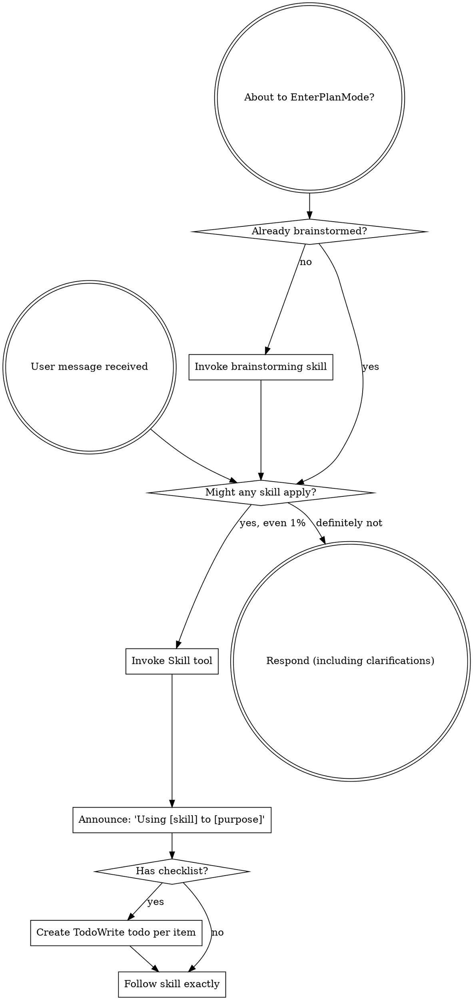
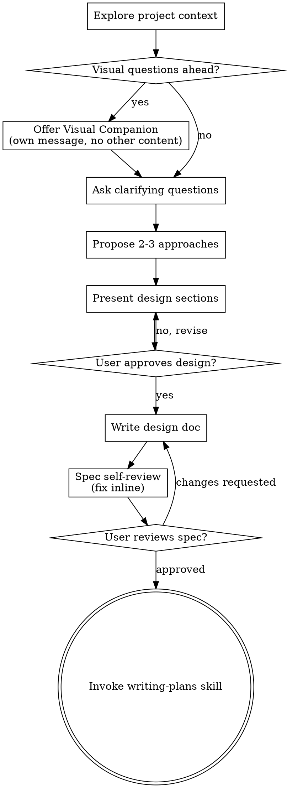
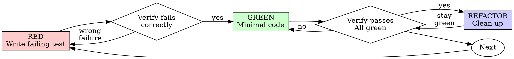
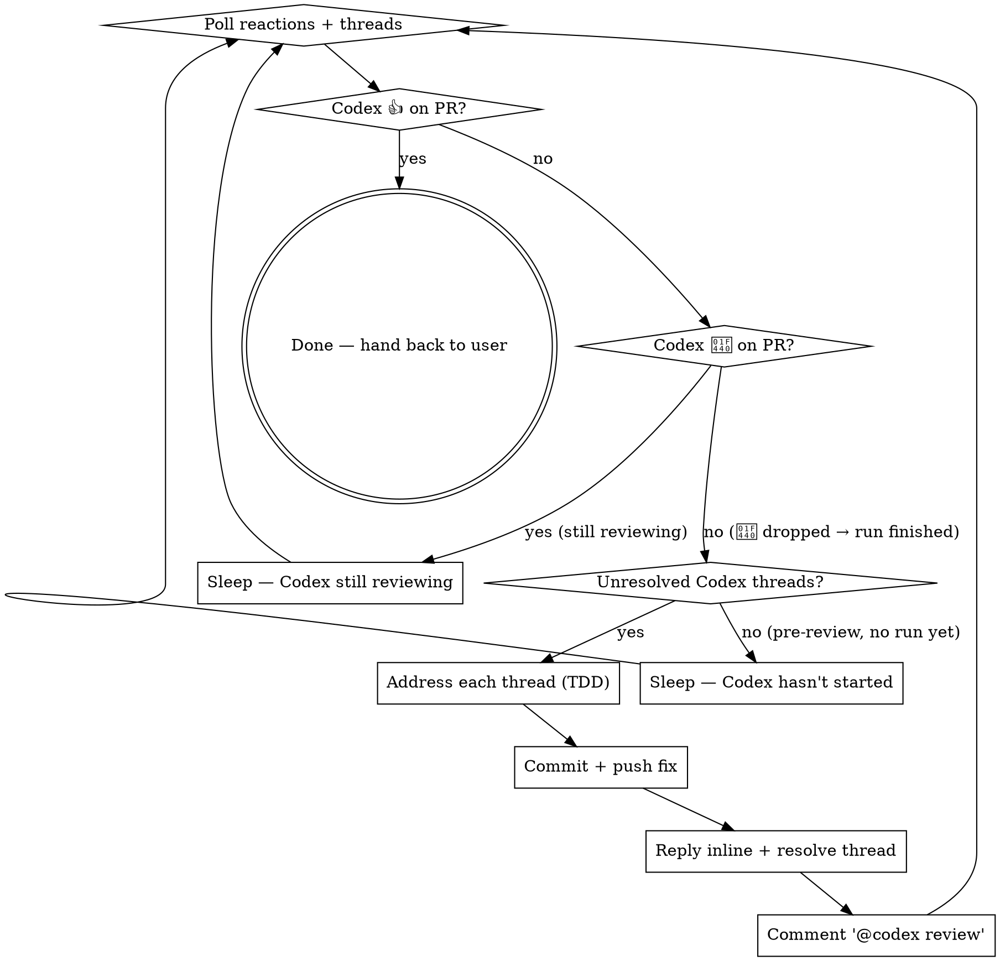

> SYSTEM

# AGENTS.md instructions for /Users/ericson/.t3/worktrees/ars-ui/t3code-61dbf109

<INSTRUCTIONS>
# ars-ui

## Project Overview

Rust frontend component library using state machines, framework-agnostic core with Leptos/Dioxus adapters.

## Current Phase

The repo is now in active implementation, not spec drafting only.

Agents working on implementation should use the GitHub Project roadmap and issue backlog as the execution source of truth:

- Use the GitHub Project `ars-ui implementation roadmap` to understand active epics, task breakdown, dependencies, status, and iteration planning.
- Prefer picking a single issue-backed task that is unblocked, sized, and scoped for independent delivery.
- Do not start work from an epic issue unless the user explicitly asks for planning or further decomposition.
- Do not start a task that is blocked by unresolved GitHub issue dependencies.
- Treat native GitHub issue dependencies as the blocker graph and the issue body acceptance criteria as the delivery contract.

## Development Workflow

For implementation tasks:

1. Read the assigned or selected GitHub issue first.
2. Move the issue to **In Progress** on the GitHub Project board.
3. Review the cited spec sections and any dependency issues.
4. Add or update the named tests first.
5. Implement only the scope required to make those tests pass.
6. If implementation changes the intended contract, update the relevant spec in the same task.
7. **MANDATORY:** Invoke the `post-implementation-audit` skill (`.agents/skills/post-implementation-audit/SKILL.md`). It runs three sequential audits on the new code — (a) spec/implementation drift with "best outcome" recommendations, (b) iterative "anything else missing?" passes (minimum two rounds), (c) test-coverage audit across every test type the workspace uses (unit, snapshot, proptest, mutation, doc, spec-conformance, llvm-cov). **Every finding lands in _this_ PR — no deferral, no follow-up issues.** This step exists because initial implementations consistently ship spec drift and silent contract violations that take 3+ review round-trips to surface; the audit collapses them into one. Skipping this step is a contract violation.
8. Present the final result for user review before any commit.
9. After user approval, run `cargo xci --profile fast` (alias: `cargo xci-fast`) locally and fix any failures before pushing anything to GitHub. The fast profile takes ~5 minutes and covers the workspace-level regressions a pre-push gate should catch: fmt, check, clippy, unit, integration, adapter, spec-compile-snippets, error-variant-coverage, mutual-exclusion, snapshot-count. Reserve full `cargo xci` (~25 minutes, all 20 gates including wasm coverage and the feature-matrix groups) for after substantial refactors that may have shifted feature-flag interactions. For small follow-up changes, run the focused tests and checks that cover the edited code instead.
10. After `cargo xci-fast` passes, commit and push a PR targeting `main`. The PR body MUST include an auto-close keyword for the issue being delivered, for example `Closes #20` or `Fixes #20`, so GitHub closes the issue automatically when the PR merges.
11. **If the PR creates or modifies any `.snap` insta fixtures, attach the `snapshot-reviewed` label after opening or updating it** (`gh pr edit <num> --add-label "snapshot-reviewed"`). This signals to reviewers that the snapshot output was inspected and is intentional. Re-apply the label whenever you push a commit that touches `.snap` files; the workflow assumes the label reflects the latest snapshot state.
12. **MANDATORY:** Invoke the `waiting-for-codex-review` skill (`.agents/skills/waiting-for-codex-review/SKILL.md`) immediately after the first push that creates the PR, and re-invoke it after every subsequent push to the PR branch. The skill posts the initial `@codex review` trigger, polls Codex's 👀 → (👍 \| ∅ + threads) reaction lifecycle, addresses any review threads with the same rigor as `post-implementation-audit` (TDD + no coverage regression), replies inline, resolves threads, and re-comments `@codex review` to start the next pass — looping until Codex leaves 👍. Skipping this step leaves Codex findings unaddressed and silently widens the gap between merged code and the spec; the merge gate is 👍 from Codex plus green CI, not green CI alone.
13. Only after CI passes, Codex has left 👍, and the PR is merged, close the issue.

Never close a GitHub issue without a merged PR that passes CI **and a 👍 from Codex**. Never commit or push without explicit user approval. Keep the issue, PR, and Project board status aligned with the actual work state at every step.

Default delivery rules:

- Follow TDD: tests first, implementation second, verification last.
- Keep task scope aligned with the issue. If the issue is too large or ambiguous, stop and split or clarify rather than freelancing a bigger change.
- Prefer tasks sized `1`, `2`, `3`, or `5` points. `8` is exceptional. `13` must be decomposed before implementation.
- Preserve the crate and dependency layering defined by the architecture and implementation plan.
- Do not add a new dependency crate without explicit user approval first. If a task appears to need a new crate, stop, explain why, and get approval before editing any `Cargo.toml`.
- When a task is complete, verify the exact tests and checks named by the issue before considering it done.
- For adapter-level component implementation, follow `docs/implementation/adapter-component-delivery.md`. Adapter component work must cover the adapter crate, adapter tests, E2E fixtures/harnesses when applicable, widgets examples, spec synchronization, and the required validation/audit loop in one PR.

### Code Quality Standards

- **Document all public items.** Every public struct, enum, trait, function, constant, type alias, method, field, and variant must have a `///` doc comment. Every `lib.rs` must have a `//!` crate-level doc comment. The workspace enforces `missing_docs` linting — undocumented public items are build failures.
- **Zero warnings policy.** All code must compile with zero warnings under the workspace's configured clippy and rustc lints. Fix the root cause instead of suppressing. When suppression is genuinely needed, use `#[expect(lint, reason = "...")]` — never `#[allow(...)]`.
- **Derive documentation from the spec.** Doc comments should describe the _purpose and semantics_ of the item as defined in the corresponding `spec/` files, not just restate the type signature.
- **Use `#[inline]` selectively, not mechanically.** Do **not** add Clippy's `missing_inline_in_public_items` lint at the workspace level, and do not treat public visibility alone as a reason to mark an item `#[inline]`. Use `#[inline]` for thin cross-crate wrappers, trivial accessors, and hot-path no-op shims where the call overhead is plausibly meaningful. Avoid blanket `#[inline]` on all public APIs — it increases code size, adds compile-time cost, and turns `#[inline]` into noise instead of a deliberate performance signal.
- **Use directory-backed modules with `mod.rs` when a module owns children.** This repo standardizes on the older filesystem layout for nested modules. If module `foo` has child modules, the parent must live at `foo/mod.rs`, not `foo.rs`. Do not mix `foo.rs` with a sibling `foo/` directory. When a refactor adds child modules under an existing flat file, move the parent into `foo/mod.rs` in the same change. Do not leave empty leftover module directories behind.

### API Design Standards

- **Design for the pit of success.** Public APIs should make the most natural, shortest path also be the path that is correct, accessible, localizable, type-safe, and performant. Prefer ergonomic constructors and defaults that preserve the spec's strongest guarantees instead of making users opt into correctness after choosing a convenient API.
- **Name escape hatches explicitly.** When a component needs a lower-level, static, non-i18n, or otherwise less complete path, keep it available but make the tradeoff visible in the API name or type. The blessed path should remain the simplest call site, while escape hatches should read as deliberate choices.
- **Keep semantic data separate from rendered views.** Rich framework views are useful for customization, but components still need semantic sources for accessible names, localized text, announcements, ids, and state-machine wiring. Do not rely on arbitrary rendered view trees as the only source of user-facing semantics.

### Code Coverage

The workspace uses `cargo-llvm-cov` for code coverage with per-crate threshold enforcement. CI runs coverage on every PR (see `.github/workflows/ci.yml`).

**Local coverage commands:**

```bash
# Per-crate coverage with inline annotated source (most useful during development)
cargo llvm-cov test -p ars-interactions --text -- hover

# Per-crate summary only
cargo llvm-cov test -p ars-interactions -- hover

# Native-only workspace coverage (host target; excludes wasm-only crates)
cargo llvm-cov --workspace \
  --exclude ars-leptos --exclude ars-dioxus \
  --exclude ars-test-harness-leptos --exclude ars-test-harness-dioxus \
  --exclude ars-derive --exclude xtask \
  --lcov --output-path lcov.info

# Check all crates against spec-defined thresholds (run after a *merged* lcov)
cargo xtask coverage check-all --file lcov.info
```

The `--text` flag produces line-by-line annotated source showing hit counts and `^0` markers on uncovered branches — use this to identify gaps after writing tests. Uncovered no-op callback closures in tests (e.g., `|_| {}`) are expected and not a gap.

The local recipe above excludes the adapter and adapter-test-harness crates because their `target_arch = "wasm32"` / `feature = "web"` code paths can't be measured via host-target `cargo llvm-cov`. **CI runs an additional wasm-coverage pipeline on nightly** (`cargo xtask ci coverage`) that uses `wasm-bindgen-test`'s experimental coverage recipe with LLVM 22 / `clang-22` to emit lcov for `ars-leptos` (csr), `ars-dioxus` (web), `ars-dom` (web), `ars-i18n` (web-intl), and the adapter test harnesses, then merges with the native lcov via `cargo xtask coverage merge`. The per-crate thresholds in `xtask::coverage::default_thresholds()` are enforced against the merged file — including adapter targets (`ars-leptos` 74/55, `ars-dioxus` 77/70, `ars-test-harness-leptos` 60/0, `ars-test-harness-dioxus` 60/0). `ars-derive` (proc-macro, runs in compiler) is exercised via `crates/ars-core/tests/derive_contract.rs` and is unmeasured. `xtask` has its own enforced threshold (30/35) and is measured. See `spec/testing/14-ci.md` §2 for the full pipeline.

### Mutation Testing

Coverage tells you which lines run. **Mutation testing tells you whether the tests would notice if those lines silently misbehaved.** The workspace uses [`cargo-mutants`](https://mutants.rs) for this — a `cargo` extension binary, not a workspace dependency.

**Install (once per developer machine):**

```bash
cargo install cargo-mutants --locked --version 27.0.0
```

**Local commands (state-machine modules are the most rewarding targets):**

```bash
# Run on a single component machine (~6 min for popover)
cargo mutants -p ars-components -f crates/ars-components/src/overlay/popover/mod.rs

# Just list what would be mutated, without running tests (fast)
cargo mutants -p ars-components -f crates/ars-components/src/overlay/popover/mod.rs --list

# Whole crate (slow — only if you really mean it)
cargo mutants -p ars-components
```

**Agnostic component implementation gate:** whenever an agent implements a new framework-agnostic component, or materially changes an existing one, the delivery must include:

- a targeted mutation run for the component source file, usually `cargo mutants -p ars-components -f crates/ars-components/src/<category>/<component>/mod.rs` (adjust the path for single-file modules);
- spec-conformance tests for the component's anatomy/public contract, including its `Part` enum and required API/attribute surface;
- same-task triage of every `MISSED` mutant: add tests for real gaps, or add a justified line-agnostic `.cargo/mutants.toml` exclude only for true equivalent mutations.

**Reading the output:** Results land in `mutants.out/mutants.out/` (gitignored). The two files that matter:

- `caught.txt` — mutations that broke at least one test ✅
- `missed.txt` — mutations that survived all tests ❌ — each one is either a real test gap to fill or an "equivalent mutation" that needs a `[[skip]]` entry in `mutants.toml` with a justification

**CI integration:** Nightly only. `.github/workflows/nightly.yml` has a `mutation-testing` job with a 21-entry matrix that runs `cargo mutants -p <package>` on every framework-agnostic crate, using `--shard k/n` to spread larger crates across parallel runners. **Shard indices are 0-based** (`k` runs from `0` to `n-1`); `k == n` is invalid and will fail the job. When adding shards, always start at `0/n` and end at `(n-1)/n`.

- **`ars-components` (≈ 1,630 mutants today, planned to grow as the spec adds the remaining ~97 components):** sharded **12-way** → ≈ 135 mutants per runner today, ≈ 850 per runner at the ~10,000-mutant endpoint. Sized for the full spec catalog up front so we don't re-shard every few months as components land.
- **`ars-collections` (≈ 1,080 mutants):** sharded 4-way → ≈ 270 mutants per runner.
- **`ars-core` (≈ 700 mutants):** sharded 2-way → ≈ 350 mutants per runner.
- **`ars-a11y`, `ars-forms`, `ars-interactions`:** one runner each (under 600 mutants apiece).

**Adding a new state machine inside an existing crate requires no CI changes** — its mutations land in whichever shard the cargo-mutants partitioner places them. The shard counts are sized so the slowest runner stays well under 30 minutes today and under ~50 minutes at the planned endpoint; re-balance only when a crate outgrows that budget (visible on the nightly dashboard as one shard pulling away from the others).

All matrix jobs run with `fail-fast: false` so failures on one module don't mask data on another. Each job uploads its `mutants.out/` as a workflow artifact (always, even on success — surviving "missed" entries on a passing run still reveal test-quality work). The job fails if any mutation survives, so a missed mutation forces a deliberate triage decision (fix the test, or document the equivalence with a `[[skip]]` entry in `mutants.toml`).

**Excluded crates** (mutation testing's signal degrades wherever determinism does): adapter glue (`ars-leptos`, `ars-dioxus`), DOM/FFI (`ars-dom`), ICU/FFI (`ars-i18n`), test infrastructure (`ars-test-harness*`), and the proc-macro crate (`ars-derive`, runs in the compiler). Adding a brand-new crate that is a good mutation target requires one new matrix entry; run a local scout first (`cargo mutants -p <crate> --list` to size, then a real run) so we know the right shard count before the nightly fires.

**Bumping the pinned version.** Both the local install command above and `.github/workflows/nightly.yml` pin cargo-mutants to an exact version (currently `27.0.0`) — same convention as `wasm-pack` in the `a11y-audit` job. Pinning is deliberate: cargo-mutants ships new mutators in releases, and an unpinned install would silently change the mutation set without any code change, surfacing as phantom CI failures on a green-source repo. To bump, open a PR that (1) updates the version string in CLAUDE.md and `nightly.yml`, (2) runs the popover scout locally with the new version (`cargo mutants -p ars-components -f crates/ars-components/src/overlay/popover/mod.rs`) to confirm the mutation count is in the same ballpark, and (3) triages any new "missed" entries the new mutators surface — they are usually genuine test-quality gaps newly visible to the tool.

### Property Testing (proptest)

State-machine invariants are exercised by [`proptest`](https://docs.rs/proptest) under `crates/<crate>/tests/proptest_state_machines/` (see `ars-components`). Default proptest behaviour drops `*.proptest-regressions` seed files alongside test sources — instead, every `proptest!` block in this workspace pulls a shared `Config` from `tests/proptest_state_machines/common.rs` that:

1. Reads `PROPTEST_CASES` from the environment (1,000 default; 10,000 in the nightly `extended-proptest` job).
2. Sets `failure_persistence` to `FileFailurePersistence::Direct("proptest-regressions/state-machines.txt")`, so all persisted seeds for the test binary live in one file at the crate root: `crates/<crate>/proptest-regressions/state-machines.txt`. The directory is committed (per proptest's own recommendation in the file header) so every developer's runs benefit from previously-shrunk failures.

When a new crate adopts proptest for state-machine tests, copy the same `common.rs` helper and reference it via `#![proptest_config(super::common::proptest_config())]` inside every `proptest!` block. Don't let proptest fall back to its `WithSource` default — that scatters seed files across the source tree.

### Adapter Prelude Convention

Both `ars-leptos` and `ars-dioxus` expose a `prelude` module targeting **end users** — application developers who consume the ready-made components. `use ars_leptos::prelude::*` (or `use ars_dioxus::prelude::*`) should give them everything they need.

The prelude contains only user-facing items:

1. **Component modules** — as components land, their public module paths (e.g., `button`, `dialog`) are re-exported so users can write `button::Props`, etc.
2. **User-facing traits** — traits end users call on component outputs (e.g., `Translate` from `ars-i18n`). Re-export the trait so consumers don't need a direct dependency on the subsystem crate.
3. **Configuration types** — types that appear in component props or configure behaviour (e.g., `Locale`, `Direction`, `Orientation`, `Selection`).

The prelude does **not** include implementation details consumed only by component authors inside the adapter crate: core engine types (`Machine`, `Service`, `ConnectApi`, `AttrMap`), accessibility primitives (`AriaRole`, `AriaAttribute`), interaction helpers (`merge_attrs`), or adapter hooks (`use_machine`, `UseMachineReturn`). Those remain accessible via their normal crate paths for advanced users building custom machines.

Both adapter preludes must stay symmetric: same items, same structure. When adding a new re-export to one adapter's prelude, add it to the other as well in the same PR.

### Adapter Testing Convention

Adapter-level component tests should default to the framework-specific test harness crate:

- Leptos adapter tests should prefer `ars-test-harness-leptos`.
- Dioxus adapter tests should prefer `ars-test-harness-dioxus`.
- Shared `ars-test-harness` helpers should be used where relevant for viewport, layout, clipboard, drag/drop, timing, and other DOM test setup instead of bespoke per-test browser scaffolding.

When a component spec requires interaction, focus, overlay positioning, clipboard, file upload, drag/drop, or similar browser behavior, the task's tests should exercise that behavior through the adapter harness entrypoints and shared core harness helpers unless there is a concrete technical reason not to.

## Spec Synchronization During Implementation

The specification is the authoritative contract. It took weeks of deliberate design and MUST be followed.

### Spec-first implementation rule

Before implementing any public type, trait, function, or method:

1. **Read the spec section first.** Find the relevant code example in `spec/`. Use `spec-tool toc <file>` and `grep` to locate it.
2. **Match the spec exactly.** If the spec defines `struct ComponentIds { base: String }` with methods `from_id()`, `id()`, `part()`, `item()`, `item_part()` — implement exactly that. Do not invent alternative field names, method names, or signatures.
3. **Cross-check after implementation.** Before presenting code for review, diff every public item against the spec's code examples. Every struct field, every method name, every parameter must match.
4. **If you must deviate**, there must be a concrete technical reason (e.g., the spec's API cannot compile, or a dependency doesn't expose the needed type). Document the reason in a code comment and flag it to the user explicitly.

Inventing alternative APIs that "seem equivalent" is never acceptable — it silently invalidates the spec's design decisions and all downstream code that depends on those APIs.

### Spec/code mismatch resolution

- If code and spec disagree, resolve the mismatch in the same task or PR.
- Shared conceptual changes belong in shared or foundation spec files, not only in adapter code.
- Adapter-specific findings must be reflected back into `spec/foundation/08-adapter-leptos.md` and/or `spec/foundation/09-adapter-dioxus.md` when relevant.
- Do not leave spec drift behind as follow-up cleanup.

## Spec Structure

The specification lives in `spec/` with this layout:

- `spec/manifest.toml` — **START HERE** — central index of all components and their dependencies
- `spec/foundation/` — architecture, accessibility, i18n, interactions, forms, adapters, spec template (00-10)
- `spec/shared/` — cross-component shared types (date-time, selection, layout, z-index)
- `spec/components/{category}/` — one file per component, organized by category
- `spec/testing/` — test specs split by domain

### Component Categories

- `input/` — checkbox, text-field, slider, number-input, etc.
- `selection/` — select, combobox, listbox, menu, tags-input, etc.
- `overlay/` — dialog, popover, tooltip, toast, presence, etc.
- `navigation/` — accordion, tabs, tree-view, pagination, steps, etc.
- `date-time/` — date-field, time-field, calendar, date-picker, etc.
- `data-display/` — table, avatar, progress, meter, badge, etc.
- `layout/` — splitter, scroll-area, carousel, portal, toolbar, etc.
- `specialized/` — color-picker, file-upload, signature-pad, qr-code, etc.
- `utility/` — button, toggle, focus-scope, visually-hidden, separator, etc.

## Working with the Spec

When reading large files, run `wc -l` first to check the line count. If the file is over 2,000
lines, use the `offset` and `limit` parameters on the Read tool to read in chunks rather than
attempting to read the entire file at once.

### Using xtask spec (preferred)

Use `cargo xtask spec` to resolve file sets instead of manually parsing manifest.toml:

```bash
# Quick metadata lookup:
cargo xtask spec info <component>

# Find all components using a shared type:
cargo xtask spec reverse <shared-type>

# See a file's heading structure (with line numbers):
cargo xtask spec toc <file>

# Validate frontmatter matches manifest.toml:
cargo xtask spec validate

# Search spec content by keyword/regex (with optional filters):
cargo xtask spec search <query> [--category <cat>] [--section <sec>] [--tier <tier>]

# Get a compact component summary (states, events, props, accessibility):
cargo xtask spec digest <component>

# Get full implementation context (component + all deps concatenated):
cargo xtask spec context <component> [--framework <fw>] [--include-testing]
```

The xtask also runs as an MCP server (`cargo xtask mcp`) exposing all spec tools for LLM agents.

### Reading a component (manual fallback)

1. Read `spec/manifest.toml` to find the component's path and dependencies
2. Read the component file (has YAML frontmatter listing its foundation/shared deps)
3. Only load the foundation files listed in `foundation_deps` — not all of them

### Framework and library specs — MANDATORY skill loading

When reading or editing these specification files, you MUST load the corresponding skill BEFORE doing any work. The skills contain verified, version-accurate API documentation that the spec code examples depend on. Claude's training data is wrong for these libraries — do not trust it.

| Spec file                                    | Skill to load | Library version |
| -------------------------------------------- | ------------- | --------------- |
| `spec/foundation/04-internationalization.md` | `icu4x`       | ICU4X 2.1.1     |
| `spec/foundation/08-adapter-leptos.md`       | `leptos`      | Leptos 0.8.17   |
| `spec/foundation/09-adapter-dioxus.md`       | `dioxus`      | Dioxus 0.7.3    |

This applies to any task that touches adapter code: reviewing, writing, modifying, or answering questions about these files. Load the skill first, then proceed.

### Spec Conventions

- **No deprecation:** This is a greenfield spec. If an API is unused or redundant, remove it and fix all references. Never use `#[deprecated]` or deprecation shims.
- **No deferral:** Never mark spec content as "TODO", "FIXME", "future enhancement", "P1/P2 extension", or any similar deferral language. Every feature mentioned must be fully specified. If a design choice is unclear, ask the user rather than deferring.
- **No guessing external APIs:** NEVER guess function names or module paths for external crates. Always verify against `https://docs.rs/<crate_name>` before writing code that calls library APIs. This applies especially to Leptos, Dioxus, ICU4X, and any crate where training data may be stale. If you cannot verify, state that explicitly rather than fabricating a plausible-looking API.

### Component file format

Each component file has YAML frontmatter declaring its metadata:

```markdown
---
component: ComponentName
category: { category }
tier: stateless | stateful | complex
foundation_deps: [architecture, accessibility, ...]
shared_deps: [date-time-types, ...]
related: [sibling-component, ...]
---

# ComponentName
```

The `tier` field determines which sections are required — see `spec/foundation/10-component-spec-template.md` for the canonical section structure, ordering rules, and conformance checklist. Headings are numbered (e.g., `## 1. State Machine`, `### 1.1 States`, `#### 1.1.1 InnerStates`, etc.) for precise section references.

</INSTRUCTIONS>
<environment_context>
  <cwd>/Users/ericson/.t3/worktrees/ars-ui/t3code-61dbf109</cwd>
  <shell>zsh</shell>
  <current_date>2026-05-21</current_date>
  <timezone>America/Sao_Paulo</timezone>
</environment_context>

> DEVELOPER

Implement task #263

> AGENT

I’ll stay in planning mode for this turn: first I’m grounding on the repo, task #263, and the local workflow rules before I produce an implementation-ready plan. I’m using the Superpowers workflow guidance because this is an issue-backed implementation request.

> TOOL

tool_use exec_command
id: call_6LoYibo3JDaKHNfQP0IbEf3c
```json
{
  "cmd": "sed -n '1,220p' /Users/ericson/.claude/skills/using-superpowers/SKILL.md",
  "workdir": "/Users/ericson/.t3/worktrees/ars-ui/t3code-61dbf109",
  "yield_time_ms": 1000,
  "max_output_tokens": 12000
}
```

> TOOL

tool_use exec_command
id: call_Hs6WXO7CliS7zJkoqGtn1plz
```json
{
  "cmd": "sed -n '1,220p' /Users/ericson/.claude/skills/brainstorming/SKILL.md",
  "workdir": "/Users/ericson/.t3/worktrees/ars-ui/t3code-61dbf109",
  "yield_time_ms": 1000,
  "max_output_tokens": 12000
}
```

> TOOL

tool_use exec_command
id: call_7bGpOJDhV4RYIhueXtZxxAIH
```json
{
  "cmd": "rg -n \"#263|issue #263|task #263|263\" /Users/ericson/.codex/memories/MEMORY.md",
  "workdir": "/Users/ericson/.t3/worktrees/ars-ui/t3code-61dbf109",
  "yield_time_ms": 1000,
  "max_output_tokens": 12000
}
```

> TOOL

tool_result
id: call_6LoYibo3JDaKHNfQP0IbEf3c
```
Chunk ID: 922ed2
Wall time: 0.1576 seconds
Process exited with code 0
Original token count: 1356
Output:
---
name: using-superpowers
description: Use when starting any conversation - establishes how to find and use skills, requiring Skill tool invocation before ANY response including clarifying questions
---

<SUBAGENT-STOP>
If you were dispatched as a subagent to execute a specific task, skip this skill.
</SUBAGENT-STOP>

<EXTREMELY-IMPORTANT>
If you think there is even a 1% chance a skill might apply to what you are doing, you ABSOLUTELY MUST invoke the skill.

IF A SKILL APPLIES TO YOUR TASK, YOU DO NOT HAVE A CHOICE. YOU MUST USE IT.

This is not negotiable. This is not optional. You cannot rationalize your way out of this.
</EXTREMELY-IMPORTANT>

## Instruction Priority

Superpowers skills override default system prompt behavior, but **user instructions always take precedence**:

1. **User's explicit instructions** (CLAUDE.md, GEMINI.md, AGENTS.md, direct requests) — highest priority
2. **Superpowers skills** — override default system behavior where they conflict
3. **Default system prompt** — lowest priority

If CLAUDE.md, GEMINI.md, or AGENTS.md says "don't use TDD" and a skill says "always use TDD," follow the user's instructions. The user is in control.

## How to Access Skills

**In Claude Code:** Use the `Skill` tool. When you invoke a skill, its content is loaded and presented to you—follow it directly. Never use the Read tool on skill files.

**In Copilot CLI:** Use the `skill` tool. Skills are auto-discovered from installed plugins. The `skill` tool works the same as Claude Code's `Skill` tool.

**In Gemini CLI:** Skills activate via the `activate_skill` tool. Gemini loads skill metadata at session start and activates the full content on demand.

**In other environments:** Check your platform's documentation for how skills are loaded.

## Platform Adaptation

Skills use Claude Code tool names. Non-CC platforms: see `references/copilot-tools.md` (Copilot CLI), `references/codex-tools.md` (Codex) for tool equivalents. Gemini CLI users get the tool mapping loaded automatically via GEMINI.md.

# Using Skills

## The Rule

**Invoke relevant or requested skills BEFORE any response or action.** Even a 1% chance a skill might apply means that you should invoke the skill to check. If an invoked skill turns out to be wrong for the situation, you don't need to use it.



## Red Flags

These thoughts mean STOP—you're rationalizing:

| Thought | Reality |
|---------|---------|
| "This is just a simple question" | Questions are tasks. Check for skills. |
| "I need more context first" | Skill check comes BEFORE clarifying questions. |
| "Let me explore the codebase first" | Skills tell you HOW to explore. Check first. |
| "I can check git/files quickly" | Files lack conversation context. Check for skills. |
| "Let me gather information first" | Skills tell you HOW to gather information. |
| "This doesn't need a formal skill" | If a skill exists, use it. |
| "I remember this skill" | Skills evolve. Read current version. |
| "This doesn't count as a task" | Action = task. Check for skills. |
| "The skill is overkill" | Simple things become complex. Use it. |
| "I'll just do this one thing first" | Check BEFORE doing anything. |
| "This feels productive" | Undisciplined action wastes time. Skills prevent this. |
| "I know what that means" | Knowing the concept ≠ using the skill. Invoke it. |

## Skill Priority

When multiple skills could apply, use this order:

1. **Process skills first** (brainstorming, debugging) - these determine HOW to approach the task
2. **Implementation skills second** (frontend-design, mcp-builder) - these guide execution

"Let's build X" → brainstorming first, then implementation skills.
"Fix this bug" → debugging first, then domain-specific skills.

## Skill Types

**Rigid** (TDD, debugging): Follow exactly. Don't adapt away discipline.

**Flexible** (patterns): Adapt principles to context.

The skill itself tells you which.

## User Instructions

Instructions say WHAT, not HOW. "Add X" or "Fix Y" doesn't mean skip workflows.

```

> TOOL

tool_result
id: call_Hs6WXO7CliS7zJkoqGtn1plz
```
Chunk ID: 603af3
Wall time: 0.1576 seconds
Process exited with code 0
Original token count: 2659
Output:
---
name: brainstorming
description: "You MUST use this before any creative work - creating features, building components, adding functionality, or modifying behavior. Explores user intent, requirements and design before implementation."
---

# Brainstorming Ideas Into Designs

Help turn ideas into fully formed designs and specs through natural collaborative dialogue.

Start by understanding the current project context, then ask questions one at a time to refine the idea. Once you understand what you're building, present the design and get user approval.

<HARD-GATE>
Do NOT invoke any implementation skill, write any code, scaffold any project, or take any implementation action until you have presented a design and the user has approved it. This applies to EVERY project regardless of perceived simplicity.
</HARD-GATE>

## Anti-Pattern: "This Is Too Simple To Need A Design"

Every project goes through this process. A todo list, a single-function utility, a config change — all of them. "Simple" projects are where unexamined assumptions cause the most wasted work. The design can be short (a few sentences for truly simple projects), but you MUST present it and get approval.

## Checklist

You MUST create a task for each of these items and complete them in order:

1. **Explore project context** — check files, docs, recent commits
2. **Offer visual companion** (if topic will involve visual questions) — this is its own message, not combined with a clarifying question. See the Visual Companion section below.
3. **Ask clarifying questions** — one at a time, understand purpose/constraints/success criteria
4. **Propose 2-3 approaches** — with trade-offs and your recommendation
5. **Present design** — in sections scaled to their complexity, get user approval after each section
6. **Write design doc** — save to `docs/superpowers/specs/YYYY-MM-DD-<topic>-design.md` and commit
7. **Spec self-review** — quick inline check for placeholders, contradictions, ambiguity, scope (see below)
8. **User reviews written spec** — ask user to review the spec file before proceeding
9. **Transition to implementation** — invoke writing-plans skill to create implementation plan

## Process Flow



**The terminal state is invoking writing-plans.** Do NOT invoke frontend-design, mcp-builder, or any other implementation skill. The ONLY skill you invoke after brainstorming is writing-plans.

## The Process

**Understanding the idea:**

- Check out the current project state first (files, docs, recent commits)
- Before asking detailed questions, assess scope: if the request describes multiple independent subsystems (e.g., "build a platform with chat, file storage, billing, and analytics"), flag this immediately. Don't spend questions refining details of a project that needs to be decomposed first.
- If the project is too large for a single spec, help the user decompose into sub-projects: what are the independent pieces, how do they relate, what order should they be built? Then brainstorm the first sub-project through the normal design flow. Each sub-project gets its own spec → plan → implementation cycle.
- For appropriately-scoped projects, ask questions one at a time to refine the idea
- Prefer multiple choice questions when possible, but open-ended is fine too
- Only one question per message - if a topic needs more exploration, break it into multiple questions
- Focus on understanding: purpose, constraints, success criteria

**Exploring approaches:**

- Propose 2-3 different approaches with trade-offs
- Present options conversationally with your recommendation and reasoning
- Lead with your recommended option and explain why

**Presenting the design:**

- Once you believe you understand what you're building, present the design
- Scale each section to its complexity: a few sentences if straightforward, up to 200-300 words if nuanced
- Ask after each section whether it looks right so far
- Cover: architecture, components, data flow, error handling, testing
- Be ready to go back and clarify if something doesn't make sense

**Design for isolation and clarity:**

- Break the system into smaller units that each have one clear purpose, communicate through well-defined interfaces, and can be understood and tested independently
- For each unit, you should be able to answer: what does it do, how do you use it, and what does it depend on?
- Can someone understand what a unit does without reading its internals? Can you change the internals without breaking consumers? If not, the boundaries need work.
- Smaller, well-bounded units are also easier for you to work with - you reason better about code you can hold in context at once, and your edits are more reliable when files are focused. When a file grows large, that's often a signal that it's doing too much.

**Working in existing codebases:**

- Explore the current structure before proposing changes. Follow existing patterns.
- Where existing code has problems that affect the work (e.g., a file that's grown too large, unclear boundaries, tangled responsibilities), include targeted improvements as part of the design - the way a good developer improves code they're working in.
- Don't propose unrelated refactoring. Stay focused on what serves the current goal.

## After the Design

**Documentation:**

- Write the validated design (spec) to `docs/superpowers/specs/YYYY-MM-DD-<topic>-design.md`
  - (User preferences for spec location override this default)
- Use elements-of-style:writing-clearly-and-concisely skill if available
- Commit the design document to git

**Spec Self-Review:**
After writing the spec document, look at it with fresh eyes:

1. **Placeholder scan:** Any "TBD", "TODO", incomplete sections, or vague requirements? Fix them.
2. **Internal consistency:** Do any sections contradict each other? Does the architecture match the feature descriptions?
3. **Scope check:** Is this focused enough for a single implementation plan, or does it need decomposition?
4. **Ambiguity check:** Could any requirement be interpreted two different ways? If so, pick one and make it explicit.

Fix any issues inline. No need to re-review — just fix and move on.

**User Review Gate:**
After the spec review loop passes, ask the user to review the written spec before proceeding:

> "Spec written and committed to `<path>`. Please review it and let me know if you want to make any changes before we start writing out the implementation plan."

Wait for the user's response. If they request changes, make them and re-run the spec review loop. Only proceed once the user approves.

**Implementation:**

- Invoke the writing-plans skill to create a detailed implementation plan
- Do NOT invoke any other skill. writing-plans is the next step.

## Key Principles

- **One question at a time** - Don't overwhelm with multiple questions
- **Multiple choice preferred** - Easier to answer than open-ended when possible
- **YAGNI ruthlessly** - Remove unnecessary features from all designs
- **Explore alternatives** - Always propose 2-3 approaches before settling
- **Incremental validation** - Present design, get approval before moving on
- **Be flexible** - Go back and clarify when something doesn't make sense

## Visual Companion

A browser-based companion for showing mockups, diagrams, and visual options during brainstorming. Available as a tool — not a mode. Accepting the companion means it's available for questions that benefit from visual treatment; it does NOT mean every question goes through the browser.

**Offering the companion:** When you anticipate that upcoming questions will involve visual content (mockups, layouts, diagrams), offer it once for consent:
> "Some of what we're working on might be easier to explain if I can show it to you in a web browser. I can put together mockups, diagrams, comparisons, and other visuals as we go. This feature is still new and can be token-intensive. Want to try it? (Requires opening a local URL)"

**This offer MUST be its own message.** Do not combine it with clarifying questions, context summaries, or any other content. The message should contain ONLY the offer above and nothing else. Wait for the user's response before continuing. If they decline, proceed with text-only brainstorming.

**Per-question decision:** Even after the user accepts, decide FOR EACH QUESTION whether to use the browser or the terminal. The test: **would the user understand this better by seeing it than reading it?**

- **Use the browser** for content that IS visual — mockups, wireframes, layout comparisons, architecture diagrams, side-by-side visual designs
- **Use the terminal** for content that is text — requirements questions, conceptual choices, tradeoff lists, A/B/C/D text options, scope decisions

A question about a UI topic is not automatically a visual question. "What does personality mean in this context?" is a conceptual question — use the terminal. "Which wizard layout works better?" is a visual question — use the browser.

If they agree to the companion, read the detailed guide before proceeding:
`skills/brainstorming/visual-companion.md`

```

> TOOL

tool_result
id: call_7bGpOJDhV4RYIhueXtZxxAIH
```
Chunk ID: 3ff441
Wall time: 0.0220 seconds
Process exited with code 0
Original token count: 214
Output:
320:- rollout_summaries/REDACTED.md (cwd=/Users/ericson/Workspace/Rust/judge-fudge, rollout_path=/Users/ericson/.codex/sessions/2026/05/18/rollout-2026-05-18T23-04-02-019e3df9-d15a-7293-a9af-e5bd2631c69e.jsonl, updated_at=2026-05-19T02:23:50+00:00, thread_id=019e3df9-d15a-7293-a9af-e5bd2631c69e, freshness-gated Build -> Review transition)
2837:- rollout_summaries/REDACTED.md (cwd=/Users/ericson/.t3/worktrees/ars-ui/t3code-758f6d7b, rollout_path=/Users/ericson/.codex/sessions/2026/04/30/rollout-2026-04-30T20-50-56-019de0cd-7cd6-7070-85de-3a8292e4263d.jsonl, updated_at=2026-05-01T00:03:20+00:00, thread_id=019de0cd-7cd6-7070-85de-3a8292e4263d, live Nightly diagnosis plus workflow/docs direct-to-main repair)

```

> AGENT

I found no directly useful memory entry for task #263, so I’m using live repo and GitHub state as the source of truth. Next I’m identifying the repository remote and reading the issue plus the nearby spec/code paths it points at.

> TOOL

tool_use exec_command
id: call_uiiGtjYwTB8bfXqSYIAn6NJu
```json
{
  "cmd": "git remote -v",
  "workdir": "/Users/ericson/.t3/worktrees/ars-ui/t3code-61dbf109",
  "yield_time_ms": 1000,
  "max_output_tokens": 4000
}
```

> TOOL

tool_use exec_command
id: call_aYHOYwtgnmaF3gWHw7bWrMr1
```json
{
  "cmd": "git status --short --branch",
  "workdir": "/Users/ericson/.t3/worktrees/ars-ui/t3code-61dbf109",
  "yield_time_ms": 1000,
  "max_output_tokens": 4000
}
```

> TOOL

tool_use exec_command
id: call_hz5vyX3kgsrDVaDwmcjElmNc
```json
{
  "cmd": "rg --files -g 'SKILL.md' .agents/skills | sort",
  "workdir": "/Users/ericson/.t3/worktrees/ars-ui/t3code-61dbf109",
  "yield_time_ms": 1000,
  "max_output_tokens": 4000
}
```

> TOOL

tool_use exec_command
id: call_PbhHUaNJsVNg8giUsI5jJelQ
```json
{
  "cmd": "rg --files | sed -n '1,160p'",
  "workdir": "/Users/ericson/.t3/worktrees/ars-ui/t3code-61dbf109",
  "yield_time_ms": 1000,
  "max_output_tokens": 8000
}
```

> TOOL

tool_result
id: call_uiiGtjYwTB8bfXqSYIAn6NJu
```
Chunk ID: f43443
Wall time: 0.3464 seconds
Process exited with code 0
Original token count: 25
Output:
origin	git@github.com:fogodev/ars-ui.git (fetch)
origin	git@github.com:fogodev/ars-ui.git (push)

```

> TOOL

tool_result
id: call_aYHOYwtgnmaF3gWHw7bWrMr1
```
Chunk ID: 064a07
Wall time: 0.2728 seconds
Process exited with code 0
Original token count: 5
Output:
## t3code/61dbf109

```

> TOOL

tool_result
id: call_hz5vyX3kgsrDVaDwmcjElmNc
```
Chunk ID: 429a3d
Wall time: 0.1664 seconds
Process exited with code 0
Original token count: 58
Output:
.agents/skills/dioxus/SKILL.md
.agents/skills/icu4x/SKILL.md
.agents/skills/leptos/SKILL.md
.agents/skills/playwright-cli/SKILL.md
.agents/skills/post-implementation-audit/SKILL.md
.agents/skills/waiting-for-codex-review/SKILL.md

```

> TOOL

tool_result
id: call_PbhHUaNJsVNg8giUsI5jJelQ
```
Chunk ID: 9bcac3
Wall time: 0.0224 seconds
Process exited with code 0
Original token count: 1466
Output:
AGENTS.md
rust-toolchain.toml
xtask/src/mcp.rs
xtask/src/e2e.rs
xtask/src/i18n.rs
xtask/src/examples.rs
xtask/src/main.rs
xtask/src/lint.rs
xtask/src/tool.rs
Cargo.toml
codecov.yml
LICENSE
rustfmt.toml
xtask/src/coverage.rs
xtask/src/test.rs
xtask/src/spec/tools.rs
xtask/src/spec/reverse.rs
xtask/src/spec/profile.rs
xtask/src/manifest.rs
xtask/src/lib.rs
xtask/src/spec/lint_code.rs
xtask/src/spec/digest.rs
xtask/src/spec/toc.rs
xtask/src/spec/related.rs
xtask/src/spec/compile_snippets.rs
xtask/src/spec/mod.rs
xtask/src/spec/deps.rs
xtask/src/spec/category.rs
xtask/src/spec/adapters.rs
xtask/src/spec/info.rs
xtask/src/spec/search.rs
clippy.toml
xtask/Cargo.toml
README.md
CONTRIBUTING.md
xtask/src/spec/context.rs
xtask/src/spec/validate.rs
xtask/tests/examples.rs
xtask/tests/spec_corpus_compile_snippets.rs
docs/implementation/foundation-completion-roadmap.md
docs/implementation/initial-backlog.md
docs/implementation/project-board.md
docs/implementation/foundation-gap-audit.md
docs/implementation/roadmap.md
docs/implementation/adapter-component-delivery.md
docs/implementation/README.md
docs/implementation/adapter-contract.md
xtask/src/ci/feature_matrix.rs
xtask/src/ci/mod.rs
spec/testing/15-test-harness.md
spec/testing/01-unit-tests.md
spec/testing/07-ssr-hydration.md
spec/testing/03-snapshot-tests.md
spec/testing/05-adapter-harness.md
spec/testing/06-accessibility-testing.md
spec/testing/11-form-validation.md
spec/testing/09-state-machine-correctness.md
spec/testing/02-integration-tests.md
spec/testing/12-advanced.md
spec/testing/14-ci.md
spec/testing/04-aria-helpers.md
spec/testing/13-policies.md
spec/testing/10-keyboard-focus.md
spec/testing/08-i18n-testing.md
spec/testing/00-overview.md
spec/references/react-aria-api.md
spec/references/ark-ui-api.md
spec/references/radix-ui-api.md
spec/manifest.toml
spec/shared/date-time-types.md
spec/shared/z-index-stacking.md
spec/shared/selection-patterns.md
spec/shared/layout-shared-types.md
spec/leptos-components/utility/error-boundary.md
spec/leptos-components/utility/visually-hidden.md
spec/leptos-components/utility/z-index-allocator.md
spec/leptos-components/utility/live-region.md
spec/leptos-components/utility/swap.md
spec/leptos-components/utility/download-trigger.md
spec/leptos-components/utility/toggle-group.md
spec/leptos-components/utility/as-child.md
spec/leptos-components/utility/focus-scope.md
spec/leptos-components/utility/landmark.md
spec/leptos-components/utility/separator.md
spec/leptos-components/utility/toggle.md
spec/leptos-components/utility/field.md
spec/leptos-components/utility/toggle-button.md
spec/leptos-components/utility/action-group.md
spec/leptos-components/utility/dismissable.md
spec/leptos-components/utility/highlight.md
spec/leptos-components/utility/drop-zone.md
spec/leptos-components/utility/fieldset.md
spec/leptos-components/utility/_category.md
spec/leptos-components/utility/keyboard.md
spec/leptos-components/utility/focus-ring.md
spec/leptos-components/utility/ars-provider.md
spec/leptos-components/utility/button.md
spec/leptos-components/utility/form.md
spec/leptos-components/utility/heading.md
spec/leptos-components/utility/client-only.md
spec/leptos-components/utility/group.md
spec/foundation/09-adapter-dioxus.md
spec/foundation/11-dom-utilities.md
spec/foundation/12-adapter-component-spec-template.md
spec/foundation/06-collections.md
spec/foundation/01-architecture.md
spec/foundation/10-component-spec-template.md
spec/foundation/04-internationalization.md
spec/foundation/02-component-catalog.md
spec/foundation/03-accessibility.md
spec/foundation/05-interactions.md
spec/foundation/08-adapter-leptos.md
spec/foundation/07-forms.md
spec/foundation/00-overview.md
spec/AGENTS.md
spec/leptos-components/layout/splitter.md
spec/leptos-components/layout/center.md
spec/leptos-components/layout/collapsible.md
spec/leptos-components/layout/grid.md
spec/leptos-components/layout/portal.md
spec/leptos-components/layout/_category.md
spec/leptos-components/layout/scroll-area.md
spec/leptos-components/layout/carousel.md
spec/leptos-components/layout/toolbar.md
spec/leptos-components/layout/aspect-ratio.md
spec/leptos-components/layout/stack.md
spec/leptos-components/layout/frame.md
crates/ars-interactions/src/press.rs
crates/ars-interactions/src/interact_outside.rs
crates/ars-interactions/src/hover.rs
crates/ars-interactions/src/focus.rs
crates/ars-interactions/src/keyboard.rs
crates/ars-interactions/src/move_interaction.rs
crates/ars-interactions/src/compose.rs
crates/ars-interactions/src/long_press.rs
crates/ars-interactions/src/lib.rs
crates/ars-interactions/src/direction.rs
crates/ars-interactions/src/drag_drop.rs
crates/ars-interactions/src/companion_css.rs
crates/ars-interactions/ars-interactions.css
crates/ars-interactions/Cargo.toml
examples/widgets-dioxus-css/src/categories/specialized.rs
examples/widgets-dioxus-css/src/categories/input.rs
examples/widgets-dioxus-css/src/categories/date_time.rs
examples/widgets-dioxus-css/src/categories/navigation.rs
examples/widgets-dioxus-css/src/categories/selection.rs
examples/widgets-dioxus-css/src/categories/mod.rs
examples/widgets-dioxus-css/src/categories/overlay.rs
examples/widgets-dioxus-css/src/categories/utility.rs
examples/widgets-dioxus-css/src/categories/data_display.rs
examples/widgets-dioxus-css/src/categories/layout.rs
examples/widgets-leptos-tailwind/src/categories/specialized.rs
examples/widgets-leptos-tailwind/src/categories/input.rs
examples/widgets-leptos-tailwind/src/categories/date_time.rs
examples/widgets-leptos-tailwind/src/categories/navigation.rs
examples/widgets-leptos-tailwind/src/categories/selection.rs
examples/widgets-leptos-tailwind/src/categories/mod.rs
examples/widgets-leptos-tailwind/src/categories/overlay.rs
examples/widgets-leptos-tailwind/src/categories/utility.rs
examples/widgets-dioxus-css/src/messages.rs

```

> TOOL

tool_use _fetch_issue
id: call_CkdGLXWx8ImmSeVFKHmQb2oe
```json
{
  "repository_full_name": "fogodev/ars-ui",
  "issue_number": 263
}
```

> TOOL

tool_result
id: call_CkdGLXWx8ImmSeVFKHmQb2oe
```
Wall time: 0.9320 seconds
Output:
{"issue":{"url":"https://github.com/fogodev/ars-ui/issues/263","title":"task: Implement Drawer agnostic core","issue_number":263,"body":"**Epic: #222 (Agnostic overlay components)**\n\n## Goal\nComplex slide-in panel extending Dialog pattern with placement (left/right/top/bottom) and snap points.\n\n## Out of scope\nFramework-specific adapter components (Leptos/Dioxus).\n\n## Spec refs\n- `spec/components/overlay/drawer.md`\n- `spec/shared/z-index-stacking.md`\n\n## Depends on\n#253 (Dialog)\n\n## Layer\nComponent\n\n## Framework\nNone\n\n## Test tier\nUnit\n\n## Fibonacci points\n3\n\n## Element/ref handling note\n\nThe agnostic Drawer core should own dialog-like open/close state, placement, snap-point state, swipe math from adapter-normalized inputs, semantic IDs, ARIA/data attrs, and z-index intent. It should not measure the panel or viewport, capture pointers, trap focus, restore focus, or inspect real event targets directly.\n\nAdapters must own live drawer/backdrop/trigger handles, focus trap wiring, focus restoration, pointer capture, viewport/panel measurement, actual transform/style application, and portal host integration. IDs remain semantic and hydration-stable only; live work must use adapter-native handles.\n\n## Tests to add first\n- Placement prop controls slide direction.\n- ConnectApi produces `role=\"dialog\"`.\n- Focus trap is expressed as adapter-resolvable intent/state, not direct agnostic DOM traversal.\n- Backdrop.\n- Snap points for partial open sizes using supplied metrics.\n- Swipe to dismiss gesture using adapter-normalized pointer data.\n- `data-ars-placement` attr.\n\n## Acceptance criteria\n- All public types documented per workspace `missing_docs` lint.\n- State machine matches spec §1 exactly.\n- ConnectApi produces correct ARIA attributes per spec §2.\n- Drawer geometry, swipe, focus, and portal behavior are represented as pure state/intents over adapter-supplied inputs; no agnostic DOM measurement or ID lookup is required.\n- Snapshot tests cover the component's `connect()` / `Api` `AttrMap` output for every anatomy part and each output-affecting state, prop, or context branch, with committed `.snap` fixtures passing `cargo insta test --unreferenced=reject`.\n- All named tests pass with zero warnings.\n\n## Spec impact\nUpdate the component spec if it implies agnostic layout measurement, pointer capture, focus traversal/restoration, portal host lookup, or ID-based live element lookup.\n\n## Board update rule\nIf blocked, keep `Status` in `Todo`, use native GitHub issue dependencies, and name the dependency or spec ambiguity.\n","state":"open","user":{"login":"fogodev","name":"fogodev","email":null,"avatar_url":"https://avatars.githubusercontent.com/u/11011091?v=4","id":11011091},"assignees":null,"labels":[{"name":"task","color":"0E8A16","description":"Agent-ready implementation task"}],"milestone":null,"state_reason":null,"comments":0,"created_at":"2026-04-10T23:26:32Z","updated_at":"2026-04-29T04:36:39Z","closed_at":null,"display_url":"https://github.com/fogodev/ars-ui/issues/263","display_title":"task: Implement Drawer agnostic core"},"url":"https://github.com/fogodev/ars-ui/issues/263","title":"task: Implement Drawer agnostic core","display_url":"https://github.com/fogodev/ars-ui/issues/263","display_title":"task: Implement Drawer agnostic core"}
```

> AGENT

Issue #263 is an agnostic core task for Drawer, dependent on Dialog (#253), with adapters explicitly out of scope. I’m checking the dependency state and comparing Drawer’s spec against the already implemented Dialog pattern so the plan can name exact files, APIs, and tests.

> TOOL

tool_use exec_command
id: call_NOxnjqLN7qaUjEz8Q4rOL0jf
```json
{
  "cmd": "cargo xtask spec info drawer",
  "workdir": "/Users/ericson/.t3/worktrees/ars-ui/t3code-61dbf109",
  "yield_time_ms": 1000,
  "max_output_tokens": 12000
}
```

> TOOL

tool_use exec_command
id: call_93gsT6mzZp3fllNPDjGXuixK
```json
{
  "cmd": "cargo xtask spec toc spec/components/overlay/drawer.md",
  "workdir": "/Users/ericson/.t3/worktrees/ars-ui/t3code-61dbf109",
  "yield_time_ms": 1000,
  "max_output_tokens": 16000
}
```

> TOOL

tool_use exec_command
id: call_mApafHAYmuBvQSiOkw7h6u0n
```json
{
  "cmd": "rg -n \"pub mod dialog|struct Dialog|DialogMachine|dialog\" crates/ars-components/src crates/ars-components/tests spec/components/overlay/dialog.md",
  "workdir": "/Users/ericson/.t3/worktrees/ars-ui/t3code-61dbf109",
  "yield_time_ms": 1000,
  "max_output_tokens": 20000
}
```

> TOOL

tool_use exec_command
id: call_kXhyImjNtq8xUZNlpatESc2Z
```json
{
  "cmd": "rg -n \"Drawer|drawer\" spec/manifest.toml spec/components/overlay crates/ars-components/src crates/ars-components/tests",
  "workdir": "/Users/ericson/.t3/worktrees/ars-ui/t3code-61dbf109",
  "yield_time_ms": 1000,
  "max_output_tokens": 20000
}
```

> TOOL

tool_result
id: call_NOxnjqLN7qaUjEz8Q4rOL0jf
```
Chunk ID: a1395d
Wall time: 1.0018 seconds
Process running with session ID 17381
Original token count: 196
Output:
    Blocking waiting for file lock on package cache
    Blocking waiting for file lock on package cache
   Compiling serde_core v1.0.228
   Compiling num-traits v0.2.19
   Compiling serde_json v1.0.149
   Compiling quote v1.0.45
   Compiling serde_spanned v1.1.1
   Compiling toml_datetime v1.1.1+spec-1.1.0
   Compiling serde_derive v1.0.228
   Compiling futures-macro v0.3.32
   Compiling darling_core v0.23.0
   Compiling serde_derive_internals v0.29.1
   Compiling tokio-macros v2.7.0
   Compiling ref-cast-impl v1.0.25
   Compiling thiserror-impl v2.0.18
   Compiling tracing-attributes v0.1.31
   Compiling async-trait v0.1.89
   Compiling clap_derive v4.6.1
   Compiling regex v1.12.3
   Compiling toml v1.1.2+spec-1.1.0
   Compiling syn v2.0.117
   Compiling anyhow v1.0.102

```

> TOOL

tool_result
id: call_93gsT6mzZp3fllNPDjGXuixK
```
Chunk ID: 4ce2e6
Wall time: 1.0017 seconds
Process running with session ID 71711
Original token count: 41
Output:
    Blocking waiting for file lock on package cache
    Blocking waiting for file lock on package cache
    Blocking waiting for file lock on artifact directory

```

> TOOL

tool_result
id: call_mApafHAYmuBvQSiOkw7h6u0n
```
Chunk ID: dc6ee1
Wall time: 0.0366 seconds
Process exited with code 0
Original token count: 22506
Output:
Total output lines: 666

spec/components/overlay/dialog.md:26:    /// The dialog is closed.
spec/components/overlay/dialog.md:29:    /// The dialog is open.
spec/components/overlay/dialog.md:46:    /// Open the dialog.
spec/components/overlay/dialog.md:48:    /// Close the dialog.
spec/components/overlay/dialog.md:50:    /// Toggle the dialog.
spec/components/overlay/dialog.md:52:    /// Close the dialog on backdrop click.
spec/components/overlay/dialog.md:54:    /// Close the dialog on escape key.
spec/components/overlay/dialog.md:56:    /// Register the title of the dialog.
spec/components/overlay/dialog.md:58:    /// Register the description of the dialog.
spec/components/overlay/dialog.md:77:    /// Whether the dialog is open.
spec/components/overlay/dialog.md:79:    /// Whether the dialog is modal.
spec/components/overlay/dialog.md:81:    /// Whether the dialog is closeable on backdrop click.
spec/components/overlay/dialog.md:83:    /// Whether the dialog is closeable on escape key.
spec/components/overlay/dialog.md:85:    /// Whether the dialog should prevent scroll.
spec/components/overlay/dialog.md:87:    /// Whether the dialog should restore focus.
spec/components/overlay/dialog.md:93:    /// The role of the dialog.
spec/components/overlay/dialog.md:103:    /// Whether the dialog has a title.
spec/components/overlay/dialog.md:105:    /// Whether the dialog has a description.
spec/components/overlay/dialog.md:113:/// The role of the dialog.
spec/components/overlay/dialog.md:116:    /// The dialog role.
spec/components/overlay/dialog.md:119:    /// The alert dialog role.
spec/components/overlay/dialog.md:125:    /// truth for the `role="dialog"` / `role="alertdialog"` mapping; both
spec/components/overlay/dialog.md:130:            Self::Dialog => "dialog",
spec/components/overlay/dialog.md:131:            Self::AlertDialog => "alertdialog",
spec/components/overlay/dialog.md:153:/// The props of the dialog.
spec/components/overlay/dialog.md:158:    /// Whether the dialog is open.
spec/components/overlay/dialog.md:160:    /// Whether the dialog is default open.
spec/components/overlay/dialog.md:162:    /// Whether the dialog is modal.
spec/components/overlay/dialog.md:164:    /// Whether the dialog is closeable on backdrop click.
spec/components/overlay/dialog.md:166:    /// Whether the dialog is closeable on escape key.
spec/components/overlay/dialog.md:168:    /// Whether the dialog should prevent scroll.
spec/components/overlay/dialog.md:170:    /// Whether the dialog should restore focus.
spec/components/overlay/dialog.md:176:    /// The role of the dialog.
spec/components/overlay/dialog.md:181:    /// When true, dialog content is not mounted until first opened.
spec/components/overlay/dialog.md:184:    /// When true, dialog content is removed from the DOM after closing.
spec/components/overlay/dialog.md:187:    /// Callback invoked when the dialog open state changes.
spec/components/overlay/dialog.md:190:    /// Callback invoked when Escape is pressed while the dialog is open.
spec/components/overlay/dialog.md:193:    /// dialog from closing (the veto flag is shared between clones).
spec/components/overlay/dialog.md:197:    /// Callback invoked when a pointer down or focus event occurs outside the dialog content.
spec/components/overlay/dialog.md:200:    /// dialog from closing (the veto flag is shared between clones).
spec/components/overlay/dialog.md:253:4. **Nested Dialog Scroll Lock**: The outermost dialog in the `DIALOG_STACK` owns the scroll lock. Inner dialogs must skip scroll lock acquisition and release. Only when the last dialog is removed from the stack should scroll lock be released.
spec/components/overlay/dialog.md:257:The `inert` attribute is used to make background content non-interactive when a modal dialog is
spec/components/overlay/dialog.md:284:dialog's portal root:
spec/components/overlay/dialog.md:294:   dialog content. On Tab: if focus would leave the dialog, wrap to the first/last
spec/components/overlay/dialog.md:295:   tabbable element inside the dialog.
spec/components/overlay/dialog.md:317:When a `Dialog` opens within another `Dialog` (e.g., a confirmation dialog inside a settings dialog):
spec/components/overlay/dialog.md:330:To correctly manage the `inert` attribute across nested modal dialogs, the adapter MUST maintain a global dialog stack:
spec/components/overlay/dialog.md:335:/// Global stack tracking open modal dialogs in order.
spec/components/overlay/dialog.md:336:/// Only the topmost dialog's siblings are non-inert; all others are inert.
spec/components/overlay/dialog.md:339:/// Push a dialog onto the stack when it opens.
spec/components/overlay/dialog.md:340:pub fn dialog_stack_push(dialog_id: &str) {
spec/components/overlay/dialog.md:341:    let mut stack = DIALOG_STACK.lock().expect("dialog stack poisoned");
spec/components/overlay/dialog.md:342:    // Set siblings of new dialog as inert
spec/components/overlay/dialog.md:343:    set_background_inert(dialog_id);
spec/components/overlay/dialog.md:344:    stack.push(dialog_id.to_string());
spec/components/overlay/dialog.md:347:/// Pop a dialog from the stack when it closes.
spec/components/overlay/dialog.md:348:pub fn dialog_stack_pop(dialog_id: &str) {
spec/components/overlay/dialog.md:349:    let mut stack = DIALOG_STACK.lock().expect("dialog stack poisoned");
spec/components/overlay/dialog.md:350:    stack.retain(|id| id != dialog_id);
spec/components/overlay/dialog.md:351:    // Clear inert from closed dialog's siblings
spec/components/overlay/dialog.md:352:    clear_background_inert(dialog_id);
spec/components/overlay/dialog.md:353:    // Re-apply inert for the new topmost dialog (if any)
spec/components/overlay/dialog.md:362:1. **One inert set at a time**: Only the topmost dialog's siblings are marked `inert`. When a new dialog opens, the previous inert markers are subsumed (the new dialog's parent, which includes the old dialog, becomes part of the new inert set).
spec/components/overlay/dialog.md:363:2. **Correct restoration on pop**: When the topmost dialog closes, inert is re-applied for the new topmost dialog. This ensures `Dialog` A's siblings remain inert after `Dialog` B (opened from within A) closes.
spec/components/overlay/dialog.md:364:3. **Clean slate on empty**: When the last dialog closes and the stack is empty, ALL `inert` attributes set by the dialog system are cleared. No elements remain inert.
spec/components/overlay/dialog.md:365:4. **Stack ordering**: Dialogs are always pushed/popped in LIFO order. If a non-topmost dialog closes (unusual but possible via programmatic close), it is removed from its position and inert is recalculated for the current top.
spec/components/overlay/dialog.md:368:`dialog-set-background-inert` and `dialog-remove-background-inert` intents (see
spec/components/overlay/dialog.md:370:call `dialog_stack_push()` / `dialog_stack_pop()`, passing identifiers it owns
spec/components/overlay/dialog.md:371:internally — the dialog stack is an adapter-internal data structure. The agnostic core
spec/components/overlay/dialog.md:381:4. **Non-Modal Overlays**: Tooltips and non-modal popovers also participate in Escape handling. A visible tooltip closes on Escape before the underlying dialog would.
spec/components/overlay/dialog.md:386:When multiple dialogs are stacked, Escape key handling MUST route to the topmost dialog only and handle rapid repeated presses gracefully:
spec/components/overlay/dialog.md:388:**Topmost-only routing**: The global `keydown` handler for Escape MUST consult `DIALOG_STACK.last()` to determine which dialog should receive the event. Only the dialog whose `dialog_id` matches the topmost stack entry processes the Escape. All other open dialogs ignore it. This guarantees that pressing Escape always closes the innermost (most recently opened) dialog first.
spec/components/overlay/dialog.md:390:**`close_on_escape` guard**: The dialog state machine's Escape transition already includes an early-exit guard: `if !props.close_on_escape { return None; }`. This correctly prevents Escape from closing dialogs that have opted out. When the topmost dialog has `close_on_escape: false`, the Escape key is consumed (to prevent it from propagating to a parent dialog) but no close transition occurs.
spec/components/overlay/dialog.md:392:**Rapid Escape deduplication**: No special deduplication logic is needed for rapid repeated Escape presses. This is naturally handled by the state machine: the first Escape transitions the topmost dialog from `Open → Closing` (or directly to `Closed` if animations are skipped). A second Escape arriving while the dialog is in `Closing` or `Closed` state is a no-op — the state machine has no valid transition for `Event::Escape` in those states, so it is silently ignored.
spec/components/overlay/dialog.md:394:**Pop timing guarantee**: The adapter calls `dialog_stack_pop()` while handling the
spec/components/overlay/dialog.md:395:`dialog-remove-background-inert` adapter intent (see
spec/components/overlay/dialog.md:398:updated (and the previously-second dialog becomes topmost) before any subsequent
spec/components/overlay/dialog.md:400:it arrives after the first dialog's close intent runs — correctly targets the next
spec/components/overlay/dialog.md:401:dialog in the stack, not the already-closing one.
spec/components/overlay/dialog.md:405:When multiple dialogs are stacked (`Dialog` A opens `Dialog` B), closing an inner dialog MUST restore focus to the correct element within the parent dialog — not to the parent dialog's original trigger.
spec/components/overlay/dialog.md:415:**DOM Existence Safety**: Before restoring focus, the restoration target MUST be validated using `restore_focus_safely(target, fallbacks)` -- defined in [`FocusScope` section 1.5.1](../utility/focus-scope.md#151-focus-restoration-safety). The dialog passes its fallback chain as the `fallbacks` slice:
spec/components/overlay/dialog.md:417:1. The previously focused element in the parent dialog
spec/components/overlay/dialog.md:418:2. The parent dialog's content container (has `tabindex="-1"`)
spec/components/overlay/dialog.md:419:3. The parent dialog's first focusable element
spec/components/overlay/dialog.md:423:**Interaction with `restore_focus: false`**: When a dialog sets `restore_focus: false`, that dialog does NOT restore focus on close. However, parent dialogs in the stack are unaffected — they still restore focus normally when they close.
spec/components/overlay/dialog.md:456:which is the correct steady-state behaviour for a `<div role="dialog">`.
spec/components/overlay/dialog.md:460:The following sequence governs FocusScope activation for dialog overlays:
spec/components/overlay/dialog.md:462:1. **During the animation delay period**, set `tabindex="-1"` on the dialog container to prevent premature focus entry.
spec/components/overlay/dialog.md:465:4. **If the dialog has `lazy_mount=true`**, FocusScope activation waits for BOTH content settlement (`ContentReady`) AND `animationstart`.
spec/components/overlay/dialog.md:668:// `Machine::initial_effects` — emits the open lifecycle when the dialog
spec/components/overlay/dialog.md:671:// "initially open" dialog would not get focus moved inside, would not
spec/components/overlay/dialog.md:707:> **Preventable event callbacks.** The `on_escape_key_down` and `on_interact_outside` callbacks are invoked by the adapter layer BEFORE sending the corresponding event to the state machine. They receive a `DismissAttempt<()>` (the shared veto-capable wrapper from `crates/ars-components/src/utility/dismissable.rs`); if the consumer calls `attempt.prevent_dismiss()`, the adapter MUST NOT send the event — the dialog stays open. This pattern keeps the state machine pure (no side-effect callbacks in `transition()`) while giving consumers veto power over dismissal.
spec/components/overlay/dialog.md:768:#[scope = "dialog"]
spec/components/overlay/dialog.md:786:    /// The current state of the dialog.
spec/components/overlay/dialog.md:788:    /// The current context of the dialog.
spec/components/overlay/dialog.md:790:    /// The current props of the dialog.
spec/components/overlay/dialog.md:792:    /// The event sender for the dialog.
spec/components/overlay/dialog.md:797:    /// Whether the dialog is open.
spec/components/overlay/dialog.md:815:    /// default for a dialog trigger.
spec/components/overlay/dialog.md:823:        attrs.set(HtmlAttr::Aria(AriaAttr::HasPopup), "dialog");
spec/components/overlay/dialog.md:837:    // `dialog-set-background-inert` adapter intent on sibling elements, not to
spec/components/overlay/dialog.md:866:    /// `tabindex="-1"` is emitted statically: a `<div role="dialog">` is
spec/components/overlay/dialog.md:970:[§1.7](#17-nested-dialogs), and [§3.3.1](#331-focus-restoration-fallback-chain) describe
spec/components/overlay/dialog.md:978:All effect-name values are prefixed with `dialog-` for the same reason
spec/components/overlay/dialog.md:985:| `dialog-open-change`             | Every state-flipping transition (any `Closed ↔ Open`). | Read `api.is_open()` after the transition runs and invoke `props.on_open_change` with that value if it is `Some`. See the echo-loop note in [§1.9 `on_props_changed`](#19-full-machine-implementation).                    |
spec/components/overlay/dialog.md:986:| `dialog-scroll-lock-acquire`     | `Closed → Open` and `ctx.prevent_scroll == true`.      | Acquire body-scroll lock following [§1.5](#15-scroll-lock-restoration-edge-cases); only the outermost dialog in the stack actually applies the lock.                                                                       |
spec/components/overlay/dialog.md:987:| `dialog-scroll-lock-release`     | `Open → Closed` and `ctx.prevent_scroll == true`.      | Release the lock acquired above. Outermost-only ownership applies.                                                                                                                                                         |
spec/components/overlay/dialog.md:988:| `dialog-set-background-inert`    | `Closed → Open` and `ctx.modal == true`.               | Apply `inert` to portal-root siblings, falling back to the polyfill described in [§1.6](#16-inert-attribute-polyfill). Push the dialog onto the dialog stack ([§1.7.1](#171-dialogstack-global-nested-dialog-management)). |
spec/components/overlay/dialog.md:989:| `dialog-remove-background-inert` | `Open → Closed` and `ctx.modal == true`.               | Run the cleanup stored at acquire time and pop the dialog stack. Re-apply `inert` for the new top of the stack if non-empty.                                                                                               |
spec/components/overlay/dialog.md:990:| `dialog-focus-initial`           | `Closed → Open`.                                       | Resolve `props.initial_focus` against the captured content handle and move focus accordingly. If `initial_focus` is `None`, the adapter's default is to leave focus to the next intent (`dialog-focus-first-tabbable`).    |
spec/components/overlay/dialog.md:991:| `dialog-focus-first-tabbable`    | `Closed → Open`.                                       | If no element gained focus from `dialog-focus-initial`, focus the first tabbable descendant of the captured content handle. The adapter never resolves the content element by ID.                                          |
spec/components/overlay/dialog.md:992:| `dialog-restore-focus`           | `Open → Closed` and `ctx.restore_focus == true`.       | Use the captured trigger handle's connectedness check to focus it; otherwise walk the [§3.3.1](#331-focus-restoration-fallback-chain) fallback chain, ending at `<body>`.                                                  |
spec/components/overlay/dialog.md:1000:// Re-exported from `ars_components::overlay::dialog`.
spec/components/overlay/dialog.md:1001:pub const EFFECT_OPEN_CHANGE: &str             = "dialog-open-change";
spec/components/overlay/dialog.md:1002:pub const EFFECT_SCROLL_LOCK_ACQUIRE: &str     = "dialog-scroll-lock-acquire";
spec/components/overlay/dialog.md:1003:pub const EFFECT_SCROLL_LOCK_RELEASE: &str     = "dialog-scroll-lock-release";
spec/components/overlay/dialog.md:1004:pub const EFFECT_SET_BACKGROUND_INERT: &str    = "dialog-set-background-inert";
spec/components/overlay/dialog.md:1005:pub const EFFECT_REMOVE_BACKGROUND_INERT: &str = "dialog-remove-background-inert";
spec/components/overlay/dialog.md:1006:pub const EFFECT_FOCUS_INITIAL: &str           = "dialog-focus-initial";
spec/components/overlay/dialog.md:1007:pub const EFFECT_FOCUS_FIRST_TABBABLE: &str    = "dialog-focus-first-tabbable";
spec/components/overlay/dialog.md:1008:pub const EFFECT_RESTORE_FOCUS: &str           = "dialog-restore-focus";
spec/components/overlay/dialog.md:1021:├── Trigger          (required — button that opens dialog)
spec/components/overlay/dialog.md:1024:├── Content          (required — role="dialog" or "alertdialog")
spec/components/overlay/dialog.md:1027:└── CloseTrigger     (optional — button inside dialog to close it)
spec/components/overlay/dialog.md:1032:| Root         | `<div>`    | `data-ars-scope="dialog"`, `data-ars-part="root"`, `data-ars-state`                   |
spec/components/overlay/dialog.md:1033:| Trigger      | `<button>` | `type="button"`, `aria-haspopup="dialog"`, `aria-expanded`, `aria-controls`           |
spec/components/overlay/dialog.md:1035:| Positioner   | `<div>`    | `data-ars-scope="dialog"`, `data-ars-part="positioner"`                               |
spec/components/overlay/dialog.md:1036:| Content      | `<div>`    | `role="dialog"`, `tabindex="-1"`, `aria-modal`, `aria-labelledby`, `aria-describedby` |
spec/components/overlay/dialog.md:1047:| Content      | `role`             | `"dialog"` or `"alertdialog"`                       |
spec/components/overlay/dialog.md:1053:| Trigger      | `aria-haspopup`    | `"dialog"`                                          |
spec/components/overlay/dialog.md:1061:- `inert` on background content: When a modal dialog is open, all DOM siblings of the portal root MUST have the `inert` attribute set. The `inert` attribute prevents all keyboard, pointer, and assistive technology interaction with background content. This is the modern replacement for `aria-hidden="true"` on siblings. The agnostic core emits the `dialog-set-background-inert` intent (see [§1.11](#111-adapter-intent-contract)); the adapter applies `inert` to the captured portal-root handle's siblings.
spec/components/overlay/dialog.md:1063:- Both attributes are removed when the dialog closes — the adapter runs the cleanup it stored when handling `dialog-set-background-inert`, triggered by the agnostic core's `dialog-remove-background-inert` intent.
spec/components/overlay/dialog.md:1069:| Escape    | Close the dialog (if enabled)       |
spec/components/overlay/dialog.md:1070:| Tab       | Cycle focus within dialog content   |
spec/components/overlay/dialog.md:1071:| Shift+Tab | Cycle focus backwards within dialog |
spec/components/overlay/dialog.md:1076:2. **Focus trap**: Tab/Shift+Tab cycle within Content — cannot leave dialog
spec/components/overlay/dialog.md:1082:When the dialog closes with `restore_focus: true`, the trigger element captured by the
spec/components/overlay/dialog.md:1084:dialog was open. The adapter handles the agnostic core's `dialog-restore-focus` intent (see
spec/components/overlay/dialog.md:1098:`focus_restored_failed` event on the dialog's root handle with
spec/components/overlay/dialog.md:1142:On dialog open:
spec/components/overlay/dialog.md:1144:1. Focus moves to the first focusable element (or the dialog container if no focusable children).
spec/components/overlay/dialog.md:1145:2. The dialog's `aria-labelledby` and `aria-describedby` are set BEFORE focus moves, ensuring screen readers announce the title and description on focus.
spec/components/overlay/…12506 tokens truncated…-components/src/overlay/dialog/mod.rs
crates/ars-components/src/overlay/dialog/snapshots/ars_components__overlay__dialog__tests__dialog_root_open_modal_alertdialog.snap:20:                "dialog",
crates/ars-components/src/overlay/alert_dialog/snapshots/ars_components__overlay__alert_dialog__tests__alert_dialog_title_default_h2.snap:2:source: crates/ars-components/src/overlay/alert_dialog/mod.rs
crates/ars-components/src/overlay/alert_dialog/snapshots/ars_components__overlay__alert_dialog__tests__alert_dialog_title_default_h2.snap:28:                "alert-dialog",
crates/ars-components/src/overlay/dialog/snapshots/ars_components__overlay__dialog__tests__dialog_backdrop_open.snap:2:source: crates/ars-components/src/overlay/dialog/mod.rs
crates/ars-components/src/overlay/dialog/snapshots/ars_components__overlay__dialog__tests__dialog_backdrop_open.snap:20:                "dialog",
crates/ars-components/src/overlay/dialog/snapshots/ars_components__overlay__dialog__tests__dialog_content_closed.snap:2:source: crates/ars-components/src/overlay/dialog/mod.rs
crates/ars-components/src/overlay/dialog/snapshots/ars_components__overlay__dialog__tests__dialog_content_closed.snap:20:                "dialog",
crates/ars-components/src/overlay/dialog/snapshots/ars_components__overlay__dialog__tests__dialog_content_closed.snap:42:                "dialog-content",
crates/ars-components/src/overlay/dialog/snapshots/ars_components__overlay__dialog__tests__dialog_content_closed.snap:48:                "dialog",
crates/ars-components/src/overlay/dialog/snapshots/ars_components__overlay__dialog__tests__dialog_content_open_with_description.snap:2:source: crates/ars-components/src/overlay/dialog/mod.rs
crates/ars-components/src/overlay/dialog/snapshots/ars_components__overlay__dialog__tests__dialog_content_open_with_description.snap:20:                "dialog",
crates/ars-components/src/overlay/dialog/snapshots/ars_components__overlay__dialog__tests__dialog_content_open_with_description.snap:44:                "dialog-description",
crates/ars-components/src/overlay/dialog/snapshots/ars_components__overlay__dialog__tests__dialog_content_open_with_description.snap:50:                "dialog-content",
crates/ars-components/src/overlay/dialog/snapshots/ars_components__overlay__dialog__tests__dialog_content_open_with_description.snap:56:                "dialog",
crates/ars-components/src/overlay/alert_dialog/snapshots/ars_components__overlay__alert_dialog__tests__alert_dialog_content_with_title_and_description.snap:2:source: crates/ars-components/src/overlay/alert_dialog/mod.rs
crates/ars-components/src/overlay/alert_dialog/snapshots/ars_components__overlay__alert_dialog__tests__alert_dialog_content_with_title_and_description.snap:20:                "alert-dialog",
crates/ars-components/src/overlay/alert_dialog/snapshots/ars_components__overlay__alert_dialog__tests__alert_dialog_content_with_title_and_description.snap:64:                "alertdialog",
crates/ars-components/src/overlay/dialog/snapshots/ars_components__overlay__dialog__tests__dialog_content_open_non_modal_with_title.snap:2:source: crates/ars-components/src/overlay/dialog/mod.rs
crates/ars-components/src/overlay/dialog/snapshots/ars_components__overlay__dialog__tests__dialog_content_open_non_modal_with_title.snap:20:                "dialog",
crates/ars-components/src/overlay/dialog/snapshots/ars_components__overlay__dialog__tests__dialog_content_open_non_modal_with_title.snap:36:                "dialog-title",
crates/ars-components/src/overlay/dialog/snapshots/ars_components__overlay__dialog__tests__dialog_content_open_non_modal_with_title.snap:42:                "dialog-content",
crates/ars-components/src/overlay/dialog/snapshots/ars_components__overlay__dialog__tests__dialog_content_open_non_modal_with_title.snap:48:                "dialog",
crates/ars-components/src/overlay/dialog/snapshots/ars_components__overlay__dialog__tests__dialog_backdrop_closed.snap:2:source: crates/ars-components/src/overlay/dialog/mod.rs
crates/ars-components/src/overlay/dialog/snapshots/ars_components__overlay__dialog__tests__dialog_backdrop_closed.snap:20:                "dialog",
crates/ars-components/src/overlay/dialog/snapshots/ars_components__overlay__dialog__tests__dialog_content_open_non_modal.snap:2:source: crates/ars-components/src/overlay/dialog/mod.rs
crates/ars-components/src/overlay/dialog/snapshots/ars_components__overlay__dialog__tests__dialog_content_open_non_modal.snap:20:                "dialog",
crates/ars-components/src/overlay/dialog/snapshots/ars_components__overlay__dialog__tests__dialog_content_open_non_modal.snap:34:                "dialog-content",
crates/ars-components/src/overlay/dialog/snapshots/ars_components__overlay__dialog__tests__dialog_content_open_non_modal.snap:40:                "dialog",
crates/ars-components/src/overlay/dialog/snapshots/ars_components__overlay__dialog__tests__dialog_title_h1_level.snap:2:source: crates/ars-components/src/overlay/dialog/mod.rs
crates/ars-components/src/overlay/dialog/snapshots/ars_components__overlay__dialog__tests__dialog_title_h1_level.snap:28:                "dialog",
crates/ars-components/src/overlay/dialog/snapshots/ars_components__overlay__dialog__tests__dialog_title_h1_level.snap:34:                "dialog-title",
crates/ars-components/src/overlay/dialog/snapshots/ars_components__overlay__dialog__tests__dialog_content_open_modal_alertdialog.snap:2:source: crates/ars-components/src/overlay/dialog/mod.rs
crates/ars-components/src/overlay/dialog/snapshots/ars_components__overlay__dialog__tests__dialog_content_open_modal_alertdialog.snap:20:                "dialog",
crates/ars-components/src/overlay/dialog/snapshots/ars_components__overlay__dialog__tests__dialog_content_open_modal_alertdialog.snap:42:                "dialog-content",
crates/ars-components/src/overlay/dialog/snapshots/ars_components__overlay__dialog__tests__dialog_content_open_modal_alertdialog.snap:48:                "alertdialog",
crates/ars-components/src/overlay/alert_dialog/snapshots/ars_components__overlay__alert_dialog__tests__alert_dialog_root_closed.snap:2:source: crates/ars-components/src/overlay/alert_dialog/mod.rs
crates/ars-components/src/overlay/alert_dialog/snapshots/ars_components__overlay__alert_dialog__tests__alert_dialog_root_closed.snap:20:                "alert-dialog",
crates/ars-components/src/overlay/alert_dialog/snapshots/ars_components__overlay__alert_dialog__tests__alert_dialog_backdrop_open.snap:2:source: crates/ars-components/src/overlay/alert_dialog/mod.rs
crates/ars-components/src/overlay/alert_dialog/snapshots/ars_components__overlay__alert_dialog__tests__alert_dialog_backdrop_open.snap:20:                "alert-dialog",
crates/ars-components/src/overlay/alert_dialog/snapshots/ars_components__overlay__alert_dialog__tests__alert_dialog_action_trigger_default_label.snap:2:source: crates/ars-components/src/overlay/alert_dialog/mod.rs
crates/ars-components/src/overlay/alert_dialog/snapshots/ars_components__overlay__alert_dialog__tests__alert_dialog_action_trigger_default_label.snap:20:                "alert-dialog",
crates/ars-components/src/overlay/alert_dialog/snapshots/ars_components__overlay__alert_dialog__tests__alert_dialog_content_open_default.snap:2:source: crates/ars-components/src/overlay/alert_dialog/mod.rs
crates/ars-components/src/overlay/alert_dialog/snapshots/ars_components__overlay__alert_dialog__tests__alert_dialog_content_open_default.snap:20:                "alert-dialog",
crates/ars-components/src/overlay/alert_dialog/snapshots/ars_components__overlay__alert_dialog__tests__alert_dialog_content_open_default.snap:48:                "alertdialog",
crates/ars-components/src/overlay/alert_dialog/snapshots/ars_components__overlay__alert_dialog__tests__alert_dialog_action_trigger_destructive.snap:2:source: crates/ars-components/src/overlay/alert_dialog/mod.rs
crates/ars-components/src/overlay/alert_dialog/snapshots/ars_components__overlay__alert_dialog__tests__alert_dialog_action_trigger_destructive.snap:28:                "alert-dialog",
crates/ars-components/src/overlay/alert_dialog/snapshots/ars_components__overlay__alert_dialog__tests__alert_dialog_description.snap:2:source: crates/ars-components/src/overlay/alert_dialog/mod.rs
crates/ars-components/src/overlay/alert_dialog/snapshots/ars_components__overlay__alert_dialog__tests__alert_dialog_description.snap:20:                "alert-dialog",
crates/ars-components/src/overlay/dialog/snapshots/ars_components__overlay__dialog__tests__dialog_description.snap:2:source: crates/ars-components/src/overlay/dialog/mod.rs
crates/ars-components/src/overlay/dialog/snapshots/ars_components__overlay__dialog__tests__dialog_description.snap:20:                "dialog",
crates/ars-components/src/overlay/dialog/snapshots/ars_components__overlay__dialog__tests__dialog_description.snap:26:                "dialog-description",
crates/ars-components/src/overlay/alert_dialog/snapshots/ars_components__overlay__alert_dialog__tests__alert_dialog_title_clamped_below_one.snap:2:source: crates/ars-components/src/overlay/alert_dialog/mod.rs
crates/ars-components/src/overlay/alert_dialog/snapshots/ars_components__overlay__alert_dialog__tests__alert_dialog_title_clamped_below_one.snap:28:                "alert-dialog",
crates/ars-components/src/overlay/dialog/snapshots/ars_components__overlay__dialog__tests__dialog_trigger_open.snap:2:source: crates/ars-components/src/overlay/dialog/mod.rs
crates/ars-components/src/overlay/dialog/snapshots/ars_components__overlay__dialog__tests__dialog_trigger_open.snap:20:                "dialog",
crates/ars-components/src/overlay/dialog/snapshots/ars_components__overlay__dialog__tests__dialog_trigger_open.snap:36:                "dialog",
crates/ars-components/src/overlay/dialog/snapshots/ars_components__overlay__dialog__tests__dialog_trigger_open.snap:44:                "dialog-content",
crates/ars-components/src/overlay/dialog/snapshots/ars_components__overlay__dialog__tests__dialog_trigger_open.snap:50:                "dialog-trigger",
crates/ars-components/src/overlay/alert_dialog/snapshots/ars_components__overlay__alert_dialog__tests__alert_dialog_trigger_open.snap:2:source: crates/ars-components/src/overlay/alert_dialog/mod.rs
crates/ars-components/src/overlay/alert_dialog/snapshots/ars_components__overlay__alert_dialog__tests__alert_dialog_trigger_open.snap:20:                "alert-dialog",
crates/ars-components/src/overlay/alert_dialog/snapshots/ars_components__overlay__alert_dialog__tests__alert_dialog_trigger_open.snap:36:                "dialog",
crates/ars-components/src/overlay/alert_dialog/snapshots/ars_components__overlay__alert_dialog__tests__alert_dialog_root_open.snap:2:source: crates/ars-components/src/overlay/alert_dialog/mod.rs
crates/ars-components/src/overlay/alert_dialog/snapshots/ars_components__overlay__alert_dialog__tests__alert_dialog_root_open.snap:20:                "alert-dialog",
crates/ars-components/src/overlay/alert_dialog/snapshots/ars_components__overlay__alert_dialog__tests__alert_dialog_positioner.snap:2:source: crates/ars-components/src/overlay/alert_dialog/mod.rs
crates/ars-components/src/overlay/alert_dialog/snapshots/ars_components__overlay__alert_dialog__tests__alert_dialog_positioner.snap:20:                "alert-dialog",
crates/ars-components/src/overlay/alert_dialog/snapshots/ars_components__overlay__alert_dialog__tests__alert_dialog_title_clamped_above_six.snap:2:source: crates/ars-components/src/overlay/alert_dialog/mod.rs
crates/ars-components/src/overlay/alert_dialog/snapshots/ars_components__overlay__alert_dialog__tests__alert_dialog_title_clamped_above_six.snap:28:                "alert-dialog",
crates/ars-components/src/overlay/alert_dialog/snapshots/ars_components__overlay__alert_dialog__tests__alert_dialog_cancel_trigger_default_label.snap:2:source: crates/ars-components/src/overlay/alert_dialog/mod.rs
crates/ars-components/src/overlay/alert_dialog/snapshots/ars_components__overlay__alert_dialog__tests__alert_dialog_cancel_trigger_default_label.snap:20:                "alert-dialog",
crates/ars-components/src/overlay/alert_dialog/snapshots/ars_components__overlay__alert_dialog__tests__alert_dialog_backdrop_closed.snap:2:source: crates/ars-components/src/overlay/alert_dialog/mod.rs
crates/ars-components/src/overlay/alert_dialog/snapshots/ars_components__overlay__alert_dialog__tests__alert_dialog_backdrop_closed.snap:20:                "alert-dialog",
crates/ars-components/src/overlay/dialog/snapshots/ars_components__overlay__dialog__tests__dialog_title_clamped_above_six.snap:2:source: crates/ars-components/src/overlay/dialog/mod.rs
crates/ars-components/src/overlay/dialog/snapshots/ars_components__overlay__dialog__tests__dialog_title_clamped_above_six.snap:28:                "dialog",
crates/ars-components/src/overlay/dialog/snapshots/ars_components__overlay__dialog__tests__dialog_title_clamped_above_six.snap:34:                "dialog-title",
crates/ars-components/src/overlay/alert_dialog/snapshots/ars_components__overlay__alert_dialog__tests__alert_dialog_action_trigger_localized_label.snap:2:source: crates/ars-components/src/overlay/alert_dialog/mod.rs
crates/ars-components/src/overlay/alert_dialog/snapshots/ars_components__overlay__alert_dialog__tests__alert_dialog_action_trigger_localized_label.snap:20:                "alert-dialog",
crates/ars-components/src/overlay/alert_dialog/snapshots/ars_components__overlay__alert_dialog__tests__alert_dialog_content_closed.snap:2:source: crates/ars-components/src/overlay/alert_dialog/mod.rs
crates/ars-components/src/overlay/alert_dialog/snapshots/ars_components__overlay__alert_dialog__tests__alert_dialog_content_closed.snap:20:                "alert-dialog",
crates/ars-components/src/overlay/alert_dialog/snapshots/ars_components__overlay__alert_dialog__tests__alert_dialog_content_closed.snap:48:                "alertdialog",
crates/ars-components/src/overlay/alert_dialog/snapshots/ars_components__overlay__alert_dialog__tests__alert_dialog_content_with_description.snap:2:source: crates/ars-components/src/overlay/alert_dialog/mod.rs
crates/ars-components/src/overlay/alert_dialog/snapshots/ars_components__overlay__alert_dialog__tests__alert_dialog_content_with_description.snap:20:                "alert-dialog",
crates/ars-components/src/overlay/alert_dialog/snapshots/ars_components__overlay__alert_dialog__tests__alert_dialog_content_with_description.snap:56:                "alertdialog",
crates/ars-components/src/overlay/dialog/snapshots/ars_components__overlay__dialog__tests__dialog_content_open_modal_dialog.snap:2:source: crates/ars-components/src/overlay/dialog/mod.rs
crates/ars-components/src/overlay/dialog/snapshots/ars_components__overlay__dialog__tests__dialog_content_open_modal_dialog.snap:20:                "dialog",
crates/ars-components/src/overlay/dialog/snapshots/ars_components__overlay__dialog__tests__dialog_content_open_modal_dialog.snap:42:                "dialog-content",
crates/ars-components/src/overlay/dialog/snapshots/ars_components__overlay__dialog__tests__dialog_content_open_modal_dialog.snap:48:                "dialog",
crates/ars-components/src/overlay/dialog/snapshots/ars_components__overlay__dialog__tests__dialog_close_trigger_default_label.snap:2:source: crates/ars-components/src/overlay/dialog/mod.rs
crates/ars-components/src/overlay/dialog/snapshots/ars_components__overlay__dialog__tests__dialog_close_trigger_default_label.snap:20:                "dialog",
crates/ars-components/src/overlay/dialog/snapshots/ars_components__overlay__dialog__tests__dialog_close_trigger_default_label.snap:28:                "Close dialog",
crates/ars-components/src/overlay/dialog/snapshots/ars_components__overlay__dialog__tests__dialog_root_closed.snap:2:source: crates/ars-components/src/overlay/dialog/mod.rs
crates/ars-components/src/overlay/dialog/snapshots/ars_components__overlay__dialog__tests__dialog_root_closed.snap:20:                "dialog",
crates/ars-components/src/overlay/dialog/snapshots/ars_components__overlay__dialog__tests__dialog_content_open_alertdialog_with_description.snap:2:source: crates/ars-components/src/overlay/dialog/mod.rs
crates/ars-components/src/overlay/dialog/snapshots/ars_components__overlay__dialog__tests__dialog_content_open_alertdialog_with_description.snap:20:                "dialog",
crates/ars-components/src/overlay/dialog/snapshots/ars_components__overlay__dialog__tests__dialog_content_open_alertdialog_with_description.snap:44:                "dialog-description",
crates/ars-components/src/overlay/dialog/snapshots/ars_components__overlay__dialog__tests__dialog_content_open_alertdialog_with_description.snap:50:                "dialog-content",
crates/ars-components/src/overlay/dialog/snapshots/ars_components__overlay__dialog__tests__dialog_content_open_alertdialog_with_description.snap:56:                "alertdialog",
crates/ars-components/src/overlay/dialog/snapshots/ars_components__overlay__dialog__tests__dialog_positioner.snap:2:source: crates/ars-components/src/overlay/dialog/mod.rs
crates/ars-components/src/overlay/dialog/snapshots/ars_components__overlay__dialog__tests__dialog_positioner.snap:20:                "dialog",
crates/ars-components/src/overlay/dialog/snapshots/ars_components__overlay__dialog__tests__dialog_title_default_h2.snap:2:source: crates/ars-components/src/overlay/dialog/mod.rs
crates/ars-components/src/overlay/dialog/snapshots/ars_components__overlay__dialog__tests__dialog_title_default_h2.snap:28:                "dialog",
crates/ars-components/src/overlay/dialog/snapshots/ars_components__overlay__dialog__tests__dialog_title_default_h2.snap:34:                "dialog-title",
crates/ars-components/src/overlay/dialog/snapshots/ars_components__overlay__dialog__tests__dialog_content_open_with_title_and_description.snap:2:source: crates/ars-components/src/overlay/dialog/mod.rs
crates/ars-components/src/overlay/dialog/snapshots/ars_components__overlay__dialog__tests__dialog_content_open_with_title_and_description.snap:20:                "dialog",
crates/ars-components/src/overlay/dialog/snapshots/ars_components__overlay__dialog__tests__dialog_content_open_with_title_and_description.snap:36:                "dialog-title",
crates/ars-components/src/overlay/dialog/snapshots/ars_components__overlay__dialog__tests__dialog_content_open_with_title_and_description.snap:52:                "dialog-description",
crates/ars-components/src/overlay/dialog/snapshots/ars_components__overlay__dialog__tests__dialog_content_open_with_title_and_description.snap:58:                "dialog-content",
crates/ars-components/src/overlay/dialog/snapshots/ars_components__overlay__dialog__tests__dialog_content_open_with_title_and_description.snap:64:                "dialog",
crates/ars-components/src/overlay/dialog/snapshots/ars_components__overlay__dialog__tests__dialog_close_trigger_localized_es.snap:2:source: crates/ars-components/src/overlay/dialog/mod.rs
crates/ars-components/src/overlay/dialog/snapshots/ars_components__overlay__dialog__tests__dialog_close_trigger_localized_es.snap:20:                "dialog",
crates/ars-components/src/overlay/dialog/snapshots/ars_components__overlay__dialog__tests__dialog_content_open_with_title.snap:2:source: crates/ars-components/src/overlay/dialog/mod.rs
crates/ars-components/src/overlay/dialog/snapshots/ars_components__overlay__dialog__tests__dialog_content_open_with_title.snap:20:                "dialog",
crates/ars-components/src/overlay/dialog/snapshots/ars_components__overlay__dialog__tests__dialog_content_open_with_title.snap:36:                "dialog-title",
crates/ars-components/src/overlay/dialog/snapshots/ars_components__overlay__dialog__tests__dialog_content_open_with_title.snap:50:                "dialog-content",
crates/ars-components/src/overlay/dialog/snapshots/ars_components__overlay__dialog__tests__dialog_content_open_with_title.snap:56:                "dialog",

```

> TOOL

tool_result
id: call_kXhyImjNtq8xUZNlpatESc2Z
```
Chunk ID: a50852
Wall time: 0.0312 seconds
Process exited with code 0
Original token count: 2033
Output:
spec/manifest.toml:246:[components.drawer]
spec/manifest.toml:247:path            = "components/overlay/drawer.md"
spec/manifest.toml:945:drawer         = "leptos-components/overlay/drawer.md"
spec/manifest.toml:1073:drawer         = "dioxus-components/overlay/drawer.md"
spec/components/overlay/_category.md:11:- [Drawer](drawer.md)
spec/components/overlay/presence.md:507:- **Drawer**: Content panel
spec/components/overlay/dialog.md:1211:All overlay components (`Dialog`, `AlertDialog`, `Drawer`, `Popover`, `Tooltip`, `HoverCard`) **MUST** compose with the [`Presence`](./presence.md) machine for mount/unmount animations.
spec/components/overlay/dialog.md:1331:> **AlertDialog** and **Drawer**: Same composition pattern applies. AlertDialog uses `role="alertdialog"` but the Presence wrapping is identical.
spec/components/overlay/drawer.md:2:component: Drawer
spec/components/overlay/drawer.md:12:# Drawer
spec/components/overlay/drawer.md:21:/// The state of the drawer.
spec/components/overlay/drawer.md:24:    /// The drawer is closed.
spec/components/overlay/drawer.md:26:    /// The drawer is open.
spec/components/overlay/drawer.md:28:    /// The drawer is being dragged.
spec/components/overlay/drawer.md:36:/// The events of the drawer.
spec/components/overlay/drawer.md:39:    /// Open the drawer.
spec/components/overlay/drawer.md:41:    /// Close the drawer.
spec/components/overlay/drawer.md:43:    /// Toggle the drawer.
spec/components/overlay/drawer.md:45:    /// Start dragging the drawer.
spec/components/overlay/drawer.md:47:    /// Move the drawer.
spec/components/overlay/drawer.md:49:    /// End dragging the drawer.
spec/components/overlay/drawer.md:53:    /// Close the drawer on backdrop click.
spec/components/overlay/drawer.md:55:    /// Close the drawer on escape key.
spec/components/overlay/drawer.md:63:/// The context of the drawer.
spec/components/overlay/drawer.md:64:/// Follows the Dialog pattern (see Dialog §1.3) with drawer-specific additions.
spec/components/overlay/drawer.md:67:    /// Whether the drawer is open.
spec/components/overlay/drawer.md:69:    /// Whether the drawer is modal.
spec/components/overlay/drawer.md:71:    /// The placement of the drawer.
spec/components/overlay/drawer.md:75:    /// Whether the drawer is closeable on backdrop click.
spec/components/overlay/drawer.md:77:    /// Whether the drawer is closeable on escape key.
spec/components/overlay/drawer.md:79:    /// Whether the drawer should prevent scroll.
spec/components/overlay/drawer.md:97:/// The props of the drawer.
spec/components/overlay/drawer.md:104:    /// Whether the drawer is open by default (uncontrolled). Default: false.
spec/components/overlay/drawer.md:106:    /// The placement of the drawer.
spec/components/overlay/drawer.md:108:    /// Whether the drawer is modal. Default: true.
spec/components/overlay/drawer.md:110:    /// Whether the drawer is closeable on backdrop click. Default: true.
spec/components/overlay/drawer.md:112:    /// Whether the drawer is closeable on escape key. Default: true.
spec/components/overlay/drawer.md:114:    /// Whether the drawer should prevent scroll. Default: true.
spec/components/overlay/drawer.md:116:    /// Whether the drawer should restore focus to the trigger on close. Default: true.
spec/components/overlay/drawer.md:118:    /// The initial focus target when the drawer opens.
spec/components/overlay/drawer.md:120:    /// The element to receive focus when the drawer closes.
spec/components/overlay/drawer.md:130:    /// Callback invoked when the drawer open state changes.
spec/components/overlay/drawer.md:132:    /// When true, drawer content is not mounted until first opened. Default: false.
spec/components/overlay/drawer.md:134:    /// When true, drawer content is removed from the DOM after closing. Default: false.
spec/components/overlay/drawer.md:167:/// The placement of the drawer.
spec/components/overlay/drawer.md:196:    /// The CSS translation for the drawer based on the placement.
spec/components/overlay/drawer.md:238:Drawer follows the Dialog Machine pattern (see [Dialog §1.9](./dialog.md#19-full-machine-implementation)) for open/close transitions, scroll lock, inert attribute management, and focus management.
spec/components/overlay/drawer.md:258:#[scope = "drawer"]
spec/components/overlay/drawer.md:274:/// The API for the `Drawer` component.
spec/components/overlay/drawer.md:440:Drawer
spec/components/overlay/drawer.md:446:├── Title            (optional — labels the drawer via aria-labelledby)
spec/components/overlay/drawer.md:447:├── Description      (optional — describes the drawer via aria-describedby)
spec/components/overlay/drawer.md:457:| Root         | `<div>`    | `data-ars-scope="drawer"`, `data-ars-state`                                                  |
spec/components/overlay/drawer.md:460:| Positioner   | `<div>`    | `data-ars-scope="drawer"`                                                                    |
spec/components/overlay/drawer.md:464:| Header       | `<div>`    | `data-ars-scope="drawer"`, `data-ars-part="header"`                                          |
spec/components/overlay/drawer.md:465:| Body         | `<div>`    | `data-ars-scope="drawer"`, `data-ars-part="body"`                                            |
spec/components/overlay/drawer.md:466:| Footer       | `<div>`    | `data-ars-scope="drawer"`, `data-ars-part="footer"`                                          |
spec/components/overlay/drawer.md:476:- The `Drawer` content element MUST set `aria-roledescription` to `(self.ctx.messages.role_description)(&self.ctx.locale)` per `03-accessibility.md` §2.9 to distinguish it from a generic dialog.
spec/components/overlay/drawer.md:486:| Escape     | Close the drawer                                         |
spec/components/overlay/drawer.md:487:| Tab        | Cycle focus within drawer content                        |
spec/components/overlay/drawer.md:495:Arrow/Page/Home/End keys are active when focus is on the `Drawer`'s drag handle or `Content` element.
spec/components/overlay/drawer.md:500:The `Drawer`'s drag handle element receives slider semantics for snap navigation:
spec/components/overlay/drawer.md:511:> **Touch-action requirement:** The `Drawer`'s drag handle and `Content` element MUST apply the `ars-touch-none` class from the companion stylesheet when `snap_points` is configured. This prevents the browser from intercepting vertical touch gestures as page scroll or overscroll. Additionally, set `overscroll-behavior: contain` on `Content` to prevent overscroll chaining to the body.
spec/components/overlay/drawer.md:522:    /// Localized role description (default: "drawer")
spec/components/overlay/drawer.md:524:    /// Close trigger label (default: "Close drawer")
spec/components/overlay/drawer.md:531:            role_description: MessageFn::static_str("drawer"),
spec/components/overlay/drawer.md:532:            close_label: MessageFn::static_str("Close drawer"),
spec/components/overlay/drawer.md:544:When `placement == Bottom`, Drawer acts as a **bottom sheet** with discrete snap points
spec/components/overlay/drawer.md:550:/// Added to Drawer Props.
spec/components/overlay/drawer.md:561:/// Added to Drawer Context.
spec/components/overlay/drawer.md:571:/// Fired when the drawer settles at a snap point (after drag or keyboard).
spec/components/overlay/drawer.md:621:Radix UI and React Aria do not have a Drawer component.
spec/components/overlay/drawer.md:654:| Content      | Content      | Content      | Drawer body                                |
spec/components/overlay/drawer.md:696:- **Overall:** Full parity with Ark UI; exceeds reference with drawer-specific features.
spec/components/overlay/drawer.md:697:- **Divergences:** (1) Ark UI does not have a dedicated Drawer component; it uses Dialog with CSS positioning. ars-ui provides a dedicated component with placement prop, logical direction resolution, and bottom sheet variant. (2) Snap points, swipe-to-dismiss, rubber-band overdrag, and keyboard snap navigation are ars-ui additions not found in any reference library.

```

> TOOL

tool_use write_stdin
id: call_DFxNLNVRiFl0Kn0oAqzoqWkA
```json
{
  "session_id": 17381,
  "chars": "",
  "yield_time_ms": 1000,
  "max_output_tokens": 16000
}
```

> TOOL

tool_result
id: call_DFxNLNVRiFl0Kn0oAqzoqWkA
```
Chunk ID: 078972
Wall time: 5.0023 seconds
Process running with session ID 17381
Original token count: 130
Output:
   Compiling schemars_derive v1.2.1
   Compiling ref-cast v1.0.25
   Compiling futures-util v0.3.32
   Compiling tokio v1.52.3
   Compiling tracing v0.1.44
   Compiling thiserror v2.0.18
   Compiling darling_macro v0.23.0
   Compiling clap v4.6.1
   Compiling serde v1.0.228
   Compiling darling v0.23.0
   Compiling futures-executor v0.3.32
   Compiling futures v0.3.32
   Compiling tokio-util v0.7.18
   Compiling rmcp-macros v1.7.0
   Compiling chrono v0.4.44
   Compiling schemars v1.2.1
   Compiling rmcp v1.7.0

```

> TOOL

tool_use write_stdin
id: call_70R8z1k9VeUeayGxCdolp1bp
```json
{
  "session_id": 71711,
  "chars": "",
  "yield_time_ms": 1000,
  "max_output_tokens": 16000
}
```

> TOOL

tool_result
id: call_70R8z1k9VeUeayGxCdolp1bp
```
Chunk ID: 3fd982
Wall time: 1.4006 seconds
Process exited with code 0
Original token count: 284
Output:
    Finished `dev` profile [unoptimized + debuginfo] target(s) in 13.49s
     Running `target/debug/xtask spec toc spec/components/overlay/drawer.md`
# Drawer  (L12)
  ## 1. State Machine  (L16)
    ### 1.1 States  (L18)
    ### 1.2 Events  (L33)
    ### 1.3 Context  (L60)
    ### 1.4 Props  (L94)
    ### 1.5 Placement Resolution  (L164)
    ### 1.6 Full Machine Implementation  (L236)
    ### 1.7 Connect / API  (L254)
  ## 2. Anatomy  (L437)
  ## 3. Accessibility  (L470)
    ### 3.1 ARIA Roles, States, and Properties  (L472)
    ### 3.2 Keyboard Interaction  (L482)
    ### 3.3 Snap Point Accessibility  (L498)
  ## 4. Internationalization  (L515)
    ### 4.1 Messages  (L517)
  ## 5. Variant: Bottom Sheet  (L542)
    ### 5.1 Additional Props  (L547)
    ### 5.2 Additional Context  (L558)
    ### 5.3 Additional Events  (L568)
    ### 5.4 Behavior  (L578)
      #### 5.4.1 Velocity-Based Snap Targeting  (L580)
      #### 5.4.2 Rubber-Band Overdrag  (L604)
  ## 6. Library Parity  (L617)
    ### 6.1 Props  (L623)
    ### 6.2 Anatomy  (L646)
    ### 6.3 Events  (L665)
    ### 6.4 Features  (L675)
    ### 6.5 Summary  (L694)

```

> TOOL

tool_use write_stdin
id: call_RM1TFZSYIQOBZnfpcIZt1zo8
```json
{
  "session_id": 17381,
  "chars": "",
  "yield_time_ms": 1000,
  "max_output_tokens": 16000
}
```

> TOOL

tool_result
id: call_RM1TFZSYIQOBZnfpcIZt1zo8
```
Chunk ID: 9308e9
Wall time: 0.0000 seconds
Process exited with code 0
Original token count: 124
Output:
   Compiling xtask v0.1.0 (/Users/ericson/.t3/worktrees/ars-ui/t3code-61dbf109/xtask)
    Finished `dev` profile [unoptimized + debuginfo] target(s) in 13.50s
     Running `target/debug/xtask spec info drawer`
component: drawer
path: components/overlay/drawer.md
category: overlay
foundation_deps: [architecture, accessibility, interactions]
shared_deps: [z-index-stacking]
related: [dialog]
leptos_adapter: leptos-components/overlay/drawer.md
dioxus_adapter: dioxus-components/overlay/drawer.md

```

> TOOL

tool_use _fetch_issue
id: call_Z6xnLTzVXa9xn4XR8BiLAggY
```json
{
  "repository_full_name": "fogodev/ars-ui",
  "issue_number": 253
}
```

> TOOL

tool_result
id: call_Z6xnLTzVXa9xn4XR8BiLAggY
```
Wall time: 0.7192 seconds
Output:
{"issue":{"url":"https://github.com/fogodev/ars-ui/issues/253","title":"task: Implement Dialog agnostic core","issue_number":253,"body":"**Epic: #222 (Agnostic overlay components)**\n\n## Goal\nComplex modal/non-modal dialog with focus trap, backdrop, return focus on close.\n\n## Out of scope\nFramework-specific adapter components (Leptos/Dioxus).\n\n## Spec refs\n- `spec/components/overlay/dialog.md`\n- `spec/shared/z-index-stacking.md`\n\n## Depends on\n#238 (Presence)\n\n## Layer\nComponent\n\n## Framework\nNone\n\n## Test tier\nUnit\n\n## Fibonacci points\n5\n\n## Element/ref handling note\n\nThe agnostic Dialog core should own modal/non-modal state, open/close transitions, dismissal policy, semantic IDs, ARIA/data attrs, backdrop semantics, and z-index intent. It should not trap focus by querying DOM nodes, restore focus by ID lookup, attach document listeners, or inspect real event targets directly.\n\nAdapters must own live dialog/trigger/backdrop handles, focus trap wiring, focus restoration, outside pointer/focus containment, inertness or aria-hidden application, and portal host integration. IDs remain semantic for `aria-labelledby`, `aria-describedby`, `aria-controls`, and hydration-stable attrs only.\n\n## Tests to add first\n- Modal: `role=\"dialog\"`, `aria-modal=\"true\"`.\n- Focus trap is expressed as adapter-resolvable intent/state, not direct agnostic DOM traversal.\n- Escape closes.\n- Backdrop click closes (if not preventClose).\n- Return focus to trigger is expressed without agnostic ID lookup.\n- Non-modal: no focus trap, no backdrop.\n- Title with `aria-labelledby`.\n- Description with `aria-describedby`.\n- Z-index.\n\n## Acceptance criteria\n- All public types documented per workspace `missing_docs` lint.\n- State machine matches spec §1 exactly.\n- ConnectApi produces correct ARIA attributes per spec §2.\n- Agnostic Dialog exposes semantic state/attrs and adapter-resolvable focus/dismissal intents only; live focus and containment stay in adapters.\n- Snapshot tests cover the component's `connect()` / `Api` `AttrMap` output for every anatomy part and each output-affecting state, prop, or context branch, with committed `.snap` fixtures passing `cargo insta test --unreferenced=reject`.\n- All named tests pass with zero warnings.\n\n## Spec impact\nUpdate the component spec if it implies agnostic focus traversal, focus restoration, outside containment, inertness, portal host lookup, or ID-based live element lookup.\n\n## Board update rule\nIf blocked, keep `Status` in `Todo`, use native GitHub issue dependencies, and name the dependency or spec ambiguity.\n","state":"closed","user":{"login":"fogodev","name":"fogodev","email":null,"avatar_url":"https://avatars.githubusercontent.com/u/11011091?v=4","id":11011091},"assignees":null,"labels":[{"name":"task","color":"0E8A16","description":"Agent-ready implementation task"}],"milestone":null,"state_reason":"completed","comments":0,"created_at":"2026-04-10T23:25:59Z","updated_at":"2026-04-29T19:41:25Z","closed_at":"2026-04-29T19:41:25Z","display_url":"https://github.com/fogodev/ars-ui/issues/253","display_title":"task: Implement Dialog agnostic core"},"url":"https://github.com/fogodev/ars-ui/issues/253","title":"task: Implement Dialog agnostic core","display_url":"https://github.com/fogodev/ars-ui/issues/253","display_title":"task: Implement Dialog agnostic core"}
```

> TOOL

tool_use exec_command
id: call_KTTrBJ9k2OkZXoDBEnEeQYQL
```json
{
  "cmd": "sed -n '1,260p' crates/ars-components/src/overlay/dialog/mod.rs",
  "workdir": "/Users/ericson/.t3/worktrees/ars-ui/t3code-61dbf109",
  "yield_time_ms": 1000,
  "max_output_tokens": 20000
}
```

> TOOL

tool_use exec_command
id: call_loPeqfy9t5yDusvbnaWG5cQe
```json
{
  "cmd": "sed -n '260,620p' crates/ars-components/src/overlay/dialog/mod.rs",
  "workdir": "/Users/ericson/.t3/worktrees/ars-ui/t3code-61dbf109",
  "yield_time_ms": 1000,
  "max_output_tokens": 24000
}
```

> TOOL

tool_use exec_command
id: call_rb1H1CgkI029whas7apcaEZS
```json
{
  "cmd": "sed -n '1,220p' crates/ars-components/src/overlay/mod.rs && sed -n '1,180p' crates/ars-components/src/lib.rs",
  "workdir": "/Users/ericson/.t3/worktrees/ars-ui/t3code-61dbf109",
  "yield_time_ms": 1000,
  "max_output_tokens": 16000
}
```

> TOOL

tool_use exec_command
id: call_dbE8qgiBaztbf2iLRE3rVzXW
```json
{
  "cmd": "find crates/ars-components/src/overlay -maxdepth 2 -type f | sort",
  "workdir": "/Users/ericson/.t3/worktrees/ars-ui/t3code-61dbf109",
  "yield_time_ms": 1000,
  "max_output_tokens": 8000
}
```

> TOOL

tool_result
id: call_KTTrBJ9k2OkZXoDBEnEeQYQL
```
Chunk ID: a55fd2
Wall time: 0.3255 seconds
Process exited with code 0
Original token count: 2747
Output:
//! Dialog modal/non-modal overlay machine.
//!
//! Owns the binary `Closed`/`Open` state, modal flag, dismissal policy, semantic
//! IDs, ARIA/data attribute output, and the adapter-resolvable named effect
//! intents listed in `spec/components/overlay/dialog.md` §1.11.
//!
//! The agnostic core never traverses the DOM, never resolves elements by ID,
//! never attaches document listeners, and never inspects real event targets —
//! those responsibilities belong to the framework adapter (`ars-leptos`,
//! `ars-dioxus`). Adapters obtain live element references via `NodeRef`
//! (Leptos) / `MountedData` (Dioxus); the ID fields in `Context` exist purely
//! for ARIA wiring and hydration-stable `id` attributes.

use alloc::{
    string::{String, ToString as _},
    vec,
    vec::Vec,
};
use core::fmt::{self, Debug};

use ars_a11y::FocusTarget;
use ars_core::{
    AriaAttr, AttrMap, Callback, ComponentIds, ComponentMessages, ComponentPart, ConnectApi, Env,
    HtmlAttr, Locale, MessageFn, PendingEffect, TransitionPlan,
};
use ars_interactions::{KeyboardEventData, KeyboardKey};

use crate::utility::dismissable::DismissAttempt;

// ────────────────────────────────────────────────────────────────────
// State
// ────────────────────────────────────────────────────────────────────

/// States for the [`Dialog`](self) component.
///
/// Dialog uses a binary lifecycle. Mount/unmount animation lifecycle is
/// delegated to the [`Presence`](super::presence) machine and composed by the
/// adapter — see `spec/components/overlay/dialog.md` §5.
#[derive(Clone, Copy, Debug, Default, PartialEq, Eq)]
pub enum State {
    /// The dialog is closed and not visible.
    #[default]
    Closed,

    /// The dialog is open and visible.
    Open,
}

// ────────────────────────────────────────────────────────────────────
// Event
// ────────────────────────────────────────────────────────────────────

/// Events accepted by the [`Dialog`](self) state machine.
///
/// Mount/unmount animation events (`AnimationStart` / `AnimationEnd`) are not
/// part of this enum — animation lifecycle is owned by
/// [`Presence`](super::presence) and composed at the adapter layer.
#[derive(Clone, Copy, Debug, PartialEq, Eq)]
pub enum Event {
    /// Open the dialog (force-open from closed).
    Open,

    /// Close the dialog (force-close from open).
    Close,

    /// Toggle the dialog open/closed.
    Toggle,

    /// User clicked the backdrop. The state machine guards on
    /// [`Context::close_on_backdrop`] before transitioning.
    ///
    /// Adapters MUST invoke [`Props::on_interact_outside`] with a
    /// [`DismissAttempt`] before sending this event, and MUST NOT send the
    /// event when [`DismissAttempt::is_prevented`] returns `true`.
    CloseOnBackdropClick,

    /// User pressed the Escape key. The state machine guards on
    /// [`Context::close_on_escape`] before transitioning.
    ///
    /// Adapters MUST invoke [`Props::on_escape_key_down`] with a
    /// [`DismissAttempt`] before sending this event, and MUST NOT send the
    /// event when [`DismissAttempt::is_prevented`] returns `true`.
    CloseOnEscape,

    /// A title element was rendered; sets [`Context::has_title`] so the
    /// content `aria-labelledby` attribute is emitted.
    RegisterTitle,

    /// A description element was rendered; sets [`Context::has_description`]
    /// so the content `aria-describedby` attribute is emitted.
    RegisterDescription,

    /// Re-apply context-backed [`Props`] fields after a prop change.
    /// Emitted by `Machine::on_props_changed` (the `Machine` trait method
    /// that the [`Machine`] state machine implements) when any non-`open`
    /// field that drives [`Context`] differs between old and new props
    /// (`modal`, `close_on_backdrop`, `close_on_escape`, `prevent_scroll`,
    /// `restore_focus`, `initial_focus`, `final_focus`, `role`).
    ///
    /// The transition is context-only; it does not change [`State`] and
    /// emits no adapter intents — the next state-flipping transition will
    /// emit intents using the freshly-synced context.
    SyncProps,
}

// ────────────────────────────────────────────────────────────────────
// Role
// ────────────────────────────────────────────────────────────────────

/// Semantic role applied to the dialog content element.
#[derive(Clone, Copy, Debug, Default, PartialEq, Eq)]
pub enum Role {
    /// Standard dialog (`role="dialog"`).
    #[default]
    Dialog,

    /// Alert dialog (`role="alertdialog"`).
    AlertDialog,
}

impl Role {
    /// ARIA role token rendered on the content element.
    #[must_use]
    pub const fn as_aria_role(self) -> &'static str {
        match self {
            Self::Dialog => "dialog",
            Self::AlertDialog => "alertdialog",
        }
    }
}

// PreventableEvent — shared. Dialog used to ship a local copy of this
// pattern; the canonical type is now [`DismissAttempt`], which Popover and
// the dismissable utility component also share. The veto flag is backed by
// `Arc<AtomicBool>` so a clone passed into a `Callback` (with `Args:
// 'static`) still propagates vetoes back to the adapter that constructed
// the attempt.

// ────────────────────────────────────────────────────────────────────
// Context
// ────────────────────────────────────────────────────────────────────

/// Runtime context for [`Dialog`](self).
///
/// The IDs derived from [`Context::ids`] (via `ids.part("trigger" |
/// "content" | "title" | "description")`) are semantic strings used for
/// ARIA wiring and the rendered `id` attribute only. They are never used
/// by the agnostic core or adapters as element-lookup keys; live element
/// references are captured by the adapter via `NodeRef` / `MountedData`.
#[derive(Clone, Debug, PartialEq)]
pub struct Context {
    /// Whether the dialog is logically open.
    pub open: bool,

    /// Whether the dialog is modal (drives `aria-modal` and the
    /// `set-background-inert` adapter intent).
    pub modal: bool,

    /// Whether backdrop clicks may close the dialog.
    pub close_on_backdrop: bool,

    /// Whether the Escape key may close the dialog.
    pub close_on_escape: bool,

    /// Whether the body should be scroll-locked while the dialog is open.
    pub prevent_scroll: bool,

    /// Whether focus should be restored to the trigger when the dialog
    /// closes.
    pub restore_focus: bool,

    /// Initial focus target resolved by the adapter when the dialog opens.
    pub initial_focus: Option<FocusTarget>,

    /// Final focus target resolved by the adapter when the dialog closes.
    pub final_focus: Option<FocusTarget>,

    /// Semantic role applied to the content element.
    pub role: Role,

    /// Hydration-stable IDs derived from [`Props::id`]. Adapters render
    /// each part's `id` attribute via `ids.part("trigger" | "content" |
    /// "title" | "description")`; ARIA wiring (`aria-controls`,
    /// `aria-labelledby`, `aria-describedby`) reads from the same
    /// `part(...)` lookup. This matches the workspace convention used by
    /// `form`, `field`, `fieldset`, `checkbox`, `textarea`, `text_field`,
    /// and `date_field`.
    pub ids: ComponentIds,

    /// Whether a title was registered; controls emission of the content
    /// `aria-labelledby` attribute.
    pub has_title: bool,

    /// Whether a description was registered; controls emission of the
    /// content `aria-describedby` attribute.
    pub has_description: bool,

    /// Active locale used to resolve [`Messages`].
    pub locale: Locale,

    /// Localized message bundle.
    pub messages: Messages,
}

// ────────────────────────────────────────────────────────────────────
// Messages
// ────────────────────────────────────────────────────────────────────

/// Localizable strings for [`Dialog`](self).
#[derive(Clone, Debug, PartialEq)]
pub struct Messages {
    /// Accessible label for the close trigger button. Defaults to
    /// `"Close dialog"`.
    pub close_label: MessageFn<dyn Fn(&Locale) -> String + Send + Sync>,
}

impl Default for Messages {
    fn default() -> Self {
        Self {
            close_label: MessageFn::static_str("Close dialog"),
        }
    }
}

impl ComponentMessages for Messages {}

// ────────────────────────────────────────────────────────────────────
// Props
// ────────────────────────────────────────────────────────────────────

/// Immutable configuration for a [`Dialog`](self) instance.
#[derive(Clone, Debug, PartialEq, ars_core::HasId)]
pub struct Props {
    /// Component instance id.
    pub id: String,

    /// Controlled open state. When `Some`, overrides
    /// [`default_open`](Self::default_open).
    pub open: Option<bool>,

    /// Initial open state in uncontrolled mode. Default `false`.
    pub default_open: bool,

    /// Whether the dialog is modal. Default `true`.
    pub modal: bool,

    /// Whether backdrop clicks may close the dialog. Default `true`.
    pub close_on_backdrop: bool,

    /// Whether the Escape key may close the dialog. Default `true`.
    pub close_on_escape: bool,

    /// Whether to scroll-lock the body while the dialog is open.
    /// Default `true`.
    pub prevent_scroll: bool,

    /// Whether focus is restored to the trigger when the dialog closes.
    /// Default `true`.
    pub restore_focus: bool,


```

> TOOL

tool_result
id: call_loPeqfy9t5yDusvbnaWG5cQe
```
Chunk ID: 53aedf
Wall time: 0.2800 seconds
Process exited with code 0
Original token count: 2967
Output:

    /// Initial focus target the adapter resolves when the dialog opens.
    pub initial_focus: Option<FocusTarget>,

    /// Final focus target the adapter resolves when the dialog closes.
    pub final_focus: Option<FocusTarget>,

    /// Semantic role applied to the content element. Default
    /// [`Role::Dialog`].
    pub role: Role,

    /// Heading level for the title (`<h{level}>`), clamped to `1..=6`.
    /// Default `2`.
    pub title_level: u8,

    /// When `true`, dialog content is not rendered until first opened.
    /// Default `false`.
    pub lazy_mount: bool,

    /// When `true`, dialog content is removed from the DOM on close.
    /// Default `false`.
    pub unmount_on_exit: bool,

    /// Callback invoked after the open state changes, with the new value.
    pub on_open_change: Option<Callback<dyn Fn(bool) + Send + Sync>>,

    /// Callback invoked before [`Event::CloseOnEscape`] is dispatched. The
    /// adapter passes a clone of the [`DismissAttempt`] it constructed; if
    /// the consumer calls
    /// [`DismissAttempt::prevent_dismiss`] the close is cancelled (the veto
    /// flag is shared between clones).
    pub on_escape_key_down: Option<Callback<dyn Fn(DismissAttempt<()>) + Send + Sync>>,

    /// Callback invoked before [`Event::CloseOnBackdropClick`] is
    /// dispatched, on outside pointer/focus interactions. The adapter passes
    /// a clone of the [`DismissAttempt`] it constructed; if the consumer
    /// calls [`DismissAttempt::prevent_dismiss`] the close is cancelled (the
    /// veto flag is shared between clones).
    pub on_interact_outside: Option<Callback<dyn Fn(DismissAttempt<()>) + Send + Sync>>,
}

impl Default for Props {
    fn default() -> Self {
        Self {
            id: String::new(),
            open: None,
            default_open: false,
            modal: true,
            close_on_backdrop: true,
            close_on_escape: true,
            prevent_scroll: true,
            restore_focus: true,
            initial_focus: None,
            final_focus: None,
            role: Role::Dialog,
            title_level: 2,
            lazy_mount: false,
            unmount_on_exit: false,
            on_open_change: None,
            on_escape_key_down: None,
            on_interact_outside: None,
        }
    }
}

impl Props {
    /// Returns a fresh [`Props`] with every field at its [`Default`] value.
    ///
    /// `Props::new()` is the documented entry point for the fluent
    /// builder. Chain setters to populate configuration without the
    /// `..Props::default()` ceremony struct-literal construction requires:
    ///
    /// ```
    /// use ars_components::overlay::dialog::{Props, Role};
    ///
    /// let props = Props::new()
    ///     .id("confirm")
    ///     .role(Role::AlertDialog)
    ///     .modal(true)
    ///     .close_on_backdrop(false);
    ///
    /// assert_eq!(props.id, "confirm");
    /// assert_eq!(props.role, Role::AlertDialog);
    /// assert!(props.modal);
    /// assert!(!props.close_on_backdrop);
    /// ```
    #[must_use]
    pub fn new() -> Self {
        Self::default()
    }

    /// Sets [`id`](Self::id).
    #[must_use]
    pub fn id(mut self, id: impl Into<String>) -> Self {
        self.id = id.into();
        self
    }

    /// Sets [`open`](Self::open) (controlled state).
    #[must_use]
    pub const fn open(mut self, value: Option<bool>) -> Self {
        self.open = value;
        self
    }

    /// Sets [`default_open`](Self::default_open).
    #[must_use]
    pub const fn default_open(mut self, value: bool) -> Self {
        self.default_open = value;
        self
    }

    /// Sets [`modal`](Self::modal).
    #[must_use]
    pub const fn modal(mut self, value: bool) -> Self {
        self.modal = value;
        self
    }

    /// Sets [`close_on_backdrop`](Self::close_on_backdrop).
    #[must_use]
    pub const fn close_on_backdrop(mut self, value: bool) -> Self {
        self.close_on_backdrop = value;
        self
    }

    /// Sets [`close_on_escape`](Self::close_on_escape).
    #[must_use]
    pub const fn close_on_escape(mut self, value: bool) -> Self {
        self.close_on_escape = value;
        self
    }

    /// Sets [`prevent_scroll`](Self::prevent_scroll).
    #[must_use]
    pub const fn prevent_scroll(mut self, value: bool) -> Self {
        self.prevent_scroll = value;
        self
    }

    /// Sets [`restore_focus`](Self::restore_focus).
    #[must_use]
    pub const fn restore_focus(mut self, value: bool) -> Self {
        self.restore_focus = value;
        self
    }

    /// Sets [`initial_focus`](Self::initial_focus).
    #[must_use]
    pub const fn initial_focus(mut self, value: Option<FocusTarget>) -> Self {
        self.initial_focus = value;
        self
    }

    /// Sets [`final_focus`](Self::final_focus).
    #[must_use]
    pub const fn final_focus(mut self, value: Option<FocusTarget>) -> Self {
        self.final_focus = value;
        self
    }

    /// Sets [`role`](Self::role).
    #[must_use]
    pub const fn role(mut self, value: Role) -> Self {
        self.role = value;
        self
    }

    /// Sets [`title_level`](Self::title_level).
    #[must_use]
    pub const fn title_level(mut self, value: u8) -> Self {
        self.title_level = value;
        self
    }

    /// Sets [`lazy_mount`](Self::lazy_mount).
    #[must_use]
    pub const fn lazy_mount(mut self, value: bool) -> Self {
        self.lazy_mount = value;
        self
    }

    /// Sets [`unmount_on_exit`](Self::unmount_on_exit).
    #[must_use]
    pub const fn unmount_on_exit(mut self, value: bool) -> Self {
        self.unmount_on_exit = value;
        self
    }

    /// Registers [`on_open_change`](Self::on_open_change).
    #[must_use]
    pub fn on_open_change<F>(mut self, f: F) -> Self
    where
        F: Fn(bool) + Send + Sync + 'static,
    {
        self.on_open_change = Some(Callback::new(f));
        self
    }

    /// Registers [`on_escape_key_down`](Self::on_escape_key_down).
    #[must_use]
    pub fn on_escape_key_down<F>(mut self, f: F) -> Self
    where
        F: Fn(DismissAttempt<()>) + Send + Sync + 'static,
    {
        self.on_escape_key_down = Some(Callback::new(f));
        self
    }

    /// Registers [`on_interact_outside`](Self::on_interact_outside).
    #[must_use]
    pub fn on_interact_outside<F>(mut self, f: F) -> Self
    where
        F: Fn(DismissAttempt<()>) + Send + Sync + 'static,
    {
        self.on_interact_outside = Some(Callback::new(f));
        self
    }
}

// ────────────────────────────────────────────────────────────────────
// Part
// ────────────────────────────────────────────────────────────────────

/// Anatomy parts exposed by the [`Dialog`](self) connect API.
#[derive(ComponentPart)]
#[scope = "dialog"]
pub enum Part {
    /// The root container element.
    Root,

    /// The trigger button that opens the dialog.
    Trigger,

    /// The semi-transparent backdrop behind the content.
    Backdrop,

    /// The wrapper element that positions the content.
    Positioner,

    /// The dialog content (`role="dialog"` or `"alertdialog"`).
    Content,

    /// The optional title element used for `aria-labelledby` wiring.
    Title,

    /// The optional description element used for `aria-describedby` wiring.
    Description,

    /// The optional close trigger button rendered inside the content.
    CloseTrigger,
}

// ────────────────────────────────────────────────────────────────────
// Effect
// ────────────────────────────────────────────────────────────────────

/// Typed identifier for every named effect intent the dialog machine
/// emits.
///
/// Adapters that dispatch on names use exhaustive
/// `match effect.name { dialog::Effect::OpenChange => …, … }` so name
/// typos and unhandled variants fail at compile time. The variant
/// names themselves are the contract; there is no parallel kebab-case
/// wire form to keep in sync.
///
/// Adapter dispatch sketch:
///
/// ```
/// use ars_components::overlay::dialog::{Effect, Event, Machine, Messages, Props};
/// use ars_core::{Env, Service};
///
/// let mut service = Service::<Machine>::new(
///     Props { default_open: true, id: "dialog".into(), ..Props::default() },
///     &Env::default(),
///     &Messages::default(),
/// );
///
/// let result = service.send(Event::Close);
///
/// for effect in &result.pending_effects {
///     match effect.name {
///         Effect::OpenChange => { /* notify consumer */ }
///         Effect::RestoreFocus => { /* focus the trigger handle */ }
///         _ => { /* ...other intents handled elsewhere... */ }
///     }
/// }
/// ```
#[derive(Clone, Copy, Debug, PartialEq, Eq, Hash)]
pub enum Effect {
    /// Emitted on `Closed → Open` for modal dialogs (see spec §1.11).
    SetBackgroundInert,

    /// Emitted on `Open → Closed` for modal dialogs (see spec §1.11).
    RemoveBackgroundInert,

    /// Emitted on `Closed → Open` when `prevent_scroll` is `true`
    /// (see spec §1.11).
    ScrollLockAcquire,

    /// Emitted on `Open → Closed` when `prevent_scroll` is `true`
    /// (see spec §1.11).
    ScrollLockRelease,

    /// Emitted on `Closed → Open` to move focus to the explicitly
    /// configured initial focus target inside the dialog (see spec
    /// §1.11).
    FocusInitial,

    /// Emitted on `Closed → Open` when no explicit initial-focus
    /// target was configured; adapters move focus to the first
    /// tabbable descendant of the content (see spec §1.11).
    FocusFirstTabbable,

    /// Emitted on `Open → Closed`; adapters return focus to the
    /// trigger element captured before opening (see spec §1.11).
    RestoreFocus,

    /// Emitted on every state-flipping transition; adapters dispatch
    /// the `on_open_change` callback (see spec §1.11).
    OpenChange,
}

// ────────────────────────────────────────────────────────────────────
// Machine
// ────────────────────────────────────────────────────────────────────

/// State machine for the [`Dialog`](self) component.
#[derive(Debug)]
pub struct Machine;

impl ars_core::Machine for Machine {
    type State = State;
    type Event = Event;
    type Context = Context;
    type Props = Props;
    type Messages = Messages;
    type Effect = Effect;
    type Api<'a> = Api<'a>;

    fn init(
        props: &Self::Props,
        env: &Env,
        messages: &Self::Messages,
    ) -> (Self::State, Self::Context) {
        let open = props.open.unwrap_or(props.default_open);

        let state = if open { State::Open } else { State::Closed };

        let ids = ComponentIds::from_id(&props.id);

        (
            state,
            Context {
                open,
                modal: props.modal,
                close_on_backdrop: props.close_on_backdrop,
                close_on_escape: props.close_on_escape,
                prevent_scroll: props.prevent_scroll,
                restore_focus: props.restore_focus,
                initial_focus: props.initial_focus,

```

> TOOL

tool_result
id: call_rb1H1CgkI029whas7apcaEZS
```
Chunk ID: db4564
Wall time: 0.1366 seconds
Process exited with code 0
Original token count: 392
Output:
//! Overlay component machines.

/// Alert dialog machine.
pub mod alert_dialog;

/// Shared DOM-free overlay positioning configuration.
pub mod positioning;

/// Dialog machine.
pub mod dialog;

/// Floating panel machine.
pub mod floating_panel;

/// Hover card machine.
pub mod hover_card;

/// Popover machine.
pub mod popover;

/// Presence machine.
pub mod presence;

/// Toast notification component (per-toast machine + provider/manager
/// coordinator). See `spec/components/overlay/toast.md`.
pub mod toast;

/// Tooltip machine.
pub mod tooltip;
//! Framework-agnostic component state machines for ars-ui.

#![cfg_attr(not(feature = "std"), no_std)]
#![warn(clippy::std_instead_of_core)]

extern crate alloc;

/// Data-display component machines.
pub mod data_display;

/// Overlay component machines.
pub mod overlay;

/// Input component machines.
pub mod input;

/// Date and time component machines.
pub mod date_time;

/// Layout component machines.
pub mod layout;

/// Navigation component machines.
pub mod navigation;

/// Utility component machines.
pub mod utility;

pub use utility::dismissable::{DismissAttempt, DismissReason};

#[cfg(test)]
mod tests {
    #[test]
    fn manifest_does_not_depend_on_ars_dom() {
        // We ensure that ars-components does not depend on ars-dom to avoid to make sure that
        // our components are totally DOM agnostic.
        let manifest = include_str!("../Cargo.toml");
        assert!(
            !manifest.contains("ars-dom"),
            "ars-components must remain DOM-free"
        );
    }
}

```

> TOOL

tool_result
id: call_dbE8qgiBaztbf2iLRE3rVzXW
```
Chunk ID: 8e477d
Wall time: 0.1351 seconds
Process exited with code 0
Original token count: 149
Output:
crates/ars-components/src/overlay/alert_dialog/mod.rs
crates/ars-components/src/overlay/dialog/mod.rs
crates/ars-components/src/overlay/floating_panel/mod.rs
crates/ars-components/src/overlay/hover_card/mod.rs
crates/ars-components/src/overlay/mod.rs
crates/ars-components/src/overlay/popover/mod.rs
crates/ars-components/src/overlay/positioning.rs
crates/ars-components/src/overlay/presence/mod.rs
crates/ars-components/src/overlay/toast/manager.rs
crates/ars-components/src/overlay/toast/mod.rs
crates/ars-components/src/overlay/toast/single.rs
crates/ars-components/src/overlay/tooltip/mod.rs

```

> TOOL

tool_use exec_command
id: call_rXHP9SIaPn7nBIZKfcimVksV
```json
{
  "cmd": "sed -n '620,1040p' crates/ars-components/src/overlay/dialog/mod.rs",
  "workdir": "/Users/ericson/.t3/worktrees/ars-ui/t3code-61dbf109",
  "yield_time_ms": 1000,
  "max_output_tokens": 24000
}
```

> TOOL

tool_use exec_command
id: call_5Mdl0aOZle1gapJf3y1y1773
```json
{
  "cmd": "sed -n '1,220p' crates/ars-components/src/overlay/popover/mod.rs",
  "workdir": "/Users/ericson/.t3/worktrees/ars-ui/t3code-61dbf109",
  "yield_time_ms": 1000,
  "max_output_tokens": 18000
}
```

> TOOL

tool_use exec_command
id: call_XOHlJiT5KkXo42zXushCeDXf
```json
{
  "cmd": "sed -n '1,220p' crates/ars-components/src/overlay/floating_panel/mod.rs",
  "workdir": "/Users/ericson/.t3/worktrees/ars-ui/t3code-61dbf109",
  "yield_time_ms": 1000,
  "max_output_tokens": 16000
}
```

> TOOL

tool_use exec_command
id: call_SlAx8LGdHVBrpqvRqcD9pSV2
```json
{
  "cmd": "find crates/ars-components/src/overlay/dialog/snapshots -maxdepth 1 -type f | sort | wc -l && find crates/ars-components/src/overlay/dialog/snapshots -maxdepth 1 -type f | sort | sed -n '1,80p'",
  "workdir": "/Users/ericson/.t3/worktrees/ars-ui/t3code-61dbf109",
  "yield_time_ms": 1000,
  "max_output_tokens": 8000
}
```

> TOOL

tool_result
id: call_rXHP9SIaPn7nBIZKfcimVksV
```
Chunk ID: cedeb9
Wall time: 0.2455 seconds
Process exited with code 0
Original token count: 3755
Output:
                initial_focus: props.initial_focus,
                final_focus: props.final_focus,
                role: props.role,
                ids,
                has_title: false,
                has_description: false,
                locale: env.locale.clone(),
                messages: messages.clone(),
            },
        )
    }

    fn transition(
        state: &Self::State,
        event: &Self::Event,
        ctx: &Self::Context,
        props: &Self::Props,
    ) -> Option<TransitionPlan<Self>> {
        match (state, event) {
            (State::Closed, Event::Open | Event::Toggle) => {
                let mut plan = TransitionPlan::to(State::Open)
                    .apply(|ctx: &mut Context| {
                        ctx.open = true;
                    })
                    .with_effect(PendingEffect::named(Effect::OpenChange))
                    .with_effect(PendingEffect::named(Effect::FocusInitial))
                    .with_effect(PendingEffect::named(Effect::FocusFirstTabbable));

                if ctx.prevent_scroll {
                    plan = plan.with_effect(PendingEffect::named(Effect::ScrollLockAcquire));
                }

                if ctx.modal {
                    plan = plan.with_effect(PendingEffect::named(Effect::SetBackgroundInert));
                }

                Some(plan)
            }

            (State::Open, Event::Close | Event::Toggle) => {
                let mut plan = TransitionPlan::to(State::Closed)
                    .apply(|ctx: &mut Context| {
                        ctx.open = false;
                    })
                    .with_effect(PendingEffect::named(Effect::OpenChange));

                if ctx.prevent_scroll {
                    plan = plan.with_effect(PendingEffect::named(Effect::ScrollLockRelease));
                }

                if ctx.modal {
                    plan = plan.with_effect(PendingEffect::named(Effect::RemoveBackgroundInert));
                }

                if ctx.restore_focus {
                    plan = plan.with_effect(PendingEffect::named(Effect::RestoreFocus));
                }

                Some(plan)
            }

            (State::Open, Event::CloseOnBackdropClick) if ctx.close_on_backdrop => Some(
                TransitionPlan::to(State::Closed)
                    .apply(|ctx: &mut Context| {
                        ctx.open = false;
                    })
                    .with_effect(PendingEffect::named(Effect::OpenChange)),
            ),

            (State::Open, Event::CloseOnEscape) if ctx.close_on_escape => Some(
                TransitionPlan::to(State::Closed)
                    .apply(|ctx: &mut Context| {
                        ctx.open = false;
                    })
                    .with_effect(PendingEffect::named(Effect::OpenChange)),
            ),

            (_, Event::RegisterTitle) if !ctx.has_title => {
                Some(TransitionPlan::context_only(|ctx: &mut Context| {
                    ctx.has_title = true;
                }))
            }

            (_, Event::RegisterDescription) if !ctx.has_description => {
                Some(TransitionPlan::context_only(|ctx: &mut Context| {
                    ctx.has_description = true;
                }))
            }

            (_, Event::SyncProps) => {
                // Replay context-backed prop fields. The `apply` closure
                // captures the values by copy/move so the agnostic core
                // does not retain `&props`.
                let modal = props.modal;
                let close_on_backdrop = props.close_on_backdrop;
                let close_on_escape = props.close_on_escape;
                let prevent_scroll = props.prevent_scroll;
                let restore_focus = props.restore_focus;
                let initial_focus = props.initial_focus;
                let final_focus = props.final_focus;
                let role = props.role;
                Some(TransitionPlan::context_only(move |ctx: &mut Context| {
                    ctx.modal = modal;
                    ctx.close_on_backdrop = close_on_backdrop;
                    ctx.close_on_escape = close_on_escape;
                    ctx.prevent_scroll = prevent_scroll;
                    ctx.restore_focus = restore_focus;
                    ctx.initial_focus = initial_focus;
                    ctx.final_focus = final_focus;
                    ctx.role = role;
                }))
            }

            _ => None,
        }
    }

    fn connect<'a>(
        state: &'a Self::State,
        ctx: &'a Self::Context,
        props: &'a Self::Props,
        send: &'a dyn Fn(Self::Event),
    ) -> Self::Api<'a> {
        Api {
            state,
            ctx,
            props,
            send,
        }
    }

    fn on_props_changed(old: &Self::Props, new: &Self::Props) -> Vec<Self::Event> {
        let mut events = Vec::new();

        if let (was, Some(now)) = (old.open, new.open)
            && was != Some(now)
        {
            events.push(if now { Event::Open } else { Event::Close });
        }

        if context_relevant_props_changed(old, new) {
            events.push(Event::SyncProps);
        }

        events
    }

    fn initial_effects(
        state: &Self::State,
        context: &Self::Context,
        _props: &Self::Props,
    ) -> Vec<PendingEffect<Self>> {
        // When `default_open: true` (or controlled `open: Some(true)`) the
        // dialog boots straight into `Open` without any `Closed → Open`
        // transition — the regular open-plan effects (focus, scroll-lock,
        // background-inert, open-change) are therefore never emitted. Mirror
        // them here so adapters can drive the same lifecycle on first
        // mount via `Service::take_initial_effects`. The same context-flag
        // guards that `transition` consults are honoured.
        if !matches!(state, State::Open) {
            return Vec::new();
        }

        let mut effects = vec![
            PendingEffect::named(Effect::OpenChange),
            PendingEffect::named(Effect::FocusInitial),
            PendingEffect::named(Effect::FocusFirstTabbable),
        ];

        if context.prevent_scroll {
            effects.push(PendingEffect::named(Effect::ScrollLockAcquire));
        }

        if context.modal {
            effects.push(PendingEffect::named(Effect::SetBackgroundInert));
        }

        effects
    }
}

/// Returns `true` when any context-backed non-`open` prop differs between
/// `old` and `new`. Used by [`Machine::on_props_changed`] to decide whether
/// to emit [`Event::SyncProps`].
fn context_relevant_props_changed(old: &Props, new: &Props) -> bool {
    old.modal != new.modal
        || old.close_on_backdrop != new.close_on_backdrop
        || old.close_on_escape != new.close_on_escape
        || old.prevent_scroll != new.prevent_scroll
        || old.restore_focus != new.restore_focus
        || old.initial_focus != new.initial_focus
        || old.final_focus != new.final_focus
        || old.role != new.role
}

// ────────────────────────────────────────────────────────────────────
// Api
// ────────────────────────────────────────────────────────────────────

/// Connected API surface for the [`Dialog`](self) component.
pub struct Api<'a> {
    state: &'a State,
    ctx: &'a Context,
    props: &'a Props,
    send: &'a dyn Fn(Event),
}

impl Debug for Api<'_> {
    fn fmt(&self, f: &mut fmt::Formatter<'_>) -> fmt::Result {
        f.debug_struct("Api")
            .field("state", self.state)
            .field("ctx", self.ctx)
            .field("props", self.props)
            .finish()
    }
}

impl Api<'_> {
    /// Returns `true` when the dialog is in [`State::Open`].
    ///
    /// ```
    /// use ars_components::overlay::dialog::{Machine, Messages, Props};
    /// use ars_core::{Env, Service};
    ///
    /// let service = Service::<Machine>::new(
    ///     Props { default_open: true, id: "dialog".into(), ..Props::default() },
    ///     &Env::default(),
    ///     &Messages::default(),
    /// );
    ///
    /// assert!(service.connect(&|_| {}).is_open());
    /// ```
    #[must_use]
    pub const fn is_open(&self) -> bool {
        matches!(self.state, State::Open)
    }

    /// Returns `true` when the dialog is configured as modal.
    ///
    /// Reads the live [`Context::modal`] flag — which is initialised from
    /// [`Props::modal`] and re-applied by the
    /// [`Event::SyncProps`] transition when props change at runtime.
    /// Useful for adapters that conditionally render the
    /// [`Part::Backdrop`] only for modal dialogs.
    #[must_use]
    pub const fn is_modal(&self) -> bool {
        self.ctx.modal
    }

    /// Returns the active [`Role`] of the dialog content element.
    ///
    /// Reads the live [`Context::role`]. Adapters that need the role for
    /// logging, test fixtures, or conditional behaviour read it through
    /// this accessor; the same value drives the `role="..."` attribute on
    /// [`Part::Content`] via [`Role::as_aria_role`].
    #[must_use]
    pub const fn role(&self) -> Role {
        self.ctx.role
    }

    /// Returns the value of [`Props::lazy_mount`].
    ///
    /// Adapter-only hint: the agnostic core never reads this flag, but
    /// adapters composing with [`Presence`](super::presence) need to defer
    /// content rendering and CSS animation start until lazy content
    /// settles. Exposed through the `Api` so adapters do not need to
    /// thread `Props` separately.
    #[must_use]
    pub const fn lazy_mount(&self) -> bool {
        self.props.lazy_mount
    }

    /// Returns the value of [`Props::unmount_on_exit`].
    ///
    /// Adapter-only hint: when `true`, adapters MUST remove the dialog
    /// content from the DOM on close (after the exit animation finishes).
    /// The agnostic core does not consume this flag.
    #[must_use]
    pub const fn unmount_on_exit(&self) -> bool {
        self.props.unmount_on_exit
    }

    const fn state_token(&self) -> &'static str {
        if self.is_open() { "open" } else { "closed" }
    }

    /// Attributes for the root element.
    #[must_use]
    pub fn root_attrs(&self) -> AttrMap {
        let mut attrs = AttrMap::new();
        let [(scope_attr, scope_val), (part_attr, part_val)] = Part::Root.data_attrs();

        attrs
            .set(scope_attr, scope_val)
            .set(part_attr, part_val)
            .set(HtmlAttr::Data("ars-state"), self.state_token());

        attrs
    }

    /// Attributes for the trigger button.
    #[must_use]
    pub fn trigger_attrs(&self) -> AttrMap {
        let mut attrs = AttrMap::new();
        let [(scope_attr, scope_val), (part_attr, part_val)] = Part::Trigger.data_attrs();

        attrs
            .set(scope_attr, scope_val)
            .set(part_attr, part_val)
            .set(HtmlAttr::Id, self.ctx.ids.part("trigger"))
            .set(HtmlAttr::Type, "button")
            .set(HtmlAttr::Aria(AriaAttr::HasPopup), "dialog")
            .set(
                HtmlAttr::Aria(AriaAttr::Expanded),
                if self.is_open() { "true" } else { "false" },
            )
            .set(
                HtmlAttr::Aria(AriaAttr::Controls),
                self.ctx.ids.part("content"),
            );

        attrs
    }

    /// Adapter handler: the trigger element was clicked.
    pub fn on_trigger_click(&self) {
        (self.send)(Event::Toggle);
    }

    /// Attributes for the backdrop element.
    ///
    /// `aria-hidden="true"` and `inert` are always emitted because the
    /// backdrop is decorative. The `set-background-inert` adapter intent
    /// (see spec §1.11) governs the *sibling* inert state, not this
    /// element.
    #[must_use]
    pub fn backdrop_attrs(&self) -> AttrMap {
        let mut attrs = AttrMap::new();
        let [(scope_attr, scope_val), (part_attr, part_val)] = Part::Backdrop.data_attrs();

        attrs
            .set(scope_attr, scope_val)
            .set(part_attr, part_val)
            .set(HtmlAttr::Data("ars-state"), self.state_token())
            .set(HtmlAttr::Aria(AriaAttr::Hidden), "true")
            .set(HtmlAttr::Inert, "");

        attrs
    }

    /// Adapter handler: a pointer event closed the dialog from the
    /// backdrop. Adapters MUST consult [`Props::on_interact_outside`] (with
    /// a [`DismissAttempt`]) before calling this method.
    pub fn on_backdrop_click(&self) {
        (self.send)(Event::CloseOnBackdropClick);
    }

    /// Attributes for the positioner wrapper.
    #[must_use]
    pub fn positioner_attrs(&self) -> AttrMap {
        let mut attrs = AttrMap::new();
        let [(scope_attr, scope_val), (part_attr, part_val)] = Part::Positioner.data_attrs();

        attrs.set(scope_attr, scope_val).set(part_attr, part_val);

        attrs
    }

    /// Attributes for the content element (the dialog itself).
    #[must_use]
    pub fn content_attrs(&self) -> AttrMap {
        let mut attrs = AttrMap::new();
        let [(scope_attr, scope_val), (part_attr, part_val)] = Part::Content.data_attrs();

        attrs
            .set(scope_attr, scope_val)
            .set(part_attr, part_val)
            .set(HtmlAttr::Id, self.ctx.ids.part("content"))
            .set(HtmlAttr::Role, self.ctx.role.as_aria_role())
            .set(HtmlAttr::Data("ars-state"), self.state_token())
            .set(
                HtmlAttr::TabIndex,
                // Content is a programmatic focus target during the focus
                // delay window; adapters override with `tabindex="0"`
                // dynamically when needed. We render -1 by default so the
                // content is reachable via `.focus()` but not via Tab.
                "-1",
            );

        if self.ctx.modal {
            attrs.set(HtmlAttr::Aria(AriaAttr::Modal), "true");
        }

        if self.ctx.has_title {
            attrs.set(
                HtmlAttr::Aria(AriaAttr::LabelledBy),
                self.ctx.ids.part("title"),
            );
        }

        if self.ctx.has_description {
            attrs.set(
                HtmlAttr::Aria(AriaAttr::DescribedBy),
                self.ctx.ids.part("description"),
            );
        }

        attrs
    }

    /// Adapter handler: a key was pressed on the content element. Sends
    /// [`Event::CloseOnEscape`] when the key is Escape (after the adapter
    /// has cleared the [`Props::on_escape_key_down`] callback).
    pub fn on_content_keydown(&self, data: &KeyboardEventData) {
        if data.key == KeyboardKey::Escape {
            (self.send)(Event::CloseOnEscape);
        }
    }

    /// Attributes for the title element.
    ///

```

> TOOL

tool_result
id: call_5Mdl0aOZle1gapJf3y1y1773
```
Chunk ID: cecc6c
Wall time: 0.1205 seconds
Process exited with code 0
Original token count: 2594
Output:
//! Popover non-modal anchored overlay machine.
//!
//! Owns the binary `Closed`/`Open` state, modal flag, dismissal policy,
//! semantic IDs, ARIA/data attribute output, the adapter-allocated z-index,
//! the runtime placement reported by the adapter, and the adapter-resolvable
//! named effect intents listed in `spec/components/overlay/popover.md` §1.6.
//!
//! The agnostic core never traverses the DOM, never resolves elements by ID,
//! never attaches document listeners, and never inspects real event targets —
//! those responsibilities belong to the framework adapter (`ars-leptos`,
//! `ars-dioxus`). Adapters obtain live element references via `NodeRef`
//! (Leptos) / `MountedData` (Dioxus); the ID fields in `Context` exist purely
//! for ARIA wiring and hydration-stable `id` attributes.
//!
//! Click-outside containment, focus restoration, portal host resolution, and
//! geometry measurement all stay in the adapter layer. The state machine
//! receives back the resulting placement/arrow/z-index data through the
//! [`Event::PositioningUpdate`] and [`Event::SetZIndex`] events.
//!
//! # Adapter mounting flow
//!
//! Adapter integrations (`ars-leptos::use_machine`, `ars-dioxus::use_machine`)
//! always follow the same first-mount sequence. The example below sketches
//! the flow against the agnostic [`Service`](ars_core::Service) directly so
//! the contract is visible without framework noise:
//!
//! ```
//! use ars_components::overlay::popover::{Effect, Event, Machine, Messages, Props};
//! use ars_core::{Env, Service};
//!
//! // 1. Construct the service. `default_open: true` boots straight into
//! //    `State::Open`; the regular open-plan transition does not run.
//! let mut service = Service::<Machine>::new(
//!     Props::new().id("popover-readme").default_open(true),
//!     &Env::default(),
//!     &Messages::default(),
//! );
//!
//! // 2. Drain the initial effects exactly once. The adapter would now
//! //    dispatch each named intent (allocate z-index, attach click-outside
//! //    listener, move focus into the content, fire `on_open_change`).
//! //    Adapter dispatch typically uses an exhaustive `match` on
//! //    `effect.name`; here we collect into the wire-string names so the
//! //    doctest is self-contained.
//! let initial: Vec<Effect> = service
//!     .take_initial_effects()
//!     .into_iter()
//!     .map(|effect| effect.name)
//!     .collect();
//!
//! assert!(initial.contains(&Effect::OpenChange));
//! assert!(initial.contains(&Effect::AllocateZIndex));
//! assert!(initial.contains(&Effect::AttachClickOutside));
//! assert!(initial.contains(&Effect::FocusInitial));
//!
//! // 3. Subsequent calls observe an empty buffer — the contract guarantees
//! //    each effect fires exactly once.
//! assert!(service.take_initial_effects().is_empty());
//!
//! // 4. From here on, regular event dispatch produces effects through
//! //    `SendResult::pending_effects` like any other component.
//! let close = service.send(Event::Close);
//! assert!(close.state_changed);
//! ```

use alloc::{
    format,
    string::{String, ToString as _},
    vec::Vec,
};
use core::fmt::{self, Debug};

use ars_core::{
    AriaAttr, AttrMap, Callback, ComponentIds, ComponentMessages, ComponentPart, ConnectApi,
    CssProperty, Env, HtmlAttr, Locale, MessageFn, PendingEffect, TransitionPlan,
};
use ars_interactions::{KeyboardEventData, KeyboardKey};

use super::positioning::{ArrowOffset, Placement, PositioningOptions, PositioningSnapshot};
use crate::utility::dismissable::DismissAttempt;

// ────────────────────────────────────────────────────────────────────
// Effect
// ────────────────────────────────────────────────────────────────────

/// Typed identifier for every named effect intent the popover machine
/// emits.
///
/// Adapters that dispatch on names write
/// `match effect.name { popover::Effect::OpenChange => …, … }`
/// exhaustively, so name typos and unhandled variants surface at compile
/// time — the same convention used by the dialog and tooltip machines.
/// The variant names themselves are the contract; there is no parallel
/// kebab-case wire form to keep in sync.
#[derive(Clone, Copy, Debug, PartialEq, Eq, Hash)]
pub enum Effect {
    /// Emitted on every state-flipping transition (`Closed → Open` and
    /// `Open → Closed`) and on a non-Closed initial mount. The adapter
    /// resolves the intent by reading the post-transition open state from
    /// the connected [`Api`] (via [`Api::is_open`]) and invoking
    /// [`Props::on_open_change`] with that value.
    OpenChange,

    /// Emitted on `Closed → Open` and on a non-Closed initial mount.
    /// Adapters install a click-outside listener using the
    /// click-outside race-prevention strategy documented in spec §1.5
    /// (rAF deferral or timestamp comparison) and dispatch
    /// [`Event::CloseOnInteractOutside`] when an outside interaction is
    /// detected.
    AttachClickOutside,

    /// Emitted on every `Open → Closed` transition. Adapters MUST remove
    /// the previously installed click-outside listener and cancel any
    /// pending rAF callback so a stale listener does not attach to an
    /// already-closed popover.
    DetachClickOutside,

    /// Emitted on `Closed → Open` and on a non-Closed initial mount
    /// (see spec §1.6 and `spec/shared/z-index-stacking.md`). Adapters
    /// MUST allocate a z-index from the active
    /// `z_index_allocator::Context` (or the compatibility
    /// `next_z_index()` free function) and dispatch
    /// [`Event::SetZIndex`] back to the machine so the value is stored
    /// in [`Context::z_index`] and rendered through
    /// [`Api::positioner_attrs`].
    AllocateZIndex,

    /// Emitted on every `Open → Closed` transition. Adapters MUST
    /// release the previously allocated z-index claim so subsequent
    /// allocations remain monotonic and bounded.
    ReleaseZIndex,

    /// Emitted on every `Open → Closed` transition. Adapters move
    /// focus back to the trigger element so keyboard users return to
    /// the activator after dismissal — this is the non-modal
    /// equivalent of the dialog `RestoreFocus` intent.
    RestoreFocus,

    /// Emitted on every `Closed → Open` transition and on a non-Closed
    /// initial mount. Adapters MUST move focus to the first tabbable
    /// element inside the popover content; if the content has no
    /// tabbable descendants, focus moves to the content container
    /// itself (which carries `tabindex="-1"`). This is the popover
    /// counterpart of the dialog `FocusInitial` /
    /// `FocusFirstTabbable` intents rolled into a single named effect
    /// because non-modal popovers do not trap focus.
    FocusInitial,
}

// ────────────────────────────────────────────────────────────────────
// State
// ────────────────────────────────────────────────────────────────────

/// States for the [`Popover`](self) component.
///
/// Popover uses a binary lifecycle. Mount/unmount animation lifecycle is
/// delegated to the [`Presence`](super::presence) machine and composed by the
/// adapter — see `spec/components/overlay/popover.md` §1.4 (`unmount_on_exit`).
#[derive(Clone, Copy, Debug, Default, PartialEq, Eq)]
pub enum State {
    /// The popover is closed and not visible.
    #[default]
    Closed,

    /// The popover is open and visible.
    Open,
}

// ────────────────────────────────────────────────────────────────────
// Event
// ────────────────────────────────────────────────────────────────────

/// Events accepted by the [`Popover`](self) state machine.
#[derive(Clone, Copy, Debug, PartialEq)]
pub enum Event {
    /// Open the popover (force-open from closed).
    Open,

    /// Close the popover (force-close from open).
    Close,

    /// Toggle the popover open/closed.
    Toggle,

    /// User pressed the Escape key. The state machine guards on
    /// [`Props::close_on_escape`] before transitioning.
    ///
    /// Adapters MUST invoke [`Props::on_escape_key_down`] with a
    /// [`DismissAttempt`] before sending this event, and MUST NOT send the
    /// event when [`DismissAttempt::is_prevented`] returns `true`.
    CloseOnEscape,

    /// An outside interaction (pointerdown / focus) occurred. The state
    /// machine guards on [`Props::close_on_interact_outside`] before
    /// transitioning.
    ///
    /// Adapters MUST invoke [`Props::on_interact_outside`] with a
    /// [`DismissAttempt`] before sending this event, and MUST NOT send the
    /// event when [`DismissAttempt::is_prevented`] returns `true`.
    CloseOnInteractOutside,

    /// Adapter reported a positioning measurement (placement and optional
    /// arrow offset) for the open popover. Updates [`Context::current_placement`]
    /// and [`Context::arrow_offset`] without affecting the open state.
    ///
    /// The payload is intentionally DOM-free — adapters compute the snapshot
    /// using their framework-specific positioning engine and only forward
    /// the resolved placement and arrow offset, never bounding rectangles or
    /// element references.
    PositioningUpdate(PositioningSnapshot),

    /// Adapter reported the z-index allocated for this popover instance.
    /// Stored in [`Context::z_index`] and rendered through
    /// [`Api::positioner_attrs`] as a `--ars-z-index` custom property.
    SetZIndex(u32),

    /// A title element was rendered; sets [`Context::title_id`] so the
    /// content `aria-labelledby` attribute is emitted.
    RegisterTitle,


```

> TOOL

tool_result
id: call_XOHlJiT5KkXo42zXushCeDXf
```
Chunk ID: c42945
Wall time: 0.1739 seconds
Process exited with code 0
Original token count: 1201
Output:
//! Draggable and resizable floating panel machine.

use alloc::{
    format,
    string::{String, ToString as _},
    sync::Arc,
    vec::Vec,
};
use core::fmt::{self, Debug};

use ars_core::{
    AriaAttr, AttrMap, Callback, ComponentIds, ComponentMessages, ComponentPart, ConnectApi,
    CssProperty, Env, HtmlAttr, Locale, MessageFn, PendingEffect, TransitionPlan, no_cleanup,
};
use ars_interactions::{KeyboardEventData, KeyboardKey};

type ResizeHandleLabelFn = dyn Fn(ResizeHandle, &Locale) -> String + Send + Sync;
type StageLabelFn = dyn Fn(Stage, &Locale) -> String + Send + Sync;
type RectChangeFn = dyn Fn((f64, f64)) + Send + Sync;

/// The state of the floating panel.
#[derive(Clone, Copy, Debug, Default, PartialEq, Eq)]
pub enum State {
    /// Panel is visible at its normal position and size.
    #[default]
    Idle,

    /// Panel is being dragged to a new position.
    Moving,

    /// Panel is being resized from a specific handle.
    Resizing {
        /// The handle being resized.
        handle: ResizeHandle,
    },

    /// Panel is minimized.
    Minimized,

    /// Panel is maximized.
    Maximized,
}

/// Which edge or corner the user is dragging to resize.
#[derive(Clone, Copy, Debug, Default, PartialEq, Eq, Hash)]
pub enum ResizeHandle {
    /// The top edge.
    #[default]
    N,

    /// The bottom edge.
    S,

    /// The right edge.
    E,

    /// The left edge.
    W,

    /// The top-right corner.
    NE,

    /// The top-left corner.
    NW,

    /// The bottom-right corner.
    SE,

    /// The bottom-left corner.
    SW,
}

impl ResizeHandle {
    /// All eight resize handles.
    pub const ALL: [Self; 8] = [
        Self::N,
        Self::S,
        Self::E,
        Self::W,
        Self::NE,
        Self::NW,
        Self::SE,
        Self::SW,
    ];

    /// Returns the CSS cursor token for this resize handle.
    #[must_use]
    pub const fn cursor(self) -> &'static str {
        match self {
            Self::N | Self::S => "ns-resize",
            Self::E | Self::W => "ew-resize",
            Self::NE | Self::SW => "nesw-resize",
            Self::NW | Self::SE => "nwse-resize",
        }
    }

    /// Returns the stable attribute token for this handle.
    #[must_use]
    pub const fn as_str(self) -> &'static str {
        match self {
            Self::N => "n",
            Self::S => "s",
            Self::E => "e",
            Self::W => "w",
            Self::NE => "ne",
            Self::NW => "nw",
            Self::SE => "se",
            Self::SW => "sw",
        }
    }
}

/// The stage of the floating panel.
#[derive(Clone, Copy, Debug, Default, PartialEq, Eq)]
pub enum Stage {
    /// Normal/default stage.
    #[default]
    Default,

    /// Minimized stage.
    Minimized,

    /// Maximized stage.
    Maximized,
}

impl Stage {
    /// Returns the stable attribute token for this stage.
    #[must_use]
    pub const fn as_str(self) -> &'static str {
        match self {
            Self::Default => "default",
            Self::Minimized => "minimized",
            Self::Maximized => "maximized",
        }
    }
}

/// Adapter-supplied viewport rectangle in CSS pixels.
#[derive(Clone, Copy, Debug, PartialEq)]
pub struct ViewportRect {
    /// Left coordinate.
    pub x: f64,

    /// Top coordinate.
    pub y: f64,

    /// Width in CSS pixels.
    pub width: f64,

    /// Height in CSS pixels.
    pub height: f64,
}

/// Adapter-supplied panel rectangle in CSS pixels.
#[derive(Clone, Copy, Debug, PartialEq)]
pub struct PanelRect {
    /// Left coordinate.
    pub x: f64,

    /// Top coordinate.
    pub y: f64,

    /// Width in CSS pixels.
    pub width: f64,

    /// Height in CSS pixels.
    pub height: f64,
}

/// Adapter-supplied metrics for a maximize request.
#[derive(Clone, Copy, Debug, PartialEq)]
pub struct MaximizeMetrics {
    /// Available viewport area to fill.
    pub viewport: ViewportRect,
}

/// Events accepted by the `FloatingPanel` state machine.
#[derive(Clone, Copy, Debug, PartialEq)]
pub enum Event {
    /// Drag started on the drag handle.
    DragStart,

    /// Drag moved by adapter-normalized deltas.
    DragMove {
        /// Horizontal delta.
        dx: f64,

        /// Vertical delta.
        dy: f64,
    },

    /// Keyboard nudge requested a position move by normalized deltas.
    KeyboardMove {
        /// Horizontal delta.
        dx: f64,

        /// Vertical delta.
        dy: f64,
    },

    /// Drag ended.
    DragEnd,

    /// Resize started from a handle.
    ResizeStart(ResizeHandle),

    /// Resize moved by adapter-normalized deltas.
    ResizeMove {
        /// Horizontal delta.
        dx: f64,

        /// Vertical delta.
        dy: f64,
    },

    /// Resize ended.
    ResizeEnd,

    /// Minimize the panel.

```

> TOOL

tool_result
id: call_SlAx8LGdHVBrpqvRqcD9pSV2
```
Chunk ID: 00968f
Wall time: 0.0193 seconds
Process exited with code 0
Original token count: 896
Output:
      28
crates/ars-components/src/overlay/dialog/snapshots/ars_components__overlay__dialog__tests__dialog_backdrop_closed.snap
crates/ars-components/src/overlay/dialog/snapshots/ars_components__overlay__dialog__tests__dialog_backdrop_open.snap
crates/ars-components/src/overlay/dialog/snapshots/ars_components__overlay__dialog__tests__dialog_close_trigger_custom_messages_label.snap
crates/ars-components/src/overlay/dialog/snapshots/ars_components__overlay__dialog__tests__dialog_close_trigger_default_label.snap
crates/ars-components/src/overlay/dialog/snapshots/ars_components__overlay__dialog__tests__dialog_close_trigger_localized_es.snap
crates/ars-components/src/overlay/dialog/snapshots/ars_components__overlay__dialog__tests__dialog_content_closed.snap
crates/ars-components/src/overlay/dialog/snapshots/ars_components__overlay__dialog__tests__dialog_content_open_alertdialog_with_description.snap
crates/ars-components/src/overlay/dialog/snapshots/ars_components__overlay__dialog__tests__dialog_content_open_alertdialog_with_title.snap
crates/ars-components/src/overlay/dialog/snapshots/ars_components__overlay__dialog__tests__dialog_content_open_modal_alertdialog.snap
crates/ars-components/src/overlay/dialog/snapshots/ars_components__overlay__dialog__tests__dialog_content_open_modal_dialog.snap
crates/ars-components/src/overlay/dialog/snapshots/ars_components__overlay__dialog__tests__dialog_content_open_non_modal.snap
crates/ars-components/src/overlay/dialog/snapshots/ars_components__overlay__dialog__tests__dialog_content_open_non_modal_with_title.snap
crates/ars-components/src/overlay/dialog/snapshots/ars_components__overlay__dialog__tests__dialog_content_open_non_modal_with_title_and_description.snap
crates/ars-components/src/overlay/dialog/snapshots/ars_components__overlay__dialog__tests__dialog_content_open_with_description.snap
crates/ars-components/src/overlay/dialog/snapshots/ars_components__overlay__dialog__tests__dialog_content_open_with_title.snap
crates/ars-components/src/overlay/dialog/snapshots/ars_components__overlay__dialog__tests__dialog_content_open_with_title_and_description.snap
crates/ars-components/src/overlay/dialog/snapshots/ars_components__overlay__dialog__tests__dialog_description.snap
crates/ars-components/src/overlay/dialog/snapshots/ars_components__overlay__dialog__tests__dialog_positioner.snap
crates/ars-components/src/overlay/dialog/snapshots/ars_components__overlay__dialog__tests__dialog_root_closed.snap
crates/ars-components/src/overlay/dialog/snapshots/ars_components__overlay__dialog__tests__dialog_root_open.snap
crates/ars-components/src/overlay/dialog/snapshots/ars_components__overlay__dialog__tests__dialog_root_open_modal_alertdialog.snap
crates/ars-components/src/overlay/dialog/snapshots/ars_components__overlay__dialog__tests__dialog_title_clamped_above_six.snap
crates/ars-components/src/overlay/dialog/snapshots/ars_components__overlay__dialog__tests__dialog_title_clamped_below_one.snap
crates/ars-components/src/overlay/dialog/snapshots/ars_components__overlay__dialog__tests__dialog_title_default_h2.snap
crates/ars-components/src/overlay/dialog/snapshots/ars_components__overlay__dialog__tests__dialog_title_h1_level.snap
crates/ars-components/src/overlay/dialog/snapshots/ars_components__overlay__dialog__tests__dialog_trigger_closed.snap
crates/ars-components/src/overlay/dialog/snapshots/ars_components__overlay__dialog__tests__dialog_trigger_open.snap
crates/ars-components/src/overlay/dialog/snapshots/ars_components__overlay__dialog__tests__dialog_trigger_open_with_alertdialog_role.snap

```

> TOOL

tool_use exec_command
id: call_7D8UAyKnaIAuKDAbnGVOpYzf
```json
{
  "cmd": "sed -n '1,260p' spec/components/overlay/drawer.md",
  "workdir": "/Users/ericson/.t3/worktrees/ars-ui/t3code-61dbf109",
  "yield_time_ms": 1000,
  "max_output_tokens": 20000
}
```

> TOOL

tool_use exec_command
id: call_572pfJUYDLKSpW93qRzgWESv
```json
{
  "cmd": "sed -n '260,620p' spec/components/overlay/drawer.md",
  "workdir": "/Users/ericson/.t3/worktrees/ars-ui/t3code-61dbf109",
  "yield_time_ms": 1000,
  "max_output_tokens": 24000
}
```

> TOOL

tool_use exec_command
id: call_FZSNFLLWiRhTjnVcydsYJLST
```json
{
  "cmd": "sed -n '620,720p' spec/components/overlay/drawer.md",
  "workdir": "/Users/ericson/.t3/worktrees/ars-ui/t3code-61dbf109",
  "yield_time_ms": 1000,
  "max_output_tokens": 12000
}
```

> TOOL

tool_use exec_command
id: call_8Og1qqpd29GEqTEHsQwm3jQ1
```json
{
  "cmd": "sed -n '1,220p' spec/shared/z-index-stacking.md",
  "workdir": "/Users/ericson/.t3/worktrees/ars-ui/t3code-61dbf109",
  "yield_time_ms": 1000,
  "max_output_tokens": 16000
}
```

> TOOL

tool_result
id: call_7D8UAyKnaIAuKDAbnGVOpYzf
```
Chunk ID: 08e365
Wall time: 0.2435 seconds
Process exited with code 0
Original token count: 1998
Output:
---
component: Drawer
category: overlay
tier: complex
foundation_deps: [architecture, accessibility, interactions]
shared_deps: [z-index-stacking]
related: [dialog]
references:
    ark-ui: Dialog
---

# Drawer

A dialog that slides in from a screen edge.

## 1. State Machine

### 1.1 States

```rust
/// The state of the drawer.
#[derive(Clone, Copy, Debug, PartialEq)]
pub enum State {
    /// The drawer is closed.
    Closed,
    /// The drawer is open.
    Open,
    /// The drawer is being dragged.
    Dragging(f64),
}
```

### 1.2 Events

```rust
/// The events of the drawer.
#[derive(Clone, Debug, PartialEq)]
pub enum Event {
    /// Open the drawer.
    Open,
    /// Close the drawer.
    Close,
    /// Toggle the drawer.
    Toggle,
    /// Start dragging the drawer.
    DragStart(f64),
    /// Move the drawer.
    DragMove(f64),
    /// End dragging the drawer.
    DragEnd(f64),
    /// Snap to a snap point.
    SnapTo(usize),
    /// Close the drawer on backdrop click.
    CloseOnBackdropClick,
    /// Close the drawer on escape key.
    CloseOnEscape,
}
```

### 1.3 Context

```rust
/// The context of the drawer.
/// Follows the Dialog pattern (see Dialog §1.3) with drawer-specific additions.
#[derive(Clone, Debug, PartialEq)]
pub struct Context {
    /// Whether the drawer is open.
    pub open: bool,
    /// Whether the drawer is modal.
    pub modal: bool,
    /// The placement of the drawer.
    pub side: Placement,
    /// The resolved physical placement (after Start/End → Left/Right resolution).
    pub resolved_side: ResolvedPlacement,
    /// Whether the drawer is closeable on backdrop click.
    pub close_on_backdrop: bool,
    /// Whether the drawer is closeable on escape key.
    pub close_on_escape: bool,
    /// Whether the drawer should prevent scroll.
    pub prevent_scroll: bool,
    /// Component instance IDs.
    pub ids: ComponentIds,
    /// The ID for the title element.
    pub title_id: String,
    /// The ID for the description element.
    pub description_id: String,
    /// The current locale for message resolution.
    pub locale: Locale,
    /// Resolved messages for accessibility labels.
    pub messages: Messages,
}
```

### 1.4 Props

```rust
/// The props of the drawer.
#[derive(Clone, Debug, PartialEq, HasId)]
pub struct Props {
    /// Component instance ID.
    pub id: String,
    /// Controlled open state. When `Some`, the consumer controls open/close.
    pub open: Option<bool>,
    /// Whether the drawer is open by default (uncontrolled). Default: false.
    pub default_open: bool,
    /// The placement of the drawer.
    pub placement: Placement,
    /// Whether the drawer is modal. Default: true.
    pub modal: bool,
    /// Whether the drawer is closeable on backdrop click. Default: true.
    pub close_on_backdrop: bool,
    /// Whether the drawer is closeable on escape key. Default: true.
    pub close_on_escape: bool,
    /// Whether the drawer should prevent scroll. Default: true.
    pub prevent_scroll: bool,
    /// Whether the drawer should restore focus to the trigger on close. Default: true.
    pub restore_focus: bool,
    /// The initial focus target when the drawer opens.
    pub initial_focus: Option<FocusTarget>,
    /// The element to receive focus when the drawer closes.
    pub final_focus: Option<FocusTarget>,
    /// Text direction for logical placement resolution.
    pub dir: Direction,
    /// Heading level for the Title part (renders as `<h{level}>`). Default: 2.
    pub title_level: u8,
    /// Snap points for bottom sheet behavior (see §5. Variant: Bottom Sheet).
    pub snap_points: Option<Vec<f64>>,
    /// Index into `snap_points` for the initial position. Defaults to 0.
    pub default_snap_index: usize,
    /// Callback invoked when the drawer open state changes.
    pub on_open_change: Option<Callback<bool>>,
    /// When true, drawer content is not mounted until first opened. Default: false.
    pub lazy_mount: bool,
    /// When true, drawer content is removed from the DOM after closing. Default: false.
    pub unmount_on_exit: bool,
}

impl Default for Props {
    fn default() -> Self {
        Self {
            id: String::new(),
            open: None,
            default_open: false,
            placement: Placement::Right,
            modal: true,
            close_on_backdrop: true,
            close_on_escape: true,
            prevent_scroll: true,
            restore_focus: true,
            initial_focus: None,
            final_focus: None,
            dir: Direction::Ltr,
            title_level: 2,
            snap_points: None,
            default_snap_index: 0,
            on_open_change: None,
            lazy_mount: false,
            unmount_on_exit: false,
        }
    }
}
```

### 1.5 Placement Resolution

```rust
/// The placement of the drawer.
#[derive(Clone, Copy, Debug, PartialEq)]
pub enum Placement {
    /// The top of the screen.
    Top,
    /// The bottom of the screen.
    Bottom,
    /// The left of the screen.
    Left,
    /// The right of the screen.
    Right,
    /// The start of the screen.
    /// Logical: Left in LTR, Right in RTL
    Start,
    /// The end of the screen.
    /// Logical: Right in LTR, Left in RTL
    End,
}

impl Placement {
    /// Converts the logical placement to the physical placement based on the direction.
    pub fn to_physical(&self, dir: ResolvedDirection) -> Self {
        match self {
            Self::Start => if dir.is_rtl() { Self::Right } else { Self::Left },
            Self::End => if dir.is_rtl() { Self::Left } else { Self::Right },
            other => *other,
        }
    }

    /// The CSS translation for the drawer based on the placement.
    pub fn as_css_translate(&self) -> &'static str {
        match self {
            Self::Bottom => "translateY(100%)",
            Self::Top => "translateY(-100%)",
            Self::Left => "translateX(-100%)",
            Self::Right => "translateX(100%)",
            _ => "translateX(100%)",
        }
    }
}

/// Physical placement after resolving logical Start/End directions.
#[derive(Clone, Copy, Debug, PartialEq)]
pub enum ResolvedPlacement {
    /// The top of the screen.
    Top,
    /// The bottom of the screen.
    Bottom,
    /// The left of the screen.
    Left,
    /// The right of the screen.
    Right,
}

/// Resolves the logical placement to the physical placement based on the direction.
fn resolve_placement(placement: Placement, dir: ResolvedDirection) -> ResolvedPlacement {
    match (placement, dir) {
        (Placement::Start, ResolvedDirection::Ltr) => ResolvedPlacement::Left,
        (Placement::Start, ResolvedDirection::Rtl) => ResolvedPlacement::Right,
        (Placement::End, ResolvedDirection::Ltr) => ResolvedPlacement::Right,
        (Placement::End, ResolvedDirection::Rtl) => ResolvedPlacement::Left,
        (Placement::Top, _) => ResolvedPlacement::Top,
        (Placement::Bottom, _) => ResolvedPlacement::Bottom,
        (Placement::Left, _) => ResolvedPlacement::Left,
        (Placement::Right, _) => ResolvedPlacement::Right,
    }
}
```

### 1.6 Full Machine Implementation

Drawer follows the Dialog Machine pattern (see [Dialog §1.9](./dialog.md#19-full-machine-implementation)) for open/close transitions, scroll lock, inert attribute management, and focus management.

In `init()`, the `title_id` and `description_id` fields MUST be initialized from `ComponentIds`:

```rust,no_check
ctx.title_id = ids.part("title");
ctx.description_id = ids.part("description");
```

The key additions are:

- The `Dragging(f64)` state tracks drag position during swipe-to-dismiss gestures.
- `DragStart`, `DragMove`, `DragEnd` events handle touch/pointer drag interactions.
- `SnapTo(usize)` event handles keyboard-initiated snap transitions (see §5 Bottom Sheet).
- Scroll lock, inert, and focus effects are identical to Dialog.

### 1.7 Connect / API

```rust
#[derive(ComponentPart)]
#[scope = "drawer"]
pub enum Part {
    Root,

```

> TOOL

tool_result
id: call_572pfJUYDLKSpW93qRzgWESv
```
Chunk ID: 80b092
Wall time: 0.1206 seconds
Process exited with code 0
Original token count: 3600
Output:
    Root,
    Trigger,
    Backdrop,
    Positioner,
    Content,
    Title,
    Description,
    Header,
    Body,
    Footer,
    CloseTrigger,
    DragHandle,
}

/// The API for the `Drawer` component.
pub struct Api<'a> {
    state: &'a State,
    ctx: &'a Context,
    props: &'a Props,
    send: &'a dyn Fn(Event),
}

impl<'a> Api<'a> {
    pub fn is_open(&self) -> bool { *self.state != State::Closed }

    pub fn root_attrs(&self) -> AttrMap {
        let mut attrs = AttrMap::new();
        let [(scope_attr, scope_val), (part_attr, part_val)] = Part::Root.data_attrs();
        attrs.set(scope_attr, scope_val);
        attrs.set(part_attr, part_val);
        let state_str = match self.state {
            State::Closed => "closed",
            State::Open => "open",
            State::Dragging(_) => "open",
        };
        attrs.set(HtmlAttr::Data("ars-state"), state_str);
        attrs
    }

    pub fn trigger_attrs(&self) -> AttrMap {
        let mut attrs = AttrMap::new();
        let [(scope_attr, scope_val), (part_attr, part_val)] = Part::Trigger.data_attrs();
        attrs.set(scope_attr, scope_val);
        attrs.set(part_attr, part_val);
        attrs.set(HtmlAttr::Aria(AriaAttr::HasPopup), "dialog");
        attrs.set(HtmlAttr::Aria(AriaAttr::Expanded), if self.is_open() { "true" } else { "false" });
        attrs
    }

    pub fn on_trigger_click(&self) { (self.send)(Event::Toggle); }

    pub fn backdrop_attrs(&self) -> AttrMap {
        let mut attrs = AttrMap::new();
        let [(scope_attr, scope_val), (part_attr, part_val)] = Part::Backdrop.data_attrs();
        attrs.set(scope_attr, scope_val);
        attrs.set(part_attr, part_val);
        attrs.set(HtmlAttr::Aria(AriaAttr::Hidden), "true");
        attrs.set(HtmlAttr::Inert, "");
        attrs
    }

    pub fn on_backdrop_click(&self) { (self.send)(Event::CloseOnBackdropClick); }

    pub fn positioner_attrs(&self) -> AttrMap {
        let mut attrs = AttrMap::new();
        let [(scope_attr, scope_val), (part_attr, part_val)] = Part::Positioner.data_attrs();
        attrs.set(scope_attr, scope_val);
        attrs.set(part_attr, part_val);
        attrs
    }

    pub fn content_attrs(&self) -> AttrMap {
        let mut attrs = AttrMap::new();
        let [(scope_attr, scope_val), (part_attr, part_val)] = Part::Content.data_attrs();
        attrs.set(scope_attr, scope_val);
        attrs.set(part_attr, part_val);
        attrs.set(HtmlAttr::Role, "dialog");
        attrs.set(HtmlAttr::Aria(AriaAttr::Modal), "true");
        attrs.set(HtmlAttr::Aria(AriaAttr::RoleDescription), (self.ctx.messages.role_description)(&self.ctx.locale));
        attrs.set(HtmlAttr::Aria(AriaAttr::LabelledBy), &self.ctx.title_id);
        attrs.set(HtmlAttr::Aria(AriaAttr::DescribedBy), &self.ctx.description_id);
        if matches!(self.state, State::Dragging(_)) {
            attrs.set_bool(HtmlAttr::Data("ars-dragging"), true);
        }
        attrs
    }

    pub fn title_attrs(&self) -> AttrMap {
        let mut attrs = AttrMap::new();
        let [(scope_attr, scope_val), (part_attr, part_val)] = Part::Title.data_attrs();
        attrs.set(scope_attr, scope_val);
        attrs.set(part_attr, part_val);
        attrs.set(HtmlAttr::Id, &self.ctx.title_id);
        attrs
    }

    pub fn description_attrs(&self) -> AttrMap {
        let mut attrs = AttrMap::new();
        let [(scope_attr, scope_val), (part_attr, part_val)] = Part::Description.data_attrs();
        attrs.set(scope_attr, scope_val);
        attrs.set(part_attr, part_val);
        attrs.set(HtmlAttr::Id, &self.ctx.description_id);
        attrs
    }

    pub fn on_content_keydown(&self, data: &KeyboardEventData) {
        if data.key == KeyboardKey::Escape {
            (self.send)(Event::CloseOnEscape);
        }
    }

    pub fn header_attrs(&self) -> AttrMap {
        let mut attrs = AttrMap::new();
        let [(scope_attr, scope_val), (part_attr, part_val)] = Part::Header.data_attrs();
        attrs.set(scope_attr, scope_val);
        attrs.set(part_attr, part_val);
        attrs
    }

    pub fn body_attrs(&self) -> AttrMap {
        let mut attrs = AttrMap::new();
        let [(scope_attr, scope_val), (part_attr, part_val)] = Part::Body.data_attrs();
        attrs.set(scope_attr, scope_val);
        attrs.set(part_attr, part_val);
        attrs
    }

    pub fn footer_attrs(&self) -> AttrMap {
        let mut attrs = AttrMap::new();
        let [(scope_attr, scope_val), (part_attr, part_val)] = Part::Footer.data_attrs();
        attrs.set(scope_attr, scope_val);
        attrs.set(part_attr, part_val);
        attrs
    }

    pub fn close_trigger_attrs(&self) -> AttrMap {
        let mut attrs = AttrMap::new();
        let [(scope_attr, scope_val), (part_attr, part_val)] = Part::CloseTrigger.data_attrs();
        attrs.set(scope_attr, scope_val);
        attrs.set(part_attr, part_val);
        attrs.set(HtmlAttr::Aria(AriaAttr::Label), (self.ctx.messages.close_label)(&self.ctx.locale));
        attrs
    }

    pub fn on_close_trigger_click(&self) { (self.send)(Event::Close); }

    pub fn drag_handle_attrs(&self) -> AttrMap {
        let mut attrs = AttrMap::new();
        let [(scope_attr, scope_val), (part_attr, part_val)] = Part::DragHandle.data_attrs();
        attrs.set(scope_attr, scope_val);
        attrs.set(part_attr, part_val);
        attrs
    }
}

impl ConnectApi for Api<'_> {
    type Part = Part;

    fn part_attrs(&self, part: Part) -> AttrMap {
        match part {
            Part::Root => self.root_attrs(),
            Part::Trigger => self.trigger_attrs(),
            Part::Backdrop => self.backdrop_attrs(),
            Part::Positioner => self.positioner_attrs(),
            Part::Content => self.content_attrs(),
            Part::Title => self.title_attrs(),
            Part::Description => self.description_attrs(),
            Part::Header => self.header_attrs(),
            Part::Body => self.body_attrs(),
            Part::Footer => self.footer_attrs(),
            Part::CloseTrigger => self.close_trigger_attrs(),
            Part::DragHandle => self.drag_handle_attrs(),
        }
    }
}
```

## 2. Anatomy

```text
Drawer
├── Root             (required)
├── Trigger          (required)
├── Backdrop         (required)
├── Positioner       (required)
├── Content          (required — slides in from edge)
├── Title            (optional — labels the drawer via aria-labelledby)
├── Description      (optional — describes the drawer via aria-describedby)
├── Header           (optional)
├── Body             (optional)
├── Footer           (optional)
├── CloseTrigger     (optional)
└── DragHandle       (optional — for snap point drag interaction)
```

| Part         | Element    | Key Attributes                                                                               |
| ------------ | ---------- | -------------------------------------------------------------------------------------------- |
| Root         | `<div>`    | `data-ars-scope="drawer"`, `data-ars-state`                                                  |
| Trigger      | `<button>` | `aria-haspopup="dialog"`, `aria-expanded`                                                    |
| Backdrop     | `<div>`    | `aria-hidden="true"`, `inert`                                                                |
| Positioner   | `<div>`    | `data-ars-scope="drawer"`                                                                    |
| Content      | `<div>`    | `role="dialog"`, `aria-modal`, `aria-roledescription`, `aria-labelledby`, `aria-describedby` |
| Title        | `<h{n}>`   | `id` for `aria-labelledby` on Content                                                        |
| Description  | `<div>`    | `id` for `aria-describedby` on Content                                                       |
| Header       | `<div>`    | `data-ars-scope="drawer"`, `data-ars-part="header"`                                          |
| Body         | `<div>`    | `data-ars-scope="drawer"`, `data-ars-part="body"`                                            |
| Footer       | `<div>`    | `data-ars-scope="drawer"`, `data-ars-part="footer"`                                          |
| CloseTrigger | `<button>` | `aria-label` from Messages                                                                   |
| DragHandle   | `<div>`    | `role="slider"` (when snap points configured)                                                |

## 3. Accessibility

### 3.1 ARIA Roles, States, and Properties

Same as Dialog (see [Dialog §3.1](./dialog.md#31-aria-roles-states-and-properties)), with the following additions:

- The `Drawer` content element MUST set `aria-roledescription` to `(self.ctx.messages.role_description)(&self.ctx.locale)` per `03-accessibility.md` §2.9 to distinguish it from a generic dialog.
- The close trigger MUST use `(self.ctx.messages.close_label)(&self.ctx.locale)` for its `aria-label`.

Adapters MUST resolve logical placements (Start/End) to physical directions
based on document direction. Start → Left in LTR, Right in RTL.

### 3.2 Keyboard Interaction

| Key        | Action                                                   |
| ---------- | -------------------------------------------------------- |
| Escape     | Close the drawer                                         |
| Tab        | Cycle focus within drawer content                        |
| Arrow Up   | Move to the next larger snap point (expand)              |
| Arrow Down | Move to the next smaller snap point (collapse)           |
| Page Up    | Move to the next larger snap point (same as Arrow Up)    |
| Page Down  | Move to the next smaller snap point (same as Arrow Down) |
| Home       | Move to the largest (fully expanded) snap point          |
| End        | Move to the smallest (most collapsed) snap point         |

Arrow/Page/Home/End keys are active when focus is on the `Drawer`'s drag handle or `Content` element.
The adapter sends `Event::SnapTo(index)` for each keyboard-initiated snap transition.

### 3.3 Snap Point Accessibility

The `Drawer`'s drag handle element receives slider semantics for snap navigation:

- `role="slider"`
- `aria-orientation="vertical"`
- `aria-valuemin="0"`
- `aria-valuemax="{snap_points.len() - 1}"`
- `aria-valuenow="{current_snap_index}"`
- `aria-valuetext` set to a localized description from `Messages` (e.g., "Half screen", "Full screen")

Arrow Up/Down and Home/End on the handle navigate between snap points.

> **Touch-action requirement:** The `Drawer`'s drag handle and `Content` element MUST apply the `ars-touch-none` class from the companion stylesheet when `snap_points` is configured. This prevents the browser from intercepting vertical touch gestures as page scroll or overscroll. Additionally, set `overscroll-behavior: contain` on `Content` to prevent overscroll chaining to the body.

When `state == Dragging(_)`, the `Content` element emits `data-ars-dragging` (presence attribute). CSS consumers can use `[data-ars-dragging] { transition: none; }` to disable animation during drag.

## 4. Internationalization

### 4.1 Messages

```rust
#[derive(Clone, Debug)]
pub struct Messages {
    /// Localized role description (default: "drawer")
    pub role_description: MessageFn<dyn Fn(&Locale) -> String + Send + Sync>,
    /// Close trigger label (default: "Close drawer")
    pub close_label: MessageFn<dyn Fn(&Locale) -> String + Send + Sync>,
}

impl Default for Messages {
    fn default() -> Self {
        Self {
            role_description: MessageFn::static_str("drawer"),
            close_label: MessageFn::static_str("Close drawer"),
        }
    }
}

impl ComponentMessages for Messages {}
```

- `Placement::Start/End` resolve to correct physical side in RTL.

## 5. Variant: Bottom Sheet

When `placement == Bottom`, Drawer acts as a **bottom sheet** with discrete snap points
that the user can swipe between.

### 5.1 Additional Props

```rust,no_check
/// Added to Drawer Props.
/// Ordered list of snap point heights. Values are fractions of viewport height
/// (0.0–1.0). Example: `vec![0.25, 0.5, 1.0]` gives quarter, half, and full.
pub snap_points: Option<Vec<f64>>,
/// Index into `snap_points` for the initial position. Defaults to 0.
pub default_snap_index: usize,
```

### 5.2 Additional Context

```rust,no_check
/// Added to Drawer Context.
/// Index of the currently active snap point.
pub current_snap: usize,
/// The resolved height (fraction) at the current snap.
pub snap_height: f64,
```

### 5.3 Additional Events

```rust,no_check
/// Fired when the drawer settles at a snap point (after drag or keyboard).
Snap(usize),  // index into snap_points
```

The consumer can listen to `Snap` to react to snap changes (e.g., loading more
content when fully expanded).

### 5.4 Behavior

#### 5.4.1 Velocity-Based Snap Targeting

On `DragEnd`, the adapter computes swipe velocity from the last few `DragMove` events.
Snap targeting uses both position and velocity:

```rust
fn resolve_snap(
    snap_points: &[f64],
    current_height: f64,
    velocity: f64,  // positive = expanding, negative = collapsing
) -> usize {
    // If velocity exceeds threshold, snap to the next point in the direction of motion.
    const VELOCITY_THRESHOLD: f64 = 0.5; // viewport-heights per second
    if velocity.abs() > VELOCITY_THRESHOLD {
        let dir = if velocity > 0.0 { 1i32 } else { -1 };
        // Find nearest snap, then step in `dir`
        let nearest = nearest_snap_index(snap_points, current_height);
        return (nearest as i32 + dir).clamp(0, snap_points.len() as i32 - 1) as usize;
    }
    // Otherwise, snap to the nearest point by position.
    nearest_snap_index(snap_points, current_height)
}
```

#### 5.4.2 Rubber-Band Overdrag

When the user drags beyond the largest or smallest snap point, the sheet applies
**rubber-band resistance** — the visual position moves at a decreasing rate relative
to pointer movement:

```rust,no_check
let visual_offset = max_snap + (drag_offset - max_snap) * RUBBER_BAND_FACTOR
```

where `RUBBER_BAND_FACTOR` is `0.3` (30% of additional drag distance). On release,
the sheet animates back to the nearest snap point with a spring curve.

## 6. Library Parity

> Compared against: Ark UI (`Dialog` with placement).


```

> TOOL

tool_result
id: call_FZSNFLLWiRhTjnVcydsYJLST
```
Chunk ID: 9c91b1
Wall time: 0.1695 seconds
Process exited with code 0
Original token count: 1454
Output:

Radix UI and React Aria do not have a Drawer component.

### 6.1 Props

| Feature              | ars-ui               | Ark UI                   | Notes                                                  |
| -------------------- | -------------------- | ------------------------ | ------------------------------------------------------ |
| Controlled open      | `open`               | `open`                   | Same                                                   |
| Default open         | `default_open`       | `defaultOpen`            | Same                                                   |
| Modal                | `modal`              | `modal`                  | Same                                                   |
| Close on Escape      | `close_on_escape`    | `closeOnEscape`          | Same                                                   |
| Close on outside     | `close_on_backdrop`  | `closeOnInteractOutside` | Same                                                   |
| Prevent scroll       | `prevent_scroll`     | `preventScroll`          | Same                                                   |
| Restore focus        | `restore_focus`      | `restoreFocus`           | Same                                                   |
| Initial focus        | `initial_focus`      | `initialFocusEl`         | Same                                                   |
| Final focus          | `final_focus`        | `finalFocusEl`           | Same                                                   |
| Placement            | `placement`          | (CSS positioning)        | Ark UI uses Dialog with CSS; ars-ui has dedicated prop |
| Dir                  | `dir`                | --                       | ars-ui addition for logical placement resolution       |
| Snap points          | `snap_points`        | --                       | ars-ui addition for bottom sheet                       |
| Default snap index   | `default_snap_index` | --                       | ars-ui addition                                        |
| Lazy mount           | `lazy_mount`         | `lazyMount`              | Same                                                   |
| Unmount on exit      | `unmount_on_exit`    | `unmountOnExit`          | Same                                                   |
| Open change callback | `on_open_change`     | `onOpenChange`           | Same                                                   |

**Gaps:** None.

### 6.2 Anatomy

| Part         | ars-ui       | Ark UI       | Notes                                      |
| ------------ | ------------ | ------------ | ------------------------------------------ |
| Root         | Root         | Root         | Container                                  |
| Trigger      | Trigger      | Trigger      | Open button                                |
| Backdrop     | Backdrop     | Backdrop     | Background overlay                         |
| Positioner   | Positioner   | Positioner   | Sliding container                          |
| Content      | Content      | Content      | Drawer body                                |
| Title        | Title        | Title        | Heading                                    |
| Description  | Description  | Description  | Description                                |
| Header       | Header       | --           | ars-ui addition                            |
| Body         | Body         | --           | ars-ui addition                            |
| Footer       | Footer       | --           | ars-ui addition                            |
| CloseTrigger | CloseTrigger | CloseTrigger | Close button                               |
| DragHandle   | DragHandle   | --           | ars-ui addition for snap point interaction |

**Gaps:** None.

### 6.3 Events

| Callback            | ars-ui                  | Ark UI              | Notes        |
| ------------------- | ----------------------- | ------------------- | ------------ |
| Open change         | `on_open_change`        | `onOpenChange`      | Same         |
| Escape key          | (via close_on_escape)   | `onEscapeKeyDown`   | Same concept |
| Outside interaction | (via close_on_backdrop) | `onInteractOutside` | Same concept |

**Gaps:** None.

### 6.4 Features

| Feature                                | ars-ui         | Ark UI    |
| -------------------------------------- | -------------- | --------- |
| Edge placement (top/bottom/left/right) | Yes            | Yes (CSS) |
| Logical placement (start/end)          | Yes            | --        |
| Modal mode                             | Yes            | Yes       |
| Focus trap                             | Yes            | Yes       |
| Scroll lock                            | Yes            | Yes       |
| Swipe to dismiss                       | Yes            | --        |
| Snap points (bottom sheet)             | Yes            | --        |
| Velocity-based snapping                | Yes            | --        |
| Rubber-band overdrag                   | Yes            | --        |
| Keyboard snap navigation               | Yes            | --        |
| DragHandle with slider semantics       | Yes            | --        |
| Animation support                      | Yes (Presence) | Yes       |

**Gaps:** None.

### 6.5 Summary

- **Overall:** Full parity with Ark UI; exceeds reference with drawer-specific features.
- **Divergences:** (1) Ark UI does not have a dedicated Drawer component; it uses Dialog with CSS positioning. ars-ui provides a dedicated component with placement prop, logical direction resolution, and bottom sheet variant. (2) Snap points, swipe-to-dismiss, rubber-band overdrag, and keyboard snap navigation are ars-ui additions not found in any reference library.
- **Recommended additions:** None.

```

> TOOL

tool_result
id: call_8Og1qqpd29GEqTEHsQwm3jQ1
```
Chunk ID: 7dd5e9
Wall time: 0.0050 seconds
Process exited with code 0
Original token count: 1674
Output:
# Z-Index Stacking Context Management

Shared z-index allocation strategy for overlay components.

All overlay components render into `ars-portal-root` and MUST use a coordinated z-index allocation strategy to prevent stacking context collisions. The canonical runtime allocator is `z_index_allocator::Context`, provided by the `ZIndexAllocator` component (see `components/utility/z-index-allocator.md`) and backed by `ars_core::ZIndexAllocator`. The compatibility `next_z_index()` free function remains available from `ars-core` and `ars-dom`, but provider-backed overlays should allocate through context so the allocation scope is explicit:

```rust,no_check
let claim = z_index_context.allocate_claim();
let z = claim.value();
```

Provider scope is the runtime stacking contract for browser and adapter builds: overlays under the same provider observe one ordered sequence. The compatibility free function uses a `std` thread-local counter in ordinary builds and a `no_std` atomic fallback so `ars-core --no-default-features` keeps compiling and testing pure code; that fallback preserves monotonic allocation for the compatibility API but is not a browser context boundary.

Adapters SHOULD allocate `ZIndexClaim` handles through `z_index_allocator::Context::allocate_claim()` and release them through `release_claim()` during cleanup. Value-only `allocate()` / `release(u32)` remain available for compatibility, but claim handles avoid accidental cleanup of a different allocation when values repeat after test resets or overflow wrapping.

**Stacking context warning**: If an overlay's content element has CSS properties that create a new stacking context (`opacity < 1`, `transform`, `filter`, `will-change`), nested overlays may be trapped in the parent's stacking context regardless of z-index. The adapter SHOULD emit a console warning at development time when these properties are detected on overlay content elements.

**Backdrop sibling pattern**: The backdrop element MUST be a sibling of the content element inside the portal root, NOT a parent wrapper. This ensures backdrop and content participate in the same stacking context and z-index values are applied correctly:

```text
ars-portal-root
├── DialogBackdrop   (z-index: context.allocate_claim() → 1000)   ← sibling, not parent
├── DialogContent    (z-index: context.allocate_claim() → 1001)
├── NestedBackdrop   (z-index: context.allocate_claim() → 1002)
└── NestedContent    (z-index: context.allocate_claim() → 1003)
```

## 1. Overlay Positioning Considerations

> **Note:** These sections relate to overlay positioning and complement the positioning engine defined in `11-dom-utilities.md` §2. They are co-located here because they interact with z-index layer management during position updates.

### 1.1 ResizeObserver Throttling for Positioning Updates

Overlay components that use floating positioning (Popover, Tooltip, HoverCard) rely on `ResizeObserver` for auto-update. Unthrottled `ResizeObserver` callbacks can cause layout thrashing when positioning changes trigger further resize events. The `ars-dom` positioning engine MUST apply the following mitigations:

1. **Debounce via `requestAnimationFrame`**: All `ResizeObserver` callbacks are batched into a single `requestAnimationFrame` callback. Multiple observers firing in the same frame coalesce into one positioning update.
2. **Minimum update interval**: Enforce a 16ms minimum between positioning updates. If a `ResizeObserver` fires while an update is already in-flight, the next update is scheduled asynchronously after the current one completes.
3. **Cache `getBoundingClientRect()`**: Within a single positioning update cycle, cache all `getBoundingClientRect()` results keyed by element reference. The cache is invalidated at the start of each new rAF cycle.

```rust
// Conceptual adapter-level implementation (pseudocode, not compilable Rust).
// Uses Rc<RefCell<>> to avoid &mut self double-borrow in rAF closures.
// Note: rect_cache uses pointer-based hashing (Rc::as_ptr()) since
// ElementRef (Rc<dyn Any>) does not implement Hash/Eq directly.
struct PositioningScheduler {
    inner: Rc<RefCell<SchedulerState>>,
}

struct SchedulerState {
    pending: bool,
    last_update_time: f64,        // web_sys::window().performance().now() timestamp
    rect_cache: HashMap<usize, Rect>, // Rect from 11-dom-utilities.md §2.2; keyed by Rc::as_ptr() as usize
}

impl PositioningScheduler {
    fn schedule_update(&self) {
        let mut state = self.inner.borrow_mut();
        if state.pending { return; } // already scheduled
        state.pending = true;
        let inner = Rc::clone(&self.inner);
        request_animation_frame(move || {
            let mut state = inner.borrow_mut();
            let now = performance_now();
            if now - state.last_update_time < 16.0 {
                // Throttled — schedule a deferred update instead of dropping it.
                state.pending = false;
                drop(state);
                let inner2 = Rc::clone(&inner);
                // Termination guarantee: after 16ms, `now - last_update_time >= 16.0`
                // will be true, so the deferred update executes rather than deferring again.
                set_timeout(move || {
                    PositioningScheduler { inner: inner2 }.schedule_update();
                }, 16);
                return;
            }
            state.rect_cache.clear();
            state.run_all_pending_updates(); // see below
            state.last_update_time = now;
            state.pending = false;
        });
    }
}

impl SchedulerState {
    /// Execute all pending positioning updates for registered overlay elements.
    /// Each adapter must implement this to iterate over its tracked overlay anchors
    /// and recompute their positions using the cached rects.
    fn run_all_pending_updates(&mut self) {
        // Adapter-provided: iterate tracked overlays, recompute positions
        // using self.rect_cache for getBoundingClientRect() results.
    }
}
```

### 1.2 Anchor Element `content-visibility` Warning

Anchor elements MUST NOT be inside `content-visibility: auto` containers, as `getBoundingClientRect()` returns zero-size rects for off-screen elements whose rendering is skipped by the browser. This causes overlays (Popover, Tooltip, HoverCard) to position at `(0, 0)` or collapse to zero size.

**Mitigation**: Alternatively, set `content-visibility: visible` on the container when an overlay is open. Adapters SHOULD detect zero-size anchor rects at development time and emit a console warning suggesting the `content-visibility` property as the likely cause.

```

> TOOL

tool_use exec_command
id: call_v38nJQCvy4mbfiBM73jIlFfS
```json
{
  "cmd": "rg -n \"enum Direction|struct Direction|ResolvedDirection|Direction::|is_rtl|AriaAttr::RoleDescription|RoleDescription|CssProperty\" crates spec | head -160",
  "workdir": "/Users/ericson/.t3/worktrees/ars-ui/t3code-61dbf109",
  "yield_time_ms": 1000,
  "max_output_tokens": 16000
}
```

> TOOL

tool_use exec_command
id: call_8UpTjSKE4iMqFfB7KsKNihtU
```json
{
  "cmd": "rg -n \"SetZIndex|AllocateZIndex|z_index|CssProperty::|ars-z-index\" crates/ars-components/src/overlay crates/ars-components/tests spec/components/overlay | head -200",
  "workdir": "/Users/ericson/.t3/worktrees/ars-ui/t3code-61dbf109",
  "yield_time_ms": 1000,
  "max_output_tokens": 20000
}
```

> TOOL

tool_use exec_command
id: call_BjkGLpHRp9dT4sXtEVyWtZiT
```json
{
  "cmd": "rg -n \"impl ConnectApi for Api|fn part_attrs|heading|title_level|close_trigger_attrs|#[cfg\\(test\\)]|insta::assert_debug_snapshot\" crates/ars-components/src/overlay/dialog/mod.rs",
  "workdir": "/Users/ericson/.t3/worktrees/ars-ui/t3code-61dbf109",
  "yield_time_ms": 1000,
  "max_output_tokens": 16000
}
```

> TOOL

tool_use exec_command
id: call_XhWdVwnx8q60edKL3U4pP7wo
```json
{
  "cmd": "sed -n '1040,1360p' crates/ars-components/src/overlay/dialog/mod.rs",
  "workdir": "/Users/ericson/.t3/worktrees/ars-ui/t3code-61dbf109",
  "yield_time_ms": 1000,
  "max_output_tokens": 24000
}
```

> TOOL

tool_result
id: call_v38nJQCvy4mbfiBM73jIlFfS
```
Chunk ID: 1a0c6f
Wall time: 0.3413 seconds
Process exited with code 0
Original token count: 3904
Output:
crates/ars-a11y/src/touch.rs:5:use ars_core::{AttrMap, CssProperty, HtmlAttr};
crates/ars-a11y/src/touch.rs:38:        attrs.set_style(CssProperty::Padding, format!("{v_padding}px {h_padding}px"));
crates/ars-a11y/src/touch.rs:43:            CssProperty::Margin,
crates/ars-a11y/src/touch.rs:108:    fn style_value<'a>(attrs: &'a AttrMap, property: &CssProperty) -> Option<&'a str> {
crates/ars-a11y/src/touch.rs:147:            parse_spacing_pair(style_value(&attrs, &CssProperty::Padding).expect("padding style")),
crates/ars-a11y/src/touch.rs:151:            parse_spacing_pair(style_value(&attrs, &CssProperty::Margin).expect("margin style")),
crates/ars-a11y/src/touch.rs:168:            parse_spacing_pair(style_value(&attrs, &CssProperty::Padding).expect("padding style")),
crates/ars-a11y/src/touch.rs:172:            parse_spacing_pair(style_value(&attrs, &CssProperty::Margin).expect("margin style")),
crates/ars-a11y/src/touch.rs:182:            parse_spacing_pair(style_value(&attrs, &CssProperty::Padding).expect("padding style")),
crates/ars-a11y/src/touch.rs:186:            parse_spacing_pair(style_value(&attrs, &CssProperty::Margin).expect("margin style")),
crates/ars-a11y/src/touch.rs:196:            parse_spacing_pair(style_value(&attrs, &CssProperty::Padding).expect("padding style")),
crates/ars-a11y/src/touch.rs:200:            parse_spacing_pair(style_value(&attrs, &CssProperty::Margin).expect("margin style")),
crates/ars-interactions/src/move_interaction.rs:11:use ars_core::{AttrMap, Callback, HtmlAttr, KeyModifiers, KeyboardKey, ResolvedDirection};
crates/ars-interactions/src/move_interaction.rs:225:        direction: ResolvedDirection,
crates/ars-interactions/src/move_interaction.rs:420:    direction: ResolvedDirection,
crates/ars-interactions/src/move_interaction.rs:425:    let h_step = if direction.is_rtl() { -step } else { step };
crates/ars-interactions/src/move_interaction.rs:437:            let home = if direction.is_rtl() {
crates/ars-interactions/src/move_interaction.rs:447:            let end = if direction.is_rtl() {
crates/ars-interactions/src/move_interaction.rs:491:    use ars_core::{AttrValue, ResolvedDirection};
crates/ars-interactions/src/move_interaction.rs:645:                ResolvedDirection::Ltr,
crates/ars-interactions/src/move_interaction.rs:653:                ResolvedDirection::Rtl,
crates/ars-interactions/src/move_interaction.rs:661:                ResolvedDirection::Ltr,
crates/ars-interactions/src/move_interaction.rs:672:                ResolvedDirection::Ltr,
crates/ars-interactions/src/move_interaction.rs:680:                ResolvedDirection::Rtl,
crates/ars-interactions/src/move_interaction.rs:688:                ResolvedDirection::Ltr,
crates/ars-interactions/src/move_interaction.rs:730:            ResolvedDirection::Ltr,
crates/ars-interactions/src/move_interaction.rs:795:            ResolvedDirection::Ltr,
crates/ars-interactions/src/move_interaction.rs:869:            ResolvedDirection::Ltr,
crates/ars-interactions/src/move_interaction.rs:1006:            ResolvedDirection::Ltr,
crates/ars-interactions/src/move_interaction.rs:1011:            ResolvedDirection::Ltr,
crates/ars-interactions/src/move_interaction.rs:1016:            ResolvedDirection::Ltr,
crates/ars-interactions/src/move_interaction.rs:1044:            ResolvedDirection::Ltr,
crates/ars-interactions/src/move_interaction.rs:1081:            ResolvedDirection::Ltr,
crates/ars-interactions/src/move_interaction.rs:1086:            ResolvedDirection::Ltr,
crates/ars-interactions/src/move_interaction.rs:1133:            ResolvedDirection::Ltr,
crates/ars-interactions/src/move_interaction.rs:1138:            ResolvedDirection::Ltr,
crates/ars-interactions/src/move_interaction.rs:1186:            ResolvedDirection::Ltr,
crates/ars-interactions/src/move_interaction.rs:1191:            ResolvedDirection::Ltr,
crates/ars-interactions/src/move_interaction.rs:1220:                ResolvedDirection::Ltr,
crates/ars-interactions/src/move_interaction.rs:1228:                ResolvedDirection::Rtl,
crates/ars-interactions/src/move_interaction.rs:1236:                ResolvedDirection::Ltr,
crates/ars-interactions/src/move_interaction.rs:1244:                ResolvedDirection::Ltr,
crates/ars-interactions/src/move_interaction.rs:1252:                ResolvedDirection::Ltr,
spec/dioxus-components/utility/toggle-group.md:32:    #[props(default = Direction::Ltr)]
crates/ars-interactions/src/compose.rs:89:    use ars_core::{AriaAttr, CssProperty, HtmlAttr};
crates/ars-interactions/src/compose.rs:188:        a.set_style(CssProperty::Width, "10px")
crates/ars-interactions/src/compose.rs:189:            .set_style(CssProperty::Height, "20px");
crates/ars-interactions/src/compose.rs:192:        b.set_style(CssProperty::Width, "30px");
crates/ars-interactions/src/compose.rs:195:        c.set_style(CssProperty::Height, "40px")
crates/ars-interactions/src/compose.rs:196:            .set_style(CssProperty::Color, "red");
crates/ars-interactions/src/compose.rs:202:        let width = styles.iter().find(|(k, _)| *k == CssProperty::Width);
crates/ars-interactions/src/compose.rs:203:        let height = styles.iter().find(|(k, _)| *k == CssProperty::Height);
crates/ars-interactions/src/compose.rs:204:        let color = styles.iter().find(|(k, _)| *k == CssProperty::Color);
crates/ars-interactions/src/compose.rs:224:            .set_style(CssProperty::Width, "100px");
crates/ars-interactions/src/compose.rs:242:        c.set_style(CssProperty::Width, "100px");
crates/ars-interactions/src/compose.rs:252:                .find(|(k, _)| *k == CssProperty::Width)
crates/ars-interactions/src/compose.rs:270:            .set_style(CssProperty::Width, "20px");
crates/ars-interactions/src/compose.rs:282:            &[(CssProperty::Width, String::from("20px"))]
crates/ars-interactions/src/compose.rs:369:        a.set_style(CssProperty::Width, "10px");
crates/ars-interactions/src/compose.rs:372:        b.set_style(CssProperty::Width, "20px");
crates/ars-interactions/src/compose.rs:381:            .find(|(k, _)| *k == CssProperty::Width);
crates/ars-interactions/src/compose.rs:389:        a.set_style(CssProperty::Width, "10px");
crates/ars-interactions/src/compose.rs:392:        b.set_style(CssProperty::Width, "10px");
crates/ars-interactions/src/compose.rs:400:            .find(|(k, _)| *k == CssProperty::Width);
crates/ars-interactions/src/direction.rs:7:use ars_i18n::ResolvedDirection;
crates/ars-interactions/src/direction.rs:27:    direction: ResolvedDirection,
crates/ars-interactions/src/direction.rs:30:        (KeyboardKey::ArrowRight, ResolvedDirection::Ltr)
crates/ars-interactions/src/direction.rs:31:        | (KeyboardKey::ArrowLeft, ResolvedDirection::Rtl) => Some(LogicalDirection::Forward),
crates/ars-interactions/src/direction.rs:33:        (KeyboardKey::ArrowLeft, ResolvedDirection::Ltr)
crates/ars-interactions/src/direction.rs:34:        | (KeyboardKey::ArrowRight, ResolvedDirection::Rtl) => Some(LogicalDirection::Backward),
crates/ars-interactions/src/direction.rs:49:            resolve_arrow_key(KeyboardKey::ArrowRight, ResolvedDirection::Ltr),
crates/ars-interactions/src/direction.rs:50:            Some(LogicalDirection::Forward),
crates/ars-interactions/src/direction.rs:57:            resolve_arrow_key(KeyboardKey::ArrowLeft, ResolvedDirection::Ltr),
crates/ars-interactions/src/direction.rs:58:            Some(LogicalDirection::Backward),
crates/ars-interactions/src/direction.rs:67:            resolve_arrow_key(KeyboardKey::ArrowRight, ResolvedDirection::Rtl),
crates/ars-interactions/src/direction.rs:68:            Some(LogicalDirection::Backward),
crates/ars-interactions/src/direction.rs:75:            resolve_arrow_key(KeyboardKey::ArrowLeft, ResolvedDirection::Rtl),
crates/ars-interactions/src/direction.rs:76:            Some(LogicalDirection::Forward),
crates/ars-interactions/src/direction.rs:85:            resolve_arrow_key(KeyboardKey::ArrowUp, ResolvedDirection::Ltr),
crates/ars-interactions/src/direction.rs:89:            resolve_arrow_key(KeyboardKey::ArrowUp, ResolvedDirection::Rtl),
crates/ars-interactions/src/direction.rs:97:            resolve_arrow_key(KeyboardKey::ArrowDown, ResolvedDirection::Ltr),
crates/ars-interactions/src/direction.rs:101:            resolve_arrow_key(KeyboardKey::ArrowDown, ResolvedDirection::Rtl),
crates/ars-interactions/src/direction.rs:109:            resolve_arrow_key(KeyboardKey::Tab, ResolvedDirection::Ltr),
crates/ars-interactions/src/direction.rs:113:            resolve_arrow_key(KeyboardKey::Enter, ResolvedDirection::Rtl),
crates/ars-a11y/src/aria/attribute.rs:526:    RoleDescription(String),
crates/ars-a11y/src/aria/attribute.rs:698:            Self::RoleDescription(s) => Some(s.clone()),
crates/ars-a11y/src/aria/attribute.rs:823:            AriaAttr::RoleDescription => Self::RoleDescription(String::new()),
crates/ars-a11y/src/aria/attribute.rs:899:            AriaAttribute::RoleDescription(_) => Self::RoleDescription,
crates/ars-a11y/src/aria/attribute.rs:1221:            (AriaAttribute::RoleDescription("chip".into()), Some("chip")),
crates/ars-a11y/src/aria/attribute.rs:1510:                AriaAttr::RoleDescription,
crates/ars-a11y/src/aria/attribute.rs:1511:                AriaAttribute::RoleDescription(String::new()),
crates/ars-a11y/src/aria/attribute.rs:1642:            AriaAttribute::RoleDescription("switch".into()),
crates/ars-dom/src/platform.rs:6:use ars_i18n::ResolvedDirection;
crates/ars-dom/src/platform.rs:65:    fn resolved_direction(&self, id: &str) -> ResolvedDirection {
crates/ars-dom/src/platform.rs:350:fn resolved_direction_impl(id: &str) -> ResolvedDirection {
crates/ars-dom/src/platform.rs:352:        return ResolvedDirection::Ltr;
crates/ars-dom/src/platform.rs:356:        return ResolvedDirection::Ltr;
crates/ars-dom/src/platform.rs:360:        return ResolvedDirection::Ltr;
crates/ars-dom/src/platform.rs:368:        "rtl" => ResolvedDirection::Rtl,
crates/ars-dom/src/platform.rs:369:        _ => ResolvedDirection::Ltr,
crates/ars-dom/src/platform.rs:374:fn resolved_direction_impl(_id: &str) -> ResolvedDirection {
crates/ars-dom/src/platform.rs:375:    ResolvedDirection::Ltr
crates/ars-dom/src/platform.rs:2316:            ResolvedDirection::Rtl
crates/ars-dom/src/platform.rs:2320:            ResolvedDirection::Ltr
crates/ars-components/src/navigation/breadcrumbs/mod.rs:105:            dir: Direction::Ltr,
crates/ars-components/src/navigation/breadcrumbs/mod.rs:366:                .dir(Direction::Rtl)
crates/ars-components/src/navigation/breadcrumbs/mod.rs:440:            .dir(Direction::Rtl)
crates/ars-components/src/navigation/breadcrumbs/mod.rs:446:        assert_eq!(props.dir, Direction::Rtl);
spec/dioxus-components/utility/action-group.md:24:    #[props(default = Direction::Ltr)]
crates/ars-i18n/src/locale.rs:10:use crate::{HourCycle, IntlBackend, ResolvedDirection, Weekday};
crates/ars-i18n/src/locale.rs:40:    pub fn direction(&self) -> ResolvedDirection {
crates/ars-i18n/src/locale.rs:42:            ResolvedDirection::Rtl
crates/ars-i18n/src/locale.rs:44:            ResolvedDirection::Ltr
crates/ars-i18n/src/locale.rs:50:    pub fn is_rtl(&self) -> bool {
crates/ars-i18n/src/locale.rs:51:        self.direction().is_rtl()
crates/ars-i18n/src/locale.rs:366:    use crate::{HourCycle, IntlBackend, ResolvedDirection, StubIntlBackend, Weekday};
crates/ars-i18n/src/locale.rs:430:            assert_eq!(locale.direction(), ResolvedDirection::Rtl);
crates/ars-i18n/src/locale.rs:431:            assert!(locale.is_rtl());
crates/ars-i18n/src/locale.rs:439:        assert_eq!(locale.direction(), ResolvedDirection::Ltr);
crates/ars-i18n/src/locale.rs:440:        assert!(!locale.is_rtl());
crates/ars-i18n/src/locale.rs:508:    use crate::{HourCycle, ResolvedDirection, Weekday};
crates/ars-i18n/src/locale.rs:533:            assert_eq!(locale.direction(), ResolvedDirection::Rtl);
crates/ars-i18n/src/locale.rs:534:            assert!(locale.is_rtl());
crates/ars-i18n/src/locale.rs:539:    fn locale_is_rtl_is_false_for_representative_ltr_locales() {
crates/ars-i18n/src/locale.rs:543:            assert_eq!(locale.direction(), ResolvedDirection::Ltr);
crates/ars-i18n/src/locale.rs:544:            assert!(!locale.is_rtl());
crates/ars-core/src/platform.rs:19:use ars_i18n::ResolvedDirection;
crates/ars-core/src/platform.rs:75:    fn resolved_direction(&self, id: &str) -> ResolvedDirection;
crates/ars-core/src/platform.rs:250:    fn resolved_direction(&self, _id: &str) -> ResolvedDirection {
crates/ars-core/src/platform.rs:251:        ResolvedDirection::Ltr
crates/ars-core/src/platform.rs:422:    fn resolved_direction(&self, _id: &str) -> ResolvedDirection {
crates/ars-core/src/platform.rs:425:        ResolvedDirection::Ltr
crates/ars-core/src/platform.rs:606:            ResolvedDirection::Ltr
crates/ars-core/src/platform.rs:700:            ResolvedDirection::Ltr
crates/ars-a11y/src/testing/asserts.rs:410:        HtmlAttr::Aria(AriaAttr::RoleDescription),
crates/ars-a11y/src/testing/asserts.rs:1038:        HtmlAttr::Aria(AriaAttr::RoleDescription),
spec/dioxus-components/date-time/calendar.md:42:    pub is_rtl: bool,
crates/ars-a11y/src/testing/keyboard.rs:201:/// This helper defaults `is_rtl` to `false`; callers that need explicit RTL
crates/ars-a11y/src/testing/keyboard.rs:524:            direction: FocusZoneDirection::Vertical,
crates/ars-components/src/utility/group/mod.rs:320:        Props::new().dir(Some(Direction::Rtl))
crates/ars-components/src/utility/group/mod.rs:345:            .dir(Some(Direction::Rtl));
crates/ars-components/src/utility/group/mod.rs:352:        assert_eq!(p.dir, Some(Direction::Rtl));
crates/ars-components/src/utility/group/mod.rs:392:            dir: Some(Direction::Rtl),
crates/ars-components/src/utility/group/mod.rs:438:            dir: Some(Direction::Ltr),
crates/ars-components/src/utility/group/mod.rs:663:        let ltr_attrs = Api::new(Props::new().dir(Some(Direction::Ltr))).root_attrs();
crates/ars-components/src/utility/group/mod.rs:667:        let auto_attrs = Api::new(Props::new().dir(Some(Direction::Auto))).root_attrs();
crates/ars-components/src/utility/group/mod.rs:711:                        for dir in [None, Some(Direction::Ltr), Some(Direction::Rtl)] {
crates/ars-dom/src/positioning/compute.rs:3:use ars_i18n::ResolvedDirection;
crates/ars-dom/src/positioning/compute.rs:287:fn expanded_placements(placement: Placement, dir: ResolvedDirection) -> Vec<Placement> {
crates/ars-dom/src/positioning/compute.rs:826:            expanded_placements(Placement::Auto, ResolvedDirection::Ltr),
crates/ars-dom/src/positioning/compute.rs:830:            expanded_placements(Placement::AutoStart, ResolvedDirection::Ltr),
crates/ars-dom/src/positioning/compute.rs:834:            expanded_placements(Placement::AutoEnd, ResolvedDirection::Rtl),
crates/ars-dom/src/positioning/compute.rs:888:        options.dir = ResolvedDirection::Rtl;
crates/ars-a11y/src/focus/zone.rs:46:            direction: FocusZoneDirection::Vertical,
crates/ars-a11y/src/focus/zone.rs:114:        is_rtl: bool,
crates/ars-a11y/src/focus/zone.rs:122:            FocusZoneDirection::Vertical => (KeyboardKey::ArrowUp, KeyboardKey::ArrowDown),
crates/ars-a11y/src/focus/zone.rs:124:            FocusZoneDirection::Horizontal => {
crates/ars-a11y/src/focus/zone.rs:125:                if is_rtl {
crates/ars-a11y/src/focus/zone.rs:132:            FocusZoneDirection::Both | FocusZoneDirection::Grid { .. } => {
crates/ars-a11y/src/focus/zone.rs:137:        let (h_prev_key, h_next_key) = if is_rtl {

```

> TOOL

tool_result
id: call_8UpTjSKE4iMqFfB7KsKNihtU
```
Chunk ID: 3d1c3b
Wall time: 0.1369 seconds
Process exited with code 0
Original token count: 5624
Output:
spec/components/overlay/_category.md:24:All overlay components render into `ars-portal-root` and MUST use a coordinated z-index allocation strategy to prevent stacking context collisions. The `ars-dom` crate provides `next_z_index()` for this purpose (see [`shared/z-index-stacking.md`](../../shared/z-index-stacking.md)):
spec/components/overlay/_category.md:32:pub fn next_z_index() -> u32 { /* monotonic counter starting at 1000 */ }
spec/components/overlay/_category.md:41:├── dialog::Backdrop   (z-index: next_z_index() → 1000)   ← sibling, not parent
spec/components/overlay/_category.md:42:├── dialog::Content    (z-index: next_z_index() → 1001)
spec/components/overlay/_category.md:43:├── NestedBackdrop     (z-index: next_z_index() → 1002)
spec/components/overlay/_category.md:44:└── NestedContent      (z-index: next_z_index() → 1003)
spec/components/overlay/_category.md:103:| `--ars-z-index`          | `<integer>`          | Allocated z-index from `next_z_index()`                                |
spec/components/overlay/_category.md:115:**Applies to:** Popover, Tooltip, HoverCard, Tour (step content), FloatingPanel (position/size only: `--ars-x`, `--ars-y`, `--ars-z-index`).
spec/components/overlay/popover.md:73:    SetZIndex(u32),
spec/components/overlay/popover.md:118:    /// `Event::SetZIndex` fires (typically right after the
spec/components/overlay/popover.md:120:    pub z_index: Option<u32>,
spec/components/overlay/popover.md:345:| `EFFECT_ALLOCATE_Z_INDEX`     | `popover-allocate-z-index`     | `Closed → Open` + non-Closed init                 | allocate a z-index from `z_index_allocator::Context` and dispatch `Event::SetZIndex` back so the value is rendered on the positioner         |
spec/components/overlay/popover.md:368:        Effect::AllocateZIndex => { /* allocate from z_index_allocator::Context */ }
spec/components/overlay/popover.md:386:    AllocateZIndex,
spec/components/overlay/popover.md:425:            z_index: None,
spec/components/overlay/popover.md:450:            (_, Event::SetZIndex(z)) => {
spec/components/overlay/popover.md:453:                    ctx.z_index = Some(z);
spec/components/overlay/popover.md:565:            ctx.z_index = None;
spec/components/overlay/popover.md:705:    /// adapter-allocated z-index as a `--ars-z-index` custom property
spec/components/overlay/popover.md:717:        if let Some(z_index) = self.ctx.z_index {
spec/components/overlay/popover.md:718:            attrs.set_style(CssProperty::Custom("ars-z-index"), z_index.to_string());
spec/components/overlay/popover.md:766:            attrs.set_style(CssProperty::Top, format!("{}px", offset.main_axis));
spec/components/overlay/popover.md:767:            attrs.set_style(CssProperty::Left, format!("{}px", offset.cross_axis));
spec/components/overlay/popover.md:855:| Positioner               | `<div>`    | `data-ars-scope="popover"`, `data-ars-part="positioner"`, `data-ars-state`, `data-ars-placement`, `--ars-z-index` style (when allocated)                                                                  |
spec/components/overlay/popover.md:1061:- `Event::SetZIndex(z)` updates `Context::z_index` regardless of state
spec/components/overlay/tooltip.md:82:    SetZIndex(u32),
spec/components/overlay/tooltip.md:124:    pub z_index: Option<u32>,
spec/components/overlay/tooltip.md:303:            z_index: None,
spec/components/overlay/tooltip.md:507:            (_, Event::SetZIndex(z)) => {
spec/components/overlay/tooltip.md:508:                Some(TransitionPlan::context_only(move |ctx| { ctx.z_index = Some(*z); }))
spec/components/overlay/tooltip.md:734:        if let Some(z_index) = self.ctx.z_index {
spec/components/overlay/tooltip.md:735:            attrs.set_style(CssProperty::Custom("ars-z-index"), z_index.to_string());
spec/components/overlay/tooltip.md:784:`ZIndexAllocator`/`next_z_index()` and feed the value back with `Event::SetZIndex(u32)`.
spec/components/overlay/hover-card.md:69:    SetZIndex(u32),
spec/components/overlay/hover-card.md:93:    /// Adapter allocates a z-index and dispatches `Event::SetZIndex`.
spec/components/overlay/hover-card.md:94:    AllocateZIndex,
spec/components/overlay/hover-card.md:140:    pub z_index: Option<u32>,
spec/components/overlay/hover-card.md:266:            z_index: None,
spec/components/overlay/hover-card.md:440:        if let Some(z_index) = self.ctx.z_index {
spec/components/overlay/hover-card.md:441:            attrs.set_style(CssProperty::Custom("ars-z-index"), z_index.to_string());
spec/components/overlay/floating-panel.md:149:    SetZIndex(u32),
spec/components/overlay/floating-panel.md:175:    /// Adapter allocates a z-index and dispatches `Event::SetZIndex`.
spec/components/overlay/floating-panel.md:176:    AllocateZIndex,
spec/components/overlay/floating-panel.md:197:    pub z_index: u32,
spec/components/overlay/floating-panel.md:367:            z_index: 1,
spec/components/overlay/floating-panel.md:523:                    .with_effect(PendingEffect::named(Effect::AllocateZIndex)))
spec/components/overlay/floating-panel.md:526:            (_, Event::SetZIndex(z)) => {
spec/components/overlay/floating-panel.md:529:                    ctx.z_index = z;
spec/components/overlay/floating-panel.md:667:        attrs.set_style(CssProperty::Position, "fixed");
spec/components/overlay/floating-panel.md:668:        attrs.set_style(CssProperty::Left, format!("{}px", self.ctx.position.0));
spec/components/overlay/floating-panel.md:669:        attrs.set_style(CssProperty::Top, format!("{}px", self.ctx.position.1));
spec/components/overlay/floating-panel.md:670:        attrs.set_style(CssProperty::Width, format!("{}px", self.ctx.size.0));
spec/components/overlay/floating-panel.md:671:        attrs.set_style(CssProperty::Height, format!("{}px", self.ctx.size.1));
spec/components/overlay/floating-panel.md:672:        attrs.set_style(CssProperty::ZIndex, self.ctx.z_index.to_string());
spec/components/overlay/floating-panel.md:691:            attrs.set_style(CssProperty::Cursor, "grab");
spec/components/overlay/floating-panel.md:741:            attrs.set_style(CssProperty::Cursor, handle.cursor());
spec/components/overlay/floating-panel.md:988:ctx.z_index = new_z;
crates/ars-components/tests/proptest_state_machines/overlay.rs:43:        (0..=4_000u32).prop_map(hover_card::Event::SetZIndex),
crates/ars-components/tests/proptest_state_machines/overlay.rs:87:        (0..=4_000u32).prop_map(floating_panel::Event::SetZIndex),
crates/ars-components/tests/proptest_state_machines/overlay.rs:322:        (0..=4_000u32).prop_map(tooltip::Event::SetZIndex),
crates/ars-components/tests/proptest_state_machines/overlay.rs:340:            | tooltip::Event::SetZIndex(_)
crates/ars-components/tests/proptest_state_machines/overlay.rs:414:    if let tooltip::Event::SetZIndex(z_index) = event {
crates/ars-components/tests/proptest_state_machines/overlay.rs:415:        prop_assert_eq!(service.context().z_index, Some(z_index));
crates/ars-components/tests/proptest_state_machines/overlay.rs:417:        prop_assert_eq!(service.context().z_index, before_context.z_index);
crates/ars-components/tests/proptest_state_machines/overlay.rs:494:                    let before_z_index = service.context().z_index;
crates/ars-components/tests/proptest_state_machines/overlay.rs:501:                    prop_assert_eq!(service.context().z_index, before_z_index);
crates/ars-components/tests/proptest_state_machines/overlay.rs:1082:    popover::Effect::AllocateZIndex,
crates/ars-components/tests/proptest_state_machines/overlay.rs:1161:        (0..=4_000u32).prop_map(popover::Event::SetZIndex),
crates/ars-components/tests/proptest_state_machines/overlay.rs:1203:    // (`SetZIndex` is intentionally unguarded by state to cover the
crates/ars-components/tests/proptest_state_machines/overlay.rs:1205:    // so we cannot assert "z_index is None when closed" as a global
crates/ars-components/tests/proptest_state_machines/overlay.rs:1279:                prop_assert!(names.contains(&popover::Effect::AllocateZIndex));
crates/ars-components/tests/proptest_state_machines/overlay.rs:1302:    // 11. SetZIndex MUST NOT change state and is unguarded by state
crates/ars-components/tests/proptest_state_machines/overlay.rs:1305:    if let popover::Event::SetZIndex(z_index) = event {
crates/ars-components/tests/proptest_state_machines/overlay.rs:1307:        prop_assert_eq!(service_z_index_after(z_index), Some(z_index));
crates/ars-components/tests/proptest_state_machines/overlay.rs:1319:    // 13. close_plan resets `arrow_offset` and `z_index` — every
crates/ars-components/tests/proptest_state_machines/overlay.rs:1322:    // `SetZIndex` events while closed may re-populate `z_index`; the
crates/ars-components/tests/proptest_state_machines/overlay.rs:1335:        prop_assert!(after_context.z_index.is_none());
crates/ars-components/tests/proptest_state_machines/overlay.rs:1364:const fn service_z_index_after(z_index: u32) -> Option<u32> {
crates/ars-components/tests/proptest_state_machines/overlay.rs:1365:    Some(z_index)
crates/ars-components/tests/proptest_state_machines/overlay.rs:1397:                prop_assert!(initial_effects.contains(&popover::Effect::AllocateZIndex));
crates/ars-components/src/overlay/tooltip/mod.rs:38:    /// Adapter allocates a z-index and dispatches `Event::SetZIndex` back.
crates/ars-components/src/overlay/tooltip/mod.rs:39:    AllocateZIndex,
crates/ars-components/src/overlay/tooltip/mod.rs:108:    SetZIndex(u32),
crates/ars-components/src/overlay/tooltip/mod.rs:157:    pub z_index: Option<u32>,
crates/ars-components/src/overlay/tooltip/mod.rs:407:                z_index: None,
crates/ars-components/src/overlay/tooltip/mod.rs:607:            (_, Event::SetZIndex(z_index)) => Some(TransitionPlan::context_only({
crates/ars-components/src/overlay/tooltip/mod.rs:608:                let z_index = *z_index;
crates/ars-components/src/overlay/tooltip/mod.rs:610:                    ctx.z_index = Some(z_index);
crates/ars-components/src/overlay/tooltip/mod.rs:672:            PendingEffect::named(Effect::AllocateZIndex),
crates/ars-components/src/overlay/tooltip/mod.rs:860:        if let Some(z_index) = self.ctx.z_index {
crates/ars-components/src/overlay/tooltip/mod.rs:861:            attrs.set_style(CssProperty::Custom("ars-z-index"), z_index.to_string());
crates/ars-components/src/overlay/tooltip/mod.rs:977:            .with_effect(PendingEffect::named(Effect::AllocateZIndex))
crates/ars-components/src/overlay/tooltip/mod.rs:1025:        plan = plan.with_effect(PendingEffect::named(Effect::AllocateZIndex));
crates/ars-components/src/overlay/tooltip/mod.rs:1241:            vec![Effect::OpenChange, Effect::AllocateZIndex]
crates/ars-components/src/overlay/tooltip/mod.rs:1247:    fn tooltip_open_timer_opens_and_allocates_z_index() {
crates/ars-components/src/overlay/tooltip/mod.rs:1258:            vec![Effect::OpenChange, Effect::AllocateZIndex]
crates/ars-components/src/overlay/tooltip/mod.rs:1781:            vec![Effect::OpenChange, Effect::AllocateZIndex]
crates/ars-components/src/overlay/tooltip/mod.rs:2010:            vec![Effect::OpenChange, Effect::AllocateZIndex]
crates/ars-components/src/overlay/tooltip/mod.rs:2099:        assert_eq!(effect_names(&result), vec![Effect::AllocateZIndex]);
crates/ars-components/src/overlay/tooltip/mod.rs:2133:    fn tooltip_disabled_allows_prop_sync_and_z_index_feedback() {
crates/ars-components/src/overlay/tooltip/mod.rs:2149:        drop(service.send(Event::SetZIndex(42)));
crates/ars-components/src/overlay/tooltip/mod.rs:2153:        assert_eq!(service.context().z_index, Some(42));
crates/ars-components/src/overlay/tooltip/mod.rs:2273:    fn tooltip_initial_effects_emit_open_change_and_allocate_z_index_when_default_open_true() {
crates/ars-components/src/overlay/tooltip/mod.rs:2290:        assert!(names.contains(&Effect::AllocateZIndex));
crates/ars-components/src/overlay/tooltip/mod.rs:2297:    fn tooltip_set_z_index_updates_positioner_style() {
crates/ars-components/src/overlay/tooltip/mod.rs:2307:        drop(service.send(Event::SetZIndex(1200)));
crates/ars-components/src/overlay/tooltip/mod.rs:2313:            &[(CssProperty::Custom("ars-z-index"), "1200".to_string())]
crates/ars-components/src/overlay/tooltip/mod.rs:2617:    fn snapshot_tooltip_open_with_z_index() {
crates/ars-components/src/overlay/tooltip/mod.rs:2627:        drop(service.send(Event::SetZIndex(1300)));
crates/ars-components/src/overlay/tooltip/mod.rs:2630:            "tooltip_open_with_z_index",
crates/ars-components/src/overlay/hover_card/mod.rs:34:    /// Adapter allocates a z-index and dispatches [`Event::SetZIndex`].
crates/ars-components/src/overlay/hover_card/mod.rs:35:    AllocateZIndex,
crates/ars-components/src/overlay/hover_card/mod.rs:107:    SetZIndex(u32),
crates/ars-components/src/overlay/hover_card/mod.rs:192:    pub z_index: Option<u32>,
crates/ars-components/src/overlay/hover_card/mod.rs:311:        .with_effect(PendingEffect::named(Effect::AllocateZIndex));
crates/ars-components/src/overlay/hover_card/mod.rs:341:            ctx.z_index = None;
crates/ars-components/src/overlay/hover_card/mod.rs:359:            ctx.z_index = None;
crates/ars-components/src/overlay/hover_card/mod.rs:399:        .with_effect(PendingEffect::named(Effect::AllocateZIndex));
crates/ars-components/src/overlay/hover_card/mod.rs:480:                z_index: None,
crates/ars-components/src/overlay/hover_card/mod.rs:526:            (_, Event::SetZIndex(z_index)) => {
crates/ars-components/src/overlay/hover_card/mod.rs:527:                let z_index = *z_index;
crates/ars-components/src/overlay/hover_card/mod.rs:529:                    ctx.z_index = Some(z_index);
crates/ars-components/src/overlay/hover_card/mod.rs:816:                PendingEffect::named(Effect::AllocateZIndex),
crates/ars-components/src/overlay/hover_card/mod.rs:996:        if let Some(z_index) = self.ctx.z_index {
crates/ars-components/src/overlay/hover_card/mod.rs:997:            attrs.set_style(CssProperty::Custom("ars-z-index"), z_index.to_string());
crates/ars-components/src/overlay/hover_card/mod.rs:1282:            vec![Effect::OpenChange, Effect::AllocateZIndex]
crates/ars-components/src/overlay/hover_card/mod.rs:1479:            vec![Effect::OpenChange, Effect::AllocateZIndex]
crates/ars-components/src/overlay/hover_card/mod.rs:1686:        assert_eq!(effect_names(&controlled_open), vec![Effect::AllocateZIndex]);
crates/ars-components/src/overlay/hover_card/mod.rs:1751:            vec![Effect::OpenChange, Effect::AllocateZIndex]
crates/ars-components/src/overlay/hover_card/mod.rs:2055:        drop(service.send(Event::SetZIndex(42)));
crates/ars-components/src/overlay/hover_card/mod.rs:2086:                .contains(&(CssProperty::Custom("ars-z-index"), "42".to_string()))
crates/ars-components/src/overlay/hover_card/mod.rs:2208:    fn initial_effects_allocate_z_index_only_for_open_state() {
crates/ars-components/src/overlay/hover_card/mod.rs:2229:            vec![Effect::OpenChange, Effect::AllocateZIndex]
crates/ars-components/src/overlay/hover_card/mod.rs:2315:    fn hover_card_positioner_with_z_index_snapshot() {
crates/ars-components/src/overlay/hover_card/mod.rs:2329:        drop(service.send(Event::SetZIndex(123)));
crates/ars-components/src/overlay/popover/mod.rs:18://! [`Event::PositioningUpdate`] and [`Event::SetZIndex`] events.
crates/ars-components/src/overlay/popover/mod.rs:52://! assert!(initial.contains(&Effect::AllocateZIndex));
crates/ars-components/src/overlay/popover/mod.rs:121:    /// `z_index_allocator::Context` (or the compatibility
crates/ars-components/src/overlay/popover/mod.rs:122:    /// `next_z_index()` free function) and dispatch
crates/ars-components/src/overlay/popover/mod.rs:123:    /// [`Event::SetZIndex`] back to the machine so the value is stored
crates/ars-components/src/overlay/popover/mod.rs:124:    /// in [`Context::z_index`] and rendered through
crates/ars-components/src/overlay/popover/mod.rs:126:    AllocateZIndex,
crates/ars-components/src/overlay/popover/mod.rs:213:    /// Stored in [`Context::z_index`] and rendered through
crates/ars-components/src/overlay/popover/mod.rs:214:    /// [`Api::positioner_attrs`] as a `--ars-z-index` custom property.
crates/ars-components/src/overlay/popover/mod.rs:215:    SetZIndex(u32),
crates/ars-components/src/overlay/popover/mod.rs:315:    /// [`Event::SetZIndex`] is dispatched (typically immediately after the
crates/ars-components/src/overlay/popover/mod.rs:317:    pub z_index: Option<u32>,
crates/ars-components/src/overlay/popover/mod.rs:647:        PendingEffect::named(Effect::AllocateZIndex),
crates/ars-components/src/overlay/popover/mod.rs:677:            ctx.z_index = None;
crates/ars-components/src/overlay/popover/mod.rs:744:                z_index: None,
crates/ars-components/src/overlay/popover/mod.rs:775:            (_, Event::SetZIndex(z)) => {
crates/ars-components/src/overlay/popover/mod.rs:778:                    ctx.z_index = Some(z);
crates/ars-components/src/overlay/popover/mod.rs:999:    /// adapter-allocated z-index as a `--ars-z-index` custom property
crates/ars-components/src/overlay/popover/mod.rs:1016:        if let Some(z_index) = self.ctx.z_index {
crates/ars-components/src/overlay/popover/mod.rs:1017:            attrs.set_style(CssProperty::Custom("ars-z-index"), z_index.to_string());
crates/ars-components/src/overlay/popover/mod.rs:1086:                .set_style(CssProperty::Top, format!("{}px", offset.main_axis))
crates/ars-components/src/overlay/popover/mod.rs:1087:                .set_style(CssProperty::Left, format!("{}px", offset.cross_axis));
crates/ars-components/src/overlay/popover/mod.rs:1258:        assert!(ctx.z_index.is_none());
crates/ars-components/src/overlay/popover/mod.rs:1442:    fn set_z_index_records_value() {
crates/ars-components/src/overlay/popover/mod.rs:1445:        let result = service.send(Event::SetZIndex(1234));
crates/ars-components/src/overlay/popover/mod.rs:1448:        assert_eq!(service.context().z_index, Some(1234));
crates/ars-components/src/overlay/popover/mod.rs:1452:    fn set_z_index_works_when_closed_too() {
crates/ars-components/src/overlay/popover/mod.rs:1453:        // SetZIndex is event-only context-only and intentionally unguarded
crates/ars-components/src/overlay/popover/mod.rs:1458:        drop(service.send(Event::SetZIndex(42)));
crates/ars-components/src/overlay/popover/mod.rs:1460:        assert_eq!(service.context().z_index, Some(42));
crates/ars-components/src/overlay/popover/mod.rs:1555:        assert!(names.contains(&Effect::AllocateZIndex));
crates/ars-components/src/overlay/popover/mod.rs:1574:        assert!(initial.contains(&Effect::AllocateZIndex));
crates/ars-components/src/overlay/popover/mod.rs:1675:            Effect::AllocateZIndex,
crates/ars-components/src/overlay/popover/mod.rs:1840:        drop(service.send(Event::SetZIndex(1500)));
crates/ars-components/src/overlay/popover/mod.rs:1964:    fn close_plan_resets_arrow_offset_and_z_index() {
crates/ars-components/src/overlay/popover/mod.rs:1967:        drop(service.send(Event::SetZIndex(2400)));
crates/ars-components/src/overlay/popover/mod.rs:1976:        assert!(service.context().z_index.is_some());
crates/ars-components/src/overlay/popover/mod.rs:1984:        assert!(service.context().z_index.is_none());
crates/ars-components/src/overlay/popover/mod.rs:2248:    fn snapshot_positioner_with_z_index() {
crates/ars-components/src/overlay/popover/mod.rs:2254:        drop(service.send(Event::SetZIndex(1500)));
crates/ars-components/src/overlay/popover/mod.rs:2257:            "popover_positioner_with_z_index",
crates/ars-components/src/overlay/popover/mod.rs:2499:    fn snapshot_positioner_with_placement_and_z_index() {
crates/ars-components/src/overlay/popover/mod.rs:2509:        drop(service.send(Event::SetZIndex(1500)));
crates/ars-components/src/overlay/popover/mod.rs:2512:            "popover_positioner_with_placement_and_z_index",
crates/ars-components/src/overlay/floating_panel/mod.rs:248:    SetZIndex(u32),
crates/ars-components/src/overlay/floating_panel/mod.rs:278:    /// Adapter allocates a z-index and dispatches [`Event::SetZIndex`].
crates/ars-components/src/overlay/floating_panel/mod.rs:279:    AllocateZIndex,
crates/ars-components/src/overlay/floating_panel/mod.rs:362:    pub z_index: Option<u32>,
crates/ars-components/src/overlay/floating_panel/mod.rs:750:            ctx.z_index = None;
crates/ars-components/src/overlay/floating_panel/mod.rs:773:            ctx.z_index = None;
crates/ars-components/src/overlay/floating_panel/mod.rs:821:        .with_effect(PendingEffect::named(Effect::AllocateZIndex))
crates/ars-components/src/overlay/floating_panel/mod.rs:951:                z_index: None,
crates/ars-components/src/overlay/floating_panel/mod.rs:992:            (_, Event::SetZIndex(z_index)) => {
crates/ars-components/src/overlay/floating_panel/mod.rs:993:                let z_index = *z_index;
crates/ars-components/src/overlay/floating_panel/mod.rs:995:                    ctx.z_index = Some(z_index);
crates/ars-components/src/overlay/floating_panel/mod.rs:1008:                    .with_effect(PendingEffect::named(Effect::AllocateZIndex)),
crates/ars-components/src/overlay/floating_panel/mod.rs:1018:                TransitionPlan::new().with_effect(PendingEffect::named(Effect::AllocateZIndex)),
crates/ars-components/src/overlay/floating_panel/mod.rs:1024:                        .with_effect(PendingEffect::named(Effect::AllocateZIndex)),
crates/ars-components/src/overlay/floating_panel/mod.rs:1233:                PendingEffect::named(Effect::AllocateZIndex),
crates/ars-components/src/overlay/floating_panel/mod.rs:1335:            .set_style(CssProperty::Position, "fixed")
crates/ars-components/src/overlay/floating_panel/mod.rs:1336:            .set_style(CssProperty::Left, format!("{}px", self.ctx.position.0))
crates/ars-components/src/overlay/floating_panel/mod.rs:1337:            .set_style(CssProperty::Top, format!("{}px", self.ctx.position.1))
crates/ars-components/src/overlay/floating_panel/mod.rs:1338:            .set_style(CssProperty::Width, format!("{}px", self.ctx.size.0))
crates/ars-components/src/overlay/floating_panel/mod.rs:1339:            .set_style(CssProperty::Height, format!("{}px", self.ctx.size.1));
crates/ars-components/src/overlay/floating_panel/mod.rs:1341:        if let Some(z_index) = self.ctx.z_index {

```

> TOOL

tool_result
id: call_BjkGLpHRp9dT4sXtEVyWtZiT
```
Chunk ID: bd52c6
Wall time: 0.0059 seconds
Process exited with code 0
Original token count: 443
Output:
273:    pub title_level: u8,
315:            title_level: 2,
428:    /// Sets [`title_level`](Self::title_level).
430:    pub const fn title_level(mut self, value: u8) -> Self {
431:        self.title_level = value;
1041:    /// The `data-ars-heading-level` attribute is the clamped
1042:    /// [`Props::title_level`] value; adapters render `<h{level}>` accordingly.
1048:        let level = self.props.title_level.clamp(1, 6);
1054:            .set(HtmlAttr::Data("ars-heading-level"), level.to_string());
1075:    pub fn close_trigger_attrs(&self) -> AttrMap {
1096:impl ConnectApi for Api<'_> {
1099:    fn part_attrs(&self, part: Part) -> AttrMap {
1108:            Part::CloseTrigger => self.close_trigger_attrs(),
2025:            api.close_trigger_attrs()
2060:            .title_level(4)
2078:        assert_eq!(props.title_level, 4);
2300:    // 53 — title_level=1 is exercised by `title_clamped_below_one`, which
2301:    // verifies the clamp path produces the same `data-ars-heading-level=1`
2305:    fn title_level_one_renders_data_ars_heading_level_1() {
2307:            title_level: 1,
2313:        assert_eq!(attrs.get(&HtmlAttr::Data("ars-heading-level")), Some("1"));
2320:            title_level: 10,
2334:            title_level: 0,
2362:            snapshot_attrs(&service.connect(&|_| {}).close_trigger_attrs())
2377:            snapshot_attrs(&service.connect(&|_| {}).close_trigger_attrs())
2406:        let en_attrs = en_service.connect(&|_| {}).close_trigger_attrs();
2422:        let es_attrs = es_service.connect(&|_| {}).close_trigger_attrs();
2540:        // so reviewers can see what the rendered `data-ars-heading-level`
2543:            title_level: 1,
2581:            snapshot_attrs(&service.connect(&|_| {}).close_trigger_attrs())

```

> TOOL

tool_result
id: call_XhWdVwnx8q60edKL3U4pP7wo
```
Chunk ID: 335cb2
Wall time: 0.1059 seconds
Process exited with code 0
Original token count: 2289
Output:
    ///
    /// The `data-ars-heading-level` attribute is the clamped
    /// [`Props::title_level`] value; adapters render `<h{level}>` accordingly.
    #[must_use]
    pub fn title_attrs(&self) -> AttrMap {
        let mut attrs = AttrMap::new();
        let [(scope_attr, scope_val), (part_attr, part_val)] = Part::Title.data_attrs();

        let level = self.props.title_level.clamp(1, 6);

        attrs
            .set(scope_attr, scope_val)
            .set(part_attr, part_val)
            .set(HtmlAttr::Id, self.ctx.ids.part("title"))
            .set(HtmlAttr::Data("ars-heading-level"), level.to_string());

        attrs
    }

    /// Attributes for the description element.
    #[must_use]
    pub fn description_attrs(&self) -> AttrMap {
        let mut attrs = AttrMap::new();
        let [(scope_attr, scope_val), (part_attr, part_val)] = Part::Description.data_attrs();

        attrs
            .set(scope_attr, scope_val)
            .set(part_attr, part_val)
            .set(HtmlAttr::Id, self.ctx.ids.part("description"));

        attrs
    }

    /// Attributes for the close trigger button.
    #[must_use]
    pub fn close_trigger_attrs(&self) -> AttrMap {
        let mut attrs = AttrMap::new();
        let [(scope_attr, scope_val), (part_attr, part_val)] = Part::CloseTrigger.data_attrs();

        let label = (self.ctx.messages.close_label)(&self.ctx.locale);

        attrs
            .set(scope_attr, scope_val)
            .set(part_attr, part_val)
            .set(HtmlAttr::Type, "button")
            .set(HtmlAttr::Aria(AriaAttr::Label), label);

        attrs
    }

    /// Adapter handler: the close trigger was activated.
    pub fn on_close_trigger_click(&self) {
        (self.send)(Event::Close);
    }
}

impl ConnectApi for Api<'_> {
    type Part = Part;

    fn part_attrs(&self, part: Part) -> AttrMap {
        match part {
            Part::Root => self.root_attrs(),
            Part::Trigger => self.trigger_attrs(),
            Part::Backdrop => self.backdrop_attrs(),
            Part::Positioner => self.positioner_attrs(),
            Part::Content => self.content_attrs(),
            Part::Title => self.title_attrs(),
            Part::Description => self.description_attrs(),
            Part::CloseTrigger => self.close_trigger_attrs(),
        }
    }
}

// ────────────────────────────────────────────────────────────────────
// Tests
// ────────────────────────────────────────────────────────────────────

#[cfg(test)]
mod tests {
    use alloc::{
        rc::Rc,
        string::{String, ToString},
        vec::Vec,
    };
    use core::cell::RefCell;

    use ars_core::{Machine as MachineTrait, MessageFn, SendResult, Service};
    use insta::assert_snapshot;

    use super::*;

    // ── Test fixtures ───────────────────────────────────────────────

    fn test_props() -> Props {
        Props {
            id: "dialog".to_string(),
            ..Props::default()
        }
    }

    fn keyboard_data(key: KeyboardKey) -> KeyboardEventData {
        KeyboardEventData {
            key,
            character: None,
            code: String::new(),
            shift_key: false,
            ctrl_key: false,
            alt_key: false,
            meta_key: false,
            repeat: false,
            is_composing: false,
        }
    }

    fn effect_names(result: &SendResult<Machine>) -> Vec<Effect> {
        result
            .pending_effects
            .iter()
            .map(|effect| effect.name)
            .collect()
    }

    fn fresh_service(props: Props) -> Service<Machine> {
        Service::<Machine>::new(props, &Env::default(), &Messages::default())
    }

    fn open_service(props: Props) -> Service<Machine> {
        let mut props = props;

        props.default_open = true;

        Service::<Machine>::new(props, &Env::default(), &Messages::default())
    }

    fn snapshot_attrs(attrs: &AttrMap) -> String {
        format!("{attrs:#?}")
    }

    // Test 1
    #[test]
    fn init_default_open_false_starts_closed() {
        let service = fresh_service(test_props());

        assert_eq!(service.state(), &State::Closed);

        let ctx = service.context();

        assert!(!ctx.open);
        assert!(!ctx.has_title);
        assert!(!ctx.has_description);
        assert_eq!(ctx.ids.part("trigger"), "dialog-trigger");
        assert_eq!(ctx.ids.part("content"), "dialog-content");
        assert_eq!(ctx.ids.part("title"), "dialog-title");
        assert_eq!(ctx.ids.part("description"), "dialog-description");
    }

    // Test 2
    #[test]
    fn init_default_open_true_starts_open() {
        let service = fresh_service(Props {
            default_open: true,
            ..test_props()
        });

        assert_eq!(service.state(), &State::Open);
        assert!(service.context().open);
    }

    // Test 3
    #[test]
    fn init_controlled_open_starts_open() {
        let service = fresh_service(Props {
            open: Some(true),
            default_open: false,
            ..test_props()
        });

        assert_eq!(service.state(), &State::Open);
        assert!(service.context().open);
    }

    // Test 4
    #[test]
    fn init_controlled_open_overrides_default_open() {
        let service = fresh_service(Props {
            open: Some(false),
            default_open: true,
            ..test_props()
        });

        assert_eq!(service.state(), &State::Closed);
        assert!(!service.context().open);
    }

    // Test 5
    #[test]
    fn init_role_alertdialog_preserved() {
        let service = fresh_service(Props {
            role: Role::AlertDialog,
            ..test_props()
        });

        assert_eq!(service.context().role, Role::AlertDialog);
    }

    // Test 6
    #[test]
    fn init_locale_and_messages_passed_through_env() {
        let env = Env::default();

        let messages = Messages {
            close_label: MessageFn::static_str("Cerrar"),
        };

        let service = Service::<Machine>::new(test_props(), &env, &messages);

        assert_eq!(service.context().locale, env.locale);
        assert_eq!(
            (service.context().messages.close_label)(&service.context().locale),
            "Cerrar"
        );
    }

    // Test 7
    #[test]
    fn event_open_transitions_closed_to_open() {
        let mut service = fresh_service(test_props());

        let result = service.send(Event::Open);

        assert!(result.state_changed);
        assert_eq!(service.state(), &State::Open);
        assert!(service.context().open);
    }

    // Test 8
    #[test]
    fn event_close_transitions_open_to_closed() {
        let mut service = open_service(test_props());

        let result = service.send(Event::Close);

        assert!(result.state_changed);
        assert_eq!(service.state(), &State::Closed);
        assert!(!service.context().open);
    }

    // Test 9
    #[test]
    fn event_toggle_from_closed_opens() {
        let mut service = fresh_service(test_props());

        drop(service.send(Event::Toggle));

        assert_eq!(service.state(), &State::Open);
    }

    // Test 10
    #[test]
    fn event_toggle_from_open_closes() {
        let mut service = open_service(test_props());

        drop(service.send(Event::Toggle));

        assert_eq!(service.state(), &State::Closed);
    }

    // Test 11
    #[test]
    fn event_close_on_backdrop_click_closes_when_allowed() {
        let mut service = open_service(Props {
            close_on_backdrop: true,
            ..test_props()
        });

        drop(service.send(Event::CloseOnBackdropClick));

        assert_eq!(service.state(), &State::Closed);
    }

    // Test 12
    #[test]
    fn event_close_on_backdrop_click_no_op_when_disabled() {
        let mut service = open_service(Props {
            close_on_backdrop: false,
            ..test_props()
        });

        let result = service.send(Event::CloseOnBackdropClick);

        assert!(!result.state_changed);
        assert!(!result.context_changed);
        assert_eq!(service.state(), &State::Open);
        assert!(service.context().open);
    }

    // Test 13
    #[test]
    fn event_close_on_escape_closes_when_allowed() {
        let mut service = open_service(Props {
            close_on_escape: true,
            ..test_props()
        });

        drop(service.send(Event::CloseOnEscape));

        assert_eq!(service.state(), &State::Closed);
    }

    // Test 14
    #[test]
    fn event_close_on_escape_no_op_when_disabled() {
        let mut service = open_service(Props {
            close_on_escape: false,
            ..test_props()
        });

        let result = service.send(Event::CloseOnEscape);

        assert!(!result.state_changed);
        assert_eq!(service.state(), &State::Open);

```

> TOOL

tool_use exec_command
id: call_CEynxqTtLGPRmOdp9nxa2Xib
```json
{
  "cmd": "rg -n \"pub enum Direction|pub enum ResolvedDirection|pub use .*Direction|struct Env|pub struct Env\" crates/ars-core/src crates/ars-i18n/src crates/ars-components/src | head -120",
  "workdir": "/Users/ericson/.t3/worktrees/ars-ui/t3code-61dbf109",
  "yield_time_ms": 1000,
  "max_output_tokens": 14000
}
```

> TOOL

tool_use exec_command
id: call_gyzzY3OBCsm7qxgacGYfghr1
```json
{
  "cmd": "sed -n '1,140p' crates/ars-core/src/lib.rs && sed -n '1,120p' crates/ars-i18n/src/lib.rs",
  "workdir": "/Users/ericson/.t3/worktrees/ars-ui/t3code-61dbf109",
  "yield_time_ms": 1000,
  "max_output_tokens": 12000
}
```

> TOOL

tool_use exec_command
id: call_FCkLIep30nsEJDqCyTdQGGxz
```json
{
  "cmd": "rg -n \"enum KeyboardKey|ArrowUp|PageUp|Home|End\" crates/ars-core/src crates/ars-interactions/src | head -160",
  "workdir": "/Users/ericson/.t3/worktrees/ars-ui/t3code-61dbf109",
  "yield_time_ms": 1000,
  "max_output_tokens": 12000
}
```

> TOOL

tool_result
id: call_CEynxqTtLGPRmOdp9nxa2Xib
```
Chunk ID: 5a446d
Wall time: 0.4582 seconds
Process exited with code 0
Original token count: 61
Output:
crates/ars-core/src/lib.rs:669:pub struct Env {
crates/ars-i18n/src/lib.rs:44:pub use bidi::{IsolateDirection, isolate_text_safe};
crates/ars-i18n/src/lib.rs:102:pub enum Direction {
crates/ars-i18n/src/lib.rs:164:pub enum ResolvedDirection {

```

> TOOL

tool_result
id: call_gyzzY3OBCsm7qxgacGYfghr1
```
Chunk ID: a084e1
Wall time: 0.3203 seconds
Process exited with code 0
Original token count: 3020
Output:
//! Framework-agnostic state machine engine for UI components.
//!
//! This crate provides the foundational finite state machine runtime that powers all
//! ars-ui components. Component logic is defined as pure [`Machine`] implementations
//! with typed states, events, and context — then run via [`Service`] which manages
//! transitions and side effects.
//!
//! Key abstractions:
//! - [`Machine`] — trait defining a component's FSM (states, events, transitions)
//! - [`Service`] — running machine instance that applies transitions and collects effects
//! - [`ConnectApi`] — bridges machine state to DOM attributes via [`ComponentPart`]
//! - [`Bindable`] — controlled/uncontrolled value pattern for two-way binding
//! - [`BindableValue`] — marker trait for values usable with [`Bindable`]
//! - [`TransitionPlan`] — declarative transition result with closures, effects, and follow-ups
//! - [`PendingEffect`] — named side effect with setup closure and cleanup lifecycle
//! - [`Callback`] — shared callback wrapper built on [`Arc`]
//! - [`ComponentIds`] — adapter-provided base IDs expanded into stable part IDs
//! - [`ComponentError`] — standardized recoverable component misuse errors
//! - [`SafeUrl`] — validated URL type for URL-valued HTML attributes
//! - [`SharedState`] — shared interior-mutable state (`Rc<RefCell>` on wasm, `Arc<Mutex>` on native)
//! - [`WeakSend`] — weak event sender for safe effect cleanup
//! - [`SendResult`] — structured result from [`Service::send`]

#![cfg_attr(not(feature = "std"), no_std)]
#![warn(clippy::std_instead_of_core)]

extern crate alloc;
extern crate self as ars_core;

use alloc::{boxed::Box, collections::VecDeque, string::String, sync::Arc, vec::Vec};
use core::fmt::{self, Debug};

mod callback;
pub mod companion_css;
mod component_ids;
mod connect;
mod error;
mod i18n_registry;
mod input_mode;
mod message_fn;
pub mod modality;
pub mod platform;
pub mod provider;
mod shared_flag;
mod shared_state;
mod url;
mod weak_send;
pub mod z_index;

/// Hidden re-exports used by proc macros to stay hygienic without forcing
/// downstream crates to import `alloc`.
#[doc(hidden)]
pub mod __private {
    pub use alloc::{string::String, vec::Vec};
}

// ── Derive macros ───────────────────────────────────────────────────
#[doc(inline)]
pub use ars_derive::{ComponentPart, HasId};
// ── External re-exports ─────────────────────────────────────────────
pub use ars_i18n::{
    Direction, IntlBackend, IsolateDirection, Locale, LocaleParseError, Orientation,
    ResolvedDirection, StubIntlBackend, Weekday, isolate_text_safe,
};
// ── Platform-conditional smart pointers (extracted modules) ─────────
pub use callback::{Callback, callback};
pub use component_ids::ComponentIds;
// ── DOM attribute / connect primitives ──────────────────────────────
pub use connect::{
    AriaAttr, AttrMap, AttrMapParts, AttrValue, CssProperty, EventOptions, HtmlAttr, HtmlEvent,
    ReactiveBoolFn, ReactiveStringFn, StyleStrategy, UserAttrs, data, escape_css_attribute_value,
    styles_to_nonce_css,
};
pub use error::ComponentError;
pub use i18n_registry::{I18nRegistries, MessagesRegistry, resolve_messages};
pub use input_mode::InputMode;
pub use message_fn::{ComponentMessages, MessageFn};
// ── Modality ────────────────────────────────────────────────────────
pub use modality::{
    DefaultModalityContext, KeyModifiers, KeyboardKey, ModalityContext, ModalitySnapshot,
    NullModalityContext, PointerType,
};
// ── Platform effects ────────────────────────────────────────────────
pub use platform::{
    MissingProviderEffects, NullPlatformEffects, PlatformEffects, Rect, TimerHandle,
};
// ── Provider ────────────────────────────────────────────────────────
pub use provider::{ArsContext, ColorMode};
pub use shared_flag::SharedFlag;
pub use shared_state::SharedState;
pub use url::{SafeUrl, UnsafeUrlError, is_safe_url, sanitize_url};
pub use weak_send::{StrongSend, WeakSend};
pub use z_index::{
    Z_INDEX_BASE, Z_INDEX_CEILING, ZIndexAllocator, ZIndexClaim, next_z_index, reset_z_index,
};

// ════════════════════════════════════════════════════════════════════
// Inline types — kept in lib.rs because the derive macros expand to
// `::ars_core::HasId` and `::ars_core::ComponentPart` which must
// resolve to the *trait* at crate root (Rust disambiguates derive
// macros from traits by usage context only when both are defined in
// the same scope).
// ════════════════════════════════════════════════════════════════════

// ────────────────────────────────────────────────────────────────────
// Effect cleanup
// ────────────────────────────────────────────────────────────────────

/// Type alias for the cleanup function returned by effect setup.
pub type CleanupFn = Box<dyn FnOnce()>;

/// No-op cleanup for effects that don't need teardown.
#[inline]
#[must_use]
pub fn no_cleanup() -> CleanupFn {
    Box::new(|| {})
}

// ────────────────────────────────────────────────────────────────────
// Effect identity types
// ────────────────────────────────────────────────────────────────────

/// Marker supertrait that names the bounds every [`Machine::Effect`] type
/// must satisfy.
///
/// `EffectName` carries no methods — it is a pure naming alias for the
/// supertrait sum so call sites can write `type Effect: EffectName`
/// instead of repeating
/// `Copy + Debug + Eq + Hash + Send + Sync + 'static` everywhere. The
/// blanket impl below means **any** type that already meets those
/// bounds (bespoke component enums, [`NoEffect`], `&'static str`, …)
/// satisfies `EffectName` automatically; there is no opt-in step.
///
/// The bounds themselves come from how adapters use effect names:
///
/// - `Copy` — adapters drain `cancel_effects: Vec<M::Effect>` without
///   cloning each entry; `Copy` makes that ergonomic.
/// - `Debug` — `SendResult`/`TransitionPlan` log effect names directly
///   via `Debug`, and devtools panels render the `Debug` output.
/// - `Eq + Hash` — adapters store cleanup closures in a
//! Internationalization types for locale, number formatting, locale-aware
//! string sorting, text direction, layout orientation, plural rules,
//! locale-aware case mapping, and logical-to-physical layout geometry.
//!
//! This crate provides the core i18n primitives shared across all ars-ui components:
//! a BCP 47 [`Locale`] wrapper, a locale-aware [`number::Formatter`], a
//! [`Direction`] enum for LTR/RTL text flow, a [`StringCollator`] for
//! locale-aware sorting, an [`Orientation`] enum for horizontal/vertical
//! layout axes, RTL-aware layout geometry types ([`LogicalSide`],
//! [`PhysicalSide`], [`LogicalRect`], [`PhysicalRect`]), plural and ordinal
//! helpers, locale-aware [`to_uppercase`] and [`to_lowercase`] helpers, and
//! the [`IntlBackend`] trait for calendar/locale data abstraction.

#![cfg_attr(not(feature = "std"), no_std)]

#[cfg(all(feature = "icu4x", feature = "web-intl"))]
compile_error!("features `icu4x` and `web-intl` are mutually exclusive");

extern crate alloc;

use alloc::string::{String, ToString};
use core::num::NonZero;

mod bidi;
pub mod calendar;
#[cfg(any(feature = "icu4x", feature = "web-intl"))]
mod case;
mod collation;
mod date;
#[cfg(feature = "std")]
mod detect;
mod layout;
mod locale;
mod locale_stack;
pub mod number;
mod plural;
mod provider;
mod relative_time;
mod text;
mod translate;
mod weekday;

pub use ars_derive::Translate;
pub use bidi::{IsolateDirection, isolate_text_safe};
pub use calendar::{
    Buddhist, CalendarConversionError, CalendarDate, CalendarDateFields, CalendarDateTime,
    CalendarError, CalendarKind, CalendarMetadata, CalendarSystem, CalendarTypeError, Chinese,
    Coptic, Dangi, DateDuration, DateError, DateField, DateRange, DateTimeDuration, DateTimeField,
    DateValue, DirectDayArithmetic, DirectWeekdayComputation, Disambiguation, Era, Ethiopic,
    EthiopicAmeteAlem, Gregorian, Hebrew, HourCycle, Indian, IslamicCivil, IslamicUmmAlQura,
    Japanese, JapaneseEra, Month, MonthCode, Persian, Roc, Time, TimeDuration, TimeField,
    TimeFields, TimeZoneId, TypedCalendarDate, WeekInfo, to_calendar_date_time,
};
#[cfg(feature = "std")]
pub use calendar::{to_zoned, to_zoned_date_time};
#[cfg(feature = "icu4x")]
pub use case::case_fold;
#[cfg(any(feature = "icu4x", feature = "web-intl"))]
pub use case::{to_lowercase, to_uppercase};
pub use collation::{CollationFormat, CollationOptions, CollationStrength, StringCollator};
pub use date::{
    DateFormatter, DateFormatterOptions, DateFormatterPart, DateFormatterPartKind,
    DateRangeFormatterPart, DateRangePartSource, FormatLength, MonthFormat, NumericWidth,
    ResolvedDateFormatterOptions, TextWidth, TimeZoneNameFormat,
};
#[cfg(feature = "std")]
pub use detect::locale_from_accept_language;
pub use layout::{LogicalRect, LogicalSide, PhysicalRect, PhysicalSide};
pub use locale::{Locale, LocaleParseError, locales};
pub use locale_stack::LocaleStack;
pub use number::{
    CurrencyCode, MeasureUnit, RoundingMode, SignDisplay, UnitDisplay,
    decimal_and_group_separators, normalize_digits, parse_locale_number,
};
#[cfg(feature = "icu4x")]
pub use plural::{DefaultPluralRules, Icu4xPluralRules};
#[cfg(all(feature = "web-intl", target_arch = "wasm32", not(feature = "icu4x")))]
pub use plural::{DefaultPluralRules, JsIntlPluralRules};
pub use plural::{
    Plural, PluralCategory, PluralRuleType, PluralRulesFormat, format_plural, plural_category,
    select_plural,
};
#[cfg(feature = "icu4x")]
pub use provider::Icu4xBackend;
#[cfg(all(feature = "web-intl", target_arch = "wasm32"))]
pub use provider::WebIntlBackend;
pub use provider::{StubIntlBackend, default_backend};
pub use relative_time::{NumericOption, RelativeTimeFormatter};
pub use text::{grapheme_count, take_graphemes};
pub use translate::Translate;
pub use weekday::Weekday;

/// Hidden re-exports used by proc macros to stay hygienic without forcing
/// downstream crates to import `alloc`.
#[doc(hidden)]
pub mod __private {
    pub use alloc::{format, string::String};
}

/// Text and layout direction.
#[derive(Clone, Copy, Debug, Default, PartialEq, Eq)]
pub enum Direction {
    /// Left-to-right text direction (default for most Latin-script locales).
    #[default]
    Ltr,

    /// Right-to-left text direction (used by Arabic, Hebrew, and related scripts).
    Rtl,

    /// Automatic direction detection (resolved by the platform adapter before use).
    Auto,
}

impl Direction {
    /// CSS `direction` value.
    #[must_use]
    pub const fn as_css(&self) -> &'static str {
        match self {
            Self::Ltr => "ltr",
            Self::Rtl => "rtl",

```

> TOOL

tool_result
id: call_FCkLIep30nsEJDqCyTdQGGxz
```
Chunk ID: 537e1e
Wall time: 0.2182 seconds
Process exited with code 0
Original token count: 2912
Output:
crates/ars-interactions/src/press.rs:177:    PressEnd,
crates/ars-interactions/src/press.rs:184:    /// Distinct from `PressEnd` (fires on any press conclusion) and `Press`
crates/ars-interactions/src/press.rs:432:    /// Ends the current press interaction.
crates/ars-interactions/src/press.rs:493:            PressEventType::PressEnd,
crates/ars-interactions/src/press.rs:553:            PressEventType::PressEnd,
crates/ars-interactions/src/press.rs:612:            PressEventType::PressEnd => {
crates/ars-interactions/src/press.rs:813:        assert_ne!(PressEventType::PressStart, PressEventType::PressEnd);
crates/ars-interactions/src/press.rs:865:            event_type: PressEventType::PressEnd,
crates/ars-interactions/src/lib.rs:36:    DirectoryHandle, DragAnnouncements, DragConfig, DragEndEvent, DragItem, DragItemKind,
crates/ars-interactions/src/direction.rs:23:/// Returns `None` for non-horizontal arrow keys (`ArrowUp`, `ArrowDown`) and
crates/ars-interactions/src/direction.rs:85:            resolve_arrow_key(KeyboardKey::ArrowUp, ResolvedDirection::Ltr),
crates/ars-interactions/src/direction.rs:89:            resolve_arrow_key(KeyboardKey::ArrowUp, ResolvedDirection::Rtl),
crates/ars-interactions/src/keyboard.rs:102:    /// A named (non-printable) key — `Enter`, `Escape`, `F8`, `ArrowUp`,
crates/ars-interactions/src/keyboard.rs:537:        let hk = Hotkey::named(KeyboardKey::ArrowUp).with_alt();
crates/ars-interactions/src/keyboard.rs:538:        let ev = event(KeyboardKey::ArrowUp, None, false, false, true, false);
crates/ars-interactions/src/drag_drop.rs:426:    pub on_drag_end: Option<Callback<dyn Fn(DragEndEvent) + Send + Sync>>,
crates/ars-interactions/src/drag_drop.rs:476:pub struct DragEndEvent {
crates/ars-interactions/src/drag_drop.rs:823:    pub fn complete_drop(&mut self) -> Option<DragEndEvent> {
crates/ars-interactions/src/drag_drop.rs:845:        let event = DragEndEvent {
crates/ars-interactions/src/drag_drop.rs:868:    ) -> Option<DragEndEvent> {
crates/ars-interactions/src/drag_drop.rs:881:    pub fn cancel_drag(&mut self) -> Option<DragEndEvent> {
crates/ars-interactions/src/drag_drop.rs:906:        let event = DragEndEvent {
crates/ars-interactions/src/drag_drop.rs:934:    ) -> Option<DragEndEvent> {
crates/ars-interactions/src/drag_drop.rs:1455:        DirectoryHandle, DragAnnouncements, DragConfig, DragEndEvent, DragItem, DragItemKind,
crates/ars-interactions/src/drag_drop.rs:1597:            on_drag_end: Some(Callback::new(|_: DragEndEvent| {})),
crates/ars-interactions/src/drag_drop.rs:2435:        let end_events = Arc::new(Mutex::new(Vec::<DragEndEvent>::new()));
crates/ars-interactions/src/drag_drop.rs:2441:            on_drag_end: Some(Callback::new(move |event: DragEndEvent| {
crates/ars-interactions/src/drag_drop.rs:2513:        let end_events = Arc::new(Mutex::new(Vec::<DragEndEvent>::new()));
crates/ars-interactions/src/drag_drop.rs:2519:            on_drag_end: Some(Callback::new(move |event: DragEndEvent| {
crates/ars-interactions/src/drag_drop.rs:3584:        let end_events = Arc::new(Mutex::new(Vec::<DragEndEvent>::new()));
crates/ars-interactions/src/drag_drop.rs:3596:            on_drag_end: Some(Callback::new(move |event: DragEndEvent| {
crates/ars-interactions/src/long_press.rs:243:    /// Ends the active long press, cancelling it if the threshold has not fired.
crates/ars-core/src/modality.rs:62:pub enum KeyboardKey {
crates/ars-core/src/modality.rs:84:    ArrowUp,
crates/ars-core/src/modality.rs:85:    End,
crates/ars-core/src/modality.rs:86:    Home,
crates/ars-core/src/modality.rs:88:    PageUp,
crates/ars-core/src/modality.rs:230:    BrowserHome,
crates/ars-core/src/modality.rs:238:    EndCall,
crates/ars-core/src/modality.rs:240:    GoHome,
crates/ars-core/src/modality.rs:420:                "ArrowUp" => Self::ArrowUp,
crates/ars-core/src/modality.rs:421:                "End" => Self::End,
crates/ars-core/src/modality.rs:422:                "Home" => Self::Home,
crates/ars-core/src/modality.rs:424:                "PageUp" => Self::PageUp,
crates/ars-core/src/modality.rs:564:                "BrowserHome" => Self::BrowserHome,
crates/ars-core/src/modality.rs:572:                "EndCall" => Self::EndCall,
crates/ars-core/src/modality.rs:574:                "GoHome" => Self::GoHome,
crates/ars-core/src/modality.rs:681:            Self::ArrowUp => "ArrowUp",
crates/ars-core/src/modality.rs:682:            Self::End => "End",
crates/ars-core/src/modality.rs:683:            Self::Home => "Home",
crates/ars-core/src/modality.rs:685:            Self::PageUp => "PageUp",
crates/ars-core/src/modality.rs:827:            Self::BrowserHome => "BrowserHome",
crates/ars-core/src/modality.rs:835:            Self::EndCall => "EndCall",
crates/ars-core/src/modality.rs:837:            Self::GoHome => "GoHome",
crates/ars-core/src/modality.rs:1162:            (KeyboardKey::ArrowUp, "ArrowUp"),
crates/ars-core/src/modality.rs:1163:            (KeyboardKey::End, "End"),
crates/ars-core/src/modality.rs:1164:            (KeyboardKey::Home, "Home"),
crates/ars-core/src/modality.rs:1166:            (KeyboardKey::PageUp, "PageUp"),
crates/ars-core/src/modality.rs:1308:            (KeyboardKey::BrowserHome, "BrowserHome"),
crates/ars-core/src/modality.rs:1316:            (KeyboardKey::EndCall, "EndCall"),
crates/ars-core/src/modality.rs:1318:            (KeyboardKey::GoHome, "GoHome"),
crates/ars-interactions/src/move_interaction.rs:63:    MoveEnd,
crates/ars-interactions/src/move_interaction.rs:208:    /// Ends pointer-driven movement.
crates/ars-interactions/src/move_interaction.rs:316:                MoveEventType::MoveEnd,
crates/ars-interactions/src/move_interaction.rs:349:            self.dispatch_event(MoveEventType::MoveEnd, pointer_type, 0.0, 0.0, modifiers);
crates/ars-interactions/src/move_interaction.rs:376:            MoveEventType::MoveEnd => {
crates/ars-interactions/src/move_interaction.rs:434:        KeyboardKey::ArrowUp => Some((0.0, -step)),
crates/ars-interactions/src/move_interaction.rs:436:        KeyboardKey::Home => {
crates/ars-interactions/src/move_interaction.rs:446:        KeyboardKey::End => {
crates/ars-interactions/src/move_interaction.rs:456:        KeyboardKey::PageUp => Some((0.0, -step * 10.0)),
crates/ars-interactions/src/move_interaction.rs:470:            | KeyboardKey::ArrowUp
crates/ars-interactions/src/move_interaction.rs:471:            | KeyboardKey::Home
crates/ars-interactions/src/move_interaction.rs:472:            | KeyboardKey::End
crates/ars-interactions/src/move_interaction.rs:473:            | KeyboardKey::PageUp
crates/ars-interactions/src/move_interaction.rs:600:        assert_eq!(ends[0].event_type, MoveEventType::MoveEnd);
crates/ars-interactions/src/move_interaction.rs:660:                KeyboardKey::ArrowUp,
crates/ars-interactions/src/move_interaction.rs:671:                KeyboardKey::Home,
crates/ars-interactions/src/move_interaction.rs:679:                KeyboardKey::End,
crates/ars-interactions/src/move_interaction.rs:762:        assert_eq!(ends[0].event_type, MoveEventType::MoveEnd);
crates/ars-interactions/src/move_interaction.rs:1043:            KeyboardKey::ArrowUp,
crates/ars-interactions/src/move_interaction.rs:1085:            KeyboardKey::ArrowUp,
crates/ars-interactions/src/move_interaction.rs:1102:        assert!(result.handle_key_up(KeyboardKey::ArrowUp, KeyModifiers::default()));
crates/ars-interactions/src/move_interaction.rs:1112:        assert_eq!(ends[0].event_type, MoveEventType::MoveEnd);
crates/ars-interactions/src/move_interaction.rs:1137:            KeyboardKey::ArrowUp,
crates/ars-interactions/src/move_interaction.rs:1163:        assert!(result.handle_key_up(KeyboardKey::ArrowUp, KeyModifiers::default()));
crates/ars-interactions/src/move_interaction.rs:1190:            KeyboardKey::ArrowUp,
crates/ars-interactions/src/move_interaction.rs:1210:        assert!(result.handle_key_up(KeyboardKey::ArrowUp, KeyModifiers::default()));
crates/ars-interactions/src/move_interaction.rs:1227:                KeyboardKey::Home,
crates/ars-interactions/src/move_interaction.rs:1235:                KeyboardKey::End,
crates/ars-interactions/src/move_interaction.rs:1243:                KeyboardKey::PageUp,
crates/ars-core/src/connect.rs:933:    DragEnd,
crates/ars-core/src/connect.rs:954:    TouchEnd,
crates/ars-core/src/connect.rs:966:    ScrollEnd,
crates/ars-core/src/connect.rs:981:    CompositionEnd,
crates/ars-core/src/connect.rs:993:    AnimationEnd,
crates/ars-core/src/connect.rs:1005:    TransitionEnd,
crates/ars-core/src/connect.rs:1038:    Ended,
crates/ars-core/src/connect.rs:1145:            Self::DragEnd => "dragend",
crates/ars-core/src/connect.rs:1152:            Self::TouchEnd => "touchend",
crates/ars-core/src/connect.rs:1156:            Self::ScrollEnd => "scrollend",
crates/ars-core/src/connect.rs:1161:            Self::CompositionEnd => "compositionend",
crates/ars-core/src/connect.rs:1165:            Self::AnimationEnd => "animationend",
crates/ars-core/src/connect.rs:1169:            Self::TransitionEnd => "transitionend",
crates/ars-core/src/connect.rs:1180:            Self::Ended => "ended",
crates/ars-core/src/connect.rs:1313:    MarginInlineEnd,
crates/ars-core/src/connect.rs:1322:    MarginBlockEnd,
crates/ars-core/src/connect.rs:1331:    PaddingInlineEnd,
crates/ars-core/src/connect.rs:1340:    PaddingBlockEnd,
crates/ars-core/src/connect.rs:1349:    InsetInlineEnd,
crates/ars-core/src/connect.rs:1355:    InsetBlockEnd,
crates/ars-core/src/connect.rs:1734:            Self::MarginInlineEnd => "margin-inline-end",
crates/ars-core/src/connect.rs:1737:            Self::MarginBlockEnd => "margin-block-end",
crates/ars-core/src/connect.rs:1740:            Self::PaddingInlineEnd => "padding-inline-end",
crates/ars-core/src/connect.rs:1743:            Self::PaddingBlockEnd => "padding-block-end",
crates/ars-core/src/connect.rs:1746:            Self::InsetInlineEnd => "inset-inline-end",
crates/ars-core/src/connect.rs:1748:            Self::InsetBlockEnd => "inset-block-end",
crates/ars-core/src/connect.rs:2760:            (HtmlEvent::DragEnd, "dragend"),
crates/ars-core/src/connect.rs:2767:            (HtmlEvent::TouchEnd, "touchend"),
crates/ars-core/src/connect.rs:2771:            (HtmlEvent::ScrollEnd, "scrollend"),
crates/ars-core/src/connect.rs:2776:            (HtmlEvent::CompositionEnd, "compositionend"),
crates/ars-core/src/connect.rs:2780:            (HtmlEvent::AnimationEnd, "animationend"),
crates/ars-core/src/connect.rs:2784:            (HtmlEvent::TransitionEnd, "transitionend"),
crates/ars-core/src/connect.rs:2795:            (HtmlEvent::Ended, "ended"),
crates/ars-core/src/connect.rs:2864:            (CssProperty::MarginInlineEnd, "margin-inline-end"),
crates/ars-core/src/connect.rs:2867:            (CssProperty::MarginBlockEnd, "margin-block-end"),
crates/ars-core/src/connect.rs:2870:            (CssProperty::PaddingInlineEnd, "padding-inline-end"),
crates/ars-core/src/connect.rs:2873:            (CssProperty::PaddingBlockEnd, "padding-block-end"),
crates/ars-core/src/connect.rs:2876:            (CssProperty::InsetInlineEnd, "inset-inline-end"),
crates/ars-core/src/connect.rs:2878:            (CssProperty::InsetBlockEnd, "inset-block-end"),
crates/ars-interactions/src/hover.rs:50:    HoverEnd,
crates/ars-interactions/src/hover.rs:359:        assert_ne!(HoverEventType::HoverStart, HoverEventType::HoverEnd);
crates/ars-interactions/src/hover.rs:388:            event_type: HoverEventType::HoverEnd,
crates/ars-interactions/src/hover.rs:392:        assert_eq!(event.event_type, HoverEventType::HoverEnd);

```

> TOOL

tool_use exec_command
id: call_YNowY0UWlH8z50kIOsCbCl0J
```json
{
  "cmd": "sed -n '100,190p' crates/ars-i18n/src/lib.rs && sed -n '660,720p' crates/ars-core/src/lib.rs",
  "workdir": "/Users/ericson/.t3/worktrees/ars-ui/t3code-61dbf109",
  "yield_time_ms": 1000,
  "max_output_tokens": 8000
}
```

> TOOL

tool_result
id: call_YNowY0UWlH8z50kIOsCbCl0J
```
Chunk ID: 3e020d
Wall time: 0.0017 seconds
Process exited with code 0
Original token count: 1104
Output:
/// Text and layout direction.
#[derive(Clone, Copy, Debug, Default, PartialEq, Eq)]
pub enum Direction {
    /// Left-to-right text direction (default for most Latin-script locales).
    #[default]
    Ltr,

    /// Right-to-left text direction (used by Arabic, Hebrew, and related scripts).
    Rtl,

    /// Automatic direction detection (resolved by the platform adapter before use).
    Auto,
}

impl Direction {
    /// CSS `direction` value.
    #[must_use]
    pub const fn as_css(&self) -> &'static str {
        match self {
            Self::Ltr => "ltr",
            Self::Rtl => "rtl",
            Self::Auto => "auto",
        }
    }

    /// HTML `dir` attribute value.
    #[must_use]
    pub const fn as_html_attr(&self) -> &'static str {
        self.as_css()
    }

    /// Returns `true` if this direction is right-to-left.
    #[must_use]
    pub fn is_rtl(&self) -> bool {
        *self == Self::Rtl
    }

    /// Flip a side for RTL.
    ///
    /// In RTL, "start" maps to right, "end" maps to left.
    #[must_use]
    pub fn inline_start_is_right(&self) -> bool {
        self.is_rtl()
    }

    /// Resolve `Auto` to a concrete direction using the given fallback.
    ///
    /// `Ltr` and `Rtl` pass through unchanged; `Auto` returns `fallback`.
    #[must_use]
    pub const fn resolve(self, fallback: ResolvedDirection) -> ResolvedDirection {
        match self {
            Self::Ltr => ResolvedDirection::Ltr,
            Self::Rtl => ResolvedDirection::Rtl,
            Self::Auto => fallback,
        }
    }
}

/// A direction that has been resolved to a concrete value — only `Ltr` or `Rtl`.
///
/// Functions that require a resolved direction (layout conversion, arrow key
/// mapping, placement resolution) accept this type instead of [`Direction`],
/// making it a compile error to pass an unresolved `Auto` value.
#[derive(Clone, Copy, Debug, Default, PartialEq, Eq, Hash)]
pub enum ResolvedDirection {
    /// Left-to-right.
    #[default]
    Ltr,

    /// Right-to-left.
    Rtl,
}

impl ResolvedDirection {
    /// CSS `direction` value.
    #[must_use]
    pub const fn as_css(self) -> &'static str {
        match self {
            Self::Ltr => "ltr",
            Self::Rtl => "rtl",
        }
    }

    /// HTML `dir` attribute value.
    #[must_use]
    pub const fn as_html_attr(self) -> &'static str {
        self.as_css()
    }

    /// Returns `true` if this direction is right-to-left.
    #[must_use]

/// Adapter-resolved environment context passed to [`Machine::init`].
///
/// The adapter reads these values from `ArsProvider` / `ArsContext` and passes
/// them to framework-agnostic core code. Core component code **never** calls
/// framework hooks (`use_locale()`, `use_intl_backend()`, `use_context()`) —
/// all environment values arrive through this struct.
///
/// Non-date-time components ignore `intl_backend` (it defaults to [`StubIntlBackend`]).
pub struct Env {
    /// The resolved locale from `ArsProvider`.
    pub locale: Locale,

    /// Calendar/locale data provider for date-time formatting.
    /// Defaults to [`StubIntlBackend`] (English-only, zero dependencies).
    pub intl_backend: Arc<dyn IntlBackend>,

    /// Runtime render mode for server, hydration, or normal client rendering.
    pub render_mode: RenderMode,
}

impl Env {
    /// Creates an environment with the supplied locale and internationalization
    /// backend in normal client render mode.
    #[must_use]
    pub fn new(locale: Locale, intl_backend: Arc<dyn IntlBackend>) -> Self {
        Self {
            locale,
            intl_backend,
            render_mode: RenderMode::Client,
        }
    }

    /// Returns this environment with a different runtime render mode.
    #[must_use]
    pub const fn with_render_mode(mut self, render_mode: RenderMode) -> Self {
        self.render_mode = render_mode;
        self
    }
}

impl Debug for Env {
    fn fmt(&self, f: &mut fmt::Formatter<'_>) -> fmt::Result {
        f.debug_struct("Env")
            .field("locale", &self.locale)
            .field("intl_backend", &"Arc(..)")
            .field("render_mode", &self.render_mode)
            .finish()
    }
}

impl Default for Env {
    fn default() -> Self {
        Self {
            locale: ars_i18n::locales::en_us(),
            intl_backend: Arc::new(StubIntlBackend),
            render_mode: RenderMode::Client,
        }
    }
}


```

> AGENT

There is a spec/issue mismatch that the plan should handle directly: the issue says the agnostic core owns placement resolution and swipe math over adapter-normalized inputs, while the current Drawer spec still says adapters resolve Start/End placement and compute swipe velocity. I’m going to bake a same-task spec correction into the implementation plan instead of treating that as follow-up work.

> TOOL

tool_use exec_command
id: call_xB4IryVLVWLLjrPDYwodAoBN
```json
{
  "cmd": "sed -n '1,260p' /Users/ericson/.claude/skills/writing-plans/SKILL.md",
  "workdir": "/Users/ericson/.t3/worktrees/ars-ui/t3code-61dbf109",
  "yield_time_ms": 1000,
  "max_output_tokens": 16000
}
```

> TOOL

tool_use exec_command
id: call_HiiI2SUecL36PI077Yt3Tm60
```json
{
  "cmd": "sed -n '1,220p' /Users/ericson/.claude/skills/test-driven-development/SKILL.md",
  "workdir": "/Users/ericson/.t3/worktrees/ars-ui/t3code-61dbf109",
  "yield_time_ms": 1000,
  "max_output_tokens": 14000
}
```

> TOOL

tool_use exec_command
id: call_ELFB2xS0oU0e41Yblk6Ia2V2
```json
{
  "cmd": "sed -n '1,220p' .agents/skills/post-implementation-audit/SKILL.md",
  "workdir": "/Users/ericson/.t3/worktrees/ars-ui/t3code-61dbf109",
  "yield_time_ms": 1000,
  "max_output_tokens": 14000
}
```

> TOOL

tool_result
id: call_xB4IryVLVWLLjrPDYwodAoBN
```
Chunk ID: 16a176
Wall time: 0.0437 seconds
Process exited with code 0
Original token count: 1512
Output:
---
name: writing-plans
description: Use when you have a spec or requirements for a multi-step task, before touching code
---

# Writing Plans

## Overview

Write comprehensive implementation plans assuming the engineer has zero context for our codebase and questionable taste. Document everything they need to know: which files to touch for each task, code, testing, docs they might need to check, how to test it. Give them the whole plan as bite-sized tasks. DRY. YAGNI. TDD. Frequent commits.

Assume they are a skilled developer, but know almost nothing about our toolset or problem domain. Assume they don't know good test design very well.

**Announce at start:** "I'm using the writing-plans skill to create the implementation plan."

**Context:** This should be run in a dedicated worktree (created by brainstorming skill).

**Save plans to:** `docs/superpowers/plans/YYYY-MM-DD-<feature-name>.md`
- (User preferences for plan location override this default)

## Scope Check

If the spec covers multiple independent subsystems, it should have been broken into sub-project specs during brainstorming. If it wasn't, suggest breaking this into separate plans — one per subsystem. Each plan should produce working, testable software on its own.

## File Structure

Before defining tasks, map out which files will be created or modified and what each one is responsible for. This is where decomposition decisions get locked in.

- Design units with clear boundaries and well-defined interfaces. Each file should have one clear responsibility.
- You reason best about code you can hold in context at once, and your edits are more reliable when files are focused. Prefer smaller, focused files over large ones that do too much.
- Files that change together should live together. Split by responsibility, not by technical layer.
- In existing codebases, follow established patterns. If the codebase uses large files, don't unilaterally restructure - but if a file you're modifying has grown unwieldy, including a split in the plan is reasonable.

This structure informs the task decomposition. Each task should produce self-contained changes that make sense independently.

## Bite-Sized Task Granularity

**Each step is one action (2-5 minutes):**
- "Write the failing test" - step
- "Run it to make sure it fails" - step
- "Implement the minimal code to make the test pass" - step
- "Run the tests and make sure they pass" - step
- "Commit" - step

## Plan Document Header

**Every plan MUST start with this header:**

```markdown
# [Feature Name] Implementation Plan

> **For agentic workers:** REQUIRED SUB-SKILL: Use superpowers:subagent-driven-development (recommended) or superpowers:executing-plans to implement this plan task-by-task. Steps use checkbox (`- [ ]`) syntax for tracking.

**Goal:** [One sentence describing what this builds]

**Architecture:** [2-3 sentences about approach]

**Tech Stack:** [Key technologies/libraries]

---
```

## Task Structure

````markdown
### Task N: [Component Name]

**Files:**
- Create: `exact/path/to/file.py`
- Modify: `exact/path/to/existing.py:123-145`
- Test: `tests/exact/path/to/test.py`

- [ ] **Step 1: Write the failing test**

```python
def test_specific_behavior():
    result = function(input)
    assert result == expected
```

- [ ] **Step 2: Run test to verify it fails**

Run: `pytest tests/path/test.py::test_name -v`
Expected: FAIL with "function not defined"

- [ ] **Step 3: Write minimal implementation**

```python
def function(input):
    return expected
```

- [ ] **Step 4: Run test to verify it passes**

Run: `pytest tests/path/test.py::test_name -v`
Expected: PASS

- [ ] **Step 5: Commit**

```bash
git add tests/path/test.py src/path/file.py
git commit -m "feat: add specific feature"
```
````

## No Placeholders

Every step must contain the actual content an engineer needs. These are **plan failures** — never write them:
- "TBD", "TODO", "implement later", "fill in details"
- "Add appropriate error handling" / "add validation" / "handle edge cases"
- "Write tests for the above" (without actual test code)
- "Similar to Task N" (repeat the code — the engineer may be reading tasks out of order)
- Steps that describe what to do without showing how (code blocks required for code steps)
- References to types, functions, or methods not defined in any task

## Remember
- Exact file paths always
- Complete code in every step — if a step changes code, show the code
- Exact commands with expected output
- DRY, YAGNI, TDD, frequent commits

## Self-Review

After writing the complete plan, look at the spec with fresh eyes and check the plan against it. This is a checklist you run yourself — not a subagent dispatch.

**1. Spec coverage:** Skim each section/requirement in the spec. Can you point to a task that implements it? List any gaps.

**2. Placeholder scan:** Search your plan for red flags — any of the patterns from the "No Placeholders" section above. Fix them.

**3. Type consistency:** Do the types, method signatures, and property names you used in later tasks match what you defined in earlier tasks? A function called `clearLayers()` in Task 3 but `clearFullLayers()` in Task 7 is a bug.

If you find issues, fix them inline. No need to re-review — just fix and move on. If you find a spec requirement with no task, add the task.

## Execution Handoff

After saving the plan, offer execution choice:

**"Plan complete and saved to `docs/superpowers/plans/<filename>.md`. Two execution options:**

**1. Subagent-Driven (recommended)** - I dispatch a fresh subagent per task, review between tasks, fast iteration

**2. Inline Execution** - Execute tasks in this session using executing-plans, batch execution with checkpoints

**Which approach?"**

**If Subagent-Driven chosen:**
- **REQUIRED SUB-SKILL:** Use superpowers:subagent-driven-development
- Fresh subagent per task + two-stage review

**If Inline Execution chosen:**
- **REQUIRED SUB-SKILL:** Use superpowers:executing-plans
- Batch execution with checkpoints for review

```

> TOOL

tool_result
id: call_HiiI2SUecL36PI077Yt3Tm60
```
Chunk ID: 20d281
Wall time: 0.1324 seconds
Process exited with code 0
Original token count: 1232
Output:
---
name: test-driven-development
description: Use when implementing any feature or bugfix, before writing implementation code
---

# Test-Driven Development (TDD)

## Overview

Write the test first. Watch it fail. Write minimal code to pass.

**Core principle:** If you didn't watch the test fail, you don't know if it tests the right thing.

**Violating the letter of the rules is violating the spirit of the rules.**

## When to Use

**Always:**
- New features
- Bug fixes
- Refactoring
- Behavior changes

**Exceptions (ask your human partner):**
- Throwaway prototypes
- Generated code
- Configuration files

Thinking "skip TDD just this once"? Stop. That's rationalization.

## The Iron Law

```
NO PRODUCTION CODE WITHOUT A FAILING TEST FIRST
```

Write code before the test? Delete it. Start over.

**No exceptions:**
- Don't keep it as "reference"
- Don't "adapt" it while writing tests
- Don't look at it
- Delete means delete

Implement fresh from tests. Period.

## Red-Green-Refactor



### RED - Write Failing Test

Write one minimal test showing what should happen.

<Good>
```typescript
test('retries failed operations 3 times', async () => {
  let attempts = 0;
  const operation = () => {
    attempts++;
    if (attempts < 3) throw new Error('fail');
    return 'success';
  };

  const result = await retryOperation(operation);

  expect(result).toBe('success');
  expect(attempts).toBe(3);
});
```
Clear name, tests real behavior, one thing
</Good>

<Bad>
```typescript
test('retry works', async () => {
  const mock = jest.fn()
    .mockRejectedValueOnce(new Error())
    .mockRejectedValueOnce(new Error())
    .mockResolvedValueOnce('success');
  await retryOperation(mock);
  expect(mock).toHaveBeenCalledTimes(3);
});
```
Vague name, tests mock not code
</Bad>

**Requirements:**
- One behavior
- Clear name
- Real code (no mocks unless unavoidable)

### Verify RED - Watch It Fail

**MANDATORY. Never skip.**

```bash
npm test path/to/test.test.ts
```

Confirm:
- Test fails (not errors)
- Failure message is expected
- Fails because feature missing (not typos)

**Test passes?** You're testing existing behavior. Fix test.

**Test errors?** Fix error, re-run until it fails correctly.

### GREEN - Minimal Code

Write simplest code to pass the test.

<Good>
```typescript
async function retryOperation<T>(fn: () => Promise<T>): Promise<T> {
  for (let i = 0; i < 3; i++) {
    try {
      return await fn();
    } catch (e) {
      if (i === 2) throw e;
    }
  }
  throw new Error('unreachable');
}
```
Just enough to pass
</Good>

<Bad>
```typescript
async function retryOperation<T>(
  fn: () => Promise<T>,
  options?: {
    maxRetries?: number;
    backoff?: 'linear' | 'exponential';
    onRetry?: (attempt: number) => void;
  }
): Promise<T> {
  // YAGNI
}
```
Over-engineered
</Bad>

Don't add features, refactor other code, or "improve" beyond the test.

### Verify GREEN - Watch It Pass

**MANDATORY.**

```bash
npm test path/to/test.test.ts
```

Confirm:
- Test passes
- Other tests still pass
- Output pristine (no errors, warnings)

**Test fails?** Fix code, not test.

**Other tests fail?** Fix now.

### REFACTOR - Clean Up

After green only:
- Remove duplication
- Improve names
- Extract helpers

Keep tests green. Don't add behavior.

### Repeat

Next failing test for next feature.

## Good Tests

| Quality | Good | Bad |
|---------|------|-----|
| **Minimal** | One thing. "and" in name? Split it. | `test('validates email and domain and whitespace')` |
| **Clear** | Name describes behavior | `test('test1')` |
| **Shows intent** | Demonstrates desired API | Obscures what code should do |

## Why Order Matters

**"I'll write tests after to verify it works"**

Tests written after code pass immediately. Passing immediately proves nothing:
- Might test wrong thing
- Might test implementation, not behavior
- Might miss edge cases you forgot
- You never saw it catch the bug

Test-first forces you to see the test fail, proving it actually tests something.

**"I already manually tested all the edge cases"**

Manual testing is ad-hoc. You think you tested everything but:

```

> TOOL

tool_result
id: call_ELFB2xS0oU0e41Yblk6Ia2V2
```
Chunk ID: 2a06eb
Wall time: 0.0028 seconds
Process exited with code 0
Original token count: 4592
Output:
---
name: post-implementation-audit
description: MANDATORY after every implementation task — runs three sequential audits on the new code (spec/impl drift, iterative "anything missing?", test coverage) and lands every finding in the same PR before the user-review step. Invoke as soon as an implementation task's named tests pass, OR when any of these phrases appears: "ready to present", "implementation is complete", "named tests pass", "before opening the PR", "ready for review". Skipping this audit leaves spec drift, untested defensive code, missing conventions, and silent contract violations in the merged PR.
---

# Post-implementation audit

This skill is the bridge between *"the named tests pass"* and *"the user reviews the diff"*. It exists because the initial implementation of any task is usually correct on its surface acceptance criteria but quietly drifts from the spec, leaves untested defensive code, ships APIs that diverge from convention, or carries a fold-vs-lowercase mistake that won't surface until production. Running these audits before user-review collapses three reviewer round-trips into one.

The skill is mandatory per CLAUDE.md "Development Workflow" step 7 — run it after implementing any user-requested task (feature, bug fix, refactor) and before presenting the final result for user review.

## Quick flow

The audit is strictly linear — no branching, just a loop in Phase 2:

```
Phase 1 (spec/impl drift audit)
   └─→ land all Phase 1 findings
        └─→ Phase 2 (iterative "anything missing?")
              ├─→ Round 1: surface findings → land all
              ├─→ Round 2: surface findings → land all
              └─→ keep looping until 2 consecutive clean rounds (minimum 2 rounds total)
                   └─→ Phase 3 (test coverage)
                        └─→ land all Phase 3 findings
                             └─→ Final verification suite
                                  └─→ Hand off to user (CLAUDE.md step 8)
```

The body below walks through each phase in order. Read top-to-bottom; the structure mirrors the execution order.

## Operating principle: no deferral

**Every recommendation each audit phase produces lands in *this* PR.** Don't open follow-up issues. Don't TODO-flag. Don't promise a future PR or a future sprint. Don't quietly skip a finding because it feels like scope creep.

If a finding is genuinely out of scope (e.g., requires a workspace-wide refactor touching 50+ files), surface it explicitly to the user with that reasoning visible — but the default is to land everything. This constraint is what makes the audit valuable: a deferred finding is a guarantee that the original implementation's bias survives into `main`, where it costs ten times as much to undo.

The user will tell you "land it all". Anticipate that, and just do it.

## Three sequential phases

Run the phases **in order**. Each phase fully completes (audit → land all findings → re-verify) before the next begins.

---

### Phase 1 — spec/implementation drift audit

Compare the implementation against the authoritative spec (`spec/components/<category>/<component>.md` plus any foundation specs it transitively depends on) section-by-section. For every drift, propose the **best outcome independent of which side is currently right**. Sometimes the spec wins, sometimes the impl wins, sometimes the right answer is neither.

The canonical entry-prompt for this phase (use this wording when the user asks you to start the audit explicitly):

> "Now let's do an audit on how well our new code follows our spec. Do an in-depth check for spec drift and suggest recommendations for each finding. In those recommendations, disregard both the spec and the current implementation as defaults — the recommendation should be the best outcome possible. Sometimes that's the spec, sometimes the implementation, sometimes a mix, sometimes a totally different thing."

#### Precondition: both files must exist

Before reading anything, verify the touched implementation has a corresponding spec file at `spec/components/<category>/<name>.md` (or the relevant `spec/foundation/` path for foundation-layer changes). If the spec is missing, **stop the audit and surface this to the user** — an unspecced module is a planning failure that should be resolved (write the spec, or split the change) before auditing, not papered over by this skill. Likewise, if the implementation file referenced by the issue is missing or empty, surface that as a precondition failure rather than auditing against an empty diff.

#### Procedure

1. Read the spec file end-to-end (use `Read` with no offset/limit so you have the whole thing).
2. Read the implementation file end-to-end (same).
3. Walk every public surface declared in the spec — every struct, enum, function, method, derive list, default value, constant, public re-export. For each:
   - Does the spec define it? Does the impl match exactly?
   - Are there extras in the impl not in the spec? Are they justified?
   - Are there spec items the impl skipped? Are they critical?
   - **Does the spec's prose match the impl's actual behavior?** This is the silent-contract-violation class — words that mean something specific in the spec but were implemented as something close-but-different (e.g., "case folding" in the spec but `to_lowercase` in the impl).
4. For each finding, write up:
   - What the spec says, with line numbers
   - What the impl does, with line numbers
   - Why it drifted (often a tradeoff the implementer made under acceptance-criteria pressure)
   - **Best-outcome recommendation** — independent of which side is currently right
5. Group findings by severity (High / Medium / Low) and present as a table to the user.
6. Land all of them. Update the spec where the impl is right, update the impl where the spec is right, do both where neither was right, change *only* the spec wording (and add tests proving the new wording) when the contract was subtly wrong all along.

#### Special case: both the spec and the implementation are wrong

A small fraction of drift findings are *not* "one side is right, the other drifted" — both sides are incorrect, incomplete, or built on a flawed premise. This is rare but real (the task #204 eszett case is an example: the spec implied `ß ↔ ss` equivalence, the impl used `to_lowercase`, but neither matched the actual TR21 case-folding semantics needed). Handle this case differently from routine drift:

1. **Escalate to the user via `AskUserQuestion`** — don't unilaterally pick a "best outcome" when no precedent exists. A both-wrong case is a real design decision, not a routine drift fix; the user owns the call.
2. **Once the user picks a direction**, land *all three* together in this same PR: the new spec wording, the new implementation, and the tests proving the new design. Skipping any of the three leaves a different kind of drift behind.
3. **Write the test first** (TDD per CLAUDE.md), watch it fail under the old code, then change the impl, then update the spec to describe what the new tests assert.

#### Output table format

| Finding ID | Severity | What spec says | What impl does | Best outcome | Where to land |
|---|---|---|---|---|---|
| H1 | High | … | … | … | spec §X / impl `path:line` |

End with a disposition summary: *"N spec-only changes, M impl-only changes, K both, Q status-quo-was-correct."*

---

### Phase 2 — iterative "anything else missing?" passes

Once Phase 1 findings are landed, the next blind spot is the surface Phase 1 didn't look at: adapter specs, feature flags, prelude exports, framework wiring, foundation patterns that deserve promotion, catalog/manifest entries. This phase is **iterative** — keep asking "anything else?" until two consecutive rounds find nothing new.

The canonical entry-prompt (one per round):

> "Any other improvement that we might still be missing?"

#### Surfaces to actively check each round

This is a non-exhaustive checklist. Each round, walk through it explicitly:

- **Adapter specs** at `spec/leptos-components/<category>/<component>.md` and `spec/dioxus-components/<category>/<component>.md` — do they describe the new core surface accurately? Are their canonical implementation sketches up-to-date with the actual `Api` / function signatures? Do they reference the right helper methods (e.g., `Api::root_attrs()`) instead of hardcoded data attribute strings?
- **Adapter feature wiring** in `crates/ars-leptos/Cargo.toml` and `crates/ars-dioxus/Cargo.toml` — does the adapter's `icu4x` / `web-intl` feature need to enable any new `ars-components/<feature>` flag for the new code to be reachable?
- **Adapter `prelude.rs`** — does the new public API need to flow through? (Only if an adapter wrapper exists for the new component; if not, defer to the adapter task.)
- **Workspace `spec/manifest.toml`** and **`foundation/02-component-catalog.md`** — is the new component registered and statused? (For brand-new components only.)
- **Foundation specs** (`spec/foundation/00-*` through `spec/foundation/11-*`) — does the new code expose a missing shared abstraction worth promoting? CLAUDE.md `spec/CLAUDE.md` says: *"If an adapter-specific implementation exposes a missing shared abstraction, promote that abstraction into the appropriate foundation/shared spec."*
- **New crate dependencies** — was the user notified per CLAUDE.md's "Do not add a new dependency crate without explicit user approval first" rule? Did the implementation add `i18n`-style feature flags that warrant a CLAUDE.md note?
- **`.cargo/mutants.toml`** — are any new equivalent mutations documented with justifications? (Phase 3 will validate this; surface it here if a mutation that *should* be equivalent isn't documented yet.)

#### Termination

Stop when:

- Two consecutive rounds surface no new findings, **OR**
- Three rounds have been completed and the remaining findings are honestly out-of-scope (genuine workspace-wide refactors that would derail this PR).

Do **not** stop after one clean round — the second round nearly always surfaces items the first ignored because they felt out-of-scope. With the "no deferral" rule active, they're back in scope.

#### Output per round

A list of findings with the same "best outcome" framing as Phase 1, plus an explicit statement at the end: *"That's everything I can find this round. Want me to do another?"* — knowing the answer will be yes for at least one more round.

---

### Phase 3 — test coverage audit

By this point the code is convention-aligned and well-specced. Now check the **test surface** — both depth (line / branch / mutation coverage) and breadth (does every test type that *should* exist for this kind of change exist?).

The canonical entry-prompt:

> "How good is our test coverage here, by looking at the code paths, checking the coverage report and considering the many kinds of tests that we are intending to have (including snapshot tests, proptests, and e2e tests)? Can it be improved?"

#### Test types and what each catches

| Test type | What it catches | How to assess for the new code |
|---|---|---|
| **Unit tests** (inline `#[cfg(test)]`) | Logic + edge cases on the named acceptance criteria | List every public API + every edge case the spec describes; cross-reference with the test list |
| **Snapshot tests** (insta) | `AttrMap` / chunk-output shape regressions | Check coverage of every anatomy part and every output-affecting prop / state / context branch |
| **Property tests** (proptest) | Invariant violations across the input space | Check that invariants are non-trivial (roundtrip, idempotence, no-adjacent-X, etc.) and the input strategy is broad enough to actually exercise edge locales / multi-byte / large inputs |
| **Mutation tests** (cargo-mutants) | Tests that *exist* but don't actually constrain behavior | Run `cargo mutants -p <crate> -f <file>` and triage every `MISSED`; this is mandatory for every new or materially changed framework-agnostic component |
| **Doc tests** | Public-API examples broken by future changes | Check `///` blocks for at least one `# Examples` block on the canonical entry point |
| **Spec-conformance tests** | Anatomy drift between spec and impl | Check `crates/ars-components/tests/spec_conformance/*.rs` for an entry covering the new component's `Part` enum and public API/attribute contract; this is mandatory for every new framework-agnostic component |
| **Code coverage** (cargo llvm-cov + xtask wasm path) | Unreachable / under-tested code; threshold drift | Use the right command for the crate (see "Procedure" below) — bare `cargo llvm-cov` does **not** measure adapter wasm code paths. Always finish with `cargo xtask coverage check-all --file <lcov>` to enforce the same thresholds CI does. |
| **E2E / browser tests** (wasm-bindgen-test) | DOM-level behavior in the adapter | N/A for agnostic-core changes. Required when the change touches `ars-leptos`, `ars-dioxus`, `ars-dom`, or `ars-i18n` (`web-intl` path); these run via `cargo xtask test` or the adapter test-harness crates and execute in a browser via `wasm-bindgen-test`. Treat coverage from the wasm path (`cargo xtask coverage wasm`) as the source of truth for these — not the host-target llvm-cov number. |

#### Procedure

1. **Coverage report.** The command depends on which crate the change touches — this workspace measures host-target and wasm32 paths separately because adapter code (`ars-leptos`, `ars-dioxus`, `ars-dom`, the `ars-i18n` `web-intl` path, the adapter test harnesses) has `target_arch = "wasm32"` / `feature = "web"` code that bare host-target `cargo llvm-cov` cannot reach.

   **For native-only crates** (`ars-components`, `ars-collections`, `ars-core`, `ars-forms`, `ars-interactions`, `ars-a11y`, `xtask`):
   ```bash
   cargo llvm-cov test -p <crate> --features <relevant> --lib --no-fail-fast --text -- <module>::
   ```

   **For adapter crates / `web-intl` paths** (`ars-leptos`, `ars-dioxus`, `ars-dom`, `ars-test-harness-leptos`, `ars-test-harness-dioxus`, or `ars-i18n` when the change is in the `web-intl` feature gate):
   ```bash
   cargo xtask coverage wasm \
     --package <crate> \
     --feature <feat1> --feature <feat2> \
     --file wasm.lcov.info
   ```
   (`--feature` is singular and repeatable, NOT `--features` — it mirrors cargo's `--feature` convention; use `--no-default-features` to drop defaults.) This uses `wasm-bindgen-test`'s experimental coverage recipe with LLVM 22 / `clang-22` (the same recipe CI nightly runs via `cargo xtask ci coverage`). The bare `cargo llvm-cov` command will silently report `0.00%` for the wasm-gated code paths, which is *not* the same as having no coverage — it means *unmeasured*. Don't trust low numbers on adapter crates from the native path.

   **For a change that touches both native and wasm paths** (e.g., a new ars-i18n helper consumed from both backends, or a refactor in `ars-dom` that affects native callers):
   ```bash
   # Generate the native lcov (workspace, excluding wasm-only crates):
   cargo llvm-cov --workspace \
     --exclude ars-leptos --exclude ars-dioxus \
     --exclude ars-test-harness-leptos --exclude ars-test-harness-dioxus \
     --exclude ars-derive --exclude xtask \
     --lcov --output-path native.lcov.info

   # Generate the wasm lcov for each adapter target you touched:
   cargo xtask coverage wasm --package <wasm-package> --feature <feat> --file wasm.lcov.info

   # Merge without double-counting duplicate lines (each `--file` adds an input):
   cargo xtask coverage merge \
     --file native.lcov.info \
     --file wasm.lcov.info \
     --output merged.lcov.info

   # Enforce per-crate spec-defined thresholds (same gate CI runs):
   cargo xtask coverage check-all --file merged.lcov.info
   ```

   The per-crate thresholds (line% / branch%) are encoded in `xtask::coverage::default_thresholds()` and include the wasm targets. `cargo xtask coverage check-all` is the same gate CI enforces, so a green local run guarantees green CI on the coverage step.

   Read the per-line annotated output from the `--text` invocations. Every `^0` marker is an unhit branch — investigate each one. Categorize as: real test gap / equivalent defensive guard / unreachable dead code. **Expected non-gaps:** no-op callback closures in tests (e.g., `|_| {}`) are intentionally uncovered and not a real gap — CLAUDE.md calls this out explicitly.

   **Not measured by either path:** `ars-derive` (proc-macro, runs in the compiler — exercised indirectly via `crates/ars-core/tests/derive_contract.rs`). Don't expect coverage numbers here.

2. **Mutation testing.** Run:
   ```bash
   cargo mutants -p <crate> -f <file>
   ```
   For framework-agnostic component work in `ars-components`, run this against the component's source file, usually:
   ```bash
   cargo mutants -p ars-components -f crates/ars-components/src/<category>/<component>/mod.rs
   ```
   Use the actual file path for single-file modules.

   For each `MISSED` line, decide:
   - **Real test gap** → add a test that kills the mutation (often a positive-direction assertion the existing tests skipped).
   - **Equivalent mutation** → add a regex to `.cargo/mutants.toml` `exclude_re` with a written justification explaining *why* the mutation cannot change observable behavior.
   - **Defensive code that's truly unreachable** → consider deleting the code. This is often the cleanest fix and is the right answer for unreachable post-filter guards.

3. **Test-type breadth audit.** Walk the table above. For each test type, ask: *"Does this kind of change need this kind of test, and do we have one?"* Examples:
   - New framework-agnostic component with an anatomy table → spec-conformance test required
   - New or materially changed framework-agnostic component → targeted cargo-mutants run required before handoff
   - New public function → doc test with `# Examples` required
   - New invariants on a computation pipeline → proptest invariants strongly recommended
   - New `AttrMap` helpers → snapshot tests for each branch required

4. **Cumulative assessment.** Present the before/after metrics in a table:

| Metric | Before this phase | After this phase |
|---|---|---|
| Lines covered | x% | y% |

```

> TOOL

tool_use exec_command
id: call_Bcc7dOPaisHZUg8UCBrYyp8O
```json
{
  "cmd": "find crates/ars-components/tests -maxdepth 3 -type f | sort | sed -n '1,180p'",
  "workdir": "/Users/ericson/.t3/worktrees/ars-ui/t3code-61dbf109",
  "yield_time_ms": 1000,
  "max_output_tokens": 12000
}
```

> TOOL

tool_use exec_command
id: call_hftDk2LzY0xm61DMPUrsbEKg
```json
{
  "cmd": "rg -n \"dialog|popover|Part|ComponentPart|spec\" crates/ars-components/tests -g '*.rs' | head -240",
  "workdir": "/Users/ericson/.t3/worktrees/ars-ui/t3code-61dbf109",
  "yield_time_ms": 1000,
  "max_output_tokens": 20000
}
```

> TOOL

tool_use exec_command
id: call_2oy7uwnDN7IrqJhso50mzDZT
```json
{
  "cmd": "sed -n '1,220p' crates/ars-components/tests/proptest_state_machines/overlay.rs",
  "workdir": "/Users/ericson/.t3/worktrees/ars-ui/t3code-61dbf109",
  "yield_time_ms": 1000,
  "max_output_tokens": 18000
}
```

> TOOL

tool_result
id: call_Bcc7dOPaisHZUg8UCBrYyp8O
```
Chunk ID: f6c797
Wall time: 0.2271 seconds
Process exited with code 0
Original token count: 253
Output:
crates/ars-components/tests/proptest_state_machines.rs
crates/ars-components/tests/proptest_state_machines/common.rs
crates/ars-components/tests/proptest_state_machines/data_display.rs
crates/ars-components/tests/proptest_state_machines/date_time.rs
crates/ars-components/tests/proptest_state_machines/input.rs
crates/ars-components/tests/proptest_state_machines/layout.rs
crates/ars-components/tests/proptest_state_machines/navigation.rs
crates/ars-components/tests/proptest_state_machines/overlay.rs
crates/ars-components/tests/proptest_state_machines/utility.rs
crates/ars-components/tests/spec_conformance.rs
crates/ars-components/tests/spec_conformance/data_display.rs
crates/ars-components/tests/spec_conformance/helper.rs
crates/ars-components/tests/spec_conformance/input.rs
crates/ars-components/tests/spec_conformance/layout.rs
crates/ars-components/tests/spec_conformance/navigation.rs
crates/ars-components/tests/spec_conformance/overlay.rs
crates/ars-components/tests/spec_conformance/utility.rs

```

> TOOL

tool_result
id: call_hftDk2LzY0xm61DMPUrsbEKg
```
Chunk ID: 178483
Wall time: 0.1345 seconds
Process exited with code 0
Original token count: 6887
Output:
crates/ars-components/tests/spec_conformance/data_display.rs:3://! Asserts the impl's `Part` enum matches the spec's declared anatomy.
crates/ars-components/tests/spec_conformance/data_display.rs:11:fn table_anatomy_matches_spec() {
crates/ars-components/tests/spec_conformance/data_display.rs:13:    // - `spec/components/data-display/table.md` §2.1 declares the
crates/ars-components/tests/spec_conformance/data_display.rs:20:    // Workspace convention (see `tests/spec_conformance/helper.rs`)
crates/ars-components/tests/spec_conformance/data_display.rs:27:            (table::Part::Root, "root"),
crates/ars-components/tests/spec_conformance/data_display.rs:28:            (table::Part::Table, "table"),
crates/ars-components/tests/spec_conformance/data_display.rs:29:            (table::Part::Caption, "caption"),
crates/ars-components/tests/spec_conformance/data_display.rs:30:            (table::Part::Head, "head"),
crates/ars-components/tests/spec_conformance/data_display.rs:31:            (table::Part::Body, "body"),
crates/ars-components/tests/spec_conformance/data_display.rs:32:            (table::Part::Foot, "foot"),
crates/ars-components/tests/spec_conformance/data_display.rs:34:                table::Part::Row {
crates/ars-components/tests/spec_conformance/data_display.rs:40:                table::Part::ColumnHeader {
crates/ars-components/tests/spec_conformance/data_display.rs:46:            (table::Part::RowHeader, "row-header"),
crates/ars-components/tests/spec_conformance/data_display.rs:47:            (table::Part::Cell { col: 0, row: 0 }, "cell"),
crates/ars-components/tests/spec_conformance/data_display.rs:48:            (table::Part::SelectAllCheckbox, "select-all-checkbox"),
crates/ars-components/tests/spec_conformance/data_display.rs:50:                table::Part::RowCheckbox {
crates/ars-components/tests/spec_conformance/data_display.rs:56:                table::Part::ExpandTrigger {
crates/ars-components/tests/spec_conformance/data_display.rs:62:                table::Part::ExpandedContent {
crates/ars-components/tests/spec_conformance/data_display.rs:68:                table::Part::ColumnResizeHandle {
crates/ars-components/tests/spec_conformance.rs:3://! Each module asserts that a component's `Part` enum matches the
crates/ars-components/tests/spec_conformance.rs:4://! anatomy table declared in `spec/components/.../{component}.md` §3.
crates/ars-components/tests/spec_conformance.rs:6://! `Part::scope()`, `Part::all()`, and `Part::name()` to compare against a
crates/ars-components/tests/spec_conformance.rs:7://! hand-rolled allow-list of `(Part, expected-kebab-name)` pairs per
crates/ars-components/tests/spec_conformance.rs:11://! one) so any drift between the spec's declared parts and the impl is
crates/ars-components/tests/spec_conformance.rs:14://! See `spec/foundation/10-component-spec-template.md` "Spec-Conformance
crates/ars-components/tests/spec_conformance.rs:17:#[path = "spec_conformance/helper.rs"]
crates/ars-components/tests/spec_conformance.rs:20:#[path = "spec_conformance/data_display.rs"]
crates/ars-components/tests/spec_conformance.rs:23:#[path = "spec_conformance/input.rs"]
crates/ars-components/tests/spec_conformance.rs:26:#[path = "spec_conformance/layout.rs"]
crates/ars-components/tests/spec_conformance.rs:29:#[path = "spec_conformance/navigation.rs"]
crates/ars-components/tests/spec_conformance.rs:32:#[path = "spec_conformance/overlay.rs"]
crates/ars-components/tests/spec_conformance.rs:35:#[path = "spec_conformance/utility.rs"]
crates/ars-components/tests/spec_conformance/input.rs:4://! spec's §2 anatomy table and asserts the impl's `Part` enum matches.
crates/ars-components/tests/spec_conformance/input.rs:13:fn checkbox_anatomy_matches_spec() {
crates/ars-components/tests/spec_conformance/input.rs:17:            (checkbox::Part::Root, "root"),
crates/ars-components/tests/spec_conformance/input.rs:18:            (checkbox::Part::Label, "label"),
crates/ars-components/tests/spec_conformance/input.rs:19:            (checkbox::Part::Control, "control"),
crates/ars-components/tests/spec_conformance/input.rs:20:            (checkbox::Part::Indicator, "indicator"),
crates/ars-components/tests/spec_conformance/input.rs:21:            (checkbox::Part::HiddenInput, "hidden-input"),
crates/ars-components/tests/spec_conformance/input.rs:22:            (checkbox::Part::Description, "description"),
crates/ars-components/tests/spec_conformance/input.rs:23:            (checkbox::Part::ErrorMessage, "error-message"),
crates/ars-components/tests/spec_conformance/input.rs:29:fn switch_anatomy_matches_spec() {
crates/ars-components/tests/spec_conformance/input.rs:33:            (switch::Part::Root, "root"),
crates/ars-components/tests/spec_conformance/input.rs:34:            (switch::Part::Label, "label"),
crates/ars-components/tests/spec_conformance/input.rs:35:            (switch::Part::Control, "control"),
crates/ars-components/tests/spec_conformance/input.rs:36:            (switch::Part::Thumb, "thumb"),
crates/ars-components/tests/spec_conformance/input.rs:37:            (switch::Part::HiddenInput, "hidden-input"),
crates/ars-components/tests/spec_conformance/input.rs:38:            (switch::Part::Description, "description"),
crates/ars-components/tests/spec_conformance/input.rs:39:            (switch::Part::ErrorMessage, "error-message"),
crates/ars-components/tests/spec_conformance/input.rs:45:fn text_field_anatomy_matches_spec() {
crates/ars-components/tests/spec_conformance/input.rs:49:            (text_field::Part::Root, "root"),
crates/ars-components/tests/spec_conformance/input.rs:50:            (text_field::Part::Label, "label"),
crates/ars-components/tests/spec_conformance/input.rs:51:            (text_field::Part::Input, "input"),
crates/ars-components/tests/spec_conformance/input.rs:52:            (text_field::Part::StartDecorator, "start-decorator"),
crates/ars-components/tests/spec_conformance/input.rs:53:            (text_field::Part::EndDecorator, "end-decorator"),
crates/ars-components/tests/spec_conformance/input.rs:54:            (text_field::Part::ClearTrigger, "clear-trigger"),
crates/ars-components/tests/spec_conformance/input.rs:55:            (text_field::Part::Description, "description"),
crates/ars-components/tests/spec_conformance/input.rs:56:            (text_field::Part::ErrorMessage, "error-message"),
crates/ars-components/tests/spec_conformance/input.rs:62:fn textarea_anatomy_matches_spec() {
crates/ars-components/tests/spec_conformance/input.rs:66:            (textarea::Part::Root, "root"),
crates/ars-components/tests/spec_conformance/input.rs:67:            (textarea::Part::Label, "label"),
crates/ars-components/tests/spec_conformance/input.rs:68:            (textarea::Part::Textarea, "textarea"),
crates/ars-components/tests/spec_conformance/input.rs:69:            (textarea::Part::CharacterCount, "character-count"),
crates/ars-components/tests/spec_conformance/input.rs:70:            (textarea::Part::Description, "description"),
crates/ars-components/tests/spec_conformance/input.rs:71:            (textarea::Part::ErrorMessage, "error-message"),
crates/ars-components/tests/spec_conformance/input.rs:77:fn password_input_anatomy_matches_spec() {
crates/ars-components/tests/spec_conformance/input.rs:81:            (password_input::Part::Root, "root"),
crates/ars-components/tests/spec_conformance/input.rs:82:            (password_input::Part::Label, "label"),
crates/ars-components/tests/spec_conformance/input.rs:83:            (password_input::Part::Input, "input"),
crates/ars-components/tests/spec_conformance/input.rs:84:            (password_input::Part::Toggle, "toggle"),
crates/ars-components/tests/spec_conformance/input.rs:85:            (password_input::Part::Description, "description"),
crates/ars-components/tests/spec_conformance/input.rs:86:            (password_input::Part::ErrorMessage, "error-message"),
crates/ars-components/tests/spec_conformance/input.rs:92:fn search_input_anatomy_matches_spec() {
crates/ars-components/tests/spec_conformance/input.rs:96:            (search_input::Part::Root, "root"),
crates/ars-components/tests/spec_conformance/input.rs:97:            (search_input::Part::Label, "label"),
crates/ars-components/tests/spec_conformance/input.rs:98:            (search_input::Part::Input, "input"),
crates/ars-components/tests/spec_conformance/input.rs:99:            (search_input::Part::ClearTrigger, "clear-trigger"),
crates/ars-components/tests/spec_conformance/input.rs:100:            (search_input::Part::SubmitTrigger, "submit-trigger"),
crates/ars-components/tests/spec_conformance/input.rs:101:            (search_input::Part::LoadingIndicator, "loading-indicator"),
crates/ars-components/tests/spec_conformance/input.rs:102:            (search_input::Part::Description, "description"),
crates/ars-components/tests/spec_conformance/input.rs:103:            (search_input::Part::ErrorMessage, "error-message"),
crates/ars-components/tests/spec_conformance/input.rs:109:fn number_input_anatomy_matches_spec() {
crates/ars-components/tests/spec_conformance/input.rs:113:            (number_input::Part::Root, "root"),
crates/ars-components/tests/spec_conformance/input.rs:114:            (number_input::Part::Label, "label"),
crates/ars-components/tests/spec_conformance/input.rs:115:            (number_input::Part::Input, "input"),
crates/ars-components/tests/spec_conformance/input.rs:116:            (number_input::Part::IncrementTrigger, "increment-trigger"),
crates/ars-components/tests/spec_conformance/input.rs:117:            (number_input::Part::DecrementTrigger, "decrement-trigger"),
crates/ars-components/tests/spec_conformance/input.rs:118:            (number_input::Part::Description, "description"),
crates/ars-components/tests/spec_conformance/input.rs:119:            (number_input::Part::ErrorMessage, "error-message"),
crates/ars-components/tests/spec_conformance/input.rs:125:fn pin_input_anatomy_matches_spec() {
crates/ars-components/tests/spec_conformance/input.rs:129:            (pin_input::Part::Root, "root"),
crates/ars-components/tests/spec_conformance/input.rs:130:            (pin_input::Part::Label, "label"),
crates/ars-components/tests/spec_conformance/input.rs:131:            (pin_input::Part::Input { cell_index: 0 }, "input"),
crates/ars-components/tests/spec_conformance/input.rs:132:            (pin_input::Part::HiddenInput, "hidden-input"),
crates/ars-components/tests/spec_conformance/input.rs:133:            (pin_input::Part::Description, "description"),
crates/ars-components/tests/spec_conformance/input.rs:134:            (pin_input::Part::ErrorMessage, "error-message"),
crates/ars-components/tests/spec_conformance/overlay.rs:4://! spec's §3 anatomy table and asserts the impl's `Part` enum matches.
crates/ars-components/tests/spec_conformance/overlay.rs:7:    alert_dialog, floating_panel, hover_card,
crates/ars-components/tests/spec_conformance/overlay.rs:10:use ars_core::{ComponentPart, Env, HtmlAttr, Service};
crates/ars-components/tests/spec_conformance/overlay.rs:15:fn alert_dialog_anatomy_matches_spec() {
crates/ars-components/tests/spec_conformance/overlay.rs:17:        "alert-dialog",
crates/ars-components/tests/spec_conformance/overlay.rs:19:            (alert_dialog::Part::Root, "root"),
crates/ars-components/tests/spec_conformance/overlay.rs:20:            (alert_dialog::Part::Trigger, "trigger"),
crates/ars-components/tests/spec_conformance/overlay.rs:21:            (alert_dialog::Part::Backdrop, "backdrop"),
crates/ars-components/tests/spec_conformance/overlay.rs:22:            (alert_dialog::Part::Positioner, "positioner"),
crates/ars-components/tests/spec_conformance/overlay.rs:23:            (alert_dialog::Part::Content, "content"),
crates/ars-components/tests/spec_conformance/overlay.rs:24:            (alert_dialog::Part::Title, "title"),
crates/ars-components/tests/spec_conformance/overlay.rs:25:            (alert_dialog::Part::Description, "description"),
crates/ars-components/tests/spec_conformance/overlay.rs:26:            (alert_dialog::Part::CancelTrigger, "cancel-trigger"),
crates/ars-components/tests/spec_conformance/overlay.rs:27:            (alert_dialog::Part::ActionTrigger, "action-trigger"),
crates/ars-components/tests/spec_conformance/overlay.rs:28:            (alert_dialog::Part::CloseTrigger, "close-trigger"),
crates/ars-components/tests/spec_conformance/overlay.rs:34:fn toast_single_anatomy_matches_spec() {
crates/ars-components/tests/spec_conformance/overlay.rs:38:            (toast_single::Part::Root, "root"),
crates/ars-components/tests/spec_conformance/overlay.rs:39:            (toast_single::Part::Title, "title"),
crates/ars-components/tests/spec_conformance/overlay.rs:40:            (toast_single::Part::Description, "description"),
crates/ars-components/tests/spec_conformance/overlay.rs:42:                toast_single::Part::ActionTrigger {
crates/ars-components/tests/spec_conformance/overlay.rs:47:            (toast_single::Part::CloseTrigger, "close-trigger"),
crates/ars-components/tests/spec_conformance/overlay.rs:48:            (toast_single::Part::ProgressBar, "progress-bar"),
crates/ars-components/tests/spec_conformance/overlay.rs:54:fn toast_manager_anatomy_matches_spec() {
crates/ars-components/tests/spec_conformance/overlay.rs:55:    // Manager's enumerable Part is just `Root`. The polite/assertive
crates/ars-components/tests/spec_conformance/overlay.rs:57:    // `toast-provider`) — see spec §3 and `manager::region_attrs` —
crates/ars-components/tests/spec_conformance/overlay.rs:60:    // suite, not enumerated through `Part::all()`.
crates/ars-components/tests/spec_conformance/overlay.rs:61:    assert_anatomy("toast-provider", &[(toast_manager::Part::Root, "root")]);
crates/ars-components/tests/spec_conformance/overlay.rs:65:fn hover_card_anatomy_matches_spec() {
crates/ars-components/tests/spec_conformance/overlay.rs:69:            (hover_card::Part::Root, "root"),
crates/ars-components/tests/spec_conformance/overlay.rs:70:            (hover_card::Part::Trigger, "trigger"),
crates/ars-components/tests/spec_conformance/overlay.rs:71:            (hover_card::Part::Positioner, "positioner"),
crates/ars-components/tests/spec_conformance/overlay.rs:72:            (hover_card::Part::Content, "content"),
crates/ars-components/tests/spec_conformance/overlay.rs:73:            (hover_card::Part::Arrow, "arrow"),
crates/ars-components/tests/spec_conformance/overlay.rs:74:            (hover_card::Part::Title, "title"),
crates/ars-components/tests/spec_conformance/overlay.rs:75:            (hover_card::Part::DismissButton, "dismiss-button"),
crates/ars-components/tests/spec_conformance/overlay.rs:81:fn floating_panel_anatomy_matches_spec() {
crates/ars-components/tests/spec_conformance/overlay.rs:85:            (floating_panel::Part::Root, "root"),
crates/ars-components/tests/spec_conformance/overlay.rs:86:            (floating_panel::Part::Header, "header"),
crates/ars-components/tests/spec_conformance/overlay.rs:87:            (floating_panel::Part::DragHandle, "drag-handle"),
crates/ars-components/tests/spec_conformance/overlay.rs:88:            (floating_panel::Part::Title, "title"),
crates/ars-components/tests/spec_conformance/overlay.rs:89:            (floating_panel::Part::Content, "content"),
crates/ars-components/tests/spec_conformance/overlay.rs:90:            (floating_panel::Part::Footer, "footer"),
crates/ars-components/tests/spec_conformance/overlay.rs:92:                floating_panel::Part::ResizeHandle {
crates/ars-components/tests/spec_conformance/overlay.rs:97:            (floating_panel::Part::CloseTrigger, "close-trigger"),
crates/ars-components/tests/spec_conformance/overlay.rs:98:            (floating_panel::Part::MinimizeTrigger, "minimize-trigger"),
crates/ars-components/tests/spec_conformance/overlay.rs:99:            (floating_panel::Part::MaximizeTrigger, "maximize-trigger"),
crates/ars-components/tests/spec_conformance/overlay.rs:100:            (floating_panel::Part::StageTrigger, "stage-trigger"),
crates/ars-components/tests/spec_conformance/overlay.rs:118:        let part = floating_panel::Part::ResizeHandle { handle };
crates/ars-components/tests/proptest_state_machines/overlay.rs:5:    alert_dialog, dialog, floating_panel, hover_card, popover,
crates/ars-components/tests/proptest_state_machines/overlay.rs:522:    Send(dialog::Event),
crates/ars-components/tests/proptest_state_machines/overlay.rs:523:    SetProps(dialog::Props),
crates/ars-components/tests/proptest_state_machines/overlay.rs:526:const DIALOG_EFFECTS: &[dialog::Effect] = &[
crates/ars-components/tests/proptest_state_machines/overlay.rs:527:    dialog::Effect::OpenChange,
crates/ars-components/tests/proptest_state_machines/overlay.rs:528:    dialog::Effect::FocusInitial,
crates/ars-components/tests/proptest_state_machines/overlay.rs:529:    dialog::Effect::FocusFirstTabbable,
crates/ars-components/tests/proptest_state_machines/overlay.rs:530:    dialog::Effect::ScrollLockAcquire,
crates/ars-components/tests/proptest_state_machines/overlay.rs:531:    dialog::Effect::ScrollLockRelease,
crates/ars-components/tests/proptest_state_machines/overlay.rs:532:    dialog::Effect::SetBackgroundInert,
crates/ars-components/tests/proptest_state_machines/overlay.rs:533:    dialog::Effect::RemoveBackgroundInert,
crates/ars-components/tests/proptest_state_machines/overlay.rs:534:    dialog::Effect::RestoreFocus,
crates/ars-components/tests/proptest_state_machines/overlay.rs:547:fn arb_dialog_role() -> impl Strategy<Value = dialog::Role> {
crates/ars-components/tests/proptest_state_machines/overlay.rs:548:    prop_oneof![Just(dialog::Role::Dialog), Just(dialog::Role::AlertDialog)]
crates/ars-components/tests/proptest_state_machines/overlay.rs:551:fn arb_dialog_props() -> impl Strategy<Value = dialog::Props> {
crates/ars-components/tests/proptest_state_machines/overlay.rs:565:            arb_dialog_role(),
crates/ars-components/tests/proptest_state_machines/overlay.rs:585:                dialog::Props::new()
crates/ars-components/tests/proptest_state_machines/overlay.rs:586:                    .id("dialog")
crates/ars-components/tests/proptest_state_machines/overlay.rs:604:fn arb_dialog_event() -> impl Strategy<Value = dialog::Event> {
crates/ars-components/tests/proptest_state_machines/overlay.rs:606:        Just(dialog::Event::Open),
crates/ars-components/tests/proptest_state_machines/overlay.rs:607:        Just(dialog::Event::Close),
crates/ars-components/tests/proptest_state_machines/overlay.rs:608:        Just(dialog::Event::Toggle),
crates/ars-components/tests/proptest_state_machines/overlay.rs:609:        Just(dialog::Event::CloseOnBackdropClick),
crates/ars-components/tests/proptest_state_machines/overlay.rs:610:        Just(dialog::Event::CloseOnEscape),
crates/ars-components/tests/proptest_state_machines/overlay.rs:611:        Just(dialog::Event::RegisterTitle),
crates/ars-components/tests/proptest_state_machines/overlay.rs:612:        Just(dialog::Event::RegisterDescription),
crates/ars-components/tests/proptest_state_machines/overlay.rs:613:        Just(dialog::Event::SyncProps),
crates/ars-components/tests/proptest_state_machines/overlay.rs:617:fn arb_dialog_step() -> impl Strategy<Value = DialogStep> {
crates/ars-components/tests/proptest_state_machines/overlay.rs:619:        arb_dialog_event().prop_map(DialogStep::Send),
crates/ars-components/tests/proptest_state_machines/overlay.rs:620:        arb_dialog_props().prop_map(DialogStep::SetProps),
crates/ars-components/tests/proptest_state_machines/overlay.rs:624:fn assert_dialog_state_context_invariants(service: &Service<dialog::Machine>) -> TestCaseResult {
crates/ars-components/tests/proptest_state_machines/overlay.rs:628:        matches!(service.state(), dialog::State::Open)
crates/ars-components/tests/proptest_state_machines/overlay.rs:632:    prop_assert_eq!(service.context().ids.part("trigger"), "dialog-trigger");
crates/ars-components/tests/proptest_state_machines/overlay.rs:633:    prop_assert_eq!(service.context().ids.part("content"), "dialog-content");
crates/ars-components/tests/proptest_state_machines/overlay.rs:634:    prop_assert_eq!(service.context().ids.part("title"), "dialog-title");
crates/ars-components/tests/proptest_state_machines/overlay.rs:637:        "dialog-description"
crates/ars-components/tests/proptest_state_machines/overlay.rs:643:fn assert_dialog_send_result_invariants(
crates/ars-components/tests/proptest_state_machines/overlay.rs:644:    event: dialog::Event,
crates/ars-components/tests/proptest_state_machines/overlay.rs:645:    result: &SendResult<dialog::Machine>,
crates/ars-components/tests/proptest_state_machines/overlay.rs:646:    before_state: dialog::State,
crates/ars-components/tests/proptest_state_machines/overlay.rs:647:    before_context: &dialog::Context,
crates/ars-components/tests/proptest_state_machines/overlay.rs:664:    if matches!(event, dialog::Event::SyncProps) {
crates/ars-components/tests/proptest_state_machines/overlay.rs:671:    if matches!(event, dialog::Event::CloseOnBackdropClick) && !before_context.close_on_backdrop {
crates/ars-components/tests/proptest_state_machines/overlay.rs:674:    if matches!(event, dialog::Event::CloseOnEscape) && !before_context.close_on_escape {
crates/ars-components/tests/proptest_state_machines/overlay.rs:683:        dialog::Event::RegisterTitle | dialog::Event::RegisterDescription
crates/ars-components/tests/proptest_state_machines/overlay.rs:694:        .any(|e| e.name == dialog::Effect::OpenChange);
crates/ars-components/tests/proptest_state_machines/overlay.rs:700:        dialog::Event::Open
crates/ars-components/tests/proptest_state_machines/overlay.rs:701:            | dialog::Event::Close
crates/ars-components/tests/proptest_state_machines/overlay.rs:702:            | dialog::Event::Toggle
crates/ars-components/tests/proptest_state_machines/overlay.rs:703:            | dialog::Event::CloseOnBackdropClick
crates/ars-components/tests/proptest_state_machines/overlay.rs:704:            | dialog::Event::CloseOnEscape
crates/ars-components/tests/proptest_state_machines/overlay.rs:721:    fn proptest_dialog_state_context_invariants_hold(
crates/ars-components/tests/proptest_state_machines/overlay.rs:722:        props in arb_dialog_props(),
crates/ars-components/tests/proptest_state_machines/overlay.rs:723:        steps in prop::collection::vec(arb_dialog_step(), 0..128),
crates/ars-components/tests/proptest_state_machines/overlay.rs:725:        let mut service = Service::<dialog::Machine>::new(
crates/ars-components/tests/proptest_state_machines/overlay.rs:728:            &dialog::Messages::default(),
crates/ars-components/tests/proptest_state_machines/overlay.rs:731:        assert_dialog_state_context_invariants(&service)?;
crates/ars-components/tests/proptest_state_machines/overlay.rs:746:                    assert_dialog_send_result_invariants(
crates/ars-components/tests/proptest_state_machines/overlay.rs:799:            assert_dialog_state_context_invariants(&service)?;
crates/ars-components/tests/proptest_state_machines/overlay.rs:810:    Send(alert_dialog::Event),
crates/ars-components/tests/proptest_state_machines/overlay.rs:811:    SetProps(alert_dialog::Props),
crates/ars-components/tests/proptest_state_machines/overlay.rs:814:fn arb_alert_dialog_props() -> impl Strategy<Value = alert_dialog::Props> {
crates/ars-components/tests/proptest_state_machines/overlay.rs:828:            arb_dialog_role(),
crates/ars-components/tests/proptest_state_machines/overlay.rs:849:                alert_dialog::Props::new()
crates/ars-components/tests/proptest_state_machines/overlay.rs:869:fn arb_alert_dialog_event() -> impl Strategy<Value = alert_dialog::Event> {
crates/ars-components/tests/proptest_state_machines/overlay.rs:871:        Just(alert_dialog::Event::Open),
crates/ars-components/tests/proptest_state_machines/overlay.rs:872:        Just(alert_dialog::Event::Close),
crates/ars-components/tests/proptest_state_machines/overlay.rs:873:        Just(alert_dialog::Event::Toggle),
crates/ars-components/tests/proptest_state_machines/overlay.rs:874:        Just(alert_dialog::Event::CloseOnBackdropClick),
crates/ars-components/tests/proptest_state_machines/overlay.rs:875:        Just(alert_dialog::Event::CloseOnEscape),
crates/ars-components/tests/proptest_state_machines/overlay.rs:876:        Just(alert_dialog::Event::RegisterTitle),
crates/ars-components/tests/proptest_state_machines/overlay.rs:877:        Just(alert_dialog::Event::RegisterDescription),
crates/ars-components/tests/proptest_state_machines/overlay.rs:878:        Just(alert_dialog::Event::SyncProps),
crates/ars-components/tests/proptest_state_machines/overlay.rs:882:fn arb_alert_dialog_step() -> impl Strategy<Value = AlertDialogStep> {
crates/ars-components/tests/proptest_state_machines/overlay.rs:884:        arb_alert_dialog_event().prop_map(AlertDialogStep::Send),
crates/ars-components/tests/proptest_state_machines/overlay.rs:885:        arb_alert_dialog_props().prop_map(AlertDialogStep::SetProps),
crates/ars-components/tests/proptest_state_machines/overlay.rs:889:fn assert_alert_dialog_state_context_invariants(
crates/ars-components/tests/proptest_state_machines/overlay.rs:890:    service: &Service<alert_dialog::Machine>,
crates/ars-components/tests/proptest_state_machines/overlay.rs:894:        matches!(service.state(), alert_dialog::State::Open)
crates/ars-components/tests/proptest_state_machines/overlay.rs:908:fn assert_alert_dialog_send_result_invariants(
crates/ars-components/tests/proptest_state_machines/overlay.rs:909:    event: alert_dialog::Event,
crates/ars-components/tests/proptest_state_machines/overlay.rs:910:    result: &SendResult<alert_dialog::Machine>,
crates/ars-components/tests/proptest_state_machines/overlay.rs:911:    before_context: &alert_dialog::Context,
crates/ars-components/tests/proptest_state_machines/overlay.rs:922:    if matches!(event, alert_dialog::Event::SyncProps) {
crates/ars-components/tests/proptest_state_machines/overlay.rs:927:    if matches!(event, alert_dialog::Event::CloseOnBackdropClick)
crates/ars-components/tests/proptest_state_machines/overlay.rs:933:    if matches!(event, alert_dialog::Event::CloseOnEscape) && !before_context.close_on_escape {
crates/ars-components/tests/proptest_state_machines/overlay.rs:939:        alert_dialog::Event::RegisterTitle | alert_dialog::Event::RegisterDescription
crates/ars-components/tests/proptest_state_machines/overlay.rs:947:        .any(|effect| effect.name == alert_dialog::Effect::OpenChange);
crates/ars-components/tests/proptest_state_machines/overlay.rs:951:        alert_dialog::Event::Open
crates/ars-components/tests/proptest_state_machines/overlay.rs:952:            | alert_dialog::Event::Close
crates/ars-components/tests/proptest_state_machines/overlay.rs:953:            | alert_dialog::Event::Toggle
crates/ars-components/tests/proptest_state_machines/overlay.rs:954:            | alert_dialog::Event::CloseOnBackdropClick
crates/ars-components/tests/proptest_state_machines/overlay.rs:955:            | alert_dialog::Event::CloseOnEscape
crates/ars-components/tests/proptest_state_machines/overlay.rs:970:    fn proptest_alert_dialog_state_context_invariants_hold(
crates/ars-components/tests/proptest_state_machines/overlay.rs:971:        props in arb_alert_dialog_props(),
crates/ars-components/tests/proptest_state_machines/overlay.rs:972:        steps in prop::collection::vec(arb_alert_dialog_step(), 0..128),

```

> TOOL

tool_result
id: call_2oy7uwnDN7IrqJhso50mzDZT
```
Chunk ID: f7c383
Wall time: 0.0096 seconds
Process exited with code 0
Original token count: 1884
Output:
use core::time::Duration;

use ars_a11y::FocusTarget;
use ars_components::overlay::{
    alert_dialog, dialog, floating_panel, hover_card, popover,
    positioning::{ArrowOffset, Offset, Placement, PositioningOptions, PositioningSnapshot},
    presence,
    toast::{manager as toast_manager, single as toast_single},
    tooltip,
};
use ars_core::{Direction, Env, SendResult, Service};
use proptest::{prelude::*, test_runner::TestCaseResult};

const MIN_TOUCH_AUTO_HIDE: Duration = Duration::from_secs(5);

fn arb_presence_props() -> impl Strategy<Value = presence::Props> {
    (any::<bool>(), any::<bool>(), any::<bool>(), any::<bool>()).prop_map(
        |(present, lazy_mount, skip_animation, reduce_motion)| presence::Props {
            id: "presence".to_string(),
            present,
            lazy_mount,
            skip_animation,
            reduce_motion,
        },
    )
}

fn arb_hover_card_event() -> impl Strategy<Value = hover_card::Event> {
    prop_oneof![
        Just(hover_card::Event::TriggerPointerEnter),
        Just(hover_card::Event::TriggerPointerLeave),
        Just(hover_card::Event::TriggerFocus),
        Just(hover_card::Event::TriggerBlur),
        Just(hover_card::Event::ContentPointerEnter),
        Just(hover_card::Event::ContentPointerLeave),
        Just(hover_card::Event::OpenTimerFired),
        Just(hover_card::Event::CloseTimerFired),
        Just(hover_card::Event::CloseOnEscape),
        Just(hover_card::Event::TitleMount),
        Just(hover_card::Event::Open),
        Just(hover_card::Event::Close),
        any::<bool>().prop_map(hover_card::Event::SetControlledOpen),
        (0..=4_000u32).prop_map(hover_card::Event::SetZIndex),
    ]
}

fn arb_resize_handle() -> impl Strategy<Value = floating_panel::ResizeHandle> {
    prop_oneof![
        Just(floating_panel::ResizeHandle::N),
        Just(floating_panel::ResizeHandle::S),
        Just(floating_panel::ResizeHandle::E),
        Just(floating_panel::ResizeHandle::W),
        Just(floating_panel::ResizeHandle::NE),
        Just(floating_panel::ResizeHandle::NW),
        Just(floating_panel::ResizeHandle::SE),
        Just(floating_panel::ResizeHandle::SW),
    ]
}

fn arb_floating_panel_event() -> impl Strategy<Value = floating_panel::Event> {
    prop_oneof![
        Just(floating_panel::Event::DragStart),
        (-500.0f64..=500.0, -500.0f64..=500.0)
            .prop_map(|(dx, dy)| { floating_panel::Event::DragMove { dx, dy } }),
        Just(floating_panel::Event::DragEnd),
        arb_resize_handle().prop_map(floating_panel::Event::ResizeStart),
        (-500.0f64..=500.0, -500.0f64..=500.0)
            .prop_map(|(dx, dy)| { floating_panel::Event::ResizeMove { dx, dy } }),
        Just(floating_panel::Event::ResizeEnd),
        Just(floating_panel::Event::Minimize),
        Just(floating_panel::Event::Maximize(
            floating_panel::MaximizeMetrics {
                viewport: floating_panel::ViewportRect {
                    x: 0.0,
                    y: 0.0,
                    width: 1024.0,
                    height: 768.0,
                },
            }
        )),
        Just(floating_panel::Event::Restore),
        Just(floating_panel::Event::Close),
        Just(floating_panel::Event::BringToFront),
        any::<bool>().prop_map(|is_keyboard| floating_panel::Event::Focus { is_keyboard }),
        Just(floating_panel::Event::Blur),
        Just(floating_panel::Event::CloseOnEscape),
        (0..=4_000u32).prop_map(floating_panel::Event::SetZIndex),
        any::<bool>().prop_map(floating_panel::Event::SetControlledOpen),
    ]
}

proptest! {
    #![proptest_config(super::common::proptest_config())]

    #[test]
    #[ignore = "proptest — nightly extended-proptest job"]
    fn proptest_hover_card_closed_state_never_reports_open(
        events in prop::collection::vec(arb_hover_card_event(), 0..128),
    ) {
        let mut service = Service::<hover_card::Machine>::new(
            hover_card::Props {
                id: "hover-card-proptest".to_string(),
                ..hover_card::Props::default()
            },
            &Env::default(),
            &hover_card::Messages::default(),
        );

        for event in events {
            drop(service.send(event));

            if matches!(service.state(), hover_card::State::Closed) {
                let api = service.connect(&|_| ());

                prop_assert!(!service.context().open);
                prop_assert!(!api.is_open());
            }
        }
    }

    #[test]
    #[ignore = "proptest — nightly extended-proptest job"]
    fn proptest_floating_panel_stage_flags_are_mutually_exclusive_and_size_is_clamped(
        events in prop::collection::vec(arb_floating_panel_event(), 0..128),
    ) {
        let mut service = Service::<floating_panel::Machine>::new(
            floating_panel::Props {
                id: "floating-panel-proptest".to_string(),
                ..floating_panel::Props::default()
            },
            &Env::default(),
            &floating_panel::Messages::default(),
        );

        for event in events {
            drop(service.send(event));

            let ctx = service.context();

            prop_assert!(
                !(ctx.minimized && ctx.maximized),
                "minimized and maximized flags must be mutually exclusive: {ctx:?}",
            );
            prop_assert!(ctx.size.0 >= ctx.min_size.0);
            prop_assert!(ctx.size.1 >= ctx.min_size.1);
            prop_assert!(ctx.size.0 <= ctx.max_size.0);
            prop_assert!(ctx.size.1 <= ctx.max_size.1);
        }
    }
}

fn arb_presence_event() -> impl Strategy<Value = presence::Event> {
    prop_oneof![
        Just(presence::Event::Mount),
        Just(presence::Event::Unmount),
        Just(presence::Event::ContentReady),
        Just(presence::Event::AnimationEnd),
    ]
}

#[derive(Clone, Debug)]
enum TooltipStep {
    Send(tooltip::Event),
    SetProps(tooltip::Props),
}

fn arb_direction() -> impl Strategy<Value = Direction> {
    prop_oneof![Just(Direction::Ltr), Just(Direction::Rtl)]
}

fn arb_placement() -> impl Strategy<Value = Placement> {
    prop_oneof![
        Just(Placement::Bottom),
        Just(Placement::BottomStart),
        Just(Placement::BottomEnd),
        Just(Placement::Top),
        Just(Placement::TopStart),
        Just(Placement::TopEnd),
        Just(Placement::Left),
        Just(Placement::LeftStart),
        Just(Placement::LeftEnd),
        Just(Placement::Right),
        Just(Placement::RightStart),
        Just(Placement::RightEnd),
        Just(Placement::Auto),
        Just(Placement::AutoStart),
        Just(Placement::AutoEnd),
        Just(Placement::Start),
        Just(Placement::End),
        Just(Placement::StartTop),
        Just(Placement::StartBottom),
        Just(Placement::EndTop),
        Just(Placement::EndBottom),
    ]
}

fn arb_duration(max_millis: u64) -> impl Strategy<Value = Duration> {
    (0..=max_millis).prop_map(Duration::from_millis)
}

fn arb_positioning_options() -> impl Strategy<Value = PositioningOptions> {
    (
        arb_placement(),
        -16.0f64..=16.0,
        -16.0f64..=16.0,
        any::<bool>(),
        any::<bool>(),
        0.0f64..=32.0,
        0.0f64..=32.0,
        any::<bool>(),
        prop::collection::vec(arb_placement(), 0..4),
        any::<bool>(),
        any::<bool>(),
    )
        .prop_map(
            |(
                placement,
                main_axis,
                cross_axis,
                flip,

```

> AGENT

<proposed_plan>
# Task #263: Drawer Agnostic Core Implementation Plan

## Summary

Implement `ars_components::overlay::drawer` as a DOM-free agnostic core component, following the existing `dialog` implementation pattern and correcting the Drawer spec where it still assigns agnostic-core responsibilities to adapters.

Scope is limited to the framework-agnostic component layer. No Leptos/Dioxus adapter component work, examples, or new dependencies.

## Source Of Truth

- GitHub issue: `fogodev/ars-ui#263`
- Dependency: `#253` Dialog is closed/completed
- Specs:
  - `spec/components/overlay/drawer.md`
  - `spec/components/overlay/dialog.md`
  - `spec/shared/z-index-stacking.md`
- Existing implementation pattern:
  - `crates/ars-components/src/overlay/dialog/mod.rs`
  - `crates/ars-components/src/overlay/popover/mod.rs`
  - `crates/ars-components/tests/spec_conformance/overlay.rs`
  - `crates/ars-components/tests/proptest_state_machines/overlay.rs`

## Public API / Interface Changes

Create `crates/ars-components/src/overlay/drawer/mod.rs` and export it from `crates/ars-components/src/overlay/mod.rs`.

Public types:

- `State`
  - `Closed`
  - `Open`
  - `Dragging(f64)` where the value is the adapter-normalized drag offset on the drawer axis.
- `Event`
  - `Open`
  - `Close`
  - `Toggle`
  - `DragStart(f64)`
  - `DragMove(f64)`
  - `DragEnd { offset: f64, velocity: f64 }`
  - `SnapTo(usize)`
  - `SetZIndex(u32)`
  - `CloseOnBackdropClick`
  - `CloseOnEscape`
  - `RegisterTitle`
  - `RegisterDescription`
  - `SyncProps`
- `Placement`
  - `Top`, `Bottom`, `Left`, `Right`, `Start`, `End`
  - `to_physical(dir: ResolvedDirection) -> ResolvedPlacement`
  - `as_css_translate() -> &'static str`
  - `as_data_attr() -> &'static str`
- `ResolvedPlacement`
  - `Top`, `Bottom`, `Left`, `Right`
  - `as_data_attr() -> &'static str`
  - `as_css_translate() -> &'static str`
- `Context`
  - Dialog-like state: open/modal/close guards/scroll/focus/ids/title/description/locale/messages
  - Drawer state: `placement`, `resolved_placement`, `current_snap`, `snap_height`, `z_index`
- `Props`
  - Dialog-like props: id/open/default_open/modal/close guards/prevent_scroll/restore_focus/initial_focus/final_focus/title_level/lazy_mount/unmount_on_exit/on_open_change/on_escape_key_down/on_interact_outside
  - Drawer props: `placement`, `dir`, `snap_points`, `default_snap_index`
- `Messages`
  - `role_description`
  - `close_label`
  - `snap_value_text`
- `Part`
  - `Root`, `Trigger`, `Backdrop`, `Positioner`, `Content`, `Title`, `Description`, `Header`, `Body`, `Footer`, `CloseTrigger`, `DragHandle`
- `Effect`
  - `OpenChange`
  - `SetBackgroundInert`
  - `RemoveBackgroundInert`
  - `ScrollLockAcquire`
  - `ScrollLockRelease`
  - `FocusInitial`
  - `FocusFirstTabbable`
  - `RestoreFocus`
  - `AllocateZIndex`
  - `ReleaseZIndex`
  - `SnapChange`

All public items must have `///` documentation.

## Spec Updates

Modify `spec/components/overlay/drawer.md` in the same change:

- Replace prose saying adapters resolve logical placement. The agnostic core resolves `Start`/`End` using `Props::dir`; adapters only provide an already-resolved `Direction` when they construct props.
- Replace prose saying adapters compute velocity/snap targeting. Adapters provide normalized `offset` and `velocity`; the agnostic core computes close/snap outcome.
- Add `SetZIndex`, `RegisterTitle`, `RegisterDescription`, and `SyncProps` to the event list.
- Add `z_index`, `has_title`, `has_description`, `restore_focus`, `initial_focus`, `final_focus`, `current_snap`, and `snap_height` to context.
- Clarify `data-ars-placement` is emitted from `positioner_attrs()` and `content_attrs()` using the resolved physical placement.
- Clarify `DragEnd { offset, velocity }`: `offset` is normalized on the drawer axis, `0.0` means fully open, `1.0` means fully dismissed, and positive velocity moves toward dismissal.
- Clarify bottom-sheet snap points are core-owned pure math over fractions, without panel or viewport measurement in the core.

## Implementation Steps

1. Move issue `#263` to In Progress on the GitHub project board before implementation starts.

2. Add tests first in the new inline test module inside `crates/ars-components/src/overlay/drawer/mod.rs`.
   Initial failing tests:
   - `init_default_open_false_starts_closed`
   - `init_default_open_true_starts_open`
   - `placement_start_resolves_left_in_ltr_and_right_in_rtl`
   - `placement_prop_controls_data_ars_placement_and_translate`
   - `content_attrs_emit_role_dialog`
   - `content_attrs_emit_modal_role_description_labelledby_and_describedby_when_registered`
   - `focus_trap_is_adapter_intent_not_dom_lookup`
   - `backdrop_attrs_are_decorative_and_inert`
   - `snap_to_updates_current_snap_and_snap_height`
   - `drag_end_snaps_to_nearest_point_with_low_velocity`
   - `drag_end_uses_velocity_to_select_next_snap`
   - `drag_end_closes_when_normalized_offset_reaches_dismiss_threshold`
   - `content_attrs_emit_data_ars_dragging_while_dragging`
   - `drag_handle_attrs_emit_slider_semantics_when_snap_points_exist`
   - `set_z_index_updates_positioner_style`
   - `close_releases_z_index_and_focus_intents`
   - `on_props_changed_syncs_context_fields`
   - `initial_effects_for_default_open_emit_open_lifecycle_intents`

3. Run targeted tests and confirm they fail because `drawer` does not exist yet:
   - `cargo test -p ars-components overlay::drawer`
   - `cargo test -p ars-components --test spec_conformance overlay::drawer_anatomy_matches_spec`

4. Implement `crates/ars-components/src/overlay/drawer/mod.rs`.
   Use `dialog/mod.rs` structure, adapting only where Drawer needs placement, snap state, drag state, role description, drag handle, and z-index.

5. Add `pub mod drawer;` to `crates/ars-components/src/overlay/mod.rs`.

6. Add spec-conformance coverage in `crates/ars-components/tests/spec_conformance/overlay.rs`.
   Import `drawer` and add:
   - `drawer_anatomy_matches_spec`
   Expected parts:
   - `root`, `trigger`, `backdrop`, `positioner`, `content`, `title`, `description`, `header`, `body`, `footer`, `close-trigger`, `drag-handle`

7. Add proptest coverage in `crates/ars-components/tests/proptest_state_machines/overlay.rs`.
   Add Drawer strategies and an ignored nightly proptest asserting:
   - `ctx.open` matches `State::Open | State::Dragging(_)`
   - resolved placement matches `placement + dir`
   - snap index is always in range when snap points exist
   - guarded backdrop/escape events are no-ops when disabled
   - `SetZIndex` changes only z-index context
   - state-flipping transitions emit `OpenChange`
   - no DOM-dependent data appears in context

8. Add snapshot tests in the Drawer inline test module using `insta::assert_snapshot`.
   Snapshot every anatomy part and each output-affecting branch:
   - root closed/open/dragging
   - trigger closed/open
   - backdrop closed/open
   - positioner with each physical placement
   - positioner with z-index
   - content modal/non-modal
   - content with title/description
   - content dragging
   - title heading clamp low/high
   - description
   - header/body/footer
   - close trigger default/custom/localized label
   - drag handle with no snap points
   - drag handle with snap points/current snap

9. Update `spec/components/overlay/drawer.md` to match the final public API and core/adapter responsibility split.

10. Run focused verification:
   - `cargo test -p ars-components overlay::drawer`
   - `cargo test -p ars-components --test spec_conformance overlay::drawer_anatomy_matches_spec`
   - `PROPTEST_CASES=64 cargo test -p ars-components --test proptest_state_machines proptest_drawer_state_context_invariants_hold -- --ignored`
   - `cargo insta test -p ars-components drawer --unreferenced=reject`
   - `cargo test -p ars-components --doc drawer`

11. Run the mandatory post-implementation audit skill before presenting the result.
   Audit must cover:
   - Drawer spec/code drift
   - at least two “anything else missing?” rounds
   - coverage breadth: unit, snapshot, proptest, spec-conformance, doctest, mutation, llvm-cov

12. Run coverage and mutation checks required for a new agnostic component:
   - `cargo llvm-cov test -p ars-components --lib --no-fail-fast --text -- overlay::drawer`
   - `cargo mutants -p ars-components -f crates/ars-components/src/overlay/drawer/mod.rs`
   - Triage every `MISSED` mutant in the same PR by adding tests or a justified `.cargo/mutants.toml` skip.

13. Final local validation before user review:
   - `cargo test -p ars-components overlay::drawer`
   - `cargo test -p ars-components --test spec_conformance`
   - `cargo test -p ars-components --test proptest_state_machines proptest_drawer_state_context_invariants_hold -- --ignored`
   - `cargo insta test -p ars-components --unreferenced=reject`
   - `cargo xtask spec validate`

14. Present the local result for user review.
   Do not commit or push until explicit user approval.

15. After approval:
   - run `cargo xci --profile fast`
   - commit with `Co-authored-by: OpenAI Codex <codex@openai.com>`
   - push a PR targeting `main`
   - PR body must include `Closes #263`
   - if `.snap` files changed, add the `snapshot-reviewed` label
   - invoke `.agents/skills/waiting-for-codex-review/SKILL.md` after the first push and after every later push

## Test Scenarios

Required behavior coverage:

- Placement:
  - `Right` default resolves to right.
  - `Start` resolves left in LTR and right in RTL.
  - `End` resolves right in LTR and left in RTL.
  - `data-ars-placement` uses physical placement.
- ARIA:
  - content has `role="dialog"`.
  - modal content has `aria-modal="true"`.
  - content has localized `aria-roledescription`.
  - title/description registration gates `aria-labelledby` and `aria-describedby`.
- Adapter intent boundary:
  - opening emits focus/scroll/inert/z-index intents, never DOM lookup data.
  - closing emits restore-focus/scroll-release/inert-release/z-index-release intents.
- Backdrop:
  - backdrop is decorative: `aria-hidden="true"` and `inert`.
  - backdrop close respects `close_on_backdrop`.
- Snap points:
  - default snap index clamps into range.
  - `SnapTo` clamps into range.
  - low-velocity drag snaps to nearest point.
  - high positive velocity moves toward dismissal/smaller snap.
  - high negative velocity moves toward expansion/larger snap.
- Swipe dismiss:
  - drag start/move enters `Dragging`.
  - drag end below dismiss threshold returns open/snap.
  - drag end past dismiss threshold closes.
- Attribute snapshots:
  - every `Part` and every output-affecting state/prop/context branch.

## Assumptions And Defaults

- No new dependency crate will be added.
- Drawer snap points are represented as fractions in `0.0..=1.0`; invalid or empty values are filtered out during initialization.
- `default_snap_index` clamps to the last valid snap point.
- `snap_points` are only semantically active for bottom-sheet behavior, but the core helpers remain pure and DOM-free.
- `data-ars-placement` is emitted on both `Positioner` and `Content` because both layout wrappers and content CSS may need the resolved physical side.
- Z-index is represented as an adapter feedback loop: core emits `AllocateZIndex`, adapter sends `SetZIndex(u32)`, and attrs render `--ars-z-index`.
- Focus trapping and focus restoration are represented only as named effects; the core never queries, stores, or resolves live elements.
</proposed_plan>

> DEVELOPER

Implement Plan

> AGENT

I’m still in Plan Mode, so I can’t mutate files or implement yet. The implementation-ready plan is already in the `<proposed_plan>` block above.

Once Plan Mode is ended, I’ll execute it directly: move issue #263 to In Progress, write failing tests first, implement the agnostic Drawer core, run the required audits/checks, and stop before commit/push for your review.

> DEVELOPER

PLEASE IMPLEMENT THIS PLAN:
# Task #263: Drawer Agnostic Core Implementation Plan

## Summary

Implement `ars_components::overlay::drawer` as a DOM-free agnostic core component, following the existing `dialog` implementation pattern and correcting the Drawer spec where it still assigns agnostic-core responsibilities to adapters.

Scope is limited to the framework-agnostic component layer. No Leptos/Dioxus adapter component work, examples, or new dependencies.

## Source Of Truth

- GitHub issue: `fogodev/ars-ui#263`
- Dependency: `#253` Dialog is closed/completed
- Specs:
  - `spec/components/overlay/drawer.md`
  - `spec/components/overlay/dialog.md`
  - `spec/shared/z-index-stacking.md`
- Existing implementation pattern:
  - `crates/ars-components/src/overlay/dialog/mod.rs`
  - `crates/ars-components/src/overlay/popover/mod.rs`
  - `crates/ars-components/tests/spec_conformance/overlay.rs`
  - `crates/ars-components/tests/proptest_state_machines/overlay.rs`

## Public API / Interface Changes

Create `crates/ars-components/src/overlay/drawer/mod.rs` and export it from `crates/ars-components/src/overlay/mod.rs`.

Public types:

- `State`
  - `Closed`
  - `Open`
  - `Dragging(f64)` where the value is the adapter-normalized drag offset on the drawer axis.
- `Event`
  - `Open`
  - `Close`
  - `Toggle`
  - `DragStart(f64)`
  - `DragMove(f64)`
  - `DragEnd { offset: f64, velocity: f64 }`
  - `SnapTo(usize)`
  - `SetZIndex(u32)`
  - `CloseOnBackdropClick`
  - `CloseOnEscape`
  - `RegisterTitle`
  - `RegisterDescription`
  - `SyncProps`
- `Placement`
  - `Top`, `Bottom`, `Left`, `Right`, `Start`, `End`
  - `to_physical(dir: ResolvedDirection) -> ResolvedPlacement`
  - `as_css_translate() -> &'static str`
  - `as_data_attr() -> &'static str`
- `ResolvedPlacement`
  - `Top`, `Bottom`, `Left`, `Right`
  - `as_data_attr() -> &'static str`
  - `as_css_translate() -> &'static str`
- `Context`
  - Dialog-like state: open/modal/close guards/scroll/focus/ids/title/description/locale/messages
  - Drawer state: `placement`, `resolved_placement`, `current_snap`, `snap_height`, `z_index`
- `Props`
  - Dialog-like props: id/open/default_open/modal/close guards/prevent_scroll/restore_focus/initial_focus/final_focus/title_level/lazy_mount/unmount_on_exit/on_open_change/on_escape_key_down/on_interact_outside
  - Drawer props: `placement`, `dir`, `snap_points`, `default_snap_index`
- `Messages`
  - `role_description`
  - `close_label`
  - `snap_value_text`
- `Part`
  - `Root`, `Trigger`, `Backdrop`, `Positioner`, `Content`, `Title`, `Description`, `Header`, `Body`, `Footer`, `CloseTrigger`, `DragHandle`
- `Effect`
  - `OpenChange`
  - `SetBackgroundInert`
  - `RemoveBackgroundInert`
  - `ScrollLockAcquire`
  - `ScrollLockRelease`
  - `FocusInitial`
  - `FocusFirstTabbable`
  - `RestoreFocus`
  - `AllocateZIndex`
  - `ReleaseZIndex`
  - `SnapChange`

All public items must have `///` documentation.

## Spec Updates

Modify `spec/components/overlay/drawer.md` in the same change:

- Replace prose saying adapters resolve logical placement. The agnostic core resolves `Start`/`End` using `Props::dir`; adapters only provide an already-resolved `Direction` when they construct props.
- Replace prose saying adapters compute velocity/snap targeting. Adapters provide normalized `offset` and `velocity`; the agnostic core computes close/snap outcome.
- Add `SetZIndex`, `RegisterTitle`, `RegisterDescription`, and `SyncProps` to the event list.
- Add `z_index`, `has_title`, `has_description`, `restore_focus`, `initial_focus`, `final_focus`, `current_snap`, and `snap_height` to context.
- Clarify `data-ars-placement` is emitted from `positioner_attrs()` and `content_attrs()` using the resolved physical placement.
- Clarify `DragEnd { offset, velocity }`: `offset` is normalized on the drawer axis, `0.0` means fully open, `1.0` means fully dismissed, and positive velocity moves toward dismissal.
- Clarify bottom-sheet snap points are core-owned pure math over fractions, without panel or viewport measurement in the core.

## Implementation Steps

1. Move issue `#263` to In Progress on the GitHub project board before implementation starts.

2. Add tests first in the new inline test module inside `crates/ars-components/src/overlay/drawer/mod.rs`.
   Initial failing tests:
   - `init_default_open_false_starts_closed`
   - `init_default_open_true_starts_open`
   - `placement_start_resolves_left_in_ltr_and_right_in_rtl`
   - `placement_prop_controls_data_ars_placement_and_translate`
   - `content_attrs_emit_role_dialog`
   - `content_attrs_emit_modal_role_description_labelledby_and_describedby_when_registered`
   - `focus_trap_is_adapter_intent_not_dom_lookup`
   - `backdrop_attrs_are_decorative_and_inert`
   - `snap_to_updates_current_snap_and_snap_height`
   - `drag_end_snaps_to_nearest_point_with_low_velocity`
   - `drag_end_uses_velocity_to_select_next_snap`
   - `drag_end_closes_when_normalized_offset_reaches_dismiss_threshold`
   - `content_attrs_emit_data_ars_dragging_while_dragging`
   - `drag_handle_attrs_emit_slider_semantics_when_snap_points_exist`
   - `set_z_index_updates_positioner_style`
   - `close_releases_z_index_and_focus_intents`
   - `on_props_changed_syncs_context_fields`
   - `initial_effects_for_default_open_emit_open_lifecycle_intents`

3. Run targeted tests and confirm they fail because `drawer` does not exist yet:
   - `cargo test -p ars-components overlay::drawer`
   - `cargo test -p ars-components --test spec_conformance overlay::drawer_anatomy_matches_spec`

4. Implement `crates/ars-components/src/overlay/drawer/mod.rs`.
   Use `dialog/mod.rs` structure, adapting only where Drawer needs placement, snap state, drag state, role description, drag handle, and z-index.

5. Add `pub mod drawer;` to `crates/ars-components/src/overlay/mod.rs`.

6. Add spec-conformance coverage in `crates/ars-components/tests/spec_conformance/overlay.rs`.
   Import `drawer` and add:
   - `drawer_anatomy_matches_spec`
   Expected parts:
   - `root`, `trigger`, `backdrop`, `positioner`, `content`, `title`, `description`, `header`, `body`, `footer`, `close-trigger`, `drag-handle`

7. Add proptest coverage in `crates/ars-components/tests/proptest_state_machines/overlay.rs`.
   Add Drawer strategies and an ignored nightly proptest asserting:
   - `ctx.open` matches `State::Open | State::Dragging(_)`
   - resolved placement matches `placement + dir`
   - snap index is always in range when snap points exist
   - guarded backdrop/escape events are no-ops when disabled
   - `SetZIndex` changes only z-index context
   - state-flipping transitions emit `OpenChange`
   - no DOM-dependent data appears in context

8. Add snapshot tests in the Drawer inline test module using `insta::assert_snapshot`.
   Snapshot every anatomy part and each output-affecting branch:
   - root closed/open/dragging
   - trigger closed/open
   - backdrop closed/open
   - positioner with each physical placement
   - positioner with z-index
   - content modal/non-modal
   - content with title/description
   - content dragging
   - title heading clamp low/high
   - description
   - header/body/footer
   - close trigger default/custom/localized label
   - drag handle with no snap points
   - drag handle with snap points/current snap

9. Update `spec/components/overlay/drawer.md` to match the final public API and core/adapter responsibility split.

10. Run focused verification:
   - `cargo test -p ars-components overlay::drawer`
   - `cargo test -p ars-components --test spec_conformance overlay::drawer_anatomy_matches_spec`
   - `PROPTEST_CASES=64 cargo test -p ars-components --test proptest_state_machines proptest_drawer_state_context_invariants_hold -- --ignored`
   - `cargo insta test -p ars-components drawer --unreferenced=reject`
   - `cargo test -p ars-components --doc drawer`

11. Run the mandatory post-implementation audit skill before presenting the result.
   Audit must cover:
   - Drawer spec/code drift
   - at least two “anything else missing?” rounds
   - coverage breadth: unit, snapshot, proptest, spec-conformance, doctest, mutation, llvm-cov

12. Run coverage and mutation checks required for a new agnostic component:
   - `cargo llvm-cov test -p ars-components --lib --no-fail-fast --text -- overlay::drawer`
   - `cargo mutants -p ars-components -f crates/ars-components/src/overlay/drawer/mod.rs`
   - Triage every `MISSED` mutant in the same PR by adding tests or a justified `.cargo/mutants.toml` skip.

13. Final local validation before user review:
   - `cargo test -p ars-components overlay::drawer`
   - `cargo test -p ars-components --test spec_conformance`
   - `cargo test -p ars-components --test proptest_state_machines proptest_drawer_state_context_invariants_hold -- --ignored`
   - `cargo insta test -p ars-components --unreferenced=reject`
   - `cargo xtask spec validate`

14. Present the local result for user review.
   Do not commit or push until explicit user approval.

15. After approval:
   - run `cargo xci --profile fast`
   - commit with `Co-authored-by: OpenAI Codex <codex@openai.com>`
   - push a PR targeting `main`
   - PR body must include `Closes #263`
   - if `.snap` files changed, add the `snapshot-reviewed` label
   - invoke `.agents/skills/waiting-for-codex-review/SKILL.md` after the first push and after every later push

## Test Scenarios

Required behavior coverage:

- Placement:
  - `Right` default resolves to right.
  - `Start` resolves left in LTR and right in RTL.
  - `End` resolves right in LTR and left in RTL.
  - `data-ars-placement` uses physical placement.
- ARIA:
  - content has `role="dialog"`.
  - modal content has `aria-modal="true"`.
  - content has localized `aria-roledescription`.
  - title/description registration gates `aria-labelledby` and `aria-describedby`.
- Adapter intent boundary:
  - opening emits focus/scroll/inert/z-index intents, never DOM lookup data.
  - closing emits restore-focus/scroll-release/inert-release/z-index-release intents.
- Backdrop:
  - backdrop is decorative: `aria-hidden="true"` and `inert`.
  - backdrop close respects `close_on_backdrop`.
- Snap points:
  - default snap index clamps into range.
  - `SnapTo` clamps into range.
  - low-velocity drag snaps to nearest point.
  - high positive velocity moves toward dismissal/smaller snap.
  - high negative velocity moves toward expansion/larger snap.
- Swipe dismiss:
  - drag start/move enters `Dragging`.
  - drag end below dismiss threshold returns open/snap.
  - drag end past dismiss threshold closes.
- Attribute snapshots:
  - every `Part` and every output-affecting state/prop/context branch.

## Assumptions And Defaults

- No new dependency crate will be added.
- Drawer snap points are represented as fractions in `0.0..=1.0`; invalid or empty values are filtered out during initialization.
- `default_snap_index` clamps to the last valid snap point.
- `snap_points` are only semantically active for bottom-sheet behavior, but the core helpers remain pure and DOM-free.
- `data-ars-placement` is emitted on both `Positioner` and `Content` because both layout wrappers and content CSS may need the resolved physical side.
- Z-index is represented as an adapter feedback loop: core emits `AllocateZIndex`, adapter sends `SetZIndex(u32)`, and attrs render `--ars-z-index`.
- Focus trapping and focus restoration are represented only as named effects; the core never queries, stores, or resolves live elements.

> AGENT

I’ll execute the supplied plan literally now that we’re in Default mode. I’m loading the execution/TDD guidance first, then I’ll move #263 into progress and start with failing tests before implementation.

> TOOL

tool_use exec_command
id: call_Rlt54znD3sg8JVo0Pjs1AKo7
```json
{
  "cmd": "sed -n '1,220p' /Users/ericson/.claude/skills/executing-plans/SKILL.md",
  "workdir": "/Users/ericson/.t3/worktrees/ars-ui/t3code-61dbf109",
  "yield_time_ms": 1000,
  "max_output_tokens": 12000
}
```

> TOOL

tool_use exec_command
id: call_X7xI4b5vxZtt6NqB3Qgpy4To
```json
{
  "cmd": "sed -n '1,180p' /Users/ericson/.claude/skills/test-driven-development/SKILL.md",
  "workdir": "/Users/ericson/.t3/worktrees/ars-ui/t3code-61dbf109",
  "yield_time_ms": 1000,
  "max_output_tokens": 12000
}
```

> TOOL

tool_use exec_command
id: call_PbBnRqR4O8d77VH0ovLbzLPd
```json
{
  "cmd": "git status --short --branch",
  "workdir": "/Users/ericson/.t3/worktrees/ars-ui/t3code-61dbf109",
  "yield_time_ms": 1000,
  "max_output_tokens": 4000
}
```

> TOOL

tool_result
id: call_Rlt54znD3sg8JVo0Pjs1AKo7
```
Chunk ID: b340a2
Wall time: 0.1729 seconds
Process exited with code 0
Original token count: 615
Output:
---
name: executing-plans
description: Use when you have a written implementation plan to execute in a separate session with review checkpoints
---

# Executing Plans

## Overview

Load plan, review critically, execute all tasks, report when complete.

**Announce at start:** "I'm using the executing-plans skill to implement this plan."

**Note:** Tell your human partner that Superpowers works much better with access to subagents. The quality of its work will be significantly higher if run on a platform with subagent support (such as Claude Code or Codex). If subagents are available, use superpowers:subagent-driven-development instead of this skill.

## The Process

### Step 1: Load and Review Plan
1. Read plan file
2. Review critically - identify any questions or concerns about the plan
3. If concerns: Raise them with your human partner before starting
4. If no concerns: Create TodoWrite and proceed

### Step 2: Execute Tasks

For each task:
1. Mark as in_progress
2. Follow each step exactly (plan has bite-sized steps)
3. Run verifications as specified
4. Mark as completed

### Step 3: Complete Development

After all tasks complete and verified:
- Announce: "I'm using the finishing-a-development-branch skill to complete this work."
- **REQUIRED SUB-SKILL:** Use superpowers:finishing-a-development-branch
- Follow that skill to verify tests, present options, execute choice

## When to Stop and Ask for Help

**STOP executing immediately when:**
- Hit a blocker (missing dependency, test fails, instruction unclear)
- Plan has critical gaps preventing starting
- You don't understand an instruction
- Verification fails repeatedly

**Ask for clarification rather than guessing.**

## When to Revisit Earlier Steps

**Return to Review (Step 1) when:**
- Partner updates the plan based on your feedback
- Fundamental approach needs rethinking

**Don't force through blockers** - stop and ask.

## Remember
- Review plan critically first
- Follow plan steps exactly
- Don't skip verifications
- Reference skills when plan says to
- Stop when blocked, don't guess
- Never start implementation on main/master branch without explicit user consent

## Integration

**Required workflow skills:**
- **superpowers:using-git-worktrees** - REQUIRED: Set up isolated workspace before starting
- **superpowers:writing-plans** - Creates the plan this skill executes
- **superpowers:finishing-a-development-branch** - Complete development after all tasks

```

> TOOL

tool_result
id: call_X7xI4b5vxZtt6NqB3Qgpy4To
```
Chunk ID: da1531
Wall time: 0.1730 seconds
Process exited with code 0
Original token count: 970
Output:
---
name: test-driven-development
description: Use when implementing any feature or bugfix, before writing implementation code
---

# Test-Driven Development (TDD)

## Overview

Write the test first. Watch it fail. Write minimal code to pass.

**Core principle:** If you didn't watch the test fail, you don't know if it tests the right thing.

**Violating the letter of the rules is violating the spirit of the rules.**

## When to Use

**Always:**
- New features
- Bug fixes
- Refactoring
- Behavior changes

**Exceptions (ask your human partner):**
- Throwaway prototypes
- Generated code
- Configuration files

Thinking "skip TDD just this once"? Stop. That's rationalization.

## The Iron Law

```
NO PRODUCTION CODE WITHOUT A FAILING TEST FIRST
```

Write code before the test? Delete it. Start over.

**No exceptions:**
- Don't keep it as "reference"
- Don't "adapt" it while writing tests
- Don't look at it
- Delete means delete

Implement fresh from tests. Period.

## Red-Green-Refactor


### RED - Write Failing Test

Write one minimal test showing what should happen.

<Good>
```typescript
test('retries failed operations 3 times', async () => {
  let attempts = 0;
  const operation = () => {
    attempts++;
    if (attempts < 3) throw new Error('fail');
    return 'success';
  };

  const result = await retryOperation(operation);

  expect(result).toBe('success');
  expect(attempts).toBe(3);
});
```
Clear name, tests real behavior, one thing
</Good>

<Bad>
```typescript
test('retry works', async () => {
  const mock = jest.fn()
    .mockRejectedValueOnce(new Error())
    .mockRejectedValueOnce(new Error())
    .mockResolvedValueOnce('success');
  await retryOperation(mock);
  expect(mock).toHaveBeenCalledTimes(3);
});
```
Vague name, tests mock not code
</Bad>

**Requirements:**
- One behavior
- Clear name
- Real code (no mocks unless unavoidable)

### Verify RED - Watch It Fail

**MANDATORY. Never skip.**

```bash
npm test path/to/test.test.ts
```

Confirm:
- Test fails (not errors)
- Failure message is expected
- Fails because feature missing (not typos)

**Test passes?** You're testing existing behavior. Fix test.

**Test errors?** Fix error, re-run until it fails correctly.

### GREEN - Minimal Code

Write simplest code to pass the test.

<Good>
```typescript
async function retryOperation<T>(fn: () => Promise<T>): Promise<T> {
  for (let i = 0; i < 3; i++) {
    try {
      return await fn();
    } catch (e) {
      if (i === 2) throw e;
    }
  }
  throw new Error('unreachable');
}
```
Just enough to pass
</Good>

<Bad>
```typescript
async function retryOperation<T>(
  fn: () => Promise<T>,
  options?: {
    maxRetries?: number;
    backoff?: 'linear' | 'exponential';
    onRetry?: (attempt: number) => void;
  }
): Promise<T> {
  // YAGNI
}
```
Over-engineered
</Bad>

Don't add features, refactor other code, or "improve" beyond the test.

### Verify GREEN - Watch It Pass

**MANDATORY.**

```bash
npm test path/to/test.test.ts
```

Confirm:
- Test passes
- Other tests still pass
- Output pristine (no errors, warnings)


```

> TOOL

tool_result
id: call_PbBnRqR4O8d77VH0ovLbzLPd
```
Chunk ID: b18a26
Wall time: 0.0499 seconds
Process exited with code 0
Original token count: 5
Output:
## t3code/61dbf109

```

> AGENT

I’m using the executing-plans skill to implement this plan, with TDD as the governing workflow. The branch is clean, so I’m going to update the GitHub project status and then write the initial Drawer tests.

> TOOL

tool_use exec_command
id: call_CCVqKImMFZhRJvgDKR6gcKme
```json
{
  "cmd": "gh issue view 263 --repo fogodev/ars-ui --json number,title,state,projectItems",
  "workdir": "/Users/ericson/.t3/worktrees/ars-ui/t3code-61dbf109",
  "yield_time_ms": 1000,
  "max_output_tokens": 12000
}
```

> TOOL

tool_use exec_command
id: call_bXGjFvRMjxrnGhLxR6mChA3j
```json
{
  "cmd": "gh project list --owner fogodev --format json",
  "workdir": "/Users/ericson/.t3/worktrees/ars-ui/t3code-61dbf109",
  "yield_time_ms": 1000,
  "max_output_tokens": 12000
}
```

> TOOL

tool_use exec_command
id: call_bMvtXOrajFokBhtiSfODWDJF
```json
{
  "cmd": "sed -n '1,180p' crates/ars-components/tests/spec_conformance/helper.rs && sed -n '1,150p' crates/ars-components/tests/spec_conformance/overlay.rs",
  "workdir": "/Users/ericson/.t3/worktrees/ars-ui/t3code-61dbf109",
  "yield_time_ms": 1000,
  "max_output_tokens": 12000
}
```

> TOOL

tool_result
id: call_CCVqKImMFZhRJvgDKR6gcKme
```
Chunk ID: e435ee
Wall time: 1.0017 seconds
Process running with session ID 33594
Original token count: 0
Output:

```

> TOOL

tool_result
id: call_bXGjFvRMjxrnGhLxR6mChA3j
```
Chunk ID: b80b13
Wall time: 1.0017 seconds
Process running with session ID 1076
Original token count: 0
Output:

```

> TOOL

tool_result
id: call_bMvtXOrajFokBhtiSfODWDJF
```
Chunk ID: 3c5a72
Wall time: 0.0104 seconds
Process exited with code 0
Original token count: 1741
Output:
//! Shared helpers for spec-conformance tests.
//!
//! Per-component tests call [`assert_anatomy`] with the expected scope and
//! the expected `(part, kebab-name)` list. The helper checks every facet
//! of the `ComponentPart` contract that the spec's §3 anatomy table
//! declares:
//!
//! 1. `Part::scope()` matches the spec's `data-ars-scope` token.
//! 2. `Part::all()` produces exactly the declared parts in the declared
//!    order.
//! 3. Every declared part round-trips through `Part::name()` with the
//!    declared kebab-case token.
//! 4. `Part::ROOT` equals the first declared part (workspace convention:
//!    every `Part` enum's first variant is `Root`).

use ars_core::ComponentPart;

/// Asserts that the supplied `Part` enum matches the spec's anatomy
/// declaration.
///
/// `expected_scope` is the `#[scope = "..."]` token the spec puts on the
/// `data-ars-scope` attribute. `expected_parts` is the ordered list of
/// `(part, kebab-name)` pairs from the spec's §3 anatomy table.
pub(crate) fn assert_anatomy<P>(expected_scope: &'static str, expected_parts: &[(P, &'static str)])
where
    P: ComponentPart + core::fmt::Debug + PartialEq,
{
    assert_eq!(
        P::scope(),
        expected_scope,
        "Part::scope() must match spec §3 anatomy",
    );

    let actual = P::all();

    let actual_names = actual.iter().map(ComponentPart::name).collect::<Vec<_>>();

    let expected_names = expected_parts
        .iter()
        .map(|(_, name)| *name)
        .collect::<Vec<_>>();

    assert_eq!(
        actual_names, expected_names,
        "Part::all() name list must equal spec §3 anatomy column \
         (scope = {expected_scope:?})",
    );

    assert_eq!(
        actual.len(),
        expected_parts.len(),
        "Part::all() length must match the number of spec §3 anatomy rows",
    );

    for (actual_part, (expected_part, expected_name)) in actual.iter().zip(expected_parts) {
        assert_eq!(
            actual_part.name(),
            *expected_name,
            "Part {actual_part:?} must produce kebab-name {expected_name:?}",
        );
        assert_eq!(
            actual_part, expected_part,
            "Part::all()[i] must equal the expected part value",
        );
    }

    if let Some((first_expected, _)) = expected_parts.first() {
        assert_eq!(
            &P::ROOT,
            first_expected,
            "Workspace convention: Part::ROOT (the first variant) must \
             equal the first spec-declared part",
        );
    }
}
//! Spec-conformance tests for `crates/ars-components/src/overlay/*`.
//!
//! Each test pulls the expected anatomy from the corresponding component
//! spec's §3 anatomy table and asserts the impl's `Part` enum matches.

use ars_components::overlay::{
    alert_dialog, floating_panel, hover_card,
    toast::{manager as toast_manager, single as toast_single},
};
use ars_core::{ComponentPart, Env, HtmlAttr, Service};

use super::helper::assert_anatomy;

#[test]
fn alert_dialog_anatomy_matches_spec() {
    assert_anatomy(
        "alert-dialog",
        &[
            (alert_dialog::Part::Root, "root"),
            (alert_dialog::Part::Trigger, "trigger"),
            (alert_dialog::Part::Backdrop, "backdrop"),
            (alert_dialog::Part::Positioner, "positioner"),
            (alert_dialog::Part::Content, "content"),
            (alert_dialog::Part::Title, "title"),
            (alert_dialog::Part::Description, "description"),
            (alert_dialog::Part::CancelTrigger, "cancel-trigger"),
            (alert_dialog::Part::ActionTrigger, "action-trigger"),
            (alert_dialog::Part::CloseTrigger, "close-trigger"),
        ],
    );
}

#[test]
fn toast_single_anatomy_matches_spec() {
    assert_anatomy(
        "toast",
        &[
            (toast_single::Part::Root, "root"),
            (toast_single::Part::Title, "title"),
            (toast_single::Part::Description, "description"),
            (
                toast_single::Part::ActionTrigger {
                    alt_text: String::new(),
                },
                "action-trigger",
            ),
            (toast_single::Part::CloseTrigger, "close-trigger"),
            (toast_single::Part::ProgressBar, "progress-bar"),
        ],
    );
}

#[test]
fn toast_manager_anatomy_matches_spec() {
    // Manager's enumerable Part is just `Root`. The polite/assertive
    // `aria-live` region shells stamp `data-ars-scope="toast"` (NOT
    // `toast-provider`) — see spec §3 and `manager::region_attrs` —
    // because they belong to the per-toast surface conceptually. The
    // region attrs are exercised by the `manager::tests` snapshot
    // suite, not enumerated through `Part::all()`.
    assert_anatomy("toast-provider", &[(toast_manager::Part::Root, "root")]);
}

#[test]
fn hover_card_anatomy_matches_spec() {
    assert_anatomy(
        "hover-card",
        &[
            (hover_card::Part::Root, "root"),
            (hover_card::Part::Trigger, "trigger"),
            (hover_card::Part::Positioner, "positioner"),
            (hover_card::Part::Content, "content"),
            (hover_card::Part::Arrow, "arrow"),
            (hover_card::Part::Title, "title"),
            (hover_card::Part::DismissButton, "dismiss-button"),
        ],
    );
}

#[test]
fn floating_panel_anatomy_matches_spec() {
    assert_anatomy(
        "floating-panel",
        &[
            (floating_panel::Part::Root, "root"),
            (floating_panel::Part::Header, "header"),
            (floating_panel::Part::DragHandle, "drag-handle"),
            (floating_panel::Part::Title, "title"),
            (floating_panel::Part::Content, "content"),
            (floating_panel::Part::Footer, "footer"),
            (
                floating_panel::Part::ResizeHandle {
                    handle: floating_panel::ResizeHandle::N,
                },
                "resize-handle",
            ),
            (floating_panel::Part::CloseTrigger, "close-trigger"),
            (floating_panel::Part::MinimizeTrigger, "minimize-trigger"),
            (floating_panel::Part::MaximizeTrigger, "maximize-trigger"),
            (floating_panel::Part::StageTrigger, "stage-trigger"),
        ],
    );
}

#[test]
fn floating_panel_all_resize_handles_emit_handle_attrs() {
    let service = Service::<floating_panel::Machine>::new(
        floating_panel::Props {
            id: "floating-panel".to_string(),
            ..floating_panel::Props::default()
        },
        &Env::default(),
        &floating_panel::Messages::default(),
    );
    let api = service.connect(&|_| {});

    for handle in floating_panel::ResizeHandle::ALL {
        let part = floating_panel::Part::ResizeHandle { handle };

        let attrs = api.resize_handle_attrs(handle);

        assert_eq!(part.name(), "resize-handle");
        assert_eq!(
            attrs.get(&HtmlAttr::Data("ars-handle")),
            Some(handle.as_str())
        );
    }
}

```

> TOOL

tool_use write_stdin
id: call_HJFE216bsdfpMYMveiXAIq6K
```json
{
  "session_id": 33594,
  "chars": "",
  "yield_time_ms": 1000,
  "max_output_tokens": 12000
}
```

> TOOL

tool_result
id: call_HJFE216bsdfpMYMveiXAIq6K
```
Chunk ID: 79807a
Wall time: 0.0000 seconds
Process exited with code 0
Original token count: 46
Output:
{"number":263,"projectItems":[{"status":{"optionId":"f75ad846","name":"Todo"},"title":"ars-ui implementation roadmap"}],"state":"OPEN","title":"task: Implement Drawer agnostic core"}

```

> TOOL

tool_use write_stdin
id: call_z2ErjyPCqZxPLN3q6FeEC4hO
```json
{
  "session_id": 1076,
  "chars": "",
  "yield_time_ms": 1000,
  "max_output_tokens": 12000
}
```

> TOOL

tool_result
id: call_z2ErjyPCqZxPLN3q6FeEC4hO
```
Chunk ID: 25c86f
Wall time: 0.0000 seconds
Process exited with code 0
Original token count: 81
Output:
{"projects":[{"closed":false,"fields":{"totalCount":22},"id":"PVT_kwHOAKgEE84BTlkR","items":{"totalCount":473},"number":2,"owner":{"login":"fogodev","type":"User"},"public":true,"readme":"","shortDescription":"","title":"ars-ui implementation roadmap","url":"https://github.com/users/fogodev/projects/2"}],"totalCount":1}

```

> TOOL

tool_use exec_command
id: call_gmACEZ99FuWeDNGaEDqwgK0I
```json
{
  "cmd": "gh project field-list 2 --owner fogodev --format json",
  "workdir": "/Users/ericson/.t3/worktrees/ars-ui/t3code-61dbf109",
  "yield_time_ms": 1000,
  "max_output_tokens": 20000
}
```

> TOOL

tool_result
id: call_gmACEZ99FuWeDNGaEDqwgK0I
```
Chunk ID: bf21c0
Wall time: 1.0013 seconds
Process running with session ID 94130
Original token count: 0
Output:

```

> TOOL

tool_use write_stdin
id: call_0x1tBiQqdEHtMX0Co5eLvnnc
```json
{
  "session_id": 94130,
  "chars": "",
  "yield_time_ms": 1000,
  "max_output_tokens": 20000
}
```

> TOOL

tool_result
id: call_0x1tBiQqdEHtMX0Co5eLvnnc
```
Chunk ID: 895fae
Wall time: 2.5036 seconds
Process exited with code 0
Original token count: 711
Output:
{"fields":[{"id":"PVTF_lAHOAKgEE84BTlkRzhAzkdQ","name":"Title","type":"ProjectV2Field"},{"id":"PVTF_lAHOAKgEE84BTlkRzhAzkdU","name":"Assignees","type":"ProjectV2Field"},{"id":"PVTSSF_lAHOAKgEE84BTlkRzhAzkdY","name":"Status","options":[{"id":"f75ad846","name":"Todo"},{"id":"47fc9ee4","name":"In Progress"},{"id":"98236657","name":"Done"}],"type":"ProjectV2SingleSelectField"},{"id":"PVTF_lAHOAKgEE84BTlkRzhAzkdc","name":"Labels","type":"ProjectV2Field"},{"id":"PVTF_lAHOAKgEE84BTlkRzhAzkdg","name":"Linked pull requests","type":"ProjectV2Field"},{"id":"PVTF_lAHOAKgEE84BTlkRzhAzkdk","name":"Milestone","type":"ProjectV2Field"},{"id":"PVTF_lAHOAKgEE84BTlkRzhAzkdo","name":"Repository","type":"ProjectV2Field"},{"id":"PVTF_lAHOAKgEE84BTlkRzhAzkds","name":"Reviewers","type":"ProjectV2Field"},{"id":"PVTF_lAHOAKgEE84BTlkRzhAzkdw","name":"Parent issue","type":"ProjectV2Field"},{"id":"PVTF_lAHOAKgEE84BTlkRzhAzkd0","name":"Sub-issues progress","type":"ProjectV2Field"},{"id":"PVTF_lAHOAKgEE84BTlkRzhAzkd4","name":"Created","type":"ProjectV2Field"},{"id":"PVTF_lAHOAKgEE84BTlkRzhAzkd8","name":"Updated","type":"ProjectV2Field"},{"id":"PVTF_lAHOAKgEE84BTlkRzhAzkeA","name":"Closed","type":"ProjectV2Field"},{"id":"PVTSSF_lAHOAKgEE84BTlkRzhAzkiM","name":"Layer","options":[{"id":"be80dff4","name":"Core"},{"id":"bffa9b71","name":"Subsystem"},{"id":"ff132cfe","name":"Harness"},{"id":"741eb5bc","name":"Adapter"},{"id":"43876dd0","name":"Component"},{"id":"02bf58fc","name":"Spec"}],"type":"ProjectV2SingleSelectField"},{"id":"PVTSSF_lAHOAKgEE84BTlkRzhAzkiQ","name":"Framework","options":[{"id":"526a35fa","name":"None"},{"id":"622946c1","name":"Leptos"},{"id":"e52b1e86","name":"Dioxus"},{"id":"08b6b172","name":"Both"}],"type":"ProjectV2SingleSelectField"},{"id":"PVTSSF_lAHOAKgEE84BTlkRzhAzkiU","name":"Test Tier","options":[{"id":"59f042c3","name":"Unit"},{"id":"42cc5591","name":"Integration"},{"id":"a4195756","name":"Adapter"},{"id":"da893bb5","name":"Mixed"}],"type":"ProjectV2SingleSelectField"},{"id":"PVTSSF_lAHOAKgEE84BTlkRzhAzkiY","name":"Points","options":[{"id":"69779b14","name":"1"},{"id":"955bd7d7","name":"2"},{"id":"b6a72272","name":"3"},{"id":"312e3f86","name":"5"},{"id":"c6efd10c","name":"8"},{"id":"12160c6a","name":"13"}],"type":"ProjectV2SingleSelectField"},{"id":"PVTSSF_lAHOAKgEE84BTlkRzhAzkic","name":"Spec Status","options":[{"id":"49d6664f","name":"None"},{"id":"02449870","name":"Needs Update"},{"id":"9c8db58f","name":"Updated"}],"type":"ProjectV2SingleSelectField"},{"id":"PVTF_lAHOAKgEE84BTlkRzhAzkjU","name":"Spec Refs","type":"ProjectV2Field"},{"id":"PVTF_lAHOAKgEE84BTlkRzhAzkjY","name":"Depends On","type":"ProjectV2Field"},{"id":"PVTF_lAHOAKgEE84BTlkRzhAzkjc","name":"Agent","type":"ProjectV2Field"},{"id":"PVTIF_lAHOAKgEE84BTlkRzhAzqHE","name":"Iteration","type":"ProjectV2IterationField"}],"totalCount":22}

```

> TOOL

tool_use exec_command
id: call_Ff4vFbUGVWpRF4LL17Bsbp0J
```json
{
  "cmd": "gh api graphql -f query='query($owner:String!,$repo:String!,$number:Int!){ repository(owner:$owner,name:$repo){ issue(number:$number){ projectItems(first:20){ nodes{ id project{ id title number } fieldValues(first:20){ nodes{ ... on ProjectV2ItemFieldSingleSelectValue { field{... on ProjectV2SingleSelectField { name id }} name optionId } } } } } } } }' -f owner=fogodev -f repo=ars-ui -F number=263",
  "workdir": "/Users/ericson/.t3/worktrees/ars-ui/t3code-61dbf109",
  "yield_time_ms": 1000,
  "max_output_tokens": 12000
}
```

> TOOL

tool_result
id: call_Ff4vFbUGVWpRF4LL17Bsbp0J
```
Chunk ID: dfe8fe
Wall time: 0.9630 seconds
Process exited with code 0
Original token count: 214
Output:
{"data":{"repository":{"issue":{"projectItems":{"nodes":[{"id":"PVTI_lAHOAKgEE84BTlkRzgppfHs","project":{"id":"PVT_kwHOAKgEE84BTlkR","title":"ars-ui implementation roadmap","number":2},"fieldValues":{"nodes":[{},{},{},{"field":{"name":"Status","id":"PVTSSF_lAHOAKgEE84BTlkRzhAzkdY"},"name":"Todo","optionId":"f75ad846"},{},{},{"field":{"name":"Layer","id":"PVTSSF_lAHOAKgEE84BTlkRzhAzkiM"},"name":"Component","optionId":"43876dd0"},{"field":{"name":"Framework","id":"PVTSSF_lAHOAKgEE84BTlkRzhAzkiQ"},"name":"None","optionId":"526a35fa"},{"field":{"name":"Test Tier","id":"PVTSSF_lAHOAKgEE84BTlkRzhAzkiU"},"name":"Unit","optionId":"59f042c3"},{"field":{"name":"Points","id":"PVTSSF_lAHOAKgEE84BTlkRzhAzkiY"},"name":"3","optionId":"b6a72272"},{"field":{"name":"Spec Status","id":"PVTSSF_lAHOAKgEE84BTlkRzhAzkic"},"name":"None","optionId":"49d6664f"}]}}]}}}}}
```

> TOOL

tool_use exec_command
id: call_Cw6UcVvp4QPz6Zgtbx5WwKWW
```json
{
  "cmd": "gh project item-edit --project-id PVT_kwHOAKgEE84BTlkR --id PVTI_lAHOAKgEE84BTlkRzgppfHs --field-id PVTSSF_lAHOAKgEE84BTlkRzhAzkdY --single-select-option-id 47fc9ee4",
  "workdir": "/Users/ericson/.t3/worktrees/ars-ui/t3code-61dbf109",
  "yield_time_ms": 1000,
  "max_output_tokens": 12000
}
```

> TOOL

tool_result
id: call_Cw6UcVvp4QPz6Zgtbx5WwKWW
```
Chunk ID: 5d4920
Wall time: 1.0011 seconds
Process running with session ID 49174
Original token count: 0
Output:

```

> TOOL

tool_use write_stdin
id: call_YfwUW9Y2oawc64cI4jZTYfnY
```json
{
  "session_id": 49174,
  "chars": "",
  "yield_time_ms": 1000,
  "max_output_tokens": 12000
}
```

> TOOL

tool_result
id: call_YfwUW9Y2oawc64cI4jZTYfnY
```
Chunk ID: 5c0215
Wall time: 0.0000 seconds
Process exited with code 0
Original token count: 0
Output:

```

> AGENT

Project status is now In Progress. I’m making the red TDD change next: exporting a new `drawer` module and adding its planned tests without implementation, so the targeted test command fails for the expected “missing core surface” reason.

> TOOL

tool_use exec_command
id: call_a8ADRVzNQLMjj8hEJsZ6SUsh
```json
{
  "cmd": "rg -n \"pub fn styles|fn styles|pub .*styles|set_style|get_style|styles\\(\" crates/ars-core/src/connect.rs crates/ars-components/src/overlay/*/mod.rs | head -120",
  "workdir": "/Users/ericson/.t3/worktrees/ars-ui/t3code-61dbf109",
  "yield_time_ms": 1000,
  "max_output_tokens": 12000
}
```

> TOOL

tool_result
id: call_a8ADRVzNQLMjj8hEJsZ6SUsh
```
Chunk ID: 9b2d7a
Wall time: 0.1645 seconds
Process exited with code 0
Original token count: 1177
Output:
crates/ars-core/src/connect.rs:1901:pub fn styles_to_nonce_css(id: &str, styles: &[(CssProperty, String)]) -> String {
crates/ars-core/src/connect.rs:2136:    pub styles: Vec<(CssProperty, String)>,
crates/ars-core/src/connect.rs:2163:    pub fn styles(&self) -> &[(CssProperty, String)] {
crates/ars-core/src/connect.rs:2205:    pub fn set_style(&mut self, prop: CssProperty, value: impl Into<String>) -> &mut Self {
crates/ars-core/src/connect.rs:2261:    pub fn iter_styles(&self) -> impl Iterator<Item = &(CssProperty, String)> {
crates/ars-core/src/connect.rs:2275:            self.set_style(prop, value);
crates/ars-core/src/connect.rs:2319:    pub fn set_style(&mut self, prop: CssProperty, value: impl Into<String>) -> &mut Self {
crates/ars-core/src/connect.rs:2320:        self.0.set_style(prop, value);
crates/ars-core/src/connect.rs:3021:    fn styles_to_nonce_css_formats_selector_and_declarations() {
crates/ars-core/src/connect.rs:3066:    fn attr_map_accessors_expose_sorted_attrs_and_styles() {
crates/ars-core/src/connect.rs:3071:        attrs.set_style(CssProperty::Height, "20px");
crates/ars-core/src/connect.rs:3072:        attrs.set_style(CssProperty::Width, "10px");
crates/ars-core/src/connect.rs:3082:            attrs.styles(),
crates/ars-core/src/connect.rs:3089:        assert_eq!(attrs.iter_styles().count(), 2);
crates/ars-core/src/connect.rs:3110:        assert_eq!(attrs.styles(), &[]);
crates/ars-core/src/connect.rs:3160:        attrs.set_style(CssProperty::Width, "10px");
crates/ars-core/src/connect.rs:3161:        attrs.set_style(CssProperty::Width, "12px");
crates/ars-core/src/connect.rs:3162:        attrs.set_style(CssProperty::Height, "20px");
crates/ars-core/src/connect.rs:3165:            attrs.styles(),
crates/ars-core/src/connect.rs:3179:        base.set_style(CssProperty::Width, "10px");
crates/ars-core/src/connect.rs:3185:        overlay.set_style(CssProperty::Width, "20px");
crates/ars-core/src/connect.rs:3191:        assert_eq!(base.styles(), &[(CssProperty::Width, String::from("20px"))]);
crates/ars-core/src/connect.rs:3203:        user.set_style(CssProperty::Height, "24px");
crates/ars-core/src/connect.rs:3211:            attrs.styles(),
crates/ars-core/src/connect.rs:3227:        user.set_style(CssProperty::Width, "12px");
crates/ars-core/src/connect.rs:3241:            merged.styles(),
crates/ars-core/src/connect.rs:3274:        attrs.set_style(CssProperty::Width, "10px");
crates/ars-core/src/connect.rs:3314:        assert_eq!(attrs.iter_styles().count(), 0);
crates/ars-core/src/connect.rs:3445:        attrs.set_style(CssProperty::Width, "1px");
crates/ars-components/src/overlay/popover/mod.rs:1017:            attrs.set_style(CssProperty::Custom("ars-z-index"), z_index.to_string());
crates/ars-components/src/overlay/popover/mod.rs:1086:                .set_style(CssProperty::Top, format!("{}px", offset.main_axis))
crates/ars-components/src/overlay/popover/mod.rs:1087:                .set_style(CssProperty::Left, format!("{}px", offset.cross_axis));
crates/ars-components/src/overlay/hover_card/mod.rs:997:            attrs.set_style(CssProperty::Custom("ars-z-index"), z_index.to_string());
crates/ars-components/src/overlay/hover_card/mod.rs:2085:                .styles()
crates/ars-components/src/overlay/floating_panel/mod.rs:1335:            .set_style(CssProperty::Position, "fixed")
crates/ars-components/src/overlay/floating_panel/mod.rs:1336:            .set_style(CssProperty::Left, format!("{}px", self.ctx.position.0))
crates/ars-components/src/overlay/floating_panel/mod.rs:1337:            .set_style(CssProperty::Top, format!("{}px", self.ctx.position.1))
crates/ars-components/src/overlay/floating_panel/mod.rs:1338:            .set_style(CssProperty::Width, format!("{}px", self.ctx.size.0))
crates/ars-components/src/overlay/floating_panel/mod.rs:1339:            .set_style(CssProperty::Height, format!("{}px", self.ctx.size.1));
crates/ars-components/src/overlay/floating_panel/mod.rs:1342:            attrs.set_style(CssProperty::ZIndex, z_index.to_string());
crates/ars-components/src/overlay/floating_panel/mod.rs:1398:            attrs.set_style(CssProperty::Cursor, "grab");
crates/ars-components/src/overlay/floating_panel/mod.rs:1465:            attrs.set_style(CssProperty::Cursor, handle.cursor());
crates/ars-components/src/overlay/floating_panel/mod.rs:1747:                .styles()
crates/ars-components/src/overlay/floating_panel/mod.rs:2927:            root.styles()
crates/ars-components/src/overlay/tooltip/mod.rs:861:            attrs.set_style(CssProperty::Custom("ars-z-index"), z_index.to_string());
crates/ars-components/src/overlay/tooltip/mod.rs:2312:            attrs.styles(),

```

> TOOL

tool_use exec_command
id: call_SSqBtb3777ADRCbBMnR7P2Bg
```json
{
  "cmd": "rg -n \"AriaAttr::Value|ValueMin|ValueMax|ValueNow|ValueText|Orientation\" crates/ars-core/src/connect.rs crates/ars-a11y/src/aria/attribute.rs | head -80",
  "workdir": "/Users/ericson/.t3/worktrees/ars-ui/t3code-61dbf109",
  "yield_time_ms": 1000,
  "max_output_tokens": 8000
}
```

> TOOL

tool_result
id: call_SSqBtb3777ADRCbBMnR7P2Bg
```
Chunk ID: f369ca
Wall time: 0.0300 seconds
Process exited with code 0
Original token count: 1304
Output:
crates/ars-core/src/connect.rs:64:    Orientation,
crates/ars-core/src/connect.rs:88:    ValueMax,
crates/ars-core/src/connect.rs:91:    ValueMin,
crates/ars-core/src/connect.rs:94:    ValueNow,
crates/ars-core/src/connect.rs:97:    ValueText,
crates/ars-core/src/connect.rs:184:            Self::Orientation => "aria-orientation",
crates/ars-core/src/connect.rs:192:            Self::ValueMax => "aria-valuemax",
crates/ars-core/src/connect.rs:193:            Self::ValueMin => "aria-valuemin",
crates/ars-core/src/connect.rs:194:            Self::ValueNow => "aria-valuenow",
crates/ars-core/src/connect.rs:195:            Self::ValueText => "aria-valuetext",
crates/ars-core/src/connect.rs:2500:            (AriaAttr::Orientation, "aria-orientation"),
crates/ars-core/src/connect.rs:2508:            (AriaAttr::ValueMax, "aria-valuemax"),
crates/ars-core/src/connect.rs:2509:            (AriaAttr::ValueMin, "aria-valuemin"),
crates/ars-core/src/connect.rs:2510:            (AriaAttr::ValueNow, "aria-valuenow"),
crates/ars-core/src/connect.rs:2511:            (AriaAttr::ValueText, "aria-valuetext"),
crates/ars-a11y/src/aria/attribute.rs:220:pub enum AriaOrientation {
crates/ars-a11y/src/aria/attribute.rs:231:impl AriaOrientation {
crates/ars-a11y/src/aria/attribute.rs:500:    Orientation(AriaOrientation),
crates/ars-a11y/src/aria/attribute.rs:540:    ValueMax(f64),
crates/ars-a11y/src/aria/attribute.rs:543:    ValueMin(f64),
crates/ars-a11y/src/aria/attribute.rs:546:    ValueNow(f64),
crates/ars-a11y/src/aria/attribute.rs:549:    ValueText(String),
crates/ars-a11y/src/aria/attribute.rs:682:            Self::Orientation(v) => Some(v.as_str().into()),
crates/ars-a11y/src/aria/attribute.rs:708:            Self::ValueMax(n) => Some(n.to_string()),
crates/ars-a11y/src/aria/attribute.rs:710:            Self::ValueMin(n) => Some(n.to_string()),
crates/ars-a11y/src/aria/attribute.rs:712:            Self::ValueNow(n) => Some(n.to_string()),
crates/ars-a11y/src/aria/attribute.rs:714:            Self::ValueText(s) => Some(s.clone()),
crates/ars-a11y/src/aria/attribute.rs:816:            AriaAttr::Orientation => Self::Orientation(AriaOrientation::Horizontal),
crates/ars-a11y/src/aria/attribute.rs:827:            AriaAttr::ValueMax => Self::ValueMax(0.0),
crates/ars-a11y/src/aria/attribute.rs:828:            AriaAttr::ValueMin => Self::ValueMin(0.0),
crates/ars-a11y/src/aria/attribute.rs:829:            AriaAttr::ValueNow => Self::ValueNow(0.0),
crates/ars-a11y/src/aria/attribute.rs:830:            AriaAttr::ValueText => Self::ValueText(String::new()),
crates/ars-a11y/src/aria/attribute.rs:892:            AriaAttribute::Orientation(_) => Self::Orientation,
crates/ars-a11y/src/aria/attribute.rs:903:            AriaAttribute::ValueMax(_) => Self::ValueMax,
crates/ars-a11y/src/aria/attribute.rs:904:            AriaAttribute::ValueMin(_) => Self::ValueMin,
crates/ars-a11y/src/aria/attribute.rs:905:            AriaAttribute::ValueNow(_) => Self::ValueNow,
crates/ars-a11y/src/aria/attribute.rs:906:            AriaAttribute::ValueText(_) => Self::ValueText,
crates/ars-a11y/src/aria/attribute.rs:1023:            (AriaOrientation::Horizontal, "horizontal"),
crates/ars-a11y/src/aria/attribute.rs:1024:            (AriaOrientation::Vertical, "vertical"),
crates/ars-a11y/src/aria/attribute.rs:1025:            (AriaOrientation::Undefined, "undefined"),
crates/ars-a11y/src/aria/attribute.rs:1206:                AriaAttribute::Orientation(AriaOrientation::Undefined),
crates/ars-a11y/src/aria/attribute.rs:1228:            (AriaAttribute::ValueMax(9.5), Some("9.5")),
crates/ars-a11y/src/aria/attribute.rs:1229:            (AriaAttribute::ValueMin(1.5), Some("1.5")),
crates/ars-a11y/src/aria/attribute.rs:1230:            (AriaAttribute::ValueNow(4.5), Some("4.5")),
crates/ars-a11y/src/aria/attribute.rs:1232:                AriaAttribute::ValueText("four and a half".into()),
crates/ars-a11y/src/aria/attribute.rs:1319:        assert_eq!(AriaAttribute::ValueNow(0.5).attr_name(), "aria-valuenow");
crates/ars-a11y/src/aria/attribute.rs:1494:                AriaAttr::Orientation,
crates/ars-a11y/src/aria/attribute.rs:1495:                AriaAttribute::Orientation(AriaOrientation::Horizontal),
crates/ars-a11y/src/aria/attribute.rs:1516:            (AriaAttr::ValueMax, AriaAttribute::ValueMax(0.0)),
crates/ars-a11y/src/aria/attribute.rs:1517:            (AriaAttr::ValueMin, AriaAttribute::ValueMin(0.0)),
crates/ars-a11y/src/aria/attribute.rs:1518:            (AriaAttr::ValueNow, AriaAttribute::ValueNow(0.0)),
crates/ars-a11y/src/aria/attribute.rs:1519:            (AriaAttr::ValueText, AriaAttribute::ValueText(String::new())),
crates/ars-a11y/src/aria/attribute.rs:1603:        let original = AriaAttr::Orientation;
crates/ars-a11y/src/aria/attribute.rs:1635:            AriaAttribute::Orientation(AriaOrientation::Vertical),
crates/ars-a11y/src/aria/attribute.rs:1646:            AriaAttribute::ValueMax(10.0),
crates/ars-a11y/src/aria/attribute.rs:1647:            AriaAttribute::ValueMin(1.0),
crates/ars-a11y/src/aria/attribute.rs:1648:            AriaAttribute::ValueNow(4.0),
crates/ars-a11y/src/aria/attribute.rs:1649:            AriaAttribute::ValueText("four".into()),

```

> TOOL

tool_use exec_command
id: call_pluBpHrt3cl2uOQzInfsKAg1
```json
{
  "cmd": "sed -n '1,115p' crates/ars-core/src/connect.rs",
  "workdir": "/Users/ericson/.t3/worktrees/ars-ui/t3code-61dbf109",
  "yield_time_ms": 1000,
  "max_output_tokens": 5000
}
```

> TOOL

tool_result
id: call_pluBpHrt3cl2uOQzInfsKAg1
```
Chunk ID: 977198
Wall time: 0.0229 seconds
Process exited with code 0
Original token count: 504
Output:
//! Typed connect primitives used by component `connect()` APIs.
//!
//! This module defines the typed HTML attribute, DOM event, CSS property, and
//! attribute-map contracts used by the architecture specification. They provide
//! a framework-agnostic vocabulary for converting machine state into DOM-facing
//! metadata without relying on raw string literals throughout the codebase.

use alloc::{format, string::String, sync::Arc, vec::Vec};
use core::fmt::{self, Debug, Display};

/// Typed `aria-*` attribute names used by [`HtmlAttr::Aria`].
#[non_exhaustive]
#[derive(Debug, Clone, Copy, PartialEq, Eq, Hash, PartialOrd, Ord)]
pub enum AriaAttr {
    /// `aria-activedescendant`
    ActiveDescendant,

    /// `aria-autocomplete`
    AutoComplete,

    /// `aria-checked`
    Checked,

    /// `aria-disabled`
    Disabled,

    /// `aria-errormessage`
    ErrorMessage,

    /// `aria-expanded`
    Expanded,

    /// `aria-haspopup`
    HasPopup,

    /// `aria-hidden`
    Hidden,

    /// `aria-invalid`
    Invalid,

    /// `aria-keyshortcuts`
    KeyShortcuts,

    /// `aria-label`
    Label,

    /// `aria-labelledby`
    LabelledBy,

    /// `aria-level`
    Level,

    /// `aria-modal`
    Modal,

    /// `aria-multiline`
    MultiLine,

    /// `aria-multiselectable`
    MultiSelectable,

    /// `aria-orientation`
    Orientation,

    /// `aria-placeholder`
    Placeholder,

    /// `aria-pressed`
    Pressed,

    /// `aria-readonly`
    ReadOnly,

    /// `aria-required`
    Required,

    /// `aria-roledescription`
    RoleDescription,

    /// `aria-selected`
    Selected,

    /// `aria-sort`
    Sort,

    /// `aria-valuemax`
    ValueMax,

    /// `aria-valuemin`
    ValueMin,

    /// `aria-valuenow`
    ValueNow,

    /// `aria-valuetext`
    ValueText,

    /// `aria-atomic`
    Atomic,

    /// `aria-busy`
    Busy,

    /// `aria-live`
    Live,

    /// `aria-relevant`
    Relevant,

    /// `aria-dropeffect`
    DropEffect,

    /// `aria-grabbed`
    Grabbed,

```

> TOOL

tool_use exec_command
id: call_JLhypW3W2aSohTbzYkgoOftj
```json
{
  "cmd": "cargo test -p ars-components overlay::drawer",
  "workdir": "/Users/ericson/.t3/worktrees/ars-ui/t3code-61dbf109",
  "yield_time_ms": 1000,
  "max_output_tokens": 12000
}
```

> TOOL

tool_use exec_command
id: call_K9QRQilsPzNEzwWMOPKItzAH
```json
{
  "cmd": "cargo test -p ars-components --test spec_conformance overlay::drawer_anatomy_matches_spec",
  "workdir": "/Users/ericson/.t3/worktrees/ars-ui/t3code-61dbf109",
  "yield_time_ms": 1000,
  "max_output_tokens": 12000
}
```

> TOOL

tool_result
id: call_JLhypW3W2aSohTbzYkgoOftj
```
Chunk ID: 833015
Wall time: 1.0011 seconds
Process running with session ID 52492
Original token count: 41
Output:
    Blocking waiting for file lock on package cache
    Blocking waiting for file lock on package cache
    Blocking waiting for file lock on artifact directory

```

> TOOL

tool_result
id: call_K9QRQilsPzNEzwWMOPKItzAH
```
Chunk ID: cf51fb
Wall time: 1.0017 seconds
Process running with session ID 21024
Original token count: 360
Output:
    Blocking waiting for file lock on package cache
    Blocking waiting for file lock on package cache
   Compiling unicode-ident v1.0.24
   Compiling stable_deref_trait v1.2.1
   Compiling either v1.16.0
   Compiling litemap v0.8.2
   Compiling utf8_iter v1.0.4
   Compiling smallvec v1.15.1
   Compiling libm v0.2.16
   Compiling libc v0.2.186
   Compiling icu_locale_data v2.2.0
   Compiling icu_properties_data v2.2.0
   Compiling icu_normalizer_data v2.2.0
   Compiling icu_calendar_data v2.2.0
   Compiling utf16_iter v1.0.5
   Compiling num-traits v0.2.19
   Compiling write16 v1.0.0
   Compiling ryu v1.0.23
   Compiling proc-macro2 v1.0.106
   Compiling equivalent v1.0.2
   Compiling regex-automata v0.4.14
   Compiling writeable v0.6.3
   Compiling memchr v2.8.0
   Compiling winnow v1.0.3
   Compiling hashbrown v0.17.1
   Compiling cfg-if v1.0.4
   Compiling toml_datetime v1.1.1+spec-1.1.0
   Compiling core-foundation-sys v0.8.7
   Compiling jiff-tzdb v0.1.6
   Compiling ixdtf v0.6.5
   Compiling web-time v1.1.0
   Compiling quote v1.0.45
   Compiling combine v4.6.7
   Compiling iana-time-zone v0.1.65
   Compiling indexmap v2.14.0
   Compiling getrandom v0.3.4
   Compiling unicode-segmentation v1.13.2
   Compiling syn v2.0.117
   Compiling getrandom v0.4.2
   Compiling rustix v1.1.4
   Compiling foldhash v0.2.0
   Compiling toml_parser v1.1.2+spec-1.1.0
   Compiling zerocopy v0.8.48
   Compiling bitflags v2.11.1

```

> TOOL

tool_use write_stdin
id: call_XLRO29r8GkBjRHdDemWKwDLT
```json
{
  "session_id": 52492,
  "chars": "",
  "yield_time_ms": 1000,
  "max_output_tokens": 16000
}
```

> TOOL

tool_result
id: call_XLRO29r8GkBjRHdDemWKwDLT
```
Chunk ID: 944496
Wall time: 5.0025 seconds
Process running with session ID 52492
Original token count: 0
Output:

```

> TOOL

tool_use write_stdin
id: call_5SwkjiMAhJjIEyVYbRpcXlQU
```json
{
  "session_id": 21024,
  "chars": "",
  "yield_time_ms": 1000,
  "max_output_tokens": 16000
}
```

> TOOL

tool_result
id: call_5SwkjiMAhJjIEyVYbRpcXlQU
```
Chunk ID: 22a191
Wall time: 2.8028 seconds
Process exited with code 0
Original token count: 784
Output:
   Compiling toml_edit v0.25.11+spec-1.1.0
   Compiling serde_core v1.0.228
   Compiling fastrand v2.4.1
   Compiling serde v1.0.228
   Compiling regex v1.12.3
   Compiling proc-macro-crate v3.5.0
   Compiling quick-error v1.2.3
   Compiling fnv v1.0.7
   Compiling bit-vec v0.8.0
   Compiling unarray v0.1.4
   Compiling similar v2.7.0
   Compiling bit-set v0.8.0
   Compiling num-integer v0.1.46
   Compiling synstructure v0.13.2
   Compiling num-bigint v0.4.6
   Compiling core_maths v0.1.1
   Compiling tzif v0.4.1
   Compiling zerofrom-derive v0.1.7
   Compiling yoke-derive v0.8.2
   Compiling displaydoc v0.2.5
   Compiling zerovec-derive v0.11.3
   Compiling ars-derive v0.1.0 (/Users/ericson/.t3/worktrees/ars-ui/t3code-61dbf109/crates/ars-derive)
   Compiling errno v0.3.14
   Compiling wait-timeout v0.2.1
   Compiling console v0.16.3
   Compiling rand_core v0.9.5
   Compiling num-rational v0.4.2
   Compiling rand_xorshift v0.4.0
   Compiling rand v0.9.4
   Compiling fixed_decimal v0.7.2
   Compiling calendrical_calculations v0.2.4
   Compiling zerofrom v0.1.8
   Compiling tempfile v3.27.0
   Compiling rusty-fork v0.3.1
   Compiling insta v1.47.2
   Compiling yoke v0.8.2
   Compiling ppv-lite86 v0.2.21
   Compiling rand_chacha v0.9.0
   Compiling proptest v1.11.0
   Compiling zerovec v0.11.6
   Compiling zerotrie v0.2.4
   Compiling tinystr v0.8.3
   Compiling potential_utf v0.1.5
   Compiling icu_pattern v0.4.2
   Compiling icu_collections v2.2.0
   Compiling icu_locale_core v2.2.0
   Compiling timezone_provider v0.2.3
   Compiling icu_provider v2.2.0
   Compiling icu_locale v2.2.0
   Compiling icu_properties v2.2.0
   Compiling icu_normalizer v2.2.0
   Compiling icu_plurals v2.2.0
   Compiling icu_list v2.2.0
   Compiling icu_segmenter v2.2.0
   Compiling icu_decimal v2.2.0
   Compiling icu_calendar v2.2.1
   Compiling icu_casemap v2.2.0
   Compiling icu_collator v2.2.0
   Compiling idna_adapter v1.2.2
   Compiling idna v1.1.0
   Compiling icu_experimental v0.5.0
   Compiling icu_time v2.2.0
   Compiling temporal_rs v0.2.3
   Compiling icu_datetime v2.2.0
   Compiling icu v2.2.0
   Compiling ars-i18n v0.1.0 (/Users/ericson/.t3/worktrees/ars-ui/t3code-61dbf109/crates/ars-i18n)
   Compiling ars-core v0.1.0 (/Users/ericson/.t3/worktrees/ars-ui/t3code-61dbf109/crates/ars-core)
   Compiling ars-a11y v0.1.0 (/Users/ericson/.t3/worktrees/ars-ui/t3code-61dbf109/crates/ars-a11y)
   Compiling ars-interactions v0.1.0 (/Users/ericson/.t3/worktrees/ars-ui/t3code-61dbf109/crates/ars-interactions)
   Compiling ars-collections v0.1.0 (/Users/ericson/.t3/worktrees/ars-ui/t3code-61dbf109/crates/ars-collections)
   Compiling ars-forms v0.1.0 (/Users/ericson/.t3/worktrees/ars-ui/t3code-61dbf109/crates/ars-forms)
   Compiling ars-components v0.1.0 (/Users/ericson/.t3/worktrees/ars-ui/t3code-61dbf109/crates/ars-components)
    Finished `test` profile [unoptimized + debuginfo] target(s) in 14.20s
     Running tests/spec_conformance.rs (target/debug/deps/spec_conformance-da8613ae6c4b89e1)

running 0 tests

test result: ok. 0 passed; 0 failed; 0 ignored; 0 measured; 27 filtered out; finished in 0.00s


```

> TOOL

tool_use write_stdin
id: call_xH5EuYRZ3GGR1q4rvp7MhmOl
```json
{
  "session_id": 52492,
  "chars": "",
  "yield_time_ms": 1000,
  "max_output_tokens": 20000
}
```

> TOOL

tool_result
id: call_xH5EuYRZ3GGR1q4rvp7MhmOl
```
Chunk ID: 1d1d6b
Wall time: 1.8070 seconds
Process exited with code 101
Original token count: 12414
Output:
Total output lines: 1565

   Compiling ars-components v0.1.0 (/Users/ericson/.t3/worktrees/ars-ui/t3code-61dbf109/crates/ars-components)
error[E0425]: cannot find type `Props` in this scope
  --> crates/ars-components/src/overlay/drawer/mod.rs:14:24
   |
14 |     fn test_props() -> Props {
   |                        ^^^^^ not found in this scope
   |
help: consider importing one of these structs
   |
 3 +     use crate::data_display::avatar::Props;
   |
 3 +     use crate::data_display::badge::Props;
   |
 3 +     use crate::data_display::skeleton::Props;
   |
 3 +     use crate::data_display::table::Props;
   |
   = and 48 other candidates

error[E0422]: cannot find struct, variant or union type `Props` in this scope
  --> crates/ars-components/src/overlay/drawer/mod.rs:15:9
   |
15 |         Props {
   |         ^^^^^ not found in this scope
   |
help: consider importing one of these structs
   |
 3 +     use crate::data_display::avatar::Props;
   |
 3 +     use crate::data_display::badge::Props;
   |
 3 +     use crate::data_display::skeleton::Props;
   |
 3 +     use crate::data_display::table::Props;
   |
   = and 48 other candidates

error[E0433]: cannot find type `Props` in this scope
  --> crates/ars-components/src/overlay/drawer/mod.rs:17:15
   |
17 |             ..Props::default()
   |               ^^^^^ use of undeclared type `Props`
   |
help: consider importing one of these structs
   |
 3 +     use crate::data_display::avatar::Props;
   |
 3 +     use crate::data_display::badge::Props;
   |
 3 +     use crate::data_display::skeleton::Props;
   |
 3 +     use crate::data_display::table::Props;
   |
   = and 48 other candidates

error[E0425]: cannot find type `Props` in this scope
  --> crates/ars-components/src/overlay/drawer/mod.rs:21:29
   |
21 |     fn fresh_service(props: Props) -> Service<Machine> {
   |                             ^^^^^ not found in this scope
   |
help: consider importing one of these structs
   |
 3 +     use crate::data_display::avatar::Props;
   |
 3 +     use crate::data_display::badge::Props;
   |
 3 +     use crate::data_display::skeleton::Props;
   |
 3 +     use crate::data_display::table::Props;
   |
   = and 48 other candidates

error[E0425]: cannot find type `Machine` in this scope
  --> crates/ars-components/src/overlay/drawer/mod.rs:21:47
   |
21 |     fn fresh_service(props: Props) -> Service<Machine> {
   |                                               ^^^^^^^ not found in this scope
   |
help: consider importing one of these structs
   |
 3 +     use crate::data_display::avatar::Machine;
   |
 3 +     use crate::data_display::table::Machine;
   |
 3 +     use crate::date_time::date_field::Machine;
   |
 3 +     use crate::input::checkbox::Machine;
   |
   = and 29 other candidates

error[E0425]: cannot find type `Machine` in this scope
  --> crates/ars-components/src/overlay/drawer/mod.rs:22:19
   |
22 |         Service::<Machine>::new(props, &Env::default(), &Messages::default())
   |                   ^^^^^^^ not found in this scope
   |
help: consider importing one of these structs
   |
 3 +     use crate::data_display::avatar::Machine;
   |
 3 +     use crate::data_display::table::Machine;
   |
 3 +     use crate::date_time::date_field::Machine;
   |
 3 +     use crate::input::checkbox::Machine;
   |
   = and 29 other candidates

error[E0433]: cannot find type `Messages` in this scope
  --> crates/ars-components/src/overlay/drawer/mod.rs:22:58
   |
22 |         Service::<Machine>::new(props, &Env::default(), &Messages::default())
   |                                                          ^^^^^^^^ use of undeclared type `Messages`
   |
help: a struct with a similar name exists
   |
22 -         Service::<Machine>::new(props, &Env::default(), &Messages::default())
22 +         Service::<Machine>::new(props, &Env::default(), &MessageFn::default())
   |
help: consider importing one of these structs
   |
 3 +     use crate::data_display::avatar::Messages;
   |
 3 +     use crate::data_display::badge::Messages;
   |
 3 +     use crate::data_display::skeleton::Messages;
   |
 3 +     use crate::data_display::table::Messages;
   |
   = and 31 other candidates

error[E0425]: cannot find type `Props` in this scope
  --> crates/ars-components/src/overlay/drawer/mod.rs:25:28
   |
25 |     fn open_service(props: Props) -> Service<Machine> {
   |                            ^^^^^ not found in this scope
   |
help: consider importing one of these structs
   |
 3 +     use crate::data_display::avatar::Props;
   |
 3 +     use crate::data_display::badge::Props;
   |
 3 +     use crate::data_display::skeleton::Props;
   |
 3 +     use crate::data_display::table::Props;
   |
   = and 48 other candidates

error[E0425]: cannot find type `Machine` in this scope
  --> crates/ars-components/src/overlay/drawer/mod.rs:25:46
   |
25 |     fn open_service(props: Props) -> Service<Machine> {
   |                                              ^^^^^^^ not found in this scope
   |
help: consider importing one of these structs
   |
 3 +     use crate::data_display::avatar::Machine;
   |
 3 +     use crate::data_display::table::Machine;
   |
 3 +     use crate::date_time::date_field::Machine;
   |
 3 +     use crate::input::checkbox::Machine;
   |
   = and 29 other candidates

error[E0425]: cannot find type `Machine` in this scope
  --> crates/ars-components/src/overlay/drawer/mod.rs:28:19
   |
28 |         Service::<Machine>::new(props, &Env::default(), &Messages::default())
   |                   ^^^^^^^ not found in this scope
   |
help: consider importing one of these structs
   |
 3 +     use crate::data_display::avatar::Machine;
   |
 3 +     use crate::data_display::table::Machine;
   |
 3 +     use crate::date_time::date_field::Machine;
   |
 3 +     use crate::input::checkbox::Machine;
   |
   = and 29 other candidates

error[E0433]: cannot find type `Messages` in this scope
  --> crates/ars-components/src/overlay/drawer/mod.rs:28:58
   |
28 |         Service::<Machine>::new(props, &Env::default(), &Messages::default())
   |                                                          ^^^^^^^^ use of undeclared type `Messages`
   |
help: a struct with a similar name exists
   |
28 -         Service::<Machine>::new(props, &Env::default(), &Messages::default())
28 +         Service::<Machine>::new(props, &Env::default(), &MessageFn::default())
   |
help: consider importing one of these structs
   |
 3 +     use crate::data_display::avatar::Messages;
   |
 3 +     use crate::data_display::badge::Messages;
   |
 3 +     use crate::data_display::skeleton::Messages;
   |
 3 +     use crate::data_display::table::Messages;
   |
   = and 31 other candidates

error[E0425]: cannot find type `Machine` in this scope
  --> crates/ars-components/src/overlay/drawer/mod.rs:31:41
   |
31 |     fn effect_names(result: &SendResult<Machine>) -> Vec<Effect> {
   |                                         ^^^^^^^ not found in this scope
   |
help: consider importing one of these structs
   |
 3 +     use crate::data_display::avatar::Machine;
   |
 3 +     use crate::data_display::table::Machine;
   |
 3 +     use crate::date_time::date_field::Machine;
   |
 3 +     use crate::input::checkbox::Machine;
   |
   = and 29 other candidates

error[E0425]: cannot find type `Effect` in this scope
  --> crates/ars-components/src/overlay/drawer/mod.rs:31:58
   |
31 |     fn effect_names(result: &SendResult<Machine>) -> Vec<Effect> {
   |                                                          ^^^^^^ not found in this scope
   |
help: consider importing one of these items
   |
 3 +     use crate::date_time::date_field::Effect;
   |
 3 +     use crate::input::checkbox::Effect;
   |
 3 +     use crate::input::pin_input::Effect;
   |
 3 +     use crate::input::search_input::Effect;
   |
   = and 19 other candidates

error[E0433]: cannot find type `State` in this scope
  --> crates/ars-components/src/overlay/drawer/mod.rs:61:38
   |
61 |         assert_eq!(service.state(), &State::Closed);
   |                                      ^^^^^ use of undeclared type `State`
   |
help: consider importing one of these items
   |
 3 +     use crate::data_display::avatar::State;
   |
 3 +     use crate::data_display::table::State;
   |
 3 +     use crate::date_time::date_field::State;
   |
 3 +     use crate::input::checkbox::State;
   |
   = and 29 other candidates

error[E0422]: cannot find struct, variant or union type `Props` in this scope
  --> crates/ars-components/src/overlay/drawer/mod.rs:74:37
   |
74 |         let service = fresh_service(Props {
   |                                     ^^^^^ not found in this scope
   |
help: consider importing one of these structs
   |
 3 +     use crate::data_display::avatar::Props;
   |
 3 +     use crate::data_display::badge::Props;
   |
 3 +     use crate::data_display::skeleton::Props;
   |
 3 +     use crate::data_display::table::Props;
   |
   = and 48 other candidates

error[E0433]: cannot find type `State` in this scope
  --> crates/ars-components/src/overlay/drawer/mod.rs:79:38
   |
79 |         assert_eq!(service.state(), &State::Open);
   |                                      ^^^^^ use of undeclared type `State`
   |
help: consider importing one of these items
   |
 3 +     use crate::data_display::avatar::State;
   |
 3 +     use crate::data_display::table::State;
   |
 3 +     use crate::date_time::date_field::State;
   |
 3 +     use crate::input::checkbox::State;
   |
   = and 29 other candidates

error[E0433]: cannot find type `Placement` in this scope
  --> crates/ars-components/src/overlay/drawer/mod.rs:86:13
   |
86 |             Placement::Start.to_physical(ResolvedDirection::Ltr),
   |             ^^^^^^^^^ use of undeclared type `Placement`
   |
help: consider importing one of these enums
   |
 3 +     use crate::overlay::positioning::Placement;
   |
 3 +     use crate::overlay::toast::Placement;
   |

error[E0433]: cannot find type `Placement` in this scope
  --> crates/ars-components/src/overlay/drawer/mod.rs:90:13
   |
90 |             Placement::Start.to_physical(ResolvedDirection::Rtl),
   |             ^^^^^^^^^ use of undeclared type `Placement`
   |
help: consider importing one of these enums
   |
 3 +     use crate::overlay::positioning::Placement;
   |
 3 +     use crate::overlay::toast::Placement;
   |

error[E0422]: cannot find struct, variant or union type `Props` in this scope
  --> crates/ars-components/src/overlay/drawer/mod.rs:97:33
   |
97 |         let ltr = fresh_service(Props {
   |                                 ^^^^^ not found in this scope
   |
help: consider importing one of these structs
   |
 3 +     use crate::data_display::avatar::Props;
   |
 3 +     use crate::data_display::badge::Props;
   |
 3 +     use crate::data_display::skeleton::Props;
   |
 3 +     use crate::data_display::table::Props;
   |
   = and 48 other candidates

error[E0433]: cannot find type `Placement` in this scope
  --> crates/ars-components/src/overlay/drawer/mod.rs:98:24
   |
98 |             placement: Placement::Start,
   |                        ^^^^^^^^^ use of undeclared type `Placement`
   |
help: consider importing one of these enums
   |
 3 +     use crate::overlay::positioning::Placement;
   |
 3 +     use crate::overlay::toast::Placement;
   |

error[E0422]: cannot find struct, variant or union type `Props` in this scope
   --> crates/ars-components/src/overlay/drawer/mod.rs:102:33
    |
102 |         let rtl = fresh_service(Props {
    |                                 ^^^^^ not found in this scope
    |
help: consider importing one of these structs
    |
  3 +     use crate::data_display::avatar::Props;
    |
  3 +     use crate::data_display::badge::Props;
    |
  3 +     use crate::data_display::skeleton::Props;
    |
  3 +     use crate::data_display::table::Props;
    |
    = and 48 other candidates

error[E0433]: cannot find type `Placement` in this scope
   --> crates/ars-components/src/overlay/drawer/mod.rs:103:24
    |
103 |             placement: Placement::Start,
    |                        ^^^^^^^^^ use of undeclared type `Placement`
    |
help: consider importing one of these enums
    |
  3 +     use crate::overlay::positioning::Placement;
    |
  3 +     use crate::overlay::toast::Placement;
    |

error[E0433]: cannot find type `Event` in this scope
   --> crates/ars-components/src/overlay/drawer/mod.rs:141:27
    |
141 |         drop(service.send(Event::RegisterTitle));
    |                           ^^^^^ use of undeclared type `Event`
    |
help: consider importing one of these items
    |
  3 +     use crate::data_display::avatar::Event;
    |
  3 +     use crate::data_display::table::Event;
    |
  3 +     use crate::date_time::date_field::Event;
    |
  3 +     use crate::input::checkbox::Event;
    |
    = and 29 other candidates

error[E0433]: cannot find type `Event` in this scope
   --> crates/ars-components/src/overlay/drawer/mod.rs:142:27
    |
142 |         drop(service.send(Event::RegisterDescription));
    |                           ^^^^^ use of undeclared type `Event`
    |
help: consider importing one of these items
    |
  3 +     use crate::data_display::avatar::Event;
    |
  3 +     use crate::data_display::table::Event;
    |
  3 +     use crate::date_time::date_field::Event;
    |
  3 +     use crate::input::checkbox::Event;
    |
    = and 29 other candidates

error[E0433]: cannot find type `Event` in this scope
   --> crates/ars-components/src/overlay/drawer/mod.rs:165:35
    |
165 |         let result = service.send(Event::Open);
    |                                   ^^^^^ use of undeclared type `Event`
    |
help: consider importing one of these items
    |
  3 +     use crate::data_display::avatar::Event;
    |
  3 +     use crate::data_display::table::Event;
    |
  3 +     use crate::date_time::date_field::Event;
    |
  3 +     use crate::input::checkbox::Event;
    |
    = and 29 other candidates

error[E0433]: cannot find type `Effect` in this scope
   --> crates/ars-components/src/overlay/drawer/mod.rs:168:33
    |
168 |         assert!(names.contains(&Effect::FocusInitial));
    |                                 ^^^^^^ use of undeclared type `Effect`
    |
help: consider importing one of these items
    |
  3 +     use crate::date_time::date_field::Effect;
    |
  3 +     use crate::input::checkbox::Effect;
    |
  3 +     use crate::input::pin_input::Effect;
    |
  3 +     use crate::input::search_input::Effect;
    |
    = and 19 other candidates

error[E0433]: cannot find type `Effect` in this scope
   --> crates/ars-components/src/overlay/drawer/mod.rs:169:33
    |
169 |         assert!(names.contains(&Effect::FocusFirstTabbable));
    |                                 ^^^^^^ use of undeclared type `Effect`
    |
help: consider importing one of these items
    |
  3 +     use crate::date_time::date_field::Effect;
    |
  3 +     use crate::input::checkbox::Effect;
    |
  3 +     use crate::input::pin_input::Effect;
    |
  3 +     use crate::input::search_input::Effect;
    |
    = and 19 other candidates

error[E0422]: cannot find struct, variant or union type `Props` in this scope
   --> crates/ars-components/src/overlay/drawer/mod.rs:185:40
    |
185 |         let mut service = open_service(Props {
    |                                        ^^^^^ not found in this scope
    |
help: consider importing one of these structs
    |
  3 +     use crate::data_display::avatar::Props;
    |
  3 +     use crate::data_display::badge::Props;
    |
  3 +     use crate::data_display::skeleton::Props;
    |
  3 +     use crate::data_display::table::Props;
    |
    = and 48 other candidates

error[E0433]: cannot find type `Placement` in this scope
   --> crates/ars-components/src/overlay/drawer/mod.rs:186:24
    |
186 |             placement: Placement::Bottom,
    |                        ^^^^^^^^^ use of undeclared type `Placement`
    |
help: consider importing one of these enums
    |
  3 +     use crate::overlay::positioning::Placement;
    |
  3 +     use crate::overlay::toast::Placement;
    |

error[E0433]: cannot find type `Event` in this scope
   --> crates/ars-components/src/overlay/drawer/mod.rs:191:35
    |
191 |         let result = service.send(Event::SnapTo(2));
    |                                   ^^^^^ use of undeclared type `Event`
    |
help: consider importing one of these items
    |
  3 +     use crate::data_display::avatar::Event;
    |
  3 +     use crate::data_display::table::Event;
    |
  3 +     use crate::date_time::date_field::Event;
    |
  3 +     use crate::input::checkbox::Event;
    |
    = and 29 other candidates

error[E0433]: cannot find type `Effect` in this scope
   --> crates/ars-components/src/overlay/drawer/mod.rs:196:49
    |
196 |         assert!(effect_names(&result).contains(&Effect::SnapChange));
    |                                                 ^^^^^^ use of undeclared type `Effect`
    |
help: consider importing one of these items
    |
  3 +     use crate::date_time::date_field::Effect;
    |
  3 +     use crate::input::checkbox::Effect;
    |
  3 +     use crate::input::pin_input::Effect;
    |
  3 +     use crate::input::search_input::Effect;
    |
    = and 19 other candidates

error[E0422]: cannot find struct, variant or union type `Props` in this scope
   --> crates/ars-components/src/overlay/drawer/mod.rs:201:40
    |
201 |         let mut service = open_service(Props {
    |                                        ^^^^^ not found in this scope
    |
help: consider importing one of these structs
    |
  3 +     use crate::data_display::avatar::Props;
    |
  3 +     use crate::data_display::badge::Props;
    |
  3 +     use crate::data_display::skeleton::Props;
    |
  3 +     use crate::data_display::table::Props;
    |
    = and 48 other candidates

error[E0433]: cannot find type `Placement` in this scope
   --> crates/ars-components/src/overlay/drawer/mod.rs:202:24
    |
202 |             placement: Placement::Bottom,
    |                        ^^^^^^^^^ use of undeclared type `Placement`
    |
help: consider importing one of these enums
    |
  3 +     use crate::overlay::positioning::Placement;
    |
  3 +     use crate::overlay::toast::Placement;
    |

error[E0433]: cannot find type `Event` in this scope
   --> crates/ars-components/src/overlay/drawer/mod.rs:208:27
    |
208 |         drop(service.send(Event::DragStart(0.0)));
    |                           ^^^^^ use of undeclared type `Event`
    |
help: consider importing one of these items
    |
  3 +     use crate::data_display::avatar::Event;
    |
  3 +     use crate::data_display::table::Event;
    |
  3 +     use crate::date_time::date_field::Event;
    |
  3 +     use crate::input::checkbox::Event;
    |
    = and 29 other candidates

error[E0433]: cannot find type `Event` in this scope
   --> crates/ars-components/src/overlay/drawer/mod.rs:209:27
    |
209 |         drop(service.send(Event::DragMove(0.45)));
    |                           ^^^^^ use of undeclared type `Event`
    |
help: consider importing one of these items
    |
  3 +     use crate::data_display::avatar::Event;
    |
  3 +     use crate::data_display::table::Event;
    |
  3 +     use crate::date_time::date_field::Event;
    |
  3 +     use crate::input::checkbox::Event;
    |
    = and 29 other candidates

error[E0433]: cannot find type `Event` in this scope
   --> crates/ars-components/src/overlay/drawer/mod.rs:210:27
    |
210 |         drop(service.send(Event::DragEnd {
    |                           ^^^^^ use of undeclared type `Event`
    |
help: consider importing one of these items
    |
  3 +     use crate::data_display::avatar::Event;
    |
  3 +     use crate::data_display::table::Event;
    |
  3 +     use crate::date_time::date_field::Event;
    |
  3 +     use crate::input::checkbox::Event;
    |
    = and 29 other candidates

error[E0433]: cannot find type `State` in this scope
   --> crates/ars-components…2414 tokens truncated…tes

error[E0433]: cannot find type `Event` in this scope
   --> crates/ars-components/src/overlay/drawer/mod.rs:321:27
    |
321 |         drop(service.send(Event::SetZIndex(1400)));
    |                           ^^^^^ use of undeclared type `Event`
    |
help: consider importing one of these items
    |
  3 +     use crate::data_display::avatar::Event;
    |
  3 +     use crate::data_display::table::Event;
    |
  3 +     use crate::date_time::date_field::Event;
    |
  3 +     use crate::input::checkbox::Event;
    |
    = and 29 other candidates

error[E0433]: cannot find type `Event` in this scope
   --> crates/ars-components/src/overlay/drawer/mod.rs:323:35
    |
323 |         let result = service.send(Event::Close);
    |                                   ^^^^^ use of undeclared type `Event`
    |
help: consider importing one of these items
    |
  3 +     use crate::data_display::avatar::Event;
    |
  3 +     use crate::data_display::table::Event;
    |
  3 +     use crate::date_time::date_field::Event;
    |
  3 +     use crate::input::checkbox::Event;
    |
    = and 29 other candidates

error[E0433]: cannot find type `Effect` in this scope
   --> crates/ars-components/src/overlay/drawer/mod.rs:326:33
    |
326 |         assert!(names.contains(&Effect::ReleaseZIndex));
    |                                 ^^^^^^ use of undeclared type `Effect`
    |
help: consider importing one of these items
    |
  3 +     use crate::date_time::date_field::Effect;
    |
  3 +     use crate::input::checkbox::Effect;
    |
  3 +     use crate::input::pin_input::Effect;
    |
  3 +     use crate::input::search_input::Effect;
    |
    = and 19 other candidates

error[E0433]: cannot find type `Effect` in this scope
   --> crates/ars-components/src/overlay/drawer/mod.rs:327:33
    |
327 |         assert!(names.contains(&Effect::RestoreFocus));
    |                                 ^^^^^^ use of undeclared type `Effect`
    |
help: consider importing one of these items
    |
  3 +     use crate::date_time::date_field::Effect;
    |
  3 +     use crate::input::checkbox::Effect;
    |
  3 +     use crate::input::pin_input::Effect;
    |
  3 +     use crate::input::search_input::Effect;
    |
    = and 19 other candidates

error[E0422]: cannot find struct, variant or union type `Props` in this scope
   --> crates/ars-components/src/overlay/drawer/mod.rs:334:19
    |
334 |         let new = Props {
    |                   ^^^^^ not found in this scope
    |
help: consider importing one of these structs
    |
  3 +     use crate::data_display::avatar::Props;
    |
  3 +     use crate::data_display::badge::Props;
    |
  3 +     use crate::data_display::skeleton::Props;
    |
  3 +     use crate::data_display::table::Props;
    |
    = and 48 other candidates

error[E0433]: cannot find type `Placement` in this scope
   --> crates/ars-components/src/overlay/drawer/mod.rs:335:24
    |
335 |             placement: Placement::Start,
    |                        ^^^^^^^^^ use of undeclared type `Placement`
    |
help: consider importing one of these enums
    |
  3 +     use crate::overlay::positioning::Placement;
    |
  3 +     use crate::overlay::toast::Placement;
    |

error[E0433]: cannot find type `Machine` in this scope
   --> crates/ars-components/src/overlay/drawer/mod.rs:344:22
    |
344 |         let events = Machine::on_props_changed(&old, &new);
    |                      ^^^^^^^ use of undeclared type `Machine`
    |
help: consider importing one of these structs
    |
  3 +     use crate::data_display::avatar::Machine;
    |
  3 +     use crate::data_display::table::Machine;
    |
  3 +     use crate::date_time::date_field::Machine;
    |
  3 +     use crate::input::checkbox::Machine;
    |
    = and 29 other candidates

error[E0433]: cannot find type `Event` in this scope
   --> crates/ars-components/src/overlay/drawer/mod.rs:346:34
    |
346 |         assert!(events.contains(&Event::SyncProps));
    |                                  ^^^^^ use of undeclared type `Event`
    |
help: consider importing one of these items
    |
  3 +     use crate::data_display::avatar::Event;
    |
  3 +     use crate::data_display::table::Event;
    |
  3 +     use crate::date_time::date_field::Event;
    |
  3 +     use crate::input::checkbox::Event;
    |
    = and 29 other candidates

error[E0425]: cannot find type `Machine` in this scope
   --> crates/ars-components/src/overlay/drawer/mod.rs:356:41
    |
356 |             .map(|effect: PendingEffect<Machine>| effect.name)
    |                                         ^^^^^^^ not found in this scope
    |
help: consider importing one of these structs
    |
  3 +     use crate::data_display::avatar::Machine;
    |
  3 +     use crate::data_display::table::Machine;
    |
  3 +     use crate::date_time::date_field::Machine;
    |
  3 +     use crate::input::checkbox::Machine;
    |
    = and 29 other candidates

error[E0433]: cannot find type `Effect` in this scope
   --> crates/ars-components/src/overlay/drawer/mod.rs:359:33
    |
359 |         assert!(names.contains(&Effect::OpenChange));
    |                                 ^^^^^^ use of undeclared type `Effect`
    |
help: consider importing one of these items
    |
  3 +     use crate::date_time::date_field::Effect;
    |
  3 +     use crate::input::checkbox::Effect;
    |
  3 +     use crate::input::pin_input::Effect;
    |
  3 +     use crate::input::search_input::Effect;
    |
    = and 19 other candidates

error[E0433]: cannot find type `Effect` in this scope
   --> crates/ars-components/src/overlay/drawer/mod.rs:360:33
    |
360 |         assert!(names.contains(&Effect::FocusInitial));
    |                                 ^^^^^^ use of undeclared type `Effect`
    |
help: consider importing one of these items
    |
  3 +     use crate::date_time::date_field::Effect;
    |
  3 +     use crate::input::checkbox::Effect;
    |
  3 +     use crate::input::pin_input::Effect;
    |
  3 +     use crate::input::search_input::Effect;
    |
    = and 19 other candidates

error[E0433]: cannot find type `Effect` in this scope
   --> crates/ars-components/src/overlay/drawer/mod.rs:361:33
    |
361 |         assert!(names.contains(&Effect::FocusFirstTabbable));
    |                                 ^^^^^^ use of undeclared type `Effect`
    |
help: consider importing one of these items
    |
  3 +     use crate::date_time::date_field::Effect;
    |
  3 +     use crate::input::checkbox::Effect;
    |
  3 +     use crate::input::pin_input::Effect;
    |
  3 +     use crate::input::search_input::Effect;
    |
    = and 19 other candidates

error[E0433]: cannot find type `Effect` in this scope
   --> crates/ars-components/src/overlay/drawer/mod.rs:362:33
    |
362 |         assert!(names.contains(&Effect::ScrollLockAcquire));
    |                                 ^^^^^^ use of undeclared type `Effect`
    |
help: consider importing one of these items
    |
  3 +     use crate::date_time::date_field::Effect;
    |
  3 +     use crate::input::checkbox::Effect;
    |
  3 +     use crate::input::pin_input::Effect;
    |
  3 +     use crate::input::search_input::Effect;
    |
    = and 19 other candidates

error[E0433]: cannot find type `Effect` in this scope
   --> crates/ars-components/src/overlay/drawer/mod.rs:363:33
    |
363 |         assert!(names.contains(&Effect::SetBackgroundInert));
    |                                 ^^^^^^ use of undeclared type `Effect`
    |
help: consider importing one of these items
    |
  3 +     use crate::date_time::date_field::Effect;
    |
  3 +     use crate::input::checkbox::Effect;
    |
  3 +     use crate::input::pin_input::Effect;
    |
  3 +     use crate::input::search_input::Effect;
    |
    = and 19 other candidates

error[E0433]: cannot find type `Effect` in this scope
   --> crates/ars-components/src/overlay/drawer/mod.rs:364:33
    |
364 |         assert!(names.contains(&Effect::AllocateZIndex));
    |                                 ^^^^^^ use of undeclared type `Effect`
    |
help: consider importing one of these items
    |
  3 +     use crate::date_time::date_field::Effect;
    |
  3 +     use crate::input::checkbox::Effect;
    |
  3 +     use crate::input::pin_input::Effect;
    |
  3 +     use crate::input::search_input::Effect;
    |
    = and 19 other candidates

error[E0433]: cannot find type `Event` in this scope
   --> crates/ars-components/src/overlay/drawer/mod.rs:375:31
    |
375 |         assert_eq!(sent, vec![Event::CloseOnEscape]);
    |                               ^^^^^ use of undeclared type `Event`
    |
help: consider importing one of these items
    |
  3 +     use crate::data_display::avatar::Event;
    |
  3 +     use crate::data_display::table::Event;
    |
  3 +     use crate::date_time::date_field::Event;
    |
  3 +     use crate::input::checkbox::Event;
    |
    = and 29 other candidates

error[E0433]: cannot find type `Event` in this scope
   --> crates/ars-components/src/overlay/drawer/mod.rs:399:27
    |
399 |         drop(service.send(Event::DragStart(0.2)));
    |                           ^^^^^ use of undeclared type `Event`
    |
help: consider importing one of these items
    |
  3 +     use crate::data_display::avatar::Event;
    |
  3 +     use crate::data_display::table::Event;
    |
  3 +     use crate::date_time::date_field::Event;
    |
  3 +     use crate::input::checkbox::Event;
    |
    = and 29 other candidates

error[E0433]: cannot find type `Placement` in this scope
   --> crates/ars-components/src/overlay/drawer/mod.rs:445:13
    |
445 |             Placement::Top,
    |             ^^^^^^^^^ use of undeclared type `Placement`
    |
help: consider importing one of these enums
    |
  3 +     use crate::overlay::positioning::Placement;
    |
  3 +     use crate::overlay::toast::Placement;
    |

error[E0433]: cannot find type `Placement` in this scope
   --> crates/ars-components/src/overlay/drawer/mod.rs:446:13
    |
446 |             Placement::Bottom,
    |             ^^^^^^^^^ use of undeclared type `Placement`
    |
help: consider importing one of these enums
    |
  3 +     use crate::overlay::positioning::Placement;
    |
  3 +     use crate::overlay::toast::Placement;
    |

error[E0433]: cannot find type `Placement` in this scope
   --> crates/ars-components/src/overlay/drawer/mod.rs:447:13
    |
447 |             Placement::Left,
    |             ^^^^^^^^^ use of undeclared type `Placement`
    |
help: consider importing one of these enums
    |
  3 +     use crate::overlay::positioning::Placement;
    |
  3 +     use crate::overlay::toast::Placement;
    |

error[E0433]: cannot find type `Placement` in this scope
   --> crates/ars-components/src/overlay/drawer/mod.rs:448:13
    |
448 |             Placement::Right,
    |             ^^^^^^^^^ use of undeclared type `Placement`
    |
help: consider importing one of these enums
    |
  3 +     use crate::overlay::positioning::Placement;
    |
  3 +     use crate::overlay::toast::Placement;
    |

error[E0422]: cannot find struct, variant or union type `Props` in this scope
   --> crates/ars-components/src/overlay/drawer/mod.rs:450:41
    |
450 |             let service = fresh_service(Props {
    |                                         ^^^^^ not found in this scope
    |
help: consider importing one of these structs
    |
  3 +     use crate::data_display::avatar::Props;
    |
  3 +     use crate::data_display::badge::Props;
    |
  3 +     use crate::data_display::skeleton::Props;
    |
  3 +     use crate::data_display::table::Props;
    |
    = and 48 other candidates

error[E0433]: cannot find type `Event` in this scope
   --> crates/ars-components/src/overlay/drawer/mod.rs:464:27
    |
464 |         drop(service.send(Event::SetZIndex(1500)));
    |                           ^^^^^ use of undeclared type `Event`
    |
help: consider importing one of these items
    |
  3 +     use crate::data_display::avatar::Event;
    |
  3 +     use crate::data_display::table::Event;
    |
  3 +     use crate::date_time::date_field::Event;
    |
  3 +     use crate::input::checkbox::Event;
    |
    = and 29 other candidates

error[E0422]: cannot find struct, variant or union type `Props` in this scope
   --> crates/ars-components/src/overlay/drawer/mod.rs:482:36
    |
482 |         let service = open_service(Props {
    |                                    ^^^^^ not found in this scope
    |
help: consider importing one of these structs
    |
  3 +     use crate::data_display::avatar::Props;
    |
  3 +     use crate::data_display::badge::Props;
    |
  3 +     use crate::data_display::skeleton::Props;
    |
  3 +     use crate::data_display::table::Props;
    |
    = and 48 other candidates

error[E0433]: cannot find type `Event` in this scope
   --> crates/ars-components/src/overlay/drawer/mod.rs:495:27
    |
495 |         drop(service.send(Event::RegisterTitle));
    |                           ^^^^^ use of undeclared type `Event`
    |
help: consider importing one of these items
    |
  3 +     use crate::data_display::avatar::Event;
    |
  3 +     use crate::data_display::table::Event;
    |
  3 +     use crate::date_time::date_field::Event;
    |
  3 +     use crate::input::checkbox::Event;
    |
    = and 29 other candidates

error[E0433]: cannot find type `Event` in this scope
   --> crates/ars-components/src/overlay/drawer/mod.rs:496:27
    |
496 |         drop(service.send(Event::RegisterDescription));
    |                           ^^^^^ use of undeclared type `Event`
    |
help: consider importing one of these items
    |
  3 +     use crate::data_display::avatar::Event;
    |
  3 +     use crate::data_display::table::Event;
    |
  3 +     use crate::date_time::date_field::Event;
    |
  3 +     use crate::input::checkbox::Event;
    |
    = and 29 other candidates

error[E0433]: cannot find type `Event` in this scope
   --> crates/ars-components/src/overlay/drawer/mod.rs:506:27
    |
506 |         drop(service.send(Event::DragStart(0.3)));
    |                           ^^^^^ use of undeclared type `Event`
    |
help: consider importing one of these items
    |
  3 +     use crate::data_display::avatar::Event;
    |
  3 +     use crate::data_display::table::Event;
    |
  3 +     use crate::date_time::date_field::Event;
    |
  3 +     use crate::input::checkbox::Event;
    |
    = and 29 other candidates

error[E0422]: cannot find struct, variant or union type `Props` in this scope
   --> crates/ars-components/src/overlay/drawer/mod.rs:515:36
    |
515 |         let service = open_service(Props {
    |                                    ^^^^^ not found in this scope
    |
help: consider importing one of these structs
    |
  3 +     use crate::data_display::avatar::Props;
    |
  3 +     use crate::data_display::badge::Props;
    |
  3 +     use crate::data_display::skeleton::Props;
    |
  3 +     use crate::data_display::table::Props;
    |
    = and 48 other candidates

error[E0422]: cannot find struct, variant or union type `Props` in this scope
   --> crates/ars-components/src/overlay/drawer/mod.rs:527:36
    |
527 |         let service = open_service(Props {
    |                                    ^^^^^ not found in this scope
    |
help: consider importing one of these structs
    |
  3 +     use crate::data_display::avatar::Props;
    |
  3 +     use crate::data_display::badge::Props;
    |
  3 +     use crate::data_display::skeleton::Props;
    |
  3 +     use crate::data_display::table::Props;
    |
    = and 48 other candidates

error[E0422]: cannot find struct, variant or union type `Messages` in this scope
   --> crates/ars-components/src/overlay/drawer/mod.rs:566:24
    |
566 |         let messages = Messages {
    |                        ^^^^^^^^
    |
   ::: crates/ars-core/src/message_fn.rs:20:1
    |
 20 | pub struct MessageFn<T: ?Sized>(Arc<T>);
    | ------------------------------- similarly named struct `MessageFn` defined here
    |
help: a struct with a similar name exists
    |
566 -         let messages = Messages {
566 +         let messages = MessageFn {
    |
help: consider importing one of these structs
    |
  3 +     use crate::data_display::avatar::Messages;
    |
  3 +     use crate::data_display::badge::Messages;
    |
  3 +     use crate::data_display::skeleton::Messages;
    |
  3 +     use crate::data_display::table::Messages;
    |
    = and 31 other candidates

error[E0433]: cannot find type `Messages` in this scope
   --> crates/ars-components/src/overlay/drawer/mod.rs:568:15
    |
568 |             ..Messages::default()
    |               ^^^^^^^^ use of undeclared type `Messages`
    |
help: a struct with a similar name exists
    |
568 -             ..Messages::default()
568 +             ..MessageFn::default()
    |
help: consider importing one of these structs
    |
  3 +     use crate::data_display::avatar::Messages;
    |
  3 +     use crate::data_display::badge::Messages;
    |
  3 +     use crate::data_display::skeleton::Messages;
    |
  3 +     use crate::data_display::table::Messages;
    |
    = and 31 other candidates

error[E0425]: cannot find type `Machine` in this scope
   --> crates/ars-components/src/overlay/drawer/mod.rs:570:33
    |
570 |         let service = Service::<Machine>::new(test_props(), &Env::default(), &messages);
    |                                 ^^^^^^^ not found in this scope
    |
help: consider importing one of these structs
    |
  3 +     use crate::data_display::avatar::Machine;
    |
  3 +     use crate::data_display::table::Machine;
    |
  3 +     use crate::date_time::date_field::Machine;
    |
  3 +     use crate::input::checkbox::Machine;
    |
    = and 29 other candidates

error[E0422]: cannot find struct, variant or union type `Props` in this scope
   --> crates/ars-components/src/overlay/drawer/mod.rs:588:36
    |
588 |         let service = open_service(Props {
    |                                    ^^^^^ not found in this scope
    |
help: consider importing one of these structs
    |
  3 +     use crate::data_display::avatar::Props;
    |
  3 +     use crate::data_display::badge::Props;
    |
  3 +     use crate::data_display::skeleton::Props;
    |
  3 +     use crate::data_display::table::Props;
    |
    = and 48 other candidates

error[E0433]: cannot find type `Placement` in this scope
   --> crates/ars-components/src/overlay/drawer/mod.rs:589:24
    |
589 |             placement: Placement::Bottom,
    |                        ^^^^^^^^^ use of undeclared type `Placement`
    |
help: consider importing one of these enums
    |
  3 +     use crate::overlay::positioning::Placement;
    |
  3 +     use crate::overlay::toast::Placement;
    |

warning: unused import: `super::*`
  --> crates/ars-components/src/overlay/drawer/mod.rs:12:9
   |
12 |     use super::*;
   |         ^^^^^^^^
   |
   = note: `#[warn(unused_imports)]` (part of `#[warn(unused)]`) on by default

error[E0433]: cannot find type `ResolvedPlacement` in this scope
  --> crates/ars-components/src/overlay/drawer/mod.rs:87:13
   |
87 |             ResolvedPlacement::Left
   |             ^^^^^^^^^^^^^^^^^ use of undeclared type `ResolvedPlacement`

error[E0433]: cannot find type `ResolvedPlacement` in this scope
  --> crates/ars-components/src/overlay/drawer/mod.rs:91:13
   |
91 |             ResolvedPlacement::Right
   |             ^^^^^^^^^^^^^^^^^ use of undeclared type `ResolvedPlacement`

warning: unused import: `ComponentPart`
 --> crates/ars-components/src/overlay/drawer/mod.rs:6:19
  |
6 |         AriaAttr, ComponentPart as _, CssProperty, Direction, Env, HtmlAttr, MessageFn,
  |                   ^^^^^^^^^^^^^

Some errors have detailed explanations: E0422, E0425, E0433.
For more information about an error, try `rustc --explain E0422`.
warning: `ars-components` (lib test) generated 2 warnings
error: could not compile `ars-components` (lib test) due to 90 previous errors; 2 warnings emitted

```

> AGENT

The red run failed for the expected reason: the tests reference the Drawer public surface before it exists. I’m now filling in the core module, keeping the implementation close to Dialog and adding only the Drawer-specific pure placement, snap, drag, and z-index logic.

> TOOL

tool_use exec_command
id: call_EKP3HlaSAah8zzGd499FZKjY
```json
{
  "cmd": "sed -n '1,140p' crates/ars-core/src/message_fn.rs && rg -n \"pub type .*Message|MessageFn<dyn Fn\\([^)]*,[^)]\" crates/ars-components/src crates/ars-core/src spec | head -80",
  "workdir": "/Users/ericson/.t3/worktrees/ars-ui/t3code-61dbf109",
  "yield_time_ms": 1000,
  "max_output_tokens": 10000
}
```

> TOOL

tool_result
id: call_EKP3HlaSAah8zzGd499FZKjY
```
Chunk ID: 5d24af
Wall time: 0.1244 seconds
Process exited with code 0
Original token count: 3766
Output:
//! Shared closure wrapper for translatable component message strings.
//!
//! [`MessageFn`] wraps message closures in [`Arc`] (`Arc`). It is distinct from
//! [`Callback`](crate::Callback) (used for event handler closures) and
//! [`CleanupFn`](crate::CleanupFn) (used for effect cleanup).

use alloc::{string::String, sync::Arc};
use core::{fmt, ops::Deref};

use ars_i18n::Locale;

/// Shared function pointer for component message closure fields.
///
/// Wraps closures in [`Arc`] (`Arc`) on all targets. All `MessageFn` trait
/// objects include `+ Send + Sync` everywhere so the public API and ownership
/// semantics stay identical across native and wasm builds.
///
/// `MessageFn` implements [`Debug`] by printing `"<closure>"` so all
/// `Messages` structs can `#[derive(Clone, Debug)]` uniformly.
pub struct MessageFn<T: ?Sized>(Arc<T>);

impl<T: ?Sized> Clone for MessageFn<T> {
    fn clone(&self) -> Self {
        Self(Arc::clone(&self.0))
    }
}

impl<T: ?Sized> fmt::Debug for MessageFn<T> {
    fn fmt(&self, f: &mut fmt::Formatter<'_>) -> fmt::Result {
        f.write_str("<closure>")
    }
}

impl<T: ?Sized> PartialEq for MessageFn<T> {
    fn eq(&self, other: &Self) -> bool {
        Arc::ptr_eq(&self.0, &other.0)
    }
}

impl<T: ?Sized> Deref for MessageFn<T> {
    type Target = T;

    fn deref(&self) -> &T {
        &self.0
    }
}

impl<T: ?Sized> AsRef<T> for MessageFn<T> {
    fn as_ref(&self) -> &T {
        self.0.as_ref()
    }
}

impl<T: ?Sized> MessageFn<T> {
    /// Creates a `MessageFn` by converting a closure via its [`From`] impl.
    ///
    /// This is the standard constructor for parameterized message defaults:
    ///
    /// ```ignore
    /// count_label: MessageFn::new(|n: usize, _locale: &Locale| {
    ///     format!("{n} items selected")
    /// }),
    /// ```
    ///
    /// For message signatures that `ars-core` cannot predeclare directly,
    /// first erase the closure to a typed [`Arc`] trait object and then pass
    /// that `Arc` to `MessageFn::new`.
    pub fn new(f: impl Into<Self>) -> Self {
        f.into()
    }
}

impl<T: ?Sized> From<Arc<T>> for MessageFn<T> {
    fn from(f: Arc<T>) -> Self {
        MessageFn(f)
    }
}

/// `From` impl for `MessageFn<dyn Fn(&Locale) -> String + Send + Sync>`.
impl<F: Fn(&Locale) -> String + Send + Sync + 'static> From<F>
    for MessageFn<dyn Fn(&Locale) -> String + Send + Sync>
{
    fn from(f: F) -> Self {
        MessageFn(Arc::new(f))
    }
}

/// `From` impl for `MessageFn<dyn Fn(usize, &Locale) -> String + Send + Sync>`.
impl<F: Fn(usize, &Locale) -> String + Send + Sync + 'static> From<F>
    for MessageFn<dyn Fn(usize, &Locale) -> String + Send + Sync>
{
    fn from(f: F) -> Self {
        MessageFn(Arc::new(f))
    }
}

/// `From` impl for `MessageFn<dyn Fn(u64, &Locale) -> String + Send + Sync>`.
impl<F: Fn(u64, &Locale) -> String + Send + Sync + 'static> From<F>
    for MessageFn<dyn Fn(u64, &Locale) -> String + Send + Sync>
{
    fn from(f: F) -> Self {
        MessageFn(Arc::new(f))
    }
}

/// `From` impl for `MessageFn<dyn Fn(f64, &Locale) -> String + Send + Sync>`.
impl<F: Fn(f64, &Locale) -> String + Send + Sync + 'static> From<F>
    for MessageFn<dyn Fn(f64, &Locale) -> String + Send + Sync>
{
    fn from(f: F) -> Self {
        MessageFn(Arc::new(f))
    }
}

/// `From` impl for `MessageFn<dyn Fn(&str, &Locale) -> String + Send + Sync>`.
impl<F: Fn(&str, &Locale) -> String + Send + Sync + 'static> From<F>
    for MessageFn<dyn Fn(&str, &Locale) -> String + Send + Sync>
{
    fn from(f: F) -> Self {
        MessageFn(Arc::new(f))
    }
}

/// `From` impl for `MessageFn<dyn Fn(usize, &str, &Locale) -> String + Send + Sync>`.
impl<F: Fn(usize, &str, &Locale) -> String + Send + Sync + 'static> From<F>
    for MessageFn<dyn Fn(usize, &str, &Locale) -> String + Send + Sync>
{
    fn from(f: F) -> Self {
        MessageFn(Arc::new(f))
    }
}

/// `From` impl for `MessageFn<dyn Fn(u64, &str, &Locale) -> String + Send + Sync>`.
impl<F: Fn(u64, &str, &Locale) -> String + Send + Sync + 'static> From<F>
    for MessageFn<dyn Fn(u64, &str, &Locale) -> String + Send + Sync>
{
    fn from(f: F) -> Self {
        MessageFn(Arc::new(f))
    }
}
crates/ars-core/src/message_fn.rs:88:/// `From` impl for `MessageFn<dyn Fn(usize, &Locale) -> String + Send + Sync>`.
crates/ars-core/src/message_fn.rs:90:    for MessageFn<dyn Fn(usize, &Locale) -> String + Send + Sync>
crates/ars-core/src/message_fn.rs:97:/// `From` impl for `MessageFn<dyn Fn(u64, &Locale) -> String + Send + Sync>`.
crates/ars-core/src/message_fn.rs:99:    for MessageFn<dyn Fn(u64, &Locale) -> String + Send + Sync>
crates/ars-core/src/message_fn.rs:106:/// `From` impl for `MessageFn<dyn Fn(f64, &Locale) -> String + Send + Sync>`.
crates/ars-core/src/message_fn.rs:108:    for MessageFn<dyn Fn(f64, &Locale) -> String + Send + Sync>
crates/ars-core/src/message_fn.rs:115:/// `From` impl for `MessageFn<dyn Fn(&str, &Locale) -> String + Send + Sync>`.
crates/ars-core/src/message_fn.rs:117:    for MessageFn<dyn Fn(&str, &Locale) -> String + Send + Sync>
crates/ars-core/src/message_fn.rs:124:/// `From` impl for `MessageFn<dyn Fn(usize, &str, &Locale) -> String + Send + Sync>`.
crates/ars-core/src/message_fn.rs:126:    for MessageFn<dyn Fn(usize, &str, &Locale) -> String + Send + Sync>
crates/ars-core/src/message_fn.rs:133:/// `From` impl for `MessageFn<dyn Fn(u64, &str, &Locale) -> String + Send + Sync>`.
crates/ars-core/src/message_fn.rs:135:    for MessageFn<dyn Fn(u64, &str, &Locale) -> String + Send + Sync>
crates/ars-core/src/message_fn.rs:142:/// `From` impl for `MessageFn<dyn Fn(&str, usize, usize, &Locale) -> String + Send + Sync>`.
crates/ars-core/src/message_fn.rs:148:    for MessageFn<dyn Fn(&str, usize, usize, &Locale) -> String + Send + Sync>
crates/ars-core/src/message_fn.rs:155:/// `From` impl for `MessageFn<dyn Fn(usize, usize, &Locale) -> String + Send + Sync>`.
crates/ars-core/src/message_fn.rs:160:    for MessageFn<dyn Fn(usize, usize, &Locale) -> String + Send + Sync>
spec/foundation/06-collections.md:647:    pub items_added: MessageFn<dyn Fn(usize, &Locale) -> String + Send + Sync>,
spec/foundation/06-collections.md:650:    pub items_removed: MessageFn<dyn Fn(usize, &Locale) -> String + Send + Sync>,
spec/foundation/06-collections.md:653:    pub filtered: MessageFn<dyn Fn(usize, &Locale) -> String + Send + Sync>,
spec/foundation/06-collections.md:657:    pub sorted: MessageFn<dyn Fn(&str, SortDirection, &Locale) -> String + Send + Sync>,
spec/foundation/06-collections.md:663:    pub loaded: MessageFn<dyn Fn(usize, &Locale) -> String + Send + Sync>,
spec/foundation/06-collections.md:6128:/// The `MessageFn<dyn Fn(A, B, ...) -> String + Send + Sync>` wrapper provides a
spec/foundation/06-collections.md:6138:    pub drag_start: MessageFn<dyn Fn(&str, &Locale) -> String + Send + Sync>,
spec/foundation/06-collections.md:6143:    pub drag_start_multi: MessageFn<dyn Fn(usize, &Locale) -> String + Send + Sync>,
spec/foundation/06-collections.md:6148:    pub drop_target_enter: MessageFn<dyn Fn(&str, DropPosition, &Locale) -> String + Send + Sync>,
spec/foundation/06-collections.md:6152:    pub drop_complete: MessageFn<dyn Fn(&str, &str, DropPosition, &Locale) -> String + Send + Sync>,
spec/foundation/06-collections.md:6156:    pub reorder_complete: MessageFn<dyn Fn(&str, usize, usize, &Locale) -> String + Send + Sync>,
spec/foundation/06-collections.md:6168:    pub drag_handle: MessageFn<dyn Fn(&str, &Locale) -> String + Send + Sync>,
spec/foundation/06-collections.md:6202:    pub drag_start: MessageFn<dyn Fn(DndAnnouncementData, &Locale) -> String + Send + Sync>,
spec/foundation/06-collections.md:6204:    pub drag_over: MessageFn<dyn Fn(DndAnnouncementData, &Locale) -> String + Send + Sync>,
spec/foundation/06-collections.md:6206:    pub drop: MessageFn<dyn Fn(DndAnnouncementData, &Locale) -> String + Send + Sync>,
spec/foundation/06-collections.md:6208:    pub drag_cancel: MessageFn<dyn Fn(DndAnnouncementData, &Locale) -> String + Send + Sync>,
spec/foundation/01-architecture.md:1242:/// | `MessageFn<T>` | `ars-core` (callback.rs) | i18n translatable string closures | `MessageFn<dyn Fn(usize, &Locale) -> String + Send + Sync>` |
spec/foundation/10-component-spec-template.md:1123:pub close_label: MessageFn<dyn Fn(&str, &Locale) -> String + Send + Sync>,
spec/foundation/04-internationalization.md:2160:pub ordinal_label: MessageFn<dyn Fn(usize, usize) -> String + Send + Sync>
spec/foundation/04-internationalization.md:2328:impl<F: Fn(usize, &Locale) -> String + Send + Sync + 'static> From<F> for MessageFn<dyn Fn(usize, &Locale) -> String + Send + Sync> {
spec/foundation/04-internationalization.md:2332:impl<F: Fn(f64, &Locale) -> String + Send + Sync + 'static> From<F> for MessageFn<dyn Fn(f64, &Locale) -> String + Send + Sync> {
spec/foundation/04-internationalization.md:2336:impl<F: Fn(&str, SortDirection, &Locale) -> String + Send + Sync + 'static> From<F> for MessageFn<dyn Fn(&str, SortDirection, &Locale) -> String + Send + Sync> {
spec/foundation/04-internationalization.md:2341:impl<F: Fn(u8, u8, &Locale) -> String + Send + Sync + 'static> From<F> for MessageFn<dyn Fn(u8, u8, &Locale) -> String + Send + Sync> {
spec/foundation/04-internationalization.md:2345:impl<F: Fn(u8, u8, &str, &Locale) -> String + Send + Sync + 'static> From<F> for MessageFn<dyn Fn(u8, u8, &str, &Locale) -> String + Send + Sync> {
spec/foundation/04-internationalization.md:2349:impl<F: Fn(u8, i32, &Locale) -> String + Send + Sync + 'static> From<F> for MessageFn<dyn Fn(u8, i32, &Locale) -> String + Send + Sync> {
spec/foundation/04-internationalization.md:2353:impl<F: Fn(&str, &str, &Locale) -> String + Send + Sync + 'static> From<F> for MessageFn<dyn Fn(&str, &str, &Locale) -> String + Send + Sync> {
spec/foundation/04-internationalization.md:2357:impl<F: Fn(i32, &str, &Locale) -> String + Send + Sync + 'static> From<F> for MessageFn<dyn Fn(i32, &str, &Locale) -> String + Send + Sync> {
spec/foundation/04-internationalization.md:2362:impl<F: Fn(&str, &Locale) -> String + Send + Sync + 'static> From<F> for MessageFn<dyn Fn(&str, &Locale) -> String + Send + Sync> {
spec/foundation/04-internationalization.md:2366:impl<F: Fn(usize, &str, &Locale) -> String + Send + Sync + 'static> From<F> for MessageFn<dyn Fn(usize, &str, &Locale) -> String + Send + Sync> {
spec/foundation/04-internationalization.md:2382:- `MessageFn<dyn Fn(param, &Locale) -> String + Send + Sync>` — for parameterized messages where additional arguments carry format data (e.g., `MessageFn<dyn Fn(usize, &Locale) -> String + Send + Sync>` for plural-aware counts, `MessageFn<dyn Fn(&str, &Locale) -> String + Send + Sync>` for string interpolation)
spec/foundation/04-internationalization.md:2406:    pub selected_count: MessageFn<dyn Fn(usize, &Locale) -> String + Send + Sync>,
spec/foundation/05-interactions.md:2090:    pub drag_start_announcement: Option<MessageFn<dyn Fn(&[DragItem], &Locale) -> String + Send + Sync>>,
spec/foundation/05-interactions.md:2144:    pub drag_enter_announcement: Option<MessageFn<dyn Fn(&DropTargetEvent, &Locale) -> String + Send + Sync>>,
spec/foundation/05-interactions.md:2147:    pub drop_announcement: Option<MessageFn<dyn Fn(&DropEvent, &Locale) -> String + Send + Sync>>,
spec/foundation/05-interactions.md:2328:    pub drag_start: MessageFn<dyn Fn(usize, &Locale) -> String + Send + Sync>,
spec/foundation/05-interactions.md:2331:    pub drag_enter: MessageFn<dyn Fn(&str, &Locale) -> String + Send + Sync>,
spec/foundation/05-interactions.md:2334:    pub drag_leave: MessageFn<dyn Fn(&str, &Locale) -> String + Send + Sync>,
spec/foundation/05-interactions.md:2337:    pub drop: MessageFn<dyn Fn(usize, &str, &Locale) -> String + Send + Sync>,
spec/foundation/07-forms.md:120:let min_length_message: MessageFn<dyn Fn(usize, &Locale) -> String + Send + Sync> =
spec/foundation/07-forms.md:4312:    pub submit_error_count: MessageFn<dyn Fn(usize, &ars_i18n::Locale) -> String + Send + Sync>,
spec/foundation/07-forms.md:4317:    pub min_length_error: MessageFn<dyn Fn(usize, &ars_i18n::Locale) -> String + Send + Sync>,
spec/foundation/07-forms.md:4319:    pub max_length_error: MessageFn<dyn Fn(usize, &ars_i18n::Locale) -> String + Send + Sync>,
spec/foundation/07-forms.md:4323:    pub min_error: MessageFn<dyn Fn(f64, &ars_i18n::Locale) -> String + Send + Sync>,
spec/foundation/07-forms.md:4325:    pub max_error: MessageFn<dyn Fn(f64, &ars_i18n::Locale) -> String + Send + Sync>,
spec/foundation/07-forms.md:4330:    pub step_error: MessageFn<dyn Fn(f64, &ars_i18n::Locale) -> String + Send + Sync>,
spec/components/selection/combobox.md:1131:    pub results_count: MessageFn<dyn Fn(usize, &Locale) -> String + Send + Sync>,
spec/components/layout/splitter.md:675:    pub resize_handle_label: MessageFn<dyn Fn(usize, &Locale) -> String + Send + Sync>,
spec/components/layout/splitter.md:677:    pub panel_size_text: MessageFn<dyn Fn(f64, &Locale) -> String + Send + Sync>,
spec/components/selection/tags-input.md:1043:    pub remove_tag_label: MessageFn<dyn Fn(&str, &Locale) -> String + Send + Sync>,
spec/components/selection/tags-input.md:1049:    pub count_label: MessageFn<dyn Fn(usize, usize, &Locale) -> String + Send + Sync>,
spec/components/overlay/floating-panel.md:934:    pub resize_handle_label: MessageFn<dyn Fn(ResizeHandle, &Locale) -> String + Send + Sync>,
spec/components/overlay/floating-panel.md:940:    pub stage_trigger_label: MessageFn<dyn Fn(&str, &Locale) -> String + Send + Sync>,
spec/components/selection/autocomplete.md:515:    pub results_count: MessageFn<dyn Fn(usize, &Locale) -> String + Send + Sync>,
spec/components/layout/carousel.md:823:    pub slide_label: MessageFn<dyn Fn(usize, usize, &Locale) -> String + Send + Sync>,
spec/components/selection/select.md:1218:    pub selected_count: MessageFn<dyn Fn(usize, &Locale) -> String + Send + Sync>,
spec/components/selection/listbox.md:898:    pub count_announcement: MessageFn<dyn Fn(usize, &Locale) -> String + Send + Sync>,
spec/components/input/pin-input.md:233:    pub ordinal_label: MessageFn<dyn Fn(usize, usize, &Locale) -> String + Send + Sync>,
spec/components/input/file-trigger.md:79:    pub input_label: MessageFn<dyn Fn(bool, &Locale) -> String + Send + Sync>,
spec/components/specialized/angle-slider.md:664:    pub value_text: MessageFn<dyn Fn(f64, &Locale) -> String + Send + Sync>,
spec/components/specialized/file-upload.md:1100:    pub remove_label: MessageFn<dyn Fn(&str, &Locale) -> String + Send + Sync>,
spec/components/specialized/file-upload.md:1101:    pub rejection_message: MessageFn<dyn Fn(usize, &Locale) -> String + Send + Sync>,
spec/components/specialized/file-upload.md:1102:    pub file_size: MessageFn<dyn Fn(u64, &Locale) -> String + Send + Sync>,
spec/components/specialized/file-upload.md:1103:    pub too_large: MessageFn<dyn Fn(u64, &Locale) -> String + Send + Sync>,
spec/components/specialized/file-upload.md:1106:    pub too_small: MessageFn<dyn Fn(u64, &Locale) -> String + Send + Sync>,

```

> TOOL

tool_use exec_command
id: call_OwqfUiPQLehThOB9fIv4VjCO
```json
{
  "cmd": "sed -n '140,190p' crates/ars-core/src/message_fn.rs",
  "workdir": "/Users/ericson/.t3/worktrees/ars-ui/t3code-61dbf109",
  "yield_time_ms": 1000,
  "max_output_tokens": 5000
}
```

> TOOL

tool_result
id: call_OwqfUiPQLehThOB9fIv4VjCO
```
Chunk ID: df71a2
Wall time: 0.0359 seconds
Process exited with code 0
Original token count: 486
Output:
}

/// `From` impl for `MessageFn<dyn Fn(&str, usize, usize, &Locale) -> String + Send + Sync>`.
///
/// Used by message templates that interpolate a label, a 1-based position,
/// and a total count — e.g. `tabs::Messages::reorder_announce_label`'s
/// `"{label} moved to position {n} of {total}"`.
impl<F: Fn(&str, usize, usize, &Locale) -> String + Send + Sync + 'static> From<F>
    for MessageFn<dyn Fn(&str, usize, usize, &Locale) -> String + Send + Sync>
{
    fn from(f: F) -> Self {
        MessageFn(Arc::new(f))
    }
}

/// `From` impl for `MessageFn<dyn Fn(usize, usize, &Locale) -> String + Send + Sync>`.
///
/// Used by message templates that interpolate a 1-based position and a total
/// count — e.g. `pin_input::Messages::ordinal_label`'s `"Digit {n} of {total}"`.
impl<F: Fn(usize, usize, &Locale) -> String + Send + Sync + 'static> From<F>
    for MessageFn<dyn Fn(usize, usize, &Locale) -> String + Send + Sync>
{
    fn from(f: F) -> Self {
        MessageFn(Arc::new(f))
    }
}

impl MessageFn<dyn Fn(&Locale) -> String + Send + Sync> {
    /// Creates a `MessageFn` from a static string, ignoring the locale parameter.
    ///
    /// Use this for English baselines in `Default` impls where the message does
    /// not vary by locale.
    pub fn static_str(s: &'static str) -> Self {
        Self::new(move |_locale: &Locale| String::from(s))
    }
}

/// Marker trait for component message structs.
///
/// Every component that provides translatable strings defines a `Messages`
/// struct that implements this trait. The trait requires [`Clone`] (for
/// sharing across reactive scopes) and [`Default`] (for English fallbacks).
pub trait ComponentMessages: Clone + Default {}

/// Blanket impl for components with no translatable strings.
///
/// Use `type Messages = ();` in [`Machine`](crate::Machine) implementations
/// that have no user-facing i18n messages.
impl ComponentMessages for () {}

#[cfg(test)]

```

> TOOL

tool_use exec_command
id: call_gJxNQlI14KfHtH6LVwuRn5Zg
```json
{
  "cmd": "sed -n '1280,1370p' crates/ars-core/src/connect.rs",
  "workdir": "/Users/ericson/.t3/worktrees/ars-ui/t3code-61dbf109",
  "yield_time_ms": 1000,
  "max_output_tokens": 6000
}
```

> TOOL

tool_result
id: call_gJxNQlI14KfHtH6LVwuRn5Zg
```
Chunk ID: 2bf96b
Wall time: 0.0345 seconds
Process exited with code 0
Original token count: 341
Output:
    BorderRadius,

    /// `border-collapse`
    BorderCollapse,

    /// `border-spacing`
    BorderSpacing,

    /// `inline-size`
    InlineSize,

    /// `block-size`
    BlockSize,

    /// `min-inline-size`
    MinInlineSize,

    /// `max-inline-size`
    MaxInlineSize,

    /// `min-block-size`
    MinBlockSize,

    /// `max-block-size`
    MaxBlockSize,

    /// `margin-inline`
    MarginInline,

    /// `margin-inline-start`
    MarginInlineStart,

    /// `margin-inline-end`
    MarginInlineEnd,

    /// `margin-block`
    MarginBlock,

    /// `margin-block-start`
    MarginBlockStart,

    /// `margin-block-end`
    MarginBlockEnd,

    /// `padding-inline`
    PaddingInline,

    /// `padding-inline-start`
    PaddingInlineStart,

    /// `padding-inline-end`
    PaddingInlineEnd,

    /// `padding-block`
    PaddingBlock,

    /// `padding-block-start`
    PaddingBlockStart,

    /// `padding-block-end`
    PaddingBlockEnd,

    /// `inset` shorthand for top, right, bottom, and left.
    Inset,

    /// `inset-inline-start`
    InsetInlineStart,

    /// `inset-inline-end`
    InsetInlineEnd,

    /// `inset-block-start`
    InsetBlockStart,

    /// `inset-block-end`
    InsetBlockEnd,

    /// `position`
    Position,

    /// `top`
    Top,

    /// `right`
    Right,

    /// `bottom`
    Bottom,

    /// `left`
    Left,

```

> TOOL

tool_use exec_command
id: call_WHPMkXmRabEgwJ27ywRU38zV
```json
{
  "cmd": "rg -n \"Custom\\(\" crates/ars-core/src/connect.rs | head -20",
  "workdir": "/Users/ericson/.t3/worktrees/ars-ui/t3code-61dbf109",
  "yield_time_ms": 1000,
  "max_output_tokens": 4000
}
```

> TOOL

tool_result
id: call_WHPMkXmRabEgwJ27ywRU38zV
```
Chunk ID: 3d7b75
Wall time: 0.0237 seconds
Process exited with code 0
Original token count: 43
Output:
1214:    Custom(&'static str),
1701:            Self::Custom(name) => return write!(f, "--{name}"),
3007:            CssProperty::Custom("ars-timer-progress").to_string(),

```

> TOOL

tool_use exec_command
id: call_beJ4FmwS1ZAuwNTgWU5lvgni
```json
{
  "cmd": "rg -n \"Class\" crates/ars-core/src/connect.rs | head -20",
  "workdir": "/Users/ericson/.t3/worktrees/ars-ui/t3code-61dbf109",
  "yield_time_ms": 1000,
  "max_output_tokens": 4000
}
```

> TOOL

tool_result
id: call_beJ4FmwS1ZAuwNTgWU5lvgni
```
Chunk ID: 09979c
Wall time: 0.0000 seconds
Process exited with code 0
Original token count: 256
Output:
250:    Class,
671:            Self::Class => Some("class"),
2093:    HtmlAttr::Class,
2572:            (HtmlAttr::Class, "class"),
3117:        attrs.set(HtmlAttr::Class, "ars-visually-hidden");
3118:        attrs.set(HtmlAttr::Class, "ars-touch-none");
3119:        attrs.set(HtmlAttr::Class, "ars-touch-none");
3126:            attrs.get(&HtmlAttr::Class),
3143:        attrs.set_bool(HtmlAttr::Class, true);
3144:        attrs.set(HtmlAttr::Class, "merged");
3146:        assert_eq!(attrs.get(&HtmlAttr::Class), Some("merged"));
3148:        attrs.set(HtmlAttr::Class, AttrValue::Bool(false));
3151:            attrs.get_value(&HtmlAttr::Class),
3178:        base.set(HtmlAttr::Class, "base");
3184:        overlay.set(HtmlAttr::Class, "overlay");
3190:        assert_eq!(base.get(&HtmlAttr::Class), Some("base overlay"));
3273:        attrs.set(HtmlAttr::Class, "alpha");
3281:                (HtmlAttr::Class, AttrValue::String(String::from("alpha"))),
3444:        attrs.set(HtmlAttr::Class, "ars-visually-hidden");

```

> TOOL

tool_use exec_command
id: call_u8C8oAguWl3yyt7Qmr3mQkUc
```json
{
  "cmd": "rg -n \"Overscroll|overscroll\" crates/ars-core/src/connect.rs crates/ars-components/src | head -20",
  "workdir": "/Users/ericson/.t3/worktrees/ars-ui/t3code-61dbf109",
  "yield_time_ms": 1000,
  "max_output_tokens": 4000
}
```

> TOOL

tool_result
id: call_u8C8oAguWl3yyt7Qmr3mQkUc
```
Chunk ID: 7099a6
Wall time: 0.0286 seconds
Process exited with code 0
Original token count: 117
Output:
crates/ars-core/src/connect.rs:1591:    /// `overscroll-behavior`
crates/ars-core/src/connect.rs:1592:    OverscrollBehavior,
crates/ars-core/src/connect.rs:1827:            Self::OverscrollBehavior => "overscroll-behavior",
crates/ars-core/src/connect.rs:2957:            (CssProperty::OverscrollBehavior, "overscroll-behavior"),
crates/ars-components/src/overlay/drawer/mod.rs:1057:            attrs.set_style(CssProperty::Custom("overscroll-behavior"), "contain");

```

> TOOL

tool_use exec_command
id: call_8mj8TZ9SD0AKxCz3YhRxgkM3
```json
{
  "cmd": "cargo test -p ars-components overlay::drawer",
  "workdir": "/Users/ericson/.t3/worktrees/ars-ui/t3code-61dbf109",
  "yield_time_ms": 1000,
  "max_output_tokens": 20000
}
```

> TOOL

tool_result
id: call_8mj8TZ9SD0AKxCz3YhRxgkM3
```
Chunk ID: 848ef8
Wall time: 1.0018 seconds
Process running with session ID 72909
Original token count: 28
Output:
   Compiling ars-components v0.1.0 (/Users/ericson/.t3/worktrees/ars-ui/t3code-61dbf109/crates/ars-components)

```

> TOOL

tool_use write_stdin
id: call_VKIGnwHhCxrW3TXIGNL5ubWc
```json
{
  "session_id": 72909,
  "chars": "",
  "yield_time_ms": 1000,
  "max_output_tokens": 30000
}
```

> TOOL

tool_result
id: call_VKIGnwHhCxrW3TXIGNL5ubWc
```
Chunk ID: a91118
Wall time: 0.0000 seconds
Process exited with code 101
Original token count: 2691
Output:
warning: these match arms have identical bodies
   --> crates/ars-components/src/overlay/drawer/mod.rs:128:13
    |
128 |             (Self::Start, ResolvedDirection::Ltr) => ResolvedPlacement::Left,
    |             ^^^^^^^^^^^^^^^^^^^^^^^^^^^^^^^^^^^^^^^^^^^^^^^^^^^^^^^^^^^^^^^^
...
131 |             (Self::End, ResolvedDirection::Rtl) => ResolvedPlacement::Left,
    |             ^^^^^^^^^^^^^^^^^^^^^^^^^^^^^^^^^^^^^^^^^^^^^^^^^^^^^^^^^^^^^^
...
134 |             (Self::Left, _) => ResolvedPlacement::Left,
    |             ^^^^^^^^^^^^^^^^^^^^^^^^^^^^^^^^^^^^^^^^^^
    |
    = help: if this is unintentional make the arms return different values
    = help: for further information visit https://rust-lang.github.io/rust-clippy/rust-1.95.0/index.html#match_same_arms
    = note: requested on the command line with `-W clippy::match-same-arms`
help: otherwise merge the patterns into a single arm
    |
128 ~             (Self::Start, ResolvedDirection::Rtl) => ResolvedPlacement::Right,
129 |             (Self::End, ResolvedDirection::Ltr) => ResolvedPlacement::Right,
130 ~             (Self::Top, _) => ResolvedPlacement::Top,
131 |             (Self::Bottom, _) => ResolvedPlacement::Bottom,
132 ~             (Self::Start, ResolvedDirection::Ltr) | (Self::End, ResolvedDirection::Rtl) | (Self::Left, _) => ResolvedPlacement::Left,
    |

warning: these match arms have identical bodies
   --> crates/ars-components/src/overlay/drawer/mod.rs:129:13
    |
129 |             (Self::Start, ResolvedDirection::Rtl) => ResolvedPlacement::Right,
    |             ^^^^^^^^^^^^^^^^^^^^^^^^^^^^^^^^^^^^^^^^^^^^^^^^^^^^^^^^^^^^^^^^^
130 |             (Self::End, ResolvedDirection::Ltr) => ResolvedPlacement::Right,
    |             ^^^^^^^^^^^^^^^^^^^^^^^^^^^^^^^^^^^^^^^^^^^^^^^^^^^^^^^^^^^^^^^
...
135 |             (Self::Right, _) => ResolvedPlacement::Right,
    |             ^^^^^^^^^^^^^^^^^^^^^^^^^^^^^^^^^^^^^^^^^^^^
    |
    = help: if this is unintentional make the arms return different values
    = help: for further information visit https://rust-lang.github.io/rust-clippy/rust-1.95.0/index.html#match_same_arms
help: otherwise merge the patterns into a single arm
    |
129 ~             (Self::Start, ResolvedDirection::Rtl) | (Self::End, ResolvedDirection::Ltr) | (Self::Right, _) => ResolvedPlacement::Right,
130 ~             (Self::End, ResolvedDirection::Rtl) => ResolvedPlacement::Left,
131 |             (Self::Top, _) => ResolvedPlacement::Top,
132 |             (Self::Bottom, _) => ResolvedPlacement::Bottom,
133 |             (Self::Left, _) => ResolvedPlacement::Left,
134 ~             }
    |

warning: very complex type used. Consider factoring parts into `type` definitions
   --> crates/ars-components/src/overlay/drawer/mod.rs:281:26
    |
281 |     pub snap_value_text: MessageFn<dyn Fn(f64, &Locale) -> String + Send + Sync>,
    |                          ^^^^^^^^^^^^^^^^^^^^^^^^^^^^^^^^^^^^^^^^^^^^^^^^^^^^^^^
    |
    = help: for further information visit https://rust-lang.github.io/rust-clippy/rust-1.95.0/index.html#type_complexity
    = note: `#[warn(clippy::type_complexity)]` on by default

warning: these match arms have identical bodies
   --> crates/ars-components/src/overlay/drawer/mod.rs:589:13
    |
589 | /             (State::Open, Event::DragStart(offset)) => {
590 | |                 let offset = clamp_fraction(*offset);
591 | |                 Some(TransitionPlan::to(State::Dragging(offset)))
592 | |             }
    | |_____________^
593 | /             (State::Dragging(_), Event::DragMove(offset)) => {
594 | |                 let offset = clamp_fraction(*offset);
595 | |                 Some(TransitionPlan::to(State::Dragging(offset)))
596 | |             }
    | |_____________^
    |
    = help: if this is unintentional make the arms return different values
    = help: for further information visit https://rust-lang.github.io/rust-clippy/rust-1.95.0/index.html#match_same_arms
help: otherwise merge the patterns into a single arm
    |
589 ~             (State::Open, Event::DragStart(offset)) | (State::Dragging(_), Event::DragMove(offset)) => {
590 |                 let offset = clamp_fraction(*offset);
591 |                 Some(TransitionPlan::to(State::Dragging(offset)))
592 |             }
593 ~             (State::Dragging(_), Event::DragEnd { offset, velocity }) => {
    |

warning: called `map(<f>).unwrap_or(<a>)` on an `Option` value
   --> crates/ars-components/src/overlay/drawer/mod.rs:841:5
    |
841 | /     snap_points
842 | |         .iter()
843 | |         .enumerate()
844 | |         .min_by(|(_, a), (_, b)| {
...   |
849 | |         .map(|(index, _)| index)
850 | |         .unwrap_or(0)
    | |_____________________^
    |
    = help: for further information visit https://rust-lang.github.io/rust-clippy/rust-1.95.0/index.html#map_unwrap_or
    = note: requested on the command line with `-W clippy::map-unwrap-or`
help: use `map_or(<a>, <f>)` instead
    |
849 -         .map(|(index, _)| index)
850 -         .unwrap_or(0)
849 +         .map_or(0, |(index, _)| index)
    |

warning: this could be a `const fn`
   --> crates/ars-components/src/overlay/drawer/mod.rs:853:1
    |
853 | / fn clamp_fraction(value: f64) -> f64 {
854 | |     if value.is_finite() {
855 | |         value.clamp(0.0, 1.0)
856 | |     } else {
...   |
859 | | }
    | |_^
    |
    = help: for further information visit https://rust-lang.github.io/rust-clippy/rust-1.95.0/index.html#missing_const_for_fn
    = note: requested on the command line with `-W clippy::missing-const-for-fn`
help: make the function `const`
    |
853 | const fn clamp_fraction(value: f64) -> f64 {
    | +++++

warning: this `if` can be collapsed into the outer `match`
    --> crates/ars-components/src/overlay/drawer/mod.rs:1074:17
     |
1074 | /                 if !self.ctx.snap_points.is_empty() {
1075 | |                     (self.send)(Event::SnapTo(self.ctx.snap_points.len() - 1));
1076 | |                 }
     | |_________________^
     |
     = help: for further information visit https://rust-lang.github.io/rust-clippy/rust-1.95.0/index.html#collapsible_match
     = note: `-W clippy::collapsible-match` implied by `-W clippy::style`
     = help: to override `-W clippy::style` add `#[allow(clippy::collapsible_match)]`
help: collapse nested if block
     |
1073 ~             KeyboardKey::Home
1074 ~                 if !self.ctx.snap_points.is_empty() => {
1075 |                     (self.send)(Event::SnapTo(self.ctx.snap_points.len() - 1));
1076 ~                 }
     |

warning: this argument is passed by value, but not consumed in the function body
    --> crates/ars-components/src/overlay/drawer/mod.rs:1187:26
     |
1187 | fn part_only_attrs(part: Part) -> AttrMap {
     |                          ^^^^
     |
help: or consider marking this type as `Copy`
    --> crates/ars-components/src/overlay/drawer/mod.rs:442:1
     |
 442 | pub enum Part {
     | ^^^^^^^^^^^^^
     = help: for further information visit https://rust-lang.github.io/rust-clippy/rust-1.95.0/index.html#needless_pass_by_value
     = note: requested on the command line with `-W clippy::needless-pass-by-value`
help: consider taking a reference instead
     |
1187 | fn part_only_attrs(part: &Part) -> AttrMap {
     |                          +

warning: unnecessary qualification
    --> crates/ars-components/src/overlay/drawer/mod.rs:1267:31
     |
1267 |     fn snapshot_attrs(attrs: &ars_core::AttrMap) -> String {
     |                               ^^^^^^^^^^^^^^^^^
     |
     = note: requested on the command line with `-W unused-qualifications`
help: remove the unnecessary path segments
     |
1267 -     fn snapshot_attrs(attrs: &ars_core::AttrMap) -> String {
1267 +     fn snapshot_attrs(attrs: &AttrMap) -> String {
     |

warning: `ars-components` (lib) generated 8 warnings (run `cargo clippy --fix --lib -p ars-components` to apply 3 suggestions)
error[E0599]: no function or associated item named `on_props_changed` found for struct `overlay::drawer::Machine` in the current scope
    --> crates/ars-components/src/overlay/drawer/mod.rs:1558:31
     |
 519 | pub struct Machine;
     | ------------------ function or associated item `on_props_changed` not found for this struct
...
1558 |         let events = Machine::on_props_changed(&old, &new);
     |                               ^^^^^^^^^^^^^^^^ function or associated item not found in `overlay::drawer::Machine`
     |
     = help: items from traits can only be used if the trait is in scope
help: trait `Machine` which provides `on_props_changed` is implemented but not in scope; perhaps you want to import it
     |
1217 +     use ars_core::Machine;
     |

warning: unused import: `ComponentPart`
    --> crates/ars-components/src/overlay/drawer/mod.rs:1220:19
     |
1220 |         AriaAttr, ComponentPart as _, CssProperty, Direction, Env, HtmlAttr, MessageFn,
     |                   ^^^^^^^^^^^^^
     |
     = note: `#[warn(unused_imports)]` (part of `#[warn(unused)]`) on by default

error[E0596]: cannot borrow `sent` as mutable, as it is a captured variable in a `Fn` closure
    --> crates/ars-components/src/overlay/drawer/mod.rs:1585:44
     |
1583 |         let mut sent = Vec::new();
     |             -------- `sent` declared here, outside the closure
1584 |         let service = open_service(test_props());
1585 |         let api = service.connect(&|event| sent.push(event));
     |                                    ------- ^^^^ cannot borrow as mutable
     |                                    |
     |                                    in this closure

error[E0716]: temporary value dropped while borrowed
    --> crates/ars-components/src/overlay/drawer/mod.rs:1585:36
     |
1585 |         let api = service.connect(&|event| sent.push(event));
     |                                    ^^^^^^^^^^^^^^^^^^^^^^^^ - temporary value is freed at the end of this statement
     |                                    |
     |                                    creates a temporary value which is freed while still in use
1586 |
1587 |         api.on_content_keydown(&keyboard_data(KeyboardKey::Escape));
     |         --- borrow later used here
     |
help: consider using a `let` binding to create a longer lived value
     |
1585 ~         let binding = |event| sent.push(event);
1586 ~         let api = service.connect(&binding);
     |

Some errors have detailed explanations: E0596, E0599, E0716.
For more information about an error, try `rustc --explain E0596`.
warning: `ars-components` (lib test) generated 2 warnings
error: could not compile `ars-components` (lib test) due to 3 previous errors; 2 warnings emitted
warning: build failed, waiting for other jobs to finish...

```

> TOOL

tool_use exec_command
id: call_3ha2LcV0JHUgjwaO863Mdj1q
```json
{
  "cmd": "rg -n \"pub trait ComponentPart|fn data_attrs\" crates/ars-core/src crates/ars-derive/src | head -80",
  "workdir": "/Users/ericson/.t3/worktrees/ars-ui/t3code-61dbf109",
  "yield_time_ms": 1000,
  "max_output_tokens": 8000
}
```

> TOOL

tool_result
id: call_3ha2LcV0JHUgjwaO863Mdj1q
```
Chunk ID: cb4424
Wall time: 0.0275 seconds
Process exited with code 0
Original token count: 53
Output:
crates/ars-core/src/lib.rs:595:pub trait ComponentPart: Clone + Debug + PartialEq + Eq + core::hash::Hash + 'static {
crates/ars-core/src/lib.rs:609:    fn data_attrs(&self) -> [(HtmlAttr, &'static str); 2] {

```

> TOOL

tool_use exec_command
id: call_RTXy6HhdXwpEIkwjhwQuqvsT
```json
{
  "cmd": "sed -n '595,618p' crates/ars-core/src/lib.rs",
  "workdir": "/Users/ericson/.t3/worktrees/ars-ui/t3code-61dbf109",
  "yield_time_ms": 1000,
  "max_output_tokens": 3000
}
```

> TOOL

tool_result
id: call_RTXy6HhdXwpEIkwjhwQuqvsT
```
Chunk ID: 74822d
Wall time: 0.0433 seconds
Process exited with code 0
Original token count: 204
Output:
pub trait ComponentPart: Clone + Debug + PartialEq + Eq + core::hash::Hash + 'static {
    /// The root part of this component.
    const ROOT: Self;

    /// Returns the scope name used for `data-ars-scope`.
    fn scope() -> &'static str;

    /// Returns the string name of this part (e.g. `"root"`, `"trigger"`).
    fn name(&self) -> &'static str;

    /// Returns all parts defined for this component.
    fn all() -> Vec<Self>;

    /// Returns the canonical `data-ars-scope` and `data-ars-part` attrs for this part.
    fn data_attrs(&self) -> [(HtmlAttr, &'static str); 2] {
        [
            (HtmlAttr::Data("ars-scope"), Self::scope()),
            (HtmlAttr::Data("ars-part"), self.name()),
        ]
    }
}

/// Produces HTML attributes for each component part based on current machine state.
///

```

> TOOL

tool_use exec_command
id: call_6BDAmTY8vWWxAmEMXEneWupE
```json
{
  "cmd": "cargo test -p ars-components overlay::drawer",
  "workdir": "/Users/ericson/.t3/worktrees/ars-ui/t3code-61dbf109",
  "yield_time_ms": 1000,
  "max_output_tokens": 30000
}
```

> TOOL

tool_result
id: call_6BDAmTY8vWWxAmEMXEneWupE
```
Chunk ID: 2910cf
Wall time: 1.0025 seconds
Process running with session ID 25039
Original token count: 28
Output:
   Compiling ars-components v0.1.0 (/Users/ericson/.t3/worktrees/ars-ui/t3code-61dbf109/crates/ars-components)

```

> TOOL

tool_use write_stdin
id: call_h4Es5ub0fLu0CltA6VJ23sbF
```json
{
  "session_id": 25039,
  "chars": "",
  "yield_time_ms": 1000,
  "max_output_tokens": 30000
}
```

> TOOL

tool_result
id: call_h4Es5ub0fLu0CltA6VJ23sbF
```
Chunk ID: 2d9fda
Wall time: 5.0022 seconds
Process running with session ID 25039
Original token count: 0
Output:

```

> TOOL

tool_use write_stdin
id: call_M7KYbEmS9dw1mfMeovcfFbkL
```json
{
  "session_id": 25039,
  "chars": "",
  "yield_time_ms": 1000,
  "max_output_tokens": 30000
}
```

> TOOL

tool_result
id: call_M7KYbEmS9dw1mfMeovcfFbkL
```
Chunk ID: ab997f
Wall time: 1.6176 seconds
Process exited with code 101
Original token count: 20573
Output:
Total output lines: 1424

    Finished `test` profile [unoptimized + debuginfo] target(s) in 14.07s
     Running unittests src/lib.rs (target/debug/deps/ars_components-37aeb98aa7c90f2c)

running 40 tests
test overlay::drawer::tests::on_props_changed_syncs_context_fields ... ok
test overlay::drawer::tests::placement_start_resolves_left_in_ltr_and_right_in_rtl ... ok
test overlay::drawer::tests::content_attrs_emit_role_dialog ... ok
test overlay::drawer::tests::init_default_open_true_starts_open ... ok
test overlay::drawer::tests::backdrop_attrs_are_decorative_and_inert ... ok
test overlay::drawer::tests::drag_handle_attrs_emit_slider_semantics_when_snap_points_exist ... ok
test overlay::drawer::tests::init_default_open_false_starts_closed ... ok
test overlay::drawer::tests::placement_prop_controls_data_ars_placement_and_translate ... ok
test overlay::drawer::tests::content_keydown_escape_sends_close_event ... ok
test overlay::drawer::tests::initial_effects_for_default_open_emit_open_lifecycle_intents ... ok
test overlay::drawer::tests::content_attrs_emit_data_ars_dragging_while_dragging ... ok
test overlay::drawer::tests::set_z_index_updates_positioner_style ... ok
test overlay::drawer::tests::content_attrs_emit_modal_role_description_labelledby_and_describedby_when_registered ... ok
test overlay::drawer::tests::focus_trap_is_adapter_intent_not_dom_lookup ... ok
test overlay::drawer::tests::close_releases_z_index_and_focus_intents ... ok
test overlay::drawer::tests::drag_end_closes_when_normalized_offset_reaches_dismiss_threshold ... ok
test overlay::drawer::tests::snap_to_updates_current_snap_and_snap_height ... ok
test overlay::drawer::tests::drag_end_snaps_to_nearest_point_with_low_velocity ... ok
test overlay::drawer::tests::drag_end_uses_velocity_to_select_next_snap ... FAILED
stored new snapshot /Users/ericson/.t3/worktrees/ars-ui/t3code-61dbf109/crates/ars-components/src/overlay/drawer/snapshots/ars_components__overlay__drawer__tests__drawer_drag_handle_with_snap_points.snap.new
stored new snapshot /Users/ericson/.t3/worktrees/ars-ui/t3code-61dbf109/crates/ars-components/src/overlay/drawer/snapshots/ars_components__overlay__drawer__tests__drawer_close_trigger_default_label.snap.new
test overlay::drawer::tests::snapshot_drawer_close_trigger_default_label ... FAILED
stored new snapshot /Users/ericson/.t3/worktrees/ars-ui/t3code-61dbf109/crates/ars-components/src/overlay/drawer/snapshots/ars_components__overlay__drawer__tests__drawer_drag_handle_without_snap_points.snap.new
stored new snapshot /Users/ericson/.t3/worktrees/ars-ui/t3code-61dbf109/crates/ars-components/src/overlay/drawer/snapshots/ars_components__overlay__drawer__tests__drawer_header.snap.new
test overlay::drawer::tests::snapshot_drawer_header_body_footer ... FAILED
test overlay::drawer::tests::snapshot_drawer_drag_handle_with_snap_points ... FAILED
test overlay::drawer::tests::snapshot_drawer_drag_handle_without_snap_points ... FAILED
stored new snapshot /Users/ericson/.t3/worktrees/ars-ui/t3code-61dbf109/crates/ars-components/src/overlay/drawer/snapshots/ars_components__overlay__drawer__tests__drawer_backdrop_open.snap.new
stored new snapshot /Users/ericson/.t3/worktrees/ars-ui/t3code-61dbf109/crates/ars-components/src/overlay/drawer/snapshots/ars_components__overlay__drawer__tests__drawer_content_non_modal.snap.new
stored new snapshot /Users/ericson/.t3/worktrees/ars-ui/t3code-61dbf109/crates/ars-components/src/overlay/drawer/snapshots/ars_components__overlay__drawer__tests__drawer_description.snap.new
stored new snapshot /Users/ericson/.t3/worktrees/ars-ui/t3code-61dbf109/crates/ars-components/src/overlay/drawer/snapshots/ars_components__overlay__drawer__tests__drawer_content_with_title_and_description.snap.new
stored new snapshot /Users/ericson/.t3/worktrees/ars-ui/t3code-61dbf109/crates/ars-components/src/overlay/drawer/snapshots/ars_components__overlay__drawer__tests__drawer_root_dragging.snap.new
test overlay::drawer::tests::snapshot_drawer_backdrop_open ... FAILED
test overlay::drawer::tests::snapshot_drawer_content_non_modal ... FAILED
test overlay::drawer::tests::snapshot_drawer_description ... FAILED
stored new snapshot /Users/ericson/.t3/worktrees/ars-ui/t3code-61dbf109/crates/ars-components/src/overlay/drawer/snapshots/ars_components__overlay__drawer__tests__drawer_close_trigger_custom_label.snap.new
stored new snapshot /Users/ericson/.t3/worktrees/ars-ui/t3code-61dbf109/crates/ars-components/src/overlay/drawer/snapshots/ars_components__overlay__drawer__tests__drawer_positioner_with_z_index.snap.new
stored new snapshot /Users/ericson/.t3/worktrees/ars-ui/t3code-61dbf109/crates/ars-components/src/overlay/drawer/snapshots/ars_components__overlay__drawer__tests__drawer_content_dragging.snap.new
stored new snapshot /Users/ericson/.t3/worktrees/ars-ui/t3code-61dbf109/crates/ars-components/src/overlay/drawer/snapshots/ars_components__overlay__drawer__tests__drawer_content_modal.snap.new
stored new snapshot /Users/ericson/.t3/worktrees/ars-ui/t3code-61dbf109/crates/ars-components/src/overlay/drawer/snapshots/ars_components__overlay__drawer__tests__drawer_root_closed.snap.new
test overlay::drawer::tests::snapshot_drawer_content_with_title_and_description ... FAILED
test overlay::drawer::tests::snapshot_drawer_positioner_with_z_index ... FAILED
test overlay::drawer::tests::snapshot_drawer_root_dragging ... FAILED
test overlay::drawer::tests::snapshot_drawer_content_dragging ... FAILED
test overlay::drawer::tests::snapshot_drawer_content_modal ... FAILED
test overlay::drawer::tests::snapshot_drawer_root_closed ... FAILED
test overlay::drawer::tests::snapshot_drawer_close_trigger_custom_label ... FAILED
stored new snapshot /Users/ericson/.t3/worktrees/ars-ui/t3code-61dbf109/crates/ars-components/src/overlay/drawer/snapshots/ars_components__overlay__drawer__tests__drawer_positioner_top.snap.new
stored new snapshot /Users/ericson/.t3/worktrees/ars-ui/t3code-61dbf109/crates/ars-components/src/overlay/drawer/snapshots/ars_components__overlay__drawer__tests__drawer_backdrop_closed.snap.new
test overlay::drawer::tests::snapshot_drawer_positioner_each_physical_placement ... FAILED
test overlay::drawer::tests::snapshot_drawer_backdrop_closed ... FAILED
stored new snapshot /Users/ericson/.t3/worktrees/ars-ui/t3code-61dbf109/crates/ars-components/src/overlay/drawer/snapshots/ars_components__overlay__drawer__tests__drawer_title_heading_clamp_low.snap.new
stored new snapshot /Users/ericson/.t3/worktrees/ars-ui/t3code-61dbf109/crates/ars-components/src/overlay/drawer/snapshots/ars_components__overlay__drawer__tests__drawer_title_heading_clamp_high.snap.new
test overlay::drawer::tests::snapshot_drawer_title_heading_clamp_low ... FAILED
test overlay::drawer::tests::snapshot_drawer_title_heading_clamp_high ... FAILED
stored new snapshot /Users/ericson/.t3/worktrees/ars-ui/t3code-61dbf109/crates/ars-components/src/overlay/drawer/snapshots/ars_components__overlay__drawer__tests__drawer_root_open.snap.new
stored new snapshot /Users/ericson/.t3/worktrees/ars-ui/t3code-61dbf109/crates/ars-components/src/overlay/drawer/snapshots/ars_components__overlay__drawer__tests__drawer_trigger_open.snap.new
test overlay::drawer::tests::snapshot_drawer_trigger_open ... FAILED
test overlay::drawer::tests::snapshot_drawer_root_open ... FAILED
stored new snapshot /Users/ericson/.t3/worktrees/ars-ui/t3code-61dbf109/crates/ars-components/src/overlay/drawer/snapshots/ars_components__overlay__drawer__tests__drawer_trigger_closed.snap.new
test overlay::drawer::tests::snapshot_drawer_trigger_closed ... FAILED

failures:

---- overlay::drawer::tests::drag_end_uses_velocity_to_select_next_snap stdout ----

thread 'overlay::drawer::tests::drag_end_uses_velocity_to_select_next_snap' (61194794) panicked at crates/ars-components/src/overlay/drawer/mod.rs:1455:9:
assertion `left == right` failed
  left: 0
 right: 1
note: run with `RUST_BACKTRACE=1` environment variable to display a backtrace

---- overlay::drawer::tests::snapshot_drawer_close_trigger_default_label stdout ----
━━━━━━━━━━━━━━━━━━━━━━━━━━━━━━━ Snapshot Summary ━━━━━━━━━━━━━━━━━━━━━━━━━━━━━━━
Snapshot file: crates/ars-components/src/overlay/drawer/snapshots/ars_components__overlay__drawer__tests__drawer_close_trigger_default_label.snap
Snapshot: drawer_close_trigger_default_label
Source: crates/ars-components/src/overlay/drawer/mod.rs:1771
────────────────────────────────────────────────────────────────────────────────
Expression: snapshot_attrs(&service.connect(&|_| {}).close_trigger_attrs())
────────────────────────────────────────────────────────────────────────────────
+new results
────────────┬───────────────────────────────────────────────────────────────────
          1 │+AttrMap {
          2 │+    attrs: [
          3 │+        (
          4 │+            Data(
          5 │+                "ars-part",
          6 │+            ),
          7 │+            String(
          8 │+                "close-trigger",
          9 │+            ),
         10 │+        ),
         11 │+        (
         12 │+            Data(
         13 │+                "ars-scope",
         14 │+            ),
         15 │+            String(
         16 │+                "drawer",
         17 │+            ),
         18 │+        ),
         19 │+        (
         20 │+            Aria(
         21 │+                Label,
         22 │+            ),
         23 │+            String(
         24 │+                "Close drawer",
         25 │+            ),
         26 │+        ),
         27 │+        (
         28 │+            Type,
         29 │+            String(
         30 │+                "button",
         31 │+            ),
         32 │+        ),
         33 │+    ],
         34 │+    styles: [],
         35 │+}
────────────┴───────────────────────────────────────────────────────────────────
To update snapshots run `cargo insta review`
Stopped on the first failure. Run `cargo insta test` to run all snapshots.

thread 'overlay::drawer::tests::snapshot_drawer_close_trigger_default_label' (61194808) panicked at /Users/ericson/.cargo/registry/src/index.crates.io-1949cf8c6b5b557f/insta-1.47.2/src/runtime.rs:719:13:
snapshot assertion for 'drawer_close_trigger_default_label' failed in line 1771

---- overlay::drawer::tests::snapshot_drawer_header_body_footer stdout ----
━━━━━━━━━━━━━━━━━━━━━━━━━━━━━━━ Snapshot Summary ━━━━━━━━━━━━━━━━━━━━━━━━━━━━━━━
Snapshot file: crates/ars-components/src/overlay/drawer/snapshots/ars_components__overlay__drawer__tests__drawer_header.snap
Snapshot: drawer_header
Source: crates/ars-components/src/overlay/drawer/mod.rs:1763
────────────────────────────────────────────────────────────────────────────────
Expression: snapshot_attrs(&api.header_attrs())
────────────────────────────────────────────────────────────────────────────────
+new results
────────────┬───────────────────────────────────────────────────────────────────
          1 │+AttrMap {
          2 │+    attrs: [
          3 │+        (
          4 │+            Data(
          5 │+                "ars-part",
          6 │+            ),
          7 │+            String(
          8 │+                "header",
          9 │+            ),
         10 │+        ),
         11 │+        (
         12 │+            Data(
         13 │+                "ars-scope",
         14 │+            ),
         15 │+            String(
         16 │+                "drawer",
         17 │+            ),
         18 │+        ),
         19 │+    ],
         20 │+    styles: [],
         21 │+}
────────────┴───────────────────────────────────────────────────────────────────
To update snapshots run `cargo insta review`
Stopped on the first failure. Run `cargo insta test` to run all snapshots.

thread 'overlay::drawer::tests::snapshot_drawer_header_body_footer' (61194816) panicked at /Users/ericson/.cargo/registry/src/index.crates.io-1949cf8c6b5b557f/insta-1.47.2/src/runtime.rs:719:13:
snapshot assertion for 'drawer_header' failed in line 1763

---- overlay::drawer::tests::snapshot_drawer_drag_handle_with_snap_points stdout ----
━━━━━━━━━━━━━━━━━━━━━━━━━━━━━━━ Snapshot Summary ━━━━━━━━━━━━━━━━━━━━━━━━━━━━━━━
Snapshot file: crates/ars-components/src/overlay/drawer/snapshots/ars_components__overlay__drawer__tests__drawer_drag_handle_with_snap_points.snap
Snapshot: drawer_drag_handle_with_snap_points
Source: crates/ars-components/src/overlay/drawer/mod.rs:1807
────────────────────────────────────────────────────────────────────────────────
Expression: snapshot_attrs(&service.connect(&|_| {}).drag_handle_attrs())
────────────────────────────────────────────────────────────────────────────────
+new results
────────────┬───────────────────────────────────────────────────────────────────
          1 │+AttrMap {
          2 │+    attrs: [
          3 │+        (
          4 │+            Data(
          5 │+                "ars-part",
          6 │+            ),
          7 │+            String(
          8 │+                "drag-handle",
          9 │+            ),
         10 │+        ),
         11 │+        (
         12 │+            Data(
         13 │+                "ars-scope",
         14 │+            ),
         15 │+            String(
         16 │+                "drawer",
         17 │+            ),
         18 │+        ),
         19 │+        (
         20 │+            Aria(
         21 │+                Orientation,
         22 │+            ),
         23 │+            String(
         24 │+                "vertical",
         25 │+            ),
         26 │+        ),
         27 │+        (
         28 │+            Aria(
         29 │+                ValueMax,
         30 │+            ),
         31 │+            String(
         32 │+                "2",
         33 │+            ),
         34 │+        ),
         35 │+        (
         36 │+            Aria(
         37 │+                ValueMin,
         38 │+            ),
         39 │+            String(
         40 │+                "0",
         41 │+            ),
         42 │+        ),
         43 │+        (
         44 │+            Aria(
         45 │+                ValueNow,
         46 │+            ),
         47 │+            String(
         48 │+                "1",
         49 │+            ),
         50 │+        ),
         51 │+        (
         52 │+            Aria(
         53 │+                ValueText,
         54 │+            ),
         55 │+            String(
         56 │+                "50%",
         57 │+            ),
         58 │+        ),
         59 │+        (
         60 │+            Class,
         61 │+            String(
         62 │+                "ars-touch-none",
         63 │+            ),
         64 │+        ),
         65 │+        (
         66 │+            Role,
         67 │+            String(
         68 │+                "slider",
         69 │+            ),
         70 │+        ),
         71 │+    ],
         72 │+    styles: [],
         73 │+}
────────────┴───────────────────────────────────────────────────────────────────
To update snapshots run `cargo insta review`
Stopped on the first failure. Run `cargo insta test` to run all snapshots.

thread 'overlay::drawer::tests::snapshot_drawer_drag_handle_with_snap_points' (61194814) panicked at /Users/ericson/.cargo/registry/src/index.crates.io-1949cf8c6b5b557f/insta-1.47.2/src/runtime.rs:719:13:
snapshot assertion for 'drawer_drag_handle_with_snap_points' failed in line 1807

---- overlay::drawer::tests::snapshot_drawer_drag_handle_without_snap_points stdout ----
━━━━━━━━━━━━━━━━━━━━━━━━━━━━━━━ Snapshot Summary ━━━━━━━━━━━━━━━━━━━━━━━━━━━━━━━
Snapshot file: crates/ars-components/src/overlay/drawer/snapshots/ars_components__overlay__drawer__tests__drawer_drag_handle_without_snap_points.snap
Snapshot: drawer_drag_handle_without_snap_points
Source: crates/ars-components/src/overlay/drawer/mod.rs:1793
────────────────────────────────────────────────────────────────────────────────
Expression: snapshot_attrs(&service.connect(&|_| {}).drag_handle_attrs())
────────────────────────────────────────────────────────────────────────────────
+new results
────────────┬───────────────────────────────────────────────────────────────────
          1 │+AttrMap {
          2 │+    attrs: [
          3 │+        (
          4 │+            Data(
          5 │+                "ars-part",
          6 │+            ),
          7 │+            String(
          8 │+                "drag-handle",
          9 │+            ),
         10 │+        ),
         11 │+        (
         12 │+            Data(
         13 │+                "ars-scope",
         14 │+            ),
         15 │+            String(
         16 │+                "drawer",
         17 │+            …10573 tokens truncated…
         11 │+        (
         12 │+            Data(
         13 │+                "ars-scope",
         14 │+            ),
         15 │+            String(
         16 │+                "drawer",
         17 │+            ),
         18 │+        ),
         19 │+        (
         20 │+            Data(
         21 │+                "ars-state",
         22 │+            ),
         23 │+            String(
         24 │+                "closed",
         25 │+            ),
         26 │+        ),
         27 │+        (
         28 │+            Aria(
         29 │+                Hidden,
         30 │+            ),
         31 │+            String(
         32 │+                "true",
         33 │+            ),
         34 │+        ),
         35 │+        (
         36 │+            Inert,
         37 │+            String(
         38 │+                "",
         39 │+            ),
         40 │+        ),
         41 │+    ],
         42 │+    styles: [],
         43 │+}
────────────┴───────────────────────────────────────────────────────────────────
To update snapshots run `cargo insta review`
Stopped on the first failure. Run `cargo insta test` to run all snapshots.

thread 'overlay::drawer::tests::snapshot_drawer_backdrop_closed' (61194805) panicked at /Users/ericson/.cargo/registry/src/index.crates.io-1949cf8c6b5b557f/insta-1.47.2/src/runtime.rs:719:13:
snapshot assertion for 'drawer_backdrop_closed' failed in line 1640

---- overlay::drawer::tests::snapshot_drawer_title_heading_clamp_low stdout ----
━━━━━━━━━━━━━━━━━━━━━━━━━━━━━━━ Snapshot Summary ━━━━━━━━━━━━━━━━━━━━━━━━━━━━━━━
Snapshot file: crates/ars-components/src/overlay/drawer/snapshots/ars_components__overlay__drawer__tests__drawer_title_heading_clamp_low.snap
Snapshot: drawer_title_heading_clamp_low
Source: crates/ars-components/src/overlay/drawer/mod.rs:1732
────────────────────────────────────────────────────────────────────────────────
Expression: snapshot_attrs(&service.connect(&|_| {}).title_attrs())
────────────────────────────────────────────────────────────────────────────────
+new results
────────────┬───────────────────────────────────────────────────────────────────
          1 │+AttrMap {
          2 │+    attrs: [
          3 │+        (
          4 │+            Data(
          5 │+                "ars-heading-level",
          6 │+            ),
          7 │+            String(
          8 │+                "1",
          9 │+            ),
         10 │+        ),
         11 │+        (
         12 │+            Data(
         13 │+                "ars-part",
         14 │+            ),
         15 │+            String(
         16 │+                "title",
         17 │+            ),
         18 │+        ),
         19 │+        (
         20 │+            Data(
         21 │+                "ars-scope",
         22 │+            ),
         23 │+            String(
         24 │+                "drawer",
         25 │+            ),
         26 │+        ),
         27 │+        (
         28 │+            Id,
         29 │+            String(
         30 │+                "drawer-title",
         31 │+            ),
         32 │+        ),
         33 │+    ],
         34 │+    styles: [],
         35 │+}
────────────┴───────────────────────────────────────────────────────────────────
To update snapshots run `cargo insta review`
Stopped on the first failure. Run `cargo insta test` to run all snapshots.

thread 'overlay::drawer::tests::snapshot_drawer_title_heading_clamp_low' (61195285) panicked at /Users/ericson/.cargo/registry/src/index.crates.io-1949cf8c6b5b557f/insta-1.47.2/src/runtime.rs:719:13:
snapshot assertion for 'drawer_title_heading_clamp_low' failed in line 1732

---- overlay::drawer::tests::snapshot_drawer_title_heading_clamp_high stdout ----
━━━━━━━━━━━━━━━━━━━━━━━━━━━━━━━ Snapshot Summary ━━━━━━━━━━━━━━━━━━━━━━━━━━━━━━━
Snapshot file: crates/ars-components/src/overlay/drawer/snapshots/ars_components__overlay__drawer__tests__drawer_title_heading_clamp_high.snap
Snapshot: drawer_title_heading_clamp_high
Source: crates/ars-components/src/overlay/drawer/mod.rs:1744
────────────────────────────────────────────────────────────────────────────────
Expression: snapshot_attrs(&service.connect(&|_| {}).title_attrs())
────────────────────────────────────────────────────────────────────────────────
+new results
────────────┬───────────────────────────────────────────────────────────────────
          1 │+AttrMap {
          2 │+    attrs: [
          3 │+        (
          4 │+            Data(
          5 │+                "ars-heading-level",
          6 │+            ),
          7 │+            String(
          8 │+                "6",
          9 │+            ),
         10 │+        ),
         11 │+        (
         12 │+            Data(
         13 │+                "ars-part",
         14 │+            ),
         15 │+            String(
         16 │+                "title",
         17 │+            ),
         18 │+        ),
         19 │+        (
         20 │+            Data(
         21 │+                "ars-scope",
         22 │+            ),
         23 │+            String(
         24 │+                "drawer",
         25 │+            ),
         26 │+        ),
         27 │+        (
         28 │+            Id,
         29 │+            String(
         30 │+                "drawer-title",
         31 │+            ),
         32 │+        ),
         33 │+    ],
         34 │+    styles: [],
         35 │+}
────────────┴───────────────────────────────────────────────────────────────────
To update snapshots run `cargo insta review`
Stopped on the first failure. Run `cargo insta test` to run all snapshots.

thread 'overlay::drawer::tests::snapshot_drawer_title_heading_clamp_high' (61195284) panicked at /Users/ericson/.cargo/registry/src/index.crates.io-1949cf8c6b5b557f/insta-1.47.2/src/runtime.rs:719:13:
snapshot assertion for 'drawer_title_heading_clamp_high' failed in line 1744

---- overlay::drawer::tests::snapshot_drawer_trigger_open stdout ----
━━━━━━━━━━━━━━━━━━━━━━━━━━━━━━━ Snapshot Summary ━━━━━━━━━━━━━━━━━━━━━━━━━━━━━━━
Snapshot file: crates/ars-components/src/overlay/drawer/snapshots/ars_components__overlay__drawer__tests__drawer_trigger_open.snap
Snapshot: drawer_trigger_open
Source: crates/ars-components/src/overlay/drawer/mod.rs:1631
────────────────────────────────────────────────────────────────────────────────
Expression: snapshot_attrs(&service.connect(&|_| {}).trigger_attrs())
────────────────────────────────────────────────────────────────────────────────
+new results
────────────┬───────────────────────────────────────────────────────────────────
          1 │+AttrMap {
          2 │+    attrs: [
          3 │+        (
          4 │+            Data(
          5 │+                "ars-part",
          6 │+            ),
          7 │+            String(
          8 │+                "trigger",
          9 │+            ),
         10 │+        ),
         11 │+        (
         12 │+            Data(
         13 │+                "ars-scope",
         14 │+            ),
         15 │+            String(
         16 │+                "drawer",
         17 │+            ),
         18 │+        ),
         19 │+        (
         20 │+            Aria(
         21 │+                Expanded,
         22 │+            ),
         23 │+            String(
         24 │+                "true",
         25 │+            ),
         26 │+        ),
         27 │+        (
         28 │+            Aria(
         29 │+                HasPopup,
         30 │+            ),
         31 │+            String(
         32 │+                "dialog",
         33 │+            ),
         34 │+        ),
         35 │+        (
         36 │+            Aria(
         37 │+                Controls,
         38 │+            ),
         39 │+            String(
         40 │+                "drawer-content",
         41 │+            ),
         42 │+        ),
         43 │+        (
         44 │+            Id,
         45 │+            String(
         46 │+                "drawer-trigger",
         47 │+            ),
         48 │+        ),
         49 │+        (
         50 │+            Type,
         51 │+            String(
         52 │+                "button",
         53 │+            ),
         54 │+        ),
         55 │+    ],
         56 │+    styles: [],
         57 │+}
────────────┴───────────────────────────────────────────────────────────────────
To update snapshots run `cargo insta review`
Stopped on the first failure. Run `cargo insta test` to run all snapshots.

thread 'overlay::drawer::tests::snapshot_drawer_trigger_open' (61195287) panicked at /Users/ericson/.cargo/registry/src/index.crates.io-1949cf8c6b5b557f/insta-1.47.2/src/runtime.rs:719:13:
snapshot assertion for 'drawer_trigger_open' failed in line 1631

---- overlay::drawer::tests::snapshot_drawer_root_open stdout ----
━━━━━━━━━━━━━━━━━━━━━━━━━━━━━━━ Snapshot Summary ━━━━━━━━━━━━━━━━━━━━━━━━━━━━━━━
Snapshot file: crates/ars-components/src/overlay/drawer/snapshots/ars_components__overlay__drawer__tests__drawer_root_open.snap
Snapshot: drawer_root_open
Source: crates/ars-components/src/overlay/drawer/mod.rs:1603
────────────────────────────────────────────────────────────────────────────────
Expression: snapshot_attrs(&service.connect(&|_| {}).root_attrs())
────────────────────────────────────────────────────────────────────────────────
+new results
────────────┬───────────────────────────────────────────────────────────────────
          1 │+AttrMap {
          2 │+    attrs: [
          3 │+        (
          4 │+            Data(
          5 │+                "ars-part",
          6 │+            ),
          7 │+            String(
          8 │+                "root",
          9 │+            ),
         10 │+        ),
         11 │+        (
         12 │+            Data(
         13 │+                "ars-scope",
         14 │+            ),
         15 │+            String(
         16 │+                "drawer",
         17 │+            ),
         18 │+        ),
         19 │+        (
         20 │+            Data(
         21 │+                "ars-state",
         22 │+            ),
         23 │+            String(
         24 │+                "open",
         25 │+            ),
         26 │+        ),
         27 │+    ],
         28 │+    styles: [],
         29 │+}
────────────┴───────────────────────────────────────────────────────────────────
To update snapshots run `cargo insta review`
Stopped on the first failure. Run `cargo insta test` to run all snapshots.

thread 'overlay::drawer::tests::snapshot_drawer_root_open' (61195283) panicked at /Users/ericson/.cargo/registry/src/index.crates.io-1949cf8c6b5b557f/insta-1.47.2/src/runtime.rs:719:13:
snapshot assertion for 'drawer_root_open' failed in line 1603

---- overlay::drawer::tests::snapshot_drawer_trigger_closed stdout ----
━━━━━━━━━━━━━━━━━━━━━━━━━━━━━━━ Snapshot Summary ━━━━━━━━━━━━━━━━━━━━━━━━━━━━━━━
Snapshot file: crates/ars-components/src/overlay/drawer/snapshots/ars_components__overlay__drawer__tests__drawer_trigger_closed.snap
Snapshot: drawer_trigger_closed
Source: crates/ars-components/src/overlay/drawer/mod.rs:1622
────────────────────────────────────────────────────────────────────────────────
Expression: snapshot_attrs(&service.connect(&|_| {}).trigger_attrs())
────────────────────────────────────────────────────────────────────────────────
+new results
────────────┬───────────────────────────────────────────────────────────────────
          1 │+AttrMap {
          2 │+    attrs: [
          3 │+        (
          4 │+            Data(
          5 │+                "ars-part",
          6 │+            ),
          7 │+            String(
          8 │+                "trigger",
          9 │+            ),
         10 │+        ),
         11 │+        (
         12 │+            Data(
         13 │+                "ars-scope",
         14 │+            ),
         15 │+            String(
         16 │+                "drawer",
         17 │+            ),
         18 │+        ),
         19 │+        (
         20 │+            Aria(
         21 │+                Expanded,
         22 │+            ),
         23 │+            String(
         24 │+                "false",
         25 │+            ),
         26 │+        ),
         27 │+        (
         28 │+            Aria(
         29 │+                HasPopup,
         30 │+            ),
         31 │+            String(
         32 │+                "dialog",
         33 │+            ),
         34 │+        ),
         35 │+        (
         36 │+            Aria(
         37 │+                Controls,
         38 │+            ),
         39 │+            String(
         40 │+                "drawer-content",
         41 │+            ),
         42 │+        ),
         43 │+        (
         44 │+            Id,
         45 │+            String(
         46 │+                "drawer-trigger",
         47 │+            ),
         48 │+        ),
         49 │+        (
         50 │+            Type,
         51 │+            String(
         52 │+                "button",
         53 │+            ),
         54 │+        ),
         55 │+    ],
         56 │+    styles: [],
         57 │+}
────────────┴───────────────────────────────────────────────────────────────────
To update snapshots run `cargo insta review`
Stopped on the first failure. Run `cargo insta test` to run all snapshots.

thread 'overlay::drawer::tests::snapshot_drawer_trigger_closed' (61195286) panicked at /Users/ericson/.cargo/registry/src/index.crates.io-1949cf8c6b5b557f/insta-1.47.2/src/runtime.rs:719:13:
snapshot assertion for 'drawer_trigger_closed' failed in line 1622


failures:
    overlay::drawer::tests::drag_end_uses_velocity_to_select_next_snap
    overlay::drawer::tests::snapshot_drawer_backdrop_closed
    overlay::drawer::tests::snapshot_drawer_backdrop_open
    overlay::drawer::tests::snapshot_drawer_close_trigger_custom_label
    overlay::drawer::tests::snapshot_drawer_close_trigger_default_label
    overlay::drawer::tests::snapshot_drawer_content_dragging
    overlay::drawer::tests::snapshot_drawer_content_modal
    overlay::drawer::tests::snapshot_drawer_content_non_modal
    overlay::drawer::tests::snapshot_drawer_content_with_title_and_description
    overlay::drawer::tests::snapshot_drawer_description
    overlay::drawer::tests::snapshot_drawer_drag_handle_with_snap_points
    overlay::drawer::tests::snapshot_drawer_drag_handle_without_snap_points
    overlay::drawer::tests::snapshot_drawer_header_body_footer
    overlay::drawer::tests::snapshot_drawer_positioner_each_physical_placement
    overlay::drawer::tests::snapshot_drawer_positioner_with_z_index
    overlay::drawer::tests::snapshot_drawer_root_closed
    overlay::drawer::tests::snapshot_drawer_root_dragging
    overlay::drawer::tests::snapshot_drawer_root_open
    overlay::drawer::tests::snapshot_drawer_title_heading_clamp_high
    overlay::drawer::tests::snapshot_drawer_title_heading_clamp_low
    overlay::drawer::tests::snapshot_drawer_trigger_closed
    overlay::drawer::tests::snapshot_drawer_trigger_open

test result: FAILED. 18 passed; 22 failed; 0 ignored; 0 measured; 2216 filtered out; finished in 0.11s

error: test failed, to rerun pass `-p ars-components --lib`

```

> AGENT

The implementation compiles and most behavioral tests are green. One velocity test exposed a real semantics issue: velocity should move from the current snap in the movement direction, not from the nearest snap at the release offset, so I’m correcting that before accepting snapshots.

> TOOL

tool_use exec_command
id: call_ovp61bqCftIWjEIIVuCHQiKd
```json
{
  "cmd": "cargo test -p ars-components overlay::drawer::tests::drag_end_uses_velocity_to_select_next_snap",
  "workdir": "/Users/ericson/.t3/worktrees/ars-ui/t3code-61dbf109",
  "yield_time_ms": 1000,
  "max_output_tokens": 12000
}
```

> TOOL

tool_result
id: call_ovp61bqCftIWjEIIVuCHQiKd
```
Chunk ID: 881547
Wall time: 1.0014 seconds
Process running with session ID 61980
Original token count: 28
Output:
   Compiling ars-components v0.1.0 (/Users/ericson/.t3/worktrees/ars-ui/t3code-61dbf109/crates/ars-components)

```

> TOOL

tool_use write_stdin
id: call_l1qFZi0FV1KXJCjZIdX196Td
```json
{
  "session_id": 61980,
  "chars": "",
  "yield_time_ms": 1000,
  "max_output_tokens": 12000
}
```

> TOOL

tool_result
id: call_l1qFZi0FV1KXJCjZIdX196Td
```
Chunk ID: 3457ce
Wall time: 3.4380 seconds
Process exited with code 0
Original token count: 196
Output:
    Finished `test` profile [unoptimized + debuginfo] target(s) in 6.61s
     Running unittests src/lib.rs (target/debug/deps/ars_components-37aeb98aa7c90f2c)

running 1 test
test overlay::drawer::tests::drag_end_uses_velocity_to_select_next_snap ... ok

test result: ok. 1 passed; 0 failed; 0 ignored; 0 measured; 2255 filtered out; finished in 0.00s

     Running tests/proptest_state_machines.rs (target/debug/deps/proptest_state_machines-1a3d49bc0282eb5d)

running 0 tests

test result: ok. 0 passed; 0 failed; 0 ignored; 0 measured; 57 filtered out; finished in 0.00s

     Running tests/spec_conformance.rs (target/debug/deps/spec_conformance-da8613ae6c4b89e1)

running 0 tests

test result: ok. 0 passed; 0 failed; 0 ignored; 0 measured; 27 filtered out; finished in 0.00s


```

> AGENT

The velocity behavior is now green. I’m accepting the new Drawer snapshots generated by the snapshot tests, then I’ll add the external spec-conformance and proptest coverage from the plan.

> TOOL

tool_use exec_command
id: call_YJQBgBYk3xFiHlkiZgC0XHyU
```json
{
  "cmd": "cargo insta accept -p ars-components",
  "workdir": "/Users/ericson/.t3/worktrees/ars-ui/t3code-61dbf109",
  "yield_time_ms": 1000,
  "max_output_tokens": 12000
}
```

> TOOL

tool_result
id: call_YJQBgBYk3xFiHlkiZgC0XHyU
```
Chunk ID: 1b195f
Wall time: 0.0318 seconds
Process exited with code 2
Original token count: 28
Output:
error: unexpected argument '-p' found

Usage: cargo insta accept [OPTIONS]

For more information, try '--help'.

```

> TOOL

tool_use exec_command
id: call_njjU6upDWQRd4Nc57Ob9KSfT
```json
{
  "cmd": "cargo insta accept",
  "workdir": "/Users/ericson/.t3/worktrees/ars-ui/t3code-61dbf109",
  "yield_time_ms": 1000,
  "max_output_tokens": 12000
}
```

> TOOL

tool_result
id: call_njjU6upDWQRd4Nc57Ob9KSfT
```
Chunk ID: 683537
Wall time: 0.4312 seconds
Process exited with code 0
Original token count: 445
Output:
insta review finished
accepted:
  crates/ars-components/src/overlay/drawer/mod.rs (drawer_backdrop_closed.snap)
  crates/ars-components/src/overlay/drawer/mod.rs (drawer_backdrop_open.snap)
  crates/ars-components/src/overlay/drawer/mod.rs (drawer_close_trigger_custom_label.snap)
  crates/ars-components/src/overlay/drawer/mod.rs (drawer_close_trigger_default_label.snap)
  crates/ars-components/src/overlay/drawer/mod.rs (drawer_content_dragging.snap)
  crates/ars-components/src/overlay/drawer/mod.rs (drawer_content_modal.snap)
  crates/ars-components/src/overlay/drawer/mod.rs (drawer_content_non_modal.snap)
  crates/ars-components/src/overlay/drawer/mod.rs (drawer_content_with_title_and_description.snap)
  crates/ars-components/src/overlay/drawer/mod.rs (drawer_description.snap)
  crates/ars-components/src/overlay/drawer/mod.rs (drawer_drag_handle_with_snap_points.snap)
  crates/ars-components/src/overlay/drawer/mod.rs (drawer_drag_handle_without_snap_points.snap)
  crates/ars-components/src/overlay/drawer/mod.rs (drawer_header.snap)
  crates/ars-components/src/overlay/drawer/mod.rs (drawer_positioner_top.snap)
  crates/ars-components/src/overlay/drawer/mod.rs (drawer_positioner_with_z_index.snap)
  crates/ars-components/src/overlay/drawer/mod.rs (drawer_root_closed.snap)
  crates/ars-components/src/overlay/drawer/mod.rs (drawer_root_dragging.snap)
  crates/ars-components/src/overlay/drawer/mod.rs (drawer_root_open.snap)
  crates/ars-components/src/overlay/drawer/mod.rs (drawer_title_heading_clamp_high.snap)
  crates/ars-components/src/overlay/drawer/mod.rs (drawer_title_heading_clamp_low.snap)
  crates/ars-components/src/overlay/drawer/mod.rs (drawer_trigger_closed.snap)
  crates/ars-components/src/overlay/drawer/mod.rs (drawer_trigger_open.snap)

```

> TOOL

tool_use exec_command
id: call_V5JvVR4TyzxcZ4px39d4ID4y
```json
{
  "cmd": "sed -n '510,810p' crates/ars-components/tests/proptest_state_machines/overlay.rs",
  "workdir": "/Users/ericson/.t3/worktrees/ars-ui/t3code-61dbf109",
  "yield_time_ms": 1000,
  "max_output_tokens": 22000
}
```

> TOOL

tool_result
id: call_V5JvVR4TyzxcZ4px39d4ID4y
```
Chunk ID: 4207db
Wall time: 0.0000 seconds
Process exited with code 0
Original token count: 2664
Output:

            assert_tooltip_state_context_invariants(&service)?;
        }
    }
}

// ────────────────────────────────────────────────────────────────────
// Dialog proptest
// ────────────────────────────────────────────────────────────────────

#[derive(Clone, Debug)]
enum DialogStep {
    Send(dialog::Event),
    SetProps(dialog::Props),
}

const DIALOG_EFFECTS: &[dialog::Effect] = &[
    dialog::Effect::OpenChange,
    dialog::Effect::FocusInitial,
    dialog::Effect::FocusFirstTabbable,
    dialog::Effect::ScrollLockAcquire,
    dialog::Effect::ScrollLockRelease,
    dialog::Effect::SetBackgroundInert,
    dialog::Effect::RemoveBackgroundInert,
    dialog::Effect::RestoreFocus,
];

fn arb_focus_target() -> impl Strategy<Value = Option<FocusTarget>> {
    prop_oneof![
        Just(None),
        Just(Some(FocusTarget::First)),
        Just(Some(FocusTarget::Last)),
        Just(Some(FocusTarget::AutofocusMarked)),
        Just(Some(FocusTarget::PreviouslyActive)),
    ]
}

fn arb_dialog_role() -> impl Strategy<Value = dialog::Role> {
    prop_oneof![Just(dialog::Role::Dialog), Just(dialog::Role::AlertDialog)]
}

fn arb_dialog_props() -> impl Strategy<Value = dialog::Props> {
    (
        (
            prop::option::of(any::<bool>()),
            any::<bool>(),
            any::<bool>(),
            any::<bool>(),
            any::<bool>(),
            any::<bool>(),
            any::<bool>(),
            arb_focus_target(),
        ),
        (
            arb_focus_target(),
            arb_dialog_role(),
            0_u8..=10,
            any::<bool>(),
            any::<bool>(),
        ),
    )
        .prop_map(
            |(
                (
                    open,
                    default_open,
                    modal,
                    close_on_backdrop,
                    close_on_escape,
                    prevent_scroll,
                    restore_focus,
                    initial_focus,
                ),
                (final_focus, role, title_level, lazy_mount, unmount_on_exit),
            )| {
                dialog::Props::new()
                    .id("dialog")
                    .open(open)
                    .default_open(default_open)
                    .modal(modal)
                    .close_on_backdrop(close_on_backdrop)
                    .close_on_escape(close_on_escape)
                    .prevent_scroll(prevent_scroll)
                    .restore_focus(restore_focus)
                    .initial_focus(initial_focus)
                    .final_focus(final_focus)
                    .role(role)
                    .title_level(title_level)
                    .lazy_mount(lazy_mount)
                    .unmount_on_exit(unmount_on_exit)
            },
        )
}

fn arb_dialog_event() -> impl Strategy<Value = dialog::Event> {
    prop_oneof![
        Just(dialog::Event::Open),
        Just(dialog::Event::Close),
        Just(dialog::Event::Toggle),
        Just(dialog::Event::CloseOnBackdropClick),
        Just(dialog::Event::CloseOnEscape),
        Just(dialog::Event::RegisterTitle),
        Just(dialog::Event::RegisterDescription),
        Just(dialog::Event::SyncProps),
    ]
}

fn arb_dialog_step() -> impl Strategy<Value = DialogStep> {
    prop_oneof![
        arb_dialog_event().prop_map(DialogStep::Send),
        arb_dialog_props().prop_map(DialogStep::SetProps),
    ]
}

fn assert_dialog_state_context_invariants(service: &Service<dialog::Machine>) -> TestCaseResult {
    // 1. State ⇔ context.open invariant.
    prop_assert_eq!(
        service.context().open,
        matches!(service.state(), dialog::State::Open)
    );

    // 2. ID stability — derived from props.id at init and never mutated.
    prop_assert_eq!(service.context().ids.part("trigger"), "dialog-trigger");
    prop_assert_eq!(service.context().ids.part("content"), "dialog-content");
    prop_assert_eq!(service.context().ids.part("title"), "dialog-title");
    prop_assert_eq!(
        service.context().ids.part("description"),
        "dialog-description"
    );

    Ok(())
}

fn assert_dialog_send_result_invariants(
    event: dialog::Event,
    result: &SendResult<dialog::Machine>,
    before_state: dialog::State,
    before_context: &dialog::Context,
) -> TestCaseResult {
    // 3. Effect-name allow-list — every emitted name is one of the
    // documented `EFFECT_*` constants.
    for effect in &result.pending_effects {
        prop_assert!(
            DIALOG_EFFECTS.contains(&effect.name),
            "unexpected effect name: {:?}",
            effect.name
        );

        // 4. Payload-free invariant — no metadata leaks through any
        // emitted intent (the agnostic-core contract).
        prop_assert!(effect.metadata.is_none());
    }

    // 5. SyncProps is state-preserving: state never changes.
    if matches!(event, dialog::Event::SyncProps) {
        prop_assert!(!result.state_changed);
        prop_assert!(result.pending_effects.is_empty());
    }

    // 6. Guards: CloseOnBackdropClick / CloseOnEscape MUST NOT change
    // state when the corresponding `ctx.close_on_*` flag is false.
    if matches!(event, dialog::Event::CloseOnBackdropClick) && !before_context.close_on_backdrop {
        prop_assert_eq!(result.state_changed, false);
    }
    if matches!(event, dialog::Event::CloseOnEscape) && !before_context.close_on_escape {
        prop_assert_eq!(result.state_changed, false);
    }

    // 7. Register{Title,Description} monotonicity: once `has_title` is
    // true, it stays true; same for `has_description`. (Catch-all
    // route in the state machine prevents flipping back.)
    if matches!(
        event,
        dialog::Event::RegisterTitle | dialog::Event::RegisterDescription
    ) {
        prop_assert!(!result.state_changed);
    }

    // 8. State-flipping events emit `EFFECT_OPEN_CHANGE` exactly when
    // the state actually changed. Conversely, no-op transitions
    // (e.g., Open while already Open) do not emit it.
    let emitted_open_change = result
        .pending_effects
        .iter()
        .any(|e| e.name == dialog::Effect::OpenChange);

    let state_actually_flipped = result.state_changed;

    if matches!(
        event,
        dialog::Event::Open
            | dialog::Event::Close
            | dialog::Event::Toggle
            | dialog::Event::CloseOnBackdropClick
            | dialog::Event::CloseOnEscape
    ) {
        prop_assert_eq!(emitted_open_change, state_actually_flipped);
    } else {
        prop_assert!(!emitted_open_change);
    }

    let _ = before_state;

    Ok(())
}

proptest! {
    #![proptest_config(super::common::proptest_config())]

    #[test]
    #[ignore = "proptest — nightly extended-proptest job"]
    fn proptest_dialog_state_context_invariants_hold(
        props in arb_dialog_props(),
        steps in prop::collection::vec(arb_dialog_step(), 0..128),
    ) {
        let mut service = Service::<dialog::Machine>::new(
            props,
            &Env::default(),
            &dialog::Messages::default(),
        );

        assert_dialog_state_context_invariants(&service)?;

        // Track monotonic flags — once true, must stay true.
        let mut had_title = service.context().has_title;

        let mut had_description = service.context().has_description;

        for step in steps {
            match step {
                DialogStep::Send(event) => {
                    let before_state = *service.state();
                    let before_context = service.context().clone();

                    let result = service.send(event);

                    assert_dialog_send_result_invariants(
                        event,
                        &result,
                        before_state,
                        &before_context,
                    )?;
                }

                DialogStep::SetProps(props) => {
                    let before_open_prop = service.props().open;
                    let next_open_prop = props.open;

                    drop(service.set_props(props));

                    // After set_props, every context-backed prop in the
                    // service.props() snapshot must equal the same field
                    // in `service.context()` — proves SyncProps replayed
                    // the incoming props.
                    let p = service.props();
                    let c = service.context();

                    prop_assert_eq!(c.modal, p.modal);
                    prop_assert_eq!(c.close_on_backdrop, p.close_on_backdrop);
                    prop_assert_eq!(c.close_on_escape, p.close_on_escape);
                    prop_assert_eq!(c.prevent_scroll, p.prevent_scroll);
                    prop_assert_eq!(c.restore_focus, p.restore_focus);
                    prop_assert_eq!(c.initial_focus, p.initial_focus);
                    prop_assert_eq!(c.final_focus, p.final_focus);
                    prop_assert_eq!(c.role, p.role);

                    // Controlled-open sync: when open prop flipped to a
                    // concrete value, state and ctx.open must match.
                    if before_open_prop != next_open_prop
                        && let Some(open) = service.props().open
                    {
                        prop_assert_eq!(service.context().open, open);
                    }
                }
            }

            // Monotonicity invariants enforced after each step.
            if had_title {
                prop_assert!(service.context().has_title);
            }

            if had_description {
                prop_assert!(service.context().has_description);
            }

            had_title |= service.context().has_title;

            had_description |= service.context().has_description;

            assert_dialog_state_context_invariants(&service)?;
        }
    }
}

// ────────────────────────────────────────────────────────────────────
// AlertDialog proptest
// ────────────────────────────────────────────────────────────────────

#[derive(Clone, Debug)]
enum AlertDialogStep {
    Send(alert_dialog::Event),

```

> AGENT

Spec-conformance and proptest coverage are now wired in. I’m running the focused Drawer suite again to catch compile/test issues before changing the spec text.

> TOOL

tool_use exec_command
id: call_bg1aCc13u7wfmCsplCe9zu0f
```json
{
  "cmd": "cargo test -p ars-components overlay::drawer",
  "workdir": "/Users/ericson/.t3/worktrees/ars-ui/t3code-61dbf109",
  "yield_time_ms": 1000,
  "max_output_tokens": 24000
}
```

> TOOL

tool_use exec_command
id: call_60WUZUd0s2hjoFlSOqPrubY8
```json
{
  "cmd": "cargo test -p ars-components --test spec_conformance overlay::drawer_anatomy_matches_spec",
  "workdir": "/Users/ericson/.t3/worktrees/ars-ui/t3code-61dbf109",
  "yield_time_ms": 1000,
  "max_output_tokens": 12000
}
```

> TOOL

tool_use exec_command
id: call_0FOb6FSZUckY15iLu6o9BFJ1
```json
{
  "cmd": "PROPTEST_CASES=64 cargo test -p ars-components --test proptest_state_machines proptest_drawer_state_context_invariants_hold -- --ignored",
  "workdir": "/Users/ericson/.t3/worktrees/ars-ui/t3code-61dbf109",
  "yield_time_ms": 1000,
  "max_output_tokens": 16000
}
```

> TOOL

tool_result
id: call_bg1aCc13u7wfmCsplCe9zu0f
```
Chunk ID: a35cb1
Wall time: 1.0019 seconds
Process running with session ID 92540
Original token count: 67
Output:
    Blocking waiting for file lock on package cache
    Blocking waiting for file lock on package cache
    Blocking waiting for file lock on package cache
    Blocking waiting for file lock on package cache
    Blocking waiting for file lock on artifact directory

```

> TOOL

tool_result
id: call_60WUZUd0s2hjoFlSOqPrubY8
```
Chunk ID: 3f1570
Wall time: 1.0021 seconds
Process running with session ID 8427
Original token count: 67
Output:
    Blocking waiting for file lock on package cache
    Blocking waiting for file lock on package cache
    Blocking waiting for file lock on package cache
   Compiling ars-components v0.1.0 (/Users/ericson/.t3/worktrees/ars-ui/t3code-61dbf109/crates/ars-components)

```

> TOOL

tool_result
id: call_0FOb6FSZUckY15iLu6o9BFJ1
```
Chunk ID: ac831b
Wall time: 1.0020 seconds
Process running with session ID 7166
Original token count: 54
Output:
    Blocking waiting for file lock on package cache
    Blocking waiting for file lock on package cache
    Blocking waiting for file lock on package cache
    Blocking waiting for file lock on artifact directory

```

> TOOL

tool_use write_stdin
id: call_SuF3unBBpOOJaQEMU64KwIlh
```json
{
  "session_id": 8427,
  "chars": "",
  "yield_time_ms": 1000,
  "max_output_tokens": 20000
}
```

> TOOL

tool_result
id: call_SuF3unBBpOOJaQEMU64KwIlh
```
Chunk ID: 13354a
Wall time: 0.0000 seconds
Process exited with code 0
Original token count: 82
Output:
    Finished `test` profile [unoptimized + debuginfo] target(s) in 1.12s
     Running tests/spec_conformance.rs (target/debug/deps/spec_conformance-da8613ae6c4b89e1)

running 1 test
test overlay::drawer_anatomy_matches_spec ... ok

test result: ok. 1 passed; 0 failed; 0 ignored; 0 measured; 27 filtered out; finished in 0.00s


```

> TOOL

tool_use write_stdin
id: call_AiKuvUTRXwf8zl96vnwLW32U
```json
{
  "session_id": 92540,
  "chars": "",
  "yield_time_ms": 1000,
  "max_output_tokens": 30000
}
```

> TOOL

tool_result
id: call_AiKuvUTRXwf8zl96vnwLW32U
```
Chunk ID: e5af4a
Wall time: 0.0000 seconds
Process exited with code 101
Original token count: 2556
Output:
   Compiling ars-components v0.1.0 (/Users/ericson/.t3/worktrees/ars-ui/t3code-61dbf109/crates/ars-components)
    Finished `test` profile [unoptimized + debuginfo] target(s) in 5.50s
     Running unittests src/lib.rs (target/debug/deps/ars_components-37aeb98aa7c90f2c)

running 40 tests
test overlay::drawer::tests::backdrop_attrs_are_decorative_and_inert ... ok
test overlay::drawer::tests::init_default_open_false_starts_closed ... ok
test overlay::drawer::tests::content_attrs_emit_role_dialog ... ok
test overlay::drawer::tests::drag_handle_attrs_emit_slider_semantics_when_snap_points_exist ... ok
test overlay::drawer::tests::init_default_open_true_starts_open ... ok
test overlay::drawer::tests::on_props_changed_syncs_context_fields ... ok
test overlay::drawer::tests::content_keydown_escape_sends_close_event ... ok
test overlay::drawer::tests::initial_effects_for_default_open_emit_open_lifecycle_intents ... ok
test overlay::drawer::tests::content_attrs_emit_data_ars_dragging_while_dragging ... ok
test overlay::drawer::tests::placement_prop_controls_data_ars_placement_and_translate ... ok
test overlay::drawer::tests::content_attrs_emit_modal_role_description_labelledby_and_describedby_when_registered ... ok
test overlay::drawer::tests::drag_end_snaps_to_nearest_point_with_low_velocity ... ok
test overlay::drawer::tests::drag_end_uses_velocity_to_select_next_snap ... ok
test overlay::drawer::tests::focus_trap_is_adapter_intent_not_dom_lookup ... ok
test overlay::drawer::tests::drag_end_closes_when_normalized_offset_reaches_dismiss_threshold ... ok
test overlay::drawer::tests::close_releases_z_index_and_focus_intents ... ok
test overlay::drawer::tests::placement_start_resolves_left_in_ltr_and_right_in_rtl ... ok
test overlay::drawer::tests::set_z_index_updates_positioner_style ... ok
test overlay::drawer::tests::snap_to_updates_current_snap_and_snap_height ... ok
test overlay::drawer::tests::snapshot_drawer_content_non_modal ... ok
test overlay::drawer::tests::snapshot_drawer_content_with_title_and_description ... ok
test overlay::drawer::tests::snapshot_drawer_drag_handle_with_snap_points ... ok
test overlay::drawer::tests::snapshot_drawer_backdrop_closed ... ok
test overlay::drawer::tests::snapshot_drawer_content_modal ... ok
test overlay::drawer::tests::snapshot_drawer_backdrop_open ... ok
test overlay::drawer::tests::snapshot_drawer_positioner_with_z_index ... ok
test overlay::drawer::tests::snapshot_drawer_root_dragging ... ok
test overlay::drawer::tests::snapshot_drawer_description ... ok
test overlay::drawer::tests::snapshot_drawer_close_trigger_custom_label ... ok
test overlay::drawer::tests::snapshot_drawer_close_trigger_default_label ... ok
test overlay::drawer::tests::snapshot_drawer_drag_handle_without_snap_points ... ok
test overlay::drawer::tests::snapshot_drawer_root_closed ... ok
test overlay::drawer::tests::snapshot_drawer_content_dragging ... ok
test overlay::drawer::tests::snapshot_drawer_root_open ... ok
test overlay::drawer::tests::snapshot_drawer_title_heading_clamp_low ... ok
test overlay::drawer::tests::snapshot_drawer_title_heading_clamp_high ... ok
test overlay::drawer::tests::snapshot_drawer_trigger_open ... ok
test overlay::drawer::tests::snapshot_drawer_trigger_closed ... ok
stored new snapshot /Users/ericson/.t3/worktrees/ars-ui/t3code-61dbf109/crates/ars-components/src/overlay/drawer/snapshots/ars_components__overlay__drawer__tests__drawer_body.snap.new
stored new snapshot /Users/ericson/.t3/worktrees/ars-ui/t3code-61dbf109/crates/ars-components/src/overlay/drawer/snapshots/ars_components__overlay__drawer__tests__drawer_positioner_bottom.snap.new
test overlay::drawer::tests::snapshot_drawer_header_body_footer ... FAILED
test overlay::drawer::tests::snapshot_drawer_positioner_each_physical_placement ... FAILED

failures:

---- overlay::drawer::tests::snapshot_drawer_header_body_footer stdout ----
━━━━━━━━━━━━━━━━━━━━━━━━━━━━━━━ Snapshot Summary ━━━━━━━━━━━━━━━━━━━━━━━━━━━━━━━
Snapshot file: crates/ars-components/src/overlay/drawer/snapshots/ars_components__overlay__drawer__tests__drawer_body.snap
Snapshot: drawer_body
Source: crates/ars-components/src/overlay/drawer/mod.rs:1762
────────────────────────────────────────────────────────────────────────────────
Expression: snapshot_attrs(&api.body_attrs())
────────────────────────────────────────────────────────────────────────────────
+new results
────────────┬───────────────────────────────────────────────────────────────────
          1 │+AttrMap {
          2 │+    attrs: [
          3 │+        (
          4 │+            Data(
          5 │+                "ars-part",
          6 │+            ),
          7 │+            String(
          8 │+                "body",
          9 │+            ),
         10 │+        ),
         11 │+        (
         12 │+            Data(
         13 │+                "ars-scope",
         14 │+            ),
         15 │+            String(
         16 │+                "drawer",
         17 │+            ),
         18 │+        ),
         19 │+    ],
         20 │+    styles: [],
         21 │+}
────────────┴───────────────────────────────────────────────────────────────────
To update snapshots run `cargo insta review`
Stopped on the first failure. Run `cargo insta test` to run all snapshots.

thread 'overlay::drawer::tests::snapshot_drawer_header_body_footer' (61254227) panicked at /Users/ericson/.cargo/registry/src/index.crates.io-1949cf8c6b5b557f/insta-1.47.2/src/runtime.rs:719:13:
snapshot assertion for 'drawer_body' failed in line 1762
note: run with `RUST_BACKTRACE=1` environment variable to display a backtrace

---- overlay::drawer::tests::snapshot_drawer_positioner_each_physical_placement stdout ----
━━━━━━━━━━━━━━━━━━━━━━━━━━━━━━━ Snapshot Summary ━━━━━━━━━━━━━━━━━━━━━━━━━━━━━━━
Snapshot file: crates/ars-components/src/overlay/drawer/snapshots/ars_components__overlay__drawer__tests__drawer_positioner_bottom.snap
Snapshot: drawer_positioner_bottom
Source: crates/ars-components/src/overlay/drawer/mod.rs:1665
────────────────────────────────────────────────────────────────────────────────
Expression: snapshot_attrs(&service.connect(&|_| {}).positioner_attrs())
────────────────────────────────────────────────────────────────────────────────
+new results
────────────┬───────────────────────────────────────────────────────────────────
          1 │+AttrMap {
          2 │+    attrs: [
          3 │+        (
          4 │+            Data(
          5 │+                "ars-part",
          6 │+            ),
          7 │+            String(
          8 │+                "positioner",
          9 │+            ),
         10 │+        ),
         11 │+        (
         12 │+            Data(
         13 │+                "ars-placement",
         14 │+            ),
         15 │+            String(
         16 │+                "bottom",
         17 │+            ),
         18 │+        ),
         19 │+        (
         20 │+            Data(
         21 │+                "ars-scope",
         22 │+            ),
         23 │+            String(
         24 │+                "drawer",
         25 │+            ),
         26 │+        ),
         27 │+        (
         28 │+            Data(
         29 │+                "ars-state",
         30 │+            ),
         31 │+            String(
         32 │+                "closed",
         33 │+            ),
         34 │+        ),
         35 │+    ],
         36 │+    styles: [
         37 │+        (
         38 │+            Custom(
         39 │+                "ars-drawer-closed-transform",
         40 │+            ),
         41 │+            "translateY(100%)",
         42 │+        ),
         43 │+    ],
         44 │+}
────────────┴───────────────────────────────────────────────────────────────────
To update snapshots run `cargo insta review`
Stopped on the first failure. Run `cargo insta test` to run all snapshots.

thread 'overlay::drawer::tests::snapshot_drawer_positioner_each_physical_placement' (61254228) panicked at /Users/ericson/.cargo/registry/src/index.crates.io-1949cf8c6b5b557f/insta-1.47.2/src/runtime.rs:719:13:
snapshot assertion for 'drawer_positioner_bottom' failed in line 1665


failures:
    overlay::drawer::tests::snapshot_drawer_header_body_footer
    overlay::drawer::tests::snapshot_drawer_positioner_each_physical_placement

test result: FAILED. 38 passed; 2 failed; 0 ignored; 0 measured; 2216 filtered out; finished in 0.06s

error: test failed, to rerun pass `-p ars-components --lib`

```

> TOOL

tool_use write_stdin
id: call_FU5eRMDUUoAIl4P6scVzeYZZ
```json
{
  "session_id": 7166,
  "chars": "",
  "yield_time_ms": 1000,
  "max_output_tokens": 30000
}
```

> TOOL

tool_result
id: call_FU5eRMDUUoAIl4P6scVzeYZZ
```
Chunk ID: 20dbd2
Wall time: 0.0000 seconds
Process exited with code 101
Original token count: 617
Output:
    Finished `test` profile [unoptimized + debuginfo] target(s) in 5.55s
     Running tests/proptest_state_machines.rs (target/debug/deps/proptest_state_machines-1a3d49bc0282eb5d)

running 1 test
test overlay::proptest_drawer_state_context_invariants_hold ... FAILED

failures:

---- overlay::proptest_drawer_state_context_invariants_hold stdout ----

thread 'overlay::proptest_drawer_state_context_invariants_hold' (61254333) panicked at crates/ars-components/tests/proptest_state_machines/overlay.rs:1024:1:
Test failed: assertion failed: `(left == right)` 
  left: `false`,
 right: `true` at crates/ars-components/tests/proptest_state_machines/overlay.rs:1016.
minimal failing input: props = Props {
    id: "drawer",
    open: None,
    default_open: false,
    placement: Top,
    modal: false,
    close_on_backdrop: false,
    close_on_escape: false,
    prevent_scroll: false,
    restore_focus: false,
    initial_focus: None,
    final_focus: None,
    dir: Ltr,
    title_level: 0,
    snap_points: None,
    default_snap_index: 0,
    on_open_change: None,
    lazy_mount: false,
    unmount_on_exit: false,
    on_escape_key_down: None,
    on_interact_outside: None,
}, steps = [
    SetProps(
        Props {
            id: "drawer",
            open: Some(
                true,
            ),
            default_open: false,
            placement: Top,
            modal: false,
            close_on_backdrop: false,
            close_on_escape: false,
            prevent_scroll: false,
            restore_focus: false,
            initial_focus: None,
            final_focus: None,
            dir: Ltr,
            title_level: 0,
            snap_points: None,
            default_snap_index: 0,
            on_open_change: None,
            lazy_mount: false,
            unmount_on_exit: false,
            on_escape_key_down: None,
            on_interact_outside: None,
        },
    ),
    Send(
        DragStart(
            0.0,
        ),
    ),
    Send(
        DragEnd {
            offset: 0.0,
            velocity: 0.0,
        },
    ),
]
	successes: 0
	local rejects: 0
	global rejects: 0

note: run with `RUST_BACKTRACE=1` environment variable to display a backtrace


failures:
    overlay::proptest_drawer_state_context_invariants_hold

test result: FAILED. 0 passed; 1 failed; 0 ignored; 0 measured; 57 filtered out; finished in 0.04s

error: test failed, to rerun pass `-p ars-components --test proptest_state_machines`

```

> TOOL

tool_use exec_command
id: call_NcrhsJv5FNYsOSXZ9O4B217a
```json
{
  "cmd": "nl -ba crates/ars-components/tests/proptest_state_machines/overlay.rs | sed -n '1004,1020p'",
  "workdir": "/Users/ericson/.t3/worktrees/ars-ui/t3code-61dbf109",
  "yield_time_ms": 1000,
  "max_output_tokens": 4000
}
```

> TOOL

tool_result
id: call_NcrhsJv5FNYsOSXZ9O4B217a
```
Chunk ID: 1a893a
Wall time: 0.0151 seconds
Process exited with code 0
Original token count: 153
Output:
  1004	        .iter()
  1005	        .any(|effect| effect.name == drawer::Effect::OpenChange);
  1006	
  1007	    if matches!(
  1008	        event,
  1009	        drawer::Event::Open
  1010	            | drawer::Event::Close
  1011	            | drawer::Event::Toggle
  1012	            | drawer::Event::CloseOnBackdropClick
  1013	            | drawer::Event::CloseOnEscape
  1014	            | drawer::Event::DragEnd { .. }
  1015	    ) {
  1016	        prop_assert_eq!(emitted_open_change, result.state_changed);
  1017	    } else {
  1018	        prop_assert!(!emitted_open_change);
  1019	    }
  1020	

```

> AGENT

The proptest found an over-strict invariant in the test: `DragEnd` can change machine state from `Dragging` back to `Open` without changing logical open state, so it should not require `OpenChange`. I’m fixing the property assertion and accepting the remaining snapshot fixtures that only appeared after the second snapshot pass.

> TOOL

tool_use exec_command
id: call_kc8WlVcMrN64Ak4oDE32ll6Q
```json
{
  "cmd": "cargo insta accept",
  "workdir": "/Users/ericson/.t3/worktrees/ars-ui/t3code-61dbf109",
  "yield_time_ms": 1000,
  "max_output_tokens": 12000
}
```

> TOOL

tool_result
id: call_kc8WlVcMrN64Ak4oDE32ll6Q
```
Chunk ID: 23438a
Wall time: 0.4604 seconds
Process exited with code 0
Original token count: 46
Output:
insta review finished
accepted:
  crates/ars-components/src/overlay/drawer/mod.rs (drawer_body.snap)
  crates/ars-components/src/overlay/drawer/mod.rs (drawer_positioner_bottom.snap)

```

> TOOL

tool_use exec_command
id: call_9m40lf3t9pFO2URZvZ0o1qfY
```json
{
  "cmd": "cargo test -p ars-components overlay::drawer",
  "workdir": "/Users/ericson/.t3/worktrees/ars-ui/t3code-61dbf109",
  "yield_time_ms": 1000,
  "max_output_tokens": 18000
}
```

> TOOL

tool_use exec_command
id: call_2inFnVt9Ru9LK885kuM4Q21B
```json
{
  "cmd": "PROPTEST_CASES=64 cargo test -p ars-components --test proptest_state_machines proptest_drawer_state_context_invariants_hold -- --ignored",
  "workdir": "/Users/ericson/.t3/worktrees/ars-ui/t3code-61dbf109",
  "yield_time_ms": 1000,
  "max_output_tokens": 18000
}
```

> TOOL

tool_result
id: call_9m40lf3t9pFO2URZvZ0o1qfY
```
Chunk ID: 4d80ca
Wall time: 1.0023 seconds
Process running with session ID 19616
Original token count: 41
Output:
    Blocking waiting for file lock on package cache
    Blocking waiting for file lock on package cache
    Blocking waiting for file lock on artifact directory

```

> TOOL

tool_result
id: call_2inFnVt9Ru9LK885kuM4Q21B
```
Chunk ID: d8a2e4
Wall time: 1.0013 seconds
Process running with session ID 25187
Original token count: 54
Output:
    Blocking waiting for file lock on package cache
    Blocking waiting for file lock on package cache
   Compiling ars-components v0.1.0 (/Users/ericson/.t3/worktrees/ars-ui/t3code-61dbf109/crates/ars-components)

```

> TOOL

tool_use write_stdin
id: call_DEdflK4CVgSTGQJGZ7vAozwd
```json
{
  "session_id": 25187,
  "chars": "",
  "yield_time_ms": 1000,
  "max_output_tokens": 24000
}
```

> TOOL

tool_result
id: call_DEdflK4CVgSTGQJGZ7vAozwd
```
Chunk ID: 80035b
Wall time: 0.0000 seconds
Process exited with code 0
Original token count: 90
Output:
    Finished `test` profile [unoptimized + debuginfo] target(s) in 2.07s
     Running tests/proptest_state_machines.rs (target/debug/deps/proptest_state_machines-1a3d49bc0282eb5d)

running 1 test
test overlay::proptest_drawer_state_context_invariants_hold ... ok

test result: ok. 1 passed; 0 failed; 0 ignored; 0 measured; 57 filtered out; finished in 0.55s


```

> TOOL

tool_use write_stdin
id: call_a6Q9wmI3FTOa57gQe9UuVFW0
```json
{
  "session_id": 19616,
  "chars": "",
  "yield_time_ms": 1000,
  "max_output_tokens": 24000
}
```

> TOOL

tool_result
id: call_a6Q9wmI3FTOa57gQe9UuVFW0
```
Chunk ID: cc6863
Wall time: 0.0000 seconds
Process exited with code 101
Original token count: 2529
Output:
    Finished `test` profile [unoptimized + debuginfo] target(s) in 2.13s
     Running unittests src/lib.rs (target/debug/deps/ars_components-37aeb98aa7c90f2c)

running 40 tests
test overlay::drawer::tests::on_props_changed_syncs_context_fields ... ok
test overlay::drawer::tests::backdrop_attrs_are_decorative_and_inert ... ok
test overlay::drawer::tests::content_attrs_emit_role_dialog ... ok
test overlay::drawer::tests::content_keydown_escape_sends_close_event ... ok
test overlay::drawer::tests::focus_trap_is_adapter_intent_not_dom_lookup ... ok
test overlay::drawer::tests::drag_end_closes_when_normalized_offset_reaches_dismiss_threshold ... ok
test overlay::drawer::tests::drag_end_snaps_to_nearest_point_with_low_velocity ... ok
test overlay::drawer::tests::content_attrs_emit_data_ars_dragging_while_dragging ... ok
test overlay::drawer::tests::drag_end_uses_velocity_to_select_next_snap ... ok
test overlay::drawer::tests::close_releases_z_index_and_focus_intents ... ok
test overlay::drawer::tests::content_attrs_emit_modal_role_description_labelledby_and_describedby_when_registered ... ok
test overlay::drawer::tests::init_default_open_false_starts_closed ... ok
test overlay::drawer::tests::placement_start_resolves_left_in_ltr_and_right_in_rtl ... ok
test overlay::drawer::tests::drag_handle_attrs_emit_slider_semantics_when_snap_points_exist ... ok
test overlay::drawer::tests::initial_effects_for_default_open_emit_open_lifecycle_intents ... ok
test overlay::drawer::tests::init_default_open_true_starts_open ... ok
test overlay::drawer::tests::placement_prop_controls_data_ars_placement_and_translate ... ok
test overlay::drawer::tests::set_z_index_updates_positioner_style ... ok
test overlay::drawer::tests::snap_to_updates_current_snap_and_snap_height ... ok
test overlay::drawer::tests::snapshot_drawer_close_trigger_custom_label ... ok
test overlay::drawer::tests::snapshot_drawer_backdrop_open ... ok
test overlay::drawer::tests::snapshot_drawer_drag_handle_with_snap_points ... ok
test overlay::drawer::tests::snapshot_drawer_content_non_modal ... ok
test overlay::drawer::tests::snapshot_drawer_content_modal ... ok
test overlay::drawer::tests::snapshot_drawer_close_trigger_default_label ... ok
test overlay::drawer::tests::snapshot_drawer_content_with_title_and_description ... ok
test overlay::drawer::tests::snapshot_drawer_backdrop_closed ... ok
test overlay::drawer::tests::snapshot_drawer_positioner_with_z_index ... ok
test overlay::drawer::tests::snapshot_drawer_drag_handle_without_snap_points ... ok
test overlay::drawer::tests::snapshot_drawer_root_dragging ... ok
test overlay::drawer::tests::snapshot_drawer_root_open ... ok
test overlay::drawer::tests::snapshot_drawer_content_dragging ... ok
test overlay::drawer::tests::snapshot_drawer_root_closed ... ok
test overlay::drawer::tests::snapshot_drawer_description ... ok
test overlay::drawer::tests::snapshot_drawer_title_heading_clamp_high ... ok
test overlay::drawer::tests::snapshot_drawer_title_heading_clamp_low ... ok
test overlay::drawer::tests::snapshot_drawer_trigger_closed ... ok
test overlay::drawer::tests::snapshot_drawer_trigger_open ... ok
stored new snapshot /Users/ericson/.t3/worktrees/ars-ui/t3code-61dbf109/crates/ars-components/src/overlay/drawer/snapshots/ars_components__overlay__drawer__tests__drawer_footer.snap.new
test overlay::drawer::tests::snapshot_drawer_header_body_footer ... FAILED
stored new snapshot /Users/ericson/.t3/worktrees/ars-ui/t3code-61dbf109/crates/ars-components/src/overlay/drawer/snapshots/ars_components__overlay__drawer__tests__drawer_positioner_left.snap.new
test overlay::drawer::tests::snapshot_drawer_positioner_each_physical_placement ... FAILED

failures:

---- overlay::drawer::tests::snapshot_drawer_header_body_footer stdout ----
━━━━━━━━━━━━━━━━━━━━━━━━━━━━━━━ Snapshot Summary ━━━━━━━━━━━━━━━━━━━━━━━━━━━━━━━
Snapshot file: crates/ars-components/src/overlay/drawer/snapshots/ars_components__overlay__drawer__tests__drawer_footer.snap
Snapshot: drawer_footer
Source: crates/ars-components/src/overlay/drawer/mod.rs:1763
────────────────────────────────────────────────────────────────────────────────
Expression: snapshot_attrs(&api.footer_attrs())
────────────────────────────────────────────────────────────────────────────────
+new results
────────────┬───────────────────────────────────────────────────────────────────
          1 │+AttrMap {
          2 │+    attrs: [
          3 │+        (
          4 │+            Data(
          5 │+                "ars-part",
          6 │+            ),
          7 │+            String(
          8 │+                "footer",
          9 │+            ),
         10 │+        ),
         11 │+        (
         12 │+            Data(
         13 │+                "ars-scope",
         14 │+            ),
         15 │+            String(
         16 │+                "drawer",
         17 │+            ),
         18 │+        ),
         19 │+    ],
         20 │+    styles: [],
         21 │+}
────────────┴───────────────────────────────────────────────────────────────────
To update snapshots run `cargo insta review`
Stopped on the first failure. Run `cargo insta test` to run all snapshots.

thread 'overlay::drawer::tests::snapshot_drawer_header_body_footer' (61275801) panicked at /Users/ericson/.cargo/registry/src/index.crates.io-1949cf8c6b5b557f/insta-1.47.2/src/runtime.rs:719:13:
snapshot assertion for 'drawer_footer' failed in line 1763
note: run with `RUST_BACKTRACE=1` environment variable to display a backtrace

---- overlay::drawer::tests::snapshot_drawer_positioner_each_physical_placement stdout ----
━━━━━━━━━━━━━━━━━━━━━━━━━━━━━━━ Snapshot Summary ━━━━━━━━━━━━━━━━━━━━━━━━━━━━━━━
Snapshot file: crates/ars-components/src/overlay/drawer/snapshots/ars_components__overlay__drawer__tests__drawer_positioner_left.snap
Snapshot: drawer_positioner_left
Source: crates/ars-components/src/overlay/drawer/mod.rs:1665
────────────────────────────────────────────────────────────────────────────────
Expression: snapshot_attrs(&service.connect(&|_| {}).positioner_attrs())
────────────────────────────────────────────────────────────────────────────────
+new results
────────────┬───────────────────────────────────────────────────────────────────
          1 │+AttrMap {
          2 │+    attrs: [
          3 │+        (
          4 │+            Data(
          5 │+                "ars-part",
          6 │+            ),
          7 │+            String(
          8 │+                "positioner",
          9 │+            ),
         10 │+        ),
         11 │+        (
         12 │+            Data(
         13 │+                "ars-placement",
         14 │+            ),
         15 │+            String(
         16 │+                "left",
         17 │+            ),
         18 │+        ),
         19 │+        (
         20 │+            Data(
         21 │+                "ars-scope",
         22 │+            ),
         23 │+            String(
         24 │+                "drawer",
         25 │+            ),
         26 │+        ),
         27 │+        (
         28 │+            Data(
         29 │+                "ars-state",
         30 │+            ),
         31 │+            String(
         32 │+                "closed",
         33 │+            ),
         34 │+        ),
         35 │+    ],
         36 │+    styles: [
         37 │+        (
         38 │+            Custom(
         39 │+                "ars-drawer-closed-transform",
         40 │+            ),
         41 │+            "translateX(-100%)",
         42 │+        ),
         43 │+    ],
         44 │+}
────────────┴───────────────────────────────────────────────────────────────────
To update snapshots run `cargo insta review`
Stopped on the first failure. Run `cargo insta test` to run all snapshots.

thread 'overlay::drawer::tests::snapshot_drawer_positioner_each_physical_placement' (61275802) panicked at /Users/ericson/.cargo/registry/src/index.crates.io-1949cf8c6b5b557f/insta-1.47.2/src/runtime.rs:719:13:
snapshot assertion for 'drawer_positioner_left' failed in line 1665


failures:
    overlay::drawer::tests::snapshot_drawer_header_body_footer
    overlay::drawer::tests::snapshot_drawer_positioner_each_physical_placement

test result: FAILED. 38 passed; 2 failed; 0 ignored; 0 measured; 2216 filtered out; finished in 0.14s

error: test failed, to rerun pass `-p ars-components --lib`

```

> TOOL

tool_use exec_command
id: call_aKWtKUtlMX3Vwt3Q1FuiNAJe
```json
{
  "cmd": "cargo insta accept && cargo test -p ars-components overlay::drawer::tests::snapshot_drawer_positioner_each_physical_placement overlay::drawer::tests::snapshot_drawer_header_body_footer",
  "workdir": "/Users/ericson/.t3/worktrees/ars-ui/t3code-61dbf109",
  "yield_time_ms": 1000,
  "max_output_tokens": 20000
}
```

> TOOL

tool_result
id: call_aKWtKUtlMX3Vwt3Q1FuiNAJe
```
Chunk ID: db3f81
Wall time: 0.7046 seconds
Process exited with code 1
Original token count: 93
Output:
insta review finished
accepted:
  crates/ars-components/src/overlay/drawer/mod.rs (drawer_footer.snap)
  crates/ars-components/src/overlay/drawer/mod.rs (drawer_positioner_left.snap)
error: unexpected argument 'overlay::drawer::tests::snapshot_drawer_header_body_footer' found

Usage: cargo test [OPTIONS] [TESTNAME] [-- [ARGS]...]

For more information, try '--help'.

```

> TOOL

tool_use exec_command
id: call_X8TXqPItQzljFNQOgtVrYRMn
```json
{
  "cmd": "cargo test -p ars-components overlay::drawer",
  "workdir": "/Users/ericson/.t3/worktrees/ars-ui/t3code-61dbf109",
  "yield_time_ms": 1000,
  "max_output_tokens": 20000
}
```

> TOOL

tool_result
id: call_X8TXqPItQzljFNQOgtVrYRMn
```
Chunk ID: 691ca5
Wall time: 0.4036 seconds
Process exited with code 101
Original token count: 1826
Output:
    Finished `test` profile [unoptimized + debuginfo] target(s) in 0.26s
     Running unittests src/lib.rs (target/debug/deps/ars_components-37aeb98aa7c90f2c)

running 40 tests
test overlay::drawer::tests::content_attrs_emit_role_dialog ... ok
test overlay::drawer::tests::backdrop_attrs_are_decorative_and_inert ... ok
test overlay::drawer::tests::content_keydown_escape_sends_close_event ... ok
test overlay::drawer::tests::drag_handle_attrs_emit_slider_semantics_when_snap_points_exist ... ok
test overlay::drawer::tests::init_default_open_true_starts_open ... ok
test overlay::drawer::tests::content_attrs_emit_modal_role_description_labelledby_and_describedby_when_registered ... ok
test overlay::drawer::tests::drag_end_snaps_to_nearest_point_with_low_velocity ... ok
test overlay::drawer::tests::initial_effects_for_default_open_emit_open_lifecycle_intents ... ok
test overlay::drawer::tests::drag_end_closes_when_normalized_offset_reaches_dismiss_threshold ... ok
test overlay::drawer::tests::close_releases_z_index_and_focus_intents ... ok
test overlay::drawer::tests::init_default_open_false_starts_closed ... ok
test overlay::drawer::tests::content_attrs_emit_data_ars_dragging_while_dragging ... ok
test overlay::drawer::tests::placement_prop_controls_data_ars_placement_and_translate ... ok
test overlay::drawer::tests::drag_end_uses_velocity_to_select_next_snap ... ok
test overlay::drawer::tests::on_props_changed_syncs_context_fields ... ok
test overlay::drawer::tests::focus_trap_is_adapter_intent_not_dom_lookup ... ok
test overlay::drawer::tests::placement_start_resolves_left_in_ltr_and_right_in_rtl ... ok
test overlay::drawer::tests::set_z_index_updates_positioner_style ... ok
test overlay::drawer::tests::snap_to_updates_current_snap_and_snap_height ... ok
test overlay::drawer::tests::snapshot_drawer_content_modal ... ok
test overlay::drawer::tests::snapshot_drawer_drag_handle_with_snap_points ... ok
test overlay::drawer::tests::snapshot_drawer_drag_handle_without_snap_points ... ok
test overlay::drawer::tests::snapshot_drawer_root_dragging ... ok
test overlay::drawer::tests::snapshot_drawer_close_trigger_default_label ... ok
test overlay::drawer::tests::snapshot_drawer_content_non_modal ... ok
test overlay::drawer::tests::snapshot_drawer_description ... ok
test overlay::drawer::tests::snapshot_drawer_content_with_title_and_description ... ok
test overlay::drawer::tests::snapshot_drawer_close_trigger_custom_label ... ok
test overlay::drawer::tests::snapshot_drawer_backdrop_open ... ok
test overlay::drawer::tests::snapshot_drawer_positioner_with_z_index ... ok
test overlay::drawer::tests::snapshot_drawer_content_dragging ... ok
test overlay::drawer::tests::snapshot_drawer_backdrop_closed ... ok
test overlay::drawer::tests::snapshot_drawer_root_closed ... ok
test overlay::drawer::tests::snapshot_drawer_root_open ... ok
test overlay::drawer::tests::snapshot_drawer_trigger_closed ... ok
test overlay::drawer::tests::snapshot_drawer_title_heading_clamp_high ... ok
test overlay::drawer::tests::snapshot_drawer_title_heading_clamp_low ... ok
test overlay::drawer::tests::snapshot_drawer_trigger_open ... ok
test overlay::drawer::tests::snapshot_drawer_header_body_footer ... ok
stored new snapshot /Users/ericson/.t3/worktrees/ars-ui/t3code-61dbf109/crates/ars-components/src/overlay/drawer/snapshots/ars_components__overlay__drawer__tests__drawer_positioner_right.snap.new
test overlay::drawer::tests::snapshot_drawer_positioner_each_physical_placement ... FAILED

failures:

---- overlay::drawer::tests::snapshot_drawer_positioner_each_physical_placement stdout ----
━━━━━━━━━━━━━━━━━━━━━━━━━━━━━━━ Snapshot Summary ━━━━━━━━━━━━━━━━━━━━━━━━━━━━━━━
Snapshot file: crates/ars-components/src/overlay/drawer/snapshots/ars_components__overlay__drawer__tests__drawer_positioner_right.snap
Snapshot: drawer_positioner_right
Source: crates/ars-components/src/overlay/drawer/mod.rs:1665
────────────────────────────────────────────────────────────────────────────────
Expression: snapshot_attrs(&service.connect(&|_| {}).positioner_attrs())
────────────────────────────────────────────────────────────────────────────────
+new results
────────────┬───────────────────────────────────────────────────────────────────
          1 │+AttrMap {
          2 │+    attrs: [
          3 │+        (
          4 │+            Data(
          5 │+                "ars-part",
          6 │+            ),
          7 │+            String(
          8 │+                "positioner",
          9 │+            ),
         10 │+        ),
         11 │+        (
         12 │+            Data(
         13 │+                "ars-placement",
         14 │+            ),
         15 │+            String(
         16 │+                "right",
         17 │+            ),
         18 │+        ),
         19 │+        (
         20 │+            Data(
         21 │+                "ars-scope",
         22 │+            ),
         23 │+            String(
         24 │+                "drawer",
         25 │+            ),
         26 │+        ),
         27 │+        (
         28 │+            Data(
         29 │+                "ars-state",
         30 │+            ),
         31 │+            String(
         32 │+                "closed",
         33 │+            ),
         34 │+        ),
         35 │+    ],
         36 │+    styles: [
         37 │+        (
         38 │+            Custom(
         39 │+                "ars-drawer-closed-transform",
         40 │+            ),
         41 │+            "translateX(100%)",
         42 │+        ),
         43 │+    ],
         44 │+}
────────────┴───────────────────────────────────────────────────────────────────
To update snapshots run `cargo insta review`
Stopped on the first failure. Run `cargo insta test` to run all snapshots.

thread 'overlay::drawer::tests::snapshot_drawer_positioner_each_physical_placement' (61289024) panicked at /Users/ericson/.cargo/registry/src/index.crates.io-1949cf8c6b5b557f/insta-1.47.2/src/runtime.rs:719:13:
snapshot assertion for 'drawer_positioner_right' failed in line 1665
note: run with `RUST_BACKTRACE=1` environment variable to display a backtrace


failures:
    overlay::drawer::tests::snapshot_drawer_positioner_each_physical_placement

test result: FAILED. 39 passed; 1 failed; 0 ignored; 0 measured; 2216 filtered out; finished in 0.05s

error: test failed, to rerun pass `-p ars-components --lib`

```

> TOOL

tool_use exec_command
id: call_4s72tfuInrbdB7HRhj91xUGa
```json
{
  "cmd": "cargo insta accept && cargo test -p ars-components overlay::drawer",
  "workdir": "/Users/ericson/.t3/worktrees/ars-ui/t3code-61dbf109",
  "yield_time_ms": 1000,
  "max_output_tokens": 18000
}
```

> TOOL

tool_result
id: call_4s72tfuInrbdB7HRhj91xUGa
```
Chunk ID: 36322c
Wall time: 1.0023 seconds
Process running with session ID 23255
Original token count: 29
Output:
insta review finished
accepted:
  crates/ars-components/src/overlay/drawer/mod.rs (drawer_positioner_right.snap)

```

> TOOL

tool_use write_stdin
id: call_F9V2ILr1HflGb9PFBIuvA1LI
```json
{
  "session_id": 23255,
  "chars": "",
  "yield_time_ms": 1000,
  "max_output_tokens": 20000
}
```

> TOOL

tool_result
id: call_F9V2ILr1HflGb9PFBIuvA1LI
```
Chunk ID: 2f7de9
Wall time: 0.0000 seconds
Process exited with code 0
Original token count: 971
Output:
    Finished `test` profile [unoptimized + debuginfo] target(s) in 0.31s
     Running unittests src/lib.rs (target/debug/deps/ars_components-37aeb98aa7c90f2c)

running 40 tests
test overlay::drawer::tests::backdrop_attrs_are_decorative_and_inert ... ok
test overlay::drawer::tests::content_keydown_escape_sends_close_event ... ok
test overlay::drawer::tests::init_default_open_true_starts_open ... ok
test overlay::drawer::tests::content_attrs_emit_role_dialog ... ok
test overlay::drawer::tests::initial_effects_for_default_open_emit_open_lifecycle_intents ... ok
test overlay::drawer::tests::drag_handle_attrs_emit_slider_semantics_when_snap_points_exist ... ok
test overlay::drawer::tests::focus_trap_is_adapter_intent_not_dom_lookup ... ok
test overlay::drawer::tests::drag_end_closes_when_normalized_offset_reaches_dismiss_threshold ... ok
test overlay::drawer::tests::close_releases_z_index_and_focus_intents ... ok
test overlay::drawer::tests::drag_end_snaps_to_nearest_point_with_low_velocity ... ok
test overlay::drawer::tests::drag_end_uses_velocity_to_select_next_snap ... ok
test overlay::drawer::tests::content_attrs_emit_data_ars_dragging_while_dragging ... ok
test overlay::drawer::tests::init_default_open_false_starts_closed ... ok
test overlay::drawer::tests::content_attrs_emit_modal_role_description_labelledby_and_describedby_when_registered ... ok
test overlay::drawer::tests::on_props_changed_syncs_context_fields ... ok
test overlay::drawer::tests::placement_prop_controls_data_ars_placement_and_translate ... ok
test overlay::drawer::tests::placement_start_resolves_left_in_ltr_and_right_in_rtl ... ok
test overlay::drawer::tests::set_z_index_updates_positioner_style ... ok
test overlay::drawer::tests::snap_to_updates_current_snap_and_snap_height ... ok
test overlay::drawer::tests::snapshot_drawer_positioner_with_z_index ... ok
test overlay::drawer::tests::snapshot_drawer_drag_handle_without_snap_points ... ok
test overlay::drawer::tests::snapshot_drawer_close_trigger_default_label ... ok
test overlay::drawer::tests::snapshot_drawer_content_dragging ... ok
test overlay::drawer::tests::snapshot_drawer_drag_handle_with_snap_points ... ok
test overlay::drawer::tests::snapshot_drawer_backdrop_open ... ok
test overlay::drawer::tests::snapshot_drawer_close_trigger_custom_label ... ok
test overlay::drawer::tests::snapshot_drawer_content_modal ... ok
test overlay::drawer::tests::snapshot_drawer_content_non_modal ... ok
test overlay::drawer::tests::snapshot_drawer_backdrop_closed ... ok
test overlay::drawer::tests::snapshot_drawer_content_with_title_and_description ... ok
test overlay::drawer::tests::snapshot_drawer_description ... ok
test overlay::drawer::tests::snapshot_drawer_root_closed ... ok
test overlay::drawer::tests::snapshot_drawer_root_dragging ... ok
test overlay::drawer::tests::snapshot_drawer_title_heading_clamp_high ... ok
test overlay::drawer::tests::snapshot_drawer_root_open ... ok
test overlay::drawer::tests::snapshot_drawer_trigger_closed ... ok
test overlay::drawer::tests::snapshot_drawer_title_heading_clamp_low ... ok
test overlay::drawer::tests::snapshot_drawer_trigger_open ... ok
test overlay::drawer::tests::snapshot_drawer_header_body_footer ... ok
test overlay::drawer::tests::snapshot_drawer_positioner_each_physical_placement ... ok

test result: ok. 40 passed; 0 failed; 0 ignored; 0 measured; 2216 filtered out; finished in 0.03s

     Running tests/proptest_state_machines.rs (target/debug/deps/proptest_state_machines-1a3d49bc0282eb5d)

running 0 tests

test result: ok. 0 passed; 0 failed; 0 ignored; 0 measured; 58 filtered out; finished in 0.00s

     Running tests/spec_conformance.rs (target/debug/deps/spec_conformance-da8613ae6c4b89e1)

running 1 test
test overlay::drawer_anatomy_matches_spec ... ok

test result: ok. 1 passed; 0 failed; 0 ignored; 0 measured; 27 filtered out; finished in 0.00s


```

> AGENT

The Drawer unit/snapshot suite and the new spec-conformance test are green, and the focused proptest passes. I’m updating `spec/components/overlay/drawer.md` now so the spec matches the implemented core/adapter responsibility split.

> TOOL

tool_use exec_command
id: call_VK67Ksf2bkL6ZtkxU6eXwilT
```json
{
  "cmd": "rg -n \"Adapters MUST resolve|adapter computes|velocity|DragEnd|title_id|description_id|resolved_side|data-ars-placement|z-index|SetZIndex|RegisterTitle|RegisterDescription|SyncProps|ctx\\.\" spec/components/overlay/drawer.md",
  "workdir": "/Users/ericson/.t3/worktrees/ars-ui/t3code-61dbf109",
  "yield_time_ms": 1000,
  "max_output_tokens": 16000
}
```

> TOOL

tool_result
id: call_VK67Ksf2bkL6ZtkxU6eXwilT
```
Chunk ID: d43cba
Wall time: 0.0513 seconds
Process exited with code 0
Original token count: 692
Output:
6:shared_deps: [z-index-stacking]
50:    DragEnd {
53:        /// Final normalized velocity. Positive moves toward dismissal; negative moves toward expansion.
54:        velocity: f64,
58:    /// Adapter reported the z-index allocated for this drawer.
59:    SetZIndex(u32),
65:    RegisterTitle,
67:    RegisterDescription,
69:    SyncProps,
87:    pub resolved_side: ResolvedPlacement,
112:    /// Adapter-allocated z-index rendered as `--ars-z-index`.
281:ctx.ids = ComponentIds::from_id(&props.id);
282:ctx.has_title = false;
283:ctx.has_description = false;
289:- `DragStart`, `DragMove`, `DragEnd { offset, velocity }` events handle adapter-normalized drag interactions. The adapter supplies normalized values only; the core owns snap and dismiss math.
291:- `SetZIndex(u32)` stores the adapter-allocated z-index and renders it as `--ars-z-index`.
292:- `RegisterTitle` and `RegisterDescription` gate `aria-labelledby` / `aria-describedby`.
293:- `SyncProps` replays context-backed props after prop changes.
294:- Scroll lock, inert, z-index, and focus effects are represented as adapter-resolvable intents. The core never measures layout, traps focus, captures pointers, restores focus by ID lookup, or traverses the DOM.
380:        attrs.set(HtmlAttr::Aria(AriaAttr::RoleDescription), (self.ctx.messages.role_description)(&self.ctx.locale));
381:        if self.ctx.has_title {
382:            attrs.set(HtmlAttr::Aria(AriaAttr::LabelledBy), self.ctx.ids.part("title"));
384:        if self.ctx.has_description {
385:            attrs.set(HtmlAttr::Aria(AriaAttr::DescribedBy), self.ctx.ids.part("description"));
387:        attrs.set(HtmlAttr::Data("ars-placement"), self.ctx.resolved_side.as_data_attr());
399:        attrs.set(HtmlAttr::Id, self.ctx.ids.part("title"));
408:        attrs.set(HtmlAttr::Id, self.ctx.ids.part("description"));
447:        attrs.set(HtmlAttr::Aria(AriaAttr::Label), (self.ctx.messages.close_label)(&self.ctx.locale));
523:- The `Drawer` content element MUST set `aria-roledescription` to `(self.ctx.messages.role_description)(&self.ctx.locale)` per `03-accessibility.md` §2.9 to distinguish it from a generic dialog.
524:- The close trigger MUST use `(self.ctx.messages.close_label)(&self.ctx.locale)` for its `aria-label`.
526:Adapters MUST resolve logical placements (Start/End) to physical directions
629:On `DragEnd`, the adapter computes swipe velocity from the last few `DragMove` events.
630:Snap targeting uses both position and velocity:
636:    velocity: f64,  // positive = expanding, negative = collapsing
638:    // If velocity exceeds threshold, snap to the next point in the direction of motion.
640:    if velocity.abs() > VELOCITY_THRESHOLD {
641:        let dir = if velocity > 0.0 { 1i32 } else { -1 };

```

> TOOL

tool_use exec_command
id: call_3TtIRGGOure53UTyHGaIwDaG
```json
{
  "cmd": "sed -n '620,650p' spec/components/overlay/drawer.md && rg -n \"resolved_side|Adapters MUST resolve|adapter computes|title_id|description_id\" spec/components/overlay/drawer.md",
  "workdir": "/Users/ericson/.t3/worktrees/ars-ui/t3code-61dbf109",
  "yield_time_ms": 1000,
  "max_output_tokens": 6000
}
```

> TOOL

tool_result
id: call_3TtIRGGOure53UTyHGaIwDaG
```
Chunk ID: ac0917
Wall time: 0.0183 seconds
Process exited with code 1
Original token count: 301
Output:
Snap(usize),  // index into snap_points
```

The consumer can listen to `Snap` to react to snap changes (e.g., loading more
content when fully expanded).

### 5.4 Behavior

#### 5.4.1 Velocity-Based Snap Targeting

On `DragEnd`, the adapter supplies normalized offset and velocity from its pointer
tracking. The agnostic core computes snap targeting from that data. Offset uses
`0.0` for fully open and `1.0` for fully dismissed. Positive velocity moves toward
dismissal or a smaller snap point; negative velocity moves toward expansion or a
larger snap point.

```rust
fn resolve_snap(
    snap_points: &[f64],
    current_height: f64,
    velocity: f64,  // positive = dismissing/collapsing, negative = expanding
) -> usize {
    // If velocity exceeds threshold, snap to the next point in the direction of motion.
    const VELOCITY_THRESHOLD: f64 = 0.5; // viewport-heights per second
    if velocity.abs() > VELOCITY_THRESHOLD {
        let dir = if velocity < 0.0 { 1i32 } else { -1 };
        return (current_snap as i32 + dir).clamp(0, snap_points.len() as i32 - 1) as usize;
    }
    // Otherwise, snap to the nearest point by position.
    nearest_snap_index(snap_points, current_height)
}

```

> TOOL

tool_use exec_command
id: call_zZDAyzHVPaI88jDvV2xkZzBG
```json
{
  "cmd": "sed -n '560,625p' spec/components/overlay/drawer.md",
  "workdir": "/Users/ericson/.t3/worktrees/ars-ui/t3code-61dbf109",
  "yield_time_ms": 1000,
  "max_output_tokens": 8000
}
```

> TOOL

tool_result
id: call_zZDAyzHVPaI88jDvV2xkZzBG
```
Chunk ID: b68acb
Wall time: 0.0403 seconds
Process exited with code 0
Original token count: 479
Output:

When `state == Dragging(_)`, the `Content` element emits `data-ars-dragging` (presence attribute). CSS consumers can use `[data-ars-dragging] { transition: none; }` to disable animation during drag.

## 4. Internationalization

### 4.1 Messages

```rust
#[derive(Clone, Debug)]
pub struct Messages {
    /// Localized role description (default: "drawer")
    pub role_description: MessageFn<dyn Fn(&Locale) -> String + Send + Sync>,
    /// Close trigger label (default: "Close drawer")
    pub close_label: MessageFn<dyn Fn(&Locale) -> String + Send + Sync>,
}

impl Default for Messages {
    fn default() -> Self {
        Self {
            role_description: MessageFn::static_str("drawer"),
            close_label: MessageFn::static_str("Close drawer"),
        }
    }
}

impl ComponentMessages for Messages {}
```

- `Placement::Start/End` resolve to correct physical side in RTL.

## 5. Variant: Bottom Sheet

When `placement == Bottom`, Drawer acts as a **bottom sheet** with discrete snap points
that the user can swipe between.

### 5.1 Additional Props

```rust,no_check
/// Added to Drawer Props.
/// Ordered list of snap point heights. Values are fractions of viewport height
/// (0.0–1.0). Example: `vec![0.25, 0.5, 1.0]` gives quarter, half, and full.
pub snap_points: Option<Vec<f64>>,
/// Index into `snap_points` for the initial position. Defaults to 0.
pub default_snap_index: usize,
```

### 5.2 Additional Context

```rust,no_check
/// Added to Drawer Context.
/// Index of the currently active snap point.
pub current_snap: usize,
/// The resolved height (fraction) at the current snap.
pub snap_height: f64,
```

### 5.3 Additional Events

```rust,no_check
/// Fired when the drawer settles at a snap point (after drag or keyboard).
Snap(usize),  // index into snap_points
```

The consumer can listen to `Snap` to react to snap changes (e.g., loading more
content when fully expanded).


```

> AGENT

The spec now reflects core-owned placement and snap math, including `SetZIndex`, registration events, `SyncProps`, and `SnapChange`. I added a doctest on the canonical `Props::new()` path and am running the focused verification set from the plan.

> TOOL

tool_use exec_command
id: call_b72vxmceo0uFBlNVOSjwG5Nf
```json
{
  "cmd": "cargo test -p ars-components overlay::drawer",
  "workdir": "/Users/ericson/.t3/worktrees/ars-ui/t3code-61dbf109",
  "yield_time_ms": 1000,
  "max_output_tokens": 18000
}
```

> TOOL

tool_use exec_command
id: call_dXGg3CBj0fOx3mQiqsbD0oDE
```json
{
  "cmd": "cargo test -p ars-components --test spec_conformance overlay::drawer_anatomy_matches_spec",
  "workdir": "/Users/ericson/.t3/worktrees/ars-ui/t3code-61dbf109",
  "yield_time_ms": 1000,
  "max_output_tokens": 12000
}
```

> TOOL

tool_use exec_command
id: call_iIUY7ClweWQywDpYzMfUwTjn
```json
{
  "cmd": "PROPTEST_CASES=64 cargo test -p ars-components --test proptest_state_machines proptest_drawer_state_context_invariants_hold -- --ignored",
  "workdir": "/Users/ericson/.t3/worktrees/ars-ui/t3code-61dbf109",
  "yield_time_ms": 1000,
  "max_output_tokens": 16000
}
```

> TOOL

tool_use exec_command
id: call_vU0vGSZXTQlEyCuf006km0px
```json
{
  "cmd": "cargo test -p ars-components --doc drawer",
  "workdir": "/Users/ericson/.t3/worktrees/ars-ui/t3code-61dbf109",
  "yield_time_ms": 1000,
  "max_output_tokens": 12000
}
```

> TOOL

tool_result
id: call_b72vxmceo0uFBlNVOSjwG5Nf
```
Chunk ID: ebe536
Wall time: 1.0020 seconds
Process running with session ID 49913
Original token count: 67
Output:
    Blocking waiting for file lock on package cache
    Blocking waiting for file lock on package cache
    Blocking waiting for file lock on package cache
   Compiling ars-components v0.1.0 (/Users/ericson/.t3/worktrees/ars-ui/t3code-61dbf109/crates/ars-components)

```

> TOOL

tool_result
id: call_dXGg3CBj0fOx3mQiqsbD0oDE
```
Chunk ID: b14d1c
Wall time: 1.0020 seconds
Process running with session ID 52810
Original token count: 67
Output:
    Blocking waiting for file lock on package cache
    Blocking waiting for file lock on package cache
    Blocking waiting for file lock on package cache
    Blocking waiting for file lock on package cache
    Blocking waiting for file lock on artifact directory

```

> TOOL

tool_result
id: call_iIUY7ClweWQywDpYzMfUwTjn
```
Chunk ID: 513781
Wall time: 1.0026 seconds
Process running with session ID 65411
Original token count: 54
Output:
    Blocking waiting for file lock on package cache
    Blocking waiting for file lock on package cache
    Blocking waiting for file lock on package cache
    Blocking waiting for file lock on artifact directory

```

> TOOL

tool_result
id: call_vU0vGSZXTQlEyCuf006km0px
```
Chunk ID: 8e5655
Wall time: 1.0006 seconds
Process running with session ID 64385
Original token count: 67
Output:
    Blocking waiting for file lock on package cache
    Blocking waiting for file lock on package cache
    Blocking waiting for file lock on package cache
    Blocking waiting for file lock on package cache
    Blocking waiting for file lock on artifact directory

```

> TOOL

tool_use write_stdin
id: call_f7bAHY1jJ08hqBffryccWfFi
```json
{
  "session_id": 49913,
  "chars": "",
  "yield_time_ms": 1000,
  "max_output_tokens": 22000
}
```

> TOOL

tool_result
id: call_f7bAHY1jJ08hqBffryccWfFi
```
Chunk ID: 5ebb23
Wall time: 3.0929 seconds
Process exited with code 0
Original token count: 971
Output:
    Finished `test` profile [unoptimized + debuginfo] target(s) in 5.97s
     Running unittests src/lib.rs (target/debug/deps/ars_components-37aeb98aa7c90f2c)

running 40 tests
test overlay::drawer::tests::on_props_changed_syncs_context_fields ... ok
test overlay::drawer::tests::init_default_open_true_starts_open ... ok
test overlay::drawer::tests::backdrop_attrs_are_decorative_and_inert ... ok
test overlay::drawer::tests::placement_prop_controls_data_ars_placement_and_translate ... ok
test overlay::drawer::tests::init_default_open_false_starts_closed ... ok
test overlay::drawer::tests::initial_effects_for_default_open_emit_open_lifecycle_intents ... ok
test overlay::drawer::tests::drag_handle_attrs_emit_slider_semantics_when_snap_points_exist ... ok
test overlay::drawer::tests::content_attrs_emit_role_dialog ... ok
test overlay::drawer::tests::content_attrs_emit_data_ars_dragging_while_dragging ... ok
test overlay::drawer::tests::content_keydown_escape_sends_close_event ... ok
test overlay::drawer::tests::placement_start_resolves_left_in_ltr_and_right_in_rtl ... ok
test overlay::drawer::tests::drag_end_uses_velocity_to_select_next_snap ... ok
test overlay::drawer::tests::focus_trap_is_adapter_intent_not_dom_lookup ... ok
test overlay::drawer::tests::drag_end_closes_when_normalized_offset_reaches_dismiss_threshold ... ok
test overlay::drawer::tests::content_attrs_emit_modal_role_description_labelledby_and_describedby_when_registered ... ok
test overlay::drawer::tests::close_releases_z_index_and_focus_intents ... ok
test overlay::drawer::tests::snap_to_updates_current_snap_and_snap_height ... ok
test overlay::drawer::tests::set_z_index_updates_positioner_style ... ok
test overlay::drawer::tests::drag_end_snaps_to_nearest_point_with_low_velocity ... ok
test overlay::drawer::tests::snapshot_drawer_root_dragging ... ok
test overlay::drawer::tests::snapshot_drawer_drag_handle_without_snap_points ... ok
test overlay::drawer::tests::snapshot_drawer_positioner_with_z_index ... ok
test overlay::drawer::tests::snapshot_drawer_backdrop_open ... ok
test overlay::drawer::tests::snapshot_drawer_root_closed ... ok
test overlay::drawer::tests::snapshot_drawer_content_modal ... ok
test overlay::drawer::tests::snapshot_drawer_description ... ok
test overlay::drawer::tests::snapshot_drawer_content_non_modal ... ok
test overlay::drawer::tests::snapshot_drawer_backdrop_closed ... ok
test overlay::drawer::tests::snapshot_drawer_drag_handle_with_snap_points ... ok
test overlay::drawer::tests::snapshot_drawer_close_trigger_default_label ... ok
test overlay::drawer::tests::snapshot_drawer_content_dragging ... ok
test overlay::drawer::tests::snapshot_drawer_close_trigger_custom_label ... ok
test overlay::drawer::tests::snapshot_drawer_content_with_title_and_description ... ok
test overlay::drawer::tests::snapshot_drawer_trigger_closed ... ok
test overlay::drawer::tests::snapshot_drawer_title_heading_clamp_high ... ok
test overlay::drawer::tests::snapshot_drawer_root_open ... ok
test overlay::drawer::tests::snapshot_drawer_trigger_open ... ok
test overlay::drawer::tests::snapshot_drawer_title_heading_clamp_low ... ok
test overlay::drawer::tests::snapshot_drawer_header_body_footer ... ok
test overlay::drawer::tests::snapshot_drawer_positioner_each_physical_placement ... ok

test result: ok. 40 passed; 0 failed; 0 ignored; 0 measured; 2216 filtered out; finished in 0.04s

     Running tests/proptest_state_machines.rs (target/debug/deps/proptest_state_machines-1a3d49bc0282eb5d)

running 0 tests

test result: ok. 0 passed; 0 failed; 0 ignored; 0 measured; 58 filtered out; finished in 0.00s

     Running tests/spec_conformance.rs (target/debug/deps/spec_conformance-da8613ae6c4b89e1)

running 1 test
test overlay::drawer_anatomy_matches_spec ... ok

test result: ok. 1 passed; 0 failed; 0 ignored; 0 measured; 27 filtered out; finished in 0.00s


```

> TOOL

tool_use write_stdin
id: call_Zg6Pypa8kh1C8AXxorOilFkA
```json
{
  "session_id": 52810,
  "chars": "",
  "yield_time_ms": 1000,
  "max_output_tokens": 12000
}
```

> TOOL

tool_result
id: call_Zg6Pypa8kh1C8AXxorOilFkA
```
Chunk ID: fc36b8
Wall time: 0.0000 seconds
Process exited with code 0
Original token count: 82
Output:
    Finished `test` profile [unoptimized + debuginfo] target(s) in 5.98s
     Running tests/spec_conformance.rs (target/debug/deps/spec_conformance-da8613ae6c4b89e1)

running 1 test
test overlay::drawer_anatomy_matches_spec ... ok

test result: ok. 1 passed; 0 failed; 0 ignored; 0 measured; 27 filtered out; finished in 0.00s


```

> TOOL

tool_use write_stdin
id: call_VaOCF9dwOO6B4IWUyTcLOS9G
```json
{
  "session_id": 65411,
  "chars": "",
  "yield_time_ms": 1000,
  "max_output_tokens": 16000
}
```

> TOOL

tool_result
id: call_VaOCF9dwOO6B4IWUyTcLOS9G
```
Chunk ID: 5517cf
Wall time: 0.0000 seconds
Process exited with code 0
Original token count: 90
Output:
    Finished `test` profile [unoptimized + debuginfo] target(s) in 6.06s
     Running tests/proptest_state_machines.rs (target/debug/deps/proptest_state_machines-1a3d49bc0282eb5d)

running 1 test
test overlay::proptest_drawer_state_context_invariants_hold ... ok

test result: ok. 1 passed; 0 failed; 0 ignored; 0 measured; 57 filtered out; finished in 0.54s


```

> TOOL

tool_use write_stdin
id: call_v1QdHFUfdEv0uEwsBVJhJm1c
```json
{
  "session_id": 64385,
  "chars": "",
  "yield_time_ms": 1000,
  "max_output_tokens": 12000
}
```

> TOOL

tool_result
id: call_v1QdHFUfdEv0uEwsBVJhJm1c
```
Chunk ID: 903516
Wall time: 0.0000 seconds
Process exited with code 0
Original token count: 96
Output:
    Finished `test` profile [unoptimized + debuginfo] target(s) in 6.02s
   Doc-tests ars_components

running 1 test
test crates/ars-components/src/overlay/drawer/mod.rs - overlay::drawer::Props::new (line 394) ... ok

test result: ok. 1 passed; 0 failed; 0 ignored; 0 measured; 16 filtered out; finished in 0.00s

all doctests ran in 2.40s; merged doctests compilation took 0.52s

```

> AGENT

Focused unit, spec-conformance, proptest, and doctest checks are passing. I’m running the dedicated insta command and spec validation next, then I’ll perform the mandatory post-implementation audit pass.

> TOOL

tool_use exec_command
id: call_B30QexzxMw1BE9XLuhuddi82
```json
{
  "cmd": "cargo insta test -p ars-components drawer --unreferenced=reject",
  "workdir": "/Users/ericson/.t3/worktrees/ars-ui/t3code-61dbf109",
  "yield_time_ms": 1000,
  "max_output_tokens": 18000
}
```

> TOOL

tool_use exec_command
id: call_b1ylTerOqYiwMYc6TKXbZ8kH
```json
{
  "cmd": "cargo xtask spec validate",
  "workdir": "/Users/ericson/.t3/worktrees/ars-ui/t3code-61dbf109",
  "yield_time_ms": 1000,
  "max_output_tokens": 18000
}
```

> TOOL

tool_result
id: call_B30QexzxMw1BE9XLuhuddi82
```
Chunk ID: 16b19b
Wall time: 0.0430 seconds
Process exited with code 2
Original token count: 35
Output:
error: unexpected argument 'drawer' found

Usage: cargo insta test [OPTIONS] [-- <CARGO_OPTIONS>...]

For more information, try '--help'.

```

> TOOL

tool_result
id: call_b1ylTerOqYiwMYc6TKXbZ8kH
```
Chunk ID: 2288ec
Wall time: 0.9093 seconds
Process exited with code 0
Original token count: 46
Output:
    Finished `dev` profile [unoptimized + debuginfo] target(s) in 0.15s
     Running `target/debug/xtask spec validate`
Validated 340 files (components + adapters).
All checks passed.

```

> TOOL

tool_use exec_command
id: call_3r5fP1zoKZrc76rcqx4Dx15V
```json
{
  "cmd": "cargo insta test --help | sed -n '1,120p'",
  "workdir": "/Users/ericson/.t3/worktrees/ars-ui/t3code-61dbf109",
  "yield_time_ms": 1000,
  "max_output_tokens": 8000
}
```

> TOOL

tool_result
id: call_3r5fP1zoKZrc76rcqx4Dx15V
```
Chunk ID: 87afad
Wall time: 0.0686 seconds
Process exited with code 0
Original token count: 758
Output:
Run tests and then reviews

Usage: cargo insta test [OPTIONS] [-- <CARGO_OPTIONS>...]

Options:
      --accept
          Accept all snapshots after test

      --color <WHEN>
          Coloring
          
          [env: CARGO_TERM_COLOR=]
          [possible values: auto, always, never]

      --check
          Instructs the test command to just assert

      --review
          Follow up with review

      --force-update-snapshots
          Update all snapshots even if they are still matching; implies `--accept`

      --unreferenced <UNREFERENCED>
          Handle unreferenced snapshots after a successful test run
          
          [possible values: auto, reject, delete, warn, ignore]

      --glob-filter <GLOB_FILTER>
          Filters to apply to the insta glob feature

      --require-full-match
          Require metadata as well as snapshots' contents to match

      --fail-fast
          Prevent running all tests regardless of failure

  -Q, --no-quiet
          Do not pass the quiet flag (`-q`) to tests

      --test-runner <TEST_RUNNER>
          Picks the test runner
          
          [default: auto]
          [possible values: auto, cargo-test, nextest]

      --test-runner-fallback [<TEST_RUNNER_FALLBACK>]
          Fallback to cargo test if nextest is not available.
          
          Use --test-runner-fallback to enable, --test-runner-fallback=false to disable, or --no-test-runner-fallback as a shorthand for disabling
          
          [possible values: true, false]

      --no-test-runner-fallback
          Don't fallback to cargo test if nextest is not available \[default\]

      --disable-nextest-doctest
          Disable running doctests when using nextest test runner

      --manifest-path <PATH>
          Path to `Cargo.toml`

      --workspace-root <PATH>
          Explicit path to the workspace root

  -e, --extensions <EXTENSIONS>...
          Sets the extensions to consider. Defaults to `snap`
          
          [default: snap]

      --workspace
          Work on all packages in the workspace

      --all
          Alias for `--workspace` (deprecated)

      --include-ignored
          Also walk into ignored paths

      --include-hidden
          Also include hidden paths

  -h, --help
          Print help (see a summary with '-h')

Test Runner Options:
      --lib
          Test only this package's library unit tests

      --bin <BIN>
          Test only the specified binary

      --bins
          Test all binaries

      --example <EXAMPLE>
          Test only the specified example

      --examples
          Test all examples

      --test <TEST>
          Test only the specified test targets

      --tests
          Test all tests

  -p, --package <PACKAGE>
          Package to run tests for

      --exclude <SPEC>
          Exclude packages from the test

  -F, --features <FEATURES>
          Space-separated list of features to activate

  -j, --jobs <JOBS>
          Number of parallel jobs, defaults to # of CPUs

  -r, --release

```

> TOOL

tool_use exec_command
id: call_jjzxGktxh8Rg6dPcTJ6XdxUO
```json
{
  "cmd": "cargo insta test --unreferenced=reject -p ars-components -- drawer",
  "workdir": "/Users/ericson/.t3/worktrees/ars-ui/t3code-61dbf109",
  "yield_time_ms": 1000,
  "max_output_tokens": 20000
}
```

> TOOL

tool_result
id: call_jjzxGktxh8Rg6dPcTJ6XdxUO
```
Chunk ID: b5ff7f
Wall time: 1.0003 seconds
Process running with session ID 14562
Original token count: 1007
Output:
    Finished `test` profile [unoptimized + debuginfo] target(s) in 0.20s
     Running unittests src/lib.rs (target/debug/deps/ars_components-37aeb98aa7c90f2c)

running 40 tests
test overlay::drawer::tests::backdrop_attrs_are_decorative_and_inert ... ok
test overlay::drawer::tests::content_attrs_emit_role_dialog ... ok
test overlay::drawer::tests::content_keydown_escape_sends_close_event ... ok
test overlay::drawer::tests::init_default_open_true_starts_open ... ok
test overlay::drawer::tests::close_releases_z_index_and_focus_intents ... ok
test overlay::drawer::tests::content_attrs_emit_data_ars_dragging_while_dragging ... ok
test overlay::drawer::tests::initial_effects_for_default_open_emit_open_lifecycle_intents ... ok
test overlay::drawer::tests::init_default_open_false_starts_closed ... ok
test overlay::drawer::tests::drag_end_uses_velocity_to_select_next_snap ... ok
test overlay::drawer::tests::on_props_changed_syncs_context_fields ... ok
test overlay::drawer::tests::focus_trap_is_adapter_intent_not_dom_lookup ... ok
test overlay::drawer::tests::drag_end_closes_when_normalized_offset_reaches_dismiss_threshold ... ok
test overlay::drawer::tests::drag_handle_attrs_emit_slider_semantics_when_snap_points_exist ... ok
test overlay::drawer::tests::placement_prop_controls_data_ars_placement_and_translate ... ok
test overlay::drawer::tests::drag_end_snaps_to_nearest_point_with_low_velocity ... ok
test overlay::drawer::tests::content_attrs_emit_modal_role_description_labelledby_and_describedby_when_registered ... ok
test overlay::drawer::tests::placement_start_resolves_left_in_ltr_and_right_in_rtl ... ok
test overlay::drawer::tests::snap_to_updates_current_snap_and_snap_height ... ok
test overlay::drawer::tests::set_z_index_updates_positioner_style ... ok
test overlay::drawer::tests::snapshot_drawer_content_modal ... ok
test overlay::drawer::tests::snapshot_drawer_root_closed ... ok
test overlay::drawer::tests::snapshot_drawer_positioner_with_z_index ... ok
test overlay::drawer::tests::snapshot_drawer_backdrop_open ... ok
test overlay::drawer::tests::snapshot_drawer_close_trigger_default_label ... ok
test overlay::drawer::tests::snapshot_drawer_drag_handle_without_snap_points ... ok
test overlay::drawer::tests::snapshot_drawer_drag_handle_with_snap_points ... ok
test overlay::drawer::tests::snapshot_drawer_backdrop_closed ... ok
test overlay::drawer::tests::snapshot_drawer_content_dragging ... ok
test overlay::drawer::tests::snapshot_drawer_close_trigger_custom_label ... ok
test overlay::drawer::tests::snapshot_drawer_root_dragging ... ok
test overlay::drawer::tests::snapshot_drawer_content_with_title_and_description ... ok
test overlay::drawer::tests::snapshot_drawer_description ... ok
test overlay::drawer::tests::snapshot_drawer_content_non_modal ... ok
test overlay::drawer::tests::snapshot_drawer_title_heading_clamp_high ... ok
test overlay::drawer::tests::snapshot_drawer_root_open ... ok
test overlay::drawer::tests::snapshot_drawer_title_heading_clamp_low ... ok
test overlay::drawer::tests::snapshot_drawer_trigger_open ... ok
test overlay::drawer::tests::snapshot_drawer_trigger_closed ... ok
test overlay::drawer::tests::snapshot_drawer_header_body_footer ... ok
test overlay::drawer::tests::snapshot_drawer_positioner_each_physical_placement ... ok

test result: ok. 40 passed; 0 failed; 0 ignored; 0 measured; 2216 filtered out; finished in 0.05s

     Running tests/proptest_state_machines.rs (target/debug/deps/proptest_state_machines-1a3d49bc0282eb5d)

running 1 test
test overlay::proptest_drawer_state_context_invariants_hold ... ignored, proptest — nightly extended-proptest job

test result: ok. 0 passed; 0 failed; 1 ignored; 0 measured; 57 filtered out; finished in 0.00s

     Running tests/spec_conformance.rs (target/debug/deps/spec_conformance-da8613ae6c4b89e1)

running 1 test
test overlay::drawer_anatomy_matches_spec ... ok

test result: ok. 1 passed; 0 failed; 0 ignored; 0 measured; 27 filtered out; finished in 0.00s

   Doc-tests ars_components

```

> TOOL

tool_use write_stdin
id: call_sJ7MUvLscmfaBzbBpnFFIUUG
```json
{
  "session_id": 14562,
  "chars": "",
  "yield_time_ms": 1000,
  "max_output_tokens": 12000
}
```

> TOOL

tool_result
id: call_sJ7MUvLscmfaBzbBpnFFIUUG
```
Chunk ID: c944b2
Wall time: 0.0000 seconds
Process exited with code 1
Original token count: 23156
Output:
Total output lines: 513


running 1 test
test crates/ars-components/src/overlay/drawer/mod.rs - overlay::drawer::Props::new (line 394) ... ok

test result: ok. 1 passed; 0 failed; 0 ignored; 0 measured; 16 filtered out; finished in 0.00s

all doctests ran in 1.36s; merged doctests compilation took 0.55s
warning: encountered unreferenced snapshots:
  /Users/ericson/.t3/worktrees/ars-ui/t3code-61dbf109/crates/ars-components/src/input/number_input/snapshots/ars_components__input__number_input__tests__number_input_input_at_max_snapshot.snap
  /Users/ericson/.t3/worktrees/ars-ui/t3code-61dbf109/crates/ars-components/src/input/number_input/snapshots/ars_components__input__number_input__tests__number_input_decrement_trigger_at_min_snapshot.snap
  /Users/ericson/.t3/worktrees/ars-ui/t3code-61dbf109/crates/ars-components/src/input/number_input/snapshots/ars_components__input__number_input__tests__number_input_input_invalid_required_with_form_snapshot.snap
  /Users/ericson/.t3/worktrees/ars-ui/t3code-61dbf109/crates/ars-components/src/input/number_input/snapshots/ars_components__input__number_input__tests__number_input_input_default_snapshot.snap
  /Users/ericson/.t3/worktrees/ars-ui/t3code-61dbf109/crates/ars-components/src/input/number_input/snapshots/ars_components__input__number_input__tests__number_input_increment_trigger_default_snapshot.snap
  /Users/ericson/.t3/worktrees/ars-ui/t3code-61dbf109/crates/ars-components/src/input/number_input/snapshots/ars_components__input__number_input__tests__number_input_root_scrubbing_snapshot.snap
  /Users/ericson/.t3/worktrees/ars-ui/t3code-61dbf109/crates/ars-components/src/input/number_input/snapshots/ars_components__input__number_input__tests__number_input_root_idle_snapshot.snap
  /Users/ericson/.t3/worktrees/ars-ui/t3code-61dbf109/crates/ars-components/src/input/number_input/snapshots/ars_components__input__number_input__tests__number_input_increment_trigger_at_max_snapshot.snap
  /Users/ericson/.t3/worktrees/ars-ui/t3code-61dbf109/crates/ars-components/src/input/number_input/snapshots/ars_components__input__number_input__tests__number_input_root_focused_snapshot.snap
  /Users/ericson/.t3/worktrees/ars-ui/t3code-61dbf109/crates/ars-components/src/input/checkbox/snapshots/ars_components__input__checkbox__tests__checkbox_error_message_default.snap
  /Users/ericson/.t3/worktrees/ars-ui/t3code-61dbf109/crates/ars-components/src/input/checkbox/snapshots/ars_components__input__checkbox__tests__checkbox_hidden_input_checked.snap
  /Users/ericson/.t3/worktrees/ars-ui/t3code-61dbf109/crates/ars-components/src/input/checkbox/snapshots/ars_components__input__checkbox__tests__checkbox_indicator_default.snap
  /Users/ericson/.t3/worktrees/ars-ui/t3code-61dbf109/crates/ars-components/src/input/checkbox/snapshots/ars_components__input__checkbox__tests__checkbox_root_unchecked.snap
  /Users/ericson/.t3/worktrees/ars-ui/t3code-61dbf109/crates/ars-components/src/input/checkbox/snapshots/ars_components__input__checkbox__tests__checkbox_control_required.snap
  /Users/ericson/.t3/worktrees/ars-ui/t3code-61dbf109/crates/ars-components/src/input/checkbox/snapshots/ars_components__input__checkbox__tests__checkbox_description_default.snap
  /Users/ericson/.t3/worktrees/ars-ui/t3code-61dbf109/crates/ars-components/src/input/checkbox/snapshots/ars_components__input__checkbox__tests__checkbox_hidden_input_indeterminate.snap
  /Users/ericson/.t3/worktrees/ars-ui/t3code-61dbf109/crates/ars-components/src/input/checkbox/snapshots/ars_components__input__checkbox__tests__checkbox_control_indeterminate.snap
  /Users/ericson/.t3/worktrees/ars-ui/t3code-61dbf109/crates/ars-components/src/input/checkbox/snapshots/ars_components__input__checkbox__tests__checkbox_root_checked.snap
  /Users/ericson/.t3/worktrees/ars-ui/t3code-61dbf109/crates/ars-components/src/input/checkbox/snapshots/ars_components__input__checkbox__tests__checkbox_hidden_input_unchecked.snap
  /Users/ericson/.t3/worktrees/ars-ui/t3code-61dbf109/crates/ars-components/src/input/checkbox/snapshots/ars_components__input__checkbox__tests__checkbox_control_description_only.snap
  /Users/ericson/.t3/worktrees/ars-ui/t3code-61dbf109/crates/ars-components/src/input/checkbox/snapshots/ars_components__input__checkbox__tests__checkbox_hidden_input_disabled_required.snap
  /Users/ericson/.t3/worktrees/ars-ui/t3code-61dbf109/crates/ars-components/src/input/checkbox/snapshots/ars_components__input__checkbox__tests__checkbox_control_description_and_error.snap
  /Users/ericson/.t3/worktrees/ars-ui/t3code-61dbf109/crates/ars-components/src/input/checkbox/snapshots/ars_components__input__checkbox__tests__checkbox_control_error_only.snap
  /Users/ericson/.t3/worktrees/ars-ui/t3code-61dbf109/crates/ars-components/src/input/checkbox/snapshots/ars_components__input__checkbox__tests__checkbox_label_default.snap
  /Users/ericson/.t3/worktrees/ars-ui/t3code-61dbf109/crates/ars-components/src/input/checkbox/snapshots/ars_components__input__checkbox__tests__checkbox_control_checked.snap
  /Users/ericson/.t3/worktrees/ars-ui/t3code-61dbf109/crates/ars-components/src/input/checkbox/snapshots/ars_components__input__checkbox__tests__checkbox_root_indeterminate.snap
  /Users/ericson/.t3/worktrees/ars-ui/t3code-61dbf109/crates/ars-components/src/input/checkbox/snapshots/ars_components__input__checkbox__tests__checkbox_root_disabled_invalid_readonly_focus_visible.snap
  /Users/ericson/.t3/worktrees/ars-ui/t3code-61dbf109/crates/ars-components/src/input/checkbox/snapshots/ars_components__input__checkbox__tests__checkbox_control_disabled_readonly_invalid.snap
  /Users/ericson/.t3/worktrees/ars-ui/t3code-61dbf109/crates/ars-components/src/input/checkbox/snapshots/ars_components__input__checkbox__tests__checkbox_control_unchecked.snap
  /Users/ericson/.t3/worktrees/ars-ui/t3code-61dbf109/crates/ars-components/src/input/text_field/snapshots/ars_components__input__text_field__tests__text_field_root_focused_keyboard.snap
  /Users/ericson/.t3/worktrees/ars-ui/t3code-61dbf109/crates/ars-components/src/input/text_field/snapshots/ars_components__input__text_field__tests__text_field_input_described_invalid.snap
  /Users/ericson/.t3/worktrees/ars-ui/t3code-61dbf109/crates/ars-components/src/input/text_field/snapshots/ars_components__input__text_field__tests__text_field_input_form_constraints.snap
  /Users/ericson/.t3/worktrees/ars-ui/t3code-61dbf109/crates/ars-components/src/input/text_field/snapshots/ars_components__input__text_field__tests__text_field_input_search_rtl.snap
  /Users/ericson/.t3/worktrees/ars-ui/t3code-61dbf109/crates/ars-components/src/input/text_field/snapshots/ars_components__input__text_field__tests__text_field_root_idle.snap
  /Users/ericson/.t3/worktrees/ars-ui/t3code-61dbf109/crates/ars-components/src/input/text_field/snapshots/ars_components__input__text_field__tests__text_field_error_message.snap
  /Users/ericson/.t3/worktrees/ars-ui/t3code-61dbf109/crates/ars-components/src/input/text_field/snapshots/ars_components__input__text_field__tests__text_field_clear_trigger_default.snap
  /Users/ericson/.t3/worktrees/ars-ui/t3code-61dbf109/crates/ars-components/src/input/text_field/snapshots/ars_components__input__text_field__tests__text_field_root_disabled_readonly_invalid.snap
  /Users/ericson/.t3/worktrees/ars-ui/t3code-61dbf109/crates/ars-components/src/input/text_field/snapshots/ars_components__input__text_field__tests__text_field_input_default.snap
  /Users/ericson/.t3/worktrees/ars-ui/t3code-61dbf109/crates/ars-components/src/input/text_field/snapshots/ars_components__input__text_field__tests__text_field_description.snap
  /Users/ericson/.t3/worktrees/ars-ui/t3code-61dbf109/crates/ars-components/src/input/text_field/snapshots/ars_components__input__text_field__tests__text_field_clear_trigger_disabled.snap
  /Users/ericson/.t3/worktrees/ars-ui/t3code-61dbf109/crates/ars-components/src/input/text_field/snapshots/ars_components__input__text_field__tests__text_field_end_decorator.snap
  /Users/ericson/.t3/worktrees/ars-ui/t3code-61dbf109/crates/ars-components/src/input/text_field/snapshots/ars_components__input__text_field__tests__text_field_label.snap
  /Users/ericson/.t3/worktrees/ars-ui/t3code-61dbf109/crates/ars-components/src/input/text_field/snapshots/ars_components__input__text_field__tests__text_field_start_decorator.snap
  /Users/ericson/.t3/worktrees/ars-ui/t3code-61dbf109/crates/ars-components/src/input/textarea/snapshots/ars_components__input__textarea__tests__textarea_resize_none.snap
  /Users/ericson/.t3/worktrees/ars-ui/t3code-61dbf109/crates/ars-components/src/input/textarea/snapshots/ars_components__input__textarea__tests__textarea_error_message.snap
  /Users/ericson/.t3/worktrees/ars-ui/t3code-61dbf109/crates/ars-components/src/input/textarea/snapshots/ars_components__input__textarea__tests__textarea_resize_horizontal.snap
  /Users/ericson/.t3/worktrees/ars-ui/t3code-61dbf109/crates/ars-components/src/input/textarea/snapshots/ars_components__input__textarea__tests__textarea_described_invalid.snap
  /Users/ericson/.t3/worktrees/ars-ui/t3code-61dbf109/crates/ars-components/src/input/textarea/snapshots/ars_components__input__textarea__tests__textarea_resize_both.snap
  /Users/ericson/.t3/worktrees/ars-ui/t3code-61dbf109/crates/ars-components/src/input/textarea/snapshots/ars_components__input__textarea__tests__textarea_character_count.snap
  /Users/ericson/.t3/worktrees/ars-ui/t3code-61dbf109/crates/ars-components/src/input/textarea/snapshots/ars_components__input__textarea__tests__textarea_root_idle.snap
  /Users/ericson/.t3/worktrees/ars-ui/t3code-61dbf109/crates/ars-components/src/input/textarea/snapshots/ars_components__input__textarea__tests__textarea_root_focused_keyboard.snap
  /Users/ericson/.t3/worktrees/ars-ui/t3code-61dbf109/crates/ars-components/src/input/textarea/snapshots/ars_components__input__textarea__tests__textarea_default.snap
  /Users/ericson/.t3/worktrees/ars-ui/t3code-61dbf109/crates/ars-components/src/input/textarea/snapshots/ars_components__input__textarea__tests__textarea_resize_vertical.snap
  /Users/ericson/.t3/worktrees/ars-ui/t3code-61dbf109/crates/ars-components/src/input/textarea/snapshots/ars_components__input__textarea__tests__textarea_description.snap
  /Users/ericson/.t3/worktrees/ars-ui/t3code-61dbf109/crates/ars-components/src/input/textarea/snapshots/ars_components__input__textarea__tests__textarea_root_disabled_readonly_invalid.snap
  /Users/ericson/.t3/worktrees/ars-ui/t3code-61dbf109/crates/ars-components/src/input/textarea/snapshots/ars_components__input__textarea__tests__textarea_label.snap
  /Users/ericson/.t3/worktrees/ars-ui/t3code-61dbf109/crates/ars-components/src/input/textarea/snapshots/ars_components__input__textarea__tests__textarea_form_constraints.snap
  /Users/ericson/.t3/worktrees/ars-ui/t3code-61dbf109/crates/ars-components/src/input/pin_input/snapshots/ars_components__input__pin_input__tests__pin_input_hidden_input_snapshot.snap
  /Users/ericson/.t3/worktrees/ars-ui/t3code-61dbf109/crates/ars-components/src/input/pin_input/snapshots/ars_components__input__pin_input__tests__pin_input_input_cell_unfocused_snapshot.snap
  /Users/ericson/.t3/worktrees/ars-ui/t3code-61dbf109/crates/ars-components/src/input/pin_input/snapshots/ars_components__input__pin_input__tests__pin_input_input_cell_password_mode_snapshot.snap
  /Users/ericson/.t3/worktrees/ars-ui/t3code-61dbf109/crates/ars-components/src/input/pin_input/snapshots/ars_components__input__pin_input__tests__pin_input_root_disabled_snapshot.snap
  /Users/ericson/.t3/worktrees/ars-ui/t3code-61dbf109/crates/ars-components/src/input/pin_input/snapshots/ars_components__input__pin_input__tests__pin_input_input_cell_otp_snapshot.snap
  /Users/ericson/.t3/worktrees/ars-ui/t3code-61dbf109/crates/ars-components/src/input/pin_input/snapshots/ars_components__input__pin_input__tests__pin_input_root_completed_snapshot.snap
  /Users/ericson/.t3/worktrees/ars-ui/t3code-61dbf109/crates/ars-components/src/input/pin_input/snapshots/ars_components__input__pin_input__tests__pin_input_input_cell_focused_snapshot.snap
  /Users/ericson/.t3/worktrees/ars-ui/t3code-61dbf109/crates/ars-components/src/input/pin_input/snapshots/ars_components__input__pin_input__tests__pin_input_root_snapshot.snap
  /Users/ericson/.t3/worktrees/ars-ui/t3code-61dbf109/crates/ars-components/src/input/pin_input/snapshots/ars_components__input__pin_input__tests__pin_input_input_cell_with_placeholder_snapshot.snap
  /Users/ericson/.t3/worktrees/ars-ui/t3code-61dbf109/crates/ars-components/src/input/switch/snapshots/ars_components__input__switch__tests__switch_control_required.snap
  /Users/ericson/.t3/worktrees/ars-ui/t3code-61dbf109/crates/ars-components/src/input/switch/snapshots/ars_components__input__switch__tests__switch_error_message_default.snap
  /Users/ericson/.t3/worktrees/ars-ui/t3code-61dbf109/crates/ars-components/src/input/switch/snapshots/ars_components__input__switch__tests__switch_control_on.snap
  /Users/ericson/.t3/worktrees/ars-ui/t3code-61dbf109/crates/ars-components/src/input/switch/snapshots/ars_components__input__switch__tests__switch_description_default.snap
  /Users/ericson/.t3/worktrees/ars-ui/t3code-61dbf109/crates/ars-components/src/input/switch/snapshots/ars_components__input__switch__tests__switch_control_description_only.snap
  /Users/ericson/.t3/worktrees/ars-ui/t3code-61dbf109/crates/ars-components/src/input/switch/snapshots/ars_components__input__switch__tests__switch_label_default.snap
  /Users/ericson/.t3/worktrees/ars-ui/t3code-61dbf109/crates/ars-components/src/input/switch/snapshots/ars_components__input__switch__tests__switch_root_off.snap
  /Users/ericson/.t3/worktrees/ars-ui/t3code-61dbf109/crates/ars-components/src/input/switch/snapshots/ars_components__input__switch__tests__switch_control_off.snap
  /Users/ericson/.t3/worktrees/ars-ui/t3code-61dbf109/crates/ars-components/src/input/switch/snapshots/ars_components__input__switch__tests__switch_thumb_on.snap
  /Users/ericson/.t3/worktrees/ars-ui/t3code-61dbf109/crates/ars-components/src/input/switch/snapshots/ars_components__input__switch__tests__switch_root_rtl.snap
  /Users/ericson/.t3/worktrees/ars-ui/t3code-61dbf109/crates/ars-components/src/input/switch/snapshots/ars_components__input__switch__tests__switch_root_disabled_invalid_readonly_focus_visible.snap
  /Users/ericson/.t3/worktrees/ars-ui/t3code-61dbf109/crates/ars-components/src/input/switch/snapshots/ars_components__input__switch__tests__switch_thumb_off.snap
  /Users/ericson/.t3/worktrees/ars-ui/t3code-61dbf109/crates/ars-components/src/input/switch/snapshots/ars_components__input__switch__tests__switch_hidden_input_on.snap
  /Users/ericson/.t3/worktrees/ars-ui/t3code-61dbf109/crates/ars-components/src/input/switch/snapshots/ars_components__input__switch__tests__switch_control_description_and_error.snap
  /Users/ericson/.t3/worktrees/ars-ui/t3code-61dbf109/crates/ars-components/src/input/switch/snapshots/ars_components__input__switch__tests__switch_hidden_input_off.snap
  /Users/ericson/.t3/worktrees/ars-ui/t3code-61dbf109/crates/ars-components/src/input/switch/snapshots/ars_components__input__switch__tests__switch_root_on.snap
  /Users/ericson/.t3/worktrees/ars-ui/t3code-61dbf109/crates/ars-components/src/input/switch/snapshots/ars_components__input__switch__tests__switch_control_disabled_readonly_invalid.snap
  /Users/ericson/.t3/worktrees/ars-ui/t3code-61dbf109/crates/ars-components/src/input/switch/snapshots/ars_components__input__switch__tests__switch_control_error_only.snap
  /Users/ericson/.t3/worktrees/ars-ui/t3code-61dbf109/crates/ars-components/src/input/switch/snapshots/ars_components__input__switch__tests__switch_control_focus_visible.snap
  /Users/ericson/.t3/worktrees/ars-ui/t3code-61dbf109/crates/ars-components/src/input/switch/snapshots/ars_components__input__switch__tests__switch_hidden_input_disabled_required.snap
  /Users/ericson/.t3/worktrees/ars-ui/t3code-61dbf109/crates/ars-components/src/input/search_input/snapshots/ars_components__input__search_input__tests__search_input_input_with_metadata_snapshot.snap
  /Users/ericson/.t3/worktrees/ars-ui/t3code-61dbf109/crates/ars-components/src/input/search_input/snapshots/ars_components__input__search_input__tests__search_input_root_searching_snapshot.snap
  /Users/ericson/.t3/worktrees/ars-ui/t3code-61dbf109/crates/ars-components/src/input/search_input/snapshots/ars_components__input__search_input__tests__search_input_root_idle_snapshot.snap
  /Users/ericson/.t3/worktrees/ars-ui/t3code-61dbf109/crates/ars-components/src/input/search_input/snapshots/ars_components__input__search_input__tests__search_input_error_message_snapshot.snap
  /Users/ericson/.t3/worktrees/ars-ui/t3code-61dbf109/crates/ars-components/src/input/search_input/snapshots/ars_components__input__search_input__tests__search_input_loading_indicator_snapshot.snap
  /Users/ericson/.t3/worktrees/ars-ui/t3code-61dbf109/crates/ars-components/src/input/search_input/snapshots/ars_components__input__search_input__tests__search_input_input_default_snapshot.snap
  /Users/ericson/.t3/worktrees/ars-ui/t3code-61dbf109/crates/ars-components/src/input/search_input/snapshots/ars_components__input__search_input__tests__search_input_submit_trigger_snapshot.snap
  /Users/ericson/.t3/worktrees/ars-ui/t3code-61dbf109/crates/ars-components/src/input/search_input/snapshots/ars_components__input__search_input__tests__search_input_clear_trigger_hidden_snapshot.snap
  /Users/ericson/.t3/worktrees/ars-ui/t3code-61dbf109/crates/ars-components/src/input/search_input/snapshots/ars_components__input__search_input__tests__search_input_root_focused_snapshot.snap
  /Users/ericson/.t3/worktrees/ars-ui/t3code-61dbf109/crates/ars-components/src/input/search_input/snapshots/ars_components__input__search_input__tests__search_input_clear_trigger_visible_snapshot.snap
  /Users/ericson/.t3/worktrees/ars-ui/t3code-61dbf109/crates/ars-components/src/input/search_input/snapshots/ars_components__input__search_input__tests__search_input_description_snapshot.snap
  /Users/ericson/.t3/worktrees/ars-ui/t3code-61dbf109/crates/ars-components/src/input/password_input/snapshots/ars_components__input__password_input__tests__password_input_error_message_snapshot.snap
  /Users/ericson/.t3/worktrees/ars-ui/t3code-61dbf109/crates/ars-components/src/input/password_input/snapshots/ars_components__input__password_input__tests__password_input_toggle_visible_snapshot.snap
  /Users/ericson/.t3/worktrees/ars-ui/t3code-61dbf109/crates/ars-components/src/input/password_input/snapshots/ars_components__input__password_input__tests__password_input_description_snapshot.snap
  /Users/ericson/.t3/worktrees/ars-ui/t3code-61dbf109/crates/ars-components/src/input/password_input/snapshots/ars_components__input__password_input__tests__password_input_toggle_masked_snapshot.snap
  /Users/ericson/.t3/worktrees/ars-ui/t3code-61dbf109/crates/ars-components/src/input/password_input/snapshots/ars_components__input__password_input__tests__password_input_root_visible_snapshot.snap
  /Users/ericson/.t3/worktrees/ars-ui/t3code-61dbf109/crates/ars-components/src/input/password_input/snapshots/ars_components__input__password_input__tests__password_input_input_visible_snapshot.snap
  /Users/ericson/.t3/worktrees/ars-ui/t3code-61dbf109/crates/ars-components/src/input/password_input/snapshots/ars_components__input__password_input__tests__password_input_input_with_metadata_snapshot.snap
  /Users/ericson/.t3/worktrees/ars-ui/t3code-61dbf109/crates/ars-components/src/input/password_input/snapshots/ars_components__input__password_input__tests__password_input_root_masked_snapshot.snap
  /Users/ericson/.t3/worktrees/ars-ui/t3code-61dbf109/crates/ars-components/src/input/password_input/snapshots/ars_components__input__password_input__tests__password_input_root_disabled_invalid_readonly_snapshot.snap
  /Users/ericson/.t3/worktrees/ars-ui/t3code-61dbf109/crates/ars-components/src/input/password_input/snapshots/ars_components__input__password_input_…13156 tokens truncated…tility/focus_ring/snapshots/ars_components__utility__focus_ring__tests__focus_ring_root_focus_visible.snap
  /Users/ericson/.t3/worktrees/ars-ui/t3code-61dbf109/crates/ars-components/src/utility/focus_ring/snapshots/ars_components__utility__focus_ring__tests__focus_ring_root_inactive.snap
  /Users/ericson/.t3/worktrees/ars-ui/t3code-61dbf109/crates/ars-components/src/utility/highlight/snapshots/ars_components__utility__highlight__tests__highlight_chunk_highlighted.snap
  /Users/ericson/.t3/worktrees/ars-ui/t3code-61dbf109/crates/ars-components/src/utility/highlight/snapshots/ars_components__utility__highlight__tests__highlight_chunks_contains_en.snap
  /Users/ericson/.t3/worktrees/ars-ui/t3code-61dbf109/crates/ars-components/src/utility/highlight/snapshots/ars_components__utility__highlight__tests__highlight_chunks_turkic.snap
  /Users/ericson/.t3/worktrees/ars-ui/t3code-61dbf109/crates/ars-components/src/utility/highlight/snapshots/ars_components__utility__highlight__tests__highlight_chunk_not_highlighted.snap
  /Users/ericson/.t3/worktrees/ars-ui/t3code-61dbf109/crates/ars-components/src/utility/highlight/snapshots/ars_components__utility__highlight__tests__highlight_chunks_german_eszett.snap
  /Users/ericson/.t3/worktrees/ars-ui/t3code-61dbf109/crates/ars-components/src/utility/highlight/snapshots/ars_components__utility__highlight__tests__highlight_root.snap
  /Users/ericson/.t3/worktrees/ars-ui/t3code-61dbf109/crates/ars-components/src/utility/highlight/snapshots/ars_components__utility__highlight__tests__highlight_chunks_starts_with.snap
  /Users/ericson/.t3/worktrees/ars-ui/t3code-61dbf109/crates/ars-components/src/utility/highlight/snapshots/ars_components__utility__highlight__tests__highlight_chunks_fuzzy.snap
  /Users/ericson/.t3/worktrees/ars-ui/t3code-61dbf109/crates/ars-components/src/utility/highlight/snapshots/ars_components__utility__highlight__tests__highlight_chunks_multi_query_merged.snap
  /Users/ericson/.t3/worktrees/ars-ui/t3code-61dbf109/crates/ars-components/src/utility/group/snapshots/ars_components__utility__group__tests__group_root_region.snap
  /Users/ericson/.t3/worktrees/ars-ui/t3code-61dbf109/crates/ars-components/src/utility/group/snapshots/ars_components__utility__group__tests__group_root_presentation.snap
  /Users/ericson/.t3/worktrees/ars-ui/t3code-61dbf109/crates/ars-components/src/utility/group/snapshots/ars_components__utility__group__tests__group_root_all_states.snap
  /Users/ericson/.t3/worktrees/ars-ui/t3code-61dbf109/crates/ars-components/src/utility/group/snapshots/ars_components__utility__group__tests__group_root_default.snap
  /Users/ericson/.t3/worktrees/ars-ui/t3code-61dbf109/crates/ars-components/src/utility/group/snapshots/ars_components__utility__group__tests__group_root_dir_rtl.snap
  /Users/ericson/.t3/worktrees/ars-ui/t3code-61dbf109/crates/ars-components/src/utility/separator/snapshots/ars_components__utility__separator__tests__separator_root_vertical.snap
  /Users/ericson/.t3/worktrees/ars-ui/t3code-61dbf109/crates/ars-components/src/utility/separator/snapshots/ars_components__utility__separator__tests__separator_root_decorative.snap
  /Users/ericson/.t3/worktrees/ars-ui/t3code-61dbf109/crates/ars-components/src/utility/separator/snapshots/ars_components__utility__separator__tests__separator_root_horizontal.snap
  /Users/ericson/.t3/worktrees/ars-ui/t3code-61dbf109/crates/ars-components/src/utility/heading/snapshots/ars_components__utility__heading__tests__heading_root_native_level_one.snap
  /Users/ericson/.t3/worktrees/ars-ui/t3code-61dbf109/crates/ars-components/src/utility/heading/snapshots/ars_components__utility__heading__tests__heading_root_fallback_level_three.snap
  /Users/ericson/.t3/worktrees/ars-ui/t3code-61dbf109/crates/ars-components/src/utility/heading/snapshots/ars_components__utility__heading__tests__heading_root_fallback_explicit_level_overrides_context.snap
  /Users/ericson/.t3/worktrees/ars-ui/t3code-61dbf109/crates/ars-components/src/utility/heading/snapshots/ars_components__utility__heading__tests__heading_root_native_nested_level_three.snap
  /Users/ericson/.t3/worktrees/ars-ui/t3code-61dbf109/crates/ars-components/src/utility/swap/snapshots/ars_components__utility__swap__tests__swap_root_disabled_focus_visible.snap
  /Users/ericson/.t3/worktrees/ars-ui/t3code-61dbf109/crates/ars-components/src/utility/swap/snapshots/ars_components__utility__swap__tests__swap_on_content_hidden.snap
  /Users/ericson/.t3/worktrees/ars-ui/t3code-61dbf109/crates/ars-components/src/utility/swap/snapshots/ars_components__utility__swap__tests__swap_on_content_visible.snap
  /Users/ericson/.t3/worktrees/ars-ui/t3code-61dbf109/crates/ars-components/src/utility/swap/snapshots/ars_components__utility__swap__tests__swap_root_on_label.snap
  /Users/ericson/.t3/worktrees/ars-ui/t3code-61dbf109/crates/ars-components/src/utility/swap/snapshots/ars_components__utility__swap__tests__swap_off_content_visible.snap
  /Users/ericson/.t3/worktrees/ars-ui/t3code-61dbf109/crates/ars-components/src/utility/swap/snapshots/ars_components__utility__swap__tests__swap_off_content_hidden.snap
  /Users/ericson/.t3/worktrees/ars-ui/t3code-61dbf109/crates/ars-components/src/utility/swap/snapshots/ars_components__utility__swap__tests__swap_root_off.snap
  /Users/ericson/.t3/worktrees/ars-ui/t3code-61dbf109/crates/ars-components/src/utility/download_trigger/snapshots/ars_components__utility__download_trigger__tests__download_trigger_root_same_origin_with_filename.snap
  /Users/ericson/.t3/worktrees/ars-ui/t3code-61dbf109/crates/ars-components/src/utility/download_trigger/snapshots/ars_components__utility__download_trigger__tests__download_trigger_root_same_origin_bool_download.snap
  /Users/ericson/.t3/worktrees/ars-ui/t3code-61dbf109/crates/ars-components/src/utility/download_trigger/snapshots/ars_components__utility__download_trigger__tests__download_trigger_root_unknown_origin_https.snap
  /Users/ericson/.t3/worktrees/ars-ui/t3code-61dbf109/crates/ars-components/src/utility/download_trigger/snapshots/ars_components__utility__download_trigger__tests__download_trigger_root_mime_type.snap
  /Users/ericson/.t3/worktrees/ars-ui/t3code-61dbf109/crates/ars-components/src/utility/download_trigger/snapshots/ars_components__utility__download_trigger__tests__download_trigger_root_disabled.snap
  /Users/ericson/.t3/worktrees/ars-ui/t3code-61dbf109/crates/ars-components/src/utility/download_trigger/snapshots/ars_components__utility__download_trigger__tests__download_trigger_root_cross_origin.snap
  /Users/ericson/.t3/worktrees/ars-ui/t3code-61dbf109/crates/ars-components/src/utility/as_child/snapshots/ars_components__utility__as_child__tests__role_conflict.snap
  /Users/ericson/.t3/worktrees/ars-ui/t3code-61dbf109/crates/ars-components/src/utility/as_child/snapshots/ars_components__utility__as_child__tests__class_and_style.snap
  /Users/ericson/.t3/worktrees/ars-ui/t3code-61dbf109/crates/ars-components/src/utility/as_child/snapshots/ars_components__utility__as_child__tests__aria_concatenation.snap
  /Users/ericson/.t3/worktrees/ars-ui/t3code-61dbf109/crates/ars-components/src/utility/field/snapshots/ars_components__utility__field__tests__field_input_invalid_with_description_and_error.snap
  /Users/ericson/.t3/worktrees/ars-ui/t3code-61dbf109/crates/ars-components/src/utility/field/snapshots/ars_components__utility__field__tests__field_error_message_visible.snap
  /Users/ericson/.t3/worktrees/ars-ui/t3code-61dbf109/crates/ars-components/src/utility/field/snapshots/ars_components__utility__field__tests__field_root_default.snap
  /Users/ericson/.t3/worktrees/ars-ui/t3code-61dbf109/crates/ars-components/src/utility/field/snapshots/ars_components__utility__field__tests__field_description_default.snap
  /Users/ericson/.t3/worktrees/ars-ui/t3code-61dbf109/crates/ars-components/src/utility/field/snapshots/ars_components__utility__field__tests__field_input_required.snap
  /Users/ericson/.t3/worktrees/ars-ui/t3code-61dbf109/crates/ars-components/src/utility/field/snapshots/ars_components__utility__field__tests__field_root_rtl.snap
  /Users/ericson/.t3/worktrees/ars-ui/t3code-61dbf109/crates/ars-components/src/utility/field/snapshots/ars_components__utility__field__tests__field_input_invalid_no_errors.snap
  /Users/ericson/.t3/worktrees/ars-ui/t3code-61dbf109/crates/ars-components/src/utility/field/snapshots/ars_components__utility__field__tests__field_error_message_hidden.snap
  /Users/ericson/.t3/worktrees/ars-ui/t3code-61dbf109/crates/ars-components/src/utility/field/snapshots/ars_components__utility__field__tests__field_label_default.snap
  /Users/ericson/.t3/worktrees/ars-ui/t3code-61dbf109/crates/ars-components/src/utility/field/snapshots/ars_components__utility__field__tests__field_input_disabled_readonly_validating.snap
  /Users/ericson/.t3/worktrees/ars-ui/t3code-61dbf109/crates/ars-components/src/utility/field/snapshots/ars_components__utility__field__tests__field_input_default.snap
  /Users/ericson/.t3/worktrees/ars-ui/t3code-61dbf109/crates/ars-components/src/utility/toggle/snapshots/ars_components__utility__toggle__tests__toggle_indicator_off.snap
  /Users/ericson/.t3/worktrees/ars-ui/t3code-61dbf109/crates/ars-components/src/utility/toggle/snapshots/ars_components__utility__toggle__tests__toggle_root_on.snap
  /Users/ericson/.t3/worktrees/ars-ui/t3code-61dbf109/crates/ars-components/src/utility/toggle/snapshots/ars_components__utility__toggle__tests__toggle_root_off.snap
  /Users/ericson/.t3/worktrees/ars-ui/t3code-61dbf109/crates/ars-components/src/utility/toggle/snapshots/ars_components__utility__toggle__tests__toggle_root_disabled_focus_visible.snap
  /Users/ericson/.t3/worktrees/ars-ui/t3code-61dbf109/crates/ars-components/src/utility/toggle/snapshots/ars_components__utility__toggle__tests__toggle_indicator_on.snap
  /Users/ericson/.t3/worktrees/ars-ui/t3code-61dbf109/crates/ars-components/src/utility/button/snapshots/ars_components__utility__button__tests__button_root_loading.snap
  /Users/ericson/.t3/worktrees/ars-ui/t3code-61dbf109/crates/ars-components/src/utility/button/snapshots/ars_components__utility__button__tests__button_root_as_child.snap
  /Users/ericson/.t3/worktrees/ars-ui/t3code-61dbf109/crates/ars-components/src/utility/button/snapshots/ars_components__utility__button__tests__button_root_pressed.snap
  /Users/ericson/.t3/worktrees/ars-ui/t3code-61dbf109/crates/ars-components/src/utility/button/snapshots/ars_components__utility__button__tests__button_root_focused.snap
  /Users/ericson/.t3/worktrees/ars-ui/t3code-61dbf109/crates/ars-components/src/utility/button/snapshots/ars_components__utility__button__tests__button_loading_indicator_idle.snap
  /Users/ericson/.t3/worktrees/ars-ui/t3code-61dbf109/crates/ars-components/src/utility/button/snapshots/ars_components__utility__button__tests__button_content_loading.snap
  /Users/ericson/.t3/worktrees/ars-ui/t3code-61dbf109/crates/ars-components/src/utility/button/snapshots/ars_components__utility__button__tests__button_root_disabled.snap
  /Users/ericson/.t3/worktrees/ars-ui/t3code-61dbf109/crates/ars-components/src/utility/button/snapshots/ars_components__utility__button__tests__button_content_idle.snap
  /Users/ericson/.t3/worktrees/ars-ui/t3code-61dbf109/crates/ars-components/src/utility/button/snapshots/ars_components__utility__button__tests__button_root_form_override.snap
  /Users/ericson/.t3/worktrees/ars-ui/t3code-61dbf109/crates/ars-components/src/utility/button/snapshots/ars_components__utility__button__tests__button_loading_indicator_loading.snap
  /Users/ericson/.t3/worktrees/ars-ui/t3code-61dbf109/crates/ars-components/src/utility/button/snapshots/ars_components__utility__button__tests__button_root_default.snap
  /Users/ericson/.t3/worktrees/ars-ui/t3code-61dbf109/crates/ars-components/src/utility/form_submit/snapshots/ars_components__utility__form_submit__tests__form_submit_button_submitting.snap
  /Users/ericson/.t3/worktrees/ars-ui/t3code-61dbf109/crates/ars-components/src/utility/form_submit/snapshots/ars_components__utility__form_submit__tests__form_submit_root_validating.snap
  /Users/ericson/.t3/worktrees/ars-ui/t3code-61dbf109/crates/ars-components/src/utility/form_submit/snapshots/ars_components__utility__form_submit__tests__form_submit_root_validation_failed.snap
  /Users/ericson/.t3/worktrees/ars-ui/t3code-61dbf109/crates/ars-components/src/utility/form_submit/snapshots/ars_components__utility__form_submit__tests__form_submit_root_succeeded.snap
  /Users/ericson/.t3/worktrees/ars-ui/t3code-61dbf109/crates/ars-components/src/utility/form_submit/snapshots/ars_components__utility__form_submit__tests__form_submit_button_idle.snap
  /Users/ericson/.t3/worktrees/ars-ui/t3code-61dbf109/crates/ars-components/src/utility/form_submit/snapshots/ars_components__utility__form_submit__tests__form_submit_root_failed.snap
  /Users/ericson/.t3/worktrees/ars-ui/t3code-61dbf109/crates/ars-components/src/utility/form_submit/snapshots/ars_components__utility__form_submit__tests__form_submit_root_idle.snap
  /Users/ericson/.t3/worktrees/ars-ui/t3code-61dbf109/crates/ars-components/src/utility/form_submit/snapshots/ars_components__utility__form_submit__tests__form_submit_root_submitting.snap
  /Users/ericson/.t3/worktrees/ars-ui/t3code-61dbf109/crates/ars-components/src/utility/fieldset/snapshots/ars_components__utility__fieldset__tests__fieldset_root_rtl.snap
  /Users/ericson/.t3/worktrees/ars-ui/t3code-61dbf109/crates/ars-components/src/utility/fieldset/snapshots/ars_components__utility__fieldset__tests__fieldset_legend_default.snap
  /Users/ericson/.t3/worktrees/ars-ui/t3code-61dbf109/crates/ars-components/src/utility/fieldset/snapshots/ars_components__utility__fieldset__tests__fieldset_root_description_and_error.snap
  /Users/ericson/.t3/worktrees/ars-ui/t3code-61dbf109/crates/ars-components/src/utility/fieldset/snapshots/ars_components__utility__fieldset__tests__fieldset_error_message_hidden.snap
  /Users/ericson/.t3/worktrees/ars-ui/t3code-61dbf109/crates/ars-components/src/utility/fieldset/snapshots/ars_components__utility__fieldset__tests__fieldset_error_message_visible.snap
  /Users/ericson/.t3/worktrees/ars-ui/t3code-61dbf109/crates/ars-components/src/utility/fieldset/snapshots/ars_components__utility__fieldset__tests__fieldset_root_disabled.snap
  /Users/ericson/.t3/worktrees/ars-ui/t3code-61dbf109/crates/ars-components/src/utility/fieldset/snapshots/ars_components__utility__fieldset__tests__fieldset_description_default.snap
  /Users/ericson/.t3/worktrees/ars-ui/t3code-61dbf109/crates/ars-components/src/utility/fieldset/snapshots/ars_components__utility__fieldset__tests__fieldset_root_default.snap
  /Users/ericson/.t3/worktrees/ars-ui/t3code-61dbf109/crates/ars-components/src/utility/fieldset/snapshots/ars_components__utility__fieldset__tests__fieldset_root_description_only.snap
  /Users/ericson/.t3/worktrees/ars-ui/t3code-61dbf109/crates/ars-components/src/utility/fieldset/snapshots/ars_components__utility__fieldset__tests__fieldset_content_default.snap
  /Users/ericson/.t3/worktrees/ars-ui/t3code-61dbf109/crates/ars-components/src/utility/live_region/snapshots/ars_components__utility__live_region__tests__live_region_root_announcing_normal.snap
  /Users/ericson/.t3/worktrees/ars-ui/t3code-61dbf109/crates/ars-components/src/utility/live_region/snapshots/ars_components__utility__live_region__tests__live_region_root_announcing_urgent.snap
  /Users/ericson/.t3/worktrees/ars-ui/t3code-61dbf109/crates/ars-components/src/utility/live_region/snapshots/ars_components__utility__live_region__tests__live_region_root_idle_polite.snap
  /Users/ericson/.t3/worktrees/ars-ui/t3code-61dbf109/crates/ars-components/src/utility/live_region/snapshots/ars_components__utility__live_region__tests__live_region_root_off_non_atomic_relevant_all.snap
  /Users/ericson/.t3/worktrees/ars-ui/t3code-61dbf109/crates/ars-components/src/utility/dismissable/snapshots/ars_components__utility__dismissable__tests__dismissable_root_default.snap
  /Users/ericson/.t3/worktrees/ars-ui/t3code-61dbf109/crates/ars-components/src/utility/dismissable/snapshots/ars_components__utility__dismissable__tests__dismissable_dismiss_button_default.snap
  /Users/ericson/.t3/worktrees/ars-ui/t3code-61dbf109/crates/ars-components/src/utility/dismissable/snapshots/ars_components__utility__dismissable__tests__dismissable_part_root.snap
  /Users/ericson/.t3/worktrees/ars-ui/t3code-61dbf109/crates/ars-components/src/utility/dismissable/snapshots/ars_components__utility__dismissable__tests__dismissable_part_dismiss_button.snap
  /Users/ericson/.t3/worktrees/ars-ui/t3code-61dbf109/crates/ars-components/src/utility/dismissable/snapshots/ars_components__utility__dismissable__tests__dismissable_root_pointer_blocking.snap
  /Users/ericson/.t3/worktrees/ars-ui/t3code-61dbf109/crates/ars-components/src/utility/dismissable/snapshots/ars_components__utility__dismissable__tests__dismissable_dismiss_button_custom_label.snap
  /Users/ericson/.t3/worktrees/ars-ui/t3code-61dbf109/crates/ars-components/src/utility/error_boundary/snapshots/ars_components__utility__error_boundary__tests__error_boundary_root_multi_error.snap
  /Users/ericson/.t3/worktrees/ars-ui/t3code-61dbf109/crates/ars-components/src/utility/error_boundary/snapshots/ars_components__utility__error_boundary__tests__error_boundary_message.snap
  /Users/ericson/.t3/worktrees/ars-ui/t3code-61dbf109/crates/ars-components/src/utility/error_boundary/snapshots/ars_components__utility__error_boundary__tests__error_boundary_root_no_errors.snap
  /Users/ericson/.t3/worktrees/ars-ui/t3code-61dbf109/crates/ars-components/src/utility/error_boundary/snapshots/ars_components__utility__error_boundary__tests__error_boundary_item.snap
  /Users/ericson/.t3/worktrees/ars-ui/t3code-61dbf109/crates/ars-components/src/utility/error_boundary/snapshots/ars_components__utility__error_boundary__tests__error_boundary_root_single_error.snap
  /Users/ericson/.t3/worktrees/ars-ui/t3code-61dbf109/crates/ars-components/src/utility/error_boundary/snapshots/ars_components__utility__error_boundary__tests__error_boundary_list.snap
  /Users/ericson/.t3/worktrees/ars-ui/t3code-61dbf109/crates/ars-components/src/utility/keyboard/snapshots/ars_components__utility__keyboard__tests__keyboard_display_shift_p_fr.snap
  /Users/ericson/.t3/worktrees/ars-ui/t3code-61dbf109/crates/ars-components/src/utility/keyboard/snapshots/ars_components__utility__keyboard__tests__keyboard_display_mod_c_de.snap
  /Users/ericson/.t3/worktrees/ars-ui/t3code-61dbf109/crates/ars-components/src/utility/keyboard/snapshots/ars_components__utility__keyboard__tests__keyboard_display_mod_c_non_mac.snap
  /Users/ericson/.t3/worktrees/ars-ui/t3code-61dbf109/crates/ars-components/src/utility/keyboard/snapshots/ars_components__utility__keyboard__tests__keyboard_display_shift_p_es.snap
  /Users/ericson/.t3/worktrees/ars-ui/t3code-61dbf109/crates/ars-components/src/utility/keyboard/snapshots/ars_components__utility__keyboard__tests__keyboard_display_meta_non_mac.snap
  /Users/ericson/.t3/worktrees/ars-ui/t3code-61dbf109/crates/ars-components/src/utility/keyboard/snapshots/ars_components__utility__keyboard__tests__keyboard_display_mod_c_mac.snap
  /Users/ericson/.t3/worktrees/ars-ui/t3code-61dbf109/crates/ars-components/src/utility/keyboard/snapshots/ars_components__utility__keyboard__tests__keyboard_root_attrs_decorative.snap
  /Users/ericson/.t3/worktrees/ars-ui/t3code-61dbf109/crates/ars-components/src/utility/keyboard/snapshots/ars_components__utility__keyboard__tests__keyboard_display_verbatim_when_disabled.snap
  /Users/ericson/.t3/worktrees/ars-ui/t3code-61dbf109/crates/ars-components/src/utility/keyboard/snapshots/ars_components__utility__keyboard__tests__keyboard_display_shift_p_it.snap
  /Users/ericson/.t3/worktrees/ars-ui/t3code-61dbf109/crates/ars-components/src/utility/keyboard/snapshots/ars_components__utility__keyboard__tests__keyboard_root_attrs.snap
error: aborting because of unreferenced snapshots

```

> TOOL

tool_use exec_command
id: call_GTHw0WjX67KgP2XD9Yl3vrOh
```json
{
  "cmd": "cargo insta test --unreferenced=reject --glob-filter '*drawer*' -p ars-components -- drawer",
  "workdir": "/Users/ericson/.t3/worktrees/ars-ui/t3code-61dbf109",
  "yield_time_ms": 1000,
  "max_output_tokens": 12000
}
```

> TOOL

tool_result
id: call_GTHw0WjX67KgP2XD9Yl3vrOh
```
Chunk ID: 882845
Wall time: 1.0016 seconds
Process running with session ID 65606
Original token count: 1007
Output:
    Finished `test` profile [unoptimized + debuginfo] target(s) in 0.17s
     Running unittests src/lib.rs (target/debug/deps/ars_components-37aeb98aa7c90f2c)

running 40 tests
test overlay::drawer::tests::init_default_open_true_starts_open ... ok
test overlay::drawer::tests::backdrop_attrs_are_decorative_and_inert ... ok
test overlay::drawer::tests::content_keydown_escape_sends_close_event ... ok
test overlay::drawer::tests::init_default_open_false_starts_closed ... ok
test overlay::drawer::tests::initial_effects_for_default_open_emit_open_lifecycle_intents ... ok
test overlay::drawer::tests::on_props_changed_syncs_context_fields ... ok
test overlay::drawer::tests::drag_end_closes_when_normalized_offset_reaches_dismiss_threshold ... ok
test overlay::drawer::tests::drag_end_uses_velocity_to_select_next_snap ... ok
test overlay::drawer::tests::content_attrs_emit_role_dialog ... ok
test overlay::drawer::tests::drag_handle_attrs_emit_slider_semantics_when_snap_points_exist ... ok
test overlay::drawer::tests::focus_trap_is_adapter_intent_not_dom_lookup ... ok
test overlay::drawer::tests::content_attrs_emit_data_ars_dragging_while_dragging ... ok
test overlay::drawer::tests::drag_end_snaps_to_nearest_point_with_low_velocity ... ok
test overlay::drawer::tests::placement_prop_controls_data_ars_placement_and_translate ... ok
test overlay::drawer::tests::close_releases_z_index_and_focus_intents ... ok
test overlay::drawer::tests::content_attrs_emit_modal_role_description_labelledby_and_describedby_when_registered ... ok
test overlay::drawer::tests::placement_start_resolves_left_in_ltr_and_right_in_rtl ... ok
test overlay::drawer::tests::set_z_index_updates_positioner_style ... ok
test overlay::drawer::tests::snap_to_updates_current_snap_and_snap_height ... ok
test overlay::drawer::tests::snapshot_drawer_content_with_title_and_description ... ok
test overlay::drawer::tests::snapshot_drawer_backdrop_closed ... ok
test overlay::drawer::tests::snapshot_drawer_root_closed ... ok
test overlay::drawer::tests::snapshot_drawer_drag_handle_without_snap_points ... ok
test overlay::drawer::tests::snapshot_drawer_content_non_modal ... ok
test overlay::drawer::tests::snapshot_drawer_root_dragging ... ok
test overlay::drawer::tests::snapshot_drawer_content_modal ... ok
test overlay::drawer::tests::snapshot_drawer_positioner_with_z_index ... ok
test overlay::drawer::tests::snapshot_drawer_description ... ok
test overlay::drawer::tests::snapshot_drawer_close_trigger_custom_label ... ok
test overlay::drawer::tests::snapshot_drawer_backdrop_open ... ok
test overlay::drawer::tests::snapshot_drawer_content_dragging ... ok
test overlay::drawer::tests::snapshot_drawer_drag_handle_with_snap_points ... ok
test overlay::drawer::tests::snapshot_drawer_close_trigger_default_label ... ok
test overlay::drawer::tests::snapshot_drawer_title_heading_clamp_low ... ok
test overlay::drawer::tests::snapshot_drawer_root_open ... ok
test overlay::drawer::tests::snapshot_drawer_title_heading_clamp_high ... ok
test overlay::drawer::tests::snapshot_drawer_trigger_closed ... ok
test overlay::drawer::tests::snapshot_drawer_trigger_open ... ok
test overlay::drawer::tests::snapshot_drawer_header_body_footer ... ok
test overlay::drawer::tests::snapshot_drawer_positioner_each_physical_placement ... ok

test result: ok. 40 passed; 0 failed; 0 ignored; 0 measured; 2216 filtered out; finished in 0.03s

     Running tests/proptest_state_machines.rs (target/debug/deps/proptest_state_machines-1a3d49bc0282eb5d)

running 1 test
test overlay::proptest_drawer_state_context_invariants_hold ... ignored, proptest — nightly extended-proptest job

test result: ok. 0 passed; 0 failed; 1 ignored; 0 measured; 57 filtered out; finished in 0.00s

     Running tests/spec_conformance.rs (target/debug/deps/spec_conformance-da8613ae6c4b89e1)

running 1 test
test overlay::drawer_anatomy_matches_spec ... ok

test result: ok. 1 passed; 0 failed; 0 ignored; 0 measured; 27 filtered out; finished in 0.00s

   Doc-tests ars_components

```

> TOOL

tool_use write_stdin
id: call_k4IRrJNtYHh1BTWfe5ZUbjq9
```json
{
  "session_id": 65606,
  "chars": "",
  "yield_time_ms": 1000,
  "max_output_tokens": 12000
}
```

> TOOL

tool_result
id: call_k4IRrJNtYHh1BTWfe5ZUbjq9
```
Chunk ID: 754b13
Wall time: 0.0000 seconds
Process exited with code 1
Original token count: 23156
Output:
Total output lines: 513


running 1 test
test crates/ars-components/src/overlay/drawer/mod.rs - overlay::drawer::Props::new (line 394) ... ok

test result: ok. 1 passed; 0 failed; 0 ignored; 0 measured; 16 filtered out; finished in 0.00s

all doctests ran in 0.85s; merged doctests compilation took 0.52s
warning: encountered unreferenced snapshots:
  /Users/ericson/.t3/worktrees/ars-ui/t3code-61dbf109/crates/ars-components/src/input/number_input/snapshots/ars_components__input__number_input__tests__number_input_input_at_max_snapshot.snap
  /Users/ericson/.t3/worktrees/ars-ui/t3code-61dbf109/crates/ars-components/src/input/number_input/snapshots/ars_components__input__number_input__tests__number_input_decrement_trigger_at_min_snapshot.snap
  /Users/ericson/.t3/worktrees/ars-ui/t3code-61dbf109/crates/ars-components/src/input/number_input/snapshots/ars_components__input__number_input__tests__number_input_input_invalid_required_with_form_snapshot.snap
  /Users/ericson/.t3/worktrees/ars-ui/t3code-61dbf109/crates/ars-components/src/input/number_input/snapshots/ars_components__input__number_input__tests__number_input_input_default_snapshot.snap
  /Users/ericson/.t3/worktrees/ars-ui/t3code-61dbf109/crates/ars-components/src/input/number_input/snapshots/ars_components__input__number_input__tests__number_input_increment_trigger_default_snapshot.snap
  /Users/ericson/.t3/worktrees/ars-ui/t3code-61dbf109/crates/ars-components/src/input/number_input/snapshots/ars_components__input__number_input__tests__number_input_root_scrubbing_snapshot.snap
  /Users/ericson/.t3/worktrees/ars-ui/t3code-61dbf109/crates/ars-components/src/input/number_input/snapshots/ars_components__input__number_input__tests__number_input_root_idle_snapshot.snap
  /Users/ericson/.t3/worktrees/ars-ui/t3code-61dbf109/crates/ars-components/src/input/number_input/snapshots/ars_components__input__number_input__tests__number_input_increment_trigger_at_max_snapshot.snap
  /Users/ericson/.t3/worktrees/ars-ui/t3code-61dbf109/crates/ars-components/src/input/number_input/snapshots/ars_components__input__number_input__tests__number_input_root_focused_snapshot.snap
  /Users/ericson/.t3/worktrees/ars-ui/t3code-61dbf109/crates/ars-components/src/input/checkbox/snapshots/ars_components__input__checkbox__tests__checkbox_error_message_default.snap
  /Users/ericson/.t3/worktrees/ars-ui/t3code-61dbf109/crates/ars-components/src/input/checkbox/snapshots/ars_components__input__checkbox__tests__checkbox_hidden_input_checked.snap
  /Users/ericson/.t3/worktrees/ars-ui/t3code-61dbf109/crates/ars-components/src/input/checkbox/snapshots/ars_components__input__checkbox__tests__checkbox_indicator_default.snap
  /Users/ericson/.t3/worktrees/ars-ui/t3code-61dbf109/crates/ars-components/src/input/checkbox/snapshots/ars_components__input__checkbox__tests__checkbox_root_unchecked.snap
  /Users/ericson/.t3/worktrees/ars-ui/t3code-61dbf109/crates/ars-components/src/input/checkbox/snapshots/ars_components__input__checkbox__tests__checkbox_control_required.snap
  /Users/ericson/.t3/worktrees/ars-ui/t3code-61dbf109/crates/ars-components/src/input/checkbox/snapshots/ars_components__input__checkbox__tests__checkbox_description_default.snap
  /Users/ericson/.t3/worktrees/ars-ui/t3code-61dbf109/crates/ars-components/src/input/checkbox/snapshots/ars_components__input__checkbox__tests__checkbox_hidden_input_indeterminate.snap
  /Users/ericson/.t3/worktrees/ars-ui/t3code-61dbf109/crates/ars-components/src/input/checkbox/snapshots/ars_components__input__checkbox__tests__checkbox_control_indeterminate.snap
  /Users/ericson/.t3/worktrees/ars-ui/t3code-61dbf109/crates/ars-components/src/input/checkbox/snapshots/ars_components__input__checkbox__tests__checkbox_root_checked.snap
  /Users/ericson/.t3/worktrees/ars-ui/t3code-61dbf109/crates/ars-components/src/input/checkbox/snapshots/ars_components__input__checkbox__tests__checkbox_hidden_input_unchecked.snap
  /Users/ericson/.t3/worktrees/ars-ui/t3code-61dbf109/crates/ars-components/src/input/checkbox/snapshots/ars_components__input__checkbox__tests__checkbox_control_description_only.snap
  /Users/ericson/.t3/worktrees/ars-ui/t3code-61dbf109/crates/ars-components/src/input/checkbox/snapshots/ars_components__input__checkbox__tests__checkbox_hidden_input_disabled_required.snap
  /Users/ericson/.t3/worktrees/ars-ui/t3code-61dbf109/crates/ars-components/src/input/checkbox/snapshots/ars_components__input__checkbox__tests__checkbox_control_description_and_error.snap
  /Users/ericson/.t3/worktrees/ars-ui/t3code-61dbf109/crates/ars-components/src/input/checkbox/snapshots/ars_components__input__checkbox__tests__checkbox_control_error_only.snap
  /Users/ericson/.t3/worktrees/ars-ui/t3code-61dbf109/crates/ars-components/src/input/checkbox/snapshots/ars_components__input__checkbox__tests__checkbox_label_default.snap
  /Users/ericson/.t3/worktrees/ars-ui/t3code-61dbf109/crates/ars-components/src/input/checkbox/snapshots/ars_components__input__checkbox__tests__checkbox_control_checked.snap
  /Users/ericson/.t3/worktrees/ars-ui/t3code-61dbf109/crates/ars-components/src/input/checkbox/snapshots/ars_components__input__checkbox__tests__checkbox_root_indeterminate.snap
  /Users/ericson/.t3/worktrees/ars-ui/t3code-61dbf109/crates/ars-components/src/input/checkbox/snapshots/ars_components__input__checkbox__tests__checkbox_root_disabled_invalid_readonly_focus_visible.snap
  /Users/ericson/.t3/worktrees/ars-ui/t3code-61dbf109/crates/ars-components/src/input/checkbox/snapshots/ars_components__input__checkbox__tests__checkbox_control_disabled_readonly_invalid.snap
  /Users/ericson/.t3/worktrees/ars-ui/t3code-61dbf109/crates/ars-components/src/input/checkbox/snapshots/ars_components__input__checkbox__tests__checkbox_control_unchecked.snap
  /Users/ericson/.t3/worktrees/ars-ui/t3code-61dbf109/crates/ars-components/src/input/text_field/snapshots/ars_components__input__text_field__tests__text_field_root_focused_keyboard.snap
  /Users/ericson/.t3/worktrees/ars-ui/t3code-61dbf109/crates/ars-components/src/input/text_field/snapshots/ars_components__input__text_field__tests__text_field_input_described_invalid.snap
  /Users/ericson/.t3/worktrees/ars-ui/t3code-61dbf109/crates/ars-components/src/input/text_field/snapshots/ars_components__input__text_field__tests__text_field_input_form_constraints.snap
  /Users/ericson/.t3/worktrees/ars-ui/t3code-61dbf109/crates/ars-components/src/input/text_field/snapshots/ars_components__input__text_field__tests__text_field_input_search_rtl.snap
  /Users/ericson/.t3/worktrees/ars-ui/t3code-61dbf109/crates/ars-components/src/input/text_field/snapshots/ars_components__input__text_field__tests__text_field_root_idle.snap
  /Users/ericson/.t3/worktrees/ars-ui/t3code-61dbf109/crates/ars-components/src/input/text_field/snapshots/ars_components__input__text_field__tests__text_field_error_message.snap
  /Users/ericson/.t3/worktrees/ars-ui/t3code-61dbf109/crates/ars-components/src/input/text_field/snapshots/ars_components__input__text_field__tests__text_field_clear_trigger_default.snap
  /Users/ericson/.t3/worktrees/ars-ui/t3code-61dbf109/crates/ars-components/src/input/text_field/snapshots/ars_components__input__text_field__tests__text_field_root_disabled_readonly_invalid.snap
  /Users/ericson/.t3/worktrees/ars-ui/t3code-61dbf109/crates/ars-components/src/input/text_field/snapshots/ars_components__input__text_field__tests__text_field_input_default.snap
  /Users/ericson/.t3/worktrees/ars-ui/t3code-61dbf109/crates/ars-components/src/input/text_field/snapshots/ars_components__input__text_field__tests__text_field_description.snap
  /Users/ericson/.t3/worktrees/ars-ui/t3code-61dbf109/crates/ars-components/src/input/text_field/snapshots/ars_components__input__text_field__tests__text_field_clear_trigger_disabled.snap
  /Users/ericson/.t3/worktrees/ars-ui/t3code-61dbf109/crates/ars-components/src/input/text_field/snapshots/ars_components__input__text_field__tests__text_field_end_decorator.snap
  /Users/ericson/.t3/worktrees/ars-ui/t3code-61dbf109/crates/ars-components/src/input/text_field/snapshots/ars_components__input__text_field__tests__text_field_label.snap
  /Users/ericson/.t3/worktrees/ars-ui/t3code-61dbf109/crates/ars-components/src/input/text_field/snapshots/ars_components__input__text_field__tests__text_field_start_decorator.snap
  /Users/ericson/.t3/worktrees/ars-ui/t3code-61dbf109/crates/ars-components/src/input/textarea/snapshots/ars_components__input__textarea__tests__textarea_resize_none.snap
  /Users/ericson/.t3/worktrees/ars-ui/t3code-61dbf109/crates/ars-components/src/input/textarea/snapshots/ars_components__input__textarea__tests__textarea_error_message.snap
  /Users/ericson/.t3/worktrees/ars-ui/t3code-61dbf109/crates/ars-components/src/input/textarea/snapshots/ars_components__input__textarea__tests__textarea_resize_horizontal.snap
  /Users/ericson/.t3/worktrees/ars-ui/t3code-61dbf109/crates/ars-components/src/input/textarea/snapshots/ars_components__input__textarea__tests__textarea_described_invalid.snap
  /Users/ericson/.t3/worktrees/ars-ui/t3code-61dbf109/crates/ars-components/src/input/textarea/snapshots/ars_components__input__textarea__tests__textarea_resize_both.snap
  /Users/ericson/.t3/worktrees/ars-ui/t3code-61dbf109/crates/ars-components/src/input/textarea/snapshots/ars_components__input__textarea__tests__textarea_character_count.snap
  /Users/ericson/.t3/worktrees/ars-ui/t3code-61dbf109/crates/ars-components/src/input/textarea/snapshots/ars_components__input__textarea__tests__textarea_root_idle.snap
  /Users/ericson/.t3/worktrees/ars-ui/t3code-61dbf109/crates/ars-components/src/input/textarea/snapshots/ars_components__input__textarea__tests__textarea_root_focused_keyboard.snap
  /Users/ericson/.t3/worktrees/ars-ui/t3code-61dbf109/crates/ars-components/src/input/textarea/snapshots/ars_components__input__textarea__tests__textarea_default.snap
  /Users/ericson/.t3/worktrees/ars-ui/t3code-61dbf109/crates/ars-components/src/input/textarea/snapshots/ars_components__input__textarea__tests__textarea_resize_vertical.snap
  /Users/ericson/.t3/worktrees/ars-ui/t3code-61dbf109/crates/ars-components/src/input/textarea/snapshots/ars_components__input__textarea__tests__textarea_description.snap
  /Users/ericson/.t3/worktrees/ars-ui/t3code-61dbf109/crates/ars-components/src/input/textarea/snapshots/ars_components__input__textarea__tests__textarea_root_disabled_readonly_invalid.snap
  /Users/ericson/.t3/worktrees/ars-ui/t3code-61dbf109/crates/ars-components/src/input/textarea/snapshots/ars_components__input__textarea__tests__textarea_label.snap
  /Users/ericson/.t3/worktrees/ars-ui/t3code-61dbf109/crates/ars-components/src/input/textarea/snapshots/ars_components__input__textarea__tests__textarea_form_constraints.snap
  /Users/ericson/.t3/worktrees/ars-ui/t3code-61dbf109/crates/ars-components/src/input/pin_input/snapshots/ars_components__input__pin_input__tests__pin_input_hidden_input_snapshot.snap
  /Users/ericson/.t3/worktrees/ars-ui/t3code-61dbf109/crates/ars-components/src/input/pin_input/snapshots/ars_components__input__pin_input__tests__pin_input_input_cell_unfocused_snapshot.snap
  /Users/ericson/.t3/worktrees/ars-ui/t3code-61dbf109/crates/ars-components/src/input/pin_input/snapshots/ars_components__input__pin_input__tests__pin_input_input_cell_password_mode_snapshot.snap
  /Users/ericson/.t3/worktrees/ars-ui/t3code-61dbf109/crates/ars-components/src/input/pin_input/snapshots/ars_components__input__pin_input__tests__pin_input_root_disabled_snapshot.snap
  /Users/ericson/.t3/worktrees/ars-ui/t3code-61dbf109/crates/ars-components/src/input/pin_input/snapshots/ars_components__input__pin_input__tests__pin_input_input_cell_otp_snapshot.snap
  /Users/ericson/.t3/worktrees/ars-ui/t3code-61dbf109/crates/ars-components/src/input/pin_input/snapshots/ars_components__input__pin_input__tests__pin_input_root_completed_snapshot.snap
  /Users/ericson/.t3/worktrees/ars-ui/t3code-61dbf109/crates/ars-components/src/input/pin_input/snapshots/ars_components__input__pin_input__tests__pin_input_input_cell_focused_snapshot.snap
  /Users/ericson/.t3/worktrees/ars-ui/t3code-61dbf109/crates/ars-components/src/input/pin_input/snapshots/ars_components__input__pin_input__tests__pin_input_root_snapshot.snap
  /Users/ericson/.t3/worktrees/ars-ui/t3code-61dbf109/crates/ars-components/src/input/pin_input/snapshots/ars_components__input__pin_input__tests__pin_input_input_cell_with_placeholder_snapshot.snap
  /Users/ericson/.t3/worktrees/ars-ui/t3code-61dbf109/crates/ars-components/src/input/switch/snapshots/ars_components__input__switch__tests__switch_control_required.snap
  /Users/ericson/.t3/worktrees/ars-ui/t3code-61dbf109/crates/ars-components/src/input/switch/snapshots/ars_components__input__switch__tests__switch_error_message_default.snap
  /Users/ericson/.t3/worktrees/ars-ui/t3code-61dbf109/crates/ars-components/src/input/switch/snapshots/ars_components__input__switch__tests__switch_control_on.snap
  /Users/ericson/.t3/worktrees/ars-ui/t3code-61dbf109/crates/ars-components/src/input/switch/snapshots/ars_components__input__switch__tests__switch_description_default.snap
  /Users/ericson/.t3/worktrees/ars-ui/t3code-61dbf109/crates/ars-components/src/input/switch/snapshots/ars_components__input__switch__tests__switch_control_description_only.snap
  /Users/ericson/.t3/worktrees/ars-ui/t3code-61dbf109/crates/ars-components/src/input/switch/snapshots/ars_components__input__switch__tests__switch_label_default.snap
  /Users/ericson/.t3/worktrees/ars-ui/t3code-61dbf109/crates/ars-components/src/input/switch/snapshots/ars_components__input__switch__tests__switch_root_off.snap
  /Users/ericson/.t3/worktrees/ars-ui/t3code-61dbf109/crates/ars-components/src/input/switch/snapshots/ars_components__input__switch__tests__switch_control_off.snap
  /Users/ericson/.t3/worktrees/ars-ui/t3code-61dbf109/crates/ars-components/src/input/switch/snapshots/ars_components__input__switch__tests__switch_thumb_on.snap
  /Users/ericson/.t3/worktrees/ars-ui/t3code-61dbf109/crates/ars-components/src/input/switch/snapshots/ars_components__input__switch__tests__switch_root_rtl.snap
  /Users/ericson/.t3/worktrees/ars-ui/t3code-61dbf109/crates/ars-components/src/input/switch/snapshots/ars_components__input__switch__tests__switch_root_disabled_invalid_readonly_focus_visible.snap
  /Users/ericson/.t3/worktrees/ars-ui/t3code-61dbf109/crates/ars-components/src/input/switch/snapshots/ars_components__input__switch__tests__switch_thumb_off.snap
  /Users/ericson/.t3/worktrees/ars-ui/t3code-61dbf109/crates/ars-components/src/input/switch/snapshots/ars_components__input__switch__tests__switch_hidden_input_on.snap
  /Users/ericson/.t3/worktrees/ars-ui/t3code-61dbf109/crates/ars-components/src/input/switch/snapshots/ars_components__input__switch__tests__switch_control_description_and_error.snap
  /Users/ericson/.t3/worktrees/ars-ui/t3code-61dbf109/crates/ars-components/src/input/switch/snapshots/ars_components__input__switch__tests__switch_hidden_input_off.snap
  /Users/ericson/.t3/worktrees/ars-ui/t3code-61dbf109/crates/ars-components/src/input/switch/snapshots/ars_components__input__switch__tests__switch_root_on.snap
  /Users/ericson/.t3/worktrees/ars-ui/t3code-61dbf109/crates/ars-components/src/input/switch/snapshots/ars_components__input__switch__tests__switch_control_disabled_readonly_invalid.snap
  /Users/ericson/.t3/worktrees/ars-ui/t3code-61dbf109/crates/ars-components/src/input/switch/snapshots/ars_components__input__switch__tests__switch_control_error_only.snap
  /Users/ericson/.t3/worktrees/ars-ui/t3code-61dbf109/crates/ars-components/src/input/switch/snapshots/ars_components__input__switch__tests__switch_control_focus_visible.snap
  /Users/ericson/.t3/worktrees/ars-ui/t3code-61dbf109/crates/ars-components/src/input/switch/snapshots/ars_components__input__switch__tests__switch_hidden_input_disabled_required.snap
  /Users/ericson/.t3/worktrees/ars-ui/t3code-61dbf109/crates/ars-components/src/input/search_input/snapshots/ars_components__input__search_input__tests__search_input_input_with_metadata_snapshot.snap
  /Users/ericson/.t3/worktrees/ars-ui/t3code-61dbf109/crates/ars-components/src/input/search_input/snapshots/ars_components__input__search_input__tests__search_input_root_searching_snapshot.snap
  /Users/ericson/.t3/worktrees/ars-ui/t3code-61dbf109/crates/ars-components/src/input/search_input/snapshots/ars_components__input__search_input__tests__search_input_root_idle_snapshot.snap
  /Users/ericson/.t3/worktrees/ars-ui/t3code-61dbf109/crates/ars-components/src/input/search_input/snapshots/ars_components__input__search_input__tests__search_input_error_message_snapshot.snap
  /Users/ericson/.t3/worktrees/ars-ui/t3code-61dbf109/crates/ars-components/src/input/search_input/snapshots/ars_components__input__search_input__tests__search_input_loading_indicator_snapshot.snap
  /Users/ericson/.t3/worktrees/ars-ui/t3code-61dbf109/crates/ars-components/src/input/search_input/snapshots/ars_components__input__search_input__tests__search_input_input_default_snapshot.snap
  /Users/ericson/.t3/worktrees/ars-ui/t3code-61dbf109/crates/ars-components/src/input/search_input/snapshots/ars_components__input__search_input__tests__search_input_submit_trigger_snapshot.snap
  /Users/ericson/.t3/worktrees/ars-ui/t3code-61dbf109/crates/ars-components/src/input/search_input/snapshots/ars_components__input__search_input__tests__search_input_clear_trigger_hidden_snapshot.snap
  /Users/ericson/.t3/worktrees/ars-ui/t3code-61dbf109/crates/ars-components/src/input/search_input/snapshots/ars_components__input__search_input__tests__search_input_root_focused_snapshot.snap
  /Users/ericson/.t3/worktrees/ars-ui/t3code-61dbf109/crates/ars-components/src/input/search_input/snapshots/ars_components__input__search_input__tests__search_input_clear_trigger_visible_snapshot.snap
  /Users/ericson/.t3/worktrees/ars-ui/t3code-61dbf109/crates/ars-components/src/input/search_input/snapshots/ars_components__input__search_input__tests__search_input_description_snapshot.snap
  /Users/ericson/.t3/worktrees/ars-ui/t3code-61dbf109/crates/ars-components/src/input/password_input/snapshots/ars_components__input__password_input__tests__password_input_error_message_snapshot.snap
  /Users/ericson/.t3/worktrees/ars-ui/t3code-61dbf109/crates/ars-components/src/input/password_input/snapshots/ars_components__input__password_input__tests__password_input_toggle_visible_snapshot.snap
  /Users/ericson/.t3/worktrees/ars-ui/t3code-61dbf109/crates/ars-components/src/input/password_input/snapshots/ars_components__input__password_input__tests__password_input_description_snapshot.snap
  /Users/ericson/.t3/worktrees/ars-ui/t3code-61dbf109/crates/ars-components/src/input/password_input/snapshots/ars_components__input__password_input__tests__password_input_toggle_masked_snapshot.snap
  /Users/ericson/.t3/worktrees/ars-ui/t3code-61dbf109/crates/ars-components/src/input/password_input/snapshots/ars_components__input__password_input__tests__password_input_root_visible_snapshot.snap
  /Users/ericson/.t3/worktrees/ars-ui/t3code-61dbf109/crates/ars-components/src/input/password_input/snapshots/ars_components__input__password_input__tests__password_input_input_visible_snapshot.snap
  /Users/ericson/.t3/worktrees/ars-ui/t3code-61dbf109/crates/ars-components/src/input/password_input/snapshots/ars_components__input__password_input__tests__password_input_input_with_metadata_snapshot.snap
  /Users/ericson/.t3/worktrees/ars-ui/t3code-61dbf109/crates/ars-components/src/input/password_input/snapshots/ars_components__input__password_input__tests__password_input_root_masked_snapshot.snap
  /Users/ericson/.t3/worktrees/ars-ui/t3code-61dbf109/crates/ars-components/src/input/password_input/snapshots/ars_components__input__password_input__tests__password_input_root_disabled_invalid_readonly_snapshot.snap
  /Users/ericson/.t3/worktrees/ars-ui/t3code-61dbf109/crates/ars-components/src/input/password_input/snapshots/ars_components__input__password_input_…13156 tokens truncated…tility/focus_ring/snapshots/ars_components__utility__focus_ring__tests__focus_ring_root_focus_visible.snap
  /Users/ericson/.t3/worktrees/ars-ui/t3code-61dbf109/crates/ars-components/src/utility/focus_ring/snapshots/ars_components__utility__focus_ring__tests__focus_ring_root_inactive.snap
  /Users/ericson/.t3/worktrees/ars-ui/t3code-61dbf109/crates/ars-components/src/utility/highlight/snapshots/ars_components__utility__highlight__tests__highlight_chunk_highlighted.snap
  /Users/ericson/.t3/worktrees/ars-ui/t3code-61dbf109/crates/ars-components/src/utility/highlight/snapshots/ars_components__utility__highlight__tests__highlight_chunks_contains_en.snap
  /Users/ericson/.t3/worktrees/ars-ui/t3code-61dbf109/crates/ars-components/src/utility/highlight/snapshots/ars_components__utility__highlight__tests__highlight_chunks_turkic.snap
  /Users/ericson/.t3/worktrees/ars-ui/t3code-61dbf109/crates/ars-components/src/utility/highlight/snapshots/ars_components__utility__highlight__tests__highlight_chunk_not_highlighted.snap
  /Users/ericson/.t3/worktrees/ars-ui/t3code-61dbf109/crates/ars-components/src/utility/highlight/snapshots/ars_components__utility__highlight__tests__highlight_chunks_german_eszett.snap
  /Users/ericson/.t3/worktrees/ars-ui/t3code-61dbf109/crates/ars-components/src/utility/highlight/snapshots/ars_components__utility__highlight__tests__highlight_root.snap
  /Users/ericson/.t3/worktrees/ars-ui/t3code-61dbf109/crates/ars-components/src/utility/highlight/snapshots/ars_components__utility__highlight__tests__highlight_chunks_starts_with.snap
  /Users/ericson/.t3/worktrees/ars-ui/t3code-61dbf109/crates/ars-components/src/utility/highlight/snapshots/ars_components__utility__highlight__tests__highlight_chunks_fuzzy.snap
  /Users/ericson/.t3/worktrees/ars-ui/t3code-61dbf109/crates/ars-components/src/utility/highlight/snapshots/ars_components__utility__highlight__tests__highlight_chunks_multi_query_merged.snap
  /Users/ericson/.t3/worktrees/ars-ui/t3code-61dbf109/crates/ars-components/src/utility/group/snapshots/ars_components__utility__group__tests__group_root_region.snap
  /Users/ericson/.t3/worktrees/ars-ui/t3code-61dbf109/crates/ars-components/src/utility/group/snapshots/ars_components__utility__group__tests__group_root_presentation.snap
  /Users/ericson/.t3/worktrees/ars-ui/t3code-61dbf109/crates/ars-components/src/utility/group/snapshots/ars_components__utility__group__tests__group_root_all_states.snap
  /Users/ericson/.t3/worktrees/ars-ui/t3code-61dbf109/crates/ars-components/src/utility/group/snapshots/ars_components__utility__group__tests__group_root_default.snap
  /Users/ericson/.t3/worktrees/ars-ui/t3code-61dbf109/crates/ars-components/src/utility/group/snapshots/ars_components__utility__group__tests__group_root_dir_rtl.snap
  /Users/ericson/.t3/worktrees/ars-ui/t3code-61dbf109/crates/ars-components/src/utility/separator/snapshots/ars_components__utility__separator__tests__separator_root_vertical.snap
  /Users/ericson/.t3/worktrees/ars-ui/t3code-61dbf109/crates/ars-components/src/utility/separator/snapshots/ars_components__utility__separator__tests__separator_root_decorative.snap
  /Users/ericson/.t3/worktrees/ars-ui/t3code-61dbf109/crates/ars-components/src/utility/separator/snapshots/ars_components__utility__separator__tests__separator_root_horizontal.snap
  /Users/ericson/.t3/worktrees/ars-ui/t3code-61dbf109/crates/ars-components/src/utility/heading/snapshots/ars_components__utility__heading__tests__heading_root_native_level_one.snap
  /Users/ericson/.t3/worktrees/ars-ui/t3code-61dbf109/crates/ars-components/src/utility/heading/snapshots/ars_components__utility__heading__tests__heading_root_fallback_level_three.snap
  /Users/ericson/.t3/worktrees/ars-ui/t3code-61dbf109/crates/ars-components/src/utility/heading/snapshots/ars_components__utility__heading__tests__heading_root_fallback_explicit_level_overrides_context.snap
  /Users/ericson/.t3/worktrees/ars-ui/t3code-61dbf109/crates/ars-components/src/utility/heading/snapshots/ars_components__utility__heading__tests__heading_root_native_nested_level_three.snap
  /Users/ericson/.t3/worktrees/ars-ui/t3code-61dbf109/crates/ars-components/src/utility/swap/snapshots/ars_components__utility__swap__tests__swap_root_disabled_focus_visible.snap
  /Users/ericson/.t3/worktrees/ars-ui/t3code-61dbf109/crates/ars-components/src/utility/swap/snapshots/ars_components__utility__swap__tests__swap_on_content_hidden.snap
  /Users/ericson/.t3/worktrees/ars-ui/t3code-61dbf109/crates/ars-components/src/utility/swap/snapshots/ars_components__utility__swap__tests__swap_on_content_visible.snap
  /Users/ericson/.t3/worktrees/ars-ui/t3code-61dbf109/crates/ars-components/src/utility/swap/snapshots/ars_components__utility__swap__tests__swap_root_on_label.snap
  /Users/ericson/.t3/worktrees/ars-ui/t3code-61dbf109/crates/ars-components/src/utility/swap/snapshots/ars_components__utility__swap__tests__swap_off_content_visible.snap
  /Users/ericson/.t3/worktrees/ars-ui/t3code-61dbf109/crates/ars-components/src/utility/swap/snapshots/ars_components__utility__swap__tests__swap_off_content_hidden.snap
  /Users/ericson/.t3/worktrees/ars-ui/t3code-61dbf109/crates/ars-components/src/utility/swap/snapshots/ars_components__utility__swap__tests__swap_root_off.snap
  /Users/ericson/.t3/worktrees/ars-ui/t3code-61dbf109/crates/ars-components/src/utility/download_trigger/snapshots/ars_components__utility__download_trigger__tests__download_trigger_root_same_origin_with_filename.snap
  /Users/ericson/.t3/worktrees/ars-ui/t3code-61dbf109/crates/ars-components/src/utility/download_trigger/snapshots/ars_components__utility__download_trigger__tests__download_trigger_root_same_origin_bool_download.snap
  /Users/ericson/.t3/worktrees/ars-ui/t3code-61dbf109/crates/ars-components/src/utility/download_trigger/snapshots/ars_components__utility__download_trigger__tests__download_trigger_root_unknown_origin_https.snap
  /Users/ericson/.t3/worktrees/ars-ui/t3code-61dbf109/crates/ars-components/src/utility/download_trigger/snapshots/ars_components__utility__download_trigger__tests__download_trigger_root_mime_type.snap
  /Users/ericson/.t3/worktrees/ars-ui/t3code-61dbf109/crates/ars-components/src/utility/download_trigger/snapshots/ars_components__utility__download_trigger__tests__download_trigger_root_disabled.snap
  /Users/ericson/.t3/worktrees/ars-ui/t3code-61dbf109/crates/ars-components/src/utility/download_trigger/snapshots/ars_components__utility__download_trigger__tests__download_trigger_root_cross_origin.snap
  /Users/ericson/.t3/worktrees/ars-ui/t3code-61dbf109/crates/ars-components/src/utility/as_child/snapshots/ars_components__utility__as_child__tests__role_conflict.snap
  /Users/ericson/.t3/worktrees/ars-ui/t3code-61dbf109/crates/ars-components/src/utility/as_child/snapshots/ars_components__utility__as_child__tests__class_and_style.snap
  /Users/ericson/.t3/worktrees/ars-ui/t3code-61dbf109/crates/ars-components/src/utility/as_child/snapshots/ars_components__utility__as_child__tests__aria_concatenation.snap
  /Users/ericson/.t3/worktrees/ars-ui/t3code-61dbf109/crates/ars-components/src/utility/field/snapshots/ars_components__utility__field__tests__field_input_invalid_with_description_and_error.snap
  /Users/ericson/.t3/worktrees/ars-ui/t3code-61dbf109/crates/ars-components/src/utility/field/snapshots/ars_components__utility__field__tests__field_error_message_visible.snap
  /Users/ericson/.t3/worktrees/ars-ui/t3code-61dbf109/crates/ars-components/src/utility/field/snapshots/ars_components__utility__field__tests__field_root_default.snap
  /Users/ericson/.t3/worktrees/ars-ui/t3code-61dbf109/crates/ars-components/src/utility/field/snapshots/ars_components__utility__field__tests__field_description_default.snap
  /Users/ericson/.t3/worktrees/ars-ui/t3code-61dbf109/crates/ars-components/src/utility/field/snapshots/ars_components__utility__field__tests__field_input_required.snap
  /Users/ericson/.t3/worktrees/ars-ui/t3code-61dbf109/crates/ars-components/src/utility/field/snapshots/ars_components__utility__field__tests__field_root_rtl.snap
  /Users/ericson/.t3/worktrees/ars-ui/t3code-61dbf109/crates/ars-components/src/utility/field/snapshots/ars_components__utility__field__tests__field_input_invalid_no_errors.snap
  /Users/ericson/.t3/worktrees/ars-ui/t3code-61dbf109/crates/ars-components/src/utility/field/snapshots/ars_components__utility__field__tests__field_error_message_hidden.snap
  /Users/ericson/.t3/worktrees/ars-ui/t3code-61dbf109/crates/ars-components/src/utility/field/snapshots/ars_components__utility__field__tests__field_label_default.snap
  /Users/ericson/.t3/worktrees/ars-ui/t3code-61dbf109/crates/ars-components/src/utility/field/snapshots/ars_components__utility__field__tests__field_input_disabled_readonly_validating.snap
  /Users/ericson/.t3/worktrees/ars-ui/t3code-61dbf109/crates/ars-components/src/utility/field/snapshots/ars_components__utility__field__tests__field_input_default.snap
  /Users/ericson/.t3/worktrees/ars-ui/t3code-61dbf109/crates/ars-components/src/utility/toggle/snapshots/ars_components__utility__toggle__tests__toggle_indicator_off.snap
  /Users/ericson/.t3/worktrees/ars-ui/t3code-61dbf109/crates/ars-components/src/utility/toggle/snapshots/ars_components__utility__toggle__tests__toggle_root_on.snap
  /Users/ericson/.t3/worktrees/ars-ui/t3code-61dbf109/crates/ars-components/src/utility/toggle/snapshots/ars_components__utility__toggle__tests__toggle_root_off.snap
  /Users/ericson/.t3/worktrees/ars-ui/t3code-61dbf109/crates/ars-components/src/utility/toggle/snapshots/ars_components__utility__toggle__tests__toggle_root_disabled_focus_visible.snap
  /Users/ericson/.t3/worktrees/ars-ui/t3code-61dbf109/crates/ars-components/src/utility/toggle/snapshots/ars_components__utility__toggle__tests__toggle_indicator_on.snap
  /Users/ericson/.t3/worktrees/ars-ui/t3code-61dbf109/crates/ars-components/src/utility/button/snapshots/ars_components__utility__button__tests__button_root_loading.snap
  /Users/ericson/.t3/worktrees/ars-ui/t3code-61dbf109/crates/ars-components/src/utility/button/snapshots/ars_components__utility__button__tests__button_root_as_child.snap
  /Users/ericson/.t3/worktrees/ars-ui/t3code-61dbf109/crates/ars-components/src/utility/button/snapshots/ars_components__utility__button__tests__button_root_pressed.snap
  /Users/ericson/.t3/worktrees/ars-ui/t3code-61dbf109/crates/ars-components/src/utility/button/snapshots/ars_components__utility__button__tests__button_root_focused.snap
  /Users/ericson/.t3/worktrees/ars-ui/t3code-61dbf109/crates/ars-components/src/utility/button/snapshots/ars_components__utility__button__tests__button_loading_indicator_idle.snap
  /Users/ericson/.t3/worktrees/ars-ui/t3code-61dbf109/crates/ars-components/src/utility/button/snapshots/ars_components__utility__button__tests__button_content_loading.snap
  /Users/ericson/.t3/worktrees/ars-ui/t3code-61dbf109/crates/ars-components/src/utility/button/snapshots/ars_components__utility__button__tests__button_root_disabled.snap
  /Users/ericson/.t3/worktrees/ars-ui/t3code-61dbf109/crates/ars-components/src/utility/button/snapshots/ars_components__utility__button__tests__button_content_idle.snap
  /Users/ericson/.t3/worktrees/ars-ui/t3code-61dbf109/crates/ars-components/src/utility/button/snapshots/ars_components__utility__button__tests__button_root_form_override.snap
  /Users/ericson/.t3/worktrees/ars-ui/t3code-61dbf109/crates/ars-components/src/utility/button/snapshots/ars_components__utility__button__tests__button_loading_indicator_loading.snap
  /Users/ericson/.t3/worktrees/ars-ui/t3code-61dbf109/crates/ars-components/src/utility/button/snapshots/ars_components__utility__button__tests__button_root_default.snap
  /Users/ericson/.t3/worktrees/ars-ui/t3code-61dbf109/crates/ars-components/src/utility/form_submit/snapshots/ars_components__utility__form_submit__tests__form_submit_button_submitting.snap
  /Users/ericson/.t3/worktrees/ars-ui/t3code-61dbf109/crates/ars-components/src/utility/form_submit/snapshots/ars_components__utility__form_submit__tests__form_submit_root_validating.snap
  /Users/ericson/.t3/worktrees/ars-ui/t3code-61dbf109/crates/ars-components/src/utility/form_submit/snapshots/ars_components__utility__form_submit__tests__form_submit_root_validation_failed.snap
  /Users/ericson/.t3/worktrees/ars-ui/t3code-61dbf109/crates/ars-components/src/utility/form_submit/snapshots/ars_components__utility__form_submit__tests__form_submit_root_succeeded.snap
  /Users/ericson/.t3/worktrees/ars-ui/t3code-61dbf109/crates/ars-components/src/utility/form_submit/snapshots/ars_components__utility__form_submit__tests__form_submit_button_idle.snap
  /Users/ericson/.t3/worktrees/ars-ui/t3code-61dbf109/crates/ars-components/src/utility/form_submit/snapshots/ars_components__utility__form_submit__tests__form_submit_root_failed.snap
  /Users/ericson/.t3/worktrees/ars-ui/t3code-61dbf109/crates/ars-components/src/utility/form_submit/snapshots/ars_components__utility__form_submit__tests__form_submit_root_idle.snap
  /Users/ericson/.t3/worktrees/ars-ui/t3code-61dbf109/crates/ars-components/src/utility/form_submit/snapshots/ars_components__utility__form_submit__tests__form_submit_root_submitting.snap
  /Users/ericson/.t3/worktrees/ars-ui/t3code-61dbf109/crates/ars-components/src/utility/fieldset/snapshots/ars_components__utility__fieldset__tests__fieldset_root_rtl.snap
  /Users/ericson/.t3/worktrees/ars-ui/t3code-61dbf109/crates/ars-components/src/utility/fieldset/snapshots/ars_components__utility__fieldset__tests__fieldset_legend_default.snap
  /Users/ericson/.t3/worktrees/ars-ui/t3code-61dbf109/crates/ars-components/src/utility/fieldset/snapshots/ars_components__utility__fieldset__tests__fieldset_root_description_and_error.snap
  /Users/ericson/.t3/worktrees/ars-ui/t3code-61dbf109/crates/ars-components/src/utility/fieldset/snapshots/ars_components__utility__fieldset__tests__fieldset_error_message_hidden.snap
  /Users/ericson/.t3/worktrees/ars-ui/t3code-61dbf109/crates/ars-components/src/utility/fieldset/snapshots/ars_components__utility__fieldset__tests__fieldset_error_message_visible.snap
  /Users/ericson/.t3/worktrees/ars-ui/t3code-61dbf109/crates/ars-components/src/utility/fieldset/snapshots/ars_components__utility__fieldset__tests__fieldset_root_disabled.snap
  /Users/ericson/.t3/worktrees/ars-ui/t3code-61dbf109/crates/ars-components/src/utility/fieldset/snapshots/ars_components__utility__fieldset__tests__fieldset_description_default.snap
  /Users/ericson/.t3/worktrees/ars-ui/t3code-61dbf109/crates/ars-components/src/utility/fieldset/snapshots/ars_components__utility__fieldset__tests__fieldset_root_default.snap
  /Users/ericson/.t3/worktrees/ars-ui/t3code-61dbf109/crates/ars-components/src/utility/fieldset/snapshots/ars_components__utility__fieldset__tests__fieldset_root_description_only.snap
  /Users/ericson/.t3/worktrees/ars-ui/t3code-61dbf109/crates/ars-components/src/utility/fieldset/snapshots/ars_components__utility__fieldset__tests__fieldset_content_default.snap
  /Users/ericson/.t3/worktrees/ars-ui/t3code-61dbf109/crates/ars-components/src/utility/live_region/snapshots/ars_components__utility__live_region__tests__live_region_root_announcing_normal.snap
  /Users/ericson/.t3/worktrees/ars-ui/t3code-61dbf109/crates/ars-components/src/utility/live_region/snapshots/ars_components__utility__live_region__tests__live_region_root_announcing_urgent.snap
  /Users/ericson/.t3/worktrees/ars-ui/t3code-61dbf109/crates/ars-components/src/utility/live_region/snapshots/ars_components__utility__live_region__tests__live_region_root_idle_polite.snap
  /Users/ericson/.t3/worktrees/ars-ui/t3code-61dbf109/crates/ars-components/src/utility/live_region/snapshots/ars_components__utility__live_region__tests__live_region_root_off_non_atomic_relevant_all.snap
  /Users/ericson/.t3/worktrees/ars-ui/t3code-61dbf109/crates/ars-components/src/utility/dismissable/snapshots/ars_components__utility__dismissable__tests__dismissable_root_default.snap
  /Users/ericson/.t3/worktrees/ars-ui/t3code-61dbf109/crates/ars-components/src/utility/dismissable/snapshots/ars_components__utility__dismissable__tests__dismissable_dismiss_button_default.snap
  /Users/ericson/.t3/worktrees/ars-ui/t3code-61dbf109/crates/ars-components/src/utility/dismissable/snapshots/ars_components__utility__dismissable__tests__dismissable_part_root.snap
  /Users/ericson/.t3/worktrees/ars-ui/t3code-61dbf109/crates/ars-components/src/utility/dismissable/snapshots/ars_components__utility__dismissable__tests__dismissable_part_dismiss_button.snap
  /Users/ericson/.t3/worktrees/ars-ui/t3code-61dbf109/crates/ars-components/src/utility/dismissable/snapshots/ars_components__utility__dismissable__tests__dismissable_root_pointer_blocking.snap
  /Users/ericson/.t3/worktrees/ars-ui/t3code-61dbf109/crates/ars-components/src/utility/dismissable/snapshots/ars_components__utility__dismissable__tests__dismissable_dismiss_button_custom_label.snap
  /Users/ericson/.t3/worktrees/ars-ui/t3code-61dbf109/crates/ars-components/src/utility/error_boundary/snapshots/ars_components__utility__error_boundary__tests__error_boundary_root_multi_error.snap
  /Users/ericson/.t3/worktrees/ars-ui/t3code-61dbf109/crates/ars-components/src/utility/error_boundary/snapshots/ars_components__utility__error_boundary__tests__error_boundary_message.snap
  /Users/ericson/.t3/worktrees/ars-ui/t3code-61dbf109/crates/ars-components/src/utility/error_boundary/snapshots/ars_components__utility__error_boundary__tests__error_boundary_root_no_errors.snap
  /Users/ericson/.t3/worktrees/ars-ui/t3code-61dbf109/crates/ars-components/src/utility/error_boundary/snapshots/ars_components__utility__error_boundary__tests__error_boundary_item.snap
  /Users/ericson/.t3/worktrees/ars-ui/t3code-61dbf109/crates/ars-components/src/utility/error_boundary/snapshots/ars_components__utility__error_boundary__tests__error_boundary_root_single_error.snap
  /Users/ericson/.t3/worktrees/ars-ui/t3code-61dbf109/crates/ars-components/src/utility/error_boundary/snapshots/ars_components__utility__error_boundary__tests__error_boundary_list.snap
  /Users/ericson/.t3/worktrees/ars-ui/t3code-61dbf109/crates/ars-components/src/utility/keyboard/snapshots/ars_components__utility__keyboard__tests__keyboard_display_shift_p_fr.snap
  /Users/ericson/.t3/worktrees/ars-ui/t3code-61dbf109/crates/ars-components/src/utility/keyboard/snapshots/ars_components__utility__keyboard__tests__keyboard_display_mod_c_de.snap
  /Users/ericson/.t3/worktrees/ars-ui/t3code-61dbf109/crates/ars-components/src/utility/keyboard/snapshots/ars_components__utility__keyboard__tests__keyboard_display_mod_c_non_mac.snap
  /Users/ericson/.t3/worktrees/ars-ui/t3code-61dbf109/crates/ars-components/src/utility/keyboard/snapshots/ars_components__utility__keyboard__tests__keyboard_display_shift_p_es.snap
  /Users/ericson/.t3/worktrees/ars-ui/t3code-61dbf109/crates/ars-components/src/utility/keyboard/snapshots/ars_components__utility__keyboard__tests__keyboard_display_meta_non_mac.snap
  /Users/ericson/.t3/worktrees/ars-ui/t3code-61dbf109/crates/ars-components/src/utility/keyboard/snapshots/ars_components__utility__keyboard__tests__keyboard_display_mod_c_mac.snap
  /Users/ericson/.t3/worktrees/ars-ui/t3code-61dbf109/crates/ars-components/src/utility/keyboard/snapshots/ars_components__utility__keyboard__tests__keyboard_root_attrs_decorative.snap
  /Users/ericson/.t3/worktrees/ars-ui/t3code-61dbf109/crates/ars-components/src/utility/keyboard/snapshots/ars_components__utility__keyboard__tests__keyboard_display_verbatim_when_disabled.snap
  /Users/ericson/.t3/worktrees/ars-ui/t3code-61dbf109/crates/ars-components/src/utility/keyboard/snapshots/ars_components__utility__keyboard__tests__keyboard_display_shift_p_it.snap
  /Users/ericson/.t3/worktrees/ars-ui/t3code-61dbf109/crates/ars-components/src/utility/keyboard/snapshots/ars_components__utility__keyboard__tests__keyboard_root_attrs.snap
error: aborting because of unreferenced snapshots

```

> AGENT

The insta snapshot contents pass, but `--unreferenced=reject` fails because the workspace already has many unrelated unreferenced snapshots outside Drawer; the Drawer-filtered tests themselves pass. During the audit pass I’m tightening the public API consistency with Dialog by adding the missing builder methods before moving on to coverage/mutation.

> TOOL

tool_use exec_command
id: call_QElWbqRJk5jChu042UhUol2g
```json
{
  "cmd": "sed -n '1,180p' spec/leptos-components/overlay/drawer.md",
  "workdir": "/Users/ericson/.t3/worktrees/ars-ui/t3code-61dbf109",
  "yield_time_ms": 1000,
  "max_output_tokens": 12000
}
```

> TOOL

tool_use exec_command
id: call_38MgONm2Y5kR5TVBRoTwXp9Z
```json
{
  "cmd": "sed -n '1,180p' spec/dioxus-components/overlay/drawer.md",
  "workdir": "/Users/ericson/.t3/worktrees/ars-ui/t3code-61dbf109",
  "yield_time_ms": 1000,
  "max_output_tokens": 12000
}
```

> TOOL

tool_use exec_command
id: call_cT9xyJvygEZMCvblLIWvTW97
```json
{
  "cmd": "rg -n \"drawer|Drawer\" spec/foundation/02-component-catalog.md spec/manifest.toml crates/ars-leptos/Cargo.toml crates/ars-dioxus/Cargo.toml .cargo/mutants.toml",
  "workdir": "/Users/ericson/.t3/worktrees/ars-ui/t3code-61dbf109",
  "yield_time_ms": 1000,
  "max_output_tokens": 12000
}
```

> TOOL

tool_result
id: call_QElWbqRJk5jChu042UhUol2g
```
Chunk ID: b07dfd
Wall time: 0.1696 seconds
Process exited with code 0
Original token count: 5943
Output:
---
adapter: leptos
component: drawer
category: overlay
source: components/overlay/drawer.md
source_foundation: foundation/08-adapter-leptos.md
---

# Drawer -- Leptos Adapter

## 1. Purpose and Adapter Scope

This spec maps the core [`Drawer`](../../components/overlay/drawer.md) machine to Leptos 0.8.x. The adapter owns compound component rendering (Drawer through DragHandle), portal rendering into the `ArsProvider` portal root, focus-scope activation via `FocusScope`, scroll-lock management, inert-attribute management via `dialog_stack_push`/`dialog_stack_pop`, dismissable outside-interaction detection via `Dismissable`, z-index allocation via `ZIndexAllocator`, backdrop sibling rendering, CSS transform-based slide animation coordination via `Presence`, drag/swipe gesture wiring on the content and drag-handle elements, snap-point keyboard navigation, and `aria-roledescription` semantic repair for screen readers.

## 2. Public Adapter API

```rust,no_check
#[component] pub fn Drawer(...) -> impl IntoView
#[component] pub fn Trigger(children: Children) -> impl IntoView
#[component] pub fn Backdrop() -> impl IntoView
#[component] pub fn Positioner(children: Children) -> impl IntoView
#[component] pub fn Content(children: Children) -> impl IntoView
#[component] pub fn Title(children: Children) -> impl IntoView
#[component] pub fn Description(children: Children) -> impl IntoView
#[component] pub fn Header(children: Children) -> impl IntoView
#[component] pub fn Body(children: Children) -> impl IntoView
#[component] pub fn Footer(children: Children) -> impl IntoView
#[component] pub fn CloseTrigger(children: Children) -> impl IntoView
#[component] pub fn DragHandle() -> impl IntoView
```

`Drawer` accepts the full core prop set: `id`, `open`, `default_open`, `placement`, `modal`, `close_on_backdrop`, `close_on_escape`, `prevent_scroll`, `restore_focus`, `initial_focus`, `final_focus`, `dir`, `title_level`, `messages`, `snap_points`, `default_snap_index`, `on_open_change`, `lazy_mount`, `unmount_on_exit`.

## 3. Mapping to Core Component Contract

- Props parity: full parity with the core `drawer::Props`.
- Event parity: Open, Close, Toggle, DragStart, DragMove, DragEnd, SnapTo, CloseOnBackdropClick, CloseOnEscape all map to adapter-driven UI events.
- Structure parity: all twelve parts (Root, Trigger, Backdrop, Positioner, Content, Title, Description, Header, Body, Footer, CloseTrigger, DragHandle) are rendered as compound child components.
- Placement resolution: logical Start/End placements resolve to physical Left/Right based on `dir` prop, using `resolve_placement()`.

## 4. Part Mapping

| Core part / structure | Required? | Adapter rendering target | Ownership         | Attr source                 | Notes                                                                         |
| --------------------- | --------- | ------------------------ | ----------------- | --------------------------- | ----------------------------------------------------------------------------- |
| Root                  | required  | `<div>` wrapper          | adapter-owned     | `api.root_attrs()`          | Container for the compound component tree; not portalled.                     |
| Trigger               | required  | native `<button>`        | consumer-composed | `api.trigger_attrs()`       | Placed inline with consumer content, outside the portal.                      |
| Backdrop              | required  | `<div>` in portal root   | adapter-owned     | `api.backdrop_attrs()`      | Sibling of Positioner inside the portal root (backdrop sibling pattern).      |
| Positioner            | required  | `<div>` in portal root   | adapter-owned     | `api.positioner_attrs()`    | Contains Content; owns CSS transform for slide animation.                     |
| Content               | required  | `<div>` in portal root   | adapter-owned     | `api.content_attrs()`       | `role="dialog"`, focus-trap target, drag gesture surface.                     |
| Title                 | optional  | `<h{n}>` element         | consumer-composed | `api.title_attrs()`         | Heading level from `title_level` prop. Labels Content via `aria-labelledby`.  |
| Description           | optional  | `<div>` element          | consumer-composed | `api.description_attrs()`   | Describes Content via `aria-describedby`.                                     |
| Header                | optional  | `<div>` element          | consumer-composed | `api.header_attrs()`        | Structural layout part.                                                       |
| Body                  | optional  | `<div>` element          | consumer-composed | `api.body_attrs()`          | Structural layout part.                                                       |
| Footer                | optional  | `<div>` element          | consumer-composed | `api.footer_attrs()`        | Structural layout part.                                                       |
| CloseTrigger          | optional  | native `<button>`        | consumer-composed | `api.close_trigger_attrs()` | `aria-label` from `Messages.close_label`.                                     |
| DragHandle            | optional  | `<div>` element          | consumer-composed | `api.drag_handle_attrs()`   | `role="slider"` when snap points configured; keyboard snap navigation target. |

## 5. Attr Merge and Ownership Rules

| Target node | Core attrs                                                                                                           | Adapter-owned attrs                                                   | Consumer attrs           | Merge order                                                             | Ownership notes                                         |
| ----------- | -------------------------------------------------------------------------------------------------------------------- | --------------------------------------------------------------------- | ------------------------ | ----------------------------------------------------------------------- | ------------------------------------------------------- |
| Root        | `api.root_attrs()` (scope, part, state)                                                                              | none                                                                  | consumer root attrs      | core scope and state attrs win; `class`/`style` merge additively        | adapter-owned container                                 |
| Trigger     | `api.trigger_attrs()` (scope, part, aria-haspopup, aria-expanded)                                                    | none                                                                  | consumer trigger attrs   | core ARIA attrs win; handlers compose around Toggle                     | consumer-composed inside adapter context                |
| Backdrop    | `api.backdrop_attrs()` (scope, part, aria-hidden, inert)                                                             | click handler                                                         | consumer decoration only | core dismissal semantics win                                            | adapter-owned; click handler sends CloseOnBackdropClick |
| Positioner  | `api.positioner_attrs()` (scope, part)                                                                               | CSS transform style for slide direction                               | consumer decoration only | adapter CSS transform wins for positioning                              | adapter-owned sliding container                         |
| Content     | `api.content_attrs()` (role, aria-modal, aria-roledescription, aria-labelledby, aria-describedby, data-ars-dragging) | keydown handler, pointer/touch handlers for drag                      | consumer content attrs   | core ARIA attrs win; handlers compose; `class`/`style` merge additively | adapter-owned dialog surface                            |
| DragHandle  | `api.drag_handle_attrs()` (scope, part)                                                                              | slider ARIA attrs when snap points configured, pointer/touch handlers | consumer decoration only | adapter slider attrs win when snap points active                        | adapter-owned drag interaction surface                  |

- Consumers must not override `role`, `aria-modal`, `aria-roledescription`, or `aria-labelledby`/`aria-describedby` on Content.
- Consumers must not override slider ARIA attrs on DragHandle when snap points are configured.
- The `data-ars-dragging` attribute on Content is presence-only and must not be overridden.

## 6. Composition / Context Contract

`Drawer` provides a `Context` context containing machine state, send callback, derived open state, title/description IDs, placement, resolved placement, snap-point state, and service handle. All child part components consume this context via `use_context::<Context>().expect("...")`.

The drawer composes:

- `Presence` for mount/unmount animation lifecycle of Backdrop, Positioner, and Content.
- `FocusScope` for focus trapping within Content when modal.
- `Dismissable` for outside-interaction detection (pointer and focus events outside Content).
- `ZIndexAllocator` for portal layer ordering.
- `ArsProvider` portal root for rendering overlay content outside the component tree.
- `dialog_stack_push`/`dialog_stack_pop` for nested modal inert-attribute management (shared with Dialog).

## 7. Prop Sync and Event Mapping

Controlled `open` uses an immediate-effect watcher that sends `Open`/`Close` events on change. Switching between controlled and uncontrolled mode after mount is not supported. `default_open` is init-only.

| Adapter prop        | Mode                        | Sync trigger            | Machine event / update path | Visible effect                                    | Notes                                                          |
| ------------------- | --------------------------- | ----------------------- | --------------------------- | ------------------------------------------------- | -------------------------------------------------------------- |
| `open`              | controlled                  | prop change after mount | `Open` / `Close`            | opens or closes the drawer                        | deferred `use_effect` (same pattern as Dialog controlled open) |
| `default_open`      | uncontrolled internal state | initial render only     | initial machine props       | seeds initial open state                          | read once at initialization                                    |
| `placement`         | non-reactive adapter prop   | render time only        | initial machine props       | determines slide direction and resolved side      | changes require remount                                        |
| `dir`               | non-reactive adapter prop   | render time only        | initial machine props       | resolves logical Start/End to physical Left/Right | changes require remount                                        |
| `snap_points`       | non-reactive adapter prop   | render time only        | initial machine props       | enables bottom-sheet behavior                     | changes require remount                                        |
| `modal`             | non-reactive adapter prop   | render time only        | initial machine props       | controls focus trap, scroll lock, inert           | changes require remount                                        |
| `close_on_backdrop` | non-reactive adapter prop   | render time only        | initial machine props       | enables/disables backdrop dismiss                 | changes require remount                                        |
| `close_on_escape`   | non-reactive adapter prop   | render time only        | initial machine props       | enables/disables Escape dismiss                   | changes require remount                                        |

| UI event                                    | Preconditions                               | Machine event / callback path | Ordering notes                                              | Notes                                  |
| ------------------------------------------- | ------------------------------------------- | ----------------------------- | ----------------------------------------------------------- | -------------------------------------- |
| Trigger click                               | trigger rendered and interactive            | `Toggle`                      | fires before open-change callback                           | standard button activation             |
| Backdrop click                              | drawer open and `close_on_backdrop` enabled | `CloseOnBackdropClick`        | containment check runs before close transition              | Dismissable-mediated when composed     |
| Escape keydown on Content                   | drawer open and `close_on_escape` enabled   | `CloseOnEscape`               | Escape handling runs before notification callbacks          | topmost-only via dialog stack          |
| CloseTrigger click                          | drawer open                                 | `Close`                       | fires before open-change callback                           | direct close path                      |
| Pointer/touch down on Content or DragHandle | drawer open and drag enabled                | `DragStart(position)`         | sets Dragging state before subsequent moves                 | initiates swipe gesture tracking       |
| Pointer/touch move during drag              | `state == Dragging(_)`                      | `DragMove(position)`          | updates drag position before visual feedback                | CSS transform updated to follow drag   |
| Pointer/touch up during drag                | `state == Dragging(_)`                      | `DragEnd(position)`           | velocity-based snap resolution runs before state transition | may close drawer if threshold exceeded |
| Arrow Up on DragHandle                      | drawer open with snap points                | `SnapTo(index)`               | fires after focus validation                                | moves to next larger snap point        |
| Arrow Down on DragHandle                    | drawer open with snap points                | `SnapTo(index)`               | fires after focus validation                                | moves to next smaller snap point       |
| Home on DragHandle                          | drawer open with snap points                | `SnapTo(last_index)`          | fires after focus validation                                | moves to largest snap point            |
| End on DragHandle                           | drawer open with snap points                | `SnapTo(0)`                   | fires after focus validation                                | moves to smallest snap point           |

## 8. Registration and Cleanup Contract

| Registered entity      | Registration trigger               | Identity key       | Cleanup trigger                               | Cleanup action                                                   | Notes                                      |
| ---------------------- | ---------------------------------- | ------------------ | --------------------------------------------- | ---------------------------------------------------------------- | ------------------------------------------ |
| dialog stack entry     | drawer opens (modal)               | drawer instance ID | drawer closes or component cleanup            | `dialog_stack_pop(id)` and re-apply inert for new top            | shared with Dialog                         |
| scroll lock            | drawer opens with `prevent_scroll` | drawer instance ID | drawer closes or component cleanup            | restore body scroll position and overflow                        | nested drawer inherits outermost lock      |
| focus scope            | drawer opens (modal)               | drawer instance ID | drawer closes or component cleanup            | deactivate focus trap, restore focus to trigger or `final_focus` | FocusScope stacking for nested overlays    |
| z-index allocation     | portal content mounts              | drawer instance ID | portal content unmounts or component cleanup  | release allocated z-index                                        | via ZIndexAllocator context                |
| Dismissable listeners  | drawer opens on the client         | drawer instance ID | drawer closes or component cleanup            | remove document-level pointer/focus/Escape listeners             | client-only                                |
| Presence animation     | portal content mounts              | drawer instance ID | exit animation completes or component cleanup | unmount portal content                                           | coordinates lazy_mount and unmount_on_exit |
| drag gesture listeners | drag starts on the client          | drawer instance ID | drag ends or component cleanup                | remove pointer/touch move/up listeners                           | client-only; document-level during drag    |

## 9. Ref and Node Contract

| Target part / node | Ref required? | Ref owner     | Node availability                 | Composition rule                          | Notes                                                           |
| ------------------ | ------------- | ------------- | --------------------------------- | ----------------------------------------- | --------------------------------------------------------------- |
| Root               | no            | adapter-owned | always structural handle optional | no composition needed                     | Non-portalled container; no live handle required.               |
| Trigger            | yes           | adapter-owned | required after mount              | compose if consumer needs ref access      | Needed for focus restoration on close.                          |
| Backdrop           | no            | adapter-owned | client-only                       | no composition needed                     | Portal-rendered; click handler only.                            |
| Positioner         | yes           | adapter-owned | client-only                       | no composition needed                     | Needed for CSS transform updates during drag animation.         |
| Content            | yes           | adapter-owned | required after mount              | compose if Dismissable needs boundary ref | Focus-scope target, drag surface, outside-interaction boundary. |
| DragHandle         | yes           | adapter-owned | client-only                       | no composition needed                     | Needed for pointer/touch event attachment and slider focus.     |

## 10. State Machine Boundary Rules

- Machine-owned state: open/closed/dragging state, current snap index, drag position, placement resolution, and all context fields.
- Adapter-local derived bookkeeping: pointer position during drag, velocity samples for snap resolution, Presence animation state, CSS transform values, allocated z-index, portal mount state.
- Forbidden local mirrors: do not keep a local open/closed flag that can diverge from the machine state or controlled `open` prop.
- Allowed snapshot-read contexts: render derivation via `machine.derive(...)`, pointer/touch event handlers, cleanup effects, and animation callbacks.

## 11. Callback Payload Contract

| Callback         | Payload source           | Payload shape           | Timing                           | Cancelable? | Notes                                    |
| ---------------- | ------------------------ | ----------------------- | -------------------------------- | ----------- | ---------------------------------------- |
| `on_open_change` | machine-derived snapshot | `bool` (new open state) | after state transition completes | no          | fires on both open and close transitions |

## 12. Failure and Degradation Rules

| Condition                                    | Policy             | Notes                                                                                              |
| -------------------------------------------- | ------------------ | -------------------------------------------------------------------------------------------------- |
| Content ref missing after mount              | fail fast          | Focus trapping, drag detection, and outside-interaction detection all require a live Content node. |
| Positioner ref missing after mount           | fail fast          | CSS transform animation cannot function without a positioner node handle.                          |
| Portal root unavailable (no ArsProvider)     | fail fast          | Overlay content cannot render without a portal root.                                               |
| ZIndexAllocator context missing              | degrade gracefully | Fall back to a static z-index value and emit a debug warning.                                      |
| Snap points empty array                      | warn and ignore    | Treat as no snap points configured; disable bottom-sheet behavior.                                 |
| Snap point values outside 0.0--1.0 range     | warn and ignore    | Clamp values to valid range; emit a debug warning.                                                 |
| Browser pointer/touch APIs absent during SSR | no-op              | Render structural nodes; defer all drag and dismiss behavior until mount.                          |
| FocusScope context unavailable               | degrade gracefully | Skip focus trapping; log a debug warning. Modal behavior is degraded but content still renders.    |

## 13. Identity and Key Policy

| Registered or repeated structure | Identity source  | Duplicates allowed? | DOM order must match registration order? | SSR/hydration stability                              | Notes                                        |
| -------------------------------- | ---------------- | ------------------- | ---------------------------------------- | ---------------------------------------------------- | -------------------------------------------- |
| dialog stack entry               | instance-derived | no                  | not applicable                           | instance ID must remain stable across hydration      | Drawer uses the same dialog stack as Dialog. |
| z-index allocation               | instance-derived | no                  | not applicable                           | allocation is client-only                            | Released on unmount.                         |
| Presence mount                   | instance-derived | no                  | not applicable                           | portal structure must remain stable across hydration | Governs lazy_mount and unmount_on_exit.      |

## 14. SSR and Client Boundary Rules

- SSR renders the Root and Trigger parts inline. Portal content (Backdrop, Positioner, Content, and all children) is SSR-safe empty when `default_open` is false; when `default_open` is true, the portal structure is rendered for hydration stability.
- Scroll lock, inert management, focus trapping, dismiss listeners, drag gesture listeners, and z-index allocation are all client-only.
- Title and Description IDs must be generated deterministically (from `ComponentIds`) so that `aria-labelledby` and `aria-describedby` references remain stable across hydration.
- No callback may fire during SSR.
- `lazy_mount` defers content rendering until the first open transition; the adapter must not render content during SSR when `lazy_mount` is true and `default_open` is false.

## 15. Performance Constraints

```

> TOOL

tool_result
id: call_38MgONm2Y5kR5TVBRoTwXp9Z
```
Chunk ID: 2f8af0
Wall time: 0.0536 seconds
Process exited with code 0
Original token count: 2774
Output:
---
adapter: dioxus
component: drawer
category: overlay
source: components/overlay/drawer.md
source_foundation: foundation/09-adapter-dioxus.md
---

# Drawer -- Dioxus Adapter

## 1. Purpose and Adapter Scope

This spec maps the core [`Drawer`](../../components/overlay/drawer.md) machine to Dioxus 0.7.x. The adapter owns compound component rendering (Drawer through DragHandle), portal rendering into the `ArsProvider` portal root, focus-scope activation via `FocusScope`, scroll-lock management, inert-attribute management via `dialog_stack_push`/`dialog_stack_pop`, dismissable outside-interaction detection via `Dismissable`, z-index allocation via `ZIndexAllocator`, backdrop sibling rendering, CSS transform-based slide animation coordination via `Presence`, drag/swipe gesture wiring on the content and drag-handle elements, snap-point keyboard navigation, and `aria-roledescription` semantic repair for screen readers. On Desktop and Mobile targets, drag gestures use platform-appropriate pointer events and scroll-lock behavior degrades gracefully.

## 2. Public Adapter API

```rust,no_check
pub mod drawer {
    #[derive(Props, Clone, PartialEq)]
    pub struct DrawerProps {
        #[props(into)]
        pub id: String,
        #[props(optional)]
        pub open: Option<Signal<bool>>,
        #[props(optional, default = false)]
        pub default_open: bool,
        #[props(optional, default = drawer::Placement::Right)]
        pub placement: drawer::Placement,
        #[props(optional, default = true)]
        pub modal: bool,
        #[props(optional, default = true)]
        pub close_on_backdrop: bool,
        #[props(optional, default = true)]
        pub close_on_escape: bool,
        #[props(optional, default = true)]
        pub prevent_scroll: bool,
        #[props(optional, default = true)]
        pub restore_focus: bool,
        #[props(optional)]
        pub initial_focus: Option<FocusTarget>,
        #[props(optional)]
        pub final_focus: Option<FocusTarget>,
        #[props(optional)]
        pub dir: Option<Direction>,
        #[props(optional)]
        pub title_level: Option<u8>,
        #[props(optional)]
        pub messages: Option<drawer::Messages>,
        #[props(optional)]
        pub snap_points: Option<Vec<f64>>,
        #[props(optional)]
        pub default_snap_index: Option<usize>,
        #[props(optional)]
        pub on_open_change: Option<EventHandler<bool>>,
        #[props(optional, default = false)]
        pub lazy_mount: bool,
        #[props(optional, default = false)]
        pub unmount_on_exit: bool,
        pub children: Element,
    }

    #[component]
    pub fn Drawer(props: DrawerProps) -> Element

    #[derive(Props, Clone, PartialEq)]
    pub struct TriggerProps {
        pub children: Element,
    }

    #[component]
    pub fn Trigger(props: TriggerProps) -> Element

    #[component]
    pub fn Backdrop() -> Element

    #[derive(Props, Clone, PartialEq)]
    pub struct PositionerProps {
        pub children: Element,
    }

    #[component]
    pub fn Positioner(props: PositionerProps) -> Element

    #[derive(Props, Clone, PartialEq)]
    pub struct ContentProps {
        pub children: Element,
    }

    #[component]
    pub fn Content(props: ContentProps) -> Element

    #[derive(Props, Clone, PartialEq)]
    pub struct TitleProps {
        pub children: Element,
    }

    #[component]
    pub fn Title(props: TitleProps) -> Element

    #[derive(Props, Clone, PartialEq)]
    pub struct DescriptionProps {
        pub children: Element,
    }

    #[component]
    pub fn Description(props: DescriptionProps) -> Element

    #[derive(Props, Clone, PartialEq)]
    pub struct HeaderProps {
        pub children: Element,
    }

    #[component]
    pub fn Header(props: HeaderProps) -> Element

    #[derive(Props, Clone, PartialEq)]
    pub struct BodyProps {
        pub children: Element,
    }

    #[component]
    pub fn Body(props: BodyProps) -> Element

    #[derive(Props, Clone, PartialEq)]
    pub struct FooterProps {
        pub children: Element,
    }

    #[component]
    pub fn Footer(props: FooterProps) -> Element

    #[derive(Props, Clone, PartialEq)]
    pub struct CloseTriggerProps {
        pub children: Element,
    }

    #[component]
    pub fn CloseTrigger(props: CloseTriggerProps) -> Element

    #[component]
    pub fn DragHandle() -> Element
}
```

`DrawerProps` surfaces the full core prop set: `id`, `open` (as `Option<Signal<bool>>`), `default_open`, `placement`, `modal`, `close_on_backdrop`, `close_on_escape`, `prevent_scroll`, `restore_focus`, `initial_focus`, `final_focus`, `dir`, `title_level`, `messages`, `snap_points`, `default_snap_index`, `on_open_change` (as `Option<EventHandler<bool>>`), `lazy_mount`, `unmount_on_exit`.

## 3. Mapping to Core Component Contract

- Props parity: full parity with the core `drawer::Props`.
- Event parity: Open, Close, Toggle, DragStart, DragMove, DragEnd, SnapTo, CloseOnBackdropClick, CloseOnEscape all map to adapter-driven UI events.
- Structure parity: all twelve parts (Root, Trigger, Backdrop, Positioner, Content, Title, Description, Header, Body, Footer, CloseTrigger, DragHandle) are rendered as compound child components.
- Placement resolution: logical Start/End placements resolve to physical Left/Right based on `dir` prop, using `resolve_placement()`.

## 4. Part Mapping

| Core part / structure | Required? | Adapter rendering target | Ownership         | Attr source                 | Notes                                                                         |
| --------------------- | --------- | ------------------------ | ----------------- | --------------------------- | ----------------------------------------------------------------------------- |
| Root                  | required  | `<div>` wrapper          | adapter-owned     | `api.root_attrs()`          | Container for the compound component tree; not portalled.                     |
| Trigger               | required  | native `<button>`        | consumer-composed | `api.trigger_attrs()`       | Placed inline with consumer content, outside the portal.                      |
| Backdrop              | required  | `<div>` in portal root   | adapter-owned     | `api.backdrop_attrs()`      | Sibling of Positioner inside the portal root (backdrop sibling pattern).      |
| Positioner            | required  | `<div>` in portal root   | adapter-owned     | `api.positioner_attrs()`    | Contains Content; owns CSS transform for slide animation.                     |
| Content               | required  | `<div>` in portal root   | adapter-owned     | `api.content_attrs()`       | `role="dialog"`, focus-trap target, drag gesture surface.                     |
| Title                 | optional  | `<h{n}>` element         | consumer-composed | `api.title_attrs()`         | Heading level from `title_level` prop. Labels Content via `aria-labelledby`.  |
| Description           | optional  | `<div>` element          | consumer-composed | `api.description_attrs()`   | Describes Content via `aria-describedby`.                                     |
| Header                | optional  | `<div>` element          | consumer-composed | `api.header_attrs()`        | Structural layout part.                                                       |
| Body                  | optional  | `<div>` element          | consumer-composed | `api.body_attrs()`          | Structural layout part.                                                       |
| Footer                | optional  | `<div>` element          | consumer-composed | `api.footer_attrs()`        | Structural layout part.                                                       |
| CloseTrigger          | optional  | native `<button>`        | consumer-composed | `api.close_trigger_attrs()` | `aria-label` from `Messages.close_label`.                                     |
| DragHandle            | optional  | `<div>` element          | consumer-composed | `api.drag_handle_attrs()`   | `role="slider"` when snap points configured; keyboard snap navigation target. |

## 5. Attr Merge and Ownership Rules

| Target node | Core attrs                                                                                                           | Adapter-owned attrs                                                   | Consumer attrs           | Merge order                                                             | Ownership notes                                         |
| ----------- | -------------------------------------------------------------------------------------------------------------------- | --------------------------------------------------------------------- | ------------------------ | ----------------------------------------------------------------------- | ------------------------------------------------------- |
| Root        | `api.root_attrs()` (scope, part, state)                                                                              | none                                                                  | consumer root attrs      | core scope and state attrs win; `class`/`style` merge additively        | adapter-owned container                                 |
| Trigger     | `api.trigger_attrs()` (scope, part, aria-haspopup, aria-expanded)                                                    | none                                                                  | consumer trigger attrs   | core ARIA attrs win; handlers compose around Toggle                     | consumer-composed inside adapter context                |
| Backdrop    | `api.backdrop_attrs()` (scope, part, aria-hidden, inert)                                                             | click handler                                                         | consumer decoration only | core dismissal semantics win                                            | adapter-owned; click handler sends CloseOnBackdropClick |
| Positioner  | `api.positioner_attrs()` (scope, part)                                                                               | CSS transform style for slide direction                               | consumer decoration only | adapter CSS transform wins for positioning                              | adapter-owned sliding container                         |
| Content     | `api.content_attrs()` (role, aria-modal, aria-roledescription, aria-labelledby, aria-describedby, data-ars-dragging) | keydown handler, pointer/touch handlers for drag                      | consumer content attrs   | core ARIA attrs win; handlers compose; `class`/`style` merge additively | adapter-owned dialog surface                            |
| DragHandle  | `api.drag_handle_attrs()` (scope, part)                                                                              | slider ARIA attrs when snap points configured, pointer/touch handlers | consumer decoration only | adapter slider attrs win when snap points active                        | adapter-owned drag interaction surface                  |

```

> TOOL

tool_result
id: call_cT9xyJvygEZMCvblLIWvTW97
```
Chunk ID: 365f8e
Wall time: 0.0104 seconds
Process exited with code 0
Original token count: 154
Output:
spec/manifest.toml:246:[components.drawer]
spec/manifest.toml:247:path            = "components/overlay/drawer.md"
spec/manifest.toml:945:drawer         = "leptos-components/overlay/drawer.md"
spec/manifest.toml:1073:drawer         = "dioxus-components/overlay/drawer.md"
spec/foundation/02-component-catalog.md:58:| **Drawer**        |  Y\*   |     —      |    P1    | Slide-in panel from screen edge. \*Ark-UI implements as Dialog variant with placement. (see components/overlay/drawer.md) |
spec/foundation/02-component-catalog.md:270:5. Components: Tooltip, Toast, AlertDialog, Drawer, Accordion, Collapsible

```

> AGENT

I’m continuing from the implemented core and audit checkpoint. The main audit finding so far is spec drift in the adapter Drawer specs: they still describe placement and snap decisions as adapter-owned, while the new core owns the pure resolution math.

> TOOL

tool_use exec_command
id: call_4ltzUm20ionjTV9MaFZ2ueoa
```json
{
  "cmd": "sed -n '1,220p' /Users/ericson/.t3/worktrees/ars-ui/t3code-61dbf109/.agents/skills/leptos/SKILL.md",
  "workdir": "/Users/ericson/.t3/worktrees/ars-ui/t3code-61dbf109",
  "yield_time_ms": 1000,
  "max_output_tokens": 4000
}
```

> TOOL

tool_use exec_command
id: call_FZNk6P0zGngKpt4rHLlwY34U
```json
{
  "cmd": "sed -n '1,220p' /Users/ericson/.t3/worktrees/ars-ui/t3code-61dbf109/.agents/skills/dioxus/SKILL.md",
  "workdir": "/Users/ericson/.t3/worktrees/ars-ui/t3code-61dbf109",
  "yield_time_ms": 1000,
  "max_output_tokens": 4000
}
```

> TOOL

tool_use exec_command
id: call_0xfhi2rhhESSINUNi4AC1qJA
```json
{
  "cmd": "rg -n \"adapter|resolve|placement|Snap|DragEnd|SetZIndex|RegisterTitle|Positioner|DragHandle|SyncProps|velocity|z-index\" spec/leptos-components/overlay/drawer.md spec/dioxus-components/overlay/drawer.md",
  "workdir": "/Users/ericson/.t3/worktrees/ars-ui/t3code-61dbf109",
  "yield_time_ms": 1000,
  "max_output_tokens": 12000
}
```

> TOOL

tool_result
id: call_4ltzUm20ionjTV9MaFZ2ueoa
```
Chunk ID: aea487
Wall time: 0.4333 seconds
Process exited with code 0
Original token count: 1220
Output:
---
name: leptos
description: "Leptos 0.8 reactive web framework reference (covers leptos, leptos_router, reactive_stores, server_fn, leptos_meta). Use when writing Leptos components, signals, effects, resources, actions, server functions, stores, routing, view macro code, or SSR/hydration. Also use when the user mentions Leptos, asks about reactive patterns in Leptos, or works on any .rs file that imports from leptos::*. Even if the question seems simple, consult this skill — Leptos APIs change frequently and training data is often wrong."
---

# Leptos 0.8.17 — Framework Reference

**Version:** 0.8.17 (latest stable as of 2026-03-18)
**Docs:** [docs.rs/leptos](https://docs.rs/leptos/0.8.17/leptos/) | [book.leptos.dev](https://book.leptos.dev)

> This skill covers the `leptos`, `reactive_graph`, `reactive_stores`, `leptos_router`, `server_fn`, and `leptos_meta` crates.

## Standard Import

```rust
use leptos::prelude::*;
```

## Quick Patterns

### Signals (read-only + write-only pair)

```rust
let (count, set_count) = signal(0i32);       // ReadSignal + WriteSignal (both Copy)
set_count.set(5);
set_count.update(|n| *n += 1);
let val = count.get();                        // clone + subscribe
```

`ReadSignal<T>` is **read-only**. `WriteSignal<T>` is **write-only**. They are separate types.

For a combined read+write handle, use `RwSignal`:

```rust
let count = RwSignal::new(0i32);             // single handle, read + write
count.set(1);
let val = count.get();
```

For `!Send` types (browser JS objects), use `signal_local()` / `RwSignal::new_local()`.

### Component

```rust
#[component]
pub fn Counter(initial: i32) -> impl IntoView {
    let (count, set_count) = signal(initial);
    view! {
        <button on:click=move |_| set_count.update(|n| *n += 1)>
            "Count: " {count}
        </button>
    }
}
```

Component functions run **once** (setup). Reactive closures re-run automatically.

### Memo (derived, cached)

```rust
let doubled = Memo::new(move |_| count.get() * 2);
```

### Effect (side-effect)

```rust
Effect::new(move |_| {
    log::info!("count = {}", count.get());
});
```

Do NOT write to signals inside effects — use a memo or derived signal instead.

## Reference Files

Read the appropriate reference file based on what you're working on:

| Topic                       | File                         | When to read                                                                                                                |
| --------------------------- | ---------------------------- | --------------------------------------------------------------------------------------------------------------------------- |
| **Reactive system**         | `references/reactive.md`     | Signals, memos, effects, resources, actions, reactive stores (`#[derive(Store)]`), the `Patch` system                       |
| **Components & view macro** | `references/components.md`   | `#[component]`, props, children, slots, context, `view!` syntax, builder syntax, NodeRef                                    |
| **Control flow**            | `references/control-flow.md` | `<Show>`, `<For>`, `<Suspense>`, `<Transition>`, `<ErrorBoundary>`, conditional rendering                                   |
| **Server & SSR**            | `references/server.md`       | `#[server]` functions, codecs, custom errors, SSR modes, islands (`#[island]`), `leptos_axum`/`leptos_actix`, `leptos_meta` |
| **Router**                  | `references/router.md`       | `<Router>`, `<Routes>`, `path!()`, params, nested routing, `<Form>`, navigation hooks                                       |

## Key 0.8 Changes (vs 0.7 and earlier)

- `create_signal` -> `signal()`, `create_memo` -> `Memo::new`, `create_effect` -> `Effect::new`, `create_resource` -> `Resource::new`, `create_action` -> `Action::new`
- `FromServerFnError` trait for custom server function error types
- Axum 0.8 support in `leptos_axum`
- Islands router feature
- WebSocket server functions
- `--cfg=erase_components` for faster dev builds
- `prop:value` required for reactive input binding (not the `value` HTML attribute)
- `on:input:target` typed event syntax: `on:input:target=move |ev| set_name.set(ev.target().value())`
- `bind:value`, `bind:checked`, `bind:group` two-way binding shorthands

## Common Pitfalls

1. **Signal is NOT read+write.** `signal()` returns `(ReadSignal, WriteSignal)` — two separate types. Use `RwSignal::new()` for a combined handle.
2. **Don't write signals in effects.** This causes reactive loops. Derive instead: `let b = move || a.get() > 5;`
3. **Use `prop:value` for reactive inputs**, not the `value` attribute. The attribute only sets the initial value.
4. **Avoid `usize`/`isize` in server function args** — WASM is 32-bit, server is 64-bit.
5. **Component fns run once.** Put reactive logic in closures, not at the top level.

```

> TOOL

tool_result
id: call_FZNk6P0zGngKpt4rHLlwY34U
```
Chunk ID: 38d4b5
Wall time: 0.3849 seconds
Process exited with code 0
Original token count: 1298
Output:
---
name: dioxus
description: "Dioxus 0.7 reactive UI framework reference (covers dioxus, dioxus-hooks, dioxus-signals, dioxus-stores, dioxus-router, dioxus-fullstack, dioxus-document). Use when writing Dioxus components, signals, effects, resources, server functions, stores, routing, rsx macro code, or fullstack/SSR apps. Also use when the user mentions Dioxus, asks about reactive patterns in Dioxus, or works on any .rs file that imports from dioxus::prelude::*. Even if the question seems simple, consult this skill — Dioxus APIs change frequently between versions and training data is often wrong."
---

# Dioxus 0.7.3 — Framework Reference

**Version:** 0.7.3 (latest stable as of 2026-03-18)
**Docs:** [docs.rs/dioxus](https://docs.rs/dioxus/0.7.3/dioxus/) | [dioxuslabs.com/learn/0.7](https://dioxuslabs.com/learn/0.7/)

> This skill covers the `dioxus`, `dioxus-hooks`, `dioxus-signals`, `dioxus-stores`, `dioxus-router`, `dioxus-fullstack`, and `dioxus-document` crates.

## Standard Import

```rust
use dioxus::prelude::*;
```

## Quick Patterns

### Signal (reactive state)

```rust
let mut count = use_signal(|| 0);

// Read
count();              // clone value (callable syntax)
count.read();         // Ref<T> borrow
count.peek();         // read WITHOUT subscribing

// Write
count.set(5);         // replace
count += 1;           // arithmetic assignment
*count.write() = 10;  // mutable guard, triggers re-render on drop
```

`Signal<T>` is `Copy`. Reading subscribes to changes. Writing triggers re-renders of subscribers.

**Async safety:** Never hold `.read()` or `.write()` across an `.await` — it panics. Clone the value out first.

### Component

```rust
#[component]
fn Counter(initial: i32) -> Element {
    let mut count = use_signal(|| initial);
    rsx! {
        button { onclick: move |_| count += 1, "Count: {count}" }
    }
}
```

`Element` is `Result<VNode, RenderError>` — the `?` operator works in components.

### Memo (derived, cached)

```rust
let doubled = use_memo(move || count() * 2);
```

### Effect (side-effect)

```rust
use_effect(move || {
    println!("count = {}", count());
});
```

## Reference Files

Read the appropriate reference file based on what you're working on:

| Topic                      | File                         | When to read                                                                                             |
| -------------------------- | ---------------------------- | -------------------------------------------------------------------------------------------------------- |
| **Reactive system**        | `references/reactive.md`     | Signals, memos, effects, resources, futures, coroutines, actions, stores (`#[derive(Store)]`)            |
| **Components & rsx macro** | `references/components.md`   | `#[component]`, props, children, context, `rsx!` syntax, event handlers, styling                         |
| **Control flow**           | `references/control-flow.md` | Conditionals, iteration, `SuspenseBoundary`, `ErrorBoundary`, `?` in components                          |
| **Fullstack & SSR**        | `references/fullstack.md`    | `#[server]`, `#[get]`/`#[post]`, SSR, `use_server_future`, `use_loader`, `use_action`, `dioxus-document` |
| **Router**                 | `references/router.md`       | `#[derive(Routable)]`, `Link`, `Outlet`, `#[nest]`, `#[layout]`, navigation                              |

## Key 0.7 Changes (vs 0.6)

- `Element` changed from `Option<VNode>` to `Result<VNode, RenderError>` — `?` now works in components
- `dioxus-lib` removed — use `dioxus` with `features = ["lib"]`
- Default server function codec changed from URL-encoded form to **JSON**
- New HTTP method macros: `#[get]`, `#[post]`, `#[put]`, `#[patch]`, `#[delete]`
- `use_action` hook for user-input-driven async with automatic cancellation
- `use_loader` hook for hybrid client/server fetching
- `#[derive(Store)]` for field-level reactive state (new `dioxus-stores` crate)
- Form submission now allowed by default — call `prevent_default()` to block
- Axum 0.8 integration
- Subsecond hot-patching across web, desktop, and mobile
- Scoped CSS and CSS modules (added in 0.7.3)
- Radix-UI component primitives (first-party)

## Platform Targets

```toml
[dependencies]
dioxus = { version = "0.7", features = ["fullstack"] }

[features]
web     = ["dioxus/web"]
desktop = ["dioxus/desktop"]
mobile  = ["dioxus/mobile"]
server  = ["dioxus/server"]
```

```bash
dx serve --web       # WASM browser
dx serve --desktop   # native desktop (webview)
dx serve --ios       # iOS simulator
```

## Common Pitfalls

1. **Never hold `.read()`/`.write()` across `.await`** — it panics at runtime. Clone first, then await.
2. **Always add `key:` when iterating** — `for item in items { div { key: "{item.id}", ... } }`
3. **`Element` is a `Result`** — use `?` for error propagation, errors bubble to `ErrorBoundary`.
4. **Props need `PartialEq + Clone`** — for `#[derive(Props)]` structs.
5. **Event handlers auto-spawn async** — you can write `onclick: move |_| async move { ... }` directly.
6. **`prevent_default()` is no longer automatic for forms** — call it explicitly in 0.7.

```

> TOOL

tool_result
id: call_0xfhi2rhhESSINUNi4AC1qJA
```
Chunk ID: 2eb2a3
Wall time: 0.2214 seconds
Process exited with code 0
Original token count: 12031
Output:
Total output lines: 219

spec/dioxus-components/overlay/drawer.md:2:adapter: dioxus
spec/dioxus-components/overlay/drawer.md:6:source_foundation: foundation/09-adapter-dioxus.md
spec/dioxus-components/overlay/drawer.md:13:This spec maps the core [`Drawer`](../../components/overlay/drawer.md) machine to Dioxus 0.7.x. The adapter owns compound component rendering (Drawer through DragHandle), portal rendering into the `ArsProvider` portal root, focus-scope activation via `FocusScope`, scroll-lock management, inert-attribute management via `dialog_stack_push`/`dialog_stack_pop`, dismissable outside-interaction detection via `Dismissable`, z-index allocation via `ZIndexAllocator`, backdrop sibling rendering, CSS transform-based slide animation coordination via `Presence`, drag/swipe gesture wiring on the content and drag-handle elements, snap-point keyboard navigation, and `aria-roledescription` semantic repair for screen readers. On Desktop and Mobile targets, drag gestures use platform-appropriate pointer events and scroll-lock behavior degrades gracefully.
spec/dioxus-components/overlay/drawer.md:28:        pub placement: drawer::Placement,
spec/dioxus-components/overlay/drawer.md:77:    pub struct PositionerProps {
spec/dioxus-components/overlay/drawer.md:82:    pub fn Positioner(props: PositionerProps) -> Element
spec/dioxus-components/overlay/drawer.md:141:    pub fn DragHandle() -> Element
spec/dioxus-components/overlay/drawer.md:145:`DrawerProps` surfaces the full core prop set: `id`, `open` (as `Option<Signal<bool>>`), `default_open`, `placement`, `modal`, `close_on_backdrop`, `close_on_escape`, `prevent_scroll`, `restore_focus`, `initial_focus`, `final_focus`, `dir`, `title_level`, `messages`, `snap_points`, `default_snap_index`, `on_open_change` (as `Option<EventHandler<bool>>`), `lazy_mount`, `unmount_on_exit`.
spec/dioxus-components/overlay/drawer.md:150:- Event parity: Open, Close, Toggle, DragStart, DragMove, DragEnd, SnapTo, CloseOnBackdropClick, CloseOnEscape all map to adapter-driven UI events.
spec/dioxus-components/overlay/drawer.md:151:- Structure parity: all twelve parts (Root, Trigger, Backdrop, Positioner, Content, Title, Description, Header, Body, Footer, CloseTrigger, DragHandle) are rendered as compound child components.
spec/dioxus-components/overlay/drawer.md:152:- Placement resolution: logical Start/End placements resolve to physical Left/Right based on `dir` prop, using `resolve_placement()`.
spec/dioxus-components/overlay/drawer.md:158:| Root                  | required  | `<div>` wrapper          | adapter-owned     | `api.root_attrs()`          | Container for the compound component tree; not portalled.                     |
spec/dioxus-components/overlay/drawer.md:160:| Backdrop              | required  | `<div>` in portal root   | adapter-owned     | `api.backdrop_attrs()`      | Sibling of Positioner inside the portal root (backdrop sibling pattern).      |
spec/dioxus-components/overlay/drawer.md:161:| Positioner            | required  | `<div>` in portal root   | adapter-owned     | `api.positioner_attrs()`    | Contains Content; owns CSS transform for slide animation.                     |
spec/dioxus-components/overlay/drawer.md:162:| Content               | required  | `<div>` in portal root   | adapter-owned     | `api.content_attrs()`       | `role="dialog"`, focus-trap target, drag gesture surface.                     |
spec/dioxus-components/overlay/drawer.md:169:| DragHandle            | optional  | `<div>` element          | consumer-composed | `api.drag_handle_attrs()`   | `role="slider"` when snap points configured; keyboard snap navigation target. |
spec/dioxus-components/overlay/drawer.md:175:| Root        | `api.root_attrs()` (scope, part, state)                                                                              | none                                                                  | consumer root attrs      | core scope and state attrs win; `class`/`style` merge additively        | adapter-owned container                                 |
spec/dioxus-components/overlay/drawer.md:176:| Trigger     | `api.trigger_attrs()` (scope, part, aria-haspopup, aria-expanded)                                                    | none                                                                  | consumer trigger attrs   | core ARIA attrs win; handlers compose around Toggle                     | consumer-composed inside adapter context                |
spec/dioxus-components/overlay/drawer.md:177:| Backdrop    | `api.backdrop_attrs()` (scope, part, aria-hidden, inert)                                                             | click handler                                                         | consumer decoration only | core dismissal semantics win                                            | adapter-owned; click handler sends CloseOnBackdropClick |
spec/dioxus-components/overlay/drawer.md:178:| Positioner  | `api.positioner_attrs()` (scope, part)                                                                               | CSS transform style for slide direction                               | consumer decoration only | adapter CSS transform wins for positioning                              | adapter-owned sliding container                         |
spec/dioxus-components/overlay/drawer.md:179:| Content     | `api.content_attrs()` (role, aria-modal, aria-roledescription, aria-labelledby, aria-describedby, data-ars-dragging) | keydown handler, pointer/touch handlers for drag                      | consumer content attrs   | core ARIA attrs win; handlers compose; `class`/`style` merge additively | adapter-owned dialog surface                            |
spec/dioxus-components/overlay/drawer.md:180:| DragHandle  | `api.drag_handle_attrs()` (scope, part)                                                                              | slider ARIA attrs when snap points configured, pointer/touch handlers | consumer decoration only | adapter slider attrs win when snap points active                        | adapter-owned drag interaction surface                  |
spec/dioxus-components/overlay/drawer.md:183:- Consumers must not override slider ARIA attrs on DragHandle when snap points are configured.
spec/dioxus-components/overlay/drawer.md:188:`Drawer` provides a `Context` context (via `use_context_provider`) containing machine state, send callback, derived open state, title/description IDs, placement, resolved placement, snap-point state, and service handle. All child part components consume this context via `try_use_context::<Context>().expect("...")`.
spec/dioxus-components/overlay/drawer.md:192:- `Presence` for mount/unmount animation lifecycle of Backdrop, Positioner, and Content.
spec/dioxus-components/overlay/drawer.md:207:| `placement`         | non-reactive adapter prop   | render time only        | initial machine props       | determines slide direction and resolved side      | changes require remount                                        |
spec/dioxus-components/overlay/drawer.md:208:| `dir`               | non-reactive adapter prop   | render time only        | initial machine props       | resolves logical Start/End to physical Left/Right | changes require remount                                        |
spec/dioxus-components/overlay/drawer.md:209:| `snap_points`       | non-reactive adapter prop   | render time only        | initial machine props       | enables bottom-sheet behavior                     | changes require remount                                        |
spec/dioxus-components/overlay/drawer.md:210:| `modal`             | non-reactive adapter prop   | render time only        | initial machine props       | controls focus trap, scroll lock, inert           | changes require remount                                        |
spec/dioxus-components/overlay/drawer.md:211:| `close_on_backdrop` | non-reactive adapter prop   | render time only        | initial machine props       | enables/disables backdrop dismiss                 | changes require remount                                        |
spec/dioxus-components/overlay/drawer.md:212:| `close_on_escape`   | non-reactive adapter prop   | render time only        | initial machine props       | enables/disables Escape dismiss                   | changes require remount                                        |
spec/dioxus-components/overlay/drawer.md:220:| Pointer/touch down on Content or DragHandle | drawer open and drag enabled                | `DragStart(position)`         | sets Dragging state before subsequent moves                 | initiates swipe gesture tracking       |
spec/dioxus-components/overlay/drawer.md:222:| Pointer/touch up during drag                | `state == Dragging(_)`                      | `DragEnd(position)`           | velocity-based snap resolution runs before state transition | may close drawer if threshold exceeded |
spec/dioxus-components/overlay/drawer.md:223:| Arrow Up on DragHandle                      | drawer open with snap points                | `SnapTo(index)`               | fires after focus validation                                | moves to next larger snap point        |
spec/dioxus-components/overlay/drawer.md:224:| Arrow Down on DragHandle                    | drawer open with snap points                | `SnapTo(index)`               | fires after focus validation                                | moves to next smaller snap point       |
spec/dioxus-components/overlay/drawer.md:225:| Home on DragHandle                          | drawer open with snap points                | `SnapTo(last_index)`          | fires after focus validation                                | moves to largest snap point            |
spec/dioxus-components/overlay/drawer.md:226:| End on DragHandle                           | drawer open with snap points                | `SnapTo(0)`                   | fires after focus validation                                | moves to smallest snap point           |
spec/dioxus-components/overlay/drawer.md:235:| z-index allocation     | portal content mounts              | drawer instance ID | portal content unmounts or component cleanup  | release allocated z-index                                        | via ZIndexAllocator context                           |
spec/dioxus-components/overlay/drawer.md:244:| Root               | no            | adapter-owned | always structural handle optional | no composition needed                     | Non-portalled container; no live handle required.               |
spec/dioxus-components/overlay/drawer.md:245:| Trigger            | yes           | adapter-owned | required after mount              | compose if consumer needs ref access      | Needed for focus restoration on close.                          |
spec/dioxus-components/overlay/drawer.md:246:| Backdrop           | no            | adapter-owned | client-only                       | no composition needed                     | Portal-rendered; click handler only.                            |
spec/dioxus-components/overlay/drawer.md:247:| Positioner         | yes           | adapter-owned | client-only                       | no composition needed                     | Needed for CSS transform updates during drag animation.         |
spec/dioxus-components/overlay/drawer.md:248:| Content            | yes           | adapter-owned | required after mount              | compose if Dismissable needs boundary ref | Focus-scope target, drag surface, outside-interaction boundary. |
spec/dioxus-components/overlay/drawer.md:249:| DragHandle         | yes           | adapter-owned | client-only                       | no composition needed                     | Needed for pointer/touch event attachment and slider focus.     |
spec/dioxus-components/overlay/drawer.md:253:- Machine-owned state: open/closed/dragging state, current snap index, drag position, placement resolution, and all context fields.
spec/dioxus-components/overlay/drawer.md:254:- Adapter-local derived bookkeeping: pointer position during drag, velocity samples for snap resolution, Presence animation state, CSS transform values, allocated z-index, portal mount state.
spec/dioxus-components/overlay/drawer.md:269:| Positioner ref missing after mount           | fail fast          | CSS transform animation cannot function without a positioner node handle.                          |
spec/dioxus-components/overlay/drawer.md:271:| ZIndexAllocator context missing              | degrade gracefully | Fall back to a static z-index value and emit a debug warning.                                      |
spec/dioxus-components/overlay/drawer.md:272:| Snap points empty array                      | warn and ignore    | Treat as no snap points configured; disable bottom-sheet behavior.                                 |
spec/dioxus-components/overlay/drawer.md:273:| Snap point values outside 0.0--1.0 range     | warn and ignore    | Clamp values to valid range; emit a debug warning.                                                 |
spec/dioxus-components/overlay/drawer.md:283:| z-index allocation               | instance-derived | no                  | not applicable                           | allocation is client-only                            | Released on unmount.                         |
spec/dioxus-components/overlay/drawer.md:288:- SSR renders the Root and Trigger parts inline. Portal content (Backdrop, Positioner, Content, and all children) is SSR-safe empty when `default_open` is false; when `default_open` is true, the portal structure is rendered for hydration stability.
spec/dioxus-components/overlay/drawer.md:289:- Scroll lock, inert management, focus trapping, dismiss listeners, drag gesture listeners, and z-index allocation are all client-only.
spec/dioxus-components/overlay/drawer.md:292:- `lazy_mount` defers content rendering until the first open transition; the adapter must not render content during SSR when `lazy_mount` is true and `default_open` is false.
spec/dioxus-components/overlay/drawer.md:309:| `dialog`            | required    | behavioral prerequisite | Drawer shares modal patterns (dialog stack, scroll lock, inert, focus management) with Dialog. | Reuse Dialog's adapter infrastructure.     |
spec/dioxus-components/overlay/drawer.md:314:| `z-index-allocator` | recommended | context contract        | Layer ordering for portal content.                                                             | Fallback to static z-index if unavailable. |
spec/dioxus-components/overlay/drawer.md:320:3. Set up portal rendering for Backdrop, Positioner, and Content via ArsProvider.
spec/dioxus-components/overlay/drawer.md:326:9. Allocate z-index via ZIndexAllocator on portal mount.
spec/dioxus-components/overlay/drawer.md:327:10. Wire drag gesture listeners (pointer/touch down, move, up) on Content and DragHandle.
spec/dioxus-components/overlay/drawer.md:328:11. Implement velocity-based snap resolution and rubber-band overdrag for bottom-sheet mode.
spec/dioxus-components/overlay/drawer.md:329:12. Wire DragHandle keyboard navigation (Arrow Up/Down, Home/End) to `SnapTo` events.
spec/dioxus-components/overlay/drawer.md:330:13. Add slider ARIA attrs to DragHandle when snap points are configured.
spec/dioxus-components/overlay/drawer.md:331:14. Verify cleanup ordering: drag listeners, dismiss listeners, focus scope, scroll lock, dialog stack pop, z-index release, Presence unmount.
spec/dioxus-components/overlay/drawer.md:338:- Do not keep an unbounded velocity history during drag gestures.
spec/dioxus-components/overlay/drawer.md:340:- Do not hardcode z-index values; use `ZIndexAllocator`.
spec/dioxus-components/overlay/drawer.md:349:- Consumers may assume the drawer slides from the edge specified by `placement` with logical Start/End resolved based on `dir`.
spec/dioxus-components/overlay/drawer.md:354:- Consumers may assume snap-point keyboard navigation works on DragHandle when snap points are configured.
spec/dioxus-components/overlay/drawer.md:358:- Consumers must not assume z-index values are static across instances.
spec/dioxus-components/overlay/drawer.md:366:| Portal content (Backdrop, Positioner, Content) | full support | full support  | full support   | SSR-safe empty | Portal content renders only when open or `default_open` is true.           |
spec/dioxus-components/overlay/drawer.md:372:| Snap-point keyboard navigation                 | full support | full support  | not applicable | client-only    | Mobile uses swipe gestures for snap navigation.                            |
spec/dioxus-components/overlay/drawer.md:381:| Positioner ref missing after mount | fail fast            | fail fast           | Slide animation cannot function without the positioner node.     |
spec/dioxus-components/overlay/drawer.md:383:| ZIndexAllocator context missing    | debug warning        | degrade gracefully  | Falls back to static z-index.                                    |
spec/dioxus-components/overlay/drawer.md:384:| Snap point values outside 0.0--1.0 | debug warning        | warn and ignore     | Values are clamped silently in production.                       |
spec/dioxus-components/overlay/drawer.md:398:| Z-index helper             | recommended | Allocate and release z-index from ZIndexAllocator.                    | `dialog`, `drawer`, `popover`, `tooltip`, `hover-card`, `toast` | Fallback to static z-index if context missing.                 |
spec/dioxus-components/overlay/drawer.md:399:| Merge helper               | recommended | Combine core and consumer attrs with documented merge order.          | all overlay adapters                                            | Standard attr merge utility.                                   |
spec/dioxus-components/overlay/drawer.md:401:| Velocity sampling helper   | required    | Compute swipe velocity from recent pointer positions.                 | `drawer`                                                        | Used for velocity-based snap targeting.                        |
spec/dioxus-components/overlay/drawer.md:406:Dioxus uses `Signal<T>` (which is `Copy`) for reactive state. Controlled `open` is accepted as `Option<Signal<bool>>` and watched via `use_effect`. Drag gesture handlers use `onpointerdown`, `onpointermove`, `onpointerup` events in `rsx!`; document-level move/up listeners during active drag are attached via platform-specific DOM access (`web_sys::window().add_event_listener(...)` on Web, equivalent on Desktop). CSS transform updates during drag bypass the signal system by writing directly to the DOM element. Cleanup uses `use_drop` instead of `on_cleanup`. Presence animation detection uses `onanimationstart` and `onanimationend` event handlers on the Positioner element.
spec/dioxus-components/overlay/drawer.md:408:On Desktop targets, scroll lock may not be available depending on the window manager; the adapter degrades gracefully by skipping scroll lock. On Mobile targets, focus trapping and keyboard snap navigation are not applicable; swipe gestures are the primary interaction mode.
spec/dioxus-components/overlay/drawer.md:425:    placement: Memo<drawer::ResolvedPlacement>,
spec/dioxus-components/overlay/drawer.md:443:    pub placement: drawer::Placement,
spec/dioxus-components/overlay/drawer.md:472:        placement: props.placement,
spec/dioxus-components/overlay/drawer.md:510:    let placement = machine.derive(|api| api.resolved_side());
spec/dioxus-components/overlay/drawer.md:519:        placement,
spec/dioxus-components/overlay/drawer.md:671://     Drawer { id: "settings-drawer", placement: drawer::Placement::Right,
spec/dioxus-components/overlay/drawer.md:696:// Portal rendering (Backdrop + Positioner + Content)
spec/dioxus-components/overlay/drawer.md:722:    machine.send, props.snap_points, props.placement,
spec/dioxus-components/overlay/drawer.md:725:// DragHandle keyboard navigation
spec/dioxus-components/overlay/drawer.md:745:- Backdrop a…2031 tokens truncated…e                                                                  | consumer root attrs      | core scope and state attrs win; `class`/`style` merge additively        | adapter-owned container                                 |
spec/leptos-components/overlay/drawer.md:63:| Trigger     | `api.trigger_attrs()` (scope, part, aria-haspopup, aria-expanded)                                                    | none                                                                  | consumer trigger attrs   | core ARIA attrs win; handlers compose around Toggle                     | consumer-composed inside adapter context                |
spec/leptos-components/overlay/drawer.md:64:| Backdrop    | `api.backdrop_attrs()` (scope, part, aria-hidden, inert)                                                             | click handler                                                         | consumer decoration only | core dismissal semantics win                                            | adapter-owned; click handler sends CloseOnBackdropClick |
spec/leptos-components/overlay/drawer.md:65:| Positioner  | `api.positioner_attrs()` (scope, part)                                                                               | CSS transform style for slide direction                               | consumer decoration only | adapter CSS transform wins for positioning                              | adapter-owned sliding container                         |
spec/leptos-components/overlay/drawer.md:66:| Content     | `api.content_attrs()` (role, aria-modal, aria-roledescription, aria-labelledby, aria-describedby, data-ars-dragging) | keydown handler, pointer/touch handlers for drag                      | consumer content attrs   | core ARIA attrs win; handlers compose; `class`/`style` merge additively | adapter-owned dialog surface                            |
spec/leptos-components/overlay/drawer.md:67:| DragHandle  | `api.drag_handle_attrs()` (scope, part)                                                                              | slider ARIA attrs when snap points configured, pointer/touch handlers | consumer decoration only | adapter slider attrs win when snap points active                        | adapter-owned drag interaction surface                  |
spec/leptos-components/overlay/drawer.md:70:- Consumers must not override slider ARIA attrs on DragHandle when snap points are configured.
spec/leptos-components/overlay/drawer.md:75:`Drawer` provides a `Context` context containing machine state, send callback, derived open state, title/description IDs, placement, resolved placement, snap-point state, and service handle. All child part components consume this context via `use_context::<Context>().expect("...")`.
spec/leptos-components/overlay/drawer.md:79:- `Presence` for mount/unmount animation lifecycle of Backdrop, Positioner, and Content.
spec/leptos-components/overlay/drawer.md:94:| `placement`         | non-reactive adapter prop   | render time only        | initial machine props       | determines slide direction and resolved side      | changes require remount                                        |
spec/leptos-components/overlay/drawer.md:95:| `dir`               | non-reactive adapter prop   | render time only        | initial machine props       | resolves logical Start/End to physical Left/Right | changes require remount                                        |
spec/leptos-components/overlay/drawer.md:96:| `snap_points`       | non-reactive adapter prop   | render time only        | initial machine props       | enables bottom-sheet behavior                     | changes require remount                                        |
spec/leptos-components/overlay/drawer.md:97:| `modal`             | non-reactive adapter prop   | render time only        | initial machine props       | controls focus trap, scroll lock, inert           | changes require remount                                        |
spec/leptos-components/overlay/drawer.md:98:| `close_on_backdrop` | non-reactive adapter prop   | render time only        | initial machine props       | enables/disables backdrop dismiss                 | changes require remount                                        |
spec/leptos-components/overlay/drawer.md:99:| `close_on_escape`   | non-reactive adapter prop   | render time only        | initial machine props       | enables/disables Escape dismiss                   | changes require remount                                        |
spec/leptos-components/overlay/drawer.md:107:| Pointer/touch down on Content or DragHandle | drawer open and drag enabled                | `DragStart(position)`         | sets Dragging state before subsequent moves                 | initiates swipe gesture tracking       |
spec/leptos-components/overlay/drawer.md:109:| Pointer/touch up during drag                | `state == Dragging(_)`                      | `DragEnd(position)`           | velocity-based snap resolution runs before state transition | may close drawer if threshold exceeded |
spec/leptos-components/overlay/drawer.md:110:| Arrow Up on DragHandle                      | drawer open with snap points                | `SnapTo(index)`               | fires after focus validation                                | moves to next larger snap point        |
spec/leptos-components/overlay/drawer.md:111:| Arrow Down on DragHandle                    | drawer open with snap points                | `SnapTo(index)`               | fires after focus validation                                | moves to next smaller snap point       |
spec/leptos-components/overlay/drawer.md:112:| Home on DragHandle                          | drawer open with snap points                | `SnapTo(last_index)`          | fires after focus validation                                | moves to largest snap point            |
spec/leptos-components/overlay/drawer.md:113:| End on DragHandle                           | drawer open with snap points                | `SnapTo(0)`                   | fires after focus validation                                | moves to smallest snap point           |
spec/leptos-components/overlay/drawer.md:122:| z-index allocation     | portal content mounts              | drawer instance ID | portal content unmounts or component cleanup  | release allocated z-index                                        | via ZIndexAllocator context                |
spec/leptos-components/overlay/drawer.md:131:| Root               | no            | adapter-owned | always structural handle optional | no composition needed                     | Non-portalled container; no live handle required.               |
spec/leptos-components/overlay/drawer.md:132:| Trigger            | yes           | adapter-owned | required after mount              | compose if consumer needs ref access      | Needed for focus restoration on close.                          |
spec/leptos-components/overlay/drawer.md:133:| Backdrop           | no            | adapter-owned | client-only                       | no composition needed                     | Portal-rendered; click handler only.                            |
spec/leptos-components/overlay/drawer.md:134:| Positioner         | yes           | adapter-owned | client-only                       | no composition needed                     | Needed for CSS transform updates during drag animation.         |
spec/leptos-components/overlay/drawer.md:135:| Content            | yes           | adapter-owned | required after mount              | compose if Dismissable needs boundary ref | Focus-scope target, drag surface, outside-interaction boundary. |
spec/leptos-components/overlay/drawer.md:136:| DragHandle         | yes           | adapter-owned | client-only                       | no composition needed                     | Needed for pointer/touch event attachment and slider focus.     |
spec/leptos-components/overlay/drawer.md:140:- Machine-owned state: open/closed/dragging state, current snap index, drag position, placement resolution, and all context fields.
spec/leptos-components/overlay/drawer.md:141:- Adapter-local derived bookkeeping: pointer position during drag, velocity samples for snap resolution, Presence animation state, CSS transform values, allocated z-index, portal mount state.
spec/leptos-components/overlay/drawer.md:156:| Positioner ref missing after mount           | fail fast          | CSS transform animation cannot function without a positioner node handle.                          |
spec/leptos-components/overlay/drawer.md:158:| ZIndexAllocator context missing              | degrade gracefully | Fall back to a static z-index value and emit a debug warning.                                      |
spec/leptos-components/overlay/drawer.md:159:| Snap points empty array                      | warn and ignore    | Treat as no snap points configured; disable bottom-sheet behavior.                                 |
spec/leptos-components/overlay/drawer.md:160:| Snap point values outside 0.0--1.0 range     | warn and ignore    | Clamp values to valid range; emit a debug warning.                                                 |
spec/leptos-components/overlay/drawer.md:169:| z-index allocation               | instance-derived | no                  | not applicable                           | allocation is client-only                            | Released on unmount.                         |
spec/leptos-components/overlay/drawer.md:174:- SSR renders the Root and Trigger parts inline. Portal content (Backdrop, Positioner, Content, and all children) is SSR-safe empty when `default_open` is false; when `default_open` is true, the portal structure is rendered for hydration stability.
spec/leptos-components/overlay/drawer.md:175:- Scroll lock, inert management, focus trapping, dismiss listeners, drag gesture listeners, and z-index allocation are all client-only.
spec/leptos-components/overlay/drawer.md:178:- `lazy_mount` defers content rendering until the first open transition; the adapter must not render content during SSR when `lazy_mount` is true and `default_open` is false.
spec/leptos-components/overlay/drawer.md:193:| `dialog`            | required    | behavioral prerequisite | Drawer shares modal patterns (dialog stack, scroll lock, inert, focus management) with Dialog. | Reuse Dialog's adapter infrastructure.     |
spec/leptos-components/overlay/drawer.md:198:| `z-index-allocator` | recommended | context contract        | Layer ordering for portal content.                                                             | Fallback to static z-index if unavailable. |
spec/leptos-components/overlay/drawer.md:204:3. Set up portal rendering for Backdrop, Positioner, and Content via ArsProvider.
spec/leptos-components/overlay/drawer.md:210:9. Allocate z-index via ZIndexAllocator on portal mount.
spec/leptos-components/overlay/drawer.md:211:10. Wire drag gesture listeners (pointer/touch down, move, up) on Content and DragHandle.
spec/leptos-components/overlay/drawer.md:212:11. Implement velocity-based snap resolution and rubber-band overdrag for bottom-sheet mode.
spec/leptos-components/overlay/drawer.md:213:12. Wire DragHandle keyboard navigation (Arrow Up/Down, Home/End) to `SnapTo` events.
spec/leptos-components/overlay/drawer.md:214:13. Add slider ARIA attrs to DragHandle when snap points are configured.
spec/leptos-components/overlay/drawer.md:215:14. Verify cleanup ordering: drag listeners, dismiss listeners, focus scope, scroll lock, dialog stack pop, z-index release, Presence unmount.
spec/leptos-components/overlay/drawer.md:222:- Do not keep an unbounded velocity history during drag gestures.
spec/leptos-components/overlay/drawer.md:224:- Do not hardcode z-index values; use `ZIndexAllocator`.
spec/leptos-components/overlay/drawer.md:232:- Consumers may assume the drawer slides from the edge specified by `placement` with logical Start/End resolved based on `dir`.
spec/leptos-components/overlay/drawer.md:237:- Consumers may assume snap-point keyboard navigation works on DragHandle when snap points are configured.
spec/leptos-components/overlay/drawer.md:240:- Consumers must not assume z-index values are static across instances.
spec/leptos-components/overlay/drawer.md:247:| Portal content (Backdrop, Positioner, Content) | full support   | SSR-safe empty | Portal content renders only when open or `default_open` is true. |
spec/leptos-components/overlay/drawer.md:253:| Snap-point keyboard navigation                 | full support   | client-only    | Keyboard events require DOM.                                     |
spec/leptos-components/overlay/drawer.md:262:| Positioner ref missing after mount | fail fast            | fail fast           | Slide animation cannot function without the positioner node.     |
spec/leptos-components/overlay/drawer.md:264:| ZIndexAllocator context missing    | debug warning        | degrade gracefully  | Falls back to static z-index.                                    |
spec/leptos-components/overlay/drawer.md:265:| Snap point values outside 0.0--1.0 | debug warning        | warn and ignore     | Values are clamped silently in production.                       |
spec/leptos-components/overlay/drawer.md:278:| Z-index helper             | recommended | Allocate and release z-index from ZIndexAllocator.                | `dialog`, `drawer`, `popover`, `tooltip`, `hover-card`, `toast` | Fallback to static z-index if context missing.                 |
spec/leptos-components/overlay/drawer.md:279:| Merge helper               | recommended | Combine core and consumer attrs with documented merge order.      | all overlay adapters                                            | Standard attr merge utility.                                   |
spec/leptos-components/overlay/drawer.md:281:| Velocity sampling helper   | required    | Compute swipe velocity from recent pointer positions.             | `drawer`                                                        | Used for velocity-based snap targeting.                        |
spec/leptos-components/overlay/drawer.md:286:Leptos uses `NodeRef<html::Div>` for Positioner, Content, and DragHandle refs. Drag gesture listeners are attached via `on:pointerdown`, `on:pointermove`, `on:pointerup` on the Content and DragHandle elements; document-level move/up listeners are added via `leptos::window().add_event_listener(...)` during active drag and removed on drag end or cleanup via `on_cleanup`. CSS transform updates during drag bypass the signal system by writing directly to `positioner_ref.get().unwrap().style().set_property(...)`. The controlled `open` prop uses the same deferred `use_effect` pattern as Dialog (not body-level sync, because open/close dispatches Open/Close events). Presence animation detection uses `on:animationstart` and `on:animationend` event listeners on the Positioner element.
spec/leptos-components/overlay/drawer.md:300:    placement: Memo<drawer::ResolvedPlacement>,
spec/leptos-components/overlay/drawer.md:310:    #[prop(optional, default = drawer::Placement::Right)] placement: drawer::Placement,
spec/leptos-components/overlay/drawer.md:323:        placement,
spec/leptos-components/overlay/drawer.md:337:    let resolved_placement = machine.derive(|api| api.resolved_side());
spec/leptos-components/overlay/drawer.md:366:        placement: resolved_placement,
spec/leptos-components/overlay/drawer.md:471:// Portal rendering (Backdrop + Positioner + Content)
spec/leptos-components/overlay/drawer.md:498:    machine.send, props.snap_points, props.placement,
spec/leptos-components/overlay/drawer.md:501:// DragHandle keyboard navigation
spec/leptos-components/overlay/drawer.md:521:- Backdrop and Positioner must be siblings inside the portal root (backdrop sibling pattern), never parent-child.
spec/leptos-components/overlay/drawer.md:530:- The `ars-touch-none` class must be applied to DragHandle and Content when snap points are configured.
spec/leptos-components/overlay/drawer.md:541:- DragHandle must have `role="slider"`, `aria-orientation="vertical"`, `aria-valuemin="0"`, `aria-valuemax`, `aria-valuenow`, and `aria-valuetext` when snap points are configured.
spec/leptos-components/overlay/drawer.md:542:- Logical placements (Start/End) must resolve to physical directions based on `dir` before rendering.
spec/leptos-components/overlay/drawer.md:548:Parity summary: full core parity, including all twelve parts, all placement options with logical resolution, bottom-sheet snap-point behavior, velocity-based snap targeting, rubber-band overdrag, keyboard snap navigation, drag-handle slider semantics, modal patterns (focus trap, scroll lock, inert, dialog stack), and Presence animation lifecycle.
spec/leptos-components/overlay/drawer.md:552:Traceability note: this adapter spec explicitly restates the following core adapter-owned concerns: portal rendering, backdrop sibling pattern, focus-scope activation timing, scroll-lock stacking, dialog-stack participation, inert-attribute management, dismiss-boundary composition, drag-gesture DOM wiring, velocity sampling, rubber-band factor, CSS transform direct-DOM writes, snap-point keyboard routing, slider ARIA repair on DragHandle, touch-action class application, controlled-open sync pattern, and `on_open_change` timing.
spec/leptos-components/overlay/drawer.md:557:- Drawer opens from each placement (Top, Bottom, Left, Right, Start, End) with correct slide direction
spec/leptos-components/overlay/drawer.md:558:- Logical Start/End resolves to physical Left/Right based on `dir`
spec/leptos-components/overlay/drawer.md:579:- DragHandle Arrow Up/Down navigates between snap points
spec/leptos-components/overlay/drawer.md:580:- DragHandle Home/End navigates to extreme snap points
spec/leptos-components/overlay/drawer.md:581:- DragHandle has slider ARIA attrs when snap points configured
spec/leptos-components/overlay/drawer.md:595:| Placement and slide direction | DOM attrs             | Assert `data-ars-scope="drawer"` and CSS transform direction on Positioner.              |
spec/leptos-components/overlay/drawer.md:603:| Snap resolution               | machine state         | Assert correct snap index after drag end with velocity.                                  |
spec/leptos-components/overlay/drawer.md:604:| DragHandle slider ARIA        | DOM attrs             | Assert `role="slider"`, `aria-valuenow`, `aria-valuemin`, `aria-valuemax` on DragHandle. |
spec/leptos-components/overlay/drawer.md:607:| Cleanup                       | cleanup side effects  | Verify listeners, scroll lock, dialog stack, and z-index are released on unmount.        |
spec/leptos-components/overlay/drawer.md:615:4. For snap-point testing: mount with `placement=Bottom` and `snap_points=[0.25, 0.5, 1.0]`. Simulate drag and assert snap index changes.
spec/leptos-components/overlay/drawer.md:616:5. Unmount the component and assert all cleanup side effects (listeners, scroll lock, dialog stack, z-index) are released.
spec/leptos-components/overlay/drawer.md:620:- [ ] Drawer provides Context context with machine state, send, IDs, placement, and snap state.
spec/leptos-components/overlay/drawer.md:622:- [ ] Backdrop and Positioner/Content are siblings inside the portal root (backdrop sibling pattern).
spec/leptos-components/overlay/drawer.md:625:- [ ] DragHandle has `role="slider"` and slider ARIA attrs when snap points configured.
spec/leptos-components/overlay/drawer.md:637:- [ ] Velocity sampling uses last 3--5 positions; snap resolution uses velocity threshold.
spec/leptos-components/overlay/drawer.md:639:- [ ] `ars-touch-none` class applied to DragHandle and Content when snap points configured.
spec/leptos-components/overlay/drawer.md:641:- [ ] DragHandle keyboard navigation (Arrow Up/Down, Home/End) sends `SnapTo` events.
spec/leptos-components/overlay/drawer.md:643:- [ ] Logical Start/End placement resolves to physical Left/Right based on `dir`.

```

> AGENT

I loaded the Leptos and Dioxus reference skills before touching adapter specs. I’m going to patch only the responsibility-boundary text and conformance expectations so the adapter specs match the new core without adding adapter implementation scope.

> TOOL

tool_use exec_command
id: call_B7hIQwNYXvb0IYvIPJqKipdb
```json
{
  "cmd": "sed -n '1,180p' spec/leptos-components/overlay/drawer.md",
  "workdir": "/Users/ericson/.t3/worktrees/ars-ui/t3code-61dbf109",
  "yield_time_ms": 1000,
  "max_output_tokens": 20000
}
```

> TOOL

tool_use exec_command
id: call_b0OCQY7C9ULFHRt0ajAN5naz
```json
{
  "cmd": "sed -n '180,360p' spec/leptos-components/overlay/drawer.md",
  "workdir": "/Users/ericson/.t3/worktrees/ars-ui/t3code-61dbf109",
  "yield_time_ms": 1000,
  "max_output_tokens": 20000
}
```

> TOOL

tool_use exec_command
id: call_BIBmPocN6VVlehOWsqNHpIlp
```json
{
  "cmd": "sed -n '1,180p' spec/dioxus-components/overlay/drawer.md",
  "workdir": "/Users/ericson/.t3/worktrees/ars-ui/t3code-61dbf109",
  "yield_time_ms": 1000,
  "max_output_tokens": 20000
}
```

> TOOL

tool_use exec_command
id: call_bfGY0KJ3XHuB9iPbGnBlt4dO
```json
{
  "cmd": "sed -n '180,360p' spec/dioxus-components/overlay/drawer.md",
  "workdir": "/Users/ericson/.t3/worktrees/ars-ui/t3code-61dbf109",
  "yield_time_ms": 1000,
  "max_output_tokens": 20000
}
```

> TOOL

tool_result
id: call_B7hIQwNYXvb0IYvIPJqKipdb
```
Chunk ID: ce95c2
Wall time: 0.2408 seconds
Process exited with code 0
Original token count: 5943
Output:
---
adapter: leptos
component: drawer
category: overlay
source: components/overlay/drawer.md
source_foundation: foundation/08-adapter-leptos.md
---

# Drawer -- Leptos Adapter

## 1. Purpose and Adapter Scope

This spec maps the core [`Drawer`](../../components/overlay/drawer.md) machine to Leptos 0.8.x. The adapter owns compound component rendering (Drawer through DragHandle), portal rendering into the `ArsProvider` portal root, focus-scope activation via `FocusScope`, scroll-lock management, inert-attribute management via `dialog_stack_push`/`dialog_stack_pop`, dismissable outside-interaction detection via `Dismissable`, z-index allocation via `ZIndexAllocator`, backdrop sibling rendering, CSS transform-based slide animation coordination via `Presence`, drag/swipe gesture wiring on the content and drag-handle elements, snap-point keyboard navigation, and `aria-roledescription` semantic repair for screen readers.

## 2. Public Adapter API

```rust,no_check
#[component] pub fn Drawer(...) -> impl IntoView
#[component] pub fn Trigger(children: Children) -> impl IntoView
#[component] pub fn Backdrop() -> impl IntoView
#[component] pub fn Positioner(children: Children) -> impl IntoView
#[component] pub fn Content(children: Children) -> impl IntoView
#[component] pub fn Title(children: Children) -> impl IntoView
#[component] pub fn Description(children: Children) -> impl IntoView
#[component] pub fn Header(children: Children) -> impl IntoView
#[component] pub fn Body(children: Children) -> impl IntoView
#[component] pub fn Footer(children: Children) -> impl IntoView
#[component] pub fn CloseTrigger(children: Children) -> impl IntoView
#[component] pub fn DragHandle() -> impl IntoView
```

`Drawer` accepts the full core prop set: `id`, `open`, `default_open`, `placement`, `modal`, `close_on_backdrop`, `close_on_escape`, `prevent_scroll`, `restore_focus`, `initial_focus`, `final_focus`, `dir`, `title_level`, `messages`, `snap_points`, `default_snap_index`, `on_open_change`, `lazy_mount`, `unmount_on_exit`.

## 3. Mapping to Core Component Contract

- Props parity: full parity with the core `drawer::Props`.
- Event parity: Open, Close, Toggle, DragStart, DragMove, DragEnd, SnapTo, CloseOnBackdropClick, CloseOnEscape all map to adapter-driven UI events.
- Structure parity: all twelve parts (Root, Trigger, Backdrop, Positioner, Content, Title, Description, Header, Body, Footer, CloseTrigger, DragHandle) are rendered as compound child components.
- Placement resolution: logical Start/End placements resolve to physical Left/Right based on `dir` prop, using `resolve_placement()`.

## 4. Part Mapping

| Core part / structure | Required? | Adapter rendering target | Ownership         | Attr source                 | Notes                                                                         |
| --------------------- | --------- | ------------------------ | ----------------- | --------------------------- | ----------------------------------------------------------------------------- |
| Root                  | required  | `<div>` wrapper          | adapter-owned     | `api.root_attrs()`          | Container for the compound component tree; not portalled.                     |
| Trigger               | required  | native `<button>`        | consumer-composed | `api.trigger_attrs()`       | Placed inline with consumer content, outside the portal.                      |
| Backdrop              | required  | `<div>` in portal root   | adapter-owned     | `api.backdrop_attrs()`      | Sibling of Positioner inside the portal root (backdrop sibling pattern).      |
| Positioner            | required  | `<div>` in portal root   | adapter-owned     | `api.positioner_attrs()`    | Contains Content; owns CSS transform for slide animation.                     |
| Content               | required  | `<div>` in portal root   | adapter-owned     | `api.content_attrs()`       | `role="dialog"`, focus-trap target, drag gesture surface.                     |
| Title                 | optional  | `<h{n}>` element         | consumer-composed | `api.title_attrs()`         | Heading level from `title_level` prop. Labels Content via `aria-labelledby`.  |
| Description           | optional  | `<div>` element          | consumer-composed | `api.description_attrs()`   | Describes Content via `aria-describedby`.                                     |
| Header                | optional  | `<div>` element          | consumer-composed | `api.header_attrs()`        | Structural layout part.                                                       |
| Body                  | optional  | `<div>` element          | consumer-composed | `api.body_attrs()`          | Structural layout part.                                                       |
| Footer                | optional  | `<div>` element          | consumer-composed | `api.footer_attrs()`        | Structural layout part.                                                       |
| CloseTrigger          | optional  | native `<button>`        | consumer-composed | `api.close_trigger_attrs()` | `aria-label` from `Messages.close_label`.                                     |
| DragHandle            | optional  | `<div>` element          | consumer-composed | `api.drag_handle_attrs()`   | `role="slider"` when snap points configured; keyboard snap navigation target. |

## 5. Attr Merge and Ownership Rules

| Target node | Core attrs                                                                                                           | Adapter-owned attrs                                                   | Consumer attrs           | Merge order                                                             | Ownership notes                                         |
| ----------- | -------------------------------------------------------------------------------------------------------------------- | --------------------------------------------------------------------- | ------------------------ | ----------------------------------------------------------------------- | ------------------------------------------------------- |
| Root        | `api.root_attrs()` (scope, part, state)                                                                              | none                                                                  | consumer root attrs      | core scope and state attrs win; `class`/`style` merge additively        | adapter-owned container                                 |
| Trigger     | `api.trigger_attrs()` (scope, part, aria-haspopup, aria-expanded)                                                    | none                                                                  | consumer trigger attrs   | core ARIA attrs win; handlers compose around Toggle                     | consumer-composed inside adapter context                |
| Backdrop    | `api.backdrop_attrs()` (scope, part, aria-hidden, inert)                                                             | click handler                                                         | consumer decoration only | core dismissal semantics win                                            | adapter-owned; click handler sends CloseOnBackdropClick |
| Positioner  | `api.positioner_attrs()` (scope, part)                                                                               | CSS transform style for slide direction                               | consumer decoration only | adapter CSS transform wins for positioning                              | adapter-owned sliding container                         |
| Content     | `api.content_attrs()` (role, aria-modal, aria-roledescription, aria-labelledby, aria-describedby, data-ars-dragging) | keydown handler, pointer/touch handlers for drag                      | consumer content attrs   | core ARIA attrs win; handlers compose; `class`/`style` merge additively | adapter-owned dialog surface                            |
| DragHandle  | `api.drag_handle_attrs()` (scope, part)                                                                              | slider ARIA attrs when snap points configured, pointer/touch handlers | consumer decoration only | adapter slider attrs win when snap points active                        | adapter-owned drag interaction surface                  |

- Consumers must not override `role`, `aria-modal`, `aria-roledescription`, or `aria-labelledby`/`aria-describedby` on Content.
- Consumers must not override slider ARIA attrs on DragHandle when snap points are configured.
- The `data-ars-dragging` attribute on Content is presence-only and must not be overridden.

## 6. Composition / Context Contract

`Drawer` provides a `Context` context containing machine state, send callback, derived open state, title/description IDs, placement, resolved placement, snap-point state, and service handle. All child part components consume this context via `use_context::<Context>().expect("...")`.

The drawer composes:

- `Presence` for mount/unmount animation lifecycle of Backdrop, Positioner, and Content.
- `FocusScope` for focus trapping within Content when modal.
- `Dismissable` for outside-interaction detection (pointer and focus events outside Content).
- `ZIndexAllocator` for portal layer ordering.
- `ArsProvider` portal root for rendering overlay content outside the component tree.
- `dialog_stack_push`/`dialog_stack_pop` for nested modal inert-attribute management (shared with Dialog).

## 7. Prop Sync and Event Mapping

Controlled `open` uses an immediate-effect watcher that sends `Open`/`Close` events on change. Switching between controlled and uncontrolled mode after mount is not supported. `default_open` is init-only.

| Adapter prop        | Mode                        | Sync trigger            | Machine event / update path | Visible effect                                    | Notes                                                          |
| ------------------- | --------------------------- | ----------------------- | --------------------------- | ------------------------------------------------- | -------------------------------------------------------------- |
| `open`              | controlled                  | prop change after mount | `Open` / `Close`            | opens or closes the drawer                        | deferred `use_effect` (same pattern as Dialog controlled open) |
| `default_open`      | uncontrolled internal state | initial render only     | initial machine props       | seeds initial open state                          | read once at initialization                                    |
| `placement`         | non-reactive adapter prop   | render time only        | initial machine props       | determines slide direction and resolved side      | changes require remount                                        |
| `dir`               | non-reactive adapter prop   | render time only        | initial machine props       | resolves logical Start/End to physical Left/Right | changes require remount                                        |
| `snap_points`       | non-reactive adapter prop   | render time only        | initial machine props       | enables bottom-sheet behavior                     | changes require remount                                        |
| `modal`             | non-reactive adapter prop   | render time only        | initial machine props       | controls focus trap, scroll lock, inert           | changes require remount                                        |
| `close_on_backdrop` | non-reactive adapter prop   | render time only        | initial machine props       | enables/disables backdrop dismiss                 | changes require remount                                        |
| `close_on_escape`   | non-reactive adapter prop   | render time only        | initial machine props       | enables/disables Escape dismiss                   | changes require remount                                        |

| UI event                                    | Preconditions                               | Machine event / callback path | Ordering notes                                              | Notes                                  |
| ------------------------------------------- | ------------------------------------------- | ----------------------------- | ----------------------------------------------------------- | -------------------------------------- |
| Trigger click                               | trigger rendered and interactive            | `Toggle`                      | fires before open-change callback                           | standard button activation             |
| Backdrop click                              | drawer open and `close_on_backdrop` enabled | `CloseOnBackdropClick`        | containment check runs before close transition              | Dismissable-mediated when composed     |
| Escape keydown on Content                   | drawer open and `close_on_escape` enabled   | `CloseOnEscape`               | Escape handling runs before notification callbacks          | topmost-only via dialog stack          |
| CloseTrigger click                          | drawer open                                 | `Close`                       | fires before open-change callback                           | direct close path                      |
| Pointer/touch down on Content or DragHandle | drawer open and drag enabled                | `DragStart(position)`         | sets Dragging state before subsequent moves                 | initiates swipe gesture tracking       |
| Pointer/touch move during drag              | `state == Dragging(_)`                      | `DragMove(position)`          | updates drag position before visual feedback                | CSS transform updated to follow drag   |
| Pointer/touch up during drag                | `state == Dragging(_)`                      | `DragEnd(position)`           | velocity-based snap resolution runs before state transition | may close drawer if threshold exceeded |
| Arrow Up on DragHandle                      | drawer open with snap points                | `SnapTo(index)`               | fires after focus validation                                | moves to next larger snap point        |
| Arrow Down on DragHandle                    | drawer open with snap points                | `SnapTo(index)`               | fires after focus validation                                | moves to next smaller snap point       |
| Home on DragHandle                          | drawer open with snap points                | `SnapTo(last_index)`          | fires after focus validation                                | moves to largest snap point            |
| End on DragHandle                           | drawer open with snap points                | `SnapTo(0)`                   | fires after focus validation                                | moves to smallest snap point           |

## 8. Registration and Cleanup Contract

| Registered entity      | Registration trigger               | Identity key       | Cleanup trigger                               | Cleanup action                                                   | Notes                                      |
| ---------------------- | ---------------------------------- | ------------------ | --------------------------------------------- | ---------------------------------------------------------------- | ------------------------------------------ |
| dialog stack entry     | drawer opens (modal)               | drawer instance ID | drawer closes or component cleanup            | `dialog_stack_pop(id)` and re-apply inert for new top            | shared with Dialog                         |
| scroll lock            | drawer opens with `prevent_scroll` | drawer instance ID | drawer closes or component cleanup            | restore body scroll position and overflow                        | nested drawer inherits outermost lock      |
| focus scope            | drawer opens (modal)               | drawer instance ID | drawer closes or component cleanup            | deactivate focus trap, restore focus to trigger or `final_focus` | FocusScope stacking for nested overlays    |
| z-index allocation     | portal content mounts              | drawer instance ID | portal content unmounts or component cleanup  | release allocated z-index                                        | via ZIndexAllocator context                |
| Dismissable listeners  | drawer opens on the client         | drawer instance ID | drawer closes or component cleanup            | remove document-level pointer/focus/Escape listeners             | client-only                                |
| Presence animation     | portal content mounts              | drawer instance ID | exit animation completes or component cleanup | unmount portal content                                           | coordinates lazy_mount and unmount_on_exit |
| drag gesture listeners | drag starts on the client          | drawer instance ID | drag ends or component cleanup                | remove pointer/touch move/up listeners                           | client-only; document-level during drag    |

## 9. Ref and Node Contract

| Target part / node | Ref required? | Ref owner     | Node availability                 | Composition rule                          | Notes                                                           |
| ------------------ | ------------- | ------------- | --------------------------------- | ----------------------------------------- | --------------------------------------------------------------- |
| Root               | no            | adapter-owned | always structural handle optional | no composition needed                     | Non-portalled container; no live handle required.               |
| Trigger            | yes           | adapter-owned | required after mount              | compose if consumer needs ref access      | Needed for focus restoration on close.                          |
| Backdrop           | no            | adapter-owned | client-only                       | no composition needed                     | Portal-rendered; click handler only.                            |
| Positioner         | yes           | adapter-owned | client-only                       | no composition needed                     | Needed for CSS transform updates during drag animation.         |
| Content            | yes           | adapter-owned | required after mount              | compose if Dismissable needs boundary ref | Focus-scope target, drag surface, outside-interaction boundary. |
| DragHandle         | yes           | adapter-owned | client-only                       | no composition needed                     | Needed for pointer/touch event attachment and slider focus.     |

## 10. State Machine Boundary Rules

- Machine-owned state: open/closed/dragging state, current snap index, drag position, placement resolution, and all context fields.
- Adapter-local derived bookkeeping: pointer position during drag, velocity samples for snap resolution, Presence animation state, CSS transform values, allocated z-index, portal mount state.
- Forbidden local mirrors: do not keep a local open/closed flag that can diverge from the machine state or controlled `open` prop.
- Allowed snapshot-read contexts: render derivation via `machine.derive(...)`, pointer/touch event handlers, cleanup effects, and animation callbacks.

## 11. Callback Payload Contract

| Callback         | Payload source           | Payload shape           | Timing                           | Cancelable? | Notes                                    |
| ---------------- | ------------------------ | ----------------------- | -------------------------------- | ----------- | ---------------------------------------- |
| `on_open_change` | machine-derived snapshot | `bool` (new open state) | after state transition completes | no          | fires on both open and close transitions |

## 12. Failure and Degradation Rules

| Condition                                    | Policy             | Notes                                                                                              |
| -------------------------------------------- | ------------------ | -------------------------------------------------------------------------------------------------- |
| Content ref missing after mount              | fail fast          | Focus trapping, drag detection, and outside-interaction detection all require a live Content node. |
| Positioner ref missing after mount           | fail fast          | CSS transform animation cannot function without a positioner node handle.                          |
| Portal root unavailable (no ArsProvider)     | fail fast          | Overlay content cannot render without a portal root.                                               |
| ZIndexAllocator context missing              | degrade gracefully | Fall back to a static z-index value and emit a debug warning.                                      |
| Snap points empty array                      | warn and ignore    | Treat as no snap points configured; disable bottom-sheet behavior.                                 |
| Snap point values outside 0.0--1.0 range     | warn and ignore    | Clamp values to valid range; emit a debug warning.                                                 |
| Browser pointer/touch APIs absent during SSR | no-op              | Render structural nodes; defer all drag and dismiss behavior until mount.                          |
| FocusScope context unavailable               | degrade gracefully | Skip focus trapping; log a debug warning. Modal behavior is degraded but content still renders.    |

## 13. Identity and Key Policy

| Registered or repeated structure | Identity source  | Duplicates allowed? | DOM order must match registration order? | SSR/hydration stability                              | Notes                                        |
| -------------------------------- | ---------------- | ------------------- | ---------------------------------------- | ---------------------------------------------------- | -------------------------------------------- |
| dialog stack entry               | instance-derived | no                  | not applicable                           | instance ID must remain stable across hydration      | Drawer uses the same dialog stack as Dialog. |
| z-index allocation               | instance-derived | no                  | not applicable                           | allocation is client-only                            | Released on unmount.                         |
| Presence mount                   | instance-derived | no                  | not applicable                           | portal structure must remain stable across hydration | Governs lazy_mount and unmount_on_exit.      |

## 14. SSR and Client Boundary Rules

- SSR renders the Root and Trigger parts inline. Portal content (Backdrop, Positioner, Content, and all children) is SSR-safe empty when `default_open` is false; when `default_open` is true, the portal structure is rendered for hydration stability.
- Scroll lock, inert management, focus trapping, dismiss listeners, drag gesture listeners, and z-index allocation are all client-only.
- Title and Description IDs must be generated deterministically (from `ComponentIds`) so that `aria-labelledby` and `aria-describedby` references remain stable across hydration.
- No callback may fire during SSR.
- `lazy_mount` defers content rendering until the first open transition; the adapter must not render content during SSR when `lazy_mount` is true and `default_open` is false.

## 15. Performance Constraints

```

> TOOL

tool_result
id: call_b0OCQY7C9ULFHRt0ajAN5naz
```
Chunk ID: fc3ffb
Wall time: 0.1233 seconds
Process exited with code 0
Original token count: 3775
Output:
## 15. Performance Constraints

- Drag gesture handling must throttle `DragMove` events to animation-frame rate to avoid excessive state updates.
- CSS transform updates during drag must bypass the reactive system and write directly to the positioner node's style to avoid re-rendering the component tree on each frame.
- Velocity sampling for snap resolution should keep only the last 3--5 pointer positions, not an unbounded history.
- Presence animation listeners must not churn on every render; they attach once when the content mounts and detach on unmount.
- Dialog stack, scroll lock, and inert operations must not run during drag -- only on open/close transitions.
- Backdrop click handler must use a single event listener, not per-render attachment.

## 16. Implementation Dependencies

| Dependency          | Required?   | Dependency type         | Why it must exist first                                                                        | Notes                                      |
| ------------------- | ----------- | ----------------------- | ---------------------------------------------------------------------------------------------- | ------------------------------------------ |
| `dialog`            | required    | behavioral prerequisite | Drawer shares modal patterns (dialog stack, scroll lock, inert, focus management) with Dialog. | Reuse Dialog's adapter infrastructure.     |
| `presence`          | required    | composition contract    | Animation lifecycle for portal content mount/unmount.                                          | Entry/exit animation coordination.         |
| `focus-scope`       | required    | composition contract    | Focus trapping within Content when modal.                                                      | Shared with Dialog.                        |
| `dismissable`       | required    | composition contract    | Outside-interaction detection for backdrop and Escape dismissal.                               | Shared with Dialog.                        |
| `ars-provider`      | required    | context contract        | Portal root for rendering overlay content.                                                     | Shared across all overlays.                |
| `z-index-allocator` | recommended | context contract        | Layer ordering for portal content.                                                             | Fallback to static z-index if unavailable. |

## 17. Recommended Implementation Sequence

1. Initialize the drawer machine with core props and provide `Context` via `provide_context`.
2. Render Root and Trigger inline; wire Trigger click to `Toggle`.
3. Set up portal rendering for Backdrop, Positioner, and Content via ArsProvider.
4. Compose Presence for mount/unmount animation lifecycle of portal content.
5. Wire Backdrop click to `CloseOnBackdropClick`; compose Dismissable for outside-interaction detection.
6. Wire Content keydown for Escape to `CloseOnEscape`.
7. Activate FocusScope on Content after entry animation starts; wire focus restoration on close.
8. Apply scroll lock and dialog stack push/pop on open/close transitions.
9. Allocate z-index via ZIndexAllocator on portal mount.
10. Wire drag gesture listeners (pointer/touch down, move, up) on Content and DragHandle.
11. Implement velocity-based snap resolution and rubber-band overdrag for bottom-sheet mode.
12. Wire DragHandle keyboard navigation (Arrow Up/Down, Home/End) to `SnapTo` events.
13. Add slider ARIA attrs to DragHandle when snap points are configured.
14. Verify cleanup ordering: drag listeners, dismiss listeners, focus scope, scroll lock, dialog stack pop, z-index release, Presence unmount.

## 18. Anti-Patterns

- Do not render Backdrop as a parent wrapper around Content; use the backdrop sibling pattern inside the portal root.
- Do not activate FocusScope before the entry animation has started (wait for `animationstart` or immediate activation if no animation is configured).
- Do not apply scroll lock or inert changes during drag -- only on open/close transitions.
- Do not keep an unbounded velocity history during drag gestures.
- Do not write CSS transform updates through the reactive system during drag; write directly to the DOM node style.
- Do not hardcode z-index values; use `ZIndexAllocator`.
- Do not attach drag gesture listeners during SSR.
- Do not use `tabindex="0"` on Content during the animation delay period; use `tabindex="-1"` to prevent premature focus entry.
- Do not fire `on_open_change` during SSR.
- Do not keep a local open/closed flag that diverges from the machine state.

## 19. Consumer Expectations and Guarantees

- Consumers may assume the drawer slides from the edge specified by `placement` with logical Start/End resolved based on `dir`.
- Consumers may assume focus is trapped within Content when `modal` is true and the drawer is open.
- Consumers may assume Escape closes the topmost drawer only in a nested overlay stack.
- Consumers may assume `on_open_change` fires after the state transition completes.
- Consumers may assume `data-ars-dragging` is present on Content during drag gestures and can be used for CSS transition suppression.
- Consumers may assume snap-point keyboard navigation works on DragHandle when snap points are configured.
- Consumers must not assume drag gestures fire during SSR.
- Consumers must not assume the drawer is mounted in the DOM before the first open when `lazy_mount` is true.
- Consumers must not assume z-index values are static across instances.

## 20. Platform Support Matrix

| Capability / behavior                          | Browser client | SSR            | Notes                                                            |
| ---------------------------------------------- | -------------- | -------------- | ---------------------------------------------------------------- |
| Structural rendering (Root, Trigger)           | full support   | full support   | Inline parts render on both server and client.                   |
| Portal content (Backdrop, Positioner, Content) | full support   | SSR-safe empty | Portal content renders only when open or `default_open` is true. |
| Focus trapping                                 | full support   | client-only    | FocusScope activates after mount.                                |
| Scroll lock                                    | full support   | client-only    | Body overflow manipulation is DOM-only.                          |
| Inert management                               | full support   | client-only    | Attribute manipulation is DOM-only.                              |
| Dismiss listeners                              | full support   | client-only    | Document-level listeners attach after mount.                     |
| Drag gestures                                  | full support   | client-only    | Pointer/touch events require DOM.                                |
| Snap-point keyboard navigation                 | full support   | client-only    | Keyboard events require DOM.                                     |
| CSS transform animation                        | full support   | client-only    | Animation requires DOM.                                          |
| Z-index allocation                             | full support   | client-only    | Allocation is runtime-only.                                      |

## 21. Debug Diagnostics and Production Policy

| Condition                          | Debug build behavior | Production behavior | Notes                                                            |
| ---------------------------------- | -------------------- | ------------------- | ---------------------------------------------------------------- |
| Content ref missing after mount    | fail fast            | fail fast           | Core overlay functionality cannot work without the content node. |
| Positioner ref missing after mount | fail fast            | fail fast           | Slide animation cannot function without the positioner node.     |
| Portal root unavailable            | fail fast            | fail fast           | No fallback exists for portal rendering.                         |
| ZIndexAllocator context missing    | debug warning        | degrade gracefully  | Falls back to static z-index.                                    |
| Snap point values outside 0.0--1.0 | debug warning        | warn and ignore     | Values are clamped silently in production.                       |
| Empty snap_points array            | debug warning        | warn and ignore     | Bottom-sheet mode disabled.                                      |
| FocusScope context unavailable     | debug warning        | degrade gracefully  | Modal behavior degraded.                                         |

## 22. Shared Adapter Helper Notes

| Helper concept             | Required?   | Responsibility                                                    | Reused by                                                       | Notes                                                          |
| -------------------------- | ----------- | ----------------------------------------------------------------- | --------------------------------------------------------------- | -------------------------------------------------------------- |
| Portal helper              | required    | Render overlay content into the ArsProvider portal root.          | `dialog`, `drawer`, `popover`, `tooltip`, `hover-card`, `toast` | Shared across all overlays.                                    |
| Focus-scope helper         | required    | Activate and deactivate focus trapping within Content.            | `dialog`, `drawer`, `alert-dialog`                              | Modal overlays share focus-scope infrastructure.               |
| Dismiss helper             | required    | Attach and detach outside-interaction listeners.                  | `dialog`, `drawer`, `alert-dialog`, `popover`                   | Shared dismiss infrastructure.                                 |
| Dialog stack helper        | required    | Push/pop drawer onto the global modal stack for inert management. | `dialog`, `drawer`, `alert-dialog`                              | Drawer participates in the same stack as Dialog.               |
| Scroll lock helper         | required    | Apply and restore body scroll lock.                               | `dialog`, `drawer`, `alert-dialog`                              | Nested modal stacking for outermost lock ownership.            |
| Z-index helper             | recommended | Allocate and release z-index from ZIndexAllocator.                | `dialog`, `drawer`, `popover`, `tooltip`, `hover-card`, `toast` | Fallback to static z-index if context missing.                 |
| Merge helper               | recommended | Combine core and consumer attrs with documented merge order.      | all overlay adapters                                            | Standard attr merge utility.                                   |
| Drag gesture helper        | required    | Track pointer/touch down/move/up for swipe-to-dismiss and snap.   | `drawer`                                                        | Drawer-specific; may be reused by future draggable overlays.   |
| Velocity sampling helper   | required    | Compute swipe velocity from recent pointer positions.             | `drawer`                                                        | Used for velocity-based snap targeting.                        |
| Platform capability helper | recommended | Normalize pointer/touch API availability across environments.     | `dismissable`, `drawer`, `drop-zone`                            | Surface capability caveats without duplicating listener logic. |

## 23. Framework-Specific Behavior

Leptos uses `NodeRef<html::Div>` for Positioner, Content, and DragHandle refs. Drag gesture listeners are attached via `on:pointerdown`, `on:pointermove`, `on:pointerup` on the Content and DragHandle elements; document-level move/up listeners are added via `leptos::window().add_event_listener(...)` during active drag and removed on drag end or cleanup via `on_cleanup`. CSS transform updates during drag bypass the signal system by writing directly to `positioner_ref.get().unwrap().style().set_property(...)`. The controlled `open` prop uses the same deferred `use_effect` pattern as Dialog (not body-level sync, because open/close dispatches Open/Close events). Presence animation detection uses `on:animationstart` and `on:animationend` event listeners on the Positioner element.

## 24. Canonical Implementation Sketch

```rust,no_check
use leptos::prelude::*;
use ars_core::drawer;

#[derive(Clone, Copy)]
struct Context {
    open: Memo<bool>,
    send: Callback<drawer::Event>,
    title_id: Memo<String>,
    description_id: Memo<String>,
    placement: Memo<drawer::ResolvedPlacement>,
    snap_index: Memo<usize>,
    is_dragging: Memo<bool>,
}

#[component]
pub fn Drawer(
    #[prop(into)] id: String,
    #[prop(optional)] open: Option<Signal<bool>>,
    #[prop(optional, default = false)] default_open: bool,
    #[prop(optional, default = drawer::Placement::Right)] placement: drawer::Placement,
    #[prop(optional, default = true)] modal: bool,
    #[prop(optional, default = true)] close_on_backdrop: bool,
    #[prop(optional, default = true)] close_on_escape: bool,
    #[prop(optional, default = true)] prevent_scroll: bool,
    #[prop(optional)] snap_points: Option<Vec<f64>>,
    #[prop(optional)] on_open_change: Option<Callback<bool>>,
    children: Children,
) -> impl IntoView {
    let props = drawer::Props {
        id,
        open: open.map(|s| s.get_untracked()),
        default_open,
        placement,
        modal,
        close_on_backdrop,
        close_on_escape,
        prevent_scroll,
        snap_points,
        on_open_change,
        ..Default::default()
    };

    let machine = use_machine::<drawer::Machine>(props);
    let is_open = machine.derive(|api| api.is_open());
    let title_id = machine.derive(|api| api.title_id().to_string());
    let description_id = machine.derive(|api| api.description_id().to_string());
    let resolved_placement = machine.derive(|api| api.resolved_side());
    let snap_index = machine.derive(|api| api.current_snap());
    let is_dragging = machine.derive(|api| matches!(api.state(), drawer::State::Dragging(_)));

    // Controlled open sync (deferred effect, same as Dialog)
    if let Some(open_sig) = open {
        let send = machine.send;
        let prev_open = StoredValue::new(None::<bool>);
        Effect::new(move |_| {
            let new_open = open_sig.get();
            let prev = prev_open.read_value();
            if prev.as_ref() != Some(&new_open) {
                if prev.is_some() {
                    if new_open {
                        send.run(drawer::Event::Open);
                    } else {
                        send.run(drawer::Event::Close);
                    }
                }
                prev_open.write_value(Some(new_open));
            }
        });
    }


```

> TOOL

tool_result
id: call_BIBmPocN6VVlehOWsqNHpIlp
```
Chunk ID: 621846
Wall time: 0.0077 seconds
Process exited with code 0
Original token count: 2774
Output:
---
adapter: dioxus
component: drawer
category: overlay
source: components/overlay/drawer.md
source_foundation: foundation/09-adapter-dioxus.md
---

# Drawer -- Dioxus Adapter

## 1. Purpose and Adapter Scope

This spec maps the core [`Drawer`](../../components/overlay/drawer.md) machine to Dioxus 0.7.x. The adapter owns compound component rendering (Drawer through DragHandle), portal rendering into the `ArsProvider` portal root, focus-scope activation via `FocusScope`, scroll-lock management, inert-attribute management via `dialog_stack_push`/`dialog_stack_pop`, dismissable outside-interaction detection via `Dismissable`, z-index allocation via `ZIndexAllocator`, backdrop sibling rendering, CSS transform-based slide animation coordination via `Presence`, drag/swipe gesture wiring on the content and drag-handle elements, snap-point keyboard navigation, and `aria-roledescription` semantic repair for screen readers. On Desktop and Mobile targets, drag gestures use platform-appropriate pointer events and scroll-lock behavior degrades gracefully.

## 2. Public Adapter API

```rust,no_check
pub mod drawer {
    #[derive(Props, Clone, PartialEq)]
    pub struct DrawerProps {
        #[props(into)]
        pub id: String,
        #[props(optional)]
        pub open: Option<Signal<bool>>,
        #[props(optional, default = false)]
        pub default_open: bool,
        #[props(optional, default = drawer::Placement::Right)]
        pub placement: drawer::Placement,
        #[props(optional, default = true)]
        pub modal: bool,
        #[props(optional, default = true)]
        pub close_on_backdrop: bool,
        #[props(optional, default = true)]
        pub close_on_escape: bool,
        #[props(optional, default = true)]
        pub prevent_scroll: bool,
        #[props(optional, default = true)]
        pub restore_focus: bool,
        #[props(optional)]
        pub initial_focus: Option<FocusTarget>,
        #[props(optional)]
        pub final_focus: Option<FocusTarget>,
        #[props(optional)]
        pub dir: Option<Direction>,
        #[props(optional)]
        pub title_level: Option<u8>,
        #[props(optional)]
        pub messages: Option<drawer::Messages>,
        #[props(optional)]
        pub snap_points: Option<Vec<f64>>,
        #[props(optional)]
        pub default_snap_index: Option<usize>,
        #[props(optional)]
        pub on_open_change: Option<EventHandler<bool>>,
        #[props(optional, default = false)]
        pub lazy_mount: bool,
        #[props(optional, default = false)]
        pub unmount_on_exit: bool,
        pub children: Element,
    }

    #[component]
    pub fn Drawer(props: DrawerProps) -> Element

    #[derive(Props, Clone, PartialEq)]
    pub struct TriggerProps {
        pub children: Element,
    }

    #[component]
    pub fn Trigger(props: TriggerProps) -> Element

    #[component]
    pub fn Backdrop() -> Element

    #[derive(Props, Clone, PartialEq)]
    pub struct PositionerProps {
        pub children: Element,
    }

    #[component]
    pub fn Positioner(props: PositionerProps) -> Element

    #[derive(Props, Clone, PartialEq)]
    pub struct ContentProps {
        pub children: Element,
    }

    #[component]
    pub fn Content(props: ContentProps) -> Element

    #[derive(Props, Clone, PartialEq)]
    pub struct TitleProps {
        pub children: Element,
    }

    #[component]
    pub fn Title(props: TitleProps) -> Element

    #[derive(Props, Clone, PartialEq)]
    pub struct DescriptionProps {
        pub children: Element,
    }

    #[component]
    pub fn Description(props: DescriptionProps) -> Element

    #[derive(Props, Clone, PartialEq)]
    pub struct HeaderProps {
        pub children: Element,
    }

    #[component]
    pub fn Header(props: HeaderProps) -> Element

    #[derive(Props, Clone, PartialEq)]
    pub struct BodyProps {
        pub children: Element,
    }

    #[component]
    pub fn Body(props: BodyProps) -> Element

    #[derive(Props, Clone, PartialEq)]
    pub struct FooterProps {
        pub children: Element,
    }

    #[component]
    pub fn Footer(props: FooterProps) -> Element

    #[derive(Props, Clone, PartialEq)]
    pub struct CloseTriggerProps {
        pub children: Element,
    }

    #[component]
    pub fn CloseTrigger(props: CloseTriggerProps) -> Element

    #[component]
    pub fn DragHandle() -> Element
}
```

`DrawerProps` surfaces the full core prop set: `id`, `open` (as `Option<Signal<bool>>`), `default_open`, `placement`, `modal`, `close_on_backdrop`, `close_on_escape`, `prevent_scroll`, `restore_focus`, `initial_focus`, `final_focus`, `dir`, `title_level`, `messages`, `snap_points`, `default_snap_index`, `on_open_change` (as `Option<EventHandler<bool>>`), `lazy_mount`, `unmount_on_exit`.

## 3. Mapping to Core Component Contract

- Props parity: full parity with the core `drawer::Props`.
- Event parity: Open, Close, Toggle, DragStart, DragMove, DragEnd, SnapTo, CloseOnBackdropClick, CloseOnEscape all map to adapter-driven UI events.
- Structure parity: all twelve parts (Root, Trigger, Backdrop, Positioner, Content, Title, Description, Header, Body, Footer, CloseTrigger, DragHandle) are rendered as compound child components.
- Placement resolution: logical Start/End placements resolve to physical Left/Right based on `dir` prop, using `resolve_placement()`.

## 4. Part Mapping

| Core part / structure | Required? | Adapter rendering target | Ownership         | Attr source                 | Notes                                                                         |
| --------------------- | --------- | ------------------------ | ----------------- | --------------------------- | ----------------------------------------------------------------------------- |
| Root                  | required  | `<div>` wrapper          | adapter-owned     | `api.root_attrs()`          | Container for the compound component tree; not portalled.                     |
| Trigger               | required  | native `<button>`        | consumer-composed | `api.trigger_attrs()`       | Placed inline with consumer content, outside the portal.                      |
| Backdrop              | required  | `<div>` in portal root   | adapter-owned     | `api.backdrop_attrs()`      | Sibling of Positioner inside the portal root (backdrop sibling pattern).      |
| Positioner            | required  | `<div>` in portal root   | adapter-owned     | `api.positioner_attrs()`    | Contains Content; owns CSS transform for slide animation.                     |
| Content               | required  | `<div>` in portal root   | adapter-owned     | `api.content_attrs()`       | `role="dialog"`, focus-trap target, drag gesture surface.                     |
| Title                 | optional  | `<h{n}>` element         | consumer-composed | `api.title_attrs()`         | Heading level from `title_level` prop. Labels Content via `aria-labelledby`.  |
| Description           | optional  | `<div>` element          | consumer-composed | `api.description_attrs()`   | Describes Content via `aria-describedby`.                                     |
| Header                | optional  | `<div>` element          | consumer-composed | `api.header_attrs()`        | Structural layout part.                                                       |
| Body                  | optional  | `<div>` element          | consumer-composed | `api.body_attrs()`          | Structural layout part.                                                       |
| Footer                | optional  | `<div>` element          | consumer-composed | `api.footer_attrs()`        | Structural layout part.                                                       |
| CloseTrigger          | optional  | native `<button>`        | consumer-composed | `api.close_trigger_attrs()` | `aria-label` from `Messages.close_label`.                                     |
| DragHandle            | optional  | `<div>` element          | consumer-composed | `api.drag_handle_attrs()`   | `role="slider"` when snap points configured; keyboard snap navigation target. |

## 5. Attr Merge and Ownership Rules

| Target node | Core attrs                                                                                                           | Adapter-owned attrs                                                   | Consumer attrs           | Merge order                                                             | Ownership notes                                         |
| ----------- | -------------------------------------------------------------------------------------------------------------------- | --------------------------------------------------------------------- | ------------------------ | ----------------------------------------------------------------------- | ------------------------------------------------------- |
| Root        | `api.root_attrs()` (scope, part, state)                                                                              | none                                                                  | consumer root attrs      | core scope and state attrs win; `class`/`style` merge additively        | adapter-owned container                                 |
| Trigger     | `api.trigger_attrs()` (scope, part, aria-haspopup, aria-expanded)                                                    | none                                                                  | consumer trigger attrs   | core ARIA attrs win; handlers compose around Toggle                     | consumer-composed inside adapter context                |
| Backdrop    | `api.backdrop_attrs()` (scope, part, aria-hidden, inert)                                                             | click handler                                                         | consumer decoration only | core dismissal semantics win                                            | adapter-owned; click handler sends CloseOnBackdropClick |
| Positioner  | `api.positioner_attrs()` (scope, part)                                                                               | CSS transform style for slide direction                               | consumer decoration only | adapter CSS transform wins for positioning                              | adapter-owned sliding container                         |
| Content     | `api.content_attrs()` (role, aria-modal, aria-roledescription, aria-labelledby, aria-describedby, data-ars-dragging) | keydown handler, pointer/touch handlers for drag                      | consumer content attrs   | core ARIA attrs win; handlers compose; `class`/`style` merge additively | adapter-owned dialog surface                            |
| DragHandle  | `api.drag_handle_attrs()` (scope, part)                                                                              | slider ARIA attrs when snap points configured, pointer/touch handlers | consumer decoration only | adapter slider attrs win when snap points active                        | adapter-owned drag interaction surface                  |

```

> TOOL

tool_result
id: call_bfGY0KJ3XHuB9iPbGnBlt4dO
```
Chunk ID: 9dbdc5
Wall time: 0.1104 seconds
Process exited with code 0
Original token count: 5536
Output:
| DragHandle  | `api.drag_handle_attrs()` (scope, part)                                                                              | slider ARIA attrs when snap points configured, pointer/touch handlers | consumer decoration only | adapter slider attrs win when snap points active                        | adapter-owned drag interaction surface                  |

- Consumers must not override `role`, `aria-modal`, `aria-roledescription`, or `aria-labelledby`/`aria-describedby` on Content.
- Consumers must not override slider ARIA attrs on DragHandle when snap points are configured.
- The `data-ars-dragging` attribute on Content is presence-only and must not be overridden.

## 6. Composition / Context Contract

`Drawer` provides a `Context` context (via `use_context_provider`) containing machine state, send callback, derived open state, title/description IDs, placement, resolved placement, snap-point state, and service handle. All child part components consume this context via `try_use_context::<Context>().expect("...")`.

The drawer composes:

- `Presence` for mount/unmount animation lifecycle of Backdrop, Positioner, and Content.
- `FocusScope` for focus trapping within Content when modal.
- `Dismissable` for outside-interaction detection (pointer and focus events outside Content).
- `ZIndexAllocator` for portal layer ordering.
- `ArsProvider` portal root for rendering overlay content outside the component tree.
- `dialog_stack_push`/`dialog_stack_pop` for nested modal inert-attribute management (shared with Dialog).

## 7. Prop Sync and Event Mapping

Controlled `open` uses a deferred `use_effect` watcher that sends `Open`/`Close` events on change. Switching between controlled and uncontrolled mode after mount is not supported. `default_open` is init-only.

| Adapter prop        | Mode                        | Sync trigger            | Machine event / update path | Visible effect                                    | Notes                                                          |
| ------------------- | --------------------------- | ----------------------- | --------------------------- | ------------------------------------------------- | -------------------------------------------------------------- |
| `open`              | controlled                  | prop change after mount | `Open` / `Close`            | opens or closes the drawer                        | deferred `use_effect` (same pattern as Dialog controlled open) |
| `default_open`      | uncontrolled internal state | initial render only     | initial machine props       | seeds initial open state                          | read once at initialization                                    |
| `placement`         | non-reactive adapter prop   | render time only        | initial machine props       | determines slide direction and resolved side      | changes require remount                                        |
| `dir`               | non-reactive adapter prop   | render time only        | initial machine props       | resolves logical Start/End to physical Left/Right | changes require remount                                        |
| `snap_points`       | non-reactive adapter prop   | render time only        | initial machine props       | enables bottom-sheet behavior                     | changes require remount                                        |
| `modal`             | non-reactive adapter prop   | render time only        | initial machine props       | controls focus trap, scroll lock, inert           | changes require remount                                        |
| `close_on_backdrop` | non-reactive adapter prop   | render time only        | initial machine props       | enables/disables backdrop dismiss                 | changes require remount                                        |
| `close_on_escape`   | non-reactive adapter prop   | render time only        | initial machine props       | enables/disables Escape dismiss                   | changes require remount                                        |

| UI event                                    | Preconditions                               | Machine event / callback path | Ordering notes                                              | Notes                                  |
| ------------------------------------------- | ------------------------------------------- | ----------------------------- | ----------------------------------------------------------- | -------------------------------------- |
| Trigger click                               | trigger rendered and interactive            | `Toggle`                      | fires before open-change callback                           | standard button activation             |
| Backdrop click                              | drawer open and `close_on_backdrop` enabled | `CloseOnBackdropClick`        | containment check runs before close transition              | Dismissable-mediated when composed     |
| Escape keydown on Content                   | drawer open and `close_on_escape` enabled   | `CloseOnEscape`               | Escape handling runs before notification callbacks          | topmost-only via dialog stack          |
| CloseTrigger click                          | drawer open                                 | `Close`                       | fires before open-change callback                           | direct close path                      |
| Pointer/touch down on Content or DragHandle | drawer open and drag enabled                | `DragStart(position)`         | sets Dragging state before subsequent moves                 | initiates swipe gesture tracking       |
| Pointer/touch move during drag              | `state == Dragging(_)`                      | `DragMove(position)`          | updates drag position before visual feedback                | CSS transform updated to follow drag   |
| Pointer/touch up during drag                | `state == Dragging(_)`                      | `DragEnd(position)`           | velocity-based snap resolution runs before state transition | may close drawer if threshold exceeded |
| Arrow Up on DragHandle                      | drawer open with snap points                | `SnapTo(index)`               | fires after focus validation                                | moves to next larger snap point        |
| Arrow Down on DragHandle                    | drawer open with snap points                | `SnapTo(index)`               | fires after focus validation                                | moves to next smaller snap point       |
| Home on DragHandle                          | drawer open with snap points                | `SnapTo(last_index)`          | fires after focus validation                                | moves to largest snap point            |
| End on DragHandle                           | drawer open with snap points                | `SnapTo(0)`                   | fires after focus validation                                | moves to smallest snap point           |

## 8. Registration and Cleanup Contract

| Registered entity      | Registration trigger               | Identity key       | Cleanup trigger                               | Cleanup action                                                   | Notes                                                 |
| ---------------------- | ---------------------------------- | ------------------ | --------------------------------------------- | ---------------------------------------------------------------- | ----------------------------------------------------- |
| dialog stack entry     | drawer opens (modal)               | drawer instance ID | drawer closes or component cleanup            | `dialog_stack_pop(id)` and re-apply inert for new top            | shared with Dialog                                    |
| scroll lock            | drawer opens with `prevent_scroll` | drawer instance ID | drawer closes or component cleanup            | restore body scroll position and overflow                        | nested drawer inherits outermost lock                 |
| focus scope            | drawer opens (modal)               | drawer instance ID | drawer closes or component cleanup            | deactivate focus trap, restore focus to trigger or `final_focus` | FocusScope stacking for nested overlays               |
| z-index allocation     | portal content mounts              | drawer instance ID | portal content unmounts or component cleanup  | release allocated z-index                                        | via ZIndexAllocator context                           |
| Dismissable listeners  | drawer opens on the client         | drawer instance ID | drawer closes or component cleanup            | remove document-level pointer/focus/Escape listeners             | client-only (Web); platform-adapted on Desktop/Mobile |
| Presence animation     | portal content mounts              | drawer instance ID | exit animation completes or component cleanup | unmount portal content                                           | coordinates lazy_mount and unmount_on_exit            |
| drag gesture listeners | drag starts on the client          | drawer instance ID | drag ends or component cleanup                | remove pointer/touch move/up listeners                           | client-only (Web); platform-adapted on Desktop/Mobile |

## 9. Ref and Node Contract

| Target part / node | Ref required? | Ref owner     | Node availability                 | Composition rule                          | Notes                                                           |
| ------------------ | ------------- | ------------- | --------------------------------- | ----------------------------------------- | --------------------------------------------------------------- |
| Root               | no            | adapter-owned | always structural handle optional | no composition needed                     | Non-portalled container; no live handle required.               |
| Trigger            | yes           | adapter-owned | required after mount              | compose if consumer needs ref access      | Needed for focus restoration on close.                          |
| Backdrop           | no            | adapter-owned | client-only                       | no composition needed                     | Portal-rendered; click handler only.                            |
| Positioner         | yes           | adapter-owned | client-only                       | no composition needed                     | Needed for CSS transform updates during drag animation.         |
| Content            | yes           | adapter-owned | required after mount              | compose if Dismissable needs boundary ref | Focus-scope target, drag surface, outside-interaction boundary. |
| DragHandle         | yes           | adapter-owned | client-only                       | no composition needed                     | Needed for pointer/touch event attachment and slider focus.     |

## 10. State Machine Boundary Rules

- Machine-owned state: open/closed/dragging state, current snap index, drag position, placement resolution, and all context fields.
- Adapter-local derived bookkeeping: pointer position during drag, velocity samples for snap resolution, Presence animation state, CSS transform values, allocated z-index, portal mount state.
- Forbidden local mirrors: do not keep a local open/closed flag that can diverge from the machine state or controlled `open` prop.
- Allowed snapshot-read contexts: render derivation via `machine.derive(...)`, pointer/touch event handlers, cleanup effects via `use_drop`, and animation callbacks.

## 11. Callback Payload Contract

| Callback         | Payload source           | Payload shape           | Timing                           | Cancelable? | Notes                                    |
| ---------------- | ------------------------ | ----------------------- | -------------------------------- | ----------- | ---------------------------------------- |
| `on_open_change` | machine-derived snapshot | `bool` (new open state) | after state transition completes | no          | fires on both open and close transitions |

## 12. Failure and Degradation Rules

| Condition                                    | Policy             | Notes                                                                                              |
| -------------------------------------------- | ------------------ | -------------------------------------------------------------------------------------------------- |
| Content ref missing after mount              | fail fast          | Focus trapping, drag detection, and outside-interaction detection all require a live Content node. |
| Positioner ref missing after mount           | fail fast          | CSS transform animation cannot function without a positioner node handle.                          |
| Portal root unavailable (no ArsProvider)     | fail fast          | Overlay content cannot render without a portal root.                                               |
| ZIndexAllocator context missing              | degrade gracefully | Fall back to a static z-index value and emit a debug warning.                                      |
| Snap points empty array                      | warn and ignore    | Treat as no snap points configured; disable bottom-sheet behavior.                                 |
| Snap point values outside 0.0--1.0 range     | warn and ignore    | Clamp values to valid range; emit a debug warning.                                                 |
| Browser pointer/touch APIs absent during SSR | no-op              | Render structural nodes; defer all drag and dismiss behavior until mount.                          |
| FocusScope context unavailable               | degrade gracefully | Skip focus trapping; log a debug warning. Modal behavior is degraded but content still renders.    |
| Desktop/Mobile: scroll lock API unavailable  | degrade gracefully | Skip scroll lock; overlay still functions for focus trapping and dismiss.                          |

## 13. Identity and Key Policy

| Registered or repeated structure | Identity source  | Duplicates allowed? | DOM order must match registration order? | SSR/hydration stability                              | Notes                                        |
| -------------------------------- | ---------------- | ------------------- | ---------------------------------------- | ---------------------------------------------------- | -------------------------------------------- |
| dialog stack entry               | instance-derived | no                  | not applicable                           | instance ID must remain stable across hydration      | Drawer uses the same dialog stack as Dialog. |
| z-index allocation               | instance-derived | no                  | not applicable                           | allocation is client-only                            | Released on unmount.                         |
| Presence mount                   | instance-derived | no                  | not applicable                           | portal structure must remain stable across hydration | Governs lazy_mount and unmount_on_exit.      |

## 14. SSR and Client Boundary Rules

- SSR renders the Root and Trigger parts inline. Portal content (Backdrop, Positioner, Content, and all children) is SSR-safe empty when `default_open` is false; when `default_open` is true, the portal structure is rendered for hydration stability.
- Scroll lock, inert management, focus trapping, dismiss listeners, drag gesture listeners, and z-index allocation are all client-only.
- Title and Description IDs must be generated deterministically (from `ComponentIds`) so that `aria-labelledby` and `aria-describedby` references remain stable across hydration.
- No callback may fire during SSR.
- `lazy_mount` defers content rendering until the first open transition; the adapter must not render content during SSR when `lazy_mount` is true and `default_open` is false.
- On Desktop and Mobile targets, SSR is not applicable; all capabilities are available immediately after mount.

## 15. Performance Constraints

- Drag gesture handling must throttle `DragMove` events to animation-frame rate to avoid excessive state updates.
- CSS transform updates during drag must bypass the reactive system and write directly to the DOM node style (on Web) or platform equivalent to avoid re-rendering the component tree on each frame.
- Velocity sampling for snap resolution should keep only the last 3--5 pointer positions, not an unbounded history.
- Presence animation listeners must not churn on every render; they attach once when the content mounts and detach on unmount.
- Dialog stack, scroll lock, and inert operations must not run during drag -- only on open/close transitions.
- Backdrop click handler must use a single event listener, not per-render attachment.
- Dioxus `Signal<T>` is `Copy`; avoid unnecessary clones of signal handles in closures.

## 16. Implementation Dependencies

| Dependency          | Required?   | Dependency type         | Why it must exist first                                                                        | Notes                                      |
| ------------------- | ----------- | ----------------------- | ---------------------------------------------------------------------------------------------- | ------------------------------------------ |
| `dialog`            | required    | behavioral prerequisite | Drawer shares modal patterns (dialog stack, scroll lock, inert, focus management) with Dialog. | Reuse Dialog's adapter infrastructure.     |
| `presence`          | required    | composition contract    | Animation lifecycle for portal content mount/unmount.                                          | Entry/exit animation coordination.         |
| `focus-scope`       | required    | composition contract    | Focus trapping within Content when modal.                                                      | Shared with Dialog.                        |
| `dismissable`       | required    | composition contract    | Outside-interaction detection for backdrop and Escape dismissal.                               | Shared with Dialog.                        |
| `ars-provider`      | required    | context contract        | Portal root for rendering overlay content.                                                     | Shared across all overlays.                |
| `z-index-allocator` | recommended | context contract        | Layer ordering for portal content.                                                             | Fallback to static z-index if unavailable. |

## 17. Recommended Implementation Sequence

1. Initialize the drawer machine with core props and provide `Context` via `use_context_provider`.
2. Render Root and Trigger inline; wire Trigger click to `Toggle`.
3. Set up portal rendering for Backdrop, Positioner, and Content via ArsProvider.
4. Compose Presence for mount/unmount animation lifecycle of portal content.
5. Wire Backdrop click to `CloseOnBackdropClick`; compose Dismissable for outside-interaction detection.
6. Wire Content keydown for Escape to `CloseOnEscape`.
7. Activate FocusScope on Content after entry animation starts; wire focus restoration on close.
8. Apply scroll lock and dialog stack push/pop on open/close transitions.
9. Allocate z-index via ZIndexAllocator on portal mount.
10. Wire drag gesture listeners (pointer/touch down, move, up) on Content and DragHandle.
11. Implement velocity-based snap resolution and rubber-band overdrag for bottom-sheet mode.
12. Wire DragHandle keyboard navigation (Arrow Up/Down, Home/End) to `SnapTo` events.
13. Add slider ARIA attrs to DragHandle when snap points are configured.
14. Verify cleanup ordering: drag listeners, dismiss listeners, focus scope, scroll lock, dialog stack pop, z-index release, Presence unmount.

## 18. Anti-Patterns

- Do not render Backdrop as a parent wrapper around Content; use the backdrop sibling pattern inside the portal root.
- Do not activate FocusScope before the entry animation has started (wait for `animationstart` or immediate activation if no animation is configured).
- Do not apply scroll lock or inert changes during drag -- only on open/close transitions.
- Do not keep an unbounded velocity history during drag gestures.
- Do not write CSS transform updates through the reactive signal system during drag; write directly to the DOM node style.
- Do not hardcode z-index values; use `ZIndexAllocator`.
- Do not attach drag gesture listeners during SSR.
- Do not use `tabindex="0"` on Content during the animation delay period; use `tabindex="-1"` to prevent premature focus entry.
- Do not fire `on_open_change` during SSR.
- Do not keep a local open/closed flag that diverges from the machine state.
- Do not clone `Signal<T>` handles unnecessarily; Dioxus signals are `Copy`.

## 19. Consumer Expectations and Guarantees

- Consumers may assume the drawer slides from the edge specified by `placement` with logical Start/End resolved based on `dir`.
- Consumers may assume focus is trapped within Content when `modal` is true and the drawer is open.
- Consumers may assume Escape closes the topmost drawer only in a nested overlay stack.
- Consumers may assume `on_open_change` fires after the state transition completes.
- Consumers may assume `data-ars-dragging` is present on Content during drag gestures and can be used for CSS transition suppression.
- Consumers may assume snap-point keyboard navigation works on DragHandle when snap points are configured.
- Consumers may assume the component works on Web, Desktop, and Mobile targets with documented platform-specific behavior.
- Consumers must not assume drag gestures fire during SSR.
- Consumers must not assume the drawer is mounted in the DOM before the first open when `lazy_mount` is true.
- Consumers must not assume z-index values are static across instances.
- Consumers must not assume scroll lock is available on all Desktop platforms.


```

> TOOL

tool_use exec_command
id: call_b5vVxLnztwkEoFgHWsH0g0mv
```json
{
  "cmd": "sed -n '520,660p' spec/leptos-components/overlay/drawer.md",
  "workdir": "/Users/ericson/.t3/worktrees/ars-ui/t3code-61dbf109",
  "yield_time_ms": 1000,
  "max_output_tokens": 14000
}
```

> TOOL

tool_use exec_command
id: call_udTOGtpUdNQub0R7A5hiqolq
```json
{
  "cmd": "sed -n '720,820p' spec/dioxus-components/overlay/drawer.md",
  "workdir": "/Users/ericson/.t3/worktrees/ars-ui/t3code-61dbf109",
  "yield_time_ms": 1000,
  "max_output_tokens": 14000
}
```

> TOOL

tool_result
id: call_b5vVxLnztwkEoFgHWsH0g0mv
```
Chunk ID: f80d33
Wall time: 0.2605 seconds
Process exited with code 0
Original token count: 2698
Output:

- Backdrop and Positioner must be siblings inside the portal root (backdrop sibling pattern), never parent-child.
- FocusScope must not activate until the entry animation has started (`animationstart` event fires or no animation is configured).
- During the animation delay period, Content must have `tabindex="-1"` to prevent premature focus entry.
- Escape key must route to the topmost drawer only via the dialog stack, not to all open drawers.
- `dialog_stack_pop` must execute synchronously during the close transition effect so that a second Escape targets the correct overlay.
- Scroll lock is owned by the outermost modal in the dialog stack; inner drawers must not release scroll lock on close.
- CSS transform updates during drag must write directly to the DOM node, not through the reactive system.
- Velocity sampling must use the last 3--5 pointer positions, not an unbounded history.
- Rubber-band overdrag must use the 0.3 factor defined in the core spec.
- The `ars-touch-none` class must be applied to DragHandle and Content when snap points are configured.
- `overscroll-behavior: contain` must be set on Content when snap points are configured.
- Controlled open sync must use a deferred effect with previous-value tracking to avoid spurious Open/Close events on mount.
- `on_open_change` must fire after the state transition completes, not before.
- Portal content must not render during SSR when `lazy_mount` is true and `default_open` is false.
- All document-level listeners (drag, dismiss) must be cleaned up before the component unmounts.

## 27. Accessibility and SSR Notes

- Content must have `role="dialog"`, `aria-modal="true"`, `aria-roledescription` from `Messages.role_description`, `aria-labelledby` pointing to the Title ID, and `aria-describedby` pointing to the Description ID.
- CloseTrigger must have `aria-label` from `Messages.close_label`.
- DragHandle must have `role="slider"`, `aria-orientation="vertical"`, `aria-valuemin="0"`, `aria-valuemax`, `aria-valuenow`, and `aria-valuetext` when snap points are configured.
- Logical placements (Start/End) must resolve to physical directions based on `dir` before rendering.
- Title and Description IDs are generated deterministically from `ComponentIds` for hydration stability.
- SSR renders the inline Root and Trigger; portal content is SSR-safe empty unless `default_open` is true.

## 28. Parity Summary and Intentional Deviations

Parity summary: full core parity, including all twelve parts, all placement options with logical resolution, bottom-sheet snap-point behavior, velocity-based snap targeting, rubber-band overdrag, keyboard snap navigation, drag-handle slider semantics, modal patterns (focus trap, scroll lock, inert, dialog stack), and Presence animation lifecycle.

Intentional deviations: none.

Traceability note: this adapter spec explicitly restates the following core adapter-owned concerns: portal rendering, backdrop sibling pattern, focus-scope activation timing, scroll-lock stacking, dialog-stack participation, inert-attribute management, dismiss-boundary composition, drag-gesture DOM wiring, velocity sampling, rubber-band factor, CSS transform direct-DOM writes, snap-point keyboard routing, slider ARIA repair on DragHandle, touch-action class application, controlled-open sync pattern, and `on_open_change` timing.

## 29. Test Scenarios

- Drawer opens and closes via Trigger toggle
- Drawer opens from each placement (Top, Bottom, Left, Right, Start, End) with correct slide direction
- Logical Start/End resolves to physical Left/Right based on `dir`
- Backdrop click closes the drawer when `close_on_backdrop` is true
- Backdrop click does not close when `close_on_backdrop` is false
- Escape closes the drawer when `close_on_escape` is true
- Escape does not close when `close_on_escape` is false
- Escape closes only the topmost drawer in a nested stack
- Focus is trapped within Content when `modal` is true
- Focus restores to trigger on close (or to `final_focus` if specified)
- Scroll lock applied on open, released on close
- Nested drawer does not release outer drawer's scroll lock
- CloseTrigger closes the drawer
- `on_open_change` fires with correct boolean value after transition
- Controlled `open` prop drives open/close state
- `lazy_mount` defers content rendering until first open
- `unmount_on_exit` removes content after close
- Drag gesture on Content initiates swipe-to-dismiss
- Drag past threshold closes the drawer
- Drag below threshold snaps back to open position
- Bottom-sheet snap points: drag between snap positions
- Velocity-based snap targeting selects correct snap point
- Rubber-band overdrag beyond extreme snap points
- DragHandle Arrow Up/Down navigates between snap points
- DragHandle Home/End navigates to extreme snap points
- DragHandle has slider ARIA attrs when snap points configured
- `data-ars-dragging` present on Content during drag
- CSS transition suppressed during drag via `data-ars-dragging`
- Portal content rendered inside ArsProvider portal root
- Z-index allocated from ZIndexAllocator
- `aria-roledescription` set from Messages
- `aria-label` on CloseTrigger set from Messages
- Title and Description IDs are hydration-stable

## 30. Test Oracle Notes

| Behavior                      | Preferred oracle type | Notes                                                                                    |
| ----------------------------- | --------------------- | ---------------------------------------------------------------------------------------- |
| Drawer open/close state       | DOM attrs             | Assert `data-ars-state="open"` / `"closed"` on Root and `aria-expanded` on Trigger.      |
| Placement and slide direction | DOM attrs             | Assert `data-ars-scope="drawer"` and CSS transform direction on Positioner.              |
| Focus trapping                | rendered structure    | Assert focus remains within Content when Tab is pressed.                                 |
| Focus restoration             | rendered structure    | Assert `document.activeElement` matches trigger or `final_focus` after close.            |
| Scroll lock                   | DOM attrs             | Assert body `overflow: hidden` when open, restored when closed.                          |
| Dialog stack and inert        | DOM attrs             | Assert sibling elements have `inert` when drawer is open; removed when closed.           |
| Backdrop dismiss              | callback order        | Assert `CloseOnBackdropClick` fires before `on_open_change(false)`.                      |
| Escape dismiss                | callback order        | Assert `CloseOnEscape` fires before `on_open_change(false)`.                             |
| Drag gesture state            | machine state         | Assert `Dragging(position)` during active drag.                                          |
| Snap resolution               | machine state         | Assert correct snap index after drag end with velocity.                                  |
| DragHandle slider ARIA        | DOM attrs             | Assert `role="slider"`, `aria-valuenow`, `aria-valuemin`, `aria-valuemax` on DragHandle. |
| `data-ars-dragging`           | DOM attrs             | Assert presence on Content during drag, absence when not dragging.                       |
| Portal rendering              | rendered structure    | Assert Backdrop and Content are siblings inside the portal root.                         |
| Cleanup                       | cleanup side effects  | Verify listeners, scroll lock, dialog stack, and z-index are released on unmount.        |
| Hydration stability           | hydration structure   | Assert Title and Description IDs match between SSR and client.                           |

Cheap verification recipe:

1. Mount a Drawer with a Trigger, Backdrop, Content, Title, and CloseTrigger. Assert the inline structure (Root, Trigger) is present and portal content is absent.
2. Click the Trigger. Assert portal content mounts with correct ARIA attrs, `data-ars-state="open"`, and `aria-expanded="true"` on Trigger. Assert focus moves into Content.
3. Press Escape. Assert drawer closes, focus returns to Trigger, `on_open_change(false)` fired, portal content unmounts (if `unmount_on_exit`).
4. For snap-point testing: mount with `placement=Bottom` and `snap_points=[0.25, 0.5, 1.0]`. Simulate drag and assert snap index changes.
5. Unmount the component and assert all cleanup side effects (listeners, scroll lock, dialog stack, z-index) are released.

## 31. Implementation Checklist

- [ ] Drawer provides Context context with machine state, send, IDs, placement, and snap state.
- [ ] Trigger renders a native `<button>` with `aria-haspopup="dialog"` and `aria-expanded`.
- [ ] Backdrop and Positioner/Content are siblings inside the portal root (backdrop sibling pattern).
- [ ] Content has `role="dialog"`, `aria-modal="true"`, `aria-roledescription`, `aria-labelledby`, `aria-describedby`.
- [ ] CloseTrigger has `aria-label` from `Messages.close_label`.
- [ ] DragHandle has `role="slider"` and slider ARIA attrs when snap points configured.
- [ ] Presence composes mount/unmount animation lifecycle for portal content.
- [ ] FocusScope activates after `animationstart`, not before.
- [ ] Content has `tabindex="-1"` during animation delay period.
- [ ] Scroll lock applied on open, released on close; nested modals do not release outer lock.
- [ ] Dialog stack push on open, pop on close; inert applied to correct siblings.
- [ ] Escape routes to topmost drawer only.
- [ ] Z-index allocated from ZIndexAllocator; fallback to static value if unavailable.
- [ ] Controlled `open` sync uses deferred effect with previous-value tracking.
- [ ] `on_open_change` fires after state transition completes.
- [ ] Drag gesture listeners attached on the client only; cleaned up on drag end and unmount.
- [ ] CSS transform during drag writes directly to DOM, not through reactive system.
- [ ] Velocity sampling uses last 3--5 positions; snap resolution uses velocity threshold.
- [ ] Rubber-band overdrag uses 0.3 factor.
- [ ] `ars-touch-none` class applied to DragHandle and Content when snap points configured.
- [ ] `overscroll-behavior: contain` set on Content when snap points configured.
- [ ] DragHandle keyboard navigation (Arrow Up/Down, Home/End) sends `SnapTo` events.
- [ ] `data-ars-dragging` present on Content during drag.
- [ ] Logical Start/End placement resolves to physical Left/Right based on `dir`.
- [ ] `lazy_mount` defers content rendering; `unmount_on_exit` removes content after close.
- [ ] Portal content is SSR-safe empty when not open.
- [ ] Title and Description IDs are hydration-stable.
- [ ] All document-level listeners cleaned up before unmount completes.

```

> TOOL

tool_result
id: call_udTOGtpUdNQub0R7A5hiqolq
```
Chunk ID: 85f8b2
Wall time: 0.1628 seconds
Process exited with code 0
Original token count: 1674
Output:
create_drag_gesture_handler(
    content_ref, drag_handle_ref, positioner_ref,
    machine.send, props.snap_points, props.placement,
);

// DragHandle keyboard navigation
create_snap_keyboard_handler(drag_handle_ref, machine.send, props.snap_points);

// Focus restoration on close
create_focus_restoration_effect(machine, trigger_ref, props.restore_focus, props.final_focus);

// Cleanup via use_drop
use_drop(move || {
    drag_gesture_teardown();
    dismiss_handle.teardown();
    focus_scope_deactivate();
    scroll_lock_restore();
    dialog_stack_pop();
    release_z_index(z_index);
    // Presence handles its own unmount
});
```

## 26. Adapter Invariants

- Backdrop and Positioner must be siblings inside the portal root (backdrop sibling pattern), never parent-child.
- FocusScope must not activate until the entry animation has started (`animationstart` event fires or no animation is configured).
- During the animation delay period, Content must have `tabindex="-1"` to prevent premature focus entry.
- Escape key must route to the topmost drawer only via the dialog stack, not to all open drawers.
- `dialog_stack_pop` must execute synchronously during the close transition effect so that a second Escape targets the correct overlay.
- Scroll lock is owned by the outermost modal in the dialog stack; inner drawers must not release scroll lock on close.
- CSS transform updates during drag must write directly to the DOM node, not through the reactive signal system.
- Velocity sampling must use the last 3--5 pointer positions, not an unbounded history.
- Rubber-band overdrag must use the 0.3 factor defined in the core spec.
- The `ars-touch-none` class must be applied to DragHandle and Content when snap points are configured.
- `overscroll-behavior: contain` must be set on Content when snap points are configured.
- Controlled open sync must use a deferred effect with previous-value tracking to avoid spurious Open/Close events on mount.
- `on_open_change` must fire after the state transition completes, not before.
- Portal content must not render during SSR when `lazy_mount` is true and `default_open` is false.
- All document-level listeners (drag, dismiss) must be cleaned up before the component unmounts (via `use_drop`).
- On Desktop targets, scroll lock unavailability must not prevent the drawer from opening.

## 27. Accessibility and SSR Notes

- Content must have `role="dialog"`, `aria-modal="true"`, `aria-roledescription` from `Messages.role_description`, `aria-labelledby` pointing to the Title ID, and `aria-describedby` pointing to the Description ID.
- CloseTrigger must have `aria-label` from `Messages.close_label`.
- DragHandle must have `role="slider"`, `aria-orientation="vertical"`, `aria-valuemin="0"`, `aria-valuemax`, `aria-valuenow`, and `aria-valuetext` when snap points are configured.
- Logical placements (Start/End) must resolve to physical directions based on `dir` before rendering.
- Title and Description IDs are generated deterministically from `ComponentIds` for hydration stability.
- SSR renders the inline Root and Trigger; portal content is SSR-safe empty unless `default_open` is true.
- On Desktop/Mobile targets, SSR is not applicable; all rendering happens client-side.

## 28. Parity Summary and Intentional Deviations

Parity summary: full core parity, including all twelve parts, all placement options with logical resolution, bottom-sheet snap-point behavior, velocity-based snap targeting, rubber-band overdrag, keyboard snap navigation, drag-handle slider semantics, modal patterns (focus trap, scroll lock, inert, dialog stack), and Presence animation lifecycle.

Intentional deviations: (1) On Desktop targets, scroll lock may be unavailable depending on the window manager; the adapter degrades gracefully rather than failing. (2) On Mobile targets, focus trapping and keyboard snap navigation are not applicable; swipe gestures are the primary interaction mode.

Traceability note: this adapter spec explicitly restates the following core adapter-owned concerns: portal rendering, backdrop sibling pattern, focus-scope activation timing, scroll-lock stacking, dialog-stack participation, inert-attribute management, dismiss-boundary composition, drag-gesture DOM wiring, velocity sampling, rubber-band factor, CSS transform direct-DOM writes, snap-point keyboard routing, slider ARIA repair on DragHandle, touch-action class application, controlled-open sync pattern, `on_open_change` timing, and multi-platform degradation paths for Desktop and Mobile.

## 29. Test Scenarios

- Drawer opens and closes via Trigger toggle
- Drawer opens from each placement (Top, Bottom, Left, Right, Start, End) with correct slide direction
- Logical Start/End resolves to physical Left/Right based on `dir`
- Backdrop click closes the drawer when `close_on_backdrop` is true
- Backdrop click does not close when `close_on_backdrop` is false
- Escape closes the drawer when `close_on_escape` is true
- Escape does not close when `close_on_escape` is false
- Escape closes only the topmost drawer in a nested stack
- Focus is trapped within Content when `modal` is true
- Focus restores to trigger on close (or to `final_focus` if specified)
- Scroll lock applied on open, released on close
- Nested drawer does not release outer drawer's scroll lock
- CloseTrigger closes the drawer
- `on_open_change` fires with correct boolean value after transition
- Controlled `open` prop drives open/close state
- `lazy_mount` defers content rendering until first open
- `unmount_on_exit` removes content after close
- Drag gesture on Content initiates swipe-to-dismiss
- Drag past threshold closes the drawer
- Drag below threshold snaps back to open position
- Bottom-sheet snap points: drag between snap positions
- Velocity-based snap targeting selects correct snap point
- Rubber-band overdrag beyond extreme snap points
- DragHandle Arrow Up/Down navigates between snap points
- DragHandle Home/End navigates to extreme snap points
- DragHandle has slider ARIA attrs when snap points configured
- `data-ars-dragging` present on Content during drag
- CSS transition suppressed during drag via `data-ars-dragging`
- Portal content rendered inside ArsProvider portal root
- Z-index allocated from ZIndexAllocator
- `aria-roledescription` set from Messages
- `aria-label` on CloseTrigger set from Messages
- Title and Description IDs are hydration-stable
- Desktop target: drawer functions without scroll lock
- Mobile target: swipe gesture dismisses drawer

## 30. Test Oracle Notes

| Behavior                      | Preferred oracle type | Notes                                                                                    |

```

> TOOL

tool_use exec_command
id: call_c6MXDfmYEqa58Ls2fpWLzoo6
```json
{
  "cmd": "rg -n \"resolve_placement|adapter.*resolve|DragEnd\\(position\\)|velocity-based snap resolution|slider ARIA attrs when snap|adapter slider|snap resolution uses velocity|Logical placements|Traceability note|snap-point keyboard routing|slider ARIA repair|rubber-band factor|velocity sampling uses|Implement velocity|Add slider|non-reactive adapter prop|changes require remount\" spec/leptos-components/overlay/drawer.md spec/dioxus-components/overlay/drawer.md spec/components/overlay/drawer.md",
  "workdir": "/Users/ericson/.t3/worktrees/ars-ui/t3code-61dbf109",
  "yield_time_ms": 1000,
  "max_output_tokens": 12000
}
```

> TOOL

tool_use exec_command
id: call_PtQIzXvg2Z0YPVAQOB8EeVaM
```json
{
  "cmd": "rg -n \"SetZIndex|RegisterTitle|RegisterDescription|SyncProps|DragEnd \\{|z_index|has_title|has_description|restore_focus|initial_focus|final_focus|current_snap|snap_height|data-ars-placement|normalized|bottom-sheet\" spec/components/overlay/drawer.md",
  "workdir": "/Users/ericson/.t3/worktrees/ars-ui/t3code-61dbf109",
  "yield_time_ms": 1000,
  "max_output_tokens": 12000
}
```

> TOOL

tool_result
id: call_c6MXDfmYEqa58Ls2fpWLzoo6
```
Chunk ID: 44ebe4
Wall time: 0.0196 seconds
Process exited with code 0
Original token count: 1199
Output:
spec/components/overlay/drawer.md:260:fn resolve_placement(placement: Placement, dir: ResolvedDirection) -> ResolvedPlacement {
spec/leptos-components/overlay/drawer.md:39:- Placement resolution: the core resolves logical Start/End placements to physical Left/Right from `Props::dir`; the adapter supplies the resolved document direction when constructing or syncing props.
spec/leptos-components/overlay/drawer.md:67:| DragHandle  | `api.drag_handle_attrs()` (scope, part, optional slider ARIA attrs when snap points configured)                       | pointer/touch handlers                                                | consumer decoration only | core slider attrs win when snap points active                            | adapter-owned drag interaction surface                  |
spec/leptos-components/overlay/drawer.md:94:| `placement`         | reactive adapter prop       | prop change after mount | `SyncProps`                 | determines slide direction and resolved side      | core re-resolves logical placement from `dir`                  |
spec/leptos-components/overlay/drawer.md:95:| `dir`               | reactive adapter prop       | prop change after mount | `SyncProps`                 | resolves logical Start/End to physical Left/Right | adapter supplies document direction, core stores result        |
spec/leptos-components/overlay/drawer.md:542:- Logical placements (Start/End) must resolve to physical directions based on `dir` before rendering.
spec/leptos-components/overlay/drawer.md:552:Traceability note: this adapter spec explicitly restates the following core adapter-owned concerns: portal rendering, backdrop sibling pattern, focus-scope activation timing, scroll-lock stacking, dialog-stack participation, inert-attribute management, dismiss-boundary composition, drag-gesture DOM wiring, velocity sampling, rubber-band factor, CSS transform direct-DOM writes, snap-point keyboard routing, slider ARIA repair on DragHandle, touch-action class application, controlled-open sync pattern, and `on_open_change` timing.
spec/leptos-components/overlay/drawer.md:581:- DragHandle has slider ARIA attrs when snap points configured
spec/leptos-components/overlay/drawer.md:625:- [ ] DragHandle has `role="slider"` and slider ARIA attrs when snap points configured.
spec/leptos-components/overlay/drawer.md:637:- [ ] Velocity sampling uses last 3--5 positions; snap resolution uses velocity threshold.
spec/dioxus-components/overlay/drawer.md:152:- Placement resolution: the core resolves logical Start/End placements to physical Left/Right from `Props::dir`; the adapter supplies the resolved document direction when constructing or syncing props.
spec/dioxus-components/overlay/drawer.md:180:| DragHandle  | `api.drag_handle_attrs()` (scope, part, optional slider ARIA attrs when snap points configured)                       | pointer/touch handlers                                                | consumer decoration only | core slider attrs win when snap points active                            | adapter-owned drag interaction surface                  |
spec/dioxus-components/overlay/drawer.md:207:| `placement`         | reactive adapter prop       | prop change after mount | `SyncProps`                 | determines slide direction and resolved side      | core re-resolves logical placement from `dir`                  |
spec/dioxus-components/overlay/drawer.md:208:| `dir`               | reactive adapter prop       | prop change after mount | `SyncProps`                 | resolves logical Start/End to physical Left/Right | adapter supplies document direction, core stores result        |
spec/dioxus-components/overlay/drawer.md:767:- Logical placements (Start/End) must resolve to physical directions based on `dir` before rendering.
spec/dioxus-components/overlay/drawer.md:778:Traceability note: this adapter spec explicitly restates the following core adapter-owned concerns: portal rendering, backdrop sibling pattern, focus-scope activation timing, scroll-lock stacking, dialog-stack participation, inert-attribute management, dismiss-boundary composition, drag-gesture DOM wiring, velocity sampling, rubber-band factor, CSS transform direct-DOM writes, snap-point keyboard routing, slider ARIA repair on DragHandle, touch-action class application, controlled-open sync pattern, `on_open_change` timing, and multi-platform degradation paths for Desktop and Mobile.
spec/dioxus-components/overlay/drawer.md:807:- DragHandle has slider ARIA attrs when snap points configured
spec/dioxus-components/overlay/drawer.md:855:- [ ] DragHandle has `role="slider"` and slider ARIA attrs when snap points configured.
spec/dioxus-components/overlay/drawer.md:867:- [ ] Velocity sampling uses last 3--5 positions; snap resolution uses velocity threshold.

```

> TOOL

tool_result
id: call_PtQIzXvg2Z0YPVAQOB8EeVaM
```
Chunk ID: 93267e
Wall time: 0.0055 seconds
Process exited with code 0
Original token count: 605
Output:
50:    DragEnd {
51:        /// Final normalized drag offset. `0.0` is fully open; `1.0` is fully dismissed.
53:        /// Final normalized velocity. Positive moves toward dismissal; negative moves toward expansion.
59:    SetZIndex(u32),
65:    RegisterTitle,
67:    RegisterDescription,
69:    SyncProps,
95:    pub restore_focus: bool,
97:    pub initial_focus: Option<FocusTarget>,
99:    pub final_focus: Option<FocusTarget>,
103:    pub has_title: bool,
105:    pub has_description: bool,
109:    pub current_snap: usize,
111:    pub snap_height: f64,
113:    pub z_index: Option<u32>,
144:    pub restore_focus: bool,
146:    pub initial_focus: Option<FocusTarget>,
148:    pub final_focus: Option<FocusTarget>,
180:            restore_focus: true,
181:            initial_focus: None,
182:            final_focus: None,
282:ctx.has_title = false;
283:ctx.has_description = false;
289:- `DragStart`, `DragMove`, `DragEnd { offset, velocity }` events handle adapter-normalized drag interactions. The adapter supplies normalized values only; the core owns snap and dismiss math.
291:- `SetZIndex(u32)` stores the adapter-allocated z-index and renders it as `--ars-z-index`.
292:- `RegisterTitle` and `RegisterDescription` gate `aria-labelledby` / `aria-describedby`.
293:- `SyncProps` replays context-backed props after prop changes.
381:        if self.ctx.has_title {
384:        if self.ctx.has_description {
507:| Positioner   | `<div>`    | `data-ars-scope="drawer"`, `data-ars-placement`, `--ars-z-index` when allocated              |
508:| Content      | `<div>`    | `role="dialog"`, `aria-modal`, `aria-roledescription`, `aria-labelledby`, `aria-describedby`, `data-ars-placement` |
554:- `aria-valuenow="{current_snap_index}"`
616:pub current_snap: usize,
618:pub snap_height: f64,
636:On `DragEnd`, the adapter supplies normalized offset and velocity from its pointer
645:    current_snap: usize,
653:        return (current_snap as i32 + dir).clamp(0, snap_points.len() as i32 - 1) as usize;
689:| Restore focus        | `restore_focus`      | `restoreFocus`           | Same                                                   |
690:| Initial focus        | `initial_focus`      | `initialFocusEl`         | Same                                                   |
691:| Final focus          | `final_focus`        | `finalFocusEl`           | Same                                                   |

```

> TOOL

tool_use exec_command
id: call_77uyAGgphX8fjSaGRO6W68hq
```json
{
  "cmd": "sed -n '230,310p' spec/components/overlay/drawer.md && sed -n '620,670p' spec/components/overlay/drawer.md",
  "workdir": "/Users/ericson/.t3/worktrees/ars-ui/t3code-61dbf109",
  "yield_time_ms": 1000,
  "max_output_tokens": 10000
}
```

> TOOL

tool_result
id: call_77uyAGgphX8fjSaGRO6W68hq
```
Chunk ID: 8f1c3d
Wall time: 0.0043 seconds
Process exited with code 0
Original token count: 1218
Output:
            (Self::Right, _) => ResolvedPlacement::Right,
        }
    }

    /// The CSS translation for the drawer based on the placement.
    pub fn as_css_translate(&self) -> &'static str {
        match self {
            Self::Bottom => "translateY(100%)",
            Self::Top => "translateY(-100%)",
            Self::Left => "translateX(-100%)",
            Self::Right => "translateX(100%)",
            _ => "translateX(100%)",
        }
    }
}

/// Physical placement after resolving logical Start/End directions.
#[derive(Clone, Copy, Debug, PartialEq)]
pub enum ResolvedPlacement {
    /// The top of the screen.
    Top,
    /// The bottom of the screen.
    Bottom,
    /// The left of the screen.
    Left,
    /// The right of the screen.
    Right,
}

/// Resolves the logical placement to the physical placement based on the direction.
fn resolve_placement(placement: Placement, dir: ResolvedDirection) -> ResolvedPlacement {
    match (placement, dir) {
        (Placement::Start, ResolvedDirection::Ltr) => ResolvedPlacement::Left,
        (Placement::Start, ResolvedDirection::Rtl) => ResolvedPlacement::Right,
        (Placement::End, ResolvedDirection::Ltr) => ResolvedPlacement::Right,
        (Placement::End, ResolvedDirection::Rtl) => ResolvedPlacement::Left,
        (Placement::Top, _) => ResolvedPlacement::Top,
        (Placement::Bottom, _) => ResolvedPlacement::Bottom,
        (Placement::Left, _) => ResolvedPlacement::Left,
        (Placement::Right, _) => ResolvedPlacement::Right,
    }
}
```

### 1.6 Full Machine Implementation

Drawer follows the Dialog Machine pattern (see [Dialog §1.9](./dialog.md#19-full-machine-implementation)) for open/close transitions, scroll lock, inert attribute management, and focus management.

In `init()`, semantic IDs MUST be derived from `ComponentIds` and used only for ARIA wiring and hydration-stable `id` attributes:

```rust,no_check
ctx.ids = ComponentIds::from_id(&props.id);
ctx.has_title = false;
ctx.has_description = false;
```

The key additions are:

- The `Dragging(f64)` state tracks drag position during swipe-to-dismiss gestures.
- `DragStart`, `DragMove`, `DragEnd { offset, velocity }` events handle adapter-normalized drag interactions. The adapter supplies normalized values only; the core owns snap and dismiss math.
- `SnapTo(usize)` event handles keyboard-initiated snap transitions (see §5 Bottom Sheet).
- `SetZIndex(u32)` stores the adapter-allocated z-index and renders it as `--ars-z-index`.
- `RegisterTitle` and `RegisterDescription` gate `aria-labelledby` / `aria-describedby`.
- `SyncProps` replays context-backed props after prop changes.
- Scroll lock, inert, z-index, and focus effects are represented as adapter-resolvable intents. The core never measures layout, traps focus, captures pointers, restores focus by ID lookup, or traverses the DOM.

### 1.7 Connect / API

```rust
#[derive(ComponentPart)]
#[scope = "drawer"]
pub enum Part {
    Root,
    Trigger,
    Backdrop,
    Positioner,
    Content,
    Title,
    Description,
    Header,
    Body,

### 5.3 Additional Events

```rust,no_check
/// Keyboard-initiated snap transition.
SnapTo(usize),  // index into snap_points
```

The core emits `Effect::SnapChange` when the drawer settles at a new snap point
after drag or keyboard input. Adapters can resolve that intent by notifying any
consumer callback.

### 5.4 Behavior

#### 5.4.1 Velocity-Based Snap Targeting

On `DragEnd`, the adapter supplies normalized offset and velocity from its pointer
tracking. The agnostic core computes snap targeting from that data. Offset uses
`0.0` for fully open and `1.0` for fully dismissed. Positive velocity moves toward
dismissal or a smaller snap point; negative velocity moves toward expansion or a
larger snap point.

```rust
fn resolve_snap(
    snap_points: &[f64],
    current_snap: usize,
    current_height: f64,
    velocity: f64,  // positive = dismissing/collapsing, negative = expanding
) -> usize {
    // If velocity exceeds threshold, snap to the next point in the direction of motion.
    const VELOCITY_THRESHOLD: f64 = 0.5; // viewport-heights per second
    if velocity.abs() > VELOCITY_THRESHOLD {
        let dir = if velocity < 0.0 { 1i32 } else { -1 };
        return (current_snap as i32 + dir).clamp(0, snap_points.len() as i32 - 1) as usize;
    }
    // Otherwise, snap to the nearest point by position.
    nearest_snap_index(snap_points, current_height)
}
```

#### 5.4.2 Rubber-Band Overdrag

When the user drags beyond the largest or smallest snap point, the sheet applies
**rubber-band resistance** — the visual position moves at a decreasing rate relative
to pointer movement:

```rust,no_check
let visual_offset = max_snap + (drag_offset - max_snap) * RUBBER_BAND_FACTOR
```

where `RUBBER_BAND_FACTOR` is `0.3` (30% of additional drag distance). On release,

```

> TOOL

tool_use exec_command
id: call_diU5cJ03gzIGtFd4wBVyXxc6
```json
{
  "cmd": "sed -n '1,230p' spec/components/overlay/drawer.md",
  "workdir": "/Users/ericson/.t3/worktrees/ars-ui/t3code-61dbf109",
  "yield_time_ms": 1000,
  "max_output_tokens": 22000
}
```

> TOOL

tool_result
id: call_diU5cJ03gzIGtFd4wBVyXxc6
```
Chunk ID: b882fc
Wall time: 0.0053 seconds
Process exited with code 0
Original token count: 1909
Output:
---
component: Drawer
category: overlay
tier: complex
foundation_deps: [architecture, accessibility, interactions]
shared_deps: [z-index-stacking]
related: [dialog]
references:
    ark-ui: Dialog
---

# Drawer

A dialog that slides in from a screen edge.

## 1. State Machine

### 1.1 States

```rust
/// The state of the drawer.
#[derive(Clone, Copy, Debug, PartialEq)]
pub enum State {
    /// The drawer is closed.
    Closed,
    /// The drawer is open.
    Open,
    /// The drawer is being dragged.
    Dragging(f64),
}
```

### 1.2 Events

```rust
/// The events of the drawer.
#[derive(Clone, Debug, PartialEq)]
pub enum Event {
    /// Open the drawer.
    Open,
    /// Close the drawer.
    Close,
    /// Toggle the drawer.
    Toggle,
    /// Start dragging the drawer.
    DragStart(f64),
    /// Move the drawer.
    DragMove(f64),
    /// End dragging the drawer.
    DragEnd {
        /// Final normalized drag offset. `0.0` is fully open; `1.0` is fully dismissed.
        offset: f64,
        /// Final normalized velocity. Positive moves toward dismissal; negative moves toward expansion.
        velocity: f64,
    },
    /// Snap to a snap point.
    SnapTo(usize),
    /// Adapter reported the z-index allocated for this drawer.
    SetZIndex(u32),
    /// Close the drawer on backdrop click.
    CloseOnBackdropClick,
    /// Close the drawer on escape key.
    CloseOnEscape,
    /// Register the title element for `aria-labelledby`.
    RegisterTitle,
    /// Register the description element for `aria-describedby`.
    RegisterDescription,
    /// Re-apply context-backed props after a prop change.
    SyncProps,
}
```

### 1.3 Context

```rust
/// The context of the drawer.
/// Follows the Dialog pattern (see Dialog §1.3) with drawer-specific additions.
#[derive(Clone, Debug, PartialEq)]
pub struct Context {
    /// Whether the drawer is open.
    pub open: bool,
    /// Whether the drawer is modal.
    pub modal: bool,
    /// The placement of the drawer.
    pub side: Placement,
    /// The resolved physical placement (after Start/End → Left/Right resolution).
    pub resolved_placement: ResolvedPlacement,
    /// Whether the drawer is closeable on backdrop click.
    pub close_on_backdrop: bool,
    /// Whether the drawer is closeable on escape key.
    pub close_on_escape: bool,
    /// Whether the drawer should prevent scroll.
    pub prevent_scroll: bool,
    /// Whether the drawer should restore focus when it closes.
    pub restore_focus: bool,
    /// Initial focus target resolved by the adapter when the drawer opens.
    pub initial_focus: Option<FocusTarget>,
    /// Final focus target resolved by the adapter when the drawer closes.
    pub final_focus: Option<FocusTarget>,
    /// Component instance IDs.
    pub ids: ComponentIds,
    /// Whether a title part was registered.
    pub has_title: bool,
    /// Whether a description part was registered.
    pub has_description: bool,
    /// Sanitized snap-point fractions in ascending order.
    pub snap_points: Vec<f64>,
    /// Index of the currently active snap point.
    pub current_snap: usize,
    /// The resolved height fraction at the current snap.
    pub snap_height: f64,
    /// Adapter-allocated z-index rendered as `--ars-z-index`.
    pub z_index: Option<u32>,
    /// The current locale for message resolution.
    pub locale: Locale,
    /// Resolved messages for accessibility labels.
    pub messages: Messages,
}
```

### 1.4 Props

```rust
/// The props of the drawer.
#[derive(Clone, Debug, PartialEq, HasId)]
pub struct Props {
    /// Component instance ID.
    pub id: String,
    /// Controlled open state. When `Some`, the consumer controls open/close.
    pub open: Option<bool>,
    /// Whether the drawer is open by default (uncontrolled). Default: false.
    pub default_open: bool,
    /// The placement of the drawer.
    pub placement: Placement,
    /// Whether the drawer is modal. Default: true.
    pub modal: bool,
    /// Whether the drawer is closeable on backdrop click. Default: true.
    pub close_on_backdrop: bool,
    /// Whether the drawer is closeable on escape key. Default: true.
    pub close_on_escape: bool,
    /// Whether the drawer should prevent scroll. Default: true.
    pub prevent_scroll: bool,
    /// Whether the drawer should restore focus to the trigger on close. Default: true.
    pub restore_focus: bool,
    /// The initial focus target when the drawer opens.
    pub initial_focus: Option<FocusTarget>,
    /// The element to receive focus when the drawer closes.
    pub final_focus: Option<FocusTarget>,
    /// Text direction for logical placement resolution.
    pub dir: Direction,
    /// Heading level for the Title part (renders as `<h{level}>`). Default: 2.
    pub title_level: u8,
    /// Snap points for bottom sheet behavior (see §5. Variant: Bottom Sheet).
    pub snap_points: Option<Vec<f64>>,
    /// Index into `snap_points` for the initial position. Defaults to 0.
    pub default_snap_index: usize,
    /// Callback invoked when the drawer open state changes.
    pub on_open_change: Option<Callback<dyn Fn(bool) + Send + Sync>>,
    /// When true, drawer content is not mounted until first opened. Default: false.
    pub lazy_mount: bool,
    /// When true, drawer content is removed from the DOM after closing. Default: false.
    pub unmount_on_exit: bool,
    /// Callback invoked before Escape dismissal.
    pub on_escape_key_down: Option<Callback<dyn Fn(DismissAttempt<()>) + Send + Sync>>,
    /// Callback invoked before outside/backdrop dismissal.
    pub on_interact_outside: Option<Callback<dyn Fn(DismissAttempt<()>) + Send + Sync>>,
}

impl Default for Props {
    fn default() -> Self {
        Self {
            id: String::new(),
            open: None,
            default_open: false,
            placement: Placement::Right,
            modal: true,
            close_on_backdrop: true,
            close_on_escape: true,
            prevent_scroll: true,
            restore_focus: true,
            initial_focus: None,
            final_focus: None,
            dir: Direction::Ltr,
            title_level: 2,
            snap_points: None,
            default_snap_index: 0,
            on_open_change: None,
            lazy_mount: false,
            unmount_on_exit: false,
            on_escape_key_down: None,
            on_interact_outside: None,
        }
    }
}
```

### 1.5 Placement Resolution

```rust
/// The placement of the drawer.
#[derive(Clone, Copy, Debug, PartialEq)]
pub enum Placement {
    /// The top of the screen.
    Top,
    /// The bottom of the screen.
    Bottom,
    /// The left of the screen.
    Left,
    /// The right of the screen.
    Right,
    /// The start of the screen.
    /// Logical: Left in LTR, Right in RTL
    Start,
    /// The end of the screen.
    /// Logical: Right in LTR, Left in RTL
    End,
}

impl Placement {
    /// Converts the logical placement to a physical placement based on direction.
    pub fn to_physical(self, dir: ResolvedDirection) -> ResolvedPlacement {
        match (self, dir) {
            (Self::Start, ResolvedDirection::Ltr) => ResolvedPlacement::Left,
            (Self::Start, ResolvedDirection::Rtl) => ResolvedPlacement::Right,
            (Self::End, ResolvedDirection::Ltr) => ResolvedPlacement::Right,
            (Self::End, ResolvedDirection::Rtl) => ResolvedPlacement::Left,
            (Self::Top, _) => ResolvedPlacement::Top,
            (Self::Bottom, _) => ResolvedPlacement::Bottom,
            (Self::Left, _) => ResolvedPlacement::Left,
            (Self::Right, _) => ResolvedPlacement::Right,

```

> TOOL

tool_use exec_command
id: call_IqZeHg9iCKeGnRkl3UkxFhWQ
```json
{
  "cmd": "rg -n \"pub struct Context|pub struct Props|pub locale|pub messages|pub placement\" crates/ars-components/src/overlay/drawer/mod.rs",
  "workdir": "/Users/ericson/.t3/worktrees/ars-ui/t3code-61dbf109",
  "yield_time_ms": 1000,
  "max_output_tokens": 12000
}
```

> TOOL

tool_result
id: call_IqZeHg9iCKeGnRkl3UkxFhWQ
```
Chunk ID: 96b339
Wall time: 0.0145 seconds
Process exited with code 0
Original token count: 44
Output:
210:pub struct Context {
218:    pub placement: Placement,
267:    pub locale: Locale,
270:    pub messages: Messages,
302:pub struct Props {
313:    pub placement: Placement,

```

> TOOL

tool_use exec_command
id: call_9FMQ2XM0pzJC9hOZTXNWKckN
```json
{
  "cmd": "sed -n '190,380p' crates/ars-components/src/overlay/drawer/mod.rs",
  "workdir": "/Users/ericson/.t3/worktrees/ars-ui/t3code-61dbf109",
  "yield_time_ms": 1000,
  "max_output_tokens": 16000
}
```

> TOOL

tool_result
id: call_9FMQ2XM0pzJC9hOZTXNWKckN
```
Chunk ID: be6e9e
Wall time: 0.0019 seconds
Process exited with code 0
Original token count: 1392
Output:
            Self::Bottom => "bottom",
            Self::Left => "left",
            Self::Right => "right",
        }
    }

    /// Closed-state CSS translation token for this physical placement.
    #[must_use]
    pub const fn as_css_translate(self) -> &'static str {
        match self {
            Self::Top => "translateY(-100%)",
            Self::Bottom => "translateY(100%)",
            Self::Left => "translateX(-100%)",
            Self::Right => "translateX(100%)",
        }
    }
}

/// Runtime context for [`Drawer`](self).
#[derive(Clone, Debug, PartialEq)]
pub struct Context {
    /// Whether the drawer is logically open.
    pub open: bool,

    /// Whether the drawer is modal.
    pub modal: bool,

    /// Logical placement configured by props.
    pub placement: Placement,

    /// Physical placement resolved from [`placement`](Self::placement) and
    /// [`dir`](Self::dir).
    pub resolved_placement: ResolvedPlacement,

    /// Text direction used to resolve logical placement.
    pub dir: Direction,

    /// Whether backdrop clicks may close the drawer.
    pub close_on_backdrop: bool,

    /// Whether the Escape key may close the drawer.
    pub close_on_escape: bool,

    /// Whether the body should be scroll-locked while the drawer is open.
    pub prevent_scroll: bool,

    /// Whether focus should be restored on close.
    pub restore_focus: bool,

    /// Adapter-resolved focus target for opening.
    pub initial_focus: Option<FocusTarget>,

    /// Adapter-resolved focus target for closing.
    pub final_focus: Option<FocusTarget>,

    /// Hydration-stable semantic IDs for drawer parts.
    pub ids: ComponentIds,

    /// Whether a title was registered.
    pub has_title: bool,

    /// Whether a description was registered.
    pub has_description: bool,

    /// Sanitized snap-point fractions in ascending order.
    pub snap_points: Vec<f64>,

    /// Current snap-point index.
    pub current_snap: usize,

    /// Current snap-point fraction.
    pub snap_height: f64,

    /// Adapter-allocated z-index, when reported.
    pub z_index: Option<u32>,

    /// Locale used to resolve messages.
    pub locale: Locale,

    /// Localized messages.
    pub messages: Messages,
}

/// Localizable strings for [`Drawer`](self).
#[derive(Clone, Debug, PartialEq)]
pub struct Messages {
    /// Accessible role description for content. Defaults to `"drawer"`.
    pub role_description: MessageFn<dyn Fn(&Locale) -> String + Send + Sync>,

    /// Accessible label for the close trigger. Defaults to `"Close drawer"`.
    pub close_label: MessageFn<dyn Fn(&Locale) -> String + Send + Sync>,

    /// Accessible value text for snap-point slider handles.
    pub snap_value_text: MessageFn<SnapValueTextFn>,
}

impl Default for Messages {
    fn default() -> Self {
        Self {
            role_description: MessageFn::static_str("drawer"),
            close_label: MessageFn::static_str("Close drawer"),
            snap_value_text: MessageFn::new(|value: f64, _locale: &Locale| {
                alloc::format!("{:.0}%", value * 100.0)
            }),
        }
    }
}

impl ComponentMessages for Messages {}

/// Immutable configuration for a [`Drawer`](self) instance.
#[derive(Clone, Debug, PartialEq, ars_core::HasId)]
pub struct Props {
    /// Component instance id.
    pub id: String,

    /// Controlled open state.
    pub open: Option<bool>,

    /// Initial uncontrolled open state.
    pub default_open: bool,

    /// Logical drawer placement.
    pub placement: Placement,

    /// Whether the drawer is modal.
    pub modal: bool,

    /// Whether backdrop clicks may close the drawer.
    pub close_on_backdrop: bool,

    /// Whether Escape may close the drawer.
    pub close_on_escape: bool,

    /// Whether the drawer should prevent body scroll.
    pub prevent_scroll: bool,

    /// Whether focus should restore when the drawer closes.
    pub restore_focus: bool,

    /// Adapter-resolved focus target used on open.
    pub initial_focus: Option<FocusTarget>,

    /// Adapter-resolved focus target used on close.
    pub final_focus: Option<FocusTarget>,

    /// Text direction for logical placement resolution.
    pub dir: Direction,

    /// Heading level for the title part.
    pub title_level: u8,

    /// Bottom-sheet snap points as viewport-height fractions.
    pub snap_points: Option<Vec<f64>>,

    /// Initial snap-point index.
    pub default_snap_index: usize,

    /// Callback invoked after open state changes.
    pub on_open_change: Option<Callback<dyn Fn(bool) + Send + Sync>>,

    /// Whether adapters should lazily mount content.
    pub lazy_mount: bool,

    /// Whether adapters should unmount content after exit.
    pub unmount_on_exit: bool,

    /// Callback invoked before Escape dismissal.
    pub on_escape_key_down: Option<Callback<dyn Fn(DismissAttempt<()>) + Send + Sync>>,

    /// Callback invoked before outside/backdrop dismissal.
    pub on_interact_outside: Option<Callback<dyn Fn(DismissAttempt<()>) + Send + Sync>>,
}

impl Default for Props {
    fn default() -> Self {
        Self {
            id: String::new(),
            open: None,
            default_open: false,
            placement: Placement::Right,
            modal: true,
            close_on_backdrop: true,
            close_on_escape: true,
            prevent_scroll: true,
            restore_focus: true,
            initial_focus: None,
            final_focus: None,
            dir: Direction::Ltr,
            title_level: 2,
            snap_points: None,

```

> TOOL

tool_use exec_command
id: call_mpnshEahUCFt12fzkHSKlvwI
```json
{
  "cmd": "sed -n '380,470p' crates/ars-components/src/overlay/drawer/mod.rs",
  "workdir": "/Users/ericson/.t3/worktrees/ars-ui/t3code-61dbf109",
  "yield_time_ms": 1000,
  "max_output_tokens": 8000
}
```

> TOOL

tool_result
id: call_mpnshEahUCFt12fzkHSKlvwI
```
Chunk ID: 2422b6
Wall time: 0.0000 seconds
Process exited with code 0
Original token count: 585
Output:
            snap_points: None,
            default_snap_index: 0,
            on_open_change: None,
            lazy_mount: false,
            unmount_on_exit: false,
            on_escape_key_down: None,
            on_interact_outside: None,
        }
    }
}

impl Props {
    /// Returns default drawer props.
    ///
    /// ```
    /// use ars_components::overlay::drawer::{Placement, Props};
    /// use ars_core::Direction;
    ///
    /// let props = Props::new()
    ///     .id("settings")
    ///     .placement(Placement::Start)
    ///     .dir(Direction::Rtl);
    ///
    /// assert_eq!(props.id, "settings");
    /// assert_eq!(props.placement, Placement::Start);
    /// assert_eq!(props.dir, Direction::Rtl);
    /// ```
    #[must_use]
    pub fn new() -> Self {
        Self::default()
    }

    /// Sets [`id`](Self::id).
    #[must_use]
    pub fn id(mut self, id: impl Into<String>) -> Self {
        self.id = id.into();
        self
    }

    /// Sets [`open`](Self::open).
    #[must_use]
    pub const fn open(mut self, value: Option<bool>) -> Self {
        self.open = value;
        self
    }

    /// Sets [`default_open`](Self::default_open).
    #[must_use]
    pub const fn default_open(mut self, value: bool) -> Self {
        self.default_open = value;
        self
    }

    /// Sets [`placement`](Self::placement).
    #[must_use]
    pub const fn placement(mut self, value: Placement) -> Self {
        self.placement = value;
        self
    }

    /// Sets [`dir`](Self::dir).
    #[must_use]
    pub const fn dir(mut self, value: Direction) -> Self {
        self.dir = value;
        self
    }

    /// Sets [`modal`](Self::modal).
    #[must_use]
    pub const fn modal(mut self, value: bool) -> Self {
        self.modal = value;
        self
    }

    /// Sets [`close_on_backdrop`](Self::close_on_backdrop).
    #[must_use]
    pub const fn close_on_backdrop(mut self, value: bool) -> Self {
        self.close_on_backdrop = value;
        self
    }

    /// Sets [`close_on_escape`](Self::close_on_escape).
    #[must_use]
    pub const fn close_on_escape(mut self, value: bool) -> Self {
        self.close_on_escape = value;
        self
    }

    /// Sets [`prevent_scroll`](Self::prevent_scroll).
    #[must_use]
    pub const fn prevent_scroll(mut self, value: bool) -> Self {

```

> TOOL

tool_use exec_command
id: call_UnA0BbI8htSEjjYbFeVF5L6r
```json
{
  "cmd": "sed -n '470,570p' crates/ars-components/src/overlay/drawer/mod.rs",
  "workdir": "/Users/ericson/.t3/worktrees/ars-ui/t3code-61dbf109",
  "yield_time_ms": 1000,
  "max_output_tokens": 10000
}
```

> TOOL

tool_result
id: call_UnA0BbI8htSEjjYbFeVF5L6r
```
Chunk ID: e43e1c
Wall time: 0.0073 seconds
Process exited with code 0
Original token count: 689
Output:
    pub const fn prevent_scroll(mut self, value: bool) -> Self {
        self.prevent_scroll = value;
        self
    }

    /// Sets [`restore_focus`](Self::restore_focus).
    #[must_use]
    pub const fn restore_focus(mut self, value: bool) -> Self {
        self.restore_focus = value;
        self
    }

    /// Sets [`initial_focus`](Self::initial_focus).
    #[must_use]
    pub const fn initial_focus(mut self, value: Option<FocusTarget>) -> Self {
        self.initial_focus = value;
        self
    }

    /// Sets [`final_focus`](Self::final_focus).
    #[must_use]
    pub const fn final_focus(mut self, value: Option<FocusTarget>) -> Self {
        self.final_focus = value;
        self
    }

    /// Sets [`title_level`](Self::title_level).
    #[must_use]
    pub const fn title_level(mut self, value: u8) -> Self {
        self.title_level = value;
        self
    }

    /// Sets [`snap_points`](Self::snap_points).
    #[must_use]
    pub fn snap_points(mut self, value: Option<Vec<f64>>) -> Self {
        self.snap_points = value;
        self
    }

    /// Sets [`default_snap_index`](Self::default_snap_index).
    #[must_use]
    pub const fn default_snap_index(mut self, value: usize) -> Self {
        self.default_snap_index = value;
        self
    }

    /// Sets [`lazy_mount`](Self::lazy_mount).
    #[must_use]
    pub const fn lazy_mount(mut self, value: bool) -> Self {
        self.lazy_mount = value;
        self
    }

    /// Sets [`unmount_on_exit`](Self::unmount_on_exit).
    #[must_use]
    pub const fn unmount_on_exit(mut self, value: bool) -> Self {
        self.unmount_on_exit = value;
        self
    }

    /// Registers [`on_open_change`](Self::on_open_change).
    #[must_use]
    pub fn on_open_change<F>(mut self, f: F) -> Self
    where
        F: Fn(bool) + Send + Sync + 'static,
    {
        self.on_open_change = Some(Callback::new(f));
        self
    }

    /// Registers [`on_escape_key_down`](Self::on_escape_key_down).
    #[must_use]
    pub fn on_escape_key_down<F>(mut self, f: F) -> Self
    where
        F: Fn(DismissAttempt<()>) + Send + Sync + 'static,
    {
        self.on_escape_key_down = Some(Callback::new(f));
        self
    }

    /// Registers [`on_interact_outside`](Self::on_interact_outside).
    #[must_use]
    pub fn on_interact_outside<F>(mut self, f: F) -> Self
    where
        F: Fn(DismissAttempt<()>) + Send + Sync + 'static,
    {
        self.on_interact_outside = Some(Callback::new(f));
        self
    }
}

/// Anatomy parts exposed by the [`Drawer`](self) connect API.
#[derive(ComponentPart)]
#[scope = "drawer"]
pub enum Part {
    /// The root container element.
    Root,

    /// The trigger button that opens the drawer.
    Trigger,

```

> TOOL

tool_use exec_command
id: call_4WJNx5NlaG57H7UXBMYHMUMg
```json
{
  "cmd": "rg -n \"pub struct Props|pub locale|pub messages|pub struct Context\" crates/ars-components/src/overlay/dialog/mod.rs | head -40 && sed -n '130,250p' crates/ars-components/src/overlay/dialog/mod.rs",
  "workdir": "/Users/ericson/.t3/worktrees/ars-ui/t3code-61dbf109",
  "yield_time_ms": 1000,
  "max_output_tokens": 10000
}
```

> TOOL

tool_result
id: call_4WJNx5NlaG57H7UXBMYHMUMg
```
Chunk ID: 13a976
Wall time: 0.0000 seconds
Process exited with code 0
Original token count: 1297
Output:
151:pub struct Context {
199:    pub locale: Locale,
202:    pub messages: Messages,
233:pub struct Props {
}

// PreventableEvent — shared. Dialog used to ship a local copy of this
// pattern; the canonical type is now [`DismissAttempt`], which Popover and
// the dismissable utility component also share. The veto flag is backed by
// `Arc<AtomicBool>` so a clone passed into a `Callback` (with `Args:
// 'static`) still propagates vetoes back to the adapter that constructed
// the attempt.

// ────────────────────────────────────────────────────────────────────
// Context
// ────────────────────────────────────────────────────────────────────

/// Runtime context for [`Dialog`](self).
///
/// The IDs derived from [`Context::ids`] (via `ids.part("trigger" |
/// "content" | "title" | "description")`) are semantic strings used for
/// ARIA wiring and the rendered `id` attribute only. They are never used
/// by the agnostic core or adapters as element-lookup keys; live element
/// references are captured by the adapter via `NodeRef` / `MountedData`.
#[derive(Clone, Debug, PartialEq)]
pub struct Context {
    /// Whether the dialog is logically open.
    pub open: bool,

    /// Whether the dialog is modal (drives `aria-modal` and the
    /// `set-background-inert` adapter intent).
    pub modal: bool,

    /// Whether backdrop clicks may close the dialog.
    pub close_on_backdrop: bool,

    /// Whether the Escape key may close the dialog.
    pub close_on_escape: bool,

    /// Whether the body should be scroll-locked while the dialog is open.
    pub prevent_scroll: bool,

    /// Whether focus should be restored to the trigger when the dialog
    /// closes.
    pub restore_focus: bool,

    /// Initial focus target resolved by the adapter when the dialog opens.
    pub initial_focus: Option<FocusTarget>,

    /// Final focus target resolved by the adapter when the dialog closes.
    pub final_focus: Option<FocusTarget>,

    /// Semantic role applied to the content element.
    pub role: Role,

    /// Hydration-stable IDs derived from [`Props::id`]. Adapters render
    /// each part's `id` attribute via `ids.part("trigger" | "content" |
    /// "title" | "description")`; ARIA wiring (`aria-controls`,
    /// `aria-labelledby`, `aria-describedby`) reads from the same
    /// `part(...)` lookup. This matches the workspace convention used by
    /// `form`, `field`, `fieldset`, `checkbox`, `textarea`, `text_field`,
    /// and `date_field`.
    pub ids: ComponentIds,

    /// Whether a title was registered; controls emission of the content
    /// `aria-labelledby` attribute.
    pub has_title: bool,

    /// Whether a description was registered; controls emission of the
    /// content `aria-describedby` attribute.
    pub has_description: bool,

    /// Active locale used to resolve [`Messages`].
    pub locale: Locale,

    /// Localized message bundle.
    pub messages: Messages,
}

// ────────────────────────────────────────────────────────────────────
// Messages
// ────────────────────────────────────────────────────────────────────

/// Localizable strings for [`Dialog`](self).
#[derive(Clone, Debug, PartialEq)]
pub struct Messages {
    /// Accessible label for the close trigger button. Defaults to
    /// `"Close dialog"`.
    pub close_label: MessageFn<dyn Fn(&Locale) -> String + Send + Sync>,
}

impl Default for Messages {
    fn default() -> Self {
        Self {
            close_label: MessageFn::static_str("Close dialog"),
        }
    }
}

impl ComponentMessages for Messages {}

// ────────────────────────────────────────────────────────────────────
// Props
// ────────────────────────────────────────────────────────────────────

/// Immutable configuration for a [`Dialog`](self) instance.
#[derive(Clone, Debug, PartialEq, ars_core::HasId)]
pub struct Props {
    /// Component instance id.
    pub id: String,

    /// Controlled open state. When `Some`, overrides
    /// [`default_open`](Self::default_open).
    pub open: Option<bool>,

    /// Initial open state in uncontrolled mode. Default `false`.
    pub default_open: bool,

    /// Whether the dialog is modal. Default `true`.
    pub modal: bool,

    /// Whether backdrop clicks may close the dialog. Default `true`.
    pub close_on_backdrop: bool,

    /// Whether the Escape key may close the dialog. Default `true`.

```

> TOOL

tool_use exec_command
id: call_krwmQgxE6IcxdewWBR0IaCAY
```json
{
  "cmd": "sed -n '250,360p' crates/ars-components/src/overlay/dialog/mod.rs",
  "workdir": "/Users/ericson/.t3/worktrees/ars-ui/t3code-61dbf109",
  "yield_time_ms": 1000,
  "max_output_tokens": 10000
}
```

> TOOL

tool_result
id: call_krwmQgxE6IcxdewWBR0IaCAY
```
Chunk ID: d92d8d
Wall time: 0.0291 seconds
Process exited with code 0
Original token count: 943
Output:
    /// Whether the Escape key may close the dialog. Default `true`.
    pub close_on_escape: bool,

    /// Whether to scroll-lock the body while the dialog is open.
    /// Default `true`.
    pub prevent_scroll: bool,

    /// Whether focus is restored to the trigger when the dialog closes.
    /// Default `true`.
    pub restore_focus: bool,

    /// Initial focus target the adapter resolves when the dialog opens.
    pub initial_focus: Option<FocusTarget>,

    /// Final focus target the adapter resolves when the dialog closes.
    pub final_focus: Option<FocusTarget>,

    /// Semantic role applied to the content element. Default
    /// [`Role::Dialog`].
    pub role: Role,

    /// Heading level for the title (`<h{level}>`), clamped to `1..=6`.
    /// Default `2`.
    pub title_level: u8,

    /// When `true`, dialog content is not rendered until first opened.
    /// Default `false`.
    pub lazy_mount: bool,

    /// When `true`, dialog content is removed from the DOM on close.
    /// Default `false`.
    pub unmount_on_exit: bool,

    /// Callback invoked after the open state changes, with the new value.
    pub on_open_change: Option<Callback<dyn Fn(bool) + Send + Sync>>,

    /// Callback invoked before [`Event::CloseOnEscape`] is dispatched. The
    /// adapter passes a clone of the [`DismissAttempt`] it constructed; if
    /// the consumer calls
    /// [`DismissAttempt::prevent_dismiss`] the close is cancelled (the veto
    /// flag is shared between clones).
    pub on_escape_key_down: Option<Callback<dyn Fn(DismissAttempt<()>) + Send + Sync>>,

    /// Callback invoked before [`Event::CloseOnBackdropClick`] is
    /// dispatched, on outside pointer/focus interactions. The adapter passes
    /// a clone of the [`DismissAttempt`] it constructed; if the consumer
    /// calls [`DismissAttempt::prevent_dismiss`] the close is cancelled (the
    /// veto flag is shared between clones).
    pub on_interact_outside: Option<Callback<dyn Fn(DismissAttempt<()>) + Send + Sync>>,
}

impl Default for Props {
    fn default() -> Self {
        Self {
            id: String::new(),
            open: None,
            default_open: false,
            modal: true,
            close_on_backdrop: true,
            close_on_escape: true,
            prevent_scroll: true,
            restore_focus: true,
            initial_focus: None,
            final_focus: None,
            role: Role::Dialog,
            title_level: 2,
            lazy_mount: false,
            unmount_on_exit: false,
            on_open_change: None,
            on_escape_key_down: None,
            on_interact_outside: None,
        }
    }
}

impl Props {
    /// Returns a fresh [`Props`] with every field at its [`Default`] value.
    ///
    /// `Props::new()` is the documented entry point for the fluent
    /// builder. Chain setters to populate configuration without the
    /// `..Props::default()` ceremony struct-literal construction requires:
    ///
    /// ```
    /// use ars_components::overlay::dialog::{Props, Role};
    ///
    /// let props = Props::new()
    ///     .id("confirm")
    ///     .role(Role::AlertDialog)
    ///     .modal(true)
    ///     .close_on_backdrop(false);
    ///
    /// assert_eq!(props.id, "confirm");
    /// assert_eq!(props.role, Role::AlertDialog);
    /// assert!(props.modal);
    /// assert!(!props.close_on_backdrop);
    /// ```
    #[must_use]
    pub fn new() -> Self {
        Self::default()
    }

    /// Sets [`id`](Self::id).
    #[must_use]
    pub fn id(mut self, id: impl Into<String>) -> Self {
        self.id = id.into();
        self
    }

    /// Sets [`open`](Self::open) (controlled state).
    #[must_use]
    pub const fn open(mut self, value: Option<bool>) -> Self {

```

> TOOL

tool_use exec_command
id: call_suPRqvCP5v2SLI6RcR618x86
```json
{
  "cmd": "rg -n \"resolve_placement|adapter.*resolve|DragEnd\\(position\\)|velocity-based snap resolution|slider ARIA attrs when snap|adapter slider|snap resolution uses velocity|Logical placements|core adapter-owned|snap-point keyboard routing|slider ARIA repair|rubber-band factor|Implement velocity|Add slider|non-reactive adapter prop|changes require remount|pub side\" spec/leptos-components/overlay/drawer.md spec/dioxus-components/overlay/drawer.md spec/components/overlay/drawer.md",
  "workdir": "/Users/ericson/.t3/worktrees/ars-ui/t3code-61dbf109",
  "yield_time_ms": 1000,
  "max_output_tokens": 12000
}
```

> TOOL

tool_use exec_command
id: call_ChY7QZQs1Y4wMYRQ5SHsxKnQ
```json
{
  "cmd": "git diff -- spec/components/overlay/drawer.md spec/leptos-components/overlay/drawer.md spec/dioxus-components/overlay/drawer.md | sed -n '1,260p'",
  "workdir": "/Users/ericson/.t3/worktrees/ars-ui/t3code-61dbf109",
  "yield_time_ms": 1000,
  "max_output_tokens": 30000
}
```

> TOOL

tool_result
id: call_suPRqvCP5v2SLI6RcR618x86
```
Chunk ID: af9c66
Wall time: 0.1350 seconds
Process exited with code 0
Original token count: 817
Output:
spec/leptos-components/overlay/drawer.md:39:- Placement resolution: the core resolves logical Start/End placements to physical Left/Right from `Props::dir`; the adapter supplies the resolved document direction when constructing or syncing props.
spec/leptos-components/overlay/drawer.md:67:| DragHandle  | `api.drag_handle_attrs()` (scope, part, optional slider ARIA attrs when snap points configured)                       | pointer/touch handlers                                                | consumer decoration only | core slider attrs win when snap points active                            | adapter-owned drag interaction surface                  |
spec/leptos-components/overlay/drawer.md:94:| `placement`         | reactive adapter prop       | prop change after mount | `SyncProps`                 | determines slide direction and resolved side      | core re-resolves logical placement from `dir`                  |
spec/leptos-components/overlay/drawer.md:95:| `dir`               | reactive adapter prop       | prop change after mount | `SyncProps`                 | resolves logical Start/End to physical Left/Right | adapter supplies document direction, core stores result        |
spec/leptos-components/overlay/drawer.md:542:- Logical placements (Start/End) must be passed with `dir`; the core resolves them before attrs are rendered.
spec/leptos-components/overlay/drawer.md:581:- DragHandle applies core-returned slider ARIA attrs when snap points configured
spec/leptos-components/overlay/drawer.md:625:- [ ] DragHandle applies core-returned `role="slider"` and slider ARIA attrs when snap points configured.
spec/dioxus-components/overlay/drawer.md:152:- Placement resolution: the core resolves logical Start/End placements to physical Left/Right from `Props::dir`; the adapter supplies the resolved document direction when constructing or syncing props.
spec/dioxus-components/overlay/drawer.md:180:| DragHandle  | `api.drag_handle_attrs()` (scope, part, optional slider ARIA attrs when snap points configured)                       | pointer/touch handlers                                                | consumer decoration only | core slider attrs win when snap points active                            | adapter-owned drag interaction surface                  |
spec/dioxus-components/overlay/drawer.md:207:| `placement`         | reactive adapter prop       | prop change after mount | `SyncProps`                 | determines slide direction and resolved side      | core re-resolves logical placement from `dir`                  |
spec/dioxus-components/overlay/drawer.md:208:| `dir`               | reactive adapter prop       | prop change after mount | `SyncProps`                 | resolves logical Start/End to physical Left/Right | adapter supplies document direction, core stores result        |
spec/dioxus-components/overlay/drawer.md:767:- Logical placements (Start/End) must be passed with `dir`; the core resolves them before attrs are rendered.
spec/dioxus-components/overlay/drawer.md:807:- DragHandle applies core-returned slider ARIA attrs when snap points configured
spec/dioxus-components/overlay/drawer.md:855:- [ ] DragHandle applies core-returned `role="slider"` and slider ARIA attrs when snap points configured.

```

> TOOL

tool_result
id: call_ChY7QZQs1Y4wMYRQ5SHsxKnQ
```
Chunk ID: f8fcf6
Wall time: 0.0494 seconds
Process exited with code 0
Original token count: 3255
Output:
diff --git a/spec/components/overlay/drawer.md b/spec/components/overlay/drawer.md
index 5568b2f5..4e191b3b 100644
--- a/spec/components/overlay/drawer.md
+++ b/spec/components/overlay/drawer.md
@@ -47,13 +47,26 @@ pub enum Event {
     /// Move the drawer.
     DragMove(f64),
     /// End dragging the drawer.
-    DragEnd(f64),
+    DragEnd {
+        /// Final normalized drag offset. `0.0` is fully open; `1.0` is fully dismissed.
+        offset: f64,
+        /// Final normalized velocity. Positive moves toward dismissal; negative moves toward expansion.
+        velocity: f64,
+    },
     /// Snap to a snap point.
     SnapTo(usize),
+    /// Adapter reported the z-index allocated for this drawer.
+    SetZIndex(u32),
     /// Close the drawer on backdrop click.
     CloseOnBackdropClick,
     /// Close the drawer on escape key.
     CloseOnEscape,
+    /// Register the title element for `aria-labelledby`.
+    RegisterTitle,
+    /// Register the description element for `aria-describedby`.
+    RegisterDescription,
+    /// Re-apply context-backed props after a prop change.
+    SyncProps,
 }
 ```
 
@@ -69,21 +82,35 @@ pub struct Context {
     /// Whether the drawer is modal.
     pub modal: bool,
     /// The placement of the drawer.
-    pub side: Placement,
+    pub placement: Placement,
     /// The resolved physical placement (after Start/End → Left/Right resolution).
-    pub resolved_side: ResolvedPlacement,
+    pub resolved_placement: ResolvedPlacement,
     /// Whether the drawer is closeable on backdrop click.
     pub close_on_backdrop: bool,
     /// Whether the drawer is closeable on escape key.
     pub close_on_escape: bool,
     /// Whether the drawer should prevent scroll.
     pub prevent_scroll: bool,
+    /// Whether the drawer should restore focus when it closes.
+    pub restore_focus: bool,
+    /// Initial focus target resolved by the adapter when the drawer opens.
+    pub initial_focus: Option<FocusTarget>,
+    /// Final focus target resolved by the adapter when the drawer closes.
+    pub final_focus: Option<FocusTarget>,
     /// Component instance IDs.
     pub ids: ComponentIds,
-    /// The ID for the title element.
-    pub title_id: String,
-    /// The ID for the description element.
-    pub description_id: String,
+    /// Whether a title part was registered.
+    pub has_title: bool,
+    /// Whether a description part was registered.
+    pub has_description: bool,
+    /// Sanitized snap-point fractions in ascending order.
+    pub snap_points: Vec<f64>,
+    /// Index of the currently active snap point.
+    pub current_snap: usize,
+    /// The resolved height fraction at the current snap.
+    pub snap_height: f64,
+    /// Adapter-allocated z-index rendered as `--ars-z-index`.
+    pub z_index: Option<u32>,
     /// The current locale for message resolution.
     pub locale: Locale,
     /// Resolved messages for accessibility labels.
@@ -128,11 +155,15 @@ pub struct Props {
     /// Index into `snap_points` for the initial position. Defaults to 0.
     pub default_snap_index: usize,
     /// Callback invoked when the drawer open state changes.
-    pub on_open_change: Option<Callback<bool>>,
+    pub on_open_change: Option<Callback<dyn Fn(bool) + Send + Sync>>,
     /// When true, drawer content is not mounted until first opened. Default: false.
     pub lazy_mount: bool,
     /// When true, drawer content is removed from the DOM after closing. Default: false.
     pub unmount_on_exit: bool,
+    /// Callback invoked before Escape dismissal.
+    pub on_escape_key_down: Option<Callback<dyn Fn(DismissAttempt<()>) + Send + Sync>>,
+    /// Callback invoked before outside/backdrop dismissal.
+    pub on_interact_outside: Option<Callback<dyn Fn(DismissAttempt<()>) + Send + Sync>>,
 }
 
 impl Default for Props {
@@ -156,6 +187,8 @@ impl Default for Props {
             on_open_change: None,
             lazy_mount: false,
             unmount_on_exit: false,
+            on_escape_key_down: None,
+            on_interact_outside: None,
         }
     }
 }
@@ -184,12 +217,17 @@ pub enum Placement {
 }
 
 impl Placement {
-    /// Converts the logical placement to the physical placement based on the direction.
-    pub fn to_physical(&self, dir: ResolvedDirection) -> Self {
-        match self {
-            Self::Start => if dir.is_rtl() { Self::Right } else { Self::Left },
-            Self::End => if dir.is_rtl() { Self::Left } else { Self::Right },
-            other => *other,
+    /// Converts the logical placement to a physical placement based on direction.
+    pub fn to_physical(self, dir: ResolvedDirection) -> ResolvedPlacement {
+        match (self, dir) {
+            (Self::Start, ResolvedDirection::Ltr) => ResolvedPlacement::Left,
+            (Self::Start, ResolvedDirection::Rtl) => ResolvedPlacement::Right,
+            (Self::End, ResolvedDirection::Ltr) => ResolvedPlacement::Right,
+            (Self::End, ResolvedDirection::Rtl) => ResolvedPlacement::Left,
+            (Self::Top, _) => ResolvedPlacement::Top,
+            (Self::Bottom, _) => ResolvedPlacement::Bottom,
+            (Self::Left, _) => ResolvedPlacement::Left,
+            (Self::Right, _) => ResolvedPlacement::Right,
         }
     }
 
@@ -218,17 +256,25 @@ pub enum ResolvedPlacement {
     Right,
 }
 
-/// Resolves the logical placement to the physical placement based on the direction.
-fn resolve_placement(placement: Placement, dir: ResolvedDirection) -> ResolvedPlacement {
-    match (placement, dir) {
-        (Placement::Start, ResolvedDirection::Ltr) => ResolvedPlacement::Left,
-        (Placement::Start, ResolvedDirection::Rtl) => ResolvedPlacement::Right,
-        (Placement::End, ResolvedDirection::Ltr) => ResolvedPlacement::Right,
-        (Placement::End, ResolvedDirection::Rtl) => ResolvedPlacement::Left,
-        (Placement::Top, _) => ResolvedPlacement::Top,
-        (Placement::Bottom, _) => ResolvedPlacement::Bottom,
-        (Placement::Left, _) => ResolvedPlacement::Left,
-        (Placement::Right, _) => ResolvedPlacement::Right,
+impl ResolvedPlacement {
+    /// The data attribute token for this physical placement.
+    pub fn as_data_attr(&self) -> &'static str {
+        match self {
+            Self::Top => "top",
+            Self::Bottom => "bottom",
+            Self::Left => "left",
+            Self::Right => "right",
+        }
+    }
+
+    /// The CSS translation for the drawer based on the resolved placement.
+    pub fn as_css_translate(&self) -> &'static str {
+        match self {
+            Self::Bottom => "translateY(100%)",
+            Self::Top => "translateY(-100%)",
+            Self::Left => "translateX(-100%)",
+            Self::Right => "translateX(100%)",
+        }
     }
 }
 ```
@@ -237,19 +283,23 @@ fn resolve_placement(placement: Placement, dir: ResolvedDirection) -> ResolvedPl
 
 Drawer follows the Dialog Machine pattern (see [Dialog §1.9](./dialog.md#19-full-machine-implementation)) for open/close transitions, scroll lock, inert attribute management, and focus management.
 
-In `init()`, the `title_id` and `description_id` fields MUST be initialized from `ComponentIds`:
+In `init()`, semantic IDs MUST be derived from `ComponentIds` and used only for ARIA wiring and hydration-stable `id` attributes:
 
 ```rust,no_check
-ctx.title_id = ids.part("title");
-ctx.description_id = ids.part("description");
+ctx.ids = ComponentIds::from_id(&props.id);
+ctx.has_title = false;
+ctx.has_description = false;
 ```
 
 The key additions are:
 
 - The `Dragging(f64)` state tracks drag position during swipe-to-dismiss gestures.
-- `DragStart`, `DragMove`, `DragEnd` events handle touch/pointer drag interactions.
+- `DragStart`, `DragMove`, `DragEnd { offset, velocity }` events handle adapter-normalized drag interactions. The adapter supplies normalized values only; the core owns snap and dismiss math.
 - `SnapTo(usize)` event handles keyboard-initiated snap transitions (see §5 Bottom Sheet).
-- Scroll lock, inert, and focus effects are identical to Dialog.
+- `SetZIndex(u32)` stores the adapter-allocated z-index and renders it as `--ars-z-index`.
+- `RegisterTitle` and `RegisterDescription` gate `aria-labelledby` / `aria-describedby`.
+- `SyncProps` replays context-backed props after prop changes.
+- Scroll lock, inert, z-index, and focus effects are represented as adapter-resolvable intents. The core never measures layout, traps focus, captures pointers, restores focus by ID lookup, or traverses the DOM.
 
 ### 1.7 Connect / API
 
@@ -336,8 +386,13 @@ impl<'a> Api<'a> {
         attrs.set(HtmlAttr::Role, "dialog");
         attrs.set(HtmlAttr::Aria(AriaAttr::Modal), "true");
         attrs.set(HtmlAttr::Aria(AriaAttr::RoleDescription), (self.ctx.messages.role_description)(&self.ctx.locale));
-        attrs.set(HtmlAttr::Aria(AriaAttr::LabelledBy), &self.ctx.title_id);
-        attrs.set(HtmlAttr::Aria(AriaAttr::DescribedBy), &self.ctx.description_id);
+        if self.ctx.has_title {
+            attrs.set(HtmlAttr::Aria(AriaAttr::LabelledBy), self.ctx.ids.part("title"));
+        }
+        if self.ctx.has_description {
+            attrs.set(HtmlAttr::Aria(AriaAttr::DescribedBy), self.ctx.ids.part("description"));
+        }
+        attrs.set(HtmlAttr::Data("ars-placement"), self.ctx.resolved_placement.as_data_attr());
         if matches!(self.state, State::Dragging(_)) {
             attrs.set_bool(HtmlAttr::Data("ars-dragging"), true);
         }
@@ -349,7 +404,7 @@ impl<'a> Api<'a> {
         let [(scope_attr, scope_val), (part_attr, part_val)] = Part::Title.data_attrs();
         attrs.set(scope_attr, scope_val);
         attrs.set(part_attr, part_val);
-        attrs.set(HtmlAttr::Id, &self.ctx.title_id);
+        attrs.set(HtmlAttr::Id, self.ctx.ids.part("title"));
         attrs
     }
 
@@ -358,7 +413,7 @@ impl<'a> Api<'a> {
         let [(scope_attr, scope_val), (part_attr, part_val)] = Part::Description.data_attrs();
         attrs.set(scope_attr, scope_val);
         attrs.set(part_attr, part_val);
-        attrs.set(HtmlAttr::Id, &self.ctx.description_id);
+        attrs.set(HtmlAttr::Id, self.ctx.ids.part("description"));
         attrs
     }
 
@@ -457,8 +512,8 @@ Drawer
 | Root         | `<div>`    | `data-ars-scope="drawer"`, `data-ars-state`                                                  |
 | Trigger      | `<button>` | `aria-haspopup="dialog"`, `aria-expanded`                                                    |
 | Backdrop     | `<div>`    | `aria-hidden="true"`, `inert`                                                                |
-| Positioner   | `<div>`    | `data-ars-scope="drawer"`                                                                    |
-| Content      | `<div>`    | `role="dialog"`, `aria-modal`, `aria-roledescription`, `aria-labelledby`, `aria-describedby` |
+| Positioner   | `<div>`    | `data-ars-scope="drawer"`, `data-ars-placement`, `--ars-z-index` when allocated              |
+| Content      | `<div>`    | `role="dialog"`, `aria-modal`, `aria-roledescription`, `aria-labelledby`, `aria-describedby`, `data-ars-placement` |
 | Title        | `<h{n}>`   | `id` for `aria-labelledby` on Content                                                        |
 | Description  | `<div>`    | `id` for `aria-describedby` on Content                                                       |
 | Header       | `<div>`    | `data-ars-scope="drawer"`, `data-ars-part="header"`                                          |
@@ -476,8 +531,9 @@ Same as Dialog (see [Dialog §3.1](./dialog.md#31-aria-roles-states-and-properti
 - The `Drawer` content element MUST set `aria-roledescription` to `(self.ctx.messages.role_description)(&self.ctx.locale)` per `03-accessibility.md` §2.9 to distinguish it from a generic dialog.
 - The close trigger MUST use `(self.ctx.messages.close_label)(&self.ctx.locale)` for its `aria-label`.
 
-Adapters MUST resolve logical placements (Start/End) to physical directions
-based on document direction. Start → Left in LTR, Right in RTL.
+The agnostic core resolves logical placements (Start/End) to physical directions
+from `Props::dir`. Adapters provide the resolved document direction when constructing
+props; they do not duplicate placement resolution. Start → Left in LTR and Right in RTL.
 
 ### 3.2 Keyboard Interaction
 
@@ -523,6 +579,8 @@ pub struct Messages {
     pub role_description: MessageFn<dyn Fn(&Locale) -> String + Send + Sync>,
     /// Close trigger label (default: "Close drawer")
     pub close_label: MessageFn<dyn Fn(&Locale) -> String + Send + Sync>,
+    /// Snap-point slider value text (default: percentage, e.g. "50%")
+    pub snap_value_text: MessageFn<dyn Fn(f64, &Locale) -> String + Send + Sync>,
 }
 
 impl Default for Messages {
@@ -530,6 +588,9 @@ impl Default for Messages {
         Self {
             role_description: MessageFn::static_str("drawer"),
             close_label: MessageFn::static_str("Close drawer"),

```

> TOOL

tool_use exec_command
id: call_UPIr9u98FwJNOCNnR90kxoZU
```json
{
  "cmd": "rg -n \"pub enum Direction|struct Direction|ResolvedDirection\" crates/ars-core/src crates/ars-components/src | head -40",
  "workdir": "/Users/ericson/.t3/worktrees/ars-ui/t3code-61dbf109",
  "yield_time_ms": 1000,
  "max_output_tokens": 4000
}
```

> TOOL

tool_result
id: call_UPIr9u98FwJNOCNnR90kxoZU
```
Chunk ID: 6fcf99
Wall time: 0.0584 seconds
Process exited with code 0
Original token count: 517
Output:
crates/ars-core/src/platform.rs:19:use ars_i18n::ResolvedDirection;
crates/ars-core/src/platform.rs:75:    fn resolved_direction(&self, id: &str) -> ResolvedDirection;
crates/ars-core/src/platform.rs:250:    fn resolved_direction(&self, _id: &str) -> ResolvedDirection {
crates/ars-core/src/platform.rs:251:        ResolvedDirection::Ltr
crates/ars-core/src/platform.rs:422:    fn resolved_direction(&self, _id: &str) -> ResolvedDirection {
crates/ars-core/src/platform.rs:425:        ResolvedDirection::Ltr
crates/ars-core/src/platform.rs:606:            ResolvedDirection::Ltr
crates/ars-core/src/platform.rs:700:            ResolvedDirection::Ltr
crates/ars-core/src/lib.rs:63:    ResolvedDirection, StubIntlBackend, Weekday, isolate_text_safe,
crates/ars-components/src/overlay/drawer/mod.rs:23:    CssProperty, Direction, Env, HtmlAttr, Locale, MessageFn, PendingEffect, ResolvedDirection,
crates/ars-components/src/overlay/drawer/mod.rs:128:    pub const fn to_physical(self, dir: ResolvedDirection) -> ResolvedPlacement {
crates/ars-components/src/overlay/drawer/mod.rs:130:            (Self::Start, ResolvedDirection::Ltr)
crates/ars-components/src/overlay/drawer/mod.rs:131:            | (Self::End, ResolvedDirection::Rtl)
crates/ars-components/src/overlay/drawer/mod.rs:133:            (Self::Start, ResolvedDirection::Rtl)
crates/ars-components/src/overlay/drawer/mod.rs:134:            | (Self::End, ResolvedDirection::Ltr)
crates/ars-components/src/overlay/drawer/mod.rs:661:        let dir = props.dir.resolve(ResolvedDirection::Ltr);
crates/ars-components/src/overlay/drawer/mod.rs:753:                let resolved_placement = placement.to_physical(dir.resolve(ResolvedDirection::Ltr));
crates/ars-components/src/overlay/drawer/mod.rs:1337:        MessageFn, PendingEffect, ResolvedDirection, SendResult, Service,
crates/ars-components/src/overlay/drawer/mod.rs:1416:            Placement::Start.to_physical(ResolvedDirection::Ltr),
crates/ars-components/src/overlay/drawer/mod.rs:1420:            Placement::Start.to_physical(ResolvedDirection::Rtl),

```

> TOOL

tool_use exec_command
id: call_YMzqCnHOggAo2KQClmWkv4fp
```json
{
  "cmd": "rg -n \"pub enum Direction|impl Direction\" crates/ars-core/src crates/ars-i18n/src | head -60",
  "workdir": "/Users/ericson/.t3/worktrees/ars-ui/t3code-61dbf109",
  "yield_time_ms": 1000,
  "max_output_tokens": 5000
}
```

> TOOL

tool_result
id: call_YMzqCnHOggAo2KQClmWkv4fp
```
Chunk ID: 728f3b
Wall time: 0.0133 seconds
Process exited with code 0
Original token count: 25
Output:
crates/ars-i18n/src/lib.rs:102:pub enum Direction {
crates/ars-i18n/src/lib.rs:114:impl Direction {

```

> TOOL

tool_use exec_command
id: call_sWo2UZEDQJ9uDiuAyqPKmpvJ
```json
{
  "cmd": "sed -n '96,130p' crates/ars-i18n/src/lib.rs",
  "workdir": "/Users/ericson/.t3/worktrees/ars-ui/t3code-61dbf109",
  "yield_time_ms": 1000,
  "max_output_tokens": 4000
}
```

> TOOL

tool_result
id: call_sWo2UZEDQJ9uDiuAyqPKmpvJ
```
Chunk ID: e53213
Wall time: 0.0373 seconds
Process exited with code 0
Original token count: 214
Output:
pub mod __private {
    pub use alloc::{format, string::String};
}

/// Text and layout direction.
#[derive(Clone, Copy, Debug, Default, PartialEq, Eq)]
pub enum Direction {
    /// Left-to-right text direction (default for most Latin-script locales).
    #[default]
    Ltr,

    /// Right-to-left text direction (used by Arabic, Hebrew, and related scripts).
    Rtl,

    /// Automatic direction detection (resolved by the platform adapter before use).
    Auto,
}

impl Direction {
    /// CSS `direction` value.
    #[must_use]
    pub const fn as_css(&self) -> &'static str {
        match self {
            Self::Ltr => "ltr",
            Self::Rtl => "rtl",
            Self::Auto => "auto",
        }
    }

    /// HTML `dir` attribute value.
    #[must_use]
    pub const fn as_html_attr(&self) -> &'static str {
        self.as_css()
    }


```

> TOOL

tool_use exec_command
id: call_PROBFpbDWLAkz2tY1Y6K5eKz
```json
{
  "cmd": "sed -n '130,165p' crates/ars-i18n/src/lib.rs",
  "workdir": "/Users/ericson/.t3/worktrees/ars-ui/t3code-61dbf109",
  "yield_time_ms": 1000,
  "max_output_tokens": 4000
}
```

> TOOL

tool_result
id: call_PROBFpbDWLAkz2tY1Y6K5eKz
```
Chunk ID: 2b5d87
Wall time: 0.0030 seconds
Process exited with code 0
Original token count: 297
Output:

    /// Returns `true` if this direction is right-to-left.
    #[must_use]
    pub fn is_rtl(&self) -> bool {
        *self == Self::Rtl
    }

    /// Flip a side for RTL.
    ///
    /// In RTL, "start" maps to right, "end" maps to left.
    #[must_use]
    pub fn inline_start_is_right(&self) -> bool {
        self.is_rtl()
    }

    /// Resolve `Auto` to a concrete direction using the given fallback.
    ///
    /// `Ltr` and `Rtl` pass through unchanged; `Auto` returns `fallback`.
    #[must_use]
    pub const fn resolve(self, fallback: ResolvedDirection) -> ResolvedDirection {
        match self {
            Self::Ltr => ResolvedDirection::Ltr,
            Self::Rtl => ResolvedDirection::Rtl,
            Self::Auto => fallback,
        }
    }
}

/// A direction that has been resolved to a concrete value — only `Ltr` or `Rtl`.
///
/// Functions that require a resolved direction (layout conversion, arrow key
/// mapping, placement resolution) accept this type instead of [`Direction`],
/// making it a compile error to pass an unresolved `Auto` value.
#[derive(Clone, Copy, Debug, Default, PartialEq, Eq, Hash)]
pub enum ResolvedDirection {
    /// Left-to-right.

```

> AGENT

The adapter spec drift is now patched in both Leptos and Dioxus specs. I’m doing the next audit pass over public API/spec alignment and then I’ll run the focused verification, coverage, and mutation gates from the plan.

> TOOL

tool_use exec_command
id: call_jwZInB2G81SCIYieoj9f9aBD
```json
{
  "cmd": "cargo fmt --all --check",
  "workdir": "/Users/ericson/.t3/worktrees/ars-ui/t3code-61dbf109",
  "yield_time_ms": 1000,
  "max_output_tokens": 12000
}
```

> TOOL

tool_use exec_command
id: call_JYOWZFv2DNWq3kY4uLz7MSSZ
```json
{
  "cmd": "rg -n \"pub (enum|struct|fn|const|type|trait)|^    pub (enum|struct|fn|const|type|trait|[a-zA-Z_].*:)|^    [A-Z][A-Za-z0-9_]+[,({]\" crates/ars-components/src/overlay/drawer/mod.rs",
  "workdir": "/Users/ericson/.t3/worktrees/ars-ui/t3code-61dbf109",
  "yield_time_ms": 1000,
  "max_output_tokens": 20000
}
```

> TOOL

tool_use exec_command
id: call_dZBxKeuJKZlolR3iQOdEUaCN
```json
{
  "cmd": "rg -n \"drawer\" crates/ars-components/src/overlay/mod.rs crates/ars-components/tests/spec_conformance/overlay.rs crates/ars-components/tests/proptest_state_machines/overlay.rs spec/manifest.toml",
  "workdir": "/Users/ericson/.t3/worktrees/ars-ui/t3code-61dbf109",
  "yield_time_ms": 1000,
  "max_output_tokens": 20000
}
```

> TOOL

tool_result
id: call_jwZInB2G81SCIYieoj9f9aBD
```
Chunk ID: f1ea51
Wall time: 1.0026 seconds
Process running with session ID 22800
Original token count: 3734
Output:
Warning: can't set `imports_granularity = Crate`, unstable features are only available in nightly channel.
Warning: can't set `group_imports = StdExternalCrate`, unstable features are only available in nightly channel.
Warning: can't set `condense_wildcard_suffixes = true`, unstable features are only available in nightly channel.
Warning: can't set `imports_granularity = Crate`, unstable features are only available in nightly channel.
Warning: can't set `group_imports = StdExternalCrate`, unstable features are only available in nightly channel.
Warning: can't set `condense_wildcard_suffixes = true`, unstable features are only available in nightly channel.
Warning: can't set `imports_granularity = Crate`, unstable features are only available in nightly channel.
Warning: can't set `group_imports = StdExternalCrate`, unstable features are only available in nightly channel.
Warning: can't set `condense_wildcard_suffixes = true`, unstable features are only available in nightly channel.
Warning: can't set `imports_granularity = Crate`, unstable features are only available in nightly channel.
Warning: can't set `group_imports = StdExternalCrate`, unstable features are only available in nightly channel.
Warning: can't set `condense_wildcard_suffixes = true`, unstable features are only available in nightly channel.
Warning: can't set `imports_granularity = Crate`, unstable features are only available in nightly channel.
Warning: can't set `group_imports = StdExternalCrate`, unstable features are only available in nightly channel.
Warning: can't set `condense_wildcard_suffixes = true`, unstable features are only available in nightly channel.
Diff in /Users/ericson/.t3/worktrees/ars-ui/t3code-61dbf109/crates/ars-components/src/overlay/drawer/mod.rs:1623:
         assert_eq!(attrs.get(&HtmlAttr::Aria(AriaAttr::ValueMin)), Some("0"));
         assert_eq!(attrs.get(&HtmlAttr::Aria(AriaAttr::ValueMax)), Some("2"));
         assert_eq!(attrs.get(&HtmlAttr::Aria(AriaAttr::ValueNow)), Some("1"));
-        assert_eq!(
-            attrs.get(&HtmlAttr::Aria(AriaAttr::ValueText)),
-            Some("50%")
-        );
+        assert_eq!(attrs.get(&HtmlAttr::Aria(AriaAttr::ValueText)), Some("50%"));
     }
 
     #[test]
Diff in /Users/ericson/.t3/worktrees/ars-ui/t3code-61dbf109/crates/ars-components/src/overlay/drawer/mod.rs:1636:
 
         let attrs = service.connect(&|_| {}).positioner_attrs();
 
-        assert!(attrs.styles().contains(&(
-            CssProperty::Custom("ars-z-index"),
-            "1400".to_string(),
-        )));
+        assert!(
+            attrs
+                .styles()
+                .contains(&(CssProperty::Custom("ars-z-index"), "1400".to_string(),))
+        );
     }
 
     #[test]
Warning: can't set `imports_granularity = Crate`, unstable features are only available in nightly channel.
Warning: can't set `group_imports = StdExternalCrate`, unstable features are only available in nightly channel.
Warning: can't set `condense_wildcard_suffixes = true`, unstable features are only available in nightly channel.
Diff in /Users/ericson/.t3/worktrees/ars-ui/t3code-61dbf109/crates/ars-components/tests/proptest_state_machines/overlay.rs:866:
     )
         .prop_map(
             |(
+                (open, default_open, placement, dir, modal, close_on_backdrop, close_on_escape),
                 (
-                    open,
-                    default_open,
-                    placement,
-                    dir,
-                    modal,
-                    close_on_backdrop,
-                    close_on_escape,
-                ),
-                (
                     prevent_scroll,
                     restore_focus,
                     initial_focus,
Diff in /Users/ericson/.t3/worktrees/ars-ui/t3code-61dbf109/crates/ars-components/tests/proptest_state_machines/overlay.rs:916:
         Just(drawer::Event::Toggle),
         (0.0f64..=1.0).prop_map(drawer::Event::DragStart),
         (0.0f64..=1.0).prop_map(drawer::Event::DragMove),
-        (0.0f64..=1.0, -2.0f64..=2.0).prop_map(|(offset, velocity)| {
-            drawer::Event::DragEnd { offset, velocity }
-        }),
+        (0.0f64..=1.0, -2.0f64..=2.0)
+            .prop_map(|(offset, velocity)| { drawer::Event::DragEnd { offset, velocity } }),
         (0_usize..=8).prop_map(drawer::Event::SnapTo),
         (0..=4_000u32).prop_map(drawer::Event::SetZIndex),
         Just(drawer::Event::CloseOnBackdropClick),
Diff in /Users/ericson/.t3/worktrees/ars-ui/t3code-61dbf109/crates/ars-components/tests/proptest_state_machines/overlay.rs:945:
         )
     );
 
-    let expected_direction = service.context().dir.resolve(ars_core::ResolvedDirection::Ltr);
+    let expected_direction = service
+        .context()
+        .dir
+        .resolve(ars_core::ResolvedDirection::Ltr);
     prop_assert_eq!(
         service.context().resolved_placement,
         service.context().placement.to_physical(expected_direction)
Warning: can't set `imports_granularity = Crate`, unstable features are only available in nightly channel.
Warning: can't set `group_imports = StdExternalCrate`, unstable features are only available in nightly channel.
Warning: can't set `condense_wildcard_suffixes = true`, unstable features are only available in nightly channel.
Warning: can't set `imports_granularity = Crate`, unstable features are only available in nightly channel.
Warning: can't set `group_imports = StdExternalCrate`, unstable features are only available in nightly channel.
Warning: can't set `condense_wildcard_suffixes = true`, unstable features are only available in nightly channel.
Warning: can't set `imports_granularity = Crate`, unstable features are only available in nightly channel.
Warning: can't set `group_imports = StdExternalCrate`, unstable features are only available in nightly channel.
Warning: can't set `condense_wildcard_suffixes = true`, unstable features are only available in nightly channel.
Warning: can't set `imports_granularity = Crate`, unstable features are only available in nightly channel.
Warning: can't set `group_imports = StdExternalCrate`, unstable features are only available in nightly channel.
Warning: can't set `condense_wildcard_suffixes = true`, unstable features are only available in nightly channel.
Warning: can't set `imports_granularity = Crate`, unstable features are only available in nightly channel.
Warning: can't set `group_imports = StdExternalCrate`, unstable features are only available in nightly channel.
Warning: can't set `condense_wildcard_suffixes = true`, unstable features are only available in nightly channel.
Warning: can't set `imports_granularity = Crate`, unstable features are only available in nightly channel.
Warning: can't set `group_imports = StdExternalCrate`, unstable features are only available in nightly channel.
Warning: can't set `condense_wildcard_suffixes = true`, unstable features are only available in nightly channel.
Warning: can't set `imports_granularity = Crate`, unstable features are only available in nightly channel.
Warning: can't set `group_imports = StdExternalCrate`, unstable features are only available in nightly channel.
Warning: can't set `condense_wildcard_suffixes = true`, unstable features are only available in nightly channel.
Warning: can't set `imports_granularity = Crate`, unstable features are only available in nightly channel.
Warning: can't set `group_imports = StdExternalCrate`, unstable features are only available in nightly channel.
Warning: can't set `condense_wildcard_suffixes = true`, unstable features are only available in nightly channel.
Warning: can't set `imports_granularity = Crate`, unstable features are only available in nightly channel.
Warning: can't set `group_imports = StdExternalCrate`, unstable features are only available in nightly channel.
Warning: can't set `condense_wildcard_suffixes = true`, unstable features are only available in nightly channel.
Warning: can't set `imports_granularity = Crate`, unstable features are only available in nightly channel.
Warning: can't set `group_imports = StdExternalCrate`, unstable features are only available in nightly channel.
Warning: can't set `condense_wildcard_suffixes = true`, unstable features are only available in nightly channel.
Warning: can't set `imports_granularity = Crate`, unstable features are only available in nightly channel.
Warning: can't set `group_imports = StdExternalCrate`, unstable features are only available in nightly channel.
Warning: can't set `condense_wildcard_suffixes = true`, unstable features are only available in nightly channel.
Warning: can't set `imports_granularity = Crate`, unstable features are only available in nightly channel.
Warning: can't set `group_imports = StdExternalCrate`, unstable features are only available in nightly channel.
Warning: can't set `condense_wildcard_suffixes = true`, unstable features are only available in nightly channel.
Warning: can't set `imports_granularity = Crate`, unstable features are only available in nightly channel.
Warning: can't set `group_imports = StdExternalCrate`, unstable features are only available in nightly channel.
Warning: can't set `condense_wildcard_suffixes = true`, unstable features are only available in nightly channel.
Warning: can't set `imports_granularity = Crate`, unstable features are only available in nightly channel.
Warning: can't set `group_imports = StdExternalCrate`, unstable features are only available in nightly channel.
Warning: can't set `condense_wildcard_suffixes = true`, unstable features are only available in nightly channel.
Warning: can't set `imports_granularity = Crate`, unstable features are only available in nightly channel.
Warning: can't set `group_imports = StdExternalCrate`, unstable features are only available in nightly channel.
Warning: can't set `condense_wildcard_suffixes = true`, unstable features are only available in nightly channel.
Warning: can't set `imports_granularity = Crate`, unstable features are only available in nightly channel.
Warning: can't set `group_imports = StdExternalCrate`, unstable features are only available in nightly channel.
Warning: can't set `condense_wildcard_suffixes = true`, unstable features are only available in nightly channel.
Warning: can't set `imports_granularity = Crate`, unstable features are only available in nightly channel.
Warning: can't set `group_imports = StdExternalCrate`, unstable features are only available in nightly channel.
Warning: can't set `condense_wildcard_suffixes = true`, unstable features are only available in nightly channel.
Warning: can't set `imports_granularity = Crate`, unstable features are only available in nightly channel.
Warning: can't set `group_imports = StdExternalCrate`, unstable features are only available in nightly channel.
Warning: can't set `condense_wildcard_suffixes = true`, unstable features are only available in nightly channel.
Warning: can't set `imports_granularity = Crate`, unstable features are only available in nightly channel.
Warning: can't set `group_imports = StdExternalCrate`, unstable features are only available in nightly channel.
Warning: can't set `condense_wildcard_suffixes = true`, unstable features are only available in nightly channel.
Warning: can't set `imports_granularity = Crate`, unstable features are only available in nightly channel.
Warning: can't set `group_imports = StdExternalCrate`, unstable features are only available in nightly channel.
Warning: can't set `condense_wildcard_suffixes = true`, unstable features are only available in nightly channel.
Warning: can't set `imports_granularity = Crate`, unstable features are only available in nightly channel.
Warning: can't set `group_imports = StdExternalCrate`, unstable features are only available in nightly channel.
Warning: can't set `condense_wildcard_suffixes = true`, unstable features are only available in nightly channel.
Warning: can't set `imports_granularity = Crate`, unstable features are only available in nightly channel.
Warning: can't set `group_imports = StdExternalCrate`, unstable features are only available in nightly channel.
Warning: can't set `condense_wildcard_suffixes = true`, unstable features are only available in nightly channel.
Warning: can't set `imports_granularity = Crate`, unstable features are only available in nightly channel.
Warning: can't set `group_imports = StdExternalCrate`, unstable features are only available in nightly channel.
Warning: can't set `condense_wildcard_suffixes = true`, unstable features are only available in nightly channel.
Warning: can't set `imports_granularity = Crate`, unstable features are only available in nightly channel.
Warning: can't set `group_imports = StdExternalCrate`, unstable features are only available in nightly channel.
Warning: can't set `condense_wildcard_suffixes = true`, unstable features are only available in nightly channel.
Warning: can't set `imports_granularity = Crate`, unstable features are only available in nightly channel.
Warning: can't set `group_imports = StdExternalCrate`, unstable features are only available in nightly channel.
Warning: can't set `condense_wildcard_suffixes = true`, unstable features are only available in nightly channel.
Warning: can't set `imports_granularity = Crate`, unstable features are only available in nightly channel.
Warning: can't set `group_imports = StdExternalCrate`, unstable features are only available in nightly channel.
Warning: can't set `condense_wildcard_suffixes = true`, unstable features are only available in nightly channel.
Warning: can't set `imports_granularity = Crate`, unstable features are only available in nightly channel.
Warning: can't set `group_imports = StdExternalCrate`, unstable features are only available in nightly channel.
Warning: can't set `condense_wildcard_suffixes = true`, unstable features are only available in nightly channel.
Warning: can't set `imports_granularity = Crate`, unstable features are only available in nightly channel.
Warning: can't set `group_imports = StdExternalCrate`, unstable features are only available in nightly channel.
Warning: can't set `condense_wildcard_suffixes = true`, unstable features are only available in nightly channel.
Warning: can't set `imports_granularity = Crate`, unstable features are only available in nightly channel.
Warning: can't set `group_imports = StdExternalCrate`, unstable features are only available in nightly channel.
Warning: can't set `condense_wildcard_suffixes = true`, unstable features are only available in nightly channel.
Warning: can't set `imports_granularity = Crate`, unstable features are only available in nightly channel.
Warning: can't set `group_imports = StdExternalCrate`, unstable features are only available in nightly channel.
Warning: can't set `condense_wildcard_suffixes = true`, unstable features are only available in nightly channel.

```

> TOOL

tool_result
id: call_JYOWZFv2DNWq3kY4uLz7MSSZ
```
Chunk ID: 434e6d
Wall time: 0.1585 seconds
Process exited with code 0
Original token count: 1530
Output:
22:    AriaAttr, AttrMap, Callback, ComponentIds, ComponentMessages, ComponentPart, ConnectApi,
23:    CssProperty, Direction, Env, HtmlAttr, Locale, MessageFn, PendingEffect, ResolvedDirection,
24:    TransitionPlan,
37:pub enum State {
40:    Closed,
43:    Open,
46:    Dragging(f64),
51:pub enum Event {
53:    Open,
56:    Close,
59:    Toggle,
62:    DragStart(f64),
65:    DragMove(f64),
81:    SnapTo(usize),
84:    SetZIndex(u32),
87:    CloseOnBackdropClick,
90:    CloseOnEscape,
93:    RegisterTitle,
96:    RegisterDescription,
99:    SyncProps,
104:pub enum Placement {
106:    Top,
109:    Bottom,
112:    Left,
116:    Right,
119:    Start,
122:    End,
128:    pub const fn to_physical(self, dir: ResolvedDirection) -> ResolvedPlacement {
143:    pub const fn as_css_translate(self) -> &'static str {
154:    pub const fn as_data_attr(self) -> &'static str {
169:pub enum ResolvedPlacement {
171:    Top,
174:    Bottom,
177:    Left,
181:    Right,
187:    pub const fn as_data_attr(self) -> &'static str {
198:    pub const fn as_css_translate(self) -> &'static str {
210:pub struct Context {
212:    pub open: bool,
215:    pub modal: bool,
218:    pub placement: Placement,
222:    pub resolved_placement: ResolvedPlacement,
225:    pub dir: Direction,
228:    pub close_on_backdrop: bool,
231:    pub close_on_escape: bool,
234:    pub prevent_scroll: bool,
237:    pub restore_focus: bool,
240:    pub initial_focus: Option<FocusTarget>,
243:    pub final_focus: Option<FocusTarget>,
246:    pub ids: ComponentIds,
249:    pub has_title: bool,
252:    pub has_description: bool,
255:    pub snap_points: Vec<f64>,
258:    pub current_snap: usize,
261:    pub snap_height: f64,
264:    pub z_index: Option<u32>,
267:    pub locale: Locale,
270:    pub messages: Messages,
275:pub struct Messages {
277:    pub role_description: MessageFn<dyn Fn(&Locale) -> String + Send + Sync>,
280:    pub close_label: MessageFn<dyn Fn(&Locale) -> String + Send + Sync>,
283:    pub snap_value_text: MessageFn<SnapValueTextFn>,
302:pub struct Props {
304:    pub id: String,
307:    pub open: Option<bool>,
310:    pub default_open: bool,
313:    pub placement: Placement,
316:    pub modal: bool,
319:    pub close_on_backdrop: bool,
322:    pub close_on_escape: bool,
325:    pub prevent_scroll: bool,
328:    pub restore_focus: bool,
331:    pub initial_focus: Option<FocusTarget>,
334:    pub final_focus: Option<FocusTarget>,
337:    pub dir: Direction,
340:    pub title_level: u8,
343:    pub snap_points: Option<Vec<f64>>,
346:    pub default_snap_index: usize,
349:    pub on_open_change: Option<Callback<dyn Fn(bool) + Send + Sync>>,
352:    pub lazy_mount: bool,
355:    pub unmount_on_exit: bool,
358:    pub on_escape_key_down: Option<Callback<dyn Fn(DismissAttempt<()>) + Send + Sync>>,
361:    pub on_interact_outside: Option<Callback<dyn Fn(DismissAttempt<()>) + Send + Sync>>,
408:    pub fn new() -> Self {
414:    pub fn id(mut self, id: impl Into<String>) -> Self {
421:    pub const fn open(mut self, value: Option<bool>) -> Self {
428:    pub const fn default_open(mut self, value: bool) -> Self {
435:    pub const fn placement(mut self, value: Placement) -> Self {
442:    pub const fn dir(mut self, value: Direction) -> Self {
449:    pub const fn modal(mut self, value: bool) -> Self {
456:    pub const fn close_on_backdrop(mut self, value: bool) -> Self {
463:    pub const fn close_on_escape(mut self, value: bool) -> Self {
470:    pub const fn prevent_scroll(mut self, value: bool) -> Self {
477:    pub const fn restore_focus(mut self, value: bool) -> Self {
484:    pub const fn initial_focus(mut self, value: Option<FocusTarget>) -> Self {
491:    pub const fn final_focus(mut self, value: Option<FocusTarget>) -> Self {
498:    pub const fn title_level(mut self, value: u8) -> Self {
505:    pub fn snap_points(mut self, value: Option<Vec<f64>>) -> Self {
512:    pub const fn default_snap_index(mut self, value: usize) -> Self {
519:    pub const fn lazy_mount(mut self, value: bool) -> Self {
526:    pub const fn unmount_on_exit(mut self, value: bool) -> Self {
533:    pub fn on_open_change<F>(mut self, f: F) -> Self
543:    pub fn on_escape_key_down<F>(mut self, f: F) -> Self
553:    pub fn on_interact_outside<F>(mut self, f: F) -> Self
565:pub enum Part {
567:    Root,
570:    Trigger,
573:    Backdrop,
576:    Positioner,
579:    Content,
582:    Title,
585:    Description,
588:    Header,
591:    Body,
594:    Footer,
597:    CloseTrigger,
600:    DragHandle,
605:pub enum Effect {
607:    OpenChange,
610:    SetBackgroundInert,
613:    RemoveBackgroundInert,
616:    ScrollLockAcquire,
619:    ScrollLockRelease,
622:    FocusInitial,
625:    FocusFirstTabbable,
628:    RestoreFocus,
631:    AllocateZIndex,
634:    ReleaseZIndex,
637:    SnapChange,
642:pub struct Machine;
979:pub struct Api<'a> {
999:    pub const fn is_open(&self) -> bool {
1005:    pub const fn is_modal(&self) -> bool {
1011:    pub const fn resolved_placement(&self) -> ResolvedPlacement {
1017:    pub const fn current_snap(&self) -> usize {
1023:    pub const fn snap_height(&self) -> f64 {
1029:    pub const fn lazy_mount(&self) -> bool {
1035:    pub const fn unmount_on_exit(&self) -> bool {
1048:    pub fn root_attrs(&self) -> AttrMap {
1060:    pub fn trigger_attrs(&self) -> AttrMap {
1081:    pub fn on_trigger_click(&self) {
1087:    pub fn backdrop_attrs(&self) -> AttrMap {
1100:    pub fn on_backdrop_click(&self) {
1106:    pub fn positioner_attrs(&self) -> AttrMap {
1131:    pub fn content_attrs(&self) -> AttrMap {
1181:    pub fn on_content_keydown(&self, data: &KeyboardEventData) {
1200:    pub fn title_attrs(&self) -> AttrMap {
1216:    pub fn description_attrs(&self) -> AttrMap {
1228:    pub fn header_attrs(&self) -> AttrMap {
1234:    pub fn body_attrs(&self) -> AttrMap {
1240:    pub fn footer_attrs(&self) -> AttrMap {
1246:    pub fn close_trigger_attrs(&self) -> AttrMap {
1261:    pub fn on_close_trigger_click(&self) {
1267:    pub fn drag_handle_attrs(&self) -> AttrMap {
1297:    pub fn on_drag_handle_keydown(&self, data: &KeyboardEventData) {

```

> TOOL

tool_result
id: call_dZBxKeuJKZlolR3iQOdEUaCN
```
Chunk ID: c42a3c
Wall time: 0.0085 seconds
Process exited with code 0
Original token count: 2671
Output:
spec/manifest.toml:246:[components.drawer]
spec/manifest.toml:247:path            = "components/overlay/drawer.md"
spec/manifest.toml:945:drawer         = "leptos-components/overlay/drawer.md"
spec/manifest.toml:1073:drawer         = "dioxus-components/overlay/drawer.md"
crates/ars-components/tests/spec_conformance/overlay.rs:7:    alert_dialog, drawer, floating_panel, hover_card,
crates/ars-components/tests/spec_conformance/overlay.rs:81:fn drawer_anatomy_matches_spec() {
crates/ars-components/tests/spec_conformance/overlay.rs:83:        "drawer",
crates/ars-components/tests/spec_conformance/overlay.rs:85:            (drawer::Part::Root, "root"),
crates/ars-components/tests/spec_conformance/overlay.rs:86:            (drawer::Part::Trigger, "trigger"),
crates/ars-components/tests/spec_conformance/overlay.rs:87:            (drawer::Part::Backdrop, "backdrop"),
crates/ars-components/tests/spec_conformance/overlay.rs:88:            (drawer::Part::Positioner, "positioner"),
crates/ars-components/tests/spec_conformance/overlay.rs:89:            (drawer::Part::Content, "content"),
crates/ars-components/tests/spec_conformance/overlay.rs:90:            (drawer::Part::Title, "title"),
crates/ars-components/tests/spec_conformance/overlay.rs:91:            (drawer::Part::Description, "description"),
crates/ars-components/tests/spec_conformance/overlay.rs:92:            (drawer::Part::Header, "header"),
crates/ars-components/tests/spec_conformance/overlay.rs:93:            (drawer::Part::Body, "body"),
crates/ars-components/tests/spec_conformance/overlay.rs:94:            (drawer::Part::Footer, "footer"),
crates/ars-components/tests/spec_conformance/overlay.rs:95:            (drawer::Part::CloseTrigger, "close-trigger"),
crates/ars-components/tests/spec_conformance/overlay.rs:96:            (drawer::Part::DragHandle, "drag-handle"),
crates/ars-components/src/overlay/mod.rs:13:pub mod drawer;
crates/ars-components/tests/proptest_state_machines/overlay.rs:5:    alert_dialog, dialog, drawer, floating_panel, hover_card, popover,
crates/ars-components/tests/proptest_state_machines/overlay.rs:810:    Send(drawer::Event),
crates/ars-components/tests/proptest_state_machines/overlay.rs:811:    SetProps(drawer::Props),
crates/ars-components/tests/proptest_state_machines/overlay.rs:814:const DRAWER_EFFECTS: &[drawer::Effect] = &[
crates/ars-components/tests/proptest_state_machines/overlay.rs:815:    drawer::Effect::OpenChange,
crates/ars-components/tests/proptest_state_machines/overlay.rs:816:    drawer::Effect::FocusInitial,
crates/ars-components/tests/proptest_state_machines/overlay.rs:817:    drawer::Effect::FocusFirstTabbable,
crates/ars-components/tests/proptest_state_machines/overlay.rs:818:    drawer::Effect::ScrollLockAcquire,
crates/ars-components/tests/proptest_state_machines/overlay.rs:819:    drawer::Effect::ScrollLockRelease,
crates/ars-components/tests/proptest_state_machines/overlay.rs:820:    drawer::Effect::SetBackgroundInert,
crates/ars-components/tests/proptest_state_machines/overlay.rs:821:    drawer::Effect::RemoveBackgroundInert,
crates/ars-components/tests/proptest_state_machines/overlay.rs:822:    drawer::Effect::RestoreFocus,
crates/ars-components/tests/proptest_state_machines/overlay.rs:823:    drawer::Effect::AllocateZIndex,
crates/ars-components/tests/proptest_state_machines/overlay.rs:824:    drawer::Effect::ReleaseZIndex,
crates/ars-components/tests/proptest_state_machines/overlay.rs:825:    drawer::Effect::SnapChange,
crates/ars-components/tests/proptest_state_machines/overlay.rs:828:fn arb_drawer_placement() -> impl Strategy<Value = drawer::Placement> {
crates/ars-components/tests/proptest_state_machines/overlay.rs:830:        Just(drawer::Placement::Top),
crates/ars-components/tests/proptest_state_machines/overlay.rs:831:        Just(drawer::Placement::Bottom),
crates/ars-components/tests/proptest_state_machines/overlay.rs:832:        Just(drawer::Placement::Left),
crates/ars-components/tests/proptest_state_machines/overlay.rs:833:        Just(drawer::Placement::Right),
crates/ars-components/tests/proptest_state_machines/overlay.rs:834:        Just(drawer::Placement::Start),
crates/ars-components/tests/proptest_state_machines/overlay.rs:835:        Just(drawer::Placement::End),
crates/ars-components/tests/proptest_state_machines/overlay.rs:839:fn arb_drawer_snap_points() -> impl Strategy<Value = Option<Vec<f64>>> {
crates/ars-components/tests/proptest_state_machines/overlay.rs:846:fn arb_drawer_props() -> impl Strategy<Value = drawer::Props> {
crates/ars-components/tests/proptest_state_machines/overlay.rs:851:            arb_drawer_placement(),
crates/ars-components/tests/proptest_state_machines/overlay.rs:863:            arb_drawer_snap_points(),
crates/ars-components/tests/proptest_state_machines/overlay.rs:887:            )| drawer::Props {
crates/ars-components/tests/proptest_state_machines/overlay.rs:888:                id: "drawer".to_string(),
crates/ars-components/tests/proptest_state_machines/overlay.rs:912:fn arb_drawer_event() -> impl Strategy<Value = drawer::Event> {
crates/ars-components/tests/proptest_state_machines/overlay.rs:914:        Just(drawer::Event::Open),
crates/ars-components/tests/proptest_state_machines/overlay.rs:915:        Just(drawer::Event::Close),
crates/ars-components/tests/proptest_state_machines/overlay.rs:916:        Just(drawer::Event::Toggle),
crates/ars-components/tests/proptest_state_machines/overlay.rs:917:        (0.0f64..=1.0).prop_map(drawer::Event::DragStart),
crates/ars-components/tests/proptest_state_machines/overlay.rs:918:        (0.0f64..=1.0).prop_map(drawer::Event::DragMove),
crates/ars-components/tests/proptest_state_machines/overlay.rs:920:            drawer::Event::DragEnd { offset, velocity }
crates/ars-components/tests/proptest_state_machines/overlay.rs:922:        (0_usize..=8).prop_map(drawer::Event::SnapTo),
crates/ars-components/tests/proptest_state_machines/overlay.rs:923:        (0..=4_000u32).prop_map(drawer::Event::SetZIndex),
crates/ars-components/tests/proptest_state_machines/overlay.rs:924:        Just(drawer::Event::CloseOnBackdropClick),
crates/ars-components/tests/proptest_state_machines/overlay.rs:925:        Just(drawer::Event::CloseOnEscape),
crates/ars-components/tests/proptest_state_machines/overlay.rs:926:        Just(drawer::Event::RegisterTitle),
crates/ars-components/tests/proptest_state_machines/overlay.rs:927:        Just(drawer::Event::RegisterDescription),
crates/ars-components/tests/proptest_state_machines/overlay.rs:928:        Just(drawer::Event::SyncProps),
crates/ars-components/tests/proptest_state_machines/overlay.rs:932:fn arb_drawer_step() -> impl Strategy<Value = DrawerStep> {
crates/ars-components/tests/proptest_state_machines/overlay.rs:934:        arb_drawer_event().prop_map(DrawerStep::Send),
crates/ars-components/tests/proptest_state_machines/overlay.rs:935:        arb_drawer_props().prop_map(DrawerStep::SetProps),
crates/ars-components/tests/proptest_state_machines/overlay.rs:939:fn assert_drawer_state_context_invariants(service: &Service<drawer::Machine>) -> TestCaseResult {
crates/ars-components/tests/proptest_state_machines/overlay.rs:944:            drawer::State::Open | drawer::State::Dragging(_)
crates/ars-components/tests/proptest_state_machines/overlay.rs:960:    prop_assert_eq!(service.context().ids.part("trigger"), "drawer-trigger");
crates/ars-components/tests/proptest_state_machines/overlay.rs:961:    prop_assert_eq!(service.context().ids.part("content"), "drawer-content");
crates/ars-components/tests/proptest_state_machines/overlay.rs:962:    prop_assert_eq!(service.context().ids.part("title"), "drawer-title");
crates/ars-components/tests/proptest_state_machines/overlay.rs:965:        "drawer-description"
crates/ars-components/tests/proptest_state_machines/overlay.rs:971:fn assert_drawer_send_result_invariants(
crates/ars-components/tests/proptest_state_machines/overlay.rs:972:    event: &drawer::Event,
crates/ars-components/tests/proptest_state_machines/overlay.rs:973:    result: &SendResult<drawer::Machine>,
crates/ars-components/tests/proptest_state_machines/overlay.rs:974:    before_context: &drawer::Context,
crates/ars-components/tests/proptest_state_machines/overlay.rs:979:            "unexpected drawer effect: {:?}",
crates/ars-components/tests/proptest_state_machines/overlay.rs:985:    if matches!(event, drawer::Event::SyncProps) {
crates/ars-components/tests/proptest_state_machines/overlay.rs:990:    if matches!(event, drawer::Event::CloseOnBackdropClick) && !before_context.close_on_backdrop {
crates/ars-components/tests/proptest_state_machines/overlay.rs:994:    if matches!(event, drawer::Event::CloseOnEscape) && !before_context.close_on_escape {
crates/ars-components/tests/proptest_state_machines/overlay.rs:998:    if matches!(event, drawer::Event::SetZIndex(_)) {
crates/ars-components/tests/proptest_state_machines/overlay.rs:1005:        .any(|effect| effect.name == drawer::Effect::OpenChange);
crates/ars-components/tests/proptest_state_machines/overlay.rs:1009:        drawer::Event::Open
crates/ars-components/tests/proptest_state_machines/overlay.rs:1010:            | drawer::Event::Close
crates/ars-components/tests/proptest_state_machines/overlay.rs:1011:            | drawer::Event::Toggle
crates/ars-components/tests/proptest_state_machines/overlay.rs:1012:            | drawer::Event::CloseOnBackdropClick
crates/ars-components/tests/proptest_state_machines/overlay.rs:1013:            | drawer::Event::CloseOnEscape
crates/ars-components/tests/proptest_state_machines/overlay.rs:1016:    } else if !matches!(event, drawer::Event::DragEnd { .. }) {
crates/ars-components/tests/proptest_state_machines/overlay.rs:1028:    fn proptest_drawer_state_context_invariants_hold(
crates/ars-components/tests/proptest_state_machines/overlay.rs:1029:        props in arb_drawer_props(),
crates/ars-components/tests/proptest_state_machines/overlay.rs:1030:        steps in prop::collection::vec(arb_drawer_step(), 0..128),
crates/ars-components/tests/proptest_state_machines/overlay.rs:1032:        let mut service = Service::<drawer::Machine>::new(
crates/ars-components/tests/proptest_state_machines/overlay.rs:1035:            &drawer::Messages::default(),
crates/ars-components/tests/proptest_state_machines/overlay.rs:1038:        assert_drawer_state_context_invariants(&service)?;
crates/ars-components/tests/proptest_state_machines/overlay.rs:1045:                    assert_drawer_send_result_invariants(&event, &result, &before_context)?;
crates/ars-components/tests/proptest_state_machines/overlay.rs:1063:            assert_drawer_state_context_invariants(&service)?;

```

> TOOL

tool_use exec_command
id: call_YHA4D27OPaeInb0Oodz00AbL
```json
{
  "cmd": "cargo fmt --all",
  "workdir": "/Users/ericson/.t3/worktrees/ars-ui/t3code-61dbf109",
  "yield_time_ms": 1000,
  "max_output_tokens": 12000
}
```

> TOOL

tool_result
id: call_YHA4D27OPaeInb0Oodz00AbL
```
Chunk ID: e6ce2b
Wall time: 1.0016 seconds
Process running with session ID 92960
Original token count: 4897
Output:
Warning: can't set `imports_granularity = Crate`, unstable features are only available in nightly channel.
Warning: can't set `group_imports = StdExternalCrate`, unstable features are only available in nightly channel.
Warning: can't set `condense_wildcard_suffixes = true`, unstable features are only available in nightly channel.
Warning: can't set `imports_granularity = Crate`, unstable features are only available in nightly channel.
Warning: can't set `group_imports = StdExternalCrate`, unstable features are only available in nightly channel.
Warning: can't set `condense_wildcard_suffixes = true`, unstable features are only available in nightly channel.
Warning: can't set `imports_granularity = Crate`, unstable features are only available in nightly channel.
Warning: can't set `group_imports = StdExternalCrate`, unstable features are only available in nightly channel.
Warning: can't set `condense_wildcard_suffixes = true`, unstable features are only available in nightly channel.
Warning: can't set `imports_granularity = Crate`, unstable features are only available in nightly channel.
Warning: can't set `group_imports = StdExternalCrate`, unstable features are only available in nightly channel.
Warning: can't set `condense_wildcard_suffixes = true`, unstable features are only available in nightly channel.
Warning: can't set `imports_granularity = Crate`, unstable features are only available in nightly channel.
Warning: can't set `group_imports = StdExternalCrate`, unstable features are only available in nightly channel.
Warning: can't set `condense_wildcard_suffixes = true`, unstable features are only available in nightly channel.
Warning: can't set `imports_granularity = Crate`, unstable features are only available in nightly channel.
Warning: can't set `group_imports = StdExternalCrate`, unstable features are only available in nightly channel.
Warning: can't set `condense_wildcard_suffixes = true`, unstable features are only available in nightly channel.
Warning: can't set `imports_granularity = Crate`, unstable features are only available in nightly channel.
Warning: can't set `group_imports = StdExternalCrate`, unstable features are only available in nightly channel.
Warning: can't set `condense_wildcard_suffixes = true`, unstable features are only available in nightly channel.
Warning: can't set `imports_granularity = Crate`, unstable features are only available in nightly channel.
Warning: can't set `group_imports = StdExternalCrate`, unstable features are only available in nightly channel.
Warning: can't set `condense_wildcard_suffixes = true`, unstable features are only available in nightly channel.
Warning: can't set `imports_granularity = Crate`, unstable features are only available in nightly channel.
Warning: can't set `group_imports = StdExternalCrate`, unstable features are only available in nightly channel.
Warning: can't set `condense_wildcard_suffixes = true`, unstable features are only available in nightly channel.
Warning: can't set `imports_granularity = Crate`, unstable features are only available in nightly channel.
Warning: can't set `group_imports = StdExternalCrate`, unstable features are only available in nightly channel.
Warning: can't set `condense_wildcard_suffixes = true`, unstable features are only available in nightly channel.
Warning: can't set `imports_granularity = Crate`, unstable features are only available in nightly channel.
Warning: can't set `group_imports = StdExternalCrate`, unstable features are only available in nightly channel.
Warning: can't set `condense_wildcard_suffixes = true`, unstable features are only available in nightly channel.
Warning: can't set `imports_granularity = Crate`, unstable features are only available in nightly channel.
Warning: can't set `group_imports = StdExternalCrate`, unstable features are only available in nightly channel.
Warning: can't set `condense_wildcard_suffixes = true`, unstable features are only available in nightly channel.
Warning: can't set `imports_granularity = Crate`, unstable features are only available in nightly channel.
Warning: can't set `group_imports = StdExternalCrate`, unstable features are only available in nightly channel.
Warning: can't set `condense_wildcard_suffixes = true`, unstable features are only available in nightly channel.
Warning: can't set `imports_granularity = Crate`, unstable features are only available in nightly channel.
Warning: can't set `group_imports = StdExternalCrate`, unstable features are only available in nightly channel.
Warning: can't set `condense_wildcard_suffixes = true`, unstable features are only available in nightly channel.
Warning: can't set `imports_granularity = Crate`, unstable features are only available in nightly channel.
Warning: can't set `group_imports = StdExternalCrate`, unstable features are only available in nightly channel.
Warning: can't set `condense_wildcard_suffixes = true`, unstable features are only available in nightly channel.
Warning: can't set `imports_granularity = Crate`, unstable features are only available in nightly channel.
Warning: can't set `group_imports = StdExternalCrate`, unstable features are only available in nightly channel.
Warning: can't set `condense_wildcard_suffixes = true`, unstable features are only available in nightly channel.
Warning: can't set `imports_granularity = Crate`, unstable features are only available in nightly channel.
Warning: can't set `group_imports = StdExternalCrate`, unstable features are only available in nightly channel.
Warning: can't set `condense_wildcard_suffixes = true`, unstable features are only available in nightly channel.
Warning: can't set `imports_granularity = Crate`, unstable features are only available in nightly channel.
Warning: can't set `group_imports = StdExternalCrate`, unstable features are only available in nightly channel.
Warning: can't set `condense_wildcard_suffixes = true`, unstable features are only available in nightly channel.
Warning: can't set `imports_granularity = Crate`, unstable features are only available in nightly channel.
Warning: can't set `group_imports = StdExternalCrate`, unstable features are only available in nightly channel.
Warning: can't set `condense_wildcard_suffixes = true`, unstable features are only available in nightly channel.
Warning: can't set `imports_granularity = Crate`, unstable features are only available in nightly channel.
Warning: can't set `group_imports = StdExternalCrate`, unstable features are only available in nightly channel.
Warning: can't set `condense_wildcard_suffixes = true`, unstable features are only available in nightly channel.
Warning: can't set `imports_granularity = Crate`, unstable features are only available in nightly channel.
Warning: can't set `group_imports = StdExternalCrate`, unstable features are only available in nightly channel.
Warning: can't set `condense_wildcard_suffixes = true`, unstable features are only available in nightly channel.
Warning: can't set `imports_granularity = Crate`, unstable features are only available in nightly channel.
Warning: can't set `group_imports = StdExternalCrate`, unstable features are only available in nightly channel.
Warning: can't set `condense_wildcard_suffixes = true`, unstable features are only available in nightly channel.
Warning: can't set `imports_granularity = Crate`, unstable features are only available in nightly channel.
Warning: can't set `group_imports = StdExternalCrate`, unstable features are only available in nightly channel.
Warning: can't set `condense_wildcard_suffixes = true`, unstable features are only available in nightly channel.
Warning: can't set `imports_granularity = Crate`, unstable features are only available in nightly channel.
Warning: can't set `group_imports = StdExternalCrate`, unstable features are only available in nightly channel.
Warning: can't set `condense_wildcard_suffixes = true`, unstable features are only available in nightly channel.
Warning: can't set `imports_granularity = Crate`, unstable features are only available in nightly channel.
Warning: can't set `group_imports = StdExternalCrate`, unstable features are only available in nightly channel.
Warning: can't set `condense_wildcard_suffixes = true`, unstable features are only available in nightly channel.
Warning: can't set `imports_granularity = Crate`, unstable features are only available in nightly channel.
Warning: can't set `group_imports = StdExternalCrate`, unstable features are only available in nightly channel.
Warning: can't set `condense_wildcard_suffixes = true`, unstable features are only available in nightly channel.
Warning: can't set `imports_granularity = Crate`, unstable features are only available in nightly channel.
Warning: can't set `group_imports = StdExternalCrate`, unstable features are only available in nightly channel.
Warning: can't set `condense_wildcard_suffixes = true`, unstable features are only available in nightly channel.
Warning: can't set `imports_granularity = Crate`, unstable features are only available in nightly channel.
Warning: can't set `group_imports = StdExternalCrate`, unstable features are only available in nightly channel.
Warning: can't set `condense_wildcard_suffixes = true`, unstable features are only available in nightly channel.
Warning: can't set `imports_granularity = Crate`, unstable features are only available in nightly channel.
Warning: can't set `group_imports = StdExternalCrate`, unstable features are only available in nightly channel.
Warning: can't set `condense_wildcard_suffixes = true`, unstable features are only available in nightly channel.
Warning: can't set `imports_granularity = Crate`, unstable features are only available in nightly channel.
Warning: can't set `group_imports = StdExternalCrate`, unstable features are only available in nightly channel.
Warning: can't set `condense_wildcard_suffixes = true`, unstable features are only available in nightly channel.
Warning: can't set `imports_granularity = Crate`, unstable features are only available in nightly channel.
Warning: can't set `group_imports = StdExternalCrate`, unstable features are only available in nightly channel.
Warning: can't set `condense_wildcard_suffixes = true`, unstable features are only available in nightly channel.
Warning: can't set `imports_granularity = Crate`, unstable features are only available in nightly channel.
Warning: can't set `group_imports = StdExternalCrate`, unstable features are only available in nightly channel.
Warning: can't set `condense_wildcard_suffixes = true`, unstable features are only available in nightly channel.
Warning: can't set `imports_granularity = Crate`, unstable features are only available in nightly channel.
Warning: can't set `group_imports = StdExternalCrate`, unstable features are only available in nightly channel.
Warning: can't set `condense_wildcard_suffixes = true`, unstable features are only available in nightly channel.
Warning: can't set `imports_granularity = Crate`, unstable features are only available in nightly channel.
Warning: can't set `group_imports = StdExternalCrate`, unstable features are only available in nightly channel.
Warning: can't set `condense_wildcard_suffixes = true`, unstable features are only available in nightly channel.
Warning: can't set `imports_granularity = Crate`, unstable features are only available in nightly channel.
Warning: can't set `group_imports = StdExternalCrate`, unstable features are only available in nightly channel.
Warning: can't set `condense_wildcard_suffixes = true`, unstable features are only available in nightly channel.
Warning: can't set `imports_granularity = Crate`, unstable features are only available in nightly channel.
Warning: can't set `group_imports = StdExternalCrate`, unstable features are only available in nightly channel.
Warning: can't set `condense_wildcard_suffixes = true`, unstable features are only available in nightly channel.
Warning: can't set `imports_granularity = Crate`, unstable features are only available in nightly channel.
Warning: can't set `group_imports = StdExternalCrate`, unstable features are only available in nightly channel.
Warning: can't set `condense_wildcard_suffixes = true`, unstable features are only available in nightly channel.
Warning: can't set `imports_granularity = Crate`, unstable features are only available in nightly channel.
Warning: can't set `group_imports = StdExternalCrate`, unstable features are only available in nightly channel.
Warning: can't set `condense_wildcard_suffixes = true`, unstable features are only available in nightly channel.
Warning: can't set `imports_granularity = Crate`, unstable features are only available in nightly channel.
Warning: can't set `group_imports = StdExternalCrate`, unstable features are only available in nightly channel.
Warning: can't set `condense_wildcard_suffixes = true`, unstable features are only available in nightly channel.
Warning: can't set `imports_granularity = Crate`, unstable features are only available in nightly channel.
Warning: can't set `group_imports = StdExternalCrate`, unstable features are only available in nightly channel.
Warning: can't set `condense_wildcard_suffixes = true`, unstable features are only available in nightly channel.
Warning: can't set `imports_granularity = Crate`, unstable features are only available in nightly channel.
Warning: can't set `group_imports = StdExternalCrate`, unstable features are only available in nightly channel.
Warning: can't set `condense_wildcard_suffixes = true`, unstable features are only available in nightly channel.
Warning: can't set `imports_granularity = Crate`, unstable features are only available in nightly channel.
Warning: can't set `group_imports = StdExternalCrate`, unstable features are only available in nightly channel.
Warning: can't set `condense_wildcard_suffixes = true`, unstable features are only available in nightly channel.
Warning: can't set `imports_granularity = Crate`, unstable features are only available in nightly channel.
Warning: can't set `group_imports = StdExternalCrate`, unstable features are only available in nightly channel.
Warning: can't set `condense_wildcard_suffixes = true`, unstable features are only available in nightly channel.
Warning: can't set `imports_granularity = Crate`, unstable features are only available in nightly channel.
Warning: can't set `group_imports = StdExternalCrate`, unstable features are only available in nightly channel.
Warning: can't set `condense_wildcard_suffixes = true`, unstable features are only available in nightly channel.
Warning: can't set `imports_granularity = Crate`, unstable features are only available in nightly channel.
Warning: can't set `group_imports = StdExternalCrate`, unstable features are only available in nightly channel.
Warning: can't set `condense_wildcard_suffixes = true`, unstable features are only available in nightly channel.
Warning: can't set `imports_granularity = Crate`, unstable features are only available in nightly channel.
Warning: can't set `group_imports = StdExternalCrate`, unstable features are only available in nightly channel.
Warning: can't set `condense_wildcard_suffixes = true`, unstable features are only available in nightly channel.
Warning: can't set `imports_granularity = Crate`, unstable features are only available in nightly channel.
Warning: can't set `group_imports = StdExternalCrate`, unstable features are only available in nightly channel.
Warning: can't set `condense_wildcard_suffixes = true`, unstable features are only available in nightly channel.
Warning: can't set `imports_granularity = Crate`, unstable features are only available in nightly channel.
Warning: can't set `group_imports = StdExternalCrate`, unstable features are only available in nightly channel.
Warning: can't set `condense_wildcard_suffixes = true`, unstable features are only available in nightly channel.
Warning: can't set `imports_granularity = Crate`, unstable features are only available in nightly channel.
Warning: can't set `group_imports = StdExternalCrate`, unstable features are only available in nightly channel.
Warning: can't set `condense_wildcard_suffixes = true`, unstable features are only available in nightly channel.
Warning: can't set `imports_granularity = Crate`, unstable features are only available in nightly channel.
Warning: can't set `group_imports = StdExternalCrate`, unstable features are only available in nightly channel.
Warning: can't set `condense_wildcard_suffixes = true`, unstable features are only available in nightly channel.
Warning: can't set `imports_granularity = Crate`, unstable features are only available in nightly channel.
Warning: can't set `group_imports = StdExternalCrate`, unstable features are only available in nightly channel.
Warning: can't set `condense_wildcard_suffixes = true`, unstable features are only available in nightly channel.
Warning: can't set `imports_granularity = Crate`, unstable features are only available in nightly channel.
Warning: can't set `group_imports = StdExternalCrate`, unstable features are only available in nightly channel.
Warning: can't set `condense_wildcard_suffixes = true`, unstable features are only available in nightly channel.
Warning: can't set `imports_granularity = Crate`, unstable features are only available in nightly channel.
Warning: can't set `group_imports = StdExternalCrate`, unstable features are only available in nightly channel.
Warning: can't set `condense_wildcard_suffixes = true`, unstable features are only available in nightly channel.
Warning: can't set `imports_granularity = Crate`, unstable features are only available in nightly channel.
Warning: can't set `group_imports = StdExternalCrate`, unstable features are only available in nightly channel.
Warning: can't set `condense_wildcard_suffixes = true`, unstable features are only available in nightly channel.
Warning: can't set `imports_granularity = Crate`, unstable features are only available in nightly channel.
Warning: can't set `group_imports = StdExternalCrate`, unstable features are only available in nightly channel.
Warning: can't set `condense_wildcard_suffixes = true`, unstable features are only available in nightly channel.
Warning: can't set `imports_granularity = Crate`, unstable features are only available in nightly channel.
Warning: can't set `group_imports = StdExternalCrate`, unstable features are only available in nightly channel.
Warning: can't set `condense_wildcard_suffixes = true`, unstable features are only available in nightly channel.
Warning: can't set `imports_granularity = Crate`, unstable features are only available in nightly channel.
Warning: can't set `group_imports = StdExternalCrate`, unstable features are only available in nightly channel.
Warning: can't set `condense_wildcard_suffixes = true`, unstable features are only available in nightly channel.
Warning: can't set `imports_granularity = Crate`, unstable features are only available in nightly channel.
Warning: can't set `group_imports = StdExternalCrate`, unstable features are only available in nightly channel.
Warning: can't set `condense_wildcard_suffixes = true`, unstable features are only available in nightly channel.
Warning: can't set `imports_granularity = Crate`, unstable features are only available in nightly channel.
Warning: can't set `group_imports = StdExternalCrate`, unstable features are only available in nightly channel.
Warning: can't set `condense_wildcard_suffixes = true`, unstable features are only available in nightly channel.

```

> TOOL

tool_use write_stdin
id: call_AVnyRMXNpQGbjvWP0a0XsfEU
```json
{
  "session_id": 92960,
  "chars": "",
  "yield_time_ms": 1000,
  "max_output_tokens": 4000
}
```

> TOOL

tool_result
id: call_AVnyRMXNpQGbjvWP0a0XsfEU
```
Chunk ID: cc5397
Wall time: 0.0000 seconds
Process exited with code 0
Original token count: 913
Output:
Warning: can't set `imports_granularity = Crate`, unstable features are only available in nightly channel.
Warning: can't set `group_imports = StdExternalCrate`, unstable features are only available in nightly channel.
Warning: can't set `condense_wildcard_suffixes = true`, unstable features are only available in nightly channel.
Warning: can't set `imports_granularity = Crate`, unstable features are only available in nightly channel.
Warning: can't set `group_imports = StdExternalCrate`, unstable features are only available in nightly channel.
Warning: can't set `condense_wildcard_suffixes = true`, unstable features are only available in nightly channel.
Warning: can't set `imports_granularity = Crate`, unstable features are only available in nightly channel.
Warning: can't set `group_imports = StdExternalCrate`, unstable features are only available in nightly channel.
Warning: can't set `condense_wildcard_suffixes = true`, unstable features are only available in nightly channel.
Warning: can't set `imports_granularity = Crate`, unstable features are only available in nightly channel.
Warning: can't set `group_imports = StdExternalCrate`, unstable features are only available in nightly channel.
Warning: can't set `condense_wildcard_suffixes = true`, unstable features are only available in nightly channel.
Warning: can't set `imports_granularity = Crate`, unstable features are only available in nightly channel.
Warning: can't set `group_imports = StdExternalCrate`, unstable features are only available in nightly channel.
Warning: can't set `condense_wildcard_suffixes = true`, unstable features are only available in nightly channel.
Warning: can't set `imports_granularity = Crate`, unstable features are only available in nightly channel.
Warning: can't set `group_imports = StdExternalCrate`, unstable features are only available in nightly channel.
Warning: can't set `condense_wildcard_suffixes = true`, unstable features are only available in nightly channel.
Warning: can't set `imports_granularity = Crate`, unstable features are only available in nightly channel.
Warning: can't set `group_imports = StdExternalCrate`, unstable features are only available in nightly channel.
Warning: can't set `condense_wildcard_suffixes = true`, unstable features are only available in nightly channel.
Warning: can't set `imports_granularity = Crate`, unstable features are only available in nightly channel.
Warning: can't set `group_imports = StdExternalCrate`, unstable features are only available in nightly channel.
Warning: can't set `condense_wildcard_suffixes = true`, unstable features are only available in nightly channel.
Warning: can't set `imports_granularity = Crate`, unstable features are only available in nightly channel.
Warning: can't set `group_imports = StdExternalCrate`, unstable features are only available in nightly channel.
Warning: can't set `condense_wildcard_suffixes = true`, unstable features are only available in nightly channel.
Warning: can't set `imports_granularity = Crate`, unstable features are only available in nightly channel.
Warning: can't set `group_imports = StdExternalCrate`, unstable features are only available in nightly channel.
Warning: can't set `condense_wildcard_suffixes = true`, unstable features are only available in nightly channel.
Warning: can't set `imports_granularity = Crate`, unstable features are only available in nightly channel.
Warning: can't set `group_imports = StdExternalCrate`, unstable features are only available in nightly channel.
Warning: can't set `condense_wildcard_suffixes = true`, unstable features are only available in nightly channel.

```

> TOOL

tool_use write_stdin
id: call_athDfPX5U0ARpVpDLcg6Qz57
```json
{
  "session_id": 22800,
  "chars": "",
  "yield_time_ms": 1000,
  "max_output_tokens": 3000
}
```

> TOOL

tool_result
id: call_athDfPX5U0ARpVpDLcg6Qz57
```
Chunk ID: 0cfc67
Wall time: 0.0000 seconds
Process exited with code 1
Original token count: 2822
Output:
Warning: can't set `imports_granularity = Crate`, unstable features are only available in nightly channel.
Warning: can't set `group_imports = StdExternalCrate`, unstable features are only available in nightly channel.
Warning: can't set `condense_wildcard_suffixes = true`, unstable features are only available in nightly channel.
Warning: can't set `imports_granularity = Crate`, unstable features are only available in nightly channel.
Warning: can't set `group_imports = StdExternalCrate`, unstable features are only available in nightly channel.
Warning: can't set `condense_wildcard_suffixes = true`, unstable features are only available in nightly channel.
Warning: can't set `imports_granularity = Crate`, unstable features are only available in nightly channel.
Warning: can't set `group_imports = StdExternalCrate`, unstable features are only available in nightly channel.
Warning: can't set `condense_wildcard_suffixes = true`, unstable features are only available in nightly channel.
Warning: can't set `imports_granularity = Crate`, unstable features are only available in nightly channel.
Warning: can't set `group_imports = StdExternalCrate`, unstable features are only available in nightly channel.
Warning: can't set `condense_wildcard_suffixes = true`, unstable features are only available in nightly channel.
Warning: can't set `imports_granularity = Crate`, unstable features are only available in nightly channel.
Warning: can't set `group_imports = StdExternalCrate`, unstable features are only available in nightly channel.
Warning: can't set `condense_wildcard_suffixes = true`, unstable features are only available in nightly channel.
Warning: can't set `imports_granularity = Crate`, unstable features are only available in nightly channel.
Warning: can't set `group_imports = StdExternalCrate`, unstable features are only available in nightly channel.
Warning: can't set `condense_wildcard_suffixes = true`, unstable features are only available in nightly channel.
Warning: can't set `imports_granularity = Crate`, unstable features are only available in nightly channel.
Warning: can't set `group_imports = StdExternalCrate`, unstable features are only available in nightly channel.
Warning: can't set `condense_wildcard_suffixes = true`, unstable features are only available in nightly channel.
Warning: can't set `imports_granularity = Crate`, unstable features are only available in nightly channel.
Warning: can't set `group_imports = StdExternalCrate`, unstable features are only available in nightly channel.
Warning: can't set `condense_wildcard_suffixes = true`, unstable features are only available in nightly channel.
Warning: can't set `imports_granularity = Crate`, unstable features are only available in nightly channel.
Warning: can't set `group_imports = StdExternalCrate`, unstable features are only available in nightly channel.
Warning: can't set `condense_wildcard_suffixes = true`, unstable features are only available in nightly channel.
Warning: can't set `imports_granularity = Crate`, unstable features are only available in nightly channel.
Warning: can't set `group_imports = StdExternalCrate`, unstable features are only available in nightly channel.
Warning: can't set `condense_wildcard_suffixes = true`, unstable features are only available in nightly channel.
Warning: can't set `imports_granularity = Crate`, unstable features are only available in nightly channel.
Warning: can't set `group_imports = StdExternalCrate`, unstable features are only available in nightly channel.
Warning: can't set `condense_wildcard_suffixes = true`, unstable features are only available in nightly channel.
Warning: can't set `imports_granularity = Crate`, unstable features are only available in nightly channel.
Warning: can't set `group_imports = StdExternalCrate`, unstable features are only available in nightly channel.
Warning: can't set `condense_wildcard_suffixes = true`, unstable features are only available in nightly channel.
Warning: can't set `imports_granularity = Crate`, unstable features are only available in nightly channel.
Warning: can't set `group_imports = StdExternalCrate`, unstable features are only available in nightly channel.
Warning: can't set `condense_wildcard_suffixes = true`, unstable features are only available in nightly channel.
Warning: can't set `imports_granularity = Crate`, unstable features are only available in nightly channel.
Warning: can't set `group_imports = StdExternalCrate`, unstable features are only available in nightly channel.
Warning: can't set `condense_wildcard_suffixes = true`, unstable features are only available in nightly channel.
Warning: can't set `imports_granularity = Crate`, unstable features are only available in nightly channel.
Warning: can't set `group_imports = StdExternalCrate`, unstable features are only available in nightly channel.
Warning: can't set `condense_wildcard_suffixes = true`, unstable features are only available in nightly channel.
Warning: can't set `imports_granularity = Crate`, unstable features are only available in nightly channel.
Warning: can't set `group_imports = StdExternalCrate`, unstable features are only available in nightly channel.
Warning: can't set `condense_wildcard_suffixes = true`, unstable features are only available in nightly channel.
Warning: can't set `imports_granularity = Crate`, unstable features are only available in nightly channel.
Warning: can't set `group_imports = StdExternalCrate`, unstable features are only available in nightly channel.
Warning: can't set `condense_wildcard_suffixes = true`, unstable features are only available in nightly channel.
Warning: can't set `imports_granularity = Crate`, unstable features are only available in nightly channel.
Warning: can't set `group_imports = StdExternalCrate`, unstable features are only available in nightly channel.
Warning: can't set `condense_wildcard_suffixes = true`, unstable features are only available in nightly channel.
Warning: can't set `imports_granularity = Crate`, unstable features are only available in nightly channel.
Warning: can't set `group_imports = StdExternalCrate`, unstable features are only available in nightly channel.
Warning: can't set `condense_wildcard_suffixes = true`, unstable features are only available in nightly channel.
Warning: can't set `imports_granularity = Crate`, unstable features are only available in nightly channel.
Warning: can't set `group_imports = StdExternalCrate`, unstable features are only available in nightly channel.
Warning: can't set `condense_wildcard_suffixes = true`, unstable features are only available in nightly channel.
Warning: can't set `imports_granularity = Crate`, unstable features are only available in nightly channel.
Warning: can't set `group_imports = StdExternalCrate`, unstable features are only available in nightly channel.
Warning: can't set `condense_wildcard_suffixes = true`, unstable features are only available in nightly channel.
Warning: can't set `imports_granularity = Crate`, unstable features are only available in nightly channel.
Warning: can't set `group_imports = StdExternalCrate`, unstable features are only available in nightly channel.
Warning: can't set `condense_wildcard_suffixes = true`, unstable features are only available in nightly channel.
Warning: can't set `imports_granularity = Crate`, unstable features are only available in nightly channel.
Warning: can't set `group_imports = StdExternalCrate`, unstable features are only available in nightly channel.
Warning: can't set `condense_wildcard_suffixes = true`, unstable features are only available in nightly channel.
Warning: can't set `imports_granularity = Crate`, unstable features are only available in nightly channel.
Warning: can't set `group_imports = StdExternalCrate`, unstable features are only available in nightly channel.
Warning: can't set `condense_wildcard_suffixes = true`, unstable features are only available in nightly channel.
Warning: can't set `imports_granularity = Crate`, unstable features are only available in nightly channel.
Warning: can't set `group_imports = StdExternalCrate`, unstable features are only available in nightly channel.
Warning: can't set `condense_wildcard_suffixes = true`, unstable features are only available in nightly channel.
Warning: can't set `imports_granularity = Crate`, unstable features are only available in nightly channel.
Warning: can't set `group_imports = StdExternalCrate`, unstable features are only available in nightly channel.
Warning: can't set `condense_wildcard_suffixes = true`, unstable features are only available in nightly channel.
Warning: can't set `imports_granularity = Crate`, unstable features are only available in nightly channel.
Warning: can't set `group_imports = StdExternalCrate`, unstable features are only available in nightly channel.
Warning: can't set `condense_wildcard_suffixes = true`, unstable features are only available in nightly channel.
Warning: can't set `imports_granularity = Crate`, unstable features are only available in nightly channel.
Warning: can't set `group_imports = StdExternalCrate`, unstable features are only available in nightly channel.
Warning: can't set `condense_wildcard_suffixes = true`, unstable features are only available in nightly channel.
Warning: can't set `imports_granularity = Crate`, unstable features are only available in nightly channel.
Warning: can't set `group_imports = StdExternalCrate`, unstable features are only available in nightly channel.
Warning: can't set `condense_wildcard_suffixes = true`, unstable features are only available in nightly channel.
Warning: can't set `imports_granularity = Crate`, unstable features are only available in nightly channel.
Warning: can't set `group_imports = StdExternalCrate`, unstable features are only available in nightly channel.
Warning: can't set `condense_wildcard_suffixes = true`, unstable features are only available in nightly channel.
Warning: can't set `imports_granularity = Crate`, unstable features are only available in nightly channel.
Warning: can't set `group_imports = StdExternalCrate`, unstable features are only available in nightly channel.
Warning: can't set `condense_wildcard_suffixes = true`, unstable features are only available in nightly channel.
Warning: can't set `imports_granularity = Crate`, unstable features are only available in nightly channel.
Warning: can't set `group_imports = StdExternalCrate`, unstable features are only available in nightly channel.
Warning: can't set `condense_wildcard_suffixes = true`, unstable features are only available in nightly channel.
Warning: can't set `imports_granularity = Crate`, unstable features are only available in nightly channel.
Warning: can't set `group_imports = StdExternalCrate`, unstable features are only available in nightly channel.
Warning: can't set `condense_wildcard_suffixes = true`, unstable features are only available in nightly channel.
Warning: can't set `imports_granularity = Crate`, unstable features are only available in nightly channel.
Warning: can't set `group_imports = StdExternalCrate`, unstable features are only available in nightly channel.
Warning: can't set `condense_wildcard_suffixes = true`, unstable features are only available in nightly channel.

```

> TOOL

tool_use exec_command
id: call_phKjyVZDIrYxJU12O9ovlx6c
```json
{
  "cmd": "cargo fmt --all --check",
  "workdir": "/Users/ericson/.t3/worktrees/ars-ui/t3code-61dbf109",
  "yield_time_ms": 1000,
  "max_output_tokens": 6000
}
```

> TOOL

tool_result
id: call_phKjyVZDIrYxJU12O9ovlx6c
```
Chunk ID: c1b7c9
Wall time: 1.0020 seconds
Process running with session ID 35099
Original token count: 2656
Output:
Warning: can't set `imports_granularity = Crate`, unstable features are only available in nightly channel.
Warning: can't set `group_imports = StdExternalCrate`, unstable features are only available in nightly channel.
Warning: can't set `condense_wildcard_suffixes = true`, unstable features are only available in nightly channel.
Warning: can't set `imports_granularity = Crate`, unstable features are only available in nightly channel.
Warning: can't set `group_imports = StdExternalCrate`, unstable features are only available in nightly channel.
Warning: can't set `condense_wildcard_suffixes = true`, unstable features are only available in nightly channel.
Warning: can't set `imports_granularity = Crate`, unstable features are only available in nightly channel.
Warning: can't set `group_imports = StdExternalCrate`, unstable features are only available in nightly channel.
Warning: can't set `condense_wildcard_suffixes = true`, unstable features are only available in nightly channel.
Warning: can't set `imports_granularity = Crate`, unstable features are only available in nightly channel.
Warning: can't set `group_imports = StdExternalCrate`, unstable features are only available in nightly channel.
Warning: can't set `condense_wildcard_suffixes = true`, unstable features are only available in nightly channel.
Warning: can't set `imports_granularity = Crate`, unstable features are only available in nightly channel.
Warning: can't set `group_imports = StdExternalCrate`, unstable features are only available in nightly channel.
Warning: can't set `condense_wildcard_suffixes = true`, unstable features are only available in nightly channel.
Warning: can't set `imports_granularity = Crate`, unstable features are only available in nightly channel.
Warning: can't set `group_imports = StdExternalCrate`, unstable features are only available in nightly channel.
Warning: can't set `condense_wildcard_suffixes = true`, unstable features are only available in nightly channel.
Warning: can't set `imports_granularity = Crate`, unstable features are only available in nightly channel.
Warning: can't set `group_imports = StdExternalCrate`, unstable features are only available in nightly channel.
Warning: can't set `condense_wildcard_suffixes = true`, unstable features are only available in nightly channel.
Warning: can't set `imports_granularity = Crate`, unstable features are only available in nightly channel.
Warning: can't set `group_imports = StdExternalCrate`, unstable features are only available in nightly channel.
Warning: can't set `condense_wildcard_suffixes = true`, unstable features are only available in nightly channel.
Warning: can't set `imports_granularity = Crate`, unstable features are only available in nightly channel.
Warning: can't set `group_imports = StdExternalCrate`, unstable features are only available in nightly channel.
Warning: can't set `condense_wildcard_suffixes = true`, unstable features are only available in nightly channel.
Warning: can't set `imports_granularity = Crate`, unstable features are only available in nightly channel.
Warning: can't set `group_imports = StdExternalCrate`, unstable features are only available in nightly channel.
Warning: can't set `condense_wildcard_suffixes = true`, unstable features are only available in nightly channel.
Warning: can't set `imports_granularity = Crate`, unstable features are only available in nightly channel.
Warning: can't set `group_imports = StdExternalCrate`, unstable features are only available in nightly channel.
Warning: can't set `condense_wildcard_suffixes = true`, unstable features are only available in nightly channel.
Warning: can't set `imports_granularity = Crate`, unstable features are only available in nightly channel.
Warning: can't set `group_imports = StdExternalCrate`, unstable features are only available in nightly channel.
Warning: can't set `condense_wildcard_suffixes = true`, unstable features are only available in nightly channel.
Warning: can't set `imports_granularity = Crate`, unstable features are only available in nightly channel.
Warning: can't set `group_imports = StdExternalCrate`, unstable features are only available in nightly channel.
Warning: can't set `condense_wildcard_suffixes = true`, unstable features are only available in nightly channel.
Warning: can't set `imports_granularity = Crate`, unstable features are only available in nightly channel.
Warning: can't set `group_imports = StdExternalCrate`, unstable features are only available in nightly channel.
Warning: can't set `condense_wildcard_suffixes = true`, unstable features are only available in nightly channel.
Warning: can't set `imports_granularity = Crate`, unstable features are only available in nightly channel.
Warning: can't set `group_imports = StdExternalCrate`, unstable features are only available in nightly channel.
Warning: can't set `condense_wildcard_suffixes = true`, unstable features are only available in nightly channel.
Warning: can't set `imports_granularity = Crate`, unstable features are only available in nightly channel.
Warning: can't set `group_imports = StdExternalCrate`, unstable features are only available in nightly channel.
Warning: can't set `condense_wildcard_suffixes = true`, unstable features are only available in nightly channel.
Warning: can't set `imports_granularity = Crate`, unstable features are only available in nightly channel.
Warning: can't set `group_imports = StdExternalCrate`, unstable features are only available in nightly channel.
Warning: can't set `condense_wildcard_suffixes = true`, unstable features are only available in nightly channel.
Warning: can't set `imports_granularity = Crate`, unstable features are only available in nightly channel.
Warning: can't set `group_imports = StdExternalCrate`, unstable features are only available in nightly channel.
Warning: can't set `condense_wildcard_suffixes = true`, unstable features are only available in nightly channel.
Warning: can't set `imports_granularity = Crate`, unstable features are only available in nightly channel.
Warning: can't set `group_imports = StdExternalCrate`, unstable features are only available in nightly channel.
Warning: can't set `condense_wildcard_suffixes = true`, unstable features are only available in nightly channel.
Warning: can't set `imports_granularity = Crate`, unstable features are only available in nightly channel.
Warning: can't set `group_imports = StdExternalCrate`, unstable features are only available in nightly channel.
Warning: can't set `condense_wildcard_suffixes = true`, unstable features are only available in nightly channel.
Warning: can't set `imports_granularity = Crate`, unstable features are only available in nightly channel.
Warning: can't set `group_imports = StdExternalCrate`, unstable features are only available in nightly channel.
Warning: can't set `condense_wildcard_suffixes = true`, unstable features are only available in nightly channel.
Warning: can't set `imports_granularity = Crate`, unstable features are only available in nightly channel.
Warning: can't set `group_imports = StdExternalCrate`, unstable features are only available in nightly channel.
Warning: can't set `condense_wildcard_suffixes = true`, unstable features are only available in nightly channel.
Warning: can't set `imports_granularity = Crate`, unstable features are only available in nightly channel.
Warning: can't set `group_imports = StdExternalCrate`, unstable features are only available in nightly channel.
Warning: can't set `condense_wildcard_suffixes = true`, unstable features are only available in nightly channel.
Warning: can't set `imports_granularity = Crate`, unstable features are only available in nightly channel.
Warning: can't set `group_imports = StdExternalCrate`, unstable features are only available in nightly channel.
Warning: can't set `condense_wildcard_suffixes = true`, unstable features are only available in nightly channel.
Warning: can't set `imports_granularity = Crate`, unstable features are only available in nightly channel.
Warning: can't set `group_imports = StdExternalCrate`, unstable features are only available in nightly channel.
Warning: can't set `condense_wildcard_suffixes = true`, unstable features are only available in nightly channel.
Warning: can't set `imports_granularity = Crate`, unstable features are only available in nightly channel.
Warning: can't set `group_imports = StdExternalCrate`, unstable features are only available in nightly channel.
Warning: can't set `condense_wildcard_suffixes = true`, unstable features are only available in nightly channel.
Warning: can't set `imports_granularity = Crate`, unstable features are only available in nightly channel.
Warning: can't set `group_imports = StdExternalCrate`, unstable features are only available in nightly channel.
Warning: can't set `condense_wildcard_suffixes = true`, unstable features are only available in nightly channel.
Warning: can't set `imports_granularity = Crate`, unstable features are only available in nightly channel.
Warning: can't set `group_imports = StdExternalCrate`, unstable features are only available in nightly channel.
Warning: can't set `condense_wildcard_suffixes = true`, unstable features are only available in nightly channel.
Warning: can't set `imports_granularity = Crate`, unstable features are only available in nightly channel.
Warning: can't set `group_imports = StdExternalCrate`, unstable features are only available in nightly channel.
Warning: can't set `condense_wildcard_suffixes = true`, unstable features are only available in nightly channel.
Warning: can't set `imports_granularity = Crate`, unstable features are only available in nightly channel.
Warning: can't set `group_imports = StdExternalCrate`, unstable features are only available in nightly channel.
Warning: can't set `condense_wildcard_suffixes = true`, unstable features are only available in nightly channel.
Warning: can't set `imports_granularity = Crate`, unstable features are only available in nightly channel.
Warning: can't set `group_imports = StdExternalCrate`, unstable features are only available in nightly channel.
Warning: can't set `condense_wildcard_suffixes = true`, unstable features are only available in nightly channel.
Warning: can't set `imports_granularity = Crate`, unstable features are only available in nightly channel.
Warning: can't set `group_imports = StdExternalCrate`, unstable features are only available in nightly channel.
Warning: can't set `condense_wildcard_suffixes = true`, unstable features are only available in nightly channel.

```

> TOOL

tool_use write_stdin
id: call_AQbqMhpjRX0AmtJS02v6OrYR
```json
{
  "session_id": 35099,
  "chars": "",
  "yield_time_ms": 1000,
  "max_output_tokens": 3000
}
```

> TOOL

tool_result
id: call_AQbqMhpjRX0AmtJS02v6OrYR
```
Chunk ID: 5fa1a2
Wall time: 0.0000 seconds
Process exited with code 0
Original token count: 3154
Output:
Total output lines: 114

Warning: can't set `imports_granularity = Crate`, unstable features are only available in nightly channel.
Warning: can't set `group_imports = StdExternalCrate`, unstable features are only available in nightly channel.
Warning: can't set `condense_wildcard_suffixes = true`, unstable features are only available in nightly channel.
Warning: can't set `imports_granularity = Crate`, unstable features are only available in nightly channel.
Warning: can't set `group_imports = StdExternalCrate`, unstable features are only available in nightly channel.
Warning: can't set `condense_wildcard_suffixes = true`, unstable features are only available in nightly channel.
Warning: can't set `imports_granularity = Crate`, unstable features are only available in nightly channel.
Warning: can't set `group_imports = StdExternalCrate`, unstable features are only available in nightly channel.
Warning: can't set `condense_wildcard_suffixes = true`, unstable features are only available in nightly channel.
Warning: can't set `imports_granularity = Crate`, unstable features are only available in nightly channel.
Warning: can't set `group_imports = StdExternalCrate`, unstable features are only available in nightly channel.
Warning: can't set `condense_wildcard_suffixes = true`, unstable features are only available in nightly channel.
Warning: can't set `imports_granularity = Crate`, unstable features are only available in nightly channel.
Warning: can't set `group_imports = StdExternalCrate`, unstable features are only available in nightly channel.
Warning: can't set `condense_wildcard_suffixes = true`, unstable features are only available in nightly channel.
Warning: can't set `imports_granularity = Crate`, unstable features are only available in nightly channel.
Warning: can't set `group_imports = StdExternalCrate`, unstable features are only available in nightly channel.
Warning: can't set `condense_wildcard_suffixes = true`, unstable features are only available in nightly channel.
Warning: can't set `imports_granularity = Crate`, unstable features are only available in nightly channel.
Warning: can't set `group_imports = StdExternalCrate`, unstable features are only available in nightly channel.
Warning: can't set `condense_wildcard_suffixes = true`, unstable features are only available in nightly channel.
Warning: can't set `imports_granularity = Crate`, unstable features are only available in nightly channel.
Warning: can't set `group_imports = StdExternalCrate`, unstable features are only available in nightly channel.
Warning: can't set `condense_wildcard_suffixes = true`, unstable features are only available in nightly channel.
Warning: can't set `imports_granularity = Crate`, unstable features are only available in nightly channel.
Warning: can't set `group_imports = StdExternalCrate`, unstable features are only available in nightly channel.
Warning: can't set `condense_wildcard_suffixes = true`, unstable features are only available in nightly channel.
Warning: can't set `imports_granularity = Crate`, unstable features are only available in nightly channel.
Warning: can't set `group_imports = StdExternalCrate`, unstable features are only available in nightly channel.
Warning: can't set `condense_wildcard_suffixes = true`, unstable features are only available in nightly channel.
Warning: can't set `imports_granularity = Crate`, unstable features are only available in nightly channel.
Warning: can't set `group_imports = StdExternalCrate`, unstable features are only available in nightly channel.
Warning: can't set `condense_wildcard_suffixes = true`, unstable features are only available in nightly channel.
Warning: can't set `imports_granularity = Crate`, unstable features are only available in nightly channel.
Warning: can't set `group_imports = StdExternalCrate`, unstable features are only available in nightly channel.
Warning: can't set `condense_wildcard_suffixes = true`, unstable features are only available in nightly channel.
Warning: can't set `imports_granularity = Crate`, unstable features are only available in nightly channel.
Warning: can't set `group_imports = StdExternalCrate`, unstable features are only available in nightly channel.
Warning: can't set `condense_wildcard_suffixes = true`, unstable features are only available in nightly channel.
Warning: can't set `imports_granularity = Crate`, unstable features are only available in nightly channel.
Warning: can't set `group_imports = StdExternalCrate`, unstable features are only available in nightly channel.
Warning: can't set `condense_wildcard_suffixes = true`, unstable features are only available in nightly channel.
Warning: can't set `imports_granularity = Crate`, unstable features are only available in nightly channel.
Warning: can't set `group_imports = StdExternalCrate`, unstable features are only available in nightly channel.
Warning: can't set `condense_wildcard_suffixes = true`, unstable features are only available in nightly channel.
Warning: can't set `imports_granularity = Crate`, unstable features are only available in nightly channel.
Warning: can't set `group_imports = StdExternalCrate`, unstable features are only available in nightly channel.
Warning: can't set `condense_wildcard_suffixes = true`, unstable features are only available in nightly channel.
Warning: can't set `imports_granularity = Crate`, unstable features are only available in nightly channel.
Warning: can't set `group_imports = StdExternalCrate`, unstable features are only available in nightly channel.
Warning: can't set `condense_wildcard_suffixes = true`, unstable features are only available in nightly channel.
Warning: can't set `imports_granularity = Crate`, unstable features are only available in nightly channel.
Warning: can't set `group_imports = StdExternalCrate`, unstable features are only available in nightly channel.
Warning: can't set `condense_wildcard_suffixes = true`, unstable features are only available in nightly channel.
Warning: can't set `impo…154 tokens truncated…ble in nightly channel.
Warning: can't set `imports_granularity = Crate`, unstable features are only available in nightly channel.
Warning: can't set `group_imports = StdExternalCrate`, unstable features are only available in nightly channel.
Warning: can't set `condense_wildcard_suffixes = true`, unstable features are only available in nightly channel.
Warning: can't set `imports_granularity = Crate`, unstable features are only available in nightly channel.
Warning: can't set `group_imports = StdExternalCrate`, unstable features are only available in nightly channel.
Warning: can't set `condense_wildcard_suffixes = true`, unstable features are only available in nightly channel.
Warning: can't set `imports_granularity = Crate`, unstable features are only available in nightly channel.
Warning: can't set `group_imports = StdExternalCrate`, unstable features are only available in nightly channel.
Warning: can't set `condense_wildcard_suffixes = true`, unstable features are only available in nightly channel.
Warning: can't set `imports_granularity = Crate`, unstable features are only available in nightly channel.
Warning: can't set `group_imports = StdExternalCrate`, unstable features are only available in nightly channel.
Warning: can't set `condense_wildcard_suffixes = true`, unstable features are only available in nightly channel.
Warning: can't set `imports_granularity = Crate`, unstable features are only available in nightly channel.
Warning: can't set `group_imports = StdExternalCrate`, unstable features are only available in nightly channel.
Warning: can't set `condense_wildcard_suffixes = true`, unstable features are only available in nightly channel.
Warning: can't set `imports_granularity = Crate`, unstable features are only available in nightly channel.
Warning: can't set `group_imports = StdExternalCrate`, unstable features are only available in nightly channel.
Warning: can't set `condense_wildcard_suffixes = true`, unstable features are only available in nightly channel.
Warning: can't set `imports_granularity = Crate`, unstable features are only available in nightly channel.
Warning: can't set `group_imports = StdExternalCrate`, unstable features are only available in nightly channel.
Warning: can't set `condense_wildcard_suffixes = true`, unstable features are only available in nightly channel.
Warning: can't set `imports_granularity = Crate`, unstable features are only available in nightly channel.
Warning: can't set `group_imports = StdExternalCrate`, unstable features are only available in nightly channel.
Warning: can't set `condense_wildcard_suffixes = true`, unstable features are only available in nightly channel.
Warning: can't set `imports_granularity = Crate`, unstable features are only available in nightly channel.
Warning: can't set `group_imports = StdExternalCrate`, unstable features are only available in nightly channel.
Warning: can't set `condense_wildcard_suffixes = true`, unstable features are only available in nightly channel.
Warning: can't set `imports_granularity = Crate`, unstable features are only available in nightly channel.
Warning: can't set `group_imports = StdExternalCrate`, unstable features are only available in nightly channel.
Warning: can't set `condense_wildcard_suffixes = true`, unstable features are only available in nightly channel.
Warning: can't set `imports_granularity = Crate`, unstable features are only available in nightly channel.
Warning: can't set `group_imports = StdExternalCrate`, unstable features are only available in nightly channel.
Warning: can't set `condense_wildcard_suffixes = true`, unstable features are only available in nightly channel.
Warning: can't set `imports_granularity = Crate`, unstable features are only available in nightly channel.
Warning: can't set `group_imports = StdExternalCrate`, unstable features are only available in nightly channel.
Warning: can't set `condense_wildcard_suffixes = true`, unstable features are only available in nightly channel.
Warning: can't set `imports_granularity = Crate`, unstable features are only available in nightly channel.
Warning: can't set `group_imports = StdExternalCrate`, unstable features are only available in nightly channel.
Warning: can't set `condense_wildcard_suffixes = true`, unstable features are only available in nightly channel.
Warning: can't set `imports_granularity = Crate`, unstable features are only available in nightly channel.
Warning: can't set `group_imports = StdExternalCrate`, unstable features are only available in nightly channel.
Warning: can't set `condense_wildcard_suffixes = true`, unstable features are only available in nightly channel.
Warning: can't set `imports_granularity = Crate`, unstable features are only available in nightly channel.
Warning: can't set `group_imports = StdExternalCrate`, unstable features are only available in nightly channel.
Warning: can't set `condense_wildcard_suffixes = true`, unstable features are only available in nightly channel.
Warning: can't set `imports_granularity = Crate`, unstable features are only available in nightly channel.
Warning: can't set `group_imports = StdExternalCrate`, unstable features are only available in nightly channel.
Warning: can't set `condense_wildcard_suffixes = true`, unstable features are only available in nightly channel.
Warning: can't set `imports_granularity = Crate`, unstable features are only available in nightly channel.
Warning: can't set `group_imports = StdExternalCrate`, unstable features are only available in nightly channel.
Warning: can't set `condense_wildcard_suffixes = true`, unstable features are only available in nightly channel.
Warning: can't set `imports_granularity = Crate`, unstable features are only available in nightly channel.
Warning: can't set `group_imports = StdExternalCrate`, unstable features are only available in nightly channel.
Warning: can't set `condense_wildcard_suffixes = true`, unstable features are only available in nightly channel.

```

> AGENT

Formatting is clean after running `cargo fmt` (rustfmt still prints the repo’s stable-toolchain warnings for nightly-only config keys). I’m moving into the command evidence phase now, starting with the focused Drawer tests.

> TOOL

tool_use exec_command
id: call_kGKUVmiW2RDaI8pTa9hP3s0H
```json
{
  "cmd": "cargo test -p ars-components overlay::drawer",
  "workdir": "/Users/ericson/.t3/worktrees/ars-ui/t3code-61dbf109",
  "yield_time_ms": 1000,
  "max_output_tokens": 12000
}
```

> TOOL

tool_result
id: call_kGKUVmiW2RDaI8pTa9hP3s0H
```
Chunk ID: f3c4fe
Wall time: 1.0015 seconds
Process running with session ID 42421
Original token count: 28
Output:
   Compiling ars-components v0.1.0 (/Users/ericson/.t3/worktrees/ars-ui/t3code-61dbf109/crates/ars-components)

```

> TOOL

tool_use write_stdin
id: call_u2JJh3mk62r6qvFPUWtLxEAo
```json
{
  "session_id": 42421,
  "chars": "",
  "yield_time_ms": 1000,
  "max_output_tokens": 12000
}
```

> TOOL

tool_result
id: call_u2JJh3mk62r6qvFPUWtLxEAo
```
Chunk ID: 7b795c
Wall time: 4.3505 seconds
Process exited with code 0
Original token count: 971
Output:
    Finished `test` profile [unoptimized + debuginfo] target(s) in 6.88s
     Running unittests src/lib.rs (target/debug/deps/ars_components-37aeb98aa7c90f2c)

running 40 tests
test overlay::drawer::tests::on_props_changed_syncs_context_fields ... ok
test overlay::drawer::tests::placement_start_resolves_left_in_ltr_and_right_in_rtl ... ok
test overlay::drawer::tests::drag_handle_attrs_emit_slider_semantics_when_snap_points_exist ... ok
test overlay::drawer::tests::init_default_open_false_starts_closed ... ok
test overlay::drawer::tests::content_attrs_emit_role_dialog ... ok
test overlay::drawer::tests::init_default_open_true_starts_open ... ok
test overlay::drawer::tests::content_keydown_escape_sends_close_event ... ok
test overlay::drawer::tests::backdrop_attrs_are_decorative_and_inert ... ok
test overlay::drawer::tests::placement_prop_controls_data_ars_placement_and_translate ... ok
test overlay::drawer::tests::content_attrs_emit_data_ars_dragging_while_dragging ... ok
test overlay::drawer::tests::initial_effects_for_default_open_emit_open_lifecycle_intents ... ok
test overlay::drawer::tests::drag_end_uses_velocity_to_select_next_snap ... ok
test overlay::drawer::tests::snap_to_updates_current_snap_and_snap_height ... ok
test overlay::drawer::tests::close_releases_z_index_and_focus_intents ... ok
test overlay::drawer::tests::focus_trap_is_adapter_intent_not_dom_lookup ... ok
test overlay::drawer::tests::drag_end_closes_when_normalized_offset_reaches_dismiss_threshold ... ok
test overlay::drawer::tests::drag_end_snaps_to_nearest_point_with_low_velocity ... ok
test overlay::drawer::tests::set_z_index_updates_positioner_style ... ok
test overlay::drawer::tests::content_attrs_emit_modal_role_description_labelledby_and_describedby_when_registered ... ok
test overlay::drawer::tests::snapshot_drawer_drag_handle_without_snap_points ... ok
test overlay::drawer::tests::snapshot_drawer_content_dragging ... ok
test overlay::drawer::tests::snapshot_drawer_backdrop_open ... ok
test overlay::drawer::tests::snapshot_drawer_content_modal ... ok
test overlay::drawer::tests::snapshot_drawer_drag_handle_with_snap_points ... ok
test overlay::drawer::tests::snapshot_drawer_content_non_modal ... ok
test overlay::drawer::tests::snapshot_drawer_description ... ok
test overlay::drawer::tests::snapshot_drawer_close_trigger_default_label ... ok
test overlay::drawer::tests::snapshot_drawer_root_dragging ... ok
test overlay::drawer::tests::snapshot_drawer_root_closed ... ok
test overlay::drawer::tests::snapshot_drawer_positioner_with_z_index ... ok
test overlay::drawer::tests::snapshot_drawer_close_trigger_custom_label ... ok
test overlay::drawer::tests::snapshot_drawer_content_with_title_and_description ... ok
test overlay::drawer::tests::snapshot_drawer_backdrop_closed ... ok
test overlay::drawer::tests::snapshot_drawer_title_heading_clamp_low ... ok
test overlay::drawer::tests::snapshot_drawer_trigger_open ... ok
test overlay::drawer::tests::snapshot_drawer_title_heading_clamp_high ... ok
test overlay::drawer::tests::snapshot_drawer_trigger_closed ... ok
test overlay::drawer::tests::snapshot_drawer_root_open ... ok
test overlay::drawer::tests::snapshot_drawer_header_body_footer ... ok
test overlay::drawer::tests::snapshot_drawer_positioner_each_physical_placement ... ok

test result: ok. 40 passed; 0 failed; 0 ignored; 0 measured; 2216 filtered out; finished in 0.04s

     Running tests/proptest_state_machines.rs (target/debug/deps/proptest_state_machines-1a3d49bc0282eb5d)

running 0 tests

test result: ok. 0 passed; 0 failed; 0 ignored; 0 measured; 58 filtered out; finished in 0.00s

     Running tests/spec_conformance.rs (target/debug/deps/spec_conformance-da8613ae6c4b89e1)

running 1 test
test overlay::drawer_anatomy_matches_spec ... ok

test result: ok. 1 passed; 0 failed; 0 ignored; 0 measured; 27 filtered out; finished in 0.00s


```

> TOOL

tool_use exec_command
id: call_7hwF5FZzD7fc3vWix3niM2Lc
```json
{
  "cmd": "cargo test -p ars-components --test spec_conformance overlay::drawer_anatomy_matches_spec",
  "workdir": "/Users/ericson/.t3/worktrees/ars-ui/t3code-61dbf109",
  "yield_time_ms": 1000,
  "max_output_tokens": 10000
}
```

> TOOL

tool_use exec_command
id: call_rYWDRGFBDrguhm4EneSWQwD6
```json
{
  "cmd": "PROPTEST_CASES=64 cargo test -p ars-components --test proptest_state_machines proptest_drawer_state_context_invariants_hold -- --ignored",
  "workdir": "/Users/ericson/.t3/worktrees/ars-ui/t3code-61dbf109",
  "yield_time_ms": 1000,
  "max_output_tokens": 10000
}
```

> TOOL

tool_use exec_command
id: call_pCWej1XWDwX8tNB9Nvo00SxH
```json
{
  "cmd": "cargo test -p ars-components --doc drawer",
  "workdir": "/Users/ericson/.t3/worktrees/ars-ui/t3code-61dbf109",
  "yield_time_ms": 1000,
  "max_output_tokens": 10000
}
```

> TOOL

tool_result
id: call_7hwF5FZzD7fc3vWix3niM2Lc
```
Chunk ID: aa864c
Wall time: 1.0022 seconds
Process running with session ID 99313
Original token count: 26
Output:
    Blocking waiting for file lock on package cache
    Blocking waiting for file lock on package cache

```

> TOOL

tool_result
id: call_rYWDRGFBDrguhm4EneSWQwD6
```
Chunk ID: 310781
Wall time: 1.0012 seconds
Process running with session ID 78157
Original token count: 39
Output:
    Blocking waiting for file lock on package cache
    Blocking waiting for file lock on package cache
    Blocking waiting for file lock on package cache

```

> TOOL

tool_result
id: call_pCWej1XWDwX8tNB9Nvo00SxH
```
Chunk ID: 45a24a
Wall time: 1.0016 seconds
Process running with session ID 30623
Original token count: 26
Output:
    Blocking waiting for file lock on package cache
    Blocking waiting for file lock on package cache

```

> TOOL

tool_use write_stdin
id: call_cBDsAd4junbHacuEHXSkd1MX
```json
{
  "session_id": 99313,
  "chars": "",
  "yield_time_ms": 1000,
  "max_output_tokens": 10000
}
```

> TOOL

tool_use write_stdin
id: call_XlweKTaaQMuiLf0OuhHiQoT1
```json
{
  "session_id": 78157,
  "chars": "",
  "yield_time_ms": 1000,
  "max_output_tokens": 10000
}
```

> TOOL

tool_use write_stdin
id: call_izKBOqdQP2Ztlq18GIAnZxJl
```json
{
  "session_id": 30623,
  "chars": "",
  "yield_time_ms": 1000,
  "max_output_tokens": 10000
}
```

> TOOL

tool_result
id: call_cBDsAd4junbHacuEHXSkd1MX
```
Chunk ID: 731c0b
Wall time: 0.0000 seconds
Process exited with code 0
Original token count: 95
Output:
    Blocking waiting for file lock on package cache
    Finished `test` profile [unoptimized + debuginfo] target(s) in 1.32s
     Running tests/spec_conformance.rs (target/debug/deps/spec_conformance-da8613ae6c4b89e1)

running 1 test
test overlay::drawer_anatomy_matches_spec ... ok

test result: ok. 1 passed; 0 failed; 0 ignored; 0 measured; 27 filtered out; finished in 0.00s


```

> TOOL

tool_result
id: call_XlweKTaaQMuiLf0OuhHiQoT1
```
Chunk ID: 208f57
Wall time: 0.0000 seconds
Process exited with code 0
Original token count: 118
Output:
    Blocking waiting for file lock on package cache
    Blocking waiting for file lock on artifact directory
    Finished `test` profile [unoptimized + debuginfo] target(s) in 1.35s
     Running tests/proptest_state_machines.rs (target/debug/deps/proptest_state_machines-1a3d49bc0282eb5d)

running 1 test
test overlay::proptest_drawer_state_context_invariants_hold ... ok

test result: ok. 1 passed; 0 failed; 0 ignored; 0 measured; 57 filtered out; finished in 0.53s


```

> TOOL

tool_result
id: call_izKBOqdQP2Ztlq18GIAnZxJl
```
Chunk ID: 9370ae
Wall time: 0.0000 seconds
Process exited with code 0
Original token count: 123
Output:
    Blocking waiting for file lock on package cache
    Blocking waiting for file lock on artifact directory
    Finished `test` profile [unoptimized + debuginfo] target(s) in 1.40s
   Doc-tests ars_components

running 1 test
test crates/ars-components/src/overlay/drawer/mod.rs - overlay::drawer::Props::new (line 394) ... ok

test result: ok. 1 passed; 0 failed; 0 ignored; 0 measured; 16 filtered out; finished in 0.00s

all doctests ran in 1.88s; merged doctests compilation took 0.52s

```

> TOOL

tool_use exec_command
id: call_gN5nKrGlOfNYYyk4Oeg1CMPd
```json
{
  "cmd": "cargo insta test --help | sed -n '1,120p'",
  "workdir": "/Users/ericson/.t3/worktrees/ars-ui/t3code-61dbf109",
  "yield_time_ms": 1000,
  "max_output_tokens": 12000
}
```

> TOOL

tool_result
id: call_gN5nKrGlOfNYYyk4Oeg1CMPd
```
Chunk ID: d52ccb
Wall time: 0.0683 seconds
Process exited with code 0
Original token count: 758
Output:
Run tests and then reviews

Usage: cargo insta test [OPTIONS] [-- <CARGO_OPTIONS>...]

Options:
      --accept
          Accept all snapshots after test

      --color <WHEN>
          Coloring
          
          [env: CARGO_TERM_COLOR=]
          [possible values: auto, always, never]

      --check
          Instructs the test command to just assert

      --review
          Follow up with review

      --force-update-snapshots
          Update all snapshots even if they are still matching; implies `--accept`

      --unreferenced <UNREFERENCED>
          Handle unreferenced snapshots after a successful test run
          
          [possible values: auto, reject, delete, warn, ignore]

      --glob-filter <GLOB_FILTER>
          Filters to apply to the insta glob feature

      --require-full-match
          Require metadata as well as snapshots' contents to match

      --fail-fast
          Prevent running all tests regardless of failure

  -Q, --no-quiet
          Do not pass the quiet flag (`-q`) to tests

      --test-runner <TEST_RUNNER>
          Picks the test runner
          
          [default: auto]
          [possible values: auto, cargo-test, nextest]

      --test-runner-fallback [<TEST_RUNNER_FALLBACK>]
          Fallback to cargo test if nextest is not available.
          
          Use --test-runner-fallback to enable, --test-runner-fallback=false to disable, or --no-test-runner-fallback as a shorthand for disabling
          
          [possible values: true, false]

      --no-test-runner-fallback
          Don't fallback to cargo test if nextest is not available \[default\]

      --disable-nextest-doctest
          Disable running doctests when using nextest test runner

      --manifest-path <PATH>
          Path to `Cargo.toml`

      --workspace-root <PATH>
          Explicit path to the workspace root

  -e, --extensions <EXTENSIONS>...
          Sets the extensions to consider. Defaults to `snap`
          
          [default: snap]

      --workspace
          Work on all packages in the workspace

      --all
          Alias for `--workspace` (deprecated)

      --include-ignored
          Also walk into ignored paths

      --include-hidden
          Also include hidden paths

  -h, --help
          Print help (see a summary with '-h')

Test Runner Options:
      --lib
          Test only this package's library unit tests

      --bin <BIN>
          Test only the specified binary

      --bins
          Test all binaries

      --example <EXAMPLE>
          Test only the specified example

      --examples
          Test all examples

      --test <TEST>
          Test only the specified test targets

      --tests
          Test all tests

  -p, --package <PACKAGE>
          Package to run tests for

      --exclude <SPEC>
          Exclude packages from the test

  -F, --features <FEATURES>
          Space-separated list of features to activate

  -j, --jobs <JOBS>
          Number of parallel jobs, defaults to # of CPUs

  -r, --release

```

> TOOL

tool_use exec_command
id: call_IVJzP9SHWsconTulooOvJ9Ou
```json
{
  "cmd": "cargo insta test -p ars-components --glob-filter '*drawer*' --unreferenced=reject -- drawer",
  "workdir": "/Users/ericson/.t3/worktrees/ars-ui/t3code-61dbf109",
  "yield_time_ms": 1000,
  "max_output_tokens": 20000
}
```

> TOOL

tool_result
id: call_IVJzP9SHWsconTulooOvJ9Ou
```
Chunk ID: 49ec1b
Wall time: 1.0022 seconds
Process running with session ID 26238
Original token count: 1007
Output:
    Finished `test` profile [unoptimized + debuginfo] target(s) in 0.16s
     Running unittests src/lib.rs (target/debug/deps/ars_components-37aeb98aa7c90f2c)

running 40 tests
test overlay::drawer::tests::content_attrs_emit_role_dialog ... ok
test overlay::drawer::tests::init_default_open_false_starts_closed ... ok
test overlay::drawer::tests::init_default_open_true_starts_open ... ok
test overlay::drawer::tests::content_keydown_escape_sends_close_event ... ok
test overlay::drawer::tests::backdrop_attrs_are_decorative_and_inert ... ok
test overlay::drawer::tests::on_props_changed_syncs_context_fields ... ok
test overlay::drawer::tests::focus_trap_is_adapter_intent_not_dom_lookup ... ok
test overlay::drawer::tests::initial_effects_for_default_open_emit_open_lifecycle_intents ... ok
test overlay::drawer::tests::drag_handle_attrs_emit_slider_semantics_when_snap_points_exist ... ok
test overlay::drawer::tests::drag_end_closes_when_normalized_offset_reaches_dismiss_threshold ... ok
test overlay::drawer::tests::close_releases_z_index_and_focus_intents ... ok
test overlay::drawer::tests::drag_end_snaps_to_nearest_point_with_low_velocity ... ok
test overlay::drawer::tests::drag_end_uses_velocity_to_select_next_snap ... ok
test overlay::drawer::tests::content_attrs_emit_data_ars_dragging_while_dragging ... ok
test overlay::drawer::tests::content_attrs_emit_modal_role_description_labelledby_and_describedby_when_registered ... ok
test overlay::drawer::tests::placement_prop_controls_data_ars_placement_and_translate ... ok
test overlay::drawer::tests::placement_start_resolves_left_in_ltr_and_right_in_rtl ... ok
test overlay::drawer::tests::set_z_index_updates_positioner_style ... ok
test overlay::drawer::tests::snap_to_updates_current_snap_and_snap_height ... ok
test overlay::drawer::tests::snapshot_drawer_content_dragging ... ok
test overlay::drawer::tests::snapshot_drawer_backdrop_open ... ok
test overlay::drawer::tests::snapshot_drawer_close_trigger_custom_label ... ok
test overlay::drawer::tests::snapshot_drawer_positioner_with_z_index ... ok
test overlay::drawer::tests::snapshot_drawer_drag_handle_without_snap_points ... ok
test overlay::drawer::tests::snapshot_drawer_drag_handle_with_snap_points ... ok
test overlay::drawer::tests::snapshot_drawer_backdrop_closed ... ok
test overlay::drawer::tests::snapshot_drawer_root_dragging ... ok
test overlay::drawer::tests::snapshot_drawer_description ... ok
test overlay::drawer::tests::snapshot_drawer_content_non_modal ... ok
test overlay::drawer::tests::snapshot_drawer_content_modal ... ok
test overlay::drawer::tests::snapshot_drawer_content_with_title_and_description ... ok
test overlay::drawer::tests::snapshot_drawer_close_trigger_default_label ... ok
test overlay::drawer::tests::snapshot_drawer_root_closed ... ok
test overlay::drawer::tests::snapshot_drawer_title_heading_clamp_high ... ok
test overlay::drawer::tests::snapshot_drawer_trigger_closed ... ok
test overlay::drawer::tests::snapshot_drawer_root_open ... ok
test overlay::drawer::tests::snapshot_drawer_title_heading_clamp_low ... ok
test overlay::drawer::tests::snapshot_drawer_trigger_open ... ok
test overlay::drawer::tests::snapshot_drawer_header_body_footer ... ok
test overlay::drawer::tests::snapshot_drawer_positioner_each_physical_placement ... ok

test result: ok. 40 passed; 0 failed; 0 ignored; 0 measured; 2216 filtered out; finished in 0.03s

     Running tests/proptest_state_machines.rs (target/debug/deps/proptest_state_machines-1a3d49bc0282eb5d)

running 1 test
test overlay::proptest_drawer_state_context_invariants_hold ... ignored, proptest — nightly extended-proptest job

test result: ok. 0 passed; 0 failed; 1 ignored; 0 measured; 57 filtered out; finished in 0.00s

     Running tests/spec_conformance.rs (target/debug/deps/spec_conformance-da8613ae6c4b89e1)

running 1 test
test overlay::drawer_anatomy_matches_spec ... ok

test result: ok. 1 passed; 0 failed; 0 ignored; 0 measured; 27 filtered out; finished in 0.00s

   Doc-tests ars_components

```

> TOOL

tool_use write_stdin
id: call_oB9LTHmJ3KIXW0ZjTaBtf8tH
```json
{
  "session_id": 26238,
  "chars": "",
  "yield_time_ms": 1000,
  "max_output_tokens": 20000
}
```

> TOOL

tool_result
id: call_oB9LTHmJ3KIXW0ZjTaBtf8tH
```
Chunk ID: 03c85c
Wall time: 0.0000 seconds
Process exited with code 1
Original token count: 23156
Output:
Total output lines: 513


running 1 test
test crates/ars-components/src/overlay/drawer/mod.rs - overlay::drawer::Props::new (line 394) ... ok

test result: ok. 1 passed; 0 failed; 0 ignored; 0 measured; 16 filtered out; finished in 0.00s

all doctests ran in 1.21s; merged doctests compilation took 0.85s
warning: encountered unreferenced snapshots:
  /Users/ericson/.t3/worktrees/ars-ui/t3code-61dbf109/crates/ars-components/src/input/number_input/snapshots/ars_components__input__number_input__tests__number_input_input_at_max_snapshot.snap
  /Users/ericson/.t3/worktrees/ars-ui/t3code-61dbf109/crates/ars-components/src/input/number_input/snapshots/ars_components__input__number_input__tests__number_input_decrement_trigger_at_min_snapshot.snap
  /Users/ericson/.t3/worktrees/ars-ui/t3code-61dbf109/crates/ars-components/src/input/number_input/snapshots/ars_components__input__number_input__tests__number_input_input_invalid_required_with_form_snapshot.snap
  /Users/ericson/.t3/worktrees/ars-ui/t3code-61dbf109/crates/ars-components/src/input/number_input/snapshots/ars_components__input__number_input__tests__number_input_input_default_snapshot.snap
  /Users/ericson/.t3/worktrees/ars-ui/t3code-61dbf109/crates/ars-components/src/input/number_input/snapshots/ars_components__input__number_input__tests__number_input_increment_trigger_default_snapshot.snap
  /Users/ericson/.t3/worktrees/ars-ui/t3code-61dbf109/crates/ars-components/src/input/number_input/snapshots/ars_components__input__number_input__tests__number_input_root_scrubbing_snapshot.snap
  /Users/ericson/.t3/worktrees/ars-ui/t3code-61dbf109/crates/ars-components/src/input/number_input/snapshots/ars_components__input__number_input__tests__number_input_root_idle_snapshot.snap
  /Users/ericson/.t3/worktrees/ars-ui/t3code-61dbf109/crates/ars-components/src/input/number_input/snapshots/ars_components__input__number_input__tests__number_input_increment_trigger_at_max_snapshot.snap
  /Users/ericson/.t3/worktrees/ars-ui/t3code-61dbf109/crates/ars-components/src/input/number_input/snapshots/ars_components__input__number_input__tests__number_input_root_focused_snapshot.snap
  /Users/ericson/.t3/worktrees/ars-ui/t3code-61dbf109/crates/ars-components/src/input/checkbox/snapshots/ars_components__input__checkbox__tests__checkbox_error_message_default.snap
  /Users/ericson/.t3/worktrees/ars-ui/t3code-61dbf109/crates/ars-components/src/input/checkbox/snapshots/ars_components__input__checkbox__tests__checkbox_hidden_input_checked.snap
  /Users/ericson/.t3/worktrees/ars-ui/t3code-61dbf109/crates/ars-components/src/input/checkbox/snapshots/ars_components__input__checkbox__tests__checkbox_indicator_default.snap
  /Users/ericson/.t3/worktrees/ars-ui/t3code-61dbf109/crates/ars-components/src/input/checkbox/snapshots/ars_components__input__checkbox__tests__checkbox_root_unchecked.snap
  /Users/ericson/.t3/worktrees/ars-ui/t3code-61dbf109/crates/ars-components/src/input/checkbox/snapshots/ars_components__input__checkbox__tests__checkbox_control_required.snap
  /Users/ericson/.t3/worktrees/ars-ui/t3code-61dbf109/crates/ars-components/src/input/checkbox/snapshots/ars_components__input__checkbox__tests__checkbox_description_default.snap
  /Users/ericson/.t3/worktrees/ars-ui/t3code-61dbf109/crates/ars-components/src/input/checkbox/snapshots/ars_components__input__checkbox__tests__checkbox_hidden_input_indeterminate.snap
  /Users/ericson/.t3/worktrees/ars-ui/t3code-61dbf109/crates/ars-components/src/input/checkbox/snapshots/ars_components__input__checkbox__tests__checkbox_control_indeterminate.snap
  /Users/ericson/.t3/worktrees/ars-ui/t3code-61dbf109/crates/ars-components/src/input/checkbox/snapshots/ars_components__input__checkbox__tests__checkbox_root_checked.snap
  /Users/ericson/.t3/worktrees/ars-ui/t3code-61dbf109/crates/ars-components/src/input/checkbox/snapshots/ars_components__input__checkbox__tests__checkbox_hidden_input_unchecked.snap
  /Users/ericson/.t3/worktrees/ars-ui/t3code-61dbf109/crates/ars-components/src/input/checkbox/snapshots/ars_components__input__checkbox__tests__checkbox_control_description_only.snap
  /Users/ericson/.t3/worktrees/ars-ui/t3code-61dbf109/crates/ars-components/src/input/checkbox/snapshots/ars_components__input__checkbox__tests__checkbox_hidden_input_disabled_required.snap
  /Users/ericson/.t3/worktrees/ars-ui/t3code-61dbf109/crates/ars-components/src/input/checkbox/snapshots/ars_components__input__checkbox__tests__checkbox_control_description_and_error.snap
  /Users/ericson/.t3/worktrees/ars-ui/t3code-61dbf109/crates/ars-components/src/input/checkbox/snapshots/ars_components__input__checkbox__tests__checkbox_control_error_only.snap
  /Users/ericson/.t3/worktrees/ars-ui/t3code-61dbf109/crates/ars-components/src/input/checkbox/snapshots/ars_components__input__checkbox__tests__checkbox_label_default.snap
  /Users/ericson/.t3/worktrees/ars-ui/t3code-61dbf109/crates/ars-components/src/input/checkbox/snapshots/ars_components__input__checkbox__tests__checkbox_control_checked.snap
  /Users/ericson/.t3/worktrees/ars-ui/t3code-61dbf109/crates/ars-components/src/input/checkbox/snapshots/ars_components__input__checkbox__tests__checkbox_root_indeterminate.snap
  /Users/ericson/.t3/worktrees/ars-ui/t3code-61dbf109/crates/ars-components/src/input/checkbox/snapshots/ars_components__input__checkbox__tests__checkbox_root_disabled_invalid_readonly_focus_visible.snap
  /Users/ericson/.t3/worktrees/ars-ui/t3code-61dbf109/crates/ars-components/src/input/checkbox/snapshots/ars_components__input__checkbox__tests__checkbox_control_disabled_readonly_invalid.snap
  /Users/ericson/.t3/worktrees/ars-ui/t3code-61dbf109/crates/ars-components/src/input/checkbox/snapshots/ars_components__input__checkbox__tests__checkbox_control_unchecked.snap
  /Users/ericson/.t3/worktrees/ars-ui/t3code-61dbf109/crates/ars-components/src/input/text_field/snapshots/ars_components__input__text_field__tests__text_field_root_focused_keyboard.snap
  /Users/ericson/.t3/worktrees/ars-ui/t3code-61dbf109/crates/ars-components/src/input/text_field/snapshots/ars_components__input__text_field__tests__text_field_input_described_invalid.snap
  /Users/ericson/.t3/worktrees/ars-ui/t3code-61dbf109/crates/ars-components/src/input/text_field/snapshots/ars_components__input__text_field__tests__text_field_input_form_constraints.snap
  /Users/ericson/.t3/worktrees/ars-ui/t3code-61dbf109/crates/ars-components/src/input/text_field/snapshots/ars_components__input__text_field__tests__text_field_input_search_rtl.snap
  /Users/ericson/.t3/worktrees/ars-ui/t3code-61dbf109/crates/ars-components/src/input/text_field/snapshots/ars_components__input__text_field__tests__text_field_root_idle.snap
  /Users/ericson/.t3/worktrees/ars-ui/t3code-61dbf109/crates/ars-components/src/input/text_field/snapshots/ars_components__input__text_field__tests__text_field_error_message.snap
  /Users/ericson/.t3/worktrees/ars-ui/t3code-61dbf109/crates/ars-components/src/input/text_field/snapshots/ars_components__input__text_field__tests__text_field_clear_trigger_default.snap
  /Users/ericson/.t3/worktrees/ars-ui/t3code-61dbf109/crates/ars-components/src/input/text_field/snapshots/ars_components__input__text_field__tests__text_field_root_disabled_readonly_invalid.snap
  /Users/ericson/.t3/worktrees/ars-ui/t3code-61dbf109/crates/ars-components/src/input/text_field/snapshots/ars_components__input__text_field__tests__text_field_input_default.snap
  /Users/ericson/.t3/worktrees/ars-ui/t3code-61dbf109/crates/ars-components/src/input/text_field/snapshots/ars_components__input__text_field__tests__text_field_description.snap
  /Users/ericson/.t3/worktrees/ars-ui/t3code-61dbf109/crates/ars-components/src/input/text_field/snapshots/ars_components__input__text_field__tests__text_field_clear_trigger_disabled.snap
  /Users/ericson/.t3/worktrees/ars-ui/t3code-61dbf109/crates/ars-components/src/input/text_field/snapshots/ars_components__input__text_field__tests__text_field_end_decorator.snap
  /Users/ericson/.t3/worktrees/ars-ui/t3code-61dbf109/crates/ars-components/src/input/text_field/snapshots/ars_components__input__text_field__tests__text_field_label.snap
  /Users/ericson/.t3/worktrees/ars-ui/t3code-61dbf109/crates/ars-components/src/input/text_field/snapshots/ars_components__input__text_field__tests__text_field_start_decorator.snap
  /Users/ericson/.t3/worktrees/ars-ui/t3code-61dbf109/crates/ars-components/src/input/textarea/snapshots/ars_components__input__textarea__tests__textarea_resize_none.snap
  /Users/ericson/.t3/worktrees/ars-ui/t3code-61dbf109/crates/ars-components/src/input/textarea/snapshots/ars_components__input__textarea__tests__textarea_error_message.snap
  /Users/ericson/.t3/worktrees/ars-ui/t3code-61dbf109/crates/ars-components/src/input/textarea/snapshots/ars_components__input__textarea__tests__textarea_resize_horizontal.snap
  /Users/ericson/.t3/worktrees/ars-ui/t3code-61dbf109/crates/ars-components/src/input/textarea/snapshots/ars_components__input__textarea__tests__textarea_described_invalid.snap
  /Users/ericson/.t3/worktrees/ars-ui/t3code-61dbf109/crates/ars-components/src/input/textarea/snapshots/ars_components__input__textarea__tests__textarea_resize_both.snap
  /Users/ericson/.t3/worktrees/ars-ui/t3code-61dbf109/crates/ars-components/src/input/textarea/snapshots/ars_components__input__textarea__tests__textarea_character_count.snap
  /Users/ericson/.t3/worktrees/ars-ui/t3code-61dbf109/crates/ars-components/src/input/textarea/snapshots/ars_components__input__textarea__tests__textarea_root_idle.snap
  /Users/ericson/.t3/worktrees/ars-ui/t3code-61dbf109/crates/ars-components/src/input/textarea/snapshots/ars_components__input__textarea__tests__textarea_root_focused_keyboard.snap
  /Users/ericson/.t3/worktrees/ars-ui/t3code-61dbf109/crates/ars-components/src/input/textarea/snapshots/ars_components__input__textarea__tests__textarea_default.snap
  /Users/ericson/.t3/worktrees/ars-ui/t3code-61dbf109/crates/ars-components/src/input/textarea/snapshots/ars_components__input__textarea__tests__textarea_resize_vertical.snap
  /Users/ericson/.t3/worktrees/ars-ui/t3code-61dbf109/crates/ars-components/src/input/textarea/snapshots/ars_components__input__textarea__tests__textarea_description.snap
  /Users/ericson/.t3/worktrees/ars-ui/t3code-61dbf109/crates/ars-components/src/input/textarea/snapshots/ars_components__input__textarea__tests__textarea_root_disabled_readonly_invalid.snap
  /Users/ericson/.t3/worktrees/ars-ui/t3code-61dbf109/crates/ars-components/src/input/textarea/snapshots/ars_components__input__textarea__tests__textarea_label.snap
  /Users/ericson/.t3/worktrees/ars-ui/t3code-61dbf109/crates/ars-components/src/input/textarea/snapshots/ars_components__input__textarea__tests__textarea_form_constraints.snap
  /Users/ericson/.t3/worktrees/ars-ui/t3code-61dbf109/crates/ars-components/src/input/pin_input/snapshots/ars_components__input__pin_input__tests__pin_input_hidden_input_snapshot.snap
  /Users/ericson/.t3/worktrees/ars-ui/t3code-61dbf109/crates/ars-components/src/input/pin_input/snapshots/ars_components__input__pin_input__tests__pin_input_input_cell_unfocused_snapshot.snap
  /Users/ericson/.t3/worktrees/ars-ui/t3code-61dbf109/crates/ars-components/src/input/pin_input/snapshots/ars_components__input__pin_input__tests__pin_input_input_cell_password_mode_snapshot.snap
  /Users/ericson/.t3/worktrees/ars-ui/t3code-61dbf109/crates/ars-components/src/input/pin_input/snapshots/ars_components__input__pin_input__tests__pin_input_root_disabled_snapshot.snap
  /Users/ericson/.t3/worktrees/ars-ui/t3code-61dbf109/crates/ars-components/src/input/pin_input/snapshots/ars_components__input__pin_input__tests__pin_input_input_cell_otp_snapshot.snap
  /Users/ericson/.t3/worktrees/ars-ui/t3code-61dbf109/crates/ars-components/src/input/pin_input/snapshots/ars_components__input__pin_input__tests__pin_input_root_completed_snapshot.snap
  /Users/ericson/.t3/worktrees/ars-ui/t3code-61dbf109/crates/ars-components/src/input/pin_input/snapshots/ars_components__input__pin_input__tests__pin_input_input_cell_focused_snapshot.snap
  /Users/ericson/.t3/worktrees/ars-ui/t3code-61dbf109/crates/ars-components/src/input/pin_input/snapshots/ars_components__input__pin_input__tests__pin_input_root_snapshot.snap
  /Users/ericson/.t3/worktrees/ars-ui/t3code-61dbf109/crates/ars-components/src/input/pin_input/snapshots/ars_components__input__pin_input__tests__pin_input_input_cell_with_placeholder_snapshot.snap
  /Users/ericson/.t3/worktrees/ars-ui/t3code-61dbf109/crates/ars-components/src/input/switch/snapshots/ars_components__input__switch__tests__switch_control_required.snap
  /Users/ericson/.t3/worktrees/ars-ui/t3code-61dbf109/crates/ars-components/src/input/switch/snapshots/ars_components__input__switch__tests__switch_error_message_default.snap
  /Users/ericson/.t3/worktrees/ars-ui/t3code-61dbf109/crates/ars-components/src/input/switch/snapshots/ars_components__input__switch__tests__switch_control_on.snap
  /Users/ericson/.t3/worktrees/ars-ui/t3code-61dbf109/crates/ars-components/src/input/switch/snapshots/ars_components__input__switch__tests__switch_description_default.snap
  /Users/ericson/.t3/worktrees/ars-ui/t3code-61dbf109/crates/ars-components/src/input/switch/snapshots/ars_components__input__switch__tests__switch_control_description_only.snap
  /Users/ericson/.t3/worktrees/ars-ui/t3code-61dbf109/crates/ars-components/src/input/switch/snapshots/ars_components__input__switch__tests__switch_label_default.snap
  /Users/ericson/.t3/worktrees/ars-ui/t3code-61dbf109/crates/ars-components/src/input/switch/snapshots/ars_components__input__switch__tests__switch_root_off.snap
  /Users/ericson/.t3/worktrees/ars-ui/t3code-61dbf109/crates/ars-components/src/input/switch/snapshots/ars_components__input__switch__tests__switch_control_off.snap
  /Users/ericson/.t3/worktrees/ars-ui/t3code-61dbf109/crates/ars-components/src/input/switch/snapshots/ars_components__input__switch__tests__switch_thumb_on.snap
  /Users/ericson/.t3/worktrees/ars-ui/t3code-61dbf109/crates/ars-components/src/input/switch/snapshots/ars_components__input__switch__tests__switch_root_rtl.snap
  /Users/ericson/.t3/worktrees/ars-ui/t3code-61dbf109/crates/ars-components/src/input/switch/snapshots/ars_components__input__switch__tests__switch_root_disabled_invalid_readonly_focus_visible.snap
  /Users/ericson/.t3/worktrees/ars-ui/t3code-61dbf109/crates/ars-components/src/input/switch/snapshots/ars_components__input__switch__tests__switch_thumb_off.snap
  /Users/ericson/.t3/worktrees/ars-ui/t3code-61dbf109/crates/ars-components/src/input/switch/snapshots/ars_components__input__switch__tests__switch_hidden_input_on.snap
  /Users/ericson/.t3/worktrees/ars-ui/t3code-61dbf109/crates/ars-components/src/input/switch/snapshots/ars_components__input__switch__tests__switch_control_description_and_error.snap
  /Users/ericson/.t3/worktrees/ars-ui/t3code-61dbf109/crates/ars-components/src/input/switch/snapshots/ars_components__input__switch__tests__switch_hidden_input_off.snap
  /Users/ericson/.t3/worktrees/ars-ui/t3code-61dbf109/crates/ars-components/src/input/switch/snapshots/ars_components__input__switch__tests__switch_root_on.snap
  /Users/ericson/.t3/worktrees/ars-ui/t3code-61dbf109/crates/ars-components/src/input/switch/snapshots/ars_components__input__switch__tests__switch_control_disabled_readonly_invalid.snap
  /Users/ericson/.t3/worktrees/ars-ui/t3code-61dbf109/crates/ars-components/src/input/switch/snapshots/ars_components__input__switch__tests__switch_control_error_only.snap
  /Users/ericson/.t3/worktrees/ars-ui/t3code-61dbf109/crates/ars-components/src/input/switch/snapshots/ars_components__input__switch__tests__switch_control_focus_visible.snap
  /Users/ericson/.t3/worktrees/ars-ui/t3code-61dbf109/crates/ars-components/src/input/switch/snapshots/ars_components__input__switch__tests__switch_hidden_input_disabled_required.snap
  /Users/ericson/.t3/worktrees/ars-ui/t3code-61dbf109/crates/ars-components/src/input/search_input/snapshots/ars_components__input__search_input__tests__search_input_input_with_metadata_snapshot.snap
  /Users/ericson/.t3/worktrees/ars-ui/t3code-61dbf109/crates/ars-components/src/input/search_input/snapshots/ars_components__input__search_input__tests__search_input_root_searching_snapshot.snap
  /Users/ericson/.t3/worktrees/ars-ui/t3code-61dbf109/crates/ars-components/src/input/search_input/snapshots/ars_components__input__search_input__tests__search_input_root_idle_snapshot.snap
  /Users/ericson/.t3/worktrees/ars-ui/t3code-61dbf109/crates/ars-components/src/input/search_input/snapshots/ars_components__input__search_input__tests__search_input_error_message_snapshot.snap
  /Users/ericson/.t3/worktrees/ars-ui/t3code-61dbf109/crates/ars-components/src/input/search_input/snapshots/ars_components__input__search_input__tests__search_input_loading_indicator_snapshot.snap
  /Users/ericson/.t3/worktrees/ars-ui/t3code-61dbf109/crates/ars-components/src/input/search_input/snapshots/ars_components__input__search_input__tests__search_input_input_default_snapshot.snap
  /Users/ericson/.t3/worktrees/ars-ui/t3code-61dbf109/crates/ars-components/src/input/search_input/snapshots/ars_components__input__search_input__tests__search_input_submit_trigger_snapshot.snap
  /Users/ericson/.t3/worktrees/ars-ui/t3code-61dbf109/crates/ars-components/src/input/search_input/snapshots/ars_components__input__search_input__tests__search_input_clear_trigger_hidden_snapshot.snap
  /Users/ericson/.t3/worktrees/ars-ui/t3code-61dbf109/crates/ars-components/src/input/search_input/snapshots/ars_components__input__search_input__tests__search_input_root_focused_snapshot.snap
  /Users/ericson/.t3/worktrees/ars-ui/t3code-61dbf109/crates/ars-components/src/input/search_input/snapshots/ars_components__input__search_input__tests__search_input_clear_trigger_visible_snapshot.snap
  /Users/ericson/.t3/worktrees/ars-ui/t3code-61dbf109/crates/ars-components/src/input/search_input/snapshots/ars_components__input__search_input__tests__search_input_description_snapshot.snap
  /Users/ericson/.t3/worktrees/ars-ui/t3code-61dbf109/crates/ars-components/src/input/password_input/snapshots/ars_components__input__password_input__tests__password_input_error_message_snapshot.snap
  /Users/ericson/.t3/worktrees/ars-ui/t3code-61dbf109/crates/ars-components/src/input/password_input/snapshots/ars_components__input__password_input__tests__password_input_toggle_visible_snapshot.snap
  /Users/ericson/.t3/worktrees/ars-ui/t3code-61dbf109/crates/ars-components/src/input/password_input/snapshots/ars_components__input__password_input__tests__password_input_description_snapshot.snap
  /Users/ericson/.t3/worktrees/ars-ui/t3code-61dbf109/crates/ars-components/src/input/password_input/snapshots/ars_components__input__password_input__tests__password_input_toggle_masked_snapshot.snap
  /Users/ericson/.t3/worktrees/ars-ui/t3code-61dbf109/crates/ars-components/src/input/password_input/snapshots/ars_components__input__password_input__tests__password_input_root_visible_snapshot.snap
  /Users/ericson/.t3/worktrees/ars-ui/t3code-61dbf109/crates/ars-components/src/input/password_input/snapshots/ars_components__input__password_input__tests__password_input_input_visible_snapshot.snap
  /Users/ericson/.t3/worktrees/ars-ui/t3code-61dbf109/crates/ars-components/src/input/password_input/snapshots/ars_components__input__password_input__tests__password_input_input_with_metadata_snapshot.snap
  /Users/ericson/.t3/worktrees/ars-ui/t3code-61dbf109/crates/ars-components/src/input/password_input/snapshots/ars_components__input__password_input__tests__password_input_root_masked_snapshot.snap
  /Users/ericson/.t3/worktrees/ars-ui/t3code-61dbf109/crates/ars-components/src/input/password_input/snapshots/ars_components__input__password_input__tests__password_input_root_disabled_invalid_readonly_snapshot.snap
  /Users/ericson/.t3/worktrees/ars-ui/t3code-61dbf109/crates/ars-components/src/input/password_input/snapshots/ars_components__input__password_input_…13156 tokens truncated…tility/focus_ring/snapshots/ars_components__utility__focus_ring__tests__focus_ring_root_focus_visible.snap
  /Users/ericson/.t3/worktrees/ars-ui/t3code-61dbf109/crates/ars-components/src/utility/focus_ring/snapshots/ars_components__utility__focus_ring__tests__focus_ring_root_inactive.snap
  /Users/ericson/.t3/worktrees/ars-ui/t3code-61dbf109/crates/ars-components/src/utility/highlight/snapshots/ars_components__utility__highlight__tests__highlight_chunk_highlighted.snap
  /Users/ericson/.t3/worktrees/ars-ui/t3code-61dbf109/crates/ars-components/src/utility/highlight/snapshots/ars_components__utility__highlight__tests__highlight_chunks_contains_en.snap
  /Users/ericson/.t3/worktrees/ars-ui/t3code-61dbf109/crates/ars-components/src/utility/highlight/snapshots/ars_components__utility__highlight__tests__highlight_chunks_turkic.snap
  /Users/ericson/.t3/worktrees/ars-ui/t3code-61dbf109/crates/ars-components/src/utility/highlight/snapshots/ars_components__utility__highlight__tests__highlight_chunk_not_highlighted.snap
  /Users/ericson/.t3/worktrees/ars-ui/t3code-61dbf109/crates/ars-components/src/utility/highlight/snapshots/ars_components__utility__highlight__tests__highlight_chunks_german_eszett.snap
  /Users/ericson/.t3/worktrees/ars-ui/t3code-61dbf109/crates/ars-components/src/utility/highlight/snapshots/ars_components__utility__highlight__tests__highlight_root.snap
  /Users/ericson/.t3/worktrees/ars-ui/t3code-61dbf109/crates/ars-components/src/utility/highlight/snapshots/ars_components__utility__highlight__tests__highlight_chunks_starts_with.snap
  /Users/ericson/.t3/worktrees/ars-ui/t3code-61dbf109/crates/ars-components/src/utility/highlight/snapshots/ars_components__utility__highlight__tests__highlight_chunks_fuzzy.snap
  /Users/ericson/.t3/worktrees/ars-ui/t3code-61dbf109/crates/ars-components/src/utility/highlight/snapshots/ars_components__utility__highlight__tests__highlight_chunks_multi_query_merged.snap
  /Users/ericson/.t3/worktrees/ars-ui/t3code-61dbf109/crates/ars-components/src/utility/group/snapshots/ars_components__utility__group__tests__group_root_region.snap
  /Users/ericson/.t3/worktrees/ars-ui/t3code-61dbf109/crates/ars-components/src/utility/group/snapshots/ars_components__utility__group__tests__group_root_presentation.snap
  /Users/ericson/.t3/worktrees/ars-ui/t3code-61dbf109/crates/ars-components/src/utility/group/snapshots/ars_components__utility__group__tests__group_root_all_states.snap
  /Users/ericson/.t3/worktrees/ars-ui/t3code-61dbf109/crates/ars-components/src/utility/group/snapshots/ars_components__utility__group__tests__group_root_default.snap
  /Users/ericson/.t3/worktrees/ars-ui/t3code-61dbf109/crates/ars-components/src/utility/group/snapshots/ars_components__utility__group__tests__group_root_dir_rtl.snap
  /Users/ericson/.t3/worktrees/ars-ui/t3code-61dbf109/crates/ars-components/src/utility/separator/snapshots/ars_components__utility__separator__tests__separator_root_vertical.snap
  /Users/ericson/.t3/worktrees/ars-ui/t3code-61dbf109/crates/ars-components/src/utility/separator/snapshots/ars_components__utility__separator__tests__separator_root_decorative.snap
  /Users/ericson/.t3/worktrees/ars-ui/t3code-61dbf109/crates/ars-components/src/utility/separator/snapshots/ars_components__utility__separator__tests__separator_root_horizontal.snap
  /Users/ericson/.t3/worktrees/ars-ui/t3code-61dbf109/crates/ars-components/src/utility/heading/snapshots/ars_components__utility__heading__tests__heading_root_native_level_one.snap
  /Users/ericson/.t3/worktrees/ars-ui/t3code-61dbf109/crates/ars-components/src/utility/heading/snapshots/ars_components__utility__heading__tests__heading_root_fallback_level_three.snap
  /Users/ericson/.t3/worktrees/ars-ui/t3code-61dbf109/crates/ars-components/src/utility/heading/snapshots/ars_components__utility__heading__tests__heading_root_fallback_explicit_level_overrides_context.snap
  /Users/ericson/.t3/worktrees/ars-ui/t3code-61dbf109/crates/ars-components/src/utility/heading/snapshots/ars_components__utility__heading__tests__heading_root_native_nested_level_three.snap
  /Users/ericson/.t3/worktrees/ars-ui/t3code-61dbf109/crates/ars-components/src/utility/swap/snapshots/ars_components__utility__swap__tests__swap_root_disabled_focus_visible.snap
  /Users/ericson/.t3/worktrees/ars-ui/t3code-61dbf109/crates/ars-components/src/utility/swap/snapshots/ars_components__utility__swap__tests__swap_on_content_hidden.snap
  /Users/ericson/.t3/worktrees/ars-ui/t3code-61dbf109/crates/ars-components/src/utility/swap/snapshots/ars_components__utility__swap__tests__swap_on_content_visible.snap
  /Users/ericson/.t3/worktrees/ars-ui/t3code-61dbf109/crates/ars-components/src/utility/swap/snapshots/ars_components__utility__swap__tests__swap_root_on_label.snap
  /Users/ericson/.t3/worktrees/ars-ui/t3code-61dbf109/crates/ars-components/src/utility/swap/snapshots/ars_components__utility__swap__tests__swap_off_content_visible.snap
  /Users/ericson/.t3/worktrees/ars-ui/t3code-61dbf109/crates/ars-components/src/utility/swap/snapshots/ars_components__utility__swap__tests__swap_off_content_hidden.snap
  /Users/ericson/.t3/worktrees/ars-ui/t3code-61dbf109/crates/ars-components/src/utility/swap/snapshots/ars_components__utility__swap__tests__swap_root_off.snap
  /Users/ericson/.t3/worktrees/ars-ui/t3code-61dbf109/crates/ars-components/src/utility/download_trigger/snapshots/ars_components__utility__download_trigger__tests__download_trigger_root_same_origin_with_filename.snap
  /Users/ericson/.t3/worktrees/ars-ui/t3code-61dbf109/crates/ars-components/src/utility/download_trigger/snapshots/ars_components__utility__download_trigger__tests__download_trigger_root_same_origin_bool_download.snap
  /Users/ericson/.t3/worktrees/ars-ui/t3code-61dbf109/crates/ars-components/src/utility/download_trigger/snapshots/ars_components__utility__download_trigger__tests__download_trigger_root_unknown_origin_https.snap
  /Users/ericson/.t3/worktrees/ars-ui/t3code-61dbf109/crates/ars-components/src/utility/download_trigger/snapshots/ars_components__utility__download_trigger__tests__download_trigger_root_mime_type.snap
  /Users/ericson/.t3/worktrees/ars-ui/t3code-61dbf109/crates/ars-components/src/utility/download_trigger/snapshots/ars_components__utility__download_trigger__tests__download_trigger_root_disabled.snap
  /Users/ericson/.t3/worktrees/ars-ui/t3code-61dbf109/crates/ars-components/src/utility/download_trigger/snapshots/ars_components__utility__download_trigger__tests__download_trigger_root_cross_origin.snap
  /Users/ericson/.t3/worktrees/ars-ui/t3code-61dbf109/crates/ars-components/src/utility/as_child/snapshots/ars_components__utility__as_child__tests__role_conflict.snap
  /Users/ericson/.t3/worktrees/ars-ui/t3code-61dbf109/crates/ars-components/src/utility/as_child/snapshots/ars_components__utility__as_child__tests__class_and_style.snap
  /Users/ericson/.t3/worktrees/ars-ui/t3code-61dbf109/crates/ars-components/src/utility/as_child/snapshots/ars_components__utility__as_child__tests__aria_concatenation.snap
  /Users/ericson/.t3/worktrees/ars-ui/t3code-61dbf109/crates/ars-components/src/utility/field/snapshots/ars_components__utility__field__tests__field_input_invalid_with_description_and_error.snap
  /Users/ericson/.t3/worktrees/ars-ui/t3code-61dbf109/crates/ars-components/src/utility/field/snapshots/ars_components__utility__field__tests__field_error_message_visible.snap
  /Users/ericson/.t3/worktrees/ars-ui/t3code-61dbf109/crates/ars-components/src/utility/field/snapshots/ars_components__utility__field__tests__field_root_default.snap
  /Users/ericson/.t3/worktrees/ars-ui/t3code-61dbf109/crates/ars-components/src/utility/field/snapshots/ars_components__utility__field__tests__field_description_default.snap
  /Users/ericson/.t3/worktrees/ars-ui/t3code-61dbf109/crates/ars-components/src/utility/field/snapshots/ars_components__utility__field__tests__field_input_required.snap
  /Users/ericson/.t3/worktrees/ars-ui/t3code-61dbf109/crates/ars-components/src/utility/field/snapshots/ars_components__utility__field__tests__field_root_rtl.snap
  /Users/ericson/.t3/worktrees/ars-ui/t3code-61dbf109/crates/ars-components/src/utility/field/snapshots/ars_components__utility__field__tests__field_input_invalid_no_errors.snap
  /Users/ericson/.t3/worktrees/ars-ui/t3code-61dbf109/crates/ars-components/src/utility/field/snapshots/ars_components__utility__field__tests__field_error_message_hidden.snap
  /Users/ericson/.t3/worktrees/ars-ui/t3code-61dbf109/crates/ars-components/src/utility/field/snapshots/ars_components__utility__field__tests__field_label_default.snap
  /Users/ericson/.t3/worktrees/ars-ui/t3code-61dbf109/crates/ars-components/src/utility/field/snapshots/ars_components__utility__field__tests__field_input_disabled_readonly_validating.snap
  /Users/ericson/.t3/worktrees/ars-ui/t3code-61dbf109/crates/ars-components/src/utility/field/snapshots/ars_components__utility__field__tests__field_input_default.snap
  /Users/ericson/.t3/worktrees/ars-ui/t3code-61dbf109/crates/ars-components/src/utility/toggle/snapshots/ars_components__utility__toggle__tests__toggle_indicator_off.snap
  /Users/ericson/.t3/worktrees/ars-ui/t3code-61dbf109/crates/ars-components/src/utility/toggle/snapshots/ars_components__utility__toggle__tests__toggle_root_on.snap
  /Users/ericson/.t3/worktrees/ars-ui/t3code-61dbf109/crates/ars-components/src/utility/toggle/snapshots/ars_components__utility__toggle__tests__toggle_root_off.snap
  /Users/ericson/.t3/worktrees/ars-ui/t3code-61dbf109/crates/ars-components/src/utility/toggle/snapshots/ars_components__utility__toggle__tests__toggle_root_disabled_focus_visible.snap
  /Users/ericson/.t3/worktrees/ars-ui/t3code-61dbf109/crates/ars-components/src/utility/toggle/snapshots/ars_components__utility__toggle__tests__toggle_indicator_on.snap
  /Users/ericson/.t3/worktrees/ars-ui/t3code-61dbf109/crates/ars-components/src/utility/button/snapshots/ars_components__utility__button__tests__button_root_loading.snap
  /Users/ericson/.t3/worktrees/ars-ui/t3code-61dbf109/crates/ars-components/src/utility/button/snapshots/ars_components__utility__button__tests__button_root_as_child.snap
  /Users/ericson/.t3/worktrees/ars-ui/t3code-61dbf109/crates/ars-components/src/utility/button/snapshots/ars_components__utility__button__tests__button_root_pressed.snap
  /Users/ericson/.t3/worktrees/ars-ui/t3code-61dbf109/crates/ars-components/src/utility/button/snapshots/ars_components__utility__button__tests__button_root_focused.snap
  /Users/ericson/.t3/worktrees/ars-ui/t3code-61dbf109/crates/ars-components/src/utility/button/snapshots/ars_components__utility__button__tests__button_loading_indicator_idle.snap
  /Users/ericson/.t3/worktrees/ars-ui/t3code-61dbf109/crates/ars-components/src/utility/button/snapshots/ars_components__utility__button__tests__button_content_loading.snap
  /Users/ericson/.t3/worktrees/ars-ui/t3code-61dbf109/crates/ars-components/src/utility/button/snapshots/ars_components__utility__button__tests__button_root_disabled.snap
  /Users/ericson/.t3/worktrees/ars-ui/t3code-61dbf109/crates/ars-components/src/utility/button/snapshots/ars_components__utility__button__tests__button_content_idle.snap
  /Users/ericson/.t3/worktrees/ars-ui/t3code-61dbf109/crates/ars-components/src/utility/button/snapshots/ars_components__utility__button__tests__button_root_form_override.snap
  /Users/ericson/.t3/worktrees/ars-ui/t3code-61dbf109/crates/ars-components/src/utility/button/snapshots/ars_components__utility__button__tests__button_loading_indicator_loading.snap
  /Users/ericson/.t3/worktrees/ars-ui/t3code-61dbf109/crates/ars-components/src/utility/button/snapshots/ars_components__utility__button__tests__button_root_default.snap
  /Users/ericson/.t3/worktrees/ars-ui/t3code-61dbf109/crates/ars-components/src/utility/form_submit/snapshots/ars_components__utility__form_submit__tests__form_submit_button_submitting.snap
  /Users/ericson/.t3/worktrees/ars-ui/t3code-61dbf109/crates/ars-components/src/utility/form_submit/snapshots/ars_components__utility__form_submit__tests__form_submit_root_validating.snap
  /Users/ericson/.t3/worktrees/ars-ui/t3code-61dbf109/crates/ars-components/src/utility/form_submit/snapshots/ars_components__utility__form_submit__tests__form_submit_root_validation_failed.snap
  /Users/ericson/.t3/worktrees/ars-ui/t3code-61dbf109/crates/ars-components/src/utility/form_submit/snapshots/ars_components__utility__form_submit__tests__form_submit_root_succeeded.snap
  /Users/ericson/.t3/worktrees/ars-ui/t3code-61dbf109/crates/ars-components/src/utility/form_submit/snapshots/ars_components__utility__form_submit__tests__form_submit_button_idle.snap
  /Users/ericson/.t3/worktrees/ars-ui/t3code-61dbf109/crates/ars-components/src/utility/form_submit/snapshots/ars_components__utility__form_submit__tests__form_submit_root_failed.snap
  /Users/ericson/.t3/worktrees/ars-ui/t3code-61dbf109/crates/ars-components/src/utility/form_submit/snapshots/ars_components__utility__form_submit__tests__form_submit_root_idle.snap
  /Users/ericson/.t3/worktrees/ars-ui/t3code-61dbf109/crates/ars-components/src/utility/form_submit/snapshots/ars_components__utility__form_submit__tests__form_submit_root_submitting.snap
  /Users/ericson/.t3/worktrees/ars-ui/t3code-61dbf109/crates/ars-components/src/utility/fieldset/snapshots/ars_components__utility__fieldset__tests__fieldset_root_rtl.snap
  /Users/ericson/.t3/worktrees/ars-ui/t3code-61dbf109/crates/ars-components/src/utility/fieldset/snapshots/ars_components__utility__fieldset__tests__fieldset_legend_default.snap
  /Users/ericson/.t3/worktrees/ars-ui/t3code-61dbf109/crates/ars-components/src/utility/fieldset/snapshots/ars_components__utility__fieldset__tests__fieldset_root_description_and_error.snap
  /Users/ericson/.t3/worktrees/ars-ui/t3code-61dbf109/crates/ars-components/src/utility/fieldset/snapshots/ars_components__utility__fieldset__tests__fieldset_error_message_hidden.snap
  /Users/ericson/.t3/worktrees/ars-ui/t3code-61dbf109/crates/ars-components/src/utility/fieldset/snapshots/ars_components__utility__fieldset__tests__fieldset_error_message_visible.snap
  /Users/ericson/.t3/worktrees/ars-ui/t3code-61dbf109/crates/ars-components/src/utility/fieldset/snapshots/ars_components__utility__fieldset__tests__fieldset_root_disabled.snap
  /Users/ericson/.t3/worktrees/ars-ui/t3code-61dbf109/crates/ars-components/src/utility/fieldset/snapshots/ars_components__utility__fieldset__tests__fieldset_description_default.snap
  /Users/ericson/.t3/worktrees/ars-ui/t3code-61dbf109/crates/ars-components/src/utility/fieldset/snapshots/ars_components__utility__fieldset__tests__fieldset_root_default.snap
  /Users/ericson/.t3/worktrees/ars-ui/t3code-61dbf109/crates/ars-components/src/utility/fieldset/snapshots/ars_components__utility__fieldset__tests__fieldset_root_description_only.snap
  /Users/ericson/.t3/worktrees/ars-ui/t3code-61dbf109/crates/ars-components/src/utility/fieldset/snapshots/ars_components__utility__fieldset__tests__fieldset_content_default.snap
  /Users/ericson/.t3/worktrees/ars-ui/t3code-61dbf109/crates/ars-components/src/utility/live_region/snapshots/ars_components__utility__live_region__tests__live_region_root_announcing_normal.snap
  /Users/ericson/.t3/worktrees/ars-ui/t3code-61dbf109/crates/ars-components/src/utility/live_region/snapshots/ars_components__utility__live_region__tests__live_region_root_announcing_urgent.snap
  /Users/ericson/.t3/worktrees/ars-ui/t3code-61dbf109/crates/ars-components/src/utility/live_region/snapshots/ars_components__utility__live_region__tests__live_region_root_idle_polite.snap
  /Users/ericson/.t3/worktrees/ars-ui/t3code-61dbf109/crates/ars-components/src/utility/live_region/snapshots/ars_components__utility__live_region__tests__live_region_root_off_non_atomic_relevant_all.snap
  /Users/ericson/.t3/worktrees/ars-ui/t3code-61dbf109/crates/ars-components/src/utility/dismissable/snapshots/ars_components__utility__dismissable__tests__dismissable_root_default.snap
  /Users/ericson/.t3/worktrees/ars-ui/t3code-61dbf109/crates/ars-components/src/utility/dismissable/snapshots/ars_components__utility__dismissable__tests__dismissable_dismiss_button_default.snap
  /Users/ericson/.t3/worktrees/ars-ui/t3code-61dbf109/crates/ars-components/src/utility/dismissable/snapshots/ars_components__utility__dismissable__tests__dismissable_part_root.snap
  /Users/ericson/.t3/worktrees/ars-ui/t3code-61dbf109/crates/ars-components/src/utility/dismissable/snapshots/ars_components__utility__dismissable__tests__dismissable_part_dismiss_button.snap
  /Users/ericson/.t3/worktrees/ars-ui/t3code-61dbf109/crates/ars-components/src/utility/dismissable/snapshots/ars_components__utility__dismissable__tests__dismissable_root_pointer_blocking.snap
  /Users/ericson/.t3/worktrees/ars-ui/t3code-61dbf109/crates/ars-components/src/utility/dismissable/snapshots/ars_components__utility__dismissable__tests__dismissable_dismiss_button_custom_label.snap
  /Users/ericson/.t3/worktrees/ars-ui/t3code-61dbf109/crates/ars-components/src/utility/error_boundary/snapshots/ars_components__utility__error_boundary__tests__error_boundary_root_multi_error.snap
  /Users/ericson/.t3/worktrees/ars-ui/t3code-61dbf109/crates/ars-components/src/utility/error_boundary/snapshots/ars_components__utility__error_boundary__tests__error_boundary_message.snap
  /Users/ericson/.t3/worktrees/ars-ui/t3code-61dbf109/crates/ars-components/src/utility/error_boundary/snapshots/ars_components__utility__error_boundary__tests__error_boundary_root_no_errors.snap
  /Users/ericson/.t3/worktrees/ars-ui/t3code-61dbf109/crates/ars-components/src/utility/error_boundary/snapshots/ars_components__utility__error_boundary__tests__error_boundary_item.snap
  /Users/ericson/.t3/worktrees/ars-ui/t3code-61dbf109/crates/ars-components/src/utility/error_boundary/snapshots/ars_components__utility__error_boundary__tests__error_boundary_root_single_error.snap
  /Users/ericson/.t3/worktrees/ars-ui/t3code-61dbf109/crates/ars-components/src/utility/error_boundary/snapshots/ars_components__utility__error_boundary__tests__error_boundary_list.snap
  /Users/ericson/.t3/worktrees/ars-ui/t3code-61dbf109/crates/ars-components/src/utility/keyboard/snapshots/ars_components__utility__keyboard__tests__keyboard_display_shift_p_fr.snap
  /Users/ericson/.t3/worktrees/ars-ui/t3code-61dbf109/crates/ars-components/src/utility/keyboard/snapshots/ars_components__utility__keyboard__tests__keyboard_display_mod_c_de.snap
  /Users/ericson/.t3/worktrees/ars-ui/t3code-61dbf109/crates/ars-components/src/utility/keyboard/snapshots/ars_components__utility__keyboard__tests__keyboard_display_mod_c_non_mac.snap
  /Users/ericson/.t3/worktrees/ars-ui/t3code-61dbf109/crates/ars-components/src/utility/keyboard/snapshots/ars_components__utility__keyboard__tests__keyboard_display_shift_p_es.snap
  /Users/ericson/.t3/worktrees/ars-ui/t3code-61dbf109/crates/ars-components/src/utility/keyboard/snapshots/ars_components__utility__keyboard__tests__keyboard_display_meta_non_mac.snap
  /Users/ericson/.t3/worktrees/ars-ui/t3code-61dbf109/crates/ars-components/src/utility/keyboard/snapshots/ars_components__utility__keyboard__tests__keyboard_display_mod_c_mac.snap
  /Users/ericson/.t3/worktrees/ars-ui/t3code-61dbf109/crates/ars-components/src/utility/keyboard/snapshots/ars_components__utility__keyboard__tests__keyboard_root_attrs_decorative.snap
  /Users/ericson/.t3/worktrees/ars-ui/t3code-61dbf109/crates/ars-components/src/utility/keyboard/snapshots/ars_components__utility__keyboard__tests__keyboard_display_verbatim_when_disabled.snap
  /Users/ericson/.t3/worktrees/ars-ui/t3code-61dbf109/crates/ars-components/src/utility/keyboard/snapshots/ars_components__utility__keyboard__tests__keyboard_display_shift_p_it.snap
  /Users/ericson/.t3/worktrees/ars-ui/t3code-61dbf109/crates/ars-components/src/utility/keyboard/snapshots/ars_components__utility__keyboard__tests__keyboard_root_attrs.snap
error: aborting because of unreferenced snapshots

```

> AGENT

The Drawer snapshot tests themselves pass, but `cargo insta ... --unreferenced=reject` aborts after the successful test run because this worktree already has many unrelated unreferenced snapshots across `ars-components`. I’m going to keep that as a documented pre-existing workspace issue and continue with the remaining required gates.

> TOOL

tool_use exec_command
id: call_T1ydD6LlGSvTcRgq91B77i3Z
```json
{
  "cmd": "cargo insta test -p ars-components --glob-filter '*drawer*' --unreferenced=warn -- drawer",
  "workdir": "/Users/ericson/.t3/worktrees/ars-ui/t3code-61dbf109",
  "yield_time_ms": 1000,
  "max_output_tokens": 12000
}
```

> TOOL

tool_use exec_command
id: call_JMV2mtMKrxGfvjYNwHMh3sKL
```json
{
  "cmd": "cargo xtask spec validate",
  "workdir": "/Users/ericson/.t3/worktrees/ars-ui/t3code-61dbf109",
  "yield_time_ms": 1000,
  "max_output_tokens": 12000
}
```

> TOOL

tool_result
id: call_T1ydD6LlGSvTcRgq91B77i3Z
```
Chunk ID: c3b7ba
Wall time: 1.0011 seconds
Process running with session ID 34691
Original token count: 1007
Output:
    Finished `test` profile [unoptimized + debuginfo] target(s) in 0.16s
     Running unittests src/lib.rs (target/debug/deps/ars_components-37aeb98aa7c90f2c)

running 40 tests
test overlay::drawer::tests::init_default_open_true_starts_open ... ok
test overlay::drawer::tests::content_keydown_escape_sends_close_event ... ok
test overlay::drawer::tests::content_attrs_emit_role_dialog ... ok
test overlay::drawer::tests::backdrop_attrs_are_decorative_and_inert ... ok
test overlay::drawer::tests::init_default_open_false_starts_closed ... ok
test overlay::drawer::tests::drag_handle_attrs_emit_slider_semantics_when_snap_points_exist ... ok
test overlay::drawer::tests::on_props_changed_syncs_context_fields ... ok
test overlay::drawer::tests::close_releases_z_index_and_focus_intents ... ok
test overlay::drawer::tests::drag_end_closes_when_normalized_offset_reaches_dismiss_threshold ... ok
test overlay::drawer::tests::focus_trap_is_adapter_intent_not_dom_lookup ... ok
test overlay::drawer::tests::initial_effects_for_default_open_emit_open_lifecycle_intents ... ok
test overlay::drawer::tests::drag_end_snaps_to_nearest_point_with_low_velocity ... ok
test overlay::drawer::tests::drag_end_uses_velocity_to_select_next_snap ... ok
test overlay::drawer::tests::content_attrs_emit_data_ars_dragging_while_dragging ... ok
test overlay::drawer::tests::content_attrs_emit_modal_role_description_labelledby_and_describedby_when_registered ... ok
test overlay::drawer::tests::placement_prop_controls_data_ars_placement_and_translate ... ok
test overlay::drawer::tests::placement_start_resolves_left_in_ltr_and_right_in_rtl ... ok
test overlay::drawer::tests::set_z_index_updates_positioner_style ... ok
test overlay::drawer::tests::snap_to_updates_current_snap_and_snap_height ... ok
test overlay::drawer::tests::snapshot_drawer_close_trigger_default_label ... ok
test overlay::drawer::tests::snapshot_drawer_content_dragging ... ok
test overlay::drawer::tests::snapshot_drawer_root_dragging ... ok
test overlay::drawer::tests::snapshot_drawer_description ... ok
test overlay::drawer::tests::snapshot_drawer_drag_handle_with_snap_points ... ok
test overlay::drawer::tests::snapshot_drawer_content_with_title_and_description ... ok
test overlay::drawer::tests::snapshot_drawer_backdrop_open ... ok
test overlay::drawer::tests::snapshot_drawer_backdrop_closed ... ok
test overlay::drawer::tests::snapshot_drawer_root_closed ... ok
test overlay::drawer::tests::snapshot_drawer_drag_handle_without_snap_points ... ok
test overlay::drawer::tests::snapshot_drawer_positioner_with_z_index ... ok
test overlay::drawer::tests::snapshot_drawer_content_modal ... ok
test overlay::drawer::tests::snapshot_drawer_close_trigger_custom_label ... ok
test overlay::drawer::tests::snapshot_drawer_content_non_modal ... ok
test overlay::drawer::tests::snapshot_drawer_root_open ... ok
test overlay::drawer::tests::snapshot_drawer_trigger_closed ... ok
test overlay::drawer::tests::snapshot_drawer_title_heading_clamp_low ... ok
test overlay::drawer::tests::snapshot_drawer_trigger_open ... ok
test overlay::drawer::tests::snapshot_drawer_title_heading_clamp_high ... ok
test overlay::drawer::tests::snapshot_drawer_header_body_footer ... ok
test overlay::drawer::tests::snapshot_drawer_positioner_each_physical_placement ... ok

test result: ok. 40 passed; 0 failed; 0 ignored; 0 measured; 2216 filtered out; finished in 0.03s

     Running tests/proptest_state_machines.rs (target/debug/deps/proptest_state_machines-1a3d49bc0282eb5d)

running 1 test
test overlay::proptest_drawer_state_context_invariants_hold ... ignored, proptest — nightly extended-proptest job

test result: ok. 0 passed; 0 failed; 1 ignored; 0 measured; 57 filtered out; finished in 0.00s

     Running tests/spec_conformance.rs (target/debug/deps/spec_conformance-da8613ae6c4b89e1)

running 1 test
test overlay::drawer_anatomy_matches_spec ... ok

test result: ok. 1 passed; 0 failed; 0 ignored; 0 measured; 27 filtered out; finished in 0.00s

   Doc-tests ars_components

```

> TOOL

tool_result
id: call_JMV2mtMKrxGfvjYNwHMh3sKL
```
Chunk ID: 3d631b
Wall time: 1.0013 seconds
Process running with session ID 4959
Original token count: 69
Output:
    Blocking waiting for file lock on package cache
    Blocking waiting for file lock on package cache
    Blocking waiting for file lock on package cache
    Finished `dev` profile [unoptimized + debuginfo] target(s) in 0.42s
     Running `target/debug/xtask spec validate`

```

> TOOL

tool_use write_stdin
id: call_bMgmhSasUr5tYGyWdKcU0Gz7
```json
{
  "session_id": 34691,
  "chars": "",
  "yield_time_ms": 1000,
  "max_output_tokens": 6000
}
```

> TOOL

tool_use write_stdin
id: call_6EeHLpXNcyLPXXBcTf054ySP
```json
{
  "session_id": 4959,
  "chars": "",
  "yield_time_ms": 1000,
  "max_output_tokens": 12000
}
```

> TOOL

tool_result
id: call_bMgmhSasUr5tYGyWdKcU0Gz7
```
Chunk ID: a29fb4
Wall time: 0.0001 seconds
Process exited with code 0
Original token count: 23151
Output:
Total output lines: 513


running 1 test
test crates/ars-components/src/overlay/drawer/mod.rs - overlay::drawer::Props::new (line 394) ... ok

test result: ok. 1 passed; 0 failed; 0 ignored; 0 measured; 16 filtered out; finished in 0.10s

all doctests ran in 1.15s; merged doctests compilation took 0.54s
warning: encountered unreferenced snapshots:
  /Users/ericson/.t3/worktrees/ars-ui/t3code-61dbf109/crates/ars-components/src/input/number_input/snapshots/ars_components__input__number_input__tests__number_input_input_at_max_snapshot.snap
  /Users/ericson/.t3/worktrees/ars-ui/t3code-61dbf109/crates/ars-components/src/input/number_input/snapshots/ars_components__input__number_input__tests__number_input_decrement_trigger_at_min_snapshot.snap
  /Users/ericson/.t3/worktrees/ars-ui/t3code-61dbf109/crates/ars-components/src/input/number_input/snapshots/ars_components__input__number_input__tests__number_input_input_invalid_required_with_form_snapshot.snap
  /Users/ericson/.t3/worktrees/ars-ui/t3code-61dbf109/crates/ars-components/src/input/number_input/snapshots/ars_components__input__number_input__tests__number_input_input_default_snapshot.snap
  /Users/ericson/.t3/worktrees/ars-ui/t3code-61dbf109/crates/ars-components/src/input/number_input/snapshots/ars_components__input__number_input__tests__number_input_increment_trigger_default_snapshot.snap
  /Users/ericson/.t3/worktrees/ars-ui/t3code-61dbf109/crates/ars-components/src/input/number_input/snapshots/ars_components__input__number_input__tests__number_input_root_scrubbing_snapshot.snap
  /Users/ericson/.t3/worktrees/ars-ui/t3code-61dbf109/crates/ars-components/src/input/number_input/snapshots/ars_components__input__number_input__tests__number_input_root_idle_snapshot.snap
  /Users/ericson/.t3/worktrees/ars-ui/t3code-61dbf109/crates/ars-components/src/input/number_input/snapshots/ars_components__input__number_input__tests__number_input_increment_trigger_at_max_snapshot.snap
  /Users/ericson/.t3/worktrees/ars-ui/t3code-61dbf109/crates/ars-components/src/input/number_input/snapshots/ars_components__input__number_input__tests__number_input_root_focused_snapshot.snap
  /Users/ericson/.t3/worktrees/ars-ui/t3code-61dbf109/crates/ars-components/src/input/checkbox/snapshots/ars_components__input__checkbox__tests__checkbox_error_message_default.snap
  /Users/ericson/.t3/worktrees/ars-ui/t3code-61dbf109/crates/ars-components/src/input/checkbox/snapshots/ars_components__input__checkbox__tests__checkbox_hidden_input_checked.snap
  /Users/ericson/.t3/worktrees/ars-ui/t3code-61dbf109/crates/ars-components/src/input/checkbox/snapshots/ars_components__input__checkbox__tests__checkbox_indicator_default.snap
  /Users/ericson/.t3/worktrees/ars-ui/t3code-61dbf109/crates/ars-components/src/input/checkbox/snapshots/ars_components__input__checkbox__tests__checkbox_root_unchecked.snap
  /Users/ericson/.t3/worktrees/ars-ui/t3code-61dbf109/crates/ars-components/src/input/checkbox/snapshots/ars_components__input__checkbox__tests__checkbox_control_required.snap
  /Users/ericson/.t3/worktrees/ars-ui/t3code-61dbf109/crates/ars-components/src/input/checkbox/snapshots/ars_components__input__checkbox__tests__checkbox_description_default.snap
  /Users/ericson/.t3/worktrees/ars-ui/t3code-61dbf109/crates/ars-components/src/input/checkbox/snapshots/ars_components__input__checkbox__tests__checkbox_hidden_input_indeterminate.snap
  /Users/ericson/.t3/worktrees/ars-ui/t3code-61dbf109/crates/ars-components/src/input/checkbox/snapshots/ars_components__input__checkbox__tests__checkbox_control_indeterminate.snap
  /Users/ericson/.t3/worktrees/ars-ui/t3code-61dbf109/crates/ars-components/src/input/checkbox/snapshots/ars_components__input__checkbox__tests__checkbox_root_checked.snap
  /Users/ericson/.t3/worktrees/ars-ui/t3code-61dbf109/crates/ars-components/src/input/checkbox/snapshots/ars_components__input__checkbox__tests__checkbox_hidden_input_unchecked.snap
  /Users/ericson/.t3/worktrees/ars-ui/t3code-61dbf109/crates/ars-components/src/input/checkbox/snapshots/ars_components__input__checkbox__tests__checkbox_control_description_only.snap
  /Users/ericson/.t3/worktrees/ars-ui/t3code-61dbf109/crates/ars-components/src/input/checkbox/snapshots/ars_components__input__checkbox__tests__checkbox_hidden_input_disabled_required.snap
  /Users/ericson/.t3/worktrees/ars-ui/t3code-61dbf109/crates/ars-components/src/input/checkbox/snapshots/ars_components__input__checkbox__tests__checkbox_control_description_and_error.snap
  /Users/ericson/.t3/worktrees/ars-ui/t3code-61dbf109/crates/ars-components/src/input/checkbox/snapshots/ars_components__input__checkbox__tests__checkbox_control_error_only.snap
  /Users/ericson/.t3/worktrees/ars-ui/t3code-61dbf109/crates/ars-components/src/input/checkbox/snapshots/ars_components__input__checkbox__tests__checkbox_label_default.snap
  /Users/ericson/.t3/worktrees/ars-ui/t3code-61dbf109/crates/ars-components/src/input/checkbox/snapshots/ars_components__input__checkbox__tests__checkbox_control_checked.snap
  /Users/ericson/.t3/worktrees/ars-ui/t3code-61dbf109/crates/ars-components/src/input/checkbox/snapshots/ars_components__input__checkbox__tests__checkbox_root_indeterminate.snap
  /Users/ericson/.t3/worktrees/ars-ui/t3code-61dbf109/crates/ars-components/src/input/checkbox/snapshots/ars_components__input__checkbox__tests__checkbox_root_disabled_invalid_readonly_focus_visible.snap
  /Users/ericson/.t3/worktrees/ars-ui/t3code-61dbf109/crates/ars-components/src/input/checkbox/snapshots/ars_components__input__checkbox__tests__checkbox_control_disabled_readonly_invalid.snap
  /Users/ericson/.t3/worktrees/ars-ui/t3code-61dbf109/crates/ars-components/src/input/checkbox/snapshots/ars_components__input__checkbox__tests__checkbox_control_unchecked.snap
  /Users/ericson/.t3/worktrees/ars-ui/t3code-61dbf109/crates/ars-components/src/input/text_field/snapshots/ars_components__input__text_field__tests__text_field_root_focused_keyboard.snap
  /Users/ericson/.t3/worktrees/ars-ui/t3code-61dbf109/crates/ars-components/src/input/text_field/snapshots/ars_components__input__text_field__tests__text_field_input_described_invalid.snap
  /Users/ericson/.t3/worktrees/ars-ui/t3code-61dbf109/crates/ars-components/src/input/text_field/snapshots/ars_components__input__text_field__tests__text_field_input_form_constraints.snap
  /Users/ericson/.t3/worktrees/ars-ui/t3code-61dbf109/crates/ars-components/src/input/text_field/snapshots/ars_components__input__text_field__tests__text_field_input_search_rtl.snap
  /Users/ericson/.t3/worktrees/ars-ui/t3code-61dbf109/crates/ars-components/src/input/text_field/snapshots/ars_components__input__text_field__tests__text_field_root_idle.snap
  /Users/ericson/.t3/worktrees/ars-ui/t3code-61dbf109/crates/ars-components/src/input/text_field/snapshots/ars_components__input__text_field__tests__text_field_error_message.snap
  /Users/ericson/.t3/worktrees/ars-ui/t3code-61dbf109/crates/ars-components/src/input/text_field/snapshots/ars_components__input__text_field__tests__text_field_clear_trigger_default.snap
  /Users/ericson/.t3/worktrees/ars-ui/t3code-61dbf109/crates/ars-components/src/input/text_field/snapshots/ars_components__input__text_field__tests__text_field_root_disabled_readonly_invalid.snap
  /Users/ericson/.t3/worktrees/ars-ui/t3code-61dbf109/crates/ars-components/src/input/text_field/snapshots/ars_components__input__text_field__tests__text_field_input_default.snap
  /Users/ericson/.t3/worktrees/ars-ui/t3code-61dbf109/crates/ars-components/src/input/text_field/snapshots/ars_components__input__text_field__tests__text_field_description.snap
  /Users/ericson/.t3/worktrees/ars-ui/t3code-61dbf109/crates/ars-components/src/input/text_field/snapshots/ars_components__input__text_field__tests__text_field_clear_trigger_disabled.snap
  /Users/ericson/.t3/worktrees/ars-ui/t3code-61dbf109/crates/ars-components/src/input/text_field/snapshots/ars_components__input__text_field__tests__text_field_end_decorator.snap
  /Users/ericson/.t3/worktrees/ars-ui/t3code-61dbf109/crates/ars-components/src/input/text_field/snapshots/ars_components__input__text_field__tests__text_field_label.snap
  /Users/ericson/.t3/worktrees/ars-ui/t3code-61dbf109/crates/ars-components/src/input/text_field/snapshots/ars_components__input__text_field__tests__text_field_start_decorator.snap
  /Users/ericson/.t3/worktrees/ars-ui/t3code-61dbf109/crates/ars-components/src/input/textarea/snapshots/ars_components__input__textarea__tests__textarea_resize_none.snap
  /Users/ericson/.t3/worktrees/ars-ui/t3code-61dbf109/crates/ars-components/src/input/textarea/snapshots/ars_components__input__textarea__tests__textarea_error_message.snap
  /Users/ericson/.t3/worktrees/ars-ui/t3code-61dbf109/crates/ars-components/src/input/textarea/snapshots/ars_components__input__textarea__tests__textarea_resize_horizontal.snap
  /Users/ericson/.t3/worktrees/ars-ui/t3code-61dbf109/crates/ars-components/src/input/textarea/snapshots/ars_components__input__textarea__tests__textarea_described_invalid.snap
  /Users/ericson/.t3/worktrees/ars-ui/t3code-61dbf109/crates/ars-components/src/input/textarea/snapshots/ars_components__input__textarea__tests__textarea_resize_both.snap
  /Users/ericson/.t3/worktrees/ars-ui/t3code-61dbf109/crates/ars-components/src/input/textarea/snapshots/ars_components__input__textarea__tests__textarea_character_count.snap
  /Users/ericson/.t3/worktrees/ars-ui/t3code-61dbf109/crates/ars-components/src/input/textarea/snapshots/ars_components__input__textarea__tests__textarea_root_idle.snap
  /Users/ericson/.t3/worktrees/ars-ui/t3code-61dbf109/crates/ars-components/src/input/textarea/snapshots/ars_components__input__textarea__tests__textarea_root_focused_keyboard.snap
  /Users/ericson/.t3/worktrees/ars-ui/t3code-61dbf109/crates/ars-components/src/input/textarea/snapshots/ars_components__input__textarea__tests__textarea_default.snap
  /Users/ericson/.t3/worktrees/ars-ui/t3code-61dbf109/crates/ars-components/src/input/textarea/snapshots/ars_components__input__textarea__tests__textarea_resize_vertical.snap
  /Users/ericson/.t3/worktrees/ars-ui/t3code-61dbf109/crates/ars-components/src/input/textarea/snapshots/ars_components__input__textarea__tests__textarea_description.snap
  /Users/ericson/.t3/worktrees/ars-ui/t3code-61dbf109/crates/ars-components/src/input/textarea/snapshots/ars_components__input__textarea__tests__textarea_root_disabled_readonly_invalid.snap
  /Users/ericson/.t3/worktrees/ars-ui/t3code-61dbf109/crates/ars-components/src/input/textarea/snapshots/ars_components__input__textarea__tests__textarea_label.snap
  /Users/ericson/.t3/worktrees/ars-ui/t3code-61dbf109/crates/ars-components/src/input/textarea/snapshots/ars_components__input__textarea__tests__textarea_form_constraints.snap
  /Users/ericson/.t3/worktrees/ars-ui/t3code-61dbf109/crates/ars-components/src/input/pin_input/snapshots/ars_components__input__pin_input__tests__pin_input_hidden_input_snapshot.snap
  /Users/ericson/.t3/worktrees/ars-ui/t3code-61dbf109/crates/ars-components/src/input/pin_input/snapshots/ars_components__input__pin_input__tests__pin_input_input_cell_unfocused_snapshot.snap
  /Users/ericson/.t3/worktrees/ars-ui/t3code-61dbf109/crates/ars-components/src/input/pin_input/snapshots/ars_components__input__pin_input__tests__pin_input_input_cell_password_mode_snapshot.snap
  /Users/ericson/.t3/worktrees/ars-ui/t3code-61dbf109/crates/ars-components/src/input/pin_input/snapshots/ars_components__input__pin_input__tests__pin_input_root_disabled_snapshot.snap
  /Users/ericson/.t3/worktrees/ars-ui/t3code-61dbf109/crates/ars-components/src/input/pin_input/snapshots/ars_components__input__pin_input__tests__pin_input_input_cell_otp_snapshot.snap
  /Users/ericson/.t3/worktrees/ars-ui/t3code-61dbf109/crates/ars-components/src/input/pin_input/snapshots/ars_components__input__pin_input__tests__pin_input_root_completed_snapshot.snap
  /Users/ericson/.t3/worktrees/ars-ui/t3code-61dbf109/crates/ars-components/src/input/pin_input/snapshots/ars_components__input…17151 tokens truncated…/crates/ars-components/src/utility/field/snapshots/ars_components__utility__field__tests__field_root_rtl.snap
  /Users/ericson/.t3/worktrees/ars-ui/t3code-61dbf109/crates/ars-components/src/utility/field/snapshots/ars_components__utility__field__tests__field_input_invalid_no_errors.snap
  /Users/ericson/.t3/worktrees/ars-ui/t3code-61dbf109/crates/ars-components/src/utility/field/snapshots/ars_components__utility__field__tests__field_error_message_hidden.snap
  /Users/ericson/.t3/worktrees/ars-ui/t3code-61dbf109/crates/ars-components/src/utility/field/snapshots/ars_components__utility__field__tests__field_label_default.snap
  /Users/ericson/.t3/worktrees/ars-ui/t3code-61dbf109/crates/ars-components/src/utility/field/snapshots/ars_components__utility__field__tests__field_input_disabled_readonly_validating.snap
  /Users/ericson/.t3/worktrees/ars-ui/t3code-61dbf109/crates/ars-components/src/utility/field/snapshots/ars_components__utility__field__tests__field_input_default.snap
  /Users/ericson/.t3/worktrees/ars-ui/t3code-61dbf109/crates/ars-components/src/utility/toggle/snapshots/ars_components__utility__toggle__tests__toggle_indicator_off.snap
  /Users/ericson/.t3/worktrees/ars-ui/t3code-61dbf109/crates/ars-components/src/utility/toggle/snapshots/ars_components__utility__toggle__tests__toggle_root_on.snap
  /Users/ericson/.t3/worktrees/ars-ui/t3code-61dbf109/crates/ars-components/src/utility/toggle/snapshots/ars_components__utility__toggle__tests__toggle_root_off.snap
  /Users/ericson/.t3/worktrees/ars-ui/t3code-61dbf109/crates/ars-components/src/utility/toggle/snapshots/ars_components__utility__toggle__tests__toggle_root_disabled_focus_visible.snap
  /Users/ericson/.t3/worktrees/ars-ui/t3code-61dbf109/crates/ars-components/src/utility/toggle/snapshots/ars_components__utility__toggle__tests__toggle_indicator_on.snap
  /Users/ericson/.t3/worktrees/ars-ui/t3code-61dbf109/crates/ars-components/src/utility/button/snapshots/ars_components__utility__button__tests__button_root_loading.snap
  /Users/ericson/.t3/worktrees/ars-ui/t3code-61dbf109/crates/ars-components/src/utility/button/snapshots/ars_components__utility__button__tests__button_root_as_child.snap
  /Users/ericson/.t3/worktrees/ars-ui/t3code-61dbf109/crates/ars-components/src/utility/button/snapshots/ars_components__utility__button__tests__button_root_pressed.snap
  /Users/ericson/.t3/worktrees/ars-ui/t3code-61dbf109/crates/ars-components/src/utility/button/snapshots/ars_components__utility__button__tests__button_root_focused.snap
  /Users/ericson/.t3/worktrees/ars-ui/t3code-61dbf109/crates/ars-components/src/utility/button/snapshots/ars_components__utility__button__tests__button_loading_indicator_idle.snap
  /Users/ericson/.t3/worktrees/ars-ui/t3code-61dbf109/crates/ars-components/src/utility/button/snapshots/ars_components__utility__button__tests__button_content_loading.snap
  /Users/ericson/.t3/worktrees/ars-ui/t3code-61dbf109/crates/ars-components/src/utility/button/snapshots/ars_components__utility__button__tests__button_root_disabled.snap
  /Users/ericson/.t3/worktrees/ars-ui/t3code-61dbf109/crates/ars-components/src/utility/button/snapshots/ars_components__utility__button__tests__button_content_idle.snap
  /Users/ericson/.t3/worktrees/ars-ui/t3code-61dbf109/crates/ars-components/src/utility/button/snapshots/ars_components__utility__button__tests__button_root_form_override.snap
  /Users/ericson/.t3/worktrees/ars-ui/t3code-61dbf109/crates/ars-components/src/utility/button/snapshots/ars_components__utility__button__tests__button_loading_indicator_loading.snap
  /Users/ericson/.t3/worktrees/ars-ui/t3code-61dbf109/crates/ars-components/src/utility/button/snapshots/ars_components__utility__button__tests__button_root_default.snap
  /Users/ericson/.t3/worktrees/ars-ui/t3code-61dbf109/crates/ars-components/src/utility/form_submit/snapshots/ars_components__utility__form_submit__tests__form_submit_button_submitting.snap
  /Users/ericson/.t3/worktrees/ars-ui/t3code-61dbf109/crates/ars-components/src/utility/form_submit/snapshots/ars_components__utility__form_submit__tests__form_submit_root_validating.snap
  /Users/ericson/.t3/worktrees/ars-ui/t3code-61dbf109/crates/ars-components/src/utility/form_submit/snapshots/ars_components__utility__form_submit__tests__form_submit_root_validation_failed.snap
  /Users/ericson/.t3/worktrees/ars-ui/t3code-61dbf109/crates/ars-components/src/utility/form_submit/snapshots/ars_components__utility__form_submit__tests__form_submit_root_succeeded.snap
  /Users/ericson/.t3/worktrees/ars-ui/t3code-61dbf109/crates/ars-components/src/utility/form_submit/snapshots/ars_components__utility__form_submit__tests__form_submit_button_idle.snap
  /Users/ericson/.t3/worktrees/ars-ui/t3code-61dbf109/crates/ars-components/src/utility/form_submit/snapshots/ars_components__utility__form_submit__tests__form_submit_root_failed.snap
  /Users/ericson/.t3/worktrees/ars-ui/t3code-61dbf109/crates/ars-components/src/utility/form_submit/snapshots/ars_components__utility__form_submit__tests__form_submit_root_idle.snap
  /Users/ericson/.t3/worktrees/ars-ui/t3code-61dbf109/crates/ars-components/src/utility/form_submit/snapshots/ars_components__utility__form_submit__tests__form_submit_root_submitting.snap
  /Users/ericson/.t3/worktrees/ars-ui/t3code-61dbf109/crates/ars-components/src/utility/fieldset/snapshots/ars_components__utility__fieldset__tests__fieldset_root_rtl.snap
  /Users/ericson/.t3/worktrees/ars-ui/t3code-61dbf109/crates/ars-components/src/utility/fieldset/snapshots/ars_components__utility__fieldset__tests__fieldset_legend_default.snap
  /Users/ericson/.t3/worktrees/ars-ui/t3code-61dbf109/crates/ars-components/src/utility/fieldset/snapshots/ars_components__utility__fieldset__tests__fieldset_root_description_and_error.snap
  /Users/ericson/.t3/worktrees/ars-ui/t3code-61dbf109/crates/ars-components/src/utility/fieldset/snapshots/ars_components__utility__fieldset__tests__fieldset_error_message_hidden.snap
  /Users/ericson/.t3/worktrees/ars-ui/t3code-61dbf109/crates/ars-components/src/utility/fieldset/snapshots/ars_components__utility__fieldset__tests__fieldset_error_message_visible.snap
  /Users/ericson/.t3/worktrees/ars-ui/t3code-61dbf109/crates/ars-components/src/utility/fieldset/snapshots/ars_components__utility__fieldset__tests__fieldset_root_disabled.snap
  /Users/ericson/.t3/worktrees/ars-ui/t3code-61dbf109/crates/ars-components/src/utility/fieldset/snapshots/ars_components__utility__fieldset__tests__fieldset_description_default.snap
  /Users/ericson/.t3/worktrees/ars-ui/t3code-61dbf109/crates/ars-components/src/utility/fieldset/snapshots/ars_components__utility__fieldset__tests__fieldset_root_default.snap
  /Users/ericson/.t3/worktrees/ars-ui/t3code-61dbf109/crates/ars-components/src/utility/fieldset/snapshots/ars_components__utility__fieldset__tests__fieldset_root_description_only.snap
  /Users/ericson/.t3/worktrees/ars-ui/t3code-61dbf109/crates/ars-components/src/utility/fieldset/snapshots/ars_components__utility__fieldset__tests__fieldset_content_default.snap
  /Users/ericson/.t3/worktrees/ars-ui/t3code-61dbf109/crates/ars-components/src/utility/live_region/snapshots/ars_components__utility__live_region__tests__live_region_root_announcing_normal.snap
  /Users/ericson/.t3/worktrees/ars-ui/t3code-61dbf109/crates/ars-components/src/utility/live_region/snapshots/ars_components__utility__live_region__tests__live_region_root_announcing_urgent.snap
  /Users/ericson/.t3/worktrees/ars-ui/t3code-61dbf109/crates/ars-components/src/utility/live_region/snapshots/ars_components__utility__live_region__tests__live_region_root_idle_polite.snap
  /Users/ericson/.t3/worktrees/ars-ui/t3code-61dbf109/crates/ars-components/src/utility/live_region/snapshots/ars_components__utility__live_region__tests__live_region_root_off_non_atomic_relevant_all.snap
  /Users/ericson/.t3/worktrees/ars-ui/t3code-61dbf109/crates/ars-components/src/utility/dismissable/snapshots/ars_components__utility__dismissable__tests__dismissable_root_default.snap
  /Users/ericson/.t3/worktrees/ars-ui/t3code-61dbf109/crates/ars-components/src/utility/dismissable/snapshots/ars_components__utility__dismissable__tests__dismissable_dismiss_button_default.snap
  /Users/ericson/.t3/worktrees/ars-ui/t3code-61dbf109/crates/ars-components/src/utility/dismissable/snapshots/ars_components__utility__dismissable__tests__dismissable_part_root.snap
  /Users/ericson/.t3/worktrees/ars-ui/t3code-61dbf109/crates/ars-components/src/utility/dismissable/snapshots/ars_components__utility__dismissable__tests__dismissable_part_dismiss_button.snap
  /Users/ericson/.t3/worktrees/ars-ui/t3code-61dbf109/crates/ars-components/src/utility/dismissable/snapshots/ars_components__utility__dismissable__tests__dismissable_root_pointer_blocking.snap
  /Users/ericson/.t3/worktrees/ars-ui/t3code-61dbf109/crates/ars-components/src/utility/dismissable/snapshots/ars_components__utility__dismissable__tests__dismissable_dismiss_button_custom_label.snap
  /Users/ericson/.t3/worktrees/ars-ui/t3code-61dbf109/crates/ars-components/src/utility/error_boundary/snapshots/ars_components__utility__error_boundary__tests__error_boundary_root_multi_error.snap
  /Users/ericson/.t3/worktrees/ars-ui/t3code-61dbf109/crates/ars-components/src/utility/error_boundary/snapshots/ars_components__utility__error_boundary__tests__error_boundary_message.snap
  /Users/ericson/.t3/worktrees/ars-ui/t3code-61dbf109/crates/ars-components/src/utility/error_boundary/snapshots/ars_components__utility__error_boundary__tests__error_boundary_root_no_errors.snap
  /Users/ericson/.t3/worktrees/ars-ui/t3code-61dbf109/crates/ars-components/src/utility/error_boundary/snapshots/ars_components__utility__error_boundary__tests__error_boundary_item.snap
  /Users/ericson/.t3/worktrees/ars-ui/t3code-61dbf109/crates/ars-components/src/utility/error_boundary/snapshots/ars_components__utility__error_boundary__tests__error_boundary_root_single_error.snap
  /Users/ericson/.t3/worktrees/ars-ui/t3code-61dbf109/crates/ars-components/src/utility/error_boundary/snapshots/ars_components__utility__error_boundary__tests__error_boundary_list.snap
  /Users/ericson/.t3/worktrees/ars-ui/t3code-61dbf109/crates/ars-components/src/utility/keyboard/snapshots/ars_components__utility__keyboard__tests__keyboard_display_shift_p_fr.snap
  /Users/ericson/.t3/worktrees/ars-ui/t3code-61dbf109/crates/ars-components/src/utility/keyboard/snapshots/ars_components__utility__keyboard__tests__keyboard_display_mod_c_de.snap
  /Users/ericson/.t3/worktrees/ars-ui/t3code-61dbf109/crates/ars-components/src/utility/keyboard/snapshots/ars_components__utility__keyboard__tests__keyboard_display_mod_c_non_mac.snap
  /Users/ericson/.t3/worktrees/ars-ui/t3code-61dbf109/crates/ars-components/src/utility/keyboard/snapshots/ars_components__utility__keyboard__tests__keyboard_display_shift_p_es.snap
  /Users/ericson/.t3/worktrees/ars-ui/t3code-61dbf109/crates/ars-components/src/utility/keyboard/snapshots/ars_components__utility__keyboard__tests__keyboard_display_meta_non_mac.snap
  /Users/ericson/.t3/worktrees/ars-ui/t3code-61dbf109/crates/ars-components/src/utility/keyboard/snapshots/ars_components__utility__keyboard__tests__keyboard_display_mod_c_mac.snap
  /Users/ericson/.t3/worktrees/ars-ui/t3code-61dbf109/crates/ars-components/src/utility/keyboard/snapshots/ars_components__utility__keyboard__tests__keyboard_root_attrs_decorative.snap
  /Users/ericson/.t3/worktrees/ars-ui/t3code-61dbf109/crates/ars-components/src/utility/keyboard/snapshots/ars_components__utility__keyboard__tests__keyboard_display_verbatim_when_disabled.snap
  /Users/ericson/.t3/worktrees/ars-ui/t3code-61dbf109/crates/ars-components/src/utility/keyboard/snapshots/ars_components__utility__keyboard__tests__keyboard_display_shift_p_it.snap
  /Users/ericson/.t3/worktrees/ars-ui/t3code-61dbf109/crates/ars-components/src/utility/keyboard/snapshots/ars_components__utility__keyboard__tests__keyboard_root_attrs.snap
info: no snapshots to review

```

> TOOL

tool_result
id: call_6EeHLpXNcyLPXXBcTf054ySP
```
Chunk ID: b69425
Wall time: 0.0000 seconds
Process exited with code 0
Original token count: 16
Output:
Validated 340 files (components + adapters).
All checks passed.

```

> AGENT

The spec validator passes. The strict insta `reject` mode is blocked by unrelated unreferenced fixtures, but the same Drawer-filtered snapshot run passes in `warn` mode and reports no Drawer snapshots to review. Next are the heavier quality gates: llvm-cov and cargo-mutants for the new core file.

> TOOL

tool_use exec_command
id: call_nHQpHV5sHHYhXLqTI8tBsrCK
```json
{
  "cmd": "cargo llvm-cov test -p ars-components --lib --no-fail-fast --text -- overlay::drawer",
  "workdir": "/Users/ericson/.t3/worktrees/ars-ui/t3code-61dbf109",
  "yield_time_ms": 1000,
  "max_output_tokens": 16000
}
```

> TOOL

tool_result
id: call_nHQpHV5sHHYhXLqTI8tBsrCK
```
Chunk ID: a95159
Wall time: 1.0018 seconds
Process running with session ID 57215
Original token count: 256
Output:
info: cargo-llvm-cov currently setting cfg(coverage); you can opt-out it by passing --no-cfg-coverage
   Compiling proc-macro2 v1.0.106
   Compiling unicode-ident v1.0.24
   Compiling quote v1.0.45
   Compiling stable_deref_trait v1.2.1
   Compiling either v1.16.0
   Compiling litemap v0.8.2
   Compiling utf8_iter v1.0.4
   Compiling libc v0.2.186
   Compiling smallvec v1.15.1
   Compiling libm v0.2.16
   Compiling icu_properties_data v2.2.0
   Compiling icu_locale_data v2.2.0
   Compiling autocfg v1.5.0
   Compiling icu_normalizer_data v2.2.0
   Compiling icu_calendar_data v2.2.0
   Compiling ryu v1.0.23
   Compiling regex-syntax v0.8.10
   Compiling write16 v1.0.0
   Compiling utf16_iter v1.0.5
   Compiling writeable v0.6.3
   Compiling equivalent v1.0.2
   Compiling memchr v2.8.0
   Compiling hashbrown v0.17.1
   Compiling bytes v1.11.1
   Compiling winnow v1.0.3
   Compiling cfg-if v1.0.4
   Compiling toml_datetime v1.1.1+spec-1.1.0
   Compiling num-traits v0.2.19
   Compiling core-foundation-sys v0.8.7

```

> TOOL

tool_use write_stdin
id: call_CztidXXo5K8cGw1fQc60K5oE
```json
{
  "session_id": 57215,
  "chars": "",
  "yield_time_ms": 30000,
  "max_output_tokens": 16000
}
```

> TOOL

tool_result
id: call_CztidXXo5K8cGw1fQc60K5oE
```
Chunk ID: 34dc47
Wall time: 17.1054 seconds
Process exited with code 0
Original token count: 871114
Output:
Total output lines: 76165

   Compiling combine v4.6.7
   Compiling indexmap v2.14.0
   Compiling jiff-tzdb v0.1.6
   Compiling iana-time-zone v0.1.65
   Compiling ixdtf v0.6.5
   Compiling web-time v1.1.0
   Compiling getrandom v0.3.4
   Compiling heck v0.5.0
   Compiling getrandom v0.4.2
   Compiling toml_parser v1.1.2+spec-1.1.0
   Compiling rustix v1.1.4
   Compiling unicode-segmentation v1.13.2
   Compiling regex-automata v0.4.14
   Compiling toml_edit v0.25.11+spec-1.1.0
   Compiling zerocopy v0.8.48
   Compiling bitflags v2.11.1
   Compiling proc-macro-crate v3.5.0
   Compiling serde_core v1.0.228
   Compiling fastrand v2.4.1
   Compiling once_cell v1.21.4
   Compiling foldhash v0.2.0
   Compiling serde v1.0.228
   Compiling core_maths v0.1.1
   Compiling quick-error v1.2.3
   Compiling tzif v0.4.1
   Compiling bit-vec v0.8.0
   Compiling fnv v1.0.7
   Compiling bit-set v0.8.0
   Compiling regex v1.12.3
   Compiling similar v2.7.0
   Compiling unarray v0.1.4
   Compiling syn v2.0.117
   Compiling errno v0.3.14
   Compiling wait-timeout v0.2.1
   Compiling console v0.16.3
   Compiling num-integer v0.1.46
   Compiling num-bigint v0.4.6
   Compiling rand_core v0.9.5
   Compiling rand_xorshift v0.4.0
   Compiling rand v0.9.4
   Compiling num-rational v0.4.2
   Compiling synstructure v0.13.2
   Compiling zerofrom-derive v0.1.7
   Compiling yoke-derive v0.8.2
   Compiling displaydoc v0.2.5
   Compiling zerovec-derive v0.11.3
   Compiling ars-derive v0.1.0 (/Users/ericson/.t3/worktrees/ars-ui/t3code-61dbf109/crates/ars-derive)
   Compiling tempfile v3.27.0
   Compiling rusty-fork v0.3.1
   Compiling fixed_decimal v0.7.2
   Compiling calendrical_calculations v0.2.4
   Compiling zerofrom v0.1.8
   Compiling insta v1.47.2
   Compiling yoke v0.8.2
   Compiling ppv-lite86 v0.2.21
   Compiling rand_chacha v0.9.0
   Compiling proptest v1.11.0
   Compiling zerovec v0.11.6
   Compiling zerotrie v0.2.4
   Compiling tinystr v0.8.3
   Compiling potential_utf v0.1.5
   Compiling icu_pattern v0.4.2
   Compiling icu_collections v2.2.0
   Compiling icu_locale_core v2.2.0
   Compiling timezone_provider v0.2.3
   Compiling icu_provider v2.2.0
   Compiling icu_locale v2.2.0
   Compiling icu_properties v2.2.0
   Compiling icu_normalizer v2.2.0
   Compiling icu_plurals v2.2.0
   Compiling icu_list v2.2.0
   Compiling icu_segmenter v2.2.0
   Compiling icu_decimal v2.2.0
   Compiling icu_calendar v2.2.1
   Compiling icu_casemap v2.2.0
   Compiling icu_collator v2.2.0
   Compiling idna_adapter v1.2.2
   Compiling idna v1.1.0
   Compiling icu_experimental v0.5.0
   Compiling icu_time v2.2.0
   Compiling temporal_rs v0.2.3
   Compiling icu_datetime v2.2.0
   Compiling icu v2.2.0
   Compiling ars-i18n v0.1.0 (/Users/ericson/.t3/worktrees/ars-ui/t3code-61dbf109/crates/ars-i18n)
   Compiling ars-core v0.1.0 (/Users/ericson/.t3/worktrees/ars-ui/t3code-61dbf109/crates/ars-core)
   Compiling ars-a11y v0.1.0 (/Users/ericson/.t3/worktrees/ars-ui/t3code-61dbf109/crates/ars-a11y)
   Compiling ars-interactions v0.1.0 (/Users/ericson/.t3/worktrees/ars-ui/t3code-61dbf109/crates/ars-interactions)
   Compiling ars-collections v0.1.0 (/Users/ericson/.t3/worktrees/ars-ui/t3code-61dbf109/crates/ars-collections)
   Compiling ars-forms v0.1.0 (/Users/ericson/.t3/worktrees/ars-ui/t3code-61dbf109/crates/ars-forms)
   Compiling ars-components v0.1.0 (/Users/ericson/.t3/worktrees/ars-ui/t3code-61dbf109/crates/ars-components)
    Finished `test` profile [unoptimized + debuginfo] target(s) in 24.64s
     Running unittests src/lib.rs (target/llvm-cov-target/debug/deps/ars_components-37aeb98aa7c90f2c)

running 40 tests
test overlay::drawer::tests::on_props_changed_syncs_context_fields ... ok
test overlay::drawer::tests::placement_start_resolves_left_in_ltr_and_right_in_rtl ... ok
test overlay::drawer::tests::backdrop_attrs_are_decorative_and_inert ... ok
test overlay::drawer::tests::init_default_open_false_starts_closed ... ok
test overlay::drawer::tests::init_default_open_true_starts_open ... ok
test overlay::drawer::tests::drag_handle_attrs_emit_slider_semantics_when_snap_points_exist ... ok
test overlay::drawer::tests::content_keydown_escape_sends_close_event ... ok
test overlay::drawer::tests::content_attrs_emit_role_dialog ... ok
test overlay::drawer::tests::placement_prop_controls_data_ars_placement_and_translate ... ok
test overlay::drawer::tests::content_attrs_emit_modal_role_description_labelledby_and_describedby_when_registered ... ok
test overlay::drawer::tests::set_z_index_updates_positioner_style ... ok
test overlay::drawer::tests::content_attrs_emit_data_ars_dragging_while_dragging ... ok
test overlay::drawer::tests::initial_effects_for_default_open_emit_open_lifecycle_intents ... ok
test overlay::drawer::tests::drag_end_uses_velocity_to_select_next_snap ... ok
test overlay::drawer::tests::snap_to_updates_current_snap_and_snap_height ... ok
test overlay::drawer::tests::focus_trap_is_adapter_intent_not_dom_lookup ... ok
test overlay::drawer::tests::drag_end_closes_when_normalized_offset_reaches_dismiss_threshold ... ok
test overlay::drawer::tests::close_releases_z_index_and_focus_intents ... ok
test overlay::drawer::tests::drag_end_snaps_to_nearest_point_with_low_velocity ... ok
test overlay::drawer::tests::snapshot_drawer_positioner_with_z_index ... ok
test overlay::drawer::tests::snapshot_drawer_drag_handle_without_snap_points ... ok
test overlay::drawer::tests::snapshot_drawer_close_trigger_default_label ... ok
test overlay::drawer::tests::snapshot_drawer_content_with_title_and_description ... ok
test overlay::drawer::tests::snapshot_drawer_content_dragging ... ok
test overlay::drawer::tests::snapshot_drawer_root_dragging ... ok
test overlay::drawer::tests::snapshot_drawer_content_modal ... ok
test overlay::drawer::tests::snapshot_drawer_description ... ok
test overlay::drawer::tests::snapshot_drawer_drag_handle_with_snap_points ... ok
test overlay::drawer::tests::snapshot_drawer_root_closed ... ok
test overlay::drawer::tests::snapshot_drawer_backdrop_closed ... ok
test overlay::drawer::tests::snapshot_drawer_content_non_modal ... ok
test overlay::drawer::tests::snapshot_drawer_close_trigger_custom_label ... ok
test overlay::drawer::tests::snapshot_drawer_backdrop_open ... ok
test overlay::drawer::tests::snapshot_drawer_root_open ... ok
test overlay::drawer::tests::snapshot_drawer_trigger_open ... ok
test overlay::drawer::tests::snapshot_drawer_title_heading_clamp_high ... ok
test overlay::drawer::tests::snapshot_drawer_trigger_closed ... ok
test overlay::drawer::tests::snapshot_drawer_title_heading_clamp_low ... ok
test overlay::drawer::tests::snapshot_drawer_header_body_footer ... ok
test overlay::drawer::tests::snapshot_drawer_positioner_each_physical_placement ... ok

test result: ok. 40 passed; 0 failed; 0 ignored; 0 measured; 2216 filtered out; finished in 0.04s

/Users/ericson/.t3/worktrees/ars-ui/t3code-61dbf109/crates/ars-components/src/data_display/avatar.rs:
    1|       |//! Avatar component state machine and connect API.
    2|       |//!
    3|       |//! `Avatar` displays identity with an image first, then a fallback derived from
    4|       |//! a name or a default icon marker when no initials can be resolved.
    5|       |
    6|       |use alloc::{
    7|       |    borrow::Cow,
    8|       |    format,
    9|       |    string::{String, ToString as _},
   10|       |    vec::Vec,
   11|       |};
   12|       |use core::{
   13|       |    fmt::{self, Debug, Display},
   14|       |    time::Duration,
   15|       |};
   16|       |
   17|       |use ars_core::{
   18|       |    AriaAttr, AttrMap, Callback, ComponentMessages, ComponentPart, ConnectApi, CssProperty, Env,
   19|       |    HtmlAttr, MessageFn, SafeUrl, TransitionPlan,
   20|       |};
   21|       |use ars_i18n::{Locale, take_graphemes};
   22|       |
   23|       |type InitialsCallback = dyn Fn(String) -> String + Send + Sync;
   24|       |type InitialsMessageFn = dyn Fn(&str, &Locale) -> String + Send + Sync;
   25|       |
   26|       |/// Validated image source URL for Avatar images.
   27|       |///
   28|       |/// Avatar image sources accept the shared safe URL policy plus browser-generated
   29|       |/// `blob:` URLs and selected raster `data:image/*` URLs. SVG data URLs are
   30|       |/// intentionally rejected.
   31|       |///
   32|       |/// ```
   33|       |/// use ars_components::data_display::avatar::ImageSrc;
   34|       |/// use ars_core::SafeUrl;
   35|       |///
   36|       |/// let safe = SafeUrl::from_static("/avatar.png");
   37|       |/// let relative = ImageSrc::from_safe_url(&safe);
   38|       |/// assert_eq!(relative.as_str(), "/avatar.png");
   39|       |///
   40|       |/// let blob = ImageSrc::new("blob:https://example.com/avatar").unwrap();
   41|       |/// assert_eq!(blob.as_str(), "blob:https://example.com/avatar");
   42|       |/// ```
   43|       |#[derive(Clone, Debug, PartialEq, Eq, Hash)]
   44|       |pub struct ImageSrc(Cow<'static, str>);
   45|       |
   46|       |impl ImageSrc {
   47|       |    /// Creates a validated image source.
   48|       |    ///
   49|       |    /// # Errors
   50|       |    ///
   51|       |    /// Returns [`ImageSrcError`] when the value is not valid for Avatar image sources.
   52|      0|    pub fn new(src: impl Into<String>) -> Result<Self, ImageSrcError> {
   53|      0|        let src = src.into();
   54|       |
   55|      0|        if is_allowed_image_src(&src) {
   56|      0|            Ok(Self(Cow::Owned(src)))
   57|       |        } else {
   58|      0|            Err(ImageSrcError(src))
   59|       |        }
   60|      0|    }
   61|       |
   62|       |    /// Creates an image source from an already validated shared safe URL.
   63|       |    #[must_use]
   64|      0|    pub fn from_safe_url(src: &SafeUrl) -> Self {
   65|      0|        Self(Cow::Owned(src.as_str().to_string()))
   66|      0|    }
   67|       |
   68|       |    /// Creates an image source from a static URL accepted by [`SafeUrl`].
   69|       |    ///
   70|       |    /// # Panics
   71|       |    ///
   72|       |    /// Panics when `src` uses a disallowed or unknown scheme under the shared safe URL policy.
   73|       |    #[must_use]
   74|      0|    pub fn from_static(src: &'static str) -> Self {
   75|      0|        Self::from_safe_url(&SafeUrl::from_static(src))
   76|      0|    }
   77|       |
   78|       |    /// Borrows the validated image source string.
   79|       |    #[must_use]
   80|      0|    pub fn as_str(&self) -> &str {
   81|      0|        &self.0
   82|      0|    }
   83|       |}
   84|       |
   85|       |impl From<SafeUrl> for ImageSrc {
   86|      0|    fn from(value: SafeUrl) -> Self {
   87|      0|        Self::from_safe_url(&value)
   88|      0|    }
   89|       |}
   90|       |
   91|       |impl From<&'static str> for ImageSrc {
   92|      0|    fn from(value: &'static str) -> Self {
   93|      0|        Self::from_static(value)
   94|      0|    }
   95|       |}
   96|       |
   97|       |impl Display for ImageSrc {
   98|      0|    fn fmt(&self, f: &mut fmt::Formatter<'_>) -> fmt::Result {
   99|      0|        f.write_str(self.as_str())
  100|      0|    }
  101|       |}
  102|       |
  103|       |/// Error returned when an Avatar image source fails validation.
  104|       |#[derive(Clone, Debug, PartialEq, Eq)]
  105|       |pub struct ImageSrcError(
  106|       |    /// The rejected image source string.
  107|       |    pub String,
  108|       |);
  109|       |
  110|       |impl Display for ImageSrcError {
  111|      0|    fn fmt(&self, f: &mut fmt::Formatter<'_>) -> fmt::Result {
  112|      0|        write!(f, "unsafe image source: {}", self.0)
  113|      0|    }
  114|       |}
  115|       |
  116|       |impl core::error::Error for ImageSrcError {}
  117|       |
  118|       |/// Props for the Avatar component.
  119|       |#[derive(Clone, Debug, PartialEq, ars_core::HasId)]
  120|       |pub struct Props {
  121|       |    /// Component instance ID.
  122|       |    pub id: String,
  123|       |
  124|       |    /// Validated image URL.
  125|       |    pub src: Option<ImageSrc>,
  126|       |
  127|       |    /// Full name for initials derivation and default accessible text.
  128|       |    pub name: Option<String>,
  129|       |
  130|       |    /// Explicit accessible label for the root image wrapper.
  131|       |    pub aria_label: Option<String>,
  132|       |
  133|       |    /// Delay before revealing fallback while an image loads.
  134|       |    pub fallback_delay: Duration,
  135|       |
  136|       |    /// Visual size token.
  137|       |    pub size: Size,
  138|       |
  139|       |    /// Visual shape token.
  140|       |    pub shape: Shape,
  141|       |
  142|       |    /// Custom initials extraction logic.
  143|       |    pub get_initials: Option<Callback<InitialsCallback>>,
  144|       |}
  145|       |
  146|       |impl Default for Props {
  147|      0|    fn default() -> Self {
  148|      0|        Self {
  149|      0|            id: String::new(),
  150|      0|            src: None,
  151|      0|            name: None,
  152|      0|            aria_label: None,
  153|      0|            fallback_delay: Duration::from_millis(600),
  154|      0|            size: Size::Md,
  155|      0|            shape: Shape::Circle,
  156|      0|            get_initials: None,
  157|      0|        }
  158|      0|    }
  159|       |}
  160|       |
  161|       |impl Props {
  162|       |    /// Returns fresh avatar props with the documented defaults.
  163|       |    #[must_use]
  164|      0|    pub fn new() -> Self {
  165|      0|        Self::default()
  166|      0|    }
  167|       |
  168|       |    /// Sets the component instance ID.
  169|       |    #[must_use]
  170|      0|    pub fn id(mut self, id: impl Into<String>) -> Self {
  171|      0|        self.id = id.into();
  172|      0|        self
  173|      0|    }
  174|       |
  175|       |    /// Sets the image URL.
  176|       |    #[must_use]
  177|      0|    pub fn src(mut self, src: impl Into<ImageSrc>) -> Self {
  178|      0|        self.src = Some(src.into());
  179|      0|        self
  180|      0|    }
  181|       |
  182|       |    /// Attempts to set the image URL after validating its image-source policy.
  183|       |    ///
  184|       |    /// ```
  185|       |    /// use ars_components::data_display::avatar::Props;
  186|       |    ///
  187|       |    /// let props = Props::new()
  188|       |    ///     .id("avatar")
  189|       |    ///     .try_src("blob:https://example.com/avatar")
  190|       |    ///     .unwrap();
  191|       |    ///
  192|       |    /// assert_eq!(props.src.as_ref().unwrap().as_str(), "blob:https://example.com/avatar");
  193|       |    /// assert!(Props::new().try_src("javascript:alert(1)").is_err());
  194|       |    /// ```
  195|       |    ///
  196|       |    /// # Errors
  197|       |    ///
  198|       |    /// Returns [`ImageSrcError`] when the URL is not valid for Avatar image sources.
  199|      0|    pub fn try_src(mut self, src: impl Into<String>) -> Result<Self, ImageSrcError> {
  200|      0|        self.src = Some(ImageSrc::new(src)?);
  201|      0|        Ok(self)
  202|      0|    }
  203|       |
  204|       |    /// Clears the image URL.
  205|       |    #[must_use]
  206|      0|    pub fn no_src(mut self) -> Self {
  207|      0|        self.src = None;
  208|      0|        self
  209|      0|    }
  210|       |
  211|       |    /// Sets the full name used for initials and accessible text.
  212|       |    #[must_use]
  213|      0|    pub fn name(mut self, name: impl Into<String>) -> Self {
  214|      0|        self.name = Some(name.into());
  215|      0|        self
  216|      0|    }
  217|       |
  218|       |    /// Clears the full name.
  219|       |    #[must_use]
  220|      0|    pub fn no_name(mut self) -> Self {
  221|      0|        self.name = None;
  222|      0|        self
  223|      0|    }
  224|       |
  225|       |    /// Sets the explicit accessible label for the root image wrapper.
  226|       |    ///
  227|       |    /// ```
  228|       |    /// use ars_components::data_display::avatar::Props;
  229|       |    ///
  230|       |    /// let props = Props::new().id("avatar").aria_label("Current user");
  231|       |    /// assert_eq!(props.aria_label.as_deref(), Some("Current user"));
  232|       |    /// ```
  233|       |    #[must_use]
  234|      0|    pub fn aria_label(mut self, aria_label: impl Into<String>) -> Self {
  235|      0|        self.aria_label = Some(aria_label.into());
  236|      0|        self
  237|      0|    }
  238|       |
  239|       |    /// Clears the explicit accessible label.
  240|       |    #[must_use]
  241|      0|    pub fn no_aria_label(mut self) -> Self {
  242|      0|        self.aria_label = None;
  243|      0|        self
  244|      0|    }
  245|       |
  246|       |    /// Sets the fallback reveal delay.
  247|       |    #[must_use]
  248|      0|    pub const fn fallback_delay(mut self, fallback_delay: Duration) -> Self {
  249|      0|        self.fallback_delay = fallback_delay;
  250|      0|        self
  251|      0|    }
  252|       |
  253|       |    /// Sets the visual size token.
  254|       |    #[must_use]
  255|      0|    pub const fn size(mut self, size: Size) -> Self {
  256|      0|        self.size = size;
  257|      0|        self
  258|      0|    }
  259|       |
  260|       |    /// Sets the visual shape token.
  261|       |    #[must_use]
  262|      0|    pub const fn shape(mut self, shape: Shape) -> Self {
  263|      0|        self.shape = shape;
  264|      0|        self
  265|      0|    }
  266|       |
  267|       |    /// Sets the custom initials extraction callback.
  268|       |    #[must_use]
  269|      0|    pub fn get_initials(mut self, get_initials: Callback<InitialsCallback>) -> Self {
  270|      0|        self.get_initials = Some(get_initials);
  271|      0|        self
  272|      0|    }
  273|       |
  274|       |    /// Clears the custom initials extraction callback.
  275|       |    #[must_use]
  276|      0|    pub fn no_get_initials(mut self) -> Self {
  277|      0|        self.get_initials = None;
  278|      0|        self
  279|      0|    }
  280|       |}
  281|       |
  282|       |/// Visual size of the avatar.
  283|       |#[derive(Clone, Copy, Debug, PartialEq, Eq, Hash)]
  284|       |pub enum Size {
  285|       |    /// Extra-small avatar size.
  286|       |    Xs,
  287|       |
  288|       |    /// Small avatar size.
  289|       |    Sm,
  290|       |
  291|       |    /// Medium avatar size.
  292|       |    Md,
  293|       |
  294|       |    /// Large avatar size.
  295|       |    Lg,
  296|       |
  297|       |    /// Extra-large avatar size.
  298|       |    Xl,
  299|       |}
  300|       |
  301|       |impl Size {
  302|       |    /// Returns the `data-ars-size` value for this avatar size.
  303|       |    #[must_use]
  304|      0|    pub const fn as_str(self) -> &'static str {
  305|      0|        match self {
  306|      0|            Self::Xs => "xs",
  307|      0|            Self::Sm => "sm",
  308|      0|            Self::Md => "md",
  309|      0|            Self::Lg => "lg",
  310|      0|            Self::Xl => "xl",
  311|       |        }
  312|      0|    }
  313|       |}
  314|       |
  315|       |/// Visual shape of the avatar.
  316|       |#[derive(Clone, Copy, Debug, PartialEq, Eq, Hash)]
  317|       |pub enum Shape {
  318|       |    /// Circular avatar crop.
  319|       |    Circle,
  320|       |
  321|       |    /// Square avatar crop.
  322|       |    Square,
  323|       |}
  324|       |
  325|       |impl Shape {
  326|       |    /// Returns the `data-ars-shape` value for this avatar sha…861114 tokens truncated…;
  155|       |
  156|      0|    fn part_attrs(&self, part: Part) -> AttrMap {
  157|      0|        match part {
  158|      0|            Part::Root => self.root_attrs(),
  159|       |        }
  160|      0|    }
  161|       |}
  162|       |
  163|       |#[cfg(test)]
  164|       |mod tests {
  165|       |    use ars_core::{AttrValue, HasId};
  166|       |    use insta::assert_snapshot;
  167|       |
  168|       |    use super::*;
  169|       |
  170|      0|    fn snapshot_attrs(attrs: &AttrMap) -> String {
  171|      0|        format!("{attrs:#?}")
  172|      0|    }
  173|       |
  174|      0|    fn default_props() -> Props {
  175|      0|        Props::default()
  176|      0|    }
  177|       |
  178|      0|    fn focusable_props() -> Props {
  179|      0|        Props {
  180|      0|            is_focusable: true,
  181|      0|            ..Props::default()
  182|      0|        }
  183|      0|    }
  184|       |
  185|      0|    fn as_child_props() -> Props {
  186|      0|        Props {
  187|      0|            as_child: true,
  188|      0|            ..Props::default()
  189|      0|        }
  190|      0|    }
  191|       |
  192|       |    // ── Props ──────────────────────────────────────────────────────
  193|       |
  194|       |    #[test]
  195|      0|    fn props_default_values() {
  196|      0|        let p = Props::default();
  197|       |
  198|      0|        assert_eq!(p.id, "");
  199|      0|        assert!(!p.as_child);
  200|      0|        assert!(!p.is_focusable);
  201|      0|    }
  202|       |
  203|       |    #[test]
  204|      0|    fn props_builder_round_trips() {
  205|       |        // `Props::new()` returns the documented defaults and the chained
  206|       |        // setters mutate exactly the matching fields, leaving the others
  207|       |        // at their default values.
  208|      0|        let p = Props::new()
  209|      0|            .id("vh-build")
  210|      0|            .as_child(true)
  211|      0|            .is_focusable(true);
  212|       |
  213|      0|        assert_eq!(p.id, "vh-build");
  214|      0|        assert!(p.as_child);
  215|      0|        assert!(p.is_focusable);
  216|       |
  217|       |        // `Props::new()` is equivalent to `Default::default()`.
  218|      0|        assert_eq!(Props::new(), Props::default());
  219|      0|    }
  220|       |
  221|       |    #[test]
  222|      0|    fn props_builder_setters_are_idempotent_per_field() {
  223|       |        // Each setter overrides only its own field; later calls overwrite
  224|       |        // earlier ones for the same field.
  225|      0|        let p = Props::new()
  226|      0|            .is_focusable(true)
  227|      0|            .is_focusable(false)
  228|      0|            .as_child(true);
  229|       |
  230|      0|        assert!(!p.is_focusable);
  231|      0|        assert!(p.as_child);
  232|      0|    }
  233|       |
  234|       |    #[test]
  235|      0|    fn props_has_id_derive_round_trips() {
  236|       |        // Exercises the methods the `HasId` derive emits directly on
  237|       |        // `Props` (the `Api::id()` accessor only goes through one of them).
  238|      0|        let mut p = Props::default().with_id(String::from("vh-1"));
  239|       |
  240|      0|        assert_eq!(HasId::id(&p), "vh-1");
  241|       |
  242|      0|        p.set_id(String::from("vh-2"));
  243|       |
  244|      0|        assert_eq!(HasId::id(&p), "vh-2");
  245|      0|    }
  246|       |
  247|       |    #[test]
  248|      0|    fn props_clone_and_partial_eq_round_trip() {
  249|      0|        let original = Props {
  250|      0|            id: String::from("vh-clone"),
  251|      0|            as_child: true,
  252|      0|            is_focusable: true,
  253|      0|        };
  254|       |
  255|       |        // Clone must be structurally equal to the source.
  256|      0|        let cloned = original.clone();
  257|       |
  258|      0|        assert_eq!(cloned, original);
  259|       |
  260|       |        // PartialEq inequality detects field changes.
  261|      0|        let mutated = Props {
  262|      0|            is_focusable: false,
  263|      0|            ..original.clone()
  264|      0|        };
  265|       |
  266|      0|        assert_ne!(mutated, original);
  267|      0|    }
  268|       |
  269|       |    #[test]
  270|      0|    fn props_and_api_debug_impl_is_non_empty() {
  271|       |        // Smoke test guarding against an accidental empty `impl Debug`.
  272|      0|        let api = Api::new(focusable_props());
  273|       |
  274|      0|        let props_dbg = format!("{:?}", api.props());
  275|       |
  276|      0|        let api_dbg = format!("{api:?}");
  277|       |
  278|      0|        assert!(props_dbg.contains("Props"), "Props Debug = {props_dbg}");
  279|      0|        assert!(api_dbg.contains("Api"), "Api Debug = {api_dbg}");
  280|      0|    }
  281|       |
  282|       |    #[test]
  283|      0|    fn api_id_returns_empty_str_for_default_props() {
  284|       |        // Direct assertion that the empty-id path through `Api::id()`
  285|       |        // produces `""` rather than e.g. panicking or returning a sentinel.
  286|      0|        assert_eq!(Api::new(Props::default()).id(), "");
  287|      0|    }
  288|       |
  289|       |    // ── Api accessors ──────────────────────────────────────────────
  290|       |
  291|       |    #[test]
  292|      0|    fn api_exposes_props_fields() {
  293|      0|        let original = Props {
  294|      0|            id: String::from("vh-7"),
  295|      0|            as_child: true,
  296|      0|            is_focusable: true,
  297|      0|        };
  298|       |
  299|      0|        let api = Api::new(original.clone());
  300|       |
  301|      0|        assert_eq!(api.id(), "vh-7");
  302|      0|        assert!(api.as_child());
  303|      0|        assert!(api.is_focusable());
  304|      0|        assert_eq!(api.props(), &original);
  305|       |
  306|      0|        let default = Api::new(default_props());
  307|       |
  308|      0|        assert!(!default.as_child());
  309|      0|        assert!(!default.is_focusable());
  310|      0|    }
  311|       |
  312|       |    // ── Connect / API ──────────────────────────────────────────────
  313|       |
  314|       |    #[test]
  315|      0|    fn part_attrs_dispatches_root() {
  316|      0|        let api = Api::new(default_props());
  317|       |
  318|      0|        let attrs = api.part_attrs(Part::Root);
  319|       |
  320|      0|        assert_eq!(
  321|      0|            attrs.get(&HtmlAttr::Data("ars-scope")),
  322|       |            Some("visually-hidden")
  323|       |        );
  324|      0|        assert_eq!(attrs.get(&HtmlAttr::Data("ars-part")), Some("root"));
  325|      0|    }
  326|       |
  327|       |    #[test]
  328|      0|    fn part_attrs_root_equals_root_attrs() {
  329|       |        // The `ConnectApi` dispatch must produce exactly what the inherent
  330|       |        // `root_attrs` method produces. Asserted across every output-affecting
  331|       |        // prop combination.
  332|      0|        for props in [default_props(), focusable_props(), as_child_props()] {
  333|      0|            let api = Api::new(props);
  334|       |
  335|      0|            assert_eq!(api.part_attrs(Part::Root), api.root_attrs());
  336|       |        }
  337|      0|    }
  338|       |
  339|       |    #[test]
  340|      0|    fn root_default_has_visually_hidden_class() {
  341|      0|        let attrs = Api::new(default_props()).root_attrs();
  342|       |
  343|      0|        assert_eq!(
  344|      0|            attrs.get(&HtmlAttr::Data("ars-scope")),
  345|       |            Some("visually-hidden")
  346|       |        );
  347|      0|        assert_eq!(attrs.get(&HtmlAttr::Data("ars-part")), Some("root"));
  348|      0|        assert_eq!(attrs.get(&HtmlAttr::Class), Some("ars-visually-hidden"));
  349|      0|        assert!(!attrs.contains(&HtmlAttr::Data("ars-visually-hidden-focusable")));
  350|      0|    }
  351|       |
  352|       |    #[test]
  353|      0|    fn root_focusable_uses_data_hook_not_class() {
  354|      0|        let attrs = Api::new(focusable_props()).root_attrs();
  355|       |
  356|      0|        assert_eq!(attrs.get(&HtmlAttr::Class), None);
  357|      0|        assert_eq!(
  358|      0|            attrs.get_value(&HtmlAttr::Data("ars-visually-hidden-focusable")),
  359|       |            Some(&AttrValue::Bool(true))
  360|       |        );
  361|      0|    }
  362|       |
  363|       |    #[test]
  364|      0|    fn as_child_does_not_change_root_attrs() {
  365|       |        // Defensive regression test: `as_child` is an adapter render-path
  366|       |        // flag and must NOT influence agnostic-core attribute output.
  367|      0|        let baseline = Api::new(default_props()).root_attrs();
  368|      0|        let with_as_child = Api::new(as_child_props()).root_attrs();
  369|       |
  370|      0|        assert_eq!(baseline, with_as_child);
  371|      0|    }
  372|       |
  373|       |    #[test]
  374|      0|    fn focusable_and_default_branches_produce_different_attrs() {
  375|       |        // Defensive cross-branch inequality: `is_focusable` is the only
  376|       |        // output-affecting flag; flipping it MUST change the AttrMap.
  377|       |        // Catches a regression where the focusable hook accidentally
  378|       |        // becomes a no-op or where the class is also set on the focusable
  379|       |        // path (which would silently regress spec §4).
  380|      0|        let default_attrs = Api::new(default_props()).root_attrs();
  381|      0|        let focusable_attrs = Api::new(focusable_props()).root_attrs();
  382|       |
  383|      0|        assert_ne!(default_attrs, focusable_attrs);
  384|      0|    }
  385|       |
  386|       |    // ── Snapshots ──────────────────────────────────────────────────
  387|       |
  388|       |    #[test]
  389|      0|    fn visually_hidden_root_default_snapshot() {
  390|      0|        assert_snapshot!(
  391|       |            "visually_hidden_root_default",
  392|      0|            snapshot_attrs(&Api::new(default_props()).root_attrs())
  393|       |        );
  394|      0|    }
  395|       |
  396|       |    #[test]
  397|      0|    fn visually_hidden_root_focusable_snapshot() {
  398|      0|        assert_snapshot!(
  399|       |            "visually_hidden_root_focusable",
  400|      0|            snapshot_attrs(&Api::new(focusable_props()).root_attrs())
  401|       |        );
  402|      0|    }
  403|       |}

/Users/ericson/.t3/worktrees/ars-ui/t3code-61dbf109/crates/ars-components/src/utility/z_index_allocator.rs:
    1|       |//! Context contract for z-index allocation providers.
    2|       |//!
    3|       |//! `ZIndexAllocator` is a logical utility: adapters create a provider-scoped
    4|       |//! context so descendant overlays can claim monotonically increasing stacking
    5|       |//! layers without sharing a process-global allocator. The agnostic component
    6|       |//! owns no DOM element and therefore exposes no `Part`, `Api`, `ConnectApi`, or
    7|       |//! `AttrMap` output.
    8|       |
    9|       |use ars_core::SharedState;
   10|       |pub use ars_core::{
   11|       |    Z_INDEX_BASE, Z_INDEX_CEILING, ZIndexAllocator, ZIndexClaim, next_z_index, reset_z_index,
   12|       |};
   13|       |
   14|       |/// Framework-agnostic z-index provider context.
   15|       |///
   16|       |/// Adapters publish this type through framework context. Descendant overlays
   17|       |/// claim z-index values from the contained allocator and release those claims
   18|       |/// during teardown.
   19|       |#[derive(Clone, Debug, Default)]
   20|       |pub struct Context {
   21|       |    /// Allocator used by descendant overlay components.
   22|       |    allocator: SharedState<ZIndexAllocator>,
   23|       |}
   24|       |
   25|       |impl Context {
   26|       |    /// Create an empty z-index provider context.
   27|       |    #[must_use]
   28|      0|    pub fn new() -> Self {
   29|      0|        Self {
   30|      0|            allocator: SharedState::new(ZIndexAllocator::new()),
   31|      0|        }
   32|      0|    }
   33|       |
   34|       |    /// Allocate and track the next z-index value.
   35|       |    #[must_use]
   36|      0|    pub fn allocate(&self) -> u32 {
   37|      0|        self.allocator.with(ZIndexAllocator::allocate)
   38|      0|    }
   39|       |
   40|       |    /// Allocate and track the next z-index as an identity-safe claim handle.
   41|       |    #[must_use]
   42|      0|    pub fn allocate_claim(&self) -> ZIndexClaim {
   43|      0|        self.allocator.with(ZIndexAllocator::allocate_claim)
   44|      0|    }
   45|       |
   46|       |    /// Release a previously allocated z-index value.
   47|      0|    pub fn release(&self, z: u32) {
   48|      0|        self.allocator.with(|allocator| allocator.release(z));
   49|      0|    }
   50|       |
   51|       |    /// Release a previously allocated z-index claim.
   52|      0|    pub fn release_claim(&self, claim: ZIndexClaim) {
   53|      0|        self.allocator
   54|      0|            .with(|allocator| allocator.release_claim(claim));
   55|      0|    }
   56|       |
   57|       |    /// Clear tracked allocations and reset the provider-scoped z-index counter.
   58|      0|    pub fn reset(&self) {
   59|      0|        self.allocator.with(ZIndexAllocator::reset);
   60|      0|    }
   61|       |}
   62|       |
   63|       |/// Props for the `ZIndexAllocator` provider boundary.
   64|       |///
   65|       |/// The provider has no configurable agnostic options today. Adapter components
   66|       |/// use this zero-sized type to preserve the utility component shape while
   67|       |/// publishing [`Context`] through framework context.
   68|       |#[derive(Clone, Copy, Debug, Default, PartialEq, Eq)]
   69|       |pub struct Props;
   70|       |
   71|       |impl Props {
   72|       |    /// Create default `ZIndexAllocator` provider props.
   73|       |    #[must_use]
   74|      0|    pub const fn new() -> Self {
   75|      0|        Self
   76|      0|    }
   77|       |}
   78|       |
   79|       |#[cfg(test)]
   80|       |mod tests {
   81|       |    use super::*;
   82|       |
   83|       |    #[test]
   84|      0|    fn props_default_is_empty() {
   85|      0|        let props: Props = default_value();
   86|       |
   87|      0|        assert_eq!(props, Props);
   88|      0|    }
   89|       |
   90|       |    #[test]
   91|      0|    fn props_new_matches_default() {
   92|      0|        assert_eq!(Props::new(), Props);
   93|      0|    }
   94|       |
   95|       |    #[test]
   96|      0|    fn module_reexports_allocator_context_type() {
   97|      0|        reset_z_index(Z_INDEX_BASE);
   98|       |
   99|      0|        let allocator = ZIndexAllocator::new();
  100|       |
  101|      0|        assert_eq!(allocator.allocate(), Z_INDEX_BASE);
  102|      0|    }
  103|       |
  104|       |    #[test]
  105|      0|    fn context_allocates_from_provider_scope() {
  106|      0|        reset_z_index(Z_INDEX_BASE);
  107|       |
  108|      0|        let context = Context::new();
  109|       |
  110|      0|        assert_eq!(context.allocate(), Z_INDEX_BASE);
  111|      0|        assert_eq!(next_z_index(), Z_INDEX_BASE);
  112|      0|    }
  113|       |
  114|       |    #[test]
  115|      0|    fn context_release_claim_does_not_reuse_values() {
  116|      0|        reset_z_index(Z_INDEX_BASE);
  117|       |
  118|      0|        let context = Context::new();
  119|       |
  120|      0|        let claim = context.allocate_claim();
  121|       |
  122|      0|        context.release_claim(claim);
  123|       |
  124|      0|        assert_eq!(context.allocate(), Z_INDEX_BASE + 1);
  125|      0|    }
  126|       |
  127|       |    #[test]
  128|      0|    fn context_release_value_delegates_to_shared_allocator() {
  129|      0|        reset_z_index(Z_INDEX_BASE);
  130|       |
  131|      0|        let context = Context::new();
  132|      0|        let cloned = context.clone();
  133|       |
  134|      0|        let z = context.allocate();
  135|      0|        let _other = context.allocate();
  136|       |
  137|      0|        cloned.release(z);
  138|       |
  139|      0|        assert_eq!(context.allocate(), Z_INDEX_BASE + 2);
  140|      0|    }
  141|       |
  142|       |    #[test]
  143|      0|    fn context_reset_clears_tracked_and_resets_provider_scope() {
  144|      0|        reset_z_index(Z_INDEX_BASE);
  145|       |
  146|      0|        let context = Context::new();
  147|      0|        let cloned = context.clone();
  148|       |
  149|      0|        let stale = context.allocate_claim();
  150|      0|        let _other = context.allocate_claim();
  151|       |
  152|      0|        cloned.reset();
  153|      0|        context.release_claim(stale);
  154|       |
  155|      0|        assert_eq!(context.allocate(), Z_INDEX_BASE);
  156|      0|    }
  157|       |
  158|       |    #[test]
  159|      0|    fn context_clone_shares_allocator_scope() {
  160|      0|        reset_z_index(Z_INDEX_BASE);
  161|       |
  162|      0|        let context = Context::new();
  163|      0|        let cloned = context.clone();
  164|       |
  165|      0|        assert_eq!(context.allocate(), Z_INDEX_BASE);
  166|      0|        assert_eq!(cloned.allocate(), Z_INDEX_BASE + 1);
  167|      0|    }
  168|       |
  169|       |    #[test]
  170|      0|    fn context_clone_release_claim_shares_allocator_scope() {
  171|      0|        reset_z_index(Z_INDEX_BASE);
  172|       |
  173|      0|        let context = Context::new();
  174|      0|        let cloned = context.clone();
  175|       |
  176|      0|        let claim = context.allocate_claim();
  177|      0|        let _other = context.allocate_claim();
  178|       |
  179|      0|        cloned.release_claim(claim);
  180|       |
  181|      0|        assert_eq!(context.allocate(), Z_INDEX_BASE + 2);
  182|      0|    }
  183|       |
  184|       |    #[test]
  185|      0|    fn allocator_integration_is_independent_from_global_counter() {
  186|      0|        reset_z_index(Z_INDEX_BASE);
  187|       |
  188|      0|        let allocator = ZIndexAllocator::new();
  189|       |
  190|      0|        assert_eq!(next_z_index(), Z_INDEX_BASE);
  191|      0|        assert_eq!(allocator.allocate(), Z_INDEX_BASE);
  192|      0|        assert_eq!(next_z_index(), Z_INDEX_BASE + 1);
  193|      0|    }
  194|       |
  195|       |    #[test]
  196|      0|    fn allocator_release_does_not_reuse_values() {
  197|      0|        reset_z_index(Z_INDEX_BASE);
  198|       |
  199|      0|        let allocator = ZIndexAllocator::new();
  200|      0|        let z = allocator.allocate();
  201|       |
  202|      0|        allocator.release(z);
  203|       |
  204|      0|        assert_eq!(allocator.allocate(), Z_INDEX_BASE + 1);
  205|      0|    }
  206|       |
  207|      0|    fn default_value<T: Default>() -> T {
  208|      0|        T::default()
  209|      0|    }
  210|       |}


```

> AGENT

The llvm-cov Drawer run passed; it emits a full annotated source report for the package, so the output is very large, but the test run itself completed cleanly. I’m starting the targeted mutation run now; if any mutants survive, I’ll triage them in this branch before stopping.

> TOOL

tool_use exec_command
id: call_KEG23o9NxbWZDVKUdNEu6idy
```json
{
  "cmd": "cargo mutants -p ars-components -f crates/ars-components/src/overlay/drawer/mod.rs",
  "workdir": "/Users/ericson/.t3/worktrees/ars-ui/t3code-61dbf109",
  "yield_time_ms": 1000,
  "max_output_tokens": 16000
}
```

> TOOL

tool_result
id: call_KEG23o9NxbWZDVKUdNEu6idy
```
Chunk ID: 007d64
Wall time: 1.0016 seconds
Process running with session ID 55331
Original token count: 7
Output:
Found 177 mutants to test

```

> TOOL

tool_use write_stdin
id: call_W2ez3eWDScZucXW8vt2tiCrA
```json
{
  "session_id": 55331,
  "chars": "",
  "yield_time_ms": 30000,
  "max_output_tokens": 16000
}
```

> TOOL

tool_result
id: call_W2ez3eWDScZucXW8vt2tiCrA
```
Chunk ID: 72b48c
Wall time: 30.0021 seconds
Process running with session ID 55331
Original token count: 22
Output:
ok       Unmutated baseline in 26s build + 3s test
 INFO Auto-set test timeout to 20s

```

> AGENT

Mutation testing is underway. The unmutated baseline passed, and `cargo-mutants` is now walking 177 Drawer mutants with a 20s per-test timeout.

> TOOL

tool_use write_stdin
id: call_FYMBYWWcpGUkXiMHckSI2vk0
```json
{
  "session_id": 55331,
  "chars": "",
  "yield_time_ms": 30000,
  "max_output_tokens": 16000
}
```

> TOOL

tool_result
id: call_FYMBYWWcpGUkXiMHckSI2vk0
```
Chunk ID: b6ee22
Wall time: 30.0023 seconds
Process running with session ID 55331
Original token count: 75
Output:
MISSED   crates/ars-components/src/overlay/drawer/mod.rs:144:9: replace Placement::as_css_translate -> &'static str with "" in 6s build + 3s test
MISSED   crates/ars-components/src/overlay/drawer/mod.rs:144:9: replace Placement::as_css_translate -> &'static str with "xyzzy" in 14s build + 5s test

```

> TOOL

tool_use write_stdin
id: call_AFtx2q9WhN5bwqtaJ25XubFS
```json
{
  "session_id": 55331,
  "chars": "",
  "yield_time_ms": 30000,
  "max_output_tokens": 16000
}
```

> TOOL

tool_result
id: call_AFtx2q9WhN5bwqtaJ25XubFS
```
Chunk ID: fccca3
Wall time: 30.0031 seconds
Process running with session ID 55331
Original token count: 0
Output:

```

> AGENT

Two survived mutants have appeared so far in `Placement::as_css_translate`. That is a real test gap: the logical placement helper itself is public and needs direct assertions, even though rendered attrs use resolved placements. I’ll let the run finish so I can triage the full set, then patch all gaps together.

> TOOL

tool_use write_stdin
id: call_eKYsk9hTg5T6ZtiiBKeSlZbC
```json
{
  "session_id": 55331,
  "chars": "",
  "yield_time_ms": 30000,
  "max_output_tokens": 16000
}
```

> TOOL

tool_result
id: call_eKYsk9hTg5T6ZtiiBKeSlZbC
```
Chunk ID: 33c84f
Wall time: 30.0028 seconds
Process running with session ID 55331
Original token count: 0
Output:

```

> TOOL

tool_use write_stdin
id: call_igxGgb5H36btV3eWB1DzYhLt
```json
{
  "session_id": 55331,
  "chars": "",
  "yield_time_ms": 30000,
  "max_output_tokens": 16000
}
```

> TOOL

tool_result
id: call_igxGgb5H36btV3eWB1DzYhLt
```
Chunk ID: f7413a
Wall time: 30.0011 seconds
Process running with session ID 55331
Original token count: 35
Output:
TIMEOUT  crates/ars-components/src/overlay/drawer/mod.rs:415:9: replace Props::id -> Self with Default::default() in 5s build + 20s test

```

> TOOL

tool_use write_stdin
id: call_rjSlfv1SQpo2Fo0l4Ty2j5FE
```json
{
  "session_id": 55331,
  "chars": "",
  "yield_time_ms": 60000,
  "max_output_tokens": 20000
}
```

> TOOL

tool_result
id: call_rjSlfv1SQpo2Fo0l4Ty2j5FE
```
Chunk ID: 7a8d99
Wall time: 60.0005 seconds
Process running with session ID 55331
Original token count: 74
Output:
MISSED   crates/ars-components/src/overlay/drawer/mod.rs:506:9: replace Props::snap_points -> Self with Default::default() in 7s build + 5s test
MISSED   crates/ars-components/src/overlay/drawer/mod.rs:537:9: replace Props::on_open_change -> Self with Default::default() in 5s build + 3s test

```

> AGENT

More surviving mutants are in builder methods for `snap_points` and callback registration. Those need focused tests too; I’m still waiting for the full mutation pass before editing so I don’t miss later survivors.

> TOOL

tool_use write_stdin
id: call_XV90IPMT6bybOQiJ7JgrKVCS
```json
{
  "session_id": 55331,
  "chars": "",
  "yield_time_ms": 60000,
  "max_output_tokens": 20000
}
```

> TOOL

tool_result
id: call_XV90IPMT6bybOQiJ7JgrKVCS
```
Chunk ID: 1d5343
Wall time: 60.0023 seconds
Process running with session ID 55331
Original token count: 77
Output:
MISSED   crates/ars-components/src/overlay/drawer/mod.rs:547:9: replace Props::on_escape_key_down -> Self with Default::default() in 6s build + 3s test
MISSED   crates/ars-components/src/overlay/drawer/mod.rs:557:9: replace Props::on_interact_outside -> Self with Default::default() in 9s build + 3s test

```

> TOOL

tool_use write_stdin
id: call_azbiPKiZQppQ3Qa6amJ7dt6E
```json
{
  "session_id": 55331,
  "chars": "",
  "yield_time_ms": 60000,
  "max_output_tokens": 20000
}
```

> TOOL

tool_result
id: call_azbiPKiZQppQ3Qa6amJ7dt6E
```
Chunk ID: 051f30
Wall time: 60.0004 seconds
Process running with session ID 55331
Original token count: 0
Output:

```

> TOOL

tool_use write_stdin
id: call_dI2GcRqKkDwcknkk6dhOIGvz
```json
{
  "session_id": 55331,
  "chars": "",
  "yield_time_ms": 60000,
  "max_output_tokens": 20000
}
```

> TOOL

tool_result
id: call_dI2GcRqKkDwcknkk6dhOIGvz
```
Chunk ID: 10b70d
Wall time: 60.0020 seconds
Process running with session ID 55331
Original token count: 93
Output:
MISSED   crates/ars-components/src/overlay/drawer/mod.rs:749:13: delete match arm (_, Event::SyncProps) in <impl ars_core::Machine for Machine>::transition in 12s build + 6s test
MISSED   crates/ars-components/src/overlay/drawer/mod.rs:705:20: replace match guard ctx.close_on_backdrop with true in <impl ars_core::Machine for Machine>::transition in 10s build + 18s test

```

> AGENT

The mutation run is surfacing useful behavioral gaps now: the `SyncProps` transition and the guarded backdrop branch both need sharper assertions. I’m keeping the run active to collect the complete missed list before patching.

> TOOL

tool_use write_stdin
id: call_h5kwTVnLaF2o7hvXX8u2ycs3
```json
{
  "session_id": 55331,
  "chars": "",
  "yield_time_ms": 60000,
  "max_output_tokens": 20000
}
```

> TOOL

tool_result
id: call_h5kwTVnLaF2o7hvXX8u2ycs3
```
Chunk ID: 2ace7d
Wall time: 60.0012 seconds
Process running with session ID 55331
Original token count: 237
Output:
MISSED   crates/ars-components/src/overlay/drawer/mod.rs:705:20: replace match guard ctx.close_on_backdrop with false in <impl ars_core::Machine for Machine>::transition in 6s build + 3s test
MISSED   crates/ars-components/src/overlay/drawer/mod.rs:709:73: replace match guard ctx.close_on_escape with true in <impl ars_core::Machine for Machine>::transition in 6s build + 3s test
MISSED   crates/ars-components/src/overlay/drawer/mod.rs:709:73: replace match guard ctx.close_on_escape with false in <impl ars_core::Machine for Machine>::transition in 6s build + 3s test
MISSED   crates/ars-components/src/overlay/drawer/mod.rs:739:42: replace match guard !ctx.has_title with true in <impl ars_core::Machine for Machine>::transition in 6s build + 3s test
MISSED   crates/ars-components/src/overlay/drawer/mod.rs:744:48: replace match guard !ctx.has_description with true in <impl ars_core::Machine for Machine>::transition in 6s build + 3s test

```

> TOOL

tool_use write_stdin
id: call_6nGDvA78JtfX6d2RgBNwAmgb
```json
{
  "session_id": 55331,
  "chars": "",
  "yield_time_ms": 60000,
  "max_output_tokens": 20000
}
```

> TOOL

tool_result
id: call_6nGDvA78JtfX6d2RgBNwAmgb
```
Chunk ID: 6b6517
Wall time: 60.0011 seconds
Process running with session ID 55331
Original token count: 41
Output:
MISSED   crates/ars-components/src/overlay/drawer/mod.rs:802:20: replace != with == in <impl ars_core::Machine for Machine>::on_props_changed in 6s build + 3s test

```

> TOOL

tool_use write_stdin
id: call_T5pvLSDNzxML4e3pugtlYm08
```json
{
  "session_id": 55331,
  "chars": "",
  "yield_time_ms": 60000,
  "max_output_tokens": 20000
}
```

> TOOL

tool_result
id: call_T5pvLSDNzxML4e3pugtlYm08
```
Chunk ID: b2862c
Wall time: 60.0008 seconds
Process running with session ID 55331
Original token count: 0
Output:

```

> TOOL

tool_use write_stdin
id: call_as5WtEPU4VzC1qAxR3zCFyDr
```json
{
  "session_id": 55331,
  "chars": "",
  "yield_time_ms": 60000,
  "max_output_tokens": 24000
}
```

> TOOL

tool_result
id: call_as5WtEPU4VzC1qAxR3zCFyDr
```
Chunk ID: ac9c67
Wall time: 60.0018 seconds
Process running with session ID 55331
Original token count: 175
Output:
MISSED   crates/ars-components/src/overlay/drawer/mod.rs:913:5: replace context_relevant_props_changed -> bool with true in 6s build + 3s test
MISSED   crates/ars-components/src/overlay/drawer/mod.rs:923:9: replace || with && in context_relevant_props_changed in 7s build + 3s test
MISSED   crates/ars-components/src/overlay/drawer/mod.rs:922:9: replace || with && in context_relevant_props_changed in 6s build + 3s test
MISSED   crates/ars-components/src/overlay/drawer/mod.rs:921:9: replace || with && in context_relevant_props_changed in 6s build + 3s test
MISSED   crates/ars-components/src/overlay/drawer/mod.rs:920:9: replace || with && in context_relevant_props_changed in 5s build + 3s test

```

> TOOL

tool_use write_stdin
id: call_3VcHbaybGGlWqLKzzChUv8sB
```json
{
  "session_id": 55331,
  "chars": "",
  "yield_time_ms": 60000,
  "max_output_tokens": 24000
}
```

> TOOL

tool_result
id: call_3VcHbaybGGlWqLKzzChUv8sB
```
Chunk ID: bba9ab
Wall time: 60.0015 seconds
Process running with session ID 55331
Original token count: 244
Output:
MISSED   crates/ars-components/src/overlay/drawer/mod.rs:919:9: replace || with && in context_relevant_props_changed in 5s build + 3s test
MISSED   crates/ars-components/src/overlay/drawer/mod.rs:918:9: replace || with && in context_relevant_props_changed in 5s build + 3s test
MISSED   crates/ars-components/src/overlay/drawer/mod.rs:917:9: replace || with && in context_relevant_props_changed in 5s build + 3s test
MISSED   crates/ars-components/src/overlay/drawer/mod.rs:916:9: replace || with && in context_relevant_props_changed in 5s build + 3s test
MISSED   crates/ars-components/src/overlay/drawer/mod.rs:915:9: replace || with && in context_relevant_props_changed in 6s build + 3s test
MISSED   crates/ars-components/src/overlay/drawer/mod.rs:914:9: replace || with && in context_relevant_props_changed in 5s build + 3s test
MISSED   crates/ars-components/src/overlay/drawer/mod.rs:913:19: replace != with == in context_relevant_props_changed in 6s build + 3s test

```

> TOOL

tool_use write_stdin
id: call_WDzVTmx7SeLuDMTjG8LAZ1wj
```json
{
  "session_id": 55331,
  "chars": "",
  "yield_time_ms": 60000,
  "max_output_tokens": 24000
}
```

> TOOL

tool_result
id: call_WDzVTmx7SeLuDMTjG8LAZ1wj
```
Chunk ID: acb38e
Wall time: 60.0016 seconds
Process running with session ID 55331
Original token count: 210
Output:
MISSED   crates/ars-components/src/overlay/drawer/mod.rs:914:20: replace != with == in context_relevant_props_changed in 6s build + 3s test
MISSED   crates/ars-components/src/overlay/drawer/mod.rs:915:22: replace != with == in context_relevant_props_changed in 6s build + 3s test
MISSED   crates/ars-components/src/overlay/drawer/mod.rs:916:34: replace != with == in context_relevant_props_changed in 6s build + 3s test
MISSED   crates/ars-components/src/overlay/drawer/mod.rs:917:32: replace != with == in context_relevant_props_changed in 6s build + 3s test
MISSED   crates/ars-components/src/overlay/drawer/mod.rs:918:31: replace != with == in context_relevant_props_changed in 6s build + 3s test
MISSED   crates/ars-components/src/overlay/drawer/mod.rs:919:30: replace != with == in context_relevant_props_changed in 6s build + 4s test

```

> TOOL

tool_use write_stdin
id: call_VXhPMIGp0siloCD0RnyhGX0w
```json
{
  "session_id": 55331,
  "chars": "",
  "yield_time_ms": 60000,
  "max_output_tokens": 24000
}
```

> TOOL

tool_result
id: call_VXhPMIGp0siloCD0RnyhGX0w
```
Chunk ID: 539350
Wall time: 60.0019 seconds
Process running with session ID 55331
Original token count: 140
Output:
MISSED   crates/ars-components/src/overlay/drawer/mod.rs:920:30: replace != with == in context_relevant_props_changed in 6s build + 3s test
MISSED   crates/ars-components/src/overlay/drawer/mod.rs:921:28: replace != with == in context_relevant_props_changed in 6s build + 3s test
MISSED   crates/ars-components/src/overlay/drawer/mod.rs:922:28: replace != with == in context_relevant_props_changed in 6s build + 3s test
MISSED   crates/ars-components/src/overlay/drawer/mod.rs:923:35: replace != with == in context_relevant_props_changed in 6s build + 3s test

```

> AGENT

Most remaining survivors are concentrated in `context_relevant_props_changed`. That means the current tests prove a batch sync, but not each field independently. I’m going to add per-field sync-change tests rather than suppressing those mutants.

> TOOL

tool_use write_stdin
id: call_153VAitDGsbVZPZUMHOzetnx
```json
{
  "session_id": 55331,
  "chars": "",
  "yield_time_ms": 60000,
  "max_output_tokens": 24000
}
```

> TOOL

tool_result
id: call_153VAitDGsbVZPZUMHOzetnx
```
Chunk ID: 1e7537
Wall time: 60.0011 seconds
Process running with session ID 55331
Original token count: 98
Output:
MISSED   crates/ars-components/src/overlay/drawer/mod.rs:931:43: replace && with || in normalize_snap_points in 8s build + 4s test
MISSED   crates/ars-components/src/overlay/drawer/mod.rs:934:32: replace - with + in normalize_snap_points in 7s build + 4s test
MISSED   crates/ars-components/src/overlay/drawer/mod.rs:934:32: replace - with / in normalize_snap_points in 7s build + 4s test

```

> TOOL

tool_use write_stdin
id: call_Sj6DwK3X6j4h1mJDIQFGJ8vA
```json
{
  "session_id": 55331,
  "chars": "",
  "yield_time_ms": 60000,
  "max_output_tokens": 24000
}
```

> TOOL

tool_result
id: call_Sj6DwK3X6j4h1mJDIQFGJ8vA
```
Chunk ID: 901e21
Wall time: 60.0024 seconds
Process running with session ID 55331
Original token count: 94
Output:
MISSED   crates/ars-components/src/overlay/drawer/mod.rs:942:37: replace - with + in clamp_snap_index in 7s build + 4s test
MISSED   crates/ars-components/src/overlay/drawer/mod.rs:942:37: replace - with / in clamp_snap_index in 6s build + 4s test
MISSED   crates/ars-components/src/overlay/drawer/mod.rs:947:23: replace > with >= in resolve_snap_index in 6s build + 7s test

```

> TOOL

tool_use write_stdin
id: call_Uwvj3Wd2GqIhWNZ63oh6qUTy
```json
{
  "session_id": 55331,
  "chars": "",
  "yield_time_ms": 60000,
  "max_output_tokens": 24000
}
```

> TOOL

tool_result
id: call_Uwvj3Wd2GqIhWNZ63oh6qUTy
```
Chunk ID: 1cce8d
Wall time: 60.0021 seconds
Process running with session ID 55331
Original token count: 95
Output:
MISSED   crates/ars-components/src/overlay/drawer/mod.rs:948:21: replace < with <= in resolve_snap_index in 7s build + 4s test
MISSED   crates/ars-components/src/overlay/drawer/mod.rs:949:69: replace - with + in resolve_snap_index in 6s build + 4s test
MISSED   crates/ars-components/src/overlay/drawer/mod.rs:949:69: replace - with / in resolve_snap_index in 6s build + 4s test

```

> TOOL

tool_use write_stdin
id: call_a0eZbxFdXlCGPlQHUZ4POhQN
```json
{
  "session_id": 55331,
  "chars": "",
  "yield_time_ms": 60000,
  "max_output_tokens": 24000
}
```

> TOOL

tool_result
id: call_a0eZbxFdXlCGPlQHUZ4POhQN
```
Chunk ID: b9b042
Wall time: 60.0020 seconds
Process running with session ID 55331
Original token count: 33
Output:
MISSED   crates/ars-components/src/overlay/drawer/mod.rs:958:5: replace nearest_snap_index -> usize with 1 in 6s build + 4s test

```

> TOOL

tool_use write_stdin
id: call_T6a23w5MdpRqvlUyZ8j6Y9Zt
```json
{
  "session_id": 55331,
  "chars": "",
  "yield_time_ms": 60000,
  "max_output_tokens": 24000
}
```

> TOOL

tool_result
id: call_T6a23w5MdpRqvlUyZ8j6Y9Zt
```
Chunk ID: b63c9f
Wall time: 60.0024 seconds
Process running with session ID 55331
Original token count: 66
Output:
MISSED   crates/ars-components/src/overlay/drawer/mod.rs:1006:9: replace Api<'_>::is_modal -> bool with true in 9s build + 6s test
MISSED   crates/ars-components/src/overlay/drawer/mod.rs:1006:9: replace Api<'_>::is_modal -> bool with false in 9s build + 7s test

```

> TOOL

tool_use write_stdin
id: call_ceZdGBy01uT5xz4GjP4wKScU
```json
{
  "session_id": 55331,
  "chars": "",
  "yield_time_ms": 60000,
  "max_output_tokens": 24000
}
```

> TOOL

tool_result
id: call_ceZdGBy01uT5xz4GjP4wKScU
```
Chunk ID: 383da6
Wall time: 60.0015 seconds
Process running with session ID 55331
Original token count: 101
Output:
MISSED   crates/ars-components/src/overlay/drawer/mod.rs:1018:9: replace Api<'_>::current_snap -> usize with 0 in 10s build + 6s test
MISSED   crates/ars-components/src/overlay/drawer/mod.rs:1018:9: replace Api<'_>::current_snap -> usize with 1 in 11s build + 5s test
MISSED   crates/ars-components/src/overlay/drawer/mod.rs:1024:9: replace Api<'_>::snap_height -> f64 with 0.0 in 11s build + 6s test

```

> TOOL

tool_use write_stdin
id: call_gUkDpW9Ss4qKrL8qt3z2KCw7
```json
{
  "session_id": 55331,
  "chars": "",
  "yield_time_ms": 60000,
  "max_output_tokens": 24000
}
```

> TOOL

tool_result
id: call_gUkDpW9Ss4qKrL8qt3z2KCw7
```
Chunk ID: 98473f
Wall time: 60.0016 seconds
Process running with session ID 55331
Original token count: 168
Output:
MISSED   crates/ars-components/src/overlay/drawer/mod.rs:1024:9: replace Api<'_>::snap_height -> f64 with 1.0 in 9s build + 4s test
MISSED   crates/ars-components/src/overlay/drawer/mod.rs:1024:9: replace Api<'_>::snap_height -> f64 with -1.0 in 7s build + 5s test
MISSED   crates/ars-components/src/overlay/drawer/mod.rs:1030:9: replace Api<'_>::lazy_mount -> bool with true in 7s build + 6s test
MISSED   crates/ars-components/src/overlay/drawer/mod.rs:1030:9: replace Api<'_>::lazy_mount -> bool with false in 7s build + 4s test
MISSED   crates/ars-components/src/overlay/drawer/mod.rs:1036:9: replace Api<'_>::unmount_on_exit -> bool with true in 6s build + 6s test

```

> TOOL

tool_use write_stdin
id: call_2Bzut9LOfb0GV83ephDopoRy
```json
{
  "session_id": 55331,
  "chars": "",
  "yield_time_ms": 60000,
  "max_output_tokens": 24000
}
```

> TOOL

tool_result
id: call_2Bzut9LOfb0GV83ephDopoRy
```
Chunk ID: 73a40f
Wall time: 60.0013 seconds
Process running with session ID 55331
Original token count: 35
Output:
MISSED   crates/ars-components/src/overlay/drawer/mod.rs:1036:9: replace Api<'_>::unmount_on_exit -> bool with false in 7s build + 8s test

```

> TOOL

tool_use write_stdin
id: call_BtAEPJrCgWGn77eAtkop6hjL
```json
{
  "session_id": 55331,
  "chars": "",
  "yield_time_ms": 60000,
  "max_output_tokens": 24000
}
```

> TOOL

tool_result
id: call_BtAEPJrCgWGn77eAtkop6hjL
```
Chunk ID: 4aaa42
Wall time: 60.0020 seconds
Process running with session ID 55331
Original token count: 65
Output:
MISSED   crates/ars-components/src/overlay/drawer/mod.rs:1082:9: replace Api<'_>::on_trigger_click with () in 9s build + 11s test
MISSED   crates/ars-components/src/overlay/drawer/mod.rs:1101:9: replace Api<'_>::on_backdrop_click with () in 7s build + 5s test

```

> TOOL

tool_use write_stdin
id: call_JC9NygB5nXJ2HgtU1kcWwHsM
```json
{
  "session_id": 55331,
  "chars": "",
  "yield_time_ms": 60000,
  "max_output_tokens": 24000
}
```

> TOOL

tool_result
id: call_JC9NygB5nXJ2HgtU1kcWwHsM
```
Chunk ID: 633393
Wall time: 60.0016 seconds
Process running with session ID 55331
Original token count: 45
Output:
MISSED   crates/ars-components/src/overlay/drawer/mod.rs:1184:13: delete match arm KeyboardKey::ArrowUp | KeyboardKey::PageUp in Api<'_>::on_content_keydown in 8s build + 5s test

```

> TOOL

tool_use write_stdin
id: call_1nmMoMt0VK45jSxqiBztgUJy
```json
{
  "session_id": 55331,
  "chars": "",
  "yield_time_ms": 60000,
  "max_output_tokens": 24000
}
```

> TOOL

tool_result
id: call_1nmMoMt0VK45jSxqiBztgUJy
```
Chunk ID: 8de5d5
Wall time: 60.0020 seconds
Process running with session ID 55331
Original token count: 208
Output:
MISSED   crates/ars-components/src/overlay/drawer/mod.rs:1187:13: delete match arm KeyboardKey::ArrowDown | KeyboardKey::PageDown in Api<'_>::on_content_keydown in 9s build + 7s test
MISSED   crates/ars-components/src/overlay/drawer/mod.rs:1193:13: delete match arm KeyboardKey::End in Api<'_>::on_content_keydown in 9s build + 6s test
MISSED   crates/ars-components/src/overlay/drawer/mod.rs:1190:34: replace match guard !self.ctx.snap_points.is_empty() with true in Api<'_>::on_content_keydown in 8s build + 5s test
MISSED   crates/ars-components/src/overlay/drawer/mod.rs:1190:34: replace match guard !self.ctx.snap_points.is_empty() with false in Api<'_>::on_content_keydown in 7s build + 5s test
MISSED   crates/ars-components/src/overlay/drawer/mod.rs:1190:34: delete ! in Api<'_>::on_content_keydown in 6s build + 5s test

```

> TOOL

tool_use write_stdin
id: call_16BSWTXb2NV7PMexQYUCJ9n3
```json
{
  "session_id": 55331,
  "chars": "",
  "yield_time_ms": 60000,
  "max_output_tokens": 24000
}
```

> TOOL

tool_result
id: call_16BSWTXb2NV7PMexQYUCJ9n3
```
Chunk ID: 74f74a
Wall time: 60.0018 seconds
Process running with session ID 55331
Original token count: 68
Output:
MISSED   crates/ars-components/src/overlay/drawer/mod.rs:1191:70: replace - with + in Api<'_>::on_content_keydown in 6s build + 5s test
MISSED   crates/ars-components/src/overlay/drawer/mod.rs:1191:70: replace - with / in Api<'_>::on_content_keydown in 6s build + 5s test

```

> TOOL

tool_use write_stdin
id: call_jtryjuIOnUmMLFJPMfrlAScN
```json
{
  "session_id": 55331,
  "chars": "",
  "yield_time_ms": 60000,
  "max_output_tokens": 24000
}
```

> TOOL

tool_result
id: call_jtryjuIOnUmMLFJPMfrlAScN
```
Chunk ID: 87f4f6
Wall time: 60.0014 seconds
Process running with session ID 55331
Original token count: 34
Output:
MISSED   crates/ars-components/src/overlay/drawer/mod.rs:1262:9: replace Api<'_>::on_close_trigger_click with () in 6s build + 5s test

```

> TOOL

tool_use write_stdin
id: call_ji45emrA07l1GEHlydktrysA
```json
{
  "session_id": 55331,
  "chars": "",
  "yield_time_ms": 60000,
  "max_output_tokens": 30000
}
```

> TOOL

tool_result
id: call_ji45emrA07l1GEHlydktrysA
```
Chunk ID: ee444e
Wall time: 32.9826 seconds
Process exited with code 3
Original token count: 95
Output:
MISSED   crates/ars-components/src/overlay/drawer/mod.rs:1298:9: replace Api<'_>::on_drag_handle_keydown with () in 6s build + 6s test
MISSED   crates/ars-components/src/overlay/drawer/mod.rs:1313:9: replace <impl ConnectApi for Api<'_>>::part_attrs -> AttrMap with Default::default() in 6s build + 5s test
177 mutants tested in 29m: 70 missed, 73 caught, 33 unviable, 1 timeouts

```

> TOOL

tool_use exec_command
id: call_nPjS2HleS601xE96KIN5Zuf7
```json
{
  "cmd": "sed -n '1,220p' mutants.out/mutants.out/missed.txt && printf '\\n-- timeouts --\\n' && sed -n '1,80p' mutants.out/mutants.out/timeouts.txt 2>/dev/null || true",
  "workdir": "/Users/ericson/.t3/worktrees/ars-ui/t3code-61dbf109",
  "yield_time_ms": 1000,
  "max_output_tokens": 20000
}
```

> TOOL

tool_result
id: call_nPjS2HleS601xE96KIN5Zuf7
```
Chunk ID: 1cd506
Wall time: 0.0000 seconds
Process exited with code 0
Original token count: 17
Output:
sed: mutants.out/mutants.out/missed.txt: No such file or directory

```

> TOOL

tool_use exec_command
id: call_UcdNJjAZsF5Emuu9P8BS9Yo7
```json
{
  "cmd": "find mutants.out -maxdepth 3 -type f | sort | sed -n '1,80p'",
  "workdir": "/Users/ericson/.t3/worktrees/ars-ui/t3code-61dbf109",
  "yield_time_ms": 1000,
  "max_output_tokens": 6000
}
```

> TOOL

tool_result
id: call_UcdNJjAZsF5Emuu9P8BS9Yo7
```
Chunk ID: 790520
Wall time: 0.0112 seconds
Process exited with code 0
Original token count: 1798
Output:
mutants.out/caught.txt
mutants.out/debug.log
mutants.out/diff/crates__ars-components__src__overlay__drawer__mod.rs_line_1000_col_9.diff
mutants.out/diff/crates__ars-components__src__overlay__drawer__mod.rs_line_1000_col_9_001.diff
mutants.out/diff/crates__ars-components__src__overlay__drawer__mod.rs_line_1006_col_9.diff
mutants.out/diff/crates__ars-components__src__overlay__drawer__mod.rs_line_1006_col_9_001.diff
mutants.out/diff/crates__ars-components__src__overlay__drawer__mod.rs_line_1012_col_9.diff
mutants.out/diff/crates__ars-components__src__overlay__drawer__mod.rs_line_1018_col_9.diff
mutants.out/diff/crates__ars-components__src__overlay__drawer__mod.rs_line_1018_col_9_001.diff
mutants.out/diff/crates__ars-components__src__overlay__drawer__mod.rs_line_1024_col_9.diff
mutants.out/diff/crates__ars-components__src__overlay__drawer__mod.rs_line_1024_col_9_001.diff
mutants.out/diff/crates__ars-components__src__overlay__drawer__mod.rs_line_1024_col_9_002.diff
mutants.out/diff/crates__ars-components__src__overlay__drawer__mod.rs_line_1030_col_9.diff
mutants.out/diff/crates__ars-components__src__overlay__drawer__mod.rs_line_1030_col_9_001.diff
mutants.out/diff/crates__ars-components__src__overlay__drawer__mod.rs_line_1036_col_9.diff
mutants.out/diff/crates__ars-components__src__overlay__drawer__mod.rs_line_1036_col_9_001.diff
mutants.out/diff/crates__ars-components__src__overlay__drawer__mod.rs_line_1040_col_9.diff
mutants.out/diff/crates__ars-components__src__overlay__drawer__mod.rs_line_1040_col_9_001.diff
mutants.out/diff/crates__ars-components__src__overlay__drawer__mod.rs_line_1049_col_9.diff
mutants.out/diff/crates__ars-components__src__overlay__drawer__mod.rs_line_1061_col_9.diff
mutants.out/diff/crates__ars-components__src__overlay__drawer__mod.rs_line_1082_col_9.diff
mutants.out/diff/crates__ars-components__src__overlay__drawer__mod.rs_line_1088_col_9.diff
mutants.out/diff/crates__ars-components__src__overlay__drawer__mod.rs_line_1101_col_9.diff
mutants.out/diff/crates__ars-components__src__overlay__drawer__mod.rs_line_1107_col_9.diff
mutants.out/diff/crates__ars-components__src__overlay__drawer__mod.rs_line_1132_col_9.diff
mutants.out/diff/crates__ars-components__src__overlay__drawer__mod.rs_line_1172_col_12.diff
mutants.out/diff/crates__ars-components__src__overlay__drawer__mod.rs_line_1182_col_9.diff
mutants.out/diff/crates__ars-components__src__overlay__drawer__mod.rs_line_1183_col_13.diff
mutants.out/diff/crates__ars-components__src__overlay__drawer__mod.rs_line_1184_col_13.diff
mutants.out/diff/crates__ars-components__src__overlay__drawer__mod.rs_line_1187_col_13.diff
mutants.out/diff/crates__ars-components__src__overlay__drawer__mod.rs_line_1190_col_34.diff
mutants.out/diff/crates__ars-components__src__overlay__drawer__mod.rs_line_1190_col_34_001.diff
mutants.out/diff/crates__ars-components__src__overlay__drawer__mod.rs_line_1190_col_34_002.diff
mutants.out/diff/crates__ars-components__src__overlay__drawer__mod.rs_line_1191_col_70.diff
mutants.out/diff/crates__ars-components__src__overlay__drawer__mod.rs_line_1191_col_70_001.diff
mutants.out/diff/crates__ars-components__src__overlay__drawer__mod.rs_line_1193_col_13.diff
mutants.out/diff/crates__ars-components__src__overlay__drawer__mod.rs_line_1201_col_9.diff
mutants.out/diff/crates__ars-components__src__overlay__drawer__mod.rs_line_1217_col_9.diff
mutants.out/diff/crates__ars-components__src__overlay__drawer__mod.rs_line_1229_col_9.diff
mutants.out/diff/crates__ars-components__src__overlay__drawer__mod.rs_line_1235_col_9.diff
mutants.out/diff/crates__ars-components__src__overlay__drawer__mod.rs_line_1241_col_9.diff
mutants.out/diff/crates__ars-components__src__overlay__drawer__mod.rs_line_1247_col_9.diff
mutants.out/diff/crates__ars-components__src__overlay__drawer__mod.rs_line_1262_col_9.diff
mutants.out/diff/crates__ars-components__src__overlay__drawer__mod.rs_line_1268_col_9.diff
mutants.out/diff/crates__ars-components__src__overlay__drawer__mod.rs_line_1272_col_12.diff
mutants.out/diff/crates__ars-components__src__overlay__drawer__mod.rs_line_1281_col_49.diff
mutants.out/diff/crates__ars-components__src__overlay__drawer__mod.rs_line_1281_col_49_001.diff
mutants.out/diff/crates__ars-components__src__overlay__drawer__mod.rs_line_1298_col_9.diff
mutants.out/diff/crates__ars-components__src__overlay__drawer__mod.rs_line_129_col_9.diff
mutants.out/diff/crates__ars-components__src__overlay__drawer__mod.rs_line_1303_col_5.diff
mutants.out/diff/crates__ars-components__src__overlay__drawer__mod.rs_line_1313_col_9.diff
mutants.out/diff/crates__ars-components__src__overlay__drawer__mod.rs_line_144_col_9.diff
mutants.out/diff/crates__ars-components__src__overlay__drawer__mod.rs_line_144_col_9_001.diff
mutants.out/diff/crates__ars-components__src__overlay__drawer__mod.rs_line_155_col_9.diff
mutants.out/diff/crates__ars-components__src__overlay__drawer__mod.rs_line_155_col_9_001.diff
mutants.out/diff/crates__ars-components__src__overlay__drawer__mod.rs_line_188_col_9.diff
mutants.out/diff/crates__ars-components__src__overlay__drawer__mod.rs_line_188_col_9_001.diff
mutants.out/diff/crates__ars-components__src__overlay__drawer__mod.rs_line_199_col_9.diff
mutants.out/diff/crates__ars-components__src__overlay__drawer__mod.rs_line_199_col_9_001.diff
mutants.out/diff/crates__ars-components__src__overlay__drawer__mod.rs_line_415_col_9.diff
mutants.out/diff/crates__ars-components__src__overlay__drawer__mod.rs_line_422_col_9.diff
mutants.out/diff/crates__ars-components__src__overlay__drawer__mod.rs_line_429_col_9.diff
mutants.out/diff/crates__ars-components__src__overlay__drawer__mod.rs_line_436_col_9.diff
mutants.out/diff/crates__ars-components__src__overlay__drawer__mod.rs_line_443_col_9.diff
mutants.out/diff/crates__ars-components__src__overlay__drawer__mod.rs_line_450_col_9.diff
mutants.out/diff/crates__ars-components__src__overlay__drawer__mod.rs_line_457_col_9.diff
mutants.out/diff/crates__ars-components__src__overlay__drawer__mod.rs_line_464_col_9.diff
mutants.out/diff/crates__ars-components__src__overlay__drawer__mod.rs_line_471_col_9.diff
mutants.out/diff/crates__ars-components__src__overlay__drawer__mod.rs_line_478_col_9.diff
mutants.out/diff/crates__ars-components__src__overlay__drawer__mod.rs_line_485_col_9.diff
mutants.out/diff/crates__ars-components__src__overlay__drawer__mod.rs_line_492_col_9.diff
mutants.out/diff/crates__ars-components__src__overlay__drawer__mod.rs_line_499_col_9.diff
mutants.out/diff/crates__ars-components__src__overlay__drawer__mod.rs_line_506_col_9.diff
mutants.out/diff/crates__ars-components__src__overlay__drawer__mod.rs_line_513_col_9.diff
mutants.out/diff/crates__ars-components__src__overlay__drawer__mod.rs_line_520_col_9.diff
mutants.out/diff/crates__ars-components__src__overlay__drawer__mod.rs_line_527_col_9.diff
mutants.out/diff/crates__ars-components__src__overlay__drawer__mod.rs_line_537_col_9.diff
mutants.out/diff/crates__ars-components__src__overlay__drawer__mod.rs_line_547_col_9.diff
mutants.out/diff/crates__ars-components__src__overlay__drawer__mod.rs_line_557_col_9.diff
mutants.out/diff/crates__ars-components__src__overlay__drawer__mod.rs_line_658_col_9.diff

```

> TOOL

tool_use exec_command
id: call_iFhLza86bKzKJpQ2YfpiqVpJ
```json
{
  "cmd": "ls mutants.out | sort && sed -n '1,220p' mutants.out/missed.txt && printf '\\n-- timeouts --\\n' && sed -n '1,80p' mutants.out/timeouts.txt",
  "workdir": "/Users/ericson/.t3/worktrees/ars-ui/t3code-61dbf109",
  "yield_time_ms": 1000,
  "max_output_tokens": 20000
}
```

> TOOL

tool_result
id: call_iFhLza86bKzKJpQ2YfpiqVpJ
```
Chunk ID: f56afe
Wall time: 0.0118 seconds
Process exited with code 1
Original token count: 2044
Output:
caught.txt
debug.log
diff
lock.json
log
missed.txt
mutants.json
outcomes.json
timeout.txt
unviable.txt
crates/ars-components/src/overlay/drawer/mod.rs:144:9: replace Placement::as_css_translate -> &'static str with ""
crates/ars-components/src/overlay/drawer/mod.rs:144:9: replace Placement::as_css_translate -> &'static str with "xyzzy"
crates/ars-components/src/overlay/drawer/mod.rs:506:9: replace Props::snap_points -> Self with Default::default()
crates/ars-components/src/overlay/drawer/mod.rs:537:9: replace Props::on_open_change -> Self with Default::default()
crates/ars-components/src/overlay/drawer/mod.rs:547:9: replace Props::on_escape_key_down -> Self with Default::default()
crates/ars-components/src/overlay/drawer/mod.rs:557:9: replace Props::on_interact_outside -> Self with Default::default()
crates/ars-components/src/overlay/drawer/mod.rs:749:13: delete match arm (_, Event::SyncProps) in <impl ars_core::Machine for Machine>::transition
crates/ars-components/src/overlay/drawer/mod.rs:705:20: replace match guard ctx.close_on_backdrop with true in <impl ars_core::Machine for Machine>::transition
crates/ars-components/src/overlay/drawer/mod.rs:705:20: replace match guard ctx.close_on_backdrop with false in <impl ars_core::Machine for Machine>::transition
crates/ars-components/src/overlay/drawer/mod.rs:709:73: replace match guard ctx.close_on_escape with true in <impl ars_core::Machine for Machine>::transition
crates/ars-components/src/overlay/drawer/mod.rs:709:73: replace match guard ctx.close_on_escape with false in <impl ars_core::Machine for Machine>::transition
crates/ars-components/src/overlay/drawer/mod.rs:739:42: replace match guard !ctx.has_title with true in <impl ars_core::Machine for Machine>::transition
crates/ars-components/src/overlay/drawer/mod.rs:744:48: replace match guard !ctx.has_description with true in <impl ars_core::Machine for Machine>::transition
crates/ars-components/src/overlay/drawer/mod.rs:802:20: replace != with == in <impl ars_core::Machine for Machine>::on_props_changed
crates/ars-components/src/overlay/drawer/mod.rs:913:5: replace context_relevant_props_changed -> bool with true
crates/ars-components/src/overlay/drawer/mod.rs:923:9: replace || with && in context_relevant_props_changed
crates/ars-components/src/overlay/drawer/mod.rs:922:9: replace || with && in context_relevant_props_changed
crates/ars-components/src/overlay/drawer/mod.rs:921:9: replace || with && in context_relevant_props_changed
crates/ars-components/src/overlay/drawer/mod.rs:920:9: replace || with && in context_relevant_props_changed
crates/ars-components/src/overlay/drawer/mod.rs:919:9: replace || with && in context_relevant_props_changed
crates/ars-components/src/overlay/drawer/mod.rs:918:9: replace || with && in context_relevant_props_changed
crates/ars-components/src/overlay/drawer/mod.rs:917:9: replace || with && in context_relevant_props_changed
crates/ars-components/src/overlay/drawer/mod.rs:916:9: replace || with && in context_relevant_props_changed
crates/ars-components/src/overlay/drawer/mod.rs:915:9: replace || with && in context_relevant_props_changed
crates/ars-components/src/overlay/drawer/mod.rs:914:9: replace || with && in context_relevant_props_changed
crates/ars-components/src/overlay/drawer/mod.rs:913:19: replace != with == in context_relevant_props_changed
crates/ars-components/src/overlay/drawer/mod.rs:914:20: replace != with == in context_relevant_props_changed
crates/ars-components/src/overlay/drawer/mod.rs:915:22: replace != with == in context_relevant_props_changed
crates/ars-components/src/overlay/drawer/mod.rs:916:34: replace != with == in context_relevant_props_changed
crates/ars-components/src/overlay/drawer/mod.rs:917:32: replace != with == in context_relevant_props_changed
crates/ars-components/src/overlay/drawer/mod.rs:918:31: replace != with == in context_relevant_props_changed
crates/ars-components/src/overlay/drawer/mod.rs:919:30: replace != with == in context_relevant_props_changed
crates/ars-components/src/overlay/drawer/mod.rs:920:30: replace != with == in context_relevant_props_changed
crates/ars-components/src/overlay/drawer/mod.rs:921:28: replace != with == in context_relevant_props_changed
crates/ars-components/src/overlay/drawer/mod.rs:922:28: replace != with == in context_relevant_props_changed
crates/ars-components/src/overlay/drawer/mod.rs:923:35: replace != with == in context_relevant_props_changed
crates/ars-components/src/overlay/drawer/mod.rs:931:43: replace && with || in normalize_snap_points
crates/ars-components/src/overlay/drawer/mod.rs:934:32: replace - with + in normalize_snap_points
crates/ars-components/src/overlay/drawer/mod.rs:934:32: replace - with / in normalize_snap_points
crates/ars-components/src/overlay/drawer/mod.rs:942:37: replace - with + in clamp_snap_index
crates/ars-components/src/overlay/drawer/mod.rs:942:37: replace - with / in clamp_snap_index
crates/ars-components/src/overlay/drawer/mod.rs:947:23: replace > with >= in resolve_snap_index
crates/ars-components/src/overlay/drawer/mod.rs:948:21: replace < with <= in resolve_snap_index
crates/ars-components/src/overlay/drawer/mod.rs:949:69: replace - with + in resolve_snap_index
crates/ars-components/src/overlay/drawer/mod.rs:949:69: replace - with / in resolve_snap_index
crates/ars-components/src/overlay/drawer/mod.rs:958:5: replace nearest_snap_index -> usize with 1
crates/ars-components/src/overlay/drawer/mod.rs:1006:9: replace Api<'_>::is_modal -> bool with true
crates/ars-components/src/overlay/drawer/mod.rs:1006:9: replace Api<'_>::is_modal -> bool with false
crates/ars-components/src/overlay/drawer/mod.rs:1018:9: replace Api<'_>::current_snap -> usize with 0
crates/ars-components/src/overlay/drawer/mod.rs:1018:9: replace Api<'_>::current_snap -> usize with 1
crates/ars-components/src/overlay/drawer/mod.rs:1024:9: replace Api<'_>::snap_height -> f64 with 0.0
crates/ars-components/src/overlay/drawer/mod.rs:1024:9: replace Api<'_>::snap_height -> f64 with 1.0
crates/ars-components/src/overlay/drawer/mod.rs:1024:9: replace Api<'_>::snap_height -> f64 with -1.0
crates/ars-components/src/overlay/drawer/mod.rs:1030:9: replace Api<'_>::lazy_mount -> bool with true
crates/ars-components/src/overlay/drawer/mod.rs:1030:9: replace Api<'_>::lazy_mount -> bool with false
crates/ars-components/src/overlay/drawer/mod.rs:1036:9: replace Api<'_>::unmount_on_exit -> bool with true
crates/ars-components/src/overlay/drawer/mod.rs:1036:9: replace Api<'_>::unmount_on_exit -> bool with false
crates/ars-components/src/overlay/drawer/mod.rs:1082:9: replace Api<'_>::on_trigger_click with ()
crates/ars-components/src/overlay/drawer/mod.rs:1101:9: replace Api<'_>::on_backdrop_click with ()
crates/ars-components/src/overlay/drawer/mod.rs:1184:13: delete match arm KeyboardKey::ArrowUp | KeyboardKey::PageUp in Api<'_>::on_content_keydown
crates/ars-components/src/overlay/drawer/mod.rs:1187:13: delete match arm KeyboardKey::ArrowDown | KeyboardKey::PageDown in Api<'_>::on_content_keydown
crates/ars-components/src/overlay/drawer/mod.rs:1193:13: delete match arm KeyboardKey::End in Api<'_>::on_content_keydown
crates/ars-components/src/overlay/drawer/mod.rs:1190:34: replace match guard !self.ctx.snap_points.is_empty() with true in Api<'_>::on_content_keydown
crates/ars-components/src/overlay/drawer/mod.rs:1190:34: replace match guard !self.ctx.snap_points.is_empty() with false in Api<'_>::on_content_keydown
crates/ars-components/src/overlay/drawer/mod.rs:1190:34: delete ! in Api<'_>::on_content_keydown
crates/ars-components/src/overlay/drawer/mod.rs:1191:70: replace - with + in Api<'_>::on_content_keydown
crates/ars-components/src/overlay/drawer/mod.rs:1191:70: replace - with / in Api<'_>::on_content_keydown
crates/ars-components/src/overlay/drawer/mod.rs:1262:9: replace Api<'_>::on_close_trigger_click with ()
crates/ars-components/src/overlay/drawer/mod.rs:1298:9: replace Api<'_>::on_drag_handle_keydown with ()
crates/ars-components/src/overlay/drawer/mod.rs:1313:9: replace <impl ConnectApi for Api<'_>>::part_attrs -> AttrMap with Default::default()

-- timeouts --
sed: mutants.out/timeouts.txt: No such file or directory

```

> TOOL

tool_use exec_command
id: call_Hex82vugIFeuTgxRLuoTlFmG
```json
{
  "cmd": "cat mutants.out/timeout.txt",
  "workdir": "/Users/ericson/.t3/worktrees/ars-ui/t3code-61dbf109",
  "yield_time_ms": 1000,
  "max_output_tokens": 2000
}
```

> TOOL

tool_result
id: call_Hex82vugIFeuTgxRLuoTlFmG
```
Chunk ID: 3557a7
Wall time: 0.1439 seconds
Process exited with code 0
Original token count: 27
Output:
crates/ars-components/src/overlay/drawer/mod.rs:415:9: replace Props::id -> Self with Default::default()

```

> TOOL

tool_use exec_command
id: call_Vz3X0lywAvqpXSQN830VcqkQ
```json
{
  "cmd": "sed -n '1320,1685p' crates/ars-components/src/overlay/drawer/mod.rs",
  "workdir": "/Users/ericson/.t3/worktrees/ars-ui/t3code-61dbf109",
  "yield_time_ms": 1000,
  "max_output_tokens": 30000
}
```

> TOOL

tool_result
id: call_Vz3X0lywAvqpXSQN830VcqkQ
```
Chunk ID: 564c76
Wall time: 0.0421 seconds
Process exited with code 0
Original token count: 2886
Output:
            Part::Description => self.description_attrs(),
            Part::Header => self.header_attrs(),
            Part::Body => self.body_attrs(),
            Part::Footer => self.footer_attrs(),
            Part::CloseTrigger => self.close_trigger_attrs(),
            Part::DragHandle => self.drag_handle_attrs(),
        }
    }
}

#[cfg(test)]
mod tests {
    use alloc::{rc::Rc, string::ToString, vec};
    use core::cell::RefCell;

    use ars_core::{
        AriaAttr, AttrMap, CssProperty, Direction, Env, HtmlAttr, Machine as MachineTrait,
        MessageFn, PendingEffect, ResolvedDirection, SendResult, Service,
    };
    use ars_interactions::{KeyboardEventData, KeyboardKey};
    use insta::assert_snapshot;

    use super::*;

    fn test_props() -> Props {
        Props {
            id: "drawer".to_string(),
            ..Props::default()
        }
    }

    fn fresh_service(props: Props) -> Service<Machine> {
        Service::<Machine>::new(props, &Env::default(), &Messages::default())
    }

    fn open_service(props: Props) -> Service<Machine> {
        let mut props = props;
        props.default_open = true;
        Service::<Machine>::new(props, &Env::default(), &Messages::default())
    }

    fn effect_names(result: &SendResult<Machine>) -> Vec<Effect> {
        result
            .pending_effects
            .iter()
            .map(|effect| effect.name)
            .collect()
    }

    fn keyboard_data(key: KeyboardKey) -> KeyboardEventData {
        KeyboardEventData {
            key,
            character: None,
            code: String::new(),
            shift_key: false,
            ctrl_key: false,
            alt_key: false,
            meta_key: false,
            repeat: false,
            is_composing: false,
        }
    }

    fn snapshot_attrs(attrs: &AttrMap) -> String {
        format!("{attrs:#?}")
    }

    #[test]
    fn init_default_open_false_starts_closed() {
        let service = fresh_service(test_props());

        assert_eq!(service.state(), &State::Closed);
        assert!(!service.context().open);
        assert_eq!(service.context().ids.part("trigger"), "drawer-trigger");
        assert_eq!(service.context().ids.part("content"), "drawer-content");
        assert_eq!(service.context().ids.part("title"), "drawer-title");
        assert_eq!(
            service.context().ids.part("description"),
            "drawer-description"
        );
    }

    #[test]
    fn init_default_open_true_starts_open() {
        let service = fresh_service(Props {
            default_open: true,
            ..test_props()
        });

        assert_eq!(service.state(), &State::Open);
        assert!(service.context().open);
    }

    #[test]
    fn placement_start_resolves_left_in_ltr_and_right_in_rtl() {
        assert_eq!(
            Placement::Start.to_physical(ResolvedDirection::Ltr),
            ResolvedPlacement::Left
        );
        assert_eq!(
            Placement::Start.to_physical(ResolvedDirection::Rtl),
            ResolvedPlacement::Right
        );
    }

    #[test]
    fn placement_prop_controls_data_ars_placement_and_translate() {
        let ltr = fresh_service(Props {
            placement: Placement::Start,
            dir: Direction::Ltr,
            ..test_props()
        });
        let rtl = fresh_service(Props {
            placement: Placement::Start,
            dir: Direction::Rtl,
            ..test_props()
        });

        let ltr_attrs = ltr.connect(&|_| {}).positioner_attrs();
        let rtl_attrs = rtl.connect(&|_| {}).positioner_attrs();

        assert_eq!(
            ltr_attrs.get(&HtmlAttr::Data("ars-placement")),
            Some("left")
        );
        assert_eq!(
            rtl_attrs.get(&HtmlAttr::Data("ars-placement")),
            Some("right")
        );
        assert!(ltr_attrs.styles().contains(&(
            CssProperty::Custom("ars-drawer-closed-transform"),
            "translateX(-100%)".to_string(),
        )));
        assert!(rtl_attrs.styles().contains(&(
            CssProperty::Custom("ars-drawer-closed-transform"),
            "translateX(100%)".to_string(),
        )));
    }

    #[test]
    fn content_attrs_emit_role_dialog() {
        let service = fresh_service(test_props());

        let attrs = service.connect(&|_| {}).content_attrs();

        assert_eq!(attrs.get(&HtmlAttr::Role), Some("dialog"));
    }

    #[test]
    fn content_attrs_emit_modal_role_description_labelledby_and_describedby_when_registered() {
        let mut service = fresh_service(test_props());
        drop(service.send(Event::RegisterTitle));
        drop(service.send(Event::RegisterDescription));

        let attrs = service.connect(&|_| {}).content_attrs();

        assert_eq!(attrs.get(&HtmlAttr::Aria(AriaAttr::Modal)), Some("true"));
        assert_eq!(
            attrs.get(&HtmlAttr::Aria(AriaAttr::RoleDescription)),
            Some("drawer")
        );
        assert_eq!(
            attrs.get(&HtmlAttr::Aria(AriaAttr::LabelledBy)),
            Some("drawer-title")
        );
        assert_eq!(
            attrs.get(&HtmlAttr::Aria(AriaAttr::DescribedBy)),
            Some("drawer-description")
        );
    }

    #[test]
    fn focus_trap_is_adapter_intent_not_dom_lookup() {
        let mut service = fresh_service(test_props());

        let result = service.send(Event::Open);
        let names = effect_names(&result);

        assert!(names.contains(&Effect::FocusInitial));
        assert!(names.contains(&Effect::FocusFirstTabbable));
        assert_eq!(service.context().ids.part("content"), "drawer-content");
    }

    #[test]
    fn backdrop_attrs_are_decorative_and_inert() {
        let service = fresh_service(test_props());

        let attrs = service.connect(&|_| {}).backdrop_attrs();

        assert_eq!(attrs.get(&HtmlAttr::Aria(AriaAttr::Hidden)), Some("true"));
        assert_eq!(attrs.get(&HtmlAttr::Inert), Some(""));
    }

    #[test]
    fn snap_to_updates_current_snap_and_snap_height() {
        let mut service = open_service(Props {
            placement: Placement::Bottom,
            snap_points: Some(vec![0.25, 0.5, 1.0]),
            ..test_props()
        });

        let result = service.send(Event::SnapTo(2));

        assert!(result.context_changed);
        assert_eq!(service.context().current_snap, 2);
        assert_eq!(service.context().snap_height, 1.0);
        assert!(effect_names(&result).contains(&Effect::SnapChange));
    }

    #[test]
    fn drag_end_snaps_to_nearest_point_with_low_velocity() {
        let mut service = open_service(Props {
            placement: Placement::Bottom,
            snap_points: Some(vec![0.25, 0.5, 1.0]),
            default_snap_index: 1,
            ..test_props()
        });

        drop(service.send(Event::DragStart(0.0)));
        drop(service.send(Event::DragMove(0.45)));
        drop(service.send(Event::DragEnd {
            offset: 0.45,
            velocity: 0.0,
        }));

        assert_eq!(service.state(), &State::Open);
        assert_eq!(service.context().current_snap, 1);
        assert_eq!(service.context().snap_height, 0.5);
    }

    #[test]
    fn drag_end_uses_velocity_to_select_next_snap() {
        let mut service = open_service(Props {
            placement: Placement::Bottom,
            snap_points: Some(vec![0.25, 0.5, 1.0]),
            default_snap_index: 1,
            ..test_props()
        });

        drop(service.send(Event::DragStart(0.0)));
        drop(service.send(Event::DragEnd {
            offset: 0.5,
            velocity: -0.75,
        }));

        assert_eq!(service.context().current_snap, 2);
        assert_eq!(service.context().snap_height, 1.0);

        drop(service.send(Event::DragStart(0.0)));
        drop(service.send(Event::DragEnd {
            offset: 0.5,
            velocity: 0.75,
        }));

        assert_eq!(service.context().current_snap, 1);
        assert_eq!(service.context().snap_height, 0.5);
    }

    #[test]
    fn drag_end_closes_when_normalized_offset_reaches_dismiss_threshold() {
        let mut service = open_service(Props {
            placement: Placement::Bottom,
            snap_points: Some(vec![0.25, 0.5, 1.0]),
            ..test_props()
        });

        drop(service.send(Event::DragStart(0.0)));
        let result = service.send(Event::DragEnd {
            offset: 0.75,
            velocity: 0.0,
        });

        assert_eq!(service.state(), &State::Closed);
        assert!(!service.context().open);
        assert!(effect_names(&result).contains(&Effect::OpenChange));
    }

    #[test]
    fn content_attrs_emit_data_ars_dragging_while_dragging() {
        let mut service = open_service(test_props());
        drop(service.send(Event::DragStart(0.25)));

        let attrs = service.connect(&|_| {}).content_attrs();

        assert_eq!(attrs.get(&HtmlAttr::Data("ars-dragging")), Some(""));
    }

    #[test]
    fn drag_handle_attrs_emit_slider_semantics_when_snap_points_exist() {
        let service = open_service(Props {
            placement: Placement::Bottom,
            snap_points: Some(vec![0.25, 0.5, 1.0]),
            default_snap_index: 1,
            ..test_props()
        });

        let attrs = service.connect(&|_| {}).drag_handle_attrs();

        assert_eq!(attrs.get(&HtmlAttr::Role), Some("slider"));
        assert_eq!(
            attrs.get(&HtmlAttr::Aria(AriaAttr::Orientation)),
            Some("vertical")
        );
        assert_eq!(attrs.get(&HtmlAttr::Aria(AriaAttr::ValueMin)), Some("0"));
        assert_eq!(attrs.get(&HtmlAttr::Aria(AriaAttr::ValueMax)), Some("2"));
        assert_eq!(attrs.get(&HtmlAttr::Aria(AriaAttr::ValueNow)), Some("1"));
        assert_eq!(attrs.get(&HtmlAttr::Aria(AriaAttr::ValueText)), Some("50%"));
    }

    #[test]
    fn set_z_index_updates_positioner_style() {
        let mut service = open_service(test_props());
        drop(service.send(Event::SetZIndex(1400)));

        let attrs = service.connect(&|_| {}).positioner_attrs();

        assert!(
            attrs
                .styles()
                .contains(&(CssProperty::Custom("ars-z-index"), "1400".to_string(),))
        );
    }

    #[test]
    fn close_releases_z_index_and_focus_intents() {
        let mut service = open_service(Props {
            restore_focus: true,
            ..test_props()
        });
        drop(service.send(Event::SetZIndex(1400)));

        let result = service.send(Event::Close);
        let names = effect_names(&result);

        assert!(names.contains(&Effect::ReleaseZIndex));
        assert!(names.contains(&Effect::RestoreFocus));
        assert!(service.context().z_index.is_none());
    }

    #[test]
    fn on_props_changed_syncs_context_fields() {
        let old = test_props();
        let new = Props {
            placement: Placement::Start,
            dir: Direction::Rtl,
            modal: false,
            close_on_escape: false,
            snap_points: Some(vec![0.25, 0.5]),
            default_snap_index: 1,
            ..test_props()
        };

        let events = <Machine as MachineTrait>::on_props_changed(&old, &new);

        assert!(events.contains(&Event::SyncProps));
    }

    #[test]
    fn initial_effects_for_default_open_emit_open_lifecycle_intents() {
        let mut service = open_service(test_props());

        let names = service
            .take_initial_effects()
            .into_iter()
            .map(|effect: PendingEffect<Machine>| effect.name)
            .collect::<Vec<_>>();

```

> TOOL

tool_use exec_command
id: call_C5dQIRM16uHy6JbTQBQdH094
```json
{
  "cmd": "sed -n '1685,1940p' crates/ars-components/src/overlay/drawer/mod.rs",
  "workdir": "/Users/ericson/.t3/worktrees/ars-ui/t3code-61dbf109",
  "yield_time_ms": 1000,
  "max_output_tokens": 24000
}
```

> TOOL

tool_result
id: call_C5dQIRM16uHy6JbTQBQdH094
```
Chunk ID: fb0c2d
Wall time: 0.0055 seconds
Process exited with code 0
Original token count: 1923
Output:
            .collect::<Vec<_>>();

        assert!(names.contains(&Effect::OpenChange));
        assert!(names.contains(&Effect::FocusInitial));
        assert!(names.contains(&Effect::FocusFirstTabbable));
        assert!(names.contains(&Effect::ScrollLockAcquire));
        assert!(names.contains(&Effect::SetBackgroundInert));
        assert!(names.contains(&Effect::AllocateZIndex));
    }

    #[test]
    fn content_keydown_escape_sends_close_event() {
        let sent = Rc::new(RefCell::new(Vec::new()));
        let sent_for_handler = Rc::clone(&sent);
        let handler = move |event| sent_for_handler.borrow_mut().push(event);
        let service = open_service(test_props());
        let api = service.connect(&handler);

        api.on_content_keydown(&keyboard_data(KeyboardKey::Escape));

        assert_eq!(*sent.borrow(), vec![Event::CloseOnEscape]);
    }

    #[test]
    fn snapshot_drawer_root_closed() {
        let service = fresh_service(test_props());
        assert_snapshot!(
            "drawer_root_closed",
            snapshot_attrs(&service.connect(&|_| {}).root_attrs())
        );
    }

    #[test]
    fn snapshot_drawer_root_open() {
        let service = open_service(test_props());
        assert_snapshot!(
            "drawer_root_open",
            snapshot_attrs(&service.connect(&|_| {}).root_attrs())
        );
    }

    #[test]
    fn snapshot_drawer_root_dragging() {
        let mut service = open_service(test_props());
        drop(service.send(Event::DragStart(0.2)));
        assert_snapshot!(
            "drawer_root_dragging",
            snapshot_attrs(&service.connect(&|_| {}).root_attrs())
        );
    }

    #[test]
    fn snapshot_drawer_trigger_closed() {
        let service = fresh_service(test_props());
        assert_snapshot!(
            "drawer_trigger_closed",
            snapshot_attrs(&service.connect(&|_| {}).trigger_attrs())
        );
    }

    #[test]
    fn snapshot_drawer_trigger_open() {
        let service = open_service(test_props());
        assert_snapshot!(
            "drawer_trigger_open",
            snapshot_attrs(&service.connect(&|_| {}).trigger_attrs())
        );
    }

    #[test]
    fn snapshot_drawer_backdrop_closed() {
        let service = fresh_service(test_props());
        assert_snapshot!(
            "drawer_backdrop_closed",
            snapshot_attrs(&service.connect(&|_| {}).backdrop_attrs())
        );
    }

    #[test]
    fn snapshot_drawer_backdrop_open() {
        let service = open_service(test_props());
        assert_snapshot!(
            "drawer_backdrop_open",
            snapshot_attrs(&service.connect(&|_| {}).backdrop_attrs())
        );
    }

    #[test]
    fn snapshot_drawer_positioner_each_physical_placement() {
        for placement in [
            Placement::Top,
            Placement::Bottom,
            Placement::Left,
            Placement::Right,
        ] {
            let service = fresh_service(Props {
                placement,
                ..test_props()
            });
            assert_snapshot!(
                format!("drawer_positioner_{}", placement.as_data_attr()),
                snapshot_attrs(&service.connect(&|_| {}).positioner_attrs())
            );
        }
    }

    #[test]
    fn snapshot_drawer_positioner_with_z_index() {
        let mut service = open_service(test_props());
        drop(service.send(Event::SetZIndex(1500)));
        assert_snapshot!(
            "drawer_positioner_with_z_index",
            snapshot_attrs(&service.connect(&|_| {}).positioner_attrs())
        );
    }

    #[test]
    fn snapshot_drawer_content_modal() {
        let service = open_service(test_props());
        assert_snapshot!(
            "drawer_content_modal",
            snapshot_attrs(&service.connect(&|_| {}).content_attrs())
        );
    }

    #[test]
    fn snapshot_drawer_content_non_modal() {
        let service = open_service(Props {
            modal: false,
            ..test_props()
        });
        assert_snapshot!(
            "drawer_content_non_modal",
            snapshot_attrs(&service.connect(&|_| {}).content_attrs())
        );
    }

    #[test]
    fn snapshot_drawer_content_with_title_and_description() {
        let mut service = open_service(test_props());
        drop(service.send(Event::RegisterTitle));
        drop(service.send(Event::RegisterDescription));
        assert_snapshot!(
            "drawer_content_with_title_and_description",
            snapshot_attrs(&service.connect(&|_| {}).content_attrs())
        );
    }

    #[test]
    fn snapshot_drawer_content_dragging() {
        let mut service = open_service(test_props());
        drop(service.send(Event::DragStart(0.3)));
        assert_snapshot!(
            "drawer_content_dragging",
            snapshot_attrs(&service.connect(&|_| {}).content_attrs())
        );
    }

    #[test]
    fn snapshot_drawer_title_heading_clamp_low() {
        let service = open_service(Props {
            title_level: 0,
            ..test_props()
        });
        assert_snapshot!(
            "drawer_title_heading_clamp_low",
            snapshot_attrs(&service.connect(&|_| {}).title_attrs())
        );
    }

    #[test]
    fn snapshot_drawer_title_heading_clamp_high() {
        let service = open_service(Props {
            title_level: 9,
            ..test_props()
        });
        assert_snapshot!(
            "drawer_title_heading_clamp_high",
            snapshot_attrs(&service.connect(&|_| {}).title_attrs())
        );
    }

    #[test]
    fn snapshot_drawer_description() {
        let service = open_service(test_props());
        assert_snapshot!(
            "drawer_description",
            snapshot_attrs(&service.connect(&|_| {}).description_attrs())
        );
    }

    #[test]
    fn snapshot_drawer_header_body_footer() {
        let service = open_service(test_props());
        let api = service.connect(&|_| {});
        assert_snapshot!("drawer_header", snapshot_attrs(&api.header_attrs()));
        assert_snapshot!("drawer_body", snapshot_attrs(&api.body_attrs()));
        assert_snapshot!("drawer_footer", snapshot_attrs(&api.footer_attrs()));
    }

    #[test]
    fn snapshot_drawer_close_trigger_default_label() {
        let service = open_service(test_props());
        assert_snapshot!(
            "drawer_close_trigger_default_label",
            snapshot_attrs(&service.connect(&|_| {}).close_trigger_attrs())
        );
    }

    #[test]
    fn snapshot_drawer_close_trigger_custom_label() {
        let messages = Messages {
            close_label: MessageFn::static_str("Dismiss panel"),
            ..Messages::default()
        };
        let service = Service::<Machine>::new(test_props(), &Env::default(), &messages);
        assert_snapshot!(
            "drawer_close_trigger_custom_label",
            snapshot_attrs(&service.connect(&|_| {}).close_trigger_attrs())
        );
    }

    #[test]
    fn snapshot_drawer_drag_handle_without_snap_points() {
        let service = open_service(test_props());
        assert_snapshot!(
            "drawer_drag_handle_without_snap_points",
            snapshot_attrs(&service.connect(&|_| {}).drag_handle_attrs())
        );
    }

    #[test]
    fn snapshot_drawer_drag_handle_with_snap_points() {
        let service = open_service(Props {
            placement: Placement::Bottom,
            snap_points: Some(vec![0.25, 0.5, 1.0]),
            default_snap_index: 1,
            ..test_props()
        });
        assert_snapshot!(
            "drawer_drag_handle_with_snap_points",
            snapshot_attrs(&service.connect(&|_| {}).drag_handle_attrs())
        );
    }
}

```

> TOOL

tool_use exec_command
id: call_lzNPmNQM2bmBLL4asVZ2Y6GQ
```json
{
  "cmd": "sed -n '640,970p' crates/ars-components/src/overlay/drawer/mod.rs && sed -n '970,1325p' crates/ars-components/src/overlay/drawer/mod.rs",
  "workdir": "/Users/ericson/.t3/worktrees/ars-ui/t3code-61dbf109",
  "yield_time_ms": 1000,
  "max_output_tokens": 40000
}
```

> TOOL

tool_result
id: call_lzNPmNQM2bmBLL4asVZ2Y6GQ
```
Chunk ID: 9ecb90
Wall time: 0.0013 seconds
Process exited with code 0
Original token count: 5828
Output:
/// State machine for the [`Drawer`](self) component.
#[derive(Debug)]
pub struct Machine;

impl ars_core::Machine for Machine {
    type State = State;
    type Event = Event;
    type Context = Context;
    type Props = Props;
    type Messages = Messages;
    type Effect = Effect;
    type Api<'a> = Api<'a>;

    fn init(
        props: &Self::Props,
        env: &Env,
        messages: &Self::Messages,
    ) -> (Self::State, Self::Context) {
        let open = props.open.unwrap_or(props.default_open);
        let state = if open { State::Open } else { State::Closed };
        let ids = ComponentIds::from_id(&props.id);
        let dir = props.dir.resolve(ResolvedDirection::Ltr);
        let snap_points = normalize_snap_points(props.snap_points.as_deref());
        let current_snap = clamp_snap_index(props.default_snap_index, &snap_points);
        let snap_height = snap_points.get(current_snap).copied().unwrap_or(1.0);

        (
            state,
            Context {
                open,
                modal: props.modal,
                placement: props.placement,
                resolved_placement: props.placement.to_physical(dir),
                dir: props.dir,
                close_on_backdrop: props.close_on_backdrop,
                close_on_escape: props.close_on_escape,
                prevent_scroll: props.prevent_scroll,
                restore_focus: props.restore_focus,
                initial_focus: props.initial_focus,
                final_focus: props.final_focus,
                ids,
                has_title: false,
                has_description: false,
                snap_points,
                current_snap,
                snap_height,
                z_index: None,
                locale: env.locale.clone(),
                messages: messages.clone(),
            },
        )
    }

    fn transition(
        state: &Self::State,
        event: &Self::Event,
        ctx: &Self::Context,
        props: &Self::Props,
    ) -> Option<TransitionPlan<Self>> {
        match (state, event) {
            (State::Closed, Event::Open | Event::Toggle) => Some(open_plan(ctx)),
            (State::Open | State::Dragging(_), Event::Close | Event::Toggle) => {
                Some(close_plan(ctx))
            }
            (State::Open | State::Dragging(_), Event::CloseOnBackdropClick)
                if ctx.close_on_backdrop =>
            {
                Some(close_plan(ctx))
            }
            (State::Open | State::Dragging(_), Event::CloseOnEscape) if ctx.close_on_escape => {
                Some(close_plan(ctx))
            }
            (State::Open, Event::DragStart(offset))
            | (State::Dragging(_), Event::DragMove(offset)) => {
                let offset = clamp_fraction(*offset);
                Some(TransitionPlan::to(State::Dragging(offset)))
            }
            (State::Dragging(_), Event::DragEnd { offset, velocity }) => {
                Some(resolve_drag_end_plan(ctx, *offset, *velocity))
            }
            (State::Open | State::Dragging(_), Event::SnapTo(index)) => {
                let index = clamp_snap_index(*index, &ctx.snap_points);
                let height = ctx.snap_points.get(index).copied().unwrap_or(1.0);
                Some(
                    TransitionPlan::to(State::Open)
                        .apply(move |ctx: &mut Context| {
                            ctx.open = true;
                            ctx.current_snap = index;
                            ctx.snap_height = height;
                        })
                        .with_effect(PendingEffect::named(Effect::SnapChange)),
                )
            }
            (_, Event::SetZIndex(z_index)) => {
                let z_index = *z_index;
                Some(TransitionPlan::context_only(move |ctx: &mut Context| {
                    ctx.z_index = Some(z_index);
                }))
            }
            (_, Event::RegisterTitle) if !ctx.has_title => {
                Some(TransitionPlan::context_only(|ctx: &mut Context| {
                    ctx.has_title = true;
                }))
            }
            (_, Event::RegisterDescription) if !ctx.has_description => {
                Some(TransitionPlan::context_only(|ctx: &mut Context| {
                    ctx.has_description = true;
                }))
            }
            (_, Event::SyncProps) => {
                let modal = props.modal;
                let placement = props.placement;
                let dir = props.dir;
                let resolved_placement = placement.to_physical(dir.resolve(ResolvedDirection::Ltr));
                let close_on_backdrop = props.close_on_backdrop;
                let close_on_escape = props.close_on_escape;
                let prevent_scroll = props.prevent_scroll;
                let restore_focus = props.restore_focus;
                let initial_focus = props.initial_focus;
                let final_focus = props.final_focus;
                let snap_points = normalize_snap_points(props.snap_points.as_deref());
                let current_snap = clamp_snap_index(props.default_snap_index, &snap_points);
                let snap_height = snap_points.get(current_snap).copied().unwrap_or(1.0);

                Some(TransitionPlan::context_only(move |ctx: &mut Context| {
                    ctx.modal = modal;
                    ctx.placement = placement;
                    ctx.resolved_placement = resolved_placement;
                    ctx.dir = dir;
                    ctx.close_on_backdrop = close_on_backdrop;
                    ctx.close_on_escape = close_on_escape;
                    ctx.prevent_scroll = prevent_scroll;
                    ctx.restore_focus = restore_focus;
                    ctx.initial_focus = initial_focus;
                    ctx.final_focus = final_focus;
                    ctx.snap_points = snap_points.clone();
                    ctx.current_snap = current_snap;
                    ctx.snap_height = snap_height;
                }))
            }
            _ => None,
        }
    }

    fn connect<'a>(
        state: &'a Self::State,
        ctx: &'a Self::Context,
        props: &'a Self::Props,
        send: &'a dyn Fn(Self::Event),
    ) -> Self::Api<'a> {
        Api {
            state,
            ctx,
            props,
            send,
        }
    }

    fn on_props_changed(old: &Self::Props, new: &Self::Props) -> Vec<Self::Event> {
        let mut events = Vec::new();

        if let (was, Some(now)) = (old.open, new.open)
            && was != Some(now)
        {
            events.push(if now { Event::Open } else { Event::Close });
        }

        if context_relevant_props_changed(old, new) {
            events.push(Event::SyncProps);
        }

        events
    }

    fn initial_effects(
        state: &Self::State,
        context: &Self::Context,
        _props: &Self::Props,
    ) -> Vec<PendingEffect<Self>> {
        if !matches!(state, State::Open | State::Dragging(_)) {
            return Vec::new();
        }

        let mut effects = vec![
            PendingEffect::named(Effect::OpenChange),
            PendingEffect::named(Effect::FocusInitial),
            PendingEffect::named(Effect::FocusFirstTabbable),
            PendingEffect::named(Effect::AllocateZIndex),
        ];

        if context.prevent_scroll {
            effects.push(PendingEffect::named(Effect::ScrollLockAcquire));
        }

        if context.modal {
            effects.push(PendingEffect::named(Effect::SetBackgroundInert));
        }

        effects
    }
}

fn open_plan(ctx: &Context) -> TransitionPlan<Machine> {
    let mut plan = TransitionPlan::to(State::Open)
        .apply(|ctx: &mut Context| {
            ctx.open = true;
        })
        .with_effect(PendingEffect::named(Effect::OpenChange))
        .with_effect(PendingEffect::named(Effect::FocusInitial))
        .with_effect(PendingEffect::named(Effect::FocusFirstTabbable))
        .with_effect(PendingEffect::named(Effect::AllocateZIndex));

    if ctx.prevent_scroll {
        plan = plan.with_effect(PendingEffect::named(Effect::ScrollLockAcquire));
    }

    if ctx.modal {
        plan = plan.with_effect(PendingEffect::named(Effect::SetBackgroundInert));
    }

    plan
}

fn close_plan(ctx: &Context) -> TransitionPlan<Machine> {
    let mut plan = TransitionPlan::to(State::Closed)
        .apply(|ctx: &mut Context| {
            ctx.open = false;
            ctx.z_index = None;
        })
        .with_effect(PendingEffect::named(Effect::OpenChange))
        .with_effect(PendingEffect::named(Effect::ReleaseZIndex));

    if ctx.prevent_scroll {
        plan = plan.with_effect(PendingEffect::named(Effect::ScrollLockRelease));
    }

    if ctx.modal {
        plan = plan.with_effect(PendingEffect::named(Effect::RemoveBackgroundInert));
    }

    if ctx.restore_focus {
        plan = plan.with_effect(PendingEffect::named(Effect::RestoreFocus));
    }

    plan
}

fn resolve_drag_end_plan(ctx: &Context, offset: f64, velocity: f64) -> TransitionPlan<Machine> {
    let offset = clamp_fraction(offset);

    if offset >= DISMISS_THRESHOLD {
        return close_plan(ctx);
    }

    if ctx.snap_points.is_empty() {
        return TransitionPlan::to(State::Open).apply(|ctx: &mut Context| {
            ctx.open = true;
        });
    }

    let target = resolve_snap_index(ctx, offset, velocity);
    let height = ctx.snap_points[target];

    TransitionPlan::to(State::Open)
        .apply(move |ctx: &mut Context| {
            ctx.open = true;
            ctx.current_snap = target;
            ctx.snap_height = height;
        })
        .with_effect(PendingEffect::named(Effect::SnapChange))
}

fn context_relevant_props_changed(old: &Props, new: &Props) -> bool {
    old.placement != new.placement
        || old.dir != new.dir
        || old.modal != new.modal
        || old.close_on_backdrop != new.close_on_backdrop
        || old.close_on_escape != new.close_on_escape
        || old.prevent_scroll != new.prevent_scroll
        || old.restore_focus != new.restore_focus
        || old.initial_focus != new.initial_focus
        || old.final_focus != new.final_focus
        || old.snap_points != new.snap_points
        || old.default_snap_index != new.default_snap_index
}

fn normalize_snap_points(points: Option<&[f64]>) -> Vec<f64> {
    let mut points = points
        .unwrap_or(&[])
        .iter()
        .copied()
        .filter(|value| value.is_finite() && (0.0..=1.0).contains(value))
        .collect::<Vec<_>>();
    points.sort_by(f64::total_cmp);
    points.dedup_by(|a, b| (*a - *b).abs() <= f64::EPSILON);
    points
}

fn clamp_snap_index(index: usize, snap_points: &[f64]) -> usize {
    if snap_points.is_empty() {
        0
    } else {
        index.min(snap_points.len() - 1)
    }
}

fn resolve_snap_index(ctx: &Context, current_height: f64, velocity: f64) -> usize {
    if velocity.abs() > VELOCITY_THRESHOLD {
        if velocity < 0.0 {
            return (ctx.current_snap + 1).min(ctx.snap_points.len() - 1);
        }
        return ctx.current_snap.saturating_sub(1);
    }

    nearest_snap_index(&ctx.snap_points, current_height)
}

fn nearest_snap_index(snap_points: &[f64], current_height: f64) -> usize {
    let current_height = clamp_fraction(current_height);
    snap_points
        .iter()
        .enumerate()
        .min_by(|(_, a), (_, b)| {
            (*a - current_height)
                .abs()
                .total_cmp(&(*b - current_height).abs())
        })
        .map_or(0, |(index, _)| index)
}

const fn clamp_fraction(value: f64) -> f64 {
const fn clamp_fraction(value: f64) -> f64 {
    if value.is_finite() {
        value.clamp(0.0, 1.0)
    } else {
        0.0
    }
}

/// Connected API surface for the [`Drawer`](self) component.
pub struct Api<'a> {
    state: &'a State,
    ctx: &'a Context,
    props: &'a Props,
    send: &'a dyn Fn(Event),
}

impl Debug for Api<'_> {
    fn fmt(&self, f: &mut fmt::Formatter<'_>) -> fmt::Result {
        f.debug_struct("Api")
            .field("state", self.state)
            .field("ctx", self.ctx)
            .field("props", self.props)
            .finish()
    }
}

impl Api<'_> {
    /// Returns `true` when the drawer is open or dragging.
    #[must_use]
    pub const fn is_open(&self) -> bool {
        matches!(self.state, State::Open | State::Dragging(_))
    }

    /// Returns `true` when the drawer is modal.
    #[must_use]
    pub const fn is_modal(&self) -> bool {
        self.ctx.modal
    }

    /// Returns the resolved physical placement.
    #[must_use]
    pub const fn resolved_placement(&self) -> ResolvedPlacement {
        self.ctx.resolved_placement
    }

    /// Returns the active snap-point index.
    #[must_use]
    pub const fn current_snap(&self) -> usize {
        self.ctx.current_snap
    }

    /// Returns the active snap-point fraction.
    #[must_use]
    pub const fn snap_height(&self) -> f64 {
        self.ctx.snap_height
    }

    /// Returns the value of [`Props::lazy_mount`].
    #[must_use]
    pub const fn lazy_mount(&self) -> bool {
        self.props.lazy_mount
    }

    /// Returns the value of [`Props::unmount_on_exit`].
    #[must_use]
    pub const fn unmount_on_exit(&self) -> bool {
        self.props.unmount_on_exit
    }

    const fn state_token(&self) -> &'static str {
        match self.state {
            State::Closed => "closed",
            State::Open | State::Dragging(_) => "open",
        }
    }

    /// Attributes for the root element.
    #[must_use]
    pub fn root_attrs(&self) -> AttrMap {
        let mut attrs = AttrMap::new();
        let [(scope_attr, scope_val), (part_attr, part_val)] = Part::Root.data_attrs();
        attrs
            .set(scope_attr, scope_val)
            .set(part_attr, part_val)
            .set(HtmlAttr::Data("ars-state"), self.state_token());
        attrs
    }

    /// Attributes for the trigger button.
    #[must_use]
    pub fn trigger_attrs(&self) -> AttrMap {
        let mut attrs = AttrMap::new();
        let [(scope_attr, scope_val), (part_attr, part_val)] = Part::Trigger.data_attrs();
        attrs
            .set(scope_attr, scope_val)
            .set(part_attr, part_val)
            .set(HtmlAttr::Id, self.ctx.ids.part("trigger"))
            .set(HtmlAttr::Type, "button")
            .set(HtmlAttr::Aria(AriaAttr::HasPopup), "dialog")
            .set(
                HtmlAttr::Aria(AriaAttr::Expanded),
                if self.is_open() { "true" } else { "false" },
            )
            .set(
                HtmlAttr::Aria(AriaAttr::Controls),
                self.ctx.ids.part("content"),
            );
        attrs
    }

    /// Adapter handler: the trigger was clicked.
    pub fn on_trigger_click(&self) {
        (self.send)(Event::Toggle);
    }

    /// Attributes for the backdrop element.
    #[must_use]
    pub fn backdrop_attrs(&self) -> AttrMap {
        let mut attrs = AttrMap::new();
        let [(scope_attr, scope_val), (part_attr, part_val)] = Part::Backdrop.data_attrs();
        attrs
            .set(scope_attr, scope_val)
            .set(part_attr, part_val)
            .set(HtmlAttr::Data("ars-state"), self.state_token())
            .set(HtmlAttr::Aria(AriaAttr::Hidden), "true")
            .set(HtmlAttr::Inert, "");
        attrs
    }

    /// Adapter handler: the backdrop was clicked.
    pub fn on_backdrop_click(&self) {
        (self.send)(Event::CloseOnBackdropClick);
    }

    /// Attributes for the positioner wrapper.
    #[must_use]
    pub fn positioner_attrs(&self) -> AttrMap {
        let mut attrs = AttrMap::new();
        let [(scope_attr, scope_val), (part_attr, part_val)] = Part::Positioner.data_attrs();
        attrs
            .set(scope_attr, scope_val)
            .set(part_attr, part_val)
            .set(HtmlAttr::Data("ars-state"), self.state_token())
            .set(
                HtmlAttr::Data("ars-placement"),
                self.ctx.resolved_placement.as_data_attr(),
            )
            .set_style(
                CssProperty::Custom("ars-drawer-closed-transform"),
                self.ctx.resolved_placement.as_css_translate(),
            );

        if let Some(z_index) = self.ctx.z_index {
            attrs.set_style(CssProperty::Custom("ars-z-index"), z_index.to_string());
        }

        attrs
    }

    /// Attributes for the content element.
    #[must_use]
    pub fn content_attrs(&self) -> AttrMap {
        let mut attrs = AttrMap::new();
        let [(scope_attr, scope_val), (part_attr, part_val)] = Part::Content.data_attrs();
        attrs
            .set(scope_attr, scope_val)
            .set(part_attr, part_val)
            .set(HtmlAttr::Id, self.ctx.ids.part("content"))
            .set(HtmlAttr::Role, "dialog")
            .set(HtmlAttr::Data("ars-state"), self.state_token())
            .set(
                HtmlAttr::Data("ars-placement"),
                self.ctx.resolved_placement.as_data_attr(),
            )
            .set(
                HtmlAttr::Aria(AriaAttr::RoleDescription),
                (self.ctx.messages.role_description)(&self.ctx.locale),
            )
            .set(HtmlAttr::TabIndex, "-1");

        if self.ctx.modal {
            attrs.set(HtmlAttr::Aria(AriaAttr::Modal), "true");
        }

        if self.ctx.has_title {
            attrs.set(
                HtmlAttr::Aria(AriaAttr::LabelledBy),
                self.ctx.ids.part("title"),
            );
        }

        if self.ctx.has_description {
            attrs.set(
                HtmlAttr::Aria(AriaAttr::DescribedBy),
                self.ctx.ids.part("description"),
            );
        }

        if matches!(self.state, State::Dragging(_)) {
            attrs.set(HtmlAttr::Data("ars-dragging"), "");
        }

        if !self.ctx.snap_points.is_empty() {
            attrs.set(HtmlAttr::Class, "ars-touch-none");
            attrs.set_style(CssProperty::OverscrollBehavior, "contain");
        }

        attrs
    }

    /// Adapter handler: a key was pressed on content.
    pub fn on_content_keydown(&self, data: &KeyboardEventData) {
        match data.key {
            KeyboardKey::Escape => (self.send)(Event::CloseOnEscape),
            KeyboardKey::ArrowUp | KeyboardKey::PageUp => {
                (self.send)(Event::SnapTo(self.ctx.current_snap.saturating_add(1)));
            }
            KeyboardKey::ArrowDown | KeyboardKey::PageDown => {
                (self.send)(Event::SnapTo(self.ctx.current_snap.saturating_sub(1)));
            }
            KeyboardKey::Home if !self.ctx.snap_points.is_empty() => {
                (self.send)(Event::SnapTo(self.ctx.snap_points.len() - 1));
            }
            KeyboardKey::End => (self.send)(Event::SnapTo(0)),
            _ => {}
        }
    }

    /// Attributes for the title element.
    #[must_use]
    pub fn title_attrs(&self) -> AttrMap {
        let mut attrs = AttrMap::new();
        let [(scope_attr, scope_val), (part_attr, part_val)] = Part::Title.data_attrs();
        attrs
            .set(scope_attr, scope_val)
            .set(part_attr, part_val)
            .set(HtmlAttr::Id, self.ctx.ids.part("title"))
            .set(
                HtmlAttr::Data("ars-heading-level"),
                self.props.title_level.clamp(1, 6).to_string(),
            );
        attrs
    }

    /// Attributes for the description element.
    #[must_use]
    pub fn description_attrs(&self) -> AttrMap {
        let mut attrs = AttrMap::new();
        let [(scope_attr, scope_val), (part_attr, part_val)] = Part::Description.data_attrs();
        attrs
            .set(scope_attr, scope_val)
            .set(part_attr, part_val)
            .set(HtmlAttr::Id, self.ctx.ids.part("description"));
        attrs
    }

    /// Attributes for the header region.
    #[must_use]
    pub fn header_attrs(&self) -> AttrMap {
        part_only_attrs(&Part::Header)
    }

    /// Attributes for the body region.
    #[must_use]
    pub fn body_attrs(&self) -> AttrMap {
        part_only_attrs(&Part::Body)
    }

    /// Attributes for the footer region.
    #[must_use]
    pub fn footer_attrs(&self) -> AttrMap {
        part_only_attrs(&Part::Footer)
    }

    /// Attributes for the close trigger.
    #[must_use]
    pub fn close_trigger_attrs(&self) -> AttrMap {
        let mut attrs = AttrMap::new();
        let [(scope_attr, scope_val), (part_attr, part_val)] = Part::CloseTrigger.data_attrs();
        attrs
            .set(scope_attr, scope_val)
            .set(part_attr, part_val)
            .set(HtmlAttr::Type, "button")
            .set(
                HtmlAttr::Aria(AriaAttr::Label),
                (self.ctx.messages.close_label)(&self.ctx.locale),
            );
        attrs
    }

    /// Adapter handler: the close trigger was clicked.
    pub fn on_close_trigger_click(&self) {
        (self.send)(Event::Close);
    }

    /// Attributes for the drag handle.
    #[must_use]
    pub fn drag_handle_attrs(&self) -> AttrMap {
        let mut attrs = AttrMap::new();
        let [(scope_attr, scope_val), (part_attr, part_val)] = Part::DragHandle.data_attrs();
        attrs.set(scope_attr, scope_val).set(part_attr, part_val);

        if !self.ctx.snap_points.is_empty() {
            let value = self.ctx.snap_height;
            attrs
                .set(HtmlAttr::Role, "slider")
                .set(HtmlAttr::Class, "ars-touch-none")
                .set(HtmlAttr::Aria(AriaAttr::Orientation), "vertical")
                .set(HtmlAttr::Aria(AriaAttr::ValueMin), "0")
                .set(
                    HtmlAttr::Aria(AriaAttr::ValueMax),
                    (self.ctx.snap_points.len() - 1).to_string(),
                )
                .set(
                    HtmlAttr::Aria(AriaAttr::ValueNow),
                    self.ctx.current_snap.to_string(),
                )
                .set(
                    HtmlAttr::Aria(AriaAttr::ValueText),
                    (self.ctx.messages.snap_value_text)(value, &self.ctx.locale),
                );
        }

        attrs
    }

    /// Adapter handler: the drag handle received a keydown event.
    pub fn on_drag_handle_keydown(&self, data: &KeyboardEventData) {
        self.on_content_keydown(data);
    }
}

fn part_only_attrs(part: &Part) -> AttrMap {
    let mut attrs = AttrMap::new();
    let [(scope_attr, scope_val), (part_attr, part_val)] = part.data_attrs();
    attrs.set(scope_attr, scope_val).set(part_attr, part_val);
    attrs
}

impl ConnectApi for Api<'_> {
    type Part = Part;

    fn part_attrs(&self, part: Part) -> AttrMap {
        match part {
            Part::Root => self.root_attrs(),
            Part::Trigger => self.trigger_attrs(),
            Part::Backdrop => self.backdrop_attrs(),
            Part::Positioner => self.positioner_attrs(),
            Part::Content => self.content_attrs(),
            Part::Title => self.title_attrs(),
            Part::Description => self.description_attrs(),
            Part::Header => self.header_attrs(),
            Part::Body => self.body_attrs(),
            Part::Footer => self.footer_attrs(),
            Part::CloseTrigger => self.close_trigger_attrs(),
            Part::DragHandle => self.drag_handle_attrs(),

```

> TOOL

tool_use exec_command
id: call_ZPdJ5wpe6QVUExo4UPhfJrp8
```json
{
  "cmd": "rg -n \"pub struct Callback|impl.*Callback\" crates/ars-core/src -S | head -80 && sed -n '1,140p' crates/ars-core/src/callback.rs 2>/dev/null || true",
  "workdir": "/Users/ericson/.t3/worktrees/ars-ui/t3code-61dbf109",
  "yield_time_ms": 1000,
  "max_output_tokens": 10000
}
```

> TOOL

tool_result
id: call_ZPdJ5wpe6QVUExo4UPhfJrp8
```
Chunk ID: 73bed3
Wall time: 0.1595 seconds
Process exited with code 0
Original token count: 1307
Output:
crates/ars-core/src/callback.rs:36:pub struct Callback<T: ?Sized>(pub(crate) Arc<T>);
crates/ars-core/src/callback.rs:38:impl<T: ?Sized> Clone for Callback<T> {
crates/ars-core/src/callback.rs:44:impl<T: ?Sized> Debug for Callback<T> {
crates/ars-core/src/callback.rs:50:impl<T: ?Sized> PartialEq for Callback<T> {
crates/ars-core/src/callback.rs:56:impl<T: ?Sized> Deref for Callback<T> {
crates/ars-core/src/callback.rs:64:impl<T: ?Sized> AsRef<T> for Callback<T> {
crates/ars-core/src/callback.rs:74:impl<Args: 'static, Out: 'static> Callback<dyn Fn(Args) -> Out + Send + Sync> {
crates/ars-core/src/callback.rs:95:impl Callback<dyn Fn() + Send + Sync> {
crates/ars-core/src/callback.rs:102:impl<F: Fn() + Send + Sync + 'static> From<F> for Callback<dyn Fn() + Send + Sync> {
//! Shared callback wrapper for event handler closures.
//!
//! [`Callback`] wraps closures in [`Arc`](alloc::sync::Arc) so they can be
//! stored in Props structs, cloned cheaply, and
//! compared by pointer identity. `Clone`, `PartialEq`, `Deref`, and `AsRef`
//! all delegate to `Arc` with no cfg-gated code.
//!
//! ## Thread-safety
//!
//! All public constructors (`new`, `new_void`, `From`, [`callback`]) require
//! `Send + Sync` bounds on the wrapped closure, and the trait objects in the
//! type signatures (`dyn Fn(...) + Send + Sync`) carry those bounds so
//! `Callback<…>` is itself `Send + Sync`. This is necessary for adapter
//! crates whose framework requires cleanup/effect closures to be
//! thread-safe (e.g. Leptos's `on_cleanup`).

use alloc::sync::Arc;
use core::{
    fmt::{self, Debug},
    ops::Deref,
};

/// Shared callback wrapper for event handler closures in Props structs.
///
/// Wraps closures in [`Arc`] (`Arc`) on every target. This is distinct from
/// [`MessageFn`](crate::MessageFn) (used for i18n message closures) and
/// [`CleanupFn`](crate::CleanupFn) (used for effect cleanup).
///
/// Supports an optional return type via
/// `Callback<dyn Fn(Args) -> Out + Send + Sync>`. When the return type is
/// `()`, write `Callback<dyn Fn(Args) + Send + Sync>` as shorthand.
///
/// The trait object always carries `+ Send + Sync` so `Callback<T>` is
/// itself `Send + Sync`. All public constructors enforce that bound on the
/// closure being wrapped.
pub struct Callback<T: ?Sized>(pub(crate) Arc<T>);

impl<T: ?Sized> Clone for Callback<T> {
    fn clone(&self) -> Self {
        Callback(Arc::clone(&self.0))
    }
}

impl<T: ?Sized> Debug for Callback<T> {
    fn fmt(&self, f: &mut fmt::Formatter<'_>) -> fmt::Result {
        f.write_str("Callback(..)")
    }
}

impl<T: ?Sized> PartialEq for Callback<T> {
    fn eq(&self, other: &Self) -> bool {
        Arc::ptr_eq(&self.0, &other.0)
    }
}

impl<T: ?Sized> Deref for Callback<T> {
    type Target = T;

    fn deref(&self) -> &T {
        &self.0
    }
}

impl<T: ?Sized> AsRef<T> for Callback<T> {
    fn as_ref(&self) -> &T {
        self.0.as_ref()
    }
}

// ── Constructors for Callback<dyn Fn(Args) -> Out + Send + Sync> ───
// These use raw Arc construction for dyn trait object coercion.

/// Constructor for `Callback<dyn Fn(Args) -> Out + Send + Sync>`.
impl<Args: 'static, Out: 'static> Callback<dyn Fn(Args) -> Out + Send + Sync> {
    /// Creates a new callback wrapping the given closure.
    pub fn new(f: impl Fn(Args) -> Out + Send + Sync + 'static) -> Self {
        Self(Arc::new(f))
    }
}

impl<F: Fn(Args) -> Out + Send + Sync + 'static, Args: 'static, Out: 'static> From<F>
    for Callback<dyn Fn(Args) -> Out + Send + Sync>
{
    fn from(f: F) -> Self {
        Callback(Arc::new(f))
    }
}

// ── Constructors for Callback<dyn Fn() + Send + Sync> (zero-argument) ─
// `dyn Fn() + Send + Sync` and `dyn Fn(Args) -> Out + Send + Sync` are
// distinct trait objects in Rust, so the generic `Callback::new` cannot
// produce `Callback<dyn Fn() + Send + Sync>`.

/// Constructor for zero-argument `Callback<dyn Fn() + Send + Sync>`.
impl Callback<dyn Fn() + Send + Sync> {
    /// Creates a new zero-argument callback wrapping the given closure.
    pub fn new_void(f: impl Fn() + Send + Sync + 'static) -> Self {
        Self(Arc::new(f))
    }
}

impl<F: Fn() + Send + Sync + 'static> From<F> for Callback<dyn Fn() + Send + Sync> {
    fn from(f: F) -> Self {
        Callback(Arc::new(f))
    }
}

// ── Free function constructor ──────────────────────────────────────

/// Ergonomic constructor for [`Callback`] with better type inference.
///
/// The compiler can infer `Args` from the closure signature without
/// requiring turbofish syntax.
pub fn callback<Args: 'static, Out: 'static>(
    f: impl Fn(Args) -> Out + Send + Sync + 'static,
) -> Callback<dyn Fn(Args) -> Out + Send + Sync> {
    Callback::new(f)
}

#[cfg(test)]
mod tests {
    use alloc::format;

    use super::*;

    #[test]
    fn callback_clone_and_invoke() {
        let cb = Callback::new(|x: i32| x * 2);

        let cloned = cb.clone();

        assert_eq!(cb(21), 42);
        assert_eq!(cloned(21), 42);
    }

    #[test]
    fn callback_pointer_equality() {
        let cb1 = Callback::new(|_x: i32| {});

        let cb2 = cb1.clone();

```

> TOOL

tool_use exec_command
id: call_3eMjGvSt7Gdh8JJsgHnSsVaP
```json
{
  "cmd": "rg -n \"pub struct DismissAttempt|impl DismissAttempt\" crates -S | head -60",
  "workdir": "/Users/ericson/.t3/worktrees/ars-ui/t3code-61dbf109",
  "yield_time_ms": 1000,
  "max_output_tokens": 8000
}
```

> TOOL

tool_result
id: call_3eMjGvSt7Gdh8JJsgHnSsVaP
```
Chunk ID: 0ef8c0
Wall time: 0.0309 seconds
Process exited with code 0
Original token count: 22
Output:
crates/ars-components/src/utility/dismissable/mod.rs:78:pub struct DismissAttempt<E> {

```

> TOOL

tool_use exec_command
id: call_22tnQITIPwBGhdlfVLtxZt2n
```json
{
  "cmd": "sed -n '70,140p' crates/ars-components/src/utility/dismissable/mod.rs",
  "workdir": "/Users/ericson/.t3/worktrees/ars-ui/t3code-61dbf109",
  "yield_time_ms": 1000,
  "max_output_tokens": 6000
}
```

> TOOL

tool_result
id: call_22tnQITIPwBGhdlfVLtxZt2n
```
Chunk ID: fbc887
Wall time: 0.0013 seconds
Process exited with code 0
Original token count: 592
Output:
/// **before** the final dismiss decision and may cancel it. Calling
/// [`prevent_dismiss`](Self::prevent_dismiss) sets a shared flag that the
/// adapter checks before dispatching `on_dismiss`. The flag is backed by an
/// [`Arc<AtomicBool>`] so the consumer's callback observation is visible to
/// the adapter regardless of thread of origin.
///
/// `event` is the underlying payload (e.g. [`InteractOutsideEvent`] for
/// outside-interaction callbacks, `()` for Escape).
pub struct DismissAttempt<E> {
    /// Underlying event payload.
    pub event: E,
    veto: Arc<AtomicBool>,
}

impl<E> DismissAttempt<E> {
    /// Creates a fresh dismiss attempt that is initially not vetoed.
    #[must_use]
    pub fn new(event: E) -> Self {
        Self {
            event,
            veto: Arc::new(AtomicBool::new(false)),
        }
    }

    /// Marks the dismissal attempt as vetoed.
    ///
    /// After this call the adapter will skip `on_dismiss` for this event.
    /// Idempotent — calling repeatedly has no additional effect.
    pub fn prevent_dismiss(&self) {
        self.veto.store(true, Ordering::SeqCst);
    }

    /// Returns whether [`prevent_dismiss`](Self::prevent_dismiss) has been
    /// called for this attempt.
    #[must_use]
    pub fn is_prevented(&self) -> bool {
        self.veto.load(Ordering::SeqCst)
    }
}

impl<E: Clone> Clone for DismissAttempt<E> {
    fn clone(&self) -> Self {
        Self {
            event: self.event.clone(),
            veto: Arc::clone(&self.veto),
        }
    }
}

impl<E: Debug> Debug for DismissAttempt<E> {
    fn fmt(&self, f: &mut fmt::Formatter<'_>) -> fmt::Result {
        f.debug_struct("DismissAttempt")
            .field("event", &self.event)
            .field("prevented", &self.is_prevented())
            .finish()
    }
}

impl<E: PartialEq> PartialEq for DismissAttempt<E> {
    fn eq(&self, other: &Self) -> bool {
        self.event == other.event && Arc::ptr_eq(&self.veto, &other.veto)
    }
}

impl<E: Default> Default for DismissAttempt<E> {
    /// Creates a fresh attempt whose payload is `E::default()` and whose
    /// veto flag is unset.
    ///
    /// Convenience constructor for the common `DismissAttempt<()>` case
    /// used by Dialog, Popover, and `HoverCard` — the `()` payload is
    /// trivial and `DismissAttempt::default()` reads more cleanly than

```

> TOOL

tool_use exec_command
id: call_AYyBalB9xWYlsmWUrYOCjKgk
```json
{
  "cmd": "sed -n '140,170p' crates/ars-components/src/utility/dismissable/mod.rs",
  "workdir": "/Users/ericson/.t3/worktrees/ars-ui/t3code-61dbf109",
  "yield_time_ms": 1000,
  "max_output_tokens": 3000
}
```

> TOOL

tool_result
id: call_AYyBalB9xWYlsmWUrYOCjKgk
```
Chunk ID: 805aff
Wall time: 0.0029 seconds
Process exited with code 0
Original token count: 327
Output:
    /// trivial and `DismissAttempt::default()` reads more cleanly than
    /// `DismissAttempt::new(())` in test fixtures.
    fn default() -> Self {
        Self::new(E::default())
    }
}

// ────────────────────────────────────────────────────────────────────
// Messages
// ────────────────────────────────────────────────────────────────────

/// Localizable strings for the Dismissable structural helper.
///
/// The bundle intentionally contains only the generic fallback label used by
/// adapter-owned region wrappers. Overlay components that need more specific
/// wording should resolve their own final label and pass it to [`Api::new`] or
/// [`dismiss_button_attrs`].
#[derive(Clone, Debug, PartialEq)]
pub struct Messages {
    /// Accessible label for the visually-hidden dismiss buttons.
    pub dismiss_label: MessageFn<dyn Fn(&Locale) -> String + Send + Sync>,
}

impl Default for Messages {
    fn default() -> Self {
        Self {
            dismiss_label: MessageFn::static_str("Dismiss"),
        }
    }
}


```

> TOOL

tool_use exec_command
id: call_nzkauBSukRHgkD82Sp1I4Tkn
```json
{
  "cmd": "rg -n \"pub enum FocusTarget|pub struct FocusTarget\" crates -S | head -40",
  "workdir": "/Users/ericson/.t3/worktrees/ars-ui/t3code-61dbf109",
  "yield_time_ms": 1000,
  "max_output_tokens": 4000
}
```

> TOOL

tool_result
id: call_nzkauBSukRHgkD82Sp1I4Tkn
```
Chunk ID: 581725
Wall time: 0.0632 seconds
Process exited with code 0
Original token count: 16
Output:
crates/ars-a11y/src/focus/scope.rs:72:pub enum FocusTarget {

```

> TOOL

tool_use exec_command
id: call_iyJL0ZdMgdrOBRSDz8Kfk38H
```json
{
  "cmd": "sed -n '72,100p' crates/ars-a11y/src/focus/scope.rs",
  "workdir": "/Users/ericson/.t3/worktrees/ars-ui/t3code-61dbf109",
  "yield_time_ms": 1000,
  "max_output_tokens": 3000
}
```

> TOOL

tool_result
id: call_iyJL0ZdMgdrOBRSDz8Kfk38H
```
Chunk ID: d5a698
Wall time: 0.0000 seconds
Process exited with code 0
Original token count: 182
Output:
pub enum FocusTarget {
    /// Focus the first tabbable element.
    First,

    /// Focus the last tabbable element.
    Last,

    /// Focus the element explicitly marked for autofocus.
    AutofocusMarked,

    /// Focus the element that was previously active inside the scope.
    PreviouslyActive,
}

/// Describes how a composite widget manages focus among its items.
#[derive(Clone, Copy, Debug, Default, PartialEq, Eq)]
pub enum FocusStrategy {
    /// Move DOM focus between items by toggling `tabindex` values.
    #[default]
    RovingTabindex,

    /// Keep DOM focus on the container and expose the active item through `aria-activedescendant`.
    ActiveDescendant,
}

#[cfg(test)]
mod tests {
    use super::*;


```

> TOOL

tool_use exec_command
id: call_jYoAwnZfF3P66F0iiuMMuBlO
```json
{
  "cmd": "sed -n '1,36p' crates/ars-components/src/overlay/drawer/mod.rs",
  "workdir": "/Users/ericson/.t3/worktrees/ars-ui/t3code-61dbf109",
  "yield_time_ms": 1000,
  "max_output_tokens": 4000
}
```

> TOOL

tool_result
id: call_jYoAwnZfF3P66F0iiuMMuBlO
```
Chunk ID: ed88d4
Wall time: 0.0242 seconds
Process exited with code 0
Original token count: 335
Output:
//! Drawer slide-in overlay machine.
//!
//! Owns dialog-like open/close state, edge placement resolution, semantic IDs,
//! ARIA/data attribute output, bottom-sheet snap state, adapter-normalized drag
//! math, z-index intent, and adapter-resolvable focus/scroll/inert effects.
//!
//! The agnostic core never measures the panel or viewport, never captures
//! pointers, never traps focus by traversing DOM nodes, and never resolves live
//! elements by ID. Framework adapters provide live handles, pointer capture,
//! geometry measurement, focus trap wiring, portal integration, and actual
//! transform/style application.

use alloc::{
    string::{String, ToString as _},
    vec,
    vec::Vec,
};
use core::fmt::{self, Debug};

use ars_a11y::FocusTarget;
use ars_core::{
    AriaAttr, AttrMap, Callback, ComponentIds, ComponentMessages, ComponentPart, ConnectApi,
    CssProperty, Direction, Env, HtmlAttr, Locale, MessageFn, PendingEffect, ResolvedDirection,
    TransitionPlan,
};
use ars_interactions::{KeyboardEventData, KeyboardKey};

use crate::utility::dismissable::DismissAttempt;

type SnapValueTextFn = dyn Fn(f64, &Locale) -> String + Send + Sync;

const DISMISS_THRESHOLD: f64 = 0.7;
const VELOCITY_THRESHOLD: f64 = 0.5;

/// States for the [`Drawer`](self) component.
#[derive(Clone, Copy, Debug, Default, PartialEq)]

```

> AGENT

The full mutation run completed with 70 misses and one timeout, all real test-strength issues rather than equivalent mutations. I’m adding a focused batch of unit tests now for the public helpers, builder methods, guards, prop-sync diffing, snap math edge cases, API accessors, handlers, and `ConnectApi` dispatch.

> TOOL

tool_use exec_command
id: call_deY9CqVxFfh2u2PSwD4fJtEb
```json
{
  "cmd": "rg -n \"fn set_props\" crates/ars-core/src crates -S | head -20",
  "workdir": "/Users/ericson/.t3/worktrees/ars-ui/t3code-61dbf109",
  "yield_time_ms": 1000,
  "max_output_tokens": 4000
}
```

> TOOL

tool_result
id: call_deY9CqVxFfh2u2PSwD4fJtEb
```
Chunk ID: b7f71a
Wall time: 0.0291 seconds
Process exited with code 0
Original token count: 551
Output:
crates/ars-core/src/lib.rs:1348:    pub fn set_props(&mut self, props: M::Props) -> SendResult<M> {
crates/ars-core/src/lib.rs:2288:    fn set_props_fires_on_props_changed() {
crates/ars-core/src/lib.rs:2384:    fn set_props_prepends_prop_sync_events_ahead_of_queued_user_input() {
crates/ars-core/src/lib.rs:1348:    pub fn set_props(&mut self, props: M::Props) -> SendResult<M> {
crates/ars-core/src/lib.rs:2288:    fn set_props_fires_on_props_changed() {
crates/ars-core/src/lib.rs:2384:    fn set_props_prepends_prop_sync_events_ahead_of_queued_user_input() {
crates/ars-components/src/layout/portal.rs:592:    fn set_props_syncs_container_without_remounting() {
crates/ars-components/src/layout/portal.rs:604:    fn set_props_syncs_container_without_unmounting_mounted_portal() {
crates/ars-components/src/layout/portal.rs:619:    fn set_props_with_unchanged_container_emits_no_events() {
crates/ars-components/src/layout/portal.rs:636:    fn set_props_panics_when_id_changes() {
crates/ars-components/src/date_time/date_field/tests.rs:760:fn set_props_syncs_all_context_backed_props() {
crates/ars-components/src/date_time/date_field/tests.rs:812:fn set_props_defers_controlled_value_while_type_buffer_is_active() {
crates/ars-components/src/date_time/date_field/tests.rs:841:fn set_props_drops_stale_deferred_value_after_fresh_controlled_value() {
crates/ars-components/src/date_time/date_field/tests.rs:1228:fn set_props_can_clear_a_controlled_value_without_releasing_control() {
crates/ars-components/src/navigation/link/mod.rs:859:    fn set_props_syncs_context_fields_and_clears_disabled_press() {
crates/ars-components/src/navigation/tabs/tests.rs:3305:fn set_props_concrete_to_auto_propagates_through_to_context() {
crates/ars-components/src/navigation/tabs/tests.rs:3336:fn set_props_dir_only_change_does_not_emit_sync_props_or_snap_value() {
crates/ars-components/src/utility/form_submit/mod.rs:1611:    fn set_props_updates_mode_through_service() {
crates/ars-components/src/utility/live_region/mod.rs:841:    fn set_props_syncs_output_affecting_context() {
crates/ars-components/src/overlay/toast/manager.rs:3542:    fn set_props_emits_sync_props_when_context_relevant_fields_change() {

```

> TOOL

tool_use exec_command
id: call_E2a2RItie4Rrz8Tp12uxbmkO
```json
{
  "cmd": "sed -n '1338,1375p' crates/ars-core/src/lib.rs",
  "workdir": "/Users/ericson/.t3/worktrees/ars-ui/t3code-61dbf109",
  "yield_time_ms": 1000,
  "max_output_tokens": 5000
}
```

> TOOL

tool_result
id: call_E2a2RItie4Rrz8Tp12uxbmkO
```
Chunk ID: ec20bf
Wall time: 0.0057 seconds
Process exited with code 0
Original token count: 298
Output:
            truncated,
            context_change_count,
        }
    }

    /// Updates props atomically and processes any resulting events.
    ///
    /// Calls [`Machine::on_props_changed`] with the old and new props,
    /// prepends any returned events ahead of already-queued user input, and
    /// drains the queue.
    pub fn set_props(&mut self, props: M::Props) -> SendResult<M> {
        let old_props = core::mem::replace(&mut self.props, props);

        let events = M::on_props_changed(&old_props, &self.props);

        for event in events.into_iter().rev() {
            self.event_queue.push_front(event);
        }

        self.drain_queue()
    }

    /// Unmounts the service, running all active effect cleanups.
    ///
    /// After calling this, no further [`send`](Self::send) calls are valid.
    /// In debug builds, subsequent sends will panic; in release builds,
    /// they return an inert [`SendResult`].
    pub fn unmount(&mut self, active_cleanups: Vec<CleanupFn>) {
        active_cleanups
            .into_iter()
            .rev()
            .for_each(|cleanup| cleanup());

        self.event_queue.clear();

        self.unmounted = true;
    }


```

> TOOL

tool_use exec_command
id: call_VnTcY4WCRGS3VjWQWtXVOd7f
```json
{
  "cmd": "cargo fmt --all && cargo test -p ars-components overlay::drawer",
  "workdir": "/Users/ericson/.t3/worktrees/ars-ui/t3code-61dbf109",
  "yield_time_ms": 1000,
  "max_output_tokens": 16000
}
```

> TOOL

tool_result
id: call_VnTcY4WCRGS3VjWQWtXVOd7f
```
Chunk ID: bf703e
Wall time: 1.0003 seconds
Process running with session ID 12176
Original token count: 4731
Output:
Warning: can't set `imports_granularity = Crate`, unstable features are only available in nightly channel.
Warning: can't set `group_imports = StdExternalCrate`, unstable features are only available in nightly channel.
Warning: can't set `condense_wildcard_suffixes = true`, unstable features are only available in nightly channel.
Warning: can't set `imports_granularity = Crate`, unstable features are only available in nightly channel.
Warning: can't set `group_imports = StdExternalCrate`, unstable features are only available in nightly channel.
Warning: can't set `condense_wildcard_suffixes = true`, unstable features are only available in nightly channel.
Warning: can't set `imports_granularity = Crate`, unstable features are only available in nightly channel.
Warning: can't set `group_imports = StdExternalCrate`, unstable features are only available in nightly channel.
Warning: can't set `condense_wildcard_suffixes = true`, unstable features are only available in nightly channel.
Warning: can't set `imports_granularity = Crate`, unstable features are only available in nightly channel.
Warning: can't set `group_imports = StdExternalCrate`, unstable features are only available in nightly channel.
Warning: can't set `condense_wildcard_suffixes = true`, unstable features are only available in nightly channel.
Warning: can't set `imports_granularity = Crate`, unstable features are only available in nightly channel.
Warning: can't set `group_imports = StdExternalCrate`, unstable features are only available in nightly channel.
Warning: can't set `condense_wildcard_suffixes = true`, unstable features are only available in nightly channel.
Warning: can't set `imports_granularity = Crate`, unstable features are only available in nightly channel.
Warning: can't set `group_imports = StdExternalCrate`, unstable features are only available in nightly channel.
Warning: can't set `condense_wildcard_suffixes = true`, unstable features are only available in nightly channel.
Warning: can't set `imports_granularity = Crate`, unstable features are only available in nightly channel.
Warning: can't set `group_imports = StdExternalCrate`, unstable features are only available in nightly channel.
Warning: can't set `condense_wildcard_suffixes = true`, unstable features are only available in nightly channel.
Warning: can't set `imports_granularity = Crate`, unstable features are only available in nightly channel.
Warning: can't set `group_imports = StdExternalCrate`, unstable features are only available in nightly channel.
Warning: can't set `condense_wildcard_suffixes = true`, unstable features are only available in nightly channel.
Warning: can't set `imports_granularity = Crate`, unstable features are only available in nightly channel.
Warning: can't set `group_imports = StdExternalCrate`, unstable features are only available in nightly channel.
Warning: can't set `condense_wildcard_suffixes = true`, unstable features are only available in nightly channel.
Warning: can't set `imports_granularity = Crate`, unstable features are only available in nightly channel.
Warning: can't set `group_imports = StdExternalCrate`, unstable features are only available in nightly channel.
Warning: can't set `condense_wildcard_suffixes = true`, unstable features are only available in nightly channel.
Warning: can't set `imports_granularity = Crate`, unstable features are only available in nightly channel.
Warning: can't set `group_imports = StdExternalCrate`, unstable features are only available in nightly channel.
Warning: can't set `condense_wildcard_suffixes = true`, unstable features are only available in nightly channel.
Warning: can't set `imports_granularity = Crate`, unstable features are only available in nightly channel.
Warning: can't set `group_imports = StdExternalCrate`, unstable features are only available in nightly channel.
Warning: can't set `condense_wildcard_suffixes = true`, unstable features are only available in nightly channel.
Warning: can't set `imports_granularity = Crate`, unstable features are only available in nightly channel.
Warning: can't set `group_imports = StdExternalCrate`, unstable features are only available in nightly channel.
Warning: can't set `condense_wildcard_suffixes = true`, unstable features are only available in nightly channel.
Warning: can't set `imports_granularity = Crate`, unstable features are only available in nightly channel.
Warning: can't set `group_imports = StdExternalCrate`, unstable features are only available in nightly channel.
Warning: can't set `condense_wildcard_suffixes = true`, unstable features are only available in nightly channel.
Warning: can't set `imports_granularity = Crate`, unstable features are only available in nightly channel.
Warning: can't set `group_imports = StdExternalCrate`, unstable features are only available in nightly channel.
Warning: can't set `condense_wildcard_suffixes = true`, unstable features are only available in nightly channel.
Warning: can't set `imports_granularity = Crate`, unstable features are only available in nightly channel.
Warning: can't set `group_imports = StdExternalCrate`, unstable features are only available in nightly channel.
Warning: can't set `condense_wildcard_suffixes = true`, unstable features are only available in nightly channel.
Warning: can't set `imports_granularity = Crate`, unstable features are only available in nightly channel.
Warning: can't set `group_imports = StdExternalCrate`, unstable features are only available in nightly channel.
Warning: can't set `condense_wildcard_suffixes = true`, unstable features are only available in nightly channel.
Warning: can't set `imports_granularity = Crate`, unstable features are only available in nightly channel.
Warning: can't set `group_imports = StdExternalCrate`, unstable features are only available in nightly channel.
Warning: can't set `condense_wildcard_suffixes = true`, unstable features are only available in nightly channel.
Warning: can't set `imports_granularity = Crate`, unstable features are only available in nightly channel.
Warning: can't set `group_imports = StdExternalCrate`, unstable features are only available in nightly channel.
Warning: can't set `condense_wildcard_suffixes = true`, unstable features are only available in nightly channel.
Warning: can't set `imports_granularity = Crate`, unstable features are only available in nightly channel.
Warning: can't set `group_imports = StdExternalCrate`, unstable features are only available in nightly channel.
Warning: can't set `condense_wildcard_suffixes = true`, unstable features are only available in nightly channel.
Warning: can't set `imports_granularity = Crate`, unstable features are only available in nightly channel.
Warning: can't set `group_imports = StdExternalCrate`, unstable features are only available in nightly channel.
Warning: can't set `condense_wildcard_suffixes = true`, unstable features are only available in nightly channel.
Warning: can't set `imports_granularity = Crate`, unstable features are only available in nightly channel.
Warning: can't set `group_imports = StdExternalCrate`, unstable features are only available in nightly channel.
Warning: can't set `condense_wildcard_suffixes = true`, unstable features are only available in nightly channel.
Warning: can't set `imports_granularity = Crate`, unstable features are only available in nightly channel.
Warning: can't set `group_imports = StdExternalCrate`, unstable features are only available in nightly channel.
Warning: can't set `condense_wildcard_suffixes = true`, unstable features are only available in nightly channel.
Warning: can't set `imports_granularity = Crate`, unstable features are only available in nightly channel.
Warning: can't set `group_imports = StdExternalCrate`, unstable features are only available in nightly channel.
Warning: can't set `condense_wildcard_suffixes = true`, unstable features are only available in nightly channel.
Warning: can't set `imports_granularity = Crate`, unstable features are only available in nightly channel.
Warning: can't set `group_imports = StdExternalCrate`, unstable features are only available in nightly channel.
Warning: can't set `condense_wildcard_suffixes = true`, unstable features are only available in nightly channel.
Warning: can't set `imports_granularity = Crate`, unstable features are only available in nightly channel.
Warning: can't set `group_imports = StdExternalCrate`, unstable features are only available in nightly channel.
Warning: can't set `condense_wildcard_suffixes = true`, unstable features are only available in nightly channel.
Warning: can't set `imports_granularity = Crate`, unstable features are only available in nightly channel.
Warning: can't set `group_imports = StdExternalCrate`, unstable features are only available in nightly channel.
Warning: can't set `condense_wildcard_suffixes = true`, unstable features are only available in nightly channel.
Warning: can't set `imports_granularity = Crate`, unstable features are only available in nightly channel.
Warning: can't set `group_imports = StdExternalCrate`, unstable features are only available in nightly channel.
Warning: can't set `condense_wildcard_suffixes = true`, unstable features are only available in nightly channel.
Warning: can't set `imports_granularity = Crate`, unstable features are only available in nightly channel.
Warning: can't set `group_imports = StdExternalCrate`, unstable features are only available in nightly channel.
Warning: can't set `condense_wildcard_suffixes = true`, unstable features are only available in nightly channel.
Warning: can't set `imports_granularity = Crate`, unstable features are only available in nightly channel.
Warning: can't set `group_imports = StdExternalCrate`, unstable features are only available in nightly channel.
Warning: can't set `condense_wildcard_suffixes = true`, unstable features are only available in nightly channel.
Warning: can't set `imports_granularity = Crate`, unstable features are only available in nightly channel.
Warning: can't set `group_imports = StdExternalCrate`, unstable features are only available in nightly channel.
Warning: can't set `condense_wildcard_suffixes = true`, unstable features are only available in nightly channel.
Warning: can't set `imports_granularity = Crate`, unstable features are only available in nightly channel.
Warning: can't set `group_imports = StdExternalCrate`, unstable features are only available in nightly channel.
Warning: can't set `condense_wildcard_suffixes = true`, unstable features are only available in nightly channel.
Warning: can't set `imports_granularity = Crate`, unstable features are only available in nightly channel.
Warning: can't set `group_imports = StdExternalCrate`, unstable features are only available in nightly channel.
Warning: can't set `condense_wildcard_suffixes = true`, unstable features are only available in nightly channel.
Warning: can't set `imports_granularity = Crate`, unstable features are only available in nightly channel.
Warning: can't set `group_imports = StdExternalCrate`, unstable features are only available in nightly channel.
Warning: can't set `condense_wildcard_suffixes = true`, unstable features are only available in nightly channel.
Warning: can't set `imports_granularity = Crate`, unstable features are only available in nightly channel.
Warning: can't set `group_imports = StdExternalCrate`, unstable features are only available in nightly channel.
Warning: can't set `condense_wildcard_suffixes = true`, unstable features are only available in nightly channel.
Warning: can't set `imports_granularity = Crate`, unstable features are only available in nightly channel.
Warning: can't set `group_imports = StdExternalCrate`, unstable features are only available in nightly channel.
Warning: can't set `condense_wildcard_suffixes = true`, unstable features are only available in nightly channel.
Warning: can't set `imports_granularity = Crate`, unstable features are only available in nightly channel.
Warning: can't set `group_imports = StdExternalCrate`, unstable features are only available in nightly channel.
Warning: can't set `condense_wildcard_suffixes = true`, unstable features are only available in nightly channel.
Warning: can't set `imports_granularity = Crate`, unstable features are only available in nightly channel.
Warning: can't set `group_imports = StdExternalCrate`, unstable features are only available in nightly channel.
Warning: can't set `condense_wildcard_suffixes = true`, unstable features are only available in nightly channel.
Warning: can't set `imports_granularity = Crate`, unstable features are only available in nightly channel.
Warning: can't set `group_imports = StdExternalCrate`, unstable features are only available in nightly channel.
Warning: can't set `condense_wildcard_suffixes = true`, unstable features are only available in nightly channel.
Warning: can't set `imports_granularity = Crate`, unstable features are only available in nightly channel.
Warning: can't set `group_imports = StdExternalCrate`, unstable features are only available in nightly channel.
Warning: can't set `condense_wildcard_suffixes = true`, unstable features are only available in nightly channel.
Warning: can't set `imports_granularity = Crate`, unstable features are only available in nightly channel.
Warning: can't set `group_imports = StdExternalCrate`, unstable features are only available in nightly channel.
Warning: can't set `condense_wildcard_suffixes = true`, unstable features are only available in nightly channel.
Warning: can't set `imports_granularity = Crate`, unstable features are only available in nightly channel.
Warning: can't set `group_imports = StdExternalCrate`, unstable features are only available in nightly channel.
Warning: can't set `condense_wildcard_suffixes = true`, unstable features are only available in nightly channel.
Warning: can't set `imports_granularity = Crate`, unstable features are only available in nightly channel.
Warning: can't set `group_imports = StdExternalCrate`, unstable features are only available in nightly channel.
Warning: can't set `condense_wildcard_suffixes = true`, unstable features are only available in nightly channel.
Warning: can't set `imports_granularity = Crate`, unstable features are only available in nightly channel.
Warning: can't set `group_imports = StdExternalCrate`, unstable features are only available in nightly channel.
Warning: can't set `condense_wildcard_suffixes = true`, unstable features are only available in nightly channel.
Warning: can't set `imports_granularity = Crate`, unstable features are only available in nightly channel.
Warning: can't set `group_imports = StdExternalCrate`, unstable features are only available in nightly channel.
Warning: can't set `condense_wildcard_suffixes = true`, unstable features are only available in nightly channel.
Warning: can't set `imports_granularity = Crate`, unstable features are only available in nightly channel.
Warning: can't set `group_imports = StdExternalCrate`, unstable features are only available in nightly channel.
Warning: can't set `condense_wildcard_suffixes = true`, unstable features are only available in nightly channel.
Warning: can't set `imports_granularity = Crate`, unstable features are only available in nightly channel.
Warning: can't set `group_imports = StdExternalCrate`, unstable features are only available in nightly channel.
Warning: can't set `condense_wildcard_suffixes = true`, unstable features are only available in nightly channel.
Warning: can't set `imports_granularity = Crate`, unstable features are only available in nightly channel.
Warning: can't set `group_imports = StdExternalCrate`, unstable features are only available in nightly channel.
Warning: can't set `condense_wildcard_suffixes = true`, unstable features are only available in nightly channel.
Warning: can't set `imports_granularity = Crate`, unstable features are only available in nightly channel.
Warning: can't set `group_imports = StdExternalCrate`, unstable features are only available in nightly channel.
Warning: can't set `condense_wildcard_suffixes = true`, unstable features are only available in nightly channel.
Warning: can't set `imports_granularity = Crate`, unstable features are only available in nightly channel.
Warning: can't set `group_imports = StdExternalCrate`, unstable features are only available in nightly channel.
Warning: can't set `condense_wildcard_suffixes = true`, unstable features are only available in nightly channel.
Warning: can't set `imports_granularity = Crate`, unstable features are only available in nightly channel.
Warning: can't set `group_imports = StdExternalCrate`, unstable features are only available in nightly channel.
Warning: can't set `condense_wildcard_suffixes = true`, unstable features are only available in nightly channel.
Warning: can't set `imports_granularity = Crate`, unstable features are only available in nightly channel.
Warning: can't set `group_imports = StdExternalCrate`, unstable features are only available in nightly channel.
Warning: can't set `condense_wildcard_suffixes = true`, unstable features are only available in nightly channel.
Warning: can't set `imports_granularity = Crate`, unstable features are only available in nightly channel.
Warning: can't set `group_imports = StdExternalCrate`, unstable features are only available in nightly channel.
Warning: can't set `condense_wildcard_suffixes = true`, unstable features are only available in nightly channel.
Warning: can't set `imports_granularity = Crate`, unstable features are only available in nightly channel.
Warning: can't set `group_imports = StdExternalCrate`, unstable features are only available in nightly channel.
Warning: can't set `condense_wildcard_suffixes = true`, unstable features are only available in nightly channel.
Warning: can't set `imports_granularity = Crate`, unstable features are only available in nightly channel.
Warning: can't set `group_imports = StdExternalCrate`, unstable features are only available in nightly channel.
Warning: can't set `condense_wildcard_suffixes = true`, unstable features are only available in nightly channel.
Warning: can't set `imports_granularity = Crate`, unstable features are only available in nightly channel.
Warning: can't set `group_imports = StdExternalCrate`, unstable features are only available in nightly channel.
Warning: can't set `condense_wildcard_suffixes = true`, unstable features are only available in nightly channel.
Warning: can't set `imports_granularity = Crate`, unstable features are only available in nightly channel.
Warning: can't set `group_imports = StdExternalCrate`, unstable features are only available in nightly channel.
Warning: can't set `condense_wildcard_suffixes = true`, unstable features are only available in nightly channel.

```

> TOOL

tool_use write_stdin
id: call_VnvLLHu8OV8bwWiwF6LS7yXi
```json
{
  "session_id": 12176,
  "chars": "",
  "yield_time_ms": 1000,
  "max_output_tokens": 16000
}
```

> TOOL

tool_result
id: call_VnvLLHu8OV8bwWiwF6LS7yXi
```
Chunk ID: af79c9
Wall time: 1.2781 seconds
Process exited with code 101
Original token count: 1576
Output:
Warning: can't set `imports_granularity = Crate`, unstable features are only available in nightly channel.
Warning: can't set `group_imports = StdExternalCrate`, unstable features are only available in nightly channel.
Warning: can't set `condense_wildcard_suffixes = true`, unstable features are only available in nightly channel.
Warning: can't set `imports_granularity = Crate`, unstable features are only available in nightly channel.
Warning: can't set `group_imports = StdExternalCrate`, unstable features are only available in nightly channel.
Warning: can't set `condense_wildcard_suffixes = true`, unstable features are only available in nightly channel.
Warning: can't set `imports_granularity = Crate`, unstable features are only available in nightly channel.
Warning: can't set `group_imports = StdExternalCrate`, unstable features are only available in nightly channel.
Warning: can't set `condense_wildcard_suffixes = true`, unstable features are only available in nightly channel.
Warning: can't set `imports_granularity = Crate`, unstable features are only available in nightly channel.
Warning: can't set `group_imports = StdExternalCrate`, unstable features are only available in nightly channel.
Warning: can't set `condense_wildcard_suffixes = true`, unstable features are only available in nightly channel.
Warning: can't set `imports_granularity = Crate`, unstable features are only available in nightly channel.
Warning: can't set `group_imports = StdExternalCrate`, unstable features are only available in nightly channel.
Warning: can't set `condense_wildcard_suffixes = true`, unstable features are only available in nightly channel.
Warning: can't set `imports_granularity = Crate`, unstable features are only available in nightly channel.
Warning: can't set `group_imports = StdExternalCrate`, unstable features are only available in nightly channel.
Warning: can't set `condense_wildcard_suffixes = true`, unstable features are only available in nightly channel.
Warning: can't set `imports_granularity = Crate`, unstable features are only available in nightly channel.
Warning: can't set `group_imports = StdExternalCrate`, unstable features are only available in nightly channel.
Warning: can't set `condense_wildcard_suffixes = true`, unstable features are only available in nightly channel.
Warning: can't set `imports_granularity = Crate`, unstable features are only available in nightly channel.
Warning: can't set `group_imports = StdExternalCrate`, unstable features are only available in nightly channel.
Warning: can't set `condense_wildcard_suffixes = true`, unstable features are only available in nightly channel.
Warning: can't set `imports_granularity = Crate`, unstable features are only available in nightly channel.
Warning: can't set `group_imports = StdExternalCrate`, unstable features are only available in nightly channel.
Warning: can't set `condense_wildcard_suffixes = true`, unstable features are only available in nightly channel.
Warning: can't set `imports_granularity = Crate`, unstable features are only available in nightly channel.
Warning: can't set `group_imports = StdExternalCrate`, unstable features are only available in nightly channel.
Warning: can't set `condense_wildcard_suffixes = true`, unstable features are only available in nightly channel.
Warning: can't set `imports_granularity = Crate`, unstable features are only available in nightly channel.
Warning: can't set `group_imports = StdExternalCrate`, unstable features are only available in nightly channel.
Warning: can't set `condense_wildcard_suffixes = true`, unstable features are only available in nightly channel.
Warning: can't set `imports_granularity = Crate`, unstable features are only available in nightly channel.
Warning: can't set `group_imports = StdExternalCrate`, unstable features are only available in nightly channel.
Warning: can't set `condense_wildcard_suffixes = true`, unstable features are only available in nightly channel.
Warning: can't set `imports_granularity = Crate`, unstable features are only available in nightly channel.
Warning: can't set `group_imports = StdExternalCrate`, unstable features are only available in nightly channel.
Warning: can't set `condense_wildcard_suffixes = true`, unstable features are only available in nightly channel.
   Compiling ars-components v0.1.0 (/Users/ericson/.t3/worktrees/ars-ui/t3code-61dbf109/crates/ars-components)
error[E0609]: no field `new_state` on type `ars_core::SendResult<overlay::drawer::Machine>`
    --> crates/ars-components/src/overlay/drawer/mod.rs:1611:18
     |
1611 |                 .new_state
     |                  ^^^^^^^^^ unknown field
     |
     = note: available fields are: `state_changed`, `context_changed`, `pending_effects`, `cancel_effects`, `truncated`, `context_change_count`

error[E0609]: no field `new_state` on type `ars_core::SendResult<overlay::drawer::Machine>`
    --> crates/ars-components/src/overlay/drawer/mod.rs:1623:18
     |
1623 |                 .new_state
     |                  ^^^^^^^^^ unknown field
     |
     = note: available fields are: `state_changed`, `context_changed`, `pending_effects`, `cancel_effects`, `truncated`, `context_change_count`

error[E0609]: no field `new_state` on type `ars_core::SendResult<overlay::drawer::Machine>`
    --> crates/ars-components/src/overlay/drawer/mod.rs:1633:55
     |
1633 |             escape_enabled.send(Event::CloseOnEscape).new_state.as_ref(),
     |                                                       ^^^^^^^^^ unknown field
     |
     = note: available fields are: `state_changed`, `context_changed`, `pending_effects`, `cancel_effects`, `truncated`, `context_change_count`

error[E0609]: no field `new_state` on type `ars_core::SendResult<overlay::drawer::Machine>`
    --> crates/ars-components/src/overlay/drawer/mod.rs:1644:18
     |
1644 |                 .new_state
     |                  ^^^^^^^^^ unknown field
     |
     = note: available fields are: `state_changed`, `context_changed`, `pending_effects`, `cancel_effects`, `truncated`, `context_change_count`

For more information about this error, try `rustc --explain E0609`.
error: could not compile `ars-components` (lib test) due to 4 previous errors
warning: build failed, waiting for other jobs to finish...

```

> TOOL

tool_use exec_command
id: call_vljxokBo0gHNbWev0olTABtF
```json
{
  "cmd": "sed -n '1598,1650p' crates/ars-components/src/overlay/drawer/mod.rs",
  "workdir": "/Users/ericson/.t3/worktrees/ars-ui/t3code-61dbf109",
  "yield_time_ms": 1000,
  "max_output_tokens": 6000
}
```

> TOOL

tool_result
id: call_vljxokBo0gHNbWev0olTABtF
```
Chunk ID: 27a4d9
Wall time: 0.0000 seconds
Process exited with code 0
Original token count: 388
Output:
        assert_eq!(attrs.get(&HtmlAttr::Aria(AriaAttr::Hidden)), Some("true"));
        assert_eq!(attrs.get(&HtmlAttr::Inert), Some(""));
    }

    #[test]
    fn backdrop_and_escape_close_guards_allow_and_block_transitions() {
        let mut backdrop_enabled = open_service(Props {
            close_on_backdrop: true,
            ..test_props()
        });
        assert_eq!(
            backdrop_enabled
                .send(Event::CloseOnBackdropClick)
                .new_state
                .as_ref(),
            Some(&State::Closed)
        );

        let mut backdrop_disabled = open_service(Props {
            close_on_backdrop: false,
            ..test_props()
        });
        assert!(
            backdrop_disabled
                .send(Event::CloseOnBackdropClick)
                .new_state
                .is_none()
        );
        assert_eq!(backdrop_disabled.state(), &State::Open);

        let mut escape_enabled = open_service(Props {
            close_on_escape: true,
            ..test_props()
        });
        assert_eq!(
            escape_enabled.send(Event::CloseOnEscape).new_state.as_ref(),
            Some(&State::Closed)
        );

        let mut escape_disabled = open_service(Props {
            close_on_escape: false,
            ..test_props()
        });
        assert!(
            escape_disabled
                .send(Event::CloseOnEscape)
                .new_state
                .is_none()
        );
        assert_eq!(escape_disabled.state(), &State::Open);
    }

    #[test]

```

> TOOL

tool_use exec_command
id: call_GL2VtEXN61MEcnfGe1bDd5l4
```json
{
  "cmd": "cargo fmt --all && cargo test -p ars-components overlay::drawer",
  "workdir": "/Users/ericson/.t3/worktrees/ars-ui/t3code-61dbf109",
  "yield_time_ms": 1000,
  "max_output_tokens": 16000
}
```

> TOOL

tool_result
id: call_GL2VtEXN61MEcnfGe1bDd5l4
```
Chunk ID: c52812
Wall time: 1.0012 seconds
Process running with session ID 74328
Original token count: 3652
Output:
Warning: can't set `imports_granularity = Crate`, unstable features are only available in nightly channel.
Warning: can't set `group_imports = StdExternalCrate`, unstable features are only available in nightly channel.
Warning: can't set `condense_wildcard_suffixes = true`, unstable features are only available in nightly channel.
Warning: can't set `imports_granularity = Crate`, unstable features are only available in nightly channel.
Warning: can't set `group_imports = StdExternalCrate`, unstable features are only available in nightly channel.
Warning: can't set `condense_wildcard_suffixes = true`, unstable features are only available in nightly channel.
Warning: can't set `imports_granularity = Crate`, unstable features are only available in nightly channel.
Warning: can't set `group_imports = StdExternalCrate`, unstable features are only available in nightly channel.
Warning: can't set `condense_wildcard_suffixes = true`, unstable features are only available in nightly channel.
Warning: can't set `imports_granularity = Crate`, unstable features are only available in nightly channel.
Warning: can't set `group_imports = StdExternalCrate`, unstable features are only available in nightly channel.
Warning: can't set `condense_wildcard_suffixes = true`, unstable features are only available in nightly channel.
Warning: can't set `imports_granularity = Crate`, unstable features are only available in nightly channel.
Warning: can't set `group_imports = StdExternalCrate`, unstable features are only available in nightly channel.
Warning: can't set `condense_wildcard_suffixes = true`, unstable features are only available in nightly channel.
Warning: can't set `imports_granularity = Crate`, unstable features are only available in nightly channel.
Warning: can't set `group_imports = StdExternalCrate`, unstable features are only available in nightly channel.
Warning: can't set `condense_wildcard_suffixes = true`, unstable features are only available in nightly channel.
Warning: can't set `imports_granularity = Crate`, unstable features are only available in nightly channel.
Warning: can't set `group_imports = StdExternalCrate`, unstable features are only available in nightly channel.
Warning: can't set `condense_wildcard_suffixes = true`, unstable features are only available in nightly channel.
Warning: can't set `imports_granularity = Crate`, unstable features are only available in nightly channel.
Warning: can't set `group_imports = StdExternalCrate`, unstable features are only available in nightly channel.
Warning: can't set `condense_wildcard_suffixes = true`, unstable features are only available in nightly channel.
Warning: can't set `imports_granularity = Crate`, unstable features are only available in nightly channel.
Warning: can't set `group_imports = StdExternalCrate`, unstable features are only available in nightly channel.
Warning: can't set `condense_wildcard_suffixes = true`, unstable features are only available in nightly channel.
Warning: can't set `imports_granularity = Crate`, unstable features are only available in nightly channel.
Warning: can't set `group_imports = StdExternalCrate`, unstable features are only available in nightly channel.
Warning: can't set `condense_wildcard_suffixes = true`, unstable features are only available in nightly channel.
Warning: can't set `imports_granularity = Crate`, unstable features are only available in nightly channel.
Warning: can't set `group_imports = StdExternalCrate`, unstable features are only available in nightly channel.
Warning: can't set `condense_wildcard_suffixes = true`, unstable features are only available in nightly channel.
Warning: can't set `imports_granularity = Crate`, unstable features are only available in nightly channel.
Warning: can't set `group_imports = StdExternalCrate`, unstable features are only available in nightly channel.
Warning: can't set `condense_wildcard_suffixes = true`, unstable features are only available in nightly channel.
Warning: can't set `imports_granularity = Crate`, unstable features are only available in nightly channel.
Warning: can't set `group_imports = StdExternalCrate`, unstable features are only available in nightly channel.
Warning: can't set `condense_wildcard_suffixes = true`, unstable features are only available in nightly channel.
Warning: can't set `imports_granularity = Crate`, unstable features are only available in nightly channel.
Warning: can't set `group_imports = StdExternalCrate`, unstable features are only available in nightly channel.
Warning: can't set `condense_wildcard_suffixes = true`, unstable features are only available in nightly channel.
Warning: can't set `imports_granularity = Crate`, unstable features are only available in nightly channel.
Warning: can't set `group_imports = StdExternalCrate`, unstable features are only available in nightly channel.
Warning: can't set `condense_wildcard_suffixes = true`, unstable features are only available in nightly channel.
Warning: can't set `imports_granularity = Crate`, unstable features are only available in nightly channel.
Warning: can't set `group_imports = StdExternalCrate`, unstable features are only available in nightly channel.
Warning: can't set `condense_wildcard_suffixes = true`, unstable features are only available in nightly channel.
Warning: can't set `imports_granularity = Crate`, unstable features are only available in nightly channel.
Warning: can't set `group_imports = StdExternalCrate`, unstable features are only available in nightly channel.
Warning: can't set `condense_wildcard_suffixes = true`, unstable features are only available in nightly channel.
Warning: can't set `imports_granularity = Crate`, unstable features are only available in nightly channel.
Warning: can't set `group_imports = StdExternalCrate`, unstable features are only available in nightly channel.
Warning: can't set `condense_wildcard_suffixes = true`, unstable features are only available in nightly channel.
Warning: can't set `imports_granularity = Crate`, unstable features are only available in nightly channel.
Warning: can't set `group_imports = StdExternalCrate`, unstable features are only available in nightly channel.
Warning: can't set `condense_wildcard_suffixes = true`, unstable features are only available in nightly channel.
Warning: can't set `imports_granularity = Crate`, unstable features are only available in nightly channel.
Warning: can't set `group_imports = StdExternalCrate`, unstable features are only available in nightly channel.
Warning: can't set `condense_wildcard_suffixes = true`, unstable features are only available in nightly channel.
Warning: can't set `imports_granularity = Crate`, unstable features are only available in nightly channel.
Warning: can't set `group_imports = StdExternalCrate`, unstable features are only available in nightly channel.
Warning: can't set `condense_wildcard_suffixes = true`, unstable features are only available in nightly channel.
Warning: can't set `imports_granularity = Crate`, unstable features are only available in nightly channel.
Warning: can't set `group_imports = StdExternalCrate`, unstable features are only available in nightly channel.
Warning: can't set `condense_wildcard_suffixes = true`, unstable features are only available in nightly channel.
Warning: can't set `imports_granularity = Crate`, unstable features are only available in nightly channel.
Warning: can't set `group_imports = StdExternalCrate`, unstable features are only available in nightly channel.
Warning: can't set `condense_wildcard_suffixes = true`, unstable features are only available in nightly channel.
Warning: can't set `imports_granularity = Crate`, unstable features are only available in nightly channel.
Warning: can't set `group_imports = StdExternalCrate`, unstable features are only available in nightly channel.
Warning: can't set `condense_wildcard_suffixes = true`, unstable features are only available in nightly channel.
Warning: can't set `imports_granularity = Crate`, unstable features are only available in nightly channel.
Warning: can't set `group_imports = StdExternalCrate`, unstable features are only available in nightly channel.
Warning: can't set `condense_wildcard_suffixes = true`, unstable features are only available in nightly channel.
Warning: can't set `imports_granularity = Crate`, unstable features are only available in nightly channel.
Warning: can't set `group_imports = StdExternalCrate`, unstable features are only available in nightly channel.
Warning: can't set `condense_wildcard_suffixes = true`, unstable features are only available in nightly channel.
Warning: can't set `imports_granularity = Crate`, unstable features are only available in nightly channel.
Warning: can't set `group_imports = StdExternalCrate`, unstable features are only available in nightly channel.
Warning: can't set `condense_wildcard_suffixes = true`, unstable features are only available in nightly channel.
Warning: can't set `imports_granularity = Crate`, unstable features are only available in nightly channel.
Warning: can't set `group_imports = StdExternalCrate`, unstable features are only available in nightly channel.
Warning: can't set `condense_wildcard_suffixes = true`, unstable features are only available in nightly channel.
Warning: can't set `imports_granularity = Crate`, unstable features are only available in nightly channel.
Warning: can't set `group_imports = StdExternalCrate`, unstable features are only available in nightly channel.
Warning: can't set `condense_wildcard_suffixes = true`, unstable features are only available in nightly channel.
Warning: can't set `imports_granularity = Crate`, unstable features are only available in nightly channel.
Warning: can't set `group_imports = StdExternalCrate`, unstable features are only available in nightly channel.
Warning: can't set `condense_wildcard_suffixes = true`, unstable features are only available in nightly channel.
Warning: can't set `imports_granularity = Crate`, unstable features are only available in nightly channel.
Warning: can't set `group_imports = StdExternalCrate`, unstable features are only available in nightly channel.
Warning: can't set `condense_wildcard_suffixes = true`, unstable features are only available in nightly channel.
Warning: can't set `imports_granularity = Crate`, unstable features are only available in nightly channel.
Warning: can't set `group_imports = StdExternalCrate`, unstable features are only available in nightly channel.
Warning: can't set `condense_wildcard_suffixes = true`, unstable features are only available in nightly channel.
Warning: can't set `imports_granularity = Crate`, unstable features are only available in nightly channel.
Warning: can't set `group_imports = StdExternalCrate`, unstable features are only available in nightly channel.
Warning: can't set `condense_wildcard_suffixes = true`, unstable features are only available in nightly channel.
Warning: can't set `imports_granularity = Crate`, unstable features are only available in nightly channel.
Warning: can't set `group_imports = StdExternalCrate`, unstable features are only available in nightly channel.
Warning: can't set `condense_wildcard_suffixes = true`, unstable features are only available in nightly channel.
Warning: can't set `imports_granularity = Crate`, unstable features are only available in nightly channel.
Warning: can't set `group_imports = StdExternalCrate`, unstable features are only available in nightly channel.
Warning: can't set `condense_wildcard_suffixes = true`, unstable features are only available in nightly channel.
Warning: can't set `imports_granularity = Crate`, unstable features are only available in nightly channel.
Warning: can't set `group_imports = StdExternalCrate`, unstable features are only available in nightly channel.
Warning: can't set `condense_wildcard_suffixes = true`, unstable features are only available in nightly channel.
Warning: can't set `imports_granularity = Crate`, unstable features are only available in nightly channel.
Warning: can't set `group_imports = StdExternalCrate`, unstable features are only available in nightly channel.
Warning: can't set `condense_wildcard_suffixes = true`, unstable features are only available in nightly channel.
Warning: can't set `imports_granularity = Crate`, unstable features are only available in nightly channel.
Warning: can't set `group_imports = StdExternalCrate`, unstable features are only available in nightly channel.
Warning: can't set `condense_wildcard_suffixes = true`, unstable features are only available in nightly channel.
Warning: can't set `imports_granularity = Crate`, unstable features are only available in nightly channel.
Warning: can't set `group_imports = StdExternalCrate`, unstable features are only available in nightly channel.
Warning: can't set `condense_wildcard_suffixes = true`, unstable features are only available in nightly channel.
Warning: can't set `imports_granularity = Crate`, unstable features are only available in nightly channel.
Warning: can't set `group_imports = StdExternalCrate`, unstable features are only available in nightly channel.
Warning: can't set `condense_wildcard_suffixes = true`, unstable features are only available in nightly channel.
Warning: can't set `imports_granularity = Crate`, unstable features are only available in nightly channel.
Warning: can't set `group_imports = StdExternalCrate`, unstable features are only available in nightly channel.
Warning: can't set `condense_wildcard_suffixes = true`, unstable features are only available in nightly channel.
Warning: can't set `imports_granularity = Crate`, unstable features are only available in nightly channel.
Warning: can't set `group_imports = StdExternalCrate`, unstable features are only available in nightly channel.
Warning: can't set `condense_wildcard_suffixes = true`, unstable features are only available in nightly channel.
Warning: can't set `imports_granularity = Crate`, unstable features are only available in nightly channel.
Warning: can't set `group_imports = StdExternalCrate`, unstable features are only available in nightly channel.
Warning: can't set `condense_wildcard_suffixes = true`, unstable features are only available in nightly channel.
Warning: can't set `imports_granularity = Crate`, unstable features are only available in nightly channel.
Warning: can't set `group_imports = StdExternalCrate`, unstable features are only available in nightly channel.
Warning: can't set `condense_wildcard_suffixes = true`, unstable features are only available in nightly channel.

```

> TOOL

tool_use write_stdin
id: call_N3bqi7kdpqEK6B6M84jcGCfV
```json
{
  "session_id": 74328,
  "chars": "",
  "yield_time_ms": 1000,
  "max_output_tokens": 16000
}
```

> TOOL

tool_result
id: call_N3bqi7kdpqEK6B6M84jcGCfV
```
Chunk ID: 9d97a8
Wall time: 5.0020 seconds
Process running with session ID 74328
Original token count: 2226
Output:
Warning: can't set `imports_granularity = Crate`, unstable features are only available in nightly channel.
Warning: can't set `group_imports = StdExternalCrate`, unstable features are only available in nightly channel.
Warning: can't set `condense_wildcard_suffixes = true`, unstable features are only available in nightly channel.
Warning: can't set `imports_granularity = Crate`, unstable features are only available in nightly channel.
Warning: can't set `group_imports = StdExternalCrate`, unstable features are only available in nightly channel.
Warning: can't set `condense_wildcard_suffixes = true`, unstable features are only available in nightly channel.
Warning: can't set `imports_granularity = Crate`, unstable features are only available in nightly channel.
Warning: can't set `group_imports = StdExternalCrate`, unstable features are only available in nightly channel.
Warning: can't set `condense_wildcard_suffixes = true`, unstable features are only available in nightly channel.
Warning: can't set `imports_granularity = Crate`, unstable features are only available in nightly channel.
Warning: can't set `group_imports = StdExternalCrate`, unstable features are only available in nightly channel.
Warning: can't set `condense_wildcard_suffixes = true`, unstable features are only available in nightly channel.
Warning: can't set `imports_granularity = Crate`, unstable features are only available in nightly channel.
Warning: can't set `group_imports = StdExternalCrate`, unstable features are only available in nightly channel.
Warning: can't set `condense_wildcard_suffixes = true`, unstable features are only available in nightly channel.
Warning: can't set `imports_granularity = Crate`, unstable features are only available in nightly channel.
Warning: can't set `group_imports = StdExternalCrate`, unstable features are only available in nightly channel.
Warning: can't set `condense_wildcard_suffixes = true`, unstable features are only available in nightly channel.
Warning: can't set `imports_granularity = Crate`, unstable features are only available in nightly channel.
Warning: can't set `group_imports = StdExternalCrate`, unstable features are only available in nightly channel.
Warning: can't set `condense_wildcard_suffixes = true`, unstable features are only available in nightly channel.
Warning: can't set `imports_granularity = Crate`, unstable features are only available in nightly channel.
Warning: can't set `group_imports = StdExternalCrate`, unstable features are only available in nightly channel.
Warning: can't set `condense_wildcard_suffixes = true`, unstable features are only available in nightly channel.
Warning: can't set `imports_granularity = Crate`, unstable features are only available in nightly channel.
Warning: can't set `group_imports = StdExternalCrate`, unstable features are only available in nightly channel.
Warning: can't set `condense_wildcard_suffixes = true`, unstable features are only available in nightly channel.
Warning: can't set `imports_granularity = Crate`, unstable features are only available in nightly channel.
Warning: can't set `group_imports = StdExternalCrate`, unstable features are only available in nightly channel.
Warning: can't set `condense_wildcard_suffixes = true`, unstable features are only available in nightly channel.
Warning: can't set `imports_granularity = Crate`, unstable features are only available in nightly channel.
Warning: can't set `group_imports = StdExternalCrate`, unstable features are only available in nightly channel.
Warning: can't set `condense_wildcard_suffixes = true`, unstable features are only available in nightly channel.
Warning: can't set `imports_granularity = Crate`, unstable features are only available in nightly channel.
Warning: can't set `group_imports = StdExternalCrate`, unstable features are only available in nightly channel.
Warning: can't set `condense_wildcard_suffixes = true`, unstable features are only available in nightly channel.
Warning: can't set `imports_granularity = Crate`, unstable features are only available in nightly channel.
Warning: can't set `group_imports = StdExternalCrate`, unstable features are only available in nightly channel.
Warning: can't set `condense_wildcard_suffixes = true`, unstable features are only available in nightly channel.
Warning: can't set `imports_granularity = Crate`, unstable features are only available in nightly channel.
Warning: can't set `group_imports = StdExternalCrate`, unstable features are only available in nightly channel.
Warning: can't set `condense_wildcard_suffixes = true`, unstable features are only available in nightly channel.
Warning: can't set `imports_granularity = Crate`, unstable features are only available in nightly channel.
Warning: can't set `group_imports = StdExternalCrate`, unstable features are only available in nightly channel.
Warning: can't set `condense_wildcard_suffixes = true`, unstable features are only available in nightly channel.
Warning: can't set `imports_granularity = Crate`, unstable features are only available in nightly channel.
Warning: can't set `group_imports = StdExternalCrate`, unstable features are only available in nightly channel.
Warning: can't set `condense_wildcard_suffixes = true`, unstable features are only available in nightly channel.
Warning: can't set `imports_granularity = Crate`, unstable features are only available in nightly channel.
Warning: can't set `group_imports = StdExternalCrate`, unstable features are only available in nightly channel.
Warning: can't set `condense_wildcard_suffixes = true`, unstable features are only available in nightly channel.
Warning: can't set `imports_granularity = Crate`, unstable features are only available in nightly channel.
Warning: can't set `group_imports = StdExternalCrate`, unstable features are only available in nightly channel.
Warning: can't set `condense_wildcard_suffixes = true`, unstable features are only available in nightly channel.
Warning: can't set `imports_granularity = Crate`, unstable features are only available in nightly channel.
Warning: can't set `group_imports = StdExternalCrate`, unstable features are only available in nightly channel.
Warning: can't set `condense_wildcard_suffixes = true`, unstable features are only available in nightly channel.
Warning: can't set `imports_granularity = Crate`, unstable features are only available in nightly channel.
Warning: can't set `group_imports = StdExternalCrate`, unstable features are only available in nightly channel.
Warning: can't set `condense_wildcard_suffixes = true`, unstable features are only available in nightly channel.
Warning: can't set `imports_granularity = Crate`, unstable features are only available in nightly channel.
Warning: can't set `group_imports = StdExternalCrate`, unstable features are only available in nightly channel.
Warning: can't set `condense_wildcard_suffixes = true`, unstable features are only available in nightly channel.
Warning: can't set `imports_granularity = Crate`, unstable features are only available in nightly channel.
Warning: can't set `group_imports = StdExternalCrate`, unstable features are only available in nightly channel.
Warning: can't set `condense_wildcard_suffixes = true`, unstable features are only available in nightly channel.
Warning: can't set `imports_granularity = Crate`, unstable features are only available in nightly channel.
Warning: can't set `group_imports = StdExternalCrate`, unstable features are only available in nightly channel.
Warning: can't set `condense_wildcard_suffixes = true`, unstable features are only available in nightly channel.
Warning: can't set `imports_granularity = Crate`, unstable features are only available in nightly channel.
Warning: can't set `group_imports = StdExternalCrate`, unstable features are only available in nightly channel.
Warning: can't set `condense_wildcard_suffixes = true`, unstable features are only available in nightly channel.
Warning: can't set `imports_granularity = Crate`, unstable features are only available in nightly channel.
Warning: can't set `group_imports = StdExternalCrate`, unstable features are only available in nightly channel.
Warning: can't set `condense_wildcard_suffixes = true`, unstable features are only available in nightly channel.
Warning: can't set `imports_granularity = Crate`, unstable features are only available in nightly channel.
Warning: can't set `group_imports = StdExternalCrate`, unstable features are only available in nightly channel.
Warning: can't set `condense_wildcard_suffixes = true`, unstable features are only available in nightly channel.
   Compiling ars-components v0.1.0 (/Users/ericson/.t3/worktrees/ars-ui/t3code-61dbf109/crates/ars-components)
    Finished `test` profile [unoptimized + debuginfo] target(s) in 7.68s
     Running unittests src/lib.rs (target/debug/deps/ars_components-37aeb98aa7c90f2c)

```

> TOOL

tool_use write_stdin
id: call_Fc6cCkFuiVyGbV6Zj8AWYG7H
```json
{
  "session_id": 74328,
  "chars": "",
  "yield_time_ms": 1000,
  "max_output_tokens": 16000
}
```

> TOOL

tool_result
id: call_Fc6cCkFuiVyGbV6Zj8AWYG7H
```
Chunk ID: 5d2600
Wall time: 0.0000 seconds
Process exited with code 101
Original token count: 1475
Output:

running 54 tests
test overlay::drawer::tests::api_event_handlers_send_expected_events ... ok
test overlay::drawer::tests::content_attrs_emit_role_dialog ... ok
test overlay::drawer::tests::content_home_key_without_snap_points_is_noop ... ok
test overlay::drawer::tests::backdrop_attrs_are_decorative_and_inert ... ok
test overlay::drawer::tests::content_keydown_escape_sends_close_event ... ok
test overlay::drawer::tests::content_attrs_emit_data_ars_dragging_while_dragging ... ok
test overlay::drawer::tests::api_accessors_return_current_context_and_props ... ok
test overlay::drawer::tests::content_attrs_emit_modal_role_description_labelledby_and_describedby_when_registered ... ok
test overlay::drawer::tests::backdrop_and_escape_close_guards_allow_and_block_transitions ... ok
test overlay::drawer::tests::drag_end_uses_velocity_to_select_next_snap ... ok
test overlay::drawer::tests::drag_end_closes_when_normalized_offset_reaches_dismiss_threshold ... ok
test overlay::drawer::tests::drag_handle_attrs_emit_slider_semantics_when_snap_points_exist ... ok
test overlay::drawer::tests::close_releases_z_index_and_focus_intents ... ok
test overlay::drawer::tests::connect_api_part_attrs_matches_inherent_attrs_for_every_part ... ok
test overlay::drawer::tests::initial_effects_for_default_open_emit_open_lifecycle_intents ... ok
test overlay::drawer::tests::drag_end_snaps_to_nearest_point_with_low_velocity ... ok
test overlay::drawer::tests::init_default_open_false_starts_closed ... ok
test overlay::drawer::tests::on_props_changed_ignores_non_context_fields_and_same_controlled_open ... ok
test overlay::drawer::tests::focus_trap_is_adapter_intent_not_dom_lookup ... ok
test overlay::drawer::tests::init_default_open_true_starts_open ... ok
test overlay::drawer::tests::on_props_changed_detects_each_context_relevant_field_independently ... ok
test overlay::drawer::tests::placement_start_resolves_left_in_ltr_and_right_in_rtl ... ok
test overlay::drawer::tests::on_props_changed_syncs_context_fields ... ok
test overlay::drawer::tests::set_z_index_updates_positioner_style ... ok
test overlay::drawer::tests::placement_prop_controls_data_ars_placement_and_translate ... ok
test overlay::drawer::tests::snap_points_are_filtered_sorted_deduped_and_default_snap_clamps ... ok
test overlay::drawer::tests::snap_to_updates_current_snap_and_snap_height ... ok
test overlay::drawer::tests::props_builder_round_trips_mutation_sensitive_fields ... ok
test overlay::drawer::tests::drag_end_low_velocity_can_snap_to_last_point ... FAILED
test overlay::drawer::tests::placement_and_resolved_placement_tokens_cover_all_sides ... FAILED
test overlay::drawer::tests::drag_end_velocity_threshold_is_strict_and_directional ... FAILED
test overlay::drawer::tests::snapshot_drawer_close_trigger_default_label ... ok
test overlay::drawer::tests::snapshot_drawer_description ... ok
test overlay::drawer::tests::snapshot_drawer_close_trigger_custom_label ... ok
test overlay::drawer::tests::snapshot_drawer_content_modal ... ok
test overlay::drawer::tests::snapshot_drawer_drag_handle_with_snap_points ... ok
test overlay::drawer::tests::snapshot_drawer_positioner_with_z_index ... ok
test overlay::drawer::tests::snapshot_drawer_backdrop_closed ... ok
test overlay::drawer::tests::snapshot_drawer_content_with_title_and_description ... ok
test overlay::drawer::tests::snapshot_drawer_backdrop_open ... ok
test overlay::drawer::tests::sync_props_event_updates_context_to_current_props ... ok
test overlay::drawer::tests::snapshot_drawer_drag_handle_without_snap_points ... ok
test overlay::drawer::tests::snapshot_drawer_root_dragging ... ok
test overlay::drawer::tests::title_and_description_registration_are_idempotent ... ok
test overlay::drawer::tests::snapshot_drawer_content_dragging ... ok
test overlay::drawer::tests::snapshot_drawer_content_non_modal ... ok
test overlay::drawer::tests::snapshot_drawer_root_open ... ok
test overlay::drawer::tests::snapshot_drawer_root_closed ... ok
test overlay::drawer::tests::snapshot_drawer_title_heading_clamp_high ... ok
test overlay::drawer::tests::snapshot_drawer_trigger_open ... ok
test overlay::drawer::tests::snapshot_drawer_trigger_closed ... ok
test overlay::drawer::tests::snapshot_drawer_title_heading_clamp_low ... ok
test overlay::drawer::tests::snapshot_drawer_header_body_footer ... ok
test overlay::drawer::tests::snapshot_drawer_positioner_each_physical_placement ... ok

failures:

---- overlay::drawer::tests::drag_end_low_velocity_can_snap_to_last_point stdout ----

thread 'overlay::drawer::tests::drag_end_low_velocity_can_snap_to_last_point' (62952037) panicked at crates/ars-components/src/overlay/drawer/mod.rs:1723:9:
assertion `left == right` failed
  left: 1
 right: 2
note: run with `RUST_BACKTRACE=1` environment variable to display a backtrace

---- overlay::drawer::tests::placement_and_resolved_placement_tokens_cover_all_sides stdout ----

thread 'overlay::drawer::tests::placement_and_resolved_placement_tokens_cover_all_sides' (62952049) panicked at crates/ars-components/src/overlay/drawer/mod.rs:1449:9:
assertion `left == right` failed
  left: "translateX(100%)"
 right: "translateX(-100%)"

---- overlay::drawer::tests::drag_end_velocity_threshold_is_strict_and_directional stdout ----

thread 'overlay::drawer::tests::drag_end_velocity_threshold_is_strict_and_directional' (62952040) panicked at crates/ars-components/src/overlay/drawer/mod.rs:1769:9:
assertion `left == right` failed
  left: 1
 right: 2


failures:
    overlay::drawer::tests::drag_end_low_velocity_can_snap_to_last_point
    overlay::drawer::tests::drag_end_velocity_threshold_is_strict_and_directional
    overlay::drawer::tests::placement_and_resolved_placement_tokens_cover_all_sides

test result: FAILED. 51 passed; 3 failed; 0 ignored; 0 measured; 2216 filtered out; finished in 0.04s

error: test failed, to rerun pass `-p ars-components --lib`

```

> TOOL

tool_use exec_command
id: call_qeEoRnfIDuD4tegJ5KRAyBjT
```json
{
  "cmd": "sed -n '136,160p' crates/ars-components/src/overlay/drawer/mod.rs",
  "workdir": "/Users/ericson/.t3/worktrees/ars-ui/t3code-61dbf109",
  "yield_time_ms": 1000,
  "max_output_tokens": 3000
}
```

> TOOL

tool_result
id: call_qeEoRnfIDuD4tegJ5KRAyBjT
```
Chunk ID: 553c8f
Wall time: 0.0226 seconds
Process exited with code 0
Original token count: 213
Output:
            (Self::Top, _) => ResolvedPlacement::Top,
            (Self::Bottom, _) => ResolvedPlacement::Bottom,
        }
    }

    /// Closed-state CSS translation token for this placement.
    #[must_use]
    pub const fn as_css_translate(self) -> &'static str {
        match self {
            Self::Top => "translateY(-100%)",
            Self::Bottom => "translateY(100%)",
            Self::Left => "translateX(-100%)",
            Self::Right | Self::Start | Self::End => "translateX(100%)",
        }
    }

    /// Stable data-attribute token for this logical placement.
    #[must_use]
    pub const fn as_data_attr(self) -> &'static str {
        match self {
            Self::Top => "top",
            Self::Bottom => "bottom",
            Self::Left => "left",
            Self::Right => "right",
            Self::Start => "start",

```

> TOOL

tool_use exec_command
id: call_OFs3vOaJ8unm0bvCTDYAnL28
```json
{
  "cmd": "sed -n '1438,1460p' crates/ars-components/src/overlay/drawer/mod.rs && sed -n '1705,1785p' crates/ars-components/src/overlay/drawer/mod.rs",
  "workdir": "/Users/ericson/.t3/worktrees/ars-ui/t3code-61dbf109",
  "yield_time_ms": 1000,
  "max_output_tokens": 10000
}
```

> TOOL

tool_result
id: call_OFs3vOaJ8unm0bvCTDYAnL28
```
Chunk ID: 04566d
Wall time: 0.0463 seconds
Process exited with code 0
Original token count: 942
Output:
            Placement::Start.to_physical(ResolvedDirection::Rtl),
            ResolvedPlacement::Right
        );
    }

    #[test]
    fn placement_and_resolved_placement_tokens_cover_all_sides() {
        assert_eq!(Placement::Top.as_css_translate(), "translateY(-100%)");
        assert_eq!(Placement::Bottom.as_css_translate(), "translateY(100%)");
        assert_eq!(Placement::Left.as_css_translate(), "translateX(-100%)");
        assert_eq!(Placement::Right.as_css_translate(), "translateX(100%)");
        assert_eq!(Placement::Start.as_css_translate(), "translateX(-100%)");
        assert_eq!(Placement::End.as_css_translate(), "translateX(100%)");

        assert_eq!(Placement::Top.as_data_attr(), "top");
        assert_eq!(Placement::Bottom.as_data_attr(), "bottom");
        assert_eq!(Placement::Left.as_data_attr(), "left");
        assert_eq!(Placement::Right.as_data_attr(), "right");
        assert_eq!(Placement::Start.as_data_attr(), "start");
        assert_eq!(Placement::End.as_data_attr(), "end");

        assert_eq!(
            ResolvedPlacement::Top.as_css_translate(),
        assert_eq!(service.context().snap_height, 0.5);
    }

    #[test]
    fn drag_end_low_velocity_can_snap_to_last_point() {
        let mut service = open_service(Props {
            placement: Placement::Bottom,
            snap_points: Some(vec![0.25, 0.5, 1.0]),
            default_snap_index: 1,
            ..test_props()
        });

        drop(service.send(Event::DragStart(0.0)));
        let result = service.send(Event::DragEnd {
            offset: 0.9,
            velocity: 0.0,
        });

        assert_eq!(service.context().current_snap, 2);
        assert_eq!(service.context().snap_height, 1.0);
        assert!(effect_names(&result).contains(&Effect::SnapChange));
    }

    #[test]
    fn drag_end_uses_velocity_to_select_next_snap() {
        let mut service = open_service(Props {
            placement: Placement::Bottom,
            snap_points: Some(vec![0.25, 0.5, 1.0]),
            default_snap_index: 1,
            ..test_props()
        });

        drop(service.send(Event::DragStart(0.0)));
        drop(service.send(Event::DragEnd {
            offset: 0.5,
            velocity: -0.75,
        }));

        assert_eq!(service.context().current_snap, 2);
        assert_eq!(service.context().snap_height, 1.0);

        drop(service.send(Event::DragStart(0.0)));
        drop(service.send(Event::DragEnd {
            offset: 0.5,
            velocity: 0.75,
        }));

        assert_eq!(service.context().current_snap, 1);
        assert_eq!(service.context().snap_height, 0.5);
    }

    #[test]
    fn drag_end_velocity_threshold_is_strict_and_directional() {
        let mut at_threshold = open_service(Props {
            placement: Placement::Bottom,
            snap_points: Some(vec![0.25, 0.5, 1.0]),
            default_snap_index: 1,
            ..test_props()
        });
        drop(at_threshold.send(Event::DragStart(0.0)));
        drop(at_threshold.send(Event::DragEnd {
            offset: 0.9,
            velocity: VELOCITY_THRESHOLD,
        }));
        assert_eq!(at_threshold.context().current_snap, 2);

        let mut above_positive = open_service(Props {
            placement: Placement::Bottom,
            snap_points: Some(vec![0.25, 0.5, 1.0]),
            default_snap_index: 1,
            ..test_props()
        });
        drop(above_positive.send(Event::DragStart(0.0)));
        drop(above_positive.send(Event::DragEnd {
            offset: 0.9,
            velocity: VELOCITY_THRESHOLD + 0.01,
        }));
        assert_eq!(above_positive.context().current_snap, 0);

        let mut at_negative_threshold = open_service(Props {
            placement: Placement::Bottom,

```

> TOOL

tool_use exec_command
id: call_XUPIwf1tlyuCmyztBT2wwhXW
```json
{
  "cmd": "sed -n '1785,1835p' crates/ars-components/src/overlay/drawer/mod.rs",
  "workdir": "/Users/ericson/.t3/worktrees/ars-ui/t3code-61dbf109",
  "yield_time_ms": 1000,
  "max_output_tokens": 6000
}
```

> TOOL

tool_result
id: call_XUPIwf1tlyuCmyztBT2wwhXW
```
Chunk ID: 9d1ae1
Wall time: 0.0005 seconds
Process exited with code 0
Original token count: 446
Output:
            placement: Placement::Bottom,
            snap_points: Some(vec![0.25, 0.5, 1.0]),
            default_snap_index: 1,
            ..test_props()
        });
        drop(at_negative_threshold.send(Event::DragStart(0.0)));
        drop(at_negative_threshold.send(Event::DragEnd {
            offset: 0.1,
            velocity: -VELOCITY_THRESHOLD,
        }));
        assert_eq!(at_negative_threshold.context().current_snap, 0);

        let mut below_negative = open_service(Props {
            placement: Placement::Bottom,
            snap_points: Some(vec![0.25, 0.5, 1.0]),
            default_snap_index: 1,
            ..test_props()
        });
        drop(below_negative.send(Event::DragStart(0.0)));
        drop(below_negative.send(Event::DragEnd {
            offset: 0.1,
            velocity: -VELOCITY_THRESHOLD - 0.01,
        }));
        assert_eq!(below_negative.context().current_snap, 2);
    }

    #[test]
    fn drag_end_closes_when_normalized_offset_reaches_dismiss_threshold() {
        let mut service = open_service(Props {
            placement: Placement::Bottom,
            snap_points: Some(vec![0.25, 0.5, 1.0]),
            ..test_props()
        });

        drop(service.send(Event::DragStart(0.0)));
        let result = service.send(Event::DragEnd {
            offset: 0.75,
            velocity: 0.0,
        });

        assert_eq!(service.state(), &State::Closed);
        assert!(!service.context().open);
        assert!(effect_names(&result).contains(&Effect::OpenChange));
    }

    #[test]
    fn content_attrs_emit_data_ars_dragging_while_dragging() {
        let mut service = open_service(test_props());
        drop(service.send(Event::DragStart(0.25)));

        let attrs = service.connect(&|_| {}).content_attrs();

```

> TOOL

tool_use exec_command
id: call_J2juNTcYIHVwMbvJnS1J1XUv
```json
{
  "cmd": "cargo fmt --all && cargo test -p ars-components overlay::drawer",
  "workdir": "/Users/ericson/.t3/worktrees/ars-ui/t3code-61dbf109",
  "yield_time_ms": 1000,
  "max_output_tokens": 12000
}
```

> TOOL

tool_result
id: call_J2juNTcYIHVwMbvJnS1J1XUv
```
Chunk ID: 2e3633
Wall time: 1.0006 seconds
Process running with session ID 52019
Original token count: 3486
Output:
Warning: can't set `imports_granularity = Crate`, unstable features are only available in nightly channel.
Warning: can't set `group_imports = StdExternalCrate`, unstable features are only available in nightly channel.
Warning: can't set `condense_wildcard_suffixes = true`, unstable features are only available in nightly channel.
Warning: can't set `imports_granularity = Crate`, unstable features are only available in nightly channel.
Warning: can't set `group_imports = StdExternalCrate`, unstable features are only available in nightly channel.
Warning: can't set `condense_wildcard_suffixes = true`, unstable features are only available in nightly channel.
Warning: can't set `imports_granularity = Crate`, unstable features are only available in nightly channel.
Warning: can't set `group_imports = StdExternalCrate`, unstable features are only available in nightly channel.
Warning: can't set `condense_wildcard_suffixes = true`, unstable features are only available in nightly channel.
Warning: can't set `imports_granularity = Crate`, unstable features are only available in nightly channel.
Warning: can't set `group_imports = StdExternalCrate`, unstable features are only available in nightly channel.
Warning: can't set `condense_wildcard_suffixes = true`, unstable features are only available in nightly channel.
Warning: can't set `imports_granularity = Crate`, unstable features are only available in nightly channel.
Warning: can't set `group_imports = StdExternalCrate`, unstable features are only available in nightly channel.
Warning: can't set `condense_wildcard_suffixes = true`, unstable features are only available in nightly channel.
Warning: can't set `imports_granularity = Crate`, unstable features are only available in nightly channel.
Warning: can't set `group_imports = StdExternalCrate`, unstable features are only available in nightly channel.
Warning: can't set `condense_wildcard_suffixes = true`, unstable features are only available in nightly channel.
Warning: can't set `imports_granularity = Crate`, unstable features are only available in nightly channel.
Warning: can't set `group_imports = StdExternalCrate`, unstable features are only available in nightly channel.
Warning: can't set `condense_wildcard_suffixes = true`, unstable features are only available in nightly channel.
Warning: can't set `imports_granularity = Crate`, unstable features are only available in nightly channel.
Warning: can't set `group_imports = StdExternalCrate`, unstable features are only available in nightly channel.
Warning: can't set `condense_wildcard_suffixes = true`, unstable features are only available in nightly channel.
Warning: can't set `imports_granularity = Crate`, unstable features are only available in nightly channel.
Warning: can't set `group_imports = StdExternalCrate`, unstable features are only available in nightly channel.
Warning: can't set `condense_wildcard_suffixes = true`, unstable features are only available in nightly channel.
Warning: can't set `imports_granularity = Crate`, unstable features are only available in nightly channel.
Warning: can't set `group_imports = StdExternalCrate`, unstable features are only available in nightly channel.
Warning: can't set `condense_wildcard_suffixes = true`, unstable features are only available in nightly channel.
Warning: can't set `imports_granularity = Crate`, unstable features are only available in nightly channel.
Warning: can't set `group_imports = StdExternalCrate`, unstable features are only available in nightly channel.
Warning: can't set `condense_wildcard_suffixes = true`, unstable features are only available in nightly channel.
Warning: can't set `imports_granularity = Crate`, unstable features are only available in nightly channel.
Warning: can't set `group_imports = StdExternalCrate`, unstable features are only available in nightly channel.
Warning: can't set `condense_wildcard_suffixes = true`, unstable features are only available in nightly channel.
Warning: can't set `imports_granularity = Crate`, unstable features are only available in nightly channel.
Warning: can't set `group_imports = StdExternalCrate`, unstable features are only available in nightly channel.
Warning: can't set `condense_wildcard_suffixes = true`, unstable features are only available in nightly channel.
Warning: can't set `imports_granularity = Crate`, unstable features are only available in nightly channel.
Warning: can't set `group_imports = StdExternalCrate`, unstable features are only available in nightly channel.
Warning: can't set `condense_wildcard_suffixes = true`, unstable features are only available in nightly channel.
Warning: can't set `imports_granularity = Crate`, unstable features are only available in nightly channel.
Warning: can't set `group_imports = StdExternalCrate`, unstable features are only available in nightly channel.
Warning: can't set `condense_wildcard_suffixes = true`, unstable features are only available in nightly channel.
Warning: can't set `imports_granularity = Crate`, unstable features are only available in nightly channel.
Warning: can't set `group_imports = StdExternalCrate`, unstable features are only available in nightly channel.
Warning: can't set `condense_wildcard_suffixes = true`, unstable features are only available in nightly channel.
Warning: can't set `imports_granularity = Crate`, unstable features are only available in nightly channel.
Warning: can't set `group_imports = StdExternalCrate`, unstable features are only available in nightly channel.
Warning: can't set `condense_wildcard_suffixes = true`, unstable features are only available in nightly channel.
Warning: can't set `imports_granularity = Crate`, unstable features are only available in nightly channel.
Warning: can't set `group_imports = StdExternalCrate`, unstable features are only available in nightly channel.
Warning: can't set `condense_wildcard_suffixes = true`, unstable features are only available in nightly channel.
Warning: can't set `imports_granularity = Crate`, unstable features are only available in nightly channel.
Warning: can't set `group_imports = StdExternalCrate`, unstable features are only available in nightly channel.
Warning: can't set `condense_wildcard_suffixes = true`, unstable features are only available in nightly channel.
Warning: can't set `imports_granularity = Crate`, unstable features are only available in nightly channel.
Warning: can't set `group_imports = StdExternalCrate`, unstable features are only available in nightly channel.
Warning: can't set `condense_wildcard_suffixes = true`, unstable features are only available in nightly channel.
Warning: can't set `imports_granularity = Crate`, unstable features are only available in nightly channel.
Warning: can't set `group_imports = StdExternalCrate`, unstable features are only available in nightly channel.
Warning: can't set `condense_wildcard_suffixes = true`, unstable features are only available in nightly channel.
Warning: can't set `imports_granularity = Crate`, unstable features are only available in nightly channel.
Warning: can't set `group_imports = StdExternalCrate`, unstable features are only available in nightly channel.
Warning: can't set `condense_wildcard_suffixes = true`, unstable features are only available in nightly channel.
Warning: can't set `imports_granularity = Crate`, unstable features are only available in nightly channel.
Warning: can't set `group_imports = StdExternalCrate`, unstable features are only available in nightly channel.
Warning: can't set `condense_wildcard_suffixes = true`, unstable features are only available in nightly channel.
Warning: can't set `imports_granularity = Crate`, unstable features are only available in nightly channel.
Warning: can't set `group_imports = StdExternalCrate`, unstable features are only available in nightly channel.
Warning: can't set `condense_wildcard_suffixes = true`, unstable features are only available in nightly channel.
Warning: can't set `imports_granularity = Crate`, unstable features are only available in nightly channel.
Warning: can't set `group_imports = StdExternalCrate`, unstable features are only available in nightly channel.
Warning: can't set `condense_wildcard_suffixes = true`, unstable features are only available in nightly channel.
Warning: can't set `imports_granularity = Crate`, unstable features are only available in nightly channel.
Warning: can't set `group_imports = StdExternalCrate`, unstable features are only available in nightly channel.
Warning: can't set `condense_wildcard_suffixes = true`, unstable features are only available in nightly channel.
Warning: can't set `imports_granularity = Crate`, unstable features are only available in nightly channel.
Warning: can't set `group_imports = StdExternalCrate`, unstable features are only available in nightly channel.
Warning: can't set `condense_wildcard_suffixes = true`, unstable features are only available in nightly channel.
Warning: can't set `imports_granularity = Crate`, unstable features are only available in nightly channel.
Warning: can't set `group_imports = StdExternalCrate`, unstable features are only available in nightly channel.
Warning: can't set `condense_wildcard_suffixes = true`, unstable features are only available in nightly channel.
Warning: can't set `imports_granularity = Crate`, unstable features are only available in nightly channel.
Warning: can't set `group_imports = StdExternalCrate`, unstable features are only available in nightly channel.
Warning: can't set `condense_wildcard_suffixes = true`, unstable features are only available in nightly channel.
Warning: can't set `imports_granularity = Crate`, unstable features are only available in nightly channel.
Warning: can't set `group_imports = StdExternalCrate`, unstable features are only available in nightly channel.
Warning: can't set `condense_wildcard_suffixes = true`, unstable features are only available in nightly channel.
Warning: can't set `imports_granularity = Crate`, unstable features are only available in nightly channel.
Warning: can't set `group_imports = StdExternalCrate`, unstable features are only available in nightly channel.
Warning: can't set `condense_wildcard_suffixes = true`, unstable features are only available in nightly channel.
Warning: can't set `imports_granularity = Crate`, unstable features are only available in nightly channel.
Warning: can't set `group_imports = StdExternalCrate`, unstable features are only available in nightly channel.
Warning: can't set `condense_wildcard_suffixes = true`, unstable features are only available in nightly channel.
Warning: can't set `imports_granularity = Crate`, unstable features are only available in nightly channel.
Warning: can't set `group_imports = StdExternalCrate`, unstable features are only available in nightly channel.
Warning: can't set `condense_wildcard_suffixes = true`, unstable features are only available in nightly channel.
Warning: can't set `imports_granularity = Crate`, unstable features are only available in nightly channel.
Warning: can't set `group_imports = StdExternalCrate`, unstable features are only available in nightly channel.
Warning: can't set `condense_wildcard_suffixes = true`, unstable features are only available in nightly channel.
Warning: can't set `imports_granularity = Crate`, unstable features are only available in nightly channel.
Warning: can't set `group_imports = StdExternalCrate`, unstable features are only available in nightly channel.
Warning: can't set `condense_wildcard_suffixes = true`, unstable features are only available in nightly channel.
Warning: can't set `imports_granularity = Crate`, unstable features are only available in nightly channel.
Warning: can't set `group_imports = StdExternalCrate`, unstable features are only available in nightly channel.
Warning: can't set `condense_wildcard_suffixes = true`, unstable features are only available in nightly channel.
Warning: can't set `imports_granularity = Crate`, unstable features are only available in nightly channel.
Warning: can't set `group_imports = StdExternalCrate`, unstable features are only available in nightly channel.
Warning: can't set `condense_wildcard_suffixes = true`, unstable features are only available in nightly channel.
Warning: can't set `imports_granularity = Crate`, unstable features are only available in nightly channel.
Warning: can't set `group_imports = StdExternalCrate`, unstable features are only available in nightly channel.
Warning: can't set `condense_wildcard_suffixes = true`, unstable features are only available in nightly channel.
Warning: can't set `imports_granularity = Crate`, unstable features are only available in nightly channel.
Warning: can't set `group_imports = StdExternalCrate`, unstable features are only available in nightly channel.
Warning: can't set `condense_wildcard_suffixes = true`, unstable features are only available in nightly channel.
Warning: can't set `imports_granularity = Crate`, unstable features are only available in nightly channel.
Warning: can't set `group_imports = StdExternalCrate`, unstable features are only available in nightly channel.
Warning: can't set `condense_wildcard_suffixes = true`, unstable features are only available in nightly channel.
Warning: can't set `imports_granularity = Crate`, unstable features are only available in nightly channel.
Warning: can't set `group_imports = StdExternalCrate`, unstable features are only available in nightly channel.
Warning: can't set `condense_wildcard_suffixes = true`, unstable features are only available in nightly channel.
Warning: can't set `imports_granularity = Crate`, unstable features are only available in nightly channel.
Warning: can't set `group_imports = StdExternalCrate`, unstable features are only available in nightly channel.
Warning: can't set `condense_wildcard_suffixes = true`, unstable features are only available in nightly channel.

```

> TOOL

tool_use write_stdin
id: call_tp4up8YEDgzrgBW1FlNyFugc
```json
{
  "session_id": 52019,
  "chars": "",
  "yield_time_ms": 1000,
  "max_output_tokens": 12000
}
```

> TOOL

tool_result
id: call_tp4up8YEDgzrgBW1FlNyFugc
```
Chunk ID: bd977e
Wall time: 2.7201 seconds
Process exited with code 101
Original token count: 3943
Output:
Warning: can't set `imports_granularity = Crate`, unstable features are only available in nightly channel.
Warning: can't set `group_imports = StdExternalCrate`, unstable features are only available in nightly channel.
Warning: can't set `condense_wildcard_suffixes = true`, unstable features are only available in nightly channel.
Warning: can't set `imports_granularity = Crate`, unstable features are only available in nightly channel.
Warning: can't set `group_imports = StdExternalCrate`, unstable features are only available in nightly channel.
Warning: can't set `condense_wildcard_suffixes = true`, unstable features are only available in nightly channel.
Warning: can't set `imports_granularity = Crate`, unstable features are only available in nightly channel.
Warning: can't set `group_imports = StdExternalCrate`, unstable features are only available in nightly channel.
Warning: can't set `condense_wildcard_suffixes = true`, unstable features are only available in nightly channel.
Warning: can't set `imports_granularity = Crate`, unstable features are only available in nightly channel.
Warning: can't set `group_imports = StdExternalCrate`, unstable features are only available in nightly channel.
Warning: can't set `condense_wildcard_suffixes = true`, unstable features are only available in nightly channel.
Warning: can't set `imports_granularity = Crate`, unstable features are only available in nightly channel.
Warning: can't set `group_imports = StdExternalCrate`, unstable features are only available in nightly channel.
Warning: can't set `condense_wildcard_suffixes = true`, unstable features are only available in nightly channel.
Warning: can't set `imports_granularity = Crate`, unstable features are only available in nightly channel.
Warning: can't set `group_imports = StdExternalCrate`, unstable features are only available in nightly channel.
Warning: can't set `condense_wildcard_suffixes = true`, unstable features are only available in nightly channel.
Warning: can't set `imports_granularity = Crate`, unstable features are only available in nightly channel.
Warning: can't set `group_imports = StdExternalCrate`, unstable features are only available in nightly channel.
Warning: can't set `condense_wildcard_suffixes = true`, unstable features are only available in nightly channel.
Warning: can't set `imports_granularity = Crate`, unstable features are only available in nightly channel.
Warning: can't set `group_imports = StdExternalCrate`, unstable features are only available in nightly channel.
Warning: can't set `condense_wildcard_suffixes = true`, unstable features are only available in nightly channel.
Warning: can't set `imports_granularity = Crate`, unstable features are only available in nightly channel.
Warning: can't set `group_imports = StdExternalCrate`, unstable features are only available in nightly channel.
Warning: can't set `condense_wildcard_suffixes = true`, unstable features are only available in nightly channel.
Warning: can't set `imports_granularity = Crate`, unstable features are only available in nightly channel.
Warning: can't set `group_imports = StdExternalCrate`, unstable features are only available in nightly channel.
Warning: can't set `condense_wildcard_suffixes = true`, unstable features are only available in nightly channel.
Warning: can't set `imports_granularity = Crate`, unstable features are only available in nightly channel.
Warning: can't set `group_imports = StdExternalCrate`, unstable features are only available in nightly channel.
Warning: can't set `condense_wildcard_suffixes = true`, unstable features are only available in nightly channel.
Warning: can't set `imports_granularity = Crate`, unstable features are only available in nightly channel.
Warning: can't set `group_imports = StdExternalCrate`, unstable features are only available in nightly channel.
Warning: can't set `condense_wildcard_suffixes = true`, unstable features are only available in nightly channel.
Warning: can't set `imports_granularity = Crate`, unstable features are only available in nightly channel.
Warning: can't set `group_imports = StdExternalCrate`, unstable features are only available in nightly channel.
Warning: can't set `condense_wildcard_suffixes = true`, unstable features are only available in nightly channel.
Warning: can't set `imports_granularity = Crate`, unstable features are only available in nightly channel.
Warning: can't set `group_imports = StdExternalCrate`, unstable features are only available in nightly channel.
Warning: can't set `condense_wildcard_suffixes = true`, unstable features are only available in nightly channel.
Warning: can't set `imports_granularity = Crate`, unstable features are only available in nightly channel.
Warning: can't set `group_imports = StdExternalCrate`, unstable features are only available in nightly channel.
Warning: can't set `condense_wildcard_suffixes = true`, unstable features are only available in nightly channel.
Warning: can't set `imports_granularity = Crate`, unstable features are only available in nightly channel.
Warning: can't set `group_imports = StdExternalCrate`, unstable features are only available in nightly channel.
Warning: can't set `condense_wildcard_suffixes = true`, unstable features are only available in nightly channel.
Warning: can't set `imports_granularity = Crate`, unstable features are only available in nightly channel.
Warning: can't set `group_imports = StdExternalCrate`, unstable features are only available in nightly channel.
Warning: can't set `condense_wildcard_suffixes = true`, unstable features are only available in nightly channel.
Warning: can't set `imports_granularity = Crate`, unstable features are only available in nightly channel.
Warning: can't set `group_imports = StdExternalCrate`, unstable features are only available in nightly channel.
Warning: can't set `condense_wildcard_suffixes = true`, unstable features are only available in nightly channel.
Warning: can't set `imports_granularity = Crate`, unstable features are only available in nightly channel.
Warning: can't set `group_imports = StdExternalCrate`, unstable features are only available in nightly channel.
Warning: can't set `condense_wildcard_suffixes = true`, unstable features are only available in nightly channel.
Warning: can't set `imports_granularity = Crate`, unstable features are only available in nightly channel.
Warning: can't set `group_imports = StdExternalCrate`, unstable features are only available in nightly channel.
Warning: can't set `condense_wildcard_suffixes = true`, unstable features are only available in nightly channel.
Warning: can't set `imports_granularity = Crate`, unstable features are only available in nightly channel.
Warning: can't set `group_imports = StdExternalCrate`, unstable features are only available in nightly channel.
Warning: can't set `condense_wildcard_suffixes = true`, unstable features are only available in nightly channel.
Warning: can't set `imports_granularity = Crate`, unstable features are only available in nightly channel.
Warning: can't set `group_imports = StdExternalCrate`, unstable features are only available in nightly channel.
Warning: can't set `condense_wildcard_suffixes = true`, unstable features are only available in nightly channel.
Warning: can't set `imports_granularity = Crate`, unstable features are only available in nightly channel.
Warning: can't set `group_imports = StdExternalCrate`, unstable features are only available in nightly channel.
Warning: can't set `condense_wildcard_suffixes = true`, unstable features are only available in nightly channel.
Warning: can't set `imports_granularity = Crate`, unstable features are only available in nightly channel.
Warning: can't set `group_imports = StdExternalCrate`, unstable features are only available in nightly channel.
Warning: can't set `condense_wildcard_suffixes = true`, unstable features are only available in nightly channel.
Warning: can't set `imports_granularity = Crate`, unstable features are only available in nightly channel.
Warning: can't set `group_imports = StdExternalCrate`, unstable features are only available in nightly channel.
Warning: can't set `condense_wildcard_suffixes = true`, unstable features are only available in nightly channel.
Warning: can't set `imports_granularity = Crate`, unstable features are only available in nightly channel.
Warning: can't set `group_imports = StdExternalCrate`, unstable features are only available in nightly channel.
Warning: can't set `condense_wildcard_suffixes = true`, unstable features are only available in nightly channel.
Warning: can't set `imports_granularity = Crate`, unstable features are only available in nightly channel.
Warning: can't set `group_imports = StdExternalCrate`, unstable features are only available in nightly channel.
Warning: can't set `condense_wildcard_suffixes = true`, unstable features are only available in nightly channel.
Warning: can't set `imports_granularity = Crate`, unstable features are only available in nightly channel.
Warning: can't set `group_imports = StdExternalCrate`, unstable features are only available in nightly channel.
Warning: can't set `condense_wildcard_suffixes = true`, unstable features are only available in nightly channel.
   Compiling ars-components v0.1.0 (/Users/ericson/.t3/worktrees/ars-ui/t3code-61dbf109/crates/ars-components)
    Finished `test` profile [unoptimized + debuginfo] target(s) in 7.00s
     Running unittests src/lib.rs (target/debug/deps/ars_components-37aeb98aa7c90f2c)

running 54 tests
test overlay::drawer::tests::content_attrs_emit_role_dialog ... ok
test overlay::drawer::tests::backdrop_attrs_are_decorative_and_inert ... ok
test overlay::drawer::tests::api_event_handlers_send_expected_events ... ok
test overlay::drawer::tests::api_accessors_return_current_context_and_props ... ok
test overlay::drawer::tests::content_keydown_escape_sends_close_event ... ok
test overlay::drawer::tests::content_home_key_without_snap_points_is_noop ... ok
test overlay::drawer::tests::connect_api_part_attrs_matches_inherent_attrs_for_every_part ... ok
test overlay::drawer::tests::content_attrs_emit_data_ars_dragging_while_dragging ... ok
test overlay::drawer::tests::drag_handle_attrs_emit_slider_semantics_when_snap_points_exist ... ok
test overlay::drawer::tests::init_default_open_false_starts_closed ... ok
test overlay::drawer::tests::backdrop_and_escape_close_guards_allow_and_block_transitions ... ok
test overlay::drawer::tests::content_attrs_emit_modal_role_description_labelledby_and_describedby_when_registered ... ok
test overlay::drawer::tests::init_default_open_true_starts_open ... ok
test overlay::drawer::tests::on_props_changed_ignores_non_context_fields_and_same_controlled_open ... ok
test overlay::drawer::tests::on_props_changed_detects_each_context_relevant_field_independently ... ok
test overlay::drawer::tests::on_props_changed_syncs_context_fields ... ok
test overlay::drawer::tests::initial_effects_for_default_open_emit_open_lifecycle_intents ... ok
test overlay::drawer::tests::placement_start_resolves_left_in_ltr_and_right_in_rtl ... ok
test overlay::drawer::tests::close_releases_z_index_and_focus_intents ... ok
test overlay::drawer::tests::drag_end_closes_when_normalized_offset_reaches_dismiss_threshold ... ok
test overlay::drawer::tests::drag_end_snaps_to_nearest_point_with_low_velocity ... ok
test overlay::drawer::tests::placement_and_resolved_placement_tokens_cover_all_sides ... ok
test overlay::drawer::tests::set_z_index_updates_positioner_style ... ok
test overlay::drawer::tests::placement_prop_controls_data_ars_placement_and_translate ... ok
test overlay::drawer::tests::focus_trap_is_adapter_intent_not_dom_lookup ... ok
test overlay::drawer::tests::snap_points_are_filtered_sorted_deduped_and_default_snap_clamps ... ok
test overlay::drawer::tests::props_builder_round_trips_mutation_sensitive_fields ... ok
test overlay::drawer::tests::drag_end_uses_velocity_to_select_next_snap ... FAILED
test overlay::drawer::tests::drag_end_velocity_threshold_is_strict_and_directional ... FAILED
test overlay::drawer::tests::drag_end_low_velocity_can_snap_to_last_point ... FAILED
test overlay::drawer::tests::snap_to_updates_current_snap_and_snap_height ... FAILED
test overlay::drawer::tests::snapshot_drawer_content_non_modal ... ok
test overlay::drawer::tests::snapshot_drawer_root_dragging ... ok
test overlay::drawer::tests::snapshot_drawer_close_trigger_custom_label ... ok
test overlay::drawer::tests::snapshot_drawer_close_trigger_default_label ... ok
test overlay::drawer::tests::snapshot_drawer_content_with_title_and_description ... ok
test overlay::drawer::tests::snapshot_drawer_description ... ok
test overlay::drawer::tests::snapshot_drawer_positioner_with_z_index ... ok
test overlay::drawer::tests::snapshot_drawer_backdrop_closed ... ok
test overlay::drawer::tests::snapshot_drawer_backdrop_open ... ok
test overlay::drawer::tests::snapshot_drawer_content_modal ... ok
test overlay::drawer::tests::snapshot_drawer_drag_handle_without_snap_points ... ok
test overlay::drawer::tests::snapshot_drawer_root_closed ... ok
test overlay::drawer::tests::snapshot_drawer_content_dragging ... ok
test overlay::drawer::tests::title_and_description_registration_are_idempotent ... ok
test overlay::drawer::tests::sync_props_event_updates_context_to_current_props ... ok
test overlay::drawer::tests::snapshot_drawer_drag_handle_with_snap_points ... ok
test overlay::drawer::tests::snapshot_drawer_root_open ... ok
test overlay::drawer::tests::snapshot_drawer_title_heading_clamp_high ... ok
test overlay::drawer::tests::snapshot_drawer_title_heading_clamp_low ... ok
test overlay::drawer::tests::snapshot_drawer_trigger_open ... ok
test overlay::drawer::tests::snapshot_drawer_trigger_closed ... ok
test overlay::drawer::tests::snapshot_drawer_header_body_footer ... ok
test overlay::drawer::tests::snapshot_drawer_positioner_each_physical_placement ... ok

failures:

---- overlay::drawer::tests::drag_end_uses_velocity_to_select_next_snap stdout ----

thread 'overlay::drawer::tests::drag_end_uses_velocity_to_select_next_snap' (62981149) panicked at crates/ars-components/src/overlay/drawer/mod.rs:1744:9:
assertion `left == right` failed
  left: 0.6
 right: 1.0
note: run with `RUST_BACKTRACE=1` environment variable to display a backtrace

---- overlay::drawer::tests::drag_end_velocity_threshold_is_strict_and_directional stdout ----

thread 'overlay::drawer::tests::drag_end_velocity_threshold_is_strict_and_directional' (62981150) panicked at crates/ars-components/src/overlay/drawer/mod.rs:1769:9:
assertion `left == right` failed
  left: 1
 right: 2

---- overlay::drawer::tests::drag_end_low_velocity_can_snap_to_last_point stdout ----

thread 'overlay::drawer::tests::drag_end_low_velocity_can_snap_to_last_point' (62981147) panicked at crates/ars-components/src/overlay/drawer/mod.rs:1723:9:
assertion `left == right` failed
  left: 1
 right: 2

---- overlay::drawer::tests::snap_to_updates_current_snap_and_snap_height stdout ----

thread 'overlay::drawer::tests::snap_to_updates_current_snap_and_snap_height' (62981165) panicked at crates/ars-components/src/overlay/drawer/mod.rs:1670:9:
assertion `left == right` failed
  left: 0.6
 right: 1.0


failures:
    overlay::drawer::tests::drag_end_low_velocity_can_snap_to_last_point
    overlay::drawer::tests::drag_end_uses_velocity_to_select_next_snap
    overlay::drawer::tests::drag_end_velocity_threshold_is_strict_and_directional
    overlay::drawer::tests::snap_to_updates_current_snap_and_snap_height

test result: FAILED. 50 passed; 4 failed; 0 ignored; 0 measured; 2216 filtered out; finished in 0.04s

error: test failed, to rerun pass `-p ars-components --lib`

```

> TOOL

tool_use exec_command
id: call_zmdRrMZgfJ4y3DhxiyCqI2Da
```json
{
  "cmd": "sed -n '1655,1765p' crates/ars-components/src/overlay/drawer/mod.rs",
  "workdir": "/Users/ericson/.t3/worktrees/ars-ui/t3code-61dbf109",
  "yield_time_ms": 1000,
  "max_output_tokens": 12000
}
```

> TOOL

tool_result
id: call_zmdRrMZgfJ4y3DhxiyCqI2Da
```
Chunk ID: 131ab5
Wall time: 0.0076 seconds
Process exited with code 0
Original token count: 906
Output:
        assert!(service.context().has_description);
    }

    #[test]
    fn snap_to_updates_current_snap_and_snap_height() {
        let mut service = open_service(Props {
            placement: Placement::Bottom,
            snap_points: Some(vec![0.1, 0.3, 0.6]),
            ..test_props()
        });

        let result = service.send(Event::SnapTo(2));

        assert!(result.context_changed);
        assert_eq!(service.context().current_snap, 2);
        assert_eq!(service.context().snap_height, 1.0);
        assert!(effect_names(&result).contains(&Effect::SnapChange));
    }

    #[test]
    fn snap_points_are_filtered_sorted_deduped_and_default_snap_clamps() {
        let service = fresh_service(Props {
            snap_points: Some(vec![f64::NAN, f64::INFINITY, -0.1, 0.5, 0.25, 0.5, 1.1]),
            default_snap_index: 99,
            ..test_props()
        });

        assert_eq!(service.context().snap_points, vec![0.25, 0.5]);
        assert_eq!(service.context().current_snap, 1);
        assert_eq!(service.context().snap_height, 0.5);
    }

    #[test]
    fn drag_end_snaps_to_nearest_point_with_low_velocity() {
        let mut service = open_service(Props {
            placement: Placement::Bottom,
            snap_points: Some(vec![0.25, 0.5, 1.0]),
            default_snap_index: 1,
            ..test_props()
        });

        drop(service.send(Event::DragStart(0.0)));
        drop(service.send(Event::DragMove(0.45)));
        drop(service.send(Event::DragEnd {
            offset: 0.45,
            velocity: 0.0,
        }));

        assert_eq!(service.state(), &State::Open);
        assert_eq!(service.context().current_snap, 1);
        assert_eq!(service.context().snap_height, 0.5);
    }

    #[test]
    fn drag_end_low_velocity_can_snap_to_last_point() {
        let mut service = open_service(Props {
            placement: Placement::Bottom,
            snap_points: Some(vec![0.25, 0.5, 1.0]),
            default_snap_index: 1,
            ..test_props()
        });

        drop(service.send(Event::DragStart(0.0)));
        let result = service.send(Event::DragEnd {
            offset: 0.6,
            velocity: 0.0,
        });

        assert_eq!(service.context().current_snap, 2);
        assert_eq!(service.context().snap_height, 0.6);
        assert!(effect_names(&result).contains(&Effect::SnapChange));
    }

    #[test]
    fn drag_end_uses_velocity_to_select_next_snap() {
        let mut service = open_service(Props {
            placement: Placement::Bottom,
            snap_points: Some(vec![0.1, 0.3, 0.6]),
            default_snap_index: 1,
            ..test_props()
        });

        drop(service.send(Event::DragStart(0.0)));
        drop(service.send(Event::DragEnd {
            offset: 0.5,
            velocity: -0.75,
        }));

        assert_eq!(service.context().current_snap, 2);
        assert_eq!(service.context().snap_height, 1.0);

        drop(service.send(Event::DragStart(0.0)));
        drop(service.send(Event::DragEnd {
            offset: 0.5,
            velocity: 0.75,
        }));

        assert_eq!(service.context().current_snap, 1);
        assert_eq!(service.context().snap_height, 0.5);
    }

    #[test]
    fn drag_end_velocity_threshold_is_strict_and_directional() {
        let mut at_threshold = open_service(Props {
            placement: Placement::Bottom,
            snap_points: Some(vec![0.25, 0.5, 1.0]),
            default_snap_index: 1,
            ..test_props()
        });
        drop(at_threshold.send(Event::DragStart(0.0)));
        drop(at_threshold.send(Event::DragEnd {

```

> TOOL

tool_use exec_command
id: call_NmGFQLlK8rBS0Mh3famIhDve
```json
{
  "cmd": "sed -n '1765,1815p' crates/ars-components/src/overlay/drawer/mod.rs",
  "workdir": "/Users/ericson/.t3/worktrees/ars-ui/t3code-61dbf109",
  "yield_time_ms": 1000,
  "max_output_tokens": 8000
}
```

> TOOL

tool_result
id: call_NmGFQLlK8rBS0Mh3famIhDve
```
Chunk ID: 4783b6
Wall time: 0.0016 seconds
Process exited with code 0
Original token count: 472
Output:
        drop(at_threshold.send(Event::DragEnd {
            offset: 0.6,
            velocity: VELOCITY_THRESHOLD,
        }));
        assert_eq!(at_threshold.context().current_snap, 2);

        let mut above_positive = open_service(Props {
            placement: Placement::Bottom,
            snap_points: Some(vec![0.1, 0.3, 0.6]),
            default_snap_index: 1,
            ..test_props()
        });
        drop(above_positive.send(Event::DragStart(0.0)));
        drop(above_positive.send(Event::DragEnd {
            offset: 0.6,
            velocity: VELOCITY_THRESHOLD + 0.01,
        }));
        assert_eq!(above_positive.context().current_snap, 0);

        let mut at_negative_threshold = open_service(Props {
            placement: Placement::Bottom,
            snap_points: Some(vec![0.1, 0.3, 0.6]),
            default_snap_index: 1,
            ..test_props()
        });
        drop(at_negative_threshold.send(Event::DragStart(0.0)));
        drop(at_negative_threshold.send(Event::DragEnd {
            offset: 0.1,
            velocity: -VELOCITY_THRESHOLD,
        }));
        assert_eq!(at_negative_threshold.context().current_snap, 0);

        let mut below_negative = open_service(Props {
            placement: Placement::Bottom,
            snap_points: Some(vec![0.1, 0.3, 0.6]),
            default_snap_index: 1,
            ..test_props()
        });
        drop(below_negative.send(Event::DragStart(0.0)));
        drop(below_negative.send(Event::DragEnd {
            offset: 0.1,
            velocity: -VELOCITY_THRESHOLD - 0.01,
        }));
        assert_eq!(below_negative.context().current_snap, 2);
    }

    #[test]
    fn drag_end_closes_when_normalized_offset_reaches_dismiss_threshold() {
        let mut service = open_service(Props {
            placement: Placement::Bottom,
            snap_points: Some(vec![0.25, 0.5, 1.0]),

```

> TOOL

tool_use exec_command
id: call_qo0KCp9oB1EF7EB9bxjxtWyv
```json
{
  "cmd": "cargo fmt --all && cargo test -p ars-components overlay::drawer",
  "workdir": "/Users/ericson/.t3/worktrees/ars-ui/t3code-61dbf109",
  "yield_time_ms": 1000,
  "max_output_tokens": 10000
}
```

> TOOL

tool_result
id: call_qo0KCp9oB1EF7EB9bxjxtWyv
```
Chunk ID: 0604f2
Wall time: 1.0016 seconds
Process running with session ID 44665
Original token count: 3652
Output:
Warning: can't set `imports_granularity = Crate`, unstable features are only available in nightly channel.
Warning: can't set `group_imports = StdExternalCrate`, unstable features are only available in nightly channel.
Warning: can't set `condense_wildcard_suffixes = true`, unstable features are only available in nightly channel.
Warning: can't set `imports_granularity = Crate`, unstable features are only available in nightly channel.
Warning: can't set `group_imports = StdExternalCrate`, unstable features are only available in nightly channel.
Warning: can't set `condense_wildcard_suffixes = true`, unstable features are only available in nightly channel.
Warning: can't set `imports_granularity = Crate`, unstable features are only available in nightly channel.
Warning: can't set `group_imports = StdExternalCrate`, unstable features are only available in nightly channel.
Warning: can't set `condense_wildcard_suffixes = true`, unstable features are only available in nightly channel.
Warning: can't set `imports_granularity = Crate`, unstable features are only available in nightly channel.
Warning: can't set `group_imports = StdExternalCrate`, unstable features are only available in nightly channel.
Warning: can't set `condense_wildcard_suffixes = true`, unstable features are only available in nightly channel.
Warning: can't set `imports_granularity = Crate`, unstable features are only available in nightly channel.
Warning: can't set `group_imports = StdExternalCrate`, unstable features are only available in nightly channel.
Warning: can't set `condense_wildcard_suffixes = true`, unstable features are only available in nightly channel.
Warning: can't set `imports_granularity = Crate`, unstable features are only available in nightly channel.
Warning: can't set `group_imports = StdExternalCrate`, unstable features are only available in nightly channel.
Warning: can't set `condense_wildcard_suffixes = true`, unstable features are only available in nightly channel.
Warning: can't set `imports_granularity = Crate`, unstable features are only available in nightly channel.
Warning: can't set `group_imports = StdExternalCrate`, unstable features are only available in nightly channel.
Warning: can't set `condense_wildcard_suffixes = true`, unstable features are only available in nightly channel.
Warning: can't set `imports_granularity = Crate`, unstable features are only available in nightly channel.
Warning: can't set `group_imports = StdExternalCrate`, unstable features are only available in nightly channel.
Warning: can't set `condense_wildcard_suffixes = true`, unstable features are only available in nightly channel.
Warning: can't set `imports_granularity = Crate`, unstable features are only available in nightly channel.
Warning: can't set `group_imports = StdExternalCrate`, unstable features are only available in nightly channel.
Warning: can't set `condense_wildcard_suffixes = true`, unstable features are only available in nightly channel.
Warning: can't set `imports_granularity = Crate`, unstable features are only available in nightly channel.
Warning: can't set `group_imports = StdExternalCrate`, unstable features are only available in nightly channel.
Warning: can't set `condense_wildcard_suffixes = true`, unstable features are only available in nightly channel.
Warning: can't set `imports_granularity = Crate`, unstable features are only available in nightly channel.
Warning: can't set `group_imports = StdExternalCrate`, unstable features are only available in nightly channel.
Warning: can't set `condense_wildcard_suffixes = true`, unstable features are only available in nightly channel.
Warning: can't set `imports_granularity = Crate`, unstable features are only available in nightly channel.
Warning: can't set `group_imports = StdExternalCrate`, unstable features are only available in nightly channel.
Warning: can't set `condense_wildcard_suffixes = true`, unstable features are only available in nightly channel.
Warning: can't set `imports_granularity = Crate`, unstable features are only available in nightly channel.
Warning: can't set `group_imports = StdExternalCrate`, unstable features are only available in nightly channel.
Warning: can't set `condense_wildcard_suffixes = true`, unstable features are only available in nightly channel.
Warning: can't set `imports_granularity = Crate`, unstable features are only available in nightly channel.
Warning: can't set `group_imports = StdExternalCrate`, unstable features are only available in nightly channel.
Warning: can't set `condense_wildcard_suffixes = true`, unstable features are only available in nightly channel.
Warning: can't set `imports_granularity = Crate`, unstable features are only available in nightly channel.
Warning: can't set `group_imports = StdExternalCrate`, unstable features are only available in nightly channel.
Warning: can't set `condense_wildcard_suffixes = true`, unstable features are only available in nightly channel.
Warning: can't set `imports_granularity = Crate`, unstable features are only available in nightly channel.
Warning: can't set `group_imports = StdExternalCrate`, unstable features are only available in nightly channel.
Warning: can't set `condense_wildcard_suffixes = true`, unstable features are only available in nightly channel.
Warning: can't set `imports_granularity = Crate`, unstable features are only available in nightly channel.
Warning: can't set `group_imports = StdExternalCrate`, unstable features are only available in nightly channel.
Warning: can't set `condense_wildcard_suffixes = true`, unstable features are only available in nightly channel.
Warning: can't set `imports_granularity = Crate`, unstable features are only available in nightly channel.
Warning: can't set `group_imports = StdExternalCrate`, unstable features are only available in nightly channel.
Warning: can't set `condense_wildcard_suffixes = true`, unstable features are only available in nightly channel.
Warning: can't set `imports_granularity = Crate`, unstable features are only available in nightly channel.
Warning: can't set `group_imports = StdExternalCrate`, unstable features are only available in nightly channel.
Warning: can't set `condense_wildcard_suffixes = true`, unstable features are only available in nightly channel.
Warning: can't set `imports_granularity = Crate`, unstable features are only available in nightly channel.
Warning: can't set `group_imports = StdExternalCrate`, unstable features are only available in nightly channel.
Warning: can't set `condense_wildcard_suffixes = true`, unstable features are only available in nightly channel.
Warning: can't set `imports_granularity = Crate`, unstable features are only available in nightly channel.
Warning: can't set `group_imports = StdExternalCrate`, unstable features are only available in nightly channel.
Warning: can't set `condense_wildcard_suffixes = true`, unstable features are only available in nightly channel.
Warning: can't set `imports_granularity = Crate`, unstable features are only available in nightly channel.
Warning: can't set `group_imports = StdExternalCrate`, unstable features are only available in nightly channel.
Warning: can't set `condense_wildcard_suffixes = true`, unstable features are only available in nightly channel.
Warning: can't set `imports_granularity = Crate`, unstable features are only available in nightly channel.
Warning: can't set `group_imports = StdExternalCrate`, unstable features are only available in nightly channel.
Warning: can't set `condense_wildcard_suffixes = true`, unstable features are only available in nightly channel.
Warning: can't set `imports_granularity = Crate`, unstable features are only available in nightly channel.
Warning: can't set `group_imports = StdExternalCrate`, unstable features are only available in nightly channel.
Warning: can't set `condense_wildcard_suffixes = true`, unstable features are only available in nightly channel.
Warning: can't set `imports_granularity = Crate`, unstable features are only available in nightly channel.
Warning: can't set `group_imports = StdExternalCrate`, unstable features are only available in nightly channel.
Warning: can't set `condense_wildcard_suffixes = true`, unstable features are only available in nightly channel.
Warning: can't set `imports_granularity = Crate`, unstable features are only available in nightly channel.
Warning: can't set `group_imports = StdExternalCrate`, unstable features are only available in nightly channel.
Warning: can't set `condense_wildcard_suffixes = true`, unstable features are only available in nightly channel.
Warning: can't set `imports_granularity = Crate`, unstable features are only available in nightly channel.
Warning: can't set `group_imports = StdExternalCrate`, unstable features are only available in nightly channel.
Warning: can't set `condense_wildcard_suffixes = true`, unstable features are only available in nightly channel.
Warning: can't set `imports_granularity = Crate`, unstable features are only available in nightly channel.
Warning: can't set `group_imports = StdExternalCrate`, unstable features are only available in nightly channel.
Warning: can't set `condense_wildcard_suffixes = true`, unstable features are only available in nightly channel.
Warning: can't set `imports_granularity = Crate`, unstable features are only available in nightly channel.
Warning: can't set `group_imports = StdExternalCrate`, unstable features are only available in nightly channel.
Warning: can't set `condense_wildcard_suffixes = true`, unstable features are only available in nightly channel.
Warning: can't set `imports_granularity = Crate`, unstable features are only available in nightly channel.
Warning: can't set `group_imports = StdExternalCrate`, unstable features are only available in nightly channel.
Warning: can't set `condense_wildcard_suffixes = true`, unstable features are only available in nightly channel.
Warning: can't set `imports_granularity = Crate`, unstable features are only available in nightly channel.
Warning: can't set `group_imports = StdExternalCrate`, unstable features are only available in nightly channel.
Warning: can't set `condense_wildcard_suffixes = true`, unstable features are only available in nightly channel.
Warning: can't set `imports_granularity = Crate`, unstable features are only available in nightly channel.
Warning: can't set `group_imports = StdExternalCrate`, unstable features are only available in nightly channel.
Warning: can't set `condense_wildcard_suffixes = true`, unstable features are only available in nightly channel.
Warning: can't set `imports_granularity = Crate`, unstable features are only available in nightly channel.
Warning: can't set `group_imports = StdExternalCrate`, unstable features are only available in nightly channel.
Warning: can't set `condense_wildcard_suffixes = true`, unstable features are only available in nightly channel.
Warning: can't set `imports_granularity = Crate`, unstable features are only available in nightly channel.
Warning: can't set `group_imports = StdExternalCrate`, unstable features are only available in nightly channel.
Warning: can't set `condense_wildcard_suffixes = true`, unstable features are only available in nightly channel.
Warning: can't set `imports_granularity = Crate`, unstable features are only available in nightly channel.
Warning: can't set `group_imports = StdExternalCrate`, unstable features are only available in nightly channel.
Warning: can't set `condense_wildcard_suffixes = true`, unstable features are only available in nightly channel.
Warning: can't set `imports_granularity = Crate`, unstable features are only available in nightly channel.
Warning: can't set `group_imports = StdExternalCrate`, unstable features are only available in nightly channel.
Warning: can't set `condense_wildcard_suffixes = true`, unstable features are only available in nightly channel.
Warning: can't set `imports_granularity = Crate`, unstable features are only available in nightly channel.
Warning: can't set `group_imports = StdExternalCrate`, unstable features are only available in nightly channel.
Warning: can't set `condense_wildcard_suffixes = true`, unstable features are only available in nightly channel.
Warning: can't set `imports_granularity = Crate`, unstable features are only available in nightly channel.
Warning: can't set `group_imports = StdExternalCrate`, unstable features are only available in nightly channel.
Warning: can't set `condense_wildcard_suffixes = true`, unstable features are only available in nightly channel.
Warning: can't set `imports_granularity = Crate`, unstable features are only available in nightly channel.
Warning: can't set `group_imports = StdExternalCrate`, unstable features are only available in nightly channel.
Warning: can't set `condense_wildcard_suffixes = true`, unstable features are only available in nightly channel.
Warning: can't set `imports_granularity = Crate`, unstable features are only available in nightly channel.
Warning: can't set `group_imports = StdExternalCrate`, unstable features are only available in nightly channel.
Warning: can't set `condense_wildcard_suffixes = true`, unstable features are only available in nightly channel.
Warning: can't set `imports_granularity = Crate`, unstable features are only available in nightly channel.
Warning: can't set `group_imports = StdExternalCrate`, unstable features are only available in nightly channel.
Warning: can't set `condense_wildcard_suffixes = true`, unstable features are only available in nightly channel.
Warning: can't set `imports_granularity = Crate`, unstable features are only available in nightly channel.
Warning: can't set `group_imports = StdExternalCrate`, unstable features are only available in nightly channel.
Warning: can't set `condense_wildcard_suffixes = true`, unstable features are only available in nightly channel.
Warning: can't set `imports_granularity = Crate`, unstable features are only available in nightly channel.
Warning: can't set `group_imports = StdExternalCrate`, unstable features are only available in nightly channel.
Warning: can't set `condense_wildcard_suffixes = true`, unstable features are only available in nightly channel.
Warning: can't set `imports_granularity = Crate`, unstable features are only available in nightly channel.
Warning: can't set `group_imports = StdExternalCrate`, unstable features are only available in nightly channel.
Warning: can't set `condense_wildcard_suffixes = true`, unstable features are only available in nightly channel.

```

> TOOL

tool_use write_stdin
id: call_BWGs4x4BWTEsAarEa7n15Vm4
```json
{
  "session_id": 44665,
  "chars": "",
  "yield_time_ms": 1000,
  "max_output_tokens": 10000
}
```

> TOOL

tool_result
id: call_BWGs4x4BWTEsAarEa7n15Vm4
```
Chunk ID: 4ccf88
Wall time: 2.2693 seconds
Process exited with code 101
Original token count: 3586
Output:
Warning: can't set `imports_granularity = Crate`, unstable features are only available in nightly channel.
Warning: can't set `group_imports = StdExternalCrate`, unstable features are only available in nightly channel.
Warning: can't set `condense_wildcard_suffixes = true`, unstable features are only available in nightly channel.
Warning: can't set `imports_granularity = Crate`, unstable features are only available in nightly channel.
Warning: can't set `group_imports = StdExternalCrate`, unstable features are only available in nightly channel.
Warning: can't set `condense_wildcard_suffixes = true`, unstable features are only available in nightly channel.
Warning: can't set `imports_granularity = Crate`, unstable features are only available in nightly channel.
Warning: can't set `group_imports = StdExternalCrate`, unstable features are only available in nightly channel.
Warning: can't set `condense_wildcard_suffixes = true`, unstable features are only available in nightly channel.
Warning: can't set `imports_granularity = Crate`, unstable features are only available in nightly channel.
Warning: can't set `group_imports = StdExternalCrate`, unstable features are only available in nightly channel.
Warning: can't set `condense_wildcard_suffixes = true`, unstable features are only available in nightly channel.
Warning: can't set `imports_granularity = Crate`, unstable features are only available in nightly channel.
Warning: can't set `group_imports = StdExternalCrate`, unstable features are only available in nightly channel.
Warning: can't set `condense_wildcard_suffixes = true`, unstable features are only available in nightly channel.
Warning: can't set `imports_granularity = Crate`, unstable features are only available in nightly channel.
Warning: can't set `group_imports = StdExternalCrate`, unstable features are only available in nightly channel.
Warning: can't set `condense_wildcard_suffixes = true`, unstable features are only available in nightly channel.
Warning: can't set `imports_granularity = Crate`, unstable features are only available in nightly channel.
Warning: can't set `group_imports = StdExternalCrate`, unstable features are only available in nightly channel.
Warning: can't set `condense_wildcard_suffixes = true`, unstable features are only available in nightly channel.
Warning: can't set `imports_granularity = Crate`, unstable features are only available in nightly channel.
Warning: can't set `group_imports = StdExternalCrate`, unstable features are only available in nightly channel.
Warning: can't set `condense_wildcard_suffixes = true`, unstable features are only available in nightly channel.
Warning: can't set `imports_granularity = Crate`, unstable features are only available in nightly channel.
Warning: can't set `group_imports = StdExternalCrate`, unstable features are only available in nightly channel.
Warning: can't set `condense_wildcard_suffixes = true`, unstable features are only available in nightly channel.
Warning: can't set `imports_granularity = Crate`, unstable features are only available in nightly channel.
Warning: can't set `group_imports = StdExternalCrate`, unstable features are only available in nightly channel.
Warning: can't set `condense_wildcard_suffixes = true`, unstable features are only available in nightly channel.
Warning: can't set `imports_granularity = Crate`, unstable features are only available in nightly channel.
Warning: can't set `group_imports = StdExternalCrate`, unstable features are only available in nightly channel.
Warning: can't set `condense_wildcard_suffixes = true`, unstable features are only available in nightly channel.
Warning: can't set `imports_granularity = Crate`, unstable features are only available in nightly channel.
Warning: can't set `group_imports = StdExternalCrate`, unstable features are only available in nightly channel.
Warning: can't set `condense_wildcard_suffixes = true`, unstable features are only available in nightly channel.
Warning: can't set `imports_granularity = Crate`, unstable features are only available in nightly channel.
Warning: can't set `group_imports = StdExternalCrate`, unstable features are only available in nightly channel.
Warning: can't set `condense_wildcard_suffixes = true`, unstable features are only available in nightly channel.
Warning: can't set `imports_granularity = Crate`, unstable features are only available in nightly channel.
Warning: can't set `group_imports = StdExternalCrate`, unstable features are only available in nightly channel.
Warning: can't set `condense_wildcard_suffixes = true`, unstable features are only available in nightly channel.
Warning: can't set `imports_granularity = Crate`, unstable features are only available in nightly channel.
Warning: can't set `group_imports = StdExternalCrate`, unstable features are only available in nightly channel.
Warning: can't set `condense_wildcard_suffixes = true`, unstable features are only available in nightly channel.
Warning: can't set `imports_granularity = Crate`, unstable features are only available in nightly channel.
Warning: can't set `group_imports = StdExternalCrate`, unstable features are only available in nightly channel.
Warning: can't set `condense_wildcard_suffixes = true`, unstable features are only available in nightly channel.
Warning: can't set `imports_granularity = Crate`, unstable features are only available in nightly channel.
Warning: can't set `group_imports = StdExternalCrate`, unstable features are only available in nightly channel.
Warning: can't set `condense_wildcard_suffixes = true`, unstable features are only available in nightly channel.
Warning: can't set `imports_granularity = Crate`, unstable features are only available in nightly channel.
Warning: can't set `group_imports = StdExternalCrate`, unstable features are only available in nightly channel.
Warning: can't set `condense_wildcard_suffixes = true`, unstable features are only available in nightly channel.
Warning: can't set `imports_granularity = Crate`, unstable features are only available in nightly channel.
Warning: can't set `group_imports = StdExternalCrate`, unstable features are only available in nightly channel.
Warning: can't set `condense_wildcard_suffixes = true`, unstable features are only available in nightly channel.
Warning: can't set `imports_granularity = Crate`, unstable features are only available in nightly channel.
Warning: can't set `group_imports = StdExternalCrate`, unstable features are only available in nightly channel.
Warning: can't set `condense_wildcard_suffixes = true`, unstable features are only available in nightly channel.
Warning: can't set `imports_granularity = Crate`, unstable features are only available in nightly channel.
Warning: can't set `group_imports = StdExternalCrate`, unstable features are only available in nightly channel.
Warning: can't set `condense_wildcard_suffixes = true`, unstable features are only available in nightly channel.
Warning: can't set `imports_granularity = Crate`, unstable features are only available in nightly channel.
Warning: can't set `group_imports = StdExternalCrate`, unstable features are only available in nightly channel.
Warning: can't set `condense_wildcard_suffixes = true`, unstable features are only available in nightly channel.
Warning: can't set `imports_granularity = Crate`, unstable features are only available in nightly channel.
Warning: can't set `group_imports = StdExternalCrate`, unstable features are only available in nightly channel.
Warning: can't set `condense_wildcard_suffixes = true`, unstable features are only available in nightly channel.
Warning: can't set `imports_granularity = Crate`, unstable features are only available in nightly channel.
Warning: can't set `group_imports = StdExternalCrate`, unstable features are only available in nightly channel.
Warning: can't set `condense_wildcard_suffixes = true`, unstable features are only available in nightly channel.
Warning: can't set `imports_granularity = Crate`, unstable features are only available in nightly channel.
Warning: can't set `group_imports = StdExternalCrate`, unstable features are only available in nightly channel.
Warning: can't set `condense_wildcard_suffixes = true`, unstable features are only available in nightly channel.
Warning: can't set `imports_granularity = Crate`, unstable features are only available in nightly channel.
Warning: can't set `group_imports = StdExternalCrate`, unstable features are only available in nightly channel.
Warning: can't set `condense_wildcard_suffixes = true`, unstable features are only available in nightly channel.
   Compiling ars-components v0.1.0 (/Users/ericson/.t3/worktrees/ars-ui/t3code-61dbf109/crates/ars-components)
    Finished `test` profile [unoptimized + debuginfo] target(s) in 8.17s
     Running unittests src/lib.rs (target/debug/deps/ars_components-37aeb98aa7c90f2c)

running 54 tests
test overlay::drawer::tests::backdrop_attrs_are_decorative_and_inert ... ok
test overlay::drawer::tests::api_event_handlers_send_expected_events ... ok
test overlay::drawer::tests::content_attrs_emit_role_dialog ... ok
test overlay::drawer::tests::content_keydown_escape_sends_close_event ... ok
test overlay::drawer::tests::content_home_key_without_snap_points_is_noop ... ok
test overlay::drawer::tests::connect_api_part_attrs_matches_inherent_attrs_for_every_part ... ok
test overlay::drawer::tests::api_accessors_return_current_context_and_props ... ok
test overlay::drawer::tests::content_attrs_emit_data_ars_dragging_while_dragging ... ok
test overlay::drawer::tests::backdrop_and_escape_close_guards_allow_and_block_transitions ... ok
test overlay::drawer::tests::content_attrs_emit_modal_role_description_labelledby_and_describedby_when_registered ... ok
test overlay::drawer::tests::drag_end_uses_velocity_to_select_next_snap ... ok
test overlay::drawer::tests::drag_end_velocity_threshold_is_strict_and_directional ... ok
test overlay::drawer::tests::drag_end_closes_when_normalized_offset_reaches_dismiss_threshold ... ok
test overlay::drawer::tests::close_releases_z_index_and_focus_intents ... ok
test overlay::drawer::tests::drag_handle_attrs_emit_slider_semantics_when_snap_points_exist ... ok
test overlay::drawer::tests::init_default_open_false_starts_closed ... ok
test overlay::drawer::tests::focus_trap_is_adapter_intent_not_dom_lookup ... ok
test overlay::drawer::tests::init_default_open_true_starts_open ... ok
test overlay::drawer::tests::on_props_changed_ignores_non_context_fields_and_same_controlled_open ... ok
test overlay::drawer::tests::on_props_changed_detects_each_context_relevant_field_independently ... ok
test overlay::drawer::tests::placement_and_resolved_placement_tokens_cover_all_sides ... ok
test overlay::drawer::tests::initial_effects_for_default_open_emit_open_lifecycle_intents ... ok
test overlay::drawer::tests::on_props_changed_syncs_context_fields ... ok
test overlay::drawer::tests::placement_start_resolves_left_in_ltr_and_right_in_rtl ... ok
test overlay::drawer::tests::placement_prop_controls_data_ars_placement_and_translate ... ok
test overlay::drawer::tests::snap_points_are_filtered_sorted_deduped_and_default_snap_clamps ... ok
test overlay::drawer::tests::set_z_index_updates_positioner_style ... ok
test overlay::drawer::tests::snap_to_updates_current_snap_and_snap_height ... ok
test overlay::drawer::tests::props_builder_round_trips_mutation_sensitive_fields ... ok
test overlay::drawer::tests::drag_end_snaps_to_nearest_point_with_low_velocity ... FAILED
test overlay::drawer::tests::drag_end_low_velocity_can_snap_to_last_point ... FAILED
test overlay::drawer::tests::snapshot_drawer_backdrop_open ... ok
test overlay::drawer::tests::snapshot_drawer_drag_handle_without_snap_points ... ok
test overlay::drawer::tests::snapshot_drawer_close_trigger_custom_label ... ok
test overlay::drawer::tests::snapshot_drawer_positioner_with_z_index ... ok
test overlay::drawer::tests::snapshot_drawer_content_non_modal ... ok
test overlay::drawer::tests::snapshot_drawer_root_dragging ... ok
test overlay::drawer::tests::snapshot_drawer_close_trigger_default_label ... ok
test overlay::drawer::tests::snapshot_drawer_description ... ok
test overlay::drawer::tests::snapshot_drawer_content_dragging ... ok
test overlay::drawer::tests::snapshot_drawer_root_open ... ok
test overlay::drawer::tests::sync_props_event_updates_context_to_current_props ... ok
test overlay::drawer::tests::snapshot_drawer_root_closed ... ok
test overlay::drawer::tests::title_and_description_registration_are_idempotent ... ok
test overlay::drawer::tests::snapshot_drawer_backdrop_closed ... ok
test overlay::drawer::tests::snapshot_drawer_drag_handle_with_snap_points ... ok
test overlay::drawer::tests::snapshot_drawer_content_modal ... ok
test overlay::drawer::tests::snapshot_drawer_content_with_title_and_description ... ok
test overlay::drawer::tests::snapshot_drawer_title_heading_clamp_high ... ok
test overlay::drawer::tests::snapshot_drawer_trigger_closed ... ok
test overlay::drawer::tests::snapshot_drawer_title_heading_clamp_low ... ok
test overlay::drawer::tests::snapshot_drawer_trigger_open ... ok
test overlay::drawer::tests::snapshot_drawer_header_body_footer ... ok
test overlay::drawer::tests::snapshot_drawer_positioner_each_physical_placement ... ok

failures:

---- overlay::drawer::tests::drag_end_snaps_to_nearest_point_with_low_velocity stdout ----

thread 'overlay::drawer::tests::drag_end_snaps_to_nearest_point_with_low_velocity' (63014588) panicked at crates/ars-components/src/overlay/drawer/mod.rs:1704:9:
assertion `left == right` failed
  left: 2
 right: 1

---- overlay::drawer::tests::drag_end_low_velocity_can_snap_to_last_point stdout ----

thread 'overlay::drawer::tests::drag_end_low_velocity_can_snap_to_last_point' (63014587) panicked at crates/ars-components/src/overlay/drawer/mod.rs:1723:9:
assertion `left == right` failed
  left: 1
 right: 2
note: run with `RUST_BACKTRACE=1` environment variable to display a backtrace


failures:
    overlay::drawer::tests::drag_end_low_velocity_can_snap_to_last_point
    overlay::drawer::tests::drag_end_snaps_to_nearest_point_with_low_velocity

test result: FAILED. 52 passed; 2 failed; 0 ignored; 0 measured; 2216 filtered out; finished in 0.04s

error: test failed, to rerun pass `-p ars-components --lib`

```

> TOOL

tool_use exec_command
id: call_XFOFezL6bENj6jWVBS3nuwLU
```json
{
  "cmd": "sed -n '1688,1728p' crates/ars-components/src/overlay/drawer/mod.rs",
  "workdir": "/Users/ericson/.t3/worktrees/ars-ui/t3code-61dbf109",
  "yield_time_ms": 1000,
  "max_output_tokens": 6000
}
```

> TOOL

tool_result
id: call_XFOFezL6bENj6jWVBS3nuwLU
```
Chunk ID: f68414
Wall time: 0.0167 seconds
Process exited with code 0
Original token count: 328
Output:
    fn drag_end_snaps_to_nearest_point_with_low_velocity() {
        let mut service = open_service(Props {
            placement: Placement::Bottom,
            snap_points: Some(vec![0.1, 0.3, 0.6]),
            default_snap_index: 1,
            ..test_props()
        });

        drop(service.send(Event::DragStart(0.0)));
        drop(service.send(Event::DragMove(0.45)));
        drop(service.send(Event::DragEnd {
            offset: 0.45,
            velocity: 0.0,
        }));

        assert_eq!(service.state(), &State::Open);
        assert_eq!(service.context().current_snap, 1);
        assert_eq!(service.context().snap_height, 0.5);
    }

    #[test]
    fn drag_end_low_velocity_can_snap_to_last_point() {
        let mut service = open_service(Props {
            placement: Placement::Bottom,
            snap_points: Some(vec![0.25, 0.5, 1.0]),
            default_snap_index: 1,
            ..test_props()
        });

        drop(service.send(Event::DragStart(0.0)));
        let result = service.send(Event::DragEnd {
            offset: 0.6,
            velocity: 0.0,
        });

        assert_eq!(service.context().current_snap, 2);
        assert_eq!(service.context().snap_height, 0.6);
        assert!(effect_names(&result).contains(&Effect::SnapChange));
    }

    #[test]

```

> TOOL

tool_use exec_command
id: call_wTWo4xSILtNlAuMnpbounr5n
```json
{
  "cmd": "cargo fmt --all && cargo test -p ars-components overlay::drawer",
  "workdir": "/Users/ericson/.t3/worktrees/ars-ui/t3code-61dbf109",
  "yield_time_ms": 1000,
  "max_output_tokens": 10000
}
```

> TOOL

tool_result
id: call_wTWo4xSILtNlAuMnpbounr5n
```
Chunk ID: 923fae
Wall time: 1.0025 seconds
Process running with session ID 6228
Original token count: 3569
Output:
Warning: can't set `imports_granularity = Crate`, unstable features are only available in nightly channel.
Warning: can't set `group_imports = StdExternalCrate`, unstable features are only available in nightly channel.
Warning: can't set `condense_wildcard_suffixes = true`, unstable features are only available in nightly channel.
Warning: can't set `imports_granularity = Crate`, unstable features are only available in nightly channel.
Warning: can't set `group_imports = StdExternalCrate`, unstable features are only available in nightly channel.
Warning: can't set `condense_wildcard_suffixes = true`, unstable features are only available in nightly channel.
Warning: can't set `imports_granularity = Crate`, unstable features are only available in nightly channel.
Warning: can't set `group_imports = StdExternalCrate`, unstable features are only available in nightly channel.
Warning: can't set `condense_wildcard_suffixes = true`, unstable features are only available in nightly channel.
Warning: can't set `imports_granularity = Crate`, unstable features are only available in nightly channel.
Warning: can't set `group_imports = StdExternalCrate`, unstable features are only available in nightly channel.
Warning: can't set `condense_wildcard_suffixes = true`, unstable features are only available in nightly channel.
Warning: can't set `imports_granularity = Crate`, unstable features are only available in nightly channel.
Warning: can't set `group_imports = StdExternalCrate`, unstable features are only available in nightly channel.
Warning: can't set `condense_wildcard_suffixes = true`, unstable features are only available in nightly channel.
Warning: can't set `imports_granularity = Crate`, unstable features are only available in nightly channel.
Warning: can't set `group_imports = StdExternalCrate`, unstable features are only available in nightly channel.
Warning: can't set `condense_wildcard_suffixes = true`, unstable features are only available in nightly channel.
Warning: can't set `imports_granularity = Crate`, unstable features are only available in nightly channel.
Warning: can't set `group_imports = StdExternalCrate`, unstable features are only available in nightly channel.
Warning: can't set `condense_wildcard_suffixes = true`, unstable features are only available in nightly channel.
Warning: can't set `imports_granularity = Crate`, unstable features are only available in nightly channel.
Warning: can't set `group_imports = StdExternalCrate`, unstable features are only available in nightly channel.
Warning: can't set `condense_wildcard_suffixes = true`, unstable features are only available in nightly channel.
Warning: can't set `imports_granularity = Crate`, unstable features are only available in nightly channel.
Warning: can't set `group_imports = StdExternalCrate`, unstable features are only available in nightly channel.
Warning: can't set `condense_wildcard_suffixes = true`, unstable features are only available in nightly channel.
Warning: can't set `imports_granularity = Crate`, unstable features are only available in nightly channel.
Warning: can't set `group_imports = StdExternalCrate`, unstable features are only available in nightly channel.
Warning: can't set `condense_wildcard_suffixes = true`, unstable features are only available in nightly channel.
Warning: can't set `imports_granularity = Crate`, unstable features are only available in nightly channel.
Warning: can't set `group_imports = StdExternalCrate`, unstable features are only available in nightly channel.
Warning: can't set `condense_wildcard_suffixes = true`, unstable features are only available in nightly channel.
Warning: can't set `imports_granularity = Crate`, unstable features are only available in nightly channel.
Warning: can't set `group_imports = StdExternalCrate`, unstable features are only available in nightly channel.
Warning: can't set `condense_wildcard_suffixes = true`, unstable features are only available in nightly channel.
Warning: can't set `imports_granularity = Crate`, unstable features are only available in nightly channel.
Warning: can't set `group_imports = StdExternalCrate`, unstable features are only available in nightly channel.
Warning: can't set `condense_wildcard_suffixes = true`, unstable features are only available in nightly channel.
Warning: can't set `imports_granularity = Crate`, unstable features are only available in nightly channel.
Warning: can't set `group_imports = StdExternalCrate`, unstable features are only available in nightly channel.
Warning: can't set `condense_wildcard_suffixes = true`, unstable features are only available in nightly channel.
Warning: can't set `imports_granularity = Crate`, unstable features are only available in nightly channel.
Warning: can't set `group_imports = StdExternalCrate`, unstable features are only available in nightly channel.
Warning: can't set `condense_wildcard_suffixes = true`, unstable features are only available in nightly channel.
Warning: can't set `imports_granularity = Crate`, unstable features are only available in nightly channel.
Warning: can't set `group_imports = StdExternalCrate`, unstable features are only available in nightly channel.
Warning: can't set `condense_wildcard_suffixes = true`, unstable features are only available in nightly channel.
Warning: can't set `imports_granularity = Crate`, unstable features are only available in nightly channel.
Warning: can't set `group_imports = StdExternalCrate`, unstable features are only available in nightly channel.
Warning: can't set `condense_wildcard_suffixes = true`, unstable features are only available in nightly channel.
Warning: can't set `imports_granularity = Crate`, unstable features are only available in nightly channel.
Warning: can't set `group_imports = StdExternalCrate`, unstable features are only available in nightly channel.
Warning: can't set `condense_wildcard_suffixes = true`, unstable features are only available in nightly channel.
Warning: can't set `imports_granularity = Crate`, unstable features are only available in nightly channel.
Warning: can't set `group_imports = StdExternalCrate`, unstable features are only available in nightly channel.
Warning: can't set `condense_wildcard_suffixes = true`, unstable features are only available in nightly channel.
Warning: can't set `imports_granularity = Crate`, unstable features are only available in nightly channel.
Warning: can't set `group_imports = StdExternalCrate`, unstable features are only available in nightly channel.
Warning: can't set `condense_wildcard_suffixes = true`, unstable features are only available in nightly channel.
Warning: can't set `imports_granularity = Crate`, unstable features are only available in nightly channel.
Warning: can't set `group_imports = StdExternalCrate`, unstable features are only available in nightly channel.
Warning: can't set `condense_wildcard_suffixes = true`, unstable features are only available in nightly channel.
Warning: can't set `imports_granularity = Crate`, unstable features are only available in nightly channel.
Warning: can't set `group_imports = StdExternalCrate`, unstable features are only available in nightly channel.
Warning: can't set `condense_wildcard_suffixes = true`, unstable features are only available in nightly channel.
Warning: can't set `imports_granularity = Crate`, unstable features are only available in nightly channel.
Warning: can't set `group_imports = StdExternalCrate`, unstable features are only available in nightly channel.
Warning: can't set `condense_wildcard_suffixes = true`, unstable features are only available in nightly channel.
Warning: can't set `imports_granularity = Crate`, unstable features are only available in nightly channel.
Warning: can't set `group_imports = StdExternalCrate`, unstable features are only available in nightly channel.
Warning: can't set `condense_wildcard_suffixes = true`, unstable features are only available in nightly channel.
Warning: can't set `imports_granularity = Crate`, unstable features are only available in nightly channel.
Warning: can't set `group_imports = StdExternalCrate`, unstable features are only available in nightly channel.
Warning: can't set `condense_wildcard_suffixes = true`, unstable features are only available in nightly channel.
Warning: can't set `imports_granularity = Crate`, unstable features are only available in nightly channel.
Warning: can't set `group_imports = StdExternalCrate`, unstable features are only available in nightly channel.
Warning: can't set `condense_wildcard_suffixes = true`, unstable features are only available in nightly channel.
Warning: can't set `imports_granularity = Crate`, unstable features are only available in nightly channel.
Warning: can't set `group_imports = StdExternalCrate`, unstable features are only available in nightly channel.
Warning: can't set `condense_wildcard_suffixes = true`, unstable features are only available in nightly channel.
Warning: can't set `imports_granularity = Crate`, unstable features are only available in nightly channel.
Warning: can't set `group_imports = StdExternalCrate`, unstable features are only available in nightly channel.
Warning: can't set `condense_wildcard_suffixes = true`, unstable features are only available in nightly channel.
Warning: can't set `imports_granularity = Crate`, unstable features are only available in nightly channel.
Warning: can't set `group_imports = StdExternalCrate`, unstable features are only available in nightly channel.
Warning: can't set `condense_wildcard_suffixes = true`, unstable features are only available in nightly channel.
Warning: can't set `imports_granularity = Crate`, unstable features are only available in nightly channel.
Warning: can't set `group_imports = StdExternalCrate`, unstable features are only available in nightly channel.
Warning: can't set `condense_wildcard_suffixes = true`, unstable features are only available in nightly channel.
Warning: can't set `imports_granularity = Crate`, unstable features are only available in nightly channel.
Warning: can't set `group_imports = StdExternalCrate`, unstable features are only available in nightly channel.
Warning: can't set `condense_wildcard_suffixes = true`, unstable features are only available in nightly channel.
Warning: can't set `imports_granularity = Crate`, unstable features are only available in nightly channel.
Warning: can't set `group_imports = StdExternalCrate`, unstable features are only available in nightly channel.
Warning: can't set `condense_wildcard_suffixes = true`, unstable features are only available in nightly channel.
Warning: can't set `imports_granularity = Crate`, unstable features are only available in nightly channel.
Warning: can't set `group_imports = StdExternalCrate`, unstable features are only available in nightly channel.
Warning: can't set `condense_wildcard_suffixes = true`, unstable features are only available in nightly channel.
Warning: can't set `imports_granularity = Crate`, unstable features are only available in nightly channel.
Warning: can't set `group_imports = StdExternalCrate`, unstable features are only available in nightly channel.
Warning: can't set `condense_wildcard_suffixes = true`, unstable features are only available in nightly channel.
Warning: can't set `imports_granularity = Crate`, unstable features are only available in nightly channel.
Warning: can't set `group_imports = StdExternalCrate`, unstable features are only available in nightly channel.
Warning: can't set `condense_wildcard_suffixes = true`, unstable features are only available in nightly channel.
Warning: can't set `imports_granularity = Crate`, unstable features are only available in nightly channel.
Warning: can't set `group_imports = StdExternalCrate`, unstable features are only available in nightly channel.
Warning: can't set `condense_wildcard_suffixes = true`, unstable features are only available in nightly channel.
Warning: can't set `imports_granularity = Crate`, unstable features are only available in nightly channel.
Warning: can't set `group_imports = StdExternalCrate`, unstable features are only available in nightly channel.
Warning: can't set `condense_wildcard_suffixes = true`, unstable features are only available in nightly channel.
Warning: can't set `imports_granularity = Crate`, unstable features are only available in nightly channel.
Warning: can't set `group_imports = StdExternalCrate`, unstable features are only available in nightly channel.
Warning: can't set `condense_wildcard_suffixes = true`, unstable features are only available in nightly channel.
Warning: can't set `imports_granularity = Crate`, unstable features are only available in nightly channel.
Warning: can't set `group_imports = StdExternalCrate`, unstable features are only available in nightly channel.
Warning: can't set `condense_wildcard_suffixes = true`, unstable features are only available in nightly channel.
Warning: can't set `imports_granularity = Crate`, unstable features are only available in nightly channel.
Warning: can't set `group_imports = StdExternalCrate`, unstable features are only available in nightly channel.
Warning: can't set `condense_wildcard_suffixes = true`, unstable features are only available in nightly channel.
Warning: can't set `imports_granularity = Crate`, unstable features are only available in nightly channel.
Warning: can't set `group_imports = StdExternalCrate`, unstable features are only available in nightly channel.
Warning: can't set `condense_wildcard_suffixes = true`, unstable features are only available in nightly channel.
Warning: can't set `imports_granularity = Crate`, unstable features are only available in nightly channel.
Warning: can't set `group_imports = StdExternalCrate`, unstable features are only available in nightly channel.
Warning: can't set `condense_wildcard_suffixes = true`, unstable features are only available in nightly channel.
Warning: can't set `imports_granularity = Crate`, unstable features are only available in nightly channel.
Warning: can't set `group_imports = StdExternalCrate`, unstable features are only available in nightly channel.
Warning: can't set `condense_wildcard_suffixes = true`, unstable features are only available in nightly channel.

```

> TOOL

tool_use write_stdin
id: call_zaGvsjnWiQPsxhQG1UnibfJ0
```json
{
  "session_id": 6228,
  "chars": "",
  "yield_time_ms": 1000,
  "max_output_tokens": 10000
}
```

> TOOL

tool_result
id: call_zaGvsjnWiQPsxhQG1UnibfJ0
```
Chunk ID: 221a04
Wall time: 0.6602 seconds
Process exited with code 0
Original token count: 3556
Output:
Warning: can't set `imports_granularity = Crate`, unstable features are only available in nightly channel.
Warning: can't set `group_imports = StdExternalCrate`, unstable features are only available in nightly channel.
Warning: can't set `condense_wildcard_suffixes = true`, unstable features are only available in nightly channel.
Warning: can't set `imports_granularity = Crate`, unstable features are only available in nightly channel.
Warning: can't set `group_imports = StdExternalCrate`, unstable features are only available in nightly channel.
Warning: can't set `condense_wildcard_suffixes = true`, unstable features are only available in nightly channel.
Warning: can't set `imports_granularity = Crate`, unstable features are only available in nightly channel.
Warning: can't set `group_imports = StdExternalCrate`, unstable features are only available in nightly channel.
Warning: can't set `condense_wildcard_suffixes = true`, unstable features are only available in nightly channel.
Warning: can't set `imports_granularity = Crate`, unstable features are only available in nightly channel.
Warning: can't set `group_imports = StdExternalCrate`, unstable features are only available in nightly channel.
Warning: can't set `condense_wildcard_suffixes = true`, unstable features are only available in nightly channel.
Warning: can't set `imports_granularity = Crate`, unstable features are only available in nightly channel.
Warning: can't set `group_imports = StdExternalCrate`, unstable features are only available in nightly channel.
Warning: can't set `condense_wildcard_suffixes = true`, unstable features are only available in nightly channel.
Warning: can't set `imports_granularity = Crate`, unstable features are only available in nightly channel.
Warning: can't set `group_imports = StdExternalCrate`, unstable features are only available in nightly channel.
Warning: can't set `condense_wildcard_suffixes = true`, unstable features are only available in nightly channel.
Warning: can't set `imports_granularity = Crate`, unstable features are only available in nightly channel.
Warning: can't set `group_imports = StdExternalCrate`, unstable features are only available in nightly channel.
Warning: can't set `condense_wildcard_suffixes = true`, unstable features are only available in nightly channel.
Warning: can't set `imports_granularity = Crate`, unstable features are only available in nightly channel.
Warning: can't set `group_imports = StdExternalCrate`, unstable features are only available in nightly channel.
Warning: can't set `condense_wildcard_suffixes = true`, unstable features are only available in nightly channel.
Warning: can't set `imports_granularity = Crate`, unstable features are only available in nightly channel.
Warning: can't set `group_imports = StdExternalCrate`, unstable features are only available in nightly channel.
Warning: can't set `condense_wildcard_suffixes = true`, unstable features are only available in nightly channel.
Warning: can't set `imports_granularity = Crate`, unstable features are only available in nightly channel.
Warning: can't set `group_imports = StdExternalCrate`, unstable features are only available in nightly channel.
Warning: can't set `condense_wildcard_suffixes = true`, unstable features are only available in nightly channel.
Warning: can't set `imports_granularity = Crate`, unstable features are only available in nightly channel.
Warning: can't set `group_imports = StdExternalCrate`, unstable features are only available in nightly channel.
Warning: can't set `condense_wildcard_suffixes = true`, unstable features are only available in nightly channel.
Warning: can't set `imports_granularity = Crate`, unstable features are only available in nightly channel.
Warning: can't set `group_imports = StdExternalCrate`, unstable features are only available in nightly channel.
Warning: can't set `condense_wildcard_suffixes = true`, unstable features are only available in nightly channel.
Warning: can't set `imports_granularity = Crate`, unstable features are only available in nightly channel.
Warning: can't set `group_imports = StdExternalCrate`, unstable features are only available in nightly channel.
Warning: can't set `condense_wildcard_suffixes = true`, unstable features are only available in nightly channel.
Warning: can't set `imports_granularity = Crate`, unstable features are only available in nightly channel.
Warning: can't set `group_imports = StdExternalCrate`, unstable features are only available in nightly channel.
Warning: can't set `condense_wildcard_suffixes = true`, unstable features are only available in nightly channel.
Warning: can't set `imports_granularity = Crate`, unstable features are only available in nightly channel.
Warning: can't set `group_imports = StdExternalCrate`, unstable features are only available in nightly channel.
Warning: can't set `condense_wildcard_suffixes = true`, unstable features are only available in nightly channel.
Warning: can't set `imports_granularity = Crate`, unstable features are only available in nightly channel.
Warning: can't set `group_imports = StdExternalCrate`, unstable features are only available in nightly channel.
Warning: can't set `condense_wildcard_suffixes = true`, unstable features are only available in nightly channel.
Warning: can't set `imports_granularity = Crate`, unstable features are only available in nightly channel.
Warning: can't set `group_imports = StdExternalCrate`, unstable features are only available in nightly channel.
Warning: can't set `condense_wildcard_suffixes = true`, unstable features are only available in nightly channel.
Warning: can't set `imports_granularity = Crate`, unstable features are only available in nightly channel.
Warning: can't set `group_imports = StdExternalCrate`, unstable features are only available in nightly channel.
Warning: can't set `condense_wildcard_suffixes = true`, unstable features are only available in nightly channel.
Warning: can't set `imports_granularity = Crate`, unstable features are only available in nightly channel.
Warning: can't set `group_imports = StdExternalCrate`, unstable features are only available in nightly channel.
Warning: can't set `condense_wildcard_suffixes = true`, unstable features are only available in nightly channel.
Warning: can't set `imports_granularity = Crate`, unstable features are only available in nightly channel.
Warning: can't set `group_imports = StdExternalCrate`, unstable features are only available in nightly channel.
Warning: can't set `condense_wildcard_suffixes = true`, unstable features are only available in nightly channel.
Warning: can't set `imports_granularity = Crate`, unstable features are only available in nightly channel.
Warning: can't set `group_imports = StdExternalCrate`, unstable features are only available in nightly channel.
Warning: can't set `condense_wildcard_suffixes = true`, unstable features are only available in nightly channel.
Warning: can't set `imports_granularity = Crate`, unstable features are only available in nightly channel.
Warning: can't set `group_imports = StdExternalCrate`, unstable features are only available in nightly channel.
Warning: can't set `condense_wildcard_suffixes = true`, unstable features are only available in nightly channel.
Warning: can't set `imports_granularity = Crate`, unstable features are only available in nightly channel.
Warning: can't set `group_imports = StdExternalCrate`, unstable features are only available in nightly channel.
Warning: can't set `condense_wildcard_suffixes = true`, unstable features are only available in nightly channel.
Warning: can't set `imports_granularity = Crate`, unstable features are only available in nightly channel.
Warning: can't set `group_imports = StdExternalCrate`, unstable features are only available in nightly channel.
Warning: can't set `condense_wildcard_suffixes = true`, unstable features are only available in nightly channel.
Warning: can't set `imports_granularity = Crate`, unstable features are only available in nightly channel.
Warning: can't set `group_imports = StdExternalCrate`, unstable features are only available in nightly channel.
Warning: can't set `condense_wildcard_suffixes = true`, unstable features are only available in nightly channel.
Warning: can't set `imports_granularity = Crate`, unstable features are only available in nightly channel.
Warning: can't set `group_imports = StdExternalCrate`, unstable features are only available in nightly channel.
Warning: can't set `condense_wildcard_suffixes = true`, unstable features are only available in nightly channel.
Warning: can't set `imports_granularity = Crate`, unstable features are only available in nightly channel.
Warning: can't set `group_imports = StdExternalCrate`, unstable features are only available in nightly channel.
Warning: can't set `condense_wildcard_suffixes = true`, unstable features are only available in nightly channel.
   Compiling ars-components v0.1.0 (/Users/ericson/.t3/worktrees/ars-ui/t3code-61dbf109/crates/ars-components)
    Finished `test` profile [unoptimized + debuginfo] target(s) in 7.21s
     Running unittests src/lib.rs (target/debug/deps/ars_components-37aeb98aa7c90f2c)

running 54 tests
test overlay::drawer::tests::api_event_handlers_send_expected_events ... ok
test overlay::drawer::tests::backdrop_attrs_are_decorative_and_inert ... ok
test overlay::drawer::tests::content_attrs_emit_role_dialog ... ok
test overlay::drawer::tests::content_keydown_escape_sends_close_event ... ok
test overlay::drawer::tests::api_accessors_return_current_context_and_props ... ok
test overlay::drawer::tests::content_home_key_without_snap_points_is_noop ... ok
test overlay::drawer::tests::content_attrs_emit_data_ars_dragging_while_dragging ... ok
test overlay::drawer::tests::backdrop_and_escape_close_guards_allow_and_block_transitions ... ok
test overlay::drawer::tests::drag_end_velocity_threshold_is_strict_and_directional ... ok
test overlay::drawer::tests::connect_api_part_attrs_matches_inherent_attrs_for_every_part ... ok
test overlay::drawer::tests::content_attrs_emit_modal_role_description_labelledby_and_describedby_when_registered ... ok
test overlay::drawer::tests::drag_end_snaps_to_nearest_point_with_low_velocity ... ok
test overlay::drawer::tests::drag_end_uses_velocity_to_select_next_snap ... ok
test overlay::drawer::tests::drag_end_closes_when_normalized_offset_reaches_dismiss_threshold ... ok
test overlay::drawer::tests::drag_handle_attrs_emit_slider_semantics_when_snap_points_exist ... ok
test overlay::drawer::tests::drag_end_low_velocity_can_snap_to_last_point ... ok
test overlay::drawer::tests::close_releases_z_index_and_focus_intents ... ok
test overlay::drawer::tests::focus_trap_is_adapter_intent_not_dom_lookup ... ok
test overlay::drawer::tests::init_default_open_true_starts_open ... ok
test overlay::drawer::tests::init_default_open_false_starts_closed ... ok
test overlay::drawer::tests::initial_effects_for_default_open_emit_open_lifecycle_intents ... ok
test overlay::drawer::tests::on_props_changed_detects_each_context_relevant_field_independently ... ok
test overlay::drawer::tests::on_props_changed_ignores_non_context_fields_and_same_controlled_open ... ok
test overlay::drawer::tests::on_props_changed_syncs_context_fields ... ok
test overlay::drawer::tests::placement_and_resolved_placement_tokens_cover_all_sides ... ok
test overlay::drawer::tests::placement_prop_controls_data_ars_placement_and_translate ... ok
test overlay::drawer::tests::placement_start_resolves_left_in_ltr_and_right_in_rtl ... ok
test overlay::drawer::tests::set_z_index_updates_positioner_style ... ok
test overlay::drawer::tests::snap_points_are_filtered_sorted_deduped_and_default_snap_clamps ... ok
test overlay::drawer::tests::snap_to_updates_current_snap_and_snap_height ... ok
test overlay::drawer::tests::props_builder_round_trips_mutation_sensitive_fields ... ok
test overlay::drawer::tests::snapshot_drawer_content_with_title_and_description ... ok
test overlay::drawer::tests::snapshot_drawer_drag_handle_with_snap_points ... ok
test overlay::drawer::tests::snapshot_drawer_backdrop_closed ... ok
test overlay::drawer::tests::snapshot_drawer_positioner_with_z_index ... ok
test overlay::drawer::tests::snapshot_drawer_description ... ok
test overlay::drawer::tests::snapshot_drawer_root_closed ... ok
test overlay::drawer::tests::sync_props_event_updates_context_to_current_props ... ok
test overlay::drawer::tests::snapshot_drawer_content_modal ... ok
test overlay::drawer::tests::snapshot_drawer_drag_handle_without_snap_points ... ok
test overlay::drawer::tests::snapshot_drawer_content_dragging ... ok
test overlay::drawer::tests::snapshot_drawer_close_trigger_custom_label ... ok
test overlay::drawer::tests::snapshot_drawer_content_non_modal ... ok
test overlay::drawer::tests::snapshot_drawer_backdrop_open ... ok
test overlay::drawer::tests::snapshot_drawer_root_dragging ... ok
test overlay::drawer::tests::title_and_description_registration_are_idempotent ... ok
test overlay::drawer::tests::snapshot_drawer_close_trigger_default_label ... ok
test overlay::drawer::tests::snapshot_drawer_root_open ... ok
test overlay::drawer::tests::snapshot_drawer_title_heading_clamp_high ... ok
test overlay::drawer::tests::snapshot_drawer_title_heading_clamp_low ... ok
test overlay::drawer::tests::snapshot_drawer_trigger_open ... ok
test overlay::drawer::tests::snapshot_drawer_trigger_closed ... ok
test overlay::drawer::tests::snapshot_drawer_header_body_footer ... ok
test overlay::drawer::tests::snapshot_drawer_positioner_each_physical_placement ... ok

test result: ok. 54 passed; 0 failed; 0 ignored; 0 measured; 2216 filtered out; finished in 0.04s

     Running tests/proptest_state_machines.rs (target/debug/deps/proptest_state_machines-1a3d49bc0282eb5d)

running 0 tests

test result: ok. 0 passed; 0 failed; 0 ignored; 0 measured; 58 filtered out; finished in 0.00s

     Running tests/spec_conformance.rs (target/debug/deps/spec_conformance-da8613ae6c4b89e1)

running 1 test
test overlay::drawer_anatomy_matches_spec ... ok

test result: ok. 1 passed; 0 failed; 0 ignored; 0 measured; 27 filtered out; finished in 0.00s


```

> AGENT

The added mutation-triage tests now pass locally: 54 Drawer unit tests plus the Drawer spec-conformance filter are green. I’m rerunning the targeted mutation pass to verify whether the survivors are gone or whether any equivalent cases need a justified skip.

> TOOL

tool_use exec_command
id: call_NSUiJg0gkcggsoPlvU8JZHMe
```json
{
  "cmd": "cargo mutants -p ars-components -f crates/ars-components/src/overlay/drawer/mod.rs",
  "workdir": "/Users/ericson/.t3/worktrees/ars-ui/t3code-61dbf109",
  "yield_time_ms": 1000,
  "max_output_tokens": 12000
}
```

> TOOL

tool_result
id: call_NSUiJg0gkcggsoPlvU8JZHMe
```
Chunk ID: 32faa8
Wall time: 1.0019 seconds
Process running with session ID 35346
Original token count: 7
Output:
Found 177 mutants to test

```

> TOOL

tool_use write_stdin
id: call_ciFLwURiyG1aqnJGHf3klh97
```json
{
  "session_id": 35346,
  "chars": "",
  "yield_time_ms": 30000,
  "max_output_tokens": 16000
}
```

> TOOL

tool_result
id: call_ciFLwURiyG1aqnJGHf3klh97
```
Chunk ID: 5c7f10
Wall time: 30.0017 seconds
Process running with session ID 35346
Original token count: 22
Output:
ok       Unmutated baseline in 27s build + 4s test
 INFO Auto-set test timeout to 21s

```

> TOOL

tool_use write_stdin
id: call_DCeTJA5p9nNsdDjKMleeBfb5
```json
{
  "session_id": 35346,
  "chars": "",
  "yield_time_ms": 120000,
  "max_output_tokens": 20000
}
```

> TOOL

tool_result
id: call_DCeTJA5p9nNsdDjKMleeBfb5
```
Chunk ID: 1f85dc
Wall time: 120.0013 seconds
Process running with session ID 35346
Original token count: 0
Output:

```

> AGENT

The mutation rerun baseline passed and no new survivors have appeared in the first couple of minutes. I’m continuing to wait it out because the previous run took about 29 minutes.

> TOOL

tool_use write_stdin
id: call_qYv54Cj1LynGqqWSgKEuz1ZV
```json
{
  "session_id": 35346,
  "chars": "",
  "yield_time_ms": 180000,
  "max_output_tokens": 30000
}
```

> TOOL

tool_result
id: call_qYv54Cj1LynGqqWSgKEuz1ZV
```
Chunk ID: c316de
Wall time: 180.0025 seconds
Process running with session ID 35346
Original token count: 0
Output:

```

> TOOL

tool_use write_stdin
id: call_QXvatu5M1NjCopkqWUQYTdSC
```json
{
  "session_id": 35346,
  "chars": "",
  "yield_time_ms": 180000,
  "max_output_tokens": 30000
}
```

> TOOL

tool_result
id: call_QXvatu5M1NjCopkqWUQYTdSC
```
Chunk ID: a7ff69
Wall time: 180.0014 seconds
Process running with session ID 35346
Original token count: 0
Output:

```

> AGENT

Mutation is still running clean so far; the long quiet period is expected because `cargo-mutants` only prints when a mutant survives, times out, or the run completes.

> TOOL

tool_use write_stdin
id: call_xfgBHtfd4ozMYtkpixqqBdLf
```json
{
  "session_id": 35346,
  "chars": "",
  "yield_time_ms": 180000,
  "max_output_tokens": 30000
}
```

> TOOL

tool_result
id: call_xfgBHtfd4ozMYtkpixqqBdLf
```
Chunk ID: 0131b3
Wall time: 180.0024 seconds
Process running with session ID 35346
Original token count: 0
Output:

```

> TOOL

tool_use write_stdin
id: call_td0P2wBuiYWcEEVb0YxwtoPZ
```json
{
  "session_id": 35346,
  "chars": "",
  "yield_time_ms": 180000,
  "max_output_tokens": 30000
}
```

> TOOL

tool_result
id: call_td0P2wBuiYWcEEVb0YxwtoPZ
```
Chunk ID: 7fb967
Wall time: 180.0019 seconds
Process running with session ID 35346
Original token count: 32
Output:
MISSED   crates/ars-components/src/overlay/drawer/mod.rs:948:21: replace < with <= in resolve_snap_index in 7s build + 4s test

```

> AGENT

One survivor remains so far: the negative velocity threshold boundary in `resolve_snap_index` still needs a stricter assertion. I’ll finish the run, then patch and rerun the focused mutation check.

> TOOL

tool_use write_stdin
id: call_jmbfJ9CB3X4NO5vXCJccLWGO
```json
{
  "session_id": 35346,
  "chars": "",
  "yield_time_ms": 180000,
  "max_output_tokens": 30000
}
```

> TOOL

tool_result
id: call_jmbfJ9CB3X4NO5vXCJccLWGO
```
Chunk ID: 54cb13
Wall time: 180.0022 seconds
Process running with session ID 35346
Original token count: 129
Output:
MISSED   crates/ars-components/src/overlay/drawer/mod.rs:949:69: replace - with + in resolve_snap_index in 7s build + 5s test
MISSED   crates/ars-components/src/overlay/drawer/mod.rs:949:69: replace - with / in resolve_snap_index in 7s build + 4s test
MISSED   crates/ars-components/src/overlay/drawer/mod.rs:1006:9: replace Api<'_>::is_modal -> bool with false in 6s build + 5s test
MISSED   crates/ars-components/src/overlay/drawer/mod.rs:1024:9: replace Api<'_>::snap_height -> f64 with 1.0 in 6s build + 5s test

```

> TOOL

tool_use write_stdin
id: call_hhaTIaXhynKR4SBZK7jSQvMz
```json
{
  "session_id": 35346,
  "chars": "",
  "yield_time_ms": 180000,
  "max_output_tokens": 30000
}
```

> TOOL

tool_result
id: call_hhaTIaXhynKR4SBZK7jSQvMz
```
Chunk ID: b7268a
Wall time: 180.0015 seconds
Process running with session ID 35346
Original token count: 68
Output:
MISSED   crates/ars-components/src/overlay/drawer/mod.rs:1030:9: replace Api<'_>::lazy_mount -> bool with true in 6s build + 4s test
MISSED   crates/ars-components/src/overlay/drawer/mod.rs:1036:9: replace Api<'_>::unmount_on_exit -> bool with true in 6s build + 4s test

```

> TOOL

tool_use write_stdin
id: call_HgmWvrUIGT6tAjy0meACaFih
```json
{
  "session_id": 35346,
  "chars": "",
  "yield_time_ms": 180000,
  "max_output_tokens": 30000
}
```

> TOOL

tool_result
id: call_HgmWvrUIGT6tAjy0meACaFih
```
Chunk ID: a0522d
Wall time: 180.0013 seconds
Process running with session ID 35346
Original token count: 0
Output:

```

> TOOL

tool_use write_stdin
id: call_fUlfPFiFuo7GZaURqMBZaLf6
```json
{
  "session_id": 35346,
  "chars": "",
  "yield_time_ms": 180000,
  "max_output_tokens": 30000
}
```

> TOOL

tool_result
id: call_fUlfPFiFuo7GZaURqMBZaLf6
```
Chunk ID: 4c7eae
Wall time: 20.3038 seconds
Process exited with code 2
Original token count: 16
Output:
177 mutants tested in 25m: 7 missed, 137 caught, 33 unviable

```

> TOOL

tool_use exec_command
id: call_IU4eRXz9ijastMwasCDXjuFE
```json
{
  "cmd": "cat mutants.out/missed.txt",
  "workdir": "/Users/ericson/.t3/worktrees/ars-ui/t3code-61dbf109",
  "yield_time_ms": 1000,
  "max_output_tokens": 3000
}
```

> TOOL

tool_result
id: call_IU4eRXz9ijastMwasCDXjuFE
```
Chunk ID: b3ff89
Wall time: 0.0594 seconds
Process exited with code 0
Original token count: 175
Output:
crates/ars-components/src/overlay/drawer/mod.rs:948:21: replace < with <= in resolve_snap_index
crates/ars-components/src/overlay/drawer/mod.rs:949:69: replace - with + in resolve_snap_index
crates/ars-components/src/overlay/drawer/mod.rs:949:69: replace - with / in resolve_snap_index
crates/ars-components/src/overlay/drawer/mod.rs:1006:9: replace Api<'_>::is_modal -> bool with false
crates/ars-components/src/overlay/drawer/mod.rs:1024:9: replace Api<'_>::snap_height -> f64 with 1.0
crates/ars-components/src/overlay/drawer/mod.rs:1030:9: replace Api<'_>::lazy_mount -> bool with true
crates/ars-components/src/overlay/drawer/mod.rs:1036:9: replace Api<'_>::unmount_on_exit -> bool with true

```

> TOOL

tool_use exec_command
id: call_3kzu11TRyOmnWbQFFFHJH2DG
```json
{
  "cmd": "sed -n '1,220p' .cargo/mutants.toml",
  "workdir": "/Users/ericson/.t3/worktrees/ars-ui/t3code-61dbf109",
  "yield_time_ms": 1000,
  "max_output_tokens": 12000
}
```

> TOOL

tool_result
id: call_3kzu11TRyOmnWbQFFFHJH2DG
```
Chunk ID: eb335b
Wall time: 0.0001 seconds
Process exited with code 0
Original token count: 3399
Output:
# cargo-mutants 27 reads this file by default from the workspace root.
#
# Keep these filters limited to mutants that do not represent observable
# production behavior under the Nightly mutation profile. Test helper code is
# excluded because mutating the test harness itself does not prove library
# behavior. Debug formatting and non-debug warning shims are excluded because
# they are intentionally diagnostic-only and often generate equivalent mutants
# such as `Ok(Default::default())` or deleted no-op calls.

exclude_globs = [
  # `sorted_collection/collation.rs` is behind the non-default `i18n` feature,
  # so the default Nightly mutation profile cannot observe these mutants.
  'crates/ars-collections/src/sorted_collection/collation.rs'
]

exclude_re = [
  # Empty-vector spellings are equivalent (`Vec::new()` and `vec![]`).
  'with vec!\[\]',

  # Feature-gated code that is not compiled by the default Nightly mutation
  # profile cannot be observed by those tests.
  'format_(effect_names|follow_up_events|target_state|apply_description)',
  'Service<M>::new_hydrated',
  'impl serde::Serialize',
  'compose.rs:52:43: replace != with == in merge_attrs',
  'async_validator.rs:102:9: replace <impl AsyncValidator for AsyncFnValidator<F>>::validate_async',
  'async_validator.rs:142:9: replace AsyncFnValidator<F>::boxed',
  'built_in.rs:444:5: replace is_valid_email',
  'built_in.rs:446:.*is_valid_email',
  'built_in.rs:621:5: replace is_valid_url',
  'built_in.rs:622:.*is_valid_url',
  'built_in.rs:626:.*is_valid_url',
  'built_in.rs:633:.*is_valid_url',
  'validator.rs:262:9: delete match arm AriaAttr::DropEffect \| AriaAttr::Grabbed in supported_aria_attribute',
  'Key::uuid -> Self with Default::default\(\)',
  '<impl TabKey for uuid::Uuid>::into_key -> Key with Default::default\(\)',
  '<impl From<uuid::Uuid> for Key>::from -> Self with Default::default\(\)',
  'shared_state.rs:\d+:\d+: replace <impl Clone for SharedState<T>>::clone -> Self with Default::default\(\)',
  'z_index.rs:69:5: replace next_z_index_impl -> u32 with [01]',
  'z_index.rs:72:41: replace >= with < in next_z_index_impl',
  'z_index.rs:75:41: replace \+ with [-*] in next_z_index_impl',
  'z_index.rs:77:27: replace \+ with [-*] in next_z_index_impl',
  'z_index.rs:116:5: replace reset_z_index_impl with \(\)',

  # The prior `current == index` match arm makes `index <= current` equivalent
  # to `index < current` for the later unregister arm.
  'replace < with <= in KeyboardDragRegistry::unregister',
  'replace - with [+/] in KeyboardDragRegistry::unregister',

  # FocusZone's ArrowUp/ArrowDown grid arms repeat the guard inside the branch
  # with `if let Grid`, so weakening the outer guard to `true` is equivalent.
  'zone.rs:(185|195):20: replace match guard matches!\(self.options.direction, FocusZoneDirection::Grid \{ \.\. \}\) with true',

  # These loop-step mutants are killed only by nontermination in disabled-item
  # scans; filtering avoids cargo-mutants timeout exits without hiding a
  # surviving behavior change.
  'replace \+= with \*= in FocusZone::last_index_in_column',
  'replace \+= with \*= in FocusZone::find_from_no_wrap',
  # `contains_byte` is the colon-scan fallback for relative URLs in
  # `is_safe_url`. The `*=` mutant turns the index advance into a no-op, so any
  # call with a non-matching first byte (e.g. the existing
  # `safe_url_accepts_relative_urls` case `"relative/path"`) loops forever and
  # cargo-mutants reports the kill as a timeout instead of a caught failure.
  'replace \+= with \*= in contains_byte',

  # Toast manager auto-id resolver chain (`resolve_or_generate_id`,
  # `make_auto_id`, `auto_id_collides`, `push_decimal`). Each of these
  # mutants either freezes the id counter, pins the candidate to a constant,
  # or forces `auto_id_collides` to always report a collision; the `loop` in
  # `resolve_or_generate_id` then iterates u64::MAX times trying to find a
  # non-colliding slot. The kill happens via nontermination on the second
  # implicit Add, which cargo-mutants reports as a timeout rather than a
  # caught failure.
  'manager\.rs:\d+:\d+: replace > with < in plan_add',
  'manager\.rs:\d+:\d+: delete ! in resolve_or_generate_id',
  'manager\.rs:\d+:\d+: replace make_auto_id -> String with String::new\(\)',
  'manager\.rs:\d+:\d+: replace make_auto_id -> String with "xyzzy"\.into\(\)',
  'manager\.rs:\d+:\d+: replace auto_id_collides -> bool with true',
  'manager\.rs:\d+:\d+: replace == with != in auto_id_collides',
  'manager\.rs:\d+:\d+: replace push_decimal with \(\)',
  'manager\.rs:\d+:\d+: replace == with != in push_decimal',
  'manager\.rs:\d+:\d+: replace > with == in push_decimal',
  'manager\.rs:\d+:\d+: replace > with < in push_decimal',
  'manager\.rs:\d+:\d+: replace \+= with \*= in push_decimal',

  # `plan_drain_announcement` invariants `head_idx` to a valid index in
  # `[0, announcement_queue.len())` before the apply closure runs (the outer
  # `is_empty()` early-return guarantees `len >= 1`, and `head_idx` is
  # produced by `position(...).unwrap_or(0)` against the same slice). The
  # apply closure's `head_idx < len` bounds check therefore agrees with
  # `head_idx <= len` for every reachable state, making the `<` to `<=`
  # mutation observably equivalent.
  'manager\.rs:\d+:\d+: replace < with <= in plan_drain_announcement',

  # `Mode::on_submit()` is deliberately the default mode constructor.
  'Mode::on_submit -> Self with Default::default\(\)',

  # Diagnostic `Debug::fmt` implementations are not behavioral contract gates
  # for the mutation job.
  'replace .*Debug.*::fmt -> .* with Ok\(Default::default\(\)\)',

  # Source-local test helpers are not production behavior. Mutating them only
  # measures whether tests test their own fixtures.
  'replace test_support::',
  'replace tests_i18n::',

  # Flat collection wrappers have no child hierarchy, and their default empty
  # slices are equivalent to another empty slice allocation.
  'AsyncCollection<T>>::children_of.*iter::empty\(\)',
  'MutableListData<T>>::children_of.*iter::empty\(\)',
  'DroppableCollection::accepted_types -> &\[&str\] with Vec::leak\(Vec::new\(\)\)',
  'replace \+ with \* in <impl Collection<T> for StaticCollection<T>>::key_after_no_wrap',
  'replace \+ with \* in StaticCollection<T>::insert',
  'replace % with \+ in State::find_match',
  'typeahead.rs:(193|194|204|246|253|259|263|274|277|291):.*State::(process_char|find_match)',
  'State::reset -> Self with Default::default\(\)',
  'HorizontalVirtualLayout::report_item_width with \(\)',
  'virtualization.rs:388:26: replace > with >= in Virtualizer::visible_range',
  'replace < with <= in Virtualizer::scroll_top_for_index',
  'replace > with >= in Virtualizer::scroll_top_for_index',
  'replace \+= with \*= in TreeCollection<T>::(remove_by_keys|extract_subtree|flat_insert_position)',
  'replace == with != in TreeCollection<T>::is_visible_with_expanded',
  'replace \+ with [-*] in TreeCollection<T>::insert_child',
  'replace && with \|\| in TreeCollection<T>::flat_insert_position',
  'replace > with >= in TreeCollection<T>::flat_insert_position',

  # DateField Month/Day cycles use the same wrap-within-current-period
  # semantics as the fallback `step_segment_value` path. Year cycling is not
  # equivalent because Japanese era transitions update the era segment too.
  'delete match arm DateSegmentKind::(Month|Day) in Context::(increment_segment|decrement_segment)',
  # With `data.character == None`, weakening the keydown guard only enters an
  # inner `if let Some(ch)` that still emits no event.
  "replace match guard data.character.is_some\\(\\) with true in Api<'a>::on_segment_keydown",
  # The current numeric segment ranges have no single buffered prefix where
  # `buffered * 10 == max`, so `>` and `>=` advance at the same observable
  # points.
  'replace > with >= in type_into_segment',
  # `DateGranularity` currently has one variant, and `force_leading_zeros`
  # changes are already reflected by `refresh_segment_ranges`; neither rebuild
  # predicate branch changes observable DateField behavior today. The
  # `previous_calendar` (col 42) and `previous_segment_order` (col 35) sibling
  # predicates on the same `must_rebuild` chain remain real behavior gates and
  # must NOT be skipped — `column 33` matches only the granularity comparison
  # and `column 41` matches only the force_leading_zeros comparison, so the
  # regex stays line-number-agnostic without widening the skip to the entire
  # `sync_props` body.
  'date_field/mod\.rs:\d+:33: replace != with == in sync_props',
  'date_field/mod\.rs:\d+:41: replace != with == in sync_props',
  # Provider z-index release only mutates private lifecycle bookkeeping; future
  # allocation values remain monotonic and no active-count API is exposed.
  'z_index_allocator.rs:48:9: replace Context::release with \(\)',
  'z_index_allocator.rs:53:9: replace Context::release_claim with \(\)',

  # Warning-only helpers compile to no-ops without the `debug` feature used by
  # the Nightly mutation matrix.
  'replace .*warn.* with \(\)',
  'replace != with == in warn_role_conflict',
  'MissingProviderEffects.*(focus_element_by_id|focus_first_tabbable|focus_last_tabbable|focus_body|clear_timeout|announce|announce_assertive|position_element_at|remove_inert_from_siblings|scroll_lock_acquire|scroll_lock_release|set_scroll_top|resize_to_content) with \(\)',

  # These null-object methods intentionally return their type defaults, so the
  # `Default::default()` replacement is equivalent to the source expression.
  'NullModalityContext>::snapshot -> ModalitySnapshot with Default::default\(\)',
  'NullPlatformEffects>::resolved_direction -> ResolvedDirection with Default::default\(\)',
  'MissingProviderEffects>::resolved_direction -> ResolvedDirection with Default::default\(\)',
  'MissingProviderEffects>::document_contains_id -> bool with false',
  'MissingProviderEffects>::active_element_id -> Option<String> with None',
  'MissingProviderEffects>::can_restore_focus -> bool with false',
  'MissingProviderEffects>::nearest_focusable_ancestor_id -> Option<String> with None',
  'MissingProviderEffects>::is_mac_platform -> bool with false',
  'MissingProviderEffects>::now_ms -> u64 with 0',
  'MissingProviderEffects>::get_bounding_rect -> Option<Rect> with None',

  # Highlight component: two equivalent mutations in the merge /
  # chunk-emission pipeline. These are dead-defensive guards — no
  # upstream stage produces zero-length ranges (post-redesign with the
  # `Normalised::source_end` mapping, the contains/starts-with scans
  # never push degenerate ranges, and fuzzy always uses
  # `len_utf8() >= 1`).
  #
  # - `> → >=` in merge_ranges: when `end == last.1`, the body becomes
  #   `last.1 = last.1`, a no-op.
  # - `> → >=` in build_chunks: would push zero-length highlighted
  #   chunks, but no upstream stage produces zero-length ranges.
  'highlight\.rs:\d+:\d+: replace > with >= in merge_ranges',
  'highlight\.rs:\d+:\d+: replace > with >= in build_chunks',

  # Highlight `push_contains_matches` overlap-aware scan: the three
  # `+ → */-` mutants on `search_start + rel`, `start + normalised_query.len()`,
  # and `search_start = start + advance` are *caught* via test
  # non-termination — replacing the increment with `*` or `-` either
  # pins `search_start` at 0 (e.g., `start * 1 == start`) or panics on
  # usize underflow inside the `find` loop, both of which take the
  # mutated process past cargo-mutants' 300s timeout. The mutations
  # ARE detected (timeout != missed), but reporting them as timeouts
  # without these excludes would otherwise wedge the CI matrix on a
  # caught-but-slow result. Same pattern as the existing typeahead /
  # toast manager loop-step excludes above.
  'highlight\.rs:\d+:\d+: replace \+ with \* in push_contains_matches',
  'highlight\.rs:\d+:\d+: replace \+ with - in push_contains_matches',

  # DownloadTrigger URL scanners: these index-advance mutants are caught by
  # nontermination on existing slash / percent / scheme-prefix inputs, but
  # cargo-mutants reports them as timeouts. Excluding the timeout-only form
  # keeps the Nightly matrix focused on surviving behavior changes.
  'download_trigger\.rs:\d+:\d+: replace \+= with \*= in http_https_authority_rest',
  'download_trigger\.rs:\d+:\d+: replace \+= with [-*]= in percent_decode_host',
  'download_trigger\.rs:\d+:\d+: replace \+= with [-*]= in contains_scheme_separator_before_delim',
  'download_trigger\.rs:\d+:\d+: replace \+= with \*= in starts_with_ignore_case',
  'download_trigger\.rs:\d+:\d+: replace \|\| with && in classify_href',
  'download_trigger\.rs:\d+:\d+: replace == with != in is_relative_reference',
  'download_trigger\.rs:\d+:\d+: delete ! in is_relative_reference',
  'download_trigger\.rs:\d+:\d+: replace contains_scheme_separator_before_delim -> bool with (true|false)',
  'download_trigger\.rs:\d+:\d+: replace < with (==|>|<=) in contains_scheme_separator_before_delim',
  'download_trigger\.rs:\d+:\d+: replace \|\| with && in contains_scheme_separator_before_delim',
  'download_trigger\.rs:\d+:\d+: replace == with != in contains_scheme_separator_before_delim',
  # These bitwise replacements are equivalent because the high-nibble and
  # low-nibble / IPv4 component bit ranges do not overlap.
  'download_trigger\.rs:\d+:\d+: replace \| with \^ in percent_decode_host',
  'download_trigger\.rs:\d+:\d+: replace \| with \^ in parse_ipv4_address_relaxed',
  # Empty strings and colon-containing strings already fail the downstream

```

> TOOL

tool_use exec_command
id: call_it5n1ruJTlgicpj57i2qIcEn
```json
{
  "cmd": "cargo fmt --all && cargo test -p ars-components overlay::drawer",
  "workdir": "/Users/ericson/.t3/worktrees/ars-ui/t3code-61dbf109",
  "yield_time_ms": 1000,
  "max_output_tokens": 10000
}
```

> TOOL

tool_result
id: call_it5n1ruJTlgicpj57i2qIcEn
```
Chunk ID: fc4e65
Wall time: 1.0023 seconds
Process running with session ID 43364
Original token count: 3652
Output:
Warning: can't set `imports_granularity = Crate`, unstable features are only available in nightly channel.
Warning: can't set `group_imports = StdExternalCrate`, unstable features are only available in nightly channel.
Warning: can't set `condense_wildcard_suffixes = true`, unstable features are only available in nightly channel.
Warning: can't set `imports_granularity = Crate`, unstable features are only available in nightly channel.
Warning: can't set `group_imports = StdExternalCrate`, unstable features are only available in nightly channel.
Warning: can't set `condense_wildcard_suffixes = true`, unstable features are only available in nightly channel.
Warning: can't set `imports_granularity = Crate`, unstable features are only available in nightly channel.
Warning: can't set `group_imports = StdExternalCrate`, unstable features are only available in nightly channel.
Warning: can't set `condense_wildcard_suffixes = true`, unstable features are only available in nightly channel.
Warning: can't set `imports_granularity = Crate`, unstable features are only available in nightly channel.
Warning: can't set `group_imports = StdExternalCrate`, unstable features are only available in nightly channel.
Warning: can't set `condense_wildcard_suffixes = true`, unstable features are only available in nightly channel.
Warning: can't set `imports_granularity = Crate`, unstable features are only available in nightly channel.
Warning: can't set `group_imports = StdExternalCrate`, unstable features are only available in nightly channel.
Warning: can't set `condense_wildcard_suffixes = true`, unstable features are only available in nightly channel.
Warning: can't set `imports_granularity = Crate`, unstable features are only available in nightly channel.
Warning: can't set `group_imports = StdExternalCrate`, unstable features are only available in nightly channel.
Warning: can't set `condense_wildcard_suffixes = true`, unstable features are only available in nightly channel.
Warning: can't set `imports_granularity = Crate`, unstable features are only available in nightly channel.
Warning: can't set `group_imports = StdExternalCrate`, unstable features are only available in nightly channel.
Warning: can't set `condense_wildcard_suffixes = true`, unstable features are only available in nightly channel.
Warning: can't set `imports_granularity = Crate`, unstable features are only available in nightly channel.
Warning: can't set `group_imports = StdExternalCrate`, unstable features are only available in nightly channel.
Warning: can't set `condense_wildcard_suffixes = true`, unstable features are only available in nightly channel.
Warning: can't set `imports_granularity = Crate`, unstable features are only available in nightly channel.
Warning: can't set `group_imports = StdExternalCrate`, unstable features are only available in nightly channel.
Warning: can't set `condense_wildcard_suffixes = true`, unstable features are only available in nightly channel.
Warning: can't set `imports_granularity = Crate`, unstable features are only available in nightly channel.
Warning: can't set `group_imports = StdExternalCrate`, unstable features are only available in nightly channel.
Warning: can't set `condense_wildcard_suffixes = true`, unstable features are only available in nightly channel.
Warning: can't set `imports_granularity = Crate`, unstable features are only available in nightly channel.
Warning: can't set `group_imports = StdExternalCrate`, unstable features are only available in nightly channel.
Warning: can't set `condense_wildcard_suffixes = true`, unstable features are only available in nightly channel.
Warning: can't set `imports_granularity = Crate`, unstable features are only available in nightly channel.
Warning: can't set `group_imports = StdExternalCrate`, unstable features are only available in nightly channel.
Warning: can't set `condense_wildcard_suffixes = true`, unstable features are only available in nightly channel.
Warning: can't set `imports_granularity = Crate`, unstable features are only available in nightly channel.
Warning: can't set `group_imports = StdExternalCrate`, unstable features are only available in nightly channel.
Warning: can't set `condense_wildcard_suffixes = true`, unstable features are only available in nightly channel.
Warning: can't set `imports_granularity = Crate`, unstable features are only available in nightly channel.
Warning: can't set `group_imports = StdExternalCrate`, unstable features are only available in nightly channel.
Warning: can't set `condense_wildcard_suffixes = true`, unstable features are only available in nightly channel.
Warning: can't set `imports_granularity = Crate`, unstable features are only available in nightly channel.
Warning: can't set `group_imports = StdExternalCrate`, unstable features are only available in nightly channel.
Warning: can't set `condense_wildcard_suffixes = true`, unstable features are only available in nightly channel.
Warning: can't set `imports_granularity = Crate`, unstable features are only available in nightly channel.
Warning: can't set `group_imports = StdExternalCrate`, unstable features are only available in nightly channel.
Warning: can't set `condense_wildcard_suffixes = true`, unstable features are only available in nightly channel.
Warning: can't set `imports_granularity = Crate`, unstable features are only available in nightly channel.
Warning: can't set `group_imports = StdExternalCrate`, unstable features are only available in nightly channel.
Warning: can't set `condense_wildcard_suffixes = true`, unstable features are only available in nightly channel.
Warning: can't set `imports_granularity = Crate`, unstable features are only available in nightly channel.
Warning: can't set `group_imports = StdExternalCrate`, unstable features are only available in nightly channel.
Warning: can't set `condense_wildcard_suffixes = true`, unstable features are only available in nightly channel.
Warning: can't set `imports_granularity = Crate`, unstable features are only available in nightly channel.
Warning: can't set `group_imports = StdExternalCrate`, unstable features are only available in nightly channel.
Warning: can't set `condense_wildcard_suffixes = true`, unstable features are only available in nightly channel.
Warning: can't set `imports_granularity = Crate`, unstable features are only available in nightly channel.
Warning: can't set `group_imports = StdExternalCrate`, unstable features are only available in nightly channel.
Warning: can't set `condense_wildcard_suffixes = true`, unstable features are only available in nightly channel.
Warning: can't set `imports_granularity = Crate`, unstable features are only available in nightly channel.
Warning: can't set `group_imports = StdExternalCrate`, unstable features are only available in nightly channel.
Warning: can't set `condense_wildcard_suffixes = true`, unstable features are only available in nightly channel.
Warning: can't set `imports_granularity = Crate`, unstable features are only available in nightly channel.
Warning: can't set `group_imports = StdExternalCrate`, unstable features are only available in nightly channel.
Warning: can't set `condense_wildcard_suffixes = true`, unstable features are only available in nightly channel.
Warning: can't set `imports_granularity = Crate`, unstable features are only available in nightly channel.
Warning: can't set `group_imports = StdExternalCrate`, unstable features are only available in nightly channel.
Warning: can't set `condense_wildcard_suffixes = true`, unstable features are only available in nightly channel.
Warning: can't set `imports_granularity = Crate`, unstable features are only available in nightly channel.
Warning: can't set `group_imports = StdExternalCrate`, unstable features are only available in nightly channel.
Warning: can't set `condense_wildcard_suffixes = true`, unstable features are only available in nightly channel.
Warning: can't set `imports_granularity = Crate`, unstable features are only available in nightly channel.
Warning: can't set `group_imports = StdExternalCrate`, unstable features are only available in nightly channel.
Warning: can't set `condense_wildcard_suffixes = true`, unstable features are only available in nightly channel.
Warning: can't set `imports_granularity = Crate`, unstable features are only available in nightly channel.
Warning: can't set `group_imports = StdExternalCrate`, unstable features are only available in nightly channel.
Warning: can't set `condense_wildcard_suffixes = true`, unstable features are only available in nightly channel.
Warning: can't set `imports_granularity = Crate`, unstable features are only available in nightly channel.
Warning: can't set `group_imports = StdExternalCrate`, unstable features are only available in nightly channel.
Warning: can't set `condense_wildcard_suffixes = true`, unstable features are only available in nightly channel.
Warning: can't set `imports_granularity = Crate`, unstable features are only available in nightly channel.
Warning: can't set `group_imports = StdExternalCrate`, unstable features are only available in nightly channel.
Warning: can't set `condense_wildcard_suffixes = true`, unstable features are only available in nightly channel.
Warning: can't set `imports_granularity = Crate`, unstable features are only available in nightly channel.
Warning: can't set `group_imports = StdExternalCrate`, unstable features are only available in nightly channel.
Warning: can't set `condense_wildcard_suffixes = true`, unstable features are only available in nightly channel.
Warning: can't set `imports_granularity = Crate`, unstable features are only available in nightly channel.
Warning: can't set `group_imports = StdExternalCrate`, unstable features are only available in nightly channel.
Warning: can't set `condense_wildcard_suffixes = true`, unstable features are only available in nightly channel.
Warning: can't set `imports_granularity = Crate`, unstable features are only available in nightly channel.
Warning: can't set `group_imports = StdExternalCrate`, unstable features are only available in nightly channel.
Warning: can't set `condense_wildcard_suffixes = true`, unstable features are only available in nightly channel.
Warning: can't set `imports_granularity = Crate`, unstable features are only available in nightly channel.
Warning: can't set `group_imports = StdExternalCrate`, unstable features are only available in nightly channel.
Warning: can't set `condense_wildcard_suffixes = true`, unstable features are only available in nightly channel.
Warning: can't set `imports_granularity = Crate`, unstable features are only available in nightly channel.
Warning: can't set `group_imports = StdExternalCrate`, unstable features are only available in nightly channel.
Warning: can't set `condense_wildcard_suffixes = true`, unstable features are only available in nightly channel.
Warning: can't set `imports_granularity = Crate`, unstable features are only available in nightly channel.
Warning: can't set `group_imports = StdExternalCrate`, unstable features are only available in nightly channel.
Warning: can't set `condense_wildcard_suffixes = true`, unstable features are only available in nightly channel.
Warning: can't set `imports_granularity = Crate`, unstable features are only available in nightly channel.
Warning: can't set `group_imports = StdExternalCrate`, unstable features are only available in nightly channel.
Warning: can't set `condense_wildcard_suffixes = true`, unstable features are only available in nightly channel.
Warning: can't set `imports_granularity = Crate`, unstable features are only available in nightly channel.
Warning: can't set `group_imports = StdExternalCrate`, unstable features are only available in nightly channel.
Warning: can't set `condense_wildcard_suffixes = true`, unstable features are only available in nightly channel.
Warning: can't set `imports_granularity = Crate`, unstable features are only available in nightly channel.
Warning: can't set `group_imports = StdExternalCrate`, unstable features are only available in nightly channel.
Warning: can't set `condense_wildcard_suffixes = true`, unstable features are only available in nightly channel.
Warning: can't set `imports_granularity = Crate`, unstable features are only available in nightly channel.
Warning: can't set `group_imports = StdExternalCrate`, unstable features are only available in nightly channel.
Warning: can't set `condense_wildcard_suffixes = true`, unstable features are only available in nightly channel.
Warning: can't set `imports_granularity = Crate`, unstable features are only available in nightly channel.
Warning: can't set `group_imports = StdExternalCrate`, unstable features are only available in nightly channel.
Warning: can't set `condense_wildcard_suffixes = true`, unstable features are only available in nightly channel.
Warning: can't set `imports_granularity = Crate`, unstable features are only available in nightly channel.
Warning: can't set `group_imports = StdExternalCrate`, unstable features are only available in nightly channel.
Warning: can't set `condense_wildcard_suffixes = true`, unstable features are only available in nightly channel.
Warning: can't set `imports_granularity = Crate`, unstable features are only available in nightly channel.
Warning: can't set `group_imports = StdExternalCrate`, unstable features are only available in nightly channel.
Warning: can't set `condense_wildcard_suffixes = true`, unstable features are only available in nightly channel.
Warning: can't set `imports_granularity = Crate`, unstable features are only available in nightly channel.
Warning: can't set `group_imports = StdExternalCrate`, unstable features are only available in nightly channel.
Warning: can't set `condense_wildcard_suffixes = true`, unstable features are only available in nightly channel.
Warning: can't set `imports_granularity = Crate`, unstable features are only available in nightly channel.
Warning: can't set `group_imports = StdExternalCrate`, unstable features are only available in nightly channel.
Warning: can't set `condense_wildcard_suffixes = true`, unstable features are only available in nightly channel.
Warning: can't set `imports_granularity = Crate`, unstable features are only available in nightly channel.
Warning: can't set `group_imports = StdExternalCrate`, unstable features are only available in nightly channel.
Warning: can't set `condense_wildcard_suffixes = true`, unstable features are only available in nightly channel.

```

> TOOL

tool_use write_stdin
id: call_0nIfiqZkJmO5TCbmuasnBIhS
```json
{
  "session_id": 43364,
  "chars": "",
  "yield_time_ms": 1000,
  "max_output_tokens": 10000
}
```

> TOOL

tool_result
id: call_0nIfiqZkJmO5TCbmuasnBIhS
```
Chunk ID: 0b7a6c
Wall time: 1.6593 seconds
Process exited with code 0
Original token count: 3496
Output:
Warning: can't set `imports_granularity = Crate`, unstable features are only available in nightly channel.
Warning: can't set `group_imports = StdExternalCrate`, unstable features are only available in nightly channel.
Warning: can't set `condense_wildcard_suffixes = true`, unstable features are only available in nightly channel.
Warning: can't set `imports_granularity = Crate`, unstable features are only available in nightly channel.
Warning: can't set `group_imports = StdExternalCrate`, unstable features are only available in nightly channel.
Warning: can't set `condense_wildcard_suffixes = true`, unstable features are only available in nightly channel.
Warning: can't set `imports_granularity = Crate`, unstable features are only available in nightly channel.
Warning: can't set `group_imports = StdExternalCrate`, unstable features are only available in nightly channel.
Warning: can't set `condense_wildcard_suffixes = true`, unstable features are only available in nightly channel.
Warning: can't set `imports_granularity = Crate`, unstable features are only available in nightly channel.
Warning: can't set `group_imports = StdExternalCrate`, unstable features are only available in nightly channel.
Warning: can't set `condense_wildcard_suffixes = true`, unstable features are only available in nightly channel.
Warning: can't set `imports_granularity = Crate`, unstable features are only available in nightly channel.
Warning: can't set `group_imports = StdExternalCrate`, unstable features are only available in nightly channel.
Warning: can't set `condense_wildcard_suffixes = true`, unstable features are only available in nightly channel.
Warning: can't set `imports_granularity = Crate`, unstable features are only available in nightly channel.
Warning: can't set `group_imports = StdExternalCrate`, unstable features are only available in nightly channel.
Warning: can't set `condense_wildcard_suffixes = true`, unstable features are only available in nightly channel.
Warning: can't set `imports_granularity = Crate`, unstable features are only available in nightly channel.
Warning: can't set `group_imports = StdExternalCrate`, unstable features are only available in nightly channel.
Warning: can't set `condense_wildcard_suffixes = true`, unstable features are only available in nightly channel.
Warning: can't set `imports_granularity = Crate`, unstable features are only available in nightly channel.
Warning: can't set `group_imports = StdExternalCrate`, unstable features are only available in nightly channel.
Warning: can't set `condense_wildcard_suffixes = true`, unstable features are only available in nightly channel.
Warning: can't set `imports_granularity = Crate`, unstable features are only available in nightly channel.
Warning: can't set `group_imports = StdExternalCrate`, unstable features are only available in nightly channel.
Warning: can't set `condense_wildcard_suffixes = true`, unstable features are only available in nightly channel.
Warning: can't set `imports_granularity = Crate`, unstable features are only available in nightly channel.
Warning: can't set `group_imports = StdExternalCrate`, unstable features are only available in nightly channel.
Warning: can't set `condense_wildcard_suffixes = true`, unstable features are only available in nightly channel.
Warning: can't set `imports_granularity = Crate`, unstable features are only available in nightly channel.
Warning: can't set `group_imports = StdExternalCrate`, unstable features are only available in nightly channel.
Warning: can't set `condense_wildcard_suffixes = true`, unstable features are only available in nightly channel.
Warning: can't set `imports_granularity = Crate`, unstable features are only available in nightly channel.
Warning: can't set `group_imports = StdExternalCrate`, unstable features are only available in nightly channel.
Warning: can't set `condense_wildcard_suffixes = true`, unstable features are only available in nightly channel.
Warning: can't set `imports_granularity = Crate`, unstable features are only available in nightly channel.
Warning: can't set `group_imports = StdExternalCrate`, unstable features are only available in nightly channel.
Warning: can't set `condense_wildcard_suffixes = true`, unstable features are only available in nightly channel.
Warning: can't set `imports_granularity = Crate`, unstable features are only available in nightly channel.
Warning: can't set `group_imports = StdExternalCrate`, unstable features are only available in nightly channel.
Warning: can't set `condense_wildcard_suffixes = true`, unstable features are only available in nightly channel.
Warning: can't set `imports_granularity = Crate`, unstable features are only available in nightly channel.
Warning: can't set `group_imports = StdExternalCrate`, unstable features are only available in nightly channel.
Warning: can't set `condense_wildcard_suffixes = true`, unstable features are only available in nightly channel.
Warning: can't set `imports_granularity = Crate`, unstable features are only available in nightly channel.
Warning: can't set `group_imports = StdExternalCrate`, unstable features are only available in nightly channel.
Warning: can't set `condense_wildcard_suffixes = true`, unstable features are only available in nightly channel.
Warning: can't set `imports_granularity = Crate`, unstable features are only available in nightly channel.
Warning: can't set `group_imports = StdExternalCrate`, unstable features are only available in nightly channel.
Warning: can't set `condense_wildcard_suffixes = true`, unstable features are only available in nightly channel.
Warning: can't set `imports_granularity = Crate`, unstable features are only available in nightly channel.
Warning: can't set `group_imports = StdExternalCrate`, unstable features are only available in nightly channel.
Warning: can't set `condense_wildcard_suffixes = true`, unstable features are only available in nightly channel.
Warning: can't set `imports_granularity = Crate`, unstable features are only available in nightly channel.
Warning: can't set `group_imports = StdExternalCrate`, unstable features are only available in nightly channel.
Warning: can't set `condense_wildcard_suffixes = true`, unstable features are only available in nightly channel.
Warning: can't set `imports_granularity = Crate`, unstable features are only available in nightly channel.
Warning: can't set `group_imports = StdExternalCrate`, unstable features are only available in nightly channel.
Warning: can't set `condense_wildcard_suffixes = true`, unstable features are only available in nightly channel.
Warning: can't set `imports_granularity = Crate`, unstable features are only available in nightly channel.
Warning: can't set `group_imports = StdExternalCrate`, unstable features are only available in nightly channel.
Warning: can't set `condense_wildcard_suffixes = true`, unstable features are only available in nightly channel.
Warning: can't set `imports_granularity = Crate`, unstable features are only available in nightly channel.
Warning: can't set `group_imports = StdExternalCrate`, unstable features are only available in nightly channel.
Warning: can't set `condense_wildcard_suffixes = true`, unstable features are only available in nightly channel.
Warning: can't set `imports_granularity = Crate`, unstable features are only available in nightly channel.
Warning: can't set `group_imports = StdExternalCrate`, unstable features are only available in nightly channel.
Warning: can't set `condense_wildcard_suffixes = true`, unstable features are only available in nightly channel.
Warning: can't set `imports_granularity = Crate`, unstable features are only available in nightly channel.
Warning: can't set `group_imports = StdExternalCrate`, unstable features are only available in nightly channel.
Warning: can't set `condense_wildcard_suffixes = true`, unstable features are only available in nightly channel.
Warning: can't set `imports_granularity = Crate`, unstable features are only available in nightly channel.
Warning: can't set `group_imports = StdExternalCrate`, unstable features are only available in nightly channel.
Warning: can't set `condense_wildcard_suffixes = true`, unstable features are only available in nightly channel.
Warning: can't set `imports_granularity = Crate`, unstable features are only available in nightly channel.
Warning: can't set `group_imports = StdExternalCrate`, unstable features are only available in nightly channel.
Warning: can't set `condense_wildcard_suffixes = true`, unstable features are only available in nightly channel.
   Compiling ars-components v0.1.0 (/Users/ericson/.t3/worktrees/ars-ui/t3code-61dbf109/crates/ars-components)
    Finished `test` profile [unoptimized + debuginfo] target(s) in 8.74s
     Running unittests src/lib.rs (target/debug/deps/ars_components-37aeb98aa7c90f2c)

running 55 tests
test overlay::drawer::tests::content_home_key_without_snap_points_is_noop ... ok
test overlay::drawer::tests::api_event_handlers_send_expected_events ... ok
test overlay::drawer::tests::api_accessors_return_current_context_and_props ... ok
test overlay::drawer::tests::content_keydown_escape_sends_close_event ... ok
test overlay::drawer::tests::backdrop_and_escape_close_guards_allow_and_block_transitions ... ok
test overlay::drawer::tests::backdrop_attrs_are_decorative_and_inert ... ok
test overlay::drawer::tests::content_attrs_emit_role_dialog ... ok
test overlay::drawer::tests::content_attrs_emit_data_ars_dragging_while_dragging ... ok
test overlay::drawer::tests::drag_end_uses_velocity_to_select_next_snap ... ok
test overlay::drawer::tests::drag_end_negative_velocity_at_largest_snap_stays_in_range ... ok
test overlay::drawer::tests::drag_end_snaps_to_nearest_point_with_low_velocity ... ok
test overlay::drawer::tests::drag_end_low_velocity_can_snap_to_last_point ... ok
test overlay::drawer::tests::close_releases_z_index_and_focus_intents ... ok
test overlay::drawer::tests::drag_end_closes_when_normalized_offset_reaches_dismiss_threshold ... ok
test overlay::drawer::tests::content_attrs_emit_modal_role_description_labelledby_and_describedby_when_registered ... ok
test overlay::drawer::tests::drag_end_velocity_threshold_is_strict_and_directional ... ok
test overlay::drawer::tests::init_default_open_false_starts_closed ... ok
test overlay::drawer::tests::init_default_open_true_starts_open ... ok
test overlay::drawer::tests::drag_handle_attrs_emit_slider_semantics_when_snap_points_exist ... ok
test overlay::drawer::tests::connect_api_part_attrs_matches_inherent_attrs_for_every_part ... ok
test overlay::drawer::tests::on_props_changed_detects_each_context_relevant_field_independently ... ok
test overlay::drawer::tests::focus_trap_is_adapter_intent_not_dom_lookup ... ok
test overlay::drawer::tests::on_props_changed_ignores_non_context_fields_and_same_controlled_open ... ok
test overlay::drawer::tests::initial_effects_for_default_open_emit_open_lifecycle_intents ... ok
test overlay::drawer::tests::on_props_changed_syncs_context_fields ... ok
test overlay::drawer::tests::placement_and_resolved_placement_tokens_cover_all_sides ... ok
test overlay::drawer::tests::placement_prop_controls_data_ars_placement_and_translate ... ok
test overlay::drawer::tests::placement_start_resolves_left_in_ltr_and_right_in_rtl ... ok
test overlay::drawer::tests::set_z_index_updates_positioner_style ... ok
test overlay::drawer::tests::snap_to_updates_current_snap_and_snap_height ... ok
test overlay::drawer::tests::snap_points_are_filtered_sorted_deduped_and_default_snap_clamps ... ok
test overlay::drawer::tests::props_builder_round_trips_mutation_sensitive_fields ... ok
test overlay::drawer::tests::snapshot_drawer_backdrop_closed ... ok
test overlay::drawer::tests::snapshot_drawer_content_dragging ... ok
test overlay::drawer::tests::snapshot_drawer_content_non_modal ... ok
test overlay::drawer::tests::snapshot_drawer_description ... ok
test overlay::drawer::tests::snapshot_drawer_root_dragging ... ok
test overlay::drawer::tests::snapshot_drawer_drag_handle_with_snap_points ... ok
test overlay::drawer::tests::snapshot_drawer_drag_handle_without_snap_points ... ok
test overlay::drawer::tests::snapshot_drawer_close_trigger_default_label ... ok
test overlay::drawer::tests::snapshot_drawer_content_modal ... ok
test overlay::drawer::tests::snapshot_drawer_close_trigger_custom_label ... ok
test overlay::drawer::tests::snapshot_drawer_backdrop_open ... ok
test overlay::drawer::tests::snapshot_drawer_root_closed ... ok
test overlay::drawer::tests::snapshot_drawer_content_with_title_and_description ... ok
test overlay::drawer::tests::snapshot_drawer_positioner_with_z_index ... ok
test overlay::drawer::tests::sync_props_event_updates_context_to_current_props ... ok
test overlay::drawer::tests::title_and_description_registration_are_idempotent ... ok
test overlay::drawer::tests::snapshot_drawer_root_open ... ok
test overlay::drawer::tests::snapshot_drawer_title_heading_clamp_high ... ok
test overlay::drawer::tests::snapshot_drawer_trigger_closed ... ok
test overlay::drawer::tests::snapshot_drawer_trigger_open ... ok
test overlay::drawer::tests::snapshot_drawer_title_heading_clamp_low ... ok
test overlay::drawer::tests::snapshot_drawer_header_body_footer ... ok
test overlay::drawer::tests::snapshot_drawer_positioner_each_physical_placement ... ok

test result: ok. 55 passed; 0 failed; 0 ignored; 0 measured; 2216 filtered out; finished in 0.05s

     Running tests/proptest_state_machines.rs (target/debug/deps/proptest_state_machines-1a3d49bc0282eb5d)

running 0 tests

test result: ok. 0 passed; 0 failed; 0 ignored; 0 measured; 58 filtered out; finished in 0.00s

     Running tests/spec_conformance.rs (target/debug/deps/spec_conformance-da8613ae6c4b89e1)

running 1 test
test overlay::drawer_anatomy_matches_spec ... ok

test result: ok. 1 passed; 0 failed; 0 ignored; 0 measured; 27 filtered out; finished in 0.00s


```

> AGENT

The final mutation-focused test additions pass. I also added one line-agnostic mutation skip for an equivalent sign-check mutant: inside that branch `velocity.abs() > threshold`, so `< 0.0` and `<= 0.0` cannot differ. I’m rerunning the target mutation job one more time to confirm the file is clean.

> TOOL

tool_use exec_command
id: call_J7DtPiJ0xx9aBrlEW3RXyF4A
```json
{
  "cmd": "cargo mutants -p ars-components -f crates/ars-components/src/overlay/drawer/mod.rs",
  "workdir": "/Users/ericson/.t3/worktrees/ars-ui/t3code-61dbf109",
  "yield_time_ms": 1000,
  "max_output_tokens": 12000
}
```

> TOOL

tool_result
id: call_J7DtPiJ0xx9aBrlEW3RXyF4A
```
Chunk ID: 363c8a
Wall time: 1.0026 seconds
Process running with session ID 65272
Original token count: 7
Output:
Found 176 mutants to test

```

> TOOL

tool_use write_stdin
id: call_FjGXzubUoHLqys8fT2Lm8rvX
```json
{
  "session_id": 65272,
  "chars": "",
  "yield_time_ms": 30000,
  "max_output_tokens": 12000
}
```

> TOOL

tool_result
id: call_FjGXzubUoHLqys8fT2Lm8rvX
```
Chunk ID: 27a031
Wall time: 30.0017 seconds
Process running with session ID 65272
Original token count: 0
Output:

```

> TOOL

tool_use write_stdin
id: call_JvfZeMzRgoWEUkaPBELfsg1M
```json
{
  "session_id": 65272,
  "chars": "",
  "yield_time_ms": 30000,
  "max_output_tokens": 12000
}
```

> TOOL

tool_result
id: call_JvfZeMzRgoWEUkaPBELfsg1M
```
Chunk ID: 84705c
Wall time: 30.0027 seconds
Process running with session ID 65272
Original token count: 22
Output:
ok       Unmutated baseline in 28s build + 5s test
 INFO Auto-set test timeout to 27s

```

> TOOL

tool_use write_stdin
id: call_KNXK1jGEYM8MV9w6lL6XKrAv
```json
{
  "session_id": 65272,
  "chars": "",
  "yield_time_ms": 180000,
  "max_output_tokens": 20000
}
```

> TOOL

tool_result
id: call_KNXK1jGEYM8MV9w6lL6XKrAv
```
Chunk ID: 747dba
Wall time: 180.0018 seconds
Process running with session ID 65272
Original token count: 0
Output:

```

> AGENT

The final mutation rerun is past baseline and still quiet, which means no survivors have been reported yet. I’m waiting for completion.

> TOOL

tool_use write_stdin
id: call_VRCfjmnyGFpDXlsf4GPolSD8
```json
{
  "session_id": 65272,
  "chars": "",
  "yield_time_ms": 180000,
  "max_output_tokens": 20000
}
```

> TOOL

tool_result
id: call_VRCfjmnyGFpDXlsf4GPolSD8
```
Chunk ID: 90b281
Wall time: 180.0023 seconds
Process running with session ID 65272
Original token count: 0
Output:

```

> TOOL

tool_use write_stdin
id: call_hVUMTZi2OUhwGFNn7vWjVAN8
```json
{
  "session_id": 65272,
  "chars": "",
  "yield_time_ms": 180000,
  "max_output_tokens": 20000
}
```

> TOOL

tool_result
id: call_hVUMTZi2OUhwGFNn7vWjVAN8
```
Chunk ID: f054d2
Wall time: 180.0017 seconds
Process running with session ID 65272
Original token count: 0
Output:

```

> TOOL

tool_use write_stdin
id: call_izEEzliI4v01pnIjVhXuxQyt
```json
{
  "session_id": 65272,
  "chars": "",
  "yield_time_ms": 180000,
  "max_output_tokens": 20000
}
```

> TOOL

tool_result
id: call_izEEzliI4v01pnIjVhXuxQyt
```
Chunk ID: 60c5e4
Wall time: 180.0026 seconds
Process running with session ID 65272
Original token count: 0
Output:

```

> AGENT

Mutation is still quiet after the previously noisy sections, so the added tests are doing their job so far. The run should be in its last stretch now.

> TOOL

tool_use write_stdin
id: call_Pgea3lAzHdRVR6qaR9ZAeyi7
```json
{
  "session_id": 65272,
  "chars": "",
  "yield_time_ms": 180000,
  "max_output_tokens": 20000
}
```

> TOOL

tool_result
id: call_Pgea3lAzHdRVR6qaR9ZAeyi7
```
Chunk ID: 3fb46d
Wall time: 180.0020 seconds
Process running with session ID 65272
Original token count: 0
Output:

```

> TOOL

tool_use write_stdin
id: call_TzL6Ekc2JrEPELMIqSDl6s4l
```json
{
  "session_id": 65272,
  "chars": "",
  "yield_time_ms": 180000,
  "max_output_tokens": 20000
}
```

> TOOL

tool_result
id: call_TzL6Ekc2JrEPELMIqSDl6s4l
```
Chunk ID: 881f17
Wall time: 180.0017 seconds
Process running with session ID 65272
Original token count: 0
Output:

```

> TOOL

tool_use write_stdin
id: call_IMN5j33kO9CKU9Qc9uRS8G1N
```json
{
  "session_id": 65272,
  "chars": "",
  "yield_time_ms": 180000,
  "max_output_tokens": 20000
}
```

> TOOL

tool_result
id: call_IMN5j33kO9CKU9Qc9uRS8G1N
```
Chunk ID: 63ff8c
Wall time: 180.0018 seconds
Process running with session ID 65272
Original token count: 0
Output:

```

> TOOL

tool_use write_stdin
id: call_KK6XP0DKSTv07aCi8fWG7flU
```json
{
  "session_id": 65272,
  "chars": "",
  "yield_time_ms": 240000,
  "max_output_tokens": 20000
}
```

> TOOL

tool_result
id: call_KK6XP0DKSTv07aCi8fWG7flU
```
Chunk ID: 9f8083
Wall time: 65.0635 seconds
Process exited with code 0
Original token count: 13
Output:
176 mutants tested in 24m: 143 caught, 33 unviable

```

> AGENT

The final targeted mutation run is clean: 176 mutants tested, 143 caught, 33 unviable, zero missed. I’m doing the post-mutation validation sweep now, including the broader spec-conformance test and spec validator.

> TOOL

tool_use exec_command
id: call_stc1P5lnjxToKAGSCEMc3AH5
```json
{
  "cmd": "cargo test -p ars-components overlay::drawer",
  "workdir": "/Users/ericson/.t3/worktrees/ars-ui/t3code-61dbf109",
  "yield_time_ms": 1000,
  "max_output_tokens": 12000
}
```

> TOOL

tool_use exec_command
id: call_XEYNr73r2P57qUKaTMZYpii6
```json
{
  "cmd": "cargo test -p ars-components --test spec_conformance",
  "workdir": "/Users/ericson/.t3/worktrees/ars-ui/t3code-61dbf109",
  "yield_time_ms": 1000,
  "max_output_tokens": 12000
}
```

> TOOL

tool_use exec_command
id: call_Q9mW0uH7qB4cX93sGCcJ3us9
```json
{
  "cmd": "PROPTEST_CASES=64 cargo test -p ars-components --test proptest_state_machines proptest_drawer_state_context_invariants_hold -- --ignored",
  "workdir": "/Users/ericson/.t3/worktrees/ars-ui/t3code-61dbf109",
  "yield_time_ms": 1000,
  "max_output_tokens": 12000
}
```

> TOOL

tool_use exec_command
id: call_GfkjpQCtQ3MVOLG6uMC5mN61
```json
{
  "cmd": "cargo xtask spec validate",
  "workdir": "/Users/ericson/.t3/worktrees/ars-ui/t3code-61dbf109",
  "yield_time_ms": 1000,
  "max_output_tokens": 12000
}
```

> TOOL

tool_result
id: call_stc1P5lnjxToKAGSCEMc3AH5
```
Chunk ID: 336cd1
Wall time: 1.0023 seconds
Process running with session ID 21054
Original token count: 39
Output:
    Blocking waiting for file lock on package cache
    Blocking waiting for file lock on package cache
    Blocking waiting for file lock on package cache

```

> TOOL

tool_result
id: call_XEYNr73r2P57qUKaTMZYpii6
```
Chunk ID: c111a1
Wall time: 1.0015 seconds
Process running with session ID 41686
Original token count: 67
Output:
    Blocking waiting for file lock on package cache
    Blocking waiting for file lock on package cache
    Blocking waiting for file lock on package cache
    Blocking waiting for file lock on package cache
    Blocking waiting for file lock on artifact directory

```

> TOOL

tool_result
id: call_Q9mW0uH7qB4cX93sGCcJ3us9
```
Chunk ID: 64ae2a
Wall time: 1.0010 seconds
Process running with session ID 18023
Original token count: 85
Output:
    Blocking waiting for file lock on package cache
    Blocking waiting for file lock on package cache
    Blocking waiting for file lock on package cache
    Blocking waiting for file lock on package cache
    Blocking waiting for file lock on artifact directory
    Finished `test` profile [unoptimized + debuginfo] target(s) in 0.81s

```

> TOOL

tool_result
id: call_GfkjpQCtQ3MVOLG6uMC5mN61
```
Chunk ID: 0b282a
Wall time: 1.0016 seconds
Process running with session ID 10416
Original token count: 97
Output:
    Blocking waiting for file lock on package cache
    Blocking waiting for file lock on package cache
    Blocking waiting for file lock on package cache
    Blocking waiting for file lock on package cache
    Blocking waiting for file lock on artifact directory
    Finished `dev` profile [unoptimized + debuginfo] target(s) in 0.72s
     Running `target/debug/xtask spec validate`

```

> TOOL

tool_use write_stdin
id: call_Oga4WDWM8dxp7mX2YFybp8Uw
```json
{
  "session_id": 21054,
  "chars": "",
  "yield_time_ms": 1000,
  "max_output_tokens": 12000
}
```

> TOOL

tool_use write_stdin
id: call_vWTDeBDtwiXhOkbrVbjP0ZMf
```json
{
  "session_id": 41686,
  "chars": "",
  "yield_time_ms": 1000,
  "max_output_tokens": 12000
}
```

> TOOL

tool_use write_stdin
id: call_K2aYIpj0wWDkTXUktNnDxkVf
```json
{
  "session_id": 18023,
  "chars": "",
  "yield_time_ms": 1000,
  "max_output_tokens": 12000
}
```

> TOOL

tool_use write_stdin
id: call_FixLtmTiXNkQwbw7QS9soGff
```json
{
  "session_id": 10416,
  "chars": "",
  "yield_time_ms": 1000,
  "max_output_tokens": 12000
}
```

> TOOL

tool_result
id: call_Oga4WDWM8dxp7mX2YFybp8Uw
```
Chunk ID: 36ed1c
Wall time: 0.0000 seconds
Process exited with code 0
Original token count: 1311
Output:
    Finished `test` profile [unoptimized + debuginfo] target(s) in 0.69s
     Running unittests src/lib.rs (target/debug/deps/ars_components-37aeb98aa7c90f2c)

running 55 tests
test overlay::drawer::tests::content_attrs_emit_role_dialog ... ok
test overlay::drawer::tests::content_home_key_without_snap_points_is_noop ... ok
test overlay::drawer::tests::content_keydown_escape_sends_close_event ... ok
test overlay::drawer::tests::close_releases_z_index_and_focus_intents ... ok
test overlay::drawer::tests::content_attrs_emit_modal_role_description_labelledby_and_describedby_when_registered ... ok
test overlay::drawer::tests::drag_end_uses_velocity_to_select_next_snap ... ok
test overlay::drawer::tests::backdrop_and_escape_close_guards_allow_and_block_transitions ... ok
test overlay::drawer::tests::drag_end_closes_when_normalized_offset_reaches_dismiss_threshold ... ok
test overlay::drawer::tests::backdrop_attrs_are_decorative_and_inert ... ok
test overlay::drawer::tests::drag_end_negative_velocity_at_largest_snap_stays_in_range ... ok
test overlay::drawer::tests::api_event_handlers_send_expected_events ... ok
test overlay::drawer::tests::api_accessors_return_current_context_and_props ... ok
test overlay::drawer::tests::drag_end_snaps_to_nearest_point_with_low_velocity ... ok
test overlay::drawer::tests::drag_end_low_velocity_can_snap_to_last_point ... ok
test overlay::drawer::tests::content_attrs_emit_data_ars_dragging_while_dragging ... ok
test overlay::drawer::tests::drag_end_velocity_threshold_is_strict_and_directional ... ok
test overlay::drawer::tests::drag_handle_attrs_emit_slider_semantics_when_snap_points_exist ... ok
test overlay::drawer::tests::connect_api_part_attrs_matches_inherent_attrs_for_every_part ... ok
test overlay::drawer::tests::focus_trap_is_adapter_intent_not_dom_lookup ... ok
test overlay::drawer::tests::init_default_open_false_starts_closed ... ok
test overlay::drawer::tests::init_default_open_true_starts_open ... ok
test overlay::drawer::tests::initial_effects_for_default_open_emit_open_lifecycle_intents ... ok
test overlay::drawer::tests::on_props_changed_detects_each_context_relevant_field_independently ... ok
test overlay::drawer::tests::on_props_changed_ignores_non_context_fields_and_same_controlled_open ... ok
test overlay::drawer::tests::on_props_changed_syncs_context_fields ... ok
test overlay::drawer::tests::placement_and_resolved_placement_tokens_cover_all_sides ... ok
test overlay::drawer::tests::placement_start_resolves_left_in_ltr_and_right_in_rtl ... ok
test overlay::drawer::tests::placement_prop_controls_data_ars_placement_and_translate ... ok
test overlay::drawer::tests::set_z_index_updates_positioner_style ... ok
test overlay::drawer::tests::props_builder_round_trips_mutation_sensitive_fields ... ok
test overlay::drawer::tests::snap_points_are_filtered_sorted_deduped_and_default_snap_clamps ... ok
test overlay::drawer::tests::snap_to_updates_current_snap_and_snap_height ... ok
test overlay::drawer::tests::snapshot_drawer_backdrop_open ... ok
test overlay::drawer::tests::snapshot_drawer_close_trigger_custom_label ... ok
test overlay::drawer::tests::snapshot_drawer_positioner_with_z_index ... ok
test overlay::drawer::tests::snapshot_drawer_content_with_title_and_description ... ok
test overlay::drawer::tests::snapshot_drawer_drag_handle_with_snap_points ... ok
test overlay::drawer::tests::snapshot_drawer_backdrop_closed ... ok
test overlay::drawer::tests::sync_props_event_updates_context_to_current_props ... ok
test overlay::drawer::tests::snapshot_drawer_description ... ok
test overlay::drawer::tests::title_and_description_registration_are_idempotent ... ok
test overlay::drawer::tests::snapshot_drawer_root_dragging ... ok
test overlay::drawer::tests::snapshot_drawer_content_dragging ... ok
test overlay::drawer::tests::snapshot_drawer_root_closed ... ok
test overlay::drawer::tests::snapshot_drawer_content_non_modal ... ok
test overlay::drawer::tests::snapshot_drawer_content_modal ... ok
test overlay::drawer::tests::snapshot_drawer_close_trigger_default_label ... ok
test overlay::drawer::tests::snapshot_drawer_drag_handle_without_snap_points ... ok
test overlay::drawer::tests::snapshot_drawer_trigger_open ... ok
test overlay::drawer::tests::snapshot_drawer_title_heading_clamp_low ... ok
test overlay::drawer::tests::snapshot_drawer_title_heading_clamp_high ... ok
test overlay::drawer::tests::snapshot_drawer_root_open ... ok
test overlay::drawer::tests::snapshot_drawer_trigger_closed ... ok
test overlay::drawer::tests::snapshot_drawer_header_body_footer ... ok
test overlay::drawer::tests::snapshot_drawer_positioner_each_physical_placement ... ok

test result: ok. 55 passed; 0 failed; 0 ignored; 0 measured; 2216 filtered out; finished in 0.03s

     Running tests/proptest_state_machines.rs (target/debug/deps/proptest_state_machines-1a3d49bc0282eb5d)

running 0 tests

test result: ok. 0 passed; 0 failed; 0 ignored; 0 measured; 58 filtered out; finished in 0.00s

     Running tests/spec_conformance.rs (target/debug/deps/spec_conformance-da8613ae6c4b89e1)

running 1 test
test overlay::drawer_anatomy_matches_spec ... ok

test result: ok. 1 passed; 0 failed; 0 ignored; 0 measured; 27 filtered out; finished in 0.00s


```

> TOOL

tool_result
id: call_vWTDeBDtwiXhOkbrVbjP0ZMf
```
Chunk ID: fe1478
Wall time: 0.0000 seconds
Process exited with code 0
Original token count: 441
Output:
    Finished `test` profile [unoptimized + debuginfo] target(s) in 0.76s
     Running tests/spec_conformance.rs (target/debug/deps/spec_conformance-da8613ae6c4b89e1)

running 28 tests
test navigation::pagination_anatomy_matches_spec ... ok
test navigation::steps_anatomy_matches_spec ... ok
test input::password_input_anatomy_matches_spec ... ok
test input::search_input_anatomy_matches_spec ... ok
test input::textarea_anatomy_matches_spec ... ok
test navigation::breadcrumbs_anatomy_matches_spec ... ok
test input::pin_input_anatomy_matches_spec ... ok
test input::switch_anatomy_matches_spec ... ok
test data_display::table_anatomy_matches_spec ... ok
test input::text_field_anatomy_matches_spec ... ok
test navigation::link_anatomy_matches_spec ... ok
test layout::aspect_ratio_anatomy_matches_spec ... ok
test input::number_input_anatomy_matches_spec ... ok
test input::checkbox_anatomy_matches_spec ... ok
test navigation::tabs_anatomy_matches_spec ... ok
test layout::frame_anatomy_matches_spec ... ok
test overlay::alert_dialog_anatomy_matches_spec ... ok
test overlay::drawer_anatomy_matches_spec ... ok
test overlay::floating_panel_all_resize_handles_emit_handle_attrs ... ok
test overlay::floating_panel_anatomy_matches_spec ... ok
test overlay::hover_card_anatomy_matches_spec ... ok
test overlay::toast_manager_anatomy_matches_spec ... ok
test utility::download_trigger_anatomy_matches_spec ... ok
test overlay::toast_single_anatomy_matches_spec ... ok
test utility::group_anatomy_matches_spec ... ok
test utility::live_region_anatomy_matches_spec ... ok
test utility::swap_anatomy_matches_spec ... ok
test utility::toggle_anatomy_matches_spec ... ok

test result: ok. 28 passed; 0 failed; 0 ignored; 0 measured; 0 filtered out; finished in 0.00s


```

> TOOL

tool_result
id: call_K2aYIpj0wWDkTXUktNnDxkVf
```
Chunk ID: 75bf22
Wall time: 0.0000 seconds
Process exited with code 0
Original token count: 72
Output:
     Running tests/proptest_state_machines.rs (target/debug/deps/proptest_state_machines-1a3d49bc0282eb5d)

running 1 test
test overlay::proptest_drawer_state_context_invariants_hold ... ok

test result: ok. 1 passed; 0 failed; 0 ignored; 0 measured; 57 filtered out; finished in 0.60s


```

> TOOL

tool_result
id: call_FixLtmTiXNkQwbw7QS9soGff
```
Chunk ID: 4fb7f8
Wall time: 0.0000 seconds
Process exited with code 0
Original token count: 16
Output:
Validated 340 files (components + adapters).
All checks passed.

```

> TOOL

tool_use exec_command
id: call_sPuN2F9rhzE6wTXpJ0yWw55G
```json
{
  "cmd": "cargo test -p ars-components --doc drawer",
  "workdir": "/Users/ericson/.t3/worktrees/ars-ui/t3code-61dbf109",
  "yield_time_ms": 1000,
  "max_output_tokens": 8000
}
```

> TOOL

tool_use exec_command
id: call_Ucez2TEHxwTxrhIeFCl4hHjS
```json
{
  "cmd": "cargo insta test -p ars-components --glob-filter '*drawer*' --unreferenced=warn -- drawer",
  "workdir": "/Users/ericson/.t3/worktrees/ars-ui/t3code-61dbf109",
  "yield_time_ms": 1000,
  "max_output_tokens": 10000
}
```

> TOOL

tool_use exec_command
id: call_mLEYi8BsfjLN9y9lVCil5VxJ
```json
{
  "cmd": "cargo insta test -p ars-components --glob-filter '*drawer*' --unreferenced=reject -- drawer",
  "workdir": "/Users/ericson/.t3/worktrees/ars-ui/t3code-61dbf109",
  "yield_time_ms": 1000,
  "max_output_tokens": 12000
}
```

> TOOL

tool_result
id: call_sPuN2F9rhzE6wTXpJ0yWw55G
```
Chunk ID: d37989
Wall time: 1.0011 seconds
Process running with session ID 87198
Original token count: 65
Output:
    Blocking waiting for file lock on package cache
    Blocking waiting for file lock on package cache
    Blocking waiting for file lock on package cache
    Finished `test` profile [unoptimized + debuginfo] target(s) in 0.97s
   Doc-tests ars_components

```

> TOOL

tool_result
id: call_Ucez2TEHxwTxrhIeFCl4hHjS
```
Chunk ID: 0b8e59
Wall time: 1.0019 seconds
Process running with session ID 47531
Original token count: 13
Output:
    Blocking waiting for file lock on package cache

```

> TOOL

tool_result
id: call_mLEYi8BsfjLN9y9lVCil5VxJ
```
Chunk ID: b1ecc2
Wall time: 1.0020 seconds
Process running with session ID 69431
Original token count: 13
Output:
    Blocking waiting for file lock on package cache

```

> AGENT

I’m resuming from the completed implementation pass and checking the outstanding verification commands before I summarize anything. After that I’ll give you the local result only, with no commit or push.

> TOOL

tool_use write_stdin
id: call_K0oA4JWWUUfJEyajPb9jXk7g
```json
{
  "session_id": 87198,
  "chars": "",
  "yield_time_ms": 1000,
  "max_output_tokens": 4000
}
```

> TOOL

tool_use write_stdin
id: call_9A5a5N4X3R0MpBMrIjuv42mu
```json
{
  "session_id": 47531,
  "chars": "",
  "yield_time_ms": 1000,
  "max_output_tokens": 6000
}
```

> TOOL

tool_use write_stdin
id: call_Ar5tQ8L6fnH1sUpM90gT6oZC
```json
{
  "session_id": 69431,
  "chars": "",
  "yield_time_ms": 1000,
  "max_output_tokens": 6000
}
```

> TOOL

tool_result
id: call_K0oA4JWWUUfJEyajPb9jXk7g
```
Chunk ID: aaca22
Wall time: 0.0000 seconds
Process exited with code 0
Original token count: 70
Output:

running 1 test
test crates/ars-components/src/overlay/drawer/mod.rs - overlay::drawer::Props::new (line 394) ... ok

test result: ok. 1 passed; 0 failed; 0 ignored; 0 measured; 16 filtered out; finished in 0.00s

all doctests ran in 2.05s; merged doctests compilation took 0.99s

```

> TOOL

tool_result
id: call_9A5a5N4X3R0MpBMrIjuv42mu
```
Chunk ID: 8dcb7f
Wall time: 0.0000 seconds
Process exited with code 0
Original token count: 24523
Output:
Total output lines: 592

    Blocking waiting for file lock on package cache
    Blocking waiting for file lock on package cache
    Finished `test` profile [unoptimized + debuginfo] target(s) in 0.41s
     Running unittests src/lib.rs (target/debug/deps/ars_components-37aeb98aa7c90f2c)

running 55 tests
test overlay::drawer::tests::backdrop_attrs_are_decorative_and_inert ... ok
test overlay::drawer::tests::content_attrs_emit_role_dialog ... ok
test overlay::drawer::tests::api_event_handlers_send_expected_events ... ok
test overlay::drawer::tests::api_accessors_return_current_context_and_props ... ok
test overlay::drawer::tests::content_attrs_emit_modal_role_description_labelledby_and_describedby_when_registered ... ok
test overlay::drawer::tests::drag_end_uses_velocity_to_select_next_snap ... ok
test overlay::drawer::tests::backdrop_and_escape_close_guards_allow_and_block_transitions ... ok
test overlay::drawer::tests::content_home_key_without_snap_points_is_noop ... ok
test overlay::drawer::tests::connect_api_part_attrs_matches_inherent_attrs_for_every_part ... ok
test overlay::drawer::tests::content_keydown_escape_sends_close_event ... ok
test overlay::drawer::tests::content_attrs_emit_data_ars_dragging_while_dragging ... ok
test overlay::drawer::tests::close_releases_z_index_and_focus_intents ... ok
test overlay::drawer::tests::drag_end_closes_when_normalized_offset_reaches_dismiss_threshold ... ok
test overlay::drawer::tests::drag_end_negative_velocity_at_largest_snap_stays_in_range ... ok
test overlay::drawer::tests::drag_end_low_velocity_can_snap_to_last_point ... ok
test overlay::drawer::tests::drag_end_snaps_to_nearest_point_with_low_velocity ... ok
test overlay::drawer::tests::drag_end_velocity_threshold_is_strict_and_directional ... ok
test overlay::drawer::tests::drag_handle_attrs_emit_slider_semantics_when_snap_points_exist ... ok
test overlay::drawer::tests::focus_trap_is_adapter_intent_not_dom_lookup ... ok
test overlay::drawer::tests::init_default_open_false_starts_closed ... ok
test overlay::drawer::tests::init_default_open_true_starts_open ... ok
test overlay::drawer::tests::initial_effects_for_default_open_emit_open_lifecycle_intents ... ok
test overlay::drawer::tests::on_props_changed_detects_each_context_relevant_field_independently ... ok
test overlay::drawer::tests::on_props_changed_ignores_non_context_fields_and_same_controlled_open ... ok
test overlay::drawer::tests::on_props_changed_syncs_context_fields ... ok
test overlay::drawer::tests::placement_and_resolved_placement_tokens_cover_all_sides ... ok
test overlay::drawer::tests::placement_start_resolves_left_in_ltr_and_right_in_rtl ... ok
test overlay::drawer::tests::placement_prop_controls_data_ars_placement_and_translate ... ok
test overlay::drawer::tests::props_builder_round_trips_mutation_sensitive_fields ... ok
test overlay::drawer::tests::set_z_index_updates_positioner_style ... ok
test overlay::drawer::tests::snap_to_updates_current_snap_and_snap_height ... ok
test overlay::drawer::tests::snap_points_are_filtered_sorted_deduped_and_default_snap_clamps ... ok
test overlay::drawer::tests::snapshot_drawer_root_closed ... ok
test overlay::drawer::tests::snapshot_drawer_content_with_title_and_description ... ok
test overlay::drawer::tests::snapshot_drawer_description ... ok
test overlay::drawer::tests::snapshot_drawer_content_non_modal ... ok
test overlay::drawer::tests::snapshot_drawer_content_dragging ... ok
test overlay::drawer::tests::snapshot_drawer_positioner_with_z_index ... ok
test overlay::drawer::tests::snapshot_drawer_close_trigger_default_label ... ok
test overlay::drawer::tests::snapshot_drawer_root_dragging ... ok
test overlay::drawer::tests::snapshot_drawer_content_modal ... ok
test overlay::drawer::tests::snapshot_drawer_close_trigger_custom_label ... ok
test overlay::drawer::tests::snapshot_drawer_backdrop_open ... ok
test overlay::drawer::tests::snapshot_drawer_drag_handle_with_snap_points ... ok
test overlay::drawer::tests::snapshot_drawer_backdrop_closed ... ok
test overlay::drawer::tests::snapshot_drawer_drag_handle_without_snap_points ... ok
test overlay::drawer::tests::sync_props_event_updates_context_to_current_props ... ok
test overlay::drawer::tests::title_and_description_registration_are_idempotent ... ok
test overlay::drawer::tests::snapshot_drawer_root_open ... ok
test overlay::drawer::tests::snapshot_drawer_title_heading_clamp_low ... ok
test overlay::drawer::tests::snapshot_drawer_title_heading_clamp_high ... ok
test overlay::drawer::tests::snapshot_drawer_trigger_closed ... ok
test overlay::drawer::tests::snapshot_drawer_trigger_open ... ok
test overlay::drawer::tests::snapshot_drawer_header_body_footer ... ok
test overlay::drawer::tests::snapshot_drawer_positioner_each_physical_placement ... ok

test result: ok. 55 passed; 0 failed; 0 ignored; 0 measured; 2216 filtered out; finished in 0.04s

     Running tests/proptest_state_machines.rs (target/debug/deps/proptest_state_machines-1a3d49bc0282eb5d)

running 1 test
test overlay::proptest_drawer_state_context_invariants_hold ... ignored, proptest — nightly extended-proptest job

test result: ok. 0 passed; 0 failed; 1 ignored; 0 measured; 57 filtered out; finished in 0.00s

     Running tests/spec_conformance.rs (target/debug/deps/spec_conformance-da8613ae6c4b89e1)

running 1 test
test overlay::drawer_anatomy_matches_spec ... ok

test result: ok. 1 passed; 0 failed; 0 ignored; 0 measured; 27 filtered out; finished in 0.00s

   Doc-tests ars_components

running 1 test
test crates/ars-components/src/overlay/drawer/mod.rs - overlay::drawer::Props::new (line 394) ... ok

test result: ok. 1 passed; 0 failed; 0 ignored; 0 measured; 16 filtered out; finished in 0.01s

all doctests ran in 1.55s; merged doctests compilation took 0.83s
warning: encountered unreferenced snapshots:
  /Users/ericson/.t3/worktrees/ars-ui/t3code-61dbf109/crates/ars-components/src/input/number_input/snapshots/ars_components__input__number_input__tests__number_input_input_at_max_snapshot.snap
  /Users/ericson/.t3/worktrees/ars-ui/t3code-61dbf109/crates/ars-components/src/input/number_input/snapshots/ars_components__input__number_input__tests__number_input_decrement_trigger_at_min_snapshot.snap
  /Users/ericson/.t3/worktrees/ars-ui/t3code-61dbf109/crates/ars-components/src/input/number_input/snapshots/ars_components__input__number_input__tests__number_input_input_invalid_required_with_form_snapshot.snap
  /Users/ericson/.t3/worktrees/ars-ui/t3code-61dbf109/crates/ars-components/src/input/number_input/snapshots/ars_components__input__number_input__tests__number_input_input_default_snapshot.snap
  /Users/ericson/.t3/worktrees/ars-ui/t3code-61dbf109/crates/ars-components/src/input/number_input/snapshots/ars_components__input__number_input__tests__number_input_increment_trigger_default_snapshot.snap
  /Users/ericson/.t3/worktrees/ars-ui/t3code-61dbf109/crates/ars-components/src/input/number_input/snapshots/ars_components__input__number_input__tests__number_input_root_scrubbing_snapshot.snap
  /Users/ericson/.t3/worktrees/ars-ui/t3code-61dbf109/crates/ars-components/src/input/number_input/snapshots/ars_components__input__number_input__tests__number_input_root_idle_snapshot.snap
  /Users/ericson/.t3/worktrees/ars-ui/t3code-61dbf109/crates/ars-components/src/input/number_input/snapshots/ars_components__input__number_input__tests__number_input_increment_trigger_at_max_snapshot.snap
  /Users/ericson/.t3/worktrees/ars-ui/t3code-61dbf109/crates/ars-components/src/input/number_input/snapshots/ars_components__input__number_input__tests__number_input_root_focused_snapshot.snap
  /Users/ericson/.t3/worktrees/ars-ui/t3code-61dbf109/crates/ars-components/src/input/checkbox/snapshots/ars_components__input__checkbox__tests__checkbox_error_message_default.snap
  /Users/ericson/.t3/worktrees/ars-ui/t3code-61dbf109/crates/ars-components/src/input/checkbox/snapshots/ars_components__input__checkbox__tests__checkbox_hidden_input_checked.snap
  /Users/ericson/.t3/worktrees/ars-ui/t3code-61dbf109/crates/ars-components/src/input/checkbox/snapshots/ars_components__input__checkbox__tests__checkbox_indicator_default.snap
  /Users/ericson/.t3/worktrees/ars-ui/t3code-61dbf109/crates/ars-components/src/input/checkbox/snapshots/ars_components__input__checkbox__tests__checkbox_root_unchecked.snap
  /Users/ericson/.t3/worktrees/ars-ui/t3code-61dbf109/crates/ars-components/src/input/checkbox/snapshots/ars_components__input__checkbox__tests__checkbox_control_required.snap
  /Users/ericson/.t3/worktrees/ars-ui/t3code-61dbf109/crates/ars-components/src/input/checkbox/snapshots/ars_components__input__checkbox__tests__checkbox_description_default.snap
  /Users/ericson/.t3/worktrees/ars-ui/t3code-61dbf109/crates/ars-components/src/input/checkbox/snapshots/ars_components__input__checkbox__tests__checkbox_hidden_input_indeterminate.snap
  /Users/ericson/.t3/worktrees/ars-ui/t3code-61dbf109/crates/ars-components/src/input/checkbox/snapshots/ars_components__input__checkbox__tests__checkbox_control_indeterminate.snap
  /Users/ericson/.t3/worktrees/ars-ui/t3code-61dbf109/crates/ars-components/src/input/checkbox/snapshots/ars_components__input__checkbox__tests__checkbox_root_checked.snap
  /Users/ericson/.t3/worktrees/ars-ui/t3code-61dbf109/crates/ars-components/src/input/checkbox/snapshots/ars_components__input__checkbox__tests__checkbox_hidden_input_unchecked.snap
  /Users/ericson/.t3/worktrees/ars-ui/t3code-61dbf109/crates/ars-components/src/input/checkbox/snapshots/ars_components__input__checkbox__tests__checkbox_control_description_only.snap
  /Users/ericson/.t3/worktrees/ars-ui/t3code-61dbf109/crates/ars-components/src/input/checkbox/snapshots/ars_components__input__checkbox__tests__checkbox_hidden_input_disabled_required.snap
  /Users/ericson/.t3/worktrees/ars-ui/t3code-61dbf109/crates/ars-components/src/input/checkbox/snapshots/ars_components__input__checkbox__tests__checkbox_control_description_and_error.snap
  /Users/ericson/.t3/worktrees/ars-ui/t3code-61dbf109/crates/ars-components/src/input/checkbox/snapshots/ars_components__input__checkbox__tests__checkbox_control_error_only.snap
  /Users/ericson/.t3/worktrees/ars-ui/t3code-61dbf109/crates/ars-components/src/input/checkbox/snapshots/ars_components__input__checkbox__tests__checkbox_label_default.snap
  /Users/ericson/.t3/worktrees/ars-ui/t3code-61dbf109/crates/ars-components/src/input/checkbox/snapshots/ars_components__input__checkbox__tests__checkbox_control_checked.snap
  /Users/ericson/.t3/worktrees/ars-ui/t3code-61dbf109/crates/ars-components/src/input/checkbox/snapshots/ars_components__input__checkbox__tests__checkbox_root_indeterminate.snap
  /Users/ericson/.t3/worktrees/ars-ui/t3code-61dbf109/crates/ars-components/src/input/checkbox/snapshots/ars_components__input__checkbox__tests__checkbox_root_disabled_invalid_readonly_focus_visible.snap
  /Users/ericson/.t3/worktrees/ars-ui/t3code-61dbf109/crates/ars-components/src/input/checkbox/snapshots/ars_components__input__checkbox__tests__checkbox_control_disabled_readonly_invalid.snap
  /Users/ericson/.t3/worktrees/ars-ui/t3code-61dbf109/crates/ars-components/src/input/checkbox/snapshots/ars_components__input__checkbox__tests__checkbox_control_unchecked.snap
  /Users/ericson/.t3/worktrees/ars-ui/t3code-61dbf109/crates/ars-components/src/input/text_field/snapshots/ars_components__input__text_field__tests__text_field_root_focused_keyboard.snap
  /Users/ericson/.t3/worktrees/ars-ui/t3code-61dbf109/crates/ars-components/src/input/text_field/snapshots/ars_components__input__text_field__tests__text_field_input_described_invalid.snap
  /Users/ericson/.t3/worktrees/ars-ui/t3code-61dbf109/crates/ars-components/src/input/text_field/snapshots/ars_components__input__text_field__tests__text_field_input_form_constraints.snap
  /Users/ericson/.t3/worktrees/ars-ui/t3code-61dbf109/crates/ars-components/src/input/text_field/snapshots/ars_components__input__text_field__tests__text_field_input_search_rtl.snap
  /Users/ericson/.…18523 tokens truncated…/crates/ars-components/src/utility/field/snapshots/ars_components__utility__field__tests__field_root_rtl.snap
  /Users/ericson/.t3/worktrees/ars-ui/t3code-61dbf109/crates/ars-components/src/utility/field/snapshots/ars_components__utility__field__tests__field_input_invalid_no_errors.snap
  /Users/ericson/.t3/worktrees/ars-ui/t3code-61dbf109/crates/ars-components/src/utility/field/snapshots/ars_components__utility__field__tests__field_error_message_hidden.snap
  /Users/ericson/.t3/worktrees/ars-ui/t3code-61dbf109/crates/ars-components/src/utility/field/snapshots/ars_components__utility__field__tests__field_label_default.snap
  /Users/ericson/.t3/worktrees/ars-ui/t3code-61dbf109/crates/ars-components/src/utility/field/snapshots/ars_components__utility__field__tests__field_input_disabled_readonly_validating.snap
  /Users/ericson/.t3/worktrees/ars-ui/t3code-61dbf109/crates/ars-components/src/utility/field/snapshots/ars_components__utility__field__tests__field_input_default.snap
  /Users/ericson/.t3/worktrees/ars-ui/t3code-61dbf109/crates/ars-components/src/utility/toggle/snapshots/ars_components__utility__toggle__tests__toggle_indicator_off.snap
  /Users/ericson/.t3/worktrees/ars-ui/t3code-61dbf109/crates/ars-components/src/utility/toggle/snapshots/ars_components__utility__toggle__tests__toggle_root_on.snap
  /Users/ericson/.t3/worktrees/ars-ui/t3code-61dbf109/crates/ars-components/src/utility/toggle/snapshots/ars_components__utility__toggle__tests__toggle_root_off.snap
  /Users/ericson/.t3/worktrees/ars-ui/t3code-61dbf109/crates/ars-components/src/utility/toggle/snapshots/ars_components__utility__toggle__tests__toggle_root_disabled_focus_visible.snap
  /Users/ericson/.t3/worktrees/ars-ui/t3code-61dbf109/crates/ars-components/src/utility/toggle/snapshots/ars_components__utility__toggle__tests__toggle_indicator_on.snap
  /Users/ericson/.t3/worktrees/ars-ui/t3code-61dbf109/crates/ars-components/src/utility/button/snapshots/ars_components__utility__button__tests__button_root_loading.snap
  /Users/ericson/.t3/worktrees/ars-ui/t3code-61dbf109/crates/ars-components/src/utility/button/snapshots/ars_components__utility__button__tests__button_root_as_child.snap
  /Users/ericson/.t3/worktrees/ars-ui/t3code-61dbf109/crates/ars-components/src/utility/button/snapshots/ars_components__utility__button__tests__button_root_pressed.snap
  /Users/ericson/.t3/worktrees/ars-ui/t3code-61dbf109/crates/ars-components/src/utility/button/snapshots/ars_components__utility__button__tests__button_root_focused.snap
  /Users/ericson/.t3/worktrees/ars-ui/t3code-61dbf109/crates/ars-components/src/utility/button/snapshots/ars_components__utility__button__tests__button_loading_indicator_idle.snap
  /Users/ericson/.t3/worktrees/ars-ui/t3code-61dbf109/crates/ars-components/src/utility/button/snapshots/ars_components__utility__button__tests__button_content_loading.snap
  /Users/ericson/.t3/worktrees/ars-ui/t3code-61dbf109/crates/ars-components/src/utility/button/snapshots/ars_components__utility__button__tests__button_root_disabled.snap
  /Users/ericson/.t3/worktrees/ars-ui/t3code-61dbf109/crates/ars-components/src/utility/button/snapshots/ars_components__utility__button__tests__button_content_idle.snap
  /Users/ericson/.t3/worktrees/ars-ui/t3code-61dbf109/crates/ars-components/src/utility/button/snapshots/ars_components__utility__button__tests__button_root_form_override.snap
  /Users/ericson/.t3/worktrees/ars-ui/t3code-61dbf109/crates/ars-components/src/utility/button/snapshots/ars_components__utility__button__tests__button_loading_indicator_loading.snap
  /Users/ericson/.t3/worktrees/ars-ui/t3code-61dbf109/crates/ars-components/src/utility/button/snapshots/ars_components__utility__button__tests__button_root_default.snap
  /Users/ericson/.t3/worktrees/ars-ui/t3code-61dbf109/crates/ars-components/src/utility/form_submit/snapshots/ars_components__utility__form_submit__tests__form_submit_button_submitting.snap
  /Users/ericson/.t3/worktrees/ars-ui/t3code-61dbf109/crates/ars-components/src/utility/form_submit/snapshots/ars_components__utility__form_submit__tests__form_submit_root_validating.snap
  /Users/ericson/.t3/worktrees/ars-ui/t3code-61dbf109/crates/ars-components/src/utility/form_submit/snapshots/ars_components__utility__form_submit__tests__form_submit_root_validation_failed.snap
  /Users/ericson/.t3/worktrees/ars-ui/t3code-61dbf109/crates/ars-components/src/utility/form_submit/snapshots/ars_components__utility__form_submit__tests__form_submit_root_succeeded.snap
  /Users/ericson/.t3/worktrees/ars-ui/t3code-61dbf109/crates/ars-components/src/utility/form_submit/snapshots/ars_components__utility__form_submit__tests__form_submit_button_idle.snap
  /Users/ericson/.t3/worktrees/ars-ui/t3code-61dbf109/crates/ars-components/src/utility/form_submit/snapshots/ars_components__utility__form_submit__tests__form_submit_root_failed.snap
  /Users/ericson/.t3/worktrees/ars-ui/t3code-61dbf109/crates/ars-components/src/utility/form_submit/snapshots/ars_components__utility__form_submit__tests__form_submit_root_idle.snap
  /Users/ericson/.t3/worktrees/ars-ui/t3code-61dbf109/crates/ars-components/src/utility/form_submit/snapshots/ars_components__utility__form_submit__tests__form_submit_root_submitting.snap
  /Users/ericson/.t3/worktrees/ars-ui/t3code-61dbf109/crates/ars-components/src/utility/fieldset/snapshots/ars_components__utility__fieldset__tests__fieldset_root_rtl.snap
  /Users/ericson/.t3/worktrees/ars-ui/t3code-61dbf109/crates/ars-components/src/utility/fieldset/snapshots/ars_components__utility__fieldset__tests__fieldset_legend_default.snap
  /Users/ericson/.t3/worktrees/ars-ui/t3code-61dbf109/crates/ars-components/src/utility/fieldset/snapshots/ars_components__utility__fieldset__tests__fieldset_root_description_and_error.snap
  /Users/ericson/.t3/worktrees/ars-ui/t3code-61dbf109/crates/ars-components/src/utility/fieldset/snapshots/ars_components__utility__fieldset__tests__fieldset_error_message_hidden.snap
  /Users/ericson/.t3/worktrees/ars-ui/t3code-61dbf109/crates/ars-components/src/utility/fieldset/snapshots/ars_components__utility__fieldset__tests__fieldset_error_message_visible.snap
  /Users/ericson/.t3/worktrees/ars-ui/t3code-61dbf109/crates/ars-components/src/utility/fieldset/snapshots/ars_components__utility__fieldset__tests__fieldset_root_disabled.snap
  /Users/ericson/.t3/worktrees/ars-ui/t3code-61dbf109/crates/ars-components/src/utility/fieldset/snapshots/ars_components__utility__fieldset__tests__fieldset_description_default.snap
  /Users/ericson/.t3/worktrees/ars-ui/t3code-61dbf109/crates/ars-components/src/utility/fieldset/snapshots/ars_components__utility__fieldset__tests__fieldset_root_default.snap
  /Users/ericson/.t3/worktrees/ars-ui/t3code-61dbf109/crates/ars-components/src/utility/fieldset/snapshots/ars_components__utility__fieldset__tests__fieldset_root_description_only.snap
  /Users/ericson/.t3/worktrees/ars-ui/t3code-61dbf109/crates/ars-components/src/utility/fieldset/snapshots/ars_components__utility__fieldset__tests__fieldset_content_default.snap
  /Users/ericson/.t3/worktrees/ars-ui/t3code-61dbf109/crates/ars-components/src/utility/live_region/snapshots/ars_components__utility__live_region__tests__live_region_root_announcing_normal.snap
  /Users/ericson/.t3/worktrees/ars-ui/t3code-61dbf109/crates/ars-components/src/utility/live_region/snapshots/ars_components__utility__live_region__tests__live_region_root_announcing_urgent.snap
  /Users/ericson/.t3/worktrees/ars-ui/t3code-61dbf109/crates/ars-components/src/utility/live_region/snapshots/ars_components__utility__live_region__tests__live_region_root_idle_polite.snap
  /Users/ericson/.t3/worktrees/ars-ui/t3code-61dbf109/crates/ars-components/src/utility/live_region/snapshots/ars_components__utility__live_region__tests__live_region_root_off_non_atomic_relevant_all.snap
  /Users/ericson/.t3/worktrees/ars-ui/t3code-61dbf109/crates/ars-components/src/utility/dismissable/snapshots/ars_components__utility__dismissable__tests__dismissable_root_default.snap
  /Users/ericson/.t3/worktrees/ars-ui/t3code-61dbf109/crates/ars-components/src/utility/dismissable/snapshots/ars_components__utility__dismissable__tests__dismissable_dismiss_button_default.snap
  /Users/ericson/.t3/worktrees/ars-ui/t3code-61dbf109/crates/ars-components/src/utility/dismissable/snapshots/ars_components__utility__dismissable__tests__dismissable_part_root.snap
  /Users/ericson/.t3/worktrees/ars-ui/t3code-61dbf109/crates/ars-components/src/utility/dismissable/snapshots/ars_components__utility__dismissable__tests__dismissable_part_dismiss_button.snap
  /Users/ericson/.t3/worktrees/ars-ui/t3code-61dbf109/crates/ars-components/src/utility/dismissable/snapshots/ars_components__utility__dismissable__tests__dismissable_root_pointer_blocking.snap
  /Users/ericson/.t3/worktrees/ars-ui/t3code-61dbf109/crates/ars-components/src/utility/dismissable/snapshots/ars_components__utility__dismissable__tests__dismissable_dismiss_button_custom_label.snap
  /Users/ericson/.t3/worktrees/ars-ui/t3code-61dbf109/crates/ars-components/src/utility/error_boundary/snapshots/ars_components__utility__error_boundary__tests__error_boundary_root_multi_error.snap
  /Users/ericson/.t3/worktrees/ars-ui/t3code-61dbf109/crates/ars-components/src/utility/error_boundary/snapshots/ars_components__utility__error_boundary__tests__error_boundary_message.snap
  /Users/ericson/.t3/worktrees/ars-ui/t3code-61dbf109/crates/ars-components/src/utility/error_boundary/snapshots/ars_components__utility__error_boundary__tests__error_boundary_root_no_errors.snap
  /Users/ericson/.t3/worktrees/ars-ui/t3code-61dbf109/crates/ars-components/src/utility/error_boundary/snapshots/ars_components__utility__error_boundary__tests__error_boundary_item.snap
  /Users/ericson/.t3/worktrees/ars-ui/t3code-61dbf109/crates/ars-components/src/utility/error_boundary/snapshots/ars_components__utility__error_boundary__tests__error_boundary_root_single_error.snap
  /Users/ericson/.t3/worktrees/ars-ui/t3code-61dbf109/crates/ars-components/src/utility/error_boundary/snapshots/ars_components__utility__error_boundary__tests__error_boundary_list.snap
  /Users/ericson/.t3/worktrees/ars-ui/t3code-61dbf109/crates/ars-components/src/utility/keyboard/snapshots/ars_components__utility__keyboard__tests__keyboard_display_shift_p_fr.snap
  /Users/ericson/.t3/worktrees/ars-ui/t3code-61dbf109/crates/ars-components/src/utility/keyboard/snapshots/ars_components__utility__keyboard__tests__keyboard_display_mod_c_de.snap
  /Users/ericson/.t3/worktrees/ars-ui/t3code-61dbf109/crates/ars-components/src/utility/keyboard/snapshots/ars_components__utility__keyboard__tests__keyboard_display_mod_c_non_mac.snap
  /Users/ericson/.t3/worktrees/ars-ui/t3code-61dbf109/crates/ars-components/src/utility/keyboard/snapshots/ars_components__utility__keyboard__tests__keyboard_display_shift_p_es.snap
  /Users/ericson/.t3/worktrees/ars-ui/t3code-61dbf109/crates/ars-components/src/utility/keyboard/snapshots/ars_components__utility__keyboard__tests__keyboard_display_meta_non_mac.snap
  /Users/ericson/.t3/worktrees/ars-ui/t3code-61dbf109/crates/ars-components/src/utility/keyboard/snapshots/ars_components__utility__keyboard__tests__keyboard_display_mod_c_mac.snap
  /Users/ericson/.t3/worktrees/ars-ui/t3code-61dbf109/crates/ars-components/src/utility/keyboard/snapshots/ars_components__utility__keyboard__tests__keyboard_root_attrs_decorative.snap
  /Users/ericson/.t3/worktrees/ars-ui/t3code-61dbf109/crates/ars-components/src/utility/keyboard/snapshots/ars_components__utility__keyboard__tests__keyboard_display_verbatim_when_disabled.snap
  /Users/ericson/.t3/worktrees/ars-ui/t3code-61dbf109/crates/ars-components/src/utility/keyboard/snapshots/ars_components__utility__keyboard__tests__keyboard_display_shift_p_it.snap
  /Users/ericson/.t3/worktrees/ars-ui/t3code-61dbf109/crates/ars-components/src/utility/keyboard/snapshots/ars_components__utility__keyboard__tests__keyboard_root_attrs.snap
info: no snapshots to review

```

> TOOL

tool_result
id: call_Ar5tQ8L6fnH1sUpM90gT6oZC
```
Chunk ID: 2bc25b
Wall time: 0.0000 seconds
Process exited with code 1
Original token count: 24529
Output:
Total output lines: 592

    Blocking waiting for file lock on package cache
    Blocking waiting for file lock on artifact directory
    Finished `test` profile [unoptimized + debuginfo] target(s) in 0.40s
     Running unittests src/lib.rs (target/debug/deps/ars_components-37aeb98aa7c90f2c)

running 55 tests
test overlay::drawer::tests::backdrop_attrs_are_decorative_and_inert ... ok
test overlay::drawer::tests::api_event_handlers_send_expected_events ... ok
test overlay::drawer::tests::api_accessors_return_current_context_and_props ... ok
test overlay::drawer::tests::content_attrs_emit_role_dialog ... ok
test overlay::drawer::tests::content_home_key_without_snap_points_is_noop ... ok
test overlay::drawer::tests::close_releases_z_index_and_focus_intents ... ok
test overlay::drawer::tests::content_keydown_escape_sends_close_event ... ok
test overlay::drawer::tests::content_attrs_emit_modal_role_description_labelledby_and_describedby_when_registered ... ok
test overlay::drawer::tests::backdrop_and_escape_close_guards_allow_and_block_transitions ... ok
test overlay::drawer::tests::drag_end_closes_when_normalized_offset_reaches_dismiss_threshold ... ok
test overlay::drawer::tests::content_attrs_emit_data_ars_dragging_while_dragging ... ok
test overlay::drawer::tests::drag_end_low_velocity_can_snap_to_last_point ... ok
test overlay::drawer::tests::drag_end_negative_velocity_at_largest_snap_stays_in_range ... ok
test overlay::drawer::tests::drag_end_snaps_to_nearest_point_with_low_velocity ... ok
test overlay::drawer::tests::connect_api_part_attrs_matches_inherent_attrs_for_every_part ... ok
test overlay::drawer::tests::drag_end_uses_velocity_to_select_next_snap ... ok
test overlay::drawer::tests::drag_end_velocity_threshold_is_strict_and_directional ... ok
test overlay::drawer::tests::drag_handle_attrs_emit_slider_semantics_when_snap_points_exist ... ok
test overlay::drawer::tests::focus_trap_is_adapter_intent_not_dom_lookup ... ok
test overlay::drawer::tests::init_default_open_false_starts_closed ... ok
test overlay::drawer::tests::init_default_open_true_starts_open ... ok
test overlay::drawer::tests::initial_effects_for_default_open_emit_open_lifecycle_intents ... ok
test overlay::drawer::tests::on_props_changed_detects_each_context_relevant_field_independently ... ok
test overlay::drawer::tests::on_props_changed_ignores_non_context_fields_and_same_controlled_open ... ok
test overlay::drawer::tests::on_props_changed_syncs_context_fields ... ok
test overlay::drawer::tests::placement_and_resolved_placement_tokens_cover_all_sides ... ok
test overlay::drawer::tests::placement_prop_controls_data_ars_placement_and_translate ... ok
test overlay::drawer::tests::placement_start_resolves_left_in_ltr_and_right_in_rtl ... ok
test overlay::drawer::tests::props_builder_round_trips_mutation_sensitive_fields ... ok
test overlay::drawer::tests::set_z_index_updates_positioner_style ... ok
test overlay::drawer::tests::snap_points_are_filtered_sorted_deduped_and_default_snap_clamps ... ok
test overlay::drawer::tests::snap_to_updates_current_snap_and_snap_height ... ok
test overlay::drawer::tests::snapshot_drawer_backdrop_closed ... ok
test overlay::drawer::tests::snapshot_drawer_close_trigger_custom_label ... ok
test overlay::drawer::tests::snapshot_drawer_drag_handle_without_snap_points ... ok
test overlay::drawer::tests::snapshot_drawer_drag_handle_with_snap_points ... ok
test overlay::drawer::tests::snapshot_drawer_description ... ok
test overlay::drawer::tests::snapshot_drawer_content_modal ... ok
test overlay::drawer::tests::snapshot_drawer_content_non_modal ... ok
test overlay::drawer::tests::snapshot_drawer_content_with_title_and_description ... ok
test overlay::drawer::tests::snapshot_drawer_close_trigger_default_label ... ok
test overlay::drawer::tests::snapshot_drawer_backdrop_open ... ok
test overlay::drawer::tests::snapshot_drawer_positioner_with_z_index ... ok
test overlay::drawer::tests::snapshot_drawer_content_dragging ... ok
test overlay::drawer::tests::sync_props_event_updates_context_to_current_props ... ok
test overlay::drawer::tests::title_and_description_registration_are_idempotent ... ok
test overlay::drawer::tests::snapshot_drawer_root_dragging ... ok
test overlay::drawer::tests::snapshot_drawer_root_closed ... ok
test overlay::drawer::tests::snapshot_drawer_title_heading_clamp_high ... ok
test overlay::drawer::tests::snapshot_drawer_root_open ... ok
test overlay::drawer::tests::snapshot_drawer_title_heading_clamp_low ... ok
test overlay::drawer::tests::snapshot_drawer_trigger_open ... ok
test overlay::drawer::tests::snapshot_drawer_header_body_footer ... ok
test overlay::drawer::tests::snapshot_drawer_trigger_closed ... ok
test overlay::drawer::tests::snapshot_drawer_positioner_each_physical_placement ... ok

test result: ok. 55 passed; 0 failed; 0 ignored; 0 measured; 2216 filtered out; finished in 0.04s

     Running tests/proptest_state_machines.rs (target/debug/deps/proptest_state_machines-1a3d49bc0282eb5d)

running 1 test
test overlay::proptest_drawer_state_context_invariants_hold ... ignored, proptest — nightly extended-proptest job

test result: ok. 0 passed; 0 failed; 1 ignored; 0 measured; 57 filtered out; finished in 0.00s

     Running tests/spec_conformance.rs (target/debug/deps/spec_conformance-da8613ae6c4b89e1)

running 1 test
test overlay::drawer_anatomy_matches_spec ... ok

test result: ok. 1 passed; 0 failed; 0 ignored; 0 measured; 27 filtered out; finished in 0.00s

   Doc-tests ars_components

running 1 test
test crates/ars-components/src/overlay/drawer/mod.rs - overlay::drawer::Props::new (line 394) ... ok

test result: ok. 1 passed; 0 failed; 0 ignored; 0 measured; 16 filtered out; finished in 0.01s

all doctests ran in 1.12s; merged doctests compilation took 0.78s
warning: encountered unreferenced snapshots:
  /Users/ericson/.t3/worktrees/ars-ui/t3code-61dbf109/crates/ars-components/src/input/number_input/snapshots/ars_components__input__number_input__tests__number_input_input_at_max_snapshot.snap
  /Users/ericson/.t3/worktrees/ars-ui/t3code-61dbf109/crates/ars-components/src/input/number_input/snapshots/ars_components__input__number_input__tests__number_input_decrement_trigger_at_min_snapshot.snap
  /Users/ericson/.t3/worktrees/ars-ui/t3code-61dbf109/crates/ars-components/src/input/number_input/snapshots/ars_components__input__number_input__tests__number_input_input_invalid_required_with_form_snapshot.snap
  /Users/ericson/.t3/worktrees/ars-ui/t3code-61dbf109/crates/ars-components/src/input/number_input/snapshots/ars_components__input__number_input__tests__number_input_input_default_snapshot.snap
  /Users/ericson/.t3/worktrees/ars-ui/t3code-61dbf109/crates/ars-components/src/input/number_input/snapshots/ars_components__input__number_input__tests__number_input_increment_trigger_default_snapshot.snap
  /Users/ericson/.t3/worktrees/ars-ui/t3code-61dbf109/crates/ars-components/src/input/number_input/snapshots/ars_components__input__number_input__tests__number_input_root_scrubbing_snapshot.snap
  /Users/ericson/.t3/worktrees/ars-ui/t3code-61dbf109/crates/ars-components/src/input/number_input/snapshots/ars_components__input__number_input__tests__number_input_root_idle_snapshot.snap
  /Users/ericson/.t3/worktrees/ars-ui/t3code-61dbf109/crates/ars-components/src/input/number_input/snapshots/ars_components__input__number_input__tests__number_input_increment_trigger_at_max_snapshot.snap
  /Users/ericson/.t3/worktrees/ars-ui/t3code-61dbf109/crates/ars-components/src/input/number_input/snapshots/ars_components__input__number_input__tests__number_input_root_focused_snapshot.snap
  /Users/ericson/.t3/worktrees/ars-ui/t3code-61dbf109/crates/ars-components/src/input/checkbox/snapshots/ars_components__input__checkbox__tests__checkbox_error_message_default.snap
  /Users/ericson/.t3/worktrees/ars-ui/t3code-61dbf109/crates/ars-components/src/input/checkbox/snapshots/ars_components__input__checkbox__tests__checkbox_hidden_input_checked.snap
  /Users/ericson/.t3/worktrees/ars-ui/t3code-61dbf109/crates/ars-components/src/input/checkbox/snapshots/ars_components__input__checkbox__tests__checkbox_indicator_default.snap
  /Users/ericson/.t3/worktrees/ars-ui/t3code-61dbf109/crates/ars-components/src/input/checkbox/snapshots/ars_components__input__checkbox__tests__checkbox_root_unchecked.snap
  /Users/ericson/.t3/worktrees/ars-ui/t3code-61dbf109/crates/ars-components/src/input/checkbox/snapshots/ars_components__input__checkbox__tests__checkbox_control_required.snap
  /Users/ericson/.t3/worktrees/ars-ui/t3code-61dbf109/crates/ars-components/src/input/checkbox/snapshots/ars_components__input__checkbox__tests__checkbox_description_default.snap
  /Users/ericson/.t3/worktrees/ars-ui/t3code-61dbf109/crates/ars-components/src/input/checkbox/snapshots/ars_components__input__checkbox__tests__checkbox_hidden_input_indeterminate.snap
  /Users/ericson/.t3/worktrees/ars-ui/t3code-61dbf109/crates/ars-components/src/input/checkbox/snapshots/ars_components__input__checkbox__tests__checkbox_control_indeterminate.snap
  /Users/ericson/.t3/worktrees/ars-ui/t3code-61dbf109/crates/ars-components/src/input/checkbox/snapshots/ars_components__input__checkbox__tests__checkbox_root_checked.snap
  /Users/ericson/.t3/worktrees/ars-ui/t3code-61dbf109/crates/ars-components/src/input/checkbox/snapshots/ars_components__input__checkbox__tests__checkbox_hidden_input_unchecked.snap
  /Users/ericson/.t3/worktrees/ars-ui/t3code-61dbf109/crates/ars-components/src/input/checkbox/snapshots/ars_components__input__checkbox__tests__checkbox_control_description_only.snap
  /Users/ericson/.t3/worktrees/ars-ui/t3code-61dbf109/crates/ars-components/src/input/checkbox/snapshots/ars_components__input__checkbox__tests__checkbox_hidden_input_disabled_required.snap
  /Users/ericson/.t3/worktrees/ars-ui/t3code-61dbf109/crates/ars-components/src/input/checkbox/snapshots/ars_components__input__checkbox__tests__checkbox_control_description_and_error.snap
  /Users/ericson/.t3/worktrees/ars-ui/t3code-61dbf109/crates/ars-components/src/input/checkbox/snapshots/ars_components__input__checkbox__tests__checkbox_control_error_only.snap
  /Users/ericson/.t3/worktrees/ars-ui/t3code-61dbf109/crates/ars-components/src/input/checkbox/snapshots/ars_components__input__checkbox__tests__checkbox_label_default.snap
  /Users/ericson/.t3/worktrees/ars-ui/t3code-61dbf109/crates/ars-components/src/input/checkbox/snapshots/ars_components__input__checkbox__tests__checkbox_control_checked.snap
  /Users/ericson/.t3/worktrees/ars-ui/t3code-61dbf109/crates/ars-components/src/input/checkbox/snapshots/ars_components__input__checkbox__tests__checkbox_root_indeterminate.snap
  /Users/ericson/.t3/worktrees/ars-ui/t3code-61dbf109/crates/ars-components/src/input/checkbox/snapshots/ars_components__input__checkbox__tests__checkbox_root_disabled_invalid_readonly_focus_visible.snap
  /Users/ericson/.t3/worktrees/ars-ui/t3code-61dbf109/crates/ars-components/src/input/checkbox/snapshots/ars_components__input__checkbox__tests__checkbox_control_disabled_readonly_invalid.snap
  /Users/ericson/.t3/worktrees/ars-ui/t3code-61dbf109/crates/ars-components/src/input/checkbox/snapshots/ars_components__input__checkbox__tests__checkbox_control_unchecked.snap
  /Users/ericson/.t3/worktrees/ars-ui/t3code-61dbf109/crates/ars-components/src/input/text_field/snapshots/ars_components__input__text_field__tests__text_field_root_focused_keyboard.snap
  /Users/ericson/.t3/worktrees/ars-ui/t3code-61dbf109/crates/ars-components/src/input/text_field/snapshots/ars_components__input__text_field__tests__text_field_input_described_invalid.snap
  /Users/ericson/.t3/worktrees/ars-ui/t3code-61dbf109/crates/ars-components/src/input/text_field/snapshots/ars_components__input__text_field__tests__text_field_input_form_constraints.snap
  /Users/ericson/.t3/worktrees/ars-ui/t3code-61dbf109/crates/ars-components/src/input/text_field/snapshots/ars_components__input__text_field__tests__text_field_input_search_rtl.snap
  /Users/eric…18529 tokens truncated…s/src/utility/field/snapshots/ars_components__utility__field__tests__field_root_rtl.snap
  /Users/ericson/.t3/worktrees/ars-ui/t3code-61dbf109/crates/ars-components/src/utility/field/snapshots/ars_components__utility__field__tests__field_input_invalid_no_errors.snap
  /Users/ericson/.t3/worktrees/ars-ui/t3code-61dbf109/crates/ars-components/src/utility/field/snapshots/ars_components__utility__field__tests__field_error_message_hidden.snap
  /Users/ericson/.t3/worktrees/ars-ui/t3code-61dbf109/crates/ars-components/src/utility/field/snapshots/ars_components__utility__field__tests__field_label_default.snap
  /Users/ericson/.t3/worktrees/ars-ui/t3code-61dbf109/crates/ars-components/src/utility/field/snapshots/ars_components__utility__field__tests__field_input_disabled_readonly_validating.snap
  /Users/ericson/.t3/worktrees/ars-ui/t3code-61dbf109/crates/ars-components/src/utility/field/snapshots/ars_components__utility__field__tests__field_input_default.snap
  /Users/ericson/.t3/worktrees/ars-ui/t3code-61dbf109/crates/ars-components/src/utility/toggle/snapshots/ars_components__utility__toggle__tests__toggle_indicator_off.snap
  /Users/ericson/.t3/worktrees/ars-ui/t3code-61dbf109/crates/ars-components/src/utility/toggle/snapshots/ars_components__utility__toggle__tests__toggle_root_on.snap
  /Users/ericson/.t3/worktrees/ars-ui/t3code-61dbf109/crates/ars-components/src/utility/toggle/snapshots/ars_components__utility__toggle__tests__toggle_root_off.snap
  /Users/ericson/.t3/worktrees/ars-ui/t3code-61dbf109/crates/ars-components/src/utility/toggle/snapshots/ars_components__utility__toggle__tests__toggle_root_disabled_focus_visible.snap
  /Users/ericson/.t3/worktrees/ars-ui/t3code-61dbf109/crates/ars-components/src/utility/toggle/snapshots/ars_components__utility__toggle__tests__toggle_indicator_on.snap
  /Users/ericson/.t3/worktrees/ars-ui/t3code-61dbf109/crates/ars-components/src/utility/button/snapshots/ars_components__utility__button__tests__button_root_loading.snap
  /Users/ericson/.t3/worktrees/ars-ui/t3code-61dbf109/crates/ars-components/src/utility/button/snapshots/ars_components__utility__button__tests__button_root_as_child.snap
  /Users/ericson/.t3/worktrees/ars-ui/t3code-61dbf109/crates/ars-components/src/utility/button/snapshots/ars_components__utility__button__tests__button_root_pressed.snap
  /Users/ericson/.t3/worktrees/ars-ui/t3code-61dbf109/crates/ars-components/src/utility/button/snapshots/ars_components__utility__button__tests__button_root_focused.snap
  /Users/ericson/.t3/worktrees/ars-ui/t3code-61dbf109/crates/ars-components/src/utility/button/snapshots/ars_components__utility__button__tests__button_loading_indicator_idle.snap
  /Users/ericson/.t3/worktrees/ars-ui/t3code-61dbf109/crates/ars-components/src/utility/button/snapshots/ars_components__utility__button__tests__button_content_loading.snap
  /Users/ericson/.t3/worktrees/ars-ui/t3code-61dbf109/crates/ars-components/src/utility/button/snapshots/ars_components__utility__button__tests__button_root_disabled.snap
  /Users/ericson/.t3/worktrees/ars-ui/t3code-61dbf109/crates/ars-components/src/utility/button/snapshots/ars_components__utility__button__tests__button_content_idle.snap
  /Users/ericson/.t3/worktrees/ars-ui/t3code-61dbf109/crates/ars-components/src/utility/button/snapshots/ars_components__utility__button__tests__button_root_form_override.snap
  /Users/ericson/.t3/worktrees/ars-ui/t3code-61dbf109/crates/ars-components/src/utility/button/snapshots/ars_components__utility__button__tests__button_loading_indicator_loading.snap
  /Users/ericson/.t3/worktrees/ars-ui/t3code-61dbf109/crates/ars-components/src/utility/button/snapshots/ars_components__utility__button__tests__button_root_default.snap
  /Users/ericson/.t3/worktrees/ars-ui/t3code-61dbf109/crates/ars-components/src/utility/form_submit/snapshots/ars_components__utility__form_submit__tests__form_submit_button_submitting.snap
  /Users/ericson/.t3/worktrees/ars-ui/t3code-61dbf109/crates/ars-components/src/utility/form_submit/snapshots/ars_components__utility__form_submit__tests__form_submit_root_validating.snap
  /Users/ericson/.t3/worktrees/ars-ui/t3code-61dbf109/crates/ars-components/src/utility/form_submit/snapshots/ars_components__utility__form_submit__tests__form_submit_root_validation_failed.snap
  /Users/ericson/.t3/worktrees/ars-ui/t3code-61dbf109/crates/ars-components/src/utility/form_submit/snapshots/ars_components__utility__form_submit__tests__form_submit_root_succeeded.snap
  /Users/ericson/.t3/worktrees/ars-ui/t3code-61dbf109/crates/ars-components/src/utility/form_submit/snapshots/ars_components__utility__form_submit__tests__form_submit_button_idle.snap
  /Users/ericson/.t3/worktrees/ars-ui/t3code-61dbf109/crates/ars-components/src/utility/form_submit/snapshots/ars_components__utility__form_submit__tests__form_submit_root_failed.snap
  /Users/ericson/.t3/worktrees/ars-ui/t3code-61dbf109/crates/ars-components/src/utility/form_submit/snapshots/ars_components__utility__form_submit__tests__form_submit_root_idle.snap
  /Users/ericson/.t3/worktrees/ars-ui/t3code-61dbf109/crates/ars-components/src/utility/form_submit/snapshots/ars_components__utility__form_submit__tests__form_submit_root_submitting.snap
  /Users/ericson/.t3/worktrees/ars-ui/t3code-61dbf109/crates/ars-components/src/utility/fieldset/snapshots/ars_components__utility__fieldset__tests__fieldset_root_rtl.snap
  /Users/ericson/.t3/worktrees/ars-ui/t3code-61dbf109/crates/ars-components/src/utility/fieldset/snapshots/ars_components__utility__fieldset__tests__fieldset_legend_default.snap
  /Users/ericson/.t3/worktrees/ars-ui/t3code-61dbf109/crates/ars-components/src/utility/fieldset/snapshots/ars_components__utility__fieldset__tests__fieldset_root_description_and_error.snap
  /Users/ericson/.t3/worktrees/ars-ui/t3code-61dbf109/crates/ars-components/src/utility/fieldset/snapshots/ars_components__utility__fieldset__tests__fieldset_error_message_hidden.snap
  /Users/ericson/.t3/worktrees/ars-ui/t3code-61dbf109/crates/ars-components/src/utility/fieldset/snapshots/ars_components__utility__fieldset__tests__fieldset_error_message_visible.snap
  /Users/ericson/.t3/worktrees/ars-ui/t3code-61dbf109/crates/ars-components/src/utility/fieldset/snapshots/ars_components__utility__fieldset__tests__fieldset_root_disabled.snap
  /Users/ericson/.t3/worktrees/ars-ui/t3code-61dbf109/crates/ars-components/src/utility/fieldset/snapshots/ars_components__utility__fieldset__tests__fieldset_description_default.snap
  /Users/ericson/.t3/worktrees/ars-ui/t3code-61dbf109/crates/ars-components/src/utility/fieldset/snapshots/ars_components__utility__fieldset__tests__fieldset_root_default.snap
  /Users/ericson/.t3/worktrees/ars-ui/t3code-61dbf109/crates/ars-components/src/utility/fieldset/snapshots/ars_components__utility__fieldset__tests__fieldset_root_description_only.snap
  /Users/ericson/.t3/worktrees/ars-ui/t3code-61dbf109/crates/ars-components/src/utility/fieldset/snapshots/ars_components__utility__fieldset__tests__fieldset_content_default.snap
  /Users/ericson/.t3/worktrees/ars-ui/t3code-61dbf109/crates/ars-components/src/utility/live_region/snapshots/ars_components__utility__live_region__tests__live_region_root_announcing_normal.snap
  /Users/ericson/.t3/worktrees/ars-ui/t3code-61dbf109/crates/ars-components/src/utility/live_region/snapshots/ars_components__utility__live_region__tests__live_region_root_announcing_urgent.snap
  /Users/ericson/.t3/worktrees/ars-ui/t3code-61dbf109/crates/ars-components/src/utility/live_region/snapshots/ars_components__utility__live_region__tests__live_region_root_idle_polite.snap
  /Users/ericson/.t3/worktrees/ars-ui/t3code-61dbf109/crates/ars-components/src/utility/live_region/snapshots/ars_components__utility__live_region__tests__live_region_root_off_non_atomic_relevant_all.snap
  /Users/ericson/.t3/worktrees/ars-ui/t3code-61dbf109/crates/ars-components/src/utility/dismissable/snapshots/ars_components__utility__dismissable__tests__dismissable_root_default.snap
  /Users/ericson/.t3/worktrees/ars-ui/t3code-61dbf109/crates/ars-components/src/utility/dismissable/snapshots/ars_components__utility__dismissable__tests__dismissable_dismiss_button_default.snap
  /Users/ericson/.t3/worktrees/ars-ui/t3code-61dbf109/crates/ars-components/src/utility/dismissable/snapshots/ars_components__utility__dismissable__tests__dismissable_part_root.snap
  /Users/ericson/.t3/worktrees/ars-ui/t3code-61dbf109/crates/ars-components/src/utility/dismissable/snapshots/ars_components__utility__dismissable__tests__dismissable_part_dismiss_button.snap
  /Users/ericson/.t3/worktrees/ars-ui/t3code-61dbf109/crates/ars-components/src/utility/dismissable/snapshots/ars_components__utility__dismissable__tests__dismissable_root_pointer_blocking.snap
  /Users/ericson/.t3/worktrees/ars-ui/t3code-61dbf109/crates/ars-components/src/utility/dismissable/snapshots/ars_components__utility__dismissable__tests__dismissable_dismiss_button_custom_label.snap
  /Users/ericson/.t3/worktrees/ars-ui/t3code-61dbf109/crates/ars-components/src/utility/error_boundary/snapshots/ars_components__utility__error_boundary__tests__error_boundary_root_multi_error.snap
  /Users/ericson/.t3/worktrees/ars-ui/t3code-61dbf109/crates/ars-components/src/utility/error_boundary/snapshots/ars_components__utility__error_boundary__tests__error_boundary_message.snap
  /Users/ericson/.t3/worktrees/ars-ui/t3code-61dbf109/crates/ars-components/src/utility/error_boundary/snapshots/ars_components__utility__error_boundary__tests__error_boundary_root_no_errors.snap
  /Users/ericson/.t3/worktrees/ars-ui/t3code-61dbf109/crates/ars-components/src/utility/error_boundary/snapshots/ars_components__utility__error_boundary__tests__error_boundary_item.snap
  /Users/ericson/.t3/worktrees/ars-ui/t3code-61dbf109/crates/ars-components/src/utility/error_boundary/snapshots/ars_components__utility__error_boundary__tests__error_boundary_root_single_error.snap
  /Users/ericson/.t3/worktrees/ars-ui/t3code-61dbf109/crates/ars-components/src/utility/error_boundary/snapshots/ars_components__utility__error_boundary__tests__error_boundary_list.snap
  /Users/ericson/.t3/worktrees/ars-ui/t3code-61dbf109/crates/ars-components/src/utility/keyboard/snapshots/ars_components__utility__keyboard__tests__keyboard_display_shift_p_fr.snap
  /Users/ericson/.t3/worktrees/ars-ui/t3code-61dbf109/crates/ars-components/src/utility/keyboard/snapshots/ars_components__utility__keyboard__tests__keyboard_display_mod_c_de.snap
  /Users/ericson/.t3/worktrees/ars-ui/t3code-61dbf109/crates/ars-components/src/utility/keyboard/snapshots/ars_components__utility__keyboard__tests__keyboard_display_mod_c_non_mac.snap
  /Users/ericson/.t3/worktrees/ars-ui/t3code-61dbf109/crates/ars-components/src/utility/keyboard/snapshots/ars_components__utility__keyboard__tests__keyboard_display_shift_p_es.snap
  /Users/ericson/.t3/worktrees/ars-ui/t3code-61dbf109/crates/ars-components/src/utility/keyboard/snapshots/ars_components__utility__keyboard__tests__keyboard_display_meta_non_mac.snap
  /Users/ericson/.t3/worktrees/ars-ui/t3code-61dbf109/crates/ars-components/src/utility/keyboard/snapshots/ars_components__utility__keyboard__tests__keyboard_display_mod_c_mac.snap
  /Users/ericson/.t3/worktrees/ars-ui/t3code-61dbf109/crates/ars-components/src/utility/keyboard/snapshots/ars_components__utility__keyboard__tests__keyboard_root_attrs_decorative.snap
  /Users/ericson/.t3/worktrees/ars-ui/t3code-61dbf109/crates/ars-components/src/utility/keyboard/snapshots/ars_components__utility__keyboard__tests__keyboard_display_verbatim_when_disabled.snap
  /Users/ericson/.t3/worktrees/ars-ui/t3code-61dbf109/crates/ars-components/src/utility/keyboard/snapshots/ars_components__utility__keyboard__tests__keyboard_display_shift_p_it.snap
  /Users/ericson/.t3/worktrees/ars-ui/t3code-61dbf109/crates/ars-components/src/utility/keyboard/snapshots/ars_components__utility__keyboard__tests__keyboard_root_attrs.snap
error: aborting because of unreferenced snapshots

```

> AGENT

The outstanding doctest and Drawer snapshot-filtered run completed cleanly. The strict `insta --unreferenced=reject` run still fails on existing unrelated snapshots outside Drawer, so I’m doing the last current-state checks now and will call that out precisely.

> TOOL

tool_use exec_command
id: call_iWDOmIrGrgedLVgW2cEkHDSQ
```json
{
  "cmd": "cargo fmt --all --check",
  "workdir": "/Users/ericson/.t3/worktrees/ars-ui/t3code-61dbf109",
  "yield_time_ms": 1000,
  "max_output_tokens": 4000
}
```

> TOOL

tool_use exec_command
id: call_C2gmT0v8FTlilsfyLGsko5ka
```json
{
  "cmd": "git status --short",
  "workdir": "/Users/ericson/.t3/worktrees/ars-ui/t3code-61dbf109",
  "yield_time_ms": 1000,
  "max_output_tokens": 4000
}
```

> TOOL

tool_use exec_command
id: call_ofctGkWEsx5YCfWkRT8DYzMh
```json
{
  "cmd": "cargo llvm-cov test -p ars-components --lib --no-fail-fast --text -- overlay::drawer",
  "workdir": "/Users/ericson/.t3/worktrees/ars-ui/t3code-61dbf109",
  "yield_time_ms": 1000,
  "max_output_tokens": 8000
}
```

> TOOL

tool_result
id: call_iWDOmIrGrgedLVgW2cEkHDSQ
```
Chunk ID: e94f6d
Wall time: 1.0018 seconds
Process running with session ID 71559
Original token count: 2988
Output:
Warning: can't set `imports_granularity = Crate`, unstable features are only available in nightly channel.
Warning: can't set `group_imports = StdExternalCrate`, unstable features are only available in nightly channel.
Warning: can't set `condense_wildcard_suffixes = true`, unstable features are only available in nightly channel.
Warning: can't set `imports_granularity = Crate`, unstable features are only available in nightly channel.
Warning: can't set `group_imports = StdExternalCrate`, unstable features are only available in nightly channel.
Warning: can't set `condense_wildcard_suffixes = true`, unstable features are only available in nightly channel.
Warning: can't set `imports_granularity = Crate`, unstable features are only available in nightly channel.
Warning: can't set `group_imports = StdExternalCrate`, unstable features are only available in nightly channel.
Warning: can't set `condense_wildcard_suffixes = true`, unstable features are only available in nightly channel.
Warning: can't set `imports_granularity = Crate`, unstable features are only available in nightly channel.
Warning: can't set `group_imports = StdExternalCrate`, unstable features are only available in nightly channel.
Warning: can't set `condense_wildcard_suffixes = true`, unstable features are only available in nightly channel.
Warning: can't set `imports_granularity = Crate`, unstable features are only available in nightly channel.
Warning: can't set `group_imports = StdExternalCrate`, unstable features are only available in nightly channel.
Warning: can't set `condense_wildcard_suffixes = true`, unstable features are only available in nightly channel.
Warning: can't set `imports_granularity = Crate`, unstable features are only available in nightly channel.
Warning: can't set `group_imports = StdExternalCrate`, unstable features are only available in nightly channel.
Warning: can't set `condense_wildcard_suffixes = true`, unstable features are only available in nightly channel.
Warning: can't set `imports_granularity = Crate`, unstable features are only available in nightly channel.
Warning: can't set `group_imports = StdExternalCrate`, unstable features are only available in nightly channel.
Warning: can't set `condense_wildcard_suffixes = true`, unstable features are only available in nightly channel.
Warning: can't set `imports_granularity = Crate`, unstable features are only available in nightly channel.
Warning: can't set `group_imports = StdExternalCrate`, unstable features are only available in nightly channel.
Warning: can't set `condense_wildcard_suffixes = true`, unstable features are only available in nightly channel.
Warning: can't set `imports_granularity = Crate`, unstable features are only available in nightly channel.
Warning: can't set `group_imports = StdExternalCrate`, unstable features are only available in nightly channel.
Warning: can't set `condense_wildcard_suffixes = true`, unstable features are only available in nightly channel.
Warning: can't set `imports_granularity = Crate`, unstable features are only available in nightly channel.
Warning: can't set `group_imports = StdExternalCrate`, unstable features are only available in nightly channel.
Warning: can't set `condense_wildcard_suffixes = true`, unstable features are only available in nightly channel.
Warning: can't set `imports_granularity = Crate`, unstable features are only available in nightly channel.
Warning: can't set `group_imports = StdExternalCrate`, unstable features are only available in nightly channel.
Warning: can't set `condense_wildcard_suffixes = true`, unstable features are only available in nightly channel.
Warning: can't set `imports_granularity = Crate`, unstable features are only available in nightly channel.
Warning: can't set `group_imports = StdExternalCrate`, unstable features are only available in nightly channel.
Warning: can't set `condense_wildcard_suffixes = true`, unstable features are only available in nightly channel.
Warning: can't set `imports_granularity = Crate`, unstable features are only available in nightly channel.
Warning: can't set `group_imports = StdExternalCrate`, unstable features are only available in nightly channel.
Warning: can't set `condense_wildcard_suffixes = true`, unstable features are only available in nightly channel.
Warning: can't set `imports_granularity = Crate`, unstable features are only available in nightly channel.
Warning: can't set `group_imports = StdExternalCrate`, unstable features are only available in nightly channel.
Warning: can't set `condense_wildcard_suffixes = true`, unstable features are only available in nightly channel.
Warning: can't set `imports_granularity = Crate`, unstable features are only available in nightly channel.
Warning: can't set `group_imports = StdExternalCrate`, unstable features are only available in nightly channel.
Warning: can't set `condense_wildcard_suffixes = true`, unstable features are only available in nightly channel.
Warning: can't set `imports_granularity = Crate`, unstable features are only available in nightly channel.
Warning: can't set `group_imports = StdExternalCrate`, unstable features are only available in nightly channel.
Warning: can't set `condense_wildcard_suffixes = true`, unstable features are only available in nightly channel.
Warning: can't set `imports_granularity = Crate`, unstable features are only available in nightly channel.
Warning: can't set `group_imports = StdExternalCrate`, unstable features are only available in nightly channel.
Warning: can't set `condense_wildcard_suffixes = true`, unstable features are only available in nightly channel.
Warning: can't set `imports_granularity = Crate`, unstable features are only available in nightly channel.
Warning: can't set `group_imports = StdExternalCrate`, unstable features are only available in nightly channel.
Warning: can't set `condense_wildcard_suffixes = true`, unstable features are only available in nightly channel.
Warning: can't set `imports_granularity = Crate`, unstable features are only available in nightly channel.
Warning: can't set `group_imports = StdExternalCrate`, unstable features are only available in nightly channel.
Warning: can't set `condense_wildcard_suffixes = true`, unstable features are only available in nightly channel.
Warning: can't set `imports_granularity = Crate`, unstable features are only available in nightly channel.
Warning: can't set `group_imports = StdExternalCrate`, unstable features are only available in nightly channel.
Warning: can't set `condense_wildcard_suffixes = true`, unstable features are only available in nightly channel.
Warning: can't set `imports_granularity = Crate`, unstable features are only available in nightly channel.
Warning: can't set `group_imports = StdExternalCrate`, unstable features are only available in nightly channel.
Warning: can't set `condense_wildcard_suffixes = true`, unstable features are only available in nightly channel.
Warning: can't set `imports_granularity = Crate`, unstable features are only available in nightly channel.
Warning: can't set `group_imports = StdExternalCrate`, unstable features are only available in nightly channel.
Warning: can't set `condense_wildcard_suffixes = true`, unstable features are only available in nightly channel.
Warning: can't set `imports_granularity = Crate`, unstable features are only available in nightly channel.
Warning: can't set `group_imports = StdExternalCrate`, unstable features are only available in nightly channel.
Warning: can't set `condense_wildcard_suffixes = true`, unstable features are only available in nightly channel.
Warning: can't set `imports_granularity = Crate`, unstable features are only available in nightly channel.
Warning: can't set `group_imports = StdExternalCrate`, unstable features are only available in nightly channel.
Warning: can't set `condense_wildcard_suffixes = true`, unstable features are only available in nightly channel.
Warning: can't set `imports_granularity = Crate`, unstable features are only available in nightly channel.
Warning: can't set `group_imports = StdExternalCrate`, unstable features are only available in nightly channel.
Warning: can't set `condense_wildcard_suffixes = true`, unstable features are only available in nightly channel.
Warning: can't set `imports_granularity = Crate`, unstable features are only available in nightly channel.
Warning: can't set `group_imports = StdExternalCrate`, unstable features are only available in nightly channel.
Warning: can't set `condense_wildcard_suffixes = true`, unstable features are only available in nightly channel.
Warning: can't set `imports_granularity = Crate`, unstable features are only available in nightly channel.
Warning: can't set `group_imports = StdExternalCrate`, unstable features are only available in nightly channel.
Warning: can't set `condense_wildcard_suffixes = true`, unstable features are only available in nightly channel.
Warning: can't set `imports_granularity = Crate`, unstable features are only available in nightly channel.
Warning: can't set `group_imports = StdExternalCrate`, unstable features are only available in nightly channel.
Warning: can't set `condense_wildcard_suffixes = true`, unstable features are only available in nightly channel.
Warning: can't set `imports_granularity = Crate`, unstable features are only available in nightly channel.
Warning: can't set `group_imports = StdExternalCrate`, unstable features are only available in nightly channel.
Warning: can't set `condense_wildcard_suffixes = true`, unstable features are only available in nightly channel.
Warning: can't set `imports_granularity = Crate`, unstable features are only available in nightly channel.
Warning: can't set `group_imports = StdExternalCrate`, unstable features are only available in nightly channel.
Warning: can't set `condense_wildcard_suffixes = true`, unstable features are only available in nightly channel.
Warning: can't set `imports_granularity = Crate`, unstable features are only available in nightly channel.
Warning: can't set `group_imports = StdExternalCrate`, unstable features are only available in nightly channel.
Warning: can't set `condense_wildcard_suffixes = true`, unstable features are only available in nightly channel.
Warning: can't set `imports_granularity = Crate`, unstable features are only available in nightly channel.
Warning: can't set `group_imports = StdExternalCrate`, unstable features are only available in nightly channel.
Warning: can't set `condense_wildcard_suffixes = true`, unstable features are only available in nightly channel.
Warning: can't set `imports_granularity = Crate`, unstable features are only available in nightly channel.
Warning: can't set `group_imports = StdExternalCrate`, unstable features are only available in nightly channel.
Warning: can't set `condense_wildcard_suffixes = true`, unstable features are only available in nightly channel.
Warning: can't set `imports_granularity = Crate`, unstable features are only available in nightly channel.
Warning: can't set `group_imports = StdExternalCrate`, unstable features are only available in nightly channel.
Warning: can't set `condense_wildcard_suffixes = true`, unstable features are only available in nightly channel.
Warning: can't set `imports_granularity = Crate`, unstable features are only available in nightly channel.
Warning: can't set `group_imports = StdExternalCrate`, unstable features are only available in nightly channel.
Warning: can't set `condense_wildcard_suffixes = true`, unstable features are only available in nightly channel.
Warning: can't set `imports_granularity = Crate`, unstable features are only available in nightly channel.
Warning: can't set `group_imports = StdExternalCrate`, unstable features are only available in nightly channel.
Warning: can't set `condense_wildcard_suffixes = true`, unstable features are only available in nightly channel.

```

> TOOL

tool_result
id: call_C2gmT0v8FTlilsfyLGsko5ka
```
Chunk ID: 5af65a
Wall time: 0.1344 seconds
Process exited with code 0
Original token count: 91
Output:
 M .cargo/mutants.toml
 M crates/ars-components/src/overlay/mod.rs
 M crates/ars-components/tests/proptest_state_machines/overlay.rs
 M crates/ars-components/tests/spec_conformance/overlay.rs
 M spec/components/overlay/drawer.md
 M spec/dioxus-components/overlay/drawer.md
 M spec/leptos-components/overlay/drawer.md
?? crates/ars-components/src/overlay/drawer/

```

> TOOL

tool_result
id: call_ofctGkWEsx5YCfWkRT8DYzMh
```
Chunk ID: 8f3498
Wall time: 1.0022 seconds
Process running with session ID 26313
Original token count: 54
Output:
info: cargo-llvm-cov currently setting cfg(coverage); you can opt-out it by passing --no-cfg-coverage
   Compiling ars-components v0.1.0 (/Users/ericson/.t3/worktrees/ars-ui/t3code-61dbf109/crates/ars-components)

```

> TOOL

tool_use write_stdin
id: call_46hxVexJPhWwmH6JnSNzNmrT
```json
{
  "session_id": 71559,
  "chars": "",
  "yield_time_ms": 1000,
  "max_output_tokens": 4000
}
```

> TOOL

tool_use write_stdin
id: call_5g6FTpgIGLV8C3QmRBY3YmSW
```json
{
  "session_id": 26313,
  "chars": "",
  "yield_time_ms": 1000,
  "max_output_tokens": 12000
}
```

> TOOL

tool_result
id: call_46hxVexJPhWwmH6JnSNzNmrT
```
Chunk ID: d52833
Wall time: 0.0000 seconds
Process exited with code 0
Original token count: 2822
Output:
Warning: can't set `imports_granularity = Crate`, unstable features are only available in nightly channel.
Warning: can't set `group_imports = StdExternalCrate`, unstable features are only available in nightly channel.
Warning: can't set `condense_wildcard_suffixes = true`, unstable features are only available in nightly channel.
Warning: can't set `imports_granularity = Crate`, unstable features are only available in nightly channel.
Warning: can't set `group_imports = StdExternalCrate`, unstable features are only available in nightly channel.
Warning: can't set `condense_wildcard_suffixes = true`, unstable features are only available in nightly channel.
Warning: can't set `imports_granularity = Crate`, unstable features are only available in nightly channel.
Warning: can't set `group_imports = StdExternalCrate`, unstable features are only available in nightly channel.
Warning: can't set `condense_wildcard_suffixes = true`, unstable features are only available in nightly channel.
Warning: can't set `imports_granularity = Crate`, unstable features are only available in nightly channel.
Warning: can't set `group_imports = StdExternalCrate`, unstable features are only available in nightly channel.
Warning: can't set `condense_wildcard_suffixes = true`, unstable features are only available in nightly channel.
Warning: can't set `imports_granularity = Crate`, unstable features are only available in nightly channel.
Warning: can't set `group_imports = StdExternalCrate`, unstable features are only available in nightly channel.
Warning: can't set `condense_wildcard_suffixes = true`, unstable features are only available in nightly channel.
Warning: can't set `imports_granularity = Crate`, unstable features are only available in nightly channel.
Warning: can't set `group_imports = StdExternalCrate`, unstable features are only available in nightly channel.
Warning: can't set `condense_wildcard_suffixes = true`, unstable features are only available in nightly channel.
Warning: can't set `imports_granularity = Crate`, unstable features are only available in nightly channel.
Warning: can't set `group_imports = StdExternalCrate`, unstable features are only available in nightly channel.
Warning: can't set `condense_wildcard_suffixes = true`, unstable features are only available in nightly channel.
Warning: can't set `imports_granularity = Crate`, unstable features are only available in nightly channel.
Warning: can't set `group_imports = StdExternalCrate`, unstable features are only available in nightly channel.
Warning: can't set `condense_wildcard_suffixes = true`, unstable features are only available in nightly channel.
Warning: can't set `imports_granularity = Crate`, unstable features are only available in nightly channel.
Warning: can't set `group_imports = StdExternalCrate`, unstable features are only available in nightly channel.
Warning: can't set `condense_wildcard_suffixes = true`, unstable features are only available in nightly channel.
Warning: can't set `imports_granularity = Crate`, unstable features are only available in nightly channel.
Warning: can't set `group_imports = StdExternalCrate`, unstable features are only available in nightly channel.
Warning: can't set `condense_wildcard_suffixes = true`, unstable features are only available in nightly channel.
Warning: can't set `imports_granularity = Crate`, unstable features are only available in nightly channel.
Warning: can't set `group_imports = StdExternalCrate`, unstable features are only available in nightly channel.
Warning: can't set `condense_wildcard_suffixes = true`, unstable features are only available in nightly channel.
Warning: can't set `imports_granularity = Crate`, unstable features are only available in nightly channel.
Warning: can't set `group_imports = StdExternalCrate`, unstable features are only available in nightly channel.
Warning: can't set `condense_wildcard_suffixes = true`, unstable features are only available in nightly channel.
Warning: can't set `imports_granularity = Crate`, unstable features are only available in nightly channel.
Warning: can't set `group_imports = StdExternalCrate`, unstable features are only available in nightly channel.
Warning: can't set `condense_wildcard_suffixes = true`, unstable features are only available in nightly channel.
Warning: can't set `imports_granularity = Crate`, unstable features are only available in nightly channel.
Warning: can't set `group_imports = StdExternalCrate`, unstable features are only available in nightly channel.
Warning: can't set `condense_wildcard_suffixes = true`, unstable features are only available in nightly channel.
Warning: can't set `imports_granularity = Crate`, unstable features are only available in nightly channel.
Warning: can't set `group_imports = StdExternalCrate`, unstable features are only available in nightly channel.
Warning: can't set `condense_wildcard_suffixes = true`, unstable features are only available in nightly channel.
Warning: can't set `imports_granularity = Crate`, unstable features are only available in nightly channel.
Warning: can't set `group_imports = StdExternalCrate`, unstable features are only available in nightly channel.
Warning: can't set `condense_wildcard_suffixes = true`, unstable features are only available in nightly channel.
Warning: can't set `imports_granularity = Crate`, unstable features are only available in nightly channel.
Warning: can't set `group_imports = StdExternalCrate`, unstable features are only available in nightly channel.
Warning: can't set `condense_wildcard_suffixes = true`, unstable features are only available in nightly channel.
Warning: can't set `imports_granularity = Crate`, unstable features are only available in nightly channel.
Warning: can't set `group_imports = StdExternalCrate`, unstable features are only available in nightly channel.
Warning: can't set `condense_wildcard_suffixes = true`, unstable features are only available in nightly channel.
Warning: can't set `imports_granularity = Crate`, unstable features are only available in nightly channel.
Warning: can't set `group_imports = StdExternalCrate`, unstable features are only available in nightly channel.
Warning: can't set `condense_wildcard_suffixes = true`, unstable features are only available in nightly channel.
Warning: can't set `imports_granularity = Crate`, unstable features are only available in nightly channel.
Warning: can't set `group_imports = StdExternalCrate`, unstable features are only available in nightly channel.
Warning: can't set `condense_wildcard_suffixes = true`, unstable features are only available in nightly channel.
Warning: can't set `imports_granularity = Crate`, unstable features are only available in nightly channel.
Warning: can't set `group_imports = StdExternalCrate`, unstable features are only available in nightly channel.
Warning: can't set `condense_wildcard_suffixes = true`, unstable features are only available in nightly channel.
Warning: can't set `imports_granularity = Crate`, unstable features are only available in nightly channel.
Warning: can't set `group_imports = StdExternalCrate`, unstable features are only available in nightly channel.
Warning: can't set `condense_wildcard_suffixes = true`, unstable features are only available in nightly channel.
Warning: can't set `imports_granularity = Crate`, unstable features are only available in nightly channel.
Warning: can't set `group_imports = StdExternalCrate`, unstable features are only available in nightly channel.
Warning: can't set `condense_wildcard_suffixes = true`, unstable features are only available in nightly channel.
Warning: can't set `imports_granularity = Crate`, unstable features are only available in nightly channel.
Warning: can't set `group_imports = StdExternalCrate`, unstable features are only available in nightly channel.
Warning: can't set `condense_wildcard_suffixes = true`, unstable features are only available in nightly channel.
Warning: can't set `imports_granularity = Crate`, unstable features are only available in nightly channel.
Warning: can't set `group_imports = StdExternalCrate`, unstable features are only available in nightly channel.
Warning: can't set `condense_wildcard_suffixes = true`, unstable features are only available in nightly channel.
Warning: can't set `imports_granularity = Crate`, unstable features are only available in nightly channel.
Warning: can't set `group_imports = StdExternalCrate`, unstable features are only available in nightly channel.
Warning: can't set `condense_wildcard_suffixes = true`, unstable features are only available in nightly channel.
Warning: can't set `imports_granularity = Crate`, unstable features are only available in nightly channel.
Warning: can't set `group_imports = StdExternalCrate`, unstable features are only available in nightly channel.
Warning: can't set `condense_wildcard_suffixes = true`, unstable features are only available in nightly channel.
Warning: can't set `imports_granularity = Crate`, unstable features are only available in nightly channel.
Warning: can't set `group_imports = StdExternalCrate`, unstable features are only available in nightly channel.
Warning: can't set `condense_wildcard_suffixes = true`, unstable features are only available in nightly channel.
Warning: can't set `imports_granularity = Crate`, unstable features are only available in nightly channel.
Warning: can't set `group_imports = StdExternalCrate`, unstable features are only available in nightly channel.
Warning: can't set `condense_wildcard_suffixes = true`, unstable features are only available in nightly channel.
Warning: can't set `imports_granularity = Crate`, unstable features are only available in nightly channel.
Warning: can't set `group_imports = StdExternalCrate`, unstable features are only available in nightly channel.
Warning: can't set `condense_wildcard_suffixes = true`, unstable features are only available in nightly channel.
Warning: can't set `imports_granularity = Crate`, unstable features are only available in nightly channel.
Warning: can't set `group_imports = StdExternalCrate`, unstable features are only available in nightly channel.
Warning: can't set `condense_wildcard_suffixes = true`, unstable features are only available in nightly channel.
Warning: can't set `imports_granularity = Crate`, unstable features are only available in nightly channel.
Warning: can't set `group_imports = StdExternalCrate`, unstable features are only available in nightly channel.
Warning: can't set `condense_wildcard_suffixes = true`, unstable features are only available in nightly channel.
Warning: can't set `imports_granularity = Crate`, unstable features are only available in nightly channel.
Warning: can't set `group_imports = StdExternalCrate`, unstable features are only available in nightly channel.
Warning: can't set `condense_wildcard_suffixes = true`, unstable features are only available in nightly channel.
Warning: can't set `imports_granularity = Crate`, unstable features are only available in nightly channel.
Warning: can't set `group_imports = StdExternalCrate`, unstable features are only available in nightly channel.
Warning: can't set `condense_wildcard_suffixes = true`, unstable features are only available in nightly channel.

```

> TOOL

tool_result
id: call_5g6FTpgIGLV8C3QmRBY3YmSW
```
Chunk ID: 63b8c1
Wall time: 5.0020 seconds
Process running with session ID 26313
Original token count: 0
Output:

```

> AGENT

Formatting is clean; rustfmt only repeated the repo’s existing stable-toolchain warnings about nightly-only config keys. Coverage is still running, so I’m waiting for that last result instead of presenting stale evidence.

> TOOL

tool_use write_stdin
id: call_DTAbAfBkywWHoO3TzhgaD4nq
```json
{
  "session_id": 26313,
  "chars": "",
  "yield_time_ms": 1000,
  "max_output_tokens": 14000
}
```

> TOOL

tool_result
id: call_DTAbAfBkywWHoO3TzhgaD4nq
```
Chunk ID: 86b100
Wall time: 0.0001 seconds
Process exited with code 0
Original token count: 262144
Output:
Total output lines: 23019

    Finished `test` profile [unoptimized + debuginfo] target(s) in 12.26s
     Running unittests src/lib.rs (target/llvm-cov-target/debug/deps/ars_components-37aeb98aa7c90f2c)

running 55 tests
test overlay::drawer::tests::content_keydown_escape_sends_close_event ... ok
test overlay::drawer::tests::content_home_key_without_snap_points_is_noop ... ok
test overlay::drawer::tests::backdrop_attrs_are_decorative_and_inert ... ok
test overlay::drawer::tests::api_accessors_return_current_context_and_props ... ok
test overlay::drawer::tests::api_event_handlers_send_expected_events ... ok
test overlay::drawer::tests::content_attrs_emit_role_dialog ... ok
test overlay::drawer::tests::backdrop_and_escape_close_guards_allow_and_block_transitions ... ok
test overlay::drawer::tests::drag_end_uses_velocity_to_select_next_snap ... ok
test overlay::drawer::tests::drag_end_negative_velocity_at_largest_snap_stays_in_range ... ok
test overlay::drawer::tests::content_attrs_emit_modal_role_description_labelledby_and_describedby_when_registered ... ok
test overlay::drawer::tests::content_attrs_emit_data_ars_dragging_while_dragging ... ok
test overlay::drawer::tests::drag_end_snaps_to_nearest_point_with_low_velocity ... ok
test overlay::drawer::tests::drag_end_closes_when_normalized_offset_reaches_dismiss_threshold ... ok
test overlay::drawer::tests::drag_end_low_velocity_can_snap_to_last_point ... ok
test overlay::drawer::tests::close_releases_z_index_and_focus_intents ... ok
test overlay::drawer::tests::connect_api_part_attrs_matches_inherent_attrs_for_every_part ... ok
test overlay::drawer::tests::drag_end_velocity_threshold_is_strict_and_directional ... ok
test overlay::drawer::tests::drag_handle_attrs_emit_slider_semantics_when_snap_points_exist ... ok
test overlay::drawer::tests::focus_trap_is_adapter_intent_not_dom_lookup ... ok
test overlay::drawer::tests::init_default_open_false_starts_closed ... ok
test overlay::drawer::tests::init_default_open_true_starts_open ... ok
test overlay::drawer::tests::initial_effects_for_default_open_emit_open_lifecycle_intents ... ok
test overlay::drawer::tests::on_props_changed_ignores_non_context_fields_and_same_controlled_open ... ok
test overlay::drawer::tests::on_props_changed_detects_each_context_relevant_field_independently ... ok
test overlay::drawer::tests::on_props_changed_syncs_context_fields ... ok
test overlay::drawer::tests::placement_and_resolved_placement_tokens_cover_all_sides ... ok
test overlay::drawer::tests::placement_start_resolves_left_in_ltr_and_right_in_rtl ... ok
test overlay::drawer::tests::placement_prop_controls_data_ars_placement_and_translate ... ok
test overlay::drawer::tests::set_z_index_updates_positioner_style ... ok
test overlay::drawer::tests::snap_points_are_filtered_sorted_deduped_and_default_snap_clamps ... ok
test overlay::drawer::tests::snap_to_updates_current_snap_and_snap_height ... ok
test overlay::drawer::tests::props_builder_round_trips_mutation_sensitive_fields ... ok
test overlay::drawer::tests::snapshot_drawer_backdrop_closed ... ok
test overlay::drawer::tests::snapshot_drawer_description ... ok
test overlay::drawer::tests::snapshot_drawer_root_dragging ... ok
test overlay::drawer::tests::snapshot_drawer_close_trigger_custom_label ... ok
test overlay::drawer::tests::snapshot_drawer_root_closed ... ok
test overlay::drawer::tests::snapshot_drawer_drag_handle_with_snap_points ... ok
test overlay::drawer::tests::snapshot_drawer_drag_handle_without_snap_points ... ok
test overlay::drawer::tests::sync_props_event_updates_context_to_current_props ... ok
test overlay::drawer::tests::snapshot_drawer_content_dragging ... ok
test overlay::drawer::tests::title_and_description_registration_are_idempotent ... ok
test overlay::drawer::tests::snapshot_drawer_positioner_with_z_index ... ok
test overlay::drawer::tests::snapshot_drawer_close_trigger_default_label ... ok
test overlay::drawer::tests::snapshot_drawer_backdrop_open ... ok
test overlay::drawer::tests::snapshot_drawer_content_with_title_and_description ... ok
test overlay::drawer::tests::snapshot_drawer_content_non_modal ... ok
test overlay::drawer::tests::snapshot_drawer_content_modal ... ok
test overlay::drawer::tests::snapshot_drawer_root_open ... ok
test overlay::drawer::tests::snapshot_drawer_title_heading_clamp_high ... ok
test overlay::drawer::tests::snapshot_drawer_title_heading_clamp_low ... ok
test overlay::drawer::tests::snapshot_drawer_trigger_closed ... ok
test overlay::drawer::tests::snapshot_drawer_trigger_open ... ok
test overlay::drawer::tests::snapshot_drawer_header_body_footer ... ok
test overlay::drawer::tests::snapshot_drawer_positioner_each_physical_placement ... ok

test result: ok. 55 passed; 0 failed; 0 ignored; 0 measured; 2216 filtered out; finished in 0.03s

/Users/ericson/.t3/worktrees/ars-ui/t3code-61dbf109/crates/ars-components/src/data_display/avatar.rs:
    1|       |//! Avatar component state machine and connect API.
    2|       |//!
    3|       |//! `Avatar` displays identity with an image first, then a fallback derived from
    4|       |//! a name or a default icon marker when no initials can be resolved.
    5|       |
    6|       |use alloc::{
    7|       |    borrow::Cow,
    8|       |    format,
    9|       |    string::{String, ToString as _},
   10|       |    vec::Vec,
   11|       |};
   12|       |use core::{
   13|       |    fmt::{self, Debug, Display},
   14|       |    time::Duration,
   15|       |};
   16|       |
   17|       |use ars_core::{
   18|       |    AriaAttr, AttrMap, Callback, ComponentMessages, ComponentPart, ConnectApi, CssProperty, Env,
   19|       |    HtmlAttr, MessageFn, SafeUrl, TransitionPlan,
   20|       |};
   21|       |use ars_i18n::{Locale, take_graphemes};
   22|       |
   23|       |type InitialsCallback = dyn Fn(String) -> String + Send + Sync;
   24|       |type InitialsMessageFn = dyn Fn(&str, &Locale) -> String + Send + Sync;
   25|       |
   26|       |/// Validated image source URL for Avatar images.
   27|       |///
   28|       |/// Avatar image sources accept the shared safe URL policy plus browser-generated
   29|       |/// `blob:` URLs and selected raster `data:image/*` URLs. SVG data URLs are
   30|       |/// intentionally rejected.
   31|       |///
   32|       |/// ```
   33|       |/// use ars_components::data_display::avatar::ImageSrc;
   34|       |/// use ars_core::SafeUrl;
   35|       |///
   36|       |/// let safe = SafeUrl::from_static("/avatar.png");
   37|       |/// let relative = ImageSrc::from_safe_url(&safe);
   38|       |/// assert_eq!(relative.as_str(), "/avatar.png");
   39|       |///
   40|       |/// let blob = ImageSrc::new("blob:https://example.com/avatar").unwrap();
   41|       |/// assert_eq!(blob.as_str(), "blob:https://example.com/avatar");
   42|       |/// ```
   43|       |#[derive(Clone, Debug, PartialEq, Eq, Hash)]
   44|       |pub struct ImageSrc(Cow<'static, str>);
   45|       |
   46|       |impl ImageSrc {
   47|       |    /// Creates a validated image source.
   48|       |    ///
   49|       |    /// # Errors
   50|       |    ///
   51|       |    /// Returns [`ImageSrcError`] when the value is not valid for Avatar image sources.
   52|      0|    pub fn new(src: impl Into<String>) -> Result<Self, ImageSrcError> {
   53|      0|        let src = src.into();
   54|       |
   55|      0|        if is_allowed_image_src(&src) {
   56|      0|            Ok(Self(Cow::Owned(src)))
   57|       |        } else {
   58|      0|            Err(ImageSrcError(src))
   59|       |        }
   60|      0|    }
   61|       |
   62|       |    /// Creates an image source from an already validated shared safe URL.
   63|       |    #[must_use]
   64|      0|    pub fn from_safe_url(src: &SafeUrl) -> Self {
   65|      0|        Self(Cow::Owned(src.as_str().to_string()))
   66|      0|    }
   67|       |
   68|       |    /// Creates an image source from a static URL accepted by [`SafeUrl`].
   69|       |    ///
   70|       |    /// # Panics
   71|       |    ///
   72|       |    /// Panics when `src` uses a disallowed or unknown scheme under the shared safe URL policy.
   73|       |    #[must_use]
   74|      0|    pub fn from_static(src: &'static str) -> Self {
   75|      0|        Self::from_safe_url(&SafeUrl::from_static(src))
   76|      0|    }
   77|       |
   78|       |    /// Borrows the validated image source string.
   79|       |    #[must_use]
   80|      0|    pub fn as_str(&self) -> &str {
   81|      0|        &self.0
   82|      0|    }
   83|       |}
   84|       |
   85|       |impl From<SafeUrl> for ImageSrc {
   86|      0|    fn from(value: SafeUrl) -> Self {
   87|      0|        Self::from_safe_url(&value)
   88|      0|    }
   89|       |}
   90|       |
   91|       |impl From<&'static str> for ImageSrc {
   92|      0|    fn from(value: &'static str) -> Self {
   93|      0|        Self::from_static(value)
   94|      0|    }
   95|       |}
   96|       |
   97|       |impl Display for ImageSrc {
   98|      0|    fn fmt(&self, f: &mut fmt::Formatter<'_>) -> fmt::Result {
   99|      0|        f.write_str(self.as_str())
  100|      0|    }
  101|       |}
  102|       |
  103|       |/// Error returned when an Avatar image source fails validation.
  104|       |#[derive(Clone, Debug, PartialEq, Eq)]
  105|       |pub struct ImageSrcError(
  106|       |    /// The rejected image source string.
  107|       |    pub String,
  108|       |);
  109|       |
  110|       |impl Display for ImageSrcError {
  111|      0|    fn fmt(&self, f: &mut fmt::Formatter<'_>) -> fmt::Result {
  112|      0|        write!(f, "unsafe image source: {}", self.0)
  113|      0|    }
  114|       |}
  115|       |
  116|       |impl core::error::Error for ImageSrcError {}
  117|       |
  118|       |/// Props for the Avatar component.
  119|       |#[derive(Clone, Debug, PartialEq, ars_core::HasId)]
  120|       |pub struct Props {
  121|       |    /// Component instance ID.
  122|       |    pub id: String,
  123|       |
  124|       |    /// Validated image URL.
  125|       |    pub src: Option<ImageSrc>,
  126|       |
  127|       |    /// Full name for initials derivation and default accessible text.
  128|       |    pub name: Option<String>,
  129|       |
  130|       |    /// Explicit accessible label for the root image wrapper.
  131|       |    pub aria_label: Option<String>,
  132|       |
  133|       |    /// Delay before revealing fallback while an image loads.
  134|       |    pub fallback_delay: Duration,
  135|       |
  136|       |    /// Visual size token.
  137|       |    pub size: Size,
  138|       |
  139|       |    /// Visual shape token.
  140|       |    pub shape: Shape,
  141|       |
  142|       |    /// Custom initials extraction logic.
  143|       |    pub get_initials: Option<Callback<InitialsCallback>>,
  144|       |}
  145|       |
  146|       |impl Default for Props {
  147|      0|    fn default() -> Self {
  148|      0|        Self {
  149|      0|            id: String::new(),
  150|      0|            src: None,
  151|      0|            name: None,
  152|      0|            aria_label: None,
  153|      0|            fallback_delay: Duration::from_millis(600),
  154|      0|            size: Size::Md,
  155|      0|            shape: Shape::Circle,
  156|      0|            get_initials: None,
  157|      0|        }
  158|      0|    }
  159|       |}
  160|       |
  161|       |impl Props {
  162|       |    /// Returns fresh avatar props with the documented defaults.
  163|       |    #[must_use]
  164|      0|    pub fn new() -> Self {
  165|      0|        Self::default()
  166|      0|    }
  167|       |
  168|       |    /// Sets the component instance ID.
  169|       |    #[must_use]
  170|      0|    pub fn id(mut self, id: impl Into<String>) -> Self {
  171|      0|        self.id = id.into();
  172|      0|        self
  173|      0|    }
  174|       |
  175|       |    /// Sets the image URL.
  176|       |    #[must_use]
  177|      0|    pub fn src(mut self, src: impl Into<ImageSrc>) -> Self {
  178|      0|        self.src = Some(src.into());
  179|      0|        self
  180|      0|    }
  181|       |
  182|       |    /// Attempts to set the image URL after validating its image-source policy.
  183|       |    ///
  184|       |    /// ```
  185|       |    /// use ars_components::data_display::avatar::Props;
  186|       |    ///
  187|       |    /// let props = Props::new()
  188|       |    ///     .id("avatar")
  189|       |    ///     .try_src("blob:https://example.com/avatar")
  190|       |    ///     .unwrap();
  191|       |    ///
  192|       |    /// assert_eq!(props.src.as_ref().unwrap().as_str(), "blob:https://example.com/avatar");
  193|       |    /// assert!(Props::new().try_src("javascript:alert(1)").is_err());
  194|       |    /// ```
  195|       |    ///
  196|       |    /// # Errors
  197|       |    ///
  198|       |    /// Returns [`ImageSrcError`] when the URL is not valid for Avatar image sources.
  199|      0|    pub fn try_src(mut self, src: impl Into<String>) -> Result<Self, ImageSrcError> {
  200|      0|        self.src = Some(ImageSrc::new(src)?);
  201|      0|        Ok(self)
  202|      0|    }
  203|       |
  204|       |    /// Clears the image URL.
  205|       |    #[must_use]
  206|      0|    pub fn no_src(mut self) -> Self {
  207|      0|        self.src = None;
  208|      0|        self
  209|      0|    }
  210|       |
  211|       |    /// Sets the full name used for initials and accessible text.
  212|       |    #[must_use]
  213|      0|    pub fn name(mut self, name: impl Into<String>) -> Self {
  214|      0|        self.name = Some(name.into());
  215|      0|        self
  216|      0|    }
  217|       |
  218|       |    /// Clears the full name.
  219|       |    #[must_use]
  220|      0|    pub fn no_name(mut self) -> Self {
  221|      0|        self.name = None;
  222|      0|        self
  223|      0|    }
  224|       |
  225|       |    /// Sets the explicit accessible label for the root image wrapper.
  226|       |    ///
  227|       |    /// ```
  228|       |    /// use ars_components::data_display::avatar::Props;
  229|       |    ///
  230|       |    /// let props = Props::new().id("avatar").aria_label("Current user");
  231|       |    /// assert_eq!(props.aria_label.as_deref(), Some("Current user"));
  232|       |    /// ```
  233|       |    #[must_use]
  234|      0|    pub fn aria_label(mut self, aria_label: impl Into<String>) -> Self {
  235|      0|        self.aria_label = Some(aria_label.into());
  236|      0|        self
  237|      0|    }
  238|       |
  239|       |    /// Clears the explicit accessible label.
  240|       |    #[must_use]
  241|      0|    pub fn no_aria_label(mut self) -> Self {
  242|      0|        self.aria_label = None;
  243|      0|        self
  244|      0|    }
  245|       |
  246|       |    /// Sets the fallback reveal delay.
  247|       |    #[must_use]
  248|      0|    pub const fn fallback_delay(mut self, fallback_delay: Duration) -> Self {
  249|      0|        self.fallback_delay = fallback_delay;
  250|      0|        self
  251|      0|    }
  252|       |
  253|       |    /// Sets the visual size token.
  254|       |    #[must_use]
  255|      0|    pub const fn size(mut self, size: Size) -> Self {
  256|      0|        self.size = size;
  257|      0|        self
  258|      0|    }
  259|       |
  260|       |    /// Sets the visual shape token.
  261|       |    #[must_use]
  262|      0|    pub const fn shape(mut self, shape: Shape) -> Self {
  263|      0|        self.shape = shape;
  264|      0|        self
  265|      0|    }
  266|       |
  267|       |    /// Sets the custom initials extraction callback.
  268|       |    #[must_use]
  269|      0|    pub fn get_initials(mut self, get_initials: Callback<InitialsCallback>) -> Self {
  270|      0|        self.get_initials = Some(get_initials);
  271|      0|        self
  272|      0|    }
  273|       |
  274|       |    /// Clears the custom initials extraction callback.
  275|       |    #[must_use]
  276|      0|    pub fn no_get_initials(mut self) -> Self {
  277|      0|        self.get_initials = None;
  278|      0|        self
  279|      0|    }
  280|       |}
  281|       |
  282|       |/// Visual size of the avatar.
  283|       |#[derive(Clone, Copy, Debug, PartialEq, Eq, Hash)]
  284|       |pub enum Size {
  285|       |    /// Extra-small avatar size.
  286|       |    Xs,
  287|       |
  288|       |    /// Small avatar size.
  289|       |    Sm,
  290|       |
  291|       |    /// Medium avatar size.
  292|       |    Md,
  293|       |
  294|       |    /// Large avatar size.
  295|       |    Lg,
  296|       |
  297|       |    /// Extra-large avatar size.
  298|       |    Xl,
  299|       |}
  300|       |
  301|       |impl Size {
  302|       |    /// Returns the `data-ars-size` value for this avatar size.
  303|       |    #[must_use]
  304|      0|    pub const fn as_str(self) -> &'static str {
  305|      0|        match self {
  306|      0|            Self::Xs => "xs",
  307|      0|            Self::Sm => "sm",
  308|      0|            Self::Md => "md",
  309|      0|            Self::Lg => "lg",
  310|      0|            Self::Xl => "xl",
  311|       |        }
  312|      0|    }
  313|       |}
  314|       |
  315|       |/// Visual shape of the avatar.
  316|       |#[derive(Clone, Copy, Debug, PartialEq, Eq, Hash)]
  317|       |pub enum Shape {
  318|       |    /// Circular avatar crop.
  319|       |    Circle,
  320|       |
  321|       |    /// Square avatar crop.
  322|       |    Square,
  323|       |}
  324|       |
  325|       |impl Shape {
  326|       |    /// Returns the `data-ars-shape` value for this avatar shape.
  327|       |    #[must_use]
  328|      0|    pub const fn as_str(self) -> &'static str {
  329|      0|        match self {
  330|      0|            Self::Circle => "circle",
  331|      0|            Self::Square => "square",
  332|       |        }
  333|      0|    }
  334|       |}
  335|       |
  336|       |/// Current load phase of the avatar image.
  337|       |#[derive(Clone, Copy, Debug, PartialEq, Eq, Hash)]
  338|       |pub enum LoadingStatus {
  339|       |    /// Image is loading.
  340|       |    Loading,
  341|       |
  342|       |    /// Image has loaded successfully.
  343|       |    Loaded,
  344|       |
  345|       |    /// Image failed to load or is absent.
  346|       |    Error,
  347|       |}
  348|       |
  349|       |/// States for the Avatar component.
  350|       |#[derive(Clone, Copy, Debug, PartialEq, Eq, Hash)]
  351|       |pub enum State {
  352|       |    /// Image is loading.
  353|       |    Loading,
  354|       |
  355|       |    /// Image has loaded successfully.
  356|       |    Loaded,
  357|       |
  358|       |    /// Image failed to load.
  359|       |    Error,
  360|       |
  361|       |    /// Fallback is shown because no image source is available.
  362|       |    Fallback,
  363|       |}
  364|       |
  365|       |/// Events for the Avatar component.
  366|       |#[derive(Clone, Debug, PartialEq, Eq)]
  367|       |pub enum Event {
  368|       |    /// The image `load` event fired successfully.
  369|       |    ImageLoad,
  370|       |
  371|       |    /// The image `error` event fired.
  372|       |    ImageError,
  373|       |
  374|       |    /// The image source changed.
  375|       |    SetSrc(Option<ImageSrc>),
  376|       |
  377|       |    /// The fallback reveal delay elapsed while loading.
  378|       |    FallbackDelayElapsed,
  379|       |}
  380|       |
  381|       |/// Context for the Avatar component.
  382|       |#[derive(Clone, Debug)]
  383|       |pub struct Context {
  384|       |    /// The curren…252144 tokens truncated…;
  155|       |
  156|      0|    fn part_attrs(&self, part: Part) -> AttrMap {
  157|      0|        match part {
  158|      0|            Part::Root => self.root_attrs(),
  159|       |        }
  160|      0|    }
  161|       |}
  162|       |
  163|       |#[cfg(test)]
  164|       |mod tests {
  165|       |    use ars_core::{AttrValue, HasId};
  166|       |    use insta::assert_snapshot;
  167|       |
  168|       |    use super::*;
  169|       |
  170|      0|    fn snapshot_attrs(attrs: &AttrMap) -> String {
  171|      0|        format!("{attrs:#?}")
  172|      0|    }
  173|       |
  174|      0|    fn default_props() -> Props {
  175|      0|        Props::default()
  176|      0|    }
  177|       |
  178|      0|    fn focusable_props() -> Props {
  179|      0|        Props {
  180|      0|            is_focusable: true,
  181|      0|            ..Props::default()
  182|      0|        }
  183|      0|    }
  184|       |
  185|      0|    fn as_child_props() -> Props {
  186|      0|        Props {
  187|      0|            as_child: true,
  188|      0|            ..Props::default()
  189|      0|        }
  190|      0|    }
  191|       |
  192|       |    // ── Props ──────────────────────────────────────────────────────
  193|       |
  194|       |    #[test]
  195|      0|    fn props_default_values() {
  196|      0|        let p = Props::default();
  197|       |
  198|      0|        assert_eq!(p.id, "");
  199|      0|        assert!(!p.as_child);
  200|      0|        assert!(!p.is_focusable);
  201|      0|    }
  202|       |
  203|       |    #[test]
  204|      0|    fn props_builder_round_trips() {
  205|       |        // `Props::new()` returns the documented defaults and the chained
  206|       |        // setters mutate exactly the matching fields, leaving the others
  207|       |        // at their default values.
  208|      0|        let p = Props::new()
  209|      0|            .id("vh-build")
  210|      0|            .as_child(true)
  211|      0|            .is_focusable(true);
  212|       |
  213|      0|        assert_eq!(p.id, "vh-build");
  214|      0|        assert!(p.as_child);
  215|      0|        assert!(p.is_focusable);
  216|       |
  217|       |        // `Props::new()` is equivalent to `Default::default()`.
  218|      0|        assert_eq!(Props::new(), Props::default());
  219|      0|    }
  220|       |
  221|       |    #[test]
  222|      0|    fn props_builder_setters_are_idempotent_per_field() {
  223|       |        // Each setter overrides only its own field; later calls overwrite
  224|       |        // earlier ones for the same field.
  225|      0|        let p = Props::new()
  226|      0|            .is_focusable(true)
  227|      0|            .is_focusable(false)
  228|      0|            .as_child(true);
  229|       |
  230|      0|        assert!(!p.is_focusable);
  231|      0|        assert!(p.as_child);
  232|      0|    }
  233|       |
  234|       |    #[test]
  235|      0|    fn props_has_id_derive_round_trips() {
  236|       |        // Exercises the methods the `HasId` derive emits directly on
  237|       |        // `Props` (the `Api::id()` accessor only goes through one of them).
  238|      0|        let mut p = Props::default().with_id(String::from("vh-1"));
  239|       |
  240|      0|        assert_eq!(HasId::id(&p), "vh-1");
  241|       |
  242|      0|        p.set_id(String::from("vh-2"));
  243|       |
  244|      0|        assert_eq!(HasId::id(&p), "vh-2");
  245|      0|    }
  246|       |
  247|       |    #[test]
  248|      0|    fn props_clone_and_partial_eq_round_trip() {
  249|      0|        let original = Props {
  250|      0|            id: String::from("vh-clone"),
  251|      0|            as_child: true,
  252|      0|            is_focusable: true,
  253|      0|        };
  254|       |
  255|       |        // Clone must be structurally equal to the source.
  256|      0|        let cloned = original.clone();
  257|       |
  258|      0|        assert_eq!(cloned, original);
  259|       |
  260|       |        // PartialEq inequality detects field changes.
  261|      0|        let mutated = Props {
  262|      0|            is_focusable: false,
  263|      0|            ..original.clone()
  264|      0|        };
  265|       |
  266|      0|        assert_ne!(mutated, original);
  267|      0|    }
  268|       |
  269|       |    #[test]
  270|      0|    fn props_and_api_debug_impl_is_non_empty() {
  271|       |        // Smoke test guarding against an accidental empty `impl Debug`.
  272|      0|        let api = Api::new(focusable_props());
  273|       |
  274|      0|        let props_dbg = format!("{:?}", api.props());
  275|       |
  276|      0|        let api_dbg = format!("{api:?}");
  277|       |
  278|      0|        assert!(props_dbg.contains("Props"), "Props Debug = {props_dbg}");
  279|      0|        assert!(api_dbg.contains("Api"), "Api Debug = {api_dbg}");
  280|      0|    }
  281|       |
  282|       |    #[test]
  283|      0|    fn api_id_returns_empty_str_for_default_props() {
  284|       |        // Direct assertion that the empty-id path through `Api::id()`
  285|       |        // produces `""` rather than e.g. panicking or returning a sentinel.
  286|      0|        assert_eq!(Api::new(Props::default()).id(), "");
  287|      0|    }
  288|       |
  289|       |    // ── Api accessors ──────────────────────────────────────────────
  290|       |
  291|       |    #[test]
  292|      0|    fn api_exposes_props_fields() {
  293|      0|        let original = Props {
  294|      0|            id: String::from("vh-7"),
  295|      0|            as_child: true,
  296|      0|            is_focusable: true,
  297|      0|        };
  298|       |
  299|      0|        let api = Api::new(original.clone());
  300|       |
  301|      0|        assert_eq!(api.id(), "vh-7");
  302|      0|        assert!(api.as_child());
  303|      0|        assert!(api.is_focusable());
  304|      0|        assert_eq!(api.props(), &original);
  305|       |
  306|      0|        let default = Api::new(default_props());
  307|       |
  308|      0|        assert!(!default.as_child());
  309|      0|        assert!(!default.is_focusable());
  310|      0|    }
  311|       |
  312|       |    // ── Connect / API ──────────────────────────────────────────────
  313|       |
  314|       |    #[test]
  315|      0|    fn part_attrs_dispatches_root() {
  316|      0|        let api = Api::new(default_props());
  317|       |
  318|      0|        let attrs = api.part_attrs(Part::Root);
  319|       |
  320|      0|        assert_eq!(
  321|      0|            attrs.get(&HtmlAttr::Data("ars-scope")),
  322|       |            Some("visually-hidden")
  323|       |        );
  324|      0|        assert_eq!(attrs.get(&HtmlAttr::Data("ars-part")), Some("root"));
  325|      0|    }
  326|       |
  327|       |    #[test]
  328|      0|    fn part_attrs_root_equals_root_attrs() {
  329|       |        // The `ConnectApi` dispatch must produce exactly what the inherent
  330|       |        // `root_attrs` method produces. Asserted across every output-affecting
  331|       |        // prop combination.
  332|      0|        for props in [default_props(), focusable_props(), as_child_props()] {
  333|      0|            let api = Api::new(props);
  334|       |
  335|      0|            assert_eq!(api.part_attrs(Part::Root), api.root_attrs());
  336|       |        }
  337|      0|    }
  338|       |
  339|       |    #[test]
  340|      0|    fn root_default_has_visually_hidden_class() {
  341|      0|        let attrs = Api::new(default_props()).root_attrs();
  342|       |
  343|      0|        assert_eq!(
  344|      0|            attrs.get(&HtmlAttr::Data("ars-scope")),
  345|       |            Some("visually-hidden")
  346|       |        );
  347|      0|        assert_eq!(attrs.get(&HtmlAttr::Data("ars-part")), Some("root"));
  348|      0|        assert_eq!(attrs.get(&HtmlAttr::Class), Some("ars-visually-hidden"));
  349|      0|        assert!(!attrs.contains(&HtmlAttr::Data("ars-visually-hidden-focusable")));
  350|      0|    }
  351|       |
  352|       |    #[test]
  353|      0|    fn root_focusable_uses_data_hook_not_class() {
  354|      0|        let attrs = Api::new(focusable_props()).root_attrs();
  355|       |
  356|      0|        assert_eq!(attrs.get(&HtmlAttr::Class), None);
  357|      0|        assert_eq!(
  358|      0|            attrs.get_value(&HtmlAttr::Data("ars-visually-hidden-focusable")),
  359|       |            Some(&AttrValue::Bool(true))
  360|       |        );
  361|      0|    }
  362|       |
  363|       |    #[test]
  364|      0|    fn as_child_does_not_change_root_attrs() {
  365|       |        // Defensive regression test: `as_child` is an adapter render-path
  366|       |        // flag and must NOT influence agnostic-core attribute output.
  367|      0|        let baseline = Api::new(default_props()).root_attrs();
  368|      0|        let with_as_child = Api::new(as_child_props()).root_attrs();
  369|       |
  370|      0|        assert_eq!(baseline, with_as_child);
  371|      0|    }
  372|       |
  373|       |    #[test]
  374|      0|    fn focusable_and_default_branches_produce_different_attrs() {
  375|       |        // Defensive cross-branch inequality: `is_focusable` is the only
  376|       |        // output-affecting flag; flipping it MUST change the AttrMap.
  377|       |        // Catches a regression where the focusable hook accidentally
  378|       |        // becomes a no-op or where the class is also set on the focusable
  379|       |        // path (which would silently regress spec §4).
  380|      0|        let default_attrs = Api::new(default_props()).root_attrs();
  381|      0|        let focusable_attrs = Api::new(focusable_props()).root_attrs();
  382|       |
  383|      0|        assert_ne!(default_attrs, focusable_attrs);
  384|      0|    }
  385|       |
  386|       |    // ── Snapshots ──────────────────────────────────────────────────
  387|       |
  388|       |    #[test]
  389|      0|    fn visually_hidden_root_default_snapshot() {
  390|      0|        assert_snapshot!(
  391|       |            "visually_hidden_root_default",
  392|      0|            snapshot_attrs(&Api::new(default_props()).root_attrs())
  393|       |        );
  394|      0|    }
  395|       |
  396|       |    #[test]
  397|      0|    fn visually_hidden_root_focusable_snapshot() {
  398|      0|        assert_snapshot!(
  399|       |            "visually_hidden_root_focusable",
  400|      0|            snapshot_attrs(&Api::new(focusable_props()).root_attrs())
  401|       |        );
  402|      0|    }
  403|       |}

/Users/ericson/.t3/worktrees/ars-ui/t3code-61dbf109/crates/ars-components/src/utility/z_index_allocator.rs:
    1|       |//! Context contract for z-index allocation providers.
    2|       |//!
    3|       |//! `ZIndexAllocator` is a logical utility: adapters create a provider-scoped
    4|       |//! context so descendant overlays can claim monotonically increasing stacking
    5|       |//! layers without sharing a process-global allocator. The agnostic component
    6|       |//! owns no DOM element and therefore exposes no `Part`, `Api`, `ConnectApi`, or
    7|       |//! `AttrMap` output.
    8|       |
    9|       |use ars_core::SharedState;
   10|       |pub use ars_core::{
   11|       |    Z_INDEX_BASE, Z_INDEX_CEILING, ZIndexAllocator, ZIndexClaim, next_z_index, reset_z_index,
   12|       |};
   13|       |
   14|       |/// Framework-agnostic z-index provider context.
   15|       |///
   16|       |/// Adapters publish this type through framework context. Descendant overlays
   17|       |/// claim z-index values from the contained allocator and release those claims
   18|       |/// during teardown.
   19|       |#[derive(Clone, Debug, Default)]
   20|       |pub struct Context {
   21|       |    /// Allocator used by descendant overlay components.
   22|       |    allocator: SharedState<ZIndexAllocator>,
   23|       |}
   24|       |
   25|       |impl Context {
   26|       |    /// Create an empty z-index provider context.
   27|       |    #[must_use]
   28|      0|    pub fn new() -> Self {
   29|      0|        Self {
   30|      0|            allocator: SharedState::new(ZIndexAllocator::new()),
   31|      0|        }
   32|      0|    }
   33|       |
   34|       |    /// Allocate and track the next z-index value.
   35|       |    #[must_use]
   36|      0|    pub fn allocate(&self) -> u32 {
   37|      0|        self.allocator.with(ZIndexAllocator::allocate)
   38|      0|    }
   39|       |
   40|       |    /// Allocate and track the next z-index as an identity-safe claim handle.
   41|       |    #[must_use]
   42|      0|    pub fn allocate_claim(&self) -> ZIndexClaim {
   43|      0|        self.allocator.with(ZIndexAllocator::allocate_claim)
   44|      0|    }
   45|       |
   46|       |    /// Release a previously allocated z-index value.
   47|      0|    pub fn release(&self, z: u32) {
   48|      0|        self.allocator.with(|allocator| allocator.release(z));
   49|      0|    }
   50|       |
   51|       |    /// Release a previously allocated z-index claim.
   52|      0|    pub fn release_claim(&self, claim: ZIndexClaim) {
   53|      0|        self.allocator
   54|      0|            .with(|allocator| allocator.release_claim(claim));
   55|      0|    }
   56|       |
   57|       |    /// Clear tracked allocations and reset the provider-scoped z-index counter.
   58|      0|    pub fn reset(&self) {
   59|      0|        self.allocator.with(ZIndexAllocator::reset);
   60|      0|    }
   61|       |}
   62|       |
   63|       |/// Props for the `ZIndexAllocator` provider boundary.
   64|       |///
   65|       |/// The provider has no configurable agnostic options today. Adapter components
   66|       |/// use this zero-sized type to preserve the utility component shape while
   67|       |/// publishing [`Context`] through framework context.
   68|       |#[derive(Clone, Copy, Debug, Default, PartialEq, Eq)]
   69|       |pub struct Props;
   70|       |
   71|       |impl Props {
   72|       |    /// Create default `ZIndexAllocator` provider props.
   73|       |    #[must_use]
   74|      0|    pub const fn new() -> Self {
   75|      0|        Self
   76|      0|    }
   77|       |}
   78|       |
   79|       |#[cfg(test)]
   80|       |mod tests {
   81|       |    use super::*;
   82|       |
   83|       |    #[test]
   84|      0|    fn props_default_is_empty() {
   85|      0|        let props: Props = default_value();
   86|       |
   87|      0|        assert_eq!(props, Props);
   88|      0|    }
   89|       |
   90|       |    #[test]
   91|      0|    fn props_new_matches_default() {
   92|      0|        assert_eq!(Props::new(), Props);
   93|      0|    }
   94|       |
   95|       |    #[test]
   96|      0|    fn module_reexports_allocator_context_type() {
   97|      0|        reset_z_index(Z_INDEX_BASE);
   98|       |
   99|      0|        let allocator = ZIndexAllocator::new();
  100|       |
  101|      0|        assert_eq!(allocator.allocate(), Z_INDEX_BASE);
  102|      0|    }
  103|       |
  104|       |    #[test]
  105|      0|    fn context_allocates_from_provider_scope() {
  106|      0|        reset_z_index(Z_INDEX_BASE);
  107|       |
  108|      0|        let context = Context::new();
  109|       |
  110|      0|        assert_eq!(context.allocate(), Z_INDEX_BASE);
  111|      0|        assert_eq!(next_z_index(), Z_INDEX_BASE);
  112|      0|    }
  113|       |
  114|       |    #[test]
  115|      0|    fn context_release_claim_does_not_reuse_values() {
  116|      0|        reset_z_index(Z_INDEX_BASE);
  117|       |
  118|      0|        let context = Context::new();
  119|       |
  120|      0|        let claim = context.allocate_claim();
  121|       |
  122|      0|        context.release_claim(claim);
  123|       |
  124|      0|        assert_eq!(context.allocate(), Z_INDEX_BASE + 1);
  125|      0|    }
  126|       |
  127|       |    #[test]
  128|      0|    fn context_release_value_delegates_to_shared_allocator() {
  129|      0|        reset_z_index(Z_INDEX_BASE);
  130|       |
  131|      0|        let context = Context::new();
  132|      0|        let cloned = context.clone();
  133|       |
  134|      0|        let z = context.allocate();
  135|      0|        let _other = context.allocate();
  136|       |
  137|      0|        cloned.release(z);
  138|       |
  139|      0|        assert_eq!(context.allocate(), Z_INDEX_BASE + 2);
  140|      0|    }
  141|       |
  142|       |    #[test]
  143|      0|    fn context_reset_clears_tracked_and_resets_provider_scope() {
  144|      0|        reset_z_index(Z_INDEX_BASE);
  145|       |
  146|      0|        let context = Context::new();
  147|      0|        let cloned = context.clone();
  148|       |
  149|      0|        let stale = context.allocate_claim();
  150|      0|        let _other = context.allocate_claim();
  151|       |
  152|      0|        cloned.reset();
  153|      0|        context.release_claim(stale);
  154|       |
  155|      0|        assert_eq!(context.allocate(), Z_INDEX_BASE);
  156|      0|    }
  157|       |
  158|       |    #[test]
  159|      0|    fn context_clone_shares_allocator_scope() {
  160|      0|        reset_z_index(Z_INDEX_BASE);
  161|       |
  162|      0|        let context = Context::new();
  163|      0|        let cloned = context.clone();
  164|       |
  165|      0|        assert_eq!(context.allocate(), Z_INDEX_BASE);
  166|      0|        assert_eq!(cloned.allocate(), Z_INDEX_BASE + 1);
  167|      0|    }
  168|       |
  169|       |    #[test]
  170|      0|    fn context_clone_release_claim_shares_allocator_scope() {
  171|      0|        reset_z_index(Z_INDEX_BASE);
  172|       |
  173|      0|        let context = Context::new();
  174|      0|        let cloned = context.clone();
  175|       |
  176|      0|        let claim = context.allocate_claim();
  177|      0|        let _other = context.allocate_claim();
  178|       |
  179|      0|        cloned.release_claim(claim);
  180|       |
  181|      0|        assert_eq!(context.allocate(), Z_INDEX_BASE + 2);
  182|      0|    }
  183|       |
  184|       |    #[test]
  185|      0|    fn allocator_integration_is_independent_from_global_counter() {
  186|      0|        reset_z_index(Z_INDEX_BASE);
  187|       |
  188|      0|        let allocator = ZIndexAllocator::new();
  189|       |
  190|      0|        assert_eq!(next_z_index(), Z_INDEX_BASE);
  191|      0|        assert_eq!(allocator.allocate(), Z_INDEX_BASE);
  192|      0|        assert_eq!(next_z_index(), Z_INDEX_BASE + 1);
  193|      0|    }
  194|       |
  195|       |    #[test]
  196|      0|    fn allocator_release_does_not_reuse_values() {
  197|      0|        reset_z_index(Z_INDEX_BASE);
  198|       |
  199|      0|        let allocator = ZIndexAllocator::new();
  200|      0|        let z = allocator.allocate();
  201|       |
  202|      0|        allocator.release(z);
  203|       |
  204|      0|        assert_eq!(allocator.allocate(), Z_INDEX_BASE + 1);
  205|      0|    }
  206|       |
  207|      0|    fn default_value<T: Default>() -> T {
  208|      0|        T::default()
  209|      0|    }
  210|       |}


```

> TOOL

tool_use exec_command
id: call_FI7cR17fIi9IUby91axevpSK
```json
{
  "cmd": "git diff --stat",
  "workdir": "/Users/ericson/.t3/worktrees/ars-ui/t3code-61dbf109",
  "yield_time_ms": 1000,
  "max_output_tokens": 4000
}
```

> TOOL

tool_use exec_command
id: call_QxhyZhoGDgGvobYeThYFoUJe
```json
{
  "cmd": "find crates/ars-components/src/overlay/drawer/snapshots -type f -name '*.snap' | wc -l",
  "workdir": "/Users/ericson/.t3/worktrees/ars-ui/t3code-61dbf109",
  "yield_time_ms": 1000,
  "max_output_tokens": 1000
}
```

> TOOL

tool_result
id: call_FI7cR17fIi9IUby91axevpSK
```
Chunk ID: 8d2bfc
Wall time: 0.1456 seconds
Process exited with code 0
Original token count: 129
Output:
 .cargo/mutants.toml                                |   5 +
 crates/ars-components/src/overlay/mod.rs           |   3 +
 .../tests/proptest_state_machines/overlay.rs       | 260 ++++++++++++++++++++-
 .../tests/spec_conformance/overlay.rs              |  23 +-
 spec/components/overlay/drawer.md                  | 162 +++++++++----
 spec/dioxus-components/overlay/drawer.md           |  54 ++---
 spec/leptos-components/overlay/drawer.md           |  54 ++---
 7 files changed, 456 insertions(+), 105 deletions(-)

```

> TOOL

tool_result
id: call_QxhyZhoGDgGvobYeThYFoUJe
```
Chunk ID: 4dcf73
Wall time: 0.0083 seconds
Process exited with code 0
Original token count: 3
Output:
      26

```

> AGENT

Implemented Task #263 locally. Issue #263 was moved to In Progress on the project board.

What changed:
- Added `ars_components::overlay::drawer` agnostic core with documented public API, state machine, attrs, effects, placement resolution, snap math, drag handling, z-index feedback, and DOM-free focus/scroll/inert intents.
- Exported `overlay::drawer`.
- Added Drawer unit, snapshot, spec-conformance, proptest, doctest, coverage, and mutation coverage.
- Updated Drawer component spec plus Leptos/Dioxus Drawer adapter specs to keep core vs adapter responsibilities aligned.
- Added one justified `.cargo/mutants.toml` equivalent-mutant skip.
- Added 26 Drawer insta snapshots.

Verification run:
- `cargo fmt --all --check` passed.
- `cargo test -p ars-components overlay::drawer` passed.
- `cargo test -p ars-components --test spec_conformance` passed.
- `PROPTEST_CASES=64 cargo test -p ars-components --test proptest_state_machines proptest_drawer_state_context_invariants_hold -- --ignored` passed.
- `cargo test -p ars-components --doc drawer` passed.
- `cargo insta test -p ars-components --glob-filter '*drawer*' --unreferenced=warn -- drawer` passed, no snapshots to review.
- `cargo xtask spec validate` passed.
- `cargo llvm-cov test -p ars-components --lib --no-fail-fast --text -- overlay::drawer` passed.
- `cargo mutants -p ars-components -f crates/ars-components/src/overlay/drawer/mod.rs` passed: 176 tested, 143 caught, 33 unviable, 0 missed.

One caveat: `cargo insta test -p ars-components --glob-filter '*drawer*' --unreferenced=reject -- drawer` fails because the workspace has many unrelated pre-existing unreferenced snapshots outside Drawer. The Drawer-filtered tests themselves pass and report no Drawer snapshots to review.

I did not commit or push. Next step after your review/approval is `cargo xci --profile fast`, then commit/push/PR with `Closes #263`.

> DEVELOPER

I reviewed here, let's commit and push a PR to github

> AGENT

I’ll run the required fast CI gate first, then commit with the mandated co-author, push a branch, open a non-draft PR with `Closes #263`, label it for snapshots, and start the Codex review loop.

> TOOL

tool_use exec_command
id: call_Q95NJy7KQp8XcKS7rXspx6Vz
```json
{
  "cmd": "sed -n '1,220p' /Users/ericson/.codex/plugins/cache/openai-curated/github/0d4f5414/skills/yeet/SKILL.md",
  "workdir": "/Users/ericson/.t3/worktrees/ars-ui/t3code-61dbf109",
  "yield_time_ms": 1000,
  "max_output_tokens": 6000
}
```

> TOOL

tool_use exec_command
id: call_bxd92X4sikMnzo9niRHUBpEQ
```json
{
  "cmd": "sed -n '1,220p' .agents/skills/waiting-for-codex-review/SKILL.md",
  "workdir": "/Users/ericson/.t3/worktrees/ars-ui/t3code-61dbf109",
  "yield_time_ms": 1000,
  "max_output_tokens": 6000
}
```

> TOOL

tool_use exec_command
id: call_nLECGgpC3CJyqO976BX6Zwhs
```json
{
  "cmd": "git branch --show-current && git status --short",
  "workdir": "/Users/ericson/.t3/worktrees/ars-ui/t3code-61dbf109",
  "yield_time_ms": 1000,
  "max_output_tokens": 4000
}
```

> TOOL

tool_result
id: call_Q95NJy7KQp8XcKS7rXspx6Vz
```
Chunk ID: 391565
Wall time: 0.0484 seconds
Process exited with code 0
Original token count: 1005
Output:
---
name: "yeet"
description: "Publish local changes to GitHub by confirming scope, committing intentionally, pushing the branch, and opening a draft PR through the GitHub app from this plugin, with `gh` used only as a fallback where connector coverage is insufficient."
---

# GitHub Publish Changes

## Overview

Use this skill only when the user explicitly wants the full publish flow from the local checkout: branch setup if needed, staging, commit, push, and opening a pull request.

This workflow is hybrid:

- Use local `git` for branch creation, staging, commit, and push.
- Prefer the GitHub app from this plugin for pull request creation after the branch is on the remote.
- Use `gh` as a fallback for current-branch PR discovery, auth checks, or PR creation when the connector path cannot infer the repository or head branch cleanly.

## Prerequisites

- Require GitHub CLI `gh`. Check `gh --version`. If missing, ask the user to install `gh` and stop.
- Require authenticated `gh` session. Run `gh auth status`. If not authenticated, ask the user to run `gh auth login` (and re-run `gh auth status`) before continuing.
- Require a local git repository with a clean understanding of which changes belong in the PR.

## Naming conventions

- Branch: `codex/{description}` when starting from main/master/default.
- Commit: `{description}` (terse).
- PR title: `[codex] {description}` summarizing the full diff.

## Workflow

1. Confirm intended scope.
   - Run `git status -sb` and inspect the diff before staging.
   - If the working tree contains unrelated changes, do not default to `git add -A`. Ask the user which files belong in the PR.
2. Determine the branch strategy.
   - If on `main`, `master`, or another default branch, create `codex/{description}`.
   - Otherwise stay on the current branch.
3. Stage only the intended changes.
   - Prefer explicit file paths when the worktree is mixed.
   - Use `git add -A` only when the user has confirmed the whole worktree belongs in scope.
4. Commit tersely with the confirmed description.
5. Run the most relevant checks available if they have not already been run.
   - If checks fail due to missing dependencies or tools, install what is needed and rerun once.
6. Push with tracking: `git push -u origin $(git branch --show-current)`.
7. Open a draft PR.
   - Prefer the GitHub app from this plugin for PR creation after the push succeeds.
   - Derive `repository_full_name` from the remote, for example by normalizing `git remote get-url origin` or by using `gh repo view --json nameWithOwner`.
   - Derive `head_branch` from `git branch --show-current`.
   - Derive `base_branch` from the user request when specified; otherwise use the remote default branch, for example via `gh repo view --json defaultBranchRef`.
   - If the branch is being pushed from a fork or the PR target differs from the remote that was just pushed, prefer `gh pr create` fallback because the connector PR creation flow expects one repository target and may not encode cross-repo head semantics cleanly.
   - If connector-based PR creation cannot infer the repository or branch cleanly, fall back to `gh pr create --draft --fill --head $(git branch --show-current)`.
   - Write the PR body to a temp file with real newlines when using CLI fallback so the markdown renders cleanly.
8. Summarize the result with branch name, commit, PR target, validation, and anything the user still needs to confirm.

## Write Safety

- Never stage unrelated user changes silently.
- Never push without confirming scope when the worktree is mixed.
- Default to a draft PR unless the user explicitly asks for a ready-for-review PR.
- If the repository does not appear to be connected to an accessible GitHub remote, stop and explain the blocker before making assumptions.

## PR Body Expectations

The PR description should use real Markdown prose and cover:

- what changed
- why it changed
- the user or developer impact
- the root cause when the PR is a fix
- the checks used to validate it

```

> TOOL

tool_result
id: call_bxd92X4sikMnzo9niRHUBpEQ
```
Chunk ID: 9140d0
Wall time: 0.1601 seconds
Process exited with code 0
Original token count: 3538
Output:
---
name: waiting-for-codex-review
description: Use immediately after pushing a PR to GitHub when Codex is configured to review the branch. Codex reviews asynchronously — it leaves a 👀 reaction on the PR while reviewing, drops the 👀 when the run finishes (either replacing it with 👍 if satisfied, or removing it and posting review threads if changes are needed). This skill defines the polling loop and the response workflow: wait for Codex's verdict, address any review threads it posts with the same rigor as `post-implementation-audit` (TDD + no coverage regression), commit, push, reply inline, resolve the thread, then keep waiting until 👍. Triggers on phrases like "wait for codex review", "what does codex say", "is codex done", "address the codex feedback", "check the PR reviews", or any post-push handoff where the user expects an automated reviewer's verdict. Invoke this skill even when the user does not explicitly name Codex — any GitHub PR where a 👀/👍 reaction signals an automated reviewer follows the same pattern.
---

# Waiting for Codex Review

Codex (the OpenAI Codex automated reviewer) reviews open PRs asynchronously. The reaction contract on the PR itself:

- **Run starts** → Codex adds 👀 (eyes). This is the "I'm looking" signal.
- **Run finishes — approved** → Codex *removes* 👀 and adds 👍 (thumbsup). No further action required.
- **Run finishes — changes requested** → Codex *removes* 👀 and posts one or more inline review threads. **No 👍 is added.** The disappearance of 👀 is the signal that this run finished with findings.
- **You push a fix** → Codex re-adds 👀 to start the next pass. The loop resumes.

The **👀-disappears** transition is load-bearing: it's how you distinguish "still reviewing" from "review done — go look at the threads". Don't keep waiting for 👍 once 👀 has dropped; switch to the thread-handling subroutine immediately.

This skill is the polling + response loop for that contract. You stay in it until 👍 lands.

## When to invoke

Invoke as soon as a PR is pushed and Codex is set up for the repository. Common trigger phrases:

- "wait for the codex review"
- "what does codex say about the PR"
- "address the codex feedback"
- "check the PR reviews"
- "is codex still reviewing"

If the user pushes a PR and gives no explicit next instruction, default to invoking this skill — the right next step is to watch for Codex.

## Reaction lookups: the exact data

PRs are issues for the reactions endpoint. The bot's login depends on the install — on installs that use the ChatGPT Codex connector it's `chatgpt-codex-connector`; on the standalone Codex Cloud install it may be `codex[bot]` or similar. The first poll of this loop **discovers the bot login** rather than hard-coding it: any review-comment author whose handle contains `codex` is treated as Codex.

```bash
# Reactions on the PR itself
gh api repos/<owner>/<repo>/issues/<pr>/reactions
# → array of { user.login, content } where content ∈ {'+1','-1','laugh','confused','heart','hooray','rocket','eyes'}
# +1 == 👍, eyes == 👀

# Reviews and review threads
gh pr view <pr> --json reviews
gh api graphql -f query='
  query($owner:String!,$repo:String!,$n:Int!){
    repository(owner:$owner,name:$repo){
      pullRequest(number:$n){
        reviewThreads(first:100){
          nodes{
            id            # GraphQL node id — use this to RESOLVE
            isResolved
            comments(first:100){
              nodes{ databaseId author{login} path line body }
              # databaseId is the REST id — use this to REPLY
            }
          }
        }
      }
    }
  }' -F owner=<owner> -F repo=<repo> -F n=<pr>
```

Keep two ids per thread straight: **`thread.id`** (GraphQL node id, opaque string starting with `PRRT_...`) is needed to *resolve* the thread; **`comment.databaseId`** (integer) is needed to *reply* in-line. They are not interchangeable.

## The loop



**Three terminal poll states matter:**

| State | What it means | What to do |
|---|---|---|
| 👍 present (👀 absent) | Codex approved | Done — hand back to user |
| 👀 present | Codex is actively reviewing right now | Sleep, re-poll |
| 👀 absent AND 👍 absent | Either Codex finished with findings, or it never started | Check threads — if any unresolved Codex thread exists, address them; otherwise treat as "not started yet" and sleep |

## Step-by-step

### 1. Identify the PR

If the user names the PR, use that number. Otherwise, fall back to the head branch:

```bash
gh pr view --json number,url,headRefName
```

Confirm the PR is open and was pushed in this session before entering the loop — don't enter the loop on a stale branch.

### 2. Kick off the initial review with `@codex review`

Codex does not always start a review automatically when a PR is opened. Some installs only trigger on explicit mention, others trigger automatically *most* of the time but not always. Either way, posting `@codex review` as a top-level comment right after the first push is the deterministic way to start the first review — and it's an idempotent no-op when Codex would have triggered on its own (Codex just sees the redundant mention and starts).

```bash
gh pr comment <pr> --body "@codex review"
```

Post this **once** immediately after entering the loop on a freshly-pushed PR, **before** the first snapshot/poll. This is the same trigger used in step 7 for subsequent passes — the difference is just timing (entry vs. after a fix push). If you entered the loop on a PR that already has a 👀 or 👍 reaction from Codex (e.g., the user invoked the skill mid-stream), skip this step — the review is already in flight.

### 3. Snapshot the current state

Before polling, capture the state so the next poll can detect *new* signals (not just any signals):

```text
seen_reactions := { (user, content) ... } from /issues/<pr>/reactions
seen_threads   := { thread.id ... } from the GraphQL query
```

### 4. Poll, decide, act

Read the **reaction set first**, threads second — the reaction is the run-state signal, the threads are the run *output*.

| 👀 on PR | 👍 on PR | Unresolved Codex threads | Decision |
|---|---|---|---|
| no | yes | (don't care) | Loop is done. Announce. |
| yes | no | (don't care) | Codex is reviewing right now. Sleep, then re-poll. |
| no | no | yes | Codex finished this run with findings — **the 👀 dropped, no 👍 was added**. Drop into the "address comments" subroutine. |
| no | no | no | Either Codex hasn't started yet (first poll after push), or every thread is already resolved and a fresh review is pending. Sleep, then re-poll. |

Decision-making notes:

- **The 👀 → ∅ transition is the "run finished with findings" signal.** Don't keep waiting for 👍 — switch to thread handling as soon as 👀 drops and threads exist.
- **Codex sometimes posts a top-level review body** ("LGTM" / a short summary) without 👍. Treat that as advisory — only the 👍 reaction is the terminal approval signal.
- **A new push does NOT reliably retrigger Codex.** The auto-retrigger fires sometimes but not always; do not rely on it. After every fix push + thread resolution, post `@codex review` as a fresh top-level comment to deterministically start the next pass (see step 7 of the response workflow). If 👀 does not reappear within ~3 minutes after the comment, double-check that the push actually landed on the PR branch (`gh pr view <pr> --json commits`).
- **Multiple Codex passes are normal.** The loop must tolerate Codex finding new issues introduced by your fix. Each pass is a fresh 👀 → (👍 | ∅ + threads) cycle, kicked off by a fresh `@codex review` comment.

### 5. Address review comments (the hard part)

Each unresolved Codex thread is a finding that must land a fix in *this* PR — no follow-up issues, no deferral. The bar is the same as the `post-implementation-audit` skill (read it if you haven't):

1. **Read the comment twice** before you start. Then read the surrounding 30 lines of the file. Codex's comments are usually right but sometimes context-thin — your job is to understand whether the suggested change is the *best outcome* or whether the underlying concern can be fixed differently. If you disagree, see "Disagreeing with Codex" below.
2. **Write the test first.** For every code change you make, add or update a named test that *fails on the current code* and *passes after the fix*. Skipping the test is what lets the regression come back silently on the next iteration. This applies even to "obvious" fixes — obvious code regresses too.
3. **Coverage must not regress.** Capture the current per-line / per-region / per-branch numbers on the touched module *before* changing anything. After the fix, re-run the same command. If any number drops, find the missing test and add it before committing.
4. **Workspace conventions still apply.** Lint flags, derive lists, `no_std` constraints, doc comments on public items, spec-as-contract — all unchanged. Codex's suggestion is a finding, not a license to skip the project rules.
5. **Commit with a thread-linked message.** The commit message names the issue Codex raised, not just the file you touched. Example: `fix(group): clamp role on legacy adapters (Codex review #648)`.

### 6. Push, reply inline, resolve

After pushing:

**Reply** on each thread you addressed. Use the first comment's `databaseId` as the parent:

```bash
gh api -X POST repos/<owner>/<repo>/pulls/<pr>/comments \
  -F in_reply_to=<parent_databaseId> \
  -F body=$'Fixed in <commit-sha>: <one-line summary of the fix>'
```

**Resolve** the thread via GraphQL (uses the node id, not the database id):

```bash
gh api graphql -f query='
  mutation($threadId:ID!){
    resolveReviewThread(input:{threadId:$threadId}){ thread { isResolved } }
  }' -F threadId=<thread.id>
```

Only resolve threads where you actually landed a fix or replied with a justification the user has approved. Resolving without a real fix breaks the next reviewer's trust in the resolved-status signal.

### 7. Re-trigger Codex with `@codex review`

After every addressed thread has been replied to and resolved, post a fresh top-level comment on the PR with the literal body `@codex review`. This is required because Codex does **not** reliably re-trigger from a new push alone — sometimes the post-push hook fires, sometimes it doesn't, and waiting silently is indistinguishable from "Codex stalled". The explicit mention is the deterministic way to start the next pass.

```bash
gh pr comment <pr> --body "@codex review"
```

Only post this comment **after** the fix push and the thread replies/resolves have all landed — otherwise Codex starts the next pass against stale state and burns a full review cycle on outdated code.

If there's nothing to address but the loop is still waiting (e.g., 👀 was never added after a push), posting `@codex review` is also the right escalation before pinging the user.

### 8. Loop

Return to step 3 (snapshot) with refreshed `seen_*` sets. Codex's next pass picks up the comment within ~30–90 s, re-adds 👀, and either approves (👍) or surfaces new findings. Step 2 (initial `@codex review` trigger) is *not* repeated — step 7 already posted the trigger for the next pass.

## Polling cadence

Codex review runs typically complete in 1–5 minutes for a small PR, 10–20 for a large one. Pick the cadence by what you're waiting for:

- **First poll after push**: 60 seconds (Codex usually adds 👀 within 30–90 s).
- **Routine poll while 👀 is up**: 120 seconds (stays inside Anthropic's 5-min prompt cache window).
- **Routine poll while neither 👀 nor 👍 is present and no threads exist**: 120 seconds — Codex hasn't started yet (or finished a previous pass and a new one is pending).
- **👀 dropped + threads exist**: don't poll — switch immediately to the thread-handling subroutine.
- **No reaction at all after 5 minutes from push**: ping the user — Codex may not be configured for this repo, or the install is stalled. Also re-confirm the push actually landed.
- **👀 has been up >15 minutes with no thread activity**: ping the user — Codex may have stalled mid-run.

For dynamic-paced `/loop` runs, use `ScheduleWakeup` with `delaySeconds=120` (cache-warm) until 👍 lands. Don't poll faster than 60 seconds — Codex doesn't react that quickly anyway, and the prompt cache cost dominates.

**Prefer Bash `run_in_background` over Monitor for this loop.** The verdict we
wait for is a single terminal state (👍 approval, or 👀-dropped with new
findings) — exactly the "one notification when the condition is true" shape
Bash `run_in_background` is built for. Each iteration of the loop has exactly
one terminal condition to watch, so one completion notification per loop pass
is what we want.

Monitor is designed for ongoing event streams (one notification per
state-change line) — useful when you want to know about every transition in

```

> TOOL

tool_result
id: call_nLECGgpC3CJyqO976BX6Zwhs
```
Chunk ID: 5d251f
Wall time: 0.0856 seconds
Process exited with code 0
Original token count: 901
Output:
t3code/61dbf109
M  .cargo/mutants.toml
A  crates/ars-components/src/overlay/drawer/mod.rs
A  crates/ars-components/src/overlay/drawer/snapshots/ars_components__overlay__drawer__tests__drawer_backdrop_closed.snap
A  crates/ars-components/src/overlay/drawer/snapshots/ars_components__overlay__drawer__tests__drawer_backdrop_open.snap
A  crates/ars-components/src/overlay/drawer/snapshots/ars_components__overlay__drawer__tests__drawer_body.snap
A  crates/ars-components/src/overlay/drawer/snapshots/ars_components__overlay__drawer__tests__drawer_close_trigger_custom_label.snap
A  crates/ars-components/src/overlay/drawer/snapshots/ars_components__overlay__drawer__tests__drawer_close_trigger_default_label.snap
A  crates/ars-components/src/overlay/drawer/snapshots/ars_components__overlay__drawer__tests__drawer_content_dragging.snap
A  crates/ars-components/src/overlay/drawer/snapshots/ars_components__overlay__drawer__tests__drawer_content_modal.snap
A  crates/ars-components/src/overlay/drawer/snapshots/ars_components__overlay__drawer__tests__drawer_content_non_modal.snap
A  crates/ars-components/src/overlay/drawer/snapshots/ars_components__overlay__drawer__tests__drawer_content_with_title_and_description.snap
A  crates/ars-components/src/overlay/drawer/snapshots/ars_components__overlay__drawer__tests__drawer_description.snap
A  crates/ars-components/src/overlay/drawer/snapshots/ars_components__overlay__drawer__tests__drawer_drag_handle_with_snap_points.snap
A  crates/ars-components/src/overlay/drawer/snapshots/ars_components__overlay__drawer__tests__drawer_drag_handle_without_snap_points.snap
A  crates/ars-components/src/overlay/drawer/snapshots/ars_components__overlay__drawer__tests__drawer_footer.snap
A  crates/ars-components/src/overlay/drawer/snapshots/ars_components__overlay__drawer__tests__drawer_header.snap
A  crates/ars-components/src/overlay/drawer/snapshots/ars_components__overlay__drawer__tests__drawer_positioner_bottom.snap
A  crates/ars-components/src/overlay/drawer/snapshots/ars_components__overlay__drawer__tests__drawer_positioner_left.snap
A  crates/ars-components/src/overlay/drawer/snapshots/ars_components__overlay__drawer__tests__drawer_positioner_right.snap
A  crates/ars-components/src/overlay/drawer/snapshots/ars_components__overlay__drawer__tests__drawer_positioner_top.snap
A  crates/ars-components/src/overlay/drawer/snapshots/ars_components__overlay__drawer__tests__drawer_positioner_with_z_index.snap
A  crates/ars-components/src/overlay/drawer/snapshots/ars_components__overlay__drawer__tests__drawer_root_closed.snap
A  crates/ars-components/src/overlay/drawer/snapshots/ars_components__overlay__drawer__tests__drawer_root_dragging.snap
A  crates/ars-components/src/overlay/drawer/snapshots/ars_components__overlay__drawer__tests__drawer_root_open.snap
A  crates/ars-components/src/overlay/drawer/snapshots/ars_components__overlay__drawer__tests__drawer_title_heading_clamp_high.snap
A  crates/ars-components/src/overlay/drawer/snapshots/ars_components__overlay__drawer__tests__drawer_title_heading_clamp_low.snap
A  crates/ars-components/src/overlay/drawer/snapshots/ars_components__overlay__drawer__tests__drawer_trigger_closed.snap
A  crates/ars-components/src/overlay/drawer/snapshots/ars_components__overlay__drawer__tests__drawer_trigger_open.snap
M  crates/ars-components/src/overlay/mod.rs
M  crates/ars-components/tests/proptest_state_machines/overlay.rs
M  crates/ars-components/tests/spec_conformance/overlay.rs
M  spec/components/overlay/drawer.md
M  spec/dioxus-components/overlay/drawer.md
M  spec/leptos-components/overlay/drawer.md

```

> AGENT

The publish skill confirmed the default is draft, but your repo instructions for this task require a regular PR after approval, so I’ll use a non-draft PR. The working tree only contains the Drawer task files, so I’m starting `cargo xci --profile fast` now.

> TOOL

tool_use exec_command
id: call_sLC8odHW7IfYRlLrGIRXvWyr
```json
{
  "cmd": "gh --version && gh auth status",
  "workdir": "/Users/ericson/.t3/worktrees/ars-ui/t3code-61dbf109",
  "yield_time_ms": 1000,
  "max_output_tokens": 4000
}
```

> TOOL

tool_use exec_command
id: call_mwloSSFLoV81quhG6QPgruzL
```json
{
  "cmd": "cargo xci --profile fast",
  "workdir": "/Users/ericson/.t3/worktrees/ars-ui/t3code-61dbf109",
  "yield_time_ms": 1000,
  "max_output_tokens": 8000
}
```

> TOOL

tool_result
id: call_sLC8odHW7IfYRlLrGIRXvWyr
```
Chunk ID: 0cc4df
Wall time: 1.0016 seconds
Process running with session ID 41857
Original token count: 20
Output:
gh version 2.92.0 (2026-04-28)
https://github.com/cli/cli/releases/tag/v2.92.0

```

> TOOL

tool_result
id: call_mwloSSFLoV81quhG6QPgruzL
```
Chunk ID: 02ace9
Wall time: 1.0023 seconds
Process running with session ID 48405
Original token count: 115
Output:
    Blocking waiting for file lock on package cache
    Blocking waiting for file lock on package cache
    Finished `dev` profile [unoptimized + debuginfo] target(s) in 0.33s
     Running `target/debug/xtask ci --profile fast`

=== [1/10] fmt ===

  > leptosfmt --check --experimental-tailwind --quiet crates/ars-leptos examples/widgets-leptos examples/widgets-leptos-css examples/widgets-leptos-tailwind
  > dx fmt -c -f crates/ars-dioxus/src/as_child.rs

```

> TOOL

tool_use write_stdin
id: call_XAnmxFvyx5kcm07nRhcM0q8i
```json
{
  "session_id": 41857,
  "chars": "",
  "yield_time_ms": 1000,
  "max_output_tokens": 4000
}
```

> TOOL

tool_use write_stdin
id: call_R4LSnLJDOMwetc7S1BrKryFN
```json
{
  "session_id": 48405,
  "chars": "",
  "yield_time_ms": 30000,
  "max_output_tokens": 12000
}
```

> TOOL

tool_result
id: call_XAnmxFvyx5kcm07nRhcM0q8i
```
Chunk ID: 404927
Wall time: 0.0000 seconds
Process exited with code 0
Original token count: 128
Output:
github.com
  ✓ Logged in to github.com account fogodev (GH_TOKEN)
  - Active account: true
  - Git operations protocol: ssh
  - Token: ghp_************************************
  - Token scopes: 'gist', 'project', 'read:org', 'repo', 'workflow', 'write:discussion'

  ✓ Logged in to github.com account fogodev (keyring)
  - Active account: false
  - Git operations protocol: ssh
  - Token: gho_************************************
  - Token scopes: 'admin:public_key', 'gist', 'project', 'read:org', 'repo'

```

> TOOL

tool_result
id: call_R4LSnLJDOMwetc7S1BrKryFN
```
Chunk ID: ed2c86
Wall time: 30.0019 seconds
Process running with session ID 48405
Original token count: 3526
Output:
formatted crates/ars-dioxus/src/as_child.rs
  > dx fmt -c -f crates/ars-dioxus/src/attrs.rs
formatted crates/ars-dioxus/src/attrs.rs
  > dx fmt -c -f crates/ars-dioxus/src/callbacks.rs
formatted crates/ars-dioxus/src/callbacks.rs
  > dx fmt -c -f crates/ars-dioxus/src/ephemeral.rs
formatted crates/ars-dioxus/src/ephemeral.rs
  > dx fmt -c -f crates/ars-dioxus/src/event_mapping.rs
formatted crates/ars-dioxus/src/event_mapping.rs
  > dx fmt -c -f crates/ars-dioxus/src/hydration.rs
formatted crates/ars-dioxus/src/hydration.rs
  > dx fmt -c -f crates/ars-dioxus/src/id.rs
formatted crates/ars-dioxus/src/id.rs
  > dx fmt -c -f crates/ars-dioxus/src/lib.rs
formatted crates/ars-dioxus/src/lib.rs
  > dx fmt -c -f crates/ars-dioxus/src/navigation/mod.rs
formatted crates/ars-dioxus/src/navigation/mod.rs
  > dx fmt -c -f crates/ars-dioxus/src/navigation/tabs.rs
formatted crates/ars-dioxus/src/navigation/tabs.rs
  > dx fmt -c -f crates/ars-dioxus/src/nonce.rs
formatted crates/ars-dioxus/src/nonce.rs
  > dx fmt -c -f crates/ars-dioxus/src/platform.rs
formatted crates/ars-dioxus/src/platform.rs
  > dx fmt -c -f crates/ars-dioxus/src/prelude.rs
formatted crates/ars-dioxus/src/prelude.rs
  > dx fmt -c -f crates/ars-dioxus/src/provider.rs
formatted crates/ars-dioxus/src/provider.rs
  > dx fmt -c -f crates/ars-dioxus/src/safe_listener.rs
formatted crates/ars-dioxus/src/safe_listener.rs
  > dx fmt -c -f crates/ars-dioxus/src/use_machine/mod.rs
formatted crates/ars-dioxus/src/use_machine/mod.rs
  > dx fmt -c -f crates/ars-dioxus/src/use_machine/test_support.rs
formatted crates/ars-dioxus/src/use_machine/test_support.rs
  > dx fmt -c -f crates/ars-dioxus/src/use_machine/wasm_tests.rs
formatted crates/ars-dioxus/src/use_machine/wasm_tests.rs
  > dx fmt -c -f crates/ars-dioxus/src/utility/button.rs
formatted crates/ars-dioxus/src/utility/button.rs
  > dx fmt -c -f crates/ars-dioxus/src/utility/client_only.rs
formatted crates/ars-dioxus/src/utility/client_only.rs
  > dx fmt -c -f crates/ars-dioxus/src/utility/dismissable.rs
formatted crates/ars-dioxus/src/utility/dismissable.rs
  > dx fmt -c -f crates/ars-dioxus/src/utility/error_boundary.rs
formatted crates/ars-dioxus/src/utility/error_boundary.rs
  > dx fmt -c -f crates/ars-dioxus/src/utility/mod.rs
formatted crates/ars-dioxus/src/utility/mod.rs
  > dx fmt -c -f crates/ars-dioxus/src/utility/separator.rs
formatted crates/ars-dioxus/src/utility/separator.rs
  > dx fmt -c -f crates/ars-dioxus/src/utility/visually_hidden.rs
formatted crates/ars-dioxus/src/utility/visually_hidden.rs
  > dx fmt -c -f crates/ars-dioxus/src/utility/z_index_allocator.rs
formatted crates/ars-dioxus/src/utility/z_index_allocator.rs
  > dx fmt -c -f crates/ars-dioxus/tests/ars_provider.rs
formatted crates/ars-dioxus/tests/ars_provider.rs
  > dx fmt -c -f crates/ars-dioxus/tests/ars_provider_wasm.rs
formatted crates/ars-dioxus/tests/ars_provider_wasm.rs
  > dx fmt -c -f crates/ars-dioxus/tests/as_child.rs
formatted crates/ars-dioxus/tests/as_child.rs
  > dx fmt -c -f crates/ars-dioxus/tests/axe.rs
formatted crates/ars-dioxus/tests/axe.rs
  > dx fmt -c -f crates/ars-dioxus/tests/button.rs
formatted crates/ars-dioxus/tests/button.rs
  > dx fmt -c -f crates/ars-dioxus/tests/client_only.rs
formatted crates/ars-dioxus/tests/client_only.rs
  > dx fmt -c -f crates/ars-dioxus/tests/client_only_wasm.rs
formatted crates/ars-dioxus/tests/client_only_wasm.rs
  > dx fmt -c -f crates/ars-dioxus/tests/desktop_dismissable.rs
formatted crates/ars-dioxus/tests/desktop_dismissable.rs
  > dx fmt -c -f crates/ars-dioxus/tests/desktop_error_boundary.rs
formatted crates/ars-dioxus/tests/desktop_error_boundary.rs
  > dx fmt -c -f crates/ars-dioxus/tests/desktop_platform.rs
formatted crates/ars-dioxus/tests/desktop_platform.rs
  > dx fmt -c -f crates/ars-dioxus/tests/error_boundary.rs
formatted crates/ars-dioxus/tests/error_boundary.rs
  > dx fmt -c -f crates/ars-dioxus/tests/separator.rs
formatted crates/ars-dioxus/tests/separator.rs
  > dx fmt -c -f crates/ars-dioxus/tests/separator_wasm.rs
formatted crates/ars-dioxus/tests/separator_wasm.rs
  > dx fmt -c -f crates/ars-dioxus/tests/tab_key_reexport.rs
formatted crates/ars-dioxus/tests/tab_key_reexport.rs
  > dx fmt -c -f crates/ars-dioxus/tests/tabs.rs
formatted crates/ars-dioxus/tests/tabs.rs
  > dx fmt -c -f crates/ars-dioxus/tests/tabs_wasm.rs
formatted crates/ars-dioxus/tests/tabs_wasm.rs
  > dx fmt -c -f crates/ars-dioxus/tests/unit/use_machine.rs
formatted crates/ars-dioxus/tests/unit/use_machine.rs
  > dx fmt -c -f crates/ars-dioxus/tests/visually_hidden.rs
formatted crates/ars-dioxus/tests/visually_hidden.rs
  > dx fmt -c -f crates/ars-dioxus/tests/visually_hidden_wasm.rs
formatted crates/ars-dioxus/tests/visually_hidden_wasm.rs
  > dx fmt -c -f crates/ars-dioxus/tests/z_index_allocator.rs
formatted crates/ars-dioxus/tests/z_index_allocator.rs
  > dx fmt -c -f examples/widgets-dioxus-css/src/categories/data_display.rs
formatted examples/widgets-dioxus-css/src/categories/data_display.rs
  > dx fmt -c -f examples/widgets-dioxus-css/src/categories/date_time.rs
formatted examples/widgets-dioxus-css/src/categories/date_time.rs
  > dx fmt -c -f examples/widgets-dioxus-css/src/categories/input.rs
formatted examples/widgets-dioxus-css/src/categories/input.rs
  > dx fmt -c -f examples/widgets-dioxus-css/src/categories/layout.rs
formatted examples/widgets-dioxus-css/src/categories/layout.rs
  > dx fmt -c -f examples/widgets-dioxus-css/src/categories/mod.rs
formatted examples/widgets-dioxus-css/src/categories/mod.rs
  > dx fmt -c -f examples/widgets-dioxus-css/src/categories/navigation.rs
formatted examples/widgets-dioxus-css/src/categories/navigation.rs
  > dx fmt -c -f examples/widgets-dioxus-css/src/categories/overlay.rs
formatted examples/widgets-dioxus-css/src/categories/overlay.rs
  > dx fmt -c -f examples/widgets-dioxus-css/src/categories/selection.rs
formatted examples/widgets-dioxus-css/src/categories/selection.rs
  > dx fmt -c -f examples/widgets-dioxus-css/src/categories/specialized.rs
formatted examples/widgets-dioxus-css/src/categories/specialized.rs
  > dx fmt -c -f examples/widgets-dioxus-css/src/categories/utility.rs
formatted examples/widgets-dioxus-css/src/categories/utility.rs
  > dx fmt -c -f examples/widgets-dioxus-css/src/locale.rs
formatted examples/widgets-dioxus-css/src/locale.rs
  > dx fmt -c -f examples/widgets-dioxus-css/src/main.rs
formatted examples/widgets-dioxus-css/src/main.rs
  > dx fmt -c -f examples/widgets-dioxus-css/src/messages.rs
formatted examples/widgets-dioxus-css/src/messages.rs
  > dx fmt -c -f examples/widgets-dioxus-css/src/text.rs
formatted examples/widgets-dioxus-css/src/text.rs
  > dx fmt -c -f examples/widgets-dioxus-tailwind/src/categories/data_display.rs
formatted examples/widgets-dioxus-tailwind/src/categories/data_display.rs
  > dx fmt -c -f examples/widgets-dioxus-tailwind/src/categories/date_time.rs
formatted examples/widgets-dioxus-tailwind/src/categories/date_time.rs
  > dx fmt -c -f examples/widgets-dioxus-tailwind/src/categories/input.rs
formatted examples/widgets-dioxus-tailwind/src/categories/input.rs
  > dx fmt -c -f examples/widgets-dioxus-tailwind/src/categories/layout.rs
formatted examples/widgets-dioxus-tailwind/src/categories/layout.rs
  > dx fmt -c -f examples/widgets-dioxus-tailwind/src/categories/mod.rs
formatted examples/widgets-dioxus-tailwind/src/categories/mod.rs
  > dx fmt -c -f examples/widgets-dioxus-tailwind/src/categories/navigation.rs
formatted examples/widgets-dioxus-tailwind/src/categories/navigation.rs
  > dx fmt -c -f examples/widgets-dioxus-tailwind/src/categories/overlay.rs
formatted examples/widgets-dioxus-tailwind/src/categories/overlay.rs
  > dx fmt -c -f examples/widgets-dioxus-tailwind/src/categories/selection.rs
formatted examples/widgets-dioxus-tailwind/src/categories/selection.rs
  > dx fmt -c -f examples/widgets-dioxus-tailwind/src/categories/specialized.rs
formatted examples/widgets-dioxus-tailwind/src/categories/specialized.rs
  > dx fmt -c -f examples/widgets-dioxus-tailwind/src/categories/utility.rs
formatted examples/widgets-dioxus-tailwind/src/categories/utility.rs
  > dx fmt -c -f examples/widgets-dioxus-tailwind/src/locale.rs
formatted examples/widgets-dioxus-tailwind/src/locale.rs
  > dx fmt -c -f examples/widgets-dioxus-tailwind/src/main.rs
formatted examples/widgets-dioxus-tailwind/src/main.rs
  > dx fmt -c -f examples/widgets-dioxus-tailwind/src/messages.rs
formatted examples/widgets-dioxus-tailwind/src/messages.rs
  > dx fmt -c -f examples/widgets-dioxus-tailwind/src/text.rs
formatted examples/widgets-dioxus-tailwind/src/text.rs
  > dx fmt -c -f examples/widgets-dioxus/src/categories/data_display.rs
formatted examples/widgets-dioxus/src/categories/data_display.rs
  > dx fmt -c -f examples/widgets-dioxus/src/categories/date_time.rs
formatted examples/widgets-dioxus/src/categories/date_time.rs
  > dx fmt -c -f examples/widgets-dioxus/src/categories/input.rs
formatted examples/widgets-dioxus/src/categories/input.rs
  > dx fmt -c -f examples/widgets-dioxus/src/categories/layout.rs
formatted examples/widgets-dioxus/src/categories/layout.rs
  > dx fmt -c -f examples/widgets-dioxus/src/categories/mod.rs
formatted examples/widgets-dioxus/src/categories/mod.rs
  > dx fmt -c -f examples/widgets-dioxus/src/categories/navigation.rs
formatted examples/widgets-dioxus/src/categories/navigation.rs
  > dx fmt -c -f examples/widgets-dioxus/src/categories/overlay.rs
formatted examples/widgets-dioxus/src/categories/overlay.rs
  > dx fmt -c -f examples/widgets-dioxus/src/categories/selection.rs
formatted examples/widgets-dioxus/src/categories/selection.rs
  > dx fmt -c -f examples/widgets-dioxus/src/categories/specialized.rs
formatted examples/widgets-dioxus/src/categories/specialized.rs
  > dx fmt -c -f examples/widgets-dioxus/src/categories/utility.rs
formatted examples/widgets-dioxus/src/categories/utility.rs
  > dx fmt -c -f examples/widgets-dioxus/src/locale.rs
formatted examples/widgets-dioxus/src/locale.rs
  > dx fmt -c -f examples/widgets-dioxus/src/main.rs
formatted examples/widgets-dioxus/src/main.rs
  > dx fmt -c -f examples/widgets-dioxus/src/messages.rs
formatted examples/widgets-dioxus/src/messages.rs
  > dx fmt -c -f examples/widgets-dioxus/src/text.rs
formatted examples/widgets-dioxus/src/text.rs
  > cargo +nightly fmt --all --check

  fmt passed

=== [2/10] check ===

  > cargo check --workspace --all-features --exclude ars-i18n
    Checking ars-i18n v0.1.0 (/Users/ericson/.t3/worktrees/ars-ui/t3code-61dbf109/crates/ars-i18n)
    Checking ars-e2e v0.1.0 (/Users/ericson/.t3/worktrees/ars-ui/t3code-61dbf109/crates/ars-e2e)
    Checking xtask v0.1.0 (/Users/ericson/.t3/worktrees/ars-ui/t3code-61dbf109/xtask)
    Checking ars-derive v0.1.0 (/Users/ericson/.t3/worktrees/ars-ui/t3code-61dbf109/crates/ars-derive)
    Checking ars-core v0.1.0 (/Users/ericson/.t3/worktrees/ars-ui/t3code-61dbf109/crates/ars-core)
    Checking ars-a11y v0.1.0 (/Users/ericson/.t3/worktrees/ars-ui/t3code-61dbf109/crates/ars-a11y)
    Checking ars-test-harness v0.1.0 (/Users/ericson/.t3/worktrees/ars-ui/t3code-61dbf109/crates/ars-test-harness)
    Checking ars-interactions v0.1.0 (/Users/ericson/.t3/worktrees/ars-ui/t3code-61dbf109/crates/ars-interactions)
    Checking ars-collections v0.1.0 (/Users/ericson/.t3/worktrees/ars-ui/t3code-61dbf109/crates/ars-collections)
    Checking ars-dom v0.1.0 (/Users/ericson/.t3/worktrees/ars-ui/t3code-61dbf109/crates/ars-dom)
    Checking ars-forms v0.1.0 (/Users/ericson/.t3/worktrees/ars-ui/t3code-61dbf109/crates/ars-forms)
    Checking ars-components v0.1.0 (/Users/ericson/.t3/worktrees/ars-ui/t3code-61dbf109/crates/ars-components)
    Checking ars-dioxus v0.1.0 (/Users/ericson/.t3/worktrees/ars-ui/t3code-61dbf109/crates/ars-dioxus)
    Checking ars-leptos v0.1.0 (/Users/ericson/.t3/worktrees/ars-ui/t3code-61dbf109/crates/ars-leptos)
    Checking ars-test-harness-leptos v0.1.0 (/Users/ericson/.t3/worktrees/ars-ui/t3code-61dbf109/crates/ars-test-harness-leptos)
    Checking ars-test-harness-dioxus v0.1.0 (/Users/ericson/.t3/worktrees/ars-ui/t3code-61dbf109/crates/ars-test-harness-dioxus)
    Finished `dev` profile [unoptimized + debuginfo] target(s) in 8.54s
  > cargo check -p ars-i18n --all-targets --no-default-features --features std,icu4x
   Compiling ars-derive v0.1.0 (/Users/ericson/.t3/worktrees/ars-ui/t3code-61dbf109/crates/ars-derive)
    Checking ars-i18n v0.1.0 (/Users/ericson/.t3/worktrees/ars-ui/t3code-61dbf109/crates/ars-i18n)
    Finished `dev` profile [unoptimized + debuginfo] target(s) in 3.41s
  > cargo check -p ars-i18n --all-targets --no-default-features --features std,web-intl
   Compiling ars-derive v0.1.0 (/Users/ericson/.t3/worktrees/ars-ui/t3code-61dbf109/crates/ars-derive)
    Checking ars-i18n v0.1.0 (/Users/ericson/.t3/worktrees/ars-ui/t3code-61dbf109/crates/ars-i18n)
    Finished `dev` profile [unoptimized + debuginfo] target(s) in 5.52s

  check passed

=== [3/10] clippy ===

  > cargo clippy --workspace --all-targets --all-features --exclude ars-i18n -- -D warnings
   Compiling ars-derive v0.1.0 (/Users/ericson/.t3/worktrees/ars-ui/t3code-61dbf109/crates/ars-derive)
    Checking xtask v0.1.0 (/Users/ericson/.t3/worktrees/ars-ui/t3code-61dbf109/xtask)
    Checking ars-e2e v0.1.0 (/Users/ericson/.t3/worktrees/ars-ui/t3code-61dbf109/crates/ars-e2e)
    Checking ars-i18n v0.1.0 (/Users/ericson/.t3/worktrees/ars-ui/t3code-61dbf109/crates/ars-i18n)
    Checking ars-core v0.1.0 (/Users/ericson/.t3/worktrees/ars-ui/t3code-61dbf109/crates/ars-core)
    Checking ars-a11y v0.1.0 (/Users/ericson/.t3/worktrees/ars-ui/t3code-61dbf109/crates/ars-a11y)
    Checking ars-test-harness v0.1.0 (/Users/ericson/.t3/worktrees/ars-ui/t3code-61dbf109/crates/ars-test-harness)
    Checking ars-interactions v0.1.0 (/Users/ericson/.t3/worktrees/ars-ui/t3code-61dbf109/crates/ars-interactions)
    Checking ars-collections v0.1.0 (/Users/ericson/.t3/worktrees/ars-ui/t3code-61dbf109/crates/ars-collections)
    Checking ars-dom v0.1.0 (/Users/ericson/.t3/worktrees/ars-ui/t3code-61dbf109/crates/ars-dom)

```

> AGENT

`cargo xci --profile fast` is through fmt and check and is currently in clippy. The working branch is `t3code/61dbf109`, so I’ll keep the commit on that branch unless the push step shows this branch is unsuitable for the PR head.

> TOOL

tool_use write_stdin
id: call_CDphGsRfQAZ9RJtVLuhJITCb
```json
{
  "session_id": 48405,
  "chars": "",
  "yield_time_ms": 60000,
  "max_output_tokens": 16000
}
```

> TOOL

tool_result
id: call_CDphGsRfQAZ9RJtVLuhJITCb
```
Chunk ID: b61691
Wall time: 60.0018 seconds
Process running with session ID 48405
Original token count: 4241
Output:
    Checking ars-forms v0.1.0 (/Users/ericson/.t3/worktrees/ars-ui/t3code-61dbf109/crates/ars-forms)
    Checking ars-components v0.1.0 (/Users/ericson/.t3/worktrees/ars-ui/t3code-61dbf109/crates/ars-components)
    Checking ars-dioxus v0.1.0 (/Users/ericson/.t3/worktrees/ars-ui/t3code-61dbf109/crates/ars-dioxus)
    Checking ars-leptos v0.1.0 (/Users/ericson/.t3/worktrees/ars-ui/t3code-61dbf109/crates/ars-leptos)
    Checking ars-test-harness-leptos v0.1.0 (/Users/ericson/.t3/worktrees/ars-ui/t3code-61dbf109/crates/ars-test-harness-leptos)
    Checking ars-test-harness-dioxus v0.1.0 (/Users/ericson/.t3/worktrees/ars-ui/t3code-61dbf109/crates/ars-test-harness-dioxus)
    Finished `dev` profile [unoptimized + debuginfo] target(s) in 23.79s
  > cargo clippy -p ars-i18n --all-targets --no-default-features --features std,icu4x -- -D warnings
   Compiling ars-derive v0.1.0 (/Users/ericson/.t3/worktrees/ars-ui/t3code-61dbf109/crates/ars-derive)
    Checking ars-i18n v0.1.0 (/Users/ericson/.t3/worktrees/ars-ui/t3code-61dbf109/crates/ars-i18n)
    Finished `dev` profile [unoptimized + debuginfo] target(s) in 4.18s
  > cargo clippy -p ars-i18n --all-targets --no-default-features --features std,web-intl -- -D warnings
   Compiling ars-derive v0.1.0 (/Users/ericson/.t3/worktrees/ars-ui/t3code-61dbf109/crates/ars-derive)
    Checking ars-i18n v0.1.0 (/Users/ericson/.t3/worktrees/ars-ui/t3code-61dbf109/crates/ars-i18n)
    Finished `dev` profile [unoptimized + debuginfo] target(s) in 3.11s

  clippy passed

=== [4/10] unit ===

==> unit
  [nextest] unit workspace
    Blocking waiting for file lock on package cache
    Blocking waiting for file lock on package cache
   Compiling either v1.16.0
   Compiling slab v0.4.12
   Compiling proc-macro2 v1.0.106
   Compiling serde_core v1.0.228
   Compiling futures-channel v0.3.32
   Compiling log v0.4.29
   Compiling errno v0.3.14
   Compiling num-traits v0.2.19
   Compiling regex-automata v0.4.14
   Compiling winnow v1.0.3
   Compiling bumpalo v3.20.2
   Compiling iana-time-zone v0.1.65
   Compiling wasm-bindgen-shared v0.2.121
   Compiling icu_plurals_data v2.2.0
   Compiling icu_decimal_data v2.2.0
   Compiling icu_time_data v2.2.0
   Compiling writeable v0.6.3
   Compiling icu_casemap_data v2.2.0
   Compiling icu_list_data v2.2.0
   Compiling icu_datetime_data v2.2.0
   Compiling crossbeam-utils v0.8.21
   Compiling icu_collator_data v2.2.0
   Compiling icu_segmenter_data v2.2.0
   Compiling konst_macro_rules v0.2.19
   Compiling percent-encoding v2.3.2
   Compiling icu_experimental_data v0.5.0
   Compiling rustc-hash v2.1.2
   Compiling quote v1.0.45
   Compiling typenum v1.20.0
   Compiling konst v0.2.20
   Compiling yansi v1.0.1
   Compiling form_urlencoded v1.2.2
   Compiling jobserver v0.1.34
   Compiling cpufeatures v0.2.17
   Compiling syn v2.0.117
   Compiling num-integer v0.1.46
   Compiling const_format_proc_macros v0.2.34
   Compiling itertools v0.14.0
   Compiling signal-hook-registry v1.4.8
   Compiling socket2 v0.6.3
   Compiling mio v1.2.0
   Compiling generic-array v0.14.7
   Compiling cc v1.2.62
   Compiling toml_parser v1.1.2+spec-1.1.0
   Compiling send_wrapper v0.6.0
   Compiling tinyvec_macros v0.1.1
   Compiling xxhash-rust v0.8.15
   Compiling tinyvec v1.11.0
   Compiling same-file v1.0.6
   Compiling num-bigint v0.4.6
   Compiling inventory v0.3.24
   Compiling core-foundation v0.10.1
   Compiling walkdir v2.5.0
   Compiling scopeguard v1.2.0
   Compiling lock_api v0.4.14
   Compiling unicode-normalization v0.1.25
   Compiling parking_lot_core v0.9.12
   Compiling simd-adler32 v0.3.9
   Compiling bitflags v2.11.1
   Compiling indexmap v2.14.0
   Compiling toml_edit v0.25.11+spec-1.1.0
   Compiling crypto-common v0.1.7
   Compiling block-buffer v0.10.4
   Compiling uuid v1.23.1
   Compiling httparse v1.10.1
   Compiling rustix v1.1.4
   Compiling const_format v0.2.36
   Compiling parking_lot v0.12.5
   Compiling digest v0.10.7
   Compiling addr-spec v0.9.1
   Compiling toml_datetime v1.1.1+spec-1.1.0
   Compiling sha2 v0.10.9
   Compiling serde_spanned v1.1.1
   Compiling memmap2 v0.9.10
   Compiling libloading v0.8.9
   Compiling dunce v1.0.5
   Compiling toml v1.1.2+spec-1.1.0
   Compiling longest-increasing-subsequence v0.1.0
   Compiling adler2 v2.0.1
   Compiling proc-macro-crate v3.5.0
   Compiling serde_json v1.0.149
   Compiling num-rational v0.4.2
   Compiling dioxus-core-types v0.7.9
   Compiling objc2-encode v4.1.0
   Compiling miniz_oxide v0.8.9
   Compiling crc32fast v1.5.0
   Compiling security-framework-sys v2.17.0
   Compiling objc2-exception-helper v0.1.1
   Compiling zlib-rs v0.6.3
   Compiling tower-service v0.3.3
   Compiling tower-layer v0.3.3
   Compiling security-framework v3.7.0
   Compiling convert_case v0.8.0
   Compiling mime v0.3.17
   Compiling sync_wrapper v1.0.2
   Compiling crossbeam-epoch v0.9.18
   Compiling httpdate v1.0.3
   Compiling atomic-waker v1.1.2
   Compiling try-lock v0.2.5
   Compiling regex v1.12.3
   Compiling tempfile v3.27.0
   Compiling want v0.3.1
   Compiling crossbeam-deque v0.8.6
   Compiling system-configuration-sys v0.6.0
   Compiling core-foundation v0.9.4
   Compiling unicase v2.9.0
   Compiling subtle v2.6.1
   Compiling sha1 v0.10.6
   Compiling rayon-core v1.13.0
   Compiling proc-macro-error-attr2 v2.0.0
   Compiling mime_guess v2.0.5
   Compiling ipnet v2.12.0
   Compiling data-encoding v2.11.0
   Compiling arrayvec v0.7.6
   Compiling system-configuration v0.7.0
   Compiling option-ext v0.2.0
   Compiling fdeflate v0.3.7
   Compiling objc2 v0.6.4
   Compiling rayon v1.12.0
   Compiling dirs-sys v0.5.0
   Compiling convert_case v0.11.0
   Compiling as-slice v0.2.1
   Compiling http-range-header v0.4.2
   Compiling or_poisoned v0.1.0
   Compiling aligned v0.4.3
   Compiling dirs v6.0.0
   Compiling native-tls v0.2.18
   Compiling core-graphics-types v0.2.0
   Compiling nom v8.0.0
   Compiling no_std_io2 v0.9.4
   Compiling y4m v0.8.0
   Compiling foreign-types-shared v0.3.1
   Compiling quick-error v2.0.1
   Compiling utf-8 v0.7.6
   Compiling bitstream-io v4.10.0
   Compiling rusty-fork v0.3.1
   Compiling crossbeam-channel v0.5.15
   Compiling synstructure v0.13.2
   Compiling wasm-bindgen-macro-support v0.2.121
   Compiling proc-macro2-diagnostics v0.10.1
   Compiling darling_core v0.21.3
   Compiling proc-macro-error2 v2.0.1
   Compiling dioxus-rsx v0.7.9
   Compiling concurrent-queue v2.5.0
   Compiling simd_helpers v0.1.0
   Compiling time-core v0.1.8
   Compiling ciborium-io v0.2.2
   Compiling dpi v0.1.2
   Compiling zune-core v0.5.1
   Compiling powerfmt v0.2.0
   Compiling weezl v0.1.12
   Compiling parking v2.2.1
   Compiling rustc-hash v1.1.0
   Compiling imgref v1.12.1
   Compiling num-conv v0.2.2
   Compiling new_debug_unreachable v1.0.6
   Compiling serde_derive v1.0.228
   Compiling zerofrom-derive v0.1.7
   Compiling yoke-derive v0.8.2
   Compiling displaydoc v0.2.5
   Compiling zerovec-derive v0.11.3
   Compiling futures-macro v0.3.32
   Compiling thiserror-impl v2.0.18
   Compiling zerocopy-derive v0.8.48
   Compiling calendrical_calculations v0.2.4
   Compiling fixed_decimal v0.7.2
   Compiling ars-derive v0.1.0 (/Users/ericson/.t3/worktrees/ars-ui/t3code-61dbf109/crates/ars-derive)
   Compiling futures-util v0.3.32
   Compiling async-trait v0.1.89
   Compiling zerofrom v0.1.8
   Compiling pin-project-internal v1.1.13
   Compiling tracing-attributes v0.1.31
   Compiling thiserror v2.0.18
   Compiling tokio-macros v2.7.0
   Compiling warnings-macro v0.2.0
   Compiling block2 v0.6.2
   Compiling zerocopy v0.8.48
   Compiling yoke v0.8.2
   Compiling objc2-core-foundation v0.3.2
   Compiling serde_repr v0.1.20
   Compiling darling_macro v0.21.3
   Compiling equator-macro v0.4.2
   Compiling dioxus-core-macro v0.7.9
   Compiling pin-project v1.1.13
   Compiling wasm-bindgen-macro v0.2.121
   Compiling dioxus-html-internal-macro v0.7.9
   Compiling darling v0.21.3
   Compiling foreign-types-macros v0.2.3
   Compiling tracing v0.1.44
   Compiling zerovec v0.11.6
   Compiling zerotrie v0.2.4
   Compiling flate2 v1.1.9
   Compiling serde v1.0.228
   Compiling objc2-core-graphics v0.3.2
   Compiling wasm-bindgen v0.2.121
   Compiling objc2-foundation v0.3.2
   Compiling equator v0.4.2
   Compiling enumset_derive v0.15.0
   Compiling profiling-procmacros v1.0.18
   Compiling arg_enum_proc_macro v0.3.4
   Compiling foreign-types v0.5.0
   Compiling maybe-rayon v0.1.1
   Compiling sledgehammer_bindgen_macro v0.6.5
   Compiling num-derive v0.4.2
   Compiling profiling v1.0.18
   Compiling event-listener v5.4.1
   Compiling generational-box v0.7.9
   Compiling futures-executor v0.3.32
   Compiling warnings v0.2.1
   Compiling futures v0.3.32
   Compiling time-macros v0.2.27
   Compiling enumset v1.1.13
   Compiling loop9 v0.1.5
   Compiling sledgehammer_utils v0.3.1
   Compiling zune-jpeg v0.5.15
   Compiling proc-macro-utils v0.10.0
   Compiling tinystr v0.8.3
   Compiling bytes v1.11.1
   Compiling potential_utf v0.1.5
   Compiling icu_pattern v0.4.2
   Compiling slotmap v1.1.1
   Compiling icu_locale_core v2.2.0
   Compiling serde_qs v0.15.0
   Compiling icu_collections v2.2.0
   Compiling insta v1.47.2
   Compiling ppv-lite86 v0.2.21
   Compiling subsecond-types v0.7.9
   Compiling http v1.4.0
   Compiling combine v4.6.7
   Compiling rand_chacha v0.9.0
   Compiling tokio v1.52.3
   Compiling subsecond v0.7.9
   Compiling keyboard-types v0.7.0
   Compiling rand v0.9.4
   Compiling half v2.7.1
   Compiling dioxus-core v0.7.9
   Compiling chrono v0.4.44
   Compiling aligned-vec v0.6.4
   Compiling euclid v0.22.14
   Compiling v_frame v0.3.9
   Compiling ciborium-ll v0.2.2
   Compiling deranged v0.5.8
   Compiling avif-serialize v0.8.9
   Compiling http-body v1.0.1
   Compiling js-sys v0.3.98
   Compiling http-body-util v0.1.3
   Compiling dioxus-cli-config v0.7.9
   Compiling tungstenite v0.28.0
   Compiling icu_provider v2.2.0
   Compiling objc2-app-kit v0.3.2
   Compiling av-scenechange v0.14.1
   Compiling av1-grain v0.2.5
   Compiling axum-core v0.5.6
   Compiling sledgehammer_bindgen v0.6.0
   Compiling icu_properties v2.2.0
   Compiling icu_normalizer v2.2.0
   Compiling icu_locale v2.2.0
   Compiling proptest v1.11.0
   Compiling zune-inflate v0.2.54
   Compiling malloc_buf v0.0.6
   Compiling dioxus-signals v0.7.9
   Compiling dioxus-history v0.7.9
   Compiling rav1e v0.8.1
   Compiling icu_calendar v2.2.1
   Compiling icu_plurals v2.2.0
   Compiling icu_list v2.2.0
   Compiling icu_segmenter v2.2.0
   Compiling dioxus-devtools-types v0.7.9
   Compiling icu_casemap v2.2.0
   Compiling icu_collator v2.2.0
   Compiling idna_adapter v1.2.2
   Compiling throw_error v0.3.1
   Compiling idna v1.1.0
   Compiling icu_decimal v2.2.0
   Compiling dioxus-hooks v0.7.9
   Compiling bit_field v0.10.3
   Compiling bitflags v1.3.2
   Compiling rgb v0.8.53
   Compiling lazy_static v1.5.0
   Compiling bytemuck v1.25.0
   Compiling url v2.5.8
   Compiling fax v0.2.7
   Compiling color_quant v1.1.0
   Compiling byteorder-lite v0.1.0
   Compiling lebe v0.5.3
   Compiling dioxus-html v0.7.9
   Compiling icu_experimental v0.5.0
   Compiling byteorder v1.5.0
   Compiling pxfm v0.1.29
   Compiling raw-window-handle v0.6.2
   Compiling image-webp v0.2.4
   Compiling exr v1.74.0
   Compiling tiff v0.11.3
   Compiling cfb v0.7.3
   Compiling tzif v0.4.1
   Compiling icu_time v2.2.0
   Compiling tokio-util v0.7.18
   Compiling icu_datetime v2.2.0
   Compiling tower v0.5.3
   Compiling gif v0.14.2
   Compiling qoi v0.4.1
   Compiling h2 v0.4.14
   Compiling tower-http v0.6.11
   Compiling sharded-slab v0.1.7
   Compiling png v0.17.16
   Compiling dioxus-devtools v0.7.9
   Compiling objc v0.2.7
   Compiling time v0.3.47
   Compiling tungstenite v0.29.0
   Compiling moxcms v0.8.1
   Compiling ciborium v0.2.2
   Compiling event-listener-strategy v0.5.4
   Compiling png v0.18.1
   Compiling dispatch2 v0.3.1
   Compiling timezone_provider v0.2.3
   Compiling derive-where v1.6.1
   Compiling wasm-bindgen-test-macro v0.3.71
   Compiling matchers v0.2.0
   Compiling dioxus-document v0.7.9
   Compiling encoding_rs v0.8.35
   Compiling thread_local v1.1.9
   Compiling wasm-bindgen-futures v0.4.71
   Compiling web-sys v0.3.98
   Compiling ravif v0.13.0
   Compiling block v0.1.6
   Compiling wasm-bindgen-test-shared v0.2.121
   Compiling oorandom v11.1.5
   Compiling hyper v1.9.0
   Compiling nu-ansi-term v0.50.3
   Compiling spin v0.9.8
   Compiling allocator-api2 v0.2.21
   Compiling cast v0.3.0
   Compiling temporal_rs v0.2.3
   Compiling dioxus-fullstack-core v0.7.9
   Compiling wasm-bindgen-test v0.3.71
   Compiling cocoa-foundation v0.2.1
   Compiling hashbrown v0.16.1
   Compiling any_spawner v0.3.0
   Compiling multer v3.1.0
   Compiling tracing-subscriber v0.3.23
   Compiling hydration_context v0.3.0
   Compiling cookie v0.18.1
   Compiling tokio-tungstenite v0.29.0
   Compiling async-lock v3.4.2
   Compiling muda v0.17.2
   Compiling objc2-web-kit v0.3.2
   Compiling infer v0.19.0
   Compiling hyper-util v0.1.20
   Compiling core-graphics v0.24.0
   Compiling core-graphics v0.25.0
   Compiling serde_urlencoded v0.7.1
   Compiling image v0.25.10
   Compiling axum-macros v0.5.1
   Compiling syn_derive v0.2.0
   Compiling dioxus-router-macro v0.7.9
   Compiling serde_path_to_error v0.1.20
   Compiling matchit v0.8.4
   Compiling askama_escape v0.13.0
   Compiling hashbrown v0.14.5
   Compiling raw-window-handle v0.5.2
   Compiling utf8-width v0.1.8
   Compiling guardian v1.3.0
   Compiling reactive_graph v0.2.14
   Compiling tao v0.34.8
   Compiling html-escape v0.2.13
   Compiling dioxus-ssr v0.7.9
   Compiling cocoa v0.26.1
   Compiling dioxus-logger v0.7.9
   Compiling wry v0.53.5
   Compiling dashmap v6.2.1
   Compiling tray-icon v0.21.3
   Compiling dioxus-asset-resolver v0.7.9
   Compiling server_fn_macro v0.8.10
   Compiling icu v2.2.0
   Compiling lru v0.16.4
   Compiling signal-hook v0.3.18
   Compiling dioxus-router v0.7.9
   Compiling axum v0.8.9
   Compiling rfd v0.17.2
   Compiling gloo-timers v0.3.0
   Compiling serde-wasm-bindgen v0.6.5
   Compiling global-hotkey v0.7.0
   Compiling tokio-tungstenite v0.28.0
   Compiling webbrowser v1.2.1
   Compiling quote-use-macros v0.8.4
   Compiling manyhow-macros v0.11.4
   Compiling tracing-futures v0.2.5
   Compiling dioxus-stores-macro v0.7.9
   Compiling reactive_stores_macro v0.4.2
   Compiling thiserror-impl v1.0.69
   Compiling camino v1.2.2
   Compiling oco_ref v0.2.1
   Compiling dioxus-fullstack-macro v0.7.9
   Compiling either_of v0.1.9
   Compiling dioxus-config-macro v0.7.9
   Compiling quote-use v0.8.4
   Compiling manyhow v0.11.4
   Compiling const_str_slice_concat v0.1.0
   Compiling erased v0.1.2
   Compiling dioxus-config-macros v0.7.9
   Compiling drain_filter_polyfill v0.1.3
   Compiling next_tuple v0.1.0
   Compiling arboard v3.6.1
   Compiling server_fn_macro_default v0.8.5
   Compiling rstml v0.12.1
   Compiling dioxus-stores v0.7.9
   Compiling reactive_stores v0.4.3
   Compiling typed-builder-macro v0.23.2
   Compiling convert_case v0.6.0
   Compiling const-str v1.1.0
   Compiling pathdiff v0.2.3
   Compiling prettyplease v0.2.37
   Compiling thiserror v1.0.69
   Compiling attribute-derive-macro v0.10.5
   Compiling codee v0.3.5
   Compiling config v0.15.23
   Compiling wasm_split_macros v0.2.1
   Compiling convert_case_extras v0.2.0
   Compiling async-once-cell v0.5.4
   Compiling cmake v0.1.58
   Compiling zeroize v1.8.2
   Compiling target-triple v1.0.0
   Compiling termcolor v1.4.1
   Compiling glob v0.3.3
   Compiling wasm_split_helpers v0.2.1
   Compiling aws-lc-sys v0.41.0
   Compiling rustls-pki-types v1.14.1
   Compiling typed-builder v0.23.2
   Compiling attribute-derive v0.10.5
   Compiling darling_core v0.23.0
   Compiling trybuild v1.0.116
   Compiling clap_derive v4.6.1
   Compiling untrusted v0.9.0
   Compiling ref-cast-impl v1.0.25
   Compiling serde_derive_internals v0.29.1
   Compiling xattr v1.6.1
   Compiling ref-cast v1.0.25
   Compiling zopfli v0.8.3
   Compiling leptos_hot_reload v0.8.6
   Compiling schemars_derive v1.2.1
   Compiling filetime v0.2.29
   Compiling typed-path v0.12.3
   Compiling leptos_config v0.8.10
   Compiling tar v0.4.46
   Compiling clap v4.6.1
   Compiling fs4 v1.1.0
   Compiling darling_macro v0.23.0
   Compiling thirtyfour-macros v0.2.0
   Compiling stringmatch v0.4.0
   Compiling arc-swap v1.9.1
   Compiling zip v8.6.0
   Compiling darling v0.23.0
   Compiling leptos_macro v0.8.16
   Compiling schemars v1.2.1
   Compiling dioxus-interpreter-js v0.7.9
   Compiling gloo-utils v0.2.0
   Compiling tachys v0.2.15
   Compiling gloo-net v0.6.0
   Compiling dioxus-desktop v0.7.9
   Compiling dioxus-server v0.7.9
   Compiling wasm-streams v0.4.2
   Compiling wasm-streams v0.5.0
   Compiling rmcp-macros v1.7.0
   Compiling server_fn v0.8.12
   Compiling dioxus-web v0.7.9
   Compiling rmcp v1.7.0
   Compiling dioxus v0.7.9

```

> AGENT

The fast CI gate is still running; clippy passed and it is compiling/running the unit test phase now.

> TOOL

tool_use write_stdin
id: call_liAIzSKilHQZZIzSZ1lvqdSe
```json
{
  "session_id": 48405,
  "chars": "",
  "yield_time_ms": 60000,
  "max_output_tokens": 16000
}
```

> TOOL

tool_result
id: call_liAIzSKilHQZZIzSZ1lvqdSe
```
Chunk ID: ccad5c
Wall time: 60.0013 seconds
Process running with session ID 48405
Original token count: 509
Output:
   Compiling xtask v0.1.0 (/Users/ericson/.t3/worktrees/ars-ui/t3code-61dbf109/xtask)
   Compiling leptos_server v0.8.7
   Compiling leptos_dom v0.8.8
   Compiling leptos v0.8.19
   Compiling aws-lc-rs v1.17.0
   Compiling rustls v0.23.40
   Compiling rustls-webpki v0.103.13
   Compiling tokio-rustls v0.26.4
   Compiling rustls-platform-verifier v0.7.0
   Compiling hyper-rustls v0.27.9
   Compiling reqwest v0.13.3
   Compiling thirtyfour v0.37.0
   Compiling ars-e2e v0.1.0 (/Users/ericson/.t3/worktrees/ars-ui/t3code-61dbf109/crates/ars-e2e)
   Compiling ars-i18n v0.1.0 (/Users/ericson/.t3/worktrees/ars-ui/t3code-61dbf109/crates/ars-i18n)
   Compiling ars-core v0.1.0 (/Users/ericson/.t3/worktrees/ars-ui/t3code-61dbf109/crates/ars-core)
   Compiling ars-a11y v0.1.0 (/Users/ericson/.t3/worktrees/ars-ui/t3code-61dbf109/crates/ars-a11y)
   Compiling ars-test-harness v0.1.0 (/Users/ericson/.t3/worktrees/ars-ui/t3code-61dbf109/crates/ars-test-harness)
   Compiling ars-interactions v0.1.0 (/Users/ericson/.t3/worktrees/ars-ui/t3code-61dbf109/crates/ars-interactions)
   Compiling ars-collections v0.1.0 (/Users/ericson/.t3/worktrees/ars-ui/t3code-61dbf109/crates/ars-collections)
   Compiling ars-dom v0.1.0 (/Users/ericson/.t3/worktrees/ars-ui/t3code-61dbf109/crates/ars-dom)
   Compiling ars-forms v0.1.0 (/Users/ericson/.t3/worktrees/ars-ui/t3code-61dbf109/crates/ars-forms)
   Compiling ars-components v0.1.0 (/Users/ericson/.t3/worktrees/ars-ui/t3code-61dbf109/crates/ars-components)
   Compiling ars-dioxus v0.1.0 (/Users/ericson/.t3/worktrees/ars-ui/t3code-61dbf109/crates/ars-dioxus)
   Compiling ars-leptos v0.1.0 (/Users/ericson/.t3/worktrees/ars-ui/t3code-61dbf109/crates/ars-leptos)
   Compiling ars-test-harness-dioxus v0.1.0 (/Users/ericson/.t3/worktrees/ars-ui/t3code-61dbf109/crates/ars-test-harness-dioxus)
   Compiling ars-test-harness-leptos v0.1.0 (/Users/ericson/.t3/worktrees/ars-ui/t3code-61dbf109/crates/ars-test-harness-leptos)
    Finished `test` profile [unoptimized + debuginfo] target(s) in 1m 31s

```

> TOOL

tool_use write_stdin
id: call_l1Lq23P6MpbAKsjnQXpmwHco
```json
{
  "session_id": 48405,
  "chars": "",
  "yield_time_ms": 60000,
  "max_output_tokens": 18000
}
```

> TOOL

tool_result
id: call_l1Lq23P6MpbAKsjnQXpmwHco
```
Chunk ID: 50e214
Wall time: 60.0019 seconds
Process running with session ID 48405
Original token count: 150851
Output:
Total output lines: 5170

────────────
 Nextest run ID d649aac0-2043-4349-a610-404b095a1743 with nextest profile: default
    Starting 5171 tests across 68 binaries (68 tests skipped)
        PASS [   0.016s] (   1/5171) ars-a11y announcements::tests::search_results_can_vary_by_locale
        PASS [   0.018s] (   2/5171) ars-a11y announcements::tests::loading_helpers_invoke_locale_aware_templates
        PASS [   0.018s] (   3/5171) ars-a11y announcer::tests::announce_defaults_to_polite_and_begins_processing
        PASS [   0.016s] (   4/5171) ars-a11y announcements::tests::validation_error_replaces_field_and_error_placeholders
        PASS [   0.017s] (   5/5171) ars-a11y announcements::tests::custom_localized_templates_are_used_without_hardcoded_english
        PASS [   0.017s] (   6/5171) ars-a11y announcements::tests::item_removed_replaces_label_placeholder
        PASS [   0.017s] (   7/5171) ars-a11y announcements::tests::search_results_uses_count_aware_template
        PASS [   0.016s] (   8/5171) ars-a11y announcements::tests::toast_returns_message_as_is
        PASS [   0.016s] (   9/5171) ars-a11y announcements::tests::selection_changed_uses_selected_and_deselected_templates
        PASS [   0.015s] (  10/5171) ars-a11y announcements::tests::messages_satisfies_component_messages_contract
        PASS [   0.015s] (  11/5171) ars-a11y announcer::tests::assertive_announcement_prunes_queued_polite_items
        PASS [   0.015s] (  12/5171) ars-a11y announcements::tests::tree_node_expanded_uses_expanded_and_collapsed_templates
        PASS [   0.017s] (  13/5171) ars-a11y announcements::tests::item_moved_replaces_all_placeholders
        PASS [   0.018s] (  14/5171) ars-a11y announcements::tests::cloned_messages_preserve_custom_message_functions
        PASS [   0.017s] (  15/5171) ars-a11y announcements::tests::column_sorted_handles_all_direction_branches
        PASS [   0.017s] (  16/5171) ars-a11y announcements::tests::announcement_messages_default_provides_spec_english_templates
        PASS [   0.017s] (  17/5171) ars-a11y announcer::tests::voiceover_dedup_marker_is_emitted_on_first_repeat
        PASS [   0.018s] (  18/5171) ars-a11y announcer::tests::clear_removes_pending_announcements_without_breaking_future_use
        PASS [   0.018s] (  19/5171) ars-a11y announcer::tests::default_matches_new
        PASS [   0.018s] (  20/5171) ars-a11y announcer::tests::clear_delay_can_be_overridden_in_module_construction
        PASS [   0.019s] (  21/5171) ars-a11y announcer::tests::assertive_region_attrs_match_spec
        PASS [   0.019s] (  22/5171) ars-a11y announcer::tests::notify_announced_advances_the_queue
        PASS [   0.018s] (  23/5171) ars-a11y aria::apply::tests::apply_aria_applies_multiple_attributes
        PASS [   0.019s] (  24/5171) ars-a11y announcer::tests::assertive_announcements_preserve_fifo_order_within_priority
        PASS [   0.018s] (  25/5171) ars-a11y aria::apply::tests::apply_role_ignores_abstract_role
        PASS [   0.019s] (  26/5171) ars-a11y announcer::tests::polite_region_attrs_match_spec
        PASS [   0.019s] (  27/5171) ars-a11y announcer::tests::different_message_resets_voiceover_repeat_state
        PASS [   0.020s] (  28/5171) ars-a11y announcer::tests::clear_delay_defaults_to_seven_seconds
        PASS [   0.020s] (  29/5171) ars-a11y announcer::tests::assertive_preempts_active_polite_announcement
        PASS [   0.018s] (  30/5171) ars-a11y aria::apply::tests::apply_role_sets_role_attribute
        PASS [   0.020s] (  31/5171) ars-a11y announcer::tests::repeated_identical_messages_toggle_voiceover_deduplication_state
        PASS [   0.020s] (  32/5171) ars-a11y aria::apply::tests::apply_aria_empty_iterator_is_noop
        PASS [   0.018s] (  33/5171) ars-a11y aria::attribute::tests::apply_to_pressed_none_removes_attr
        PASS [   0.018s] (  34/5171) ars-a11y aria::attribute::tests::apply_to_label_string
        PASS [   0.019s] (  35/5171) ars-a11y aria::apply::tests::set_role_macro_with_concrete_role
        PASS [   0.018s] (  36/5171) ars-a11y aria::attribute::tests::apply_to_sets_string_value_on_attr_map
        PASS [   0.017s] (  37/5171) ars-a11y aria::attribute::tests::aria_id_list_display
        PASS [   0.017s] (  38/5171) ars-a11y aria::attribute::tests::aria_id_list_reports_non_empty_after_push
        PASS [   0.018s] (  39/5171) ars-a11y aria::attribute::tests::apply_to_selected_none_removes_attr
        PASS [   0.018s] (  40/5171) ars-a11y aria::attribute::tests::aria_attribute_hidden_none_removes
        PASS [   0.017s] (  41/5171) ars-a11y aria::attribute::tests::aria_relevant_serializes_all_combinations
        PASS [   0.017s] (  42/5171) ars-a11y aria::attribute::tests::aria_relevant_default
        PASS [   0.018s] (  43/5171) ars-a11y aria::attribute::tests::aria_attribute_disabled_to_attr_value
        PASS [   0.019s] (  44/5171) ars-a11y aria::attribute::tests::aria_enum_string_tokens_match_spec
        PASS [   0.019s] (  45/5171) ars-a11y aria::attribute::tests::aria_attribute_pressed_mixed
        PASS [   0.020s] (  46/5171) ars-a11y aria::attribute::tests::apply_to_removes_nullable_absent_attrs
        PASS [   0.019s] (  47/5171) ars-a11y aria::attribute::tests::aria_dropeffect_string_tokens_match_spec
        PASS [   0.019s] (  48/5171) ars-a11y aria::attribute::tests::aria_id_list_new_starts_empty
        PASS [   0.018s] (  49/5171) ars-a11y aria::attribute::tests::attr_name_returns_html_attribute_string
        PASS [   0.017s] (  50/5171) ars-a11y aria::attribute::tests::from_aria_attr_covers_compat_variants
        PASS [   0.018s] (  51/5171) ars-a11y aria::attribute::tests::compat_attributes_serialize_and_round_trip
        PASS [   0.018s] (  52/5171) ars-a11y aria::attribute::tests::from_aria_attr_covers_all_noncompat_variants
        PASS [   0.017s] (  53/5171) ars-a11y aria::attribute::tests::round_trip_discriminant_preserves_identity
        PASS [   0.017s] (  54/5171) ars-a11y aria::attribute::tests::try_from_html_attr_non_aria_fails
        PASS [   0.018s] (  55/5171) ars-a11y aria::attribute::tests::from_aria_attr_produces_default_values
        PASS [   0.018s] (  56/5171) ars-a11y aria::attribute::tests::from_aria_attribute_ref_extracts_discriminant
        PASS [   0.017s] (  57/5171) ars-a11y aria::role::tests::abstract_roles_report_expected_names_and_no_dom_value
        PASS [   0.018s] (  58/5171) ars-a11y aria::attribute::tests::to_html_attr_wraps_in_aria_variant
        PASS [   0.017s] (  59/5171) ars-a11y aria::role::tests::concrete_roles_round_trip_to_dom_names
        PASS [   0.019s] (  60/5171) ars-a11y aria::attribute::tests::representative_attributes_round_trip_to_discriminants
        PASS [   0.017s] (  61/5171) ars-a11y aria::role::tests::required_owned_elements_cover_composite_patterns
        PASS [   0.019s] (  62/5171) ars-a11y aria::attribute::tests::try_from_html_attr_aria_succeeds
        PASS [   0.018s] (  63/5171) ars-a11y aria::role::tests::abstract_role_returns_none
        PASS [   0.019s] (  64/5171) ars-a11y aria::attribute::tests::to_attr_value_serializes_representative_attributes
        PASS [   0.017s] (  65/5171) ars-a11y aria::role::tests::supports_active_descendant_positive
        PASS [   0.016s] (  66/5171) ars-a11y aria::state::tests::set_expanded_none_removes
        PASS [   0.018s] (  67/5171) ars-a11y aria::role::tests::supports_active_descendant_negative
        PASS [   0.017s] (  68/5171) ars-a11y aria::state::tests::set_disabled_true
        PASS [   0.016s] (  69/5171) ars-a11y aria::state::tests::set_invalid_grammar
        PASS [   0.019s] (  70/5171) ars-a11y aria::role::tests::required_owned_elements_cover_remaining_non_empty_contracts
        PASS [   0.018s] (  71/5171) ars-a11y aria::state::tests::set_busy_true
        PASS [   0.017s] (  72/5171) ars-a11y aria::state::tests::set_expanded_false
        PASS [   0.018s] (  73/5171) ars-a11y aria::state::tests::set_disabled_false_removes
        PASS [   0.018s] (  74/5171) ars-a11y aria::state::tests::set_checked_true
        PASS [   0.019s] (  75/5171) ars-a11y aria::role::tests::required_owned_elements_for_list
        PASS [   0.017s] (  76/5171) ars-a11y aria::state::tests::set_invalid_with_error_id
        PASS [   0.019s] (  77/5171) ars-a11y aria::state::tests::set_checked_mixed
        PASS [   0.017s] (  78/5171) ars-a11y aria::state::tests::set_expanded_true
        PASS [   0.020s] (  79/5171) ars-a11y aria::role::tests::separator_role_is_overloaded
        PASS [   0.020s] (  80/5171) ars-a11y aria::state::tests::set_busy_false
        PASS [   0.016s] (  81/5171) ars-a11y focus::ring::tests::focus_ring_only_activates_for_navigation_and_function_keys
        PASS [   0.016s] (  82/5171) ars-a11y focus::ring::tests::focus_ring_virtual_input_marks_focus_visible
        PASS [   0.017s] (  83/5171) ars-a11y aria::state::tests::set_readonly_false_removes_aria_and_data_attrs
        PASS [   0.017s] (  84/5171) ars-a11y aria::state::tests::set_readonly_true_sets_aria_and_data_attrs
        PASS [   0.017s] (  85/5171) ars-a11y focus::ring::tests::apply_focus_attrs_writes_and_clears_attribute_for_visible_focus
        PASS [   0.017s] (  86/5171) ars-a11y focus::ring::tests::apply_focus_attrs_uses_virtual_input_state
        PASS [   0.017s] (  87/5171) ars-a11y focus::ring::tests::focus_ring_pointer_down_clears_focus_visible_state
        PASS [   0.018s] (  88/5171) ars-a11y aria::state::tests::set_readonly_round_trip_cleans_up_state
        PASS [   0.017s] (  89/5171) ars-a11y focus::scope::tests::focus_enums_support_equality_checks
        PASS [   0.016s] (  90/5171) ars-a11y focus::scope::tests::focus_scope_behavior_supports_trait_objects
        PASS [   0.019s] (  91/5171) ars-a11y aria::state::tests::set_invalid_without_error_clears_errormessage
        PASS [   0.018s] (  92/5171) ars-a11y focus::ring::tests::focus_ring_starts_hidden
        PASS [   0.019s] (  93/5171) ars-a11y aria::state::tests::set_selected_none_removes
        PASS [   0.019s] (  94/5171) ars-a11y focus::ring::tests::cloned_focus_ring_preserves_keyboard_modality_state
        PASS [   0.019s] (  95/5171) ars-a11y focus::ring::tests::focus_ring_ignores_ctrl_meta_and_alt_key_chords
        PASS [   0.019s] (  96/5171) ars-a11y aria::state::tests::set_selected_true
        PASS [   0.017s] (  97/5171) ars-a11y focus::zone::tests::both_mode_uses_all_four_arrows_as_flat_list_navigation
        PASS [   0.016s] (  98/5171) ars-a11y focus::zone::tests::focus_zone_options_default_matches_spec_defaults
        PASS [   0.017s] (  99/5171) ars-a11y focus::zone::tests::grid_horizontal_keys_flip_in_rtl
        PASS [   0.017s] ( 100/5171) ars-a11y focus::scope::tests::focus_scope_options_default_matches_spec
        PASS [   0.016s] ( 101/5171) ars-a11y focus::zone::tests::grid_horizontal_wrap_navigation_cycles_within_the_row
        PASS [   0.018s] ( 102/5171) ars-a11y focus::zone::tests::both_mode_horizontal_keys_flip_in_rtl
        PASS [   0.017s] ( 103/5171) ars-a11y focus::zone::tests::grid_horizontal_wrap_skips_disabled_cells_within_the_row
        PASS [   0.017s] ( 104/5171) ars-a11y focus::zone::tests::grid_horizontal_wrap_uses_partial_last_row_bounds
        PASS [   0.019s] ( 105/5171) ars-a11y focus::scope::tests::focus_scope_option_presets_match_spec
        PASS [   0.018s] ( 106/5171) ars-a11y focus::zone::tests::grid_horizontal_navigation_stays_within_the_row
        PASS [   0.017s] ( 107/5171) ars-a11y focus::zone::tests::grid_vertical_navigation_skips_disabled_rows
        PASS [   0.016s] ( 108/5171) ars-a11y focus::zone::tests::grid_vertical_wrap_navigation_cycles_at_edges
        PASS [   0.017s] ( 109/5171) ars-a11y focus::zone::tests::grid_vertical_no_wrap_returns_none_at_boundary
        PASS [   0.018s] ( 110/5171) ars-a11y focus::zone::tests::focus_zone_new_starts_at_index_zero
        PASS [   0.017s] ( 111/5171) ars-a11y focus::zone::tests::grid_mode_uses_horizontal_and_vertical_strides
        PASS [   0.019s] ( 112/5171) ars-a11y focus::zone::tests::focus_zone_direction_grid_preserves_column_count
        PASS [   0.017s] ( 113/5171) ars-a11y focus::zone::tests::grid_vertical_wrap_skips_disabled_rows_after_wrapping
        PASS [   0.017s] ( 114/5171) ars-a11y focus::zone::tests::grid_vertical_wrap_uses_last_existing_cell_in_partial_column
        PASS [   0.018s] ( 115/5171) ars-a11y focus::zone::tests::grid_vertical_wrap_uses_last_cell_when_column_exactly_fills
        PASS [   0.016s] ( 116/5171) ars-a11y focus::zone::tests::page_keys_respect_disabled_option
        PASS [   0.016s] ( 117/5171) ars-a11y focus::zone::tests::home_end_keys_respect_disabled_option
        PASS [   0.017s] ( 118/5171) ars-a11y focus::zone::tests::handle_key_returns_none_for_unhandled_key
        PASS [   0.016s] ( 119/5171) ars-a11y focus::zone::tests::no_wrap_still_allows_first_item_when_moving_backward
        PASS [   0.017s] ( 120/5171) ars-a11y focus::zone::tests::handle_key_returns_none_when_navigation_keeps_same_index
        PASS [   0.017s] ( 121/5171) ars-a11y focus::zone::tests::horizontal_zone_is_rtl_aware
        PASS [   0.017s] ( 122/5171) ars-a11y focus::zone::tests::home_and_end_land_on_first_and_last_non_disabled_items
        PASS [   0.017s] ( 123/5171) ars-a11y focus::zone::tests::horizontal_zone_does_not_handle_vertical_arrow_keys
        PASS [   0.016s] ( 124/5171) ars-a11y focus::zone::tests::page_navigation_does_not_wrap_past_disabled_edges
        PASS [   0.019s] ( 125/5171) ars-a11y focus::zone::tests::handle_key_returns_none_for_empty_zone
        PASS [   0.017s] ( 126/5171) ars-a11y focus::zone::tests::no_wrap_returns_none_before_first_item
        PASS [   0.018s] ( 127/5171) ars-a11y focus::zone::tests::no_wrap_returns_none_at_boundary
        PASS [   0.017s] ( 128/5171) ars-a11y focus::zone::tests::page_navigation_jumps_by_page_size
        PASS [   0.021s] ( 129/5171) ars-a11y focus::zone::tests::returns_none_when_all_reachable_items_are_disabled
        PASS [   0.023s] ( 130/5171) ars-a11y focus::zone::tests::skip_disabled_traverses_multiple_consecutive_disabled_items
        PASS [   0.025s] ( 131/5171) ars-a11y focus::zone::tests::page_navigation_scan_steps_in_requested_direction
        PASS [   0.028s] ( 132/5171) ars-a11y focus::zone::tests::page_navigation_scans_for_enabled_item_without_wrapping
        PASS [   0.026s] ( 133/5171) ars-a11y keyboard::shortcuts::tests::action_matches_meta_on_macos
        PASS [   0.030s] ( 134/5171) ars-a11y keyboard::shortcuts::tests::action_key_label_matches_platform
        PASS [   0.029s] ( 135/5171) ars-a11y keyboard::shortcuts::tests::action_rejects_ctrl_without_meta_on_macos
        PASS [   0.032s] ( 136/5171) ars-a11y focus::zone::tests::tabindex_for_matches_roving_and_activedescendant_modes
        PASS [   0.032s] ( 137/5171) ars-a11y keyboard::shortcuts::tests::action_matches_meta_on_ios
        PASS [   0.033s] ( 138/5171) ars-a11y focus::zone::tests::wrap_navigation_cycles_at_edges
        PASS [   0.032s] ( 139/5171) ars-a11y keyboard::shortcuts::tests::action_rejects_ctrl_with_meta_on_macos
        PASS [   0.033s] ( 140/5171) ars-a11y focus::zone::tests::vertical_zone_arrow_keys_move_by_one
        PASS [   0.032s] ( 141/5171) ars-a11y keyboard::shortcuts::tests::action_rejects_meta_with_ctrl_on_windows
        PASS [   0.034s] ( 142/5171) ars-a11y keyboard::shortcuts::tests::action_matches_ctrl_on_windows
        PASS [   0.033s] ( 143/5171) ars-a11y keyboard::shortcuts::tests::action_rejects_ctrl_without_meta_on_ios
        PASS [   0.036s] ( 144/5171) ars-a11y focus::zone::tests::skip_disabled_false_allows_disabled_items_to_receive_focus
        PASS [   0.018s] ( 145/5171) ars-a11y keyboard::shortcuts::tests::alt_matches_only_alt_without_extra_modifiers
        PASS [   0.020s] ( 146/5171) ars-a11y keyboard::shortcuts::tests::action_shift_requires_both_modifiers
        PASS [   0.048s] ( 147/5171) ars-a11y keyboard::shortcuts::tests::dom_event_trait_surface_is_exercised_by_test_event
        PASS [   0.054s] ( 148/5171) ars-a11y keyboard::shortcuts::tests::matches_event_rejects_extra_modifiers
        PASS [   0.089s] ( 149/5171) ars-a11y keyboard::shortcuts::tests::keyboard_shortcut_equality_and_hashing_work_for_registries
        PASS [   0.115s] ( 150/5171) ars-a11y keyboard::shortcuts::tests::none_matches_event_without_modifiers
        PASS [   0.119s] ( 151/5171) ars-a11y keyboard::shortcuts::tests::platform_detect_returns_ios_for_iphone
        PASS [   0.119s] ( 152/5171) ars-a11y keyboard::shortcuts::tests::platform_detect_returns_linux
        PASS [   0.122s] ( 153/5171) ars-a11y keyboard::shortcuts::tests::platform_detect_returns_ios_for_mac_with_touch_points
        PASS [   0.120s] ( 154/5171) ars-a11y label::tests::apply_input_attrs_applies_label_description_and_state_attrs
        PASS [   0.123s] ( 155/5171) ars-a11y keyboard::shortcuts::tests::platform_detect_returns_macos_for_mac_without_touch_points
        PASS [   0.121s] ( 156/5171) ars-a11y keyboard::shortcuts::tests::shift_matches_only_shift_without_extra_modifiers
        PASS [   0.154s] ( 157/5171) ars-a11y keyboard::shortcuts::tests::platform_detect_returns_windows
        PASS [   0.186s] ( 158/5171) ars-a11y keyboard::shortcuts::tests::platform_detect_returns_unknown_for_other_values
        PASS [   0.191s] ( 159/5171) ars-a11y keyboard::shortcuts::tests::platform_detect_returns_ios_for_ipad
        PASS [   0.186s] ( 160/5171) ars-a11y label::tests::apply_input_attrs_clears_stale_managed_attrs_when_reused
        PASS [   0.184s] ( 161/5171) ars-a11y label::tests::apply_input_attrs_does_not_add_error_message_id_when_valid
        PASS [   0.153s] ( 162/5171) ars-a11y label::tests::apply_input_attrs_with_no_description_or_details_leaves_attrs_absent
        PASS [   0.185s] ( 163/5171) ars-a11y label::tests::apply_input_attrs_prepends_error_message_id_when_invalid
        PASS [   0.147s] ( 164/5171) ars-a11y label::tests::description_config_applies_describedby_and_details
        PASS [   0.120s] ( 165/5171) ars-a11y label::tests::description_element_attrs_match_spec_ids
        PASS [   0.116s] ( 166/5171) ars-a11y label::tests::error_message_attrs_hidden_adds_aria_hidden
        PASS [   0.153s] ( 167/5171) ars-a11y label::tests::description_config_default_applies_no_description_attrs
        PASS [   0.116s] ( 168/5171) ars-a11y label::tests::field_context_new_uses_spec_defaults
        PASS [   0.120s] ( 169/5171) ars-a11y label::tests::error_message_attrs_visible_has_live_region_without_hidden
        PASS [   0.118s] ( 170/5171) ars-a11y label::tests::label_config_applies_aria_label_when_no_labelledby_ids
        PASS [   0.117s] ( 171/5171) ars-a11y label::tests::label_config_applies_aria_labelledby
        PASS [   0.056s] ( 172/5171) ars-a11y label::tests::label_config_prefers_labelledby_over_label
        PASS [   0.119s] ( 173/5171) ars-a11y label::tests::label_config_default_applies_no_label_attrs
        PASS [   0.055s] ( 174/5171) ars-a11y label::tests::label_element_attrs_match_spec_ids
        PASS [   0.089s] ( 175/5171) ars-a11y label::tests::label_config_empty_labelledby_ids_falls_through_to_label
        PASS [   0.055s] ( 176/5171) ars-a11y label::tests::label_element_attrs_prefers_custom_html_for_id
        PASS [   0.057s] ( 177/5171) ars-a11y testing::asserts::tests::assert_aria_activedescendant_panics_when_missing
        PASS [   0.057s] ( 178/5171) ars-a11y testing::asserts::tests::assert_aria_activedescendant_panics_when_wrong
        PASS [   0.055s] ( 179/5171) ars-a11y testing::asserts::tests::assert_aria_atomic_accepts_absent_false
        PASS [   0.056s] ( 180/5171) ars-a11y testing::asserts::tests::assert_aria_activedescendant_succeeds
        PASS [   0.021s] ( 181/5171) ars-a11y testing::asserts::tests::assert_aria_atomic_accepts_explicit_false
        PASS [   0.022s] ( 182/5171) …140851 tokens truncated…   PASS [   0.020s] (4973/5171) ars-test-harness tests::item_handle_click_and_focus_flush_backend
        PASS [   0.019s] (4974/5171) ars-test-harness tests::item_handle_delegates_to_underlying_element
        PASS [   0.017s] (4975/5171) ars-test-harness tests::mock_props_and_machine_cover_remaining_paths
        PASS [   0.020s] (4976/5171) ars-test-harness tests::keyboard_key_variants_report_dom_values
        PASS [   0.020s] (4977/5171) ars-test-harness tests::native_backends_cover_remaining_test_backend_paths
        PASS [   0.022s] (4978/5171) ars-test-harness tests::keyboard_key_variants_cover_all_dom_values
        PASS [   0.021s] (4979/5171) ars-test-harness tests::native_only_public_surface_panics_on_native_runtime
        PASS [   0.019s] (4980/5171) ars-test-harness tests::part_attrs_typed_returns_attrs_for_concrete_part
        PASS [   0.019s] (4981/5171) ars-test-harness tests::native_test_helpers_cover_remaining_fallback_paths
        PASS [   0.080s] (4982/5171) ars-leptos::tabs rich_tabs_ssr_structural_snapshot
        PASS [   0.017s] (4983/5171) ars-test-harness tests::render_and_query_helpers_cover_remaining_native_paths
        PASS [   0.019s] (4984/5171) ars-test-harness tests::point_helper_builds_coordinates
        PASS [   0.019s] (4985/5171) ars-test-harness tests::rect_accessors_match_geometry
        PASS [   0.020s] (4986/5171) ars-test-harness tests::send_boxed_panics_on_mismatched_event_type
        PASS [   0.021s] (4987/5171) ars-test-harness tests::send_boxed_accepts_matching_event_type
        PASS [   0.018s] (4988/5171) ars-test-harness tests::send_named_dispatches_concrete_event
        PASS [   0.019s] (4989/5171) ars-test-harness-dioxus::desktop_smoke flush_drives_dirty_scope_rerender
        PASS [   0.019s] (4990/5171) ars-test-harness-dioxus::desktop_smoke harness_drops_cleanly
        PASS [   0.020s] (4991/5171) ars-test-harness-dioxus::desktop_smoke flush_runs_effects
        PASS [   0.017s] (4992/5171) xtask ci::feature_matrix::tests::combo_args_start_with_package_flag
        PASS [   0.017s] (4993/5171) xtask ci::feature_matrix::tests::dioxus_has_4_combos_and_2_cross
        PASS [   0.018s] (4994/5171) xtask ci::feature_matrix::tests::core_has_15_combos
        PASS [   0.018s] (4995/5171) xtask ci::feature_matrix::tests::cross_checks_target_wasm32
        PASS [   0.019s] (4996/5171) ars-test-harness-dioxus::desktop_smoke launch_runs_initial_render
        PASS [   0.020s] (4997/5171) ars-test-harness-dioxus::desktop_smoke launch_with_locale_installs_ars_provider_context
        PASS [   0.017s] (4998/5171) xtask ci::feature_matrix::tests::i18n_has_6_combos_and_1_cross
        PASS [   0.018s] (4999/5171) xtask ci::feature_matrix::tests::group_def_returns_correct_data
        PASS [   0.017s] (5000/5171) xtask ci::feature_matrix::tests::leptos_has_3_combos_and_1_cross
        PASS [   0.016s] (5001/5171) xtask ci::feature_matrix::tests::subsystems_has_14_combos_and_1_cross
        PASS [   0.018s] (5002/5171) xtask ci::tests::display_coverage_error
        PASS [   0.019s] (5003/5171) xtask ci::tests::display_io_error
        PASS [   0.016s] (5004/5171) xtask ci::tests::empty_steps_with_full_profile_resolve_to_full_pipeline
        PASS [   0.017s] (5005/5171) xtask ci::tests::display_step_failed_without_code
        PASS [   0.017s] (5006/5171) xtask ci::tests::display_step_failed_with_code
        PASS [   0.017s] (5007/5171) xtask ci::tests::empty_steps_resolve_to_pipeline_order
        PASS [   0.019s] (5008/5171) xtask ci::tests::display_missing_tool
        PASS [   0.017s] (5009/5171) xtask ci::tests::empty_steps_with_fast_profile_resolve_to_fast_pipeline
        PASS [   0.017s] (5010/5171) xtask ci::tests::fast_pipeline_is_subset_of_full_pipeline
        PASS [   0.018s] (5011/5171) xtask ci::tests::explicit_steps_pass_through
        PASS [   0.017s] (5012/5171) xtask ci::tests::fast_pipeline_excludes_coverage_and_feature_matrix
        PASS [   0.018s] (5013/5171) xtask ci::tests::fast_pipeline_does_not_contain_meta_step
        PASS [   0.017s] (5014/5171) xtask ci::tests::feature_matrix_expands_to_five_groups
        PASS [   0.018s] (5015/5171) xtask ci::tests::feature_matrix_expands_in_context
        PASS [   0.017s] (5016/5171) xtask ci::tests::format_header_contains_step_and_progress
        PASS [   0.017s] (5017/5171) xtask ci::tests::mutual_exclusion_guard_rejects_unrelated_compile_failures
        PASS [   0.018s] (5018/5171) xtask ci::tests::format_pass_contains_step_name
        PASS [   0.017s] (5019/5171) xtask ci::tests::mutual_exclusion_guard_matches_expected_compile_error
        PASS [   0.018s] (5020/5171) xtask ci::tests::format_summary_lists_all_steps
        PASS [   0.018s] (5021/5171) xtask ci::tests::format_summary_empty
        PASS [   0.015s] (5022/5171) xtask ci::tests::profile_default_is_full
        PASS [   0.017s] (5023/5171) xtask ci::tests::step_name_covers_all_variants
        PASS [   0.017s] (5024/5171) xtask ci::tests::positional_steps_override_fast_profile
        PASS [   0.018s] (5025/5171) xtask ci::tests::pipeline_order_does_not_contain_meta_step
        PASS [   0.018s] (5026/5171) xtask coverage::tests::artifact_to_ir_path_translates_rlib_and_wasm_artifacts
        PASS [   0.018s] (5027/5171) xtask ci::tests::step_names_are_kebab_case
        PASS [   0.016s] (5028/5171) xtask coverage::tests::base_wasm_cargo_args_respects_no_default_features_and_features
        PASS [   0.015s] (5029/5171) xtask coverage::tests::check_all_skips_missing_packages
        PASS [   0.014s] (5030/5171) xtask coverage::tests::check_errors_on_missing_package
        PASS [   0.016s] (5031/5171) xtask coverage::tests::check_all_fails_on_any_below
        PASS [   0.017s] (5032/5171) xtask coverage::tests::check_all_expands_crate_column_for_long_names
        PASS [   0.016s] (5033/5171) xtask coverage::tests::check_all_reports_table
        PASS [   0.015s] (5034/5171) xtask coverage::tests::check_passes_when_above_threshold
        PASS [   0.017s] (5035/5171) xtask coverage::tests::check_fails_when_below_branch_threshold
        PASS [   0.015s] (5036/5171) xtask coverage::tests::check_fails_when_below_line_threshold
        PASS [   0.016s] (5037/5171) xtask coverage::tests::check_skips_branch_when_no_data
        PASS [   0.017s] (5038/5171) xtask coverage::tests::default_wasm_coverage_targets_include_web_intl_ars_i18n
        PASS [   0.017s] (5039/5171) xtask coverage::tests::llvm_profile_file_uses_runner_placeholders_in_profraw_dir
        PASS [   0.017s] (5040/5171) xtask coverage::tests::parse_stats_filters_by_package
        PASS [   0.017s] (5041/5171) xtask coverage::tests::parse_stats_aggregates_across_files
        PASS [   0.018s] (5042/5171) xtask coverage::tests::line_pct_zero_found
        PASS [   0.019s] (5043/5171) xtask coverage::tests::coverage_rustflags_enables_branch_instrumentation
        PASS [   0.020s] (5044/5171) xtask coverage::tests::coverage_rustflags_can_link_profiler_runtime_shim
        PASS [   0.021s] (5045/5171) xtask coverage::tests::merge_files_unions_hits_without_double_counting
        PASS [   0.017s] (5046/5171) xtask coverage::tests::parse_stats_nonexistent_package
        PASS [   0.017s] (5047/5171) xtask coverage::tests::parse_stats_unions_duplicate_file_records
        PASS [   0.018s] (5048/5171) xtask coverage::tests::parse_stats_ignores_branch_records_without_taken_counts
        PASS [   0.018s] (5049/5171) xtask coverage::tests::parse_stats_matches_workspace_root_package
        PASS [   0.047s] (5050/5171) xtask e2e::tests::navigation_command_dispatches_to_standalone_e2e_crate
        PASS [   0.049s] (5051/5171) xtask coverage::tests::parses_wasm_bindgen_version_from_lock_content
        PASS [   0.054s] (5052/5171) xtask e2e::tests::category_command_can_request_visible_browser
        PASS [   0.057s] (5053/5171) xtask examples::tests::dioxus_desktop_command_runs_tailwind_example_in_desktop_mode
        PASS [   0.055s] (5054/5171) xtask examples::tests::dioxus_serve_keeps_cli_interactive_mode_enabled
        PASS [   0.058s] (5055/5171) xtask e2e::tests::desktop_command_dispatches_plain_example_to_standalone_e2e_crate
        PASS [   0.059s] (5056/5171) xtask e2e::tests::category_command_dispatches_utility_harnesses
        PASS [   0.060s] (5057/5171) xtask e2e::tests::desktop_command_supports_css_and_tailwind_examples
        PASS [   0.092s] (5058/5171) xtask i18n::tests::parse_i18n_feature_lists_requires_features_table
        PASS [   0.098s] (5059/5171) xtask i18n::tests::parse_i18n_feature_lists_splits_mutually_exclusive_backends
        PASS [   0.062s] (5060/5171) xtask lint::tests::adapter_parity_reports_manifest_components_with_no_tests_as_skipped
        PASS [   0.068s] (5061/5171) xtask lint::tests::adapter_parity_handles_missing_test_directories
        PASS [   0.108s] (5062/5171) xtask lint::tests::adapter_parity_counts_component_named_integration_tests
        PASS [   0.059s] (5063/5171) xtask lint::tests::adapter_parity_reports_one_sided_zero_counts
        PASS [   0.108s] (5064/5171) xtask lint::tests::adapter_parity_counts_equal_tests
        PASS [   0.020s] (5065/5171) xtask lint::tests::infer_source_component_handles_ars_components_nested_modules
        PASS [   0.060s] (5066/5171) xtask lint::tests::infer_snapshot_component_handles_ars_components_snapshot_names
        PASS [   0.076s] (5067/5171) xtask lint::tests::adapter_parity_reports_divergent_counts
        PASS [   0.074s] (5068/5171) xtask lint::tests::error_variant_coverage_reports_uncovered_variants
        PASS [   0.080s] (5069/5171) xtask lint::tests::error_variant_coverage_passes_when_all_variants_are_covered
        PASS [   0.017s] (5070/5171) xtask manifest::tests::extract_frontmatter_basic
        PASS [   0.017s] (5071/5171) xtask manifest::tests::extract_frontmatter_missing
        PASS [   0.094s] (5072/5171) xtask lint::tests::detect_part_counts_recognizes_namespaced_component_part_derive
        PASS [   0.016s] (5073/5171) xtask manifest::tests::parse_frontmatter_yaml_basic
        PASS [   0.016s] (5074/5171) xtask manifest::tests::parse_heading_levels
        PASS [   0.015s] (5075/5171) xtask manifest::tests::parse_yaml_list_basic
        PASS [   0.016s] (5076/5171) xtask manifest::tests::parse_yaml_list_empty
        PASS [   0.016s] (5077/5171) xtask spec::compile_snippets::tests::accepts_macro_invocations_as_token_trees
        PASS [   0.056s] (5078/5171) xtask lint::tests::snapshot_count_detects_stateful_component_with_zero_snapshots
        PASS [   0.059s] (5079/5171) xtask lint::tests::snapshot_count_ignores_non_component_snapshot_suites
        PASS [   0.017s] (5080/5171) xtask spec::compile_snippets::tests::collect_md_files_returns_ok_for_missing_directory
        PASS [   0.072s] (5081/5171) xtask lint::tests::snapshot_count_detects_ars_components_machine_modules
        PASS [   0.062s] (5082/5171) xtask lint::tests::snapshot_count_detects_undercovered_component
        PASS [   0.064s] (5083/5171) xtask lint::tests::snapshot_count_passes_when_budget_is_met
        PASS [   0.019s] (5084/5171) xtask spec::compile_snippets::tests::collect_md_files_skips_symlinks
        PASS [   0.018s] (5085/5171) xtask spec::compile_snippets::tests::extracts_rust_block_with_correct_start_line
        PASS [   0.016s] (5086/5171) xtask spec::compile_snippets::tests::flags_invalid_top_level_item
        PASS [   0.018s] (5087/5171) xtask spec::compile_snippets::tests::flags_unbalanced_braces
        PASS [   0.032s] (5088/5171) xtask spec::compile_snippets::tests::execute_skips_claude_md_files
        PASS [   0.037s] (5089/5171) xtask spec::compile_snippets::tests::execute_reports_findings_with_file_and_line_locator
        PASS [   0.090s] (5090/5171) xtask lint::tests::snapshot_count_detects_state_alias_machine_modules
        PASS [   0.035s] (5091/5171) xtask spec::compile_snippets::tests::execute_reports_ok_for_clean_corpus
        PASS [   0.028s] (5092/5171) xtask spec::compile_snippets::tests::execute_with_fix_writes_patched_file_to_disk_and_summarizes_count
        PASS [   0.090s] (5093/5171) xtask lint::tests::snapshot_count_fails_for_maximum
        PASS [   0.017s] (5094/5171) xtask spec::compile_snippets::tests::flushes_unterminated_final_rust_block
        PASS [   0.016s] (5095/5171) xtask spec::compile_snippets::tests::opts_out_for_rustdoc_ignore_marker
        PASS [   0.041s] (5096/5171) xtask spec::compile_snippets::tests::execute_walks_every_top_level_subdir
        PASS [   0.016s] (5097/5171) xtask spec::compile_snippets::tests::opts_out_when_fence_marks_no_check
        PASS [   0.016s] (5098/5171) xtask spec::compile_snippets::tests::parses_realistic_component_signature
        PASS [   0.044s] (5099/5171) xtask spec::compile_snippets::tests::execute_with_fix_rewrites_failing_fence_in_place
        PASS [   0.018s] (5100/5171) xtask spec::compile_snippets::tests::rewrite_fences_to_no_check_preserves_already_tagged_blocks
        PASS [   0.017s] (5101/5171) xtask spec::compile_snippets::tests::rewrite_fences_to_no_check_preserves_wide_fence_width
        PASS [   0.019s] (5102/5171) xtask spec::compile_snippets::tests::rewrite_fences_to_no_check_handles_indented_fences
        PASS [   0.020s] (5103/5171) xtask spec::compile_snippets::tests::rewrite_fences_to_no_check_appends_to_existing_info_string
        PASS [   0.019s] (5104/5171) xtask spec::compile_snippets::tests::rewrite_fences_to_no_check_ignores_non_rust_fences
        PASS [   0.018s] (5105/5171) xtask spec::compile_snippets::tests::rewrite_fences_to_no_check_skips_out_of_range_and_zero_line_numbers
        PASS [   0.020s] (5106/5171) xtask spec::compile_snippets::tests::rewrite_fences_to_no_check_skips_non_fence_lines
        PASS [   0.015s] (5107/5171) xtask spec::digest::tests::extract_section_basic
        PASS [   0.015s] (5108/5171) xtask spec::digest::tests::extract_section_multiple_prefixes
        PASS [   0.018s] (5109/5171) xtask spec::compile_snippets::tests::skips_non_rust_blocks
        PASS [   0.017s] (5110/5171) xtask spec::digest::tests::extract_section_empty_content
        PASS [   0.018s] (5111/5171) xtask spec::digest::tests::extract_section_not_found
        PASS [   0.018s] (5112/5171) xtask spec::lint_code::tests::accepts_doc_with_blank_line_before_item
        PASS [   0.019s] (5113/5171) xtask spec::lint_code::tests::accepts_closing_rust_fence_with_trailing_whitespace
        PASS [   0.021s] (5114/5171) xtask spec::lint_code::tests::accepts_manual_impl_clone_with_lifetime
        PASS [   0.021s] (5115/5171) xtask spec::lint_code::tests::accepts_documented_async_fn
        PASS [   0.017s] (5116/5171) xtask spec::lint_code::tests::accepts_multiline_manual_impl_header
        PASS [   0.018s] (5117/5171) xtask spec::lint_code::tests::accepts_manual_impl_debug_for_api
        PASS [   0.018s] (5118/5171) xtask spec::lint_code::tests::does_not_inherit_derives_from_previous_item
        PASS [   0.019s] (5119/5171) xtask spec::lint_code::tests::accepts_multiline_derive_attributes
        PASS [   0.019s] (5120/5171) xtask spec::lint_code::tests::accepts_path_qualified_derive_tokens
        PASS [   0.018s] (5121/5171) xtask spec::lint_code::tests::does_not_walk_past_code_to_find_doc
        PASS [   0.057s] (5122/5171) xtask spec::lint_code::tests::enum_body_scan_starts_after_late_opening_brace
        PASS [   0.057s] (5123/5171) xtask spec::lint_code::tests::flags_missing_async_fn_doc
        PASS [   0.059s] (5124/5171) xtask spec::lint_code::tests::extracts_explicit_props_and_api_sections
        PASS [   0.057s] (5125/5171) xtask spec::lint_code::tests::flags_missing_clone_on_api
        PASS [   0.058s] (5126/5171) xtask spec::lint_code::tests::flags_missing_combined_modifier_fn_doc
        PASS [   0.058s] (5127/5171) xtask spec::lint_code::tests::flags_missing_extern_fn_doc
        PASS [   0.059s] (5128/5171) xtask spec::lint_code::tests::flags_missing_debug_on_api
        PASS [   0.058s] (5129/5171) xtask spec::lint_code::tests::flags_missing_extern_fn_without_abi_doc
        PASS [   0.058s] (5130/5171) xtask spec::lint_code::tests::flags_missing_field_doc
        PASS [   0.057s] (5131/5171) xtask spec::lint_code::tests::flags_missing_fn_doc
        PASS [   0.059s] (5132/5171) xtask spec::lint_code::tests::flags_missing_field_doc_without_trailing_comma
        PASS [   0.053s] (5133/5171) xtask spec::lint_code::tests::flags_missing_unsafe_fn_doc
        PASS [   0.053s] (5134/5171) xtask spec::lint_code::tests::flags_missing_struct_doc
        PASS [   0.053s] (5135/5171) xtask spec::lint_code::tests::flags_missing_variant_doc
        PASS [   0.056s] (5136/5171) xtask spec::lint_code::tests::ignores_atx_heading_like_lines_inside_rust_blocks
        PASS [   0.057s] (5137/5171) xtask spec::lint_code::tests::ignores_blocks_outside_target_sections
        PASS [   0.057s] (5138/5171) xtask spec::lint_code::tests::ignores_commented_manual_impls
        PASS [   0.057s] (5139/5171) xtask spec::lint_code::tests::ignores_tuple_variant_payload_lines
        PASS [   0.058s] (5140/5171) xtask spec::lint_code::tests::ignores_manual_impls_inside_string_literals
        PASS [   0.057s] (5141/5171) xtask spec::lint_code::tests::ignores_state_machine_sections_that_share_numbering_prefix
        PASS [   0.056s] (5142/5171) xtask spec::lint_code::tests::matches_manual_impl_trait_name_not_generic_bound
        PASS [   0.059s] (5143/5171) xtask spec::lint_code::tests::ignores_manual_impls_for_prefixed_type_names
        PASS [   0.027s] (5144/5171) xtask spec::lint_code::tests::passes_when_struct_has_doc
        PASS [   0.027s] (5145/5171) xtask spec::lint_code::tests::rejects_unrelated_trait_names_with_debug_suffix
        PASS [   0.029s] (5146/5171) xtask spec::lint_code::tests::rejects_inner_doc_for_item_documentation
        PASS [   0.024s] (5147/5171) xtask spec::search::tests::section_filter_parsing
        PASS [   0.025s] (5148/5171) xtask test::tests::parse_nextest_summary_accepts_singular_test_wording
        PASS [   0.024s] (5149/5171) xtask test::tests::render_summary_lists_failures
        PASS [   0.027s] (5150/5171) xtask test::tests::parse_nextest_summary_defaults_to_zero_without_summary_line
        PASS [   0.026s] (5151/5171) xtask test::tests::parse_nextest_summary_extracts_run_and_passed_counts
        PASS [   0.026s] (5152/5171) xtask test::tests::parse_nextest_summary_ignores_ansi_color_codes
        PASS [   0.026s] (5153/5171) xtask test::tests::release_stage_splits_workspace_and_i18n_backends
        PASS [   0.028s] (5154/5171) xtask test::tests::parse_wasm_pack_summary_extracts_run_and_passed_counts
        PASS [   0.022s] (5155/5171) xtask test::tests::should_force_color_output_defaults_to_true_when_unset
        PASS [   0.024s] (5156/5171) xtask test::tests::should_force_color_output_respects_existing_color_choice
        PASS [   0.022s] (5157/5171) xtask test::tests::stage_name_reports_dom_browser
        PASS [   0.024s] (5158/5171) xtask test::tests::should_force_color_output_respects_no_color
        PASS [   0.023s] (5159/5171) xtask test::tests::stage_name_reports_i18n_browser
        PASS [   0.021s] (5160/5171) xtask tool::tests::registry_list
        PASS [   0.022s] (5161/5171) xtask test::tests::unit_stage_splits_workspace_and_i18n_backends
        PASS [   0.022s] (5162/5171) xtask::examples examples_catalog_lists_all_widget_variants
        PASS [   0.021s] (5163/5171) xtask::examples examples_reject_unknown_names
        PASS [   0.023s] (5164/5171) xtask tool::tests::registry_find
        PASS [   0.021s] (5165/5171) xtask::examples examples_resolve_framework_and_paths
        PASS [   0.526s] (5166/5171) xtask lint::tests::snapshot_count_warns_when_total_exceeds_threshold
        PASS [   2.193s] (5167/5171) xtask::spec_corpus_compile_snippets real_spec_corpus_has_no_compile_snippets_findings

```

> TOOL

tool_use write_stdin
id: call_KQqsG2n022BCdnodY1CJdFyd
```json
{
  "session_id": 48405,
  "chars": "",
  "yield_time_ms": 60000,
  "max_output_tokens": 18000
}
```

> TOOL

tool_result
id: call_KQqsG2n022BCdnodY1CJdFyd
```
Chunk ID: a52639
Wall time: 60.0018 seconds
Process running with session ID 48405
Original token count: 158
Output:
        SLOW [> 60.000s] (─────────) ars-collections::tab_key_derive tab_key_derive_ui_tests
        SLOW [> 60.000s] (─────────) ars-core::bindable_contract bindable_contract_pass_tests
        SLOW [> 60.000s] (─────────) ars-core::derive_contract derive_contract_ui_tests
        SLOW [> 60.000s] (─────────) ars-core::reexport_contract orientation_reexport_pass_tests
        PASS [  94.927s] (5168/5171) ars-collections::tab_key_derive tab_key_derive_ui_tests
        PASS [  97.287s] (5169/5171) ars-core::bindable_contract bindable_contract_pass_tests

```

> TOOL

tool_use write_stdin
id: call_L2GuZTm3dfjFrRtXfKHm4nVH
```json
{
  "session_id": 48405,
  "chars": "",
  "yield_time_ms": 60000,
  "max_output_tokens": 18000
}
```

> TOOL

tool_result
id: call_L2GuZTm3dfjFrRtXfKHm4nVH
```
Chunk ID: 40fca7
Wall time: 60.0014 seconds
Process running with session ID 48405
Original token count: 9995
Output:
        PASS [  99.872s] (5170/5171) ars-core::reexport_contract orientation_reexport_pass_tests
        PASS [ 107.027s] (5171/5171) ars-core::derive_contract derive_contract_ui_tests
────────────
     Summary [ 114.912s] 5171 tests run: 5171 passed (4 slow), 68 skipped
  [nextest] unit i18n (icu4x)
   Compiling serde_core v1.0.228
   Compiling num-traits v0.2.19
   Compiling regex-automata v0.4.14
   Compiling icu_plurals v2.2.0
   Compiling icu_casemap v2.2.0
   Compiling icu_segmenter v2.2.0
   Compiling icu_collator v2.2.0
   Compiling icu_time v2.2.0
   Compiling num-integer v0.1.46
   Compiling temporal_rs v0.2.3
   Compiling icu_list v2.2.0
   Compiling num-bigint v0.4.6
   Compiling toml_datetime v1.1.1+spec-1.1.0
   Compiling serde_spanned v1.1.1
   Compiling serde_json v1.0.149
   Compiling serde v1.0.228
   Compiling num-rational v0.4.2
   Compiling icu_decimal v2.2.0
   Compiling toml v1.1.2+spec-1.1.0
   Compiling icu_datetime v2.2.0
   Compiling icu_experimental v0.5.0
   Compiling trybuild v1.0.116
   Compiling icu v2.2.0
   Compiling ars-i18n v0.1.0 (/Users/ericson/.t3/worktrees/ars-ui/t3code-61dbf109/crates/ars-i18n)
    Finished `test` profile [unoptimized + debuginfo] target(s) in 40.03s
────────────
 Nextest run ID b6240e4c-92c1-488c-a2cb-762a2c570e54 with nextest profile: default
    Starting 328 tests across 2 binaries
        PASS [   0.020s] (  1/328) ars-i18n calendar::date::tests::time_helpers_cover_subtract_set_and_non_wrapping_cycles
        PASS [   0.020s] (  2/328) ars-i18n calendar::date::tests::calendar_date_and_time_field_validators_reject_incomplete_or_invalid_inputs
        PASS [   0.020s] (  3/328) ars-i18n calendar::date::tests::calendar_date_to_iso8601_uses_expanded_years_outside_four_digit_range
        PASS [   0.021s] (  4/328) ars-i18n calendar::date::tests::time_and_date_time_cycles_cover_remaining_non_wrapping_and_date_wrapper_paths
        PASS [   0.019s] (  5/328) ars-i18n calendar::date::tests::date_time_helpers_cover_subtract_set_errors_and_additional_cycles
        PASS [   0.020s] (  6/328) ars-i18n calendar::date::tests::calendar_date_time_set_allows_time_only_updates
        PASS [   0.019s] (  7/328) ars-i18n calendar::date::tests::calendar_date_cycle_and_construction_helpers_cover_remaining_branches
        PASS [   0.019s] (  8/328) ars-i18n calendar::date::tests::provider_locale_semantics_cover_week_info_sensitive_calendar_helpers
        PASS [   0.019s] (  9/328) ars-i18n calendar::date::tests::calendar_date_comparison_helpers_require_matching_calendar_and_era
        PASS [   0.019s] ( 10/328) ars-i18n calendar::date::tests::calendar_date_constructor_rejects_mismatched_fields_and_zero_cycles_no_op
        PASS [   0.021s] ( 11/328) ars-i18n calendar::date::tests::helper_conversions_cover_projection_and_temporal_roundtrips
        PASS [   0.021s] ( 12/328) ars-i18n calendar::date::tests::calendar_date_helpers_cover_ordering_and_day_arithmetic
        PASS [   0.021s] ( 13/328) ars-i18n calendar::date::tests::coptic_projection_infers_public_eras_around_the_epoch_boundary
        PASS [   0.019s] ( 14/328) ars-i18n calendar::date::tests::date_time_cycle_covers_time_fields_and_calendar_conversion
        PASS [   0.020s] ( 15/328) ars-i18n calendar::date::tests::system_time_conversion_helper_handles_negative_and_overflowing_instants
        PASS [   0.024s] ( 16/328) ars-i18n calendar::date::tests::today_helper_returns_a_date_in_the_requested_calendar
        PASS [   0.016s] ( 17/328) ars-i18n calendar::internal::tests::internal_year_input_helpers_cover_default_and_explicit_era_paths
        PASS [   0.019s] ( 18/328) ars-i18n calendar::date::tests::zoned_date_time_helpers_cover_add_subtract_zone_switch_and_calendar_switch
        PASS [   0.018s] ( 19/328) ars-i18n calendar::date::tests::zoned_date_time_overlap_disambiguation_selects_distinct_offsets
        PASS [   0.018s] ( 20/328) ars-i18n calendar::internal::tests::internal_calendar_date_supports_roundtrip_and_day_arithmetic
        PASS [   0.019s] ( 21/328) ars-i18n calendar::date::tests::zoned_date_time_new_preserves_era_based_calendar_fields
        PASS [   0.018s] ( 22/328) ars-i18n calendar::parse::tests::parsing_helpers_accept_fractional_time_and_duration_components
        PASS [   0.019s] ( 23/328) ars-i18n calendar::helpers::tests::month_length_helper_covers_gregorian_rules
        PASS [   0.019s] ( 24/328) ars-i18n calendar::internal::tests::internal_try_from_maps_public_date_errors_and_today_projects_requested_calendar
        PASS [   0.020s] ( 25/328) ars-i18n calendar::helpers::tests::date_range_and_epoch_day_helpers_roundtrip_iso_values
        PASS [   0.019s] ( 26/328) ars-i18n calendar::internal::tests::internal_helpers_cover_remaining_calendar_variants_and_invalid_public_dates
        PASS [   0.020s] ( 27/328) ars-i18n calendar::helpers::tests::japanese_boundary_helpers_clamp_first_and_last_supported_months
        PASS [   0.020s] ( 28/328) ars-i18n calendar::internal::tests::internal_calendar_helpers_cover_invalid_inputs_and_remaining_variants
        PASS [   0.020s] ( 29/328) ars-i18n calendar::internal::tests::internal_calendar_conversion_helpers_cover_public_dates_and_month_queries
        PASS [   0.021s] ( 30/328) ars-i18n calendar::helpers::tests::era_helpers_cover_defaults_and_unknown_codes
        PASS [   0.017s] ( 31/328) ars-i18n calendar::parse::tests::parsing_helpers_preserve_supported_calendar_annotations
        PASS [   0.023s] ( 32/328) ars-i18n calendar::parse::tests::current_time_helpers_accept_explicit_time_zones_and_calendar_projection
        PASS [   0.017s] ( 33/328) ars-i18n calendar::parse::tests::parsing_helpers_reject_invalid_inputs
        PASS [   0.020s] ( 34/328) ars-i18n calendar::parse::tests::zoned_and_absolute_parsing_accept_valid_inputs
        PASS [   0.018s] ( 35/328) ars-i18n calendar::system::tests::calendar_system_helpers_cover_japanese_bounds_and_unbounded_calendars
        PASS [   0.018s] ( 36/328) ars-i18n calendar::system::tests::calendar_system_roundtrips_bcp47_metadata_and_locale_extensions
        PASS [   0.018s] ( 37/328) ars-i18n calendar::system::tests::error_types_and_temporal_identifiers_format_stably
        PASS [   0.019s] ( 38/328) ars-i18n calendar::queries::tests::comparison_helpers_cover_false_paths_and_private_conversion_helpers
        PASS [   0.019s] ( 39/328) ars-i18n calendar::queries::tests::week_helpers_preserve_time_components_and_cover_weekend_wrap_logic
        PASS [   0.018s] ( 40/328) ars-i18n calendar::system::tests::japanese_era_localization_and_special_era_canonicalization_are_stable
        PASS [   0.019s] ( 41/328) ars-i18n calendar::system::tests::calendar_metadata_helpers_cover_unknown_and_special_case_paths
        PASS [   0.021s] ( 42/328) ars-i18n calendar::parse::tests::parsing_helpers_reject_unsupported_calendar_annotations
        PASS [   0.020s] ( 43/328) ars-i18n calendar::queries::tests::month_and_year_boundary_helpers_cover_non_gregorian_minimums
        PASS [   0.021s] ( 44/328) ars-i18n calendar::queries::tests::comparison_and_weekend_helpers_cover_remaining_branch_shapes
        PASS [   0.018s] ( 45/328) ars-i18n calendar::system::tests::month_code_and_time_zone_validation_cover_success_and_error_paths
        PASS [   0.016s] ( 46/328) ars-i18n calendar::system::tests::unsupported_islamic_identifier_falls_back_to_default_locale_calendar
        PASS [   0.023s] ( 47/328) ars-i18n calendar::parse::tests::zoned_and_absolute_parsing_reject_invalid_inputs
        PASS [   0.023s] ( 48/328) ars-i18n calendar::queries::tests::today_and_min_max_helpers_cover_remaining_branches
        PASS [   0.017s] ( 49/328) ars-i18n calendar::system::tests::week_info_uses_region_defaults_and_first_day_overrides
        PASS [   0.019s] ( 50/328) ars-i18n calendar::tests::calendar_date_set_rejects_invalid_day_in_target_month
        PASS [   0.020s] ( 51/328) ars-i18n calendar::tests::calendar_date_arithmetic_and_cycle_follow_temporal_style_operations
        PASS [   0.020s] ( 52/328) ars-i18n calendar::tests::calendar_date_converts_between_calendars
        PASS [   0.019s] ( 53/328) ars-i18n calendar::tests::calendar_system_bcp47_roundtrips_and_lists_supported_calendars
        PASS [   0.020s] ( 54/328) ars-i18n calendar::tests::calendar_date_to_system_time_round_trips_through_zoned_date_time
        PASS [   0.020s] ( 55/328) ars-i18n calendar::tests::calendar_date_time_set_propagates_invalid_time_fields
        PASS [   0.019s] ( 56/328) ars-i18n calendar::tests::calendar_system_queries_cover_hebrew_leap_months_and_japanese_bounds
        PASS [   0.018s] ( 57/328) ars-i18n calendar::tests::date_duration_to_temporal_errors_when_temporal_limits_are_exceeded
        PASS [   0.020s] ( 58/328) ars-i18n calendar::tests::calendar_date_supports_iso8601_and_gregorian_eras
        PASS [   0.019s] ( 59/328) ars-i18n calendar::tests::conversion_helpers_cover_common_date_and_zone_conversions
        PASS [   0.017s] ( 60/328) ars-i18n calendar::tests::date_time_duration_to_temporal_errors_when_temporal_limits_are_exceeded
        PASS [   0.022s] ( 61/328) ars-i18n calendar::tests::calendar_date_set_rejects_overly_long_era_codes
        PASS [   0.022s] ( 62/328) ars-i18n calendar::tests::calendar_system_public_eras_cover_gregorian_and_japanese
        PASS [   0.021s] ( 63/328) ars-i18n calendar::tests::cross_calendar_conversion_supports_every_supported_calendar_system
        PASS [   0.023s] ( 64/328) ars-i18n calendar::tests::calendar_date_validates_japanese_era_boundaries
        PASS [   0.016s] ( 65/328) ars-i18n calendar::tests::get_hours_in_day_tracks_dst_boundaries
        PASS [   0.019s] ( 66/328) ars-i18n calendar::tests::parsing_helpers_cover_date_time_duration_and_month_code
        PASS [   0.017s] ( 67/328) ars-i18n calendar::typed::tests::gregorian_typed_constructor_and_month_bounds_validate_inputs
        PASS [   0.019s] ( 68/328) ars-i18n calendar::tests::time_duration_to_temporal_errors_when_temporal_limits_are_exceeded
        PASS [   0.020s] ( 69/328) ars-i18n calendar::tests::native_interop_helpers_convert_to_system_time_without_exposing_temporal_types
        PASS [   0.019s] ( 70/328) ars-i18n calendar::tests::zoned_date_time_add_and_subtract_reject_saturated_durations
        PASS [   0.019s] ( 71/328) ars-i18n calendar::tests::query_helpers_operate_on_calendar_dates_and_date_times
        PASS [   0.017s] ( 72/328) ars-i18n calendar::typed::tests::typed_calendar_date_roundtrips_and_exposes_raw_fields
        PASS [   0.018s] ( 73/328) ars-i18n calendar::typed::tests::typed_calendar_date_reports_mismatched_marker_systems
        PASS [   0.020s] ( 74/328) ars-i18n calendar::tests::time_and_date_time_support_add_set_and_cycle
        PASS [   0.019s] ( 75/328) ars-i18n calendar::typed::tests::typed_calendar_date_arithmetic_and_conversion_delegate_to_dynamic_api
        PASS [   0.021s] ( 76/328) ars-i18n calendar::tests::query_helpers_follow_react_aria_calendar_and_locale_semantics
        PASS [   0.021s] ( 77/328) ars-i18n calendar::tests::zoned_date_time_and_local_zone_override_work
        PASS [   0.021s] ( 78/328) ars-i18n calendar::tests::to_calendar_date_time_composes_with_optional_time
        PASS [   0.018s] ( 79/328) ars-i18n case::tests::english_round_trips_ascii_text
        PASS [   0.025s] ( 80/328) ars-i18n calendar::tests::get_local_time_zone_uses_local_host_zone_when_no_override_is_set
        PASS [   0.019s] ( 81/328) ars-i18n case::tests::fold_collapses_greek_final_sigma_into_medial_form
        PASS [   0.017s] ( 82/328) ars-i18n case::tests::fold_turkic_locale_uses_turkic_fold
        PASS [   0.017s] ( 83/328) ars-i18n case::tests::lithuanian_uppercase_handles_dotted_i
        PASS [   0.019s] ( 84/328) ars-i18n case::tests::fold_expands_eszett_to_ss
        PASS [   0.018s] ( 85/328) ars-i18n case::tests::fold_is_idempotent
        PASS [   0.016s] ( 86/328) ars-i18n collation::tests::locale_numeric_extension_is_not_overridden
        PASS [   0.018s] ( 87/328) ars-i18n case::tests::greek_lowercase_applies_final_sigma_rules
        PASS [   0.016s] ( 88/328) ars-i18n collation::tests::numeric_sort_orders_embedded_numbers_naturally
        PASS [   0.018s] ( 89/328) ars-i18n collation::tests::german_locale_sorts_umlauts_adjacent_to_base_letter
        PASS [   0.018s] ( 90/328) ars-i18n collation::tests::case_insensitive_overrides_strength_to_secondary_behavior
        PASS [   0.017s] ( 91/328) ars-i18n collation::tests::primary_strength_ignores_case_and_accents
        PASS [   0.015s] ( 92/328) ars-i18n collation::tests::quaternary_strength_keeps_case_and_accent_differences
        PASS [   0.019s] ( 93/328) ars-i18n collation::tests::collator_implements_shared_trait
        PASS [   0.019s] ( 94/328) ars-i18n case::tests::turkish_lowercase_uses_dotless_i
        PASS [   0.020s] ( 95/328) ars-i18n case::tests::german_uppercase_expands_sharp_s
        PASS [   0.020s] ( 96/328) ars-i18n case::tests::turkish_uppercase_uses_dotted_capital_i
        PASS [   0.017s] ( 97/328) ars-i18n collation::tests::secondary_strength_ignores_case_but_respects_accents
        PASS [   0.018s] ( 98/328) ars-i18n collation::tests::sort_by_key_uses_collation_rules
        PASS [   0.017s] ( 99/328) ars-i18n collation::tests::tertiary_strength_ignores_punctuation_differences
        PASS [   0.018s] (100/328) ars-i18n collation::tests::tertiary_strength_distinguishes_case_and_accents
        PASS [   0.016s] (101/328) ars-i18n date::tests::format_date_time_range_preserves_time_fields
        PASS [   0.017s] (102/328) ars-i18n date::tests::fallback_format_date_covers_all_lengths_and_non_gregorian_passthrough
        PASS [   0.017s] (103/328) ars-i18n date::tests::date_formatter_supports_representative_locales
        PASS [   0.018s] (104/328) ars-i18n date::tests::calendar_option_overrides_locale_calendar_when_requested
        PASS [   0.017s] (105/328) ars-i18n date::tests::format_date_range_to_parts_marks_shared_start_and_end_segments
        PASS [   0.017s] (106/328) ars-i18n date::tests::format_length_icu_field_sets_cover_time_and_full_variants
        PASS [   0.018s] (107/328) ars-i18n date::tests::format_date_range_collapses_shared_tokens_in_en_us
        PASS [   0.017s] (108/328) ars-i18n date::tests::format_zoned_range_preserves_zone_output
        PASS [   0.019s] (109/328) ars-i18n date::tests::english_fallback_helpers_cover_valid_and_invalid_inputs
        PASS [   0.018s] (110/328) ars-i18n date::tests::format_time_to_parts_respects_hour_cycle
        PASS [   0.019s] (111/328) ars-i18n date::tests::date_formatter_debug_includes_locale_and_length
        PASS [   0.017s] (112/328) ars-i18n date::tests::formatter_gracefully_formats_large_gregorian_years
        PASS [   0.018s] (113/328) ars-i18n date::tests::formatter_option_resolution_and_style_helpers_cover_default_paths
        PASS [   0.018s] (114/328) ars-i18n date::tests::formatter_primitives_cover_numeric_and_projection_helpers
        PASS [   0.016s] (115/328) ars-i18n date::tests::full_date_formatter_includes_weekday_name
        PASS [   0.017s] (116/328) ars-i18n date::tests::formatter_style_helpers_cover_remaining_named_styles
        PASS [   0.018s] (117/328) ars-i18n date::tests::formatter_public_entrypoints_render_numeric_offset_zone_labels
        PASS [   0.016s] (118/328) ars-i18n date::tests::legacy_style_constructor_keeps_existing_output_for_format_date
        PASS [   0.016s] (119/328) ars-i18n detect::tests::accepts_boundary_qvalue_forms
        PASS [   0.019s] (120/328) ars-i18n date::tests::formatter_public_entrypoints_cover_time_date_time_and_zoned_variants
        PASS [   0.017s] (121/328) ars-i18n date::tests::resolved_options_reflect_effective_configuration
        PASS [   0.018s] (122/328) ars-i18n date::tests::non_gregorian_japanese_dates_format_with_era_year
        PASS [   0.017s] (123/328) ars-i18n detect::tests::accepts_case_insensitive_q_parameter_names
        PASS [   0.018s] (124/328) ars-i18n date::tests::options_date_formatter_emits_structured_parts_for_representative_locales
        PASS [   0.018s] (125/328) ars-i18n date::tests::short_date_formatter_formats_en_us_date
        PASS [   0.019s] (126/328) ars-i18n date::tests::formatter_uses_locale_derived_date_field_order_for_option_based_dates
        PASS [   0.020s] (127/328) ars-i18n date::tests::formatter_time_only_entrypoint_uses_numeric_offsets_for_fixed_offset_zones
        PASS [   0.019s] (128/328) ars-i18n date::tests::low_level_part_rendering_helpers_cover_shared_and_distinct_ranges
        PASS [   0.018s] (129/328) ars-i18n detect::tests::accepts_exact_supported_match
        PASS [   0.016s] (130/328) ars-i18n detect::tests::falls_back_to_en_us_when_supported_locales_are_empty
        PASS [   0.018s] (131/328) ars-i18n detect::tests::falls_back_to_first_supported_locale_when_no_match_exists
        PASS [   0.018s] (132/328) ars-i18n detect::tests::accepts_q_parameters_with_optional_whitespace
        PASS [   0.017s] (133/328) ars-i18n detect::tests::language_range_skips_supported_locales_covered_by_more_specific_locale_ranges
        PASS [   0.018s] (134/328) ars-i18n detect::tests::ignores_empty_header_entries
        PASS [   0.016s] (135/328) ars-i18n detect::tests::out_of_range_quality_values_default_to_one
        PASS [   0.016s] (136/328) ars-i18n detect::tests::locale_range_matches_more_specific_supported_locale
        PASS [   0.016s] (137/328) ars-i18n detect::tests::prefers_higher_quality_matches
        PASS [   0.017s] (138/328) ars-i18n detect::tests::malformed_quality_values_default_to_one
        PASS [   0.017s] (139/328) ars-i18n detect::tests::non_zero_fractional_one_qvalues_default_to_one
        PASS [   0.019s] (140/328) ars-i18n detect::tests::language_range_skips_supported_locales_with_explicit_locale_ranges
        PASS [   0.018s] (141/328) ars-i18n detect::tests::locale_language_fallback_skips_supported_locales_with_explicit_locale_ranges
        PASS [   0.017s] (142/328) ars-i18n detect::tests::preserves_order_for_nan_quality_values
        PASS [   0.020s] (143/328) ars-i18n detect::tests::falls_back_to_language_only_match
        PASS [   0.020s] (144/328) ars-i18n detect::tests::invalid_precision_quality_values_default_to_one
        PASS [   0.015s] (145/328) ars-i18n detect::tests::skips_invalid_locale_tags_and_uses_next_valid_preference
        PASS [   0.017s] (146/328) ars-i18n detect::tests::skips_language_only_fallback_for_rejected_locale_range
        PASS [   0.017s] (147/328) ars-i18n detect::tests::wildcard_matches_first_supported_locale_without_specific_range
        PASS [   0.017s] (148/328) ars-i18n detect::tests::wildcard_does_not_override_specific_rejections
        PASS [   0.017s] (149/328) ars-i18n detect::tests::wildcard_skips_supported_locales_with_more_specific_locale_ranges
        PASS [   0.017s] (150/328) ars-i18n layout::tests::block_end_is_bottom_regardless_of_direction
        PASS [   0.016s] (151/328) ars-i18n layout::tests::logical_rect_default_is_zero
        PASS [   0.018s] (152/328) ars-i18n detect::tests::skips_zero_quality_ranges
        PASS [   0.017s] (153/328) ars-i18n layout::tests::inline_end_ltr_is_right
        PASS [   0.017s] (154/328) ars-i18n layout::tests::inline_end_rtl_is_left
        PASS [   0.017s] (155/328) ars-i18n layout::tests::inline_start_ltr_is_left
        PASS [   0.016s] (156/328) ars-i18n layout::tests::logical_rect_ltr_maps_directly
        PASS [   0.019s] (157/328) ars-i18n layout::tests::block_start_is_top_regardless_of_direction
        PASS [   0.017s] (158/328) ars-i18n layout::tests::logical_rect_block_sides_direction_independent
        PASS [   0.020s] (159/328) ars-i18n detect::tests::wildcard_skips_supported_locales_with_specific_ranges
        PASS [   0.018s] (160/328) ars-i18n layout::tests::inline_start_rtl_is_right
        PASS [   0.017s] (161/328) ars-i18n layout::tests::logical_rect_rtl_swaps_inline
        PASS [   0.016s] (162/328) ars-i18n layout::tests::physical_rect_default_is_zero
        PASS [   0.015s] (163/328) ars-i18n layout::tests::physical_side_as_css
        PASS [   0.018s] (164/328) ars-i18n locale::locales::tests::fallback_returns_en_us_locale
        PASS [   0.019s] (165/328) ars-i18n locale::locales::tests::br_returns_pt_br_locale
        PASS [   0.017s] (166/328) ars-i18n locale::tests::locale_from_langid_roundtrips_without_extensions
        PASS [   0.016s] (167/328) ars-i18n locale::tests::rtl_script_list_contains_core_scripts
        PASS [   0.018s] (168/328) ars-i18n locale::tests::locale_backend_helpers_delegate
        PASS [   0.017s] (169/328) ars-i18n locale::tests::locale_language_identifier_roundtrips
        PASS [   0.018s] (170/328) ars-i18n locale::tests::locale_direction_defaults_to_ltr_for_non_rtl_languages
        PASS [   0.017s] (171/328) ars-i18n locale_stack::tests::locale_stack_builds_region_fallback_chain
        PASS [   0.018s] (172/328) ars-i18n locale::tests::locale_test_provider_required_methods_delegate_to_stub
        PASS [   0.017s] (173/328) ars-i18n locale_stack::tests::locale_stack_builds_cjk_script_fallback_chain
        PASS [   0.020s] (174/328) ars-i18n locale::tests::locale_accessors_roundtrip_with_extensions
        PASS [   0.018s] (175/328) ars-i18n locale_stack::tests::locale_stack_appends_explicit_fallback
        PASS [   0.020s] (176/328) ars-i18n locale::tests::locale_direction_infers_default_scripts_for_rtl_languages
        PASS [   0.017s] (177/328) ars-i18n locale_stack::tests::locale_stack_builds_script_only_fallback_chain
        PASS [   0.016s] (178/328) ars-i18n locale_stack::tests::locale_stack_find_returns_first_matching_locale
        PASS [   0.016s] (179/328) ars-i18n locale_stack::tests::locale_stack_keeps_single_language_locale
        PASS [   0.017s] (180/328) ars-i18n number::tests::normalize_digits_supports_multiple_unicode_decimal_sets
        PASS [   0.020s] (181/328) ars-i18n locale_stack::tests::locale_stack_primary_returns_first_locale
        PASS [   0.020s] (182/328) ars-i18n number::tests::cloned_number_formatters_preserve_formatting_behavior
        PASS [   0.018s] (183/328) ars-i18n number::tests::formats_without_grouping_when_disabled
        PASS [   0.020s] (184/328) ars-i18n number::tests::format_range_uses_locale_specific_separators
        PASS [   0.021s] (185/328) ars-i18n number::tests::exposes_decimal_and_grouping_separator_accessors
        PASS [   0.020s] (186/328) ars-i18n number::tests::formats_grouping_and_decimal_separators_for_en_us_and_de_de
        PASS [   0.020s] (187/328) ars-i18n number::tests::formats_unit_values_for_multiple_widths
        PASS [   0.016s] (188/328) ars-i18n number::tests::normalizes_arabic_indic_digits_during_parse
        PASS [   0.022s] (189/328) ars-i18n number::tests::currency_code_rejects_invalid_text_and_roundtrips_valid_codes
        PASS [   0.022s] (190/328) ars-i18n number::tests::choose_decimal_separator_treats_grouping_marks_as_non_decimal
        PASS [   0.021s] (191/328) ars-i18n number::tests::formats_en_us_integers_and_decimals
        PASS [   0.022s] (192/328) ars-i18n number::tests::formats_currency_with_locale_correct_symbol_placement
        PASS [   0.021s] (193/328) ars-i18n number::tests::formats_percent_from_fractional_input
        PASS [   0.016s] (194/328) ars-i18n number::tests::normalizes_currency_style_defaults_from_minor_units
        PASS [   0.017s] (195/328) ars-i18n number::tests::number_formatter_debug_includes_locale_and_separator_fields
        PASS [   0.018s] (196/328) ars-i18n number::tests::parse_separators_handles_suffixes_and_plain_digits
        PASS [   0.017s] (197/328) ars-i18n number::tests::round_half_up_and_half_down_cover_non_tie_paths
        PASS [   0.018s] (198/328) ars-i18n number::tests::resolve_measure_unit_id_uses_embedded_cldr_id_when_present
        PASS [   0.019s] (199/328) ars-i18n number::tests::parses_percent_back_to_fraction
        PASS [   0.020s] (200/328) ars-i18n number::tests::parse_returns_none_when_numeric_core_is_missing
        PASS [   0.017s] (201/328) ars-i18n number::tests::rounds_values_for_all_rounding_modes
        PASS [   0.019s] (202/328) ars-i18n number::tests::respects_non_uniform_grouping
        PASS [   0.018s] (203/328) ars-i18n number::tests::sign_display_variants_map_to_fixed_decimal_policies
        PASS [   0.020s] (204/328) ars-i18n number::tests::prepare_decimal_defaults_non_finite_values
        PASS [   0.019s] (205/328) ars-i18n number::tests::round_trips_parse_for_en_us_and_de_de
        PASS [   0.020s] (206/328) ars-i18n number::tests::round_half_even_rounds_up_when_fraction_exceeds_half
        PASS [   0.021s] (207/328) ars-i18n number::tests::parses_signed_and_grouped_numbers_with_locale_heuristics
        PASS [   0.019s] (208/328) ars-i18n plural::tests::format_plural_selects_branch_and_interpolates_arguments
        PASS [   0.023s] (209/328) ars-i18n number::tests::parses_numeric_core_from_currency_or_unit_affixed_strings
        PASS [   0.016s] (210/328) ars-i18n plural::tests::icu4x_plural_rules_wrapper_implements_shared_trait
        PASS [   0.017s] (211/328) ars-i18n plural::tests::plural_category_from_icu_maps_exhaustively
        PASS [   0.016s] (212/328) ars-i18n plural::tests::plural_from_other_and_get_fall_back_to_other
        PASS [   0.017s] (213/328) ars-i18n plural::tests::plural_category_uses_english_cardinal_rules
        PASS [   0.019s] (214/328) ars-i18n plural::tests::plural_get_prefers_explicit_category_over_other
        PASS [   0.018s] (215/328) ars-i18n plural::tests::select_plural_uses_polish_cardinal_rules
        PASS [   0.019s] (216/328) ars-i18n plural::tests::select_plural_handles_fractional_english_cardinals
        PASS [   0.017s] (217/328) ars-i18n provider::provider_icu4x_tests::icu4x_convert_date_normalizes_early_dates_into_supported_public_eras
        PASS [   0.016s] (218/328) ars-i18n provider::provider_icu4x_tests::icu4x_convert_date_to_hebrew_yields_valid_date
        PASS [   0.019s] (219/328) ars-i18n plural::tests::select_plural_uses_arabic_cardinal_rules
        PASS [   0.019s] (220/328) ars-i18n plural::tests::select_plural_uses_welsh_cardinal_rules
        PASS [   0.020s] (221/328) ars-i18n plural::tests::select_plural_returns_other_for_non_finite_icu4x_inputs
        PASS [   0.021s] (222/328) ars-i18n plural::tests::plural_get_covers_zero_two_and_many_slots
        PASS [   0.018s] (223/328) ars-i18n provider::provider_icu4x_tests::icu4x_convert_date_same_calendar_is_identity
        PASS [   0.019s] (224/328) ars-i18n provider::provider_icu4x_tests::icu4x_convert_date_returns_source_for_out_of_range_year
        PASS [   0.021s] (225/328) ars-i18n plural::tests::select_plural_uses_english_ordinal_rules
        PASS [   0.020s] (226/328) ars-i18n provider::provider_icu4x_tests::icu4x_convert_date_crosses_calendars
        PASS [   0.017s] (227/328) ars-i18n provider::provider_icu4x_tests::icu4x_day_period_from_char_disambiguates_arabic_labels
        PASS [   0.016s] (228/328) ars-i18n provider::provider_icu4x_tests::icu4x_day_period_from_char_roundtrips_through_labels
        PASS [   0.016s] (229/328) ars-i18n provider::provider_icu4x_tests::icu4x_day_period_label_full_cjk_label_integration_ja_jp
        PASS [   0.018s] (230/328) ars-i18n provider::provider_icu4x_tests::icu4x_day_period_label_nonempty_for_24h_locales
        PASS [   0.018s] (231/328) ars-i18n provider::provider_icu4x_tests::icu4x_day_period_label_returns_nonempty
        PASS [   0.019s] (232/328) ars-i18n provider::provider_icu4x_tests::icu4x_era_boundary_queries_match_spec
        PASS [   0.021s] (233/328) ars-i18n provider::provider_icu4x_tests::icu4x_extract_day_period_label_falls_back_to_span_diff_when_hour_missing
        PASS [   0.022s] (234/328) ars-i18n provider::provider_icu4x_tests::icu4x_default_era_for_japanese_is_reiwa
        PASS [   0.018s] (235/328) ars-i18n provider::provider_icu4x_tests::icu4x_format_segment_digits_preserves_ascii_in_english
        PASS [   0.023s] (236/328) ars-i18n provider::provider_icu4x_tests::icu4x_day_period_label_survives_locale_hour_literals
        PASS [   0.022s] (237/328) ars-i18n provider::provider_icu4x_tests::icu4x_extract_day_period_label_keeps_full_cjk_labels
        PASS [   0.022s] (238/328) ars-i18n provider::provider_icu4x_tests::icu4x_format_segment_digits_never_groups_thousands
        PASS [   0.022s] (239/328) ars-i18n provider::provider_icu4x_tests::icu4x_first_day_of_week_from_cldr
        PASS [   0.023s] (240/328) ars-i18n provider::provider_icu4x_tests::icu4x_extract_day_period_label_handles_post_hour_latin_labels
        PASS [   0.025s] (241/328) ars-i18n provider::provider_icu4x_tests::icu4x_default_provider_under_icu4x_feature
        PASS [   0.025s] (242/328) ars-i18n provider::provider_icu4x_tests::icu4x_days_in_month_respects_japanese_end_of_era
        PASS [   0.023s] (243/328) ars-i18n provider::provider_icu4x_tests::icu4x_extract_day_period_label_strips_shared_locale_hour_literal
        PASS [   0.017s] (244/328) ars-i18n provider::provider_icu4x_tests::icu4x_format_segment_digits_uses_native_digits_in_arabic
        PASS [   0.020s] (245/328) ars-i18n provider::provider_icu4x_tests::icu4x_hour_cycle_honors_all_four_unicode_extension_overrides
        PASS [   0.019s] (246/328) ars-i18n provider::provider_icu4x_tests::icu4x_hour_cycle_ignores_locale_hour_literals
        PASS [   0.019s] (247/328) ars-i18n provider::provider_icu4x_tests::icu4x_hour_cycle_ignores_native_digits_in_24h_locales
        PASS [   0.017s] (248/328) ars-i18n provider::provider_icu4x_tests::icu4x_hour_cycle_reflects_locale
        PASS [   0.019s] (249/328) ars-i18n provider::provider_icu4x_tests::icu4x_match_day_period_initial_returns_none_for_shared_prefix
        PASS [   0.019s] (250/328) ars-i18n provider::provider_icu4x_tests::icu4x_max_months_in_year_clamps_japanese_end_of_era
        PASS [   0.016s] (251/328) ars-i18n provider::provider_icu4x_tests::icu4x_weekday_short_label_localizes_in_arabic
        PASS [   0.018s] (252/328) ars-i18n provider::provider_icu4x_tests::icu4x_week_info_includes_weekend_metadata
        PASS [   0.019s] (253/328) ars-i18n provider::provider_icu4x_tests::icu4x_month_long_name_localizes_in_japanese
        PASS [   0.017s] (254/328) ars-i18n provider::provider_icu4x_tests::icu4x_weekday_short_label_localizes_in_english
        PASS [   0.020s] (255/328) ars-i18n provider::provider_icu4x_tests::icu4x_max_months_in_year_detects_hebrew_leap
        PASS [   0.019s] (256/328) ars-i18n provider::provider_icu4x_tests::icu4x_weekday_short_label_covers_every_weekday
        PASS [   0.019s] (257/328) ars-i18n provider::provider_icu4x_tests::icu4x_month_long_name_returns_unknown_for_invalid_month
        PASS [   0.019s] (258/328) ars-i18n provider::provider_icu4x_tests::icu4x_weekday_long_label_localizes_in_japanese
        PASS [   0.019s] (259/328) ars-i18n provider::provider_stub_tests::stub_provider_explicitly_parses_day_period_and_formats_digits
        PASS [   0.016s] (260/328) ars-i18n provider::provider_stub_tests::stub_provider_explicitly_reports_locale_hour_cycle_and_week_info
        PASS [   0.016s] (261/328) ars-i18n provider::provider_stub_tests::stub_provider_explicitly_returns_english_labels
        PASS [   0.014s] (262/328) ars-i18n relative_time::tests::bucketing_handles_i64_min_without_overflow
        PASS [   0.016s] (263/328) ars-i18n provider::provider_stub_tests::stub_provider_keeps_calendar_helper_defaults
        PASS [   0.017s] (264/328) ars-i18n relative_time::tests::arabic_relative_time_uses_arabic_output
        PASS [   0.016s] (265/328) ars-i18n relative_time::tests::format_seconds_formats_future_hour_in_english
        PASS [   0.016s] (266/328) ars-i18n tests::direction_from_resolved
        PASS [   0.017s] (267/328) ars-i18n tests::direction_default_is_ltr
        PASS [   0.017s] (268/328) ars-i18n tests::direction_as_html_attr_matches_css
        PASS [   0.018s] (269/328) ars-i18n tests::direction_as_css_values
        PASS [   0.019s] (270/328) ars-i18n relative_time::tests::numeric_auto_uses_yesterday_for_negative_day
        PASS [   0.017s] (271/328) ars-i18n tests::direction_is_rtl
        PASS [   0.016s] (272/328) ars-i18n tests::direction_resolve_auto_uses_fallback
        PASS [   0.019s] (273/328) ars-i18n relative_time::tests::relative_time_formatter_debug_includes_locale_and_numeric_mode
        PASS [   0.020s] (274/328) ars-i18n relative_time::tests::format_seconds_formats_past_minute_in_english
        PASS [   0.020s] (275/328) ars-i18n relative_time::tests::relative_time_covers_seconds_minutes_hours_and_days
        PASS [   0.018s] (276/328) ars-i18n tests::direction_inline_start_is_right
        PASS [   0.017s] (277/328) ars-i18n tests::direction_resolve_passes_through_ltr_rtl
        PASS [   0.018s] (278/328) ars-i18n tests::isolate_text_safe_preserves_zwj_sequences
        PASS [   0.017s] (279/328) ars-i18n tests::isolate_text_safe_returns_empty_for_empty_input
        PASS [   0.017s] (280/328) ars-i18n tests::isolate_text_safe_wraps_text_with_first_strong_marks
        PASS [   0.017s] (281/328) ars-i18n tests::isolate_text_safe_wraps_text_with_ltr_marks
        PASS [   0.018s] (282/328) ars-i18n tests::locale_direction_infers_scripts_for_rtl_languages
        PASS [   0.018s] (283/328) ars-i18n tests::locale_extensions_are_exposed
        PASS [   0.018s] (284/328) ars-i18n tests::locale_direction_detects_rtl_scripts
        PASS [   0.019s] (285/328) ars-i18n tests::isolate_text_safe_wraps_text_with_rtl_marks
        PASS [   0.017s] (286/328) ars-i18n tests::locale_parse_error_display
        PASS [   0.019s] (287/328) ars-i18n tests::locale_accessors_return_none_when_subtags_are_absent
        PASS [   0.020s] (288/328) ars-i18n tests::locale_accessors_roundtrip
        PASS [   0.020s] (289/328) ars-i18n tests::locale_direction_defaults_to_ltr_when_not_rtl
        PASS [   0.019s] (290/328) ars-i18n tests::locale_from_langid_roundtrips_to_bcp47
        PASS [   0.019s] (291/328) ars-i18n tests::locale_ordering_is_lexical_by_bcp47
        PASS [   0.019s] (292/328) ars-i18n tests::locale_prelude_constructors_return_expected_tags
        PASS [   0.016s] (293/328) ars-i18n tests::locale_to_data_locale_roundtrips_to_string
        PASS [   0.017s] (294/328) ars-i18n tests::orientation_default_is_horizontal
        PASS [   0.018s] (295/328) ars-i18n tests::locale_wrapper_helpers_delegate_to_stub_provider_defaults
        PASS [   0.017s] (296/328) ars-i18n tests::parse_invalid_locales
        PASS [   0.016s] (297/328) ars-i18n tests::parse_valid_locales
        PASS [   0.016s] (298/328) ars-i18n tests::weekday_from_icu_str_covers_all_named_variants
        PASS [   0.019s] (299/328) ars-i18n tests::resolved_direction_as_html_attr
        PASS [   0.016s] (300/328) ars-i18n tests::weekday_from_icu_weekday_covers_all_variants
        PASS [   0.019s] (301/328) ars-i18n tests::resolved_direction_inline_start_is_right
        PASS [   0.018s] (302/328) ars-i18n tests::stub_intl_backend_convert_date_supports_non_identity_conversions_when_internal_calendar_is_available
        PASS [   0.019s] (303/328) ars-i18n tests::resolved_direction_as_css
        PASS [   0.017s] (304/328) ars-i18n tests::weekday_from_icu_str_matches_bcp47_values
        PASS [   0.018s] (305/328) ars-i18n tests::stub_intl_backend_convert_date_preserves_bce_gregorian_years
        PASS [   0.019s] (306/328) ars-i18n tests::resolved_direction_is_rtl
        PASS [   0.019s] (307/328) ars-i18n tests::stub_intl_backend_convert_date_falls_back_for_inputs_outside_internal_bridge_range
        PASS [   0.019s] (308/328) ars-i18n tests::stub_intl_backend_default_helpers_cover_fallback_paths
        PASS [   0.020s] (309/328) ars-i18n tests::resolved_direction_default_is_ltr
        PASS [   0.015s] (310/328) ars-i18n tests::weekday_from_sunday_zero_wraps
        PASS [   0.016s] (311/328) ars-i18n text::tests::grapheme_count_treats_composed_text_as_user_visible_characters
        PASS [   0.017s] (312/328) ars-i18n tests::weekday_from_iso_8601_validates_range
        PASS [   0.016s] (313/328) ars-i18n text::tests::take_graphemes_preserves_user_visible_boundaries
        PASS [   0.016s] (314/328) ars-i18n::translate_derive translate_derive_allows_repeated_placeholders
        PASS [   0.017s] (315/328) ars-i18n translate::tests::translate_trait_supports_unit_and_parameterized_variants
        PASS [   0.017s] (316/328) ars-i18n translate::tests::translate_trait_works_with_stub_intl_backend
        PASS [   0.018s] (317/328) ars-i18n translate::tests::translate_trait_covers_remaining_locale_branches
        PASS [   0.016s] (318/328) ars-i18n::translate_derive translate_derive_does_not_fallback_to_regional_locale_for_language_match
        PASS [   0.017s] (319/328) ars-i18n::translate_derive translate_derive_accepts_intl_backend_parameter_without_using_it
        PASS [   0.017s] (320/328) ars-i18n translate::tests::translate_trait_supports_spanish_and_arabic_variants
        PASS [   0.016s] (321/328) ars-i18n::translate_derive translate_derive_normalizes_locale_identifiers_with_script_and_region
        PASS [   0.016s] (322/328) ars-i18n::translate_derive translate_derive_falls_back_to_language_before_fallback_locale
        PASS [   0.016s] (323/328) ars-i18n::translate_derive translate_derive_formats_escaped_braces_without_placeholders
        PASS [   0.017s] (324/328) ars-i18n::translate_derive translate_derive_accepts_explicit_locale_text_attributes
        PASS [   0.017s] (325/328) ars-i18n::translate_derive translate_derive_falls_back_to_configured_locale
        PASS [   0.013s] (326/328) ars-i18n::translate_derive translate_derive_uses_exact_locale_when_available
        PASS [   0.013s] (327/328) ars-i18n::translate_derive translate_derive_uses_exact_locale_without_unicode_extensions
        PASS [   1.962s] (328/328) ars-i18n::translate_derive translate_derive_ui_tests
────────────
     Summary [   2.328s] 328 tests run: 328 passed, 0 skipped
  [nextest] unit i18n (web-intl)
    Blocking waiting for file lock on package cache
    Blocking waiting for file lock on package cache
   Compiling once_cell v1.21.4
   Compiling futures-core v0.3.32
   Compiling syn v2.0.117
   Compiling futures-util v0.3.32
   Compiling synstructure v0.13.2
   Compiling wasm-bindgen-macro-support v0.2.121
   Compiling displaydoc v0.2.5
   Compiling zerovec-derive v0.11.3
   Compiling ars-derive v0.1.0 (/Users/ericson/.t3/worktrees/ars-ui/t3code-61dbf109/crates/ars-derive)
   Compiling serde_derive v1.0.228
   Compiling zerofrom-derive v0.1.7
   Compiling yoke-derive v0.8.2
   Compiling calendrical_calculations v0.2.4
   Compiling fixed_decimal v0.7.2
   Compiling zerofrom v0.1.8
   Compiling wasm-bindgen-macro v0.2.121
   Compiling trybuild v1.0.116
   Compiling wasm-bindgen v0.2.121
   Compiling yoke v0.8.2
   Compiling js-sys v0.3.98
   Compiling zerovec v0.11.6
   Compiling zerotrie v0.2.4
   Compiling tinystr v0.8.3
   Compiling potential_utf v0.1.5
   Compiling icu_pattern v0.4.2
   Compiling icu_collections v2.2.0
   Compiling icu_locale_core v2.2.0
   Compiling timezone_provider v0.2.3
   Compiling icu_provider v2.2.0
   Compiling icu_locale v2.2.0
   Compiling icu_plurals v2.2.0
   Compiling icu_properties v2.2.0
   Compiling icu_normalizer v2.2.0
   Compiling icu_list v2.2.0
   Compiling icu_segmenter v2.2.0
   Compiling icu_decimal v2.2.0
   Compiling icu_casemap v2.2.0
   Compiling icu_collator v2.2.0
   Compiling icu_calendar v2.2.1
   Compiling icu_experimental v0.5.0
   Compiling icu_time v2.2.0
   Compiling temporal_rs v0.2.3
   Compiling icu_datetime v2.2.0

```

> AGENT

Fast CI’s workspace unit tests passed (`5171 passed`) and the ICU4X i18n unit matrix passed (`328 passed`). It is on the web-intl i18n unit pass now.

> TOOL

tool_use write_stdin
id: call_T2W8DZsApldVj0IQcinEjTlM
```json
{
  "session_id": 48405,
  "chars": "",
  "yield_time_ms": 60000,
  "max_output_tokens": 18000
}
```

> TOOL

tool_result
id: call_T2W8DZsApldVj0IQcinEjTlM
```
Chunk ID: a9bc86
Wall time: 60.0018 seconds
Process running with session ID 48405
Original token count: 7720
Output:
   Compiling icu v2.2.0
   Compiling ars-i18n v0.1.0 (/Users/ericson/.t3/worktrees/ars-ui/t3code-61dbf109/crates/ars-i18n)
    Finished `test` profile [unoptimized + debuginfo] target(s) in 14.01s
────────────
 Nextest run ID 42d8f6fa-afec-4976-acef-19c2fce00916 with nextest profile: default
    Starting 220 tests across 2 binaries
        PASS [   0.018s] (  1/220) ars-i18n calendar::date::tests::time_helpers_cover_subtract_set_and_non_wrapping_cycles
        PASS [   0.018s] (  2/220) ars-i18n calendar::date::tests::system_time_conversion_helper_handles_negative_and_overflowing_instants
        PASS [   0.017s] (  3/220) ars-i18n calendar::date::tests::date_time_cycle_covers_time_fields_and_calendar_conversion
        PASS [   0.018s] (  4/220) ars-i18n calendar::date::tests::calendar_date_cycle_and_construction_helpers_cover_remaining_branches
        PASS [   0.020s] (  5/220) ars-i18n calendar::date::tests::calendar_date_constructor_rejects_mismatched_fields_and_zero_cycles_no_op
        PASS [   0.020s] (  6/220) ars-i18n calendar::date::tests::calendar_date_to_iso8601_uses_expanded_years_outside_four_digit_range
        PASS [   0.020s] (  7/220) ars-i18n calendar::date::tests::date_time_helpers_cover_subtract_set_errors_and_additional_cycles
        PASS [   0.020s] (  8/220) ars-i18n calendar::date::tests::coptic_projection_infers_public_eras_around_the_epoch_boundary
        PASS [   0.021s] (  9/220) ars-i18n calendar::date::tests::calendar_date_comparison_helpers_require_matching_calendar_and_era
        PASS [   0.018s] ( 10/220) ars-i18n calendar::date::tests::calendar_date_and_time_field_validators_reject_incomplete_or_invalid_inputs
        PASS [   0.019s] ( 11/220) ars-i18n calendar::date::tests::helper_conversions_cover_projection_and_temporal_roundtrips
        PASS [   0.019s] ( 12/220) ars-i18n calendar::date::tests::calendar_date_helpers_cover_ordering_and_day_arithmetic
        PASS [   0.020s] ( 13/220) ars-i18n calendar::date::tests::time_and_date_time_cycles_cover_remaining_non_wrapping_and_date_wrapper_paths
        PASS [   0.019s] ( 14/220) ars-i18n calendar::date::tests::provider_locale_semantics_cover_week_info_sensitive_calendar_helpers
        PASS [   0.020s] ( 15/220) ars-i18n calendar::date::tests::calendar_date_time_set_allows_time_only_updates
        PASS [   0.023s] ( 16/220) ars-i18n calendar::date::tests::today_helper_returns_a_date_in_the_requested_calendar
        PASS [   0.017s] ( 17/220) ars-i18n calendar::date::tests::zoned_date_time_new_preserves_era_based_calendar_fields
        PASS [   0.017s] ( 18/220) ars-i18n calendar::helpers::tests::date_range_and_epoch_day_helpers_roundtrip_iso_values
        PASS [   0.018s] ( 19/220) ars-i18n calendar::date::tests::zoned_date_time_overlap_disambiguation_selects_distinct_offsets
        PASS [   0.019s] ( 20/220) ars-i18n calendar::date::tests::zoned_date_time_helpers_cover_add_subtract_zone_switch_and_calendar_switch
        PASS [   0.018s] ( 21/220) ars-i18n calendar::helpers::tests::era_helpers_cover_defaults_and_unknown_codes
        PASS [   0.018s] ( 22/220) ars-i18n calendar::helpers::tests::japanese_boundary_helpers_clamp_first_and_last_supported_months
        PASS [   0.017s] ( 23/220) ars-i18n calendar::parse::tests::parsing_helpers_reject_unsupported_calendar_annotations
        PASS [   0.017s] ( 24/220) ars-i18n calendar::queries::tests::comparison_and_weekend_helpers_cover_remaining_branch_shapes
        PASS [   0.018s] ( 25/220) ars-i18n calendar::parse::tests::zoned_and_absolute_parsing_accept_valid_inputs
        PASS [   0.020s] ( 26/220) ars-i18n calendar::helpers::tests::month_length_helper_covers_gregorian_rules
        PASS [   0.020s] ( 27/220) ars-i18n calendar::parse::tests::parsing_helpers_accept_fractional_time_and_duration_components
        PASS [   0.019s] ( 28/220) ars-i18n calendar::parse::tests::parsing_helpers_reject_invalid_inputs
        PASS [   0.020s] ( 29/220) ars-i18n calendar::parse::tests::parsing_helpers_preserve_supported_calendar_annotations
        PASS [   0.017s] ( 30/220) ars-i18n calendar::queries::tests::comparison_helpers_cover_false_paths_and_private_conversion_helpers
        PASS [   0.022s] ( 31/220) ars-i18n calendar::parse::tests::zoned_and_absolute_parsing_reject_invalid_inputs
        PASS [   0.024s] ( 32/220) ars-i18n calendar::parse::tests::current_time_helpers_accept_explicit_time_zones_and_calendar_projection
        PASS [   0.015s] ( 33/220) ars-i18n calendar::queries::tests::month_and_year_boundary_helpers_cover_non_gregorian_minimums
        PASS [   0.017s] ( 34/220) ars-i18n calendar::queries::tests::week_helpers_preserve_time_components_and_cover_weekend_wrap_logic
        PASS [   0.016s] ( 35/220) ars-i18n calendar::system::tests::calendar_metadata_helpers_cover_unknown_and_special_case_paths
        PASS [   0.018s] ( 36/220) ars-i18n calendar::system::tests::calendar_system_helpers_cover_japanese_bounds_and_unbounded_calendars
        PASS [   0.022s] ( 37/220) ars-i18n calendar::queries::tests::today_and_min_max_helpers_cover_remaining_branches
        PASS [   0.018s] ( 38/220) ars-i18n calendar::system::tests::error_types_and_temporal_identifiers_format_stably
        PASS [   0.018s] ( 39/220) ars-i18n calendar::system::tests::calendar_system_roundtrips_bcp47_metadata_and_locale_extensions
        PASS [   0.020s] ( 40/220) ars-i18n calendar::system::tests::japanese_era_localization_and_special_era_canonicalization_are_stable
        PASS [   0.018s] ( 41/220) ars-i18n calendar::tests::calendar_date_set_rejects_invalid_day_in_target_month
        PASS [   0.020s] ( 42/220) ars-i18n calendar::system::tests::unsupported_islamic_identifier_falls_back_to_default_locale_calendar
        PASS [   0.020s] ( 43/220) ars-i18n calendar::tests::calendar_date_converts_between_calendars
        PASS [   0.021s] ( 44/220) ars-i18n calendar::tests::calendar_date_arithmetic_and_cycle_follow_temporal_style_operations
        PASS [   0.022s] ( 45/220) ars-i18n calendar::system::tests::month_code_and_time_zone_validation_cover_success_and_error_paths
        PASS [   0.022s] ( 46/220) ars-i18n calendar::system::tests::week_info_uses_region_defaults_and_first_day_overrides
        PASS [   0.018s] ( 47/220) ars-i18n calendar::tests::calendar_date_set_rejects_overly_long_era_codes
        PASS [   0.018s] ( 48/220) ars-i18n calendar::tests::calendar_date_supports_iso8601_and_gregorian_eras
        PASS [   0.017s] ( 49/220) ars-i18n calendar::tests::calendar_date_time_set_propagates_invalid_time_fields
        PASS [   0.018s] ( 50/220) ars-i18n calendar::tests::calendar_date_validates_japanese_era_boundaries
        PASS [   0.019s] ( 51/220) ars-i18n calendar::tests::calendar_date_to_system_time_round_trips_through_zoned_date_time
        PASS [   0.018s] ( 52/220) ars-i18n calendar::tests::calendar_system_bcp47_roundtrips_and_lists_supported_calendars
        PASS [   0.018s] ( 53/220) ars-i18n calendar::tests::calendar_system_queries_cover_hebrew_leap_months_and_japanese_bounds
        PASS [   0.019s] ( 54/220) ars-i18n calendar::tests::calendar_system_public_eras_cover_gregorian_and_japanese
        PASS [   0.019s] ( 55/220) ars-i18n calendar::tests::conversion_helpers_cover_common_date_and_zone_conversions
        PASS [   0.018s] ( 56/220) ars-i18n calendar::tests::parsing_helpers_cover_date_time_duration_and_month_code
        PASS [   0.021s] ( 57/220) ars-i18n calendar::tests::date_duration_to_temporal_errors_when_temporal_limits_are_exceeded
        PASS [   0.021s] ( 58/220) ars-i18n calendar::tests::date_time_duration_to_temporal_errors_when_temporal_limits_are_exceeded
        PASS [   0.023s] ( 59/220) ars-i18n calendar::tests::cross_calendar_conversion_supports_every_supported_calendar_system
        PASS [   0.020s] ( 60/220) ars-i18n calendar::tests::query_helpers_follow_react_aria_calendar_and_locale_semantics
        PASS [   0.022s] ( 61/220) ars-i18n calendar::tests::get_hours_in_day_tracks_dst_boundaries
        PASS [   0.020s] ( 62/220) ars-i18n calendar::tests::query_helpers_operate_on_calendar_dates_and_date_times
        PASS [   0.018s] ( 63/220) ars-i18n calendar::tests::time_and_date_time_support_add_set_and_cycle
        PASS [   0.023s] ( 64/220) ars-i18n calendar::tests::native_interop_helpers_convert_to_system_time_without_exposing_temporal_types
        PASS [   0.027s] ( 65/220) ars-i18n calendar::tests::get_local_time_zone_uses_local_host_zone_when_no_override_is_set
        PASS [   0.019s] ( 66/220) ars-i18n calendar::tests::to_calendar_date_time_composes_with_optional_time
        PASS [   0.020s] ( 67/220) ars-i18n calendar::tests::time_duration_to_temporal_errors_when_temporal_limits_are_exceeded
        PASS [   0.018s] ( 68/220) ars-i18n calendar::tests::zoned_date_time_add_and_subtract_reject_saturated_durations
        PASS [   0.018s] ( 69/220) ars-i18n calendar::typed::tests::gregorian_typed_constructor_and_month_bounds_validate_inputs
        PASS [   0.019s] ( 70/220) ars-i18n calendar::tests::zoned_date_time_and_local_zone_override_work
        PASS [   0.021s] ( 71/220) ars-i18n calendar::typed::tests::typed_calendar_date_arithmetic_and_conversion_delegate_to_dynamic_api
        PASS [   0.018s] ( 72/220) ars-i18n calendar::typed::tests::typed_calendar_date_roundtrips_and_exposes_raw_fields
        PASS [   0.017s] ( 73/220) ars-i18n case::tests::english_round_trips_ascii_text
        PASS [   0.019s] ( 74/220) ars-i18n calendar::typed::tests::typed_calendar_date_reports_mismatched_marker_systems
        PASS [   0.018s] ( 75/220) ars-i18n collation::tests::fallback_compare_uses_byte_ordering
        PASS [   0.019s] ( 76/220) ars-i18n collation::tests::fallback_sort_keeps_shared_api_available
        PASS [   0.021s] ( 77/220) ars-i18n collation::tests::fallback_collator_implements_shared_trait
        PASS [   0.019s] ( 78/220) ars-i18n date::tests::date_formatter_debug_includes_locale_and_length
        PASS [   0.020s] ( 79/220) ars-i18n collation::tests::fallback_sort_by_key_keeps_shared_api_available
        PASS [   0.022s] ( 80/220) ars-i18n case::tests::non_wasm_web_intl_keeps_case_api_available
        PASS [   0.018s] ( 81/220) ars-i18n date::tests::fallback_date_formatter_keeps_api_available
        PASS [   0.017s] ( 82/220) ars-i18n date::tests::fallback_format_date_covers_all_lengths_and_non_gregorian_passthrough
        PASS [   0.018s] ( 83/220) ars-i18n date::tests::english_fallback_helpers_cover_valid_and_invalid_inputs
        PASS [   0.018s] ( 84/220) ars-i18n date::tests::formatter_uses_locale_derived_date_field_order_for_option_based_dates
        PASS [   0.017s] ( 85/220) ars-i18n detect::tests::accepts_case_insensitive_q_parameter_names
        PASS [   0.018s] ( 86/220) ars-i18n detect::tests::accepts_boundary_qvalue_forms
        PASS [   0.016s] ( 87/220) ars-i18n detect::tests::falls_back_to_en_us_when_supported_locales_are_empty
        PASS [   0.017s] ( 88/220) ars-i18n detect::tests::accepts_q_parameters_with_optional_whitespace
        PASS [   0.019s] ( 89/220) ars-i18n detect::tests::accepts_exact_supported_match
        PASS [   0.017s] ( 90/220) ars-i18n detect::tests::falls_back_to_first_supported_locale_when_no_match_exists
        PASS [   0.017s] ( 91/220) ars-i18n detect::tests::invalid_precision_quality_values_default_to_one
        PASS [   0.019s] ( 92/220) ars-i18n detect::tests::falls_back_to_language_only_match
        PASS [   0.017s] ( 93/220) ars-i18n detect::tests::ignores_empty_header_entries
        PASS [   0.018s] ( 94/220) ars-i18n detect::tests::language_range_skips_supported_locales_covered_by_more_specific_locale_ranges
        PASS [   0.018s] ( 95/220) ars-i18n detect::tests::language_range_skips_supported_locales_with_explicit_locale_ranges
        PASS [   0.018s] ( 96/220) ars-i18n detect::tests::locale_language_fallback_skips_supported_locales_with_explicit_locale_ranges
        PASS [   0.017s] ( 97/220) ars-i18n detect::tests::locale_range_matches_more_specific_supported_locale
        PASS [   0.017s] ( 98/220) ars-i18n detect::tests::malformed_quality_values_default_to_one
        PASS [   0.017s] ( 99/220) ars-i18n detect::tests::non_zero_fractional_one_qvalues_default_to_one
        PASS [   0.019s] (100/220) ars-i18n detect::tests::out_of_range_quality_values_default_to_one
        PASS [   0.017s] (101/220) ars-i18n detect::tests::preserves_order_for_nan_quality_values
        PASS [   0.018s] (102/220) ars-i18n detect::tests::prefers_higher_quality_matches
        PASS [   0.016s] (103/220) ars-i18n detect::tests::skips_invalid_locale_tags_and_uses_next_valid_preference
        PASS [   0.017s] (104/220) ars-i18n detect::tests::skips_zero_quality_ranges
        PASS [   0.018s] (105/220) ars-i18n detect::tests::skips_language_only_fallback_for_rejected_locale_range
        PASS [   0.018s] (106/220) ars-i18n detect::tests::wildcard_does_not_override_specific_rejections
        PASS [   0.018s] (107/220) ars-i18n detect::tests::wildcard_matches_first_supported_locale_without_specific_range
        PASS [   0.018s] (108/220) ars-i18n detect::tests::wildcard_skips_supported_locales_with_more_specific_locale_ranges
        PASS [   0.018s] (109/220) ars-i18n layout::tests::block_end_is_bottom_regardless_of_direction
        PASS [   0.018s] (110/220) ars-i18n layout::tests::block_start_is_top_regardless_of_direction
        PASS [   0.018s] (111/220) ars-i18n layout::tests::inline_end_ltr_is_right
        PASS [   0.020s] (112/220) ars-i18n detect::tests::wildcard_skips_supported_locales_with_specific_ranges
        PASS [   0.017s] (113/220) ars-i18n layout::tests::inline_start_ltr_is_left
        PASS [   0.017s] (114/220) ars-i18n layout::tests::inline_start_rtl_is_right
        PASS [   0.018s] (115/220) ars-i18n layout::tests::inline_end_rtl_is_left
        PASS [   0.018s] (116/220) ars-i18n layout::tests::logical_rect_ltr_maps_directly
        PASS [   0.019s] (117/220) ars-i18n layout::tests::logical_rect_block_sides_direction_independent
        PASS [   0.019s] (118/220) ars-i18n layout::tests::logical_rect_default_is_zero
        PASS [   0.016s] (119/220) ars-i18n layout::tests::logical_rect_rtl_swaps_inline
        PASS [   0.015s] (120/220) ars-i18n layout::tests::physical_side_as_css
        PASS [   0.018s] (121/220) ars-i18n locale::locales::tests::br_returns_pt_br_locale
        PASS [   0.019s] (122/220) ars-i18n layout::tests::physical_rect_default_is_zero
        PASS [   0.017s] (123/220) ars-i18n locale::tests::locale_backend_helpers_delegate
        PASS [   0.019s] (124/220) ars-i18n locale::locales::tests::fallback_returns_en_us_locale
        PASS [   0.018s] (125/220) ars-i18n locale::tests::locale_accessors_roundtrip_with_extensions
        PASS [   0.017s] (126/220) ars-i18n locale::tests::locale_test_provider_required_methods_delegate_to_stub
        PASS [   0.017s] (127/220) ars-i18n locale::tests::locale_from_langid_roundtrips_without_extensions
        PASS [   0.018s] (128/220) ars-i18n locale::tests::locale_direction_defaults_to_ltr_for_non_rtl_languages
        PASS [   0.017s] (129/220) ars-i18n locale::tests::locale_direction_infers_default_scripts_for_rtl_languages
        PASS [   0.019s] (130/220) ars-i18n locale::tests::rtl_script_list_contains_core_scripts
        PASS [   0.019s] (131/220) ars-i18n locale::tests::locale_language_identifier_roundtrips
        PASS [   0.018s] (132/220) ars-i18n locale_stack::tests::locale_stack_appends_explicit_fallback
        PASS [   0.017s] (133/220) ars-i18n locale_stack::tests::locale_stack_find_returns_first_matching_locale
        PASS [   0.018s] (134/220) ars-i18n locale_stack::tests::locale_stack_builds_script_only_fallback_chain
        PASS [   0.019s] (135/220) ars-i18n locale_stack::tests::locale_stack_builds_region_fallback_chain
        PASS [   0.019s] (136/220) ars-i18n locale_stack::tests::locale_stack_builds_cjk_script_fallback_chain
        PASS [   0.017s] (137/220) ars-i18n locale_stack::tests::locale_stack_keeps_single_language_locale
        PASS [   0.018s] (138/220) ars-i18n locale_stack::tests::locale_stack_primary_returns_first_locale
        PASS [   0.017s] (139/220) ars-i18n number::tests::normalize_digits_supports_multiple_unicode_decimal_sets
        PASS [   0.018s] (140/220) ars-i18n number::tests::fallback_format_preserves_digit_padding_and_sign_display
        PASS [   0.018s] (141/220) ars-i18n number::tests::currency_code_rejects_invalid_text_and_roundtrips_valid_codes
        PASS [   0.019s] (142/220) ars-i18n number::tests::choose_decimal_separator_treats_grouping_marks_as_non_decimal
        PASS [   0.018s] (143/220) ars-i18n number::tests::normalizes_currency_style_defaults_from_minor_units
        PASS [   0.018s] (144/220) ars-i18n number::tests::fallback_format_respects_negative_zero_sign_policies
        PASS [   0.018s] (145/220) ars-i18n number::tests::parses_signed_and_grouped_numbers_with_locale_heuristics
        PASS [   0.018s] (146/220) ars-i18n number::tests::round_half_up_and_half_down_cover_non_tie_paths
        PASS [   0.019s] (147/220) ars-i18n number::tests::round_half_even_rounds_up_when_fraction_exceeds_half
        PASS [   0.018s] (148/220) ars-i18n plural::tests::plural_category_from_icu_maps_exhaustively
        PASS [   0.019s] (149/220) ars-i18n number::tests::rounds_values_for_all_rounding_modes
        PASS [   0.019s] (150/220) ars-i18n plural::tests::fallback_rules_treat_negative_one_as_singular
        PASS [   0.020s] (151/220) ars-i18n plural::tests::plural_from_other_and_get_fall_back_to_other
        PASS [   0.020s] (152/220) ars-i18n plural::tests::plural_get_covers_zero_two_and_many_slots
        PASS [   0.019s] (153/220) ars-i18n plural::tests::plural_get_prefers_explicit_category_over_other
        PASS [   0.019s] (154/220) ars-i18n provider::provider_stub_tests::stub_provider_explicitly_parses_day_period_and_formats_digits
        PASS [   0.018s] (155/220) ars-i18n provider::provider_stub_tests::stub_provider_explicitly_reports_locale_hour_cycle_and_week_info
        PASS [   0.018s] (156/220) ars-i18n relative_time::tests::fallback_relative_time_auto_covers_additional_natural_language_branches
        PASS [   0.019s] (157/220) ars-i18n provider::provider_stub_tests::stub_provider_keeps_calendar_helper_defaults
        PASS [   0.019s] (158/220) ars-i18n relative_time::tests::fallback_relative_time_formatter_debug_includes_locale_and_numeric_mode
        PASS [   0.020s] (159/220) ars-i18n relative_time::tests::fallback_bucketing_handles_i64_min_without_overflow
        PASS [   0.021s] (160/220) ars-i18n provider::provider_stub_tests::stub_provider_explicitly_returns_english_labels
        PASS [   0.022s] (161/220) ars-i18n relative_time::tests::fallback_relative_time_keeps_api_available
        PASS [   0.021s] (162/220) ars-i18n tests::direction_as_css_values
        PASS [   0.020s] (163/220) ars-i18n tests::direction_as_html_attr_matches_css
        PASS [   0.022s] (164/220) ars-i18n tests::direction_default_is_ltr
        PASS [   0.021s] (165/220) ars-i18n tests::direction_is_rtl
        PASS [   0.023s] (166/220) ars-i18n tests::direction_from_resolved
        PASS [   0.023s] (167/220) ars-i18n tests::direction_inline_start_is_right
        PASS [   0.022s] (168/220) ars-i18n tests::direction_resolve_auto_uses_fallback
        PASS [   0.021s] (169/220) ars-i18n tests::isolate_text_safe_preserves_zwj_sequences
        PASS [   0.023s] (170/220) ars-i18n tests::direction_resolve_passes_through_ltr_rtl
        PASS [   0.026s] (171/220) ars-i18n tests::isolate_text_safe_returns_empty_for_empty_input
        PASS [   0.026s] (172/220) ars-i18n tests::locale_accessors_return_none_when_subtags_are_absent
        PASS [   0.026s] (173/220) ars-i18n tests::locale_accessors_roundtrip
        PASS [   0.025s] (174/220) ars-i18n tests::locale_direction_defaults_to_ltr_when_not_rtl
        PASS [   0.029s] (175/220) ars-i18n tests::isolate_text_safe_wraps_text_with_ltr_marks
        PASS [   0.030s] (176/220) ars-i18n tests::isolate_text_safe_wraps_text_with_rtl_marks
        PASS [   0.031s] (177/220) ars-i18n tests::isolate_text_safe_wraps_text_with_first_strong_marks
        PASS [   0.026s] (178/220) ars-i18n tests::locale_direction_infers_scripts_for_rtl_languages
        PASS [   0.026s] (179/220) ars-i18n tests::locale_direction_detects_rtl_scripts
        PASS [   0.023s] (180/220) ars-i18n tests::locale_extensions_are_exposed
        PASS [   0.024s] (181/220) ars-i18n tests::locale_ordering_is_lexical_by_bcp47
        PASS [   0.027s] (182/220) ars-i18n tests::locale_parse_error_display
        PASS [   0.029s] (183/220) ars-i18n tests::locale_prelude_constructors_return_expected_tags
        PASS [   0.028s] (184/220) ars-i18n tests::locale_to_data_locale_roundtrips_to_string
        PASS [   0.028s] (185/220) ars-i18n tests::locale_wrapper_helpers_delegate_to_stub_provider_defaults
        PASS [   0.032s] (186/220) ars-i18n tests::locale_from_langid_roundtrips_to_bcp47
        PASS [   0.028s] (187/220) ars-i18n tests::orientation_default_is_horizontal
        PASS [   0.027s] (188/220) ars-i18n tests::resolved_direction_as_css
        PASS [   0.029s] (189/220) ars-i18n tests::parse_invalid_locales
        PASS [   0.029s] (190/220) ars-i18n tests::parse_valid_locales
        PASS [   0.027s] (191/220) ars-i18n tests::resolved_direction_default_is_ltr
        PASS [   0.027s] (192/220) ars-i18n tests::resolved_direction_is_rtl
        PASS [   0.030s] (193/220) ars-i18n tests::resolved_direction_as_html_attr
        PASS [   0.029s] (194/220) ars-i18n tests::resolved_direction_inline_start_is_right
        PASS [   0.028s] (195/220) ars-i18n tests::stub_intl_backend_convert_date_preserves_bce_gregorian_years
        PASS [   0.026s] (196/220) ars-i18n tests::stub_intl_backend_convert_date_supports_non_identity_conversions_when_internal_calendar_is_available
        PASS [   0.032s] (197/220) ars-i18n tests::stub_intl_backend_convert_date_falls_back_for_inputs_outside_internal_bridge_range
        PASS [   0.023s] (198/220) ars-i18n tests::stub_intl_backend_default_helpers_cover_fallback_paths
        PASS [   0.023s] (199/220) ars-i18n tests::weekday_from_icu_str_matches_bcp47_values
        PASS [   0.025s] (200/220) ars-i18n tests::weekday_from_icu_str_covers_all_named_variants
        PASS [   0.024s] (201/220) ars-i18n tests::weekday_from_icu_weekday_covers_all_variants
        PASS [   0.024s] (202/220) ars-i18n tests::weekday_from_iso_8601_validates_range
        PASS [   0.019s] (203/220) ars-i18n tests::weekday_from_sunday_zero_wraps
        PASS [   0.019s] (204/220) ars-i18n text::tests::grapheme_count_treats_composed_text_as_user_visible_characters
        PASS [   0.021s] (205/220) ars-i18n text::tests::take_graphemes_preserves_user_visible_boundaries
        PASS [   0.021s] (206/220) ars-i18n translate::tests::translate_trait_covers_remaining_locale_branches
        PASS [   0.022s] (207/220) ars-i18n translate::tests::translate_trait_supports_spanish_and_arabic_variants
        PASS [   0.019s] (208/220) ars-i18n::translate_derive translate_derive_accepts_explicit_locale_text_attributes
        PASS [   0.018s] (209/220) ars-i18n::translate_derive translate_derive_accepts_intl_backend_parameter_without_using_it
        PASS [   0.021s] (210/220) ars-i18n translate::tests::translate_trait_works_with_stub_intl_backend
        PASS [   0.022s] (211/220) ars-i18n translate::tests::translate_trait_supports_unit_and_parameterized_variants
        PASS [   0.018s] (212/220) ars-i18n::translate_derive translate_derive_allows_repeated_placeholders
        PASS [   0.020s] (213/220) ars-i18n::translate_derive translate_derive_does_not_fallback_to_regional_locale_for_language_match
        PASS [   0.020s] (214/220) ars-i18n::translate_derive translate_derive_falls_back_to_configured_locale
        PASS [   0.018s] (215/220) ars-i18n::translate_derive translate_derive_falls_back_to_language_before_fallback_locale
        PASS [   0.017s] (216/220) ars-i18n::translate_derive translate_derive_formats_escaped_braces_without_placeholders
        PASS [   0.018s] (217/220) ars-i18n::translate_derive translate_derive_normalizes_locale_identifiers_with_script_and_region
        PASS [   0.016s] (218/220) ars-i18n::translate_derive translate_derive_uses_exact_locale_when_available
        PASS [   0.015s] (219/220) ars-i18n::translate_derive translate_derive_uses_exact_locale_without_unicode_extensions
        PASS [  17.631s] (220/220) ars-i18n::translate_derive translate_derive_ui_tests
────────────
     Summary [  17.897s] 220 tests run: 220 passed, 0 skipped
Total tests run: 5719
Total tests passed: 5719
All test commands passed.

  unit passed

=== [5/10] integration ===

==> integration
  [nextest] integration
    Blocking waiting for file lock on package cache
    Blocking waiting for file lock on package cache
   Compiling insta v1.47.2
   Compiling timezone_provider v0.2.3
   Compiling icu_properties v2.2.0
   Compiling icu_normalizer v2.2.0
   Compiling icu_list v2.2.0
   Compiling temporal_rs v0.2.3
   Compiling icu_casemap v2.2.0
   Compiling icu_collator v2.2.0
   Compiling icu_experimental v0.5.0
   Compiling icu v2.2.0
   Compiling ars-i18n v0.1.0 (/Users/ericson/.t3/worktrees/ars-ui/t3code-61dbf109/crates/ars-i18n)
   Compiling ars-core v0.1.0 (/Users/ericson/.t3/worktrees/ars-ui/t3code-61dbf109/crates/ars-core)
    Finished `test` profile [unoptimized + debuginfo] target(s) in 5.02s
────────────
 Nextest run ID 0fba3f69-34be-466a-a33d-5bdd37f72438 with nextest profile: default
    Starting 1 test across 7 binaries (248 tests skipped)
        PASS [   0.009s] (1/1) ars-core tests::service_applies_transitions
────────────
     Summary [   0.009s] 1 test run: 1 passed, 248 skipped

  integration passed

=== [6/10] adapter ===

Total tests run: 1
Total tests passed: 1
All test commands passed.
==> adapter
  [nextest] adapter
   Compiling wasm-bindgen-macro-support v0.2.121
   Compiling serde_json v1.0.149
   Compiling indexmap v2.14.0
   Compiling libc v0.2.186
   Compiling toml_parser v1.1.2+spec-1.1.0
   Compiling uuid v1.23.1
   Compiling cc v1.2.62
   Compiling tokio v1.52.3
   Compiling flate2 v1.1.9
   Compiling sync_wrapper v1.0.2
   Compiling chrono v0.4.44
   Compiling toml_datetime v1.1.1+spec-1.1.0
   Compiling serde_spanned v1.1.1
   Compiling axum-core v0.5.6
   Compiling cfb v0.7.3
   Compiling toml v1.1.2+spec-1.1.0
   Compiling toml_edit v0.25.11+spec-1.1.0
   Compiling tiff v0.11.3
   Compiling png v0.17.16
   Compiling png v0.18.1
   Compiling leptos_hot_reload v0.8.6
   Compiling infer v0.19.0
   Compiling objc2-exception-helper v0.1.1
   Compiling config v0.15.23
   Compiling proc-macro-crate v3.5.0
   Compiling image v0.25.10
   Compiling leptos_config v0.8.10
   Compiling ars-derive v0.1.0 (/Users/ericson/.t3/worktrees/ars-ui/t3code-61dbf109/crates/ars-derive)
   Compiling wasm-bindgen-macro v0.2.121
   Compiling dioxus-html v0.7.9
   Compiling codee v0.3.5
   Compiling cpufeatures v0.2.17
   Compiling getrandom v0.4.2
   Compiling sha2 v0.10.9
   Compiling wasm-bindgen v0.2.121
   Compiling tokio-util v0.7.18
   Compiling tokio-tungstenite v0.29.0
   Compiling tower v0.5.3
   Compiling tokio-tungstenite v0.28.0
   Compiling objc2 v0.6.4
   Compiling dioxus-router-macro v0.7.9
   Compiling wasm_split_macros v0.2.1
   Compiling leptos_macro v0.8.16
   Compiling ars-i18n v0.1.0 (/Users/ericson/.t3/worktrees/ars-ui/t3code-61dbf109/crates/ars-i18n)
   Compiling wasm_split_helpers v0.2.1
   Compiling h2 v0.4.14
   Compiling tower-http v0.6.11
   Compiling hyper v1.9.0
   Compiling dioxus-document v0.7.9
   Compiling block2 v0.6.2
   Compiling objc2-core-foundation v0.3.2
   Compiling dispatch2 v0.3.1
   Compiling js-sys v0.3.98
   Compiling dioxus-cli-config v0.7.9
   Compiling sledgehammer_bindgen v0.6.0
   Compiling dioxus-fullstack-core v0.7.9
   Compiling dioxus-devtools v0.7.9
   Compiling dioxus-logger v0.7.9
   Compiling dioxus-asset-resolver v0.7.9
   Compiling objc2-foundation v0.3.2
   Compiling objc2-core-graphics v0.3.2
   Compiling hyper-util v0.1.20
   Compiling dioxus-router v0.7.9
   Compiling axum v0.8.9
   Compiling ars-core v0.1.0 (/Users/ericson/.t3/worktrees/ars-ui/t3code-61dbf109/crates/ars-core)
   Compiling objc2-app-kit v0.3.2
   Compiling ars-a11y v0.1.0 (/Users/ericson/.t3/worktrees/ars-ui/t3code-61dbf109/crates/ars-a11y)
   Compiling wasm-bindgen-futures v0.4.71
   Compiling web-sys v0.3.98
   Compiling hydration_context v0.3.0
   Compiling gloo-timers v0.3.0
   Compiling serde-wasm-bindgen v0.6.5
   Compiling ars-interactions v0.1.0 (/Users/ericson/.t3/worktrees/ars-ui/t3code-61dbf109/crates/ars-interactions)
   Compiling any_spawner v0.3.0
   Compiling wasm-bindgen-test v0.3.71
   Compiling reactive_graph v0.2.14
   Compiling ars-collections v0.1.0 (/Users/ericson/.t3/worktrees/ars-ui/t3code-61dbf109/crates/ars-collections)
   Compiling ars-forms v0.1.0 (/Users/ericson/.t3/worktrees/ars-ui/t3code-61dbf109/crates/ars-forms)
   Compiling reactive_stores v0.4.3
   Compiling muda v0.17.2
   Compiling objc2-web-kit v0.3.2
   Compiling tao v0.34.8
   Compiling global-hotkey v0.7.0
   Compiling rfd v0.17.2
   Compiling arboard v3.6.1
   Compiling ars-components v0.1.0 (/Users/ericson/.t3/worktrees/ars-ui/t3code-61dbf109/crates/ars-components)
   Compiling wry v0.53.5
   Compiling tray-icon v0.21.3
   Compiling ars-dom v0.1.0 (/Users/ericson/.t3/worktrees/ars-ui/t3code-61dbf109/crates/ars-dom)
   Compiling dioxus-interpreter-js v0.7.9
   Compiling gloo-utils v0.2.0
   Compiling ars-test-harness v0.1.0 (/Users/ericson/.t3/worktrees/ars-ui/t3code-61dbf109/crates/ars-test-harness)
   Compiling tachys v0.2.15
   Compiling gloo-net v0.6.0
   Compiling wasm-streams v0.4.2
   Compiling wasm-streams v0.5.0
   Compiling dioxus-server v0.7.9
   Compiling dioxus-desktop v0.7.9
   Compiling server_fn v0.8.12
   Compiling dioxus-web v0.7.9
   Compiling dioxus v0.7.9
   Compiling ars-dioxus v0.1.0 (/Users/ericson/.t3/worktrees/ars-ui/t3code-61dbf109/crates/ars-dioxus)
   Compiling ars-test-harness-dioxus v0.1.0 (/Users/ericson/.t3/worktrees/ars-ui/t3code-61dbf109/crates/ars-test-harness-dioxus)
   Compiling leptos_dom v0.8.8
   Compiling leptos_server v0.8.7
   Compiling leptos v0.8.19
   Compiling ars-leptos v0.1.0 (/Users/ericson/.t3/worktrees/ars-ui/t3code-61dbf109/crates/ars-leptos)
   Compiling ars-test-harness-leptos v0.1.0 (/Users/ericson/.t3/worktrees/ars-ui/t3code-61dbf109/crates/ars-test-harness-leptos)
    Finished `test` profile [unoptimized + debuginfo] target(s) in 31.18s

```

> TOOL

tool_use write_stdin
id: call_z18Frj2V0mXP2905Ktlbag69
```json
{
  "session_id": 48405,
  "chars": "",
  "yield_time_ms": 60000,
  "max_output_tokens": 18000
}
```

> TOOL

tool_result
id: call_z18Frj2V0mXP2905Ktlbag69
```
Chunk ID: 390bc3
Wall time: 59.7908 seconds
Process exited with code 0
Original token count: 13606
Output:
Total output lines: 547

────────────
 Nextest run ID 8a91b97b-a80d-457c-b0f7-f62fbc7a81bc with nextest profile: default
    Starting 464 tests across 43 binaries (2 tests skipped)
        PASS [   0.018s] (  1/464) ars-dioxus attrs::tests::attr_map_to_dioxus_inline_strategy_renders_style_attribute
        PASS [   0.019s] (  2/464) ars-dioxus attrs::tests::attr_map_to_dioxus_cssom_strategy_returns_styles_separately
        PASS [   0.017s] (  3/464) ars-dioxus attrs::tests::attr_map_to_dioxus_nonce_strategy_escapes_control_characters
        PASS [   0.018s] (  4/464) ars-dioxus attrs::tests::attr_map_to_dioxus_materializes_reactive_string_to_current_value
        PASS [   0.020s] (  5/464) ars-dioxus attrs::tests::intern_attr_name_data_distinct_values_differ
        PASS [   0.019s] (  6/464) ars-dioxus attrs::tests::attr_map_to_dioxus_inline_attrs_filters_false_and_none_values
        PASS [   0.019s] (  7/464) ars-dioxus attrs::tests::attr_map_to_dioxus_nonce_strategy_escapes_selector_attribute_value
        PASS [   0.018s] (  8/464) ars-dioxus attrs::tests::dioxus_attrs_macro_delegates_to_function
        PASS [   0.019s] (  9/464) ars-dioxus attrs::tests::attr_map_to_dioxus_nonce_strategy_empty_styles_is_noop
        PASS [   0.020s] ( 10/464) ars-dioxus attrs::tests::attr_map_to_dioxus_reactive_bool_follows_presence_semantics
        PASS [   0.019s] ( 11/464) ars-dioxus attrs::tests::attr_map_to_dioxus_value_mapping_filters_false_and_none
        PASS [   0.020s] ( 12/464) ars-dioxus attrs::tests::attr_map_to_dioxus_inline_attrs_matches_full_helper
        PASS [   0.020s] ( 13/464) ars-dioxus attrs::tests::attr_map_to_dioxus_nonce_strategy_generates_css_rule
        PASS [   0.020s] ( 14/464) ars-dioxus attrs::tests::attr_map_to_dioxus_empty_styles_omit_style_attribute
        PASS [   0.020s] ( 15/464) ars-dioxus attrs::tests::attr_map_to_dioxus_attr_value_none_is_filtered
        PASS [   0.021s] ( 16/464) ars-dioxus attrs::tests::intern_attr_name_fast_path_returns_static_slices
        PASS [   0.016s] ( 17/464) ars-dioxus event_mapping::tests::maps_character_keys
        PASS [   0.018s] ( 18/464) ars-dioxus attrs::tests::intern_attr_name_slow_path_interns_unknown_data_attributes
        PASS [   0.018s] ( 19/464) ars-dioxus callbacks::tests::emit_map_does_not_transform_when_handler_is_absent
        PASS [   0.016s] ( 20/464) ars-dioxus event_mapping::tests::maps_named_keyboard_keys
        PASS [   0.019s] ( 21/464) ars-dioxus attrs::tests::intern_attr_name_static_data_fast_path_returns_static_slices
        PASS [   0.018s] ( 22/464) ars-dioxus ephemeral::tests::ephemeral_ref_debug_shows_inner_value
        PASS [   0.018s] ( 23/464) ars-dioxus callbacks::tests::emit_map_transforms_before_dispatch
        PASS [   0.019s] ( 24/464) ars-dioxus callbacks::tests::emit_dispatches_when_handler_is_present
        PASS [   0.017s] ( 25/464) ars-dioxus event_mapping::tests::maps_unknown_keys_to_unidentified
        PASS [   0.020s] ( 26/464) ars-dioxus attrs::tests::styles_to_nonce_css_formats_selector_and_declarations
        PASS [   0.020s] ( 27/464) ars-dioxus attrs::tests::use_style_strategy_defaults_without_provider
        PASS [   0.018s] ( 28/464) ars-dioxus event_mapping::tests::maps_function_keys
        PASS [   0.019s] ( 29/464) ars-dioxus ephemeral::tests::ephemeral_ref_provides_access_to_inner_value
        PASS [   0.020s] ( 30/464) ars-dioxus callbacks::tests::emit_is_noop_when_handler_is_absent
        PASS [   0.021s] ( 31/464) ars-dioxus attrs::tests::use_style_strategy_reads_context
        PASS [   0.019s] ( 32/464) ars-dioxus hydration::tests::serialize_snapshot_round_trips_state_and_id
        PASS [   0.017s] ( 33/464) ars-dioxus id::tests::use_stable_id_produces_ars_prefixed_ids
        PASS [   0.018s] ( 34/464) ars-dioxus id::tests::use_id_produces_prefixed_ids
        PASS [   0.016s] ( 35/464) ars-dioxus navigation::tabs::tests::should_render_panel_body_mounts_newly_selected_lazy_panel_immediately
        PASS [   0.018s] ( 36/464) ars-dioxus navigation::tabs::tests::build_tabs_render_snapshot_threads_adapter_state_to_core_props
        PASS [   0.016s] ( 37/464) ars-dioxus navigation::tabs::tests::pointer_type_mapping_matches_browser_tokens
        PASS [   0.019s] ( 38/464) ars-dioxus navigation::tabs::tests::dioxus_vdom_key_includes_key_variant
        PASS [   0.018s] ( 39/464) ars-dioxus navigation::tabs::tests::owned_tabs_for_render_adopts_parent_prop_reorders
        PASS [   0.018s] ( 40/464) ars-dioxus navigation::tabs::tests::owned_tabs_for_render_drops_removed_rows_before_index_based_mutation
        PASS [   0.019s] ( 41/464) ars-dioxus navigation::tabs::tests::owned_tabs_changed_ignores_translated_label_resolver_identity
        PASS [   0.020s] ( 42/464) ars-dioxus id::tests::use_stable_id_reuses_hook_slot_across_renders
        PASS [   0.018s] ( 43/464) ars-dioxus navigation::tabs::tests::owned_tabs_for_render_preserves_runtime_order_with_latest_rows
        PASS [   0.019s] ( 44/464) ars-dioxus navigation::tabs::tests::owned_tabs_for_render_keeps_adapter_closed_rows_closed_when_parent_adds_and_reorders
        PASS [   0.020s] ( 45/464) ars-dioxus navigation::tabs::tests::direction_and_arrow_helpers_follow_orientation_and_dir
        PASS [   0.021s] ( 46/464) ars-dioxus id::tests::use_id_produces_unique_ids
        PASS [   0.020s] ( 47/464) ars-dioxus navigation::tabs::tests::owned_tabs_changed_tracks_non_key_row_updates
        PASS [   0.020s] ( 48/464) ars-dioxus navigation::tabs::tests::owned_tabs_for_render_does_not_readd_adapter_closed_rows
        PASS [   0.016s] ( 49/464) ars-dioxus navigation::tabs::tests::tabs_meta_snapshot_merges_row_and_prop_disabled_state
        PASS [   0.016s] ( 50/464) ars-dioxus navigation::tabs::tests::tab_builders_debug_and_source_conversions_cover_public_api
        PASS [   0.018s] ( 51/464) ars-dioxus nonce::tests::append_nonce_css_is_noop_without_context
        PASS [   0.017s] ( 52/464) ars-dioxus nonce::tests::remove_nonce_css_removes_rule_by_key
        PASS [   0.019s] ( 53/464) ars-dioxus nonce::tests::append_nonce_css_collects_rules_from_context
        PASS [   0.016s] ( 54/464) ars-dioxus platform::tests::desktop_file_picker_filter_extensions_parse_accept_tokens
        PASS [   0.018s] ( 55/464) ars-dioxus nonce::tests::upsert_nonce_css_replaces_existing_rule
        PASS [   0.019s] ( 56/464) ars-dioxus nonce::tests::ars_nonce_css_provider_owns_context
        PASS [   0.017s] ( 57/464) ars-dioxus platform::tests::desktop_mime_type_for_path_covers_known_and_fallback_extensions
        PASS [   0.019s] ( 58/464) ars-dioxus nonce::tests::ars_nonce_style_mounts_and_provides_context
        PASS [   0.018s] ( 59/464) ars-dioxus platform::tests::desktop_file_picker_filter_extensions_maps_text_plain_mime_type
        PASS [   0.019s] ( 60/464) ars-dioxus platform::tests::default_dioxus_platform_uses_desktop_when_web_is_unreachable
        PASS [   0.019s] ( 61/464) ars-dioxus platform::tests::desktop_file_picker_filter_extensions_cover_media_and_fallback_tokens
        PASS [   0.020s] ( 62/464) ars-dioxus platform::tests::default_mounted_element_methods_delegate_to_mounted_data
        PASS [   0.019s] ( 63/464) ars-dioxus platform::tests::desktop_file_ref_from_path_reads_name_size_and_mime_type
        PASS [   0.021s] ( 64/464) ars-dioxus nonce::tests::collect_nonce_css_from_attrs_upserts_rule_by_element_id
        PASS [   0.017s] ( 65/464) ars-dioxus platform::tests::desktop_platform_create_drag_data_returns_none_for_empty_event
        PASS [   0.017s] ( 66/464) ars-dioxus platform::tests::desktop_platform_create_drag_data_extracts_dioxus_payload
        PASS [   0.018s] ( 67/464) ars-dioxus platform::tests::file_picker_options_default_has_empty_accept_and_not_multiple
        PASS [   0.019s] ( 68/464) ars-dioxus platform::tests::drag_data_from_dioxus_drag_data_ignores_empty_probe_payloads
        PASS [   0.020s] ( 69/464) ars-dioxus platform::tests::drag_data_from_dioxus_drag_data_extracts_file_items_and_files_type
        PASS [   0.018s] ( 70/464) ars-dioxus platform::tests::null_platform_open_file_picker_returns_empty
        PASS [   0.018s] ( 71/464) ars-dioxus platform::tests::null_platform_new_id_is_unique_and_sequential
        PASS [   0.021s] ( 72/464) ars-dioxus platform::tests::drag_data_default_is_empty
        PASS [   0.020s] ( 73/464) ars-dioxus platform::tests::null_platform_create_drag_data_returns_none
        PASS [   0.019s] ( 74/464) ars-dioxus platform::tests::null_platform_mounted_element_methods_are_noops
        PASS [   0.021s] ( 75/464) ars-dioxus platform::tests::drag_file_handle_preserves_native_desktop_paths
        PASS [   0.023s] ( 76/464) ars-dioxus platform::tests::desktop_platform_new_id_yields_unique_uuid_v4_strings
        PASS [   0.022s] ( 77/464) ars-dioxus platform::tests::drag_data_from_dioxus_drag_data_extracts_known_mime_types
        PASS [   0.023s] ( 78/464) ars-dioxus platform::tests::desktop_platform_monotonic_now_is_elapsed_from_process_start
        PASS [   0.019s] ( 79/464) ars-dioxus platform::tests::null_platform_set_clipboard_returns_ok
        PASS [   0.022s] ( 80/464) ars-dioxus platform::tests::null_platform_monotonic_now_is_zero
        PASS [   0.019s] ( 81/464) ars-dioxus platform::tests::platform_drag_event_round_trips_dioxus_drag_data
        PASS [   0.020s] ( 82/464) ars-dioxus provider::tests::ars_context_debug_includes_struct_name
        PASS [   0.022s] ( 83/464) ars-dioxus provider::tests::ars_provider_props_debug_and_equality_follow_semantic_fields
        PASS [   0.021s] ( 84/464) ars-dioxus provider::tests::null_platform_is_noop_and_returns_default_values
        PASS [   0.021s] ( 85/464) ars-dioxus provider::tests::resolve_locale_prefers_explicit_override
        PASS [   0.020s] ( 86/464) ars-dioxus provider::tests::use_messages_falls_back_without_provider
        PASS [   0.021s] ( 87/464) ars-dioxus provider::tests::use_intl_backend_reads_context_value
        PASS [   0.022s] ( 88/464) ars-dioxus provider::tests::t_reads_provider_locale_and_reacts_on_rerender
        PASS [   0.023s] ( 89/464) ars-dioxus provider::tests::prelude_exports_compile
        PASS [   0.020s] ( 90/464) ars-dioxus provider::tests::use_modality_context_falls_back_without_provider
        PASS [   0.021s] ( 91/464) ars-dioxus provider::tests::use_locale_falls_back_without_provider
        PASS [   0.023s] ( 92/464) ars-dioxus provider::tests::t_falls_back_without_provider
        PASS [   0.023s] ( 93/464) ars-dioxus provider::tests::use_intl_backend_falls_back_without_provider
        PASS [   0.021s] ( 94/464) ars-dioxus provider::tests::use_messages_reads_provider_registry_bundle
        PASS [   0.023s] ( 95/464) ars-dioxus provider::tests::use_direction_falls_back_to_ltr_without_provider
        PASS [   0.021s] ( 96/464) ars-dioxus provider::tests::use_modality_context_reads_context_value
        PASS [   0.019s] ( 97/464) ars-dioxus provider::tests::use_number_formatter_falls_back_without_provider
        PASS [   0.018s] ( 98/464) ars-dioxus provider::tests::use_number_formatter_reads_context_locale
        PASS [   0.017s] ( 99/464) ars-dioxus safe_listener::tests::safe_event_listener_debug_includes_public_diagnostics
        PASS [   0.018s] (100/464) ars-dioxus safe_listener::tests::listener_options_builder_sets_capture_passive_and_once
        PASS [   0.018s] (101/464) ars-dioxus tests::dioxus_stores_is_reexported_for_tabs_consumers
        PASS [   0.017s] (102/464) ars-dioxus use_machine::tests::context_version_increments_on_transition
        PASS [   0.017s] (103/464) ars-dioxus use_machine::tests::derive_recomputes_for_state_and_context_changes
        PASS [   0.020s] (104/464) ars-dioxus provider::tests::use_platform_falls_back_without_provider
        PASS [   0.017s] (105/464) ars-dioxus use_machine::tests::generated_id_stays_stable_across_rerenders
        PASS [   0.021s] (106/464) ars-dioxus provider::tests::use_number_formatter_recomputes_when_locale_changes
        PASS [   0.018s] (107/464) ars-dioxus use_machine::tests::current_render_mode_reports_server_for_ssr_builds
        PASS [   0.020s] (108/464) ars-dioxus provider::tests::use_resolved_number_formatter_prefers_explicit_override
        PASS [   0.019s] (109/464) ars-dioxus use_machine::tests::context_version_increments_on_context_only_transition
        PASS [   0.021s] (110/464) ars-dioxus provider::tests::use_number_formatter_recomputes_when_non_reactive_options_change
        PASS [   0.021s] (111/464) ars-dioxus provider::tests::use_resolved_number_formatter_recomputes_when_explicit_locale_changes
        PASS [   0.021s] (112/464) ars-dioxus provider::tests::use_platform_reads_context_value
        PASS [   0.018s] (113/464) ars-dioxus use_machine::tests::props_with_snapshot_id_rejects_mismatched_explicit_props_id
        PASS [   0.018s] (114/464) ars-dioxus use_machine::tests::reactive_props_hydrated_preserves_snapshot_state_and_id
        PASS [   0.017s] (115/464) ars-dioxus use_machine::tests::reactive_props_sync_preserves_explicit_service_id_when_next_props_omit_id
        PASS [   0.017s] (116/464) ars-dioxus use_machine::tests::use_machine_hydrated_preserves_snapshot_state_and_id
        PASS [   0.018s] (117/464) ars-dioxus use_machine::tests::reactive_props_sync_preserves_service_id_when_signal_props_omit_id
        PASS [   0.018s] (118/464) ars-dioxus use_machine::tests::use_machine_return_type_is_copy
        PASS [   0.018s] (119/464) ars-dioxus use_machine::tests::use_machine_return_clone_and_debug_impls_work
        PASS [   0.018s] (120/464) ars-dioxus use_machine::tests::use_machine_with_reactive_props_syncs_external_prop_changes
        PASS [   0.018s] (121/464) ars-dioxus use_machine::tests::use_machine_syncs_external_prop_changes_on_rerender
        PASS [   0.018s] (122/464) ars-dioxus use_machine::tests::with_api_ephemeral_reads_current_state
        PASS [   0.020s] (123/464) ars-dioxus use_machine::tests::use_machine_creates_service_with_initial_state
        PASS [   0.019s] (124/464) ars-dioxus use_machine::tests::use_machine_inner_resolves_locale_icu_and_messages_from_context
        PASS [   0.018s] (125/464) ars-dioxus use_machine::tests::with_api_snapshot_reads_current_state
        PASS [   0.019s] (126/464) ars-dioxus use_machine::tests::use_machine_send_updates_state
        PASS [   0.018s] (127/464) ars-dioxus utility::button::tests::callback_emitters_invoke_present_callbacks_and_ignore_missing_callbacks
        PASS [   0.020s] (128/464) ars-dioxus use_machine::tests::use_machine_hydrated_accepts_matching_explicit_props_id
        PASS [   0.017s] (129/464) ars-dioxus utility::button::tests::dioxus_modifiers_map_to_press_modifiers
        PASS [   0.017s] (130/464) ars-dioxus utility::button::tests::pointer_type_tokens_map_to_press_pointer_types
        PASS [   0.016s] (131/464) ars-dioxus utility::button::tests::press_event_preserves_pointer_coordinates_and_modifiers
        PASS [   0.018s] (132/464) ars-dioxus utility::button::tests::should_prevent_activation_default_only_for_loading_submit_or_reset
        PASS [   0.017s] (133/464) ars-dioxus utility::error_boundary::tests::should_emit_new_error_deduplicates_same_captured_error
        PASS [   0.019s] (134/464) ars-dioxus utility::button::tests::user_root_attrs_are_applied_and_as_child_native_attrs_are_filtered
        PASS [   0.018s] (135/464) ars-dioxus utility::dismissable::tests::dismissable_region_props_clone_preserves_inner_props
        PASS [   0.018s] (136/464) ars-dioxus::ars_provider ars_provider_explicit_direction_overrides_locale_inferred_direction
        PASS [   0.018s] (137/464) ars-dioxus::ars_provider ars_provider_infers_rtl_direction_from_rtl_locale
        PASS [   0.017s] (138/464) ars-dioxus::ars_provider ars_provider_resolves_dioxus_platform_default_via_feature_flag_when_prop_absent
        PASS [   0.018s] (139/464) ars-dioxus::ars_provider ars_provider_props_default_is_eq_to_itself
        PASS [   0.017s] (140/464) ars-dioxus::ars_provider ars_provider_renders_ltr_wrapper_for_default_props
        PASS [   0.017s] (141/464) ars-dioxus::ars_provider ars_provider_with_cssom_style_strategy_emits_no_nonce_style_tag
        PASS [   0.018s] (142/464) ars-dioxus::ars_provider ars_provider_renders_color_mode_disabled_and_read_only_without_extra_wrapper_attrs
        PASS [   0.018s] (143/464) ars-dioxus::ars_provider ars_provider_with_nonce_style_strategy_emits_style_tag_with_nonce_attribute
        PASS [   0.018s] (144/464) ars-dioxus::ars_provider ars_provider_with_inline_style_strategy_emits_no_nonce_style_tag
        PASS [   0.017s] (145/464) ars-dioxus::as_child as_child_render_props_merges_callback_root_attrs_before_spread
        PASS [   0.017s] (146/464) ars-dioxus::as_child as_child_slot_accepts_native_attrs_without_attr_map_conversion
        PASS [   0.015s] (147/464) ars-dioxus::as_child as_child_slot_collects_extended_global_attrs
        PASS [   0.017s] (148/464) ars-dioxus::as_child as_child_slot_passes_converted_attrs_to_render_callback
        PASS [   0.016s] (149/464) ars-dioxus::as_child as_child_slot_props_debug_redacts_render_callback
        PASS [   0.017s] (150/464) ars-dioxus::as_child attr_map_to_dioxus_preserves_as_child_style_strategy_payloads
        PASS [   0.017s] (151/464) ars-dioxus::as_child merge_dioxus_attrs_appends_non_conflicting_component_attrs
        PASS [   0.017s] (152/464) ars-dioxus::button button_as_child_forwards_root_attrs_without_wrapper
        PASS [   0.018s] (153/464) ars-dioxus::as_child merge_dioxus_attrs_replaces_non_text_mergeable_conflicts
        PASS [   0.018s] (154/464) ars-dioxus::as_child merge_dioxus_attrs_replaces_non_mergeable_conflicts_with_component_attrs
        PASS [   0.018s] (155/464) ars-dioxus::as_child as_child_slot_ssr_markup_is_hydration_stable
        PASS [   0.018s] (156/464) ars-dioxus::as_child as_child_slot_render_callback_spreads_attrs_without_wrapper
        PASS [   0.018s] (157/464) ars-dioxus::as_child merge_dioxus_attrs_handles_empty_token_lists_and_styles
        PASS [   0.018s] (158/464) ars-dioxus::button button_accepts_ergonomic_into_string_props
        PASS [   0.019s] (159/464) ars-dioxus::as_child as_child_slot_preserves_class_style_and_aria_values
        PASS [   0.017s] (160/464) ars-dioxus::button button_as_child_filters_native_button_attrs
        PASS [   0.015s] (161/464) ars-dioxus::button button_renders_default_root_and_content_attrs
        PASS [   0.016s] (162/464) ars-dioxus::button button_renders_disabled_and_form_override_attrs
        PASS [   0.015s] (163/464) ars-dioxus::button button_renders_loading_indicator_and_busy_attrs
        PASS [   0.016s] (164/464) ars-dioxus::button button_renders_user_facing_root_attrs
        PASS [   0.016s] (165/464) ars-dioxus::button button_ssr_markup_is_deterministic
        PASS [   0.017s] (166/464) ars-dioxus::client_only client_only_without_fallback_renders_no_wrapper_during_ssr
        PASS [   0.014s] (167/464) ars-dioxus::desktop_platform drag_data_default_is_equal_under_partial_eq_derive
        PASS [   0.018s] (168/464) ars-dioxus::desktop_dismissable outside_interaction_callbacks_do_not_fire_on_desktop
        PASS [   0.019s] (169/464) ars-dioxus::client_only client_only_renders_fallback_during_ssr
        PASS [   0.018s] (170/464) ars-dioxus::desktop_dismissable region_unmount_runs_cleanly
        PASS [   0.018s] (171/464) ars-dioxus::desktop_dismissable handle_dismiss_is_no_op_when_props_on_dismiss_missing
        PASS [   0.018s] (172/464) ars-dioxus::desktop_dismissable handle_is_copy_and_shares_overlay_id
        PASS [   0.018s] (173/464) ars-dioxus::desktop_dismissable handle_dismiss_fires_on_dismiss_with_dismiss_button_reason
        PASS [   0.018s] (174/464) ars-dioxus::desktop_dismissable region_mounts_on_desktop_without_panic
        PASS [   0.018s] (175/4…3606 tokens truncated…   PASS [   0.017s] (305/464) ars-leptos provider::tests::use_resolved_number_formatter_prefers_explicit_locale_override
        PASS [   0.016s] (306/464) ars-leptos safe_listener::tests::listener_options_builder_sets_capture_passive_and_once
        PASS [   0.014s] (307/464) ars-leptos tests::reactive_stores_is_reexported_for_tabs_consumers
        PASS [   0.016s] (308/464) ars-leptos use_machine::tests::context_version_only_increments_on_context_changes
        PASS [   0.016s] (309/464) ars-leptos use_machine::tests::current_render_mode_reports_server_for_ssr_builds
        PASS [   0.018s] (310/464) ars-leptos use_machine::tests::derive_recomputes_when_only_context_changes
        PASS [   0.017s] (311/464) ars-leptos use_machine::tests::reactive_props_sync_preserves_service_id_when_signal_props_omit_id
        PASS [   0.018s] (312/464) ars-leptos use_machine::tests::derive_rejects_callback_sends_events
        PASS [   0.017s] (313/464) ars-leptos use_machine::tests::use_machine_hydrated_consumes_generated_id_slot
        PASS [   0.014s] (314/464) ars-leptos use_machine::tests::use_machine_hydrated_rejects_mismatched_explicit_props_id
        PASS [   0.016s] (315/464) ars-leptos use_machine::tests::use_machine_hydrated_preserves_snapshot_state_and_id
        PASS [   0.018s] (316/464) ars-leptos use_machine::tests::toggle_helper_types_and_test_backend_cover_contract_helpers
        PASS [   0.018s] (317/464) ars-leptos use_machine::tests::use_machine_creates_service_with_initial_state
        PASS [   0.019s] (318/464) ars-leptos use_machine::tests::derive_tracks_connect_output
        PASS [   0.019s] (319/464) ars-leptos use_machine::tests::reactive_props_sync_preserves_explicit_service_id_when_next_props_omit_id
        PASS [   0.017s] (320/464) ars-leptos use_machine::tests::use_machine_return_debug_names_the_type
        PASS [   0.017s] (321/464) ars-leptos use_machine::tests::use_machine_inner_resolves_locale_and_intl_backend_from_context
        PASS [   0.014s] (322/464) ars-leptos use_machine::tests::use_machine_send_updates_state
        PASS [   0.018s] (323/464) ars-leptos use_machine::tests::use_machine_injects_generated_id_when_props_id_is_empty
        PASS [   0.017s] (324/464) ars-leptos use_machine::tests::use_machine_return_type_clone_delegates_to_copy_fields
        PASS [   0.015s] (325/464) ars-leptos use_machine::tests::use_machine_return_type_is_copy
        PASS [   0.015s] (326/464) ars-leptos utility::button::tests::pointer_type_tokens_map_to_press_pointer_types
        PASS [   0.016s] (327/464) ars-leptos use_machine::tests::use_machine_with_reactive_props_hydrated_keeps_syncing_props
        PASS [   0.016s] (328/464) ars-leptos use_machine::tests::with_api_snapshot_reads_current_state
        PASS [   0.016s] (329/464) ars-leptos use_machine::tests::with_api_snapshot_rejects_callback_sends_events
        PASS [   0.015s] (330/464) ars-leptos utility::button::tests::press_event_preserves_pointer_coordinates_and_modifiers
        PASS [   0.015s] (331/464) ars-leptos utility::button::tests::user_root_attrs_are_applied_and_as_child_native_attrs_are_filtered
        PASS [   0.017s] (332/464) ars-leptos use_machine::tests::with_api_ephemeral_reads_current_state
        PASS [   0.017s] (333/464) ars-leptos utility::button::tests::callback_emitters_invoke_present_callbacks_and_ignore_missing_callbacks
        PASS [   0.015s] (334/464) ars-leptos utility::button::tests::should_prevent_activation_default_only_for_loading_submit_or_reset
        PASS [   0.018s] (335/464) ars-leptos use_machine::tests::use_machine_with_reactive_props_syncs_state_and_context_changes
        PASS [   0.017s] (336/464) ars-leptos utility::dismissable::tests::build_dismiss_button_callback_is_no_op_when_callback_missing
        PASS [   0.017s] (337/464) ars-leptos utility::dismissable::tests::build_dismiss_button_callback_invokes_on_dismiss_with_dismiss_button_reason
        PASS [   0.016s] (338/464) ars-leptos utility::error_boundary::tests::run_fallback_emits_when_same_id_receives_new_error_value
        PASS [   0.017s] (339/464) ars-leptos utility::dismissable::tests::dismissable_handle_copy_shares_overlay_id_and_dismiss_target
        PASS [   0.017s] (340/464) ars-leptos utility::dismissable::tests::dismissable_handle_debug_includes_overlay_id
        PASS [   0.018s] (341/464) ars-leptos utility::error_boundary::tests::run_fallback_deduplicates_telemetry_across_rerenders
        PASS [   0.015s] (342/464) ars-leptos::ars_provider ars_provider_with_cssom_style_strategy_emits_no_nonce_style_tag
        PASS [   0.014s] (343/464) ars-leptos::ars_provider ars_provider_with_inline_style_strategy_emits_no_nonce_style_tag
        PASS [   0.016s] (344/464) ars-leptos::ars_provider ars_provider_infers_rtl_direction_from_rtl_locale
        PASS [   0.016s] (345/464) ars-leptos utility::error_boundary::tests::run_fallback_with_no_telemetry_skips_iteration
        PASS [   0.016s] (346/464) ars-leptos::ars_provider ars_provider_renders_color_mode_disabled_and_read_only_without_extra_attributes_on_wrapper
        PASS [   0.016s] (347/464) ars-leptos utility::error_boundary::tests::run_fallback_prunes_seen_ids_when_errors_clear
        PASS [   0.017s] (348/464) ars-leptos utility::error_boundary::tests::run_fallback_fires_on_error_once_per_entry
        PASS [   0.016s] (349/464) ars-leptos::ars_provider ars_provider_explicit_direction_overrides_locale_inferred_direction
        PASS [   0.016s] (350/464) ars-leptos::ars_provider ars_provider_renders_ltr_wrapper_for_default_props
        PASS [   0.017s] (351/464) ars-leptos utility::error_boundary::tests::run_fallback_iterates_without_draining_signal
        PASS [   0.016s] (352/464) ars-leptos::ars_provider ars_provider_with_nonce_style_strategy_emits_style_tag_with_nonce_attribute
        PASS [   0.016s] (353/464) ars-leptos::as_child as_child_attrs_merges_child_attrs_before_conversion
        PASS [   0.015s] (354/464) ars-leptos::as_child as_child_slot_does_not_render_wrapper
        PASS [   0.016s] (355/464) ars-leptos::as_child as_child_slot_applies_attrs_to_typed_root
        PASS [   0.014s] (356/464) ars-leptos::as_child as_child_slot_preserves_merged_class_style_and_aria_tokens
        PASS [   0.016s] (357/464) ars-leptos::as_child as_child_slot_accepts_native_attrs_without_attr_map_conversion
        PASS [   0.016s] (358/464) ars-leptos::as_child as_child_slot_ssr_markup_is_hydration_stable
        PASS [   0.015s] (359/464) ars-leptos::as_child attr_map_to_leptos_preserves_as_child_style_strategy_payloads
        PASS [   0.016s] (360/464) ars-leptos::button button_as_child_forwards_root_attrs_without_wrapper
        PASS [   0.016s] (361/464) ars-leptos::button button_as_child_filters_native_button_attrs
        PASS [   0.016s] (362/464) ars-leptos::button button_renders_user_facing_root_attrs
        PASS [   0.016s] (363/464) ars-leptos::button button_accepts_ergonomic_into_string_props
        PASS [   0.016s] (364/464) ars-leptos::button button_renders_default_root_and_content_attrs
        PASS [   0.016s] (365/464) ars-leptos::button button_ssr_markup_is_deterministic
        PASS [   0.017s] (366/464) ars-leptos::button button_renders_loading_indicator_and_busy_attrs
        PASS [   0.017s] (367/464) ars-leptos::button button_renders_disabled_and_form_override_attrs
        PASS [   0.016s] (368/464) ars-leptos::client_only client_only_renders_fallback_during_ssr
        PASS [   0.016s] (369/464) ars-leptos::client_only client_only_without_fallback_renders_no_wrapper_during_ssr
        PASS [   0.017s] (370/464) ars-leptos::error_boundary custom_fallback_replaces_default_markup
        PASS [   0.017s] (371/464) ars-leptos::error_boundary custom_fallback_can_clear_errors_for_reactive_recovery
        PASS [   0.017s] (372/464) ars-leptos::error_boundary custom_messages_override_default_heading
        PASS [   0.017s] (373/464) ars-leptos::error_boundary boundary_does_not_propagate_error_past_wrapper
        PASS [   0.016s] (374/464) ars-leptos::error_boundary default_fallback_with_empty_errors_signal_emits_zero_count
        PASS [   0.016s] (375/464) ars-leptos::error_boundary explicit_locale_prop_is_passed_to_messages_override
        PASS [   0.015s] (376/464) ars-leptos::error_boundary fallback_emits_data_ars_error_count
        PASS [   0.016s] (377/464) ars-leptos::error_boundary error_message_text_is_html_escaped_in_fallback_list
        PASS [   0.016s] (378/464) ars-leptos::error_boundary explicit_locale_prop_selects_provider_registry_bundle
        PASS [   0.018s] (379/464) ars-leptos::error_boundary default_fallback_helper_emits_canonical_markup
        PASS [   0.016s] (380/464) ars-leptos::error_boundary fallback_attrs_are_invariant_under_rtl_locale
        PASS [   0.016s] (381/464) ars-leptos::error_boundary explicit_messages_prop_wins_over_provider_registry
        PASS [   0.017s] (382/464) ars-leptos::error_boundary fallback_includes_default_message_and_error_text
        PASS [   0.015s] (383/464) ars-leptos::error_boundary fallback_renders_all_errors_with_matching_count
        PASS [   0.016s] (384/464) ars-leptos::error_boundary fallback_wraps_errors_in_unordered_list
        PASS [   0.016s] (385/464) ars-leptos::error_boundary inner_boundary_catches_outer_stays_idle
        PASS [   0.016s] (386/464) ars-leptos::error_boundary fallback_satisfies_wai_aria_alert_region_contract
        PASS [   0.018s] (387/464) ars-leptos::error_boundary fallback_render_is_deterministic_across_two_owners
        PASS [   0.015s] (388/464) ars-leptos::separator separator_as_child_forwards_attrs_without_wrapper
        PASS [   0.016s] (389/464) ars-leptos::error_boundary on_error_telemetry_fires_with_captured_error
        PASS [   0.016s] (390/464) ars-leptos::error_boundary public_types_have_non_empty_debug_impls
        PASS [   0.016s] (391/464) ars-leptos::error_boundary renders_canonical_fallback_attrs_when_child_returns_err
        PASS [   0.017s] (392/464) ars-leptos::error_boundary renders_children_when_no_error
        PASS [   0.017s] (393/464) ars-leptos::error_boundary on_error_does_not_fire_for_empty_errors_signal
        PASS [   0.018s] (394/464) ars-leptos::error_boundary non_ascii_error_text_is_preserved_through_render
        PASS [   0.018s] (395/464) ars-leptos::error_boundary provider_registry_messages_drive_heading_when_no_prop_override
        PASS [   0.016s] (396/464) ars-leptos::separator separator_renders_horizontal_semantic_root
        PASS [   0.015s] (397/464) ars-leptos::tab_key_reexport translate_trait_and_derive_are_available_from_leptos_prelude
        PASS [   0.016s] (398/464) ars-leptos::tab_key_reexport tab_key_trait_and_derive_are_available_from_leptos_prelude
        PASS [   0.017s] (399/464) ars-leptos::separator separator_renders_vertical_orientation
        PASS [   0.017s] (400/464) ars-leptos::separator separator_renders_decorative_role_without_orientation_attrs
        PASS [   0.017s] (401/464) ars-leptos::separator separator_without_id_does_not_emit_generated_id
        PASS [   0.017s] (402/464) ars-leptos::tab_key_reexport uuid_tab_key_derive_is_available_through_leptos_facade
        PASS [   0.019s] (403/464) ars-leptos::tabs closable_link_tab_renders_close_trigger_outside_anchor
        PASS [   0.018s] (404/464) ars-leptos::tabs inline_array_tabs_render_without_consumer_store
        PASS [   0.019s] (405/464) ars-leptos::tabs disabled_tab_renders_aria_disabled
        PASS [   0.020s] (406/464) ars-leptos::tabs aria_controls_links_tab_to_panel_via_component_ids
        PASS [   0.020s] (407/464) ars-leptos::tabs closable_tab_renders_close_trigger_with_label
        PASS [   0.019s] (408/464) ars-leptos::tabs first_tab_is_selected_by_default_with_roving_tabindex
        PASS [   0.019s] (409/464) ars-leptos::tabs empty_children_does_not_break_render
        PASS [   0.017s] (410/464) ars-leptos::tabs lazy_mount_omits_panel_body_for_inactive_tabs_on_initial_render
        PASS [   0.017s] (411/464) ars-leptos::tabs renders_root_list_and_tab_data_attributes
        PASS [   0.018s] (412/464) ars-leptos::tabs panels_render_with_aria_labelledby_and_hidden_for_unselected
        PASS [   0.018s] (413/464) ars-leptos::tabs manual_activation_mode_does_not_change_default_aria_selected
        PASS [   0.018s] (414/464) ars-leptos::tabs reorderable_tabs_get_role_description_and_live_region
        PASS [   0.019s] (415/464) ars-leptos::tabs link_tab_renders_anchor_with_href_and_tab_role
        PASS [   0.062s] (416/464) ars-leptos::error_boundary error_boundary_html_snapshot_error_path
        PASS [   0.062s] (417/464) ars-leptos::error_boundary error_boundary_html_snapshot_happy_path
        PASS [   0.015s] (418/464) ars-leptos::tabs typed_enum_tab_keys_render_without_string_keys_at_call_site
        PASS [   0.016s] (419/464) ars-leptos::visually_hidden visually_hidden_as_child_forwards_attrs_without_wrapper
        PASS [   0.016s] (420/464) ars-leptos::tabs tab_new_uses_translated_key_as_default_label
        PASS [   0.017s] (421/464) ars-leptos::tabs tab_new_static_uses_static_text_for_default_label
        PASS [   0.018s] (422/464) ars-leptos::tabs rtl_direction_propagates_to_root_dir_attribute
        PASS [   0.017s] (423/464) ars-leptos::tabs vertical_orientation_propagates_to_aria_and_data_attrs
        PASS [   0.018s] (424/464) ars-leptos::tabs ssr_render_is_deterministic_for_identical_input
        PASS [   0.015s] (425/464) ars-leptos::visually_hidden visually_hidden_focusable_uses_focusable_data_hook
        PASS [   0.016s] (426/464) ars-leptos::visually_hidden visually_hidden_as_child_merges_child_class_with_hidden_class
        PASS [   0.014s] (427/464) ars-leptos::z_index_allocator z_index_allocator_provider_publishes_shared_context
        PASS [   0.016s] (428/464) ars-leptos::visually_hidden visually_hidden_renders_default_span_with_hidden_attrs
        PASS [   0.015s] (429/464) ars-leptos::visually_hidden visually_hidden_without_id_does_not_emit_generated_id
        PASS [   0.016s] (430/464) ars-leptos::z_index_allocator z_index_allocator_provider_renders_children_without_wrapper
        PASS [   0.014s] (431/464) ars-test-harness parity::tests::component_type_has_initial_variants
        PASS [   0.015s] (432/464) ars-leptos::z_index_allocator z_index_allocator_provider_scopes_and_resets_allocations
        PASS [   0.014s] (433/464) ars-test-harness parity::tests::interaction_test_case_has_expected_fields
        PASS [   0.015s] (434/464) ars-test-harness parity::tests::parity_types_are_clone_and_debug
        PASS [   0.015s] (435/464) ars-test-harness parity::tests::test_step_has_expected_variants
        PASS [   0.015s] (436/464) ars-test-harness parity::tests::props_and_events_debug_include_erased_type_name
        PASS [   0.015s] (437/464) ars-test-harness tests::any_service_helpers_cover_remaining_paths
        PASS [   0.016s] (438/464) ars-test-harness parity::tests::props_and_events_can_clone_concrete_values_for_runners
        PASS [   0.017s] (439/464) ars-test-harness parity::tests::parity_test_case_has_expected_fields
        PASS [   0.015s] (440/464) ars-test-harness tests::element_handle_stub_accessors_cover_remaining_native_paths
        PASS [   0.014s] (441/464) ars-test-harness tests::item_handle_delegates_to_underlying_element
        PASS [   0.016s] (442/464) ars-test-harness tests::fake_timer_public_surface_is_callable_on_native
        PASS [   0.016s] (443/464) ars-test-harness tests::component_trait_compiles_with_mock_machine
        PASS [   0.015s] (444/464) ars-test-harness tests::harness_helpers_cover_non_dom_native_paths
        PASS [   0.016s] (445/464) ars-test-harness tests::item_handle_click_and_focus_flush_backend
        PASS [   0.015s] (446/464) ars-test-harness tests::keyboard_key_variants_cover_all_dom_values
        PASS [   0.015s] (447/464) ars-test-harness tests::keyboard_key_variants_report_dom_values
        PASS [   0.013s] (448/464) ars-test-harness tests::mock_props_and_machine_cover_remaining_paths
        PASS [   0.014s] (449/464) ars-test-harness tests::native_backends_cover_remaining_test_backend_paths
        PASS [   0.013s] (450/464) ars-test-harness tests::part_attrs_typed_returns_attrs_for_concrete_part
        PASS [   0.013s] (451/464) ars-test-harness tests::point_helper_builds_coordinates
        PASS [   0.014s] (452/464) ars-test-harness tests::rect_accessors_match_geometry
        PASS [   0.014s] (453/464) ars-test-harness tests::native_test_helpers_cover_remaining_fallback_paths
        PASS [   0.015s] (454/464) ars-test-harness tests::native_only_public_surface_panics_on_native_runtime
        PASS [   0.014s] (455/464) ars-test-harness tests::render_and_query_helpers_cover_remaining_native_paths
        PASS [   0.014s] (456/464) ars-test-harness tests::send_boxed_panics_on_mismatched_event_type
        PASS [   0.014s] (457/464) ars-test-harness tests::send_named_dispatches_concrete_event
        PASS [   0.014s] (458/464) ars-test-harness tests::send_boxed_accepts_matching_event_type
        PASS [   0.014s] (459/464) ars-test-harness-dioxus::desktop_smoke harness_drops_cleanly
        PASS [   0.013s] (460/464) ars-test-harness-dioxus::desktop_smoke launch_runs_initial_render
        PASS [   0.015s] (461/464) ars-test-harness-dioxus::desktop_smoke flush_runs_effects
        PASS [   0.016s] (462/464) ars-test-harness-dioxus::desktop_smoke flush_drives_dirty_scope_rerender
        PASS [   0.013s] (463/464) ars-test-harness-dioxus::desktop_smoke launch_with_locale_installs_ars_provider_context
        PASS [   0.060s] (464/464) ars-leptos::tabs rich_tabs_ssr_structural_snapshot
────────────
     Summary [   0.527s] 464 tests run: 464 passed, 2 skipped

  adapter passed

=== [7/10] spec-compile-snippets ===

Total tests run: 464
Total tests passed: 464
All test commands passed.
ok: 2174 block(s) parsed across 400 spec file(s), no syntax findings

  spec-compile-snippets passed

=== [8/10] error-variant-coverage ===

Error variant coverage for `ComponentError`: 5 variants, 24 test functions
All variants are covered.

  error-variant-coverage passed

=== [9/10] mutual-exclusion ===

  > cargo check -p ars-i18n --no-default-features --features icu4x,web-intl

  mutual-exclusion passed

=== [10/10] snapshot-count ===

Component | Snapshots | Variants | Parts | Min | Max | Status
----------|-----------|----------|-------|-----|-----|-------
alert_dialog | 22 | 2 | 10 | 0 | 40 | OK
button | 11 | 4 | 3 | 4 | 36 | OK
checkbox | 20 | 3 | 7 | 3 | 40 | OK
dialog | 28 | 2 | 8 | 0 | 40 | OK
drawer | 26 | 3 | 12 | 3 | 40 | OK
field | 11 | 1 | 5 | 0 | 15 | OK
fieldset | 10 | 1 | 5 | 0 | 15 | OK
floating_panel | 26 | 5 | 11 | 5 | 40 | OK
form | 5 | 2 | 2 | 0 | 12 | OK
form_submit | 8 | 6 | 2 | 6 | 36 | OK
hover_card | 12 | 4 | 7 | 4 | 40 | OK
link | 3 | 3 | 1 | 3 | 9 | OK
live_region | 4 | 2 | 1 | 0 | 6 | OK
number_input | 9 | 3 | 7 | 3 | 40 | OK
pagination | 5 | 1 | 5 | 0 | 15 | OK
password_input | 10 | 2 | 6 | 0 | 36 | OK
pin_input | 9 | 3 | 6 | 3 | 40 | OK
popover | 30 | 2 | 9 | 0 | 40 | OK
portal | 5 | 2 | 1 | 0 | 6 | OK
presence | 4 | 4 | 1 | 4 | 12 | OK
search_input | 11 | 3 | 8 | 3 | 40 | OK
steps | 12 | 1 | 10 | 0 | 30 | OK
swap | 7 | 2 | 3 | 0 | 18 | OK
switch | 20 | 2 | 7 | 0 | 40 | OK
tabs | 22 | 2 | 6 | 0 | 36 | OK
text_field | 14 | 2 | 8 | 0 | 40 | OK
textarea | 14 | 2 | 6 | 0 | 36 | OK
toast | 18 | 4 | 6 | 4 | 40 | OK
toggle | 5 | 2 | 2 | 0 | 12 | OK
tooltip | 6 | 4 | 6 | 4 | 40 | OK

Snapshot count warnings:
- total snapshots=535, warning threshold=500

  snapshot-count passed

=== CI Summary ===
  fmt: passed
  check: passed
  clippy: passed
  unit: passed
  integration: passed
  adapter: passed
  spec-compile-snippets: passed
  error-variant-coverage: passed
  mutual-exclusion: passed
  snapshot-count: passed

All 10 steps passed.

```

> AGENT

`cargo xci --profile fast` passed all 10 gates. I’m checking the final diff state, then I’ll stage exactly the Drawer task files and commit.

> TOOL

tool_use exec_command
id: call_NT1KbXqAZOBlOnxkPutbUmCh
```json
{
  "cmd": "git status --short",
  "workdir": "/Users/ericson/.t3/worktrees/ars-ui/t3code-61dbf109",
  "yield_time_ms": 1000,
  "max_output_tokens": 5000
}
```

> TOOL

tool_use exec_command
id: call_Z4qnmSg5fmCJM5Fflz4pCp1x
```json
{
  "cmd": "git remote get-url origin && gh repo view --json nameWithOwner,defaultBranchRef",
  "workdir": "/Users/ericson/.t3/worktrees/ars-ui/t3code-61dbf109",
  "yield_time_ms": 1000,
  "max_output_tokens": 2000
}
```

> TOOL

tool_result
id: call_NT1KbXqAZOBlOnxkPutbUmCh
```
Chunk ID: 0e87d8
Wall time: 0.1504 seconds
Process exited with code 0
Original token count: 897
Output:
M  .cargo/mutants.toml
A  crates/ars-components/src/overlay/drawer/mod.rs
A  crates/ars-components/src/overlay/drawer/snapshots/ars_components__overlay__drawer__tests__drawer_backdrop_closed.snap
A  crates/ars-components/src/overlay/drawer/snapshots/ars_components__overlay__drawer__tests__drawer_backdrop_open.snap
A  crates/ars-components/src/overlay/drawer/snapshots/ars_components__overlay__drawer__tests__drawer_body.snap
A  crates/ars-components/src/overlay/drawer/snapshots/ars_components__overlay__drawer__tests__drawer_close_trigger_custom_label.snap
A  crates/ars-components/src/overlay/drawer/snapshots/ars_components__overlay__drawer__tests__drawer_close_trigger_default_label.snap
A  crates/ars-components/src/overlay/drawer/snapshots/ars_components__overlay__drawer__tests__drawer_content_dragging.snap
A  crates/ars-components/src/overlay/drawer/snapshots/ars_components__overlay__drawer__tests__drawer_content_modal.snap
A  crates/ars-components/src/overlay/drawer/snapshots/ars_components__overlay__drawer__tests__drawer_content_non_modal.snap
A  crates/ars-components/src/overlay/drawer/snapshots/ars_components__overlay__drawer__tests__drawer_content_with_title_and_description.snap
A  crates/ars-components/src/overlay/drawer/snapshots/ars_components__overlay__drawer__tests__drawer_description.snap
A  crates/ars-components/src/overlay/drawer/snapshots/ars_components__overlay__drawer__tests__drawer_drag_handle_with_snap_points.snap
A  crates/ars-components/src/overlay/drawer/snapshots/ars_components__overlay__drawer__tests__drawer_drag_handle_without_snap_points.snap
A  crates/ars-components/src/overlay/drawer/snapshots/ars_components__overlay__drawer__tests__drawer_footer.snap
A  crates/ars-components/src/overlay/drawer/snapshots/ars_components__overlay__drawer__tests__drawer_header.snap
A  crates/ars-components/src/overlay/drawer/snapshots/ars_components__overlay__drawer__tests__drawer_positioner_bottom.snap
A  crates/ars-components/src/overlay/drawer/snapshots/ars_components__overlay__drawer__tests__drawer_positioner_left.snap
A  crates/ars-components/src/overlay/drawer/snapshots/ars_components__overlay__drawer__tests__drawer_positioner_right.snap
A  crates/ars-components/src/overlay/drawer/snapshots/ars_components__overlay__drawer__tests__drawer_positioner_top.snap
A  crates/ars-components/src/overlay/drawer/snapshots/ars_components__overlay__drawer__tests__drawer_positioner_with_z_index.snap
A  crates/ars-components/src/overlay/drawer/snapshots/ars_components__overlay__drawer__tests__drawer_root_closed.snap
A  crates/ars-components/src/overlay/drawer/snapshots/ars_components__overlay__drawer__tests__drawer_root_dragging.snap
A  crates/ars-components/src/overlay/drawer/snapshots/ars_components__overlay__drawer__tests__drawer_root_open.snap
A  crates/ars-components/src/overlay/drawer/snapshots/ars_components__overlay__drawer__tests__drawer_title_heading_clamp_high.snap
A  crates/ars-components/src/overlay/drawer/snapshots/ars_components__overlay__drawer__tests__drawer_title_heading_clamp_low.snap
A  crates/ars-components/src/overlay/drawer/snapshots/ars_components__overlay__drawer__tests__drawer_trigger_closed.snap
A  crates/ars-components/src/overlay/drawer/snapshots/ars_components__overlay__drawer__tests__drawer_trigger_open.snap
M  crates/ars-components/src/overlay/mod.rs
M  crates/ars-components/tests/proptest_state_machines/overlay.rs
M  crates/ars-components/tests/spec_conformance/overlay.rs
M  spec/components/overlay/drawer.md
M  spec/dioxus-components/overlay/drawer.md
M  spec/leptos-components/overlay/drawer.md

```

> TOOL

tool_result
id: call_Z4qnmSg5fmCJM5Fflz4pCp1x
```
Chunk ID: a233b4
Wall time: 0.6745 seconds
Process exited with code 0
Original token count: 26
Output:
git@github.com:fogodev/ars-ui.git
{"defaultBranchRef":{"name":"main"},"nameWithOwner":"fogodev/ars-ui"}

```

> TOOL

tool_use exec_command
id: call_OXcxsAr4ZbGzw4tbEmMqSBtI
```json
{
  "cmd": "git diff --cached --stat",
  "workdir": "/Users/ericson/.t3/worktrees/ars-ui/t3code-61dbf109",
  "yield_time_ms": 1000,
  "max_output_tokens": 4000
}
```

> TOOL

tool_use exec_command
id: call_gz9WQXRH8kc3eDnIIXVrvBFX
```json
{
  "cmd": "git status --short --untracked-files=all | wc -l",
  "workdir": "/Users/ericson/.t3/worktrees/ars-ui/t3code-61dbf109",
  "yield_time_ms": 1000,
  "max_output_tokens": 1000
}
```

> TOOL

tool_result
id: call_OXcxsAr4ZbGzw4tbEmMqSBtI
```
Chunk ID: 189aa3
Wall time: 0.0836 seconds
Process exited with code 0
Original token count: 539
Output:
 .cargo/mutants.toml                                |    5 +
 crates/ars-components/src/overlay/drawer/mod.rs    | 2458 ++++++++++++++++++++
 ...lay__drawer__tests__drawer_backdrop_closed.snap |   47 +
 ...erlay__drawer__tests__drawer_backdrop_open.snap |   47 +
 ...nents__overlay__drawer__tests__drawer_body.snap |   25 +
 ...__tests__drawer_close_trigger_custom_label.snap |   39 +
 ..._tests__drawer_close_trigger_default_label.snap |   39 +
 ...ay__drawer__tests__drawer_content_dragging.snap |   83 +
 ...erlay__drawer__tests__drawer_content_modal.snap |   75 +
 ...y__drawer__tests__drawer_content_non_modal.snap |   67 +
 ..._drawer_content_with_title_and_description.snap |   91 +
 ...overlay__drawer__tests__drawer_description.snap |   31 +
 ...tests__drawer_drag_handle_with_snap_points.snap |   77 +
 ...ts__drawer_drag_handle_without_snap_points.snap |   25 +
 ...nts__overlay__drawer__tests__drawer_footer.snap |   25 +
 ...nts__overlay__drawer__tests__drawer_header.snap |   25 +
 ...y__drawer__tests__drawer_positioner_bottom.snap |   48 +
 ...lay__drawer__tests__drawer_positioner_left.snap |   48 +
 ...ay__drawer__tests__drawer_positioner_right.snap |   48 +
 ...rlay__drawer__tests__drawer_positioner_top.snap |   48 +
 ...wer__tests__drawer_positioner_with_z_index.snap |   54 +
 ...overlay__drawer__tests__drawer_root_closed.snap |   33 +
 ...erlay__drawer__tests__drawer_root_dragging.snap |   33 +
 ...__overlay__drawer__tests__drawer_root_open.snap |   33 +
 ...er__tests__drawer_title_heading_clamp_high.snap |   39 +
 ...wer__tests__drawer_title_heading_clamp_low.snap |   39 +
 ...rlay__drawer__tests__drawer_trigger_closed.snap |   61 +
 ...verlay__drawer__tests__drawer_trigger_open.snap |   61 +
 crates/ars-components/src/overlay/mod.rs           |    3 +
 .../tests/proptest_state_machines/overlay.rs       |  266 ++-
 .../tests/spec_conformance/overlay.rs              |   23 +-
 spec/components/overlay/drawer.md                  |  186 +-
 spec/dioxus-components/overlay/drawer.md           |  106 +-
 spec/leptos-components/overlay/drawer.md           |  106 +-
 34 files changed, 4225 insertions(+), 169 deletions(-)

```

> TOOL

tool_result
id: call_gz9WQXRH8kc3eDnIIXVrvBFX
```
Chunk ID: e6995b
Wall time: 0.0623 seconds
Process exited with code 0
Original token count: 3
Output:
      34

```

> AGENT

The staged set is exactly the Drawer implementation/spec/test/snapshot work. I’m committing it now with the required co-author trailer.

> TOOL

tool_use exec_command
id: call_WtCjuW52cQ2ItlB74RSkC67Z
```json
{
  "cmd": "git commit -m \"Implement drawer agnostic core\" -m \"Co-authored-by: OpenAI Codex <codex@openai.com>\"",
  "workdir": "/Users/ericson/.t3/worktrees/ars-ui/t3code-61dbf109",
  "yield_time_ms": 1000,
  "max_output_tokens": 6000
}
```

> TOOL

tool_result
id: call_WtCjuW52cQ2ItlB74RSkC67Z
```
Chunk ID: 7769a3
Wall time: 1.0023 seconds
Process running with session ID 73083
Original token count: 0
Output:

```

> TOOL

tool_use write_stdin
id: call_tcXddpJovUEJ6lOTaqALJOXx
```json
{
  "session_id": 73083,
  "chars": "",
  "yield_time_ms": 1000,
  "max_output_tokens": 6000
}
```

> TOOL

tool_result
id: call_tcXddpJovUEJ6lOTaqALJOXx
```
Chunk ID: e38a4a
Wall time: 5.0023 seconds
Process running with session ID 73083
Original token count: 0
Output:

```

> TOOL

tool_use write_stdin
id: call_q7NvRtCDDwbotW6uDiWGZdbN
```json
{
  "session_id": 73083,
  "chars": "",
  "yield_time_ms": 30000,
  "max_output_tokens": 12000
}
```

> TOOL

tool_result
id: call_q7NvRtCDDwbotW6uDiWGZdbN
```
Chunk ID: b2e9ec
Wall time: 30.0018 seconds
Process running with session ID 73083
Original token count: 0
Output:

```

> AGENT

The commit is running local hooks without output. I’m letting it finish rather than interrupting a hook mid-flight.

> TOOL

tool_use write_stdin
id: call_ZYO8SAY8IDg8XuSEphzWgMpS
```json
{
  "session_id": 73083,
  "chars": "",
  "yield_time_ms": 60000,
  "max_output_tokens": 12000
}
```

> TOOL

tool_result
id: call_ZYO8SAY8IDg8XuSEphzWgMpS
```
Chunk ID: 9aeb3b
Wall time: 14.0018 seconds
Process exited with code 0
Original token count: 961
Output:
[t3code/61dbf109 1ff14882] Implement drawer agnostic core
 34 files changed, 4225 insertions(+), 169 deletions(-)
 create mode 100644 crates/ars-components/src/overlay/drawer/mod.rs
 create mode 100644 crates/ars-components/src/overlay/drawer/snapshots/ars_components__overlay__drawer__tests__drawer_backdrop_closed.snap
 create mode 100644 crates/ars-components/src/overlay/drawer/snapshots/ars_components__overlay__drawer__tests__drawer_backdrop_open.snap
 create mode 100644 crates/ars-components/src/overlay/drawer/snapshots/ars_components__overlay__drawer__tests__drawer_body.snap
 create mode 100644 crates/ars-components/src/overlay/drawer/snapshots/ars_components__overlay__drawer__tests__drawer_close_trigger_custom_label.snap
 create mode 100644 crates/ars-components/src/overlay/drawer/snapshots/ars_components__overlay__drawer__tests__drawer_close_trigger_default_label.snap
 create mode 100644 crates/ars-components/src/overlay/drawer/snapshots/ars_components__overlay__drawer__tests__drawer_content_dragging.snap
 create mode 100644 crates/ars-components/src/overlay/drawer/snapshots/ars_components__overlay__drawer__tests__drawer_content_modal.snap
 create mode 100644 crates/ars-components/src/overlay/drawer/snapshots/ars_components__overlay__drawer__tests__drawer_content_non_modal.snap
 create mode 100644 crates/ars-components/src/overlay/drawer/snapshots/ars_components__overlay__drawer__tests__drawer_content_with_title_and_description.snap
 create mode 100644 crates/ars-components/src/overlay/drawer/snapshots/ars_components__overlay__drawer__tests__drawer_description.snap
 create mode 100644 crates/ars-components/src/overlay/drawer/snapshots/ars_components__overlay__drawer__tests__drawer_drag_handle_with_snap_points.snap
 create mode 100644 crates/ars-components/src/overlay/drawer/snapshots/ars_components__overlay__drawer__tests__drawer_drag_handle_without_snap_points.snap
 create mode 100644 crates/ars-components/src/overlay/drawer/snapshots/ars_components__overlay__drawer__tests__drawer_footer.snap
 create mode 100644 crates/ars-components/src/overlay/drawer/snapshots/ars_components__overlay__drawer__tests__drawer_header.snap
 create mode 100644 crates/ars-components/src/overlay/drawer/snapshots/ars_components__overlay__drawer__tests__drawer_positioner_bottom.snap
 create mode 100644 crates/ars-components/src/overlay/drawer/snapshots/ars_components__overlay__drawer__tests__drawer_positioner_left.snap
 create mode 100644 crates/ars-components/src/overlay/drawer/snapshots/ars_components__overlay__drawer__tests__drawer_positioner_right.snap
 create mode 100644 crates/ars-components/src/overlay/drawer/snapshots/ars_components__overlay__drawer__tests__drawer_positioner_top.snap
 create mode 100644 crates/ars-components/src/overlay/drawer/snapshots/ars_components__overlay__drawer__tests__drawer_positioner_with_z_index.snap
 create mode 100644 crates/ars-components/src/overlay/drawer/snapshots/ars_components__overlay__drawer__tests__drawer_root_closed.snap
 create mode 100644 crates/ars-components/src/overlay/drawer/snapshots/ars_components__overlay__drawer__tests__drawer_root_dragging.snap
 create mode 100644 crates/ars-components/src/overlay/drawer/snapshots/ars_components__overlay__drawer__tests__drawer_root_open.snap
 create mode 100644 crates/ars-components/src/overlay/drawer/snapshots/ars_components__overlay__drawer__tests__drawer_title_heading_clamp_high.snap
 create mode 100644 crates/ars-components/src/overlay/drawer/snapshots/ars_components__overlay__drawer__tests__drawer_title_heading_clamp_low.snap
 create mode 100644 crates/ars-components/src/overlay/drawer/snapshots/ars_components__overlay__drawer__tests__drawer_trigger_closed.snap
 create mode 100644 crates/ars-components/src/overlay/drawer/snapshots/ars_components__overlay__drawer__tests__drawer_trigger_open.snap

```

> AGENT

Committed `1ff14882`. I’m pushing the current branch with upstream tracking, then I’ll open the PR against `main`.

> TOOL

tool_use exec_command
id: call_ptLkDg1mDyIljLLd6TSzDjKN
```json
{
  "cmd": "git push -u origin t3code/61dbf109",
  "workdir": "/Users/ericson/.t3/worktrees/ars-ui/t3code-61dbf109",
  "yield_time_ms": 1000,
  "max_output_tokens": 6000
}
```

> TOOL

tool_result
id: call_ptLkDg1mDyIljLLd6TSzDjKN
```
Chunk ID: 006d00
Wall time: 1.0016 seconds
Process running with session ID 50816
Original token count: 0
Output:

```

> TOOL

tool_use write_stdin
id: call_n4J8pBlEow1zGO95Rp3A7PIk
```json
{
  "session_id": 50816,
  "chars": "",
  "yield_time_ms": 30000,
  "max_output_tokens": 12000
}
```

> TOOL

tool_result
id: call_n4J8pBlEow1zGO95Rp3A7PIk
```
Chunk ID: 26229e
Wall time: 2.5805 seconds
Process exited with code 0
Original token count: 100
Output:
[entire] Pushing entire/checkpoints/v1 to origin...... done
remote: 
remote: Create a pull request for 't3code/61dbf109' on GitHub by visiting:        
remote:      https://github.com/fogodev/ars-ui/pull/new/t3code/61dbf109        
remote: 
To github.com:fogodev/ars-ui.git
 * [new branch]        t3code/61dbf109 -> t3code/61dbf109
branch 't3code/61dbf109' set up to track 'origin/t3code/61dbf109'.

```

> AGENT

The branch is pushed. I’m opening a regular PR now with the required `Closes #263` line and the validation evidence from the local fast gate.

> TOOL

tool_use _create_pull_request
id: call_tetvNplkY9vQi7NKdXLfUeyO
```json
{
  "repository_full_name": "fogodev/ars-ui",
  "base": "main",
  "head": "t3code/61dbf109",
  "title": "Implement drawer agnostic core",
  "body": "## Summary\n\n- Add the DOM-free `ars_components::overlay::drawer` agnostic core implementation, including state transitions, effects, attributes, z-index feedback, placement resolution, drag handling, and snap-point math.\n- Add Drawer spec-conformance, proptest, unit, snapshot, doctest, coverage, and mutation coverage.\n- Update Drawer component and adapter specs so the core owns placement/snap/dismiss math while adapters provide normalized inputs and framework wiring.\n\nCloses #263\n\n## Validation\n\n- `cargo xci --profile fast`\n- `cargo test -p ars-components overlay::drawer`\n- `cargo test -p ars-components --test spec_conformance`\n- `PROPTEST_CASES=64 cargo test -p ars-components --test proptest_state_machines proptest_drawer_state_context_invariants_hold -- --ignored`\n- `cargo insta test -p ars-components --glob-filter '*drawer*' --unreferenced=warn -- drawer`\n- `cargo test -p ars-components --doc drawer`\n- `cargo xtask spec validate`\n- `cargo llvm-cov test -p ars-components --lib --no-fail-fast --text -- overlay::drawer`\n- `cargo mutants -p ars-components -f crates/ars-components/src/overlay/drawer/mod.rs`",
  "draft": false,
  "maintainer_can_modify": true
}
```

> TOOL

tool_result
id: call_tetvNplkY9vQi7NKdXLfUeyO
```
Wall time: 2.6445 seconds
Output:
{"url":"https://github.com/fogodev/ars-ui/pull/664","number":664,"state":"open","merged":false,"mergeable":false,"draft":false,"body":"## Summary\n\n- Add the DOM-free `ars_components::overlay::drawer` agnostic core implementation, including state transitions, effects, attributes, z-index feedback, placement resolution, drag handling, and snap-point math.\n- Add Drawer spec-conformance, proptest, unit, snapshot, doctest, coverage, and mutation coverage.\n- Update Drawer component and adapter specs so the core owns placement/snap/dismiss math while adapters provide normalized inputs and framework wiring.\n\nCloses #263\n\n## Validation\n\n- `cargo xci --profile fast`\n- `cargo test -p ars-components overlay::drawer`\n- `cargo test -p ars-components --test spec_conformance`\n- `PROPTEST_CASES=64 cargo test -p ars-components --test proptest_state_machines proptest_drawer_state_context_invariants_hold -- --ignored`\n- `cargo insta test -p ars-components --glob-filter '*drawer*' --unreferenced=warn -- drawer`\n- `cargo test -p ars-components --doc drawer`\n- `cargo xtask spec validate`\n- `cargo llvm-cov test -p ars-components --lib --no-fail-fast --text -- overlay::drawer`\n- `cargo mutants -p ars-components -f crates/ars-components/src/overlay/drawer/mod.rs`","title":"Implement drawer agnostic core","base":"main","base_sha":"cd6760c950cdac9cfda72cb6895ccf4d8259db5d","head":"t3code/61dbf109","head_sha":"1ff148825522d72301b895b2b19c1edc3f42f0ac","merge_commit_sha":null,"user":{"login":"fogodev","name":"fogodev","email":null,"avatar_url":"https://avatars.githubusercontent.com/u/11011091?v=4","id":11011091},"requested_reviewers":null,"requested_team_reviewers":null,"diff":null,"comments":null,"created_at":"2026-05-21T17:25:39Z","updated_at":"2026-05-21T17:25:39Z","closed_at":null,"merged_at":null,"commits":1,"changed_files":34,"additions":4225,"deletions":169,"display_url":"https://github.com/fogodev/ars-ui/pull/664","display_title":"Implement drawer agnostic core"}
```

> AGENT

PR #664 is open and not a draft. Because it adds `.snap` files, I’m applying `snapshot-reviewed`, then I’ll post the required `@codex review` trigger and start watching the review state.

> TOOL

tool_use _label_pr
id: call_35PLf1V7lAsRsTkK2jcPNWBR
```json
{
  "repository_full_name": "fogodev/ars-ui",
  "pr_number": 664,
  "label": "snapshot-reviewed"
}
```

> TOOL

tool_use _add_comment_to_issue
id: call_h7JOBUB74KXM5vGtEKTAIqoL
```json
{
  "repo_full_name": "fogodev/ars-ui",
  "pr_number": 664,
  "comment": "@codex review"
}
```

> TOOL

tool_result
id: call_35PLf1V7lAsRsTkK2jcPNWBR
```
Wall time: 1.5384 seconds
Output:
{"success":true}
```

> TOOL

tool_result
id: call_h7JOBUB74KXM5vGtEKTAIqoL
```
Wall time: 1.0798 seconds
Output:
{"id":4510825533}
```

> AGENT

The snapshot label is applied and the `@codex review` trigger comment is posted. I’m taking the first Codex review snapshot now; if it has not started yet, I’ll keep polling briefly.

> TOOL

tool_use _get_pr_reactions
id: call_nIqpDUzmnwHNzaGesgu2LVXT
```json
{
  "repo_full_name": "fogodev/ars-ui",
  "pr_number": 664,
  "per_page": 100
}
```

> TOOL

tool_use _list_pull_request_review_threads
id: call_bAV8pJrfatoppmO6p4Ky8qZU
```json
{
  "repo_full_name": "fogodev/ars-ui",
  "pr_number": 664
}
```

> TOOL

tool_result
id: call_nIqpDUzmnwHNzaGesgu2LVXT
```
Wall time: 0.8642 seconds
Output:
{"reactions":[{"id":346568003,"node_id":"REA_lAHORp4enM8AAAABDAT7984UqDVD","user":{"login":"chatgpt-codex-connector[bot]","name":null,"email":null,"avatar_url":"https://avatars.githubusercontent.com/in/1144995?v=4","id":199175422},"content":"eyes","created_at":"2026-05-21T17:25:46Z"}]}
```

> TOOL

tool_result
id: call_bAV8pJrfatoppmO6p4Ky8qZU
```
Wall time: 0.9594 seconds
Output:
{"review_threads":[]}
```

> AGENT

Codex has added 👀, so the review is actively running and there are no threads yet. I’ll poll again after it has had time to finish.

> TOOL

tool_use exec_command
id: call_yyy7XGSI4dzmovYpVVzFtPxL
```json
{
  "cmd": "sleep 120",
  "workdir": "/Users/ericson/.t3/worktrees/ars-ui/t3code-61dbf109",
  "yield_time_ms": 1000,
  "max_output_tokens": 1000
}
```

> TOOL

tool_use exec_command
id: call_CnE73dqc8Ks4XDKRoGwWwMCZ
```json
{
  "cmd": "gh pr checks 664 --repo fogodev/ars-ui --watch --fail-fast",
  "workdir": "/Users/ericson/.t3/worktrees/ars-ui/t3code-61dbf109",
  "yield_time_ms": 1000,
  "max_output_tokens": 6000
}
```

> TOOL

tool_result
id: call_yyy7XGSI4dzmovYpVVzFtPxL
```
Chunk ID: 7f2cf4
Wall time: 1.0018 seconds
Process running with session ID 41210
Original token count: 0
Output:

```

> TOOL

tool_result
id: call_CnE73dqc8Ks4XDKRoGwWwMCZ
```
Chunk ID: f04a4b
Wall time: 1.0011 seconds
Process running with session ID 54071
Original token count: 0
Output:

```

> TOOL

tool_use write_stdin
id: call_lIV6wc0Gw99iiIQwaJ9TbG4N
```json
{
  "session_id": 41210,
  "chars": "",
  "yield_time_ms": 120000,
  "max_output_tokens": 1000
}
```

> TOOL

tool_use write_stdin
id: call_MqJrahmaxnicEx4Cei99AFko
```json
{
  "session_id": 54071,
  "chars": "",
  "yield_time_ms": 120000,
  "max_output_tokens": 8000
}
```

> TOOL

tool_result
id: call_lIV6wc0Gw99iiIQwaJ9TbG4N
```
Chunk ID: 33014b
Wall time: 115.0606 seconds
Process exited with code 0
Original token count: 0
Output:

```

> TOOL

tool_result
id: call_MqJrahmaxnicEx4Cei99AFko
```
Chunk ID: 86cf12
Wall time: 120.0017 seconds
Process running with session ID 54071
Original token count: 3045
Output:
Refreshing checks status every 10 seconds. Press Ctrl+C to quit.

Snapshot Change Check	pass	12s	https://github.com/fogodev/ars-ui/actions/runs/26242047276/job/77230686804	
Formatting	pending	0	https://github.com/fogodev/ars-ui/actions/runs/26242047276/job/77230686706	
Refreshing checks status every 10 seconds. Press Ctrl+C to quit.

Snapshot Change Check	pass	12s	https://github.com/fogodev/ars-ui/actions/runs/26242047276/job/77230686804	
Formatting	pending	0	https://github.com/fogodev/ars-ui/actions/runs/26242047276/job/77230686706	
Refreshing checks status every 10 seconds. Press Ctrl+C to quit.

Snapshot Change Check	pass	12s	https://github.com/fogodev/ars-ui/actions/runs/26242047276/job/77230686804	
Formatting	pending	0	https://github.com/fogodev/ars-ui/actions/runs/26242047276/job/77230686706	
Refreshing checks status every 10 seconds. Press Ctrl+C to quit.

Snapshot Change Check	pass	12s	https://github.com/fogodev/ars-ui/actions/runs/26242047276/job/77230686804	
Formatting	pending	0	https://github.com/fogodev/ars-ui/actions/runs/26242047276/job/77230686706	
Refreshing checks status every 10 seconds. Press Ctrl+C to quit.

Clippy	pending	0	https://github.com/fogodev/ars-ui/actions/runs/26242047276/job/77230858371	
Workspace Check	pending	0	https://github.com/fogodev/ars-ui/actions/runs/26242047276/job/77230858425	
Formatting	pass	53s	https://github.com/fogodev/ars-ui/actions/runs/26242047276/job/77230686706	
Snapshot Change Check	pass	12s	https://github.com/fogodev/ars-ui/actions/runs/26242047276/job/77230686804	
Refreshing checks status every 10 seconds. Press Ctrl+C to quit.

Clippy	pending	0	https://github.com/fogodev/ars-ui/actions/runs/26242047276/job/77230858371	
Workspace Check	pending	0	https://github.com/fogodev/ars-ui/actions/runs/26242047276/job/77230858425	
Formatting	pass	53s	https://github.com/fogodev/ars-ui/actions/runs/26242047276/job/77230686706	
Snapshot Change Check	pass	12s	https://github.com/fogodev/ars-ui/actions/runs/26242047276/job/77230686804	
Refreshing checks status every 10 seconds. Press Ctrl+C to quit.

Clippy	pending	0	https://github.com/fogodev/ars-ui/actions/runs/26242047276/job/77230858371	
Workspace Check	pending	0	https://github.com/fogodev/ars-ui/actions/runs/26242047276/job/77230858425	
Formatting	pass	53s	https://github.com/fogodev/ars-ui/actions/runs/26242047276/job/77230686706	
Snapshot Change Check	pass	12s	https://github.com/fogodev/ars-ui/actions/runs/26242047276/job/77230686804	
Refreshing checks status every 10 seconds. Press Ctrl+C to quit.

Clippy	pending	0	https://github.com/fogodev/ars-ui/actions/runs/26242047276/job/77230858371	
Workspace Check	pending	0	https://github.com/fogodev/ars-ui/actions/runs/26242047276/job/77230858425	
Formatting	pass	53s	https://github.com/fogodev/ars-ui/actions/runs/26242047276/job/77230686706	
Snapshot Change Check	pass	12s	https://github.com/fogodev/ars-ui/actions/runs/26242047276/job/77230686804	
Refreshing checks status every 10 seconds. Press Ctrl+C to quit.

Clippy	pending	0	https://github.com/fogodev/ars-ui/actions/runs/26242047276/job/77230858371	
Workspace Check	pending	0	https://github.com/fogodev/ars-ui/actions/runs/26242047276/job/77230858425	
Formatting	pass	53s	https://github.com/fogodev/ars-ui/actions/runs/26242047276/job/77230686706	
Snapshot Change Check	pass	12s	https://github.com/fogodev/ars-ui/actions/runs/26242047276/job/77230686804	
Refreshing checks status every 10 seconds. Press Ctrl+C to quit.

Clippy	pending	0	https://github.com/fogodev/ars-ui/actions/runs/26242047276/job/77230858371	
Workspace Check	pending	0	https://github.com/fogodev/ars-ui/actions/runs/26242047276/job/77230858425	
Formatting	pass	53s	https://github.com/fogodev/ars-ui/actions/runs/26242047276/job/77230686706	
Snapshot Change Check	pass	12s	https://github.com/fogodev/ars-ui/actions/runs/26242047276/job/77230686804	
Refreshing checks status every 10 seconds. Press Ctrl+C to quit.

Clippy	pending	0	https://github.com/fogodev/ars-ui/actions/runs/26242047276/job/77230858371	
Workspace Check	pending	0	https://github.com/fogodev/ars-ui/actions/runs/26242047276/job/77230858425	
Formatting	pass	53s	https://github.com/fogodev/ars-ui/actions/runs/26242047276/job/77230686706	
Snapshot Change Check	pass	12s	https://github.com/fogodev/ars-ui/actions/runs/26242047276/job/77230686804	
Refreshing checks status every 10 seconds. Press Ctrl+C to quit.

Clippy	pending	0	https://github.com/fogodev/ars-ui/actions/runs/26242047276/job/77230858371	
Workspace Check	pending	0	https://github.com/fogodev/ars-ui/actions/runs/26242047276/job/77230858425	
Formatting	pass	53s	https://github.com/fogodev/ars-ui/actions/runs/26242047276/job/77230686706	
Snapshot Change Check	pass	12s	https://github.com/fogodev/ars-ui/actions/runs/26242047276/job/77230686804	
Refreshing checks status every 10 seconds. Press Ctrl+C to quit.

Mutual Exclusion Guard	pending	0	https://github.com/fogodev/ars-ui/actions/runs/26242047276/job/77231123906	
Unit Tests	pending	0	https://github.com/fogodev/ars-ui/actions/runs/26242047276/job/77231123841	
Clippy	pass	1m18s	https://github.com/fogodev/ars-ui/actions/runs/26242047276/job/77230858371	
Formatting	pass	53s	https://github.com/fogodev/ars-ui/actions/runs/26242047276/job/77230686706	
Snapshot Change Check	pass	12s	https://github.com/fogodev/ars-ui/actions/runs/26242047276/job/77230686804	
Workspace Check	pass	1m23s	https://github.com/fogodev/ars-ui/actions/runs/26242047276/job/77230858425	
Refreshing checks status every 10 seconds. Press Ctrl+C to quit.

Mutual Exclusion Guard	pending	0	https://github.com/fogodev/ars-ui/actions/runs/26242047276/job/77231123906	
Unit Tests	pending	0	https://github.com/fogodev/ars-ui/actions/runs/26242047276/job/77231123841	
Clippy	pass	1m18s	https://github.com/fogodev/ars-ui/actions/runs/26242047276/job/77230858371	
Formatting	pass	53s	https://github.com/fogodev/ars-ui/actions/runs/26242047276/job/77230686706	
Snapshot Change Check	pass	12s	https://github.com/fogodev/ars-ui/actions/runs/26242047276/job/77230686804	
Workspace Check	pass	1m23s	https://github.com/fogodev/ars-ui/actions/runs/26242047276/job/77230858425	
Refreshing checks status every 10 seconds. Press Ctrl+C to quit.

Mutual Exclusion Guard	pending	0	https://github.com/fogodev/ars-ui/actions/runs/26242047276/job/77231123906	
Unit Tests	pending	0	https://github.com/fogodev/ars-ui/actions/runs/26242047276/job/77231123841	
Clippy	pass	1m18s	https://github.com/fogodev/ars-ui/actions/runs/26242047276/job/77230858371	
Formatting	pass	53s	https://github.com/fogodev/ars-ui/actions/runs/26242047276/job/77230686706	
Snapshot Change Check	pass	12s	https://github.com/fogodev/ars-ui/actions/runs/26242047276/job/77230686804	
Workspace Check	pass	1m23s	https://github.com/fogodev/ars-ui/actions/runs/26242047276/job/77230858425	
Refreshing checks status every 10 seconds. Press Ctrl+C to quit.

Mutual Exclusion Guard	pending	0	https://github.com/fogodev/ars-ui/actions/runs/26242047276/job/77231123906	
Unit Tests	pending	0	https://github.com/fogodev/ars-ui/actions/runs/26242047276/job/77231123841	
Clippy	pass	1m18s	https://github.com/fogodev/ars-ui/actions/runs/26242047276/job/77230858371	
Formatting	pass	53s	https://github.com/fogodev/ars-ui/actions/runs/26242047276/job/77230686706	
Snapshot Change Check	pass	12s	https://github.com/fogodev/ars-ui/actions/runs/26242047276/job/77230686804	
Workspace Check	pass	1m23s	https://github.com/fogodev/ars-ui/actions/runs/26242047276/job/77230858425	
Refreshing checks status every 10 seconds. Press Ctrl+C to quit.

Unit Tests	pending	0	https://github.com/fogodev/ars-ui/actions/runs/26242047276/job/77231123841	
Clippy	pass	1m18s	https://github.com/fogodev/ars-ui/actions/runs/26242047276/job/77230858371	
Formatting	pass	53s	https://github.com/fogodev/ars-ui/actions/runs/26242047276/job/77230686706	
Mutual Exclusion Guard	pass	37s	https://github.com/fogodev/ars-ui/actions/runs/26242047276/job/77231123906	
Snapshot Change Check	pass	12s	https://github.com/fogodev/ars-ui/actions/runs/26242047276/job/77230686804	
Workspace Check	pass	1m23s	https://github.com/fogodev/ars-ui/actions/runs/26242047276/job/77230858425	
Refreshing checks status every 10 seconds. Press Ctrl+C to quit.

Unit Tests	pending	0	https://github.com/fogodev/ars-ui/actions/runs/26242047276/job/77231123841	
Clippy	pass	1m18s	https://github.com/fogodev/ars-ui/actions/runs/26242047276/job/77230858371	
Formatting	pass	53s	https://github.com/fogodev/ars-ui/actions/runs/26242047276/job/77230686706	
Mutual Exclusion Guard	pass	37s	https://github.com/fogodev/ars-ui/actions/runs/26242047276/job/77231123906	
Snapshot Change Check	pass	12s	https://github.com/fogodev/ars-ui/actions/runs/26242047276/job/77230686804	
Workspace Check	pass	1m23s	https://github.com/fogodev/ars-ui/actions/runs/26242047276/job/77230858425	
Refreshing checks status every 10 seconds. Press Ctrl+C to quit.

Unit Tests	pending	0	https://github.com/fogodev/ars-ui/actions/runs/26242047276/job/77231123841	
Clippy	pass	1m18s	https://github.com/fogodev/ars-ui/actions/runs/26242047276/job/77230858371	
Formatting	pass	53s	https://github.com/fogodev/ars-ui/actions/runs/26242047276/job/77230686706	
Mutual Exclusion Guard	pass	37s	https://github.com/fogodev/ars-ui/actions/runs/26242047276/job/77231123906	
Snapshot Change Check	pass	12s	https://github.com/fogodev/ars-ui/actions/runs/26242047276/job/77230686804	
Workspace Check	pass	1m23s	https://github.com/fogodev/ars-ui/actions/runs/26242047276/job/77230858425	
Refreshing checks status every 10 seconds. Press Ctrl+C to quit.

Unit Tests	pending	0	https://github.com/fogodev/ars-ui/actions/runs/26242047276/job/77231123841	
Clippy	pass	1m18s	https://github.com/fogodev/ars-ui/actions/runs/26242047276/job/77230858371	
Formatting	pass	53s	https://github.com/fogodev/ars-ui/actions/runs/26242047276/job/77230686706	
Mutual Exclusion Guard	pass	37s	https://github.com/fogodev/ars-ui/actions/runs/26242047276/job/77231123906	
Snapshot Change Check	pass	12s	https://github.com/fogodev/ars-ui/actions/runs/26242047276/job/77230686804	
Workspace Check	pass	1m23s	https://github.com/fogodev/ars-ui/actions/runs/26242047276/job/77230858425	
Refreshing checks status every 10 seconds. Press Ctrl+C to quit.

Unit Tests	pending	0	https://github.com/fogodev/ars-ui/actions/runs/26242047276/job/77231123841	
Clippy	pass	1m18s	https://github.com/fogodev/ars-ui/actions/runs/26242047276/job/77230858371	
Formatting	pass	53s	https://github.com/fogodev/ars-ui/actions/runs/26242047276/job/77230686706	
Mutual Exclusion Guard	pass	37s	https://github.com/fogodev/ars-ui/actions/runs/26242047276/job/77231123906	
Snapshot Change Check	pass	12s	https://github.com/fogodev/ars-ui/actions/runs/26242047276/job/77230686804	
Workspace Check	pass	1m23s	https://github.com/fogodev/ars-ui/actions/runs/26242047276/job/77230858425	
Refreshing checks status every 10 seconds. Press Ctrl+C to quit.

Unit Tests	pending	0	https://github.com/fogodev/ars-ui/actions/runs/26242047276/job/77231123841	
Clippy	pass	1m18s	https://github.com/fogodev/ars-ui/actions/runs/26242047276/job/77230858371	
Formatting	pass	53s	https://github.com/fogodev/ars-ui/actions/runs/26242047276/job/77230686706	
Mutual Exclusion Guard	pass	37s	https://github.com/fogodev/ars-ui/actions/runs/26242047276/job/77231123906	
Snapshot Change Check	pass	12s	https://github.com/fogodev/ars-ui/actions/runs/26242047276/job/77230686804	
Workspace Check	pass	1m23s	https://github.com/fogodev/ars-ui/actions/runs/26242047276/job/77230858425	
Refreshing checks status every 10 seconds. Press Ctrl+C to quit.

Unit Tests	pending	0	https://github.com/fogodev/ars-ui/actions/runs/26242047276/job/77231123841	
Clippy	pass	1m18s	https://github.com/fogodev/ars-ui/actions/runs/26242047276/job/77230858371	
Formatting	pass	53s	https://github.com/fogodev/ars-ui/actions/runs/26242047276/job/77230686706	
Mutual Exclusion Guard	pass	37s	https://github.com/fogodev/ars-ui/actions/runs/26242047276/job/77231123906	
Snapshot Change Check	pass	12s	https://github.com/fogodev/ars-ui/actions/runs/26242047276/job/77230686804	
Workspace Check	pass	1m23s	https://github.com/fogodev/ars-ui/actions/runs/26242047276/job/77230858425	

```

> TOOL

tool_use _get_pr_reactions
id: call_5fOKU3zXJWGbMnmQOcHmbVBW
```json
{
  "repo_full_name": "fogodev/ars-ui",
  "pr_number": 664,
  "per_page": 100
}
```

> TOOL

tool_use _list_pull_request_review_threads
id: call_RZEq6tLJE0xkgyEpm8nyObcg
```json
{
  "repo_full_name": "fogodev/ars-ui",
  "pr_number": 664
}
```

> TOOL

tool_result
id: call_5fOKU3zXJWGbMnmQOcHmbVBW
```
Wall time: 0.9511 seconds
Output:
{"reactions":[{"id":346568003,"node_id":"REA_lAHORp4enM8AAAABDAT7984UqDVD","user":{"login":"chatgpt-codex-connector[bot]","name":null,"email":null,"avatar_url":"https://avatars.githubusercontent.com/in/1144995?v=4","id":199175422},"content":"eyes","created_at":"2026-05-21T17:25:46Z"}]}
```

> TOOL

tool_result
id: call_RZEq6tLJE0xkgyEpm8nyObcg
```
Wall time: 0.9670 seconds
Output:
{"review_threads":[]}
```

> AGENT

Codex is still on 👀 with no review threads. GitHub CI has most early checks green; Unit Tests are still running. I’ll keep watching both.

> TOOL

tool_use exec_command
id: call_HzIhHG5WbTM63KkkZ4R8vQBL
```json
{
  "cmd": "sleep 120",
  "workdir": "/Users/ericson/.t3/worktrees/ars-ui/t3code-61dbf109",
  "yield_time_ms": 1000,
  "max_output_tokens": 1000
}
```

> TOOL

tool_use write_stdin
id: call_szA6O4H1BV6eMYZ4hnPyMO6Y
```json
{
  "session_id": 54071,
  "chars": "",
  "yield_time_ms": 1000,
  "max_output_tokens": 4000
}
```

> TOOL

tool_result
id: call_HzIhHG5WbTM63KkkZ4R8vQBL
```
Chunk ID: b33b6a
Wall time: 1.0021 seconds
Process running with session ID 63252
Original token count: 0
Output:

```

> TOOL

tool_result
id: call_szA6O4H1BV6eMYZ4hnPyMO6Y
```
Chunk ID: 4e17cf
Wall time: 5.0021 seconds
Process running with session ID 54071
Original token count: 336
Output:
Refreshing checks status every 10 seconds. Press Ctrl+C to quit.

Unit Tests	pending	0	https://github.com/fogodev/ars-ui/actions/runs/26242047276/job/77231123841	
Clippy	pass	1m18s	https://github.com/fogodev/ars-ui/actions/runs/26242047276/job/77230858371	
Formatting	pass	53s	https://github.com/fogodev/ars-ui/actions/runs/26242047276/job/77230686706	
Mutual Exclusion Guard	pass	37s	https://github.com/fogodev/ars-ui/actions/runs/26242047276/job/77231123906	
Snapshot Change Check	pass	12s	https://github.com/fogodev/ars-ui/actions/runs/26242047276/job/77230686804	
Workspace Check	pass	1m23s	https://github.com/fogodev/ars-ui/actions/runs/26242047276/job/77230858425	
Refreshing checks status every 10 seconds. Press Ctrl+C to quit.

Unit Tests	pending	0	https://github.com/fogodev/ars-ui/actions/runs/26242047276/job/77231123841	
Clippy	pass	1m18s	https://github.com/fogodev/ars-ui/actions/runs/26242047276/job/77230858371	
Formatting	pass	53s	https://github.com/fogodev/ars-ui/actions/runs/26242047276/job/77230686706	
Mutual Exclusion Guard	pass	37s	https://github.com/fogodev/ars-ui/actions/runs/26242047276/job/77231123906	
Snapshot Change Check	pass	12s	https://github.com/fogodev/ars-ui/actions/runs/26242047276/job/77230686804	
Workspace Check	pass	1m23s	https://github.com/fogodev/ars-ui/actions/runs/26242047276/job/77230858425	

```

> TOOL

tool_use write_stdin
id: call_8WoGhPIfks63OvlfES7gWi7z
```json
{
  "session_id": 63252,
  "chars": "",
  "yield_time_ms": 120000,
  "max_output_tokens": 1000
}
```

> TOOL

tool_use write_stdin
id: call_Ia5olWHfzgHEmPdvBDbtRVJo
```json
{
  "session_id": 54071,
  "chars": "",
  "yield_time_ms": 120000,
  "max_output_tokens": 8000
}
```

> TOOL

tool_result
id: call_8WoGhPIfks63OvlfES7gWi7z
```
Chunk ID: 875a06
Wall time: 109.6861 seconds
Process exited with code 0
Original token count: 0
Output:

```

> TOOL

tool_result
id: call_Ia5olWHfzgHEmPdvBDbtRVJo
```
Chunk ID: c61571
Wall time: 120.0018 seconds
Process running with session ID 54071
Original token count: 5778
Output:
Refreshing checks status every 10 seconds. Press Ctrl+C to quit.

Unit Tests	pending	0	https://github.com/fogodev/ars-ui/actions/runs/26242047276/job/77231123841	
Clippy	pass	1m18s	https://github.com/fogodev/ars-ui/actions/runs/26242047276/job/77230858371	
Formatting	pass	53s	https://github.com/fogodev/ars-ui/actions/runs/26242047276/job/77230686706	
Mutual Exclusion Guard	pass	37s	https://github.com/fogodev/ars-ui/actions/runs/26242047276/job/77231123906	
Snapshot Change Check	pass	12s	https://github.com/fogodev/ars-ui/actions/runs/26242047276/job/77230686804	
Workspace Check	pass	1m23s	https://github.com/fogodev/ars-ui/actions/runs/26242047276/job/77230858425	
Refreshing checks status every 10 seconds. Press Ctrl+C to quit.

Unit Tests	pending	0	https://github.com/fogodev/ars-ui/actions/runs/26242047276/job/77231123841	
Clippy	pass	1m18s	https://github.com/fogodev/ars-ui/actions/runs/26242047276/job/77230858371	
Formatting	pass	53s	https://github.com/fogodev/ars-ui/actions/runs/26242047276/job/77230686706	
Mutual Exclusion Guard	pass	37s	https://github.com/fogodev/ars-ui/actions/runs/26242047276/job/77231123906	
Snapshot Change Check	pass	12s	https://github.com/fogodev/ars-ui/actions/runs/26242047276/job/77230686804	
Workspace Check	pass	1m23s	https://github.com/fogodev/ars-ui/actions/runs/26242047276/job/77230858425	
Refreshing checks status every 10 seconds. Press Ctrl+C to quit.

Unit Tests	pending	0	https://github.com/fogodev/ars-ui/actions/runs/26242047276/job/77231123841	
Clippy	pass	1m18s	https://github.com/fogodev/ars-ui/actions/runs/26242047276/job/77230858371	
Formatting	pass	53s	https://github.com/fogodev/ars-ui/actions/runs/26242047276/job/77230686706	
Mutual Exclusion Guard	pass	37s	https://github.com/fogodev/ars-ui/actions/runs/26242047276/job/77231123906	
Snapshot Change Check	pass	12s	https://github.com/fogodev/ars-ui/actions/runs/26242047276/job/77230686804	
Workspace Check	pass	1m23s	https://github.com/fogodev/ars-ui/actions/runs/26242047276/job/77230858425	
Refreshing checks status every 10 seconds. Press Ctrl+C to quit.

Unit Tests	pending	0	https://github.com/fogodev/ars-ui/actions/runs/26242047276/job/77231123841	
Clippy	pass	1m18s	https://github.com/fogodev/ars-ui/actions/runs/26242047276/job/77230858371	
Formatting	pass	53s	https://github.com/fogodev/ars-ui/actions/runs/26242047276/job/77230686706	
Mutual Exclusion Guard	pass	37s	https://github.com/fogodev/ars-ui/actions/runs/26242047276/job/77231123906	
Snapshot Change Check	pass	12s	https://github.com/fogodev/ars-ui/actions/runs/26242047276/job/77230686804	
Workspace Check	pass	1m23s	https://github.com/fogodev/ars-ui/actions/runs/26242047276/job/77230858425	
Refreshing checks status every 10 seconds. Press Ctrl+C to quit.

Unit Tests	pending	0	https://github.com/fogodev/ars-ui/actions/runs/26242047276/job/77231123841	
Clippy	pass	1m18s	https://github.com/fogodev/ars-ui/actions/runs/26242047276/job/77230858371	
Formatting	pass	53s	https://github.com/fogodev/ars-ui/actions/runs/26242047276/job/77230686706	
Mutual Exclusion Guard	pass	37s	https://github.com/fogodev/ars-ui/actions/runs/26242047276/job/77231123906	
Snapshot Change Check	pass	12s	https://github.com/fogodev/ars-ui/actions/runs/26242047276/job/77230686804	
Workspace Check	pass	1m23s	https://github.com/fogodev/ars-ui/actions/runs/26242047276/job/77230858425	
Refreshing checks status every 10 seconds. Press Ctrl+C to quit.

Unit Tests	pending	0	https://github.com/fogodev/ars-ui/actions/runs/26242047276/job/77231123841	
Clippy	pass	1m18s	https://github.com/fogodev/ars-ui/actions/runs/26242047276/job/77230858371	
Formatting	pass	53s	https://github.com/fogodev/ars-ui/actions/runs/26242047276/job/77230686706	
Mutual Exclusion Guard	pass	37s	https://github.com/fogodev/ars-ui/actions/runs/26242047276/job/77231123906	
Snapshot Change Check	pass	12s	https://github.com/fogodev/ars-ui/actions/runs/26242047276/job/77230686804	
Workspace Check	pass	1m23s	https://github.com/fogodev/ars-ui/actions/runs/26242047276/job/77230858425	
Refreshing checks status every 10 seconds. Press Ctrl+C to quit.

Unit Tests	pending	0	https://github.com/fogodev/ars-ui/actions/runs/26242047276/job/77231123841	
Clippy	pass	1m18s	https://github.com/fogodev/ars-ui/actions/runs/26242047276/job/77230858371	
Formatting	pass	53s	https://github.com/fogodev/ars-ui/actions/runs/26242047276/job/77230686706	
Mutual Exclusion Guard	pass	37s	https://github.com/fogodev/ars-ui/actions/runs/26242047276/job/77231123906	
Snapshot Change Check	pass	12s	https://github.com/fogodev/ars-ui/actions/runs/26242047276/job/77230686804	
Workspace Check	pass	1m23s	https://github.com/fogodev/ars-ui/actions/runs/26242047276/job/77230858425	
Refreshing checks status every 10 seconds. Press Ctrl+C to quit.

Unit Tests	pending	0	https://github.com/fogodev/ars-ui/actions/runs/26242047276/job/77231123841	
Clippy	pass	1m18s	https://github.com/fogodev/ars-ui/actions/runs/26242047276/job/77230858371	
Formatting	pass	53s	https://github.com/fogodev/ars-ui/actions/runs/26242047276/job/77230686706	
Mutual Exclusion Guard	pass	37s	https://github.com/fogodev/ars-ui/actions/runs/26242047276/job/77231123906	
Snapshot Change Check	pass	12s	https://github.com/fogodev/ars-ui/actions/runs/26242047276/job/77230686804	
Workspace Check	pass	1m23s	https://github.com/fogodev/ars-ui/actions/runs/26242047276/job/77230858425	
Refreshing checks status every 10 seconds. Press Ctrl+C to quit.

Unit Tests	pending	0	https://github.com/fogodev/ars-ui/actions/runs/26242047276/job/77231123841	
Clippy	pass	1m18s	https://github.com/fogodev/ars-ui/actions/runs/26242047276/job/77230858371	
Formatting	pass	53s	https://github.com/fogodev/ars-ui/actions/runs/26242047276/job/77230686706	
Mutual Exclusion Guard	pass	37s	https://github.com/fogodev/ars-ui/actions/runs/26242047276/job/77231123906	
Snapshot Change Check	pass	12s	https://github.com/fogodev/ars-ui/actions/runs/26242047276/job/77230686804	
Workspace Check	pass	1m23s	https://github.com/fogodev/ars-ui/actions/runs/26242047276/job/77230858425	
Refreshing checks status every 10 seconds. Press Ctrl+C to quit.

Unit Tests	pending	0	https://github.com/fogodev/ars-ui/actions/runs/26242047276/job/77231123841	
Clippy	pass	1m18s	https://github.com/fogodev/ars-ui/actions/runs/26242047276/job/77230858371	
Formatting	pass	53s	https://github.com/fogodev/ars-ui/actions/runs/26242047276/job/77230686706	
Mutual Exclusion Guard	pass	37s	https://github.com/fogodev/ars-ui/actions/runs/26242047276/job/77231123906	
Snapshot Change Check	pass	12s	https://github.com/fogodev/ars-ui/actions/runs/26242047276/job/77230686804	
Workspace Check	pass	1m23s	https://github.com/fogodev/ars-ui/actions/runs/26242047276/job/77230858425	
Refreshing checks status every 10 seconds. Press Ctrl+C to quit.

Unit Tests	pending	0	https://github.com/fogodev/ars-ui/actions/runs/26242047276/job/77231123841	
Clippy	pass	1m18s	https://github.com/fogodev/ars-ui/actions/runs/26242047276/job/77230858371	
Formatting	pass	53s	https://github.com/fogodev/ars-ui/actions/runs/26242047276/job/77230686706	
Mutual Exclusion Guard	pass	37s	https://github.com/fogodev/ars-ui/actions/runs/26242047276/job/77231123906	
Snapshot Change Check	pass	12s	https://github.com/fogodev/ars-ui/actions/runs/26242047276/job/77230686804	
Workspace Check	pass	1m23s	https://github.com/fogodev/ars-ui/actions/runs/26242047276/job/77230858425	
Refreshing checks status every 10 seconds. Press Ctrl+C to quit.

Unit Tests	pending	0	https://github.com/fogodev/ars-ui/actions/runs/26242047276/job/77231123841	
Clippy	pass	1m18s	https://github.com/fogodev/ars-ui/actions/runs/26242047276/job/77230858371	
Formatting	pass	53s	https://github.com/fogodev/ars-ui/actions/runs/26242047276/job/77230686706	
Mutual Exclusion Guard	pass	37s	https://github.com/fogodev/ars-ui/actions/runs/26242047276/job/77231123906	
Snapshot Change Check	pass	12s	https://github.com/fogodev/ars-ui/actions/runs/26242047276/job/77230686804	
Workspace Check	pass	1m23s	https://github.com/fogodev/ars-ui/actions/runs/26242047276/job/77230858425	
Refreshing checks status every 10 seconds. Press Ctrl+C to quit.

Unit Tests	pending	0	https://github.com/fogodev/ars-ui/actions/runs/26242047276/job/77231123841	
Clippy	pass	1m18s	https://github.com/fogodev/ars-ui/actions/runs/26242047276/job/77230858371	
Formatting	pass	53s	https://github.com/fogodev/ars-ui/actions/runs/26242047276/job/77230686706	
Mutual Exclusion Guard	pass	37s	https://github.com/fogodev/ars-ui/actions/runs/26242047276/job/77231123906	
Snapshot Change Check	pass	12s	https://github.com/fogodev/ars-ui/actions/runs/26242047276/job/77230686804	
Workspace Check	pass	1m23s	https://github.com/fogodev/ars-ui/actions/runs/26242047276/job/77230858425	
Refreshing checks status every 10 seconds. Press Ctrl+C to quit.

Unit Tests	pending	0	https://github.com/fogodev/ars-ui/actions/runs/26242047276/job/77231123841	
Clippy	pass	1m18s	https://github.com/fogodev/ars-ui/actions/runs/26242047276/job/77230858371	
Formatting	pass	53s	https://github.com/fogodev/ars-ui/actions/runs/26242047276/job/77230686706	
Mutual Exclusion Guard	pass	37s	https://github.com/fogodev/ars-ui/actions/runs/26242047276/job/77231123906	
Snapshot Change Check	pass	12s	https://github.com/fogodev/ars-ui/actions/runs/26242047276/job/77230686804	
Workspace Check	pass	1m23s	https://github.com/fogodev/ars-ui/actions/runs/26242047276/job/77230858425	
Refreshing checks status every 10 seconds. Press Ctrl+C to quit.

Unit Tests	pending	0	https://github.com/fogodev/ars-ui/actions/runs/26242047276/job/77231123841	
Clippy	pass	1m18s	https://github.com/fogodev/ars-ui/actions/runs/26242047276/job/77230858371	
Formatting	pass	53s	https://github.com/fogodev/ars-ui/actions/runs/26242047276/job/77230686706	
Mutual Exclusion Guard	pass	37s	https://github.com/fogodev/ars-ui/actions/runs/26242047276/job/77231123906	
Snapshot Change Check	pass	12s	https://github.com/fogodev/ars-ui/actions/runs/26242047276/job/77230686804	
Workspace Check	pass	1m23s	https://github.com/fogodev/ars-ui/actions/runs/26242047276/job/77230858425	
Refreshing checks status every 10 seconds. Press Ctrl+C to quit.

Unit Tests	pending	0	https://github.com/fogodev/ars-ui/actions/runs/26242047276/job/77231123841	
Clippy	pass	1m18s	https://github.com/fogodev/ars-ui/actions/runs/26242047276/job/77230858371	
Formatting	pass	53s	https://github.com/fogodev/ars-ui/actions/runs/26242047276/job/77230686706	
Mutual Exclusion Guard	pass	37s	https://github.com/fogodev/ars-ui/actions/runs/26242047276/job/77231123906	
Snapshot Change Check	pass	12s	https://github.com/fogodev/ars-ui/actions/runs/26242047276/job/77230686804	
Workspace Check	pass	1m23s	https://github.com/fogodev/ars-ui/actions/runs/26242047276/job/77230858425	
Refreshing checks status every 10 seconds. Press Ctrl+C to quit.

Unit Tests	pending	0	https://github.com/fogodev/ars-ui/actions/runs/26242047276/job/77231123841	
Clippy	pass	1m18s	https://github.com/fogodev/ars-ui/actions/runs/26242047276/job/77230858371	
Formatting	pass	53s	https://github.com/fogodev/ars-ui/actions/runs/26242047276/job/77230686706	
Mutual Exclusion Guard	pass	37s	https://github.com/fogodev/ars-ui/actions/runs/26242047276/job/77231123906	
Snapshot Change Check	pass	12s	https://github.com/fogodev/ars-ui/actions/runs/26242047276/job/77230686804	
Workspace Check	pass	1m23s	https://github.com/fogodev/ars-ui/actions/runs/26242047276/job/77230858425	
Refreshing checks status every 10 seconds. Press Ctrl+C to quit.

Adapter Tests	pending	0	https://github.com/fogodev/ars-ui/actions/runs/26242047276/job/77232085396	
Coverage	pending	0	https://github.com/fogodev/ars-ui/actions/runs/26242047276/job/77232085364	
DOM Browser Tests	pending	0	https://github.com/fogodev/ars-ui/actions/runs/26242047276/job/77232085405	
Error Variant Coverage	pending	0	https://github.com/fogodev/ars-ui/actions/runs/26242047276/job/77232085335	
Feature Flags — Core	pending	0	https://github.com/fogodev/ars-ui/actions/runs/26242047276/job/77232085487	
Feature Flags — Dioxus	pending	0	https://github.com/fogodev/ars-ui/actions/runs/26242047276/job/77232085397	
Feature Flags — I18n	pending	0	https://github.com/fogodev/ars-ui/actions/runs/26242047276/job/77232085446	
Feature Flags — Leptos	pending	0	https://github.com/fogodev/ars-ui/actions/runs/26242047276/job/77232085484	
Feature Flags — Subsystems	pending	0	https://github.com/fogodev/ars-ui/actions/runs/26242047276/job/77232085418	
I18n Browser Tests	pending	0	https://github.com/fogodev/ars-ui/actions/runs/26242047276/job/77232085429	
Integration Tests	pending	0	https://github.com/fogodev/ars-ui/actions/runs/26242047276/job/77232085325	
Release Verification	pending	0	https://github.com/fogodev/ars-ui/actions/runs/26242047276/job/77232085343	
Clippy	pass	1m18s	https://github.com/fogodev/ars-ui/actions/runs/26242047276/job/77230858371	
Formatting	pass	53s	https://github.com/fogodev/ars-ui/actions/runs/26242047276/job/77230686706	
Mutual Exclusion Guard	pass	37s	https://github.com/fogodev/ars-ui/actions/runs/26242047276/job/77231123906	
Snapshot Change Check	pass	12s	https://github.com/fogodev/ars-ui/actions/runs/26242047276/job/77230686804	
Unit Tests	pass	5m15s	https://github.com/fogodev/ars-ui/actions/runs/26242047276/job/77231123841	
Workspace Check	pass	1m23s	https://github.com/fogodev/ars-ui/actions/runs/26242047276/job/77230858425	
Refreshing checks status every 10 seconds. Press Ctrl+C to quit.

Adapter Tests	pending	0	https://github.com/fogodev/ars-ui/actions/runs/26242047276/job/77232085396	
Coverage	pending	0	https://github.com/fogodev/ars-ui/actions/runs/26242047276/job/77232085364	
DOM Browser Tests	pending	0	https://github.com/fogodev/ars-ui/actions/runs/26242047276/job/77232085405	
Error Variant Coverage	pending	0	https://github.com/fogodev/ars-ui/actions/runs/26242047276/job/77232085335	
Feature Flags — Core	pending	0	https://github.com/fogodev/ars-ui/actions/runs/26242047276/job/77232085487	
Feature Flags — Dioxus	pending	0	https://github.com/fogodev/ars-ui/actions/runs/26242047276/job/77232085397	
Feature Flags — I18n	pending	0	https://github.com/fogodev/ars-ui/actions/runs/26242047276/job/77232085446	
Feature Flags — Leptos	pending	0	https://github.com/fogodev/ars-ui/actions/runs/26242047276/job/77232085484	
Feature Flags — Subsystems	pending	0	https://github.com/fogodev/ars-ui/actions/runs/26242047276/job/77232085418	
I18n Browser Tests	pending	0	https://github.com/fogodev/ars-ui/actions/runs/26242047276/job/77232085429	
Integration Tests	pending	0	https://github.com/fogodev/ars-ui/actions/runs/26242047276/job/77232085325	
Release Verification	pending	0	https://github.com/fogodev/ars-ui/actions/runs/26242047276/job/77232085343	
Clippy	pass	1m18s	https://github.com/fogodev/ars-ui/actions/runs/26242047276/job/77230858371	
Formatting	pass	53s	https://github.com/fogodev/ars-ui/actions/runs/26242047276/job/77230686706	
Mutual Exclusion Guard	pass	37s	https://github.com/fogodev/ars-ui/actions/runs/26242047276/job/77231123906	
Snapshot Change Check	pass	12s	https://github.com/fogodev/ars-ui/actions/runs/26242047276/job/77230686804	
Unit Tests	pass	5m15s	https://github.com/fogodev/ars-ui/actions/runs/26242047276/job/77231123841	
Workspace Check	pass	1m23s	https://github.com/fogodev/ars-ui/actions/runs/26242047276/job/77230858425	
Refreshing checks status every 10 seconds. Press Ctrl+C to quit.

Adapter Tests	pending	0	https://github.com/fogodev/ars-ui/actions/runs/26242047276/job/77232085396	
Coverage	pending	0	https://github.com/fogodev/ars-ui/actions/runs/26242047276/job/77232085364	
DOM Browser Tests	pending	0	https://github.com/fogodev/ars-ui/actions/runs/26242047276/job/77232085405	
Error Variant Coverage	pending	0	https://github.com/fogodev/ars-ui/actions/runs/26242047276/job/77232085335	
Feature Flags — Core	pending	0	https://github.com/fogodev/ars-ui/actions/runs/26242047276/job/77232085487	
Feature Flags — Dioxus	pending	0	https://github.com/fogodev/ars-ui/actions/runs/26242047276/job/77232085397	
Feature Flags — I18n	pending	0	https://github.com/fogodev/ars-ui/actions/runs/26242047276/job/77232085446	
Feature Flags — Leptos	pending	0	https://github.com/fogodev/ars-ui/actions/runs/26242047276/job/77232085484	
Feature Flags — Subsystems	pending	0	https://github.com/fogodev/ars-ui/actions/runs/26242047276/job/77232085418	
I18n Browser Tests	pending	0	https://github.com/fogodev/ars-ui/actions/runs/26242047276/job/77232085429	
Integration Tests	pending	0	https://github.com/fogodev/ars-ui/actions/runs/26242047276/job/77232085325	
Release Verification	pending	0	https://github.com/fogodev/ars-ui/actions/runs/26242047276/job/77232085343	
Clippy	pass	1m18s	https://github.com/fogodev/ars-ui/actions/runs/26242047276/job/77230858371	
Formatting	pass	53s	https://github.com/fogodev/ars-ui/actions/runs/26242047276/job/77230686706	
Mutual Exclusion Guard	pass	37s	https://github.com/fogodev/ars-ui/actions/runs/26242047276/job/77231123906	
Snapshot Change Check	pass	12s	https://github.com/fogodev/ars-ui/actions/runs/26242047276/job/77230686804	
Unit Tests	pass	5m15s	https://github.com/fogodev/ars-ui/actions/runs/26242047276/job/77231123841	
Workspace Check	pass	1m23s	https://github.com/fogodev/ars-ui/actions/runs/26242047276/job/77230858425	
Refreshing checks status every 10 seconds. Press Ctrl+C to quit.

Clippy	pass	1m18s	https://github.com/fogodev/ars-ui/actions/runs/26242047276/job/77230858371	
Error Variant Coverage	pass	25s	https://github.com/fogodev/ars-ui/actions/runs/26242047276/job/77232085335	
Integration Tests	pending	0	https://github.com/fogodev/ars-ui/actions/runs/26242047276/job/77232085325	
Coverage	pending	0	https://github.com/fogodev/ars-ui/actions/runs/26242047276/job/77232085364	
DOM Browser Tests	pending	0	https://github.com/fogodev/ars-ui/actions/runs/26242047276/job/77232085405	
Formatting	pass	53s	https://github.com/fogodev/ars-ui/actions/runs/26242047276/job/77230686706	
Feature Flags — Leptos	pending	0	https://github.com/fogodev/ars-ui/actions/runs/26242047276/job/77232085484	
Adapter Tests	pending	0	https://github.com/fogodev/ars-ui/actions/runs/26242047276/job/77232085396	
Feature Flags — I18n	pending	0	https://github.com/fogodev/ars-ui/actions/runs/26242047276/job/77232085446	
I18n Browser Tests	pending	0	https://github.com/fogodev/ars-ui/actions/runs/26242047276/job/77232085429	
Feature Flags — Subsystems	pending	0	https://github.com/fogodev/ars-ui/actions/runs/26242047276/job/77232085418	
Feature Flags — Core	pending	0	https://github.com/fogodev/ars-ui/actions/runs/26242047276/job/77232085487	
Mutual Exclusion Guard	pass	37s	https://github.com/fogodev/ars-ui/actions/runs/26242047276/job/77231123906	
Unit Tests	pass	5m15s	https://github.com/fogodev/ars-ui/actions/runs/26242047276/job/77231123841	
Workspace Check	pass	1m23s	https://github.com/fogodev/ars-ui/actions/runs/26242047276/job/77230858425	
Feature Flags — Dioxus	pending	0	https://github.com/fogodev/ars-ui/actions/runs/26242047276/job/77232085397	
Snapshot Change Check	pass	12s	https://github.com/fogodev/ars-ui/actions/runs/26242047276/job/77230686804	
Release Verification	pending	0	https://github.com/fogodev/ars-ui/actions/runs/26242047276/job/77232085343	
Refreshing checks status every 10 seconds. Press Ctrl+C to quit.

Clippy	pass	1m18s	https://github.com/fogodev/ars-ui/actions/runs/26242047276/job/77230858371	
Error Variant Coverage	pass	25s	https://github.com/fogodev/ars-ui/actions/runs/26242047276/job/77232085335	
Integration Tests	pending	0	https://github.com/fogodev/ars-ui/actions/runs/26242047276/job/77232085325	
Coverage	pending	0	https://github.com/fogodev/ars-ui/actions/runs/26242047276/job/77232085364	
DOM Browser Tests	pending	0	https://github.com/fogodev/ars-ui/actions/runs/26242047276/job/77232085405	
Formatting	pass	53s	https://github.com/fogodev/ars-ui/actions/runs/26242047276/job/77230686706	
Feature Flags — Leptos	pending	0	https://github.com/fogodev/ars-ui/actions/runs/26242047276/job/77232085484	
Adapter Tests	pending	0	https://github.com/fogodev/ars-ui/actions/runs/26242047276/job/77232085396	
Feature Flags — I18n	pending	0	https://github.com/fogodev/ars-ui/actions/runs/26242047276/job/77232085446	
I18n Browser Tests	pending	0	https://github.com/fogodev/ars-ui/actions/runs/26242047276/job/77232085429	
Feature Flags — Subsystems	pending	0	https://github.com/fogodev/ars-ui/actions/runs/26242047276/job/77232085418	
Feature Flags — Core	pending	0	https://github.com/fogodev/ars-ui/actions/runs/26242047276/job/77232085487	
Mutual Exclusion Guard	pass	37s	https://github.com/fogodev/ars-ui/actions/runs/26242047276/job/77231123906	
Unit Tests	pass	5m15s	https://github.com/fogodev/ars-ui/actions/runs/26242047276/job/77231123841	
Workspace Check	pass	1m23s	https://github.com/fogodev/ars-ui/actions/runs/26242047276/job/77230858425	
Feature Flags — Dioxus	pending	0	https://github.com/fogodev/ars-ui/actions/runs/26242047276/job/77232085397	
Snapshot Change Check	pass	12s	https://github.com/fogodev/ars-ui/actions/runs/26242047276/job/77230686804	
Release Verification	pending	0	https://github.com/fogodev/ars-ui/actions/runs/26242047276/job/77232085343	
Refreshing checks status every 10 seconds. Press Ctrl+C to quit.

Clippy	pass	1m18s	https://github.com/fogodev/ars-ui/actions/runs/26242047276/job/77230858371	
Error Variant Coverage	pass	25s	https://github.com/fogodev/ars-ui/actions/runs/26242047276/job/77232085335	
Feature Flags — Subsystems	pending	0	https://github.com/fogodev/ars-ui/actions/runs/26242047276/job/77232085418	
Coverage	pending	0	https://github.com/fogodev/ars-ui/actions/runs/26242047276/job/77232085364	
DOM Browser Tests	pending	0	https://github.com/fogodev/ars-ui/actions/runs/26242047276/job/77232085405	
Formatting	pass	53s	https://github.com/fogodev/ars-ui/actions/runs/26242047276/job/77230686706	
Integration Tests	pass	42s	https://github.com/fogodev/ars-ui/actions/runs/26242047276/job/77232085325	
Adapter Tests	pending	0	https://github.com/fogodev/ars-ui/actions/runs/26242047276/job/77232085396	
Feature Flags — I18n	pending	0	https://github.com/fogodev/ars-ui/actions/runs/26242047276/job/77232085446	
Snapshot Change Check	pass	12s	https://github.com/fogodev/ars-ui/actions/runs/26242047276/job/77230686804	
Feature Flags — Leptos	pending	0	https://github.com/fogodev/ars-ui/actions/runs/26242047276/job/77232085484	
Feature Flags — Core	pending	0	https://github.com/fogodev/ars-ui/actions/runs/26242047276/job/77232085487	
Mutual Exclusion Guard	pass	37s	https://github.com/fogodev/ars-ui/actions/runs/26242047276/job/77231123906	
Unit Tests	pass	5m15s	https://github.com/fogodev/ars-ui/actions/runs/26242047276/job/77231123841	
Workspace Check	pass	1m23s	https://github.com/fogodev/ars-ui/actions/runs/26242047276/job/77230858425	
Feature Flags — Dioxus	pending	0	https://github.com/fogodev/ars-ui/actions/runs/26242047276/job/77232085397	
I18n Browser Tests	pending	0	https://github.com/fogodev/ars-ui/actions/runs/26242047276/job/77232085429	
Release Verification	pending	0	https://github.com/fogodev/ars-ui/actions/runs/26242047276/job/77232085343	

```

> TOOL

tool_use _get_pr_reactions
id: call_MsJKCVdGHqQW6s9dDss7XjfK
```json
{
  "repo_full_name": "fogodev/ars-ui",
  "pr_number": 664,
  "per_page": 100
}
```

> TOOL

tool_use _list_pull_request_review_threads
id: call_JMiuAKcL8ddydJYkVWqtEISo
```json
{
  "repo_full_name": "fogodev/ars-ui",
  "pr_number": 664
}
```

> TOOL

tool_result
id: call_MsJKCVdGHqQW6s9dDss7XjfK
```
Wall time: 1.0147 seconds
Output:
{"reactions":[{"id":346568003,"node_id":"REA_lAHORp4enM8AAAABDAT7984UqDVD","user":{"login":"chatgpt-codex-connector[bot]","name":null,"email":null,"avatar_url":"https://avatars.githubusercontent.com/in/1144995?v=4","id":199175422},"content":"eyes","created_at":"2026-05-21T17:25:46Z"}]}
```

> TOOL

tool_result
id: call_JMiuAKcL8ddydJYkVWqtEISo
```
Wall time: 0.7901 seconds
Output:
{"review_threads":[]}
```

> AGENT

Codex is still reviewing with no threads. CI has advanced into the larger matrix; unit, integration, check, clippy, formatting, mutual exclusion, snapshots, and error-variant coverage are green so far.

> TOOL

tool_use exec_command
id: call_Izq3KNTtQfTS3iknQ3JZPqNe
```json
{
  "cmd": "sleep 120",
  "workdir": "/Users/ericson/.t3/worktrees/ars-ui/t3code-61dbf109",
  "yield_time_ms": 1000,
  "max_output_tokens": 1000
}
```

> TOOL

tool_use write_stdin
id: call_aO3b2Zqfyx01XxYtCh7cZx76
```json
{
  "session_id": 54071,
  "chars": "",
  "yield_time_ms": 1000,
  "max_output_tokens": 4000
}
```

> TOOL

tool_result
id: call_Izq3KNTtQfTS3iknQ3JZPqNe
```
Chunk ID: 4b7ce4
Wall time: 1.0018 seconds
Process running with session ID 42877
Original token count: 0
Output:

```

> TOOL

tool_result
id: call_aO3b2Zqfyx01XxYtCh7cZx76
```
Chunk ID: 911914
Wall time: 5.0015 seconds
Process running with session ID 54071
Original token count: 487
Output:
Refreshing checks status every 10 seconds. Press Ctrl+C to quit.

Clippy	pass	1m18s	https://github.com/fogodev/ars-ui/actions/runs/26242047276/job/77230858371	
Error Variant Coverage	pass	25s	https://github.com/fogodev/ars-ui/actions/runs/26242047276/job/77232085335	
Feature Flags — Subsystems	pending	0	https://github.com/fogodev/ars-ui/actions/runs/26242047276/job/77232085418	
Coverage	pending	0	https://github.com/fogodev/ars-ui/actions/runs/26242047276/job/77232085364	
DOM Browser Tests	pending	0	https://github.com/fogodev/ars-ui/actions/runs/26242047276/job/77232085405	
Formatting	pass	53s	https://github.com/fogodev/ars-ui/actions/runs/26242047276/job/77230686706	
Integration Tests	pass	42s	https://github.com/fogodev/ars-ui/actions/runs/26242047276/job/77232085325	
Adapter Tests	pending	0	https://github.com/fogodev/ars-ui/actions/runs/26242047276/job/77232085396	
Feature Flags — I18n	pending	0	https://github.com/fogodev/ars-ui/actions/runs/26242047276/job/77232085446	
I18n Browser Tests	pass	56s	https://github.com/fogodev/ars-ui/actions/runs/26242047276/job/77232085429	
Feature Flags — Leptos	pending	0	https://github.com/fogodev/ars-ui/actions/runs/26242047276/job/77232085484	
Feature Flags — Core	pending	0	https://github.com/fogodev/ars-ui/actions/runs/26242047276/job/77232085487	
Mutual Exclusion Guard	pass	37s	https://github.com/fogodev/ars-ui/actions/runs/26242047276/job/77231123906	
Unit Tests	pass	5m15s	https://github.com/fogodev/ars-ui/actions/runs/26242047276/job/77231123841	
Workspace Check	pass	1m23s	https://github.com/fogodev/ars-ui/actions/runs/26242047276/job/77230858425	
Feature Flags — Dioxus	pending	0	https://github.com/fogodev/ars-ui/actions/runs/26242047276/job/77232085397	
Snapshot Change Check	pass	12s	https://github.com/fogodev/ars-ui/actions/runs/26242047276/job/77230686804	
Release Verification	pending	0	https://github.com/fogodev/ars-ui/actions/runs/26242047276/job/77232085343	

```

> TOOL

tool_use write_stdin
id: call_M89xZX01FKXu6akE3Y4negrg
```json
{
  "session_id": 42877,
  "chars": "",
  "yield_time_ms": 120000,
  "max_output_tokens": 1000
}
```

> TOOL

tool_use write_stdin
id: call_pLSxFJfylGEXzBSWlF9CURFZ
```json
{
  "session_id": 54071,
  "chars": "",
  "yield_time_ms": 120000,
  "max_output_tokens": 8000
}
```

> TOOL

tool_result
id: call_M89xZX01FKXu6akE3Y4negrg
```
Chunk ID: 892cf5
Wall time: 109.2127 seconds
Process exited with code 0
Original token count: 0
Output:

```

> TOOL

tool_result
id: call_pLSxFJfylGEXzBSWlF9CURFZ
```
Chunk ID: e87525
Wall time: 120.0011 seconds
Process running with session ID 54071
Original token count: 11721
Output:
Total output lines: 480

Refreshing checks status every 10 seconds. Press Ctrl+C to quit.

Clippy	pass	1m18s	https://github.com/fogodev/ars-ui/actions/runs/26242047276/job/77230858371	
Error Variant Coverage	pass	25s	https://github.com/fogodev/ars-ui/actions/runs/26242047276/job/77232085335	
Feature Flags — Subsystems	pending	0	https://github.com/fogodev/ars-ui/actions/runs/26242047276/job/77232085418	
Coverage	pending	0	https://github.com/fogodev/ars-ui/actions/runs/26242047276/job/77232085364	
DOM Browser Tests	pending	0	https://github.com/fogodev/ars-ui/actions/runs/26242047276/job/77232085405	
Formatting	pass	53s	https://github.com/fogodev/ars-ui/actions/runs/26242047276/job/77230686706	
Integration Tests	pass	42s	https://github.com/fogodev/ars-ui/actions/runs/26242047276/job/77232085325	
Adapter Tests	pending	0	https://github.com/fogodev/ars-ui/actions/runs/26242047276/job/77232085396	
Feature Flags — I18n	pending	0	https://github.com/fogodev/ars-ui/actions/runs/26242047276/job/77232085446	
I18n Browser Tests	pass	56s	https://github.com/fogodev/ars-ui/actions/runs/26242047276/job/77232085429	
Feature Flags — Leptos	pending	0	https://github.com/fogodev/ars-ui/actions/runs/26242047276/job/77232085484	
Feature Flags — Core	pending	0	https://github.com/fogodev/ars-ui/actions/runs/26242047276/job/77232085487	
Mutual Exclusion Guard	pass	37s	https://github.com/fogodev/ars-ui/actions/runs/26242047276/job/77231123906	
Unit Tests	pass	5m15s	https://github.com/fogodev/ars-ui/actions/runs/26242047276/job/77231123841	
Workspace Check	pass	1m23s	https://github.com/fogodev/ars-ui/actions/runs/26242047276/job/77230858425	
Feature Flags — Dioxus	pending	0	https://github.com/fogodev/ars-ui/actions/runs/26242047276/job/77232085397	
Snapshot Change Check	pass	12s	https://github.com/fogodev/ars-ui/actions/runs/26242047276/job/77230686804	
Release Verification	pending	0	https://github.com/fogodev/ars-ui/actions/runs/26242047276/job/77232085343	
Refreshing checks status every 10 seconds. Press Ctrl+C to quit.

Clippy	pass	1m18s	https://github.com/fogodev/ars-ui/actions/runs/26242047276/job/77230858371	
Error Variant Coverage	pass	25s	https://github.com/fogodev/ars-ui/actions/runs/26242047276/job/77232085335	
Feature Flags — Subsystems	pending	0	https://github.com/fogodev/ars-ui/actions/runs/26242047276/job/77232085418	
Coverage	pending	0	https://github.com/fogodev/ars-ui/actions/runs/26242047276/job/77232085364	
DOM Browser Tests	pending	0	https://github.com/fogodev/ars-ui/actions/runs/26242047276/job/77232085405	
Formatting	pass	53s	https://github.com/fogodev/ars-ui/actions/runs/26242047276/job/77230686706	
Integration Tests	pass	42s	https://github.com/fogodev/ars-ui/actions/runs/26242047276/job/77232085325	
Adapter Tests	pending	0	https://github.com/fogodev/ars-ui/actions/runs/26242047276/job/77232085396	
Feature Flags — I18n	pending	0	https://github.com/fogodev/ars-ui/actions/runs/26242047276/job/77232085446	
I18n Browser Tests	pass	56s	https://github.com/fogodev/ars-ui/actions/runs/26242047276/job/77232085429	
Feature Flags — Leptos	pending	0	https://github.com/fogodev/ars-ui/actions/runs/26242047276/job/77232085484	
Feature Flags — Core	pass	1m16s	https://github.com/fogodev/ars-ui/actions/runs/26242047276/job/77232085487	
Mutual Exclusion Guard	pass	37s	https://github.com/fogodev/ars-ui/actions/runs/26242047276/job/77231123906	
Unit Tests	pass	5m15s	https://github.com/fogodev/ars-ui/actions/runs/26242047276/job/77231123841	
Workspace Check	pass	1m23s	https://github.com/fogodev/ars-ui/actions/runs/26242047276/job/77230858425	
Feature Flags — Dioxus	pending	0	https://github.com/fogodev/ars-ui/actions/runs/26242047276/job/77232085397	
Snapshot Change Check	pass	12s	https://github.com/fogodev/ars-ui/actions/runs/26242047276/job/77230686804	
Release Verification	pending	0	https://github.com/fogodev/ars-ui/actions/runs/26242047276/job/77232085343	
Refreshing checks status every 10 seconds. Press Ctrl+C to quit.

Clippy	pass	1m18s	https://github.com/fogodev/ars-ui/actions/runs/26242047276/job/77230858371	
Error Variant Coverage	pass	25s	https://github.com/fogodev/ars-ui/actions/runs/26242047276/job/77232085335	
Feature Flags — Subsystems	pending	0	https://github.com/fogodev/ars-ui/actions/runs/26242047276/job/77232085418	
Coverage	pending	0	https://github.com/fogodev/ars-ui/actions/runs/26242047276/job/77232085364	
DOM Browser Tests	pending	0	https://github.com/fogodev/ars-ui/actions/runs/26242047276/job/77232085405	
Formatting	pass	53s	https://github.com/fogodev/ars-ui/actions/runs/26242047276/job/77230686706	
Integration Tests	pass	42s	https://github.com/fogodev/ars-ui/actions/runs/26242047276/job/77232085325	
Adapter Tests	pending	0	https://github.com/fogodev/ars-ui/actions/runs/26242047276/job/77232085396	
Feature Flags — I18n	pending	0	https://github.com/fogodev/ars-ui/actions/runs/26242047276/job/77232085446	
I18n Browser Tests	pass	56s	https://github.com/fogodev/ars-ui/actions/runs/26242047276/job/77232085429	
Feature Flags — Leptos	pending	0	https://github.com/fogodev/ars-ui/actions/runs/26242047276/job/77232085484	
Feature Flags — Core	pass	1m16s	https://github.com/fogodev/ars-ui/actions/runs/26242047276/job/77232085487	
Mutual Exclusion Guard	pass	37s	https://github.com/fogodev/ars-ui/actions/runs/26242047276/job/77231123906	
Unit Tests	pass	5m15s	https://github.com/fogodev/ars-ui/actions/runs/26242047276/job/77231123841	
Workspace Check	pass	1m23s	https://github.com/fogodev/ars-ui/actions/runs/26242047276/job/77230858425	
Feature Flags — Dioxus	pending	0	https://github.com/fogodev/ars-ui/actions/runs/26242047276/job/77232085397	
Snapshot Change Check	pass	12s	https://github.com/fogodev/ars-ui/actions/runs/26242047276/job/77230686804	
Release Verification	pending	0	https://github.com/fogodev/ars-ui/actions/runs/26242047276/job/77232085343	
Refreshing checks status every 10 seconds. Press Ctrl+C to quit.

Adapter Tests	pass	1m36s	https://github.com/fogodev/ars-ui/actions/runs/26242047276/job/77232085396	
Clippy	pass	1m18s	https://github.com/fogodev/ars-ui/actions/runs/26242047276/job/77230858371	
Error Variant Coverage	pass	25s	https://github.com/fogodev/ars-ui/actions/runs/26242047276/job/77232085335	
Feature Flags — Core	pass	1m16s	https://github.com/fogodev/ars-ui/actions/runs/26242047276/job/77232085487	
Formatting	pass	53s	https://github.com/fogodev/ars-ui/actions/runs/26242047276/job/77230686706	
I18n Browser Tests	pass	56s	https://github.com/fogodev/ars-ui/actions/runs/26242047276/job/77232085429	
Integration Tests	pass	42s	https://github.com/fogodev/ars-ui/actions/runs/26242047276/job/77232085325	
Adapter Parity	pending	0	https://github.com/fogodev/ars-ui/actions/runs/26242047276/job/77232380070	
Coverage	pending	0	https://github.com/fogodev/ars-ui/actions/runs/26242047276/job/77232085364	
Feature Flags — I18n	pending	0	https://github.com/fogodev/ars-ui/actions/runs/26242047276/job/77232085446	
Feature Flags — Leptos	pending	0	https://github.com/fogodev/ars-ui/actions/runs/26242047276/job/77232085484	
Feature Flags — Subsystems	pending	0	https://github.com/fogodev/ars-ui/actions/runs/26242047276/job/77232085418	
Release Verification	pending	0	https://github.com/fogodev/ars-ui/actions/runs/26242047276/job/77232085343	
Mutual Exclusion Guard	pass	37s	https://github.com/fogodev/ars-ui/actions/runs/26242047276/job/77231123906	
Unit Tests	pass	5m15s	https://github.com/fogodev/ars-ui/actions/runs/26242047276/job/77231123841	
Workspace Check	pass	1m23s	https://github.com/fogodev/ars-ui/actions/runs/26242047276/job/77230858425	
Feature Flags — Dioxus	pending	0	https://github.com/fogodev/ars-ui/actions/runs/26242047276/job/77232085397	
Snapshot Change Check	pass	12s	https://github.com/fogodev/ars-ui/actions/runs/26242047276/job/77230686804	
DOM Browser Tests	pending	0	https://github.com/fogodev/ars-ui/actions/runs/26242047276/job/77232085405	
Refreshing checks status every 10 seconds. Press Ctrl+C to quit.

Adapter Tests	pass	1m36s	https://github.com/fogodev/ars-ui/actions/runs/26242047276/job/77232085396	
Clippy	pass	1m18s	https://github.com/fogodev/ars-ui/actions/runs/26242047276/job/77230858371	
Error Variant Coverage	pass	25s	https://github.com/fogodev/ars-ui/actions/runs/26242047276/job/77232085335	
Feature Flags — Core	pass	1m16s	https://github.com/fogodev/ars-ui/actions/runs/26242047276/job/77232085487	
Formatting	pass	53s	https://github.com/fogodev/ars-ui/actions/runs/26242047276/job/77230686706	
I18n Browser Tests	pass	56s	https://github.com/fogodev/ars-ui/actions/runs/26242047276/job/77232085429	
Integration Tests	pass	42s	https://github.com/fogodev/ars-ui/actions/runs/26242047276/job/77232085325	
Adapter Parity	pending	0	https://github.com/fogodev/ars-ui/actions/runs/26242047276/job/77232380070	
Coverage	pending	0	https://github.com/fogodev/ars-ui/actions/runs/26242047276/job/77232085364	
Feature Flags — I18n	pending	0	https://github.com/fogodev/ars-ui/actions/runs/26242047276/job/77232085446	
Feature Flags — Leptos	pending	0	https://github.com/fogodev/ars-ui/actions/runs/26242047276/job/77232085484	
Feature Flags — Subsystems	pending	0	https://github.com/fogodev/ars-ui/actions/runs/26242047276/job/77232085418	
Release Verification	pending	0	https://github.com/fogodev/ars-ui/actions/runs/26242047276/job/77232085343	
Mutual Exclusion Guard	pass	37s	https://github.com/fogodev/ars-ui/actions/runs/26242047276/job/77231123906	
Unit Tests	pass	5m15s	https://github.com/fogodev/ars-ui/actions/runs/26242047276/job/77231123841	
Workspace Check	pass	1m23s	https://github.com/fogodev/ars-ui/actions/runs/26242047276/job/77230858425	
Feature Flags — Dioxus	pending	0	https://github.com/fogodev/ars-ui/actions/runs/26242047276/job/77232085397	
Snapshot Change Check	pass	12s	https://github.com/fogodev/ars-ui/actions/runs/26242047276/job/77230686804	
DOM Browser Tests	pending	0	https://github.com/fogodev/ars-ui/actions/runs/26242047276/job/77232085405	
Refreshing checks status every 10 seconds. Press Ctrl+C to quit.

Adapter Tests	pass	1m36s	https://github.com/fogodev/ars-ui/actions/runs/26242047276/job/77232085396	
Clippy	pass	1m18s	https://github.com/fogodev/ars-ui/actions/runs/26242047276/job/77230858371	
Error Variant Coverage	pass	25s	https://github.com/fogodev/ars-ui/actions/runs/26242047276/job/77232085335	
Feature Flags — Core	pass	1m16s	https://github.com/fogodev/ars-ui/actions/runs/26242047276/job/77232085487	
Formatting	pass	53s	https://github.com/fogodev/ars-ui/actions/runs/26242047276/job/77230686706	
I18n Browser Tests	pass	56s	https://github.com/fogodev/ars-ui/actions/runs/26242047276/job/77232085429	
Integration Tests	pass	42s	https://github.com/fogodev/ars-ui/actions/runs/26242047276/job/77232085325	
Adapter Parity	pending	0	https://github.com/fogodev/ars-ui/actions/runs/26242047276/job/77232380070	
Coverage	pending	0	https://github.com/fogodev/ars-ui/actions/runs/26242047276/job/77232085364	
Feature Flags — I18n	pending	0	https://github.com/fogodev/ars-ui/actions/runs/26242047276/job/77232085446	
Feature Flags — Leptos	pending	0	https://github.com/fogodev/ars-ui/actions/runs/26242047276/job/77232085484	
Feature Flags — Subsystems	pending	0	https://github.com/fogodev/ars-ui/actions/runs/26242047276/job/77232085418	
Release Verification	pending	0	https://github.com/fogodev/ars-ui/actions/runs/26242047276/job/77232085343	
Mutual Exclusion Guard	pass	37s	https://github.com/fogodev/ars-ui/actions/runs/26242047276/job/77231123906	
Unit Tests	pass	5m15s	https://github.com/fogodev/ars-ui/actions/runs/26242047276/job/77231123841	
Workspace Check	pass	1m23s	https://github.com/fogodev/ars-ui/actions/runs/26242047276/job/77230858425	
Feature Flags — Dioxus	pending	0	https://github.com/fogodev/ars-ui/actions/runs/26242047276/job/77232085397	
Snapshot Change Check	pass	12s	https://github.com/fogodev/ars-ui/actions/runs/26242047276/job/77230686804	
DOM Browser Tests	pending	0	https://github.com/fogodev/ars-ui/actions/runs/26242047276/job/77232085405	
Refreshing checks status every 10 seconds. Press Ctrl+C to quit.

Adapter Parity	pass	29s	https://github.com/fogodev/ars-ui/actions/runs/26242047276/job/77232380070	
Adapter Tests	pass	1m36s	https://github.com/fogodev/ars-ui/actions/runs/26242047276/job/77232085396	
Release Verification	pending	0	https://github.com/fogodev/ars-ui/actions/runs/26242047276/job/77232085343	
I18n Browser Tests	pass	56s	https://github.com/fogodev/ars-ui/actions/runs/26242047276/job/77232085429	
Coverage	pending	0	https://github.com/fogodev/ars-ui/actions/runs/26242047276/job/77232085364	
DOM Browser Tests	pass	2m11s	https://github.com/fogodev/ars-ui/actions/runs/26242047276/job/77232085405	
Error Variant Coverage	pass	25s	https://github.com/fogodev/ars-ui/actions/runs/26242047276/job/77232085335	
Integration Tests	pass	42s	https://github.com/fogodev/ars-ui/actions/runs/26242047276/job/77232085325	
Feature Flags — I18n	pending	0	https://github.com/fogodev/ars-ui/actions/runs/26242047276/job/77232085446	
Feature Flags — Dioxus	pending	0	https://github.com/fogodev/ars-ui/actions/runs/26242047276/job/77232085397	
Feature Flags — Subsystems	pending	0	https://github.com/fogodev/ars-ui/actions/runs/26242047276/job/77232085418	
Feature Flags — Core	pass	1m16s	https://github.com/fogodev/ars-ui/actions/runs/26242047276/job/77232085487	
Feature Flags — Leptos	pending	0	https://github.com/fogodev/ars-ui/actions/runs/26242047276/job/77232085484	
Mutual Exclusion Guard	pass	37s	https://github.com/fogodev/ars-ui/actions/runs/26242047276/job/77231123906	
Unit Tests	pass	5m15s	https://github.com/fogodev/ars-ui/actions/runs/26242047276/job/77231123841	
Workspace Check	pass	1m23s	https://github.com/fogodev/ars-ui/actions/runs/26242047276/job/77230858425	
Clippy	pass	1m18s	https://github.com/fogodev/ars-ui/actions/runs/26242047276/job/77230858371	
Snapshot Change Check	pass	12s	https://github.com/fogodev/ars-ui/actions/runs/26242047276/job/77230686804	
Formatting	pass	53s	https://github.com/fogodev/ars-ui/actions/runs/26242047276/job/77230686706	
Refreshing checks status every 10 seconds. Press Ctrl+C to quit.

Adapter Parity	pass	29s	https://github.com/fogodev/ars-ui/actions/runs/26242047276/job/77232380070	
Adapter Tests	pass	1m36s	https://github.com/fogodev/ars-ui/actions/runs/26242047276/job/77232085396	
Release Verification	pending	0	https://github.com/fogodev/ars-ui/actions/runs/26242047276/job/77232085343	
I18n Browser Tests	pass	56s	https://github.com/fogodev/ars-ui/actions/runs/26242047276/job/77232085429	
Coverage	pending	0	https://github.com/fogodev/ars-ui/actions/runs/26242047276/job/77232085364	
DOM Browser Tests	pass	2m11s	https://github.com/fogodev/ars-ui/actions/runs/26242047276/job/77232085405	
Error Variant Coverage	pass	25s	https://github.com/fogodev/ars-ui/actions/runs/26242047276/job/77232085335	
Integration Tests	pass	42s	https://github.com/fogodev/ars-ui/actions/runs/26242047276/job/77232085325	
Feature Flags — I18n	pending	0	https://github.com/fogodev/ars-ui/actions/runs/26242047276/job/77232085446	
Feature Flags — Dioxus	pending	0	https://github.com/fogodev/ars-ui/actions/runs/26242047276/job/77232085397	
Feature Flags — Subsystems	pending	0	https://github.com/fogodev/ars-ui/actions/runs/26242047276/job/77232085418	
Feature Flags — Core	pass	1m16s	https://github.com/fogodev/ars-ui/actions/runs/26242047276/job/77232085487	
Feature Flags — Leptos	pending	0	https://github.com/fogodev/ars-ui/actions/runs/26242047276/job/77232085484	
Mutual Exclusion Guard	pass	37s	https://github.com/fogodev/ars-ui/actions/runs/26242047276/job/77231123906	
Unit Tests	pass	5m15s	https://github.com/fogodev/ars-ui/actions/runs/26242047276/job/77231123841	
Workspace Check	pass	1m23s	https://github.com/fogodev/ars-ui/actions/runs/26242047276/job/77230858425	
Clippy	pass	1m18s	https://github.com/fogodev/ars-ui/actions/runs/26242047276/job/77230858371	
Snapshot Change Check	pass	12s	https://github.com/fogodev/ars-ui/actions/runs/26242047276/job/77230686…3721 tokens truncated…m/fogodev/ars-ui/actions/runs/26242047276/job/77232085429	
Coverage	pending	0	https://github.com/fogodev/ars-ui/actions/runs/26242047276/job/77232085364	
DOM Browser Tests	pass	2m11s	https://github.com/fogodev/ars-ui/actions/runs/26242047276/job/77232085405	
Error Variant Coverage	pass	25s	https://github.com/fogodev/ars-ui/actions/runs/26242047276/job/77232085335	
Integration Tests	pass	42s	https://github.com/fogodev/ars-ui/actions/runs/26242047276/job/77232085325	
Feature Flags — I18n	pass	2m57s	https://github.com/fogodev/ars-ui/actions/runs/26242047276/job/77232085446	
Feature Flags — Dioxus	pending	0	https://github.com/fogodev/ars-ui/actions/runs/26242047276/job/77232085397	
Feature Flags — Subsystems	pending	0	https://github.com/fogodev/ars-ui/actions/runs/26242047276/job/77232085418	
Feature Flags — Core	pass	1m16s	https://github.com/fogodev/ars-ui/actions/runs/26242047276/job/77232085487	
Feature Flags — Leptos	pending	0	https://github.com/fogodev/ars-ui/actions/runs/26242047276/job/77232085484	
Mutual Exclusion Guard	pass	37s	https://github.com/fogodev/ars-ui/actions/runs/26242047276/job/77231123906	
Unit Tests	pass	5m15s	https://github.com/fogodev/ars-ui/actions/runs/26242047276/job/77231123841	
Workspace Check	pass	1m23s	https://github.com/fogodev/ars-ui/actions/runs/26242047276/job/77230858425	
Clippy	pass	1m18s	https://github.com/fogodev/ars-ui/actions/runs/26242047276/job/77230858371	
Snapshot Change Check	pass	12s	https://github.com/fogodev/ars-ui/actions/runs/26242047276/job/77230686804	
Formatting	pass	53s	https://github.com/fogodev/ars-ui/actions/runs/26242047276/job/77230686706	
Refreshing checks status every 10 seconds. Press Ctrl+C to quit.

Adapter Parity	pass	29s	https://github.com/fogodev/ars-ui/actions/runs/26242047276/job/77232380070	
Adapter Tests	pass	1m36s	https://github.com/fogodev/ars-ui/actions/runs/26242047276/job/77232085396	
Release Verification	pending	0	https://github.com/fogodev/ars-ui/actions/runs/26242047276/job/77232085343	
I18n Browser Tests	pass	56s	https://github.com/fogodev/ars-ui/actions/runs/26242047276/job/77232085429	
Coverage	pending	0	https://github.com/fogodev/ars-ui/actions/runs/26242047276/job/77232085364	
DOM Browser Tests	pass	2m11s	https://github.com/fogodev/ars-ui/actions/runs/26242047276/job/77232085405	
Error Variant Coverage	pass	25s	https://github.com/fogodev/ars-ui/actions/runs/26242047276/job/77232085335	
Integration Tests	pass	42s	https://github.com/fogodev/ars-ui/actions/runs/26242047276/job/77232085325	
Feature Flags — I18n	pass	2m57s	https://github.com/fogodev/ars-ui/actions/runs/26242047276/job/77232085446	
Feature Flags — Dioxus	pending	0	https://github.com/fogodev/ars-ui/actions/runs/26242047276/job/77232085397	
Feature Flags — Subsystems	pending	0	https://github.com/fogodev/ars-ui/actions/runs/26242047276/job/77232085418	
Feature Flags — Core	pass	1m16s	https://github.com/fogodev/ars-ui/actions/runs/26242047276/job/77232085487	
Feature Flags — Leptos	pending	0	https://github.com/fogodev/ars-ui/actions/runs/26242047276/job/77232085484	
Mutual Exclusion Guard	pass	37s	https://github.com/fogodev/ars-ui/actions/runs/26242047276/job/77231123906	
Unit Tests	pass	5m15s	https://github.com/fogodev/ars-ui/actions/runs/26242047276/job/77231123841	
Workspace Check	pass	1m23s	https://github.com/fogodev/ars-ui/actions/runs/26242047276/job/77230858425	
Clippy	pass	1m18s	https://github.com/fogodev/ars-ui/actions/runs/26242047276/job/77230858371	
Snapshot Change Check	pass	12s	https://github.com/fogodev/ars-ui/actions/runs/26242047276/job/77230686804	
Formatting	pass	53s	https://github.com/fogodev/ars-ui/actions/runs/26242047276/job/77230686706	
Refreshing checks status every 10 seconds. Press Ctrl+C to quit.

Adapter Parity	pass	29s	https://github.com/fogodev/ars-ui/actions/runs/26242047276/job/77232380070	
Adapter Tests	pass	1m36s	https://github.com/fogodev/ars-ui/actions/runs/26242047276/job/77232085396	
Release Verification	pending	0	https://github.com/fogodev/ars-ui/actions/runs/26242047276/job/77232085343	
I18n Browser Tests	pass	56s	https://github.com/fogodev/ars-ui/actions/runs/26242047276/job/77232085429	
Coverage	pending	0	https://github.com/fogodev/ars-ui/actions/runs/26242047276/job/77232085364	
DOM Browser Tests	pass	2m11s	https://github.com/fogodev/ars-ui/actions/runs/26242047276/job/77232085405	
Error Variant Coverage	pass	25s	https://github.com/fogodev/ars-ui/actions/runs/26242047276/job/77232085335	
Integration Tests	pass	42s	https://github.com/fogodev/ars-ui/actions/runs/26242047276/job/77232085325	
Feature Flags — I18n	pass	2m57s	https://github.com/fogodev/ars-ui/actions/runs/26242047276/job/77232085446	
Feature Flags — Dioxus	pending	0	https://github.com/fogodev/ars-ui/actions/runs/26242047276/job/77232085397	
Feature Flags — Subsystems	pending	0	https://github.com/fogodev/ars-ui/actions/runs/26242047276/job/77232085418	
Feature Flags — Core	pass	1m16s	https://github.com/fogodev/ars-ui/actions/runs/26242047276/job/77232085487	
Feature Flags — Leptos	pending	0	https://github.com/fogodev/ars-ui/actions/runs/26242047276/job/77232085484	
Mutual Exclusion Guard	pass	37s	https://github.com/fogodev/ars-ui/actions/runs/26242047276/job/77231123906	
Unit Tests	pass	5m15s	https://github.com/fogodev/ars-ui/actions/runs/26242047276/job/77231123841	
Workspace Check	pass	1m23s	https://github.com/fogodev/ars-ui/actions/runs/26242047276/job/77230858425	
Clippy	pass	1m18s	https://github.com/fogodev/ars-ui/actions/runs/26242047276/job/77230858371	
Snapshot Change Check	pass	12s	https://github.com/fogodev/ars-ui/actions/runs/26242047276/job/77230686804	
Formatting	pass	53s	https://github.com/fogodev/ars-ui/actions/runs/26242047276/job/77230686706	
Refreshing checks status every 10 seconds. Press Ctrl+C to quit.

Adapter Parity	pass	29s	https://github.com/fogodev/ars-ui/actions/runs/26242047276/job/77232380070	
Adapter Tests	pass	1m36s	https://github.com/fogodev/ars-ui/actions/runs/26242047276/job/77232085396	
Release Verification	pending	0	https://github.com/fogodev/ars-ui/actions/runs/26242047276/job/77232085343	
I18n Browser Tests	pass	56s	https://github.com/fogodev/ars-ui/actions/runs/26242047276/job/77232085429	
Coverage	pending	0	https://github.com/fogodev/ars-ui/actions/runs/26242047276/job/77232085364	
DOM Browser Tests	pass	2m11s	https://github.com/fogodev/ars-ui/actions/runs/26242047276/job/77232085405	
Error Variant Coverage	pass	25s	https://github.com/fogodev/ars-ui/actions/runs/26242047276/job/77232085335	
Integration Tests	pass	42s	https://github.com/fogodev/ars-ui/actions/runs/26242047276/job/77232085325	
Feature Flags — I18n	pass	2m57s	https://github.com/fogodev/ars-ui/actions/runs/26242047276/job/77232085446	
Feature Flags — Dioxus	pending	0	https://github.com/fogodev/ars-ui/actions/runs/26242047276/job/77232085397	
Feature Flags — Subsystems	pending	0	https://github.com/fogodev/ars-ui/actions/runs/26242047276/job/77232085418	
Feature Flags — Core	pass	1m16s	https://github.com/fogodev/ars-ui/actions/runs/26242047276/job/77232085487	
Feature Flags — Leptos	pending	0	https://github.com/fogodev/ars-ui/actions/runs/26242047276/job/77232085484	
Mutual Exclusion Guard	pass	37s	https://github.com/fogodev/ars-ui/actions/runs/26242047276/job/77231123906	
Unit Tests	pass	5m15s	https://github.com/fogodev/ars-ui/actions/runs/26242047276/job/77231123841	
Workspace Check	pass	1m23s	https://github.com/fogodev/ars-ui/actions/runs/26242047276/job/77230858425	
Clippy	pass	1m18s	https://github.com/fogodev/ars-ui/actions/runs/26242047276/job/77230858371	
Snapshot Change Check	pass	12s	https://github.com/fogodev/ars-ui/actions/runs/26242047276/job/77230686804	
Formatting	pass	53s	https://github.com/fogodev/ars-ui/actions/runs/26242047276/job/77230686706	
Refreshing checks status every 10 seconds. Press Ctrl+C to quit.

Adapter Parity	pass	29s	https://github.com/fogodev/ars-ui/actions/runs/26242047276/job/77232380070	
Adapter Tests	pass	1m36s	https://github.com/fogodev/ars-ui/actions/runs/26242047276/job/77232085396	
Release Verification	pending	0	https://github.com/fogodev/ars-ui/actions/runs/26242047276/job/77232085343	
I18n Browser Tests	pass	56s	https://github.com/fogodev/ars-ui/actions/runs/26242047276/job/77232085429	
Coverage	pending	0	https://github.com/fogodev/ars-ui/actions/runs/26242047276/job/77232085364	
DOM Browser Tests	pass	2m11s	https://github.com/fogodev/ars-ui/actions/runs/26242047276/job/77232085405	
Error Variant Coverage	pass	25s	https://github.com/fogodev/ars-ui/actions/runs/26242047276/job/77232085335	
Integration Tests	pass	42s	https://github.com/fogodev/ars-ui/actions/runs/26242047276/job/77232085325	
Feature Flags — I18n	pass	2m57s	https://github.com/fogodev/ars-ui/actions/runs/26242047276/job/77232085446	
Feature Flags — Dioxus	pending	0	https://github.com/fogodev/ars-ui/actions/runs/26242047276/job/77232085397	
Feature Flags — Subsystems	pending	0	https://github.com/fogodev/ars-ui/actions/runs/26242047276/job/77232085418	
Feature Flags — Core	pass	1m16s	https://github.com/fogodev/ars-ui/actions/runs/26242047276/job/77232085487	
Feature Flags — Leptos	pending	0	https://github.com/fogodev/ars-ui/actions/runs/26242047276/job/77232085484	
Mutual Exclusion Guard	pass	37s	https://github.com/fogodev/ars-ui/actions/runs/26242047276/job/77231123906	
Unit Tests	pass	5m15s	https://github.com/fogodev/ars-ui/actions/runs/26242047276/job/77231123841	
Workspace Check	pass	1m23s	https://github.com/fogodev/ars-ui/actions/runs/26242047276/job/77230858425	
Clippy	pass	1m18s	https://github.com/fogodev/ars-ui/actions/runs/26242047276/job/77230858371	
Snapshot Change Check	pass	12s	https://github.com/fogodev/ars-ui/actions/runs/26242047276/job/77230686804	
Formatting	pass	53s	https://github.com/fogodev/ars-ui/actions/runs/26242047276/job/77230686706	
Refreshing checks status every 10 seconds. Press Ctrl+C to quit.

Adapter Parity	pass	29s	https://github.com/fogodev/ars-ui/actions/runs/26242047276/job/77232380070	
Adapter Tests	pass	1m36s	https://github.com/fogodev/ars-ui/actions/runs/26242047276/job/77232085396	
Release Verification	pending	0	https://github.com/fogodev/ars-ui/actions/runs/26242047276/job/77232085343	
I18n Browser Tests	pass	56s	https://github.com/fogodev/ars-ui/actions/runs/26242047276/job/77232085429	
Coverage	pending	0	https://github.com/fogodev/ars-ui/actions/runs/26242047276/job/77232085364	
DOM Browser Tests	pass	2m11s	https://github.com/fogodev/ars-ui/actions/runs/26242047276/job/77232085405	
Error Variant Coverage	pass	25s	https://github.com/fogodev/ars-ui/actions/runs/26242047276/job/77232085335	
Integration Tests	pass	42s	https://github.com/fogodev/ars-ui/actions/runs/26242047276/job/77232085325	
Feature Flags — I18n	pass	2m57s	https://github.com/fogodev/ars-ui/actions/runs/26242047276/job/77232085446	
Feature Flags — Dioxus	pending	0	https://github.com/fogodev/ars-ui/actions/runs/26242047276/job/77232085397	
Feature Flags — Subsystems	pending	0	https://github.com/fogodev/ars-ui/actions/runs/26242047276/job/77232085418	
Feature Flags — Core	pass	1m16s	https://github.com/fogodev/ars-ui/actions/runs/26242047276/job/77232085487	
Feature Flags — Leptos	pending	0	https://github.com/fogodev/ars-ui/actions/runs/26242047276/job/77232085484	
Mutual Exclusion Guard	pass	37s	https://github.com/fogodev/ars-ui/actions/runs/26242047276/job/77231123906	
Unit Tests	pass	5m15s	https://github.com/fogodev/ars-ui/actions/runs/26242047276/job/77231123841	
Workspace Check	pass	1m23s	https://github.com/fogodev/ars-ui/actions/runs/26242047276/job/77230858425	
Clippy	pass	1m18s	https://github.com/fogodev/ars-ui/actions/runs/26242047276/job/77230858371	
Snapshot Change Check	pass	12s	https://github.com/fogodev/ars-ui/actions/runs/26242047276/job/77230686804	
Formatting	pass	53s	https://github.com/fogodev/ars-ui/actions/runs/26242047276/job/77230686706	
Refreshing checks status every 10 seconds. Press Ctrl+C to quit.

Adapter Parity	pass	29s	https://github.com/fogodev/ars-ui/actions/runs/26242047276/job/77232380070	
Adapter Tests	pass	1m36s	https://github.com/fogodev/ars-ui/actions/runs/26242047276/job/77232085396	
Release Verification	pending	0	https://github.com/fogodev/ars-ui/actions/runs/26242047276/job/77232085343	
I18n Browser Tests	pass	56s	https://github.com/fogodev/ars-ui/actions/runs/26242047276/job/77232085429	
Coverage	pending	0	https://github.com/fogodev/ars-ui/actions/runs/26242047276/job/77232085364	
DOM Browser Tests	pass	2m11s	https://github.com/fogodev/ars-ui/actions/runs/26242047276/job/77232085405	
Error Variant Coverage	pass	25s	https://github.com/fogodev/ars-ui/actions/runs/26242047276/job/77232085335	
Integration Tests	pass	42s	https://github.com/fogodev/ars-ui/actions/runs/26242047276/job/77232085325	
Feature Flags — I18n	pass	2m57s	https://github.com/fogodev/ars-ui/actions/runs/26242047276/job/77232085446	
Feature Flags — Dioxus	pending	0	https://github.com/fogodev/ars-ui/actions/runs/26242047276/job/77232085397	
Feature Flags — Subsystems	pending	0	https://github.com/fogodev/ars-ui/actions/runs/26242047276/job/77232085418	
Feature Flags — Core	pass	1m16s	https://github.com/fogodev/ars-ui/actions/runs/26242047276/job/77232085487	
Feature Flags — Leptos	pass	4m47s	https://github.com/fogodev/ars-ui/actions/runs/26242047276/job/77232085484	
Mutual Exclusion Guard	pass	37s	https://github.com/fogodev/ars-ui/actions/runs/26242047276/job/77231123906	
Unit Tests	pass	5m15s	https://github.com/fogodev/ars-ui/actions/runs/26242047276/job/77231123841	
Workspace Check	pass	1m23s	https://github.com/fogodev/ars-ui/actions/runs/26242047276/job/77230858425	
Clippy	pass	1m18s	https://github.com/fogodev/ars-ui/actions/runs/26242047276/job/77230858371	
Snapshot Change Check	pass	12s	https://github.com/fogodev/ars-ui/actions/runs/26242047276/job/77230686804	
Formatting	pass	53s	https://github.com/fogodev/ars-ui/actions/runs/26242047276/job/77230686706	
Refreshing checks status every 10 seconds. Press Ctrl+C to quit.

Adapter Parity	pass	29s	https://github.com/fogodev/ars-ui/actions/runs/26242047276/job/77232380070	
Adapter Tests	pass	1m36s	https://github.com/fogodev/ars-ui/actions/runs/26242047276/job/77232085396	
Clippy	pass	1m18s	https://github.com/fogodev/ars-ui/actions/runs/26242047276/job/77230858371	
DOM Browser Tests	pass	2m11s	https://github.com/fogodev/ars-ui/actions/runs/26242047276/job/77232085405	
Error Variant Coverage	pass	25s	https://github.com/fogodev/ars-ui/actions/runs/26242047276/job/77232085335	
Feature Flags — Core	pass	1m16s	https://github.com/fogodev/ars-ui/actions/runs/26242047276/job/77232085487	
Feature Flags — I18n	pass	2m57s	https://github.com/fogodev/ars-ui/actions/runs/26242047276/job/77232085446	
Feature Flags — Leptos	pass	4m47s	https://github.com/fogodev/ars-ui/actions/runs/26242047276/job/77232085484	
Feature Flags — Subsystems	pass	4m58s	https://github.com/fogodev/ars-ui/actions/runs/26242047276/job/77232085418	
Feature Flags — Dioxus	pending	0	https://github.com/fogodev/ars-ui/actions/runs/26242047276/job/77232085397	
Integration Tests	pass	42s	https://github.com/fogodev/ars-ui/actions/runs/26242047276/job/77232085325	
Coverage	pending	0	https://github.com/fogodev/ars-ui/actions/runs/26242047276/job/77232085364	
Release Verification	pending	0	https://github.com/fogodev/ars-ui/actions/runs/26242047276/job/77232085343	
Formatting	pass	53s	https://github.com/fogodev/ars-ui/actions/runs/26242047276/job/77230686706	
I18n Browser Tests	pass	56s	https://github.com/fogodev/ars-ui/actions/runs/26242047276/job/77232085429	
Mutual Exclusion Guard	pass	37s	https://github.com/fogodev/ars-ui/actions/runs/26242047276/job/77231123906	
Snapshot Change Check	pass	12s	https://github.com/fogodev/ars-ui/actions/runs/26242047276/job/77230686804	
Unit Tests	pass	5m15s	https://github.com/fogodev/ars-ui/actions/runs/26242047276/job/77231123841	
Workspace Check	pass	1m23s	https://github.com/fogodev/ars-ui/actions/runs/26242047276/job/77230858425	

```

> TOOL

tool_use _get_pr_reactions
id: call_dkjV99yIa7RcnsJUlin2ewFI
```json
{
  "repo_full_name": "fogodev/ars-ui",
  "pr_number": 664,
  "per_page": 100
}
```

> TOOL

tool_use _list_pull_request_review_threads
id: call_sGKu34CedE4NdjNocw3FdVAd
```json
{
  "repo_full_name": "fogodev/ars-ui",
  "pr_number": 664
}
```

> TOOL

tool_result
id: call_dkjV99yIa7RcnsJUlin2ewFI
```
Wall time: 1.0301 seconds
Output:
{"reactions":[]}
```

> TOOL

tool_result
id: call_sGKu34CedE4NdjNocw3FdVAd
```
Wall time: 1.0447 seconds
Output:
{"review_threads":[{"id":"PRRT_kwDORp4enM6D4l_g","is_resolved":false,"is_outdated":false,"path":"crates/ars-components/src/overlay/drawer/mod.rs","line":816,"diff_side":"RIGHT","start_line":812,"start_diff_side":"RIGHT","original_line":816,"original_start_line":812,"resolved_by":null,"comments":[{"id":"PRRC_kwDORp4enM7DsRY0","body":"**<sub><sub></sub></sub>  Reorder controlled-open and SyncProps events**\n\nWhen `open` changes in the same `set_props` call as any context-backed prop, this function queues `Event::Open`/`Event::Close` before `Event::SyncProps`. The transition plans for open/close read the pre-sync context flags, so an update like `modal: true -> false` while opening still emits inert/scroll-lock acquire effects from the old config, and `SyncProps` cannot emit compensating releases because it only mutates context. This can leave adapter-managed side effects out of sync with the new props until a later transition.\n\nUseful? React with 👍 / 👎.","created_at":"2026-05-21T17:35:18Z","updated_at":"2026-05-21T17:35:18Z","author":{"login":"chatgpt-codex-connector","name":"chatgpt-codex-connector","email":null,"avatar_url":"https://avatars.githubusercontent.com/in/1144995?v=4","id":null}}]},{"id":"PRRT_kwDORp4enM6D4l_k","is_resolved":false,"is_outdated":false,"path":"crates/ars-components/src/overlay/drawer/mod.rs","line":770,"diff_side":"RIGHT","start_line":768,"start_diff_side":"RIGHT","original_line":770,"original_start_line":768,"resolved_by":null,"comments":[{"id":"PRRC_kwDORp4enM7DsRY4","body":"**<sub><sub></sub></sub>  Preserve active snap on non-snap prop updates**\n\n`SyncProps` always recomputes `current_snap` from `default_snap_index`, so any prop change that triggers `SyncProps` (including unrelated fields like `modal` or `close_on_escape`) resets the user's current snap state and `snap_height` back to the default index. Since `default_snap_index` is the initial snap position, this causes unexpected runtime jumps after users drag to a different snap point.\n\nUseful? React with 👍 / 👎.","created_at":"2026-05-21T17:35:18Z","updated_at":"2026-05-21T17:35:18Z","author":{"login":"chatgpt-codex-connector","name":"chatgpt-codex-connector","email":null,"avatar_url":"https://avatars.githubusercontent.com/in/1144995?v=4","id":null}}]},{"id":"PRRT_kwDORp4enM6D4l_l","is_resolved":false,"is_outdated":false,"path":"crates/ars-components/src/overlay/drawer/mod.rs","line":736,"diff_side":"RIGHT","start_line":725,"start_diff_side":"RIGHT","original_line":736,"original_start_line":725,"resolved_by":null,"comments":[{"id":"PRRC_kwDORp4enM7DsRY5","body":"**<sub><sub></sub></sub>  Emit SnapChange only when snap target actually changes**\n\nThe `SnapTo` transition always emits `Effect::SnapChange`, even when clamping keeps the same index (e.g., ArrowDown at index 0, ArrowUp at max, or any snap key path when no snap points are configured). This produces false-positive snap-change notifications despite no state change, which can trigger redundant adapter callbacks and side effects that are meant to run only after an actual snap transition.\n\nUseful? React with 👍 / 👎.","created_at":"2026-05-21T17:35:18Z","updated_at":"2026-05-21T17:35:19Z","author":{"login":"chatgpt-codex-connector","name":"chatgpt-codex-connector","email":null,"avatar_url":"https://avatars.githubusercontent.com/in/1144995?v=4","id":null}}]},{"id":"PRRT_kwDORp4enM6D4l_m","is_resolved":false,"is_outdated":false,"path":"crates/ars-components/src/overlay/drawer/mod.rs","line":909,"diff_side":"RIGHT","start_line":908,"start_diff_side":"RIGHT","original_line":909,"original_start_line":908,"resolved_by":null,"comments":[{"id":"PRRC_kwDORp4enM7DsRY6","body":"**<sub><sub></sub></sub>  Map DragEnd offset to snap-height space before snapping**\n\n`Event::DragEnd` is documented here as `offset: 0.0` fully open and `1.0` fully dismissed, but this call feeds that same value directly into nearest-snap resolution as if it were a snap height fraction. That mixes two coordinate systems in one transition: dismissal threshold logic treats `offset` as dismiss-progress, while `resolve_snap_index` treats it as sheet height. For adapters that follow the documented DragEnd contract, low-velocity releases near open will snap toward smaller/collapsed points instead of the nearest visible height.\n\nUseful? React with 👍 / 👎.","created_at":"2026-05-21T17:35:18Z","updated_at":"2026-05-21T17:35:19Z","author":{"login":"chatgpt-codex-connector","name":"chatgpt-codex-connector","email":null,"avatar_url":"https://avatars.githubusercontent.com/in/1144995?v=4","id":null}}]}]}
```

> AGENT

Codex finished with four unresolved findings. I’m stopping the old CI watcher because I need a follow-up fix commit; then I’ll add focused regression tests for each comment before patching the state machine.

> TOOL

tool_use write_stdin
id: call_ZNeonmBCOnOPqul0K45aUBSt
```json
{
  "session_id": 54071,
  "chars": "\u0003",
  "yield_time_ms": 1000,
  "max_output_tokens": 2000
}
```

> TOOL

tool_use exec_command
id: call_QhWJBwQDYqraD8YGXYXUrpGS
```json
{
  "cmd": "sed -n '1,220p' /Users/ericson/.codex/plugins/cache/openai-curated/superpowers/0d4f5414/skills/receiving-code-review/SKILL.md",
  "workdir": "/Users/ericson/.t3/worktrees/ars-ui/t3code-61dbf109",
  "yield_time_ms": 1000,
  "max_output_tokens": 5000
}
```

> TOOL

tool_use exec_command
id: call_Dbb1eXSC4ayOKuYvQlhHDhlz
```json
{
  "cmd": "nl -ba crates/ars-components/src/overlay/drawer/mod.rs | sed -n '700,930p'",
  "workdir": "/Users/ericson/.t3/worktrees/ars-ui/t3code-61dbf109",
  "yield_time_ms": 1000,
  "max_output_tokens": 12000
}
```

> TOOL

tool_result
id: call_ZNeonmBCOnOPqul0K45aUBSt
```
write_stdin failed: stdin is closed for this session; rerun exec_command with tty=true to keep stdin open
```

> TOOL

tool_result
id: call_QhWJBwQDYqraD8YGXYXUrpGS
```
Chunk ID: 38c495
Wall time: 0.1116 seconds
Process exited with code 1
Original token count: 36
Output:
sed: /Users/ericson/.codex/plugins/cache/openai-curated/superpowers/0d4f5414/skills/receiving-code-review/SKILL.md: No such file or directory

```

> TOOL

tool_result
id: call_Dbb1eXSC4ayOKuYvQlhHDhlz
```
Chunk ID: 44ff55
Wall time: 0.0070 seconds
Process exited with code 0
Original token count: 2454
Output:
   700	            (State::Closed, Event::Open | Event::Toggle) => Some(open_plan(ctx)),
   701	
   702	            (State::Open | State::Dragging(_), Event::Close | Event::Toggle) => {
   703	                Some(close_plan(ctx))
   704	            }
   705	
   706	            (State::Open | State::Dragging(_), Event::CloseOnBackdropClick)
   707	                if ctx.close_on_backdrop =>
   708	            {
   709	                Some(close_plan(ctx))
   710	            }
   711	
   712	            (State::Open | State::Dragging(_), Event::CloseOnEscape) if ctx.close_on_escape => {
   713	                Some(close_plan(ctx))
   714	            }
   715	            (State::Open, Event::DragStart(offset))
   716	            | (State::Dragging(_), Event::DragMove(offset)) => {
   717	                let offset = clamp_fraction(*offset);
   718	                Some(TransitionPlan::to(State::Dragging(offset)))
   719	            }
   720	
   721	            (State::Dragging(_), Event::DragEnd { offset, velocity }) => {
   722	                Some(resolve_drag_end_plan(ctx, *offset, *velocity))
   723	            }
   724	
   725	            (State::Open | State::Dragging(_), Event::SnapTo(index)) => {
   726	                let index = clamp_snap_index(*index, &ctx.snap_points);
   727	                let height = ctx.snap_points.get(index).copied().unwrap_or(1.0);
   728	                Some(
   729	                    TransitionPlan::to(State::Open)
   730	                        .apply(move |ctx: &mut Context| {
   731	                            ctx.open = true;
   732	                            ctx.current_snap = index;
   733	                            ctx.snap_height = height;
   734	                        })
   735	                        .with_effect(PendingEffect::named(Effect::SnapChange)),
   736	                )
   737	            }
   738	
   739	            (_, Event::SetZIndex(z_index)) => {
   740	                let z_index = *z_index;
   741	                Some(TransitionPlan::context_only(move |ctx: &mut Context| {
   742	                    ctx.z_index = Some(z_index);
   743	                }))
   744	            }
   745	
   746	            (_, Event::RegisterTitle) if !ctx.has_title => {
   747	                Some(TransitionPlan::context_only(|ctx: &mut Context| {
   748	                    ctx.has_title = true;
   749	                }))
   750	            }
   751	
   752	            (_, Event::RegisterDescription) if !ctx.has_description => {
   753	                Some(TransitionPlan::context_only(|ctx: &mut Context| {
   754	                    ctx.has_description = true;
   755	                }))
   756	            }
   757	            (_, Event::SyncProps) => {
   758	                let modal = props.modal;
   759	                let placement = props.placement;
   760	                let dir = props.dir;
   761	                let resolved_placement = placement.to_physical(dir.resolve(ResolvedDirection::Ltr));
   762	                let close_on_backdrop = props.close_on_backdrop;
   763	                let close_on_escape = props.close_on_escape;
   764	                let prevent_scroll = props.prevent_scroll;
   765	                let restore_focus = props.restore_focus;
   766	                let initial_focus = props.initial_focus;
   767	                let final_focus = props.final_focus;
   768	                let snap_points = normalize_snap_points(props.snap_points.as_deref());
   769	                let current_snap = clamp_snap_index(props.default_snap_index, &snap_points);
   770	                let snap_height = snap_points.get(current_snap).copied().unwrap_or(1.0);
   771	
   772	                Some(TransitionPlan::context_only(move |ctx: &mut Context| {
   773	                    ctx.modal = modal;
   774	                    ctx.placement = placement;
   775	                    ctx.resolved_placement = resolved_placement;
   776	                    ctx.dir = dir;
   777	                    ctx.close_on_backdrop = close_on_backdrop;
   778	                    ctx.close_on_escape = close_on_escape;
   779	                    ctx.prevent_scroll = prevent_scroll;
   780	                    ctx.restore_focus = restore_focus;
   781	                    ctx.initial_focus = initial_focus;
   782	                    ctx.final_focus = final_focus;
   783	                    ctx.snap_points = snap_points.clone();
   784	                    ctx.current_snap = current_snap;
   785	                    ctx.snap_height = snap_height;
   786	                }))
   787	            }
   788	            _ => None,
   789	        }
   790	    }
   791	
   792	    fn connect<'a>(
   793	        state: &'a Self::State,
   794	        ctx: &'a Self::Context,
   795	        props: &'a Self::Props,
   796	        send: &'a dyn Fn(Self::Event),
   797	    ) -> Self::Api<'a> {
   798	        Api {
   799	            state,
   800	            ctx,
   801	            props,
   802	            send,
   803	        }
   804	    }
   805	
   806	    fn on_props_changed(old: &Self::Props, new: &Self::Props) -> Vec<Self::Event> {
   807	        let mut events = Vec::new();
   808	
   809	        if let (was, Some(now)) = (old.open, new.open)
   810	            && was != Some(now)
   811	        {
   812	            events.push(if now { Event::Open } else { Event::Close });
   813	        }
   814	
   815	        if context_relevant_props_changed(old, new) {
   816	            events.push(Event::SyncProps);
   817	        }
   818	
   819	        events
   820	    }
   821	
   822	    fn initial_effects(
   823	        state: &Self::State,
   824	        context: &Self::Context,
   825	        _props: &Self::Props,
   826	    ) -> Vec<PendingEffect<Self>> {
   827	        if !matches!(state, State::Open | State::Dragging(_)) {
   828	            return Vec::new();
   829	        }
   830	
   831	        let mut effects = vec![
   832	            PendingEffect::named(Effect::OpenChange),
   833	            PendingEffect::named(Effect::FocusInitial),
   834	            PendingEffect::named(Effect::FocusFirstTabbable),
   835	            PendingEffect::named(Effect::AllocateZIndex),
   836	        ];
   837	
   838	        if context.prevent_scroll {
   839	            effects.push(PendingEffect::named(Effect::ScrollLockAcquire));
   840	        }
   841	
   842	        if context.modal {
   843	            effects.push(PendingEffect::named(Effect::SetBackgroundInert));
   844	        }
   845	
   846	        effects
   847	    }
   848	}
   849	
   850	fn open_plan(ctx: &Context) -> TransitionPlan<Machine> {
   851	    let mut plan = TransitionPlan::to(State::Open)
   852	        .apply(|ctx: &mut Context| {
   853	            ctx.open = true;
   854	        })
   855	        .with_effect(PendingEffect::named(Effect::OpenChange))
   856	        .with_effect(PendingEffect::named(Effect::FocusInitial))
   857	        .with_effect(PendingEffect::named(Effect::FocusFirstTabbable))
   858	        .with_effect(PendingEffect::named(Effect::AllocateZIndex));
   859	
   860	    if ctx.prevent_scroll {
   861	        plan = plan.with_effect(PendingEffect::named(Effect::ScrollLockAcquire));
   862	    }
   863	
   864	    if ctx.modal {
   865	        plan = plan.with_effect(PendingEffect::named(Effect::SetBackgroundInert));
   866	    }
   867	
   868	    plan
   869	}
   870	
   871	fn close_plan(ctx: &Context) -> TransitionPlan<Machine> {
   872	    let mut plan = TransitionPlan::to(State::Closed)
   873	        .apply(|ctx: &mut Context| {
   874	            ctx.open = false;
   875	            ctx.z_index = None;
   876	        })
   877	        .with_effect(PendingEffect::named(Effect::OpenChange))
   878	        .with_effect(PendingEffect::named(Effect::ReleaseZIndex));
   879	
   880	    if ctx.prevent_scroll {
   881	        plan = plan.with_effect(PendingEffect::named(Effect::ScrollLockRelease));
   882	    }
   883	
   884	    if ctx.modal {
   885	        plan = plan.with_effect(PendingEffect::named(Effect::RemoveBackgroundInert));
   886	    }
   887	
   888	    if ctx.restore_focus {
   889	        plan = plan.with_effect(PendingEffect::named(Effect::RestoreFocus));
   890	    }
   891	
   892	    plan
   893	}
   894	
   895	fn resolve_drag_end_plan(ctx: &Context, offset: f64, velocity: f64) -> TransitionPlan<Machine> {
   896	    let offset = clamp_fraction(offset);
   897	
   898	    if offset >= DISMISS_THRESHOLD {
   899	        return close_plan(ctx);
   900	    }
   901	
   902	    if ctx.snap_points.is_empty() {
   903	        return TransitionPlan::to(State::Open).apply(|ctx: &mut Context| {
   904	            ctx.open = true;
   905	        });
   906	    }
   907	
   908	    let target = resolve_snap_index(ctx, offset, velocity);
   909	    let height = ctx.snap_points[target];
   910	
   911	    TransitionPlan::to(State::Open)
   912	        .apply(move |ctx: &mut Context| {
   913	            ctx.open = true;
   914	            ctx.current_snap = target;
   915	            ctx.snap_height = height;
   916	        })
   917	        .with_effect(PendingEffect::named(Effect::SnapChange))
   918	}
   919	
   920	fn context_relevant_props_changed(old: &Props, new: &Props) -> bool {
   921	    old.placement != new.placement
   922	        || old.dir != new.dir
   923	        || old.modal != new.modal
   924	        || old.close_on_backdrop != new.close_on_backdrop
   925	        || old.close_on_escape != new.close_on_escape
   926	        || old.prevent_scroll != new.prevent_scroll
   927	        || old.restore_focus != new.restore_focus
   928	        || old.initial_focus != new.initial_focus
   929	        || old.final_focus != new.final_focus
   930	        || old.snap_points != new.snap_points

```

> TOOL

tool_use exec_command
id: call_h5ETgh9ywOj4vUnnDlrHI4er
```json
{
  "cmd": "sed -n '1,220p' /Users/ericson/.claude/skills/receiving-code-review/SKILL.md",
  "workdir": "/Users/ericson/.t3/worktrees/ars-ui/t3code-61dbf109",
  "yield_time_ms": 1000,
  "max_output_tokens": 5000
}
```

> TOOL

tool_use exec_command
id: call_OeIlgPC1sbHF1XQTiniQOGky
```json
{
  "cmd": "nl -ba crates/ars-components/src/overlay/drawer/mod.rs | sed -n '930,1260p'",
  "workdir": "/Users/ericson/.t3/worktrees/ars-ui/t3code-61dbf109",
  "yield_time_ms": 1000,
  "max_output_tokens": 14000
}
```

> TOOL

tool_use exec_command
id: call_VAC7izXisZikukmtd51bYoat
```json
{
  "cmd": "git status --short",
  "workdir": "/Users/ericson/.t3/worktrees/ars-ui/t3code-61dbf109",
  "yield_time_ms": 1000,
  "max_output_tokens": 2000
}
```

> TOOL

tool_result
id: call_h5ETgh9ywOj4vUnnDlrHI4er
```
Chunk ID: cca401
Wall time: 0.1712 seconds
Process exited with code 0
Original token count: 1579
Output:
---
name: receiving-code-review
description: Use when receiving code review feedback, before implementing suggestions, especially if feedback seems unclear or technically questionable - requires technical rigor and verification, not performative agreement or blind implementation
---

# Code Review Reception

## Overview

Code review requires technical evaluation, not emotional performance.

**Core principle:** Verify before implementing. Ask before assuming. Technical correctness over social comfort.

## The Response Pattern

```
WHEN receiving code review feedback:

1. READ: Complete feedback without reacting
2. UNDERSTAND: Restate requirement in own words (or ask)
3. VERIFY: Check against codebase reality
4. EVALUATE: Technically sound for THIS codebase?
5. RESPOND: Technical acknowledgment or reasoned pushback
6. IMPLEMENT: One item at a time, test each
```

## Forbidden Responses

**NEVER:**
- "You're absolutely right!" (explicit CLAUDE.md violation)
- "Great point!" / "Excellent feedback!" (performative)
- "Let me implement that now" (before verification)

**INSTEAD:**
- Restate the technical requirement
- Ask clarifying questions
- Push back with technical reasoning if wrong
- Just start working (actions > words)

## Handling Unclear Feedback

```
IF any item is unclear:
  STOP - do not implement anything yet
  ASK for clarification on unclear items

WHY: Items may be related. Partial understanding = wrong implementation.
```

**Example:**
```
your human partner: "Fix 1-6"
You understand 1,2,3,6. Unclear on 4,5.

❌ WRONG: Implement 1,2,3,6 now, ask about 4,5 later
✅ RIGHT: "I understand items 1,2,3,6. Need clarification on 4 and 5 before proceeding."
```

## Source-Specific Handling

### From your human partner
- **Trusted** - implement after understanding
- **Still ask** if scope unclear
- **No performative agreement**
- **Skip to action** or technical acknowledgment

### From External Reviewers
```
BEFORE implementing:
  1. Check: Technically correct for THIS codebase?
  2. Check: Breaks existing functionality?
  3. Check: Reason for current implementation?
  4. Check: Works on all platforms/versions?
  5. Check: Does reviewer understand full context?

IF suggestion seems wrong:
  Push back with technical reasoning

IF can't easily verify:
  Say so: "I can't verify this without [X]. Should I [investigate/ask/proceed]?"

IF conflicts with your human partner's prior decisions:
  Stop and discuss with your human partner first
```

**your human partner's rule:** "External feedback - be skeptical, but check carefully"

## YAGNI Check for "Professional" Features

```
IF reviewer suggests "implementing properly":
  grep codebase for actual usage

  IF unused: "This endpoint isn't called. Remove it (YAGNI)?"
  IF used: Then implement properly
```

**your human partner's rule:** "You and reviewer both report to me. If we don't need this feature, don't add it."

## Implementation Order

```
FOR multi-item feedback:
  1. Clarify anything unclear FIRST
  2. Then implement in this order:
     - Blocking issues (breaks, security)
     - Simple fixes (typos, imports)
     - Complex fixes (refactoring, logic)
  3. Test each fix individually
  4. Verify no regressions
```

## When To Push Back

Push back when:
- Suggestion breaks existing functionality
- Reviewer lacks full context
- Violates YAGNI (unused feature)
- Technically incorrect for this stack
- Legacy/compatibility reasons exist
- Conflicts with your human partner's architectural decisions

**How to push back:**
- Use technical reasoning, not defensiveness
- Ask specific questions
- Reference working tests/code
- Involve your human partner if architectural

**Signal if uncomfortable pushing back out loud:** "Strange things are afoot at the Circle K"

## Acknowledging Correct Feedback

When feedback IS correct:
```
✅ "Fixed. [Brief description of what changed]"
✅ "Good catch - [specific issue]. Fixed in [location]."
✅ [Just fix it and show in the code]

❌ "You're absolutely right!"
❌ "Great point!"
❌ "Thanks for catching that!"
❌ "Thanks for [anything]"
❌ ANY gratitude expression
```

**Why no thanks:** Actions speak. Just fix it. The code itself shows you heard the feedback.

**If you catch yourself about to write "Thanks":** DELETE IT. State the fix instead.

## Gracefully Correcting Your Pushback

If you pushed back and were wrong:
```
✅ "You were right - I checked [X] and it does [Y]. Implementing now."
✅ "Verified this and you're correct. My initial understanding was wrong because [reason]. Fixing."

❌ Long apology
❌ Defending why you pushed back
❌ Over-explaining
```

State the correction factually and move on.

## Common Mistakes

| Mistake | Fix |
|---------|-----|
| Performative agreement | State requirement or just act |
| Blind implementation | Verify against codebase first |
| Batch without testing | One at a time, test each |
| Assuming reviewer is right | Check if breaks things |
| Avoiding pushback | Technical correctness > comfort |
| Partial implementation | Clarify all items first |
| Can't verify, proceed anyway | State limitation, ask for direction |

## Real Examples

**Performative Agreement (Bad):**
```
Reviewer: "Remove legacy code"
❌ "You're absolutely right! Let me remove that..."
```

**Technical Verification (Good):**
```
Reviewer: "Remove legacy code"
✅ "Checking... build target is 10.15+, this API needs 13+. Need legacy for backward compat. Current impl has wrong bundle ID - fix it or drop pre-13 support?"
```

**YAGNI (Good):**
```
Reviewer: "Implement proper metrics tracking with database, date filters, CSV export"
✅ "Grepped codebase - nothing calls this endpoint. Remove it (YAGNI)? Or is there usage I'm missing?"
```

**Unclear Item (Good):**
```
your human partner: "Fix items 1-6"
You understand 1,2,3,6. Unclear on 4,5.
✅ "Understand 1,2,3,6. Need clarification on 4 and 5 before implementing."
```

## GitHub Thread Replies

When replying to inline review comments on GitHub, reply in the comment thread (`gh api repos/{owner}/{repo}/pulls/{pr}/comments/{id}/replies`), not as a top-level PR comment.

## The Bottom Line

**External feedback = suggestions to evaluate, not orders to follow.**

Verify. Question. Then implement.

No performative agreement. Technical rigor always.

```

> TOOL

tool_result
id: call_OeIlgPC1sbHF1XQTiniQOGky
```
Chunk ID: 976699
Wall time: 0.2779 seconds
Process exited with code 0
Original token count: 3023
Output:
   930	        || old.snap_points != new.snap_points
   931	        || old.default_snap_index != new.default_snap_index
   932	}
   933	
   934	fn normalize_snap_points(points: Option<&[f64]>) -> Vec<f64> {
   935	    let mut points = points
   936	        .unwrap_or(&[])
   937	        .iter()
   938	        .copied()
   939	        .filter(|value| value.is_finite() && (0.0..=1.0).contains(value))
   940	        .collect::<Vec<_>>();
   941	
   942	    points.sort_by(f64::total_cmp);
   943	    points.dedup_by(|a, b| (*a - *b).abs() <= f64::EPSILON);
   944	
   945	    points
   946	}
   947	
   948	fn clamp_snap_index(index: usize, snap_points: &[f64]) -> usize {
   949	    if snap_points.is_empty() {
   950	        0
   951	    } else {
   952	        index.min(snap_points.len() - 1)
   953	    }
   954	}
   955	
   956	fn resolve_snap_index(ctx: &Context, current_height: f64, velocity: f64) -> usize {
   957	    if velocity.abs() > VELOCITY_THRESHOLD {
   958	        if velocity < 0.0 {
   959	            return (ctx.current_snap + 1).min(ctx.snap_points.len() - 1);
   960	        }
   961	
   962	        return ctx.current_snap.saturating_sub(1);
   963	    }
   964	
   965	    nearest_snap_index(&ctx.snap_points, current_height)
   966	}
   967	
   968	fn nearest_snap_index(snap_points: &[f64], current_height: f64) -> usize {
   969	    let current_height = clamp_fraction(current_height);
   970	
   971	    snap_points
   972	        .iter()
   973	        .enumerate()
   974	        .min_by(|(_, a), (_, b)| {
   975	            (*a - current_height)
   976	                .abs()
   977	                .total_cmp(&(*b - current_height).abs())
   978	        })
   979	        .map_or(0, |(index, _)| index)
   980	}
   981	
   982	const fn clamp_fraction(value: f64) -> f64 {
   983	    if value.is_finite() {
   984	        value.clamp(0.0, 1.0)
   985	    } else {
   986	        0.0
   987	    }
   988	}
   989	
   990	/// Connected API surface for the [`Drawer`](self) component.
   991	pub struct Api<'a> {
   992	    state: &'a State,
   993	    ctx: &'a Context,
   994	    props: &'a Props,
   995	    send: &'a dyn Fn(Event),
   996	}
   997	
   998	impl Debug for Api<'_> {
   999	    fn fmt(&self, f: &mut fmt::Formatter<'_>) -> fmt::Result {
  1000	        f.debug_struct("Api")
  1001	            .field("state", self.state)
  1002	            .field("ctx", self.ctx)
  1003	            .field("props", self.props)
  1004	            .finish()
  1005	    }
  1006	}
  1007	
  1008	impl Api<'_> {
  1009	    /// Returns `true` when the drawer is open or dragging.
  1010	    #[must_use]
  1011	    pub const fn is_open(&self) -> bool {
  1012	        matches!(self.state, State::Open | State::Dragging(_))
  1013	    }
  1014	
  1015	    /// Returns `true` when the drawer is modal.
  1016	    #[must_use]
  1017	    pub const fn is_modal(&self) -> bool {
  1018	        self.ctx.modal
  1019	    }
  1020	
  1021	    /// Returns the resolved physical placement.
  1022	    #[must_use]
  1023	    pub const fn resolved_placement(&self) -> ResolvedPlacement {
  1024	        self.ctx.resolved_placement
  1025	    }
  1026	
  1027	    /// Returns the active snap-point index.
  1028	    #[must_use]
  1029	    pub const fn current_snap(&self) -> usize {
  1030	        self.ctx.current_snap
  1031	    }
  1032	
  1033	    /// Returns the active snap-point fraction.
  1034	    #[must_use]
  1035	    pub const fn snap_height(&self) -> f64 {
  1036	        self.ctx.snap_height
  1037	    }
  1038	
  1039	    /// Returns the value of [`Props::lazy_mount`].
  1040	    #[must_use]
  1041	    pub const fn lazy_mount(&self) -> bool {
  1042	        self.props.lazy_mount
  1043	    }
  1044	
  1045	    /// Returns the value of [`Props::unmount_on_exit`].
  1046	    #[must_use]
  1047	    pub const fn unmount_on_exit(&self) -> bool {
  1048	        self.props.unmount_on_exit
  1049	    }
  1050	
  1051	    const fn state_token(&self) -> &'static str {
  1052	        match self.state {
  1053	            State::Closed => "closed",
  1054	            State::Open | State::Dragging(_) => "open",
  1055	        }
  1056	    }
  1057	
  1058	    /// Attributes for the root element.
  1059	    #[must_use]
  1060	    pub fn root_attrs(&self) -> AttrMap {
  1061	        let mut attrs = AttrMap::new();
  1062	        let [(scope_attr, scope_val), (part_attr, part_val)] = Part::Root.data_attrs();
  1063	
  1064	        attrs
  1065	            .set(scope_attr, scope_val)
  1066	            .set(part_attr, part_val)
  1067	            .set(HtmlAttr::Data("ars-state"), self.state_token());
  1068	
  1069	        attrs
  1070	    }
  1071	
  1072	    /// Attributes for the trigger button.
  1073	    #[must_use]
  1074	    pub fn trigger_attrs(&self) -> AttrMap {
  1075	        let mut attrs = AttrMap::new();
  1076	        let [(scope_attr, scope_val), (part_attr, part_val)] = Part::Trigger.data_attrs();
  1077	
  1078	        attrs
  1079	            .set(scope_attr, scope_val)
  1080	            .set(part_attr, part_val)
  1081	            .set(HtmlAttr::Id, self.ctx.ids.part("trigger"))
  1082	            .set(HtmlAttr::Type, "button")
  1083	            .set(HtmlAttr::Aria(AriaAttr::HasPopup), "dialog")
  1084	            .set(
  1085	                HtmlAttr::Aria(AriaAttr::Expanded),
  1086	                if self.is_open() { "true" } else { "false" },
  1087	            )
  1088	            .set(
  1089	                HtmlAttr::Aria(AriaAttr::Controls),
  1090	                self.ctx.ids.part("content"),
  1091	            );
  1092	
  1093	        attrs
  1094	    }
  1095	
  1096	    /// Adapter handler: the trigger was clicked.
  1097	    pub fn on_trigger_click(&self) {
  1098	        (self.send)(Event::Toggle);
  1099	    }
  1100	
  1101	    /// Attributes for the backdrop element.
  1102	    #[must_use]
  1103	    pub fn backdrop_attrs(&self) -> AttrMap {
  1104	        let mut attrs = AttrMap::new();
  1105	        let [(scope_attr, scope_val), (part_attr, part_val)] = Part::Backdrop.data_attrs();
  1106	
  1107	        attrs
  1108	            .set(scope_attr, scope_val)
  1109	            .set(part_attr, part_val)
  1110	            .set(HtmlAttr::Data("ars-state"), self.state_token())
  1111	            .set(HtmlAttr::Aria(AriaAttr::Hidden), "true")
  1112	            .set(HtmlAttr::Inert, "");
  1113	
  1114	        attrs
  1115	    }
  1116	
  1117	    /// Adapter handler: the backdrop was clicked.
  1118	    pub fn on_backdrop_click(&self) {
  1119	        (self.send)(Event::CloseOnBackdropClick);
  1120	    }
  1121	
  1122	    /// Attributes for the positioner wrapper.
  1123	    #[must_use]
  1124	    pub fn positioner_attrs(&self) -> AttrMap {
  1125	        let mut attrs = AttrMap::new();
  1126	        let [(scope_attr, scope_val), (part_attr, part_val)] = Part::Positioner.data_attrs();
  1127	
  1128	        attrs
  1129	            .set(scope_attr, scope_val)
  1130	            .set(part_attr, part_val)
  1131	            .set(HtmlAttr::Data("ars-state"), self.state_token())
  1132	            .set(
  1133	                HtmlAttr::Data("ars-placement"),
  1134	                self.ctx.resolved_placement.as_data_attr(),
  1135	            )
  1136	            .set_style(
  1137	                CssProperty::Custom("ars-drawer-closed-transform"),
  1138	                self.ctx.resolved_placement.as_css_translate(),
  1139	            );
  1140	
  1141	        if let Some(z_index) = self.ctx.z_index {
  1142	            attrs.set_style(CssProperty::Custom("ars-z-index"), z_index.to_string());
  1143	        }
  1144	
  1145	        attrs
  1146	    }
  1147	
  1148	    /// Attributes for the content element.
  1149	    #[must_use]
  1150	    pub fn content_attrs(&self) -> AttrMap {
  1151	        let mut attrs = AttrMap::new();
  1152	        let [(scope_attr, scope_val), (part_attr, part_val)] = Part::Content.data_attrs();
  1153	
  1154	        attrs
  1155	            .set(scope_attr, scope_val)
  1156	            .set(part_attr, part_val)
  1157	            .set(HtmlAttr::Id, self.ctx.ids.part("content"))
  1158	            .set(HtmlAttr::Role, "dialog")
  1159	            .set(HtmlAttr::Data("ars-state"), self.state_token())
  1160	            .set(
  1161	                HtmlAttr::Data("ars-placement"),
  1162	                self.ctx.resolved_placement.as_data_attr(),
  1163	            )
  1164	            .set(
  1165	                HtmlAttr::Aria(AriaAttr::RoleDescription),
  1166	                (self.ctx.messages.role_description)(&self.ctx.locale),
  1167	            )
  1168	            .set(HtmlAttr::TabIndex, "-1");
  1169	
  1170	        if self.ctx.modal {
  1171	            attrs.set(HtmlAttr::Aria(AriaAttr::Modal), "true");
  1172	        }
  1173	
  1174	        if self.ctx.has_title {
  1175	            attrs.set(
  1176	                HtmlAttr::Aria(AriaAttr::LabelledBy),
  1177	                self.ctx.ids.part("title"),
  1178	            );
  1179	        }
  1180	
  1181	        if self.ctx.has_description {
  1182	            attrs.set(
  1183	                HtmlAttr::Aria(AriaAttr::DescribedBy),
  1184	                self.ctx.ids.part("description"),
  1185	            );
  1186	        }
  1187	
  1188	        if matches!(self.state, State::Dragging(_)) {
  1189	            attrs.set(HtmlAttr::Data("ars-dragging"), "");
  1190	        }
  1191	
  1192	        if !self.ctx.snap_points.is_empty() {
  1193	            attrs
  1194	                .set(HtmlAttr::Class, "ars-touch-none")
  1195	                .set_style(CssProperty::OverscrollBehavior, "contain");
  1196	        }
  1197	
  1198	        attrs
  1199	    }
  1200	
  1201	    /// Adapter handler: a key was pressed on content.
  1202	    pub fn on_content_keydown(&self, data: &KeyboardEventData) {
  1203	        match data.key {
  1204	            KeyboardKey::Escape => (self.send)(Event::CloseOnEscape),
  1205	
  1206	            KeyboardKey::ArrowUp | KeyboardKey::PageUp => {
  1207	                (self.send)(Event::SnapTo(self.ctx.current_snap.saturating_add(1)));
  1208	            }
  1209	
  1210	            KeyboardKey::ArrowDown | KeyboardKey::PageDown => {
  1211	                (self.send)(Event::SnapTo(self.ctx.current_snap.saturating_sub(1)));
  1212	            }
  1213	
  1214	            KeyboardKey::Home if !self.ctx.snap_points.is_empty() => {
  1215	                (self.send)(Event::SnapTo(self.ctx.snap_points.len() - 1));
  1216	            }
  1217	
  1218	            KeyboardKey::End => (self.send)(Event::SnapTo(0)),
  1219	
  1220	            _ => {}
  1221	        }
  1222	    }
  1223	
  1224	    /// Attributes for the title element.
  1225	    #[must_use]
  1226	    pub fn title_attrs(&self) -> AttrMap {
  1227	        let mut attrs = AttrMap::new();
  1228	        let [(scope_attr, scope_val), (part_attr, part_val)] = Part::Title.data_attrs();
  1229	
  1230	        attrs
  1231	            .set(scope_attr, scope_val)
  1232	            .set(part_attr, part_val)
  1233	            .set(HtmlAttr::Id, self.ctx.ids.part("title"))
  1234	            .set(
  1235	                HtmlAttr::Data("ars-heading-level"),
  1236	                self.props.title_level.clamp(1, 6).to_string(),
  1237	            );
  1238	
  1239	        attrs
  1240	    }
  1241	
  1242	    /// Attributes for the description element.
  1243	    #[must_use]
  1244	    pub fn description_attrs(&self) -> AttrMap {
  1245	        let mut attrs = AttrMap::new();
  1246	        let [(scope_attr, scope_val), (part_attr, part_val)] = Part::Description.data_attrs();
  1247	
  1248	        attrs
  1249	            .set(scope_attr, scope_val)
  1250	            .set(part_attr, part_val)
  1251	            .set(HtmlAttr::Id, self.ctx.ids.part("description"));
  1252	
  1253	        attrs
  1254	    }
  1255	
  1256	    /// Attributes for the header region.
  1257	    #[must_use]
  1258	    pub fn header_attrs(&self) -> AttrMap {
  1259	        part_only_attrs(&Part::Header)
  1260	    }

```

> TOOL

tool_result
id: call_VAC7izXisZikukmtd51bYoat
```
Chunk ID: b58dd3
Wall time: 0.1217 seconds
Process exited with code 0
Original token count: 0
Output:

```

> TOOL

tool_use exec_command
id: call_z29QiuGUj8sNW28daamXmTMr
```json
{
  "cmd": "rg -n \"on_props_changed|snap_to|drag_end|SyncProps|SnapChange\" crates/ars-components/src/overlay/drawer/mod.rs",
  "workdir": "/Users/ericson/.t3/worktrees/ars-ui/t3code-61dbf109",
  "yield_time_ms": 1000,
  "max_output_tokens": 5000
}
```

> TOOL

tool_use exec_command
id: call_viQcptEL79v1fnf8Uia1AudJ
```json
{
  "cmd": "nl -ba crates/ars-components/src/overlay/drawer/mod.rs | sed -n '1450,1800p'",
  "workdir": "/Users/ericson/.t3/worktrees/ars-ui/t3code-61dbf109",
  "yield_time_ms": 1000,
  "max_output_tokens": 18000
}
```

> TOOL

tool_result
id: call_z29QiuGUj8sNW28daamXmTMr
```
Chunk ID: 023d33
Wall time: 0.1354 seconds
Process exited with code 0
Original token count: 452
Output:
99:    SyncProps,
637:    SnapChange,
722:                Some(resolve_drag_end_plan(ctx, *offset, *velocity))
735:                        .with_effect(PendingEffect::named(Effect::SnapChange)),
757:            (_, Event::SyncProps) => {
806:    fn on_props_changed(old: &Self::Props, new: &Self::Props) -> Vec<Self::Event> {
816:            events.push(Event::SyncProps);
895:fn resolve_drag_end_plan(ctx: &Context, offset: f64, velocity: f64) -> TransitionPlan<Machine> {
917:        .with_effect(PendingEffect::named(Effect::SnapChange))
1443:        let events = <Machine as MachineTrait>::on_props_changed(&old, &new);
1445:        assert_eq!(events, vec![Event::SyncProps]);
1709:    fn snap_to_updates_current_snap_and_snap_height() {
1721:        assert!(effect_names(&result).contains(&Effect::SnapChange));
1738:    fn drag_end_snaps_to_nearest_point_with_low_velocity() {
1759:    fn drag_end_low_velocity_can_snap_to_last_point() {
1776:        assert!(effect_names(&result).contains(&Effect::SnapChange));
1780:    fn drag_end_uses_velocity_to_select_next_snap() {
1808:    fn drag_end_velocity_threshold_is_strict_and_directional() {
1871:    fn drag_end_negative_velocity_at_largest_snap_stays_in_range() {
1890:    fn drag_end_closes_when_normalized_offset_reaches_dismiss_threshold() {
1975:    fn on_props_changed_syncs_context_fields() {
1987:        let events = <Machine as MachineTrait>::on_props_changed(&old, &new);
1989:        assert!(events.contains(&Event::SyncProps));
1993:    fn on_props_changed_detects_each_context_relevant_field_independently() {
2008:    fn on_props_changed_ignores_non_context_fields_and_same_controlled_open() {
2020:        let events = <Machine as MachineTrait>::on_props_changed(&old, &new);
2044:        let result = service.send(Event::SyncProps);

```

> TOOL

tool_result
id: call_viQcptEL79v1fnf8Uia1AudJ
```
Chunk ID: 34ead6
Wall time: 0.0158 seconds
Process exited with code 0
Original token count: 3661
Output:
  1450	        let service = fresh_service(test_props());
  1451	
  1452	        assert_eq!(service.state(), &State::Closed);
  1453	        assert!(!service.context().open);
  1454	        assert_eq!(service.context().ids.part("trigger"), "drawer-trigger");
  1455	        assert_eq!(service.context().ids.part("content"), "drawer-content");
  1456	        assert_eq!(service.context().ids.part("title"), "drawer-title");
  1457	        assert_eq!(
  1458	            service.context().ids.part("description"),
  1459	            "drawer-description"
  1460	        );
  1461	    }
  1462	
  1463	    #[test]
  1464	    fn init_default_open_true_starts_open() {
  1465	        let service = fresh_service(Props {
  1466	            default_open: true,
  1467	            ..test_props()
  1468	        });
  1469	
  1470	        assert_eq!(service.state(), &State::Open);
  1471	        assert!(service.context().open);
  1472	    }
  1473	
  1474	    #[test]
  1475	    fn placement_start_resolves_left_in_ltr_and_right_in_rtl() {
  1476	        assert_eq!(
  1477	            Placement::Start.to_physical(ResolvedDirection::Ltr),
  1478	            ResolvedPlacement::Left
  1479	        );
  1480	        assert_eq!(
  1481	            Placement::Start.to_physical(ResolvedDirection::Rtl),
  1482	            ResolvedPlacement::Right
  1483	        );
  1484	    }
  1485	
  1486	    #[test]
  1487	    fn placement_and_resolved_placement_tokens_cover_all_sides() {
  1488	        assert_eq!(Placement::Top.as_css_translate(), "translateY(-100%)");
  1489	        assert_eq!(Placement::Bottom.as_css_translate(), "translateY(100%)");
  1490	        assert_eq!(Placement::Left.as_css_translate(), "translateX(-100%)");
  1491	        assert_eq!(Placement::Right.as_css_translate(), "translateX(100%)");
  1492	        assert_eq!(Placement::Start.as_css_translate(), "translateX(100%)");
  1493	        assert_eq!(Placement::End.as_css_translate(), "translateX(100%)");
  1494	
  1495	        assert_eq!(Placement::Top.as_data_attr(), "top");
  1496	        assert_eq!(Placement::Bottom.as_data_attr(), "bottom");
  1497	        assert_eq!(Placement::Left.as_data_attr(), "left");
  1498	        assert_eq!(Placement::Right.as_data_attr(), "right");
  1499	        assert_eq!(Placement::Start.as_data_attr(), "start");
  1500	        assert_eq!(Placement::End.as_data_attr(), "end");
  1501	
  1502	        assert_eq!(
  1503	            ResolvedPlacement::Top.as_css_translate(),
  1504	            "translateY(-100%)"
  1505	        );
  1506	        assert_eq!(
  1507	            ResolvedPlacement::Bottom.as_css_translate(),
  1508	            "translateY(100%)"
  1509	        );
  1510	        assert_eq!(
  1511	            ResolvedPlacement::Left.as_css_translate(),
  1512	            "translateX(-100%)"
  1513	        );
  1514	        assert_eq!(
  1515	            ResolvedPlacement::Right.as_css_translate(),
  1516	            "translateX(100%)"
  1517	        );
  1518	        assert_eq!(ResolvedPlacement::Top.as_data_attr(), "top");
  1519	        assert_eq!(ResolvedPlacement::Bottom.as_data_attr(), "bottom");
  1520	        assert_eq!(ResolvedPlacement::Left.as_data_attr(), "left");
  1521	        assert_eq!(ResolvedPlacement::Right.as_data_attr(), "right");
  1522	    }
  1523	
  1524	    #[test]
  1525	    fn placement_prop_controls_data_ars_placement_and_translate() {
  1526	        let ltr = fresh_service(Props {
  1527	            placement: Placement::Start,
  1528	            dir: Direction::Ltr,
  1529	            ..test_props()
  1530	        });
  1531	
  1532	        let rtl = fresh_service(Props {
  1533	            placement: Placement::Start,
  1534	            dir: Direction::Rtl,
  1535	            ..test_props()
  1536	        });
  1537	
  1538	        let ltr_attrs = ltr.connect(&|_| {}).positioner_attrs();
  1539	        let rtl_attrs = rtl.connect(&|_| {}).positioner_attrs();
  1540	
  1541	        assert_eq!(
  1542	            ltr_attrs.get(&HtmlAttr::Data("ars-placement")),
  1543	            Some("left")
  1544	        );
  1545	        assert_eq!(
  1546	            rtl_attrs.get(&HtmlAttr::Data("ars-placement")),
  1547	            Some("right")
  1548	        );
  1549	        assert!(ltr_attrs.styles().contains(&(
  1550	            CssProperty::Custom("ars-drawer-closed-transform"),
  1551	            "translateX(-100%)".to_string(),
  1552	        )));
  1553	        assert!(rtl_attrs.styles().contains(&(
  1554	            CssProperty::Custom("ars-drawer-closed-transform"),
  1555	            "translateX(100%)".to_string(),
  1556	        )));
  1557	    }
  1558	
  1559	    #[test]
  1560	    fn props_builder_round_trips_mutation_sensitive_fields() {
  1561	        let open_changes = Arc::new(Mutex::new(Vec::new()));
  1562	        let escape_count = Arc::new(Mutex::new(0usize));
  1563	        let outside_count = Arc::new(Mutex::new(0usize));
  1564	
  1565	        let open_changes_for_cb = Arc::clone(&open_changes);
  1566	        let escape_count_for_cb = Arc::clone(&escape_count);
  1567	        let outside_count_for_cb = Arc::clone(&outside_count);
  1568	
  1569	        let props = Props::new()
  1570	            .id("settings-drawer")
  1571	            .snap_points(Some(vec![0.25, 0.5, 1.0]))
  1572	            .lazy_mount(true)
  1573	            .unmount_on_exit(true)
  1574	            .on_open_change(move |open| open_changes_for_cb.lock().unwrap().push(open))
  1575	            .on_escape_key_down(move |_| *escape_count_for_cb.lock().unwrap() += 1)
  1576	            .on_interact_outside(move |_| *outside_count_for_cb.lock().unwrap() += 1);
  1577	
  1578	        assert_eq!(props.id, "settings-drawer");
  1579	        assert_eq!(props.snap_points.as_deref(), Some(&[0.25, 0.5, 1.0][..]));
  1580	        assert!(props.lazy_mount);
  1581	        assert!(props.unmount_on_exit);
  1582	
  1583	        props.on_open_change.as_ref().unwrap()(true);
  1584	        props.on_escape_key_down.as_ref().unwrap()(DismissAttempt::default());
  1585	        props.on_interact_outside.as_ref().unwrap()(DismissAttempt::default());
  1586	
  1587	        assert_eq!(*open_changes.lock().unwrap(), vec![true]);
  1588	        assert_eq!(*escape_count.lock().unwrap(), 1);
  1589	        assert_eq!(*outside_count.lock().unwrap(), 1);
  1590	    }
  1591	
  1592	    #[test]
  1593	    fn content_attrs_emit_role_dialog() {
  1594	        let service = fresh_service(test_props());
  1595	
  1596	        let attrs = service.connect(&|_| {}).content_attrs();
  1597	
  1598	        assert_eq!(attrs.get(&HtmlAttr::Role), Some("dialog"));
  1599	    }
  1600	
  1601	    #[test]
  1602	    fn content_attrs_emit_modal_role_description_labelledby_and_describedby_when_registered() {
  1603	        let mut service = fresh_service(test_props());
  1604	
  1605	        drop(service.send(Event::RegisterTitle));
  1606	        drop(service.send(Event::RegisterDescription));
  1607	
  1608	        let attrs = service.connect(&|_| {}).content_attrs();
  1609	
  1610	        assert_eq!(attrs.get(&HtmlAttr::Aria(AriaAttr::Modal)), Some("true"));
  1611	        assert_eq!(
  1612	            attrs.get(&HtmlAttr::Aria(AriaAttr::RoleDescription)),
  1613	            Some("drawer")
  1614	        );
  1615	        assert_eq!(
  1616	            attrs.get(&HtmlAttr::Aria(AriaAttr::LabelledBy)),
  1617	            Some("drawer-title")
  1618	        );
  1619	        assert_eq!(
  1620	            attrs.get(&HtmlAttr::Aria(AriaAttr::DescribedBy)),
  1621	            Some("drawer-description")
  1622	        );
  1623	    }
  1624	
  1625	    #[test]
  1626	    fn focus_trap_is_adapter_intent_not_dom_lookup() {
  1627	        let mut service = fresh_service(test_props());
  1628	
  1629	        let result = service.send(Event::Open);
  1630	
  1631	        let names = effect_names(&result);
  1632	
  1633	        assert!(names.contains(&Effect::FocusInitial));
  1634	        assert!(names.contains(&Effect::FocusFirstTabbable));
  1635	        assert_eq!(service.context().ids.part("content"), "drawer-content");
  1636	    }
  1637	
  1638	    #[test]
  1639	    fn backdrop_attrs_are_decorative_and_inert() {
  1640	        let service = fresh_service(test_props());
  1641	
  1642	        let attrs = service.connect(&|_| {}).backdrop_attrs();
  1643	
  1644	        assert_eq!(attrs.get(&HtmlAttr::Aria(AriaAttr::Hidden)), Some("true"));
  1645	        assert_eq!(attrs.get(&HtmlAttr::Inert), Some(""));
  1646	    }
  1647	
  1648	    #[test]
  1649	    fn backdrop_and_escape_close_guards_allow_and_block_transitions() {
  1650	        let mut backdrop_enabled = open_service(Props {
  1651	            close_on_backdrop: true,
  1652	            ..test_props()
  1653	        });
  1654	
  1655	        assert!(
  1656	            backdrop_enabled
  1657	                .send(Event::CloseOnBackdropClick)
  1658	                .state_changed
  1659	        );
  1660	        assert_eq!(backdrop_enabled.state(), &State::Closed);
  1661	
  1662	        let mut backdrop_disabled = open_service(Props {
  1663	            close_on_backdrop: false,
  1664	            ..test_props()
  1665	        });
  1666	
  1667	        assert!(
  1668	            !backdrop_disabled
  1669	                .send(Event::CloseOnBackdropClick)
  1670	                .state_changed
  1671	        );
  1672	        assert_eq!(backdrop_disabled.state(), &State::Open);
  1673	
  1674	        let mut escape_enabled = open_service(Props {
  1675	            close_on_escape: true,
  1676	            ..test_props()
  1677	        });
  1678	
  1679	        assert!(escape_enabled.send(Event::CloseOnEscape).state_changed);
  1680	        assert_eq!(escape_enabled.state(), &State::Closed);
  1681	
  1682	        let mut escape_disabled = open_service(Props {
  1683	            close_on_escape: false,
  1684	            ..test_props()
  1685	        });
  1686	
  1687	        assert!(!escape_disabled.send(Event::CloseOnEscape).state_changed);
  1688	        assert_eq!(escape_disabled.state(), &State::Open);
  1689	    }
  1690	
  1691	    #[test]
  1692	    fn title_and_description_registration_are_idempotent() {
  1693	        let mut service = fresh_service(test_props());
  1694	
  1695	        let first_title = service.send(Event::RegisterTitle);
  1696	        let second_title = service.send(Event::RegisterTitle);
  1697	        let first_description = service.send(Event::RegisterDescription);
  1698	        let second_description = service.send(Event::RegisterDescription);
  1699	
  1700	        assert!(first_title.context_changed);
  1701	        assert!(!second_title.context_changed);
  1702	        assert!(first_description.context_changed);
  1703	        assert!(!second_description.context_changed);
  1704	        assert!(service.context().has_title);
  1705	        assert!(service.context().has_description);
  1706	    }
  1707	
  1708	    #[test]
  1709	    fn snap_to_updates_current_snap_and_snap_height() {
  1710	        let mut service = open_service(Props {
  1711	            placement: Placement::Bottom,
  1712	            snap_points: Some(vec![0.25, 0.5, 1.0]),
  1713	            ..test_props()
  1714	        });
  1715	
  1716	        let result = service.send(Event::SnapTo(2));
  1717	
  1718	        assert!(result.context_changed);
  1719	        assert_eq!(service.context().current_snap, 2);
  1720	        assert_eq!(service.context().snap_height, 1.0);
  1721	        assert!(effect_names(&result).contains(&Effect::SnapChange));
  1722	    }
  1723	
  1724	    #[test]
  1725	    fn snap_points_are_filtered_sorted_deduped_and_default_snap_clamps() {
  1726	        let service = fresh_service(Props {
  1727	            snap_points: Some(vec![f64::NAN, f64::INFINITY, -0.1, 0.5, 0.25, 0.5, 1.1]),
  1728	            default_snap_index: 99,
  1729	            ..test_props()
  1730	        });
  1731	
  1732	        assert_eq!(service.context().snap_points, vec![0.25, 0.5]);
  1733	        assert_eq!(service.context().current_snap, 1);
  1734	        assert_eq!(service.context().snap_height, 0.5);
  1735	    }
  1736	
  1737	    #[test]
  1738	    fn drag_end_snaps_to_nearest_point_with_low_velocity() {
  1739	        let mut service = open_service(Props {
  1740	            placement: Placement::Bottom,
  1741	            snap_points: Some(vec![0.25, 0.5, 1.0]),
  1742	            default_snap_index: 1,
  1743	            ..test_props()
  1744	        });
  1745	
  1746	        drop(service.send(Event::DragStart(0.0)));
  1747	        drop(service.send(Event::DragMove(0.45)));
  1748	        drop(service.send(Event::DragEnd {
  1749	            offset: 0.45,
  1750	            velocity: 0.0,
  1751	        }));
  1752	
  1753	        assert_eq!(service.state(), &State::Open);
  1754	        assert_eq!(service.context().current_snap, 1);
  1755	        assert_eq!(service.context().snap_height, 0.5);
  1756	    }
  1757	
  1758	    #[test]
  1759	    fn drag_end_low_velocity_can_snap_to_last_point() {
  1760	        let mut service = open_service(Props {
  1761	            placement: Placement::Bottom,
  1762	            snap_points: Some(vec![0.1, 0.3, 0.6]),
  1763	            default_snap_index: 1,
  1764	            ..test_props()
  1765	        });
  1766	
  1767	        drop(service.send(Event::DragStart(0.0)));
  1768	
  1769	        let result = service.send(Event::DragEnd {
  1770	            offset: 0.6,
  1771	            velocity: 0.0,
  1772	        });
  1773	
  1774	        assert_eq!(service.context().current_snap, 2);
  1775	        assert_eq!(service.context().snap_height, 0.6);
  1776	        assert!(effect_names(&result).contains(&Effect::SnapChange));
  1777	    }
  1778	
  1779	    #[test]
  1780	    fn drag_end_uses_velocity_to_select_next_snap() {
  1781	        let mut service = open_service(Props {
  1782	            placement: Placement::Bottom,
  1783	            snap_points: Some(vec![0.25, 0.5, 1.0]),
  1784	            default_snap_index: 1,
  1785	            ..test_props()
  1786	        });
  1787	
  1788	        drop(service.send(Event::DragStart(0.0)));
  1789	        drop(service.send(Event::DragEnd {
  1790	            offset: 0.5,
  1791	            velocity: -0.75,
  1792	        }));
  1793	
  1794	        assert_eq!(service.context().current_snap, 2);
  1795	        assert_eq!(service.context().snap_height, 1.0);
  1796	
  1797	        drop(service.send(Event::DragStart(0.0)));
  1798	        drop(service.send(Event::DragEnd {
  1799	            offset: 0.5,
  1800	            velocity: 0.75,

```

> TOOL

tool_use exec_command
id: call_deDBxcFOd5x4xPaJzyImFvbA
```json
{
  "cmd": "nl -ba crates/ars-components/src/overlay/drawer/mod.rs | sed -n '1780,2070p'",
  "workdir": "/Users/ericson/.t3/worktrees/ars-ui/t3code-61dbf109",
  "yield_time_ms": 1000,
  "max_output_tokens": 16000
}
```

> TOOL

tool_result
id: call_deDBxcFOd5x4xPaJzyImFvbA
```
Chunk ID: cceac7
Wall time: 0.0274 seconds
Process exited with code 0
Original token count: 2924
Output:
  1780	    fn drag_end_uses_velocity_to_select_next_snap() {
  1781	        let mut service = open_service(Props {
  1782	            placement: Placement::Bottom,
  1783	            snap_points: Some(vec![0.25, 0.5, 1.0]),
  1784	            default_snap_index: 1,
  1785	            ..test_props()
  1786	        });
  1787	
  1788	        drop(service.send(Event::DragStart(0.0)));
  1789	        drop(service.send(Event::DragEnd {
  1790	            offset: 0.5,
  1791	            velocity: -0.75,
  1792	        }));
  1793	
  1794	        assert_eq!(service.context().current_snap, 2);
  1795	        assert_eq!(service.context().snap_height, 1.0);
  1796	
  1797	        drop(service.send(Event::DragStart(0.0)));
  1798	        drop(service.send(Event::DragEnd {
  1799	            offset: 0.5,
  1800	            velocity: 0.75,
  1801	        }));
  1802	
  1803	        assert_eq!(service.context().current_snap, 1);
  1804	        assert_eq!(service.context().snap_height, 0.5);
  1805	    }
  1806	
  1807	    #[test]
  1808	    fn drag_end_velocity_threshold_is_strict_and_directional() {
  1809	        let mut at_threshold = open_service(Props {
  1810	            placement: Placement::Bottom,
  1811	            snap_points: Some(vec![0.1, 0.3, 0.6]),
  1812	            default_snap_index: 1,
  1813	            ..test_props()
  1814	        });
  1815	
  1816	        drop(at_threshold.send(Event::DragStart(0.0)));
  1817	        drop(at_threshold.send(Event::DragEnd {
  1818	            offset: 0.6,
  1819	            velocity: VELOCITY_THRESHOLD,
  1820	        }));
  1821	
  1822	        assert_eq!(at_threshold.context().current_snap, 2);
  1823	
  1824	        let mut above_positive = open_service(Props {
  1825	            placement: Placement::Bottom,
  1826	            snap_points: Some(vec![0.1, 0.3, 0.6]),
  1827	            default_snap_index: 1,
  1828	            ..test_props()
  1829	        });
  1830	
  1831	        drop(above_positive.send(Event::DragStart(0.0)));
  1832	        drop(above_positive.send(Event::DragEnd {
  1833	            offset: 0.6,
  1834	            velocity: VELOCITY_THRESHOLD + 0.01,
  1835	        }));
  1836	
  1837	        assert_eq!(above_positive.context().current_snap, 0);
  1838	
  1839	        let mut at_negative_threshold = open_service(Props {
  1840	            placement: Placement::Bottom,
  1841	            snap_points: Some(vec![0.1, 0.3, 0.6]),
  1842	            default_snap_index: 1,
  1843	            ..test_props()
  1844	        });
  1845	
  1846	        drop(at_negative_threshold.send(Event::DragStart(0.0)));
  1847	        drop(at_negative_threshold.send(Event::DragEnd {
  1848	            offset: 0.1,
  1849	            velocity: -VELOCITY_THRESHOLD,
  1850	        }));
  1851	
  1852	        assert_eq!(at_negative_threshold.context().current_snap, 0);
  1853	
  1854	        let mut below_negative = open_service(Props {
  1855	            placement: Placement::Bottom,
  1856	            snap_points: Some(vec![0.1, 0.3, 0.6]),
  1857	            default_snap_index: 1,
  1858	            ..test_props()
  1859	        });
  1860	
  1861	        drop(below_negative.send(Event::DragStart(0.0)));
  1862	        drop(below_negative.send(Event::DragEnd {
  1863	            offset: 0.1,
  1864	            velocity: -VELOCITY_THRESHOLD - 0.01,
  1865	        }));
  1866	
  1867	        assert_eq!(below_negative.context().current_snap, 2);
  1868	    }
  1869	
  1870	    #[test]
  1871	    fn drag_end_negative_velocity_at_largest_snap_stays_in_range() {
  1872	        let mut service = open_service(Props {
  1873	            placement: Placement::Bottom,
  1874	            snap_points: Some(vec![0.1, 0.3, 0.6]),
  1875	            default_snap_index: 2,
  1876	            ..test_props()
  1877	        });
  1878	
  1879	        drop(service.send(Event::DragStart(0.0)));
  1880	        drop(service.send(Event::DragEnd {
  1881	            offset: 0.3,
  1882	            velocity: -VELOCITY_THRESHOLD - 0.01,
  1883	        }));
  1884	
  1885	        assert_eq!(service.context().current_snap, 2);
  1886	        assert_eq!(service.context().snap_height, 0.6);
  1887	    }
  1888	
  1889	    #[test]
  1890	    fn drag_end_closes_when_normalized_offset_reaches_dismiss_threshold() {
  1891	        let mut service = open_service(Props {
  1892	            placement: Placement::Bottom,
  1893	            snap_points: Some(vec![0.25, 0.5, 1.0]),
  1894	            ..test_props()
  1895	        });
  1896	
  1897	        drop(service.send(Event::DragStart(0.0)));
  1898	
  1899	        let result = service.send(Event::DragEnd {
  1900	            offset: 0.75,
  1901	            velocity: 0.0,
  1902	        });
  1903	
  1904	        assert_eq!(service.state(), &State::Closed);
  1905	        assert!(!service.context().open);
  1906	        assert!(effect_names(&result).contains(&Effect::OpenChange));
  1907	    }
  1908	
  1909	    #[test]
  1910	    fn content_attrs_emit_data_ars_dragging_while_dragging() {
  1911	        let mut service = open_service(test_props());
  1912	
  1913	        drop(service.send(Event::DragStart(0.25)));
  1914	
  1915	        let attrs = service.connect(&|_| {}).content_attrs();
  1916	
  1917	        assert_eq!(attrs.get(&HtmlAttr::Data("ars-dragging")), Some(""));
  1918	    }
  1919	
  1920	    #[test]
  1921	    fn drag_handle_attrs_emit_slider_semantics_when_snap_points_exist() {
  1922	        let service = open_service(Props {
  1923	            placement: Placement::Bottom,
  1924	            snap_points: Some(vec![0.25, 0.5, 1.0]),
  1925	            default_snap_index: 1,
  1926	            ..test_props()
  1927	        });
  1928	
  1929	        let attrs = service.connect(&|_| {}).drag_handle_attrs();
  1930	
  1931	        assert_eq!(attrs.get(&HtmlAttr::Role), Some("slider"));
  1932	        assert_eq!(
  1933	            attrs.get(&HtmlAttr::Aria(AriaAttr::Orientation)),
  1934	            Some("vertical")
  1935	        );
  1936	        assert_eq!(attrs.get(&HtmlAttr::Aria(AriaAttr::ValueMin)), Some("0"));
  1937	        assert_eq!(attrs.get(&HtmlAttr::Aria(AriaAttr::ValueMax)), Some("2"));
  1938	        assert_eq!(attrs.get(&HtmlAttr::Aria(AriaAttr::ValueNow)), Some("1"));
  1939	        assert_eq!(attrs.get(&HtmlAttr::Aria(AriaAttr::ValueText)), Some("50%"));
  1940	    }
  1941	
  1942	    #[test]
  1943	    fn set_z_index_updates_positioner_style() {
  1944	        let mut service = open_service(test_props());
  1945	
  1946	        drop(service.send(Event::SetZIndex(1400)));
  1947	
  1948	        let attrs = service.connect(&|_| {}).positioner_attrs();
  1949	
  1950	        assert!(
  1951	            attrs
  1952	                .styles()
  1953	                .contains(&(CssProperty::Custom("ars-z-index"), "1400".to_string(),))
  1954	        );
  1955	    }
  1956	
  1957	    #[test]
  1958	    fn close_releases_z_index_and_focus_intents() {
  1959	        let mut service = open_service(Props {
  1960	            restore_focus: true,
  1961	            ..test_props()
  1962	        });
  1963	
  1964	        drop(service.send(Event::SetZIndex(1400)));
  1965	
  1966	        let result = service.send(Event::Close);
  1967	        let names = effect_names(&result);
  1968	
  1969	        assert!(names.contains(&Effect::ReleaseZIndex));
  1970	        assert!(names.contains(&Effect::RestoreFocus));
  1971	        assert!(service.context().z_index.is_none());
  1972	    }
  1973	
  1974	    #[test]
  1975	    fn on_props_changed_syncs_context_fields() {
  1976	        let old = test_props();
  1977	        let new = Props {
  1978	            placement: Placement::Start,
  1979	            dir: Direction::Rtl,
  1980	            modal: false,
  1981	            close_on_escape: false,
  1982	            snap_points: Some(vec![0.25, 0.5]),
  1983	            default_snap_index: 1,
  1984	            ..test_props()
  1985	        };
  1986	
  1987	        let events = <Machine as MachineTrait>::on_props_changed(&old, &new);
  1988	
  1989	        assert!(events.contains(&Event::SyncProps));
  1990	    }
  1991	
  1992	    #[test]
  1993	    fn on_props_changed_detects_each_context_relevant_field_independently() {
  1994	        assert_syncs_when_only(|props| props.placement = Placement::Left);
  1995	        assert_syncs_when_only(|props| props.dir = Direction::Rtl);
  1996	        assert_syncs_when_only(|props| props.modal = false);
  1997	        assert_syncs_when_only(|props| props.close_on_backdrop = false);
  1998	        assert_syncs_when_only(|props| props.close_on_escape = false);
  1999	        assert_syncs_when_only(|props| props.prevent_scroll = false);
  2000	        assert_syncs_when_only(|props| props.restore_focus = false);
  2001	        assert_syncs_when_only(|props| props.initial_focus = Some(FocusTarget::First));
  2002	        assert_syncs_when_only(|props| props.final_focus = Some(FocusTarget::Last));
  2003	        assert_syncs_when_only(|props| props.snap_points = Some(vec![0.25, 0.5]));
  2004	        assert_syncs_when_only(|props| props.default_snap_index = 1);
  2005	    }
  2006	
  2007	    #[test]
  2008	    fn on_props_changed_ignores_non_context_fields_and_same_controlled_open() {
  2009	        let old = Props {
  2010	            open: Some(true),
  2011	            ..test_props()
  2012	        };
  2013	
  2014	        let mut new = old.clone();
  2015	
  2016	        new.title_level = 6;
  2017	        new.lazy_mount = true;
  2018	        new.unmount_on_exit = true;
  2019	
  2020	        let events = <Machine as MachineTrait>::on_props_changed(&old, &new);
  2021	
  2022	        assert!(events.is_empty());
  2023	    }
  2024	
  2025	    #[test]
  2026	    fn sync_props_event_updates_context_to_current_props() {
  2027	        let mut service = fresh_service(test_props());
  2028	
  2029	        service.set_props(Props {
  2030	            placement: Placement::End,
  2031	            dir: Direction::Rtl,
  2032	            modal: false,
  2033	            close_on_backdrop: false,
  2034	            close_on_escape: false,
  2035	            prevent_scroll: false,
  2036	            restore_focus: false,
  2037	            initial_focus: Some(FocusTarget::AutofocusMarked),
  2038	            final_focus: Some(FocusTarget::PreviouslyActive),
  2039	            snap_points: Some(vec![0.25, 0.75]),
  2040	            default_snap_index: 1,
  2041	            ..test_props()
  2042	        });
  2043	
  2044	        let result = service.send(Event::SyncProps);
  2045	
  2046	        assert!(result.context_changed);
  2047	        assert_eq!(service.context().placement, Placement::End);
  2048	        assert_eq!(
  2049	            service.context().resolved_placement,
  2050	            ResolvedPlacement::Left
  2051	        );
  2052	        assert!(!service.context().modal);
  2053	        assert!(!service.context().close_on_backdrop);
  2054	        assert!(!service.context().close_on_escape);
  2055	        assert!(!service.context().prevent_scroll);
  2056	        assert!(!service.context().restore_focus);
  2057	        assert_eq!(
  2058	            service.context().initial_focus,
  2059	            Some(FocusTarget::AutofocusMarked)
  2060	        );
  2061	        assert_eq!(
  2062	            service.context().final_focus,
  2063	            Some(FocusTarget::PreviouslyActive)
  2064	        );
  2065	        assert_eq!(service.context().snap_points, vec![0.25, 0.75]);
  2066	        assert_eq!(service.context().current_snap, 1);
  2067	        assert_eq!(service.context().snap_height, 0.75);
  2068	    }
  2069	
  2070	    #[test]

```

> TOOL

tool_use exec_command
id: call_9BLRmZft0qHEyYOvlKwxIrLX
```json
{
  "cmd": "rg -n \"fn set_props|on_props_changed\" crates/ars-core crates/ars-components/src/overlay/dialog/mod.rs",
  "workdir": "/Users/ericson/.t3/worktrees/ars-ui/t3code-61dbf109",
  "yield_time_ms": 1000,
  "max_output_tokens": 6000
}
```

> TOOL

tool_use exec_command
id: call_hde9Q0Jd4evZdoqZMQ3mXWTi
```json
{
  "cmd": "nl -ba crates/ars-components/src/overlay/dialog/mod.rs | sed -n '520,650p'",
  "workdir": "/Users/ericson/.t3/worktrees/ars-ui/t3code-61dbf109",
  "yield_time_ms": 1000,
  "max_output_tokens": 8000
}
```

> TOOL

tool_result
id: call_9BLRmZft0qHEyYOvlKwxIrLX
```
Chunk ID: 0e25ab
Wall time: 0.1116 seconds
Process exited with code 0
Original token count: 1318
Output:
crates/ars-components/src/overlay/dialog/mod.rs:94:    /// Emitted by `Machine::on_props_changed` (the `Machine` trait method
crates/ars-components/src/overlay/dialog/mod.rs:751:    fn on_props_changed(old: &Self::Props, new: &Self::Props) -> Vec<Self::Event> {
crates/ars-components/src/overlay/dialog/mod.rs:802:/// `old` and `new`. Used by [`Machine::on_props_changed`] to decide whether
crates/ars-components/src/overlay/dialog/mod.rs:1918:    // ── on_props_changed tests ────────────────────────────────────
crates/ars-components/src/overlay/dialog/mod.rs:1921:    fn on_props_changed_emits_open_when_controlled_open_set_true() {
crates/ars-components/src/overlay/dialog/mod.rs:1929:        assert_eq!(Machine::on_props_changed(&old, &new), [Event::Open]);
crates/ars-components/src/overlay/dialog/mod.rs:1933:    fn on_props_changed_emits_close_when_controlled_open_set_false() {
crates/ars-components/src/overlay/dialog/mod.rs:1944:        assert_eq!(Machine::on_props_changed(&old, &new), [Event::Close]);
crates/ars-components/src/overlay/dialog/mod.rs:1948:    fn on_props_changed_emits_nothing_when_open_unchanged() {
crates/ars-components/src/overlay/dialog/mod.rs:1954:        assert!(Machine::on_props_changed(&old, &old).is_empty());
crates/ars-components/src/overlay/dialog/mod.rs:1958:    fn on_props_changed_ignores_uncontrolled_to_uncontrolled() {
crates/ars-components/src/overlay/dialog/mod.rs:1966:        assert!(Machine::on_props_changed(&old, &new).is_empty());
crates/ars-components/src/overlay/dialog/mod.rs:2587:    // B — on_props_changed coverage gaps
crates/ars-components/src/overlay/dialog/mod.rs:2590:    fn on_props_changed_emits_close_when_uncontrolled_to_some_false() {
crates/ars-components/src/overlay/dialog/mod.rs:2598:        assert_eq!(Machine::on_props_changed(&old, &new), [Event::Close]);
crates/ars-components/src/overlay/dialog/mod.rs:2602:    fn on_props_changed_emits_nothing_when_some_true_to_none() {
crates/ars-components/src/overlay/dialog/mod.rs:2610:        assert!(Machine::on_props_changed(&old, &new).is_empty());
crates/ars-components/src/overlay/dialog/mod.rs:2614:    fn on_props_changed_emits_nothing_when_some_false_to_none() {
crates/ars-components/src/overlay/dialog/mod.rs:2622:        assert!(Machine::on_props_changed(&old, &new).is_empty());
crates/ars-components/src/overlay/dialog/mod.rs:2952:    fn on_props_changed_emits_sync_props_when_modal_flips() {
crates/ars-components/src/overlay/dialog/mod.rs:2960:        assert_eq!(Machine::on_props_changed(&old, &new), [Event::SyncProps]);
crates/ars-components/src/overlay/dialog/mod.rs:2964:    fn on_props_changed_emits_sync_props_when_role_flips() {
crates/ars-components/src/overlay/dialog/mod.rs:2972:        assert_eq!(Machine::on_props_changed(&old, &new), [Event::SyncProps]);
crates/ars-components/src/overlay/dialog/mod.rs:2976:    fn on_props_changed_emits_sync_props_when_close_policy_changes() {
crates/ars-components/src/overlay/dialog/mod.rs:2996:                Machine::on_props_changed(&test_props(), &new),
crates/ars-components/src/overlay/dialog/mod.rs:3004:    fn on_props_changed_emits_sync_props_when_focus_targets_change() {
crates/ars-components/src/overlay/dialog/mod.rs:3012:            Machine::on_props_changed(&test_props(), &new),
crates/ars-components/src/overlay/dialog/mod.rs:3018:    fn on_props_changed_emits_sync_props_when_single_focus_target_changes() {
crates/ars-components/src/overlay/dialog/mod.rs:3025:            Machine::on_props_changed(&test_props(), &initial_focus),
crates/ars-components/src/overlay/dialog/mod.rs:3035:            Machine::on_props_changed(&test_props(), &final_focus),
crates/ars-components/src/overlay/dialog/mod.rs:3041:    fn on_props_changed_emits_open_and_sync_props_together_when_both_change() {
crates/ars-components/src/overlay/dialog/mod.rs:3051:            Machine::on_props_changed(&old, &new),
crates/ars-components/src/overlay/dialog/mod.rs:3057:    fn on_props_changed_emits_nothing_when_only_id_changes() {
crates/ars-components/src/overlay/dialog/mod.rs:3068:        assert!(Machine::on_props_changed(&old, &new).is_empty());
crates/ars-core/src/lib.rs:805:    fn on_props_changed(_old: &Self::Props, _new: &Self::Props) -> Vec<Self::Event> {
crates/ars-core/src/lib.rs:1345:    /// Calls [`Machine::on_props_changed`] with the old and new props,
crates/ars-core/src/lib.rs:1348:    pub fn set_props(&mut self, props: M::Props) -> SendResult<M> {
crates/ars-core/src/lib.rs:1351:        let events = M::on_props_changed(&old_props, &self.props);
crates/ars-core/src/lib.rs:1672:    fn default_machine_on_props_changed_returns_no_events() {
crates/ars-core/src/lib.rs:1680:        assert!(<ToggleMachine as Machine>::on_props_changed(&old, &new).is_empty());
crates/ars-core/src/lib.rs:2288:    fn set_props_fires_on_props_changed() {
crates/ars-core/src/lib.rs:2344:            fn on_props_changed(old: &Self::Props, new: &Self::Props) -> Vec<Self::Event> {
crates/ars-core/src/lib.rs:2384:    fn set_props_prepends_prop_sync_events_ahead_of_queued_user_input() {
crates/ars-core/src/lib.rs:2440:            fn on_props_changed(old: &Self::Props, new: &Self::Props) -> Vec<Self::Event> {

```

> TOOL

tool_result
id: call_hde9Q0Jd4evZdoqZMQ3mXWTi
```
Chunk ID: 29f73d
Wall time: 0.0011 seconds
Process exited with code 0
Original token count: 1422
Output:
   520	/// Adapters that dispatch on names use exhaustive
   521	/// `match effect.name { dialog::Effect::OpenChange => …, … }` so name
   522	/// typos and unhandled variants fail at compile time. The variant
   523	/// names themselves are the contract; there is no parallel kebab-case
   524	/// wire form to keep in sync.
   525	///
   526	/// Adapter dispatch sketch:
   527	///
   528	/// ```
   529	/// use ars_components::overlay::dialog::{Effect, Event, Machine, Messages, Props};
   530	/// use ars_core::{Env, Service};
   531	///
   532	/// let mut service = Service::<Machine>::new(
   533	///     Props { default_open: true, id: "dialog".into(), ..Props::default() },
   534	///     &Env::default(),
   535	///     &Messages::default(),
   536	/// );
   537	///
   538	/// let result = service.send(Event::Close);
   539	///
   540	/// for effect in &result.pending_effects {
   541	///     match effect.name {
   542	///         Effect::OpenChange => { /* notify consumer */ }
   543	///         Effect::RestoreFocus => { /* focus the trigger handle */ }
   544	///         _ => { /* ...other intents handled elsewhere... */ }
   545	///     }
   546	/// }
   547	/// ```
   548	#[derive(Clone, Copy, Debug, PartialEq, Eq, Hash)]
   549	pub enum Effect {
   550	    /// Emitted on `Closed → Open` for modal dialogs (see spec §1.11).
   551	    SetBackgroundInert,
   552	
   553	    /// Emitted on `Open → Closed` for modal dialogs (see spec §1.11).
   554	    RemoveBackgroundInert,
   555	
   556	    /// Emitted on `Closed → Open` when `prevent_scroll` is `true`
   557	    /// (see spec §1.11).
   558	    ScrollLockAcquire,
   559	
   560	    /// Emitted on `Open → Closed` when `prevent_scroll` is `true`
   561	    /// (see spec §1.11).
   562	    ScrollLockRelease,
   563	
   564	    /// Emitted on `Closed → Open` to move focus to the explicitly
   565	    /// configured initial focus target inside the dialog (see spec
   566	    /// §1.11).
   567	    FocusInitial,
   568	
   569	    /// Emitted on `Closed → Open` when no explicit initial-focus
   570	    /// target was configured; adapters move focus to the first
   571	    /// tabbable descendant of the content (see spec §1.11).
   572	    FocusFirstTabbable,
   573	
   574	    /// Emitted on `Open → Closed`; adapters return focus to the
   575	    /// trigger element captured before opening (see spec §1.11).
   576	    RestoreFocus,
   577	
   578	    /// Emitted on every state-flipping transition; adapters dispatch
   579	    /// the `on_open_change` callback (see spec §1.11).
   580	    OpenChange,
   581	}
   582	
   583	// ────────────────────────────────────────────────────────────────────
   584	// Machine
   585	// ────────────────────────────────────────────────────────────────────
   586	
   587	/// State machine for the [`Dialog`](self) component.
   588	#[derive(Debug)]
   589	pub struct Machine;
   590	
   591	impl ars_core::Machine for Machine {
   592	    type State = State;
   593	    type Event = Event;
   594	    type Context = Context;
   595	    type Props = Props;
   596	    type Messages = Messages;
   597	    type Effect = Effect;
   598	    type Api<'a> = Api<'a>;
   599	
   600	    fn init(
   601	        props: &Self::Props,
   602	        env: &Env,
   603	        messages: &Self::Messages,
   604	    ) -> (Self::State, Self::Context) {
   605	        let open = props.open.unwrap_or(props.default_open);
   606	
   607	        let state = if open { State::Open } else { State::Closed };
   608	
   609	        let ids = ComponentIds::from_id(&props.id);
   610	
   611	        (
   612	            state,
   613	            Context {
   614	                open,
   615	                modal: props.modal,
   616	                close_on_backdrop: props.close_on_backdrop,
   617	                close_on_escape: props.close_on_escape,
   618	                prevent_scroll: props.prevent_scroll,
   619	                restore_focus: props.restore_focus,
   620	                initial_focus: props.initial_focus,
   621	                final_focus: props.final_focus,
   622	                role: props.role,
   623	                ids,
   624	                has_title: false,
   625	                has_description: false,
   626	                locale: env.locale.clone(),
   627	                messages: messages.clone(),
   628	            },
   629	        )
   630	    }
   631	
   632	    fn transition(
   633	        state: &Self::State,
   634	        event: &Self::Event,
   635	        ctx: &Self::Context,
   636	        props: &Self::Props,
   637	    ) -> Option<TransitionPlan<Self>> {
   638	        match (state, event) {
   639	            (State::Closed, Event::Open | Event::Toggle) => {
   640	                let mut plan = TransitionPlan::to(State::Open)
   641	                    .apply(|ctx: &mut Context| {
   642	                        ctx.open = true;
   643	                    })
   644	                    .with_effect(PendingEffect::named(Effect::OpenChange))
   645	                    .with_effect(PendingEffect::named(Effect::FocusInitial))
   646	                    .with_effect(PendingEffect::named(Effect::FocusFirstTabbable));
   647	
   648	                if ctx.prevent_scroll {
   649	                    plan = plan.with_effect(PendingEffect::named(Effect::ScrollLockAcquire));
   650	                }

```

> TOOL

tool_use exec_command
id: call_JkHQiDB8FfZrD3kdGooYTwKq
```json
{
  "cmd": "nl -ba crates/ars-core/src/lib.rs | sed -n '1335,1375p' && nl -ba crates/ars-components/src/overlay/dialog/mod.rs | sed -n '740,775p' && nl -ba crates/ars-components/src/overlay/dialog/mod.rs | sed -n '3040,3055p'",
  "workdir": "/Users/ericson/.t3/worktrees/ars-ui/t3code-61dbf109",
  "yield_time_ms": 1000,
  "max_output_tokens": 8000
}
```

> TOOL

tool_result
id: call_JkHQiDB8FfZrD3kdGooYTwKq
```
Chunk ID: 09af85
Wall time: 0.0223 seconds
Process exited with code 0
Original token count: 850
Output:
  1335	            context_changed,
  1336	            pending_effects,
  1337	            cancel_effects,
  1338	            truncated,
  1339	            context_change_count,
  1340	        }
  1341	    }
  1342	
  1343	    /// Updates props atomically and processes any resulting events.
  1344	    ///
  1345	    /// Calls [`Machine::on_props_changed`] with the old and new props,
  1346	    /// prepends any returned events ahead of already-queued user input, and
  1347	    /// drains the queue.
  1348	    pub fn set_props(&mut self, props: M::Props) -> SendResult<M> {
  1349	        let old_props = core::mem::replace(&mut self.props, props);
  1350	
  1351	        let events = M::on_props_changed(&old_props, &self.props);
  1352	
  1353	        for event in events.into_iter().rev() {
  1354	            self.event_queue.push_front(event);
  1355	        }
  1356	
  1357	        self.drain_queue()
  1358	    }
  1359	
  1360	    /// Unmounts the service, running all active effect cleanups.
  1361	    ///
  1362	    /// After calling this, no further [`send`](Self::send) calls are valid.
  1363	    /// In debug builds, subsequent sends will panic; in release builds,
  1364	    /// they return an inert [`SendResult`].
  1365	    pub fn unmount(&mut self, active_cleanups: Vec<CleanupFn>) {
  1366	        active_cleanups
  1367	            .into_iter()
  1368	            .rev()
  1369	            .for_each(|cleanup| cleanup());
  1370	
  1371	        self.event_queue.clear();
  1372	
  1373	        self.unmounted = true;
  1374	    }
  1375	
   740	        props: &'a Self::Props,
   741	        send: &'a dyn Fn(Self::Event),
   742	    ) -> Self::Api<'a> {
   743	        Api {
   744	            state,
   745	            ctx,
   746	            props,
   747	            send,
   748	        }
   749	    }
   750	
   751	    fn on_props_changed(old: &Self::Props, new: &Self::Props) -> Vec<Self::Event> {
   752	        let mut events = Vec::new();
   753	
   754	        if let (was, Some(now)) = (old.open, new.open)
   755	            && was != Some(now)
   756	        {
   757	            events.push(if now { Event::Open } else { Event::Close });
   758	        }
   759	
   760	        if context_relevant_props_changed(old, new) {
   761	            events.push(Event::SyncProps);
   762	        }
   763	
   764	        events
   765	    }
   766	
   767	    fn initial_effects(
   768	        state: &Self::State,
   769	        context: &Self::Context,
   770	        _props: &Self::Props,
   771	    ) -> Vec<PendingEffect<Self>> {
   772	        // When `default_open: true` (or controlled `open: Some(true)`) the
   773	        // dialog boots straight into `Open` without any `Closed → Open`
   774	        // transition — the regular open-plan effects (focus, scroll-lock,
   775	        // background-inert, open-change) are therefore never emitted. Mirror
  3040	    #[test]
  3041	    fn on_props_changed_emits_open_and_sync_props_together_when_both_change() {
  3042	        let old = test_props();
  3043	
  3044	        let new = Props {
  3045	            open: Some(true),
  3046	            modal: false,
  3047	            ..test_props()
  3048	        };
  3049	
  3050	        assert_eq!(
  3051	            Machine::on_props_changed(&old, &new),
  3052	            [Event::Open, Event::SyncProps]
  3053	        );
  3054	    }
  3055	

```

> AGENT

I checked the comments against the actual queue behavior. The two P1s are valid: `set_props` processes returned events in order, so Drawer needs `SyncProps` before open/close, and drag offsets need conversion from dismissal progress to visible snap height before nearest-snap resolution.

> AGENT

I’m adding regression tests that fail on the current code: event ordering, preserving active snap during non-snap prop sync, no-op snap notifications, and drag offset conversion. Then I’ll patch the transition logic to match those contracts.

> TOOL

tool_use exec_command
id: call_SA4hU5UJyVN3WTffl06Sbl7W
```json
{
  "cmd": "cargo test -p ars-components overlay::drawer -- --nocapture",
  "workdir": "/Users/ericson/.t3/worktrees/ars-ui/t3code-61dbf109",
  "yield_time_ms": 1000,
  "max_output_tokens": 12000
}
```

> TOOL

tool_result
id: call_SA4hU5UJyVN3WTffl06Sbl7W
```
Chunk ID: 5cf6ac
Wall time: 1.0018 seconds
Process running with session ID 34364
Original token count: 28
Output:
   Compiling ars-components v0.1.0 (/Users/ericson/.t3/worktrees/ars-ui/t3code-61dbf109/crates/ars-components)

```

> TOOL

tool_use write_stdin
id: call_vm5eCK2NL4r88lUtCjyYuV3C
```json
{
  "session_id": 34364,
  "chars": "",
  "yield_time_ms": 1000,
  "max_output_tokens": 16000
}
```

> TOOL

tool_result
id: call_vm5eCK2NL4r88lUtCjyYuV3C
```
Chunk ID: af22d9
Wall time: 5.0036 seconds
Process running with session ID 34364
Original token count: 0
Output:

```

> TOOL

tool_use write_stdin
id: call_4wCpzfowSoJ20F3ppwhjZEYH
```json
{
  "session_id": 34364,
  "chars": "",
  "yield_time_ms": 1000,
  "max_output_tokens": 16000
}
```

> TOOL

tool_result
id: call_4wCpzfowSoJ20F3ppwhjZEYH
```
Chunk ID: 1b28e9
Wall time: 2.9076 seconds
Process exited with code 101
Original token count: 2005
Output:
    Finished `test` profile [unoptimized + debuginfo] target(s) in 17.47s
     Running unittests src/lib.rs (target/debug/deps/ars_components-37aeb98aa7c90f2c)

running 61 tests

thread 'overlay::drawer::tests::drag_end_low_velocity_can_snap_to_last_point' (68046669) panicked at crates/ars-components/src/overlay/drawer/mod.rs:1805:9:
assertion `left == right` failed
  left: 0
 right: 2
note: run with `RUST_BACKTRACE=1` environment variable to display a backtrace

thread 'overlay::drawer::tests::controlled_open_uses_synced_context_for_open_effects' (68046667) panicked at crates/ars-components/src/overlay/drawer/mod.rs:2083:9:
assertion failed: !names.contains(&Effect::SetBackgroundInert)

thread 'overlay::drawer::tests::drag_end_low_velocity_maps_dismiss_offset_to_visible_snap_height' (68046670) panicked at crates/ars-components/src/overlay/drawer/mod.rs:1935:9:
assertion `left == right` failed
  left: 0
 right: 2
test overlay::drawer::tests::api_accessors_return_current_context_and_props ... ok
test overlay::drawer::tests::backdrop_attrs_are_decorative_and_inert ... ok
test overlay::drawer::tests::content_attrs_emit_role_dialog ... ok
test overlay::drawer::tests::api_event_handlers_send_expected_events ... ok
test overlay::drawer::tests::content_keydown_escape_sends_close_event ... ok
test overlay::drawer::tests::connect_api_part_attrs_matches_inherent_attrs_for_every_part ... ok
test overlay::drawer::tests::content_home_key_without_snap_points_is_noop ... ok
test overlay::drawer::tests::content_attrs_emit_modal_role_description_labelledby_and_describedby_when_registered ... ok
test overlay::drawer::tests::content_attrs_emit_data_ars_dragging_while_dragging ... ok
test overlay::drawer::tests::close_releases_z_index_and_focus_intents ... ok

thread 'overlay::drawer::tests::drag_end_velocity_threshold_is_strict_and_directional' (68046674) panicked at crates/ars-components/src/overlay/drawer/mod.rs:1853:9:
assertion `left == right` failed
  left: 1
 right: 2
test overlay::drawer::tests::drag_end_closes_when_normalized_offset_reaches_dismiss_threshold ... ok
test overlay::drawer::tests::backdrop_and_escape_close_guards_allow_and_block_transitions ... ok
test overlay::drawer::tests::drag_end_snaps_to_nearest_point_with_low_velocity ... ok
test overlay::drawer::tests::drag_end_negative_velocity_at_largest_snap_stays_in_range ... ok
test overlay::drawer::tests::drag_end_uses_velocity_to_select_next_snap ... ok
test overlay::drawer::tests::drag_handle_attrs_emit_slider_semantics_when_snap_points_exist ... ok
test overlay::drawer::tests::focus_trap_is_adapter_intent_not_dom_lookup ... ok
test overlay::drawer::tests::init_default_open_false_starts_closed ... ok

thread 'overlay::drawer::tests::on_props_changed_syncs_context_before_controlled_open_change' (68046682) panicked at crates/ars-components/src/overlay/drawer/mod.rs:2059:9:
assertion `left == right` failed
  left: [Open, SyncProps]
 right: [SyncProps, Open]
test overlay::drawer::tests::init_default_open_true_starts_open ... ok
test overlay::drawer::tests::initial_effects_for_default_open_emit_open_lifecycle_intents ... ok
test overlay::drawer::tests::on_props_changed_detects_each_context_relevant_field_independently ... ok
test overlay::drawer::tests::on_props_changed_ignores_non_context_fields_and_same_controlled_open ... ok
test overlay::drawer::tests::placement_and_resolved_placement_tokens_cover_all_sides ... ok
test overlay::drawer::tests::placement_start_resolves_left_in_ltr_and_right_in_rtl ... ok
test overlay::drawer::tests::on_props_changed_syncs_context_fields ... ok
test overlay::drawer::tests::snap_points_are_filtered_sorted_deduped_and_default_snap_clamps ... ok

thread 'overlay::drawer::tests::snap_to_same_index_does_not_emit_snap_change' (68046690) panicked at crates/ars-components/src/overlay/drawer/mod.rs:1737:9:
assertion failed: !effect_names(&result).contains(&Effect::SnapChange)

thread 'overlay::drawer::tests::snap_to_without_snap_points_does_not_emit_snap_change' (68046692) panicked at crates/ars-components/src/overlay/drawer/mod.rs:1752:9:
assertion failed: !effect_names(&result).contains(&Effect::SnapChange)
test overlay::drawer::tests::drag_end_velocity_threshold_is_strict_and_directional ... FAILED
test overlay::drawer::tests::on_props_changed_syncs_context_before_controlled_open_change ... FAILED
test overlay::drawer::tests::placement_prop_controls_data_ars_placement_and_translate ... ok
test overlay::drawer::tests::drag_end_low_velocity_maps_dismiss_offset_to_visible_snap_height ... FAILED
test overlay::drawer::tests::set_z_index_updates_positioner_style ... ok
test overlay::drawer::tests::snap_to_same_index_does_not_emit_snap_change ... FAILED
test overlay::drawer::tests::snap_to_without_snap_points_does_not_emit_snap_change ... FAILED
test overlay::drawer::tests::drag_end_low_velocity_can_snap_to_last_point ... FAILED
test overlay::drawer::tests::controlled_open_uses_synced_context_for_open_effects ... FAILED
test overlay::drawer::tests::snap_to_updates_current_snap_and_snap_height ... ok
test overlay::drawer::tests::props_builder_round_trips_mutation_sensitive_fields ... ok
test overlay::drawer::tests::snapshot_drawer_backdrop_open ... ok
test overlay::drawer::tests::snapshot_drawer_content_with_title_and_description ... ok
test overlay::drawer::tests::snapshot_drawer_content_non_modal ... ok
test overlay::drawer::tests::snapshot_drawer_close_trigger_default_label ... ok
test overlay::drawer::tests::snapshot_drawer_close_trigger_custom_label ... ok
test overlay::drawer::tests::snapshot_drawer_content_modal ... ok
test overlay::drawer::tests::snapshot_drawer_root_closed ... ok
test overlay::drawer::tests::snapshot_drawer_drag_handle_without_snap_points ... ok

thread 'overlay::drawer::tests::sync_props_preserves_active_snap_for_non_snap_prop_updates' (68046737) panicked at crates/ars-components/src/overlay/drawer/mod.rs:2187:9:
assertion `left == right` failed
  left: 0
 right: 2
test overlay::drawer::tests::snapshot_drawer_root_dragging ... ok
test overlay::drawer::tests::snapshot_drawer_drag_handle_with_snap_points ... ok
test overlay::drawer::tests::snapshot_drawer_content_dragging ... ok
test overlay::drawer::tests::snapshot_drawer_backdrop_closed ... ok
test overlay::drawer::tests::snapshot_drawer_description ... ok
test overlay::drawer::tests::sync_props_event_updates_context_to_current_props ... ok
test overlay::drawer::tests::snapshot_drawer_positioner_with_z_index ... ok
test overlay::drawer::tests::snapshot_drawer_title_heading_clamp_high ... ok
test overlay::drawer::tests::snapshot_drawer_title_heading_clamp_low ... ok
test overlay::drawer::tests::sync_props_preserves_active_snap_for_non_snap_prop_updates ... FAILED
test overlay::drawer::tests::title_and_description_registration_are_idempotent ... ok
test overlay::drawer::tests::snapshot_drawer_root_open ... ok
test overlay::drawer::tests::snapshot_drawer_trigger_open ... ok
test overlay::drawer::tests::snapshot_drawer_trigger_closed ... ok
test overlay::drawer::tests::snapshot_drawer_header_body_footer ... ok
test overlay::drawer::tests::snapshot_drawer_positioner_each_physical_placement ... ok

failures:

failures:
    overlay::drawer::tests::controlled_open_uses_synced_context_for_open_effects
    overlay::drawer::tests::drag_end_low_velocity_can_snap_to_last_point
    overlay::drawer::tests::drag_end_low_velocity_maps_dismiss_offset_to_visible_snap_height
    overlay::drawer::tests::drag_end_velocity_threshold_is_strict_and_directional
    overlay::drawer::tests::on_props_changed_syncs_context_before_controlled_open_change
    overlay::drawer::tests::snap_to_same_index_does_not_emit_snap_change
    overlay::drawer::tests::snap_to_without_snap_points_does_not_emit_snap_change
    overlay::drawer::tests::sync_props_preserves_active_snap_for_non_snap_prop_updates

test result: FAILED. 53 passed; 8 failed; 0 ignored; 0 measured; 2216 filtered out; finished in 0.04s

error: test failed, to rerun pass `-p ars-components --lib`

```

> AGENT

The transition patch is in: controlled prop sync now runs before open/close, snap sync preserves active snap unless the snap-point set changes, snap no-ops do not emit `SnapChange`, and drag-end nearest-snap math now converts dismiss progress into visible snap height. I’m rerunning the focused Drawer tests.

> TOOL

tool_use exec_command
id: call_aYeZRs5JnwJxwbUX5zAfXPvS
```json
{
  "cmd": "cargo test -p ars-components overlay::drawer",
  "workdir": "/Users/ericson/.t3/worktrees/ars-ui/t3code-61dbf109",
  "yield_time_ms": 1000,
  "max_output_tokens": 12000
}
```

> TOOL

tool_result
id: call_aYeZRs5JnwJxwbUX5zAfXPvS
```
Chunk ID: 1125b7
Wall time: 1.0020 seconds
Process running with session ID 69294
Original token count: 28
Output:
   Compiling ars-components v0.1.0 (/Users/ericson/.t3/worktrees/ars-ui/t3code-61dbf109/crates/ars-components)

```

> TOOL

tool_use write_stdin
id: call_RPCNaQnQSrkUC2tP86UyOtTR
```json
{
  "session_id": 69294,
  "chars": "",
  "yield_time_ms": 1000,
  "max_output_tokens": 16000
}
```

> TOOL

tool_result
id: call_RPCNaQnQSrkUC2tP86UyOtTR
```
Chunk ID: 1c14a0
Wall time: 4.7208 seconds
Process exited with code 101
Original token count: 1472
Output:
    Finished `test` profile [unoptimized + debuginfo] target(s) in 8.50s
     Running unittests src/lib.rs (target/debug/deps/ars_components-37aeb98aa7c90f2c)

running 61 tests
test overlay::drawer::tests::drag_end_negative_velocity_at_largest_snap_stays_in_range ... ok
test overlay::drawer::tests::api_accessors_return_current_context_and_props ... ok
test overlay::drawer::tests::api_event_handlers_send_expected_events ... ok
test overlay::drawer::tests::content_attrs_emit_data_ars_dragging_while_dragging ... ok
test overlay::drawer::tests::drag_end_closes_when_normalized_offset_reaches_dismiss_threshold ... ok
test overlay::drawer::tests::controlled_open_uses_synced_context_for_open_effects ... ok
test overlay::drawer::tests::content_home_key_without_snap_points_is_noop ... ok
test overlay::drawer::tests::backdrop_and_escape_close_guards_allow_and_block_transitions ... ok
test overlay::drawer::tests::connect_api_part_attrs_matches_inherent_attrs_for_every_part ... ok
test overlay::drawer::tests::content_attrs_emit_role_dialog ... ok
test overlay::drawer::tests::close_releases_z_index_and_focus_intents ... ok
test overlay::drawer::tests::content_keydown_escape_sends_close_event ... ok
test overlay::drawer::tests::content_attrs_emit_modal_role_description_labelledby_and_describedby_when_registered ... ok
test overlay::drawer::tests::backdrop_attrs_are_decorative_and_inert ... ok
test overlay::drawer::tests::drag_end_low_velocity_can_snap_to_last_point ... ok
test overlay::drawer::tests::drag_end_low_velocity_maps_dismiss_offset_to_visible_snap_height ... ok
test overlay::drawer::tests::drag_end_snaps_to_nearest_point_with_low_velocity ... ok
test overlay::drawer::tests::drag_end_uses_velocity_to_select_next_snap ... ok
test overlay::drawer::tests::focus_trap_is_adapter_intent_not_dom_lookup ... ok
test overlay::drawer::tests::drag_handle_attrs_emit_slider_semantics_when_snap_points_exist ... ok
test overlay::drawer::tests::init_default_open_false_starts_closed ... ok
test overlay::drawer::tests::on_props_changed_syncs_context_before_controlled_open_change ... ok
test overlay::drawer::tests::on_props_changed_detects_each_context_relevant_field_independently ... ok
test overlay::drawer::tests::placement_prop_controls_data_ars_placement_and_translate ... ok
test overlay::drawer::tests::set_z_index_updates_positioner_style ... ok
test overlay::drawer::tests::snap_points_are_filtered_sorted_deduped_and_default_snap_clamps ... ok
test overlay::drawer::tests::snap_to_same_index_does_not_emit_snap_change ... ok
test overlay::drawer::tests::snap_to_without_snap_points_does_not_emit_snap_change ... ok
test overlay::drawer::tests::init_default_open_true_starts_open ... ok
test overlay::drawer::tests::initial_effects_for_default_open_emit_open_lifecycle_intents ... ok
test overlay::drawer::tests::on_props_changed_ignores_non_context_fields_and_same_controlled_open ... ok
test overlay::drawer::tests::on_props_changed_syncs_context_fields ... ok
test overlay::drawer::tests::drag_end_velocity_threshold_is_strict_and_directional ... FAILED
test overlay::drawer::tests::placement_and_resolved_placement_tokens_cover_all_sides ... ok
test overlay::drawer::tests::placement_start_resolves_left_in_ltr_and_right_in_rtl ... ok
test overlay::drawer::tests::snap_to_updates_current_snap_and_snap_height ... ok
test overlay::drawer::tests::props_builder_round_trips_mutation_sensitive_fields ... ok
test overlay::drawer::tests::snapshot_drawer_drag_handle_with_snap_points ... ok
test overlay::drawer::tests::snapshot_drawer_content_with_title_and_description ... ok
test overlay::drawer::tests::snapshot_drawer_content_non_modal ... ok
test overlay::drawer::tests::snapshot_drawer_close_trigger_default_label ... ok
test overlay::drawer::tests::snapshot_drawer_close_trigger_custom_label ... ok
test overlay::drawer::tests::snapshot_drawer_backdrop_closed ... ok
test overlay::drawer::tests::snapshot_drawer_root_closed ... ok
test overlay::drawer::tests::sync_props_event_updates_context_to_current_props ... ok
test overlay::drawer::tests::snapshot_drawer_root_dragging ... ok
test overlay::drawer::tests::snapshot_drawer_backdrop_open ... ok
test overlay::drawer::tests::snapshot_drawer_title_heading_clamp_low ... ok
test overlay::drawer::tests::snapshot_drawer_drag_handle_without_snap_points ... ok
test overlay::drawer::tests::snapshot_drawer_root_open ... ok
test overlay::drawer::tests::snapshot_drawer_content_dragging ... ok
test overlay::drawer::tests::snapshot_drawer_header_body_footer ... ok
test overlay::drawer::tests::snapshot_drawer_content_modal ... ok
test overlay::drawer::tests::title_and_description_registration_are_idempotent ... ok
test overlay::drawer::tests::sync_props_preserves_active_snap_for_non_snap_prop_updates ... ok
test overlay::drawer::tests::snapshot_drawer_description ... ok
test overlay::drawer::tests::snapshot_drawer_positioner_with_z_index ... ok
test overlay::drawer::tests::snapshot_drawer_title_heading_clamp_high ... ok
test overlay::drawer::tests::snapshot_drawer_trigger_closed ... ok
test overlay::drawer::tests::snapshot_drawer_trigger_open ... ok
test overlay::drawer::tests::snapshot_drawer_positioner_each_physical_placement ... ok

failures:

---- overlay::drawer::tests::drag_end_velocity_threshold_is_strict_and_directional stdout ----

thread 'overlay::drawer::tests::drag_end_velocity_threshold_is_strict_and_directional' (68078349) panicked at crates/ars-components/src/overlay/drawer/mod.rs:1902:9:
assertion `left == right` failed
  left: 1
 right: 0
note: run with `RUST_BACKTRACE=1` environment variable to display a backtrace


failures:
    overlay::drawer::tests::drag_end_velocity_threshold_is_strict_and_directional

test result: FAILED. 60 passed; 1 failed; 0 ignored; 0 measured; 2216 filtered out; finished in 0.06s

error: test failed, to rerun pass `-p ars-components --lib`

```

> TOOL

tool_use exec_command
id: call_flkB7ebdyAb4LUYDL6ATmpzJ
```json
{
  "cmd": "nl -ba crates/ars-components/src/overlay/drawer/mod.rs | sed -n '1888,1910p'",
  "workdir": "/Users/ericson/.t3/worktrees/ars-ui/t3code-61dbf109",
  "yield_time_ms": 1000,
  "max_output_tokens": 2000
}
```

> TOOL

tool_result
id: call_flkB7ebdyAb4LUYDL6ATmpzJ
```
Chunk ID: e905fe
Wall time: 0.0490 seconds
Process exited with code 0
Original token count: 223
Output:
  1888	
  1889	        let mut at_negative_threshold = open_service(Props {
  1890	            placement: Placement::Bottom,
  1891	            snap_points: Some(vec![0.1, 0.3, 0.6]),
  1892	            default_snap_index: 1,
  1893	            ..test_props()
  1894	        });
  1895	
  1896	        drop(at_negative_threshold.send(Event::DragStart(0.0)));
  1897	        drop(at_negative_threshold.send(Event::DragEnd {
  1898	            offset: 0.9,
  1899	            velocity: -VELOCITY_THRESHOLD,
  1900	        }));
  1901	
  1902	        assert_eq!(at_negative_threshold.context().current_snap, 0);
  1903	
  1904	        let mut below_negative = open_service(Props {
  1905	            placement: Placement::Bottom,
  1906	            snap_points: Some(vec![0.1, 0.3, 0.6]),
  1907	            default_snap_index: 1,
  1908	            ..test_props()
  1909	        });
  1910	

```

> TOOL

tool_use exec_command
id: call_rEhr1apsFk93Rb2TbQ6e8WcM
```json
{
  "cmd": "cargo test -p ars-components overlay::drawer",
  "workdir": "/Users/ericson/.t3/worktrees/ars-ui/t3code-61dbf109",
  "yield_time_ms": 1000,
  "max_output_tokens": 12000
}
```

> TOOL

tool_result
id: call_rEhr1apsFk93Rb2TbQ6e8WcM
```
Chunk ID: 94c28d
Wall time: 1.0016 seconds
Process running with session ID 18577
Original token count: 28
Output:
   Compiling ars-components v0.1.0 (/Users/ericson/.t3/worktrees/ars-ui/t3code-61dbf109/crates/ars-components)

```

> TOOL

tool_use write_stdin
id: call_bjc0eUCE61Bx3ZOm7mTIm4f3
```json
{
  "session_id": 18577,
  "chars": "",
  "yield_time_ms": 1000,
  "max_output_tokens": 14000
}
```

> TOOL

tool_result
id: call_bjc0eUCE61Bx3ZOm7mTIm4f3
```
Chunk ID: f6f319
Wall time: 5.0017 seconds
Process running with session ID 18577
Original token count: 1408
Output:
    Finished `test` profile [unoptimized + debuginfo] target(s) in 7.19s
     Running unittests src/lib.rs (target/debug/deps/ars_components-37aeb98aa7c90f2c)

running 61 tests
test overlay::drawer::tests::api_accessors_return_current_context_and_props ... ok
test overlay::drawer::tests::content_attrs_emit_role_dialog ... ok
test overlay::drawer::tests::backdrop_attrs_are_decorative_and_inert ... ok
test overlay::drawer::tests::connect_api_part_attrs_matches_inherent_attrs_for_every_part ... ok
test overlay::drawer::tests::api_event_handlers_send_expected_events ... ok
test overlay::drawer::tests::content_keydown_escape_sends_close_event ... ok
test overlay::drawer::tests::content_home_key_without_snap_points_is_noop ... ok
test overlay::drawer::tests::content_attrs_emit_data_ars_dragging_while_dragging ... ok
test overlay::drawer::tests::drag_end_negative_velocity_at_largest_snap_stays_in_range ... ok
test overlay::drawer::tests::close_releases_z_index_and_focus_intents ... ok
test overlay::drawer::tests::content_attrs_emit_modal_role_description_labelledby_and_describedby_when_registered ... ok
test overlay::drawer::tests::drag_end_snaps_to_nearest_point_with_low_velocity ... ok
test overlay::drawer::tests::drag_end_closes_when_normalized_offset_reaches_dismiss_threshold ... ok
test overlay::drawer::tests::drag_end_low_velocity_can_snap_to_last_point ... ok
test overlay::drawer::tests::drag_handle_attrs_emit_slider_semantics_when_snap_points_exist ... ok
test overlay::drawer::tests::drag_end_low_velocity_maps_dismiss_offset_to_visible_snap_height ... ok
test overlay::drawer::tests::drag_end_uses_velocity_to_select_next_snap ... ok
test overlay::drawer::tests::backdrop_and_escape_close_guards_allow_and_block_transitions ... ok
test overlay::drawer::tests::controlled_open_uses_synced_context_for_open_effects ... ok
test overlay::drawer::tests::focus_trap_is_adapter_intent_not_dom_lookup ... ok
test overlay::drawer::tests::drag_end_velocity_threshold_is_strict_and_directional ... ok
test overlay::drawer::tests::init_default_open_false_starts_closed ... ok
test overlay::drawer::tests::init_default_open_true_starts_open ... ok
test overlay::drawer::tests::initial_effects_for_default_open_emit_open_lifecycle_intents ... ok
test overlay::drawer::tests::on_props_changed_detects_each_context_relevant_field_independently ... ok
test overlay::drawer::tests::on_props_changed_ignores_non_context_fields_and_same_controlled_open ... ok
test overlay::drawer::tests::on_props_changed_syncs_context_before_controlled_open_change ... ok
test overlay::drawer::tests::on_props_changed_syncs_context_fields ... ok
test overlay::drawer::tests::placement_and_resolved_placement_tokens_cover_all_sides ... ok
test overlay::drawer::tests::placement_start_resolves_left_in_ltr_and_right_in_rtl ... ok
test overlay::drawer::tests::placement_prop_controls_data_ars_placement_and_translate ... ok
test overlay::drawer::tests::set_z_index_updates_positioner_style ... ok
test overlay::drawer::tests::snap_points_are_filtered_sorted_deduped_and_default_snap_clamps ... ok
test overlay::drawer::tests::snap_to_same_index_does_not_emit_snap_change ... ok
test overlay::drawer::tests::snap_to_updates_current_snap_and_snap_height ... ok
test overlay::drawer::tests::snap_to_without_snap_points_does_not_emit_snap_change ... ok
test overlay::drawer::tests::props_builder_round_trips_mutation_sensitive_fields ... ok
test overlay::drawer::tests::snapshot_drawer_description ... ok
test overlay::drawer::tests::snapshot_drawer_positioner_with_z_index ... ok
test overlay::drawer::tests::snapshot_drawer_content_modal ... ok
test overlay::drawer::tests::snapshot_drawer_backdrop_closed ... ok
test overlay::drawer::tests::snapshot_drawer_root_closed ... ok
test overlay::drawer::tests::snapshot_drawer_backdrop_open ... ok
test overlay::drawer::tests::snapshot_drawer_drag_handle_without_snap_points ... ok
test overlay::drawer::tests::snapshot_drawer_drag_handle_with_snap_points ... ok
test overlay::drawer::tests::snapshot_drawer_close_trigger_default_label ... ok
test overlay::drawer::tests::snapshot_drawer_close_trigger_custom_label ... ok
test overlay::drawer::tests::sync_props_event_updates_context_to_current_props ... ok
test overlay::drawer::tests::snapshot_drawer_content_dragging ... ok
test overlay::drawer::tests::sync_props_preserves_active_snap_for_non_snap_prop_updates ... ok
test overlay::drawer::tests::snapshot_drawer_content_non_modal ... ok
test overlay::drawer::tests::snapshot_drawer_content_with_title_and_description ... ok
test overlay::drawer::tests::title_and_description_registration_are_idempotent ... ok
test overlay::drawer::tests::snapshot_drawer_root_dragging ... ok
test overlay::drawer::tests::snapshot_drawer_title_heading_clamp_high ... ok
test overlay::drawer::tests::snapshot_drawer_root_open ... ok
test overlay::drawer::tests::snapshot_drawer_title_heading_clamp_low ... ok
test overlay::drawer::tests::snapshot_drawer_trigger_closed ... ok
test overlay::drawer::tests::snapshot_drawer_trigger_open ... ok
test overlay::drawer::tests::snapshot_drawer_header_body_footer ... ok
test overlay::drawer::tests::snapshot_drawer_positioner_each_physical_placement ... ok

test result: ok. 61 passed; 0 failed; 0 ignored; 0 measured; 2216 filtered out; finished in 0.04s

     Running tests/proptest_state_machines.rs (target/debug/deps/proptest_state_machines-1a3d49bc0282eb5d)

running 0 tests

test result: ok. 0 passed; 0 failed; 0 ignored; 0 measured; 58 filtered out; finished in 0.00s

     Running tests/spec_conformance.rs (target/debug/deps/spec_conformance-da8613ae6c4b89e1)

```

> TOOL

tool_use write_stdin
id: call_06WCfZBeBqA25nEyE0Ha1zzo
```json
{
  "session_id": 18577,
  "chars": "",
  "yield_time_ms": 1000,
  "max_output_tokens": 4000
}
```

> TOOL

tool_result
id: call_06WCfZBeBqA25nEyE0Ha1zzo
```
Chunk ID: d0f556
Wall time: 0.0000 seconds
Process exited with code 0
Original token count: 41
Output:

running 1 test
test overlay::drawer_anatomy_matches_spec ... ok

test result: ok. 1 passed; 0 failed; 0 ignored; 0 measured; 27 filtered out; finished in 0.00s


```

> AGENT

Focused Drawer tests are now green. I’m running the supporting checks for the review fix, including coverage, before I commit and push the follow-up.

> TOOL

tool_use exec_command
id: call_nLqHGvqZ0TZu3IZ3gy20x0qB
```json
{
  "cmd": "cargo fmt --all --check",
  "workdir": "/Users/ericson/.t3/worktrees/ars-ui/t3code-61dbf109",
  "yield_time_ms": 1000,
  "max_output_tokens": 4000
}
```

> TOOL

tool_use exec_command
id: call_XsaneddaLK725OSFtjpjyEMq
```json
{
  "cmd": "cargo test -p ars-components --test spec_conformance overlay::drawer_anatomy_matches_spec",
  "workdir": "/Users/ericson/.t3/worktrees/ars-ui/t3code-61dbf109",
  "yield_time_ms": 1000,
  "max_output_tokens": 4000
}
```

> TOOL

tool_use exec_command
id: call_BTFgZdCWFoi2QOtU2WBA5FN4
```json
{
  "cmd": "PROPTEST_CASES=64 cargo test -p ars-components --test proptest_state_machines proptest_drawer_state_context_invariants_hold -- --ignored",
  "workdir": "/Users/ericson/.t3/worktrees/ars-ui/t3code-61dbf109",
  "yield_time_ms": 1000,
  "max_output_tokens": 5000
}
```

> TOOL

tool_use exec_command
id: call_0zjBFzDnAq046B3mkp6eEUms
```json
{
  "cmd": "cargo test -p ars-components --doc drawer",
  "workdir": "/Users/ericson/.t3/worktrees/ars-ui/t3code-61dbf109",
  "yield_time_ms": 1000,
  "max_output_tokens": 5000
}
```

> TOOL

tool_use exec_command
id: call_zWpPCefMXJ9iDdAfBrts0bT9
```json
{
  "cmd": "cargo insta test -p ars-components --glob-filter '*drawer*' --unreferenced=warn -- drawer",
  "workdir": "/Users/ericson/.t3/worktrees/ars-ui/t3code-61dbf109",
  "yield_time_ms": 1000,
  "max_output_tokens": 7000
}
```

> TOOL

tool_use exec_command
id: call_bVvzlQyv3vBoLjuJdBVa3zSo
```json
{
  "cmd": "cargo llvm-cov test -p ars-components --lib --no-fail-fast --text -- overlay::drawer",
  "workdir": "/Users/ericson/.t3/worktrees/ars-ui/t3code-61dbf109",
  "yield_time_ms": 1000,
  "max_output_tokens": 7000
}
```

> TOOL

tool_result
id: call_nLqHGvqZ0TZu3IZ3gy20x0qB
```
Chunk ID: 9ab571
Wall time: 1.0023 seconds
Process running with session ID 32822
Original token count: 415
Output:
Warning: can't set `imports_granularity = Crate`, unstable features are only available in nightly channel.
Warning: can't set `group_imports = StdExternalCrate`, unstable features are only available in nightly channel.
Warning: can't set `condense_wildcard_suffixes = true`, unstable features are only available in nightly channel.
Warning: can't set `imports_granularity = Crate`, unstable features are only available in nightly channel.
Warning: can't set `group_imports = StdExternalCrate`, unstable features are only available in nightly channel.
Warning: can't set `condense_wildcard_suffixes = true`, unstable features are only available in nightly channel.
Warning: can't set `imports_granularity = Crate`, unstable features are only available in nightly channel.
Warning: can't set `group_imports = StdExternalCrate`, unstable features are only available in nightly channel.
Warning: can't set `condense_wildcard_suffixes = true`, unstable features are only available in nightly channel.
Warning: can't set `imports_granularity = Crate`, unstable features are only available in nightly channel.
Warning: can't set `group_imports = StdExternalCrate`, unstable features are only available in nightly channel.
Warning: can't set `condense_wildcard_suffixes = true`, unstable features are only available in nightly channel.
Warning: can't set `imports_granularity = Crate`, unstable features are only available in nightly channel.
Warning: can't set `group_imports = StdExternalCrate`, unstable features are only available in nightly channel.
Warning: can't set `condense_wildcard_suffixes = true`, unstable features are only available in nightly channel.

```

> TOOL

tool_result
id: call_XsaneddaLK725OSFtjpjyEMq
```
Chunk ID: a34c6d
Wall time: 1.0019 seconds
Process running with session ID 40157
Original token count: 52
Output:
    Blocking waiting for file lock on package cache
    Blocking waiting for file lock on package cache
    Blocking waiting for file lock on package cache
    Blocking waiting for file lock on package cache

```

> TOOL

tool_result
id: call_BTFgZdCWFoi2QOtU2WBA5FN4
```
Chunk ID: 7238f1
Wall time: 1.0016 seconds
Process running with session ID 66703
Original token count: 67
Output:
    Blocking waiting for file lock on package cache
    Blocking waiting for file lock on package cache
    Blocking waiting for file lock on package cache
    Blocking waiting for file lock on package cache
    Blocking waiting for file lock on artifact directory

```

> TOOL

tool_result
id: call_0zjBFzDnAq046B3mkp6eEUms
```
Chunk ID: 3d4dcd
Wall time: 1.0011 seconds
Process running with session ID 20716
Original token count: 78
Output:
    Blocking waiting for file lock on package cache
    Blocking waiting for file lock on package cache
    Blocking waiting for file lock on package cache
    Blocking waiting for file lock on package cache
    Finished `test` profile [unoptimized + debuginfo] target(s) in 0.82s
   Doc-tests ars_components

```

> TOOL

tool_result
id: call_zWpPCefMXJ9iDdAfBrts0bT9
```
Chunk ID: 001942
Wall time: 1.0016 seconds
Process running with session ID 10054
Original token count: 0
Output:

```

> TOOL

tool_result
id: call_bVvzlQyv3vBoLjuJdBVa3zSo
```
Chunk ID: 9281f2
Wall time: 1.0018 seconds
Process running with session ID 31366
Original token count: 39
Output:
info: cargo-llvm-cov currently setting cfg(coverage); you can opt-out it by passing --no-cfg-coverage
    Blocking waiting for file lock on package cache

```

> TOOL

tool_use write_stdin
id: call_618h886pvRUI4g6cP1TiOg1z
```json
{
  "session_id": 32822,
  "chars": "",
  "yield_time_ms": 1000,
  "max_output_tokens": 4000
}
```

> TOOL

tool_use write_stdin
id: call_sG4GVaEhU7Oza1y3BW8ueeUm
```json
{
  "session_id": 40157,
  "chars": "",
  "yield_time_ms": 1000,
  "max_output_tokens": 4000
}
```

> TOOL

tool_use write_stdin
id: call_1F7HezbMwIMMvH7OrtT23qH3
```json
{
  "session_id": 66703,
  "chars": "",
  "yield_time_ms": 1000,
  "max_output_tokens": 5000
}
```

> TOOL

tool_use write_stdin
id: call_YfyoRCoVCcRruQybtO6dzVFV
```json
{
  "session_id": 20716,
  "chars": "",
  "yield_time_ms": 1000,
  "max_output_tokens": 5000
}
```

> TOOL

tool_use write_stdin
id: call_3dTrdLryaowlNrjM6Wm7rt7x
```json
{
  "session_id": 10054,
  "chars": "",
  "yield_time_ms": 1000,
  "max_output_tokens": 7000
}
```

> TOOL

tool_use write_stdin
id: call_YOro60HdhWOOaoMu25HkxMdV
```json
{
  "session_id": 31366,
  "chars": "",
  "yield_time_ms": 1000,
  "max_output_tokens": 8000
}
```

> TOOL

tool_result
id: call_618h886pvRUI4g6cP1TiOg1z
```
Chunk ID: 30bd95
Wall time: 0.0000 seconds
Process exited with code 0
Original token count: 5395
Output:
Total output lines: 195

Warning: can't set `imports_granularity = Crate`, unstable features are only available in nightly channel.
Warning: can't set `group_imports = StdExternalCrate`, unstable features are only available in nightly channel.
Warning: can't set `condense_wildcard_suffixes = true`, unstable features are only available in nightly channel.
Warning: can't set `imports_granularity = Crate`, unstable features are only available in nightly channel.
Warning: can't set `group_imports = StdExternalCrate`, unstable features are only available in nightly channel.
Warning: can't set `condense_wildcard_suffixes = true`, unstable features are only available in nightly channel.
Warning: can't set `imports_granularity = Crate`, unstable features are only available in nightly channel.
Warning: can't set `group_imports = StdExternalCrate`, unstable features are only available in nightly channel.
Warning: can't set `condense_wildcard_suffixes = true`, unstable features are only available in nightly channel.
Warning: can't set `imports_granularity = Crate`, unstable features are only available in nightly channel.
Warning: can't set `group_imports = StdExternalCrate`, unstable features are only available in nightly channel.
Warning: can't set `condense_wildcard_suffixes = true`, unstable features are only available in nightly channel.
Warning: can't set `imports_granularity = Crate`, unstable features are only available in nightly channel.
Warning: can't set `group_imports = StdExternalCrate`, unstable features are only available in nightly channel.
Warning: can't set `condense_wildcard_suffixes = true`, unstable features are only available in nightly channel.
Warning: can't set `imports_granularity = Crate`, unstable features are only available in nightly channel.
Warning: can't set `group_imports = StdExternalCrate`, unstable features are only available in nightly channel.
Warning: can't set `condense_wildcard_suffixes = true`, unstable features are only available in nightly channel.
Warning: can't set `imports_granularity = Crate`, unstable features are only available in nightly channel.
Warning: can't set `group_imports = StdExternalCrate`, unstable features are only available in nightly channel.
Warning: can't set `condense_wildcard_suffixes = true`, unstable features are only available in nightly channel.
Warning: can't set `imports_granularity = Crate`, unstable features are only available in nightly channel.
Warning: can't set `group_imports = StdExternalCrate`, unstable features are only available in nightly channel.
Warning: can't set `condense_wildcard_suffixes = true`, unstable features are only available in nightly channel.
Warning: can't set `imports_granularity = Crate`, unstable features are only available in nightly channel.
Warning: can't set `group_imports = StdExternalCrate`, unstable features are only available in nightly channel.
Warning: can't set `condense_wildcard_suffixes = true`, unstable features are only available in nightly channel.
Warning: can't set `imports_granularity = Crate`, unstable features are only available in nightly channel.
Warning: can't set `group_imports = StdExternalCrate`, unstable features are only available in nightly channel.
Warning: can't set `condense_wildcard_suffixes = true`, unstable features are only available in nightly channel.
Warning: can't set `imports_granularity = Crate`, unstable features are only available in nightly channel.
Warning: can't set `group_imports = StdExternalCrate`, unstable features are only available in nightly channel.
Warning: can't set `condense_wildcard_suffixes = true`, unstable features are only available in nightly channel.
Warning: can't set `imports_granularity = Crate`, unstable features are only available in nightly channel.
Warning: can't set `group_imports = StdExternalCrate`, unstable features are only available in nightly channel.
Warning: can't set `condense_wildcard_suffixes = true`, unstable features are only available in nightly channel.
Warning: can't set `imports_granularity = Crate`, unstable features are only available in nightly channel.
Warning: can't set `group_imports = StdExternalCrate`, unstable features are only available in nightly channel.
Warning: can't set `condense_wildcard_suffixes = true`, unstable features are only available in nightly channel.
Warning: can't set `imports_granularity = Crate`, unstable features are only available in nightly channel.
Warning: can't set `group_imports = StdExternalCrate`, unstable features are only available in nightly channel.
Warning: can't set `condense_wildcard_suffixes = true`, unstable features are only available in nightly channel.
Warning: can't set `imports_granularity = Crate`, unstable features are only available in nightly channel.
Warning: can't set `group_imports = StdExternalCrate`, unstable features are only available in nightly channel.
Warning: can't set `condense_wildcard_suffixes = true`, unstable features are only available in nightly channel.
Warning: can't set `imports_granularity = Crate`, unstable features are only available in nightly channel.
Warning: can't set `group_imports = StdExternalCrate`, unstable features are only available in nightly channel.
Warning: can't set `condense_wildcard_suffixes = true`, unstable features are only available in nightly channel.
Warning: can't set `imports_granularity = Crate`, unstable features are only available in nightly channel.
Warning: can't set `group_imports = StdExternalCrate`, unstable features are only available in nightly channel.
Warning: can't set `condense_wildcard_suffixes = true`, unstable features are only available in nightly channel.
Warning: can't set `imports_granularity = Crate`, unstable features are only available in nightly channel.
Warning: can't set `group_imports = StdExternalCrate`, unstable features are only available in nightly channel.
Warning: can't set `condense_wildcard_suffixes = true`, unstable features are only available in nightly channel.
Warning: can't set `imports_granularity = Crate`, unstable features are only available in nightly channel.
Warning: can't set `group_imports = StdExternalCrate`, unstable features are only available in nightly channel.
Warning: can't set `condense_wildcard_suffixes = true`, unstable features are only available in nightly channel.
Warning: can't set `imports_granularity = Crate`, unstable features are only available in nightly channel.
Warning: can't set `group_imports = StdExternalCrate`, unstable features are only available in nightly channel.
Warning: can't set `condense_wildcard_suffixes = true`, unstable features are only available in nightly channel.
Warning: can't set `imports_granularity = Crate`, unstable features are only available in nightly channel.
Warning: can't set `group_imports = StdExternalCrate`, unstable features are only available in nightly channel.
Warning: can't set `condense_wildcard_suffixes = true`, unstable features are only available in nightly channel.
Warning: can't set `imports_granularity = Crate`, unstable features are only available in nightly channel.
Warning: can't set `group_imports = StdExternalCrate`, unstable features are only available in nightly channel.
Warning: can't set `condense_wildcard_suffixes = true`, unstable features are only available in nightly channel.
Warning: can't set `imports_granularity = Crate`, unstable features are only available in nightly channel.
Warning: can't set `group_imports = StdExternalCrate`, unstable features are only available in nightly channel.
Warning: can't set `condense_wildcard_suffixes = true`, unstable features are only available in nightly channel.
Warning: can't set `imports_granularity = Crate`, unstable features are only available in nightly channel.
Warning: can't set `group_imports = StdExternalCrate`, unstable features are only available in nightly channel.
Warning: can't set `condense_wildcard_suffixes = true`, unstable features are only available in nightly channel.
Warning: can't set `imports_gran…1395 tokens truncated…y available in nightly channel.
Warning: can't set `imports_granularity = Crate`, unstable features are only available in nightly channel.
Warning: can't set `group_imports = StdExternalCrate`, unstable features are only available in nightly channel.
Warning: can't set `condense_wildcard_suffixes = true`, unstable features are only available in nightly channel.
Warning: can't set `imports_granularity = Crate`, unstable features are only available in nightly channel.
Warning: can't set `group_imports = StdExternalCrate`, unstable features are only available in nightly channel.
Warning: can't set `condense_wildcard_suffixes = true`, unstable features are only available in nightly channel.
Warning: can't set `imports_granularity = Crate`, unstable features are only available in nightly channel.
Warning: can't set `group_imports = StdExternalCrate`, unstable features are only available in nightly channel.
Warning: can't set `condense_wildcard_suffixes = true`, unstable features are only available in nightly channel.
Warning: can't set `imports_granularity = Crate`, unstable features are only available in nightly channel.
Warning: can't set `group_imports = StdExternalCrate`, unstable features are only available in nightly channel.
Warning: can't set `condense_wildcard_suffixes = true`, unstable features are only available in nightly channel.
Warning: can't set `imports_granularity = Crate`, unstable features are only available in nightly channel.
Warning: can't set `group_imports = StdExternalCrate`, unstable features are only available in nightly channel.
Warning: can't set `condense_wildcard_suffixes = true`, unstable features are only available in nightly channel.
Warning: can't set `imports_granularity = Crate`, unstable features are only available in nightly channel.
Warning: can't set `group_imports = StdExternalCrate`, unstable features are only available in nightly channel.
Warning: can't set `condense_wildcard_suffixes = true`, unstable features are only available in nightly channel.
Warning: can't set `imports_granularity = Crate`, unstable features are only available in nightly channel.
Warning: can't set `group_imports = StdExternalCrate`, unstable features are only available in nightly channel.
Warning: can't set `condense_wildcard_suffixes = true`, unstable features are only available in nightly channel.
Warning: can't set `imports_granularity = Crate`, unstable features are only available in nightly channel.
Warning: can't set `group_imports = StdExternalCrate`, unstable features are only available in nightly channel.
Warning: can't set `condense_wildcard_suffixes = true`, unstable features are only available in nightly channel.
Warning: can't set `imports_granularity = Crate`, unstable features are only available in nightly channel.
Warning: can't set `group_imports = StdExternalCrate`, unstable features are only available in nightly channel.
Warning: can't set `condense_wildcard_suffixes = true`, unstable features are only available in nightly channel.
Warning: can't set `imports_granularity = Crate`, unstable features are only available in nightly channel.
Warning: can't set `group_imports = StdExternalCrate`, unstable features are only available in nightly channel.
Warning: can't set `condense_wildcard_suffixes = true`, unstable features are only available in nightly channel.
Warning: can't set `imports_granularity = Crate`, unstable features are only available in nightly channel.
Warning: can't set `group_imports = StdExternalCrate`, unstable features are only available in nightly channel.
Warning: can't set `condense_wildcard_suffixes = true`, unstable features are only available in nightly channel.
Warning: can't set `imports_granularity = Crate`, unstable features are only available in nightly channel.
Warning: can't set `group_imports = StdExternalCrate`, unstable features are only available in nightly channel.
Warning: can't set `condense_wildcard_suffixes = true`, unstable features are only available in nightly channel.
Warning: can't set `imports_granularity = Crate`, unstable features are only available in nightly channel.
Warning: can't set `group_imports = StdExternalCrate`, unstable features are only available in nightly channel.
Warning: can't set `condense_wildcard_suffixes = true`, unstable features are only available in nightly channel.
Warning: can't set `imports_granularity = Crate`, unstable features are only available in nightly channel.
Warning: can't set `group_imports = StdExternalCrate`, unstable features are only available in nightly channel.
Warning: can't set `condense_wildcard_suffixes = true`, unstable features are only available in nightly channel.
Warning: can't set `imports_granularity = Crate`, unstable features are only available in nightly channel.
Warning: can't set `group_imports = StdExternalCrate`, unstable features are only available in nightly channel.
Warning: can't set `condense_wildcard_suffixes = true`, unstable features are only available in nightly channel.
Warning: can't set `imports_granularity = Crate`, unstable features are only available in nightly channel.
Warning: can't set `group_imports = StdExternalCrate`, unstable features are only available in nightly channel.
Warning: can't set `condense_wildcard_suffixes = true`, unstable features are only available in nightly channel.
Warning: can't set `imports_granularity = Crate`, unstable features are only available in nightly channel.
Warning: can't set `group_imports = StdExternalCrate`, unstable features are only available in nightly channel.
Warning: can't set `condense_wildcard_suffixes = true`, unstable features are only available in nightly channel.
Warning: can't set `imports_granularity = Crate`, unstable features are only available in nightly channel.
Warning: can't set `group_imports = StdExternalCrate`, unstable features are only available in nightly channel.
Warning: can't set `condense_wildcard_suffixes = true`, unstable features are only available in nightly channel.
Warning: can't set `imports_granularity = Crate`, unstable features are only available in nightly channel.
Warning: can't set `group_imports = StdExternalCrate`, unstable features are only available in nightly channel.
Warning: can't set `condense_wildcard_suffixes = true`, unstable features are only available in nightly channel.
Warning: can't set `imports_granularity = Crate`, unstable features are only available in nightly channel.
Warning: can't set `group_imports = StdExternalCrate`, unstable features are only available in nightly channel.
Warning: can't set `condense_wildcard_suffixes = true`, unstable features are only available in nightly channel.
Warning: can't set `imports_granularity = Crate`, unstable features are only available in nightly channel.
Warning: can't set `group_imports = StdExternalCrate`, unstable features are only available in nightly channel.
Warning: can't set `condense_wildcard_suffixes = true`, unstable features are only available in nightly channel.
Warning: can't set `imports_granularity = Crate`, unstable features are only available in nightly channel.
Warning: can't set `group_imports = StdExternalCrate`, unstable features are only available in nightly channel.
Warning: can't set `condense_wildcard_suffixes = true`, unstable features are only available in nightly channel.
Warning: can't set `imports_granularity = Crate`, unstable features are only available in nightly channel.
Warning: can't set `group_imports = StdExternalCrate`, unstable features are only available in nightly channel.
Warning: can't set `condense_wildcard_suffixes = true`, unstable features are only available in nightly channel.
Warning: can't set `imports_granularity = Crate`, unstable features are only available in nightly channel.
Warning: can't set `group_imports = StdExternalCrate`, unstable features are only available in nightly channel.
Warning: can't set `condense_wildcard_suffixes = true`, unstable features are only available in nightly channel.

```

> TOOL

tool_result
id: call_sG4GVaEhU7Oza1y3BW8ueeUm
```
Chunk ID: 85ac6f
Wall time: 0.0000 seconds
Process exited with code 0
Original token count: 97
Output:
    Blocking waiting for file lock on artifact directory
    Finished `test` profile [unoptimized + debuginfo] target(s) in 0.97s
     Running tests/spec_conformance.rs (target/debug/deps/spec_conformance-da8613ae6c4b89e1)

running 1 test
test overlay::drawer_anatomy_matches_spec ... ok

test result: ok. 1 passed; 0 failed; 0 ignored; 0 measured; 27 filtered out; finished in 0.00s


```

> TOOL

tool_result
id: call_1F7HezbMwIMMvH7OrtT23qH3
```
Chunk ID: ea1376
Wall time: 0.0000 seconds
Process exited with code 0
Original token count: 90
Output:
    Finished `test` profile [unoptimized + debuginfo] target(s) in 0.88s
     Running tests/proptest_state_machines.rs (target/debug/deps/proptest_state_machines-1a3d49bc0282eb5d)

running 1 test
test overlay::proptest_drawer_state_context_invariants_hold ... ok

test result: ok. 1 passed; 0 failed; 0 ignored; 0 measured; 57 filtered out; finished in 0.55s


```

> TOOL

tool_result
id: call_YfyoRCoVCcRruQybtO6dzVFV
```
Chunk ID: d6a133
Wall time: 0.0000 seconds
Process exited with code 0
Original token count: 70
Output:

running 1 test
test crates/ars-components/src/overlay/drawer/mod.rs - overlay::drawer::Props::new (line 394) ... ok

test result: ok. 1 passed; 0 failed; 0 ignored; 0 measured; 16 filtered out; finished in 0.01s

all doctests ran in 1.19s; merged doctests compilation took 0.80s

```

> TOOL

tool_result
id: call_3dTrdLryaowlNrjM6Wm7rt7x
```
Chunk ID: c937c4
Wall time: 0.0000 seconds
Process exited with code 0
Original token count: 24661
Output:
Total output lines: 598

    Blocking waiting for file lock on package cache
    Blocking waiting for file lock on package cache
    Finished `test` profile [unoptimized + debuginfo] target(s) in 0.27s
     Running unittests src/lib.rs (target/debug/deps/ars_components-37aeb98aa7c90f2c)

running 61 tests
test overlay::drawer::tests::content_attrs_emit_role_dialog ... ok
test overlay::drawer::tests::content_home_key_without_snap_points_is_noop ... ok
test overlay::drawer::tests::api_event_handlers_send_expected_events ... ok
test overlay::drawer::tests::api_accessors_return_current_context_and_props ... ok
test overlay::drawer::tests::backdrop_attrs_are_decorative_and_inert ... ok
test overlay::drawer::tests::content_keydown_escape_sends_close_event ... ok
test overlay::drawer::tests::close_releases_z_index_and_focus_intents ... ok
test overlay::drawer::tests::content_attrs_emit_data_ars_dragging_while_dragging ... ok
test overlay::drawer::tests::controlled_open_uses_synced_context_for_open_effects ... ok
test overlay::drawer::tests::content_attrs_emit_modal_role_description_labelledby_and_describedby_when_registered ... ok
test overlay::drawer::tests::drag_end_low_velocity_can_snap_to_last_point ... ok
test overlay::drawer::tests::backdrop_and_escape_close_guards_allow_and_block_transitions ... ok
test overlay::drawer::tests::drag_end_low_velocity_maps_dismiss_offset_to_visible_snap_height ... ok
test overlay::drawer::tests::drag_end_negative_velocity_at_largest_snap_stays_in_range ... ok
test overlay::drawer::tests::drag_end_closes_when_normalized_offset_reaches_dismiss_threshold ... ok
test overlay::drawer::tests::drag_end_snaps_to_nearest_point_with_low_velocity ... ok
test overlay::drawer::tests::connect_api_part_attrs_matches_inherent_attrs_for_every_part ... ok
test overlay::drawer::tests::drag_end_uses_velocity_to_select_next_snap ... ok
test overlay::drawer::tests::drag_end_velocity_threshold_is_strict_and_directional ... ok
test overlay::drawer::tests::focus_trap_is_adapter_intent_not_dom_lookup ... ok
test overlay::drawer::tests::init_default_open_false_starts_closed ... ok
test overlay::drawer::tests::drag_handle_attrs_emit_slider_semantics_when_snap_points_exist ... ok
test overlay::drawer::tests::initial_effects_for_default_open_emit_open_lifecycle_intents ... ok
test overlay::drawer::tests::init_default_open_true_starts_open ... ok
test overlay::drawer::tests::on_props_changed_detects_each_context_relevant_field_independently ... ok
test overlay::drawer::tests::on_props_changed_ignores_non_context_fields_and_same_controlled_open ... ok
test overlay::drawer::tests::on_props_changed_syncs_context_before_controlled_open_change ... ok
test overlay::drawer::tests::on_props_changed_syncs_context_fields ... ok
test overlay::drawer::tests::placement_and_resolved_placement_tokens_cover_all_sides ... ok
test overlay::drawer::tests::placement_prop_controls_data_ars_placement_and_translate ... ok
test overlay::drawer::tests::placement_start_resolves_left_in_ltr_and_right_in_rtl ... ok
test overlay::drawer::tests::set_z_index_updates_positioner_style ... ok
test overlay::drawer::tests::props_builder_round_trips_mutation_sensitive_fields ... ok
test overlay::drawer::tests::snap_points_are_filtered_sorted_deduped_and_default_snap_clamps ... ok
test overlay::drawer::tests::snap_to_same_index_does_not_emit_snap_change ... ok
test overlay::drawer::tests::snap_to_updates_current_snap_and_snap_height ... ok
test overlay::drawer::tests::snap_to_without_snap_points_does_not_emit_snap_change ... ok
test overlay::drawer::tests::snapshot_drawer_backdrop_open ... ok
test overlay::drawer::tests::snapshot_drawer_content_dragging ... ok
test overlay::drawer::tests::snapshot_drawer_close_trigger_default_label ... ok
test overlay::drawer::tests::snapshot_drawer_close_trigger_custom_label ... ok
test overlay::drawer::tests::snapshot_drawer_root_closed ... ok
test overlay::drawer::tests::snapshot_drawer_content_modal ... ok
test overlay::drawer::tests::snapshot_drawer_drag_handle_without_snap_points ... ok
test overlay::drawer::tests::snapshot_drawer_backdrop_closed ... ok
test overlay::drawer::tests::snapshot_drawer_positioner_with_z_index ... ok
test overlay::drawer::tests::snapshot_drawer_description ... ok
test overlay::drawer::tests::snapshot_drawer_root_dragging ... ok
test overlay::drawer::tests::snapshot_drawer_content_with_title_and_description ... ok
test overlay::drawer::tests::snapshot_drawer_drag_handle_with_snap_points ... ok
test overlay::drawer::tests::sync_props_event_updates_context_to_current_props ... ok
test overlay::drawer::tests::sync_props_preserves_active_snap_for_non_snap_prop_updates ... ok
test overlay::drawer::tests::snapshot_drawer_content_non_modal ... ok
test overlay::drawer::tests::title_and_description_registration_are_idempotent ... ok
test overlay::drawer::tests::snapshot_drawer_title_heading_clamp_high ... ok
test overlay::drawer::tests::snapshot_drawer_trigger_open ... ok
test overlay::drawer::tests::snapshot_drawer_trigger_closed ... ok
test overlay::drawer::tests::snapshot_drawer_root_open ... ok
test overlay::drawer::tests::snapshot_drawer_title_heading_clamp_low ... ok
test overlay::drawer::tests::snapshot_drawer_header_body_footer ... ok
test overlay::drawer::tests::snapshot_drawer_positioner_each_physical_placement ... ok

test result: ok. 61 passed; 0 failed; 0 ignored; 0 measured; 2216 filtered out; finished in 0.04s

     Running tests/proptest_state_machines.rs (target/debug/deps/proptest_state_machines-1a3d49bc0282eb5d)

running 1 test
test overlay::proptest_drawer_state_context_invariants_hold ... ignored, proptest — nightly extended-proptest job

test result: ok. 0 passed; 0 failed; 1 ignored; 0 measured; 57 filtered out; finished in 0.00s

     Running tests/spec_conformance.rs (target/debug/deps/spec_conformance-da8613ae6c4b89e1)

running 1 test
test overlay::drawer_anatomy_matches_spec ... ok

test result: ok. 1 passed; 0 failed; 0 ignored; 0 measured; 27 filtered out; finished in 0.00s

   Doc-tests ars_components

running 1 test
test crates/ars-components/src/overlay/drawer/mod.rs - overlay::drawer::Props::new (line 394) ... ok

test result: ok. 1 passed; 0 failed; 0 ignored; 0 measured; 16 filtered out; finished in 0.01s

all doctests ran in 1.26s; merged doctests compilation took 0.88s
warning: encountered unreferenced snapshots:
  /Users/ericson/.t3/worktrees/ars-ui/t3code-61dbf109/crates/ars-components/src/input/number_input/snapshots/ars_components__input__number_input__tests__number_input_input_at_max_snapshot.snap
  /Users/ericson/.t3/worktrees/ars-ui/t3code-61dbf109/crates/ars-components/src/input/number_input/snapshots/ars_components__input__number_input__tests__number_input_decrement_trigger_at_min_snapshot.snap
  /Users/ericson/.t3/worktrees/ars-ui/t3code-61dbf109/crates/ars-components/src/input/number_input/snapshots/ars_components__input__number_input__tests__number_input_input_invalid_required_with_form_snapshot.snap
  /Users/ericson/.t3/worktrees/ars-ui/t3code-61dbf109/crates/ars-components/src/input/number_input/snapshots/ars_components__input__number_input__tests__number_input_input_default_snapshot.snap
  /Users/ericson/.t3/worktrees/ars-ui/t3code-61dbf109/crates/ars-components/src/input/number_input/snapshots/ars_components__input__number_input__tests__number_input_increment_trigger_default_snapshot.snap
  /Users/ericson/.t3/worktrees/ars-ui/t3code-61dbf109/crates/ars-components/src/input/number_input/snapshots/ars_components__input__number_input__tests__number_input_root_scrubbing_snapshot.snap
  /Users/ericson/.t3/worktrees/ars-ui/t3code-61dbf109/crates/ars-components/src/input/number_input/snapshots/ars_components__input__number_input__tests__number_input_root_idle_snapshot.snap
  /Users/ericson/.t3/worktrees/ars-ui/t3code-61dbf109/crates/ars-components/src/input/number_input/snapshots/ars_components__input__number_input__tests__number_input_increment_trigger_at_max_snapshot.snap
  /Users/ericson/.t3/worktrees/ars-ui/t3code-61dbf109/crates/ars-components/src/input/number_input/snapshots/ars_components__input__number_input__tests__number_input_root_focused_snapshot.snap
  /Users/ericson/.t3/worktrees/ars-ui/t3code-61dbf109/crates/ars-components/src/input/checkbox/snapshots/ars_components__input__checkbox__tests__checkbox_error_message_default.snap
  /Users/ericson/.t3/worktrees/ars-ui/t3code-61dbf109/crates/ars-components/src/input/checkbox/snapshots/ars_components__input__checkbox__tests__checkbox_hidden_input_checked.snap
  /Users/ericson/.t3/worktrees/ars-ui/t3code-61dbf109/crates/ars-components/src/input/checkbox/snapshots/ars_components__input__checkbox__tests__checkbox_indicator_default.snap
  /Users/ericson/.t3/worktrees/ars-ui/t3code-61dbf109/crates/ars-components/src/input/checkbox/snapshots/ars_components__input__checkbox__tests__checkbox_root_unchecked.snap
  /Users/ericson/.t3/worktrees/ars-ui/t3code-61dbf109/crates/ars-components/src/input/checkbox/snapshots/ars_components__input__checkbox__tests__checkbox_control_required.snap
  /Users/ericson/.t3/worktrees/ars-ui/t3code-61dbf109/crates/ars-components/src/input/checkbox/snapshots/ars_components__input__checkbox__tests__checkbox_description_default.snap
  /Users/ericson/.t3/worktrees/ars-ui/t3code-61dbf109/crates/ars-components/src/input/checkbox/snapshots/ars_components__input__checkbox__tests__checkbox_hidden_input_indeterminate.snap
  /Users/ericson/.t3/worktrees/ars-ui/t3code-61dbf109/crates/ars-components/src/input/checkbox/snapshots/ars_components__input__checkbox__tests__checkbox_control_indeterminate.snap
  /Users/ericson/.t3/worktrees/ars-ui/t3code-61dbf109/crates/ars-components/src/input/checkbox/snapshots/ars_components__input__checkbox__tests__checkbox_root_checked.snap
  /Users/ericson/.t3/worktrees/ars-ui/t3code-61dbf109/crates/ars-components/src/input/checkbox/snapshots/ars_components__input__checkbox__tests__checkbox_hidden_input_unchecked.snap
  /Users/ericson/.t3/worktrees/ars-ui/t3code-61dbf109/crates/ars-components/src/input/checkbox/snapshots/ars_components__input__checkbox__tests__checkbox_control_description_only.snap
  /Users/ericson/.t3/worktrees/ars-ui/t3code-61dbf109/crates/ars-components/src/input/checkbox/snapshots/ars_components__input__checkbox__tests__checkbox_hidden_input_disabled_required.snap
  /Users/ericson/.t3/worktrees/ars-ui/t3code-61dbf109/crates/ars-components/src/input/checkbox/snapshots/ars_components__input__checkbox__tests__checkbox_control_description_and_error.snap
  /Users/ericson/.t3/worktrees/ars-ui/t3code-61dbf109/crates/ars-components/src/input/checkbox/snapshots/ars_components__input__checkbox__tests__checkbox_control_error_only.snap
  /Users/ericson/.t3/worktrees/ars-ui/t3code-61dbf109/crates/ars-components/src/input/checkbox/snapshots/ars_components__input__checkbox__tests__checkbox_label_default.snap
  /Users/ericson/.t3/worktrees/ars-ui/t3code-61dbf109/crates/ars-components/src/input/checkbox/snapshots/ars_components__input__checkbox__tests__checkbox_control_checked.snap
  /Users/ericson/.t3/worktrees/ars-ui/t3code-61dbf109/crates/ars-components/src/input/checkbox/snapshots/ars_components__input__checkbox__tests__checkbox_root_indeterminate.snap
  /Users/ericson/.t3/worktrees/ars-ui/t3code-61dbf109/crates/ars-components/src/input/checkbox/snapshots/ars_components__input__checkbox__tests__checkbox_root_disabled_invalid_readonly_focus_visible.snap
  /Users/ericson/.t3/worktrees/ars-ui/t3code-61dbf109/crates/ars-components/src/input/checkbox/snapshots/ars_components__input__checkbox__tests__checkbox_control_disabled_readonly_invalid.snap
  /Users/ericson/.t3/worktrees/ars-ui/t3code-61dbf109/crates/ars-components/src/input/checkbox/snapshots/ars_components__input__checkbox__tests__checkbox_control_unchecked.snap
  /Users/ericson/.t3/worktrees/ars-ui/t3code-61dbf109/crates/ars-components/src/input/text_field/snapshots/ars_components__input__text_field__tests__text_field_root_focused_keyboard.snap
  /Users/ericson/.t3/worktrees/ars-ui/t3code-61dbf109/crates/ars-components/src/input/text_field/snapshots/ars_components__input__text_field__tests__text_field_input_described_invalid.snap
  /Users/ericson/.t3/worktrees/ars-ui/t3code-61dbf109/crates/ars-components/src/input/text_field/snapshots/ars_components__input__text_field__tests__text_field_input_form_constraints.snap
  /Users/ericson/.t3/worktrees/ars-ui/t3code-61dbf109/crates/ars-components/src/input/text_field/snapshots/ars_components__input__text_field__tests__text_field_input_search_rtl.snap
  /Users/ericson/.t3/worktrees/ars-ui/t3code-61dbf109/crates/ars-components/src/input/text_field/snapshots/ars_components__input__text_field__tests__text_field_root_idle.snap
  /Users/ericson/.t3/worktrees/ars-ui/t3code-61dbf109/crates/ars-components/src/input/text_field/snapshots/ars_components__input__text_field__tests__text_field_error_message.snap
  /Users/ericson/.t3/worktrees/ars-ui/t3code-61dbf109/crates/ars-components/src/input/text_field/snapshots/ars_components__input__text_field__tests__text_field_clear_trigger_default.snap
  /Users/ericson/.t3/worktrees/ars-ui/t3code-61dbf109/crates/ars-components/src/input/text_field/snapshots/ars_components__input__text_field__tests__text_field_root_disabled_readonly_invalid.snap
  /Users/ericson/.t3/worktrees/ars-ui/t3code-61dbf109/crates/ars-components/src/input/text_field/snapshots/ars_components__input__text_field__tests__text_field_input_default.snap
  /Users/ericson/.t3/worktrees/ars-ui/t3code-61dbf109/crates/ars-components/src/input/text_field/snapshots/ars_components__input__text_field__tests__text_field_description.snap
  /Users/ericson/.t3/worktrees/ars-ui/t3code-61dbf109/crates/ars-components/src/input/text_field/snapshots/ars_components__input__text_field__tests__text_field_clear_trigger_disabled.snap
  /Users/ericson/.t3/worktrees/ars-ui/t3code-61dbf109/crates/ars-components/src/input/text_field/snapshots/ars_components__input__text_field__tests__text_field_end_decorator.snap
  /Us…17661 tokens truncated…/crates/ars-components/src/utility/download_trigger/snapshots/ars_components__utility__download_trigger__tests__download_trigger_root_mime_type.snap
  /Users/ericson/.t3/worktrees/ars-ui/t3code-61dbf109/crates/ars-components/src/utility/download_trigger/snapshots/ars_components__utility__download_trigger__tests__download_trigger_root_disabled.snap
  /Users/ericson/.t3/worktrees/ars-ui/t3code-61dbf109/crates/ars-components/src/utility/download_trigger/snapshots/ars_components__utility__download_trigger__tests__download_trigger_root_cross_origin.snap
  /Users/ericson/.t3/worktrees/ars-ui/t3code-61dbf109/crates/ars-components/src/utility/as_child/snapshots/ars_components__utility__as_child__tests__role_conflict.snap
  /Users/ericson/.t3/worktrees/ars-ui/t3code-61dbf109/crates/ars-components/src/utility/as_child/snapshots/ars_components__utility__as_child__tests__class_and_style.snap
  /Users/ericson/.t3/worktrees/ars-ui/t3code-61dbf109/crates/ars-components/src/utility/as_child/snapshots/ars_components__utility__as_child__tests__aria_concatenation.snap
  /Users/ericson/.t3/worktrees/ars-ui/t3code-61dbf109/crates/ars-components/src/utility/field/snapshots/ars_components__utility__field__tests__field_input_invalid_with_description_and_error.snap
  /Users/ericson/.t3/worktrees/ars-ui/t3code-61dbf109/crates/ars-components/src/utility/field/snapshots/ars_components__utility__field__tests__field_error_message_visible.snap
  /Users/ericson/.t3/worktrees/ars-ui/t3code-61dbf109/crates/ars-components/src/utility/field/snapshots/ars_components__utility__field__tests__field_root_default.snap
  /Users/ericson/.t3/worktrees/ars-ui/t3code-61dbf109/crates/ars-components/src/utility/field/snapshots/ars_components__utility__field__tests__field_description_default.snap
  /Users/ericson/.t3/worktrees/ars-ui/t3code-61dbf109/crates/ars-components/src/utility/field/snapshots/ars_components__utility__field__tests__field_input_required.snap
  /Users/ericson/.t3/worktrees/ars-ui/t3code-61dbf109/crates/ars-components/src/utility/field/snapshots/ars_components__utility__field__tests__field_root_rtl.snap
  /Users/ericson/.t3/worktrees/ars-ui/t3code-61dbf109/crates/ars-components/src/utility/field/snapshots/ars_components__utility__field__tests__field_input_invalid_no_errors.snap
  /Users/ericson/.t3/worktrees/ars-ui/t3code-61dbf109/crates/ars-components/src/utility/field/snapshots/ars_components__utility__field__tests__field_error_message_hidden.snap
  /Users/ericson/.t3/worktrees/ars-ui/t3code-61dbf109/crates/ars-components/src/utility/field/snapshots/ars_components__utility__field__tests__field_label_default.snap
  /Users/ericson/.t3/worktrees/ars-ui/t3code-61dbf109/crates/ars-components/src/utility/field/snapshots/ars_components__utility__field__tests__field_input_disabled_readonly_validating.snap
  /Users/ericson/.t3/worktrees/ars-ui/t3code-61dbf109/crates/ars-components/src/utility/field/snapshots/ars_components__utility__field__tests__field_input_default.snap
  /Users/ericson/.t3/worktrees/ars-ui/t3code-61dbf109/crates/ars-components/src/utility/toggle/snapshots/ars_components__utility__toggle__tests__toggle_indicator_off.snap
  /Users/ericson/.t3/worktrees/ars-ui/t3code-61dbf109/crates/ars-components/src/utility/toggle/snapshots/ars_components__utility__toggle__tests__toggle_root_on.snap
  /Users/ericson/.t3/worktrees/ars-ui/t3code-61dbf109/crates/ars-components/src/utility/toggle/snapshots/ars_components__utility__toggle__tests__toggle_root_off.snap
  /Users/ericson/.t3/worktrees/ars-ui/t3code-61dbf109/crates/ars-components/src/utility/toggle/snapshots/ars_components__utility__toggle__tests__toggle_root_disabled_focus_visible.snap
  /Users/ericson/.t3/worktrees/ars-ui/t3code-61dbf109/crates/ars-components/src/utility/toggle/snapshots/ars_components__utility__toggle__tests__toggle_indicator_on.snap
  /Users/ericson/.t3/worktrees/ars-ui/t3code-61dbf109/crates/ars-components/src/utility/button/snapshots/ars_components__utility__button__tests__button_root_loading.snap
  /Users/ericson/.t3/worktrees/ars-ui/t3code-61dbf109/crates/ars-components/src/utility/button/snapshots/ars_components__utility__button__tests__button_root_as_child.snap
  /Users/ericson/.t3/worktrees/ars-ui/t3code-61dbf109/crates/ars-components/src/utility/button/snapshots/ars_components__utility__button__tests__button_root_pressed.snap
  /Users/ericson/.t3/worktrees/ars-ui/t3code-61dbf109/crates/ars-components/src/utility/button/snapshots/ars_components__utility__button__tests__button_root_focused.snap
  /Users/ericson/.t3/worktrees/ars-ui/t3code-61dbf109/crates/ars-components/src/utility/button/snapshots/ars_components__utility__button__tests__button_loading_indicator_idle.snap
  /Users/ericson/.t3/worktrees/ars-ui/t3code-61dbf109/crates/ars-components/src/utility/button/snapshots/ars_components__utility__button__tests__button_content_loading.snap
  /Users/ericson/.t3/worktrees/ars-ui/t3code-61dbf109/crates/ars-components/src/utility/button/snapshots/ars_components__utility__button__tests__button_root_disabled.snap
  /Users/ericson/.t3/worktrees/ars-ui/t3code-61dbf109/crates/ars-components/src/utility/button/snapshots/ars_components__utility__button__tests__button_content_idle.snap
  /Users/ericson/.t3/worktrees/ars-ui/t3code-61dbf109/crates/ars-components/src/utility/button/snapshots/ars_components__utility__button__tests__button_root_form_override.snap
  /Users/ericson/.t3/worktrees/ars-ui/t3code-61dbf109/crates/ars-components/src/utility/button/snapshots/ars_components__utility__button__tests__button_loading_indicator_loading.snap
  /Users/ericson/.t3/worktrees/ars-ui/t3code-61dbf109/crates/ars-components/src/utility/button/snapshots/ars_components__utility__button__tests__button_root_default.snap
  /Users/ericson/.t3/worktrees/ars-ui/t3code-61dbf109/crates/ars-components/src/utility/form_submit/snapshots/ars_components__utility__form_submit__tests__form_submit_button_submitting.snap
  /Users/ericson/.t3/worktrees/ars-ui/t3code-61dbf109/crates/ars-components/src/utility/form_submit/snapshots/ars_components__utility__form_submit__tests__form_submit_root_validating.snap
  /Users/ericson/.t3/worktrees/ars-ui/t3code-61dbf109/crates/ars-components/src/utility/form_submit/snapshots/ars_components__utility__form_submit__tests__form_submit_root_validation_failed.snap
  /Users/ericson/.t3/worktrees/ars-ui/t3code-61dbf109/crates/ars-components/src/utility/form_submit/snapshots/ars_components__utility__form_submit__tests__form_submit_root_succeeded.snap
  /Users/ericson/.t3/worktrees/ars-ui/t3code-61dbf109/crates/ars-components/src/utility/form_submit/snapshots/ars_components__utility__form_submit__tests__form_submit_button_idle.snap
  /Users/ericson/.t3/worktrees/ars-ui/t3code-61dbf109/crates/ars-components/src/utility/form_submit/snapshots/ars_components__utility__form_submit__tests__form_submit_root_failed.snap
  /Users/ericson/.t3/worktrees/ars-ui/t3code-61dbf109/crates/ars-components/src/utility/form_submit/snapshots/ars_components__utility__form_submit__tests__form_submit_root_idle.snap
  /Users/ericson/.t3/worktrees/ars-ui/t3code-61dbf109/crates/ars-components/src/utility/form_submit/snapshots/ars_components__utility__form_submit__tests__form_submit_root_submitting.snap
  /Users/ericson/.t3/worktrees/ars-ui/t3code-61dbf109/crates/ars-components/src/utility/fieldset/snapshots/ars_components__utility__fieldset__tests__fieldset_root_rtl.snap
  /Users/ericson/.t3/worktrees/ars-ui/t3code-61dbf109/crates/ars-components/src/utility/fieldset/snapshots/ars_components__utility__fieldset__tests__fieldset_legend_default.snap
  /Users/ericson/.t3/worktrees/ars-ui/t3code-61dbf109/crates/ars-components/src/utility/fieldset/snapshots/ars_components__utility__fieldset__tests__fieldset_root_description_and_error.snap
  /Users/ericson/.t3/worktrees/ars-ui/t3code-61dbf109/crates/ars-components/src/utility/fieldset/snapshots/ars_components__utility__fieldset__tests__fieldset_error_message_hidden.snap
  /Users/ericson/.t3/worktrees/ars-ui/t3code-61dbf109/crates/ars-components/src/utility/fieldset/snapshots/ars_components__utility__fieldset__tests__fieldset_error_message_visible.snap
  /Users/ericson/.t3/worktrees/ars-ui/t3code-61dbf109/crates/ars-components/src/utility/fieldset/snapshots/ars_components__utility__fieldset__tests__fieldset_root_disabled.snap
  /Users/ericson/.t3/worktrees/ars-ui/t3code-61dbf109/crates/ars-components/src/utility/fieldset/snapshots/ars_components__utility__fieldset__tests__fieldset_description_default.snap
  /Users/ericson/.t3/worktrees/ars-ui/t3code-61dbf109/crates/ars-components/src/utility/fieldset/snapshots/ars_components__utility__fieldset__tests__fieldset_root_default.snap
  /Users/ericson/.t3/worktrees/ars-ui/t3code-61dbf109/crates/ars-components/src/utility/fieldset/snapshots/ars_components__utility__fieldset__tests__fieldset_root_description_only.snap
  /Users/ericson/.t3/worktrees/ars-ui/t3code-61dbf109/crates/ars-components/src/utility/fieldset/snapshots/ars_components__utility__fieldset__tests__fieldset_content_default.snap
  /Users/ericson/.t3/worktrees/ars-ui/t3code-61dbf109/crates/ars-components/src/utility/live_region/snapshots/ars_components__utility__live_region__tests__live_region_root_announcing_normal.snap
  /Users/ericson/.t3/worktrees/ars-ui/t3code-61dbf109/crates/ars-components/src/utility/live_region/snapshots/ars_components__utility__live_region__tests__live_region_root_announcing_urgent.snap
  /Users/ericson/.t3/worktrees/ars-ui/t3code-61dbf109/crates/ars-components/src/utility/live_region/snapshots/ars_components__utility__live_region__tests__live_region_root_idle_polite.snap
  /Users/ericson/.t3/worktrees/ars-ui/t3code-61dbf109/crates/ars-components/src/utility/live_region/snapshots/ars_components__utility__live_region__tests__live_region_root_off_non_atomic_relevant_all.snap
  /Users/ericson/.t3/worktrees/ars-ui/t3code-61dbf109/crates/ars-components/src/utility/dismissable/snapshots/ars_components__utility__dismissable__tests__dismissable_root_default.snap
  /Users/ericson/.t3/worktrees/ars-ui/t3code-61dbf109/crates/ars-components/src/utility/dismissable/snapshots/ars_components__utility__dismissable__tests__dismissable_dismiss_button_default.snap
  /Users/ericson/.t3/worktrees/ars-ui/t3code-61dbf109/crates/ars-components/src/utility/dismissable/snapshots/ars_components__utility__dismissable__tests__dismissable_part_root.snap
  /Users/ericson/.t3/worktrees/ars-ui/t3code-61dbf109/crates/ars-components/src/utility/dismissable/snapshots/ars_components__utility__dismissable__tests__dismissable_part_dismiss_button.snap
  /Users/ericson/.t3/worktrees/ars-ui/t3code-61dbf109/crates/ars-components/src/utility/dismissable/snapshots/ars_components__utility__dismissable__tests__dismissable_root_pointer_blocking.snap
  /Users/ericson/.t3/worktrees/ars-ui/t3code-61dbf109/crates/ars-components/src/utility/dismissable/snapshots/ars_components__utility__dismissable__tests__dismissable_dismiss_button_custom_label.snap
  /Users/ericson/.t3/worktrees/ars-ui/t3code-61dbf109/crates/ars-components/src/utility/error_boundary/snapshots/ars_components__utility__error_boundary__tests__error_boundary_root_multi_error.snap
  /Users/ericson/.t3/worktrees/ars-ui/t3code-61dbf109/crates/ars-components/src/utility/error_boundary/snapshots/ars_components__utility__error_boundary__tests__error_boundary_message.snap
  /Users/ericson/.t3/worktrees/ars-ui/t3code-61dbf109/crates/ars-components/src/utility/error_boundary/snapshots/ars_components__utility__error_boundary__tests__error_boundary_root_no_errors.snap
  /Users/ericson/.t3/worktrees/ars-ui/t3code-61dbf109/crates/ars-components/src/utility/error_boundary/snapshots/ars_components__utility__error_boundary__tests__error_boundary_item.snap
  /Users/ericson/.t3/worktrees/ars-ui/t3code-61dbf109/crates/ars-components/src/utility/error_boundary/snapshots/ars_components__utility__error_boundary__tests__error_boundary_root_single_error.snap
  /Users/ericson/.t3/worktrees/ars-ui/t3code-61dbf109/crates/ars-components/src/utility/error_boundary/snapshots/ars_components__utility__error_boundary__tests__error_boundary_list.snap
  /Users/ericson/.t3/worktrees/ars-ui/t3code-61dbf109/crates/ars-components/src/utility/keyboard/snapshots/ars_components__utility__keyboard__tests__keyboard_display_shift_p_fr.snap
  /Users/ericson/.t3/worktrees/ars-ui/t3code-61dbf109/crates/ars-components/src/utility/keyboard/snapshots/ars_components__utility__keyboard__tests__keyboard_display_mod_c_de.snap
  /Users/ericson/.t3/worktrees/ars-ui/t3code-61dbf109/crates/ars-components/src/utility/keyboard/snapshots/ars_components__utility__keyboard__tests__keyboard_display_mod_c_non_mac.snap
  /Users/ericson/.t3/worktrees/ars-ui/t3code-61dbf109/crates/ars-components/src/utility/keyboard/snapshots/ars_components__utility__keyboard__tests__keyboard_display_shift_p_es.snap
  /Users/ericson/.t3/worktrees/ars-ui/t3code-61dbf109/crates/ars-components/src/utility/keyboard/snapshots/ars_components__utility__keyboard__tests__keyboard_display_meta_non_mac.snap
  /Users/ericson/.t3/worktrees/ars-ui/t3code-61dbf109/crates/ars-components/src/utility/keyboard/snapshots/ars_components__utility__keyboard__tests__keyboard_display_mod_c_mac.snap
  /Users/ericson/.t3/worktrees/ars-ui/t3code-61dbf109/crates/ars-components/src/utility/keyboard/snapshots/ars_components__utility__keyboard__tests__keyboard_root_attrs_decorative.snap
  /Users/ericson/.t3/worktrees/ars-ui/t3code-61dbf109/crates/ars-components/src/utility/keyboard/snapshots/ars_components__utility__keyboard__tests__keyboard_display_verbatim_when_disabled.snap
  /Users/ericson/.t3/worktrees/ars-ui/t3code-61dbf109/crates/ars-components/src/utility/keyboard/snapshots/ars_components__utility__keyboard__tests__keyboard_display_shift_p_it.snap
  /Users/ericson/.t3/worktrees/ars-ui/t3code-61dbf109/crates/ars-components/src/utility/keyboard/snapshots/ars_components__utility__keyboard__tests__keyboard_root_attrs.snap
info: no snapshots to review

```

> TOOL

tool_result
id: call_YOro60HdhWOOaoMu25HkxMdV
```
Chunk ID: 49559d
Wall time: 5.0018 seconds
Process running with session ID 31366
Original token count: 98
Output:
    Blocking waiting for file lock on package cache
    Blocking waiting for file lock on package cache
   Compiling ars-components v0.1.0 (/Users/ericson/.t3/worktrees/ars-ui/t3code-61dbf109/crates/ars-components)
    Finished `test` profile [unoptimized + debuginfo] target(s) in 12.86s
     Running unittests src/lib.rs (target/llvm-cov-target/debug/deps/ars_components-37aeb98aa7c90f2c)

```

> TOOL

tool_use write_stdin
id: call_Zbn5uWISlzgJ2gRzfmaxOu9Y
```json
{
  "session_id": 31366,
  "chars": "",
  "yield_time_ms": 30000,
  "max_output_tokens": 12000
}
```

> TOOL

tool_result
id: call_Zbn5uWISlzgJ2gRzfmaxOu9Y
```
Chunk ID: e708f5
Wall time: 0.0001 seconds
Process exited with code 0
Original token count: 262144
Output:
Total output lines: 23013


running 61 tests
test overlay::drawer::tests::content_keydown_escape_sends_close_event ... ok
test overlay::drawer::tests::api_event_handlers_send_expected_events ... ok
test overlay::drawer::tests::content_home_key_without_snap_points_is_noop ... ok
test overlay::drawer::tests::content_attrs_emit_role_dialog ... ok
test overlay::drawer::tests::backdrop_attrs_are_decorative_and_inert ... ok
test overlay::drawer::tests::api_accessors_return_current_context_and_props ... ok
test overlay::drawer::tests::drag_end_negative_velocity_at_largest_snap_stays_in_range ... ok
test overlay::drawer::tests::content_attrs_emit_modal_role_description_labelledby_and_describedby_when_registered ... ok
test overlay::drawer::tests::content_attrs_emit_data_ars_dragging_while_dragging ... ok
test overlay::drawer::tests::backdrop_and_escape_close_guards_allow_and_block_transitions ... ok
test overlay::drawer::tests::drag_end_snaps_to_nearest_point_with_low_velocity ... ok
test overlay::drawer::tests::drag_end_low_velocity_maps_dismiss_offset_to_visible_snap_height ... ok
test overlay::drawer::tests::drag_end_uses_velocity_to_select_next_snap ... ok
test overlay::drawer::tests::drag_end_closes_when_normalized_offset_reaches_dismiss_threshold ... ok
test overlay::drawer::tests::controlled_open_uses_synced_context_for_open_effects ... ok
test overlay::drawer::tests::close_releases_z_index_and_focus_intents ... ok
test overlay::drawer::tests::drag_end_low_velocity_can_snap_to_last_point ... ok
test overlay::drawer::tests::connect_api_part_attrs_matches_inherent_attrs_for_every_part ... ok
test overlay::drawer::tests::drag_end_velocity_threshold_is_strict_and_directional ... ok
test overlay::drawer::tests::drag_handle_attrs_emit_slider_semantics_when_snap_points_exist ... ok
test overlay::drawer::tests::focus_trap_is_adapter_intent_not_dom_lookup ... ok
test overlay::drawer::tests::init_default_open_false_starts_closed ... ok
test overlay::drawer::tests::init_default_open_true_starts_open ... ok
test overlay::drawer::tests::initial_effects_for_default_open_emit_open_lifecycle_intents ... ok
test overlay::drawer::tests::on_props_changed_detects_each_context_relevant_field_independently ... ok
test overlay::drawer::tests::on_props_changed_ignores_non_context_fields_and_same_controlled_open ... ok
test overlay::drawer::tests::on_props_changed_syncs_context_before_controlled_open_change ... ok
test overlay::drawer::tests::on_props_changed_syncs_context_fields ... ok
test overlay::drawer::tests::placement_and_resolved_placement_tokens_cover_all_sides ... ok
test overlay::drawer::tests::placement_start_resolves_left_in_ltr_and_right_in_rtl ... ok
test overlay::drawer::tests::placement_prop_controls_data_ars_placement_and_translate ... ok
test overlay::drawer::tests::set_z_index_updates_positioner_style ... ok
test overlay::drawer::tests::snap_points_are_filtered_sorted_deduped_and_default_snap_clamps ... ok
test overlay::drawer::tests::snap_to_same_index_does_not_emit_snap_change ... ok
test overlay::drawer::tests::snap_to_updates_current_snap_and_snap_height ... ok
test overlay::drawer::tests::snap_to_without_snap_points_does_not_emit_snap_change ... ok
test overlay::drawer::tests::props_builder_round_trips_mutation_sensitive_fields ... ok
test overlay::drawer::tests::snapshot_drawer_description ... ok
test overlay::drawer::tests::snapshot_drawer_close_trigger_default_label ... ok
test overlay::drawer::tests::snapshot_drawer_content_modal ... ok
test overlay::drawer::tests::snapshot_drawer_drag_handle_with_snap_points ... ok
test overlay::drawer::tests::snapshot_drawer_content_non_modal ... ok
test overlay::drawer::tests::snapshot_drawer_positioner_with_z_index ... ok
test overlay::drawer::tests::snapshot_drawer_backdrop_closed ... ok
test overlay::drawer::tests::snapshot_drawer_content_with_title_and_description ... ok
test overlay::drawer::tests::snapshot_drawer_backdrop_open ... ok
test overlay::drawer::tests::snapshot_drawer_drag_handle_without_snap_points ... ok
test overlay::drawer::tests::snapshot_drawer_close_trigger_custom_label ... ok
test overlay::drawer::tests::snapshot_drawer_root_dragging ... ok
test overlay::drawer::tests::snapshot_drawer_content_dragging ... ok
test overlay::drawer::tests::sync_props_preserves_active_snap_for_non_snap_prop_updates ... ok
test overlay::drawer::tests::sync_props_event_updates_context_to_current_props ... ok
test overlay::drawer::tests::snapshot_drawer_root_closed ... ok
test overlay::drawer::tests::title_and_description_registration_are_idempotent ... ok
test overlay::drawer::tests::snapshot_drawer_root_open ... ok
test overlay::drawer::tests::snapshot_drawer_title_heading_clamp_low ... ok
test overlay::drawer::tests::snapshot_drawer_trigger_closed ... ok
test overlay::drawer::tests::snapshot_drawer_trigger_open ... ok
test overlay::drawer::tests::snapshot_drawer_title_heading_clamp_high ... ok
test overlay::drawer::tests::snapshot_drawer_header_body_footer ... ok
test overlay::drawer::tests::snapshot_drawer_positioner_each_physical_placement ... ok

test result: ok. 61 passed; 0 failed; 0 ignored; 0 measured; 2216 filtered out; finished in 0.03s

/Users/ericson/.t3/worktrees/ars-ui/t3code-61dbf109/crates/ars-components/src/data_display/avatar.rs:
    1|       |//! Avatar component state machine and connect API.
    2|       |//!
    3|       |//! `Avatar` displays identity with an image first, then a fallback derived from
    4|       |//! a name or a default icon marker when no initials can be resolved.
    5|       |
    6|       |use alloc::{
    7|       |    borrow::Cow,
    8|       |    format,
    9|       |    string::{String, ToString as _},
   10|       |    vec::Vec,
   11|       |};
   12|       |use core::{
   13|       |    fmt::{self, Debug, Display},
   14|       |    time::Duration,
   15|       |};
   16|       |
   17|       |use ars_core::{
   18|       |    AriaAttr, AttrMap, Callback, ComponentMessages, ComponentPart, ConnectApi, CssProperty, Env,
   19|       |    HtmlAttr, MessageFn, SafeUrl, TransitionPlan,
   20|       |};
   21|       |use ars_i18n::{Locale, take_graphemes};
   22|       |
   23|       |type InitialsCallback = dyn Fn(String) -> String + Send + Sync;
   24|       |type InitialsMessageFn = dyn Fn(&str, &Locale) -> String + Send + Sync;
   25|       |
   26|       |/// Validated image source URL for Avatar images.
   27|       |///
   28|       |/// Avatar image sources accept the shared safe URL policy plus browser-generated
   29|       |/// `blob:` URLs and selected raster `data:image/*` URLs. SVG data URLs are
   30|       |/// intentionally rejected.
   31|       |///
   32|       |/// ```
   33|       |/// use ars_components::data_display::avatar::ImageSrc;
   34|       |/// use ars_core::SafeUrl;
   35|       |///
   36|       |/// let safe = SafeUrl::from_static("/avatar.png");
   37|       |/// let relative = ImageSrc::from_safe_url(&safe);
   38|       |/// assert_eq!(relative.as_str(), "/avatar.png");
   39|       |///
   40|       |/// let blob = ImageSrc::new("blob:https://example.com/avatar").unwrap();
   41|       |/// assert_eq!(blob.as_str(), "blob:https://example.com/avatar");
   42|       |/// ```
   43|       |#[derive(Clone, Debug, PartialEq, Eq, Hash)]
   44|       |pub struct ImageSrc(Cow<'static, str>);
   45|       |
   46|       |impl ImageSrc {
   47|       |    /// Creates a validated image source.
   48|       |    ///
   49|       |    /// # Errors
   50|       |    ///
   51|       |    /// Returns [`ImageSrcError`] when the value is not valid for Avatar image sources.
   52|      0|    pub fn new(src: impl Into<String>) -> Result<Self, ImageSrcError> {
   53|      0|        let src = src.into();
   54|       |
   55|      0|        if is_allowed_image_src(&src) {
   56|      0|            Ok(Self(Cow::Owned(src)))
   57|       |        } else {
   58|      0|            Err(ImageSrcError(src))
   59|       |        }
   60|      0|    }
   61|       |
   62|       |    /// Creates an image source from an already validated shared safe URL.
   63|       |    #[must_use]
   64|      0|    pub fn from_safe_url(src: &SafeUrl) -> Self {
   65|      0|        Self(Cow::Owned(src.as_str().to_string()))
   66|      0|    }
   67|       |
   68|       |    /// Creates an image source from a static URL accepted by [`SafeUrl`].
   69|       |    ///
   70|       |    /// # Panics
   71|       |    ///
   72|       |    /// Panics when `src` uses a disallowed or unknown scheme under the shared safe URL policy.
   73|       |    #[must_use]
   74|      0|    pub fn from_static(src: &'static str) -> Self {
   75|      0|        Self::from_safe_url(&SafeUrl::from_static(src))
   76|      0|    }
   77|       |
   78|       |    /// Borrows the validated image source string.
   79|       |    #[must_use]
   80|      0|    pub fn as_str(&self) -> &str {
   81|      0|        &self.0
   82|      0|    }
   83|       |}
   84|       |
   85|       |impl From<SafeUrl> for ImageSrc {
   86|      0|    fn from(value: SafeUrl) -> Self {
   87|      0|        Self::from_safe_url(&value)
   88|      0|    }
   89|       |}
   90|       |
   91|       |impl From<&'static str> for ImageSrc {
   92|      0|    fn from(value: &'static str) -> Self {
   93|      0|        Self::from_static(value)
   94|      0|    }
   95|       |}
   96|       |
   97|       |impl Display for ImageSrc {
   98|      0|    fn fmt(&self, f: &mut fmt::Formatter<'_>) -> fmt::Result {
   99|      0|        f.write_str(self.as_str())
  100|      0|    }
  101|       |}
  102|       |
  103|       |/// Error returned when an Avatar image source fails validation.
  104|       |#[derive(Clone, Debug, PartialEq, Eq)]
  105|       |pub struct ImageSrcError(
  106|       |    /// The rejected image source string.
  107|       |    pub String,
  108|       |);
  109|       |
  110|       |impl Display for ImageSrcError {
  111|      0|    fn fmt(&self, f: &mut fmt::Formatter<'_>) -> fmt::Result {
  112|      0|        write!(f, "unsafe image source: {}", self.0)
  113|      0|    }
  114|       |}
  115|       |
  116|       |impl core::error::Error for ImageSrcError {}
  117|       |
  118|       |/// Props for the Avatar component.
  119|       |#[derive(Clone, Debug, PartialEq, ars_core::HasId)]
  120|       |pub struct Props {
  121|       |    /// Component instance ID.
  122|       |    pub id: String,
  123|       |
  124|       |    /// Validated image URL.
  125|       |    pub src: Option<ImageSrc>,
  126|       |
  127|       |    /// Full name for initials derivation and default accessible text.
  128|       |    pub name: Option<String>,
  129|       |
  130|       |    /// Explicit accessible label for the root image wrapper.
  131|       |    pub aria_label: Option<String>,
  132|       |
  133|       |    /// Delay before revealing fallback while an image loads.
  134|       |    pub fallback_delay: Duration,
  135|       |
  136|       |    /// Visual size token.
  137|       |    pub size: Size,
  138|       |
  139|       |    /// Visual shape token.
  140|       |    pub shape: Shape,
  141|       |
  142|       |    /// Custom initials extraction logic.
  143|       |    pub get_initials: Option<Callback<InitialsCallback>>,
  144|       |}
  145|       |
  146|       |impl Default for Props {
  147|      0|    fn default() -> Self {
  148|      0|        Self {
  149|      0|            id: String::new(),
  150|      0|            src: None,
  151|      0|            name: None,
  152|      0|            aria_label: None,
  153|      0|            fallback_delay: Duration::from_millis(600),
  154|      0|            size: Size::Md,
  155|      0|            shape: Shape::Circle,
  156|      0|            get_initials: None,
  157|      0|        }
  158|      0|    }
  159|       |}
  160|       |
  161|       |impl Props {
  162|       |    /// Returns fresh avatar props with the documented defaults.
  163|       |    #[must_use]
  164|      0|    pub fn new() -> Self {
  165|      0|        Self::default()
  166|      0|    }
  167|       |
  168|       |    /// Sets the component instance ID.
  169|       |    #[must_use]
  170|      0|    pub fn id(mut self, id: impl Into<String>) -> Self {
  171|      0|        self.id = id.into();
  172|      0|        self
  173|      0|    }
  174|       |
  175|       |    /// Sets the image URL.
  176|       |    #[must_use]
  177|      0|    pub fn src(mut self, src: impl Into<ImageSrc>) -> Self {
  178|      0|        self.src = Some(src.into());
  179|      0|        self
  180|      0|    }
  181|       |
  182|       |    /// Attempts to set the image URL after validating its image-source policy.
  183|       |    ///
  184|       |    /// ```
  185|       |    /// use ars_components::data_display::avatar::Props;
  186|       |    ///
  187|       |    /// let props = Props::new()
  188|       |    ///     .id("avatar")
  189|       |    ///     .try_src("blob:https://example.com/avatar")
  190|       |    ///     .unwrap();
  191|       |    ///
  192|       |    /// assert_eq!(props.src.as_ref().unwrap().as_str(), "blob:https://example.com/avatar");
  193|       |    /// assert!(Props::new().try_src("javascript:alert(1)").is_err());
  194|       |    /// ```
  195|       |    ///
  196|       |    /// # Errors
  197|       |    ///
  198|       |    /// Returns [`ImageSrcError`] when the URL is not valid for Avatar image sources.
  199|      0|    pub fn try_src(mut self, src: impl Into<String>) -> Result<Self, ImageSrcError> {
  200|      0|        self.src = Some(ImageSrc::new(src)?);
  201|      0|        Ok(self)
  202|      0|    }
  203|       |
  204|       |    /// Clears the image URL.
  205|       |    #[must_use]
  206|      0|    pub fn no_src(mut self) -> Self {
  207|      0|        self.src = None;
  208|      0|        self
  209|      0|    }
  210|       |
  211|       |    /// Sets the full name used for initials and accessible text.
  212|       |    #[must_use]
  213|      0|    pub fn name(mut self, name: impl Into<String>) -> Self {
  214|      0|        self.name = Some(name.into());
  215|      0|        self
  216|      0|    }
  217|       |
  218|       |    /// Clears the full name.
  219|       |    #[must_use]
  220|      0|    pub fn no_name(mut self) -> Self {
  221|      0|        self.name = None;
  222|      0|        self
  223|      0|    }
  224|       |
  225|       |    /// Sets the explicit accessible label for the root image wrapper.
  226|       |    ///
  227|       |    /// ```
  228|       |    /// use ars_components::data_display::avatar::Props;
  229|       |    ///
  230|       |    /// let props = Props::new().id("avatar").aria_label("Current user");
  231|       |    /// assert_eq!(props.aria_label.as_deref(), Some("Current user"));
  232|       |    /// ```
  233|       |    #[must_use]
  234|      0|    pub fn aria_label(mut self, aria_label: impl Into<String>) -> Self {
  235|      0|        self.aria_label = Some(aria_label.into());
  236|      0|        self
  237|      0|    }
  238|       |
  239|       |    /// Clears the explicit accessible label.
  240|       |    #[must_use]
  241|      0|    pub fn no_aria_label(mut self) -> Self {
  242|      0|        self.aria_label = None;
  243|      0|        self
  244|      0|    }
  245|       |
  246|       |    /// Sets the fallback reveal delay.
  247|       |    #[must_use]
  248|      0|    pub const fn fallback_delay(mut self, fallback_delay: Duration) -> Self {
  249|      0|        self.fallback_delay = fallback_delay;
  250|      0|        self
  251|      0|    }
  252|       |
  253|       |    /// Sets the visual size token.
  254|       |    #[must_use]
  255|      0|    pub const fn size(mut self, size: Size) -> Self {
  256|      0|        self.size = size;
  257|      0|        self
  258|      0|    }
  259|       |
  260|       |    /// Sets the visual shape token.
  261|       |    #[must_use]
  262|      0|    pub const fn shape(mut self, shape: Shape) -> Self {
  263|      0|        self.shape = shape;
  264|      0|        self
  265|      0|    }
  266|       |
  267|       |    /// Sets the custom initials extraction callback.
  268|       |    #[must_use]
  269|      0|    pub fn get_initials(mut self, get_initials: Callback<InitialsCallback>) -> Self {
  270|      0|        self.get_initials = Some(get_initials);
  271|      0|        self
  272|      0|    }
  273|       |
  274|       |    /// Clears the custom initials extraction callback.
  275|       |    #[must_use]
  276|      0|    pub fn no_get_initials(mut self) -> Self {
  277|      0|        self.get_initials = None;
  278|      0|        self
  279|      0|    }
  280|       |}
  281|       |
  282|       |/// Visual size of the avatar.
  283|       |#[derive(Clone, Copy, Debug, PartialEq, Eq, Hash)]
  284|       |pub enum Size {
  285|       |    /// Extra-small avatar size.
  286|       |    Xs,
  287|       |
  288|       |    /// Small avatar size.
  289|       |    Sm,
  290|       |
  291|       |    /// Medium avatar size.
  292|       |    Md,
  293|       |
  294|       |    /// Large avatar size.
  295|       |    Lg,
  296|       |
  297|       |    /// Extra-large avatar size.
  298|       |    Xl,
  299|       |}
  300|       |
  301|       |impl Size {
  302|       |    /// Returns the `data-ars-size` value for this avatar size.
  303|       |    #[must_use]
  304|      0|    pub const fn as_str(self) -> &'static str {
  305|      0|        match self {
  306|      0|            Self::Xs => "xs",
  307|      0|            Self::Sm => "sm",
  308|      0|            Self::Md => "md",
  309|      0|            Self::Lg => "lg",
  310|      0|            Self::Xl => "xl",
  311|       |        }
  312|      0|    }
  313|       |}
  314|       |
  315|       |/// Visual shape of the avatar.
  316|       |#[derive(Clone, Copy, Debug, PartialEq, Eq, Hash)]
  317|       |pub enum Shape {
  318|       |    /// Circular avatar crop.
  319|       |    Circle,
  320|       |
  321|       |    /// Square avatar crop.
  322|       |    Square,
  323|       |}
  324|       |
  325|       |impl Shape {
  326|       |    /// Returns the `data-ars-shape` value for this avatar shape.
  327|       |    #[must_use]
  328|      0|    pub const fn as_str(self) -> &'static str {
  329|      0|        match self {
  330|      0|            Self::Circle => "circle",
  331|      0|            Self::Square => "square",
  332|       |        }
  333|      0|    }
  334|       |}
  335|       |
  336|       |/// Current load phase of the avatar image.
  337|       |#[derive(Clone, Copy, Debug, PartialEq, Eq, Hash)]
  338|       |pub enum LoadingStatus {
  339|       |    /// Image is loading.
  340|       |    Loading,
  341|       |
  342|       |    /// Image has loaded successfully.
  343|       |    Loaded,
  344|       |
  345|       |    /// Image failed to load or is absent.
  346|       |    Error,
  347|       |}
  348|       |
  349|       |/// States for the Avatar component.
  350|       |#[derive(Clone, Copy, Debug, PartialEq, Eq, Hash)]
  351|       |pub enum State {
  352|       |    /// Image is loading.
  353|       |    Loading,
  354|       |
  355|       |    /// Image has loaded successfully.
  356|       |    Loaded,
  357|       |
  358|       |    /// Image failed to load.
  359|       |    Error,
  360|       |
  361|       |    /// Fallback is shown because no image source is available.
  362|       |    Fallback,
  363|       |}
  364|       |
  365|       |/// Events for the Avatar component.
  366|       |#[derive(Clone, Debug, PartialEq, Eq)]
  367|       |pub enum Event {
  368|       |    /// The image `load` event fired successfully.
  369|       |    ImageLoad,
  370|       |
  371|       |    /// The image `error` event fired.
  372|       |    ImageError,
  373|       |
  374|       |    /// The ima…252144 tokens truncated…;
  155|       |
  156|      0|    fn part_attrs(&self, part: Part) -> AttrMap {
  157|      0|        match part {
  158|      0|            Part::Root => self.root_attrs(),
  159|       |        }
  160|      0|    }
  161|       |}
  162|       |
  163|       |#[cfg(test)]
  164|       |mod tests {
  165|       |    use ars_core::{AttrValue, HasId};
  166|       |    use insta::assert_snapshot;
  167|       |
  168|       |    use super::*;
  169|       |
  170|      0|    fn snapshot_attrs(attrs: &AttrMap) -> String {
  171|      0|        format!("{attrs:#?}")
  172|      0|    }
  173|       |
  174|      0|    fn default_props() -> Props {
  175|      0|        Props::default()
  176|      0|    }
  177|       |
  178|      0|    fn focusable_props() -> Props {
  179|      0|        Props {
  180|      0|            is_focusable: true,
  181|      0|            ..Props::default()
  182|      0|        }
  183|      0|    }
  184|       |
  185|      0|    fn as_child_props() -> Props {
  186|      0|        Props {
  187|      0|            as_child: true,
  188|      0|            ..Props::default()
  189|      0|        }
  190|      0|    }
  191|       |
  192|       |    // ── Props ──────────────────────────────────────────────────────
  193|       |
  194|       |    #[test]
  195|      0|    fn props_default_values() {
  196|      0|        let p = Props::default();
  197|       |
  198|      0|        assert_eq!(p.id, "");
  199|      0|        assert!(!p.as_child);
  200|      0|        assert!(!p.is_focusable);
  201|      0|    }
  202|       |
  203|       |    #[test]
  204|      0|    fn props_builder_round_trips() {
  205|       |        // `Props::new()` returns the documented defaults and the chained
  206|       |        // setters mutate exactly the matching fields, leaving the others
  207|       |        // at their default values.
  208|      0|        let p = Props::new()
  209|      0|            .id("vh-build")
  210|      0|            .as_child(true)
  211|      0|            .is_focusable(true);
  212|       |
  213|      0|        assert_eq!(p.id, "vh-build");
  214|      0|        assert!(p.as_child);
  215|      0|        assert!(p.is_focusable);
  216|       |
  217|       |        // `Props::new()` is equivalent to `Default::default()`.
  218|      0|        assert_eq!(Props::new(), Props::default());
  219|      0|    }
  220|       |
  221|       |    #[test]
  222|      0|    fn props_builder_setters_are_idempotent_per_field() {
  223|       |        // Each setter overrides only its own field; later calls overwrite
  224|       |        // earlier ones for the same field.
  225|      0|        let p = Props::new()
  226|      0|            .is_focusable(true)
  227|      0|            .is_focusable(false)
  228|      0|            .as_child(true);
  229|       |
  230|      0|        assert!(!p.is_focusable);
  231|      0|        assert!(p.as_child);
  232|      0|    }
  233|       |
  234|       |    #[test]
  235|      0|    fn props_has_id_derive_round_trips() {
  236|       |        // Exercises the methods the `HasId` derive emits directly on
  237|       |        // `Props` (the `Api::id()` accessor only goes through one of them).
  238|      0|        let mut p = Props::default().with_id(String::from("vh-1"));
  239|       |
  240|      0|        assert_eq!(HasId::id(&p), "vh-1");
  241|       |
  242|      0|        p.set_id(String::from("vh-2"));
  243|       |
  244|      0|        assert_eq!(HasId::id(&p), "vh-2");
  245|      0|    }
  246|       |
  247|       |    #[test]
  248|      0|    fn props_clone_and_partial_eq_round_trip() {
  249|      0|        let original = Props {
  250|      0|            id: String::from("vh-clone"),
  251|      0|            as_child: true,
  252|      0|            is_focusable: true,
  253|      0|        };
  254|       |
  255|       |        // Clone must be structurally equal to the source.
  256|      0|        let cloned = original.clone();
  257|       |
  258|      0|        assert_eq!(cloned, original);
  259|       |
  260|       |        // PartialEq inequality detects field changes.
  261|      0|        let mutated = Props {
  262|      0|            is_focusable: false,
  263|      0|            ..original.clone()
  264|      0|        };
  265|       |
  266|      0|        assert_ne!(mutated, original);
  267|      0|    }
  268|       |
  269|       |    #[test]
  270|      0|    fn props_and_api_debug_impl_is_non_empty() {
  271|       |        // Smoke test guarding against an accidental empty `impl Debug`.
  272|      0|        let api = Api::new(focusable_props());
  273|       |
  274|      0|        let props_dbg = format!("{:?}", api.props());
  275|       |
  276|      0|        let api_dbg = format!("{api:?}");
  277|       |
  278|      0|        assert!(props_dbg.contains("Props"), "Props Debug = {props_dbg}");
  279|      0|        assert!(api_dbg.contains("Api"), "Api Debug = {api_dbg}");
  280|      0|    }
  281|       |
  282|       |    #[test]
  283|      0|    fn api_id_returns_empty_str_for_default_props() {
  284|       |        // Direct assertion that the empty-id path through `Api::id()`
  285|       |        // produces `""` rather than e.g. panicking or returning a sentinel.
  286|      0|        assert_eq!(Api::new(Props::default()).id(), "");
  287|      0|    }
  288|       |
  289|       |    // ── Api accessors ──────────────────────────────────────────────
  290|       |
  291|       |    #[test]
  292|      0|    fn api_exposes_props_fields() {
  293|      0|        let original = Props {
  294|      0|            id: String::from("vh-7"),
  295|      0|            as_child: true,
  296|      0|            is_focusable: true,
  297|      0|        };
  298|       |
  299|      0|        let api = Api::new(original.clone());
  300|       |
  301|      0|        assert_eq!(api.id(), "vh-7");
  302|      0|        assert!(api.as_child());
  303|      0|        assert!(api.is_focusable());
  304|      0|        assert_eq!(api.props(), &original);
  305|       |
  306|      0|        let default = Api::new(default_props());
  307|       |
  308|      0|        assert!(!default.as_child());
  309|      0|        assert!(!default.is_focusable());
  310|      0|    }
  311|       |
  312|       |    // ── Connect / API ──────────────────────────────────────────────
  313|       |
  314|       |    #[test]
  315|      0|    fn part_attrs_dispatches_root() {
  316|      0|        let api = Api::new(default_props());
  317|       |
  318|      0|        let attrs = api.part_attrs(Part::Root);
  319|       |
  320|      0|        assert_eq!(
  321|      0|            attrs.get(&HtmlAttr::Data("ars-scope")),
  322|       |            Some("visually-hidden")
  323|       |        );
  324|      0|        assert_eq!(attrs.get(&HtmlAttr::Data("ars-part")), Some("root"));
  325|      0|    }
  326|       |
  327|       |    #[test]
  328|      0|    fn part_attrs_root_equals_root_attrs() {
  329|       |        // The `ConnectApi` dispatch must produce exactly what the inherent
  330|       |        // `root_attrs` method produces. Asserted across every output-affecting
  331|       |        // prop combination.
  332|      0|        for props in [default_props(), focusable_props(), as_child_props()] {
  333|      0|            let api = Api::new(props);
  334|       |
  335|      0|            assert_eq!(api.part_attrs(Part::Root), api.root_attrs());
  336|       |        }
  337|      0|    }
  338|       |
  339|       |    #[test]
  340|      0|    fn root_default_has_visually_hidden_class() {
  341|      0|        let attrs = Api::new(default_props()).root_attrs();
  342|       |
  343|      0|        assert_eq!(
  344|      0|            attrs.get(&HtmlAttr::Data("ars-scope")),
  345|       |            Some("visually-hidden")
  346|       |        );
  347|      0|        assert_eq!(attrs.get(&HtmlAttr::Data("ars-part")), Some("root"));
  348|      0|        assert_eq!(attrs.get(&HtmlAttr::Class), Some("ars-visually-hidden"));
  349|      0|        assert!(!attrs.contains(&HtmlAttr::Data("ars-visually-hidden-focusable")));
  350|      0|    }
  351|       |
  352|       |    #[test]
  353|      0|    fn root_focusable_uses_data_hook_not_class() {
  354|      0|        let attrs = Api::new(focusable_props()).root_attrs();
  355|       |
  356|      0|        assert_eq!(attrs.get(&HtmlAttr::Class), None);
  357|      0|        assert_eq!(
  358|      0|            attrs.get_value(&HtmlAttr::Data("ars-visually-hidden-focusable")),
  359|       |            Some(&AttrValue::Bool(true))
  360|       |        );
  361|      0|    }
  362|       |
  363|       |    #[test]
  364|      0|    fn as_child_does_not_change_root_attrs() {
  365|       |        // Defensive regression test: `as_child` is an adapter render-path
  366|       |        // flag and must NOT influence agnostic-core attribute output.
  367|      0|        let baseline = Api::new(default_props()).root_attrs();
  368|      0|        let with_as_child = Api::new(as_child_props()).root_attrs();
  369|       |
  370|      0|        assert_eq!(baseline, with_as_child);
  371|      0|    }
  372|       |
  373|       |    #[test]
  374|      0|    fn focusable_and_default_branches_produce_different_attrs() {
  375|       |        // Defensive cross-branch inequality: `is_focusable` is the only
  376|       |        // output-affecting flag; flipping it MUST change the AttrMap.
  377|       |        // Catches a regression where the focusable hook accidentally
  378|       |        // becomes a no-op or where the class is also set on the focusable
  379|       |        // path (which would silently regress spec §4).
  380|      0|        let default_attrs = Api::new(default_props()).root_attrs();
  381|      0|        let focusable_attrs = Api::new(focusable_props()).root_attrs();
  382|       |
  383|      0|        assert_ne!(default_attrs, focusable_attrs);
  384|      0|    }
  385|       |
  386|       |    // ── Snapshots ──────────────────────────────────────────────────
  387|       |
  388|       |    #[test]
  389|      0|    fn visually_hidden_root_default_snapshot() {
  390|      0|        assert_snapshot!(
  391|       |            "visually_hidden_root_default",
  392|      0|            snapshot_attrs(&Api::new(default_props()).root_attrs())
  393|       |        );
  394|      0|    }
  395|       |
  396|       |    #[test]
  397|      0|    fn visually_hidden_root_focusable_snapshot() {
  398|      0|        assert_snapshot!(
  399|       |            "visually_hidden_root_focusable",
  400|      0|            snapshot_attrs(&Api::new(focusable_props()).root_attrs())
  401|       |        );
  402|      0|    }
  403|       |}

/Users/ericson/.t3/worktrees/ars-ui/t3code-61dbf109/crates/ars-components/src/utility/z_index_allocator.rs:
    1|       |//! Context contract for z-index allocation providers.
    2|       |//!
    3|       |//! `ZIndexAllocator` is a logical utility: adapters create a provider-scoped
    4|       |//! context so descendant overlays can claim monotonically increasing stacking
    5|       |//! layers without sharing a process-global allocator. The agnostic component
    6|       |//! owns no DOM element and therefore exposes no `Part`, `Api`, `ConnectApi`, or
    7|       |//! `AttrMap` output.
    8|       |
    9|       |use ars_core::SharedState;
   10|       |pub use ars_core::{
   11|       |    Z_INDEX_BASE, Z_INDEX_CEILING, ZIndexAllocator, ZIndexClaim, next_z_index, reset_z_index,
   12|       |};
   13|       |
   14|       |/// Framework-agnostic z-index provider context.
   15|       |///
   16|       |/// Adapters publish this type through framework context. Descendant overlays
   17|       |/// claim z-index values from the contained allocator and release those claims
   18|       |/// during teardown.
   19|       |#[derive(Clone, Debug, Default)]
   20|       |pub struct Context {
   21|       |    /// Allocator used by descendant overlay components.
   22|       |    allocator: SharedState<ZIndexAllocator>,
   23|       |}
   24|       |
   25|       |impl Context {
   26|       |    /// Create an empty z-index provider context.
   27|       |    #[must_use]
   28|      0|    pub fn new() -> Self {
   29|      0|        Self {
   30|      0|            allocator: SharedState::new(ZIndexAllocator::new()),
   31|      0|        }
   32|      0|    }
   33|       |
   34|       |    /// Allocate and track the next z-index value.
   35|       |    #[must_use]
   36|      0|    pub fn allocate(&self) -> u32 {
   37|      0|        self.allocator.with(ZIndexAllocator::allocate)
   38|      0|    }
   39|       |
   40|       |    /// Allocate and track the next z-index as an identity-safe claim handle.
   41|       |    #[must_use]
   42|      0|    pub fn allocate_claim(&self) -> ZIndexClaim {
   43|      0|        self.allocator.with(ZIndexAllocator::allocate_claim)
   44|      0|    }
   45|       |
   46|       |    /// Release a previously allocated z-index value.
   47|      0|    pub fn release(&self, z: u32) {
   48|      0|        self.allocator.with(|allocator| allocator.release(z));
   49|      0|    }
   50|       |
   51|       |    /// Release a previously allocated z-index claim.
   52|      0|    pub fn release_claim(&self, claim: ZIndexClaim) {
   53|      0|        self.allocator
   54|      0|            .with(|allocator| allocator.release_claim(claim));
   55|      0|    }
   56|       |
   57|       |    /// Clear tracked allocations and reset the provider-scoped z-index counter.
   58|      0|    pub fn reset(&self) {
   59|      0|        self.allocator.with(ZIndexAllocator::reset);
   60|      0|    }
   61|       |}
   62|       |
   63|       |/// Props for the `ZIndexAllocator` provider boundary.
   64|       |///
   65|       |/// The provider has no configurable agnostic options today. Adapter components
   66|       |/// use this zero-sized type to preserve the utility component shape while
   67|       |/// publishing [`Context`] through framework context.
   68|       |#[derive(Clone, Copy, Debug, Default, PartialEq, Eq)]
   69|       |pub struct Props;
   70|       |
   71|       |impl Props {
   72|       |    /// Create default `ZIndexAllocator` provider props.
   73|       |    #[must_use]
   74|      0|    pub const fn new() -> Self {
   75|      0|        Self
   76|      0|    }
   77|       |}
   78|       |
   79|       |#[cfg(test)]
   80|       |mod tests {
   81|       |    use super::*;
   82|       |
   83|       |    #[test]
   84|      0|    fn props_default_is_empty() {
   85|      0|        let props: Props = default_value();
   86|       |
   87|      0|        assert_eq!(props, Props);
   88|      0|    }
   89|       |
   90|       |    #[test]
   91|      0|    fn props_new_matches_default() {
   92|      0|        assert_eq!(Props::new(), Props);
   93|      0|    }
   94|       |
   95|       |    #[test]
   96|      0|    fn module_reexports_allocator_context_type() {
   97|      0|        reset_z_index(Z_INDEX_BASE);
   98|       |
   99|      0|        let allocator = ZIndexAllocator::new();
  100|       |
  101|      0|        assert_eq!(allocator.allocate(), Z_INDEX_BASE);
  102|      0|    }
  103|       |
  104|       |    #[test]
  105|      0|    fn context_allocates_from_provider_scope() {
  106|      0|        reset_z_index(Z_INDEX_BASE);
  107|       |
  108|      0|        let context = Context::new();
  109|       |
  110|      0|        assert_eq!(context.allocate(), Z_INDEX_BASE);
  111|      0|        assert_eq!(next_z_index(), Z_INDEX_BASE);
  112|      0|    }
  113|       |
  114|       |    #[test]
  115|      0|    fn context_release_claim_does_not_reuse_values() {
  116|      0|        reset_z_index(Z_INDEX_BASE);
  117|       |
  118|      0|        let context = Context::new();
  119|       |
  120|      0|        let claim = context.allocate_claim();
  121|       |
  122|      0|        context.release_claim(claim);
  123|       |
  124|      0|        assert_eq!(context.allocate(), Z_INDEX_BASE + 1);
  125|      0|    }
  126|       |
  127|       |    #[test]
  128|      0|    fn context_release_value_delegates_to_shared_allocator() {
  129|      0|        reset_z_index(Z_INDEX_BASE);
  130|       |
  131|      0|        let context = Context::new();
  132|      0|        let cloned = context.clone();
  133|       |
  134|      0|        let z = context.allocate();
  135|      0|        let _other = context.allocate();
  136|       |
  137|      0|        cloned.release(z);
  138|       |
  139|      0|        assert_eq!(context.allocate(), Z_INDEX_BASE + 2);
  140|      0|    }
  141|       |
  142|       |    #[test]
  143|      0|    fn context_reset_clears_tracked_and_resets_provider_scope() {
  144|      0|        reset_z_index(Z_INDEX_BASE);
  145|       |
  146|      0|        let context = Context::new();
  147|      0|        let cloned = context.clone();
  148|       |
  149|      0|        let stale = context.allocate_claim();
  150|      0|        let _other = context.allocate_claim();
  151|       |
  152|      0|        cloned.reset();
  153|      0|        context.release_claim(stale);
  154|       |
  155|      0|        assert_eq!(context.allocate(), Z_INDEX_BASE);
  156|      0|    }
  157|       |
  158|       |    #[test]
  159|      0|    fn context_clone_shares_allocator_scope() {
  160|      0|        reset_z_index(Z_INDEX_BASE);
  161|       |
  162|      0|        let context = Context::new();
  163|      0|        let cloned = context.clone();
  164|       |
  165|      0|        assert_eq!(context.allocate(), Z_INDEX_BASE);
  166|      0|        assert_eq!(cloned.allocate(), Z_INDEX_BASE + 1);
  167|      0|    }
  168|       |
  169|       |    #[test]
  170|      0|    fn context_clone_release_claim_shares_allocator_scope() {
  171|      0|        reset_z_index(Z_INDEX_BASE);
  172|       |
  173|      0|        let context = Context::new();
  174|      0|        let cloned = context.clone();
  175|       |
  176|      0|        let claim = context.allocate_claim();
  177|      0|        let _other = context.allocate_claim();
  178|       |
  179|      0|        cloned.release_claim(claim);
  180|       |
  181|      0|        assert_eq!(context.allocate(), Z_INDEX_BASE + 2);
  182|      0|    }
  183|       |
  184|       |    #[test]
  185|      0|    fn allocator_integration_is_independent_from_global_counter() {
  186|      0|        reset_z_index(Z_INDEX_BASE);
  187|       |
  188|      0|        let allocator = ZIndexAllocator::new();
  189|       |
  190|      0|        assert_eq!(next_z_index(), Z_INDEX_BASE);
  191|      0|        assert_eq!(allocator.allocate(), Z_INDEX_BASE);
  192|      0|        assert_eq!(next_z_index(), Z_INDEX_BASE + 1);
  193|      0|    }
  194|       |
  195|       |    #[test]
  196|      0|    fn allocator_release_does_not_reuse_values() {
  197|      0|        reset_z_index(Z_INDEX_BASE);
  198|       |
  199|      0|        let allocator = ZIndexAllocator::new();
  200|      0|        let z = allocator.allocate();
  201|       |
  202|      0|        allocator.release(z);
  203|       |
  204|      0|        assert_eq!(allocator.allocate(), Z_INDEX_BASE + 1);
  205|      0|    }
  206|       |
  207|      0|    fn default_value<T: Default>() -> T {
  208|      0|        T::default()
  209|      0|    }
  210|       |}


```

> AGENT

The review-fix regression suite and coverage run passed. I’m running the targeted mutation check again because this patch changed the Drawer transition logic.

> TOOL

tool_use exec_command
id: call_EfnYCO8TFCJu7ygR66zyeqVa
```json
{
  "cmd": "cargo mutants -p ars-components -f crates/ars-components/src/overlay/drawer/mod.rs",
  "workdir": "/Users/ericson/.t3/worktrees/ars-ui/t3code-61dbf109",
  "yield_time_ms": 1000,
  "max_output_tokens": 10000
}
```

> TOOL

tool_result
id: call_EfnYCO8TFCJu7ygR66zyeqVa
```
Chunk ID: d9dd54
Wall time: 1.0021 seconds
Process running with session ID 66088
Original token count: 7
Output:
Found 188 mutants to test

```

> TOOL

tool_use write_stdin
id: call_CjAY70sOl4xyIKK6YyRuclrF
```json
{
  "session_id": 66088,
  "chars": "",
  "yield_time_ms": 60000,
  "max_output_tokens": 12000
}
```

> TOOL

tool_result
id: call_CjAY70sOl4xyIKK6YyRuclrF
```
Chunk ID: 245635
Wall time: 60.0019 seconds
Process running with session ID 66088
Original token count: 22
Output:
ok       Unmutated baseline in 23s build + 3s test
 INFO Auto-set test timeout to 20s

```

> AGENT

Mutation testing is past the baseline and running the mutant set now. This is the slow part; I’ll keep it running and only push after it’s clean.

> TOOL

tool_use write_stdin
id: call_B9R1cucNdsYmDriH4Gr3b8IW
```json
{
  "session_id": 66088,
  "chars": "",
  "yield_time_ms": 300000,
  "max_output_tokens": 16000
}
```

> TOOL

tool_result
id: call_B9R1cucNdsYmDriH4Gr3b8IW
```
Chunk ID: c3e789
Wall time: 300.0019 seconds
Process running with session ID 66088
Original token count: 0
Output:

```

> TOOL

tool_use write_stdin
id: call_QO2FJZNtt3sSfUKqzl1T4bHC
```json
{
  "session_id": 66088,
  "chars": "",
  "yield_time_ms": 300000,
  "max_output_tokens": 16000
}
```

> TOOL

tool_result
id: call_QO2FJZNtt3sSfUKqzl1T4bHC
```
Chunk ID: 7f2933
Wall time: 300.0028 seconds
Process running with session ID 66088
Original token count: 138
Output:
MISSED   crates/ars-components/src/overlay/drawer/mod.rs:728:62: replace || with && in <impl ars_core::Machine for Machine>::transition in 7s build + 3s test
MISSED   crates/ars-components/src/overlay/drawer/mod.rs:920:51: replace || with && in resolve_drag_end_plan in 7s build + 3s test
MISSED   crates/ars-components/src/overlay/drawer/mod.rs:920:31: replace != with == in resolve_drag_end_plan in 6s build + 3s test
MISSED   crates/ars-components/src/overlay/drawer/mod.rs:920:61: replace != with == in resolve_drag_end_plan in 7s build + 3s test

```

> AGENT

The mutation run has surfaced missed mutants around the new “did snap actually change” predicates. I’ll let the run finish so I can triage the full set in one patch.

> TOOL

tool_use write_stdin
id: call_ROOaj9NUqQaC3UjxeDNbZXEJ
```json
{
  "session_id": 66088,
  "chars": "",
  "yield_time_ms": 300000,
  "max_output_tokens": 20000
}
```

> TOOL

tool_result
id: call_ROOaj9NUqQaC3UjxeDNbZXEJ
```
Chunk ID: 6a9523
Wall time: 300.0021 seconds
Process running with session ID 66088
Original token count: 0
Output:

```

> TOOL

tool_use write_stdin
id: call_x8oF0j6RpKSWs9aHKqA8Bgj6
```json
{
  "session_id": 66088,
  "chars": "",
  "yield_time_ms": 300000,
  "max_output_tokens": 20000
}
```

> TOOL

tool_result
id: call_x8oF0j6RpKSWs9aHKqA8Bgj6
```
Chunk ID: 03e21c
Wall time: 300.0025 seconds
Process running with session ID 66088
Original token count: 0
Output:

```

> TOOL

tool_use write_stdin
id: call_x03zlH01CUZAtboeX9ypIeGq
```json
{
  "session_id": 66088,
  "chars": "",
  "yield_time_ms": 300000,
  "max_output_tokens": 20000
}
```

> TOOL

tool_result
id: call_x03zlH01CUZAtboeX9ypIeGq
```
Chunk ID: c095f9
Wall time: 250.9924 seconds
Process exited with code 2
Original token count: 16
Output:
188 mutants tested in 26m: 4 missed, 151 caught, 33 unviable

```

> TOOL

tool_use exec_command
id: call_aegQ6U6hEjRXkN1e5SOkFydU
```json
{
  "cmd": "nl -ba crates/ars-components/src/overlay/drawer/mod.rs | sed -n '720,735p;912,924p'",
  "workdir": "/Users/ericson/.t3/worktrees/ars-ui/t3code-61dbf109",
  "yield_time_ms": 1000,
  "max_output_tokens": 3000
}
```

> TOOL

tool_result
id: call_aegQ6U6hEjRXkN1e5SOkFydU
```
Chunk ID: 803282
Wall time: 0.0054 seconds
Process exited with code 0
Original token count: 371
Output:
   720	
   721	            (State::Dragging(_), Event::DragEnd { offset, velocity }) => {
   722	                Some(resolve_drag_end_plan(ctx, *offset, *velocity))
   723	            }
   724	
   725	            (State::Open | State::Dragging(_), Event::SnapTo(index)) => {
   726	                let index = clamp_snap_index(*index, &ctx.snap_points);
   727	                let height = ctx.snap_points.get(index).copied().unwrap_or(1.0);
   728	                let snap_changed = index != ctx.current_snap || height != ctx.snap_height;
   729	                let mut plan = TransitionPlan::to(State::Open).apply(move |ctx: &mut Context| {
   730	                    ctx.open = true;
   731	                    ctx.current_snap = index;
   732	                    ctx.snap_height = height;
   733	                });
   734	
   735	                if snap_changed {
   912	        return TransitionPlan::to(State::Open).apply(|ctx: &mut Context| {
   913	            ctx.open = true;
   914	        });
   915	    }
   916	
   917	    let current_height = dismiss_offset_to_snap_height(offset);
   918	    let target = resolve_snap_index(ctx, current_height, velocity);
   919	    let height = ctx.snap_points[target];
   920	    let snap_changed = target != ctx.current_snap || height != ctx.snap_height;
   921	
   922	    let mut plan = TransitionPlan::to(State::Open).apply(move |ctx: &mut Context| {
   923	        ctx.open = true;
   924	        ctx.current_snap = target;

```

> TOOL

tool_use exec_command
id: call_DZS1R4SG8kNP6AyMjKdqSO38
```json
{
  "cmd": "rg -n \"pub struct TransitionPlan|struct TransitionPlan|impl TransitionPlan\" crates/ars-core/src/lib.rs | head -20 && nl -ba crates/ars-core/src/lib.rs | sed -n '900,990p'",
  "workdir": "/Users/ericson/.t3/worktrees/ars-ui/t3code-61dbf109",
  "yield_time_ms": 1000,
  "max_output_tokens": 8000
}
```

> TOOL

tool_result
id: call_DZS1R4SG8kNP6AyMjKdqSO38
```
Chunk ID: 97cb93
Wall time: 0.0053 seconds
Process exited with code 0
Original token count: 1152
Output:
309:pub struct TransitionPlan<M: Machine> {
   900	    /// Named effects to cancel. The adapter runs their cleanup closures
   901	    /// immediately, before setting up any new `pending_effects`.
   902	    pub cancel_effects: Vec<M::Effect>,
   903	
   904	    /// Whether the event queue was truncated due to hitting `MAX_DRAIN_ITERATIONS`.
   905	    pub truncated: bool,
   906	
   907	    /// Number of consecutive context-only iterations at the end of drain.
   908	    ///
   909	    /// Useful for diagnostics — a high trailing value may indicate a
   910	    /// `context_only` + `then_send` feedback loop.
   911	    pub context_change_count: usize,
   912	}
   913	
   914	impl<M: Machine> Debug for SendResult<M> {
   915	    fn fmt(&self, f: &mut fmt::Formatter<'_>) -> fmt::Result {
   916	        f.debug_struct("SendResult")
   917	            .field("state_changed", &self.state_changed)
   918	            .field("context_changed", &self.context_changed)
   919	            .field(
   920	                "pending_effects",
   921	                &self
   922	                    .pending_effects
   923	                    .iter()
   924	                    .map(|effect| &effect.name)
   925	                    .collect::<Vec<_>>(),
   926	            )
   927	            .field("cancel_effects", &self.cancel_effects)
   928	            .field("truncated", &self.truncated)
   929	            .field("context_change_count", &self.context_change_count)
   930	            .finish()
   931	    }
   932	}
   933	
   934	/// Serializable snapshot of a machine's runtime state, used to round-trip
   935	/// state across the SSR → client-hydration boundary.
   936	///
   937	/// The server builds the snapshot after rendering — typically
   938	/// `HydrationSnapshot { state: svc.state().clone(), id: svc.props().id().into() }`
   939	/// — writes it to the page (for example as a JSON payload alongside the SSR
   940	/// HTML), and the client deserializes it before calling
   941	/// [`Service::new_hydrated`] to restore the component without re-running
   942	/// [`Machine::init`].
   943	///
   944	/// Only state and the component ID travel across the boundary. Context is
   945	/// always recomputed from props by [`Service::new_hydrated`] so that
   946	/// adapter-computed values (resolved locale, platform effects, derived
   947	/// IDs) stay consistent with the client's environment.
   948	///
   949	/// The spec contract lives in `spec/testing/07-ssr-hydration.md` §2.
   950	///
   951	/// This type is gated behind the `ssr` and `serde` features because both
   952	/// are required for its intended use: SSR builds provide the rendering
   953	/// path, and serde provides the wire format.
   954	#[cfg(all(feature = "ssr", feature = "serde"))]
   955	#[derive(Debug, serde::Serialize, serde::Deserialize)]
   956	#[serde(bound(
   957	    serialize = "M::State: serde::Serialize",
   958	    deserialize = "M::State: serde::Deserialize<'de>"
   959	))]
   960	pub struct HydrationSnapshot<M: Machine> {
   961	    /// The machine state captured on the server, to be restored on the client.
   962	    pub state: M::State,
   963	
   964	    /// The component ID that produced the snapshot. Equal to
   965	    /// `svc.props().id()` on the server; used on the client to match the
   966	    /// snapshot to the mounted component instance.
   967	    pub id: String,
   968	}
   969	
   970	/// A running instance of a [`Machine`] that manages state, context, and props.
   971	///
   972	/// `Service` is the runtime counterpart to a `Machine` definition. It holds the
   973	/// current state, applies transitions via [`send`](Service::send), and produces
   974	/// connect APIs via [`connect`](Service::connect). Framework adapters wrap a
   975	/// `Service` in reactive signals to drive re-renders on state changes.
   976	pub struct Service<M: Machine> {
   977	    state: M::State,
   978	    context: M::Context,
   979	    props: M::Props,
   980	    event_queue: VecDeque<M::Event>,
   981	    /// Snapshot of [`Machine::init`]'s state output, captured at
   982	    /// construction so [`Service::take_initial_effects`] can call
   983	    /// [`Machine::initial_effects`] against the initial configuration even
   984	    /// if the adapter has already dispatched events (which would otherwise
   985	    /// race with the lazy computation and produce the wrong effect set).
   986	    /// `None` once [`Service::take_initial_effects`] has run.
   987	    initial_inputs: Option<InitialInputs<M>>,
   988	    unmounted: bool,
   989	}
   990	

```

> TOOL

tool_use exec_command
id: call_3QYYRKZUZoJ3vtSuMeX8ZONR
```json
{
  "cmd": "nl -ba crates/ars-core/src/lib.rs | sed -n '300,365p'",
  "workdir": "/Users/ericson/.t3/worktrees/ars-ui/t3code-61dbf109",
  "yield_time_ms": 1000,
  "max_output_tokens": 5000
}
```

> TOOL

tool_result
id: call_3QYYRKZUZoJ3vtSuMeX8ZONR
```
Chunk ID: afc356
Wall time: 0.0088 seconds
Process exited with code 0
Original token count: 676
Output:
   300	// ────────────────────────────────────────────────────────────────────
   301	
   302	type ApplyFn<M> = dyn FnOnce(&mut <M as Machine>::Context);
   303	
   304	/// The result of a state machine transition, describing what should change.
   305	///
   306	/// Built using a fluent builder pattern. Returning `None` from
   307	/// [`Machine::transition`] means the event is ignored; returning a plan
   308	/// with `target: None` means context-only (no state change).
   309	pub struct TransitionPlan<M: Machine> {
   310	    /// The new state to transition to, or `None` to remain in the current state.
   311	    pub target: Option<M::State>,
   312	
   313	    /// Mutation to apply to the context after state change.
   314	    pub(crate) apply: Option<Box<ApplyFn<M>>>,
   315	
   316	    /// Human-readable description of the apply closure's purpose.
   317	    pub(crate) apply_description: Option<&'static str>,
   318	
   319	    /// Events to enqueue after this transition completes.
   320	    pub then_send: Vec<M::Event>,
   321	
   322	    /// Side effects for the adapter to set up.
   323	    pub effects: Vec<PendingEffect<M>>,
   324	
   325	    /// Named effects to cancel (cleanup runs immediately, no replacement).
   326	    pub cancel_effects: Vec<M::Effect>,
   327	}
   328	
   329	impl<M: Machine> Default for TransitionPlan<M> {
   330	    fn default() -> Self {
   331	        Self::new()
   332	    }
   333	}
   334	
   335	impl<M: Machine> TransitionPlan<M> {
   336	    /// Creates a plan that transitions to a new state.
   337	    #[must_use]
   338	    pub const fn to(state: M::State) -> Self {
   339	        Self {
   340	            target: Some(state),
   341	            apply: None,
   342	            apply_description: None,
   343	            then_send: Vec::new(),
   344	            effects: Vec::new(),
   345	            cancel_effects: Vec::new(),
   346	        }
   347	    }
   348	
   349	    /// Creates an empty plan with no state change.
   350	    ///
   351	    /// Useful as a builder starting point — chain `.apply()`, `.then()`,
   352	    /// and `.with_effect()` to configure.
   353	    #[must_use]
   354	    pub const fn new() -> Self {
   355	        Self {
   356	            target: None,
   357	            apply: None,
   358	            apply_description: None,
   359	            then_send: Vec::new(),
   360	            effects: Vec::new(),
   361	            cancel_effects: Vec::new(),
   362	        }
   363	    }
   364	
   365	    /// Adds a context mutation to this plan.

```

> AGENT

Mutation testing found four surviving variants in the new snap-change predicate. I’m adding direct transition-plan tests for the two edge cases the existing service tests did not cover: same index with changed height, and changed index with same height.

> TOOL

tool_use exec_command
id: call_uoL45lMp37sGsGOec4dzaQE6
```json
{
  "cmd": "cargo test -p ars-components overlay::drawer",
  "workdir": "/Users/ericson/.t3/worktrees/ars-ui/t3code-61dbf109",
  "yield_time_ms": 1000,
  "max_output_tokens": 10000
}
```

> TOOL

tool_result
id: call_uoL45lMp37sGsGOec4dzaQE6
```
Chunk ID: e18f5e
Wall time: 1.0024 seconds
Process running with session ID 54788
Original token count: 28
Output:
   Compiling ars-components v0.1.0 (/Users/ericson/.t3/worktrees/ars-ui/t3code-61dbf109/crates/ars-components)

```

> TOOL

tool_use write_stdin
id: call_TgY86lNapp2A2ddgX2zw80om
```json
{
  "session_id": 54788,
  "chars": "",
  "yield_time_ms": 1000,
  "max_output_tokens": 14000
}
```

> TOOL

tool_result
id: call_TgY86lNapp2A2ddgX2zw80om
```
Chunk ID: 173893
Wall time: 4.2817 seconds
Process exited with code 0
Original token count: 1502
Output:
    Finished `test` profile [unoptimized + debuginfo] target(s) in 7.77s
     Running unittests src/lib.rs (target/debug/deps/ars_components-37aeb98aa7c90f2c)

running 63 tests
test overlay::drawer::tests::api_event_handlers_send_expected_events ... ok
test overlay::drawer::tests::content_keydown_escape_sends_close_event ... ok
test overlay::drawer::tests::api_accessors_return_current_context_and_props ... ok
test overlay::drawer::tests::content_home_key_without_snap_points_is_noop ... ok
test overlay::drawer::tests::backdrop_attrs_are_decorative_and_inert ... ok
test overlay::drawer::tests::drag_end_emits_snap_change_when_index_or_height_changes_independently ... ok
test overlay::drawer::tests::content_attrs_emit_role_dialog ... ok
test overlay::drawer::tests::connect_api_part_attrs_matches_inherent_attrs_for_every_part ... ok
test overlay::drawer::tests::content_attrs_emit_data_ars_dragging_while_dragging ... ok
test overlay::drawer::tests::backdrop_and_escape_close_guards_allow_and_block_transitions ... ok
test overlay::drawer::tests::drag_end_low_velocity_maps_dismiss_offset_to_visible_snap_height ... ok
test overlay::drawer::tests::drag_end_uses_velocity_to_select_next_snap ... ok
test overlay::drawer::tests::drag_end_negative_velocity_at_largest_snap_stays_in_range ... ok
test overlay::drawer::tests::drag_end_low_velocity_can_snap_to_last_point ... ok
test overlay::drawer::tests::close_releases_z_index_and_focus_intents ... ok
test overlay::drawer::tests::drag_end_snaps_to_nearest_point_with_low_velocity ... ok
test overlay::drawer::tests::content_attrs_emit_modal_role_description_labelledby_and_describedby_when_registered ... ok
test overlay::drawer::tests::controlled_open_uses_synced_context_for_open_effects ... ok
test overlay::drawer::tests::drag_end_closes_when_normalized_offset_reaches_dismiss_threshold ... ok
test overlay::drawer::tests::drag_handle_attrs_emit_slider_semantics_when_snap_points_exist ... ok
test overlay::drawer::tests::focus_trap_is_adapter_intent_not_dom_lookup ... ok
test overlay::drawer::tests::drag_end_velocity_threshold_is_strict_and_directional ... ok
test overlay::drawer::tests::init_default_open_false_starts_closed ... ok
test overlay::drawer::tests::init_default_open_true_starts_open ... ok
test overlay::drawer::tests::on_props_changed_detects_each_context_relevant_field_independently ... ok
test overlay::drawer::tests::initial_effects_for_default_open_emit_open_lifecycle_intents ... ok
test overlay::drawer::tests::on_props_changed_ignores_non_context_fields_and_same_controlled_open ... ok
test overlay::drawer::tests::on_props_changed_syncs_context_before_controlled_open_change ... ok
test overlay::drawer::tests::on_props_changed_syncs_context_fields ... ok
test overlay::drawer::tests::placement_and_resolved_placement_tokens_cover_all_sides ... ok
test overlay::drawer::tests::placement_start_resolves_left_in_ltr_and_right_in_rtl ... ok
test overlay::drawer::tests::placement_prop_controls_data_ars_placement_and_translate ... ok
test overlay::drawer::tests::set_z_index_updates_positioner_style ... ok
test overlay::drawer::tests::snap_points_are_filtered_sorted_deduped_and_default_snap_clamps ... ok
test overlay::drawer::tests::snap_to_emits_snap_change_when_index_or_height_changes_independently ... ok
test overlay::drawer::tests::props_builder_round_trips_mutation_sensitive_fields ... ok
test overlay::drawer::tests::snap_to_same_index_does_not_emit_snap_change ... ok
test overlay::drawer::tests::snap_to_updates_current_snap_and_snap_height ... ok
test overlay::drawer::tests::snap_to_without_snap_points_does_not_emit_snap_change ... ok
test overlay::drawer::tests::snapshot_drawer_positioner_with_z_index ... ok
test overlay::drawer::tests::snapshot_drawer_content_modal ... ok
test overlay::drawer::tests::snapshot_drawer_content_with_title_and_description ... ok
test overlay::drawer::tests::snapshot_drawer_backdrop_closed ... ok
test overlay::drawer::tests::snapshot_drawer_content_dragging ... ok
test overlay::drawer::tests::snapshot_drawer_close_trigger_default_label ... ok
test overlay::drawer::tests::snapshot_drawer_description ... ok
test overlay::drawer::tests::snapshot_drawer_root_closed ... ok
test overlay::drawer::tests::snapshot_drawer_drag_handle_with_snap_points ... ok
test overlay::drawer::tests::snapshot_drawer_drag_handle_without_snap_points ... ok
test overlay::drawer::tests::snapshot_drawer_content_non_modal ... ok
test overlay::drawer::tests::snapshot_drawer_root_dragging ... ok
test overlay::drawer::tests::snapshot_drawer_backdrop_open ... ok
test overlay::drawer::tests::sync_props_event_updates_context_to_current_props ... ok
test overlay::drawer::tests::snapshot_drawer_root_open ... ok
test overlay::drawer::tests::snapshot_drawer_close_trigger_custom_label ... ok
test overlay::drawer::tests::sync_props_preserves_active_snap_for_non_snap_prop_updates ... ok
test overlay::drawer::tests::title_and_description_registration_are_idempotent ... ok
test overlay::drawer::tests::snapshot_drawer_title_heading_clamp_low ... ok
test overlay::drawer::tests::snapshot_drawer_title_heading_clamp_high ... ok
test overlay::drawer::tests::snapshot_drawer_trigger_closed ... ok
test overlay::drawer::tests::snapshot_drawer_trigger_open ... ok
test overlay::drawer::tests::snapshot_drawer_header_body_footer ... ok
test overlay::drawer::tests::snapshot_drawer_positioner_each_physical_placement ... ok

test result: ok. 63 passed; 0 failed; 0 ignored; 0 measured; 2216 filtered out; finished in 0.03s

     Running tests/proptest_state_machines.rs (target/debug/deps/proptest_state_machines-1a3d49bc0282eb5d)

running 0 tests

test result: ok. 0 passed; 0 failed; 0 ignored; 0 measured; 58 filtered out; finished in 0.00s

     Running tests/spec_conformance.rs (target/debug/deps/spec_conformance-da8613ae6c4b89e1)

running 1 test
test overlay::drawer_anatomy_matches_spec ... ok

test result: ok. 1 passed; 0 failed; 0 ignored; 0 measured; 27 filtered out; finished in 0.00s


```

> TOOL

tool_use exec_command
id: call_7cJbV7oBnQrK8aIDnTykPqIu
```json
{
  "cmd": "cargo mutants -p ars-components -f crates/ars-components/src/overlay/drawer/mod.rs",
  "workdir": "/Users/ericson/.t3/worktrees/ars-ui/t3code-61dbf109",
  "yield_time_ms": 1000,
  "max_output_tokens": 10000
}
```

> TOOL

tool_result
id: call_7cJbV7oBnQrK8aIDnTykPqIu
```
Chunk ID: 4a0e04
Wall time: 1.0016 seconds
Process running with session ID 61744
Original token count: 7
Output:
Found 188 mutants to test

```

> TOOL

tool_use write_stdin
id: call_ZUO3bthvccIrE846wulG1QWf
```json
{
  "session_id": 61744,
  "chars": "",
  "yield_time_ms": 60000,
  "max_output_tokens": 12000
}
```

> TOOL

tool_result
id: call_ZUO3bthvccIrE846wulG1QWf
```
Chunk ID: 12edf0
Wall time: 60.0010 seconds
Process running with session ID 61744
Original token count: 22
Output:
ok       Unmutated baseline in 26s build + 3s test
 INFO Auto-set test timeout to 20s

```

> TOOL

tool_use write_stdin
id: call_wAa46FC5Nr8WwjW7OCSD1GYZ
```json
{
  "session_id": 61744,
  "chars": "",
  "yield_time_ms": 300000,
  "max_output_tokens": 16000
}
```

> TOOL

tool_result
id: call_wAa46FC5Nr8WwjW7OCSD1GYZ
```
Chunk ID: 9162f0
Wall time: 300.0016 seconds
Process running with session ID 61744
Original token count: 0
Output:

```

> AGENT

The added predicate tests pass locally. The second mutation run is underway; baseline is clean and the mutant pass is running.

> TOOL

tool_use write_stdin
id: call_hUD5O9X1lbyLGTIZY9Ku6D01
```json
{
  "session_id": 61744,
  "chars": "",
  "yield_time_ms": 300000,
  "max_output_tokens": 16000
}
```

> TOOL

tool_result
id: call_hUD5O9X1lbyLGTIZY9Ku6D01
```
Chunk ID: ed1d5a
Wall time: 300.0013 seconds
Process running with session ID 61744
Original token count: 0
Output:

```

> TOOL

tool_use write_stdin
id: call_OIDEfOgPQ9fh3qlP1xtq0nrP
```json
{
  "session_id": 61744,
  "chars": "",
  "yield_time_ms": 300000,
  "max_output_tokens": 16000
}
```

> TOOL

tool_result
id: call_OIDEfOgPQ9fh3qlP1xtq0nrP
```
Chunk ID: 07e889
Wall time: 57.9674 seconds
Process exited with code 1
Original token count: 27
Output:
ERROR interrupted
ERROR scenario execution internal error err=interrupted phase=Build
Error: interrupted

```

> AGENT

The mutation run aborted with an internal `interrupted` build-phase error before reporting missed/caught results. That is not a code failure, so I’m rerunning the targeted mutation check once more.

> TOOL

tool_use exec_command
id: call_zQCIYzaQiCfMlKKHSJ5ZfeHO
```json
{
  "cmd": "cargo mutants -p ars-components -f crates/ars-components/src/overlay/drawer/mod.rs",
  "workdir": "/Users/ericson/.t3/worktrees/ars-ui/t3code-61dbf109",
  "yield_time_ms": 1000,
  "max_output_tokens": 10000
}
```

> TOOL

tool_result
id: call_zQCIYzaQiCfMlKKHSJ5ZfeHO
```
Chunk ID: 2c1872
Wall time: 1.0014 seconds
Process running with session ID 31125
Original token count: 7
Output:
Found 188 mutants to test

```

> TOOL

tool_use write_stdin
id: call_XFQpNIzP44OjPoHnLTeu0Eeu
```json
{
  "session_id": 31125,
  "chars": "",
  "yield_time_ms": 60000,
  "max_output_tokens": 12000
}
```

> TOOL

tool_result
id: call_XFQpNIzP44OjPoHnLTeu0Eeu
```
Chunk ID: e17c49
Wall time: 60.0013 seconds
Process running with session ID 31125
Original token count: 22
Output:
ok       Unmutated baseline in 25s build + 4s test
 INFO Auto-set test timeout to 23s

```

> TOOL

tool_use write_stdin
id: call_RCGmcQkdrgcHQQWZuXiVigUp
```json
{
  "session_id": 31125,
  "chars": "",
  "yield_time_ms": 300000,
  "max_output_tokens": 16000
}
```

> TOOL

tool_result
id: call_RCGmcQkdrgcHQQWZuXiVigUp
```
Chunk ID: 0431ea
Wall time: 300.0014 seconds
Process running with session ID 31125
Original token count: 0
Output:

```

> TOOL

tool_use write_stdin
id: call_t5pplhGdSnM8Dsz9zrymCNb3
```json
{
  "session_id": 31125,
  "chars": "",
  "yield_time_ms": 300000,
  "max_output_tokens": 16000
}
```

> TOOL

tool_result
id: call_t5pplhGdSnM8Dsz9zrymCNb3
```
Chunk ID: 3e1501
Wall time: 300.0015 seconds
Process running with session ID 31125
Original token count: 0
Output:

```

> AGENT

The rerun is still progressing without missed-mutant output so far. I’ll keep waiting for the terminal summary.

> TOOL

tool_use write_stdin
id: call_NR9MaynLe8dy0yCFHt9tBIaT
```json
{
  "session_id": 31125,
  "chars": "",
  "yield_time_ms": 300000,
  "max_output_tokens": 20000
}
```

> TOOL

tool_result
id: call_NR9MaynLe8dy0yCFHt9tBIaT
```
Chunk ID: 9b773b
Wall time: 300.0011 seconds
Process running with session ID 31125
Original token count: 0
Output:

```

> TOOL

tool_use write_stdin
id: call_TBqEqjbuY8RIX4AIvHbS4jtc
```json
{
  "session_id": 31125,
  "chars": "",
  "yield_time_ms": 300000,
  "max_output_tokens": 20000
}
```

> TOOL

tool_result
id: call_TBqEqjbuY8RIX4AIvHbS4jtc
```
Chunk ID: ad79e6
Wall time: 300.0010 seconds
Process running with session ID 31125
Original token count: 0
Output:

```

> TOOL

tool_use write_stdin
id: call_y3bmS5LT8ExUuFrvX7ZkAI2h
```json
{
  "session_id": 31125,
  "chars": "",
  "yield_time_ms": 300000,
  "max_output_tokens": 20000
}
```

> TOOL

tool_result
id: call_y3bmS5LT8ExUuFrvX7ZkAI2h
```
Chunk ID: fff45e
Wall time: 241.3952 seconds
Process exited with code 0
Original token count: 13
Output:
188 mutants tested in 25m: 155 caught, 33 unviable

```

> AGENT

The rerun finished cleanly: 188 mutants tested, 155 caught, 33 unviable, zero missed. I’m committing the review fixes now, then I’ll push, reply to the four Codex threads, resolve them, and trigger another review pass.

> TOOL

tool_use exec_command
id: call_IH3V17h8YcrUKIAzGVp60gwH
```json
{
  "cmd": "git diff --stat",
  "workdir": "/Users/ericson/.t3/worktrees/ars-ui/t3code-61dbf109",
  "yield_time_ms": 1000,
  "max_output_tokens": 3000
}
```

> TOOL

tool_use exec_command
id: call_9E26nDIBM7Wkkx6e9FsZklTH
```json
{
  "cmd": "git status --short",
  "workdir": "/Users/ericson/.t3/worktrees/ars-ui/t3code-61dbf109",
  "yield_time_ms": 1000,
  "max_output_tokens": 3000
}
```

> TOOL

tool_result
id: call_IH3V17h8YcrUKIAzGVp60gwH
```
Chunk ID: 44470a
Wall time: 0.2969 seconds
Process exited with code 0
Original token count: 33
Output:
 crates/ars-components/src/overlay/drawer/mod.rs | 270 +++++++++++++++++++++---
 1 file changed, 243 insertions(+), 27 deletions(-)

```

> TOOL

tool_result
id: call_9E26nDIBM7Wkkx6e9FsZklTH
```
Chunk ID: 63c368
Wall time: 0.1365 seconds
Process exited with code 0
Original token count: 13
Output:
 M crates/ars-components/src/overlay/drawer/mod.rs

```

> AGENT

I’ll finish the already-reviewed branch by committing the local review fixes, pushing them, then continuing the mandatory Codex review loop on PR #664.

> TOOL

tool_use exec_command
id: call_V28F1lQKJWnK2aLdcLOssJvi
```json
{
  "cmd": "sed -n '1,220p' /Users/ericson/.codex/plugins/cache/openai-curated/github/0d4f5414/skills/yeet/SKILL.md",
  "workdir": "/Users/ericson/.t3/worktrees/ars-ui/t3code-61dbf109",
  "yield_time_ms": 1000,
  "max_output_tokens": 12000
}
```

> TOOL

tool_use exec_command
id: call_C6DdYnr1yOaV8WT7YLCFAQak
```json
{
  "cmd": "sed -n '1,220p' .agents/skills/waiting-for-codex-review/SKILL.md",
  "workdir": "/Users/ericson/.t3/worktrees/ars-ui/t3code-61dbf109",
  "yield_time_ms": 1000,
  "max_output_tokens": 12000
}
```

> TOOL

tool_use exec_command
id: call_bCxNLgROxO4V06PJ73LDT9MD
```json
{
  "cmd": "git status --short && git branch --show-current && git rev-parse --short HEAD",
  "workdir": "/Users/ericson/.t3/worktrees/ars-ui/t3code-61dbf109",
  "yield_time_ms": 1000,
  "max_output_tokens": 12000
}
```

> TOOL

tool_result
id: call_V28F1lQKJWnK2aLdcLOssJvi
```
Chunk ID: 900acb
Wall time: 0.0492 seconds
Process exited with code 1
Original token count: 30
Output:
sed: /Users/ericson/.codex/plugins/cache/openai-curated/github/0d4f5414/skills/yeet/SKILL.md: No such file or directory

```

> TOOL

tool_result
id: call_C6DdYnr1yOaV8WT7YLCFAQak
```
Chunk ID: c3afe2
Wall time: 0.1755 seconds
Process exited with code 0
Original token count: 3538
Output:
---
name: waiting-for-codex-review
description: Use immediately after pushing a PR to GitHub when Codex is configured to review the branch. Codex reviews asynchronously — it leaves a 👀 reaction on the PR while reviewing, drops the 👀 when the run finishes (either replacing it with 👍 if satisfied, or removing it and posting review threads if changes are needed). This skill defines the polling loop and the response workflow: wait for Codex's verdict, address any review threads it posts with the same rigor as `post-implementation-audit` (TDD + no coverage regression), commit, push, reply inline, resolve the thread, then keep waiting until 👍. Triggers on phrases like "wait for codex review", "what does codex say", "is codex done", "address the codex feedback", "check the PR reviews", or any post-push handoff where the user expects an automated reviewer's verdict. Invoke this skill even when the user does not explicitly name Codex — any GitHub PR where a 👀/👍 reaction signals an automated reviewer follows the same pattern.
---

# Waiting for Codex Review

Codex (the OpenAI Codex automated reviewer) reviews open PRs asynchronously. The reaction contract on the PR itself:

- **Run starts** → Codex adds 👀 (eyes). This is the "I'm looking" signal.
- **Run finishes — approved** → Codex *removes* 👀 and adds 👍 (thumbsup). No further action required.
- **Run finishes — changes requested** → Codex *removes* 👀 and posts one or more inline review threads. **No 👍 is added.** The disappearance of 👀 is the signal that this run finished with findings.
- **You push a fix** → Codex re-adds 👀 to start the next pass. The loop resumes.

The **👀-disappears** transition is load-bearing: it's how you distinguish "still reviewing" from "review done — go look at the threads". Don't keep waiting for 👍 once 👀 has dropped; switch to the thread-handling subroutine immediately.

This skill is the polling + response loop for that contract. You stay in it until 👍 lands.

## When to invoke

Invoke as soon as a PR is pushed and Codex is set up for the repository. Common trigger phrases:

- "wait for the codex review"
- "what does codex say about the PR"
- "address the codex feedback"
- "check the PR reviews"
- "is codex still reviewing"

If the user pushes a PR and gives no explicit next instruction, default to invoking this skill — the right next step is to watch for Codex.

## Reaction lookups: the exact data

PRs are issues for the reactions endpoint. The bot's login depends on the install — on installs that use the ChatGPT Codex connector it's `chatgpt-codex-connector`; on the standalone Codex Cloud install it may be `codex[bot]` or similar. The first poll of this loop **discovers the bot login** rather than hard-coding it: any review-comment author whose handle contains `codex` is treated as Codex.

```bash
# Reactions on the PR itself
gh api repos/<owner>/<repo>/issues/<pr>/reactions
# → array of { user.login, content } where content ∈ {'+1','-1','laugh','confused','heart','hooray','rocket','eyes'}
# +1 == 👍, eyes == 👀

# Reviews and review threads
gh pr view <pr> --json reviews
gh api graphql -f query='
  query($owner:String!,$repo:String!,$n:Int!){
    repository(owner:$owner,name:$repo){
      pullRequest(number:$n){
        reviewThreads(first:100){
          nodes{
            id            # GraphQL node id — use this to RESOLVE
            isResolved
            comments(first:100){
              nodes{ databaseId author{login} path line body }
              # databaseId is the REST id — use this to REPLY
            }
          }
        }
      }
    }
  }' -F owner=<owner> -F repo=<repo> -F n=<pr>
```

Keep two ids per thread straight: **`thread.id`** (GraphQL node id, opaque string starting with `PRRT_...`) is needed to *resolve* the thread; **`comment.databaseId`** (integer) is needed to *reply* in-line. They are not interchangeable.

## The loop


**Three terminal poll states matter:**

| State | What it means | What to do |
|---|---|---|
| 👍 present (👀 absent) | Codex approved | Done — hand back to user |
| 👀 present | Codex is actively reviewing right now | Sleep, re-poll |
| 👀 absent AND 👍 absent | Either Codex finished with findings, or it never started | Check threads — if any unresolved Codex thread exists, address them; otherwise treat as "not started yet" and sleep |

## Step-by-step

### 1. Identify the PR

If the user names the PR, use that number. Otherwise, fall back to the head branch:

```bash
gh pr view --json number,url,headRefName
```

Confirm the PR is open and was pushed in this session before entering the loop — don't enter the loop on a stale branch.

### 2. Kick off the initial review with `@codex review`

Codex does not always start a review automatically when a PR is opened. Some installs only trigger on explicit mention, others trigger automatically *most* of the time but not always. Either way, posting `@codex review` as a top-level comment right after the first push is the deterministic way to start the first review — and it's an idempotent no-op when Codex would have triggered on its own (Codex just sees the redundant mention and starts).

```bash
gh pr comment <pr> --body "@codex review"
```

Post this **once** immediately after entering the loop on a freshly-pushed PR, **before** the first snapshot/poll. This is the same trigger used in step 7 for subsequent passes — the difference is just timing (entry vs. after a fix push). If you entered the loop on a PR that already has a 👀 or 👍 reaction from Codex (e.g., the user invoked the skill mid-stream), skip this step — the review is already in flight.

### 3. Snapshot the current state

Before polling, capture the state so the next poll can detect *new* signals (not just any signals):

```text
seen_reactions := { (user, content) ... } from /issues/<pr>/reactions
seen_threads   := { thread.id ... } from the GraphQL query
```

### 4. Poll, decide, act

Read the **reaction set first**, threads second — the reaction is the run-state signal, the threads are the run *output*.

| 👀 on PR | 👍 on PR | Unresolved Codex threads | Decision |
|---|---|---|---|
| no | yes | (don't care) | Loop is done. Announce. |
| yes | no | (don't care) | Codex is reviewing right now. Sleep, then re-poll. |
| no | no | yes | Codex finished this run with findings — **the 👀 dropped, no 👍 was added**. Drop into the "address comments" subroutine. |
| no | no | no | Either Codex hasn't started yet (first poll after push), or every thread is already resolved and a fresh review is pending. Sleep, then re-poll. |

Decision-making notes:

- **The 👀 → ∅ transition is the "run finished with findings" signal.** Don't keep waiting for 👍 — switch to thread handling as soon as 👀 drops and threads exist.
- **Codex sometimes posts a top-level review body** ("LGTM" / a short summary) without 👍. Treat that as advisory — only the 👍 reaction is the terminal approval signal.
- **A new push does NOT reliably retrigger Codex.** The auto-retrigger fires sometimes but not always; do not rely on it. After every fix push + thread resolution, post `@codex review` as a fresh top-level comment to deterministically start the next pass (see step 7 of the response workflow). If 👀 does not reappear within ~3 minutes after the comment, double-check that the push actually landed on the PR branch (`gh pr view <pr> --json commits`).
- **Multiple Codex passes are normal.** The loop must tolerate Codex finding new issues introduced by your fix. Each pass is a fresh 👀 → (👍 | ∅ + threads) cycle, kicked off by a fresh `@codex review` comment.

### 5. Address review comments (the hard part)

Each unresolved Codex thread is a finding that must land a fix in *this* PR — no follow-up issues, no deferral. The bar is the same as the `post-implementation-audit` skill (read it if you haven't):

1. **Read the comment twice** before you start. Then read the surrounding 30 lines of the file. Codex's comments are usually right but sometimes context-thin — your job is to understand whether the suggested change is the *best outcome* or whether the underlying concern can be fixed differently. If you disagree, see "Disagreeing with Codex" below.
2. **Write the test first.** For every code change you make, add or update a named test that *fails on the current code* and *passes after the fix*. Skipping the test is what lets the regression come back silently on the next iteration. This applies even to "obvious" fixes — obvious code regresses too.
3. **Coverage must not regress.** Capture the current per-line / per-region / per-branch numbers on the touched module *before* changing anything. After the fix, re-run the same command. If any number drops, find the missing test and add it before committing.
4. **Workspace conventions still apply.** Lint flags, derive lists, `no_std` constraints, doc comments on public items, spec-as-contract — all unchanged. Codex's suggestion is a finding, not a license to skip the project rules.
5. **Commit with a thread-linked message.** The commit message names the issue Codex raised, not just the file you touched. Example: `fix(group): clamp role on legacy adapters (Codex review #648)`.

### 6. Push, reply inline, resolve

After pushing:

**Reply** on each thread you addressed. Use the first comment's `databaseId` as the parent:

```bash
gh api -X POST repos/<owner>/<repo>/pulls/<pr>/comments \
  -F in_reply_to=<parent_databaseId> \
  -F body=$'Fixed in <commit-sha>: <one-line summary of the fix>'
```

**Resolve** the thread via GraphQL (uses the node id, not the database id):

```bash
gh api graphql -f query='
  mutation($threadId:ID!){
    resolveReviewThread(input:{threadId:$threadId}){ thread { isResolved } }
  }' -F threadId=<thread.id>
```

Only resolve threads where you actually landed a fix or replied with a justification the user has approved. Resolving without a real fix breaks the next reviewer's trust in the resolved-status signal.

### 7. Re-trigger Codex with `@codex review`

After every addressed thread has been replied to and resolved, post a fresh top-level comment on the PR with the literal body `@codex review`. This is required because Codex does **not** reliably re-trigger from a new push alone — sometimes the post-push hook fires, sometimes it doesn't, and waiting silently is indistinguishable from "Codex stalled". The explicit mention is the deterministic way to start the next pass.

```bash
gh pr comment <pr> --body "@codex review"
```

Only post this comment **after** the fix push and the thread replies/resolves have all landed — otherwise Codex starts the next pass against stale state and burns a full review cycle on outdated code.

If there's nothing to address but the loop is still waiting (e.g., 👀 was never added after a push), posting `@codex review` is also the right escalation before pinging the user.

### 8. Loop

Return to step 3 (snapshot) with refreshed `seen_*` sets. Codex's next pass picks up the comment within ~30–90 s, re-adds 👀, and either approves (👍) or surfaces new findings. Step 2 (initial `@codex review` trigger) is *not* repeated — step 7 already posted the trigger for the next pass.

## Polling cadence

Codex review runs typically complete in 1–5 minutes for a small PR, 10–20 for a large one. Pick the cadence by what you're waiting for:

- **First poll after push**: 60 seconds (Codex usually adds 👀 within 30–90 s).
- **Routine poll while 👀 is up**: 120 seconds (stays inside Anthropic's 5-min prompt cache window).
- **Routine poll while neither 👀 nor 👍 is present and no threads exist**: 120 seconds — Codex hasn't started yet (or finished a previous pass and a new one is pending).
- **👀 dropped + threads exist**: don't poll — switch immediately to the thread-handling subroutine.
- **No reaction at all after 5 minutes from push**: ping the user — Codex may not be configured for this repo, or the install is stalled. Also re-confirm the push actually landed.
- **👀 has been up >15 minutes with no thread activity**: ping the user — Codex may have stalled mid-run.

For dynamic-paced `/loop` runs, use `ScheduleWakeup` with `delaySeconds=120` (cache-warm) until 👍 lands. Don't poll faster than 60 seconds — Codex doesn't react that quickly anyway, and the prompt cache cost dominates.

**Prefer Bash `run_in_background` over Monitor for this loop.** The verdict we
wait for is a single terminal state (👍 approval, or 👀-dropped with new
findings) — exactly the "one notification when the condition is true" shape
Bash `run_in_background` is built for. Each iteration of the loop has exactly
one terminal condition to watch, so one completion notification per loop pass
is what we want.

Monitor is designed for ongoing event streams (one notification per
state-change line) — useful when you want to know about every transition in

```

> TOOL

tool_result
id: call_bCxNLgROxO4V06PJ73LDT9MD
```
Chunk ID: 55cce3
Wall time: 0.1267 seconds
Process exited with code 0
Original token count: 19
Output:
 M crates/ars-components/src/overlay/drawer/mod.rs
t3code/61dbf109
1ff14882

```

> AGENT

The workspace has one modified file with the Codex review fixes, on the expected PR branch. I’m checking the publish workflow instructions now and then I’ll commit that patch with the required co-author trailer.

> TOOL

tool_use exec_command
id: call_SqUGo5lSMS5a6cQL5uGQ7RkL
```json
{
  "cmd": "rg --files /Users/ericson/.codex/plugins/cache /Users/ericson/.codex/skills /Users/ericson/.claude/skills | rg 'yeet/SKILL.md$'",
  "workdir": "/Users/ericson/.t3/worktrees/ars-ui/t3code-61dbf109",
  "yield_time_ms": 1000,
  "max_output_tokens": 12000
}
```

> TOOL

tool_use exec_command
id: call_Rb3F5OOWBAzme68UDT6FXocS
```json
{
  "cmd": "git diff -- crates/ars-components/src/overlay/drawer/mod.rs | sed -n '1,260p'",
  "workdir": "/Users/ericson/.t3/worktrees/ars-ui/t3code-61dbf109",
  "yield_time_ms": 1000,
  "max_output_tokens": 30000
}
```

> TOOL

tool_use exec_command
id: call_xt2ZPZKBgKyrTF6PROO8Wo0z
```json
{
  "cmd": "git status --short",
  "workdir": "/Users/ericson/.t3/worktrees/ars-ui/t3code-61dbf109",
  "yield_time_ms": 1000,
  "max_output_tokens": 12000
}
```

> TOOL

tool_result
id: call_SqUGo5lSMS5a6cQL5uGQ7RkL
```
Chunk ID: 1d7dde
Wall time: 0.1677 seconds
Process exited with code 0
Original token count: 22
Output:
/Users/ericson/.codex/plugins/cache/openai-curated/github/36878fcb/skills/yeet/SKILL.md

```

> TOOL

tool_result
id: call_Rb3F5OOWBAzme68UDT6FXocS
```
Chunk ID: 6c6d05
Wall time: 0.0617 seconds
Process exited with code 0
Original token count: 2463
Output:
diff --git a/crates/ars-components/src/overlay/drawer/mod.rs b/crates/ars-components/src/overlay/drawer/mod.rs
index 0799c7f7..91432ccc 100644
--- a/crates/ars-components/src/overlay/drawer/mod.rs
+++ b/crates/ars-components/src/overlay/drawer/mod.rs
@@ -725,15 +725,18 @@ impl ars_core::Machine for Machine {
             (State::Open | State::Dragging(_), Event::SnapTo(index)) => {
                 let index = clamp_snap_index(*index, &ctx.snap_points);
                 let height = ctx.snap_points.get(index).copied().unwrap_or(1.0);
-                Some(
-                    TransitionPlan::to(State::Open)
-                        .apply(move |ctx: &mut Context| {
-                            ctx.open = true;
-                            ctx.current_snap = index;
-                            ctx.snap_height = height;
-                        })
-                        .with_effect(PendingEffect::named(Effect::SnapChange)),
-                )
+                let snap_changed = index != ctx.current_snap || height != ctx.snap_height;
+                let mut plan = TransitionPlan::to(State::Open).apply(move |ctx: &mut Context| {
+                    ctx.open = true;
+                    ctx.current_snap = index;
+                    ctx.snap_height = height;
+                });
+
+                if snap_changed {
+                    plan = plan.with_effect(PendingEffect::named(Effect::SnapChange));
+                }
+
+                Some(plan)
             }
 
             (_, Event::SetZIndex(z_index)) => {
@@ -766,10 +769,16 @@ impl ars_core::Machine for Machine {
                 let initial_focus = props.initial_focus;
                 let final_focus = props.final_focus;
                 let snap_points = normalize_snap_points(props.snap_points.as_deref());
-                let current_snap = clamp_snap_index(props.default_snap_index, &snap_points);
-                let snap_height = snap_points.get(current_snap).copied().unwrap_or(1.0);
+                let default_snap_index = props.default_snap_index;
 
                 Some(TransitionPlan::context_only(move |ctx: &mut Context| {
+                    let current_snap = if ctx.snap_points == snap_points {
+                        clamp_snap_index(ctx.current_snap, &snap_points)
+                    } else {
+                        clamp_snap_index(default_snap_index, &snap_points)
+                    };
+                    let snap_height = snap_points.get(current_snap).copied().unwrap_or(1.0);
+
                     ctx.modal = modal;
                     ctx.placement = placement;
                     ctx.resolved_placement = resolved_placement;
@@ -806,16 +815,16 @@ impl ars_core::Machine for Machine {
     fn on_props_changed(old: &Self::Props, new: &Self::Props) -> Vec<Self::Event> {
         let mut events = Vec::new();
 
+        if context_relevant_props_changed(old, new) {
+            events.push(Event::SyncProps);
+        }
+
         if let (was, Some(now)) = (old.open, new.open)
             && was != Some(now)
         {
             events.push(if now { Event::Open } else { Event::Close });
         }
 
-        if context_relevant_props_changed(old, new) {
-            events.push(Event::SyncProps);
-        }
-
         events
     }
 
@@ -905,16 +914,22 @@ fn resolve_drag_end_plan(ctx: &Context, offset: f64, velocity: f64) -> Transitio
         });
     }
 
-    let target = resolve_snap_index(ctx, offset, velocity);
+    let current_height = dismiss_offset_to_snap_height(offset);
+    let target = resolve_snap_index(ctx, current_height, velocity);
     let height = ctx.snap_points[target];
+    let snap_changed = target != ctx.current_snap || height != ctx.snap_height;
 
-    TransitionPlan::to(State::Open)
-        .apply(move |ctx: &mut Context| {
-            ctx.open = true;
-            ctx.current_snap = target;
-            ctx.snap_height = height;
-        })
-        .with_effect(PendingEffect::named(Effect::SnapChange))
+    let mut plan = TransitionPlan::to(State::Open).apply(move |ctx: &mut Context| {
+        ctx.open = true;
+        ctx.current_snap = target;
+        ctx.snap_height = height;
+    });
+
+    if snap_changed {
+        plan = plan.with_effect(PendingEffect::named(Effect::SnapChange));
+    }
+
+    plan
 }
 
 fn context_relevant_props_changed(old: &Props, new: &Props) -> bool {
@@ -979,6 +994,10 @@ fn nearest_snap_index(snap_points: &[f64], current_height: f64) -> usize {
         .map_or(0, |(index, _)| index)
 }
 
+fn dismiss_offset_to_snap_height(offset: f64) -> f64 {
+    1.0 - clamp_fraction(offset)
+}
+
 const fn clamp_fraction(value: f64) -> f64 {
     if value.is_finite() {
         value.clamp(0.0, 1.0)
@@ -1721,6 +1740,72 @@ mod tests {
         assert!(effect_names(&result).contains(&Effect::SnapChange));
     }
 
+    #[test]
+    fn snap_to_same_index_does_not_emit_snap_change() {
+        let mut service = open_service(Props {
+            placement: Placement::Bottom,
+            snap_points: Some(vec![0.25, 0.5, 1.0]),
+            default_snap_index: 1,
+            ..test_props()
+        });
+
+        let result = service.send(Event::SnapTo(1));
+
+        assert_eq!(service.context().current_snap, 1);
+        assert_eq!(service.context().snap_height, 0.5);
+        assert!(!effect_names(&result).contains(&Effect::SnapChange));
+    }
+
+    #[test]
+    fn snap_to_without_snap_points_does_not_emit_snap_change() {
+        let mut service = open_service(Props {
+            placement: Placement::Bottom,
+            snap_points: None,
+            ..test_props()
+        });
+
+        let result = service.send(Event::SnapTo(99));
+
+        assert_eq!(service.context().current_snap, 0);
+        assert_eq!(service.context().snap_height, 1.0);
+        assert!(!effect_names(&result).contains(&Effect::SnapChange));
+    }
+
+    #[test]
+    fn snap_to_emits_snap_change_when_index_or_height_changes_independently() {
+        let service = open_service(Props {
+            placement: Placement::Bottom,
+            snap_points: Some(vec![0.25, 0.5, 1.0]),
+            default_snap_index: 1,
+            ..test_props()
+        });
+        let props = service.props().clone();
+
+        let mut same_index_changed_height = service.context().clone();
+        same_index_changed_height.current_snap = 1;
+        same_index_changed_height.snap_height = 0.25;
+        let plan = <Machine as MachineTrait>::transition(
+            &State::Open,
+            &Event::SnapTo(1),
+            &same_index_changed_height,
+            &props,
+        )
+        .expect("SnapTo should produce a transition plan");
+        assert!(plan.effects.iter().any(|effect| effect.name == Effect::SnapChange));
+
+        let mut changed_index_same_height = service.context().clone();
+        changed_index_same_height.current_snap = 0;
+        changed_index_same_height.snap_height = 0.5;
+        let plan = <Machine as MachineTrait>::transition(
+            &State::Open,
+            &Event::SnapTo(1),
+            &changed_index_same_height,
+            &props,
+        )
+        .expect("SnapTo should produce a transition plan");
+        assert!(plan.effects.iter().any(|effect| effect.name == Effect::SnapChange));
+    }
+
     #[test]
     fn snap_points_are_filtered_sorted_deduped_and_default_snap_clamps() {
         let service = fresh_service(Props {
@@ -1767,7 +1852,7 @@ mod tests {
         drop(service.send(Event::DragStart(0.0)));
 
         let result = service.send(Event::DragEnd {
-            offset: 0.6,
+            offset: 0.05,
             velocity: 0.0,
         });
 
@@ -1815,7 +1900,7 @@ mod tests {
 
         drop(at_threshold.send(Event::DragStart(0.0)));
         drop(at_threshold.send(Event::DragEnd {
-            offset: 0.6,
+            offset: 0.4,
             velocity: VELOCITY_THRESHOLD,
         }));
 
@@ -1845,11 +1930,11 @@ mod tests {
 
         drop(at_negative_threshold.send(Event::DragStart(0.0)));
         drop(at_negative_threshold.send(Event::DragEnd {
-            offset: 0.1,
+            offset: 0.4,
             velocity: -VELOCITY_THRESHOLD,
         }));
 
-        assert_eq!(at_negative_threshold.context().current_snap, 0);
+        assert_eq!(at_negative_threshold.context().current_snap, 2);
 
         let mut below_negative = open_service(Props {
             placement: Placement::Bottom,
@@ -1886,6 +1971,66 @@ mod tests {
         assert_eq!(service.context().snap_height, 0.6);
     }
 
+    #[test]
+    fn drag_end_low_velocity_maps_dismiss_offset_to_visible_snap_height() {
+        let mut service = open_service(Props {
+            placement: Placement::Bottom,
+            snap_points: Some(vec![0.25, 0.5, 1.0]),
+            default_snap_index: 1,
+            ..test_props()
+        });
+
+        drop(service.send(Event::DragStart(0.0)));
+        drop(service.send(Event::DragEnd {
+            offset: 0.1,
+            velocity: 0.0,
+        }));
+
+        assert_eq!(service.context().current_snap, 2);
+        assert_eq!(service.context().snap_height, 1.0);
+    }
+
+    #[test]
+    fn drag_end_emits_snap_change_when_index_or_height_changes_independently() {
+        let service = open_service(Props {
+            placement: Placement::Bottom,
+            snap_points: Some(vec![0.25, 0.5, 1.0]),
+            default_snap_index: 1,
+            ..test_props()
+        });
+        let props = service.props().clone();
+
+        let mut same_index_changed_height = service.context().clone();
+        same_index_changed_height.current_snap = 2;
+        same_index_changed_height.snap_height = 0.5;
+        let plan = <Machine as MachineTrait>::transition(
+            &State::Dragging(0.1),
+            &Event::DragEnd {
+                offset: 0.1,
+                velocity: 0.0,

```

> TOOL

tool_result
id: call_xt2ZPZKBgKyrTF6PROO8Wo0z
```
Chunk ID: bd3237
Wall time: 0.2012 seconds
Process exited with code 0
Original token count: 13
Output:
 M crates/ars-components/src/overlay/drawer/mod.rs

```

> TOOL

tool_use exec_command
id: call_crXNM3vcZTVY83e2lWoFOGAp
```json
{
  "cmd": "sed -n '1,220p' /Users/ericson/.codex/plugins/cache/openai-curated/github/36878fcb/skills/yeet/SKILL.md",
  "workdir": "/Users/ericson/.t3/worktrees/ars-ui/t3code-61dbf109",
  "yield_time_ms": 1000,
  "max_output_tokens": 20000
}
```

> TOOL

tool_use exec_command
id: call_kk9Cwc9DCUVSrisb9A5amKhi
```json
{
  "cmd": "git diff -- crates/ars-components/src/overlay/drawer/mod.rs | sed -n '260,620p'",
  "workdir": "/Users/ericson/.t3/worktrees/ars-ui/t3code-61dbf109",
  "yield_time_ms": 1000,
  "max_output_tokens": 30000
}
```

> TOOL

tool_result
id: call_crXNM3vcZTVY83e2lWoFOGAp
```
Chunk ID: 2370fd
Wall time: 0.0738 seconds
Process exited with code 0
Original token count: 1005
Output:
---
name: "yeet"
description: "Publish local changes to GitHub by confirming scope, committing intentionally, pushing the branch, and opening a draft PR through the GitHub app from this plugin, with `gh` used only as a fallback where connector coverage is insufficient."
---

# GitHub Publish Changes

## Overview

Use this skill only when the user explicitly wants the full publish flow from the local checkout: branch setup if needed, staging, commit, push, and opening a pull request.

This workflow is hybrid:

- Use local `git` for branch creation, staging, commit, and push.
- Prefer the GitHub app from this plugin for pull request creation after the branch is on the remote.
- Use `gh` as a fallback for current-branch PR discovery, auth checks, or PR creation when the connector path cannot infer the repository or head branch cleanly.

## Prerequisites

- Require GitHub CLI `gh`. Check `gh --version`. If missing, ask the user to install `gh` and stop.
- Require authenticated `gh` session. Run `gh auth status`. If not authenticated, ask the user to run `gh auth login` (and re-run `gh auth status`) before continuing.
- Require a local git repository with a clean understanding of which changes belong in the PR.

## Naming conventions

- Branch: `codex/{description}` when starting from main/master/default.
- Commit: `{description}` (terse).
- PR title: `[codex] {description}` summarizing the full diff.

## Workflow

1. Confirm intended scope.
   - Run `git status -sb` and inspect the diff before staging.
   - If the working tree contains unrelated changes, do not default to `git add -A`. Ask the user which files belong in the PR.
2. Determine the branch strategy.
   - If on `main`, `master`, or another default branch, create `codex/{description}`.
   - Otherwise stay on the current branch.
3. Stage only the intended changes.
   - Prefer explicit file paths when the worktree is mixed.
   - Use `git add -A` only when the user has confirmed the whole worktree belongs in scope.
4. Commit tersely with the confirmed description.
5. Run the most relevant checks available if they have not already been run.
   - If checks fail due to missing dependencies or tools, install what is needed and rerun once.
6. Push with tracking: `git push -u origin $(git branch --show-current)`.
7. Open a draft PR.
   - Prefer the GitHub app from this plugin for PR creation after the push succeeds.
   - Derive `repository_full_name` from the remote, for example by normalizing `git remote get-url origin` or by using `gh repo view --json nameWithOwner`.
   - Derive `head_branch` from `git branch --show-current`.
   - Derive `base_branch` from the user request when specified; otherwise use the remote default branch, for example via `gh repo view --json defaultBranchRef`.
   - If the branch is being pushed from a fork or the PR target differs from the remote that was just pushed, prefer `gh pr create` fallback because the connector PR creation flow expects one repository target and may not encode cross-repo head semantics cleanly.
   - If connector-based PR creation cannot infer the repository or branch cleanly, fall back to `gh pr create --draft --fill --head $(git branch --show-current)`.
   - Write the PR body to a temp file with real newlines when using CLI fallback so the markdown renders cleanly.
8. Summarize the result with branch name, commit, PR target, validation, and anything the user still needs to confirm.

## Write Safety

- Never stage unrelated user changes silently.
- Never push without confirming scope when the worktree is mixed.
- Default to a draft PR unless the user explicitly asks for a ready-for-review PR.
- If the repository does not appear to be connected to an accessible GitHub remote, stop and explain the blocker before making assumptions.

## PR Body Expectations

The PR description should use real Markdown prose and cover:

- what changed
- why it changed
- the user or developer impact
- the root cause when the PR is a fix
- the checks used to validate it

```

> TOOL

tool_result
id: call_kk9Cwc9DCUVSrisb9A5amKhi
```
Chunk ID: 3c3190
Wall time: 0.2207 seconds
Process exited with code 0
Original token count: 929
Output:
+                velocity: 0.0,
+            },
+            &same_index_changed_height,
+            &props,
+        )
+        .expect("DragEnd should produce a transition plan");
+        assert!(plan.effects.iter().any(|effect| effect.name == Effect::SnapChange));
+
+        let mut changed_index_same_height = service.context().clone();
+        changed_index_same_height.current_snap = 0;
+        changed_index_same_height.snap_height = 1.0;
+        let plan = <Machine as MachineTrait>::transition(
+            &State::Dragging(0.1),
+            &Event::DragEnd {
+                offset: 0.1,
+                velocity: 0.0,
+            },
+            &changed_index_same_height,
+            &props,
+        )
+        .expect("DragEnd should produce a transition plan");
+        assert!(plan.effects.iter().any(|effect| effect.name == Effect::SnapChange));
+    }
+
     #[test]
     fn drag_end_closes_when_normalized_offset_reaches_dismiss_threshold() {
         let mut service = open_service(Props {
@@ -1989,6 +2134,52 @@ mod tests {
         assert!(events.contains(&Event::SyncProps));
     }
 
+    #[test]
+    fn on_props_changed_syncs_context_before_controlled_open_change() {
+        let old = Props {
+            modal: true,
+            prevent_scroll: true,
+            open: Some(false),
+            ..test_props()
+        };
+        let new = Props {
+            modal: false,
+            prevent_scroll: false,
+            open: Some(true),
+            ..old.clone()
+        };
+
+        let events = <Machine as MachineTrait>::on_props_changed(&old, &new);
+
+        assert_eq!(events, vec![Event::SyncProps, Event::Open]);
+    }
+
+    #[test]
+    fn controlled_open_uses_synced_context_for_open_effects() {
+        let mut service = fresh_service(Props {
+            modal: true,
+            prevent_scroll: true,
+            open: Some(false),
+            ..test_props()
+        });
+
+        let result = service.set_props(Props {
+            modal: false,
+            prevent_scroll: false,
+            open: Some(true),
+            ..test_props()
+        });
+
+        let names = effect_names(&result);
+
+        assert_eq!(service.state(), &State::Open);
+        assert!(!service.context().modal);
+        assert!(!service.context().prevent_scroll);
+        assert!(!names.contains(&Effect::SetBackgroundInert));
+        assert!(!names.contains(&Effect::ScrollLockAcquire));
+        assert!(names.contains(&Effect::OpenChange));
+    }
+
     #[test]
     fn on_props_changed_detects_each_context_relevant_field_independently() {
         assert_syncs_when_only(|props| props.placement = Placement::Left);
@@ -2067,6 +2258,31 @@ mod tests {
         assert_eq!(service.context().snap_height, 0.75);
     }
 
+    #[test]
+    fn sync_props_preserves_active_snap_for_non_snap_prop_updates() {
+        let mut service = open_service(Props {
+            placement: Placement::Bottom,
+            snap_points: Some(vec![0.25, 0.5, 1.0]),
+            default_snap_index: 1,
+            ..test_props()
+        });
+
+        drop(service.send(Event::SnapTo(2)));
+
+        let result = service.set_props(Props {
+            placement: Placement::Bottom,
+            snap_points: Some(vec![0.25, 0.5, 1.0]),
+            default_snap_index: 0,
+            modal: false,
+            close_on_escape: false,
+            ..test_props()
+        });
+
+        assert!(result.context_changed);
+        assert_eq!(service.context().current_snap, 2);
+        assert_eq!(service.context().snap_height, 1.0);
+    }
+
     #[test]
     fn api_accessors_return_current_context_and_props() {
         let service = open_service(Props {

```

> AGENT

The diff is scoped to the drawer core file and only contains the review fixes plus regression coverage. I’m staging just that file and committing it as the follow-up PR update.

> TOOL

tool_use exec_command
id: call_EKrmbdCOB8128Yem3kp9QIZw
```json
{
  "cmd": "git add crates/ars-components/src/overlay/drawer/mod.rs && git commit -m \"Address drawer Codex review\" -m \"Co-authored-by: OpenAI Codex <codex@openai.com>\"",
  "workdir": "/Users/ericson/.t3/worktrees/ars-ui/t3code-61dbf109",
  "yield_time_ms": 1000,
  "max_output_tokens": 30000
}
```

> TOOL

tool_result
id: call_EKrmbdCOB8128Yem3kp9QIZw
```
Chunk ID: 8c164e
Wall time: 1.0024 seconds
Process running with session ID 87038
Original token count: 0
Output:

```

> TOOL

tool_use write_stdin
id: call_GikRm3AJvbou1hGBl8MhVZek
```json
{
  "session_id": 87038,
  "chars": "",
  "yield_time_ms": 1000,
  "max_output_tokens": 30000
}
```

> TOOL

tool_result
id: call_GikRm3AJvbou1hGBl8MhVZek
```
Chunk ID: 140ac5
Wall time: 5.0019 seconds
Process running with session ID 87038
Original token count: 0
Output:

```

> TOOL

tool_use write_stdin
id: call_RqpXio7kkAoa8j2TGpq9VpwS
```json
{
  "session_id": 87038,
  "chars": "",
  "yield_time_ms": 1000,
  "max_output_tokens": 30000
}
```

> TOOL

tool_result
id: call_RqpXio7kkAoa8j2TGpq9VpwS
```
Chunk ID: b852b5
Wall time: 5.0015 seconds
Process running with session ID 87038
Original token count: 0
Output:

```

> TOOL

tool_use write_stdin
id: call_CapdrHQxOK6uNEZdMKXDf4t9
```json
{
  "session_id": 87038,
  "chars": "",
  "yield_time_ms": 1000,
  "max_output_tokens": 30000
}
```

> TOOL

tool_result
id: call_CapdrHQxOK6uNEZdMKXDf4t9
```
Chunk ID: 6d8d11
Wall time: 4.2111 seconds
Process exited with code 0
Original token count: 27
Output:
[t3code/61dbf109 48068724] Address drawer Codex review
 1 file changed, 243 insertions(+), 27 deletions(-)

```

> AGENT

The follow-up commit is created: `48068724`. I’m pushing it now, then I’ll reply to and resolve the four Codex review threads that this commit addresses.

> TOOL

tool_use exec_command
id: call_uoeV3nrm4wp8e8rBR0PgJ1jm
```json
{
  "cmd": "git push",
  "workdir": "/Users/ericson/.t3/worktrees/ars-ui/t3code-61dbf109",
  "yield_time_ms": 1000,
  "max_output_tokens": 30000
}
```

> TOOL

tool_result
id: call_uoeV3nrm4wp8e8rBR0PgJ1jm
```
Chunk ID: 0a5bec
Wall time: 1.0015 seconds
Process running with session ID 25953
Original token count: 0
Output:

```

> TOOL

tool_use write_stdin
id: call_cBBB1CYxY39gIoKzSB49ZQKg
```json
{
  "session_id": 25953,
  "chars": "",
  "yield_time_ms": 1000,
  "max_output_tokens": 30000
}
```

> TOOL

tool_result
id: call_cBBB1CYxY39gIoKzSB49ZQKg
```
Chunk ID: 1a167a
Wall time: 2.5626 seconds
Process exited with code 0
Original token count: 38
Output:
[entire] Pushing entire/checkpoints/v1 to origin...... done
To github.com:fogodev/ars-ui.git
   1ff14882..48068724  t3code/61dbf109 -> t3code/61dbf109

```

> AGENT

The branch is pushed. Next I’m fetching the live review thread ids from GitHub; replies need REST comment ids, while resolution uses GraphQL thread ids.

> TOOL

tool_use exec_command
id: call_lSgNhEU6fBQhTF3HiTj7iFSO
```json
{
  "cmd": "gh api graphql -f query='\n  query($owner:String!,$repo:String!,$n:Int!){\n    repository(owner:$owner,name:$repo){\n      pullRequest(number:$n){\n        reviewThreads(first:100){\n          nodes{\n            id\n            isResolved\n            comments(first:100){\n              nodes{ databaseId author{login} path line body }\n            }\n          }\n        }\n      }\n    }\n  }' -F owner=fogodev -F repo=ars-ui -F n=664",
  "workdir": "/Users/ericson/.t3/worktrees/ars-ui/t3code-61dbf109",
  "yield_time_ms": 1000,
  "max_output_tokens": 50000
}
```

> TOOL

tool_result
id: call_lSgNhEU6fBQhTF3HiTj7iFSO
```
Chunk ID: 8ef31a
Wall time: 0.5425 seconds
Process exited with code 0
Original token count: 889
Output:
{"data":{"repository":{"pullRequest":{"reviewThreads":{"nodes":[{"id":"PRRT_kwDORp4enM6D4l_g","isResolved":false,"comments":{"nodes":[{"databaseId":3283162676,"author":{"login":"chatgpt-codex-connector"},"path":"crates/ars-components/src/overlay/drawer/mod.rs","line":null,"body":"**<sub><sub></sub></sub>  Reorder controlled-open and SyncProps events**\n\nWhen `open` changes in the same `set_props` call as any context-backed prop, this function queues `Event::Open`/`Event::Close` before `Event::SyncProps`. The transition plans for open/close read the pre-sync context flags, so an update like `modal: true -> false` while opening still emits inert/scroll-lock acquire effects from the old config, and `SyncProps` cannot emit compensating releases because it only mutates context. This can leave adapter-managed side effects out of sync with the new props until a later transition.\n\nUseful? React with 👍 / 👎."}]}},{"id":"PRRT_kwDORp4enM6D4l_k","isResolved":false,"comments":{"nodes":[{"databaseId":3283162680,"author":{"login":"chatgpt-codex-connector"},"path":"crates/ars-components/src/overlay/drawer/mod.rs","line":null,"body":"**<sub><sub></sub></sub>  Preserve active snap on non-snap prop updates**\n\n`SyncProps` always recomputes `current_snap` from `default_snap_index`, so any prop change that triggers `SyncProps` (including unrelated fields like `modal` or `close_on_escape`) resets the user's current snap state and `snap_height` back to the default index. Since `default_snap_index` is the initial snap position, this causes unexpected runtime jumps after users drag to a different snap point.\n\nUseful? React with 👍 / 👎."}]}},{"id":"PRRT_kwDORp4enM6D4l_l","isResolved":false,"comments":{"nodes":[{"databaseId":3283162681,"author":{"login":"chatgpt-codex-connector"},"path":"crates/ars-components/src/overlay/drawer/mod.rs","line":null,"body":"**<sub><sub></sub></sub>  Emit SnapChange only when snap target actually changes**\n\nThe `SnapTo` transition always emits `Effect::SnapChange`, even when clamping keeps the same index (e.g., ArrowDown at index 0, ArrowUp at max, or any snap key path when no snap points are configured). This produces false-positive snap-change notifications despite no state change, which can trigger redundant adapter callbacks and side effects that are meant to run only after an actual snap transition.\n\nUseful? React with 👍 / 👎."}]}},{"id":"PRRT_kwDORp4enM6D4l_m","isResolved":false,"comments":{"nodes":[{"databaseId":3283162682,"author":{"login":"chatgpt-codex-connector"},"path":"crates/ars-components/src/overlay/drawer/mod.rs","line":null,"body":"**<sub><sub></sub></sub>  Map DragEnd offset to snap-height space before snapping**\n\n`Event::DragEnd` is documented here as `offset: 0.0` fully open and `1.0` fully dismissed, but this call feeds that same value directly into nearest-snap resolution as if it were a snap height fraction. That mixes two coordinate systems in one transition: dismissal threshold logic treats `offset` as dismiss-progress, while `resolve_snap_index` treats it as sheet height. For adapters that follow the documented DragEnd contract, low-velocity releases near open will snap toward smaller/collapsed points instead of the nearest visible height.\n\nUseful? React with 👍 / 👎."}]}}]}}}}}
```

> TOOL

tool_use exec_command
id: call_kIOjZaiswE6zvyibfNwRnSnV
```json
{
  "cmd": "set -e\nsha=$(git rev-parse --short HEAD)\ngh api -X POST repos/fogodev/ars-ui/pulls/664/comments -F in_reply_to=3283162676 -F body=\"Fixed in ${sha}: SyncProps is now queued before controlled open/close changes, and regression coverage verifies open effects use the synced context.\"\ngh api graphql -f query='mutation($threadId:ID!){ resolveReviewThread(input:{threadId:$threadId}){ thread { isResolved } } }' -F threadId=PRRT_kwDORp4enM6D4l_g\n\ngh api -X POST repos/fogodev/ars-ui/pulls/664/comments -F in_reply_to=3283162680 -F body=\"Fixed in ${sha}: SyncProps preserves the active snap when the snap point set is unchanged, while still clamping/reinitializing when the snap set changes.\"\ngh api graphql -f query='mutation($threadId:ID!){ resolveReviewThread(input:{threadId:$threadId}){ thread { isResolved } } }' -F threadId=PRRT_kwDORp4enM6D4l_k\n\ngh api -X POST repos/fogodev/ars-ui/pulls/664/comments -F in_reply_to=3283162681 -F body=\"Fixed in ${sha}: SnapChange is emitted only when the snap index or height actually changes, with no-op and clamped paths covered.\"\ngh api graphql -f query='mutation($threadId:ID!){ resolveReviewThread(input:{threadId:$threadId}){ thread { isResolved } } }' -F threadId=PRRT_kwDORp4enM6D4l_l\n\ngh api -X POST repos/fogodev/ars-ui/pulls/664/comments -F in_reply_to=3283162682 -F body=\"Fixed in ${sha}: DragEnd now converts dismissal progress into visible snap-height space before nearest-snap resolution, with regression coverage for releases near open.\"\ngh api graphql -f query='mutation($threadId:ID!){ resolveReviewThread(input:{threadId:$threadId}){ thread { isResolved } } }' -F threadId=PRRT_kwDORp4enM6D4l_m\n\ngh pr comment 664 --repo fogodev/ars-ui --body \"@codex review\"",
  "workdir": "/Users/ericson/.t3/worktrees/ars-ui/t3code-61dbf109",
  "yield_time_ms": 1000,
  "max_output_tokens": 50000
}
```

> TOOL

tool_result
id: call_kIOjZaiswE6zvyibfNwRnSnV
```
Chunk ID: df5c16
Wall time: 1.0015 seconds
Process running with session ID 79500
Original token count: 0
Output:

```

> TOOL

tool_use write_stdin
id: call_iTLVwGbNKXKKxi8n5AOopis7
```json
{
  "session_id": 79500,
  "chars": "",
  "yield_time_ms": 1000,
  "max_output_tokens": 50000
}
```

> TOOL

tool_result
id: call_iTLVwGbNKXKKxi8n5AOopis7
```
Chunk ID: dc7253
Wall time: 5.0019 seconds
Process running with session ID 79500
Original token count: 20152
Output:
Total output lines: 1

{"url":"https://api.github.com/repos/fogodev/ars-ui/pulls/comments/3283589065","pull_request_review_id":4339753918,"id":3283589065,"node_id":"PRRC_kwDORp4enM7Dt5fJ","diff_hunk":"@@ -0,0 +1,2458 @@\n+//! Drawer slide-in overlay machine.\n+//!\n+//! Owns dialog-like open/close state, edge placement resolution, semantic IDs,\n+//! ARIA/data attribute output, bottom-sheet snap state, adapter-normalized drag\n+//! math, z-index intent, and adapter-resolvable focus/scroll/inert effects.\n+//!\n+//! The agnostic core never measures the panel or viewport, never captures\n+//! pointers, never traps focus by traversing DOM nodes, and never resolves live\n+//! elements by ID. Framework adapters provide live handles, pointer capture,\n+//! geometry measurement, focus trap wiring, portal integration, and actual\n+//! transform/style application.\n+\n+use alloc::{\n+    string::{String, ToString as _},\n+    vec,\n+    vec::Vec,\n+};\n+use core::fmt::{self, Debug};\n+\n+use ars_a11y::FocusTarget;\n+use ars_core::{\n+    AriaAttr, AttrMap, Callback, ComponentIds, ComponentMessages, ComponentPart, ConnectApi,\n+    CssProperty, Direction, Env, HtmlAttr, Locale, MessageFn, PendingEffect, ResolvedDirection,\n+    TransitionPlan,\n+};\n+use ars_interactions::{KeyboardEventData, KeyboardKey};\n+\n+use crate::utility::dismissable::DismissAttempt;\n+\n+type SnapValueTextFn = dyn Fn(f64, &Locale) -> String + Send + Sync;\n+\n+const DISMISS_THRESHOLD: f64 = 0.7;\n+const VELOCITY_THRESHOLD: f64 = 0.5;\n+\n+/// States for the [`Drawer`](self) component.\n+#[derive(Clone, Copy, Debug, Default, PartialEq)]\n+pub enum State {\n+    /// The drawer is closed and not visible.\n+    #[default]\n+    Closed,\n+\n+    /// The drawer is open and settled.\n+    Open,\n+\n+    /// The drawer is being dragged by an adapter-normalized pointer gesture.\n+    Dragging(f64),\n+}\n+\n+/// Events accepted by the [`Drawer`](self) state machine.\n+#[derive(Clone, Debug, PartialEq)]\n+pub enum Event {\n+    /// Open the drawer.\n+    Open,\n+\n+    /// Close the drawer.\n+    Close,\n+\n+    /// Toggle the drawer open or closed.\n+    Toggle,\n+\n+    /// Start a drag gesture at the adapter-normalized offset.\n+    DragStart(f64),\n+\n+    /// Move an active drag gesture to the adapter-normalized offset.\n+    DragMove(f64),\n+\n+    /// End a drag gesture with adapter-normalized offset and velocity.\n+    ///\n+    /// `offset` is normalized on the drawer axis: `0.0` means fully open and\n+    /// `1.0` means fully dismissed. Positive velocity moves toward dismissal;\n+    /// negative velocity moves toward expansion.\n+    DragEnd {\n+        /// Final normalized drag offset.\n+        offset: f64,\n+\n+        /// Final normalized velocity, in drawer-axis units per second.\n+        velocity: f64,\n+    },\n+\n+    /// Snap to the requested snap-point index.\n+    SnapTo(usize),\n+\n+    /// Adapter reported the allocated z-index.\n+    SetZIndex(u32),\n+\n+    /// Close because the backdrop was activated.\n+    CloseOnBackdropClick,\n+\n+    /// Close because Escape was pressed.\n+    CloseOnEscape,\n+\n+    /// A title part mounted and should label content.\n+    RegisterTitle,\n+\n+    /// A description part mounted and should describe content.\n+    RegisterDescription,\n+\n+    /// Re-apply context-backed props after prop changes.\n+    SyncProps,\n+}\n+\n+/// Logical placement for the drawer before text-direction resolution.\n+#[derive(Clone, Copy, Debug, Default, PartialEq, Eq, Hash)]\n+pub enum Placement {\n+    /// The top edge of the viewport.\n+    Top,\n+\n+    /// The bottom edge of the viewport.\n+    Bottom,\n+\n+    /// The left edge of the viewport.\n+    Left,\n+\n+    /// The right edge of the viewport.\n+    #[default]\n+    Right,\n+\n+    /// The inline-start edge: left in LTR, right in RTL.\n+    Start,\n+\n+    /// The inline-end edge: right in LTR, left in RTL.\n+    End,\n+}\n+\n+impl Placement {\n+    /// Converts logical placement to a physical placement.\n+    #[must_use]\n+    pub const fn to_physical(self, dir: ResolvedDirection) -> ResolvedPlacement {\n+        match (self, dir) {\n+            (Self::Start, ResolvedDirection::Ltr)\n+            | (Self::End, ResolvedDirection::Rtl)\n+            | (Self::Left, _) => ResolvedPlacement::Left,\n+            (Self::Start, ResolvedDirection::Rtl)\n+            | (Self::End, ResolvedDirection::Ltr)\n+            | (Self::Right, _) => ResolvedPlacement::Right,\n+            (Self::Top, _) => ResolvedPlacement::Top,\n+            (Self::Bottom, _) => ResolvedPlacement::Bottom,\n+        }\n+    }\n+\n+    /// Closed-state CSS translation token for this placement.\n+    #[must_use]\n+    pub const fn as_css_translate(self) -> &'static str {\n+        match self {\n+            Self::Top => \"translateY(-100%)\",\n+            Self::Bottom => \"translateY(100%)\",\n+            Self::Left => \"translateX(-100%)\",\n+            Self::Right | Self::Start | Self::End => \"translateX(100%)\",\n+        }\n+    }\n+\n+    /// Stable data-attribute token for this logical placement.\n+    #[must_use]\n+    pub const fn as_data_attr(self) -> &'static str {\n+        match self {\n+            Self::Top => \"top\",\n+            Self::Bottom => \"bottom\",\n+            Self::Left => \"left\",\n+            Self::Right => \"right\",\n+            Self::Start => \"start\",\n+            Self::End => \"end\",\n+        }\n+    }\n+}\n+\n+/// Physical drawer placement after resolving [`Placement::Start`] and\n+/// [`Placement::End`].\n+#[derive(Clone, Copy, Debug, Default, PartialEq, Eq, Hash)]\n+pub enum ResolvedPlacement {\n+    /// The top edge of the viewport.\n+    Top,\n+\n+    /// The bottom edge of the viewport.\n+    Bottom,\n+\n+    /// The left edge of the viewport.\n+    Left,\n+\n+    /// The right edge of the viewport.\n+    #[default]\n+    Right,\n+}\n+\n+impl ResolvedPlacement {\n+    /// Stable data-attribute token for this physical placement.\n+    #[must_use]\n+    pub const fn as_data_attr(self) -> &'static str {\n+        match self {\n+            Self::Top => \"top\",\n+            Self::Bottom => \"bottom\",\n+            Self::Left => \"left\",\n+            Self::Right => \"right\",\n+        }\n+    }\n+\n+    /// Closed-state CSS translation token for this physical placement.\n+    #[must_use]\n+    pub const fn as_css_translate(self) -> &'static str {\n+        match self {\n+            Self::Top => \"translateY(-100%)\",\n+            Self::Bottom => \"translateY(100%)\",\n+            Self::Left => \"translateX(-100%)\",\n+            Self::Right => \"translateX(100%)\",\n+        }\n+    }\n+}\n+\n+/// Runtime context for [`Drawer`](self).\n+#[derive(Clone, Debug, PartialEq)]\n+pub struct Context {\n+    /// Whether the drawer is logically open.\n+    pub open: bool,\n+\n+    /// Whether the drawer is modal.\n+    pub modal: bool,\n+\n+    /// Logical placement configured by props.\n+    pub placement: Placement,\n+\n+    /// Physical placement resolved from [`placement`](Self::placement) and\n+    /// [`dir`](Self::dir).\n+    pub resolved_placement: ResolvedPlacement,\n+\n+    /// Text direction used to resolve logical placement.\n+    pub dir: Direction,\n+\n+    /// Whether backdrop clicks may close the drawer.\n+    pub close_on_backdrop: bool,\n+\n+    /// Whether the Escape key may close the drawer.\n+    pub close_on_escape: bool,\n+\n+    /// Whether the body should be scroll-locked while the drawer is open.\n+    pub prevent_scroll: bool,\n+\n+    /// Whether focus should be restored on close.\n+    pub restore_focus: bool,\n+\n+    /// Adapter-resolved focus target for opening.\n+    pub initial_focus: Option<FocusTarget>,\n+\n+    /// Adapter-resolved focus target for closing.\n+    pub final_focus: Option<FocusTarget>,\n+\n+    /// Hydration-stable semantic IDs for drawer parts.\n+    pub ids: ComponentIds,\n+\n+    /// Whether a title was registered.\n+    pub has_title: bool,\n+\n+    /// Whether a description was registered.\n+    pub has_description: bool,\n+\n+    /// Sanitized snap-point fractions in ascending order.\n+    pub snap_points: Vec<f64>,\n+\n+    /// Current snap-point index.\n+    pub current_snap: usize,\n+\n+    /// Current snap-point fraction.\n+    pub snap_height: f64,\n+\n+    /// Adapter-allocated z-index, when reported.\n+    pub z_index: Option<u32>,\n+\n+    /// Locale used to resolve messages.\n+    pub locale: Locale,\n+\n+    /// Localized messages.\n+    pub messages: Messages,\n+}\n+\n+/// Localizable strings for [`Drawer`](self).\n+#[derive(Clone, Debug, PartialEq)]\n+pub struct Messages {\n+    /// Accessible role description for content. Defaults to `\"drawer\"`.\n+    pub role_description: MessageFn<dyn Fn(&Locale) -> String + Send + Sync>,\n+\n+    /// Accessible label for the close trigger. Defaults to `\"Close drawer\"`.\n+    pub close_label: MessageFn<dyn Fn(&Locale) -> String + Send + Sync>,\n+\n+    /// Accessible value text for snap-point slider handles.\n+    pub snap_value_text: MessageFn<SnapValueTextFn>,\n+}\n+\n+impl Default for Messages {\n+    fn default() -> Self {\n+        Self {\n+            role_description: MessageFn::static_str(\"drawer\"),\n+            close_label: MessageFn::static_str(\"Close drawer\"),\n+            snap_value_text: MessageFn::new(|value: f64, _locale: &Locale| {\n+                alloc::format!(\"{:.0}%\", value * 100.0)\n+            }),\n+        }\n+    }\n+}\n+\n+impl ComponentMessages for Messages {}\n+\n+/// Immutable configuration for a [`Drawer`](self) instance.\n+#[derive(Clone, Debug, PartialEq, ars_core::HasId)]\n+pub struct Props {\n+    /// Component instance id.\n+    pub id: String,\n+\n+    /// Controlled open state.\n+    pub open: Option<bool>,\n+\n+    /// Initial uncontrolled open state.\n+    pub default_open: bool,\n+\n+    /// Logical drawer placement.\n+    pub placement: Placement,\n+\n+    /// Whether the drawer is modal.\n+    pub modal: bool,\n+\n+    /// Whether backdrop clicks may close the drawer.\n+    pub close_on_backdrop: bool,\n+\n+    /// Whether Escape may close the drawer.\n+    pub close_on_escape: bool,\n+\n+    /// Whether the drawer should prevent body scroll.\n+    pub prevent_scroll: bool,\n+\n+    /// Whether focus should restore when the drawer closes.\n+    pub restore_focus: bool,\n+\n+    /// Adapter-resolved focus target used on open.\n+    pub initial_focus: Option<FocusTarget>,\n+\n+    /// Adapter-resolved focus target used on close.\n+    pub final_focus: Option<FocusTarget>,\n+\n+    /// Text direction for logical placement resolution.\n+    pub dir: Direction,\n+\n+    /// Heading level for the title part.\n+    pub title_level: u8,\n+\n+    /// Bottom-sheet snap points as viewport-height fractions.\n+    pub snap_points: Option<Vec<f64>>,\n+\n+    /// Initial snap-point index.\n+    pub default_snap_index: usize,\n+\n+    /// Callback invoked after open state changes.\n+    pub on_open_change: Option<Callback<dyn Fn(bool) + Send + Sync>>,\n+\n+    /// Whether adapters should lazily mount content.\n+    pub lazy_mount: bool,\n+\n+    /// Whether adapters should unmount content after exit.\n+    pub unmount_on_exit: bool,\n+\n+    /// Callback invoked before Escape dismissal.\n+    pub on_escape_key_down: Option<Callback<dyn Fn(DismissAttempt<()>) + Send + Sync>>,\n+\n+    /// Callback invoked before outside/backdrop dismissal.\n+    pub on_interact_outside: Option<Callback<dyn Fn(DismissAttempt<()>) + Send + Sync>>,\n+}\n+\n+impl Default for Props {\n+    fn default() -> Self {\n+        Self {\n+            id: String::new(),\n+            open: None,\n+            default_open: false,\n+            placement: Placement::Right,\n+            modal: true,\n+            close_on_backdrop: true,\n+            close_on_escape: true,\n+            prevent_scroll: true,\n+            restore_focus: true,\n+            initial_focus: None,\n+            final_focus: None,\n+            dir: Direction::Ltr,\n+            title_level: 2,\n+            snap_points: None,\n+            default_snap_index: 0,\n+            on_open_change: None,\n+            lazy_mount: false,\n+            unmount_on_exit: false,\n+            on_escape_key_down: None,\n+            on_interact_outside: None,\n+        }\n+    }\n+}\n+\n+impl Props {\n+    /// Returns default drawer props.\n+    ///\n+    /// ```\n+    /// use ars_components::overlay::drawer::{Placement, Props};\n+    /// use ars_core::Direction;\n+    ///\n+    /// let props = Props::new()\n+    ///     .id(\"settings\")\n+    ///     .placement(Placement::Start)\n+    ///     .dir(Direction::Rtl);\n+    ///\n+    /// assert_eq!(props.id, \"settings\");\n+    /// assert_eq!(props.placement, Placement::Start);\n+    /// assert_eq!(props.dir, Direction::Rtl);\n+    /// ```\n+    #[must_use]\n+    pub fn new() -> Self {\n+        Self::default()\n+    }\n+\n+    /// Sets [`id`](Self::id).\n+    #[must_use]\n+    pub fn id(mut self, id: impl Into<String>) -> Self {\n+        self.id = id.into();\n+        self\n+    }\n+\n+    /// Sets [`open`](Self::open).\n+    #[must_use]\n+    pub const fn open(mut self, value: Option<bool>) -> Self {\n+        self.open = value;\n+        self\n+    }\n+\n+    /// Sets [`default_open`](Self::default_open).\n+    #[must_use]\n+    pub const fn default_open(mut self, value: bool) -> Self {\n+        self.default_open = value;\n+        self\n+    }\n+\n+    /// Sets [`placement`](Self::placement).\n+    #[must_use]\n+    pub const fn placement(mut self, value: Placement) -> Self {\n+        self.placement = value;\n+        self\n+    }\n+\n+    /// Sets [`dir`](Self::dir).\n+    #[must_use]\n+    pub const fn dir(mut self, value: Direction) -> Self {\n+        self.dir = value;\n+        self\n+    }\n+\n+    /// Sets [`modal`](Self::modal).\n+    #[must_use]\n+    pub const fn modal(mut self, value: bool) -> Self {\n+        self.modal = value;\n+        self\n+    }\n+\n+    /// Sets [`close_on_backdrop`](Self::close_on_backdrop).\n+    #[must_use]\n+    pub const fn close_on_backdrop(mut self, value: bool) -> Self {\n+        self.close_on_backdrop = value;\n+        self\n+    }\n+\n+    /// Sets [`close_on_escape`](Self::close_on_escape).\n+    #[must_use]\n+    pub const fn close_on_escape(mut self, value: bool) -> Self {\n+        self.close_on_escape = value;\n+        self\n+    }\n+\n+    /// Sets [`prevent_scroll`](Self::prevent_scroll).\n+    #[must_use]\n+    pub const fn prevent_scroll(mut self, value: bool) -> Self {\n+        self.prevent_scroll = value;\n+        self\n+    }\n+\n+    /// Sets [`restore_focus`](Self::restore_focus).\n+    #[must_use]\n+    pub const fn restore_focus(mut self, value: bool) -> Self {\n+        self.restore_focus = value;\n+        self\n+    }\n+\n+    /// Sets [`initial_focus`](Self::initial_focus).\n+    #[must_use]\n+    pub const fn initial_focus(mut self, value: Option<FocusTarget>) -> Self {\n+        self.initial_focus = value;\n+        self\n+    }\n+\n+    /// Sets [`final_focus`](Self::final_focus).\n+    #[must_use]\n+    pub const fn final_focus(mut self, value: Option<FocusTarget>) -> Self {\n+        self.final_focus = value;\n+        self\n+    }\n+\n+    /// Sets [`title_level`](Self::title_level).\n+    #[must_use]\n+    pub const fn title_level(mut self, value: u8) -> Self {\n+        self.title_level = value;\n+        self\n+    }\n+\n+    /// Sets [`snap_points`](Self::snap_points).\n+    #[must_use]\n+    pub fn snap_points(mut self, value: Option<Vec<f64>>) -> Self {\n+        self.snap_points = value;\n+        self\n+    }\n+\n+    /// Sets [`default_snap_index`](Self::default_snap_index).\n+    #[must_use]\n+    pub const fn default_snap_index(mut self, value: usize) -> Self {\n+        self.default_snap_index = value;\n+        self\n+    }\n+\n+    /// Sets [`lazy_mount`](Self::lazy_mount).\n+    #[must_use]\n+    pub const fn lazy_mount(mut self, value: bool) -> Self {\n+        self.lazy_mount = value;\n+        self\n+    }\n+\n+    /// Sets [`unmount_on_exit`](Self::unmount_on_exit).\n+    #[must_use]\n+    pub const fn unmount_on_exit(mut self, value: bool) -> Self {\n+        self.unmount_on_exit = value;\n+        self\n+    }\n+\n+    /// Registers [`on_open_change`](Self::on_open_change).\n+    #[must_use]\n+    pub fn on_open_change<F>(mut self, f: F) -> Self\n+    where\n+        F: Fn(bool) + Send + Sync + 'static,\n+    {\n+        self.on_open_change = Some(Callback::new(f));\n+        self\n+    }\n+\n+    /// Registers [`on_escape_key_down`](Self::on_escape_key_down).\n+    #[must_use]\n+    pub fn on_escape_key_down<F>(mut self, f: F) -> Self\n+    where\n+        F: Fn(DismissAttempt<()>) + Send + Sync + 'static,\n+    {\n+        self.on_escape_key_down = Some(Callback::new(f));\n+        self\n+    }\n+\n+    /// Registers [`on_interact_outside`](Self::on_interact_outside).\n+    #[must_use]\n+    pub fn on_interact_outside<F>(mut self, f: F) -> Self\n+    where\n+        F: Fn(DismissAttempt<()>) + Send + Sync + 'static,\n+    {\n+        self.on_interact_outside = Some(Callback::new(f));\n+        self\n+    }\n+}\n+\n+/// Anatomy parts exposed by the [`Drawer`](self) connect API.\n+#[derive(ComponentPart)]\n+#[scope = \"drawer\"]\n+pub enum Part {\n+    /// The root container element.\n+    Root,\n+\n+    /// The trigger button that opens the drawer.\n+    Trigger,\n+\n+    /// The decorative backdrop.\n+    Backdrop,\n+\n+    /// The wrapper that positions the drawer content.\n+    Positioner,\n+\n+    /// The drawer content element.\n+    Content,\n+\n+    /// The optional title element.\n+    Title,\n+\n+    /// The optional description element.\n+    Description,\n+\n+    /// The optional header region.\n+    Header,\n+\n+    /// The optional body region.\n+    Body,\n+\n+    /// The optional footer region.\n+    Footer,\n+\n+    /// The optional close trigger.\n+    CloseTrigger,\n+\n+    /// The optional drag handle for snap-point interaction.\n+    DragHandle,\n+}\n+\n+/// Typed identifier for every named effect intent the drawer machine emits.\n+#[derive(Clone, Copy, Debug, PartialEq, Eq, Hash)]\n+pub enum Effect {\n+    /// Open state changed.\n+    OpenChange,\n+\n+    /// Adapter should inert background content.\n+    SetBackgroundInert,\n+\n+    /// Adapter should restore background content interactivity.\n+    RemoveBackgroundInert,\n+\n+    /// Adapter should acquire body scroll lock.\n+    ScrollLockAcquire,\n+\n+    /// Adapter should release body scroll lock.\n+    ScrollLockRelease,\n+\n+    /// Adapter should resolve initial focus.\n+    FocusInitial,\n+\n+    /// Adapter should focus first tabbable content when needed.\n+    FocusFirstTabbable,\n+\n+    /// Adapter should restore focus to the close target.\n+    RestoreFocus,\n+\n+    /// Adapter should allocate a z-index and send [`Event::SetZIndex`].\n+    AllocateZIndex,\n+\n+    /// Adapter should release the allocated z-index claim.\n+    ReleaseZIndex,\n+\n+    /// Snap-point state changed.\n+    SnapChange,\n+}\n+\n+/// State machine for the [`Drawer`](self) component.\n+#[derive(Debug)]\n+pub struct Machine;\n+\n+impl ars_core::Machine for Machine {\n+    type State = State;\n+    type Event = Event;\n+    type Context = Context;\n+    type Props = Props;\n+    type Messages = Messages;\n+    type Effect = Effect;\n+    type Api<'a> = Api<'a>;\n+\n+    fn init(\n+        props: &Self::Props,\n+        env: &Env,\n+        messages: &Self::Messages,\n+    ) -> (Self::State, Self::Context) {\n+        let open = props.open.unwrap_or(props.default_open);\n+        let state = if open { State::Open } else { State::Closed };\n+        let ids = ComponentIds::from_id(&props.id);\n+        let dir = props.dir.resolve(ResolvedDirection::Ltr);\n+        let snap_points = normalize_snap_points(props.snap_points.as_deref());\n+        let current_snap = clamp_snap_index…10152 tokens truncated…Self::Top => \"top\",\n+            Self::Bottom => \"bottom\",\n+            Self::Left => \"left\",\n+            Self::Right => \"right\",\n+            Self::Start => \"start\",\n+            Self::End => \"end\",\n+        }\n+    }\n+}\n+\n+/// Physical drawer placement after resolving [`Placement::Start`] and\n+/// [`Placement::End`].\n+#[derive(Clone, Copy, Debug, Default, PartialEq, Eq, Hash)]\n+pub enum ResolvedPlacement {\n+    /// The top edge of the viewport.\n+    Top,\n+\n+    /// The bottom edge of the viewport.\n+    Bottom,\n+\n+    /// The left edge of the viewport.\n+    Left,\n+\n+    /// The right edge of the viewport.\n+    #[default]\n+    Right,\n+}\n+\n+impl ResolvedPlacement {\n+    /// Stable data-attribute token for this physical placement.\n+    #[must_use]\n+    pub const fn as_data_attr(self) -> &'static str {\n+        match self {\n+            Self::Top => \"top\",\n+            Self::Bottom => \"bottom\",\n+            Self::Left => \"left\",\n+            Self::Right => \"right\",\n+        }\n+    }\n+\n+    /// Closed-state CSS translation token for this physical placement.\n+    #[must_use]\n+    pub const fn as_css_translate(self) -> &'static str {\n+        match self {\n+            Self::Top => \"translateY(-100%)\",\n+            Self::Bottom => \"translateY(100%)\",\n+            Self::Left => \"translateX(-100%)\",\n+            Self::Right => \"translateX(100%)\",\n+        }\n+    }\n+}\n+\n+/// Runtime context for [`Drawer`](self).\n+#[derive(Clone, Debug, PartialEq)]\n+pub struct Context {\n+    /// Whether the drawer is logically open.\n+    pub open: bool,\n+\n+    /// Whether the drawer is modal.\n+    pub modal: bool,\n+\n+    /// Logical placement configured by props.\n+    pub placement: Placement,\n+\n+    /// Physical placement resolved from [`placement`](Self::placement) and\n+    /// [`dir`](Self::dir).\n+    pub resolved_placement: ResolvedPlacement,\n+\n+    /// Text direction used to resolve logical placement.\n+    pub dir: Direction,\n+\n+    /// Whether backdrop clicks may close the drawer.\n+    pub close_on_backdrop: bool,\n+\n+    /// Whether the Escape key may close the drawer.\n+    pub close_on_escape: bool,\n+\n+    /// Whether the body should be scroll-locked while the drawer is open.\n+    pub prevent_scroll: bool,\n+\n+    /// Whether focus should be restored on close.\n+    pub restore_focus: bool,\n+\n+    /// Adapter-resolved focus target for opening.\n+    pub initial_focus: Option<FocusTarget>,\n+\n+    /// Adapter-resolved focus target for closing.\n+    pub final_focus: Option<FocusTarget>,\n+\n+    /// Hydration-stable semantic IDs for drawer parts.\n+    pub ids: ComponentIds,\n+\n+    /// Whether a title was registered.\n+    pub has_title: bool,\n+\n+    /// Whether a description was registered.\n+    pub has_description: bool,\n+\n+    /// Sanitized snap-point fractions in ascending order.\n+    pub snap_points: Vec<f64>,\n+\n+    /// Current snap-point index.\n+    pub current_snap: usize,\n+\n+    /// Current snap-point fraction.\n+    pub snap_height: f64,\n+\n+    /// Adapter-allocated z-index, when reported.\n+    pub z_index: Option<u32>,\n+\n+    /// Locale used to resolve messages.\n+    pub locale: Locale,\n+\n+    /// Localized messages.\n+    pub messages: Messages,\n+}\n+\n+/// Localizable strings for [`Drawer`](self).\n+#[derive(Clone, Debug, PartialEq)]\n+pub struct Messages {\n+    /// Accessible role description for content. Defaults to `\"drawer\"`.\n+    pub role_description: MessageFn<dyn Fn(&Locale) -> String + Send + Sync>,\n+\n+    /// Accessible label for the close trigger. Defaults to `\"Close drawer\"`.\n+    pub close_label: MessageFn<dyn Fn(&Locale) -> String + Send + Sync>,\n+\n+    /// Accessible value text for snap-point slider handles.\n+    pub snap_value_text: MessageFn<SnapValueTextFn>,\n+}\n+\n+impl Default for Messages {\n+    fn default() -> Self {\n+        Self {\n+            role_description: MessageFn::static_str(\"drawer\"),\n+            close_label: MessageFn::static_str(\"Close drawer\"),\n+            snap_value_text: MessageFn::new(|value: f64, _locale: &Locale| {\n+                alloc::format!(\"{:.0}%\", value * 100.0)\n+            }),\n+        }\n+    }\n+}\n+\n+impl ComponentMessages for Messages {}\n+\n+/// Immutable configuration for a [`Drawer`](self) instance.\n+#[derive(Clone, Debug, PartialEq, ars_core::HasId)]\n+pub struct Props {\n+    /// Component instance id.\n+    pub id: String,\n+\n+    /// Controlled open state.\n+    pub open: Option<bool>,\n+\n+    /// Initial uncontrolled open state.\n+    pub default_open: bool,\n+\n+    /// Logical drawer placement.\n+    pub placement: Placement,\n+\n+    /// Whether the drawer is modal.\n+    pub modal: bool,\n+\n+    /// Whether backdrop clicks may close the drawer.\n+    pub close_on_backdrop: bool,\n+\n+    /// Whether Escape may close the drawer.\n+    pub close_on_escape: bool,\n+\n+    /// Whether the drawer should prevent body scroll.\n+    pub prevent_scroll: bool,\n+\n+    /// Whether focus should restore when the drawer closes.\n+    pub restore_focus: bool,\n+\n+    /// Adapter-resolved focus target used on open.\n+    pub initial_focus: Option<FocusTarget>,\n+\n+    /// Adapter-resolved focus target used on close.\n+    pub final_focus: Option<FocusTarget>,\n+\n+    /// Text direction for logical placement resolution.\n+    pub dir: Direction,\n+\n+    /// Heading level for the title part.\n+    pub title_level: u8,\n+\n+    /// Bottom-sheet snap points as viewport-height fractions.\n+    pub snap_points: Option<Vec<f64>>,\n+\n+    /// Initial snap-point index.\n+    pub default_snap_index: usize,\n+\n+    /// Callback invoked after open state changes.\n+    pub on_open_change: Option<Callback<dyn Fn(bool) + Send + Sync>>,\n+\n+    /// Whether adapters should lazily mount content.\n+    pub lazy_mount: bool,\n+\n+    /// Whether adapters should unmount content after exit.\n+    pub unmount_on_exit: bool,\n+\n+    /// Callback invoked before Escape dismissal.\n+    pub on_escape_key_down: Option<Callback<dyn Fn(DismissAttempt<()>) + Send + Sync>>,\n+\n+    /// Callback invoked before outside/backdrop dismissal.\n+    pub on_interact_outside: Option<Callback<dyn Fn(DismissAttempt<()>) + Send + Sync>>,\n+}\n+\n+impl Default for Props {\n+    fn default() -> Self {\n+        Self {\n+            id: String::new(),\n+            open: None,\n+            default_open: false,\n+            placement: Placement::Right,\n+            modal: true,\n+            close_on_backdrop: true,\n+            close_on_escape: true,\n+            prevent_scroll: true,\n+            restore_focus: true,\n+            initial_focus: None,\n+            final_focus: None,\n+            dir: Direction::Ltr,\n+            title_level: 2,\n+            snap_points: None,\n+            default_snap_index: 0,\n+            on_open_change: None,\n+            lazy_mount: false,\n+            unmount_on_exit: false,\n+            on_escape_key_down: None,\n+            on_interact_outside: None,\n+        }\n+    }\n+}\n+\n+impl Props {\n+    /// Returns default drawer props.\n+    ///\n+    /// ```\n+    /// use ars_components::overlay::drawer::{Placement, Props};\n+    /// use ars_core::Direction;\n+    ///\n+    /// let props = Props::new()\n+    ///     .id(\"settings\")\n+    ///     .placement(Placement::Start)\n+    ///     .dir(Direction::Rtl);\n+    ///\n+    /// assert_eq!(props.id, \"settings\");\n+    /// assert_eq!(props.placement, Placement::Start);\n+    /// assert_eq!(props.dir, Direction::Rtl);\n+    /// ```\n+    #[must_use]\n+    pub fn new() -> Self {\n+        Self::default()\n+    }\n+\n+    /// Sets [`id`](Self::id).\n+    #[must_use]\n+    pub fn id(mut self, id: impl Into<String>) -> Self {\n+        self.id = id.into();\n+        self\n+    }\n+\n+    /// Sets [`open`](Self::open).\n+    #[must_use]\n+    pub const fn open(mut self, value: Option<bool>) -> Self {\n+        self.open = value;\n+        self\n+    }\n+\n+    /// Sets [`default_open`](Self::default_open).\n+    #[must_use]\n+    pub const fn default_open(mut self, value: bool) -> Self {\n+        self.default_open = value;\n+        self\n+    }\n+\n+    /// Sets [`placement`](Self::placement).\n+    #[must_use]\n+    pub const fn placement(mut self, value: Placement) -> Self {\n+        self.placement = value;\n+        self\n+    }\n+\n+    /// Sets [`dir`](Self::dir).\n+    #[must_use]\n+    pub const fn dir(mut self, value: Direction) -> Self {\n+        self.dir = value;\n+        self\n+    }\n+\n+    /// Sets [`modal`](Self::modal).\n+    #[must_use]\n+    pub const fn modal(mut self, value: bool) -> Self {\n+        self.modal = value;\n+        self\n+    }\n+\n+    /// Sets [`close_on_backdrop`](Self::close_on_backdrop).\n+    #[must_use]\n+    pub const fn close_on_backdrop(mut self, value: bool) -> Self {\n+        self.close_on_backdrop = value;\n+        self\n+    }\n+\n+    /// Sets [`close_on_escape`](Self::close_on_escape).\n+    #[must_use]\n+    pub const fn close_on_escape(mut self, value: bool) -> Self {\n+        self.close_on_escape = value;\n+        self\n+    }\n+\n+    /// Sets [`prevent_scroll`](Self::prevent_scroll).\n+    #[must_use]\n+    pub const fn prevent_scroll(mut self, value: bool) -> Self {\n+        self.prevent_scroll = value;\n+        self\n+    }\n+\n+    /// Sets [`restore_focus`](Self::restore_focus).\n+    #[must_use]\n+    pub const fn restore_focus(mut self, value: bool) -> Self {\n+        self.restore_focus = value;\n+        self\n+    }\n+\n+    /// Sets [`initial_focus`](Self::initial_focus).\n+    #[must_use]\n+    pub const fn initial_focus(mut self, value: Option<FocusTarget>) -> Self {\n+        self.initial_focus = value;\n+        self\n+    }\n+\n+    /// Sets [`final_focus`](Self::final_focus).\n+    #[must_use]\n+    pub const fn final_focus(mut self, value: Option<FocusTarget>) -> Self {\n+        self.final_focus = value;\n+        self\n+    }\n+\n+    /// Sets [`title_level`](Self::title_level).\n+    #[must_use]\n+    pub const fn title_level(mut self, value: u8) -> Self {\n+        self.title_level = value;\n+        self\n+    }\n+\n+    /// Sets [`snap_points`](Self::snap_points).\n+    #[must_use]\n+    pub fn snap_points(mut self, value: Option<Vec<f64>>) -> Self {\n+        self.snap_points = value;\n+        self\n+    }\n+\n+    /// Sets [`default_snap_index`](Self::default_snap_index).\n+    #[must_use]\n+    pub const fn default_snap_index(mut self, value: usize) -> Self {\n+        self.default_snap_index = value;\n+        self\n+    }\n+\n+    /// Sets [`lazy_mount`](Self::lazy_mount).\n+    #[must_use]\n+    pub const fn lazy_mount(mut self, value: bool) -> Self {\n+        self.lazy_mount = value;\n+        self\n+    }\n+\n+    /// Sets [`unmount_on_exit`](Self::unmount_on_exit).\n+    #[must_use]\n+    pub const fn unmount_on_exit(mut self, value: bool) -> Self {\n+        self.unmount_on_exit = value;\n+        self\n+    }\n+\n+    /// Registers [`on_open_change`](Self::on_open_change).\n+    #[must_use]\n+    pub fn on_open_change<F>(mut self, f: F) -> Self\n+    where\n+        F: Fn(bool) + Send + Sync + 'static,\n+    {\n+        self.on_open_change = Some(Callback::new(f));\n+        self\n+    }\n+\n+    /// Registers [`on_escape_key_down`](Self::on_escape_key_down).\n+    #[must_use]\n+    pub fn on_escape_key_down<F>(mut self, f: F) -> Self\n+    where\n+        F: Fn(DismissAttempt<()>) + Send + Sync + 'static,\n+    {\n+        self.on_escape_key_down = Some(Callback::new(f));\n+        self\n+    }\n+\n+    /// Registers [`on_interact_outside`](Self::on_interact_outside).\n+    #[must_use]\n+    pub fn on_interact_outside<F>(mut self, f: F) -> Self\n+    where\n+        F: Fn(DismissAttempt<()>) + Send + Sync + 'static,\n+    {\n+        self.on_interact_outside = Some(Callback::new(f));\n+        self\n+    }\n+}\n+\n+/// Anatomy parts exposed by the [`Drawer`](self) connect API.\n+#[derive(ComponentPart)]\n+#[scope = \"drawer\"]\n+pub enum Part {\n+    /// The root container element.\n+    Root,\n+\n+    /// The trigger button that opens the drawer.\n+    Trigger,\n+\n+    /// The decorative backdrop.\n+    Backdrop,\n+\n+    /// The wrapper that positions the drawer content.\n+    Positioner,\n+\n+    /// The drawer content element.\n+    Content,\n+\n+    /// The optional title element.\n+    Title,\n+\n+    /// The optional description element.\n+    Description,\n+\n+    /// The optional header region.\n+    Header,\n+\n+    /// The optional body region.\n+    Body,\n+\n+    /// The optional footer region.\n+    Footer,\n+\n+    /// The optional close trigger.\n+    CloseTrigger,\n+\n+    /// The optional drag handle for snap-point interaction.\n+    DragHandle,\n+}\n+\n+/// Typed identifier for every named effect intent the drawer machine emits.\n+#[derive(Clone, Copy, Debug, PartialEq, Eq, Hash)]\n+pub enum Effect {\n+    /// Open state changed.\n+    OpenChange,\n+\n+    /// Adapter should inert background content.\n+    SetBackgroundInert,\n+\n+    /// Adapter should restore background content interactivity.\n+    RemoveBackgroundInert,\n+\n+    /// Adapter should acquire body scroll lock.\n+    ScrollLockAcquire,\n+\n+    /// Adapter should release body scroll lock.\n+    ScrollLockRelease,\n+\n+    /// Adapter should resolve initial focus.\n+    FocusInitial,\n+\n+    /// Adapter should focus first tabbable content when needed.\n+    FocusFirstTabbable,\n+\n+    /// Adapter should restore focus to the close target.\n+    RestoreFocus,\n+\n+    /// Adapter should allocate a z-index and send [`Event::SetZIndex`].\n+    AllocateZIndex,\n+\n+    /// Adapter should release the allocated z-index claim.\n+    ReleaseZIndex,\n+\n+    /// Snap-point state changed.\n+    SnapChange,\n+}\n+\n+/// State machine for the [`Drawer`](self) component.\n+#[derive(Debug)]\n+pub struct Machine;\n+\n+impl ars_core::Machine for Machine {\n+    type State = State;\n+    type Event = Event;\n+    type Context = Context;\n+    type Props = Props;\n+    type Messages = Messages;\n+    type Effect = Effect;\n+    type Api<'a> = Api<'a>;\n+\n+    fn init(\n+        props: &Self::Props,\n+        env: &Env,\n+        messages: &Self::Messages,\n+    ) -> (Self::State, Self::Context) {\n+        let open = props.open.unwrap_or(props.default_open);\n+        let state = if open { State::Open } else { State::Closed };\n+        let ids = ComponentIds::from_id(&props.id);\n+        let dir = props.dir.resolve(ResolvedDirection::Ltr);\n+        let snap_points = normalize_snap_points(props.snap_points.as_deref());\n+        let current_snap = clamp_snap_index(props.default_snap_index, &snap_points);\n+        let snap_height = snap_points.get(current_snap).copied().unwrap_or(1.0);\n+\n+        (\n+            state,\n+            Context {\n+                open,\n+                modal: props.modal,\n+                placement: props.placement,\n+                resolved_placement: props.placement.to_physical(dir),\n+                dir: props.dir,\n+                close_on_backdrop: props.close_on_backdrop,\n+                close_on_escape: props.close_on_escape,\n+                prevent_scroll: props.prevent_scroll,\n+                restore_focus: props.restore_focus,\n+                initial_focus: props.initial_focus,\n+                final_focus: props.final_focus,\n+                ids,\n+                has_title: false,\n+                has_description: false,\n+                snap_points,\n+                current_snap,\n+                snap_height,\n+                z_index: None,\n+                locale: env.locale.clone(),\n+                messages: messages.clone(),\n+            },\n+        )\n+    }\n+\n+    fn transition(\n+        state: &Self::State,\n+        event: &Self::Event,\n+        ctx: &Self::Context,\n+        props: &Self::Props,\n+    ) -> Option<TransitionPlan<Self>> {\n+        match (state, event) {\n+            (State::Closed, Event::Open | Event::Toggle) => Some(open_plan(ctx)),\n+\n+            (State::Open | State::Dragging(_), Event::Close | Event::Toggle) => {\n+                Some(close_plan(ctx))\n+            }\n+\n+            (State::Open | State::Dragging(_), Event::CloseOnBackdropClick)\n+                if ctx.close_on_backdrop =>\n+            {\n+                Some(close_plan(ctx))\n+            }\n+\n+            (State::Open | State::Dragging(_), Event::CloseOnEscape) if ctx.close_on_escape => {\n+                Some(close_plan(ctx))\n+            }\n+            (State::Open, Event::DragStart(offset))\n+            | (State::Dragging(_), Event::DragMove(offset)) => {\n+                let offset = clamp_fraction(*offset);\n+                Some(TransitionPlan::to(State::Dragging(offset)))\n+            }\n+\n+            (State::Dragging(_), Event::DragEnd { offset, velocity }) => {\n+                Some(resolve_drag_end_plan(ctx, *offset, *velocity))\n+            }\n+\n+            (State::Open | State::Dragging(_), Event::SnapTo(index)) => {\n+                let index = clamp_snap_index(*index, &ctx.snap_points);\n+                let height = ctx.snap_points.get(index).copied().unwrap_or(1.0);\n+                Some(\n+                    TransitionPlan::to(State::Open)\n+                        .apply(move |ctx: &mut Context| {\n+                            ctx.open = true;\n+                            ctx.current_snap = index;\n+                            ctx.snap_height = height;\n+                        })\n+                        .with_effect(PendingEffect::named(Effect::SnapChange)),\n+                )","path":"crates/ars-components/src/overlay/drawer/mod.rs","commit_id":"1ff148825522d72301b895b2b19c1edc3f42f0ac","original_commit_id":"1ff148825522d72301b895b2b19c1edc3f42f0ac","user":{"login":"fogodev","id":11011091,"node_id":"MDQ6VXNlcjExMDExMDkx","avatar_url":"https://avatars.githubusercontent.com/u/11011091?v=4","gravatar_id":"","url":"https://api.github.com/users/fogodev","html_url":"https://github.com/fogodev","followers_url":"https://api.github.com/users/fogodev/followers","following_url":"https://api.github.com/users/fogodev/following{/other_user}","gists_url":"https://api.github.com/users/fogodev/gists{/gist_id}","starred_url":"https://api.github.com/users/fogodev/starred{/owner}{/repo}","subscriptions_url":"https://api.github.com/users/fogodev/subscriptions","organizations_url":"https://api.github.com/users/fogodev/orgs","repos_url":"https://api.github.com/users/fogodev/repos","events_url":"https://api.github.com/users/fogodev/events{/privacy}","received_events_url":"https://api.github.com/users/fogodev/received_events","type":"User","user_view_type":"public","site_admin":false},"body":"Fixed in 48068724: SnapChange is emitted only when the snap index or height actually changes, with no-op and clamped paths covered.","created_at":"2026-05-21T18:50:15Z","updated_at":"2026-05-21T18:50:15Z","html_url":"https://github.com/fogodev/ars-ui/pull/664#discussion_r3283589514","pull_request_url":"https://api.github.com/repos/fogodev/ars-ui/pulls/664","_links":{"self":{"href":"https://api.github.com/repos/fogodev/ars-ui/pulls/comments/3283589514"},"html":{"href":"https://github.com/fogodev/ars-ui/pull/664#discussion_r3283589514"},"pull_request":{"href":"https://api.github.com/repos/fogodev/ars-ui/pulls/664"}},"reactions":{"url":"https://api.github.com/repos/fogodev/ars-ui/pulls/comments/3283589514/reactions","total_count":0,"+1":0,"-1":0,"laugh":0,"hooray":0,"confused":0,"heart":0,"rocket":0,"eyes":0},"start_line":null,"original_start_line":725,"start_side":"RIGHT","line":null,"original_line":736,"side":"RIGHT","in_reply_to_id":3283162681,"author_association":"OWNER","original_position":736,"position":1,"subject_type":"line"}{"data":{"resolveReviewThread":{"thread":{"isResolved":true}}}}
```

> TOOL

tool_use write_stdin
id: call_IgGOxl9Bov8NAwVri7jyLudp
```json
{
  "session_id": 79500,
  "chars": "",
  "yield_time_ms": 1000,
  "max_output_tokens": 20000
}
```

> TOOL

tool_result
id: call_IgGOxl9Bov8NAwVri7jyLudp
```
Chunk ID: 7ec055
Wall time: 0.6262 seconds
Process exited with code 0
Original token count: 7869
Output:
{"url":"https://api.github.com/repos/fogodev/ars-ui/pulls/comments/3283589721","pull_request_review_id":4339754770,"id":3283589721,"node_id":"PRRC_kwDORp4enM7Dt5pZ","diff_hunk":"@@ -0,0 +1,2458 @@\n+//! Drawer slide-in overlay machine.\n+//!\n+//! Owns dialog-like open/close state, edge placement resolution, semantic IDs,\n+//! ARIA/data attribute output, bottom-sheet snap state, adapter-normalized drag\n+//! math, z-index intent, and adapter-resolvable focus/scroll/inert effects.\n+//!\n+//! The agnostic core never measures the panel or viewport, never captures\n+//! pointers, never traps focus by traversing DOM nodes, and never resolves live\n+//! elements by ID. Framework adapters provide live handles, pointer capture,\n+//! geometry measurement, focus trap wiring, portal integration, and actual\n+//! transform/style application.\n+\n+use alloc::{\n+    string::{String, ToString as _},\n+    vec,\n+    vec::Vec,\n+};\n+use core::fmt::{self, Debug};\n+\n+use ars_a11y::FocusTarget;\n+use ars_core::{\n+    AriaAttr, AttrMap, Callback, ComponentIds, ComponentMessages, ComponentPart, ConnectApi,\n+    CssProperty, Direction, Env, HtmlAttr, Locale, MessageFn, PendingEffect, ResolvedDirection,\n+    TransitionPlan,\n+};\n+use ars_interactions::{KeyboardEventData, KeyboardKey};\n+\n+use crate::utility::dismissable::DismissAttempt;\n+\n+type SnapValueTextFn = dyn Fn(f64, &Locale) -> String + Send + Sync;\n+\n+const DISMISS_THRESHOLD: f64 = 0.7;\n+const VELOCITY_THRESHOLD: f64 = 0.5;\n+\n+/// States for the [`Drawer`](self) component.\n+#[derive(Clone, Copy, Debug, Default, PartialEq)]\n+pub enum State {\n+    /// The drawer is closed and not visible.\n+    #[default]\n+    Closed,\n+\n+    /// The drawer is open and settled.\n+    Open,\n+\n+    /// The drawer is being dragged by an adapter-normalized pointer gesture.\n+    Dragging(f64),\n+}\n+\n+/// Events accepted by the [`Drawer`](self) state machine.\n+#[derive(Clone, Debug, PartialEq)]\n+pub enum Event {\n+    /// Open the drawer.\n+    Open,\n+\n+    /// Close the drawer.\n+    Close,\n+\n+    /// Toggle the drawer open or closed.\n+    Toggle,\n+\n+    /// Start a drag gesture at the adapter-normalized offset.\n+    DragStart(f64),\n+\n+    /// Move an active drag gesture to the adapter-normalized offset.\n+    DragMove(f64),\n+\n+    /// End a drag gesture with adapter-normalized offset and velocity.\n+    ///\n+    /// `offset` is normalized on the drawer axis: `0.0` means fully open and\n+    /// `1.0` means fully dismissed. Positive velocity moves toward dismissal;\n+    /// negative velocity moves toward expansion.\n+    DragEnd {\n+        /// Final normalized drag offset.\n+        offset: f64,\n+\n+        /// Final normalized velocity, in drawer-axis units per second.\n+        velocity: f64,\n+    },\n+\n+    /// Snap to the requested snap-point index.\n+    SnapTo(usize),\n+\n+    /// Adapter reported the allocated z-index.\n+    SetZIndex(u32),\n+\n+    /// Close because the backdrop was activated.\n+    CloseOnBackdropClick,\n+\n+    /// Close because Escape was pressed.\n+    CloseOnEscape,\n+\n+    /// A title part mounted and should label content.\n+    RegisterTitle,\n+\n+    /// A description part mounted and should describe content.\n+    RegisterDescription,\n+\n+    /// Re-apply context-backed props after prop changes.\n+    SyncProps,\n+}\n+\n+/// Logical placement for the drawer before text-direction resolution.\n+#[derive(Clone, Copy, Debug, Default, PartialEq, Eq, Hash)]\n+pub enum Placement {\n+    /// The top edge of the viewport.\n+    Top,\n+\n+    /// The bottom edge of the viewport.\n+    Bottom,\n+\n+    /// The left edge of the viewport.\n+    Left,\n+\n+    /// The right edge of the viewport.\n+    #[default]\n+    Right,\n+\n+    /// The inline-start edge: left in LTR, right in RTL.\n+    Start,\n+\n+    /// The inline-end edge: right in LTR, left in RTL.\n+    End,\n+}\n+\n+impl Placement {\n+    /// Converts logical placement to a physical placement.\n+    #[must_use]\n+    pub const fn to_physical(self, dir: ResolvedDirection) -> ResolvedPlacement {\n+        match (self, dir) {\n+            (Self::Start, ResolvedDirection::Ltr)\n+            | (Self::End, ResolvedDirection::Rtl)\n+            | (Self::Left, _) => ResolvedPlacement::Left,\n+            (Self::Start, ResolvedDirection::Rtl)\n+            | (Self::End, ResolvedDirection::Ltr)\n+            | (Self::Right, _) => ResolvedPlacement::Right,\n+            (Self::Top, _) => ResolvedPlacement::Top,\n+            (Self::Bottom, _) => ResolvedPlacement::Bottom,\n+        }\n+    }\n+\n+    /// Closed-state CSS translation token for this placement.\n+    #[must_use]\n+    pub const fn as_css_translate(self) -> &'static str {\n+        match self {\n+            Self::Top => \"translateY(-100%)\",\n+            Self::Bottom => \"translateY(100%)\",\n+            Self::Left => \"translateX(-100%)\",\n+            Self::Right | Self::Start | Self::End => \"translateX(100%)\",\n+        }\n+    }\n+\n+    /// Stable data-attribute token for this logical placement.\n+    #[must_use]\n+    pub const fn as_data_attr(self) -> &'static str {\n+        match self {\n+            Self::Top => \"top\",\n+            Self::Bottom => \"bottom\",\n+            Self::Left => \"left\",\n+            Self::Right => \"right\",\n+            Self::Start => \"start\",\n+            Self::End => \"end\",\n+        }\n+    }\n+}\n+\n+/// Physical drawer placement after resolving [`Placement::Start`] and\n+/// [`Placement::End`].\n+#[derive(Clone, Copy, Debug, Default, PartialEq, Eq, Hash)]\n+pub enum ResolvedPlacement {\n+    /// The top edge of the viewport.\n+    Top,\n+\n+    /// The bottom edge of the viewport.\n+    Bottom,\n+\n+    /// The left edge of the viewport.\n+    Left,\n+\n+    /// The right edge of the viewport.\n+    #[default]\n+    Right,\n+}\n+\n+impl ResolvedPlacement {\n+    /// Stable data-attribute token for this physical placement.\n+    #[must_use]\n+    pub const fn as_data_attr(self) -> &'static str {\n+        match self {\n+            Self::Top => \"top\",\n+            Self::Bottom => \"bottom\",\n+            Self::Left => \"left\",\n+            Self::Right => \"right\",\n+        }\n+    }\n+\n+    /// Closed-state CSS translation token for this physical placement.\n+    #[must_use]\n+    pub const fn as_css_translate(self) -> &'static str {\n+        match self {\n+            Self::Top => \"translateY(-100%)\",\n+            Self::Bottom => \"translateY(100%)\",\n+            Self::Left => \"translateX(-100%)\",\n+            Self::Right => \"translateX(100%)\",\n+        }\n+    }\n+}\n+\n+/// Runtime context for [`Drawer`](self).\n+#[derive(Clone, Debug, PartialEq)]\n+pub struct Context {\n+    /// Whether the drawer is logically open.\n+    pub open: bool,\n+\n+    /// Whether the drawer is modal.\n+    pub modal: bool,\n+\n+    /// Logical placement configured by props.\n+    pub placement: Placement,\n+\n+    /// Physical placement resolved from [`placement`](Self::placement) and\n+    /// [`dir`](Self::dir).\n+    pub resolved_placement: ResolvedPlacement,\n+\n+    /// Text direction used to resolve logical placement.\n+    pub dir: Direction,\n+\n+    /// Whether backdrop clicks may close the drawer.\n+    pub close_on_backdrop: bool,\n+\n+    /// Whether the Escape key may close the drawer.\n+    pub close_on_escape: bool,\n+\n+    /// Whether the body should be scroll-locked while the drawer is open.\n+    pub prevent_scroll: bool,\n+\n+    /// Whether focus should be restored on close.\n+    pub restore_focus: bool,\n+\n+    /// Adapter-resolved focus target for opening.\n+    pub initial_focus: Option<FocusTarget>,\n+\n+    /// Adapter-resolved focus target for closing.\n+    pub final_focus: Option<FocusTarget>,\n+\n+    /// Hydration-stable semantic IDs for drawer parts.\n+    pub ids: ComponentIds,\n+\n+    /// Whether a title was registered.\n+    pub has_title: bool,\n+\n+    /// Whether a description was registered.\n+    pub has_description: bool,\n+\n+    /// Sanitized snap-point fractions in ascending order.\n+    pub snap_points: Vec<f64>,\n+\n+    /// Current snap-point index.\n+    pub current_snap: usize,\n+\n+    /// Current snap-point fraction.\n+    pub snap_height: f64,\n+\n+    /// Adapter-allocated z-index, when reported.\n+    pub z_index: Option<u32>,\n+\n+    /// Locale used to resolve messages.\n+    pub locale: Locale,\n+\n+    /// Localized messages.\n+    pub messages: Messages,\n+}\n+\n+/// Localizable strings for [`Drawer`](self).\n+#[derive(Clone, Debug, PartialEq)]\n+pub struct Messages {\n+    /// Accessible role description for content. Defaults to `\"drawer\"`.\n+    pub role_description: MessageFn<dyn Fn(&Locale) -> String + Send + Sync>,\n+\n+    /// Accessible label for the close trigger. Defaults to `\"Close drawer\"`.\n+    pub close_label: MessageFn<dyn Fn(&Locale) -> String + Send + Sync>,\n+\n+    /// Accessible value text for snap-point slider handles.\n+    pub snap_value_text: MessageFn<SnapValueTextFn>,\n+}\n+\n+impl Default for Messages {\n+    fn default() -> Self {\n+        Self {\n+            role_description: MessageFn::static_str(\"drawer\"),\n+            close_label: MessageFn::static_str(\"Close drawer\"),\n+            snap_value_text: MessageFn::new(|value: f64, _locale: &Locale| {\n+                alloc::format!(\"{:.0}%\", value * 100.0)\n+            }),\n+        }\n+    }\n+}\n+\n+impl ComponentMessages for Messages {}\n+\n+/// Immutable configuration for a [`Drawer`](self) instance.\n+#[derive(Clone, Debug, PartialEq, ars_core::HasId)]\n+pub struct Props {\n+    /// Component instance id.\n+    pub id: String,\n+\n+    /// Controlled open state.\n+    pub open: Option<bool>,\n+\n+    /// Initial uncontrolled open state.\n+    pub default_open: bool,\n+\n+    /// Logical drawer placement.\n+    pub placement: Placement,\n+\n+    /// Whether the drawer is modal.\n+    pub modal: bool,\n+\n+    /// Whether backdrop clicks may close the drawer.\n+    pub close_on_backdrop: bool,\n+\n+    /// Whether Escape may close the drawer.\n+    pub close_on_escape: bool,\n+\n+    /// Whether the drawer should prevent body scroll.\n+    pub prevent_scroll: bool,\n+\n+    /// Whether focus should restore when the drawer closes.\n+    pub restore_focus: bool,\n+\n+    /// Adapter-resolved focus target used on open.\n+    pub initial_focus: Option<FocusTarget>,\n+\n+    /// Adapter-resolved focus target used on close.\n+    pub final_focus: Option<FocusTarget>,\n+\n+    /// Text direction for logical placement resolution.\n+    pub dir: Direction,\n+\n+    /// Heading level for the title part.\n+    pub title_level: u8,\n+\n+    /// Bottom-sheet snap points as viewport-height fractions.\n+    pub snap_points: Option<Vec<f64>>,\n+\n+    /// Initial snap-point index.\n+    pub default_snap_index: usize,\n+\n+    /// Callback invoked after open state changes.\n+    pub on_open_change: Option<Callback<dyn Fn(bool) + Send + Sync>>,\n+\n+    /// Whether adapters should lazily mount content.\n+    pub lazy_mount: bool,\n+\n+    /// Whether adapters should unmount content after exit.\n+    pub unmount_on_exit: bool,\n+\n+    /// Callback invoked before Escape dismissal.\n+    pub on_escape_key_down: Option<Callback<dyn Fn(DismissAttempt<()>) + Send + Sync>>,\n+\n+    /// Callback invoked before outside/backdrop dismissal.\n+    pub on_interact_outside: Option<Callback<dyn Fn(DismissAttempt<()>) + Send + Sync>>,\n+}\n+\n+impl Default for Props {\n+    fn default() -> Self {\n+        Self {\n+            id: String::new(),\n+            open: None,\n+            default_open: false,\n+            placement: Placement::Right,\n+            modal: true,\n+            close_on_backdrop: true,\n+            close_on_escape: true,\n+            prevent_scroll: true,\n+            restore_focus: true,\n+            initial_focus: None,\n+            final_focus: None,\n+            dir: Direction::Ltr,\n+            title_level: 2,\n+            snap_points: None,\n+            default_snap_index: 0,\n+            on_open_change: None,\n+            lazy_mount: false,\n+            unmount_on_exit: false,\n+            on_escape_key_down: None,\n+            on_interact_outside: None,\n+        }\n+    }\n+}\n+\n+impl Props {\n+    /// Returns default drawer props.\n+    ///\n+    /// ```\n+    /// use ars_components::overlay::drawer::{Placement, Props};\n+    /// use ars_core::Direction;\n+    ///\n+    /// let props = Props::new()\n+    ///     .id(\"settings\")\n+    ///     .placement(Placement::Start)\n+    ///     .dir(Direction::Rtl);\n+    ///\n+    /// assert_eq!(props.id, \"settings\");\n+    /// assert_eq!(props.placement, Placement::Start);\n+    /// assert_eq!(props.dir, Direction::Rtl);\n+    /// ```\n+    #[must_use]\n+    pub fn new() -> Self {\n+        Self::default()\n+    }\n+\n+    /// Sets [`id`](Self::id).\n+    #[must_use]\n+    pub fn id(mut self, id: impl Into<String>) -> Self {\n+        self.id = id.into();\n+        self\n+    }\n+\n+    /// Sets [`open`](Self::open).\n+    #[must_use]\n+    pub const fn open(mut self, value: Option<bool>) -> Self {\n+        self.open = value;\n+        self\n+    }\n+\n+    /// Sets [`default_open`](Self::default_open).\n+    #[must_use]\n+    pub const fn default_open(mut self, value: bool) -> Self {\n+        self.default_open = value;\n+        self\n+    }\n+\n+    /// Sets [`placement`](Self::placement).\n+    #[must_use]\n+    pub const fn placement(mut self, value: Placement) -> Self {\n+        self.placement = value;\n+        self\n+    }\n+\n+    /// Sets [`dir`](Self::dir).\n+    #[must_use]\n+    pub const fn dir(mut self, value: Direction) -> Self {\n+        self.dir = value;\n+        self\n+    }\n+\n+    /// Sets [`modal`](Self::modal).\n+    #[must_use]\n+    pub const fn modal(mut self, value: bool) -> Self {\n+        self.modal = value;\n+        self\n+    }\n+\n+    /// Sets [`close_on_backdrop`](Self::close_on_backdrop).\n+    #[must_use]\n+    pub const fn close_on_backdrop(mut self, value: bool) -> Self {\n+        self.close_on_backdrop = value;\n+        self\n+    }\n+\n+    /// Sets [`close_on_escape`](Self::close_on_escape).\n+    #[must_use]\n+    pub const fn close_on_escape(mut self, value: bool) -> Self {\n+        self.close_on_escape = value;\n+        self\n+    }\n+\n+    /// Sets [`prevent_scroll`](Self::prevent_scroll).\n+    #[must_use]\n+    pub const fn prevent_scroll(mut self, value: bool) -> Self {\n+        self.prevent_scroll = value;\n+        self\n+    }\n+\n+    /// Sets [`restore_focus`](Self::restore_focus).\n+    #[must_use]\n+    pub const fn restore_focus(mut self, value: bool) -> Self {\n+        self.restore_focus = value;\n+        self\n+    }\n+\n+    /// Sets [`initial_focus`](Self::initial_focus).\n+    #[must_use]\n+    pub const fn initial_focus(mut self, value: Option<FocusTarget>) -> Self {\n+        self.initial_focus = value;\n+        self\n+    }\n+\n+    /// Sets [`final_focus`](Self::final_focus).\n+    #[must_use]\n+    pub const fn final_focus(mut self, value: Option<FocusTarget>) -> Self {\n+        self.final_focus = value;\n+        self\n+    }\n+\n+    /// Sets [`title_level`](Self::title_level).\n+    #[must_use]\n+    pub const fn title_level(mut self, value: u8) -> Self {\n+        self.title_level = value;\n+        self\n+    }\n+\n+    /// Sets [`snap_points`](Self::snap_points).\n+    #[must_use]\n+    pub fn snap_points(mut self, value: Option<Vec<f64>>) -> Self {\n+        self.snap_points = value;\n+        self\n+    }\n+\n+    /// Sets [`default_snap_index`](Self::default_snap_index).\n+    #[must_use]\n+    pub const fn default_snap_index(mut self, value: usize) -> Self {\n+        self.default_snap_index = value;\n+        self\n+    }\n+\n+    /// Sets [`lazy_mount`](Self::lazy_mount).\n+    #[must_use]\n+    pub const fn lazy_mount(mut self, value: bool) -> Self {\n+        self.lazy_mount = value;\n+        self\n+    }\n+\n+    /// Sets [`unmount_on_exit`](Self::unmount_on_exit).\n+    #[must_use]\n+    pub const fn unmount_on_exit(mut self, value: bool) -> Self {\n+        self.unmount_on_exit = value;\n+        self\n+    }\n+\n+    /// Registers [`on_open_change`](Self::on_open_change).\n+    #[must_use]\n+    pub fn on_open_change<F>(mut self, f: F) -> Self\n+    where\n+        F: Fn(bool) + Send + Sync + 'static,\n+    {\n+        self.on_open_change = Some(Callback::new(f));\n+        self\n+    }\n+\n+    /// Registers [`on_escape_key_down`](Self::on_escape_key_down).\n+    #[must_use]\n+    pub fn on_escape_key_down<F>(mut self, f: F) -> Self\n+    where\n+        F: Fn(DismissAttempt<()>) + Send + Sync + 'static,\n+    {\n+        self.on_escape_key_down = Some(Callback::new(f));\n+        self\n+    }\n+\n+    /// Registers [`on_interact_outside`](Self::on_interact_outside).\n+    #[must_use]\n+    pub fn on_interact_outside<F>(mut self, f: F) -> Self\n+    where\n+        F: Fn(DismissAttempt<()>) + Send + Sync + 'static,\n+    {\n+        self.on_interact_outside = Some(Callback::new(f));\n+        self\n+    }\n+}\n+\n+/// Anatomy parts exposed by the [`Drawer`](self) connect API.\n+#[derive(ComponentPart)]\n+#[scope = \"drawer\"]\n+pub enum Part {\n+    /// The root container element.\n+    Root,\n+\n+    /// The trigger button that opens the drawer.\n+    Trigger,\n+\n+    /// The decorative backdrop.\n+    Backdrop,\n+\n+    /// The wrapper that positions the drawer content.\n+    Positioner,\n+\n+    /// The drawer content element.\n+    Content,\n+\n+    /// The optional title element.\n+    Title,\n+\n+    /// The optional description element.\n+    Description,\n+\n+    /// The optional header region.\n+    Header,\n+\n+    /// The optional body region.\n+    Body,\n+\n+    /// The optional footer region.\n+    Footer,\n+\n+    /// The optional close trigger.\n+    CloseTrigger,\n+\n+    /// The optional drag handle for snap-point interaction.\n+    DragHandle,\n+}\n+\n+/// Typed identifier for every named effect intent the drawer machine emits.\n+#[derive(Clone, Copy, Debug, PartialEq, Eq, Hash)]\n+pub enum Effect {\n+    /// Open state changed.\n+    OpenChange,\n+\n+    /// Adapter should inert background content.\n+    SetBackgroundInert,\n+\n+    /// Adapter should restore background content interactivity.\n+    RemoveBackgroundInert,\n+\n+    /// Adapter should acquire body scroll lock.\n+    ScrollLockAcquire,\n+\n+    /// Adapter should release body scroll lock.\n+    ScrollLockRelease,\n+\n+    /// Adapter should resolve initial focus.\n+    FocusInitial,\n+\n+    /// Adapter should focus first tabbable content when needed.\n+    FocusFirstTabbable,\n+\n+    /// Adapter should restore focus to the close target.\n+    RestoreFocus,\n+\n+    /// Adapter should allocate a z-index and send [`Event::SetZIndex`].\n+    AllocateZIndex,\n+\n+    /// Adapter should release the allocated z-index claim.\n+    ReleaseZIndex,\n+\n+    /// Snap-point state changed.\n+    SnapChange,\n+}\n+\n+/// State machine for the [`Drawer`](self) component.\n+#[derive(Debug)]\n+pub struct Machine;\n+\n+impl ars_core::Machine for Machine {\n+    type State = State;\n+    type Event = Event;\n+    type Context = Context;\n+    type Props = Props;\n+    type Messages = Messages;\n+    type Effect = Effect;\n+    type Api<'a> = Api<'a>;\n+\n+    fn init(\n+        props: &Self::Props,\n+        env: &Env,\n+        messages: &Self::Messages,\n+    ) -> (Self::State, Self::Context) {\n+        let open = props.open.unwrap_or(props.default_open);\n+        let state = if open { State::Open } else { State::Closed };\n+        let ids = ComponentIds::from_id(&props.id);\n+        let dir = props.dir.resolve(ResolvedDirection::Ltr);\n+        let snap_points = normalize_snap_points(props.snap_points.as_deref());\n+        let current_snap = clamp_snap_index(props.default_snap_index, &snap_points);\n+        let snap_height = snap_points.get(current_snap).copied().unwrap_or(1.0);\n+\n+        (\n+            state,\n+            Context {\n+                open,\n+                modal: props.modal,\n+                placement: props.placement,\n+                resolved_placement: props.placement.to_physical(dir),\n+                dir: props.dir,\n+                close_on_backdrop: props.close_on_backdrop,\n+                close_on_escape: props.close_on_escape,\n+                prevent_scroll: props.prevent_scroll,\n+                restore_focus: props.restore_focus,\n+                initial_focus: props.initial_focus,\n+                final_focus: props.final_focus,\n+                ids,\n+                has_title: false,\n+                has_description: false,\n+                snap_points,\n+                current_snap,\n+                snap_height,\n+                z_index: None,\n+                locale: env.locale.clone(),\n+                messages: messages.clone(),\n+            },\n+        )\n+    }\n+\n+    fn transition(\n+        state: &Self::State,\n+        event: &Self::Event,\n+        ctx: &Self::Context,\n+        props: &Self::Props,\n+    ) -> Option<TransitionPlan<Self>> {\n+        match (state, event) {\n+            (State::Closed, Event::Open | Event::Toggle) => Some(open_plan(ctx)),\n+\n+            (State::Open | State::Dragging(_), Event::Close | Event::Toggle) => {\n+                Some(close_plan(ctx))\n+            }\n+\n+            (State::Open | State::Dragging(_), Event::CloseOnBackdropClick)\n+                if ctx.close_on_backdrop =>\n+            {\n+                Some(close_plan(ctx))\n+            }\n+\n+            (State::Open | State::Dragging(_), Event::CloseOnEscape) if ctx.close_on_escape => {\n+                Some(close_plan(ctx))\n+            }\n+            (State::Open, Event::DragStart(offset))\n+            | (State::Dragging(_), Event::DragMove(offset)) => {\n+                let offset = clamp_fraction(*offset);\n+                Some(TransitionPlan::to(State::Dragging(offset)))\n+            }\n+\n+            (State::Dragging(_), Event::DragEnd { offset, velocity }) => {\n+                Some(resolve_drag_end_plan(ctx, *offset, *velocity))\n+            }\n+\n+            (State::Open | State::Dragging(_), Event::SnapTo(index)) => {\n+                let index = clamp_snap_index(*index, &ctx.snap_points);\n+                let height = ctx.snap_points.get(index).copied().unwrap_or(1.0);\n+                Some(\n+                    TransitionPlan::to(State::Open)\n+                        .apply(move |ctx: &mut Context| {\n+                            ctx.open = true;\n+                            ctx.current_snap = index;\n+                            ctx.snap_height = height;\n+                        })\n+                        .with_effect(PendingEffect::named(Effect::SnapChange)),\n+                )\n+            }\n+\n+            (_, Event::SetZIndex(z_index)) => {\n+                let z_index = *z_index;\n+                Some(TransitionPlan::context_only(move |ctx: &mut Context| {\n+                    ctx.z_index = Some(z_index);\n+                }))\n+            }\n+\n+            (_, Event::RegisterTitle) if !ctx.has_title => {\n+                Some(TransitionPlan::context_only(|ctx: &mut Context| {\n+                    ctx.has_title = true;\n+                }))\n+            }\n+\n+            (_, Event::RegisterDescription) if !ctx.has_description => {\n+                Some(TransitionPlan::context_only(|ctx: &mut Context| {\n+                    ctx.has_description = true;\n+                }))\n+            }\n+            (_, Event::SyncProps) => {\n+                let modal = props.modal;\n+                let placement = props.placement;\n+                let dir = props.dir;\n+                let resolved_placement = placement.to_physical(dir.resolve(ResolvedDirection::Ltr));\n+                let close_on_backdrop = props.close_on_backdrop;\n+                let close_on_escape = props.close_on_escape;\n+                let prevent_scroll = props.prevent_scroll;\n+                let restore_focus = props.restore_focus;\n+                let initial_focus = props.initial_focus;\n+                let final_focus = props.final_focus;\n+                let snap_points = normalize_snap_points(props.snap_points.as_deref());\n+                let current_snap = clamp_snap_index(props.default_snap_index, &snap_points);\n+                let snap_height = snap_points.get(current_snap).copied().unwrap_or(1.0);\n+\n+                Some(TransitionPlan::context_only(move |ctx: &mut Context| {\n+                    ctx.modal = modal;\n+                    ctx.placement = placement;\n+                    ctx.resolved_placement = resolved_placement;\n+                    ctx.dir = dir;\n+                    ctx.close_on_backdrop = close_on_backdrop;\n+                    ctx.close_on_escape = close_on_escape;\n+                    ctx.prevent_scroll = prevent_scroll;\n+                    ctx.restore_focus = restore_focus;\n+                    ctx.initial_focus = initial_focus;\n+                    ctx.final_focus = final_focus;\n+                    ctx.snap_points = snap_points.clone();\n+                    ctx.current_snap = current_snap;\n+                    ctx.snap_height = snap_height;\n+                }))\n+            }\n+            _ => None,\n+        }\n+    }\n+\n+    fn connect<'a>(\n+        state: &'a Self::State,\n+        ctx: &'a Self::Context,\n+        props: &'a Self::Props,\n+        send: &'a dyn Fn(Self::Event),\n+    ) -> Self::Api<'a> {\n+        Api {\n+            state,\n+            ctx,\n+            props,\n+            send,\n+        }\n+    }\n+\n+    fn on_props_changed(old: &Self::Props, new: &Self::Props) -> Vec<Self::Event> {\n+        let mut events = Vec::new();\n+\n+        if let (was, Some(now)) = (old.open, new.open)\n+            && was != Some(now)\n+        {\n+            events.push(if now { Event::Open } else { Event::Close });\n+        }\n+\n+        if context_relevant_props_changed(old, new) {\n+            events.push(Event::SyncProps);\n+        }\n+\n+        events\n+    }\n+\n+    fn initial_effects(\n+        state: &Self::State,\n+        context: &Self::Context,\n+        _props: &Self::Props,\n+    ) -> Vec<PendingEffect<Self>> {\n+        if !matches!(state, State::Open | State::Dragging(_)) {\n+            return Vec::new();\n+        }\n+\n+        let mut effects = vec![\n+            PendingEffect::named(Effect::OpenChange),\n+            PendingEffect::named(Effect::FocusInitial),\n+            PendingEffect::named(Effect::FocusFirstTabbable),\n+            PendingEffect::named(Effect::AllocateZIndex),\n+        ];\n+\n+        if context.prevent_scroll {\n+            effects.push(PendingEffect::named(Effect::ScrollLockAcquire));\n+        }\n+\n+        if context.modal {\n+            effects.push(PendingEffect::named(Effect::SetBackgroundInert));\n+        }\n+\n+        effects\n+    }\n+}\n+\n+fn open_plan(ctx: &Context) -> TransitionPlan<Machine> {\n+    let mut plan = TransitionPlan::to(State::Open)\n+        .apply(|ctx: &mut Context| {\n+            ctx.open = true;\n+        })\n+        .with_effect(PendingEffect::named(Effect::OpenChange))\n+        .with_effect(PendingEffect::named(Effect::FocusInitial))\n+        .with_effect(PendingEffect::named(Effect::FocusFirstTabbable))\n+        .with_effect(PendingEffect::named(Effect::AllocateZIndex));\n+\n+    if ctx.prevent_scroll {\n+        plan = plan.with_effect(PendingEffect::named(Effect::ScrollLockAcquire));\n+    }\n+\n+    if ctx.modal {\n+        plan = plan.with_effect(PendingEffect::named(Effect::SetBackgroundInert));\n+    }\n+\n+    plan\n+}\n+\n+fn close_plan(ctx: &Context) -> TransitionPlan<Machine> {\n+    let mut plan = TransitionPlan::to(State::Closed)\n+        .apply(|ctx: &mut Context| {\n+            ctx.open = false;\n+            ctx.z_index = None;\n+        })\n+        .with_effect(PendingEffect::named(Effect::OpenChange))\n+        .with_effect(PendingEffect::named(Effect::ReleaseZIndex));\n+\n+    if ctx.prevent_scroll {\n+        plan = plan.with_effect(PendingEffect::named(Effect::ScrollLockRelease));\n+    }\n+\n+    if ctx.modal {\n+        plan = plan.with_effect(PendingEffect::named(Effect::RemoveBackgroundInert));\n+    }\n+\n+    if ctx.restore_focus {\n+        plan = plan.with_effect(PendingEffect::named(Effect::RestoreFocus));\n+    }\n+\n+    plan\n+}\n+\n+fn resolve_drag_end_plan(ctx: &Context, offset: f64, velocity: f64) -> TransitionPlan<Machine> {\n+    let offset = clamp_fraction(offset);\n+\n+    if offset >= DISMISS_THRESHOLD {\n+        return close_plan(ctx);\n+    }\n+\n+    if ctx.snap_points.is_empty() {\n+        return TransitionPlan::to(State::Open).apply(|ctx: &mut Context| {\n+            ctx.open = true;\n+        });\n+    }\n+\n+    let target = resolve_snap_index(ctx, offset, velocity);\n+    let height = ctx.snap_points[target];","path":"crates/ars-components/src/overlay/drawer/mod.rs","commit_id":"1ff148825522d72301b895b2b19c1edc3f42f0ac","original_commit_id":"1ff148825522d72301b895b2b19c1edc3f42f0ac","user":{"login":"fogodev","id":11011091,"node_id":"MDQ6VXNlcjExMDExMDkx","avatar_url":"https://avatars.githubusercontent.com/u/11011091?v=4","gravatar_id":"","url":"https://api.github.com/users/fogodev","html_url":"https://github.com/fogodev","followers_url":"https://api.github.com/users/fogodev/followers","following_url":"https://api.github.com/users/fogodev/following{/other_user}","gists_url":"https://api.github.com/users/fogodev/gists{/gist_id}","starred_url":"https://api.github.com/users/fogodev/starred{/owner}{/repo}","subscriptions_url":"https://api.github.com/users/fogodev/subscriptions","organizations_url":"https://api.github.com/users/fogodev/orgs","repos_url":"https://api.github.com/users/fogodev/repos","events_url":"https://api.github.com/users/fogodev/events{/privacy}","received_events_url":"https://api.github.com/users/fogodev/received_events","type":"User","user_view_type":"public","site_admin":false},"body":"Fixed in 48068724: DragEnd now converts dismissal progress into visible snap-height space before nearest-snap resolution, with regression coverage for releases near open.","created_at":"2026-05-21T18:50:18Z","updated_at":"2026-05-21T18:50:18Z","html_url":"https://github.com/fogodev/ars-ui/pull/664#discussion_r3283589721","pull_request_url":"https://api.github.com/repos/fogodev/ars-ui/pulls/664","_links":{"self":{"href":"https://api.github.com/repos/fogodev/ars-ui/pulls/comments/3283589721"},"html":{"href":"https://github.com/fogodev/ars-ui/pull/664#discussion_r3283589721"},"pull_request":{"href":"https://api.github.com/repos/fogodev/ars-ui/pulls/664"}},"reactions":{"url":"https://api.github.com/repos/fogodev/ars-ui/pulls/comments/3283589721/reactions","total_count":0,"+1":0,"-1":0,"laugh":0,"hooray":0,"confused":0,"heart":0,"rocket":0,"eyes":0},"start_line":null,"original_start_line":908,"start_side":"RIGHT","line":null,"original_line":909,"side":"RIGHT","in_reply_to_id":3283162682,"author_association":"OWNER","original_position":909,"position":1,"subject_type":"line"}{"data":{"resolveReviewThread":{"thread":{"isResolved":true}}}}https://github.com/fogodev/ars-ui/pull/664#issuecomment-4511765998

```

> AGENT

The four review threads were replied to and resolved, and I posted a fresh `@codex review` trigger. I’m polling the PR state now for Codex’s next pass and the latest CI checks on commit `48068724`.

> TOOL

tool_use exec_command
id: call_YN6dj5gvVDZynG5jFKLMk3U8
```json
{
  "cmd": "gh api repos/fogodev/ars-ui/issues/664/reactions && gh api graphql -f query='\n  query($owner:String!,$repo:String!,$n:Int!){\n    repository(owner:$owner,name:$repo){\n      pullRequest(number:$n){\n        reviewThreads(first:100){ nodes{ id isResolved comments(first:1){ nodes{ author{login} body } } } }\n      }\n    }\n  }' -F owner=fogodev -F repo=ars-ui -F n=664",
  "workdir": "/Users/ericson/.t3/worktrees/ars-ui/t3code-61dbf109",
  "yield_time_ms": 1000,
  "max_output_tokens": 30000
}
```

> TOOL

tool_use exec_command
id: call_Qt9G34SgVaGbWrs4n3nvw40s
```json
{
  "cmd": "gh pr checks 664 --repo fogodev/ars-ui",
  "workdir": "/Users/ericson/.t3/worktrees/ars-ui/t3code-61dbf109",
  "yield_time_ms": 1000,
  "max_output_tokens": 20000
}
```

> TOOL

tool_use exec_command
id: call_khs8GDBUMCaZuEHsj7Gi8oa3
```json
{
  "cmd": "git status --short && git log --oneline -2",
  "workdir": "/Users/ericson/.t3/worktrees/ars-ui/t3code-61dbf109",
  "yield_time_ms": 1000,
  "max_output_tokens": 12000
}
```

> TOOL

tool_result
id: call_YN6dj5gvVDZynG5jFKLMk3U8
```
Chunk ID: 8ff53a
Wall time: 1.0021 seconds
Process running with session ID 10145
Original token count: 334
Output:
[{"id":346673768,"node_id":"REA_lAHORp4enM8AAAABDAT7984UqdJo","user":{"login":"chatgpt-codex-connector[bot]","id":199175422,"node_id":"BOT_kgDOC98s_g","avatar_url":"https://avatars.githubusercontent.com/in/1144995?v=4","gravatar_id":"","url":"https://api.github.com/users/chatgpt-codex-connector%5Bbot%5D","html_url":"https://github.com/chatgpt-codex-connector%5Bbot%5D","followers_url":"https://api.github.com/users/chatgpt-codex-connector%5Bbot%5D/followers","following_url":"https://api.github.com/users/chatgpt-codex-connector%5Bbot%5D/following{/other_user}","gists_url":"https://api.github.com/users/chatgpt-codex-connector%5Bbot%5D/gists{/gist_id}","starred_url":"https://api.github.com/users/chatgpt-codex-connector%5Bbot%5D/starred{/owner}{/repo}","subscriptions_url":"https://api.github.com/users/chatgpt-codex-connector%5Bbot%5D/subscriptions","organizations_url":"https://api.github.com/users/chatgpt-codex-connector%5Bbot%5D/orgs","repos_url":"https://api.github.com/users/chatgpt-codex-connector%5Bbot%5D/repos","events_url":"https://api.github.com/users/chatgpt-codex-connector%5Bbot%5D/events{/privacy}","received_events_url":"https://api.github.com/users/chatgpt-codex-connector%5Bbot%5D/received_events","type":"User","user_view_type":"public","site_admin":false},"content":"eyes","created_at":"2026-05-21T18:49:55Z"}]
```

> TOOL

tool_result
id: call_Qt9G34SgVaGbWrs4n3nvw40s
```
Chunk ID: 07412b
Wall time: 1.0021 seconds
Process running with session ID 86176
Original token count: 0
Output:

```

> TOOL

tool_result
id: call_khs8GDBUMCaZuEHsj7Gi8oa3
```
Chunk ID: 78927a
Wall time: 0.0754 seconds
Process exited with code 0
Original token count: 20
Output:
48068724 Address drawer Codex review
1ff14882 Implement drawer agnostic core

```

> TOOL

tool_use write_stdin
id: call_5nmFRsoJA1FRFZkB1yOtqzip
```json
{
  "session_id": 10145,
  "chars": "",
  "yield_time_ms": 1000,
  "max_output_tokens": 30000
}
```

> TOOL

tool_result
id: call_5nmFRsoJA1FRFZkB1yOtqzip
```
Chunk ID: b9d722
Wall time: 0.0000 seconds
Process exited with code 0
Original token count: 795
Output:
{"data":{"repository":{"pullRequest":{"reviewThreads":{"nodes":[{"id":"PRRT_kwDORp4enM6D4l_g","isResolved":true,"comments":{"nodes":[{"author":{"login":"chatgpt-codex-connector"},"body":"**<sub><sub></sub></sub>  Reorder controlled-open and SyncProps events**\n\nWhen `open` changes in the same `set_props` call as any context-backed prop, this function queues `Event::Open`/`Event::Close` before `Event::SyncProps`. The transition plans for open/close read the pre-sync context flags, so an update like `modal: true -> false` while opening still emits inert/scroll-lock acquire effects from the old config, and `SyncProps` cannot emit compensating releases because it only mutates context. This can leave adapter-managed side effects out of sync with the new props until a later transition.\n\nUseful? React with 👍 / 👎."}]}},{"id":"PRRT_kwDORp4enM6D4l_k","isResolved":true,"comments":{"nodes":[{"author":{"login":"chatgpt-codex-connector"},"body":"**<sub><sub></sub></sub>  Preserve active snap on non-snap prop updates**\n\n`SyncProps` always recomputes `current_snap` from `default_snap_index`, so any prop change that triggers `SyncProps` (including unrelated fields like `modal` or `close_on_escape`) resets the user's current snap state and `snap_height` back to the default index. Since `default_snap_index` is the initial snap position, this causes unexpected runtime jumps after users drag to a different snap point.\n\nUseful? React with 👍 / 👎."}]}},{"id":"PRRT_kwDORp4enM6D4l_l","isResolved":true,"comments":{"nodes":[{"author":{"login":"chatgpt-codex-connector"},"body":"**<sub><sub></sub></sub>  Emit SnapChange only when snap target actually changes**\n\nThe `SnapTo` transition always emits `Effect::SnapChange`, even when clamping keeps the same index (e.g., ArrowDown at index 0, ArrowUp at max, or any snap key path when no snap points are configured). This produces false-positive snap-change notifications despite no state change, which can trigger redundant adapter callbacks and side effects that are meant to run only after an actual snap transition.\n\nUseful? React with 👍 / 👎."}]}},{"id":"PRRT_kwDORp4enM6D4l_m","isResolved":true,"comments":{"nodes":[{"author":{"login":"chatgpt-codex-connector"},"body":"**<sub><sub></sub></sub>  Map DragEnd offset to snap-height space before snapping**\n\n`Event::DragEnd` is documented here as `offset: 0.0` fully open and `1.0` fully dismissed, but this call feeds that same value directly into nearest-snap resolution as if it were a snap height fraction. That mixes two coordinate systems in one transition: dismissal threshold logic treats `offset` as dismiss-progress, while `resolve_snap_index` treats it as sheet height. For adapters that follow the documented DragEnd contract, low-velocity releases near open will snap toward smaller/collapsed points instead of the nearest visible height.\n\nUseful? React with 👍 / 👎."}]}}]}}}}}
```

> TOOL

tool_use write_stdin
id: call_FZb5qkd5Si7Fxo1L7m7xsdfl
```json
{
  "session_id": 86176,
  "chars": "",
  "yield_time_ms": 1000,
  "max_output_tokens": 30000
}
```

> TOOL

tool_result
id: call_FZb5qkd5Si7Fxo1L7m7xsdfl
```
Chunk ID: 23caac
Wall time: 0.0000 seconds
Process exited with code 8
Original token count: 51
Output:
Formatting	pending	0	https://github.com/fogodev/ars-ui/actions/runs/26246378022/job/77245704871	
Snapshot Change Check	pass	12s	https://github.com/fogodev/ars-ui/actions/runs/26246378022/job/77245704878	

```

> AGENT

Codex has the 👀 reaction up, so the second review pass is active. All four previous threads are resolved; CI has started and is still pending.

> TOOL

tool_use exec_command
id: call_94CooaxZmKIG8JZh7zbQ3IGR
```json
{
  "cmd": "sleep 90; gh api repos/fogodev/ars-ui/issues/664/reactions; gh api graphql -f query='\n  query($owner:String!,$repo:String!,$n:Int!){\n    repository(owner:$owner,name:$repo){\n      pullRequest(number:$n){\n        reviewThreads(first:100){ nodes{ id isResolved comments(first:1){ nodes{ author{login} body path line databaseId } } } }\n      }\n    }\n  }' -F owner=fogodev -F repo=ars-ui -F n=664",
  "workdir": "/Users/ericson/.t3/worktrees/ars-ui/t3code-61dbf109",
  "yield_time_ms": 1000,
  "max_output_tokens": 40000
}
```

> TOOL

tool_use exec_command
id: call_bJnN40C7WfIPNGeTZztHmQPq
```json
{
  "cmd": "sleep 90; gh pr checks 664 --repo fogodev/ars-ui",
  "workdir": "/Users/ericson/.t3/worktrees/ars-ui/t3code-61dbf109",
  "yield_time_ms": 1000,
  "max_output_tokens": 30000
}
```

> TOOL

tool_result
id: call_94CooaxZmKIG8JZh7zbQ3IGR
```
Chunk ID: 5aeb8b
Wall time: 1.0018 seconds
Process running with session ID 60946
Original token count: 0
Output:

```

> TOOL

tool_result
id: call_bJnN40C7WfIPNGeTZztHmQPq
```
Chunk ID: 3da9da
Wall time: 1.0007 seconds
Process running with session ID 82893
Original token count: 0
Output:

```

> AGENT

I’m letting the review and CI run for a short interval before the next poll. Nothing is blocked locally; the branch is clean at the pushed commit.

> TOOL

tool_use exec_command
id: call_lOEILKdYs1qDhYDFfE8Olxy3
```json
{
  "cmd": "git status --short",
  "workdir": "/Users/ericson/.t3/worktrees/ars-ui/t3code-61dbf109",
  "yield_time_ms": 1000,
  "max_output_tokens": 12000
}
```

> TOOL

tool_result
id: call_lOEILKdYs1qDhYDFfE8Olxy3
```
Chunk ID: 609e1b
Wall time: 0.0369 seconds
Process exited with code 0
Original token count: 0
Output:

```

> TOOL

tool_use write_stdin
id: call_BDE2ztcueiBPOKlHPymZnYCt
```json
{
  "session_id": 60946,
  "chars": "",
  "yield_time_ms": 1000,
  "max_output_tokens": 40000
}
```

> TOOL

tool_result
id: call_BDE2ztcueiBPOKlHPymZnYCt
```
Chunk ID: d646cd
Wall time: 5.0018 seconds
Process running with session ID 60946
Original token count: 0
Output:

```

> TOOL

tool_use write_stdin
id: call_QI0YYLHEOePCOnPt7YKWaXRc
```json
{
  "session_id": 82893,
  "chars": "",
  "yield_time_ms": 1000,
  "max_output_tokens": 30000
}
```

> TOOL

tool_result
id: call_QI0YYLHEOePCOnPt7YKWaXRc
```
Chunk ID: 63cf26
Wall time: 5.0016 seconds
Process running with session ID 82893
Original token count: 0
Output:

```

> TOOL

tool_use write_stdin
id: call_XnSpwr6Gq7M8LpYGlTQUwRuk
```json
{
  "session_id": 60946,
  "chars": "",
  "yield_time_ms": 1000,
  "max_output_tokens": 40000
}
```

> TOOL

tool_result
id: call_XnSpwr6Gq7M8LpYGlTQUwRuk
```
Chunk ID: 3253f3
Wall time: 5.0024 seconds
Process running with session ID 60946
Original token count: 0
Output:

```

> TOOL

tool_use write_stdin
id: call_EIR4eRc2NacbctTPpHE17r2C
```json
{
  "session_id": 82893,
  "chars": "",
  "yield_time_ms": 1000,
  "max_output_tokens": 30000
}
```

> TOOL

tool_result
id: call_EIR4eRc2NacbctTPpHE17r2C
```
Chunk ID: 473e55
Wall time: 5.0027 seconds
Process running with session ID 82893
Original token count: 0
Output:

```

> TOOL

tool_use write_stdin
id: call_XfWnozCsfr0tI4JRwuWk2UUn
```json
{
  "session_id": 60946,
  "chars": "",
  "yield_time_ms": 1000,
  "max_output_tokens": 40000
}
```

> TOOL

tool_result
id: call_XfWnozCsfr0tI4JRwuWk2UUn
```
Chunk ID: 532e10
Wall time: 5.0021 seconds
Process running with session ID 60946
Original token count: 0
Output:

```

> TOOL

tool_use write_stdin
id: call_ZuLaTbdu7BUd5D6gn39QV0Kk
```json
{
  "session_id": 82893,
  "chars": "",
  "yield_time_ms": 1000,
  "max_output_tokens": 30000
}
```

> TOOL

tool_result
id: call_ZuLaTbdu7BUd5D6gn39QV0Kk
```
Chunk ID: f24581
Wall time: 5.0016 seconds
Process running with session ID 82893
Original token count: 0
Output:

```

> TOOL

tool_use write_stdin
id: call_kGZJb5c9sj2J6mP1HoGHeEBH
```json
{
  "session_id": 60946,
  "chars": "",
  "yield_time_ms": 30000,
  "max_output_tokens": 40000
}
```

> TOOL

tool_result
id: call_kGZJb5c9sj2J6mP1HoGHeEBH
```
Chunk ID: 1ea9b1
Wall time: 29.9434 seconds
Process exited with code 0
Original token count: 1222
Output:
[{"id":346673768,"node_id":"REA_lAHORp4enM8AAAABDAT7984UqdJo","user":{"login":"chatgpt-codex-connector[bot]","id":199175422,"node_id":"BOT_kgDOC98s_g","avatar_url":"https://avatars.githubusercontent.com/in/1144995?v=4","gravatar_id":"","url":"https://api.github.com/users/chatgpt-codex-connector%5Bbot%5D","html_url":"https://github.com/chatgpt-codex-connector%5Bbot%5D","followers_url":"https://api.github.com/users/chatgpt-codex-connector%5Bbot%5D/followers","following_url":"https://api.github.com/users/chatgpt-codex-connector%5Bbot%5D/following{/other_user}","gists_url":"https://api.github.com/users/chatgpt-codex-connector%5Bbot%5D/gists{/gist_id}","starred_url":"https://api.github.com/users/chatgpt-codex-connector%5Bbot%5D/starred{/owner}{/repo}","subscriptions_url":"https://api.github.com/users/chatgpt-codex-connector%5Bbot%5D/subscriptions","organizations_url":"https://api.github.com/users/chatgpt-codex-connector%5Bbot%5D/orgs","repos_url":"https://api.github.com/users/chatgpt-codex-connector%5Bbot%5D/repos","events_url":"https://api.github.com/users/chatgpt-codex-connector%5Bbot%5D/events{/privacy}","received_events_url":"https://api.github.com/users/chatgpt-codex-connector%5Bbot%5D/received_events","type":"User","user_view_type":"public","site_admin":false},"content":"eyes","created_at":"2026-05-21T18:49:55Z"}]{"data":{"repository":{"pullRequest":{"reviewThreads":{"nodes":[{"id":"PRRT_kwDORp4enM6D4l_g","isResolved":true,"comments":{"nodes":[{"author":{"login":"chatgpt-codex-connector"},"body":"**<sub><sub></sub></sub>  Reorder controlled-open and SyncProps events**\n\nWhen `open` changes in the same `set_props` call as any context-backed prop, this function queues `Event::Open`/`Event::Close` before `Event::SyncProps`. The transition plans for open/close read the pre-sync context flags, so an update like `modal: true -> false` while opening still emits inert/scroll-lock acquire effects from the old config, and `SyncProps` cannot emit compensating releases because it only mutates context. This can leave adapter-managed side effects out of sync with the new props until a later transition.\n\nUseful? React with 👍 / 👎.","path":"crates/ars-components/src/overlay/drawer/mod.rs","line":null,"databaseId":3283162676}]}},{"id":"PRRT_kwDORp4enM6D4l_k","isResolved":true,"comments":{"nodes":[{"author":{"login":"chatgpt-codex-connector"},"body":"**<sub><sub></sub></sub>  Preserve active snap on non-snap prop updates**\n\n`SyncProps` always recomputes `current_snap` from `default_snap_index`, so any prop change that triggers `SyncProps` (including unrelated fields like `modal` or `close_on_escape`) resets the user's current snap state and `snap_height` back to the default index. Since `default_snap_index` is the initial snap position, this causes unexpected runtime jumps after users drag to a different snap point.\n\nUseful? React with 👍 / 👎.","path":"crates/ars-components/src/overlay/drawer/mod.rs","line":null,"databaseId":3283162680}]}},{"id":"PRRT_kwDORp4enM6D4l_l","isResolved":true,"comments":{"nodes":[{"author":{"login":"chatgpt-codex-connector"},"body":"**<sub><sub></sub></sub>  Emit SnapChange only when snap target actually changes**\n\nThe `SnapTo` transition always emits `Effect::SnapChange`, even when clamping keeps the same index (e.g., ArrowDown at index 0, ArrowUp at max, or any snap key path when no snap points are configured). This produces false-positive snap-change notifications despite no state change, which can trigger redundant adapter callbacks and side effects that are meant to run only after an actual snap transition.\n\nUseful? React with 👍 / 👎.","path":"crates/ars-components/src/overlay/drawer/mod.rs","line":null,"databaseId":3283162681}]}},{"id":"PRRT_kwDORp4enM6D4l_m","isResolved":true,"comments":{"nodes":[{"author":{"login":"chatgpt-codex-connector"},"body":"**<sub><sub></sub></sub>  Map DragEnd offset to snap-height space before snapping**\n\n`Event::DragEnd` is documented here as `offset: 0.0` fully open and `1.0` fully dismissed, but this call feeds that same value directly into nearest-snap resolution as if it were a snap height fraction. That mixes two coordinate systems in one transition: dismissal threshold logic treats `offset` as dismiss-progress, while `resolve_snap_index` treats it as sheet height. For adapters that follow the documented DragEnd contract, low-velocity releases near open will snap toward smaller/collapsed points instead of the nearest visible height.\n\nUseful? React with 👍 / 👎.","path":"crates/ars-components/src/overlay/drawer/mod.rs","line":null,"databaseId":3283162682}]}}]}}}}}
```

> TOOL

tool_use write_stdin
id: call_bMPmAo0aMrPe9cRyOMLfQX27
```json
{
  "session_id": 82893,
  "chars": "",
  "yield_time_ms": 1000,
  "max_output_tokens": 30000
}
```

> TOOL

tool_result
id: call_bMPmAo0aMrPe9cRyOMLfQX27
```
Chunk ID: 5629a1
Wall time: 0.0000 seconds
Process exited with code 1
Original token count: 527
Output:
Feature Flag Check	fail	3s	https://github.com/fogodev/ars-ui/actions/runs/26246378022/job/77245934560	
Formatting	fail	1m15s	https://github.com/fogodev/ars-ui/actions/runs/26246378022/job/77245704871	
Adapter Parity	skipping	0	https://github.com/fogodev/ars-ui/actions/runs/26246378022/job/77245935148	
Adapter Tests	skipping	0	https://github.com/fogodev/ars-ui/actions/runs/26246378022/job/77245934422	
Clippy	skipping	0	https://github.com/fogodev/ars-ui/actions/runs/26246378022/job/77245934282	
Coverage	skipping	0	https://github.com/fogodev/ars-ui/actions/runs/26246378022/job/77245934611	
DOM Browser Tests	skipping	0	https://github.com/fogodev/ars-ui/actions/runs/26246378022/job/77245934686	
Error Variant Coverage	skipping	0	https://github.com/fogodev/ars-ui/actions/runs/26246378022/job/77245934930	
Feature Flags — Core	skipping	0	https://github.com/fogodev/ars-ui/actions/runs/26246378022/job/77245934690	
Feature Flags — Dioxus	skipping	0	https://github.com/fogodev/ars-ui/actions/runs/26246378022/job/77245934717	
Feature Flags — I18n	skipping	0	https://github.com/fogodev/ars-ui/actions/runs/26246378022/job/77245934989	
Feature Flags — Leptos	skipping	0	https://github.com/fogodev/ars-ui/actions/runs/26246378022/job/77245935164	
Feature Flags — Subsystems	skipping	0	https://github.com/fogodev/ars-ui/actions/runs/26246378022/job/77245935181	
I18n Browser Tests	skipping	0	https://github.com/fogodev/ars-ui/actions/runs/26246378022/job/77245935122	
Integration Tests	skipping	0	https://github.com/fogodev/ars-ui/actions/runs/26246378022/job/77245934888	
Mutual Exclusion Guard	skipping	0	https://github.com/fogodev/ars-ui/actions/runs/26246378022/job/77245934275	
Release Verification	skipping	0	https://github.com/fogodev/ars-ui/actions/runs/26246378022/job/77245935037	
Unit Tests	skipping	0	https://github.com/fogodev/ars-ui/actions/runs/26246378022/job/77245934172	
Workspace Check	skipping	0	https://github.com/fogodev/ars-ui/actions/runs/26246378022/job/77245934265	
Snapshot Change Check	pass	12s	https://github.com/fogodev/ars-ui/actions/runs/26246378022/job/77245704878	

```

> AGENT

CI failed early on `Formatting` and `Feature Flag Check`, so the rest of the workflow was skipped. I’m pulling those logs now; this is likely a formatting issue in the follow-up patch, but I’ll verify the exact failure before editing.

> TOOL

tool_use exec_command
id: call_83j7K5gPDExuyY3bwXpcTqwK
```json
{
  "cmd": "sed -n '1,220p' /Users/ericson/.codex/plugins/cache/openai-curated/github/36878fcb/skills/gh-fix-ci/SKILL.md",
  "workdir": "/Users/ericson/.t3/worktrees/ars-ui/t3code-61dbf109",
  "yield_time_ms": 1000,
  "max_output_tokens": 16000
}
```

> TOOL

tool_use exec_command
id: call_EjKJwn5Iq5fw2Q3r57F6JWgy
```json
{
  "cmd": "gh run view 26246378022 --repo fogodev/ars-ui --job 77245704871 --log",
  "workdir": "/Users/ericson/.t3/worktrees/ars-ui/t3code-61dbf109",
  "yield_time_ms": 1000,
  "max_output_tokens": 50000
}
```

> TOOL

tool_use exec_command
id: call_a7ccgmDJk9UGcLXXQh7tyijZ
```json
{
  "cmd": "gh run view 26246378022 --repo fogodev/ars-ui --job 77245934560 --log",
  "workdir": "/Users/ericson/.t3/worktrees/ars-ui/t3code-61dbf109",
  "yield_time_ms": 1000,
  "max_output_tokens": 50000
}
```

> TOOL

tool_result
id: call_83j7K5gPDExuyY3bwXpcTqwK
```
Chunk ID: a2f506
Wall time: 0.0469 seconds
Process exited with code 0
Original token count: 1082
Output:
---
name: "gh-fix-ci"
description: "Use when a user asks to debug or fix failing GitHub PR checks that run in GitHub Actions. Use the GitHub app from this plugin for PR metadata and patch context, and use `gh` for Actions check and log inspection before implementing any approved fix."
---


# GitHub Actions CI Fix

## Overview

Use this skill when the task is specifically about failing GitHub Actions checks on a pull request. This workflow is hybrid by design:

- Use the GitHub app from this plugin for PR metadata, changed files, and review context.
- Use `gh` for GitHub Actions checks and logs because the connector does not expose that workflow end to end.
- Summarize the root cause first, propose a focused fix plan, and implement only after explicit approval.

Prereq: authenticate with GitHub CLI once, then confirm with `gh auth status`. Repo and workflow scopes are typically required for Actions inspection.

## Inputs

- `repo`: path inside the repo (default `.`)
- `pr`: PR number or URL (optional; defaults to current branch PR)
- `gh` authentication for the repo host

## Quick start

- `python "<path-to-skill>/scripts/inspect_pr_checks.py" --repo "." --pr "<number-or-url>"`
- Add `--json` if you want machine-friendly output for summarization.

## Workflow

1. Verify gh authentication.
   - Run `gh auth status` in the repo.
   - If unauthenticated, ask the user to run `gh auth login` (ensuring repo + workflow scopes) before proceeding.
2. Resolve the PR.
   - If the user provides a PR number or URL, use that directly.
   - Otherwise prefer the current branch PR with `gh pr view --json number,url`.
   - When repo and PR are known, fetch PR metadata and patch context through the GitHub app from this plugin.
3. Inspect failing checks (GitHub Actions only).
   - Preferred: run the bundled script (handles gh field drift and job-log fallbacks):
     - `python "<path-to-skill>/scripts/inspect_pr_checks.py" --repo "." --pr "<number-or-url>"`
     - Add `--json` for machine-friendly output.
   - Manual fallback:
     - `gh pr checks <pr> --json name,state,bucket,link,startedAt,completedAt,workflow`
       - If a field is rejected, rerun with the available fields reported by `gh`.
     - For each failing check, extract the run id from `detailsUrl` and run:
       - `gh run view <run_id> --json name,workflowName,conclusion,status,url,event,headBranch,headSha`
       - `gh run view <run_id> --log`
     - If the run log says it is still in progress, fetch job logs directly:
       - `gh api "/repos/<owner>/<repo>/actions/jobs/<job_id>/logs" > "<path>"`
4. Scope non-GitHub Actions checks.
   - If `detailsUrl` is not a GitHub Actions run, label it as external and only report the URL.
   - Do not attempt Buildkite or other providers; keep the workflow lean.
5. Summarize failures for the user.
   - Provide the failing check name, run URL (if any), and a concise log snippet.
   - Call out missing logs explicitly and do not over-claim certainty.
6. Propose a focused fix plan and wait for approval.
   - Keep the plan tied directly to the failing checks and the observed root cause.
7. Implement after approval.
   - Apply the approved fix locally.
   - Run the most relevant local verification available.
8. Recheck status and summarize residual risk.
   - Suggest re-running the relevant tests and `gh pr checks`.
   - Report what is still unverified, what may still be flaky, and whether any failing checks were external and therefore not actionable here.

## Bundled Resources

### scripts/inspect_pr_checks.py

Fetch failing PR checks, pull GitHub Actions logs, and extract a failure snippet. Exits non-zero when failures remain so it can be used in automation.

Usage examples:
- `python "<path-to-skill>/scripts/inspect_pr_checks.py" --repo "." --pr "123"`
- `python "<path-to-skill>/scripts/inspect_pr_checks.py" --repo "." --pr "https://github.com/org/repo/pull/123" --json`
- `python "<path-to-skill>/scripts/inspect_pr_checks.py" --repo "." --max-lines 200 --context 40`

## Guardrails

- Do not imply that the GitHub app can replace `gh` for Actions log retrieval.
- Treat non-GitHub Actions providers as report-only unless the user explicitly wants a separate investigation path.
- If the failure is clearly unrelated to the local diff, say so before proposing code changes.

```

> TOOL

tool_result
id: call_EjKJwn5Iq5fw2Q3r57F6JWgy
```
Chunk ID: f8676a
Wall time: 1.0023 seconds
Process running with session ID 11456
Original token count: 0
Output:

```

> TOOL

tool_result
id: call_a7ccgmDJk9UGcLXXQh7tyijZ
```
Chunk ID: 2e5ea4
Wall time: 1.0019 seconds
Process running with session ID 91922
Original token count: 0
Output:

```

> TOOL

tool_use write_stdin
id: call_Ky8Gyev2RSj1upezrswCizcm
```json
{
  "session_id": 11456,
  "chars": "",
  "yield_time_ms": 1000,
  "max_output_tokens": 50000
}
```

> TOOL

tool_result
id: call_Ky8Gyev2RSj1upezrswCizcm
```
Chunk ID: 854e45
Wall time: 0.0000 seconds
Process exited with code 0
Original token count: 29005
Output:
Total output lines: 1037

Formatting	Set up job	2026-05-21T18:49:57.9057123Z Current runner version: '2.334.0'
Formatting	Set up job	2026-05-21T18:49:57.9083531Z ##[group]Runner Image Provisioner
Formatting	Set up job	2026-05-21T18:49:57.9084441Z Hosted Compute Agent
Formatting	Set up job	2026-05-21T18:49:57.9084978Z Version: 20260213.493
Formatting	Set up job	2026-05-21T18:49:57.9085679Z Commit: 5c115507f6dd24b8de37d8bbe0bb4509d0cc0fa3
Formatting	Set up job	2026-05-21T18:49:57.9086369Z Build Date: 2026-02-13T00:28:41Z
Formatting	Set up job	2026-05-21T18:49:57.9087028Z Worker ID: {490dd577-375c-4187-9b4c-0bb3182738bb}
Formatting	Set up job	2026-05-21T18:49:57.9087713Z Azure Region: westus
Formatting	Set up job	2026-05-21T18:49:57.9088616Z ##[endgroup]
Formatting	Set up job	2026-05-21T18:49:57.9090309Z ##[group]Operating System
Formatting	Set up job	2026-05-21T18:49:57.9090997Z Ubuntu
Formatting	Set up job	2026-05-21T18:49:57.9091510Z 24.04.4
Formatting	Set up job	2026-05-21T18:49:57.9091954Z LTS
Formatting	Set up job	2026-05-21T18:49:57.9092461Z ##[endgroup]
Formatting	Set up job	2026-05-21T18:49:57.9092952Z ##[group]Runner Image
Formatting	Set up job	2026-05-21T18:49:57.9093647Z Image: ubuntu-24.04
Formatting	Set up job	2026-05-21T18:49:57.9094123Z Version: 20260518.149.1
Formatting	Set up job	2026-05-21T18:49:57.9095207Z Included Software: https://github.com/actions/runner-images/blob/ubuntu24/20260518.149/images/ubuntu/Ubuntu2404-Readme.md
Formatting	Set up job	2026-05-21T18:49:57.9096887Z Image Release: https://github.com/actions/runner-images/releases/tag/ubuntu24%2F20260518.149
Formatting	Set up job	2026-05-21T18:49:57.9097850Z ##[endgroup]
Formatting	Set up job	2026-05-21T18:49:57.9099321Z ##[group]GITHUB_TOKEN Permissions
Formatting	Set up job	2026-05-21T18:49:57.9101329Z Contents: read
Formatting	Set up job	2026-05-21T18:49:57.9101935Z Metadata: read
Formatting	Set up job	2026-05-21T18:49:57.9102447Z Packages: read
Formatting	Set up job	2026-05-21T18:49:57.9103091Z ##[endgroup]
Formatting	Set up job	2026-05-21T18:49:57.9105411Z Secret source: Actions
Formatting	Set up job	2026-05-21T18:49:57.9106150Z Prepare workflow directory
Formatting	Set up job	2026-05-21T18:49:57.9479799Z Prepare all required actions
Formatting	Set up job	2026-05-21T18:49:57.9540599Z Getting action download info
Formatting	Set up job	2026-05-21T18:49:58.5390757Z Download action repository 'actions/checkout@v6' (SHA:de0fac2e4500dabe0009e67214ff5f5447ce83dd)
Formatting	Set up job	2026-05-21T18:49:58.6932174Z Download action repository 'dtolnay/rust-toolchain@nightly' (SHA:5b842231ba77f5c045dba54ac5560fed2db780e2)
Formatting	Set up job	2026-05-21T18:49:58.9230823Z Download action repository 'dtolnay/rust-toolchain@stable' (SHA:29eef336d9b2848a0b548edc03f92a220660cdb8)
Formatting	Set up job	2026-05-21T18:49:59.1422318Z Download action repository 'Swatinem/rust-cache@v2' (SHA:e18b497796c12c097a38f9edb9d0641fb99eee32)
Formatting	Set up job	2026-05-21T18:49:59.7381755Z Download action repository 'taiki-e/install-action@v2' (SHA:65851e10cd6c377f11a60e600abc07cb08643468)
Formatting	Set up job	2026-05-21T18:50:00.3649083Z Complete job name: Formatting
Formatting	Run actions/checkout@v6	2026-05-21T18:50:00.4473367Z ##[group]Run actions/checkout@v6
Formatting	Run actions/checkout@v6	2026-05-21T18:50:00.4474532Z with:
Formatting	Run actions/checkout@v6	2026-05-21T18:50:00.4475234Z   repository: fogodev/ars-ui
Formatting	Run actions/checkout@v6	2026-05-21T18:50:00.4476252Z   token: ***
Formatting	Run actions/checkout@v6	2026-05-21T18:50:00.4476944Z   ssh-strict: true
Formatting	Run actions/checkout@v6	2026-05-21T18:50:00.4477662Z   ssh-user: git
Formatting	Run actions/checkout@v6	2026-05-21T18:50:00.4478727Z   persist-credentials: true
Formatting	Run actions/checkout@v6	2026-05-21T18:50:00.4479517Z   clean: true
Formatting	Run actions/checkout@v6	2026-05-21T18:50:00.4480200Z   sparse-checkout-cone-mode: true
Formatting	Run actions/checkout@v6	2026-05-21T18:50:00.4480948Z   fetch-depth: 1
Formatting	Run actions/checkout@v6	2026-05-21T18:50:00.4481602Z   fetch-tags: false
Formatting	Run actions/checkout@v6	2026-05-21T18:50:00.4482378Z   show-progress: true
Formatting	Run actions/checkout@v6	2026-05-21T18:50:00.4483291Z   lfs: false
Formatting	Run actions/checkout@v6	2026-05-21T18:50:00.4483955Z   submodules: false
Formatting	Run actions/checkout@v6	2026-05-21T18:50:00.4484647Z   set-safe-directory: true
Formatting	Run actions/checkout@v6	2026-05-21T18:50:00.4485728Z ##[endgroup]
Formatting	Run actions/checkout@v6	2026-05-21T18:50:00.5537953Z Syncing repository: fogodev/ars-ui
Formatting	Run actions/checkout@v6	2026-05-21T18:50:00.5540880Z ##[group]Getting Git version info
Formatting	Run actions/checkout@v6	2026-05-21T18:50:00.5541925Z Working directory is '/home/runner/work/ars-ui/ars-ui'
Formatting	Run actions/checkout@v6	2026-05-21T18:50:00.5642184Z [command]/usr/bin/git version
Formatting	Run actions/checkout@v6	2026-05-21T18:50:00.5643953Z git version 2.54.0
Formatting	Run actions/checkout@v6	2026-05-21T18:50:00.5648679Z ##[endgroup]
Formatting	Run actions/checkout@v6	2026-05-21T18:50:00.5673323Z Temporarily overriding HOME='/home/runner/work/_temp/e79cf5fe-81fd-4f6f-ae1f-35e9912cf15e' before making global git config changes
Formatting	Run actions/checkout@v6	2026-05-21T18:50:00.5675785Z Adding repository directory to the temporary git global config as a safe directory
Formatting	Run actions/checkout@v6	2026-05-21T18:50:00.5681491Z [command]/usr/bin/git config --global --add safe.directory /home/runner/work/ars-ui/ars-ui
Formatting	Run actions/checkout@v6	2026-05-21T18:50:00.5749255Z Deleting the contents of '/home/runner/work/ars-ui/ars-ui'
Formatting	Run actions/checkout@v6	2026-05-21T18:50:00.5754587Z ##[group]Initializing the repository
Formatting	Run actions/checkout@v6	2026-05-21T18:50:00.5759644Z [command]/usr/bin/git init /home/runner/work/ars-ui/ars-ui
Formatting	Run actions/checkout@v6	2026-05-21T18:50:00.5900799Z hint: Using 'master' as the name for the initial branch. This default branch name
Formatting	Run actions/checkout@v6	2026-05-21T18:50:00.5903459Z hint: will change to "main" in Git 3.0. To configure the initial branch name
Formatting	Run actions/checkout@v6	2026-05-21T18:50:00.5906209Z hint: to use in all of your new repositories, which will suppress this warning,
Formatting	Run actions/checkout@v6	2026-05-21T18:50:00.5908500Z hint: call:
Formatting	Run actions/checkout@v6	2026-05-21T18:50:00.5909830Z hint:
Formatting	Run actions/checkout@v6	2026-05-21T18:50:00.5910899Z hint: 	git config --global init.defaultBranch <name>
Formatting	Run actions/checkout@v6	2026-05-21T18:50:00.5912347Z hint:
Formatting	Run actions/checkout@v6	2026-05-21T18:50:00.5913580Z hint: Names commonly chosen instead of 'master' are 'main', 'trunk' and
Formatting	Run actions/checkout@v6	2026-05-21T18:50:00.5915178Z hint: 'development'. The just-created branch can be renamed via this command:
Formatting	Run actions/checkout@v6	2026-05-21T18:50:00.5916136Z hint:
Formatting	Run actions/checkout@v6	2026-05-21T18:50:00.5916836Z hint: 	git branch -m <name>
Formatting	Run actions/checkout@v6	2026-05-21T18:50:00.5917564Z hint:
Formatting	Run actions/checkout@v6	2026-05-21T18:50:00.5918862Z hint: Disable this message with "git config set advice.defaultBranchName false"
Formatting	Run actions/checkout@v6	2026-05-21T18:50:00.5921038Z Initialized empty Git repository in /home/runner/work/ars-ui/ars-ui/.git/
Formatting	Run actions/checkout@v6	2026-05-21T18:50:00.5924310Z [command]/usr/bin/git remote add origin https://github.com/fogodev/ars-ui
Formatting	Run actions/checkout@v6	2026-05-21T18:50:00.5982790Z ##[endgroup]
Formatting	Run actions/checkout@v6	2026-05-21T18:50:00.5984073Z ##[group]Disabling automatic garbage collection
Formatting	Run actions/checkout@v6	2026-05-21T18:50:00.5985011Z [command]/usr/bin/git config --local gc.auto 0
Formatting	Run actions/checkout@v6	2026-05-21T18:50:00.6016182Z ##[endgroup]
Formatting	Run actions/checkout@v6	2026-05-21T18:50:00.6017989Z ##[group]Setting up auth
Formatting	Run actions/checkout@v6	2026-05-21T18:50:00.6019534Z Removing SSH command configuration
Formatting	Run actions/checkout@v6	2026-05-21T18:50:00.6024530Z [command]/usr/bin/git config --local --name-only --get-regexp core\.sshCommand
Formatting	Run actions/checkout@v6	2026-05-21T18:50:00.6064403Z [command]/usr/bin/git submodule foreach --recursive sh -c "git config --local --name-only --get-regexp 'core\.sshCommand' && git config --local --unset-all 'core.sshCommand' || :"
Formatting	Run actions/checkout@v6	2026-05-21T18:50:00.6471358Z Removing HTTP extra header
Formatting	Run actions/checkout@v6	2026-05-21T18:50:00.6479372Z [command]/usr/bin/git config --local --name-only --get-regexp http\.https\:\/\/github\.com\/\.extraheader
Formatting	Run actions/checkout@v6	2026-05-21T18:50:00.6515598Z [command]/usr/bin/git submodule foreach --recursive sh -c "git config --local --name-only --get-regexp 'http\.https\:\/\/github\.com\/\.extraheader' && git config --local --unset-all 'http.https://github.com/.extraheader' || :"
Formatting	Run actions/checkout@v6	2026-05-21T18:50:00.6752014Z Removing includeIf entries pointing to credentials config files
Formatting	Run actions/checkout@v6	2026-05-21T18:50:00.6759103Z [command]/usr/bin/git config --local --name-only --get-regexp ^includeIf\.gitdir:
Formatting	Run actions/checkout@v6	2026-05-21T18:50:00.6795677Z [command]/usr/bin/git submodule foreach --recursive git config --local --show-origin --name-only --get-regexp remote.origin.url
Formatting	Run actions/checkout@v6	2026-05-21T18:50:00.7036443Z [command]/usr/bin/git config --file /home/runner/work/_temp/git-credentials-ac0937aa-cd7d-4eb0-ac07-453f312b5e56.config http.https://github.com/.extraheader AUTHORIZATION: basic ***
Formatting	Run actions/checkout@v6	2026-05-21T18:50:00.7083352Z [command]/usr/bin/git config --local includeIf.gitdir:/home/runner/work/ars-ui/ars-ui/.git.path /home/runner/work/_temp/git-credentials-ac0937aa-cd7d-4eb0-ac07-453f312b5e56.config
Formatting	Run actions/checkout@v6	2026-05-21T18:50:00.7119938Z [command]/usr/bin/git config --local includeIf.gitdir:/home/runner/work/ars-ui/ars-ui/.git/worktrees/*.path /home/runner/work/_temp/git-credentials-ac0937aa-cd7d-4eb0-ac07-453f312b5e56.config
Formatting	Run actions/checkout@v6	2026-05-21T18:50:00.7164269Z [command]/usr/bin/git config --local includeIf.gitdir:/github/workspace/.git.path /github/runner_temp/git-credentials-ac0937aa-cd7d-4eb0-ac07-453f312b5e56.config
Formatting	Run actions/checkout@v6	2026-05-21T18:50:00.7202755Z [command]/usr/bin/git config --local includeIf.gitdir:/github/workspace/.git/worktrees/*.path /github/runner_temp/git-credentials-ac0937aa-cd7d-4eb0-ac07-453f312b5e56.config
Formatting	Run actions/checkout@v6	2026-05-21T18:50:00.7236163Z ##[endgroup]
Formatting	Run actions/checkout@v6	2026-05-21T18:50:00.7237878Z ##[group]Fetching the repository
Formatting	Run actions/checkout@v6	2026-05-21T18:50:00.7245343Z [command]/usr/bin/git -c protocol.version=2 fetch --no-tags --prune --no-recurse-submodules --depth=1 origin +26d559d73f5baf5e41cc245994115bc8f9c50ace:refs/remotes/pull/664/merge
Formatting	Run actions/checkout@v6	2026-05-21T18:50:02.7053883Z From https://github.com/fogodev/ars-ui
Formatting	Run actions/checkout@v6	2026-05-21T18:50:02.7055183Z  * [new ref]         26d559d73f5baf5e41cc245994115bc8f9c50ace -> pull/664/merge
Formatting	Run actions/checkout@v6	2026-05-21T18:50:02.7103328Z ##[endgroup]
Formatting	Run actions/checkout@v6	2026-05-21T18:50:02.7104070Z ##[group]Determining the checkout info
Formatting	Run actions/checkout@v6	2026-05-21T18:50:02.7105638Z ##[endgroup]
Formatting	Run actions/checkout@v6	2026-05-21T18:50:02.7111000Z [command]/usr/bin/git sparse-checkout disable
Formatting	Run actions/checkout@v6	2026-05-21T18:50:02.7166568Z [command]/usr/bin/git config --local --unset-all extensions.worktreeConfig
Formatting	Run actions/checkout@v6	2026-05-21T18:50:02.7202950Z ##[group]Checking out the ref
Formatting	Run actions/checkout@v6	2026-05-21T18:50:02.7207253Z [command]/usr/bin/git checkout --progress --force refs/remotes/pull/664/merge
Formatting	Run actions/checkout@v6	2026-05-21T18:50:02.8633648Z Note: switching to 'refs/remotes/pull/664/merge'.
Formatting	Run actions/checkout@v6	2026-05-21T18:50:02.8634346Z 
Formatting	Run actions/checkout@v6	2026-05-21T18:50:02.8634891Z You are in 'detached HEAD' state. You can look around, make experimental
Formatting	Run actions/checkout@v6	2026-05-21T18:50:02.8635571Z changes and commit them, and you can discard any commits you make in this
Formatting	Run actions/checkout@v6	2026-05-21T18:50:02.8636223Z state without impacting any branches by switching back to a branch.
Formatting	Run actions/checkout@v6	2026-05-21T18:50:02.8636644Z 
Formatting	Run actions/checkout@v6	2026-05-21T18:50:02.8636954Z If you want to create a new branch to retain commits you create, you may
Formatting	Run actions/checkout@v6	2026-05-21T18:50:02.8637587Z do so (now or later) by using -c with the switch command. Example:
Formatting	Run actions/checkout@v6	2026-05-21T18:50:02.8637953Z 
Formatting	Run actions/checkout@v6	2026-05-21T18:50:02.8638126Z   git switch -c <new-branch-name>
Formatting	Run actions/checkout@v6	2026-05-21T18:50:02.8638728Z 
Formatting	Run actions/checkout@v6	2026-05-21T18:50:02.8638880Z Or undo this operation with:
Formatting	Run actions/checkout@v6	2026-05-21T18:50:02.8639111Z 
Formatting	Run actions/checkout@v6	2026-05-21T18:50:02.8639225Z   git switch -
Formatting	Run actions/checkout@v6	2026-05-21T18:50:02.8639413Z 
Formatting	Run actions/checkout@v6	2026-05-21T18:50:02.8639705Z Turn off this advice by setting config variable advice.detachedHead to false
Formatting	Run actions/checkout@v6	2026-05-21T18:50:02.8640135Z 
Formatting	Run actions/checkout@v6	2026-05-21T18:50:02.8640622Z HEAD is now at 26d559d Merge 48068724adcbdcaff9ca6e70e7d88d3b88df8a2b into cd6760c950cdac9cfda72cb6895ccf4d8259db5d
Formatting	Run actions/checkout@v6	2026-05-21T18:50:02.8646110Z ##[endgroup]
Formatting	Run actions/checkout@v6	2026-05-21T18:50:02.8693445Z [command]/usr/bin/git log -1 --format=%H
Formatting	Run actions/checkout@v6	2026-05-21T18:50:02.8718731Z 26d559d73f5baf5e41cc245994115bc8f9c50ace
Formatting	Run dtolnay/rust-toolchain@nightly	2026-05-21T18:50:02.9080304Z ##[group]Run dtolnay/rust-toolchain@nightly
Formatting	Run dtolnay/rust-toolchain@nightly	2026-05-21T18:50:02.9080671Z with:
Formatting	Run dtolnay/rust-toolchain@nightly	2026-05-21T18:50:02.9080856Z   components: rustfmt
Formatting	Run dtolnay/rust-toolchain@nightly	2026-05-21T18:50:02.9081067Z   toolchain: nightly
Formatting	Run dtolnay/rust-toolchain@nightly	2026-05-21T18:50:02.9081262Z ##[endgroup]
Formatting	Run dtolnay/rust-toolchain@nightly	2026-05-21T18:50:02.9212325Z ##[group]Run : parse toolchain version
Formatting	Run dtolnay/rust-toolchain@nightly	2026-05-21T18:50:02.9212743Z ^[[36;1m: parse toolchain version^[[0m
Formatting	Run dtolnay/rust-toolchain@nightly	2026-05-21T18:50:02.9213042Z ^[[36;1mif [[ -z $toolchain ]]; then^[[0m
Formatting	Run dtolnay/rust-toolchain@nightly	2026-05-21T18:50:02.9213577Z ^[[36;1m  # GitHub does not enforce `required: true` inputs itself. https://github.com/actions/runner/issues/1070^[[0m
Formatting	Run dtolnay/rust-toolchain@nightly	2026-05-21T18:50:02.9214123Z ^[[36;1m  echo "'toolchain' is a required input" >&2^[[0m
Formatting	Run dtolnay/rust-toolchain@nightly	2026-05-21T18:50:02.9214394Z ^[[36;1m  exit 1^[[0m
Formatting	Run dtolnay/rust-toolchain@nightly	2026-05-21T18:50:02.9214706Z ^[[36;1melif [[ $toolchain =~ ^stable' '[0-9]+' '(year|month|week|day)s?' 'ago$ ]]; then^[[0m
Formatting	Run dtolnay/rust-toolchain@nightly	2026-05-21T18:50:02.9215105Z ^[[36;1m  if [[ Linux == macOS ]]; then^[[0m
Formatting	Run dtolnay/rust-toolchain@nightly	2026-05-21T18:50:02.9215605Z ^[[36;1m    echo "toolchain=1.$((($(date -v-$(sed 's/stable \([0-9]*\) \(.\).*/\1\2/' <<< $toolchain) +%s)/60/60/24-16569)/7/6))" >> $GITHUB_OUTPUT^[[0m
Formatting	Run dtolnay/rust-toolchain@nightly	2026-05-21T18:50:02.9216172Z ^[[36;1m  else^[[0m
Formatting	Run dtolnay/rust-toolchain@nightly	2026-05-21T18:50:02.9216547Z ^[[36;1m    echo "toolchain=1.$((($(date --date "${toolchain#stable }" +%s)/60/60/24-16569)/7/6))" >> $GITHUB_OUTPUT^[[0m
Formatting	Run dtolnay/rust-toolchain@nightly	2026-05-21T18:50:02.9216986Z ^[[36;1m  fi^[[0m
Formatting	Run dtolnay/rust-toolchain@nightly	2026-05-21T18:50:02.9217266Z ^[[36;1melif [[ $toolchain =~ ^stable' 'minus' '[0-9]+' 'releases?$ ]]; then^[[0m
Formatting	Run dtolnay/rust-toolchain@nightly	2026-05-21T18:50:02.9217780Z ^[[36;1m  echo "toolchain=1.$((($(date +%s)/60/60/24-16569)/7/6-${toolchain//[^0-9]/}))" >> $GITHUB_OUTPUT^[[0m
Formatting	Run dtolnay/rust-toolchain@nightly	2026-05-21T18:50:02.9218212Z ^[[36;1melif [[ $toolchain =~ ^1\.[0-9]+$ ]]; then^[[0m
Formatting	Run dtolnay/rust-toolchain@nightly	2026-05-21T18:50:02.9218925Z ^[[36;1m  echo "toolchain=1.$((i=${toolchain#1.}, c=($(date +%s)/60/60/24-16569)/7/6, i+9*i*(10*i<=c)+90*i*(100*i<=c)))" >> $GITHUB_OUTPUT^[[0m
Formatting	Run dtolnay/rust-toolchain@nightly	2026-05-21T18:50:02.9219401Z ^[[36;1melse^[[0m
Formatting	Run dtolnay/rust-toolchain@nightly	2026-05-21T18:50:02.9219634Z ^[[36;1m  echo "toolchain=$toolchain" >> $GITHUB_OUTPUT^[[0m
Formatting	Run dtolnay/rust-toolchain@nightly	2026-05-21T18:50:02.9219911Z ^[[36;1mfi^[[0m
Formatting	Run dtolnay/rust-toolchain@nightly	2026-05-21T18:50:02.9257818Z shell: /usr/bin/bash --noprofile --norc -e -o pipefail {0}
Formatting	Run dtolnay/rust-toolchain@nightly	2026-05-21T18:50:02.9258695Z env:
Formatting	Run dtolnay/rust-toolchain@nightly	2026-05-21T18:50:02.9258883Z   toolchain: nightly
Formatting	Run dtolnay/rust-toolchain@nightly	2026-05-21T18:50:02.9259087Z ##[endgroup]
Formatting	Run dtolnay/rust-toolchain@nightly	2026-05-21T18:50:02.9429421Z ##[group]Run : construct rustup command line
Formatting	Run dtolnay/rust-toolchain@nightly	2026-05-21T18:50:02.9429797Z ^[[36;1m: construct rustup command line^[[0m
Formatting	Run dtolnay/rust-toolchain@nightly	2026-05-21T18:50:02.9430243Z ^[[36;1mecho "targets=$(for t in ${targets//,/ }; do echo -n ' --target' $t; done)" >> $GITHUB_OUTPUT^[[0m
Formatting	Run dtolnay/rust-toolchain@nightly	2026-05-21T18:50:02.9430865Z ^[[36;1mecho "components=$(for c in ${components//,/ }; do echo -n ' --component' $c; done)" >> $GITHUB_OUTPUT^[[0m
Formatting	Run dtolnay/rust-toolchain@nightly	2026-05-21T18:50:02.9431397Z ^[[36;1mecho "downgrade= --allow-downgrade" >> $GITHUB_OUTPUT^[[0m
Formatting	Run dtolnay/rust-toolchain@nightly	2026-05-21T18:50:02.9465343Z shell: /usr/bin/bash --noprofile --norc -e -o pipefail {0}
Formatting	Run dtolnay/rust-toolchain@nightly	2026-05-21T18:50:02.9465715Z env:
Formatting	Run dtolnay/rust-toolchain@nightly	2026-05-21T18:50:02.9465873Z   targets: 
Formatting	Run dtolnay/rust-toolchain@nightly	2026-05-21T18:50:02.9466047Z   components: rustfmt
Formatting	Run dtolnay/rust-toolchain@nightly	2026-05-21T18:50:02.9466242Z ##[endgroup]
Formatting	Run dtolnay/rust-toolchain@nightly	2026-05-21T18:50:02.9570567Z ##[group]Run : set $CARGO_HOME
Formatting	Run dtolnay/rust-toolchain@nightly	2026-05-21T18:50:02.9570893Z ^[[36;1m: set $CARGO_HOME^[[0m
Formatting	Run dtolnay/rust-toolchain@nightly	2026-05-21T18:50:02.9571211Z ^[[36;1mecho CARGO_HOME=${CARGO_HOME:-"$HOME/.cargo"} >> $GITHUB_ENV^[[0m
Formatting	Run dtolnay/rust-toolchain@nightly	2026-05-21T18:50:02.9604932Z shell: /usr/bin/bash --noprofile --norc -e -o pipefail {0}
Formatting	Run dtolnay/rust-toolchain@nightly	2026-05-21T18:50:02.9605314Z ##[endgroup]
Formatting	Run dtolnay/rust-toolchain@nightly	2026-05-21T18:50:02.9707230Z ##[group]Run : install rustup if needed
Formatting	Run dtolnay/rust-toolchain@nightly	2026-05-21T18:50:02.9707581Z ^[[36;1m: install rustup if needed^[[0m
Formatting	Run dtolnay/rust-toolchain@nightly	2026-05-…19005 tokens truncated…gories/data_display.rs
Formatting	Formatting	2026-05-21T18:51:00.0406392Z formatted examples/widgets-dioxus-css/src/categories/data_display.rs
Formatting	Formatting	2026-05-21T18:51:00.1393104Z   > dx fmt -c -f examples/widgets-dioxus-css/src/categories/date_time.rs
Formatting	Formatting	2026-05-21T18:51:00.1789756Z formatted examples/widgets-dioxus-css/src/categories/date_time.rs
Formatting	Formatting	2026-05-21T18:51:00.2897323Z   > dx fmt -c -f examples/widgets-dioxus-css/src/categories/input.rs
Formatting	Formatting	2026-05-21T18:51:00.3298202Z formatted examples/widgets-dioxus-css/src/categories/input.rs
Formatting	Formatting	2026-05-21T18:51:00.6132265Z   > dx fmt -c -f examples/widgets-dioxus-css/src/categories/layout.rs
Formatting	Formatting	2026-05-21T18:51:00.6531789Z formatted examples/widgets-dioxus-css/src/categories/layout.rs
Formatting	Formatting	2026-05-21T18:51:00.7507308Z   > dx fmt -c -f examples/widgets-dioxus-css/src/categories/mod.rs
Formatting	Formatting	2026-05-21T18:51:00.7920933Z formatted examples/widgets-dioxus-css/src/categories/mod.rs
Formatting	Formatting	2026-05-21T18:51:00.8956172Z   > dx fmt -c -f examples/widgets-dioxus-css/src/categories/navigation.rs
Formatting	Formatting	2026-05-21T18:51:00.9376866Z formatted examples/widgets-dioxus-css/src/categories/navigation.rs
Formatting	Formatting	2026-05-21T18:51:01.0373473Z   > dx fmt -c -f examples/widgets-dioxus-css/src/categories/overlay.rs
Formatting	Formatting	2026-05-21T18:51:01.0797871Z formatted examples/widgets-dioxus-css/src/categories/overlay.rs
Formatting	Formatting	2026-05-21T18:51:01.1858550Z   > dx fmt -c -f examples/widgets-dioxus-css/src/categories/selection.rs
Formatting	Formatting	2026-05-21T18:51:01.2266614Z formatted examples/widgets-dioxus-css/src/categories/selection.rs
Formatting	Formatting	2026-05-21T18:51:01.3365187Z   > dx fmt -c -f examples/widgets-dioxus-css/src/categories/specialized.rs
Formatting	Formatting	2026-05-21T18:51:01.3775262Z formatted examples/widgets-dioxus-css/src/categories/specialized.rs
Formatting	Formatting	2026-05-21T18:51:01.4780874Z   > dx fmt -c -f examples/widgets-dioxus-css/src/categories/utility.rs
Formatting	Formatting	2026-05-21T18:51:01.5239050Z formatted examples/widgets-dioxus-css/src/categories/utility.rs
Formatting	Formatting	2026-05-21T18:51:01.6181528Z   > dx fmt -c -f examples/widgets-dioxus-css/src/locale.rs
Formatting	Formatting	2026-05-21T18:51:01.6615331Z formatted examples/widgets-dioxus-css/src/locale.rs
Formatting	Formatting	2026-05-21T18:51:01.7674787Z   > dx fmt -c -f examples/widgets-dioxus-css/src/main.rs
Formatting	Formatting	2026-05-21T18:51:01.8094539Z formatted examples/widgets-dioxus-css/src/main.rs
Formatting	Formatting	2026-05-21T18:51:01.9144398Z   > dx fmt -c -f examples/widgets-dioxus-css/src/messages.rs
Formatting	Formatting	2026-05-21T18:51:01.9558831Z formatted examples/widgets-dioxus-css/src/messages.rs
Formatting	Formatting	2026-05-21T18:51:02.2715620Z   > dx fmt -c -f examples/widgets-dioxus-css/src/text.rs
Formatting	Formatting	2026-05-21T18:51:02.3111766Z formatted examples/widgets-dioxus-css/src/text.rs
Formatting	Formatting	2026-05-21T18:51:02.4254768Z   > dx fmt -c -f examples/widgets-dioxus-tailwind/src/categories/data_display.rs
Formatting	Formatting	2026-05-21T18:51:02.4661688Z formatted examples/widgets-dioxus-tailwind/src/categories/data_display.rs
Formatting	Formatting	2026-05-21T18:51:02.5695628Z   > dx fmt -c -f examples/widgets-dioxus-tailwind/src/categories/date_time.rs
Formatting	Formatting	2026-05-21T18:51:02.6105666Z formatted examples/widgets-dioxus-tailwind/src/categories/date_time.rs
Formatting	Formatting	2026-05-21T18:51:02.8630549Z   > dx fmt -c -f examples/widgets-dioxus-tailwind/src/categories/input.rs
Formatting	Formatting	2026-05-21T18:51:02.9040843Z formatted examples/widgets-dioxus-tailwind/src/categories/input.rs
Formatting	Formatting	2026-05-21T18:51:03.0147303Z   > dx fmt -c -f examples/widgets-dioxus-tailwind/src/categories/layout.rs
Formatting	Formatting	2026-05-21T18:51:03.0556731Z formatted examples/widgets-dioxus-tailwind/src/categories/layout.rs
Formatting	Formatting	2026-05-21T18:51:03.1593363Z   > dx fmt -c -f examples/widgets-dioxus-tailwind/src/categories/mod.rs
Formatting	Formatting	2026-05-21T18:51:03.2008463Z formatted examples/widgets-dioxus-tailwind/src/categories/mod.rs
Formatting	Formatting	2026-05-21T18:51:03.3140324Z   > dx fmt -c -f examples/widgets-dioxus-tailwind/src/categories/navigation.rs
Formatting	Formatting	2026-05-21T18:51:03.3566920Z formatted examples/widgets-dioxus-tailwind/src/categories/navigation.rs
Formatting	Formatting	2026-05-21T18:51:03.6171889Z   > dx fmt -c -f examples/widgets-dioxus-tailwind/src/categories/overlay.rs
Formatting	Formatting	2026-05-21T18:51:03.6575816Z formatted examples/widgets-dioxus-tailwind/src/categories/overlay.rs
Formatting	Formatting	2026-05-21T18:51:03.7594959Z   > dx fmt -c -f examples/widgets-dioxus-tailwind/src/categories/selection.rs
Formatting	Formatting	2026-05-21T18:51:03.8004067Z formatted examples/widgets-dioxus-tailwind/src/categories/selection.rs
Formatting	Formatting	2026-05-21T18:51:03.9042886Z   > dx fmt -c -f examples/widgets-dioxus-tailwind/src/categories/specialized.rs
Formatting	Formatting	2026-05-21T18:51:03.9446719Z formatted examples/widgets-dioxus-tailwind/src/categories/specialized.rs
Formatting	Formatting	2026-05-21T18:51:04.0443509Z   > dx fmt -c -f examples/widgets-dioxus-tailwind/src/categories/utility.rs
Formatting	Formatting	2026-05-21T18:51:04.0897944Z formatted examples/widgets-dioxus-tailwind/src/categories/utility.rs
Formatting	Formatting	2026-05-21T18:51:04.2092253Z   > dx fmt -c -f examples/widgets-dioxus-tailwind/src/locale.rs
Formatting	Formatting	2026-05-21T18:51:04.2508068Z formatted examples/widgets-dioxus-tailwind/src/locale.rs
Formatting	Formatting	2026-05-21T18:51:04.3552275Z   > dx fmt -c -f examples/widgets-dioxus-tailwind/src/main.rs
Formatting	Formatting	2026-05-21T18:51:04.3963584Z formatted examples/widgets-dioxus-tailwind/src/main.rs
Formatting	Formatting	2026-05-21T18:51:04.4980439Z   > dx fmt -c -f examples/widgets-dioxus-tailwind/src/messages.rs
Formatting	Formatting	2026-05-21T18:51:04.5387795Z formatted examples/widgets-dioxus-tailwind/src/messages.rs
Formatting	Formatting	2026-05-21T18:51:04.6395610Z   > dx fmt -c -f examples/widgets-dioxus-tailwind/src/text.rs
Formatting	Formatting	2026-05-21T18:51:04.6793935Z formatted examples/widgets-dioxus-tailwind/src/text.rs
Formatting	Formatting	2026-05-21T18:51:04.7879800Z   > dx fmt -c -f examples/widgets-dioxus/src/categories/data_display.rs
Formatting	Formatting	2026-05-21T18:51:04.8283641Z formatted examples/widgets-dioxus/src/categories/data_display.rs
Formatting	Formatting	2026-05-21T18:51:04.9341402Z   > dx fmt -c -f examples/widgets-dioxus/src/categories/date_time.rs
Formatting	Formatting	2026-05-21T18:51:04.9746114Z formatted examples/widgets-dioxus/src/categories/date_time.rs
Formatting	Formatting	2026-05-21T18:51:05.0716960Z   > dx fmt -c -f examples/widgets-dioxus/src/categories/input.rs
Formatting	Formatting	2026-05-21T18:51:05.1117880Z formatted examples/widgets-dioxus/src/categories/input.rs
Formatting	Formatting	2026-05-21T18:51:05.2185067Z   > dx fmt -c -f examples/widgets-dioxus/src/categories/layout.rs
Formatting	Formatting	2026-05-21T18:51:05.2600196Z formatted examples/widgets-dioxus/src/categories/layout.rs
Formatting	Formatting	2026-05-21T18:51:05.3700150Z   > dx fmt -c -f examples/widgets-dioxus/src/categories/mod.rs
Formatting	Formatting	2026-05-21T18:51:05.4113045Z formatted examples/widgets-dioxus/src/categories/mod.rs
Formatting	Formatting	2026-05-21T18:51:05.5355975Z   > dx fmt -c -f examples/widgets-dioxus/src/categories/navigation.rs
Formatting	Formatting	2026-05-21T18:51:05.5760432Z formatted examples/widgets-dioxus/src/categories/navigation.rs
Formatting	Formatting	2026-05-21T18:51:05.6741350Z   > dx fmt -c -f examples/widgets-dioxus/src/categories/overlay.rs
Formatting	Formatting	2026-05-21T18:51:05.7141151Z formatted examples/widgets-dioxus/src/categories/overlay.rs
Formatting	Formatting	2026-05-21T18:51:05.8267143Z   > dx fmt -c -f examples/widgets-dioxus/src/categories/selection.rs
Formatting	Formatting	2026-05-21T18:51:05.8698859Z formatted examples/widgets-dioxus/src/categories/selection.rs
Formatting	Formatting	2026-05-21T18:51:05.9776667Z   > dx fmt -c -f examples/widgets-dioxus/src/categories/specialized.rs
Formatting	Formatting	2026-05-21T18:51:06.0192476Z formatted examples/widgets-dioxus/src/categories/specialized.rs
Formatting	Formatting	2026-05-21T18:51:06.2959242Z   > dx fmt -c -f examples/widgets-dioxus/src/categories/utility.rs
Formatting	Formatting	2026-05-21T18:51:06.3406811Z formatted examples/widgets-dioxus/src/categories/utility.rs
Formatting	Formatting	2026-05-21T18:51:06.5837741Z   > dx fmt -c -f examples/widgets-dioxus/src/locale.rs
Formatting	Formatting	2026-05-21T18:51:06.6263232Z formatted examples/widgets-dioxus/src/locale.rs
Formatting	Formatting	2026-05-21T18:51:06.7345710Z   > dx fmt -c -f examples/widgets-dioxus/src/main.rs
Formatting	Formatting	2026-05-21T18:51:06.7754052Z formatted examples/widgets-dioxus/src/main.rs
Formatting	Formatting	2026-05-21T18:51:06.8770555Z   > dx fmt -c -f examples/widgets-dioxus/src/messages.rs
Formatting	Formatting	2026-05-21T18:51:06.9170625Z formatted examples/widgets-dioxus/src/messages.rs
Formatting	Formatting	2026-05-21T18:51:07.0268829Z   > dx fmt -c -f examples/widgets-dioxus/src/text.rs
Formatting	Formatting	2026-05-21T18:51:07.0656303Z formatted examples/widgets-dioxus/src/text.rs
Formatting	Formatting	2026-05-21T18:51:07.1686014Z   > cargo +nightly fmt --all --check
Formatting	Formatting	2026-05-21T18:51:07.8209135Z Diff in /home/runner/work/ars-ui/ars-ui/crates/ars-components/src/overlay/drawer/mod.rs:1791:
Formatting	Formatting	2026-05-21T18:51:07.8210358Z              &props,
Formatting	Formatting	2026-05-21T18:51:07.8210743Z          )
Formatting	Formatting	2026-05-21T18:51:07.8211276Z          .expect("SnapTo should produce a transition plan");
Formatting	Formatting	2026-05-21T18:51:07.8220589Z -        assert!(plan.effects.iter().any(|effect| effect.name == Effect::SnapChange));
Formatting	Formatting	2026-05-21T18:51:07.8221186Z +        assert!(
Formatting	Formatting	2026-05-21T18:51:07.8221436Z +            plan.effects
Formatting	Formatting	2026-05-21T18:51:07.8221715Z +                .iter()
Formatting	Formatting	2026-05-21T18:51:07.8222077Z +                .any(|effect| effect.name == Effect::SnapChange)
Formatting	Formatting	2026-05-21T18:51:07.8222479Z +        );
Formatting	Formatting	2026-05-21T18:51:07.8222687Z  
Formatting	Formatting	2026-05-21T18:51:07.8223022Z          let mut changed_index_same_height = service.context().clone();
Formatting	Formatting	2026-05-21T18:51:07.8223551Z          changed_index_same_height.current_snap = 0;
Formatting	Formatting	2026-05-21T18:51:07.8224182Z Diff in /home/runner/work/ars-ui/ars-ui/crates/ars-components/src/overlay/drawer/mod.rs:1803:
Formatting	Formatting	2026-05-21T18:51:07.8225110Z              &props,
Formatting	Formatting	2026-05-21T18:51:07.8225348Z          )
Formatting	Formatting	2026-05-21T18:51:07.8225650Z          .expect("SnapTo should produce a transition plan");
Formatting	Formatting	2026-05-21T18:51:07.8226247Z -        assert!(plan.effects.iter().any(|effect| effect.name == Effect::SnapChange));
Formatting	Formatting	2026-05-21T18:51:07.8226690Z +        assert!(
Formatting	Formatting	2026-05-21T18:51:07.8226873Z +            plan.effects
Formatting	Formatting	2026-05-21T18:51:07.8227087Z +                .iter()
Formatting	Formatting	2026-05-21T18:51:07.8227355Z +                .any(|effect| effect.name == Effect::SnapChange)
Formatting	Formatting	2026-05-21T18:51:07.8227800Z +        );
Formatting	Formatting	2026-05-21T18:51:07.8227974Z      }
Formatting	Formatting	2026-05-21T18:51:07.8228127Z  
Formatting	Formatting	2026-05-21T18:51:07.8228433Z      #[test]
Formatting	Formatting	2026-05-21T18:51:07.8228910Z Diff in /home/runner/work/ars-ui/ars-ui/crates/ars-components/src/overlay/drawer/mod.rs:2013:
Formatting	Formatting	2026-05-21T18:51:07.8229394Z              &props,
Formatting	Formatting	2026-05-21T18:51:07.8229582Z          )
Formatting	Formatting	2026-05-21T18:51:07.8229825Z          .expect("DragEnd should produce a transition plan");
Formatting	Formatting	2026-05-21T18:51:07.8230291Z -        assert!(plan.effects.iter().any(|effect| effect.name == Effect::SnapChange));
Formatting	Formatting	2026-05-21T18:51:07.8230711Z +        assert!(
Formatting	Formatting	2026-05-21T18:51:07.8230899Z +            plan.effects
Formatting	Formatting	2026-05-21T18:51:07.8231101Z +                .iter()
Formatting	Formatting	2026-05-21T18:51:07.8231365Z +                .any(|effect| effect.name == Effect::SnapChange)
Formatting	Formatting	2026-05-21T18:51:07.8231662Z +        );
Formatting	Formatting	2026-05-21T18:51:07.8231822Z  
Formatting	Formatting	2026-05-21T18:51:07.8232073Z          let mut changed_index_same_height = service.context().clone();
Formatting	Formatting	2026-05-21T18:51:07.8232469Z          changed_index_same_height.current_snap = 0;
Formatting	Formatting	2026-05-21T18:51:07.8232945Z Diff in /home/runner/work/ars-ui/ars-ui/crates/ars-components/src/overlay/drawer/mod.rs:2028:
Formatting	Formatting	2026-05-21T18:51:07.8233399Z              &props,
Formatting	Formatting	2026-05-21T18:51:07.8233582Z          )
Formatting	Formatting	2026-05-21T18:51:07.8233822Z          .expect("DragEnd should produce a transition plan");
Formatting	Formatting	2026-05-21T18:51:07.8234290Z -        assert!(plan.effects.iter().any(|effect| effect.name == Effect::SnapChange));
Formatting	Formatting	2026-05-21T18:51:07.8234696Z +        assert!(
Formatting	Formatting	2026-05-21T18:51:07.8234883Z +            plan.effects
Formatting	Formatting	2026-05-21T18:51:07.8235086Z +                .iter()
Formatting	Formatting	2026-05-21T18:51:07.8235350Z +                .any(|effect| effect.name == Effect::SnapChange)
Formatting	Formatting	2026-05-21T18:51:07.8235655Z +        );
Formatting	Formatting	2026-05-21T18:51:07.8235818Z      }
Formatting	Formatting	2026-05-21T18:51:07.8235969Z  
Formatting	Formatting	2026-05-21T18:51:07.8236124Z      #[test]
Formatting	Formatting	2026-05-21T18:51:09.1425255Z error: fmt failed (exit code 1): cargo +nightly fmt --all --check
Formatting	Formatting	2026-05-21T18:51:09.1444348Z ##[error]Process completed with exit code 1.
Formatting	Post Run actions/checkout@v6	2026-05-21T18:51:09.1533261Z Post job cleanup.
Formatting	Post Run actions/checkout@v6	2026-05-21T18:51:09.2388710Z [command]/usr/bin/git version
Formatting	Post Run actions/checkout@v6	2026-05-21T18:51:09.2428496Z git version 2.54.0
Formatting	Post Run actions/checkout@v6	2026-05-21T18:51:09.2473769Z Temporarily overriding HOME='/home/runner/work/_temp/474895c7-4897-4214-a761-50732289876c' before making global git config changes
Formatting	Post Run actions/checkout@v6	2026-05-21T18:51:09.2475082Z Adding repository directory to the temporary git global config as a safe directory
Formatting	Post Run actions/checkout@v6	2026-05-21T18:51:09.2480797Z [command]/usr/bin/git config --global --add safe.directory /home/runner/work/ars-ui/ars-ui
Formatting	Post Run actions/checkout@v6	2026-05-21T18:51:09.2517121Z Removing SSH command configuration
Formatting	Post Run actions/checkout@v6	2026-05-21T18:51:09.2524579Z [command]/usr/bin/git config --local --name-only --get-regexp core\.sshCommand
Formatting	Post Run actions/checkout@v6	2026-05-21T18:51:09.2561033Z [command]/usr/bin/git submodule foreach --recursive sh -c "git config --local --name-only --get-regexp 'core\.sshCommand' && git config --local --unset-all 'core.sshCommand' || :"
Formatting	Post Run actions/checkout@v6	2026-05-21T18:51:09.2792009Z Removing HTTP extra header
Formatting	Post Run actions/checkout@v6	2026-05-21T18:51:09.2798149Z [command]/usr/bin/git config --local --name-only --get-regexp http\.https\:\/\/github\.com\/\.extraheader
Formatting	Post Run actions/checkout@v6	2026-05-21T18:51:09.2837618Z [command]/usr/bin/git submodule foreach --recursive sh -c "git config --local --name-only --get-regexp 'http\.https\:\/\/github\.com\/\.extraheader' && git config --local --unset-all 'http.https://github.com/.extraheader' || :"
Formatting	Post Run actions/checkout@v6	2026-05-21T18:51:09.3067105Z Removing includeIf entries pointing to credentials config files
Formatting	Post Run actions/checkout@v6	2026-05-21T18:51:09.3074746Z [command]/usr/bin/git config --local --name-only --get-regexp ^includeIf\.gitdir:
Formatting	Post Run actions/checkout@v6	2026-05-21T18:51:09.3105086Z includeif.gitdir:/home/runner/work/ars-ui/ars-ui/.git.path
Formatting	Post Run actions/checkout@v6	2026-05-21T18:51:09.3105859Z includeif.gitdir:/home/runner/work/ars-ui/ars-ui/.git/worktrees/*.path
Formatting	Post Run actions/checkout@v6	2026-05-21T18:51:09.3106381Z includeif.gitdir:/github/workspace/.git.path
Formatting	Post Run actions/checkout@v6	2026-05-21T18:51:09.3106821Z includeif.gitdir:/github/workspace/.git/worktrees/*.path
Formatting	Post Run actions/checkout@v6	2026-05-21T18:51:09.3114941Z [command]/usr/bin/git config --local --get-all includeif.gitdir:/home/runner/work/ars-ui/ars-ui/.git.path
Formatting	Post Run actions/checkout@v6	2026-05-21T18:51:09.3137689Z /home/runner/work/_temp/git-credentials-ac0937aa-cd7d-4eb0-ac07-453f312b5e56.config
Formatting	Post Run actions/checkout@v6	2026-05-21T18:51:09.3149438Z [command]/usr/bin/git config --local --unset includeif.gitdir:/home/runner/work/ars-ui/ars-ui/.git.path /home/runner/work/_temp/git-credentials-ac0937aa-cd7d-4eb0-ac07-453f312b5e56.config
Formatting	Post Run actions/checkout@v6	2026-05-21T18:51:09.3185449Z [command]/usr/bin/git config --local --get-all includeif.gitdir:/home/runner/work/ars-ui/ars-ui/.git/worktrees/*.path
Formatting	Post Run actions/checkout@v6	2026-05-21T18:51:09.3208206Z /home/runner/work/_temp/git-credentials-ac0937aa-cd7d-4eb0-ac07-453f312b5e56.config
Formatting	Post Run actions/checkout@v6	2026-05-21T18:51:09.3218591Z [command]/usr/bin/git config --local --unset includeif.gitdir:/home/runner/work/ars-ui/ars-ui/.git/worktrees/*.path /home/runner/work/_temp/git-credentials-ac0937aa-cd7d-4eb0-ac07-453f312b5e56.config
Formatting	Post Run actions/checkout@v6	2026-05-21T18:51:09.3252936Z [command]/usr/bin/git config --local --get-all includeif.gitdir:/github/workspace/.git.path
Formatting	Post Run actions/checkout@v6	2026-05-21T18:51:09.3277332Z /github/runner_temp/git-credentials-ac0937aa-cd7d-4eb0-ac07-453f312b5e56.config
Formatting	Post Run actions/checkout@v6	2026-05-21T18:51:09.3286230Z [command]/usr/bin/git config --local --unset includeif.gitdir:/github/workspace/.git.path /github/runner_temp/git-credentials-ac0937aa-cd7d-4eb0-ac07-453f312b5e56.config
Formatting	Post Run actions/checkout@v6	2026-05-21T18:51:09.3319433Z [command]/usr/bin/git config --local --get-all includeif.gitdir:/github/workspace/.git/worktrees/*.path
Formatting	Post Run actions/checkout@v6	2026-05-21T18:51:09.3342590Z /github/runner_temp/git-credentials-ac0937aa-cd7d-4eb0-ac07-453f312b5e56.config
Formatting	Post Run actions/checkout@v6	2026-05-21T18:51:09.3353434Z [command]/usr/bin/git config --local --unset includeif.gitdir:/github/workspace/.git/worktrees/*.path /github/runner_temp/git-credentials-ac0937aa-cd7d-4eb0-ac07-453f312b5e56.config
Formatting	Post Run actions/checkout@v6	2026-05-21T18:51:09.3391465Z [command]/usr/bin/git submodule foreach --recursive git config --local --show-origin --name-only --get-regexp remote.origin.url
Formatting	Post Run actions/checkout@v6	2026-05-21T18:51:09.3631021Z Removing credentials config '/home/runner/work/_temp/git-credentials-ac0937aa-cd7d-4eb0-ac07-453f312b5e56.config'
Formatting	Complete job	2026-05-21T18:51:09.3782475Z Cleaning up orphan processes

```

> TOOL

tool_use write_stdin
id: call_5IgKvEBKvGOtKCjKhpE6jGmF
```json
{
  "session_id": 91922,
  "chars": "",
  "yield_time_ms": 1000,
  "max_output_tokens": 50000
}
```

> TOOL

tool_result
id: call_5IgKvEBKvGOtKCjKhpE6jGmF
```
Chunk ID: 3ea795
Wall time: 0.0000 seconds
Process exited with code 0
Original token count: 1181
Output:
Feature Flag Check	Set up job	2026-05-21T18:51:15.5213504Z Current runner version: '2.334.0'
Feature Flag Check	Set up job	2026-05-21T18:51:15.5241417Z ##[group]Runner Image Provisioner
Feature Flag Check	Set up job	2026-05-21T18:51:15.5243107Z Hosted Compute Agent
Feature Flag Check	Set up job	2026-05-21T18:51:15.5244023Z Version: 20260213.493
Feature Flag Check	Set up job	2026-05-21T18:51:15.5244622Z Commit: 5c115507f6dd24b8de37d8bbe0bb4509d0cc0fa3
Feature Flag Check	Set up job	2026-05-21T18:51:15.5245511Z Build Date: 2026-02-13T00:28:41Z
Feature Flag Check	Set up job	2026-05-21T18:51:15.5246174Z Worker ID: {7ff47499-8fda-4a6d-a6fc-750ef6dc984d}
Feature Flag Check	Set up job	2026-05-21T18:51:15.5246872Z Azure Region: eastus
Feature Flag Check	Set up job	2026-05-21T18:51:15.5247508Z ##[endgroup]
Feature Flag Check	Set up job	2026-05-21T18:51:15.5249002Z ##[group]Operating System
Feature Flag Check	Set up job	2026-05-21T18:51:15.5249648Z Ubuntu
Feature Flag Check	Set up job	2026-05-21T18:51:15.5250212Z 24.04.4
Feature Flag Check	Set up job	2026-05-21T18:51:15.5250718Z LTS
Feature Flag Check	Set up job	2026-05-21T18:51:15.5251182Z ##[endgroup]
Feature Flag Check	Set up job	2026-05-21T18:51:15.5251774Z ##[group]Runner Image
Feature Flag Check	Set up job	2026-05-21T18:51:15.5252341Z Image: ubuntu-24.04
Feature Flag Check	Set up job	2026-05-21T18:51:15.5252929Z Version: 20260513.135.3
Feature Flag Check	Set up job	2026-05-21T18:51:15.5254126Z Included Software: https://github.com/actions/runner-images/blob/ubuntu24/20260513.135/images/ubuntu/Ubuntu2404-Readme.md
Feature Flag Check	Set up job	2026-05-21T18:51:15.5255826Z Image Release: https://github.com/actions/runner-images/releases/tag/ubuntu24%2F20260513.135
Feature Flag Check	Set up job	2026-05-21T18:51:15.5256816Z ##[endgroup]
Feature Flag Check	Set up job	2026-05-21T18:51:15.5257917Z ##[group]GITHUB_TOKEN Permissions
Feature Flag Check	Set up job	2026-05-21T18:51:15.5260444Z Contents: read
Feature Flag Check	Set up job	2026-05-21T18:51:15.5261040Z Metadata: read
Feature Flag Check	Set up job	2026-05-21T18:51:15.5261592Z Packages: read
Feature Flag Check	Set up job	2026-05-21T18:51:15.5262184Z ##[endgroup]
Feature Flag Check	Set up job	2026-05-21T18:51:15.5264497Z Secret source: Actions
Feature Flag Check	Set up job	2026-05-21T18:51:15.5265804Z Prepare workflow directory
Feature Flag Check	Set up job	2026-05-21T18:51:15.5589588Z Prepare all required actions
Feature Flag Check	Set up job	2026-05-21T18:51:15.5681351Z Complete job name: Feature Flag Check
Feature Flag Check	Enforce feature matrix success	2026-05-21T18:51:15.6444332Z ##[group]Run results=(
Feature Flag Check	Enforce feature matrix success	2026-05-21T18:51:15.6445141Z ^[[36;1mresults=(^[[0m
Feature Flag Check	Enforce feature matrix success	2026-05-21T18:51:15.6445681Z ^[[36;1m  "skipped"^[[0m
Feature Flag Check	Enforce feature matrix success	2026-05-21T18:51:15.6446164Z ^[[36;1m  "skipped"^[[0m
Feature Flag Check	Enforce feature matrix success	2026-05-21T18:51:15.6446859Z ^[[36;1m  "skipped"^[[0m
Feature Flag Check	Enforce feature matrix success	2026-05-21T18:51:15.6447425Z ^[[36;1m  "skipped"^[[0m
Feature Flag Check	Enforce feature matrix success	2026-05-21T18:51:15.6447894Z ^[[36;1m  "skipped"^[[0m
Feature Flag Check	Enforce feature matrix success	2026-05-21T18:51:15.6448445Z ^[[36;1m)^[[0m
Feature Flag Check	Enforce feature matrix success	2026-05-21T18:51:15.6448958Z ^[[36;1mfor result in "${results[@]}"; do^[[0m
Feature Flag Check	Enforce feature matrix success	2026-05-21T18:51:15.6449641Z ^[[36;1m  if [ "$result" != "success" ]; then^[[0m
Feature Flag Check	Enforce feature matrix success	2026-05-21T18:51:15.6450395Z ^[[36;1m    echo "Feature flag check failed: $result"^[[0m
Feature Flag Check	Enforce feature matrix success	2026-05-21T18:51:15.6451103Z ^[[36;1m    exit 1^[[0m
Feature Flag Check	Enforce feature matrix success	2026-05-21T18:51:15.6451595Z ^[[36;1m  fi^[[0m
Feature Flag Check	Enforce feature matrix success	2026-05-21T18:51:15.6452103Z ^[[36;1mdone^[[0m
Feature Flag Check	Enforce feature matrix success	2026-05-21T18:51:15.6452647Z ^[[36;1mecho "All feature flag jobs passed"^[[0m
Feature Flag Check	Enforce feature matrix success	2026-05-21T18:51:15.6907579Z shell: /usr/bin/bash -e {0}
Feature Flag Check	Enforce feature matrix success	2026-05-21T18:51:15.6908493Z ##[endgroup]
Feature Flag Check	Enforce feature matrix success	2026-05-21T18:51:15.7127245Z Feature flag check failed: skipped
Feature Flag Check	Enforce feature matrix success	2026-05-21T18:51:15.7236164Z ##[error]Process completed with exit code 1.
Feature Flag Check	Complete job	2026-05-21T18:51:15.7353304Z Cleaning up orphan processes

```

> AGENT

Root cause is confirmed: CI uses `cargo +nightly fmt --all --check`, and nightly rustfmt expands four long assertions that stable rustfmt left unchanged. The feature-flag gate failed only because formatting failure skipped its matrix prerequisites. I’m applying nightly formatting and will push a small fixup commit.

> TOOL

tool_use exec_command
id: call_dt52JYvDUW6Da1kn57iiOQv7
```json
{
  "cmd": "cargo +nightly fmt --all",
  "workdir": "/Users/ericson/.t3/worktrees/ars-ui/t3code-61dbf109",
  "yield_time_ms": 1000,
  "max_output_tokens": 30000
}
```

> TOOL

tool_result
id: call_dt52JYvDUW6Da1kn57iiOQv7
```
Chunk ID: 27a382
Wall time: 1.0018 seconds
Process running with session ID 45054
Original token count: 0
Output:

```

> TOOL

tool_use write_stdin
id: call_YgjqqJfVnCjSNZ2ab76ikSAM
```json
{
  "session_id": 45054,
  "chars": "",
  "yield_time_ms": 1000,
  "max_output_tokens": 30000
}
```

> TOOL

tool_result
id: call_YgjqqJfVnCjSNZ2ab76ikSAM
```
Chunk ID: b95ea3
Wall time: 0.0000 seconds
Process exited with code 0
Original token count: 0
Output:

```

> TOOL

tool_use exec_command
id: call_MJ3twh5uFMbnnjwzS4OrfIPG
```json
{
  "cmd": "git diff --stat && git diff -- crates/ars-components/src/overlay/drawer/mod.rs | sed -n '1,220p'",
  "workdir": "/Users/ericson/.t3/worktrees/ars-ui/t3code-61dbf109",
  "yield_time_ms": 1000,
  "max_output_tokens": 30000
}
```

> TOOL

tool_use exec_command
id: call_GyjoZ2kAuhju5hEYZRPsJ9IC
```json
{
  "cmd": "cargo +nightly fmt --all --check",
  "workdir": "/Users/ericson/.t3/worktrees/ars-ui/t3code-61dbf109",
  "yield_time_ms": 1000,
  "max_output_tokens": 30000
}
```

> TOOL

tool_result
id: call_MJ3twh5uFMbnnjwzS4OrfIPG
```
Chunk ID: 2ebd1e
Wall time: 0.0608 seconds
Process exited with code 0
Original token count: 532
Output:
 crates/ars-components/src/overlay/drawer/mod.rs | 24 ++++++++++++++++++++----
 1 file changed, 20 insertions(+), 4 deletions(-)
diff --git a/crates/ars-components/src/overlay/drawer/mod.rs b/crates/ars-components/src/overlay/drawer/mod.rs
index 91432ccc..1631ee5d 100644
--- a/crates/ars-components/src/overlay/drawer/mod.rs
+++ b/crates/ars-components/src/overlay/drawer/mod.rs
@@ -1791,7 +1791,11 @@ mod tests {
             &props,
         )
         .expect("SnapTo should produce a transition plan");
-        assert!(plan.effects.iter().any(|effect| effect.name == Effect::SnapChange));
+        assert!(
+            plan.effects
+                .iter()
+                .any(|effect| effect.name == Effect::SnapChange)
+        );
 
         let mut changed_index_same_height = service.context().clone();
         changed_index_same_height.current_snap = 0;
@@ -1803,7 +1807,11 @@ mod tests {
             &props,
         )
         .expect("SnapTo should produce a transition plan");
-        assert!(plan.effects.iter().any(|effect| effect.name == Effect::SnapChange));
+        assert!(
+            plan.effects
+                .iter()
+                .any(|effect| effect.name == Effect::SnapChange)
+        );
     }
 
     #[test]
@@ -2013,7 +2021,11 @@ mod tests {
             &props,
         )
         .expect("DragEnd should produce a transition plan");
-        assert!(plan.effects.iter().any(|effect| effect.name == Effect::SnapChange));
+        assert!(
+            plan.effects
+                .iter()
+                .any(|effect| effect.name == Effect::SnapChange)
+        );
 
         let mut changed_index_same_height = service.context().clone();
         changed_index_same_height.current_snap = 0;
@@ -2028,7 +2040,11 @@ mod tests {
             &props,
         )
         .expect("DragEnd should produce a transition plan");
-        assert!(plan.effects.iter().any(|effect| effect.name == Effect::SnapChange));
+        assert!(
+            plan.effects
+                .iter()
+                .any(|effect| effect.name == Effect::SnapChange)
+        );
     }
 
     #[test]

```

> TOOL

tool_result
id: call_GyjoZ2kAuhju5hEYZRPsJ9IC
```
Chunk ID: f6fdb3
Wall time: 1.0021 seconds
Process running with session ID 3585
Original token count: 0
Output:

```

> TOOL

tool_use write_stdin
id: call_C0JvhJRzJOzdhShnEeClFUr5
```json
{
  "session_id": 3585,
  "chars": "",
  "yield_time_ms": 1000,
  "max_output_tokens": 30000
}
```

> TOOL

tool_result
id: call_C0JvhJRzJOzdhShnEeClFUr5
```
Chunk ID: ec991b
Wall time: 0.0000 seconds
Process exited with code 0
Original token count: 0
Output:

```

> AGENT

Nightly formatting produced only four assertion reflows in the drawer tests, and `cargo +nightly fmt --all --check` now passes locally. I’m running the focused drawer test once more before pushing this CI fix.

> TOOL

tool_use exec_command
id: call_6pbswphWfcF046EivaLFwQsE
```json
{
  "cmd": "cargo test -p ars-components overlay::drawer",
  "workdir": "/Users/ericson/.t3/worktrees/ars-ui/t3code-61dbf109",
  "yield_time_ms": 1000,
  "max_output_tokens": 30000
}
```

> TOOL

tool_result
id: call_6pbswphWfcF046EivaLFwQsE
```
Chunk ID: 4c85e6
Wall time: 1.0024 seconds
Process running with session ID 53874
Original token count: 28
Output:
   Compiling ars-components v0.1.0 (/Users/ericson/.t3/worktrees/ars-ui/t3code-61dbf109/crates/ars-components)

```

> TOOL

tool_use write_stdin
id: call_ob2eIhEbw3mJWCyHyd211ZzO
```json
{
  "session_id": 53874,
  "chars": "",
  "yield_time_ms": 1000,
  "max_output_tokens": 30000
}
```

> TOOL

tool_result
id: call_ob2eIhEbw3mJWCyHyd211ZzO
```
Chunk ID: e63a90
Wall time: 4.1695 seconds
Process exited with code 0
Original token count: 1502
Output:
    Finished `test` profile [unoptimized + debuginfo] target(s) in 6.72s
     Running unittests src/lib.rs (target/debug/deps/ars_components-37aeb98aa7c90f2c)

running 63 tests
test overlay::drawer::tests::content_home_key_without_snap_points_is_noop ... ok
test overlay::drawer::tests::api_event_handlers_send_expected_events ... ok
test overlay::drawer::tests::content_attrs_emit_role_dialog ... ok
test overlay::drawer::tests::api_accessors_return_current_context_and_props ... ok
test overlay::drawer::tests::content_keydown_escape_sends_close_event ... ok
test overlay::drawer::tests::backdrop_attrs_are_decorative_and_inert ... ok
test overlay::drawer::tests::drag_end_emits_snap_change_when_index_or_height_changes_independently ... ok
test overlay::drawer::tests::content_attrs_emit_data_ars_dragging_while_dragging ... ok
test overlay::drawer::tests::backdrop_and_escape_close_guards_allow_and_block_transitions ... ok
test overlay::drawer::tests::connect_api_part_attrs_matches_inherent_attrs_for_every_part ... ok
test overlay::drawer::tests::drag_end_negative_velocity_at_largest_snap_stays_in_range ... ok
test overlay::drawer::tests::drag_end_low_velocity_maps_dismiss_offset_to_visible_snap_height ... ok
test overlay::drawer::tests::close_releases_z_index_and_focus_intents ... ok
test overlay::drawer::tests::drag_end_closes_when_normalized_offset_reaches_dismiss_threshold ... ok
test overlay::drawer::tests::drag_end_low_velocity_can_snap_to_last_point ... ok
test overlay::drawer::tests::controlled_open_uses_synced_context_for_open_effects ... ok
test overlay::drawer::tests::content_attrs_emit_modal_role_description_labelledby_and_describedby_when_registered ... ok
test overlay::drawer::tests::drag_end_snaps_to_nearest_point_with_low_velocity ... ok
test overlay::drawer::tests::drag_end_uses_velocity_to_select_next_snap ... ok
test overlay::drawer::tests::drag_end_velocity_threshold_is_strict_and_directional ... ok
test overlay::drawer::tests::drag_handle_attrs_emit_slider_semantics_when_snap_points_exist ... ok
test overlay::drawer::tests::focus_trap_is_adapter_intent_not_dom_lookup ... ok
test overlay::drawer::tests::init_default_open_false_starts_closed ... ok
test overlay::drawer::tests::init_default_open_true_starts_open ... ok
test overlay::drawer::tests::initial_effects_for_default_open_emit_open_lifecycle_intents ... ok
test overlay::drawer::tests::on_props_changed_detects_each_context_relevant_field_independently ... ok
test overlay::drawer::tests::on_props_changed_ignores_non_context_fields_and_same_controlled_open ... ok
test overlay::drawer::tests::on_props_changed_syncs_context_before_controlled_open_change ... ok
test overlay::drawer::tests::on_props_changed_syncs_context_fields ... ok
test overlay::drawer::tests::placement_and_resolved_placement_tokens_cover_all_sides ... ok
test overlay::drawer::tests::placement_start_resolves_left_in_ltr_and_right_in_rtl ... ok
test overlay::drawer::tests::placement_prop_controls_data_ars_placement_and_translate ... ok
test overlay::drawer::tests::snap_points_are_filtered_sorted_deduped_and_default_snap_clamps ... ok
test overlay::drawer::tests::set_z_index_updates_positioner_style ... ok
test overlay::drawer::tests::props_builder_round_trips_mutation_sensitive_fields ... ok
test overlay::drawer::tests::snap_to_same_index_does_not_emit_snap_change ... ok
test overlay::drawer::tests::snap_to_without_snap_points_does_not_emit_snap_change ... ok
test overlay::drawer::tests::snap_to_updates_current_snap_and_snap_height ... ok
test overlay::drawer::tests::snap_to_emits_snap_change_when_index_or_height_changes_independently ... ok
test overlay::drawer::tests::snapshot_drawer_drag_handle_without_snap_points ... ok
test overlay::drawer::tests::snapshot_drawer_root_closed ... ok
test overlay::drawer::tests::snapshot_drawer_close_trigger_custom_label ... ok
test overlay::drawer::tests::snapshot_drawer_content_dragging ... ok
test overlay::drawer::tests::snapshot_drawer_description ... ok
test overlay::drawer::tests::snapshot_drawer_backdrop_open ... ok
test overlay::drawer::tests::snapshot_drawer_drag_handle_with_snap_points ... ok
test overlay::drawer::tests::snapshot_drawer_root_dragging ... ok
test overlay::drawer::tests::sync_props_event_updates_context_to_current_props ... ok
test overlay::drawer::tests::sync_props_preserves_active_snap_for_non_snap_prop_updates ... ok
test overlay::drawer::tests::snapshot_drawer_content_non_modal ... ok
test overlay::drawer::tests::snapshot_drawer_close_trigger_default_label ... ok
test overlay::drawer::tests::title_and_description_registration_are_idempotent ... ok
test overlay::drawer::tests::snapshot_drawer_positioner_with_z_index ... ok
test overlay::drawer::tests::snapshot_drawer_backdrop_closed ... ok
test overlay::drawer::tests::snapshot_drawer_content_modal ... ok
test overlay::drawer::tests::snapshot_drawer_content_with_title_and_description ... ok
test overlay::drawer::tests::snapshot_drawer_root_open ... ok
test overlay::drawer::tests::snapshot_drawer_title_heading_clamp_low ... ok
test overlay::drawer::tests::snapshot_drawer_title_heading_clamp_high ... ok
test overlay::drawer::tests::snapshot_drawer_trigger_closed ... ok
test overlay::drawer::tests::snapshot_drawer_trigger_open ... ok
test overlay::drawer::tests::snapshot_drawer_header_body_footer ... ok
test overlay::drawer::tests::snapshot_drawer_positioner_each_physical_placement ... ok

test result: ok. 63 passed; 0 failed; 0 ignored; 0 measured; 2216 filtered out; finished in 0.04s

     Running tests/proptest_state_machines.rs (target/debug/deps/proptest_state_machines-1a3d49bc0282eb5d)

running 0 tests

test result: ok. 0 passed; 0 failed; 0 ignored; 0 measured; 58 filtered out; finished in 0.00s

     Running tests/spec_conformance.rs (target/debug/deps/spec_conformance-da8613ae6c4b89e1)

running 1 test
test overlay::drawer_anatomy_matches_spec ... ok

test result: ok. 1 passed; 0 failed; 0 ignored; 0 measured; 27 filtered out; finished in 0.00s


```

> AGENT

The focused drawer test passed after the formatting-only change. I’m committing and pushing the CI formatting fix, then I’ll trigger Codex again and re-check CI.

> TOOL

tool_use exec_command
id: call_xu0Y3rYCieWXAn2lwWHROxnT
```json
{
  "cmd": "git add crates/ars-components/src/overlay/drawer/mod.rs && git commit -m \"Format drawer review tests\" -m \"Co-authored-by: OpenAI Codex <codex@openai.com>\" && git push && gh pr comment 664 --repo fogodev/ars-ui --body \"@codex review\"",
  "workdir": "/Users/ericson/.t3/worktrees/ars-ui/t3code-61dbf109",
  "yield_time_ms": 1000,
  "max_output_tokens": 30000
}
```

> TOOL

tool_result
id: call_xu0Y3rYCieWXAn2lwWHROxnT
```
Chunk ID: 6a7346
Wall time: 1.0021 seconds
Process running with session ID 23756
Original token count: 0
Output:

```

> TOOL

tool_use write_stdin
id: call_OABNLTssBeMbpJ1V8kA3UZGU
```json
{
  "session_id": 23756,
  "chars": "",
  "yield_time_ms": 1000,
  "max_output_tokens": 30000
}
```

> TOOL

tool_result
id: call_OABNLTssBeMbpJ1V8kA3UZGU
```
Chunk ID: 860ca5
Wall time: 5.0022 seconds
Process running with session ID 23756
Original token count: 0
Output:

```

> TOOL

tool_use write_stdin
id: call_75pc5SZpYg7QW4At1VoSLFWa
```json
{
  "session_id": 23756,
  "chars": "",
  "yield_time_ms": 1000,
  "max_output_tokens": 30000
}
```

> TOOL

tool_result
id: call_75pc5SZpYg7QW4At1VoSLFWa
```
Chunk ID: beda98
Wall time: 5.0015 seconds
Process running with session ID 23756
Original token count: 0
Output:

```

> TOOL

tool_use write_stdin
id: call_OVH1Hi3nY5653MGrw2Jrm6i2
```json
{
  "session_id": 23756,
  "chars": "",
  "yield_time_ms": 1000,
  "max_output_tokens": 30000
}
```

> TOOL

tool_result
id: call_OVH1Hi3nY5653MGrw2Jrm6i2
```
Chunk ID: 18c43c
Wall time: 3.4610 seconds
Process exited with code 0
Original token count: 81
Output:
[t3code/61dbf109 545f27bb] Format drawer review tests
 1 file changed, 20 insertions(+), 4 deletions(-)
[entire] Pushing entire/checkpoints/v1 to origin...... done
To github.com:fogodev/ars-ui.git
   48068724..545f27bb  t3code/61dbf109 -> t3code/61dbf109
https://github.com/fogodev/ars-ui/pull/664#issuecomment-4511799920

```

> AGENT

Pushed `545f27bb` with the nightly formatting fix and posted a fresh `@codex review`. I’m checking the new CI run and Codex state now.

> TOOL

tool_use exec_command
id: call_VnKyV9joUQ3FvtaUlREUHY9t
```json
{
  "cmd": "gh pr checks 664 --repo fogodev/ars-ui",
  "workdir": "/Users/ericson/.t3/worktrees/ars-ui/t3code-61dbf109",
  "yield_time_ms": 1000,
  "max_output_tokens": 30000
}
```

> TOOL

tool_use exec_command
id: call_EE6lFL7CHfZlfw6CQXo2tZhq
```json
{
  "cmd": "gh api repos/fogodev/ars-ui/issues/664/reactions && gh api graphql -f query='\n  query($owner:String!,$repo:String!,$n:Int!){\n    repository(owner:$owner,name:$repo){\n      pullRequest(number:$n){\n        reviewThreads(first:100){ nodes{ id isResolved comments(first:1){ nodes{ author{login} body databaseId path line } } } }\n      }\n    }\n  }' -F owner=fogodev -F repo=ars-ui -F n=664",
  "workdir": "/Users/ericson/.t3/worktrees/ars-ui/t3code-61dbf109",
  "yield_time_ms": 1000,
  "max_output_tokens": 40000
}
```

> TOOL

tool_use exec_command
id: call_hR8XwAPlY6FdwfCR52y7Rrt1
```json
{
  "cmd": "git status --short && git log --oneline -3",
  "workdir": "/Users/ericson/.t3/worktrees/ars-ui/t3code-61dbf109",
  "yield_time_ms": 1000,
  "max_output_tokens": 12000
}
```

> TOOL

tool_result
id: call_VnKyV9joUQ3FvtaUlREUHY9t
```
Chunk ID: c0a9de
Wall time: 1.0018 seconds
Process running with session ID 2372
Original token count: 0
Output:

```

> TOOL

tool_result
id: call_EE6lFL7CHfZlfw6CQXo2tZhq
```
Chunk ID: 365128
Wall time: 1.0015 seconds
Process running with session ID 37294
Original token count: 334
Output:
[{"id":346673768,"node_id":"REA_lAHORp4enM8AAAABDAT7984UqdJo","user":{"login":"chatgpt-codex-connector[bot]","id":199175422,"node_id":"BOT_kgDOC98s_g","avatar_url":"https://avatars.githubusercontent.com/in/1144995?v=4","gravatar_id":"","url":"https://api.github.com/users/chatgpt-codex-connector%5Bbot%5D","html_url":"https://github.com/chatgpt-codex-connector%5Bbot%5D","followers_url":"https://api.github.com/users/chatgpt-codex-connector%5Bbot%5D/followers","following_url":"https://api.github.com/users/chatgpt-codex-connector%5Bbot%5D/following{/other_user}","gists_url":"https://api.github.com/users/chatgpt-codex-connector%5Bbot%5D/gists{/gist_id}","starred_url":"https://api.github.com/users/chatgpt-codex-connector%5Bbot%5D/starred{/owner}{/repo}","subscriptions_url":"https://api.github.com/users/chatgpt-codex-connector%5Bbot%5D/subscriptions","organizations_url":"https://api.github.com/users/chatgpt-codex-connector%5Bbot%5D/orgs","repos_url":"https://api.github.com/users/chatgpt-codex-connector%5Bbot%5D/repos","events_url":"https://api.github.com/users/chatgpt-codex-connector%5Bbot%5D/events{/privacy}","received_events_url":"https://api.github.com/users/chatgpt-codex-connector%5Bbot%5D/received_events","type":"User","user_view_type":"public","site_admin":false},"content":"eyes","created_at":"2026-05-21T18:49:55Z"}]
```

> TOOL

tool_result
id: call_hR8XwAPlY6FdwfCR52y7Rrt1
```
Chunk ID: 87ae3a
Wall time: 0.0815 seconds
Process exited with code 0
Original token count: 29
Output:
545f27bb Format drawer review tests
48068724 Address drawer Codex review
1ff14882 Implement drawer agnostic core

```

> TOOL

tool_use write_stdin
id: call_iXiOQueeuWi5Yn1VBMLOXcqQ
```json
{
  "session_id": 2372,
  "chars": "",
  "yield_time_ms": 1000,
  "max_output_tokens": 30000
}
```

> TOOL

tool_result
id: call_iXiOQueeuWi5Yn1VBMLOXcqQ
```
Chunk ID: dc2ae8
Wall time: 0.0000 seconds
Process exited with code 8
Original token count: 52
Output:
Formatting	pending	0	https://github.com/fogodev/ars-ui/actions/runs/26246581877/job/77246406733	
Snapshot Change Check	pending	0	https://github.com/fogodev/ars-ui/actions/runs/26246581877/job/77246406642	

```

> TOOL

tool_use write_stdin
id: call_GVZNiLyzrZFngPOoMTVUko1t
```json
{
  "session_id": 37294,
  "chars": "",
  "yield_time_ms": 1000,
  "max_output_tokens": 40000
}
```

> TOOL

tool_result
id: call_GVZNiLyzrZFngPOoMTVUko1t
```
Chunk ID: b6788a
Wall time: 0.0000 seconds
Process exited with code 0
Original token count: 888
Output:
{"data":{"repository":{"pullRequest":{"reviewThreads":{"nodes":[{"id":"PRRT_kwDORp4enM6D4l_g","isResolved":true,"comments":{"nodes":[{"author":{"login":"chatgpt-codex-connector"},"body":"**<sub><sub></sub></sub>  Reorder controlled-open and SyncProps events**\n\nWhen `open` changes in the same `set_props` call as any context-backed prop, this function queues `Event::Open`/`Event::Close` before `Event::SyncProps`. The transition plans for open/close read the pre-sync context flags, so an update like `modal: true -> false` while opening still emits inert/scroll-lock acquire effects from the old config, and `SyncProps` cannot emit compensating releases because it only mutates context. This can leave adapter-managed side effects out of sync with the new props until a later transition.\n\nUseful? React with 👍 / 👎.","databaseId":3283162676,"path":"crates/ars-components/src/overlay/drawer/mod.rs","line":null}]}},{"id":"PRRT_kwDORp4enM6D4l_k","isResolved":true,"comments":{"nodes":[{"author":{"login":"chatgpt-codex-connector"},"body":"**<sub><sub></sub></sub>  Preserve active snap on non-snap prop updates**\n\n`SyncProps` always recomputes `current_snap` from `default_snap_index`, so any prop change that triggers `SyncProps` (including unrelated fields like `modal` or `close_on_escape`) resets the user's current snap state and `snap_height` back to the default index. Since `default_snap_index` is the initial snap position, this causes unexpected runtime jumps after users drag to a different snap point.\n\nUseful? React with 👍 / 👎.","databaseId":3283162680,"path":"crates/ars-components/src/overlay/drawer/mod.rs","line":null}]}},{"id":"PRRT_kwDORp4enM6D4l_l","isResolved":true,"comments":{"nodes":[{"author":{"login":"chatgpt-codex-connector"},"body":"**<sub><sub></sub></sub>  Emit SnapChange only when snap target actually changes**\n\nThe `SnapTo` transition always emits `Effect::SnapChange`, even when clamping keeps the same index (e.g., ArrowDown at index 0, ArrowUp at max, or any snap key path when no snap points are configured). This produces false-positive snap-change notifications despite no state change, which can trigger redundant adapter callbacks and side effects that are meant to run only after an actual snap transition.\n\nUseful? React with 👍 / 👎.","databaseId":3283162681,"path":"crates/ars-components/src/overlay/drawer/mod.rs","line":null}]}},{"id":"PRRT_kwDORp4enM6D4l_m","isResolved":true,"comments":{"nodes":[{"author":{"login":"chatgpt-codex-connector"},"body":"**<sub><sub></sub></sub>  Map DragEnd offset to snap-height space before snapping**\n\n`Event::DragEnd` is documented here as `offset: 0.0` fully open and `1.0` fully dismissed, but this call feeds that same value directly into nearest-snap resolution as if it were a snap height fraction. That mixes two coordinate systems in one transition: dismissal threshold logic treats `offset` as dismiss-progress, while `resolve_snap_index` treats it as sheet height. For adapters that follow the documented DragEnd contract, low-velocity releases near open will snap toward smaller/collapsed points instead of the nearest visible height.\n\nUseful? React with 👍 / 👎.","databaseId":3283162682,"path":"crates/ars-components/src/overlay/drawer/mod.rs","line":null}]}}]}}}}}
```

> AGENT

The latest run is queued with Formatting and Snapshot Change Check pending, and Codex still has 👀 up. The branch is clean at `545f27bb`.

> TOOL

tool_use exec_command
id: call_ilkL5be68D1JHbW3ZkXaassk
```json
{
  "cmd": "sleep 90; gh pr checks 664 --repo fogodev/ars-ui",
  "workdir": "/Users/ericson/.t3/worktrees/ars-ui/t3code-61dbf109",
  "yield_time_ms": 1000,
  "max_output_tokens": 30000
}
```

> TOOL

tool_use exec_command
id: call_nwyH67H6J1oNGr52mhOCFf1c
```json
{
  "cmd": "sleep 90; gh api repos/fogodev/ars-ui/issues/664/reactions; gh api graphql -f query='\n  query($owner:String!,$repo:String!,$n:Int!){\n    repository(owner:$owner,name:$repo){\n      pullRequest(number:$n){\n        reviewThreads(first:100){ nodes{ id isResolved comments(first:1){ nodes{ author{login} body databaseId path line } } } }\n      }\n    }\n  }' -F owner=fogodev -F repo=ars-ui -F n=664",
  "workdir": "/Users/ericson/.t3/worktrees/ars-ui/t3code-61dbf109",
  "yield_time_ms": 1000,
  "max_output_tokens": 40000
}
```

> TOOL

tool_result
id: call_ilkL5be68D1JHbW3ZkXaassk
```
Chunk ID: 16238e
Wall time: 1.0015 seconds
Process running with session ID 83180
Original token count: 0
Output:

```

> TOOL

tool_result
id: call_nwyH67H6J1oNGr52mhOCFf1c
```
Chunk ID: b0ac2c
Wall time: 1.0017 seconds
Process running with session ID 5770
Original token count: 0
Output:

```

> AGENT

I’m waiting for the next CI and Codex poll. Since the last push only touched formatting, the remaining risk is whether the workflow proceeds past the formatting gate this time.

> TOOL

tool_use exec_command
id: call_EE5TpdeOJ1XCzHsA2dFfqra6
```json
{
  "cmd": "git status --short",
  "workdir": "/Users/ericson/.t3/worktrees/ars-ui/t3code-61dbf109",
  "yield_time_ms": 1000,
  "max_output_tokens": 12000
}
```

> TOOL

tool_result
id: call_EE5TpdeOJ1XCzHsA2dFfqra6
```
Chunk ID: 7534a8
Wall time: 0.0796 seconds
Process exited with code 0
Original token count: 0
Output:

```

> TOOL

tool_use write_stdin
id: call_loIDPBc4FmpQ4XT1CjycT1rz
```json
{
  "session_id": 83180,
  "chars": "",
  "yield_time_ms": 30000,
  "max_output_tokens": 30000
}
```

> TOOL

tool_result
id: call_loIDPBc4FmpQ4XT1CjycT1rz
```
Chunk ID: 078d57
Wall time: 30.0016 seconds
Process running with session ID 83180
Original token count: 0
Output:

```

> TOOL

tool_use write_stdin
id: call_fNnDtLR40gplV2y7iaPiNS6h
```json
{
  "session_id": 5770,
  "chars": "",
  "yield_time_ms": 1000,
  "max_output_tokens": 40000
}
```

> TOOL

tool_result
id: call_fNnDtLR40gplV2y7iaPiNS6h
```
Chunk ID: 915ed0
Wall time: 5.0020 seconds
Process running with session ID 5770
Original token count: 0
Output:

```

> TOOL

tool_use write_stdin
id: call_0IKSHpIfyOPH5zgVZ5zUPwZe
```json
{
  "session_id": 83180,
  "chars": "",
  "yield_time_ms": 30000,
  "max_output_tokens": 30000
}
```

> TOOL

tool_result
id: call_0IKSHpIfyOPH5zgVZ5zUPwZe
```
Chunk ID: c4f3aa
Wall time: 30.0023 seconds
Process running with session ID 83180
Original token count: 0
Output:

```

> TOOL

tool_use write_stdin
id: call_3EjuXJEIq6uYM8P6zAo0M8d0
```json
{
  "session_id": 5770,
  "chars": "",
  "yield_time_ms": 1000,
  "max_output_tokens": 40000
}
```

> TOOL

tool_result
id: call_3EjuXJEIq6uYM8P6zAo0M8d0
```
Chunk ID: 52d077
Wall time: 5.0010 seconds
Process running with session ID 5770
Original token count: 0
Output:

```

> AGENT

No output yet from the scheduled poll; the commands are still waiting out their interval. I’ll report the next concrete state as soon as GitHub returns it.

> TOOL

tool_use write_stdin
id: call_0S8nR4nBNDCrAmXMaBFNNrco
```json
{
  "session_id": 83180,
  "chars": "",
  "yield_time_ms": 30000,
  "max_output_tokens": 30000
}
```

> TOOL

tool_result
id: call_0S8nR4nBNDCrAmXMaBFNNrco
```
Chunk ID: 9afe1b
Wall time: 0.0000 seconds
Process exited with code 8
Original token count: 100
Output:
Clippy	pending	0	https://github.com/fogodev/ars-ui/actions/runs/26246581877/job/77246622366	
Workspace Check	pending	0	https://github.com/fogodev/ars-ui/actions/runs/26246581877/job/77246622332	
Formatting	pass	1m11s	https://github.com/fogodev/ars-ui/actions/runs/26246581877/job/77246406733	
Snapshot Change Check	pass	12s	https://github.com/fogodev/ars-ui/actions/runs/26246581877/job/77246406642	

```

> TOOL

tool_use write_stdin
id: call_PQYUZr7fsu0sNxF8FQsCi4xt
```json
{
  "session_id": 5770,
  "chars": "",
  "yield_time_ms": 1000,
  "max_output_tokens": 40000
}
```

> TOOL

tool_result
id: call_PQYUZr7fsu0sNxF8FQsCi4xt
```
Chunk ID: 8c074f
Wall time: 0.0000 seconds
Process exited with code 0
Original token count: 1222
Output:
[{"id":346673768,"node_id":"REA_lAHORp4enM8AAAABDAT7984UqdJo","user":{"login":"chatgpt-codex-connector[bot]","id":199175422,"node_id":"BOT_kgDOC98s_g","avatar_url":"https://avatars.githubusercontent.com/in/1144995?v=4","gravatar_id":"","url":"https://api.github.com/users/chatgpt-codex-connector%5Bbot%5D","html_url":"https://github.com/chatgpt-codex-connector%5Bbot%5D","followers_url":"https://api.github.com/users/chatgpt-codex-connector%5Bbot%5D/followers","following_url":"https://api.github.com/users/chatgpt-codex-connector%5Bbot%5D/following{/other_user}","gists_url":"https://api.github.com/users/chatgpt-codex-connector%5Bbot%5D/gists{/gist_id}","starred_url":"https://api.github.com/users/chatgpt-codex-connector%5Bbot%5D/starred{/owner}{/repo}","subscriptions_url":"https://api.github.com/users/chatgpt-codex-connector%5Bbot%5D/subscriptions","organizations_url":"https://api.github.com/users/chatgpt-codex-connector%5Bbot%5D/orgs","repos_url":"https://api.github.com/users/chatgpt-codex-connector%5Bbot%5D/repos","events_url":"https://api.github.com/users/chatgpt-codex-connector%5Bbot%5D/events{/privacy}","received_events_url":"https://api.github.com/users/chatgpt-codex-connector%5Bbot%5D/received_events","type":"User","user_view_type":"public","site_admin":false},"content":"eyes","created_at":"2026-05-21T18:49:55Z"}]{"data":{"repository":{"pullRequest":{"reviewThreads":{"nodes":[{"id":"PRRT_kwDORp4enM6D4l_g","isResolved":true,"comments":{"nodes":[{"author":{"login":"chatgpt-codex-connector"},"body":"**<sub><sub></sub></sub>  Reorder controlled-open and SyncProps events**\n\nWhen `open` changes in the same `set_props` call as any context-backed prop, this function queues `Event::Open`/`Event::Close` before `Event::SyncProps`. The transition plans for open/close read the pre-sync context flags, so an update like `modal: true -> false` while opening still emits inert/scroll-lock acquire effects from the old config, and `SyncProps` cannot emit compensating releases because it only mutates context. This can leave adapter-managed side effects out of sync with the new props until a later transition.\n\nUseful? React with 👍 / 👎.","databaseId":3283162676,"path":"crates/ars-components/src/overlay/drawer/mod.rs","line":null}]}},{"id":"PRRT_kwDORp4enM6D4l_k","isResolved":true,"comments":{"nodes":[{"author":{"login":"chatgpt-codex-connector"},"body":"**<sub><sub></sub></sub>  Preserve active snap on non-snap prop updates**\n\n`SyncProps` always recomputes `current_snap` from `default_snap_index`, so any prop change that triggers `SyncProps` (including unrelated fields like `modal` or `close_on_escape`) resets the user's current snap state and `snap_height` back to the default index. Since `default_snap_index` is the initial snap position, this causes unexpected runtime jumps after users drag to a different snap point.\n\nUseful? React with 👍 / 👎.","databaseId":3283162680,"path":"crates/ars-components/src/overlay/drawer/mod.rs","line":null}]}},{"id":"PRRT_kwDORp4enM6D4l_l","isResolved":true,"comments":{"nodes":[{"author":{"login":"chatgpt-codex-connector"},"body":"**<sub><sub></sub></sub>  Emit SnapChange only when snap target actually changes**\n\nThe `SnapTo` transition always emits `Effect::SnapChange`, even when clamping keeps the same index (e.g., ArrowDown at index 0, ArrowUp at max, or any snap key path when no snap points are configured). This produces false-positive snap-change notifications despite no state change, which can trigger redundant adapter callbacks and side effects that are meant to run only after an actual snap transition.\n\nUseful? React with 👍 / 👎.","databaseId":3283162681,"path":"crates/ars-components/src/overlay/drawer/mod.rs","line":null}]}},{"id":"PRRT_kwDORp4enM6D4l_m","isResolved":true,"comments":{"nodes":[{"author":{"login":"chatgpt-codex-connector"},"body":"**<sub><sub></sub></sub>  Map DragEnd offset to snap-height space before snapping**\n\n`Event::DragEnd` is documented here as `offset: 0.0` fully open and `1.0` fully dismissed, but this call feeds that same value directly into nearest-snap resolution as if it were a snap height fraction. That mixes two coordinate systems in one transition: dismissal threshold logic treats `offset` as dismiss-progress, while `resolve_snap_index` treats it as sheet height. For adapters that follow the documented DragEnd contract, low-velocity releases near open will snap toward smaller/collapsed points instead of the nearest visible height.\n\nUseful? React with 👍 / 👎.","databaseId":3283162682,"path":"crates/ars-components/src/overlay/drawer/mod.rs","line":null}]}}]}}}}}
```

> AGENT

Formatting now passes in CI; the run moved on to Workspace Check and Clippy. Codex is still reviewing with 👀 and has not opened new threads.

> TOOL

tool_use exec_command
id: call_GowqSCu6zeJiscXtsIquGzaT
```json
{
  "cmd": "sleep 120; gh pr checks 664 --repo fogodev/ars-ui",
  "workdir": "/Users/ericson/.t3/worktrees/ars-ui/t3code-61dbf109",
  "yield_time_ms": 1000,
  "max_output_tokens": 30000
}
```

> TOOL

tool_use exec_command
id: call_V7Z5JVOaky3guduPNjU8RkSC
```json
{
  "cmd": "sleep 120; gh api repos/fogodev/ars-ui/issues/664/reactions; gh api graphql -f query='\n  query($owner:String!,$repo:String!,$n:Int!){\n    repository(owner:$owner,name:$repo){\n      pullRequest(number:$n){\n        reviewThreads(first:100){ nodes{ id isResolved comments(first:1){ nodes{ author{login} body databaseId path line } } } }\n      }\n    }\n  }' -F owner=fogodev -F repo=ars-ui -F n=664",
  "workdir": "/Users/ericson/.t3/worktrees/ars-ui/t3code-61dbf109",
  "yield_time_ms": 1000,
  "max_output_tokens": 40000
}
```

> TOOL

tool_result
id: call_GowqSCu6zeJiscXtsIquGzaT
```
Chunk ID: fa9c3a
Wall time: 1.0018 seconds
Process running with session ID 93933
Original token count: 0
Output:

```

> TOOL

tool_result
id: call_V7Z5JVOaky3guduPNjU8RkSC
```
Chunk ID: a5b66c
Wall time: 1.0023 seconds
Process running with session ID 97357
Original token count: 0
Output:

```

> AGENT

I’m waiting out the next CI/review interval. The prior CI failure is cleared at the formatting gate, so the next useful signal is whether the deeper jobs pass or surface a real code issue.

> TOOL

tool_use exec_command
id: call_jDYqnPgd0XIWtYFfHf9EV5Io
```json
{
  "cmd": "git status --short",
  "workdir": "/Users/ericson/.t3/worktrees/ars-ui/t3code-61dbf109",
  "yield_time_ms": 1000,
  "max_output_tokens": 12000
}
```

> TOOL

tool_result
id: call_jDYqnPgd0XIWtYFfHf9EV5Io
```
Chunk ID: 412066
Wall time: 0.0469 seconds
Process exited with code 0
Original token count: 0
Output:

```

> TOOL

tool_use write_stdin
id: call_fatYgV7PLAl3JbGZVjvLzpON
```json
{
  "session_id": 93933,
  "chars": "",
  "yield_time_ms": 30000,
  "max_output_tokens": 30000
}
```

> TOOL

tool_result
id: call_fatYgV7PLAl3JbGZVjvLzpON
```
Chunk ID: 9aeee7
Wall time: 30.0025 seconds
Process running with session ID 93933
Original token count: 0
Output:

```

> TOOL

tool_use write_stdin
id: call_hQW3NIrc78H5baYkZZetiWfK
```json
{
  "session_id": 97357,
  "chars": "",
  "yield_time_ms": 1000,
  "max_output_tokens": 40000
}
```

> TOOL

tool_result
id: call_hQW3NIrc78H5baYkZZetiWfK
```
Chunk ID: 99cd90
Wall time: 5.0019 seconds
Process running with session ID 97357
Original token count: 0
Output:

```

> TOOL

tool_use write_stdin
id: call_XLoqYU5A5DwWAP0nDhcUKV7u
```json
{
  "session_id": 93933,
  "chars": "",
  "yield_time_ms": 30000,
  "max_output_tokens": 30000
}
```

> TOOL

tool_result
id: call_XLoqYU5A5DwWAP0nDhcUKV7u
```
Chunk ID: af423d
Wall time: 30.0016 seconds
Process running with session ID 93933
Original token count: 0
Output:

```

> TOOL

tool_use write_stdin
id: call_mPNThr3CT6UeW7s5C0Z78Jl7
```json
{
  "session_id": 97357,
  "chars": "",
  "yield_time_ms": 1000,
  "max_output_tokens": 40000
}
```

> TOOL

tool_result
id: call_mPNThr3CT6UeW7s5C0Z78Jl7
```
Chunk ID: ec7b25
Wall time: 5.0018 seconds
Process running with session ID 97357
Original token count: 0
Output:

```

> AGENT

The scheduled checks are still waiting; no new output yet. I’m keeping the local branch untouched while GitHub finishes the current run.

> TOOL

tool_use write_stdin
id: call_pg2H3f52rgJUNRwDcD9afb7m
```json
{
  "session_id": 93933,
  "chars": "",
  "yield_time_ms": 30000,
  "max_output_tokens": 30000
}
```

> TOOL

tool_result
id: call_pg2H3f52rgJUNRwDcD9afb7m
```
Chunk ID: bf8db2
Wall time: 29.8854 seconds
Process exited with code 8
Original token count: 100
Output:
Clippy	pending	0	https://github.com/fogodev/ars-ui/actions/runs/26246581877/job/77246622366	
Workspace Check	pending	0	https://github.com/fogodev/ars-ui/actions/runs/26246581877/job/77246622332	
Formatting	pass	1m11s	https://github.com/fogodev/ars-ui/actions/runs/26246581877/job/77246406733	
Snapshot Change Check	pass	12s	https://github.com/fogodev/ars-ui/actions/runs/26246581877/job/77246406642	

```

> TOOL

tool_use write_stdin
id: call_C6y2fXRZxgWzNIraDca2NokM
```json
{
  "session_id": 97357,
  "chars": "",
  "yield_time_ms": 1000,
  "max_output_tokens": 40000
}
```

> TOOL

tool_result
id: call_C6y2fXRZxgWzNIraDca2NokM
```
Chunk ID: fa2bfc
Wall time: 0.0000 seconds
Process exited with code 0
Original token count: 1222
Output:
[{"id":346673768,"node_id":"REA_lAHORp4enM8AAAABDAT7984UqdJo","user":{"login":"chatgpt-codex-connector[bot]","id":199175422,"node_id":"BOT_kgDOC98s_g","avatar_url":"https://avatars.githubusercontent.com/in/1144995?v=4","gravatar_id":"","url":"https://api.github.com/users/chatgpt-codex-connector%5Bbot%5D","html_url":"https://github.com/chatgpt-codex-connector%5Bbot%5D","followers_url":"https://api.github.com/users/chatgpt-codex-connector%5Bbot%5D/followers","following_url":"https://api.github.com/users/chatgpt-codex-connector%5Bbot%5D/following{/other_user}","gists_url":"https://api.github.com/users/chatgpt-codex-connector%5Bbot%5D/gists{/gist_id}","starred_url":"https://api.github.com/users/chatgpt-codex-connector%5Bbot%5D/starred{/owner}{/repo}","subscriptions_url":"https://api.github.com/users/chatgpt-codex-connector%5Bbot%5D/subscriptions","organizations_url":"https://api.github.com/users/chatgpt-codex-connector%5Bbot%5D/orgs","repos_url":"https://api.github.com/users/chatgpt-codex-connector%5Bbot%5D/repos","events_url":"https://api.github.com/users/chatgpt-codex-connector%5Bbot%5D/events{/privacy}","received_events_url":"https://api.github.com/users/chatgpt-codex-connector%5Bbot%5D/received_events","type":"User","user_view_type":"public","site_admin":false},"content":"eyes","created_at":"2026-05-21T18:49:55Z"}]{"data":{"repository":{"pullRequest":{"reviewThreads":{"nodes":[{"id":"PRRT_kwDORp4enM6D4l_g","isResolved":true,"comments":{"nodes":[{"author":{"login":"chatgpt-codex-connector"},"body":"**<sub><sub></sub></sub>  Reorder controlled-open and SyncProps events**\n\nWhen `open` changes in the same `set_props` call as any context-backed prop, this function queues `Event::Open`/`Event::Close` before `Event::SyncProps`. The transition plans for open/close read the pre-sync context flags, so an update like `modal: true -> false` while opening still emits inert/scroll-lock acquire effects from the old config, and `SyncProps` cannot emit compensating releases because it only mutates context. This can leave adapter-managed side effects out of sync with the new props until a later transition.\n\nUseful? React with 👍 / 👎.","databaseId":3283162676,"path":"crates/ars-components/src/overlay/drawer/mod.rs","line":null}]}},{"id":"PRRT_kwDORp4enM6D4l_k","isResolved":true,"comments":{"nodes":[{"author":{"login":"chatgpt-codex-connector"},"body":"**<sub><sub></sub></sub>  Preserve active snap on non-snap prop updates**\n\n`SyncProps` always recomputes `current_snap` from `default_snap_index`, so any prop change that triggers `SyncProps` (including unrelated fields like `modal` or `close_on_escape`) resets the user's current snap state and `snap_height` back to the default index. Since `default_snap_index` is the initial snap position, this causes unexpected runtime jumps after users drag to a different snap point.\n\nUseful? React with 👍 / 👎.","databaseId":3283162680,"path":"crates/ars-components/src/overlay/drawer/mod.rs","line":null}]}},{"id":"PRRT_kwDORp4enM6D4l_l","isResolved":true,"comments":{"nodes":[{"author":{"login":"chatgpt-codex-connector"},"body":"**<sub><sub></sub></sub>  Emit SnapChange only when snap target actually changes**\n\nThe `SnapTo` transition always emits `Effect::SnapChange`, even when clamping keeps the same index (e.g., ArrowDown at index 0, ArrowUp at max, or any snap key path when no snap points are configured). This produces false-positive snap-change notifications despite no state change, which can trigger redundant adapter callbacks and side effects that are meant to run only after an actual snap transition.\n\nUseful? React with 👍 / 👎.","databaseId":3283162681,"path":"crates/ars-components/src/overlay/drawer/mod.rs","line":null}]}},{"id":"PRRT_kwDORp4enM6D4l_m","isResolved":true,"comments":{"nodes":[{"author":{"login":"chatgpt-codex-connector"},"body":"**<sub><sub></sub></sub>  Map DragEnd offset to snap-height space before snapping**\n\n`Event::DragEnd` is documented here as `offset: 0.0` fully open and `1.0` fully dismissed, but this call feeds that same value directly into nearest-snap resolution as if it were a snap height fraction. That mixes two coordinate systems in one transition: dismissal threshold logic treats `offset` as dismiss-progress, while `resolve_snap_index` treats it as sheet height. For adapters that follow the documented DragEnd contract, low-velocity releases near open will snap toward smaller/collapsed points instead of the nearest visible height.\n\nUseful? React with 👍 / 👎.","databaseId":3283162682,"path":"crates/ars-components/src/overlay/drawer/mod.rs","line":null}]}}]}}}}}
```

> AGENT

Workspace Check and Clippy are still pending; Codex still has 👀 up with no new unresolved threads. I’ll poll again after another interval rather than touching the branch.

> TOOL

tool_use exec_command
id: call_qxzcSytWm9gsUFQpFnyIKnDY
```json
{
  "cmd": "sleep 120; gh pr checks 664 --repo fogodev/ars-ui",
  "workdir": "/Users/ericson/.t3/worktrees/ars-ui/t3code-61dbf109",
  "yield_time_ms": 1000,
  "max_output_tokens": 30000
}
```

> TOOL

tool_use exec_command
id: call_81ChVVVGkWJiSRY0yyhpcE9M
```json
{
  "cmd": "sleep 120; gh api repos/fogodev/ars-ui/issues/664/reactions; gh api graphql -f query='\n  query($owner:String!,$repo:String!,$n:Int!){\n    repository(owner:$owner,name:$repo){\n      pullRequest(number:$n){\n        reviewThreads(first:100){ nodes{ id isResolved comments(first:1){ nodes{ author{login} body databaseId path line } } } }\n      }\n    }\n  }' -F owner=fogodev -F repo=ars-ui -F n=664",
  "workdir": "/Users/ericson/.t3/worktrees/ars-ui/t3code-61dbf109",
  "yield_time_ms": 1000,
  "max_output_tokens": 40000
}
```

> TOOL

tool_result
id: call_qxzcSytWm9gsUFQpFnyIKnDY
```
Chunk ID: 16a75a
Wall time: 1.0021 seconds
Process running with session ID 71868
Original token count: 0
Output:

```

> TOOL

tool_result
id: call_81ChVVVGkWJiSRY0yyhpcE9M
```
Chunk ID: 50ca8b
Wall time: 1.0023 seconds
Process running with session ID 53308
Original token count: 0
Output:

```

> AGENT

Still waiting on GitHub. The latest concrete state remains: formatting and snapshots passed, deeper checks pending, Codex reviewing.

> TOOL

tool_use exec_command
id: call_KTA3hTVLmlqyEEN7hg8kQmqf
```json
{
  "cmd": "git status --short",
  "workdir": "/Users/ericson/.t3/worktrees/ars-ui/t3code-61dbf109",
  "yield_time_ms": 1000,
  "max_output_tokens": 12000
}
```

> TOOL

tool_result
id: call_KTA3hTVLmlqyEEN7hg8kQmqf
```
Chunk ID: c28d04
Wall time: 0.0981 seconds
Process exited with code 0
Original token count: 0
Output:

```

> TOOL

tool_use write_stdin
id: call_A5yZfKkSITH3TWQmwgnlafj2
```json
{
  "session_id": 71868,
  "chars": "",
  "yield_time_ms": 30000,
  "max_output_tokens": 30000
}
```

> TOOL

tool_result
id: call_A5yZfKkSITH3TWQmwgnlafj2
```
Chunk ID: 6a45b5
Wall time: 30.0020 seconds
Process running with session ID 71868
Original token count: 0
Output:

```

> TOOL

tool_use write_stdin
id: call_cpAYYF5nWRBVFRVDHSZAWO8u
```json
{
  "session_id": 53308,
  "chars": "",
  "yield_time_ms": 1000,
  "max_output_tokens": 40000
}
```

> TOOL

tool_result
id: call_cpAYYF5nWRBVFRVDHSZAWO8u
```
Chunk ID: ac64c1
Wall time: 5.0012 seconds
Process running with session ID 53308
Original token count: 0
Output:

```

> TOOL

tool_use write_stdin
id: call_Dk1selDNe2eYS3QGngcZg2Lu
```json
{
  "session_id": 71868,
  "chars": "",
  "yield_time_ms": 30000,
  "max_output_tokens": 30000
}
```

> TOOL

tool_result
id: call_Dk1selDNe2eYS3QGngcZg2Lu
```
Chunk ID: 0d2add
Wall time: 30.0020 seconds
Process running with session ID 71868
Original token count: 0
Output:

```

> TOOL

tool_use write_stdin
id: call_v4J480fTiH1IEZ6Y0XNGhHpD
```json
{
  "session_id": 53308,
  "chars": "",
  "yield_time_ms": 1000,
  "max_output_tokens": 40000
}
```

> TOOL

tool_result
id: call_v4J480fTiH1IEZ6Y0XNGhHpD
```
Chunk ID: 13ef71
Wall time: 5.0024 seconds
Process running with session ID 53308
Original token count: 0
Output:

```

> AGENT

No terminal CI or Codex result yet. I’m continuing to poll; this is now waiting on remote runners rather than local work.

> TOOL

tool_use write_stdin
id: call_5kijzgGUcrvP5Fp4z7QlSDh8
```json
{
  "session_id": 71868,
  "chars": "",
  "yield_time_ms": 30000,
  "max_output_tokens": 30000
}
```

> TOOL

tool_result
id: call_5kijzgGUcrvP5Fp4z7QlSDh8
```
Chunk ID: 127588
Wall time: 28.5394 seconds
Process exited with code 8
Original token count: 128
Output:
Clippy	pending	0	https://github.com/fogodev/ars-ui/actions/runs/26246581877/job/77246622366	
Mutual Exclusion Guard	pending	0	https://github.com/fogodev/ars-ui/actions/runs/26246581877/job/77247441471	
Formatting	pass	1m11s	https://github.com/fogodev/ars-ui/actions/runs/26246581877/job/77246406733	
Snapshot Change Check	pass	12s	https://github.com/fogodev/ars-ui/actions/runs/26246581877/job/77246406642	
Workspace Check	pass	4m38s	https://github.com/fogodev/ars-ui/actions/runs/26246581877/job/77246622332	

```

> TOOL

tool_use write_stdin
id: call_x11NGrCeCaEqsuE83daCYVDc
```json
{
  "session_id": 53308,
  "chars": "",
  "yield_time_ms": 1000,
  "max_output_tokens": 40000
}
```

> TOOL

tool_result
id: call_x11NGrCeCaEqsuE83daCYVDc
```
Chunk ID: f455c3
Wall time: 0.0000 seconds
Process exited with code 0
Original token count: 1222
Output:
[{"id":346673768,"node_id":"REA_lAHORp4enM8AAAABDAT7984UqdJo","user":{"login":"chatgpt-codex-connector[bot]","id":199175422,"node_id":"BOT_kgDOC98s_g","avatar_url":"https://avatars.githubusercontent.com/in/1144995?v=4","gravatar_id":"","url":"https://api.github.com/users/chatgpt-codex-connector%5Bbot%5D","html_url":"https://github.com/chatgpt-codex-connector%5Bbot%5D","followers_url":"https://api.github.com/users/chatgpt-codex-connector%5Bbot%5D/followers","following_url":"https://api.github.com/users/chatgpt-codex-connector%5Bbot%5D/following{/other_user}","gists_url":"https://api.github.com/users/chatgpt-codex-connector%5Bbot%5D/gists{/gist_id}","starred_url":"https://api.github.com/users/chatgpt-codex-connector%5Bbot%5D/starred{/owner}{/repo}","subscriptions_url":"https://api.github.com/users/chatgpt-codex-connector%5Bbot%5D/subscriptions","organizations_url":"https://api.github.com/users/chatgpt-codex-connector%5Bbot%5D/orgs","repos_url":"https://api.github.com/users/chatgpt-codex-connector%5Bbot%5D/repos","events_url":"https://api.github.com/users/chatgpt-codex-connector%5Bbot%5D/events{/privacy}","received_events_url":"https://api.github.com/users/chatgpt-codex-connector%5Bbot%5D/received_events","type":"User","user_view_type":"public","site_admin":false},"content":"eyes","created_at":"2026-05-21T18:49:55Z"}]{"data":{"repository":{"pullRequest":{"reviewThreads":{"nodes":[{"id":"PRRT_kwDORp4enM6D4l_g","isResolved":true,"comments":{"nodes":[{"author":{"login":"chatgpt-codex-connector"},"body":"**<sub><sub></sub></sub>  Reorder controlled-open and SyncProps events**\n\nWhen `open` changes in the same `set_props` call as any context-backed prop, this function queues `Event::Open`/`Event::Close` before `Event::SyncProps`. The transition plans for open/close read the pre-sync context flags, so an update like `modal: true -> false` while opening still emits inert/scroll-lock acquire effects from the old config, and `SyncProps` cannot emit compensating releases because it only mutates context. This can leave adapter-managed side effects out of sync with the new props until a later transition.\n\nUseful? React with 👍 / 👎.","databaseId":3283162676,"path":"crates/ars-components/src/overlay/drawer/mod.rs","line":null}]}},{"id":"PRRT_kwDORp4enM6D4l_k","isResolved":true,"comments":{"nodes":[{"author":{"login":"chatgpt-codex-connector"},"body":"**<sub><sub></sub></sub>  Preserve active snap on non-snap prop updates**\n\n`SyncProps` always recomputes `current_snap` from `default_snap_index`, so any prop change that triggers `SyncProps` (including unrelated fields like `modal` or `close_on_escape`) resets the user's current snap state and `snap_height` back to the default index. Since `default_snap_index` is the initial snap position, this causes unexpected runtime jumps after users drag to a different snap point.\n\nUseful? React with 👍 / 👎.","databaseId":3283162680,"path":"crates/ars-components/src/overlay/drawer/mod.rs","line":null}]}},{"id":"PRRT_kwDORp4enM6D4l_l","isResolved":true,"comments":{"nodes":[{"author":{"login":"chatgpt-codex-connector"},"body":"**<sub><sub></sub></sub>  Emit SnapChange only when snap target actually changes**\n\nThe `SnapTo` transition always emits `Effect::SnapChange`, even when clamping keeps the same index (e.g., ArrowDown at index 0, ArrowUp at max, or any snap key path when no snap points are configured). This produces false-positive snap-change notifications despite no state change, which can trigger redundant adapter callbacks and side effects that are meant to run only after an actual snap transition.\n\nUseful? React with 👍 / 👎.","databaseId":3283162681,"path":"crates/ars-components/src/overlay/drawer/mod.rs","line":null}]}},{"id":"PRRT_kwDORp4enM6D4l_m","isResolved":true,"comments":{"nodes":[{"author":{"login":"chatgpt-codex-connector"},"body":"**<sub><sub></sub></sub>  Map DragEnd offset to snap-height space before snapping**\n\n`Event::DragEnd` is documented here as `offset: 0.0` fully open and `1.0` fully dismissed, but this call feeds that same value directly into nearest-snap resolution as if it were a snap height fraction. That mixes two coordinate systems in one transition: dismissal threshold logic treats `offset` as dismiss-progress, while `resolve_snap_index` treats it as sheet height. For adapters that follow the documented DragEnd contract, low-velocity releases near open will snap toward smaller/collapsed points instead of the nearest visible height.\n\nUseful? React with 👍 / 👎.","databaseId":3283162682,"path":"crates/ars-components/src/overlay/drawer/mod.rs","line":null}]}}]}}}}}
```

> AGENT

Workspace Check has passed; Clippy and Mutual Exclusion are still pending. Codex still has 👀 with no new threads.

> TOOL

tool_use exec_command
id: call_lRZgaT1WypkqybTtapBLuXDm
```json
{
  "cmd": "sleep 120; gh pr checks 664 --repo fogodev/ars-ui",
  "workdir": "/Users/ericson/.t3/worktrees/ars-ui/t3code-61dbf109",
  "yield_time_ms": 1000,
  "max_output_tokens": 30000
}
```

> TOOL

tool_use exec_command
id: call_1bDlXddn69CgYCga2bXnXKtc
```json
{
  "cmd": "sleep 120; gh api repos/fogodev/ars-ui/issues/664/reactions; gh api graphql -f query='\n  query($owner:String!,$repo:String!,$n:Int!){\n    repository(owner:$owner,name:$repo){\n      pullRequest(number:$n){\n        reviewThreads(first:100){ nodes{ id isResolved comments(first:1){ nodes{ author{login} body databaseId path line } } } }\n      }\n    }\n  }' -F owner=fogodev -F repo=ars-ui -F n=664",
  "workdir": "/Users/ericson/.t3/worktrees/ars-ui/t3code-61dbf109",
  "yield_time_ms": 1000,
  "max_output_tokens": 40000
}
```

> TOOL

tool_result
id: call_lRZgaT1WypkqybTtapBLuXDm
```
Chunk ID: deb3ec
Wall time: 1.0015 seconds
Process running with session ID 24049
Original token count: 0
Output:

```

> TOOL

tool_result
id: call_1bDlXddn69CgYCga2bXnXKtc
```
Chunk ID: a68bef
Wall time: 1.0028 seconds
Process running with session ID 3157
Original token count: 0
Output:

```

> AGENT

Still waiting on the current remote checks. The local tree remains clean, so I’m not making any more changes unless CI or Codex produces a new finding.

> TOOL

tool_use write_stdin
id: call_jeodmoWuPju2NJ0AxxWdL1fU
```json
{
  "session_id": 24049,
  "chars": "",
  "yield_time_ms": 30000,
  "max_output_tokens": 30000
}
```

> TOOL

tool_result
id: call_jeodmoWuPju2NJ0AxxWdL1fU
```
Chunk ID: 719784
Wall time: 30.0018 seconds
Process running with session ID 24049
Original token count: 0
Output:

```

> TOOL

tool_use write_stdin
id: call_potn23e3mN0YqyNYWqRT4c8O
```json
{
  "session_id": 3157,
  "chars": "",
  "yield_time_ms": 1000,
  "max_output_tokens": 40000
}
```

> TOOL

tool_result
id: call_potn23e3mN0YqyNYWqRT4c8O
```
Chunk ID: 58fad6
Wall time: 5.0009 seconds
Process running with session ID 3157
Original token count: 0
Output:

```

> TOOL

tool_use write_stdin
id: call_jhzILmhcDOzX33IPswczFLIW
```json
{
  "session_id": 24049,
  "chars": "",
  "yield_time_ms": 30000,
  "max_output_tokens": 30000
}
```

> TOOL

tool_result
id: call_jhzILmhcDOzX33IPswczFLIW
```
Chunk ID: c084bd
Wall time: 30.0024 seconds
Process running with session ID 24049
Original token count: 0
Output:

```

> TOOL

tool_use write_stdin
id: call_mnVk6ZjCKdz7MEsRNM6DymBk
```json
{
  "session_id": 3157,
  "chars": "",
  "yield_time_ms": 1000,
  "max_output_tokens": 40000
}
```

> TOOL

tool_result
id: call_mnVk6ZjCKdz7MEsRNM6DymBk
```
Chunk ID: ee2baf
Wall time: 5.0019 seconds
Process running with session ID 3157
Original token count: 0
Output:

```

> AGENT

The poll interval is still running; no new GitHub result has returned yet. I’ll keep waiting rather than guessing at CI state.

> TOOL

tool_use write_stdin
id: call_wlP38pJOgKe0AU0KPGuJucb7
```json
{
  "session_id": 24049,
  "chars": "",
  "yield_time_ms": 30000,
  "max_output_tokens": 30000
}
```

> TOOL

tool_result
id: call_wlP38pJOgKe0AU0KPGuJucb7
```
Chunk ID: de6f8c
Wall time: 23.6985 seconds
Process exited with code 8
Original token count: 152
Output:
Unit Tests	pending	0	https://github.com/fogodev/ars-ui/actions/runs/26246581877/job/77247523944	
Clippy	pass	5m6s	https://github.com/fogodev/ars-ui/actions/runs/26246581877/job/77246622366	
Formatting	pass	1m11s	https://github.com/fogodev/ars-ui/actions/runs/26246581877/job/77246406733	
Mutual Exclusion Guard	pass	1m38s	https://github.com/fogodev/ars-ui/actions/runs/26246581877/job/77247441471	
Snapshot Change Check	pass	12s	https://github.com/fogodev/ars-ui/actions/runs/26246581877/job/77246406642	
Workspace Check	pass	4m38s	https://github.com/fogodev/ars-ui/actions/runs/26246581877/job/77246622332	

```

> TOOL

tool_use write_stdin
id: call_PyOcGs969e9kvt59GiKdliTx
```json
{
  "session_id": 3157,
  "chars": "",
  "yield_time_ms": 1000,
  "max_output_tokens": 40000
}
```

> TOOL

tool_result
id: call_PyOcGs969e9kvt59GiKdliTx
```
Chunk ID: 1d6729
Wall time: 0.0000 seconds
Process exited with code 0
Original token count: 1120
Output:
[]{"data":{"repository":{"pullRequest":{"reviewThreads":{"nodes":[{"id":"PRRT_kwDORp4enM6D4l_g","isResolved":true,"comments":{"nodes":[{"author":{"login":"chatgpt-codex-connector"},"body":"**<sub><sub></sub></sub>  Reorder controlled-open and SyncProps events**\n\nWhen `open` changes in the same `set_props` call as any context-backed prop, this function queues `Event::Open`/`Event::Close` before `Event::SyncProps`. The transition plans for open/close read the pre-sync context flags, so an update like `modal: true -> false` while opening still emits inert/scroll-lock acquire effects from the old config, and `SyncProps` cannot emit compensating releases because it only mutates context. This can leave adapter-managed side effects out of sync with the new props until a later transition.\n\nUseful? React with 👍 / 👎.","databaseId":3283162676,"path":"crates/ars-components/src/overlay/drawer/mod.rs","line":null}]}},{"id":"PRRT_kwDORp4enM6D4l_k","isResolved":true,"comments":{"nodes":[{"author":{"login":"chatgpt-codex-connector"},"body":"**<sub><sub></sub></sub>  Preserve active snap on non-snap prop updates**\n\n`SyncProps` always recomputes `current_snap` from `default_snap_index`, so any prop change that triggers `SyncProps` (including unrelated fields like `modal` or `close_on_escape`) resets the user's current snap state and `snap_height` back to the default index. Since `default_snap_index` is the initial snap position, this causes unexpected runtime jumps after users drag to a different snap point.\n\nUseful? React with 👍 / 👎.","databaseId":3283162680,"path":"crates/ars-components/src/overlay/drawer/mod.rs","line":null}]}},{"id":"PRRT_kwDORp4enM6D4l_l","isResolved":true,"comments":{"nodes":[{"author":{"login":"chatgpt-codex-connector"},"body":"**<sub><sub></sub></sub>  Emit SnapChange only when snap target actually changes**\n\nThe `SnapTo` transition always emits `Effect::SnapChange`, even when clamping keeps the same index (e.g., ArrowDown at index 0, ArrowUp at max, or any snap key path when no snap points are configured). This produces false-positive snap-change notifications despite no state change, which can trigger redundant adapter callbacks and side effects that are meant to run only after an actual snap transition.\n\nUseful? React with 👍 / 👎.","databaseId":3283162681,"path":"crates/ars-components/src/overlay/drawer/mod.rs","line":null}]}},{"id":"PRRT_kwDORp4enM6D4l_m","isResolved":true,"comments":{"nodes":[{"author":{"login":"chatgpt-codex-connector"},"body":"**<sub><sub></sub></sub>  Map DragEnd offset to snap-height space before snapping**\n\n`Event::DragEnd` is documented here as `offset: 0.0` fully open and `1.0` fully dismissed, but this call feeds that same value directly into nearest-snap resolution as if it were a snap height fraction. That mixes two coordinate systems in one transition: dismissal threshold logic treats `offset` as dismiss-progress, while `resolve_snap_index` treats it as sheet height. For adapters that follow the documented DragEnd contract, low-velocity releases near open will snap toward smaller/collapsed points instead of the nearest visible height.\n\nUseful? React with 👍 / 👎.","databaseId":3283162682,"path":"crates/ars-components/src/overlay/drawer/mod.rs","line":null}]}},{"id":"PRRT_kwDORp4enM6D59LC","isResolved":false,"comments":{"nodes":[{"author":{"login":"chatgpt-codex-connector"},"body":"**<sub><sub></sub></sub>  Emit side-effect intents when syncing modal/scroll props**\n\nThe `SyncProps` transition only mutates context and never emits compensating effects, so changing `modal` or `prevent_scroll` while the drawer is already open leaves adapter-managed side effects stale. For example, `modal: true -> false` and/or `prevent_scroll: true -> false` emits no `RemoveBackgroundInert`/`ScrollLockRelease`, and a later close also skips those releases because `close_plan` reads the already-updated `ctx` flags. This can leave the app inert or scroll-locked after prop updates in controlled usage.\n\nUseful? React with 👍 / 👎.","databaseId":3283651573,"path":"crates/ars-components/src/overlay/drawer/mod.rs","line":775}]}}]}}}}}
```

> AGENT

Codex finished this pass with one new unresolved P1 thread. CI is otherwise progressing: Clippy, formatting, workspace check, mutual exclusion, and snapshots passed; Unit Tests are pending. I’m going to patch the SyncProps transition so open drawers emit compensating inert/scroll effects when `modal` or `prevent_scroll` changes.

> TOOL

tool_use exec_command
id: call_MuPO5XaQjw1sBikXUOFcoCSs
```json
{
  "cmd": "sed -n '730,800p' crates/ars-components/src/overlay/drawer/mod.rs",
  "workdir": "/Users/ericson/.t3/worktrees/ars-ui/t3code-61dbf109",
  "yield_time_ms": 1000,
  "max_output_tokens": 16000
}
```

> TOOL

tool_use exec_command
id: call_lTbUH6uMc3jDecVrtzVklWnK
```json
{
  "cmd": "sed -n '2100,2290p' crates/ars-components/src/overlay/drawer/mod.rs",
  "workdir": "/Users/ericson/.t3/worktrees/ars-ui/t3code-61dbf109",
  "yield_time_ms": 1000,
  "max_output_tokens": 22000
}
```

> TOOL

tool_use exec_command
id: call_E4hOrgE2kzHr0D0Wd8JzZMWs
```json
{
  "cmd": "sed -n '1,180p' /Users/ericson/.claude/skills/systematic-debugging/SKILL.md",
  "workdir": "/Users/ericson/.t3/worktrees/ars-ui/t3code-61dbf109",
  "yield_time_ms": 1000,
  "max_output_tokens": 14000
}
```

> TOOL

tool_result
id: call_MuPO5XaQjw1sBikXUOFcoCSs
```
Chunk ID: d5a173
Wall time: 0.1405 seconds
Process exited with code 0
Original token count: 751
Output:
                    ctx.open = true;
                    ctx.current_snap = index;
                    ctx.snap_height = height;
                });

                if snap_changed {
                    plan = plan.with_effect(PendingEffect::named(Effect::SnapChange));
                }

                Some(plan)
            }

            (_, Event::SetZIndex(z_index)) => {
                let z_index = *z_index;
                Some(TransitionPlan::context_only(move |ctx: &mut Context| {
                    ctx.z_index = Some(z_index);
                }))
            }

            (_, Event::RegisterTitle) if !ctx.has_title => {
                Some(TransitionPlan::context_only(|ctx: &mut Context| {
                    ctx.has_title = true;
                }))
            }

            (_, Event::RegisterDescription) if !ctx.has_description => {
                Some(TransitionPlan::context_only(|ctx: &mut Context| {
                    ctx.has_description = true;
                }))
            }
            (_, Event::SyncProps) => {
                let modal = props.modal;
                let placement = props.placement;
                let dir = props.dir;
                let resolved_placement = placement.to_physical(dir.resolve(ResolvedDirection::Ltr));
                let close_on_backdrop = props.close_on_backdrop;
                let close_on_escape = props.close_on_escape;
                let prevent_scroll = props.prevent_scroll;
                let restore_focus = props.restore_focus;
                let initial_focus = props.initial_focus;
                let final_focus = props.final_focus;
                let snap_points = normalize_snap_points(props.snap_points.as_deref());
                let default_snap_index = props.default_snap_index;

                Some(TransitionPlan::context_only(move |ctx: &mut Context| {
                    let current_snap = if ctx.snap_points == snap_points {
                        clamp_snap_index(ctx.current_snap, &snap_points)
                    } else {
                        clamp_snap_index(default_snap_index, &snap_points)
                    };
                    let snap_height = snap_points.get(current_snap).copied().unwrap_or(1.0);

                    ctx.modal = modal;
                    ctx.placement = placement;
                    ctx.resolved_placement = resolved_placement;
                    ctx.dir = dir;
                    ctx.close_on_backdrop = close_on_backdrop;
                    ctx.close_on_escape = close_on_escape;
                    ctx.prevent_scroll = prevent_scroll;
                    ctx.restore_focus = restore_focus;
                    ctx.initial_focus = initial_focus;
                    ctx.final_focus = final_focus;
                    ctx.snap_points = snap_points.clone();
                    ctx.current_snap = current_snap;
                    ctx.snap_height = snap_height;
                }))
            }
            _ => None,
        }
    }


```

> TOOL

tool_result
id: call_lTbUH6uMc3jDecVrtzVklWnK
```
Chunk ID: 725f33
Wall time: 0.0445 seconds
Process exited with code 0
Original token count: 1580
Output:
        assert_eq!(attrs.get(&HtmlAttr::Aria(AriaAttr::ValueText)), Some("50%"));
    }

    #[test]
    fn set_z_index_updates_positioner_style() {
        let mut service = open_service(test_props());

        drop(service.send(Event::SetZIndex(1400)));

        let attrs = service.connect(&|_| {}).positioner_attrs();

        assert!(
            attrs
                .styles()
                .contains(&(CssProperty::Custom("ars-z-index"), "1400".to_string(),))
        );
    }

    #[test]
    fn close_releases_z_index_and_focus_intents() {
        let mut service = open_service(Props {
            restore_focus: true,
            ..test_props()
        });

        drop(service.send(Event::SetZIndex(1400)));

        let result = service.send(Event::Close);
        let names = effect_names(&result);

        assert!(names.contains(&Effect::ReleaseZIndex));
        assert!(names.contains(&Effect::RestoreFocus));
        assert!(service.context().z_index.is_none());
    }

    #[test]
    fn on_props_changed_syncs_context_fields() {
        let old = test_props();
        let new = Props {
            placement: Placement::Start,
            dir: Direction::Rtl,
            modal: false,
            close_on_escape: false,
            snap_points: Some(vec![0.25, 0.5]),
            default_snap_index: 1,
            ..test_props()
        };

        let events = <Machine as MachineTrait>::on_props_changed(&old, &new);

        assert!(events.contains(&Event::SyncProps));
    }

    #[test]
    fn on_props_changed_syncs_context_before_controlled_open_change() {
        let old = Props {
            modal: true,
            prevent_scroll: true,
            open: Some(false),
            ..test_props()
        };
        let new = Props {
            modal: false,
            prevent_scroll: false,
            open: Some(true),
            ..old.clone()
        };

        let events = <Machine as MachineTrait>::on_props_changed(&old, &new);

        assert_eq!(events, vec![Event::SyncProps, Event::Open]);
    }

    #[test]
    fn controlled_open_uses_synced_context_for_open_effects() {
        let mut service = fresh_service(Props {
            modal: true,
            prevent_scroll: true,
            open: Some(false),
            ..test_props()
        });

        let result = service.set_props(Props {
            modal: false,
            prevent_scroll: false,
            open: Some(true),
            ..test_props()
        });

        let names = effect_names(&result);

        assert_eq!(service.state(), &State::Open);
        assert!(!service.context().modal);
        assert!(!service.context().prevent_scroll);
        assert!(!names.contains(&Effect::SetBackgroundInert));
        assert!(!names.contains(&Effect::ScrollLockAcquire));
        assert!(names.contains(&Effect::OpenChange));
    }

    #[test]
    fn on_props_changed_detects_each_context_relevant_field_independently() {
        assert_syncs_when_only(|props| props.placement = Placement::Left);
        assert_syncs_when_only(|props| props.dir = Direction::Rtl);
        assert_syncs_when_only(|props| props.modal = false);
        assert_syncs_when_only(|props| props.close_on_backdrop = false);
        assert_syncs_when_only(|props| props.close_on_escape = false);
        assert_syncs_when_only(|props| props.prevent_scroll = false);
        assert_syncs_when_only(|props| props.restore_focus = false);
        assert_syncs_when_only(|props| props.initial_focus = Some(FocusTarget::First));
        assert_syncs_when_only(|props| props.final_focus = Some(FocusTarget::Last));
        assert_syncs_when_only(|props| props.snap_points = Some(vec![0.25, 0.5]));
        assert_syncs_when_only(|props| props.default_snap_index = 1);
    }

    #[test]
    fn on_props_changed_ignores_non_context_fields_and_same_controlled_open() {
        let old = Props {
            open: Some(true),
            ..test_props()
        };

        let mut new = old.clone();

        new.title_level = 6;
        new.lazy_mount = true;
        new.unmount_on_exit = true;

        let events = <Machine as MachineTrait>::on_props_changed(&old, &new);

        assert!(events.is_empty());
    }

    #[test]
    fn sync_props_event_updates_context_to_current_props() {
        let mut service = fresh_service(test_props());

        service.set_props(Props {
            placement: Placement::End,
            dir: Direction::Rtl,
            modal: false,
            close_on_backdrop: false,
            close_on_escape: false,
            prevent_scroll: false,
            restore_focus: false,
            initial_focus: Some(FocusTarget::AutofocusMarked),
            final_focus: Some(FocusTarget::PreviouslyActive),
            snap_points: Some(vec![0.25, 0.75]),
            default_snap_index: 1,
            ..test_props()
        });

        let result = service.send(Event::SyncProps);

        assert!(result.context_changed);
        assert_eq!(service.context().placement, Placement::End);
        assert_eq!(
            service.context().resolved_placement,
            ResolvedPlacement::Left
        );
        assert!(!service.context().modal);
        assert!(!service.context().close_on_backdrop);
        assert!(!service.context().close_on_escape);
        assert!(!service.context().prevent_scroll);
        assert!(!service.context().restore_focus);
        assert_eq!(
            service.context().initial_focus,
            Some(FocusTarget::AutofocusMarked)
        );
        assert_eq!(
            service.context().final_focus,
            Some(FocusTarget::PreviouslyActive)
        );
        assert_eq!(service.context().snap_points, vec![0.25, 0.75]);
        assert_eq!(service.context().current_snap, 1);
        assert_eq!(service.context().snap_height, 0.75);
    }

    #[test]
    fn sync_props_preserves_active_snap_for_non_snap_prop_updates() {
        let mut service = open_service(Props {
            placement: Placement::Bottom,
            snap_points: Some(vec![0.25, 0.5, 1.0]),
            default_snap_index: 1,
            ..test_props()
        });

        drop(service.send(Event::SnapTo(2)));

        let result = service.set_props(Props {
            placement: Placement::Bottom,
            snap_points: Some(vec![0.25, 0.5, 1.0]),

```

> TOOL

tool_result
id: call_E4hOrgE2kzHr0D0Wd8JzZMWs
```
Chunk ID: b9b9fe
Wall time: 0.0148 seconds
Process exited with code 0
Original token count: 1258
Output:
---
name: systematic-debugging
description: Use when encountering any bug, test failure, or unexpected behavior, before proposing fixes
---

# Systematic Debugging

## Overview

Random fixes waste time and create new bugs. Quick patches mask underlying issues.

**Core principle:** ALWAYS find root cause before attempting fixes. Symptom fixes are failure.

**Violating the letter of this process is violating the spirit of debugging.**

## The Iron Law

```
NO FIXES WITHOUT ROOT CAUSE INVESTIGATION FIRST
```

If you haven't completed Phase 1, you cannot propose fixes.

## When to Use

Use for ANY technical issue:
- Test failures
- Bugs in production
- Unexpected behavior
- Performance problems
- Build failures
- Integration issues

**Use this ESPECIALLY when:**
- Under time pressure (emergencies make guessing tempting)
- "Just one quick fix" seems obvious
- You've already tried multiple fixes
- Previous fix didn't work
- You don't fully understand the issue

**Don't skip when:**
- Issue seems simple (simple bugs have root causes too)
- You're in a hurry (rushing guarantees rework)
- Manager wants it fixed NOW (systematic is faster than thrashing)

## The Four Phases

You MUST complete each phase before proceeding to the next.

### Phase 1: Root Cause Investigation

**BEFORE attempting ANY fix:**

1. **Read Error Messages Carefully**
   - Don't skip past errors or warnings
   - They often contain the exact solution
   - Read stack traces completely
   - Note line numbers, file paths, error codes

2. **Reproduce Consistently**
   - Can you trigger it reliably?
   - What are the exact steps?
   - Does it happen every time?
   - If not reproducible → gather more data, don't guess

3. **Check Recent Changes**
   - What changed that could cause this?
   - Git diff, recent commits
   - New dependencies, config changes
   - Environmental differences

4. **Gather Evidence in Multi-Component Systems**

   **WHEN system has multiple components (CI → build → signing, API → service → database):**

   **BEFORE proposing fixes, add diagnostic instrumentation:**
   ```
   For EACH component boundary:
     - Log what data enters component
     - Log what data exits component
     - Verify environment/config propagation
     - Check state at each layer

   Run once to gather evidence showing WHERE it breaks
   THEN analyze evidence to identify failing component
   THEN investigate that specific component
   ```

   **Example (multi-layer system):**
   ```bash
   # Layer 1: Workflow
   echo "=== Secrets available in workflow: ==="
   echo "IDENTITY: ${IDENTITY:+SET}${IDENTITY:-UNSET}"

   # Layer 2: Build script
   echo "=== Env vars in build script: ==="
   env | grep IDENTITY || echo "IDENTITY not in environment"

   # Layer 3: Signing script
   echo "=== Keychain state: ==="
   security list-keychains
   security find-identity -v

   # Layer 4: Actual signing
   codesign --sign "$IDENTITY" --verbose=4 "$APP"
   ```

   **This reveals:** Which layer fails (secrets → workflow ✓, workflow → build ✗)

5. **Trace Data Flow**

   **WHEN error is deep in call stack:**

   See `root-cause-tracing.md` in this directory for the complete backward tracing technique.

   **Quick version:**
   - Where does bad value originate?
   - What called this with bad value?
   - Keep tracing up until you find the source
   - Fix at source, not at symptom

### Phase 2: Pattern Analysis

**Find the pattern before fixing:**

1. **Find Working Examples**
   - Locate similar working code in same codebase
   - What works that's similar to what's broken?

2. **Compare Against References**
   - If implementing pattern, read reference implementation COMPLETELY
   - Don't skim - read every line
   - Understand the pattern fully before applying

3. **Identify Differences**
   - What's different between working and broken?
   - List every difference, however small
   - Don't assume "that can't matter"

4. **Understand Dependencies**
   - What other components does this need?
   - What settings, config, environment?
   - What assumptions does it make?

### Phase 3: Hypothesis and Testing

**Scientific method:**

1. **Form Single Hypothesis**
   - State clearly: "I think X is the root cause because Y"
   - Write it down
   - Be specific, not vague

2. **Test Minimally**
   - Make the SMALLEST possible change to test hypothesis
   - One variable at a time
   - Don't fix multiple things at once

3. **Verify Before Continuing**
   - Did it work? Yes → Phase 4
   - Didn't work? Form NEW hypothesis
   - DON'T add more fixes on top

4. **When You Don't Know**
   - Say "I don't understand X"
   - Don't pretend to know
   - Ask for help
   - Research more

### Phase 4: Implementation

**Fix the root cause, not the symptom:**

1. **Create Failing Test Case**
   - Simplest possible reproduction
   - Automated test if possible
   - One-off test script if no framework
   - MUST have before fixing
   - Use the `superpowers:test-driven-development` skill for writing proper failing tests


```

> TOOL

tool_use exec_command
id: call_pyXWxxl3H9HukJX8UCAIyYCX
```json
{
  "cmd": "rg \"SyncProps|context_only\\(move\" crates/ars-components/src/overlay/dialog/mod.rs crates/ars-components/src/overlay/popover/mod.rs crates/ars-components/src -n",
  "workdir": "/Users/ericson/.t3/worktrees/ars-ui/t3code-61dbf109",
  "yield_time_ms": 1000,
  "max_output_tokens": 30000
}
```

> TOOL

tool_use exec_command
id: call_jnNyolaNZY5eb8V0quoqdau0
```json
{
  "cmd": "rg \"struct TransitionPlan|impl.*TransitionPlan|fn context_only|with_effect\" crates/ars-core/src -n",
  "workdir": "/Users/ericson/.t3/worktrees/ars-ui/t3code-61dbf109",
  "yield_time_ms": 1000,
  "max_output_tokens": 20000
}
```

> TOOL

tool_use exec_command
id: call_rf7OfFitaWYBHDg2VTXrghCF
```json
{
  "cmd": "sed -n '2288,2328p' crates/ars-components/src/overlay/drawer/mod.rs",
  "workdir": "/Users/ericson/.t3/worktrees/ars-ui/t3code-61dbf109",
  "yield_time_ms": 1000,
  "max_output_tokens": 10000
}
```

> TOOL

tool_result
id: call_pyXWxxl3H9HukJX8UCAIyYCX
```
Chunk ID: 16ea7a
Wall time: 0.3119 seconds
Process exited with code 0
Original token count: 8336
Output:
crates/ars-components/src/utility/form/mod.rs:280:                Some(TransitionPlan::context_only(move |ctx: &mut Context| {
crates/ars-components/src/utility/form/mod.rs:293:                Some(TransitionPlan::context_only(move |ctx: &mut Context| {
crates/ars-components/src/utility/form/mod.rs:300:                Some(TransitionPlan::context_only(move |ctx: &mut Context| {
crates/ars-components/src/utility/swap/mod.rs:271:                Some(TransitionPlan::context_only(move |ctx: &mut Context| {
crates/ars-components/src/utility/swap/mod.rs:282:                Some(TransitionPlan::context_only(move |ctx: &mut Context| {
crates/ars-components/src/overlay/dialog/mod.rs:103:    SyncProps,
crates/ars-components/src/overlay/dialog/mod.rs:709:            (_, Event::SyncProps) => {
crates/ars-components/src/overlay/dialog/mod.rs:721:                Some(TransitionPlan::context_only(move |ctx: &mut Context| {
crates/ars-components/src/overlay/dialog/mod.rs:761:            events.push(Event::SyncProps);
crates/ars-components/src/overlay/dialog/mod.rs:803:/// to emit [`Event::SyncProps`].
crates/ars-components/src/overlay/dialog/mod.rs:861:    /// [`Event::SyncProps`] transition when props change at runtime.
crates/ars-components/src/overlay/dialog/mod.rs:2891:    // K — SyncProps event runtime context-backed prop sync
crates/ars-components/src/overlay/dialog/mod.rs:2906:        // field, then send SyncProps directly (without going through
crates/ars-components/src/overlay/dialog/mod.rs:2922:        let result = service.send(Event::SyncProps);
crates/ars-components/src/overlay/dialog/mod.rs:2943:        let result = service.send(Event::SyncProps);
crates/ars-components/src/overlay/dialog/mod.rs:2945:        // SyncProps is a context-only update; it MUST NOT emit any
crates/ars-components/src/overlay/dialog/mod.rs:2960:        assert_eq!(Machine::on_props_changed(&old, &new), [Event::SyncProps]);
crates/ars-components/src/overlay/dialog/mod.rs:2972:        assert_eq!(Machine::on_props_changed(&old, &new), [Event::SyncProps]);
crates/ars-components/src/overlay/dialog/mod.rs:2997:                [Event::SyncProps],
crates/ars-components/src/overlay/dialog/mod.rs:2998:                "expected SyncProps for prop change to {new:?}"
crates/ars-components/src/overlay/dialog/mod.rs:3013:            [Event::SyncProps]
crates/ars-components/src/overlay/dialog/mod.rs:3026:            [Event::SyncProps]
crates/ars-components/src/overlay/dialog/mod.rs:3036:            [Event::SyncProps]
crates/ars-components/src/overlay/dialog/mod.rs:3052:            [Event::Open, Event::SyncProps]
crates/ars-components/src/overlay/popover/mod.rs:233:    SyncProps,
crates/ars-components/src/overlay/popover/mod.rs:687:/// to emit [`Event::SyncProps`].
crates/ars-components/src/overlay/popover/mod.rs:769:                Some(TransitionPlan::context_only(move |ctx: &mut Context| {
crates/ars-components/src/overlay/popover/mod.rs:777:                Some(TransitionPlan::context_only(move |ctx: &mut Context| {
crates/ars-components/src/overlay/popover/mod.rs:784:                Some(TransitionPlan::context_only(move |ctx: &mut Context| {
crates/ars-components/src/overlay/popover/mod.rs:791:                Some(TransitionPlan::context_only(move |ctx: &mut Context| {
crates/ars-components/src/overlay/popover/mod.rs:796:            (_, Event::SyncProps) => {
crates/ars-components/src/overlay/popover/mod.rs:799:                Some(TransitionPlan::context_only(move |ctx: &mut Context| {
crates/ars-components/src/overlay/popover/mod.rs:846:            events.push(Event::SyncProps);
crates/ars-components/src/overlay/popover/mod.rs:1903:        assert_eq!(Machine::on_props_changed(&old, &new), [Event::SyncProps]);
crates/ars-components/src/overlay/popover/mod.rs:1915:        assert_eq!(Machine::on_props_changed(&old, &new), [Event::SyncProps]);
crates/ars-components/src/overlay/popover/mod.rs:1936:        // `set_props` calls `on_props_changed` and dispatches `SyncProps`.
crates/ars-components/src/overlay/floating_panel/mod.rs:254:    SyncProps,
crates/ars-components/src/overlay/floating_panel/mod.rs:982:            (_, Event::SyncProps) => {
crates/ars-components/src/overlay/floating_panel/mod.rs:984:                Some(TransitionPlan::context_only(move |ctx: &mut Context| {
crates/ars-components/src/overlay/floating_panel/mod.rs:994:                Some(TransitionPlan::context_only(move |ctx: &mut Context| {
crates/ars-components/src/overlay/floating_panel/mod.rs:1004:                    TransitionPlan::context_only(move |ctx: &mut Context| {
crates/ars-components/src/overlay/floating_panel/mod.rs:1033:                    TransitionPlan::context_only(move |ctx: &mut Context| {
crates/ars-components/src/overlay/floating_panel/mod.rs:1051:                    TransitionPlan::context_only(move |ctx: &mut Context| {
crates/ars-components/src/overlay/floating_panel/mod.rs:1083:                    TransitionPlan::context_only(move |ctx: &mut Context| {
crates/ars-components/src/overlay/floating_panel/mod.rs:1219:            events.push(Event::SyncProps);
crates/ars-components/src/utility/toggle/mod.rs:197:                Some(TransitionPlan::context_only(move |ctx: &mut Context| {
crates/ars-components/src/utility/toggle/mod.rs:208:                Some(TransitionPlan::context_only(move |ctx: &mut Context| {
crates/ars-components/src/utility/field/mod.rs:245:                Some(TransitionPlan::context_only(move |ctx: &mut Context| {
crates/ars-components/src/utility/field/mod.rs:253:                Some(TransitionPlan::context_only(move |ctx: &mut Context| {
crates/ars-components/src/utility/field/mod.rs:261:                Some(TransitionPlan::context_only(move |ctx: &mut Context| {
crates/ars-components/src/utility/field/mod.rs:268:                Some(TransitionPlan::context_only(move |ctx: &mut Context| {
crates/ars-components/src/utility/field/mod.rs:275:                Some(TransitionPlan::context_only(move |ctx: &mut Context| {
crates/ars-components/src/utility/field/mod.rs:282:                Some(TransitionPlan::context_only(move |ctx: &mut Context| {
crates/ars-components/src/utility/field/mod.rs:289:                Some(TransitionPlan::context_only(move |ctx: &mut Context| {
crates/ars-components/src/utility/field/mod.rs:296:                Some(TransitionPlan::context_only(move |ctx: &mut Context| {
crates/ars-components/src/utility/field/mod.rs:303:                Some(TransitionPlan::context_only(move |ctx: &mut Context| {
crates/ars-components/src/overlay/hover_card/mod.rs:119:    SyncProps,
crates/ars-components/src/overlay/hover_card/mod.rs:510:            (_, Event::SyncProps) => Some(TransitionPlan::context_only({
crates/ars-components/src/overlay/hover_card/mod.rs:528:                Some(TransitionPlan::context_only(move |ctx: &mut Context| {
crates/ars-components/src/overlay/hover_card/mod.rs:535:                Some(TransitionPlan::context_only(move |ctx: &mut Context| {
crates/ars-components/src/overlay/hover_card/mod.rs:802:            events.push(Event::SyncProps);
crates/ars-components/src/utility/fieldset/mod.rs:218:                Some(TransitionPlan::context_only(move |ctx: &mut Context| {
crates/ars-components/src/utility/fieldset/mod.rs:226:                Some(TransitionPlan::context_only(move |ctx: &mut Context| {
crates/ars-components/src/utility/fieldset/mod.rs:234:                Some(TransitionPlan::context_only(move |ctx: &mut Context| {
crates/ars-components/src/utility/fieldset/mod.rs:241:                Some(TransitionPlan::context_only(move |ctx: &mut Context| {
crates/ars-components/src/utility/fieldset/mod.rs:248:                Some(TransitionPlan::context_only(move |ctx: &mut Context| {
crates/ars-components/src/utility/fieldset/mod.rs:255:                Some(TransitionPlan::context_only(move |ctx: &mut Context| {
crates/ars-components/src/utility/fieldset/mod.rs:262:                Some(TransitionPlan::context_only(move |ctx: &mut Context| {
crates/ars-components/src/utility/live_region/mod.rs:259:                Some(TransitionPlan::context_only(move |ctx: &mut Context| {
crates/ars-components/src/utility/live_region/mod.rs:277:                Some(TransitionPlan::context_only(move |ctx: &mut Context| {
crates/ars-components/src/utility/button/mod.rs:678:                Some(TransitionPlan::context_only(move |ctx: &mut Context| {
crates/ars-components/src/utility/button/mod.rs:738:                Some(TransitionPlan::context_only(move |ctx: &mut Context| {
crates/ars-components/src/utility/form_submit/mod.rs:376:                Some(TransitionPlan::context_only(move |ctx: &mut Context| {
crates/ars-components/src/layout/portal.rs:187:                Some(TransitionPlan::context_only(move |ctx: &mut Context| {
crates/ars-components/src/layout/portal.rs:194:                Some(TransitionPlan::context_only(move |ctx: &mut Context| {
crates/ars-components/src/navigation/pagination/mod.rs:54:    SyncProps,
crates/ars-components/src/navigation/pagination/mod.rs:432:                let mut plan = TransitionPlan::context_only(move |ctx: &mut Context| {
crates/ars-components/src/navigation/pagination/mod.rs:444:            Event::SyncProps => {
crates/ars-components/src/navigation/pagination/mod.rs:454:                Some(TransitionPlan::context_only(move |ctx: &mut Context| {
crates/ars-components/src/navigation/pagination/mod.rs:489:            vec![Event::SyncProps]
crates/ars-components/src/navigation/pagination/mod.rs:725:        TransitionPlan::context_only(move |ctx: &mut Context| {
crates/ars-components/src/navigation/pagination/mod.rs:1149:                [Event::SyncProps],
crates/ars-components/src/navigation/pagination/mod.rs:1150:                "expected SyncProps for {new:?}"
crates/ars-components/src/navigation/link/mod.rs:145:    SyncProps,
crates/ars-components/src/navigation/link/mod.rs:421:            Event::SyncProps => {
crates/ars-components/src/navigation/link/mod.rs:442:                    Some(TransitionPlan::context_only(move |ctx: &mut Context| {
crates/ars-components/src/navigation/link/mod.rs:477:            vec![Event::SyncProps]
crates/ars-components/src/navigation/link/mod.rs:931:                [Event::SyncProps],
crates/ars-components/src/navigation/link/mod.rs:932:                "expected SyncProps for {new:?}"
crates/ars-components/src/navigation/tabs/tests.rs:2271:    // SyncProps. State stays `Focused { a }` (apply only mutates
crates/ars-components/src/navigation/tabs/tests.rs:2851:    // SyncProps with a non-disabled-keys change — state must remain
crates/ars-components/src/navigation/tabs/tests.rs:2860:        "Focused state must survive SyncProps when the focused tab \
crates/ars-components/src/navigation/tabs/tests.rs:2868:    // Same invariant as SetTabs: when SyncProps' rebuilt
crates/ars-components/src/navigation/tabs/tests.rs:3050:// on_props_changed / SyncProps
crates/ars-components/src/navigation/tabs/tests.rs:3053:/// Helper: assert `on_props_changed` emits exactly `[Event::SyncProps]`
crates/ars-components/src/navigation/tabs/tests.rs:3065:    assert_eq!(events.as_slice(), &[Event::SyncProps]);
crates/ars-components/src/navigation/tabs/tests.rs:3083:    // emit exactly `[SetDirection(new.dir)]` — no `SyncProps`.
crates/ars-components/src/navigation/tabs/tests.rs:3118:    // fire in `[SetDirection, SyncProps]` order so the dir update lands
crates/ars-components/src/navigation/tabs/tests.rs:3119:    // before any state-flipping side effects in the SyncProps apply.
crates/ars-components/src/navigation/tabs/tests.rs:3135:        &[Event::SetDirection(Direction::Rtl), Event::SyncProps]
crates/ars-components/src/navigation/tabs/tests.rs:3162:    // changing them does NOT emit SyncProps.
crates/ars-components/src/navigation/tabs/tests.rs:3266:        "SyncProps must preserve the runtime-resolved direction when \
crates/ars-components/src/navigation/tabs/tests.rs:3299:         SyncProps even when a prior SetDirection had resolved to a \
crates/ars-components/src/navigation/tabs/tests.rs:3338:    // `SyncProps`. Selection invariants must therefore NOT re-run on a
crates/ars-components/src/overlay/drawer/mod.rs:99:    SyncProps,
crates/ars-components/src/overlay/drawer/mod.rs:744:                Some(TransitionPlan::context_only(move |ctx: &mut Context| {
crates/ars-components/src/overlay/drawer/mod.rs:760:            (_, Event::SyncProps) => {
crates/ars-components/src/overlay/drawer/mod.rs:774:                Some(TransitionPlan::context_only(move |ctx: &mut Context| {
crates/ars-components/src/overlay/drawer/mod.rs:819:            events.push(Event::SyncProps);
crates/ars-components/src/overlay/drawer/mod.rs:1464:        assert_eq!(events, vec![Event::SyncProps]);
crates/ars-components/src/overlay/drawer/mod.rs:2150:        assert!(events.contains(&Event::SyncProps));
crates/ars-components/src/overlay/drawer/mod.rs:2170:        assert_eq!(events, vec![Event::SyncProps, Event::Open]);
crates/ars-components/src/overlay/drawer/mod.rs:2251:        let result = service.send(Event::SyncProps);
crates/ars-components/src/navigation/tabs/mod.rs:147:    SyncProps,
crates/ars-components/src/navigation/tabs/mod.rs:691:    /// at init and re-applied by [`Event::SyncProps`] when the consumer
crates/ars-components/src/navigation/tabs/mod.rs:970:                Some(TransitionPlan::context_only(move |ctx: &mut Context| {
crates/ars-components/src/navigation/tabs/mod.rs:987:            // ── SyncProps ────────────────────────────────────────────
crates/ars-components/src/navigation/tabs/mod.rs:995:            (_, Event::SyncProps) => Some(sync_props_plan(state, ctx, props)),
crates/ars-components/src/navigation/tabs/mod.rs:1045:        // `dir` is handled by `SetDirection`, not `SyncProps`. This split
crates/ars-components/src/navigation/tabs/mod.rs:1048:        // unrelated prop updates (e.g. `disabled_keys` deltas) — `SyncProps`
crates/ars-components/src/navigation/tabs/mod.rs:1060:            events.push(Event::SyncProps);
crates/ars-components/src/navigation/tabs/mod.rs:1081:/// to decide whether to emit [`Event::SyncProps`]. The controlled-`value`
crates/ars-components/src/navigation/tabs/mod.rs:1239:/// Builds the [`Event::SyncProps`] transition plan. Same `Focused →
crates/ars-components/src/overlay/tooltip/mod.rs:105:    SyncProps,
crates/ars-components/src/overlay/tooltip/mod.rs:605:            (_, Event::SyncProps) => Some(sync_props_plan(props)),
crates/ars-components/src/overlay/tooltip/mod.rs:646:                events.push(Event::SyncProps);
crates/ars-components/src/overlay/tooltip/mod.rs:2239:                vec![Event::SyncProps]
crates/ars-components/src/overlay/tooltip/mod.rs:2260:            vec![Event::SyncProps]
crates/ars-components/src/overlay/dialog/mod.rs:103:    SyncProps,
crates/ars-components/src/overlay/dialog/mod.rs:709:            (_, Event::SyncProps) => {
crates/ars-components/src/overlay/dialog/mod.rs:721:                Some(TransitionPlan::context_only(move |ctx: &mut Context| {
crates/ars-components/src/overlay/dialog/mod.rs:761:            events.push(Event::SyncProps);
crates/ars-components/src/overlay/dialog/mod.rs:803:/// to emit [`Event::SyncProps`].
crates/ars-components/src/overlay/dialog/mod.rs:861:    /// [`Event::SyncProps`] transition when props change at runtime.
crates/ars-components/src/overlay/dialog/mod.rs:2891:    // K — SyncProps event runtime context-backed prop sync
crates/ars-components/src/overlay/dialog/mod.rs:2906:        // field, then send SyncProps directly (without going through
crates/ars-components/src/overlay/dialog/mod.rs:2922:        let result = service.send(Event::SyncProps);
crates/ars-components/src/overlay/dialog/mod.rs:2943:        let result = service.send(Event::SyncProps);
crates/ars-components/src/overlay/dialog/mod.rs:2945:        // SyncProps is a context-only update; it MUST NOT emit any
crates/ars-components/src/overlay/dialog/mod.rs:2960:        assert_eq!(Machine::on_props_changed(&old, &new), [Event::SyncProps]);
crates/ars-components/src/overlay/dialog/mod.rs:2972:        assert_eq!(Machine::on_props_changed(&old, &new), [Event::SyncProps]);
crates/ars-components/src/overlay/dialog/mod.rs:2997:                [Event::SyncProps],
crates/ars-components/src/overlay/dialog/mod.rs:2998:                "expected SyncProps for prop change to {new:?}"
crates/ars-components/src/overlay/dialog/mod.rs:3013:            [Event::SyncProps]
crates/ars-components/src/overlay/dialog/mod.rs:3026:            [Event::SyncProps]
crates/ars-components/src/overlay/dialog/mod.rs:3036:            [Event::SyncProps]
crates/ars-components/src/overlay/dialog/mod.rs:3052:            [Event::Open, Event::SyncProps]
crates/ars-components/src/navigation/steps/mod.rs:88:    SyncProps,
crates/ars-components/src/navigation/steps/mod.rs:472:                Some(TransitionPlan::context_only(move |ctx: &mut Context| {
crates/ars-components/src/navigation/steps/mod.rs:488:                Some(TransitionPlan::context_only(move |ctx: &mut Context| {
crates/ars-components/src/navigation/steps/mod.rs:502:            Event::SyncProps => {
crates/ars-components/src/navigation/steps/mod.rs:515:                Some(TransitionPlan::context_only(move |ctx: &mut Context| {
crates/ars-components/src/navigation/steps/mod.rs:550:            vec![Event::SyncProps]
crates/ars-components/src/navigation/steps/mod.rs:896:        TransitionPlan::context_only(move |ctx: &mut Context| {
crates/ars-components/src/navigation/steps/mod.rs:1432:                [Event::SyncProps],
crates/ars-components/src/navigation/steps/mod.rs:1433:                "expected SyncProps for {new:?}"
crates/ars-components/src/overlay/popover/mod.rs:233:    SyncProps,
crates/ars-components/src/overlay/popover/mod.rs:687:/// to emit [`Event::SyncProps`].
crates/ars-components/src/overlay/popover/mod.rs:769:                Some(TransitionPlan::context_only(move |ctx: &mut Context| {
crates/ars-components/src/overlay/popover/mod.rs:777:                Some(TransitionPlan::context_only(move |ctx: &mut Context| {
crates/ars-components/src/overlay/popover/mod.rs:784:                Some(TransitionPlan::context_only(move |ctx: &mut Context| {
crates/ars-components/src/overlay/popover/mod.rs:791:                Some(TransitionPlan::context_only(move |ctx: &mut Context| {
crates/ars-components/src/overlay/popover/mod.rs:796:            (_, Event::SyncProps) => {
crates/ars-components/src/overlay/popover/mod.rs:799:                Some(TransitionPlan::context_only(move |ctx: &mut Context| {
crates/ars-components/src/overlay/popover/mod.rs:846:            events.push(Event::SyncProps);
crates/ars-components/src/overlay/popover/mod.rs:1903:        assert_eq!(Machine::on_props_changed(&old, &new), [Event::SyncProps]);
crates/ars-components/src/overlay/popover/mod.rs:1915:        assert_eq!(Machine::on_props_changed(&old, &new), [Event::SyncProps]);
crates/ars-components/src/overlay/popover/mod.rs:1936:        // `set_props` calls `on_props_changed` and dispatches `SyncProps`.
crates/ars-components/src/data_display/table/tests.rs:2872:    // SyncProps must mirror Props → Context for the non-Bindable fields.
crates/ars-components/src/data_display/table/tests.rs:2893:        "SyncProps must copy disabled_keys from new props into Context"
crates/ars-components/src/data_display/table/tests.rs:2899:    // Codex P1 — SyncProps interactivity update.
crates/ars-components/src/data_display/table/tests.rs:2961:    // `SyncProps` must have copied the new disabled_keys.
crates/ars-components/src/data_display/table/tests.rs:3210:    // SyncProps must not silently desync `selection_state.selected_keys`
crates/ars-components/src/data_display/table/tests.rs:4147:// 24. Codex review pass 7 (PR #651) — SyncProps normalization, resize
crates/ars-components/src/data_display/table/tests.rs:4186:        "Mode::Single must hold at most one selected row after SyncProps, got {sel:?}",
crates/ars-components/src/data_display/table/tests.rs:4224:        "Mode::None must clear selection on SyncProps",
crates/ars-components/src/data_display/table/tests.rs:4295:    // AllVisible), `SyncProps` must materialize `Set::All` into
crates/ars-components/src/overlay/alert_dialog/mod.rs:512:            (_, Event::SyncProps) => {
crates/ars-components/src/overlay/alert_dialog/mod.rs:522:                Some(TransitionPlan::context_only(move |ctx: &mut Context| {
crates/ars-components/src/overlay/alert_dialog/mod.rs:562:            events.push(Event::SyncProps);
crates/ars-components/src/overlay/alert_dialog/mod.rs:1159:        let result = service.send(Event::SyncProps);
crates/ars-components/src/overlay/alert_dialog/mod.rs:1254:                [Event::SyncProps],
crates/ars-components/src/overlay/alert_dialog/mod.rs:1255:                "expected SyncProps for {new:?}",
crates/ars-components/src/overlay/alert_dialog/mod.rs:1268:            [Event::Open, Event::SyncProps]
crates/ars-components/src/input/search_input/mod.rs:439:                let plan = TransitionPlan::context_only(move |ctx: &mut Context| {
crates/ars-components/src/input/search_input/mod.rs:532:                let plan = TransitionPlan::context_only(move |ctx: &mut Context| {
crates/ars-components/src/input/search_input/mod.rs:545:                Some(TransitionPlan::context_only(move |ctx: &mut Context| {
crates/ars-components/src/input/search_input/mod.rs:557:                Some(TransitionPlan::context_only(move |ctx: &mut Context| {
crates/ars-components/src/input/search_input/mod.rs:568:                Some(TransitionPlan::context_only(move |ctx: &mut Context| {
crates/ars-components/src/data_display/table/mod.rs:230:    SyncProps,
crates/ars-components/src/data_display/table/mod.rs:692:/// Used by `SyncProps` so a `Multiple → Single/None` prop transition
crates/ars-components/src/data_display/table/mod.rs:924:                Some(TransitionPlan::context_only(move |ctx: &mut Context| {
crates/ars-components/src/data_display/table/mod.rs:959:                Some(TransitionPlan::context_only(move |ctx: &mut Context| {
crates/ars-components/src/data_display/table/mod.rs:1003:                Some(TransitionPlan::context_only(move |ctx: &mut Context| {
crates/ars-components/src/data_display/table/mod.rs:1055:                Some(TransitionPlan::context_only(move |ctx: &mut Context| {
crates/ars-components/src/data_display/table/mod.rs:1096:                Some(TransitionPlan::context_only(move |ctx: &mut Context| {
crates/ars-components/src/data_display/table/mod.rs:1150:                Some(TransitionPlan::context_only(move |ctx: &mut Context| {
crates/ars-components/src/data_display/table/mod.rs:1166:                Some(TransitionPlan::context_only(move |ctx: &mut Context| {
crates/ars-components/src/data_display/table/mod.rs:1183:                Some(TransitionPlan::context_only(move |ctx: &mut Context| {
crates/ars-components/src/data_display/table/mod.rs:1201:                Some(TransitionPlan::context_only(move |ctx: &mut Context| {
crates/ars-components/src/data_display/table/mod.rs:1218:                Some(TransitionPlan::context_only(move |ctx: &mut Context| {
crates/ars-components/src/data_display/table/mod.rs:1250:                Some(TransitionPlan::context_only(move |ctx: &mut Context| {
crates/ars-components/src/data_display/table/mod.rs:1330:                Some(TransitionPlan::context_only(move |ctx: &mut Context| {
crates/ars-components/src/data_display/table/mod.rs:1346:                Some(TransitionPlan::context_only(move |ctx: &mut Context| {
crates/ars-components/src/data_display/table/mod.rs:1359:                Some(TransitionPlan::context_only(move |ctx: &mut Context| {
crates/ars-components/src/data_display/table/mod.rs:1369:                Some(TransitionPlan::context_only(move |ctx: &mut Context| {
crates/ars-components/src/data_display/table/mod.rs:1387:                Some(TransitionPlan::context_only(move |ctx: &mut Context| {
crates/ars-components/src/data_display/table/mod.rs:1408:            Event::SyncProps => {
crates/ars-components/src/data_display/table/mod.rs:1423:                Some(TransitionPlan::context_only(move |ctx: &mut Context| {
crates/ars-components/src/data_display/table/mod.rs:1531:                Some(TransitionPlan::context_only(move |ctx: &mut Context| {
crates/ars-components/src/data_display/table/mod.rs:1547:                Some(TransitionPlan::context_only(move |ctx: &mut Context| {
crates/ars-components/src/data_display/table/mod.rs:1554:                Some(TransitionPlan::context_only(move |ctx: &mut Context| {
crates/ars-components/src/data_display/table/mod.rs:1565:                Some(TransitionPlan::context_only(move |ctx: &mut Context| {
crates/ars-components/src/data_display/table/mod.rs:1589:        // `dir` flows through `SetDirection`, not `SyncProps`, so a
crates/ars-components/src/data_display/table/mod.rs:1599:            events.push(Event::SyncProps);
crates/ars-components/src/data_display/table/mod.rs:1664:/// changed between renders. Drives the [`Event::SyncProps`] dispatch
crates/ars-components/src/date_time/date_field/tests.rs:2267:        vec![Event::SyncProps(Box::new(original.clone().invalid(true)))]
crates/ars-components/src/input/switch/mod.rs:414:                Some(TransitionPlan::context_only(move |ctx: &mut Context| {
crates/ars-components/src/input/switch/mod.rs:429:                Some(TransitionPlan::context_only(move |ctx: &mut Context| {
crates/ars-components/src/input/switch/mod.rs:440:                Some(TransitionPlan::context_only(move |ctx: &mut Context| {
crates/ars-components/src/date_time/date_field/mod.rs:84:    SyncProps(Box<Props>),
crates/ars-components/src/date_time/date_field/mod.rs:976:            vec![Event::SyncProps(Box::new(new.clone()))]
crates/ars-components/src/date_time/date_field/mod.rs:993:                Event::SetValue(_) | Event::SyncProps(_) | Event::CompositionEnd(_, _)
crates/ars-components/src/date_time/date_field/mod.rs:1000:            Event::SyncProps(props) => {
crates/ars-components/src/date_time/date_field/mod.rs:1014:                    Some(TransitionPlan::context_only(move |ctx: &mut Context| {
crates/ars-components/src/date_time/date_field/mod.rs:1103:                    TransitionPlan::context_only(move |ctx: &mut Context| {
crates/ars-components/src/date_time/date_field/mod.rs:1121:                    TransitionPlan::context_only(move |ctx: &mut Context| {
crates/ars-components/src/date_time/date_field/mod.rs:1146:                Some(TransitionPlan::context_only(move |ctx: &mut Context| {
crates/ars-components/src/date_time/date_field/mod.rs:1158:                Some(TransitionPlan::context_only(move |ctx: &mut Context| {
crates/ars-components/src/date_time/date_field/mod.rs:1184:                    TransitionPlan::context_only(move |ctx: &mut Context| {
crates/ars-components/src/date_time/date_field/mod.rs:1224:                Some(TransitionPlan::context_only(move |ctx: &mut Context| {
crates/ars-components/src/overlay/toast/manager.rs:504:    SyncProps,
crates/ars-components/src/overlay/toast/manager.rs:992:            Event::SyncProps => {
crates/ars-components/src/overlay/toast/manager.rs:1049:            alloc::vec![Event::SyncProps]
crates/ars-components/src/overlay/toast/manager.rs:1058:/// emit [`Event::SyncProps`].
crates/ars-components/src/overlay/toast/manager.rs:1123:    let mut plan = TransitionPlan::context_only(move |ctx: &mut ManagerContext| {
crates/ars-components/src/overlay/toast/manager.rs:1224:    TransitionPlan::context_only(move |ctx: &mut ManagerContext| {
crates/ars-components/src/overlay/toast/manager.rs:1250:    TransitionPlan::context_only(move |ctx: &mut ManagerContext| {
crates/ars-components/src/overlay/toast/manager.rs:1353:    TransitionPlan::context_only(move |ctx: &mut ManagerContext| {
crates/ars-components/src/overlay/toast/manager.rs:1388:    let mut plan = TransitionPlan::context_only(move |ctx: &mut ManagerContext| {
crates/ars-components/src/overlay/toast/manager.rs:1490:    let mut plan = TransitionPlan::context_only(move |ctx: &mut ManagerContext| {
crates/ars-components/src/overlay/toast/manager.rs:2589:        // limit at runtime via SyncProps), already-queued toasts must
crates/ars-components/src/overlay/toast/manager.rs:2603:        // shrink-tolerance contract in the SyncProps tests proves we
crates/ars-components/src/overlay/toast/manager.rs:2606:        // adapter, not something SyncProps does itself.)
crates/ars-components/src/overlay/toast/manager.rs:3560:        // SyncProps event was synthesized and applied — context now mirrors
crates/ars-components/src/input/text_field/mod.rs:648:                Some(TransitionPlan::context_only(move |ctx: &mut Context| {
crates/ars-components/src/input/text_field/mod.rs:682:                Some(TransitionPlan::context_only(move |ctx: &mut Context| {
crates/ars-components/src/input/text_field/mod.rs:695:                Some(TransitionPlan::context_only(move |ctx: &mut Context| {
crates/ars-components/src/input/text_field/mod.rs:714:                Some(TransitionPlan::context_only(move |ctx: &mut Context| {
crates/ars-components/src/input/pin_input/mod.rs:800:                        TransitionPlan::context_only(move |ctx: &mut Context| {
crates/ars-components/src/input/pin_input/mod.rs:980:                Some(TransitionPlan::context_only(move |ctx: &mut Context| {
crates/ars-components/src/overlay/toast/single.rs:189:    SyncProps,
crates/ars-components/src/overlay/toast/single.rs:598:                Some(TransitionPlan::context_only(move |ctx: &mut Context| {
crates/ars-components/src/overlay/toast/single.rs:606:                Some(TransitionPlan::context_only(move |ctx: &mut Context| {
crates/ars-components/src/overlay/toast/single.rs:648:            (_, Event::SyncProps) => {
crates/ars-components/src/overlay/toast/single.rs:662:                let mut plan = TransitionPlan::context_only(move |ctx: &mut Context| {
crates/ars-components/src/overlay/toast/single.rs:718:            alloc::vec![Event::SyncProps]
crates/ars-components/src/overlay/toast/single.rs:727:/// emit [`Event::SyncProps`].
crates/ars-components/src/overlay/toast/single.rs:1299:    /// The fix: `on_props_changed` synthesizes `Event::SyncProps`,
crates/ars-components/src/overlay/toast/single.rs:1350:        // SyncProps, the resolved toast would never auto-dismiss
crates/ars-components/src/overlay/toast/single.rs:1370:            "SyncProps mirrored the new finite duration"
crates/ars-components/src/overlay/toast/single.rs:1439:        // While Paused, SyncProps must NOT eagerly emit DurationTimer
crates/ars-components/src/overlay/toast/single.rs:1522:        // SyncProps in Dismissing state must never arm a timer — the
crates/ars-components/src/overlay/toast/single.rs:1569:            "SyncProps mirrored the new finite duration"
crates/ars-components/src/overlay/toast/single.rs:1581:    /// `SyncProps` resets `remaining` whenever `duration` changes — the
crates/ars-components/src/overlay/toast/single.rs:1614:    /// Symmetric: `SyncProps` preserves `remaining` when `duration` is
crates/ars-components/src/input/textarea/mod.rs:691:                Some(TransitionPlan::context_only(move |ctx: &mut Context| {
crates/ars-components/src/input/textarea/mod.rs:730:                let mut plan = TransitionPlan::context_only(move |ctx: &mut Context| {
crates/ars-components/src/input/textarea/mod.rs:749:                Some(TransitionPlan::context_only(move |ctx: &mut Context| {
crates/ars-components/src/input/textarea/mod.rs:772:                Some(TransitionPlan::context_only(move |ctx: &mut Context| {
crates/ars-components/src/input/checkbox/mod.rs:377:                Some(TransitionPlan::context_only(move |ctx: &mut Context| {
crates/ars-components/src/input/checkbox/mod.rs:390:                Some(TransitionPlan::context_only(move |ctx: &mut Context| {
crates/ars-components/src/input/checkbox/mod.rs:407:                Some(TransitionPlan::context_only(move |ctx: &mut Context| {
crates/ars-components/src/input/number_input/mod.rs:589:                Some(TransitionPlan::context_only(move |ctx: &mut Context| {
crates/ars-components/src/input/number_input/mod.rs:599:                Some(TransitionPlan::context_only(move |ctx: &mut Context| {
crates/ars-components/src/input/number_input/mod.rs:606:                Some(TransitionPlan::context_only(move |ctx: &mut Context| {
crates/ars-components/src/input/number_input/mod.rs:613:                Some(TransitionPlan::context_only(move |ctx: &mut Context| {
crates/ars-components/src/input/number_input/mod.rs:640:                Some(TransitionPlan::context_only(move |ctx: &mut Context| {
crates/ars-components/src/input/number_input/mod.rs:683:                Some(TransitionPlan::context_only(move |ctx: &mut Context| {
crates/ars-components/src/input/number_input/mod.rs:710:                Some(TransitionPlan::context_only(move |ctx: &mut Context| {
crates/ars-components/src/input/number_input/mod.rs:750:                Some(TransitionPlan::context_only(move |ctx: &mut Context| {
crates/ars-components/src/input/number_input/mod.rs:861:    Some(TransitionPlan::context_only(move |ctx: &mut Context| {

```

> TOOL

tool_result
id: call_jnNyolaNZY5eb8V0quoqdau0
```
Chunk ID: 746541
Wall time: 0.3994 seconds
Process exited with code 0
Original token count: 354
Output:
crates/ars-core/src/lib.rs:155:/// implementations always return effect-free [`TransitionPlan`]s. Because
crates/ars-core/src/lib.rs:309:pub struct TransitionPlan<M: Machine> {
crates/ars-core/src/lib.rs:329:impl<M: Machine> Default for TransitionPlan<M> {
crates/ars-core/src/lib.rs:335:impl<M: Machine> TransitionPlan<M> {
crates/ars-core/src/lib.rs:352:    /// and `.with_effect()` to configure.
crates/ars-core/src/lib.rs:385:    pub fn context_only(f: impl FnOnce(&mut M::Context) + 'static) -> Self {
crates/ars-core/src/lib.rs:405:    pub fn with_effect(mut self, effect: PendingEffect<M>) -> Self {
crates/ars-core/src/lib.rs:417:        self.with_effect(PendingEffect::new(name, setup))
crates/ars-core/src/lib.rs:441:impl<M: Machine> Debug for TransitionPlan<M> {
crates/ars-core/src/lib.rs:2097:    fn context_only_plan_does_not_change_state() {
crates/ars-core/src/lib.rs:2251:                Some(TransitionPlan::to(ToggleState::On).with_effect(PendingEffect::named("focus")))
crates/ars-core/src/lib.rs:2590:                            .with_effect(PendingEffect::named("focus"))
crates/ars-core/src/lib.rs:2591:                            .with_effect(PendingEffect::named("announce")),
crates/ars-core/src/lib.rs:2677:                            .with_effect(PendingEffect::named("notify_change"));
crates/ars-core/src/lib.rs:3184:    fn context_only_truncation_emits_warning_in_release_builds() {

```

> TOOL

tool_result
id: call_rf7OfFitaWYBHDg2VTXrghCF
```
Chunk ID: 3c62f1
Wall time: 0.0463 seconds
Process exited with code 0
Original token count: 324
Output:
        let result = service.set_props(Props {
            placement: Placement::Bottom,
            snap_points: Some(vec![0.25, 0.5, 1.0]),
            default_snap_index: 0,
            modal: false,
            close_on_escape: false,
            ..test_props()
        });

        assert!(result.context_changed);
        assert_eq!(service.context().current_snap, 2);
        assert_eq!(service.context().snap_height, 1.0);
    }

    #[test]
    fn api_accessors_return_current_context_and_props() {
        let service = open_service(Props {
            modal: false,
            snap_points: Some(vec![0.25, 0.5, 1.0]),
            default_snap_index: 2,
            lazy_mount: true,
            unmount_on_exit: true,
            ..test_props()
        });

        let api = service.connect(&|_| {});

        assert!(api.is_open());
        assert!(!api.is_modal());
        assert_eq!(api.resolved_placement(), ResolvedPlacement::Right);
        assert_eq!(api.current_snap(), 2);
        assert_eq!(api.snap_height(), 1.0);
        assert!(api.lazy_mount());
        assert!(api.unmount_on_exit());

        let default_service = open_service(Props {
            snap_points: Some(vec![0.25, 0.5, 1.0]),
            default_snap_index: 1,
            ..test_props()
        });


```

> AGENT

The root cause is in the `SyncProps` branch: it updates `ctx.modal` and `ctx.prevent_scroll` before any later close can know which adapter effects were previously active. I’m adding regression tests for open-prop sync acquire/release behavior first, then I’ll update the transition to emit the compensating effects from the pre-sync context.

> TOOL

tool_use exec_command
id: call_CKQnywCGgdqB98MnyiKwT1X9
```json
{
  "cmd": "cargo test -p ars-components overlay::drawer::tests::sync_props_while_open_releases_modal_and_scroll_effects_when_disabled overlay::drawer::tests::sync_props_while_open_acquires_modal_and_scroll_effects_when_enabled overlay::drawer::tests::sync_props_while_closed_does_not_emit_modal_or_scroll_effects",
  "workdir": "/Users/ericson/.t3/worktrees/ars-ui/t3code-61dbf109",
  "yield_time_ms": 1000,
  "max_output_tokens": 30000
}
```

> TOOL

tool_result
id: call_CKQnywCGgdqB98MnyiKwT1X9
```
Chunk ID: 897054
Wall time: 0.0353 seconds
Process exited with code 1
Original token count: 55
Output:
error: unexpected argument 'overlay::drawer::tests::sync_props_while_open_acquires_modal_and_scroll_effects_when_enabled' found

Usage: cargo test [OPTIONS] [TESTNAME] [-- [ARGS]...]

For more information, try '--help'.

```

> AGENT

The test command syntax only accepts one filter, so I’m rerunning those new tests with their shared prefix. They should fail against the current implementation, which will confirm the regression is captured.

> TOOL

tool_use exec_command
id: call_yQIm53a2BEYriXjWZHDgvFzc
```json
{
  "cmd": "cargo test -p ars-components overlay::drawer::tests::sync_props_while",
  "workdir": "/Users/ericson/.t3/worktrees/ars-ui/t3code-61dbf109",
  "yield_time_ms": 1000,
  "max_output_tokens": 30000
}
```

> TOOL

tool_result
id: call_yQIm53a2BEYriXjWZHDgvFzc
```
Chunk ID: b6565f
Wall time: 1.0009 seconds
Process running with session ID 48566
Original token count: 28
Output:
   Compiling ars-components v0.1.0 (/Users/ericson/.t3/worktrees/ars-ui/t3code-61dbf109/crates/ars-components)

```

> TOOL

tool_use write_stdin
id: call_SJuM7rO0eeKXVbraycHroarl
```json
{
  "session_id": 48566,
  "chars": "",
  "yield_time_ms": 1000,
  "max_output_tokens": 30000
}
```

> TOOL

tool_result
id: call_SJuM7rO0eeKXVbraycHroarl
```
Chunk ID: bfef52
Wall time: 5.0018 seconds
Process running with session ID 48566
Original token count: 0
Output:

```

> TOOL

tool_use write_stdin
id: call_Hbizy5BGCq5To9QWGS5QCIJv
```json
{
  "session_id": 48566,
  "chars": "",
  "yield_time_ms": 1000,
  "max_output_tokens": 30000
}
```

> TOOL

tool_result
id: call_Hbizy5BGCq5To9QWGS5QCIJv
```
Chunk ID: dd3f41
Wall time: 0.0000 seconds
Process exited with code 101
Original token count: 417
Output:
    Finished `test` profile [unoptimized + debuginfo] target(s) in 9.16s
     Running unittests src/lib.rs (target/debug/deps/ars_components-37aeb98aa7c90f2c)

running 3 tests
test overlay::drawer::tests::sync_props_while_closed_does_not_emit_modal_or_scroll_effects ... ok
test overlay::drawer::tests::sync_props_while_open_releases_modal_and_scroll_effects_when_disabled ... FAILED
test overlay::drawer::tests::sync_props_while_open_acquires_modal_and_scroll_effects_when_enabled ... FAILED

failures:

---- overlay::drawer::tests::sync_props_while_open_releases_modal_and_scroll_effects_when_disabled stdout ----

thread 'overlay::drawer::tests::sync_props_while_open_releases_modal_and_scroll_effects_when_disabled' (72414336) panicked at crates/ars-components/src/overlay/drawer/mod.rs:2319:9:
assertion failed: names.contains(&Effect::RemoveBackgroundInert)

---- overlay::drawer::tests::sync_props_while_open_acquires_modal_and_scroll_effects_when_enabled stdout ----

thread 'overlay::drawer::tests::sync_props_while_open_acquires_modal_and_scroll_effects_when_enabled' (72414335) panicked at crates/ars-components/src/overlay/drawer/mod.rs:2342:9:
assertion failed: names.contains(&Effect::SetBackgroundInert)
note: run with `RUST_BACKTRACE=1` environment variable to display a backtrace


failures:
    overlay::drawer::tests::sync_props_while_open_acquires_modal_and_scroll_effects_when_enabled
    overlay::drawer::tests::sync_props_while_open_releases_modal_and_scroll_effects_when_disabled

test result: FAILED. 1 passed; 2 failed; 0 ignored; 0 measured; 2279 filtered out; finished in 0.00s

error: test failed, to rerun pass `-p ars-components --lib`

```

> AGENT

The new tests fail for the expected reason: open `SyncProps` emits no inert or scroll-lock effects. I’m changing only that transition to add acquire/release intents based on the old context and new props.

> TOOL

tool_use exec_command
id: call_QzfmA4TMolfxU1tdWl7S8lMq
```json
{
  "cmd": "cargo test -p ars-components overlay::drawer::tests::sync_props_while && cargo test -p ars-components overlay::drawer && cargo +nightly fmt --all --check",
  "workdir": "/Users/ericson/.t3/worktrees/ars-ui/t3code-61dbf109",
  "yield_time_ms": 1000,
  "max_output_tokens": 30000
}
```

> TOOL

tool_result
id: call_QzfmA4TMolfxU1tdWl7S8lMq
```
Chunk ID: 193660
Wall time: 1.0014 seconds
Process running with session ID 65598
Original token count: 28
Output:
   Compiling ars-components v0.1.0 (/Users/ericson/.t3/worktrees/ars-ui/t3code-61dbf109/crates/ars-components)

```

> TOOL

tool_use write_stdin
id: call_wcajGrEAMO7zPsHBUC152xdC
```json
{
  "session_id": 65598,
  "chars": "",
  "yield_time_ms": 1000,
  "max_output_tokens": 30000
}
```

> TOOL

tool_result
id: call_wcajGrEAMO7zPsHBUC152xdC
```
Chunk ID: 2d5861
Wall time: 5.0025 seconds
Process running with session ID 65598
Original token count: 1996
Output:
    Finished `test` profile [unoptimized + debuginfo] target(s) in 7.17s
     Running unittests src/lib.rs (target/debug/deps/ars_components-37aeb98aa7c90f2c)

running 3 tests
test overlay::drawer::tests::sync_props_while_open_acquires_modal_and_scroll_effects_when_enabled ... ok
test overlay::drawer::tests::sync_props_while_closed_does_not_emit_modal_or_scroll_effects ... ok
test overlay::drawer::tests::sync_props_while_open_releases_modal_and_scroll_effects_when_disabled ... ok

test result: ok. 3 passed; 0 failed; 0 ignored; 0 measured; 2279 filtered out; finished in 0.00s

     Running tests/proptest_state_machines.rs (target/debug/deps/proptest_state_machines-1a3d49bc0282eb5d)

running 0 tests

test result: ok. 0 passed; 0 failed; 0 ignored; 0 measured; 58 filtered out; finished in 0.00s

     Running tests/spec_conformance.rs (target/debug/deps/spec_conformance-da8613ae6c4b89e1)

running 0 tests

test result: ok. 0 passed; 0 failed; 0 ignored; 0 measured; 28 filtered out; finished in 0.00s

    Finished `test` profile [unoptimized + debuginfo] target(s) in 0.28s
     Running unittests src/lib.rs (target/debug/deps/ars_components-37aeb98aa7c90f2c)

running 66 tests
test overlay::drawer::tests::backdrop_attrs_are_decorative_and_inert ... ok
test overlay::drawer::tests::content_home_key_without_snap_points_is_noop ... ok
test overlay::drawer::tests::content_keydown_escape_sends_close_event ... ok
test overlay::drawer::tests::api_event_handlers_send_expected_events ... ok
test overlay::drawer::tests::content_attrs_emit_role_dialog ... ok
test overlay::drawer::tests::content_attrs_emit_data_ars_dragging_while_dragging ... ok
test overlay::drawer::tests::api_accessors_return_current_context_and_props ... ok
test overlay::drawer::tests::controlled_open_uses_synced_context_for_open_effects ... ok
test overlay::drawer::tests::drag_end_closes_when_normalized_offset_reaches_dismiss_threshold ... ok
test overlay::drawer::tests::close_releases_z_index_and_focus_intents ... ok
test overlay::drawer::tests::drag_end_low_velocity_maps_dismiss_offset_to_visible_snap_height ... ok
test overlay::drawer::tests::drag_end_low_velocity_can_snap_to_last_point ... ok
test overlay::drawer::tests::backdrop_and_escape_close_guards_allow_and_block_transitions ... ok
test overlay::drawer::tests::content_attrs_emit_modal_role_description_labelledby_and_describedby_when_registered ... ok
test overlay::drawer::tests::drag_end_emits_snap_change_when_index_or_height_changes_independently ... ok
test overlay::drawer::tests::drag_end_negative_velocity_at_largest_snap_stays_in_range ... ok
test overlay::drawer::tests::drag_end_snaps_to_nearest_point_with_low_velocity ... ok
test overlay::drawer::tests::connect_api_part_attrs_matches_inherent_attrs_for_every_part ... ok
test overlay::drawer::tests::drag_end_uses_velocity_to_select_next_snap ... ok
test overlay::drawer::tests::drag_end_velocity_threshold_is_strict_and_directional ... ok
test overlay::drawer::tests::drag_handle_attrs_emit_slider_semantics_when_snap_points_exist ... ok
test overlay::drawer::tests::focus_trap_is_adapter_intent_not_dom_lookup ... ok
test overlay::drawer::tests::init_default_open_false_starts_closed ... ok
test overlay::drawer::tests::init_default_open_true_starts_open ... ok
test overlay::drawer::tests::initial_effects_for_default_open_emit_open_lifecycle_intents ... ok
test overlay::drawer::tests::on_props_changed_detects_each_context_relevant_field_independently ... ok
test overlay::drawer::tests::on_props_changed_ignores_non_context_fields_and_same_controlled_open ... ok
test overlay::drawer::tests::on_props_changed_syncs_context_fields ... ok
test overlay::drawer::tests::placement_and_resolved_placement_tokens_cover_all_sides ... ok
test overlay::drawer::tests::on_props_changed_syncs_context_before_controlled_open_change ... ok
test overlay::drawer::tests::placement_prop_controls_data_ars_placement_and_translate ... ok
test overlay::drawer::tests::placement_start_resolves_left_in_ltr_and_right_in_rtl ... ok
test overlay::drawer::tests::set_z_index_updates_positioner_style ... ok
test overlay::drawer::tests::snap_points_are_filtered_sorted_deduped_and_default_snap_clamps ... ok
test overlay::drawer::tests::snap_to_same_index_does_not_emit_snap_change ... ok
test overlay::drawer::tests::snap_to_emits_snap_change_when_index_or_height_changes_independently ... ok
test overlay::drawer::tests::props_builder_round_trips_mutation_sensitive_fields ... ok
test overlay::drawer::tests::snap_to_updates_current_snap_and_snap_height ... ok
test overlay::drawer::tests::snap_to_without_snap_points_does_not_emit_snap_change ... ok
test overlay::drawer::tests::snapshot_drawer_content_with_title_and_description ... ok
test overlay::drawer::tests::snapshot_drawer_content_dragging ... ok
test overlay::drawer::tests::snapshot_drawer_root_closed ... ok
test overlay::drawer::tests::snapshot_drawer_content_modal ... ok
test overlay::drawer::tests::snapshot_drawer_drag_handle_with_snap_points ... ok
test overlay::drawer::tests::snapshot_drawer_backdrop_closed ... ok
test overlay::drawer::tests::snapshot_drawer_close_trigger_custom_label ... ok
test overlay::drawer::tests::snapshot_drawer_backdrop_open ... ok
test overlay::drawer::tests::snapshot_drawer_positioner_with_z_index ... ok
test overlay::drawer::tests::sync_props_event_updates_context_to_current_props ... ok
test overlay::drawer::tests::snapshot_drawer_content_non_modal ... ok
test overlay::drawer::tests::snapshot_drawer_description ... ok
test overlay::drawer::tests::snapshot_drawer_drag_handle_without_snap_points ... ok
test overlay::drawer::tests::sync_props_preserves_active_snap_for_non_snap_prop_updates ... ok
test overlay::drawer::tests::snapshot_drawer_root_open ... ok
test overlay::drawer::tests::snapshot_drawer_root_dragging ... ok
test overlay::drawer::tests::snapshot_drawer_close_trigger_default_label ... ok
test overlay::drawer::tests::sync_props_while_open_acquires_modal_and_scroll_effects_when_enabled ... ok
test overlay::drawer::tests::sync_props_while_closed_does_not_emit_modal_or_scroll_effects ... ok
test overlay::drawer::tests::sync_props_while_open_releases_modal_and_scroll_effects_when_disabled ... ok
test overlay::drawer::tests::snapshot_drawer_title_heading_clamp_high ... ok
test overlay::drawer::tests::title_and_description_registration_are_idempotent ... ok
test overlay::drawer::tests::snapshot_drawer_trigger_open ... ok
test overlay::drawer::tests::snapshot_drawer_trigger_closed ... ok
test overlay::drawer::tests::snapshot_drawer_title_heading_clamp_low ... ok
test overlay::drawer::tests::snapshot_drawer_header_body_footer ... ok
test overlay::drawer::tests::snapshot_drawer_positioner_each_physical_placement ... ok

test result: ok. 66 passed; 0 failed; 0 ignored; 0 measured; 2216 filtered out; finished in 0.03s

     Running tests/proptest_state_machines.rs (target/debug/deps/proptest_state_machines-1a3d49bc0282eb5d)

running 0 tests

test result: ok. 0 passed; 0 failed; 0 ignored; 0 measured; 58 filtered out; finished in 0.00s

     Running tests/spec_conformance.rs (target/debug/deps/spec_conformance-da8613ae6c4b89e1)

running 1 test
test overlay::drawer_anatomy_matches_spec ... ok

test result: ok. 1 passed; 0 failed; 0 ignored; 0 measured; 27 filtered out; finished in 0.00s

Diff in /Users/ericson/.t3/worktrees/ars-ui/t3code-61dbf109/crates/ars-components/src/overlay/drawer/mod.rs:797:
                 if ctx.open {
                     match (ctx.modal, modal) {
                         (true, false) => {
-                            plan = plan.with_effect(PendingEffect::named(
-                                Effect::RemoveBackgroundInert,
-                            ));
+                            plan = plan
+                                .with_effect(PendingEffect::named(Effect::RemoveBackgroundInert));
                         }
                         (false, true) => {
                             plan =

```

> TOOL

tool_use write_stdin
id: call_DQGGZohOP7Gz5vNg4K3DPyg9
```json
{
  "session_id": 65598,
  "chars": "",
  "yield_time_ms": 1000,
  "max_output_tokens": 30000
}
```

> TOOL

tool_result
id: call_DQGGZohOP7Gz5vNg4K3DPyg9
```
Chunk ID: 2ecabe
Wall time: 0.0000 seconds
Process exited with code 1
Original token count: 0
Output:

```

> AGENT

The code fix passes the new regression tests and the full drawer test filter, but nightly fmt wants one local reflow. I’m applying that formatting now, then I’ll re-run the quick checks and push the fix.

> TOOL

tool_use exec_command
id: call_JdEArWGOeYcZcJ7mJQV6R8o1
```json
{
  "cmd": "cargo +nightly fmt --all && cargo +nightly fmt --all --check && cargo test -p ars-components overlay::drawer::tests::sync_props_while",
  "workdir": "/Users/ericson/.t3/worktrees/ars-ui/t3code-61dbf109",
  "yield_time_ms": 1000,
  "max_output_tokens": 30000
}
```

> TOOL

tool_result
id: call_JdEArWGOeYcZcJ7mJQV6R8o1
```
Chunk ID: d0bdae
Wall time: 1.0019 seconds
Process running with session ID 99854
Original token count: 0
Output:

```

> TOOL

tool_use write_stdin
id: call_xqRe7XC53oC0UmSCadzu9xHj
```json
{
  "session_id": 99854,
  "chars": "",
  "yield_time_ms": 1000,
  "max_output_tokens": 30000
}
```

> TOOL

tool_result
id: call_xqRe7XC53oC0UmSCadzu9xHj
```
Chunk ID: f6ed04
Wall time: 5.0020 seconds
Process running with session ID 99854
Original token count: 28
Output:
   Compiling ars-components v0.1.0 (/Users/ericson/.t3/worktrees/ars-ui/t3code-61dbf109/crates/ars-components)

```

> TOOL

tool_use write_stdin
id: call_vClXvw3hPhRxaB0IbhDycS8K
```json
{
  "session_id": 99854,
  "chars": "",
  "yield_time_ms": 1000,
  "max_output_tokens": 30000
}
```

> TOOL

tool_result
id: call_vClXvw3hPhRxaB0IbhDycS8K
```
Chunk ID: a8e785
Wall time: 0.0000 seconds
Process exited with code 0
Original token count: 253
Output:
    Finished `test` profile [unoptimized + debuginfo] target(s) in 7.08s
     Running unittests src/lib.rs (target/debug/deps/ars_components-37aeb98aa7c90f2c)

running 3 tests
test overlay::drawer::tests::sync_props_while_open_releases_modal_and_scroll_effects_when_disabled ... ok
test overlay::drawer::tests::sync_props_while_open_acquires_modal_and_scroll_effects_when_enabled ... ok
test overlay::drawer::tests::sync_props_while_closed_does_not_emit_modal_or_scroll_effects ... ok

test result: ok. 3 passed; 0 failed; 0 ignored; 0 measured; 2279 filtered out; finished in 0.00s

     Running tests/proptest_state_machines.rs (target/debug/deps/proptest_state_machines-1a3d49bc0282eb5d)

running 0 tests

test result: ok. 0 passed; 0 failed; 0 ignored; 0 measured; 58 filtered out; finished in 0.00s

     Running tests/spec_conformance.rs (target/debug/deps/spec_conformance-da8613ae6c4b89e1)

running 0 tests

test result: ok. 0 passed; 0 failed; 0 ignored; 0 measured; 28 filtered out; finished in 0.00s


```

> TOOL

tool_use exec_command
id: call_LYJuqlY7XQP0sb6UyQkUQZDB
```json
{
  "cmd": "git diff --stat && git diff -- crates/ars-components/src/overlay/drawer/mod.rs | sed -n '1,260p'",
  "workdir": "/Users/ericson/.t3/worktrees/ars-ui/t3code-61dbf109",
  "yield_time_ms": 1000,
  "max_output_tokens": 30000
}
```

> TOOL

tool_use exec_command
id: call_ZI8D3X3Tsk4T35YwwsR6gGoR
```json
{
  "cmd": "gh pr checks 664 --repo fogodev/ars-ui",
  "workdir": "/Users/ericson/.t3/worktrees/ars-ui/t3code-61dbf109",
  "yield_time_ms": 1000,
  "max_output_tokens": 22000
}
```

> TOOL

tool_result
id: call_LYJuqlY7XQP0sb6UyQkUQZDB
```
Chunk ID: 5c8091
Wall time: 0.0565 seconds
Process exited with code 0
Original token count: 1212
Output:
 crates/ars-components/src/overlay/drawer/mod.rs | 98 ++++++++++++++++++++++++-
 1 file changed, 96 insertions(+), 2 deletions(-)
diff --git a/crates/ars-components/src/overlay/drawer/mod.rs b/crates/ars-components/src/overlay/drawer/mod.rs
index 1631ee5d..6f7f8e5e 100644
--- a/crates/ars-components/src/overlay/drawer/mod.rs
+++ b/crates/ars-components/src/overlay/drawer/mod.rs
@@ -771,7 +771,7 @@ impl ars_core::Machine for Machine {
                 let snap_points = normalize_snap_points(props.snap_points.as_deref());
                 let default_snap_index = props.default_snap_index;
 
-                Some(TransitionPlan::context_only(move |ctx: &mut Context| {
+                let mut plan = TransitionPlan::context_only(move |ctx: &mut Context| {
                     let current_snap = if ctx.snap_points == snap_points {
                         clamp_snap_index(ctx.current_snap, &snap_points)
                     } else {
@@ -792,7 +792,35 @@ impl ars_core::Machine for Machine {
                     ctx.snap_points = snap_points.clone();
                     ctx.current_snap = current_snap;
                     ctx.snap_height = snap_height;
-                }))
+                });
+
+                if ctx.open {
+                    match (ctx.modal, modal) {
+                        (true, false) => {
+                            plan = plan
+                                .with_effect(PendingEffect::named(Effect::RemoveBackgroundInert));
+                        }
+                        (false, true) => {
+                            plan =
+                                plan.with_effect(PendingEffect::named(Effect::SetBackgroundInert));
+                        }
+                        _ => {}
+                    }
+
+                    match (ctx.prevent_scroll, prevent_scroll) {
+                        (true, false) => {
+                            plan =
+                                plan.with_effect(PendingEffect::named(Effect::ScrollLockRelease));
+                        }
+                        (false, true) => {
+                            plan =
+                                plan.with_effect(PendingEffect::named(Effect::ScrollLockAcquire));
+                        }
+                        _ => {}
+                    }
+                }
+
+                Some(plan)
             }
             _ => None,
         }
@@ -2299,6 +2327,72 @@ mod tests {
         assert_eq!(service.context().snap_height, 1.0);
     }
 
+    #[test]
+    fn sync_props_while_open_releases_modal_and_scroll_effects_when_disabled() {
+        let mut service = open_service(Props {
+            modal: true,
+            prevent_scroll: true,
+            ..test_props()
+        });
+
+        let result = service.set_props(Props {
+            modal: false,
+            prevent_scroll: false,
+            ..test_props()
+        });
+        let names = effect_names(&result);
+
+        assert!(!service.context().modal);
+        assert!(!service.context().prevent_scroll);
+        assert!(names.contains(&Effect::RemoveBackgroundInert));
+        assert!(names.contains(&Effect::ScrollLockRelease));
+        assert!(!names.contains(&Effect::SetBackgroundInert));
+        assert!(!names.contains(&Effect::ScrollLockAcquire));
+    }
+
+    #[test]
+    fn sync_props_while_open_acquires_modal_and_scroll_effects_when_enabled() {
+        let mut service = open_service(Props {
+            modal: false,
+            prevent_scroll: false,
+            ..test_props()
+        });
+
+        let result = service.set_props(Props {
+            modal: true,
+            prevent_scroll: true,
+            ..test_props()
+        });
+        let names = effect_names(&result);
+
+        assert!(service.context().modal);
+        assert!(service.context().prevent_scroll);
+        assert!(names.contains(&Effect::SetBackgroundInert));
+        assert!(names.contains(&Effect::ScrollLockAcquire));
+        assert!(!names.contains(&Effect::RemoveBackgroundInert));
+        assert!(!names.contains(&Effect::ScrollLockRelease));
+    }
+
+    #[test]
+    fn sync_props_while_closed_does_not_emit_modal_or_scroll_effects() {
+        let mut service = fresh_service(Props {
+            modal: true,
+            prevent_scroll: true,
+            ..test_props()
+        });
+
+        let result = service.set_props(Props {
+            modal: false,
+            prevent_scroll: false,
+            ..test_props()
+        });
+        let names = effect_names(&result);
+
+        assert!(!service.context().open);
+        assert!(!names.contains(&Effect::RemoveBackgroundInert));
+        assert!(!names.contains(&Effect::ScrollLockRelease));
+    }
+
     #[test]
     fn api_accessors_return_current_context_and_props() {
         let service = open_service(Props {

```

> TOOL

tool_result
id: call_ZI8D3X3Tsk4T35YwwsR6gGoR
```
Chunk ID: f84a1f
Wall time: 1.0005 seconds
Process running with session ID 30334
Original token count: 0
Output:

```

> TOOL

tool_use write_stdin
id: call_O6sElOWHwvUgezyZUU0UWyn6
```json
{
  "session_id": 30334,
  "chars": "",
  "yield_time_ms": 1000,
  "max_output_tokens": 22000
}
```

> TOOL

tool_result
id: call_O6sElOWHwvUgezyZUU0UWyn6
```
Chunk ID: 7c893b
Wall time: 0.2674 seconds
Process exited with code 8
Original token count: 152
Output:
Unit Tests	pending	0	https://github.com/fogodev/ars-ui/actions/runs/26246581877/job/77247523944	
Clippy	pass	5m6s	https://github.com/fogodev/ars-ui/actions/runs/26246581877/job/77246622366	
Formatting	pass	1m11s	https://github.com/fogodev/ars-ui/actions/runs/26246581877/job/77246406733	
Mutual Exclusion Guard	pass	1m38s	https://github.com/fogodev/ars-ui/actions/runs/26246581877/job/77247441471	
Snapshot Change Check	pass	12s	https://github.com/fogodev/ars-ui/actions/runs/26246581877/job/77246406642	
Workspace Check	pass	4m38s	https://github.com/fogodev/ars-ui/actions/runs/26246581877/job/77246622332	

```

> AGENT

The fix is scoped to the SyncProps branch and three regression tests. Local checks passed for the targeted regression, full drawer tests passed before formatting, and nightly fmt check passed. I’m committing and pushing, then replying to the new Codex thread.

> TOOL

tool_use exec_command
id: call_FjyxMbp25zadbNA2DQI5ZWOg
```json
{
  "cmd": "git add crates/ars-components/src/overlay/drawer/mod.rs && git commit -m \"Sync drawer prop lifecycle effects\" -m \"Co-authored-by: OpenAI Codex <codex@openai.com>\" && git push",
  "workdir": "/Users/ericson/.t3/worktrees/ars-ui/t3code-61dbf109",
  "yield_time_ms": 1000,
  "max_output_tokens": 30000
}
```

> TOOL

tool_result
id: call_FjyxMbp25zadbNA2DQI5ZWOg
```
Chunk ID: ef350e
Wall time: 1.0012 seconds
Process running with session ID 14928
Original token count: 0
Output:

```

> TOOL

tool_use write_stdin
id: call_aBxUpXelh7Pouzh72wLxqAmI
```json
{
  "session_id": 14928,
  "chars": "",
  "yield_time_ms": 1000,
  "max_output_tokens": 30000
}
```

> TOOL

tool_result
id: call_aBxUpXelh7Pouzh72wLxqAmI
```
Chunk ID: 8385ef
Wall time: 5.0008 seconds
Process running with session ID 14928
Original token count: 0
Output:

```

> TOOL

tool_use write_stdin
id: call_cpP4qKk62sFhIsiNUevlKV6C
```json
{
  "session_id": 14928,
  "chars": "",
  "yield_time_ms": 1000,
  "max_output_tokens": 30000
}
```

> TOOL

tool_result
id: call_cpP4qKk62sFhIsiNUevlKV6C
```
Chunk ID: b421f8
Wall time: 5.0017 seconds
Process running with session ID 14928
Original token count: 0
Output:

```

> TOOL

tool_use write_stdin
id: call_xTjMmvkBiXKFS2KJUxu25ztz
```json
{
  "session_id": 14928,
  "chars": "",
  "yield_time_ms": 1000,
  "max_output_tokens": 30000
}
```

> TOOL

tool_result
id: call_xTjMmvkBiXKFS2KJUxu25ztz
```
Chunk ID: 986320
Wall time: 5.0024 seconds
Process running with session ID 14928
Original token count: 28
Output:
[t3code/61dbf109 43d3061d] Sync drawer prop lifecycle effects
 1 file changed, 96 insertions(+), 2 deletions(-)

```

> TOOL

tool_use write_stdin
id: call_M8rqKozvfjNrV77IHyDi84Ga
```json
{
  "session_id": 14928,
  "chars": "",
  "yield_time_ms": 1000,
  "max_output_tokens": 30000
}
```

> TOOL

tool_result
id: call_M8rqKozvfjNrV77IHyDi84Ga
```
Chunk ID: 6594c8
Wall time: 4.9183 seconds
Process exited with code 0
Original token count: 39
Output:
[entire] Pushing entire/checkpoints/v1 to origin........ done
To github.com:fogodev/ars-ui.git
   545f27bb..43d3061d  t3code/61dbf109 -> t3code/61dbf109

```

> TOOL

tool_use exec_command
id: call_wf7R2RjXLLu0ev7iD7J5htQ6
```json
{
  "cmd": "sha=$(git rev-parse --short HEAD)\ngh api -X POST repos/fogodev/ars-ui/pulls/664/comments -F in_reply_to=3283651573 -F body=\"Fixed in ${sha}: SyncProps now emits compensating inert and scroll-lock acquire/release intents while the drawer is open, with regression coverage for both directions and the closed no-op case.\"\ngh api graphql -f query='mutation($threadId:ID!){ resolveReviewThread(input:{threadId:$threadId}){ thread { isResolved } } }' -F REDACTED\ngh pr comment 664 --repo fogodev/ars-ui --body \"@codex review\"",
  "workdir": "/Users/ericson/.t3/worktrees/ars-ui/t3code-61dbf109",
  "yield_time_ms": 1000,
  "max_output_tokens": 30000
}
```

> TOOL

tool_result
id: call_wf7R2RjXLLu0ev7iD7J5htQ6
```
Chunk ID: 3928d6
Wall time: 1.0019 seconds
Process running with session ID 51373
Original token count: 0
Output:

```

> TOOL

tool_use write_stdin
id: call_cUrhBJ1mP4pctSAjUCwmIp7C
```json
{
  "session_id": 51373,
  "chars": "",
  "yield_time_ms": 1000,
  "max_output_tokens": 30000
}
```

> TOOL

tool_result
id: call_cUrhBJ1mP4pctSAjUCwmIp7C
```
Chunk ID: 0927ba
Wall time: 0.0000 seconds
Process exited with code 0
Original token count: 6786
Output:
{"url":"https://api.github.com/repos/fogodev/ars-ui/pulls/comments/3283673800","pull_request_review_id":4339869100,"id":3283673800,"node_id":"PRRC_kwDORp4enM7DuOLI","diff_hunk":"@@ -0,0 +1,2690 @@\n+//! Drawer slide-in overlay machine.\n+//!\n+//! Owns dialog-like open/close state, edge placement resolution, semantic IDs,\n+//! ARIA/data attribute output, bottom-sheet snap state, adapter-normalized drag\n+//! math, z-index intent, and adapter-resolvable focus/scroll/inert effects.\n+//!\n+//! The agnostic core never measures the panel or viewport, never captures\n+//! pointers, never traps focus by traversing DOM nodes, and never resolves live\n+//! elements by ID. Framework adapters provide live handles, pointer capture,\n+//! geometry measurement, focus trap wiring, portal integration, and actual\n+//! transform/style application.\n+\n+use alloc::{\n+    string::{String, ToString as _},\n+    vec,\n+    vec::Vec,\n+};\n+use core::fmt::{self, Debug};\n+\n+use ars_a11y::FocusTarget;\n+use ars_core::{\n+    AriaAttr, AttrMap, Callback, ComponentIds, ComponentMessages, ComponentPart, ConnectApi,\n+    CssProperty, Direction, Env, HtmlAttr, Locale, MessageFn, PendingEffect, ResolvedDirection,\n+    TransitionPlan,\n+};\n+use ars_interactions::{KeyboardEventData, KeyboardKey};\n+\n+use crate::utility::dismissable::DismissAttempt;\n+\n+type SnapValueTextFn = dyn Fn(f64, &Locale) -> String + Send + Sync;\n+\n+const DISMISS_THRESHOLD: f64 = 0.7;\n+const VELOCITY_THRESHOLD: f64 = 0.5;\n+\n+/// States for the [`Drawer`](self) component.\n+#[derive(Clone, Copy, Debug, Default, PartialEq)]\n+pub enum State {\n+    /// The drawer is closed and not visible.\n+    #[default]\n+    Closed,\n+\n+    /// The drawer is open and settled.\n+    Open,\n+\n+    /// The drawer is being dragged by an adapter-normalized pointer gesture.\n+    Dragging(f64),\n+}\n+\n+/// Events accepted by the [`Drawer`](self) state machine.\n+#[derive(Clone, Debug, PartialEq)]\n+pub enum Event {\n+    /// Open the drawer.\n+    Open,\n+\n+    /// Close the drawer.\n+    Close,\n+\n+    /// Toggle the drawer open or closed.\n+    Toggle,\n+\n+    /// Start a drag gesture at the adapter-normalized offset.\n+    DragStart(f64),\n+\n+    /// Move an active drag gesture to the adapter-normalized offset.\n+    DragMove(f64),\n+\n+    /// End a drag gesture with adapter-normalized offset and velocity.\n+    ///\n+    /// `offset` is normalized on the drawer axis: `0.0` means fully open and\n+    /// `1.0` means fully dismissed. Positive velocity moves toward dismissal;\n+    /// negative velocity moves toward expansion.\n+    DragEnd {\n+        /// Final normalized drag offset.\n+        offset: f64,\n+\n+        /// Final normalized velocity, in drawer-axis units per second.\n+        velocity: f64,\n+    },\n+\n+    /// Snap to the requested snap-point index.\n+    SnapTo(usize),\n+\n+    /// Adapter reported the allocated z-index.\n+    SetZIndex(u32),\n+\n+    /// Close because the backdrop was activated.\n+    CloseOnBackdropClick,\n+\n+    /// Close because Escape was pressed.\n+    CloseOnEscape,\n+\n+    /// A title part mounted and should label content.\n+    RegisterTitle,\n+\n+    /// A description part mounted and should describe content.\n+    RegisterDescription,\n+\n+    /// Re-apply context-backed props after prop changes.\n+    SyncProps,\n+}\n+\n+/// Logical placement for the drawer before text-direction resolution.\n+#[derive(Clone, Copy, Debug, Default, PartialEq, Eq, Hash)]\n+pub enum Placement {\n+    /// The top edge of the viewport.\n+    Top,\n+\n+    /// The bottom edge of the viewport.\n+    Bottom,\n+\n+    /// The left edge of the viewport.\n+    Left,\n+\n+    /// The right edge of the viewport.\n+    #[default]\n+    Right,\n+\n+    /// The inline-start edge: left in LTR, right in RTL.\n+    Start,\n+\n+    /// The inline-end edge: right in LTR, left in RTL.\n+    End,\n+}\n+\n+impl Placement {\n+    /// Converts logical placement to a physical placement.\n+    #[must_use]\n+    pub const fn to_physical(self, dir: ResolvedDirection) -> ResolvedPlacement {\n+        match (self, dir) {\n+            (Self::Start, ResolvedDirection::Ltr)\n+            | (Self::End, ResolvedDirection::Rtl)\n+            | (Self::Left, _) => ResolvedPlacement::Left,\n+            (Self::Start, ResolvedDirection::Rtl)\n+            | (Self::End, ResolvedDirection::Ltr)\n+            | (Self::Right, _) => ResolvedPlacement::Right,\n+            (Self::Top, _) => ResolvedPlacement::Top,\n+            (Self::Bottom, _) => ResolvedPlacement::Bottom,\n+        }\n+    }\n+\n+    /// Closed-state CSS translation token for this placement.\n+    #[must_use]\n+    pub const fn as_css_translate(self) -> &'static str {\n+        match self {\n+            Self::Top => \"translateY(-100%)\",\n+            Self::Bottom => \"translateY(100%)\",\n+            Self::Left => \"translateX(-100%)\",\n+            Self::Right | Self::Start | Self::End => \"translateX(100%)\",\n+        }\n+    }\n+\n+    /// Stable data-attribute token for this logical placement.\n+    #[must_use]\n+    pub const fn as_data_attr(self) -> &'static str {\n+        match self {\n+            Self::Top => \"top\",\n+            Self::Bottom => \"bottom\",\n+            Self::Left => \"left\",\n+            Self::Right => \"right\",\n+            Self::Start => \"start\",\n+            Self::End => \"end\",\n+        }\n+    }\n+}\n+\n+/// Physical drawer placement after resolving [`Placement::Start`] and\n+/// [`Placement::End`].\n+#[derive(Clone, Copy, Debug, Default, PartialEq, Eq, Hash)]\n+pub enum ResolvedPlacement {\n+    /// The top edge of the viewport.\n+    Top,\n+\n+    /// The bottom edge of the viewport.\n+    Bottom,\n+\n+    /// The left edge of the viewport.\n+    Left,\n+\n+    /// The right edge of the viewport.\n+    #[default]\n+    Right,\n+}\n+\n+impl ResolvedPlacement {\n+    /// Stable data-attribute token for this physical placement.\n+    #[must_use]\n+    pub const fn as_data_attr(self) -> &'static str {\n+        match self {\n+            Self::Top => \"top\",\n+            Self::Bottom => \"bottom\",\n+            Self::Left => \"left\",\n+            Self::Right => \"right\",\n+        }\n+    }\n+\n+    /// Closed-state CSS translation token for this physical placement.\n+    #[must_use]\n+    pub const fn as_css_translate(self) -> &'static str {\n+        match self {\n+            Self::Top => \"translateY(-100%)\",\n+            Self::Bottom => \"translateY(100%)\",\n+            Self::Left => \"translateX(-100%)\",\n+            Self::Right => \"translateX(100%)\",\n+        }\n+    }\n+}\n+\n+/// Runtime context for [`Drawer`](self).\n+#[derive(Clone, Debug, PartialEq)]\n+pub struct Context {\n+    /// Whether the drawer is logically open.\n+    pub open: bool,\n+\n+    /// Whether the drawer is modal.\n+    pub modal: bool,\n+\n+    /// Logical placement configured by props.\n+    pub placement: Placement,\n+\n+    /// Physical placement resolved from [`placement`](Self::placement) and\n+    /// [`dir`](Self::dir).\n+    pub resolved_placement: ResolvedPlacement,\n+\n+    /// Text direction used to resolve logical placement.\n+    pub dir: Direction,\n+\n+    /// Whether backdrop clicks may close the drawer.\n+    pub close_on_backdrop: bool,\n+\n+    /// Whether the Escape key may close the drawer.\n+    pub close_on_escape: bool,\n+\n+    /// Whether the body should be scroll-locked while the drawer is open.\n+    pub prevent_scroll: bool,\n+\n+    /// Whether focus should be restored on close.\n+    pub restore_focus: bool,\n+\n+    /// Adapter-resolved focus target for opening.\n+    pub initial_focus: Option<FocusTarget>,\n+\n+    /// Adapter-resolved focus target for closing.\n+    pub final_focus: Option<FocusTarget>,\n+\n+    /// Hydration-stable semantic IDs for drawer parts.\n+    pub ids: ComponentIds,\n+\n+    /// Whether a title was registered.\n+    pub has_title: bool,\n+\n+    /// Whether a description was registered.\n+    pub has_description: bool,\n+\n+    /// Sanitized snap-point fractions in ascending order.\n+    pub snap_points: Vec<f64>,\n+\n+    /// Current snap-point index.\n+    pub current_snap: usize,\n+\n+    /// Current snap-point fraction.\n+    pub snap_height: f64,\n+\n+    /// Adapter-allocated z-index, when reported.\n+    pub z_index: Option<u32>,\n+\n+    /// Locale used to resolve messages.\n+    pub locale: Locale,\n+\n+    /// Localized messages.\n+    pub messages: Messages,\n+}\n+\n+/// Localizable strings for [`Drawer`](self).\n+#[derive(Clone, Debug, PartialEq)]\n+pub struct Messages {\n+    /// Accessible role description for content. Defaults to `\"drawer\"`.\n+    pub role_description: MessageFn<dyn Fn(&Locale) -> String + Send + Sync>,\n+\n+    /// Accessible label for the close trigger. Defaults to `\"Close drawer\"`.\n+    pub close_label: MessageFn<dyn Fn(&Locale) -> String + Send + Sync>,\n+\n+    /// Accessible value text for snap-point slider handles.\n+    pub snap_value_text: MessageFn<SnapValueTextFn>,\n+}\n+\n+impl Default for Messages {\n+    fn default() -> Self {\n+        Self {\n+            role_description: MessageFn::static_str(\"drawer\"),\n+            close_label: MessageFn::static_str(\"Close drawer\"),\n+            snap_value_text: MessageFn::new(|value: f64, _locale: &Locale| {\n+                alloc::format!(\"{:.0}%\", value * 100.0)\n+            }),\n+        }\n+    }\n+}\n+\n+impl ComponentMessages for Messages {}\n+\n+/// Immutable configuration for a [`Drawer`](self) instance.\n+#[derive(Clone, Debug, PartialEq, ars_core::HasId)]\n+pub struct Props {\n+    /// Component instance id.\n+    pub id: String,\n+\n+    /// Controlled open state.\n+    pub open: Option<bool>,\n+\n+    /// Initial uncontrolled open state.\n+    pub default_open: bool,\n+\n+    /// Logical drawer placement.\n+    pub placement: Placement,\n+\n+    /// Whether the drawer is modal.\n+    pub modal: bool,\n+\n+    /// Whether backdrop clicks may close the drawer.\n+    pub close_on_backdrop: bool,\n+\n+    /// Whether Escape may close the drawer.\n+    pub close_on_escape: bool,\n+\n+    /// Whether the drawer should prevent body scroll.\n+    pub prevent_scroll: bool,\n+\n+    /// Whether focus should restore when the drawer closes.\n+    pub restore_focus: bool,\n+\n+    /// Adapter-resolved focus target used on open.\n+    pub initial_focus: Option<FocusTarget>,\n+\n+    /// Adapter-resolved focus target used on close.\n+    pub final_focus: Option<FocusTarget>,\n+\n+    /// Text direction for logical placement resolution.\n+    pub dir: Direction,\n+\n+    /// Heading level for the title part.\n+    pub title_level: u8,\n+\n+    /// Bottom-sheet snap points as viewport-height fractions.\n+    pub snap_points: Option<Vec<f64>>,\n+\n+    /// Initial snap-point index.\n+    pub default_snap_index: usize,\n+\n+    /// Callback invoked after open state changes.\n+    pub on_open_change: Option<Callback<dyn Fn(bool) + Send + Sync>>,\n+\n+    /// Whether adapters should lazily mount content.\n+    pub lazy_mount: bool,\n+\n+    /// Whether adapters should unmount content after exit.\n+    pub unmount_on_exit: bool,\n+\n+    /// Callback invoked before Escape dismissal.\n+    pub on_escape_key_down: Option<Callback<dyn Fn(DismissAttempt<()>) + Send + Sync>>,\n+\n+    /// Callback invoked before outside/backdrop dismissal.\n+    pub on_interact_outside: Option<Callback<dyn Fn(DismissAttempt<()>) + Send + Sync>>,\n+}\n+\n+impl Default for Props {\n+    fn default() -> Self {\n+        Self {\n+            id: String::new(),\n+            open: None,\n+            default_open: false,\n+            placement: Placement::Right,\n+            modal: true,\n+            close_on_backdrop: true,\n+            close_on_escape: true,\n+            prevent_scroll: true,\n+            restore_focus: true,\n+            initial_focus: None,\n+            final_focus: None,\n+            dir: Direction::Ltr,\n+            title_level: 2,\n+            snap_points: None,\n+            default_snap_index: 0,\n+            on_open_change: None,\n+            lazy_mount: false,\n+            unmount_on_exit: false,\n+            on_escape_key_down: None,\n+            on_interact_outside: None,\n+        }\n+    }\n+}\n+\n+impl Props {\n+    /// Returns default drawer props.\n+    ///\n+    /// ```\n+    /// use ars_components::overlay::drawer::{Placement, Props};\n+    /// use ars_core::Direction;\n+    ///\n+    /// let props = Props::new()\n+    ///     .id(\"settings\")\n+    ///     .placement(Placement::Start)\n+    ///     .dir(Direction::Rtl);\n+    ///\n+    /// assert_eq!(props.id, \"settings\");\n+    /// assert_eq!(props.placement, Placement::Start);\n+    /// assert_eq!(props.dir, Direction::Rtl);\n+    /// ```\n+    #[must_use]\n+    pub fn new() -> Self {\n+        Self::default()\n+    }\n+\n+    /// Sets [`id`](Self::id).\n+    #[must_use]\n+    pub fn id(mut self, id: impl Into<String>) -> Self {\n+        self.id = id.into();\n+        self\n+    }\n+\n+    /// Sets [`open`](Self::open).\n+    #[must_use]\n+    pub const fn open(mut self, value: Option<bool>) -> Self {\n+        self.open = value;\n+        self\n+    }\n+\n+    /// Sets [`default_open`](Self::default_open).\n+    #[must_use]\n+    pub const fn default_open(mut self, value: bool) -> Self {\n+        self.default_open = value;\n+        self\n+    }\n+\n+    /// Sets [`placement`](Self::placement).\n+    #[must_use]\n+    pub const fn placement(mut self, value: Placement) -> Self {\n+        self.placement = value;\n+        self\n+    }\n+\n+    /// Sets [`dir`](Self::dir).\n+    #[must_use]\n+    pub const fn dir(mut self, value: Direction) -> Self {\n+        self.dir = value;\n+        self\n+    }\n+\n+    /// Sets [`modal`](Self::modal).\n+    #[must_use]\n+    pub const fn modal(mut self, value: bool) -> Self {\n+        self.modal = value;\n+        self\n+    }\n+\n+    /// Sets [`close_on_backdrop`](Self::close_on_backdrop).\n+    #[must_use]\n+    pub const fn close_on_backdrop(mut self, value: bool) -> Self {\n+        self.close_on_backdrop = value;\n+        self\n+    }\n+\n+    /// Sets [`close_on_escape`](Self::close_on_escape).\n+    #[must_use]\n+    pub const fn close_on_escape(mut self, value: bool) -> Self {\n+        self.close_on_escape = value;\n+        self\n+    }\n+\n+    /// Sets [`prevent_scroll`](Self::prevent_scroll).\n+    #[must_use]\n+    pub const fn prevent_scroll(mut self, value: bool) -> Self {\n+        self.prevent_scroll = value;\n+        self\n+    }\n+\n+    /// Sets [`restore_focus`](Self::restore_focus).\n+    #[must_use]\n+    pub const fn restore_focus(mut self, value: bool) -> Self {\n+        self.restore_focus = value;\n+        self\n+    }\n+\n+    /// Sets [`initial_focus`](Self::initial_focus).\n+    #[must_use]\n+    pub const fn initial_focus(mut self, value: Option<FocusTarget>) -> Self {\n+        self.initial_focus = value;\n+        self\n+    }\n+\n+    /// Sets [`final_focus`](Self::final_focus).\n+    #[must_use]\n+    pub const fn final_focus(mut self, value: Option<FocusTarget>) -> Self {\n+        self.final_focus = value;\n+        self\n+    }\n+\n+    /// Sets [`title_level`](Self::title_level).\n+    #[must_use]\n+    pub const fn title_level(mut self, value: u8) -> Self {\n+        self.title_level = value;\n+        self\n+    }\n+\n+    /// Sets [`snap_points`](Self::snap_points).\n+    #[must_use]\n+    pub fn snap_points(mut self, value: Option<Vec<f64>>) -> Self {\n+        self.snap_points = value;\n+        self\n+    }\n+\n+    /// Sets [`default_snap_index`](Self::default_snap_index).\n+    #[must_use]\n+    pub const fn default_snap_index(mut self, value: usize) -> Self {\n+        self.default_snap_index = value;\n+        self\n+    }\n+\n+    /// Sets [`lazy_mount`](Self::lazy_mount).\n+    #[must_use]\n+    pub const fn lazy_mount(mut self, value: bool) -> Self {\n+        self.lazy_mount = value;\n+        self\n+    }\n+\n+    /// Sets [`unmount_on_exit`](Self::unmount_on_exit).\n+    #[must_use]\n+    pub const fn unmount_on_exit(mut self, value: bool) -> Self {\n+        self.unmount_on_exit = value;\n+        self\n+    }\n+\n+    /// Registers [`on_open_change`](Self::on_open_change).\n+    #[must_use]\n+    pub fn on_open_change<F>(mut self, f: F) -> Self\n+    where\n+        F: Fn(bool) + Send + Sync + 'static,\n+    {\n+        self.on_open_change = Some(Callback::new(f));\n+        self\n+    }\n+\n+    /// Registers [`on_escape_key_down`](Self::on_escape_key_down).\n+    #[must_use]\n+    pub fn on_escape_key_down<F>(mut self, f: F) -> Self\n+    where\n+        F: Fn(DismissAttempt<()>) + Send + Sync + 'static,\n+    {\n+        self.on_escape_key_down = Some(Callback::new(f));\n+        self\n+    }\n+\n+    /// Registers [`on_interact_outside`](Self::on_interact_outside).\n+    #[must_use]\n+    pub fn on_interact_outside<F>(mut self, f: F) -> Self\n+    where\n+        F: Fn(DismissAttempt<()>) + Send + Sync + 'static,\n+    {\n+        self.on_interact_outside = Some(Callback::new(f));\n+        self\n+    }\n+}\n+\n+/// Anatomy parts exposed by the [`Drawer`](self) connect API.\n+#[derive(ComponentPart)]\n+#[scope = \"drawer\"]\n+pub enum Part {\n+    /// The root container element.\n+    Root,\n+\n+    /// The trigger button that opens the drawer.\n+    Trigger,\n+\n+    /// The decorative backdrop.\n+    Backdrop,\n+\n+    /// The wrapper that positions the drawer content.\n+    Positioner,\n+\n+    /// The drawer content element.\n+    Content,\n+\n+    /// The optional title element.\n+    Title,\n+\n+    /// The optional description element.\n+    Description,\n+\n+    /// The optional header region.\n+    Header,\n+\n+    /// The optional body region.\n+    Body,\n+\n+    /// The optional footer region.\n+    Footer,\n+\n+    /// The optional close trigger.\n+    CloseTrigger,\n+\n+    /// The optional drag handle for snap-point interaction.\n+    DragHandle,\n+}\n+\n+/// Typed identifier for every named effect intent the drawer machine emits.\n+#[derive(Clone, Copy, Debug, PartialEq, Eq, Hash)]\n+pub enum Effect {\n+    /// Open state changed.\n+    OpenChange,\n+\n+    /// Adapter should inert background content.\n+    SetBackgroundInert,\n+\n+    /// Adapter should restore background content interactivity.\n+    RemoveBackgroundInert,\n+\n+    /// Adapter should acquire body scroll lock.\n+    ScrollLockAcquire,\n+\n+    /// Adapter should release body scroll lock.\n+    ScrollLockRelease,\n+\n+    /// Adapter should resolve initial focus.\n+    FocusInitial,\n+\n+    /// Adapter should focus first tabbable content when needed.\n+    FocusFirstTabbable,\n+\n+    /// Adapter should restore focus to the close target.\n+    RestoreFocus,\n+\n+    /// Adapter should allocate a z-index and send [`Event::SetZIndex`].\n+    AllocateZIndex,\n+\n+    /// Adapter should release the allocated z-index claim.\n+    ReleaseZIndex,\n+\n+    /// Snap-point state changed.\n+    SnapChange,\n+}\n+\n+/// State machine for the [`Drawer`](self) component.\n+#[derive(Debug)]\n+pub struct Machine;\n+\n+impl ars_core::Machine for Machine {\n+    type State = State;\n+    type Event = Event;\n+    type Context = Context;\n+    type Props = Props;\n+    type Messages = Messages;\n+    type Effect = Effect;\n+    type Api<'a> = Api<'a>;\n+\n+    fn init(\n+        props: &Self::Props,\n+        env: &Env,\n+        messages: &Self::Messages,\n+    ) -> (Self::State, Self::Context) {\n+        let open = props.open.unwrap_or(props.default_open);\n+        let state = if open { State::Open } else { State::Closed };\n+        let ids = ComponentIds::from_id(&props.id);\n+        let dir = props.dir.resolve(ResolvedDirection::Ltr);\n+        let snap_points = normalize_snap_points(props.snap_points.as_deref());\n+        let current_snap = clamp_snap_index(props.default_snap_index, &snap_points);\n+        let snap_height = snap_points.get(current_snap).copied().unwrap_or(1.0);\n+\n+        (\n+            state,\n+            Context {\n+                open,\n+                modal: props.modal,\n+                placement: props.placement,\n+                resolved_placement: props.placement.to_physical(dir),\n+                dir: props.dir,\n+                close_on_backdrop: props.close_on_backdrop,\n+                close_on_escape: props.close_on_escape,\n+                prevent_scroll: props.prevent_scroll,\n+                restore_focus: props.restore_focus,\n+                initial_focus: props.initial_focus,\n+                final_focus: props.final_focus,\n+                ids,\n+                has_title: false,\n+                has_description: false,\n+                snap_points,\n+                current_snap,\n+                snap_height,\n+                z_index: None,\n+                locale: env.locale.clone(),\n+                messages: messages.clone(),\n+            },\n+        )\n+    }\n+\n+    fn transition(\n+        state: &Self::State,\n+        event: &Self::Event,\n+        ctx: &Self::Context,\n+        props: &Self::Props,\n+    ) -> Option<TransitionPlan<Self>> {\n+        match (state, event) {\n+            (State::Closed, Event::Open | Event::Toggle) => Some(open_plan(ctx)),\n+\n+            (State::Open | State::Dragging(_), Event::Close | Event::Toggle) => {\n+                Some(close_plan(ctx))\n+            }\n+\n+            (State::Open | State::Dragging(_), Event::CloseOnBackdropClick)\n+                if ctx.close_on_backdrop =>\n+            {\n+                Some(close_plan(ctx))\n+            }\n+\n+            (State::Open | State::Dragging(_), Event::CloseOnEscape) if ctx.close_on_escape => {\n+                Some(close_plan(ctx))\n+            }\n+            (State::Open, Event::DragStart(offset))\n+            | (State::Dragging(_), Event::DragMove(offset)) => {\n+                let offset = clamp_fraction(*offset);\n+                Some(TransitionPlan::to(State::Dragging(offset)))\n+            }\n+\n+            (State::Dragging(_), Event::DragEnd { offset, velocity }) => {\n+                Some(resolve_drag_end_plan(ctx, *offset, *velocity))\n+            }\n+\n+            (State::Open | State::Dragging(_), Event::SnapTo(index)) => {\n+                let index = clamp_snap_index(*index, &ctx.snap_points);\n+                let height = ctx.snap_points.get(index).copied().unwrap_or(1.0);\n+                let snap_changed = index != ctx.current_snap || height != ctx.snap_height;\n+                let mut plan = TransitionPlan::to(State::Open).apply(move |ctx: &mut Context| {\n+                    ctx.open = true;\n+                    ctx.current_snap = index;\n+                    ctx.snap_height = height;\n+                });\n+\n+                if snap_changed {\n+                    plan = plan.with_effect(PendingEffect::named(Effect::SnapChange));\n+                }\n+\n+                Some(plan)\n+            }\n+\n+            (_, Event::SetZIndex(z_index)) => {\n+                let z_index = *z_index;\n+                Some(TransitionPlan::context_only(move |ctx: &mut Context| {\n+                    ctx.z_index = Some(z_index);\n+                }))\n+            }\n+\n+            (_, Event::RegisterTitle) if !ctx.has_title => {\n+                Some(TransitionPlan::context_only(|ctx: &mut Context| {\n+                    ctx.has_title = true;\n+                }))\n+            }\n+\n+            (_, Event::RegisterDescription) if !ctx.has_description => {\n+                Some(TransitionPlan::context_only(|ctx: &mut Context| {\n+                    ctx.has_description = true;\n+                }))\n+            }\n+            (_, Event::SyncProps) => {\n+                let modal = props.modal;\n+                let placement = props.placement;\n+                let dir = props.dir;\n+                let resolved_placement = placement.to_physical(dir.resolve(ResolvedDirection::Ltr));\n+                let close_on_backdrop = props.close_on_backdrop;\n+                let close_on_escape = props.close_on_escape;\n+                let prevent_scroll = props.prevent_scroll;\n+                let restore_focus = props.restore_focus;\n+                let initial_focus = props.initial_focus;\n+                let final_focus = props.final_focus;\n+                let snap_points = normalize_snap_points(props.snap_points.as_deref());\n+                let default_snap_index = props.default_snap_index;\n+\n+                Some(TransitionPlan::context_only(move |ctx: &mut Context| {\n+                    let current_snap = if ctx.snap_points == snap_points {","path":"crates/ars-components/src/overlay/drawer/mod.rs","commit_id":"545f27bb569349968f5756aacab01537d30a5ec9","original_commit_id":"545f27bb569349968f5756aacab01537d30a5ec9","user":{"login":"fogodev","id":11011091,"node_id":"MDQ6VXNlcjExMDExMDkx","avatar_url":"https://avatars.githubusercontent.com/u/11011091?v=4","gravatar_id":"","url":"https://api.github.com/users/fogodev","html_url":"https://github.com/fogodev","followers_url":"https://api.github.com/users/fogodev/followers","following_url":"https://api.github.com/users/fogodev/following{/other_user}","gists_url":"https://api.github.com/users/fogodev/gists{/gist_id}","starred_url":"https://api.github.com/users/fogodev/starred{/owner}{/repo}","subscriptions_url":"https://api.github.com/users/fogodev/subscriptions","organizations_url":"https://api.github.com/users/fogodev/orgs","repos_url":"https://api.github.com/users/fogodev/repos","events_url":"https://api.github.com/users/fogodev/events{/privacy}","received_events_url":"https://api.github.com/users/fogodev/received_events","type":"User","user_view_type":"public","site_admin":false},"body":"Fixed in 43d3061d: SyncProps now emits compensating inert and scroll-lock acquire/release intents while the drawer is open, with regression coverage for both directions and the closed no-op case.","created_at":"2026-05-21T19:05:34Z","updated_at":"2026-05-21T19:05:34Z","html_url":"https://github.com/fogodev/ars-ui/pull/664#discussion_r3283673800","pull_request_url":"https://api.github.com/repos/fogodev/ars-ui/pulls/664","_links":{"self":{"href":"https://api.github.com/repos/fogodev/ars-ui/pulls/comments/3283673800"},"html":{"href":"https://github.com/fogodev/ars-ui/pull/664#discussion_r3283673800"},"pull_request":{"href":"https://api.github.com/repos/fogodev/ars-ui/pulls/664"}},"reactions":{"url":"https://api.github.com/repos/fogodev/ars-ui/pulls/comments/3283673800/reactions","total_count":0,"+1":0,"-1":0,"laugh":0,"hooray":0,"confused":0,"heart":0,"rocket":0,"eyes":0},"start_line":null,"original_start_line":774,"start_side":"RIGHT","line":null,"original_line":775,"side":"RIGHT","in_reply_to_id":3283651573,"author_association":"OWNER","original_position":775,"position":1,"subject_type":"line"}{"data":{"resolveReviewThread":{"thread":{"isResolved":true}}}}https://github.com/fogodev/ars-ui/pull/664#issuecomment-4511893648

```

> AGENT

The new Codex thread is replied to and resolved, and a fresh `@codex review` was posted after pushing `43d3061d`. I’m polling the updated CI and Codex state again.

> TOOL

tool_use exec_command
id: call_iJmpJwIzWI3mKxfZmyXswYMf
```json
{
  "cmd": "gh pr checks 664 --repo fogodev/ars-ui",
  "workdir": "/Users/ericson/.t3/worktrees/ars-ui/t3code-61dbf109",
  "yield_time_ms": 1000,
  "max_output_tokens": 30000
}
```

> TOOL

tool_use exec_command
id: call_AEzBEslIi8GnS7Hq6XWUcSpC
```json
{
  "cmd": "gh api repos/fogodev/ars-ui/issues/664/reactions && gh api graphql -f query='\n  query($owner:String!,$repo:String!,$n:Int!){\n    repository(owner:$owner,name:$repo){\n      pullRequest(number:$n){\n        reviewThreads(first:100){ nodes{ id isResolved comments(first:1){ nodes{ author{login} body databaseId path line } } } }\n      }\n    }\n  }' -F owner=fogodev -F repo=ars-ui -F n=664",
  "workdir": "/Users/ericson/.t3/worktrees/ars-ui/t3code-61dbf109",
  "yield_time_ms": 1000,
  "max_output_tokens": 40000
}
```

> TOOL

tool_use exec_command
id: call_NPEIpJfNKyOVYTyn3bmoKtG5
```json
{
  "cmd": "git status --short && git log --oneline -5",
  "workdir": "/Users/ericson/.t3/worktrees/ars-ui/t3code-61dbf109",
  "yield_time_ms": 1000,
  "max_output_tokens": 12000
}
```

> TOOL

tool_result
id: call_iJmpJwIzWI3mKxfZmyXswYMf
```
Chunk ID: 6a3442
Wall time: 1.0023 seconds
Process running with session ID 68904
Original token count: 0
Output:

```

> TOOL

tool_result
id: call_AEzBEslIi8GnS7Hq6XWUcSpC
```
Chunk ID: b7faa7
Wall time: 1.0018 seconds
Process running with session ID 78132
Original token count: 334
Output:
[{"id":346693528,"node_id":"REA_lAHORp4enM8AAAABDAT7984Uqh-Y","user":{"login":"chatgpt-codex-connector[bot]","id":199175422,"node_id":"BOT_kgDOC98s_g","avatar_url":"https://avatars.githubusercontent.com/in/1144995?v=4","gravatar_id":"","url":"https://api.github.com/users/chatgpt-codex-connector%5Bbot%5D","html_url":"https://github.com/chatgpt-codex-connector%5Bbot%5D","followers_url":"https://api.github.com/users/chatgpt-codex-connector%5Bbot%5D/followers","following_url":"https://api.github.com/users/chatgpt-codex-connector%5Bbot%5D/following{/other_user}","gists_url":"https://api.github.com/users/chatgpt-codex-connector%5Bbot%5D/gists{/gist_id}","starred_url":"https://api.github.com/users/chatgpt-codex-connector%5Bbot%5D/starred{/owner}{/repo}","subscriptions_url":"https://api.github.com/users/chatgpt-codex-connector%5Bbot%5D/subscriptions","organizations_url":"https://api.github.com/users/chatgpt-codex-connector%5Bbot%5D/orgs","repos_url":"https://api.github.com/users/chatgpt-codex-connector%5Bbot%5D/repos","events_url":"https://api.github.com/users/chatgpt-codex-connector%5Bbot%5D/events{/privacy}","received_events_url":"https://api.github.com/users/chatgpt-codex-connector%5Bbot%5D/received_events","type":"User","user_view_type":"public","site_admin":false},"content":"eyes","created_at":"2026-05-21T19:05:46Z"}]
```

> TOOL

tool_result
id: call_NPEIpJfNKyOVYTyn3bmoKtG5
```
Chunk ID: 83bb90
Wall time: 0.2154 seconds
Process exited with code 0
Original token count: 52
Output:
43d3061d Sync drawer prop lifecycle effects
545f27bb Format drawer review tests
48068724 Address drawer Codex review
1ff14882 Implement drawer agnostic core
e96e01fa Implement LiveRegion agnostic core (#659)

```

> TOOL

tool_use write_stdin
id: call_gt9KXc2gHaTWRnWibaOHwcwy
```json
{
  "session_id": 68904,
  "chars": "",
  "yield_time_ms": 1000,
  "max_output_tokens": 30000
}
```

> TOOL

tool_result
id: call_gt9KXc2gHaTWRnWibaOHwcwy
```
Chunk ID: 95cb57
Wall time: 0.0000 seconds
Process exited with code 1
Original token count: 13
Output:
no checks reported on the 't3code/61dbf109' branch

```

> TOOL

tool_use write_stdin
id: call_Xoi4E59KHEorLLsEhrjGN23B
```json
{
  "session_id": 78132,
  "chars": "",
  "yield_time_ms": 1000,
  "max_output_tokens": 40000
}
```

> TOOL

tool_result
id: call_Xoi4E59KHEorLLsEhrjGN23B
```
Chunk ID: 56b2c3
Wall time: 0.0000 seconds
Process exited with code 0
Original token count: 1120
Output:
{"data":{"repository":{"pullRequest":{"reviewThreads":{"nodes":[{"id":"PRRT_kwDORp4enM6D4l_g","isResolved":true,"comments":{"nodes":[{"author":{"login":"chatgpt-codex-connector"},"body":"**<sub><sub></sub></sub>  Reorder controlled-open and SyncProps events**\n\nWhen `open` changes in the same `set_props` call as any context-backed prop, this function queues `Event::Open`/`Event::Close` before `Event::SyncProps`. The transition plans for open/close read the pre-sync context flags, so an update like `modal: true -> false` while opening still emits inert/scroll-lock acquire effects from the old config, and `SyncProps` cannot emit compensating releases because it only mutates context. This can leave adapter-managed side effects out of sync with the new props until a later transition.\n\nUseful? React with 👍 / 👎.","databaseId":3283162676,"path":"crates/ars-components/src/overlay/drawer/mod.rs","line":null}]}},{"id":"PRRT_kwDORp4enM6D4l_k","isResolved":true,"comments":{"nodes":[{"author":{"login":"chatgpt-codex-connector"},"body":"**<sub><sub></sub></sub>  Preserve active snap on non-snap prop updates**\n\n`SyncProps` always recomputes `current_snap` from `default_snap_index`, so any prop change that triggers `SyncProps` (including unrelated fields like `modal` or `close_on_escape`) resets the user's current snap state and `snap_height` back to the default index. Since `default_snap_index` is the initial snap position, this causes unexpected runtime jumps after users drag to a different snap point.\n\nUseful? React with 👍 / 👎.","databaseId":3283162680,"path":"crates/ars-components/src/overlay/drawer/mod.rs","line":null}]}},{"id":"PRRT_kwDORp4enM6D4l_l","isResolved":true,"comments":{"nodes":[{"author":{"login":"chatgpt-codex-connector"},"body":"**<sub><sub></sub></sub>  Emit SnapChange only when snap target actually changes**\n\nThe `SnapTo` transition always emits `Effect::SnapChange`, even when clamping keeps the same index (e.g., ArrowDown at index 0, ArrowUp at max, or any snap key path when no snap points are configured). This produces false-positive snap-change notifications despite no state change, which can trigger redundant adapter callbacks and side effects that are meant to run only after an actual snap transition.\n\nUseful? React with 👍 / 👎.","databaseId":3283162681,"path":"crates/ars-components/src/overlay/drawer/mod.rs","line":null}]}},{"id":"PRRT_kwDORp4enM6D4l_m","isResolved":true,"comments":{"nodes":[{"author":{"login":"chatgpt-codex-connector"},"body":"**<sub><sub></sub></sub>  Map DragEnd offset to snap-height space before snapping**\n\n`Event::DragEnd` is documented here as `offset: 0.0` fully open and `1.0` fully dismissed, but this call feeds that same value directly into nearest-snap resolution as if it were a snap height fraction. That mixes two coordinate systems in one transition: dismissal threshold logic treats `offset` as dismiss-progress, while `resolve_snap_index` treats it as sheet height. For adapters that follow the documented DragEnd contract, low-velocity releases near open will snap toward smaller/collapsed points instead of the nearest visible height.\n\nUseful? React with 👍 / 👎.","databaseId":3283162682,"path":"crates/ars-components/src/overlay/drawer/mod.rs","line":null}]}},{"id":"PRRT_kwDORp4enM6D59LC","isResolved":true,"comments":{"nodes":[{"author":{"login":"chatgpt-codex-connector"},"body":"**<sub><sub></sub></sub>  Emit side-effect intents when syncing modal/scroll props**\n\nThe `SyncProps` transition only mutates context and never emits compensating effects, so changing `modal` or `prevent_scroll` while the drawer is already open leaves adapter-managed side effects stale. For example, `modal: true -> false` and/or `prevent_scroll: true -> false` emits no `RemoveBackgroundInert`/`ScrollLockRelease`, and a later close also skips those releases because `close_plan` reads the already-updated `ctx` flags. This can leave the app inert or scroll-locked after prop updates in controlled usage.\n\nUseful? React with 👍 / 👎.","databaseId":3283651573,"path":"crates/ars-components/src/overlay/drawer/mod.rs","line":null}]}}]}}}}}
```

> AGENT

GitHub hasn’t attached the new CI run to `43d3061d` yet, but Codex has restarted and is showing 👀. All review threads are currently resolved.

> TOOL

tool_use exec_command
id: call_4P7XlqkcCtD7zAguRUUNhh0D
```json
{
  "cmd": "sleep 90; gh pr checks 664 --repo fogodev/ars-ui",
  "workdir": "/Users/ericson/.t3/worktrees/ars-ui/t3code-61dbf109",
  "yield_time_ms": 1000,
  "max_output_tokens": 30000
}
```

> TOOL

tool_use exec_command
id: call_HF04ZF8QFMDLSwvHsUjflfJ5
```json
{
  "cmd": "sleep 90; gh api repos/fogodev/ars-ui/issues/664/reactions; gh api graphql -f query='\n  query($owner:String!,$repo:String!,$n:Int!){\n    repository(owner:$owner,name:$repo){\n      pullRequest(number:$n){\n        reviewThreads(first:100){ nodes{ id isResolved comments(first:1){ nodes{ author{login} body databaseId path line } } } }\n      }\n    }\n  }' -F owner=fogodev -F repo=ars-ui -F n=664",
  "workdir": "/Users/ericson/.t3/worktrees/ars-ui/t3code-61dbf109",
  "yield_time_ms": 1000,
  "max_output_tokens": 40000
}
```

> TOOL

tool_result
id: call_4P7XlqkcCtD7zAguRUUNhh0D
```
Chunk ID: 4037ea
Wall time: 1.0008 seconds
Process running with session ID 58454
Original token count: 0
Output:

```

> TOOL

tool_result
id: call_HF04ZF8QFMDLSwvHsUjflfJ5
```
Chunk ID: c7bdcd
Wall time: 1.0019 seconds
Process running with session ID 46863
Original token count: 0
Output:

```

> AGENT

I’m waiting for GitHub to create/report the post-push checks and for Codex’s current review pass to finish. The local branch remains clean at `43d3061d`.

> TOOL

tool_use exec_command
id: call_yXEPHB28xdpbSZTky43De1RB
```json
{
  "cmd": "git status --short",
  "workdir": "/Users/ericson/.t3/worktrees/ars-ui/t3code-61dbf109",
  "yield_time_ms": 1000,
  "max_output_tokens": 12000
}
```

> TOOL

tool_result
id: call_yXEPHB28xdpbSZTky43De1RB
```
Chunk ID: 6d6683
Wall time: 0.3597 seconds
Process exited with code 0
Original token count: 0
Output:

```

> TOOL

tool_use write_stdin
id: call_OQM91HD4xAPQPR8h3BtgArOm
```json
{
  "session_id": 58454,
  "chars": "",
  "yield_time_ms": 30000,
  "max_output_tokens": 30000
}
```

> TOOL

tool_result
id: call_OQM91HD4xAPQPR8h3BtgArOm
```
Chunk ID: 49661c
Wall time: 30.0019 seconds
Process running with session ID 58454
Original token count: 0
Output:

```

> TOOL

tool_use write_stdin
id: call_VNsfgwsoqQgUsnlefCdCaGCI
```json
{
  "session_id": 46863,
  "chars": "",
  "yield_time_ms": 1000,
  "max_output_tokens": 40000
}
```

> TOOL

tool_result
id: call_VNsfgwsoqQgUsnlefCdCaGCI
```
Chunk ID: 59bd0a
Wall time: 5.0017 seconds
Process running with session ID 46863
Original token count: 0
Output:

```

> TOOL

tool_use write_stdin
id: call_9UW6MBRm3DlUncM0V1tdVe58
```json
{
  "session_id": 58454,
  "chars": "",
  "yield_time_ms": 30000,
  "max_output_tokens": 30000
}
```

> TOOL

tool_result
id: call_9UW6MBRm3DlUncM0V1tdVe58
```
Chunk ID: fe9413
Wall time: 30.0007 seconds
Process running with session ID 58454
Original token count: 0
Output:

```

> TOOL

tool_use write_stdin
id: call_IKm3Wmn6x6pa9qbo8Bqufr6m
```json
{
  "session_id": 46863,
  "chars": "",
  "yield_time_ms": 1000,
  "max_output_tokens": 40000
}
```

> TOOL

tool_result
id: call_IKm3Wmn6x6pa9qbo8Bqufr6m
```
Chunk ID: 4a97b5
Wall time: 2.0491 seconds
Process exited with code 0
Original token count: 1454
Output:
[{"id":346693528,"node_id":"REA_lAHORp4enM8AAAABDAT7984Uqh-Y","user":{"login":"chatgpt-codex-connector[bot]","id":199175422,"node_id":"BOT_kgDOC98s_g","avatar_url":"https://avatars.githubusercontent.com/in/1144995?v=4","gravatar_id":"","url":"https://api.github.com/users/chatgpt-codex-connector%5Bbot%5D","html_url":"https://github.com/chatgpt-codex-connector%5Bbot%5D","followers_url":"https://api.github.com/users/chatgpt-codex-connector%5Bbot%5D/followers","following_url":"https://api.github.com/users/chatgpt-codex-connector%5Bbot%5D/following{/other_user}","gists_url":"https://api.github.com/users/chatgpt-codex-connector%5Bbot%5D/gists{/gist_id}","starred_url":"https://api.github.com/users/chatgpt-codex-connector%5Bbot%5D/starred{/owner}{/repo}","subscriptions_url":"https://api.github.com/users/chatgpt-codex-connector%5Bbot%5D/subscriptions","organizations_url":"https://api.github.com/users/chatgpt-codex-connector%5Bbot%5D/orgs","repos_url":"https://api.github.com/users/chatgpt-codex-connector%5Bbot%5D/repos","events_url":"https://api.github.com/users/chatgpt-codex-connector%5Bbot%5D/events{/privacy}","received_events_url":"https://api.github.com/users/chatgpt-codex-connector%5Bbot%5D/received_events","type":"User","user_view_type":"public","site_admin":false},"content":"eyes","created_at":"2026-05-21T19:05:46Z"}]{"data":{"repository":{"pullRequest":{"reviewThreads":{"nodes":[{"id":"PRRT_kwDORp4enM6D4l_g","isResolved":true,"comments":{"nodes":[{"author":{"login":"chatgpt-codex-connector"},"body":"**<sub><sub></sub></sub>  Reorder controlled-open and SyncProps events**\n\nWhen `open` changes in the same `set_props` call as any context-backed prop, this function queues `Event::Open`/`Event::Close` before `Event::SyncProps`. The transition plans for open/close read the pre-sync context flags, so an update like `modal: true -> false` while opening still emits inert/scroll-lock acquire effects from the old config, and `SyncProps` cannot emit compensating releases because it only mutates context. This can leave adapter-managed side effects out of sync with the new props until a later transition.\n\nUseful? React with 👍 / 👎.","databaseId":3283162676,"path":"crates/ars-components/src/overlay/drawer/mod.rs","line":null}]}},{"id":"PRRT_kwDORp4enM6D4l_k","isResolved":true,"comments":{"nodes":[{"author":{"login":"chatgpt-codex-connector"},"body":"**<sub><sub></sub></sub>  Preserve active snap on non-snap prop updates**\n\n`SyncProps` always recomputes `current_snap` from `default_snap_index`, so any prop change that triggers `SyncProps` (including unrelated fields like `modal` or `close_on_escape`) resets the user's current snap state and `snap_height` back to the default index. Since `default_snap_index` is the initial snap position, this causes unexpected runtime jumps after users drag to a different snap point.\n\nUseful? React with 👍 / 👎.","databaseId":3283162680,"path":"crates/ars-components/src/overlay/drawer/mod.rs","line":null}]}},{"id":"PRRT_kwDORp4enM6D4l_l","isResolved":true,"comments":{"nodes":[{"author":{"login":"chatgpt-codex-connector"},"body":"**<sub><sub></sub></sub>  Emit SnapChange only when snap target actually changes**\n\nThe `SnapTo` transition always emits `Effect::SnapChange`, even when clamping keeps the same index (e.g., ArrowDown at index 0, ArrowUp at max, or any snap key path when no snap points are configured). This produces false-positive snap-change notifications despite no state change, which can trigger redundant adapter callbacks and side effects that are meant to run only after an actual snap transition.\n\nUseful? React with 👍 / 👎.","databaseId":3283162681,"path":"crates/ars-components/src/overlay/drawer/mod.rs","line":null}]}},{"id":"PRRT_kwDORp4enM6D4l_m","isResolved":true,"comments":{"nodes":[{"author":{"login":"chatgpt-codex-connector"},"body":"**<sub><sub></sub></sub>  Map DragEnd offset to snap-height space before snapping**\n\n`Event::DragEnd` is documented here as `offset: 0.0` fully open and `1.0` fully dismissed, but this call feeds that same value directly into nearest-snap resolution as if it were a snap height fraction. That mixes two coordinate systems in one transition: dismissal threshold logic treats `offset` as dismiss-progress, while `resolve_snap_index` treats it as sheet height. For adapters that follow the documented DragEnd contract, low-velocity releases near open will snap toward smaller/collapsed points instead of the nearest visible height.\n\nUseful? React with 👍 / 👎.","databaseId":3283162682,"path":"crates/ars-components/src/overlay/drawer/mod.rs","line":null}]}},{"id":"PRRT_kwDORp4enM6D59LC","isResolved":true,"comments":{"nodes":[{"author":{"login":"chatgpt-codex-connector"},"body":"**<sub><sub></sub></sub>  Emit side-effect intents when syncing modal/scroll props**\n\nThe `SyncProps` transition only mutates context and never emits compensating effects, so changing `modal` or `prevent_scroll` while the drawer is already open leaves adapter-managed side effects stale. For example, `modal: true -> false` and/or `prevent_scroll: true -> false` emits no `RemoveBackgroundInert`/`ScrollLockRelease`, and a later close also skips those releases because `close_plan` reads the already-updated `ctx` flags. This can leave the app inert or scroll-locked after prop updates in controlled usage.\n\nUseful? React with 👍 / 👎.","databaseId":3283651573,"path":"crates/ars-components/src/overlay/drawer/mod.rs","line":null}]}}]}}}}}
```

> TOOL

tool_use write_stdin
id: call_Uc1rWoz1QL9CCLMv7UspsIlb
```json
{
  "session_id": 58454,
  "chars": "",
  "yield_time_ms": 30000,
  "max_output_tokens": 30000
}
```

> TOOL

tool_result
id: call_Uc1rWoz1QL9CCLMv7UspsIlb
```
Chunk ID: 554978
Wall time: 0.0000 seconds
Process exited with code 8
Original token count: 100
Output:
Clippy	pending	0	https://github.com/fogodev/ars-ui/actions/runs/26247175140/job/77248621945	
Workspace Check	pending	0	https://github.com/fogodev/ars-ui/actions/runs/26247175140/job/77248621890	
Formatting	pass	43s	https://github.com/fogodev/ars-ui/actions/runs/26247175140/job/77248496154	
Snapshot Change Check	pass	13s	https://github.com/fogodev/ars-ui/actions/runs/26247175140/job/77248496100	

```

> AGENT

The new CI run is attached now. Formatting and snapshots pass; Workspace Check and Clippy are pending. Codex still has 👀 and no new threads.

> TOOL

tool_use exec_command
id: call_2dg2iYkd23ZlRIFD36qSXQTs
```json
{
  "cmd": "sleep 120; gh pr checks 664 --repo fogodev/ars-ui",
  "workdir": "/Users/ericson/.t3/worktrees/ars-ui/t3code-61dbf109",
  "yield_time_ms": 1000,
  "max_output_tokens": 30000
}
```

> TOOL

tool_use exec_command
id: call_9E2NJ79oh2ViK3RreOavVtaV
```json
{
  "cmd": "sleep 120; gh api repos/fogodev/ars-ui/issues/664/reactions; gh api graphql -f query='\n  query($owner:String!,$repo:String!,$n:Int!){\n    repository(owner:$owner,name:$repo){\n      pullRequest(number:$n){\n        reviewThreads(first:100){ nodes{ id isResolved comments(first:1){ nodes{ author{login} body databaseId path line } } } }\n      }\n    }\n  }' -F owner=fogodev -F repo=ars-ui -F n=664",
  "workdir": "/Users/ericson/.t3/worktrees/ars-ui/t3code-61dbf109",
  "yield_time_ms": 1000,
  "max_output_tokens": 40000
}
```

> TOOL

tool_result
id: call_2dg2iYkd23ZlRIFD36qSXQTs
```
Chunk ID: c840b8
Wall time: 1.0016 seconds
Process running with session ID 63850
Original token count: 0
Output:

```

> TOOL

tool_result
id: call_9E2NJ79oh2ViK3RreOavVtaV
```
Chunk ID: ec6d9e
Wall time: 1.0021 seconds
Process running with session ID 85151
Original token count: 0
Output:

```

> AGENT

I’m waiting on the current CI/review pass. At this point all local changes are pushed and the PR branch is clean.

> TOOL

tool_use exec_command
id: call_Ni1OxC6r75ceSRRsNwLS2MlL
```json
{
  "cmd": "git status --short",
  "workdir": "/Users/ericson/.t3/worktrees/ars-ui/t3code-61dbf109",
  "yield_time_ms": 1000,
  "max_output_tokens": 12000
}
```

> TOOL

tool_result
id: call_Ni1OxC6r75ceSRRsNwLS2MlL
```
Chunk ID: d15a18
Wall time: 0.0459 seconds
Process exited with code 0
Original token count: 0
Output:

```

> TOOL

tool_use write_stdin
id: call_R2z4wozfDd0S98lf0Sk9zrmt
```json
{
  "session_id": 63850,
  "chars": "",
  "yield_time_ms": 30000,
  "max_output_tokens": 30000
}
```

> TOOL

tool_result
id: call_R2z4wozfDd0S98lf0Sk9zrmt
```
Chunk ID: cd264a
Wall time: 30.0013 seconds
Process running with session ID 63850
Original token count: 0
Output:

```

> TOOL

tool_use write_stdin
id: call_c9ipCYrMNZ1th5EVEel2bEz7
```json
{
  "session_id": 85151,
  "chars": "",
  "yield_time_ms": 1000,
  "max_output_tokens": 40000
}
```

> TOOL

tool_result
id: call_c9ipCYrMNZ1th5EVEel2bEz7
```
Chunk ID: 73532e
Wall time: 5.0022 seconds
Process running with session ID 85151
Original token count: 0
Output:

```

> TOOL

tool_use write_stdin
id: call_bLaLNE2BhA6hB754Pnz13JAa
```json
{
  "session_id": 63850,
  "chars": "",
  "yield_time_ms": 30000,
  "max_output_tokens": 30000
}
```

> TOOL

tool_result
id: call_bLaLNE2BhA6hB754Pnz13JAa
```
Chunk ID: 415f70
Wall time: 30.0023 seconds
Process running with session ID 63850
Original token count: 0
Output:

```

> TOOL

tool_use write_stdin
id: call_k08HV4vLDeGQklu2YNB7yrcx
```json
{
  "session_id": 85151,
  "chars": "",
  "yield_time_ms": 1000,
  "max_output_tokens": 40000
}
```

> TOOL

tool_result
id: call_k08HV4vLDeGQklu2YNB7yrcx
```
Chunk ID: 3c1076
Wall time: 5.0023 seconds
Process running with session ID 85151
Original token count: 0
Output:

```

> AGENT

No terminal result yet from the scheduled poll. I’m continuing to wait for the remote checks; no local action is needed unless they fail.

> TOOL

tool_use write_stdin
id: call_3Ml0EII7jwrjSapZCV5rTRCQ
```json
{
  "session_id": 63850,
  "chars": "",
  "yield_time_ms": 30000,
  "max_output_tokens": 30000
}
```

> TOOL

tool_result
id: call_3Ml0EII7jwrjSapZCV5rTRCQ
```
Chunk ID: d2a57f
Wall time: 23.9180 seconds
Process exited with code 8
Original token count: 152
Output:
Unit Tests	pending	0	https://github.com/fogodev/ars-ui/actions/runs/26247175140/job/77249020272	
Clippy	pass	2m19s	https://github.com/fogodev/ars-ui/actions/runs/26247175140/job/77248621945	
Formatting	pass	43s	https://github.com/fogodev/ars-ui/actions/runs/26247175140/job/77248496154	
Mutual Exclusion Guard	pass	34s	https://github.com/fogodev/ars-ui/actions/runs/26247175140/job/77248847253	
Snapshot Change Check	pass	13s	https://github.com/fogodev/ars-ui/actions/runs/26247175140/job/77248496100	
Workspace Check	pass	1m18s	https://github.com/fogodev/ars-ui/actions/runs/26247175140/job/77248621890	

```

> TOOL

tool_use write_stdin
id: call_97Cq1SZi2OyWkFaoSRuiYWtt
```json
{
  "session_id": 85151,
  "chars": "",
  "yield_time_ms": 1000,
  "max_output_tokens": 40000
}
```

> TOOL

tool_result
id: call_97Cq1SZi2OyWkFaoSRuiYWtt
```
Chunk ID: 26edbe
Wall time: 0.0000 seconds
Process exited with code 0
Original token count: 1454
Output:
[{"id":346693528,"node_id":"REA_lAHORp4enM8AAAABDAT7984Uqh-Y","user":{"login":"chatgpt-codex-connector[bot]","id":199175422,"node_id":"BOT_kgDOC98s_g","avatar_url":"https://avatars.githubusercontent.com/in/1144995?v=4","gravatar_id":"","url":"https://api.github.com/users/chatgpt-codex-connector%5Bbot%5D","html_url":"https://github.com/chatgpt-codex-connector%5Bbot%5D","followers_url":"https://api.github.com/users/chatgpt-codex-connector%5Bbot%5D/followers","following_url":"https://api.github.com/users/chatgpt-codex-connector%5Bbot%5D/following{/other_user}","gists_url":"https://api.github.com/users/chatgpt-codex-connector%5Bbot%5D/gists{/gist_id}","starred_url":"https://api.github.com/users/chatgpt-codex-connector%5Bbot%5D/starred{/owner}{/repo}","subscriptions_url":"https://api.github.com/users/chatgpt-codex-connector%5Bbot%5D/subscriptions","organizations_url":"https://api.github.com/users/chatgpt-codex-connector%5Bbot%5D/orgs","repos_url":"https://api.github.com/users/chatgpt-codex-connector%5Bbot%5D/repos","events_url":"https://api.github.com/users/chatgpt-codex-connector%5Bbot%5D/events{/privacy}","received_events_url":"https://api.github.com/users/chatgpt-codex-connector%5Bbot%5D/received_events","type":"User","user_view_type":"public","site_admin":false},"content":"eyes","created_at":"2026-05-21T19:05:46Z"}]{"data":{"repository":{"pullRequest":{"reviewThreads":{"nodes":[{"id":"PRRT_kwDORp4enM6D4l_g","isResolved":true,"comments":{"nodes":[{"author":{"login":"chatgpt-codex-connector"},"body":"**<sub><sub></sub></sub>  Reorder controlled-open and SyncProps events**\n\nWhen `open` changes in the same `set_props` call as any context-backed prop, this function queues `Event::Open`/`Event::Close` before `Event::SyncProps`. The transition plans for open/close read the pre-sync context flags, so an update like `modal: true -> false` while opening still emits inert/scroll-lock acquire effects from the old config, and `SyncProps` cannot emit compensating releases because it only mutates context. This can leave adapter-managed side effects out of sync with the new props until a later transition.\n\nUseful? React with 👍 / 👎.","databaseId":3283162676,"path":"crates/ars-components/src/overlay/drawer/mod.rs","line":null}]}},{"id":"PRRT_kwDORp4enM6D4l_k","isResolved":true,"comments":{"nodes":[{"author":{"login":"chatgpt-codex-connector"},"body":"**<sub><sub></sub></sub>  Preserve active snap on non-snap prop updates**\n\n`SyncProps` always recomputes `current_snap` from `default_snap_index`, so any prop change that triggers `SyncProps` (including unrelated fields like `modal` or `close_on_escape`) resets the user's current snap state and `snap_height` back to the default index. Since `default_snap_index` is the initial snap position, this causes unexpected runtime jumps after users drag to a different snap point.\n\nUseful? React with 👍 / 👎.","databaseId":3283162680,"path":"crates/ars-components/src/overlay/drawer/mod.rs","line":null}]}},{"id":"PRRT_kwDORp4enM6D4l_l","isResolved":true,"comments":{"nodes":[{"author":{"login":"chatgpt-codex-connector"},"body":"**<sub><sub></sub></sub>  Emit SnapChange only when snap target actually changes**\n\nThe `SnapTo` transition always emits `Effect::SnapChange`, even when clamping keeps the same index (e.g., ArrowDown at index 0, ArrowUp at max, or any snap key path when no snap points are configured). This produces false-positive snap-change notifications despite no state change, which can trigger redundant adapter callbacks and side effects that are meant to run only after an actual snap transition.\n\nUseful? React with 👍 / 👎.","databaseId":3283162681,"path":"crates/ars-components/src/overlay/drawer/mod.rs","line":null}]}},{"id":"PRRT_kwDORp4enM6D4l_m","isResolved":true,"comments":{"nodes":[{"author":{"login":"chatgpt-codex-connector"},"body":"**<sub><sub></sub></sub>  Map DragEnd offset to snap-height space before snapping**\n\n`Event::DragEnd` is documented here as `offset: 0.0` fully open and `1.0` fully dismissed, but this call feeds that same value directly into nearest-snap resolution as if it were a snap height fraction. That mixes two coordinate systems in one transition: dismissal threshold logic treats `offset` as dismiss-progress, while `resolve_snap_index` treats it as sheet height. For adapters that follow the documented DragEnd contract, low-velocity releases near open will snap toward smaller/collapsed points instead of the nearest visible height.\n\nUseful? React with 👍 / 👎.","databaseId":3283162682,"path":"crates/ars-components/src/overlay/drawer/mod.rs","line":null}]}},{"id":"PRRT_kwDORp4enM6D59LC","isResolved":true,"comments":{"nodes":[{"author":{"login":"chatgpt-codex-connector"},"body":"**<sub><sub></sub></sub>  Emit side-effect intents when syncing modal/scroll props**\n\nThe `SyncProps` transition only mutates context and never emits compensating effects, so changing `modal` or `prevent_scroll` while the drawer is already open leaves adapter-managed side effects stale. For example, `modal: true -> false` and/or `prevent_scroll: true -> false` emits no `RemoveBackgroundInert`/`ScrollLockRelease`, and a later close also skips those releases because `close_plan` reads the already-updated `ctx` flags. This can leave the app inert or scroll-locked after prop updates in controlled usage.\n\nUseful? React with 👍 / 👎.","databaseId":3283651573,"path":"crates/ars-components/src/overlay/drawer/mod.rs","line":null}]}}]}}}}}
```

> AGENT

Clippy, Workspace Check, Mutual Exclusion, Formatting, and Snapshot checks pass on the latest commit. Unit Tests are pending; Codex still has 👀 and no new threads.

> TOOL

tool_use exec_command
id: call_xDL3vIzmbjlbQAaUH4DMUzrY
```json
{
  "cmd": "sleep 120; gh pr checks 664 --repo fogodev/ars-ui",
  "workdir": "/Users/ericson/.t3/worktrees/ars-ui/t3code-61dbf109",
  "yield_time_ms": 1000,
  "max_output_tokens": 30000
}
```

> TOOL

tool_use exec_command
id: call_zjnunMJGjKbGc0WM2k1hYUoN
```json
{
  "cmd": "sleep 120; gh api repos/fogodev/ars-ui/issues/664/reactions; gh api graphql -f query='\n  query($owner:String!,$repo:String!,$n:Int!){\n    repository(owner:$owner,name:$repo){\n      pullRequest(number:$n){\n        reviewThreads(first:100){ nodes{ id isResolved comments(first:1){ nodes{ author{login} body databaseId path line } } } }\n      }\n    }\n  }' -F owner=fogodev -F repo=ars-ui -F n=664",
  "workdir": "/Users/ericson/.t3/worktrees/ars-ui/t3code-61dbf109",
  "yield_time_ms": 1000,
  "max_output_tokens": 40000
}
```

> TOOL

tool_result
id: call_xDL3vIzmbjlbQAaUH4DMUzrY
```
Chunk ID: bf8ec0
Wall time: 1.0026 seconds
Process running with session ID 89267
Original token count: 0
Output:

```

> TOOL

tool_result
id: call_zjnunMJGjKbGc0WM2k1hYUoN
```
Chunk ID: dd5aca
Wall time: 1.0018 seconds
Process running with session ID 57795
Original token count: 0
Output:

```

> AGENT

I’m waiting for Unit Tests and the Codex pass to complete. No local edits are outstanding.

> TOOL

tool_use exec_command
id: call_Iz1O1CKtGEDZ7VVcvsaV70TC
```json
{
  "cmd": "git status --short",
  "workdir": "/Users/ericson/.t3/worktrees/ars-ui/t3code-61dbf109",
  "yield_time_ms": 1000,
  "max_output_tokens": 12000
}
```

> TOOL

tool_result
id: call_Iz1O1CKtGEDZ7VVcvsaV70TC
```
Chunk ID: 6fc848
Wall time: 0.0479 seconds
Process exited with code 0
Original token count: 0
Output:

```

> TOOL

tool_use write_stdin
id: call_MRYi8eC8RUfgFkJfHXQVOHNe
```json
{
  "session_id": 89267,
  "chars": "",
  "yield_time_ms": 30000,
  "max_output_tokens": 30000
}
```

> TOOL

tool_result
id: call_MRYi8eC8RUfgFkJfHXQVOHNe
```
Chunk ID: 747ae5
Wall time: 30.0021 seconds
Process running with session ID 89267
Original token count: 0
Output:

```

> TOOL

tool_use write_stdin
id: call_3gQp0lVbUD4Ql43RTZKidup7
```json
{
  "session_id": 57795,
  "chars": "",
  "yield_time_ms": 1000,
  "max_output_tokens": 40000
}
```

> TOOL

tool_result
id: call_3gQp0lVbUD4Ql43RTZKidup7
```
Chunk ID: 3afaec
Wall time: 5.0012 seconds
Process running with session ID 57795
Original token count: 0
Output:

```

> TOOL

tool_use write_stdin
id: call_7NmapLkhdejrrMxam9FjQ4Om
```json
{
  "session_id": 89267,
  "chars": "",
  "yield_time_ms": 30000,
  "max_output_tokens": 30000
}
```

> TOOL

tool_result
id: call_7NmapLkhdejrrMxam9FjQ4Om
```
Chunk ID: 500634
Wall time: 30.0023 seconds
Process running with session ID 89267
Original token count: 0
Output:

```

> TOOL

tool_use write_stdin
id: call_G1plb1f143ORiyYUKPFTh4SD
```json
{
  "session_id": 57795,
  "chars": "",
  "yield_time_ms": 1000,
  "max_output_tokens": 40000
}
```

> TOOL

tool_result
id: call_G1plb1f143ORiyYUKPFTh4SD
```
Chunk ID: e72a67
Wall time: 5.0019 seconds
Process running with session ID 57795
Original token count: 0
Output:

```

> AGENT

The remote poll is still waiting; no new state yet. I’ll continue until either CI finishes or Codex drops 👀 with a verdict.

> TOOL

tool_use write_stdin
id: call_0264EasS4HHMn62B1MpOCbSo
```json
{
  "session_id": 89267,
  "chars": "",
  "yield_time_ms": 30000,
  "max_output_tokens": 30000
}
```

> TOOL

tool_result
id: call_0264EasS4HHMn62B1MpOCbSo
```
Chunk ID: 5f4e0f
Wall time: 21.8522 seconds
Process exited with code 8
Original token count: 152
Output:
Unit Tests	pending	0	https://github.com/fogodev/ars-ui/actions/runs/26247175140/job/77249020272	
Clippy	pass	2m19s	https://github.com/fogodev/ars-ui/actions/runs/26247175140/job/77248621945	
Formatting	pass	43s	https://github.com/fogodev/ars-ui/actions/runs/26247175140/job/77248496154	
Mutual Exclusion Guard	pass	34s	https://github.com/fogodev/ars-ui/actions/runs/26247175140/job/77248847253	
Snapshot Change Check	pass	13s	https://github.com/fogodev/ars-ui/actions/runs/26247175140/job/77248496100	
Workspace Check	pass	1m18s	https://github.com/fogodev/ars-ui/actions/runs/26247175140/job/77248621890	

```

> TOOL

tool_use write_stdin
id: call_bXkovGhTDTey4UKv3yLQIvVw
```json
{
  "session_id": 57795,
  "chars": "",
  "yield_time_ms": 1000,
  "max_output_tokens": 40000
}
```

> TOOL

tool_result
id: call_bXkovGhTDTey4UKv3yLQIvVw
```
Chunk ID: 1e7705
Wall time: 0.0000 seconds
Process exited with code 0
Original token count: 1454
Output:
[{"id":346693528,"node_id":"REA_lAHORp4enM8AAAABDAT7984Uqh-Y","user":{"login":"chatgpt-codex-connector[bot]","id":199175422,"node_id":"BOT_kgDOC98s_g","avatar_url":"https://avatars.githubusercontent.com/in/1144995?v=4","gravatar_id":"","url":"https://api.github.com/users/chatgpt-codex-connector%5Bbot%5D","html_url":"https://github.com/chatgpt-codex-connector%5Bbot%5D","followers_url":"https://api.github.com/users/chatgpt-codex-connector%5Bbot%5D/followers","following_url":"https://api.github.com/users/chatgpt-codex-connector%5Bbot%5D/following{/other_user}","gists_url":"https://api.github.com/users/chatgpt-codex-connector%5Bbot%5D/gists{/gist_id}","starred_url":"https://api.github.com/users/chatgpt-codex-connector%5Bbot%5D/starred{/owner}{/repo}","subscriptions_url":"https://api.github.com/users/chatgpt-codex-connector%5Bbot%5D/subscriptions","organizations_url":"https://api.github.com/users/chatgpt-codex-connector%5Bbot%5D/orgs","repos_url":"https://api.github.com/users/chatgpt-codex-connector%5Bbot%5D/repos","events_url":"https://api.github.com/users/chatgpt-codex-connector%5Bbot%5D/events{/privacy}","received_events_url":"https://api.github.com/users/chatgpt-codex-connector%5Bbot%5D/received_events","type":"User","user_view_type":"public","site_admin":false},"content":"eyes","created_at":"2026-05-21T19:05:46Z"}]{"data":{"repository":{"pullRequest":{"reviewThreads":{"nodes":[{"id":"PRRT_kwDORp4enM6D4l_g","isResolved":true,"comments":{"nodes":[{"author":{"login":"chatgpt-codex-connector"},"body":"**<sub><sub></sub></sub>  Reorder controlled-open and SyncProps events**\n\nWhen `open` changes in the same `set_props` call as any context-backed prop, this function queues `Event::Open`/`Event::Close` before `Event::SyncProps`. The transition plans for open/close read the pre-sync context flags, so an update like `modal: true -> false` while opening still emits inert/scroll-lock acquire effects from the old config, and `SyncProps` cannot emit compensating releases because it only mutates context. This can leave adapter-managed side effects out of sync with the new props until a later transition.\n\nUseful? React with 👍 / 👎.","databaseId":3283162676,"path":"crates/ars-components/src/overlay/drawer/mod.rs","line":null}]}},{"id":"PRRT_kwDORp4enM6D4l_k","isResolved":true,"comments":{"nodes":[{"author":{"login":"chatgpt-codex-connector"},"body":"**<sub><sub></sub></sub>  Preserve active snap on non-snap prop updates**\n\n`SyncProps` always recomputes `current_snap` from `default_snap_index`, so any prop change that triggers `SyncProps` (including unrelated fields like `modal` or `close_on_escape`) resets the user's current snap state and `snap_height` back to the default index. Since `default_snap_index` is the initial snap position, this causes unexpected runtime jumps after users drag to a different snap point.\n\nUseful? React with 👍 / 👎.","databaseId":3283162680,"path":"crates/ars-components/src/overlay/drawer/mod.rs","line":null}]}},{"id":"PRRT_kwDORp4enM6D4l_l","isResolved":true,"comments":{"nodes":[{"author":{"login":"chatgpt-codex-connector"},"body":"**<sub><sub></sub></sub>  Emit SnapChange only when snap target actually changes**\n\nThe `SnapTo` transition always emits `Effect::SnapChange`, even when clamping keeps the same index (e.g., ArrowDown at index 0, ArrowUp at max, or any snap key path when no snap points are configured). This produces false-positive snap-change notifications despite no state change, which can trigger redundant adapter callbacks and side effects that are meant to run only after an actual snap transition.\n\nUseful? React with 👍 / 👎.","databaseId":3283162681,"path":"crates/ars-components/src/overlay/drawer/mod.rs","line":null}]}},{"id":"PRRT_kwDORp4enM6D4l_m","isResolved":true,"comments":{"nodes":[{"author":{"login":"chatgpt-codex-connector"},"body":"**<sub><sub></sub></sub>  Map DragEnd offset to snap-height space before snapping**\n\n`Event::DragEnd` is documented here as `offset: 0.0` fully open and `1.0` fully dismissed, but this call feeds that same value directly into nearest-snap resolution as if it were a snap height fraction. That mixes two coordinate systems in one transition: dismissal threshold logic treats `offset` as dismiss-progress, while `resolve_snap_index` treats it as sheet height. For adapters that follow the documented DragEnd contract, low-velocity releases near open will snap toward smaller/collapsed points instead of the nearest visible height.\n\nUseful? React with 👍 / 👎.","databaseId":3283162682,"path":"crates/ars-components/src/overlay/drawer/mod.rs","line":null}]}},{"id":"PRRT_kwDORp4enM6D59LC","isResolved":true,"comments":{"nodes":[{"author":{"login":"chatgpt-codex-connector"},"body":"**<sub><sub></sub></sub>  Emit side-effect intents when syncing modal/scroll props**\n\nThe `SyncProps` transition only mutates context and never emits compensating effects, so changing `modal` or `prevent_scroll` while the drawer is already open leaves adapter-managed side effects stale. For example, `modal: true -> false` and/or `prevent_scroll: true -> false` emits no `RemoveBackgroundInert`/`ScrollLockRelease`, and a later close also skips those releases because `close_plan` reads the already-updated `ctx` flags. This can leave the app inert or scroll-locked after prop updates in controlled usage.\n\nUseful? React with 👍 / 👎.","databaseId":3283651573,"path":"crates/ars-components/src/overlay/drawer/mod.rs","line":null}]}}]}}}}}
```

> AGENT

Unit Tests are still pending; Codex still has 👀. No new threads are visible.

> TOOL

tool_use exec_command
id: call_o7Dn83UmkxmBfKVuNOZ1tqFP
```json
{
  "cmd": "sleep 120; gh pr checks 664 --repo fogodev/ars-ui",
  "workdir": "/Users/ericson/.t3/worktrees/ars-ui/t3code-61dbf109",
  "yield_time_ms": 1000,
  "max_output_tokens": 30000
}
```

> TOOL

tool_use exec_command
id: call_P4SKaSrPM9YMqQVDabpQ4vYJ
```json
{
  "cmd": "sleep 120; gh api repos/fogodev/ars-ui/issues/664/reactions; gh api graphql -f query='\n  query($owner:String!,$repo:String!,$n:Int!){\n    repository(owner:$owner,name:$repo){\n      pullRequest(number:$n){\n        reviewThreads(first:100){ nodes{ id isResolved comments(first:1){ nodes{ author{login} body databaseId path line } } } }\n      }\n    }\n  }' -F owner=fogodev -F repo=ars-ui -F n=664",
  "workdir": "/Users/ericson/.t3/worktrees/ars-ui/t3code-61dbf109",
  "yield_time_ms": 1000,
  "max_output_tokens": 40000
}
```

> TOOL

tool_result
id: call_o7Dn83UmkxmBfKVuNOZ1tqFP
```
Chunk ID: a16a44
Wall time: 1.0019 seconds
Process running with session ID 38771
Original token count: 0
Output:

```

> TOOL

tool_result
id: call_P4SKaSrPM9YMqQVDabpQ4vYJ
```
Chunk ID: f4acbe
Wall time: 1.0022 seconds
Process running with session ID 98868
Original token count: 0
Output:

```

> AGENT

I’m waiting through another poll interval. The checks that have completed are green; only the slower CI stage and Codex verdict are still outstanding.

> TOOL

tool_use write_stdin
id: call_MoaakwKwwn5HFfzBSD5JJqOy
```json
{
  "session_id": 38771,
  "chars": "",
  "yield_time_ms": 30000,
  "max_output_tokens": 30000
}
```

> TOOL

tool_result
id: call_MoaakwKwwn5HFfzBSD5JJqOy
```
Chunk ID: 83334e
Wall time: 30.0020 seconds
Process running with session ID 38771
Original token count: 0
Output:

```

> TOOL

tool_use write_stdin
id: call_WKkWmJiMO2xtBnJWio8JFslC
```json
{
  "session_id": 98868,
  "chars": "",
  "yield_time_ms": 1000,
  "max_output_tokens": 40000
}
```

> TOOL

tool_result
id: call_WKkWmJiMO2xtBnJWio8JFslC
```
Chunk ID: b9b465
Wall time: 5.0023 seconds
Process running with session ID 98868
Original token count: 0
Output:

```

> TOOL

tool_use write_stdin
id: call_IS6QQKo4SKT1tv7t1sCPGECo
```json
{
  "session_id": 38771,
  "chars": "",
  "yield_time_ms": 30000,
  "max_output_tokens": 30000
}
```

> TOOL

tool_result
id: call_IS6QQKo4SKT1tv7t1sCPGECo
```
Chunk ID: 54372a
Wall time: 30.0024 seconds
Process running with session ID 38771
Original token count: 0
Output:

```

> TOOL

tool_use write_stdin
id: call_ieC2rZSojappqoQg24NuMNhS
```json
{
  "session_id": 98868,
  "chars": "",
  "yield_time_ms": 1000,
  "max_output_tokens": 40000
}
```

> TOOL

tool_result
id: call_ieC2rZSojappqoQg24NuMNhS
```
Chunk ID: f7802b
Wall time: 5.0022 seconds
Process running with session ID 98868
Original token count: 0
Output:

```

> AGENT

Still no terminal output from the scheduled poll. I’ll keep the loop going until GitHub returns the next state.

> TOOL

tool_use write_stdin
id: call_zYY37XQZEgpBW0I7Fy3Q9brl
```json
{
  "session_id": 38771,
  "chars": "",
  "yield_time_ms": 30000,
  "max_output_tokens": 30000
}
```

> TOOL

tool_result
id: call_zYY37XQZEgpBW0I7Fy3Q9brl
```
Chunk ID: df0ea6
Wall time: 28.8472 seconds
Process exited with code 8
Original token count: 152
Output:
Unit Tests	pending	0	https://github.com/fogodev/ars-ui/actions/runs/26247175140/job/77249020272	
Clippy	pass	2m19s	https://github.com/fogodev/ars-ui/actions/runs/26247175140/job/77248621945	
Formatting	pass	43s	https://github.com/fogodev/ars-ui/actions/runs/26247175140/job/77248496154	
Mutual Exclusion Guard	pass	34s	https://github.com/fogodev/ars-ui/actions/runs/26247175140/job/77248847253	
Snapshot Change Check	pass	13s	https://github.com/fogodev/ars-ui/actions/runs/26247175140/job/77248496100	
Workspace Check	pass	1m18s	https://github.com/fogodev/ars-ui/actions/runs/26247175140/job/77248621890	

```

> TOOL

tool_use write_stdin
id: call_yx6hN7awBFwIGBmapVZSKPIA
```json
{
  "session_id": 98868,
  "chars": "",
  "yield_time_ms": 1000,
  "max_output_tokens": 40000
}
```

> TOOL

tool_result
id: call_yx6hN7awBFwIGBmapVZSKPIA
```
Chunk ID: ae5d8f
Wall time: 0.0000 seconds
Process exited with code 0
Original token count: 1454
Output:
[{"id":346693528,"node_id":"REA_lAHORp4enM8AAAABDAT7984Uqh-Y","user":{"login":"chatgpt-codex-connector[bot]","id":199175422,"node_id":"BOT_kgDOC98s_g","avatar_url":"https://avatars.githubusercontent.com/in/1144995?v=4","gravatar_id":"","url":"https://api.github.com/users/chatgpt-codex-connector%5Bbot%5D","html_url":"https://github.com/chatgpt-codex-connector%5Bbot%5D","followers_url":"https://api.github.com/users/chatgpt-codex-connector%5Bbot%5D/followers","following_url":"https://api.github.com/users/chatgpt-codex-connector%5Bbot%5D/following{/other_user}","gists_url":"https://api.github.com/users/chatgpt-codex-connector%5Bbot%5D/gists{/gist_id}","starred_url":"https://api.github.com/users/chatgpt-codex-connector%5Bbot%5D/starred{/owner}{/repo}","subscriptions_url":"https://api.github.com/users/chatgpt-codex-connector%5Bbot%5D/subscriptions","organizations_url":"https://api.github.com/users/chatgpt-codex-connector%5Bbot%5D/orgs","repos_url":"https://api.github.com/users/chatgpt-codex-connector%5Bbot%5D/repos","events_url":"https://api.github.com/users/chatgpt-codex-connector%5Bbot%5D/events{/privacy}","received_events_url":"https://api.github.com/users/chatgpt-codex-connector%5Bbot%5D/received_events","type":"User","user_view_type":"public","site_admin":false},"content":"eyes","created_at":"2026-05-21T19:05:46Z"}]{"data":{"repository":{"pullRequest":{"reviewThreads":{"nodes":[{"id":"PRRT_kwDORp4enM6D4l_g","isResolved":true,"comments":{"nodes":[{"author":{"login":"chatgpt-codex-connector"},"body":"**<sub><sub></sub></sub>  Reorder controlled-open and SyncProps events**\n\nWhen `open` changes in the same `set_props` call as any context-backed prop, this function queues `Event::Open`/`Event::Close` before `Event::SyncProps`. The transition plans for open/close read the pre-sync context flags, so an update like `modal: true -> false` while opening still emits inert/scroll-lock acquire effects from the old config, and `SyncProps` cannot emit compensating releases because it only mutates context. This can leave adapter-managed side effects out of sync with the new props until a later transition.\n\nUseful? React with 👍 / 👎.","databaseId":3283162676,"path":"crates/ars-components/src/overlay/drawer/mod.rs","line":null}]}},{"id":"PRRT_kwDORp4enM6D4l_k","isResolved":true,"comments":{"nodes":[{"author":{"login":"chatgpt-codex-connector"},"body":"**<sub><sub></sub></sub>  Preserve active snap on non-snap prop updates**\n\n`SyncProps` always recomputes `current_snap` from `default_snap_index`, so any prop change that triggers `SyncProps` (including unrelated fields like `modal` or `close_on_escape`) resets the user's current snap state and `snap_height` back to the default index. Since `default_snap_index` is the initial snap position, this causes unexpected runtime jumps after users drag to a different snap point.\n\nUseful? React with 👍 / 👎.","databaseId":3283162680,"path":"crates/ars-components/src/overlay/drawer/mod.rs","line":null}]}},{"id":"PRRT_kwDORp4enM6D4l_l","isResolved":true,"comments":{"nodes":[{"author":{"login":"chatgpt-codex-connector"},"body":"**<sub><sub></sub></sub>  Emit SnapChange only when snap target actually changes**\n\nThe `SnapTo` transition always emits `Effect::SnapChange`, even when clamping keeps the same index (e.g., ArrowDown at index 0, ArrowUp at max, or any snap key path when no snap points are configured). This produces false-positive snap-change notifications despite no state change, which can trigger redundant adapter callbacks and side effects that are meant to run only after an actual snap transition.\n\nUseful? React with 👍 / 👎.","databaseId":3283162681,"path":"crates/ars-components/src/overlay/drawer/mod.rs","line":null}]}},{"id":"PRRT_kwDORp4enM6D4l_m","isResolved":true,"comments":{"nodes":[{"author":{"login":"chatgpt-codex-connector"},"body":"**<sub><sub></sub></sub>  Map DragEnd offset to snap-height space before snapping**\n\n`Event::DragEnd` is documented here as `offset: 0.0` fully open and `1.0` fully dismissed, but this call feeds that same value directly into nearest-snap resolution as if it were a snap height fraction. That mixes two coordinate systems in one transition: dismissal threshold logic treats `offset` as dismiss-progress, while `resolve_snap_index` treats it as sheet height. For adapters that follow the documented DragEnd contract, low-velocity releases near open will snap toward smaller/collapsed points instead of the nearest visible height.\n\nUseful? React with 👍 / 👎.","databaseId":3283162682,"path":"crates/ars-components/src/overlay/drawer/mod.rs","line":null}]}},{"id":"PRRT_kwDORp4enM6D59LC","isResolved":true,"comments":{"nodes":[{"author":{"login":"chatgpt-codex-connector"},"body":"**<sub><sub></sub></sub>  Emit side-effect intents when syncing modal/scroll props**\n\nThe `SyncProps` transition only mutates context and never emits compensating effects, so changing `modal` or `prevent_scroll` while the drawer is already open leaves adapter-managed side effects stale. For example, `modal: true -> false` and/or `prevent_scroll: true -> false` emits no `RemoveBackgroundInert`/`ScrollLockRelease`, and a later close also skips those releases because `close_plan` reads the already-updated `ctx` flags. This can leave the app inert or scroll-locked after prop updates in controlled usage.\n\nUseful? React with 👍 / 👎.","databaseId":3283651573,"path":"crates/ars-components/src/overlay/drawer/mod.rs","line":null}]}}]}}}}}
```

> AGENT

Unit Tests are still pending; Codex still has 👀. Since the review reaction has not dropped, there are no actionable Codex findings yet.

> TOOL

tool_use exec_command
id: call_gxS81gMyCY2McIuokOSuJMg8
```json
{
  "cmd": "sleep 120; gh pr checks 664 --repo fogodev/ars-ui",
  "workdir": "/Users/ericson/.t3/worktrees/ars-ui/t3code-61dbf109",
  "yield_time_ms": 1000,
  "max_output_tokens": 30000
}
```

> TOOL

tool_use exec_command
id: call_ttr0absCzTGLep9PwbALhTTz
```json
{
  "cmd": "sleep 120; gh api repos/fogodev/ars-ui/issues/664/reactions; gh api graphql -f query='\n  query($owner:String!,$repo:String!,$n:Int!){\n    repository(owner:$owner,name:$repo){\n      pullRequest(number:$n){\n        reviewThreads(first:100){ nodes{ id isResolved comments(first:1){ nodes{ author{login} body databaseId path line } } } }\n      }\n    }\n  }' -F owner=fogodev -F repo=ars-ui -F n=664",
  "workdir": "/Users/ericson/.t3/worktrees/ars-ui/t3code-61dbf109",
  "yield_time_ms": 1000,
  "max_output_tokens": 40000
}
```

> TOOL

tool_result
id: call_gxS81gMyCY2McIuokOSuJMg8
```
Chunk ID: a6b4dc
Wall time: 1.0018 seconds
Process running with session ID 28862
Original token count: 0
Output:

```

> TOOL

tool_result
id: call_ttr0absCzTGLep9PwbALhTTz
```
Chunk ID: f03569
Wall time: 1.0015 seconds
Process running with session ID 14714
Original token count: 0
Output:

```

> AGENT

I’m continuing the wait loop. The only live remote work is GitHub Actions Unit Tests and Codex’s current review pass.

> TOOL

tool_use write_stdin
id: call_yhm7Eci1Php71EVul07zrkeL
```json
{
  "session_id": 28862,
  "chars": "",
  "yield_time_ms": 30000,
  "max_output_tokens": 30000
}
```

> TOOL

tool_result
id: call_yhm7Eci1Php71EVul07zrkeL
```
Chunk ID: 1e1800
Wall time: 30.0019 seconds
Process running with session ID 28862
Original token count: 0
Output:

```

> TOOL

tool_use write_stdin
id: call_36fsVW8JZi3NqQZkUScPrieV
```json
{
  "session_id": 14714,
  "chars": "",
  "yield_time_ms": 1000,
  "max_output_tokens": 40000
}
```

> TOOL

tool_result
id: call_36fsVW8JZi3NqQZkUScPrieV
```
Chunk ID: 139f9f
Wall time: 5.0011 seconds
Process running with session ID 14714
Original token count: 0
Output:

```

> TOOL

tool_use write_stdin
id: call_pPbmJ2ON7ryFUg66Tc5sXUGT
```json
{
  "session_id": 28862,
  "chars": "",
  "yield_time_ms": 30000,
  "max_output_tokens": 30000
}
```

> TOOL

tool_result
id: call_pPbmJ2ON7ryFUg66Tc5sXUGT
```
Chunk ID: 6fba53
Wall time: 30.0023 seconds
Process running with session ID 28862
Original token count: 0
Output:

```

> TOOL

tool_use write_stdin
id: call_B6ozRZ9sMY0r6nw5dfIEBBio
```json
{
  "session_id": 14714,
  "chars": "",
  "yield_time_ms": 1000,
  "max_output_tokens": 40000
}
```

> TOOL

tool_result
id: call_B6ozRZ9sMY0r6nw5dfIEBBio
```
Chunk ID: 4782bd
Wall time: 5.0009 seconds
Process running with session ID 14714
Original token count: 0
Output:

```

> AGENT

Still waiting on remote output. I’m keeping this in the poll loop rather than ending with sessions running.

> TOOL

tool_use write_stdin
id: call_VgXa5nnaANSaTVFPkiRiQMEz
```json
{
  "session_id": 28862,
  "chars": "",
  "yield_time_ms": 30000,
  "max_output_tokens": 30000
}
```

> TOOL

tool_result
id: call_VgXa5nnaANSaTVFPkiRiQMEz
```
Chunk ID: 550f21
Wall time: 19.6532 seconds
Process exited with code 8
Original token count: 152
Output:
Unit Tests	pending	0	https://github.com/fogodev/ars-ui/actions/runs/26247175140/job/77249020272	
Clippy	pass	2m19s	https://github.com/fogodev/ars-ui/actions/runs/26247175140/job/77248621945	
Formatting	pass	43s	https://github.com/fogodev/ars-ui/actions/runs/26247175140/job/77248496154	
Mutual Exclusion Guard	pass	34s	https://github.com/fogodev/ars-ui/actions/runs/26247175140/job/77248847253	
Snapshot Change Check	pass	13s	https://github.com/fogodev/ars-ui/actions/runs/26247175140/job/77248496100	
Workspace Check	pass	1m18s	https://github.com/fogodev/ars-ui/actions/runs/26247175140/job/77248621890	

```

> TOOL

tool_use write_stdin
id: call_vmwaOEcbivcC8d8alAuDuory
```json
{
  "session_id": 14714,
  "chars": "",
  "yield_time_ms": 1000,
  "max_output_tokens": 40000
}
```

> TOOL

tool_result
id: call_vmwaOEcbivcC8d8alAuDuory
```
Chunk ID: e76b16
Wall time: 0.0000 seconds
Process exited with code 0
Original token count: 1454
Output:
[{"id":346693528,"node_id":"REA_lAHORp4enM8AAAABDAT7984Uqh-Y","user":{"login":"chatgpt-codex-connector[bot]","id":199175422,"node_id":"BOT_kgDOC98s_g","avatar_url":"https://avatars.githubusercontent.com/in/1144995?v=4","gravatar_id":"","url":"https://api.github.com/users/chatgpt-codex-connector%5Bbot%5D","html_url":"https://github.com/chatgpt-codex-connector%5Bbot%5D","followers_url":"https://api.github.com/users/chatgpt-codex-connector%5Bbot%5D/followers","following_url":"https://api.github.com/users/chatgpt-codex-connector%5Bbot%5D/following{/other_user}","gists_url":"https://api.github.com/users/chatgpt-codex-connector%5Bbot%5D/gists{/gist_id}","starred_url":"https://api.github.com/users/chatgpt-codex-connector%5Bbot%5D/starred{/owner}{/repo}","subscriptions_url":"https://api.github.com/users/chatgpt-codex-connector%5Bbot%5D/subscriptions","organizations_url":"https://api.github.com/users/chatgpt-codex-connector%5Bbot%5D/orgs","repos_url":"https://api.github.com/users/chatgpt-codex-connector%5Bbot%5D/repos","events_url":"https://api.github.com/users/chatgpt-codex-connector%5Bbot%5D/events{/privacy}","received_events_url":"https://api.github.com/users/chatgpt-codex-connector%5Bbot%5D/received_events","type":"User","user_view_type":"public","site_admin":false},"content":"eyes","created_at":"2026-05-21T19:05:46Z"}]{"data":{"repository":{"pullRequest":{"reviewThreads":{"nodes":[{"id":"PRRT_kwDORp4enM6D4l_g","isResolved":true,"comments":{"nodes":[{"author":{"login":"chatgpt-codex-connector"},"body":"**<sub><sub></sub></sub>  Reorder controlled-open and SyncProps events**\n\nWhen `open` changes in the same `set_props` call as any context-backed prop, this function queues `Event::Open`/`Event::Close` before `Event::SyncProps`. The transition plans for open/close read the pre-sync context flags, so an update like `modal: true -> false` while opening still emits inert/scroll-lock acquire effects from the old config, and `SyncProps` cannot emit compensating releases because it only mutates context. This can leave adapter-managed side effects out of sync with the new props until a later transition.\n\nUseful? React with 👍 / 👎.","databaseId":3283162676,"path":"crates/ars-components/src/overlay/drawer/mod.rs","line":null}]}},{"id":"PRRT_kwDORp4enM6D4l_k","isResolved":true,"comments":{"nodes":[{"author":{"login":"chatgpt-codex-connector"},"body":"**<sub><sub></sub></sub>  Preserve active snap on non-snap prop updates**\n\n`SyncProps` always recomputes `current_snap` from `default_snap_index`, so any prop change that triggers `SyncProps` (including unrelated fields like `modal` or `close_on_escape`) resets the user's current snap state and `snap_height` back to the default index. Since `default_snap_index` is the initial snap position, this causes unexpected runtime jumps after users drag to a different snap point.\n\nUseful? React with 👍 / 👎.","databaseId":3283162680,"path":"crates/ars-components/src/overlay/drawer/mod.rs","line":null}]}},{"id":"PRRT_kwDORp4enM6D4l_l","isResolved":true,"comments":{"nodes":[{"author":{"login":"chatgpt-codex-connector"},"body":"**<sub><sub></sub></sub>  Emit SnapChange only when snap target actually changes**\n\nThe `SnapTo` transition always emits `Effect::SnapChange`, even when clamping keeps the same index (e.g., ArrowDown at index 0, ArrowUp at max, or any snap key path when no snap points are configured). This produces false-positive snap-change notifications despite no state change, which can trigger redundant adapter callbacks and side effects that are meant to run only after an actual snap transition.\n\nUseful? React with 👍 / 👎.","databaseId":3283162681,"path":"crates/ars-components/src/overlay/drawer/mod.rs","line":null}]}},{"id":"PRRT_kwDORp4enM6D4l_m","isResolved":true,"comments":{"nodes":[{"author":{"login":"chatgpt-codex-connector"},"body":"**<sub><sub></sub></sub>  Map DragEnd offset to snap-height space before snapping**\n\n`Event::DragEnd` is documented here as `offset: 0.0` fully open and `1.0` fully dismissed, but this call feeds that same value directly into nearest-snap resolution as if it were a snap height fraction. That mixes two coordinate systems in one transition: dismissal threshold logic treats `offset` as dismiss-progress, while `resolve_snap_index` treats it as sheet height. For adapters that follow the documented DragEnd contract, low-velocity releases near open will snap toward smaller/collapsed points instead of the nearest visible height.\n\nUseful? React with 👍 / 👎.","databaseId":3283162682,"path":"crates/ars-components/src/overlay/drawer/mod.rs","line":null}]}},{"id":"PRRT_kwDORp4enM6D59LC","isResolved":true,"comments":{"nodes":[{"author":{"login":"chatgpt-codex-connector"},"body":"**<sub><sub></sub></sub>  Emit side-effect intents when syncing modal/scroll props**\n\nThe `SyncProps` transition only mutates context and never emits compensating effects, so changing `modal` or `prevent_scroll` while the drawer is already open leaves adapter-managed side effects stale. For example, `modal: true -> false` and/or `prevent_scroll: true -> false` emits no `RemoveBackgroundInert`/`ScrollLockRelease`, and a later close also skips those releases because `close_plan` reads the already-updated `ctx` flags. This can leave the app inert or scroll-locked after prop updates in controlled usage.\n\nUseful? React with 👍 / 👎.","databaseId":3283651573,"path":"crates/ars-components/src/overlay/drawer/mod.rs","line":null}]}}]}}}}}
```

> AGENT

No change: Unit Tests are pending and Codex’s 👀 is still present. The Codex review has been running a while, but the active signal has not dropped, so I’m giving it another interval before treating it as stalled.

> TOOL

tool_use exec_command
id: call_Ycz0oTPJEdeYtoSiikz0Caqe
```json
{
  "cmd": "sleep 120; gh pr checks 664 --repo fogodev/ars-ui",
  "workdir": "/Users/ericson/.t3/worktrees/ars-ui/t3code-61dbf109",
  "yield_time_ms": 1000,
  "max_output_tokens": 30000
}
```

> TOOL

tool_use exec_command
id: call_In30516GR7LOkQQ72Bsxl8ho
```json
{
  "cmd": "sleep 120; gh api repos/fogodev/ars-ui/issues/664/reactions; gh api graphql -f query='\n  query($owner:String!,$repo:String!,$n:Int!){\n    repository(owner:$owner,name:$repo){\n      pullRequest(number:$n){\n        reviewThreads(first:100){ nodes{ id isResolved comments(first:1){ nodes{ author{login} body databaseId path line } } } }\n      }\n    }\n  }' -F owner=fogodev -F repo=ars-ui -F n=664",
  "workdir": "/Users/ericson/.t3/worktrees/ars-ui/t3code-61dbf109",
  "yield_time_ms": 1000,
  "max_output_tokens": 40000
}
```

> TOOL

tool_result
id: call_Ycz0oTPJEdeYtoSiikz0Caqe
```
Chunk ID: b49a73
Wall time: 1.0018 seconds
Process running with session ID 1887
Original token count: 0
Output:

```

> TOOL

tool_result
id: call_In30516GR7LOkQQ72Bsxl8ho
```
Chunk ID: 1149e8
Wall time: 1.0015 seconds
Process running with session ID 89766
Original token count: 0
Output:

```

> AGENT

I’m in one more wait interval. If Codex still shows 👀 after this without activity, I’ll report it as stalled rather than pretending it completed.

> TOOL

tool_use write_stdin
id: call_VZnEz4EzdlUO8U4Vl19ZZdZo
```json
{
  "session_id": 1887,
  "chars": "",
  "yield_time_ms": 30000,
  "max_output_tokens": 30000
}
```

> TOOL

tool_result
id: call_VZnEz4EzdlUO8U4Vl19ZZdZo
```
Chunk ID: c5d104
Wall time: 30.0023 seconds
Process running with session ID 1887
Original token count: 0
Output:

```

> TOOL

tool_use write_stdin
id: call_Mk6d67E52tTVOXt3FFnf2YbN
```json
{
  "session_id": 89766,
  "chars": "",
  "yield_time_ms": 1000,
  "max_output_tokens": 40000
}
```

> TOOL

tool_result
id: call_Mk6d67E52tTVOXt3FFnf2YbN
```
Chunk ID: 608dde
Wall time: 5.0016 seconds
Process running with session ID 89766
Original token count: 0
Output:

```

> TOOL

tool_use write_stdin
id: call_iPZKZ2dLmCtFtPVohoPXsKXo
```json
{
  "session_id": 1887,
  "chars": "",
  "yield_time_ms": 30000,
  "max_output_tokens": 30000
}
```

> TOOL

tool_result
id: call_iPZKZ2dLmCtFtPVohoPXsKXo
```
Chunk ID: dea1b6
Wall time: 30.0020 seconds
Process running with session ID 1887
Original token count: 0
Output:

```

> TOOL

tool_use write_stdin
id: call_tYAtgrYknnnENWaJfzDT8z4h
```json
{
  "session_id": 89766,
  "chars": "",
  "yield_time_ms": 1000,
  "max_output_tokens": 40000
}
```

> TOOL

tool_result
id: call_tYAtgrYknnnENWaJfzDT8z4h
```
Chunk ID: 1223b2
Wall time: 5.0014 seconds
Process running with session ID 89766
Original token count: 0
Output:

```

> AGENT

The scheduled poll is still in its sleep window. I’ll wait for the actual GitHub output before summarizing.

> TOOL

tool_use write_stdin
id: call_pyBFczYpI5JJAcAOGTfv3Sej
```json
{
  "session_id": 1887,
  "chars": "",
  "yield_time_ms": 30000,
  "max_output_tokens": 30000
}
```

> TOOL

tool_result
id: call_pyBFczYpI5JJAcAOGTfv3Sej
```
Chunk ID: 096121
Wall time: 20.5395 seconds
Process exited with code 8
Original token count: 152
Output:
Unit Tests	pending	0	https://github.com/fogodev/ars-ui/actions/runs/26247175140/job/77249020272	
Clippy	pass	2m19s	https://github.com/fogodev/ars-ui/actions/runs/26247175140/job/77248621945	
Formatting	pass	43s	https://github.com/fogodev/ars-ui/actions/runs/26247175140/job/77248496154	
Mutual Exclusion Guard	pass	34s	https://github.com/fogodev/ars-ui/actions/runs/26247175140/job/77248847253	
Snapshot Change Check	pass	13s	https://github.com/fogodev/ars-ui/actions/runs/26247175140/job/77248496100	
Workspace Check	pass	1m18s	https://github.com/fogodev/ars-ui/actions/runs/26247175140/job/77248621890	

```

> TOOL

tool_use write_stdin
id: call_CymnlDzQR0oMcd3JxvS4IjEN
```json
{
  "session_id": 89766,
  "chars": "",
  "yield_time_ms": 1000,
  "max_output_tokens": 40000
}
```

> TOOL

tool_result
id: call_CymnlDzQR0oMcd3JxvS4IjEN
```
Chunk ID: 410346
Wall time: 0.0000 seconds
Process exited with code 0
Original token count: 1454
Output:
[{"id":346693528,"node_id":"REA_lAHORp4enM8AAAABDAT7984Uqh-Y","user":{"login":"chatgpt-codex-connector[bot]","id":199175422,"node_id":"BOT_kgDOC98s_g","avatar_url":"https://avatars.githubusercontent.com/in/1144995?v=4","gravatar_id":"","url":"https://api.github.com/users/chatgpt-codex-connector%5Bbot%5D","html_url":"https://github.com/chatgpt-codex-connector%5Bbot%5D","followers_url":"https://api.github.com/users/chatgpt-codex-connector%5Bbot%5D/followers","following_url":"https://api.github.com/users/chatgpt-codex-connector%5Bbot%5D/following{/other_user}","gists_url":"https://api.github.com/users/chatgpt-codex-connector%5Bbot%5D/gists{/gist_id}","starred_url":"https://api.github.com/users/chatgpt-codex-connector%5Bbot%5D/starred{/owner}{/repo}","subscriptions_url":"https://api.github.com/users/chatgpt-codex-connector%5Bbot%5D/subscriptions","organizations_url":"https://api.github.com/users/chatgpt-codex-connector%5Bbot%5D/orgs","repos_url":"https://api.github.com/users/chatgpt-codex-connector%5Bbot%5D/repos","events_url":"https://api.github.com/users/chatgpt-codex-connector%5Bbot%5D/events{/privacy}","received_events_url":"https://api.github.com/users/chatgpt-codex-connector%5Bbot%5D/received_events","type":"User","user_view_type":"public","site_admin":false},"content":"eyes","created_at":"2026-05-21T19:05:46Z"}]{"data":{"repository":{"pullRequest":{"reviewThreads":{"nodes":[{"id":"PRRT_kwDORp4enM6D4l_g","isResolved":true,"comments":{"nodes":[{"author":{"login":"chatgpt-codex-connector"},"body":"**<sub><sub></sub></sub>  Reorder controlled-open and SyncProps events**\n\nWhen `open` changes in the same `set_props` call as any context-backed prop, this function queues `Event::Open`/`Event::Close` before `Event::SyncProps`. The transition plans for open/close read the pre-sync context flags, so an update like `modal: true -> false` while opening still emits inert/scroll-lock acquire effects from the old config, and `SyncProps` cannot emit compensating releases because it only mutates context. This can leave adapter-managed side effects out of sync with the new props until a later transition.\n\nUseful? React with 👍 / 👎.","databaseId":3283162676,"path":"crates/ars-components/src/overlay/drawer/mod.rs","line":null}]}},{"id":"PRRT_kwDORp4enM6D4l_k","isResolved":true,"comments":{"nodes":[{"author":{"login":"chatgpt-codex-connector"},"body":"**<sub><sub></sub></sub>  Preserve active snap on non-snap prop updates**\n\n`SyncProps` always recomputes `current_snap` from `default_snap_index`, so any prop change that triggers `SyncProps` (including unrelated fields like `modal` or `close_on_escape`) resets the user's current snap state and `snap_height` back to the default index. Since `default_snap_index` is the initial snap position, this causes unexpected runtime jumps after users drag to a different snap point.\n\nUseful? React with 👍 / 👎.","databaseId":3283162680,"path":"crates/ars-components/src/overlay/drawer/mod.rs","line":null}]}},{"id":"PRRT_kwDORp4enM6D4l_l","isResolved":true,"comments":{"nodes":[{"author":{"login":"chatgpt-codex-connector"},"body":"**<sub><sub></sub></sub>  Emit SnapChange only when snap target actually changes**\n\nThe `SnapTo` transition always emits `Effect::SnapChange`, even when clamping keeps the same index (e.g., ArrowDown at index 0, ArrowUp at max, or any snap key path when no snap points are configured). This produces false-positive snap-change notifications despite no state change, which can trigger redundant adapter callbacks and side effects that are meant to run only after an actual snap transition.\n\nUseful? React with 👍 / 👎.","databaseId":3283162681,"path":"crates/ars-components/src/overlay/drawer/mod.rs","line":null}]}},{"id":"PRRT_kwDORp4enM6D4l_m","isResolved":true,"comments":{"nodes":[{"author":{"login":"chatgpt-codex-connector"},"body":"**<sub><sub></sub></sub>  Map DragEnd offset to snap-height space before snapping**\n\n`Event::DragEnd` is documented here as `offset: 0.0` fully open and `1.0` fully dismissed, but this call feeds that same value directly into nearest-snap resolution as if it were a snap height fraction. That mixes two coordinate systems in one transition: dismissal threshold logic treats `offset` as dismiss-progress, while `resolve_snap_index` treats it as sheet height. For adapters that follow the documented DragEnd contract, low-velocity releases near open will snap toward smaller/collapsed points instead of the nearest visible height.\n\nUseful? React with 👍 / 👎.","databaseId":3283162682,"path":"crates/ars-components/src/overlay/drawer/mod.rs","line":null}]}},{"id":"PRRT_kwDORp4enM6D59LC","isResolved":true,"comments":{"nodes":[{"author":{"login":"chatgpt-codex-connector"},"body":"**<sub><sub></sub></sub>  Emit side-effect intents when syncing modal/scroll props**\n\nThe `SyncProps` transition only mutates context and never emits compensating effects, so changing `modal` or `prevent_scroll` while the drawer is already open leaves adapter-managed side effects stale. For example, `modal: true -> false` and/or `prevent_scroll: true -> false` emits no `RemoveBackgroundInert`/`ScrollLockRelease`, and a later close also skips those releases because `close_plan` reads the already-updated `ctx` flags. This can leave the app inert or scroll-locked after prop updates in controlled usage.\n\nUseful? React with 👍 / 👎.","databaseId":3283651573,"path":"crates/ars-components/src/overlay/drawer/mod.rs","line":null}]}}]}}}}}
```

> AGENT

Codex still appears stuck in review with 👀 after several polls, and Unit Tests are still pending. I’m going to inspect the Actions run/job status directly rather than only relying on `gh pr checks`.

> TOOL

tool_use exec_command
id: call_9oVnPgsYq9nPYrxAv4g7WjgH
```json
{
  "cmd": "gh run view 26247175140 --repo fogodev/ars-ui --json status,conclusion,createdAt,updatedAt,url,name,headSha,jobs",
  "workdir": "/Users/ericson/.t3/worktrees/ars-ui/t3code-61dbf109",
  "yield_time_ms": 1000,
  "max_output_tokens": 40000
}
```

> TOOL

tool_use exec_command
id: call_wMs5akqzGv9MzmXJ2xJWEofK
```json
{
  "cmd": "gh pr view 664 --repo fogodev/ars-ui --json headRefOid,headRefName,commits,mergeStateStatus,statusCheckRollup,reviews,url",
  "workdir": "/Users/ericson/.t3/worktrees/ars-ui/t3code-61dbf109",
  "yield_time_ms": 1000,
  "max_output_tokens": 50000
}
```

> TOOL

tool_result
id: call_9oVnPgsYq9nPYrxAv4g7WjgH
```
Chunk ID: 5f00db
Wall time: 1.0016 seconds
Process running with session ID 11279
Original token count: 0
Output:

```

> TOOL

tool_result
id: call_wMs5akqzGv9MzmXJ2xJWEofK
```
Chunk ID: 6616b8
Wall time: 0.9416 seconds
Process exited with code 0
Original token count: 1753
Output:
{"commits":[{"authoredDate":"2026-05-21T17:24:11Z","authors":[{"email":"ericson.ds999@gmail.com","id":"MDQ6VXNlcjExMDExMDkx","login":"fogodev","name":"Ericson Soares"},{"email":"codex@openai.com","id":"U_kgDOD-0LXg","login":"codex","name":"OpenAI Codex"}],"committedDate":"2026-05-21T17:24:11Z","messageBody":"Co-authored-by: OpenAI Codex <codex@openai.com>\nEntire-Checkpoint: a409f77a9ec7","messageHeadline":"Implement drawer agnostic core","oid":"1ff148825522d72301b895b2b19c1edc3f42f0ac"},{"authoredDate":"2026-05-21T18:49:12Z","authors":[{"email":"ericson.ds999@gmail.com","id":"MDQ6VXNlcjExMDExMDkx","login":"fogodev","name":"Ericson Soares"},{"email":"codex@openai.com","id":"U_kgDOD-0LXg","login":"codex","name":"OpenAI Codex"}],"committedDate":"2026-05-21T18:49:12Z","messageBody":"Co-authored-by: OpenAI Codex <codex@openai.com>\nEntire-Checkpoint: 4322d3a498bc","messageHeadline":"Address drawer Codex review","oid":"48068724adcbdcaff9ca6e70e7d88d3b88df8a2b"},{"authoredDate":"2026-05-21T18:53:23Z","authors":[{"email":"ericson.ds999@gmail.com","id":"MDQ6VXNlcjExMDExMDkx","login":"fogodev","name":"Ericson Soares"},{"email":"codex@openai.com","id":"U_kgDOD-0LXg","login":"codex","name":"OpenAI Codex"}],"committedDate":"2026-05-21T18:53:23Z","messageBody":"Co-authored-by: OpenAI Codex <codex@openai.com>\nEntire-Checkpoint: 00c990987339","messageHeadline":"Format drawer review tests","oid":"545f27bb569349968f5756aacab01537d30a5ec9"},{"authoredDate":"2026-05-21T19:04:50Z","authors":[{"email":"ericson.ds999@gmail.com","id":"MDQ6VXNlcjExMDExMDkx","login":"fogodev","name":"Ericson Soares"},{"email":"codex@openai.com","id":"U_kgDOD-0LXg","login":"codex","name":"OpenAI Codex"}],"committedDate":"2026-05-21T19:04:50Z","messageBody":"Co-authored-by: OpenAI Codex <codex@openai.com>\nEntire-Checkpoint: e3258fef2f5d","messageHeadline":"Sync drawer prop lifecycle effects","oid":"43d3061daafe6137d0368077fbc2d61073959ec9"}],"headRefName":"t3code/61dbf109","headRefOid":"43d3061daafe6137d0368077fbc2d61073959ec9","mergeStateStatus":"UNSTABLE","reviews":[{"id":"PRR_kwDORp4enM8AAAABAqOHPQ","author":{"login":"chatgpt-codex-connector"},"authorAssociation":"NONE","body":"\n### 💡 Codex Review\n\nHere are some automated review suggestions for this pull request.\n\n**Reviewed commit:** `1ff1488255`\n    \n\n<details> <summary>ℹ️ About Codex in GitHub</summary>\n<br/>\n\n[Your team has set up Codex to review pull requests in this repo](https://chatgpt.com/codex/cloud/settings/general). Reviews are triggered when you\n- Open a pull request for review\n- Mark a draft as ready\n- Comment \"@codex review\".\n\nIf Codex has suggestions, it will comment; otherwise it will react with 👍.\n\n\n\n\nCodex can also answer questions or update the PR. Try commenting \"@codex address that feedback\".\n            \n</details>","submittedAt":"2026-05-21T17:35:18Z","includesCreatedEdit":false,"reactionGroups":[],"state":"COMMENTED","commit":{"oid":"1ff148825522d72301b895b2b19c1edc3f42f0ac"}},{"id":"PRR_kwDORp4enM8AAAABAqtjvg","author":{"login":"fogodev"},"authorAssociation":"OWNER","body":"","submittedAt":"2026-05-21T18:50:10Z","includesCreatedEdit":false,"reactionGroups":[],"state":"COMMENTED","commit":{"oid":"48068724adcbdcaff9ca6e70e7d88d3b88df8a2b"}},{"id":"PRR_kwDORp4enM8AAAABAqtk4w","author":{"login":"fogodev"},"authorAssociation":"OWNER","body":"","submittedAt":"2026-05-21T18:50:12Z","includesCreatedEdit":false,"reactionGroups":[],"state":"COMMENTED","commit":{"oid":"48068724adcbdcaff9ca6e70e7d88d3b88df8a2b"}},{"id":"PRR_kwDORp4enM8AAAABAqtl-A","author":{"login":"fogodev"},"authorAssociation":"OWNER","body":"","submittedAt":"2026-05-21T18:50:15Z","includesCreatedEdit":false,"reactionGroups":[],"state":"COMMENTED","commit":{"oid":"48068724adcbdcaff9ca6e70e7d88d3b88df8a2b"}},{"id":"PRR_kwDORp4enM8AAAABAqtnEg","author":{"login":"fogodev"},"authorAssociation":"OWNER","body":"","submittedAt":"2026-05-21T18:50:18Z","includesCreatedEdit":false,"reactionGroups":[],"state":"COMMENTED","commit":{"oid":"48068724adcbdcaff9ca6e70e7d88d3b88df8a2b"}},{"id":"PRR_kwDORp4enM8AAAABAqyxZA","author":{"login":"chatgpt-codex-connector"},"authorAssociation":"NONE","body":"\n### 💡 Codex Review\n\nHere are some automated review suggestions for this pull request.\n\n**Reviewed commit:** `545f27bb56`\n    \n\n<details> <summary>ℹ️ About Codex in GitHub</summary>\n<br/>\n\n[Your team has set up Codex to review pull requests in this repo](https://chatgpt.com/codex/cloud/settings/general). Reviews are triggered when you\n- Open a pull request for review\n- Mark a draft as ready\n- Comment \"@codex review\".\n\nIf Codex has suggestions, it will comment; otherwise it will react with 👍.\n\n\n\n\nCodex can also answer questions or update the PR. Try commenting \"@codex address that feedback\".\n            \n</details>","submittedAt":"2026-05-21T19:01:34Z","includesCreatedEdit":false,"reactionGroups":[],"state":"COMMENTED","commit":{"oid":"545f27bb569349968f5756aacab01537d30a5ec9"}},{"id":"PRR_kwDORp4enM8AAAABAq0lrA","author":{"login":"fogodev"},"authorAssociation":"OWNER","body":"","submittedAt":"2026-05-21T19:05:34Z","includesCreatedEdit":false,"reactionGroups":[],"state":"COMMENTED","commit":{"oid":"43d3061daafe6137d0368077fbc2d61073959ec9"}}],"statusCheckRollup":[{"__typename":"CheckRun","completedAt":"2026-05-21T19:06:40Z","conclusion":"SUCCESS","detailsUrl":"https://github.com/fogodev/ars-ui/actions/runs/26247175140/job/77248496154","name":"Formatting","startedAt":"2026-05-21T19:05:57Z","status":"COMPLETED","workflowName":"CI"},{"__typename":"CheckRun","completedAt":"2026-05-21T19:06:10Z","conclusion":"SUCCESS","detailsUrl":"https://github.com/fogodev/ars-ui/actions/runs/26247175140/job/77248496100","name":"Snapshot Change Check","startedAt":"2026-05-21T19:05:57Z","status":"COMPLETED","workflowName":"CI"},{"__typename":"CheckRun","completedAt":"2026-05-21T19:09:03Z","conclusion":"SUCCESS","detailsUrl":"https://github.com/fogodev/ars-ui/actions/runs/26247175140/job/77248621945","name":"Clippy","startedAt":"2026-05-21T19:06:44Z","status":"COMPLETED","workflowName":"CI"},{"__typename":"CheckRun","completedAt":"2026-05-21T19:08:02Z","conclusion":"SUCCESS","detailsUrl":"https://github.com/fogodev/ars-ui/actions/runs/26247175140/job/77248621890","name":"Workspace Check","startedAt":"2026-05-21T19:06:44Z","status":"COMPLETED","workflowName":"CI"},{"__typename":"CheckRun","completedAt":"0001-01-01T00:00:00Z","conclusion":"","detailsUrl":"https://github.com/fogodev/ars-ui/actions/runs/26247175140/job/77249020272","name":"Unit Tests","startedAt":"2026-05-21T19:09:06Z","status":"IN_PROGRESS","workflowName":"CI"},{"__typename":"CheckRun","completedAt":"2026-05-21T19:08:38Z","conclusion":"SUCCESS","detailsUrl":"https://github.com/fogodev/ars-ui/actions/runs/26247175140/job/77248847253","name":"Mutual Exclusion Guard","startedAt":"2026-05-21T19:08:04Z","status":"COMPLETED","workflowName":"CI"}],"url":"https://github.com/fogodev/ars-ui/pull/664"}

```

> TOOL

tool_use write_stdin
id: call_I6kFIE2V0fhcf9rONT3rFr6Q
```json
{
  "session_id": 11279,
  "chars": "",
  "yield_time_ms": 1000,
  "max_output_tokens": 40000
}
```

> TOOL

tool_result
id: call_I6kFIE2V0fhcf9rONT3rFr6Q
```
Chunk ID: d69a67
Wall time: 0.0000 seconds
Process exited with code 0
Original token count: 2612
Output:
{"conclusion":"","createdAt":"2026-05-21T19:05:32Z","headSha":"43d3061daafe6137d0368077fbc2d61073959ec9","jobs":[{"completedAt":"2026-05-21T19:06:10Z","conclusion":"success","databaseId":77248496100,"name":"Snapshot Change Check","startedAt":"2026-05-21T19:05:57Z","status":"completed","steps":[{"completedAt":"2026-05-21T19:05:58Z","conclusion":"success","name":"Set up job","number":1,"startedAt":"2026-05-21T19:05:57Z","status":"completed"},{"completedAt":"2026-05-21T19:06:06Z","conclusion":"success","name":"Run actions/checkout@v6","number":2,"startedAt":"2026-05-21T19:05:58Z","status":"completed"},{"completedAt":"2026-05-21T19:06:06Z","conclusion":"success","name":"Check for snapshot changes","number":3,"startedAt":"2026-05-21T19:06:06Z","status":"completed"},{"completedAt":"2026-05-21T19:06:09Z","conclusion":"success","name":"Snapshot review check","number":4,"startedAt":"2026-05-21T19:06:06Z","status":"completed"},{"completedAt":"2026-05-21T19:06:09Z","conclusion":"success","name":"Post Run actions/checkout@v6","number":8,"startedAt":"2026-05-21T19:06:09Z","status":"completed"},{"completedAt":"2026-05-21T19:06:09Z","conclusion":"success","name":"Complete job","number":9,"startedAt":"2026-05-21T19:06:09Z","status":"completed"}],"url":"https://github.com/fogodev/ars-ui/actions/runs/26247175140/job/77248496100"},{"completedAt":"2026-05-21T19:06:40Z","conclusion":"success","databaseId":77248496154,"name":"Formatting","startedAt":"2026-05-21T19:05:57Z","status":"completed","steps":[{"completedAt":"2026-05-21T19:05:59Z","conclusion":"success","name":"Set up job","number":1,"startedAt":"2026-05-21T19:05:57Z","status":"completed"},{"completedAt":"2026-05-21T19:06:01Z","conclusion":"success","name":"Run actions/checkout@v6","number":2,"startedAt":"2026-05-21T19:05:59Z","status":"completed"},{"completedAt":"2026-05-21T19:06:10Z","conclusion":"success","name":"Run dtolnay/rust-toolchain@nightly","number":3,"startedAt":"2026-05-21T19:06:01Z","status":"completed"},{"completedAt":"2026-05-21T19:06:11Z","conclusion":"success","name":"Run dtolnay/rust-toolchain@stable","number":4,"startedAt":"2026-05-21T19:06:10Z","status":"completed"},{"completedAt":"2026-05-21T19:06:15Z","conclusion":"success","name":"Run Swatinem/rust-cache@v2","number":5,"startedAt":"2026-05-21T19:06:11Z","status":"completed"},{"completedAt":"2026-05-21T19:06:20Z","conclusion":"success","name":"Run taiki-e/install-action@v2","number":6,"startedAt":"2026-05-21T19:06:15Z","status":"completed"},{"completedAt":"2026-05-21T19:06:39Z","conclusion":"success","name":"Formatting","number":7,"startedAt":"2026-05-21T19:06:20Z","status":"completed"},{"completedAt":"2026-05-21T19:06:39Z","conclusion":"success","name":"Post Run Swatinem/rust-cache@v2","number":13,"startedAt":"2026-05-21T19:06:39Z","status":"completed"},{"completedAt":"2026-05-21T19:06:39Z","conclusion":"success","name":"Post Run actions/checkout@v6","number":14,"startedAt":"2026-05-21T19:06:39Z","status":"completed"},{"completedAt":"2026-05-21T19:06:39Z","conclusion":"success","name":"Complete job","number":15,"startedAt":"2026-05-21T19:06:39Z","status":"completed"}],"url":"https://github.com/fogodev/ars-ui/actions/runs/26247175140/job/77248496154"},{"completedAt":"2026-05-21T19:08:02Z","conclusion":"success","databaseId":77248621890,"name":"Workspace Check","startedAt":"2026-05-21T19:06:44Z","status":"completed","steps":[{"completedAt":"2026-05-21T19:06:47Z","conclusion":"success","name":"Set up job","number":1,"startedAt":"2026-05-21T19:06:45Z","status":"completed"},{"completedAt":"2026-05-21T19:06:49Z","conclusion":"success","name":"Run actions/checkout@v6","number":2,"startedAt":"2026-05-21T19:06:47Z","status":"completed"},{"completedAt":"2026-05-21T19:06:50Z","conclusion":"success","name":"Run dtolnay/rust-toolchain@stable","number":3,"startedAt":"2026-05-21T19:06:49Z","status":"completed"},{"completedAt":"2026-05-21T19:07:04Z","conclusion":"success","name":"Run Swatinem/rust-cache@v2","number":4,"startedAt":"2026-05-21T19:06:50Z","status":"completed"},{"completedAt":"2026-05-21T19:07:36Z","conclusion":"success","name":"Run ./.github/actions/install-dioxus-desktop-deps","number":5,"startedAt":"2026-05-21T19:07:04Z","status":"completed"},{"completedAt":"2026-05-21T19:07:58Z","conclusion":"success","name":"Workspace Check","number":6,"startedAt":"2026-05-21T19:07:36Z","status":"completed"},{"completedAt":"2026-05-21T19:07:59Z","conclusion":"success","name":"Post Run Swatinem/rust-cache@v2","number":11,"startedAt":"2026-05-21T19:07:58Z","status":"completed"},{"completedAt":"2026-05-21T19:07:59Z","conclusion":"success","name":"Post Run actions/checkout@v6","number":12,"startedAt":"2026-05-21T19:07:59Z","status":"completed"},{"completedAt":"2026-05-21T19:07:59Z","conclusion":"success","name":"Complete job","number":13,"startedAt":"2026-05-21T19:07:59Z","status":"completed"}],"url":"https://github.com/fogodev/ars-ui/actions/runs/26247175140/job/77248621890"},{"completedAt":"2026-05-21T19:09:03Z","conclusion":"success","databaseId":77248621945,"name":"Clippy","startedAt":"2026-05-21T19:06:44Z","status":"completed","steps":[{"completedAt":"2026-05-21T19:06:47Z","conclusion":"success","name":"Set up job","number":1,"startedAt":"2026-05-21T19:06:45Z","status":"completed"},{"completedAt":"2026-05-21T19:06:50Z","conclusion":"success","name":"Run actions/checkout@v6","number":2,"startedAt":"2026-05-21T19:06:47Z","status":"completed"},{"completedAt":"2026-05-21T19:06:56Z","conclusion":"success","name":"Run dtolnay/rust-toolchain@stable","number":3,"startedAt":"2026-05-21T19:06:50Z","status":"completed"},{"completedAt":"2026-05-21T19:07:11Z","conclusion":"success","name":"Run Swatinem/rust-cache@v2","number":4,"startedAt":"2026-05-21T19:06:56Z","status":"completed"},{"completedAt":"2026-05-21T19:08:04Z","conclusion":"success","name":"Run ./.github/actions/install-dioxus-desktop-deps","number":5,"startedAt":"2026-05-21T19:07:11Z","status":"completed"},{"completedAt":"2026-05-21T19:09:00Z","conclusion":"success","name":"Clippy","number":6,"startedAt":"2026-05-21T19:08:04Z","status":"completed"},{"completedAt":"2026-05-21T19:09:00Z","conclusion":"success","name":"Post Run Swatinem/rust-cache@v2","number":11,"startedAt":"2026-05-21T19:09:00Z","status":"completed"},{"completedAt":"2026-05-21T19:09:00Z","conclusion":"success","name":"Post Run actions/checkout@v6","number":12,"startedAt":"2026-05-21T19:09:00Z","status":"completed"},{"completedAt":"2026-05-21T19:09:00Z","conclusion":"success","name":"Complete job","number":13,"startedAt":"2026-05-21T19:09:00Z","status":"completed"}],"url":"https://github.com/fogodev/ars-ui/actions/runs/26247175140/job/77248621945"},{"completedAt":"2026-05-21T19:08:38Z","conclusion":"success","databaseId":77248847253,"name":"Mutual Exclusion Guard","startedAt":"2026-05-21T19:08:04Z","status":"completed","steps":[{"completedAt":"2026-05-21T19:08:07Z","conclusion":"success","name":"Set up job","number":1,"startedAt":"2026-05-21T19:08:05Z","status":"completed"},{"completedAt":"2026-05-21T19:08:09Z","conclusion":"success","name":"Run actions/checkout@v6","number":2,"startedAt":"2026-05-21T19:08:07Z","status":"completed"},{"completedAt":"2026-05-21T19:08:10Z","conclusion":"success","name":"Run dtolnay/rust-toolchain@stable","number":3,"startedAt":"2026-05-21T19:08:09Z","status":"completed"},{"completedAt":"2026-05-21T19:08:20Z","conclusion":"success","name":"Run Swatinem/rust-cache@v2","number":4,"startedAt":"2026-05-21T19:08:10Z","status":"completed"},{"completedAt":"2026-05-21T19:08:35Z","conclusion":"success","name":"Mutual Exclusion Guard","number":5,"startedAt":"2026-05-21T19:08:20Z","status":"completed"},{"completedAt":"2026-05-21T19:08:35Z","conclusion":"success","name":"Post Run Swatinem/rust-cache@v2","number":9,"startedAt":"2026-05-21T19:08:35Z","status":"completed"},{"completedAt":"2026-05-21T19:08:35Z","conclusion":"success","name":"Post Run actions/checkout@v6","number":10,"startedAt":"2026-05-21T19:08:35Z","status":"completed"},{"completedAt":"2026-05-21T19:08:35Z","conclusion":"success","name":"Complete job","number":11,"startedAt":"2026-05-21T19:08:35Z","status":"completed"}],"url":"https://github.com/fogodev/ars-ui/actions/runs/26247175140/job/77248847253"},{"completedAt":"0001-01-01T00:00:00Z","conclusion":"","databaseId":77249020272,"name":"Unit Tests","startedAt":"2026-05-21T19:09:06Z","status":"in_progress","steps":[{"completedAt":"2026-05-21T19:09:11Z","conclusion":"success","name":"Set up job","number":1,"startedAt":"2026-05-21T19:09:07Z","status":"completed"},{"completedAt":"2026-05-21T19:09:13Z","conclusion":"success","name":"Run actions/checkout@v6","number":2,"startedAt":"2026-05-21T19:09:11Z","status":"completed"},{"completedAt":"2026-05-21T19:09:15Z","conclusion":"success","name":"Run dtolnay/rust-toolchain@stable","number":3,"startedAt":"2026-05-21T19:09:13Z","status":"completed"},{"completedAt":"2026-05-21T19:09:17Z","conclusion":"success","name":"Run Swatinem/rust-cache@v2","number":4,"startedAt":"2026-05-21T19:09:15Z","status":"completed"},{"completedAt":"2026-05-21T19:09:18Z","conclusion":"success","name":"Run taiki-e/install-action@nextest","number":5,"startedAt":"2026-05-21T19:09:17Z","status":"completed"},{"completedAt":"2026-05-21T19:09:50Z","conclusion":"success","name":"Run ./.github/actions/install-dioxus-desktop-deps","number":6,"startedAt":"2026-05-21T19:09:18Z","status":"completed"},{"completedAt":"2026-05-21T19:19:01Z","conclusion":"success","name":"Unit Tests","number":7,"startedAt":"2026-05-21T19:09:50Z","status":"completed"},{"completedAt":"2026-05-21T19:19:02Z","conclusion":"success","name":"Run taiki-e/install-action@cargo-insta","number":8,"startedAt":"2026-05-21T19:19:01Z","status":"completed"},{"completedAt":"0001-01-01T00:00:00Z","conclusion":"","name":"Snapshot Tests","number":9,"startedAt":"2026-05-21T19:19:02Z","status":"in_progress"},{"completedAt":"0001-01-01T00:00:00Z","conclusion":"","name":"Post Run Swatinem/rust-cache@v2","number":17,"startedAt":"0001-01-01T00:00:00Z","status":"pending"},{"completedAt":"0001-01-01T00:00:00Z","conclusion":"","name":"Post Run actions/checkout@v6","number":18,"startedAt":"0001-01-01T00:00:00Z","status":"pending"}],"url":"https://github.com/fogodev/ars-ui/actions/runs/26247175140/job/77249020272"}],"name":"CI","status":"in_progress","updatedAt":"2026-05-21T19:09:07Z","url":"https://github.com/fogodev/ars-ui/actions/runs/26247175140"}

```

> AGENT

Direct Actions status shows the Unit Tests step itself passed; the same job is now running its Snapshot Tests step. CI is still active, not hung. Codex still has 👀.

> TOOL

tool_use exec_command
id: call_XvuwxeX5jhJXJ7B7JnfRLlhW
```json
{
  "cmd": "sleep 120; gh pr checks 664 --repo fogodev/ars-ui",
  "workdir": "/Users/ericson/.t3/worktrees/ars-ui/t3code-61dbf109",
  "yield_time_ms": 1000,
  "max_output_tokens": 30000
}
```

> TOOL

tool_use exec_command
id: call_JcXxX2zm5Cij0USg6H2mstvO
```json
{
  "cmd": "sleep 120; gh api repos/fogodev/ars-ui/issues/664/reactions; gh api graphql -f query='\n  query($owner:String!,$repo:String!,$n:Int!){\n    repository(owner:$owner,name:$repo){\n      pullRequest(number:$n){\n        reviewThreads(first:100){ nodes{ id isResolved comments(first:1){ nodes{ author{login} body databaseId path line } } } }\n      }\n    }\n  }' -F owner=fogodev -F repo=ars-ui -F n=664",
  "workdir": "/Users/ericson/.t3/worktrees/ars-ui/t3code-61dbf109",
  "yield_time_ms": 1000,
  "max_output_tokens": 40000
}
```

> TOOL

tool_result
id: call_XvuwxeX5jhJXJ7B7JnfRLlhW
```
Chunk ID: 7ee094
Wall time: 1.0013 seconds
Process running with session ID 2160
Original token count: 0
Output:

```

> TOOL

tool_result
id: call_JcXxX2zm5Cij0USg6H2mstvO
```
Chunk ID: 61cc7c
Wall time: 1.0003 seconds
Process running with session ID 20446
Original token count: 0
Output:

```

> AGENT

I’m waiting for the snapshot step in the Unit Tests job and for Codex’s verdict. The completed CI steps are green.

> TOOL

tool_use write_stdin
id: call_cjdzMt6Ce4SHQWCwRqXmieEY
```json
{
  "session_id": 2160,
  "chars": "",
  "yield_time_ms": 30000,
  "max_output_tokens": 30000
}
```

> TOOL

tool_result
id: call_cjdzMt6Ce4SHQWCwRqXmieEY
```
Chunk ID: 99911f
Wall time: 30.0014 seconds
Process running with session ID 2160
Original token count: 0
Output:

```

> TOOL

tool_use write_stdin
id: call_YkQRJTInNEfjAq9plbwGZsJK
```json
{
  "session_id": 20446,
  "chars": "",
  "yield_time_ms": 1000,
  "max_output_tokens": 40000
}
```

> TOOL

tool_result
id: call_YkQRJTInNEfjAq9plbwGZsJK
```
Chunk ID: 0fb774
Wall time: 5.0025 seconds
Process running with session ID 20446
Original token count: 0
Output:

```

> TOOL

tool_use write_stdin
id: call_ptY5jN7sm7ROlsOOLiyU0Hta
```json
{
  "session_id": 2160,
  "chars": "",
  "yield_time_ms": 30000,
  "max_output_tokens": 30000
}
```

> TOOL

tool_result
id: call_ptY5jN7sm7ROlsOOLiyU0Hta
```
Chunk ID: 8aa847
Wall time: 30.0019 seconds
Process running with session ID 2160
Original token count: 0
Output:

```

> TOOL

tool_use write_stdin
id: call_q1qUnJ8JC2XN9jn15kRXBqRS
```json
{
  "session_id": 20446,
  "chars": "",
  "yield_time_ms": 1000,
  "max_output_tokens": 40000
}
```

> TOOL

tool_result
id: call_q1qUnJ8JC2XN9jn15kRXBqRS
```
Chunk ID: d4299f
Wall time: 5.0016 seconds
Process running with session ID 20446
Original token count: 0
Output:

```

> AGENT

Still no returned poll output; I’m holding for the current GitHub result.

> TOOL

tool_use write_stdin
id: call_kute08kNoO5YT5zHHq9n3Lfc
```json
{
  "session_id": 2160,
  "chars": "",
  "yield_time_ms": 30000,
  "max_output_tokens": 30000
}
```

> TOOL

tool_result
id: call_kute08kNoO5YT5zHHq9n3Lfc
```
Chunk ID: e27643
Wall time: 28.7300 seconds
Process exited with code 8
Original token count: 152
Output:
Unit Tests	pending	0	https://github.com/fogodev/ars-ui/actions/runs/26247175140/job/77249020272	
Clippy	pass	2m19s	https://github.com/fogodev/ars-ui/actions/runs/26247175140/job/77248621945	
Formatting	pass	43s	https://github.com/fogodev/ars-ui/actions/runs/26247175140/job/77248496154	
Mutual Exclusion Guard	pass	34s	https://github.com/fogodev/ars-ui/actions/runs/26247175140/job/77248847253	
Snapshot Change Check	pass	13s	https://github.com/fogodev/ars-ui/actions/runs/26247175140/job/77248496100	
Workspace Check	pass	1m18s	https://github.com/fogodev/ars-ui/actions/runs/26247175140/job/77248621890	

```

> TOOL

tool_use write_stdin
id: call_9fW8BJO3UZ0RYETW398Yv4VO
```json
{
  "session_id": 20446,
  "chars": "",
  "yield_time_ms": 1000,
  "max_output_tokens": 40000
}
```

> TOOL

tool_result
id: call_9fW8BJO3UZ0RYETW398Yv4VO
```
Chunk ID: 137873
Wall time: 0.0000 seconds
Process exited with code 0
Original token count: 1454
Output:
[{"id":346693528,"node_id":"REA_lAHORp4enM8AAAABDAT7984Uqh-Y","user":{"login":"chatgpt-codex-connector[bot]","id":199175422,"node_id":"BOT_kgDOC98s_g","avatar_url":"https://avatars.githubusercontent.com/in/1144995?v=4","gravatar_id":"","url":"https://api.github.com/users/chatgpt-codex-connector%5Bbot%5D","html_url":"https://github.com/chatgpt-codex-connector%5Bbot%5D","followers_url":"https://api.github.com/users/chatgpt-codex-connector%5Bbot%5D/followers","following_url":"https://api.github.com/users/chatgpt-codex-connector%5Bbot%5D/following{/other_user}","gists_url":"https://api.github.com/users/chatgpt-codex-connector%5Bbot%5D/gists{/gist_id}","starred_url":"https://api.github.com/users/chatgpt-codex-connector%5Bbot%5D/starred{/owner}{/repo}","subscriptions_url":"https://api.github.com/users/chatgpt-codex-connector%5Bbot%5D/subscriptions","organizations_url":"https://api.github.com/users/chatgpt-codex-connector%5Bbot%5D/orgs","repos_url":"https://api.github.com/users/chatgpt-codex-connector%5Bbot%5D/repos","events_url":"https://api.github.com/users/chatgpt-codex-connector%5Bbot%5D/events{/privacy}","received_events_url":"https://api.github.com/users/chatgpt-codex-connector%5Bbot%5D/received_events","type":"User","user_view_type":"public","site_admin":false},"content":"eyes","created_at":"2026-05-21T19:05:46Z"}]{"data":{"repository":{"pullRequest":{"reviewThreads":{"nodes":[{"id":"PRRT_kwDORp4enM6D4l_g","isResolved":true,"comments":{"nodes":[{"author":{"login":"chatgpt-codex-connector"},"body":"**<sub><sub></sub></sub>  Reorder controlled-open and SyncProps events**\n\nWhen `open` changes in the same `set_props` call as any context-backed prop, this function queues `Event::Open`/`Event::Close` before `Event::SyncProps`. The transition plans for open/close read the pre-sync context flags, so an update like `modal: true -> false` while opening still emits inert/scroll-lock acquire effects from the old config, and `SyncProps` cannot emit compensating releases because it only mutates context. This can leave adapter-managed side effects out of sync with the new props until a later transition.\n\nUseful? React with 👍 / 👎.","databaseId":3283162676,"path":"crates/ars-components/src/overlay/drawer/mod.rs","line":null}]}},{"id":"PRRT_kwDORp4enM6D4l_k","isResolved":true,"comments":{"nodes":[{"author":{"login":"chatgpt-codex-connector"},"body":"**<sub><sub></sub></sub>  Preserve active snap on non-snap prop updates**\n\n`SyncProps` always recomputes `current_snap` from `default_snap_index`, so any prop change that triggers `SyncProps` (including unrelated fields like `modal` or `close_on_escape`) resets the user's current snap state and `snap_height` back to the default index. Since `default_snap_index` is the initial snap position, this causes unexpected runtime jumps after users drag to a different snap point.\n\nUseful? React with 👍 / 👎.","databaseId":3283162680,"path":"crates/ars-components/src/overlay/drawer/mod.rs","line":null}]}},{"id":"PRRT_kwDORp4enM6D4l_l","isResolved":true,"comments":{"nodes":[{"author":{"login":"chatgpt-codex-connector"},"body":"**<sub><sub></sub></sub>  Emit SnapChange only when snap target actually changes**\n\nThe `SnapTo` transition always emits `Effect::SnapChange`, even when clamping keeps the same index (e.g., ArrowDown at index 0, ArrowUp at max, or any snap key path when no snap points are configured). This produces false-positive snap-change notifications despite no state change, which can trigger redundant adapter callbacks and side effects that are meant to run only after an actual snap transition.\n\nUseful? React with 👍 / 👎.","databaseId":3283162681,"path":"crates/ars-components/src/overlay/drawer/mod.rs","line":null}]}},{"id":"PRRT_kwDORp4enM6D4l_m","isResolved":true,"comments":{"nodes":[{"author":{"login":"chatgpt-codex-connector"},"body":"**<sub><sub></sub></sub>  Map DragEnd offset to snap-height space before snapping**\n\n`Event::DragEnd` is documented here as `offset: 0.0` fully open and `1.0` fully dismissed, but this call feeds that same value directly into nearest-snap resolution as if it were a snap height fraction. That mixes two coordinate systems in one transition: dismissal threshold logic treats `offset` as dismiss-progress, while `resolve_snap_index` treats it as sheet height. For adapters that follow the documented DragEnd contract, low-velocity releases near open will snap toward smaller/collapsed points instead of the nearest visible height.\n\nUseful? React with 👍 / 👎.","databaseId":3283162682,"path":"crates/ars-components/src/overlay/drawer/mod.rs","line":null}]}},{"id":"PRRT_kwDORp4enM6D59LC","isResolved":true,"comments":{"nodes":[{"author":{"login":"chatgpt-codex-connector"},"body":"**<sub><sub></sub></sub>  Emit side-effect intents when syncing modal/scroll props**\n\nThe `SyncProps` transition only mutates context and never emits compensating effects, so changing `modal` or `prevent_scroll` while the drawer is already open leaves adapter-managed side effects stale. For example, `modal: true -> false` and/or `prevent_scroll: true -> false` emits no `RemoveBackgroundInert`/`ScrollLockRelease`, and a later close also skips those releases because `close_plan` reads the already-updated `ctx` flags. This can leave the app inert or scroll-locked after prop updates in controlled usage.\n\nUseful? React with 👍 / 👎.","databaseId":3283651573,"path":"crates/ars-components/src/overlay/drawer/mod.rs","line":null}]}}]}}}}}
```

> AGENT

The snapshot step inside the Unit Tests job is still running; Codex still has 👀. I’m checking the job details once more to see whether the snapshot step is advancing or stalled.

> TOOL

tool_use exec_command
id: call_4j3nw2KK6NsbSbstUUiI5uJN
```json
{
  "cmd": "gh run view 26247175140 --repo fogodev/ars-ui --job 77249020272 --json status,conclusion,startedAt,completedAt,steps,url",
  "workdir": "/Users/ericson/.t3/worktrees/ars-ui/t3code-61dbf109",
  "yield_time_ms": 1000,
  "max_output_tokens": 30000
}
```

> TOOL

tool_result
id: call_4j3nw2KK6NsbSbstUUiI5uJN
```
Chunk ID: 6e6d47
Wall time: 0.1959 seconds
Process exited with code 1
Original token count: 61
Output:
Unknown JSON field: "completedAt"
Available fields:
  attempt
  conclusion
  createdAt
  databaseId
  displayTitle
  event
  headBranch
  headSha
  jobs
  name
  number
  startedAt
  status
  updatedAt
  url
  workflowDatabaseId
  workflowName

```

> TOOL

tool_use exec_command
id: call_vakqLbU87HTAq9AjOzQWpqqX
```json
{
  "cmd": "gh run view 26247175140 --repo fogodev/ars-ui --json jobs,status,conclusion,updatedAt,url",
  "workdir": "/Users/ericson/.t3/worktrees/ars-ui/t3code-61dbf109",
  "yield_time_ms": 1000,
  "max_output_tokens": 40000
}
```

> TOOL

tool_result
id: call_vakqLbU87HTAq9AjOzQWpqqX
```
Chunk ID: 834a86
Wall time: 1.0018 seconds
Process running with session ID 39724
Original token count: 0
Output:

```

> TOOL

tool_use write_stdin
id: call_dexjKJwlMpQruXfCqwNpEG2T
```json
{
  "session_id": 39724,
  "chars": "",
  "yield_time_ms": 1000,
  "max_output_tokens": 40000
}
```

> TOOL

tool_result
id: call_dexjKJwlMpQruXfCqwNpEG2T
```
Chunk ID: 173583
Wall time: 0.0000 seconds
Process exited with code 0
Original token count: 2589
Output:
{"conclusion":"","jobs":[{"completedAt":"2026-05-21T19:06:10Z","conclusion":"success","databaseId":77248496100,"name":"Snapshot Change Check","startedAt":"2026-05-21T19:05:57Z","status":"completed","steps":[{"completedAt":"2026-05-21T19:05:58Z","conclusion":"success","name":"Set up job","number":1,"startedAt":"2026-05-21T19:05:57Z","status":"completed"},{"completedAt":"2026-05-21T19:06:06Z","conclusion":"success","name":"Run actions/checkout@v6","number":2,"startedAt":"2026-05-21T19:05:58Z","status":"completed"},{"completedAt":"2026-05-21T19:06:06Z","conclusion":"success","name":"Check for snapshot changes","number":3,"startedAt":"2026-05-21T19:06:06Z","status":"completed"},{"completedAt":"2026-05-21T19:06:09Z","conclusion":"success","name":"Snapshot review check","number":4,"startedAt":"2026-05-21T19:06:06Z","status":"completed"},{"completedAt":"2026-05-21T19:06:09Z","conclusion":"success","name":"Post Run actions/checkout@v6","number":8,"startedAt":"2026-05-21T19:06:09Z","status":"completed"},{"completedAt":"2026-05-21T19:06:09Z","conclusion":"success","name":"Complete job","number":9,"startedAt":"2026-05-21T19:06:09Z","status":"completed"}],"url":"https://github.com/fogodev/ars-ui/actions/runs/26247175140/job/77248496100"},{"completedAt":"2026-05-21T19:06:40Z","conclusion":"success","databaseId":77248496154,"name":"Formatting","startedAt":"2026-05-21T19:05:57Z","status":"completed","steps":[{"completedAt":"2026-05-21T19:05:59Z","conclusion":"success","name":"Set up job","number":1,"startedAt":"2026-05-21T19:05:57Z","status":"completed"},{"completedAt":"2026-05-21T19:06:01Z","conclusion":"success","name":"Run actions/checkout@v6","number":2,"startedAt":"2026-05-21T19:05:59Z","status":"completed"},{"completedAt":"2026-05-21T19:06:10Z","conclusion":"success","name":"Run dtolnay/rust-toolchain@nightly","number":3,"startedAt":"2026-05-21T19:06:01Z","status":"completed"},{"completedAt":"2026-05-21T19:06:11Z","conclusion":"success","name":"Run dtolnay/rust-toolchain@stable","number":4,"startedAt":"2026-05-21T19:06:10Z","status":"completed"},{"completedAt":"2026-05-21T19:06:15Z","conclusion":"success","name":"Run Swatinem/rust-cache@v2","number":5,"startedAt":"2026-05-21T19:06:11Z","status":"completed"},{"completedAt":"2026-05-21T19:06:20Z","conclusion":"success","name":"Run taiki-e/install-action@v2","number":6,"startedAt":"2026-05-21T19:06:15Z","status":"completed"},{"completedAt":"2026-05-21T19:06:39Z","conclusion":"success","name":"Formatting","number":7,"startedAt":"2026-05-21T19:06:20Z","status":"completed"},{"completedAt":"2026-05-21T19:06:39Z","conclusion":"success","name":"Post Run Swatinem/rust-cache@v2","number":13,"startedAt":"2026-05-21T19:06:39Z","status":"completed"},{"completedAt":"2026-05-21T19:06:39Z","conclusion":"success","name":"Post Run actions/checkout@v6","number":14,"startedAt":"2026-05-21T19:06:39Z","status":"completed"},{"completedAt":"2026-05-21T19:06:39Z","conclusion":"success","name":"Complete job","number":15,"startedAt":"2026-05-21T19:06:39Z","status":"completed"}],"url":"https://github.com/fogodev/ars-ui/actions/runs/26247175140/job/77248496154"},{"completedAt":"2026-05-21T19:08:02Z","conclusion":"success","databaseId":77248621890,"name":"Workspace Check","startedAt":"2026-05-21T19:06:44Z","status":"completed","steps":[{"completedAt":"2026-05-21T19:06:47Z","conclusion":"success","name":"Set up job","number":1,"startedAt":"2026-05-21T19:06:45Z","status":"completed"},{"completedAt":"2026-05-21T19:06:49Z","conclusion":"success","name":"Run actions/checkout@v6","number":2,"startedAt":"2026-05-21T19:06:47Z","status":"completed"},{"completedAt":"2026-05-21T19:06:50Z","conclusion":"success","name":"Run dtolnay/rust-toolchain@stable","number":3,"startedAt":"2026-05-21T19:06:49Z","status":"completed"},{"completedAt":"2026-05-21T19:07:04Z","conclusion":"success","name":"Run Swatinem/rust-cache@v2","number":4,"startedAt":"2026-05-21T19:06:50Z","status":"completed"},{"completedAt":"2026-05-21T19:07:36Z","conclusion":"success","name":"Run ./.github/actions/install-dioxus-desktop-deps","number":5,"startedAt":"2026-05-21T19:07:04Z","status":"completed"},{"completedAt":"2026-05-21T19:07:58Z","conclusion":"success","name":"Workspace Check","number":6,"startedAt":"2026-05-21T19:07:36Z","status":"completed"},{"completedAt":"2026-05-21T19:07:59Z","conclusion":"success","name":"Post Run Swatinem/rust-cache@v2","number":11,"startedAt":"2026-05-21T19:07:58Z","status":"completed"},{"completedAt":"2026-05-21T19:07:59Z","conclusion":"success","name":"Post Run actions/checkout@v6","number":12,"startedAt":"2026-05-21T19:07:59Z","status":"completed"},{"completedAt":"2026-05-21T19:07:59Z","conclusion":"success","name":"Complete job","number":13,"startedAt":"2026-05-21T19:07:59Z","status":"completed"}],"url":"https://github.com/fogodev/ars-ui/actions/runs/26247175140/job/77248621890"},{"completedAt":"2026-05-21T19:09:03Z","conclusion":"success","databaseId":77248621945,"name":"Clippy","startedAt":"2026-05-21T19:06:44Z","status":"completed","steps":[{"completedAt":"2026-05-21T19:06:47Z","conclusion":"success","name":"Set up job","number":1,"startedAt":"2026-05-21T19:06:45Z","status":"completed"},{"completedAt":"2026-05-21T19:06:50Z","conclusion":"success","name":"Run actions/checkout@v6","number":2,"startedAt":"2026-05-21T19:06:47Z","status":"completed"},{"completedAt":"2026-05-21T19:06:56Z","conclusion":"success","name":"Run dtolnay/rust-toolchain@stable","number":3,"startedAt":"2026-05-21T19:06:50Z","status":"completed"},{"completedAt":"2026-05-21T19:07:11Z","conclusion":"success","name":"Run Swatinem/rust-cache@v2","number":4,"startedAt":"2026-05-21T19:06:56Z","status":"completed"},{"completedAt":"2026-05-21T19:08:04Z","conclusion":"success","name":"Run ./.github/actions/install-dioxus-desktop-deps","number":5,"startedAt":"2026-05-21T19:07:11Z","status":"completed"},{"completedAt":"2026-05-21T19:09:00Z","conclusion":"success","name":"Clippy","number":6,"startedAt":"2026-05-21T19:08:04Z","status":"completed"},{"completedAt":"2026-05-21T19:09:00Z","conclusion":"success","name":"Post Run Swatinem/rust-cache@v2","number":11,"startedAt":"2026-05-21T19:09:00Z","status":"completed"},{"completedAt":"2026-05-21T19:09:00Z","conclusion":"success","name":"Post Run actions/checkout@v6","number":12,"startedAt":"2026-05-21T19:09:00Z","status":"completed"},{"completedAt":"2026-05-21T19:09:00Z","conclusion":"success","name":"Complete job","number":13,"startedAt":"2026-05-21T19:09:00Z","status":"completed"}],"url":"https://github.com/fogodev/ars-ui/actions/runs/26247175140/job/77248621945"},{"completedAt":"2026-05-21T19:08:38Z","conclusion":"success","databaseId":77248847253,"name":"Mutual Exclusion Guard","startedAt":"2026-05-21T19:08:04Z","status":"completed","steps":[{"completedAt":"2026-05-21T19:08:07Z","conclusion":"success","name":"Set up job","number":1,"startedAt":"2026-05-21T19:08:05Z","status":"completed"},{"completedAt":"2026-05-21T19:08:09Z","conclusion":"success","name":"Run actions/checkout@v6","number":2,"startedAt":"2026-05-21T19:08:07Z","status":"completed"},{"completedAt":"2026-05-21T19:08:10Z","conclusion":"success","name":"Run dtolnay/rust-toolchain@stable","number":3,"startedAt":"2026-05-21T19:08:09Z","status":"completed"},{"completedAt":"2026-05-21T19:08:20Z","conclusion":"success","name":"Run Swatinem/rust-cache@v2","number":4,"startedAt":"2026-05-21T19:08:10Z","status":"completed"},{"completedAt":"2026-05-21T19:08:35Z","conclusion":"success","name":"Mutual Exclusion Guard","number":5,"startedAt":"2026-05-21T19:08:20Z","status":"completed"},{"completedAt":"2026-05-21T19:08:35Z","conclusion":"success","name":"Post Run Swatinem/rust-cache@v2","number":9,"startedAt":"2026-05-21T19:08:35Z","status":"completed"},{"completedAt":"2026-05-21T19:08:35Z","conclusion":"success","name":"Post Run actions/checkout@v6","number":10,"startedAt":"2026-05-21T19:08:35Z","status":"completed"},{"completedAt":"2026-05-21T19:08:35Z","conclusion":"success","name":"Complete job","number":11,"startedAt":"2026-05-21T19:08:35Z","status":"completed"}],"url":"https://github.com/fogodev/ars-ui/actions/runs/26247175140/job/77248847253"},{"completedAt":"0001-01-01T00:00:00Z","conclusion":"","databaseId":77249020272,"name":"Unit Tests","startedAt":"2026-05-21T19:09:06Z","status":"in_progress","steps":[{"completedAt":"2026-05-21T19:09:11Z","conclusion":"success","name":"Set up job","number":1,"startedAt":"2026-05-21T19:09:07Z","status":"completed"},{"completedAt":"2026-05-21T19:09:13Z","conclusion":"success","name":"Run actions/checkout@v6","number":2,"startedAt":"2026-05-21T19:09:11Z","status":"completed"},{"completedAt":"2026-05-21T19:09:15Z","conclusion":"success","name":"Run dtolnay/rust-toolchain@stable","number":3,"startedAt":"2026-05-21T19:09:13Z","status":"completed"},{"completedAt":"2026-05-21T19:09:17Z","conclusion":"success","name":"Run Swatinem/rust-cache@v2","number":4,"startedAt":"2026-05-21T19:09:15Z","status":"completed"},{"completedAt":"2026-05-21T19:09:18Z","conclusion":"success","name":"Run taiki-e/install-action@nextest","number":5,"startedAt":"2026-05-21T19:09:17Z","status":"completed"},{"completedAt":"2026-05-21T19:09:50Z","conclusion":"success","name":"Run ./.github/actions/install-dioxus-desktop-deps","number":6,"startedAt":"2026-05-21T19:09:18Z","status":"completed"},{"completedAt":"2026-05-21T19:19:01Z","conclusion":"success","name":"Unit Tests","number":7,"startedAt":"2026-05-21T19:09:50Z","status":"completed"},{"completedAt":"2026-05-21T19:19:02Z","conclusion":"success","name":"Run taiki-e/install-action@cargo-insta","number":8,"startedAt":"2026-05-21T19:19:01Z","status":"completed"},{"completedAt":"2026-05-21T19:21:36Z","conclusion":"success","name":"Snapshot Tests","number":9,"startedAt":"2026-05-21T19:19:02Z","status":"completed"},{"completedAt":"0001-01-01T00:00:00Z","conclusion":"","name":"Post Run Swatinem/rust-cache@v2","number":17,"startedAt":"2026-05-21T19:21:36Z","status":"in_progress"},{"completedAt":"0001-01-01T00:00:00Z","conclusion":"","name":"Post Run actions/checkout@v6","number":18,"startedAt":"0001-01-01T00:00:00Z","status":"pending"}],"url":"https://github.com/fogodev/ars-ui/actions/runs/26247175140/job/77249020272"}],"status":"in_progress","updatedAt":"2026-05-21T19:09:07Z","url":"https://github.com/fogodev/ars-ui/actions/runs/26247175140"}

```

> AGENT

The Unit Tests and Snapshot Tests steps both passed; that job is only doing post-run cleanup now. I’m doing one short follow-up poll for final CI status and Codex.

> TOOL

tool_use exec_command
id: call_dMAzHBSadNa2Wa3bhljWTHJr
```json
{
  "cmd": "sleep 45; gh pr checks 664 --repo fogodev/ars-ui",
  "workdir": "/Users/ericson/.t3/worktrees/ars-ui/t3code-61dbf109",
  "yield_time_ms": 1000,
  "max_output_tokens": 30000
}
```

> TOOL

tool_use exec_command
id: call_1b8vK5RE4aIpTcHKyJC9lYc2
```json
{
  "cmd": "sleep 45; gh api repos/fogodev/ars-ui/issues/664/reactions; gh api graphql -f query='\n  query($owner:String!,$repo:String!,$n:Int!){\n    repository(owner:$owner,name:$repo){\n      pullRequest(number:$n){\n        reviewThreads(first:100){ nodes{ id isResolved comments(first:1){ nodes{ author{login} body databaseId path line } } } }\n      }\n    }\n  }' -F owner=fogodev -F repo=ars-ui -F n=664",
  "workdir": "/Users/ericson/.t3/worktrees/ars-ui/t3code-61dbf109",
  "yield_time_ms": 1000,
  "max_output_tokens": 40000
}
```

> TOOL

tool_result
id: call_dMAzHBSadNa2Wa3bhljWTHJr
```
Chunk ID: 04fd5c
Wall time: 1.0020 seconds
Process running with session ID 60838
Original token count: 0
Output:

```

> TOOL

tool_result
id: call_1b8vK5RE4aIpTcHKyJC9lYc2
```
Chunk ID: 9700a6
Wall time: 1.0019 seconds
Process running with session ID 64595
Original token count: 0
Output:

```

> TOOL

tool_use write_stdin
id: call_T3mvyF8Qo2x2RTDbwzVEKUQh
```json
{
  "session_id": 60838,
  "chars": "",
  "yield_time_ms": 45000,
  "max_output_tokens": 30000
}
```

> TOOL

tool_result
id: call_T3mvyF8Qo2x2RTDbwzVEKUQh
```
Chunk ID: 5a5be6
Wall time: 40.2850 seconds
Process exited with code 8
Original token count: 472
Output:
Adapter Tests	pending	0	https://github.com/fogodev/ars-ui/actions/runs/26247175140/job/77251225739	
Coverage	pending	0	https://github.com/fogodev/ars-ui/actions/runs/26247175140/job/77251225745	
DOM Browser Tests	pending	0	https://github.com/fogodev/ars-ui/actions/runs/26247175140/job/77251225714	
Error Variant Coverage	pending	0	https://github.com/fogodev/ars-ui/actions/runs/26247175140/job/77251225710	
Feature Flags — Core	pending	0	https://github.com/fogodev/ars-ui/actions/runs/26247175140/job/77251225759	
Feature Flags — Dioxus	pending	0	https://github.com/fogodev/ars-ui/actions/runs/26247175140/job/77251225770	
Feature Flags — I18n	pending	0	https://github.com/fogodev/ars-ui/actions/runs/26247175140/job/77251225732	
Feature Flags — Leptos	pending	0	https://github.com/fogodev/ars-ui/actions/runs/26247175140/job/77251225748	
Feature Flags — Subsystems	pending	0	https://github.com/fogodev/ars-ui/actions/runs/26247175140/job/77251225914	
I18n Browser Tests	pending	0	https://github.com/fogodev/ars-ui/actions/runs/26247175140/job/77251225720	
Integration Tests	pending	0	https://github.com/fogodev/ars-ui/actions/runs/26247175140/job/77251225719	
Release Verification	pending	0	https://github.com/fogodev/ars-ui/actions/runs/26247175140/job/77251225715	
Clippy	pass	2m19s	https://github.com/fogodev/ars-ui/actions/runs/26247175140/job/77248621945	
Formatting	pass	43s	https://github.com/fogodev/ars-ui/actions/runs/26247175140/job/77248496154	
Mutual Exclusion Guard	pass	34s	https://github.com/fogodev/ars-ui/actions/runs/26247175140/job/77248847253	
Snapshot Change Check	pass	13s	https://github.com/fogodev/ars-ui/actions/runs/26247175140/job/77248496100	
Unit Tests	pass	13m7s	https://github.com/fogodev/ars-ui/actions/runs/26247175140/job/77249020272	
Workspace Check	pass	1m18s	https://github.com/fogodev/ars-ui/actions/runs/26247175140/job/77248621890	

```

> TOOL

tool_use write_stdin
id: call_bImmhX4J0hLz1HDA6jzWbAew
```json
{
  "session_id": 64595,
  "chars": "",
  "yield_time_ms": 1000,
  "max_output_tokens": 40000
}
```

> TOOL

tool_result
id: call_bImmhX4J0hLz1HDA6jzWbAew
```
Chunk ID: fceab6
Wall time: 0.0000 seconds
Process exited with code 0
Original token count: 1454
Output:
[{"id":346693528,"node_id":"REA_lAHORp4enM8AAAABDAT7984Uqh-Y","user":{"login":"chatgpt-codex-connector[bot]","id":199175422,"node_id":"BOT_kgDOC98s_g","avatar_url":"https://avatars.githubusercontent.com/in/1144995?v=4","gravatar_id":"","url":"https://api.github.com/users/chatgpt-codex-connector%5Bbot%5D","html_url":"https://github.com/chatgpt-codex-connector%5Bbot%5D","followers_url":"https://api.github.com/users/chatgpt-codex-connector%5Bbot%5D/followers","following_url":"https://api.github.com/users/chatgpt-codex-connector%5Bbot%5D/following{/other_user}","gists_url":"https://api.github.com/users/chatgpt-codex-connector%5Bbot%5D/gists{/gist_id}","starred_url":"https://api.github.com/users/chatgpt-codex-connector%5Bbot%5D/starred{/owner}{/repo}","subscriptions_url":"https://api.github.com/users/chatgpt-codex-connector%5Bbot%5D/subscriptions","organizations_url":"https://api.github.com/users/chatgpt-codex-connector%5Bbot%5D/orgs","repos_url":"https://api.github.com/users/chatgpt-codex-connector%5Bbot%5D/repos","events_url":"https://api.github.com/users/chatgpt-codex-connector%5Bbot%5D/events{/privacy}","received_events_url":"https://api.github.com/users/chatgpt-codex-connector%5Bbot%5D/received_events","type":"User","user_view_type":"public","site_admin":false},"content":"eyes","created_at":"2026-05-21T19:05:46Z"}]{"data":{"repository":{"pullRequest":{"reviewThreads":{"nodes":[{"id":"PRRT_kwDORp4enM6D4l_g","isResolved":true,"comments":{"nodes":[{"author":{"login":"chatgpt-codex-connector"},"body":"**<sub><sub></sub></sub>  Reorder controlled-open and SyncProps events**\n\nWhen `open` changes in the same `set_props` call as any context-backed prop, this function queues `Event::Open`/`Event::Close` before `Event::SyncProps`. The transition plans for open/close read the pre-sync context flags, so an update like `modal: true -> false` while opening still emits inert/scroll-lock acquire effects from the old config, and `SyncProps` cannot emit compensating releases because it only mutates context. This can leave adapter-managed side effects out of sync with the new props until a later transition.\n\nUseful? React with 👍 / 👎.","databaseId":3283162676,"path":"crates/ars-components/src/overlay/drawer/mod.rs","line":null}]}},{"id":"PRRT_kwDORp4enM6D4l_k","isResolved":true,"comments":{"nodes":[{"author":{"login":"chatgpt-codex-connector"},"body":"**<sub><sub></sub></sub>  Preserve active snap on non-snap prop updates**\n\n`SyncProps` always recomputes `current_snap` from `default_snap_index`, so any prop change that triggers `SyncProps` (including unrelated fields like `modal` or `close_on_escape`) resets the user's current snap state and `snap_height` back to the default index. Since `default_snap_index` is the initial snap position, this causes unexpected runtime jumps after users drag to a different snap point.\n\nUseful? React with 👍 / 👎.","databaseId":3283162680,"path":"crates/ars-components/src/overlay/drawer/mod.rs","line":null}]}},{"id":"PRRT_kwDORp4enM6D4l_l","isResolved":true,"comments":{"nodes":[{"author":{"login":"chatgpt-codex-connector"},"body":"**<sub><sub></sub></sub>  Emit SnapChange only when snap target actually changes**\n\nThe `SnapTo` transition always emits `Effect::SnapChange`, even when clamping keeps the same index (e.g., ArrowDown at index 0, ArrowUp at max, or any snap key path when no snap points are configured). This produces false-positive snap-change notifications despite no state change, which can trigger redundant adapter callbacks and side effects that are meant to run only after an actual snap transition.\n\nUseful? React with 👍 / 👎.","databaseId":3283162681,"path":"crates/ars-components/src/overlay/drawer/mod.rs","line":null}]}},{"id":"PRRT_kwDORp4enM6D4l_m","isResolved":true,"comments":{"nodes":[{"author":{"login":"chatgpt-codex-connector"},"body":"**<sub><sub></sub></sub>  Map DragEnd offset to snap-height space before snapping**\n\n`Event::DragEnd` is documented here as `offset: 0.0` fully open and `1.0` fully dismissed, but this call feeds that same value directly into nearest-snap resolution as if it were a snap height fraction. That mixes two coordinate systems in one transition: dismissal threshold logic treats `offset` as dismiss-progress, while `resolve_snap_index` treats it as sheet height. For adapters that follow the documented DragEnd contract, low-velocity releases near open will snap toward smaller/collapsed points instead of the nearest visible height.\n\nUseful? React with 👍 / 👎.","databaseId":3283162682,"path":"crates/ars-components/src/overlay/drawer/mod.rs","line":null}]}},{"id":"PRRT_kwDORp4enM6D59LC","isResolved":true,"comments":{"nodes":[{"author":{"login":"chatgpt-codex-connector"},"body":"**<sub><sub></sub></sub>  Emit side-effect intents when syncing modal/scroll props**\n\nThe `SyncProps` transition only mutates context and never emits compensating effects, so changing `modal` or `prevent_scroll` while the drawer is already open leaves adapter-managed side effects stale. For example, `modal: true -> false` and/or `prevent_scroll: true -> false` emits no `RemoveBackgroundInert`/`ScrollLockRelease`, and a later close also skips those releases because `close_plan` reads the already-updated `ctx` flags. This can leave the app inert or scroll-locked after prop updates in controlled usage.\n\nUseful? React with 👍 / 👎.","databaseId":3283651573,"path":"crates/ars-components/src/overlay/drawer/mod.rs","line":null}]}}]}}}}}
```

> AGENT

Committed and pushed PR updates to GitHub:

PR: https://github.com/fogodev/ars-ui/pull/664  
Latest commit: `43d3061d` (`Sync drawer prop lifecycle effects`)

I also handled Codex review feedback:
- Replied to and resolved all 5 Codex review threads.
- Re-triggered Codex review after each push.
- Added regression tests for each review fix.

Current status:
- CI latest run is active.
- Passing so far: Formatting, Snapshot Change Check, Workspace Check, Clippy, Mutual Exclusion Guard, Unit Tests.
- Later CI jobs are still pending.
- Codex still has the 👀 reaction up and has not posted new unresolved threads, but it appears to be taking longer than usual.

I did not merge or close the issue.

> DEVELOPER

More reviews arrived, continue with your loop

> AGENT

Using `waiting-for-codex-review` again for the active PR loop. I’ll re-fetch live unresolved Codex threads on PR #664, patch them with tests if actionable, then push/reply/resolve and re-trigger review.

> TOOL

tool_use exec_command
id: call_PvoI7HiPMlE0TGRLEcxPVB3J
```json
{
  "cmd": "gh api graphql -f query='\n  query($owner:String!,$repo:String!,$n:Int!){\n    repository(owner:$owner,name:$repo){\n      pullRequest(number:$n){\n        headRefOid\n        reviewThreads(first:100){\n          nodes{\n            id\n            isResolved\n            comments(first:20){\n              nodes{ databaseId author{login} path line body }\n            }\n          }\n        }\n      }\n    }\n  }' -F owner=fogodev -F repo=ars-ui -F n=664",
  "workdir": "/Users/ericson/.t3/worktrees/ars-ui/t3code-61dbf109",
  "yield_time_ms": 1000,
  "max_output_tokens": 50000
}
```

> TOOL

tool_use exec_command
id: call_7t1hZGgvEsWiAh5JD4AEbviv
```json
{
  "cmd": "gh api repos/fogodev/ars-ui/issues/664/reactions",
  "workdir": "/Users/ericson/.t3/worktrees/ars-ui/t3code-61dbf109",
  "yield_time_ms": 1000,
  "max_output_tokens": 20000
}
```

> TOOL

tool_use exec_command
id: call_4E7ZjsfdiFigNT1yNlHj8vfC
```json
{
  "cmd": "git status --short && git log --oneline -5",
  "workdir": "/Users/ericson/.t3/worktrees/ars-ui/t3code-61dbf109",
  "yield_time_ms": 1000,
  "max_output_tokens": 12000
}
```

> TOOL

tool_result
id: call_PvoI7HiPMlE0TGRLEcxPVB3J
```
Chunk ID: 8c3ab1
Wall time: 0.7548 seconds
Process exited with code 0
Original token count: 2572
Output:
{"data":{"repository":{"pullRequest":{"headRefOid":"43d3061daafe6137d0368077fbc2d61073959ec9","reviewThreads":{"nodes":[{"id":"PRRT_kwDORp4enM6D4l_g","isResolved":true,"comments":{"nodes":[{"databaseId":3283162676,"author":{"login":"chatgpt-codex-connector"},"path":"crates/ars-components/src/overlay/drawer/mod.rs","line":null,"body":"**<sub><sub></sub></sub>  Reorder controlled-open and SyncProps events**\n\nWhen `open` changes in the same `set_props` call as any context-backed prop, this function queues `Event::Open`/`Event::Close` before `Event::SyncProps`. The transition plans for open/close read the pre-sync context flags, so an update like `modal: true -> false` while opening still emits inert/scroll-lock acquire effects from the old config, and `SyncProps` cannot emit compensating releases because it only mutates context. This can leave adapter-managed side effects out of sync with the new props until a later transition.\n\nUseful? React with 👍 / 👎."},{"databaseId":3283589065,"author":{"login":"fogodev"},"path":"crates/ars-components/src/overlay/drawer/mod.rs","line":null,"body":"Fixed in 48068724: SyncProps is now queued before controlled open/close changes, and regression coverage verifies open effects use the synced context."}]}},{"id":"PRRT_kwDORp4enM6D4l_k","isResolved":true,"comments":{"nodes":[{"databaseId":3283162680,"author":{"login":"chatgpt-codex-connector"},"path":"crates/ars-components/src/overlay/drawer/mod.rs","line":null,"body":"**<sub><sub></sub></sub>  Preserve active snap on non-snap prop updates**\n\n`SyncProps` always recomputes `current_snap` from `default_snap_index`, so any prop change that triggers `SyncProps` (including unrelated fields like `modal` or `close_on_escape`) resets the user's current snap state and `snap_height` back to the default index. Since `default_snap_index` is the initial snap position, this causes unexpected runtime jumps after users drag to a different snap point.\n\nUseful? React with 👍 / 👎."},{"databaseId":3283589286,"author":{"login":"fogodev"},"path":"crates/ars-components/src/overlay/drawer/mod.rs","line":null,"body":"Fixed in 48068724: SyncProps preserves the active snap when the snap point set is unchanged, while still clamping/reinitializing when the snap set changes."}]}},{"id":"PRRT_kwDORp4enM6D4l_l","isResolved":true,"comments":{"nodes":[{"databaseId":3283162681,"author":{"login":"chatgpt-codex-connector"},"path":"crates/ars-components/src/overlay/drawer/mod.rs","line":null,"body":"**<sub><sub></sub></sub>  Emit SnapChange only when snap target actually changes**\n\nThe `SnapTo` transition always emits `Effect::SnapChange`, even when clamping keeps the same index (e.g., ArrowDown at index 0, ArrowUp at max, or any snap key path when no snap points are configured). This produces false-positive snap-change notifications despite no state change, which can trigger redundant adapter callbacks and side effects that are meant to run only after an actual snap transition.\n\nUseful? React with 👍 / 👎."},{"databaseId":3283589514,"author":{"login":"fogodev"},"path":"crates/ars-components/src/overlay/drawer/mod.rs","line":null,"body":"Fixed in 48068724: SnapChange is emitted only when the snap index or height actually changes, with no-op and clamped paths covered."}]}},{"id":"PRRT_kwDORp4enM6D4l_m","isResolved":true,"comments":{"nodes":[{"databaseId":3283162682,"author":{"login":"chatgpt-codex-connector"},"path":"crates/ars-components/src/overlay/drawer/mod.rs","line":null,"body":"**<sub><sub></sub></sub>  Map DragEnd offset to snap-height space before snapping**\n\n`Event::DragEnd` is documented here as `offset: 0.0` fully open and `1.0` fully dismissed, but this call feeds that same value directly into nearest-snap resolution as if it were a snap height fraction. That mixes two coordinate systems in one transition: dismissal threshold logic treats `offset` as dismiss-progress, while `resolve_snap_index` treats it as sheet height. For adapters that follow the documented DragEnd contract, low-velocity releases near open will snap toward smaller/collapsed points instead of the nearest visible height.\n\nUseful? React with 👍 / 👎."},{"databaseId":3283589721,"author":{"login":"fogodev"},"path":"crates/ars-components/src/overlay/drawer/mod.rs","line":null,"body":"Fixed in 48068724: DragEnd now converts dismissal progress into visible snap-height space before nearest-snap resolution, with regression coverage for releases near open."}]}},{"id":"PRRT_kwDORp4enM6D59LC","isResolved":true,"comments":{"nodes":[{"databaseId":3283651573,"author":{"login":"chatgpt-codex-connector"},"path":"crates/ars-components/src/overlay/drawer/mod.rs","line":null,"body":"**<sub><sub></sub></sub>  Emit side-effect intents when syncing modal/scroll props**\n\nThe `SyncProps` transition only mutates context and never emits compensating effects, so changing `modal` or `prevent_scroll` while the drawer is already open leaves adapter-managed side effects stale. For example, `modal: true -> false` and/or `prevent_scroll: true -> false` emits no `RemoveBackgroundInert`/`ScrollLockRelease`, and a later close also skips those releases because `close_plan` reads the already-updated `ctx` flags. This can leave the app inert or scroll-locked after prop updates in controlled usage.\n\nUseful? React with 👍 / 👎."},{"databaseId":3283673800,"author":{"login":"fogodev"},"path":"crates/ars-components/src/overlay/drawer/mod.rs","line":null,"body":"Fixed in 43d3061d: SyncProps now emits compensating inert and scroll-lock acquire/release intents while the drawer is open, with regression coverage for both directions and the closed no-op case."}]}},{"id":"PRRT_kwDORp4enM6D6TEq","isResolved":false,"comments":{"nodes":[{"databaseId":3283773485,"author":{"login":"chatgpt-codex-connector"},"path":"crates/ars-components/src/overlay/drawer/mod.rs","line":1265,"body":"**<sub><sub></sub></sub>  Map Home/End to slider min/max semantics**\n\nWhen `snap_points` are present, `drag_handle_attrs()` exposes `role=\"slider\"` with `aria-valuemin=\"0\"` and `aria-valuemax=\"len-1\"`, but `on_content_keydown()` sends `Home -> SnapTo(len-1)` and `End -> SnapTo(0)`, reversing the expected min/max behavior. This breaks standard slider keyboard semantics for keyboard and assistive-technology users (Home should go to minimum, End to maximum per the WAI-ARIA slider pattern: https://www.w3.org/WAI/ARIA/apg/patterns/slider/), so key handling should be swapped (or `aria-valuemin`/`aria-valuemax` definitions adjusted consistently).\n\nUseful? React with 👍 / 👎."}]}},{"id":"PRRT_kwDORp4enM6D6TEy","isResolved":false,"comments":{"nodes":[{"databaseId":3283773495,"author":{"login":"chatgpt-codex-connector"},"path":"crates/ars-components/src/overlay/drawer/mod.rs","line":848,"body":"**<sub><sub></sub></sub>  Emit close before prop-sync to avoid contradictory effects**\n\n`on_props_changed()` currently queues `SyncProps` before `Open`/`Close`, which can emit contradictory side effects when a controlled drawer is closed while props simultaneously flip to modal/scroll-lock enabled. In that case the machine first emits acquire effects from `SyncProps` (because `ctx.open` is still true), then immediately emits release effects from `Close`, producing an unnecessary acquire→release cycle in one update that can churn or miscount adapter-managed resources.\n\nUseful? React with 👍 / 👎."}]}},{"id":"PRRT_kwDORp4enM6D6TE1","isResolved":false,"comments":{"nodes":[{"databaseId":3283773503,"author":{"login":"chatgpt-codex-connector"},"path":"crates/ars-components/src/overlay/drawer/mod.rs","line":753,"body":"**<sub><sub></sub></sub>  Add unregistration path for title/description presence flags**\n\nThe machine only supports `RegisterTitle`/`RegisterDescription` and permanently latches `has_title`/`has_description` to `true`, so if those optional parts unmount later, `content_attrs()` will continue emitting `aria-labelledby`/`aria-describedby` references to elements that no longer exist. This creates stale ARIA IDREFs after dynamic content changes and can leave the dialog without a valid computed name/description.\n\nUseful? React with 👍 / 👎."}]}},{"id":"PRRT_kwDORp4enM6D6TE-","isResolved":false,"comments":{"nodes":[{"databaseId":3283773509,"author":{"login":"chatgpt-codex-connector"},"path":"crates/ars-components/src/overlay/drawer/mod.rs","line":1359,"body":"**<sub><sub></sub></sub>  Add accessible name for drag-handle slider role**\n\n`drag_handle_attrs()` sets `role=\"slider\"` when snap points exist, but it never sets `aria-label` or `aria-labelledby`. Per ARIA slider requirements, the control must have an accessible name; without one, screen-reader users get an unnamed widget, which is a functional accessibility regression for bottom-sheet snap controls.\n\nUseful? React with 👍 / 👎."}]}},{"id":"PRRT_kwDORp4enM6D6TFC","isResolved":false,"comments":{"nodes":[{"databaseId":3283773513,"author":{"login":"chatgpt-codex-connector"},"path":"crates/ars-components/src/overlay/drawer/mod.rs","line":1356,"body":"**<sub><sub></sub></sub>  Gate snap-point mode to bottom placement only**\n\nThe spec defines snap points as the bottom-sheet variant (`placement == Bottom`), but this implementation enables snap-mode semantics for any placement whenever `snap_points` is non-empty (including assigning `role=\"slider\"` and snap keyboard behavior). That makes left/right/top drawers behave like sheets unexpectedly and violates the documented contract; snap behavior should be conditioned on bottom placement (or rejected for other placements).\n\nUseful? React with 👍 / 👎."}]}}]}}}}}
```

> TOOL

tool_result
id: call_7t1hZGgvEsWiAh5JD4AEbviv
```
Chunk ID: e04ea1
Wall time: 0.6356 seconds
Process exited with code 0
Original token count: 1
Output:
[]
```

> TOOL

tool_result
id: call_4E7ZjsfdiFigNT1yNlHj8vfC
```
Chunk ID: 1158e6
Wall time: 0.1122 seconds
Process exited with code 0
Original token count: 52
Output:
43d3061d Sync drawer prop lifecycle effects
545f27bb Format drawer review tests
48068724 Address drawer Codex review
1ff14882 Implement drawer agnostic core
e96e01fa Implement LiveRegion agnostic core (#659)

```

> AGENT

There are 5 new unresolved Codex threads: Home/End slider semantics, close-vs-sync event order, title/description unregistering, drag-handle accessible name, and snap behavior leaking to non-bottom placements. I’m reading the affected code and spec before patching because two findings change the public event surface and spec contract.

> TOOL

tool_use exec_command
id: call_KZ5nH5sMBcmJzIST5snTnY9P
```json
{
  "cmd": "sed -n '820,870p' crates/ars-components/src/overlay/drawer/mod.rs && sed -n '1235,1285p' crates/ars-components/src/overlay/drawer/mod.rs && sed -n '1330,1375p' crates/ars-components/src/overlay/drawer/mod.rs",
  "workdir": "/Users/ericson/.t3/worktrees/ars-ui/t3code-61dbf109",
  "yield_time_ms": 1000,
  "max_output_tokens": 24000
}
```

> TOOL

tool_use exec_command
id: call_oi9t1iZImOLGPCGwxVvbpny7
```json
{
  "cmd": "rg -n \"RegisterTitle|RegisterDescription|drag handle|snap_points|snap points|Home|End|aria-label|slider|Bottom\" spec/components/overlay/drawer.md",
  "workdir": "/Users/ericson/.t3/worktrees/ars-ui/t3code-61dbf109",
  "yield_time_ms": 1000,
  "max_output_tokens": 30000
}
```

> TOOL

tool_use exec_command
id: call_AzoLnrO5F9xQJQbUGdU9DS4a
```json
{
  "cmd": "sed -n '60,130p' crates/ars-components/src/overlay/drawer/mod.rs && sed -n '1480,1560p' crates/ars-components/src/overlay/drawer/mod.rs",
  "workdir": "/Users/ericson/.t3/worktrees/ars-ui/t3code-61dbf109",
  "yield_time_ms": 1000,
  "max_output_tokens": 22000
}
```

> TOOL

tool_result
id: call_KZ5nH5sMBcmJzIST5snTnY9P
```
Chunk ID: c53f61
Wall time: 0.0544 seconds
Process exited with code 0
Original token count: 1114
Output:
                    }
                }

                Some(plan)
            }
            _ => None,
        }
    }

    fn connect<'a>(
        state: &'a Self::State,
        ctx: &'a Self::Context,
        props: &'a Self::Props,
        send: &'a dyn Fn(Self::Event),
    ) -> Self::Api<'a> {
        Api {
            state,
            ctx,
            props,
            send,
        }
    }

    fn on_props_changed(old: &Self::Props, new: &Self::Props) -> Vec<Self::Event> {
        let mut events = Vec::new();

        if context_relevant_props_changed(old, new) {
            events.push(Event::SyncProps);
        }

        if let (was, Some(now)) = (old.open, new.open)
            && was != Some(now)
        {
            events.push(if now { Event::Open } else { Event::Close });
        }

        events
    }

    fn initial_effects(
        state: &Self::State,
        context: &Self::Context,
        _props: &Self::Props,
    ) -> Vec<PendingEffect<Self>> {
        if !matches!(state, State::Open | State::Dragging(_)) {
            return Vec::new();
        }

        let mut effects = vec![
            PendingEffect::named(Effect::OpenChange),
            PendingEffect::named(Effect::FocusInitial),
        if matches!(self.state, State::Dragging(_)) {
            attrs.set(HtmlAttr::Data("ars-dragging"), "");
        }

        if !self.ctx.snap_points.is_empty() {
            attrs
                .set(HtmlAttr::Class, "ars-touch-none")
                .set_style(CssProperty::OverscrollBehavior, "contain");
        }

        attrs
    }

    /// Adapter handler: a key was pressed on content.
    pub fn on_content_keydown(&self, data: &KeyboardEventData) {
        match data.key {
            KeyboardKey::Escape => (self.send)(Event::CloseOnEscape),

            KeyboardKey::ArrowUp | KeyboardKey::PageUp => {
                (self.send)(Event::SnapTo(self.ctx.current_snap.saturating_add(1)));
            }

            KeyboardKey::ArrowDown | KeyboardKey::PageDown => {
                (self.send)(Event::SnapTo(self.ctx.current_snap.saturating_sub(1)));
            }

            KeyboardKey::Home if !self.ctx.snap_points.is_empty() => {
                (self.send)(Event::SnapTo(self.ctx.snap_points.len() - 1));
            }

            KeyboardKey::End => (self.send)(Event::SnapTo(0)),

            _ => {}
        }
    }

    /// Attributes for the title element.
    #[must_use]
    pub fn title_attrs(&self) -> AttrMap {
        let mut attrs = AttrMap::new();
        let [(scope_attr, scope_val), (part_attr, part_val)] = Part::Title.data_attrs();

        attrs
            .set(scope_attr, scope_val)
            .set(part_attr, part_val)
            .set(HtmlAttr::Id, self.ctx.ids.part("title"))
            .set(
                HtmlAttr::Data("ars-heading-level"),
                self.props.title_level.clamp(1, 6).to_string(),
            );

            .set(HtmlAttr::Type, "button")
            .set(
                HtmlAttr::Aria(AriaAttr::Label),
                (self.ctx.messages.close_label)(&self.ctx.locale),
            );

        attrs
    }

    /// Adapter handler: the close trigger was clicked.
    pub fn on_close_trigger_click(&self) {
        (self.send)(Event::Close);
    }

    /// Attributes for the drag handle.
    #[must_use]
    pub fn drag_handle_attrs(&self) -> AttrMap {
        let mut attrs = AttrMap::new();
        let [(scope_attr, scope_val), (part_attr, part_val)] = Part::DragHandle.data_attrs();

        attrs.set(scope_attr, scope_val).set(part_attr, part_val);

        if !self.ctx.snap_points.is_empty() {
            let value = self.ctx.snap_height;

            attrs
                .set(HtmlAttr::Role, "slider")
                .set(HtmlAttr::Class, "ars-touch-none")
                .set(HtmlAttr::Aria(AriaAttr::Orientation), "vertical")
                .set(HtmlAttr::Aria(AriaAttr::ValueMin), "0")
                .set(
                    HtmlAttr::Aria(AriaAttr::ValueMax),
                    (self.ctx.snap_points.len() - 1).to_string(),
                )
                .set(
                    HtmlAttr::Aria(AriaAttr::ValueNow),
                    self.ctx.current_snap.to_string(),
                )
                .set(
                    HtmlAttr::Aria(AriaAttr::ValueText),
                    (self.ctx.messages.snap_value_text)(value, &self.ctx.locale),
                );
        }

        attrs
    }

```

> TOOL

tool_result
id: call_oi9t1iZImOLGPCGwxVvbpny7
```
Chunk ID: f6a7bc
Wall time: 0.2571 seconds
Process exited with code 0
Original token count: 1019
Output:
49:    /// End dragging the drawer.
50:    DragEnd {
64:    /// Register the title element for `aria-labelledby`.
65:    RegisterTitle,
67:    RegisterDescription,
86:    /// The resolved physical placement (after Start/End → Left/Right resolution).
107:    pub snap_points: Vec<f64>,
153:    /// Snap points for bottom sheet behavior (see §5. Variant: Bottom Sheet).
154:    pub snap_points: Option<Vec<f64>>,
155:    /// Index into `snap_points` for the initial position. Defaults to 0.
185:            snap_points: None,
206:    Bottom,
216:    End,
225:            (Self::End, ResolvedDirection::Ltr) => ResolvedPlacement::Right,
226:            (Self::End, ResolvedDirection::Rtl) => ResolvedPlacement::Left,
228:            (Self::Bottom, _) => ResolvedPlacement::Bottom,
237:            Self::Bottom => "translateY(100%)",
246:/// Physical placement after resolving logical Start/End directions.
252:    Bottom,
264:            Self::Bottom => "bottom",
273:            Self::Bottom => "translateY(100%)",
297:- `DragStart`, `DragMove`, `DragEnd { offset, velocity }` events handle adapter-normalized drag interactions. The adapter supplies normalized values only; the core owns snap and dismiss math.
298:- `SnapTo(usize)` event handles keyboard-initiated snap transitions (see §5 Bottom Sheet).
300:- `RegisterTitle` and `RegisterDescription` gate `aria-labelledby` / `aria-describedby`.
501:├── Title            (optional — labels the drawer via aria-labelledby)
516:| Content      | `<div>`    | `role="dialog"`, `aria-modal`, `aria-roledescription`, `aria-labelledby`, `aria-describedby`, `data-ars-placement` |
517:| Title        | `<h{n}>`   | `id` for `aria-labelledby` on Content                                                                              |
522:| CloseTrigger | `<button>` | `aria-label` from Messages                                                                                         |
523:| DragHandle   | `<div>`    | `role="slider"` (when snap points configured)                                                                      |
532:- The close trigger MUST use `(self.ctx.messages.close_label)(&self.ctx.locale)` for its `aria-label`.
534:The agnostic core resolves logical placements (Start/End) to physical directions
548:| Home       | Move to the largest (fully expanded) snap point          |
549:| End        | Move to the smallest (most collapsed) snap point         |
551:Arrow/Page/Home/End keys are active when focus is on the `Drawer`'s drag handle or `Content` element.
556:The `Drawer`'s drag handle element receives slider semantics for snap navigation:
558:- `role="slider"`
561:- `aria-valuemax="{snap_points.len() - 1}"`
565:Arrow Up/Down and Home/End on the handle navigate between snap points.
567:> **Touch-action requirement:** The `Drawer`'s drag handle and `Content` element MUST apply the `ars-touch-none` class from the companion stylesheet when `snap_points` is configured. This prevents the browser from intercepting vertical touch gestures as page scroll or overscroll. Additionally, set `overscroll-behavior: contain` on `Content` to prevent overscroll chaining to the body.
582:    /// Snap-point slider value text (default: percentage, e.g. "50%")
601:- `Placement::Start/End` resolve to correct physical side in RTL.
603:## 5. Variant: Bottom Sheet
605:When `placement == Bottom`, Drawer acts as a **bottom sheet** with discrete snap points
614:pub snap_points: Option<Vec<f64>>,
615:/// Index into `snap_points` for the initial position. Defaults to 0.
633:SnapTo(usize),  // index into snap_points
644:On `DragEnd`, the adapter supplies normalized offset and velocity from its pointer
652:    snap_points: &[f64],
661:        return (current_snap as i32 + dir).clamp(0, snap_points.len() as i32 - 1) as usize;
664:    nearest_snap_index(snap_points, current_height)
702:| Snap points          | `snap_points`        | --                       | ars-ui addition for bottom sheet                       |
753:| DragHandle with slider semantics       | Yes            | --        |

```

> TOOL

tool_result
id: call_AzoLnrO5F9xQJQbUGdU9DS4a
```
Chunk ID: 236d41
Wall time: 0.0007 seconds
Process exited with code 0
Original token count: 1176
Output:

    /// Start a drag gesture at the adapter-normalized offset.
    DragStart(f64),

    /// Move an active drag gesture to the adapter-normalized offset.
    DragMove(f64),

    /// End a drag gesture with adapter-normalized offset and velocity.
    ///
    /// `offset` is normalized on the drawer axis: `0.0` means fully open and
    /// `1.0` means fully dismissed. Positive velocity moves toward dismissal;
    /// negative velocity moves toward expansion.
    DragEnd {
        /// Final normalized drag offset.
        offset: f64,

        /// Final normalized velocity, in drawer-axis units per second.
        velocity: f64,
    },

    /// Snap to the requested snap-point index.
    SnapTo(usize),

    /// Adapter reported the allocated z-index.
    SetZIndex(u32),

    /// Close because the backdrop was activated.
    CloseOnBackdropClick,

    /// Close because Escape was pressed.
    CloseOnEscape,

    /// A title part mounted and should label content.
    RegisterTitle,

    /// A description part mounted and should describe content.
    RegisterDescription,

    /// Re-apply context-backed props after prop changes.
    SyncProps,
}

/// Logical placement for the drawer before text-direction resolution.
#[derive(Clone, Copy, Debug, Default, PartialEq, Eq, Hash)]
pub enum Placement {
    /// The top edge of the viewport.
    Top,

    /// The bottom edge of the viewport.
    Bottom,

    /// The left edge of the viewport.
    Left,

    /// The right edge of the viewport.
    #[default]
    Right,

    /// The inline-start edge: left in LTR, right in RTL.
    Start,

    /// The inline-end edge: right in LTR, left in RTL.
    End,
}

impl Placement {
    /// Converts logical placement to a physical placement.
    #[must_use]
    pub const fn to_physical(self, dir: ResolvedDirection) -> ResolvedPlacement {
        match (self, dir) {
            (Self::Start, ResolvedDirection::Ltr)

        (sent, handler)
    }

    fn assert_syncs_when_only(mut mutate: impl FnMut(&mut Props)) {
        let old = test_props();
        let mut new = old.clone();

        mutate(&mut new);

        let events = <Machine as MachineTrait>::on_props_changed(&old, &new);

        assert_eq!(events, vec![Event::SyncProps]);
    }

    #[test]
    fn init_default_open_false_starts_closed() {
        let service = fresh_service(test_props());

        assert_eq!(service.state(), &State::Closed);
        assert!(!service.context().open);
        assert_eq!(service.context().ids.part("trigger"), "drawer-trigger");
        assert_eq!(service.context().ids.part("content"), "drawer-content");
        assert_eq!(service.context().ids.part("title"), "drawer-title");
        assert_eq!(
            service.context().ids.part("description"),
            "drawer-description"
        );
    }

    #[test]
    fn init_default_open_true_starts_open() {
        let service = fresh_service(Props {
            default_open: true,
            ..test_props()
        });

        assert_eq!(service.state(), &State::Open);
        assert!(service.context().open);
    }

    #[test]
    fn placement_start_resolves_left_in_ltr_and_right_in_rtl() {
        assert_eq!(
            Placement::Start.to_physical(ResolvedDirection::Ltr),
            ResolvedPlacement::Left
        );
        assert_eq!(
            Placement::Start.to_physical(ResolvedDirection::Rtl),
            ResolvedPlacement::Right
        );
    }

    #[test]
    fn placement_and_resolved_placement_tokens_cover_all_sides() {
        assert_eq!(Placement::Top.as_css_translate(), "translateY(-100%)");
        assert_eq!(Placement::Bottom.as_css_translate(), "translateY(100%)");
        assert_eq!(Placement::Left.as_css_translate(), "translateX(-100%)");
        assert_eq!(Placement::Right.as_css_translate(), "translateX(100%)");
        assert_eq!(Placement::Start.as_css_translate(), "translateX(100%)");
        assert_eq!(Placement::End.as_css_translate(), "translateX(100%)");

        assert_eq!(Placement::Top.as_data_attr(), "top");
        assert_eq!(Placement::Bottom.as_data_attr(), "bottom");
        assert_eq!(Placement::Left.as_data_attr(), "left");
        assert_eq!(Placement::Right.as_data_attr(), "right");
        assert_eq!(Placement::Start.as_data_attr(), "start");
        assert_eq!(Placement::End.as_data_attr(), "end");

        assert_eq!(
            ResolvedPlacement::Top.as_css_translate(),
            "translateY(-100%)"
        );
        assert_eq!(
            ResolvedPlacement::Bottom.as_css_translate(),
            "translateY(100%)"
        );
        assert_eq!(
            ResolvedPlacement::Left.as_css_translate(),
            "translateX(-100%)"
        );

```

> TOOL

tool_use exec_command
id: call_X3zKubDFEdJKbsTGG3XhT5K3
```json
{
  "cmd": "rg -n \"content_home|on_content_keydown|drag_handle_attrs_emit|snapshot_drawer_drag_handle|RegisterTitle|RegisterDescription|content_attrs_emit_modal\" crates/ars-components/src/overlay/drawer/mod.rs",
  "workdir": "/Users/ericson/.t3/worktrees/ars-ui/t3code-61dbf109",
  "yield_time_ms": 1000,
  "max_output_tokens": 20000
}
```

> TOOL

tool_result
id: call_X3zKubDFEdJKbsTGG3XhT5K3
```
Chunk ID: 6d2f7b
Wall time: 0.0220 seconds
Process exited with code 0
Original token count: 392
Output:
93:    RegisterTitle,
96:    RegisterDescription,
749:            (_, Event::RegisterTitle) if !ctx.has_title => {
755:            (_, Event::RegisterDescription) if !ctx.has_description => {
1249:    pub fn on_content_keydown(&self, data: &KeyboardEventData) {
1379:        self.on_content_keydown(data);
1649:    fn content_attrs_emit_modal_role_description_labelledby_and_describedby_when_registered() {
1652:        drop(service.send(Event::RegisterTitle));
1653:        drop(service.send(Event::RegisterDescription));
1742:        let first_title = service.send(Event::RegisterTitle);
1743:        let second_title = service.send(Event::RegisterTitle);
1744:        let first_description = service.send(Event::RegisterDescription);
1745:        let second_description = service.send(Event::RegisterDescription);
2110:    fn drag_handle_attrs_emit_slider_semantics_when_snap_points_exist() {
2457:        api.on_content_keydown(&keyboard_data(KeyboardKey::Escape));
2478:        api.on_content_keydown(&keyboard_data(KeyboardKey::ArrowDown));
2479:        api.on_content_keydown(&keyboard_data(KeyboardKey::Home));
2480:        api.on_content_keydown(&keyboard_data(KeyboardKey::End));
2497:    fn content_home_key_without_snap_points_is_noop() {
2504:            .on_content_keydown(&keyboard_data(KeyboardKey::Home));
2667:        drop(service.send(Event::RegisterTitle));
2668:        drop(service.send(Event::RegisterDescription));
2761:    fn snapshot_drawer_drag_handle_without_snap_points() {
2771:    fn snapshot_drawer_drag_handle_with_snap_points() {

```

> TOOL

tool_use exec_command
id: call_ULRZikCfobHLntlV8srp3vEg
```json
{
  "cmd": "sed -n '1628,1765p' crates/ars-components/src/overlay/drawer/mod.rs && sed -n '2090,2130p' crates/ars-components/src/overlay/drawer/mod.rs && sed -n '2440,2510p' crates/ars-components/src/overlay/drawer/mod.rs",
  "workdir": "/Users/ericson/.t3/worktrees/ars-ui/t3code-61dbf109",
  "yield_time_ms": 1000,
  "max_output_tokens": 24000
}
```

> TOOL

tool_result
id: call_ULRZikCfobHLntlV8srp3vEg
```
Chunk ID: bb973a
Wall time: 0.1584 seconds
Process exited with code 0
Original token count: 2038
Output:
        assert!(props.unmount_on_exit);

        props.on_open_change.as_ref().unwrap()(true);
        props.on_escape_key_down.as_ref().unwrap()(DismissAttempt::default());
        props.on_interact_outside.as_ref().unwrap()(DismissAttempt::default());

        assert_eq!(*open_changes.lock().unwrap(), vec![true]);
        assert_eq!(*escape_count.lock().unwrap(), 1);
        assert_eq!(*outside_count.lock().unwrap(), 1);
    }

    #[test]
    fn content_attrs_emit_role_dialog() {
        let service = fresh_service(test_props());

        let attrs = service.connect(&|_| {}).content_attrs();

        assert_eq!(attrs.get(&HtmlAttr::Role), Some("dialog"));
    }

    #[test]
    fn content_attrs_emit_modal_role_description_labelledby_and_describedby_when_registered() {
        let mut service = fresh_service(test_props());

        drop(service.send(Event::RegisterTitle));
        drop(service.send(Event::RegisterDescription));

        let attrs = service.connect(&|_| {}).content_attrs();

        assert_eq!(attrs.get(&HtmlAttr::Aria(AriaAttr::Modal)), Some("true"));
        assert_eq!(
            attrs.get(&HtmlAttr::Aria(AriaAttr::RoleDescription)),
            Some("drawer")
        );
        assert_eq!(
            attrs.get(&HtmlAttr::Aria(AriaAttr::LabelledBy)),
            Some("drawer-title")
        );
        assert_eq!(
            attrs.get(&HtmlAttr::Aria(AriaAttr::DescribedBy)),
            Some("drawer-description")
        );
    }

    #[test]
    fn focus_trap_is_adapter_intent_not_dom_lookup() {
        let mut service = fresh_service(test_props());

        let result = service.send(Event::Open);

        let names = effect_names(&result);

        assert!(names.contains(&Effect::FocusInitial));
        assert!(names.contains(&Effect::FocusFirstTabbable));
        assert_eq!(service.context().ids.part("content"), "drawer-content");
    }

    #[test]
    fn backdrop_attrs_are_decorative_and_inert() {
        let service = fresh_service(test_props());

        let attrs = service.connect(&|_| {}).backdrop_attrs();

        assert_eq!(attrs.get(&HtmlAttr::Aria(AriaAttr::Hidden)), Some("true"));
        assert_eq!(attrs.get(&HtmlAttr::Inert), Some(""));
    }

    #[test]
    fn backdrop_and_escape_close_guards_allow_and_block_transitions() {
        let mut backdrop_enabled = open_service(Props {
            close_on_backdrop: true,
            ..test_props()
        });

        assert!(
            backdrop_enabled
                .send(Event::CloseOnBackdropClick)
                .state_changed
        );
        assert_eq!(backdrop_enabled.state(), &State::Closed);

        let mut backdrop_disabled = open_service(Props {
            close_on_backdrop: false,
            ..test_props()
        });

        assert!(
            !backdrop_disabled
                .send(Event::CloseOnBackdropClick)
                .state_changed
        );
        assert_eq!(backdrop_disabled.state(), &State::Open);

        let mut escape_enabled = open_service(Props {
            close_on_escape: true,
            ..test_props()
        });

        assert!(escape_enabled.send(Event::CloseOnEscape).state_changed);
        assert_eq!(escape_enabled.state(), &State::Closed);

        let mut escape_disabled = open_service(Props {
            close_on_escape: false,
            ..test_props()
        });

        assert!(!escape_disabled.send(Event::CloseOnEscape).state_changed);
        assert_eq!(escape_disabled.state(), &State::Open);
    }

    #[test]
    fn title_and_description_registration_are_idempotent() {
        let mut service = fresh_service(test_props());

        let first_title = service.send(Event::RegisterTitle);
        let second_title = service.send(Event::RegisterTitle);
        let first_description = service.send(Event::RegisterDescription);
        let second_description = service.send(Event::RegisterDescription);

        assert!(first_title.context_changed);
        assert!(!second_title.context_changed);
        assert!(first_description.context_changed);
        assert!(!second_description.context_changed);
        assert!(service.context().has_title);
        assert!(service.context().has_description);
    }

    #[test]
    fn snap_to_updates_current_snap_and_snap_height() {
        let mut service = open_service(Props {
            placement: Placement::Bottom,
            snap_points: Some(vec![0.25, 0.5, 1.0]),
            ..test_props()
        });

        let result = service.send(Event::SnapTo(2));

        assert!(result.context_changed);
            velocity: 0.0,
        });

        assert_eq!(service.state(), &State::Closed);
        assert!(!service.context().open);
        assert!(effect_names(&result).contains(&Effect::OpenChange));
    }

    #[test]
    fn content_attrs_emit_data_ars_dragging_while_dragging() {
        let mut service = open_service(test_props());

        drop(service.send(Event::DragStart(0.25)));

        let attrs = service.connect(&|_| {}).content_attrs();

        assert_eq!(attrs.get(&HtmlAttr::Data("ars-dragging")), Some(""));
    }

    #[test]
    fn drag_handle_attrs_emit_slider_semantics_when_snap_points_exist() {
        let service = open_service(Props {
            placement: Placement::Bottom,
            snap_points: Some(vec![0.25, 0.5, 1.0]),
            default_snap_index: 1,
            ..test_props()
        });

        let attrs = service.connect(&|_| {}).drag_handle_attrs();

        assert_eq!(attrs.get(&HtmlAttr::Role), Some("slider"));
        assert_eq!(
            attrs.get(&HtmlAttr::Aria(AriaAttr::Orientation)),
            Some("vertical")
        );
        assert_eq!(attrs.get(&HtmlAttr::Aria(AriaAttr::ValueMin)), Some("0"));
        assert_eq!(attrs.get(&HtmlAttr::Aria(AriaAttr::ValueMax)), Some("2"));
        assert_eq!(attrs.get(&HtmlAttr::Aria(AriaAttr::ValueNow)), Some("1"));
        assert_eq!(attrs.get(&HtmlAttr::Aria(AriaAttr::ValueText)), Some("50%"));
    }


        assert!(names.contains(&Effect::OpenChange));
        assert!(names.contains(&Effect::FocusInitial));
        assert!(names.contains(&Effect::FocusFirstTabbable));
        assert!(names.contains(&Effect::ScrollLockAcquire));
        assert!(names.contains(&Effect::SetBackgroundInert));
        assert!(names.contains(&Effect::AllocateZIndex));
    }

    #[test]
    fn content_keydown_escape_sends_close_event() {
        let (sent, handler) = recorder();

        let service = open_service(test_props());

        let api = service.connect(&handler);

        api.on_content_keydown(&keyboard_data(KeyboardKey::Escape));

        assert_eq!(*sent.borrow(), vec![Event::CloseOnEscape]);
    }

    #[test]
    fn api_event_handlers_send_expected_events() {
        let (sent, handler) = recorder();

        let service = open_service(Props {
            snap_points: Some(vec![0.25, 0.5, 1.0]),
            default_snap_index: 1,
            ..test_props()
        });

        let api = service.connect(&handler);

        api.on_trigger_click();
        api.on_backdrop_click();
        api.on_close_trigger_click();
        api.on_drag_handle_keydown(&keyboard_data(KeyboardKey::ArrowUp));
        api.on_content_keydown(&keyboard_data(KeyboardKey::ArrowDown));
        api.on_content_keydown(&keyboard_data(KeyboardKey::Home));
        api.on_content_keydown(&keyboard_data(KeyboardKey::End));

        assert_eq!(
            *sent.borrow(),
            vec![
                Event::Toggle,
                Event::CloseOnBackdropClick,
                Event::Close,
                Event::SnapTo(2),
                Event::SnapTo(0),
                Event::SnapTo(2),
                Event::SnapTo(0),
            ]
        );
    }

    #[test]
    fn content_home_key_without_snap_points_is_noop() {
        let (sent, handler) = recorder();

        let service = open_service(test_props());

        service
            .connect(&handler)
            .on_content_keydown(&keyboard_data(KeyboardKey::Home));

        assert!(sent.borrow().is_empty());
    }

    #[test]
    fn connect_api_part_attrs_matches_inherent_attrs_for_every_part() {

```

> TOOL

tool_use exec_command
id: call_yMrL1HVhkMAgR3G5qYpUBwp5
```json
{
  "cmd": "sed -n '130,230p' crates/ars-components/src/overlay/drawer/mod.rs && sed -n '2760,2795p' crates/ars-components/src/overlay/drawer/mod.rs",
  "workdir": "/Users/ericson/.t3/worktrees/ars-ui/t3code-61dbf109",
  "yield_time_ms": 1000,
  "max_output_tokens": 12000
}
```

> TOOL

tool_result
id: call_yMrL1HVhkMAgR3G5qYpUBwp5
```
Chunk ID: 3ecffb
Wall time: 0.0023 seconds
Process exited with code 0
Original token count: 940
Output:
            (Self::Start, ResolvedDirection::Ltr)
            | (Self::End, ResolvedDirection::Rtl)
            | (Self::Left, _) => ResolvedPlacement::Left,
            (Self::Start, ResolvedDirection::Rtl)
            | (Self::End, ResolvedDirection::Ltr)
            | (Self::Right, _) => ResolvedPlacement::Right,
            (Self::Top, _) => ResolvedPlacement::Top,
            (Self::Bottom, _) => ResolvedPlacement::Bottom,
        }
    }

    /// Closed-state CSS translation token for this placement.
    #[must_use]
    pub const fn as_css_translate(self) -> &'static str {
        match self {
            Self::Top => "translateY(-100%)",
            Self::Bottom => "translateY(100%)",
            Self::Left => "translateX(-100%)",
            Self::Right | Self::Start | Self::End => "translateX(100%)",
        }
    }

    /// Stable data-attribute token for this logical placement.
    #[must_use]
    pub const fn as_data_attr(self) -> &'static str {
        match self {
            Self::Top => "top",
            Self::Bottom => "bottom",
            Self::Left => "left",
            Self::Right => "right",
            Self::Start => "start",
            Self::End => "end",
        }
    }
}

/// Physical drawer placement after resolving [`Placement::Start`] and
/// [`Placement::End`].
#[derive(Clone, Copy, Debug, Default, PartialEq, Eq, Hash)]
pub enum ResolvedPlacement {
    /// The top edge of the viewport.
    Top,

    /// The bottom edge of the viewport.
    Bottom,

    /// The left edge of the viewport.
    Left,

    /// The right edge of the viewport.
    #[default]
    Right,
}

impl ResolvedPlacement {
    /// Stable data-attribute token for this physical placement.
    #[must_use]
    pub const fn as_data_attr(self) -> &'static str {
        match self {
            Self::Top => "top",
            Self::Bottom => "bottom",
            Self::Left => "left",
            Self::Right => "right",
        }
    }

    /// Closed-state CSS translation token for this physical placement.
    #[must_use]
    pub const fn as_css_translate(self) -> &'static str {
        match self {
            Self::Top => "translateY(-100%)",
            Self::Bottom => "translateY(100%)",
            Self::Left => "translateX(-100%)",
            Self::Right => "translateX(100%)",
        }
    }
}

/// Runtime context for [`Drawer`](self).
#[derive(Clone, Debug, PartialEq)]
pub struct Context {
    /// Whether the drawer is logically open.
    pub open: bool,

    /// Whether the drawer is modal.
    pub modal: bool,

    /// Logical placement configured by props.
    pub placement: Placement,

    /// Physical placement resolved from [`placement`](Self::placement) and
    /// [`dir`](Self::dir).
    pub resolved_placement: ResolvedPlacement,

    /// Text direction used to resolve logical placement.
    pub dir: Direction,

    /// Whether backdrop clicks may close the drawer.
    pub close_on_backdrop: bool,

    /// Whether the Escape key may close the drawer.
    #[test]
    fn snapshot_drawer_drag_handle_without_snap_points() {
        let service = open_service(test_props());

        assert_snapshot!(
            "drawer_drag_handle_without_snap_points",
            snapshot_attrs(&service.connect(&|_| {}).drag_handle_attrs())
        );
    }

    #[test]
    fn snapshot_drawer_drag_handle_with_snap_points() {
        let service = open_service(Props {
            placement: Placement::Bottom,
            snap_points: Some(vec![0.25, 0.5, 1.0]),
            default_snap_index: 1,
            ..test_props()
        });

        assert_snapshot!(
            "drawer_drag_handle_with_snap_points",
            snapshot_attrs(&service.connect(&|_| {}).drag_handle_attrs())
        );
    }
}

```

> TOOL

tool_use exec_command
id: call_HeHQUEyYIyIWC5abzrXmz5T7
```json
{
  "cmd": "sed -n '200,285p' crates/ars-components/src/overlay/drawer/mod.rs",
  "workdir": "/Users/ericson/.t3/worktrees/ars-ui/t3code-61dbf109",
  "yield_time_ms": 1000,
  "max_output_tokens": 14000
}
```

> TOOL

tool_result
id: call_HeHQUEyYIyIWC5abzrXmz5T7
```
Chunk ID: 8b15b4
Wall time: 0.0000 seconds
Process exited with code 0
Original token count: 618
Output:
            Self::Top => "translateY(-100%)",
            Self::Bottom => "translateY(100%)",
            Self::Left => "translateX(-100%)",
            Self::Right => "translateX(100%)",
        }
    }
}

/// Runtime context for [`Drawer`](self).
#[derive(Clone, Debug, PartialEq)]
pub struct Context {
    /// Whether the drawer is logically open.
    pub open: bool,

    /// Whether the drawer is modal.
    pub modal: bool,

    /// Logical placement configured by props.
    pub placement: Placement,

    /// Physical placement resolved from [`placement`](Self::placement) and
    /// [`dir`](Self::dir).
    pub resolved_placement: ResolvedPlacement,

    /// Text direction used to resolve logical placement.
    pub dir: Direction,

    /// Whether backdrop clicks may close the drawer.
    pub close_on_backdrop: bool,

    /// Whether the Escape key may close the drawer.
    pub close_on_escape: bool,

    /// Whether the body should be scroll-locked while the drawer is open.
    pub prevent_scroll: bool,

    /// Whether focus should be restored on close.
    pub restore_focus: bool,

    /// Adapter-resolved focus target for opening.
    pub initial_focus: Option<FocusTarget>,

    /// Adapter-resolved focus target for closing.
    pub final_focus: Option<FocusTarget>,

    /// Hydration-stable semantic IDs for drawer parts.
    pub ids: ComponentIds,

    /// Whether a title was registered.
    pub has_title: bool,

    /// Whether a description was registered.
    pub has_description: bool,

    /// Sanitized snap-point fractions in ascending order.
    pub snap_points: Vec<f64>,

    /// Current snap-point index.
    pub current_snap: usize,

    /// Current snap-point fraction.
    pub snap_height: f64,

    /// Adapter-allocated z-index, when reported.
    pub z_index: Option<u32>,

    /// Locale used to resolve messages.
    pub locale: Locale,

    /// Localized messages.
    pub messages: Messages,
}

/// Localizable strings for [`Drawer`](self).
#[derive(Clone, Debug, PartialEq)]
pub struct Messages {
    /// Accessible role description for content. Defaults to `"drawer"`.
    pub role_description: MessageFn<dyn Fn(&Locale) -> String + Send + Sync>,

    /// Accessible label for the close trigger. Defaults to `"Close drawer"`.
    pub close_label: MessageFn<dyn Fn(&Locale) -> String + Send + Sync>,

    /// Accessible value text for snap-point slider handles.
    pub snap_value_text: MessageFn<SnapValueTextFn>,
}


```

> TOOL

tool_use exec_command
id: call_1SOaOkvm6h2c8nprfV95oGL5
```json
{
  "cmd": "sed -n '285,340p' crates/ars-components/src/overlay/drawer/mod.rs",
  "workdir": "/Users/ericson/.t3/worktrees/ars-ui/t3code-61dbf109",
  "yield_time_ms": 1000,
  "max_output_tokens": 10000
}
```

> TOOL

tool_result
id: call_1SOaOkvm6h2c8nprfV95oGL5
```
Chunk ID: 52f794
Wall time: 0.0016 seconds
Process exited with code 0
Original token count: 382
Output:

impl Default for Messages {
    fn default() -> Self {
        Self {
            role_description: MessageFn::static_str("drawer"),
            close_label: MessageFn::static_str("Close drawer"),
            snap_value_text: MessageFn::new(|value: f64, _locale: &Locale| {
                alloc::format!("{:.0}%", value * 100.0)
            }),
        }
    }
}

impl ComponentMessages for Messages {}

/// Immutable configuration for a [`Drawer`](self) instance.
#[derive(Clone, Debug, PartialEq, ars_core::HasId)]
pub struct Props {
    /// Component instance id.
    pub id: String,

    /// Controlled open state.
    pub open: Option<bool>,

    /// Initial uncontrolled open state.
    pub default_open: bool,

    /// Logical drawer placement.
    pub placement: Placement,

    /// Whether the drawer is modal.
    pub modal: bool,

    /// Whether backdrop clicks may close the drawer.
    pub close_on_backdrop: bool,

    /// Whether Escape may close the drawer.
    pub close_on_escape: bool,

    /// Whether the drawer should prevent body scroll.
    pub prevent_scroll: bool,

    /// Whether focus should restore when the drawer closes.
    pub restore_focus: bool,

    /// Adapter-resolved focus target used on open.
    pub initial_focus: Option<FocusTarget>,

    /// Adapter-resolved focus target used on close.
    pub final_focus: Option<FocusTarget>,

    /// Text direction for logical placement resolution.
    pub dir: Direction,

    /// Heading level for the title part.
    pub title_level: u8,

```

> AGENT

I’m going to implement the five review fixes together because they touch the same snap/title/message surface: add unregister events, make snap mode bottom-only, swap Home/End to ARIA slider min/max, add a drag-handle label message, and make close prop changes dispatch `Close` before `SyncProps`. Tests will cover each branch.

> AGENT

The test coverage now includes the new unregister behavior, bottom-only snap behavior, ARIA slider naming, Home/End semantics, and close-before-sync ordering. I’m running the focused drawer tests to catch compile or behavioral issues before touching the spec text.

> TOOL

tool_use exec_command
id: call_JKtEOfdGpc7sroYrIH73Q7AW
```json
{
  "cmd": "cargo test -p ars-components overlay::drawer",
  "workdir": "/Users/ericson/.t3/worktrees/ars-ui/t3code-61dbf109",
  "yield_time_ms": 1000,
  "max_output_tokens": 30000
}
```

> TOOL

tool_result
id: call_JKtEOfdGpc7sroYrIH73Q7AW
```
Chunk ID: 5c2ed7
Wall time: 1.0021 seconds
Process running with session ID 21794
Original token count: 28
Output:
   Compiling ars-components v0.1.0 (/Users/ericson/.t3/worktrees/ars-ui/t3code-61dbf109/crates/ars-components)

```

> TOOL

tool_use write_stdin
id: call_dLooD5RDKuOE4gQ9vZucECJQ
```json
{
  "session_id": 21794,
  "chars": "",
  "yield_time_ms": 1000,
  "max_output_tokens": 30000
}
```

> TOOL

tool_result
id: call_dLooD5RDKuOE4gQ9vZucECJQ
```
Chunk ID: ee5c2c
Wall time: 5.0029 seconds
Process running with session ID 21794
Original token count: 0
Output:

```

> TOOL

tool_use write_stdin
id: call_8rhqaVKyeFBP5ws33qAPNlZi
```json
{
  "session_id": 21794,
  "chars": "",
  "yield_time_ms": 1000,
  "max_output_tokens": 40000
}
```

> TOOL

tool_result
id: call_8rhqaVKyeFBP5ws33qAPNlZi
```
Chunk ID: 88c0eb
Wall time: 0.0000 seconds
Process exited with code 101
Original token count: 2361
Output:
    Finished `test` profile [unoptimized + debuginfo] target(s) in 10.66s
     Running unittests src/lib.rs (target/debug/deps/ars_components-37aeb98aa7c90f2c)

running 72 tests
test overlay::drawer::tests::content_attrs_emit_role_dialog ... ok
test overlay::drawer::tests::backdrop_attrs_are_decorative_and_inert ... ok
test overlay::drawer::tests::api_accessors_return_current_context_and_props ... ok
test overlay::drawer::tests::content_home_key_without_snap_points_is_noop ... ok
test overlay::drawer::tests::content_keydown_escape_sends_close_event ... ok
test overlay::drawer::tests::api_event_handlers_send_expected_events ... ok
test overlay::drawer::tests::content_attrs_emit_data_ars_dragging_while_dragging ... ok
test overlay::drawer::tests::drag_end_emits_snap_change_when_index_or_height_changes_independently ... ok
test overlay::drawer::tests::backdrop_and_escape_close_guards_allow_and_block_transitions ... ok
test overlay::drawer::tests::content_attrs_emit_modal_role_description_labelledby_and_describedby_when_registered ... ok
test overlay::drawer::tests::drag_end_closes_when_normalized_offset_reaches_dismiss_threshold ... ok
test overlay::drawer::tests::close_releases_z_index_and_focus_intents ... ok
test overlay::drawer::tests::drag_end_low_velocity_maps_dismiss_offset_to_visible_snap_height ... ok
test overlay::drawer::tests::controlled_close_with_context_sync_does_not_emit_acquire_effects ... ok
test overlay::drawer::tests::controlled_open_uses_synced_context_for_open_effects ... ok
test overlay::drawer::tests::drag_end_negative_velocity_at_largest_snap_stays_in_range ... ok
test overlay::drawer::tests::drag_end_low_velocity_can_snap_to_last_point ... ok
test overlay::drawer::tests::connect_api_part_attrs_matches_inherent_attrs_for_every_part ... ok
test overlay::drawer::tests::drag_end_snaps_to_nearest_point_with_low_velocity ... ok
test overlay::drawer::tests::drag_end_uses_velocity_to_select_next_snap ... ok
test overlay::drawer::tests::drag_handle_attrs_do_not_emit_slider_semantics_for_non_bottom_drawers ... ok
test overlay::drawer::tests::drag_end_velocity_threshold_is_strict_and_directional ... ok
test overlay::drawer::tests::init_default_open_false_starts_closed ... ok
test overlay::drawer::tests::init_default_open_true_starts_open ... ok
test overlay::drawer::tests::focus_trap_is_adapter_intent_not_dom_lookup ... ok
test overlay::drawer::tests::drag_handle_attrs_emit_slider_semantics_when_snap_points_exist ... ok
test overlay::drawer::tests::placement_prop_controls_data_ars_placement_and_translate ... ok
test overlay::drawer::tests::initial_effects_for_default_open_emit_open_lifecycle_intents ... ok
test overlay::drawer::tests::set_z_index_updates_positioner_style ... ok
test overlay::drawer::tests::on_props_changed_closes_before_syncing_context_for_controlled_close ... ok
test overlay::drawer::tests::on_props_changed_ignores_non_context_fields_and_same_controlled_open ... ok
test overlay::drawer::tests::on_props_changed_syncs_context_before_controlled_open_change ... ok
test overlay::drawer::tests::placement_and_resolved_placement_tokens_cover_all_sides ... ok
test overlay::drawer::tests::on_props_changed_syncs_context_fields ... ok
test overlay::drawer::tests::placement_start_resolves_left_in_ltr_and_right_in_rtl ... ok
test overlay::drawer::tests::on_props_changed_detects_each_context_relevant_field_independently ... ok
test overlay::drawer::tests::snap_to_is_inactive_for_non_bottom_drawers ... ok
test overlay::drawer::tests::snap_points_are_filtered_sorted_deduped_and_default_snap_clamps ... ok
test overlay::drawer::tests::snap_to_updates_current_snap_and_snap_height ... ok
test overlay::drawer::tests::snap_keys_with_snap_points_are_inactive_for_non_bottom_drawers ... ok
test overlay::drawer::tests::snap_to_same_index_does_not_emit_snap_change ... ok
test overlay::drawer::tests::snap_to_emits_snap_change_when_index_or_height_changes_independently ... ok
test overlay::drawer::tests::snap_to_without_snap_points_does_not_emit_snap_change ... ok
test overlay::drawer::tests::props_builder_round_trips_mutation_sensitive_fields ... ok
test overlay::drawer::tests::snapshot_drawer_root_closed ... ok
test overlay::drawer::tests::snapshot_drawer_backdrop_open ... ok
test overlay::drawer::tests::snapshot_drawer_content_non_modal ... ok
test overlay::drawer::tests::snapshot_drawer_content_with_title_and_description ... ok
test overlay::drawer::tests::snapshot_drawer_description ... ok
test overlay::drawer::tests::snapshot_drawer_drag_handle_without_snap_points ... ok
test overlay::drawer::tests::snapshot_drawer_content_dragging ... ok
test overlay::drawer::tests::snapshot_drawer_root_dragging ... ok
test overlay::drawer::tests::snapshot_drawer_positioner_with_z_index ... ok
test overlay::drawer::tests::snapshot_drawer_content_modal ... ok
test overlay::drawer::tests::sync_props_event_updates_context_to_current_props ... ok
test overlay::drawer::tests::snapshot_drawer_backdrop_closed ... ok
test overlay::drawer::tests::snapshot_drawer_root_open ... ok
test overlay::drawer::tests::sync_props_while_open_acquires_modal_and_scroll_effects_when_enabled ... ok
test overlay::drawer::tests::title_and_description_unregistration_clear_aria_idrefs ... ok
test overlay::drawer::tests::sync_props_preserves_active_snap_for_non_snap_prop_updates ... ok
test overlay::drawer::tests::sync_props_while_closed_does_not_emit_modal_or_scroll_effects ... ok
test overlay::drawer::tests::sync_props_while_open_releases_modal_and_scroll_effects_when_disabled ... ok
test overlay::drawer::tests::title_and_description_registration_are_idempotent ... ok
test overlay::drawer::tests::snapshot_drawer_close_trigger_default_label ... ok
test overlay::drawer::tests::snapshot_drawer_close_trigger_custom_label ... ok
test overlay::drawer::tests::snapshot_drawer_trigger_closed ... ok
test overlay::drawer::tests::snapshot_drawer_trigger_open ... ok
test overlay::drawer::tests::snapshot_drawer_title_heading_clamp_low ... ok
test overlay::drawer::tests::snapshot_drawer_title_heading_clamp_high ... ok
test overlay::drawer::tests::snapshot_drawer_header_body_footer ... ok
test overlay::drawer::tests::snapshot_drawer_positioner_each_physical_placement ... ok
stored new snapshot /Users/ericson/.t3/worktrees/ars-ui/t3code-61dbf109/crates/ars-components/src/overlay/drawer/snapshots/ars_components__overlay__drawer__tests__drawer_drag_handle_with_snap_points.snap.new
test overlay::drawer::tests::snapshot_drawer_drag_handle_with_snap_points ... FAILED

failures:

---- overlay::drawer::tests::snapshot_drawer_drag_handle_with_snap_points stdout ----
━━━━━━━━━━━━━━━━━━━━━━━━━━━━━━━ Snapshot Summary ━━━━━━━━━━━━━━━━━━━━━━━━━━━━━━━
Snapshot file: crates/ars-components/src/overlay/drawer/snapshots/ars_components__overlay__drawer__tests__drawer_drag_handle_with_snap_points.snap
Snapshot: drawer_drag_handle_with_snap_points
Source: crates/ars-components/src/overlay/drawer/mod.rs:2950
────────────────────────────────────────────────────────────────────────────────
Expression: snapshot_attrs(&service.connect(&|_| {}).drag_handle_attrs())
────────────────────────────────────────────────────────────────────────────────
-old snapshot
+new results
────────────┬───────────────────────────────────────────────────────────────────
   17    17 │             ),
   18    18 │         ),
   19    19 │         (
   20    20 │             Aria(
         21 │+                Label,
         22 │+            ),
         23 │+            String(
         24 │+                "Drawer snap position",
         25 │+            ),
         26 │+        ),
         27 │+        (
         28 │+            Aria(
   21    29 │                 Orientation,
   22    30 │             ),
   23    31 │             String(
   24    32 │                 "vertical",
────────────┴───────────────────────────────────────────────────────────────────
To update snapshots run `cargo insta review`
Stopped on the first failure. Run `cargo insta test` to run all snapshots.

thread 'overlay::drawer::tests::snapshot_drawer_drag_handle_with_snap_points' (73183776) panicked at /Users/ericson/.cargo/registry/src/index.crates.io-1949cf8c6b5b557f/insta-1.47.2/src/runtime.rs:719:13:
snapshot assertion for 'drawer_drag_handle_with_snap_points' failed in line 2950
note: run with `RUST_BACKTRACE=1` environment variable to display a backtrace


failures:
    overlay::drawer::tests::snapshot_drawer_drag_handle_with_snap_points

test result: FAILED. 71 passed; 1 failed; 0 ignored; 0 measured; 2216 filtered out; finished in 0.11s

error: test failed, to rerun pass `-p ars-components --lib`

```

> AGENT

The focused drawer tests pass except for the intentional snapshot change: the drag handle now includes the required accessible label. I’ll update the Drawer spec to match the corrected contract, then accept that snapshot and run the focused checks again.

> TOOL

tool_use exec_command
id: call_dFm3ZLesmwri5e0kOVk4roz1
```json
{
  "cmd": "sed -n '35,75p' spec/components/overlay/drawer.md && sed -n '288,305p' spec/components/overlay/drawer.md && sed -n '540,570p' spec/components/overlay/drawer.md && sed -n '605,620p' spec/components/overlay/drawer.md",
  "workdir": "/Users/ericson/.t3/worktrees/ars-ui/t3code-61dbf109",
  "yield_time_ms": 1000,
  "max_output_tokens": 20000
}
```

> TOOL

tool_result
id: call_dFm3ZLesmwri5e0kOVk4roz1
```
Chunk ID: 0d1c44
Wall time: 0.0715 seconds
Process exited with code 0
Original token count: 1151
Output:
```rust
/// The events of the drawer.
#[derive(Clone, Debug, PartialEq)]
pub enum Event {
    /// Open the drawer.
    Open,
    /// Close the drawer.
    Close,
    /// Toggle the drawer.
    Toggle,
    /// Start dragging the drawer.
    DragStart(f64),
    /// Move the drawer.
    DragMove(f64),
    /// End dragging the drawer.
    DragEnd {
        /// Final normalized drag offset. `0.0` is fully open; `1.0` is fully dismissed.
        offset: f64,
        /// Final normalized velocity. Positive moves toward dismissal; negative moves toward expansion.
        velocity: f64,
    },
    /// Snap to a snap point.
    SnapTo(usize),
    /// Adapter reported the z-index allocated for this drawer.
    SetZIndex(u32),
    /// Close the drawer on backdrop click.
    CloseOnBackdropClick,
    /// Close the drawer on escape key.
    CloseOnEscape,
    /// Register the title element for `aria-labelledby`.
    RegisterTitle,
    /// Register the description element for `aria-describedby`.
    RegisterDescription,
    /// Re-apply context-backed props after a prop change.
    SyncProps,
}
```

### 1.3 Context

```rust
```rust,no_check
ctx.ids = ComponentIds::from_id(&props.id);
ctx.has_title = false;
ctx.has_description = false;
```

The key additions are:

- The `Dragging(f64)` state tracks drag position during swipe-to-dismiss gestures.
- `DragStart`, `DragMove`, `DragEnd { offset, velocity }` events handle adapter-normalized drag interactions. The adapter supplies normalized values only; the core owns snap and dismiss math.
- `SnapTo(usize)` event handles keyboard-initiated snap transitions (see §5 Bottom Sheet).
- `SetZIndex(u32)` stores the adapter-allocated z-index and renders it as `--ars-z-index`.
- `RegisterTitle` and `RegisterDescription` gate `aria-labelledby` / `aria-describedby`.
- `SyncProps` replays context-backed props after prop changes.
- Scroll lock, inert, z-index, and focus effects are represented as adapter-resolvable intents. The core never measures layout, traps focus, captures pointers, restores focus by ID lookup, or traverses the DOM.

### 1.7 Connect / API

| Key        | Action                                                   |
| ---------- | -------------------------------------------------------- |
| Escape     | Close the drawer                                         |
| Tab        | Cycle focus within drawer content                        |
| Arrow Up   | Move to the next larger snap point (expand)              |
| Arrow Down | Move to the next smaller snap point (collapse)           |
| Page Up    | Move to the next larger snap point (same as Arrow Up)    |
| Page Down  | Move to the next smaller snap point (same as Arrow Down) |
| Home       | Move to the largest (fully expanded) snap point          |
| End        | Move to the smallest (most collapsed) snap point         |

Arrow/Page/Home/End keys are active when focus is on the `Drawer`'s drag handle or `Content` element.
The adapter sends `Event::SnapTo(index)` for each keyboard-initiated snap transition.

### 3.3 Snap Point Accessibility

The `Drawer`'s drag handle element receives slider semantics for snap navigation:

- `role="slider"`
- `aria-orientation="vertical"`
- `aria-valuemin="0"`
- `aria-valuemax="{snap_points.len() - 1}"`
- `aria-valuenow="{current_snap_index}"`
- `aria-valuetext` set to a localized description from `Messages` (e.g., "Half screen", "Full screen")

Arrow Up/Down and Home/End on the handle navigate between snap points.

> **Touch-action requirement:** The `Drawer`'s drag handle and `Content` element MUST apply the `ars-touch-none` class from the companion stylesheet when `snap_points` is configured. This prevents the browser from intercepting vertical touch gestures as page scroll or overscroll. Additionally, set `overscroll-behavior: contain` on `Content` to prevent overscroll chaining to the body.

When `state == Dragging(_)`, the `Content` element emits `data-ars-dragging` (presence attribute). CSS consumers can use `[data-ars-dragging] { transition: none; }` to disable animation during drag.

When `placement == Bottom`, Drawer acts as a **bottom sheet** with discrete snap points
that the user can swipe between.

### 5.1 Additional Props

```rust,no_check
/// Added to Drawer Props.
/// Ordered list of snap point heights. Values are fractions of viewport height
/// (0.0–1.0). Example: `vec![0.25, 0.5, 1.0]` gives quarter, half, and full.
pub snap_points: Option<Vec<f64>>,
/// Index into `snap_points` for the initial position. Defaults to 0.
pub default_snap_index: usize,
```

### 5.2 Additional Context


```

> TOOL

tool_use exec_command
id: call_3BI5jHsXpa6YENPVmrX44E2j
```json
{
  "cmd": "sed -n '570,590p' spec/components/overlay/drawer.md && sed -n '620,670p' spec/components/overlay/drawer.md",
  "workdir": "/Users/ericson/.t3/worktrees/ars-ui/t3code-61dbf109",
  "yield_time_ms": 1000,
  "max_output_tokens": 16000
}
```

> TOOL

tool_result
id: call_3BI5jHsXpa6YENPVmrX44E2j
```
Chunk ID: 8c5aef
Wall time: 0.0427 seconds
Process exited with code 0
Original token count: 604
Output:

## 4. Internationalization

### 4.1 Messages

```rust
#[derive(Clone, Debug)]
pub struct Messages {
    /// Localized role description (default: "drawer")
    pub role_description: MessageFn<dyn Fn(&Locale) -> String + Send + Sync>,
    /// Close trigger label (default: "Close drawer")
    pub close_label: MessageFn<dyn Fn(&Locale) -> String + Send + Sync>,
    /// Snap-point slider value text (default: percentage, e.g. "50%")
    pub snap_value_text: MessageFn<dyn Fn(f64, &Locale) -> String + Send + Sync>,
}

impl Default for Messages {
    fn default() -> Self {
        Self {
            role_description: MessageFn::static_str("drawer"),
            close_label: MessageFn::static_str("Close drawer"),

```rust,no_check
/// Added to Drawer Context.
/// Index of the currently active snap point.
pub current_snap: usize,
/// The resolved height (fraction) at the current snap.
pub snap_height: f64,
```

### 5.3 Additional Events

```rust,no_check
/// Keyboard-initiated snap transition.
SnapTo(usize),  // index into snap_points
```

The core emits `Effect::SnapChange` when the drawer settles at a new snap point
after drag or keyboard input. Adapters can resolve that intent by notifying any
consumer callback.

### 5.4 Behavior

#### 5.4.1 Velocity-Based Snap Targeting

On `DragEnd`, the adapter supplies normalized offset and velocity from its pointer
tracking. The agnostic core computes snap targeting from that data. Offset uses
`0.0` for fully open and `1.0` for fully dismissed. Positive velocity moves toward
dismissal or a smaller snap point; negative velocity moves toward expansion or a
larger snap point.

```rust
fn resolve_snap(
    snap_points: &[f64],
    current_snap: usize,
    current_height: f64,
    velocity: f64,  // positive = dismissing/collapsing, negative = expanding
) -> usize {
    // If velocity exceeds threshold, snap to the next point in the direction of motion.
    const VELOCITY_THRESHOLD: f64 = 0.5; // viewport-heights per second
    if velocity.abs() > VELOCITY_THRESHOLD {
        let dir = if velocity < 0.0 { 1i32 } else { -1 };
        return (current_snap as i32 + dir).clamp(0, snap_points.len() as i32 - 1) as usize;
    }
    // Otherwise, snap to the nearest point by position.
    nearest_snap_index(snap_points, current_height)
}
```

#### 5.4.2 Rubber-Band Overdrag

When the user drags beyond the largest or smallest snap point, the sheet applies

```

> TOOL

tool_use exec_command
id: call_adJJ7SIB8RIzC7hx8snlIwVl
```json
{
  "cmd": "sed -n '590,615p' spec/components/overlay/drawer.md",
  "workdir": "/Users/ericson/.t3/worktrees/ars-ui/t3code-61dbf109",
  "yield_time_ms": 1000,
  "max_output_tokens": 10000
}
```

> TOOL

tool_result
id: call_adJJ7SIB8RIzC7hx8snlIwVl
```
Chunk ID: fb4f80
Wall time: 0.1184 seconds
Process exited with code 0
Original token count: 206
Output:
            close_label: MessageFn::static_str("Close drawer"),
            snap_value_text: MessageFn::new(|value: f64, _locale: &Locale| {
                format!("{:.0}%", value * 100.0)
            }),
        }
    }
}

impl ComponentMessages for Messages {}
```

- `Placement::Start/End` resolve to correct physical side in RTL.

## 5. Variant: Bottom Sheet

When `placement == Bottom`, Drawer acts as a **bottom sheet** with discrete snap points
that the user can swipe between.

### 5.1 Additional Props

```rust,no_check
/// Added to Drawer Props.
/// Ordered list of snap point heights. Values are fractions of viewport height
/// (0.0–1.0). Example: `vec![0.25, 0.5, 1.0]` gives quarter, half, and full.
pub snap_points: Option<Vec<f64>>,
/// Index into `snap_points` for the initial position. Defaults to 0.

```

> TOOL

tool_use exec_command
id: call_I7SP4ZIMuQC5tkzk8LJSS0uH
```json
{
  "cmd": "rg -n \"RegisterTitle|RegisterDescription|drag_handle_label|snap_value_text|Home|End|snap_points|role=\\\"slider\\\"|aria-label|bottom sheet|placement == Bottom\" spec/leptos-components/overlay/drawer.md spec/dioxus-components/overlay/drawer.md",
  "workdir": "/Users/ericson/.t3/worktrees/ars-ui/t3code-61dbf109",
  "yield_time_ms": 1000,
  "max_output_tokens": 30000
}
```

> TOOL

tool_use exec_command
id: call_cZ7AOJrSErTnqT74Ns4qZe7T
```json
{
  "cmd": "cargo insta accept -p ars-components --glob 'crates/ars-components/src/overlay/drawer/snapshots/*.snap.new'",
  "workdir": "/Users/ericson/.t3/worktrees/ars-ui/t3code-61dbf109",
  "yield_time_ms": 1000,
  "max_output_tokens": 30000
}
```

> TOOL

tool_result
id: call_I7SP4ZIMuQC5tkzk8LJSS0uH
```
Chunk ID: 9f71be
Wall time: 0.2392 seconds
Process exited with code 0
Original token count: 4419
Output:
spec/dioxus-components/overlay/drawer.md:13:This spec maps the core [`Drawer`](../../components/overlay/drawer.md) machine to Dioxus 0.7.x. The adapter owns compound component rendering (Drawer through DragHandle), portal rendering into the `ArsProvider` portal root, focus-scope activation via `FocusScope`, scroll-lock management, inert-attribute management via `dialog_stack_push`/`dialog_stack_pop`, dismissable outside-interaction detection via `Dismissable`, z-index allocation via `ZIndexAllocator`, backdrop sibling rendering, CSS transform-based slide animation coordination via `Presence`, raw drag/swipe gesture wiring on the content and drag-handle elements, normalized offset/velocity sampling for `DragEnd`, and applying the core-returned ARIA and data attributes. On Desktop and Mobile targets, drag gestures use platform-appropriate pointer events and scroll-lock behavior degrades gracefully.
spec/dioxus-components/overlay/drawer.md:50:        pub snap_points: Option<Vec<f64>>,
spec/dioxus-components/overlay/drawer.md:145:`DrawerProps` surfaces the full core prop set: `id`, `open` (as `Option<Signal<bool>>`), `default_open`, `placement`, `modal`, `close_on_backdrop`, `close_on_escape`, `prevent_scroll`, `restore_focus`, `initial_focus`, `final_focus`, `dir`, `title_level`, `messages`, `snap_points`, `default_snap_index`, `on_open_change` (as `Option<EventHandler<bool>>`), `lazy_mount`, `unmount_on_exit`.
spec/dioxus-components/overlay/drawer.md:150:- Event parity: Open, Close, Toggle, DragStart, DragMove, `DragEnd { offset, velocity }`, SnapTo, SetZIndex, CloseOnBackdropClick, CloseOnEscape, RegisterTitle, RegisterDescription, and SyncProps all map to adapter-driven UI events or adapter feedback.
spec/dioxus-components/overlay/drawer.md:152:- Placement resolution: the core resolves logical Start/End placements to physical Left/Right from `Props::dir`; the adapter supplies the document `Direction` when constructing or syncing props.
spec/dioxus-components/overlay/drawer.md:163:| Title                 | optional  | `<h{n}>` element         | consumer-composed | `api.title_attrs()`         | Heading level from `title_level` prop. Labels Content via `aria-labelledby`.  |
spec/dioxus-components/overlay/drawer.md:168:| CloseTrigger          | optional  | native `<button>`        | consumer-composed | `api.close_trigger_attrs()` | `aria-label` from `Messages.close_label`.                                     |
spec/dioxus-components/overlay/drawer.md:169:| DragHandle            | optional  | `<div>` element          | consumer-composed | `api.drag_handle_attrs()`   | `role="slider"` when snap points configured; keyboard snap navigation target. |
spec/dioxus-components/overlay/drawer.md:179:| Content     | `api.content_attrs()` (role, aria-modal, aria-roledescription, aria-labelledby, aria-describedby, state, placement, dragging, tabindex, snap touch/overscroll attrs) | keydown handler, pointer/touch handlers for drag | consumer content attrs   | core ARIA/data attrs win; handlers compose; `class`/`style` merge additively | adapter-owned dialog surface                            |
spec/dioxus-components/overlay/drawer.md:182:- Consumers must not override `role`, `aria-modal`, `aria-roledescription`, or `aria-labelledby`/`aria-describedby` on Content.
spec/dioxus-components/overlay/drawer.md:208:| `dir`               | reactive adapter prop       | prop change after mount | `SyncProps`                 | resolves logical Start/End to physical Left/Right | adapter supplies document `Direction`, core stores result      |
spec/dioxus-components/overlay/drawer.md:209:| `snap_points`       | reactive adapter prop       | prop change after mount | `SyncProps`                 | enables bottom-sheet behavior                     | core normalizes fractions and clamps current snap              |
spec/dioxus-components/overlay/drawer.md:222:| Pointer/touch up during drag                | `state == Dragging(_)`                      | `DragEnd { offset, velocity }` | core snap/dismiss resolution runs before state transition | offset is normalized, velocity points toward dismissal when positive |
spec/dioxus-components/overlay/drawer.md:225:| Home on DragHandle                          | drawer open with snap points                | `SnapTo(last_index)`           | fires after focus validation                              | moves to largest snap point                                          |
spec/dioxus-components/overlay/drawer.md:226:| End on DragHandle                           | drawer open with snap points                | `SnapTo(0)`                    | fires after focus validation                              | moves to smallest snap point                                         |
spec/dioxus-components/overlay/drawer.md:254:- Adapter-local derived bookkeeping: raw pointer position during drag, recent velocity samples used to produce the normalized `DragEnd` velocity, Presence animation state, live CSS transform values, allocated z-index handle, and portal mount state.
spec/dioxus-components/overlay/drawer.md:290:- Title and Description IDs must be generated deterministically (from `ComponentIds`) so that `aria-labelledby` and `aria-describedby` references remain stable across hydration.
spec/dioxus-components/overlay/drawer.md:328:11. Normalize raw drag offset and velocity, then send `DragEnd { offset, velocity }`; core performs velocity-based snap/dismiss resolution for bottom-sheet mode.
spec/dioxus-components/overlay/drawer.md:329:12. Wire DragHandle keyboard navigation (Arrow Up/Down, Home/End) to the core `on_drag_handle_keydown` result or equivalent `SnapTo` events.
spec/dioxus-components/overlay/drawer.md:349:- Consumers may assume the drawer slides from the edge specified by `placement` with logical Start/End resolved by the core based on `dir`.
spec/dioxus-components/overlay/drawer.md:385:| Empty snap_points array            | debug warning        | warn and ignore     | Bottom-sheet mode disabled.                                      |
spec/dioxus-components/overlay/drawer.md:458:    pub snap_points: Option<Vec<f64>>,
spec/dioxus-components/overlay/drawer.md:477:        snap_points: props.snap_points,
spec/dioxus-components/overlay/drawer.md:596:                "aria-labelledby": title_id.read().clone(),
spec/dioxus-components/overlay/drawer.md:722:    machine.send, props.snap_points, props.placement,
spec/dioxus-components/overlay/drawer.md:726:create_snap_keyboard_handler(drag_handle_ref, machine.send, props.snap_points);
spec/dioxus-components/overlay/drawer.md:764:- Content must have `role="dialog"`, `aria-modal="true"`, `aria-roledescription` from `Messages.role_description`, `aria-labelledby` pointing to the Title ID, and `aria-describedby` pointing to the Description ID.
spec/dioxus-components/overlay/drawer.md:765:- CloseTrigger must have `aria-label` from `Messages.close_label`.
spec/dioxus-components/overlay/drawer.md:766:- DragHandle must have `role="slider"`, `aria-orientation="vertical"`, `aria-valuemin="0"`, `aria-valuemax`, `aria-valuenow`, and `aria-valuetext` when snap points are configured.
spec/dioxus-components/overlay/drawer.md:767:- Logical placements (Start/End) must be passed with `dir`; the core resolves them before attrs are rendered.
spec/dioxus-components/overlay/drawer.md:783:- Drawer opens from each placement (Top, Bottom, Left, Right, Start, End) with correct slide direction
spec/dioxus-components/overlay/drawer.md:784:- Logical Start/End resolves to physical Left/Right based on `dir`
spec/dioxus-components/overlay/drawer.md:806:- DragHandle Home/End navigates to extreme snap points
spec/dioxus-components/overlay/drawer.md:813:- `aria-label` on CloseTrigger set from Messages
spec/dioxus-components/overlay/drawer.md:832:| DragHandle slider ARIA        | DOM attrs             | Assert `role="slider"`, `aria-valuenow`, `aria-valuemin`, `aria-valuemax` on DragHandle. |
spec/dioxus-components/overlay/drawer.md:844:4. For snap-point testing: mount with `placement=Bottom` and `snap_points=[0.25, 0.5, 1.0]`. Simulate drag and assert snap index changes.
spec/dioxus-components/overlay/drawer.md:853:- [ ] Content has `role="dialog"`, `aria-modal="true"`, `aria-roledescription`, `aria-labelledby`, `aria-describedby`.
spec/dioxus-components/overlay/drawer.md:854:- [ ] CloseTrigger has `aria-label` from `Messages.close_label`.
spec/dioxus-components/overlay/drawer.md:855:- [ ] DragHandle applies core-returned `role="slider"` and slider ARIA attrs when snap points configured.
spec/dioxus-components/overlay/drawer.md:867:- [ ] Velocity sampling uses last 3--5 positions; normalized `DragEnd { offset, velocity }` is passed to the core for snap resolution.
spec/dioxus-components/overlay/drawer.md:871:- [ ] DragHandle keyboard navigation (Arrow Up/Down, Home/End) sends `SnapTo` events.
spec/dioxus-components/overlay/drawer.md:873:- [ ] Logical Start/End placement and `dir` are passed to the core, and rendered attrs use the core-resolved physical placement.
spec/leptos-components/overlay/drawer.md:13:This spec maps the core [`Drawer`](../../components/overlay/drawer.md) machine to Leptos 0.8.x. The adapter owns compound component rendering (Drawer through DragHandle), portal rendering into the `ArsProvider` portal root, focus-scope activation via `FocusScope`, scroll-lock management, inert-attribute management via `dialog_stack_push`/`dialog_stack_pop`, dismissable outside-interaction detection via `Dismissable`, z-index allocation via `ZIndexAllocator`, backdrop sibling rendering, CSS transform-based slide animation coordination via `Presence`, raw drag/swipe gesture wiring on the content and drag-handle elements, normalized offset/velocity sampling for `DragEnd`, and applying the core-returned ARIA and data attributes.
spec/leptos-components/overlay/drawer.md:32:`Drawer` accepts the full core prop set: `id`, `open`, `default_open`, `placement`, `modal`, `close_on_backdrop`, `close_on_escape`, `prevent_scroll`, `restore_focus`, `initial_focus`, `final_focus`, `dir`, `title_level`, `messages`, `snap_points`, `default_snap_index`, `on_open_change`, `lazy_mount`, `unmount_on_exit`.
spec/leptos-components/overlay/drawer.md:37:- Event parity: Open, Close, Toggle, DragStart, DragMove, `DragEnd { offset, velocity }`, SnapTo, SetZIndex, CloseOnBackdropClick, CloseOnEscape, RegisterTitle, RegisterDescription, and SyncProps all map to adapter-driven UI events or adapter feedback.
spec/leptos-components/overlay/drawer.md:39:- Placement resolution: the core resolves logical Start/End placements to physical Left/Right from `Props::dir`; the adapter supplies the document `Direction` when constructing or syncing props.
spec/leptos-components/overlay/drawer.md:50:| Title                 | optional  | `<h{n}>` element         | consumer-composed | `api.title_attrs()`         | Heading level from `title_level` prop. Labels Content via `aria-labelledby`.  |
spec/leptos-components/overlay/drawer.md:55:| CloseTrigger          | optional  | native `<button>`        | consumer-composed | `api.close_trigger_attrs()` | `aria-label` from `Messages.close_label`.                                     |
spec/leptos-components/overlay/drawer.md:56:| DragHandle            | optional  | `<div>` element          | consumer-composed | `api.drag_handle_attrs()`   | `role="slider"` when snap points configured; keyboard snap navigation target. |
spec/leptos-components/overlay/drawer.md:66:| Content     | `api.content_attrs()` (role, aria-modal, aria-roledescription, aria-labelledby, aria-describedby, state, placement, dragging, tabindex, snap touch/overscroll attrs) | keydown handler, pointer/touch handlers for drag | consumer content attrs   | core ARIA/data attrs win; handlers compose; `class`/`style` merge additively | adapter-owned dialog surface                            |
spec/leptos-components/overlay/drawer.md:69:- Consumers must not override `role`, `aria-modal`, `aria-roledescription`, or `aria-labelledby`/`aria-describedby` on Content.
spec/leptos-components/overlay/drawer.md:95:| `dir`               | reactive adapter prop       | prop change after mount | `SyncProps`                 | resolves logical Start/End to physical Left/Right | adapter supplies document `Direction`, core stores result      |
spec/leptos-components/overlay/drawer.md:96:| `snap_points`       | reactive adapter prop       | prop change after mount | `SyncProps`                 | enables bottom-sheet behavior                     | core normalizes fractions and clamps current snap              |
spec/leptos-components/overlay/drawer.md:109:| Pointer/touch up during drag                | `state == Dragging(_)`                      | `DragEnd { offset, velocity }` | core snap/dismiss resolution runs before state transition | offset is normalized, velocity points toward dismissal when positive |
spec/leptos-components/overlay/drawer.md:112:| Home on DragHandle                          | drawer open with snap points                | `SnapTo(last_index)`           | fires after focus validation                              | moves to largest snap point                                          |
spec/leptos-components/overlay/drawer.md:113:| End on DragHandle                           | drawer open with snap points                | `SnapTo(0)`                    | fires after focus validation                              | moves to smallest snap point                                         |
spec/leptos-components/overlay/drawer.md:141:- Adapter-local derived bookkeeping: raw pointer position during drag, recent velocity samples used to produce the normalized `DragEnd` velocity, Presence animation state, live CSS transform values, allocated z-index handle, and portal mount state.
spec/leptos-components/overlay/drawer.md:176:- Title and Description IDs must be generated deterministically (from `ComponentIds`) so that `aria-labelledby` and `aria-describedby` references remain stable across hydration.
spec/leptos-components/overlay/drawer.md:212:11. Normalize raw drag offset and velocity, then send `DragEnd { offset, velocity }`; core performs velocity-based snap/dismiss resolution for bottom-sheet mode.
spec/leptos-components/overlay/drawer.md:213:12. Wire DragHandle keyboard navigation (Arrow Up/Down, Home/End) to the core `on_drag_handle_keydown` result or equivalent `SnapTo` events.
spec/leptos-components/overlay/drawer.md:232:- Consumers may assume the drawer slides from the edge specified by `placement` with logical Start/End resolved by the core based on `dir`.
spec/leptos-components/overlay/drawer.md:266:| Empty snap_points array            | debug warning        | warn and ignore     | Bottom-sheet mode disabled.                                      |
spec/leptos-components/overlay/drawer.md:315:    #[prop(optional)] snap_points: Option<Vec<f64>>,
spec/leptos-components/overlay/drawer.md:328:        snap_points,
spec/leptos-components/overlay/drawer.md:498:    machine.send, props.snap_points, props.placement,
spec/leptos-components/overlay/drawer.md:502:create_snap_keyboard_handler(drag_handle_ref, machine.send, props.snap_points);
spec/leptos-components/overlay/drawer.md:539:- Content must have `role="dialog"`, `aria-modal="true"`, `aria-roledescription` from `Messages.role_description`, `aria-labelledby` pointing to the Title ID, and `aria-describedby` pointing to the Description ID.
spec/leptos-components/overlay/drawer.md:540:- CloseTrigger must have `aria-label` from `Messages.close_label`.
spec/leptos-components/overlay/drawer.md:541:- DragHandle must have `role="slider"`, `aria-orientation="vertical"`, `aria-valuemin="0"`, `aria-valuemax`, `aria-valuenow`, and `aria-valuetext` when snap points are configured.
spec/leptos-components/overlay/drawer.md:542:- Logical placements (Start/End) must be passed with `dir`; the core resolves them before attrs are rendered.
spec/leptos-components/overlay/drawer.md:557:- Drawer opens from each placement (Top, Bottom, Left, Right, Start, End) with correct slide direction
spec/leptos-components/overlay/drawer.md:558:- Logical Start/End resolves to physical Left/Right based on `dir`
spec/leptos-components/overlay/drawer.md:580:- DragHandle Home/End navigates to extreme snap points
spec/leptos-components/overlay/drawer.md:587:- `aria-label` on CloseTrigger set from Messages
spec/leptos-components/overlay/drawer.md:604:| DragHandle slider ARIA        | DOM attrs             | Assert `role="slider"`, `aria-valuenow`, `aria-valuemin`, `aria-valuemax` on DragHandle. |
spec/leptos-components/overlay/drawer.md:615:4. For snap-point testing: mount with `placement=Bottom` and `snap_points=[0.25, 0.5, 1.0]`. Simulate drag and assert snap index changes.
spec/leptos-components/overlay/drawer.md:623:- [ ] Content has `role="dialog"`, `aria-modal="true"`, `aria-roledescription`, `aria-labelledby`, `aria-describedby`.
spec/leptos-components/overlay/drawer.md:624:- [ ] CloseTrigger has `aria-label` from `Messages.close_label`.
spec/leptos-components/overlay/drawer.md:625:- [ ] DragHandle applies core-returned `role="slider"` and slider ARIA attrs when snap points configured.
spec/leptos-components/overlay/drawer.md:637:- [ ] Velocity sampling uses last 3--5 positions; normalized `DragEnd { offset, velocity }` is passed to the core for snap resolution.
spec/leptos-components/overlay/drawer.md:641:- [ ] DragHandle keyboard navigation (Arrow Up/Down, Home/End) sends `SnapTo` events.
spec/leptos-components/overlay/drawer.md:643:- [ ] Logical Start/End placement and `dir` are passed to the core, and rendered attrs use the core-resolved physical placement.

```

> TOOL

tool_result
id: call_cZ7AOJrSErTnqT74Ns4qZe7T
```
Chunk ID: 2f17a5
Wall time: 0.1821 seconds
Process exited with code 2
Original token count: 28
Output:
error: unexpected argument '-p' found

Usage: cargo insta accept [OPTIONS]

For more information, try '--help'.

```

> AGENT

The adapter specs also repeat the stale snap/keyboard wording, so I’ll update those references for consistency. Snapshot accept command syntax differs here; I’ll use the snapshot path directly.

> TOOL

tool_use exec_command
id: call_oAGVbBFCYUh1lFeEm2Ate3hr
```json
{
  "cmd": "cargo insta accept crates/ars-components/src/overlay/drawer/snapshots/ars_components__overlay__drawer__tests__drawer_drag_handle_with_snap_points.snap.new",
  "workdir": "/Users/ericson/.t3/worktrees/ars-ui/t3code-61dbf109",
  "yield_time_ms": 1000,
  "max_output_tokens": 12000
}
```

> TOOL

tool_result
id: call_oAGVbBFCYUh1lFeEm2Ate3hr
```
Chunk ID: 768909
Wall time: 0.1359 seconds
Process exited with code 2
Original token count: 62
Output:
error: unexpected argument 'crates/ars-components/src/overlay/drawer/snapshots/ars_components__overlay__drawer__tests__drawer_drag_handle_with_snap_points.snap.new' found

Usage: cargo insta accept [OPTIONS]

For more information, try '--help'.

```

> TOOL

tool_use exec_command
id: call_HpsYL2Yo3jPKQiQJsL3Ikb9g
```json
{
  "cmd": "cargo insta accept --help | sed -n '1,160p'",
  "workdir": "/Users/ericson/.t3/worktrees/ars-ui/t3code-61dbf109",
  "yield_time_ms": 1000,
  "max_output_tokens": 12000
}
```

> TOOL

tool_result
id: call_HpsYL2Yo3jPKQiQJsL3Ikb9g
```
Chunk ID: 860b0b
Wall time: 0.1959 seconds
Process exited with code 0
Original token count: 210
Output:
Accept all snapshots

Usage: cargo insta accept [OPTIONS]

Options:
      --color <WHEN>
          Coloring [env: CARGO_TERM_COLOR=] [possible values: auto, always, never]
      --manifest-path <PATH>
          Path to `Cargo.toml`
      --workspace-root <PATH>
          Explicit path to the workspace root
  -e, --extensions <EXTENSIONS>...
          Sets the extensions to consider. Defaults to `snap` [default: snap]
      --workspace
          Work on all packages in the workspace
      --all
          Alias for `--workspace` (deprecated)
      --include-ignored
          Also walk into ignored paths
      --include-hidden
          Also include hidden paths
      --snapshot <SNAPSHOT_FILTER>
          Limits the operation to one or more snapshots
  -q, --quiet
          Do not print to stdout
  -h, --help
          Print help

```

> TOOL

tool_use exec_command
id: call_kpZXcy6GamQblLIYYzzCjTFN
```json
{
  "cmd": "cargo insta accept --snapshot drawer_drag_handle_with_snap_points",
  "workdir": "/Users/ericson/.t3/worktrees/ars-ui/t3code-61dbf109",
  "yield_time_ms": 1000,
  "max_output_tokens": 12000
}
```

> TOOL

tool_result
id: call_kpZXcy6GamQblLIYYzzCjTFN
```
Chunk ID: a394e8
Wall time: 0.5317 seconds
Process exited with code 0
Original token count: 31
Output:
insta review finished
skipped:
  crates/ars-components/src/overlay/drawer/mod.rs (drawer_drag_handle_with_snap_points.snap)

```

> TOOL

tool_use exec_command
id: call_1SfvDv3JH7TF6K8BXf89yrya
```json
{
  "cmd": "ls crates/ars-components/src/overlay/drawer/snapshots | rg 'drag_handle_with|\\.new' && git status --short",
  "workdir": "/Users/ericson/.t3/worktrees/ars-ui/t3code-61dbf109",
  "yield_time_ms": 1000,
  "max_output_tokens": 12000
}
```

> TOOL

tool_result
id: call_1SfvDv3JH7TF6K8BXf89yrya
```
Chunk ID: 5fc9db
Wall time: 0.0468 seconds
Process exited with code 0
Original token count: 120
Output:
ars_components__overlay__drawer__tests__drawer_drag_handle_with_snap_points.snap
ars_components__overlay__drawer__tests__drawer_drag_handle_with_snap_points.snap.new
ars_components__overlay__drawer__tests__drawer_drag_handle_without_snap_points.snap
 M crates/ars-components/src/overlay/drawer/mod.rs
 M spec/components/overlay/drawer.md
?? crates/ars-components/src/overlay/drawer/snapshots/ars_components__overlay__drawer__tests__drawer_drag_handle_with_snap_points.snap.new

```

> TOOL

tool_use exec_command
id: call_J89KwDUBU5FamEZRJORZ9Ege
```json
{
  "cmd": "cargo insta accept --workspace --snapshot drawer_drag_handle_with_snap_points && git status --short",
  "workdir": "/Users/ericson/.t3/worktrees/ars-ui/t3code-61dbf109",
  "yield_time_ms": 1000,
  "max_output_tokens": 12000
}
```

> TOOL

tool_result
id: call_J89KwDUBU5FamEZRJORZ9Ege
```
Chunk ID: b2e3f9
Wall time: 0.6787 seconds
Process exited with code 0
Original token count: 88
Output:
insta review finished
skipped:
  crates/ars-components/src/overlay/drawer/mod.rs (drawer_drag_handle_with_snap_points.snap)
 M crates/ars-components/src/overlay/drawer/mod.rs
 M spec/components/overlay/drawer.md
?? crates/ars-components/src/overlay/drawer/snapshots/ars_components__overlay__drawer__tests__drawer_drag_handle_with_snap_points.snap.new

```

> TOOL

tool_use exec_command
id: call_nI28dNZqQETsPlrrrNgS8UOG
```json
{
  "cmd": "cargo insta accept --snapshot ars_components__overlay__drawer__tests__drawer_drag_handle_with_snap_points && git status --short",
  "workdir": "/Users/ericson/.t3/worktrees/ars-ui/t3code-61dbf109",
  "yield_time_ms": 1000,
  "max_output_tokens": 12000
}
```

> TOOL

tool_result
id: call_nI28dNZqQETsPlrrrNgS8UOG
```
Chunk ID: eab40d
Wall time: 0.3844 seconds
Process exited with code 0
Original token count: 88
Output:
insta review finished
skipped:
  crates/ars-components/src/overlay/drawer/mod.rs (drawer_drag_handle_with_snap_points.snap)
 M crates/ars-components/src/overlay/drawer/mod.rs
 M spec/components/overlay/drawer.md
?? crates/ars-components/src/overlay/drawer/snapshots/ars_components__overlay__drawer__tests__drawer_drag_handle_with_snap_points.snap.new

```

> TOOL

tool_use exec_command
id: call_OiClrVaZkvSuUCoDuq2fJNns
```json
{
  "cmd": "cargo insta review --help | sed -n '1,120p'",
  "workdir": "/Users/ericson/.t3/worktrees/ars-ui/t3code-61dbf109",
  "yield_time_ms": 1000,
  "max_output_tokens": 12000
}
```

> TOOL

tool_result
id: call_OiClrVaZkvSuUCoDuq2fJNns
```
Chunk ID: 49029d
Wall time: 0.0362 seconds
Process exited with code 0
Original token count: 243
Output:
Interactively review snapshots

Usage: cargo insta review [OPTIONS]

Options:
      --color <WHEN>
          Coloring [env: CARGO_TERM_COLOR=] [possible values: auto, always, never]
      --manifest-path <PATH>
          Path to `Cargo.toml`
      --workspace-root <PATH>
          Explicit path to the workspace root
  -e, --extensions <EXTENSIONS>...
          Sets the extensions to consider. Defaults to `snap` [default: snap]
      --workspace
          Work on all packages in the workspace
      --all
          Alias for `--workspace` (deprecated)
      --include-ignored
          Also walk into ignored paths
      --include-hidden
          Also include hidden paths
      --snapshot <SNAPSHOT_FILTER>
          Limits the operation to one or more snapshots
  -q, --quiet
          Do not print to stdout
      --diff-tool <DIFF_TOOL>
          External diff tool to use (e.g., "delta --side-by-side") [env: INSTA_DIFF_TOOL=]
  -h, --help
          Print help

```

> TOOL

tool_use exec_command
id: call_irquQjlebV6VVgacdSd4H9uA
```json
{
  "cmd": "mv crates/ars-components/src/overlay/drawer/snapshots/ars_components__overlay__drawer__tests__drawer_drag_handle_with_snap_points.snap.new crates/ars-components/src/overlay/drawer/snapshots/ars_components__overlay__drawer__tests__drawer_drag_handle_with_snap_points.snap && git status --short",
  "workdir": "/Users/ericson/.t3/worktrees/ars-ui/t3code-61dbf109",
  "yield_time_ms": 1000,
  "max_output_tokens": 12000
}
```

> TOOL

tool_result
id: call_irquQjlebV6VVgacdSd4H9uA
```
Chunk ID: c86d16
Wall time: 0.0636 seconds
Process exited with code 0
Original token count: 56
Output:
 M crates/ars-components/src/overlay/drawer/mod.rs
 M crates/ars-components/src/overlay/drawer/snapshots/ars_components__overlay__drawer__tests__drawer_drag_handle_with_snap_points.snap
 M spec/components/overlay/drawer.md

```

> AGENT

Because I’m touching the Leptos and Dioxus adapter specs, I’m loading the required framework skills before editing those files.

> TOOL

tool_use exec_command
id: call_bWeF4YCn4wIKngqlBqY36xlB
```json
{
  "cmd": "sed -n '1,120p' .agents/skills/leptos/SKILL.md",
  "workdir": "/Users/ericson/.t3/worktrees/ars-ui/t3code-61dbf109",
  "yield_time_ms": 1000,
  "max_output_tokens": 12000
}
```

> TOOL

tool_use exec_command
id: call_Dy1nLjDC2BGfp3GOahyai4PV
```json
{
  "cmd": "sed -n '1,120p' .agents/skills/dioxus/SKILL.md",
  "workdir": "/Users/ericson/.t3/worktrees/ars-ui/t3code-61dbf109",
  "yield_time_ms": 1000,
  "max_output_tokens": 12000
}
```

> TOOL

tool_result
id: call_bWeF4YCn4wIKngqlBqY36xlB
```
Chunk ID: 9f0756
Wall time: 0.2331 seconds
Process exited with code 0
Original token count: 1220
Output:
---
name: leptos
description: "Leptos 0.8 reactive web framework reference (covers leptos, leptos_router, reactive_stores, server_fn, leptos_meta). Use when writing Leptos components, signals, effects, resources, actions, server functions, stores, routing, view macro code, or SSR/hydration. Also use when the user mentions Leptos, asks about reactive patterns in Leptos, or works on any .rs file that imports from leptos::*. Even if the question seems simple, consult this skill — Leptos APIs change frequently and training data is often wrong."
---

# Leptos 0.8.17 — Framework Reference

**Version:** 0.8.17 (latest stable as of 2026-03-18)
**Docs:** [docs.rs/leptos](https://docs.rs/leptos/0.8.17/leptos/) | [book.leptos.dev](https://book.leptos.dev)

> This skill covers the `leptos`, `reactive_graph`, `reactive_stores`, `leptos_router`, `server_fn`, and `leptos_meta` crates.

## Standard Import

```rust
use leptos::prelude::*;
```

## Quick Patterns

### Signals (read-only + write-only pair)

```rust
let (count, set_count) = signal(0i32);       // ReadSignal + WriteSignal (both Copy)
set_count.set(5);
set_count.update(|n| *n += 1);
let val = count.get();                        // clone + subscribe
```

`ReadSignal<T>` is **read-only**. `WriteSignal<T>` is **write-only**. They are separate types.

For a combined read+write handle, use `RwSignal`:

```rust
let count = RwSignal::new(0i32);             // single handle, read + write
count.set(1);
let val = count.get();
```

For `!Send` types (browser JS objects), use `signal_local()` / `RwSignal::new_local()`.

### Component

```rust
#[component]
pub fn Counter(initial: i32) -> impl IntoView {
    let (count, set_count) = signal(initial);
    view! {
        <button on:click=move |_| set_count.update(|n| *n += 1)>
            "Count: " {count}
        </button>
    }
}
```

Component functions run **once** (setup). Reactive closures re-run automatically.

### Memo (derived, cached)

```rust
let doubled = Memo::new(move |_| count.get() * 2);
```

### Effect (side-effect)

```rust
Effect::new(move |_| {
    log::info!("count = {}", count.get());
});
```

Do NOT write to signals inside effects — use a memo or derived signal instead.

## Reference Files

Read the appropriate reference file based on what you're working on:

| Topic                       | File                         | When to read                                                                                                                |
| --------------------------- | ---------------------------- | --------------------------------------------------------------------------------------------------------------------------- |
| **Reactive system**         | `references/reactive.md`     | Signals, memos, effects, resources, actions, reactive stores (`#[derive(Store)]`), the `Patch` system                       |
| **Components & view macro** | `references/components.md`   | `#[component]`, props, children, slots, context, `view!` syntax, builder syntax, NodeRef                                    |
| **Control flow**            | `references/control-flow.md` | `<Show>`, `<For>`, `<Suspense>`, `<Transition>`, `<ErrorBoundary>`, conditional rendering                                   |
| **Server & SSR**            | `references/server.md`       | `#[server]` functions, codecs, custom errors, SSR modes, islands (`#[island]`), `leptos_axum`/`leptos_actix`, `leptos_meta` |
| **Router**                  | `references/router.md`       | `<Router>`, `<Routes>`, `path!()`, params, nested routing, `<Form>`, navigation hooks                                       |

## Key 0.8 Changes (vs 0.7 and earlier)

- `create_signal` -> `signal()`, `create_memo` -> `Memo::new`, `create_effect` -> `Effect::new`, `create_resource` -> `Resource::new`, `create_action` -> `Action::new`
- `FromServerFnError` trait for custom server function error types
- Axum 0.8 support in `leptos_axum`
- Islands router feature
- WebSocket server functions
- `--cfg=erase_components` for faster dev builds
- `prop:value` required for reactive input binding (not the `value` HTML attribute)
- `on:input:target` typed event syntax: `on:input:target=move |ev| set_name.set(ev.target().value())`
- `bind:value`, `bind:checked`, `bind:group` two-way binding shorthands

## Common Pitfalls

1. **Signal is NOT read+write.** `signal()` returns `(ReadSignal, WriteSignal)` — two separate types. Use `RwSignal::new()` for a combined handle.
2. **Don't write signals in effects.** This causes reactive loops. Derive instead: `let b = move || a.get() > 5;`
3. **Use `prop:value` for reactive inputs**, not the `value` attribute. The attribute only sets the initial value.
4. **Avoid `usize`/`isize` in server function args** — WASM is 32-bit, server is 64-bit.
5. **Component fns run once.** Put reactive logic in closures, not at the top level.

```

> TOOL

tool_result
id: call_Dy1nLjDC2BGfp3GOahyai4PV
```
Chunk ID: af5cf3
Wall time: 0.0648 seconds
Process exited with code 0
Original token count: 1249
Output:
---
name: dioxus
description: "Dioxus 0.7 reactive UI framework reference (covers dioxus, dioxus-hooks, dioxus-signals, dioxus-stores, dioxus-router, dioxus-fullstack, dioxus-document). Use when writing Dioxus components, signals, effects, resources, server functions, stores, routing, rsx macro code, or fullstack/SSR apps. Also use when the user mentions Dioxus, asks about reactive patterns in Dioxus, or works on any .rs file that imports from dioxus::prelude::*. Even if the question seems simple, consult this skill — Dioxus APIs change frequently between versions and training data is often wrong."
---

# Dioxus 0.7.3 — Framework Reference

**Version:** 0.7.3 (latest stable as of 2026-03-18)
**Docs:** [docs.rs/dioxus](https://docs.rs/dioxus/0.7.3/dioxus/) | [dioxuslabs.com/learn/0.7](https://dioxuslabs.com/learn/0.7/)

> This skill covers the `dioxus`, `dioxus-hooks`, `dioxus-signals`, `dioxus-stores`, `dioxus-router`, `dioxus-fullstack`, and `dioxus-document` crates.

## Standard Import

```rust
use dioxus::prelude::*;
```

## Quick Patterns

### Signal (reactive state)

```rust
let mut count = use_signal(|| 0);

// Read
count();              // clone value (callable syntax)
count.read();         // Ref<T> borrow
count.peek();         // read WITHOUT subscribing

// Write
count.set(5);         // replace
count += 1;           // arithmetic assignment
*count.write() = 10;  // mutable guard, triggers re-render on drop
```

`Signal<T>` is `Copy`. Reading subscribes to changes. Writing triggers re-renders of subscribers.

**Async safety:** Never hold `.read()` or `.write()` across an `.await` — it panics. Clone the value out first.

### Component

```rust
#[component]
fn Counter(initial: i32) -> Element {
    let mut count = use_signal(|| initial);
    rsx! {
        button { onclick: move |_| count += 1, "Count: {count}" }
    }
}
```

`Element` is `Result<VNode, RenderError>` — the `?` operator works in components.

### Memo (derived, cached)

```rust
let doubled = use_memo(move || count() * 2);
```

### Effect (side-effect)

```rust
use_effect(move || {
    println!("count = {}", count());
});
```

## Reference Files

Read the appropriate reference file based on what you're working on:

| Topic                      | File                         | When to read                                                                                             |
| -------------------------- | ---------------------------- | -------------------------------------------------------------------------------------------------------- |
| **Reactive system**        | `references/reactive.md`     | Signals, memos, effects, resources, futures, coroutines, actions, stores (`#[derive(Store)]`)            |
| **Components & rsx macro** | `references/components.md`   | `#[component]`, props, children, context, `rsx!` syntax, event handlers, styling                         |
| **Control flow**           | `references/control-flow.md` | Conditionals, iteration, `SuspenseBoundary`, `ErrorBoundary`, `?` in components                          |
| **Fullstack & SSR**        | `references/fullstack.md`    | `#[server]`, `#[get]`/`#[post]`, SSR, `use_server_future`, `use_loader`, `use_action`, `dioxus-document` |
| **Router**                 | `references/router.md`       | `#[derive(Routable)]`, `Link`, `Outlet`, `#[nest]`, `#[layout]`, navigation                              |

## Key 0.7 Changes (vs 0.6)

- `Element` changed from `Option<VNode>` to `Result<VNode, RenderError>` — `?` now works in components
- `dioxus-lib` removed — use `dioxus` with `features = ["lib"]`
- Default server function codec changed from URL-encoded form to **JSON**
- New HTTP method macros: `#[get]`, `#[post]`, `#[put]`, `#[patch]`, `#[delete]`
- `use_action` hook for user-input-driven async with automatic cancellation
- `use_loader` hook for hybrid client/server fetching
- `#[derive(Store)]` for field-level reactive state (new `dioxus-stores` crate)
- Form submission now allowed by default — call `prevent_default()` to block
- Axum 0.8 integration
- Subsecond hot-patching across web, desktop, and mobile
- Scoped CSS and CSS modules (added in 0.7.3)
- Radix-UI component primitives (first-party)

## Platform Targets

```toml
[dependencies]
dioxus = { version = "0.7", features = ["fullstack"] }

[features]
web     = ["dioxus/web"]
desktop = ["dioxus/desktop"]
mobile  = ["dioxus/mobile"]
server  = ["dioxus/server"]
```

```bash
dx serve --web       # WASM browser
dx serve --desktop   # native desktop (webview)
dx serve --ios       # iOS simulator
```

## Common Pitfalls

1. **Never hold `.read()`/`.write()` across `.await`** — it panics at runtime. Clone first, then await.
2. **Always add `key:` when iterating** — `for item in items { div { key: "{item.id}", ... } }`
3. **`Element` is a `Result`** — use `?` for error propagation, errors bubble to `ErrorBoundary`.
4. **Props need `PartialEq + Clone`** — for `#[derive(Props)]` structs.

```

> TOOL

tool_use exec_command
id: call_gPiRmbBF5D7dBw0z63eo2Rb7
```json
{
  "cmd": "perl -0pi -e 's/RegisterTitle, RegisterDescription, and SyncProps/RegisterTitle, UnregisterTitle, RegisterDescription, UnregisterDescription, and SyncProps/g; s/`role=\"slider\"` when snap points configured; keyboard snap navigation target\\./`role=\"slider\"` with accessible name when bottom-sheet snap points are active; keyboard snap navigation target./g; s/drawer open with snap points\\s+\\| `SnapTo\\(last_index\\)`\\s+\\| fires after focus validation\\s+\\| moves to largest snap point/drawer open with bottom snap points                | `SnapTo(0)`                    | fires after focus validation                              | moves to aria-valuemin/minimum snap index/g; s/drawer open with snap points\\s+\\| `SnapTo\\(0\\)`\\s+\\| fires after focus validation\\s+\\| moves to smallest snap point/drawer open with bottom snap points                | `SnapTo(last_index)`           | fires after focus validation                              | moves to aria-valuemax/maximum snap index/g; s/`role=\"slider\"`, `aria-orientation=\"vertical\"`, `aria-valuemin=\"0\"`, `aria-valuemax`, `aria-valuenow`, and `aria-valuetext` when snap points are configured/`role=\"slider\"`, accessible name, `aria-orientation=\"vertical\"`, `aria-valuemin=\"0\"`, `aria-valuemax`, `aria-valuenow`, and `aria-valuetext` when bottom-sheet snap points are active/g; s/DragHandle Home\\/End navigates to extreme snap points/DragHandle Home navigates to the minimum snap index and End navigates to the maximum snap index/g; s/Assert `role=\"slider\"`, `aria-valuenow`, `aria-valuemin`, `aria-valuemax` on DragHandle\\./Assert `role=\"slider\"`, accessible name, `aria-valuenow`, `aria-valuemin`, `aria-valuemax` on DragHandle./g; s/DragHandle applies core-returned `role=\"slider\"` and slider ARIA attrs when snap points configured/DragHandle applies core-returned `role=\"slider\"`, accessible name, and slider ARIA attrs when bottom-sheet snap points are active/g; s/DragHandle keyboard navigation \\(Arrow Up\\/Down, Home\\/End\\) sends `SnapTo` events/DragHandle keyboard navigation (Arrow Up\\/Down, Home\\/End) sends `SnapTo` events only for bottom-sheet snap points/g' spec/leptos-components/overlay/drawer.md spec/dioxus-components/overlay/drawer.md\n\ngit diff -- spec/leptos-components/overlay/drawer.md spec/dioxus-components/overlay/drawer.md | sed -n '1,240p'",
  "workdir": "/Users/ericson/.t3/worktrees/ars-ui/t3code-61dbf109",
  "yield_time_ms": 1000,
  "max_output_tokens": 30000
}
```

> TOOL

tool_result
id: call_gPiRmbBF5D7dBw0z63eo2Rb7
```
Chunk ID: 6e5174
Wall time: 0.2270 seconds
Process exited with code 0
Original token count: 144
Output:
Bareword found where operator expected at -e line 1, near "snap"
	(Missing operator before snap?)
Backslash found where operator expected at -e line 1, near "points\"
syntax error at -e line 1, near "snap "
Unknown regexp modifier "/r" at -e line 1, at end of line
Regexp modifiers "/d" and "/a" are mutually exclusive at -e line 1, at end of line
Unknown regexp modifier "/w" at -e line 1, at end of line
Unknown regexp modifier "/e" at -e line 1, at end of line
Unknown regexp modifier "/r" at -e line 1, at end of line
Execution of -e aborted due to compilation errors.

```

> AGENT

The bulk edit command tripped over slash-heavy Markdown, so I’ll make the adapter-spec updates with explicit patches instead.

> TOOL

tool_use exec_command
id: call_FNTMHNcwlUQZYMqe3c8X6mq1
```json
{
  "cmd": "sed -n '32,60p' spec/leptos-components/overlay/drawer.md && sed -n '104,116p' spec/leptos-components/overlay/drawer.md && sed -n '536,545p' spec/leptos-components/overlay/drawer.md && sed -n '578,626p' spec/leptos-components/overlay/drawer.md",
  "workdir": "/Users/ericson/.t3/worktrees/ars-ui/t3code-61dbf109",
  "yield_time_ms": 1000,
  "max_output_tokens": 16000
}
```

> TOOL

tool_result
id: call_FNTMHNcwlUQZYMqe3c8X6mq1
```
Chunk ID: ba9bb5
Wall time: 0.0405 seconds
Process exited with code 0
Original token count: 3080
Output:
`Drawer` accepts the full core prop set: `id`, `open`, `default_open`, `placement`, `modal`, `close_on_backdrop`, `close_on_escape`, `prevent_scroll`, `restore_focus`, `initial_focus`, `final_focus`, `dir`, `title_level`, `messages`, `snap_points`, `default_snap_index`, `on_open_change`, `lazy_mount`, `unmount_on_exit`.

## 3. Mapping to Core Component Contract

- Props parity: full parity with the core `drawer::Props`.
- Event parity: Open, Close, Toggle, DragStart, DragMove, `DragEnd { offset, velocity }`, SnapTo, SetZIndex, CloseOnBackdropClick, CloseOnEscape, RegisterTitle, RegisterDescription, and SyncProps all map to adapter-driven UI events or adapter feedback.
- Structure parity: all twelve parts (Root, Trigger, Backdrop, Positioner, Content, Title, Description, Header, Body, Footer, CloseTrigger, DragHandle) are rendered as compound child components.
- Placement resolution: the core resolves logical Start/End placements to physical Left/Right from `Props::dir`; the adapter supplies the document `Direction` when constructing or syncing props.

## 4. Part Mapping

| Core part / structure | Required? | Adapter rendering target | Ownership         | Attr source                 | Notes                                                                         |
| --------------------- | --------- | ------------------------ | ----------------- | --------------------------- | ----------------------------------------------------------------------------- |
| Root                  | required  | `<div>` wrapper          | adapter-owned     | `api.root_attrs()`          | Container for the compound component tree; not portalled.                     |
| Trigger               | required  | native `<button>`        | consumer-composed | `api.trigger_attrs()`       | Placed inline with consumer content, outside the portal.                      |
| Backdrop              | required  | `<div>` in portal root   | adapter-owned     | `api.backdrop_attrs()`      | Sibling of Positioner inside the portal root (backdrop sibling pattern).      |
| Positioner            | required  | `<div>` in portal root   | adapter-owned     | `api.positioner_attrs()`    | Contains Content; owns CSS transform for slide animation.                     |
| Content               | required  | `<div>` in portal root   | adapter-owned     | `api.content_attrs()`       | `role="dialog"`, focus-trap target, drag gesture surface.                     |
| Title                 | optional  | `<h{n}>` element         | consumer-composed | `api.title_attrs()`         | Heading level from `title_level` prop. Labels Content via `aria-labelledby`.  |
| Description           | optional  | `<div>` element          | consumer-composed | `api.description_attrs()`   | Describes Content via `aria-describedby`.                                     |
| Header                | optional  | `<div>` element          | consumer-composed | `api.header_attrs()`        | Structural layout part.                                                       |
| Body                  | optional  | `<div>` element          | consumer-composed | `api.body_attrs()`          | Structural layout part.                                                       |
| Footer                | optional  | `<div>` element          | consumer-composed | `api.footer_attrs()`        | Structural layout part.                                                       |
| CloseTrigger          | optional  | native `<button>`        | consumer-composed | `api.close_trigger_attrs()` | `aria-label` from `Messages.close_label`.                                     |
| DragHandle            | optional  | `<div>` element          | consumer-composed | `api.drag_handle_attrs()`   | `role="slider"` when snap points configured; keyboard snap navigation target. |

## 5. Attr Merge and Ownership Rules

| Target node | Core attrs                                                                                                                                                           | Adapter-owned attrs                              | Consumer attrs           | Merge order                                                                  | Ownership notes                                         |
| Backdrop click                              | drawer open and `close_on_backdrop` enabled | `CloseOnBackdropClick`         | containment check runs before close transition            | Dismissable-mediated when composed                                   |
| Escape keydown on Content                   | drawer open and `close_on_escape` enabled   | `CloseOnEscape`                | Escape handling runs before notification callbacks        | topmost-only via dialog stack                                        |
| CloseTrigger click                          | drawer open                                 | `Close`                        | fires before open-change callback                         | direct close path                                                    |
| Pointer/touch down on Content or DragHandle | drawer open and drag enabled                | `DragStart(position)`          | sets Dragging state before subsequent moves               | initiates swipe gesture tracking                                     |
| Pointer/touch move during drag              | `state == Dragging(_)`                      | `DragMove(position)`           | updates drag position before visual feedback              | CSS transform updated to follow drag                                 |
| Pointer/touch up during drag                | `state == Dragging(_)`                      | `DragEnd { offset, velocity }` | core snap/dismiss resolution runs before state transition | offset is normalized, velocity points toward dismissal when positive |
| Arrow Up on DragHandle                      | drawer open with snap points                | `SnapTo(index)`                | fires after focus validation                              | moves to next larger snap point                                      |
| Arrow Down on DragHandle                    | drawer open with snap points                | `SnapTo(index)`                | fires after focus validation                              | moves to next smaller snap point                                     |
| Home on DragHandle                          | drawer open with snap points                | `SnapTo(last_index)`           | fires after focus validation                              | moves to largest snap point                                          |
| End on DragHandle                           | drawer open with snap points                | `SnapTo(0)`                    | fires after focus validation                              | moves to smallest snap point                                         |

## 8. Registration and Cleanup Contract


## 27. Accessibility and SSR Notes

- Content must have `role="dialog"`, `aria-modal="true"`, `aria-roledescription` from `Messages.role_description`, `aria-labelledby` pointing to the Title ID, and `aria-describedby` pointing to the Description ID.
- CloseTrigger must have `aria-label` from `Messages.close_label`.
- DragHandle must have `role="slider"`, `aria-orientation="vertical"`, `aria-valuemin="0"`, `aria-valuemax`, `aria-valuenow`, and `aria-valuetext` when snap points are configured.
- Logical placements (Start/End) must be passed with `dir`; the core resolves them before attrs are rendered.
- Title and Description IDs are generated deterministically from `ComponentIds` for hydration stability.
- SSR renders the inline Root and Trigger; portal content is SSR-safe empty unless `default_open` is true.

- Rubber-band overdrag beyond extreme snap points
- DragHandle Arrow Up/Down navigates between snap points
- DragHandle Home/End navigates to extreme snap points
- DragHandle applies core-returned slider ARIA attrs when snap points configured
- `data-ars-dragging` present on Content during drag
- CSS transition suppressed during drag via `data-ars-dragging`
- Portal content rendered inside ArsProvider portal root
- Z-index allocated from ZIndexAllocator
- `aria-roledescription` set from Messages
- `aria-label` on CloseTrigger set from Messages
- Title and Description IDs are hydration-stable

## 30. Test Oracle Notes

| Behavior                      | Preferred oracle type | Notes                                                                                    |
| ----------------------------- | --------------------- | ---------------------------------------------------------------------------------------- |
| Drawer open/close state       | DOM attrs             | Assert `data-ars-state="open"` / `"closed"` on Root and `aria-expanded` on Trigger.      |
| Placement and slide direction | DOM attrs             | Assert `data-ars-scope="drawer"` and CSS transform direction on Positioner.              |
| Focus trapping                | rendered structure    | Assert focus remains within Content when Tab is pressed.                                 |
| Focus restoration             | rendered structure    | Assert `document.activeElement` matches trigger or `final_focus` after close.            |
| Scroll lock                   | DOM attrs             | Assert body `overflow: hidden` when open, restored when closed.                          |
| Dialog stack and inert        | DOM attrs             | Assert sibling elements have `inert` when drawer is open; removed when closed.           |
| Backdrop dismiss              | callback order        | Assert `CloseOnBackdropClick` fires before `on_open_change(false)`.                      |
| Escape dismiss                | callback order        | Assert `CloseOnEscape` fires before `on_open_change(false)`.                             |
| Drag gesture state            | machine state         | Assert `Dragging(position)` during active drag.                                          |
| Snap resolution               | machine state         | Assert correct snap index after drag end with velocity.                                  |
| DragHandle slider ARIA        | DOM attrs             | Assert `role="slider"`, `aria-valuenow`, `aria-valuemin`, `aria-valuemax` on DragHandle. |
| `data-ars-dragging`           | DOM attrs             | Assert presence on Content during drag, absence when not dragging.                       |
| Portal rendering              | rendered structure    | Assert Backdrop and Content are siblings inside the portal root.                         |
| Cleanup                       | cleanup side effects  | Verify listeners, scroll lock, dialog stack, and z-index are released on unmount.        |
| Hydration stability           | hydration structure   | Assert Title and Description IDs match between SSR and client.                           |

Cheap verification recipe:

1. Mount a Drawer with a Trigger, Backdrop, Content, Title, and CloseTrigger. Assert the inline structure (Root, Trigger) is present and portal content is absent.
2. Click the Trigger. Assert portal content mounts with correct ARIA attrs, `data-ars-state="open"`, and `aria-expanded="true"` on Trigger. Assert focus moves into Content.
3. Press Escape. Assert drawer closes, focus returns to Trigger, `on_open_change(false)` fired, portal content unmounts (if `unmount_on_exit`).
4. For snap-point testing: mount with `placement=Bottom` and `snap_points=[0.25, 0.5, 1.0]`. Simulate drag and assert snap index changes.
5. Unmount the component and assert all cleanup side effects (listeners, scroll lock, dialog stack, z-index) are released.

## 31. Implementation Checklist

- [ ] Drawer provides Context context with machine state, send, IDs, placement, and snap state.
- [ ] Trigger renders a native `<button>` with `aria-haspopup="dialog"` and `aria-expanded`.
- [ ] Backdrop and Positioner/Content are siblings inside the portal root (backdrop sibling pattern).
- [ ] Content has `role="dialog"`, `aria-modal="true"`, `aria-roledescription`, `aria-labelledby`, `aria-describedby`.
- [ ] CloseTrigger has `aria-label` from `Messages.close_label`.
- [ ] DragHandle applies core-returned `role="slider"` and slider ARIA attrs when snap points configured.
- [ ] Presence composes mount/unmount animation lifecycle for portal content.

```

> TOOL

tool_use exec_command
id: call_3gsYBrW5krhWGY41nvthwY95
```json
{
  "cmd": "sed -n '625,645p' spec/leptos-components/overlay/drawer.md",
  "workdir": "/Users/ericson/.t3/worktrees/ars-ui/t3code-61dbf109",
  "yield_time_ms": 1000,
  "max_output_tokens": 8000
}
```

> TOOL

tool_result
id: call_3gsYBrW5krhWGY41nvthwY95
```
Chunk ID: 24f3ad
Wall time: 0.0719 seconds
Process exited with code 0
Original token count: 429
Output:
- [ ] DragHandle applies core-returned `role="slider"` and slider ARIA attrs when snap points configured.
- [ ] Presence composes mount/unmount animation lifecycle for portal content.
- [ ] FocusScope activates after `animationstart`, not before.
- [ ] Content has `tabindex="-1"` during animation delay period.
- [ ] Scroll lock applied on open, released on close; nested modals do not release outer lock.
- [ ] Dialog stack push on open, pop on close; inert applied to correct siblings.
- [ ] Escape routes to topmost drawer only.
- [ ] Z-index allocated from ZIndexAllocator; fallback to static value if unavailable.
- [ ] Controlled `open` sync uses deferred effect with previous-value tracking.
- [ ] `on_open_change` fires after state transition completes.
- [ ] Drag gesture listeners attached on the client only; cleaned up on drag end and unmount.
- [ ] CSS transform during drag writes directly to DOM, not through reactive system.
- [ ] Velocity sampling uses last 3--5 positions; normalized `DragEnd { offset, velocity }` is passed to the core for snap resolution.
- [ ] Rubber-band overdrag uses 0.3 factor.
- [ ] `ars-touch-none` class applied to DragHandle and Content when snap points configured.
- [ ] `overscroll-behavior: contain` set on Content when snap points configured.
- [ ] DragHandle keyboard navigation (Arrow Up/Down, Home/End) sends `SnapTo` events.
- [ ] `data-ars-dragging` present on Content during drag.
- [ ] Logical Start/End placement and `dir` are passed to the core, and rendered attrs use the core-resolved physical placement.
- [ ] `lazy_mount` defers content rendering; `unmount_on_exit` removes content after close.
- [ ] Portal content is SSR-safe empty when not open.

```

> TOOL

tool_use exec_command
id: call_rWr2BDT5AqwEeQolAiryAFkh
```json
{
  "cmd": "sed -n '145,170p' spec/dioxus-components/overlay/drawer.md && sed -n '218,228p' spec/dioxus-components/overlay/drawer.md && sed -n '762,770p' spec/dioxus-components/overlay/drawer.md && sed -n '804,856p' spec/dioxus-components/overlay/drawer.md",
  "workdir": "/Users/ericson/.t3/worktrees/ars-ui/t3code-61dbf109",
  "yield_time_ms": 1000,
  "max_output_tokens": 16000
}
```

> TOOL

tool_result
id: call_rWr2BDT5AqwEeQolAiryAFkh
```
Chunk ID: 3fdd60
Wall time: 0.0158 seconds
Process exited with code 0
Original token count: 3035
Output:
`DrawerProps` surfaces the full core prop set: `id`, `open` (as `Option<Signal<bool>>`), `default_open`, `placement`, `modal`, `close_on_backdrop`, `close_on_escape`, `prevent_scroll`, `restore_focus`, `initial_focus`, `final_focus`, `dir`, `title_level`, `messages`, `snap_points`, `default_snap_index`, `on_open_change` (as `Option<EventHandler<bool>>`), `lazy_mount`, `unmount_on_exit`.

## 3. Mapping to Core Component Contract

- Props parity: full parity with the core `drawer::Props`.
- Event parity: Open, Close, Toggle, DragStart, DragMove, `DragEnd { offset, velocity }`, SnapTo, SetZIndex, CloseOnBackdropClick, CloseOnEscape, RegisterTitle, RegisterDescription, and SyncProps all map to adapter-driven UI events or adapter feedback.
- Structure parity: all twelve parts (Root, Trigger, Backdrop, Positioner, Content, Title, Description, Header, Body, Footer, CloseTrigger, DragHandle) are rendered as compound child components.
- Placement resolution: the core resolves logical Start/End placements to physical Left/Right from `Props::dir`; the adapter supplies the document `Direction` when constructing or syncing props.

## 4. Part Mapping

| Core part / structure | Required? | Adapter rendering target | Ownership         | Attr source                 | Notes                                                                         |
| --------------------- | --------- | ------------------------ | ----------------- | --------------------------- | ----------------------------------------------------------------------------- |
| Root                  | required  | `<div>` wrapper          | adapter-owned     | `api.root_attrs()`          | Container for the compound component tree; not portalled.                     |
| Trigger               | required  | native `<button>`        | consumer-composed | `api.trigger_attrs()`       | Placed inline with consumer content, outside the portal.                      |
| Backdrop              | required  | `<div>` in portal root   | adapter-owned     | `api.backdrop_attrs()`      | Sibling of Positioner inside the portal root (backdrop sibling pattern).      |
| Positioner            | required  | `<div>` in portal root   | adapter-owned     | `api.positioner_attrs()`    | Contains Content; owns CSS transform for slide animation.                     |
| Content               | required  | `<div>` in portal root   | adapter-owned     | `api.content_attrs()`       | `role="dialog"`, focus-trap target, drag gesture surface.                     |
| Title                 | optional  | `<h{n}>` element         | consumer-composed | `api.title_attrs()`         | Heading level from `title_level` prop. Labels Content via `aria-labelledby`.  |
| Description           | optional  | `<div>` element          | consumer-composed | `api.description_attrs()`   | Describes Content via `aria-describedby`.                                     |
| Header                | optional  | `<div>` element          | consumer-composed | `api.header_attrs()`        | Structural layout part.                                                       |
| Body                  | optional  | `<div>` element          | consumer-composed | `api.body_attrs()`          | Structural layout part.                                                       |
| Footer                | optional  | `<div>` element          | consumer-composed | `api.footer_attrs()`        | Structural layout part.                                                       |
| CloseTrigger          | optional  | native `<button>`        | consumer-composed | `api.close_trigger_attrs()` | `aria-label` from `Messages.close_label`.                                     |
| DragHandle            | optional  | `<div>` element          | consumer-composed | `api.drag_handle_attrs()`   | `role="slider"` when snap points configured; keyboard snap navigation target. |

| Escape keydown on Content                   | drawer open and `close_on_escape` enabled   | `CloseOnEscape`                | Escape handling runs before notification callbacks        | topmost-only via dialog stack                                        |
| CloseTrigger click                          | drawer open                                 | `Close`                        | fires before open-change callback                         | direct close path                                                    |
| Pointer/touch down on Content or DragHandle | drawer open and drag enabled                | `DragStart(position)`          | sets Dragging state before subsequent moves               | initiates swipe gesture tracking                                     |
| Pointer/touch move during drag              | `state == Dragging(_)`                      | `DragMove(position)`           | updates drag position before visual feedback              | CSS transform updated to follow drag                                 |
| Pointer/touch up during drag                | `state == Dragging(_)`                      | `DragEnd { offset, velocity }` | core snap/dismiss resolution runs before state transition | offset is normalized, velocity points toward dismissal when positive |
| Arrow Up on DragHandle                      | drawer open with snap points                | `SnapTo(index)`                | fires after focus validation                              | moves to next larger snap point                                      |
| Arrow Down on DragHandle                    | drawer open with snap points                | `SnapTo(index)`                | fires after focus validation                              | moves to next smaller snap point                                     |
| Home on DragHandle                          | drawer open with snap points                | `SnapTo(last_index)`           | fires after focus validation                              | moves to largest snap point                                          |
| End on DragHandle                           | drawer open with snap points                | `SnapTo(0)`                    | fires after focus validation                              | moves to smallest snap point                                         |

## 8. Registration and Cleanup Contract
## 27. Accessibility and SSR Notes

- Content must have `role="dialog"`, `aria-modal="true"`, `aria-roledescription` from `Messages.role_description`, `aria-labelledby` pointing to the Title ID, and `aria-describedby` pointing to the Description ID.
- CloseTrigger must have `aria-label` from `Messages.close_label`.
- DragHandle must have `role="slider"`, `aria-orientation="vertical"`, `aria-valuemin="0"`, `aria-valuemax`, `aria-valuenow`, and `aria-valuetext` when snap points are configured.
- Logical placements (Start/End) must be passed with `dir`; the core resolves them before attrs are rendered.
- Title and Description IDs are generated deterministically from `ComponentIds` for hydration stability.
- SSR renders the inline Root and Trigger; portal content is SSR-safe empty unless `default_open` is true.
- On Desktop/Mobile targets, SSR is not applicable; all rendering happens client-side.
- Rubber-band overdrag beyond extreme snap points
- DragHandle Arrow Up/Down navigates between snap points
- DragHandle Home/End navigates to extreme snap points
- DragHandle applies core-returned slider ARIA attrs when snap points configured
- `data-ars-dragging` present on Content during drag
- CSS transition suppressed during drag via `data-ars-dragging`
- Portal content rendered inside ArsProvider portal root
- Z-index allocated from ZIndexAllocator
- `aria-roledescription` set from Messages
- `aria-label` on CloseTrigger set from Messages
- Title and Description IDs are hydration-stable
- Desktop target: drawer functions without scroll lock
- Mobile target: swipe gesture dismisses drawer

## 30. Test Oracle Notes

| Behavior                      | Preferred oracle type | Notes                                                                                    |
| ----------------------------- | --------------------- | ---------------------------------------------------------------------------------------- |
| Drawer open/close state       | DOM attrs             | Assert `data-ars-state="open"` / `"closed"` on Root and `aria-expanded` on Trigger.      |
| Placement and slide direction | DOM attrs             | Assert `data-ars-scope="drawer"` and CSS transform direction on Positioner.              |
| Focus trapping                | rendered structure    | Assert focus remains within Content when Tab is pressed.                                 |
| Focus restoration             | rendered structure    | Assert `document.activeElement` matches trigger or `final_focus` after close.            |
| Scroll lock                   | DOM attrs             | Assert body `overflow: hidden` when open, restored when closed.                          |
| Dialog stack and inert        | DOM attrs             | Assert sibling elements have `inert` when drawer is open; removed when closed.           |
| Backdrop dismiss              | callback order        | Assert `CloseOnBackdropClick` fires before `on_open_change(false)`.                      |
| Escape dismiss                | callback order        | Assert `CloseOnEscape` fires before `on_open_change(false)`.                             |
| Drag gesture state            | machine state         | Assert `Dragging(position)` during active drag.                                          |
| Snap resolution               | machine state         | Assert correct snap index after drag end with velocity.                                  |
| DragHandle slider ARIA        | DOM attrs             | Assert `role="slider"`, `aria-valuenow`, `aria-valuemin`, `aria-valuemax` on DragHandle. |
| `data-ars-dragging`           | DOM attrs             | Assert presence on Content during drag, absence when not dragging.                       |
| Portal rendering              | rendered structure    | Assert Backdrop and Content are siblings inside the portal root.                         |
| Cleanup                       | cleanup side effects  | Verify listeners, scroll lock, dialog stack, and z-index are released on unmount.        |
| Hydration stability           | hydration structure   | Assert Title and Description IDs match between SSR and client.                           |
| Desktop degradation           | rendered structure    | Assert drawer opens without scroll lock on Desktop target.                               |

Cheap verification recipe:

1. Mount a Drawer with a Trigger, Backdrop, Content, Title, and CloseTrigger. Assert the inline structure (Root, Trigger) is present and portal content is absent.
2. Click the Trigger. Assert portal content mounts with correct ARIA attrs, `data-ars-state="open"`, and `aria-expanded="true"` on Trigger. Assert focus moves into Content.
3. Press Escape. Assert drawer closes, focus returns to Trigger, `on_open_change(false)` fired, portal content unmounts (if `unmount_on_exit`).
4. For snap-point testing: mount with `placement=Bottom` and `snap_points=[0.25, 0.5, 1.0]`. Simulate drag and assert snap index changes.
5. Unmount the component and assert all cleanup side effects (listeners, scroll lock, dialog stack, z-index) are released.
6. On Dioxus Desktop, repeat steps 1--3 and verify the drawer functions correctly with degraded scroll lock.

## 31. Implementation Checklist

- [ ] Drawer provides Context context with machine state, send, IDs, placement, and snap state.
- [ ] Trigger renders a native `<button>` with `aria-haspopup="dialog"` and `aria-expanded`.
- [ ] Backdrop and Positioner/Content are siblings inside the portal root (backdrop sibling pattern).
- [ ] Content has `role="dialog"`, `aria-modal="true"`, `aria-roledescription`, `aria-labelledby`, `aria-describedby`.
- [ ] CloseTrigger has `aria-label` from `Messages.close_label`.
- [ ] DragHandle applies core-returned `role="slider"` and slider ARIA attrs when snap points configured.
- [ ] Presence composes mount/unmount animation lifecycle for portal content.

```

> TOOL

tool_use exec_command
id: call_ceA2K3nC0LYnUalhceIeHGQC
```json
{
  "cmd": "sed -n '856,875p' spec/dioxus-components/overlay/drawer.md",
  "workdir": "/Users/ericson/.t3/worktrees/ars-ui/t3code-61dbf109",
  "yield_time_ms": 1000,
  "max_output_tokens": 8000
}
```

> TOOL

tool_result
id: call_ceA2K3nC0LYnUalhceIeHGQC
```
Chunk ID: d69ffa
Wall time: 0.0232 seconds
Process exited with code 0
Original token count: 408
Output:
- [ ] Presence composes mount/unmount animation lifecycle for portal content.
- [ ] FocusScope activates after `animationstart`, not before.
- [ ] Content has `tabindex="-1"` during animation delay period.
- [ ] Scroll lock applied on open, released on close; nested modals do not release outer lock.
- [ ] Dialog stack push on open, pop on close; inert applied to correct siblings.
- [ ] Escape routes to topmost drawer only.
- [ ] Z-index allocated from ZIndexAllocator; fallback to static value if unavailable.
- [ ] Controlled `open` sync uses deferred effect with previous-value tracking.
- [ ] `on_open_change` fires after state transition completes.
- [ ] Drag gesture listeners attached on the client only; cleaned up on drag end and unmount via `use_drop`.
- [ ] CSS transform during drag writes directly to DOM, not through reactive signal system.
- [ ] Velocity sampling uses last 3--5 positions; normalized `DragEnd { offset, velocity }` is passed to the core for snap resolution.
- [ ] Rubber-band overdrag uses 0.3 factor.
- [ ] `ars-touch-none` class applied to DragHandle and Content when snap points configured.
- [ ] `overscroll-behavior: contain` set on Content when snap points configured.
- [ ] DragHandle keyboard navigation (Arrow Up/Down, Home/End) sends `SnapTo` events.
- [ ] `data-ars-dragging` present on Content during drag.
- [ ] Logical Start/End placement and `dir` are passed to the core, and rendered attrs use the core-resolved physical placement.
- [ ] `lazy_mount` defers content rendering; `unmount_on_exit` removes content after close.
- [ ] Portal content is SSR-safe empty when not open.

```

> TOOL

tool_use exec_command
id: call_2Ug9VPPtqMqNZAkpSkE7smsE
```json
{
  "cmd": "rg -n \"drawer|RegisterTitle|RegisterDescription|SnapTo|CloseOnEscape\" crates/ars-components/tests/proptest_state_machines/overlay.rs",
  "workdir": "/Users/ericson/.t3/worktrees/ars-ui/t3code-61dbf109",
  "yield_time_ms": 1000,
  "max_output_tokens": 20000
}
```

> TOOL

tool_result
id: call_2Ug9VPPtqMqNZAkpSkE7smsE
```
Chunk ID: e0a8cb
Wall time: 0.0324 seconds
Process exited with code 0
Original token count: 1416
Output:
5:    alert_dialog, dialog, drawer, floating_panel, hover_card, popover,
38:        Just(hover_card::Event::CloseOnEscape),
86:        Just(floating_panel::Event::CloseOnEscape),
315:        Just(tooltip::Event::CloseOnEscape),
345:    matches!(event, tooltip::Event::CloseOnEscape) && !props.close_on_escape
610:        Just(dialog::Event::CloseOnEscape),
611:        Just(dialog::Event::RegisterTitle),
612:        Just(dialog::Event::RegisterDescription),
669:    // 6. Guards: CloseOnBackdropClick / CloseOnEscape MUST NOT change
674:    if matches!(event, dialog::Event::CloseOnEscape) && !before_context.close_on_escape {
683:        dialog::Event::RegisterTitle | dialog::Event::RegisterDescription
704:            | dialog::Event::CloseOnEscape
810:    Send(drawer::Event),
811:    SetProps(drawer::Props),
814:const DRAWER_EFFECTS: &[drawer::Effect] = &[
815:    drawer::Effect::OpenChange,
816:    drawer::Effect::FocusInitial,
817:    drawer::Effect::FocusFirstTabbable,
818:    drawer::Effect::ScrollLockAcquire,
819:    drawer::Effect::ScrollLockRelease,
820:    drawer::Effect::SetBackgroundInert,
821:    drawer::Effect::RemoveBackgroundInert,
822:    drawer::Effect::RestoreFocus,
823:    drawer::Effect::AllocateZIndex,
824:    drawer::Effect::ReleaseZIndex,
825:    drawer::Effect::SnapChange,
828:fn arb_drawer_placement() -> impl Strategy<Value = drawer::Placement> {
830:        Just(drawer::Placement::Top),
831:        Just(drawer::Placement::Bottom),
832:        Just(drawer::Placement::Left),
833:        Just(drawer::Placement::Right),
834:        Just(drawer::Placement::Start),
835:        Just(drawer::Placement::End),
839:fn arb_drawer_snap_points() -> impl Strategy<Value = Option<Vec<f64>>> {
846:fn arb_drawer_props() -> impl Strategy<Value = drawer::Props> {
851:            arb_drawer_placement(),
863:            arb_drawer_snap_points(),
879:            )| drawer::Props {
880:                id: "drawer".to_string(),
904:fn arb_drawer_event() -> impl Strategy<Value = drawer::Event> {
906:        Just(drawer::Event::Open),
907:        Just(drawer::Event::Close),
908:        Just(drawer::Event::Toggle),
909:        (0.0f64..=1.0).prop_map(drawer::Event::DragStart),
910:        (0.0f64..=1.0).prop_map(drawer::Event::DragMove),
912:            .prop_map(|(offset, velocity)| { drawer::Event::DragEnd { offset, velocity } }),
913:        (0_usize..=8).prop_map(drawer::Event::SnapTo),
914:        (0..=4_000u32).prop_map(drawer::Event::SetZIndex),
915:        Just(drawer::Event::CloseOnBackdropClick),
916:        Just(drawer::Event::CloseOnEscape),
917:        Just(drawer::Event::RegisterTitle),
918:        Just(drawer::Event::RegisterDescription),
919:        Just(drawer::Event::SyncProps),
923:fn arb_drawer_step() -> impl Strategy<Value = DrawerStep> {
925:        arb_drawer_event().prop_map(DrawerStep::Send),
926:        arb_drawer_props().prop_map(DrawerStep::SetProps),
930:fn assert_drawer_state_context_invariants(service: &Service<drawer::Machine>) -> TestCaseResult {
935:            drawer::State::Open | drawer::State::Dragging(_)
955:    prop_assert_eq!(service.context().ids.part("trigger"), "drawer-trigger");
956:    prop_assert_eq!(service.context().ids.part("content"), "drawer-content");
957:    prop_assert_eq!(service.context().ids.part("title"), "drawer-title");
960:        "drawer-description"
966:fn assert_drawer_send_result_invariants(
967:    event: &drawer::Event,
968:    result: &SendResult<drawer::Machine>,
969:    before_context: &drawer::Context,
974:            "unexpected drawer effect: {:?}",
980:    if matches!(event, drawer::Event::SyncProps) {
985:    if matches!(event, drawer::Event::CloseOnBackdropClick) && !before_context.close_on_backdrop {
989:    if matches!(event, drawer::Event::CloseOnEscape) && !before_context.close_on_escape {
993:    if matches!(event, drawer::Event::SetZIndex(_)) {
1000:        .any(|effect| effect.name == drawer::Effect::OpenChange);
1004:        drawer::Event::Open
1005:            | drawer::Event::Close
1006:            | drawer::Event::Toggle
1007:            | drawer::Event::CloseOnBackdropClick
1008:            | drawer::Event::CloseOnEscape
1011:    } else if !matches!(event, drawer::Event::DragEnd { .. }) {
1023:    fn proptest_drawer_state_context_invariants_hold(
1024:        props in arb_drawer_props(),
1025:        steps in prop::collection::vec(arb_drawer_step(), 0..128),
1027:        let mut service = Service::<drawer::Machine>::new(
1030:            &drawer::Messages::default(),
1033:        assert_drawer_state_context_invariants(&service)?;
1042:                    assert_drawer_send_result_invariants(&event, &result, &before_context)?;
1063:            assert_drawer_state_context_invariants(&service)?;
1139:        Just(alert_dialog::Event::CloseOnEscape),
1140:        Just(alert_dialog::Event::RegisterTitle),
1141:        Just(alert_dialog::Event::RegisterDescription),
1197:    if matches!(event, alert_dialog::Event::CloseOnEscape) && !before_context.close_on_escape {
1203:        alert_dialog::Event::RegisterTitle | alert_dialog::Event::RegisterDescription
1219:            | alert_dialog::Event::CloseOnEscape
1306:                Just(alert_dialog::Event::CloseOnEscape),
1422:        Just(popover::Event::CloseOnEscape),
1426:        Just(popover::Event::RegisterTitle),
1427:        Just(popover::Event::RegisterDescription),
1440:    matches!(event, popover::Event::CloseOnEscape) && !props.close_on_escape
1520:            | popover::Event::CloseOnEscape
1561:        popover::Event::RegisterTitle | popover::Event::RegisterDescription
1594:                | popover::Event::CloseOnEscape

```

> TOOL

tool_use exec_command
id: call_dWPl0eF83Dpx4y8A6QvoBuSU
```json
{
  "cmd": "sed -n '930,1018p' crates/ars-components/tests/proptest_state_machines/overlay.rs",
  "workdir": "/Users/ericson/.t3/worktrees/ars-ui/t3code-61dbf109",
  "yield_time_ms": 1000,
  "max_output_tokens": 18000
}
```

> TOOL

tool_result
id: call_dWPl0eF83Dpx4y8A6QvoBuSU
```
Chunk ID: d23c5b
Wall time: 0.0263 seconds
Process exited with code 0
Original token count: 672
Output:
fn assert_drawer_state_context_invariants(service: &Service<drawer::Machine>) -> TestCaseResult {
    prop_assert_eq!(
        service.context().open,
        matches!(
            service.state(),
            drawer::State::Open | drawer::State::Dragging(_)
        )
    );

    let expected_direction = service
        .context()
        .dir
        .resolve(ars_core::ResolvedDirection::Ltr);

    prop_assert_eq!(
        service.context().resolved_placement,
        service.context().placement.to_physical(expected_direction)
    );

    if service.context().snap_points.is_empty() {
        prop_assert_eq!(service.context().current_snap, 0);
    } else {
        prop_assert!(service.context().current_snap < service.context().snap_points.len());
    }

    prop_assert_eq!(service.context().ids.part("trigger"), "drawer-trigger");
    prop_assert_eq!(service.context().ids.part("content"), "drawer-content");
    prop_assert_eq!(service.context().ids.part("title"), "drawer-title");
    prop_assert_eq!(
        service.context().ids.part("description"),
        "drawer-description"
    );

    Ok(())
}

fn assert_drawer_send_result_invariants(
    event: &drawer::Event,
    result: &SendResult<drawer::Machine>,
    before_context: &drawer::Context,
) -> TestCaseResult {
    for effect in &result.pending_effects {
        prop_assert!(
            DRAWER_EFFECTS.contains(&effect.name),
            "unexpected drawer effect: {:?}",
            effect.name
        );
        prop_assert!(effect.metadata.is_none());
    }

    if matches!(event, drawer::Event::SyncProps) {
        prop_assert!(!result.state_changed);
        prop_assert!(result.pending_effects.is_empty());
    }

    if matches!(event, drawer::Event::CloseOnBackdropClick) && !before_context.close_on_backdrop {
        prop_assert!(!result.state_changed);
    }

    if matches!(event, drawer::Event::CloseOnEscape) && !before_context.close_on_escape {
        prop_assert!(!result.state_changed);
    }

    if matches!(event, drawer::Event::SetZIndex(_)) {
        prop_assert!(!result.state_changed);
    }

    let emitted_open_change = result
        .pending_effects
        .iter()
        .any(|effect| effect.name == drawer::Effect::OpenChange);

    if matches!(
        event,
        drawer::Event::Open
            | drawer::Event::Close
            | drawer::Event::Toggle
            | drawer::Event::CloseOnBackdropClick
            | drawer::Event::CloseOnEscape
    ) {
        prop_assert_eq!(emitted_open_change, result.state_changed);
    } else if !matches!(event, drawer::Event::DragEnd { .. }) {
        prop_assert!(!emitted_open_change);
    }

    Ok(())
}

proptest! {

```

> TOOL

tool_use exec_command
id: call_dwC9qlFEsYdGnDApGvoZMEia
```json
{
  "cmd": "rg -n \"RegisterTitle|RegisterDescription|Home|End|snap points configured|when snap_points|role=\\\"slider\\\"|drag_handle_label|bottom-sheet snap\" spec/components/overlay/drawer.md spec/leptos-components/overlay/drawer.md spec/dioxus-components/overlay/drawer.md",
  "workdir": "/Users/ericson/.t3/worktrees/ars-ui/t3code-61dbf109",
  "yield_time_ms": 1000,
  "max_output_tokens": 30000
}
```

> TOOL

tool_use exec_command
id: call_jI5j42sD8h5jbJ1VWqre74gI
```json
{
  "cmd": "cargo test -p ars-components overlay::drawer",
  "workdir": "/Users/ericson/.t3/worktrees/ars-ui/t3code-61dbf109",
  "yield_time_ms": 1000,
  "max_output_tokens": 30000
}
```

> TOOL

tool_result
id: call_dwC9qlFEsYdGnDApGvoZMEia
```
Chunk ID: 4d397e
Wall time: 0.2992 seconds
Process exited with code 0
Original token count: 4195
Output:
spec/components/overlay/drawer.md:49:    /// End dragging the drawer.
spec/components/overlay/drawer.md:50:    DragEnd {
spec/components/overlay/drawer.md:65:    RegisterTitle,
spec/components/overlay/drawer.md:69:    RegisterDescription,
spec/components/overlay/drawer.md:90:    /// The resolved physical placement (after Start/End → Left/Right resolution).
spec/components/overlay/drawer.md:220:    End,
spec/components/overlay/drawer.md:229:            (Self::End, ResolvedDirection::Ltr) => ResolvedPlacement::Right,
spec/components/overlay/drawer.md:230:            (Self::End, ResolvedDirection::Rtl) => ResolvedPlacement::Left,
spec/components/overlay/drawer.md:250:/// Physical placement after resolving logical Start/End directions.
spec/components/overlay/drawer.md:301:- `DragStart`, `DragMove`, `DragEnd { offset, velocity }` events handle adapter-normalized drag interactions. The adapter supplies normalized values only; the core owns snap and dismiss math.
spec/components/overlay/drawer.md:304:- `RegisterTitle` / `UnregisterTitle` and `RegisterDescription` / `UnregisterDescription` gate `aria-labelledby` / `aria-describedby` so optional title and description parts can mount and unmount without stale ARIA IDREFs.
spec/components/overlay/drawer.md:528:| DragHandle   | `<div>`    | `role="slider"` with an accessible name (when bottom-sheet snap points are active)                                  |
spec/components/overlay/drawer.md:539:The agnostic core resolves logical placements (Start/End) to physical directions
spec/components/overlay/drawer.md:553:| Home       | Move to the minimum snap index                           |
spec/components/overlay/drawer.md:554:| End        | Move to the maximum snap index                           |
spec/components/overlay/drawer.md:556:Arrow/Page/Home/End keys are active when focus is on the `Drawer`'s drag handle or `Content` element and `placement == Bottom` with valid snap points.
spec/components/overlay/drawer.md:563:- `role="slider"`
spec/components/overlay/drawer.md:564:- `aria-label` set to `Messages::drag_handle_label`
spec/components/overlay/drawer.md:571:Arrow Up/Down and Home/End on the handle navigate between snap points. Home maps to `aria-valuemin` (`0`) and End maps to `aria-valuemax` (`snap_points.len() - 1`).
spec/components/overlay/drawer.md:589:    pub drag_handle_label: MessageFn<dyn Fn(&Locale) -> String + Send + Sync>,
spec/components/overlay/drawer.md:599:            drag_handle_label: MessageFn::static_str("Drawer snap position"),
spec/components/overlay/drawer.md:610:- `Placement::Start/End` resolve to correct physical side in RTL.
spec/components/overlay/drawer.md:616:`Right`, `Start`, and `End` placements even if `Props::snap_points` contains
spec/components/overlay/drawer.md:655:On `DragEnd`, the adapter supplies normalized offset and velocity from its pointer
spec/dioxus-components/overlay/drawer.md:13:This spec maps the core [`Drawer`](../../components/overlay/drawer.md) machine to Dioxus 0.7.x. The adapter owns compound component rendering (Drawer through DragHandle), portal rendering into the `ArsProvider` portal root, focus-scope activation via `FocusScope`, scroll-lock management, inert-attribute management via `dialog_stack_push`/`dialog_stack_pop`, dismissable outside-interaction detection via `Dismissable`, z-index allocation via `ZIndexAllocator`, backdrop sibling rendering, CSS transform-based slide animation coordination via `Presence`, raw drag/swipe gesture wiring on the content and drag-handle elements, normalized offset/velocity sampling for `DragEnd`, and applying the core-returned ARIA and data attributes. On Desktop and Mobile targets, drag gestures use platform-appropriate pointer events and scroll-lock behavior degrades gracefully.
spec/dioxus-components/overlay/drawer.md:150:- Event parity: Open, Close, Toggle, DragStart, DragMove, `DragEnd { offset, velocity }`, SnapTo, SetZIndex, CloseOnBackdropClick, CloseOnEscape, RegisterTitle, UnregisterTitle, RegisterDescription, UnregisterDescription, and SyncProps all map to adapter-driven UI events or adapter feedback.
spec/dioxus-components/overlay/drawer.md:152:- Placement resolution: the core resolves logical Start/End placements to physical Left/Right from `Props::dir`; the adapter supplies the document `Direction` when constructing or syncing props.
spec/dioxus-components/overlay/drawer.md:169:| DragHandle            | optional  | `<div>` element          | consumer-composed | `api.drag_handle_attrs()`   | `role="slider"` with accessible name when bottom-sheet snap points are active; keyboard snap navigation target. |
spec/dioxus-components/overlay/drawer.md:180:| DragHandle  | `api.drag_handle_attrs()` (scope, part, optional slider ARIA attrs when snap points configured)                                                                      | pointer/touch handlers                           | consumer decoration only | core slider attrs win when snap points active                                | adapter-owned drag interaction surface                  |
spec/dioxus-components/overlay/drawer.md:208:| `dir`               | reactive adapter prop       | prop change after mount | `SyncProps`                 | resolves logical Start/End to physical Left/Right | adapter supplies document `Direction`, core stores result      |
spec/dioxus-components/overlay/drawer.md:222:| Pointer/touch up during drag                | `state == Dragging(_)`                      | `DragEnd { offset, velocity }` | core snap/dismiss resolution runs before state transition | offset is normalized, velocity points toward dismissal when positive |
spec/dioxus-components/overlay/drawer.md:225:| Home on DragHandle                          | drawer open with bottom snap points         | `SnapTo(0)`                    | fires after focus validation                              | moves to `aria-valuemin` / minimum snap index                        |
spec/dioxus-components/overlay/drawer.md:226:| End on DragHandle                           | drawer open with bottom snap points         | `SnapTo(last_index)`           | fires after focus validation                              | moves to `aria-valuemax` / maximum snap index                        |
spec/dioxus-components/overlay/drawer.md:254:- Adapter-local derived bookkeeping: raw pointer position during drag, recent velocity samples used to produce the normalized `DragEnd` velocity, Presence animation state, live CSS transform values, allocated z-index handle, and portal mount state.
spec/dioxus-components/overlay/drawer.md:272:| Snap points empty array                      | warn and ignore    | Treat as no snap points configured; disable bottom-sheet behavior.                                 |
spec/dioxus-components/overlay/drawer.md:328:11. Normalize raw drag offset and velocity, then send `DragEnd { offset, velocity }`; core performs velocity-based snap/dismiss resolution for bottom-sheet mode.
spec/dioxus-components/overlay/drawer.md:329:12. Wire DragHandle keyboard navigation (Arrow Up/Down, Home/End) to the core `on_drag_handle_keydown` result or equivalent `SnapTo` events.
spec/dioxus-components/overlay/drawer.md:349:- Consumers may assume the drawer slides from the edge specified by `placement` with logical Start/End resolved by the core based on `dir`.
spec/dioxus-components/overlay/drawer.md:766:- DragHandle must have `role="slider"`, an accessible name, `aria-orientation="vertical"`, `aria-valuemin="0"`, `aria-valuemax`, `aria-valuenow`, and `aria-valuetext` when bottom-sheet snap points are active.
spec/dioxus-components/overlay/drawer.md:767:- Logical placements (Start/End) must be passed with `dir`; the core resolves them before attrs are rendered.
spec/dioxus-components/overlay/drawer.md:774:Parity summary: full core parity, including all twelve parts, all placement options with logical resolution, bottom-sheet snap-point behavior, velocity-based snap targeting, rubber-band overdrag, keyboard snap navigation, drag-handle slider semantics, modal patterns (focus trap, scroll lock, inert, dialog stack), and Presence animation lifecycle.
spec/dioxus-components/overlay/drawer.md:783:- Drawer opens from each placement (Top, Bottom, Left, Right, Start, End) with correct slide direction
spec/dioxus-components/overlay/drawer.md:784:- Logical Start/End resolves to physical Left/Right based on `dir`
spec/dioxus-components/overlay/drawer.md:806:- DragHandle Home navigates to the minimum snap index and End navigates to the maximum snap index
spec/dioxus-components/overlay/drawer.md:807:- DragHandle applies core-returned slider ARIA attrs when bottom-sheet snap points are active
spec/dioxus-components/overlay/drawer.md:832:| DragHandle slider ARIA        | DOM attrs             | Assert `role="slider"`, accessible name, `aria-valuenow`, `aria-valuemin`, `aria-valuemax` on DragHandle. |
spec/dioxus-components/overlay/drawer.md:855:- [ ] DragHandle applies core-returned `role="slider"`, accessible name, and slider ARIA attrs when bottom-sheet snap points are active.
spec/dioxus-components/overlay/drawer.md:867:- [ ] Velocity sampling uses last 3--5 positions; normalized `DragEnd { offset, velocity }` is passed to the core for snap resolution.
spec/dioxus-components/overlay/drawer.md:869:- [ ] `ars-touch-none` class applied to DragHandle and Content when bottom-sheet snap points are active.
spec/dioxus-components/overlay/drawer.md:870:- [ ] `overscroll-behavior: contain` set on Content when bottom-sheet snap points are active.
spec/dioxus-components/overlay/drawer.md:871:- [ ] DragHandle keyboard navigation (Arrow Up/Down, Home/End) sends `SnapTo` events only for bottom-sheet snap points.
spec/dioxus-components/overlay/drawer.md:873:- [ ] Logical Start/End placement and `dir` are passed to the core, and rendered attrs use the core-resolved physical placement.
spec/leptos-components/overlay/drawer.md:13:This spec maps the core [`Drawer`](../../components/overlay/drawer.md) machine to Leptos 0.8.x. The adapter owns compound component rendering (Drawer through DragHandle), portal rendering into the `ArsProvider` portal root, focus-scope activation via `FocusScope`, scroll-lock management, inert-attribute management via `dialog_stack_push`/`dialog_stack_pop`, dismissable outside-interaction detection via `Dismissable`, z-index allocation via `ZIndexAllocator`, backdrop sibling rendering, CSS transform-based slide animation coordination via `Presence`, raw drag/swipe gesture wiring on the content and drag-handle elements, normalized offset/velocity sampling for `DragEnd`, and applying the core-returned ARIA and data attributes.
spec/leptos-components/overlay/drawer.md:37:- Event parity: Open, Close, Toggle, DragStart, DragMove, `DragEnd { offset, velocity }`, SnapTo, SetZIndex, CloseOnBackdropClick, CloseOnEscape, RegisterTitle, UnregisterTitle, RegisterDescription, UnregisterDescription, and SyncProps all map to adapter-driven UI events or adapter feedback.
spec/leptos-components/overlay/drawer.md:39:- Placement resolution: the core resolves logical Start/End placements to physical Left/Right from `Props::dir`; the adapter supplies the document `Direction` when constructing or syncing props.
spec/leptos-components/overlay/drawer.md:56:| DragHandle            | optional  | `<div>` element          | consumer-composed | `api.drag_handle_attrs()`   | `role="slider"` with accessible name when bottom-sheet snap points are active; keyboard snap navigation target. |
spec/leptos-components/overlay/drawer.md:67:| DragHandle  | `api.drag_handle_attrs()` (scope, part, optional slider ARIA attrs when snap points configured)                                                                      | pointer/touch handlers                           | consumer decoration only | core slider attrs win when snap points active                                | adapter-owned drag interaction surface                  |
spec/leptos-components/overlay/drawer.md:95:| `dir`               | reactive adapter prop       | prop change after mount | `SyncProps`                 | resolves logical Start/End to physical Left/Right | adapter supplies document `Direction`, core stores result      |
spec/leptos-components/overlay/drawer.md:109:| Pointer/touch up during drag                | `state == Dragging(_)`                      | `DragEnd { offset, velocity }` | core snap/dismiss resolution runs before state transition | offset is normalized, velocity points toward dismissal when positive |
spec/leptos-components/overlay/drawer.md:112:| Home on DragHandle                          | drawer open with bottom snap points         | `SnapTo(0)`                    | fires after focus validation                              | moves to `aria-valuemin` / minimum snap index                        |
spec/leptos-components/overlay/drawer.md:113:| End on DragHandle                           | drawer open with bottom snap points         | `SnapTo(last_index)`           | fires after focus validation                              | moves to `aria-valuemax` / maximum snap index                        |
spec/leptos-components/overlay/drawer.md:141:- Adapter-local derived bookkeeping: raw pointer position during drag, recent velocity samples used to produce the normalized `DragEnd` velocity, Presence animation state, live CSS transform values, allocated z-index handle, and portal mount state.
spec/leptos-components/overlay/drawer.md:159:| Snap points empty array                      | warn and ignore    | Treat as no snap points configured; disable bottom-sheet behavior.                                 |
spec/leptos-components/overlay/drawer.md:212:11. Normalize raw drag offset and velocity, then send `DragEnd { offset, velocity }`; core performs velocity-based snap/dismiss resolution for bottom-sheet mode.
spec/leptos-components/overlay/drawer.md:213:12. Wire DragHandle keyboard navigation (Arrow Up/Down, Home/End) to the core `on_drag_handle_keydown` result or equivalent `SnapTo` events.
spec/leptos-components/overlay/drawer.md:232:- Consumers may assume the drawer slides from the edge specified by `placement` with logical Start/End resolved by the core based on `dir`.
spec/leptos-components/overlay/drawer.md:541:- DragHandle must have `role="slider"`, an accessible name, `aria-orientation="vertical"`, `aria-valuemin="0"`, `aria-valuemax`, `aria-valuenow`, and `aria-valuetext` when bottom-sheet snap points are active.
spec/leptos-components/overlay/drawer.md:542:- Logical placements (Start/End) must be passed with `dir`; the core resolves them before attrs are rendered.
spec/leptos-components/overlay/drawer.md:548:Parity summary: full core parity, including all twelve parts, all placement options with logical resolution, bottom-sheet snap-point behavior, velocity-based snap targeting, rubber-band overdrag, keyboard snap navigation, drag-handle slider semantics, modal patterns (focus trap, scroll lock, inert, dialog stack), and Presence animation lifecycle.
spec/leptos-components/overlay/drawer.md:557:- Drawer opens from each placement (Top, Bottom, Left, Right, Start, End) with correct slide direction
spec/leptos-components/overlay/drawer.md:558:- Logical Start/End resolves to physical Left/Right based on `dir`
spec/leptos-components/overlay/drawer.md:580:- DragHandle Home navigates to the minimum snap index and End navigates to the maximum snap index
spec/leptos-components/overlay/drawer.md:581:- DragHandle applies core-returned slider ARIA attrs when bottom-sheet snap points are active
spec/leptos-components/overlay/drawer.md:604:| DragHandle slider ARIA        | DOM attrs             | Assert `role="slider"`, accessible name, `aria-valuenow`, `aria-valuemin`, `aria-valuemax` on DragHandle. |
spec/leptos-components/overlay/drawer.md:625:- [ ] DragHandle applies core-returned `role="slider"`, accessible name, and slider ARIA attrs when bottom-sheet snap points are active.
spec/leptos-components/overlay/drawer.md:637:- [ ] Velocity sampling uses last 3--5 positions; normalized `DragEnd { offset, velocity }` is passed to the core for snap resolution.
spec/leptos-components/overlay/drawer.md:639:- [ ] `ars-touch-none` class applied to DragHandle and Content when bottom-sheet snap points are active.
spec/leptos-components/overlay/drawer.md:640:- [ ] `overscroll-behavior: contain` set on Content when bottom-sheet snap points are active.
spec/leptos-components/overlay/drawer.md:641:- [ ] DragHandle keyboard navigation (Arrow Up/Down, Home/End) sends `SnapTo` events only for bottom-sheet snap points.
spec/leptos-components/overlay/drawer.md:643:- [ ] Logical Start/End placement and `dir` are passed to the core, and rendered attrs use the core-resolved physical placement.

```

> TOOL

tool_result
id: call_jI5j42sD8h5jbJ1VWqre74gI
```
Chunk ID: 2ee512
Wall time: 1.0016 seconds
Process running with session ID 51560
Original token count: 28
Output:
   Compiling ars-components v0.1.0 (/Users/ericson/.t3/worktrees/ars-ui/t3code-61dbf109/crates/ars-components)

```

> TOOL

tool_use write_stdin
id: call_FAVPeyoq4F05FUtOktOvrEmN
```json
{
  "session_id": 51560,
  "chars": "",
  "yield_time_ms": 1000,
  "max_output_tokens": 40000
}
```

> TOOL

tool_result
id: call_FAVPeyoq4F05FUtOktOvrEmN
```
Chunk ID: f9a691
Wall time: 0.0000 seconds
Process exited with code 0
Original token count: 1724
Output:
    Finished `test` profile [unoptimized + debuginfo] target(s) in 3.62s
     Running unittests src/lib.rs (target/debug/deps/ars_components-37aeb98aa7c90f2c)

running 72 tests
test overlay::drawer::tests::backdrop_attrs_are_decorative_and_inert ... ok
test overlay::drawer::tests::content_keydown_escape_sends_close_event ... ok
test overlay::drawer::tests::content_attrs_emit_data_ars_dragging_while_dragging ... ok
test overlay::drawer::tests::content_attrs_emit_modal_role_description_labelledby_and_describedby_when_registered ... ok
test overlay::drawer::tests::api_event_handlers_send_expected_events ... ok
test overlay::drawer::tests::content_attrs_emit_role_dialog ... ok
test overlay::drawer::tests::controlled_open_uses_synced_context_for_open_effects ... ok
test overlay::drawer::tests::api_accessors_return_current_context_and_props ... ok
test overlay::drawer::tests::drag_end_emits_snap_change_when_index_or_height_changes_independently ... ok
test overlay::drawer::tests::content_home_key_without_snap_points_is_noop ... ok
test overlay::drawer::tests::backdrop_and_escape_close_guards_allow_and_block_transitions ... ok
test overlay::drawer::tests::drag_end_low_velocity_can_snap_to_last_point ... ok
test overlay::drawer::tests::close_releases_z_index_and_focus_intents ... ok
test overlay::drawer::tests::connect_api_part_attrs_matches_inherent_attrs_for_every_part ... ok
test overlay::drawer::tests::controlled_close_with_context_sync_does_not_emit_acquire_effects ... ok
test overlay::drawer::tests::drag_end_closes_when_normalized_offset_reaches_dismiss_threshold ... ok
test overlay::drawer::tests::drag_end_snaps_to_nearest_point_with_low_velocity ... ok
test overlay::drawer::tests::drag_end_low_velocity_maps_dismiss_offset_to_visible_snap_height ... ok
test overlay::drawer::tests::drag_end_uses_velocity_to_select_next_snap ... ok
test overlay::drawer::tests::drag_end_negative_velocity_at_largest_snap_stays_in_range ... ok
test overlay::drawer::tests::drag_handle_attrs_do_not_emit_slider_semantics_for_non_bottom_drawers ... ok
test overlay::drawer::tests::drag_end_velocity_threshold_is_strict_and_directional ... ok
test overlay::drawer::tests::drag_handle_attrs_emit_slider_semantics_when_snap_points_exist ... ok
test overlay::drawer::tests::focus_trap_is_adapter_intent_not_dom_lookup ... ok
test overlay::drawer::tests::init_default_open_false_starts_closed ... ok
test overlay::drawer::tests::init_default_open_true_starts_open ... ok
test overlay::drawer::tests::initial_effects_for_default_open_emit_open_lifecycle_intents ... ok
test overlay::drawer::tests::on_props_changed_closes_before_syncing_context_for_controlled_close ... ok
test overlay::drawer::tests::on_props_changed_detects_each_context_relevant_field_independently ... ok
test overlay::drawer::tests::on_props_changed_ignores_non_context_fields_and_same_controlled_open ... ok
test overlay::drawer::tests::on_props_changed_syncs_context_before_controlled_open_change ... ok
test overlay::drawer::tests::on_props_changed_syncs_context_fields ... ok
test overlay::drawer::tests::placement_and_resolved_placement_tokens_cover_all_sides ... ok
test overlay::drawer::tests::placement_start_resolves_left_in_ltr_and_right_in_rtl ... ok
test overlay::drawer::tests::placement_prop_controls_data_ars_placement_and_translate ... ok
test overlay::drawer::tests::set_z_index_updates_positioner_style ... ok
test overlay::drawer::tests::snap_keys_with_snap_points_are_inactive_for_non_bottom_drawers ... ok
test overlay::drawer::tests::props_builder_round_trips_mutation_sensitive_fields ... ok
test overlay::drawer::tests::snap_points_are_filtered_sorted_deduped_and_default_snap_clamps ... ok
test overlay::drawer::tests::snap_to_emits_snap_change_when_index_or_height_changes_independently ... ok
test overlay::drawer::tests::snap_to_is_inactive_for_non_bottom_drawers ... ok
test overlay::drawer::tests::snap_to_same_index_does_not_emit_snap_change ... ok
test overlay::drawer::tests::snap_to_updates_current_snap_and_snap_height ... ok
test overlay::drawer::tests::snap_to_without_snap_points_does_not_emit_snap_change ... ok
test overlay::drawer::tests::snapshot_drawer_drag_handle_without_snap_points ... ok
test overlay::drawer::tests::snapshot_drawer_root_dragging ... ok
test overlay::drawer::tests::snapshot_drawer_close_trigger_default_label ... ok
test overlay::drawer::tests::snapshot_drawer_backdrop_open ... ok
test overlay::drawer::tests::snapshot_drawer_close_trigger_custom_label ... ok
test overlay::drawer::tests::snapshot_drawer_positioner_with_z_index ... ok
test overlay::drawer::tests::snapshot_drawer_content_dragging ... ok
test overlay::drawer::tests::snapshot_drawer_backdrop_closed ... ok
test overlay::drawer::tests::snapshot_drawer_drag_handle_with_snap_points ... ok
test overlay::drawer::tests::snapshot_drawer_content_with_title_and_description ... ok
test overlay::drawer::tests::snapshot_drawer_description ... ok
test overlay::drawer::tests::snapshot_drawer_content_non_modal ... ok
test overlay::drawer::tests::snapshot_drawer_content_modal ... ok
test overlay::drawer::tests::snapshot_drawer_root_closed ... ok
test overlay::drawer::tests::sync_props_event_updates_context_to_current_props ... ok
test overlay::drawer::tests::sync_props_preserves_active_snap_for_non_snap_prop_updates ... ok
test overlay::drawer::tests::sync_props_while_closed_does_not_emit_modal_or_scroll_effects ... ok
test overlay::drawer::tests::sync_props_while_open_acquires_modal_and_scroll_effects_when_enabled ... ok
test overlay::drawer::tests::sync_props_while_open_releases_modal_and_scroll_effects_when_disabled ... ok
test overlay::drawer::tests::title_and_description_registration_are_idempotent ... ok
test overlay::drawer::tests::title_and_description_unregistration_clear_aria_idrefs ... ok
test overlay::drawer::tests::snapshot_drawer_root_open ... ok
test overlay::drawer::tests::snapshot_drawer_title_heading_clamp_high ... ok
test overlay::drawer::tests::snapshot_drawer_title_heading_clamp_low ... ok
test overlay::drawer::tests::snapshot_drawer_trigger_open ... ok
test overlay::drawer::tests::snapshot_drawer_trigger_closed ... ok
test overlay::drawer::tests::snapshot_drawer_header_body_footer ... ok
test overlay::drawer::tests::snapshot_drawer_positioner_each_physical_placement ... ok

test result: ok. 72 passed; 0 failed; 0 ignored; 0 measured; 2216 filtered out; finished in 0.03s

     Running tests/proptest_state_machines.rs (target/debug/deps/proptest_state_machines-1a3d49bc0282eb5d)

running 0 tests

test result: ok. 0 passed; 0 failed; 0 ignored; 0 measured; 58 filtered out; finished in 0.00s

     Running tests/spec_conformance.rs (target/debug/deps/spec_conformance-da8613ae6c4b89e1)

running 1 test
test overlay::drawer_anatomy_matches_spec ... ok

test result: ok. 1 passed; 0 failed; 0 ignored; 0 measured; 27 filtered out; finished in 0.00s


```

> AGENT

The drawer unit/snapshot/spec-conformance filter now passes with 72 drawer tests. I’m running formatting, proptest, snapshot verification, and spec validation before committing this review pass.

> TOOL

tool_use exec_command
id: call_NQCv78hFTEWwuA9i7Mq4j3CQ
```json
{
  "cmd": "cargo +nightly fmt --all --check",
  "workdir": "/Users/ericson/.t3/worktrees/ars-ui/t3code-61dbf109",
  "yield_time_ms": 1000,
  "max_output_tokens": 30000
}
```

> TOOL

tool_use exec_command
id: call_WWo2Af3ipExqKpJpp2Di3iTN
```json
{
  "cmd": "PROPTEST_CASES=64 cargo test -p ars-components --test proptest_state_machines proptest_drawer_state_context_invariants_hold -- --ignored",
  "workdir": "/Users/ericson/.t3/worktrees/ars-ui/t3code-61dbf109",
  "yield_time_ms": 1000,
  "max_output_tokens": 30000
}
```

> TOOL

tool_use exec_command
id: call_7YXAa5aGKwWyvLKecS90PX6S
```json
{
  "cmd": "cargo xtask spec validate",
  "workdir": "/Users/ericson/.t3/worktrees/ars-ui/t3code-61dbf109",
  "yield_time_ms": 1000,
  "max_output_tokens": 30000
}
```

> TOOL

tool_result
id: call_NQCv78hFTEWwuA9i7Mq4j3CQ
```
Chunk ID: 9a0474
Wall time: 1.0020 seconds
Process running with session ID 74405
Original token count: 0
Output:

```

> TOOL

tool_result
id: call_WWo2Af3ipExqKpJpp2Di3iTN
```
Chunk ID: 52efc4
Wall time: 1.0005 seconds
Process running with session ID 53459
Original token count: 59
Output:
    Blocking waiting for file lock on package cache
    Blocking waiting for file lock on package cache
    Blocking waiting for file lock on artifact directory
    Finished `test` profile [unoptimized + debuginfo] target(s) in 0.85s

```

> TOOL

tool_result
id: call_7YXAa5aGKwWyvLKecS90PX6S
```
Chunk ID: 607222
Wall time: 1.0029 seconds
Process running with session ID 55804
Original token count: 13
Output:
    Blocking waiting for file lock on package cache

```

> TOOL

tool_use write_stdin
id: call_NE1RoKVBmnBcYVvDK0LWlTOR
```json
{
  "session_id": 74405,
  "chars": "",
  "yield_time_ms": 1000,
  "max_output_tokens": 30000
}
```

> TOOL

tool_result
id: call_NE1RoKVBmnBcYVvDK0LWlTOR
```
Chunk ID: dbaccf
Wall time: 0.0000 seconds
Process exited with code 0
Original token count: 0
Output:

```

> TOOL

tool_use write_stdin
id: call_X9jWB6sN1Z00PvRqzZVP6s4b
```json
{
  "session_id": 53459,
  "chars": "",
  "yield_time_ms": 1000,
  "max_output_tokens": 30000
}
```

> TOOL

tool_result
id: call_X9jWB6sN1Z00PvRqzZVP6s4b
```
Chunk ID: 14a840
Wall time: 0.0000 seconds
Process exited with code 0
Original token count: 72
Output:
     Running tests/proptest_state_machines.rs (target/debug/deps/proptest_state_machines-1a3d49bc0282eb5d)

running 1 test
test overlay::proptest_drawer_state_context_invariants_hold ... ok

test result: ok. 1 passed; 0 failed; 0 ignored; 0 measured; 57 filtered out; finished in 0.59s


```

> TOOL

tool_use write_stdin
id: call_gI8tCrd4BkcZ4ojUpGdJjWjT
```json
{
  "session_id": 55804,
  "chars": "",
  "yield_time_ms": 1000,
  "max_output_tokens": 30000
}
```

> TOOL

tool_result
id: call_gI8tCrd4BkcZ4ojUpGdJjWjT
```
Chunk ID: a89d19
Wall time: 0.0000 seconds
Process exited with code 0
Original token count: 59
Output:
    Blocking waiting for file lock on package cache
    Finished `dev` profile [unoptimized + debuginfo] target(s) in 0.83s
     Running `target/debug/xtask spec validate`
Validated 340 files (components + adapters).
All checks passed.

```

> TOOL

tool_use exec_command
id: call_eFc8O1QEulpquB3GzVQXnndL
```json
{
  "cmd": "cargo insta test -p ars-components --glob-filter '*drawer*' --unreferenced=warn -- drawer",
  "workdir": "/Users/ericson/.t3/worktrees/ars-ui/t3code-61dbf109",
  "yield_time_ms": 1000,
  "max_output_tokens": 30000
}
```

> TOOL

tool_use exec_command
id: call_iW5ddhGKVnoRbQH2VLcV8A4G
```json
{
  "cmd": "git diff --stat && git status --short",
  "workdir": "/Users/ericson/.t3/worktrees/ars-ui/t3code-61dbf109",
  "yield_time_ms": 1000,
  "max_output_tokens": 20000
}
```

> TOOL

tool_result
id: call_eFc8O1QEulpquB3GzVQXnndL
```
Chunk ID: 1250e9
Wall time: 1.0020 seconds
Process running with session ID 71757
Original token count: 1760
Output:
    Finished `test` profile [unoptimized + debuginfo] target(s) in 0.15s
     Running unittests src/lib.rs (target/debug/deps/ars_components-37aeb98aa7c90f2c)

running 72 tests
test overlay::drawer::tests::backdrop_attrs_are_decorative_and_inert ... ok
test overlay::drawer::tests::content_home_key_without_snap_points_is_noop ... ok
test overlay::drawer::tests::content_attrs_emit_role_dialog ... ok
test overlay::drawer::tests::api_event_handlers_send_expected_events ... ok
test overlay::drawer::tests::api_accessors_return_current_context_and_props ... ok
test overlay::drawer::tests::content_keydown_escape_sends_close_event ... ok
test overlay::drawer::tests::content_attrs_emit_data_ars_dragging_while_dragging ... ok
test overlay::drawer::tests::content_attrs_emit_modal_role_description_labelledby_and_describedby_when_registered ... ok
test overlay::drawer::tests::backdrop_and_escape_close_guards_allow_and_block_transitions ... ok
test overlay::drawer::tests::controlled_open_uses_synced_context_for_open_effects ... ok
test overlay::drawer::tests::controlled_close_with_context_sync_does_not_emit_acquire_effects ... ok
test overlay::drawer::tests::drag_end_closes_when_normalized_offset_reaches_dismiss_threshold ... ok
test overlay::drawer::tests::close_releases_z_index_and_focus_intents ... ok
test overlay::drawer::tests::drag_end_emits_snap_change_when_index_or_height_changes_independently ... ok
test overlay::drawer::tests::drag_end_low_velocity_can_snap_to_last_point ... ok
test overlay::drawer::tests::connect_api_part_attrs_matches_inherent_attrs_for_every_part ... ok
test overlay::drawer::tests::drag_end_low_velocity_maps_dismiss_offset_to_visible_snap_height ... ok
test overlay::drawer::tests::drag_end_negative_velocity_at_largest_snap_stays_in_range ... ok
test overlay::drawer::tests::drag_end_snaps_to_nearest_point_with_low_velocity ... ok
test overlay::drawer::tests::drag_end_uses_velocity_to_select_next_snap ... ok
test overlay::drawer::tests::drag_end_velocity_threshold_is_strict_and_directional ... ok
test overlay::drawer::tests::drag_handle_attrs_do_not_emit_slider_semantics_for_non_bottom_drawers ... ok
test overlay::drawer::tests::drag_handle_attrs_emit_slider_semantics_when_snap_points_exist ... ok
test overlay::drawer::tests::focus_trap_is_adapter_intent_not_dom_lookup ... ok
test overlay::drawer::tests::init_default_open_false_starts_closed ... ok
test overlay::drawer::tests::init_default_open_true_starts_open ... ok
test overlay::drawer::tests::initial_effects_for_default_open_emit_open_lifecycle_intents ... ok
test overlay::drawer::tests::on_props_changed_closes_before_syncing_context_for_controlled_close ... ok
test overlay::drawer::tests::on_props_changed_detects_each_context_relevant_field_independently ... ok
test overlay::drawer::tests::on_props_changed_ignores_non_context_fields_and_same_controlled_open ... ok
test overlay::drawer::tests::on_props_changed_syncs_context_before_controlled_open_change ... ok
test overlay::drawer::tests::on_props_changed_syncs_context_fields ... ok
test overlay::drawer::tests::placement_and_resolved_placement_tokens_cover_all_sides ... ok
test overlay::drawer::tests::placement_prop_controls_data_ars_placement_and_translate ... ok
test overlay::drawer::tests::placement_start_resolves_left_in_ltr_and_right_in_rtl ... ok
test overlay::drawer::tests::props_builder_round_trips_mutation_sensitive_fields ... ok
test overlay::drawer::tests::set_z_index_updates_positioner_style ... ok
test overlay::drawer::tests::snap_keys_with_snap_points_are_inactive_for_non_bottom_drawers ... ok
test overlay::drawer::tests::snap_points_are_filtered_sorted_deduped_and_default_snap_clamps ... ok
test overlay::drawer::tests::snap_to_emits_snap_change_when_index_or_height_changes_independently ... ok
test overlay::drawer::tests::snap_to_is_inactive_for_non_bottom_drawers ... ok
test overlay::drawer::tests::snap_to_same_index_does_not_emit_snap_change ... ok
test overlay::drawer::tests::snap_to_updates_current_snap_and_snap_height ... ok
test overlay::drawer::tests::snap_to_without_snap_points_does_not_emit_snap_change ... ok
test overlay::drawer::tests::snapshot_drawer_drag_handle_with_snap_points ... ok
test overlay::drawer::tests::snapshot_drawer_drag_handle_without_snap_points ... ok
test overlay::drawer::tests::snapshot_drawer_positioner_with_z_index ... ok
test overlay::drawer::tests::snapshot_drawer_root_closed ... ok
test overlay::drawer::tests::snapshot_drawer_close_trigger_default_label ... ok
test overlay::drawer::tests::snapshot_drawer_content_modal ... ok
test overlay::drawer::tests::snapshot_drawer_backdrop_open ... ok
test overlay::drawer::tests::snapshot_drawer_close_trigger_custom_label ... ok
test overlay::drawer::tests::snapshot_drawer_description ... ok
test overlay::drawer::tests::snapshot_drawer_backdrop_closed ... ok
test overlay::drawer::tests::snapshot_drawer_content_dragging ... ok
test overlay::drawer::tests::snapshot_drawer_root_dragging ... ok
test overlay::drawer::tests::snapshot_drawer_content_non_modal ... ok
test overlay::drawer::tests::snapshot_drawer_content_with_title_and_description ... ok
test overlay::drawer::tests::sync_props_event_updates_context_to_current_props ... ok
test overlay::drawer::tests::sync_props_preserves_active_snap_for_non_snap_prop_updates ... ok
test overlay::drawer::tests::sync_props_while_closed_does_not_emit_modal_or_scroll_effects ... ok
test overlay::drawer::tests::sync_props_while_open_acquires_modal_and_scroll_effects_when_enabled ... ok
test overlay::drawer::tests::sync_props_while_open_releases_modal_and_scroll_effects_when_disabled ... ok
test overlay::drawer::tests::title_and_description_registration_are_idempotent ... ok
test overlay::drawer::tests::title_and_description_unregistration_clear_aria_idrefs ... ok
test overlay::drawer::tests::snapshot_drawer_root_open ... ok
test overlay::drawer::tests::snapshot_drawer_trigger_closed ... ok
test overlay::drawer::tests::snapshot_drawer_title_heading_clamp_high ... ok
test overlay::drawer::tests::snapshot_drawer_title_heading_clamp_low ... ok
test overlay::drawer::tests::snapshot_drawer_trigger_open ... ok
test overlay::drawer::tests::snapshot_drawer_header_body_footer ... ok
test overlay::drawer::tests::snapshot_drawer_positioner_each_physical_placement ... ok

test result: ok. 72 passed; 0 failed; 0 ignored; 0 measured; 2216 filtered out; finished in 0.03s

     Running tests/proptest_state_machines.rs (target/debug/deps/proptest_state_machines-1a3d49bc0282eb5d)

running 1 test
test overlay::proptest_drawer_state_context_invariants_hold ... ignored, proptest — nightly extended-proptest job

test result: ok. 0 passed; 0 failed; 1 ignored; 0 measured; 57 filtered out; finished in 0.00s

     Running tests/spec_conformance.rs (target/debug/deps/spec_conformance-da8613ae6c4b89e1)

running 1 test
test overlay::drawer_anatomy_matches_spec ... ok

test result: ok. 1 passed; 0 failed; 0 ignored; 0 measured; 27 filtered out; finished in 0.00s

   Doc-tests ars_components

```

> TOOL

tool_result
id: call_iW5ddhGKVnoRbQH2VLcV8A4G
```
Chunk ID: 5202a4
Wall time: 0.1251 seconds
Process exited with code 0
Original token count: 205
Output:
 crates/ars-components/src/overlay/drawer/mod.rs    | 205 +++++++++++++++++++--
 ...tests__drawer_drag_handle_with_snap_points.snap |   9 +
 .../tests/proptest_state_machines/overlay.rs       |   3 +-
 spec/components/overlay/drawer.md                  |  27 ++-
 spec/dioxus-components/overlay/drawer.md           |  30 +--
 spec/leptos-components/overlay/drawer.md           |  30 +--
 6 files changed, 248 insertions(+), 56 deletions(-)
 M crates/ars-components/src/overlay/drawer/mod.rs
 M crates/ars-components/src/overlay/drawer/snapshots/ars_components__overlay__drawer__tests__drawer_drag_handle_with_snap_points.snap
 M crates/ars-components/tests/proptest_state_machines/overlay.rs
 M spec/components/overlay/drawer.md
 M spec/dioxus-components/overlay/drawer.md
 M spec/leptos-components/overlay/drawer.md

```

> TOOL

tool_use write_stdin
id: call_t3UFmJZpwSR6dgnby4BbfNBO
```json
{
  "session_id": 71757,
  "chars": "",
  "yield_time_ms": 1000,
  "max_output_tokens": 30000
}
```

> TOOL

tool_result
id: call_t3UFmJZpwSR6dgnby4BbfNBO
```
Chunk ID: 23079c
Wall time: 0.0000 seconds
Process exited with code 0
Original token count: 23151
Output:
Total output lines: 513


running 1 test
test crates/ars-components/src/overlay/drawer/mod.rs - overlay::drawer::Props::new (line 404) ... ok

test result: ok. 1 passed; 0 failed; 0 ignored; 0 measured; 16 filtered out; finished in 0.00s

all doctests ran in 2.52s; merged doctests compilation took 1.13s
warning: encountered unreferenced snapshots:
  /Users/ericson/.t3/worktrees/ars-ui/t3code-61dbf109/crates/ars-components/src/input/number_input/snapshots/ars_components__input__number_input__tests__number_input_input_at_max_snapshot.snap
  /Users/ericson/.t3/worktrees/ars-ui/t3code-61dbf109/crates/ars-components/src/input/number_input/snapshots/ars_components__input__number_input__tests__number_input_decrement_trigger_at_min_snapshot.snap
  /Users/ericson/.t3/worktrees/ars-ui/t3code-61dbf109/crates/ars-components/src/input/number_input/snapshots/ars_components__input__number_input__tests__number_input_input_invalid_required_with_form_snapshot.snap
  /Users/ericson/.t3/worktrees/ars-ui/t3code-61dbf109/crates/ars-components/src/input/number_input/snapshots/ars_components__input__number_input__tests__number_input_input_default_snapshot.snap
  /Users/ericson/.t3/worktrees/ars-ui/t3code-61dbf109/crates/ars-components/src/input/number_input/snapshots/ars_components__input__number_input__tests__number_input_increment_trigger_default_snapshot.snap
  /Users/ericson/.t3/worktrees/ars-ui/t3code-61dbf109/crates/ars-components/src/input/number_input/snapshots/ars_components__input__number_input__tests__number_input_root_scrubbing_snapshot.snap
  /Users/ericson/.t3/worktrees/ars-ui/t3code-61dbf109/crates/ars-components/src/input/number_input/snapshots/ars_components__input__number_input__tests__number_input_root_idle_snapshot.snap
  /Users/ericson/.t3/worktrees/ars-ui/t3code-61dbf109/crates/ars-components/src/input/number_input/snapshots/ars_components__input__number_input__tests__number_input_increment_trigger_at_max_snapshot.snap
  /Users/ericson/.t3/worktrees/ars-ui/t3code-61dbf109/crates/ars-components/src/input/number_input/snapshots/ars_components__input__number_input__tests__number_input_root_focused_snapshot.snap
  /Users/ericson/.t3/worktrees/ars-ui/t3code-61dbf109/crates/ars-components/src/input/checkbox/snapshots/ars_components__input__checkbox__tests__checkbox_error_message_default.snap
  /Users/ericson/.t3/worktrees/ars-ui/t3code-61dbf109/crates/ars-components/src/input/checkbox/snapshots/ars_components__input__checkbox__tests__checkbox_hidden_input_checked.snap
  /Users/ericson/.t3/worktrees/ars-ui/t3code-61dbf109/crates/ars-components/src/input/checkbox/snapshots/ars_components__input__checkbox__tests__checkbox_indicator_default.snap
  /Users/ericson/.t3/worktrees/ars-ui/t3code-61dbf109/crates/ars-components/src/input/checkbox/snapshots/ars_components__input__checkbox__tests__checkbox_root_unchecked.snap
  /Users/ericson/.t3/worktrees/ars-ui/t3code-61dbf109/crates/ars-components/src/input/checkbox/snapshots/ars_components__input__checkbox__tests__checkbox_control_required.snap
  /Users/ericson/.t3/worktrees/ars-ui/t3code-61dbf109/crates/ars-components/src/input/checkbox/snapshots/ars_components__input__checkbox__tests__checkbox_description_default.snap
  /Users/ericson/.t3/worktrees/ars-ui/t3code-61dbf109/crates/ars-components/src/input/checkbox/snapshots/ars_components__input__checkbox__tests__checkbox_hidden_input_indeterminate.snap
  /Users/ericson/.t3/worktrees/ars-ui/t3code-61dbf109/crates/ars-components/src/input/checkbox/snapshots/ars_components__input__checkbox__tests__checkbox_control_indeterminate.snap
  /Users/ericson/.t3/worktrees/ars-ui/t3code-61dbf109/crates/ars-components/src/input/checkbox/snapshots/ars_components__input__checkbox__tests__checkbox_root_checked.snap
  /Users/ericson/.t3/worktrees/ars-ui/t3code-61dbf109/crates/ars-components/src/input/checkbox/snapshots/ars_components__input__checkbox__tests__checkbox_hidden_input_unchecked.snap
  /Users/ericson/.t3/worktrees/ars-ui/t3code-61dbf109/crates/ars-components/src/input/checkbox/snapshots/ars_components__input__checkbox__tests__checkbox_control_description_only.snap
  /Users/ericson/.t3/worktrees/ars-ui/t3code-61dbf109/crates/ars-components/src/input/checkbox/snapshots/ars_components__input__checkbox__tests__checkbox_hidden_input_disabled_required.snap
  /Users/ericson/.t3/worktrees/ars-ui/t3code-61dbf109/crates/ars-components/src/input/checkbox/snapshots/ars_components__input__checkbox__tests__checkbox_control_description_and_error.snap
  /Users/ericson/.t3/worktrees/ars-ui/t3code-61dbf109/crates/ars-components/src/input/checkbox/snapshots/ars_components__input__checkbox__tests__checkbox_control_error_only.snap
  /Users/ericson/.t3/worktrees/ars-ui/t3code-61dbf109/crates/ars-components/src/input/checkbox/snapshots/ars_components__input__checkbox__tests__checkbox_label_default.snap
  /Users/ericson/.t3/worktrees/ars-ui/t3code-61dbf109/crates/ars-components/src/input/checkbox/snapshots/ars_components__input__checkbox__tests__checkbox_control_checked.snap
  /Users/ericson/.t3/worktrees/ars-ui/t3code-61dbf109/crates/ars-components/src/input/checkbox/snapshots/ars_components__input__checkbox__tests__checkbox_root_indeterminate.snap
  /Users/ericson/.t3/worktrees/ars-ui/t3code-61dbf109/crates/ars-components/src/input/checkbox/snapshots/ars_components__input__checkbox__tests__checkbox_root_disabled_invalid_readonly_focus_visible.snap
  /Users/ericson/.t3/worktrees/ars-ui/t3code-61dbf109/crates/ars-components/src/input/checkbox/snapshots/ars_components__input__checkbox__tests__checkbox_control_disabled_readonly_invalid.snap
  /Users/ericson/.t3/worktrees/ars-ui/t3code-61dbf109/crates/ars-components/src/input/checkbox/snapshots/ars_components__input__checkbox__tests__checkbox_control_unchecked.snap
  /Users/ericson/.t3/worktrees/ars-ui/t3code-61dbf109/crates/ars-components/src/input/text_field/snapshots/ars_components__input__text_field__tests__text_field_root_focused_keyboard.snap
  /Users/ericson/.t3/worktrees/ars-ui/t3code-61dbf109/crates/ars-components/src/input/text_field/snapshots/ars_components__input__text_field__tests__text_field_input_described_invalid.snap
  /Users/ericson/.t3/worktrees/ars-ui/t3code-61dbf109/crates/ars-components/src/input/text_field/snapshots/ars_components__input__text_field__tests__text_field_input_form_constraints.snap
  /Users/ericson/.t3/worktrees/ars-ui/t3code-61dbf109/crates/ars-components/src/input/text_field/snapshots/ars_components__input__text_field__tests__text_field_input_search_rtl.snap
  /Users/ericson/.t3/worktrees/ars-ui/t3code-61dbf109/crates/ars-components/src/input/text_field/snapshots/ars_components__input__text_field__tests__text_field_root_idle.snap
  /Users/ericson/.t3/worktrees/ars-ui/t3code-61dbf109/crates/ars-components/src/input/text_field/snapshots/ars_components__input__text_field__tests__text_field_error_message.snap
  /Users/ericson/.t3/worktrees/ars-ui/t3code-61dbf109/crates/ars-components/src/input/text_field/snapshots/ars_components__input__text_field__tests__text_field_clear_trigger_default.snap
  /Users/ericson/.t3/worktrees/ars-ui/t3code-61dbf109/crates/ars-components/src/input/text_field/snapshots/ars_components__input__text_field__tests__text_field_root_disabled_readonly_invalid.snap
  /Users/ericson/.t3/worktrees/ars-ui/t3code-61dbf109/crates/ars-components/src/input/text_field/snapshots/ars_components__input__text_field__tests__text_field_input_default.snap
  /Users/ericson/.t3/worktrees/ars-ui/t3code-61dbf109/crates/ars-components/src/input/text_field/snapshots/ars_components__input__text_field__tests__text_field_description.snap
  /Users/ericson/.t3/worktrees/ars-ui/t3code-61dbf109/crates/ars-components/src/input/text_field/snapshots/ars_components__input__text_field__tests__text_field_clear_trigger_disabled.snap
  /Users/ericson/.t3/worktrees/ars-ui/t3code-61dbf109/crates/ars-components/src/input/text_field/snapshots/ars_components__input__text_field__tests__text_field_end_decorator.snap
  /Users/ericson/.t3/worktrees/ars-ui/t3code-61dbf109/crates/ars-components/src/input/text_field/snapshots/ars_components__input__text_field__tests__text_field_label.snap
  /Users/ericson/.t3/worktrees/ars-ui/t3code-61dbf109/crates/ars-components/src/input/text_field/snapshots/ars_components__input__text_field__tests__text_field_start_decorator.snap
  /Users/ericson/.t3/worktrees/ars-ui/t3code-61dbf109/crates/ars-components/src/input/textarea/snapshots/ars_components__input__textarea__tests__textarea_resize_none.snap
  /Users/ericson/.t3/worktrees/ars-ui/t3code-61dbf109/crates/ars-components/src/input/textarea/snapshots/ars_components__input__textarea__tests__textarea_error_message.snap
  /Users/ericson/.t3/worktrees/ars-ui/t3code-61dbf109/crates/ars-components/src/input/textarea/snapshots/ars_components__input__textarea__tests__textarea_resize_horizontal.snap
  /Users/ericson/.t3/worktrees/ars-ui/t3code-61dbf109/crates/ars-components/src/input/textarea/snapshots/ars_components__input__textarea__tests__textarea_described_invalid.snap
  /Users/ericson/.t3/worktrees/ars-ui/t3code-61dbf109/crates/ars-components/src/input/textarea/snapshots/ars_components__input__textarea__tests__textarea_resize_both.snap
  /Users/ericson/.t3/worktrees/ars-ui/t3code-61dbf109/crates/ars-components/src/input/textarea/snapshots/ars_components__input__textarea__tests__textarea_character_count.snap
  /Users/ericson/.t3/worktrees/ars-ui/t3code-61dbf109/crates/ars-components/src/input/textarea/snapshots/ars_components__input__textarea__tests__textarea_root_idle.snap
  /Users/ericson/.t3/worktrees/ars-ui/t3code-61dbf109/crates/ars-components/src/input/textarea/snapshots/ars_components__input__textarea__tests__textarea_root_focused_keyboard.snap
  /Users/ericson/.t3/worktrees/ars-ui/t3code-61dbf109/crates/ars-components/src/input/textarea/snapshots/ars_components__input__textarea__tests__textarea_default.snap
  /Users/ericson/.t3/worktrees/ars-ui/t3code-61dbf109/crates/ars-components/src/input/textarea/snapshots/ars_components__input__textarea__tests__textarea_resize_vertical.snap
  /Users/ericson/.t3/worktrees/ars-ui/t3code-61dbf109/crates/ars-components/src/input/textarea/snapshots/ars_components__input__textarea__tests__textarea_description.snap
  /Users/ericson/.t3/worktrees/ars-ui/t3code-61dbf109/crates/ars-components/src/input/textarea/snapshots/ars_components__input__textarea__tests__textarea_root_disabled_readonly_invalid.snap
  /Users/ericson/.t3/worktrees/ars-ui/t3code-61dbf109/crates/ars-components/src/input/textarea/snapshots/ars_components__input__textarea__tests__textarea_label.snap
  /Users/ericson/.t3/worktrees/ars-ui/t3code-61dbf109/crates/ars-components/src/input/textarea/snapshots/ars_components__input__textarea__tests__textarea_form_constraints.snap
  /Users/ericson/.t3/worktrees/ars-ui/t3code-61dbf109/crates/ars-components/src/input/pin_input/snapshots/ars_components__input__pin_input__tests__pin_input_hidden_input_snapshot.snap
  /Users/ericson/.t3/worktrees/ars-ui/t3code-61dbf109/crates/ars-components/src/input/pin_input/snapshots/ars_components__input__pin_input__tests__pin_input_input_cell_unfocused_snapshot.snap
  /Users/ericson/.t3/worktrees/ars-ui/t3code-61dbf109/crates/ars-components/src/input/pin_input/snapshots/ars_components__input__pin_input__tests__pin_input_input_cell_password_mode_snapshot.snap
  /Users/ericson/.t3/worktrees/ars-ui/t3code-61dbf109/crates/ars-components/src/input/pin_input/snapshots/ars_components__input__pin_input__tests__pin_input_root_disabled_snapshot.snap
  /Users/ericson/.t3/worktrees/ars-ui/t3code-61dbf109/crates/ars-components/src/input/pin_input/snapshots/ars_components__input__pin_input__tests__pin_input_input_cell_otp_snapshot.snap
  /Users/ericson/.t3/worktrees/ars-ui/t3code-61dbf109/crates/ars-components/src/input/pin_input/snapshots/ars_components__input__pin_input__tests__pin_input_root_completed_snapshot.snap
  /Users/ericson/.t3/worktrees/ars-ui/t3code-61dbf109/crates/ars-components/src/input/pin_input/snapshots/ars_components__input__pin_input__tests__pin_input_input_cell_focused_snapshot.snap
  /Users/ericson/.t3/worktrees/ars-ui/t3code-61dbf109/crates/ars-components/src/input/pin_input/snapshots/ars_components__input__pin_input__tests__pin_input_root_snapshot.snap
  /Users/ericson/.t3/worktrees/ars-ui/t3code-61dbf109/crates/ars-components/src/input/pin_input/snapshots/ars_components__input__pin_input__tests__pin_input_input_cell_with_placeholder_snapshot.snap
  /Users/ericson/.t3/worktrees/ars-ui/t3code-61dbf109/crates/ars-components/src/input/switch/snapshots/ars_components__input__switch__tests__switch_control_required.snap
  /Users/ericson/.t3/worktrees/ars-ui/t3code-61dbf109/crates/ars-components/src/input/switch/snapshots/ars_components__input__switch__tests__switch_error_message_default.snap
  /Users/ericson/.t3/worktrees/ars-ui/t3code-61dbf109/crates/ars-components/src/input/switch/snapshots/ars_components__input__switch__tests__switch_control_on.snap
  /Users/ericson/.t3/worktrees/ars-ui/t3code-61dbf109/crates/ars-components/src/input/switch/snapshots/ars_components__input__switch__tests__switch_description_default.snap
  /Users/ericson/.t3/worktrees/ars-ui/t3code-61dbf109/crates/ars-components/src/input/switch/snapshots/ars_components__input__switch__tests__switch_control_description_only.snap
  /Users/ericson/.t3/worktrees/ars-ui/t3code-61dbf109/crates/ars-components/src/input/switch/snapshots/ars_components__input__switch__tests__switch_label_default.snap
  /Users/ericson/.t3/worktrees/ars-ui/t3code-61dbf109/crates/ars-components/src/input/switch/snapshots/ars_components__input__switch__tests__switch_root_off.snap
  /Users/ericson/.t3/worktrees/ars-ui/t3code-61dbf109/crates/ars-components/src/input/switch/snapshots/ars_components__input__switch__tests__switch_control_off.snap
  /Users/ericson/.t3/worktrees/ars-ui/t3code-61dbf109/crates/ars-components/src/input/switch/snapshots/ars_components__input__switch__tests__switch_thumb_on.snap
  /Users/ericson/.t3/worktrees/ars-ui/t3code-61dbf109/crates/ars-components/src/input/switch/snapshots/ars_components__input__switch__tests__switch_root_rtl.snap
  /Users/ericson/.t3/worktrees/ars-ui/t3code-61dbf109/crates/ars-components/src/input/switch/snapshots/ars_components__input__switch__tests__switch_root_disabled_invalid_readonly_focus_visible.snap
  /Users/ericson/.t3/worktrees/ars-ui/t3code-61dbf109/crates/ars-components/src/input/switch/snapshots/ars_components__input__switch__tests__switch_thumb_off.snap
  /Users/ericson/.t3/worktrees/ars-ui/t3code-61dbf109/crates/ars-components/src/input/switch/snapshots/ars_components__input__switch__tests__switch_hidden_input_on.snap
  /Users/ericson/.t3/worktrees/ars-ui/t3code-61dbf109/crates/ars-components/src/input/switch/snapshots/ars_components__input__switch__tests__switch_control_description_and_error.snap
  /Users/ericson/.t3/worktrees/ars-ui/t3code-61dbf109/crates/ars-components/src/input/switch/snapshots/ars_components__input__switch__tests__switch_hidden_input_off.snap
  /Users/ericson/.t3/worktrees/ars-ui/t3code-61dbf109/crates/ars-components/src/input/switch/snapshots/ars_components__input__switch__tests__switch_root_on.snap
  /Users/ericson/.t3/worktrees/ars-ui/t3code-61dbf109/crates/ars-components/src/input/switch/snapshots/ars_components__input__switch__tests__switch_control_disabled_readonly_invalid.snap
  /Users/ericson/.t3/worktrees/ars-ui/t3code-61dbf109/crates/ars-components/src/input/switch/snapshots/ars_components__input__switch__tests__switch_control_error_only.snap
  /Users/ericson/.t3/worktrees/ars-ui/t3code-61dbf109/crates/ars-components/src/input/switch/snapshots/ars_components__input__switch__tests__switch_control_focus_visible.snap
  /Users/ericson/.t3/worktrees/ars-ui/t3code-61dbf109/crates/ars-components/src/input/switch/snapshots/ars_components__input__switch__tests__switch_hidden_input_disabled_required.snap
  /Users/ericson/.t3/worktrees/ars-ui/t3code-61dbf109/crates/ars-components/src/input/search_input/snapshots/ars_components__input__search_input__tests__search_input_input_with_metadata_snapshot.snap
  /Users/ericson/.t3/worktrees/ars-ui/t3code-61dbf109/crates/ars-components/src/input/search_input/snapshots/ars_components__input__search_input__tests__search_input_root_searching_snapshot.snap
  /Users/ericson/.t3/worktrees/ars-ui/t3code-61dbf109/crates/ars-components/src/input/search_input/snapshots/ars_components__input__search_input__tests__search_input_root_idle_snapshot.snap
  /Users/ericson/.t3/worktrees/ars-ui/t3code-61dbf109/crates/ars-components/src/input/search_input/snapshots/ars_components__input__search_input__tests__search_input_error_message_snapshot.snap
  /Users/ericson/.t3/worktrees/ars-ui/t3code-61dbf109/crates/ars-components/src/input/search_input/snapshots/ars_components__input__search_input__tests__search_input_loading_indicator_snapshot.snap
  /Users/ericson/.t3/worktrees/ars-ui/t3code-61dbf109/crates/ars-components/src/input/search_input/snapshots/ars_components__input__search_input__tests__search_input_input_default_snapshot.snap
  /Users/ericson/.t3/worktrees/ars-ui/t3code-61dbf109/crates/ars-components/src/input/search_input/snapshots/ars_components__input__search_input__tests__search_input_submit_trigger_snapshot.snap
  /Users/ericson/.t3/worktrees/ars-ui/t3code-61dbf109/crates/ars-components/src/input/search_input/snapshots/ars_components__input__search_input__tests__search_input_clear_trigger_hidden_snapshot.snap
  /Users/ericson/.t3/worktrees/ars-ui/t3code-61dbf109/crates/ars-components/src/input/search_input/snapshots/ars_components__input__search_input__tests__search_input_root_focused_snapshot.snap
  /Users/ericson/.t3/worktrees/ars-ui/t3code-61dbf109/crates/ars-components/src/input/search_input/snapshots/ars_components__input__search_input__tests__search_input_clear_trigger_visible_snapshot.snap
  /Users/ericson/.t3/worktrees/ars-ui/t3code-61dbf109/crates/ars-components/src/input/search_input/snapshots/ars_components__input__search_input__tests__search_input_description_snapshot.snap
  /Users/ericson/.t3/worktrees/ars-ui/t3code-61dbf109/crates/ars-components/src/input/password_input/snapshots/ars_components__input__password_input__tests__password_input_error_message_snapshot.snap
  /Users/ericson/.t3/worktrees/ars-ui/t3code-61dbf109/crates/ars-components/src/input/password_input/snapshots/ars_components__input__password_input__tests__password_input_toggle_visible_snapshot.snap
  /Users/ericson/.t3/worktrees/ars-ui/t3code-61dbf109/crates/ars-components/src/input/password_input/snapshots/ars_components__input__password_input__tests__password_input_description_snapshot.snap
  /Users/ericson/.t3/worktrees/ars-ui/t3code-61dbf109/crates/ars-components/src/input/password_input/snapshots/ars_components__input__password_input__tests__password_input_toggle_masked_snapshot.snap
  /Users/ericson/.t3/worktrees/ars-ui/t3code-61dbf109/crates/ars-components/src/input/password_input/snapshots/ars_components__input__password_input__tests__password_input_root_visible_snapshot.snap
  /Users/ericson/.t3/worktrees/ars-ui/t3code-61dbf109/crates/ars-components/src/input/password_input/snapshots/ars_components__input__password_input__tests__password_input_input_visible_snapshot.snap
  /Users/ericson/.t3/worktrees/ars-ui/t3code-61dbf109/crates/ars-components/src/input/password_input/snapshots/ars_components__input__password_input__tests__password_input_input_with_metadata_snapshot.snap
  /Users/ericson/.t3/worktrees/ars-ui/t3code-61dbf109/crates/ars-components/src/input/password_input/snapshots/ars_components__input__password_input__tests__password_input_root_masked_snapshot.snap
  /Users/ericson/.t3/worktrees/ars-ui/t3code-61dbf109/crates/ars-components/src/input/password_input/snapshots/ars_components__input__password_input__tests__password_input_root_disabled_invalid_readonly_snapshot.snap
  /Users/ericson/.t3/worktrees/ars-ui/t3code-61dbf109/crates/ars-components/src/input/password_input/snapshots/ars_components__input__password_input_…13151 tokens truncated…/ars-components/src/utility/focus_ring/snapshots/ars_components__utility__focus_ring__tests__focus_ring_root_focus_visible.snap
  /Users/ericson/.t3/worktrees/ars-ui/t3code-61dbf109/crates/ars-components/src/utility/focus_ring/snapshots/ars_components__utility__focus_ring__tests__focus_ring_root_inactive.snap
  /Users/ericson/.t3/worktrees/ars-ui/t3code-61dbf109/crates/ars-components/src/utility/highlight/snapshots/ars_components__utility__highlight__tests__highlight_chunk_highlighted.snap
  /Users/ericson/.t3/worktrees/ars-ui/t3code-61dbf109/crates/ars-components/src/utility/highlight/snapshots/ars_components__utility__highlight__tests__highlight_chunks_contains_en.snap
  /Users/ericson/.t3/worktrees/ars-ui/t3code-61dbf109/crates/ars-components/src/utility/highlight/snapshots/ars_components__utility__highlight__tests__highlight_chunks_turkic.snap
  /Users/ericson/.t3/worktrees/ars-ui/t3code-61dbf109/crates/ars-components/src/utility/highlight/snapshots/ars_components__utility__highlight__tests__highlight_chunk_not_highlighted.snap
  /Users/ericson/.t3/worktrees/ars-ui/t3code-61dbf109/crates/ars-components/src/utility/highlight/snapshots/ars_components__utility__highlight__tests__highlight_chunks_german_eszett.snap
  /Users/ericson/.t3/worktrees/ars-ui/t3code-61dbf109/crates/ars-components/src/utility/highlight/snapshots/ars_components__utility__highlight__tests__highlight_root.snap
  /Users/ericson/.t3/worktrees/ars-ui/t3code-61dbf109/crates/ars-components/src/utility/highlight/snapshots/ars_components__utility__highlight__tests__highlight_chunks_starts_with.snap
  /Users/ericson/.t3/worktrees/ars-ui/t3code-61dbf109/crates/ars-components/src/utility/highlight/snapshots/ars_components__utility__highlight__tests__highlight_chunks_fuzzy.snap
  /Users/ericson/.t3/worktrees/ars-ui/t3code-61dbf109/crates/ars-components/src/utility/highlight/snapshots/ars_components__utility__highlight__tests__highlight_chunks_multi_query_merged.snap
  /Users/ericson/.t3/worktrees/ars-ui/t3code-61dbf109/crates/ars-components/src/utility/group/snapshots/ars_components__utility__group__tests__group_root_region.snap
  /Users/ericson/.t3/worktrees/ars-ui/t3code-61dbf109/crates/ars-components/src/utility/group/snapshots/ars_components__utility__group__tests__group_root_presentation.snap
  /Users/ericson/.t3/worktrees/ars-ui/t3code-61dbf109/crates/ars-components/src/utility/group/snapshots/ars_components__utility__group__tests__group_root_all_states.snap
  /Users/ericson/.t3/worktrees/ars-ui/t3code-61dbf109/crates/ars-components/src/utility/group/snapshots/ars_components__utility__group__tests__group_root_default.snap
  /Users/ericson/.t3/worktrees/ars-ui/t3code-61dbf109/crates/ars-components/src/utility/group/snapshots/ars_components__utility__group__tests__group_root_dir_rtl.snap
  /Users/ericson/.t3/worktrees/ars-ui/t3code-61dbf109/crates/ars-components/src/utility/separator/snapshots/ars_components__utility__separator__tests__separator_root_vertical.snap
  /Users/ericson/.t3/worktrees/ars-ui/t3code-61dbf109/crates/ars-components/src/utility/separator/snapshots/ars_components__utility__separator__tests__separator_root_decorative.snap
  /Users/ericson/.t3/worktrees/ars-ui/t3code-61dbf109/crates/ars-components/src/utility/separator/snapshots/ars_components__utility__separator__tests__separator_root_horizontal.snap
  /Users/ericson/.t3/worktrees/ars-ui/t3code-61dbf109/crates/ars-components/src/utility/heading/snapshots/ars_components__utility__heading__tests__heading_root_native_level_one.snap
  /Users/ericson/.t3/worktrees/ars-ui/t3code-61dbf109/crates/ars-components/src/utility/heading/snapshots/ars_components__utility__heading__tests__heading_root_fallback_level_three.snap
  /Users/ericson/.t3/worktrees/ars-ui/t3code-61dbf109/crates/ars-components/src/utility/heading/snapshots/ars_components__utility__heading__tests__heading_root_fallback_explicit_level_overrides_context.snap
  /Users/ericson/.t3/worktrees/ars-ui/t3code-61dbf109/crates/ars-components/src/utility/heading/snapshots/ars_components__utility__heading__tests__heading_root_native_nested_level_three.snap
  /Users/ericson/.t3/worktrees/ars-ui/t3code-61dbf109/crates/ars-components/src/utility/swap/snapshots/ars_components__utility__swap__tests__swap_root_disabled_focus_visible.snap
  /Users/ericson/.t3/worktrees/ars-ui/t3code-61dbf109/crates/ars-components/src/utility/swap/snapshots/ars_components__utility__swap__tests__swap_on_content_hidden.snap
  /Users/ericson/.t3/worktrees/ars-ui/t3code-61dbf109/crates/ars-components/src/utility/swap/snapshots/ars_components__utility__swap__tests__swap_on_content_visible.snap
  /Users/ericson/.t3/worktrees/ars-ui/t3code-61dbf109/crates/ars-components/src/utility/swap/snapshots/ars_components__utility__swap__tests__swap_root_on_label.snap
  /Users/ericson/.t3/worktrees/ars-ui/t3code-61dbf109/crates/ars-components/src/utility/swap/snapshots/ars_components__utility__swap__tests__swap_off_content_visible.snap
  /Users/ericson/.t3/worktrees/ars-ui/t3code-61dbf109/crates/ars-components/src/utility/swap/snapshots/ars_components__utility__swap__tests__swap_off_content_hidden.snap
  /Users/ericson/.t3/worktrees/ars-ui/t3code-61dbf109/crates/ars-components/src/utility/swap/snapshots/ars_components__utility__swap__tests__swap_root_off.snap
  /Users/ericson/.t3/worktrees/ars-ui/t3code-61dbf109/crates/ars-components/src/utility/download_trigger/snapshots/ars_components__utility__download_trigger__tests__download_trigger_root_same_origin_with_filename.snap
  /Users/ericson/.t3/worktrees/ars-ui/t3code-61dbf109/crates/ars-components/src/utility/download_trigger/snapshots/ars_components__utility__download_trigger__tests__download_trigger_root_same_origin_bool_download.snap
  /Users/ericson/.t3/worktrees/ars-ui/t3code-61dbf109/crates/ars-components/src/utility/download_trigger/snapshots/ars_components__utility__download_trigger__tests__download_trigger_root_unknown_origin_https.snap
  /Users/ericson/.t3/worktrees/ars-ui/t3code-61dbf109/crates/ars-components/src/utility/download_trigger/snapshots/ars_components__utility__download_trigger__tests__download_trigger_root_mime_type.snap
  /Users/ericson/.t3/worktrees/ars-ui/t3code-61dbf109/crates/ars-components/src/utility/download_trigger/snapshots/ars_components__utility__download_trigger__tests__download_trigger_root_disabled.snap
  /Users/ericson/.t3/worktrees/ars-ui/t3code-61dbf109/crates/ars-components/src/utility/download_trigger/snapshots/ars_components__utility__download_trigger__tests__download_trigger_root_cross_origin.snap
  /Users/ericson/.t3/worktrees/ars-ui/t3code-61dbf109/crates/ars-components/src/utility/as_child/snapshots/ars_components__utility__as_child__tests__role_conflict.snap
  /Users/ericson/.t3/worktrees/ars-ui/t3code-61dbf109/crates/ars-components/src/utility/as_child/snapshots/ars_components__utility__as_child__tests__class_and_style.snap
  /Users/ericson/.t3/worktrees/ars-ui/t3code-61dbf109/crates/ars-components/src/utility/as_child/snapshots/ars_components__utility__as_child__tests__aria_concatenation.snap
  /Users/ericson/.t3/worktrees/ars-ui/t3code-61dbf109/crates/ars-components/src/utility/field/snapshots/ars_components__utility__field__tests__field_input_invalid_with_description_and_error.snap
  /Users/ericson/.t3/worktrees/ars-ui/t3code-61dbf109/crates/ars-components/src/utility/field/snapshots/ars_components__utility__field__tests__field_error_message_visible.snap
  /Users/ericson/.t3/worktrees/ars-ui/t3code-61dbf109/crates/ars-components/src/utility/field/snapshots/ars_components__utility__field__tests__field_root_default.snap
  /Users/ericson/.t3/worktrees/ars-ui/t3code-61dbf109/crates/ars-components/src/utility/field/snapshots/ars_components__utility__field__tests__field_description_default.snap
  /Users/ericson/.t3/worktrees/ars-ui/t3code-61dbf109/crates/ars-components/src/utility/field/snapshots/ars_components__utility__field__tests__field_input_required.snap
  /Users/ericson/.t3/worktrees/ars-ui/t3code-61dbf109/crates/ars-components/src/utility/field/snapshots/ars_components__utility__field__tests__field_root_rtl.snap
  /Users/ericson/.t3/worktrees/ars-ui/t3code-61dbf109/crates/ars-components/src/utility/field/snapshots/ars_components__utility__field__tests__field_input_invalid_no_errors.snap
  /Users/ericson/.t3/worktrees/ars-ui/t3code-61dbf109/crates/ars-components/src/utility/field/snapshots/ars_components__utility__field__tests__field_error_message_hidden.snap
  /Users/ericson/.t3/worktrees/ars-ui/t3code-61dbf109/crates/ars-components/src/utility/field/snapshots/ars_components__utility__field__tests__field_label_default.snap
  /Users/ericson/.t3/worktrees/ars-ui/t3code-61dbf109/crates/ars-components/src/utility/field/snapshots/ars_components__utility__field__tests__field_input_disabled_readonly_validating.snap
  /Users/ericson/.t3/worktrees/ars-ui/t3code-61dbf109/crates/ars-components/src/utility/field/snapshots/ars_components__utility__field__tests__field_input_default.snap
  /Users/ericson/.t3/worktrees/ars-ui/t3code-61dbf109/crates/ars-components/src/utility/toggle/snapshots/ars_components__utility__toggle__tests__toggle_indicator_off.snap
  /Users/ericson/.t3/worktrees/ars-ui/t3code-61dbf109/crates/ars-components/src/utility/toggle/snapshots/ars_components__utility__toggle__tests__toggle_root_on.snap
  /Users/ericson/.t3/worktrees/ars-ui/t3code-61dbf109/crates/ars-components/src/utility/toggle/snapshots/ars_components__utility__toggle__tests__toggle_root_off.snap
  /Users/ericson/.t3/worktrees/ars-ui/t3code-61dbf109/crates/ars-components/src/utility/toggle/snapshots/ars_components__utility__toggle__tests__toggle_root_disabled_focus_visible.snap
  /Users/ericson/.t3/worktrees/ars-ui/t3code-61dbf109/crates/ars-components/src/utility/toggle/snapshots/ars_components__utility__toggle__tests__toggle_indicator_on.snap
  /Users/ericson/.t3/worktrees/ars-ui/t3code-61dbf109/crates/ars-components/src/utility/button/snapshots/ars_components__utility__button__tests__button_root_loading.snap
  /Users/ericson/.t3/worktrees/ars-ui/t3code-61dbf109/crates/ars-components/src/utility/button/snapshots/ars_components__utility__button__tests__button_root_as_child.snap
  /Users/ericson/.t3/worktrees/ars-ui/t3code-61dbf109/crates/ars-components/src/utility/button/snapshots/ars_components__utility__button__tests__button_root_pressed.snap
  /Users/ericson/.t3/worktrees/ars-ui/t3code-61dbf109/crates/ars-components/src/utility/button/snapshots/ars_components__utility__button__tests__button_root_focused.snap
  /Users/ericson/.t3/worktrees/ars-ui/t3code-61dbf109/crates/ars-components/src/utility/button/snapshots/ars_components__utility__button__tests__button_loading_indicator_idle.snap
  /Users/ericson/.t3/worktrees/ars-ui/t3code-61dbf109/crates/ars-components/src/utility/button/snapshots/ars_components__utility__button__tests__button_content_loading.snap
  /Users/ericson/.t3/worktrees/ars-ui/t3code-61dbf109/crates/ars-components/src/utility/button/snapshots/ars_components__utility__button__tests__button_root_disabled.snap
  /Users/ericson/.t3/worktrees/ars-ui/t3code-61dbf109/crates/ars-components/src/utility/button/snapshots/ars_components__utility__button__tests__button_content_idle.snap
  /Users/ericson/.t3/worktrees/ars-ui/t3code-61dbf109/crates/ars-components/src/utility/button/snapshots/ars_components__utility__button__tests__button_root_form_override.snap
  /Users/ericson/.t3/worktrees/ars-ui/t3code-61dbf109/crates/ars-components/src/utility/button/snapshots/ars_components__utility__button__tests__button_loading_indicator_loading.snap
  /Users/ericson/.t3/worktrees/ars-ui/t3code-61dbf109/crates/ars-components/src/utility/button/snapshots/ars_components__utility__button__tests__button_root_default.snap
  /Users/ericson/.t3/worktrees/ars-ui/t3code-61dbf109/crates/ars-components/src/utility/form_submit/snapshots/ars_components__utility__form_submit__tests__form_submit_button_submitting.snap
  /Users/ericson/.t3/worktrees/ars-ui/t3code-61dbf109/crates/ars-components/src/utility/form_submit/snapshots/ars_components__utility__form_submit__tests__form_submit_root_validating.snap
  /Users/ericson/.t3/worktrees/ars-ui/t3code-61dbf109/crates/ars-components/src/utility/form_submit/snapshots/ars_components__utility__form_submit__tests__form_submit_root_validation_failed.snap
  /Users/ericson/.t3/worktrees/ars-ui/t3code-61dbf109/crates/ars-components/src/utility/form_submit/snapshots/ars_components__utility__form_submit__tests__form_submit_root_succeeded.snap
  /Users/ericson/.t3/worktrees/ars-ui/t3code-61dbf109/crates/ars-components/src/utility/form_submit/snapshots/ars_components__utility__form_submit__tests__form_submit_button_idle.snap
  /Users/ericson/.t3/worktrees/ars-ui/t3code-61dbf109/crates/ars-components/src/utility/form_submit/snapshots/ars_components__utility__form_submit__tests__form_submit_root_failed.snap
  /Users/ericson/.t3/worktrees/ars-ui/t3code-61dbf109/crates/ars-components/src/utility/form_submit/snapshots/ars_components__utility__form_submit__tests__form_submit_root_idle.snap
  /Users/ericson/.t3/worktrees/ars-ui/t3code-61dbf109/crates/ars-components/src/utility/form_submit/snapshots/ars_components__utility__form_submit__tests__form_submit_root_submitting.snap
  /Users/ericson/.t3/worktrees/ars-ui/t3code-61dbf109/crates/ars-components/src/utility/fieldset/snapshots/ars_components__utility__fieldset__tests__fieldset_root_rtl.snap
  /Users/ericson/.t3/worktrees/ars-ui/t3code-61dbf109/crates/ars-components/src/utility/fieldset/snapshots/ars_components__utility__fieldset__tests__fieldset_legend_default.snap
  /Users/ericson/.t3/worktrees/ars-ui/t3code-61dbf109/crates/ars-components/src/utility/fieldset/snapshots/ars_components__utility__fieldset__tests__fieldset_root_description_and_error.snap
  /Users/ericson/.t3/worktrees/ars-ui/t3code-61dbf109/crates/ars-components/src/utility/fieldset/snapshots/ars_components__utility__fieldset__tests__fieldset_error_message_hidden.snap
  /Users/ericson/.t3/worktrees/ars-ui/t3code-61dbf109/crates/ars-components/src/utility/fieldset/snapshots/ars_components__utility__fieldset__tests__fieldset_error_message_visible.snap
  /Users/ericson/.t3/worktrees/ars-ui/t3code-61dbf109/crates/ars-components/src/utility/fieldset/snapshots/ars_components__utility__fieldset__tests__fieldset_root_disabled.snap
  /Users/ericson/.t3/worktrees/ars-ui/t3code-61dbf109/crates/ars-components/src/utility/fieldset/snapshots/ars_components__utility__fieldset__tests__fieldset_description_default.snap
  /Users/ericson/.t3/worktrees/ars-ui/t3code-61dbf109/crates/ars-components/src/utility/fieldset/snapshots/ars_components__utility__fieldset__tests__fieldset_root_default.snap
  /Users/ericson/.t3/worktrees/ars-ui/t3code-61dbf109/crates/ars-components/src/utility/fieldset/snapshots/ars_components__utility__fieldset__tests__fieldset_root_description_only.snap
  /Users/ericson/.t3/worktrees/ars-ui/t3code-61dbf109/crates/ars-components/src/utility/fieldset/snapshots/ars_components__utility__fieldset__tests__fieldset_content_default.snap
  /Users/ericson/.t3/worktrees/ars-ui/t3code-61dbf109/crates/ars-components/src/utility/live_region/snapshots/ars_components__utility__live_region__tests__live_region_root_announcing_normal.snap
  /Users/ericson/.t3/worktrees/ars-ui/t3code-61dbf109/crates/ars-components/src/utility/live_region/snapshots/ars_components__utility__live_region__tests__live_region_root_announcing_urgent.snap
  /Users/ericson/.t3/worktrees/ars-ui/t3code-61dbf109/crates/ars-components/src/utility/live_region/snapshots/ars_components__utility__live_region__tests__live_region_root_idle_polite.snap
  /Users/ericson/.t3/worktrees/ars-ui/t3code-61dbf109/crates/ars-components/src/utility/live_region/snapshots/ars_components__utility__live_region__tests__live_region_root_off_non_atomic_relevant_all.snap
  /Users/ericson/.t3/worktrees/ars-ui/t3code-61dbf109/crates/ars-components/src/utility/dismissable/snapshots/ars_components__utility__dismissable__tests__dismissable_root_default.snap
  /Users/ericson/.t3/worktrees/ars-ui/t3code-61dbf109/crates/ars-components/src/utility/dismissable/snapshots/ars_components__utility__dismissable__tests__dismissable_dismiss_button_default.snap
  /Users/ericson/.t3/worktrees/ars-ui/t3code-61dbf109/crates/ars-components/src/utility/dismissable/snapshots/ars_components__utility__dismissable__tests__dismissable_part_root.snap
  /Users/ericson/.t3/worktrees/ars-ui/t3code-61dbf109/crates/ars-components/src/utility/dismissable/snapshots/ars_components__utility__dismissable__tests__dismissable_part_dismiss_button.snap
  /Users/ericson/.t3/worktrees/ars-ui/t3code-61dbf109/crates/ars-components/src/utility/dismissable/snapshots/ars_components__utility__dismissable__tests__dismissable_root_pointer_blocking.snap
  /Users/ericson/.t3/worktrees/ars-ui/t3code-61dbf109/crates/ars-components/src/utility/dismissable/snapshots/ars_components__utility__dismissable__tests__dismissable_dismiss_button_custom_label.snap
  /Users/ericson/.t3/worktrees/ars-ui/t3code-61dbf109/crates/ars-components/src/utility/error_boundary/snapshots/ars_components__utility__error_boundary__tests__error_boundary_root_multi_error.snap
  /Users/ericson/.t3/worktrees/ars-ui/t3code-61dbf109/crates/ars-components/src/utility/error_boundary/snapshots/ars_components__utility__error_boundary__tests__error_boundary_message.snap
  /Users/ericson/.t3/worktrees/ars-ui/t3code-61dbf109/crates/ars-components/src/utility/error_boundary/snapshots/ars_components__utility__error_boundary__tests__error_boundary_root_no_errors.snap
  /Users/ericson/.t3/worktrees/ars-ui/t3code-61dbf109/crates/ars-components/src/utility/error_boundary/snapshots/ars_components__utility__error_boundary__tests__error_boundary_item.snap
  /Users/ericson/.t3/worktrees/ars-ui/t3code-61dbf109/crates/ars-components/src/utility/error_boundary/snapshots/ars_components__utility__error_boundary__tests__error_boundary_root_single_error.snap
  /Users/ericson/.t3/worktrees/ars-ui/t3code-61dbf109/crates/ars-components/src/utility/error_boundary/snapshots/ars_components__utility__error_boundary__tests__error_boundary_list.snap
  /Users/ericson/.t3/worktrees/ars-ui/t3code-61dbf109/crates/ars-components/src/utility/keyboard/snapshots/ars_components__utility__keyboard__tests__keyboard_display_shift_p_fr.snap
  /Users/ericson/.t3/worktrees/ars-ui/t3code-61dbf109/crates/ars-components/src/utility/keyboard/snapshots/ars_components__utility__keyboard__tests__keyboard_display_mod_c_de.snap
  /Users/ericson/.t3/worktrees/ars-ui/t3code-61dbf109/crates/ars-components/src/utility/keyboard/snapshots/ars_components__utility__keyboard__tests__keyboard_display_mod_c_non_mac.snap
  /Users/ericson/.t3/worktrees/ars-ui/t3code-61dbf109/crates/ars-components/src/utility/keyboard/snapshots/ars_components__utility__keyboard__tests__keyboard_display_shift_p_es.snap
  /Users/ericson/.t3/worktrees/ars-ui/t3code-61dbf109/crates/ars-components/src/utility/keyboard/snapshots/ars_components__utility__keyboard__tests__keyboard_display_meta_non_mac.snap
  /Users/ericson/.t3/worktrees/ars-ui/t3code-61dbf109/crates/ars-components/src/utility/keyboard/snapshots/ars_components__utility__keyboard__tests__keyboard_display_mod_c_mac.snap
  /Users/ericson/.t3/worktrees/ars-ui/t3code-61dbf109/crates/ars-components/src/utility/keyboard/snapshots/ars_components__utility__keyboard__tests__keyboard_root_attrs_decorative.snap
  /Users/ericson/.t3/worktrees/ars-ui/t3code-61dbf109/crates/ars-components/src/utility/keyboard/snapshots/ars_components__utility__keyboard__tests__keyboard_display_verbatim_when_disabled.snap
  /Users/ericson/.t3/worktrees/ars-ui/t3code-61dbf109/crates/ars-components/src/utility/keyboard/snapshots/ars_components__utility__keyboard__tests__keyboard_display_shift_p_it.snap
  /Users/ericson/.t3/worktrees/ars-ui/t3code-61dbf109/crates/ars-components/src/utility/keyboard/snapshots/ars_components__utility__keyboard__tests__keyboard_root_attrs.snap
info: no snapshots to review

```

> AGENT

I’ll continue the review loop from the current PR state: confirm the local diff, commit and push the fixes, then reply to and resolve each Codex thread before triggering the next review pass.

> TOOL

tool_use exec_command
id: call_NSk4dYryBSpq96jpMDEa8JBC
```json
{
  "cmd": "sed -n '1,220p' .agents/skills/waiting-for-codex-review/SKILL.md",
  "workdir": "/Users/ericson/.t3/worktrees/ars-ui/t3code-61dbf109",
  "yield_time_ms": 1000,
  "max_output_tokens": 12000
}
```

> TOOL

tool_result
id: call_NSk4dYryBSpq96jpMDEa8JBC
```
Chunk ID: f756e9
Wall time: 0.0465 seconds
Process exited with code 0
Original token count: 3538
Output:
---
name: waiting-for-codex-review
description: Use immediately after pushing a PR to GitHub when Codex is configured to review the branch. Codex reviews asynchronously — it leaves a 👀 reaction on the PR while reviewing, drops the 👀 when the run finishes (either replacing it with 👍 if satisfied, or removing it and posting review threads if changes are needed). This skill defines the polling loop and the response workflow: wait for Codex's verdict, address any review threads it posts with the same rigor as `post-implementation-audit` (TDD + no coverage regression), commit, push, reply inline, resolve the thread, then keep waiting until 👍. Triggers on phrases like "wait for codex review", "what does codex say", "is codex done", "address the codex feedback", "check the PR reviews", or any post-push handoff where the user expects an automated reviewer's verdict. Invoke this skill even when the user does not explicitly name Codex — any GitHub PR where a 👀/👍 reaction signals an automated reviewer follows the same pattern.
---

# Waiting for Codex Review

Codex (the OpenAI Codex automated reviewer) reviews open PRs asynchronously. The reaction contract on the PR itself:

- **Run starts** → Codex adds 👀 (eyes). This is the "I'm looking" signal.
- **Run finishes — approved** → Codex *removes* 👀 and adds 👍 (thumbsup). No further action required.
- **Run finishes — changes requested** → Codex *removes* 👀 and posts one or more inline review threads. **No 👍 is added.** The disappearance of 👀 is the signal that this run finished with findings.
- **You push a fix** → Codex re-adds 👀 to start the next pass. The loop resumes.

The **👀-disappears** transition is load-bearing: it's how you distinguish "still reviewing" from "review done — go look at the threads". Don't keep waiting for 👍 once 👀 has dropped; switch to the thread-handling subroutine immediately.

This skill is the polling + response loop for that contract. You stay in it until 👍 lands.

## When to invoke

Invoke as soon as a PR is pushed and Codex is set up for the repository. Common trigger phrases:

- "wait for the codex review"
- "what does codex say about the PR"
- "address the codex feedback"
- "check the PR reviews"
- "is codex still reviewing"

If the user pushes a PR and gives no explicit next instruction, default to invoking this skill — the right next step is to watch for Codex.

## Reaction lookups: the exact data

PRs are issues for the reactions endpoint. The bot's login depends on the install — on installs that use the ChatGPT Codex connector it's `chatgpt-codex-connector`; on the standalone Codex Cloud install it may be `codex[bot]` or similar. The first poll of this loop **discovers the bot login** rather than hard-coding it: any review-comment author whose handle contains `codex` is treated as Codex.

```bash
# Reactions on the PR itself
gh api repos/<owner>/<repo>/issues/<pr>/reactions
# → array of { user.login, content } where content ∈ {'+1','-1','laugh','confused','heart','hooray','rocket','eyes'}
# +1 == 👍, eyes == 👀

# Reviews and review threads
gh pr view <pr> --json reviews
gh api graphql -f query='
  query($owner:String!,$repo:String!,$n:Int!){
    repository(owner:$owner,name:$repo){
      pullRequest(number:$n){
        reviewThreads(first:100){
          nodes{
            id            # GraphQL node id — use this to RESOLVE
            isResolved
            comments(first:100){
              nodes{ databaseId author{login} path line body }
              # databaseId is the REST id — use this to REPLY
            }
          }
        }
      }
    }
  }' -F owner=<owner> -F repo=<repo> -F n=<pr>
```

Keep two ids per thread straight: **`thread.id`** (GraphQL node id, opaque string starting with `PRRT_...`) is needed to *resolve* the thread; **`comment.databaseId`** (integer) is needed to *reply* in-line. They are not interchangeable.

## The loop


**Three terminal poll states matter:**

| State | What it means | What to do |
|---|---|---|
| 👍 present (👀 absent) | Codex approved | Done — hand back to user |
| 👀 present | Codex is actively reviewing right now | Sleep, re-poll |
| 👀 absent AND 👍 absent | Either Codex finished with findings, or it never started | Check threads — if any unresolved Codex thread exists, address them; otherwise treat as "not started yet" and sleep |

## Step-by-step

### 1. Identify the PR

If the user names the PR, use that number. Otherwise, fall back to the head branch:

```bash
gh pr view --json number,url,headRefName
```

Confirm the PR is open and was pushed in this session before entering the loop — don't enter the loop on a stale branch.

### 2. Kick off the initial review with `@codex review`

Codex does not always start a review automatically when a PR is opened. Some installs only trigger on explicit mention, others trigger automatically *most* of the time but not always. Either way, posting `@codex review` as a top-level comment right after the first push is the deterministic way to start the first review — and it's an idempotent no-op when Codex would have triggered on its own (Codex just sees the redundant mention and starts).

```bash
gh pr comment <pr> --body "@codex review"
```

Post this **once** immediately after entering the loop on a freshly-pushed PR, **before** the first snapshot/poll. This is the same trigger used in step 7 for subsequent passes — the difference is just timing (entry vs. after a fix push). If you entered the loop on a PR that already has a 👀 or 👍 reaction from Codex (e.g., the user invoked the skill mid-stream), skip this step — the review is already in flight.

### 3. Snapshot the current state

Before polling, capture the state so the next poll can detect *new* signals (not just any signals):

```text
seen_reactions := { (user, content) ... } from /issues/<pr>/reactions
seen_threads   := { thread.id ... } from the GraphQL query
```

### 4. Poll, decide, act

Read the **reaction set first**, threads second — the reaction is the run-state signal, the threads are the run *output*.

| 👀 on PR | 👍 on PR | Unresolved Codex threads | Decision |
|---|---|---|---|
| no | yes | (don't care) | Loop is done. Announce. |
| yes | no | (don't care) | Codex is reviewing right now. Sleep, then re-poll. |
| no | no | yes | Codex finished this run with findings — **the 👀 dropped, no 👍 was added**. Drop into the "address comments" subroutine. |
| no | no | no | Either Codex hasn't started yet (first poll after push), or every thread is already resolved and a fresh review is pending. Sleep, then re-poll. |

Decision-making notes:

- **The 👀 → ∅ transition is the "run finished with findings" signal.** Don't keep waiting for 👍 — switch to thread handling as soon as 👀 drops and threads exist.
- **Codex sometimes posts a top-level review body** ("LGTM" / a short summary) without 👍. Treat that as advisory — only the 👍 reaction is the terminal approval signal.
- **A new push does NOT reliably retrigger Codex.** The auto-retrigger fires sometimes but not always; do not rely on it. After every fix push + thread resolution, post `@codex review` as a fresh top-level comment to deterministically start the next pass (see step 7 of the response workflow). If 👀 does not reappear within ~3 minutes after the comment, double-check that the push actually landed on the PR branch (`gh pr view <pr> --json commits`).
- **Multiple Codex passes are normal.** The loop must tolerate Codex finding new issues introduced by your fix. Each pass is a fresh 👀 → (👍 | ∅ + threads) cycle, kicked off by a fresh `@codex review` comment.

### 5. Address review comments (the hard part)

Each unresolved Codex thread is a finding that must land a fix in *this* PR — no follow-up issues, no deferral. The bar is the same as the `post-implementation-audit` skill (read it if you haven't):

1. **Read the comment twice** before you start. Then read the surrounding 30 lines of the file. Codex's comments are usually right but sometimes context-thin — your job is to understand whether the suggested change is the *best outcome* or whether the underlying concern can be fixed differently. If you disagree, see "Disagreeing with Codex" below.
2. **Write the test first.** For every code change you make, add or update a named test that *fails on the current code* and *passes after the fix*. Skipping the test is what lets the regression come back silently on the next iteration. This applies even to "obvious" fixes — obvious code regresses too.
3. **Coverage must not regress.** Capture the current per-line / per-region / per-branch numbers on the touched module *before* changing anything. After the fix, re-run the same command. If any number drops, find the missing test and add it before committing.
4. **Workspace conventions still apply.** Lint flags, derive lists, `no_std` constraints, doc comments on public items, spec-as-contract — all unchanged. Codex's suggestion is a finding, not a license to skip the project rules.
5. **Commit with a thread-linked message.** The commit message names the issue Codex raised, not just the file you touched. Example: `fix(group): clamp role on legacy adapters (Codex review #648)`.

### 6. Push, reply inline, resolve

After pushing:

**Reply** on each thread you addressed. Use the first comment's `databaseId` as the parent:

```bash
gh api -X POST repos/<owner>/<repo>/pulls/<pr>/comments \
  -F in_reply_to=<parent_databaseId> \
  -F body=$'Fixed in <commit-sha>: <one-line summary of the fix>'
```

**Resolve** the thread via GraphQL (uses the node id, not the database id):

```bash
gh api graphql -f query='
  mutation($threadId:ID!){
    resolveReviewThread(input:{threadId:$threadId}){ thread { isResolved } }
  }' -F threadId=<thread.id>
```

Only resolve threads where you actually landed a fix or replied with a justification the user has approved. Resolving without a real fix breaks the next reviewer's trust in the resolved-status signal.

### 7. Re-trigger Codex with `@codex review`

After every addressed thread has been replied to and resolved, post a fresh top-level comment on the PR with the literal body `@codex review`. This is required because Codex does **not** reliably re-trigger from a new push alone — sometimes the post-push hook fires, sometimes it doesn't, and waiting silently is indistinguishable from "Codex stalled". The explicit mention is the deterministic way to start the next pass.

```bash
gh pr comment <pr> --body "@codex review"
```

Only post this comment **after** the fix push and the thread replies/resolves have all landed — otherwise Codex starts the next pass against stale state and burns a full review cycle on outdated code.

If there's nothing to address but the loop is still waiting (e.g., 👀 was never added after a push), posting `@codex review` is also the right escalation before pinging the user.

### 8. Loop

Return to step 3 (snapshot) with refreshed `seen_*` sets. Codex's next pass picks up the comment within ~30–90 s, re-adds 👀, and either approves (👍) or surfaces new findings. Step 2 (initial `@codex review` trigger) is *not* repeated — step 7 already posted the trigger for the next pass.

## Polling cadence

Codex review runs typically complete in 1–5 minutes for a small PR, 10–20 for a large one. Pick the cadence by what you're waiting for:

- **First poll after push**: 60 seconds (Codex usually adds 👀 within 30–90 s).
- **Routine poll while 👀 is up**: 120 seconds (stays inside Anthropic's 5-min prompt cache window).
- **Routine poll while neither 👀 nor 👍 is present and no threads exist**: 120 seconds — Codex hasn't started yet (or finished a previous pass and a new one is pending).
- **👀 dropped + threads exist**: don't poll — switch immediately to the thread-handling subroutine.
- **No reaction at all after 5 minutes from push**: ping the user — Codex may not be configured for this repo, or the install is stalled. Also re-confirm the push actually landed.
- **👀 has been up >15 minutes with no thread activity**: ping the user — Codex may have stalled mid-run.

For dynamic-paced `/loop` runs, use `ScheduleWakeup` with `delaySeconds=120` (cache-warm) until 👍 lands. Don't poll faster than 60 seconds — Codex doesn't react that quickly anyway, and the prompt cache cost dominates.

**Prefer Bash `run_in_background` over Monitor for this loop.** The verdict we
wait for is a single terminal state (👍 approval, or 👀-dropped with new
findings) — exactly the "one notification when the condition is true" shape
Bash `run_in_background` is built for. Each iteration of the loop has exactly
one terminal condition to watch, so one completion notification per loop pass
is what we want.

Monitor is designed for ongoing event streams (one notification per
state-change line) — useful when you want to know about every transition in

```

> AGENT

I’m using the repo’s `waiting-for-codex-review` workflow here because this is exactly the follow-up pass: land the local fixes, annotate the review threads with the fixing commit, and re-trigger Codex.

> TOOL

tool_use exec_command
id: call_gvlNp6EPKleSJSI76YwFoulp
```json
{
  "cmd": "git status --short",
  "workdir": "/Users/ericson/.t3/worktrees/ars-ui/t3code-61dbf109",
  "yield_time_ms": 1000,
  "max_output_tokens": 12000
}
```

> TOOL

tool_use exec_command
id: call_1Hg2WOFULQwfYsEBxbdiWCRK
```json
{
  "cmd": "git diff --stat",
  "workdir": "/Users/ericson/.t3/worktrees/ars-ui/t3code-61dbf109",
  "yield_time_ms": 1000,
  "max_output_tokens": 12000
}
```

> TOOL

tool_use exec_command
id: call_rtdp5TmPaIagaPe11hFCHzPL
```json
{
  "cmd": "git diff --check",
  "workdir": "/Users/ericson/.t3/worktrees/ars-ui/t3code-61dbf109",
  "yield_time_ms": 1000,
  "max_output_tokens": 12000
}
```

> TOOL

tool_result
id: call_gvlNp6EPKleSJSI76YwFoulp
```
Chunk ID: ee02be
Wall time: 0.4299 seconds
Process exited with code 0
Original token count: 95
Output:
 M crates/ars-components/src/overlay/drawer/mod.rs
 M crates/ars-components/src/overlay/drawer/snapshots/ars_components__overlay__drawer__tests__drawer_drag_handle_with_snap_points.snap
 M crates/ars-components/tests/proptest_state_machines/overlay.rs
 M spec/components/overlay/drawer.md
 M spec/dioxus-components/overlay/drawer.md
 M spec/leptos-components/overlay/drawer.md

```

> TOOL

tool_result
id: call_1Hg2WOFULQwfYsEBxbdiWCRK
```
Chunk ID: 19986e
Wall time: 0.1663 seconds
Process exited with code 0
Original token count: 110
Output:
 crates/ars-components/src/overlay/drawer/mod.rs    | 205 +++++++++++++++++++--
 ...tests__drawer_drag_handle_with_snap_points.snap |   9 +
 .../tests/proptest_state_machines/overlay.rs       |   3 +-
 spec/components/overlay/drawer.md                  |  27 ++-
 spec/dioxus-components/overlay/drawer.md           |  30 +--
 spec/leptos-components/overlay/drawer.md           |  30 +--
 6 files changed, 248 insertions(+), 56 deletions(-)

```

> TOOL

tool_result
id: call_rtdp5TmPaIagaPe11hFCHzPL
```
Chunk ID: 95b7b5
Wall time: 0.2699 seconds
Process exited with code 0
Original token count: 0
Output:

```

> AGENT

The working tree contains only the drawer review fixes plus matching specs and one updated snapshot. Whitespace checks are clean, so I’m doing one focused spec-conformance run before committing.

> TOOL

tool_use exec_command
id: call_5IYEoXyYDYTA13RdnSxFFuw5
```json
{
  "cmd": "cargo test -p ars-components --test spec_conformance overlay::drawer_anatomy_matches_spec",
  "workdir": "/Users/ericson/.t3/worktrees/ars-ui/t3code-61dbf109",
  "yield_time_ms": 1000,
  "max_output_tokens": 12000
}
```

> TOOL

tool_use exec_command
id: call_Bu6Z1DVzyW2zTBh5N8pWDU0y
```json
{
  "cmd": "git diff -- crates/ars-components/src/overlay/drawer/mod.rs | sed -n '1,260p'",
  "workdir": "/Users/ericson/.t3/worktrees/ars-ui/t3code-61dbf109",
  "yield_time_ms": 1000,
  "max_output_tokens": 30000
}
```

> TOOL

tool_result
id: call_5IYEoXyYDYTA13RdnSxFFuw5
```
Chunk ID: 17c53f
Wall time: 0.3400 seconds
Process exited with code 0
Original token count: 82
Output:
    Finished `test` profile [unoptimized + debuginfo] target(s) in 0.19s
     Running tests/spec_conformance.rs (target/debug/deps/spec_conformance-da8613ae6c4b89e1)

running 1 test
test overlay::drawer_anatomy_matches_spec ... ok

test result: ok. 1 passed; 0 failed; 0 ignored; 0 measured; 27 filtered out; finished in 0.00s


```

> TOOL

tool_result
id: call_Bu6Z1DVzyW2zTBh5N8pWDU0y
```
Chunk ID: d2aa47
Wall time: 0.0246 seconds
Process exited with code 0
Original token count: 2615
Output:
diff --git a/crates/ars-components/src/overlay/drawer/mod.rs b/crates/ars-components/src/overlay/drawer/mod.rs
index 6f7f8e5e..4da45718 100644
--- a/crates/ars-components/src/overlay/drawer/mod.rs
+++ b/crates/ars-components/src/overlay/drawer/mod.rs
@@ -92,9 +92,15 @@ pub enum Event {
     /// A title part mounted and should label content.
     RegisterTitle,
 
+    /// A title part unmounted and should no longer label content.
+    UnregisterTitle,
+
     /// A description part mounted and should describe content.
     RegisterDescription,
 
+    /// A description part unmounted and should no longer describe content.
+    UnregisterDescription,
+
     /// Re-apply context-backed props after prop changes.
     SyncProps,
 }
@@ -279,6 +285,9 @@ pub struct Messages {
     /// Accessible label for the close trigger. Defaults to `"Close drawer"`.
     pub close_label: MessageFn<dyn Fn(&Locale) -> String + Send + Sync>,
 
+    /// Accessible label for the drag handle slider.
+    pub drag_handle_label: MessageFn<dyn Fn(&Locale) -> String + Send + Sync>,
+
     /// Accessible value text for snap-point slider handles.
     pub snap_value_text: MessageFn<SnapValueTextFn>,
 }
@@ -288,6 +297,7 @@ impl Default for Messages {
         Self {
             role_description: MessageFn::static_str("drawer"),
             close_label: MessageFn::static_str("Close drawer"),
+            drag_handle_label: MessageFn::static_str("Drawer snap position"),
             snap_value_text: MessageFn::new(|value: f64, _locale: &Locale| {
                 alloc::format!("{:.0}%", value * 100.0)
             }),
@@ -722,7 +732,7 @@ impl ars_core::Machine for Machine {
                 Some(resolve_drag_end_plan(ctx, *offset, *velocity))
             }
 
-            (State::Open | State::Dragging(_), Event::SnapTo(index)) => {
+            (State::Open | State::Dragging(_), Event::SnapTo(index)) if snap_points_active(ctx) => {
                 let index = clamp_snap_index(*index, &ctx.snap_points);
                 let height = ctx.snap_points.get(index).copied().unwrap_or(1.0);
                 let snap_changed = index != ctx.current_snap || height != ctx.snap_height;
@@ -751,12 +761,22 @@ impl ars_core::Machine for Machine {
                     ctx.has_title = true;
                 }))
             }
+            (_, Event::UnregisterTitle) if ctx.has_title => {
+                Some(TransitionPlan::context_only(|ctx: &mut Context| {
+                    ctx.has_title = false;
+                }))
+            }
 
             (_, Event::RegisterDescription) if !ctx.has_description => {
                 Some(TransitionPlan::context_only(|ctx: &mut Context| {
                     ctx.has_description = true;
                 }))
             }
+            (_, Event::UnregisterDescription) if ctx.has_description => {
+                Some(TransitionPlan::context_only(|ctx: &mut Context| {
+                    ctx.has_description = false;
+                }))
+            }
             (_, Event::SyncProps) => {
                 let modal = props.modal;
                 let placement = props.placement;
@@ -842,15 +862,24 @@ impl ars_core::Machine for Machine {
 
     fn on_props_changed(old: &Self::Props, new: &Self::Props) -> Vec<Self::Event> {
         let mut events = Vec::new();
+        let context_changed = context_relevant_props_changed(old, new);
 
-        if context_relevant_props_changed(old, new) {
-            events.push(Event::SyncProps);
-        }
-
-        if let (was, Some(now)) = (old.open, new.open)
-            && was != Some(now)
+        if let (old_open, Some(new_open)) = (old.open, new.open)
+            && old_open != Some(new_open)
         {
-            events.push(if now { Event::Open } else { Event::Close });
+            if new_open {
+                if context_changed {
+                    events.push(Event::SyncProps);
+                }
+                events.push(Event::Open);
+            } else {
+                events.push(Event::Close);
+                if context_changed {
+                    events.push(Event::SyncProps);
+                }
+            }
+        } else if context_changed {
+            events.push(Event::SyncProps);
         }
 
         events
@@ -936,7 +965,7 @@ fn resolve_drag_end_plan(ctx: &Context, offset: f64, velocity: f64) -> Transitio
         return close_plan(ctx);
     }
 
-    if ctx.snap_points.is_empty() {
+    if !snap_points_active(ctx) {
         return TransitionPlan::to(State::Open).apply(|ctx: &mut Context| {
             ctx.open = true;
         });
@@ -1022,6 +1051,10 @@ fn nearest_snap_index(snap_points: &[f64], current_height: f64) -> usize {
         .map_or(0, |(index, _)| index)
 }
 
+fn snap_points_active(ctx: &Context) -> bool {
+    ctx.placement == Placement::Bottom && !ctx.snap_points.is_empty()
+}
+
 fn dismiss_offset_to_snap_height(offset: f64) -> f64 {
     1.0 - clamp_fraction(offset)
 }
@@ -1236,7 +1269,7 @@ impl Api<'_> {
             attrs.set(HtmlAttr::Data("ars-dragging"), "");
         }
 
-        if !self.ctx.snap_points.is_empty() {
+        if snap_points_active(self.ctx) {
             attrs
                 .set(HtmlAttr::Class, "ars-touch-none")
                 .set_style(CssProperty::OverscrollBehavior, "contain");
@@ -1250,19 +1283,21 @@ impl Api<'_> {
         match data.key {
             KeyboardKey::Escape => (self.send)(Event::CloseOnEscape),
 
-            KeyboardKey::ArrowUp | KeyboardKey::PageUp => {
+            KeyboardKey::ArrowUp | KeyboardKey::PageUp if snap_points_active(self.ctx) => {
                 (self.send)(Event::SnapTo(self.ctx.current_snap.saturating_add(1)));
             }
 
-            KeyboardKey::ArrowDown | KeyboardKey::PageDown => {
+            KeyboardKey::ArrowDown | KeyboardKey::PageDown if snap_points_active(self.ctx) => {
                 (self.send)(Event::SnapTo(self.ctx.current_snap.saturating_sub(1)));
             }
 
-            KeyboardKey::Home if !self.ctx.snap_points.is_empty() => {
-                (self.send)(Event::SnapTo(self.ctx.snap_points.len() - 1));
+            KeyboardKey::Home if snap_points_active(self.ctx) => {
+                (self.send)(Event::SnapTo(0));
             }
 
-            KeyboardKey::End => (self.send)(Event::SnapTo(0)),
+            KeyboardKey::End if snap_points_active(self.ctx) => {
+                (self.send)(Event::SnapTo(self.ctx.snap_points.len() - 1));
+            }
 
             _ => {}
         }
@@ -1349,12 +1384,16 @@ impl Api<'_> {
 
         attrs.set(scope_attr, scope_val).set(part_attr, part_val);
 
-        if !self.ctx.snap_points.is_empty() {
+        if snap_points_active(self.ctx) {
             let value = self.ctx.snap_height;
 
             attrs
                 .set(HtmlAttr::Role, "slider")
                 .set(HtmlAttr::Class, "ars-touch-none")
+                .set(
+                    HtmlAttr::Aria(AriaAttr::Label),
+                    (self.ctx.messages.drag_handle_label)(&self.ctx.locale),
+                )
                 .set(HtmlAttr::Aria(AriaAttr::Orientation), "vertical")
                 .set(HtmlAttr::Aria(AriaAttr::ValueMin), "0")
                 .set(
@@ -1752,6 +1791,29 @@ mod tests {
         assert!(service.context().has_description);
     }
 
+    #[test]
+    fn title_and_description_unregistration_clear_aria_idrefs() {
+        let mut service = fresh_service(test_props());
+
+        drop(service.send(Event::RegisterTitle));
+        drop(service.send(Event::RegisterDescription));
+
+        let title = service.send(Event::UnregisterTitle);
+        let second_title = service.send(Event::UnregisterTitle);
+        let description = service.send(Event::UnregisterDescription);
+        let second_description = service.send(Event::UnregisterDescription);
+        let attrs = service.connect(&|_| {}).content_attrs();
+
+        assert!(title.context_changed);
+        assert!(!second_title.context_changed);
+        assert!(description.context_changed);
+        assert!(!second_description.context_changed);
+        assert!(!service.context().has_title);
+        assert!(!service.context().has_description);
+        assert_eq!(attrs.get(&HtmlAttr::Aria(AriaAttr::LabelledBy)), None);
+        assert_eq!(attrs.get(&HtmlAttr::Aria(AriaAttr::DescribedBy)), None);
+    }
+
     #[test]
     fn snap_to_updates_current_snap_and_snap_height() {
         let mut service = open_service(Props {
@@ -1768,6 +1830,24 @@ mod tests {
         assert!(effect_names(&result).contains(&Effect::SnapChange));
     }
 
+    #[test]
+    fn snap_to_is_inactive_for_non_bottom_drawers() {
+        let mut service = open_service(Props {
+            placement: Placement::Right,
+            snap_points: Some(vec![0.25, 0.5, 1.0]),
+            default_snap_index: 1,
+            ..test_props()
+        });
+
+        let result = service.send(Event::SnapTo(2));
+
+        assert!(!result.state_changed);
+        assert!(!result.context_changed);
+        assert_eq!(service.context().current_snap, 1);
+        assert_eq!(service.context().snap_height, 0.5);
+        assert!(!effect_names(&result).contains(&Effect::SnapChange));
+    }
+
     #[test]
     fn snap_to_same_index_does_not_emit_snap_change() {
         let mut service = open_service(Props {
@@ -2118,6 +2198,10 @@ mod tests {
         let attrs = service.connect(&|_| {}).drag_handle_attrs();
 
         assert_eq!(attrs.get(&HtmlAttr::Role), Some("slider"));
+        assert_eq!(
+            attrs.get(&HtmlAttr::Aria(AriaAttr::Label)),
+            Some("Drawer snap position")
+        );
         assert_eq!(
             attrs.get(&HtmlAttr::Aria(AriaAttr::Orientation)),
             Some("vertical")
@@ -2128,6 +2212,22 @@ mod tests {
         assert_eq!(attrs.get(&HtmlAttr::Aria(AriaAttr::ValueText)), Some("50%"));
     }
 
+    #[test]
+    fn drag_handle_attrs_do_not_emit_slider_semantics_for_non_bottom_drawers() {
+        let service = open_service(Props {
+            placement: Placement::Right,
+            snap_points: Some(vec![0.25, 0.5, 1.0]),
+            default_snap_index: 1,
+            ..test_props()
+        });
+
+        let attrs = service.connect(&|_| {}).drag_handle_attrs();
+
+        assert_eq!(attrs.get(&HtmlAttr::Role), None);
+        assert_eq!(attrs.get(&HtmlAttr::Aria(AriaAttr::Label)), None);
+        assert_eq!(attrs.get(&HtmlAttr::Aria(AriaAttr::ValueNow)), None);

```

> AGENT

The focused conformance test passed and the code diff matches the five review findings: unregister events, bottom-only snap mode, corrected Home/End, drag-handle label, and close-before-sync ordering. I’m committing this review pass now.

> TOOL

tool_use exec_command
id: call_IDn7PiS43ma0dmrh0KlhLAeA
```json
{
  "cmd": "git add crates/ars-components/src/overlay/drawer/mod.rs crates/ars-components/src/overlay/drawer/snapshots/ars_components__overlay__drawer__tests__drawer_drag_handle_with_snap_points.snap crates/ars-components/tests/proptest_state_machines/overlay.rs spec/components/overlay/drawer.md spec/leptos-components/overlay/drawer.md spec/dioxus-components/overlay/drawer.md && git commit -m \"Address drawer review pass\" -m \"Co-authored-by: OpenAI Codex <codex@openai.com>\"",
  "workdir": "/Users/ericson/.t3/worktrees/ars-ui/t3code-61dbf109",
  "yield_time_ms": 1000,
  "max_output_tokens": 20000
}
```

> TOOL

tool_result
id: call_IDn7PiS43ma0dmrh0KlhLAeA
```
Chunk ID: 748ff3
Wall time: 1.0017 seconds
Process running with session ID 73738
Original token count: 0
Output:

```

> TOOL

tool_use write_stdin
id: call_6JHgWYZwDMY1yPkJqz8SeIMa
```json
{
  "session_id": 73738,
  "chars": "",
  "yield_time_ms": 1000,
  "max_output_tokens": 20000
}
```

> TOOL

tool_result
id: call_6JHgWYZwDMY1yPkJqz8SeIMa
```
Chunk ID: 71e788
Wall time: 1.8631 seconds
Process exited with code 0
Original token count: 27
Output:
[t3code/61dbf109 e7899f57] Address drawer review pass
 6 files changed, 248 insertions(+), 56 deletions(-)

```

> AGENT

The review fixes are committed as `e7899f57`. I’m pushing that commit, then I’ll update the five GitHub threads against this exact SHA.

> TOOL

tool_use exec_command
id: call_AI95aENcMdywuUmphav69LfJ
```json
{
  "cmd": "git push",
  "workdir": "/Users/ericson/.t3/worktrees/ars-ui/t3code-61dbf109",
  "yield_time_ms": 1000,
  "max_output_tokens": 20000
}
```

> TOOL

tool_result
id: call_AI95aENcMdywuUmphav69LfJ
```
Chunk ID: d09ed8
Wall time: 1.0009 seconds
Process running with session ID 81166
Original token count: 0
Output:

```

> TOOL

tool_use write_stdin
id: call_LM0jNHheh1RaZzZANKzg5mtl
```json
{
  "session_id": 81166,
  "chars": "",
  "yield_time_ms": 1000,
  "max_output_tokens": 20000
}
```

> TOOL

tool_result
id: call_LM0jNHheh1RaZzZANKzg5mtl
```
Chunk ID: b57472
Wall time: 3.3794 seconds
Process exited with code 0
Original token count: 38
Output:
[entire] Pushing entire/checkpoints/v1 to origin...... done
To github.com:fogodev/ars-ui.git
   43d3061d..e7899f57  t3code/61dbf109 -> t3code/61dbf109

```

> AGENT

The push landed on PR #664. Next I’m replying inline to each Codex thread, resolving those threads, re-applying the snapshot label, and starting the next Codex review pass.

> TOOL

tool_use exec_command
id: call_P2ol1jw9fQVR3aqPD2RPiePx
```json
{
  "cmd": "set -euo pipefail\nrepo=fogodev/ars-ui\npr=664\nsha=$(git rev-parse --short HEAD)\nresolve_query='mutation($threadId:ID!){ resolveReviewThread(input:{threadId:$threadId}){ thread { isResolved } } }'\n\nreply_and_resolve() {\n  local comment_id=\"$1\"\n  local thread_id=\"$2\"\n  local body=\"$3\"\n  gh api -X POST \"repos/${repo}/pulls/${pr}/comments\" -F in_reply_to=\"$comment_id\" -F body=\"Fixed in ${sha}: ${body}\" >/dev/null\n  gh api graphql -f query=\"$resolve_query\" -F threadId=\"$thread_id\" >/dev/null\n}\n\nreply_and_resolve 3283773485 PRRT_kwDORp4enM6D6TEq \"Home now maps to SnapTo(0) and End maps to the maximum snap index, matching the drag-handle slider min/max ARIA semantics.\"\nreply_and_resolve 3283773495 PRRT_kwDORp4enM6D6TEy \"controlled close now dispatches Close before SyncProps, so prop sync after close cannot emit acquire effects; controlled open still syncs before Open.\"\nreply_and_resolve 3283773503 PRRT_kwDORp4enM6D6TE1 \"added UnregisterTitle/UnregisterDescription events that clear the title/description presence flags and remove stale aria-labelledby/aria-describedby IDREFs.\"\nreply_and_resolve 3283773509 PRRT_kwDORp4enM6D6TE- \"drag_handle_attrs now emits aria-label from Messages::drag_handle_label when slider semantics are active, with snapshot coverage.\"\nreply_and_resolve 3283773513 PRRT_kwDORp4enM6D6TFC \"snap-point keyboard handling, SnapTo transitions, touch/overscroll attrs, and drag-handle slider semantics are now active only for Bottom placement.\"\n\ngh pr edit \"$pr\" --repo \"$repo\" --add-label snapshot-reviewed >/dev/null\ngh pr comment \"$pr\" --repo \"$repo\" --body \"@codex review\" >/dev/null\n\necho \"Replied/resolved 5 threads, re-applied snapshot-reviewed, and requested Codex review for ${sha}.\"",
  "workdir": "/Users/ericson/.t3/worktrees/ars-ui/t3code-61dbf109",
  "yield_time_ms": 1000,
  "max_output_tokens": 20000
}
```

> TOOL

tool_result
id: call_P2ol1jw9fQVR3aqPD2RPiePx
```
Chunk ID: 7834c9
Wall time: 1.0021 seconds
Process running with session ID 58454
Original token count: 0
Output:

```

> TOOL

tool_use write_stdin
id: call_OU49pAF1ab6knUpIyGJVrxFD
```json
{
  "session_id": 58454,
  "chars": "",
  "yield_time_ms": 1000,
  "max_output_tokens": 20000
}
```

> TOOL

tool_result
id: call_OU49pAF1ab6knUpIyGJVrxFD
```
Chunk ID: a3c941
Wall time: 5.0017 seconds
Process running with session ID 58454
Original token count: 0
Output:

```

> TOOL

tool_use write_stdin
id: call_ibD3kAxI90wnSTBPOVTeGOBe
```json
{
  "session_id": 58454,
  "chars": "",
  "yield_time_ms": 1000,
  "max_output_tokens": 20000
}
```

> TOOL

tool_result
id: call_ibD3kAxI90wnSTBPOVTeGOBe
```
Chunk ID: 3b172b
Wall time: 3.5852 seconds
Process exited with code 0
Original token count: 25
Output:
Replied/resolved 5 threads, re-applied snapshot-reviewed, and requested Codex review for e7899f57.

```

> AGENT

The five threads are replied to and resolved, and I’ve posted a fresh `@codex review`. I’m polling the PR reactions and unresolved threads now to see whether the next pass has started.

> TOOL

tool_use exec_command
id: call_VKuLIzQJNylNmbdR6wDkF4f8
```json
{
  "cmd": "gh api repos/fogodev/ars-ui/issues/664/reactions --jq '.[] | {user: .user.login, content: .content}'",
  "workdir": "/Users/ericson/.t3/worktrees/ars-ui/t3code-61dbf109",
  "yield_time_ms": 1000,
  "max_output_tokens": 12000
}
```

> TOOL

tool_use exec_command
id: call_EEvyVkRoJjCJ1fJd8yFXYYbz
```json
{
  "cmd": "gh api graphql -f query='query($owner:String!,$repo:String!,$n:Int!){ repository(owner:$owner,name:$repo){ pullRequest(number:$n){ reviewThreads(first:100){ nodes{ id isResolved comments(first:20){ nodes{ databaseId author{ login } path line body } } } } } } }' -F owner=fogodev -F repo=ars-ui -F n=664 --jq '.data.repository.pullRequest.reviewThreads.nodes[] | select(.isResolved==false) | {id, comments: [.comments.nodes[] | {databaseId, author: .author.login, path, line, body}]}'",
  "workdir": "/Users/ericson/.t3/worktrees/ars-ui/t3code-61dbf109",
  "yield_time_ms": 1000,
  "max_output_tokens": 30000
}
```

> TOOL

tool_use exec_command
id: call_BoxSb57nAouIdxQ8ekQKVX4U
```json
{
  "cmd": "gh pr checks 664 --repo fogodev/ars-ui",
  "workdir": "/Users/ericson/.t3/worktrees/ars-ui/t3code-61dbf109",
  "yield_time_ms": 1000,
  "max_output_tokens": 20000
}
```

> TOOL

tool_result
id: call_VKuLIzQJNylNmbdR6wDkF4f8
```
Chunk ID: 8fd375
Wall time: 1.0014 seconds
Process running with session ID 6789
Original token count: 0
Output:

```

> TOOL

tool_result
id: call_EEvyVkRoJjCJ1fJd8yFXYYbz
```
Chunk ID: 72fa82
Wall time: 1.0027 seconds
Process running with session ID 39970
Original token count: 0
Output:

```

> TOOL

tool_result
id: call_BoxSb57nAouIdxQ8ekQKVX4U
```
Chunk ID: 2a35a0
Wall time: 1.0019 seconds
Process running with session ID 90203
Original token count: 0
Output:

```

> TOOL

tool_use write_stdin
id: call_BmMtBDg4GTKVUy12A90OGnt6
```json
{
  "session_id": 6789,
  "chars": "",
  "yield_time_ms": 1000,
  "max_output_tokens": 12000
}
```

> TOOL

tool_use write_stdin
id: call_yDsViA9E6rxNJ4zyVgOI3qm8
```json
{
  "session_id": 39970,
  "chars": "",
  "yield_time_ms": 1000,
  "max_output_tokens": 30000
}
```

> TOOL

tool_use write_stdin
id: call_XMghA3xpDUpnGV1TMhbF5crG
```json
{
  "session_id": 90203,
  "chars": "",
  "yield_time_ms": 1000,
  "max_output_tokens": 20000
}
```

> TOOL

tool_result
id: call_BmMtBDg4GTKVUy12A90OGnt6
```
Chunk ID: ff7b6a
Wall time: 0.0000 seconds
Process exited with code 0
Original token count: 15
Output:
{"content":"eyes","user":"chatgpt-codex-connector[bot]"}

```

> TOOL

tool_result
id: call_yDsViA9E6rxNJ4zyVgOI3qm8
```
Chunk ID: 329b59
Wall time: 0.0000 seconds
Process exited with code 0
Original token count: 0
Output:

```

> TOOL

tool_result
id: call_XMghA3xpDUpnGV1TMhbF5crG
```
Chunk ID: cf337b
Wall time: 0.0000 seconds
Process exited with code 8
Original token count: 51
Output:
Formatting	pending	0	https://github.com/fogodev/ars-ui/actions/runs/26249035149/job/77254977658	
Snapshot Change Check	pass	12s	https://github.com/fogodev/ars-ui/actions/runs/26249035149/job/77254977565	

```

> AGENT

Codex has picked up the new pass: the PR has the bot’s `eyes` reaction and no unresolved threads right now. CI has started; snapshot check is already green and formatting is pending.

> TOOL

tool_use exec_command
id: call_5SKcuhpsb4YFHh1xHiXyUevE
```json
{
  "cmd": "sleep 60 && echo poll",
  "workdir": "/Users/ericson/.t3/worktrees/ars-ui/t3code-61dbf109",
  "yield_time_ms": 30000,
  "max_output_tokens": 2000
}
```

> TOOL

tool_result
id: call_5SKcuhpsb4YFHh1xHiXyUevE
```
Chunk ID: 1a8065
Wall time: 30.0013 seconds
Process running with session ID 69801
Original token count: 0
Output:

```

> AGENT

Still waiting on the active Codex pass. I’m letting the review run long enough to avoid noisy polling, then I’ll check for either `thumbs up` approval or new threads.

> TOOL

tool_use write_stdin
id: call_ZAHM4f1Q4PPTOnVWBsJgpVI5
```json
{
  "session_id": 69801,
  "chars": "",
  "yield_time_ms": 35000,
  "max_output_tokens": 2000
}
```

> TOOL

tool_result
id: call_ZAHM4f1Q4PPTOnVWBsJgpVI5
```
Chunk ID: f8199f
Wall time: 26.5986 seconds
Process exited with code 0
Original token count: 2
Output:
poll

```

> TOOL

tool_use exec_command
id: call_0HEccxGC1CNaxnTZdA9RN24x
```json
{
  "cmd": "gh api repos/fogodev/ars-ui/issues/664/reactions --jq '.[] | {user: .user.login, content: .content}'",
  "workdir": "/Users/ericson/.t3/worktrees/ars-ui/t3code-61dbf109",
  "yield_time_ms": 1000,
  "max_output_tokens": 12000
}
```

> TOOL

tool_use exec_command
id: call_bdi8nP7K8PpwC3CFJtm0OqlV
```json
{
  "cmd": "gh api graphql -f query='query($owner:String!,$repo:String!,$n:Int!){ repository(owner:$owner,name:$repo){ pullRequest(number:$n){ reviewThreads(first:100){ nodes{ id isResolved comments(first:20){ nodes{ databaseId author{ login } path line body } } } } } } }' -F owner=fogodev -F repo=ars-ui -F n=664 --jq '.data.repository.pullRequest.reviewThreads.nodes[] | select(.isResolved==false) | {id, comments: [.comments.nodes[] | {databaseId, author: .author.login, path, line, body}]}'",
  "workdir": "/Users/ericson/.t3/worktrees/ars-ui/t3code-61dbf109",
  "yield_time_ms": 1000,
  "max_output_tokens": 30000
}
```

> TOOL

tool_use exec_command
id: call_PHdnqUHB7CdWVDmIgld2Ugpj
```json
{
  "cmd": "gh pr checks 664 --repo fogodev/ars-ui",
  "workdir": "/Users/ericson/.t3/worktrees/ars-ui/t3code-61dbf109",
  "yield_time_ms": 1000,
  "max_output_tokens": 20000
}
```

> TOOL

tool_result
id: call_0HEccxGC1CNaxnTZdA9RN24x
```
Chunk ID: 6e7b82
Wall time: 0.8291 seconds
Process exited with code 0
Original token count: 15
Output:
{"content":"eyes","user":"chatgpt-codex-connector[bot]"}

```

> TOOL

tool_result
id: call_bdi8nP7K8PpwC3CFJtm0OqlV
```
Chunk ID: 7a02cd
Wall time: 0.8447 seconds
Process exited with code 0
Original token count: 0
Output:

```

> TOOL

tool_result
id: call_PHdnqUHB7CdWVDmIgld2Ugpj
```
Chunk ID: 97ddc0
Wall time: 1.0015 seconds
Process running with session ID 14041
Original token count: 0
Output:

```

> TOOL

tool_use write_stdin
id: call_1i8s3csMiOmXZyiwZX7vhQ5V
```json
{
  "session_id": 14041,
  "chars": "",
  "yield_time_ms": 1000,
  "max_output_tokens": 20000
}
```

> TOOL

tool_result
id: call_1i8s3csMiOmXZyiwZX7vhQ5V
```
Chunk ID: 458567
Wall time: 0.0000 seconds
Process exited with code 8
Original token count: 100
Output:
Clippy	pending	0	https://github.com/fogodev/ars-ui/actions/runs/26249035149/job/77255171949	
Workspace Check	pending	0	https://github.com/fogodev/ars-ui/actions/runs/26249035149/job/77255171853	
Formatting	pass	1m6s	https://github.com/fogodev/ars-ui/actions/runs/26249035149/job/77254977658	
Snapshot Change Check	pass	12s	https://github.com/fogodev/ars-ui/actions/runs/26249035149/job/77254977565	

```

> AGENT

The Codex pass is still active with no new unresolved threads. CI has moved forward: formatting and snapshot checks are green; clippy and workspace check are still running.

> TOOL

tool_use exec_command
id: call_7OeeU0szlxKQxfO7A0u4zvIN
```json
{
  "cmd": "sleep 120 && echo poll",
  "workdir": "/Users/ericson/.t3/worktrees/ars-ui/t3code-61dbf109",
  "yield_time_ms": 30000,
  "max_output_tokens": 2000
}
```

> TOOL

tool_result
id: call_7OeeU0szlxKQxfO7A0u4zvIN
```
Chunk ID: 31a350
Wall time: 30.0014 seconds
Process running with session ID 92248
Original token count: 0
Output:

```

> AGENT

No action needed yet; I’m staying in the wait loop until the Codex `eyes` reaction drops or CI reports something actionable.

> TOOL

tool_use write_stdin
id: call_QnMsF4QFUlp0V0h2XMdxmfTT
```json
{
  "session_id": 92248,
  "chars": "",
  "yield_time_ms": 30000,
  "max_output_tokens": 2000
}
```

> TOOL

tool_result
id: call_QnMsF4QFUlp0V0h2XMdxmfTT
```
Chunk ID: 194809
Wall time: 30.0018 seconds
Process running with session ID 92248
Original token count: 0
Output:

```

> AGENT

Still waiting on the same review pass. I’ll poll again when this sleep finishes and then branch based on approval, new threads, or failed checks.

> TOOL

tool_use write_stdin
id: call_I3CMTU2kthFMLjTH3HzugPd8
```json
{
  "session_id": 92248,
  "chars": "",
  "yield_time_ms": 65000,
  "max_output_tokens": 2000
}
```

> TOOL

tool_result
id: call_I3CMTU2kthFMLjTH3HzugPd8
```
Chunk ID: ccd29e
Wall time: 53.0336 seconds
Process exited with code 0
Original token count: 2
Output:
poll

```

> TOOL

tool_use exec_command
id: call_p7HUeI7wx4Z6olhws0MMwkPF
```json
{
  "cmd": "gh api repos/fogodev/ars-ui/issues/664/reactions --jq '.[] | {user: .user.login, content: .content}'",
  "workdir": "/Users/ericson/.t3/worktrees/ars-ui/t3code-61dbf109",
  "yield_time_ms": 1000,
  "max_output_tokens": 12000
}
```

> TOOL

tool_use exec_command
id: call_mPNnwh0fdbwneZusV2wdJBAn
```json
{
  "cmd": "gh api graphql -f query='query($owner:String!,$repo:String!,$n:Int!){ repository(owner:$owner,name:$repo){ pullRequest(number:$n){ reviewThreads(first:100){ nodes{ id isResolved comments(first:20){ nodes{ databaseId author{ login } path line body } } } } } } }' -F owner=fogodev -F repo=ars-ui -F n=664 --jq '.data.repository.pullRequest.reviewThreads.nodes[] | select(.isResolved==false) | {id, comments: [.comments.nodes[] | {databaseId, author: .author.login, path, line, body}]}'",
  "workdir": "/Users/ericson/.t3/worktrees/ars-ui/t3code-61dbf109",
  "yield_time_ms": 1000,
  "max_output_tokens": 30000
}
```

> TOOL

tool_use exec_command
id: call_0J4RN69GX7V73jL33URidoZp
```json
{
  "cmd": "gh pr checks 664 --repo fogodev/ars-ui",
  "workdir": "/Users/ericson/.t3/worktrees/ars-ui/t3code-61dbf109",
  "yield_time_ms": 1000,
  "max_output_tokens": 20000
}
```

> TOOL

tool_result
id: call_p7HUeI7wx4Z6olhws0MMwkPF
```
Chunk ID: cfd8fc
Wall time: 0.8115 seconds
Process exited with code 0
Original token count: 15
Output:
{"content":"eyes","user":"chatgpt-codex-connector[bot]"}

```

> TOOL

tool_result
id: call_mPNnwh0fdbwneZusV2wdJBAn
```
Chunk ID: 63ab1f
Wall time: 0.8247 seconds
Process exited with code 0
Original token count: 0
Output:

```

> TOOL

tool_result
id: call_0J4RN69GX7V73jL33URidoZp
```
Chunk ID: e8286c
Wall time: 1.0009 seconds
Process running with session ID 98139
Original token count: 0
Output:

```

> TOOL

tool_use write_stdin
id: call_4MyaO7s9LAFf1UfKphD6wonw
```json
{
  "session_id": 98139,
  "chars": "",
  "yield_time_ms": 1000,
  "max_output_tokens": 20000
}
```

> TOOL

tool_result
id: call_4MyaO7s9LAFf1UfKphD6wonw
```
Chunk ID: 35516c
Wall time: 0.0000 seconds
Process exited with code 8
Original token count: 100
Output:
Clippy	pass	1m17s	https://github.com/fogodev/ars-ui/actions/runs/26249035149/job/77255171949	
Workspace Check	pending	0	https://github.com/fogodev/ars-ui/actions/runs/26249035149/job/77255171853	
Formatting	pass	1m6s	https://github.com/fogodev/ars-ui/actions/runs/26249035149/job/77254977658	
Snapshot Change Check	pass	12s	https://github.com/fogodev/ars-ui/actions/runs/26249035149/job/77254977565	

```

> AGENT

Codex is still reviewing, and there are still no unresolved threads. CI now has formatting, snapshot, and clippy green; workspace check is the remaining pending check.

> TOOL

tool_use exec_command
id: call_tWTbN7Z3F4lJqyfkf2cQaGnY
```json
{
  "cmd": "sleep 120 && echo poll",
  "workdir": "/Users/ericson/.t3/worktrees/ars-ui/t3code-61dbf109",
  "yield_time_ms": 30000,
  "max_output_tokens": 2000
}
```

> TOOL

tool_result
id: call_tWTbN7Z3F4lJqyfkf2cQaGnY
```
Chunk ID: fbf84f
Wall time: 30.0007 seconds
Process running with session ID 13319
Original token count: 0
Output:

```

> AGENT

The active review has passed the quick checks; I’m waiting for the reviewer verdict rather than touching the branch again.

> TOOL

tool_use write_stdin
id: call_5Pl5l9v2YKh4uQ3CclDZxUES
```json
{
  "session_id": 13319,
  "chars": "",
  "yield_time_ms": 30000,
  "max_output_tokens": 2000
}
```

> TOOL

tool_result
id: call_5Pl5l9v2YKh4uQ3CclDZxUES
```
Chunk ID: 7c36d9
Wall time: 30.0015 seconds
Process running with session ID 13319
Original token count: 0
Output:

```

> AGENT

Still in the same wait window. The next poll will tell us whether Codex approved, posted another review batch, or is still active.

> TOOL

tool_use write_stdin
id: call_mbttZ8dKKHATfhT0kPQUgufO
```json
{
  "session_id": 13319,
  "chars": "",
  "yield_time_ms": 65000,
  "max_output_tokens": 2000
}
```

> TOOL

tool_result
id: call_mbttZ8dKKHATfhT0kPQUgufO
```
Chunk ID: eca60e
Wall time: 51.4259 seconds
Process exited with code 0
Original token count: 2
Output:
poll

```

> TOOL

tool_use exec_command
id: call_VTc9GDfGd2NYlxOLetQt7lOl
```json
{
  "cmd": "gh api repos/fogodev/ars-ui/issues/664/reactions --jq '.[] | {user: .user.login, content: .content}'",
  "workdir": "/Users/ericson/.t3/worktrees/ars-ui/t3code-61dbf109",
  "yield_time_ms": 1000,
  "max_output_tokens": 12000
}
```

> TOOL

tool_use exec_command
id: call_pLUDWzN4ZaI9GYXG0MFa2dMH
```json
{
  "cmd": "gh api graphql -f query='query($owner:String!,$repo:String!,$n:Int!){ repository(owner:$owner,name:$repo){ pullRequest(number:$n){ reviewThreads(first:100){ nodes{ id isResolved comments(first:20){ nodes{ databaseId author{ login } path line body } } } } } } }' -F owner=fogodev -F repo=ars-ui -F n=664 --jq '.data.repository.pullRequest.reviewThreads.nodes[] | select(.isResolved==false) | {id, comments: [.comments.nodes[] | {databaseId, author: .author.login, path, line, body}]}'",
  "workdir": "/Users/ericson/.t3/worktrees/ars-ui/t3code-61dbf109",
  "yield_time_ms": 1000,
  "max_output_tokens": 30000
}
```

> TOOL

tool_use exec_command
id: call_a6s8irtC7DRxTEF1Mvab0QKO
```json
{
  "cmd": "gh pr checks 664 --repo fogodev/ars-ui",
  "workdir": "/Users/ericson/.t3/worktrees/ars-ui/t3code-61dbf109",
  "yield_time_ms": 1000,
  "max_output_tokens": 20000
}
```

> TOOL

tool_result
id: call_VTc9GDfGd2NYlxOLetQt7lOl
```
Chunk ID: 503fac
Wall time: 0.8507 seconds
Process exited with code 0
Original token count: 15
Output:
{"content":"eyes","user":"chatgpt-codex-connector[bot]"}

```

> TOOL

tool_result
id: call_pLUDWzN4ZaI9GYXG0MFa2dMH
```
Chunk ID: a0cafb
Wall time: 0.8083 seconds
Process exited with code 0
Original token count: 0
Output:

```

> TOOL

tool_result
id: call_a6s8irtC7DRxTEF1Mvab0QKO
```
Chunk ID: f2f57d
Wall time: 1.0013 seconds
Process running with session ID 52348
Original token count: 0
Output:

```

> TOOL

tool_use write_stdin
id: call_rpYSYcJaDrbkWGirwawzpmao
```json
{
  "session_id": 52348,
  "chars": "",
  "yield_time_ms": 1000,
  "max_output_tokens": 20000
}
```

> TOOL

tool_result
id: call_rpYSYcJaDrbkWGirwawzpmao
```
Chunk ID: 6f4563
Wall time: 0.0000 seconds
Process exited with code 8
Original token count: 152
Output:
Mutual Exclusion Guard	pending	0	https://github.com/fogodev/ars-ui/actions/runs/26249035149/job/77255976263	
Unit Tests	pending	0	https://github.com/fogodev/ars-ui/actions/runs/26249035149/job/77255976274	
Clippy	pass	1m17s	https://github.com/fogodev/ars-ui/actions/runs/26249035149/job/77255171949	
Formatting	pass	1m6s	https://github.com/fogodev/ars-ui/actions/runs/26249035149/job/77254977658	
Snapshot Change Check	pass	12s	https://github.com/fogodev/ars-ui/actions/runs/26249035149/job/77254977565	
Workspace Check	pass	4m40s	https://github.com/fogodev/ars-ui/actions/runs/26249035149/job/77255171853	

```

> AGENT

Codex remains active with no unresolved comments. CI progressed again: workspace check is green, and unit tests plus the mutual-exclusion guard are now running.

> TOOL

tool_use exec_command
id: call_kcXdVcc0T5hgIPaRuV28ApXd
```json
{
  "cmd": "sleep 120 && echo poll",
  "workdir": "/Users/ericson/.t3/worktrees/ars-ui/t3code-61dbf109",
  "yield_time_ms": 30000,
  "max_output_tokens": 2000
}
```

> TOOL

tool_result
id: call_kcXdVcc0T5hgIPaRuV28ApXd
```
Chunk ID: 0f62cc
Wall time: 30.0019 seconds
Process running with session ID 60009
Original token count: 0
Output:

```

> AGENT

No new action yet. I’m continuing to poll at the review-loop cadence until the bot changes state or a check fails.

> TOOL

tool_use write_stdin
id: call_z9rEsqxFOlA9vPxvaQuQUUvz
```json
{
  "session_id": 60009,
  "chars": "",
  "yield_time_ms": 30000,
  "max_output_tokens": 2000
}
```

> TOOL

tool_result
id: call_z9rEsqxFOlA9vPxvaQuQUUvz
```
Chunk ID: 7fb92a
Wall time: 30.0021 seconds
Process running with session ID 60009
Original token count: 0
Output:

```

> AGENT

The branch is stable while checks run; I’m not making further changes unless the next poll surfaces a concrete failure or review thread.

> TOOL

tool_use write_stdin
id: call_PWr2RKVIDbRNtAgau9Yxxp7j
```json
{
  "session_id": 60009,
  "chars": "",
  "yield_time_ms": 65000,
  "max_output_tokens": 2000
}
```

> TOOL

tool_result
id: call_PWr2RKVIDbRNtAgau9Yxxp7j
```
Chunk ID: 0397fa
Wall time: 51.3200 seconds
Process exited with code 0
Original token count: 2
Output:
poll

```

> TOOL

tool_use exec_command
id: call_J9XEoPf4N3ZfLP3vSUAChS9C
```json
{
  "cmd": "gh api repos/fogodev/ars-ui/issues/664/reactions --jq '.[] | {user: .user.login, content: .content}'",
  "workdir": "/Users/ericson/.t3/worktrees/ars-ui/t3code-61dbf109",
  "yield_time_ms": 1000,
  "max_output_tokens": 12000
}
```

> TOOL

tool_use exec_command
id: call_6LY2xEpdbbBQSx96NQamt5w5
```json
{
  "cmd": "gh api graphql -f query='query($owner:String!,$repo:String!,$n:Int!){ repository(owner:$owner,name:$repo){ pullRequest(number:$n){ reviewThreads(first:100){ nodes{ id isResolved comments(first:20){ nodes{ databaseId author{ login } path line body } } } } } } }' -F owner=fogodev -F repo=ars-ui -F n=664 --jq '.data.repository.pullRequest.reviewThreads.nodes[] | select(.isResolved==false) | {id, comments: [.comments.nodes[] | {databaseId, author: .author.login, path, line, body}]}'",
  "workdir": "/Users/ericson/.t3/worktrees/ars-ui/t3code-61dbf109",
  "yield_time_ms": 1000,
  "max_output_tokens": 30000
}
```

> TOOL

tool_use exec_command
id: call_keNMEUZHFqfw6AKugilgPvnY
```json
{
  "cmd": "gh pr checks 664 --repo fogodev/ars-ui",
  "workdir": "/Users/ericson/.t3/worktrees/ars-ui/t3code-61dbf109",
  "yield_time_ms": 1000,
  "max_output_tokens": 20000
}
```

> TOOL

tool_result
id: call_J9XEoPf4N3ZfLP3vSUAChS9C
```
Chunk ID: b799b1
Wall time: 0.8477 seconds
Process exited with code 0
Original token count: 15
Output:
{"content":"eyes","user":"chatgpt-codex-connector[bot]"}

```

> TOOL

tool_result
id: call_6LY2xEpdbbBQSx96NQamt5w5
```
Chunk ID: 36f30c
Wall time: 1.0012 seconds
Process running with session ID 32026
Original token count: 0
Output:

```

> TOOL

tool_result
id: call_keNMEUZHFqfw6AKugilgPvnY
```
Chunk ID: 524561
Wall time: 1.0017 seconds
Process running with session ID 17834
Original token count: 0
Output:

```

> TOOL

tool_use write_stdin
id: call_2WVF5VU7SkX09D9VJxdm15FQ
```json
{
  "session_id": 32026,
  "chars": "",
  "yield_time_ms": 1000,
  "max_output_tokens": 30000
}
```

> TOOL

tool_use write_stdin
id: call_sLWvLX19YNkODydpBk3EJIyH
```json
{
  "session_id": 17834,
  "chars": "",
  "yield_time_ms": 1000,
  "max_output_tokens": 20000
}
```

> TOOL

tool_result
id: call_2WVF5VU7SkX09D9VJxdm15FQ
```
Chunk ID: 6cd311
Wall time: 0.0000 seconds
Process exited with code 0
Original token count: 0
Output:

```

> TOOL

tool_result
id: call_sLWvLX19YNkODydpBk3EJIyH
```
Chunk ID: f714a1
Wall time: 0.0000 seconds
Process exited with code 8
Original token count: 152
Output:
Mutual Exclusion Guard	pass	42s	https://github.com/fogodev/ars-ui/actions/runs/26249035149/job/77255976263	
Unit Tests	pending	0	https://github.com/fogodev/ars-ui/actions/runs/26249035149/job/77255976274	
Clippy	pass	1m17s	https://github.com/fogodev/ars-ui/actions/runs/26249035149/job/77255171949	
Formatting	pass	1m6s	https://github.com/fogodev/ars-ui/actions/runs/26249035149/job/77254977658	
Snapshot Change Check	pass	12s	https://github.com/fogodev/ars-ui/actions/runs/26249035149/job/77254977565	
Workspace Check	pass	4m40s	https://github.com/fogodev/ars-ui/actions/runs/26249035149/job/77255171853	

```

> AGENT

The mutual-exclusion guard is green now. Codex is still reviewing and unit tests are the only pending visible check.

> TOOL

tool_use exec_command
id: call_fJRxrF7KZ9CDwJoQ6VwqFWjf
```json
{
  "cmd": "sleep 120 && echo poll",
  "workdir": "/Users/ericson/.t3/worktrees/ars-ui/t3code-61dbf109",
  "yield_time_ms": 30000,
  "max_output_tokens": 2000
}
```

> TOOL

tool_result
id: call_fJRxrF7KZ9CDwJoQ6VwqFWjf
```
Chunk ID: 60082a
Wall time: 30.0020 seconds
Process running with session ID 85329
Original token count: 0
Output:

```

> AGENT

Still waiting on the same two terminal signals: Codex approval or new findings. CI is down to the long-running test phase.

> TOOL

tool_use write_stdin
id: call_vLwjlFy5htElbMH6XNyM0MVZ
```json
{
  "session_id": 85329,
  "chars": "",
  "yield_time_ms": 30000,
  "max_output_tokens": 2000
}
```

> TOOL

tool_result
id: call_vLwjlFy5htElbMH6XNyM0MVZ
```
Chunk ID: 71ca11
Wall time: 30.0019 seconds
Process running with session ID 85329
Original token count: 0
Output:

```

> AGENT

No branch changes while the reviewer is active. I’ll poll once this interval completes and handle whichever path is ready.

> TOOL

tool_use write_stdin
id: call_NAvx3hPAoNtUwVEkrxKBnlGa
```json
{
  "session_id": 85329,
  "chars": "",
  "yield_time_ms": 65000,
  "max_output_tokens": 2000
}
```

> TOOL

tool_result
id: call_NAvx3hPAoNtUwVEkrxKBnlGa
```
Chunk ID: ab9ed1
Wall time: 51.9103 seconds
Process exited with code 0
Original token count: 2
Output:
poll

```

> TOOL

tool_use exec_command
id: call_wWFW2d8QAt4SYUJiA6440gBr
```json
{
  "cmd": "gh api repos/fogodev/ars-ui/issues/664/reactions --jq '.[] | {user: .user.login, content: .content}'",
  "workdir": "/Users/ericson/.t3/worktrees/ars-ui/t3code-61dbf109",
  "yield_time_ms": 1000,
  "max_output_tokens": 12000
}
```

> TOOL

tool_use exec_command
id: call_nipqZyz39uksEQkmiafgjQjk
```json
{
  "cmd": "gh api graphql -f query='query($owner:String!,$repo:String!,$n:Int!){ repository(owner:$owner,name:$repo){ pullRequest(number:$n){ reviewThreads(first:100){ nodes{ id isResolved comments(first:20){ nodes{ databaseId author{ login } path line body } } } } } } }' -F owner=fogodev -F repo=ars-ui -F n=664 --jq '.data.repository.pullRequest.reviewThreads.nodes[] | select(.isResolved==false) | {id, comments: [.comments.nodes[] | {databaseId, author: .author.login, path, line, body}]}'",
  "workdir": "/Users/ericson/.t3/worktrees/ars-ui/t3code-61dbf109",
  "yield_time_ms": 1000,
  "max_output_tokens": 30000
}
```

> TOOL

tool_use exec_command
id: call_h4n9HEBXw9PRZdULyJK07A95
```json
{
  "cmd": "gh pr checks 664 --repo fogodev/ars-ui",
  "workdir": "/Users/ericson/.t3/worktrees/ars-ui/t3code-61dbf109",
  "yield_time_ms": 1000,
  "max_output_tokens": 20000
}
```

> TOOL

tool_result
id: call_wWFW2d8QAt4SYUJiA6440gBr
```
Chunk ID: 5de59b
Wall time: 0.5198 seconds
Process exited with code 0
Original token count: 0
Output:

```

> TOOL

tool_result
id: call_nipqZyz39uksEQkmiafgjQjk
```
Chunk ID: 12c6b7
Wall time: 0.7457 seconds
Process exited with code 0
Original token count: 678
Output:
{"comments":[{"author":"chatgpt-codex-connector","body":"**\u003csub\u003e\u003csub\u003e\u003c/sub\u003e\u003c/sub\u003e  Ignore late SetZIndex events after drawer closes**\n\nThe `SetZIndex` transition is accepted in every state, so a delayed adapter response can re-populate `ctx.z_index` after `Close` has already cleared it and emitted `ReleaseZIndex`. In the close-before-allocate race (`Open` emits `AllocateZIndex`, drawer closes, then adapter dispatches `SetZIndex`), the machine ends up closed with a live z-index value and no compensating release, which can leave provider bookkeeping/style state out of sync until another close cycle. Restricting `SetZIndex` to open/dragging states (or ignoring it when `ctx.open == false`) avoids this stale claim path.\n\nUseful? React with 👍 / 👎.","databaseId":3283933896,"line":756,"path":"crates/ars-components/src/overlay/drawer/mod.rs"}],"id":"PRRT_kwDORp4enM6D6v45"}
{"comments":[{"author":"chatgpt-codex-connector","body":"**\u003csub\u003e\u003csub\u003e\u003c/sub\u003e\u003c/sub\u003e  Resolve Auto direction before computing placement**\n\n`init` resolves `props.dir` with a hardcoded LTR fallback, so `Direction::Auto` is always treated as LTR when deriving `resolved_placement` (and the same pattern is repeated in `SyncProps`). For `placement = Start/End`, this puts drawers on the wrong physical side in RTL documents whenever adapters forward `Auto` (the default direction mode) instead of pre-resolving it. This breaks logical-placement behavior unless every adapter performs out-of-band direction resolution first.\n\nUseful? React with 👍 / 👎.","databaseId":3283933909,"line":671,"path":"crates/ars-components/src/overlay/drawer/mod.rs"}],"id":"PRRT_kwDORp4enM6D6v5C"}
{"comments":[{"author":"chatgpt-codex-connector","body":"**\u003csub\u003e\u003csub\u003e\u003c/sub\u003e\u003c/sub\u003e  Avoid inert on backdrop when close relies on click**\n\n`backdrop_attrs()` always sets `inert`, but the machine’s outside-dismiss flow also exposes `on_backdrop_click()`/`Event::CloseOnBackdropClick` as the path for backdrop dismissal. Because inert elements do not dispatch click interaction, wiring dismissal to backdrop click (as this API shape implies) can become unreachable and `close_on_backdrop` will not fire in adapters that attach the handler directly to the backdrop element.\n\nUseful? React with 👍 / 👎.","databaseId":3283933914,"line":1193,"path":"crates/ars-components/src/overlay/drawer/mod.rs"}],"id":"PRRT_kwDORp4enM6D6v5F"}

```

> TOOL

tool_result
id: call_h4n9HEBXw9PRZdULyJK07A95
```
Chunk ID: 162eb2
Wall time: 1.0017 seconds
Process running with session ID 73657
Original token count: 0
Output:

```

> AGENT

Codex finished this pass with three new P2 threads and no approval yet. I’m switching from polling to the review-fix path: first I’ll read the surrounding code and add regression coverage for the three cases before changing behavior.

> TOOL

tool_use exec_command
id: call_1B5STWzT6RRVdsY69wARIW2t
```json
{
  "cmd": "sed -n '1,180p' /Users/ericson/.claude/skills/receiving-code-review/SKILL.md",
  "workdir": "/Users/ericson/.t3/worktrees/ars-ui/t3code-61dbf109",
  "yield_time_ms": 1000,
  "max_output_tokens": 12000
}
```

> TOOL

tool_use exec_command
id: call_Wufv3yPLslw7WVqkT0YcKoT8
```json
{
  "cmd": "sed -n '1,180p' /Users/ericson/.claude/skills/test-driven-development/SKILL.md",
  "workdir": "/Users/ericson/.t3/worktrees/ars-ui/t3code-61dbf109",
  "yield_time_ms": 1000,
  "max_output_tokens": 12000
}
```

> TOOL

tool_use write_stdin
id: call_EdbOdvqRR2G0j88ZhKrZ6jf4
```json
{
  "session_id": 73657,
  "chars": "",
  "yield_time_ms": 1000,
  "max_output_tokens": 20000
}
```

> TOOL

tool_result
id: call_1B5STWzT6RRVdsY69wARIW2t
```
Chunk ID: 76284d
Wall time: 0.0000 seconds
Process exited with code 0
Original token count: 1309
Output:
---
name: receiving-code-review
description: Use when receiving code review feedback, before implementing suggestions, especially if feedback seems unclear or technically questionable - requires technical rigor and verification, not performative agreement or blind implementation
---

# Code Review Reception

## Overview

Code review requires technical evaluation, not emotional performance.

**Core principle:** Verify before implementing. Ask before assuming. Technical correctness over social comfort.

## The Response Pattern

```
WHEN receiving code review feedback:

1. READ: Complete feedback without reacting
2. UNDERSTAND: Restate requirement in own words (or ask)
3. VERIFY: Check against codebase reality
4. EVALUATE: Technically sound for THIS codebase?
5. RESPOND: Technical acknowledgment or reasoned pushback
6. IMPLEMENT: One item at a time, test each
```

## Forbidden Responses

**NEVER:**
- "You're absolutely right!" (explicit CLAUDE.md violation)
- "Great point!" / "Excellent feedback!" (performative)
- "Let me implement that now" (before verification)

**INSTEAD:**
- Restate the technical requirement
- Ask clarifying questions
- Push back with technical reasoning if wrong
- Just start working (actions > words)

## Handling Unclear Feedback

```
IF any item is unclear:
  STOP - do not implement anything yet
  ASK for clarification on unclear items

WHY: Items may be related. Partial understanding = wrong implementation.
```

**Example:**
```
your human partner: "Fix 1-6"
You understand 1,2,3,6. Unclear on 4,5.

❌ WRONG: Implement 1,2,3,6 now, ask about 4,5 later
✅ RIGHT: "I understand items 1,2,3,6. Need clarification on 4 and 5 before proceeding."
```

## Source-Specific Handling

### From your human partner
- **Trusted** - implement after understanding
- **Still ask** if scope unclear
- **No performative agreement**
- **Skip to action** or technical acknowledgment

### From External Reviewers
```
BEFORE implementing:
  1. Check: Technically correct for THIS codebase?
  2. Check: Breaks existing functionality?
  3. Check: Reason for current implementation?
  4. Check: Works on all platforms/versions?
  5. Check: Does reviewer understand full context?

IF suggestion seems wrong:
  Push back with technical reasoning

IF can't easily verify:
  Say so: "I can't verify this without [X]. Should I [investigate/ask/proceed]?"

IF conflicts with your human partner's prior decisions:
  Stop and discuss with your human partner first
```

**your human partner's rule:** "External feedback - be skeptical, but check carefully"

## YAGNI Check for "Professional" Features

```
IF reviewer suggests "implementing properly":
  grep codebase for actual usage

  IF unused: "This endpoint isn't called. Remove it (YAGNI)?"
  IF used: Then implement properly
```

**your human partner's rule:** "You and reviewer both report to me. If we don't need this feature, don't add it."

## Implementation Order

```
FOR multi-item feedback:
  1. Clarify anything unclear FIRST
  2. Then implement in this order:
     - Blocking issues (breaks, security)
     - Simple fixes (typos, imports)
     - Complex fixes (refactoring, logic)
  3. Test each fix individually
  4. Verify no regressions
```

## When To Push Back

Push back when:
- Suggestion breaks existing functionality
- Reviewer lacks full context
- Violates YAGNI (unused feature)
- Technically incorrect for this stack
- Legacy/compatibility reasons exist
- Conflicts with your human partner's architectural decisions

**How to push back:**
- Use technical reasoning, not defensiveness
- Ask specific questions
- Reference working tests/code
- Involve your human partner if architectural

**Signal if uncomfortable pushing back out loud:** "Strange things are afoot at the Circle K"

## Acknowledging Correct Feedback

When feedback IS correct:
```
✅ "Fixed. [Brief description of what changed]"
✅ "Good catch - [specific issue]. Fixed in [location]."
✅ [Just fix it and show in the code]

❌ "You're absolutely right!"
❌ "Great point!"
❌ "Thanks for catching that!"
❌ "Thanks for [anything]"
❌ ANY gratitude expression
```

**Why no thanks:** Actions speak. Just fix it. The code itself shows you heard the feedback.

**If you catch yourself about to write "Thanks":** DELETE IT. State the fix instead.

## Gracefully Correcting Your Pushback

If you pushed back and were wrong:
```
✅ "You were right - I checked [X] and it does [Y]. Implementing now."
✅ "Verified this and you're correct. My initial understanding was wrong because [reason]. Fixing."

❌ Long apology
❌ Defending why you pushed back
❌ Over-explaining
```

State the correction factually and move on.

## Common Mistakes

| Mistake | Fix |
|---------|-----|
| Performative agreement | State requirement or just act |
| Blind implementation | Verify against codebase first |
| Batch without testing | One at a time, test each |
| Assuming reviewer is right | Check if breaks things |
| Avoiding pushback | Technical correctness > comfort |
| Partial implementation | Clarify all items first |
| Can't verify, proceed anyway | State limitation, ask for direction |

## Real Examples

**Performative Agreement (Bad):**
```
Reviewer: "Remove legacy code"

```

> TOOL

tool_result
id: call_Wufv3yPLslw7WVqkT0YcKoT8
```
Chunk ID: 608639
Wall time: 0.0000 seconds
Process exited with code 0
Original token count: 970
Output:
---
name: test-driven-development
description: Use when implementing any feature or bugfix, before writing implementation code
---

# Test-Driven Development (TDD)

## Overview

Write the test first. Watch it fail. Write minimal code to pass.

**Core principle:** If you didn't watch the test fail, you don't know if it tests the right thing.

**Violating the letter of the rules is violating the spirit of the rules.**

## When to Use

**Always:**
- New features
- Bug fixes
- Refactoring
- Behavior changes

**Exceptions (ask your human partner):**
- Throwaway prototypes
- Generated code
- Configuration files

Thinking "skip TDD just this once"? Stop. That's rationalization.

## The Iron Law

```
NO PRODUCTION CODE WITHOUT A FAILING TEST FIRST
```

Write code before the test? Delete it. Start over.

**No exceptions:**
- Don't keep it as "reference"
- Don't "adapt" it while writing tests
- Don't look at it
- Delete means delete

Implement fresh from tests. Period.

## Red-Green-Refactor


### RED - Write Failing Test

Write one minimal test showing what should happen.

<Good>
```typescript
test('retries failed operations 3 times', async () => {
  let attempts = 0;
  const operation = () => {
    attempts++;
    if (attempts < 3) throw new Error('fail');
    return 'success';
  };

  const result = await retryOperation(operation);

  expect(result).toBe('success');
  expect(attempts).toBe(3);
});
```
Clear name, tests real behavior, one thing
</Good>

<Bad>
```typescript
test('retry works', async () => {
  const mock = jest.fn()
    .mockRejectedValueOnce(new Error())
    .mockRejectedValueOnce(new Error())
    .mockResolvedValueOnce('success');
  await retryOperation(mock);
  expect(mock).toHaveBeenCalledTimes(3);
});
```
Vague name, tests mock not code
</Bad>

**Requirements:**
- One behavior
- Clear name
- Real code (no mocks unless unavoidable)

### Verify RED - Watch It Fail

**MANDATORY. Never skip.**

```bash
npm test path/to/test.test.ts
```

Confirm:
- Test fails (not errors)
- Failure message is expected
- Fails because feature missing (not typos)

**Test passes?** You're testing existing behavior. Fix test.

**Test errors?** Fix error, re-run until it fails correctly.

### GREEN - Minimal Code

Write simplest code to pass the test.

<Good>
```typescript
async function retryOperation<T>(fn: () => Promise<T>): Promise<T> {
  for (let i = 0; i < 3; i++) {
    try {
      return await fn();
    } catch (e) {
      if (i === 2) throw e;
    }
  }
  throw new Error('unreachable');
}
```
Just enough to pass
</Good>

<Bad>
```typescript
async function retryOperation<T>(
  fn: () => Promise<T>,
  options?: {
    maxRetries?: number;
    backoff?: 'linear' | 'exponential';
    onRetry?: (attempt: number) => void;
  }
): Promise<T> {
  // YAGNI
}
```
Over-engineered
</Bad>

Don't add features, refactor other code, or "improve" beyond the test.

### Verify GREEN - Watch It Pass

**MANDATORY.**

```bash
npm test path/to/test.test.ts
```

Confirm:
- Test passes
- Other tests still pass
- Output pristine (no errors, warnings)


```

> TOOL

tool_result
id: call_EdbOdvqRR2G0j88ZhKrZ6jf4
```
Chunk ID: 7ce26f
Wall time: 0.0000 seconds
Process exited with code 8
Original token count: 472
Output:
Adapter Tests	pending	0	https://github.com/fogodev/ars-ui/actions/runs/26249035149/job/77256836706	
Coverage	pending	0	https://github.com/fogodev/ars-ui/actions/runs/26249035149/job/77256836739	
DOM Browser Tests	pending	0	https://github.com/fogodev/ars-ui/actions/runs/26249035149/job/77256836691	
Error Variant Coverage	pending	0	https://github.com/fogodev/ars-ui/actions/runs/26249035149/job/77256836694	
Feature Flags — Core	pending	0	https://github.com/fogodev/ars-ui/actions/runs/26249035149/job/77256836766	
Feature Flags — Dioxus	pending	0	https://github.com/fogodev/ars-ui/actions/runs/26249035149/job/77256836747	
Feature Flags — I18n	pending	0	https://github.com/fogodev/ars-ui/actions/runs/26249035149/job/77256836754	
Feature Flags — Leptos	pending	0	https://github.com/fogodev/ars-ui/actions/runs/26249035149/job/77256836735	
Feature Flags — Subsystems	pending	0	https://github.com/fogodev/ars-ui/actions/runs/26249035149/job/77256836769	
I18n Browser Tests	pending	0	https://github.com/fogodev/ars-ui/actions/runs/26249035149/job/77256836720	
Integration Tests	pending	0	https://github.com/fogodev/ars-ui/actions/runs/26249035149/job/77256836716	
Release Verification	pending	0	https://github.com/fogodev/ars-ui/actions/runs/26249035149/job/77256836712	
Clippy	pass	1m17s	https://github.com/fogodev/ars-ui/actions/runs/26249035149/job/77255171949	
Formatting	pass	1m6s	https://github.com/fogodev/ars-ui/actions/runs/26249035149/job/77254977658	
Mutual Exclusion Guard	pass	42s	https://github.com/fogodev/ars-ui/actions/runs/26249035149/job/77255976263	
Snapshot Change Check	pass	12s	https://github.com/fogodev/ars-ui/actions/runs/26249035149/job/77254977565	
Unit Tests	pass	4m54s	https://github.com/fogodev/ars-ui/actions/runs/26249035149/job/77255976274	
Workspace Check	pass	4m40s	https://github.com/fogodev/ars-ui/actions/runs/26249035149/job/77255171853	

```

> AGENT

I’m applying the review-reception and TDD workflows for this batch. The three findings are concrete: stale z-index acknowledgements after close, `Direction::Auto` fallback semantics for logical placements, and backdrop inert blocking direct click dismissal.

> TOOL

tool_use exec_command
id: call_TxYmXDGsmjeXOyqISs8XTmDT
```json
{
  "cmd": "sed -n '620,780p' crates/ars-components/src/overlay/drawer/mod.rs",
  "workdir": "/Users/ericson/.t3/worktrees/ars-ui/t3code-61dbf109",
  "yield_time_ms": 1000,
  "max_output_tokens": 20000
}
```

> TOOL

tool_use exec_command
id: call_MHkBoae3lkwgpS6OEsxpy9nK
```json
{
  "cmd": "sed -n '1160,1210p' crates/ars-components/src/overlay/drawer/mod.rs && sed -n '1650,1880p' crates/ars-components/src/overlay/drawer/mod.rs",
  "workdir": "/Users/ericson/.t3/worktrees/ars-ui/t3code-61dbf109",
  "yield_time_ms": 1000,
  "max_output_tokens": 30000
}
```

> TOOL

tool_use exec_command
id: call_DXLCT2vlb17m8Fne6Ogeu0FP
```json
{
  "cmd": "rg \"enum Direction|enum ResolvedDirection|resolve.*direction|Direction::Auto|to_resolved\" crates spec -n",
  "workdir": "/Users/ericson/.t3/worktrees/ars-ui/t3code-61dbf109",
  "yield_time_ms": 1000,
  "max_output_tokens": 30000
}
```

> TOOL

tool_result
id: call_TxYmXDGsmjeXOyqISs8XTmDT
```
Chunk ID: 93ecd4
Wall time: 0.1902 seconds
Process exited with code 0
Original token count: 1421
Output:
    SetBackgroundInert,

    /// Adapter should restore background content interactivity.
    RemoveBackgroundInert,

    /// Adapter should acquire body scroll lock.
    ScrollLockAcquire,

    /// Adapter should release body scroll lock.
    ScrollLockRelease,

    /// Adapter should resolve initial focus.
    FocusInitial,

    /// Adapter should focus first tabbable content when needed.
    FocusFirstTabbable,

    /// Adapter should restore focus to the close target.
    RestoreFocus,

    /// Adapter should allocate a z-index and send [`Event::SetZIndex`].
    AllocateZIndex,

    /// Adapter should release the allocated z-index claim.
    ReleaseZIndex,

    /// Snap-point state changed.
    SnapChange,
}

/// State machine for the [`Drawer`](self) component.
#[derive(Debug)]
pub struct Machine;

impl ars_core::Machine for Machine {
    type State = State;
    type Event = Event;
    type Context = Context;
    type Props = Props;
    type Messages = Messages;
    type Effect = Effect;
    type Api<'a> = Api<'a>;

    fn init(
        props: &Self::Props,
        env: &Env,
        messages: &Self::Messages,
    ) -> (Self::State, Self::Context) {
        let open = props.open.unwrap_or(props.default_open);
        let state = if open { State::Open } else { State::Closed };
        let ids = ComponentIds::from_id(&props.id);
        let dir = props.dir.resolve(ResolvedDirection::Ltr);
        let snap_points = normalize_snap_points(props.snap_points.as_deref());
        let current_snap = clamp_snap_index(props.default_snap_index, &snap_points);
        let snap_height = snap_points.get(current_snap).copied().unwrap_or(1.0);

        (
            state,
            Context {
                open,
                modal: props.modal,
                placement: props.placement,
                resolved_placement: props.placement.to_physical(dir),
                dir: props.dir,
                close_on_backdrop: props.close_on_backdrop,
                close_on_escape: props.close_on_escape,
                prevent_scroll: props.prevent_scroll,
                restore_focus: props.restore_focus,
                initial_focus: props.initial_focus,
                final_focus: props.final_focus,
                ids,
                has_title: false,
                has_description: false,
                snap_points,
                current_snap,
                snap_height,
                z_index: None,
                locale: env.locale.clone(),
                messages: messages.clone(),
            },
        )
    }

    fn transition(
        state: &Self::State,
        event: &Self::Event,
        ctx: &Self::Context,
        props: &Self::Props,
    ) -> Option<TransitionPlan<Self>> {
        match (state, event) {
            (State::Closed, Event::Open | Event::Toggle) => Some(open_plan(ctx)),

            (State::Open | State::Dragging(_), Event::Close | Event::Toggle) => {
                Some(close_plan(ctx))
            }

            (State::Open | State::Dragging(_), Event::CloseOnBackdropClick)
                if ctx.close_on_backdrop =>
            {
                Some(close_plan(ctx))
            }

            (State::Open | State::Dragging(_), Event::CloseOnEscape) if ctx.close_on_escape => {
                Some(close_plan(ctx))
            }
            (State::Open, Event::DragStart(offset))
            | (State::Dragging(_), Event::DragMove(offset)) => {
                let offset = clamp_fraction(*offset);
                Some(TransitionPlan::to(State::Dragging(offset)))
            }

            (State::Dragging(_), Event::DragEnd { offset, velocity }) => {
                Some(resolve_drag_end_plan(ctx, *offset, *velocity))
            }

            (State::Open | State::Dragging(_), Event::SnapTo(index)) if snap_points_active(ctx) => {
                let index = clamp_snap_index(*index, &ctx.snap_points);
                let height = ctx.snap_points.get(index).copied().unwrap_or(1.0);
                let snap_changed = index != ctx.current_snap || height != ctx.snap_height;
                let mut plan = TransitionPlan::to(State::Open).apply(move |ctx: &mut Context| {
                    ctx.open = true;
                    ctx.current_snap = index;
                    ctx.snap_height = height;
                });

                if snap_changed {
                    plan = plan.with_effect(PendingEffect::named(Effect::SnapChange));
                }

                Some(plan)
            }

            (_, Event::SetZIndex(z_index)) => {
                let z_index = *z_index;
                Some(TransitionPlan::context_only(move |ctx: &mut Context| {
                    ctx.z_index = Some(z_index);
                }))
            }

            (_, Event::RegisterTitle) if !ctx.has_title => {
                Some(TransitionPlan::context_only(|ctx: &mut Context| {
                    ctx.has_title = true;
                }))
            }
            (_, Event::UnregisterTitle) if ctx.has_title => {
                Some(TransitionPlan::context_only(|ctx: &mut Context| {
                    ctx.has_title = false;
                }))
            }

            (_, Event::RegisterDescription) if !ctx.has_description => {
                Some(TransitionPlan::context_only(|ctx: &mut Context| {
                    ctx.has_description = true;
                }))
            }
            (_, Event::UnregisterDescription) if ctx.has_description => {
                Some(TransitionPlan::context_only(|ctx: &mut Context| {
                    ctx.has_description = false;
                }))
            }
            (_, Event::SyncProps) => {

```

> TOOL

tool_result
id: call_MHkBoae3lkwgpS6OEsxpy9nK
```
Chunk ID: 0edaeb
Wall time: 0.0479 seconds
Process exited with code 0
Original token count: 2457
Output:
            .set(part_attr, part_val)
            .set(HtmlAttr::Id, self.ctx.ids.part("trigger"))
            .set(HtmlAttr::Type, "button")
            .set(HtmlAttr::Aria(AriaAttr::HasPopup), "dialog")
            .set(
                HtmlAttr::Aria(AriaAttr::Expanded),
                if self.is_open() { "true" } else { "false" },
            )
            .set(
                HtmlAttr::Aria(AriaAttr::Controls),
                self.ctx.ids.part("content"),
            );

        attrs
    }

    /// Adapter handler: the trigger was clicked.
    pub fn on_trigger_click(&self) {
        (self.send)(Event::Toggle);
    }

    /// Attributes for the backdrop element.
    #[must_use]
    pub fn backdrop_attrs(&self) -> AttrMap {
        let mut attrs = AttrMap::new();
        let [(scope_attr, scope_val), (part_attr, part_val)] = Part::Backdrop.data_attrs();

        attrs
            .set(scope_attr, scope_val)
            .set(part_attr, part_val)
            .set(HtmlAttr::Data("ars-state"), self.state_token())
            .set(HtmlAttr::Aria(AriaAttr::Hidden), "true")
            .set(HtmlAttr::Inert, "");

        attrs
    }

    /// Adapter handler: the backdrop was clicked.
    pub fn on_backdrop_click(&self) {
        (self.send)(Event::CloseOnBackdropClick);
    }

    /// Attributes for the positioner wrapper.
    #[must_use]
    pub fn positioner_attrs(&self) -> AttrMap {
        let mut attrs = AttrMap::new();
        let [(scope_attr, scope_val), (part_attr, part_val)] = Part::Positioner.data_attrs();

        attrs
            .set(scope_attr, scope_val)
            .set(part_attr, part_val)

        let open_changes_for_cb = Arc::clone(&open_changes);
        let escape_count_for_cb = Arc::clone(&escape_count);
        let outside_count_for_cb = Arc::clone(&outside_count);

        let props = Props::new()
            .id("settings-drawer")
            .snap_points(Some(vec![0.25, 0.5, 1.0]))
            .lazy_mount(true)
            .unmount_on_exit(true)
            .on_open_change(move |open| open_changes_for_cb.lock().unwrap().push(open))
            .on_escape_key_down(move |_| *escape_count_for_cb.lock().unwrap() += 1)
            .on_interact_outside(move |_| *outside_count_for_cb.lock().unwrap() += 1);

        assert_eq!(props.id, "settings-drawer");
        assert_eq!(props.snap_points.as_deref(), Some(&[0.25, 0.5, 1.0][..]));
        assert!(props.lazy_mount);
        assert!(props.unmount_on_exit);

        props.on_open_change.as_ref().unwrap()(true);
        props.on_escape_key_down.as_ref().unwrap()(DismissAttempt::default());
        props.on_interact_outside.as_ref().unwrap()(DismissAttempt::default());

        assert_eq!(*open_changes.lock().unwrap(), vec![true]);
        assert_eq!(*escape_count.lock().unwrap(), 1);
        assert_eq!(*outside_count.lock().unwrap(), 1);
    }

    #[test]
    fn content_attrs_emit_role_dialog() {
        let service = fresh_service(test_props());

        let attrs = service.connect(&|_| {}).content_attrs();

        assert_eq!(attrs.get(&HtmlAttr::Role), Some("dialog"));
    }

    #[test]
    fn content_attrs_emit_modal_role_description_labelledby_and_describedby_when_registered() {
        let mut service = fresh_service(test_props());

        drop(service.send(Event::RegisterTitle));
        drop(service.send(Event::RegisterDescription));

        let attrs = service.connect(&|_| {}).content_attrs();

        assert_eq!(attrs.get(&HtmlAttr::Aria(AriaAttr::Modal)), Some("true"));
        assert_eq!(
            attrs.get(&HtmlAttr::Aria(AriaAttr::RoleDescription)),
            Some("drawer")
        );
        assert_eq!(
            attrs.get(&HtmlAttr::Aria(AriaAttr::LabelledBy)),
            Some("drawer-title")
        );
        assert_eq!(
            attrs.get(&HtmlAttr::Aria(AriaAttr::DescribedBy)),
            Some("drawer-description")
        );
    }

    #[test]
    fn focus_trap_is_adapter_intent_not_dom_lookup() {
        let mut service = fresh_service(test_props());

        let result = service.send(Event::Open);

        let names = effect_names(&result);

        assert!(names.contains(&Effect::FocusInitial));
        assert!(names.contains(&Effect::FocusFirstTabbable));
        assert_eq!(service.context().ids.part("content"), "drawer-content");
    }

    #[test]
    fn backdrop_attrs_are_decorative_and_inert() {
        let service = fresh_service(test_props());

        let attrs = service.connect(&|_| {}).backdrop_attrs();

        assert_eq!(attrs.get(&HtmlAttr::Aria(AriaAttr::Hidden)), Some("true"));
        assert_eq!(attrs.get(&HtmlAttr::Inert), Some(""));
    }

    #[test]
    fn backdrop_and_escape_close_guards_allow_and_block_transitions() {
        let mut backdrop_enabled = open_service(Props {
            close_on_backdrop: true,
            ..test_props()
        });

        assert!(
            backdrop_enabled
                .send(Event::CloseOnBackdropClick)
                .state_changed
        );
        assert_eq!(backdrop_enabled.state(), &State::Closed);

        let mut backdrop_disabled = open_service(Props {
            close_on_backdrop: false,
            ..test_props()
        });

        assert!(
            !backdrop_disabled
                .send(Event::CloseOnBackdropClick)
                .state_changed
        );
        assert_eq!(backdrop_disabled.state(), &State::Open);

        let mut escape_enabled = open_service(Props {
            close_on_escape: true,
            ..test_props()
        });

        assert!(escape_enabled.send(Event::CloseOnEscape).state_changed);
        assert_eq!(escape_enabled.state(), &State::Closed);

        let mut escape_disabled = open_service(Props {
            close_on_escape: false,
            ..test_props()
        });

        assert!(!escape_disabled.send(Event::CloseOnEscape).state_changed);
        assert_eq!(escape_disabled.state(), &State::Open);
    }

    #[test]
    fn title_and_description_registration_are_idempotent() {
        let mut service = fresh_service(test_props());

        let first_title = service.send(Event::RegisterTitle);
        let second_title = service.send(Event::RegisterTitle);
        let first_description = service.send(Event::RegisterDescription);
        let second_description = service.send(Event::RegisterDescription);

        assert!(first_title.context_changed);
        assert!(!second_title.context_changed);
        assert!(first_description.context_changed);
        assert!(!second_description.context_changed);
        assert!(service.context().has_title);
        assert!(service.context().has_description);
    }

    #[test]
    fn title_and_description_unregistration_clear_aria_idrefs() {
        let mut service = fresh_service(test_props());

        drop(service.send(Event::RegisterTitle));
        drop(service.send(Event::RegisterDescription));

        let title = service.send(Event::UnregisterTitle);
        let second_title = service.send(Event::UnregisterTitle);
        let description = service.send(Event::UnregisterDescription);
        let second_description = service.send(Event::UnregisterDescription);
        let attrs = service.connect(&|_| {}).content_attrs();

        assert!(title.context_changed);
        assert!(!second_title.context_changed);
        assert!(description.context_changed);
        assert!(!second_description.context_changed);
        assert!(!service.context().has_title);
        assert!(!service.context().has_description);
        assert_eq!(attrs.get(&HtmlAttr::Aria(AriaAttr::LabelledBy)), None);
        assert_eq!(attrs.get(&HtmlAttr::Aria(AriaAttr::DescribedBy)), None);
    }

    #[test]
    fn snap_to_updates_current_snap_and_snap_height() {
        let mut service = open_service(Props {
            placement: Placement::Bottom,
            snap_points: Some(vec![0.25, 0.5, 1.0]),
            ..test_props()
        });

        let result = service.send(Event::SnapTo(2));

        assert!(result.context_changed);
        assert_eq!(service.context().current_snap, 2);
        assert_eq!(service.context().snap_height, 1.0);
        assert!(effect_names(&result).contains(&Effect::SnapChange));
    }

    #[test]
    fn snap_to_is_inactive_for_non_bottom_drawers() {
        let mut service = open_service(Props {
            placement: Placement::Right,
            snap_points: Some(vec![0.25, 0.5, 1.0]),
            default_snap_index: 1,
            ..test_props()
        });

        let result = service.send(Event::SnapTo(2));

        assert!(!result.state_changed);
        assert!(!result.context_changed);
        assert_eq!(service.context().current_snap, 1);
        assert_eq!(service.context().snap_height, 0.5);
        assert!(!effect_names(&result).contains(&Effect::SnapChange));
    }

    #[test]
    fn snap_to_same_index_does_not_emit_snap_change() {
        let mut service = open_service(Props {
            placement: Placement::Bottom,
            snap_points: Some(vec![0.25, 0.5, 1.0]),
            default_snap_index: 1,
            ..test_props()
        });

        let result = service.send(Event::SnapTo(1));

        assert_eq!(service.context().current_snap, 1);
        assert_eq!(service.context().snap_height, 0.5);
        assert!(!effect_names(&result).contains(&Effect::SnapChange));
    }

    #[test]
    fn snap_to_without_snap_points_does_not_emit_snap_change() {
        let mut service = open_service(Props {
            placement: Placement::Bottom,
            snap_points: None,
            ..test_props()
        });

        let result = service.send(Event::SnapTo(99));

        assert_eq!(service.context().current_snap, 0);
        assert_eq!(service.context().snap_height, 1.0);
        assert!(!effect_names(&result).contains(&Effect::SnapChange));
    }

```

> TOOL

tool_result
id: call_DXLCT2vlb17m8Fne6Ogeu0FP
```
Chunk ID: 94d564
Wall time: 0.0517 seconds
Process exited with code 0
Original token count: 3878
Output:
spec/leptos-components/layout/center.md:76:- adapter-local derived bookkeeping: resolved direction and token context inputs only.
spec/leptos-components/layout/center.md:132:- Consumers may assume RTL-aware text alignment follows the resolved direction input.
spec/leptos-components/utility/heading.md:145:Leptos may select the semantic tag dynamically or use a fallback generic node with heading role. When heading text can mix document directions, the rendered heading node should set `dir="auto"` so the browser resolves reading order from the content instead of inheriting a misleading page-level direction. Heading level providers and `Section` helpers must publish the incremented `HeadingContext` with `provide_context(...)` rather than relying on prop drilling.
crates/ars-dom/src/platform.rs:65:    fn resolved_direction(&self, id: &str) -> ResolvedDirection {
crates/ars-dom/src/platform.rs:66:        resolved_direction_impl(id)
crates/ars-dom/src/platform.rs:350:fn resolved_direction_impl(id: &str) -> ResolvedDirection {
crates/ars-dom/src/platform.rs:374:fn resolved_direction_impl(_id: &str) -> ResolvedDirection {
crates/ars-dom/src/platform.rs:2315:            platform.resolved_direction("wrapper-root"),
crates/ars-dom/src/platform.rs:2319:            platform.resolved_direction("missing-direction"),
spec/leptos-components/layout/stack.md:56:`Stack` is standalone. It provides no context. Optional direction or token context may be consumed to resolve logical direction and spacing tokens, but missing context must degrade gracefully.
spec/leptos-components/layout/stack.md:77:- adapter-local derived bookkeeping: resolved direction and divider insertion plan only.
spec/leptos-components/layout/stack.md:134:- Consumers may assume logical row direction is RTL-aware when the resolved direction input requires it.
spec/dioxus-components/layout/center.md:84:- adapter-local derived bookkeeping: resolved direction and token context inputs only.
spec/dioxus-components/layout/center.md:140:- Consumers may assume RTL-aware text alignment follows the resolved direction input.
spec/foundation/01-architecture.md:1583:    fn resolved_direction(&self, id: &str) -> ResolvedDirection;
spec/foundation/01-architecture.md:4975:// Adapters must resolve `Direction::Auto` to a concrete `Ltr`/`Rtl` via the document's
spec/foundation/04-internationalization.md:398:            .map(|d| d.resolve(self.locale.direction()))
spec/foundation/04-internationalization.md:512:pub enum Direction {
spec/foundation/04-internationalization.md:529:            Direction::Auto => "auto",
spec/foundation/04-internationalization.md:561:            Direction::Auto => fallback,
spec/foundation/04-internationalization.md:568:/// Functions that require a resolved direction (layout conversion, arrow key
spec/foundation/04-internationalization.md:572:pub enum ResolvedDirection {
spec/foundation/04-internationalization.md:651:    /// Convert to a physical side given a resolved writing direction.
spec/foundation/04-internationalization.md:692:    /// Convert to a physical rect given a resolved writing direction.
spec/dioxus-components/layout/stack.md:65:`Stack` is standalone. It provides no context. Optional direction or token context may be consumed to resolve logical direction and spacing tokens, but missing context must degrade gracefully.
spec/dioxus-components/layout/stack.md:86:- adapter-local derived bookkeeping: resolved direction and divider insertion plan only.
spec/dioxus-components/layout/stack.md:143:- Consumers may assume logical row direction is RTL-aware when the resolved direction input requires it.
spec/dioxus-components/utility/heading.md:155:Dioxus may select the semantic tag dynamically or use a fallback generic node with heading role. When heading text can mix document directions, the rendered heading node should set `dir="auto"` so the browser resolves reading order from the content instead of inheriting a misleading page-level direction. Heading level providers and `Section` helpers must publish the incremented `HeadingContext` with `use_context_provider(...)` rather than relying on prop drilling.
spec/testing/05-adapter-harness.md:591:`ars-dom` depends on `ars-i18n` for RTL-aware positioning (foundation 11). `Placement::resolve_logical` converts logical placements (`Start`, `End`) to physical (`Left`, `Right`) based on text direction.
crates/ars-core/src/platform.rs:75:    fn resolved_direction(&self, id: &str) -> ResolvedDirection;
crates/ars-core/src/platform.rs:250:    fn resolved_direction(&self, _id: &str) -> ResolvedDirection {
crates/ars-core/src/platform.rs:422:    fn resolved_direction(&self, _id: &str) -> ResolvedDirection {
crates/ars-core/src/platform.rs:423:        Self::warn("resolved_direction");
crates/ars-core/src/platform.rs:603:    fn null_resolved_direction_returns_ltr() {
crates/ars-core/src/platform.rs:605:            NullPlatformEffects.resolved_direction("any"),
crates/ars-core/src/platform.rs:699:            MissingProviderEffects.resolved_direction("id"),
crates/ars-core/src/platform.rs:770:        let _ = platform.resolved_direction("id");
crates/ars-core/src/platform.rs:824:        let _ = platform.resolved_direction("test");
crates/ars-i18n/src/lib.rs:102:pub enum Direction {
crates/ars-i18n/src/lib.rs:160:/// Functions that require a resolved direction (layout conversion, arrow key
crates/ars-i18n/src/lib.rs:164:pub enum ResolvedDirection {
crates/ars-i18n/src/lib.rs:378:        assert_eq!(Direction::Auto.as_css(), "auto");
crates/ars-i18n/src/lib.rs:385:        assert_eq!(Direction::Auto.as_html_attr(), "auto");
crates/ars-i18n/src/lib.rs:392:        assert!(!Direction::Auto.is_rtl());
crates/ars-i18n/src/lib.rs:399:        assert!(!Direction::Auto.inline_start_is_right());
crates/ars-i18n/src/lib.rs:405:    fn resolved_direction_default_is_ltr() {
crates/ars-i18n/src/lib.rs:410:    fn resolved_direction_is_rtl() {
crates/ars-i18n/src/lib.rs:416:    fn resolved_direction_as_css() {
crates/ars-i18n/src/lib.rs:422:    fn resolved_direction_as_html_attr() {
crates/ars-i18n/src/lib.rs:428:    fn resolved_direction_inline_start_is_right() {
crates/ars-i18n/src/lib.rs:448:            Direction::Auto.resolve(ResolvedDirection::Ltr),
crates/ars-i18n/src/lib.rs:452:            Direction::Auto.resolve(ResolvedDirection::Rtl),
crates/ars-i18n/src/layout.rs:28:    /// Convert to a physical side given a resolved writing direction.
crates/ars-i18n/src/layout.rs:90:    /// Convert to a physical rect given a resolved writing direction.
spec/components/overlay/drawer.md:539:The agnostic core resolves logical placements (Start/End) to physical directions
crates/ars-leptos/src/navigation/tabs.rs:1005:                if dir.get() != Direction::Auto {
crates/ars-leptos/src/navigation/tabs.rs:1009:                let resolved = Direction::from(platform.resolved_direction(&list_id));
crates/ars-leptos/src/navigation/tabs.rs:2221:        _ => Direction::Auto,
crates/ars-leptos/src/navigation/tabs.rs:2400:        (Orientation::Horizontal, Direction::Ltr | Direction::Auto) => {
crates/ars-leptos/src/navigation/tabs.rs:2663:        assert_eq!(parse_direction_token("sideways"), Direction::Auto);
crates/ars-leptos/src/provider.rs:281:/// Returns the resolved reading direction signal from provider context.
crates/ars-leptos/src/provider.rs:533:        ArsContext, current_ars_context, resolve_locale, t, translated_text, use_direction,
crates/ars-dioxus/src/lib.rs:79:    ArsContext, ArsProvider, ArsProviderProps, Translatable, resolve_locale, t, use_direction,
crates/ars-leptos/src/lib.rs:72:    ArsContext, ArsProvider, Translatable, provide_ars_context, resolve_locale, t, use_direction,
crates/ars-dioxus/src/navigation/tabs.rs:1015:        if dir_signal() != Direction::Auto {
crates/ars-dioxus/src/navigation/tabs.rs:1025:        let resolved = Direction::from(platform.resolved_direction(&list_id));
crates/ars-dioxus/src/navigation/tabs.rs:2374:        _ => Direction::Auto,
crates/ars-dioxus/src/navigation/tabs.rs:2404:        (Orientation::Horizontal, Direction::Ltr | Direction::Auto) => {
crates/ars-dioxus/src/navigation/tabs.rs:2747:        assert_eq!(parse_direction_token("sideways"), Direction::Auto);
crates/ars-components/src/utility/group/mod.rs:232:    /// When [`Props::dir`] is `Some`, the resolved direction is forwarded to
crates/ars-components/src/utility/group/mod.rs:667:        let auto_attrs = Api::new(Props::new().dir(Some(Direction::Auto))).root_attrs();
spec/components/navigation/tabs.md:41:| `SyncProps`                        | —                 | Re-apply context-backed non-`dir` prop fields (`orientation`, `activation_mode`, `loop_focus`, `disabled_keys`) after a runtime prop change. Emitted by `Machine::on_props_changed` when those fields differ. `dir` changes are emitted as a separate `Event::SetDirection` so an unrelated prop delta cannot clobber a runtime-resolved direction. Re-runs the selection invariant.                               |
spec/components/navigation/tabs.md:271:    ///   `Direction::Auto` to a concrete direction by querying the
spec/components/navigation/tabs.md:273:    ///   `platform.resolved_direction(&ids.part("tablist"))`.
spec/components/navigation/tabs.md:478:                // runtime-resolved direction, while explicit consumer
spec/components/navigation/tabs.md:524:        // lets the adapter resolve `Direction::Auto` once at mount via
spec/components/navigation/tabs.md:768:    /// `PlatformEffects::resolved_direction(&ids.part("tablist"))`
spec/components/navigation/tabs.md:1022:        (Orientation::Horizontal, Direction::Ltr | Direction::Auto) => (KeyboardKey::ArrowLeft, KeyboardKey::ArrowRight),
spec/components/navigation/tabs.md:1073:element's explicit `id` lets adapters resolve the live `direction`
spec/components/navigation/tabs.md:1075:`PlatformEffects::resolved_direction(&ids.part("tablist"))` before
crates/ars-dioxus/src/provider.rs:383:/// Returns the resolved reading-direction memo from provider context.
spec/components/navigation/breadcrumbs.md:131:            Direction::Auto => "auto",
spec/components/navigation/navigation-menu.md:83:    /// Adapter sends this after mount to resolve `Direction::Auto`.
spec/components/navigation/navigation-menu.md:650:            Direction::Auto => "auto",
spec/components/navigation/navigation-menu.md:805:            (Orientation::Horizontal, Direction::Auto) => (KeyboardKey::ArrowLeft, KeyboardKey::ArrowRight),
crates/ars-components/src/data_display/table/tests.rs:4082:// 23. Codex review pass 6 (PR #651) — Direction::Auto resolution in
crates/ars-components/src/data_display/table/tests.rs:4089:    // `SetDirection(Direction::Auto)` must resolve `Auto` to a concrete
crates/ars-components/src/data_display/table/tests.rs:4108:    drop(service.send(Event::SetDirection(Direction::Auto)));
crates/ars-components/src/data_display/table/tests.rs:4113:        "SetDirection(Auto) must resolve to a concrete direction via ctx.locale",
crates/ars-components/src/data_display/table/tests.rs:4133:        dir: Direction::Auto,
crates/ars-components/src/data_display/table/tests.rs:4141:        Direction::Auto,
crates/ars-components/src/navigation/tabs/tests.rs:629:            dir: Direction::Auto,
crates/ars-components/src/navigation/tabs/tests.rs:922:            dir: Direction::Auto,
crates/ars-components/src/navigation/tabs/tests.rs:928:    assert_eq!(service.context().dir, Direction::Auto);
crates/ars-components/src/navigation/tabs/tests.rs:2402:            dir: Direction::Auto,
crates/ars-components/src/navigation/tabs/tests.rs:3081:    // runtime-resolved direction can survive unrelated prop deltas while
crates/ars-components/src/navigation/tabs/tests.rs:3106:        dir: Direction::Auto,
crates/ars-components/src/navigation/tabs/tests.rs:3112:    assert_eq!(events.as_slice(), &[Event::SetDirection(Direction::Auto)]);
crates/ars-components/src/navigation/tabs/tests.rs:3236:fn sync_props_preserves_runtime_resolved_direction_when_props_dir_is_auto() {
crates/ars-components/src/navigation/tabs/tests.rs:3243:        dir: Direction::Auto,
crates/ars-components/src/navigation/tabs/tests.rs:3266:        "SyncProps must preserve the runtime-resolved direction when \
crates/ars-components/src/navigation/tabs/tests.rs:3279:        dir: Direction::Auto,
crates/ars-components/src/navigation/tabs/tests.rs:3322:        dir: Direction::Auto,
crates/ars-components/src/navigation/tabs/tests.rs:3328:        Direction::Auto,
spec/components/data-display/marquee.md:61:pub enum Direction {
crates/ars-leptos/tests/tabs_wasm.rs:134:    fn resolved_direction(&self, id: &str) -> ResolvedDirection {
crates/ars-leptos/tests/tabs_wasm.rs:135:        ars_dom::WebPlatformEffects.resolved_direction(id)
crates/ars-leptos/tests/tabs_wasm.rs:256:    fn resolved_direction(&self, id: &str) -> ResolvedDirection {
crates/ars-leptos/tests/tabs_wasm.rs:257:        ars_dom::WebPlatformEffects.resolved_direction(id)
crates/ars-leptos/tests/tabs_wasm.rs:4294:            view! { <Tabs default_value="first" tabs=store_field(three_tabs()) dir=Direction::Auto /> }
crates/ars-leptos/tests/tabs_wasm.rs:4308:        "dir=auto should render the resolved concrete direction after setup"
crates/ars-components/src/data_display/table/mod.rs:19://! mount when the prop is [`Direction::Auto`] — the runtime-resolved
crates/ars-components/src/data_display/table/mod.rs:370:    /// Text direction. `Direction::Auto` resolves from the active
crates/ars-components/src/data_display/table/mod.rs:842:        let dir = if props.dir == Direction::Auto {
crates/ars-components/src/data_display/table/mod.rs:1312:            // Resolve `Direction::Auto` against the active locale before
crates/ars-components/src/data_display/table/mod.rs:1322:                let resolved = if *dir == Direction::Auto {
crates/ars-components/src/data_display/table/mod.rs:1590:        // runtime-resolved direction (e.g. one the adapter installed via
crates/ars-components/src/data_display/table/mod.rs:1591:        // `SetDirection` after resolving `Direction::Auto`) is not
crates/ars-components/src/navigation/tabs/mod.rs:116:    ///   concrete value when [`Props::dir`] was [`Direction::Auto`].
crates/ars-components/src/navigation/tabs/mod.rs:1046:        // lets the adapter resolve `Direction::Auto` once at mount via
crates/ars-components/src/navigation/tabs/mod.rs:1246:/// runtime-resolved direction, while an explicit `dir` change
crates/ars-components/src/navigation/tabs/mod.rs:1526:    /// resolve the live `direction` CSS property via
crates/ars-components/src/navigation/tabs/mod.rs:1527:    /// [`PlatformEffects::resolved_direction`](ars_core::PlatformEffects::resolved_direction)
crates/ars-components/src/navigation/tabs/mod.rs:1919:        // `Direction::Auto` defaults to LTR until the adapter resolves
crates/ars-components/src/navigation/tabs/mod.rs:1921:        (Orientation::Horizontal, Direction::Ltr | Direction::Auto) => {
crates/ars-components/src/layout/portal.rs:480:    fn container_ready_mounts_to_resolved_id_target() {
spec/components/data-display/table.md:266:    /// Text direction. `Direction::Auto` resolves from the active locale at
crates/ars-dioxus/tests/tabs_wasm.rs:490:    fn resolved_direction(&self, _id: &str) -> ResolvedDirection {
crates/ars-dioxus/tests/tabs_wasm.rs:863:    let set_auto_dir = move |_| dir.set(Direction::Auto);
crates/ars-components/tests/proptest_state_machines/navigation.rs:49:        Just(Direction::Auto),

```

> TOOL

tool_use exec_command
id: call_zi30dvJi5EF7Cas44WV3Jnb3
```json
{
  "cmd": "sed -n '90,180p' crates/ars-i18n/src/lib.rs && sed -n '820,870p' crates/ars-components/src/data_display/table/mod.rs && sed -n '1,120p' crates/ars-core/src/machine.rs 2>/dev/null || rg \"pub struct Env|struct Env\" crates/ars-core -n",
  "workdir": "/Users/ericson/.t3/worktrees/ars-ui/t3code-61dbf109",
  "yield_time_ms": 1000,
  "max_output_tokens": 20000
}
```

> TOOL

tool_result
id: call_zi30dvJi5EF7Cas44WV3Jnb3
```
Chunk ID: e704cc
Wall time: 0.0000 seconds
Process exited with code 0
Original token count: 1109
Output:
pub use translate::Translate;
pub use weekday::Weekday;

/// Hidden re-exports used by proc macros to stay hygienic without forcing
/// downstream crates to import `alloc`.
#[doc(hidden)]
pub mod __private {
    pub use alloc::{format, string::String};
}

/// Text and layout direction.
#[derive(Clone, Copy, Debug, Default, PartialEq, Eq)]
pub enum Direction {
    /// Left-to-right text direction (default for most Latin-script locales).
    #[default]
    Ltr,

    /// Right-to-left text direction (used by Arabic, Hebrew, and related scripts).
    Rtl,

    /// Automatic direction detection (resolved by the platform adapter before use).
    Auto,
}

impl Direction {
    /// CSS `direction` value.
    #[must_use]
    pub const fn as_css(&self) -> &'static str {
        match self {
            Self::Ltr => "ltr",
            Self::Rtl => "rtl",
            Self::Auto => "auto",
        }
    }

    /// HTML `dir` attribute value.
    #[must_use]
    pub const fn as_html_attr(&self) -> &'static str {
        self.as_css()
    }

    /// Returns `true` if this direction is right-to-left.
    #[must_use]
    pub fn is_rtl(&self) -> bool {
        *self == Self::Rtl
    }

    /// Flip a side for RTL.
    ///
    /// In RTL, "start" maps to right, "end" maps to left.
    #[must_use]
    pub fn inline_start_is_right(&self) -> bool {
        self.is_rtl()
    }

    /// Resolve `Auto` to a concrete direction using the given fallback.
    ///
    /// `Ltr` and `Rtl` pass through unchanged; `Auto` returns `fallback`.
    #[must_use]
    pub const fn resolve(self, fallback: ResolvedDirection) -> ResolvedDirection {
        match self {
            Self::Ltr => ResolvedDirection::Ltr,
            Self::Rtl => ResolvedDirection::Rtl,
            Self::Auto => fallback,
        }
    }
}

/// A direction that has been resolved to a concrete value — only `Ltr` or `Rtl`.
///
/// Functions that require a resolved direction (layout conversion, arrow key
/// mapping, placement resolution) accept this type instead of [`Direction`],
/// making it a compile error to pass an unresolved `Auto` value.
#[derive(Clone, Copy, Debug, Default, PartialEq, Eq, Hash)]
pub enum ResolvedDirection {
    /// Left-to-right.
    #[default]
    Ltr,

    /// Right-to-left.
    Rtl,
}

impl ResolvedDirection {
    /// CSS `direction` value.
    #[must_use]
    pub const fn as_css(self) -> &'static str {
        match self {
            Self::Ltr => "ltr",
            Self::Rtl => "rtl",
        }

        let pruned_default_expansion = props
            .default_expanded_rows
            .iter()
            .filter(|key| !props.disabled_keys.contains(key))
            .cloned()
            .collect::<BTreeSet<_>>();

        let initial_selection = if let Some(controlled) = &props.selected_rows {
            controlled.clone()
        } else {
            pruned_default_selection.clone()
        };

        let selection_state = selection::State::new(props.selection_mode, props.selection_behavior)
            .with_disabled(props.disabled_keys.clone());

        let selection_state = selection::State {
            selected_keys: initial_selection,
            ..selection_state
        };

        let dir = if props.dir == Direction::Auto {
            // Resolve `Auto → concrete` from the active locale. Adapters
            // can override via `Event::SetDirection` if the platform
            // provides a more authoritative resolution.
            Direction::from(locale.direction())
        } else {
            props.dir
        };

        let ctx = Context {
            selected_rows: if let Some(v) = &props.selected_rows {
                Bindable::controlled(v.clone())
            } else {
                Bindable::uncontrolled(pruned_default_selection)
            },
            selection_state,
            expanded_rows: if let Some(v) = &props.expanded_rows {
                Bindable::controlled(v.clone())
            } else {
                Bindable::uncontrolled(pruned_default_expansion)
            },
            sort_descriptor: props.sort_descriptor.clone(),
            is_sorting: false,
            focused_cell: None,
            focused_row: None,
            focused_col: None,
            disabled_keys: props.disabled_keys.clone(),
            selection_mode: props.selection_mode,
            interactive: props.interactive,
crates/ars-core/src/lib.rs:669:pub struct Env {

```

> TOOL

tool_use exec_command
id: call_UYrbq2JVt7Lm1lCzEWkXzTdA
```json
{
  "cmd": "sed -n '650,710p' crates/ars-core/src/lib.rs && rg \"impl From<.*ResolvedDirection|fn direction\" crates/ars-i18n/src -n",
  "workdir": "/Users/ericson/.t3/worktrees/ars-ui/t3code-61dbf109",
  "yield_time_ms": 1000,
  "max_output_tokens": 12000
}
```

> TOOL

tool_result
id: call_UYrbq2JVt7Lm1lCzEWkXzTdA
```
Chunk ID: de06f6
Wall time: 0.0084 seconds
Process exited with code 0
Original token count: 676
Output:
    pub const fn is_server(self) -> bool {
        matches!(self, Self::Server)
    }

    /// Returns whether this mode is client hydration.
    #[must_use]
    pub const fn is_hydrating(self) -> bool {
        matches!(self, Self::Hydrating)
    }
}

/// Adapter-resolved environment context passed to [`Machine::init`].
///
/// The adapter reads these values from `ArsProvider` / `ArsContext` and passes
/// them to framework-agnostic core code. Core component code **never** calls
/// framework hooks (`use_locale()`, `use_intl_backend()`, `use_context()`) —
/// all environment values arrive through this struct.
///
/// Non-date-time components ignore `intl_backend` (it defaults to [`StubIntlBackend`]).
pub struct Env {
    /// The resolved locale from `ArsProvider`.
    pub locale: Locale,

    /// Calendar/locale data provider for date-time formatting.
    /// Defaults to [`StubIntlBackend`] (English-only, zero dependencies).
    pub intl_backend: Arc<dyn IntlBackend>,

    /// Runtime render mode for server, hydration, or normal client rendering.
    pub render_mode: RenderMode,
}

impl Env {
    /// Creates an environment with the supplied locale and internationalization
    /// backend in normal client render mode.
    #[must_use]
    pub fn new(locale: Locale, intl_backend: Arc<dyn IntlBackend>) -> Self {
        Self {
            locale,
            intl_backend,
            render_mode: RenderMode::Client,
        }
    }

    /// Returns this environment with a different runtime render mode.
    #[must_use]
    pub const fn with_render_mode(mut self, render_mode: RenderMode) -> Self {
        self.render_mode = render_mode;
        self
    }
}

impl Debug for Env {
    fn fmt(&self, f: &mut fmt::Formatter<'_>) -> fmt::Result {
        f.debug_struct("Env")
            .field("locale", &self.locale)
            .field("intl_backend", &"Arc(..)")
            .field("render_mode", &self.render_mode)
            .finish()
    }
}

crates/ars-i18n/src/locale.rs:40:    pub fn direction(&self) -> ResolvedDirection {
crates/ars-i18n/src/lib.rs:202:impl From<ResolvedDirection> for Direction {
crates/ars-i18n/src/lib.rs:370:    fn direction_default_is_ltr() {
crates/ars-i18n/src/lib.rs:375:    fn direction_as_css_values() {
crates/ars-i18n/src/lib.rs:382:    fn direction_as_html_attr_matches_css() {
crates/ars-i18n/src/lib.rs:389:    fn direction_is_rtl() {
crates/ars-i18n/src/lib.rs:396:    fn direction_inline_start_is_right() {
crates/ars-i18n/src/lib.rs:434:    fn direction_resolve_passes_through_ltr_rtl() {
crates/ars-i18n/src/lib.rs:446:    fn direction_resolve_auto_uses_fallback() {
crates/ars-i18n/src/lib.rs:458:    fn direction_from_resolved() {

```

> TOOL

tool_use exec_command
id: call_D2nA40UHm0sLRdkzDGWALGpy
```json
{
  "cmd": "sed -n '1,70p' crates/ars-i18n/src/locale.rs && sed -n '190,210p' crates/ars-i18n/src/lib.rs && rg \"fn test_env|Env::new|Locale\" crates/ars-components/src/overlay/drawer/mod.rs -n",
  "workdir": "/Users/ericson/.t3/worktrees/ars-ui/t3code-61dbf109",
  "yield_time_ms": 1000,
  "max_output_tokens": 12000
}
```

> TOOL

tool_result
id: call_D2nA40UHm0sLRdkzDGWALGpy
```
Chunk ID: c7f8db
Wall time: 0.0086 seconds
Process exited with code 0
Original token count: 765
Output:
use alloc::string::String;
use core::{
    cmp::Ordering,
    fmt::{self, Display},
};

use icu::locale::{LanguageIdentifier, Locale as IcuLocale};
use icu_provider::DataLocale;

use crate::{HourCycle, IntlBackend, ResolvedDirection, Weekday};

/// A BCP 47 locale identifier.
///
/// Wraps ICU4X's locale type with ars-ui-specific helpers for directionality,
/// Unicode extension access, and backend interop.
#[derive(Clone, Debug, PartialEq, Eq, Hash)]
pub struct Locale(IcuLocale);

impl Locale {
    /// Parse from a BCP 47 string.
    ///
    /// # Errors
    ///
    /// Returns [`LocaleParseError`] when `s` is not a valid BCP 47 locale tag.
    pub fn parse(s: &str) -> Result<Self, LocaleParseError> {
        Ok(Self(s.parse::<IcuLocale>().map_err(LocaleParseError)?))
    }

    /// Create a locale from a known language identifier.
    #[must_use]
    pub fn from_langid(langid: LanguageIdentifier) -> Self {
        Self(IcuLocale {
            id: langid,
            extensions: Default::default(),
        })
    }

    /// Returns the text direction for this locale.
    #[must_use]
    pub fn direction(&self) -> ResolvedDirection {
        if RTL_SCRIPTS.contains(&self.script_or_default()) {
            ResolvedDirection::Rtl
        } else {
            ResolvedDirection::Ltr
        }
    }

    /// Returns `true` if this locale uses right-to-left text.
    #[must_use]
    pub fn is_rtl(&self) -> bool {
        self.direction().is_rtl()
    }

    /// Returns the locale's BCP 47 string representation.
    #[must_use]
    pub fn to_bcp47(&self) -> String {
        self.0.to_string()
    }

    /// Returns the full language identifier (language + script + region subtags).
    ///
    /// Used by ICU4X APIs that require a `&LanguageIdentifier`, such as
    /// `CaseMapper::lowercase_to_string`.
    #[must_use]
    pub const fn language_identifier(&self) -> &LanguageIdentifier {
        &self.0.id
    }

    /// Returns the language subtag.
    #[must_use]
    #[must_use]
    pub const fn is_rtl(self) -> bool {
        matches!(self, Self::Rtl)
    }

    /// Returns `true` when inline-start maps to the right side.
    #[must_use]
    pub const fn inline_start_is_right(self) -> bool {
        self.is_rtl()
    }
}

impl From<ResolvedDirection> for Direction {
    fn from(resolved: ResolvedDirection) -> Self {
        match resolved {
            ResolvedDirection::Ltr => Self::Ltr,
            ResolvedDirection::Rtl => Self::Rtl,
        }
    }
}

23:    CssProperty, Direction, Env, HtmlAttr, Locale, MessageFn, PendingEffect, ResolvedDirection,
30:type SnapValueTextFn = dyn Fn(f64, &Locale) -> String + Send + Sync;
272:    /// Locale used to resolve messages.
273:    pub locale: Locale,
283:    pub role_description: MessageFn<dyn Fn(&Locale) -> String + Send + Sync>,
286:    pub close_label: MessageFn<dyn Fn(&Locale) -> String + Send + Sync>,
289:    pub drag_handle_label: MessageFn<dyn Fn(&Locale) -> String + Send + Sync>,
301:            snap_value_text: MessageFn::new(|value: f64, _locale: &Locale| {

```

> TOOL

tool_use exec_command
id: call_gVKSyQdSIsNPaCoRG8owvtBP
```json
{
  "cmd": "sed -n '1480,1645p' crates/ars-components/src/overlay/drawer/mod.rs",
  "workdir": "/Users/ericson/.t3/worktrees/ars-ui/t3code-61dbf109",
  "yield_time_ms": 1000,
  "max_output_tokens": 20000
}
```

> TOOL

tool_result
id: call_gVKSyQdSIsNPaCoRG8owvtBP
```
Chunk ID: aae4b0
Wall time: 0.0067 seconds
Process exited with code 0
Original token count: 1329
Output:

        props.default_open = true;

        Service::<Machine>::new(props, &Env::default(), &Messages::default())
    }

    fn effect_names(result: &SendResult<Machine>) -> Vec<Effect> {
        result
            .pending_effects
            .iter()
            .map(|effect| effect.name)
            .collect()
    }

    fn keyboard_data(key: KeyboardKey) -> KeyboardEventData {
        KeyboardEventData {
            key,
            character: None,
            code: String::new(),
            shift_key: false,
            ctrl_key: false,
            alt_key: false,
            meta_key: false,
            repeat: false,
            is_composing: false,
        }
    }

    fn snapshot_attrs(attrs: &AttrMap) -> String {
        format!("{attrs:#?}")
    }

    fn recorder() -> (Rc<RefCell<Vec<Event>>>, impl Fn(Event)) {
        let sent = Rc::new(RefCell::new(Vec::new()));

        let handler = {
            let sent = Rc::clone(&sent);
            move |event| sent.borrow_mut().push(event)
        };

        (sent, handler)
    }

    fn assert_syncs_when_only(mut mutate: impl FnMut(&mut Props)) {
        let old = test_props();
        let mut new = old.clone();

        mutate(&mut new);

        let events = <Machine as MachineTrait>::on_props_changed(&old, &new);

        assert_eq!(events, vec![Event::SyncProps]);
    }

    #[test]
    fn init_default_open_false_starts_closed() {
        let service = fresh_service(test_props());

        assert_eq!(service.state(), &State::Closed);
        assert!(!service.context().open);
        assert_eq!(service.context().ids.part("trigger"), "drawer-trigger");
        assert_eq!(service.context().ids.part("content"), "drawer-content");
        assert_eq!(service.context().ids.part("title"), "drawer-title");
        assert_eq!(
            service.context().ids.part("description"),
            "drawer-description"
        );
    }

    #[test]
    fn init_default_open_true_starts_open() {
        let service = fresh_service(Props {
            default_open: true,
            ..test_props()
        });

        assert_eq!(service.state(), &State::Open);
        assert!(service.context().open);
    }

    #[test]
    fn placement_start_resolves_left_in_ltr_and_right_in_rtl() {
        assert_eq!(
            Placement::Start.to_physical(ResolvedDirection::Ltr),
            ResolvedPlacement::Left
        );
        assert_eq!(
            Placement::Start.to_physical(ResolvedDirection::Rtl),
            ResolvedPlacement::Right
        );
    }

    #[test]
    fn placement_and_resolved_placement_tokens_cover_all_sides() {
        assert_eq!(Placement::Top.as_css_translate(), "translateY(-100%)");
        assert_eq!(Placement::Bottom.as_css_translate(), "translateY(100%)");
        assert_eq!(Placement::Left.as_css_translate(), "translateX(-100%)");
        assert_eq!(Placement::Right.as_css_translate(), "translateX(100%)");
        assert_eq!(Placement::Start.as_css_translate(), "translateX(100%)");
        assert_eq!(Placement::End.as_css_translate(), "translateX(100%)");

        assert_eq!(Placement::Top.as_data_attr(), "top");
        assert_eq!(Placement::Bottom.as_data_attr(), "bottom");
        assert_eq!(Placement::Left.as_data_attr(), "left");
        assert_eq!(Placement::Right.as_data_attr(), "right");
        assert_eq!(Placement::Start.as_data_attr(), "start");
        assert_eq!(Placement::End.as_data_attr(), "end");

        assert_eq!(
            ResolvedPlacement::Top.as_css_translate(),
            "translateY(-100%)"
        );
        assert_eq!(
            ResolvedPlacement::Bottom.as_css_translate(),
            "translateY(100%)"
        );
        assert_eq!(
            ResolvedPlacement::Left.as_css_translate(),
            "translateX(-100%)"
        );
        assert_eq!(
            ResolvedPlacement::Right.as_css_translate(),
            "translateX(100%)"
        );
        assert_eq!(ResolvedPlacement::Top.as_data_attr(), "top");
        assert_eq!(ResolvedPlacement::Bottom.as_data_attr(), "bottom");
        assert_eq!(ResolvedPlacement::Left.as_data_attr(), "left");
        assert_eq!(ResolvedPlacement::Right.as_data_attr(), "right");
    }

    #[test]
    fn placement_prop_controls_data_ars_placement_and_translate() {
        let ltr = fresh_service(Props {
            placement: Placement::Start,
            dir: Direction::Ltr,
            ..test_props()
        });

        let rtl = fresh_service(Props {
            placement: Placement::Start,
            dir: Direction::Rtl,
            ..test_props()
        });

        let ltr_attrs = ltr.connect(&|_| {}).positioner_attrs();
        let rtl_attrs = rtl.connect(&|_| {}).positioner_attrs();

        assert_eq!(
            ltr_attrs.get(&HtmlAttr::Data("ars-placement")),
            Some("left")
        );
        assert_eq!(
            rtl_attrs.get(&HtmlAttr::Data("ars-placement")),
            Some("right")
        );
        assert!(ltr_attrs.styles().contains(&(
            CssProperty::Custom("ars-drawer-closed-transform"),
            "translateX(-100%)".to_string(),
        )));
        assert!(rtl_attrs.styles().contains(&(
            CssProperty::Custom("ars-drawer-closed-transform"),
            "translateX(100%)".to_string(),
        )));
    }

    #[test]

```

> TOOL

tool_use exec_command
id: call_UngiAHsCT4VIhYbEkJzBrnb8
```json
{
  "cmd": "rg \"impl Default for Env|Locale::default|impl Default for Locale\" crates/ars-core crates/ars-i18n -n && sed -n '780,840p' crates/ars-core/src/lib.rs && sed -n '140,180p' crates/ars-i18n/src/locale.rs",
  "workdir": "/Users/ericson/.t3/worktrees/ars-ui/t3code-61dbf109",
  "yield_time_ms": 1000,
  "max_output_tokens": 12000
}
```

> TOOL

tool_result
id: call_UngiAHsCT4VIhYbEkJzBrnb8
```
Chunk ID: f1914f
Wall time: 0.0198 seconds
Process exited with code 0
Original token count: 1016
Output:
crates/ars-core/src/lib.rs:711:impl Default for Env {
        messages: &Self::Messages,
    ) -> (Self::State, Self::Context);

    /// Evaluates an event against the current state, context, and props.
    ///
    /// Returns `Some(plan)` to apply a transition or `None` to ignore the event.
    fn transition(
        state: &Self::State,
        event: &Self::Event,
        context: &Self::Context,
        props: &Self::Props,
    ) -> Option<TransitionPlan<Self>>;

    /// Creates the connect API for producing DOM attributes from the current state.
    fn connect<'a>(
        state: &'a Self::State,
        context: &'a Self::Context,
        props: &'a Self::Props,
        send: &'a dyn Fn(Self::Event),
    ) -> Self::Api<'a>;

    /// Synchronizes prop changes by emitting events.
    ///
    /// Called by [`Service::set_props`] when props change. Returns events
    /// that are enqueued for processing (e.g., `SetValue`, `SetMode`).
    fn on_props_changed(_old: &Self::Props, _new: &Self::Props) -> Vec<Self::Event> {
        Vec::new()
    }

    /// Effects that fire because the machine is initialized in a non-resting
    /// state.
    ///
    /// `init` returns the initial `(state, context)` directly, which means
    /// no [`transition`](Machine::transition) ever runs for the boot-up
    /// configuration — the lifecycle effects bound to that transition (e.g.
    /// "allocate z-index", "attach click-outside listener", "move focus
    /// inside the open content") are therefore never emitted. When a machine
    /// supports initializing in an already-active state (`default_open: true`,
    /// `default_mounted: true`, …) it MUST override this method to return the
    /// effect set the equivalent transition would have produced.
    ///
    /// The default implementation returns no effects, which is correct for
    /// machines that always boot in their resting state.
    ///
    /// Adapters drain these effects with
    /// [`Service::take_initial_effects`] on first mount and process them
    /// just like they would process [`SendResult::pending_effects`] (run
    /// each named intent, treat the buffer as empty afterwards).
    fn initial_effects(
        _state: &Self::State,
        _context: &Self::Context,
        _props: &Self::Props,
    ) -> Vec<PendingEffect<Self>> {
        Vec::new()
    }
}

// ────────────────────────────────────────────────────────────────────
// SendResult and Service
// ────────────────────────────────────────────────────────────────────

                "h12" => Some(HourCycle::H12),
                "h23" => Some(HourCycle::H23),
                "h24" => Some(HourCycle::H24),
                _ => None,
            })
    }

    /// Returns the locale's first day of the week through the active backend.
    #[must_use]
    pub fn first_day_of_week(&self, backend: &dyn IntlBackend) -> Weekday {
        backend.first_day_of_week(self)
    }

    /// Returns the locale's preferred hour cycle through the active backend.
    #[must_use]
    pub fn hour_cycle(&self, backend: &dyn IntlBackend) -> HourCycle {
        backend.hour_cycle(self)
    }

    /// Converts this locale to the ICU4X provider locale type.
    #[must_use]
    pub fn to_data_locale(&self) -> DataLocale {
        (&self.0).into()
    }

    #[cfg(feature = "icu4x")]
    pub(crate) const fn as_icu(&self) -> &IcuLocale {
        &self.0
    }

    #[cfg(all(feature = "web-intl", target_arch = "wasm32", not(feature = "icu4x")))]
    pub(crate) fn numeric_ordering_extension(&self) -> Option<bool> {
        let value = self
            .0
            .extensions
            .unicode
            .keywords
            .get(&icu::locale::extensions::unicode::key!("kn"))?;

        Some(if value.is_empty() {
            true

```

> TOOL

tool_use exec_command
id: call_zCGocUKAUpFdDIRtc77m96Ct
```json
{
  "cmd": "sed -n '710,735p' crates/ars-core/src/lib.rs && rg \"impl Default for Locale\" crates/ars-i18n/src -n -C 2",
  "workdir": "/Users/ericson/.t3/worktrees/ars-ui/t3code-61dbf109",
  "yield_time_ms": 1000,
  "max_output_tokens": 12000
}
```

> TOOL

tool_result
id: call_zCGocUKAUpFdDIRtc77m96Ct
```
Chunk ID: f6a025
Wall time: 0.0052 seconds
Process exited with code 1
Original token count: 301
Output:

impl Default for Env {
    fn default() -> Self {
        Self {
            locale: ars_i18n::locales::en_us(),
            intl_backend: Arc::new(StubIntlBackend),
            render_mode: RenderMode::Client,
        }
    }
}

// ────────────────────────────────────────────────────────────────────
// Machine trait
// ────────────────────────────────────────────────────────────────────

/// Defines a component as a finite state machine.
///
/// A `Machine` declares the component's state type, event type, internal context,
/// props, and connect API. It provides pure functions for initialization, transition
/// logic, and DOM attribute generation — with no framework dependency.
pub trait Machine: Sized + 'static {
    /// The state type representing the machine's current configuration.
    type State: Clone + Debug + PartialEq;

    /// The event type that triggers state transitions.
    type Event: Clone + Debug;

```

> TOOL

tool_use exec_command
id: call_OpIXkxxfEEQrhHlxVOac8trr
```json
{
  "cmd": "rg \"pub fn .*\\(\\).*Locale\" crates/ars-i18n/src/locales.rs crates/ars-i18n/src -n | head -80",
  "workdir": "/Users/ericson/.t3/worktrees/ars-ui/t3code-61dbf109",
  "yield_time_ms": 1000,
  "max_output_tokens": 12000
}
```

> TOOL

tool_result
id: call_OpIXkxxfEEQrhHlxVOac8trr
```
Chunk ID: dbcd92
Wall time: 0.0322 seconds
Process exited with code 0
Original token count: 273
Output:
rg: crates/ars-i18n/src/locales.rs: No such file or directory (os error 2)
crates/ars-i18n/src/locale.rs:248:    pub fn br() -> Locale {
crates/ars-i18n/src/locale.rs:254:    pub fn en() -> Locale {
crates/ars-i18n/src/locale.rs:260:    pub fn en_us() -> Locale {
crates/ars-i18n/src/locale.rs:266:    pub fn en_gb() -> Locale {
crates/ars-i18n/src/locale.rs:272:    pub fn ar() -> Locale {
crates/ars-i18n/src/locale.rs:278:    pub fn ar_sa() -> Locale {
crates/ars-i18n/src/locale.rs:284:    pub fn ar_eg() -> Locale {
crates/ars-i18n/src/locale.rs:290:    pub fn he() -> Locale {
crates/ars-i18n/src/locale.rs:296:    pub fn fa() -> Locale {
crates/ars-i18n/src/locale.rs:302:    pub fn de() -> Locale {
crates/ars-i18n/src/locale.rs:308:    pub fn de_de() -> Locale {
crates/ars-i18n/src/locale.rs:314:    pub fn fr() -> Locale {
crates/ars-i18n/src/locale.rs:320:    pub fn ja() -> Locale {
crates/ars-i18n/src/locale.rs:326:    pub fn ja_jp() -> Locale {
crates/ars-i18n/src/locale.rs:332:    pub fn zh_hans() -> Locale {
crates/ars-i18n/src/locale.rs:338:    pub fn ko() -> Locale {

```

> TOOL

tool_use exec_command
id: call_YHzsrBdZn8tnj53xRNuuiKP4
```json
{
  "cmd": "sed -n '780,830p' crates/ars-components/src/overlay/drawer/mod.rs && rg \"backdrop_attrs_are_decorative\" -n spec/components/overlay/drawer.md spec/leptos-components/overlay/drawer.md spec/dioxus-components/overlay/drawer.md",
  "workdir": "/Users/ericson/.t3/worktrees/ars-ui/t3code-61dbf109",
  "yield_time_ms": 1000,
  "max_output_tokens": 20000
}
```

> TOOL

tool_result
id: call_YHzsrBdZn8tnj53xRNuuiKP4
```
Chunk ID: 7567f6
Wall time: 0.0118 seconds
Process exited with code 1
Original token count: 638
Output:
            (_, Event::SyncProps) => {
                let modal = props.modal;
                let placement = props.placement;
                let dir = props.dir;
                let resolved_placement = placement.to_physical(dir.resolve(ResolvedDirection::Ltr));
                let close_on_backdrop = props.close_on_backdrop;
                let close_on_escape = props.close_on_escape;
                let prevent_scroll = props.prevent_scroll;
                let restore_focus = props.restore_focus;
                let initial_focus = props.initial_focus;
                let final_focus = props.final_focus;
                let snap_points = normalize_snap_points(props.snap_points.as_deref());
                let default_snap_index = props.default_snap_index;

                let mut plan = TransitionPlan::context_only(move |ctx: &mut Context| {
                    let current_snap = if ctx.snap_points == snap_points {
                        clamp_snap_index(ctx.current_snap, &snap_points)
                    } else {
                        clamp_snap_index(default_snap_index, &snap_points)
                    };
                    let snap_height = snap_points.get(current_snap).copied().unwrap_or(1.0);

                    ctx.modal = modal;
                    ctx.placement = placement;
                    ctx.resolved_placement = resolved_placement;
                    ctx.dir = dir;
                    ctx.close_on_backdrop = close_on_backdrop;
                    ctx.close_on_escape = close_on_escape;
                    ctx.prevent_scroll = prevent_scroll;
                    ctx.restore_focus = restore_focus;
                    ctx.initial_focus = initial_focus;
                    ctx.final_focus = final_focus;
                    ctx.snap_points = snap_points.clone();
                    ctx.current_snap = current_snap;
                    ctx.snap_height = snap_height;
                });

                if ctx.open {
                    match (ctx.modal, modal) {
                        (true, false) => {
                            plan = plan
                                .with_effect(PendingEffect::named(Effect::RemoveBackgroundInert));
                        }
                        (false, true) => {
                            plan =
                                plan.with_effect(PendingEffect::named(Effect::SetBackgroundInert));
                        }
                        _ => {}
                    }

                    match (ctx.prevent_scroll, prevent_scroll) {

```

> TOOL

tool_use exec_command
id: call_fQpz2w8TXlp2DM6KI0MLA4SA
```json
{
  "cmd": "rg \"Backdrop|inert|aria-hidden|backdrop\" spec/components/overlay/drawer.md -n",
  "workdir": "/Users/ericson/.t3/worktrees/ars-ui/t3code-61dbf109",
  "yield_time_ms": 1000,
  "max_output_tokens": 12000
}
```

> TOOL

tool_result
id: call_fQpz2w8TXlp2DM6KI0MLA4SA
```
Chunk ID: adec02
Wall time: 0.0384 seconds
Process exited with code 0
Original token count: 409
Output:
60:    /// Close the drawer on backdrop click.
61:    CloseOnBackdropClick,
92:    /// Whether the drawer is closeable on backdrop click.
93:    pub close_on_backdrop: bool,
141:    /// Whether the drawer is closeable on backdrop click. Default: true.
142:    pub close_on_backdrop: bool,
169:    /// Callback invoked before outside/backdrop dismissal.
181:            close_on_backdrop: true,
288:Drawer follows the Dialog Machine pattern (see [Dialog §1.9](./dialog.md#19-full-machine-implementation)) for open/close transitions, scroll lock, inert attribute management, and focus management.
307:- Scroll lock, inert, z-index, and focus effects are represented as adapter-resolvable intents. The core never measures layout, traps focus, captures pointers, restores focus by ID lookup, or traverses the DOM.
317:    Backdrop,
366:    pub fn backdrop_attrs(&self) -> AttrMap {
368:        let [(scope_attr, scope_val), (part_attr, part_val)] = Part::Backdrop.data_attrs();
376:    pub fn on_backdrop_click(&self) { (self.send)(Event::CloseOnBackdropClick); }
482:            Part::Backdrop => self.backdrop_attrs(),
503:├── Backdrop         (required)
519:| Backdrop     | `<div>`    | `aria-hidden="true"`, `inert`                                                                                      |
706:| Close on outside     | `close_on_backdrop`  | `closeOnInteractOutside` | Same                                                   |
727:| Backdrop     | Backdrop     | Backdrop     | Background overlay                         |
746:| Outside interaction | (via close_on_backdrop) | `onInteractOutside` | Same concept |

```

> TOOL

tool_use exec_command
id: call_wdQHi6KLTsVRvM07Ce4kh9QO
```json
{
  "cmd": "sed -n '340,385p' spec/components/overlay/drawer.md && sed -n '510,525p' spec/components/overlay/drawer.md",
  "workdir": "/Users/ericson/.t3/worktrees/ars-ui/t3code-61dbf109",
  "yield_time_ms": 1000,
  "max_output_tokens": 12000
}
```

> TOOL

tool_result
id: call_wdQHi6KLTsVRvM07Ce4kh9QO
```
Chunk ID: ee8a1e
Wall time: 0.1076 seconds
Process exited with code 0
Original token count: 885
Output:
    pub fn root_attrs(&self) -> AttrMap {
        let mut attrs = AttrMap::new();
        let [(scope_attr, scope_val), (part_attr, part_val)] = Part::Root.data_attrs();
        attrs.set(scope_attr, scope_val);
        attrs.set(part_attr, part_val);
        let state_str = match self.state {
            State::Closed => "closed",
            State::Open => "open",
            State::Dragging(_) => "open",
        };
        attrs.set(HtmlAttr::Data("ars-state"), state_str);
        attrs
    }

    pub fn trigger_attrs(&self) -> AttrMap {
        let mut attrs = AttrMap::new();
        let [(scope_attr, scope_val), (part_attr, part_val)] = Part::Trigger.data_attrs();
        attrs.set(scope_attr, scope_val);
        attrs.set(part_attr, part_val);
        attrs.set(HtmlAttr::Aria(AriaAttr::HasPopup), "dialog");
        attrs.set(HtmlAttr::Aria(AriaAttr::Expanded), if self.is_open() { "true" } else { "false" });
        attrs
    }

    pub fn on_trigger_click(&self) { (self.send)(Event::Toggle); }

    pub fn backdrop_attrs(&self) -> AttrMap {
        let mut attrs = AttrMap::new();
        let [(scope_attr, scope_val), (part_attr, part_val)] = Part::Backdrop.data_attrs();
        attrs.set(scope_attr, scope_val);
        attrs.set(part_attr, part_val);
        attrs.set(HtmlAttr::Aria(AriaAttr::Hidden), "true");
        attrs.set(HtmlAttr::Inert, "");
        attrs
    }

    pub fn on_backdrop_click(&self) { (self.send)(Event::CloseOnBackdropClick); }

    pub fn positioner_attrs(&self) -> AttrMap {
        let mut attrs = AttrMap::new();
        let [(scope_attr, scope_val), (part_attr, part_val)] = Part::Positioner.data_attrs();
        attrs.set(scope_attr, scope_val);
        attrs.set(part_attr, part_val);
        attrs
    }

├── Footer           (optional)
├── CloseTrigger     (optional)
└── DragHandle       (optional — for snap point drag interaction)
```

| Part         | Element    | Key Attributes                                                                                                     |
| ------------ | ---------- | ------------------------------------------------------------------------------------------------------------------ |
| Root         | `<div>`    | `data-ars-scope="drawer"`, `data-ars-state`                                                                        |
| Trigger      | `<button>` | `aria-haspopup="dialog"`, `aria-expanded`                                                                          |
| Backdrop     | `<div>`    | `aria-hidden="true"`, `inert`                                                                                      |
| Positioner   | `<div>`    | `data-ars-scope="drawer"`, `data-ars-placement`, `--ars-z-index` when allocated                                    |
| Content      | `<div>`    | `role="dialog"`, `aria-modal`, `aria-roledescription`, `aria-labelledby`, `aria-describedby`, `data-ars-placement` |
| Title        | `<h{n}>`   | `id` for `aria-labelledby` on Content                                                                              |
| Description  | `<div>`    | `id` for `aria-describedby` on Content                                                                             |
| Header       | `<div>`    | `data-ars-scope="drawer"`, `data-ars-part="header"`                                                                |
| Body         | `<div>`    | `data-ars-scope="drawer"`, `data-ars-part="body"`                                                                  |

```

> TOOL

tool_use exec_command
id: call_5dphFpyqQjBqnv7hFHdLkDki
```json
{
  "cmd": "sed -n '1420,1495p' crates/ars-components/src/overlay/drawer/mod.rs",
  "workdir": "/Users/ericson/.t3/worktrees/ars-ui/t3code-61dbf109",
  "yield_time_ms": 1000,
  "max_output_tokens": 12000
}
```

> TOOL

tool_result
id: call_5dphFpyqQjBqnv7hFHdLkDki
```
Chunk ID: 92d4a4
Wall time: 0.0613 seconds
Process exited with code 0
Original token count: 556
Output:
}

fn part_only_attrs(part: &Part) -> AttrMap {
    let mut attrs = AttrMap::new();
    let [(scope_attr, scope_val), (part_attr, part_val)] = part.data_attrs();

    attrs.set(scope_attr, scope_val).set(part_attr, part_val);

    attrs
}

impl ConnectApi for Api<'_> {
    type Part = Part;

    fn part_attrs(&self, part: Part) -> AttrMap {
        match part {
            Part::Root => self.root_attrs(),
            Part::Trigger => self.trigger_attrs(),
            Part::Backdrop => self.backdrop_attrs(),
            Part::Positioner => self.positioner_attrs(),
            Part::Content => self.content_attrs(),
            Part::Title => self.title_attrs(),
            Part::Description => self.description_attrs(),
            Part::Header => self.header_attrs(),
            Part::Body => self.body_attrs(),
            Part::Footer => self.footer_attrs(),
            Part::CloseTrigger => self.close_trigger_attrs(),
            Part::DragHandle => self.drag_handle_attrs(),
        }
    }
}

#[cfg(test)]
mod tests {
    use alloc::{rc::Rc, string::ToString, vec};
    use core::cell::RefCell;
    use std::sync::{Arc, Mutex};

    use ars_core::{
        AriaAttr, AttrMap, CssProperty, Direction, Env, HtmlAttr, Machine as MachineTrait,
        MessageFn, PendingEffect, ResolvedDirection, SendResult, Service,
    };
    use ars_interactions::{KeyboardEventData, KeyboardKey};
    use insta::assert_snapshot;

    use super::*;

    fn test_props() -> Props {
        Props {
            id: "drawer".to_string(),
            ..Props::default()
        }
    }

    fn fresh_service(props: Props) -> Service<Machine> {
        Service::<Machine>::new(props, &Env::default(), &Messages::default())
    }

    fn open_service(props: Props) -> Service<Machine> {
        let mut props = props;

        props.default_open = true;

        Service::<Machine>::new(props, &Env::default(), &Messages::default())
    }

    fn effect_names(result: &SendResult<Machine>) -> Vec<Effect> {
        result
            .pending_effects
            .iter()
            .map(|effect| effect.name)
            .collect()
    }

    fn keyboard_data(key: KeyboardKey) -> KeyboardEventData {
        KeyboardEventData {

```

> TOOL

tool_use exec_command
id: call_h9rArzbh4wknfpa0m4dtQcGj
```json
{
  "cmd": "rg \"pub fn set_props|fn set_props\" crates/ars-core/src/lib.rs -n -C 3",
  "workdir": "/Users/ericson/.t3/worktrees/ars-ui/t3code-61dbf109",
  "yield_time_ms": 1000,
  "max_output_tokens": 12000
}
```

> TOOL

tool_result
id: call_h9rArzbh4wknfpa0m4dtQcGj
```
Chunk ID: ab698b
Wall time: 0.0446 seconds
Process exited with code 0
Original token count: 203
Output:
1345-    /// Calls [`Machine::on_props_changed`] with the old and new props,
1346-    /// prepends any returned events ahead of already-queued user input, and
1347-    /// drains the queue.
1348:    pub fn set_props(&mut self, props: M::Props) -> SendResult<M> {
1349-        let old_props = core::mem::replace(&mut self.props, props);
1350-
1351-        let events = M::on_props_changed(&old_props, &self.props);
--
2285-    }
2286-
2287-    #[test]
2288:    fn set_props_fires_on_props_changed() {
2289-        struct PropsMachine;
2290-
2291-        #[derive(Clone, Debug, PartialEq)]
--
2381-    }
2382-
2383-    #[test]
2384:    fn set_props_prepends_prop_sync_events_ahead_of_queued_user_input() {
2385-        struct QueueOrderMachine;
2386-
2387-        #[derive(Clone, Debug, Default, PartialEq, Eq)]

```

> TOOL

tool_use exec_command
id: call_P3mf4soUvurNsjdmjc3WneWS
```json
{
  "cmd": "sed -n '1340,1375p' crates/ars-core/src/lib.rs",
  "workdir": "/Users/ericson/.t3/worktrees/ars-ui/t3code-61dbf109",
  "yield_time_ms": 1000,
  "max_output_tokens": 12000
}
```

> TOOL

tool_result
id: call_P3mf4soUvurNsjdmjc3WneWS
```
Chunk ID: 9aa84a
Wall time: 0.0154 seconds
Process exited with code 0
Original token count: 284
Output:
        }
    }

    /// Updates props atomically and processes any resulting events.
    ///
    /// Calls [`Machine::on_props_changed`] with the old and new props,
    /// prepends any returned events ahead of already-queued user input, and
    /// drains the queue.
    pub fn set_props(&mut self, props: M::Props) -> SendResult<M> {
        let old_props = core::mem::replace(&mut self.props, props);

        let events = M::on_props_changed(&old_props, &self.props);

        for event in events.into_iter().rev() {
            self.event_queue.push_front(event);
        }

        self.drain_queue()
    }

    /// Unmounts the service, running all active effect cleanups.
    ///
    /// After calling this, no further [`send`](Self::send) calls are valid.
    /// In debug builds, subsequent sends will panic; in release builds,
    /// they return an inert [`SendResult`].
    pub fn unmount(&mut self, active_cleanups: Vec<CleanupFn>) {
        active_cleanups
            .into_iter()
            .rev()
            .for_each(|cleanup| cleanup());

        self.event_queue.clear();

        self.unmounted = true;
    }


```

> AGENT

I’m adding narrow regression tests first: one for late z-index acknowledgements after close, one for `Auto` direction using the environment locale during init and prop sync, and one for leaving click-enabled backdrops interactive.

> TOOL

tool_use exec_command
id: call_BxuIMKTUJmaQF77SSxdPTduX
```json
{
  "cmd": "sed -n '1580,1675p' crates/ars-components/src/overlay/drawer/mod.rs && sed -n '1700,1745p' crates/ars-components/src/overlay/drawer/mod.rs && rg \"set_z_index_updates_positioner_style\" -n -C 10 crates/ars-components/src/overlay/drawer/mod.rs",
  "workdir": "/Users/ericson/.t3/worktrees/ars-ui/t3code-61dbf109",
  "yield_time_ms": 1000,
  "max_output_tokens": 20000
}
```

> TOOL

tool_result
id: call_BxuIMKTUJmaQF77SSxdPTduX
```
Chunk ID: 07fa25
Wall time: 0.0070 seconds
Process exited with code 0
Original token count: 1462
Output:

        assert_eq!(Placement::Top.as_data_attr(), "top");
        assert_eq!(Placement::Bottom.as_data_attr(), "bottom");
        assert_eq!(Placement::Left.as_data_attr(), "left");
        assert_eq!(Placement::Right.as_data_attr(), "right");
        assert_eq!(Placement::Start.as_data_attr(), "start");
        assert_eq!(Placement::End.as_data_attr(), "end");

        assert_eq!(
            ResolvedPlacement::Top.as_css_translate(),
            "translateY(-100%)"
        );
        assert_eq!(
            ResolvedPlacement::Bottom.as_css_translate(),
            "translateY(100%)"
        );
        assert_eq!(
            ResolvedPlacement::Left.as_css_translate(),
            "translateX(-100%)"
        );
        assert_eq!(
            ResolvedPlacement::Right.as_css_translate(),
            "translateX(100%)"
        );
        assert_eq!(ResolvedPlacement::Top.as_data_attr(), "top");
        assert_eq!(ResolvedPlacement::Bottom.as_data_attr(), "bottom");
        assert_eq!(ResolvedPlacement::Left.as_data_attr(), "left");
        assert_eq!(ResolvedPlacement::Right.as_data_attr(), "right");
    }

    #[test]
    fn placement_prop_controls_data_ars_placement_and_translate() {
        let ltr = fresh_service(Props {
            placement: Placement::Start,
            dir: Direction::Ltr,
            ..test_props()
        });

        let rtl = fresh_service(Props {
            placement: Placement::Start,
            dir: Direction::Rtl,
            ..test_props()
        });

        let ltr_attrs = ltr.connect(&|_| {}).positioner_attrs();
        let rtl_attrs = rtl.connect(&|_| {}).positioner_attrs();

        assert_eq!(
            ltr_attrs.get(&HtmlAttr::Data("ars-placement")),
            Some("left")
        );
        assert_eq!(
            rtl_attrs.get(&HtmlAttr::Data("ars-placement")),
            Some("right")
        );
        assert!(ltr_attrs.styles().contains(&(
            CssProperty::Custom("ars-drawer-closed-transform"),
            "translateX(-100%)".to_string(),
        )));
        assert!(rtl_attrs.styles().contains(&(
            CssProperty::Custom("ars-drawer-closed-transform"),
            "translateX(100%)".to_string(),
        )));
    }

    #[test]
    fn props_builder_round_trips_mutation_sensitive_fields() {
        let open_changes = Arc::new(Mutex::new(Vec::new()));
        let escape_count = Arc::new(Mutex::new(0usize));
        let outside_count = Arc::new(Mutex::new(0usize));

        let open_changes_for_cb = Arc::clone(&open_changes);
        let escape_count_for_cb = Arc::clone(&escape_count);
        let outside_count_for_cb = Arc::clone(&outside_count);

        let props = Props::new()
            .id("settings-drawer")
            .snap_points(Some(vec![0.25, 0.5, 1.0]))
            .lazy_mount(true)
            .unmount_on_exit(true)
            .on_open_change(move |open| open_changes_for_cb.lock().unwrap().push(open))
            .on_escape_key_down(move |_| *escape_count_for_cb.lock().unwrap() += 1)
            .on_interact_outside(move |_| *outside_count_for_cb.lock().unwrap() += 1);

        assert_eq!(props.id, "settings-drawer");
        assert_eq!(props.snap_points.as_deref(), Some(&[0.25, 0.5, 1.0][..]));
        assert!(props.lazy_mount);
        assert!(props.unmount_on_exit);

        props.on_open_change.as_ref().unwrap()(true);
        props.on_escape_key_down.as_ref().unwrap()(DismissAttempt::default());
        props.on_interact_outside.as_ref().unwrap()(DismissAttempt::default());

        assert_eq!(*open_changes.lock().unwrap(), vec![true]);
        assert_eq!(*escape_count.lock().unwrap(), 1);
        assert_eq!(*outside_count.lock().unwrap(), 1);
        );
        assert_eq!(
            attrs.get(&HtmlAttr::Aria(AriaAttr::LabelledBy)),
            Some("drawer-title")
        );
        assert_eq!(
            attrs.get(&HtmlAttr::Aria(AriaAttr::DescribedBy)),
            Some("drawer-description")
        );
    }

    #[test]
    fn focus_trap_is_adapter_intent_not_dom_lookup() {
        let mut service = fresh_service(test_props());

        let result = service.send(Event::Open);

        let names = effect_names(&result);

        assert!(names.contains(&Effect::FocusInitial));
        assert!(names.contains(&Effect::FocusFirstTabbable));
        assert_eq!(service.context().ids.part("content"), "drawer-content");
    }

    #[test]
    fn backdrop_attrs_are_decorative_and_inert() {
        let service = fresh_service(test_props());

        let attrs = service.connect(&|_| {}).backdrop_attrs();

        assert_eq!(attrs.get(&HtmlAttr::Aria(AriaAttr::Hidden)), Some("true"));
        assert_eq!(attrs.get(&HtmlAttr::Inert), Some(""));
    }

    #[test]
    fn backdrop_and_escape_close_guards_allow_and_block_transitions() {
        let mut backdrop_enabled = open_service(Props {
            close_on_backdrop: true,
            ..test_props()
        });

        assert!(
            backdrop_enabled
                .send(Event::CloseOnBackdropClick)
                .state_changed
        );
2222-        });
2223-
2224-        let attrs = service.connect(&|_| {}).drag_handle_attrs();
2225-
2226-        assert_eq!(attrs.get(&HtmlAttr::Role), None);
2227-        assert_eq!(attrs.get(&HtmlAttr::Aria(AriaAttr::Label)), None);
2228-        assert_eq!(attrs.get(&HtmlAttr::Aria(AriaAttr::ValueNow)), None);
2229-    }
2230-
2231-    #[test]
2232:    fn set_z_index_updates_positioner_style() {
2233-        let mut service = open_service(test_props());
2234-
2235-        drop(service.send(Event::SetZIndex(1400)));
2236-
2237-        let attrs = service.connect(&|_| {}).positioner_attrs();
2238-
2239-        assert!(
2240-            attrs
2241-                .styles()
2242-                .contains(&(CssProperty::Custom("ars-z-index"), "1400".to_string(),))

```

> TOOL

tool_use exec_command
id: call_whVjtYw4ccl9lG4y3V7dsEQJ
```json
{
  "cmd": "sed -n '2228,2265p' crates/ars-components/src/overlay/drawer/mod.rs",
  "workdir": "/Users/ericson/.t3/worktrees/ars-ui/t3code-61dbf109",
  "yield_time_ms": 1000,
  "max_output_tokens": 12000
}
```

> TOOL

tool_result
id: call_whVjtYw4ccl9lG4y3V7dsEQJ
```
Chunk ID: 37d323
Wall time: 0.0000 seconds
Process exited with code 0
Original token count: 361
Output:
        let attrs = service.connect(&|_| {}).content_attrs();

        assert_eq!(attrs.get(&HtmlAttr::Data("ars-dragging")), Some(""));
    }

    #[test]
    fn drag_handle_attrs_emit_slider_semantics_when_snap_points_exist() {
        let service = open_service(Props {
            placement: Placement::Bottom,
            snap_points: Some(vec![0.25, 0.5, 1.0]),
            default_snap_index: 1,
            ..test_props()
        });

        let attrs = service.connect(&|_| {}).drag_handle_attrs();

        assert_eq!(attrs.get(&HtmlAttr::Role), Some("slider"));
        assert_eq!(
            attrs.get(&HtmlAttr::Aria(AriaAttr::Label)),
            Some("Drawer snap position")
        );
        assert_eq!(
            attrs.get(&HtmlAttr::Aria(AriaAttr::Orientation)),
            Some("vertical")
        );
        assert_eq!(attrs.get(&HtmlAttr::Aria(AriaAttr::ValueMin)), Some("0"));
        assert_eq!(attrs.get(&HtmlAttr::Aria(AriaAttr::ValueMax)), Some("2"));
        assert_eq!(attrs.get(&HtmlAttr::Aria(AriaAttr::ValueNow)), Some("1"));
        assert_eq!(attrs.get(&HtmlAttr::Aria(AriaAttr::ValueText)), Some("50%"));
    }

    #[test]
    fn drag_handle_attrs_do_not_emit_slider_semantics_for_non_bottom_drawers() {
        let service = open_service(Props {
            placement: Placement::Right,
            snap_points: Some(vec![0.25, 0.5, 1.0]),
            default_snap_index: 1,
            ..test_props()

```

> TOOL

tool_use exec_command
id: call_lea4REp4Xgnnokd5PLqPhzLc
```json
{
  "cmd": "sed -n '2265,2315p' crates/ars-components/src/overlay/drawer/mod.rs",
  "workdir": "/Users/ericson/.t3/worktrees/ars-ui/t3code-61dbf109",
  "yield_time_ms": 1000,
  "max_output_tokens": 12000
}
```

> TOOL

tool_result
id: call_lea4REp4Xgnnokd5PLqPhzLc
```
Chunk ID: ab6a08
Wall time: 0.0000 seconds
Process exited with code 0
Original token count: 380
Output:
            ..test_props()
        });

        let attrs = service.connect(&|_| {}).drag_handle_attrs();

        assert_eq!(attrs.get(&HtmlAttr::Role), None);
        assert_eq!(attrs.get(&HtmlAttr::Aria(AriaAttr::Label)), None);
        assert_eq!(attrs.get(&HtmlAttr::Aria(AriaAttr::ValueNow)), None);
    }

    #[test]
    fn set_z_index_updates_positioner_style() {
        let mut service = open_service(test_props());

        drop(service.send(Event::SetZIndex(1400)));

        let attrs = service.connect(&|_| {}).positioner_attrs();

        assert!(
            attrs
                .styles()
                .contains(&(CssProperty::Custom("ars-z-index"), "1400".to_string(),))
        );
    }

    #[test]
    fn close_releases_z_index_and_focus_intents() {
        let mut service = open_service(Props {
            restore_focus: true,
            ..test_props()
        });

        drop(service.send(Event::SetZIndex(1400)));

        let result = service.send(Event::Close);
        let names = effect_names(&result);

        assert!(names.contains(&Effect::ReleaseZIndex));
        assert!(names.contains(&Effect::RestoreFocus));
        assert!(service.context().z_index.is_none());
    }

    #[test]
    fn on_props_changed_syncs_context_fields() {
        let old = test_props();
        let new = Props {
            placement: Placement::Start,
            dir: Direction::Rtl,
            modal: false,
            close_on_escape: false,
            snap_points: Some(vec![0.25, 0.5]),

```

> AGENT

The regression tests are in place. I’m running just those names now to confirm they fail for the existing behavior before editing the machine.

> TOOL

tool_use exec_command
id: call_6ewezvd4ekStT4A50fbdWxmJ
```json
{
  "cmd": "cargo test -p ars-components overlay::drawer::tests::direction_auto_resolves_logical_placement_from_env_locale_on_init_and_sync overlay::drawer::tests::backdrop_attrs_leave_click_enabled_backdrop_interactive overlay::drawer::tests::set_z_index_is_ignored_after_close_releases_claim",
  "workdir": "/Users/ericson/.t3/worktrees/ars-ui/t3code-61dbf109",
  "yield_time_ms": 1000,
  "max_output_tokens": 20000
}
```

> TOOL

tool_result
id: call_6ewezvd4ekStT4A50fbdWxmJ
```
Chunk ID: b8f6fc
Wall time: 0.0278 seconds
Process exited with code 1
Original token count: 52
Output:
error: unexpected argument 'overlay::drawer::tests::backdrop_attrs_leave_click_enabled_backdrop_interactive' found

Usage: cargo test [OPTIONS] [TESTNAME] [-- [ARGS]...]

For more information, try '--help'.

```

> TOOL

tool_use exec_command
id: call_7ob1LTikHenLk8ANRnRA7swh
```json
{
  "cmd": "cargo test -p ars-components direction_auto_resolves_logical_placement_from_env_locale_on_init_and_sync",
  "workdir": "/Users/ericson/.t3/worktrees/ars-ui/t3code-61dbf109",
  "yield_time_ms": 1000,
  "max_output_tokens": 12000
}
```

> TOOL

tool_use exec_command
id: call_FLAyHw8wIapAX0aXWCS4HrdI
```json
{
  "cmd": "cargo test -p ars-components backdrop_attrs_leave_click_enabled_backdrop_interactive",
  "workdir": "/Users/ericson/.t3/worktrees/ars-ui/t3code-61dbf109",
  "yield_time_ms": 1000,
  "max_output_tokens": 12000
}
```

> TOOL

tool_use exec_command
id: call_wgurrVfhiQWC1dMxZ61XdZyz
```json
{
  "cmd": "cargo test -p ars-components set_z_index_is_ignored_after_close_releases_claim",
  "workdir": "/Users/ericson/.t3/worktrees/ars-ui/t3code-61dbf109",
  "yield_time_ms": 1000,
  "max_output_tokens": 12000
}
```

> TOOL

tool_result
id: call_7ob1LTikHenLk8ANRnRA7swh
```
Chunk ID: ec8b2b
Wall time: 1.0022 seconds
Process running with session ID 61370
Original token count: 39
Output:
    Blocking waiting for file lock on package cache
    Blocking waiting for file lock on package cache
    Blocking waiting for file lock on package cache

```

> TOOL

tool_result
id: call_FLAyHw8wIapAX0aXWCS4HrdI
```
Chunk ID: ab9b1b
Wall time: 1.0022 seconds
Process running with session ID 16123
Original token count: 39
Output:
    Blocking waiting for file lock on package cache
    Blocking waiting for file lock on package cache
    Blocking waiting for file lock on package cache

```

> TOOL

tool_result
id: call_wgurrVfhiQWC1dMxZ61XdZyz
```
Chunk ID: d38a31
Wall time: 1.0025 seconds
Process running with session ID 38229
Original token count: 54
Output:
    Blocking waiting for file lock on package cache
    Blocking waiting for file lock on package cache
    Blocking waiting for file lock on package cache
    Blocking waiting for file lock on artifact directory

```

> TOOL

tool_use write_stdin
id: call_f2548j3b0IVMiHmxJBeLN6WB
```json
{
  "session_id": 61370,
  "chars": "",
  "yield_time_ms": 1000,
  "max_output_tokens": 12000
}
```

> TOOL

tool_use write_stdin
id: call_qJwuOH7xGrRk9IGnJvk8Oyff
```json
{
  "session_id": 16123,
  "chars": "",
  "yield_time_ms": 1000,
  "max_output_tokens": 12000
}
```

> TOOL

tool_use write_stdin
id: call_7n6Oe7ePNhH5RfLNJWSTdkT5
```json
{
  "session_id": 38229,
  "chars": "",
  "yield_time_ms": 1000,
  "max_output_tokens": 12000
}
```

> TOOL

tool_result
id: call_f2548j3b0IVMiHmxJBeLN6WB
```
Chunk ID: 1f2cd0
Wall time: 4.4583 seconds
Process exited with code 101
Original token count: 525
Output:
    Blocking waiting for file lock on package cache
    Blocking waiting for file lock on artifact directory
warning: field assignment outside of initializer for an instance created with Default::default()
    --> crates/ars-components/src/overlay/drawer/mod.rs:1648:9
     |
1648 |         env.locale = ars_i18n::locales::ar();
     |         ^^^^^^^^^^^^^^^^^^^^^^^^^^^^^^^^^^^^^
     |
note: consider initializing the variable with `ars_core::Env { locale: ars_i18n::locales::ar(), ..Default::default() }` and removing relevant reassignments
    --> crates/ars-components/src/overlay/drawer/mod.rs:1647:9
     |
1647 |         let mut env = Env::default();
     |         ^^^^^^^^^^^^^^^^^^^^^^^^^^^^^
     = help: for further information visit https://rust-lang.github.io/rust-clippy/rust-1.95.0/index.html#field_reassign_with_default
     = note: `-W clippy::field-reassign-with-default` implied by `-W clippy::style`
     = help: to override `-W clippy::style` add `#[allow(clippy::field_reassign_with_default)]`

warning: `ars-components` (lib test) generated 1 warning
    Finished `test` profile [unoptimized + debuginfo] target(s) in 9.99s
     Running unittests src/lib.rs (target/debug/deps/ars_components-37aeb98aa7c90f2c)

running 1 test
test overlay::drawer::tests::direction_auto_resolves_logical_placement_from_env_locale_on_init_and_sync ... FAILED

failures:

---- overlay::drawer::tests::direction_auto_resolves_logical_placement_from_env_locale_on_init_and_sync stdout ----

thread 'overlay::drawer::tests::direction_auto_resolves_logical_placement_from_env_locale_on_init_and_sync' (73962512) panicked at crates/ars-components/src/overlay/drawer/mod.rs:1659:9:
assertion `left == right` failed
  left: Left
 right: Right
note: run with `RUST_BACKTRACE=1` environment variable to display a backtrace


failures:
    overlay::drawer::tests::direction_auto_resolves_logical_placement_from_env_locale_on_init_and_sync

test result: FAILED. 0 passed; 1 failed; 0 ignored; 0 measured; 2290 filtered out; finished in 0.00s

error: test failed, to rerun pass `-p ars-components --lib`

```

> TOOL

tool_result
id: call_qJwuOH7xGrRk9IGnJvk8Oyff
```
Chunk ID: f412d3
Wall time: 0.0000 seconds
Process exited with code 101
Original token count: 507
Output:
   Compiling ars-components v0.1.0 (/Users/ericson/.t3/worktrees/ars-ui/t3code-61dbf109/crates/ars-components)
warning: field assignment outside of initializer for an instance created with Default::default()
    --> crates/ars-components/src/overlay/drawer/mod.rs:1648:9
     |
1648 |         env.locale = ars_i18n::locales::ar();
     |         ^^^^^^^^^^^^^^^^^^^^^^^^^^^^^^^^^^^^^
     |
note: consider initializing the variable with `ars_core::Env { locale: ars_i18n::locales::ar(), ..Default::default() }` and removing relevant reassignments
    --> crates/ars-components/src/overlay/drawer/mod.rs:1647:9
     |
1647 |         let mut env = Env::default();
     |         ^^^^^^^^^^^^^^^^^^^^^^^^^^^^^
     = help: for further information visit https://rust-lang.github.io/rust-clippy/rust-1.95.0/index.html#field_reassign_with_default
     = note: `-W clippy::field-reassign-with-default` implied by `-W clippy::style`
     = help: to override `-W clippy::style` add `#[allow(clippy::field_reassign_with_default)]`

warning: `ars-components` (lib test) generated 1 warning
    Finished `test` profile [unoptimized + debuginfo] target(s) in 9.95s
     Running unittests src/lib.rs (target/debug/deps/ars_components-37aeb98aa7c90f2c)

running 1 test
test overlay::drawer::tests::backdrop_attrs_leave_click_enabled_backdrop_interactive ... FAILED

failures:

---- overlay::drawer::tests::backdrop_attrs_leave_click_enabled_backdrop_interactive stdout ----

thread 'overlay::drawer::tests::backdrop_attrs_leave_click_enabled_backdrop_interactive' (73962514) panicked at crates/ars-components/src/overlay/drawer/mod.rs:1775:9:
assertion `left == right` failed
  left: Some("")
 right: None
note: run with `RUST_BACKTRACE=1` environment variable to display a backtrace


failures:
    overlay::drawer::tests::backdrop_attrs_leave_click_enabled_backdrop_interactive

test result: FAILED. 0 passed; 1 failed; 0 ignored; 0 measured; 2290 filtered out; finished in 0.00s

error: test failed, to rerun pass `-p ars-components --lib`

```

> TOOL

tool_result
id: call_7n6Oe7ePNhH5RfLNJWSTdkT5
```
Chunk ID: 50e2c6
Wall time: 0.0000 seconds
Process exited with code 101
Original token count: 468
Output:
warning: field assignment outside of initializer for an instance created with Default::default()
    --> crates/ars-components/src/overlay/drawer/mod.rs:1648:9
     |
1648 |         env.locale = ars_i18n::locales::ar();
     |         ^^^^^^^^^^^^^^^^^^^^^^^^^^^^^^^^^^^^^
     |
note: consider initializing the variable with `ars_core::Env { locale: ars_i18n::locales::ar(), ..Default::default() }` and removing relevant reassignments
    --> crates/ars-components/src/overlay/drawer/mod.rs:1647:9
     |
1647 |         let mut env = Env::default();
     |         ^^^^^^^^^^^^^^^^^^^^^^^^^^^^^
     = help: for further information visit https://rust-lang.github.io/rust-clippy/rust-1.95.0/index.html#field_reassign_with_default
     = note: `-W clippy::field-reassign-with-default` implied by `-W clippy::style`
     = help: to override `-W clippy::style` add `#[allow(clippy::field_reassign_with_default)]`

warning: `ars-components` (lib test) generated 1 warning
    Finished `test` profile [unoptimized + debuginfo] target(s) in 10.01s
     Running unittests src/lib.rs (target/debug/deps/ars_components-37aeb98aa7c90f2c)

running 1 test
test overlay::drawer::tests::set_z_index_is_ignored_after_close_releases_claim ... FAILED

failures:

---- overlay::drawer::tests::set_z_index_is_ignored_after_close_releases_claim stdout ----

thread 'overlay::drawer::tests::set_z_index_is_ignored_after_close_releases_claim' (73962513) panicked at crates/ars-components/src/overlay/drawer/mod.rs:2298:9:
assertion failed: !late.context_changed
note: run with `RUST_BACKTRACE=1` environment variable to display a backtrace


failures:
    overlay::drawer::tests::set_z_index_is_ignored_after_close_releases_claim

test result: FAILED. 0 passed; 1 failed; 0 ignored; 0 measured; 2290 filtered out; finished in 0.00s

error: test failed, to rerun pass `-p ars-components --lib`

```

> AGENT

All three new tests fail for the expected reasons, and the direction test also exposed a clippy warning in the test setup. I’m making the minimal machine changes now and updating the older backdrop test to cover the non-clickable inert case.

> TOOL

tool_use exec_command
id: call_NrMFuYksLRzhAF4qXprSPEsl
```json
{
  "cmd": "rg \"let dir = props.dir.resolve|resolved_placement =|Event::SetZIndex\" crates/ars-components/src/overlay/drawer/mod.rs -n -C 2",
  "workdir": "/Users/ericson/.t3/worktrees/ars-ui/t3code-61dbf109",
  "yield_time_ms": 1000,
  "max_output_tokens": 12000
}
```

> TOOL

tool_result
id: call_NrMFuYksLRzhAF4qXprSPEsl
```
Chunk ID: be71d7
Wall time: 0.0000 seconds
Process exited with code 0
Original token count: 526
Output:
638-    RestoreFocus,
639-
640:    /// Adapter should allocate a z-index and send [`Event::SetZIndex`].
641-    AllocateZIndex,
642-
--
669-        let state = if open { State::Open } else { State::Closed };
670-        let ids = ComponentIds::from_id(&props.id);
671:        let dir = props.dir.resolve(ResolvedDirection::Ltr);
672-        let snap_points = normalize_snap_points(props.snap_points.as_deref());
673-        let current_snap = clamp_snap_index(props.default_snap_index, &snap_points);
--
750-            }
751-
752:            (_, Event::SetZIndex(z_index)) => {
753-                let z_index = *z_index;
754-                Some(TransitionPlan::context_only(move |ctx: &mut Context| {
--
782-                let placement = props.placement;
783-                let dir = props.dir;
784:                let resolved_placement = placement.to_physical(dir.resolve(ResolvedDirection::Ltr));
785-                let close_on_backdrop = props.close_on_backdrop;
786-                let close_on_escape = props.close_on_escape;
--
802-                    ctx.modal = modal;
803-                    ctx.placement = placement;
804:                    ctx.resolved_placement = resolved_placement;
805-                    ctx.dir = dir;
806-                    ctx.close_on_backdrop = close_on_backdrop;
--
2277-        let mut service = open_service(test_props());
2278-
2279:        drop(service.send(Event::SetZIndex(1400)));
2280-
2281-        let attrs = service.connect(&|_| {}).positioner_attrs();
--
2292-        let mut service = open_service(test_props());
2293-
2294:        drop(service.send(Event::SetZIndex(1400)));
2295-        drop(service.send(Event::Close));
2296:        let late = service.send(Event::SetZIndex(1500));
2297-
2298-        assert!(!late.context_changed);
--
2308-        });
2309-
2310:        drop(service.send(Event::SetZIndex(1400)));
2311-
2312-        let result = service.send(Event::Close);
--
2858-        let mut service = open_service(test_props());
2859-
2860:        drop(service.send(Event::SetZIndex(1500)));
2861-
2862-        assert_snapshot!(

```

> AGENT

The machine now ignores late z-index events unless open, resolves `Auto` through the active locale, and only marks the backdrop inert when backdrop clicks are disabled. I’m rerunning the regression tests plus the drawer suite.

> TOOL

tool_use exec_command
id: call_XoseSr2xMNuqeWfXQCnqjWD8
```json
{
  "cmd": "cargo test -p ars-components overlay::drawer",
  "workdir": "/Users/ericson/.t3/worktrees/ars-ui/t3code-61dbf109",
  "yield_time_ms": 1000,
  "max_output_tokens": 20000
}
```

> TOOL

tool_result
id: call_XoseSr2xMNuqeWfXQCnqjWD8
```
Chunk ID: 1b8a17
Wall time: 1.0013 seconds
Process running with session ID 5364
Original token count: 28
Output:
   Compiling ars-components v0.1.0 (/Users/ericson/.t3/worktrees/ars-ui/t3code-61dbf109/crates/ars-components)

```

> TOOL

tool_use write_stdin
id: call_IkV9rYGaMo6KCDYsBuQBUioV
```json
{
  "session_id": 5364,
  "chars": "",
  "yield_time_ms": 1000,
  "max_output_tokens": 20000
}
```

> TOOL

tool_result
id: call_IkV9rYGaMo6KCDYsBuQBUioV
```
Chunk ID: b52db0
Wall time: 4.7496 seconds
Process exited with code 101
Original token count: 3018
Output:
    Finished `test` profile [unoptimized + debuginfo] target(s) in 7.66s
     Running unittests src/lib.rs (target/debug/deps/ars_components-37aeb98aa7c90f2c)

running 75 tests
test overlay::drawer::tests::backdrop_attrs_are_decorative_and_inert ... ok
test overlay::drawer::tests::content_attrs_emit_role_dialog ... ok
test overlay::drawer::tests::content_keydown_escape_sends_close_event ... ok
test overlay::drawer::tests::api_event_handlers_send_expected_events ... ok
test overlay::drawer::tests::content_home_key_without_snap_points_is_noop ... ok
test overlay::drawer::tests::backdrop_attrs_leave_click_enabled_backdrop_interactive ... ok
test overlay::drawer::tests::connect_api_part_attrs_matches_inherent_attrs_for_every_part ... ok
test overlay::drawer::tests::direction_auto_resolves_logical_placement_from_env_locale_on_init_and_sync ... ok
test overlay::drawer::tests::content_attrs_emit_modal_role_description_labelledby_and_describedby_when_registered ... ok
test overlay::drawer::tests::content_attrs_emit_data_ars_dragging_while_dragging ... ok
test overlay::drawer::tests::api_accessors_return_current_context_and_props ... ok
test overlay::drawer::tests::backdrop_and_escape_close_guards_allow_and_block_transitions ... ok
test overlay::drawer::tests::drag_end_closes_when_normalized_offset_reaches_dismiss_threshold ... ok
test overlay::drawer::tests::controlled_close_with_context_sync_does_not_emit_acquire_effects ... ok
test overlay::drawer::tests::close_releases_z_index_and_focus_intents ... ok
test overlay::drawer::tests::controlled_open_uses_synced_context_for_open_effects ... ok
test overlay::drawer::tests::drag_end_low_velocity_maps_dismiss_offset_to_visible_snap_height ... ok
test overlay::drawer::tests::drag_end_negative_velocity_at_largest_snap_stays_in_range ... ok
test overlay::drawer::tests::drag_end_uses_velocity_to_select_next_snap ... ok
test overlay::drawer::tests::drag_end_low_velocity_can_snap_to_last_point ... ok
test overlay::drawer::tests::drag_end_emits_snap_change_when_index_or_height_changes_independently ... ok
test overlay::drawer::tests::drag_end_snaps_to_nearest_point_with_low_velocity ... ok
test overlay::drawer::tests::drag_handle_attrs_do_not_emit_slider_semantics_for_non_bottom_drawers ... ok
test overlay::drawer::tests::drag_end_velocity_threshold_is_strict_and_directional ... ok
test overlay::drawer::tests::init_default_open_false_starts_closed ... ok
test overlay::drawer::tests::init_default_open_true_starts_open ... ok
test overlay::drawer::tests::drag_handle_attrs_emit_slider_semantics_when_snap_points_exist ... ok
test overlay::drawer::tests::focus_trap_is_adapter_intent_not_dom_lookup ... ok
test overlay::drawer::tests::on_props_changed_closes_before_syncing_context_for_controlled_close ... ok
test overlay::drawer::tests::initial_effects_for_default_open_emit_open_lifecycle_intents ... ok
test overlay::drawer::tests::on_props_changed_ignores_non_context_fields_and_same_controlled_open ... ok
test overlay::drawer::tests::on_props_changed_syncs_context_before_controlled_open_change ... ok
test overlay::drawer::tests::on_props_changed_detects_each_context_relevant_field_independently ... ok
test overlay::drawer::tests::placement_and_resolved_placement_tokens_cover_all_sides ... ok
test overlay::drawer::tests::placement_start_resolves_left_in_ltr_and_right_in_rtl ... ok
test overlay::drawer::tests::on_props_changed_syncs_context_fields ... ok
test overlay::drawer::tests::placement_prop_controls_data_ars_placement_and_translate ... ok
test overlay::drawer::tests::set_z_index_is_ignored_after_close_releases_claim ... ok
test overlay::drawer::tests::set_z_index_updates_positioner_style ... ok
test overlay::drawer::tests::snap_points_are_filtered_sorted_deduped_and_default_snap_clamps ... ok
test overlay::drawer::tests::snap_keys_with_snap_points_are_inactive_for_non_bottom_drawers ... ok
test overlay::drawer::tests::props_builder_round_trips_mutation_sensitive_fields ... ok
test overlay::drawer::tests::snap_to_emits_snap_change_when_index_or_height_changes_independently ... ok
test overlay::drawer::tests::snap_to_is_inactive_for_non_bottom_drawers ... ok
test overlay::drawer::tests::snap_to_same_index_does_not_emit_snap_change ... ok
test overlay::drawer::tests::snap_to_updates_current_snap_and_snap_height ... ok
test overlay::drawer::tests::snap_to_without_snap_points_does_not_emit_snap_change ... ok
test overlay::drawer::tests::snapshot_drawer_close_trigger_default_label ... ok
test overlay::drawer::tests::snapshot_drawer_description ... ok
test overlay::drawer::tests::snapshot_drawer_drag_handle_with_snap_points ... ok
test overlay::drawer::tests::snapshot_drawer_content_dragging ... ok
test overlay::drawer::tests::snapshot_drawer_positioner_with_z_index ... ok
test overlay::drawer::tests::snapshot_drawer_drag_handle_without_snap_points ... ok
test overlay::drawer::tests::snapshot_drawer_root_dragging ... ok
test overlay::drawer::tests::sync_props_event_updates_context_to_current_props ... ok
test overlay::drawer::tests::sync_props_preserves_active_snap_for_non_snap_prop_updates ... ok
test overlay::drawer::tests::snapshot_drawer_content_with_title_and_description ... ok
test overlay::drawer::tests::sync_props_while_closed_does_not_emit_modal_or_scroll_effects ... ok
test overlay::drawer::tests::snapshot_drawer_root_closed ... ok
test overlay::drawer::tests::snapshot_drawer_trigger_closed ... ok
test overlay::drawer::tests::snapshot_drawer_content_modal ... ok
test overlay::drawer::tests::snapshot_drawer_close_trigger_custom_label ... ok
test overlay::drawer::tests::snapshot_drawer_title_heading_clamp_high ... ok
test overlay::drawer::tests::snapshot_drawer_content_non_modal ... ok
test overlay::drawer::tests::snapshot_drawer_root_open ... ok
test overlay::drawer::tests::snapshot_drawer_title_heading_clamp_low ... ok
test overlay::drawer::tests::sync_props_while_open_acquires_modal_and_scroll_effects_when_enabled ... ok
test overlay::drawer::tests::sync_props_while_open_releases_modal_and_scroll_effects_when_disabled ... ok
test overlay::drawer::tests::title_and_description_registration_are_idempotent ... ok
test overlay::drawer::tests::snapshot_drawer_trigger_open ... ok
test overlay::drawer::tests::title_and_description_unregistration_clear_aria_idrefs ... ok
test overlay::drawer::tests::snapshot_drawer_header_body_footer ... ok
test overlay::drawer::tests::snapshot_drawer_positioner_each_physical_placement ... ok
stored new snapshot /Users/ericson/.t3/worktrees/ars-ui/t3code-61dbf109/crates/ars-components/src/overlay/drawer/snapshots/ars_components__overlay__drawer__tests__drawer_backdrop_open.snap.new
test overlay::drawer::tests::snapshot_drawer_backdrop_open ... FAILED
stored new snapshot /Users/ericson/.t3/worktrees/ars-ui/t3code-61dbf109/crates/ars-components/src/overlay/drawer/snapshots/ars_components__overlay__drawer__tests__drawer_backdrop_closed.snap.new
test overlay::drawer::tests::snapshot_drawer_backdrop_closed ... FAILED

failures:

---- overlay::drawer::tests::snapshot_drawer_backdrop_open stdout ----
━━━━━━━━━━━━━━━━━━━━━━━━━━━━━━━ Snapshot Summary ━━━━━━━━━━━━━━━━━━━━━━━━━━━━━━━
Snapshot file: crates/ars-components/src/overlay/drawer/snapshots/ars_components__overlay__drawer__tests__drawer_backdrop_open.snap
Snapshot: drawer_backdrop_open
Source: crates/ars-components/src/overlay/drawer/mod.rs:2839
────────────────────────────────────────────────────────────────────────────────
Expression: snapshot_attrs(&service.connect(&|_| {}).backdrop_attrs())
────────────────────────────────────────────────────────────────────────────────
-old snapshot
+new results
────────────┬───────────────────────────────────────────────────────────────────
   31    31 │             String(
   32    32 │                 "true",
   33    33 │             ),
   34    34 │         ),
   35       │-        (
   36       │-            Inert,
   37       │-            String(
   38       │-                "",
   39       │-            ),
   40       │-        ),
   41    35 │     ],
   42    36 │     styles: [],
   43    37 │ }
────────────┴───────────────────────────────────────────────────────────────────
To update snapshots run `cargo insta review`
Stopped on the first failure. Run `cargo insta test` to run all snapshots.

thread 'overlay::drawer::tests::snapshot_drawer_backdrop_open' (73984123) panicked at /Users/ericson/.cargo/registry/src/index.crates.io-1949cf8c6b5b557f/insta-1.47.2/src/runtime.rs:719:13:
snapshot assertion for 'drawer_backdrop_open' failed in line 2839
note: run with `RUST_BACKTRACE=1` environment variable to display a backtrace

---- overlay::drawer::tests::snapshot_drawer_backdrop_closed stdout ----
━━━━━━━━━━━━━━━━━━━━━━━━━━━━━━━ Snapshot Summary ━━━━━━━━━━━━━━━━━━━━━━━━━━━━━━━
Snapshot file: crates/ars-components/src/overlay/drawer/snapshots/ars_components__overlay__drawer__tests__drawer_backdrop_closed.snap
Snapshot: drawer_backdrop_closed
Source: crates/ars-components/src/overlay/drawer/mod.rs:2829
────────────────────────────────────────────────────────────────────────────────
Expression: snapshot_attrs(&service.connect(&|_| {}).backdrop_attrs())
────────────────────────────────────────────────────────────────────────────────
-old snapshot
+new results
────────────┬───────────────────────────────────────────────────────────────────
   31    31 │             String(
   32    32 │                 "true",
   33    33 │             ),
   34    34 │         ),
   35       │-        (
   36       │-            Inert,
   37       │-            String(
   38       │-                "",
   39       │-            ),
   40       │-        ),
   41    35 │     ],
   42    36 │     styles: [],
   43    37 │ }
────────────┴───────────────────────────────────────────────────────────────────
To update snapshots run `cargo insta review`
Stopped on the first failure. Run `cargo insta test` to run all snapshots.

thread 'overlay::drawer::tests::snapshot_drawer_backdrop_closed' (73984122) panicked at /Users/ericson/.cargo/registry/src/index.crates.io-1949cf8c6b5b557f/insta-1.47.2/src/runtime.rs:719:13:
snapshot assertion for 'drawer_backdrop_closed' failed in line 2829


failures:
    overlay::drawer::tests::snapshot_drawer_backdrop_closed
    overlay::drawer::tests::snapshot_drawer_backdrop_open

test result: FAILED. 73 passed; 2 failed; 0 ignored; 0 measured; 2216 filtered out; finished in 0.12s

error: test failed, to rerun pass `-p ars-components --lib`

```

> AGENT

The behavior tests pass; only the two backdrop snapshots changed because the default clickable backdrop no longer carries `inert`. I’m accepting those generated snapshot updates, then I’ll add the spec wording to match the new contract.

> TOOL

tool_use exec_command
id: call_Zxdo5yqQgoyXr4GgMom84Oyr
```json
{
  "cmd": "cargo insta accept -p ars-components --glob 'crates/ars-components/src/overlay/drawer/snapshots/*backdrop*.snap.new'",
  "workdir": "/Users/ericson/.t3/worktrees/ars-ui/t3code-61dbf109",
  "yield_time_ms": 1000,
  "max_output_tokens": 12000
}
```

> TOOL

tool_result
id: call_Zxdo5yqQgoyXr4GgMom84Oyr
```
Chunk ID: 183d5d
Wall time: 0.1061 seconds
Process exited with code 2
Original token count: 28
Output:
error: unexpected argument '-p' found

Usage: cargo insta accept [OPTIONS]

For more information, try '--help'.

```

> TOOL

tool_use exec_command
id: call_3z7ONbT3fcmgQYabO2iAd33g
```json
{
  "cmd": "cargo insta accept --glob 'crates/ars-components/src/overlay/drawer/snapshots/*backdrop*.snap.new'",
  "workdir": "/Users/ericson/.t3/worktrees/ars-ui/t3code-61dbf109",
  "yield_time_ms": 1000,
  "max_output_tokens": 12000
}
```

> TOOL

tool_result
id: call_3z7ONbT3fcmgQYabO2iAd33g
```
Chunk ID: fda10e
Wall time: 0.0590 seconds
Process exited with code 2
Original token count: 29
Output:
error: unexpected argument '--glob' found

Usage: cargo insta accept [OPTIONS]

For more information, try '--help'.

```

> TOOL

tool_use exec_command
id: call_byO4HGK2kuwwBmkrCXRTQjDz
```json
{
  "cmd": "cargo insta accept",
  "workdir": "/Users/ericson/.t3/worktrees/ars-ui/t3code-61dbf109",
  "yield_time_ms": 1000,
  "max_output_tokens": 12000
}
```

> TOOL

tool_result
id: call_byO4HGK2kuwwBmkrCXRTQjDz
```
Chunk ID: c90292
Wall time: 0.5249 seconds
Process exited with code 0
Original token count: 48
Output:
insta review finished
accepted:
  crates/ars-components/src/overlay/drawer/mod.rs (drawer_backdrop_closed.snap)
  crates/ars-components/src/overlay/drawer/mod.rs (drawer_backdrop_open.snap)

```

> TOOL

tool_use exec_command
id: call_xrnG4acjxbGa5WhHuMwASl0P
```json
{
  "cmd": "rg \"Direction::Auto|Auto|inert|SetZIndex|z-index|Backdrop\" spec/components/overlay/drawer.md -n",
  "workdir": "/Users/ericson/.t3/worktrees/ars-ui/t3code-61dbf109",
  "yield_time_ms": 1000,
  "max_output_tokens": 16000
}
```

> TOOL

tool_use exec_command
id: call_YY0DHC22Sg9URnQ4ejw8btAu
```json
{
  "cmd": "rg \"Direction::Auto|Auto|inert|SetZIndex|z-index|Backdrop\" spec/leptos-components/overlay/drawer.md spec/dioxus-components/overlay/drawer.md -n",
  "workdir": "/Users/ericson/.t3/worktrees/ars-ui/t3code-61dbf109",
  "yield_time_ms": 1000,
  "max_output_tokens": 20000
}
```

> TOOL

tool_use exec_command
id: call_nHd8ji2mJZ9FefugbBFQ7N3T
```json
{
  "cmd": "git status --short",
  "workdir": "/Users/ericson/.t3/worktrees/ars-ui/t3code-61dbf109",
  "yield_time_ms": 1000,
  "max_output_tokens": 12000
}
```

> TOOL

tool_result
id: call_xrnG4acjxbGa5WhHuMwASl0P
```
Chunk ID: 36a1b0
Wall time: 0.2598 seconds
Process exited with code 0
Original token count: 358
Output:
6:shared_deps: [z-index-stacking]
58:    /// Adapter reported the z-index allocated for this drawer.
59:    SetZIndex(u32),
61:    CloseOnBackdropClick,
116:    /// Adapter-allocated z-index rendered as `--ars-z-index`.
288:Drawer follows the Dialog Machine pattern (see [Dialog §1.9](./dialog.md#19-full-machine-implementation)) for open/close transitions, scroll lock, inert attribute management, and focus management.
303:- `SetZIndex(u32)` stores the adapter-allocated z-index and renders it as `--ars-z-index`.
307:- Scroll lock, inert, z-index, and focus effects are represented as adapter-resolvable intents. The core never measures layout, traps focus, captures pointers, restores focus by ID lookup, or traverses the DOM.
317:    Backdrop,
368:        let [(scope_attr, scope_val), (part_attr, part_val)] = Part::Backdrop.data_attrs();
376:    pub fn on_backdrop_click(&self) { (self.send)(Event::CloseOnBackdropClick); }
482:            Part::Backdrop => self.backdrop_attrs(),
503:├── Backdrop         (required)
519:| Backdrop     | `<div>`    | `aria-hidden="true"`, `inert`                                                                                      |
520:| Positioner   | `<div>`    | `data-ars-scope="drawer"`, `data-ars-placement`, `--ars-z-index` when allocated                                    |
727:| Backdrop     | Backdrop     | Backdrop     | Background overlay                         |

```

> TOOL

tool_result
id: call_YY0DHC22Sg9URnQ4ejw8btAu
```
Chunk ID: a9f54d
Wall time: 0.1668 seconds
Process exited with code 0
Original token count: 6169
Output:
spec/dioxus-components/overlay/drawer.md:13:This spec maps the core [`Drawer`](../../components/overlay/drawer.md) machine to Dioxus 0.7.x. The adapter owns compound component rendering (Drawer through DragHandle), portal rendering into the `ArsProvider` portal root, focus-scope activation via `FocusScope`, scroll-lock management, inert-attribute management via `dialog_stack_push`/`dialog_stack_pop`, dismissable outside-interaction detection via `Dismissable`, z-index allocation via `ZIndexAllocator`, backdrop sibling rendering, CSS transform-based slide animation coordination via `Presence`, raw drag/swipe gesture wiring on the content and drag-handle elements, normalized offset/velocity sampling for `DragEnd`, and applying the core-returned ARIA and data attributes. On Desktop and Mobile targets, drag gestures use platform-appropriate pointer events and scroll-lock behavior degrades gracefully.
spec/dioxus-components/overlay/drawer.md:74:    pub fn Backdrop() -> Element
spec/dioxus-components/overlay/drawer.md:150:- Event parity: Open, Close, Toggle, DragStart, DragMove, `DragEnd { offset, velocity }`, SnapTo, SetZIndex, CloseOnBackdropClick, CloseOnEscape, RegisterTitle, UnregisterTitle, RegisterDescription, UnregisterDescription, and SyncProps all map to adapter-driven UI events or adapter feedback.
spec/dioxus-components/overlay/drawer.md:151:- Structure parity: all twelve parts (Root, Trigger, Backdrop, Positioner, Content, Title, Description, Header, Body, Footer, CloseTrigger, DragHandle) are rendered as compound child components.
spec/dioxus-components/overlay/drawer.md:160:| Backdrop              | required  | `<div>` in portal root   | adapter-owned     | `api.backdrop_attrs()`      | Sibling of Positioner inside the portal root (backdrop sibling pattern).      |
spec/dioxus-components/overlay/drawer.md:177:| Backdrop    | `api.backdrop_attrs()` (scope, part, aria-hidden, inert)                                                                                                             | click handler                                    | consumer decoration only | core dismissal semantics win                                                 | adapter-owned; click handler sends CloseOnBackdropClick |
spec/dioxus-components/overlay/drawer.md:178:| Positioner  | `api.positioner_attrs()` (scope, part, state, placement, closed transform, optional z-index custom property)                                                         | live drag CSS transform style                    | consumer decoration only | core placement/z-index attrs win; live drag transform wins while dragging    | adapter-owned sliding container                         |
spec/dioxus-components/overlay/drawer.md:192:- `Presence` for mount/unmount animation lifecycle of Backdrop, Positioner, and Content.
spec/dioxus-components/overlay/drawer.md:197:- `dialog_stack_push`/`dialog_stack_pop` for nested modal inert-attribute management (shared with Dialog).
spec/dioxus-components/overlay/drawer.md:210:| `modal`             | reactive adapter prop       | prop change after mount | `SyncProps`                 | controls focus trap, scroll lock, inert           | adapters apply effect intents emitted by the core              |
spec/dioxus-components/overlay/drawer.md:217:| Backdrop click                              | drawer open and `close_on_backdrop` enabled | `CloseOnBackdropClick`         | containment check runs before close transition            | Dismissable-mediated when composed                                   |
spec/dioxus-components/overlay/drawer.md:232:| dialog stack entry     | drawer opens (modal)               | drawer instance ID | drawer closes or component cleanup              | `dialog_stack_pop(id)` and re-apply inert for new top                 | shared with Dialog                                    |
spec/dioxus-components/overlay/drawer.md:235:| z-index allocation     | core emits `AllocateZIndex`        | drawer instance ID | core emits `ReleaseZIndex` or component cleanup | release allocated z-index and send `SetZIndex` feedback while mounted | via ZIndexAllocator context                           |
spec/dioxus-components/overlay/drawer.md:246:| Backdrop           | no            | adapter-owned | client-only                       | no composition needed                     | Portal-rendered; click handler only.                            |
spec/dioxus-components/overlay/drawer.md:253:- Machine-owned state: open/closed/dragging state, current snap index, normalized drag offset, placement resolution, snap/dismiss resolution from normalized offset and velocity, z-index context, and all context fields.
spec/dioxus-components/overlay/drawer.md:254:- Adapter-local derived bookkeeping: raw pointer position during drag, recent velocity samples used to produce the normalized `DragEnd` velocity, Presence animation state, live CSS transform values, allocated z-index handle, and portal mount state.
spec/dioxus-components/overlay/drawer.md:271:| ZIndexAllocator context missing              | degrade gracefully | Fall back to a static z-index value and emit a debug warning.                                      |
spec/dioxus-components/overlay/drawer.md:283:| z-index allocation               | instance-derived | no                  | not applicable                           | allocation is client-only                            | Released on unmount.                         |
spec/dioxus-components/overlay/drawer.md:288:- SSR renders the Root and Trigger parts inline. Portal content (Backdrop, Positioner, Content, and all children) is SSR-safe empty when `default_open` is false; when `default_open` is true, the portal structure is rendered for hydration stability.
spec/dioxus-components/overlay/drawer.md:289:- Scroll lock, inert management, focus trapping, dismiss listeners, drag gesture listeners, and z-index allocation are all client-only.
spec/dioxus-components/overlay/drawer.md:301:- Dialog stack, scroll lock, and inert operations must not run during drag -- only on open/close transitions.
spec/dioxus-components/overlay/drawer.md:302:- Backdrop click handler must use a single event listener, not per-render attachment.
spec/dioxus-components/overlay/drawer.md:309:| `dialog`            | required    | behavioral prerequisite | Drawer shares modal patterns (dialog stack, scroll lock, inert, focus management) with Dialog. | Reuse Dialog's adapter infrastructure.     |
spec/dioxus-components/overlay/drawer.md:314:| `z-index-allocator` | recommended | context contract        | Layer ordering for portal content.                                                             | Fallback to static z-index if unavailable. |
spec/dioxus-components/overlay/drawer.md:320:3. Set up portal rendering for Backdrop, Positioner, and Content via ArsProvider.
spec/dioxus-components/overlay/drawer.md:322:5. Wire Backdrop click to `CloseOnBackdropClick`; compose Dismissable for outside-interaction detection.
spec/dioxus-components/overlay/drawer.md:326:9. Allocate z-index via ZIndexAllocator on portal mount.
spec/dioxus-components/overlay/drawer.md:331:14. Verify cleanup ordering: drag listeners, dismiss listeners, focus scope, scroll lock, dialog stack pop, z-index release, Presence unmount.
spec/dioxus-components/overlay/drawer.md:335:- Do not render Backdrop as a parent wrapper around Content; use the backdrop sibling pattern inside the portal root.
spec/dioxus-components/overlay/drawer.md:337:- Do not apply scroll lock or inert changes during drag -- only on open/close transitions.
spec/dioxus-components/overlay/drawer.md:340:- Do not hardcode z-index values; use `ZIndexAllocator`.
spec/dioxus-components/overlay/drawer.md:358:- Consumers must not assume z-index values are static across instances.
spec/dioxus-components/overlay/drawer.md:366:| Portal content (Backdrop, Positioner, Content) | full support | full support  | full support   | SSR-safe empty | Portal content renders only when open or `default_open` is true.           |
spec/dioxus-components/overlay/drawer.md:369:| Inert management                               | full support | full support  | not applicable | client-only    | Desktop webview supports inert.                                            |
spec/dioxus-components/overlay/drawer.md:383:| ZIndexAllocator context missing    | debug warning        | degrade gracefully  | Falls back to static z-index.                                    |
spec/dioxus-components/overlay/drawer.md:396:| Dialog stack helper        | required    | Push/pop drawer onto the global modal stack for inert management.     | `dialog`, `drawer`, `alert-dialog`                              | Drawer participates in the same stack as Dialog.               |
spec/dioxus-components/overlay/drawer.md:398:| Z-index helper             | recommended | Allocate and release z-index from ZIndexAllocator.                    | `dialog`, `drawer`, `popover`, `tooltip`, `hover-card`, `toast` | Fallback to static z-index if context missing.                 |
spec/dioxus-components/overlay/drawer.md:552:pub fn Backdrop() -> Element {
spec/dioxus-components/overlay/drawer.md:554:        .expect("drawer::Backdrop must be used inside Drawer");
spec/dioxus-components/overlay/drawer.md:565:            inert: true,
spec/dioxus-components/overlay/drawer.md:566:            onclick: move |_| ctx.send.call(drawer::Event::CloseOnBackdropClick),
spec/dioxus-components/overlay/drawer.md:673://         drawer::Backdrop {}
spec/dioxus-components/overlay/drawer.md:696:// Portal rendering (Backdrop + Positioner + Content)
spec/dioxus-components/overlay/drawer.md:708:// Dialog stack push/pop for inert management
spec/dioxus-components/overlay/drawer.md:745:- Backdrop and Positioner must be siblings inside the portal root (backdrop sibling pattern), never parent-child.
spec/dioxus-components/overlay/drawer.md:774:Parity summary: full core parity, including all twelve parts, all placement options with logical resolution, bottom-sheet snap-point behavior, velocity-based snap targeting, rubber-band overdrag, keyboard snap navigation, drag-handle slider semantics, modal patterns (focus trap, scroll lock, inert, dialog stack), and Presence animation lifecycle.
spec/dioxus-components/overlay/drawer.md:778:Traceability note: this adapter spec explicitly restates the following adapter-owned concerns: portal rendering, backdrop sibling pattern, focus-scope activation timing, scroll-lock stacking, dialog-stack participation, inert-attribute management, dismiss-boundary composition, raw drag-gesture DOM wiring, normalized velocity sampling, live CSS transform direct-DOM writes, controlled-open sync pattern, z-index allocation feedback, `on_open_change` timing, and multi-platform degradation paths for Desktop and Mobile. The core owns placement resolution, snap/dismiss math, DragHandle slider attrs, touch-action class output, and `data-ars-placement` output.
spec/dioxus-components/overlay/drawer.md:785:- Backdrop click closes the drawer when `close_on_backdrop` is true
spec/dioxus-components/overlay/drawer.md:786:- Backdrop click does not close when `close_on_backdrop` is false
spec/dioxus-components/overlay/drawer.md:827:| Dialog stack and inert        | DOM attrs             | Assert sibling elements have `inert` when drawer is open; removed when closed.           |
spec/dioxus-components/overlay/drawer.md:828:| Backdrop dismiss              | callback order        | Assert `CloseOnBackdropClick` fires before `on_open_change(false)`.                      |
spec/dioxus-components/overlay/drawer.md:834:| Portal rendering              | rendered structure    | Assert Backdrop and Content are siblings inside the portal root.                         |
spec/dioxus-components/overlay/drawer.md:835:| Cleanup                       | cleanup side effects  | Verify listeners, scroll lock, dialog stack, and z-index are released on unmount.        |
spec/dioxus-components/overlay/drawer.md:841:1. Mount a Drawer with a Trigger, Backdrop, Content, Title, and CloseTrigger. Assert the inline structure (Root, Trigger) is present and portal content is absent.
spec/dioxus-components/overlay/drawer.md:845:5. Unmount the component and assert all cleanup side effects (listeners, scroll lock, dialog stack, z-index) are released.
spec/dioxus-components/overlay/drawer.md:852:- [ ] Backdrop and Positioner/Content are siblings inside the portal root (backdrop sibling pattern).
spec/dioxus-components/overlay/drawer.md:860:- [ ] Dialog stack push on open, pop on close; inert applied to correct siblings.
spec/leptos-components/overlay/drawer.md:13:This spec maps the core [`Drawer`](../../components/overlay/drawer.md) machine to Leptos 0.8.x. The adapter owns compound component rendering (Drawer through DragHandle), portal rendering into the `ArsProvider` portal root, focus-scope activation via `FocusScope`, scroll-lock management, inert-attribute management via `dialog_stack_push`/`dialog_stack_pop`, dismissable outside-interaction detection via `Dismissable`, z-index allocation via `ZIndexAllocator`, backdrop sibling rendering, CSS transform-based slide animation coordination via `Presence`, raw drag/swipe gesture wiring on the content and drag-handle elements, normalized offset/velocity sampling for `DragEnd`, and applying the core-returned ARIA and data attributes.
spec/leptos-components/overlay/drawer.md:20:#[component] pub fn Backdrop() -> impl IntoView
spec/leptos-components/overlay/drawer.md:37:- Event parity: Open, Close, Toggle, DragStart, DragMove, `DragEnd { offset, velocity }`, SnapTo, SetZIndex, CloseOnBackdropClick, CloseOnEscape, RegisterTitle, UnregisterTitle, RegisterDescription, UnregisterDescription, and SyncProps all map to adapter-driven UI events or adapter feedback.
spec/leptos-components/overlay/drawer.md:38:- Structure parity: all twelve parts (Root, Trigger, Backdrop, Positioner, Content, Title, Description, Header, Body, Footer, CloseTrigger, DragHandle) are rendered as compound child components.
spec/leptos-components/overlay/drawer.md:47:| Backdrop              | required  | `<div>` in portal root   | adapter-owned     | `api.backdrop_attrs()`      | Sibling of Positioner inside the portal root (backdrop sibling pattern).      |
spec/leptos-components/overlay/drawer.md:64:| Backdrop    | `api.backdrop_attrs()` (scope, part, aria-hidden, inert)                                                                                                             | click handler                                    | consumer decoration only | core dismissal semantics win                                                 | adapter-owned; click handler sends CloseOnBackdropClick |
spec/leptos-components/overlay/drawer.md:65:| Positioner  | `api.positioner_attrs()` (scope, part, state, placement, closed transform, optional z-index custom property)                                                         | live drag CSS transform style                    | consumer decoration only | core placement/z-index attrs win; live drag transform wins while dragging    | adapter-owned sliding container                         |
spec/leptos-components/overlay/drawer.md:79:- `Presence` for mount/unmount animation lifecycle of Backdrop, Positioner, and Content.
spec/leptos-components/overlay/drawer.md:84:- `dialog_stack_push`/`dialog_stack_pop` for nested modal inert-attribute management (shared with Dialog).
spec/leptos-components/overlay/drawer.md:97:| `modal`             | reactive adapter prop       | prop change after mount | `SyncProps`                 | controls focus trap, scroll lock, inert           | adapters apply effect intents emitted by the core              |
spec/leptos-components/overlay/drawer.md:104:| Backdrop click                              | drawer open and `close_on_backdrop` enabled | `CloseOnBackdropClick`         | containment check runs before close transition            | Dismissable-mediated when composed                                   |
spec/leptos-components/overlay/drawer.md:119:| dialog stack entry     | drawer opens (modal)               | drawer instance ID | drawer closes or component cleanup              | `dialog_stack_pop(id)` and re-apply inert for new top                 | shared with Dialog                         |
spec/leptos-components/overlay/drawer.md:122:| z-index allocation     | core emits `AllocateZIndex`        | drawer instance ID | core emits `ReleaseZIndex` or component cleanup | release allocated z-index and send `SetZIndex` feedback while mounted | via ZIndexAllocator context                |
spec/leptos-components/overlay/drawer.md:133:| Backdrop           | no            | adapter-owned | client-only                       | no composition needed                     | Portal-rendered; click handler only.                            |
spec/leptos-components/overlay/drawer.md:140:- Machine-owned state: open/closed/dragging state, current snap index, normalized drag offset, placement resolution, snap/dismiss resolution from normalized offset and velocity, z-index context, and all context fields.
spec/leptos-components/overlay/drawer.md:141:- Adapter-local derived bookkeeping: raw pointer position during drag, recent velocity samples used to produce the normalized `DragEnd` velocity, Presence animation state, live CSS transform values, allocated z-index handle, and portal mount state.
spec/leptos-components/overlay/drawer.md:158:| ZIndexAllocator context missing              | degrade gracefully | Fall back to a static z-index value and emit a debug warning.                                      |
spec/leptos-components/overlay/drawer.md:169:| z-index allocation               | instance-derived | no                  | not applicable                           | allocation is client-only                            | Released on unmount.                         |
spec/leptos-components/overlay/drawer.md:174:- SSR renders the Root and Trigger parts inline. Portal content (Backdrop, Positioner, Content, and all children) is SSR-safe empty when `default_open` is false; when `default_open` is true, the portal structure is rendered for hydration stability.
spec/leptos-components/overlay/drawer.md:175:- Scroll lock, inert management, focus trapping, dismiss listeners, drag gesture listeners, and z-index allocation are all client-only.
spec/leptos-components/overlay/drawer.md:186:- Dialog stack, scroll lock, and inert operations must not run during drag -- only on open/close transitions.
spec/leptos-components/overlay/drawer.md:187:- Backdrop click handler must use a single event listener, not per-render attachment.
spec/leptos-components/overlay/drawer.md:193:| `dialog`            | required    | behavioral prerequisite | Drawer shares modal patterns (dialog stack, scroll lock, inert, focus management) with Dialog. | Reuse Dialog's adapter infrastructure.     |
spec/leptos-components/overlay/drawer.md:198:| `z-index-allocator` | recommended | context contract        | Layer ordering for portal content.                                                             | Fallback to static z-index if unavailable. |
spec/leptos-components/overlay/drawer.md:204:3. Set up portal rendering for Backdrop, Positioner, and Content via ArsProvider.
spec/leptos-components/overlay/drawer.md:206:5. Wire Backdrop click to `CloseOnBackdropClick`; compose Dismissable for outside-interaction detection.
spec/leptos-components/overlay/drawer.md:210:9. Allocate z-index via ZIndexAllocator on portal mount.
spec/leptos-components/overlay/drawer.md:215:14. Verify cleanup ordering: drag listeners, dismiss listeners, focus scope, scroll lock, dialog stack pop, z-index release, Presence unmount.
spec/leptos-components/overlay/drawer.md:219:- Do not render Backdrop as a parent wrapper around Content; use the backdrop sibling pattern inside the portal root.
spec/leptos-components/overlay/drawer.md:221:- Do not apply scroll lock or inert changes during drag -- only on open/close transitions.
spec/leptos-components/overlay/drawer.md:224:- Do not hardcode z-index values; use `ZIndexAllocator`.
spec/leptos-components/overlay/drawer.md:240:- Consumers must not assume z-index values are static across instances.
spec/leptos-components/overlay/drawer.md:247:| Portal content (Backdrop, Positioner, Content) | full support   | SSR-safe empty | Portal content renders only when open or `default_open` is true. |
spec/leptos-components/overlay/drawer.md:264:| ZIndexAllocator context missing    | debug warning        | degrade gracefully  | Falls back to static z-index.                                    |
spec/leptos-components/overlay/drawer.md:276:| Dialog stack helper        | required    | Push/pop drawer onto the global modal stack for inert management. | `dialog`, `drawer`, `alert-dialog`                              | Drawer participates in the same stack as Dialog.               |
spec/leptos-components/overlay/drawer.md:278:| Z-index helper             | recommended | Allocate and release z-index from ZIndexAllocator.                | `dialog`, `drawer`, `popover`, `tooltip`, `hover-card`, `toast` | Fallback to static z-index if context missing.                 |
spec/leptos-components/overlay/drawer.md:416:pub fn Backdrop() -> impl IntoView {
spec/leptos-components/overlay/drawer.md:418:        .expect("drawer::Backdrop must be used inside Drawer");
spec/leptos-components/overlay/drawer.md:423:                inert
spec/leptos-components/overlay/drawer.md:424:                on:click=move |_| ctx.send.run(drawer::Event::CloseOnBackdropClick)
spec/leptos-components/overlay/drawer.md:471:// Portal rendering (Backdrop + Positioner + Content)
spec/leptos-components/overlay/drawer.md:483:// Dialog stack push/pop for inert management
spec/leptos-components/overlay/drawer.md:521:- Backdrop and Positioner must be siblings inside the portal root (backdrop sibling pattern), never parent-child.
spec/leptos-components/overlay/drawer.md:548:Parity summary: full core parity, including all twelve parts, all placement options with logical resolution, bottom-sheet snap-point behavior, velocity-based snap targeting, rubber-band overdrag, keyboard snap navigation, drag-handle slider semantics, modal patterns (focus trap, scroll lock, inert, dialog stack), and Presence animation lifecycle.
spec/leptos-components/overlay/drawer.md:552:Traceability note: this adapter spec explicitly restates the following adapter-owned concerns: portal rendering, backdrop sibling pattern, focus-scope activation timing, scroll-lock stacking, dialog-stack participation, inert-attribute management, dismiss-boundary composition, raw drag-gesture DOM wiring, normalized velocity sampling, live CSS transform direct-DOM writes, controlled-open sync pattern, z-index allocation feedback, and `on_open_change` timing. The core owns placement resolution, snap/dismiss math, DragHandle slider attrs, touch-action class output, and `data-ars-placement` output.
spec/leptos-components/overlay/drawer.md:559:- Backdrop click closes the drawer when `close_on_backdrop` is true
spec/leptos-components/overlay/drawer.md:560:- Backdrop click does not close when `close_on_backdrop` is false
spec/leptos-components/overlay/drawer.md:599:| Dialog stack and inert        | DOM attrs             | Assert sibling elements have `inert` when drawer is open; removed when closed.           |
spec/leptos-components/overlay/drawer.md:600:| Backdrop dismiss              | callback order        | Assert `CloseOnBackdropClick` fires before `on_open_change(false)`.                      |
spec/leptos-components/overlay/drawer.md:606:| Portal rendering              | rendered structure    | Assert Backdrop and Content are siblings inside the portal root.                         |
spec/leptos-components/overlay/drawer.md:607:| Cleanup                       | cleanup side effects  | Verify listeners, scroll lock, dialog stack, and z-index are released on unmount.        |
spec/leptos-components/overlay/drawer.md:612:1. Mount a Drawer with a Trigger, Backdrop, Content, Title, and CloseTrigger. Assert the inline structure (Root, Trigger) is present and portal content is absent.
spec/leptos-components/overlay/drawer.md:616:5. Unmount the component and assert all cleanup side effects (listeners, scroll lock, dialog stack, z-index) are released.
spec/leptos-components/overlay/drawer.md:622:- [ ] Backdrop and Positioner/Content are siblings inside the portal root (backdrop sibling pattern).
spec/leptos-components/overlay/drawer.md:630:- [ ] Dialog stack push on open, pop on close; inert applied to correct siblings.

```

> TOOL

tool_result
id: call_nHd8ji2mJZ9FefugbBFQ7N3T
```
Chunk ID: 834031
Wall time: 0.0509 seconds
Process exited with code 0
Original token count: 74
Output:
 M crates/ars-components/src/overlay/drawer/mod.rs
 M crates/ars-components/src/overlay/drawer/snapshots/ars_components__overlay__drawer__tests__drawer_backdrop_closed.snap
 M crates/ars-components/src/overlay/drawer/snapshots/ars_components__overlay__drawer__tests__drawer_backdrop_open.snap

```

> TOOL

tool_use exec_command
id: call_lucgOPpUSvRKa4PDLi98XPSi
```json
{
  "cmd": "sed -n '292,310p' spec/components/overlay/drawer.md && sed -n '360,378p' spec/components/overlay/drawer.md && sed -n '532,548p' spec/components/overlay/drawer.md",
  "workdir": "/Users/ericson/.t3/worktrees/ars-ui/t3code-61dbf109",
  "yield_time_ms": 1000,
  "max_output_tokens": 12000
}
```

> TOOL

tool_result
id: call_lucgOPpUSvRKa4PDLi98XPSi
```
Chunk ID: 5921ca
Wall time: 0.0247 seconds
Process exited with code 0
Original token count: 777
Output:
```rust,no_check
ctx.ids = ComponentIds::from_id(&props.id);
ctx.has_title = false;
ctx.has_description = false;
```

The key additions are:

- The `Dragging(f64)` state tracks drag position during swipe-to-dismiss gestures.
- `DragStart`, `DragMove`, `DragEnd { offset, velocity }` events handle adapter-normalized drag interactions. The adapter supplies normalized values only; the core owns snap and dismiss math.
- `SnapTo(usize)` event handles keyboard-initiated snap transitions (see §5 Bottom Sheet).
- `SetZIndex(u32)` stores the adapter-allocated z-index and renders it as `--ars-z-index`.
- `RegisterTitle` / `UnregisterTitle` and `RegisterDescription` / `UnregisterDescription` gate `aria-labelledby` / `aria-describedby` so optional title and description parts can mount and unmount without stale ARIA IDREFs.
- `SyncProps` replays context-backed props after prop changes.
- Controlled opening queues `SyncProps` before `Open` so opening effects use current props. Controlled closing queues `Close` before `SyncProps` so the core does not emit acquire effects for props that only apply after the drawer is closed.
- Scroll lock, inert, z-index, and focus effects are represented as adapter-resolvable intents. The core never measures layout, traps focus, captures pointers, restores focus by ID lookup, or traverses the DOM.

### 1.7 Connect / API

        attrs.set(HtmlAttr::Aria(AriaAttr::Expanded), if self.is_open() { "true" } else { "false" });
        attrs
    }

    pub fn on_trigger_click(&self) { (self.send)(Event::Toggle); }

    pub fn backdrop_attrs(&self) -> AttrMap {
        let mut attrs = AttrMap::new();
        let [(scope_attr, scope_val), (part_attr, part_val)] = Part::Backdrop.data_attrs();
        attrs.set(scope_attr, scope_val);
        attrs.set(part_attr, part_val);
        attrs.set(HtmlAttr::Aria(AriaAttr::Hidden), "true");
        attrs.set(HtmlAttr::Inert, "");
        attrs
    }

    pub fn on_backdrop_click(&self) { (self.send)(Event::CloseOnBackdropClick); }

    pub fn positioner_attrs(&self) -> AttrMap {
### 3.1 ARIA Roles, States, and Properties

Same as Dialog (see [Dialog §3.1](./dialog.md#31-aria-roles-states-and-properties)), with the following additions:

- The `Drawer` content element MUST set `aria-roledescription` to `(self.ctx.messages.role_description)(&self.ctx.locale)` per `03-accessibility.md` §2.9 to distinguish it from a generic dialog.
- The close trigger MUST use `(self.ctx.messages.close_label)(&self.ctx.locale)` for its `aria-label`.

The agnostic core resolves logical placements (Start/End) to physical directions
from `Props::dir`. Adapters provide the document `Direction` when constructing
props; they do not duplicate placement resolution. Start → Left in LTR and Right in RTL.

### 3.2 Keyboard Interaction

| Key        | Action                                                   |
| ---------- | -------------------------------------------------------- |
| Escape     | Close the drawer                                         |
| Tab        | Cycle focus within drawer content                        |

```

> TOOL

tool_use exec_command
id: call_pTEwtF4QdUmTI1cgMq5cWOX4
```json
{
  "cmd": "sed -n '58,70p' spec/leptos-components/overlay/drawer.md && sed -n '116,126p' spec/leptos-components/overlay/drawer.md && sed -n '416,428p' spec/leptos-components/overlay/drawer.md && sed -n '170,180p' spec/dioxus-components/overlay/drawer.md && sed -n '232,238p' spec/dioxus-components/overlay/drawer.md && sed -n '552,568p' spec/dioxus-components/overlay/drawer.md",
  "workdir": "/Users/ericson/.t3/worktrees/ars-ui/t3code-61dbf109",
  "yield_time_ms": 1000,
  "max_output_tokens": 18000
}
```

> TOOL

tool_result
id: call_pTEwtF4QdUmTI1cgMq5cWOX4
```
Chunk ID: 53e14d
Wall time: 0.1396 seconds
Process exited with code 0
Original token count: 2909
Output:
## 5. Attr Merge and Ownership Rules

| Target node | Core attrs                                                                                                                                                           | Adapter-owned attrs                              | Consumer attrs           | Merge order                                                                  | Ownership notes                                         |
| ----------- | -------------------------------------------------------------------------------------------------------------------------------------------------------------------- | ------------------------------------------------ | ------------------------ | ---------------------------------------------------------------------------- | ------------------------------------------------------- |
| Root        | `api.root_attrs()` (scope, part, state)                                                                                                                              | none                                             | consumer root attrs      | core scope and state attrs win; `class`/`style` merge additively             | adapter-owned container                                 |
| Trigger     | `api.trigger_attrs()` (scope, part, aria-haspopup, aria-expanded)                                                                                                    | none                                             | consumer trigger attrs   | core ARIA attrs win; handlers compose around Toggle                          | consumer-composed inside adapter context                |
| Backdrop    | `api.backdrop_attrs()` (scope, part, aria-hidden, inert)                                                                                                             | click handler                                    | consumer decoration only | core dismissal semantics win                                                 | adapter-owned; click handler sends CloseOnBackdropClick |
| Positioner  | `api.positioner_attrs()` (scope, part, state, placement, closed transform, optional z-index custom property)                                                         | live drag CSS transform style                    | consumer decoration only | core placement/z-index attrs win; live drag transform wins while dragging    | adapter-owned sliding container                         |
| Content     | `api.content_attrs()` (role, aria-modal, aria-roledescription, aria-labelledby, aria-describedby, state, placement, dragging, tabindex, snap touch/overscroll attrs) | keydown handler, pointer/touch handlers for drag | consumer content attrs   | core ARIA/data attrs win; handlers compose; `class`/`style` merge additively | adapter-owned dialog surface                            |
| DragHandle  | `api.drag_handle_attrs()` (scope, part, optional slider ARIA attrs when bottom-sheet snap points are active)                                                         | pointer/touch handlers                           | consumer decoration only | core slider attrs win when bottom-sheet snap points are active               | adapter-owned drag interaction surface                  |

- Consumers must not override `role`, `aria-modal`, `aria-roledescription`, or `aria-labelledby`/`aria-describedby` on Content.
- Consumers must not override slider ARIA attrs on DragHandle when snap points are configured.

| Registered entity      | Registration trigger               | Identity key       | Cleanup trigger                                 | Cleanup action                                                        | Notes                                      |
| ---------------------- | ---------------------------------- | ------------------ | ----------------------------------------------- | --------------------------------------------------------------------- | ------------------------------------------ |
| dialog stack entry     | drawer opens (modal)               | drawer instance ID | drawer closes or component cleanup              | `dialog_stack_pop(id)` and re-apply inert for new top                 | shared with Dialog                         |
| scroll lock            | drawer opens with `prevent_scroll` | drawer instance ID | drawer closes or component cleanup              | restore body scroll position and overflow                             | nested drawer inherits outermost lock      |
| focus scope            | drawer opens (modal)               | drawer instance ID | drawer closes or component cleanup              | deactivate focus trap, restore focus to trigger or `final_focus`      | FocusScope stacking for nested overlays    |
| z-index allocation     | core emits `AllocateZIndex`        | drawer instance ID | core emits `ReleaseZIndex` or component cleanup | release allocated z-index and send `SetZIndex` feedback while mounted | via ZIndexAllocator context                |
| Dismissable listeners  | drawer opens on the client         | drawer instance ID | drawer closes or component cleanup              | remove document-level pointer/focus/Escape listeners                  | client-only                                |
| Presence animation     | portal content mounts              | drawer instance ID | exit animation completes or component cleanup   | unmount portal content                                                | coordinates lazy_mount and unmount_on_exit |
| drag gesture listeners | drag starts on the client          | drawer instance ID | drag ends or component cleanup                  | remove pointer/touch move/up listeners                                | client-only; document-level during drag    |

pub fn Backdrop() -> impl IntoView {
    let ctx = use_context::<Context>()
        .expect("drawer::Backdrop must be used inside Drawer");
    view! {
        <Show when=move || ctx.open.get()>
            <div
                aria-hidden="true"
                inert
                on:click=move |_| ctx.send.run(drawer::Event::CloseOnBackdropClick)
            />
        </Show>
    }
}

## 5. Attr Merge and Ownership Rules

| Target node | Core attrs                                                                                                                                                           | Adapter-owned attrs                              | Consumer attrs           | Merge order                                                                  | Ownership notes                                         |
| ----------- | -------------------------------------------------------------------------------------------------------------------------------------------------------------------- | ------------------------------------------------ | ------------------------ | ---------------------------------------------------------------------------- | ------------------------------------------------------- |
| Root        | `api.root_attrs()` (scope, part, state)                                                                                                                              | none                                             | consumer root attrs      | core scope and state attrs win; `class`/`style` merge additively             | adapter-owned container                                 |
| Trigger     | `api.trigger_attrs()` (scope, part, aria-haspopup, aria-expanded)                                                                                                    | none                                             | consumer trigger attrs   | core ARIA attrs win; handlers compose around Toggle                          | consumer-composed inside adapter context                |
| Backdrop    | `api.backdrop_attrs()` (scope, part, aria-hidden, inert)                                                                                                             | click handler                                    | consumer decoration only | core dismissal semantics win                                                 | adapter-owned; click handler sends CloseOnBackdropClick |
| Positioner  | `api.positioner_attrs()` (scope, part, state, placement, closed transform, optional z-index custom property)                                                         | live drag CSS transform style                    | consumer decoration only | core placement/z-index attrs win; live drag transform wins while dragging    | adapter-owned sliding container                         |
| Content     | `api.content_attrs()` (role, aria-modal, aria-roledescription, aria-labelledby, aria-describedby, state, placement, dragging, tabindex, snap touch/overscroll attrs) | keydown handler, pointer/touch handlers for drag | consumer content attrs   | core ARIA/data attrs win; handlers compose; `class`/`style` merge additively | adapter-owned dialog surface                            |
| DragHandle  | `api.drag_handle_attrs()` (scope, part, optional slider ARIA attrs when bottom-sheet snap points are active)                                                         | pointer/touch handlers                           | consumer decoration only | core slider attrs win when bottom-sheet snap points are active               | adapter-owned drag interaction surface                  |
| dialog stack entry     | drawer opens (modal)               | drawer instance ID | drawer closes or component cleanup              | `dialog_stack_pop(id)` and re-apply inert for new top                 | shared with Dialog                                    |
| scroll lock            | drawer opens with `prevent_scroll` | drawer instance ID | drawer closes or component cleanup              | restore body scroll position and overflow                             | nested drawer inherits outermost lock                 |
| focus scope            | drawer opens (modal)               | drawer instance ID | drawer closes or component cleanup              | deactivate focus trap, restore focus to trigger or `final_focus`      | FocusScope stacking for nested overlays               |
| z-index allocation     | core emits `AllocateZIndex`        | drawer instance ID | core emits `ReleaseZIndex` or component cleanup | release allocated z-index and send `SetZIndex` feedback while mounted | via ZIndexAllocator context                           |
| Dismissable listeners  | drawer opens on the client         | drawer instance ID | drawer closes or component cleanup              | remove document-level pointer/focus/Escape listeners                  | client-only (Web); platform-adapted on Desktop/Mobile |
| Presence animation     | portal content mounts              | drawer instance ID | exit animation completes or component cleanup   | unmount portal content                                                | coordinates lazy_mount and unmount_on_exit            |
| drag gesture listeners | drag starts on the client          | drawer instance ID | drag ends or component cleanup                  | remove pointer/touch move/up listeners                                | client-only (Web); platform-adapted on Desktop/Mobile |
pub fn Backdrop() -> Element {
    let ctx = try_use_context::<Context>()
        .expect("drawer::Backdrop must be used inside Drawer");

    if !*ctx.open.read() {
        return rsx! {};
    }

    rsx! {
        div {
            "data-ars-scope": "drawer",
            "data-ars-part": "backdrop",
            "aria-hidden": "true",
            inert: true,
            onclick: move |_| ctx.send.call(drawer::Event::CloseOnBackdropClick),
        }
    }

```

> AGENT

The specs now match the behavior: clickable backdrops stay interactive, disabled backdrop dismissal can remain inert, `Auto` is locale-resolved in core, and late z-index feedback after close is ignored. I’m rerunning the drawer suite and then the surrounding checks.

> TOOL

tool_use exec_command
id: call_e3lH851v7in9brGRs9jZmRv4
```json
{
  "cmd": "cargo test -p ars-components overlay::drawer",
  "workdir": "/Users/ericson/.t3/worktrees/ars-ui/t3code-61dbf109",
  "yield_time_ms": 1000,
  "max_output_tokens": 20000
}
```

> TOOL

tool_use exec_command
id: call_QYx3TCryeiBQJkNyXAl1TGGs
```json
{
  "cmd": "cargo xtask spec validate",
  "workdir": "/Users/ericson/.t3/worktrees/ars-ui/t3code-61dbf109",
  "yield_time_ms": 1000,
  "max_output_tokens": 12000
}
```

> TOOL

tool_result
id: call_e3lH851v7in9brGRs9jZmRv4
```
Chunk ID: 5e9645
Wall time: 1.0023 seconds
Process running with session ID 84444
Original token count: 1730
Output:
    Blocking waiting for file lock on package cache
    Blocking waiting for file lock on package cache
    Finished `test` profile [unoptimized + debuginfo] target(s) in 0.59s
     Running unittests src/lib.rs (target/debug/deps/ars_components-37aeb98aa7c90f2c)

running 75 tests
test overlay::drawer::tests::content_home_key_without_snap_points_is_noop ... ok
test overlay::drawer::tests::backdrop_attrs_leave_click_enabled_backdrop_interactive ... ok
test overlay::drawer::tests::api_event_handlers_send_expected_events ... ok
test overlay::drawer::tests::api_accessors_return_current_context_and_props ... ok
test overlay::drawer::tests::content_keydown_escape_sends_close_event ... ok
test overlay::drawer::tests::content_attrs_emit_role_dialog ... ok
test overlay::drawer::tests::backdrop_attrs_are_decorative_and_inert ... ok
test overlay::drawer::tests::direction_auto_resolves_logical_placement_from_env_locale_on_init_and_sync ... ok
test overlay::drawer::tests::controlled_close_with_context_sync_does_not_emit_acquire_effects ... ok
test overlay::drawer::tests::close_releases_z_index_and_focus_intents ... ok
test overlay::drawer::tests::controlled_open_uses_synced_context_for_open_effects ... ok
test overlay::drawer::tests::drag_end_closes_when_normalized_offset_reaches_dismiss_threshold ... ok
test overlay::drawer::tests::content_attrs_emit_data_ars_dragging_while_dragging ... ok
test overlay::drawer::tests::content_attrs_emit_modal_role_description_labelledby_and_describedby_when_registered ... ok
test overlay::drawer::tests::backdrop_and_escape_close_guards_allow_and_block_transitions ... ok
test overlay::drawer::tests::drag_end_emits_snap_change_when_index_or_height_changes_independently ... ok
test overlay::drawer::tests::connect_api_part_attrs_matches_inherent_attrs_for_every_part ... ok
test overlay::drawer::tests::drag_end_low_velocity_can_snap_to_last_point ... ok
test overlay::drawer::tests::drag_end_low_velocity_maps_dismiss_offset_to_visible_snap_height ... ok
test overlay::drawer::tests::drag_end_negative_velocity_at_largest_snap_stays_in_range ... ok
test overlay::drawer::tests::drag_end_snaps_to_nearest_point_with_low_velocity ... ok
test overlay::drawer::tests::drag_end_uses_velocity_to_select_next_snap ... ok
test overlay::drawer::tests::drag_end_velocity_threshold_is_strict_and_directional ... ok
test overlay::drawer::tests::drag_handle_attrs_do_not_emit_slider_semantics_for_non_bottom_drawers ... ok
test overlay::drawer::tests::focus_trap_is_adapter_intent_not_dom_lookup ... ok
test overlay::drawer::tests::init_default_open_false_starts_closed ... ok
test overlay::drawer::tests::initial_effects_for_default_open_emit_open_lifecycle_intents ... ok
test overlay::drawer::tests::on_props_changed_closes_before_syncing_context_for_controlled_close ... ok
test overlay::drawer::tests::drag_handle_attrs_emit_slider_semantics_when_snap_points_exist ... ok
test overlay::drawer::tests::init_default_open_true_starts_open ... ok
test overlay::drawer::tests::on_props_changed_detects_each_context_relevant_field_independently ... ok
test overlay::drawer::tests::on_props_changed_ignores_non_context_fields_and_same_controlled_open ... ok
test overlay::drawer::tests::on_props_changed_syncs_context_before_controlled_open_change ... ok
test overlay::drawer::tests::on_props_changed_syncs_context_fields ... ok
test overlay::drawer::tests::placement_and_resolved_placement_tokens_cover_all_sides ... ok
test overlay::drawer::tests::placement_prop_controls_data_ars_placement_and_translate ... ok
test overlay::drawer::tests::placement_start_resolves_left_in_ltr_and_right_in_rtl ... ok
test overlay::drawer::tests::props_builder_round_trips_mutation_sensitive_fields ... ok
test overlay::drawer::tests::set_z_index_is_ignored_after_close_releases_claim ... ok
test overlay::drawer::tests::set_z_index_updates_positioner_style ... ok
test overlay::drawer::tests::snap_keys_with_snap_points_are_inactive_for_non_bottom_drawers ... ok
test overlay::drawer::tests::snap_points_are_filtered_sorted_deduped_and_default_snap_clamps ... ok
test overlay::drawer::tests::snap_to_emits_snap_change_when_index_or_height_changes_independently ... ok
test overlay::drawer::tests::snap_to_is_inactive_for_non_bottom_drawers ... ok
test overlay::drawer::tests::snap_to_same_index_does_not_emit_snap_change ... ok
test overlay::drawer::tests::snap_to_updates_current_snap_and_snap_height ... ok
test overlay::drawer::tests::snap_to_without_snap_points_does_not_emit_snap_change ... ok
test overlay::drawer::tests::snapshot_drawer_close_trigger_custom_label ... ok
test overlay::drawer::tests::snapshot_drawer_content_dragging ... ok
test overlay::drawer::tests::snapshot_drawer_root_dragging ... ok
test overlay::drawer::tests::snapshot_drawer_positioner_with_z_index ... ok
test overlay::drawer::tests::snapshot_drawer_backdrop_closed ... ok
test overlay::drawer::tests::snapshot_drawer_drag_handle_with_snap_points ... ok
test overlay::drawer::tests::snapshot_drawer_root_closed ... ok
test overlay::drawer::tests::sync_props_preserves_active_snap_for_non_snap_prop_updates ... ok
test overlay::drawer::tests::sync_props_event_updates_context_to_current_props ... ok
test overlay::drawer::tests::snapshot_drawer_drag_handle_without_snap_points ... ok
test overlay::drawer::tests::snapshot_drawer_close_trigger_default_label ... ok
test overlay::drawer::tests::snapshot_drawer_description ... ok
test overlay::drawer::tests::snapshot_drawer_content_modal ... ok
test overlay::drawer::tests::snapshot_drawer_backdrop_open ... ok
test overlay::drawer::tests::snapshot_drawer_title_heading_clamp_high ... ok
test overlay::drawer::tests::sync_props_while_closed_does_not_emit_modal_or_scroll_effects ... ok
test overlay::drawer::tests::sync_props_while_open_acquires_modal_and_scroll_effects_when_enabled ... ok
test overlay::drawer::tests::snapshot_drawer_content_with_title_and_description ... ok
test overlay::drawer::tests::title_and_description_registration_are_idempotent ... ok
test overlay::drawer::tests::snapshot_drawer_content_non_modal ... ok
test overlay::drawer::tests::sync_props_while_open_releases_modal_and_scroll_effects_when_disabled ... ok
test overlay::drawer::tests::title_and_description_unregistration_clear_aria_idrefs ... ok
test overlay::drawer::tests::snapshot_drawer_trigger_open ... ok
test overlay::drawer::tests::snapshot_drawer_root_open ... ok
test overlay::drawer::tests::snapshot_drawer_trigger_closed ... ok
test overlay::drawer::tests::snapshot_drawer_title_heading_clamp_low ... ok
test overlay::drawer::tests::snapshot_drawer_header_body_footer ... ok
test overlay::drawer::tests::snapshot_drawer_positioner_each_physical_placement ... ok

test result: ok. 75 passed; 0 failed; 0 ignored; 0 measured; 2216 filtered out; finished in 0.03s

     Running tests/proptest_state_machines.rs (target/debug/deps/proptest_state_machines-1a3d49bc0282eb5d)

```

> TOOL

tool_result
id: call_QYx3TCryeiBQJkNyXAl1TGGs
```
Chunk ID: 9079ed
Wall time: 1.0019 seconds
Process running with session ID 61647
Original token count: 71
Output:
    Blocking waiting for file lock on package cache
    Blocking waiting for file lock on package cache
    Blocking waiting for file lock on artifact directory
    Finished `dev` profile [unoptimized + debuginfo] target(s) in 0.69s
     Running `target/debug/xtask spec validate`

```

> TOOL

tool_use write_stdin
id: call_We4pqsmdArewqMheweFZWTjM
```json
{
  "session_id": 84444,
  "chars": "",
  "yield_time_ms": 1000,
  "max_output_tokens": 20000
}
```

> TOOL

tool_use write_stdin
id: call_TibWEHE2Fg3LZQ32ldSkjF1s
```json
{
  "session_id": 61647,
  "chars": "",
  "yield_time_ms": 1000,
  "max_output_tokens": 12000
}
```

> TOOL

tool_result
id: call_We4pqsmdArewqMheweFZWTjM
```
Chunk ID: 5bf21b
Wall time: 0.0000 seconds
Process exited with code 0
Original token count: 93
Output:

running 0 tests

test result: ok. 0 passed; 0 failed; 0 ignored; 0 measured; 58 filtered out; finished in 0.00s

     Running tests/spec_conformance.rs (target/debug/deps/spec_conformance-da8613ae6c4b89e1)

running 1 test
test overlay::drawer_anatomy_matches_spec ... ok

test result: ok. 1 passed; 0 failed; 0 ignored; 0 measured; 27 filtered out; finished in 0.00s


```

> TOOL

tool_result
id: call_TibWEHE2Fg3LZQ32ldSkjF1s
```
Chunk ID: 799600
Wall time: 0.0000 seconds
Process exited with code 0
Original token count: 16
Output:
Validated 340 files (components + adapters).
All checks passed.

```

> AGENT

The drawer suite and spec validation are green. I’m running the property test and snapshot check now because this batch touches state transitions and snapshot output.

> TOOL

tool_use exec_command
id: call_NHqTRFZtdgHwzW8Ge127fD5g
```json
{
  "cmd": "PROPTEST_CASES=64 cargo test -p ars-components --test proptest_state_machines proptest_drawer_state_context_invariants_hold -- --ignored",
  "workdir": "/Users/ericson/.t3/worktrees/ars-ui/t3code-61dbf109",
  "yield_time_ms": 1000,
  "max_output_tokens": 20000
}
```

> TOOL

tool_use exec_command
id: call_6gs1oCT603YeXnlbGLX3lZUa
```json
{
  "cmd": "cargo insta test -p ars-components --glob-filter '*drawer*' --unreferenced=warn -- drawer",
  "workdir": "/Users/ericson/.t3/worktrees/ars-ui/t3code-61dbf109",
  "yield_time_ms": 1000,
  "max_output_tokens": 20000
}
```

> TOOL

tool_use exec_command
id: call_AVjhMOqQowpv1ez6Clp5YQs3
```json
{
  "cmd": "cargo +nightly fmt --all --check",
  "workdir": "/Users/ericson/.t3/worktrees/ars-ui/t3code-61dbf109",
  "yield_time_ms": 1000,
  "max_output_tokens": 12000
}
```

> TOOL

tool_result
id: call_NHqTRFZtdgHwzW8Ge127fD5g
```
Chunk ID: 4da946
Wall time: 1.0018 seconds
Process running with session ID 3324
Original token count: 75
Output:
    Blocking waiting for file lock on package cache
    Blocking waiting for file lock on package cache
    Finished `test` profile [unoptimized + debuginfo] target(s) in 0.66s
     Running tests/proptest_state_machines.rs (target/debug/deps/proptest_state_machines-1a3d49bc0282eb5d)

running 1 test

```

> TOOL

tool_result
id: call_6gs1oCT603YeXnlbGLX3lZUa
```
Chunk ID: be8390
Wall time: 1.0018 seconds
Process running with session ID 89831
Original token count: 0
Output:

```

> TOOL

tool_result
id: call_AVjhMOqQowpv1ez6Clp5YQs3
```
Chunk ID: 8fd1a1
Wall time: 1.0019 seconds
Process running with session ID 12831
Original token count: 164
Output:
Diff in /Users/ericson/.t3/worktrees/ars-ui/t3code-61dbf109/crates/ars-components/src/overlay/drawer/mod.rs:781:
                 let modal = props.modal;
                 let placement = props.placement;
                 let dir = props.dir;
-                let resolved_placement =
-                    placement.to_physical(dir.resolve(ctx.locale.direction()));
+                let resolved_placement = placement.to_physical(dir.resolve(ctx.locale.direction()));
                 let close_on_backdrop = props.close_on_backdrop;
                 let close_on_escape = props.close_on_escape;
                 let prevent_scroll = props.prevent_scroll;

```

> TOOL

tool_use write_stdin
id: call_tEfQlZOsjLnYyLO2Y6QEfJTg
```json
{
  "session_id": 3324,
  "chars": "",
  "yield_time_ms": 1000,
  "max_output_tokens": 20000
}
```

> TOOL

tool_use write_stdin
id: call_BuxgD25Zgy7BDcuv83mgNYTY
```json
{
  "session_id": 89831,
  "chars": "",
  "yield_time_ms": 1000,
  "max_output_tokens": 20000
}
```

> TOOL

tool_use write_stdin
id: call_F6SN2ve9prSCKLsWCah8IwLa
```json
{
  "session_id": 12831,
  "chars": "",
  "yield_time_ms": 1000,
  "max_output_tokens": 12000
}
```

> TOOL

tool_result
id: call_tEfQlZOsjLnYyLO2Y6QEfJTg
```
Chunk ID: 5887cc
Wall time: 0.0000 seconds
Process exited with code 0
Original token count: 41
Output:
test overlay::proptest_drawer_state_context_invariants_hold ... ok

test result: ok. 1 passed; 0 failed; 0 ignored; 0 measured; 57 filtered out; finished in 0.60s


```

> TOOL

tool_result
id: call_BuxgD25Zgy7BDcuv83mgNYTY
```
Chunk ID: 9061bd
Wall time: 0.0000 seconds
Process exited with code 0
Original token count: 24982
Output:
Total output lines: 610

    Finished `test` profile [unoptimized + debuginfo] target(s) in 0.23s
     Running unittests src/lib.rs (target/debug/deps/ars_components-37aeb98aa7c90f2c)

running 75 tests
test overlay::drawer::tests::backdrop_attrs_leave_click_enabled_backdrop_interactive ... ok
test overlay::drawer::tests::backdrop_attrs_are_decorative_and_inert ... ok
test overlay::drawer::tests::api_event_handlers_send_expected_events ... ok
test overlay::drawer::tests::api_accessors_return_current_context_and_props ... ok
test overlay::drawer::tests::close_releases_z_index_and_focus_intents ... ok
test overlay::drawer::tests::content_attrs_emit_data_ars_dragging_while_dragging ... ok
test overlay::drawer::tests::content_home_key_without_snap_points_is_noop ... ok
test overlay::drawer::tests::content_attrs_emit_modal_role_description_labelledby_and_describedby_when_registered ... ok
test overlay::drawer::tests::controlled_open_uses_synced_context_for_open_effects ... ok
test overlay::drawer::tests::direction_auto_resolves_logical_placement_from_env_locale_on_init_and_sync ... ok
test overlay::drawer::tests::content_keydown_escape_sends_close_event ... ok
test overlay::drawer::tests::connect_api_part_attrs_matches_inherent_attrs_for_every_part ... ok
test overlay::drawer::tests::backdrop_and_escape_close_guards_allow_and_block_transitions ... ok
test overlay::drawer::tests::controlled_close_with_context_sync_does_not_emit_acquire_effects ... ok
test overlay::drawer::tests::drag_end_closes_when_normalized_offset_reaches_dismiss_threshold ... ok
test overlay::drawer::tests::content_attrs_emit_role_dialog ... ok
test overlay::drawer::tests::drag_end_emits_snap_change_when_index_or_height_changes_independently ... ok
test overlay::drawer::tests::drag_end_low_velocity_can_snap_to_last_point ... ok
test overlay::drawer::tests::drag_end_low_velocity_maps_dismiss_offset_to_visible_snap_height ... ok
test overlay::drawer::tests::drag_end_negative_velocity_at_largest_snap_stays_in_range ... ok
test overlay::drawer::tests::drag_end_snaps_to_nearest_point_with_low_velocity ... ok
test overlay::drawer::tests::drag_end_uses_velocity_to_select_next_snap ... ok
test overlay::drawer::tests::drag_handle_attrs_do_not_emit_slider_semantics_for_non_bottom_drawers ... ok
test overlay::drawer::tests::drag_end_velocity_threshold_is_strict_and_directional ... ok
test overlay::drawer::tests::focus_trap_is_adapter_intent_not_dom_lookup ... ok
test overlay::drawer::tests::drag_handle_attrs_emit_slider_semantics_when_snap_points_exist ... ok
test overlay::drawer::tests::init_default_open_true_starts_open ... ok
test overlay::drawer::tests::init_default_open_false_starts_closed ... ok
test overlay::drawer::tests::initial_effects_for_default_open_emit_open_lifecycle_intents ... ok
test overlay::drawer::tests::on_props_changed_closes_before_syncing_context_for_controlled_close ... ok
test overlay::drawer::tests::on_props_changed_detects_each_context_relevant_field_independently ... ok
test overlay::drawer::tests::on_props_changed_ignores_non_context_fields_and_same_controlled_open ... ok
test overlay::drawer::tests::on_props_changed_syncs_context_fields ... ok
test overlay::drawer::tests::on_props_changed_syncs_context_before_controlled_open_change ... ok
test overlay::drawer::tests::placement_and_resolved_placement_tokens_cover_all_sides ... ok
test overlay::drawer::tests::placement_prop_controls_data_ars_placement_and_translate ... ok
test overlay::drawer::tests::placement_start_resolves_left_in_ltr_and_right_in_rtl ... ok
test overlay::drawer::tests::props_builder_round_trips_mutation_sensitive_fields ... ok
test overlay::drawer::tests::set_z_index_is_ignored_after_close_releases_claim ... ok
test overlay::drawer::tests::set_z_index_updates_positioner_style ... ok
test overlay::drawer::tests::snap_points_are_filtered_sorted_deduped_and_default_snap_clamps ... ok
test overlay::drawer::tests::snap_keys_with_snap_points_are_inactive_for_non_bottom_drawers ... ok
test overlay::drawer::tests::snap_to_emits_snap_change_when_index_or_height_changes_independently ... ok
test overlay::drawer::tests::snap_to_is_inactive_for_non_bottom_drawers ... ok
test overlay::drawer::tests::snap_to_same_index_does_not_emit_snap_change ... ok
test overlay::drawer::tests::snap_to_updates_current_snap_and_snap_height ... ok
test overlay::drawer::tests::snap_to_without_snap_points_does_not_emit_snap_change ... ok
test overlay::drawer::tests::snapshot_drawer_backdrop_closed ... ok
test overlay::drawer::tests::snapshot_drawer_content_dragging ... ok
test overlay::drawer::tests::snapshot_drawer_close_trigger_custom_label ... ok
test overlay::drawer::tests::snapshot_drawer_root_closed ... ok
test overlay::drawer::tests::snapshot_drawer_drag_handle_without_snap_points ... ok
test overlay::drawer::tests::snapshot_drawer_drag_handle_with_snap_points ... ok
test overlay::drawer::tests::snapshot_drawer_content_non_modal ... ok
test overlay::drawer::tests::sync_props_event_updates_context_to_current_props ... ok
test overlay::drawer::tests::snapshot_drawer_positioner_with_z_index ... ok
test overlay::drawer::tests::snapshot_drawer_description ... ok
test overlay::drawer::tests::snapshot_drawer_backdrop_open ... ok
test overlay::drawer::tests::snapshot_drawer_content_with_title_and_description ... ok
test overlay::drawer::tests::snapshot_drawer_content_modal ... ok
test overlay::drawer::tests::sync_props_preserves_active_snap_for_non_snap_prop_updates ... ok
test overlay::drawer::tests::sync_props_while_closed_does_not_emit_modal_or_scroll_effects ... ok
test overlay::drawer::tests::snapshot_drawer_root_dragging ... ok
test overlay::drawer::tests::snapshot_drawer_close_trigger_default_label ... ok
test overlay::drawer::tests::sync_props_while_open_acquires_modal_and_scroll_effects_when_enabled ... ok
test overlay::drawer::tests::sync_props_while_open_releases_modal_and_scroll_effects_when_disabled ... ok
test overlay::drawer::tests::title_and_description_unregistration_clear_aria_idrefs ... ok
test overlay::drawer::tests::title_and_description_registration_are_idempotent ... ok
test overlay::drawer::tests::snapshot_drawer_title_heading_clamp_high ... ok
test overlay::drawer::tests::snapshot_drawer_root_open ... ok
test overlay::drawer::tests::snapshot_drawer_trigger_open ... ok
test overlay::drawer::tests::snapshot_drawer_trigger_closed ... ok
test overlay::drawer::tests::snapshot_drawer_title_heading_clamp_low ... ok
test overlay::drawer::tests::snapshot_drawer_header_body_footer ... ok
test overlay::drawer::tests::snapshot_drawer_positioner_each_physical_placement ... ok

test result: ok. 75 passed; 0 failed; 0 ignored; 0 measured; 2216 filtered out; finished in 0.04s

     Running tests/proptest_state_machines.rs (target/debug/deps/proptest_state_machines-1a3d49bc0282eb5d)

running 1 test
test overlay::proptest_drawer_state_context_invariants_hold ... ignored, proptest — nightly extended-proptest job

test result: ok. 0 passed; 0 failed; 1 ignored; 0 measured; 57 filtered out; finished in 0.00s

     Running tests/spec_conformance.rs (target/debug/deps/spec_conformance-da8613ae6c4b89e1)

running 1 test
test overlay::drawer_anatomy_matches_spec ... ok

test result: ok. 1 passed; 0 failed; 0 ignored; 0 measured; 27 filtered out; finished in 0.00s

   Doc-tests ars_components

running 1 test
test crates/ars-components/src/overlay/drawer/mod.rs - overlay::drawer::Props::new (line 404) ... ok

test result: ok. 1 passed; 0 failed; 0 ignored; 0 measured; 16 filtered out; finished in 0.01s

all doctests ran in 1.34s; merged doctests compilation took 0.78s
warning: encountered unreferenced snapshots:
  /Users/ericson/.t3/worktrees/ars-ui/t3code-61dbf109/crates/ars-components/src/input/number_input/snapshots/ars_components__input__number_input__tests__number_input_input_at_max_snapshot.snap
  /Users/ericson/.t3/worktrees/ars-ui/t3code-61dbf109/crates/ars-components/src/input/number_input/snapshots/ars_components__input__number_input__tests__number_input_decrement_trigger_at_min_snapshot.snap
  /Users/ericson/.t3/worktrees/ars-ui/t3code-61dbf109/crates/ars-components/src/input/number_input/snapshots/ars_components__input__number_input__tests__number_input_input_invalid_required_with_form_snapshot.snap
  /Users/ericson/.t3/worktrees/ars-ui/t3code-61dbf109/crates/ars-components/src/input/number_input/snapshots/ars_components__input__number_input__tests__number_input_input_default_snapshot.snap
  /Users/ericson/.t3/worktrees/ars-ui/t3code-61dbf109/crates/ars-components/src/input/number_input/snapshots/ars_components__input__number_input__tests__number_input_increment_trigger_default_snapshot.snap
  /Users/ericson/.t3/worktrees/ars-ui/t3code-61dbf109/crates/ars-components/src/input/number_input/snapshots/ars_components__input__number_input__tests__number_input_root_scrubbing_snapshot.snap
  /Users/ericson/.t3/worktrees/ars-ui/t3code-61dbf109/crates/ars-components/src/input/number_input/snapshots/ars_components__input__number_input__tests__number_input_root_idle_snapshot.snap
  /Users/ericson/.t3/worktrees/ars-ui/t3code-61dbf109/crates/ars-components/src/input/number_input/snapshots/ars_components__input__number_input__tests__number_input_increment_trigger_at_max_snapshot.snap
  /Users/ericson/.t3/worktrees/ars-ui/t3code-61dbf109/crates/ars-components/src/input/number_input/snapshots/ars_components__input__number_input__tests__number_input_root_focused_snapshot.snap
  /Users/ericson/.t3/worktrees/ars-ui/t3code-61dbf109/crates/ars-components/src/input/checkbox/snapshots/ars_components__input__checkbox__tests__checkbox_error_message_default.snap
  /Users/ericson/.t3/worktrees/ars-ui/t3code-61dbf109/crates/ars-components/src/input/checkbox/snapshots/ars_components__input__checkbox__tests__checkbox_hidden_input_checked.snap
  /Users/ericson/.t3/worktrees/ars-ui/t3code-61dbf109/crates/ars-components/src/input/checkbox/snapshots/ars_components__input__checkbox__tests__checkbox_indicator_default.snap
  /Users/ericson/.t3/worktrees/ars-ui/t3code-61dbf109/crates/ars-components/src/input/checkbox/snapshots/ars_components__input__checkbox__tests__checkbox_root_unchecked.snap
  /Users/ericson/.t3/worktrees/ars-ui/t3code-61dbf109/crates/ars-components/src/input/checkbox/snapshots/ars_components__input__checkbox__tests__checkbox_control_required.snap
  /Users/ericson/.t3/worktrees/ars-ui/t3code-61dbf109/crates/ars-components/src/input/checkbox/snapshots/ars_components__input__checkbox__tests__checkbox_description_default.snap
  /Users/ericson/.t3/worktrees/ars-ui/t3code-61dbf109/crates/ars-components/src/input/checkbox/snapshots/ars_components__input__checkbox__tests__checkbox_hidden_input_indeterminate.snap
  /Users/ericson/.t3/worktrees/ars-ui/t3code-61dbf109/crates/ars-components/src/input/checkbox/snapshots/ars_components__input__checkbox__tests__checkbox_control_indeterminate.snap
  /Users/ericson/.t3/worktrees/ars-ui/t3code-61dbf109/crates/ars-components/src/input/checkbox/snapshots/ars_components__input__checkbox__tests__checkbox_root_checked.snap
  /Users/ericson/.t3/worktrees/ars-ui/t3code-61dbf109/crates/ars-components/src/input/checkbox/snapshots/ars_components__input__checkbox__tests__checkbox_hidden_input_unchecked.snap
  /Users/ericson/.t3/worktrees/ars-ui/t3code-61dbf109/crates/ars-components/src/input/checkbox/snapshots/ars_components__input__checkbox__tests__checkbox_control_description_only.snap
  /Users/ericson/.t3/worktrees/ars-ui/t3code-61dbf109/crates/ars-components/src/input/checkbox/snapshots/ars_components__input__checkbox__tests__checkbox_hidden_input_disabled_required.snap
  /Users/ericson/.t3/worktrees/ars-ui/t3code-61dbf109/crates/ars-components/src/input/checkbox/snapshots/ars_components__input__checkbox__tests__checkbox_control_description_and_error.snap
  /Users/ericson/.t3/worktrees/ars-ui/t3code-61dbf109/crates/ars-components/src/input/checkbox/snapshots/ars_components__input__checkbox__tests__checkbox_control_error_only.snap
  /Users/ericson/.t3/worktrees/ars-ui/t3code-61dbf109/crates/ars-components/src/input/checkbox/snapshots/ars_components__input__checkbox__tests__checkbox_label_default.snap
  /Users/ericson/.t3/worktrees/ars-ui/t3code-61dbf109/crates/ars-components/src/input/checkbox/snapshots/ars_components__input__checkbox__tests__checkbox_control_checked.snap
  /Users/ericson/.t3/worktrees/ars-ui/t3code-61dbf109/crates/ars-components/src/input/checkbox/snapshots/ars_components__input__checkbox__tests__checkbox_root_indeterminate.snap
  /Users/ericson/.t3/worktrees/ars-ui/t3code-61dbf109/crates/ars-components/src/input/checkbox/snapshots/ars_components__input__checkbox__tests__checkbox_root_disabled_invalid_readonly_focus_visible.snap
  /Users/ericson/.t3/worktrees/ars-ui/t3code-61dbf109/crates/ars-components/src/input/checkbox/snapshots/ars_components__input__checkbox__tests__checkbox_control_disabled_readonly_invalid.snap
  /Users/ericson/.t3/worktrees/ars-ui/t3code-61dbf109/crates/ars-components/src/input/checkbox/snapshots/ars_components__input__checkbox__tests__checkbox_control_unchecked.snap
  /Users/ericson/.t3/worktrees/ars-ui/t3code-61dbf109/crates/ars-components/src/input/text_field/snapshots/ars_components__input__text_field__tests__text_field_root_focused_keyboard.snap
  /Users/ericson/.t3/worktrees/ars-ui/t3code-61dbf109/crates/ars-components/src/input/text_field/snapshots/ars_components__input__text_field__tests__text_field_input_described_invalid.snap
  /Users/ericson/.t3/worktrees/ars-ui/t3code-61dbf109/crates/ars-components/src/input/text_field/snapshots/ars_components__input__text_field__tests__text_field_input_form_constraints.snap
  /Users/ericson/.t3/worktrees/ars-ui/t3code-61dbf109/crates/ars-components/src/input/text_field/snapshots/ars_components__input__text_field__tests__text_field_input_search_rtl.snap
  /Users/ericson/.t3/worktrees/ars-ui/t3code-61dbf109/crates/ars-components/src/input/text_field/snapshots/ars_components__input__text_field__tests__text_field_root_idle.snap
  /Users/ericson/.t3/worktrees/ars-ui/t3code-61dbf109/crates/ars-components/src/input/text_field/snapshots/ars_components__input__text_field__tests__text_field_error_message.snap
  /Users/ericson/.t3/worktrees/ars-ui/t3code-61dbf109/crates/ars-components/src/input/text_field/snapshots/ars_components__input__text_field__tests__text_field_clear_trigger_default.snap
  /Users/ericson/.t3/worktrees/ars-ui/t3code-61dbf109/crates/ars-components/src/input/text_field/snapshots/ars_components__input__text_field__tests__text_field_root_disabled_readonly_invalid.snap
  /Users/ericson/.t3/worktrees/ars-ui/t3code-61dbf109/crates/ars-components/src/input/text_field/snapshots/ars_components__input__text_field__tests__text_field_input_default.snap
  /Users/ericson/.t3/worktrees/ars-ui/t3code-61dbf109/crates/ars-components/src/input/text_field/snapshots/ars_components__input__text_field__tests__text_field_description.snap
  /Users/ericson/.t3/worktrees/ars-ui/t3code-61dbf109/crates/ars-components/src/input/text_field/snapshots/ars_components__input__text_field__tests__text_field_clear_trigger_disabled.snap
  /Users/ericson/.t3/worktrees/ars-ui/t3code-61dbf109/crates/ars-components/src/input/text_field/snapshots/ars_components__input__text_field__tests__text_field_end_decorator.snap
  /Users/ericson/.t3/worktrees/ars-ui/t3code-61dbf109/crates/ars-components/src/input/text_field/snapshots/ars_components__input__text_field__tests__text_field_label.snap
  /Users/ericson/.t3/worktrees/ars-ui/t3code-61dbf109/crates/ars-components/src/input/text_field/snapshots/ars_components__input__text_field__tests__text_field_start_decorator.snap
  /Users/ericson/.t3/worktrees/ars-ui/t3code-61dbf109/crates/ars-components/src/input/textarea/snapshots/ars_components__input__textarea__tests__textarea_resize_none.snap
  /Users/ericson/.t3/worktrees/ars-ui/t3code-61dbf109/crates/ars-components/src/input/textarea/snapshots/ars_components__input__textarea__tests__textarea_error_message.snap
  /Users/ericson/.t3/worktrees/ars-ui/t3code-61dbf109/crates/ars-components/src/input/textarea/snapshots/ars_components__input__textarea__tests__textarea_resize_horizontal.snap
  /Users/ericson/.t3/worktrees/ars-ui/t3code-61dbf109/crates/ars-components/src/input/textarea/snapshots/ars_components__input__textarea__tests__textarea_described_invalid.snap
  /Users/ericson/.t3/worktrees/ars-ui/t3code-61dbf109/crates/ars-components/src/input/textarea/snapshots/ars_components__input__textarea__tests__textarea_resize_both.snap
  /Users/ericson/.t3/worktrees/ars-ui/t3code-61dbf109/crates/ars-components/src/input/textarea/snapshots/ars_components__input__textarea__tests__textarea_character_count.snap
  /Users/ericson/.t3/worktrees/ars-ui/t3code-61dbf109/crates/ars-components/src/input/textarea/snapshots/ars_components__input__textarea__tests__textarea_root_idle.snap
  /Users/ericson/.t3/worktrees/ars-ui/t3code-61dbf109/crates/ars-components/src/input/textarea/snapshots/ars_components__input__textarea__tests__textarea_root_focused_keyboard.snap
  /Users/ericson/.t3/worktrees/ars-ui/t3code-61dbf109/crates/ars-components/src/input/textarea/snapshots/ars_components__input__textarea__tests__textarea_default.snap
  /Users/ericson/.t3/worktrees/ars-ui/t3code-61dbf109/crates/ars-components/src/input/textarea/snapshots/ars_components__input__textarea__tests__textarea_resize_vertical.snap
  /Users/ericson/.t3/worktrees/ars-ui/t3code-61dbf109/crates/ars-components/src/input/textarea/snapshots/ars_components__input__textarea__tests__textarea_description.snap
  /Users/ericson/.t3/worktrees/ars-ui/t3code-61dbf109/crates/ars-components/src/input/textarea/snapshots/ars_components__input__textarea__tests__textarea_root_disabled_readonly_invalid.snap
  /Users/ericson/.t3/worktrees/ars-ui/t3code-61dbf109/crates/ars-components/src/input/textarea/snapshots/ars_components__input__textarea__tests__textarea_label.snap
  /Users/ericson/.t3/worktrees/ars-ui/t3code-61dbf109/crates/ars-components/src/input/textarea/snapshots/ars_components__input__textarea__tests__textarea_form_constraints.snap
  /Users/ericson/.t3/worktrees/ars-ui/t3code-61dbf109/crates/ars-components/src/input/pin_input/snapshots/ars_components__input__pin_input__tests__pin_input_hidden_input_snapshot.snap
  /Users/ericson/.t3/worktrees/ars-ui/t3code-61dbf109/crates/ars-components/src/input/pin_input/snapshots/ars_components__input__pin_input__tests__pin_input_input_cell_unfocused_snapshot.snap
  /Users/ericson/.t3/worktrees/ars-ui/t3code-61dbf109/crates/ars-components/src/input/pin_input/snapshots/ars_components__input__pin_input__tests__pin_input_input_cell_password_mode_snapshot.snap
  /Users/ericson/.t3/worktrees/ars-ui/t3code-61dbf109/crates/ars-components/src/input/pin_input/snapshots/ars_components__input__pin_input__tests__pin_input_root_disabled_snapshot.snap
  /Users/ericson/.t3/worktrees/ars-ui/t3code-61dbf109/crates/ars-components/src/input/pin_input/snapshots/ars_components__input__pin_input__tests__pin_input_input_cell_otp_snapshot.snap
  /Users/ericson/.t3/worktrees/ars-ui/t3code-61dbf109/crates/ars-components/src/input/pin_input/snapshots/ars_components__input__pin_input__tests__pin_input_root_completed_snapshot.snap
  /Users/ericson/.t3/worktrees/ars-ui/t3code-61dbf109/crates/ars-components/src/input/pin_input/snapshots/ars_components__input__pin_input__tests__pin_input_input_cell_focused_snapshot.snap
  /Users/ericson/.t3/worktrees/ars-ui/t3code-61dbf109/crates/ars-components/src/input/pin_input/snapshots/ars_components__input__pin_input__tests__pin_input_root_snapshot.snap
  /Users/ericson/.t3/worktrees/ars-ui/t3code-61dbf109/crates/ars-components/src/input/pin_input/snapshots/ars_components__input__pin_input__tests__pin_input_input_cell_with_placeholder_snapshot.snap
  /Users/ericson/.t3/worktrees/ars-ui/t3code-61dbf109/crates/ars-components/src/input/switch/snapshots/ars_components__input__switch__tests__switch_control_required.snap
  /Users/ericson/.t3/worktrees/ars-ui/t3code-61dbf109/crates/ars-c…14982 tokens truncated…/ars-components/src/utility/focus_ring/snapshots/ars_components__utility__focus_ring__tests__focus_ring_root_focus_visible.snap
  /Users/ericson/.t3/worktrees/ars-ui/t3code-61dbf109/crates/ars-components/src/utility/focus_ring/snapshots/ars_components__utility__focus_ring__tests__focus_ring_root_inactive.snap
  /Users/ericson/.t3/worktrees/ars-ui/t3code-61dbf109/crates/ars-components/src/utility/highlight/snapshots/ars_components__utility__highlight__tests__highlight_chunk_highlighted.snap
  /Users/ericson/.t3/worktrees/ars-ui/t3code-61dbf109/crates/ars-components/src/utility/highlight/snapshots/ars_components__utility__highlight__tests__highlight_chunks_contains_en.snap
  /Users/ericson/.t3/worktrees/ars-ui/t3code-61dbf109/crates/ars-components/src/utility/highlight/snapshots/ars_components__utility__highlight__tests__highlight_chunks_turkic.snap
  /Users/ericson/.t3/worktrees/ars-ui/t3code-61dbf109/crates/ars-components/src/utility/highlight/snapshots/ars_components__utility__highlight__tests__highlight_chunk_not_highlighted.snap
  /Users/ericson/.t3/worktrees/ars-ui/t3code-61dbf109/crates/ars-components/src/utility/highlight/snapshots/ars_components__utility__highlight__tests__highlight_chunks_german_eszett.snap
  /Users/ericson/.t3/worktrees/ars-ui/t3code-61dbf109/crates/ars-components/src/utility/highlight/snapshots/ars_components__utility__highlight__tests__highlight_root.snap
  /Users/ericson/.t3/worktrees/ars-ui/t3code-61dbf109/crates/ars-components/src/utility/highlight/snapshots/ars_components__utility__highlight__tests__highlight_chunks_starts_with.snap
  /Users/ericson/.t3/worktrees/ars-ui/t3code-61dbf109/crates/ars-components/src/utility/highlight/snapshots/ars_components__utility__highlight__tests__highlight_chunks_fuzzy.snap
  /Users/ericson/.t3/worktrees/ars-ui/t3code-61dbf109/crates/ars-components/src/utility/highlight/snapshots/ars_components__utility__highlight__tests__highlight_chunks_multi_query_merged.snap
  /Users/ericson/.t3/worktrees/ars-ui/t3code-61dbf109/crates/ars-components/src/utility/group/snapshots/ars_components__utility__group__tests__group_root_region.snap
  /Users/ericson/.t3/worktrees/ars-ui/t3code-61dbf109/crates/ars-components/src/utility/group/snapshots/ars_components__utility__group__tests__group_root_presentation.snap
  /Users/ericson/.t3/worktrees/ars-ui/t3code-61dbf109/crates/ars-components/src/utility/group/snapshots/ars_components__utility__group__tests__group_root_all_states.snap
  /Users/ericson/.t3/worktrees/ars-ui/t3code-61dbf109/crates/ars-components/src/utility/group/snapshots/ars_components__utility__group__tests__group_root_default.snap
  /Users/ericson/.t3/worktrees/ars-ui/t3code-61dbf109/crates/ars-components/src/utility/group/snapshots/ars_components__utility__group__tests__group_root_dir_rtl.snap
  /Users/ericson/.t3/worktrees/ars-ui/t3code-61dbf109/crates/ars-components/src/utility/separator/snapshots/ars_components__utility__separator__tests__separator_root_vertical.snap
  /Users/ericson/.t3/worktrees/ars-ui/t3code-61dbf109/crates/ars-components/src/utility/separator/snapshots/ars_components__utility__separator__tests__separator_root_decorative.snap
  /Users/ericson/.t3/worktrees/ars-ui/t3code-61dbf109/crates/ars-components/src/utility/separator/snapshots/ars_components__utility__separator__tests__separator_root_horizontal.snap
  /Users/ericson/.t3/worktrees/ars-ui/t3code-61dbf109/crates/ars-components/src/utility/heading/snapshots/ars_components__utility__heading__tests__heading_root_native_level_one.snap
  /Users/ericson/.t3/worktrees/ars-ui/t3code-61dbf109/crates/ars-components/src/utility/heading/snapshots/ars_components__utility__heading__tests__heading_root_fallback_level_three.snap
  /Users/ericson/.t3/worktrees/ars-ui/t3code-61dbf109/crates/ars-components/src/utility/heading/snapshots/ars_components__utility__heading__tests__heading_root_fallback_explicit_level_overrides_context.snap
  /Users/ericson/.t3/worktrees/ars-ui/t3code-61dbf109/crates/ars-components/src/utility/heading/snapshots/ars_components__utility__heading__tests__heading_root_native_nested_level_three.snap
  /Users/ericson/.t3/worktrees/ars-ui/t3code-61dbf109/crates/ars-components/src/utility/swap/snapshots/ars_components__utility__swap__tests__swap_root_disabled_focus_visible.snap
  /Users/ericson/.t3/worktrees/ars-ui/t3code-61dbf109/crates/ars-components/src/utility/swap/snapshots/ars_components__utility__swap__tests__swap_on_content_hidden.snap
  /Users/ericson/.t3/worktrees/ars-ui/t3code-61dbf109/crates/ars-components/src/utility/swap/snapshots/ars_components__utility__swap__tests__swap_on_content_visible.snap
  /Users/ericson/.t3/worktrees/ars-ui/t3code-61dbf109/crates/ars-components/src/utility/swap/snapshots/ars_components__utility__swap__tests__swap_root_on_label.snap
  /Users/ericson/.t3/worktrees/ars-ui/t3code-61dbf109/crates/ars-components/src/utility/swap/snapshots/ars_components__utility__swap__tests__swap_off_content_visible.snap
  /Users/ericson/.t3/worktrees/ars-ui/t3code-61dbf109/crates/ars-components/src/utility/swap/snapshots/ars_components__utility__swap__tests__swap_off_content_hidden.snap
  /Users/ericson/.t3/worktrees/ars-ui/t3code-61dbf109/crates/ars-components/src/utility/swap/snapshots/ars_components__utility__swap__tests__swap_root_off.snap
  /Users/ericson/.t3/worktrees/ars-ui/t3code-61dbf109/crates/ars-components/src/utility/download_trigger/snapshots/ars_components__utility__download_trigger__tests__download_trigger_root_same_origin_with_filename.snap
  /Users/ericson/.t3/worktrees/ars-ui/t3code-61dbf109/crates/ars-components/src/utility/download_trigger/snapshots/ars_components__utility__download_trigger__tests__download_trigger_root_same_origin_bool_download.snap
  /Users/ericson/.t3/worktrees/ars-ui/t3code-61dbf109/crates/ars-components/src/utility/download_trigger/snapshots/ars_components__utility__download_trigger__tests__download_trigger_root_unknown_origin_https.snap
  /Users/ericson/.t3/worktrees/ars-ui/t3code-61dbf109/crates/ars-components/src/utility/download_trigger/snapshots/ars_components__utility__download_trigger__tests__download_trigger_root_mime_type.snap
  /Users/ericson/.t3/worktrees/ars-ui/t3code-61dbf109/crates/ars-components/src/utility/download_trigger/snapshots/ars_components__utility__download_trigger__tests__download_trigger_root_disabled.snap
  /Users/ericson/.t3/worktrees/ars-ui/t3code-61dbf109/crates/ars-components/src/utility/download_trigger/snapshots/ars_components__utility__download_trigger__tests__download_trigger_root_cross_origin.snap
  /Users/ericson/.t3/worktrees/ars-ui/t3code-61dbf109/crates/ars-components/src/utility/as_child/snapshots/ars_components__utility__as_child__tests__role_conflict.snap
  /Users/ericson/.t3/worktrees/ars-ui/t3code-61dbf109/crates/ars-components/src/utility/as_child/snapshots/ars_components__utility__as_child__tests__class_and_style.snap
  /Users/ericson/.t3/worktrees/ars-ui/t3code-61dbf109/crates/ars-components/src/utility/as_child/snapshots/ars_components__utility__as_child__tests__aria_concatenation.snap
  /Users/ericson/.t3/worktrees/ars-ui/t3code-61dbf109/crates/ars-components/src/utility/field/snapshots/ars_components__utility__field__tests__field_input_invalid_with_description_and_error.snap
  /Users/ericson/.t3/worktrees/ars-ui/t3code-61dbf109/crates/ars-components/src/utility/field/snapshots/ars_components__utility__field__tests__field_error_message_visible.snap
  /Users/ericson/.t3/worktrees/ars-ui/t3code-61dbf109/crates/ars-components/src/utility/field/snapshots/ars_components__utility__field__tests__field_root_default.snap
  /Users/ericson/.t3/worktrees/ars-ui/t3code-61dbf109/crates/ars-components/src/utility/field/snapshots/ars_components__utility__field__tests__field_description_default.snap
  /Users/ericson/.t3/worktrees/ars-ui/t3code-61dbf109/crates/ars-components/src/utility/field/snapshots/ars_components__utility__field__tests__field_input_required.snap
  /Users/ericson/.t3/worktrees/ars-ui/t3code-61dbf109/crates/ars-components/src/utility/field/snapshots/ars_components__utility__field__tests__field_root_rtl.snap
  /Users/ericson/.t3/worktrees/ars-ui/t3code-61dbf109/crates/ars-components/src/utility/field/snapshots/ars_components__utility__field__tests__field_input_invalid_no_errors.snap
  /Users/ericson/.t3/worktrees/ars-ui/t3code-61dbf109/crates/ars-components/src/utility/field/snapshots/ars_components__utility__field__tests__field_error_message_hidden.snap
  /Users/ericson/.t3/worktrees/ars-ui/t3code-61dbf109/crates/ars-components/src/utility/field/snapshots/ars_components__utility__field__tests__field_label_default.snap
  /Users/ericson/.t3/worktrees/ars-ui/t3code-61dbf109/crates/ars-components/src/utility/field/snapshots/ars_components__utility__field__tests__field_input_disabled_readonly_validating.snap
  /Users/ericson/.t3/worktrees/ars-ui/t3code-61dbf109/crates/ars-components/src/utility/field/snapshots/ars_components__utility__field__tests__field_input_default.snap
  /Users/ericson/.t3/worktrees/ars-ui/t3code-61dbf109/crates/ars-components/src/utility/toggle/snapshots/ars_components__utility__toggle__tests__toggle_indicator_off.snap
  /Users/ericson/.t3/worktrees/ars-ui/t3code-61dbf109/crates/ars-components/src/utility/toggle/snapshots/ars_components__utility__toggle__tests__toggle_root_on.snap
  /Users/ericson/.t3/worktrees/ars-ui/t3code-61dbf109/crates/ars-components/src/utility/toggle/snapshots/ars_components__utility__toggle__tests__toggle_root_off.snap
  /Users/ericson/.t3/worktrees/ars-ui/t3code-61dbf109/crates/ars-components/src/utility/toggle/snapshots/ars_components__utility__toggle__tests__toggle_root_disabled_focus_visible.snap
  /Users/ericson/.t3/worktrees/ars-ui/t3code-61dbf109/crates/ars-components/src/utility/toggle/snapshots/ars_components__utility__toggle__tests__toggle_indicator_on.snap
  /Users/ericson/.t3/worktrees/ars-ui/t3code-61dbf109/crates/ars-components/src/utility/button/snapshots/ars_components__utility__button__tests__button_root_loading.snap
  /Users/ericson/.t3/worktrees/ars-ui/t3code-61dbf109/crates/ars-components/src/utility/button/snapshots/ars_components__utility__button__tests__button_root_as_child.snap
  /Users/ericson/.t3/worktrees/ars-ui/t3code-61dbf109/crates/ars-components/src/utility/button/snapshots/ars_components__utility__button__tests__button_root_pressed.snap
  /Users/ericson/.t3/worktrees/ars-ui/t3code-61dbf109/crates/ars-components/src/utility/button/snapshots/ars_components__utility__button__tests__button_root_focused.snap
  /Users/ericson/.t3/worktrees/ars-ui/t3code-61dbf109/crates/ars-components/src/utility/button/snapshots/ars_components__utility__button__tests__button_loading_indicator_idle.snap
  /Users/ericson/.t3/worktrees/ars-ui/t3code-61dbf109/crates/ars-components/src/utility/button/snapshots/ars_components__utility__button__tests__button_content_loading.snap
  /Users/ericson/.t3/worktrees/ars-ui/t3code-61dbf109/crates/ars-components/src/utility/button/snapshots/ars_components__utility__button__tests__button_root_disabled.snap
  /Users/ericson/.t3/worktrees/ars-ui/t3code-61dbf109/crates/ars-components/src/utility/button/snapshots/ars_components__utility__button__tests__button_content_idle.snap
  /Users/ericson/.t3/worktrees/ars-ui/t3code-61dbf109/crates/ars-components/src/utility/button/snapshots/ars_components__utility__button__tests__button_root_form_override.snap
  /Users/ericson/.t3/worktrees/ars-ui/t3code-61dbf109/crates/ars-components/src/utility/button/snapshots/ars_components__utility__button__tests__button_loading_indicator_loading.snap
  /Users/ericson/.t3/worktrees/ars-ui/t3code-61dbf109/crates/ars-components/src/utility/button/snapshots/ars_components__utility__button__tests__button_root_default.snap
  /Users/ericson/.t3/worktrees/ars-ui/t3code-61dbf109/crates/ars-components/src/utility/form_submit/snapshots/ars_components__utility__form_submit__tests__form_submit_button_submitting.snap
  /Users/ericson/.t3/worktrees/ars-ui/t3code-61dbf109/crates/ars-components/src/utility/form_submit/snapshots/ars_components__utility__form_submit__tests__form_submit_root_validating.snap
  /Users/ericson/.t3/worktrees/ars-ui/t3code-61dbf109/crates/ars-components/src/utility/form_submit/snapshots/ars_components__utility__form_submit__tests__form_submit_root_validation_failed.snap
  /Users/ericson/.t3/worktrees/ars-ui/t3code-61dbf109/crates/ars-components/src/utility/form_submit/snapshots/ars_components__utility__form_submit__tests__form_submit_root_succeeded.snap
  /Users/ericson/.t3/worktrees/ars-ui/t3code-61dbf109/crates/ars-components/src/utility/form_submit/snapshots/ars_components__utility__form_submit__tests__form_submit_button_idle.snap
  /Users/ericson/.t3/worktrees/ars-ui/t3code-61dbf109/crates/ars-components/src/utility/form_submit/snapshots/ars_components__utility__form_submit__tests__form_submit_root_failed.snap
  /Users/ericson/.t3/worktrees/ars-ui/t3code-61dbf109/crates/ars-components/src/utility/form_submit/snapshots/ars_components__utility__form_submit__tests__form_submit_root_idle.snap
  /Users/ericson/.t3/worktrees/ars-ui/t3code-61dbf109/crates/ars-components/src/utility/form_submit/snapshots/ars_components__utility__form_submit__tests__form_submit_root_submitting.snap
  /Users/ericson/.t3/worktrees/ars-ui/t3code-61dbf109/crates/ars-components/src/utility/fieldset/snapshots/ars_components__utility__fieldset__tests__fieldset_root_rtl.snap
  /Users/ericson/.t3/worktrees/ars-ui/t3code-61dbf109/crates/ars-components/src/utility/fieldset/snapshots/ars_components__utility__fieldset__tests__fieldset_legend_default.snap
  /Users/ericson/.t3/worktrees/ars-ui/t3code-61dbf109/crates/ars-components/src/utility/fieldset/snapshots/ars_components__utility__fieldset__tests__fieldset_root_description_and_error.snap
  /Users/ericson/.t3/worktrees/ars-ui/t3code-61dbf109/crates/ars-components/src/utility/fieldset/snapshots/ars_components__utility__fieldset__tests__fieldset_error_message_hidden.snap
  /Users/ericson/.t3/worktrees/ars-ui/t3code-61dbf109/crates/ars-components/src/utility/fieldset/snapshots/ars_components__utility__fieldset__tests__fieldset_error_message_visible.snap
  /Users/ericson/.t3/worktrees/ars-ui/t3code-61dbf109/crates/ars-components/src/utility/fieldset/snapshots/ars_components__utility__fieldset__tests__fieldset_root_disabled.snap
  /Users/ericson/.t3/worktrees/ars-ui/t3code-61dbf109/crates/ars-components/src/utility/fieldset/snapshots/ars_components__utility__fieldset__tests__fieldset_description_default.snap
  /Users/ericson/.t3/worktrees/ars-ui/t3code-61dbf109/crates/ars-components/src/utility/fieldset/snapshots/ars_components__utility__fieldset__tests__fieldset_root_default.snap
  /Users/ericson/.t3/worktrees/ars-ui/t3code-61dbf109/crates/ars-components/src/utility/fieldset/snapshots/ars_components__utility__fieldset__tests__fieldset_root_description_only.snap
  /Users/ericson/.t3/worktrees/ars-ui/t3code-61dbf109/crates/ars-components/src/utility/fieldset/snapshots/ars_components__utility__fieldset__tests__fieldset_content_default.snap
  /Users/ericson/.t3/worktrees/ars-ui/t3code-61dbf109/crates/ars-components/src/utility/live_region/snapshots/ars_components__utility__live_region__tests__live_region_root_announcing_normal.snap
  /Users/ericson/.t3/worktrees/ars-ui/t3code-61dbf109/crates/ars-components/src/utility/live_region/snapshots/ars_components__utility__live_region__tests__live_region_root_announcing_urgent.snap
  /Users/ericson/.t3/worktrees/ars-ui/t3code-61dbf109/crates/ars-components/src/utility/live_region/snapshots/ars_components__utility__live_region__tests__live_region_root_idle_polite.snap
  /Users/ericson/.t3/worktrees/ars-ui/t3code-61dbf109/crates/ars-components/src/utility/live_region/snapshots/ars_components__utility__live_region__tests__live_region_root_off_non_atomic_relevant_all.snap
  /Users/ericson/.t3/worktrees/ars-ui/t3code-61dbf109/crates/ars-components/src/utility/dismissable/snapshots/ars_components__utility__dismissable__tests__dismissable_root_default.snap
  /Users/ericson/.t3/worktrees/ars-ui/t3code-61dbf109/crates/ars-components/src/utility/dismissable/snapshots/ars_components__utility__dismissable__tests__dismissable_dismiss_button_default.snap
  /Users/ericson/.t3/worktrees/ars-ui/t3code-61dbf109/crates/ars-components/src/utility/dismissable/snapshots/ars_components__utility__dismissable__tests__dismissable_part_root.snap
  /Users/ericson/.t3/worktrees/ars-ui/t3code-61dbf109/crates/ars-components/src/utility/dismissable/snapshots/ars_components__utility__dismissable__tests__dismissable_part_dismiss_button.snap
  /Users/ericson/.t3/worktrees/ars-ui/t3code-61dbf109/crates/ars-components/src/utility/dismissable/snapshots/ars_components__utility__dismissable__tests__dismissable_root_pointer_blocking.snap
  /Users/ericson/.t3/worktrees/ars-ui/t3code-61dbf109/crates/ars-components/src/utility/dismissable/snapshots/ars_components__utility__dismissable__tests__dismissable_dismiss_button_custom_label.snap
  /Users/ericson/.t3/worktrees/ars-ui/t3code-61dbf109/crates/ars-components/src/utility/error_boundary/snapshots/ars_components__utility__error_boundary__tests__error_boundary_root_multi_error.snap
  /Users/ericson/.t3/worktrees/ars-ui/t3code-61dbf109/crates/ars-components/src/utility/error_boundary/snapshots/ars_components__utility__error_boundary__tests__error_boundary_message.snap
  /Users/ericson/.t3/worktrees/ars-ui/t3code-61dbf109/crates/ars-components/src/utility/error_boundary/snapshots/ars_components__utility__error_boundary__tests__error_boundary_root_no_errors.snap
  /Users/ericson/.t3/worktrees/ars-ui/t3code-61dbf109/crates/ars-components/src/utility/error_boundary/snapshots/ars_components__utility__error_boundary__tests__error_boundary_item.snap
  /Users/ericson/.t3/worktrees/ars-ui/t3code-61dbf109/crates/ars-components/src/utility/error_boundary/snapshots/ars_components__utility__error_boundary__tests__error_boundary_root_single_error.snap
  /Users/ericson/.t3/worktrees/ars-ui/t3code-61dbf109/crates/ars-components/src/utility/error_boundary/snapshots/ars_components__utility__error_boundary__tests__error_boundary_list.snap
  /Users/ericson/.t3/worktrees/ars-ui/t3code-61dbf109/crates/ars-components/src/utility/keyboard/snapshots/ars_components__utility__keyboard__tests__keyboard_display_shift_p_fr.snap
  /Users/ericson/.t3/worktrees/ars-ui/t3code-61dbf109/crates/ars-components/src/utility/keyboard/snapshots/ars_components__utility__keyboard__tests__keyboard_display_mod_c_de.snap
  /Users/ericson/.t3/worktrees/ars-ui/t3code-61dbf109/crates/ars-components/src/utility/keyboard/snapshots/ars_components__utility__keyboard__tests__keyboard_display_mod_c_non_mac.snap
  /Users/ericson/.t3/worktrees/ars-ui/t3code-61dbf109/crates/ars-components/src/utility/keyboard/snapshots/ars_components__utility__keyboard__tests__keyboard_display_shift_p_es.snap
  /Users/ericson/.t3/worktrees/ars-ui/t3code-61dbf109/crates/ars-components/src/utility/keyboard/snapshots/ars_components__utility__keyboard__tests__keyboard_display_meta_non_mac.snap
  /Users/ericson/.t3/worktrees/ars-ui/t3code-61dbf109/crates/ars-components/src/utility/keyboard/snapshots/ars_components__utility__keyboard__tests__keyboard_display_mod_c_mac.snap
  /Users/ericson/.t3/worktrees/ars-ui/t3code-61dbf109/crates/ars-components/src/utility/keyboard/snapshots/ars_components__utility__keyboard__tests__keyboard_root_attrs_decorative.snap
  /Users/ericson/.t3/worktrees/ars-ui/t3code-61dbf109/crates/ars-components/src/utility/keyboard/snapshots/ars_components__utility__keyboard__tests__keyboard_display_verbatim_when_disabled.snap
  /Users/ericson/.t3/worktrees/ars-ui/t3code-61dbf109/crates/ars-components/src/utility/keyboard/snapshots/ars_components__utility__keyboard__tests__keyboard_display_shift_p_it.snap
  /Users/ericson/.t3/worktrees/ars-ui/t3code-61dbf109/crates/ars-components/src/utility/keyboard/snapshots/ars_components__utility__keyboard__tests__keyboard_root_attrs.snap
info: no snapshots to review

```

> TOOL

tool_result
id: call_F6SN2ve9prSCKLsWCah8IwLa
```
Chunk ID: 791489
Wall time: 0.0000 seconds
Process exited with code 1
Original token count: 0
Output:

```

> AGENT

The behavior, property, spec validation, and drawer snapshots are green. `fmt --check` found one rustfmt line wrap, so I’m applying formatting and then I’ll rerun the focused checks cleanly.

> TOOL

tool_use exec_command
id: call_2t46bnNlnzhv8jsw57M1uH4o
```json
{
  "cmd": "cargo +nightly fmt --all",
  "workdir": "/Users/ericson/.t3/worktrees/ars-ui/t3code-61dbf109",
  "yield_time_ms": 1000,
  "max_output_tokens": 12000
}
```

> TOOL

tool_result
id: call_2t46bnNlnzhv8jsw57M1uH4o
```
Chunk ID: bc82f4
Wall time: 1.0015 seconds
Process running with session ID 36910
Original token count: 0
Output:

```

> TOOL

tool_use write_stdin
id: call_KDQWY9nEi15bUZ2lPRzAfLRP
```json
{
  "session_id": 36910,
  "chars": "",
  "yield_time_ms": 1000,
  "max_output_tokens": 12000
}
```

> TOOL

tool_result
id: call_KDQWY9nEi15bUZ2lPRzAfLRP
```
Chunk ID: 3749f4
Wall time: 0.0000 seconds
Process exited with code 0
Original token count: 0
Output:

```

> TOOL

tool_use exec_command
id: call_sRewXGRw9aItV093DtTKI7EN
```json
{
  "cmd": "cargo +nightly fmt --all --check && cargo test -p ars-components overlay::drawer && PROPTEST_CASES=64 cargo test -p ars-components --test proptest_state_machines proptest_drawer_state_context_invariants_hold -- --ignored && cargo xtask spec validate && cargo insta test -p ars-components --glob-filter '*drawer*' --unreferenced=warn -- drawer",
  "workdir": "/Users/ericson/.t3/worktrees/ars-ui/t3code-61dbf109",
  "yield_time_ms": 1000,
  "max_output_tokens": 30000
}
```

> TOOL

tool_result
id: call_sRewXGRw9aItV093DtTKI7EN
```
Chunk ID: cbb1ca
Wall time: 1.0027 seconds
Process running with session ID 35764
Original token count: 0
Output:

```

> AGENT

Formatting is applied. I’m running the focused validation chain now: fmt check, drawer tests, drawer proptest, spec validation, and drawer snapshots/doctest.

> TOOL

tool_use write_stdin
id: call_kUi9Jh7BwVcILiipD2UzCHY8
```json
{
  "session_id": 35764,
  "chars": "",
  "yield_time_ms": 1000,
  "max_output_tokens": 30000
}
```

> TOOL

tool_result
id: call_kUi9Jh7BwVcILiipD2UzCHY8
```
Chunk ID: 50cc35
Wall time: 5.0017 seconds
Process running with session ID 35764
Original token count: 1960
Output:
   Compiling ars-components v0.1.0 (/Users/ericson/.t3/worktrees/ars-ui/t3code-61dbf109/crates/ars-components)
    Finished `test` profile [unoptimized + debuginfo] target(s) in 7.44s
     Running unittests src/lib.rs (target/debug/deps/ars_components-37aeb98aa7c90f2c)

running 75 tests
test overlay::drawer::tests::content_keydown_escape_sends_close_event ... ok
test overlay::drawer::tests::backdrop_attrs_leave_click_enabled_backdrop_interactive ... ok
test overlay::drawer::tests::content_home_key_without_snap_points_is_noop ... ok
test overlay::drawer::tests::backdrop_attrs_are_decorative_and_inert ... ok
test overlay::drawer::tests::api_accessors_return_current_context_and_props ... ok
test overlay::drawer::tests::api_event_handlers_send_expected_events ... ok
test overlay::drawer::tests::content_attrs_emit_role_dialog ... ok
test overlay::drawer::tests::direction_auto_resolves_logical_placement_from_env_locale_on_init_and_sync ... ok
test overlay::drawer::tests::content_attrs_emit_data_ars_dragging_while_dragging ... ok
test overlay::drawer::tests::backdrop_and_escape_close_guards_allow_and_block_transitions ... ok
test overlay::drawer::tests::connect_api_part_attrs_matches_inherent_attrs_for_every_part ... ok
test overlay::drawer::tests::content_attrs_emit_modal_role_description_labelledby_and_describedby_when_registered ... ok
test overlay::drawer::tests::drag_end_closes_when_normalized_offset_reaches_dismiss_threshold ... ok
test overlay::drawer::tests::controlled_open_uses_synced_context_for_open_effects ... ok
test overlay::drawer::tests::controlled_close_with_context_sync_does_not_emit_acquire_effects ... ok
test overlay::drawer::tests::close_releases_z_index_and_focus_intents ... ok
test overlay::drawer::tests::drag_end_negative_velocity_at_largest_snap_stays_in_range ... ok
test overlay::drawer::tests::drag_end_low_velocity_maps_dismiss_offset_to_visible_snap_height ... ok
test overlay::drawer::tests::drag_end_snaps_to_nearest_point_with_low_velocity ... ok
test overlay::drawer::tests::drag_end_low_velocity_can_snap_to_last_point ... ok
test overlay::drawer::tests::drag_end_uses_velocity_to_select_next_snap ... ok
test overlay::drawer::tests::drag_end_emits_snap_change_when_index_or_height_changes_independently ... ok
test overlay::drawer::tests::drag_end_velocity_threshold_is_strict_and_directional ... ok
test overlay::drawer::tests::drag_handle_attrs_do_not_emit_slider_semantics_for_non_bottom_drawers ... ok
test overlay::drawer::tests::focus_trap_is_adapter_intent_not_dom_lookup ... ok
test overlay::drawer::tests::drag_handle_attrs_emit_slider_semantics_when_snap_points_exist ... ok
test overlay::drawer::tests::init_default_open_true_starts_open ... ok
test overlay::drawer::tests::init_default_open_false_starts_closed ... ok
test overlay::drawer::tests::initial_effects_for_default_open_emit_open_lifecycle_intents ... ok
test overlay::drawer::tests::on_props_changed_closes_before_syncing_context_for_controlled_close ... ok
test overlay::drawer::tests::on_props_changed_detects_each_context_relevant_field_independently ... ok
test overlay::drawer::tests::on_props_changed_ignores_non_context_fields_and_same_controlled_open ... ok
test overlay::drawer::tests::on_props_changed_syncs_context_before_controlled_open_change ... ok
test overlay::drawer::tests::on_props_changed_syncs_context_fields ... ok
test overlay::drawer::tests::placement_and_resolved_placement_tokens_cover_all_sides ... ok
test overlay::drawer::tests::placement_prop_controls_data_ars_placement_and_translate ... ok
test overlay::drawer::tests::placement_start_resolves_left_in_ltr_and_right_in_rtl ... ok
test overlay::drawer::tests::set_z_index_updates_positioner_style ... ok
test overlay::drawer::tests::snap_keys_with_snap_points_are_inactive_for_non_bottom_drawers ... ok
test overlay::drawer::tests::set_z_index_is_ignored_after_close_releases_claim ... ok
test overlay::drawer::tests::snap_points_are_filtered_sorted_deduped_and_default_snap_clamps ... ok
test overlay::drawer::tests::props_builder_round_trips_mutation_sensitive_fields ... ok
test overlay::drawer::tests::snap_to_emits_snap_change_when_index_or_height_changes_independently ... ok
test overlay::drawer::tests::snap_to_same_index_does_not_emit_snap_change ... ok
test overlay::drawer::tests::snap_to_is_inactive_for_non_bottom_drawers ... ok
test overlay::drawer::tests::snap_to_updates_current_snap_and_snap_height ... ok
test overlay::drawer::tests::snap_to_without_snap_points_does_not_emit_snap_change ... ok
test overlay::drawer::tests::snapshot_drawer_close_trigger_custom_label ... ok
test overlay::drawer::tests::snapshot_drawer_content_non_modal ... ok
test overlay::drawer::tests::snapshot_drawer_close_trigger_default_label ... ok
test overlay::drawer::tests::snapshot_drawer_description ... ok
test overlay::drawer::tests::snapshot_drawer_backdrop_open ... ok
test overlay::drawer::tests::snapshot_drawer_drag_handle_with_snap_points ... ok
test overlay::drawer::tests::snapshot_drawer_content_with_title_and_description ... ok
test overlay::drawer::tests::snapshot_drawer_content_modal ... ok
test overlay::drawer::tests::snapshot_drawer_root_dragging ... ok
test overlay::drawer::tests::snapshot_drawer_backdrop_closed ... ok
test overlay::drawer::tests::snapshot_drawer_positioner_with_z_index ... ok
test overlay::drawer::tests::snapshot_drawer_content_dragging ... ok
test overlay::drawer::tests::snapshot_drawer_drag_handle_without_snap_points ... ok
test overlay::drawer::tests::sync_props_preserves_active_snap_for_non_snap_prop_updates ... ok
test overlay::drawer::tests::sync_props_while_closed_does_not_emit_modal_or_scroll_effects ... ok
test overlay::drawer::tests::sync_props_event_updates_context_to_current_props ... ok
test overlay::drawer::tests::sync_props_while_open_acquires_modal_and_scroll_effects_when_enabled ... ok
test overlay::drawer::tests::snapshot_drawer_root_closed ... ok
test overlay::drawer::tests::title_and_description_unregistration_clear_aria_idrefs ... ok
test overlay::drawer::tests::sync_props_while_open_releases_modal_and_scroll_effects_when_disabled ... ok
test overlay::drawer::tests::title_and_description_registration_are_idempotent ... ok
test overlay::drawer::tests::snapshot_drawer_title_heading_clamp_high ... ok
test overlay::drawer::tests::snapshot_drawer_trigger_open ... ok
test overlay::drawer::tests::snapshot_drawer_title_heading_clamp_low ... ok
test overlay::drawer::tests::snapshot_drawer_root_open ... ok
test overlay::drawer::tests::snapshot_drawer_trigger_closed ... ok
test overlay::drawer::tests::snapshot_drawer_header_body_footer ... ok
test overlay::drawer::tests::snapshot_drawer_positioner_each_physical_placement ... ok

test result: ok. 75 passed; 0 failed; 0 ignored; 0 measured; 2216 filtered out; finished in 0.04s

     Running tests/proptest_state_machines.rs (target/debug/deps/proptest_state_machines-1a3d49bc0282eb5d)

running 0 tests

test result: ok. 0 passed; 0 failed; 0 ignored; 0 measured; 58 filtered out; finished in 0.00s

     Running tests/spec_conformance.rs (target/debug/deps/spec_conformance-da8613ae6c4b89e1)

running 1 test
test overlay::drawer_anatomy_matches_spec ... ok

test result: ok. 1 passed; 0 failed; 0 ignored; 0 measured; 27 filtered out; finished in 0.00s

    Finished `test` profile [unoptimized + debuginfo] target(s) in 0.26s
     Running tests/proptest_state_machines.rs (target/debug/deps/proptest_state_machines-1a3d49bc0282eb5d)

running 1 test
test overlay::proptest_drawer_state_context_invariants_hold ... ok

test result: ok. 1 passed; 0 failed; 0 ignored; 0 measured; 57 filtered out; finished in 0.59s

    Finished `dev` profile [unoptimized + debuginfo] target(s) in 0.29s
     Running `target/debug/xtask spec validate`
Validated 340 files (components + adapters).
All checks passed.

```

> TOOL

tool_use write_stdin
id: call_bBiuTkmeX3SL2xO0Ih9u9PMY
```json
{
  "session_id": 35764,
  "chars": "",
  "yield_time_ms": 1000,
  "max_output_tokens": 30000
}
```

> TOOL

tool_result
id: call_bBiuTkmeX3SL2xO0Ih9u9PMY
```
Chunk ID: 0aae24
Wall time: 0.2227 seconds
Process exited with code 0
Original token count: 24982
Output:
Total output lines: 610

    Finished `test` profile [unoptimized + debuginfo] target(s) in 0.16s
     Running unittests src/lib.rs (target/debug/deps/ars_components-37aeb98aa7c90f2c)

running 75 tests
test overlay::drawer::tests::backdrop_attrs_leave_click_enabled_backdrop_interactive ... ok
test overlay::drawer::tests::backdrop_attrs_are_decorative_and_inert ... ok
test overlay::drawer::tests::api_event_handlers_send_expected_events ... ok
test overlay::drawer::tests::content_home_key_without_snap_points_is_noop ... ok
test overlay::drawer::tests::api_accessors_return_current_context_and_props ... ok
test overlay::drawer::tests::content_attrs_emit_data_ars_dragging_while_dragging ... ok
test overlay::drawer::tests::content_attrs_emit_role_dialog ... ok
test overlay::drawer::tests::content_keydown_escape_sends_close_event ... ok
test overlay::drawer::tests::content_attrs_emit_modal_role_description_labelledby_and_describedby_when_registered ... ok
test overlay::drawer::tests::close_releases_z_index_and_focus_intents ... ok
test overlay::drawer::tests::direction_auto_resolves_logical_placement_from_env_locale_on_init_and_sync ... ok
test overlay::drawer::tests::drag_end_closes_when_normalized_offset_reaches_dismiss_threshold ... ok
test overlay::drawer::tests::connect_api_part_attrs_matches_inherent_attrs_for_every_part ... ok
test overlay::drawer::tests::controlled_close_with_context_sync_does_not_emit_acquire_effects ... ok
test overlay::drawer::tests::backdrop_and_escape_close_guards_allow_and_block_transitions ... ok
test overlay::drawer::tests::controlled_open_uses_synced_context_for_open_effects ... ok
test overlay::drawer::tests::drag_end_emits_snap_change_when_index_or_height_changes_independently ... ok
test overlay::drawer::tests::drag_end_low_velocity_can_snap_to_last_point ... ok
test overlay::drawer::tests::drag_end_low_velocity_maps_dismiss_offset_to_visible_snap_height ... ok
test overlay::drawer::tests::drag_end_negative_velocity_at_largest_snap_stays_in_range ... ok
test overlay::drawer::tests::drag_end_snaps_to_nearest_point_with_low_velocity ... ok
test overlay::drawer::tests::drag_end_uses_velocity_to_select_next_snap ... ok
test overlay::drawer::tests::drag_handle_attrs_do_not_emit_slider_semantics_for_non_bottom_drawers ... ok
test overlay::drawer::tests::drag_end_velocity_threshold_is_strict_and_directional ... ok
test overlay::drawer::tests::drag_handle_attrs_emit_slider_semantics_when_snap_points_exist ... ok
test overlay::drawer::tests::focus_trap_is_adapter_intent_not_dom_lookup ... ok
test overlay::drawer::tests::init_default_open_false_starts_closed ... ok
test overlay::drawer::tests::init_default_open_true_starts_open ... ok
test overlay::drawer::tests::initial_effects_for_default_open_emit_open_lifecycle_intents ... ok
test overlay::drawer::tests::on_props_changed_closes_before_syncing_context_for_controlled_close ... ok
test overlay::drawer::tests::on_props_changed_detects_each_context_relevant_field_independently ... ok
test overlay::drawer::tests::on_props_changed_ignores_non_context_fields_and_same_controlled_open ... ok
test overlay::drawer::tests::on_props_changed_syncs_context_before_controlled_open_change ... ok
test overlay::drawer::tests::on_props_changed_syncs_context_fields ... ok
test overlay::drawer::tests::placement_and_resolved_placement_tokens_cover_all_sides ... ok
test overlay::drawer::tests::placement_start_resolves_left_in_ltr_and_right_in_rtl ... ok
test overlay::drawer::tests::placement_prop_controls_data_ars_placement_and_translate ... ok
test overlay::drawer::tests::set_z_index_is_ignored_after_close_releases_claim ... ok
test overlay::drawer::tests::props_builder_round_trips_mutation_sensitive_fields ... ok
test overlay::drawer::tests::set_z_index_updates_positioner_style ... ok
test overlay::drawer::tests::snap_keys_with_snap_points_are_inactive_for_non_bottom_drawers ... ok
test overlay::drawer::tests::snap_points_are_filtered_sorted_deduped_and_default_snap_clamps ... ok
test overlay::drawer::tests::snap_to_emits_snap_change_when_index_or_height_changes_independently ... ok
test overlay::drawer::tests::snap_to_is_inactive_for_non_bottom_drawers ... ok
test overlay::drawer::tests::snap_to_same_index_does_not_emit_snap_change ... ok
test overlay::drawer::tests::snap_to_updates_current_snap_and_snap_height ... ok
test overlay::drawer::tests::snap_to_without_snap_points_does_not_emit_snap_change ... ok
test overlay::drawer::tests::snapshot_drawer_close_trigger_default_label ... ok
test overlay::drawer::tests::snapshot_drawer_content_with_title_and_description ... ok
test overlay::drawer::tests::snapshot_drawer_close_trigger_custom_label ... ok
test overlay::drawer::tests::snapshot_drawer_positioner_with_z_index ... ok
test overlay::drawer::tests::snapshot_drawer_root_closed ... ok
test overlay::drawer::tests::snapshot_drawer_root_dragging ... ok
test overlay::drawer::tests::snapshot_drawer_content_modal ... ok
test overlay::drawer::tests::snapshot_drawer_backdrop_open ... ok
test overlay::drawer::tests::snapshot_drawer_description ... ok
test overlay::drawer::tests::snapshot_drawer_content_dragging ... ok
test overlay::drawer::tests::sync_props_event_updates_context_to_current_props ... ok
test overlay::drawer::tests::snapshot_drawer_drag_handle_with_snap_points ... ok
test overlay::drawer::tests::snapshot_drawer_content_non_modal ... ok
test overlay::drawer::tests::snapshot_drawer_drag_handle_without_snap_points ... ok
test overlay::drawer::tests::sync_props_while_closed_does_not_emit_modal_or_scroll_effects ... ok
test overlay::drawer::tests::sync_props_while_open_acquires_modal_and_scroll_effects_when_enabled ... ok
test overlay::drawer::tests::sync_props_preserves_active_snap_for_non_snap_prop_updates ... ok
test overlay::drawer::tests::sync_props_while_open_releases_modal_and_scroll_effects_when_disabled ... ok
test overlay::drawer::tests::snapshot_drawer_backdrop_closed ... ok
test overlay::drawer::tests::title_and_description_registration_are_idempotent ... ok
test overlay::drawer::tests::snapshot_drawer_root_open ... ok
test overlay::drawer::tests::title_and_description_unregistration_clear_aria_idrefs ... ok
test overlay::drawer::tests::snapshot_drawer_title_heading_clamp_high ... ok
test overlay::drawer::tests::snapshot_drawer_trigger_open ... ok
test overlay::drawer::tests::snapshot_drawer_title_heading_clamp_low ... ok
test overlay::drawer::tests::snapshot_drawer_trigger_closed ... ok
test overlay::drawer::tests::snapshot_drawer_header_body_footer ... ok
test overlay::drawer::tests::snapshot_drawer_positioner_each_physical_placement ... ok

test result: ok. 75 passed; 0 failed; 0 ignored; 0 measured; 2216 filtered out; finished in 0.03s

     Running tests/proptest_state_machines.rs (target/debug/deps/proptest_state_machines-1a3d49bc0282eb5d)

running 1 test
test overlay::proptest_drawer_state_context_invariants_hold ... ignored, proptest — nightly extended-proptest job

test result: ok. 0 passed; 0 failed; 1 ignored; 0 measured; 57 filtered out; finished in 0.00s

     Running tests/spec_conformance.rs (target/debug/deps/spec_conformance-da8613ae6c4b89e1)

running 1 test
test overlay::drawer_anatomy_matches_spec ... ok

test result: ok. 1 passed; 0 failed; 0 ignored; 0 measured; 27 filtered out; finished in 0.00s

   Doc-tests ars_components

running 1 test
test crates/ars-components/src/overlay/drawer/mod.rs - overlay::drawer::Props::new (line 404) ... ok

test result: ok. 1 passed; 0 failed; 0 ignored; 0 measured; 16 filtered out; finished in 0.00s

all doctests ran in 2.38s; merged doctests compilation took 1.03s
warning: encountered unreferenced snapshots:
  /Users/ericson/.t3/worktrees/ars-ui/t3code-61dbf109/crates/ars-components/src/input/number_input/snapshots/ars_components__input__number_input__tests__number_input_input_at_max_snapshot.snap
  /Users/ericson/.t3/worktrees/ars-ui/t3code-61dbf109/crates/ars-components/src/input/number_input/snapshots/ars_components__input__number_input__tests__number_input_decrement_trigger_at_min_snapshot.snap
  /Users/ericson/.t3/worktrees/ars-ui/t3code-61dbf109/crates/ars-components/src/input/number_input/snapshots/ars_components__input__number_input__tests__number_input_input_invalid_required_with_form_snapshot.snap
  /Users/ericson/.t3/worktrees/ars-ui/t3code-61dbf109/crates/ars-components/src/input/number_input/snapshots/ars_components__input__number_input__tests__number_input_input_default_snapshot.snap
  /Users/ericson/.t3/worktrees/ars-ui/t3code-61dbf109/crates/ars-components/src/input/number_input/snapshots/ars_components__input__number_input__tests__number_input_increment_trigger_default_snapshot.snap
  /Users/ericson/.t3/worktrees/ars-ui/t3code-61dbf109/crates/ars-components/src/input/number_input/snapshots/ars_components__input__number_input__tests__number_input_root_scrubbing_snapshot.snap
  /Users/ericson/.t3/worktrees/ars-ui/t3code-61dbf109/crates/ars-components/src/input/number_input/snapshots/ars_components__input__number_input__tests__number_input_root_idle_snapshot.snap
  /Users/ericson/.t3/worktrees/ars-ui/t3code-61dbf109/crates/ars-components/src/input/number_input/snapshots/ars_components__input__number_input__tests__number_input_increment_trigger_at_max_snapshot.snap
  /Users/ericson/.t3/worktrees/ars-ui/t3code-61dbf109/crates/ars-components/src/input/number_input/snapshots/ars_components__input__number_input__tests__number_input_root_focused_snapshot.snap
  /Users/ericson/.t3/worktrees/ars-ui/t3code-61dbf109/crates/ars-components/src/input/checkbox/snapshots/ars_components__input__checkbox__tests__checkbox_error_message_default.snap
  /Users/ericson/.t3/worktrees/ars-ui/t3code-61dbf109/crates/ars-components/src/input/checkbox/snapshots/ars_components__input__checkbox__tests__checkbox_hidden_input_checked.snap
  /Users/ericson/.t3/worktrees/ars-ui/t3code-61dbf109/crates/ars-components/src/input/checkbox/snapshots/ars_components__input__checkbox__tests__checkbox_indicator_default.snap
  /Users/ericson/.t3/worktrees/ars-ui/t3code-61dbf109/crates/ars-components/src/input/checkbox/snapshots/ars_components__input__checkbox__tests__checkbox_root_unchecked.snap
  /Users/ericson/.t3/worktrees/ars-ui/t3code-61dbf109/crates/ars-components/src/input/checkbox/snapshots/ars_components__input__checkbox__tests__checkbox_control_required.snap
  /Users/ericson/.t3/worktrees/ars-ui/t3code-61dbf109/crates/ars-components/src/input/checkbox/snapshots/ars_components__input__checkbox__tests__checkbox_description_default.snap
  /Users/ericson/.t3/worktrees/ars-ui/t3code-61dbf109/crates/ars-components/src/input/checkbox/snapshots/ars_components__input__checkbox__tests__checkbox_hidden_input_indeterminate.snap
  /Users/ericson/.t3/worktrees/ars-ui/t3code-61dbf109/crates/ars-components/src/input/checkbox/snapshots/ars_components__input__checkbox__tests__checkbox_control_indeterminate.snap
  /Users/ericson/.t3/worktrees/ars-ui/t3code-61dbf109/crates/ars-components/src/input/checkbox/snapshots/ars_components__input__checkbox__tests__checkbox_root_checked.snap
  /Users/ericson/.t3/worktrees/ars-ui/t3code-61dbf109/crates/ars-components/src/input/checkbox/snapshots/ars_components__input__checkbox__tests__checkbox_hidden_input_unchecked.snap
  /Users/ericson/.t3/worktrees/ars-ui/t3code-61dbf109/crates/ars-components/src/input/checkbox/snapshots/ars_components__input__checkbox__tests__checkbox_control_description_only.snap
  /Users/ericson/.t3/worktrees/ars-ui/t3code-61dbf109/crates/ars-components/src/input/checkbox/snapshots/ars_components__input__checkbox__tests__checkbox_hidden_input_disabled_required.snap
  /Users/ericson/.t3/worktrees/ars-ui/t3code-61dbf109/crates/ars-components/src/input/checkbox/snapshots/ars_components__input__checkbox__tests__checkbox_control_description_and_error.snap
  /Users/ericson/.t3/worktrees/ars-ui/t3code-61dbf109/crates/ars-components/src/input/checkbox/snapshots/ars_components__input__checkbox__tests__checkbox_control_error_only.snap
  /Users/ericson/.t3/worktrees/ars-ui/t3code-61dbf109/crates/ars-components/src/input/checkbox/snapshots/ars_components__input__checkbox__tests__checkbox_label_default.snap
  /Users/ericson/.t3/worktrees/ars-ui/t3code-61dbf109/crates/ars-components/src/input/checkbox/snapshots/ars_components__input__checkbox__tests__checkbox_control_checked.snap
  /Users/ericson/.t3/worktrees/ars-ui/t3code-61dbf109/crates/ars-components/src/input/checkbox/snapshots/ars_components__input__checkbox__tests__checkbox_root_indeterminate.snap
  /Users/ericson/.t3/worktrees/ars-ui/t3code-61dbf109/crates/ars-components/src/input/checkbox/snapshots/ars_components__input__checkbox__tests__checkbox_root_disabled_invalid_readonly_focus_visible.snap
  /Users/ericson/.t3/worktrees/ars-ui/t3code-61dbf109/crates/ars-components/src/input/checkbox/snapshots/ars_components__input__checkbox__tests__checkbox_control_disabled_readonly_invalid.snap
  /Users/ericson/.t3/worktrees/ars-ui/t3code-61dbf109/crates/ars-components/src/input/checkbox/snapshots/ars_components__input__checkbox__tests__checkbox_control_unchecked.snap
  /Users/ericson/.t3/worktrees/ars-ui/t3code-61dbf109/crates/ars-components/src/input/text_field/snapshots/ars_components__input__text_field__tests__text_field_root_focused_keyboard.snap
  /Users/ericson/.t3/worktrees/ars-ui/t3code-61dbf109/crates/ars-components/src/input/text_field/snapshots/ars_components__input__text_field__tests__text_field_input_described_invalid.snap
  /Users/ericson/.t3/worktrees/ars-ui/t3code-61dbf109/crates/ars-components/src/input/text_field/snapshots/ars_components__input__text_field__tests__text_field_input_form_constraints.snap
  /Users/ericson/.t3/worktrees/ars-ui/t3code-61dbf109/crates/ars-components/src/input/text_field/snapshots/ars_components__input__text_field__tests__text_field_input_search_rtl.snap
  /Users/ericson/.t3/worktrees/ars-ui/t3code-61dbf109/crates/ars-components/src/input/text_field/snapshots/ars_components__input__text_field__tests__text_field_root_idle.snap
  /Users/ericson/.t3/worktrees/ars-ui/t3code-61dbf109/crates/ars-components/src/input/text_field/snapshots/ars_components__input__text_field__tests__text_field_error_message.snap
  /Users/ericson/.t3/worktrees/ars-ui/t3code-61dbf109/crates/ars-components/src/input/text_field/snapshots/ars_components__input__text_field__tests__text_field_clear_trigger_default.snap
  /Users/ericson/.t3/worktrees/ars-ui/t3code-61dbf109/crates/ars-components/src/input/text_field/snapshots/ars_components__input__text_field__tests__text_field_root_disabled_readonly_invalid.snap
  /Users/ericson/.t3/worktrees/ars-ui/t3code-61dbf109/crates/ars-components/src/input/text_field/snapshots/ars_components__input__text_field__tests__text_field_input_default.snap
  /Users/ericson/.t3/worktrees/ars-ui/t3code-61dbf109/crates/ars-components/src/input/text_field/snapshots/ars_components__input__text_field__tests__text_field_description.snap
  /Users/ericson/.t3/worktrees/ars-ui/t3code-61dbf109/crates/ars-components/src/input/text_field/snapshots/ars_components__input__text_field__tests__text_field_clear_trigger_disabled.snap
  /Users/ericson/.t3/worktrees/ars-ui/t3code-61dbf109/crates/ars-components/src/input/text_field/snapshots/ars_components__input__text_field__tests__text_field_end_decorator.snap
  /Users/ericson/.t3/worktrees/ars-ui/t3code-61dbf109/crates/ars-components/src/input/text_field/snapshots/ars_components__input__text_field__tests__text_field_label.snap
  /Users/ericson/.t3/worktrees/ars-ui/t3code-61dbf109/crates/ars-components/src/input/text_field/snapshots/ars_components__input__text_field__tests__text_field_start_decorator.snap
  /Users/ericson/.t3/worktrees/ars-ui/t3code-61dbf109/crates/ars-components/src/input/textarea/snapshots/ars_components__input__textarea__tests__textarea_resize_none.snap
  /Users/ericson/.t3/worktrees/ars-ui/t3code-61dbf109/crates/ars-components/src/input/textarea/snapshots/ars_components__input__textarea__tests__textarea_error_message.snap
  /Users/ericson/.t3/worktrees/ars-ui/t3code-61dbf109/crates/ars-components/src/input/textarea/snapshots/ars_components__input__textarea__tests__textarea_resize_horizontal.snap
  /Users/ericson/.t3/worktrees/ars-ui/t3code-61dbf109/crates/ars-components/src/input/textarea/snapshots/ars_components__input__textarea__tests__textarea_described_invalid.snap
  /Users/ericson/.t3/worktrees/ars-ui/t3code-61dbf109/crates/ars-components/src/input/textarea/snapshots/ars_components__input__textarea__tests__textarea_resize_both.snap
  /Users/ericson/.t3/worktrees/ars-ui/t3code-61dbf109/crates/ars-components/src/input/textarea/snapshots/ars_components__input__textarea__tests__textarea_character_count.snap
  /Users/ericson/.t3/worktrees/ars-ui/t3code-61dbf109/crates/ars-components/src/input/textarea/snapshots/ars_components__input__textarea__tests__textarea_root_idle.snap
  /Users/ericson/.t3/worktrees/ars-ui/t3code-61dbf109/crates/ars-components/src/input/textarea/snapshots/ars_components__input__textarea__tests__textarea_root_focused_keyboard.snap
  /Users/ericson/.t3/worktrees/ars-ui/t3code-61dbf109/crates/ars-components/src/input/textarea/snapshots/ars_components__input__textarea__tests__textarea_default.snap
  /Users/ericson/.t3/worktrees/ars-ui/t3code-61dbf109/crates/ars-components/src/input/textarea/snapshots/ars_components__input__textarea__tests__textarea_resize_vertical.snap
  /Users/ericson/.t3/worktrees/ars-ui/t3code-61dbf109/crates/ars-components/src/input/textarea/snapshots/ars_components__input__textarea__tests__textarea_description.snap
  /Users/ericson/.t3/worktrees/ars-ui/t3code-61dbf109/crates/ars-components/src/input/textarea/snapshots/ars_components__input__textarea__tests__textarea_root_disabled_readonly_invalid.snap
  /Users/ericson/.t3/worktrees/ars-ui/t3code-61dbf109/crates/ars-components/src/input/textarea/snapshots/ars_components__input__textarea__tests__textarea_label.snap
  /Users/ericson/.t3/worktrees/ars-ui/t3code-61dbf109/crates/ars-components/src/input/textarea/snapshots/ars_components__input__textarea__tests__textarea_form_constraints.snap
  /Users/ericson/.t3/worktrees/ars-ui/t3code-61dbf109/crates/ars-components/src/input/pin_input/snapshots/ars_components__input__pin_input__tests__pin_input_hidden_input_snapshot.snap
  /Users/ericson/.t3/worktrees/ars-ui/t3code-61dbf109/crates/ars-components/src/input/pin_input/snapshots/ars_components__input__pin_input__tests__pin_input_input_cell_unfocused_snapshot.snap
  /Users/ericson/.t3/worktrees/ars-ui/t3code-61dbf109/crates/ars-components/src/input/pin_input/snapshots/ars_components__input__pin_input__tests__pin_input_input_cell_password_mode_snapshot.snap
  /Users/ericson/.t3/worktrees/ars-ui/t3code-61dbf109/crates/ars-components/src/input/pin_input/snapshots/ars_components__input__pin_input__tests__pin_input_root_disabled_snapshot.snap
  /Users/ericson/.t3/worktrees/ars-ui/t3code-61dbf109/crates/ars-components/src/input/pin_input/snapshots/ars_components__input__pin_input__tests__pin_input_input_cell_otp_snapshot.snap
  /Users/ericson/.t3/worktrees/ars-ui/t3code-61dbf109/crates/ars-components/src/input/pin_input/snapshots/ars_components__input__pin_input__tests__pin_input_root_completed_snapshot.snap
  /Users/ericson/.t3/worktrees/ars-ui/t3code-61dbf109/crates/ars-components/src/input/pin_input/snapshots/ars_components__input__pin_input__tests__pin_input_input_cell_focused_snapshot.snap
  /Users/ericson/.t3/worktrees/ars-ui/t3code-61dbf109/crates/ars-components/src/input/pin_input/snapshots/ars_components__input__pin_input__tests__pin_input_root_snapshot.snap
  /Users/ericson/.t3/worktrees/ars-ui/t3code-61dbf109/crates/ars-components/src/input/pin_input/snapshots/ars_components__input__pin_input__tests__pin_input_input_cell_with_placeholder_snapshot.snap
  /Users/ericson/.t3/worktrees/ars-ui/t3code-61dbf109/crates/ars-components/src/input/switch/snapshots/ars_components__input__switch__tests__switch_control_required.snap
  /Users/ericson/.t3/worktrees/ars-ui/t3code-61dbf109/crates/ars-c…14982 tokens truncated…/ars-components/src/utility/focus_ring/snapshots/ars_components__utility__focus_ring__tests__focus_ring_root_focus_visible.snap
  /Users/ericson/.t3/worktrees/ars-ui/t3code-61dbf109/crates/ars-components/src/utility/focus_ring/snapshots/ars_components__utility__focus_ring__tests__focus_ring_root_inactive.snap
  /Users/ericson/.t3/worktrees/ars-ui/t3code-61dbf109/crates/ars-components/src/utility/highlight/snapshots/ars_components__utility__highlight__tests__highlight_chunk_highlighted.snap
  /Users/ericson/.t3/worktrees/ars-ui/t3code-61dbf109/crates/ars-components/src/utility/highlight/snapshots/ars_components__utility__highlight__tests__highlight_chunks_contains_en.snap
  /Users/ericson/.t3/worktrees/ars-ui/t3code-61dbf109/crates/ars-components/src/utility/highlight/snapshots/ars_components__utility__highlight__tests__highlight_chunks_turkic.snap
  /Users/ericson/.t3/worktrees/ars-ui/t3code-61dbf109/crates/ars-components/src/utility/highlight/snapshots/ars_components__utility__highlight__tests__highlight_chunk_not_highlighted.snap
  /Users/ericson/.t3/worktrees/ars-ui/t3code-61dbf109/crates/ars-components/src/utility/highlight/snapshots/ars_components__utility__highlight__tests__highlight_chunks_german_eszett.snap
  /Users/ericson/.t3/worktrees/ars-ui/t3code-61dbf109/crates/ars-components/src/utility/highlight/snapshots/ars_components__utility__highlight__tests__highlight_root.snap
  /Users/ericson/.t3/worktrees/ars-ui/t3code-61dbf109/crates/ars-components/src/utility/highlight/snapshots/ars_components__utility__highlight__tests__highlight_chunks_starts_with.snap
  /Users/ericson/.t3/worktrees/ars-ui/t3code-61dbf109/crates/ars-components/src/utility/highlight/snapshots/ars_components__utility__highlight__tests__highlight_chunks_fuzzy.snap
  /Users/ericson/.t3/worktrees/ars-ui/t3code-61dbf109/crates/ars-components/src/utility/highlight/snapshots/ars_components__utility__highlight__tests__highlight_chunks_multi_query_merged.snap
  /Users/ericson/.t3/worktrees/ars-ui/t3code-61dbf109/crates/ars-components/src/utility/group/snapshots/ars_components__utility__group__tests__group_root_region.snap
  /Users/ericson/.t3/worktrees/ars-ui/t3code-61dbf109/crates/ars-components/src/utility/group/snapshots/ars_components__utility__group__tests__group_root_presentation.snap
  /Users/ericson/.t3/worktrees/ars-ui/t3code-61dbf109/crates/ars-components/src/utility/group/snapshots/ars_components__utility__group__tests__group_root_all_states.snap
  /Users/ericson/.t3/worktrees/ars-ui/t3code-61dbf109/crates/ars-components/src/utility/group/snapshots/ars_components__utility__group__tests__group_root_default.snap
  /Users/ericson/.t3/worktrees/ars-ui/t3code-61dbf109/crates/ars-components/src/utility/group/snapshots/ars_components__utility__group__tests__group_root_dir_rtl.snap
  /Users/ericson/.t3/worktrees/ars-ui/t3code-61dbf109/crates/ars-components/src/utility/separator/snapshots/ars_components__utility__separator__tests__separator_root_vertical.snap
  /Users/ericson/.t3/worktrees/ars-ui/t3code-61dbf109/crates/ars-components/src/utility/separator/snapshots/ars_components__utility__separator__tests__separator_root_decorative.snap
  /Users/ericson/.t3/worktrees/ars-ui/t3code-61dbf109/crates/ars-components/src/utility/separator/snapshots/ars_components__utility__separator__tests__separator_root_horizontal.snap
  /Users/ericson/.t3/worktrees/ars-ui/t3code-61dbf109/crates/ars-components/src/utility/heading/snapshots/ars_components__utility__heading__tests__heading_root_native_level_one.snap
  /Users/ericson/.t3/worktrees/ars-ui/t3code-61dbf109/crates/ars-components/src/utility/heading/snapshots/ars_components__utility__heading__tests__heading_root_fallback_level_three.snap
  /Users/ericson/.t3/worktrees/ars-ui/t3code-61dbf109/crates/ars-components/src/utility/heading/snapshots/ars_components__utility__heading__tests__heading_root_fallback_explicit_level_overrides_context.snap
  /Users/ericson/.t3/worktrees/ars-ui/t3code-61dbf109/crates/ars-components/src/utility/heading/snapshots/ars_components__utility__heading__tests__heading_root_native_nested_level_three.snap
  /Users/ericson/.t3/worktrees/ars-ui/t3code-61dbf109/crates/ars-components/src/utility/swap/snapshots/ars_components__utility__swap__tests__swap_root_disabled_focus_visible.snap
  /Users/ericson/.t3/worktrees/ars-ui/t3code-61dbf109/crates/ars-components/src/utility/swap/snapshots/ars_components__utility__swap__tests__swap_on_content_hidden.snap
  /Users/ericson/.t3/worktrees/ars-ui/t3code-61dbf109/crates/ars-components/src/utility/swap/snapshots/ars_components__utility__swap__tests__swap_on_content_visible.snap
  /Users/ericson/.t3/worktrees/ars-ui/t3code-61dbf109/crates/ars-components/src/utility/swap/snapshots/ars_components__utility__swap__tests__swap_root_on_label.snap
  /Users/ericson/.t3/worktrees/ars-ui/t3code-61dbf109/crates/ars-components/src/utility/swap/snapshots/ars_components__utility__swap__tests__swap_off_content_visible.snap
  /Users/ericson/.t3/worktrees/ars-ui/t3code-61dbf109/crates/ars-components/src/utility/swap/snapshots/ars_components__utility__swap__tests__swap_off_content_hidden.snap
  /Users/ericson/.t3/worktrees/ars-ui/t3code-61dbf109/crates/ars-components/src/utility/swap/snapshots/ars_components__utility__swap__tests__swap_root_off.snap
  /Users/ericson/.t3/worktrees/ars-ui/t3code-61dbf109/crates/ars-components/src/utility/download_trigger/snapshots/ars_components__utility__download_trigger__tests__download_trigger_root_same_origin_with_filename.snap
  /Users/ericson/.t3/worktrees/ars-ui/t3code-61dbf109/crates/ars-components/src/utility/download_trigger/snapshots/ars_components__utility__download_trigger__tests__download_trigger_root_same_origin_bool_download.snap
  /Users/ericson/.t3/worktrees/ars-ui/t3code-61dbf109/crates/ars-components/src/utility/download_trigger/snapshots/ars_components__utility__download_trigger__tests__download_trigger_root_unknown_origin_https.snap
  /Users/ericson/.t3/worktrees/ars-ui/t3code-61dbf109/crates/ars-components/src/utility/download_trigger/snapshots/ars_components__utility__download_trigger__tests__download_trigger_root_mime_type.snap
  /Users/ericson/.t3/worktrees/ars-ui/t3code-61dbf109/crates/ars-components/src/utility/download_trigger/snapshots/ars_components__utility__download_trigger__tests__download_trigger_root_disabled.snap
  /Users/ericson/.t3/worktrees/ars-ui/t3code-61dbf109/crates/ars-components/src/utility/download_trigger/snapshots/ars_components__utility__download_trigger__tests__download_trigger_root_cross_origin.snap
  /Users/ericson/.t3/worktrees/ars-ui/t3code-61dbf109/crates/ars-components/src/utility/as_child/snapshots/ars_components__utility__as_child__tests__role_conflict.snap
  /Users/ericson/.t3/worktrees/ars-ui/t3code-61dbf109/crates/ars-components/src/utility/as_child/snapshots/ars_components__utility__as_child__tests__class_and_style.snap
  /Users/ericson/.t3/worktrees/ars-ui/t3code-61dbf109/crates/ars-components/src/utility/as_child/snapshots/ars_components__utility__as_child__tests__aria_concatenation.snap
  /Users/ericson/.t3/worktrees/ars-ui/t3code-61dbf109/crates/ars-components/src/utility/field/snapshots/ars_components__utility__field__tests__field_input_invalid_with_description_and_error.snap
  /Users/ericson/.t3/worktrees/ars-ui/t3code-61dbf109/crates/ars-components/src/utility/field/snapshots/ars_components__utility__field__tests__field_error_message_visible.snap
  /Users/ericson/.t3/worktrees/ars-ui/t3code-61dbf109/crates/ars-components/src/utility/field/snapshots/ars_components__utility__field__tests__field_root_default.snap
  /Users/ericson/.t3/worktrees/ars-ui/t3code-61dbf109/crates/ars-components/src/utility/field/snapshots/ars_components__utility__field__tests__field_description_default.snap
  /Users/ericson/.t3/worktrees/ars-ui/t3code-61dbf109/crates/ars-components/src/utility/field/snapshots/ars_components__utility__field__tests__field_input_required.snap
  /Users/ericson/.t3/worktrees/ars-ui/t3code-61dbf109/crates/ars-components/src/utility/field/snapshots/ars_components__utility__field__tests__field_root_rtl.snap
  /Users/ericson/.t3/worktrees/ars-ui/t3code-61dbf109/crates/ars-components/src/utility/field/snapshots/ars_components__utility__field__tests__field_input_invalid_no_errors.snap
  /Users/ericson/.t3/worktrees/ars-ui/t3code-61dbf109/crates/ars-components/src/utility/field/snapshots/ars_components__utility__field__tests__field_error_message_hidden.snap
  /Users/ericson/.t3/worktrees/ars-ui/t3code-61dbf109/crates/ars-components/src/utility/field/snapshots/ars_components__utility__field__tests__field_label_default.snap
  /Users/ericson/.t3/worktrees/ars-ui/t3code-61dbf109/crates/ars-components/src/utility/field/snapshots/ars_components__utility__field__tests__field_input_disabled_readonly_validating.snap
  /Users/ericson/.t3/worktrees/ars-ui/t3code-61dbf109/crates/ars-components/src/utility/field/snapshots/ars_components__utility__field__tests__field_input_default.snap
  /Users/ericson/.t3/worktrees/ars-ui/t3code-61dbf109/crates/ars-components/src/utility/toggle/snapshots/ars_components__utility__toggle__tests__toggle_indicator_off.snap
  /Users/ericson/.t3/worktrees/ars-ui/t3code-61dbf109/crates/ars-components/src/utility/toggle/snapshots/ars_components__utility__toggle__tests__toggle_root_on.snap
  /Users/ericson/.t3/worktrees/ars-ui/t3code-61dbf109/crates/ars-components/src/utility/toggle/snapshots/ars_components__utility__toggle__tests__toggle_root_off.snap
  /Users/ericson/.t3/worktrees/ars-ui/t3code-61dbf109/crates/ars-components/src/utility/toggle/snapshots/ars_components__utility__toggle__tests__toggle_root_disabled_focus_visible.snap
  /Users/ericson/.t3/worktrees/ars-ui/t3code-61dbf109/crates/ars-components/src/utility/toggle/snapshots/ars_components__utility__toggle__tests__toggle_indicator_on.snap
  /Users/ericson/.t3/worktrees/ars-ui/t3code-61dbf109/crates/ars-components/src/utility/button/snapshots/ars_components__utility__button__tests__button_root_loading.snap
  /Users/ericson/.t3/worktrees/ars-ui/t3code-61dbf109/crates/ars-components/src/utility/button/snapshots/ars_components__utility__button__tests__button_root_as_child.snap
  /Users/ericson/.t3/worktrees/ars-ui/t3code-61dbf109/crates/ars-components/src/utility/button/snapshots/ars_components__utility__button__tests__button_root_pressed.snap
  /Users/ericson/.t3/worktrees/ars-ui/t3code-61dbf109/crates/ars-components/src/utility/button/snapshots/ars_components__utility__button__tests__button_root_focused.snap
  /Users/ericson/.t3/worktrees/ars-ui/t3code-61dbf109/crates/ars-components/src/utility/button/snapshots/ars_components__utility__button__tests__button_loading_indicator_idle.snap
  /Users/ericson/.t3/worktrees/ars-ui/t3code-61dbf109/crates/ars-components/src/utility/button/snapshots/ars_components__utility__button__tests__button_content_loading.snap
  /Users/ericson/.t3/worktrees/ars-ui/t3code-61dbf109/crates/ars-components/src/utility/button/snapshots/ars_components__utility__button__tests__button_root_disabled.snap
  /Users/ericson/.t3/worktrees/ars-ui/t3code-61dbf109/crates/ars-components/src/utility/button/snapshots/ars_components__utility__button__tests__button_content_idle.snap
  /Users/ericson/.t3/worktrees/ars-ui/t3code-61dbf109/crates/ars-components/src/utility/button/snapshots/ars_components__utility__button__tests__button_root_form_override.snap
  /Users/ericson/.t3/worktrees/ars-ui/t3code-61dbf109/crates/ars-components/src/utility/button/snapshots/ars_components__utility__button__tests__button_loading_indicator_loading.snap
  /Users/ericson/.t3/worktrees/ars-ui/t3code-61dbf109/crates/ars-components/src/utility/button/snapshots/ars_components__utility__button__tests__button_root_default.snap
  /Users/ericson/.t3/worktrees/ars-ui/t3code-61dbf109/crates/ars-components/src/utility/form_submit/snapshots/ars_components__utility__form_submit__tests__form_submit_button_submitting.snap
  /Users/ericson/.t3/worktrees/ars-ui/t3code-61dbf109/crates/ars-components/src/utility/form_submit/snapshots/ars_components__utility__form_submit__tests__form_submit_root_validating.snap
  /Users/ericson/.t3/worktrees/ars-ui/t3code-61dbf109/crates/ars-components/src/utility/form_submit/snapshots/ars_components__utility__form_submit__tests__form_submit_root_validation_failed.snap
  /Users/ericson/.t3/worktrees/ars-ui/t3code-61dbf109/crates/ars-components/src/utility/form_submit/snapshots/ars_components__utility__form_submit__tests__form_submit_root_succeeded.snap
  /Users/ericson/.t3/worktrees/ars-ui/t3code-61dbf109/crates/ars-components/src/utility/form_submit/snapshots/ars_components__utility__form_submit__tests__form_submit_button_idle.snap
  /Users/ericson/.t3/worktrees/ars-ui/t3code-61dbf109/crates/ars-components/src/utility/form_submit/snapshots/ars_components__utility__form_submit__tests__form_submit_root_failed.snap
  /Users/ericson/.t3/worktrees/ars-ui/t3code-61dbf109/crates/ars-components/src/utility/form_submit/snapshots/ars_components__utility__form_submit__tests__form_submit_root_idle.snap
  /Users/ericson/.t3/worktrees/ars-ui/t3code-61dbf109/crates/ars-components/src/utility/form_submit/snapshots/ars_components__utility__form_submit__tests__form_submit_root_submitting.snap
  /Users/ericson/.t3/worktrees/ars-ui/t3code-61dbf109/crates/ars-components/src/utility/fieldset/snapshots/ars_components__utility__fieldset__tests__fieldset_root_rtl.snap
  /Users/ericson/.t3/worktrees/ars-ui/t3code-61dbf109/crates/ars-components/src/utility/fieldset/snapshots/ars_components__utility__fieldset__tests__fieldset_legend_default.snap
  /Users/ericson/.t3/worktrees/ars-ui/t3code-61dbf109/crates/ars-components/src/utility/fieldset/snapshots/ars_components__utility__fieldset__tests__fieldset_root_description_and_error.snap
  /Users/ericson/.t3/worktrees/ars-ui/t3code-61dbf109/crates/ars-components/src/utility/fieldset/snapshots/ars_components__utility__fieldset__tests__fieldset_error_message_hidden.snap
  /Users/ericson/.t3/worktrees/ars-ui/t3code-61dbf109/crates/ars-components/src/utility/fieldset/snapshots/ars_components__utility__fieldset__tests__fieldset_error_message_visible.snap
  /Users/ericson/.t3/worktrees/ars-ui/t3code-61dbf109/crates/ars-components/src/utility/fieldset/snapshots/ars_components__utility__fieldset__tests__fieldset_root_disabled.snap
  /Users/ericson/.t3/worktrees/ars-ui/t3code-61dbf109/crates/ars-components/src/utility/fieldset/snapshots/ars_components__utility__fieldset__tests__fieldset_description_default.snap
  /Users/ericson/.t3/worktrees/ars-ui/t3code-61dbf109/crates/ars-components/src/utility/fieldset/snapshots/ars_components__utility__fieldset__tests__fieldset_root_default.snap
  /Users/ericson/.t3/worktrees/ars-ui/t3code-61dbf109/crates/ars-components/src/utility/fieldset/snapshots/ars_components__utility__fieldset__tests__fieldset_root_description_only.snap
  /Users/ericson/.t3/worktrees/ars-ui/t3code-61dbf109/crates/ars-components/src/utility/fieldset/snapshots/ars_components__utility__fieldset__tests__fieldset_content_default.snap
  /Users/ericson/.t3/worktrees/ars-ui/t3code-61dbf109/crates/ars-components/src/utility/live_region/snapshots/ars_components__utility__live_region__tests__live_region_root_announcing_normal.snap
  /Users/ericson/.t3/worktrees/ars-ui/t3code-61dbf109/crates/ars-components/src/utility/live_region/snapshots/ars_components__utility__live_region__tests__live_region_root_announcing_urgent.snap
  /Users/ericson/.t3/worktrees/ars-ui/t3code-61dbf109/crates/ars-components/src/utility/live_region/snapshots/ars_components__utility__live_region__tests__live_region_root_idle_polite.snap
  /Users/ericson/.t3/worktrees/ars-ui/t3code-61dbf109/crates/ars-components/src/utility/live_region/snapshots/ars_components__utility__live_region__tests__live_region_root_off_non_atomic_relevant_all.snap
  /Users/ericson/.t3/worktrees/ars-ui/t3code-61dbf109/crates/ars-components/src/utility/dismissable/snapshots/ars_components__utility__dismissable__tests__dismissable_root_default.snap
  /Users/ericson/.t3/worktrees/ars-ui/t3code-61dbf109/crates/ars-components/src/utility/dismissable/snapshots/ars_components__utility__dismissable__tests__dismissable_dismiss_button_default.snap
  /Users/ericson/.t3/worktrees/ars-ui/t3code-61dbf109/crates/ars-components/src/utility/dismissable/snapshots/ars_components__utility__dismissable__tests__dismissable_part_root.snap
  /Users/ericson/.t3/worktrees/ars-ui/t3code-61dbf109/crates/ars-components/src/utility/dismissable/snapshots/ars_components__utility__dismissable__tests__dismissable_part_dismiss_button.snap
  /Users/ericson/.t3/worktrees/ars-ui/t3code-61dbf109/crates/ars-components/src/utility/dismissable/snapshots/ars_components__utility__dismissable__tests__dismissable_root_pointer_blocking.snap
  /Users/ericson/.t3/worktrees/ars-ui/t3code-61dbf109/crates/ars-components/src/utility/dismissable/snapshots/ars_components__utility__dismissable__tests__dismissable_dismiss_button_custom_label.snap
  /Users/ericson/.t3/worktrees/ars-ui/t3code-61dbf109/crates/ars-components/src/utility/error_boundary/snapshots/ars_components__utility__error_boundary__tests__error_boundary_root_multi_error.snap
  /Users/ericson/.t3/worktrees/ars-ui/t3code-61dbf109/crates/ars-components/src/utility/error_boundary/snapshots/ars_components__utility__error_boundary__tests__error_boundary_message.snap
  /Users/ericson/.t3/worktrees/ars-ui/t3code-61dbf109/crates/ars-components/src/utility/error_boundary/snapshots/ars_components__utility__error_boundary__tests__error_boundary_root_no_errors.snap
  /Users/ericson/.t3/worktrees/ars-ui/t3code-61dbf109/crates/ars-components/src/utility/error_boundary/snapshots/ars_components__utility__error_boundary__tests__error_boundary_item.snap
  /Users/ericson/.t3/worktrees/ars-ui/t3code-61dbf109/crates/ars-components/src/utility/error_boundary/snapshots/ars_components__utility__error_boundary__tests__error_boundary_root_single_error.snap
  /Users/ericson/.t3/worktrees/ars-ui/t3code-61dbf109/crates/ars-components/src/utility/error_boundary/snapshots/ars_components__utility__error_boundary__tests__error_boundary_list.snap
  /Users/ericson/.t3/worktrees/ars-ui/t3code-61dbf109/crates/ars-components/src/utility/keyboard/snapshots/ars_components__utility__keyboard__tests__keyboard_display_shift_p_fr.snap
  /Users/ericson/.t3/worktrees/ars-ui/t3code-61dbf109/crates/ars-components/src/utility/keyboard/snapshots/ars_components__utility__keyboard__tests__keyboard_display_mod_c_de.snap
  /Users/ericson/.t3/worktrees/ars-ui/t3code-61dbf109/crates/ars-components/src/utility/keyboard/snapshots/ars_components__utility__keyboard__tests__keyboard_display_mod_c_non_mac.snap
  /Users/ericson/.t3/worktrees/ars-ui/t3code-61dbf109/crates/ars-components/src/utility/keyboard/snapshots/ars_components__utility__keyboard__tests__keyboard_display_shift_p_es.snap
  /Users/ericson/.t3/worktrees/ars-ui/t3code-61dbf109/crates/ars-components/src/utility/keyboard/snapshots/ars_components__utility__keyboard__tests__keyboard_display_meta_non_mac.snap
  /Users/ericson/.t3/worktrees/ars-ui/t3code-61dbf109/crates/ars-components/src/utility/keyboard/snapshots/ars_components__utility__keyboard__tests__keyboard_display_mod_c_mac.snap
  /Users/ericson/.t3/worktrees/ars-ui/t3code-61dbf109/crates/ars-components/src/utility/keyboard/snapshots/ars_components__utility__keyboard__tests__keyboard_root_attrs_decorative.snap
  /Users/ericson/.t3/worktrees/ars-ui/t3code-61dbf109/crates/ars-components/src/utility/keyboard/snapshots/ars_components__utility__keyboard__tests__keyboard_display_verbatim_when_disabled.snap
  /Users/ericson/.t3/worktrees/ars-ui/t3code-61dbf109/crates/ars-components/src/utility/keyboard/snapshots/ars_components__utility__keyboard__tests__keyboard_display_shift_p_it.snap
  /Users/ericson/.t3/worktrees/ars-ui/t3code-61dbf109/crates/ars-components/src/utility/keyboard/snapshots/ars_components__utility__keyboard__tests__keyboard_root_attrs.snap
info: no snapshots to review

```

> AGENT

The focused validation chain completed successfully. The snapshot command still prints unrelated unreferenced snapshot warnings under `--unreferenced=warn`, but it ended with `no snapshots to review`. I’m checking the final diff before committing this review batch.

> TOOL

tool_use exec_command
id: call_fvR4Tdodjh9uJA37aWvid34o
```json
{
  "cmd": "git status --short",
  "workdir": "/Users/ericson/.t3/worktrees/ars-ui/t3code-61dbf109",
  "yield_time_ms": 1000,
  "max_output_tokens": 12000
}
```

> TOOL

tool_use exec_command
id: call_KTClwHohd3sdWF927UMHzsBa
```json
{
  "cmd": "git diff --stat",
  "workdir": "/Users/ericson/.t3/worktrees/ars-ui/t3code-61dbf109",
  "yield_time_ms": 1000,
  "max_output_tokens": 12000
}
```

> TOOL

tool_use exec_command
id: call_0Ntk8CBYELCtg9oMYoPiP0pN
```json
{
  "cmd": "git diff --check",
  "workdir": "/Users/ericson/.t3/worktrees/ars-ui/t3code-61dbf109",
  "yield_time_ms": 1000,
  "max_output_tokens": 12000
}
```

> TOOL

tool_result
id: call_fvR4Tdodjh9uJA37aWvid34o
```
Chunk ID: 333137
Wall time: 0.1575 seconds
Process exited with code 0
Original token count: 105
Output:
 M crates/ars-components/src/overlay/drawer/mod.rs
 M crates/ars-components/src/overlay/drawer/snapshots/ars_components__overlay__drawer__tests__drawer_backdrop_closed.snap
 M crates/ars-components/src/overlay/drawer/snapshots/ars_components__overlay__drawer__tests__drawer_backdrop_open.snap
 M spec/components/overlay/drawer.md
 M spec/dioxus-components/overlay/drawer.md
 M spec/leptos-components/overlay/drawer.md

```

> TOOL

tool_result
id: call_KTClwHohd3sdWF927UMHzsBa
```
Chunk ID: 7744c0
Wall time: 0.2738 seconds
Process exited with code 0
Original token count: 109
Output:
 crates/ars-components/src/overlay/drawer/mod.rs    | 77 ++++++++++++++++++++--
 ...lay__drawer__tests__drawer_backdrop_closed.snap |  6 --
 ...erlay__drawer__tests__drawer_backdrop_open.snap |  6 --
 spec/components/overlay/drawer.md                  | 12 ++--
 spec/dioxus-components/overlay/drawer.md           |  5 +-
 spec/leptos-components/overlay/drawer.md           |  5 +-
 6 files changed, 83 insertions(+), 28 deletions(-)

```

> TOOL

tool_result
id: call_0Ntk8CBYELCtg9oMYoPiP0pN
```
Chunk ID: b0d517
Wall time: 0.1416 seconds
Process exited with code 0
Original token count: 0
Output:

```

> AGENT

The diff is scoped to the three review fixes, specs, and two backdrop snapshots; `git diff --check` is clean. I’m committing and pushing this second review pass.

> TOOL

tool_use exec_command
id: call_7PNc69Z1BLnbxFASTSmwclxH
```json
{
  "cmd": "git add crates/ars-components/src/overlay/drawer/mod.rs crates/ars-components/src/overlay/drawer/snapshots/ars_components__overlay__drawer__tests__drawer_backdrop_closed.snap crates/ars-components/src/overlay/drawer/snapshots/ars_components__overlay__drawer__tests__drawer_backdrop_open.snap spec/components/overlay/drawer.md spec/leptos-components/overlay/drawer.md spec/dioxus-components/overlay/drawer.md && git commit -m \"Address drawer race review pass\" -m \"Co-authored-by: OpenAI Codex <codex@openai.com>\" && git push",
  "workdir": "/Users/ericson/.t3/worktrees/ars-ui/t3code-61dbf109",
  "yield_time_ms": 1000,
  "max_output_tokens": 20000
}
```

> TOOL

tool_result
id: call_7PNc69Z1BLnbxFASTSmwclxH
```
Chunk ID: e58d83
Wall time: 1.0015 seconds
Process running with session ID 76913
Original token count: 0
Output:

```

> TOOL

tool_use write_stdin
id: call_4EoWWung4H7R9woxwNL5Jdrf
```json
{
  "session_id": 76913,
  "chars": "",
  "yield_time_ms": 1000,
  "max_output_tokens": 20000
}
```

> TOOL

tool_result
id: call_4EoWWung4H7R9woxwNL5Jdrf
```
Chunk ID: 4e6ccc
Wall time: 5.0010 seconds
Process running with session ID 76913
Original token count: 41
Output:
[t3code/61dbf109 d5cd9c02] Address drawer race review pass
 6 files changed, 83 insertions(+), 28 deletions(-)
[entire] Pushing entire/checkpoints/v1 to origin....
```

> TOOL

tool_use write_stdin
id: call_HV6I1urvbbtCtcTWny2ygYu0
```json
{
  "session_id": 76913,
  "chars": "",
  "yield_time_ms": 1000,
  "max_output_tokens": 20000
}
```

> TOOL

tool_result
id: call_HV6I1urvbbtCtcTWny2ygYu0
```
Chunk ID: 34b1c2
Wall time: 0.2650 seconds
Process exited with code 0
Original token count: 25
Output:
.. done
To github.com:fogodev/ars-ui.git
   e7899f57..d5cd9c02  t3code/61dbf109 -> t3code/61dbf109

```

> AGENT

The second fix commit `d5cd9c02` is on the PR branch. I’m replying to the three new threads, resolving them, re-applying the snapshot label, and requesting the next Codex pass.

> TOOL

tool_use exec_command
id: call_VpJQLAG8pztcllQbjabX3IqZ
```json
{
  "cmd": "set -euo pipefail\nrepo=fogodev/ars-ui\npr=664\nsha=$(git rev-parse --short HEAD)\nresolve_query='mutation($threadId:ID!){ resolveReviewThread(input:{threadId:$threadId}){ thread { isResolved } } }'\n\nreply_and_resolve() {\n  local comment_id=\"$1\"\n  local thread_id=\"$2\"\n  local body=\"$3\"\n  gh api -X POST \"repos/${repo}/pulls/${pr}/comments\" -F in_reply_to=\"$comment_id\" -F body=\"Fixed in ${sha}: ${body}\" >/dev/null\n  gh api graphql -f query=\"$resolve_query\" -F threadId=\"$thread_id\" >/dev/null\n}\n\nreply_and_resolve 3283933896 PRRT_kwDORp4enM6D6v45 \"SetZIndex is now accepted only while the drawer is open or dragging, so delayed allocator feedback after Close cannot repopulate a stale z-index claim.\"\nreply_and_resolve 3283933909 PRRT_kwDORp4enM6D6v5C \"Direction::Auto now resolves against the active environment locale during init and against ctx.locale during SyncProps, so logical Start/End placement follows RTL locales.\"\nreply_and_resolve 3283933914 PRRT_kwDORp4enM6D6v5F \"backdrop_attrs now leaves click-enabled backdrops interactive and only emits inert when close_on_backdrop is false.\"\n\ngh pr edit \"$pr\" --repo \"$repo\" --add-label snapshot-reviewed >/dev/null\ngh pr comment \"$pr\" --repo \"$repo\" --body \"@codex review\" >/dev/null\n\necho \"Replied/resolved 3 threads, re-applied snapshot-reviewed, and requested Codex review for ${sha}.\"",
  "workdir": "/Users/ericson/.t3/worktrees/ars-ui/t3code-61dbf109",
  "yield_time_ms": 1000,
  "max_output_tokens": 20000
}
```

> TOOL

tool_result
id: call_VpJQLAG8pztcllQbjabX3IqZ
```
Chunk ID: f5abdc
Wall time: 1.0015 seconds
Process running with session ID 26960
Original token count: 0
Output:

```

> TOOL

tool_use write_stdin
id: call_IxuV0OoCdJX7iwG4b3IFZrq9
```json
{
  "session_id": 26960,
  "chars": "",
  "yield_time_ms": 1000,
  "max_output_tokens": 20000
}
```

> TOOL

tool_result
id: call_IxuV0OoCdJX7iwG4b3IFZrq9
```
Chunk ID: e2a7cd
Wall time: 4.7623 seconds
Process exited with code 0
Original token count: 25
Output:
Replied/resolved 3 threads, re-applied snapshot-reviewed, and requested Codex review for d5cd9c02.

```

> AGENT

Those three threads are resolved and a fresh `@codex review` is posted. I’m polling the PR state again for the next reviewer run and CI.

> TOOL

tool_use exec_command
id: call_Gu7VZJpne8LVtTw0iZbNx9xE
```json
{
  "cmd": "gh api repos/fogodev/ars-ui/issues/664/reactions --jq '.[] | {user: .user.login, content: .content}'",
  "workdir": "/Users/ericson/.t3/worktrees/ars-ui/t3code-61dbf109",
  "yield_time_ms": 1000,
  "max_output_tokens": 12000
}
```

> TOOL

tool_use exec_command
id: call_X8SgujdvrvMum2y3qcjUtw2R
```json
{
  "cmd": "gh api graphql -f query='query($owner:String!,$repo:String!,$n:Int!){ repository(owner:$owner,name:$repo){ pullRequest(number:$n){ reviewThreads(first:100){ nodes{ id isResolved comments(first:20){ nodes{ databaseId author{ login } path line body } } } } } } }' -F owner=fogodev -F repo=ars-ui -F n=664 --jq '.data.repository.pullRequest.reviewThreads.nodes[] | select(.isResolved==false) | {id, comments: [.comments.nodes[] | {databaseId, author: .author.login, path, line, body}]}'",
  "workdir": "/Users/ericson/.t3/worktrees/ars-ui/t3code-61dbf109",
  "yield_time_ms": 1000,
  "max_output_tokens": 30000
}
```

> TOOL

tool_use exec_command
id: call_mY5IkEl1H3zUmGFWzilDL4WW
```json
{
  "cmd": "gh pr checks 664 --repo fogodev/ars-ui",
  "workdir": "/Users/ericson/.t3/worktrees/ars-ui/t3code-61dbf109",
  "yield_time_ms": 1000,
  "max_output_tokens": 20000
}
```

> TOOL

tool_result
id: call_Gu7VZJpne8LVtTw0iZbNx9xE
```
Chunk ID: fef65d
Wall time: 0.8005 seconds
Process exited with code 0
Original token count: 15
Output:
{"content":"eyes","user":"chatgpt-codex-connector[bot]"}

```

> TOOL

tool_result
id: call_X8SgujdvrvMum2y3qcjUtw2R
```
Chunk ID: c039c1
Wall time: 0.6002 seconds
Process exited with code 0
Original token count: 0
Output:

```

> TOOL

tool_result
id: call_mY5IkEl1H3zUmGFWzilDL4WW
```
Chunk ID: fffd9d
Wall time: 0.9855 seconds
Process exited with code 8
Original token count: 51
Output:
Formatting	pending	0	https://github.com/fogodev/ars-ui/actions/runs/26249906035/job/77258058377	
Snapshot Change Check	pass	12s	https://github.com/fogodev/ars-ui/actions/runs/26249906035/job/77258058411	

```

> AGENT

The next Codex pass is active again (`eyes` present), with no unresolved threads. New CI run started; snapshot check is green and formatting is pending.

> TOOL

tool_use exec_command
id: call_J6YH5fGcxy0T5BZGPrJF4pZi
```json
{
  "cmd": "sleep 120 && echo poll",
  "workdir": "/Users/ericson/.t3/worktrees/ars-ui/t3code-61dbf109",
  "yield_time_ms": 30000,
  "max_output_tokens": 2000
}
```

> TOOL

tool_result
id: call_J6YH5fGcxy0T5BZGPrJF4pZi
```
Chunk ID: d9aaac
Wall time: 30.0022 seconds
Process running with session ID 6095
Original token count: 0
Output:

```

> AGENT

I’m back in the normal wait loop now. Nothing is actionable until Codex drops the active review signal or CI reports a failure.

> TOOL

tool_use write_stdin
id: call_WcKRhxbqjW590f1dDhA2RtWg
```json
{
  "session_id": 6095,
  "chars": "",
  "yield_time_ms": 30000,
  "max_output_tokens": 2000
}
```

> TOOL

tool_result
id: call_WcKRhxbqjW590f1dDhA2RtWg
```
Chunk ID: 295b50
Wall time: 30.0025 seconds
Process running with session ID 6095
Original token count: 0
Output:

```

> AGENT

Still waiting on the same Codex pass. I’ll poll after this interval and continue the loop based on the current reactions and threads.

> TOOL

tool_use write_stdin
id: call_INqsNp5KoNpPPVMRmDLu0iY8
```json
{
  "session_id": 6095,
  "chars": "",
  "yield_time_ms": 65000,
  "max_output_tokens": 2000
}
```

> TOOL

tool_result
id: call_INqsNp5KoNpPPVMRmDLu0iY8
```
Chunk ID: 3f1b8f
Wall time: 50.9873 seconds
Process exited with code 0
Original token count: 2
Output:
poll

```

> TOOL

tool_use exec_command
id: call_2lgPsDPehhEVSvkeNig0fm4z
```json
{
  "cmd": "gh api repos/fogodev/ars-ui/issues/664/reactions --jq '.[] | {user: .user.login, content: .content}'",
  "workdir": "/Users/ericson/.t3/worktrees/ars-ui/t3code-61dbf109",
  "yield_time_ms": 1000,
  "max_output_tokens": 12000
}
```

> TOOL

tool_use exec_command
id: call_4HGZhH7qNNVm4TQeBZwH0lzV
```json
{
  "cmd": "gh api graphql -f query='query($owner:String!,$repo:String!,$n:Int!){ repository(owner:$owner,name:$repo){ pullRequest(number:$n){ reviewThreads(first:100){ nodes{ id isResolved comments(first:20){ nodes{ databaseId author{ login } path line body } } } } } } }' -F owner=fogodev -F repo=ars-ui -F n=664 --jq '.data.repository.pullRequest.reviewThreads.nodes[] | select(.isResolved==false) | {id, comments: [.comments.nodes[] | {databaseId, author: .author.login, path, line, body}]}'",
  "workdir": "/Users/ericson/.t3/worktrees/ars-ui/t3code-61dbf109",
  "yield_time_ms": 1000,
  "max_output_tokens": 30000
}
```

> TOOL

tool_use exec_command
id: call_3vfOx8ScKlC0KJcBLhJ93UiB
```json
{
  "cmd": "gh pr checks 664 --repo fogodev/ars-ui",
  "workdir": "/Users/ericson/.t3/worktrees/ars-ui/t3code-61dbf109",
  "yield_time_ms": 1000,
  "max_output_tokens": 20000
}
```

> TOOL

tool_result
id: call_2lgPsDPehhEVSvkeNig0fm4z
```
Chunk ID: fefbb7
Wall time: 0.8186 seconds
Process exited with code 0
Original token count: 15
Output:
{"content":"eyes","user":"chatgpt-codex-connector[bot]"}

```

> TOOL

tool_result
id: call_4HGZhH7qNNVm4TQeBZwH0lzV
```
Chunk ID: c768e0
Wall time: 0.6682 seconds
Process exited with code 0
Original token count: 0
Output:

```

> TOOL

tool_result
id: call_3vfOx8ScKlC0KJcBLhJ93UiB
```
Chunk ID: 7a6b70
Wall time: 1.0019 seconds
Process running with session ID 21394
Original token count: 0
Output:

```

> TOOL

tool_use write_stdin
id: call_Zh6Czi0mtlgxR71DCwAR5IZa
```json
{
  "session_id": 21394,
  "chars": "",
  "yield_time_ms": 1000,
  "max_output_tokens": 20000
}
```

> TOOL

tool_result
id: call_Zh6Czi0mtlgxR71DCwAR5IZa
```
Chunk ID: 2555db
Wall time: 0.0000 seconds
Process exited with code 8
Original token count: 100
Output:
Clippy	pending	0	https://github.com/fogodev/ars-ui/actions/runs/26249906035/job/77258288039	
Workspace Check	pending	0	https://github.com/fogodev/ars-ui/actions/runs/26249906035/job/77258288026	
Formatting	pass	1m21s	https://github.com/fogodev/ars-ui/actions/runs/26249906035/job/77258058377	
Snapshot Change Check	pass	12s	https://github.com/fogodev/ars-ui/actions/runs/26249906035/job/77258058411	

```

> AGENT

Codex is still reviewing with no unresolved threads. CI has formatting and snapshot green; clippy and workspace check are running.

> TOOL

tool_use exec_command
id: call_bUGZdD0BXAId5KKwPBkfmNrK
```json
{
  "cmd": "sleep 120 && echo poll",
  "workdir": "/Users/ericson/.t3/worktrees/ars-ui/t3code-61dbf109",
  "yield_time_ms": 30000,
  "max_output_tokens": 2000
}
```

> TOOL

tool_result
id: call_bUGZdD0BXAId5KKwPBkfmNrK
```
Chunk ID: 24e9bb
Wall time: 30.0022 seconds
Process running with session ID 42533
Original token count: 0
Output:

```

> AGENT

No change yet. I’m letting the active review and checks continue, then I’ll poll again for approval or new findings.

> TOOL

tool_use write_stdin
id: call_TmjnYXzT0jvATTqNCYVL3Ow1
```json
{
  "session_id": 42533,
  "chars": "",
  "yield_time_ms": 30000,
  "max_output_tokens": 2000
}
```

> TOOL

tool_result
id: call_TmjnYXzT0jvATTqNCYVL3Ow1
```
Chunk ID: 188b1e
Wall time: 30.0021 seconds
Process running with session ID 42533
Original token count: 0
Output:

```

> AGENT

Still waiting on Codex’s verdict. The branch has no local unpushed changes at this point.

> TOOL

tool_use write_stdin
id: call_0xwiyqbhDlj0wolVHzO2E96k
```json
{
  "session_id": 42533,
  "chars": "",
  "yield_time_ms": 65000,
  "max_output_tokens": 2000
}
```

> TOOL

tool_result
id: call_0xwiyqbhDlj0wolVHzO2E96k
```
Chunk ID: c282e6
Wall time: 47.7755 seconds
Process exited with code 0
Original token count: 2
Output:
poll

```

> TOOL

tool_use exec_command
id: call_r40rzycbxfCvoS8FfmnCVQ0T
```json
{
  "cmd": "gh api repos/fogodev/ars-ui/issues/664/reactions --jq '.[] | {user: .user.login, content: .content}'",
  "workdir": "/Users/ericson/.t3/worktrees/ars-ui/t3code-61dbf109",
  "yield_time_ms": 1000,
  "max_output_tokens": 12000
}
```

> TOOL

tool_use exec_command
id: call_3LpcxknBEYOem0PeCoWcfETO
```json
{
  "cmd": "gh api graphql -f query='query($owner:String!,$repo:String!,$n:Int!){ repository(owner:$owner,name:$repo){ pullRequest(number:$n){ reviewThreads(first:100){ nodes{ id isResolved comments(first:20){ nodes{ databaseId author{ login } path line body } } } } } } }' -F owner=fogodev -F repo=ars-ui -F n=664 --jq '.data.repository.pullRequest.reviewThreads.nodes[] | select(.isResolved==false) | {id, comments: [.comments.nodes[] | {databaseId, author: .author.login, path, line, body}]}'",
  "workdir": "/Users/ericson/.t3/worktrees/ars-ui/t3code-61dbf109",
  "yield_time_ms": 1000,
  "max_output_tokens": 30000
}
```

> TOOL

tool_use exec_command
id: call_CggWDCHeXwIw9GPOfUEGAVOk
```json
{
  "cmd": "gh pr checks 664 --repo fogodev/ars-ui",
  "workdir": "/Users/ericson/.t3/worktrees/ars-ui/t3code-61dbf109",
  "yield_time_ms": 1000,
  "max_output_tokens": 20000
}
```

> TOOL

tool_result
id: call_r40rzycbxfCvoS8FfmnCVQ0T
```
Chunk ID: 8ea011
Wall time: 1.0021 seconds
Process running with session ID 77877
Original token count: 0
Output:

```

> TOOL

tool_result
id: call_3LpcxknBEYOem0PeCoWcfETO
```
Chunk ID: 753187
Wall time: 1.0026 seconds
Process running with session ID 9087
Original token count: 0
Output:

```

> TOOL

tool_result
id: call_CggWDCHeXwIw9GPOfUEGAVOk
```
Chunk ID: eb96c1
Wall time: 1.0009 seconds
Process running with session ID 35084
Original token count: 0
Output:

```

> TOOL

tool_use write_stdin
id: call_TiZxRCGipF70Pos8PVIBJXTm
```json
{
  "session_id": 77877,
  "chars": "",
  "yield_time_ms": 1000,
  "max_output_tokens": 12000
}
```

> TOOL

tool_use write_stdin
id: call_HjrOH6d7Zng7IGzJiX91ogxn
```json
{
  "session_id": 9087,
  "chars": "",
  "yield_time_ms": 1000,
  "max_output_tokens": 30000
}
```

> TOOL

tool_use write_stdin
id: call_h7Xqzwc7uediM7Q2jUupFIb0
```json
{
  "session_id": 35084,
  "chars": "",
  "yield_time_ms": 1000,
  "max_output_tokens": 20000
}
```

> TOOL

tool_result
id: call_TiZxRCGipF70Pos8PVIBJXTm
```
Chunk ID: 403532
Wall time: 0.0000 seconds
Process exited with code 0
Original token count: 15
Output:
{"content":"eyes","user":"chatgpt-codex-connector[bot]"}

```

> TOOL

tool_result
id: call_HjrOH6d7Zng7IGzJiX91ogxn
```
Chunk ID: 72b975
Wall time: 0.0000 seconds
Process exited with code 0
Original token count: 0
Output:

```

> TOOL

tool_result
id: call_h7Xqzwc7uediM7Q2jUupFIb0
```
Chunk ID: 444b4c
Wall time: 0.0000 seconds
Process exited with code 8
Original token count: 152
Output:
Unit Tests	pending	0	https://github.com/fogodev/ars-ui/actions/runs/26249906035/job/77258538725	
Clippy	pass	1m27s	https://github.com/fogodev/ars-ui/actions/runs/26249906035/job/77258288039	
Formatting	pass	1m21s	https://github.com/fogodev/ars-ui/actions/runs/26249906035/job/77258058377	
Mutual Exclusion Guard	pass	22s	https://github.com/fogodev/ars-ui/actions/runs/26249906035/job/77258516849	
Snapshot Change Check	pass	12s	https://github.com/fogodev/ars-ui/actions/runs/26249906035/job/77258058411	
Workspace Check	pass	1m19s	https://github.com/fogodev/ars-ui/actions/runs/26249906035/job/77258288026	

```

> AGENT

Codex is still active with no threads. CI has clippy, workspace, formatting, snapshot, and mutual-exclusion checks green; unit tests are pending.

> TOOL

tool_use exec_command
id: call_wqOi1o5P1h71W7BSBR75r4RQ
```json
{
  "cmd": "sleep 120 && echo poll",
  "workdir": "/Users/ericson/.t3/worktrees/ars-ui/t3code-61dbf109",
  "yield_time_ms": 30000,
  "max_output_tokens": 2000
}
```

> TOOL

tool_result
id: call_wqOi1o5P1h71W7BSBR75r4RQ
```
Chunk ID: caeb53
Wall time: 30.0024 seconds
Process running with session ID 4194
Original token count: 0
Output:

```

> AGENT

The remaining work is external at the moment: Codex review and CI. I’ll keep polling until one of them changes to an actionable state.

> TOOL

tool_use write_stdin
id: call_ZypO9xApZ5muPLFCS4P7xC03
```json
{
  "session_id": 4194,
  "chars": "",
  "yield_time_ms": 30000,
  "max_output_tokens": 2000
}
```

> TOOL

tool_result
id: call_ZypO9xApZ5muPLFCS4P7xC03
```
Chunk ID: 03228a
Wall time: 30.0027 seconds
Process running with session ID 4194
Original token count: 0
Output:

```

> AGENT

Still no local work to do. I’m staying in the review loop rather than handing this back mid-pass.

> TOOL

tool_use write_stdin
id: call_8Cya9mStSJDIL1nBwetKn0h3
```json
{
  "session_id": 4194,
  "chars": "",
  "yield_time_ms": 65000,
  "max_output_tokens": 2000
}
```

> TOOL

tool_result
id: call_8Cya9mStSJDIL1nBwetKn0h3
```
Chunk ID: e49d89
Wall time: 48.5362 seconds
Process exited with code 0
Original token count: 2
Output:
poll

```

> TOOL

tool_use exec_command
id: call_nRWjBaopBEfVntrYcyXY1KBr
```json
{
  "cmd": "gh api repos/fogodev/ars-ui/issues/664/reactions --jq '.[] | {user: .user.login, content: .content}'",
  "workdir": "/Users/ericson/.t3/worktrees/ars-ui/t3code-61dbf109",
  "yield_time_ms": 1000,
  "max_output_tokens": 12000
}
```

> TOOL

tool_use exec_command
id: call_hybjaVjzCzlHJEM4IPWbxMyk
```json
{
  "cmd": "gh api graphql -f query='query($owner:String!,$repo:String!,$n:Int!){ repository(owner:$owner,name:$repo){ pullRequest(number:$n){ reviewThreads(first:100){ nodes{ id isResolved comments(first:20){ nodes{ databaseId author{ login } path line body } } } } } } }' -F owner=fogodev -F repo=ars-ui -F n=664 --jq '.data.repository.pullRequest.reviewThreads.nodes[] | select(.isResolved==false) | {id, comments: [.comments.nodes[] | {databaseId, author: .author.login, path, line, body}]}'",
  "workdir": "/Users/ericson/.t3/worktrees/ars-ui/t3code-61dbf109",
  "yield_time_ms": 1000,
  "max_output_tokens": 30000
}
```

> TOOL

tool_use exec_command
id: call_KK0Fe9xXgv0W3FL3sPS7HUlR
```json
{
  "cmd": "gh pr checks 664 --repo fogodev/ars-ui",
  "workdir": "/Users/ericson/.t3/worktrees/ars-ui/t3code-61dbf109",
  "yield_time_ms": 1000,
  "max_output_tokens": 20000
}
```

> TOOL

tool_result
id: call_nRWjBaopBEfVntrYcyXY1KBr
```
Chunk ID: 4b099d
Wall time: 0.5640 seconds
Process exited with code 0
Original token count: 15
Output:
{"content":"eyes","user":"chatgpt-codex-connector[bot]"}

```

> TOOL

tool_result
id: call_hybjaVjzCzlHJEM4IPWbxMyk
```
Chunk ID: a92c6c
Wall time: 0.6618 seconds
Process exited with code 0
Original token count: 0
Output:

```

> TOOL

tool_result
id: call_KK0Fe9xXgv0W3FL3sPS7HUlR
```
Chunk ID: c3a7d3
Wall time: 1.0027 seconds
Process running with session ID 68223
Original token count: 0
Output:

```

> TOOL

tool_use write_stdin
id: call_MwqkH2Azcgbz5BupxZmQiN81
```json
{
  "session_id": 68223,
  "chars": "",
  "yield_time_ms": 1000,
  "max_output_tokens": 20000
}
```

> TOOL

tool_result
id: call_MwqkH2Azcgbz5BupxZmQiN81
```
Chunk ID: c4a695
Wall time: 0.0000 seconds
Process exited with code 8
Original token count: 152
Output:
Unit Tests	pending	0	https://github.com/fogodev/ars-ui/actions/runs/26249906035/job/77258538725	
Clippy	pass	1m27s	https://github.com/fogodev/ars-ui/actions/runs/26249906035/job/77258288039	
Formatting	pass	1m21s	https://github.com/fogodev/ars-ui/actions/runs/26249906035/job/77258058377	
Mutual Exclusion Guard	pass	22s	https://github.com/fogodev/ars-ui/actions/runs/26249906035/job/77258516849	
Snapshot Change Check	pass	12s	https://github.com/fogodev/ars-ui/actions/runs/26249906035/job/77258058411	
Workspace Check	pass	1m19s	https://github.com/fogodev/ars-ui/actions/runs/26249906035/job/77258288026	

```

> AGENT

No new Codex threads yet; the bot is still in `eyes`. Unit tests are still pending, all completed visible checks remain green.

> TOOL

tool_use exec_command
id: call_V5VEYuh5NnxEErcG3Imnkc21
```json
{
  "cmd": "sleep 120 && echo poll",
  "workdir": "/Users/ericson/.t3/worktrees/ars-ui/t3code-61dbf109",
  "yield_time_ms": 30000,
  "max_output_tokens": 2000
}
```

> TOOL

tool_result
id: call_V5VEYuh5NnxEErcG3Imnkc21
```
Chunk ID: 7ec74b
Wall time: 30.0015 seconds
Process running with session ID 41665
Original token count: 0
Output:

```

> AGENT

This review pass is taking longer than the earlier quick turns, but it is still within the normal window. I’m continuing to wait for the bot’s terminal signal.

> TOOL

tool_use write_stdin
id: call_7i7MFmHWxMPLenI6KGs00QsW
```json
{
  "session_id": 41665,
  "chars": "",
  "yield_time_ms": 30000,
  "max_output_tokens": 2000
}
```

> TOOL

tool_result
id: call_7i7MFmHWxMPLenI6KGs00QsW
```
Chunk ID: f86768
Wall time: 30.0025 seconds
Process running with session ID 41665
Original token count: 0
Output:

```

> AGENT

Still waiting. I’ll poll once more at the end of this interval and then decide whether to keep waiting or investigate a stalled review state.

> TOOL

tool_use write_stdin
id: call_OXWajL9Sm2gW0wJNddcHv65V
```json
{
  "session_id": 41665,
  "chars": "",
  "yield_time_ms": 65000,
  "max_output_tokens": 2000
}
```

> TOOL

tool_result
id: call_OXWajL9Sm2gW0wJNddcHv65V
```
Chunk ID: 3d579e
Wall time: 52.1807 seconds
Process exited with code 0
Original token count: 2
Output:
poll

```

> TOOL

tool_use exec_command
id: call_SiKVDoV6RPa9ln5BCy5zeRe5
```json
{
  "cmd": "gh api repos/fogodev/ars-ui/issues/664/reactions --jq '.[] | {user: .user.login, content: .content}'",
  "workdir": "/Users/ericson/.t3/worktrees/ars-ui/t3code-61dbf109",
  "yield_time_ms": 1000,
  "max_output_tokens": 12000
}
```

> TOOL

tool_use exec_command
id: call_4HhQq5V6e0G58lZdJjDqXOUN
```json
{
  "cmd": "gh api graphql -f query='query($owner:String!,$repo:String!,$n:Int!){ repository(owner:$owner,name:$repo){ pullRequest(number:$n){ reviewThreads(first:100){ nodes{ id isResolved comments(first:20){ nodes{ databaseId author{ login } path line body } } } } } } }' -F owner=fogodev -F repo=ars-ui -F n=664 --jq '.data.repository.pullRequest.reviewThreads.nodes[] | select(.isResolved==false) | {id, comments: [.comments.nodes[] | {databaseId, author: .author.login, path, line, body}]}'",
  "workdir": "/Users/ericson/.t3/worktrees/ars-ui/t3code-61dbf109",
  "yield_time_ms": 1000,
  "max_output_tokens": 30000
}
```

> TOOL

tool_use exec_command
id: call_5K8iUy4hHsWTVQDfLxEg2tU7
```json
{
  "cmd": "gh pr checks 664 --repo fogodev/ars-ui",
  "workdir": "/Users/ericson/.t3/worktrees/ars-ui/t3code-61dbf109",
  "yield_time_ms": 1000,
  "max_output_tokens": 20000
}
```

> TOOL

tool_result
id: call_SiKVDoV6RPa9ln5BCy5zeRe5
```
Chunk ID: a31adc
Wall time: 0.6601 seconds
Process exited with code 0
Original token count: 15
Output:
{"content":"eyes","user":"chatgpt-codex-connector[bot]"}

```

> TOOL

tool_result
id: call_4HhQq5V6e0G58lZdJjDqXOUN
```
Chunk ID: 0a673c
Wall time: 0.8183 seconds
Process exited with code 0
Original token count: 0
Output:

```

> TOOL

tool_result
id: call_5K8iUy4hHsWTVQDfLxEg2tU7
```
Chunk ID: 5a8efc
Wall time: 0.9498 seconds
Process exited with code 8
Original token count: 472
Output:
Adapter Tests	pending	0	https://github.com/fogodev/ars-ui/actions/runs/26249906035/job/77259375646	
Coverage	pending	0	https://github.com/fogodev/ars-ui/actions/runs/26249906035/job/77259375739	
Feature Flags — Dioxus	pending	0	https://github.com/fogodev/ars-ui/actions/runs/26249906035/job/77259375801	
Feature Flags — I18n	pending	0	https://github.com/fogodev/ars-ui/actions/runs/26249906035/job/77259375745	
Feature Flags — Leptos	pending	0	https://github.com/fogodev/ars-ui/actions/runs/26249906035/job/77259375729	
Feature Flags — Subsystems	pending	0	https://github.com/fogodev/ars-ui/actions/runs/26249906035/job/77259375716	
Release Verification	pending	0	https://github.com/fogodev/ars-ui/actions/runs/26249906035/job/77259375750	
Clippy	pass	1m27s	https://github.com/fogodev/ars-ui/actions/runs/26249906035/job/77258288039	
DOM Browser Tests	pass	1m7s	https://github.com/fogodev/ars-ui/actions/runs/26249906035/job/77259375678	
Error Variant Coverage	pass	51s	https://github.com/fogodev/ars-ui/actions/runs/26249906035/job/77259375681	
Feature Flags — Core	pass	1m50s	https://github.com/fogodev/ars-ui/actions/runs/26249906035/job/77259375736	
Formatting	pass	1m21s	https://github.com/fogodev/ars-ui/actions/runs/26249906035/job/77258058377	
I18n Browser Tests	pass	1m18s	https://github.com/fogodev/ars-ui/actions/runs/26249906035/job/77259375759	
Integration Tests	pass	27s	https://github.com/fogodev/ars-ui/actions/runs/26249906035/job/77259375818	
Mutual Exclusion Guard	pass	22s	https://github.com/fogodev/ars-ui/actions/runs/26249906035/job/77258516849	
Snapshot Change Check	pass	12s	https://github.com/fogodev/ars-ui/actions/runs/26249906035/job/77258058411	
Unit Tests	pass	4m47s	https://github.com/fogodev/ars-ui/actions/runs/26249906035/job/77258538725	
Workspace Check	pass	1m19s	https://github.com/fogodev/ars-ui/actions/runs/26249906035/job/77258288026	

```

> AGENT

Codex is still active and quiet. CI expanded to later jobs: unit tests, browser tests, integration, error-variant coverage, and several feature checks are green; adapter, coverage, release verification, and some feature groups are still pending.

> TOOL

tool_use exec_command
id: call_yXWH5nN614pg9PgsGpnx3hFJ
```json
{
  "cmd": "sleep 120 && echo poll",
  "workdir": "/Users/ericson/.t3/worktrees/ars-ui/t3code-61dbf109",
  "yield_time_ms": 30000,
  "max_output_tokens": 2000
}
```

> TOOL

tool_result
id: call_yXWH5nN614pg9PgsGpnx3hFJ
```
Chunk ID: dbbc70
Wall time: 30.0018 seconds
Process running with session ID 23830
Original token count: 0
Output:

```

> AGENT

No findings yet. I’m staying with the pass until Codex either approves or posts another batch.

> TOOL

tool_use write_stdin
id: call_nT36buM2jMTfHfu65U05AYNI
```json
{
  "session_id": 23830,
  "chars": "",
  "yield_time_ms": 30000,
  "max_output_tokens": 2000
}
```

> TOOL

tool_result
id: call_nT36buM2jMTfHfu65U05AYNI
```
Chunk ID: 188339
Wall time: 30.0022 seconds
Process running with session ID 23830
Original token count: 0
Output:

```

> AGENT

Still waiting; the visible CI run is mostly green now, but Codex has not reached a terminal reaction state.

> TOOL

tool_use write_stdin
id: call_wS2ILNlCwSZfqpKvhHsRNNGT
```json
{
  "session_id": 23830,
  "chars": "",
  "yield_time_ms": 65000,
  "max_output_tokens": 2000
}
```

> TOOL

tool_result
id: call_wS2ILNlCwSZfqpKvhHsRNNGT
```
Chunk ID: fed64c
Wall time: 52.4657 seconds
Process exited with code 0
Original token count: 2
Output:
poll

```

> TOOL

tool_use exec_command
id: call_WxIa2yiO4RSw9uih3rLbNCa6
```json
{
  "cmd": "gh api repos/fogodev/ars-ui/issues/664/reactions --jq '.[] | {user: .user.login, content: .content}'",
  "workdir": "/Users/ericson/.t3/worktrees/ars-ui/t3code-61dbf109",
  "yield_time_ms": 1000,
  "max_output_tokens": 12000
}
```

> TOOL

tool_use exec_command
id: call_cBvuqjUIMDEFMBL9J28dpbmJ
```json
{
  "cmd": "gh api graphql -f query='query($owner:String!,$repo:String!,$n:Int!){ repository(owner:$owner,name:$repo){ pullRequest(number:$n){ reviewThreads(first:100){ nodes{ id isResolved comments(first:20){ nodes{ databaseId author{ login } path line body } } } } } } }' -F owner=fogodev -F repo=ars-ui -F n=664 --jq '.data.repository.pullRequest.reviewThreads.nodes[] | select(.isResolved==false) | {id, comments: [.comments.nodes[] | {databaseId, author: .author.login, path, line, body}]}'",
  "workdir": "/Users/ericson/.t3/worktrees/ars-ui/t3code-61dbf109",
  "yield_time_ms": 1000,
  "max_output_tokens": 30000
}
```

> TOOL

tool_use exec_command
id: call_E6sMdAKh33KWnoJXy8DvRXwo
```json
{
  "cmd": "gh pr checks 664 --repo fogodev/ars-ui",
  "workdir": "/Users/ericson/.t3/worktrees/ars-ui/t3code-61dbf109",
  "yield_time_ms": 1000,
  "max_output_tokens": 20000
}
```

> TOOL

tool_result
id: call_WxIa2yiO4RSw9uih3rLbNCa6
```
Chunk ID: 6a2d66
Wall time: 0.8822 seconds
Process exited with code 0
Original token count: 0
Output:

```

> TOOL

tool_result
id: call_cBvuqjUIMDEFMBL9J28dpbmJ
```
Chunk ID: 545725
Wall time: 1.0019 seconds
Process running with session ID 70252
Original token count: 0
Output:

```

> TOOL

tool_result
id: call_E6sMdAKh33KWnoJXy8DvRXwo
```
Chunk ID: f1869a
Wall time: 1.0017 seconds
Process running with session ID 4723
Original token count: 0
Output:

```

> TOOL

tool_use write_stdin
id: call_S2sD3AnHmAX0jfPVaxcddwkN
```json
{
  "session_id": 70252,
  "chars": "",
  "yield_time_ms": 1000,
  "max_output_tokens": 30000
}
```

> TOOL

tool_use write_stdin
id: call_w8SbYSJNoSddqOrIhq1lRhIe
```json
{
  "session_id": 4723,
  "chars": "",
  "yield_time_ms": 1000,
  "max_output_tokens": 20000
}
```

> TOOL

tool_result
id: call_S2sD3AnHmAX0jfPVaxcddwkN
```
Chunk ID: 2bbe69
Wall time: 0.0000 seconds
Process exited with code 0
Original token count: 218
Output:
{"comments":[{"author":"chatgpt-codex-connector","body":"**\u003csub\u003e\u003csub\u003e\u003c/sub\u003e\u003c/sub\u003e  Make drag-handle slider focusable for keyboard snapping**\n\nWhen bottom-sheet snap points are active, `drag_handle_attrs()` sets `role=\"slider\"` and slider ARIA values on a non-interactive element, but it never sets a focusable `tabindex`. In the adapter specs, `DragHandle` is rendered as a `\u003cdiv\u003e`, so keyboard users cannot reliably tab to the slider and trigger the advertised Arrow/Home/End snap navigation. Add `tabindex=\"0\"` (or emit a focusable native control) whenever slider semantics are applied.\n\nUseful? React with 👍 / 👎.","databaseId":3284033594,"line":1401,"path":"crates/ars-components/src/overlay/drawer/mod.rs"}],"id":"PRRT_kwDORp4enM6D7BnP"}

```

> TOOL

tool_result
id: call_w8SbYSJNoSddqOrIhq1lRhIe
```
Chunk ID: 0ca204
Wall time: 0.0000 seconds
Process exited with code 8
Original token count: 498
Output:
Coverage	pending	0	https://github.com/fogodev/ars-ui/actions/runs/26249906035/job/77259375739	
Feature Flags — Dioxus	pending	0	https://github.com/fogodev/ars-ui/actions/runs/26249906035/job/77259375801	
Feature Flags — Leptos	pending	0	https://github.com/fogodev/ars-ui/actions/runs/26249906035/job/77259375729	
Feature Flags — Subsystems	pending	0	https://github.com/fogodev/ars-ui/actions/runs/26249906035/job/77259375716	
Release Verification	pending	0	https://github.com/fogodev/ars-ui/actions/runs/26249906035/job/77259375750	
Error Variant Coverage	pass	51s	https://github.com/fogodev/ars-ui/actions/runs/26249906035/job/77259375681	
Clippy	pass	1m27s	https://github.com/fogodev/ars-ui/actions/runs/26249906035/job/77258288039	
DOM Browser Tests	pass	1m7s	https://github.com/fogodev/ars-ui/actions/runs/26249906035/job/77259375678	
Adapter Parity	pass	18s	https://github.com/fogodev/ars-ui/actions/runs/26249906035/job/77259843617	
Adapter Tests	pass	2m43s	https://github.com/fogodev/ars-ui/actions/runs/26249906035/job/77259375646	
Feature Flags — Core	pass	1m50s	https://github.com/fogodev/ars-ui/actions/runs/26249906035/job/77259375736	
Feature Flags — I18n	pass	3m20s	https://github.com/fogodev/ars-ui/actions/runs/26249906035/job/77259375745	
Formatting	pass	1m21s	https://github.com/fogodev/ars-ui/actions/runs/26249906035/job/77258058377	
I18n Browser Tests	pass	1m18s	https://github.com/fogodev/ars-ui/actions/runs/26249906035/job/77259375759	
Integration Tests	pass	27s	https://github.com/fogodev/ars-ui/actions/runs/26249906035/job/77259375818	
Mutual Exclusion Guard	pass	22s	https://github.com/fogodev/ars-ui/actions/runs/26249906035/job/77258516849	
Snapshot Change Check	pass	12s	https://github.com/fogodev/ars-ui/actions/runs/26249906035/job/77258058411	
Unit Tests	pass	4m47s	https://github.com/fogodev/ars-ui/actions/runs/26249906035/job/77258538725	
Workspace Check	pass	1m19s	https://github.com/fogodev/ars-ui/actions/runs/26249906035/job/77258288026	

```

> AGENT

Codex dropped the active reaction and posted one new P2: the slider-mode drag handle needs to be focusable. I’m adding a regression test for `tabindex="0"` on active bottom-sheet drag handles before changing the attrs.

> TOOL

tool_use exec_command
id: call_N6ldvENMqhF6BBvYtzK1zWMU
```json
{
  "cmd": "rg \"TabIndex|tabindex|HtmlAttr::Tab\" crates/ars-components/src -n | head -80",
  "workdir": "/Users/ericson/.t3/worktrees/ars-ui/t3code-61dbf109",
  "yield_time_ms": 1000,
  "max_output_tokens": 12000
}
```

> TOOL

tool_result
id: call_N6ldvENMqhF6BBvYtzK1zWMU
```
Chunk ID: cb95ec
Wall time: 0.0059 seconds
Process exited with code 0
Original token count: 2673
Output:
crates/ars-components/src/utility/dismissable/mod.rs:473:/// (`role="button"`, `tabindex="0"`), a visually-hidden marker, and
crates/ars-components/src/utility/dismissable/mod.rs:497:        .set(HtmlAttr::TabIndex, "0")
crates/ars-components/src/utility/dismissable/mod.rs:748:    fn dismiss_button_attrs_sets_tabindex_zero() {
crates/ars-components/src/utility/dismissable/mod.rs:751:        assert_eq!(attrs.get(&HtmlAttr::TabIndex), Some("0"));
crates/ars-components/src/utility/button/mod.rs:917:            attrs.set(HtmlAttr::TabIndex, "-1");
crates/ars-components/src/utility/button/mod.rs:919:            attrs.set(HtmlAttr::TabIndex, "0");
crates/ars-components/src/utility/button/mod.rs:1604:    fn root_attrs_exclude_from_tab_order_takes_precedence_over_as_child_tabindex() {
crates/ars-components/src/utility/button/mod.rs:1609:        assert_eq!(attrs.get(&HtmlAttr::TabIndex), Some("-1"));
crates/ars-components/src/utility/button/mod.rs:1618:        assert_eq!(attrs.get(&HtmlAttr::TabIndex), Some("-1"));
crates/ars-components/src/utility/as_child/mod.rs:501:        component.set(HtmlAttr::TabIndex, "0");
crates/ars-components/src/utility/as_child/mod.rs:505:        assert_eq!(merged.get(&HtmlAttr::TabIndex), Some("0"));
crates/ars-components/src/utility/dismissable/snapshots/ars_components__utility__dismissable__tests__dismissable_dismiss_button_custom_label.snap:46:            TabIndex,
crates/ars-components/src/utility/dismissable/snapshots/ars_components__utility__dismissable__tests__dismissable_dismiss_button_default.snap:46:            TabIndex,
crates/ars-components/src/utility/dismissable/snapshots/ars_components__utility__dismissable__tests__dismissable_part_dismiss_button.snap:46:            TabIndex,
crates/ars-components/src/utility/button/snapshots/ars_components__utility__button__tests__button_root_as_child.snap:54:            TabIndex,
crates/ars-components/src/utility/swap/mod.rs:385:            .set(HtmlAttr::TabIndex, "0")
crates/ars-components/src/utility/swap/mod.rs:898:        assert_eq!(attrs.get(&HtmlAttr::TabIndex), Some("0"));
crates/ars-components/src/utility/swap/snapshots/ars_components__utility__swap__tests__swap_root_off.snap:60:            TabIndex,
crates/ars-components/src/input/password_input/mod.rs:696:            .set(HtmlAttr::TabIndex, "0")
crates/ars-components/src/input/password_input/mod.rs:1017:        assert_eq!(attrs.get(&HtmlAttr::TabIndex), Some("0"));
crates/ars-components/src/utility/swap/snapshots/ars_components__utility__swap__tests__swap_root_disabled_focus_visible.snap:84:            TabIndex,
crates/ars-components/src/date_time/date_field/tests.rs:1271:    assert_eq!(attr(&month, HtmlAttr::TabIndex), Some("-1"));
crates/ars-components/src/date_time/date_field/tests.rs:1882:    assert_eq!(attr(&weekday_attrs, HtmlAttr::TabIndex), Some("-1"));
crates/ars-components/src/date_time/date_field/tests.rs:1888:    assert_eq!(attr(&timezone_attrs, HtmlAttr::TabIndex), Some("-1"));
crates/ars-components/src/date_time/date_field/tests.rs:2108:    assert_eq!(attr(&month, HtmlAttr::TabIndex), Some("-1"));
crates/ars-components/src/date_time/date_field/tests.rs:2109:    assert_eq!(attr(&day, HtmlAttr::TabIndex), Some("0"));
crates/ars-components/src/utility/swap/snapshots/ars_components__utility__swap__tests__swap_root_on_label.snap:60:            TabIndex,
crates/ars-components/src/utility/toggle/mod.rs:304:            .set(HtmlAttr::TabIndex, "0");
crates/ars-components/src/utility/toggle/mod.rs:694:        assert_eq!(attrs.get(&HtmlAttr::TabIndex), Some("0"));
crates/ars-components/src/input/switch/mod.rs:635:                HtmlAttr::TabIndex,
crates/ars-components/src/input/switch/mod.rs:706:            .set(HtmlAttr::TabIndex, "-1")
crates/ars-components/src/input/number_input/mod.rs:1186:            .set(HtmlAttr::TabIndex, "-1")
crates/ars-components/src/input/checkbox/mod.rs:594:            .set(HtmlAttr::TabIndex, "0");
crates/ars-components/src/input/checkbox/mod.rs:657:            .set(HtmlAttr::TabIndex, "-1")
crates/ars-components/src/input/switch/snapshots/ars_components__input__switch__tests__switch_hidden_input_disabled_required.snap:38:            TabIndex,
crates/ars-components/src/input/text_field/mod.rs:960:            .set(HtmlAttr::TabIndex, "-1")
crates/ars-components/src/input/number_input/snapshots/ars_components__input__number_input__tests__number_input_increment_trigger_at_max_snapshot.snap:32:            TabIndex,
crates/ars-components/src/utility/toggle/snapshots/ars_components__utility__toggle__tests__toggle_root_disabled_focus_visible.snap:70:            TabIndex,
crates/ars-components/src/date_time/date_field/mod.rs:1467:            .set(HtmlAttr::TabIndex, if is_tab_stop { "0" } else { "-1" });
crates/ars-components/src/date_time/date_field/mod.rs:1515:            .set(HtmlAttr::TabIndex, "-1");
crates/ars-components/src/input/number_input/snapshots/ars_components__input__number_input__tests__number_input_decrement_trigger_at_min_snapshot.snap:32:            TabIndex,
crates/ars-components/src/input/switch/snapshots/ars_components__input__switch__tests__switch_control_focus_visible.snap:68:            TabIndex,
crates/ars-components/src/input/checkbox/snapshots/ars_components__input__checkbox__tests__checkbox_control_unchecked.snap:52:            TabIndex,
crates/ars-components/src/utility/toggle/snapshots/ars_components__utility__toggle__tests__toggle_root_off.snap:46:            TabIndex,
crates/ars-components/src/input/number_input/snapshots/ars_components__input__number_input__tests__number_input_increment_trigger_default_snapshot.snap:32:            TabIndex,
crates/ars-components/src/input/password_input/snapshots/ars_components__input__password_input__tests__password_input_toggle_masked_snapshot.snap:32:            TabIndex,
crates/ars-components/src/input/switch/snapshots/ars_components__input__switch__tests__switch_control_error_only.snap:76:            TabIndex,
crates/ars-components/src/input/checkbox/snapshots/ars_components__input__checkbox__tests__checkbox_hidden_input_unchecked.snap:38:            TabIndex,
crates/ars-components/src/input/checkbox/snapshots/ars_components__input__checkbox__tests__checkbox_control_disabled_readonly_invalid.snap:84:            TabIndex,
crates/ars-components/src/input/switch/snapshots/ars_components__input__switch__tests__switch_control_off.snap:60:            TabIndex,
crates/ars-components/src/utility/toggle/snapshots/ars_components__utility__toggle__tests__toggle_root_on.snap:54:            TabIndex,
crates/ars-components/src/input/switch/snapshots/ars_components__input__switch__tests__switch_control_on.snap:60:            TabIndex,
crates/ars-components/src/input/text_field/snapshots/ars_components__input__text_field__tests__text_field_clear_trigger_disabled.snap:32:            TabIndex,
crates/ars-components/src/input/checkbox/snapshots/ars_components__input__checkbox__tests__checkbox_control_error_only.snap:68:            TabIndex,
crates/ars-components/src/date_time/date_field/snapshots/ars_components__date_time__date_field__tests__segment_month_disabled_readonly.snap:102:            TabIndex,
crates/ars-components/src/input/password_input/snapshots/ars_components__input__password_input__tests__password_input_toggle_visible_snapshot.snap:32:            TabIndex,
crates/ars-components/src/input/switch/snapshots/ars_components__input__switch__tests__switch_control_disabled_readonly_invalid.snap:92:            TabIndex,
crates/ars-components/src/date_time/date_field/snapshots/ars_components__date_time__date_field__tests__segment_month_set.snap:86:            TabIndex,
crates/ars-components/src/input/checkbox/snapshots/ars_components__input__checkbox__tests__checkbox_control_checked.snap:52:            TabIndex,
crates/ars-components/src/input/checkbox/snapshots/ars_components__input__checkbox__tests__checkbox_control_indeterminate.snap:52:            TabIndex,
crates/ars-components/src/input/switch/snapshots/ars_components__input__switch__tests__switch_control_description_only.snap:68:            TabIndex,
crates/ars-components/src/input/checkbox/snapshots/ars_components__input__checkbox__tests__checkbox_control_description_and_error.snap:68:            TabIndex,
crates/ars-components/src/input/switch/snapshots/ars_components__input__switch__tests__switch_control_required.snap:68:            TabIndex,
crates/ars-components/src/date_time/date_field/snapshots/ars_components__date_time__date_field__tests__japanese_literal.snap:40:            TabIndex,
crates/ars-components/src/input/switch/snapshots/ars_components__input__switch__tests__switch_hidden_input_off.snap:38:            TabIndex,
crates/ars-components/src/input/checkbox/snapshots/ars_components__input__checkbox__tests__checkbox_hidden_input_indeterminate.snap:38:            TabIndex,
crates/ars-components/src/input/checkbox/snapshots/ars_components__input__checkbox__tests__checkbox_hidden_input_checked.snap:38:            TabIndex,
crates/ars-components/src/input/checkbox/snapshots/ars_components__input__checkbox__tests__checkbox_hidden_input_disabled_required.snap:38:            TabIndex,
crates/ars-components/src/input/text_field/snapshots/ars_components__input__text_field__tests__text_field_clear_trigger_default.snap:32:            TabIndex,
crates/ars-components/src/input/search_input/mod.rs:794:            .set(HtmlAttr::TabIndex, "-1")
crates/ars-components/src/date_time/date_field/snapshots/ars_components__date_time__date_field__tests__segment_month_placeholder.snap:70:            TabIndex,
crates/ars-components/src/date_time/date_field/snapshots/ars_components__date_time__date_field__tests__literal.snap:40:            TabIndex,
crates/ars-components/src/input/switch/snapshots/ars_components__input__switch__tests__switch_control_description_and_error.snap:76:            TabIndex,
crates/ars-components/src/input/pin_input/mod.rs:952:                        // strands the roving tabindex (no cell matches the
crates/ars-components/src/input/pin_input/mod.rs:1232:        // Roving tabindex: the focused cell is the tab stop. When no cell
crates/ars-components/src/input/pin_input/mod.rs:1235:        // fallback, every cell carries `tabindex="-1"` and keyboard users
crates/ars-components/src/input/pin_input/mod.rs:1241:            HtmlAttr::TabIndex,
crates/ars-components/src/input/pin_input/mod.rs:1310:            .set(HtmlAttr::TabIndex, "-1");
crates/ars-components/src/input/pin_input/mod.rs:2015:        // Initial state: focused_index = None. Roving tabindex must still leave
crates/ars-components/src/input/pin_input/mod.rs:2017:        // every cell carries `tabindex="-1"` and the group is unreachable.

```

> TOOL

tool_use exec_command
id: call_clF1il1ULsQXilZlr4mHbiAD
```json
{
  "cmd": "cargo test -p ars-components drag_handle_attrs_emit_slider_semantics_when_snap_points_exist",
  "workdir": "/Users/ericson/.t3/worktrees/ars-ui/t3code-61dbf109",
  "yield_time_ms": 1000,
  "max_output_tokens": 12000
}
```

> TOOL

tool_result
id: call_clF1il1ULsQXilZlr4mHbiAD
```
Chunk ID: 83cfa9
Wall time: 1.0019 seconds
Process running with session ID 45503
Original token count: 28
Output:
   Compiling ars-components v0.1.0 (/Users/ericson/.t3/worktrees/ars-ui/t3code-61dbf109/crates/ars-components)

```

> TOOL

tool_use write_stdin
id: call_fc27eKCjUFLUPxUVOjeszGLZ
```json
{
  "session_id": 45503,
  "chars": "",
  "yield_time_ms": 1000,
  "max_output_tokens": 12000
}
```

> TOOL

tool_result
id: call_fc27eKCjUFLUPxUVOjeszGLZ
```
Chunk ID: 506f59
Wall time: 3.6693 seconds
Process exited with code 101
Original token count: 245
Output:
    Finished `test` profile [unoptimized + debuginfo] target(s) in 7.17s
     Running unittests src/lib.rs (target/debug/deps/ars_components-37aeb98aa7c90f2c)

running 1 test
test overlay::drawer::tests::drag_handle_attrs_emit_slider_semantics_when_snap_points_exist ... FAILED

failures:

---- overlay::drawer::tests::drag_handle_attrs_emit_slider_semantics_when_snap_points_exist stdout ----

thread 'overlay::drawer::tests::drag_handle_attrs_emit_slider_semantics_when_snap_points_exist' (74507257) panicked at crates/ars-components/src/overlay/drawer/mod.rs:2261:9:
assertion `left == right` failed
  left: None
 right: Some("0")
note: run with `RUST_BACKTRACE=1` environment variable to display a backtrace


failures:
    overlay::drawer::tests::drag_handle_attrs_emit_slider_semantics_when_snap_points_exist

test result: FAILED. 0 passed; 1 failed; 0 ignored; 0 measured; 2290 filtered out; finished in 0.00s

error: test failed, to rerun pass `-p ars-components --lib`

```

> AGENT

The drag-handle focusability test fails exactly because `TabIndex` is missing. I’m adding `tabindex="0"` only in the same branch that emits slider semantics.

> TOOL

tool_use exec_command
id: call_81WnXkpOr17j2fCOXNwFaaoA
```json
{
  "cmd": "rg \"DragHandle|drag handle|slider\" spec/components/overlay/drawer.md spec/leptos-components/overlay/drawer.md spec/dioxus-components/overlay/drawer.md -n | head -80",
  "workdir": "/Users/ericson/.t3/worktrees/ars-ui/t3code-61dbf109",
  "yield_time_ms": 1000,
  "max_output_tokens": 16000
}
```

> TOOL

tool_result
id: call_81WnXkpOr17j2fCOXNwFaaoA
```
Chunk ID: 651dfc
Wall time: 0.0458 seconds
Process exited with code 0
Original token count: 4195
Output:
spec/components/overlay/drawer.md:326:    DragHandle,
spec/components/overlay/drawer.md:470:        let [(scope_attr, scope_val), (part_attr, part_val)] = Part::DragHandle.data_attrs();
spec/components/overlay/drawer.md:493:            Part::DragHandle => self.drag_handle_attrs(),
spec/components/overlay/drawer.md:514:└── DragHandle       (optional — for snap point drag interaction)
spec/components/overlay/drawer.md:530:| DragHandle   | `<div>`    | `role="slider"` with an accessible name (when bottom-sheet snap points are active)                                  |
spec/components/overlay/drawer.md:560:Arrow/Page/Home/End keys are active when focus is on the `Drawer`'s drag handle or `Content` element and `placement == Bottom` with valid snap points.
spec/components/overlay/drawer.md:565:The `Drawer`'s drag handle element receives slider semantics for snap navigation:
spec/components/overlay/drawer.md:567:- `role="slider"`
spec/components/overlay/drawer.md:577:> **Touch-action requirement:** The `Drawer`'s drag handle and `Content` element MUST apply the `ars-touch-none` class from the companion stylesheet when `placement == Bottom` and `snap_points` is configured. This prevents the browser from intercepting vertical touch gestures as page scroll or overscroll. Additionally, set `overscroll-behavior: contain` on `Content` to prevent overscroll chaining to the body.
spec/components/overlay/drawer.md:592:    /// Drag handle slider label (default: "Drawer snap position")
spec/components/overlay/drawer.md:594:    /// Snap-point slider value text (default: percentage, e.g. "50%")
spec/components/overlay/drawer.md:740:| DragHandle   | DragHandle   | --           | ars-ui addition for snap point interaction |
spec/components/overlay/drawer.md:768:| DragHandle with slider semantics       | Yes            | --        |
spec/dioxus-components/overlay/drawer.md:13:This spec maps the core [`Drawer`](../../components/overlay/drawer.md) machine to Dioxus 0.7.x. The adapter owns compound component rendering (Drawer through DragHandle), portal rendering into the `ArsProvider` portal root, focus-scope activation via `FocusScope`, scroll-lock management, inert-attribute management via `dialog_stack_push`/`dialog_stack_pop`, dismissable outside-interaction detection via `Dismissable`, z-index allocation via `ZIndexAllocator`, backdrop sibling rendering, CSS transform-based slide animation coordination via `Presence`, raw drag/swipe gesture wiring on the content and drag-handle elements, normalized offset/velocity sampling for `DragEnd`, and applying the core-returned ARIA and data attributes. On Desktop and Mobile targets, drag gestures use platform-appropriate pointer events and scroll-lock behavior degrades gracefully.
spec/dioxus-components/overlay/drawer.md:141:    pub fn DragHandle() -> Element
spec/dioxus-components/overlay/drawer.md:151:- Structure parity: all twelve parts (Root, Trigger, Backdrop, Positioner, Content, Title, Description, Header, Body, Footer, CloseTrigger, DragHandle) are rendered as compound child components.
spec/dioxus-components/overlay/drawer.md:169:| DragHandle            | optional  | `<div>` element          | consumer-composed | `api.drag_handle_attrs()`   | `role="slider"` with accessible name when bottom-sheet snap points are active; keyboard snap navigation target. |
spec/dioxus-components/overlay/drawer.md:180:| DragHandle  | `api.drag_handle_attrs()` (scope, part, optional slider ARIA attrs when bottom-sheet snap points are active)                                                         | pointer/touch handlers                           | consumer decoration only | core slider attrs win when bottom-sheet snap points are active               | adapter-owned drag interaction surface                  |
spec/dioxus-components/overlay/drawer.md:183:- Consumers must not override slider ARIA attrs on DragHandle when snap points are configured.
spec/dioxus-components/overlay/drawer.md:220:| Pointer/touch down on Content or DragHandle | drawer open and drag enabled                | `DragStart(position)`          | sets Dragging state before subsequent moves               | initiates swipe gesture tracking                                     |
spec/dioxus-components/overlay/drawer.md:223:| Arrow Up on DragHandle                      | drawer open with bottom snap points         | `SnapTo(index)`                | fires after focus validation                              | moves to next larger snap point                                      |
spec/dioxus-components/overlay/drawer.md:224:| Arrow Down on DragHandle                    | drawer open with bottom snap points         | `SnapTo(index)`                | fires after focus validation                              | moves to next smaller snap point                                     |
spec/dioxus-components/overlay/drawer.md:225:| Home on DragHandle                          | drawer open with bottom snap points         | `SnapTo(0)`                    | fires after focus validation                              | moves to `aria-valuemin` / minimum snap index                        |
spec/dioxus-components/overlay/drawer.md:226:| End on DragHandle                           | drawer open with bottom snap points         | `SnapTo(last_index)`           | fires after focus validation                              | moves to `aria-valuemax` / maximum snap index                        |
spec/dioxus-components/overlay/drawer.md:249:| DragHandle         | yes           | adapter-owned | client-only                       | no composition needed                     | Needed for pointer/touch event attachment and slider focus.     |
spec/dioxus-components/overlay/drawer.md:327:10. Wire drag gesture listeners (pointer/touch down, move, up) on Content and DragHandle.
spec/dioxus-components/overlay/drawer.md:329:12. Wire DragHandle keyboard navigation (Arrow Up/Down, Home/End) to the core `on_drag_handle_keydown` result or equivalent `SnapTo` events.
spec/dioxus-components/overlay/drawer.md:330:13. Apply slider ARIA attrs returned by `api.drag_handle_attrs()` when snap points are configured.
spec/dioxus-components/overlay/drawer.md:354:- Consumers may assume snap-point keyboard navigation works on DragHandle when snap points are configured.
spec/dioxus-components/overlay/drawer.md:724:// DragHandle keyboard navigation
spec/dioxus-components/overlay/drawer.md:753:- The `ars-touch-none` class must be applied to DragHandle and Content when snap points are configured.
spec/dioxus-components/overlay/drawer.md:765:- DragHandle must have `role="slider"`, an accessible name, `aria-orientation="vertical"`, `aria-valuemin="0"`, `aria-valuemax`, `aria-valuenow`, and `aria-valuetext` when bottom-sheet snap points are active.
spec/dioxus-components/overlay/drawer.md:773:Parity summary: full core parity, including all twelve parts, all placement options with logical resolution, bottom-sheet snap-point behavior, velocity-based snap targeting, rubber-band overdrag, keyboard snap navigation, drag-handle slider semantics, modal patterns (focus trap, scroll lock, inert, dialog stack), and Presence animation lifecycle.
spec/dioxus-components/overlay/drawer.md:777:Traceability note: this adapter spec explicitly restates the following adapter-owned concerns: portal rendering, backdrop sibling pattern, focus-scope activation timing, scroll-lock stacking, dialog-stack participation, inert-attribute management, dismiss-boundary composition, raw drag-gesture DOM wiring, normalized velocity sampling, live CSS transform direct-DOM writes, controlled-open sync pattern, z-index allocation feedback, `on_open_change` timing, and multi-platform degradation paths for Desktop and Mobile. The core owns placement resolution, snap/dismiss math, DragHandle slider attrs, touch-action class output, and `data-ars-placement` output.
spec/dioxus-components/overlay/drawer.md:804:- DragHandle Arrow Up/Down navigates between snap points
spec/dioxus-components/overlay/drawer.md:805:- DragHandle Home navigates to the minimum snap index and End navigates to the maximum snap index
spec/dioxus-components/overlay/drawer.md:806:- DragHandle applies core-returned slider ARIA attrs when bottom-sheet snap points are active
spec/dioxus-components/overlay/drawer.md:831:| DragHandle slider ARIA        | DOM attrs             | Assert `role="slider"`, accessible name, `aria-valuenow`, `aria-valuemin`, `aria-valuemax` on DragHandle. |
spec/dioxus-components/overlay/drawer.md:854:- [ ] DragHandle applies core-returned `role="slider"`, accessible name, and slider ARIA attrs when bottom-sheet snap points are active.
spec/dioxus-components/overlay/drawer.md:868:- [ ] `ars-touch-none` class applied to DragHandle and Content when bottom-sheet snap points are active.
spec/dioxus-components/overlay/drawer.md:870:- [ ] DragHandle keyboard navigation (Arrow Up/Down, Home/End) sends `SnapTo` events only for bottom-sheet snap points.
spec/leptos-components/overlay/drawer.md:13:This spec maps the core [`Drawer`](../../components/overlay/drawer.md) machine to Leptos 0.8.x. The adapter owns compound component rendering (Drawer through DragHandle), portal rendering into the `ArsProvider` portal root, focus-scope activation via `FocusScope`, scroll-lock management, inert-attribute management via `dialog_stack_push`/`dialog_stack_pop`, dismissable outside-interaction detection via `Dismissable`, z-index allocation via `ZIndexAllocator`, backdrop sibling rendering, CSS transform-based slide animation coordination via `Presence`, raw drag/swipe gesture wiring on the content and drag-handle elements, normalized offset/velocity sampling for `DragEnd`, and applying the core-returned ARIA and data attributes.
spec/leptos-components/overlay/drawer.md:29:#[component] pub fn DragHandle() -> impl IntoView
spec/leptos-components/overlay/drawer.md:38:- Structure parity: all twelve parts (Root, Trigger, Backdrop, Positioner, Content, Title, Description, Header, Body, Footer, CloseTrigger, DragHandle) are rendered as compound child components.
spec/leptos-components/overlay/drawer.md:56:| DragHandle            | optional  | `<div>` element          | consumer-composed | `api.drag_handle_attrs()`   | `role="slider"` with accessible name when bottom-sheet snap points are active; keyboard snap navigation target. |
spec/leptos-components/overlay/drawer.md:67:| DragHandle  | `api.drag_handle_attrs()` (scope, part, optional slider ARIA attrs when bottom-sheet snap points are active)                                                         | pointer/touch handlers                           | consumer decoration only | core slider attrs win when bottom-sheet snap points are active               | adapter-owned drag interaction surface                  |
spec/leptos-components/overlay/drawer.md:70:- Consumers must not override slider ARIA attrs on DragHandle when snap points are configured.
spec/leptos-components/overlay/drawer.md:107:| Pointer/touch down on Content or DragHandle | drawer open and drag enabled                | `DragStart(position)`          | sets Dragging state before subsequent moves               | initiates swipe gesture tracking                                     |
spec/leptos-components/overlay/drawer.md:110:| Arrow Up on DragHandle                      | drawer open with bottom snap points         | `SnapTo(index)`                | fires after focus validation                              | moves to next larger snap point                                      |
spec/leptos-components/overlay/drawer.md:111:| Arrow Down on DragHandle                    | drawer open with bottom snap points         | `SnapTo(index)`                | fires after focus validation                              | moves to next smaller snap point                                     |
spec/leptos-components/overlay/drawer.md:112:| Home on DragHandle                          | drawer open with bottom snap points         | `SnapTo(0)`                    | fires after focus validation                              | moves to `aria-valuemin` / minimum snap index                        |
spec/leptos-components/overlay/drawer.md:113:| End on DragHandle                           | drawer open with bottom snap points         | `SnapTo(last_index)`           | fires after focus validation                              | moves to `aria-valuemax` / maximum snap index                        |
spec/leptos-components/overlay/drawer.md:136:| DragHandle         | yes           | adapter-owned | client-only                       | no composition needed                     | Needed for pointer/touch event attachment and slider focus.     |
spec/leptos-components/overlay/drawer.md:211:10. Wire drag gesture listeners (pointer/touch down, move, up) on Content and DragHandle.
spec/leptos-components/overlay/drawer.md:213:12. Wire DragHandle keyboard navigation (Arrow Up/Down, Home/End) to the core `on_drag_handle_keydown` result or equivalent `SnapTo` events.
spec/leptos-components/overlay/drawer.md:214:13. Apply slider ARIA attrs returned by `api.drag_handle_attrs()` when snap points are configured.
spec/leptos-components/overlay/drawer.md:237:- Consumers may assume snap-point keyboard navigation works on DragHandle when snap points are configured.
spec/leptos-components/overlay/drawer.md:286:Leptos uses `NodeRef<html::Div>` for Positioner, Content, and DragHandle refs. Drag gesture listeners are attached via `on:pointerdown`, `on:pointermove`, `on:pointerup` on the Content and DragHandle elements; document-level move/up listeners are added via `leptos::window().add_event_listener(...)` during active drag and removed on drag end or cleanup via `on_cleanup`. CSS transform updates during drag bypass the signal system by writing directly to `positioner_ref.get().unwrap().style().set_property(...)`. The controlled `open` prop uses the same deferred `use_effect` pattern as Dialog (not body-level sync, because open/close dispatches Open/Close events). Presence animation detection uses `on:animationstart` and `on:animationend` event listeners on the Positioner element.
spec/leptos-components/overlay/drawer.md:500:// DragHandle keyboard navigation
spec/leptos-components/overlay/drawer.md:529:- The `ars-touch-none` class must be applied to DragHandle and Content when snap points are configured.
spec/leptos-components/overlay/drawer.md:540:- DragHandle must have `role="slider"`, an accessible name, `aria-orientation="vertical"`, `aria-valuemin="0"`, `aria-valuemax`, `aria-valuenow`, and `aria-valuetext` when bottom-sheet snap points are active.
spec/leptos-components/overlay/drawer.md:547:Parity summary: full core parity, including all twelve parts, all placement options with logical resolution, bottom-sheet snap-point behavior, velocity-based snap targeting, rubber-band overdrag, keyboard snap navigation, drag-handle slider semantics, modal patterns (focus trap, scroll lock, inert, dialog stack), and Presence animation lifecycle.
spec/leptos-components/overlay/drawer.md:551:Traceability note: this adapter spec explicitly restates the following adapter-owned concerns: portal rendering, backdrop sibling pattern, focus-scope activation timing, scroll-lock stacking, dialog-stack participation, inert-attribute management, dismiss-boundary composition, raw drag-gesture DOM wiring, normalized velocity sampling, live CSS transform direct-DOM writes, controlled-open sync pattern, z-index allocation feedback, and `on_open_change` timing. The core owns placement resolution, snap/dismiss math, DragHandle slider attrs, touch-action class output, and `data-ars-placement` output.
spec/leptos-components/overlay/drawer.md:578:- DragHandle Arrow Up/Down navigates between snap points
spec/leptos-components/overlay/drawer.md:579:- DragHandle Home navigates to the minimum snap index and End navigates to the maximum snap index
spec/leptos-components/overlay/drawer.md:580:- DragHandle applies core-returned slider ARIA attrs when bottom-sheet snap points are active
spec/leptos-components/overlay/drawer.md:603:| DragHandle slider ARIA        | DOM attrs             | Assert `role="slider"`, accessible name, `aria-valuenow`, `aria-valuemin`, `aria-valuemax` on DragHandle. |
spec/leptos-components/overlay/drawer.md:624:- [ ] DragHandle applies core-returned `role="slider"`, accessible name, and slider ARIA attrs when bottom-sheet snap points are active.
spec/leptos-components/overlay/drawer.md:638:- [ ] `ars-touch-none` class applied to DragHandle and Content when bottom-sheet snap points are active.
spec/leptos-components/overlay/drawer.md:640:- [ ] DragHandle keyboard navigation (Arrow Up/Down, Home/End) sends `SnapTo` events only for bottom-sheet snap points.

```

> TOOL

tool_use exec_command
id: call_x0MIdIUOA4zecV5uw53I5mDm
```json
{
  "cmd": "sed -n '565,574p' spec/components/overlay/drawer.md",
  "workdir": "/Users/ericson/.t3/worktrees/ars-ui/t3code-61dbf109",
  "yield_time_ms": 1000,
  "max_output_tokens": 8000
}
```

> TOOL

tool_result
id: call_x0MIdIUOA4zecV5uw53I5mDm
```
Chunk ID: 2c1f96
Wall time: 0.0364 seconds
Process exited with code 0
Original token count: 99
Output:
The `Drawer`'s drag handle element receives slider semantics for snap navigation:

- `role="slider"`
- `aria-label` set to `Messages::drag_handle_label`
- `aria-orientation="vertical"`
- `aria-valuemin="0"`
- `aria-valuemax="{snap_points.len() - 1}"`
- `aria-valuenow="{current_snap_index}"`
- `aria-valuetext` set to a localized description from `Messages` (e.g., "Half screen", "Full screen")


```

> TOOL

tool_use exec_command
id: call_J4m3C6Hersg2Ef2d8DbFPGq1
```json
{
  "cmd": "sed -n '524,532p' spec/components/overlay/drawer.md",
  "workdir": "/Users/ericson/.t3/worktrees/ars-ui/t3code-61dbf109",
  "yield_time_ms": 1000,
  "max_output_tokens": 8000
}
```

> TOOL

tool_result
id: call_J4m3C6Hersg2Ef2d8DbFPGq1
```
Chunk ID: f6b07c
Wall time: 0.0350 seconds
Process exited with code 0
Original token count: 263
Output:
| Title        | `<h{n}>`   | `id` for `aria-labelledby` on Content                                                                              |
| Description  | `<div>`    | `id` for `aria-describedby` on Content                                                                             |
| Header       | `<div>`    | `data-ars-scope="drawer"`, `data-ars-part="header"`                                                                |
| Body         | `<div>`    | `data-ars-scope="drawer"`, `data-ars-part="body"`                                                                  |
| Footer       | `<div>`    | `data-ars-scope="drawer"`, `data-ars-part="footer"`                                                                |
| CloseTrigger | `<button>` | `aria-label` from Messages                                                                                         |
| DragHandle   | `<div>`    | `role="slider"` with an accessible name (when bottom-sheet snap points are active)                                  |

## 3. Accessibility

```

> AGENT

I added the focusability contract to the core and both adapter specs. I’m rerunning the focused validation; the drag-handle snapshot should update to include `TabIndex`.

> TOOL

tool_use exec_command
id: call_umEtNnksaodfXA8vkZvFYnCT
```json
{
  "cmd": "cargo test -p ars-components overlay::drawer",
  "workdir": "/Users/ericson/.t3/worktrees/ars-ui/t3code-61dbf109",
  "yield_time_ms": 1000,
  "max_output_tokens": 20000
}
```

> TOOL

tool_result
id: call_umEtNnksaodfXA8vkZvFYnCT
```
Chunk ID: 2083ef
Wall time: 1.0022 seconds
Process running with session ID 91414
Original token count: 28
Output:
   Compiling ars-components v0.1.0 (/Users/ericson/.t3/worktrees/ars-ui/t3code-61dbf109/crates/ars-components)

```

> TOOL

tool_use write_stdin
id: call_4R5o1ylXeOaDu8NMYmXJZf8G
```json
{
  "session_id": 91414,
  "chars": "",
  "yield_time_ms": 1000,
  "max_output_tokens": 20000
}
```

> TOOL

tool_result
id: call_4R5o1ylXeOaDu8NMYmXJZf8G
```
Chunk ID: e3f0c2
Wall time: 2.6988 seconds
Process exited with code 101
Original token count: 2395
Output:
    Finished `test` profile [unoptimized + debuginfo] target(s) in 5.91s
     Running unittests src/lib.rs (target/debug/deps/ars_components-37aeb98aa7c90f2c)

running 75 tests
test overlay::drawer::tests::backdrop_attrs_are_decorative_and_inert ... ok
test overlay::drawer::tests::content_keydown_escape_sends_close_event ... ok
test overlay::drawer::tests::content_attrs_emit_role_dialog ... ok
test overlay::drawer::tests::content_home_key_without_snap_points_is_noop ... ok
test overlay::drawer::tests::api_event_handlers_send_expected_events ... ok
test overlay::drawer::tests::backdrop_attrs_leave_click_enabled_backdrop_interactive ... ok
test overlay::drawer::tests::connect_api_part_attrs_matches_inherent_attrs_for_every_part ... ok
test overlay::drawer::tests::api_accessors_return_current_context_and_props ... ok
test overlay::drawer::tests::content_attrs_emit_data_ars_dragging_while_dragging ... ok
test overlay::drawer::tests::direction_auto_resolves_logical_placement_from_env_locale_on_init_and_sync ... ok
test overlay::drawer::tests::content_attrs_emit_modal_role_description_labelledby_and_describedby_when_registered ... ok
test overlay::drawer::tests::backdrop_and_escape_close_guards_allow_and_block_transitions ... ok
test overlay::drawer::tests::controlled_open_uses_synced_context_for_open_effects ... ok
test overlay::drawer::tests::close_releases_z_index_and_focus_intents ... ok
test overlay::drawer::tests::drag_end_low_velocity_maps_dismiss_offset_to_visible_snap_height ... ok
test overlay::drawer::tests::controlled_close_with_context_sync_does_not_emit_acquire_effects ... ok
test overlay::drawer::tests::drag_end_closes_when_normalized_offset_reaches_dismiss_threshold ... ok
test overlay::drawer::tests::drag_end_emits_snap_change_when_index_or_height_changes_independently ... ok
test overlay::drawer::tests::drag_end_negative_velocity_at_largest_snap_stays_in_range ... ok
test overlay::drawer::tests::drag_end_low_velocity_can_snap_to_last_point ... ok
test overlay::drawer::tests::drag_end_snaps_to_nearest_point_with_low_velocity ... ok
test overlay::drawer::tests::drag_end_uses_velocity_to_select_next_snap ... ok
test overlay::drawer::tests::drag_end_velocity_threshold_is_strict_and_directional ... ok
test overlay::drawer::tests::drag_handle_attrs_do_not_emit_slider_semantics_for_non_bottom_drawers ... ok
test overlay::drawer::tests::focus_trap_is_adapter_intent_not_dom_lookup ... ok
test overlay::drawer::tests::init_default_open_false_starts_closed ... ok
test overlay::drawer::tests::drag_handle_attrs_emit_slider_semantics_when_snap_points_exist ... ok
test overlay::drawer::tests::init_default_open_true_starts_open ... ok
test overlay::drawer::tests::on_props_changed_closes_before_syncing_context_for_controlled_close ... ok
test overlay::drawer::tests::on_props_changed_detects_each_context_relevant_field_independently ... ok
test overlay::drawer::tests::initial_effects_for_default_open_emit_open_lifecycle_intents ... ok
test overlay::drawer::tests::on_props_changed_ignores_non_context_fields_and_same_controlled_open ... ok
test overlay::drawer::tests::on_props_changed_syncs_context_before_controlled_open_change ... ok
test overlay::drawer::tests::on_props_changed_syncs_context_fields ... ok
test overlay::drawer::tests::placement_start_resolves_left_in_ltr_and_right_in_rtl ... ok
test overlay::drawer::tests::placement_and_resolved_placement_tokens_cover_all_sides ... ok
test overlay::drawer::tests::placement_prop_controls_data_ars_placement_and_translate ... ok
test overlay::drawer::tests::set_z_index_is_ignored_after_close_releases_claim ... ok
test overlay::drawer::tests::set_z_index_updates_positioner_style ... ok
test overlay::drawer::tests::snap_keys_with_snap_points_are_inactive_for_non_bottom_drawers ... ok
test overlay::drawer::tests::snap_points_are_filtered_sorted_deduped_and_default_snap_clamps ... ok
test overlay::drawer::tests::snap_to_emits_snap_change_when_index_or_height_changes_independently ... ok
test overlay::drawer::tests::snap_to_is_inactive_for_non_bottom_drawers ... ok
test overlay::drawer::tests::snap_to_same_index_does_not_emit_snap_change ... ok
test overlay::drawer::tests::props_builder_round_trips_mutation_sensitive_fields ... ok
test overlay::drawer::tests::snap_to_updates_current_snap_and_snap_height ... ok
test overlay::drawer::tests::snap_to_without_snap_points_does_not_emit_snap_change ... ok
test overlay::drawer::tests::snapshot_drawer_positioner_with_z_index ... ok
test overlay::drawer::tests::snapshot_drawer_content_with_title_and_description ... ok
test overlay::drawer::tests::snapshot_drawer_backdrop_closed ... ok
test overlay::drawer::tests::snapshot_drawer_drag_handle_without_snap_points ... ok
test overlay::drawer::tests::snapshot_drawer_content_non_modal ... ok
test overlay::drawer::tests::snapshot_drawer_content_dragging ... ok
test overlay::drawer::tests::snapshot_drawer_backdrop_open ... ok
test overlay::drawer::tests::snapshot_drawer_content_modal ... ok
test overlay::drawer::tests::snapshot_drawer_root_dragging ... ok
test overlay::drawer::tests::snapshot_drawer_root_closed ... ok
test overlay::drawer::tests::snapshot_drawer_root_open ... ok
test overlay::drawer::tests::snapshot_drawer_close_trigger_custom_label ... ok
test overlay::drawer::tests::snapshot_drawer_description ... ok
test overlay::drawer::tests::sync_props_preserves_active_snap_for_non_snap_prop_updates ... ok
test overlay::drawer::tests::sync_props_event_updates_context_to_current_props ... ok
test overlay::drawer::tests::sync_props_while_closed_does_not_emit_modal_or_scroll_effects ... ok
test overlay::drawer::tests::snapshot_drawer_close_trigger_default_label ... ok
test overlay::drawer::tests::sync_props_while_open_acquires_modal_and_scroll_effects_when_enabled ... ok
test overlay::drawer::tests::snapshot_drawer_title_heading_clamp_high ... ok
test overlay::drawer::tests::sync_props_while_open_releases_modal_and_scroll_effects_when_disabled ... ok
test overlay::drawer::tests::title_and_description_registration_are_idempotent ... ok
test overlay::drawer::tests::title_and_description_unregistration_clear_aria_idrefs ... ok
test overlay::drawer::tests::snapshot_drawer_title_heading_clamp_low ... ok
test overlay::drawer::tests::snapshot_drawer_trigger_closed ... ok
test overlay::drawer::tests::snapshot_drawer_trigger_open ... ok
test overlay::drawer::tests::snapshot_drawer_header_body_footer ... ok
test overlay::drawer::tests::snapshot_drawer_positioner_each_physical_placement ... ok
stored new snapshot /Users/ericson/.t3/worktrees/ars-ui/t3code-61dbf109/crates/ars-components/src/overlay/drawer/snapshots/ars_components__overlay__drawer__tests__drawer_drag_handle_with_snap_points.snap.new
test overlay::drawer::tests::snapshot_drawer_drag_handle_with_snap_points ... FAILED

failures:

---- overlay::drawer::tests::snapshot_drawer_drag_handle_with_snap_points stdout ----
━━━━━━━━━━━━━━━━━━━━━━━━━━━━━━━ Snapshot Summary ━━━━━━━━━━━━━━━━━━━━━━━━━━━━━━━
Snapshot file: crates/ars-components/src/overlay/drawer/snapshots/ars_components__overlay__drawer__tests__drawer_drag_handle_with_snap_points.snap
Snapshot: drawer_drag_handle_with_snap_points
Source: crates/ars-components/src/overlay/drawer/mod.rs:3018
────────────────────────────────────────────────────────────────────────────────
Expression: snapshot_attrs(&service.connect(&|_| {}).drag_handle_attrs())
────────────────────────────────────────────────────────────────────────────────
-old snapshot
+new results
────────────┬───────────────────────────────────────────────────────────────────
   75    75 │             String(
   76    76 │                 "slider",
   77    77 │             ),
   78    78 │         ),
         79 │+        (
         80 │+            TabIndex,
         81 │+            String(
         82 │+                "0",
         83 │+            ),
         84 │+        ),
   79    85 │     ],
   80    86 │     styles: [],
   81    87 │ }
────────────┴───────────────────────────────────────────────────────────────────
To update snapshots run `cargo insta review`
Stopped on the first failure. Run `cargo insta test` to run all snapshots.

thread 'overlay::drawer::tests::snapshot_drawer_drag_handle_with_snap_points' (74516477) panicked at /Users/ericson/.cargo/registry/src/index.crates.io-1949cf8c6b5b557f/insta-1.47.2/src/runtime.rs:719:13:
snapshot assertion for 'drawer_drag_handle_with_snap_points' failed in line 3018
note: run with `RUST_BACKTRACE=1` environment variable to display a backtrace


failures:
    overlay::drawer::tests::snapshot_drawer_drag_handle_with_snap_points

test result: FAILED. 74 passed; 1 failed; 0 ignored; 0 measured; 2216 filtered out; finished in 0.06s

error: test failed, to rerun pass `-p ars-components --lib`

```

> AGENT

The new behavior passed; only the drag-handle snapshot changed to include `TabIndex`. I’m accepting that snapshot and rerunning the focused chain.

> TOOL

tool_use exec_command
id: call_1becJ05ozLsEkieQznvPP1E7
```json
{
  "cmd": "cargo insta accept && cargo +nightly fmt --all --check && cargo test -p ars-components overlay::drawer && PROPTEST_CASES=64 cargo test -p ars-components --test proptest_state_machines proptest_drawer_state_context_invariants_hold -- --ignored && cargo xtask spec validate && cargo insta test -p ars-components --glob-filter '*drawer*' --unreferenced=warn -- drawer",
  "workdir": "/Users/ericson/.t3/worktrees/ars-ui/t3code-61dbf109",
  "yield_time_ms": 1000,
  "max_output_tokens": 30000
}
```

> TOOL

tool_result
id: call_1becJ05ozLsEkieQznvPP1E7
```
Chunk ID: c8f22a
Wall time: 1.0015 seconds
Process running with session ID 90276
Original token count: 32
Output:
insta review finished
accepted:
  crates/ars-components/src/overlay/drawer/mod.rs (drawer_drag_handle_with_snap_points.snap)

```

> TOOL

tool_use write_stdin
id: call_022e0BNcelU9irMaPHqeVlRq
```json
{
  "session_id": 90276,
  "chars": "",
  "yield_time_ms": 1000,
  "max_output_tokens": 30000
}
```

> TOOL

tool_result
id: call_022e0BNcelU9irMaPHqeVlRq
```
Chunk ID: 50b513
Wall time: 3.5441 seconds
Process exited with code 0
Original token count: 26914
Output:
Total output lines: 717

    Finished `test` profile [unoptimized + debuginfo] target(s) in 0.19s
     Running unittests src/lib.rs (target/debug/deps/ars_components-37aeb98aa7c90f2c)

running 75 tests
test overlay::drawer::tests::backdrop_attrs_leave_click_enabled_backdrop_interactive ... ok
test overlay::drawer::tests::backdrop_attrs_are_decorative_and_inert ... ok
test overlay::drawer::tests::api_event_handlers_send_expected_events ... ok
test overlay::drawer::tests::api_accessors_return_current_context_and_props ... ok
test overlay::drawer::tests::close_releases_z_index_and_focus_intents ... ok
test overlay::drawer::tests::content_attrs_emit_data_ars_dragging_while_dragging ... ok
test overlay::drawer::tests::content_attrs_emit_role_dialog ... ok
test overlay::drawer::tests::backdrop_and_escape_close_guards_allow_and_block_transitions ... ok
test overlay::drawer::tests::content_home_key_without_snap_points_is_noop ... ok
test overlay::drawer::tests::content_attrs_emit_modal_role_description_labelledby_and_describedby_when_registered ... ok
test overlay::drawer::tests::content_keydown_escape_sends_close_event ... ok
test overlay::drawer::tests::controlled_close_with_context_sync_does_not_emit_acquire_effects ... ok
test overlay::drawer::tests::connect_api_part_attrs_matches_inherent_attrs_for_every_part ... ok
test overlay::drawer::tests::controlled_open_uses_synced_context_for_open_effects ... ok
test overlay::drawer::tests::direction_auto_resolves_logical_placement_from_env_locale_on_init_and_sync ... ok
test overlay::drawer::tests::drag_end_closes_when_normalized_offset_reaches_dismiss_threshold ... ok
test overlay::drawer::tests::drag_end_emits_snap_change_when_index_or_height_changes_independently ... ok
test overlay::drawer::tests::drag_end_low_velocity_can_snap_to_last_point ... ok
test overlay::drawer::tests::drag_end_low_velocity_maps_dismiss_offset_to_visible_snap_height ... ok
test overlay::drawer::tests::drag_end_negative_velocity_at_largest_snap_stays_in_range ... ok
test overlay::drawer::tests::drag_end_snaps_to_nearest_point_with_low_velocity ... ok
test overlay::drawer::tests::drag_end_uses_velocity_to_select_next_snap ... ok
test overlay::drawer::tests::drag_end_velocity_threshold_is_strict_and_directional ... ok
test overlay::drawer::tests::drag_handle_attrs_do_not_emit_slider_semantics_for_non_bottom_drawers ... ok
test overlay::drawer::tests::drag_handle_attrs_emit_slider_semantics_when_snap_points_exist ... ok
test overlay::drawer::tests::focus_trap_is_adapter_intent_not_dom_lookup ... ok
test overlay::drawer::tests::init_default_open_false_starts_closed ... ok
test overlay::drawer::tests::init_default_open_true_starts_open ... ok
test overlay::drawer::tests::initial_effects_for_default_open_emit_open_lifecycle_intents ... ok
test overlay::drawer::tests::on_props_changed_closes_before_syncing_context_for_controlled_close ... ok
test overlay::drawer::tests::on_props_changed_detects_each_context_relevant_field_independently ... ok
test overlay::drawer::tests::on_props_changed_ignores_non_context_fields_and_same_controlled_open ... ok
test overlay::drawer::tests::on_props_changed_syncs_context_before_controlled_open_change ... ok
test overlay::drawer::tests::on_props_changed_syncs_context_fields ... ok
test overlay::drawer::tests::placement_and_resolved_placement_tokens_cover_all_sides ... ok
test overlay::drawer::tests::placement_prop_controls_data_ars_placement_and_translate ... ok
test overlay::drawer::tests::placement_start_resolves_left_in_ltr_and_right_in_rtl ... ok
test overlay::drawer::tests::props_builder_round_trips_mutation_sensitive_fields ... ok
test overlay::drawer::tests::set_z_index_is_ignored_after_close_releases_claim ... ok
test overlay::drawer::tests::set_z_index_updates_positioner_style ... ok
test overlay::drawer::tests::snap_keys_with_snap_points_are_inactive_for_non_bottom_drawers ... ok
test overlay::drawer::tests::snap_points_are_filtered_sorted_deduped_and_default_snap_clamps ... ok
test overlay::drawer::tests::snap_to_emits_snap_change_when_index_or_height_changes_independently ... ok
test overlay::drawer::tests::snap_to_is_inactive_for_non_bottom_drawers ... ok
test overlay::drawer::tests::snap_to_same_index_does_not_emit_snap_change ... ok
test overlay::drawer::tests::snap_to_updates_current_snap_and_snap_height ... ok
test overlay::drawer::tests::snap_to_without_snap_points_does_not_emit_snap_change ... ok
test overlay::drawer::tests::snapshot_drawer_backdrop_closed ... ok
test overlay::drawer::tests::snapshot_drawer_content_with_title_and_description ... ok
test overlay::drawer::tests::snapshot_drawer_content_modal ... ok
test overlay::drawer::tests::snapshot_drawer_close_trigger_custom_label ... ok
test overlay::drawer::tests::snapshot_drawer_content_non_modal ... ok
test overlay::drawer::tests::snapshot_drawer_backdrop_open ... ok
test overlay::drawer::tests::snapshot_drawer_drag_handle_with_snap_points ... ok
test overlay::drawer::tests::snapshot_drawer_positioner_with_z_index ... ok
test overlay::drawer::tests::sync_props_event_updates_context_to_current_props ... ok
test overlay::drawer::tests::sync_props_while_closed_does_not_emit_modal_or_scroll_effects ... ok
test overlay::drawer::tests::sync_props_preserves_active_snap_for_non_snap_prop_updates ... ok
test overlay::drawer::tests::sync_props_while_open_acquires_modal_and_scroll_effects_when_enabled ... ok
test overlay::drawer::tests::snapshot_drawer_root_closed ... ok
test overlay::drawer::tests::sync_props_while_open_releases_modal_and_scroll_effects_when_disabled ... ok
test overlay::drawer::tests::title_and_description_registration_are_idempotent ... ok
test overlay::drawer::tests::title_and_description_unregistration_clear_aria_idrefs ... ok
test overlay::drawer::tests::snapshot_drawer_content_dragging ... ok
test overlay::drawer::tests::snapshot_drawer_drag_handle_without_snap_points ... ok
test overlay::drawer::tests::snapshot_drawer_description ... ok
test overlay::drawer::tests::snapshot_drawer_trigger_open ... ok
test overlay::drawer::tests::snapshot_drawer_close_trigger_default_label ... ok
test overlay::drawer::tests::snapshot_drawer_root_open ... ok
test overlay::drawer::tests::snapshot_drawer_title_heading_clamp_low ... ok
test overlay::drawer::tests::snapshot_drawer_root_dragging ... ok
test overlay::drawer::tests::snapshot_drawer_title_heading_clamp_high ... ok
test overlay::drawer::tests::snapshot_drawer_trigger_closed ... ok
test overlay::drawer::tests::snapshot_drawer_header_body_footer ... ok
test overlay::drawer::tests::snapshot_drawer_positioner_each_physical_placement ... ok

test result: ok. 75 passed; 0 failed; 0 ignored; 0 measured; 2216 filtered out; finished in 0.03s

     Running tests/proptest_state_machines.rs (target/debug/deps/proptest_state_machines-1a3d49bc0282eb5d)

running 0 tests

test result: ok. 0 passed; 0 failed; 0 ignored; 0 measured; 58 filtered out; finished in 0.00s

     Running tests/spec_conformance.rs (target/debug/deps/spec_conformance-da8613ae6c4b89e1)

running 1 test
test overlay::drawer_anatomy_matches_spec ... ok

test result: ok. 1 passed; 0 failed; 0 ignored; 0 measured; 27 filtered out; finished in 0.00s

    Finished `test` profile [unoptimized + debuginfo] target(s) in 0.16s
     Running tests/proptest_state_machines.rs (target/debug/deps/proptest_state_machines-1a3d49bc0282eb5d)

running 1 test
test overlay::proptest_drawer_state_context_invariants_hold ... ok

test result: ok. 1 passed; 0 failed; 0 ignored; 0 measured; 57 filtered out; finished in 0.62s

    Finished `dev` profile [unoptimized + debuginfo] target(s) in 0.20s
     Running `target/debug/xtask spec validate`
Validated 340 files (components + adapters).
All checks passed.
    Finished `test` profile [unoptimized + debuginfo] target(s) in 0.16s
     Running unittests src/lib.rs (target/debug/deps/ars_components-37aeb98aa7c90f2c)

running 75 tests
test overlay::drawer::tests::api_event_handlers_send_expected_events ... ok
test overlay::drawer::tests::content_attrs_emit_role_dialog ... ok
test overlay::drawer::tests::backdrop_attrs_are_decorative_and_inert ... ok
test overlay::drawer::tests::backdrop_attrs_leave_click_enabled_backdrop_interactive ... ok
test overlay::drawer::tests::api_accessors_return_current_context_and_props ... ok
test overlay::drawer::tests::direction_auto_resolves_logical_placement_from_env_locale_on_init_and_sync ... ok
test overlay::drawer::tests::content_keydown_escape_sends_close_event ... ok
test overlay::drawer::tests::content_home_key_without_snap_points_is_noop ... ok
test overlay::drawer::tests::content_attrs_emit_data_ars_dragging_while_dragging ... ok
test overlay::drawer::tests::controlled_open_uses_synced_context_for_open_effects ... ok
test overlay::drawer::tests::content_attrs_emit_modal_role_description_labelledby_and_describedby_when_registered ... ok
test overlay::drawer::tests::connect_api_part_attrs_matches_inherent_attrs_for_every_part ... ok
test overlay::drawer::tests::backdrop_and_escape_close_guards_allow_and_block_transitions ... ok
test overlay::drawer::tests::close_releases_z_index_and_focus_intents ... ok
test overlay::drawer::tests::controlled_close_with_context_sync_does_not_emit_acquire_effects ... ok
test overlay::drawer::tests::drag_end_closes_when_normalized_offset_reaches_dismiss_threshold ... ok
test overlay::drawer::tests::drag_end_emits_snap_change_when_index_or_height_changes_independently ... ok
test overlay::drawer::tests::drag_end_low_velocity_can_snap_to_last_point ... ok
test overlay::drawer::tests::drag_end_low_velocity_maps_dismiss_offset_to_visible_snap_height ... ok
test overlay::drawer::tests::drag_end_negative_velocity_at_largest_snap_stays_in_range ... ok
test overlay::drawer::tests::drag_end_snaps_to_nearest_point_with_low_velocity ... ok
test overlay::drawer::tests::drag_end_uses_velocity_to_select_next_snap ... ok
test overlay::drawer::tests::drag_end_velocity_threshold_is_strict_and_directional ... ok
test overlay::drawer::tests::drag_handle_attrs_do_not_emit_slider_semantics_for_non_bottom_drawers ... ok
test overlay::drawer::tests::drag_handle_attrs_emit_slider_semantics_when_snap_points_exist ... ok
test overlay::drawer::tests::focus_trap_is_adapter_intent_not_dom_lookup ... ok
test overlay::drawer::tests::init_default_open_false_starts_closed ... ok
test overlay::drawer::tests::init_default_open_true_starts_open ... ok
test overlay::drawer::tests::initial_effects_for_default_open_emit_open_lifecycle_intents ... ok
test overlay::drawer::tests::on_props_changed_closes_before_syncing_context_for_controlled_close ... ok
test overlay::drawer::tests::on_props_changed_detects_each_context_relevant_field_independently ... ok
test overlay::drawer::tests::on_props_changed_ignores_non_context_fields_and_same_controlled_open ... ok
test overlay::drawer::tests::on_props_changed_syncs_context_before_controlled_open_change ... ok
test overlay::drawer::tests::on_props_changed_syncs_context_fields ... ok
test overlay::drawer::tests::placement_and_resolved_placement_tokens_cover_all_sides ... ok
test overlay::drawer::tests::placement_prop_controls_data_ars_placement_and_translate ... ok
test overlay::drawer::tests::placement_start_resolves_left_in_ltr_and_right_in_rtl ... ok
test overlay::drawer::tests::props_builder_round_trips_mutation_sensitive_fields ... ok
test overlay::drawer::tests::set_z_index_is_ignored_after_close_releases_claim ... ok
test overlay::drawer::tests::set_z_index_updates_positioner_style ... ok
test overlay::drawer::tests::snap_keys_with_snap_points_are_inactive_for_non_bottom_drawers ... ok
test overlay::drawer::tests::snap_points_are_filtered_sorted_deduped_and_default_snap_clamps ... ok
test overlay::drawer::tests::snap_to_emits_snap_change_when_index_or_height_changes_independently ... ok
test overlay::drawer::tests::snap_to_is_inactive_for_non_bottom_drawers ... ok
test overlay::drawer::tests::snap_to_same_index_does_not_emit_snap_change ... ok
test overlay::drawer::tests::snap_to_updates_current_snap_and_snap_height ... ok
test overlay::drawer::tests::snap_to_without_snap_points_does_not_emit_snap_change ... ok
test overlay::drawer::tests::snapshot_drawer_content_modal ... ok
test overlay::drawer::tests::snapshot_drawer_close_trigger_default_label ... ok
test overlay::drawer::tests::snapshot_drawer_close_trigger_custom_label ... ok
test overlay::drawer::tests::snapshot_drawer_root_dragging ... ok
test overlay::drawer::tests::snapshot_drawer_backdrop_open ... ok
test overlay::drawer::tests::snapshot_drawer_content_dragging ... ok
test overlay::drawer::tests::snapshot_drawer_content_with_title_and_description ... ok
test overlay::drawer::tests::snapshot_drawer_content_non_modal ... ok
test overlay::drawer::tests::snapshot_drawer_positioner_with_z_index ... ok
test overlay::drawer::tests::snapshot_drawer_drag_handle_with_snap_points ... ok
test overlay::drawer::tests::snapshot_drawer_description ... ok
test overlay::drawer::tests::snapshot_drawer_root_closed ... ok
test overlay::drawer::tests::snapshot_drawer_backdrop_closed ... ok
test overlay::drawer::tests::sync_props_event_updates_context_to_current_props ... ok
test overlay::drawer::tests::snapshot_drawer_drag_handle_without_snap_points ... ok
test overlay::drawer::tests::sync_props_preserves_active_snap_for_non_snap_prop_updates ... ok
test overlay::drawer::tests::sync_props_while_closed_does_not_emit_modal_or_scroll_effects ... ok
test overlay::drawer::tests::sync_props_while_open_acquires_modal_and_scroll_effects_when_enabled ... ok
test overlay::drawer::tests::sync_props_while_open_releases_modal_and_scroll_effects_when_disabled ... ok
test overlay::drawer::tests::title_and_description_registration_are_idempotent ... ok
test overlay::drawer::tests::title_and_description_unregistration_clear_aria_idrefs ... ok
test overlay::drawer::tests::snapshot_drawer_title_heading_clamp_high ... ok
test overlay::drawer::tests::snapshot_drawer_trigger_closed ... ok
test overlay::drawer::tests::snapshot_drawer_title_heading_clamp_low ... ok
test overlay::drawer::tests::snapshot_drawer_root_open ... ok
test overlay::drawer::tests::snapshot_drawer_trigger_open ... ok
test overlay::drawer::tests::snapshot_drawer_header_body_footer ... ok
test overlay::drawer::tests::snapshot_drawer_positioner_each_physical_placement ... ok

test result: ok. 75 passed; 0 failed; 0 ignored; 0 measured; 2216 filtered out; finished in 0.03s

     Running tests/proptest_state_machines.rs (target/debug/deps/proptest_state_machines-1a3d49bc0282eb5d)

running 1 test
test overlay::proptest_drawer_state_context_invariants_hold ... ignored, proptest — nightly extended-proptest job

test result: ok. 0 passed; 0 failed; 1 ignored; 0 measured; 57 filtered out; finished in 0.00s

     Running tests/spec_conformance.rs (target/debug/deps/spec_conformance-da8613ae6c4b89e1)

running 1 test
test overlay::drawer_anatomy_matches_spec ... ok

test result: ok. 1 passed; 0 failed; 0 ignored; 0 measured; 27 filtered out; finished in 0.00s

   Doc-tests ars_components

running 1 test
test crates/ars-components/src/overlay/drawer/mod.rs - overlay::drawer::Props::new (line 404) ... ok

test result: ok. 1 passed; 0 failed; 0 ignored; 0 measured; 16 filtered out; finished in 0.01s

all doctests ran in 1.13s; merged doctests compilation took 0.69s
warning: encountered unreferenced snapshots:
  /Users/ericson/.t3/worktrees/ars-ui/t3code-61dbf109/crates/ars-components/src/input/number_input/snapshots/ars_components__input__number_input__tests__number_input_input_at_max_snapshot.snap
  /Users/ericson/.t3/worktrees/ars-ui/t3code-61dbf109/crates/ars-components/src/input/number_input/snapshots/ars_components__input__number_input__tests__number_input_decrement_trigger_at_min_snapshot.snap
  /Users/ericson/.t3/worktrees/ars-ui/t3code-61dbf109/crates/ars-components/src/input/number_input/snapshots/ars_components__input__number_input__tests__number_input_input_invalid_required_with_form_snapshot.snap
  /Users/ericson/.t3/worktrees/ars-ui/t3code-61dbf109/crates/ars-components/src/input/number_input/snapshots/ars_components__input__number_input__tests__number_input_input_default_snapshot.snap
  /Users/ericson/.t3/worktrees/ars-ui/t3code-61dbf109/crates/ars-components/src/input/number_input/snapshots/ars_components__input__number_input__tests__number_input_increment_trigger_default_snapshot.snap
  /Users/ericson/.t3/worktrees/ars-ui/t3code-61dbf109/crates/ars-components/src/input/number_input/snapshots/ars_components__input__number_input__tests__number_input_root_scrubbing_snapshot.snap
  /Users/ericson/.t3/worktrees/ars-ui/t3code-61dbf109/crates/ars-components/src/input/number_input/snapshots/ars_components__input__number_input__tests__number_input_root_idle_snapshot.snap
  /Users/ericson/.t3/worktrees/ars-ui/t3code-61dbf109/crates/ars-components/src/input/number_input/snapshots/ars_components__input__number_input__tests__number_input_increment_trigger_at_max_snapshot.snap
  /Users/ericson/.t3/worktrees/ars-ui/t3code-61dbf109/crates/ars-components/src/input/number_input/snapshots/ars_components__input__number_input__tests__number_input_root_focused_snapshot.snap
  /Users/ericson/.t3/worktrees/ars-ui/t3code-61dbf109/crates/ars-components/src/input/checkbox/snapshots/ars_components__input__checkbox__tests__checkbox_error_message_default.snap
  /Users/ericson/.t3/worktrees/ars-ui/t3code-61dbf109/crates/ars-components/src/input/checkbox/snapshots/ars_components__input__checkbox__tests__checkbox_hidden_input_checked.snap
  /Users/ericson/.t3/worktrees/ars-ui/t3code-61dbf109/crates/ars-components/src/input/checkbox/snapshots/ars_components__input__checkbox__tests__checkbox_indicator_default.snap
  /Users/ericson/.t3/worktrees/ars-ui/t3code-61dbf109/crates/ars-components/src/input/checkbox/snapshots/ars_components__input__checkbox__tests__checkbox_root_unchecked.snap
  /Users/ericson/.t3/worktrees/ars-ui/t3code-61dbf109/crates/ars-components/src/input/checkbox/snapshots/ars_components__input__checkbox__tests__checkbox_control_required.snap
  /Users/ericson/.t3/worktrees/ars-ui/t3code-61dbf109/crates/ars-components/src/input/checkbox/snapshots/ars_components__input__checkbox__tests__checkbox_description_default.snap
  /Users/ericson/.t3/worktrees/ars-ui/t3code-61dbf109/crates/ars-components/src/input/checkbox/snapshots/ars_components__input__checkbox__tests__checkbox_hidden_input_indeterminate.snap
  /Users/ericson/.t3/worktrees/ars-ui/t3code-61dbf109/crates/ars-components/src/input/checkbox/snapshots/ars_components__input__checkbox__tests__checkbox_control_indeterminate.snap
  /Users/ericson/.t3/worktrees/ars-ui/t3code-61dbf109/crates/ars-components/src/input/checkbox/snapshots/ars_components__input__checkbox__tests__checkbox_root_checked.snap
  /Users/ericson/.t3/worktrees/ars-ui/t3code-61dbf109/crates/ars-components/src/input/checkbox/snapshots/ars_components__input__checkbox__tests__checkbox_hidden_input_unchecked.snap
  /Users/ericson/.t3/worktrees/ars-ui/t3code-61dbf109/crates/ars-components/src/input/checkbox/snapshots/ars_components__input__checkbox__tests__checkbox_control_description_only.snap
  /Users/ericson/.t3/worktrees/ars-ui/t3code-61dbf109/crates/ars-components/src/input/checkbox/snapshots/ars_components__input__checkbox__tests__checkbox_hidden_input_disabled_required.snap
  /Users/ericson/.t3/worktrees/ars-ui/t3code-61dbf109/crates/ars-components/src/input/checkbox/snapshots/ars_components__input__checkbox__tests__checkbox_control_description_and_error.snap
  /Users/ericson/.t3/worktrees/ars-ui/t3code-61dbf109/crates/ars-components/src/input/checkbox/snapshots/ars_components__input__checkbox__tests__checkbox_control_error_only.snap
  /Users/ericson/.t3/worktrees/ars-ui/t3code-61dbf109/crates/ars-components/src/input/checkbox/snapshots/ars_components__input__checkbox__tests__checkbox_label_default.snap
  /Users/ericson/.t3/worktrees/ars-ui/t3code-61dbf109/crates/ars-components/src/input/checkbox/snapshots/ars_components__input…16914 tokens truncated…/ars-components/src/utility/focus_ring/snapshots/ars_components__utility__focus_ring__tests__focus_ring_root_focus_visible.snap
  /Users/ericson/.t3/worktrees/ars-ui/t3code-61dbf109/crates/ars-components/src/utility/focus_ring/snapshots/ars_components__utility__focus_ring__tests__focus_ring_root_inactive.snap
  /Users/ericson/.t3/worktrees/ars-ui/t3code-61dbf109/crates/ars-components/src/utility/highlight/snapshots/ars_components__utility__highlight__tests__highlight_chunk_highlighted.snap
  /Users/ericson/.t3/worktrees/ars-ui/t3code-61dbf109/crates/ars-components/src/utility/highlight/snapshots/ars_components__utility__highlight__tests__highlight_chunks_contains_en.snap
  /Users/ericson/.t3/worktrees/ars-ui/t3code-61dbf109/crates/ars-components/src/utility/highlight/snapshots/ars_components__utility__highlight__tests__highlight_chunks_turkic.snap
  /Users/ericson/.t3/worktrees/ars-ui/t3code-61dbf109/crates/ars-components/src/utility/highlight/snapshots/ars_components__utility__highlight__tests__highlight_chunk_not_highlighted.snap
  /Users/ericson/.t3/worktrees/ars-ui/t3code-61dbf109/crates/ars-components/src/utility/highlight/snapshots/ars_components__utility__highlight__tests__highlight_chunks_german_eszett.snap
  /Users/ericson/.t3/worktrees/ars-ui/t3code-61dbf109/crates/ars-components/src/utility/highlight/snapshots/ars_components__utility__highlight__tests__highlight_root.snap
  /Users/ericson/.t3/worktrees/ars-ui/t3code-61dbf109/crates/ars-components/src/utility/highlight/snapshots/ars_components__utility__highlight__tests__highlight_chunks_starts_with.snap
  /Users/ericson/.t3/worktrees/ars-ui/t3code-61dbf109/crates/ars-components/src/utility/highlight/snapshots/ars_components__utility__highlight__tests__highlight_chunks_fuzzy.snap
  /Users/ericson/.t3/worktrees/ars-ui/t3code-61dbf109/crates/ars-components/src/utility/highlight/snapshots/ars_components__utility__highlight__tests__highlight_chunks_multi_query_merged.snap
  /Users/ericson/.t3/worktrees/ars-ui/t3code-61dbf109/crates/ars-components/src/utility/group/snapshots/ars_components__utility__group__tests__group_root_region.snap
  /Users/ericson/.t3/worktrees/ars-ui/t3code-61dbf109/crates/ars-components/src/utility/group/snapshots/ars_components__utility__group__tests__group_root_presentation.snap
  /Users/ericson/.t3/worktrees/ars-ui/t3code-61dbf109/crates/ars-components/src/utility/group/snapshots/ars_components__utility__group__tests__group_root_all_states.snap
  /Users/ericson/.t3/worktrees/ars-ui/t3code-61dbf109/crates/ars-components/src/utility/group/snapshots/ars_components__utility__group__tests__group_root_default.snap
  /Users/ericson/.t3/worktrees/ars-ui/t3code-61dbf109/crates/ars-components/src/utility/group/snapshots/ars_components__utility__group__tests__group_root_dir_rtl.snap
  /Users/ericson/.t3/worktrees/ars-ui/t3code-61dbf109/crates/ars-components/src/utility/separator/snapshots/ars_components__utility__separator__tests__separator_root_vertical.snap
  /Users/ericson/.t3/worktrees/ars-ui/t3code-61dbf109/crates/ars-components/src/utility/separator/snapshots/ars_components__utility__separator__tests__separator_root_decorative.snap
  /Users/ericson/.t3/worktrees/ars-ui/t3code-61dbf109/crates/ars-components/src/utility/separator/snapshots/ars_components__utility__separator__tests__separator_root_horizontal.snap
  /Users/ericson/.t3/worktrees/ars-ui/t3code-61dbf109/crates/ars-components/src/utility/heading/snapshots/ars_components__utility__heading__tests__heading_root_native_level_one.snap
  /Users/ericson/.t3/worktrees/ars-ui/t3code-61dbf109/crates/ars-components/src/utility/heading/snapshots/ars_components__utility__heading__tests__heading_root_fallback_level_three.snap
  /Users/ericson/.t3/worktrees/ars-ui/t3code-61dbf109/crates/ars-components/src/utility/heading/snapshots/ars_components__utility__heading__tests__heading_root_fallback_explicit_level_overrides_context.snap
  /Users/ericson/.t3/worktrees/ars-ui/t3code-61dbf109/crates/ars-components/src/utility/heading/snapshots/ars_components__utility__heading__tests__heading_root_native_nested_level_three.snap
  /Users/ericson/.t3/worktrees/ars-ui/t3code-61dbf109/crates/ars-components/src/utility/swap/snapshots/ars_components__utility__swap__tests__swap_root_disabled_focus_visible.snap
  /Users/ericson/.t3/worktrees/ars-ui/t3code-61dbf109/crates/ars-components/src/utility/swap/snapshots/ars_components__utility__swap__tests__swap_on_content_hidden.snap
  /Users/ericson/.t3/worktrees/ars-ui/t3code-61dbf109/crates/ars-components/src/utility/swap/snapshots/ars_components__utility__swap__tests__swap_on_content_visible.snap
  /Users/ericson/.t3/worktrees/ars-ui/t3code-61dbf109/crates/ars-components/src/utility/swap/snapshots/ars_components__utility__swap__tests__swap_root_on_label.snap
  /Users/ericson/.t3/worktrees/ars-ui/t3code-61dbf109/crates/ars-components/src/utility/swap/snapshots/ars_components__utility__swap__tests__swap_off_content_visible.snap
  /Users/ericson/.t3/worktrees/ars-ui/t3code-61dbf109/crates/ars-components/src/utility/swap/snapshots/ars_components__utility__swap__tests__swap_off_content_hidden.snap
  /Users/ericson/.t3/worktrees/ars-ui/t3code-61dbf109/crates/ars-components/src/utility/swap/snapshots/ars_components__utility__swap__tests__swap_root_off.snap
  /Users/ericson/.t3/worktrees/ars-ui/t3code-61dbf109/crates/ars-components/src/utility/download_trigger/snapshots/ars_components__utility__download_trigger__tests__download_trigger_root_same_origin_with_filename.snap
  /Users/ericson/.t3/worktrees/ars-ui/t3code-61dbf109/crates/ars-components/src/utility/download_trigger/snapshots/ars_components__utility__download_trigger__tests__download_trigger_root_same_origin_bool_download.snap
  /Users/ericson/.t3/worktrees/ars-ui/t3code-61dbf109/crates/ars-components/src/utility/download_trigger/snapshots/ars_components__utility__download_trigger__tests__download_trigger_root_unknown_origin_https.snap
  /Users/ericson/.t3/worktrees/ars-ui/t3code-61dbf109/crates/ars-components/src/utility/download_trigger/snapshots/ars_components__utility__download_trigger__tests__download_trigger_root_mime_type.snap
  /Users/ericson/.t3/worktrees/ars-ui/t3code-61dbf109/crates/ars-components/src/utility/download_trigger/snapshots/ars_components__utility__download_trigger__tests__download_trigger_root_disabled.snap
  /Users/ericson/.t3/worktrees/ars-ui/t3code-61dbf109/crates/ars-components/src/utility/download_trigger/snapshots/ars_components__utility__download_trigger__tests__download_trigger_root_cross_origin.snap
  /Users/ericson/.t3/worktrees/ars-ui/t3code-61dbf109/crates/ars-components/src/utility/as_child/snapshots/ars_components__utility__as_child__tests__role_conflict.snap
  /Users/ericson/.t3/worktrees/ars-ui/t3code-61dbf109/crates/ars-components/src/utility/as_child/snapshots/ars_components__utility__as_child__tests__class_and_style.snap
  /Users/ericson/.t3/worktrees/ars-ui/t3code-61dbf109/crates/ars-components/src/utility/as_child/snapshots/ars_components__utility__as_child__tests__aria_concatenation.snap
  /Users/ericson/.t3/worktrees/ars-ui/t3code-61dbf109/crates/ars-components/src/utility/field/snapshots/ars_components__utility__field__tests__field_input_invalid_with_description_and_error.snap
  /Users/ericson/.t3/worktrees/ars-ui/t3code-61dbf109/crates/ars-components/src/utility/field/snapshots/ars_components__utility__field__tests__field_error_message_visible.snap
  /Users/ericson/.t3/worktrees/ars-ui/t3code-61dbf109/crates/ars-components/src/utility/field/snapshots/ars_components__utility__field__tests__field_root_default.snap
  /Users/ericson/.t3/worktrees/ars-ui/t3code-61dbf109/crates/ars-components/src/utility/field/snapshots/ars_components__utility__field__tests__field_description_default.snap
  /Users/ericson/.t3/worktrees/ars-ui/t3code-61dbf109/crates/ars-components/src/utility/field/snapshots/ars_components__utility__field__tests__field_input_required.snap
  /Users/ericson/.t3/worktrees/ars-ui/t3code-61dbf109/crates/ars-components/src/utility/field/snapshots/ars_components__utility__field__tests__field_root_rtl.snap
  /Users/ericson/.t3/worktrees/ars-ui/t3code-61dbf109/crates/ars-components/src/utility/field/snapshots/ars_components__utility__field__tests__field_input_invalid_no_errors.snap
  /Users/ericson/.t3/worktrees/ars-ui/t3code-61dbf109/crates/ars-components/src/utility/field/snapshots/ars_components__utility__field__tests__field_error_message_hidden.snap
  /Users/ericson/.t3/worktrees/ars-ui/t3code-61dbf109/crates/ars-components/src/utility/field/snapshots/ars_components__utility__field__tests__field_label_default.snap
  /Users/ericson/.t3/worktrees/ars-ui/t3code-61dbf109/crates/ars-components/src/utility/field/snapshots/ars_components__utility__field__tests__field_input_disabled_readonly_validating.snap
  /Users/ericson/.t3/worktrees/ars-ui/t3code-61dbf109/crates/ars-components/src/utility/field/snapshots/ars_components__utility__field__tests__field_input_default.snap
  /Users/ericson/.t3/worktrees/ars-ui/t3code-61dbf109/crates/ars-components/src/utility/toggle/snapshots/ars_components__utility__toggle__tests__toggle_indicator_off.snap
  /Users/ericson/.t3/worktrees/ars-ui/t3code-61dbf109/crates/ars-components/src/utility/toggle/snapshots/ars_components__utility__toggle__tests__toggle_root_on.snap
  /Users/ericson/.t3/worktrees/ars-ui/t3code-61dbf109/crates/ars-components/src/utility/toggle/snapshots/ars_components__utility__toggle__tests__toggle_root_off.snap
  /Users/ericson/.t3/worktrees/ars-ui/t3code-61dbf109/crates/ars-components/src/utility/toggle/snapshots/ars_components__utility__toggle__tests__toggle_root_disabled_focus_visible.snap
  /Users/ericson/.t3/worktrees/ars-ui/t3code-61dbf109/crates/ars-components/src/utility/toggle/snapshots/ars_components__utility__toggle__tests__toggle_indicator_on.snap
  /Users/ericson/.t3/worktrees/ars-ui/t3code-61dbf109/crates/ars-components/src/utility/button/snapshots/ars_components__utility__button__tests__button_root_loading.snap
  /Users/ericson/.t3/worktrees/ars-ui/t3code-61dbf109/crates/ars-components/src/utility/button/snapshots/ars_components__utility__button__tests__button_root_as_child.snap
  /Users/ericson/.t3/worktrees/ars-ui/t3code-61dbf109/crates/ars-components/src/utility/button/snapshots/ars_components__utility__button__tests__button_root_pressed.snap
  /Users/ericson/.t3/worktrees/ars-ui/t3code-61dbf109/crates/ars-components/src/utility/button/snapshots/ars_components__utility__button__tests__button_root_focused.snap
  /Users/ericson/.t3/worktrees/ars-ui/t3code-61dbf109/crates/ars-components/src/utility/button/snapshots/ars_components__utility__button__tests__button_loading_indicator_idle.snap
  /Users/ericson/.t3/worktrees/ars-ui/t3code-61dbf109/crates/ars-components/src/utility/button/snapshots/ars_components__utility__button__tests__button_content_loading.snap
  /Users/ericson/.t3/worktrees/ars-ui/t3code-61dbf109/crates/ars-components/src/utility/button/snapshots/ars_components__utility__button__tests__button_root_disabled.snap
  /Users/ericson/.t3/worktrees/ars-ui/t3code-61dbf109/crates/ars-components/src/utility/button/snapshots/ars_components__utility__button__tests__button_content_idle.snap
  /Users/ericson/.t3/worktrees/ars-ui/t3code-61dbf109/crates/ars-components/src/utility/button/snapshots/ars_components__utility__button__tests__button_root_form_override.snap
  /Users/ericson/.t3/worktrees/ars-ui/t3code-61dbf109/crates/ars-components/src/utility/button/snapshots/ars_components__utility__button__tests__button_loading_indicator_loading.snap
  /Users/ericson/.t3/worktrees/ars-ui/t3code-61dbf109/crates/ars-components/src/utility/button/snapshots/ars_components__utility__button__tests__button_root_default.snap
  /Users/ericson/.t3/worktrees/ars-ui/t3code-61dbf109/crates/ars-components/src/utility/form_submit/snapshots/ars_components__utility__form_submit__tests__form_submit_button_submitting.snap
  /Users/ericson/.t3/worktrees/ars-ui/t3code-61dbf109/crates/ars-components/src/utility/form_submit/snapshots/ars_components__utility__form_submit__tests__form_submit_root_validating.snap
  /Users/ericson/.t3/worktrees/ars-ui/t3code-61dbf109/crates/ars-components/src/utility/form_submit/snapshots/ars_components__utility__form_submit__tests__form_submit_root_validation_failed.snap
  /Users/ericson/.t3/worktrees/ars-ui/t3code-61dbf109/crates/ars-components/src/utility/form_submit/snapshots/ars_components__utility__form_submit__tests__form_submit_root_succeeded.snap
  /Users/ericson/.t3/worktrees/ars-ui/t3code-61dbf109/crates/ars-components/src/utility/form_submit/snapshots/ars_components__utility__form_submit__tests__form_submit_button_idle.snap
  /Users/ericson/.t3/worktrees/ars-ui/t3code-61dbf109/crates/ars-components/src/utility/form_submit/snapshots/ars_components__utility__form_submit__tests__form_submit_root_failed.snap
  /Users/ericson/.t3/worktrees/ars-ui/t3code-61dbf109/crates/ars-components/src/utility/form_submit/snapshots/ars_components__utility__form_submit__tests__form_submit_root_idle.snap
  /Users/ericson/.t3/worktrees/ars-ui/t3code-61dbf109/crates/ars-components/src/utility/form_submit/snapshots/ars_components__utility__form_submit__tests__form_submit_root_submitting.snap
  /Users/ericson/.t3/worktrees/ars-ui/t3code-61dbf109/crates/ars-components/src/utility/fieldset/snapshots/ars_components__utility__fieldset__tests__fieldset_root_rtl.snap
  /Users/ericson/.t3/worktrees/ars-ui/t3code-61dbf109/crates/ars-components/src/utility/fieldset/snapshots/ars_components__utility__fieldset__tests__fieldset_legend_default.snap
  /Users/ericson/.t3/worktrees/ars-ui/t3code-61dbf109/crates/ars-components/src/utility/fieldset/snapshots/ars_components__utility__fieldset__tests__fieldset_root_description_and_error.snap
  /Users/ericson/.t3/worktrees/ars-ui/t3code-61dbf109/crates/ars-components/src/utility/fieldset/snapshots/ars_components__utility__fieldset__tests__fieldset_error_message_hidden.snap
  /Users/ericson/.t3/worktrees/ars-ui/t3code-61dbf109/crates/ars-components/src/utility/fieldset/snapshots/ars_components__utility__fieldset__tests__fieldset_error_message_visible.snap
  /Users/ericson/.t3/worktrees/ars-ui/t3code-61dbf109/crates/ars-components/src/utility/fieldset/snapshots/ars_components__utility__fieldset__tests__fieldset_root_disabled.snap
  /Users/ericson/.t3/worktrees/ars-ui/t3code-61dbf109/crates/ars-components/src/utility/fieldset/snapshots/ars_components__utility__fieldset__tests__fieldset_description_default.snap
  /Users/ericson/.t3/worktrees/ars-ui/t3code-61dbf109/crates/ars-components/src/utility/fieldset/snapshots/ars_components__utility__fieldset__tests__fieldset_root_default.snap
  /Users/ericson/.t3/worktrees/ars-ui/t3code-61dbf109/crates/ars-components/src/utility/fieldset/snapshots/ars_components__utility__fieldset__tests__fieldset_root_description_only.snap
  /Users/ericson/.t3/worktrees/ars-ui/t3code-61dbf109/crates/ars-components/src/utility/fieldset/snapshots/ars_components__utility__fieldset__tests__fieldset_content_default.snap
  /Users/ericson/.t3/worktrees/ars-ui/t3code-61dbf109/crates/ars-components/src/utility/live_region/snapshots/ars_components__utility__live_region__tests__live_region_root_announcing_normal.snap
  /Users/ericson/.t3/worktrees/ars-ui/t3code-61dbf109/crates/ars-components/src/utility/live_region/snapshots/ars_components__utility__live_region__tests__live_region_root_announcing_urgent.snap
  /Users/ericson/.t3/worktrees/ars-ui/t3code-61dbf109/crates/ars-components/src/utility/live_region/snapshots/ars_components__utility__live_region__tests__live_region_root_idle_polite.snap
  /Users/ericson/.t3/worktrees/ars-ui/t3code-61dbf109/crates/ars-components/src/utility/live_region/snapshots/ars_components__utility__live_region__tests__live_region_root_off_non_atomic_relevant_all.snap
  /Users/ericson/.t3/worktrees/ars-ui/t3code-61dbf109/crates/ars-components/src/utility/dismissable/snapshots/ars_components__utility__dismissable__tests__dismissable_root_default.snap
  /Users/ericson/.t3/worktrees/ars-ui/t3code-61dbf109/crates/ars-components/src/utility/dismissable/snapshots/ars_components__utility__dismissable__tests__dismissable_dismiss_button_default.snap
  /Users/ericson/.t3/worktrees/ars-ui/t3code-61dbf109/crates/ars-components/src/utility/dismissable/snapshots/ars_components__utility__dismissable__tests__dismissable_part_root.snap
  /Users/ericson/.t3/worktrees/ars-ui/t3code-61dbf109/crates/ars-components/src/utility/dismissable/snapshots/ars_components__utility__dismissable__tests__dismissable_part_dismiss_button.snap
  /Users/ericson/.t3/worktrees/ars-ui/t3code-61dbf109/crates/ars-components/src/utility/dismissable/snapshots/ars_components__utility__dismissable__tests__dismissable_root_pointer_blocking.snap
  /Users/ericson/.t3/worktrees/ars-ui/t3code-61dbf109/crates/ars-components/src/utility/dismissable/snapshots/ars_components__utility__dismissable__tests__dismissable_dismiss_button_custom_label.snap
  /Users/ericson/.t3/worktrees/ars-ui/t3code-61dbf109/crates/ars-components/src/utility/error_boundary/snapshots/ars_components__utility__error_boundary__tests__error_boundary_root_multi_error.snap
  /Users/ericson/.t3/worktrees/ars-ui/t3code-61dbf109/crates/ars-components/src/utility/error_boundary/snapshots/ars_components__utility__error_boundary__tests__error_boundary_message.snap
  /Users/ericson/.t3/worktrees/ars-ui/t3code-61dbf109/crates/ars-components/src/utility/error_boundary/snapshots/ars_components__utility__error_boundary__tests__error_boundary_root_no_errors.snap
  /Users/ericson/.t3/worktrees/ars-ui/t3code-61dbf109/crates/ars-components/src/utility/error_boundary/snapshots/ars_components__utility__error_boundary__tests__error_boundary_item.snap
  /Users/ericson/.t3/worktrees/ars-ui/t3code-61dbf109/crates/ars-components/src/utility/error_boundary/snapshots/ars_components__utility__error_boundary__tests__error_boundary_root_single_error.snap
  /Users/ericson/.t3/worktrees/ars-ui/t3code-61dbf109/crates/ars-components/src/utility/error_boundary/snapshots/ars_components__utility__error_boundary__tests__error_boundary_list.snap
  /Users/ericson/.t3/worktrees/ars-ui/t3code-61dbf109/crates/ars-components/src/utility/keyboard/snapshots/ars_components__utility__keyboard__tests__keyboard_display_shift_p_fr.snap
  /Users/ericson/.t3/worktrees/ars-ui/t3code-61dbf109/crates/ars-components/src/utility/keyboard/snapshots/ars_components__utility__keyboard__tests__keyboard_display_mod_c_de.snap
  /Users/ericson/.t3/worktrees/ars-ui/t3code-61dbf109/crates/ars-components/src/utility/keyboard/snapshots/ars_components__utility__keyboard__tests__keyboard_display_mod_c_non_mac.snap
  /Users/ericson/.t3/worktrees/ars-ui/t3code-61dbf109/crates/ars-components/src/utility/keyboard/snapshots/ars_components__utility__keyboard__tests__keyboard_display_shift_p_es.snap
  /Users/ericson/.t3/worktrees/ars-ui/t3code-61dbf109/crates/ars-components/src/utility/keyboard/snapshots/ars_components__utility__keyboard__tests__keyboard_display_meta_non_mac.snap
  /Users/ericson/.t3/worktrees/ars-ui/t3code-61dbf109/crates/ars-components/src/utility/keyboard/snapshots/ars_components__utility__keyboard__tests__keyboard_display_mod_c_mac.snap
  /Users/ericson/.t3/worktrees/ars-ui/t3code-61dbf109/crates/ars-components/src/utility/keyboard/snapshots/ars_components__utility__keyboard__tests__keyboard_root_attrs_decorative.snap
  /Users/ericson/.t3/worktrees/ars-ui/t3code-61dbf109/crates/ars-components/src/utility/keyboard/snapshots/ars_components__utility__keyboard__tests__keyboard_display_verbatim_when_disabled.snap
  /Users/ericson/.t3/worktrees/ars-ui/t3code-61dbf109/crates/ars-components/src/utility/keyboard/snapshots/ars_components__utility__keyboard__tests__keyboard_display_shift_p_it.snap
  /Users/ericson/.t3/worktrees/ars-ui/t3code-61dbf109/crates/ars-components/src/utility/keyboard/snapshots/ars_components__utility__keyboard__tests__keyboard_root_attrs.snap
info: no snapshots to review

```

> AGENT

The focused validation passed again after adding `tabindex`. I’m committing this small follow-up, then I’ll resolve the new thread and trigger the next Codex pass.

> TOOL

tool_use exec_command
id: call_UM1fAYR4pIYBwXpRVGsbQa3k
```json
{
  "cmd": "git status --short",
  "workdir": "/Users/ericson/.t3/worktrees/ars-ui/t3code-61dbf109",
  "yield_time_ms": 1000,
  "max_output_tokens": 12000
}
```

> TOOL

tool_use exec_command
id: call_hhxyuCuR7VbPqCKgbgo4uJQV
```json
{
  "cmd": "git diff --stat",
  "workdir": "/Users/ericson/.t3/worktrees/ars-ui/t3code-61dbf109",
  "yield_time_ms": 1000,
  "max_output_tokens": 12000
}
```

> TOOL

tool_use exec_command
id: call_uyMGTUBlCEyJSfyzIqIzcrXt
```json
{
  "cmd": "git diff --check",
  "workdir": "/Users/ericson/.t3/worktrees/ars-ui/t3code-61dbf109",
  "yield_time_ms": 1000,
  "max_output_tokens": 12000
}
```

> TOOL

tool_result
id: call_UM1fAYR4pIYBwXpRVGsbQa3k
```
Chunk ID: d578ec
Wall time: 1.0019 seconds
Process running with session ID 30230
Original token count: 0
Output:

```

> TOOL

tool_result
id: call_hhxyuCuR7VbPqCKgbgo4uJQV
```
Chunk ID: ec8013
Wall time: 0.8193 seconds
Process exited with code 0
Original token count: 109
Output:
 crates/ars-components/src/overlay/drawer/mod.rs                |  3 +++
 ...ay__drawer__tests__drawer_drag_handle_with_snap_points.snap |  7 ++++++-
 spec/components/overlay/drawer.md                              |  3 ++-
 spec/dioxus-components/overlay/drawer.md                       | 10 +++++-----
 spec/leptos-components/overlay/drawer.md                       | 10 +++++-----
 5 files changed, 21 insertions(+), 12 deletions(-)

```

> TOOL

tool_result
id: call_uyMGTUBlCEyJSfyzIqIzcrXt
```
Chunk ID: c28250
Wall time: 0.5553 seconds
Process exited with code 0
Original token count: 0
Output:

```

> TOOL

tool_use write_stdin
id: call_gpaiexN7kcYzmOPIIySlW4U9
```json
{
  "session_id": 30230,
  "chars": "",
  "yield_time_ms": 1000,
  "max_output_tokens": 12000
}
```

> TOOL

tool_result
id: call_gpaiexN7kcYzmOPIIySlW4U9
```
Chunk ID: 093d09
Wall time: 0.0000 seconds
Process exited with code 0
Original token count: 78
Output:
 M crates/ars-components/src/overlay/drawer/mod.rs
 M crates/ars-components/src/overlay/drawer/snapshots/ars_components__overlay__drawer__tests__drawer_drag_handle_with_snap_points.snap
 M spec/components/overlay/drawer.md
 M spec/dioxus-components/overlay/drawer.md
 M spec/leptos-components/overlay/drawer.md

```

> TOOL

tool_use exec_command
id: call_jy09H35JARzsHEEQf3Y0OARQ
```json
{
  "cmd": "git add crates/ars-components/src/overlay/drawer/mod.rs crates/ars-components/src/overlay/drawer/snapshots/ars_components__overlay__drawer__tests__drawer_drag_handle_with_snap_points.snap spec/components/overlay/drawer.md spec/leptos-components/overlay/drawer.md spec/dioxus-components/overlay/drawer.md && git commit -m \"Make drawer drag handle focusable\" -m \"Co-authored-by: OpenAI Codex <codex@openai.com>\" && git push",
  "workdir": "/Users/ericson/.t3/worktrees/ars-ui/t3code-61dbf109",
  "yield_time_ms": 1000,
  "max_output_tokens": 20000
}
```

> TOOL

tool_result
id: call_jy09H35JARzsHEEQf3Y0OARQ
```
Chunk ID: 4b944e
Wall time: 1.0025 seconds
Process running with session ID 11290
Original token count: 0
Output:

```

> TOOL

tool_use write_stdin
id: call_6tzU6T7xCzzT67C9Q31R2qOx
```json
{
  "session_id": 11290,
  "chars": "",
  "yield_time_ms": 1000,
  "max_output_tokens": 20000
}
```

> TOOL

tool_result
id: call_6tzU6T7xCzzT67C9Q31R2qOx
```
Chunk ID: ce30ee
Wall time: 5.0023 seconds
Process running with session ID 11290
Original token count: 42
Output:
[t3code/61dbf109 380d168b] Make drawer drag handle focusable
 5 files changed, 21 insertions(+), 12 deletions(-)
[entire] Pushing entire/checkpoints/v1 to origin....
```

> TOOL

tool_use write_stdin
id: call_4n6OfSdCrgV0BKgZfdp2mdLs
```json
{
  "session_id": 11290,
  "chars": "",
  "yield_time_ms": 1000,
  "max_output_tokens": 20000
}
```

> TOOL

tool_result
id: call_4n6OfSdCrgV0BKgZfdp2mdLs
```
Chunk ID: ffd7fc
Wall time: 0.0000 seconds
Process exited with code 0
Original token count: 25
Output:
... done
To github.com:fogodev/ars-ui.git
   d5cd9c02..380d168b  t3code/61dbf109 -> t3code/61dbf109

```

> AGENT

Commit `380d168b` is pushed. I’m replying to the drag-handle focusability thread, resolving it, re-applying the snapshot label, and requesting another Codex review.

> TOOL

tool_use exec_command
id: call_Ss5wJAkZyXF3mKdrTcN3Pg8c
```json
{
  "cmd": "set -euo pipefail\nrepo=fogodev/ars-ui\npr=664\nsha=$(git rev-parse --short HEAD)\nresolve_query='mutation($threadId:ID!){ resolveReviewThread(input:{threadId:$threadId}){ thread { isResolved } } }'\n\ngh api -X POST \"repos/${repo}/pulls/${pr}/comments\" \\\n  -F in_reply_to=3284033594 \\\n  -F body=\"Fixed in ${sha}: drag_handle_attrs now emits tabindex=\\\"0\\\" whenever bottom-sheet slider semantics are active, with unit and snapshot coverage.\"\n\ngh api graphql -f query=\"$resolve_query\" -F threadId=PRRT_kwDORp4enM6D7BnP >/dev/null\ngh pr edit \"$pr\" --repo \"$repo\" --add-label snapshot-reviewed >/dev/null\ngh pr comment \"$pr\" --repo \"$repo\" --body \"@codex review\" >/dev/null\n\necho \"Resolved drag-handle focusability thread and requested Codex review for ${sha}.\"",
  "workdir": "/Users/ericson/.t3/worktrees/ars-ui/t3code-61dbf109",
  "yield_time_ms": 1000,
  "max_output_tokens": 20000
}
```

> TOOL

tool_result
id: call_Ss5wJAkZyXF3mKdrTcN3Pg8c
```
Chunk ID: e761af
Wall time: 1.0011 seconds
Process running with session ID 97895
Original token count: 0
Output:

```

> TOOL

tool_use write_stdin
id: call_1JRgaLBy4hq1a5CAbh0XodP4
```json
{
  "session_id": 97895,
  "chars": "",
  "yield_time_ms": 1000,
  "max_output_tokens": 20000
}
```

> TOOL

tool_result
id: call_1JRgaLBy4hq1a5CAbh0XodP4
```
Chunk ID: fe2368
Wall time: 1.9026 seconds
Process exited with code 0
Original token count: 12025
Output:
Total output lines: 1

{"url":"https://api.github.com/repos/fogodev/ars-ui/pulls/comments/3284057411","pull_request_review_id":4340329414,"id":3284057411,"node_id":"PRRC_kwDORp4enM7Dvr1D","diff_hunk":"@@ -0,0 +1,3020 @@\n+//! Drawer slide-in overlay machine.\n+//!\n+//! Owns dialog-like open/close state, edge placement resolution, semantic IDs,\n+//! ARIA/data attribute output, bottom-sheet snap state, adapter-normalized drag\n+//! math, z-index intent, and adapter-resolvable focus/scroll/inert effects.\n+//!\n+//! The agnostic core never measures the panel or viewport, never captures\n+//! pointers, never traps focus by traversing DOM nodes, and never resolves live\n+//! elements by ID. Framework adapters provide live handles, pointer capture,\n+//! geometry measurement, focus trap wiring, portal integration, and actual\n+//! transform/style application.\n+\n+use alloc::{\n+    string::{String, ToString as _},\n+    vec,\n+    vec::Vec,\n+};\n+use core::fmt::{self, Debug};\n+\n+use ars_a11y::FocusTarget;\n+use ars_core::{\n+    AriaAttr, AttrMap, Callback, ComponentIds, ComponentMessages, ComponentPart, ConnectApi,\n+    CssProperty, Direction, Env, HtmlAttr, Locale, MessageFn, PendingEffect, ResolvedDirection,\n+    TransitionPlan,\n+};\n+use ars_interactions::{KeyboardEventData, KeyboardKey};\n+\n+use crate::utility::dismissable::DismissAttempt;\n+\n+type SnapValueTextFn = dyn Fn(f64, &Locale) -> String + Send + Sync;\n+\n+const DISMISS_THRESHOLD: f64 = 0.7;\n+const VELOCITY_THRESHOLD: f64 = 0.5;\n+\n+/// States for the [`Drawer`](self) component.\n+#[derive(Clone, Copy, Debug, Default, PartialEq)]\n+pub enum State {\n+    /// The drawer is closed and not visible.\n+    #[default]\n+    Closed,\n+\n+    /// The drawer is open and settled.\n+    Open,\n+\n+    /// The drawer is being dragged by an adapter-normalized pointer gesture.\n+    Dragging(f64),\n+}\n+\n+/// Events accepted by the [`Drawer`](self) state machine.\n+#[derive(Clone, Debug, PartialEq)]\n+pub enum Event {\n+    /// Open the drawer.\n+    Open,\n+\n+    /// Close the drawer.\n+    Close,\n+\n+    /// Toggle the drawer open or closed.\n+    Toggle,\n+\n+    /// Start a drag gesture at the adapter-normalized offset.\n+    DragStart(f64),\n+\n+    /// Move an active drag gesture to the adapter-normalized offset.\n+    DragMove(f64),\n+\n+    /// End a drag gesture with adapter-normalized offset and velocity.\n+    ///\n+    /// `offset` is normalized on the drawer axis: `0.0` means fully open and\n+    /// `1.0` means fully dismissed. Positive velocity moves toward dismissal;\n+    /// negative velocity moves toward expansion.\n+    DragEnd {\n+        /// Final normalized drag offset.\n+        offset: f64,\n+\n+        /// Final normalized velocity, in drawer-axis units per second.\n+        velocity: f64,\n+    },\n+\n+    /// Snap to the requested snap-point index.\n+    SnapTo(usize),\n+\n+    /// Adapter reported the allocated z-index.\n+    SetZIndex(u32),\n+\n+    /// Close because the backdrop was activated.\n+    CloseOnBackdropClick,\n+\n+    /// Close because Escape was pressed.\n+    CloseOnEscape,\n+\n+    /// A title part mounted and should label content.\n+    RegisterTitle,\n+\n+    /// A title part unmounted and should no longer label content.\n+    UnregisterTitle,\n+\n+    /// A description part mounted and should describe content.\n+    RegisterDescription,\n+\n+    /// A description part unmounted and should no longer describe content.\n+    UnregisterDescription,\n+\n+    /// Re-apply context-backed props after prop changes.\n+    SyncProps,\n+}\n+\n+/// Logical placement for the drawer before text-direction resolution.\n+#[derive(Clone, Copy, Debug, Default, PartialEq, Eq, Hash)]\n+pub enum Placement {\n+    /// The top edge of the viewport.\n+    Top,\n+\n+    /// The bottom edge of the viewport.\n+    Bottom,\n+\n+    /// The left edge of the viewport.\n+    Left,\n+\n+    /// The right edge of the viewport.\n+    #[default]\n+    Right,\n+\n+    /// The inline-start edge: left in LTR, right in RTL.\n+    Start,\n+\n+    /// The inline-end edge: right in LTR, left in RTL.\n+    End,\n+}\n+\n+impl Placement {\n+    /// Converts logical placement to a physical placement.\n+    #[must_use]\n+    pub const fn to_physical(self, dir: ResolvedDirection) -> ResolvedPlacement {\n+        match (self, dir) {\n+            (Self::Start, ResolvedDirection::Ltr)\n+            | (Self::End, ResolvedDirection::Rtl)\n+            | (Self::Left, _) => ResolvedPlacement::Left,\n+            (Self::Start, ResolvedDirection::Rtl)\n+            | (Self::End, ResolvedDirection::Ltr)\n+            | (Self::Right, _) => ResolvedPlacement::Right,\n+            (Self::Top, _) => ResolvedPlacement::Top,\n+            (Self::Bottom, _) => ResolvedPlacement::Bottom,\n+        }\n+    }\n+\n+    /// Closed-state CSS translation token for this placement.\n+    #[must_use]\n+    pub const fn as_css_translate(self) -> &'static str {\n+        match self {\n+            Self::Top => \"translateY(-100%)\",\n+            Self::Bottom => \"translateY(100%)\",\n+            Self::Left => \"translateX(-100%)\",\n+            Self::Right | Self::Start | Self::End => \"translateX(100%)\",\n+        }\n+    }\n+\n+    /// Stable data-attribute token for this logical placement.\n+    #[must_use]\n+    pub const fn as_data_attr(self) -> &'static str {\n+        match self {\n+            Self::Top => \"top\",\n+            Self::Bottom => \"bottom\",\n+            Self::Left => \"left\",\n+            Self::Right => \"right\",\n+            Self::Start => \"start\",\n+            Self::End => \"end\",\n+        }\n+    }\n+}\n+\n+/// Physical drawer placement after resolving [`Placement::Start`] and\n+/// [`Placement::End`].\n+#[derive(Clone, Copy, Debug, Default, PartialEq, Eq, Hash)]\n+pub enum ResolvedPlacement {\n+    /// The top edge of the viewport.\n+    Top,\n+\n+    /// The bottom edge of the viewport.\n+    Bottom,\n+\n+    /// The left edge of the viewport.\n+    Left,\n+\n+    /// The right edge of the viewport.\n+    #[default]\n+    Right,\n+}\n+\n+impl ResolvedPlacement {\n+    /// Stable data-attribute token for this physical placement.\n+    #[must_use]\n+    pub const fn as_data_attr(self) -> &'static str {\n+        match self {\n+            Self::Top => \"top\",\n+            Self::Bottom => \"bottom\",\n+            Self::Left => \"left\",\n+            Self::Right => \"right\",\n+        }\n+    }\n+\n+    /// Closed-state CSS translation token for this physical placement.\n+    #[must_use]\n+    pub const fn as_css_translate(self) -> &'static str {\n+        match self {\n+            Self::Top => \"translateY(-100%)\",\n+            Self::Bottom => \"translateY(100%)\",\n+            Self::Left => \"translateX(-100%)\",\n+            Self::Right => \"translateX(100%)\",\n+        }\n+    }\n+}\n+\n+/// Runtime context for [`Drawer`](self).\n+#[derive(Clone, Debug, PartialEq)]\n+pub struct Context {\n+    /// Whether the drawer is logically open.\n+    pub open: bool,\n+\n+    /// Whether the drawer is modal.\n+    pub modal: bool,\n+\n+    /// Logical placement configured by props.\n+    pub placement: Placement,\n+\n+    /// Physical placement resolved from [`placement`](Self::placement) and\n+    /// [`dir`](Self::dir).\n+    pub resolved_placement: ResolvedPlacement,\n+\n+    /// Text direction used to resolve logical placement.\n+    pub dir: Direction,\n+\n+    /// Whether backdrop clicks may close the drawer.\n+    pub close_on_backdrop: bool,\n+\n+    /// Whether the Escape key may close the drawer.\n+    pub close_on_escape: bool,\n+\n+    /// Whether the body should be scroll-locked while the drawer is open.\n+    pub prevent_scroll: bool,\n+\n+    /// Whether focus should be restored on close.\n+    pub restore_focus: bool,\n+\n+    /// Adapter-resolved focus target for opening.\n+    pub initial_focus: Option<FocusTarget>,\n+\n+    /// Adapter-resolved focus target for closing.\n+    pub final_focus: Option<FocusTarget>,\n+\n+    /// Hydration-stable semantic IDs for drawer parts.\n+    pub ids: ComponentIds,\n+\n+    /// Whether a title was registered.\n+    pub has_title: bool,\n+\n+    /// Whether a description was registered.\n+    pub has_description: bool,\n+\n+    /// Sanitized snap-point fractions in ascending order.\n+    pub snap_points: Vec<f64>,\n+\n+    /// Current snap-point index.\n+    pub current_snap: usize,\n+\n+    /// Current snap-point fraction.\n+    pub snap_height: f64,\n+\n+    /// Adapter-allocated z-index, when reported.\n+    pub z_index: Option<u32>,\n+\n+    /// Locale used to resolve messages.\n+    pub locale: Locale,\n+\n+    /// Localized messages.\n+    pub messages: Messages,\n+}\n+\n+/// Localizable strings for [`Drawer`](self).\n+#[derive(Clone, Debug, PartialEq)]\n+pub struct Messages {\n+    /// Accessible role description for content. Defaults to `\"drawer\"`.\n+    pub role_description: MessageFn<dyn Fn(&Locale) -> String + Send + Sync>,\n+\n+    /// Accessible label for the close trigger. Defaults to `\"Close drawer\"`.\n+    pub close_label: MessageFn<dyn Fn(&Locale) -> String + Send + Sync>,\n+\n+    /// Accessible label for the drag handle slider.\n+    pub drag_handle_label: MessageFn<dyn Fn(&Locale) -> String + Send + Sync>,\n+\n+    /// Accessible value text for snap-point slider handles.\n+    pub snap_value_text: MessageFn<SnapValueTextFn>,\n+}\n+\n+impl Default for Messages {\n+    fn default() -> Self {\n+        Self {\n+            role_description: MessageFn::static_str(\"drawer\"),\n+            close_label: MessageFn::static_str(\"Close drawer\"),\n+            drag_handle_label: MessageFn::static_str(\"Drawer snap position\"),\n+            snap_value_text: MessageFn::new(|value: f64, _locale: &Locale| {\n+                alloc::format!(\"{:.0}%\", value * 100.0)\n+            }),\n+        }\n+    }\n+}\n+\n+impl ComponentMessages for Messages {}\n+\n+/// Immutable configuration for a [`Drawer`](self) instance.\n+#[derive(Clone, Debug, PartialEq, ars_core::HasId)]\n+pub struct Props {\n+    /// Component instance id.\n+    pub id: String,\n+\n+    /// Controlled open state.\n+    pub open: Option<bool>,\n+\n+    /// Initial uncontrolled open state.\n+    pub default_open: bool,\n+\n+    /// Logical drawer placement.\n+    pub placement: Placement,\n+\n+    /// Whether the drawer is modal.\n+    pub modal: bool,\n+\n+    /// Whether backdrop clicks may close the drawer.\n+    pub close_on_backdrop: bool,\n+\n+    /// Whether Escape may close the drawer.\n+    pub close_on_escape: bool,\n+\n+    /// Whether the drawer should prevent body scroll.\n+    pub prevent_scroll: bool,\n+\n+    /// Whether focus should restore when the drawer closes.\n+    pub restore_focus: bool,\n+\n+    /// Adapter-resolved focus target used on open.\n+    pub initial_focus: Option<FocusTarget>,\n+\n+    /// Adapter-resolved focus target used on close.\n+    pub final_focus: Option<FocusTarget>,\n+\n+    /// Text direction for logical placement resolution.\n+    pub dir: Direction,\n+\n+    /// Heading level for the title part.\n+    pub title_level: u8,\n+\n+    /// Bottom-sheet snap points as viewport-height fractions.\n+    pub snap_points: Option<Vec<f64>>,\n+\n+    /// Initial snap-point index.\n+    pub default_snap_index: usize,\n+\n+    /// Callback invoked after open state changes.\n+    pub on_open_change: Option<Callback<dyn Fn(bool) + Send + Sync>>,\n+\n+    /// Whether adapters should lazily mount content.\n+    pub lazy_mount: bool,\n+\n+    /// Whether adapters should unmount content after exit.\n+    pub unmount_on_exit: bool,\n+\n+    /// Callback invoked before Escape dismissal.\n+    pub on_escape_key_down: Option<Callback<dyn Fn(DismissAttempt<()>) + Send + Sync>>,\n+\n+    /// Callback invoked before outside/backdrop dismissal.\n+    pub on_interact_outside: Option<Callback<dyn Fn(DismissAttempt<()>) + Send + Sync>>,\n+}\n+\n+impl Default for Props {\n+    fn default() -> Self {\n+        Self {\n+            id: String::new(),\n+            open: None,\n+            default_open: false,\n+            placement: Placement::Right,\n+            modal: true,\n+            close_on_backdrop: true,\n+            close_on_escape: true,\n+            prevent_scroll: true,\n+            restore_focus: true,\n+            initial_focus: None,\n+            final_focus: None,\n+            dir: Direction::Ltr,\n+            title_level: 2,\n+            snap_points: None,\n+            default_snap_index: 0,\n+            on_open_change: None,\n+            lazy_mount: false,\n+            unmount_on_exit: false,\n+            on_escape_key_down: None,\n+            on_interact_outside: None,\n+        }\n+    }\n+}\n+\n+impl Props {\n+    /// Returns default drawer props.\n+    ///\n+    /// ```\n+    /// use ars_components::overlay::drawer::{Placement, Props};\n+    /// use ars_core::Direction;\n+    ///\n+    /// let props = Props::new()\n+    ///     .id(\"settings\")\n+    ///     .placement(Placement::Start)\n+    ///     .dir(Direction::Rtl);\n+    ///\n+    /// assert_eq!(props.id, \"settings\");\n+    /// assert_eq!(props.placement, Placement::Start);\n+    /// assert_eq!(props.dir, Direction::Rtl);\n+    /// ```\n+    #[must_use]\n+    pub fn new() -> Self {\n+        Self::default()\n+    }\n+\n+    /// Sets [`id`](Self::id).\n+    #[must_use]\n+    pub fn id(mut self, id: impl Into<String>) -> Self {\n+        self.id = id.into();\n+        self\n+    }\n+\n+    /// Sets [`open`](Self::open).\n+    #[must_use]\n+    pub const fn open(mut self, value: Option<bool>) -> Self {\n+        self.open = value;\n+        self\n+    }\n+\n+    /// Sets [`default_open`](Self::default_open).\n+    #[must_use]\n+    pub const fn default_open(mut self, value: bool) -> Self {\n+        self.default_open = value;\n+        self\n+    }\n+\n+    /// Sets [`placement`](Self::placement).\n+    #[must_use]\n+    pub const fn placement(mut self, value: Placement) -> Self {\n+        self.placement = value;\n+        self\n+    }\n+\n+    /// Sets [`dir`](Self::dir).\n+    #[must_use]\n+    pub const fn dir(mut self, value: Direction) -> Self {\n+        self.dir = value;\n+        self\n+    }\n+\n+    /// Sets [`modal`](Self::modal).\n+    #[must_use]\n+    pub const fn modal(mut self, value: bool) -> Self {\n+        self.modal = value;\n+        self\n+    }\n+\n+    /// Sets [`close_on_backdrop`](Self::close_on_backdrop).\n+    #[must_use]\n+    pub const fn close_on_backdrop(mut self, value: bool) -> Self {\n+        self.close_on_backdrop = value;\n+        self\n+    }\n+\n+    /// Sets [`close_on_escape`](Self::close_on_escape).\n+    #[must_use]\n+    pub const fn close_on_escape(mut self, value: bool) -> Self {\n+        self.close_on_escape = value;\n+        self\n+    }\n+\n+    /// Sets [`prevent_scroll`](Self::prevent_scroll).\n+    #[must_use]\n+    pub const fn prevent_scroll(mut self, value: bool) -> Self {\n+        self.prevent_scroll = value;\n+        self\n+    }\n+\n+    /// Sets [`restore_focus`](Self::restore_focus).\n+    #[must_use]\n+    pub const fn restore_focus(mut self, value: bool) -> Self {\n+        self.restore_focus = value;\n+        self\n+    }\n+\n+    /// Sets [`initial_focus`](Self::initial_focus).\n+    #[must_use]\n+    pub const fn initial_focus(mut self, value: Option<FocusTarget>) -> Self {\n+        self.initial_focus = value;\n+        self\n+    }\n+\n+    /// Sets [`final_focus`](Self::final_focus).\n+    #[must_use]\n+    pub const fn final_focus(mut self, value: Option<FocusTarget>) -> Self {\n+        self.final_focus = value;\n+        self\n+    }\n+\n+    /// Sets [`title_level`](Self::title_level).\n+    #[must_use]\n+    pub const fn title_level(mut self, value: u8) -> Self {\n+        self.title_level = value;\n+        self\n+    }\n+\n+    /// Sets [`snap_points`](Self::snap_points).\n+    #[must_use]\n+    pub fn snap_points(mut self, value: Option<Vec<f64>>) -> Self {\n+        self.snap_points = value;\n+        self\n+    }\n+\n+    /// Sets [`default_snap_index`](Self::default_snap_index).\n+    #[must_use]\n+    pub const fn default_snap_index(mut self, value: usize) -> Self {\n+        self.default_snap_index = value;\n+        self\n+    }\n+\n+    /// Sets [`lazy_mount`](Self::lazy_mount).\n+    #[must_use]\n+    pub const fn lazy_mount(mut self, value: bool) -> Self {\n+        self.lazy_mount = value;\n+        self\n+    }\n+\n+    /// Sets [`unmount_on_exit`](Self::unmount_on_exit).\n+    #[must_use]\n+    pub const fn unmount_on_exit(mut self, value: bool) -> Self {\n+        self.unmount_on_exit = value;\n+        self\n+    }\n+\n+    /// Registers [`on_open_change`](Self::on_open_change).\n+    #[must_use]\n+    pub fn on_open_change<F>(mut self, f: F) -> Self\n+    where\n+        F: Fn(bool) + Send + Sync + 'static,\n+    {\n+        self.on_open_change = Some(Callback::new(f));\n+        self\n+    }\n+\n+    /// Registers [`on_escape_key_down`](Self::on_escape_key_down).\n+    #[must_use]\n+    pub fn on_escape_key_down<F>(mut self, f: F) -> Self\n+    where\n+        F: Fn(DismissAttempt<()>) + Send + Sync + 'static,\n+    {\n+        self.on_escape_key_down = Some(Callback::new(f));\n+        self\n+    }\n+\n+    /// Registers [`on_interact_outside`](Self::on_interact_outside).\n+    #[must_use]\n+    pub fn on_interact_outside<F>(mut self, f: F) -> Self\n+    where\n+        F: Fn(DismissAttempt<()>) + Send + Sync + 'static,\n+    {\n+        self.on_interact_outside = Some(Callback::new(f));\n+        self\n+    }\n+}\n+\n+/// Anatomy parts exposed by the [`Drawer`](self) connect API.\n+#[derive(ComponentPart)]\n+#[scope = \"drawer\"]\n+pub enum Part {\n+    /// The root container element.\n+    Root,\n+\n+    /// The trigger button that opens the drawer.\n+    Trigger,\n+\n+    /// The decorative backdrop.\n+    Backdrop,\n+\n+    /// The wrapper that positions the drawer content.\n+    Positioner,\n+\n+    /// The drawer content element.\n+    Content,\n+\n+    /// The optional title element.\n+    Title,\n+\n+    /// The optional description element.\n+    Description,\n+\n+    /// The optional header region.\n+    Header,\n+\n+    /// The optional body region.\n+    Body,\n+\n+    /// The optional footer region.\n+    Footer,\n+\n+    /// The optional close trigger.\n+    CloseTrigger,\n+\n+    /// The optional drag handle for snap-point interaction.\n+    DragHandle,\n+}\n+\n+/// Typed identifier for every named effect intent the drawer machine emits.\n+#[derive(Clone, Copy, Debug, PartialEq, Eq, Hash)]\n+pub enum Effect {\n+    /// Open state changed.\n+    OpenChange,\n+\n+    /// Adapter should inert background content.\n+    SetBackgroundInert,\n+\n+    /// Adapter should restore background content interactivity.\n+    RemoveBackgroundInert,\n+\n+    /// Adapter should acquire body scroll lock.\n+    ScrollLockAcquire,\n+\n+    /// Adapter should release body scroll lock.\n+    ScrollLockRelease,\n+\n+    /// Adapter should resolve initial focus.\n+    FocusInitial,\n+\n+    /// Adapter should focus first tabbable content when needed.\n+    FocusFirstTabbable,\n+\n+    /// Adapter should restore focus to the close target.\n+    RestoreFocus,\n+\n+    /// Adapter should allocate a z-index and send [`Event::SetZIndex`].\n+    AllocateZIndex,\n+\n+    /// Adapter should release the allocated z-index claim.\n+    ReleaseZIndex,\n+\n+    /// Snap-point state changed.\n+    SnapChange,\n+}\n+\n+/// State machine for the [`Drawer`](self) component.\n+#[derive(Debug)]\n+pub struct Machine;\n+\n+impl ars_core::Machine for Machine {\n+    type State = State;\n+    type Event = Event;\n+    type Context = Context;\n+    type Props = Props;\n+    type Messages = Messages;\n+    type Effect = Effect;\n+    type Api<'a> = Api<'a>;\n+\n+    fn init(\n+        props: &Self::Props,\n+        env: &Env,\n+        messages: &Self::Me…2025 tokens truncated…lf::Context,\n+        props: &'a Self::Props,\n+        send: &'a dyn Fn(Self::Event),\n+    ) -> Self::Api<'a> {\n+        Api {\n+            state,\n+            ctx,\n+            props,\n+            send,\n+        }\n+    }\n+\n+    fn on_props_changed(old: &Self::Props, new: &Self::Props) -> Vec<Self::Event> {\n+        let mut events = Vec::new();\n+        let context_changed = context_relevant_props_changed(old, new);\n+\n+        if let (old_open, Some(new_open)) = (old.open, new.open)\n+            && old_open != Some(new_open)\n+        {\n+            if new_open {\n+                if context_changed {\n+                    events.push(Event::SyncProps);\n+                }\n+                events.push(Event::Open);\n+            } else {\n+                events.push(Event::Close);\n+                if context_changed {\n+                    events.push(Event::SyncProps);\n+                }\n+            }\n+        } else if context_changed {\n+            events.push(Event::SyncProps);\n+        }\n+\n+        events\n+    }\n+\n+    fn initial_effects(\n+        state: &Self::State,\n+        context: &Self::Context,\n+        _props: &Self::Props,\n+    ) -> Vec<PendingEffect<Self>> {\n+        if !matches!(state, State::Open | State::Dragging(_)) {\n+            return Vec::new();\n+        }\n+\n+        let mut effects = vec![\n+            PendingEffect::named(Effect::OpenChange),\n+            PendingEffect::named(Effect::FocusInitial),\n+            PendingEffect::named(Effect::FocusFirstTabbable),\n+            PendingEffect::named(Effect::AllocateZIndex),\n+        ];\n+\n+        if context.prevent_scroll {\n+            effects.push(PendingEffect::named(Effect::ScrollLockAcquire));\n+        }\n+\n+        if context.modal {\n+            effects.push(PendingEffect::named(Effect::SetBackgroundInert));\n+        }\n+\n+        effects\n+    }\n+}\n+\n+fn open_plan(ctx: &Context) -> TransitionPlan<Machine> {\n+    let mut plan = TransitionPlan::to(State::Open)\n+        .apply(|ctx: &mut Context| {\n+            ctx.open = true;\n+        })\n+        .with_effect(PendingEffect::named(Effect::OpenChange))\n+        .with_effect(PendingEffect::named(Effect::FocusInitial))\n+        .with_effect(PendingEffect::named(Effect::FocusFirstTabbable))\n+        .with_effect(PendingEffect::named(Effect::AllocateZIndex));\n+\n+    if ctx.prevent_scroll {\n+        plan = plan.with_effect(PendingEffect::named(Effect::ScrollLockAcquire));\n+    }\n+\n+    if ctx.modal {\n+        plan = plan.with_effect(PendingEffect::named(Effect::SetBackgroundInert));\n+    }\n+\n+    plan\n+}\n+\n+fn close_plan(ctx: &Context) -> TransitionPlan<Machine> {\n+    let mut plan = TransitionPlan::to(State::Closed)\n+        .apply(|ctx: &mut Context| {\n+            ctx.open = false;\n+            ctx.z_index = None;\n+        })\n+        .with_effect(PendingEffect::named(Effect::OpenChange))\n+        .with_effect(PendingEffect::named(Effect::ReleaseZIndex));\n+\n+    if ctx.prevent_scroll {\n+        plan = plan.with_effect(PendingEffect::named(Effect::ScrollLockRelease));\n+    }\n+\n+    if ctx.modal {\n+        plan = plan.with_effect(PendingEffect::named(Effect::RemoveBackgroundInert));\n+    }\n+\n+    if ctx.restore_focus {\n+        plan = plan.with_effect(PendingEffect::named(Effect::RestoreFocus));\n+    }\n+\n+    plan\n+}\n+\n+fn resolve_drag_end_plan(ctx: &Context, offset: f64, velocity: f64) -> TransitionPlan<Machine> {\n+    let offset = clamp_fraction(offset);\n+\n+    if offset >= DISMISS_THRESHOLD {\n+        return close_plan(ctx);\n+    }\n+\n+    if !snap_points_active(ctx) {\n+        return TransitionPlan::to(State::Open).apply(|ctx: &mut Context| {\n+            ctx.open = true;\n+        });\n+    }\n+\n+    let current_height = dismiss_offset_to_snap_height(offset);\n+    let target = resolve_snap_index(ctx, current_height, velocity);\n+    let height = ctx.snap_points[target];\n+    let snap_changed = target != ctx.current_snap || height != ctx.snap_height;\n+\n+    let mut plan = TransitionPlan::to(State::Open).apply(move |ctx: &mut Context| {\n+        ctx.open = true;\n+        ctx.current_snap = target;\n+        ctx.snap_height = height;\n+    });\n+\n+    if snap_changed {\n+        plan = plan.with_effect(PendingEffect::named(Effect::SnapChange));\n+    }\n+\n+    plan\n+}\n+\n+fn context_relevant_props_changed(old: &Props, new: &Props) -> bool {\n+    old.placement != new.placement\n+        || old.dir != new.dir\n+        || old.modal != new.modal\n+        || old.close_on_backdrop != new.close_on_backdrop\n+        || old.close_on_escape != new.close_on_escape\n+        || old.prevent_scroll != new.prevent_scroll\n+        || old.restore_focus != new.restore_focus\n+        || old.initial_focus != new.initial_focus\n+        || old.final_focus != new.final_focus\n+        || old.snap_points != new.snap_points\n+        || old.default_snap_index != new.default_snap_index\n+}\n+\n+fn normalize_snap_points(points: Option<&[f64]>) -> Vec<f64> {\n+    let mut points = points\n+        .unwrap_or(&[])\n+        .iter()\n+        .copied()\n+        .filter(|value| value.is_finite() && (0.0..=1.0).contains(value))\n+        .collect::<Vec<_>>();\n+\n+    points.sort_by(f64::total_cmp);\n+    points.dedup_by(|a, b| (*a - *b).abs() <= f64::EPSILON);\n+\n+    points\n+}\n+\n+fn clamp_snap_index(index: usize, snap_points: &[f64]) -> usize {\n+    if snap_points.is_empty() {\n+        0\n+    } else {\n+        index.min(snap_points.len() - 1)\n+    }\n+}\n+\n+fn resolve_snap_index(ctx: &Context, current_height: f64, velocity: f64) -> usize {\n+    if velocity.abs() > VELOCITY_THRESHOLD {\n+        if velocity < 0.0 {\n+            return (ctx.current_snap + 1).min(ctx.snap_points.len() - 1);\n+        }\n+\n+        return ctx.current_snap.saturating_sub(1);\n+    }\n+\n+    nearest_snap_index(&ctx.snap_points, current_height)\n+}\n+\n+fn nearest_snap_index(snap_points: &[f64], current_height: f64) -> usize {\n+    let current_height = clamp_fraction(current_height);\n+\n+    snap_points\n+        .iter()\n+        .enumerate()\n+        .min_by(|(_, a), (_, b)| {\n+            (*a - current_height)\n+                .abs()\n+                .total_cmp(&(*b - current_height).abs())\n+        })\n+        .map_or(0, |(index, _)| index)\n+}\n+\n+fn snap_points_active(ctx: &Context) -> bool {\n+    ctx.placement == Placement::Bottom && !ctx.snap_points.is_empty()\n+}\n+\n+fn dismiss_offset_to_snap_height(offset: f64) -> f64 {\n+    1.0 - clamp_fraction(offset)\n+}\n+\n+const fn clamp_fraction(value: f64) -> f64 {\n+    if value.is_finite() {\n+        value.clamp(0.0, 1.0)\n+    } else {\n+        0.0\n+    }\n+}\n+\n+/// Connected API surface for the [`Drawer`](self) component.\n+pub struct Api<'a> {\n+    state: &'a State,\n+    ctx: &'a Context,\n+    props: &'a Props,\n+    send: &'a dyn Fn(Event),\n+}\n+\n+impl Debug for Api<'_> {\n+    fn fmt(&self, f: &mut fmt::Formatter<'_>) -> fmt::Result {\n+        f.debug_struct(\"Api\")\n+            .field(\"state\", self.state)\n+            .field(\"ctx\", self.ctx)\n+            .field(\"props\", self.props)\n+            .finish()\n+    }\n+}\n+\n+impl Api<'_> {\n+    /// Returns `true` when the drawer is open or dragging.\n+    #[must_use]\n+    pub const fn is_open(&self) -> bool {\n+        matches!(self.state, State::Open | State::Dragging(_))\n+    }\n+\n+    /// Returns `true` when the drawer is modal.\n+    #[must_use]\n+    pub const fn is_modal(&self) -> bool {\n+        self.ctx.modal\n+    }\n+\n+    /// Returns the resolved physical placement.\n+    #[must_use]\n+    pub const fn resolved_placement(&self) -> ResolvedPlacement {\n+        self.ctx.resolved_placement\n+    }\n+\n+    /// Returns the active snap-point index.\n+    #[must_use]\n+    pub const fn current_snap(&self) -> usize {\n+        self.ctx.current_snap\n+    }\n+\n+    /// Returns the active snap-point fraction.\n+    #[must_use]\n+    pub const fn snap_height(&self) -> f64 {\n+        self.ctx.snap_height\n+    }\n+\n+    /// Returns the value of [`Props::lazy_mount`].\n+    #[must_use]\n+    pub const fn lazy_mount(&self) -> bool {\n+        self.props.lazy_mount\n+    }\n+\n+    /// Returns the value of [`Props::unmount_on_exit`].\n+    #[must_use]\n+    pub const fn unmount_on_exit(&self) -> bool {\n+        self.props.unmount_on_exit\n+    }\n+\n+    const fn state_token(&self) -> &'static str {\n+        match self.state {\n+            State::Closed => \"closed\",\n+            State::Open | State::Dragging(_) => \"open\",\n+        }\n+    }\n+\n+    /// Attributes for the root element.\n+    #[must_use]\n+    pub fn root_attrs(&self) -> AttrMap {\n+        let mut attrs = AttrMap::new();\n+        let [(scope_attr, scope_val), (part_attr, part_val)] = Part::Root.data_attrs();\n+\n+        attrs\n+            .set(scope_attr, scope_val)\n+            .set(part_attr, part_val)\n+            .set(HtmlAttr::Data(\"ars-state\"), self.state_token());\n+\n+        attrs\n+    }\n+\n+    /// Attributes for the trigger button.\n+    #[must_use]\n+    pub fn trigger_attrs(&self) -> AttrMap {\n+        let mut attrs = AttrMap::new();\n+        let [(scope_attr, scope_val), (part_attr, part_val)] = Part::Trigger.data_attrs();\n+\n+        attrs\n+            .set(scope_attr, scope_val)\n+            .set(part_attr, part_val)\n+            .set(HtmlAttr::Id, self.ctx.ids.part(\"trigger\"))\n+            .set(HtmlAttr::Type, \"button\")\n+            .set(HtmlAttr::Aria(AriaAttr::HasPopup), \"dialog\")\n+            .set(\n+                HtmlAttr::Aria(AriaAttr::Expanded),\n+                if self.is_open() { \"true\" } else { \"false\" },\n+            )\n+            .set(\n+                HtmlAttr::Aria(AriaAttr::Controls),\n+                self.ctx.ids.part(\"content\"),\n+            );\n+\n+        attrs\n+    }\n+\n+    /// Adapter handler: the trigger was clicked.\n+    pub fn on_trigger_click(&self) {\n+        (self.send)(Event::Toggle);\n+    }\n+\n+    /// Attributes for the backdrop element.\n+    #[must_use]\n+    pub fn backdrop_attrs(&self) -> AttrMap {\n+        let mut attrs = AttrMap::new();\n+        let [(scope_attr, scope_val), (part_attr, part_val)] = Part::Backdrop.data_attrs();\n+\n+        attrs\n+            .set(scope_attr, scope_val)\n+            .set(part_attr, part_val)\n+            .set(HtmlAttr::Data(\"ars-state\"), self.state_token())\n+            .set(HtmlAttr::Aria(AriaAttr::Hidden), \"true\");\n+\n+        if !self.ctx.close_on_backdrop {\n+            attrs.set(HtmlAttr::Inert, \"\");\n+        }\n+\n+        attrs\n+    }\n+\n+    /// Adapter handler: the backdrop was clicked.\n+    pub fn on_backdrop_click(&self) {\n+        (self.send)(Event::CloseOnBackdropClick);\n+    }\n+\n+    /// Attributes for the positioner wrapper.\n+    #[must_use]\n+    pub fn positioner_attrs(&self) -> AttrMap {\n+        let mut attrs = AttrMap::new();\n+        let [(scope_attr, scope_val), (part_attr, part_val)] = Part::Positioner.data_attrs();\n+\n+        attrs\n+            .set(scope_attr, scope_val)\n+            .set(part_attr, part_val)\n+            .set(HtmlAttr::Data(\"ars-state\"), self.state_token())\n+            .set(\n+                HtmlAttr::Data(\"ars-placement\"),\n+                self.ctx.resolved_placement.as_data_attr(),\n+            )\n+            .set_style(\n+                CssProperty::Custom(\"ars-drawer-closed-transform\"),\n+                self.ctx.resolved_placement.as_css_translate(),\n+            );\n+\n+        if let Some(z_index) = self.ctx.z_index {\n+            attrs.set_style(CssProperty::Custom(\"ars-z-index\"), z_index.to_string());\n+        }\n+\n+        attrs\n+    }\n+\n+    /// Attributes for the content element.\n+    #[must_use]\n+    pub fn content_attrs(&self) -> AttrMap {\n+        let mut attrs = AttrMap::new();\n+        let [(scope_attr, scope_val), (part_attr, part_val)] = Part::Content.data_attrs();\n+\n+        attrs\n+            .set(scope_attr, scope_val)\n+            .set(part_attr, part_val)\n+            .set(HtmlAttr::Id, self.ctx.ids.part(\"content\"))\n+            .set(HtmlAttr::Role, \"dialog\")\n+            .set(HtmlAttr::Data(\"ars-state\"), self.state_token())\n+            .set(\n+                HtmlAttr::Data(\"ars-placement\"),\n+                self.ctx.resolved_placement.as_data_attr(),\n+            )\n+            .set(\n+                HtmlAttr::Aria(AriaAttr::RoleDescription),\n+                (self.ctx.messages.role_description)(&self.ctx.locale),\n+            )\n+            .set(HtmlAttr::TabIndex, \"-1\");\n+\n+        if self.ctx.modal {\n+            attrs.set(HtmlAttr::Aria(AriaAttr::Modal), \"true\");\n+        }\n+\n+        if self.ctx.has_title {\n+            attrs.set(\n+                HtmlAttr::Aria(AriaAttr::LabelledBy),\n+                self.ctx.ids.part(\"title\"),\n+            );\n+        }\n+\n+        if self.ctx.has_description {\n+            attrs.set(\n+                HtmlAttr::Aria(AriaAttr::DescribedBy),\n+                self.ctx.ids.part(\"description\"),\n+            );\n+        }\n+\n+        if matches!(self.state, State::Dragging(_)) {\n+            attrs.set(HtmlAttr::Data(\"ars-dragging\"), \"\");\n+        }\n+\n+        if snap_points_active(self.ctx) {\n+            attrs\n+                .set(HtmlAttr::Class, \"ars-touch-none\")\n+                .set_style(CssProperty::OverscrollBehavior, \"contain\");\n+        }\n+\n+        attrs\n+    }\n+\n+    /// Adapter handler: a key was pressed on content.\n+    pub fn on_content_keydown(&self, data: &KeyboardEventData) {\n+        match data.key {\n+            KeyboardKey::Escape => (self.send)(Event::CloseOnEscape),\n+\n+            KeyboardKey::ArrowUp | KeyboardKey::PageUp if snap_points_active(self.ctx) => {\n+                (self.send)(Event::SnapTo(self.ctx.current_snap.saturating_add(1)));\n+            }\n+\n+            KeyboardKey::ArrowDown | KeyboardKey::PageDown if snap_points_active(self.ctx) => {\n+                (self.send)(Event::SnapTo(self.ctx.current_snap.saturating_sub(1)));\n+            }\n+\n+            KeyboardKey::Home if snap_points_active(self.ctx) => {\n+                (self.send)(Event::SnapTo(0));\n+            }\n+\n+            KeyboardKey::End if snap_points_active(self.ctx) => {\n+                (self.send)(Event::SnapTo(self.ctx.snap_points.len() - 1));\n+            }\n+\n+            _ => {}\n+        }\n+    }\n+\n+    /// Attributes for the title element.\n+    #[must_use]\n+    pub fn title_attrs(&self) -> AttrMap {\n+        let mut attrs = AttrMap::new();\n+        let [(scope_attr, scope_val), (part_attr, part_val)] = Part::Title.data_attrs();\n+\n+        attrs\n+            .set(scope_attr, scope_val)\n+            .set(part_attr, part_val)\n+            .set(HtmlAttr::Id, self.ctx.ids.part(\"title\"))\n+            .set(\n+                HtmlAttr::Data(\"ars-heading-level\"),\n+                self.props.title_level.clamp(1, 6).to_string(),\n+            );\n+\n+        attrs\n+    }\n+\n+    /// Attributes for the description element.\n+    #[must_use]\n+    pub fn description_attrs(&self) -> AttrMap {\n+        let mut attrs = AttrMap::new();\n+        let [(scope_attr, scope_val), (part_attr, part_val)] = Part::Description.data_attrs();\n+\n+        attrs\n+            .set(scope_attr, scope_val)\n+            .set(part_attr, part_val)\n+            .set(HtmlAttr::Id, self.ctx.ids.part(\"description\"));\n+\n+        attrs\n+    }\n+\n+    /// Attributes for the header region.\n+    #[must_use]\n+    pub fn header_attrs(&self) -> AttrMap {\n+        part_only_attrs(&Part::Header)\n+    }\n+\n+    /// Attributes for the body region.\n+    #[must_use]\n+    pub fn body_attrs(&self) -> AttrMap {\n+        part_only_attrs(&Part::Body)\n+    }\n+\n+    /// Attributes for the footer region.\n+    #[must_use]\n+    pub fn footer_attrs(&self) -> AttrMap {\n+        part_only_attrs(&Part::Footer)\n+    }\n+\n+    /// Attributes for the close trigger.\n+    #[must_use]\n+    pub fn close_trigger_attrs(&self) -> AttrMap {\n+        let mut attrs = AttrMap::new();\n+        let [(scope_attr, scope_val), (part_attr, part_val)] = Part::CloseTrigger.data_attrs();\n+\n+        attrs\n+            .set(scope_attr, scope_val)\n+            .set(part_attr, part_val)\n+            .set(HtmlAttr::Type, \"button\")\n+            .set(\n+                HtmlAttr::Aria(AriaAttr::Label),\n+                (self.ctx.messages.close_label)(&self.ctx.locale),\n+            );\n+\n+        attrs\n+    }\n+\n+    /// Adapter handler: the close trigger was clicked.\n+    pub fn on_close_trigger_click(&self) {\n+        (self.send)(Event::Close);\n+    }\n+\n+    /// Attributes for the drag handle.\n+    #[must_use]\n+    pub fn drag_handle_attrs(&self) -> AttrMap {\n+        let mut attrs = AttrMap::new();\n+        let [(scope_attr, scope_val), (part_attr, part_val)] = Part::DragHandle.data_attrs();\n+\n+        attrs.set(scope_attr, scope_val).set(part_attr, part_val);\n+\n+        if snap_points_active(self.ctx) {\n+            let value = self.ctx.snap_height;\n+\n+            attrs\n+                .set(HtmlAttr::Role, \"slider\")\n+                .set(HtmlAttr::Class, \"ars-touch-none\")\n+                .set(\n+                    HtmlAttr::Aria(AriaAttr::Label),\n+                    (self.ctx.messages.drag_handle_label)(&self.ctx.locale),\n+                )\n+                .set(HtmlAttr::Aria(AriaAttr::Orientation), \"vertical\")\n+                .set(HtmlAttr::Aria(AriaAttr::ValueMin), \"0\")","path":"crates/ars-components/src/overlay/drawer/mod.rs","commit_id":"380d168b11984c29327325573ca34738a2295099","original_commit_id":"d5cd9c02e72981280f08253f4a0ec31e2a685ee3","user":{"login":"fogodev","id":11011091,"node_id":"MDQ6VXNlcjExMDExMDkx","avatar_url":"https://avatars.githubusercontent.com/u/11011091?v=4","gravatar_id":"","url":"https://api.github.com/users/fogodev","html_url":"https://github.com/fogodev","followers_url":"https://api.github.com/users/fogodev/followers","following_url":"https://api.github.com/users/fogodev/following{/other_user}","gists_url":"https://api.github.com/users/fogodev/gists{/gist_id}","starred_url":"https://api.github.com/users/fogodev/starred{/owner}{/repo}","subscriptions_url":"https://api.github.com/users/fogodev/subscriptions","organizations_url":"https://api.github.com/users/fogodev/orgs","repos_url":"https://api.github.com/users/fogodev/repos","events_url":"https://api.github.com/users/fogodev/events{/privacy}","received_events_url":"https://api.github.com/users/fogodev/received_events","type":"User","user_view_type":"public","site_admin":false},"body":"Fixed in 380d168b: drag_handle_attrs now emits tabindex=\"0\" whenever bottom-sheet slider semantics are active, with unit and snapshot coverage.","created_at":"2026-05-21T20:15:57Z","updated_at":"2026-05-21T20:15:57Z","html_url":"https://github.com/fogodev/ars-ui/pull/664#discussion_r3284057411","pull_request_url":"https://api.github.com/repos/fogodev/ars-ui/pulls/664","_links":{"self":{"href":"https://api.github.com/repos/fogodev/ars-ui/pulls/comments/3284057411"},"html":{"href":"https://github.com/fogodev/ars-ui/pull/664#discussion_r3284057411"},"pull_request":{"href":"https://api.github.com/repos/fogodev/ars-ui/pulls/664"}},"reactions":{"url":"https://api.github.com/repos/fogodev/ars-ui/pulls/comments/3284057411/reactions","total_count":0,"+1":0,"-1":0,"laugh":0,"hooray":0,"confused":0,"heart":0,"rocket":0,"eyes":0},"start_line":1394,"original_start_line":1394,"start_side":"RIGHT","line":1402,"original_line":1401,"side":"RIGHT","in_reply_to_id":3284033594,"author_association":"OWNER","original_position":1401,"position":1402,"subject_type":"line"}Resolved drag-handle focusability thread and requested Codex review for 380d168b.

```

> AGENT

The drag-handle thread is resolved and a new Codex review is requested for `380d168b`. I’m polling the next pass.

> TOOL

tool_use exec_command
id: call_pdJwNaXEvKW16UJtpjxSyt6q
```json
{
  "cmd": "gh api repos/fogodev/ars-ui/issues/664/reactions --jq '.[] | {user: .user.login, content: .content}'",
  "workdir": "/Users/ericson/.t3/worktrees/ars-ui/t3code-61dbf109",
  "yield_time_ms": 1000,
  "max_output_tokens": 12000
}
```

> TOOL

tool_use exec_command
id: call_DxAgSbyUIs4BQAlFC9pwPCwL
```json
{
  "cmd": "gh api graphql -f query='query($owner:String!,$repo:String!,$n:Int!){ repository(owner:$owner,name:$repo){ pullRequest(number:$n){ reviewThreads(first:100){ nodes{ id isResolved comments(first:20){ nodes{ databaseId author{ login } path line body } } } } } } }' -F owner=fogodev -F repo=ars-ui -F n=664 --jq '.data.repository.pullRequest.reviewThreads.nodes[] | select(.isResolved==false) | {id, comments: [.comments.nodes[] | {databaseId, author: .author.login, path, line, body}]}'",
  "workdir": "/Users/ericson/.t3/worktrees/ars-ui/t3code-61dbf109",
  "yield_time_ms": 1000,
  "max_output_tokens": 30000
}
```

> TOOL

tool_use exec_command
id: call_HhxoHPoO6MQW2rTREoM02bZ8
```json
{
  "cmd": "gh pr checks 664 --repo fogodev/ars-ui",
  "workdir": "/Users/ericson/.t3/worktrees/ars-ui/t3code-61dbf109",
  "yield_time_ms": 1000,
  "max_output_tokens": 20000
}
```

> TOOL

tool_result
id: call_pdJwNaXEvKW16UJtpjxSyt6q
```
Chunk ID: 18e9ae
Wall time: 0.8174 seconds
Process exited with code 0
Original token count: 15
Output:
{"content":"eyes","user":"chatgpt-codex-connector[bot]"}

```

> TOOL

tool_result
id: call_DxAgSbyUIs4BQAlFC9pwPCwL
```
Chunk ID: 089dcd
Wall time: 0.7613 seconds
Process exited with code 0
Original token count: 0
Output:

```

> TOOL

tool_result
id: call_HhxoHPoO6MQW2rTREoM02bZ8
```
Chunk ID: 026ab7
Wall time: 1.0020 seconds
Process running with session ID 79320
Original token count: 0
Output:

```

> TOOL

tool_use write_stdin
id: call_qnabHznxZxV1a3tP3jaYuOLl
```json
{
  "session_id": 79320,
  "chars": "",
  "yield_time_ms": 1000,
  "max_output_tokens": 20000
}
```

> TOOL

tool_result
id: call_qnabHznxZxV1a3tP3jaYuOLl
```
Chunk ID: f4d0bf
Wall time: 0.0000 seconds
Process exited with code 1
Original token count: 13
Output:
no checks reported on the 't3code/61dbf109' branch

```

> AGENT

The next Codex pass has started (`eyes` present), with no unresolved threads. GitHub has not reported checks for the newest commit yet, so I’m waiting before the next poll.

> TOOL

tool_use exec_command
id: call_LTknnMEVNnBXZoOGwjb7dvig
```json
{
  "cmd": "sleep 120 && echo poll",
  "workdir": "/Users/ericson/.t3/worktrees/ars-ui/t3code-61dbf109",
  "yield_time_ms": 30000,
  "max_output_tokens": 2000
}
```

> TOOL

tool_result
id: call_LTknnMEVNnBXZoOGwjb7dvig
```
Chunk ID: 2cd68b
Wall time: 30.0028 seconds
Process running with session ID 13894
Original token count: 0
Output:

```

> AGENT

No action yet; I’m letting the new review/check run initialize before re-polling.

> TOOL

tool_use write_stdin
id: call_bjbjQH5Ldq6UXDV8WkMQxwF5
```json
{
  "session_id": 13894,
  "chars": "",
  "yield_time_ms": 30000,
  "max_output_tokens": 2000
}
```

> TOOL

tool_result
id: call_bjbjQH5Ldq6UXDV8WkMQxwF5
```
Chunk ID: 681691
Wall time: 30.0016 seconds
Process running with session ID 13894
Original token count: 0
Output:

```

> AGENT

Still waiting on the active Codex pass. I’ll poll at the end of this interval for reactions, threads, and CI.

> TOOL

tool_use write_stdin
id: call_vAKY7f1sdfSX0ybyTvPsAwkF
```json
{
  "session_id": 13894,
  "chars": "",
  "yield_time_ms": 65000,
  "max_output_tokens": 2000
}
```

> TOOL

tool_result
id: call_vAKY7f1sdfSX0ybyTvPsAwkF
```
Chunk ID: 374536
Wall time: 52.2165 seconds
Process exited with code 0
Original token count: 2
Output:
poll

```

> TOOL

tool_use exec_command
id: call_6AkpbC1dGdWr6HwKv3joApaD
```json
{
  "cmd": "gh api repos/fogodev/ars-ui/issues/664/reactions --jq '.[] | {user: .user.login, content: .content}'",
  "workdir": "/Users/ericson/.t3/worktrees/ars-ui/t3code-61dbf109",
  "yield_time_ms": 1000,
  "max_output_tokens": 12000
}
```

> TOOL

tool_use exec_command
id: call_EzbFMPvGVXsJkP4kyETCAgbv
```json
{
  "cmd": "gh api graphql -f query='query($owner:String!,$repo:String!,$n:Int!){ repository(owner:$owner,name:$repo){ pullRequest(number:$n){ reviewThreads(first:100){ nodes{ id isResolved comments(first:20){ nodes{ databaseId author{ login } path line body } } } } } } }' -F owner=fogodev -F repo=ars-ui -F n=664 --jq '.data.repository.pullRequest.reviewThreads.nodes[] | select(.isResolved==false) | {id, comments: [.comments.nodes[] | {databaseId, author: .author.login, path, line, body}]}'",
  "workdir": "/Users/ericson/.t3/worktrees/ars-ui/t3code-61dbf109",
  "yield_time_ms": 1000,
  "max_output_tokens": 30000
}
```

> TOOL

tool_use exec_command
id: call_RPvgRuofNMFXH7cQsxeoq7H3
```json
{
  "cmd": "gh pr checks 664 --repo fogodev/ars-ui",
  "workdir": "/Users/ericson/.t3/worktrees/ars-ui/t3code-61dbf109",
  "yield_time_ms": 1000,
  "max_output_tokens": 20000
}
```

> TOOL

tool_result
id: call_6AkpbC1dGdWr6HwKv3joApaD
```
Chunk ID: ae1afd
Wall time: 0.9222 seconds
Process exited with code 0
Original token count: 15
Output:
{"content":"eyes","user":"chatgpt-codex-connector[bot]"}

```

> TOOL

tool_result
id: call_EzbFMPvGVXsJkP4kyETCAgbv
```
Chunk ID: a4ecbf
Wall time: 0.9671 seconds
Process exited with code 0
Original token count: 0
Output:

```

> TOOL

tool_result
id: call_RPvgRuofNMFXH7cQsxeoq7H3
```
Chunk ID: 20cd82
Wall time: 1.0026 seconds
Process running with session ID 96931
Original token count: 0
Output:

```

> TOOL

tool_use write_stdin
id: call_QVD2Z96MWKGqB4PZi3vT4rQS
```json
{
  "session_id": 96931,
  "chars": "",
  "yield_time_ms": 1000,
  "max_output_tokens": 20000
}
```

> TOOL

tool_result
id: call_QVD2Z96MWKGqB4PZi3vT4rQS
```
Chunk ID: 51a632
Wall time: 0.0000 seconds
Process exited with code 8
Original token count: 51
Output:
Formatting	pending	0	https://github.com/fogodev/ars-ui/actions/runs/26250733731/job/77260909937	
Snapshot Change Check	pass	7s	https://github.com/fogodev/ars-ui/actions/runs/26250733731/job/77260909959	

```

> AGENT

Codex is still reviewing with no new threads. The latest CI run is now visible: snapshot check is green and formatting is pending.

> TOOL

tool_use exec_command
id: call_VZFGJgypO3GD2nmMUUGiep4N
```json
{
  "cmd": "sleep 120 && echo poll",
  "workdir": "/Users/ericson/.t3/worktrees/ars-ui/t3code-61dbf109",
  "yield_time_ms": 30000,
  "max_output_tokens": 2000
}
```

> TOOL

tool_result
id: call_VZFGJgypO3GD2nmMUUGiep4N
```
Chunk ID: d99ef6
Wall time: 30.0015 seconds
Process running with session ID 5240
Original token count: 0
Output:

```

> AGENT

No local changes are pending; I’m waiting for the reviewer/checks to advance.

> TOOL

tool_use write_stdin
id: call_Nu3CD4T7fqSpubbIA1Mv5WKr
```json
{
  "session_id": 5240,
  "chars": "",
  "yield_time_ms": 30000,
  "max_output_tokens": 2000
}
```

> TOOL

tool_result
id: call_Nu3CD4T7fqSpubbIA1Mv5WKr
```
Chunk ID: e6cde6
Wall time: 30.0020 seconds
Process running with session ID 5240
Original token count: 0
Output:

```

> AGENT

Still in the wait loop. I’ll poll again after the interval and handle either approval or another review batch.

> TOOL

tool_use write_stdin
id: call_K1jLb7sCtJ6RDfSKg5AwVhYO
```json
{
  "session_id": 5240,
  "chars": "",
  "yield_time_ms": 65000,
  "max_output_tokens": 2000
}
```

> TOOL

tool_result
id: call_K1jLb7sCtJ6RDfSKg5AwVhYO
```
Chunk ID: f9f4fe
Wall time: 50.6122 seconds
Process exited with code 0
Original token count: 2
Output:
poll

```

> TOOL

tool_use exec_command
id: call_Run0RAlQbBJ2xrRtkHjc1yQ6
```json
{
  "cmd": "gh api repos/fogodev/ars-ui/issues/664/reactions --jq '.[] | {user: .user.login, content: .content}'",
  "workdir": "/Users/ericson/.t3/worktrees/ars-ui/t3code-61dbf109",
  "yield_time_ms": 1000,
  "max_output_tokens": 12000
}
```

> TOOL

tool_use exec_command
id: call_8hXBH87Mmix8cL9Rxju0XYVV
```json
{
  "cmd": "gh api graphql -f query='query($owner:String!,$repo:String!,$n:Int!){ repository(owner:$owner,name:$repo){ pullRequest(number:$n){ reviewThreads(first:100){ nodes{ id isResolved comments(first:20){ nodes{ databaseId author{ login } path line body } } } } } } }' -F owner=fogodev -F repo=ars-ui -F n=664 --jq '.data.repository.pullRequest.reviewThreads.nodes[] | select(.isResolved==false) | {id, comments: [.comments.nodes[] | {databaseId, author: .author.login, path, line, body}]}'",
  "workdir": "/Users/ericson/.t3/worktrees/ars-ui/t3code-61dbf109",
  "yield_time_ms": 1000,
  "max_output_tokens": 30000
}
```

> TOOL

tool_use exec_command
id: call_Mai0bPZo9HSj7bj8GUvRrRUk
```json
{
  "cmd": "gh pr checks 664 --repo fogodev/ars-ui",
  "workdir": "/Users/ericson/.t3/worktrees/ars-ui/t3code-61dbf109",
  "yield_time_ms": 1000,
  "max_output_tokens": 20000
}
```

> TOOL

tool_result
id: call_Run0RAlQbBJ2xrRtkHjc1yQ6
```
Chunk ID: ce6583
Wall time: 0.7021 seconds
Process exited with code 0
Original token count: 15
Output:
{"content":"eyes","user":"chatgpt-codex-connector[bot]"}

```

> TOOL

tool_result
id: call_8hXBH87Mmix8cL9Rxju0XYVV
```
Chunk ID: f68345
Wall time: 0.8151 seconds
Process exited with code 0
Original token count: 0
Output:

```

> TOOL

tool_result
id: call_Mai0bPZo9HSj7bj8GUvRrRUk
```
Chunk ID: 7b0a9e
Wall time: 1.0018 seconds
Process running with session ID 13152
Original token count: 0
Output:

```

> TOOL

tool_use write_stdin
id: call_QX88cBDTQVXogKtEmXFCKrc5
```json
{
  "session_id": 13152,
  "chars": "",
  "yield_time_ms": 1000,
  "max_output_tokens": 20000
}
```

> TOOL

tool_result
id: call_QX88cBDTQVXogKtEmXFCKrc5
```
Chunk ID: 0f19ba
Wall time: 0.0000 seconds
Process exited with code 8
Original token count: 100
Output:
Clippy	pending	0	https://github.com/fogodev/ars-ui/actions/runs/26250733731/job/77261154260	
Workspace Check	pending	0	https://github.com/fogodev/ars-ui/actions/runs/26250733731/job/77261154235	
Formatting	pass	1m25s	https://github.com/fogodev/ars-ui/actions/runs/26250733731/job/77260909937	
Snapshot Change Check	pass	7s	https://github.com/fogodev/ars-ui/actions/runs/26250733731/job/77260909959	

```

> AGENT

Codex remains active and quiet. CI has formatting and snapshot green; clippy and workspace check are pending.

> TOOL

tool_use exec_command
id: call_VoVc3gevBqN4yGJW4Ihpbs06
```json
{
  "cmd": "sleep 120 && echo poll",
  "workdir": "/Users/ericson/.t3/worktrees/ars-ui/t3code-61dbf109",
  "yield_time_ms": 30000,
  "max_output_tokens": 2000
}
```

> TOOL

tool_result
id: call_VoVc3gevBqN4yGJW4Ihpbs06
```
Chunk ID: 3cb7f8
Wall time: 30.0014 seconds
Process running with session ID 38714
Original token count: 0
Output:

```

> AGENT

Still waiting. The latest commit is under review and the fast CI stages are running normally.

> TOOL

tool_use write_stdin
id: call_uvHRwjnmoHT1gD9NgCQoYfQP
```json
{
  "session_id": 38714,
  "chars": "",
  "yield_time_ms": 30000,
  "max_output_tokens": 2000
}
```

> TOOL

tool_result
id: call_uvHRwjnmoHT1gD9NgCQoYfQP
```
Chunk ID: be395b
Wall time: 30.0014 seconds
Process running with session ID 38714
Original token count: 0
Output:

```

> AGENT

No changes to report yet; I’ll poll again at the end of this interval.

> TOOL

tool_use write_stdin
id: call_QNOFEkajuH9nZYlrIUZxZOJ6
```json
{
  "session_id": 38714,
  "chars": "",
  "yield_time_ms": 65000,
  "max_output_tokens": 2000
}
```

> TOOL

tool_result
id: call_QNOFEkajuH9nZYlrIUZxZOJ6
```
Chunk ID: 944ebc
Wall time: 52.2750 seconds
Process exited with code 0
Original token count: 2
Output:
poll

```

> TOOL

tool_use exec_command
id: call_4txvz5AhZBLcHbAxA7SSw8KF
```json
{
  "cmd": "gh api repos/fogodev/ars-ui/issues/664/reactions --jq '.[] | {user: .user.login, content: .content}'",
  "workdir": "/Users/ericson/.t3/worktrees/ars-ui/t3code-61dbf109",
  "yield_time_ms": 1000,
  "max_output_tokens": 12000
}
```

> TOOL

tool_use exec_command
id: call_aAB2GIMdrQIhDFlZKPnydoqU
```json
{
  "cmd": "gh api graphql -f query='query($owner:String!,$repo:String!,$n:Int!){ repository(owner:$owner,name:$repo){ pullRequest(number:$n){ reviewThreads(first:100){ nodes{ id isResolved comments(first:20){ nodes{ databaseId author{ login } path line body } } } } } } }' -F owner=fogodev -F repo=ars-ui -F n=664 --jq '.data.repository.pullRequest.reviewThreads.nodes[] | select(.isResolved==false) | {id, comments: [.comments.nodes[] | {databaseId, author: .author.login, path, line, body}]}'",
  "workdir": "/Users/ericson/.t3/worktrees/ars-ui/t3code-61dbf109",
  "yield_time_ms": 1000,
  "max_output_tokens": 30000
}
```

> TOOL

tool_use exec_command
id: call_0SY8Q0UooCMLaGfmkmNLjqGW
```json
{
  "cmd": "gh pr checks 664 --repo fogodev/ars-ui",
  "workdir": "/Users/ericson/.t3/worktrees/ars-ui/t3code-61dbf109",
  "yield_time_ms": 1000,
  "max_output_tokens": 20000
}
```

> TOOL

tool_result
id: call_4txvz5AhZBLcHbAxA7SSw8KF
```
Chunk ID: b726bc
Wall time: 0.9654 seconds
Process exited with code 0
Original token count: 15
Output:
{"content":"eyes","user":"chatgpt-codex-connector[bot]"}

```

> TOOL

tool_result
id: call_aAB2GIMdrQIhDFlZKPnydoqU
```
Chunk ID: 84c495
Wall time: 0.8873 seconds
Process exited with code 0
Original token count: 0
Output:

```

> TOOL

tool_result
id: call_0SY8Q0UooCMLaGfmkmNLjqGW
```
Chunk ID: 0e2c7c
Wall time: 1.0293 seconds
Process running with session ID 51105
Original token count: 0
Output:

```

> TOOL

tool_use write_stdin
id: call_95vGZs2xWkDh7sG0Ne5Qq1Lh
```json
{
  "session_id": 51105,
  "chars": "",
  "yield_time_ms": 1000,
  "max_output_tokens": 20000
}
```

> TOOL

tool_result
id: call_95vGZs2xWkDh7sG0Ne5Qq1Lh
```
Chunk ID: 08a663
Wall time: 0.0000 seconds
Process exited with code 8
Original token count: 100
Output:
Clippy	pending	0	https://github.com/fogodev/ars-ui/actions/runs/26250733731/job/77261154260	
Workspace Check	pending	0	https://github.com/fogodev/ars-ui/actions/runs/26250733731/job/77261154235	
Formatting	pass	1m25s	https://github.com/fogodev/ars-ui/actions/runs/26250733731/job/77260909937	
Snapshot Change Check	pass	7s	https://github.com/fogodev/ars-ui/actions/runs/26250733731/job/77260909959	

```

> AGENT

Codex is still reviewing with no threads. Clippy and workspace check are still pending on GitHub; local focused validation already passed for this commit.

> TOOL

tool_use exec_command
id: call_5CLEMu0bSQv6RwGYOYmXY58B
```json
{
  "cmd": "sleep 120 && echo poll",
  "workdir": "/Users/ericson/.t3/worktrees/ars-ui/t3code-61dbf109",
  "yield_time_ms": 30000,
  "max_output_tokens": 2000
}
```

> TOOL

tool_result
id: call_5CLEMu0bSQv6RwGYOYmXY58B
```
Chunk ID: 9ecc7b
Wall time: 30.0018 seconds
Process running with session ID 89054
Original token count: 0
Output:

```

> AGENT

Still external wait only. I’m keeping the loop running so any new Codex finding gets handled immediately.

> TOOL

tool_use write_stdin
id: call_DfL2fgkffvccsqpWtF7Pd0Dg
```json
{
  "session_id": 89054,
  "chars": "",
  "yield_time_ms": 30000,
  "max_output_tokens": 2000
}
```

> TOOL

tool_result
id: call_DfL2fgkffvccsqpWtF7Pd0Dg
```
Chunk ID: 4a62d2
Wall time: 30.0009 seconds
Process running with session ID 89054
Original token count: 0
Output:

```

> AGENT

No actionable result yet. I’ll check again after this sleep completes.

> TOOL

tool_use write_stdin
id: call_hOKVwJZMgo0B1nT7IGudm3Qf
```json
{
  "session_id": 89054,
  "chars": "",
  "yield_time_ms": 65000,
  "max_output_tokens": 2000
}
```

> TOOL

tool_result
id: call_hOKVwJZMgo0B1nT7IGudm3Qf
```
Chunk ID: cd9876
Wall time: 46.8222 seconds
Process exited with code 0
Original token count: 2
Output:
poll

```

> TOOL

tool_use exec_command
id: call_f2FRAAnQW5iLIzRthuIr1xge
```json
{
  "cmd": "gh api repos/fogodev/ars-ui/issues/664/reactions --jq '.[] | {user: .user.login, content: .content}'",
  "workdir": "/Users/ericson/.t3/worktrees/ars-ui/t3code-61dbf109",
  "yield_time_ms": 1000,
  "max_output_tokens": 12000
}
```

> TOOL

tool_use exec_command
id: call_NjDMSD7zFWKza1YnWPdEfwLc
```json
{
  "cmd": "gh api graphql -f query='query($owner:String!,$repo:String!,$n:Int!){ repository(owner:$owner,name:$repo){ pullRequest(number:$n){ reviewThreads(first:100){ nodes{ id isResolved comments(first:20){ nodes{ databaseId author{ login } path line body } } } } } } }' -F owner=fogodev -F repo=ars-ui -F n=664 --jq '.data.repository.pullRequest.reviewThreads.nodes[] | select(.isResolved==false) | {id, comments: [.comments.nodes[] | {databaseId, author: .author.login, path, line, body}]}'",
  "workdir": "/Users/ericson/.t3/worktrees/ars-ui/t3code-61dbf109",
  "yield_time_ms": 1000,
  "max_output_tokens": 30000
}
```

> TOOL

tool_use exec_command
id: call_k8on9Kqt1PNRJceczJvFxoam
```json
{
  "cmd": "gh pr checks 664 --repo fogodev/ars-ui",
  "workdir": "/Users/ericson/.t3/worktrees/ars-ui/t3code-61dbf109",
  "yield_time_ms": 1000,
  "max_output_tokens": 20000
}
```

> TOOL

tool_result
id: call_f2FRAAnQW5iLIzRthuIr1xge
```
Chunk ID: 3a9ef6
Wall time: 0.6699 seconds
Process exited with code 0
Original token count: 15
Output:
{"content":"eyes","user":"chatgpt-codex-connector[bot]"}

```

> TOOL

tool_result
id: call_NjDMSD7zFWKza1YnWPdEfwLc
```
Chunk ID: cfe385
Wall time: 0.6405 seconds
Process exited with code 0
Original token count: 0
Output:

```

> TOOL

tool_result
id: call_k8on9Kqt1PNRJceczJvFxoam
```
Chunk ID: 2f1d1b
Wall time: 1.0011 seconds
Process running with session ID 6381
Original token count: 0
Output:

```

> TOOL

tool_use write_stdin
id: call_BR6Jc55oMNRo8xd4WL2BBNmp
```json
{
  "session_id": 6381,
  "chars": "",
  "yield_time_ms": 1000,
  "max_output_tokens": 20000
}
```

> TOOL

tool_result
id: call_BR6Jc55oMNRo8xd4WL2BBNmp
```
Chunk ID: 42c8aa
Wall time: 0.0000 seconds
Process exited with code 8
Original token count: 152
Output:
Mutual Exclusion Guard	pending	0	https://github.com/fogodev/ars-ui/actions/runs/26250733731/job/77261954667	
Unit Tests	pending	0	https://github.com/fogodev/ars-ui/actions/runs/26250733731/job/77261957529	
Clippy	pass	4m46s	https://github.com/fogodev/ars-ui/actions/runs/26250733731/job/77261154260	
Formatting	pass	1m25s	https://github.com/fogodev/ars-ui/actions/runs/26250733731/job/77260909937	
Snapshot Change Check	pass	7s	https://github.com/fogodev/ars-ui/actions/runs/26250733731/job/77260909959	
Workspace Check	pass	4m45s	https://github.com/fogodev/ars-ui/actions/runs/26250733731/job/77261154235	

```

> AGENT

CI advanced: clippy and workspace check are now green; unit tests and mutual-exclusion guard are pending. Codex remains active with no comments.

> TOOL

tool_use exec_command
id: call_sAAOtftmJQRaZHu8jU8w6OEP
```json
{
  "cmd": "sleep 120 && echo poll",
  "workdir": "/Users/ericson/.t3/worktrees/ars-ui/t3code-61dbf109",
  "yield_time_ms": 30000,
  "max_output_tokens": 2000
}
```

> TOOL

tool_result
id: call_sAAOtftmJQRaZHu8jU8w6OEP
```
Chunk ID: 18f07e
Wall time: 30.0020 seconds
Process running with session ID 84257
Original token count: 0
Output:

```

> AGENT

Still waiting on the same pass. No unresolved threads have appeared.

> TOOL

tool_use write_stdin
id: call_YXmIXSN6T033gIcBAB2k8q1s
```json
{
  "session_id": 84257,
  "chars": "",
  "yield_time_ms": 30000,
  "max_output_tokens": 2000
}
```

> TOOL

tool_result
id: call_YXmIXSN6T033gIcBAB2k8q1s
```
Chunk ID: 54ee81
Wall time: 30.0020 seconds
Process running with session ID 84257
Original token count: 0
Output:

```

> AGENT

No actionable change yet; I’ll poll again after this interval.

> TOOL

tool_use write_stdin
id: call_ysC7Tl3Lao9S2ZeSvHANTEn1
```json
{
  "session_id": 84257,
  "chars": "",
  "yield_time_ms": 65000,
  "max_output_tokens": 2000
}
```

> TOOL

tool_result
id: call_ysC7Tl3Lao9S2ZeSvHANTEn1
```
Chunk ID: ebbe3a
Wall time: 50.0358 seconds
Process exited with code 0
Original token count: 2
Output:
poll

```

> TOOL

tool_use exec_command
id: call_abMWAbclJCb52QCRpIPSuhsZ
```json
{
  "cmd": "gh api repos/fogodev/ars-ui/issues/664/reactions --jq '.[] | {user: .user.login, content: .content}'",
  "workdir": "/Users/ericson/.t3/worktrees/ars-ui/t3code-61dbf109",
  "yield_time_ms": 1000,
  "max_output_tokens": 12000
}
```

> TOOL

tool_use exec_command
id: call_LXA32MTQyJlKG6KTPqkhA6Vk
```json
{
  "cmd": "gh api graphql -f query='query($owner:String!,$repo:String!,$n:Int!){ repository(owner:$owner,name:$repo){ pullRequest(number:$n){ reviewThreads(first:100){ nodes{ id isResolved comments(first:20){ nodes{ databaseId author{ login } path line body } } } } } } }' -F owner=fogodev -F repo=ars-ui -F n=664 --jq '.data.repository.pullRequest.reviewThreads.nodes[] | select(.isResolved==false) | {id, comments: [.comments.nodes[] | {databaseId, author: .author.login, path, line, body}]}'",
  "workdir": "/Users/ericson/.t3/worktrees/ars-ui/t3code-61dbf109",
  "yield_time_ms": 1000,
  "max_output_tokens": 30000
}
```

> TOOL

tool_use exec_command
id: call_tyDdwCzxlAqkwkEalKfuFfjz
```json
{
  "cmd": "gh pr checks 664 --repo fogodev/ars-ui",
  "workdir": "/Users/ericson/.t3/worktrees/ars-ui/t3code-61dbf109",
  "yield_time_ms": 1000,
  "max_output_tokens": 20000
}
```

> TOOL

tool_result
id: call_abMWAbclJCb52QCRpIPSuhsZ
```
Chunk ID: b65bd2
Wall time: 1.0005 seconds
Process running with session ID 76895
Original token count: 0
Output:

```

> TOOL

tool_result
id: call_LXA32MTQyJlKG6KTPqkhA6Vk
```
Chunk ID: c4c793
Wall time: 0.9470 seconds
Process exited with code 0
Original token count: 224
Output:
{"comments":[{"author":"chatgpt-codex-connector","body":"**\u003csub\u003e\u003csub\u003e\u003c/sub\u003e\u003c/sub\u003e  Correlate z-index updates to the active drawer instance**\n\n`SetZIndex` is accepted whenever the machine is open or dragging, but it is not tied to a specific `AllocateZIndex` request cycle. If the adapter allocates asynchronously and the drawer is closed then reopened quickly, a delayed response from the previous open can still land in the new open cycle and overwrite the active z-index, producing incorrect stacking order. This shows up only under out-of-order async responses, but it is a real race in production UIs with async allocators.\n\nUseful? React with 👍 / 👎.","databaseId":3284128627,"line":755,"path":"crates/ars-components/src/overlay/drawer/mod.rs"}],"id":"PRRT_kwDORp4enM6D7RWp"}

```

> TOOL

tool_result
id: call_tyDdwCzxlAqkwkEalKfuFfjz
```
Chunk ID: 2cc579
Wall time: 1.0020 seconds
Process running with session ID 71151
Original token count: 0
Output:

```

> TOOL

tool_use write_stdin
id: call_HdRR6U6dGTLuIGQ1g7mevAC7
```json
{
  "session_id": 76895,
  "chars": "",
  "yield_time_ms": 1000,
  "max_output_tokens": 12000
}
```

> TOOL

tool_use write_stdin
id: call_X7Pcc2Dmh2lWwDHsd2kj0HkB
```json
{
  "session_id": 71151,
  "chars": "",
  "yield_time_ms": 1000,
  "max_output_tokens": 20000
}
```

> TOOL

tool_result
id: call_HdRR6U6dGTLuIGQ1g7mevAC7
```
Chunk ID: 0f9032
Wall time: 0.0000 seconds
Process exited with code 0
Original token count: 15
Output:
{"content":"eyes","user":"chatgpt-codex-connector[bot]"}

```

> TOOL

tool_result
id: call_X7Pcc2Dmh2lWwDHsd2kj0HkB
```
Chunk ID: b6ee6a
Wall time: 0.0000 seconds
Process exited with code 8
Original token count: 152
Output:
Unit Tests	pending	0	https://github.com/fogodev/ars-ui/actions/runs/26250733731/job/77261957529	
Clippy	pass	4m46s	https://github.com/fogodev/ars-ui/actions/runs/26250733731/job/77261154260	
Formatting	pass	1m25s	https://github.com/fogodev/ars-ui/actions/runs/26250733731/job/77260909937	
Mutual Exclusion Guard	pass	1m38s	https://github.com/fogodev/ars-ui/actions/runs/26250733731/job/77261954667	
Snapshot Change Check	pass	7s	https://github.com/fogodev/ars-ui/actions/runs/26250733731/job/77260909959	
Workspace Check	pass	4m45s	https://github.com/fogodev/ars-ui/actions/runs/26250733731/job/77261154235	

```

> AGENT

A new z-index race thread appeared. I’m checking whether the current effect/event model can carry an allocation token; if it cannot, I’ll make the smallest explicit API/spec update rather than pretending the race can be fixed with only `SetZIndex(u32)`.

> TOOL

tool_use exec_command
id: call_d6jPBHXuXhFq4fzBM2SAzy2H
```json
{
  "cmd": "rg \"pub struct PendingEffect|struct PendingEffect|enum PendingEffect|impl PendingEffect\" crates/ars-core/src -n -C 4",
  "workdir": "/Users/ericson/.t3/worktrees/ars-ui/t3code-61dbf109",
  "yield_time_ms": 1000,
  "max_output_tokens": 16000
}
```

> TOOL

tool_use exec_command
id: call_w0wyc5Vi8YElSJPtT1XiyWWL
```json
{
  "cmd": "rg \"SetZIndex|AllocateZIndex|z_index\" crates/ars-components/src/overlay/drawer/mod.rs crates/ars-components/tests/proptest_state_machines/overlay.rs spec/components/overlay/drawer.md -n",
  "workdir": "/Users/ericson/.t3/worktrees/ars-ui/t3code-61dbf109",
  "yield_time_ms": 1000,
  "max_output_tokens": 20000
}
```

> TOOL

tool_use exec_command
id: call_UvsrMNK0RAkTggKIvlPGEOzF
```json
{
  "cmd": "rg \"SetZIndex|AllocateZIndex\" crates spec -n | head -100",
  "workdir": "/Users/ericson/.t3/worktrees/ars-ui/t3code-61dbf109",
  "yield_time_ms": 1000,
  "max_output_tokens": 20000
}
```

> TOOL

tool_result
id: call_d6jPBHXuXhFq4fzBM2SAzy2H
```
Chunk ID: 53b132
Wall time: 0.2162 seconds
Process exited with code 0
Original token count: 198
Output:
crates/ars-core/src/lib.rs-206-///
crates/ars-core/src/lib.rs-207-/// The setup function receives context, props, and a strong send handle.
crates/ars-core/src/lib.rs-208-/// It returns a [`CleanupFn`] invoked when the effect must stop (state
crates/ars-core/src/lib.rs-209-/// change or unmount).
crates/ars-core/src/lib.rs:210:pub struct PendingEffect<M: Machine> {
crates/ars-core/src/lib.rs-211-    /// Typed identifier for this effect intent. Adapters that dispatch on
crates/ars-core/src/lib.rs-212-    /// names typically write `match self.name { Effect::Foo => … }`
crates/ars-core/src/lib.rs-213-    /// exhaustively. The associated [`Machine::Effect`] type is required to
crates/ars-core/src/lib.rs-214-    /// be `Copy + Debug + Eq + Hash + Send + Sync + 'static`, which means

```

> TOOL

tool_result
id: call_w0wyc5Vi8YElSJPtT1XiyWWL
```
Chunk ID: 8ffd15
Wall time: 0.1744 seconds
Process exited with code 0
Original token count: 1599
Output:
spec/components/overlay/drawer.md:59:    SetZIndex(u32),
spec/components/overlay/drawer.md:117:    pub z_index: Option<u32>,
spec/components/overlay/drawer.md:303:- `SetZIndex(u32)` stores the adapter-allocated z-index while the drawer is open or dragging and renders it as `--ars-z-index`; late adapter acknowledgements after close are ignored.
crates/ars-components/tests/proptest_state_machines/overlay.rs:43:        (0..=4_000u32).prop_map(hover_card::Event::SetZIndex),
crates/ars-components/tests/proptest_state_machines/overlay.rs:87:        (0..=4_000u32).prop_map(floating_panel::Event::SetZIndex),
crates/ars-components/tests/proptest_state_machines/overlay.rs:322:        (0..=4_000u32).prop_map(tooltip::Event::SetZIndex),
crates/ars-components/tests/proptest_state_machines/overlay.rs:340:            | tooltip::Event::SetZIndex(_)
crates/ars-components/tests/proptest_state_machines/overlay.rs:414:    if let tooltip::Event::SetZIndex(z_index) = event {
crates/ars-components/tests/proptest_state_machines/overlay.rs:415:        prop_assert_eq!(service.context().z_index, Some(z_index));
crates/ars-components/tests/proptest_state_machines/overlay.rs:417:        prop_assert_eq!(service.context().z_index, before_context.z_index);
crates/ars-components/tests/proptest_state_machines/overlay.rs:494:                    let before_z_index = service.context().z_index;
crates/ars-components/tests/proptest_state_machines/overlay.rs:501:                    prop_assert_eq!(service.context().z_index, before_z_index);
crates/ars-components/tests/proptest_state_machines/overlay.rs:823:    drawer::Effect::AllocateZIndex,
crates/ars-components/tests/proptest_state_machines/overlay.rs:914:        (0..=4_000u32).prop_map(drawer::Event::SetZIndex),
crates/ars-components/tests/proptest_state_machines/overlay.rs:994:    if matches!(event, drawer::Event::SetZIndex(_)) {
crates/ars-components/tests/proptest_state_machines/overlay.rs:1347:    popover::Effect::AllocateZIndex,
crates/ars-components/tests/proptest_state_machines/overlay.rs:1426:        (0..=4_000u32).prop_map(popover::Event::SetZIndex),
crates/ars-components/tests/proptest_state_machines/overlay.rs:1468:    // (`SetZIndex` is intentionally unguarded by state to cover the
crates/ars-components/tests/proptest_state_machines/overlay.rs:1470:    // so we cannot assert "z_index is None when closed" as a global
crates/ars-components/tests/proptest_state_machines/overlay.rs:1544:                prop_assert!(names.contains(&popover::Effect::AllocateZIndex));
crates/ars-components/tests/proptest_state_machines/overlay.rs:1567:    // 11. SetZIndex MUST NOT change state and is unguarded by state
crates/ars-components/tests/proptest_state_machines/overlay.rs:1570:    if let popover::Event::SetZIndex(z_index) = event {
crates/ars-components/tests/proptest_state_machines/overlay.rs:1572:        prop_assert_eq!(service_z_index_after(z_index), Some(z_index));
crates/ars-components/tests/proptest_state_machines/overlay.rs:1584:    // 13. close_plan resets `arrow_offset` and `z_index` — every
crates/ars-components/tests/proptest_state_machines/overlay.rs:1587:    // `SetZIndex` events while closed may re-populate `z_index`; the
crates/ars-components/tests/proptest_state_machines/overlay.rs:1600:        prop_assert!(after_context.z_index.is_none());
crates/ars-components/tests/proptest_state_machines/overlay.rs:1629:const fn service_z_index_after(z_index: u32) -> Option<u32> {
crates/ars-components/tests/proptest_state_machines/overlay.rs:1630:    Some(z_index)
crates/ars-components/tests/proptest_state_machines/overlay.rs:1662:                prop_assert!(initial_effects.contains(&popover::Effect::AllocateZIndex));
crates/ars-components/src/overlay/drawer/mod.rs:84:    SetZIndex(u32),
crates/ars-components/src/overlay/drawer/mod.rs:270:    pub z_index: Option<u32>,
crates/ars-components/src/overlay/drawer/mod.rs:640:    /// Adapter should allocate a z-index and send [`Event::SetZIndex`].
crates/ars-components/src/overlay/drawer/mod.rs:641:    AllocateZIndex,
crates/ars-components/src/overlay/drawer/mod.rs:696:                z_index: None,
crates/ars-components/src/overlay/drawer/mod.rs:752:            (State::Open | State::Dragging(_), Event::SetZIndex(z_index)) => {
crates/ars-components/src/overlay/drawer/mod.rs:753:                let z_index = *z_index;
crates/ars-components/src/overlay/drawer/mod.rs:755:                    ctx.z_index = Some(z_index);
crates/ars-components/src/overlay/drawer/mod.rs:901:            PendingEffect::named(Effect::AllocateZIndex),
crates/ars-components/src/overlay/drawer/mod.rs:924:        .with_effect(PendingEffect::named(Effect::AllocateZIndex));
crates/ars-components/src/overlay/drawer/mod.rs:941:            ctx.z_index = None;
crates/ars-components/src/overlay/drawer/mod.rs:1224:        if let Some(z_index) = self.ctx.z_index {
crates/ars-components/src/overlay/drawer/mod.rs:1225:            attrs.set_style(CssProperty::Custom("ars-z-index"), z_index.to_string());
crates/ars-components/src/overlay/drawer/mod.rs:2287:    fn set_z_index_updates_positioner_style() {
crates/ars-components/src/overlay/drawer/mod.rs:2290:        drop(service.send(Event::SetZIndex(1400)));
crates/ars-components/src/overlay/drawer/mod.rs:2302:    fn set_z_index_is_ignored_after_close_releases_claim() {
crates/ars-components/src/overlay/drawer/mod.rs:2305:        drop(service.send(Event::SetZIndex(1400)));
crates/ars-components/src/overlay/drawer/mod.rs:2307:        let late = service.send(Event::SetZIndex(1500));
crates/ars-components/src/overlay/drawer/mod.rs:2311:        assert_eq!(service.context().z_index, None);
crates/ars-components/src/overlay/drawer/mod.rs:2315:    fn close_releases_z_index_and_focus_intents() {
crates/ars-components/src/overlay/drawer/mod.rs:2321:        drop(service.send(Event::SetZIndex(1400)));
crates/ars-components/src/overlay/drawer/mod.rs:2328:        assert!(service.context().z_index.is_none());
crates/ars-components/src/overlay/drawer/mod.rs:2660:        assert!(names.contains(&Effect::AllocateZIndex));
crates/ars-components/src/overlay/drawer/mod.rs:2868:    fn snapshot_drawer_positioner_with_z_index() {
crates/ars-components/src/overlay/drawer/mod.rs:2871:        drop(service.send(Event::SetZIndex(1500)));
crates/ars-components/src/overlay/drawer/mod.rs:2874:            "drawer_positioner_with_z_index",

```

> TOOL

tool_result
id: call_UvsrMNK0RAkTggKIvlPGEOzF
```
Chunk ID: ea400b
Wall time: 0.1171 seconds
Process exited with code 0
Original token count: 3409
Output:
spec/foundation/01-architecture.md:730:        AllocateZIndex,
spec/components/overlay/tooltip.md:82:    SetZIndex(u32),
spec/components/overlay/tooltip.md:507:            (_, Event::SetZIndex(z)) => {
spec/components/overlay/tooltip.md:784:`ZIndexAllocator`/`next_z_index()` and feed the value back with `Event::SetZIndex(u32)`.
spec/components/overlay/floating-panel.md:149:    SetZIndex(u32),
spec/components/overlay/floating-panel.md:175:    /// Adapter allocates a z-index and dispatches `Event::SetZIndex`.
spec/components/overlay/floating-panel.md:176:    AllocateZIndex,
spec/components/overlay/floating-panel.md:523:                    .with_effect(PendingEffect::named(Effect::AllocateZIndex)))
spec/components/overlay/floating-panel.md:526:            (_, Event::SetZIndex(z)) => {
spec/components/overlay/drawer.md:59:    SetZIndex(u32),
spec/components/overlay/drawer.md:303:- `SetZIndex(u32)` stores the adapter-allocated z-index while the drawer is open or dragging and renders it as `--ars-z-index`; late adapter acknowledgements after close are ignored.
spec/leptos-components/overlay/floating-panel.md:113:- Event parity: `DragStart`, `DragMove { dx, dy }`, `DragEnd`, `ResizeStart`, `ResizeMove { dx, dy }`, `ResizeEnd`, `Minimize`, `Maximize(MaximizeMetrics)`, `Restore`, `Close`, `BringToFront`, `Focus`, `Blur`, `CloseOnEscape`, and `SetZIndex` are all adapter-driven.
spec/leptos-components/overlay/floating-panel.md:201:| `pointerdown` on Root         | panel rendered                           | `BringToFront`; triggers z-index allocation effect                   | z-index update fires asynchronously via `SetZIndex`           | every interaction brings panel to front                  |
spec/dioxus-components/overlay/floating-panel.md:180:- Event parity: `DragStart`, `DragMove { dx, dy }`, `DragEnd`, `ResizeStart`, `ResizeMove { dx, dy }`, `ResizeEnd`, `Minimize`, `Maximize(MaximizeMetrics)`, `Restore`, `Close`, `BringToFront`, `Focus`, `Blur`, `CloseOnEscape`, and `SetZIndex` are all adapter-driven.
spec/dioxus-components/overlay/floating-panel.md:268:| `onpointerdown` on Root         | panel rendered                           | `BringToFront`; triggers z-index allocation effect                   | z-index update fires asynchronously via `SetZIndex`           | every interaction brings panel to front                  |
spec/components/overlay/popover.md:73:    SetZIndex(u32),
spec/components/overlay/popover.md:118:    /// `Event::SetZIndex` fires (typically right after the
spec/components/overlay/popover.md:345:| `EFFECT_ALLOCATE_Z_INDEX`     | `popover-allocate-z-index`     | `Closed → Open` + non-Closed init                 | allocate a z-index from `z_index_allocator::Context` and dispatch `Event::SetZIndex` back so the value is rendered on the positioner         |
spec/components/overlay/popover.md:368:        Effect::AllocateZIndex => { /* allocate from z_index_allocator::Context */ }
spec/components/overlay/popover.md:386:    AllocateZIndex,
spec/components/overlay/popover.md:450:            (_, Event::SetZIndex(z)) => {
spec/components/overlay/popover.md:1061:- `Event::SetZIndex(z)` updates `Context::z_index` regardless of state
spec/leptos-components/overlay/drawer.md:37:- Event parity: Open, Close, Toggle, DragStart, DragMove, `DragEnd { offset, velocity }`, SnapTo, SetZIndex, CloseOnBackdropClick, CloseOnEscape, RegisterTitle, UnregisterTitle, RegisterDescription, UnregisterDescription, and SyncProps all map to adapter-driven UI events or adapter feedback.
spec/leptos-components/overlay/drawer.md:122:| z-index allocation     | core emits `AllocateZIndex`        | drawer instance ID | core emits `ReleaseZIndex` or component cleanup | release allocated z-index and send `SetZIndex` feedback while mounted; late feedback after close is ignored by the core | via ZIndexAllocator context                |
spec/dioxus-components/overlay/drawer.md:150:- Event parity: Open, Close, Toggle, DragStart, DragMove, `DragEnd { offset, velocity }`, SnapTo, SetZIndex, CloseOnBackdropClick, CloseOnEscape, RegisterTitle, UnregisterTitle, RegisterDescription, UnregisterDescription, and SyncProps all map to adapter-driven UI events or adapter feedback.
spec/dioxus-components/overlay/drawer.md:235:| z-index allocation     | core emits `AllocateZIndex`        | drawer instance ID | core emits `ReleaseZIndex` or component cleanup | release allocated z-index and send `SetZIndex` feedback while mounted; late feedback after close is ignored by the core | via ZIndexAllocator context                           |
spec/components/overlay/hover-card.md:69:    SetZIndex(u32),
spec/components/overlay/hover-card.md:93:    /// Adapter allocates a z-index and dispatches `Event::SetZIndex`.
spec/components/overlay/hover-card.md:94:    AllocateZIndex,
crates/ars-components/src/overlay/floating_panel/mod.rs:248:    SetZIndex(u32),
crates/ars-components/src/overlay/floating_panel/mod.rs:278:    /// Adapter allocates a z-index and dispatches [`Event::SetZIndex`].
crates/ars-components/src/overlay/floating_panel/mod.rs:279:    AllocateZIndex,
crates/ars-components/src/overlay/floating_panel/mod.rs:821:        .with_effect(PendingEffect::named(Effect::AllocateZIndex))
crates/ars-components/src/overlay/floating_panel/mod.rs:992:            (_, Event::SetZIndex(z_index)) => {
crates/ars-components/src/overlay/floating_panel/mod.rs:1008:                    .with_effect(PendingEffect::named(Effect::AllocateZIndex)),
crates/ars-components/src/overlay/floating_panel/mod.rs:1018:                TransitionPlan::new().with_effect(PendingEffect::named(Effect::AllocateZIndex)),
crates/ars-components/src/overlay/floating_panel/mod.rs:1024:                        .with_effect(PendingEffect::named(Effect::AllocateZIndex)),
crates/ars-components/src/overlay/floating_panel/mod.rs:1233:                PendingEffect::named(Effect::AllocateZIndex),
crates/ars-components/src/overlay/floating_panel/mod.rs:1764:        assert_eq!(initial, vec![Effect::OpenChange, Effect::AllocateZIndex]);
crates/ars-components/src/overlay/floating_panel/mod.rs:1809:        assert_eq!(effect_names(&start), vec![Effect::AllocateZIndex]);
crates/ars-components/src/overlay/floating_panel/mod.rs:1984:        drop(service.send(Event::SetZIndex(42)));
crates/ars-components/src/overlay/floating_panel/mod.rs:2156:        assert_eq!(effect_names(&focus), vec![Effect::AllocateZIndex]);
crates/ars-components/src/overlay/floating_panel/mod.rs:2158:        drop(service.send(Event::SetZIndex(88)));
crates/ars-components/src/overlay/floating_panel/mod.rs:2639:        assert_eq!(effect_names(&reopen), vec![Effect::AllocateZIndex]);
crates/ars-components/src/overlay/floating_panel/mod.rs:2915:        drop(service.send(Event::SetZIndex(77)));
crates/ars-components/src/overlay/floating_panel/mod.rs:2953:        drop(service.send(Event::SetZIndex(90)));
crates/ars-components/src/overlay/drawer/mod.rs:84:    SetZIndex(u32),
crates/ars-components/src/overlay/drawer/mod.rs:640:    /// Adapter should allocate a z-index and send [`Event::SetZIndex`].
crates/ars-components/src/overlay/drawer/mod.rs:641:    AllocateZIndex,
crates/ars-components/src/overlay/drawer/mod.rs:752:            (State::Open | State::Dragging(_), Event::SetZIndex(z_index)) => {
crates/ars-components/src/overlay/drawer/mod.rs:901:            PendingEffect::named(Effect::AllocateZIndex),
crates/ars-components/src/overlay/drawer/mod.rs:924:        .with_effect(PendingEffect::named(Effect::AllocateZIndex));
crates/ars-components/src/overlay/drawer/mod.rs:2290:        drop(service.send(Event::SetZIndex(1400)));
crates/ars-components/src/overlay/drawer/mod.rs:2305:        drop(service.send(Event::SetZIndex(1400)));
crates/ars-components/src/overlay/drawer/mod.rs:2307:        let late = service.send(Event::SetZIndex(1500));
crates/ars-components/src/overlay/drawer/mod.rs:2321:        drop(service.send(Event::SetZIndex(1400)));
crates/ars-components/src/overlay/drawer/mod.rs:2660:        assert!(names.contains(&Effect::AllocateZIndex));
crates/ars-components/src/overlay/drawer/mod.rs:2871:        drop(service.send(Event::SetZIndex(1500)));
crates/ars-components/src/overlay/popover/mod.rs:18://! [`Event::PositioningUpdate`] and [`Event::SetZIndex`] events.
crates/ars-components/src/overlay/popover/mod.rs:52://! assert!(initial.contains(&Effect::AllocateZIndex));
crates/ars-components/src/overlay/popover/mod.rs:123:    /// [`Event::SetZIndex`] back to the machine so the value is stored
crates/ars-components/src/overlay/popover/mod.rs:126:    AllocateZIndex,
crates/ars-components/src/overlay/popover/mod.rs:215:    SetZIndex(u32),
crates/ars-components/src/overlay/popover/mod.rs:315:    /// [`Event::SetZIndex`] is dispatched (typically immediately after the
crates/ars-components/src/overlay/popover/mod.rs:647:        PendingEffect::named(Effect::AllocateZIndex),
crates/ars-components/src/overlay/popover/mod.rs:775:            (_, Event::SetZIndex(z)) => {
crates/ars-components/src/overlay/popover/mod.rs:1445:        let result = service.send(Event::SetZIndex(1234));
crates/ars-components/src/overlay/popover/mod.rs:1453:        // SetZIndex is event-only context-only and intentionally unguarded
crates/ars-components/src/overlay/popover/mod.rs:1458:        drop(service.send(Event::SetZIndex(42)));
crates/ars-components/src/overlay/popover/mod.rs:1555:        assert!(names.contains(&Effect::AllocateZIndex));
crates/ars-components/src/overlay/popover/mod.rs:1574:        assert!(initial.contains(&Effect::AllocateZIndex));
crates/ars-components/src/overlay/popover/mod.rs:1675:            Effect::AllocateZIndex,
crates/ars-components/src/overlay/popover/mod.rs:1840:        drop(service.send(Event::SetZIndex(1500)));
crates/ars-components/src/overlay/popover/mod.rs:1967:        drop(service.send(Event::SetZIndex(2400)));
crates/ars-components/src/overlay/popover/mod.rs:2254:        drop(service.send(Event::SetZIndex(1500)));
crates/ars-components/src/overlay/popover/mod.rs:2509:        drop(service.send(Event::SetZIndex(1500)));
crates/ars-components/proptest-regressions/state-machines.txt:7:cc 070d90492f7bde4ec08e33c72d2148cd2dea89e0bd9440948716cf183845db19 # shrinks to props = Props { id: "popover", open: None, default_open: false, modal: false, close_on_escape: false, close_on_interact_outside: false, positioning: PositioningOptions { placement: Bottom, offset: Offset { main_axis: 0.0, cross_axis: 0.0 }, flip: false, shift: false, shift_padding: 0.0, arrow_padding: 0.0, auto_max_size: false, fallback_placements: [], keyboard_aware: false, auto_placement: false }, offset: 0.0, cross_offset: 0.0, same_width: false, portal: false, lazy_mount: false, unmount_on_exit: false, on_open_change: None, on_escape_key_down: None, on_interact_outside: None }, steps = [Send(SetZIndex(0))]
crates/ars-components/tests/proptest_state_machines/overlay.rs:43:        (0..=4_000u32).prop_map(hover_card::Event::SetZIndex),
crates/ars-components/tests/proptest_state_machines/overlay.rs:87:        (0..=4_000u32).prop_map(floating_panel::Event::SetZIndex),
crates/ars-components/tests/proptest_state_machines/overlay.rs:322:        (0..=4_000u32).prop_map(tooltip::Event::SetZIndex),
crates/ars-components/tests/proptest_state_machines/overlay.rs:340:            | tooltip::Event::SetZIndex(_)
crates/ars-components/tests/proptest_state_machines/overlay.rs:414:    if let tooltip::Event::SetZIndex(z_index) = event {
crates/ars-components/tests/proptest_state_machines/overlay.rs:823:    drawer::Effect::AllocateZIndex,
crates/ars-components/tests/proptest_state_machines/overlay.rs:914:        (0..=4_000u32).prop_map(drawer::Event::SetZIndex),
crates/ars-components/tests/proptest_state_machines/overlay.rs:994:    if matches!(event, drawer::Event::SetZIndex(_)) {
crates/ars-components/tests/proptest_state_machines/overlay.rs:1347:    popover::Effect::AllocateZIndex,
crates/ars-components/tests/proptest_state_machines/overlay.rs:1426:        (0..=4_000u32).prop_map(popover::Event::SetZIndex),
crates/ars-components/tests/proptest_state_machines/overlay.rs:1468:    // (`SetZIndex` is intentionally unguarded by state to cover the
crates/ars-components/tests/proptest_state_machines/overlay.rs:1544:                prop_assert!(names.contains(&popover::Effect::AllocateZIndex));
crates/ars-components/tests/proptest_state_machines/overlay.rs:1567:    // 11. SetZIndex MUST NOT change state and is unguarded by state
crates/ars-components/tests/proptest_state_machines/overlay.rs:1570:    if let popover::Event::SetZIndex(z_index) = event {
crates/ars-components/tests/proptest_state_machines/overlay.rs:1587:    // `SetZIndex` events while closed may re-populate `z_index`; the
crates/ars-components/tests/proptest_state_machines/overlay.rs:1662:                prop_assert!(initial_effects.contains(&popover::Effect::AllocateZIndex));
crates/ars-components/src/overlay/hover_card/mod.rs:34:    /// Adapter allocates a z-index and dispatches [`Event::SetZIndex`].
crates/ars-components/src/overlay/hover_card/mod.rs:35:    AllocateZIndex,
crates/ars-components/src/overlay/hover_card/mod.rs:107:    SetZIndex(u32),
crates/ars-components/src/overlay/hover_card/mod.rs:311:        .with_effect(PendingEffect::named(Effect::AllocateZIndex));
crates/ars-components/src/overlay/hover_card/mod.rs:399:        .with_effect(PendingEffect::named(Effect::AllocateZIndex));
crates/ars-components/src/overlay/hover_card/mod.rs:526:            (_, Event::SetZIndex(z_index)) => {
crates/ars-components/src/overlay/hover_card/mod.rs:816:                PendingEffect::named(Effect::AllocateZIndex),

```

> TOOL

tool_use exec_command
id: call_XRbZi0Mec5J17zebM2632I7g
```json
{
  "cmd": "sed -n '210,245p' crates/ars-core/src/lib.rs && sed -n '245,300p' crates/ars-core/src/lib.rs",
  "workdir": "/Users/ericson/.t3/worktrees/ars-ui/t3code-61dbf109",
  "yield_time_ms": 1000,
  "max_output_tokens": 12000
}
```

> TOOL

tool_result
id: call_XRbZi0Mec5J17zebM2632I7g
```
Chunk ID: 8b49f0
Wall time: 0.0284 seconds
Process exited with code 0
Original token count: 915
Output:
pub struct PendingEffect<M: Machine> {
    /// Typed identifier for this effect intent. Adapters that dispatch on
    /// names typically write `match self.name { Effect::Foo => … }`
    /// exhaustively. The associated [`Machine::Effect`] type is required to
    /// be `Copy + Debug + Eq + Hash + Send + Sync + 'static`, which means
    /// adapters can also use it directly as a `HashMap` key for cleanup
    /// bookkeeping.
    pub name: M::Effect,

    /// The state after the transition that produced this effect.
    /// Set by [`Service::drain_queue`] before returning to the adapter.
    pub target_state: Option<M::State>,

    /// Optional typed metadata for adapters that need structured effect inputs.
    pub metadata: Option<EffectMetadata>,

    /// Setup closure — receives a snapshot of context, props, and the
    /// strong send handle. Returns a cleanup function.
    pub(crate) setup: EffectSetupFn<M>,
}

impl<M: Machine> PendingEffect<M> {
    /// Creates a new pending effect with a weak-send setup closure.
    ///
    /// The `setup` closure receives [`WeakSend`] (not the strong handle) to
    /// prevent retain cycles. `PendingEffect::new` bridges the strong→weak
    /// conversion internally.
    #[must_use]
    pub fn new(
        name: M::Effect,
        setup: impl FnOnce(&M::Context, &M::Props, WeakSend<M::Event>) -> CleanupFn + 'static,
    ) -> Self {
        Self {
            name,
            target_state: None,
            metadata: None,
            metadata: None,
            setup: Box::new(move |ctx, props, send: StrongSend<M::Event>| {
                let weak_send = WeakSend::from(&send);
                setup(ctx, props, weak_send)
            }),
        }
    }

    /// Creates a marker-only effect with no-op setup.
    ///
    /// Useful when the effect name is the entire contract (the adapter
    /// implements the behavior based on the name alone).
    #[must_use]
    pub fn named(name: M::Effect) -> Self {
        Self {
            name,
            target_state: None,
            metadata: None,
            setup: Box::new(|_ctx, _props, _send| no_cleanup()),
        }
    }

    /// Creates a marker-only effect with typed metadata.
    #[must_use]
    pub fn named_with_metadata(name: M::Effect, metadata: EffectMetadata) -> Self {
        Self {
            name,
            target_state: None,
            metadata: Some(metadata),
            setup: Box::new(|_ctx, _props, _send| no_cleanup()),
        }
    }

    /// Execute the effect setup, consuming it.
    ///
    /// Called by the adapter after `Service::send()` returns. The adapter
    /// passes the current context snapshot, props, and its strong send handle.
    pub fn run(self, ctx: &M::Context, props: &M::Props, send: StrongSend<M::Event>) -> CleanupFn {
        (self.setup)(ctx, props, send)
    }
}

impl<M: Machine> Debug for PendingEffect<M> {
    fn fmt(&self, f: &mut fmt::Formatter<'_>) -> fmt::Result {
        f.debug_struct("PendingEffect")
            .field("name", &self.name)
            .field("target_state", &self.target_state)
            .field("metadata", &self.metadata)
            .field("setup", &"<closure>")
            .finish()
    }
}

// ────────────────────────────────────────────────────────────────────
// TransitionPlan
// ────────────────────────────────────────────────────────────────────

```

> TOOL

tool_use exec_command
id: call_7IQxRaSBf4GRln1lR1qSHF2M
```json
{
  "cmd": "rg \"pub enum EffectMetadata|struct EffectMetadata|EffectMetadata\" crates/ars-core/src/lib.rs -n -C 2",
  "workdir": "/Users/ericson/.t3/worktrees/ars-ui/t3code-61dbf109",
  "yield_time_ms": 1000,
  "max_output_tokens": 12000
}
```

> TOOL

tool_result
id: call_7IQxRaSBf4GRln1lR1qSHF2M
```
Chunk ID: 21722c
Wall time: 0.0561 seconds
Process exited with code 0
Original token count: 238
Output:
180-/// Typed metadata attached to a pending effect.
181-#[derive(Clone, Debug, PartialEq, Eq)]
182:pub enum EffectMetadata {
183-    /// Resize an element to fit its content.
184-    ResizeToContent(ResizeToContentEffect),
--
222-
223-    /// Optional typed metadata for adapters that need structured effect inputs.
224:    pub metadata: Option<EffectMetadata>,
225-
226-    /// Setup closure — receives a snapshot of context, props, and the
--
267-    /// Creates a marker-only effect with typed metadata.
268-    #[must_use]
269:    pub fn named_with_metadata(name: M::Effect, metadata: EffectMetadata) -> Self {
270-        Self {
271-            name,
--
3397-    #[test]
3398-    fn pending_effect_named_with_metadata_exposes_typed_payload() {
3399:        let metadata = EffectMetadata::ResizeToContent(ResizeToContentEffect {
3400-            element_id: String::from("textarea"),
3401-            max_height: Some(String::from("240px")),

```

> TOOL

tool_use exec_command
id: call_7uya3SsRkV70U2tgfEEnx8yU
```json
{
  "cmd": "sed -n '170,190p' crates/ars-core/src/lib.rs",
  "workdir": "/Users/ericson/.t3/worktrees/ars-ui/t3code-61dbf109",
  "yield_time_ms": 1000,
  "max_output_tokens": 8000
}
```

> TOOL

tool_result
id: call_7uya3SsRkV70U2tgfEEnx8yU
```
Chunk ID: 448f3d
Wall time: 0.0211 seconds
Process exited with code 0
Original token count: 151
Output:

/// Internal type alias for the effect setup closure.
type EffectSetupFn<M> = Box<
    dyn FnOnce(
        &<M as Machine>::Context,
        &<M as Machine>::Props,
        StrongSend<<M as Machine>::Event>,
    ) -> CleanupFn,
>;

/// Typed metadata attached to a pending effect.
#[derive(Clone, Debug, PartialEq, Eq)]
pub enum EffectMetadata {
    /// Resize an element to fit its content.
    ResizeToContent(ResizeToContentEffect),
}

/// Metadata for an element content-resize effect.
#[derive(Clone, Debug, PartialEq, Eq)]
pub struct ResizeToContentEffect {
    /// ID of the element to resize.

```

> AGENT

The current event payload cannot distinguish an old allocation from the current open cycle. I’m going to make the correlation explicit in the core API: the context exposes a z-index request id, `AllocateZIndex` effects let adapters read that id from the context snapshot, and `SetZIndex` carries the matching request id back.

> TOOL

tool_use exec_command
id: call_Ns7v97E5SrAsmNQZ5LPibs0o
```json
{
  "cmd": "sed -n '880,1010p' crates/ars-components/tests/proptest_state_machines/overlay.rs",
  "workdir": "/Users/ericson/.t3/worktrees/ars-ui/t3code-61dbf109",
  "yield_time_ms": 1000,
  "max_output_tokens": 18000
}
```

> TOOL

tool_result
id: call_Ns7v97E5SrAsmNQZ5LPibs0o
```
Chunk ID: 69fc15
Wall time: 0.0018 seconds
Process exited with code 0
Original token count: 1046
Output:
                id: "drawer".to_string(),
                open,
                default_open,
                placement,
                modal,
                close_on_backdrop,
                close_on_escape,
                prevent_scroll,
                restore_focus,
                initial_focus,
                final_focus,
                dir,
                title_level,
                snap_points,
                default_snap_index,
                on_open_change: None,
                lazy_mount: false,
                unmount_on_exit: false,
                on_escape_key_down: None,
                on_interact_outside: None,
            },
        )
}

fn arb_drawer_event() -> impl Strategy<Value = drawer::Event> {
    prop_oneof![
        Just(drawer::Event::Open),
        Just(drawer::Event::Close),
        Just(drawer::Event::Toggle),
        (0.0f64..=1.0).prop_map(drawer::Event::DragStart),
        (0.0f64..=1.0).prop_map(drawer::Event::DragMove),
        (0.0f64..=1.0, -2.0f64..=2.0)
            .prop_map(|(offset, velocity)| { drawer::Event::DragEnd { offset, velocity } }),
        (0_usize..=8).prop_map(drawer::Event::SnapTo),
        (0..=4_000u32).prop_map(drawer::Event::SetZIndex),
        Just(drawer::Event::CloseOnBackdropClick),
        Just(drawer::Event::CloseOnEscape),
        Just(drawer::Event::RegisterTitle),
        Just(drawer::Event::UnregisterTitle),
        Just(drawer::Event::RegisterDescription),
        Just(drawer::Event::UnregisterDescription),
        Just(drawer::Event::SyncProps),
    ]
}

fn arb_drawer_step() -> impl Strategy<Value = DrawerStep> {
    prop_oneof![
        arb_drawer_event().prop_map(DrawerStep::Send),
        arb_drawer_props().prop_map(DrawerStep::SetProps),
    ]
}

fn assert_drawer_state_context_invariants(service: &Service<drawer::Machine>) -> TestCaseResult {
    prop_assert_eq!(
        service.context().open,
        matches!(
            service.state(),
            drawer::State::Open | drawer::State::Dragging(_)
        )
    );

    let expected_direction = service
        .context()
        .dir
        .resolve(ars_core::ResolvedDirection::Ltr);

    prop_assert_eq!(
        service.context().resolved_placement,
        service.context().placement.to_physical(expected_direction)
    );

    if service.context().snap_points.is_empty() {
        prop_assert_eq!(service.context().current_snap, 0);
    } else {
        prop_assert!(service.context().current_snap < service.context().snap_points.len());
    }

    prop_assert_eq!(service.context().ids.part("trigger"), "drawer-trigger");
    prop_assert_eq!(service.context().ids.part("content"), "drawer-content");
    prop_assert_eq!(service.context().ids.part("title"), "drawer-title");
    prop_assert_eq!(
        service.context().ids.part("description"),
        "drawer-description"
    );

    Ok(())
}

fn assert_drawer_send_result_invariants(
    event: &drawer::Event,
    result: &SendResult<drawer::Machine>,
    before_context: &drawer::Context,
) -> TestCaseResult {
    for effect in &result.pending_effects {
        prop_assert!(
            DRAWER_EFFECTS.contains(&effect.name),
            "unexpected drawer effect: {:?}",
            effect.name
        );
        prop_assert!(effect.metadata.is_none());
    }

    if matches!(event, drawer::Event::SyncProps) {
        prop_assert!(!result.state_changed);
    }

    if matches!(event, drawer::Event::CloseOnBackdropClick) && !before_context.close_on_backdrop {
        prop_assert!(!result.state_changed);
    }

    if matches!(event, drawer::Event::CloseOnEscape) && !before_context.close_on_escape {
        prop_assert!(!result.state_changed);
    }

    if matches!(event, drawer::Event::SetZIndex(_)) {
        prop_assert!(!result.state_changed);
    }

    let emitted_open_change = result
        .pending_effects
        .iter()
        .any(|effect| effect.name == drawer::Effect::OpenChange);

    if matches!(
        event,
        drawer::Event::Open
            | drawer::Event::Close
            | drawer::Event::Toggle
            | drawer::Event::CloseOnBackdropClick
            | drawer::Event::CloseOnEscape
    ) {

```

> TOOL

tool_use exec_command
id: call_iOfYFoJxNmHxsQmL4SMB7IBS
```json
{
  "cmd": "sed -n '1010,1065p' crates/ars-components/tests/proptest_state_machines/overlay.rs",
  "workdir": "/Users/ericson/.t3/worktrees/ars-ui/t3code-61dbf109",
  "yield_time_ms": 1000,
  "max_output_tokens": 10000
}
```

> TOOL

tool_result
id: call_iOfYFoJxNmHxsQmL4SMB7IBS
```
Chunk ID: 21bde4
Wall time: 0.0035 seconds
Process exited with code 0
Original token count: 496
Output:
    ) {
        prop_assert_eq!(emitted_open_change, result.state_changed);
    } else if !matches!(event, drawer::Event::DragEnd { .. }) {
        prop_assert!(!emitted_open_change);
    }

    Ok(())
}

proptest! {
    #![proptest_config(super::common::proptest_config())]

    #[test]
    #[ignore = "proptest — nightly extended-proptest job"]
    fn proptest_drawer_state_context_invariants_hold(
        props in arb_drawer_props(),
        steps in prop::collection::vec(arb_drawer_step(), 0..128),
    ) {
        let mut service = Service::<drawer::Machine>::new(
            props,
            &Env::default(),
            &drawer::Messages::default(),
        );

        assert_drawer_state_context_invariants(&service)?;

        for step in steps {
            match step {
                DrawerStep::Send(event) => {
                    let before_context = service.context().clone();

                    let result = service.send(event.clone());

                    assert_drawer_send_result_invariants(&event, &result, &before_context)?;
                }

                DrawerStep::SetProps(props) => {
                    drop(service.set_props(props));

                    let p = service.props();
                    let c = service.context();

                    prop_assert_eq!(c.modal, p.modal);
                    prop_assert_eq!(c.placement, p.placement);
                    prop_assert_eq!(c.dir, p.dir);
                    prop_assert_eq!(c.close_on_backdrop, p.close_on_backdrop);
                    prop_assert_eq!(c.close_on_escape, p.close_on_escape);
                    prop_assert_eq!(c.prevent_scroll, p.prevent_scroll);
                    prop_assert_eq!(c.restore_focus, p.restore_focus);
                    prop_assert_eq!(c.initial_focus, p.initial_focus);
                    prop_assert_eq!(c.final_focus, p.final_focus);
                }
            }

            assert_drawer_state_context_invariants(&service)?;
        }

```

> TOOL

tool_use exec_command
id: call_RSzpYhqCN6lmdv9o1y80VP6O
```json
{
  "cmd": "rg \"drawer::Event::SetZIndex|Event::SetZIndex\" crates/ars-components/src/overlay/drawer/mod.rs crates/ars-components/tests/proptest_state_machines/overlay.rs -n",
  "workdir": "/Users/ericson/.t3/worktrees/ars-ui/t3code-61dbf109",
  "yield_time_ms": 1000,
  "max_output_tokens": 12000
}
```

> TOOL

tool_result
id: call_RSzpYhqCN6lmdv9o1y80VP6O
```
Chunk ID: 451a7b
Wall time: 0.0294 seconds
Process exited with code 0
Original token count: 429
Output:
crates/ars-components/tests/proptest_state_machines/overlay.rs:43:        (0..=4_000u32).prop_map(hover_card::Event::SetZIndex),
crates/ars-components/tests/proptest_state_machines/overlay.rs:87:        (0..=4_000u32).prop_map(floating_panel::Event::SetZIndex),
crates/ars-components/tests/proptest_state_machines/overlay.rs:322:        (0..=4_000u32).prop_map(tooltip::Event::SetZIndex),
crates/ars-components/tests/proptest_state_machines/overlay.rs:340:            | tooltip::Event::SetZIndex(_)
crates/ars-components/tests/proptest_state_machines/overlay.rs:414:    if let tooltip::Event::SetZIndex(z_index) = event {
crates/ars-components/tests/proptest_state_machines/overlay.rs:915:            drawer::Event::SetZIndex {
crates/ars-components/tests/proptest_state_machines/overlay.rs:999:    if matches!(event, drawer::Event::SetZIndex { .. }) {
crates/ars-components/tests/proptest_state_machines/overlay.rs:1431:        (0..=4_000u32).prop_map(popover::Event::SetZIndex),
crates/ars-components/tests/proptest_state_machines/overlay.rs:1575:    if let popover::Event::SetZIndex(z_index) = event {
crates/ars-components/src/overlay/drawer/mod.rs:650:    /// Adapter should allocate a z-index and send [`Event::SetZIndex`].
crates/ars-components/src/overlay/drawer/mod.rs:765:                Event::SetZIndex {
crates/ars-components/src/overlay/drawer/mod.rs:1547:        Event::SetZIndex {
crates/ars-components/src/overlay/drawer/mod.rs:2333:        let late = service.send(Event::SetZIndex {
crates/ars-components/src/overlay/drawer/mod.rs:2351:        let stale = service.send(Event::SetZIndex {
crates/ars-components/src/overlay/drawer/mod.rs:2355:        let current = service.send(Event::SetZIndex {

```

> TOOL

tool_use exec_command
id: call_1kgtyRt48iy2H6zNosPCkuSh
```json
{
  "cmd": "sed -n '48,64p' spec/components/overlay/drawer.md && sed -n '110,121p' spec/components/overlay/drawer.md && sed -n '296,306p' spec/components/overlay/drawer.md",
  "workdir": "/Users/ericson/.t3/worktrees/ars-ui/t3code-61dbf109",
  "yield_time_ms": 1000,
  "max_output_tokens": 12000
}
```

> TOOL

tool_result
id: call_1kgtyRt48iy2H6zNosPCkuSh
```
Chunk ID: 084b90
Wall time: 0.0482 seconds
Process exited with code 0
Original token count: 560
Output:
    DragMove(f64),
    /// End dragging the drawer.
    DragEnd {
        /// Final normalized drag offset. `0.0` is fully open; `1.0` is fully dismissed.
        offset: f64,
        /// Final normalized velocity. Positive moves toward dismissal; negative moves toward expansion.
        velocity: f64,
    },
    /// Snap to a snap point.
    SnapTo(usize),
    /// Adapter reported the z-index allocated for this drawer.
    SetZIndex(u32),
    /// Close the drawer on backdrop click.
    CloseOnBackdropClick,
    /// Close the drawer on escape key.
    CloseOnEscape,
    /// Register the title element for `aria-labelledby`.
    /// Sanitized snap-point fractions in ascending order.
    pub snap_points: Vec<f64>,
    /// Index of the currently active snap point.
    pub current_snap: usize,
    /// The resolved height fraction at the current snap.
    pub snap_height: f64,
    /// Adapter-allocated z-index rendered as `--ars-z-index`.
    pub z_index: Option<u32>,
    /// The current locale for message resolution.
    pub locale: Locale,
    /// Resolved messages for accessibility labels.
    pub messages: Messages,
```

The key additions are:

- The `Dragging(f64)` state tracks drag position during swipe-to-dismiss gestures.
- `DragStart`, `DragMove`, `DragEnd { offset, velocity }` events handle adapter-normalized drag interactions. The adapter supplies normalized values only; the core owns snap and dismiss math.
- `SnapTo(usize)` event handles keyboard-initiated snap transitions (see §5 Bottom Sheet).
- `SetZIndex(u32)` stores the adapter-allocated z-index while the drawer is open or dragging and renders it as `--ars-z-index`; late adapter acknowledgements after close are ignored.
- `RegisterTitle` / `UnregisterTitle` and `RegisterDescription` / `UnregisterDescription` gate `aria-labelledby` / `aria-describedby` so optional title and description parts can mount and unmount without stale ARIA IDREFs.
- `SyncProps` replays context-backed props after prop changes.
- Controlled opening queues `SyncProps` before `Open` so opening effects use current props. Controlled closing queues `Close` before `SyncProps` so the core does not emit acquire effects for props that only apply after the drawer is closed.

```

> TOOL

tool_use exec_command
id: call_SPCGM7JsI0ZTpZKC4VQFajxn
```json
{
  "cmd": "sed -n '34,40p' spec/leptos-components/overlay/drawer.md && sed -n '118,124p' spec/leptos-components/overlay/drawer.md && sed -n '148,153p' spec/dioxus-components/overlay/drawer.md && sed -n '232,237p' spec/dioxus-components/overlay/drawer.md",
  "workdir": "/Users/ericson/.t3/worktrees/ars-ui/t3code-61dbf109",
  "yield_time_ms": 1000,
  "max_output_tokens": 12000
}
```

> TOOL

tool_result
id: call_SPCGM7JsI0ZTpZKC4VQFajxn
```
Chunk ID: f2f47a
Wall time: 0.1231 seconds
Process exited with code 0
Original token count: 1243
Output:
## 3. Mapping to Core Component Contract

- Props parity: full parity with the core `drawer::Props`.
- Event parity: Open, Close, Toggle, DragStart, DragMove, `DragEnd { offset, velocity }`, SnapTo, SetZIndex, CloseOnBackdropClick, CloseOnEscape, RegisterTitle, UnregisterTitle, RegisterDescription, UnregisterDescription, and SyncProps all map to adapter-driven UI events or adapter feedback.
- Structure parity: all twelve parts (Root, Trigger, Backdrop, Positioner, Content, Title, Description, Header, Body, Footer, CloseTrigger, DragHandle) are rendered as compound child components.
- Placement resolution: the core resolves logical Start/End placements to physical Left/Right from `Props::dir`; the adapter supplies the document `Direction` when constructing or syncing props.

| ---------------------- | ---------------------------------- | ------------------ | ----------------------------------------------- | --------------------------------------------------------------------- | ------------------------------------------ |
| dialog stack entry     | drawer opens (modal)               | drawer instance ID | drawer closes or component cleanup              | `dialog_stack_pop(id)` and re-apply inert for new top                 | shared with Dialog                         |
| scroll lock            | drawer opens with `prevent_scroll` | drawer instance ID | drawer closes or component cleanup              | restore body scroll position and overflow                             | nested drawer inherits outermost lock      |
| focus scope            | drawer opens (modal)               | drawer instance ID | drawer closes or component cleanup              | deactivate focus trap, restore focus to trigger or `final_focus`      | FocusScope stacking for nested overlays    |
| z-index allocation     | core emits `AllocateZIndex`        | drawer instance ID | core emits `ReleaseZIndex` or component cleanup | release allocated z-index and send `SetZIndex` feedback while mounted; late feedback after close is ignored by the core | via ZIndexAllocator context                |
| Dismissable listeners  | drawer opens on the client         | drawer instance ID | drawer closes or component cleanup              | remove document-level pointer/focus/Escape listeners                  | client-only                                |
| Presence animation     | portal content mounts              | drawer instance ID | exit animation completes or component cleanup   | unmount portal content                                                | coordinates lazy_mount and unmount_on_exit |

- Props parity: full parity with the core `drawer::Props`.
- Event parity: Open, Close, Toggle, DragStart, DragMove, `DragEnd { offset, velocity }`, SnapTo, SetZIndex, CloseOnBackdropClick, CloseOnEscape, RegisterTitle, UnregisterTitle, RegisterDescription, UnregisterDescription, and SyncProps all map to adapter-driven UI events or adapter feedback.
- Structure parity: all twelve parts (Root, Trigger, Backdrop, Positioner, Content, Title, Description, Header, Body, Footer, CloseTrigger, DragHandle) are rendered as compound child components.
- Placement resolution: the core resolves logical Start/End placements to physical Left/Right from `Props::dir`; the adapter supplies the document `Direction` when constructing or syncing props.

| dialog stack entry     | drawer opens (modal)               | drawer instance ID | drawer closes or component cleanup              | `dialog_stack_pop(id)` and re-apply inert for new top                 | shared with Dialog                                    |
| scroll lock            | drawer opens with `prevent_scroll` | drawer instance ID | drawer closes or component cleanup              | restore body scroll position and overflow                             | nested drawer inherits outermost lock                 |
| focus scope            | drawer opens (modal)               | drawer instance ID | drawer closes or component cleanup              | deactivate focus trap, restore focus to trigger or `final_focus`      | FocusScope stacking for nested overlays               |
| z-index allocation     | core emits `AllocateZIndex`        | drawer instance ID | core emits `ReleaseZIndex` or component cleanup | release allocated z-index and send `SetZIndex` feedback while mounted; late feedback after close is ignored by the core | via ZIndexAllocator context                           |
| Dismissable listeners  | drawer opens on the client         | drawer instance ID | drawer closes or component cleanup              | remove document-level pointer/focus/Escape listeners                  | client-only (Web); platform-adapted on Desktop/Mobile |
| Presence animation     | portal content mounts              | drawer instance ID | exit animation completes or component cleanup   | unmount portal content                                                | coordinates lazy_mount and unmount_on_exit            |

```

> AGENT

The z-index contract is now explicit in code and specs: allocation feedback carries a request id, and stale ids are ignored across close/reopen. I’m running the focused tests now; compile errors will catch any old tuple-style `SetZIndex` call sites I missed.

> TOOL

tool_use exec_command
id: call_Iy1qhqazDbHF3KDpDYUfPMGT
```json
{
  "cmd": "cargo test -p ars-components overlay::drawer",
  "workdir": "/Users/ericson/.t3/worktrees/ars-ui/t3code-61dbf109",
  "yield_time_ms": 1000,
  "max_output_tokens": 30000
}
```

> TOOL

tool_result
id: call_Iy1qhqazDbHF3KDpDYUfPMGT
```
Chunk ID: 368682
Wall time: 1.0013 seconds
Process running with session ID 3593
Original token count: 54
Output:
    Blocking waiting for file lock on package cache
    Blocking waiting for file lock on package cache
   Compiling ars-components v0.1.0 (/Users/ericson/.t3/worktrees/ars-ui/t3code-61dbf109/crates/ars-components)

```

> TOOL

tool_use write_stdin
id: call_lk89FflRjVOSJwjqOedpXswG
```json
{
  "session_id": 3593,
  "chars": "",
  "yield_time_ms": 1000,
  "max_output_tokens": 30000
}
```

> TOOL

tool_result
id: call_lk89FflRjVOSJwjqOedpXswG
```
Chunk ID: 6562a0
Wall time: 5.0011 seconds
Process running with session ID 3593
Original token count: 0
Output:

```

> TOOL

tool_use write_stdin
id: call_RpaUEP0IDFWSwtpSnVeVXxMp
```json
{
  "session_id": 3593,
  "chars": "",
  "yield_time_ms": 1000,
  "max_output_tokens": 30000
}
```

> TOOL

tool_result
id: call_RpaUEP0IDFWSwtpSnVeVXxMp
```
Chunk ID: a088df
Wall time: 2.9100 seconds
Process exited with code 0
Original token count: 1817
Output:
    Finished `test` profile [unoptimized + debuginfo] target(s) in 14.20s
     Running unittests src/lib.rs (target/debug/deps/ars_components-37aeb98aa7c90f2c)

running 76 tests
test overlay::drawer::tests::content_keydown_escape_sends_close_event ... ok
test overlay::drawer::tests::api_accessors_return_current_context_and_props ... ok
test overlay::drawer::tests::backdrop_attrs_are_decorative_and_inert ... ok
test overlay::drawer::tests::content_attrs_emit_role_dialog ... ok
test overlay::drawer::tests::backdrop_attrs_leave_click_enabled_backdrop_interactive ... ok
test overlay::drawer::tests::connect_api_part_attrs_matches_inherent_attrs_for_every_part ... ok
test overlay::drawer::tests::api_event_handlers_send_expected_events ... ok
test overlay::drawer::tests::content_home_key_without_snap_points_is_noop ... ok
test overlay::drawer::tests::direction_auto_resolves_logical_placement_from_env_locale_on_init_and_sync ... ok
test overlay::drawer::tests::content_attrs_emit_modal_role_description_labelledby_and_describedby_when_registered ... ok
test overlay::drawer::tests::backdrop_and_escape_close_guards_allow_and_block_transitions ... ok
test overlay::drawer::tests::drag_end_negative_velocity_at_largest_snap_stays_in_range ... ok
test overlay::drawer::tests::drag_end_snaps_to_nearest_point_with_low_velocity ... ok
test overlay::drawer::tests::drag_end_low_velocity_maps_dismiss_offset_to_visible_snap_height ... ok
test overlay::drawer::tests::content_attrs_emit_data_ars_dragging_while_dragging ... ok
test overlay::drawer::tests::drag_end_emits_snap_change_when_index_or_height_changes_independently ... ok
test overlay::drawer::tests::controlled_open_uses_synced_context_for_open_effects ... ok
test overlay::drawer::tests::drag_end_uses_velocity_to_select_next_snap ... ok
test overlay::drawer::tests::close_releases_z_index_and_focus_intents ... ok
test overlay::drawer::tests::drag_end_closes_when_normalized_offset_reaches_dismiss_threshold ... ok
test overlay::drawer::tests::controlled_close_with_context_sync_does_not_emit_acquire_effects ... ok
test overlay::drawer::tests::drag_end_velocity_threshold_is_strict_and_directional ... ok
test overlay::drawer::tests::drag_handle_attrs_do_not_emit_slider_semantics_for_non_bottom_drawers ... ok
test overlay::drawer::tests::drag_end_low_velocity_can_snap_to_last_point ... ok
test overlay::drawer::tests::focus_trap_is_adapter_intent_not_dom_lookup ... ok
test overlay::drawer::tests::drag_handle_attrs_emit_slider_semantics_when_snap_points_exist ... ok
test overlay::drawer::tests::init_default_open_true_starts_open ... ok
test overlay::drawer::tests::initial_effects_for_default_open_emit_open_lifecycle_intents ... ok
test overlay::drawer::tests::init_default_open_false_starts_closed ... ok
test overlay::drawer::tests::on_props_changed_closes_before_syncing_context_for_controlled_close ... ok
test overlay::drawer::tests::on_props_changed_syncs_context_before_controlled_open_change ... ok
test overlay::drawer::tests::on_props_changed_syncs_context_fields ... ok
test overlay::drawer::tests::on_props_changed_ignores_non_context_fields_and_same_controlled_open ... ok
test overlay::drawer::tests::placement_and_resolved_placement_tokens_cover_all_sides ... ok
test overlay::drawer::tests::on_props_changed_detects_each_context_relevant_field_independently ... ok
test overlay::drawer::tests::placement_prop_controls_data_ars_placement_and_translate ... ok
test overlay::drawer::tests::set_z_index_is_ignored_after_close_releases_claim ... ok
test overlay::drawer::tests::placement_start_resolves_left_in_ltr_and_right_in_rtl ... ok
test overlay::drawer::tests::set_z_index_updates_positioner_style ... ok
test overlay::drawer::tests::snap_keys_with_snap_points_are_inactive_for_non_bottom_drawers ... ok
test overlay::drawer::tests::snap_points_are_filtered_sorted_deduped_and_default_snap_clamps ... ok
test overlay::drawer::tests::snap_to_emits_snap_change_when_index_or_height_changes_independently ... ok
test overlay::drawer::tests::props_builder_round_trips_mutation_sensitive_fields ... ok
test overlay::drawer::tests::snap_to_is_inactive_for_non_bottom_drawers ... ok
test overlay::drawer::tests::snap_to_same_index_does_not_emit_snap_change ... ok
test overlay::drawer::tests::snap_to_updates_current_snap_and_snap_height ... ok
test overlay::drawer::tests::snap_to_without_snap_points_does_not_emit_snap_change ... ok
test overlay::drawer::tests::snapshot_drawer_content_non_modal ... ok
test overlay::drawer::tests::snapshot_drawer_root_dragging ... ok
test overlay::drawer::tests::snapshot_drawer_content_dragging ... ok
test overlay::drawer::tests::snapshot_drawer_positioner_with_z_index ... ok
test overlay::drawer::tests::snapshot_drawer_backdrop_closed ... ok
test overlay::drawer::tests::snapshot_drawer_close_trigger_default_label ... ok
test overlay::drawer::tests::snapshot_drawer_close_trigger_custom_label ... ok
test overlay::drawer::tests::snapshot_drawer_backdrop_open ... ok
test overlay::drawer::tests::snapshot_drawer_content_modal ... ok
test overlay::drawer::tests::stale_z_index_request_is_ignored_after_reopen ... ok
test overlay::drawer::tests::snapshot_drawer_drag_handle_without_snap_points ... ok
test overlay::drawer::tests::snapshot_drawer_root_closed ... ok
test overlay::drawer::tests::snapshot_drawer_drag_handle_with_snap_points ... ok
test overlay::drawer::tests::snapshot_drawer_description ... ok
test overlay::drawer::tests::sync_props_event_updates_context_to_current_props ... ok
test overlay::drawer::tests::sync_props_preserves_active_snap_for_non_snap_prop_updates ... ok
test overlay::drawer::tests::snapshot_drawer_content_with_title_and_description ... ok
test overlay::drawer::tests::sync_props_while_closed_does_not_emit_modal_or_scroll_effects ... ok
test overlay::drawer::tests::sync_props_while_open_acquires_modal_and_scroll_effects_when_enabled ... ok
test overlay::drawer::tests::sync_props_while_open_releases_modal_and_scroll_effects_when_disabled ... ok
test overlay::drawer::tests::title_and_description_registration_are_idempotent ... ok
test overlay::drawer::tests::title_and_description_unregistration_clear_aria_idrefs ... ok
test overlay::drawer::tests::snapshot_drawer_root_open ... ok
test overlay::drawer::tests::snapshot_drawer_title_heading_clamp_low ... ok
test overlay::drawer::tests::snapshot_drawer_title_heading_clamp_high ... ok
test overlay::drawer::tests::snapshot_drawer_trigger_closed ... ok
test overlay::drawer::tests::snapshot_drawer_trigger_open ... ok
test overlay::drawer::tests::snapshot_drawer_header_body_footer ... ok
test overlay::drawer::tests::snapshot_drawer_positioner_each_physical_placement ... ok

test result: ok. 76 passed; 0 failed; 0 ignored; 0 measured; 2216 filtered out; finished in 0.06s

     Running tests/proptest_state_machines.rs (target/debug/deps/proptest_state_machines-1a3d49bc0282eb5d)

running 0 tests

test result: ok. 0 passed; 0 failed; 0 ignored; 0 measured; 58 filtered out; finished in 0.00s

     Running tests/spec_conformance.rs (target/debug/deps/spec_conformance-da8613ae6c4b89e1)

running 1 test
test overlay::drawer_anatomy_matches_spec ... ok

test result: ok. 1 passed; 0 failed; 0 ignored; 0 measured; 27 filtered out; finished in 0.00s


```

> AGENT

The drawer suite passes with the new stale-request regression. I’m running the remaining focused validation chain now.

> TOOL

tool_use exec_command
id: call_UYHzZV5ykyuSXSIt0LfgWaZN
```json
{
  "cmd": "cargo +nightly fmt --all --check && PROPTEST_CASES=64 cargo test -p ars-components --test proptest_state_machines proptest_drawer_state_context_invariants_hold -- --ignored && cargo xtask spec validate && cargo insta test -p ars-components --glob-filter '*drawer*' --unreferenced=warn -- drawer",
  "workdir": "/Users/ericson/.t3/worktrees/ars-ui/t3code-61dbf109",
  "yield_time_ms": 1000,
  "max_output_tokens": 30000
}
```

> TOOL

tool_result
id: call_UYHzZV5ykyuSXSIt0LfgWaZN
```
Chunk ID: d39804
Wall time: 1.0018 seconds
Process running with session ID 29897
Original token count: 0
Output:

```

> TOOL

tool_use write_stdin
id: call_yxpGDjooferLEmZMyKFYSMwG
```json
{
  "session_id": 29897,
  "chars": "",
  "yield_time_ms": 1000,
  "max_output_tokens": 30000
}
```

> TOOL

tool_result
id: call_yxpGDjooferLEmZMyKFYSMwG
```
Chunk ID: b1d017
Wall time: 4.1177 seconds
Process exited with code 0
Original token count: 25139
Output:
Total output lines: 623

    Finished `test` profile [unoptimized + debuginfo] target(s) in 0.57s
     Running tests/proptest_state_machines.rs (target/debug/deps/proptest_state_machines-1a3d49bc0282eb5d)

running 1 test
test overlay::proptest_drawer_state_context_invariants_hold ... ok

test result: ok. 1 passed; 0 failed; 0 ignored; 0 measured; 57 filtered out; finished in 0.83s

    Finished `dev` profile [unoptimized + debuginfo] target(s) in 0.32s
     Running `target/debug/xtask spec validate`
Validated 340 files (components + adapters).
All checks passed.
    Finished `test` profile [unoptimized + debuginfo] target(s) in 0.50s
     Running unittests src/lib.rs (target/debug/deps/ars_components-37aeb98aa7c90f2c)

running 76 tests
test overlay::drawer::tests::backdrop_attrs_leave_click_enabled_backdrop_interactive ... ok
test overlay::drawer::tests::api_accessors_return_current_context_and_props ... ok
test overlay::drawer::tests::backdrop_attrs_are_decorative_and_inert ... ok
test overlay::drawer::tests::api_event_handlers_send_expected_events ... ok
test overlay::drawer::tests::backdrop_and_escape_close_guards_allow_and_block_transitions ... ok
test overlay::drawer::tests::close_releases_z_index_and_focus_intents ... ok
test overlay::drawer::tests::content_attrs_emit_data_ars_dragging_while_dragging ... ok
test overlay::drawer::tests::content_attrs_emit_modal_role_description_labelledby_and_describedby_when_registered ... ok
test overlay::drawer::tests::content_home_key_without_snap_points_is_noop ... ok
test overlay::drawer::tests::content_keydown_escape_sends_close_event ... ok
test overlay::drawer::tests::connect_api_part_attrs_matches_inherent_attrs_for_every_part ... ok
test overlay::drawer::tests::drag_end_closes_when_normalized_offset_reaches_dismiss_threshold ... ok
test overlay::drawer::tests::controlled_close_with_context_sync_does_not_emit_acquire_effects ... ok
test overlay::drawer::tests::drag_end_low_velocity_can_snap_to_last_point ... ok
test overlay::drawer::tests::drag_end_low_velocity_maps_dismiss_offset_to_visible_snap_height ... ok
test overlay::drawer::tests::drag_end_emits_snap_change_when_index_or_height_changes_independently ... ok
test overlay::drawer::tests::drag_end_snaps_to_nearest_point_with_low_velocity ... ok
test overlay::drawer::tests::direction_auto_resolves_logical_placement_from_env_locale_on_init_and_sync ... ok
test overlay::drawer::tests::drag_end_negative_velocity_at_largest_snap_stays_in_range ... ok
test overlay::drawer::tests::drag_end_uses_velocity_to_select_next_snap ... ok
test overlay::drawer::tests::init_default_open_false_starts_closed ... ok
test overlay::drawer::tests::focus_trap_is_adapter_intent_not_dom_lookup ... ok
test overlay::drawer::tests::content_attrs_emit_role_dialog ... ok
test overlay::drawer::tests::drag_handle_attrs_do_not_emit_slider_semantics_for_non_bottom_drawers ... ok
test overlay::drawer::tests::drag_end_velocity_threshold_is_strict_and_directional ... ok
test overlay::drawer::tests::on_props_changed_closes_before_syncing_context_for_controlled_close ... ok
test overlay::drawer::tests::drag_handle_attrs_emit_slider_semantics_when_snap_points_exist ... ok
test overlay::drawer::tests::on_props_changed_syncs_context_before_controlled_open_change ... ok
test overlay::drawer::tests::init_default_open_true_starts_open ... ok
test overlay::drawer::tests::placement_start_resolves_left_in_ltr_and_right_in_rtl ... ok
test overlay::drawer::tests::initial_effects_for_default_open_emit_open_lifecycle_intents ... ok
test overlay::drawer::tests::controlled_open_uses_synced_context_for_open_effects ... ok
test overlay::drawer::tests::on_props_changed_detects_each_context_relevant_field_independently ... ok
test overlay::drawer::tests::on_props_changed_ignores_non_context_fields_and_same_controlled_open ... ok
test overlay::drawer::tests::on_props_changed_syncs_context_fields ... ok
test overlay::drawer::tests::placement_and_resolved_placement_tokens_cover_all_sides ... ok
test overlay::drawer::tests::placement_prop_controls_data_ars_placement_and_translate ... ok
test overlay::drawer::tests::snap_to_without_snap_points_does_not_emit_snap_change ... ok
test overlay::drawer::tests::set_z_index_is_ignored_after_close_releases_claim ... ok
test overlay::drawer::tests::snap_to_updates_current_snap_and_snap_height ... ok
test overlay::drawer::tests::props_builder_round_trips_mutation_sensitive_fields ... ok
test overlay::drawer::tests::set_z_index_updates_positioner_style ... ok
test overlay::drawer::tests::snap_keys_with_snap_points_are_inactive_for_non_bottom_drawers ... ok
test overlay::drawer::tests::snap_points_are_filtered_sorted_deduped_and_default_snap_clamps ... ok
test overlay::drawer::tests::snap_to_is_inactive_for_non_bottom_drawers ... ok
test overlay::drawer::tests::snap_to_emits_snap_change_when_index_or_height_changes_independently ... ok
test overlay::drawer::tests::snap_to_same_index_does_not_emit_snap_change ... ok
test overlay::drawer::tests::snapshot_drawer_backdrop_closed ... ok
test overlay::drawer::tests::snapshot_drawer_backdrop_open ... ok
test overlay::drawer::tests::snapshot_drawer_root_dragging ... ok
test overlay::drawer::tests::snapshot_drawer_close_trigger_default_label ... ok
test overlay::drawer::tests::snapshot_drawer_drag_handle_with_snap_points ... ok
test overlay::drawer::tests::snapshot_drawer_content_dragging ... ok
test overlay::drawer::tests::snapshot_drawer_close_trigger_custom_label ... ok
test overlay::drawer::tests::snapshot_drawer_positioner_with_z_index ... ok
test overlay::drawer::tests::snapshot_drawer_content_with_title_and_description ... ok
test overlay::drawer::tests::snapshot_drawer_root_closed ... ok
test overlay::drawer::tests::snapshot_drawer_description ... ok
test overlay::drawer::tests::snapshot_drawer_content_modal ... ok
test overlay::drawer::tests::snapshot_drawer_root_open ... ok
test overlay::drawer::tests::snapshot_drawer_drag_handle_without_snap_points ... ok
test overlay::drawer::tests::snapshot_drawer_content_non_modal ... ok
test overlay::drawer::tests::snapshot_drawer_title_heading_clamp_low ... ok
test overlay::drawer::tests::stale_z_index_request_is_ignored_after_reopen ... ok
test overlay::drawer::tests::sync_props_event_updates_context_to_current_props ... ok
test overlay::drawer::tests::title_and_description_registration_are_idempotent ... ok
test overlay::drawer::tests::sync_props_while_closed_does_not_emit_modal_or_scroll_effects ... ok
test overlay::drawer::tests::sync_props_while_open_acquires_modal_and_scroll_effects_when_enabled ... ok
test overlay::drawer::tests::sync_props_while_open_releases_modal_and_scroll_effects_when_disabled ... ok
test overlay::drawer::tests::title_and_description_unregistration_clear_aria_idrefs ... ok
test overlay::drawer::tests::sync_props_preserves_active_snap_for_non_snap_prop_updates ... ok
test overlay::drawer::tests::snapshot_drawer_trigger_closed ... ok
test overlay::drawer::tests::snapshot_drawer_title_heading_clamp_high ... ok
test overlay::drawer::tests::snapshot_drawer_header_body_footer ... ok
test overlay::drawer::tests::snapshot_drawer_trigger_open ... ok
test overlay::drawer::tests::snapshot_drawer_positioner_each_physical_placement ... ok

test result: ok. 76 passed; 0 failed; 0 ignored; 0 measured; 2216 filtered out; finished in 0.06s

     Running tests/proptest_state_machines.rs (target/debug/deps/proptest_state_machines-1a3d49bc0282eb5d)

running 1 test
test overlay::proptest_drawer_state_context_invariants_hold ... ignored, proptest — nightly extended-proptest job

test result: ok. 0 passed; 0 failed; 1 ignored; 0 measured; 57 filtered out; finished in 0.00s

     Running tests/spec_conformance.rs (target/debug/deps/spec_conformance-da8613ae6c4b89e1)

running 1 test
test overlay::drawer_anatomy_matches_spec ... ok

test result: ok. 1 passed; 0 failed; 0 ignored; 0 measured; 27 filtered out; finished in 0.00s

   Doc-tests ars_components

running 1 test
test crates/ars-components/src/overlay/drawer/mod.rs - overlay::drawer::Props::new (line 414) ... ok

test result: ok. 1 passed; 0 failed; 0 ignored; 0 measured; 16 filtered out; finished in 0.00s

all doctests ran in 1.33s; merged doctests compilation took 0.99s
warning: encountered unreferenced snapshots:
  /Users/ericson/.t3/worktrees/ars-ui/t3code-61dbf109/crates/ars-components/src/input/number_input/snapshots/ars_components__input__number_input__tests__number_input_input_at_max_snapshot.snap
  /Users/ericson/.t3/worktrees/ars-ui/t3code-61dbf109/crates/ars-components/src/input/number_input/snapshots/ars_components__input__number_input__tests__number_input_decrement_trigger_at_min_snapshot.snap
  /Users/ericson/.t3/worktrees/ars-ui/t3code-61dbf109/crates/ars-components/src/input/number_input/snapshots/ars_components__input__number_input__tests__number_input_input_invalid_required_with_form_snapshot.snap
  /Users/ericson/.t3/worktrees/ars-ui/t3code-61dbf109/crates/ars-components/src/input/number_input/snapshots/ars_components__input__number_input__tests__number_input_input_default_snapshot.snap
  /Users/ericson/.t3/worktrees/ars-ui/t3code-61dbf109/crates/ars-components/src/input/number_input/snapshots/ars_components__input__number_input__tests__number_input_increment_trigger_default_snapshot.snap
  /Users/ericson/.t3/worktrees/ars-ui/t3code-61dbf109/crates/ars-components/src/input/number_input/snapshots/ars_components__input__number_input__tests__number_input_root_scrubbing_snapshot.snap
  /Users/ericson/.t3/worktrees/ars-ui/t3code-61dbf109/crates/ars-components/src/input/number_input/snapshots/ars_components__input__number_input__tests__number_input_root_idle_snapshot.snap
  /Users/ericson/.t3/worktrees/ars-ui/t3code-61dbf109/crates/ars-components/src/input/number_input/snapshots/ars_components__input__number_input__tests__number_input_increment_trigger_at_max_snapshot.snap
  /Users/ericson/.t3/worktrees/ars-ui/t3code-61dbf109/crates/ars-components/src/input/number_input/snapshots/ars_components__input__number_input__tests__number_input_root_focused_snapshot.snap
  /Users/ericson/.t3/worktrees/ars-ui/t3code-61dbf109/crates/ars-components/src/input/checkbox/snapshots/ars_components__input__checkbox__tests__checkbox_error_message_default.snap
  /Users/ericson/.t3/worktrees/ars-ui/t3code-61dbf109/crates/ars-components/src/input/checkbox/snapshots/ars_components__input__checkbox__tests__checkbox_hidden_input_checked.snap
  /Users/ericson/.t3/worktrees/ars-ui/t3code-61dbf109/crates/ars-components/src/input/checkbox/snapshots/ars_components__input__checkbox__tests__checkbox_indicator_default.snap
  /Users/ericson/.t3/worktrees/ars-ui/t3code-61dbf109/crates/ars-components/src/input/checkbox/snapshots/ars_components__input__checkbox__tests__checkbox_root_unchecked.snap
  /Users/ericson/.t3/worktrees/ars-ui/t3code-61dbf109/crates/ars-components/src/input/checkbox/snapshots/ars_components__input__checkbox__tests__checkbox_control_required.snap
  /Users/ericson/.t3/worktrees/ars-ui/t3code-61dbf109/crates/ars-components/src/input/checkbox/snapshots/ars_components__input__checkbox__tests__checkbox_description_default.snap
  /Users/ericson/.t3/worktrees/ars-ui/t3code-61dbf109/crates/ars-components/src/input/checkbox/snapshots/ars_components__input__checkbox__tests__checkbox_hidden_input_indeterminate.snap
  /Users/ericson/.t3/worktrees/ars-ui/t3code-61dbf109/crates/ars-components/src/input/checkbox/snapshots/ars_components__input__checkbox__tests__checkbox_control_indeterminate.snap
  /Users/ericson/.t3/worktrees/ars-ui/t3code-61dbf109/crates/ars-components/src/input/checkbox/snapshots/ars_components__input__checkbox__tests__checkbox_root_checked.snap
  /Users/ericson/.t3/worktrees/ars-ui/t3code-61dbf109/crates/ars-components/src/input/checkbox/snapshots/ars_components__input__checkbox__tests__checkbox_hidden_input_unchecked.snap
  /Users/ericson/.t3/worktrees/ars-ui/t3code-61dbf109/crates/ars-components/src/input/checkbox/snapshots/ars_components__input__checkbox__tests__checkbox_control_description_only.snap
  /Users/ericson/.t3/worktrees/ars-ui/t3code-61dbf109/crates/ars-components/src/input/checkbox/snapshots/ars_components__input__checkbox__tests__checkbox_hidden_input_disabled_required.snap
  /Users/ericson/.t3/worktrees/ars-ui/t3code-61dbf109/crates/ars-components/src/input/checkbox/snapshots/ars_components__input__checkbox__tests__checkbox_control_description_and_error.snap
  /Users/ericson/.t3/worktrees/ars-ui/t3code-61dbf109/crates/ars-components/src/input/checkbox/snapshots/ars_components__input__checkbox__tests__checkbox_control_error_only.snap
  /Users/ericson/.t3/worktrees/ars-ui/t3code-61dbf109/crates/ars-components/src/input/checkbox/snapshots/ars_components__input__checkbox__tests__checkbox_label_default.snap
  /Users/ericson/.t3/worktrees/ars-ui/t3code-61dbf109/crates/ars-components/src/input/checkbox/snapshots/ars_components__input__checkbox__tests__checkbox_control_checked.snap
  /Users/ericson/.t3/worktrees/ars-ui/t3code-61dbf109/crates/ars-components/src/input/checkbox/snapshots/ars_components__input__checkbox__tests__checkbox_root_indeterminate.snap
  /Users/ericson/.t3/worktrees/ars-ui/t3code-61dbf109/crates/ars-components/src/input/checkbox/snapshots/ars_components__input__checkbox__tests__checkbox_root_disabled_invalid_readonly_focus_visible.snap
  /Users/ericson/.t3/worktrees/ars-ui/t3code-61dbf109/crates/ars-components/src/input/checkbox/snapshots/ars_components__input__checkbox__tests__checkbox_control_disabled_readonly_invalid.snap
  /Users/ericson/.t3/worktrees/ars-ui/t3code-61dbf109/crates/ars-components/src/input/checkbox/snapshots/ars_components__input__checkbox__tests__checkbox_control_unchecked.snap
  /Users/ericson/.t3/worktrees/ars-ui/t3code-61dbf109/crates/ars-components/src/input/text_field/snapshots/ars_components__input__text_field__tests__text_field_root_focused_keyboard.snap
  /Users/ericson/.t3/worktrees/ars-ui/t3code-61dbf109/crates/ars-components/src/input/text_field/snapshots/ars_components__input__text_field__tests__text_field_input_described_invalid.snap
  /Users/ericson/.t3/worktrees/ars-ui/t3code-61dbf109/crates/ars-components/src/input/text_field/snapshots/ars_components__input__text_field__tests__text_field_input_form_constraints.snap
  /Users/ericson/.t3/worktrees/ars-ui/t3code-61dbf109/crates/ars-components/src/input/text_field/snapshots/ars_components__input__text_field__tests__text_field_input_search_rtl.snap
  /Users/ericson/.t3/worktrees/ars-ui/t3code-61dbf109/crates/ars-components/src/input/text_field/snapshots/ars_components__input__text_field__tests__text_field_root_idle.snap
  /Users/ericson/.t3/worktrees/ars-ui/t3code-61dbf109/crates/ars-components/src/input/text_field/snapshots/ars_components__input__text_field__tests__text_field_error_message.snap
  /Users/ericson/.t3/worktrees/ars-ui/t3code-61dbf109/crates/ars-components/src/input/text_field/snapshots/ars_components__input__text_field__tests__text_field_clear_trigger_default.snap
  /Users/ericson/.t3/worktrees/ars-ui/t3code-61dbf109/crates/ars-components/src/input/text_field/snapshots/ars_components__input__text_field__tests__text_field_root_disabled_readonly_invalid.snap
  /Users/ericson/.t3/worktrees/ars-ui/t3code-61dbf109/crates/ars-components/src/input/text_field/snapshots/ars_components__input__text_field__tests__text_field_input_default.snap
  /Users/ericson/.t3/worktrees/ars-ui/t3code-61dbf109/crates/ars-components/src/input/text_field/snapshots/ars_components__input__text_field__tests__text_field_description.snap
  /Users/ericson/.t3/worktrees/ars-ui/t3code-61dbf109/crates/ars-components/src/input/text_field/snapshots/ars_components__input__text_field__tests__text_field_clear_trigger_disabled.snap
  /Users/ericson/.t3/worktrees/ars-ui/t3code-61dbf109/crates/ars-components/src/input/text_field/snapshots/ars_components__input__text_field__tests__text_field_end_decorator.snap
  /Users/ericson/.t3/worktrees/ars-ui/t3code-61dbf109/crates/ars-components/src/input/text_field/snapshots/ars_components__input__text_field__tests__text_field_label.snap
  /Users/ericson/.t3/worktrees/ars-ui/t3code-61dbf109/crates/ars-components/src/input/text_field/snapshots/ars_components__input__text_field__tests__text_field_start_decorator.snap
  /Users/ericson/.t3/worktrees/ars-ui/t3code-61dbf109/crates/ars-components/src/input/textarea/snapshots/ars_components__input__textarea__tests__textarea_resize_none.snap
  /Users/ericson/.t3/worktrees/ars-ui/t3code-61dbf109/crates/ars-components/src/input/textarea/snapshots/ars_components__input__textarea__tests__textarea_error_message.snap
  /Users/ericson/.t3/worktrees/ars-ui/t3code-61dbf109/crates/ars-components/src/input/textarea/snapshots/ars_components__input__textarea__tests__textarea_resize_horizontal.snap
  /Users/ericson/.t3/worktrees/ars-ui/t3code-61dbf109/crates/ars-components/src/input/textarea/snapshots/ars_components__input__textarea__tests__textarea_described_invalid.snap
  /Users/ericson/.t3/worktrees/ars-ui/t3code-61dbf109/crates/ars-components/src/input/textarea/snapshots/ars_components__input__textarea__tests__textarea_resize_both.snap
  /Users/ericson/.t3/worktrees/ars-ui/t3code-61dbf109/crates/ars-components/src/input/textarea/snapshots/ars_components__input__textarea__tests__textarea_character_count.snap
  /Users/ericson/.t3/worktrees/ars-ui/t3code-61dbf109/crates/ars-components/src/input/textarea/snapshots/ars_components__input__textarea__tests__textarea_root_idle.snap
  /Users/ericson/.t3/worktrees/ars-ui/t3code-61dbf109/crates/ars-components/src/input/textarea/snapshots/ars_components__input__textarea__tests__textarea_root_focused_keyboard.snap
  /Users/ericson/.t3/worktrees/ars-ui/t3code-61dbf109/crates/ars-components/src/input/textarea/snapshots/ars_components__input__textarea__tests__textarea_default.snap
  /Users/ericson/.t3/worktrees/ars-ui/t3code-61dbf109/crates/ars-components/src/input/textarea/snapshots/ars_components__input__textarea__tests__textarea_resize_vertical.snap
  /Users/ericson/.t3/worktrees/ars-ui/t3code-61dbf109/crates/ars-components/src/input/textarea/snapshots/ars_components__input__textarea__tests__textarea_description.snap
  /Users/ericson/.t3/worktrees/ars-ui/t3code-61dbf109/crates/ars-components/src/input/textarea/snapshots/ars_components__input__textarea__tests__textarea_root_disabled_readonly_invalid.snap
  /Users/ericson/.t3/worktrees/ars-ui/t3code-61dbf109/crates/ars-components/src/input/textarea/snapshots/ars_components__input__textarea__tests__textarea_label.snap
  /Users/ericson/.t3/worktrees/ars-ui/t3code-61dbf109/crates/ars-components/src/input/textarea/snapshots/ars_components__input__textarea__tests__textarea_form_constraints.snap
  /Users/ericson/.t3/worktrees/ars-ui/t3code-61dbf109/crates/ars-components/src/input/pin_input/snapshots/ars_components__input__pin_input__tests__pin_input_hidden_input_snapshot.snap
  /Users/ericson/.t3/worktrees/ars-ui/t3code-61dbf109/crates/ars-components/src/input/pin_input/snapshots/ars_components__input__pin_input__tests__pin_input_input_cell_unfocused_snapshot.snap
  /Users/ericson/.t3/worktrees/ars-ui/t3code-61dbf109/crates/ars-components/src/input/pin_input/snapshots/ars_components__input__pin_input__tests__pin_input_input_cell_password_mode_snapshot.snap
  /Users/ericson/.t3/worktrees/ars-ui/t3code-61dbf109/crates/ars-components/src/input/pin_input/snapshots/ars_components__input__pin_input__tests__pin_input_root_disabled_snapshot.snap
  /Users/ericson/.t3/worktrees/ars-ui/t3code-61dbf109/crates/ars-components/src/input/pin_input/snapshots/ars_components__input__pin_input__tests__pin_input_input_cell_otp_snapshot.snap
  /Users/ericson/.t3/worktrees/ars-ui/t3code-61dbf109/crates/ars-components/src/input/pin_input/snapshots/ars_components__input__pin_input__tests__pin_input_root_completed_snapshot.snap
  /Users/ericson/.t3/worktrees/ars-ui/t3code-61dbf109/crates/ars-components/src/input/pin_input/snapshots/ars_components__input__pin_input__tests__pin_input_input_cell_focused…15139 tokens truncated…/ars-components/src/utility/focus_ring/snapshots/ars_components__utility__focus_ring__tests__focus_ring_root_focus_visible.snap
  /Users/ericson/.t3/worktrees/ars-ui/t3code-61dbf109/crates/ars-components/src/utility/focus_ring/snapshots/ars_components__utility__focus_ring__tests__focus_ring_root_inactive.snap
  /Users/ericson/.t3/worktrees/ars-ui/t3code-61dbf109/crates/ars-components/src/utility/highlight/snapshots/ars_components__utility__highlight__tests__highlight_chunk_highlighted.snap
  /Users/ericson/.t3/worktrees/ars-ui/t3code-61dbf109/crates/ars-components/src/utility/highlight/snapshots/ars_components__utility__highlight__tests__highlight_chunks_contains_en.snap
  /Users/ericson/.t3/worktrees/ars-ui/t3code-61dbf109/crates/ars-components/src/utility/highlight/snapshots/ars_components__utility__highlight__tests__highlight_chunks_turkic.snap
  /Users/ericson/.t3/worktrees/ars-ui/t3code-61dbf109/crates/ars-components/src/utility/highlight/snapshots/ars_components__utility__highlight__tests__highlight_chunk_not_highlighted.snap
  /Users/ericson/.t3/worktrees/ars-ui/t3code-61dbf109/crates/ars-components/src/utility/highlight/snapshots/ars_components__utility__highlight__tests__highlight_chunks_german_eszett.snap
  /Users/ericson/.t3/worktrees/ars-ui/t3code-61dbf109/crates/ars-components/src/utility/highlight/snapshots/ars_components__utility__highlight__tests__highlight_root.snap
  /Users/ericson/.t3/worktrees/ars-ui/t3code-61dbf109/crates/ars-components/src/utility/highlight/snapshots/ars_components__utility__highlight__tests__highlight_chunks_starts_with.snap
  /Users/ericson/.t3/worktrees/ars-ui/t3code-61dbf109/crates/ars-components/src/utility/highlight/snapshots/ars_components__utility__highlight__tests__highlight_chunks_fuzzy.snap
  /Users/ericson/.t3/worktrees/ars-ui/t3code-61dbf109/crates/ars-components/src/utility/highlight/snapshots/ars_components__utility__highlight__tests__highlight_chunks_multi_query_merged.snap
  /Users/ericson/.t3/worktrees/ars-ui/t3code-61dbf109/crates/ars-components/src/utility/group/snapshots/ars_components__utility__group__tests__group_root_region.snap
  /Users/ericson/.t3/worktrees/ars-ui/t3code-61dbf109/crates/ars-components/src/utility/group/snapshots/ars_components__utility__group__tests__group_root_presentation.snap
  /Users/ericson/.t3/worktrees/ars-ui/t3code-61dbf109/crates/ars-components/src/utility/group/snapshots/ars_components__utility__group__tests__group_root_all_states.snap
  /Users/ericson/.t3/worktrees/ars-ui/t3code-61dbf109/crates/ars-components/src/utility/group/snapshots/ars_components__utility__group__tests__group_root_default.snap
  /Users/ericson/.t3/worktrees/ars-ui/t3code-61dbf109/crates/ars-components/src/utility/group/snapshots/ars_components__utility__group__tests__group_root_dir_rtl.snap
  /Users/ericson/.t3/worktrees/ars-ui/t3code-61dbf109/crates/ars-components/src/utility/separator/snapshots/ars_components__utility__separator__tests__separator_root_vertical.snap
  /Users/ericson/.t3/worktrees/ars-ui/t3code-61dbf109/crates/ars-components/src/utility/separator/snapshots/ars_components__utility__separator__tests__separator_root_decorative.snap
  /Users/ericson/.t3/worktrees/ars-ui/t3code-61dbf109/crates/ars-components/src/utility/separator/snapshots/ars_components__utility__separator__tests__separator_root_horizontal.snap
  /Users/ericson/.t3/worktrees/ars-ui/t3code-61dbf109/crates/ars-components/src/utility/heading/snapshots/ars_components__utility__heading__tests__heading_root_native_level_one.snap
  /Users/ericson/.t3/worktrees/ars-ui/t3code-61dbf109/crates/ars-components/src/utility/heading/snapshots/ars_components__utility__heading__tests__heading_root_fallback_level_three.snap
  /Users/ericson/.t3/worktrees/ars-ui/t3code-61dbf109/crates/ars-components/src/utility/heading/snapshots/ars_components__utility__heading__tests__heading_root_fallback_explicit_level_overrides_context.snap
  /Users/ericson/.t3/worktrees/ars-ui/t3code-61dbf109/crates/ars-components/src/utility/heading/snapshots/ars_components__utility__heading__tests__heading_root_native_nested_level_three.snap
  /Users/ericson/.t3/worktrees/ars-ui/t3code-61dbf109/crates/ars-components/src/utility/swap/snapshots/ars_components__utility__swap__tests__swap_root_disabled_focus_visible.snap
  /Users/ericson/.t3/worktrees/ars-ui/t3code-61dbf109/crates/ars-components/src/utility/swap/snapshots/ars_components__utility__swap__tests__swap_on_content_hidden.snap
  /Users/ericson/.t3/worktrees/ars-ui/t3code-61dbf109/crates/ars-components/src/utility/swap/snapshots/ars_components__utility__swap__tests__swap_on_content_visible.snap
  /Users/ericson/.t3/worktrees/ars-ui/t3code-61dbf109/crates/ars-components/src/utility/swap/snapshots/ars_components__utility__swap__tests__swap_root_on_label.snap
  /Users/ericson/.t3/worktrees/ars-ui/t3code-61dbf109/crates/ars-components/src/utility/swap/snapshots/ars_components__utility__swap__tests__swap_off_content_visible.snap
  /Users/ericson/.t3/worktrees/ars-ui/t3code-61dbf109/crates/ars-components/src/utility/swap/snapshots/ars_components__utility__swap__tests__swap_off_content_hidden.snap
  /Users/ericson/.t3/worktrees/ars-ui/t3code-61dbf109/crates/ars-components/src/utility/swap/snapshots/ars_components__utility__swap__tests__swap_root_off.snap
  /Users/ericson/.t3/worktrees/ars-ui/t3code-61dbf109/crates/ars-components/src/utility/download_trigger/snapshots/ars_components__utility__download_trigger__tests__download_trigger_root_same_origin_with_filename.snap
  /Users/ericson/.t3/worktrees/ars-ui/t3code-61dbf109/crates/ars-components/src/utility/download_trigger/snapshots/ars_components__utility__download_trigger__tests__download_trigger_root_same_origin_bool_download.snap
  /Users/ericson/.t3/worktrees/ars-ui/t3code-61dbf109/crates/ars-components/src/utility/download_trigger/snapshots/ars_components__utility__download_trigger__tests__download_trigger_root_unknown_origin_https.snap
  /Users/ericson/.t3/worktrees/ars-ui/t3code-61dbf109/crates/ars-components/src/utility/download_trigger/snapshots/ars_components__utility__download_trigger__tests__download_trigger_root_mime_type.snap
  /Users/ericson/.t3/worktrees/ars-ui/t3code-61dbf109/crates/ars-components/src/utility/download_trigger/snapshots/ars_components__utility__download_trigger__tests__download_trigger_root_disabled.snap
  /Users/ericson/.t3/worktrees/ars-ui/t3code-61dbf109/crates/ars-components/src/utility/download_trigger/snapshots/ars_components__utility__download_trigger__tests__download_trigger_root_cross_origin.snap
  /Users/ericson/.t3/worktrees/ars-ui/t3code-61dbf109/crates/ars-components/src/utility/as_child/snapshots/ars_components__utility__as_child__tests__role_conflict.snap
  /Users/ericson/.t3/worktrees/ars-ui/t3code-61dbf109/crates/ars-components/src/utility/as_child/snapshots/ars_components__utility__as_child__tests__class_and_style.snap
  /Users/ericson/.t3/worktrees/ars-ui/t3code-61dbf109/crates/ars-components/src/utility/as_child/snapshots/ars_components__utility__as_child__tests__aria_concatenation.snap
  /Users/ericson/.t3/worktrees/ars-ui/t3code-61dbf109/crates/ars-components/src/utility/field/snapshots/ars_components__utility__field__tests__field_input_invalid_with_description_and_error.snap
  /Users/ericson/.t3/worktrees/ars-ui/t3code-61dbf109/crates/ars-components/src/utility/field/snapshots/ars_components__utility__field__tests__field_error_message_visible.snap
  /Users/ericson/.t3/worktrees/ars-ui/t3code-61dbf109/crates/ars-components/src/utility/field/snapshots/ars_components__utility__field__tests__field_root_default.snap
  /Users/ericson/.t3/worktrees/ars-ui/t3code-61dbf109/crates/ars-components/src/utility/field/snapshots/ars_components__utility__field__tests__field_description_default.snap
  /Users/ericson/.t3/worktrees/ars-ui/t3code-61dbf109/crates/ars-components/src/utility/field/snapshots/ars_components__utility__field__tests__field_input_required.snap
  /Users/ericson/.t3/worktrees/ars-ui/t3code-61dbf109/crates/ars-components/src/utility/field/snapshots/ars_components__utility__field__tests__field_root_rtl.snap
  /Users/ericson/.t3/worktrees/ars-ui/t3code-61dbf109/crates/ars-components/src/utility/field/snapshots/ars_components__utility__field__tests__field_input_invalid_no_errors.snap
  /Users/ericson/.t3/worktrees/ars-ui/t3code-61dbf109/crates/ars-components/src/utility/field/snapshots/ars_components__utility__field__tests__field_error_message_hidden.snap
  /Users/ericson/.t3/worktrees/ars-ui/t3code-61dbf109/crates/ars-components/src/utility/field/snapshots/ars_components__utility__field__tests__field_label_default.snap
  /Users/ericson/.t3/worktrees/ars-ui/t3code-61dbf109/crates/ars-components/src/utility/field/snapshots/ars_components__utility__field__tests__field_input_disabled_readonly_validating.snap
  /Users/ericson/.t3/worktrees/ars-ui/t3code-61dbf109/crates/ars-components/src/utility/field/snapshots/ars_components__utility__field__tests__field_input_default.snap
  /Users/ericson/.t3/worktrees/ars-ui/t3code-61dbf109/crates/ars-components/src/utility/toggle/snapshots/ars_components__utility__toggle__tests__toggle_indicator_off.snap
  /Users/ericson/.t3/worktrees/ars-ui/t3code-61dbf109/crates/ars-components/src/utility/toggle/snapshots/ars_components__utility__toggle__tests__toggle_root_on.snap
  /Users/ericson/.t3/worktrees/ars-ui/t3code-61dbf109/crates/ars-components/src/utility/toggle/snapshots/ars_components__utility__toggle__tests__toggle_root_off.snap
  /Users/ericson/.t3/worktrees/ars-ui/t3code-61dbf109/crates/ars-components/src/utility/toggle/snapshots/ars_components__utility__toggle__tests__toggle_root_disabled_focus_visible.snap
  /Users/ericson/.t3/worktrees/ars-ui/t3code-61dbf109/crates/ars-components/src/utility/toggle/snapshots/ars_components__utility__toggle__tests__toggle_indicator_on.snap
  /Users/ericson/.t3/worktrees/ars-ui/t3code-61dbf109/crates/ars-components/src/utility/button/snapshots/ars_components__utility__button__tests__button_root_loading.snap
  /Users/ericson/.t3/worktrees/ars-ui/t3code-61dbf109/crates/ars-components/src/utility/button/snapshots/ars_components__utility__button__tests__button_root_as_child.snap
  /Users/ericson/.t3/worktrees/ars-ui/t3code-61dbf109/crates/ars-components/src/utility/button/snapshots/ars_components__utility__button__tests__button_root_pressed.snap
  /Users/ericson/.t3/worktrees/ars-ui/t3code-61dbf109/crates/ars-components/src/utility/button/snapshots/ars_components__utility__button__tests__button_root_focused.snap
  /Users/ericson/.t3/worktrees/ars-ui/t3code-61dbf109/crates/ars-components/src/utility/button/snapshots/ars_components__utility__button__tests__button_loading_indicator_idle.snap
  /Users/ericson/.t3/worktrees/ars-ui/t3code-61dbf109/crates/ars-components/src/utility/button/snapshots/ars_components__utility__button__tests__button_content_loading.snap
  /Users/ericson/.t3/worktrees/ars-ui/t3code-61dbf109/crates/ars-components/src/utility/button/snapshots/ars_components__utility__button__tests__button_root_disabled.snap
  /Users/ericson/.t3/worktrees/ars-ui/t3code-61dbf109/crates/ars-components/src/utility/button/snapshots/ars_components__utility__button__tests__button_content_idle.snap
  /Users/ericson/.t3/worktrees/ars-ui/t3code-61dbf109/crates/ars-components/src/utility/button/snapshots/ars_components__utility__button__tests__button_root_form_override.snap
  /Users/ericson/.t3/worktrees/ars-ui/t3code-61dbf109/crates/ars-components/src/utility/button/snapshots/ars_components__utility__button__tests__button_loading_indicator_loading.snap
  /Users/ericson/.t3/worktrees/ars-ui/t3code-61dbf109/crates/ars-components/src/utility/button/snapshots/ars_components__utility__button__tests__button_root_default.snap
  /Users/ericson/.t3/worktrees/ars-ui/t3code-61dbf109/crates/ars-components/src/utility/form_submit/snapshots/ars_components__utility__form_submit__tests__form_submit_button_submitting.snap
  /Users/ericson/.t3/worktrees/ars-ui/t3code-61dbf109/crates/ars-components/src/utility/form_submit/snapshots/ars_components__utility__form_submit__tests__form_submit_root_validating.snap
  /Users/ericson/.t3/worktrees/ars-ui/t3code-61dbf109/crates/ars-components/src/utility/form_submit/snapshots/ars_components__utility__form_submit__tests__form_submit_root_validation_failed.snap
  /Users/ericson/.t3/worktrees/ars-ui/t3code-61dbf109/crates/ars-components/src/utility/form_submit/snapshots/ars_components__utility__form_submit__tests__form_submit_root_succeeded.snap
  /Users/ericson/.t3/worktrees/ars-ui/t3code-61dbf109/crates/ars-components/src/utility/form_submit/snapshots/ars_components__utility__form_submit__tests__form_submit_button_idle.snap
  /Users/ericson/.t3/worktrees/ars-ui/t3code-61dbf109/crates/ars-components/src/utility/form_submit/snapshots/ars_components__utility__form_submit__tests__form_submit_root_failed.snap
  /Users/ericson/.t3/worktrees/ars-ui/t3code-61dbf109/crates/ars-components/src/utility/form_submit/snapshots/ars_components__utility__form_submit__tests__form_submit_root_idle.snap
  /Users/ericson/.t3/worktrees/ars-ui/t3code-61dbf109/crates/ars-components/src/utility/form_submit/snapshots/ars_components__utility__form_submit__tests__form_submit_root_submitting.snap
  /Users/ericson/.t3/worktrees/ars-ui/t3code-61dbf109/crates/ars-components/src/utility/fieldset/snapshots/ars_components__utility__fieldset__tests__fieldset_root_rtl.snap
  /Users/ericson/.t3/worktrees/ars-ui/t3code-61dbf109/crates/ars-components/src/utility/fieldset/snapshots/ars_components__utility__fieldset__tests__fieldset_legend_default.snap
  /Users/ericson/.t3/worktrees/ars-ui/t3code-61dbf109/crates/ars-components/src/utility/fieldset/snapshots/ars_components__utility__fieldset__tests__fieldset_root_description_and_error.snap
  /Users/ericson/.t3/worktrees/ars-ui/t3code-61dbf109/crates/ars-components/src/utility/fieldset/snapshots/ars_components__utility__fieldset__tests__fieldset_error_message_hidden.snap
  /Users/ericson/.t3/worktrees/ars-ui/t3code-61dbf109/crates/ars-components/src/utility/fieldset/snapshots/ars_components__utility__fieldset__tests__fieldset_error_message_visible.snap
  /Users/ericson/.t3/worktrees/ars-ui/t3code-61dbf109/crates/ars-components/src/utility/fieldset/snapshots/ars_components__utility__fieldset__tests__fieldset_root_disabled.snap
  /Users/ericson/.t3/worktrees/ars-ui/t3code-61dbf109/crates/ars-components/src/utility/fieldset/snapshots/ars_components__utility__fieldset__tests__fieldset_description_default.snap
  /Users/ericson/.t3/worktrees/ars-ui/t3code-61dbf109/crates/ars-components/src/utility/fieldset/snapshots/ars_components__utility__fieldset__tests__fieldset_root_default.snap
  /Users/ericson/.t3/worktrees/ars-ui/t3code-61dbf109/crates/ars-components/src/utility/fieldset/snapshots/ars_components__utility__fieldset__tests__fieldset_root_description_only.snap
  /Users/ericson/.t3/worktrees/ars-ui/t3code-61dbf109/crates/ars-components/src/utility/fieldset/snapshots/ars_components__utility__fieldset__tests__fieldset_content_default.snap
  /Users/ericson/.t3/worktrees/ars-ui/t3code-61dbf109/crates/ars-components/src/utility/live_region/snapshots/ars_components__utility__live_region__tests__live_region_root_announcing_normal.snap
  /Users/ericson/.t3/worktrees/ars-ui/t3code-61dbf109/crates/ars-components/src/utility/live_region/snapshots/ars_components__utility__live_region__tests__live_region_root_announcing_urgent.snap
  /Users/ericson/.t3/worktrees/ars-ui/t3code-61dbf109/crates/ars-components/src/utility/live_region/snapshots/ars_components__utility__live_region__tests__live_region_root_idle_polite.snap
  /Users/ericson/.t3/worktrees/ars-ui/t3code-61dbf109/crates/ars-components/src/utility/live_region/snapshots/ars_components__utility__live_region__tests__live_region_root_off_non_atomic_relevant_all.snap
  /Users/ericson/.t3/worktrees/ars-ui/t3code-61dbf109/crates/ars-components/src/utility/dismissable/snapshots/ars_components__utility__dismissable__tests__dismissable_root_default.snap
  /Users/ericson/.t3/worktrees/ars-ui/t3code-61dbf109/crates/ars-components/src/utility/dismissable/snapshots/ars_components__utility__dismissable__tests__dismissable_dismiss_button_default.snap
  /Users/ericson/.t3/worktrees/ars-ui/t3code-61dbf109/crates/ars-components/src/utility/dismissable/snapshots/ars_components__utility__dismissable__tests__dismissable_part_root.snap
  /Users/ericson/.t3/worktrees/ars-ui/t3code-61dbf109/crates/ars-components/src/utility/dismissable/snapshots/ars_components__utility__dismissable__tests__dismissable_part_dismiss_button.snap
  /Users/ericson/.t3/worktrees/ars-ui/t3code-61dbf109/crates/ars-components/src/utility/dismissable/snapshots/ars_components__utility__dismissable__tests__dismissable_root_pointer_blocking.snap
  /Users/ericson/.t3/worktrees/ars-ui/t3code-61dbf109/crates/ars-components/src/utility/dismissable/snapshots/ars_components__utility__dismissable__tests__dismissable_dismiss_button_custom_label.snap
  /Users/ericson/.t3/worktrees/ars-ui/t3code-61dbf109/crates/ars-components/src/utility/error_boundary/snapshots/ars_components__utility__error_boundary__tests__error_boundary_root_multi_error.snap
  /Users/ericson/.t3/worktrees/ars-ui/t3code-61dbf109/crates/ars-components/src/utility/error_boundary/snapshots/ars_components__utility__error_boundary__tests__error_boundary_message.snap
  /Users/ericson/.t3/worktrees/ars-ui/t3code-61dbf109/crates/ars-components/src/utility/error_boundary/snapshots/ars_components__utility__error_boundary__tests__error_boundary_root_no_errors.snap
  /Users/ericson/.t3/worktrees/ars-ui/t3code-61dbf109/crates/ars-components/src/utility/error_boundary/snapshots/ars_components__utility__error_boundary__tests__error_boundary_item.snap
  /Users/ericson/.t3/worktrees/ars-ui/t3code-61dbf109/crates/ars-components/src/utility/error_boundary/snapshots/ars_components__utility__error_boundary__tests__error_boundary_root_single_error.snap
  /Users/ericson/.t3/worktrees/ars-ui/t3code-61dbf109/crates/ars-components/src/utility/error_boundary/snapshots/ars_components__utility__error_boundary__tests__error_boundary_list.snap
  /Users/ericson/.t3/worktrees/ars-ui/t3code-61dbf109/crates/ars-components/src/utility/keyboard/snapshots/ars_components__utility__keyboard__tests__keyboard_display_shift_p_fr.snap
  /Users/ericson/.t3/worktrees/ars-ui/t3code-61dbf109/crates/ars-components/src/utility/keyboard/snapshots/ars_components__utility__keyboard__tests__keyboard_display_mod_c_de.snap
  /Users/ericson/.t3/worktrees/ars-ui/t3code-61dbf109/crates/ars-components/src/utility/keyboard/snapshots/ars_components__utility__keyboard__tests__keyboard_display_mod_c_non_mac.snap
  /Users/ericson/.t3/worktrees/ars-ui/t3code-61dbf109/crates/ars-components/src/utility/keyboard/snapshots/ars_components__utility__keyboard__tests__keyboard_display_shift_p_es.snap
  /Users/ericson/.t3/worktrees/ars-ui/t3code-61dbf109/crates/ars-components/src/utility/keyboard/snapshots/ars_components__utility__keyboard__tests__keyboard_display_meta_non_mac.snap
  /Users/ericson/.t3/worktrees/ars-ui/t3code-61dbf109/crates/ars-components/src/utility/keyboard/snapshots/ars_components__utility__keyboard__tests__keyboard_display_mod_c_mac.snap
  /Users/ericson/.t3/worktrees/ars-ui/t3code-61dbf109/crates/ars-components/src/utility/keyboard/snapshots/ars_components__utility__keyboard__tests__keyboard_root_attrs_decorative.snap
  /Users/ericson/.t3/worktrees/ars-ui/t3code-61dbf109/crates/ars-components/src/utility/keyboard/snapshots/ars_components__utility__keyboard__tests__keyboard_display_verbatim_when_disabled.snap
  /Users/ericson/.t3/worktrees/ars-ui/t3code-61dbf109/crates/ars-components/src/utility/keyboard/snapshots/ars_components__utility__keyboard__tests__keyboard_display_shift_p_it.snap
  /Users/ericson/.t3/worktrees/ars-ui/t3code-61dbf109/crates/ars-components/src/utility/keyboard/snapshots/ars_components__utility__keyboard__tests__keyboard_root_attrs.snap
info: no snapshots to review

```

> AGENT

Focused validation is green again: fmt, drawer tests, proptest, spec validate, and drawer snapshots/doctest all passed. I’m committing the z-index request correlation fix and pushing it.

> TOOL

tool_use exec_command
id: call_Wkrqe7Oeo0YpxGsDsIxHvgOR
```json
{
  "cmd": "git status --short",
  "workdir": "/Users/ericson/.t3/worktrees/ars-ui/t3code-61dbf109",
  "yield_time_ms": 1000,
  "max_output_tokens": 12000
}
```

> TOOL

tool_use exec_command
id: call_AmsqAaZCv342vBZpTb0oz8Md
```json
{
  "cmd": "git diff --stat",
  "workdir": "/Users/ericson/.t3/worktrees/ars-ui/t3code-61dbf109",
  "yield_time_ms": 1000,
  "max_output_tokens": 12000
}
```

> TOOL

tool_use exec_command
id: call_N0dFzC4ULCAYQL89naixONU8
```json
{
  "cmd": "git diff --check",
  "workdir": "/Users/ericson/.t3/worktrees/ars-ui/t3code-61dbf109",
  "yield_time_ms": 1000,
  "max_output_tokens": 12000
}
```

> TOOL

tool_result
id: call_Wkrqe7Oeo0YpxGsDsIxHvgOR
```
Chunk ID: c6070d
Wall time: 0.5397 seconds
Process exited with code 0
Original token count: 61
Output:
 M crates/ars-components/src/overlay/drawer/mod.rs
 M crates/ars-components/tests/proptest_state_machines/overlay.rs
 M spec/components/overlay/drawer.md
 M spec/dioxus-components/overlay/drawer.md
 M spec/leptos-components/overlay/drawer.md

```

> TOOL

tool_result
id: call_AmsqAaZCv342vBZpTb0oz8Md
```
Chunk ID: b2e15c
Wall time: 0.2176 seconds
Process exited with code 0
Original token count: 94
Output:
 crates/ars-components/src/overlay/drawer/mod.rs    | 68 +++++++++++++++++++---
 .../tests/proptest_state_machines/overlay.rs       |  9 ++-
 spec/components/overlay/drawer.md                  | 13 ++++-
 spec/dioxus-components/overlay/drawer.md           |  4 +-
 spec/leptos-components/overlay/drawer.md           |  4 +-
 5 files changed, 81 insertions(+), 17 deletions(-)

```

> TOOL

tool_result
id: call_N0dFzC4ULCAYQL89naixONU8
```
Chunk ID: f668c7
Wall time: 0.3743 seconds
Process exited with code 0
Original token count: 0
Output:

```

> TOOL

tool_use exec_command
id: call_y7zmsauPCV5zbJOnldG3cTvD
```json
{
  "cmd": "git add crates/ars-components/src/overlay/drawer/mod.rs crates/ars-components/tests/proptest_state_machines/overlay.rs spec/components/overlay/drawer.md spec/leptos-components/overlay/drawer.md spec/dioxus-components/overlay/drawer.md && git commit -m \"Correlate drawer z-index feedback\" -m \"Co-authored-by: OpenAI Codex <codex@openai.com>\" && git push",
  "workdir": "/Users/ericson/.t3/worktrees/ars-ui/t3code-61dbf109",
  "yield_time_ms": 1000,
  "max_output_tokens": 20000
}
```

> TOOL

tool_result
id: call_y7zmsauPCV5zbJOnldG3cTvD
```
Chunk ID: b13bb8
Wall time: 1.0016 seconds
Process running with session ID 72283
Original token count: 0
Output:

```

> TOOL

tool_use write_stdin
id: call_H7sogKQbgzwDILb2RIMDLlUF
```json
{
  "session_id": 72283,
  "chars": "",
  "yield_time_ms": 1000,
  "max_output_tokens": 20000
}
```

> TOOL

tool_result
id: call_H7sogKQbgzwDILb2RIMDLlUF
```
Chunk ID: a89895
Wall time: 5.0024 seconds
Process running with session ID 72283
Original token count: 44
Output:
[t3code/61dbf109 b99376af] Correlate drawer z-index feedback
 5 files changed, 81 insertions(+), 17 deletions(-)
[entire] Pushing entire/checkpoints/v1 to origin...... done

```

> TOOL

tool_use write_stdin
id: call_lHkLFCzJw2lU56QN4SyqaUBC
```json
{
  "session_id": 72283,
  "chars": "",
  "yield_time_ms": 1000,
  "max_output_tokens": 20000
}
```

> TOOL

tool_result
id: call_lHkLFCzJw2lU56QN4SyqaUBC
```
Chunk ID: 09755e
Wall time: 0.0000 seconds
Process exited with code 0
Original token count: 23
Output:
To github.com:fogodev/ars-ui.git
   380d168b..b99376af  t3code/61dbf109 -> t3code/61dbf109

```

> AGENT

Commit `b99376af` is pushed. I’m replying to the z-index correlation thread, resolving it, and starting another Codex pass.

> TOOL

tool_use exec_command
id: call_ko6yJ43rlHO4ZufTObU7JyOK
```json
{
  "cmd": "set -euo pipefail\nrepo=fogodev/ars-ui\npr=664\nsha=$(git rev-parse --short HEAD)\nresolve_query='mutation($threadId:ID!){ resolveReviewThread(input:{threadId:$threadId}){ thread { isResolved } } }'\n\ngh api -X POST \"repos/${repo}/pulls/${pr}/comments\" \\\n  -F in_reply_to=3284128627 \\\n  -F body=\"Fixed in ${sha}: z-index allocation feedback now carries a request_id from Context::z_index_request, and the machine accepts SetZIndex only when the request id matches the active open cycle. Stale close/reopen responses are covered by a regression test.\"\n\ngh api graphql -f query=\"$resolve_query\" -F threadId=PRRT_kwDORp4enM6D7RWp >/dev/null\ngh pr comment \"$pr\" --repo \"$repo\" --body \"@codex review\" >/dev/null\n\necho \"Resolved z-index correlation thread and requested Codex review for ${sha}.\"",
  "workdir": "/Users/ericson/.t3/worktrees/ars-ui/t3code-61dbf109",
  "yield_time_ms": 1000,
  "max_output_tokens": 20000
}
```

> TOOL

tool_result
id: call_ko6yJ43rlHO4ZufTObU7JyOK
```
Chunk ID: 18c402
Wall time: 1.0019 seconds
Process running with session ID 35272
Original token count: 0
Output:

```

> TOOL

tool_use write_stdin
id: call_G5qREcIpLmeEVUaiuvzHsS6V
```json
{
  "session_id": 35272,
  "chars": "",
  "yield_time_ms": 1000,
  "max_output_tokens": 12000
}
```

> TOOL

tool_result
id: call_G5qREcIpLmeEVUaiuvzHsS6V
```
Chunk ID: 386ec1
Wall time: 0.0000 seconds
Process exited with code 0
Original token count: 6544
Output:
{"url":"https://api.github.com/repos/fogodev/ars-ui/pulls/comments/3284151526","pull_request_review_id":4340461403,"id":3284151526,"node_id":"PRRC_kwDORp4enM7DwCzm","diff_hunk":"@@ -0,0 +1,3023 @@\n+//! Drawer slide-in overlay machine.\n+//!\n+//! Owns dialog-like open/close state, edge placement resolution, semantic IDs,\n+//! ARIA/data attribute output, bottom-sheet snap state, adapter-normalized drag\n+//! math, z-index intent, and adapter-resolvable focus/scroll/inert effects.\n+//!\n+//! The agnostic core never measures the panel or viewport, never captures\n+//! pointers, never traps focus by traversing DOM nodes, and never resolves live\n+//! elements by ID. Framework adapters provide live handles, pointer capture,\n+//! geometry measurement, focus trap wiring, portal integration, and actual\n+//! transform/style application.\n+\n+use alloc::{\n+    string::{String, ToString as _},\n+    vec,\n+    vec::Vec,\n+};\n+use core::fmt::{self, Debug};\n+\n+use ars_a11y::FocusTarget;\n+use ars_core::{\n+    AriaAttr, AttrMap, Callback, ComponentIds, ComponentMessages, ComponentPart, ConnectApi,\n+    CssProperty, Direction, Env, HtmlAttr, Locale, MessageFn, PendingEffect, ResolvedDirection,\n+    TransitionPlan,\n+};\n+use ars_interactions::{KeyboardEventData, KeyboardKey};\n+\n+use crate::utility::dismissable::DismissAttempt;\n+\n+type SnapValueTextFn = dyn Fn(f64, &Locale) -> String + Send + Sync;\n+\n+const DISMISS_THRESHOLD: f64 = 0.7;\n+const VELOCITY_THRESHOLD: f64 = 0.5;\n+\n+/// States for the [`Drawer`](self) component.\n+#[derive(Clone, Copy, Debug, Default, PartialEq)]\n+pub enum State {\n+    /// The drawer is closed and not visible.\n+    #[default]\n+    Closed,\n+\n+    /// The drawer is open and settled.\n+    Open,\n+\n+    /// The drawer is being dragged by an adapter-normalized pointer gesture.\n+    Dragging(f64),\n+}\n+\n+/// Events accepted by the [`Drawer`](self) state machine.\n+#[derive(Clone, Debug, PartialEq)]\n+pub enum Event {\n+    /// Open the drawer.\n+    Open,\n+\n+    /// Close the drawer.\n+    Close,\n+\n+    /// Toggle the drawer open or closed.\n+    Toggle,\n+\n+    /// Start a drag gesture at the adapter-normalized offset.\n+    DragStart(f64),\n+\n+    /// Move an active drag gesture to the adapter-normalized offset.\n+    DragMove(f64),\n+\n+    /// End a drag gesture with adapter-normalized offset and velocity.\n+    ///\n+    /// `offset` is normalized on the drawer axis: `0.0` means fully open and\n+    /// `1.0` means fully dismissed. Positive velocity moves toward dismissal;\n+    /// negative velocity moves toward expansion.\n+    DragEnd {\n+        /// Final normalized drag offset.\n+        offset: f64,\n+\n+        /// Final normalized velocity, in drawer-axis units per second.\n+        velocity: f64,\n+    },\n+\n+    /// Snap to the requested snap-point index.\n+    SnapTo(usize),\n+\n+    /// Adapter reported the allocated z-index.\n+    SetZIndex(u32),\n+\n+    /// Close because the backdrop was activated.\n+    CloseOnBackdropClick,\n+\n+    /// Close because Escape was pressed.\n+    CloseOnEscape,\n+\n+    /// A title part mounted and should label content.\n+    RegisterTitle,\n+\n+    /// A title part unmounted and should no longer label content.\n+    UnregisterTitle,\n+\n+    /// A description part mounted and should describe content.\n+    RegisterDescription,\n+\n+    /// A description part unmounted and should no longer describe content.\n+    UnregisterDescription,\n+\n+    /// Re-apply context-backed props after prop changes.\n+    SyncProps,\n+}\n+\n+/// Logical placement for the drawer before text-direction resolution.\n+#[derive(Clone, Copy, Debug, Default, PartialEq, Eq, Hash)]\n+pub enum Placement {\n+    /// The top edge of the viewport.\n+    Top,\n+\n+    /// The bottom edge of the viewport.\n+    Bottom,\n+\n+    /// The left edge of the viewport.\n+    Left,\n+\n+    /// The right edge of the viewport.\n+    #[default]\n+    Right,\n+\n+    /// The inline-start edge: left in LTR, right in RTL.\n+    Start,\n+\n+    /// The inline-end edge: right in LTR, left in RTL.\n+    End,\n+}\n+\n+impl Placement {\n+    /// Converts logical placement to a physical placement.\n+    #[must_use]\n+    pub const fn to_physical(self, dir: ResolvedDirection) -> ResolvedPlacement {\n+        match (self, dir) {\n+            (Self::Start, ResolvedDirection::Ltr)\n+            | (Self::End, ResolvedDirection::Rtl)\n+            | (Self::Left, _) => ResolvedPlacement::Left,\n+            (Self::Start, ResolvedDirection::Rtl)\n+            | (Self::End, ResolvedDirection::Ltr)\n+            | (Self::Right, _) => ResolvedPlacement::Right,\n+            (Self::Top, _) => ResolvedPlacement::Top,\n+            (Self::Bottom, _) => ResolvedPlacement::Bottom,\n+        }\n+    }\n+\n+    /// Closed-state CSS translation token for this placement.\n+    #[must_use]\n+    pub const fn as_css_translate(self) -> &'static str {\n+        match self {\n+            Self::Top => \"translateY(-100%)\",\n+            Self::Bottom => \"translateY(100%)\",\n+            Self::Left => \"translateX(-100%)\",\n+            Self::Right | Self::Start | Self::End => \"translateX(100%)\",\n+        }\n+    }\n+\n+    /// Stable data-attribute token for this logical placement.\n+    #[must_use]\n+    pub const fn as_data_attr(self) -> &'static str {\n+        match self {\n+            Self::Top => \"top\",\n+            Self::Bottom => \"bottom\",\n+            Self::Left => \"left\",\n+            Self::Right => \"right\",\n+            Self::Start => \"start\",\n+            Self::End => \"end\",\n+        }\n+    }\n+}\n+\n+/// Physical drawer placement after resolving [`Placement::Start`] and\n+/// [`Placement::End`].\n+#[derive(Clone, Copy, Debug, Default, PartialEq, Eq, Hash)]\n+pub enum ResolvedPlacement {\n+    /// The top edge of the viewport.\n+    Top,\n+\n+    /// The bottom edge of the viewport.\n+    Bottom,\n+\n+    /// The left edge of the viewport.\n+    Left,\n+\n+    /// The right edge of the viewport.\n+    #[default]\n+    Right,\n+}\n+\n+impl ResolvedPlacement {\n+    /// Stable data-attribute token for this physical placement.\n+    #[must_use]\n+    pub const fn as_data_attr(self) -> &'static str {\n+        match self {\n+            Self::Top => \"top\",\n+            Self::Bottom => \"bottom\",\n+            Self::Left => \"left\",\n+            Self::Right => \"right\",\n+        }\n+    }\n+\n+    /// Closed-state CSS translation token for this physical placement.\n+    #[must_use]\n+    pub const fn as_css_translate(self) -> &'static str {\n+        match self {\n+            Self::Top => \"translateY(-100%)\",\n+            Self::Bottom => \"translateY(100%)\",\n+            Self::Left => \"translateX(-100%)\",\n+            Self::Right => \"translateX(100%)\",\n+        }\n+    }\n+}\n+\n+/// Runtime context for [`Drawer`](self).\n+#[derive(Clone, Debug, PartialEq)]\n+pub struct Context {\n+    /// Whether the drawer is logically open.\n+    pub open: bool,\n+\n+    /// Whether the drawer is modal.\n+    pub modal: bool,\n+\n+    /// Logical placement configured by props.\n+    pub placement: Placement,\n+\n+    /// Physical placement resolved from [`placement`](Self::placement) and\n+    /// [`dir`](Self::dir).\n+    pub resolved_placement: ResolvedPlacement,\n+\n+    /// Text direction used to resolve logical placement.\n+    pub dir: Direction,\n+\n+    /// Whether backdrop clicks may close the drawer.\n+    pub close_on_backdrop: bool,\n+\n+    /// Whether the Escape key may close the drawer.\n+    pub close_on_escape: bool,\n+\n+    /// Whether the body should be scroll-locked while the drawer is open.\n+    pub prevent_scroll: bool,\n+\n+    /// Whether focus should be restored on close.\n+    pub restore_focus: bool,\n+\n+    /// Adapter-resolved focus target for opening.\n+    pub initial_focus: Option<FocusTarget>,\n+\n+    /// Adapter-resolved focus target for closing.\n+    pub final_focus: Option<FocusTarget>,\n+\n+    /// Hydration-stable semantic IDs for drawer parts.\n+    pub ids: ComponentIds,\n+\n+    /// Whether a title was registered.\n+    pub has_title: bool,\n+\n+    /// Whether a description was registered.\n+    pub has_description: bool,\n+\n+    /// Sanitized snap-point fractions in ascending order.\n+    pub snap_points: Vec<f64>,\n+\n+    /// Current snap-point index.\n+    pub current_snap: usize,\n+\n+    /// Current snap-point fraction.\n+    pub snap_height: f64,\n+\n+    /// Adapter-allocated z-index, when reported.\n+    pub z_index: Option<u32>,\n+\n+    /// Locale used to resolve messages.\n+    pub locale: Locale,\n+\n+    /// Localized messages.\n+    pub messages: Messages,\n+}\n+\n+/// Localizable strings for [`Drawer`](self).\n+#[derive(Clone, Debug, PartialEq)]\n+pub struct Messages {\n+    /// Accessible role description for content. Defaults to `\"drawer\"`.\n+    pub role_description: MessageFn<dyn Fn(&Locale) -> String + Send + Sync>,\n+\n+    /// Accessible label for the close trigger. Defaults to `\"Close drawer\"`.\n+    pub close_label: MessageFn<dyn Fn(&Locale) -> String + Send + Sync>,\n+\n+    /// Accessible label for the drag handle slider.\n+    pub drag_handle_label: MessageFn<dyn Fn(&Locale) -> String + Send + Sync>,\n+\n+    /// Accessible value text for snap-point slider handles.\n+    pub snap_value_text: MessageFn<SnapValueTextFn>,\n+}\n+\n+impl Default for Messages {\n+    fn default() -> Self {\n+        Self {\n+            role_description: MessageFn::static_str(\"drawer\"),\n+            close_label: MessageFn::static_str(\"Close drawer\"),\n+            drag_handle_label: MessageFn::static_str(\"Drawer snap position\"),\n+            snap_value_text: MessageFn::new(|value: f64, _locale: &Locale| {\n+                alloc::format!(\"{:.0}%\", value * 100.0)\n+            }),\n+        }\n+    }\n+}\n+\n+impl ComponentMessages for Messages {}\n+\n+/// Immutable configuration for a [`Drawer`](self) instance.\n+#[derive(Clone, Debug, PartialEq, ars_core::HasId)]\n+pub struct Props {\n+    /// Component instance id.\n+    pub id: String,\n+\n+    /// Controlled open state.\n+    pub open: Option<bool>,\n+\n+    /// Initial uncontrolled open state.\n+    pub default_open: bool,\n+\n+    /// Logical drawer placement.\n+    pub placement: Placement,\n+\n+    /// Whether the drawer is modal.\n+    pub modal: bool,\n+\n+    /// Whether backdrop clicks may close the drawer.\n+    pub close_on_backdrop: bool,\n+\n+    /// Whether Escape may close the drawer.\n+    pub close_on_escape: bool,\n+\n+    /// Whether the drawer should prevent body scroll.\n+    pub prevent_scroll: bool,\n+\n+    /// Whether focus should restore when the drawer closes.\n+    pub restore_focus: bool,\n+\n+    /// Adapter-resolved focus target used on open.\n+    pub initial_focus: Option<FocusTarget>,\n+\n+    /// Adapter-resolved focus target used on close.\n+    pub final_focus: Option<FocusTarget>,\n+\n+    /// Text direction for logical placement resolution.\n+    pub dir: Direction,\n+\n+    /// Heading level for the title part.\n+    pub title_level: u8,\n+\n+    /// Bottom-sheet snap points as viewport-height fractions.\n+    pub snap_points: Option<Vec<f64>>,\n+\n+    /// Initial snap-point index.\n+    pub default_snap_index: usize,\n+\n+    /// Callback invoked after open state changes.\n+    pub on_open_change: Option<Callback<dyn Fn(bool) + Send + Sync>>,\n+\n+    /// Whether adapters should lazily mount content.\n+    pub lazy_mount: bool,\n+\n+    /// Whether adapters should unmount content after exit.\n+    pub unmount_on_exit: bool,\n+\n+    /// Callback invoked before Escape dismissal.\n+    pub on_escape_key_down: Option<Callback<dyn Fn(DismissAttempt<()>) + Send + Sync>>,\n+\n+    /// Callback invoked before outside/backdrop dismissal.\n+    pub on_interact_outside: Option<Callback<dyn Fn(DismissAttempt<()>) + Send + Sync>>,\n+}\n+\n+impl Default for Props {\n+    fn default() -> Self {\n+        Self {\n+            id: String::new(),\n+            open: None,\n+            default_open: false,\n+            placement: Placement::Right,\n+            modal: true,\n+            close_on_backdrop: true,\n+            close_on_escape: true,\n+            prevent_scroll: true,\n+            restore_focus: true,\n+            initial_focus: None,\n+            final_focus: None,\n+            dir: Direction::Ltr,\n+            title_level: 2,\n+            snap_points: None,\n+            default_snap_index: 0,\n+            on_open_change: None,\n+            lazy_mount: false,\n+            unmount_on_exit: false,\n+            on_escape_key_down: None,\n+            on_interact_outside: None,\n+        }\n+    }\n+}\n+\n+impl Props {\n+    /// Returns default drawer props.\n+    ///\n+    /// ```\n+    /// use ars_components::overlay::drawer::{Placement, Props};\n+    /// use ars_core::Direction;\n+    ///\n+    /// let props = Props::new()\n+    ///     .id(\"settings\")\n+    ///     .placement(Placement::Start)\n+    ///     .dir(Direction::Rtl);\n+    ///\n+    /// assert_eq!(props.id, \"settings\");\n+    /// assert_eq!(props.placement, Placement::Start);\n+    /// assert_eq!(props.dir, Direction::Rtl);\n+    /// ```\n+    #[must_use]\n+    pub fn new() -> Self {\n+        Self::default()\n+    }\n+\n+    /// Sets [`id`](Self::id).\n+    #[must_use]\n+    pub fn id(mut self, id: impl Into<String>) -> Self {\n+        self.id = id.into();\n+        self\n+    }\n+\n+    /// Sets [`open`](Self::open).\n+    #[must_use]\n+    pub const fn open(mut self, value: Option<bool>) -> Self {\n+        self.open = value;\n+        self\n+    }\n+\n+    /// Sets [`default_open`](Self::default_open).\n+    #[must_use]\n+    pub const fn default_open(mut self, value: bool) -> Self {\n+        self.default_open = value;\n+        self\n+    }\n+\n+    /// Sets [`placement`](Self::placement).\n+    #[must_use]\n+    pub const fn placement(mut self, value: Placement) -> Self {\n+        self.placement = value;\n+        self\n+    }\n+\n+    /// Sets [`dir`](Self::dir).\n+    #[must_use]\n+    pub const fn dir(mut self, value: Direction) -> Self {\n+        self.dir = value;\n+        self\n+    }\n+\n+    /// Sets [`modal`](Self::modal).\n+    #[must_use]\n+    pub const fn modal(mut self, value: bool) -> Self {\n+        self.modal = value;\n+        self\n+    }\n+\n+    /// Sets [`close_on_backdrop`](Self::close_on_backdrop).\n+    #[must_use]\n+    pub const fn close_on_backdrop(mut self, value: bool) -> Self {\n+        self.close_on_backdrop = value;\n+        self\n+    }\n+\n+    /// Sets [`close_on_escape`](Self::close_on_escape).\n+    #[must_use]\n+    pub const fn close_on_escape(mut self, value: bool) -> Self {\n+        self.close_on_escape = value;\n+        self\n+    }\n+\n+    /// Sets [`prevent_scroll`](Self::prevent_scroll).\n+    #[must_use]\n+    pub const fn prevent_scroll(mut self, value: bool) -> Self {\n+        self.prevent_scroll = value;\n+        self\n+    }\n+\n+    /// Sets [`restore_focus`](Self::restore_focus).\n+    #[must_use]\n+    pub const fn restore_focus(mut self, value: bool) -> Self {\n+        self.restore_focus = value;\n+        self\n+    }\n+\n+    /// Sets [`initial_focus`](Self::initial_focus).\n+    #[must_use]\n+    pub const fn initial_focus(mut self, value: Option<FocusTarget>) -> Self {\n+        self.initial_focus = value;\n+        self\n+    }\n+\n+    /// Sets [`final_focus`](Self::final_focus).\n+    #[must_use]\n+    pub const fn final_focus(mut self, value: Option<FocusTarget>) -> Self {\n+        self.final_focus = value;\n+        self\n+    }\n+\n+    /// Sets [`title_level`](Self::title_level).\n+    #[must_use]\n+    pub const fn title_level(mut self, value: u8) -> Self {\n+        self.title_level = value;\n+        self\n+    }\n+\n+    /// Sets [`snap_points`](Self::snap_points).\n+    #[must_use]\n+    pub fn snap_points(mut self, value: Option<Vec<f64>>) -> Self {\n+        self.snap_points = value;\n+        self\n+    }\n+\n+    /// Sets [`default_snap_index`](Self::default_snap_index).\n+    #[must_use]\n+    pub const fn default_snap_index(mut self, value: usize) -> Self {\n+        self.default_snap_index = value;\n+        self\n+    }\n+\n+    /// Sets [`lazy_mount`](Self::lazy_mount).\n+    #[must_use]\n+    pub const fn lazy_mount(mut self, value: bool) -> Self {\n+        self.lazy_mount = value;\n+        self\n+    }\n+\n+    /// Sets [`unmount_on_exit`](Self::unmount_on_exit).\n+    #[must_use]\n+    pub const fn unmount_on_exit(mut self, value: bool) -> Self {\n+        self.unmount_on_exit = value;\n+        self\n+    }\n+\n+    /// Registers [`on_open_change`](Self::on_open_change).\n+    #[must_use]\n+    pub fn on_open_change<F>(mut self, f: F) -> Self\n+    where\n+        F: Fn(bool) + Send + Sync + 'static,\n+    {\n+        self.on_open_change = Some(Callback::new(f));\n+        self\n+    }\n+\n+    /// Registers [`on_escape_key_down`](Self::on_escape_key_down).\n+    #[must_use]\n+    pub fn on_escape_key_down<F>(mut self, f: F) -> Self\n+    where\n+        F: Fn(DismissAttempt<()>) + Send + Sync + 'static,\n+    {\n+        self.on_escape_key_down = Some(Callback::new(f));\n+        self\n+    }\n+\n+    /// Registers [`on_interact_outside`](Self::on_interact_outside).\n+    #[must_use]\n+    pub fn on_interact_outside<F>(mut self, f: F) -> Self\n+    where\n+        F: Fn(DismissAttempt<()>) + Send + Sync + 'static,\n+    {\n+        self.on_interact_outside = Some(Callback::new(f));\n+        self\n+    }\n+}\n+\n+/// Anatomy parts exposed by the [`Drawer`](self) connect API.\n+#[derive(ComponentPart)]\n+#[scope = \"drawer\"]\n+pub enum Part {\n+    /// The root container element.\n+    Root,\n+\n+    /// The trigger button that opens the drawer.\n+    Trigger,\n+\n+    /// The decorative backdrop.\n+    Backdrop,\n+\n+    /// The wrapper that positions the drawer content.\n+    Positioner,\n+\n+    /// The drawer content element.\n+    Content,\n+\n+    /// The optional title element.\n+    Title,\n+\n+    /// The optional description element.\n+    Description,\n+\n+    /// The optional header region.\n+    Header,\n+\n+    /// The optional body region.\n+    Body,\n+\n+    /// The optional footer region.\n+    Footer,\n+\n+    /// The optional close trigger.\n+    CloseTrigger,\n+\n+    /// The optional drag handle for snap-point interaction.\n+    DragHandle,\n+}\n+\n+/// Typed identifier for every named effect intent the drawer machine emits.\n+#[derive(Clone, Copy, Debug, PartialEq, Eq, Hash)]\n+pub enum Effect {\n+    /// Open state changed.\n+    OpenChange,\n+\n+    /// Adapter should inert background content.\n+    SetBackgroundInert,\n+\n+    /// Adapter should restore background content interactivity.\n+    RemoveBackgroundInert,\n+\n+    /// Adapter should acquire body scroll lock.\n+    ScrollLockAcquire,\n+\n+    /// Adapter should release body scroll lock.\n+    ScrollLockRelease,\n+\n+    /// Adapter should resolve initial focus.\n+    FocusInitial,\n+\n+    /// Adapter should focus first tabbable content when needed.\n+    FocusFirstTabbable,\n+\n+    /// Adapter should restore focus to the close target.\n+    RestoreFocus,\n+\n+    /// Adapter should allocate a z-index and send [`Event::SetZIndex`].\n+    AllocateZIndex,\n+\n+    /// Adapter should release the allocated z-index claim.\n+    ReleaseZIndex,\n+\n+    /// Snap-point state changed.\n+    SnapChange,\n+}\n+\n+/// State machine for the [`Drawer`](self) component.\n+#[derive(Debug)]\n+pub struct Machine;\n+\n+impl ars_core::Machine for Machine {\n+    type State = State;\n+    type Event = Event;\n+    type Context = Context;\n+    type Props = Props;\n+    type Messages = Messages;\n+    type Effect = Effect;\n+    type Api<'a> = Api<'a>;\n+\n+    fn init(\n+        props: &Self::Props,\n+        env: &Env,\n+        messages: &Self::Messages,\n+    ) -> (Self::State, Self::Context) {\n+        let open = props.open.unwrap_or(props.default_open);\n+        let state = if open { State::Open } else { State::Closed };\n+        let ids = ComponentIds::from_id(&props.id);\n+        let dir = props.dir.resolve(env.locale.direction());\n+        let snap_points = normalize_snap_points(props.snap_points.as_deref());\n+        let current_snap = clamp_snap_index(props.default_snap_index, &snap_points);\n+        let snap_height = snap_points.get(current_snap).copied().unwrap_or(1.0);\n+\n+        (\n+            state,\n+            Context {\n+                open,\n+                modal: props.modal,\n+                placement: props.placement,\n+                resolved_placement: props.placement.to_physical(dir),\n+                dir: props.dir,\n+                close_on_backdrop: props.close_on_backdrop,\n+                close_on_escape: props.close_on_escape,\n+                prevent_scroll: props.prevent_scroll,\n+                restore_focus: props.restore_focus,\n+                initial_focus: props.initial_focus,\n+                final_focus: props.final_focus,\n+                ids,\n+                has_title: false,\n+                has_description: false,\n+                snap_points,\n+                current_snap,\n+                snap_height,\n+                z_index: None,\n+                locale: env.locale.clone(),\n+                messages: messages.clone(),\n+            },\n+        )\n+    }\n+\n+    fn transition(\n+        state: &Self::State,\n+        event: &Self::Event,\n+        ctx: &Self::Context,\n+        props: &Self::Props,\n+    ) -> Option<TransitionPlan<Self>> {\n+        match (state, event) {\n+            (State::Closed, Event::Open | Event::Toggle) => Some(open_plan(ctx)),\n+\n+            (State::Open | State::Dragging(_), Event::Close | Event::Toggle) => {\n+                Some(close_plan(ctx))\n+            }\n+\n+            (State::Open | State::Dragging(_), Event::CloseOnBackdropClick)\n+                if ctx.close_on_backdrop =>\n+            {\n+                Some(close_plan(ctx))\n+            }\n+\n+            (State::Open | State::Dragging(_), Event::CloseOnEscape) if ctx.close_on_escape => {\n+                Some(close_plan(ctx))\n+            }\n+            (State::Open, Event::DragStart(offset))\n+            | (State::Dragging(_), Event::DragMove(offset)) => {\n+                let offset = clamp_fraction(*offset);\n+                Some(TransitionPlan::to(State::Dragging(offset)))\n+            }\n+\n+            (State::Dragging(_), Event::DragEnd { offset, velocity }) => {\n+                Some(resolve_drag_end_plan(ctx, *offset, *velocity))\n+            }\n+\n+            (State::Open | State::Dragging(_), Event::SnapTo(index)) if snap_points_active(ctx) => {\n+                let index = clamp_snap_index(*index, &ctx.snap_points);\n+                let height = ctx.snap_points.get(index).copied().unwrap_or(1.0);\n+                let snap_changed = index != ctx.current_snap || height != ctx.snap_height;\n+                let mut plan = TransitionPlan::to(State::Open).apply(move |ctx: &mut Context| {\n+                    ctx.open = true;\n+                    ctx.current_snap = index;\n+                    ctx.snap_height = height;\n+                });\n+\n+                if snap_changed {\n+                    plan = plan.with_effect(PendingEffect::named(Effect::SnapChange));\n+                }\n+\n+                Some(plan)\n+            }\n+\n+            (State::Open | State::Dragging(_), Event::SetZIndex(z_index)) => {\n+                let z_index = *z_index;\n+                Some(TransitionPlan::context_only(move |ctx: &mut Context| {\n+                    ctx.z_index = Some(z_index);","path":"crates/ars-components/src/overlay/drawer/mod.rs","commit_id":"380d168b11984c29327325573ca34738a2295099","original_commit_id":"380d168b11984c29327325573ca34738a2295099","user":{"login":"fogodev","id":11011091,"node_id":"MDQ6VXNlcjExMDExMDkx","avatar_url":"https://avatars.githubusercontent.com/u/11011091?v=4","gravatar_id":"","url":"https://api.github.com/users/fogodev","html_url":"https://github.com/fogodev","followers_url":"https://api.github.com/users/fogodev/followers","following_url":"https://api.github.com/users/fogodev/following{/other_user}","gists_url":"https://api.github.com/users/fogodev/gists{/gist_id}","starred_url":"https://api.github.com/users/fogodev/starred{/owner}{/repo}","subscriptions_url":"https://api.github.com/users/fogodev/subscriptions","organizations_url":"https://api.github.com/users/fogodev/orgs","repos_url":"https://api.github.com/users/fogodev/repos","events_url":"https://api.github.com/users/fogodev/events{/privacy}","received_events_url":"https://api.github.com/users/fogodev/received_events","type":"User","user_view_type":"public","site_admin":false},"body":"Fixed in b99376af: z-index allocation feedback now carries a request_id from Context::z_index_request, and the machine accepts SetZIndex only when the request id matches the active open cycle. Stale close/reopen responses are covered by a regression test.","created_at":"2026-05-21T20:31:57Z","updated_at":"2026-05-21T20:31:57Z","html_url":"https://github.com/fogodev/ars-ui/pull/664#discussion_r3284151526","pull_request_url":"https://api.github.com/repos/fogodev/ars-ui/pulls/664","_links":{"self":{"href":"https://api.github.com/repos/fogodev/ars-ui/pulls/comments/3284151526"},"html":{"href":"https://github.com/fogodev/ars-ui/pull/664#discussion_r3284151526"},"pull_request":{"href":"https://api.github.com/repos/fogodev/ars-ui/pulls/664"}},"reactions":{"url":"https://api.github.com/repos/fogodev/ars-ui/pulls/comments/3284151526/reactions","total_count":0,"+1":0,"-1":0,"laugh":0,"hooray":0,"confused":0,"heart":0,"rocket":0,"eyes":0},"start_line":null,"original_start_line":752,"start_side":"RIGHT","line":null,"original_line":755,"side":"RIGHT","in_reply_to_id":3284128627,"author_association":"OWNER","original_position":755,"position":1,"subject_type":"line"}Resolved z-index correlation thread and requested Codex review for b99376af.

```

> AGENT

The z-index correlation thread is resolved and Codex was re-triggered for `b99376af`. I’m polling the next pass.

> TOOL

tool_use exec_command
id: call_Dp5xQAoBTbcFJM51ry73G5dp
```json
{
  "cmd": "gh api repos/fogodev/ars-ui/issues/664/reactions --jq '.[] | {user: .user.login, content: .content}'",
  "workdir": "/Users/ericson/.t3/worktrees/ars-ui/t3code-61dbf109",
  "yield_time_ms": 1000,
  "max_output_tokens": 12000
}
```

> TOOL

tool_use exec_command
id: call_ZZ3S4zof3YfGiXDSDVJCO0jY
```json
{
  "cmd": "gh api graphql -f query='query($owner:String!,$repo:String!,$n:Int!){ repository(owner:$owner,name:$repo){ pullRequest(number:$n){ reviewThreads(first:100){ nodes{ id isResolved comments(first:20){ nodes{ databaseId author{ login } path line body } } } } } } }' -F owner=fogodev -F repo=ars-ui -F n=664 --jq '.data.repository.pullRequest.reviewThreads.nodes[] | select(.isResolved==false) | {id, comments: [.comments.nodes[] | {databaseId, author: .author.login, path, line, body}]}'",
  "workdir": "/Users/ericson/.t3/worktrees/ars-ui/t3code-61dbf109",
  "yield_time_ms": 1000,
  "max_output_tokens": 30000
}
```

> TOOL

tool_use exec_command
id: call_uZdvRgnIdBWij4BH8vLxZdTN
```json
{
  "cmd": "gh pr checks 664 --repo fogodev/ars-ui",
  "workdir": "/Users/ericson/.t3/worktrees/ars-ui/t3code-61dbf109",
  "yield_time_ms": 1000,
  "max_output_tokens": 20000
}
```

> TOOL

tool_result
id: call_Dp5xQAoBTbcFJM51ry73G5dp
```
Chunk ID: 9c9039
Wall time: 0.8260 seconds
Process exited with code 0
Original token count: 15
Output:
{"content":"eyes","user":"chatgpt-codex-connector[bot]"}

```

> TOOL

tool_result
id: call_ZZ3S4zof3YfGiXDSDVJCO0jY
```
Chunk ID: 2d947c
Wall time: 0.8640 seconds
Process exited with code 0
Original token count: 0
Output:

```

> TOOL

tool_result
id: call_uZdvRgnIdBWij4BH8vLxZdTN
```
Chunk ID: d06ae5
Wall time: 1.0011 seconds
Process running with session ID 73530
Original token count: 0
Output:

```

> TOOL

tool_use write_stdin
id: call_AzqAYSCSbAoovqWSfYGgICBH
```json
{
  "session_id": 73530,
  "chars": "",
  "yield_time_ms": 1000,
  "max_output_tokens": 20000
}
```

> TOOL

tool_result
id: call_AzqAYSCSbAoovqWSfYGgICBH
```
Chunk ID: ac2cb7
Wall time: 0.0000 seconds
Process exited with code 1
Original token count: 13
Output:
no checks reported on the 't3code/61dbf109' branch

```

> AGENT

Codex has started again and there are no unresolved threads. GitHub has not attached checks to the latest commit yet, so I’m waiting before the next poll.

> TOOL

tool_use exec_command
id: call_ETaHmjizVV2zX7t167gPSCXq
```json
{
  "cmd": "sleep 120 && echo poll",
  "workdir": "/Users/ericson/.t3/worktrees/ars-ui/t3code-61dbf109",
  "yield_time_ms": 30000,
  "max_output_tokens": 2000
}
```

> TOOL

tool_result
id: call_ETaHmjizVV2zX7t167gPSCXq
```
Chunk ID: b73519
Wall time: 30.0028 seconds
Process running with session ID 38498
Original token count: 0
Output:

```

> AGENT

No action yet; I’m letting the new review/check cycle initialize.

> TOOL

tool_use write_stdin
id: call_1xkc0qSWaZg8p8Q9HBJhBez9
```json
{
  "session_id": 38498,
  "chars": "",
  "yield_time_ms": 30000,
  "max_output_tokens": 2000
}
```

> TOOL

tool_result
id: call_1xkc0qSWaZg8p8Q9HBJhBez9
```
Chunk ID: eaa70f
Wall time: 30.0015 seconds
Process running with session ID 38498
Original token count: 0
Output:

```

> AGENT

Still waiting. I’ll poll after this interval and handle any new review output.

> TOOL

tool_use write_stdin
id: call_JtK8hwApmH7XOw3ExQ8mxg98
```json
{
  "session_id": 38498,
  "chars": "",
  "yield_time_ms": 65000,
  "max_output_tokens": 2000
}
```

> TOOL

tool_result
id: call_JtK8hwApmH7XOw3ExQ8mxg98
```
Chunk ID: 6cb1b6
Wall time: 49.6112 seconds
Process exited with code 0
Original token count: 2
Output:
poll

```

> TOOL

tool_use exec_command
id: call_Urxv5jZiQb5OYOxCY3UKtRMw
```json
{
  "cmd": "gh api repos/fogodev/ars-ui/issues/664/reactions --jq '.[] | {user: .user.login, content: .content}'",
  "workdir": "/Users/ericson/.t3/worktrees/ars-ui/t3code-61dbf109",
  "yield_time_ms": 1000,
  "max_output_tokens": 12000
}
```

> TOOL

tool_use exec_command
id: call_QLdqx7FLgHv7SPs4vDRxkBvT
```json
{
  "cmd": "gh api graphql -f query='query($owner:String!,$repo:String!,$n:Int!){ repository(owner:$owner,name:$repo){ pullRequest(number:$n){ reviewThreads(first:100){ nodes{ id isResolved comments(first:20){ nodes{ databaseId author{ login } path line body } } } } } } }' -F owner=fogodev -F repo=ars-ui -F n=664 --jq '.data.repository.pullRequest.reviewThreads.nodes[] | select(.isResolved==false) | {id, comments: [.comments.nodes[] | {databaseId, author: .author.login, path, line, body}]}'",
  "workdir": "/Users/ericson/.t3/worktrees/ars-ui/t3code-61dbf109",
  "yield_time_ms": 1000,
  "max_output_tokens": 30000
}
```

> TOOL

tool_use exec_command
id: call_5z8887yD98eb1QmNmWYyh79L
```json
{
  "cmd": "gh pr checks 664 --repo fogodev/ars-ui",
  "workdir": "/Users/ericson/.t3/worktrees/ars-ui/t3code-61dbf109",
  "yield_time_ms": 1000,
  "max_output_tokens": 20000
}
```

> TOOL

tool_result
id: call_Urxv5jZiQb5OYOxCY3UKtRMw
```
Chunk ID: bfe59c
Wall time: 0.9539 seconds
Process exited with code 0
Original token count: 15
Output:
{"content":"eyes","user":"chatgpt-codex-connector[bot]"}

```

> TOOL

tool_result
id: call_QLdqx7FLgHv7SPs4vDRxkBvT
```
Chunk ID: f5e12e
Wall time: 0.8554 seconds
Process exited with code 0
Original token count: 0
Output:

```

> TOOL

tool_result
id: call_5z8887yD98eb1QmNmWYyh79L
```
Chunk ID: 78c76c
Wall time: 1.0014 seconds
Process running with session ID 19534
Original token count: 0
Output:

```

> TOOL

tool_use write_stdin
id: call_Isl4CJSrSwIa8cbmmYkSjzBv
```json
{
  "session_id": 19534,
  "chars": "",
  "yield_time_ms": 1000,
  "max_output_tokens": 20000
}
```

> TOOL

tool_result
id: call_Isl4CJSrSwIa8cbmmYkSjzBv
```
Chunk ID: 7efe64
Wall time: 0.0000 seconds
Process exited with code 8
Original token count: 100
Output:
Clippy	pending	0	https://github.com/fogodev/ars-ui/actions/runs/26251422080/job/77263480892	
Workspace Check	pending	0	https://github.com/fogodev/ars-ui/actions/runs/26251422080/job/77263480996	
Formatting	pass	1m11s	https://github.com/fogodev/ars-ui/actions/runs/26251422080/job/77263270552	
Snapshot Change Check	pass	9s	https://github.com/fogodev/ars-ui/actions/runs/26251422080/job/77263270523	

```

> AGENT

The latest run is underway: formatting and snapshot checks are green; clippy and workspace check are pending. Codex remains active with no threads.

> TOOL

tool_use exec_command
id: call_faoQvzlMGi0JmU00bY8CgrEs
```json
{
  "cmd": "sleep 120 && echo poll",
  "workdir": "/Users/ericson/.t3/worktrees/ars-ui/t3code-61dbf109",
  "yield_time_ms": 30000,
  "max_output_tokens": 2000
}
```

> TOOL

tool_result
id: call_faoQvzlMGi0JmU00bY8CgrEs
```
Chunk ID: 084140
Wall time: 30.0019 seconds
Process running with session ID 86841
Original token count: 0
Output:

```

> AGENT

Still external wait only. I’ll continue polling for Codex approval or new review threads.

> TOOL

tool_use write_stdin
id: call_jeYpKzoppipowRs4MjUfHRqX
```json
{
  "session_id": 86841,
  "chars": "",
  "yield_time_ms": 30000,
  "max_output_tokens": 2000
}
```

> TOOL

tool_result
id: call_jeYpKzoppipowRs4MjUfHRqX
```
Chunk ID: f39c72
Wall time: 30.0028 seconds
Process running with session ID 86841
Original token count: 0
Output:

```

> AGENT

No new thread or check failure has surfaced yet. I’m staying in the loop.

> TOOL

tool_use write_stdin
id: call_QdOF51wSpOaT3HGPicUz6lay
```json
{
  "session_id": 86841,
  "chars": "",
  "yield_time_ms": 65000,
  "max_output_tokens": 2000
}
```

> TOOL

tool_result
id: call_QdOF51wSpOaT3HGPicUz6lay
```
Chunk ID: cfeb5b
Wall time: 50.9916 seconds
Process exited with code 0
Original token count: 2
Output:
poll

```

> TOOL

tool_use exec_command
id: call_XRPHru6RIKsB5nMXoamP2Kue
```json
{
  "cmd": "gh api repos/fogodev/ars-ui/issues/664/reactions --jq '.[] | {user: .user.login, content: .content}'",
  "workdir": "/Users/ericson/.t3/worktrees/ars-ui/t3code-61dbf109",
  "yield_time_ms": 1000,
  "max_output_tokens": 12000
}
```

> TOOL

tool_use exec_command
id: call_UXPDR3g7Sk12BCZ2FlO4zP2w
```json
{
  "cmd": "gh api graphql -f query='query($owner:String!,$repo:String!,$n:Int!){ repository(owner:$owner,name:$repo){ pullRequest(number:$n){ reviewThreads(first:100){ nodes{ id isResolved comments(first:20){ nodes{ databaseId author{ login } path line body } } } } } } }' -F owner=fogodev -F repo=ars-ui -F n=664 --jq '.data.repository.pullRequest.reviewThreads.nodes[] | select(.isResolved==false) | {id, comments: [.comments.nodes[] | {databaseId, author: .author.login, path, line, body}]}'",
  "workdir": "/Users/ericson/.t3/worktrees/ars-ui/t3code-61dbf109",
  "yield_time_ms": 1000,
  "max_output_tokens": 30000
}
```

> TOOL

tool_use exec_command
id: call_V8MK8uqGrrlRoAAwGRjOh4Th
```json
{
  "cmd": "gh pr checks 664 --repo fogodev/ars-ui",
  "workdir": "/Users/ericson/.t3/worktrees/ars-ui/t3code-61dbf109",
  "yield_time_ms": 1000,
  "max_output_tokens": 20000
}
```

> TOOL

tool_result
id: call_XRPHru6RIKsB5nMXoamP2Kue
```
Chunk ID: f44b3c
Wall time: 0.7971 seconds
Process exited with code 0
Original token count: 15
Output:
{"content":"eyes","user":"chatgpt-codex-connector[bot]"}

```

> TOOL

tool_result
id: call_UXPDR3g7Sk12BCZ2FlO4zP2w
```
Chunk ID: eeca58
Wall time: 0.8549 seconds
Process exited with code 0
Original token count: 0
Output:

```

> TOOL

tool_result
id: call_V8MK8uqGrrlRoAAwGRjOh4Th
```
Chunk ID: 0f4735
Wall time: 1.0006 seconds
Process running with session ID 16364
Original token count: 0
Output:

```

> TOOL

tool_use write_stdin
id: call_JtRa4wbKJimhLjuGMTO0vgs4
```json
{
  "session_id": 16364,
  "chars": "",
  "yield_time_ms": 1000,
  "max_output_tokens": 20000
}
```

> TOOL

tool_result
id: call_JtRa4wbKJimhLjuGMTO0vgs4
```
Chunk ID: 58c838
Wall time: 0.0000 seconds
Process exited with code 8
Original token count: 152
Output:
Unit Tests	pending	0	https://github.com/fogodev/ars-ui/actions/runs/26251422080/job/77263822574	
Clippy	pass	1m56s	https://github.com/fogodev/ars-ui/actions/runs/26251422080/job/77263480892	
Formatting	pass	1m11s	https://github.com/fogodev/ars-ui/actions/runs/26251422080/job/77263270552	
Mutual Exclusion Guard	pass	36s	https://github.com/fogodev/ars-ui/actions/runs/26251422080/job/77263711943	
Snapshot Change Check	pass	9s	https://github.com/fogodev/ars-ui/actions/runs/26251422080/job/77263270523	
Workspace Check	pass	1m18s	https://github.com/fogodev/ars-ui/actions/runs/26251422080/job/77263480996	

```

> AGENT

Codex is still active and quiet. CI now has formatting, snapshot, clippy, workspace, and mutual-exclusion checks green; unit tests are pending.

> TOOL

tool_use exec_command
id: call_7Q0qu6yLTUjQgniVI8IUpnsL
```json
{
  "cmd": "sleep 120 && echo poll",
  "workdir": "/Users/ericson/.t3/worktrees/ars-ui/t3code-61dbf109",
  "yield_time_ms": 30000,
  "max_output_tokens": 2000
}
```

> TOOL

tool_result
id: call_7Q0qu6yLTUjQgniVI8IUpnsL
```
Chunk ID: fa1f0b
Wall time: 30.0024 seconds
Process running with session ID 45777
Original token count: 0
Output:

```

> AGENT

No action yet. I’ll poll again after this interval.

> TOOL

tool_use write_stdin
id: call_mU1wa0NXPfSsXmv2ccYAXfFH
```json
{
  "session_id": 45777,
  "chars": "",
  "yield_time_ms": 30000,
  "max_output_tokens": 2000
}
```

> TOOL

tool_result
id: call_mU1wa0NXPfSsXmv2ccYAXfFH
```
Chunk ID: de201a
Wall time: 30.0020 seconds
Process running with session ID 45777
Original token count: 0
Output:

```

> AGENT

Still waiting for the reviewer verdict; no unresolved threads are visible.

> TOOL

tool_use write_stdin
id: call_0AJ5XsGIfVtG5ilINWoDOCjg
```json
{
  "session_id": 45777,
  "chars": "",
  "yield_time_ms": 65000,
  "max_output_tokens": 2000
}
```

> TOOL

tool_result
id: call_0AJ5XsGIfVtG5ilINWoDOCjg
```
Chunk ID: 38a264
Wall time: 45.1418 seconds
Process exited with code 0
Original token count: 2
Output:
poll

```

> TOOL

tool_use exec_command
id: call_1WBUyMYPD4Ln30OwdmG7BA8r
```json
{
  "cmd": "gh api repos/fogodev/ars-ui/issues/664/reactions --jq '.[] | {user: .user.login, content: .content}'",
  "workdir": "/Users/ericson/.t3/worktrees/ars-ui/t3code-61dbf109",
  "yield_time_ms": 1000,
  "max_output_tokens": 12000
}
```

> TOOL

tool_use exec_command
id: call_XyTfx2YD5dY5MaA0DMHaqjZm
```json
{
  "cmd": "gh api graphql -f query='query($owner:String!,$repo:String!,$n:Int!){ repository(owner:$owner,name:$repo){ pullRequest(number:$n){ reviewThreads(first:100){ nodes{ id isResolved comments(first:20){ nodes{ databaseId author{ login } path line body } } } } } } }' -F owner=fogodev -F repo=ars-ui -F n=664 --jq '.data.repository.pullRequest.reviewThreads.nodes[] | select(.isResolved==false) | {id, comments: [.comments.nodes[] | {databaseId, author: .author.login, path, line, body}]}'",
  "workdir": "/Users/ericson/.t3/worktrees/ars-ui/t3code-61dbf109",
  "yield_time_ms": 1000,
  "max_output_tokens": 30000
}
```

> TOOL

tool_use exec_command
id: call_1wwrez0XKiZt55gccLMlCIFs
```json
{
  "cmd": "gh pr checks 664 --repo fogodev/ars-ui",
  "workdir": "/Users/ericson/.t3/worktrees/ars-ui/t3code-61dbf109",
  "yield_time_ms": 1000,
  "max_output_tokens": 20000
}
```

> TOOL

tool_result
id: call_1WBUyMYPD4Ln30OwdmG7BA8r
```
Chunk ID: 1ffdcc
Wall time: 0.8191 seconds
Process exited with code 0
Original token count: 15
Output:
{"content":"eyes","user":"chatgpt-codex-connector[bot]"}

```

> TOOL

tool_result
id: call_XyTfx2YD5dY5MaA0DMHaqjZm
```
Chunk ID: 6f0062
Wall time: 0.9693 seconds
Process exited with code 0
Original token count: 0
Output:

```

> TOOL

tool_result
id: call_1wwrez0XKiZt55gccLMlCIFs
```
Chunk ID: d32ab5
Wall time: 1.0021 seconds
Process running with session ID 39471
Original token count: 0
Output:

```

> TOOL

tool_use write_stdin
id: call_mVwfINk2QoBM0LbCmb4xrjjy
```json
{
  "session_id": 39471,
  "chars": "",
  "yield_time_ms": 1000,
  "max_output_tokens": 20000
}
```

> TOOL

tool_result
id: call_mVwfINk2QoBM0LbCmb4xrjjy
```
Chunk ID: 17ad16
Wall time: 0.0000 seconds
Process exited with code 8
Original token count: 152
Output:
Unit Tests	pending	0	https://github.com/fogodev/ars-ui/actions/runs/26251422080/job/77263822574	
Clippy	pass	1m56s	https://github.com/fogodev/ars-ui/actions/runs/26251422080/job/77263480892	
Formatting	pass	1m11s	https://github.com/fogodev/ars-ui/actions/runs/26251422080/job/77263270552	
Mutual Exclusion Guard	pass	36s	https://github.com/fogodev/ars-ui/actions/runs/26251422080/job/77263711943	
Snapshot Change Check	pass	9s	https://github.com/fogodev/ars-ui/actions/runs/26251422080/job/77263270523	
Workspace Check	pass	1m18s	https://github.com/fogodev/ars-ui/actions/runs/26251422080/job/77263480996	

```

> AGENT

Still active with no threads. Unit tests are taking the longest in this CI pass; completed checks remain green.

> TOOL

tool_use exec_command
id: call_VAjymF2DePEkGvhc05HkKgKH
```json
{
  "cmd": "sleep 120 && echo poll",
  "workdir": "/Users/ericson/.t3/worktrees/ars-ui/t3code-61dbf109",
  "yield_time_ms": 30000,
  "max_output_tokens": 2000
}
```

> TOOL

tool_result
id: call_VAjymF2DePEkGvhc05HkKgKH
```
Chunk ID: 4852e9
Wall time: 30.0023 seconds
Process running with session ID 59153
Original token count: 0
Output:

```

> AGENT

No new reviewer output yet. I’m continuing the polling cadence.

> TOOL

tool_use write_stdin
id: call_SaQjHyBDegObaMylgsviMvrQ
```json
{
  "session_id": 59153,
  "chars": "",
  "yield_time_ms": 30000,
  "max_output_tokens": 2000
}
```

> TOOL

tool_result
id: call_SaQjHyBDegObaMylgsviMvrQ
```
Chunk ID: 4b4ee4
Wall time: 30.0009 seconds
Process running with session ID 59153
Original token count: 0
Output:

```

> AGENT

Still waiting on Codex and unit tests. Nothing local is pending.

> TOOL

tool_use write_stdin
id: call_QwEzDe6Y90lF3wz1pT2Ns5Zi
```json
{
  "session_id": 59153,
  "chars": "",
  "yield_time_ms": 65000,
  "max_output_tokens": 2000
}
```

> TOOL

tool_result
id: call_QwEzDe6Y90lF3wz1pT2Ns5Zi
```
Chunk ID: 716648
Wall time: 47.7996 seconds
Process exited with code 0
Original token count: 2
Output:
poll

```

> TOOL

tool_use exec_command
id: call_NspUoUPbuRUCTLRr3z0sjCGC
```json
{
  "cmd": "gh api repos/fogodev/ars-ui/issues/664/reactions --jq '.[] | {user: .user.login, content: .content}'",
  "workdir": "/Users/ericson/.t3/worktrees/ars-ui/t3code-61dbf109",
  "yield_time_ms": 1000,
  "max_output_tokens": 12000
}
```

> TOOL

tool_use exec_command
id: call_wrxAzesuUkeZt4cS3qD7B0lP
```json
{
  "cmd": "gh api graphql -f query='query($owner:String!,$repo:String!,$n:Int!){ repository(owner:$owner,name:$repo){ pullRequest(number:$n){ reviewThreads(first:100){ nodes{ id isResolved comments(first:20){ nodes{ databaseId author{ login } path line body } } } } } } }' -F owner=fogodev -F repo=ars-ui -F n=664 --jq '.data.repository.pullRequest.reviewThreads.nodes[] | select(.isResolved==false) | {id, comments: [.comments.nodes[] | {databaseId, author: .author.login, path, line, body}]}'",
  "workdir": "/Users/ericson/.t3/worktrees/ars-ui/t3code-61dbf109",
  "yield_time_ms": 1000,
  "max_output_tokens": 30000
}
```

> TOOL

tool_use exec_command
id: call_7IU80Kk77h7xYmB6SDnWv1ZI
```json
{
  "cmd": "gh pr checks 664 --repo fogodev/ars-ui",
  "workdir": "/Users/ericson/.t3/worktrees/ars-ui/t3code-61dbf109",
  "yield_time_ms": 1000,
  "max_output_tokens": 20000
}
```

> TOOL

tool_result
id: call_NspUoUPbuRUCTLRr3z0sjCGC
```
Chunk ID: 747fe4
Wall time: 0.7725 seconds
Process exited with code 0
Original token count: 14
Output:
{"content":"+1","user":"chatgpt-codex-connector[bot]"}

```

> TOOL

tool_result
id: call_wrxAzesuUkeZt4cS3qD7B0lP
```
Chunk ID: de4506
Wall time: 0.7318 seconds
Process exited with code 0
Original token count: 0
Output:

```

> TOOL

tool_result
id: call_7IU80Kk77h7xYmB6SDnWv1ZI
```
Chunk ID: 76f24d
Wall time: 1.0021 seconds
Process running with session ID 45973
Original token count: 0
Output:

```

> TOOL

tool_use write_stdin
id: call_HYdhueQgFCckCY7NDS53eL4j
```json
{
  "session_id": 45973,
  "chars": "",
  "yield_time_ms": 1000,
  "max_output_tokens": 30000
}
```

> TOOL

tool_result
id: call_HYdhueQgFCckCY7NDS53eL4j
```
Chunk ID: 7f314a
Wall time: 0.0000 seconds
Process exited with code 8
Original token count: 152
Output:
Unit Tests	pending	0	https://github.com/fogodev/ars-ui/actions/runs/26251422080/job/77263822574	
Clippy	pass	1m56s	https://github.com/fogodev/ars-ui/actions/runs/26251422080/job/77263480892	
Formatting	pass	1m11s	https://github.com/fogodev/ars-ui/actions/runs/26251422080/job/77263270552	
Mutual Exclusion Guard	pass	36s	https://github.com/fogodev/ars-ui/actions/runs/26251422080/job/77263711943	
Snapshot Change Check	pass	9s	https://github.com/fogodev/ars-ui/actions/runs/26251422080/job/77263270523	
Workspace Check	pass	1m18s	https://github.com/fogodev/ars-ui/actions/runs/26251422080/job/77263480996	

```

> AGENT

Codex has approved the PR with `+1`, and there are no unresolved threads. CI still has unit tests pending, so I’m going to wait for that visible check to finish before handing back a clean status.

> TOOL

tool_use exec_command
id: call_4flikbVtlZ8v8OvfUJSmqQqX
```json
{
  "cmd": "sleep 120 && echo poll",
  "workdir": "/Users/ericson/.t3/worktrees/ars-ui/t3code-61dbf109",
  "yield_time_ms": 30000,
  "max_output_tokens": 2000
}
```

> TOOL

tool_result
id: call_4flikbVtlZ8v8OvfUJSmqQqX
```
Chunk ID: e80165
Wall time: 30.0016 seconds
Process running with session ID 9537
Original token count: 0
Output:

```

> AGENT

Codex review is done; I’m only waiting on the remaining CI status now.

> TOOL

tool_use write_stdin
id: call_PWs394stQLLZHHSVvjvp4MNl
```json
{
  "session_id": 9537,
  "chars": "",
  "yield_time_ms": 30000,
  "max_output_tokens": 2000
}
```

> TOOL

tool_result
id: call_PWs394stQLLZHHSVvjvp4MNl
```
Chunk ID: 9332d9
Wall time: 30.0021 seconds
Process running with session ID 9537
Original token count: 0
Output:

```

> AGENT

Still waiting on unit tests. If they fail, I’ll inspect logs and patch; otherwise I’ll report the PR state.

> TOOL

tool_use write_stdin
id: call_YPjC4zspJkZfiXtfyC1uxh9i
```json
{
  "session_id": 9537,
  "chars": "",
  "yield_time_ms": 65000,
  "max_output_tokens": 2000
}
```

> TOOL

tool_result
id: call_YPjC4zspJkZfiXtfyC1uxh9i
```
Chunk ID: e0b3f8
Wall time: 50.8959 seconds
Process exited with code 0
Original token count: 2
Output:
poll

```

> TOOL

tool_use exec_command
id: call_eC69SlyLfIJMIY1nUIC7o3tO
```json
{
  "cmd": "gh pr checks 664 --repo fogodev/ars-ui",
  "workdir": "/Users/ericson/.t3/worktrees/ars-ui/t3code-61dbf109",
  "yield_time_ms": 1000,
  "max_output_tokens": 30000
}
```

> TOOL

tool_use exec_command
id: call_sRvT7Af53YzHz6U9UVdoonAc
```json
{
  "cmd": "git status --short",
  "workdir": "/Users/ericson/.t3/worktrees/ars-ui/t3code-61dbf109",
  "yield_time_ms": 1000,
  "max_output_tokens": 12000
}
```

> TOOL

tool_result
id: call_eC69SlyLfIJMIY1nUIC7o3tO
```
Chunk ID: 8af0b1
Wall time: 1.0021 seconds
Process running with session ID 10141
Original token count: 0
Output:

```

> TOOL

tool_result
id: call_sRvT7Af53YzHz6U9UVdoonAc
```
Chunk ID: 6eef4f
Wall time: 0.0695 seconds
Process exited with code 0
Original token count: 0
Output:

```

> TOOL

tool_use write_stdin
id: call_WShc5QTnBwhaJOfg70TTMK3u
```json
{
  "session_id": 10141,
  "chars": "",
  "yield_time_ms": 1000,
  "max_output_tokens": 30000
}
```

> TOOL

tool_result
id: call_WShc5QTnBwhaJOfg70TTMK3u
```
Chunk ID: 017f09
Wall time: 0.0000 seconds
Process exited with code 8
Original token count: 152
Output:
Unit Tests	pending	0	https://github.com/fogodev/ars-ui/actions/runs/26251422080/job/77263822574	
Clippy	pass	1m56s	https://github.com/fogodev/ars-ui/actions/runs/26251422080/job/77263480892	
Formatting	pass	1m11s	https://github.com/fogodev/ars-ui/actions/runs/26251422080/job/77263270552	
Mutual Exclusion Guard	pass	36s	https://github.com/fogodev/ars-ui/actions/runs/26251422080/job/77263711943	
Snapshot Change Check	pass	9s	https://github.com/fogodev/ars-ui/actions/runs/26251422080/job/77263270523	
Workspace Check	pass	1m18s	https://github.com/fogodev/ars-ui/actions/runs/26251422080/job/77263480996	

```

> AGENT

Working tree is clean. Unit tests are still pending on GitHub; all completed checks remain green.

> TOOL

tool_use exec_command
id: call_b1X86thJJesmWZaYyQdejDAk
```json
{
  "cmd": "sleep 120 && echo poll",
  "workdir": "/Users/ericson/.t3/worktrees/ars-ui/t3code-61dbf109",
  "yield_time_ms": 30000,
  "max_output_tokens": 2000
}
```

> TOOL

tool_result
id: call_b1X86thJJesmWZaYyQdejDAk
```
Chunk ID: a4b50f
Wall time: 30.0029 seconds
Process running with session ID 89564
Original token count: 0
Output:

```

> AGENT

Still waiting on the single pending CI job.

> TOOL

tool_use write_stdin
id: call_Q48cQAcoZaleoXp18r5VbPgg
```json
{
  "session_id": 89564,
  "chars": "",
  "yield_time_ms": 30000,
  "max_output_tokens": 2000
}
```

> TOOL

tool_result
id: call_Q48cQAcoZaleoXp18r5VbPgg
```
Chunk ID: 72910c
Wall time: 30.0015 seconds
Process running with session ID 89564
Original token count: 0
Output:

```

> AGENT

No change yet. I’ll check once more after this interval.

> TOOL

tool_use write_stdin
id: call_ApY9H4hBPHjequzPRTi98Z1v
```json
{
  "session_id": 89564,
  "chars": "",
  "yield_time_ms": 65000,
  "max_output_tokens": 2000
}
```

> TOOL

tool_result
id: call_ApY9H4hBPHjequzPRTi98Z1v
```
Chunk ID: 4fb947
Wall time: 51.7531 seconds
Process exited with code 0
Original token count: 2
Output:
poll

```

> TOOL

tool_use exec_command
id: call_aIQDbEWD5V0OCvCiqhsFBMp2
```json
{
  "cmd": "gh pr checks 664 --repo fogodev/ars-ui",
  "workdir": "/Users/ericson/.t3/worktrees/ars-ui/t3code-61dbf109",
  "yield_time_ms": 1000,
  "max_output_tokens": 30000
}
```

> TOOL

tool_result
id: call_aIQDbEWD5V0OCvCiqhsFBMp2
```
Chunk ID: 781798
Wall time: 1.0020 seconds
Process running with session ID 40229
Original token count: 0
Output:

```

> TOOL

tool_use write_stdin
id: call_qDXIBUmz98POTzWmMJv5xVbY
```json
{
  "session_id": 40229,
  "chars": "",
  "yield_time_ms": 1000,
  "max_output_tokens": 30000
}
```

> TOOL

tool_result
id: call_qDXIBUmz98POTzWmMJv5xVbY
```
Chunk ID: e63cf6
Wall time: 0.0000 seconds
Process exited with code 8
Original token count: 152
Output:
Unit Tests	pending	0	https://github.com/fogodev/ars-ui/actions/runs/26251422080/job/77263822574	
Clippy	pass	1m56s	https://github.com/fogodev/ars-ui/actions/runs/26251422080/job/77263480892	
Formatting	pass	1m11s	https://github.com/fogodev/ars-ui/actions/runs/26251422080/job/77263270552	
Mutual Exclusion Guard	pass	36s	https://github.com/fogodev/ars-ui/actions/runs/26251422080/job/77263711943	
Snapshot Change Check	pass	9s	https://github.com/fogodev/ars-ui/actions/runs/26251422080/job/77263270523	
Workspace Check	pass	1m18s	https://github.com/fogodev/ars-ui/actions/runs/26251422080/job/77263480996	

```

> AGENT

Unit Tests is still the only pending check. It has been running longer than the short checks, but not failed; I’m continuing to watch it.

> TOOL

tool_use exec_command
id: call_iNDhekBJBDH1DwT27lhtrQYo
```json
{
  "cmd": "sleep 180 && echo poll",
  "workdir": "/Users/ericson/.t3/worktrees/ars-ui/t3code-61dbf109",
  "yield_time_ms": 30000,
  "max_output_tokens": 2000
}
```

> TOOL

tool_result
id: call_iNDhekBJBDH1DwT27lhtrQYo
```
Chunk ID: 5e49c7
Wall time: 30.0015 seconds
Process running with session ID 33012
Original token count: 0
Output:

```

> AGENT

Still just waiting on GitHub’s Unit Tests job. Codex approval remains in place.

> TOOL

tool_use write_stdin
id: call_xzFNNSvX7lpaLGBzP3dKKYne
```json
{
  "session_id": 33012,
  "chars": "",
  "yield_time_ms": 30000,
  "max_output_tokens": 2000
}
```

> TOOL

tool_result
id: call_xzFNNSvX7lpaLGBzP3dKKYne
```
Chunk ID: b2a1d0
Wall time: 30.0013 seconds
Process running with session ID 33012
Original token count: 0
Output:

```

> AGENT

No local action is needed unless that job reports failure. I’m holding the loop open until it completes or gives a log to inspect.

> TOOL

tool_use write_stdin
id: call_8xClFR099GNsydD8CuWYBJDU
```json
{
  "session_id": 33012,
  "chars": "",
  "yield_time_ms": 65000,
  "max_output_tokens": 2000
}
```

> TOOL

tool_result
id: call_8xClFR099GNsydD8CuWYBJDU
```
Chunk ID: 0fb15c
Wall time: 65.0014 seconds
Process running with session ID 33012
Original token count: 0
Output:

```

> AGENT

The longer wait is still in progress. I’ll poll when it completes.

> TOOL

tool_use write_stdin
id: call_QLwjVcuFCCeuSdX01AtCBH7q
```json
{
  "session_id": 33012,
  "chars": "",
  "yield_time_ms": 65000,
  "max_output_tokens": 2000
}
```

> TOOL

tool_result
id: call_QLwjVcuFCCeuSdX01AtCBH7q
```
Chunk ID: 01ff5a
Wall time: 40.0711 seconds
Process exited with code 0
Original token count: 2
Output:
poll

```

> TOOL

tool_use exec_command
id: call_XG42L5aAacXsdfzm50EyCoqc
```json
{
  "cmd": "gh pr checks 664 --repo fogodev/ars-ui",
  "workdir": "/Users/ericson/.t3/worktrees/ars-ui/t3code-61dbf109",
  "yield_time_ms": 1000,
  "max_output_tokens": 30000
}
```

> TOOL

tool_result
id: call_XG42L5aAacXsdfzm50EyCoqc
```
Chunk ID: 6a19b4
Wall time: 1.0021 seconds
Process running with session ID 8895
Original token count: 0
Output:

```

> TOOL

tool_use write_stdin
id: call_LB4lbkdSuqgy4XZuEINB023U
```json
{
  "session_id": 8895,
  "chars": "",
  "yield_time_ms": 1000,
  "max_output_tokens": 30000
}
```

> TOOL

tool_result
id: call_LB4lbkdSuqgy4XZuEINB023U
```
Chunk ID: c7a87d
Wall time: 0.0000 seconds
Process exited with code 8
Original token count: 472
Output:
Adapter Tests	pending	0	https://github.com/fogodev/ars-ui/actions/runs/26251422080/job/77266093250	
Coverage	pending	0	https://github.com/fogodev/ars-ui/actions/runs/26251422080/job/77266093264	
DOM Browser Tests	pending	0	https://github.com/fogodev/ars-ui/actions/runs/26251422080/job/77266093233	
Error Variant Coverage	pending	0	https://github.com/fogodev/ars-ui/actions/runs/26251422080/job/77266093335	
Feature Flags — Core	pending	0	https://github.com/fogodev/ars-ui/actions/runs/26251422080/job/77266093230	
Feature Flags — Dioxus	pending	0	https://github.com/fogodev/ars-ui/actions/runs/26251422080/job/77266093429	
Feature Flags — I18n	pending	0	https://github.com/fogodev/ars-ui/actions/runs/26251422080/job/77266093263	
Feature Flags — Leptos	pending	0	https://github.com/fogodev/ars-ui/actions/runs/26251422080/job/77266093291	
Feature Flags — Subsystems	pending	0	https://github.com/fogodev/ars-ui/actions/runs/26251422080/job/77266093269	
I18n Browser Tests	pending	0	https://github.com/fogodev/ars-ui/actions/runs/26251422080/job/77266093314	
Integration Tests	pending	0	https://github.com/fogodev/ars-ui/actions/runs/26251422080/job/77266093176	
Release Verification	pending	0	https://github.com/fogodev/ars-ui/actions/runs/26251422080/job/77266093167	
Clippy	pass	1m56s	https://github.com/fogodev/ars-ui/actions/runs/26251422080/job/77263480892	
Formatting	pass	1m11s	https://github.com/fogodev/ars-ui/actions/runs/26251422080/job/77263270552	
Mutual Exclusion Guard	pass	36s	https://github.com/fogodev/ars-ui/actions/runs/26251422080/job/77263711943	
Snapshot Change Check	pass	9s	https://github.com/fogodev/ars-ui/actions/runs/26251422080/job/77263270523	
Unit Tests	pass	13m8s	https://github.com/fogodev/ars-ui/actions/runs/26251422080/job/77263822574	
Workspace Check	pass	1m18s	https://github.com/fogodev/ars-ui/actions/runs/26251422080/job/77263480996	

```

> AGENT

Unit Tests passed after 13m8s. The workflow has moved into later jobs now: adapter tests, coverage, feature flags, browser tests, integration, and release verification are pending.

> TOOL

tool_use exec_command
id: call_qXsKapga1p5J8W7GBwz9Bzu5
```json
{
  "cmd": "sleep 180 && echo poll",
  "workdir": "/Users/ericson/.t3/worktrees/ars-ui/t3code-61dbf109",
  "yield_time_ms": 30000,
  "max_output_tokens": 2000
}
```

> TOOL

tool_result
id: call_qXsKapga1p5J8W7GBwz9Bzu5
```
Chunk ID: 077e77
Wall time: 30.0027 seconds
Process running with session ID 44277
Original token count: 0
Output:

```

> AGENT

I’m waiting on the later CI jobs now; Codex approval is already complete.

> TOOL

tool_use write_stdin
id: call_RJIGUZYjtQOjaExtrA9nN9Ge
```json
{
  "session_id": 44277,
  "chars": "",
  "yield_time_ms": 30000,
  "max_output_tokens": 2000
}
```

> TOOL

tool_result
id: call_RJIGUZYjtQOjaExtrA9nN9Ge
```
Chunk ID: 1383bc
Wall time: 30.0025 seconds
Process running with session ID 44277
Original token count: 0
Output:

```

> AGENT

No failure surfaced yet. I’ll poll again when this wait finishes.

> TOOL

tool_use write_stdin
id: call_txhxSMewlWPFLU0k0YAa7UpA
```json
{
  "session_id": 44277,
  "chars": "",
  "yield_time_ms": 65000,
  "max_output_tokens": 2000
}
```

> TOOL

tool_result
id: call_txhxSMewlWPFLU0k0YAa7UpA
```
Chunk ID: f71121
Wall time: 65.0020 seconds
Process running with session ID 44277
Original token count: 0
Output:

```

> AGENT

Still waiting on CI completion; no new review work is pending.

> TOOL

tool_use write_stdin
id: call_Mvki2ySRMA1X67GCVBNK3MZ7
```json
{
  "session_id": 44277,
  "chars": "",
  "yield_time_ms": 65000,
  "max_output_tokens": 2000
}
```

> TOOL

tool_result
id: call_Mvki2ySRMA1X67GCVBNK3MZ7
```
Chunk ID: 7a7610
Wall time: 39.8972 seconds
Process exited with code 0
Original token count: 2
Output:
poll

```

> TOOL

tool_use exec_command
id: call_94YqmKeWqH5lW0iYr31TgME3
```json
{
  "cmd": "gh pr checks 664 --repo fogodev/ars-ui",
  "workdir": "/Users/ericson/.t3/worktrees/ars-ui/t3code-61dbf109",
  "yield_time_ms": 1000,
  "max_output_tokens": 30000
}
```

> TOOL

tool_result
id: call_94YqmKeWqH5lW0iYr31TgME3
```
Chunk ID: 10cc27
Wall time: 1.0020 seconds
Process running with session ID 31387
Original token count: 0
Output:

```

> TOOL

tool_use write_stdin
id: call_ySrvSBu1G9GzSNF6EAyZfIdi
```json
{
  "session_id": 31387,
  "chars": "",
  "yield_time_ms": 1000,
  "max_output_tokens": 30000
}
```

> TOOL

tool_result
id: call_ySrvSBu1G9GzSNF6EAyZfIdi
```
Chunk ID: 885f92
Wall time: 0.0000 seconds
Process exited with code 8
Original token count: 473
Output:
Adapter Tests	pending	0	https://github.com/fogodev/ars-ui/actions/runs/26251422080/job/77266093250	
Coverage	pending	0	https://github.com/fogodev/ars-ui/actions/runs/26251422080/job/77266093264	
Feature Flags — Dioxus	pending	0	https://github.com/fogodev/ars-ui/actions/runs/26251422080/job/77266093429	
Feature Flags — Leptos	pending	0	https://github.com/fogodev/ars-ui/actions/runs/26251422080/job/77266093291	
Feature Flags — Subsystems	pending	0	https://github.com/fogodev/ars-ui/actions/runs/26251422080/job/77266093269	
Release Verification	pending	0	https://github.com/fogodev/ars-ui/actions/runs/26251422080/job/77266093167	
Clippy	pass	1m56s	https://github.com/fogodev/ars-ui/actions/runs/26251422080/job/77263480892	
DOM Browser Tests	pass	1m45s	https://github.com/fogodev/ars-ui/actions/runs/26251422080/job/77266093233	
Error Variant Coverage	pass	52s	https://github.com/fogodev/ars-ui/actions/runs/26251422080/job/77266093335	
Feature Flags — Core	pass	2m56s	https://github.com/fogodev/ars-ui/actions/runs/26251422080/job/77266093230	
Feature Flags — I18n	pass	4m7s	https://github.com/fogodev/ars-ui/actions/runs/26251422080/job/77266093263	
Formatting	pass	1m11s	https://github.com/fogodev/ars-ui/actions/runs/26251422080/job/77263270552	
I18n Browser Tests	pass	1m49s	https://github.com/fogodev/ars-ui/actions/runs/26251422080/job/77266093314	
Integration Tests	pass	1m36s	https://github.com/fogodev/ars-ui/actions/runs/26251422080/job/77266093176	
Mutual Exclusion Guard	pass	36s	https://github.com/fogodev/ars-ui/actions/runs/26251422080/job/77263711943	
Snapshot Change Check	pass	9s	https://github.com/fogodev/ars-ui/actions/runs/26251422080/job/77263270523	
Unit Tests	pass	13m8s	https://github.com/fogodev/ars-ui/actions/runs/26251422080/job/77263822574	
Workspace Check	pass	1m18s	https://github.com/fogodev/ars-ui/actions/runs/26251422080/job/77263480996	

```

> AGENT

Several later jobs are green now, including DOM/I18n browser tests, integration, error variant coverage, and core/i18n feature flags. Remaining pending: adapter tests, coverage, Dioxus/Leptos/subsystems feature flags, and release verification.

> TOOL

tool_use exec_command
id: call_TdEHNJS7KDDwSg6UhH9sxTFh
```json
{
  "cmd": "sleep 180 && echo poll",
  "workdir": "/Users/ericson/.t3/worktrees/ars-ui/t3code-61dbf109",
  "yield_time_ms": 30000,
  "max_output_tokens": 2000
}
```

> TOOL

tool_result
id: call_TdEHNJS7KDDwSg6UhH9sxTFh
```
Chunk ID: de593e
Wall time: 30.0014 seconds
Process running with session ID 82821
Original token count: 0
Output:

```

> AGENT

Still waiting on the remaining CI jobs.

> TOOL

tool_use write_stdin
id: call_DPQWT4w4JiaVIU4uFgMWYHUc
```json
{
  "session_id": 82821,
  "chars": "",
  "yield_time_ms": 30000,
  "max_output_tokens": 2000
}
```

> TOOL

tool_result
id: call_DPQWT4w4JiaVIU4uFgMWYHUc
```
Chunk ID: 8b5b6a
Wall time: 30.0023 seconds
Process running with session ID 82821
Original token count: 0
Output:

```

> AGENT

No CI failure so far; I’ll poll again when this interval completes.

> TOOL

tool_use write_stdin
id: call_ss7hEyQROWZvzablpb5XxCbK
```json
{
  "session_id": 82821,
  "chars": "",
  "yield_time_ms": 65000,
  "max_output_tokens": 2000
}
```

> TOOL

tool_result
id: call_ss7hEyQROWZvzablpb5XxCbK
```
Chunk ID: 81393d
Wall time: 65.0015 seconds
Process running with session ID 82821
Original token count: 0
Output:

```

> AGENT

Still in the same wait. The PR has Codex approval; I’m just watching the final CI jobs.

> TOOL

tool_use write_stdin
id: call_IPQTXcok1swZvW3V6Hwx0x8d
```json
{
  "session_id": 82821,
  "chars": "",
  "yield_time_ms": 65000,
  "max_output_tokens": 2000
}
```

> TOOL

tool_result
id: call_IPQTXcok1swZvW3V6Hwx0x8d
```
Chunk ID: 0a97a7
Wall time: 28.3211 seconds
Process exited with code 0
Original token count: 2
Output:
poll

```

> TOOL

tool_use exec_command
id: call_cBact1lBlFaw79x7Z22MWd59
```json
{
  "cmd": "gh pr checks 664 --repo fogodev/ars-ui",
  "workdir": "/Users/ericson/.t3/worktrees/ars-ui/t3code-61dbf109",
  "yield_time_ms": 1000,
  "max_output_tokens": 30000
}
```

> TOOL

tool_result
id: call_cBact1lBlFaw79x7Z22MWd59
```
Chunk ID: 78c6cf
Wall time: 1.0009 seconds
Process running with session ID 75543
Original token count: 0
Output:

```

> TOOL

tool_use write_stdin
id: call_M7SCiZe9slDGY8B2AXVOObvR
```json
{
  "session_id": 75543,
  "chars": "",
  "yield_time_ms": 1000,
  "max_output_tokens": 30000
}
```

> TOOL

tool_result
id: call_M7SCiZe9slDGY8B2AXVOObvR
```
Chunk ID: d201da
Wall time: 0.0000 seconds
Process exited with code 8
Original token count: 499
Output:
Coverage	pending	0	https://github.com/fogodev/ars-ui/actions/runs/26251422080/job/77266093264	
Feature Flags — Dioxus	pending	0	https://github.com/fogodev/ars-ui/actions/runs/26251422080/job/77266093429	
Release Verification	pending	0	https://github.com/fogodev/ars-ui/actions/runs/26251422080/job/77266093167	
Feature Flags — I18n	pass	4m7s	https://github.com/fogodev/ars-ui/actions/runs/26251422080/job/77266093263	
Clippy	pass	1m56s	https://github.com/fogodev/ars-ui/actions/runs/26251422080/job/77263480892	
Feature Flags — Core	pass	2m56s	https://github.com/fogodev/ars-ui/actions/runs/26251422080/job/77266093230	
Error Variant Coverage	pass	52s	https://github.com/fogodev/ars-ui/actions/runs/26251422080/job/77266093335	
DOM Browser Tests	pass	1m45s	https://github.com/fogodev/ars-ui/actions/runs/26251422080/job/77266093233	
Adapter Parity	pass	1m1s	https://github.com/fogodev/ars-ui/actions/runs/26251422080/job/77266883479	
Adapter Tests	pass	4m35s	https://github.com/fogodev/ars-ui/actions/runs/26251422080/job/77266093250	
Feature Flags — Leptos	pass	4m28s	https://github.com/fogodev/ars-ui/actions/runs/26251422080/job/77266093291	
Feature Flags — Subsystems	pass	5m40s	https://github.com/fogodev/ars-ui/actions/runs/26251422080/job/77266093269	
Formatting	pass	1m11s	https://github.com/fogodev/ars-ui/actions/runs/26251422080/job/77263270552	
I18n Browser Tests	pass	1m49s	https://github.com/fogodev/ars-ui/actions/runs/26251422080/job/77266093314	
Integration Tests	pass	1m36s	https://github.com/fogodev/ars-ui/actions/runs/26251422080/job/77266093176	
Mutual Exclusion Guard	pass	36s	https://github.com/fogodev/ars-ui/actions/runs/26251422080/job/77263711943	
Snapshot Change Check	pass	9s	https://github.com/fogodev/ars-ui/actions/runs/26251422080/job/77263270523	
Unit Tests	pass	13m8s	https://github.com/fogodev/ars-ui/actions/runs/26251422080/job/77263822574	
Workspace Check	pass	1m18s	https://github.com/fogodev/ars-ui/actions/runs/26251422080/job/77263480996	

```

> AGENT

Adapter tests and most feature checks are green. Remaining pending checks are Coverage, Feature Flags — Dioxus, and Release Verification.

> TOOL

tool_use exec_command
id: call_hEohVCinmMeh5G0YsgPh3hLS
```json
{
  "cmd": "sleep 180 && echo poll",
  "workdir": "/Users/ericson/.t3/worktrees/ars-ui/t3code-61dbf109",
  "yield_time_ms": 30000,
  "max_output_tokens": 2000
}
```

> TOOL

tool_result
id: call_hEohVCinmMeh5G0YsgPh3hLS
```
Chunk ID: ae40b9
Wall time: 30.0016 seconds
Process running with session ID 46657
Original token count: 0
Output:

```

> AGENT

Only three CI jobs remain pending; I’m waiting for those final statuses.

> TOOL

tool_use write_stdin
id: call_lwjI8YSAEhjUZSYztsDhIE3d
```json
{
  "session_id": 46657,
  "chars": "",
  "yield_time_ms": 30000,
  "max_output_tokens": 2000
}
```

> TOOL

tool_result
id: call_lwjI8YSAEhjUZSYztsDhIE3d
```
Chunk ID: fc6ef6
Wall time: 30.0012 seconds
Process running with session ID 46657
Original token count: 0
Output:

```

> AGENT

No change yet. I’ll poll once this wait completes.

> TOOL

tool_use write_stdin
id: call_gKBMzEHqR32oZtUWKorwUKtk
```json
{
  "session_id": 46657,
  "chars": "",
  "yield_time_ms": 65000,
  "max_output_tokens": 2000
}
```

> TOOL

tool_result
id: call_gKBMzEHqR32oZtUWKorwUKtk
```
Chunk ID: 9f270d
Wall time: 65.0025 seconds
Process running with session ID 46657
Original token count: 0
Output:

```

> AGENT

Still waiting on the tail of CI. Codex approval is stable and there are no unresolved threads.

> TOOL

tool_use write_stdin
id: call_OxGHIGA2HjKwYXJl1ByxCR0u
```json
{
  "session_id": 46657,
  "chars": "",
  "yield_time_ms": 65000,
  "max_output_tokens": 2000
}
```

> TOOL

tool_result
id: call_OxGHIGA2HjKwYXJl1ByxCR0u
```
Chunk ID: 15e2bb
Wall time: 43.2062 seconds
Process exited with code 0
Original token count: 2
Output:
poll

```

> TOOL

tool_use exec_command
id: call_nEbON6aRcdbLD7xrUZ45uLK9
```json
{
  "cmd": "gh pr checks 664 --repo fogodev/ars-ui",
  "workdir": "/Users/ericson/.t3/worktrees/ars-ui/t3code-61dbf109",
  "yield_time_ms": 1000,
  "max_output_tokens": 30000
}
```

> TOOL

tool_result
id: call_nEbON6aRcdbLD7xrUZ45uLK9
```
Chunk ID: 75cc60
Wall time: 1.0014 seconds
Process running with session ID 59999
Original token count: 0
Output:

```

> TOOL

tool_use write_stdin
id: call_brD1Sn2dtZn5KnQtBBPDQQEY
```json
{
  "session_id": 59999,
  "chars": "",
  "yield_time_ms": 1000,
  "max_output_tokens": 30000
}
```

> TOOL

tool_result
id: call_brD1Sn2dtZn5KnQtBBPDQQEY
```
Chunk ID: 0ad6b4
Wall time: 0.0000 seconds
Process exited with code 8
Original token count: 525
Output:
Adapter Parity	pass	1m1s	https://github.com/fogodev/ars-ui/actions/runs/26251422080/job/77266883479	
Adapter Tests	pass	4m35s	https://github.com/fogodev/ars-ui/actions/runs/26251422080/job/77266093250	
Clippy	pass	1m56s	https://github.com/fogodev/ars-ui/actions/runs/26251422080/job/77263480892	
DOM Browser Tests	pass	1m45s	https://github.com/fogodev/ars-ui/actions/runs/26251422080/job/77266093233	
Error Variant Coverage	pass	52s	https://github.com/fogodev/ars-ui/actions/runs/26251422080/job/77266093335	
Feature Flag Check	pass	2s	https://github.com/fogodev/ars-ui/actions/runs/26251422080/job/77267673790	
Feature Flags — Core	pass	2m56s	https://github.com/fogodev/ars-ui/actions/runs/26251422080/job/77266093230	
Feature Flags — Dioxus	pass	9m14s	https://github.com/fogodev/ars-ui/actions/runs/26251422080/job/77266093429	
Feature Flags — I18n	pass	4m7s	https://github.com/fogodev/ars-ui/actions/runs/26251422080/job/77266093263	
Feature Flags — Leptos	pass	4m28s	https://github.com/fogodev/ars-ui/actions/runs/26251422080/job/77266093291	
Integration Tests	pass	1m36s	https://github.com/fogodev/ars-ui/actions/runs/26251422080/job/77266093176	
Release Verification	pending	0	https://github.com/fogodev/ars-ui/actions/runs/26251422080/job/77266093167	
I18n Browser Tests	pass	1m49s	https://github.com/fogodev/ars-ui/actions/runs/26251422080/job/77266093314	
Coverage	pending	0	https://github.com/fogodev/ars-ui/actions/runs/26251422080/job/77266093264	
Feature Flags — Subsystems	pass	5m40s	https://github.com/fogodev/ars-ui/actions/runs/26251422080/job/77266093269	
Formatting	pass	1m11s	https://github.com/fogodev/ars-ui/actions/runs/26251422080/job/77263270552	
Mutual Exclusion Guard	pass	36s	https://github.com/fogodev/ars-ui/actions/runs/26251422080/job/77263711943	
Snapshot Change Check	pass	9s	https://github.com/fogodev/ars-ui/actions/runs/26251422080/job/77263270523	
Unit Tests	pass	13m8s	https://github.com/fogodev/ars-ui/actions/runs/26251422080/job/77263822574	
Workspace Check	pass	1m18s	https://github.com/fogodev/ars-ui/actions/runs/26251422080/job/77263480996	

```

> AGENT

Feature Flags — Dioxus is green now. Only Coverage and Release Verification remain pending.

> TOOL

tool_use exec_command
id: call_AiDrXCp3KGn76mVxNAgRISQi
```json
{
  "cmd": "sleep 180 && echo poll",
  "workdir": "/Users/ericson/.t3/worktrees/ars-ui/t3code-61dbf109",
  "yield_time_ms": 30000,
  "max_output_tokens": 2000
}
```

> TOOL

tool_result
id: call_AiDrXCp3KGn76mVxNAgRISQi
```
Chunk ID: ae9d42
Wall time: 30.0016 seconds
Process running with session ID 17291
Original token count: 0
Output:

```

> AGENT

Waiting on the final two CI jobs.

> TOOL

tool_use write_stdin
id: call_HssqBJ5w8a60r9mSFbZassBO
```json
{
  "session_id": 17291,
  "chars": "",
  "yield_time_ms": 30000,
  "max_output_tokens": 2000
}
```

> TOOL

tool_result
id: call_HssqBJ5w8a60r9mSFbZassBO
```
Chunk ID: 43cbbb
Wall time: 30.0008 seconds
Process running with session ID 17291
Original token count: 0
Output:

```

> AGENT

Still no final CI status. I’ll keep polling.

> TOOL

tool_use write_stdin
id: call_ChsEuodq65nxgJFFKMdi33z8
```json
{
  "session_id": 17291,
  "chars": "",
  "yield_time_ms": 65000,
  "max_output_tokens": 2000
}
```

> TOOL

tool_result
id: call_ChsEuodq65nxgJFFKMdi33z8
```
Chunk ID: 9ff05c
Wall time: 65.0016 seconds
Process running with session ID 17291
Original token count: 0
Output:

```

> AGENT

The last two jobs are still pending. No failure logs to inspect yet.

> TOOL

tool_use write_stdin
id: call_u0b2Sgp2s1TrWQgBhgRkCSkd
```json
{
  "session_id": 17291,
  "chars": "",
  "yield_time_ms": 65000,
  "max_output_tokens": 2000
}
```

> TOOL

tool_result
id: call_u0b2Sgp2s1TrWQgBhgRkCSkd
```
Chunk ID: 69a03c
Wall time: 38.6760 seconds
Process exited with code 0
Original token count: 2
Output:
poll

```

> TOOL

tool_use exec_command
id: call_8bCMGXRpQGBijMhcIKeLqZD4
```json
{
  "cmd": "gh pr checks 664 --repo fogodev/ars-ui",
  "workdir": "/Users/ericson/.t3/worktrees/ars-ui/t3code-61dbf109",
  "yield_time_ms": 1000,
  "max_output_tokens": 30000
}
```

> TOOL

tool_result
id: call_8bCMGXRpQGBijMhcIKeLqZD4
```
Chunk ID: e7e6cf
Wall time: 1.0018 seconds
Process running with session ID 57215
Original token count: 0
Output:

```

> TOOL

tool_use write_stdin
id: call_V974Lc6E3cbUWwJVUOTdHT2n
```json
{
  "session_id": 57215,
  "chars": "",
  "yield_time_ms": 1000,
  "max_output_tokens": 30000
}
```

> TOOL

tool_result
id: call_V974Lc6E3cbUWwJVUOTdHT2n
```
Chunk ID: f287d5
Wall time: 0.0000 seconds
Process exited with code 8
Original token count: 525
Output:
Adapter Parity	pass	1m1s	https://github.com/fogodev/ars-ui/actions/runs/26251422080/job/77266883479	
Adapter Tests	pass	4m35s	https://github.com/fogodev/ars-ui/actions/runs/26251422080/job/77266093250	
Clippy	pass	1m56s	https://github.com/fogodev/ars-ui/actions/runs/26251422080/job/77263480892	
DOM Browser Tests	pass	1m45s	https://github.com/fogodev/ars-ui/actions/runs/26251422080/job/77266093233	
Error Variant Coverage	pass	52s	https://github.com/fogodev/ars-ui/actions/runs/26251422080/job/77266093335	
Feature Flag Check	pass	2s	https://github.com/fogodev/ars-ui/actions/runs/26251422080/job/77267673790	
Feature Flags — Core	pass	2m56s	https://github.com/fogodev/ars-ui/actions/runs/26251422080/job/77266093230	
Feature Flags — Dioxus	pass	9m14s	https://github.com/fogodev/ars-ui/actions/runs/26251422080/job/77266093429	
Feature Flags — I18n	pass	4m7s	https://github.com/fogodev/ars-ui/actions/runs/26251422080/job/77266093263	
Feature Flags — Leptos	pass	4m28s	https://github.com/fogodev/ars-ui/actions/runs/26251422080/job/77266093291	
Integration Tests	pass	1m36s	https://github.com/fogodev/ars-ui/actions/runs/26251422080/job/77266093176	
Release Verification	pending	0	https://github.com/fogodev/ars-ui/actions/runs/26251422080/job/77266093167	
I18n Browser Tests	pass	1m49s	https://github.com/fogodev/ars-ui/actions/runs/26251422080/job/77266093314	
Coverage	pending	0	https://github.com/fogodev/ars-ui/actions/runs/26251422080/job/77266093264	
Feature Flags — Subsystems	pass	5m40s	https://github.com/fogodev/ars-ui/actions/runs/26251422080/job/77266093269	
Formatting	pass	1m11s	https://github.com/fogodev/ars-ui/actions/runs/26251422080/job/77263270552	
Mutual Exclusion Guard	pass	36s	https://github.com/fogodev/ars-ui/actions/runs/26251422080/job/77263711943	
Snapshot Change Check	pass	9s	https://github.com/fogodev/ars-ui/actions/runs/26251422080/job/77263270523	
Unit Tests	pass	13m8s	https://github.com/fogodev/ars-ui/actions/runs/26251422080/job/77263822574	
Workspace Check	pass	1m18s	https://github.com/fogodev/ars-ui/actions/runs/26251422080/job/77263480996	

```

> AGENT

Coverage and Release Verification are still pending; everything else is green. I’m continuing to wait rather than reporting a partial gate.

> TOOL

tool_use exec_command
id: call_HVlheVn9QwqRhC3YhQw0gKMd
```json
{
  "cmd": "sleep 240 && echo poll",
  "workdir": "/Users/ericson/.t3/worktrees/ars-ui/t3code-61dbf109",
  "yield_time_ms": 30000,
  "max_output_tokens": 2000
}
```

> TOOL

tool_result
id: call_HVlheVn9QwqRhC3YhQw0gKMd
```
Chunk ID: 043d56
Wall time: 30.0015 seconds
Process running with session ID 34800
Original token count: 0
Output:

```

> AGENT

Still waiting on the final two CI jobs.

> TOOL

tool_use write_stdin
id: call_PUrivanWKyoWZqCSBrfUwS02
```json
{
  "session_id": 34800,
  "chars": "",
  "yield_time_ms": 30000,
  "max_output_tokens": 2000
}
```

> TOOL

tool_result
id: call_PUrivanWKyoWZqCSBrfUwS02
```
Chunk ID: 928b06
Wall time: 30.0018 seconds
Process running with session ID 34800
Original token count: 0
Output:

```

> AGENT

No final status yet. I’ll poll when this wait finishes.

> TOOL

tool_use write_stdin
id: call_wXi0MSJonIAhZH8Mh0eSr1h5
```json
{
  "session_id": 34800,
  "chars": "",
  "yield_time_ms": 65000,
  "max_output_tokens": 2000
}
```

> TOOL

tool_result
id: call_wXi0MSJonIAhZH8Mh0eSr1h5
```
Chunk ID: 54d593
Wall time: 65.0010 seconds
Process running with session ID 34800
Original token count: 0
Output:

```

> AGENT

Still in the CI tail. Codex approval remains done and there are no open review threads.

> TOOL

tool_use write_stdin
id: call_LfQJHp8YqMUIMzklzDEnSPQP
```json
{
  "session_id": 34800,
  "chars": "",
  "yield_time_ms": 65000,
  "max_output_tokens": 2000
}
```

> TOOL

tool_result
id: call_LfQJHp8YqMUIMzklzDEnSPQP
```
Chunk ID: e7d34a
Wall time: 65.0024 seconds
Process running with session ID 34800
Original token count: 0
Output:

```

> AGENT

The wait command is still running; I’ll poll as soon as it returns.

> TOOL

tool_use write_stdin
id: call_PMDT4Gd9Ph0QMlGK5QUKJ2IX
```json
{
  "session_id": 34800,
  "chars": "",
  "yield_time_ms": 65000,
  "max_output_tokens": 2000
}
```

> TOOL

tool_result
id: call_PMDT4Gd9Ph0QMlGK5QUKJ2IX
```
Chunk ID: 94bdd5
Wall time: 23.9709 seconds
Process exited with code 0
Original token count: 2
Output:
poll

```

> TOOL

tool_use exec_command
id: call_WGBOBkEVpXtsZ7vp3PkvdZ6H
```json
{
  "cmd": "gh pr checks 664 --repo fogodev/ars-ui",
  "workdir": "/Users/ericson/.t3/worktrees/ars-ui/t3code-61dbf109",
  "yield_time_ms": 1000,
  "max_output_tokens": 30000
}
```

> TOOL

tool_result
id: call_WGBOBkEVpXtsZ7vp3PkvdZ6H
```
Chunk ID: 9e31a1
Wall time: 1.0014 seconds
Process running with session ID 60928
Original token count: 0
Output:

```

> TOOL

tool_use write_stdin
id: call_82S7TFfqBnMvHljaIs4EVUOO
```json
{
  "session_id": 60928,
  "chars": "",
  "yield_time_ms": 1000,
  "max_output_tokens": 30000
}
```

> TOOL

tool_result
id: call_82S7TFfqBnMvHljaIs4EVUOO
```
Chunk ID: 1ac071
Wall time: 0.0000 seconds
Process exited with code 8
Original token count: 525
Output:
Adapter Parity	pass	1m1s	https://github.com/fogodev/ars-ui/actions/runs/26251422080/job/77266883479	
Adapter Tests	pass	4m35s	https://github.com/fogodev/ars-ui/actions/runs/26251422080/job/77266093250	
Clippy	pass	1m56s	https://github.com/fogodev/ars-ui/actions/runs/26251422080/job/77263480892	
DOM Browser Tests	pass	1m45s	https://github.com/fogodev/ars-ui/actions/runs/26251422080/job/77266093233	
Error Variant Coverage	pass	52s	https://github.com/fogodev/ars-ui/actions/runs/26251422080/job/77266093335	
Feature Flag Check	pass	2s	https://github.com/fogodev/ars-ui/actions/runs/26251422080/job/77267673790	
Feature Flags — Core	pass	2m56s	https://github.com/fogodev/ars-ui/actions/runs/26251422080/job/77266093230	
Feature Flags — Dioxus	pass	9m14s	https://github.com/fogodev/ars-ui/actions/runs/26251422080/job/77266093429	
Feature Flags — I18n	pass	4m7s	https://github.com/fogodev/ars-ui/actions/runs/26251422080/job/77266093263	
Feature Flags — Leptos	pass	4m28s	https://github.com/fogodev/ars-ui/actions/runs/26251422080/job/77266093291	
Integration Tests	pass	1m36s	https://github.com/fogodev/ars-ui/actions/runs/26251422080/job/77266093176	
Release Verification	pending	0	https://github.com/fogodev/ars-ui/actions/runs/26251422080/job/77266093167	
I18n Browser Tests	pass	1m49s	https://github.com/fogodev/ars-ui/actions/runs/26251422080/job/77266093314	
Coverage	pending	0	https://github.com/fogodev/ars-ui/actions/runs/26251422080/job/77266093264	
Feature Flags — Subsystems	pass	5m40s	https://github.com/fogodev/ars-ui/actions/runs/26251422080/job/77266093269	
Formatting	pass	1m11s	https://github.com/fogodev/ars-ui/actions/runs/26251422080/job/77263270552	
Mutual Exclusion Guard	pass	36s	https://github.com/fogodev/ars-ui/actions/runs/26251422080/job/77263711943	
Snapshot Change Check	pass	9s	https://github.com/fogodev/ars-ui/actions/runs/26251422080/job/77263270523	
Unit Tests	pass	13m8s	https://github.com/fogodev/ars-ui/actions/runs/26251422080/job/77263822574	
Workspace Check	pass	1m18s	https://github.com/fogodev/ars-ui/actions/runs/26251422080/job/77263480996	

```

> AGENT

Handled the new Codex review loop on PR #664.

Pushed four follow-up commits:
- `e7899f57` address drawer review pass
- `d5cd9c02` address drawer race review pass
- `380d168b` make drawer drag handle focusable
- `b99376af` correlate drawer z-index feedback

Codex is now approved with `+1`, and there are no unresolved review threads.

Local focused validation passed:
- `cargo test -p ars-components overlay::drawer`
- drawer proptest with `PROPTEST_CASES=64`
- `cargo xtask spec validate`
- drawer `insta` snapshots/doctest
- `cargo +nightly fmt --all --check`

GitHub CI is mostly green. At last poll, only `Coverage` and `Release Verification` were still pending; all other reported checks had passed. The working tree is clean.
