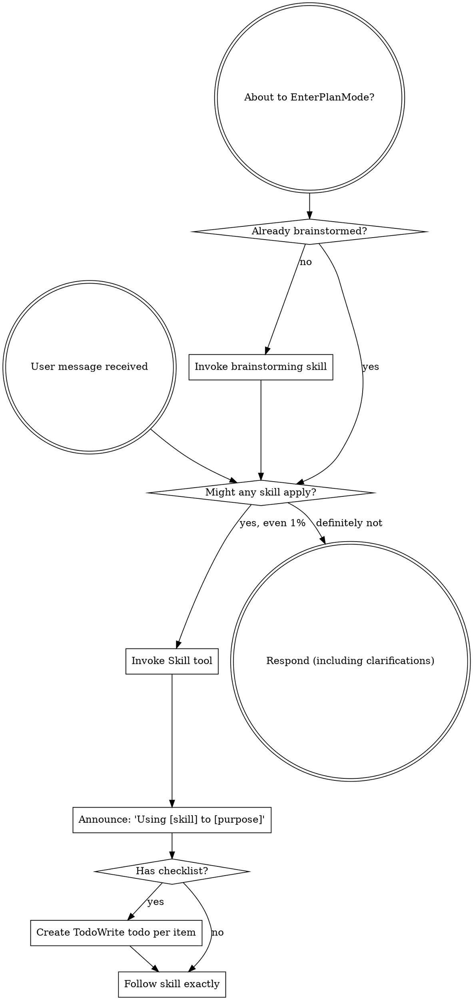
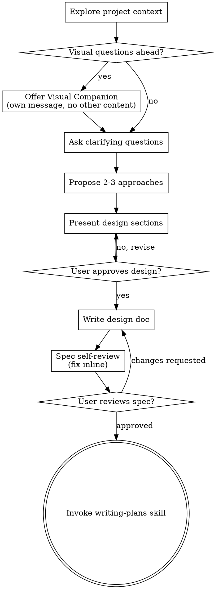
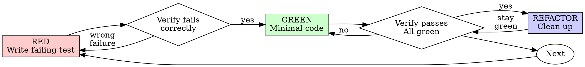
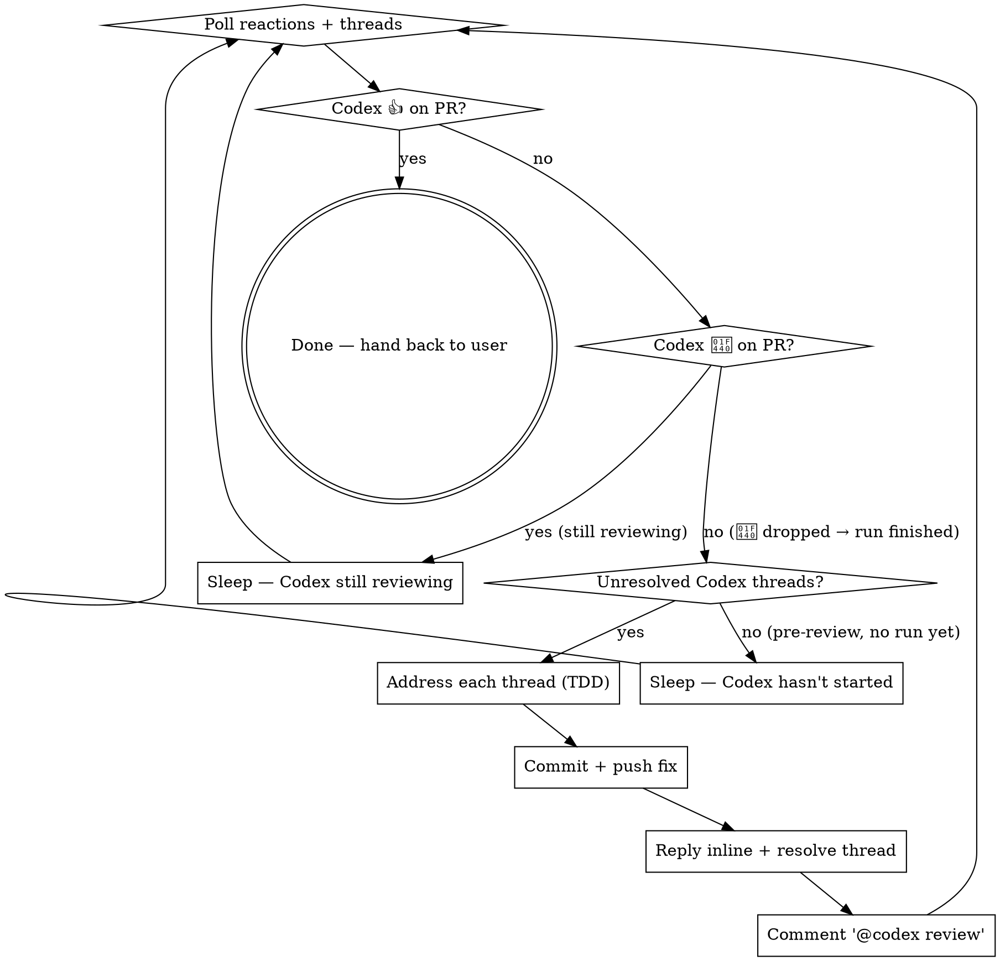

> SYSTEM

# AGENTS.md instructions for /Users/ericson/.t3/worktrees/ars-ui/t3code-3ff1fd4f

<INSTRUCTIONS>
# ars-ui

## Project Overview

Rust frontend component library using state machines, framework-agnostic core with Leptos/Dioxus adapters.

## Current Phase

The repo is now in active implementation, not spec drafting only.

Agents working on implementation should use the GitHub Project roadmap and issue backlog as the execution source of truth:

- Use the GitHub Project `ars-ui implementation roadmap` to understand active epics, task breakdown, dependencies, status, and iteration planning.
- Prefer picking a single issue-backed task that is unblocked, sized, and scoped for independent delivery.
- Do not start work from an epic issue unless the user explicitly asks for planning or further decomposition.
- Do not start a task that is blocked by unresolved GitHub issue dependencies.
- Treat native GitHub issue dependencies as the blocker graph and the issue body acceptance criteria as the delivery contract.

## Development Workflow

For implementation tasks:

1. Read the assigned or selected GitHub issue first.
2. Move the issue to **In Progress** on the GitHub Project board.
3. Review the cited spec sections and any dependency issues.
4. Add or update the named tests first.
5. Implement only the scope required to make those tests pass.
6. If implementation changes the intended contract, update the relevant spec in the same task.
7. **MANDATORY:** Invoke the `post-implementation-audit` skill (`.agents/skills/post-implementation-audit/SKILL.md`). It runs three sequential audits on the new code — (a) spec/implementation drift with "best outcome" recommendations, (b) iterative "anything else missing?" passes (minimum two rounds), (c) test-coverage audit across every test type the workspace uses (unit, snapshot, proptest, mutation, doc, spec-conformance, llvm-cov). **Every finding lands in _this_ PR — no deferral, no follow-up issues.** This step exists because initial implementations consistently ship spec drift and silent contract violations that take 3+ review round-trips to surface; the audit collapses them into one. Skipping this step is a contract violation.
8. Present the final result for user review before any commit.
9. After user approval, run `cargo xci --profile fast` (alias: `cargo xci-fast`) locally and fix any failures before pushing anything to GitHub. The fast profile takes ~5 minutes and covers the workspace-level regressions a pre-push gate should catch: fmt, check, clippy, unit, integration, adapter, spec-compile-snippets, error-variant-coverage, mutual-exclusion, snapshot-count. Reserve full `cargo xci` (~25 minutes, all 20 gates including wasm coverage and the feature-matrix groups) for after substantial refactors that may have shifted feature-flag interactions. For small follow-up changes, run the focused tests and checks that cover the edited code instead.
10. After `cargo xci-fast` passes, commit and push a PR targeting `main`. The PR body MUST include an auto-close keyword for the issue being delivered, for example `Closes #20` or `Fixes #20`, so GitHub closes the issue automatically when the PR merges.
11. **If the PR creates or modifies any `.snap` insta fixtures, attach the `snapshot-reviewed` label after opening or updating it** (`gh pr edit <num> --add-label "snapshot-reviewed"`). This signals to reviewers that the snapshot output was inspected and is intentional. Re-apply the label whenever you push a commit that touches `.snap` files; the workflow assumes the label reflects the latest snapshot state.
12. **MANDATORY:** Invoke the `waiting-for-codex-review` skill (`.agents/skills/waiting-for-codex-review/SKILL.md`) immediately after the first push that creates the PR, and re-invoke it after every subsequent push to the PR branch. The skill posts the initial `@codex review` trigger, polls Codex's 👀 → (👍 \| ∅ + threads) reaction lifecycle, addresses any review threads with the same rigor as `post-implementation-audit` (TDD + no coverage regression), replies inline, resolves threads, and re-comments `@codex review` to start the next pass — looping until Codex leaves 👍. Skipping this step leaves Codex findings unaddressed and silently widens the gap between merged code and the spec; the merge gate is 👍 from Codex plus green CI, not green CI alone.
13. Only after CI passes, Codex has left 👍, and the PR is merged, close the issue.

Never close a GitHub issue without a merged PR that passes CI **and a 👍 from Codex**. Never commit or push without explicit user approval. Keep the issue, PR, and Project board status aligned with the actual work state at every step.

Default delivery rules:

- Follow TDD: tests first, implementation second, verification last.
- Keep task scope aligned with the issue. If the issue is too large or ambiguous, stop and split or clarify rather than freelancing a bigger change.
- Prefer tasks sized `1`, `2`, `3`, or `5` points. `8` is exceptional. `13` must be decomposed before implementation.
- Preserve the crate and dependency layering defined by the architecture and implementation plan.
- Do not add a new dependency crate without explicit user approval first. If a task appears to need a new crate, stop, explain why, and get approval before editing any `Cargo.toml`.
- When a task is complete, verify the exact tests and checks named by the issue before considering it done.
- For adapter-level component implementation, follow `docs/implementation/adapter-component-delivery.md`. Adapter component work must cover the adapter crate, adapter tests, E2E fixtures/harnesses when applicable, widgets examples, spec synchronization, and the required validation/audit loop in one PR.

### Code Quality Standards

- **Document all public items.** Every public struct, enum, trait, function, constant, type alias, method, field, and variant must have a `///` doc comment. Every `lib.rs` must have a `//!` crate-level doc comment. The workspace enforces `missing_docs` linting — undocumented public items are build failures.
- **Zero warnings policy.** All code must compile with zero warnings under the workspace's configured clippy and rustc lints. Fix the root cause instead of suppressing. When suppression is genuinely needed, use `#[expect(lint, reason = "...")]` — never `#[allow(...)]`.
- **Derive documentation from the spec.** Doc comments should describe the _purpose and semantics_ of the item as defined in the corresponding `spec/` files, not just restate the type signature.
- **Use `#[inline]` selectively, not mechanically.** Do **not** add Clippy's `missing_inline_in_public_items` lint at the workspace level, and do not treat public visibility alone as a reason to mark an item `#[inline]`. Use `#[inline]` for thin cross-crate wrappers, trivial accessors, and hot-path no-op shims where the call overhead is plausibly meaningful. Avoid blanket `#[inline]` on all public APIs — it increases code size, adds compile-time cost, and turns `#[inline]` into noise instead of a deliberate performance signal.
- **Use directory-backed modules with `mod.rs` when a module owns children.** This repo standardizes on the older filesystem layout for nested modules. If module `foo` has child modules, the parent must live at `foo/mod.rs`, not `foo.rs`. Do not mix `foo.rs` with a sibling `foo/` directory. When a refactor adds child modules under an existing flat file, move the parent into `foo/mod.rs` in the same change. Do not leave empty leftover module directories behind.

### API Design Standards

- **Design for the pit of success.** Public APIs should make the most natural, shortest path also be the path that is correct, accessible, localizable, type-safe, and performant. Prefer ergonomic constructors and defaults that preserve the spec's strongest guarantees instead of making users opt into correctness after choosing a convenient API.
- **Name escape hatches explicitly.** When a component needs a lower-level, static, non-i18n, or otherwise less complete path, keep it available but make the tradeoff visible in the API name or type. The blessed path should remain the simplest call site, while escape hatches should read as deliberate choices.
- **Keep semantic data separate from rendered views.** Rich framework views are useful for customization, but components still need semantic sources for accessible names, localized text, announcements, ids, and state-machine wiring. Do not rely on arbitrary rendered view trees as the only source of user-facing semantics.

### Code Coverage

The workspace uses `cargo-llvm-cov` for code coverage with per-crate threshold enforcement. CI runs coverage on every PR (see `.github/workflows/ci.yml`).

**Local coverage commands:**

```bash
# Per-crate coverage with inline annotated source (most useful during development)
cargo llvm-cov test -p ars-interactions --text -- hover

# Per-crate summary only
cargo llvm-cov test -p ars-interactions -- hover

# Native-only workspace coverage (host target; excludes wasm-only crates)
cargo llvm-cov --workspace \
  --exclude ars-leptos --exclude ars-dioxus \
  --exclude ars-test-harness-leptos --exclude ars-test-harness-dioxus \
  --exclude ars-derive --exclude xtask \
  --lcov --output-path lcov.info

# Check all crates against spec-defined thresholds (run after a *merged* lcov)
cargo xtask coverage check-all --file lcov.info
```

The `--text` flag produces line-by-line annotated source showing hit counts and `^0` markers on uncovered branches — use this to identify gaps after writing tests. Uncovered no-op callback closures in tests (e.g., `|_| {}`) are expected and not a gap.

The local recipe above excludes the adapter and adapter-test-harness crates because their `target_arch = "wasm32"` / `feature = "web"` code paths can't be measured via host-target `cargo llvm-cov`. **CI runs an additional wasm-coverage pipeline on nightly** (`cargo xtask ci coverage`) that uses `wasm-bindgen-test`'s experimental coverage recipe with LLVM 22 / `clang-22` to emit lcov for `ars-leptos` (csr), `ars-dioxus` (web), `ars-dom` (web), `ars-i18n` (web-intl), and the adapter test harnesses, then merges with the native lcov via `cargo xtask coverage merge`. The per-crate thresholds in `xtask::coverage::default_thresholds()` are enforced against the merged file — including adapter targets (`ars-leptos` 74/55, `ars-dioxus` 77/70, `ars-test-harness-leptos` 60/0, `ars-test-harness-dioxus` 60/0). `ars-derive` (proc-macro, runs in compiler) is exercised via `crates/ars-core/tests/derive_contract.rs` and is unmeasured. `xtask` has its own enforced threshold (30/35) and is measured. See `spec/testing/14-ci.md` §2 for the full pipeline.

### Mutation Testing

Coverage tells you which lines run. **Mutation testing tells you whether the tests would notice if those lines silently misbehaved.** The workspace uses [`cargo-mutants`](https://mutants.rs) for this — a `cargo` extension binary, not a workspace dependency.

**Install (once per developer machine):**

```bash
cargo install cargo-mutants --locked --version 27.0.0
```

**Local commands (state-machine modules are the most rewarding targets):**

```bash
# Run on a single component machine (~6 min for popover)
cargo mutants -p ars-components -f crates/ars-components/src/overlay/popover/mod.rs

# Just list what would be mutated, without running tests (fast)
cargo mutants -p ars-components -f crates/ars-components/src/overlay/popover/mod.rs --list

# Whole crate (slow — only if you really mean it)
cargo mutants -p ars-components
```

**Agnostic component implementation gate:** whenever an agent implements a new framework-agnostic component, or materially changes an existing one, the delivery must include:

- a targeted mutation run for the component source file, usually `cargo mutants -p ars-components -f crates/ars-components/src/<category>/<component>/mod.rs` (adjust the path for single-file modules);
- spec-conformance tests for the component's anatomy/public contract, including its `Part` enum and required API/attribute surface;
- same-task triage of every `MISSED` mutant: add tests for real gaps, or add a justified line-agnostic `.cargo/mutants.toml` exclude only for true equivalent mutations.

**Reading the output:** Results land in `mutants.out/mutants.out/` (gitignored). The two files that matter:

- `caught.txt` — mutations that broke at least one test ✅
- `missed.txt` — mutations that survived all tests ❌ — each one is either a real test gap to fill or an "equivalent mutation" that needs a `[[skip]]` entry in `mutants.toml` with a justification

**CI integration:** Nightly only. `.github/workflows/nightly.yml` has a `mutation-testing` job with a 21-entry matrix that runs `cargo mutants -p <package>` on every framework-agnostic crate, using `--shard k/n` to spread larger crates across parallel runners. **Shard indices are 0-based** (`k` runs from `0` to `n-1`); `k == n` is invalid and will fail the job. When adding shards, always start at `0/n` and end at `(n-1)/n`.

- **`ars-components` (≈ 1,630 mutants today, planned to grow as the spec adds the remaining ~97 components):** sharded **12-way** → ≈ 135 mutants per runner today, ≈ 850 per runner at the ~10,000-mutant endpoint. Sized for the full spec catalog up front so we don't re-shard every few months as components land.
- **`ars-collections` (≈ 1,080 mutants):** sharded 4-way → ≈ 270 mutants per runner.
- **`ars-core` (≈ 700 mutants):** sharded 2-way → ≈ 350 mutants per runner.
- **`ars-a11y`, `ars-forms`, `ars-interactions`:** one runner each (under 600 mutants apiece).

**Adding a new state machine inside an existing crate requires no CI changes** — its mutations land in whichever shard the cargo-mutants partitioner places them. The shard counts are sized so the slowest runner stays well under 30 minutes today and under ~50 minutes at the planned endpoint; re-balance only when a crate outgrows that budget (visible on the nightly dashboard as one shard pulling away from the others).

All matrix jobs run with `fail-fast: false` so failures on one module don't mask data on another. Each job uploads its `mutants.out/` as a workflow artifact (always, even on success — surviving "missed" entries on a passing run still reveal test-quality work). The job fails if any mutation survives, so a missed mutation forces a deliberate triage decision (fix the test, or document the equivalence with a `[[skip]]` entry in `mutants.toml`).

**Excluded crates** (mutation testing's signal degrades wherever determinism does): adapter glue (`ars-leptos`, `ars-dioxus`), DOM/FFI (`ars-dom`), ICU/FFI (`ars-i18n`), test infrastructure (`ars-test-harness*`), and the proc-macro crate (`ars-derive`, runs in the compiler). Adding a brand-new crate that is a good mutation target requires one new matrix entry; run a local scout first (`cargo mutants -p <crate> --list` to size, then a real run) so we know the right shard count before the nightly fires.

**Bumping the pinned version.** Both the local install command above and `.github/workflows/nightly.yml` pin cargo-mutants to an exact version (currently `27.0.0`) — same convention as `wasm-pack` in the `a11y-audit` job. Pinning is deliberate: cargo-mutants ships new mutators in releases, and an unpinned install would silently change the mutation set without any code change, surfacing as phantom CI failures on a green-source repo. To bump, open a PR that (1) updates the version string in CLAUDE.md and `nightly.yml`, (2) runs the popover scout locally with the new version (`cargo mutants -p ars-components -f crates/ars-components/src/overlay/popover/mod.rs`) to confirm the mutation count is in the same ballpark, and (3) triages any new "missed" entries the new mutators surface — they are usually genuine test-quality gaps newly visible to the tool.

### Property Testing (proptest)

State-machine invariants are exercised by [`proptest`](https://docs.rs/proptest) under `crates/<crate>/tests/proptest_state_machines/` (see `ars-components`). Default proptest behaviour drops `*.proptest-regressions` seed files alongside test sources — instead, every `proptest!` block in this workspace pulls a shared `Config` from `tests/proptest_state_machines/common.rs` that:

1. Reads `PROPTEST_CASES` from the environment (1,000 default; 10,000 in the nightly `extended-proptest` job).
2. Sets `failure_persistence` to `FileFailurePersistence::Direct("proptest-regressions/state-machines.txt")`, so all persisted seeds for the test binary live in one file at the crate root: `crates/<crate>/proptest-regressions/state-machines.txt`. The directory is committed (per proptest's own recommendation in the file header) so every developer's runs benefit from previously-shrunk failures.

When a new crate adopts proptest for state-machine tests, copy the same `common.rs` helper and reference it via `#![proptest_config(super::common::proptest_config())]` inside every `proptest!` block. Don't let proptest fall back to its `WithSource` default — that scatters seed files across the source tree.

### Adapter Prelude Convention

Both `ars-leptos` and `ars-dioxus` expose a `prelude` module targeting **end users** — application developers who consume the ready-made components. `use ars_leptos::prelude::*` (or `use ars_dioxus::prelude::*`) should give them everything they need.

The prelude contains only user-facing items:

1. **Component modules** — as components land, their public module paths (e.g., `button`, `dialog`) are re-exported so users can write `button::Props`, etc.
2. **User-facing traits** — traits end users call on component outputs (e.g., `Translate` from `ars-i18n`). Re-export the trait so consumers don't need a direct dependency on the subsystem crate.
3. **Configuration types** — types that appear in component props or configure behaviour (e.g., `Locale`, `Direction`, `Orientation`, `Selection`).

The prelude does **not** include implementation details consumed only by component authors inside the adapter crate: core engine types (`Machine`, `Service`, `ConnectApi`, `AttrMap`), accessibility primitives (`AriaRole`, `AriaAttribute`), interaction helpers (`merge_attrs`), or adapter hooks (`use_machine`, `UseMachineReturn`). Those remain accessible via their normal crate paths for advanced users building custom machines.

Both adapter preludes must stay symmetric: same items, same structure. When adding a new re-export to one adapter's prelude, add it to the other as well in the same PR.

### Adapter Testing Convention

Adapter-level component tests should default to the framework-specific test harness crate:

- Leptos adapter tests should prefer `ars-test-harness-leptos`.
- Dioxus adapter tests should prefer `ars-test-harness-dioxus`.
- Shared `ars-test-harness` helpers should be used where relevant for viewport, layout, clipboard, drag/drop, timing, and other DOM test setup instead of bespoke per-test browser scaffolding.

When a component spec requires interaction, focus, overlay positioning, clipboard, file upload, drag/drop, or similar browser behavior, the task's tests should exercise that behavior through the adapter harness entrypoints and shared core harness helpers unless there is a concrete technical reason not to.

## Spec Synchronization During Implementation

The specification is the authoritative contract. It took weeks of deliberate design and MUST be followed.

### Spec-first implementation rule

Before implementing any public type, trait, function, or method:

1. **Read the spec section first.** Find the relevant code example in `spec/`. Use `spec-tool toc <file>` and `grep` to locate it.
2. **Match the spec exactly.** If the spec defines `struct ComponentIds { base: String }` with methods `from_id()`, `id()`, `part()`, `item()`, `item_part()` — implement exactly that. Do not invent alternative field names, method names, or signatures.
3. **Cross-check after implementation.** Before presenting code for review, diff every public item against the spec's code examples. Every struct field, every method name, every parameter must match.
4. **If you must deviate**, there must be a concrete technical reason (e.g., the spec's API cannot compile, or a dependency doesn't expose the needed type). Document the reason in a code comment and flag it to the user explicitly.

Inventing alternative APIs that "seem equivalent" is never acceptable — it silently invalidates the spec's design decisions and all downstream code that depends on those APIs.

### Spec/code mismatch resolution

- If code and spec disagree, resolve the mismatch in the same task or PR.
- Shared conceptual changes belong in shared or foundation spec files, not only in adapter code.
- Adapter-specific findings must be reflected back into `spec/foundation/08-adapter-leptos.md` and/or `spec/foundation/09-adapter-dioxus.md` when relevant.
- Do not leave spec drift behind as follow-up cleanup.

## Spec Structure

The specification lives in `spec/` with this layout:

- `spec/manifest.toml` — **START HERE** — central index of all components and their dependencies
- `spec/foundation/` — architecture, accessibility, i18n, interactions, forms, adapters, spec template (00-10)
- `spec/shared/` — cross-component shared types (date-time, selection, layout, z-index)
- `spec/components/{category}/` — one file per component, organized by category
- `spec/testing/` — test specs split by domain

### Component Categories

- `input/` — checkbox, text-field, slider, number-input, etc.
- `selection/` — select, combobox, listbox, menu, tags-input, etc.
- `overlay/` — dialog, popover, tooltip, toast, presence, etc.
- `navigation/` — accordion, tabs, tree-view, pagination, steps, etc.
- `date-time/` — date-field, time-field, calendar, date-picker, etc.
- `data-display/` — table, avatar, progress, meter, badge, etc.
- `layout/` — splitter, scroll-area, carousel, portal, toolbar, etc.
- `specialized/` — color-picker, file-upload, signature-pad, qr-code, etc.
- `utility/` — button, toggle, focus-scope, visually-hidden, separator, etc.

## Working with the Spec

When reading large files, run `wc -l` first to check the line count. If the file is over 2,000
lines, use the `offset` and `limit` parameters on the Read tool to read in chunks rather than
attempting to read the entire file at once.

### Using xtask spec (preferred)

Use `cargo xtask spec` to resolve file sets instead of manually parsing manifest.toml:

```bash
# Quick metadata lookup:
cargo xtask spec info <component>

# Find all components using a shared type:
cargo xtask spec reverse <shared-type>

# See a file's heading structure (with line numbers):
cargo xtask spec toc <file>

# Validate frontmatter matches manifest.toml:
cargo xtask spec validate

# Search spec content by keyword/regex (with optional filters):
cargo xtask spec search <query> [--category <cat>] [--section <sec>] [--tier <tier>]

# Get a compact component summary (states, events, props, accessibility):
cargo xtask spec digest <component>

# Get full implementation context (component + all deps concatenated):
cargo xtask spec context <component> [--framework <fw>] [--include-testing]
```

The xtask also runs as an MCP server (`cargo xtask mcp`) exposing all spec tools for LLM agents.

### Reading a component (manual fallback)

1. Read `spec/manifest.toml` to find the component's path and dependencies
2. Read the component file (has YAML frontmatter listing its foundation/shared deps)
3. Only load the foundation files listed in `foundation_deps` — not all of them

### Framework and library specs — MANDATORY skill loading

When reading or editing these specification files, you MUST load the corresponding skill BEFORE doing any work. The skills contain verified, version-accurate API documentation that the spec code examples depend on. Claude's training data is wrong for these libraries — do not trust it.

| Spec file                                    | Skill to load | Library version |
| -------------------------------------------- | ------------- | --------------- |
| `spec/foundation/04-internationalization.md` | `icu4x`       | ICU4X 2.1.1     |
| `spec/foundation/08-adapter-leptos.md`       | `leptos`      | Leptos 0.8.17   |
| `spec/foundation/09-adapter-dioxus.md`       | `dioxus`      | Dioxus 0.7.3    |

This applies to any task that touches adapter code: reviewing, writing, modifying, or answering questions about these files. Load the skill first, then proceed.

### Spec Conventions

- **No deprecation:** This is a greenfield spec. If an API is unused or redundant, remove it and fix all references. Never use `#[deprecated]` or deprecation shims.
- **No deferral:** Never mark spec content as "TODO", "FIXME", "future enhancement", "P1/P2 extension", or any similar deferral language. Every feature mentioned must be fully specified. If a design choice is unclear, ask the user rather than deferring.
- **No guessing external APIs:** NEVER guess function names or module paths for external crates. Always verify against `https://docs.rs/<crate_name>` before writing code that calls library APIs. This applies especially to Leptos, Dioxus, ICU4X, and any crate where training data may be stale. If you cannot verify, state that explicitly rather than fabricating a plausible-looking API.

### Component file format

Each component file has YAML frontmatter declaring its metadata:

```markdown
---
component: ComponentName
category: { category }
tier: stateless | stateful | complex
foundation_deps: [architecture, accessibility, ...]
shared_deps: [date-time-types, ...]
related: [sibling-component, ...]
---

# ComponentName
```

The `tier` field determines which sections are required — see `spec/foundation/10-component-spec-template.md` for the canonical section structure, ordering rules, and conformance checklist. Headings are numbered (e.g., `## 1. State Machine`, `### 1.1 States`, `#### 1.1.1 InnerStates`, etc.) for precise section references.

</INSTRUCTIONS>
<environment_context>
  <cwd>/Users/ericson/.t3/worktrees/ars-ui/t3code-3ff1fd4f</cwd>
  <shell>zsh</shell>
  <current_date>2026-05-21</current_date>
  <timezone>America/Sao_Paulo</timezone>
</environment_context>

> DEVELOPER

Implement tasks #234 and #240

> TOOL

tool_use exec_command
id: call_eb7tt3rXOODTzRoEghbO1wWF
```json
{
  "cmd": "sed -n '1,220p' /Users/ericson/.claude/skills/using-superpowers/SKILL.md",
  "workdir": "/Users/ericson/.t3/worktrees/ars-ui/t3code-3ff1fd4f",
  "yield_time_ms": 1000,
  "max_output_tokens": 12000
}
```

> TOOL

tool_use exec_command
id: call_YMc34ewerFAuChTEahzc8UJL
```json
{
  "cmd": "rg -n \"#234|#240|issue #234|issue #240|234|240\" /Users/ericson/.codex/memories/MEMORY.md",
  "workdir": "/Users/ericson/.t3/worktrees/ars-ui/t3code-3ff1fd4f",
  "yield_time_ms": 1000,
  "max_output_tokens": 12000
}
```

> TOOL

tool_result
id: call_eb7tt3rXOODTzRoEghbO1wWF
```
Chunk ID: d4cda5
Wall time: 0.0720 seconds
Process exited with code 0
Original token count: 1356
Output:
---
name: using-superpowers
description: Use when starting any conversation - establishes how to find and use skills, requiring Skill tool invocation before ANY response including clarifying questions
---

<SUBAGENT-STOP>
If you were dispatched as a subagent to execute a specific task, skip this skill.
</SUBAGENT-STOP>

<EXTREMELY-IMPORTANT>
If you think there is even a 1% chance a skill might apply to what you are doing, you ABSOLUTELY MUST invoke the skill.

IF A SKILL APPLIES TO YOUR TASK, YOU DO NOT HAVE A CHOICE. YOU MUST USE IT.

This is not negotiable. This is not optional. You cannot rationalize your way out of this.
</EXTREMELY-IMPORTANT>

## Instruction Priority

Superpowers skills override default system prompt behavior, but **user instructions always take precedence**:

1. **User's explicit instructions** (CLAUDE.md, GEMINI.md, AGENTS.md, direct requests) — highest priority
2. **Superpowers skills** — override default system behavior where they conflict
3. **Default system prompt** — lowest priority

If CLAUDE.md, GEMINI.md, or AGENTS.md says "don't use TDD" and a skill says "always use TDD," follow the user's instructions. The user is in control.

## How to Access Skills

**In Claude Code:** Use the `Skill` tool. When you invoke a skill, its content is loaded and presented to you—follow it directly. Never use the Read tool on skill files.

**In Copilot CLI:** Use the `skill` tool. Skills are auto-discovered from installed plugins. The `skill` tool works the same as Claude Code's `Skill` tool.

**In Gemini CLI:** Skills activate via the `activate_skill` tool. Gemini loads skill metadata at session start and activates the full content on demand.

**In other environments:** Check your platform's documentation for how skills are loaded.

## Platform Adaptation

Skills use Claude Code tool names. Non-CC platforms: see `references/copilot-tools.md` (Copilot CLI), `references/codex-tools.md` (Codex) for tool equivalents. Gemini CLI users get the tool mapping loaded automatically via GEMINI.md.

# Using Skills

## The Rule

**Invoke relevant or requested skills BEFORE any response or action.** Even a 1% chance a skill might apply means that you should invoke the skill to check. If an invoked skill turns out to be wrong for the situation, you don't need to use it.



## Red Flags

These thoughts mean STOP—you're rationalizing:

| Thought | Reality |
|---------|---------|
| "This is just a simple question" | Questions are tasks. Check for skills. |
| "I need more context first" | Skill check comes BEFORE clarifying questions. |
| "Let me explore the codebase first" | Skills tell you HOW to explore. Check first. |
| "I can check git/files quickly" | Files lack conversation context. Check for skills. |
| "Let me gather information first" | Skills tell you HOW to gather information. |
| "This doesn't need a formal skill" | If a skill exists, use it. |
| "I remember this skill" | Skills evolve. Read current version. |
| "This doesn't count as a task" | Action = task. Check for skills. |
| "The skill is overkill" | Simple things become complex. Use it. |
| "I'll just do this one thing first" | Check BEFORE doing anything. |
| "This feels productive" | Undisciplined action wastes time. Skills prevent this. |
| "I know what that means" | Knowing the concept ≠ using the skill. Invoke it. |

## Skill Priority

When multiple skills could apply, use this order:

1. **Process skills first** (brainstorming, debugging) - these determine HOW to approach the task
2. **Implementation skills second** (frontend-design, mcp-builder) - these guide execution

"Let's build X" → brainstorming first, then implementation skills.
"Fix this bug" → debugging first, then domain-specific skills.

## Skill Types

**Rigid** (TDD, debugging): Follow exactly. Don't adapt away discipline.

**Flexible** (patterns): Adapt principles to context.

The skill itself tells you which.

## User Instructions

Instructions say WHAT, not HOW. "Add X" or "Fix Y" doesn't mean skip workflows.

```

> TOOL

tool_result
id: call_YMc34ewerFAuChTEahzc8UJL
```
Chunk ID: 94e450
Wall time: 0.2104 seconds
Process exited with code 0
Original token count: 290
Output:
702:- rollout_summaries/REDACTED.md (cwd=/Users/ericson/Workspace/Rust/judge-fudge, rollout_path=/Users/ericson/.codex/sessions/2026/05/13/rollout-2026-05-13T18-39-19-019e2347-a84b-7cf1-ab05-7b07827de7e4.jsonl, updated_at=2026-05-13T21:42:38+00:00, thread_id=019e2347-a84b-7cf1-ab05-7b07827de7e4, Review -> Improve transition plus PR checklist/body sync)
713:- rollout_summaries/REDACTED.md (cwd=/Users/ericson/Workspace/Rust/judge-fudge, rollout_path=/Users/ericson/.codex/sessions/2026/05/13/rollout-2026-05-13T18-43-44-019e234b-b2e4-77d2-bb5c-0d08768e4351.jsonl, updated_at=2026-05-13T21:47:06+00:00, thread_id=019e234b-b2e4-77d2-bb5c-0d08768e4351, Improve -> Finalize transition, summary artifact, and PR ready-for-review promotion)
1184:- symptom: a Unicode-boundary regression still passes despite a real bug -> cause: the first accent-case example was too weak to cross the actual boundary logic -> fix: use a clearer regression string like `ã0001234-56.2024.8.26.0100` that proves the boundary behavior [Task 2]

```

> AGENT

Using `using-superpowers` plus the repo instructions to shape this as an implementation-plan pass first. I’m going to ground this in the live issues and local repo state before asking for any choices.

> TOOL

tool_use exec_command
id: call_8G2gyv6hguGQQNw0gJNMTnRf
```json
{
  "cmd": "sed -n '1,220p' /Users/ericson/.claude/skills/brainstorming/SKILL.md",
  "workdir": "/Users/ericson/.t3/worktrees/ars-ui/t3code-3ff1fd4f",
  "yield_time_ms": 1000,
  "max_output_tokens": 12000
}
```

> TOOL

tool_use exec_command
id: call_BCymC2pHRQbHXqnwY00Yv3Le
```json
{
  "cmd": "sed -n '1,220p' /Users/ericson/.claude/skills/writing-plans/SKILL.md",
  "workdir": "/Users/ericson/.t3/worktrees/ars-ui/t3code-3ff1fd4f",
  "yield_time_ms": 1000,
  "max_output_tokens": 12000
}
```

> TOOL

tool_use exec_command
id: call_ZlnPg1VMFIyb06ejJiBZz8ei
```json
{
  "cmd": "git status --short && git branch --show-current && rg --files -g 'AGENTS.md' -g '.agents/skills/post-implementation-audit/SKILL.md' -g '.agents/skills/waiting-for-codex-review/SKILL.md'",
  "workdir": "/Users/ericson/.t3/worktrees/ars-ui/t3code-3ff1fd4f",
  "yield_time_ms": 1000,
  "max_output_tokens": 12000
}
```

> TOOL

tool_result
id: call_8G2gyv6hguGQQNw0gJNMTnRf
```
Chunk ID: 9d30b5
Wall time: 0.1683 seconds
Process exited with code 0
Original token count: 2659
Output:
---
name: brainstorming
description: "You MUST use this before any creative work - creating features, building components, adding functionality, or modifying behavior. Explores user intent, requirements and design before implementation."
---

# Brainstorming Ideas Into Designs

Help turn ideas into fully formed designs and specs through natural collaborative dialogue.

Start by understanding the current project context, then ask questions one at a time to refine the idea. Once you understand what you're building, present the design and get user approval.

<HARD-GATE>
Do NOT invoke any implementation skill, write any code, scaffold any project, or take any implementation action until you have presented a design and the user has approved it. This applies to EVERY project regardless of perceived simplicity.
</HARD-GATE>

## Anti-Pattern: "This Is Too Simple To Need A Design"

Every project goes through this process. A todo list, a single-function utility, a config change — all of them. "Simple" projects are where unexamined assumptions cause the most wasted work. The design can be short (a few sentences for truly simple projects), but you MUST present it and get approval.

## Checklist

You MUST create a task for each of these items and complete them in order:

1. **Explore project context** — check files, docs, recent commits
2. **Offer visual companion** (if topic will involve visual questions) — this is its own message, not combined with a clarifying question. See the Visual Companion section below.
3. **Ask clarifying questions** — one at a time, understand purpose/constraints/success criteria
4. **Propose 2-3 approaches** — with trade-offs and your recommendation
5. **Present design** — in sections scaled to their complexity, get user approval after each section
6. **Write design doc** — save to `docs/superpowers/specs/YYYY-MM-DD-<topic>-design.md` and commit
7. **Spec self-review** — quick inline check for placeholders, contradictions, ambiguity, scope (see below)
8. **User reviews written spec** — ask user to review the spec file before proceeding
9. **Transition to implementation** — invoke writing-plans skill to create implementation plan

## Process Flow



**The terminal state is invoking writing-plans.** Do NOT invoke frontend-design, mcp-builder, or any other implementation skill. The ONLY skill you invoke after brainstorming is writing-plans.

## The Process

**Understanding the idea:**

- Check out the current project state first (files, docs, recent commits)
- Before asking detailed questions, assess scope: if the request describes multiple independent subsystems (e.g., "build a platform with chat, file storage, billing, and analytics"), flag this immediately. Don't spend questions refining details of a project that needs to be decomposed first.
- If the project is too large for a single spec, help the user decompose into sub-projects: what are the independent pieces, how do they relate, what order should they be built? Then brainstorm the first sub-project through the normal design flow. Each sub-project gets its own spec → plan → implementation cycle.
- For appropriately-scoped projects, ask questions one at a time to refine the idea
- Prefer multiple choice questions when possible, but open-ended is fine too
- Only one question per message - if a topic needs more exploration, break it into multiple questions
- Focus on understanding: purpose, constraints, success criteria

**Exploring approaches:**

- Propose 2-3 different approaches with trade-offs
- Present options conversationally with your recommendation and reasoning
- Lead with your recommended option and explain why

**Presenting the design:**

- Once you believe you understand what you're building, present the design
- Scale each section to its complexity: a few sentences if straightforward, up to 200-300 words if nuanced
- Ask after each section whether it looks right so far
- Cover: architecture, components, data flow, error handling, testing
- Be ready to go back and clarify if something doesn't make sense

**Design for isolation and clarity:**

- Break the system into smaller units that each have one clear purpose, communicate through well-defined interfaces, and can be understood and tested independently
- For each unit, you should be able to answer: what does it do, how do you use it, and what does it depend on?
- Can someone understand what a unit does without reading its internals? Can you change the internals without breaking consumers? If not, the boundaries need work.
- Smaller, well-bounded units are also easier for you to work with - you reason better about code you can hold in context at once, and your edits are more reliable when files are focused. When a file grows large, that's often a signal that it's doing too much.

**Working in existing codebases:**

- Explore the current structure before proposing changes. Follow existing patterns.
- Where existing code has problems that affect the work (e.g., a file that's grown too large, unclear boundaries, tangled responsibilities), include targeted improvements as part of the design - the way a good developer improves code they're working in.
- Don't propose unrelated refactoring. Stay focused on what serves the current goal.

## After the Design

**Documentation:**

- Write the validated design (spec) to `docs/superpowers/specs/YYYY-MM-DD-<topic>-design.md`
  - (User preferences for spec location override this default)
- Use elements-of-style:writing-clearly-and-concisely skill if available
- Commit the design document to git

**Spec Self-Review:**
After writing the spec document, look at it with fresh eyes:

1. **Placeholder scan:** Any "TBD", "TODO", incomplete sections, or vague requirements? Fix them.
2. **Internal consistency:** Do any sections contradict each other? Does the architecture match the feature descriptions?
3. **Scope check:** Is this focused enough for a single implementation plan, or does it need decomposition?
4. **Ambiguity check:** Could any requirement be interpreted two different ways? If so, pick one and make it explicit.

Fix any issues inline. No need to re-review — just fix and move on.

**User Review Gate:**
After the spec review loop passes, ask the user to review the written spec before proceeding:

> "Spec written and committed to `<path>`. Please review it and let me know if you want to make any changes before we start writing out the implementation plan."

Wait for the user's response. If they request changes, make them and re-run the spec review loop. Only proceed once the user approves.

**Implementation:**

- Invoke the writing-plans skill to create a detailed implementation plan
- Do NOT invoke any other skill. writing-plans is the next step.

## Key Principles

- **One question at a time** - Don't overwhelm with multiple questions
- **Multiple choice preferred** - Easier to answer than open-ended when possible
- **YAGNI ruthlessly** - Remove unnecessary features from all designs
- **Explore alternatives** - Always propose 2-3 approaches before settling
- **Incremental validation** - Present design, get approval before moving on
- **Be flexible** - Go back and clarify when something doesn't make sense

## Visual Companion

A browser-based companion for showing mockups, diagrams, and visual options during brainstorming. Available as a tool — not a mode. Accepting the companion means it's available for questions that benefit from visual treatment; it does NOT mean every question goes through the browser.

**Offering the companion:** When you anticipate that upcoming questions will involve visual content (mockups, layouts, diagrams), offer it once for consent:
> "Some of what we're working on might be easier to explain if I can show it to you in a web browser. I can put together mockups, diagrams, comparisons, and other visuals as we go. This feature is still new and can be token-intensive. Want to try it? (Requires opening a local URL)"

**This offer MUST be its own message.** Do not combine it with clarifying questions, context summaries, or any other content. The message should contain ONLY the offer above and nothing else. Wait for the user's response before continuing. If they decline, proceed with text-only brainstorming.

**Per-question decision:** Even after the user accepts, decide FOR EACH QUESTION whether to use the browser or the terminal. The test: **would the user understand this better by seeing it than reading it?**

- **Use the browser** for content that IS visual — mockups, wireframes, layout comparisons, architecture diagrams, side-by-side visual designs
- **Use the terminal** for content that is text — requirements questions, conceptual choices, tradeoff lists, A/B/C/D text options, scope decisions

A question about a UI topic is not automatically a visual question. "What does personality mean in this context?" is a conceptual question — use the terminal. "Which wizard layout works better?" is a visual question — use the browser.

If they agree to the companion, read the detailed guide before proceeding:
`skills/brainstorming/visual-companion.md`

```

> TOOL

tool_result
id: call_BCymC2pHRQbHXqnwY00Yv3Le
```
Chunk ID: a44270
Wall time: 0.0543 seconds
Process exited with code 0
Original token count: 1512
Output:
---
name: writing-plans
description: Use when you have a spec or requirements for a multi-step task, before touching code
---

# Writing Plans

## Overview

Write comprehensive implementation plans assuming the engineer has zero context for our codebase and questionable taste. Document everything they need to know: which files to touch for each task, code, testing, docs they might need to check, how to test it. Give them the whole plan as bite-sized tasks. DRY. YAGNI. TDD. Frequent commits.

Assume they are a skilled developer, but know almost nothing about our toolset or problem domain. Assume they don't know good test design very well.

**Announce at start:** "I'm using the writing-plans skill to create the implementation plan."

**Context:** This should be run in a dedicated worktree (created by brainstorming skill).

**Save plans to:** `docs/superpowers/plans/YYYY-MM-DD-<feature-name>.md`
- (User preferences for plan location override this default)

## Scope Check

If the spec covers multiple independent subsystems, it should have been broken into sub-project specs during brainstorming. If it wasn't, suggest breaking this into separate plans — one per subsystem. Each plan should produce working, testable software on its own.

## File Structure

Before defining tasks, map out which files will be created or modified and what each one is responsible for. This is where decomposition decisions get locked in.

- Design units with clear boundaries and well-defined interfaces. Each file should have one clear responsibility.
- You reason best about code you can hold in context at once, and your edits are more reliable when files are focused. Prefer smaller, focused files over large ones that do too much.
- Files that change together should live together. Split by responsibility, not by technical layer.
- In existing codebases, follow established patterns. If the codebase uses large files, don't unilaterally restructure - but if a file you're modifying has grown unwieldy, including a split in the plan is reasonable.

This structure informs the task decomposition. Each task should produce self-contained changes that make sense independently.

## Bite-Sized Task Granularity

**Each step is one action (2-5 minutes):**
- "Write the failing test" - step
- "Run it to make sure it fails" - step
- "Implement the minimal code to make the test pass" - step
- "Run the tests and make sure they pass" - step
- "Commit" - step

## Plan Document Header

**Every plan MUST start with this header:**

```markdown
# [Feature Name] Implementation Plan

> **For agentic workers:** REQUIRED SUB-SKILL: Use superpowers:subagent-driven-development (recommended) or superpowers:executing-plans to implement this plan task-by-task. Steps use checkbox (`- [ ]`) syntax for tracking.

**Goal:** [One sentence describing what this builds]

**Architecture:** [2-3 sentences about approach]

**Tech Stack:** [Key technologies/libraries]

---
```

## Task Structure

````markdown
### Task N: [Component Name]

**Files:**
- Create: `exact/path/to/file.py`
- Modify: `exact/path/to/existing.py:123-145`
- Test: `tests/exact/path/to/test.py`

- [ ] **Step 1: Write the failing test**

```python
def test_specific_behavior():
    result = function(input)
    assert result == expected
```

- [ ] **Step 2: Run test to verify it fails**

Run: `pytest tests/path/test.py::test_name -v`
Expected: FAIL with "function not defined"

- [ ] **Step 3: Write minimal implementation**

```python
def function(input):
    return expected
```

- [ ] **Step 4: Run test to verify it passes**

Run: `pytest tests/path/test.py::test_name -v`
Expected: PASS

- [ ] **Step 5: Commit**

```bash
git add tests/path/test.py src/path/file.py
git commit -m "feat: add specific feature"
```
````

## No Placeholders

Every step must contain the actual content an engineer needs. These are **plan failures** — never write them:
- "TBD", "TODO", "implement later", "fill in details"
- "Add appropriate error handling" / "add validation" / "handle edge cases"
- "Write tests for the above" (without actual test code)
- "Similar to Task N" (repeat the code — the engineer may be reading tasks out of order)
- Steps that describe what to do without showing how (code blocks required for code steps)
- References to types, functions, or methods not defined in any task

## Remember
- Exact file paths always
- Complete code in every step — if a step changes code, show the code
- Exact commands with expected output
- DRY, YAGNI, TDD, frequent commits

## Self-Review

After writing the complete plan, look at the spec with fresh eyes and check the plan against it. This is a checklist you run yourself — not a subagent dispatch.

**1. Spec coverage:** Skim each section/requirement in the spec. Can you point to a task that implements it? List any gaps.

**2. Placeholder scan:** Search your plan for red flags — any of the patterns from the "No Placeholders" section above. Fix them.

**3. Type consistency:** Do the types, method signatures, and property names you used in later tasks match what you defined in earlier tasks? A function called `clearLayers()` in Task 3 but `clearFullLayers()` in Task 7 is a bug.

If you find issues, fix them inline. No need to re-review — just fix and move on. If you find a spec requirement with no task, add the task.

## Execution Handoff

After saving the plan, offer execution choice:

**"Plan complete and saved to `docs/superpowers/plans/<filename>.md`. Two execution options:**

**1. Subagent-Driven (recommended)** - I dispatch a fresh subagent per task, review between tasks, fast iteration

**2. Inline Execution** - Execute tasks in this session using executing-plans, batch execution with checkpoints

**Which approach?"**

**If Subagent-Driven chosen:**
- **REQUIRED SUB-SKILL:** Use superpowers:subagent-driven-development
- Fresh subagent per task + two-stage review

**If Inline Execution chosen:**
- **REQUIRED SUB-SKILL:** Use superpowers:executing-plans
- Batch execution with checkpoints for review

```

> TOOL

tool_result
id: call_ZlnPg1VMFIyb06ejJiBZz8ei
```
Chunk ID: e8bfcf
Wall time: 0.1257 seconds
Process exited with code 0
Original token count: 11
Output:
t3code/3ff1fd4f
AGENTS.md
spec/AGENTS.md

```

> TOOL

tool_use _fetch_issue
id: call_fHl4ElUrJ73P3Vfxt4pRu4Ps
```json
{
  "repository_full_name": "fogodev/ars-ui",
  "issue_number": 234
}
```

> TOOL

tool_use _fetch_issue
id: call_F6onld0V4Uioyrmmfmu7eana
```json
{
  "repository_full_name": "fogodev/ars-ui",
  "issue_number": 240
}
```

> TOOL

tool_use exec_command
id: call_icOotrn5U5CK7c6cHvYDEQtj
```json
{
  "cmd": "find .agents/skills -maxdepth 2 -name SKILL.md -print | sort",
  "workdir": "/Users/ericson/.t3/worktrees/ars-ui/t3code-3ff1fd4f",
  "yield_time_ms": 1000,
  "max_output_tokens": 12000
}
```

> TOOL

tool_use exec_command
id: call_4aMzW7tIR05B9e28ZBSsyfMe
```json
{
  "cmd": "git log --oneline -5",
  "workdir": "/Users/ericson/.t3/worktrees/ars-ui/t3code-3ff1fd4f",
  "yield_time_ms": 1000,
  "max_output_tokens": 12000
}
```

> TOOL

tool_result
id: call_fHl4ElUrJ73P3Vfxt4pRu4Ps
```
Wall time: 1.1695 seconds
Output:
{"issue":{"url":"https://github.com/fogodev/ars-ui/issues/234","title":"task: Implement Listbox agnostic core","issue_number":234,"body":"**Epic: #221 (Agnostic selection components)**\n\n## Goal\nComplex listbox with single/multi-select, aria-activedescendant, typeahead, keyboard navigation via Collection trait.\n\n## Out of scope\nFramework-specific adapter components (Leptos/Dioxus).\n\n## Spec refs\n- `spec/components/selection/listbox.md`\n- `spec/shared/selection-patterns.md`\n\n## Depends on\n- Epic #53 (Collections)\n\n## Layer\nComponent\n\n## Framework\nNone\n\n## Test tier\nUnit\n\n## Fibonacci points\n5\n\n## Element/ref handling note\n\nListbox agnostic code should own option keys, selection/highlight state, virtualized active-descendant semantics, roving-focus intent, and ARIA/data attrs. IDs are valid for `aria-activedescendant`; live option focus, scroll-into-view, and measurement must be adapter-resolved with mounted handles.\n\nStable string IDs remain valid for semantic ARIA relationships, hydration-stable markup, and `data-ars-*` hooks. They should not be used as a substitute for live element handles. Leptos adapters should prefer `NodeRef`/resolved DOM elements for live operations; Dioxus adapters should prefer `MountedData` or the Dioxus platform layer where available.\n\n## Tests to add first\n- ConnectApi produces `role=\"listbox\"`, items get `role=\"option\"`.\n- Single-select: one `aria-selected=\"true\"` at a time.\n- Multi-select: Toggle/Replace modes.\n- aria-activedescendant tracks focused item.\n- Typeahead matching filters or jumps to matching items.\n- Keyboard Home/End/PageUp/PageDown navigation.\n- Disabled items skipped during keyboard navigation.\n\n## Acceptance criteria\n- All public types documented per workspace `missing_docs` lint.\n- State machine matches spec §1 exactly.\n- ConnectApi produces correct ARIA attributes per spec §2.\n- Snapshot tests cover the component's `connect()` / `Api` `AttrMap` output for every anatomy part and each output-affecting state, prop, or context branch, with committed `.snap` fixtures passing `cargo insta test --unreferenced=reject`.\n- All named tests pass with zero warnings.\n\n## Spec impact\nNo spec change required.\n\n## Board update rule\nIf blocked, keep `Status` in `Todo`, use native GitHub issue dependencies, and name the dependency or spec ambiguity.\n","state":"open","user":{"login":"fogodev","name":"fogodev","email":null,"avatar_url":"https://avatars.githubusercontent.com/u/11011091?v=4","id":11011091},"assignees":null,"labels":[{"name":"task","color":"0E8A16","description":"Agent-ready implementation task"}],"milestone":null,"state_reason":null,"comments":0,"created_at":"2026-04-10T23:25:05Z","updated_at":"2026-04-29T04:43:54Z","closed_at":null,"display_url":"https://github.com/fogodev/ars-ui/issues/234","display_title":"task: Implement Listbox agnostic core"},"url":"https://github.com/fogodev/ars-ui/issues/234","title":"task: Implement Listbox agnostic core","display_url":"https://github.com/fogodev/ars-ui/issues/234","display_title":"task: Implement Listbox agnostic core"}
```

> TOOL

tool_result
id: call_F6onld0V4Uioyrmmfmu7eana
```
Wall time: 0.6684 seconds
Output:
{"issue":{"url":"https://github.com/fogodev/ars-ui/issues/240","title":"task: Implement Select agnostic core","issue_number":240,"body":"**Epic: #221 (Agnostic selection components)**\n\n## Goal\nComplex select combining trigger+listbox pattern, positioning, form integration, typeahead, single/multi-select.\n\n## Out of scope\nFramework-specific adapter components (Leptos/Dioxus).\n\n## Spec refs\n- `spec/components/selection/select.md`\n- `spec/shared/selection-patterns.md`\n\n## Depends on\n- Epic #53 (Collections)\n\n## Layer\nComponent\n\n## Framework\nNone\n\n## Test tier\nUnit\n\n## Fibonacci points\n8\n\n## Element/ref handling note\n\nSelect agnostic code should own value/open/highlight state, option keys, active-descendant semantics, and ARIA/data attrs. IDs are valid for `aria-activedescendant` and `aria-controls`; live trigger/listbox/option focus, measurement, scroll, and positioning must be adapter-resolved through native handles.\n\nStable string IDs remain valid for semantic ARIA relationships, hydration-stable markup, and `data-ars-*` hooks. They should not be used as a substitute for live element handles. Leptos adapters should prefer `NodeRef`/resolved DOM elements for live operations; Dioxus adapters should prefer `MountedData` or the Dioxus platform layer where available.\n\n## Tests to add first\n- Trigger produces `role=\"combobox\"` or `role=\"button\"` with `aria-haspopup=\"listbox\"`.\n- Listbox content produces `role=\"listbox\"`.\n- Selection reflected in trigger label.\n- Open/close state transitions.\n- Keyboard: Space/Enter opens, arrow keys navigate, Escape closes.\n- Form hidden input with selected value.\n- Typeahead matching.\n- Multi-select mode.\n- Disabled state.\n\n## Acceptance criteria\n- All public types documented per workspace `missing_docs` lint.\n- State machine matches spec §1 exactly.\n- ConnectApi produces correct ARIA attributes per spec §2.\n- Snapshot tests cover the component's `connect()` / `Api` `AttrMap` output for every anatomy part and each output-affecting state, prop, or context branch, with committed `.snap` fixtures passing `cargo insta test --unreferenced=reject`.\n- All named tests pass with zero warnings.\n\n## Spec impact\nNo spec change required.\n\n## Board update rule\nIf blocked, keep `Status` in `Todo`, use native GitHub issue dependencies, and name the dependency or spec ambiguity.\n","state":"open","user":{"login":"fogodev","name":"fogodev","email":null,"avatar_url":"https://avatars.githubusercontent.com/u/11011091?v=4","id":11011091},"assignees":null,"labels":[{"name":"task","color":"0E8A16","description":"Agent-ready implementation task"}],"milestone":null,"state_reason":null,"comments":0,"created_at":"2026-04-10T23:25:22Z","updated_at":"2026-04-29T04:44:01Z","closed_at":null,"display_url":"https://github.com/fogodev/ars-ui/issues/240","display_title":"task: Implement Select agnostic core"},"url":"https://github.com/fogodev/ars-ui/issues/240","title":"task: Implement Select agnostic core","display_url":"https://github.com/fogodev/ars-ui/issues/240","display_title":"task: Implement Select agnostic core"}
```

> TOOL

tool_result
id: call_icOotrn5U5CK7c6cHvYDEQtj
```
Chunk ID: b1ceec
Wall time: 0.0246 seconds
Process exited with code 0
Original token count: 58
Output:
.agents/skills/dioxus/SKILL.md
.agents/skills/icu4x/SKILL.md
.agents/skills/leptos/SKILL.md
.agents/skills/playwright-cli/SKILL.md
.agents/skills/post-implementation-audit/SKILL.md
.agents/skills/waiting-for-codex-review/SKILL.md

```

> TOOL

tool_result
id: call_4aMzW7tIR05B9e28ZBSsyfMe
```
Chunk ID: e66f42
Wall time: 0.1775 seconds
Process exited with code 0
Original token count: 73
Output:
b9fc9cdc Implement Accordion agnostic core (#662)
e96e01fa Implement LiveRegion agnostic core (#659)
06b3c3b0 feat(components): add alert dialog core (#660)
fee802fe Finish ArsProvider Leptos and Dioxus adapters (#661)
98a7d5cf Improve ars-components coverage and mutation coverage (#658)

```

> AGENT

Both issues are open and scoped to agnostic selection components, with adapters out of scope. I’m checking whether their collection dependency is already satisfied and how recent agnostic cores are structured so the plan matches the repo’s current patterns.

> TOOL

tool_use _fetch_issue
id: call_JrbII2mBXREfMB4T8zRRDy43
```json
{
  "repository_full_name": "fogodev/ars-ui",
  "issue_number": 53
}
```

> TOOL

tool_use exec_command
id: call_PCqvRTZpSNzSwuNrhFiPjqyv
```json
{
  "cmd": "find crates/ars-components/src -maxdepth 3 -type f | sort | sed -n '1,240p'",
  "workdir": "/Users/ericson/.t3/worktrees/ars-ui/t3code-3ff1fd4f",
  "yield_time_ms": 1000,
  "max_output_tokens": 16000
}
```

> TOOL

tool_use exec_command
id: call_Lyz2rWdzRdTX96aM4k1Zmeot
```json
{
  "cmd": "find crates/ars-components/tests -maxdepth 4 -type f | sort | sed -n '1,260p'",
  "workdir": "/Users/ericson/.t3/worktrees/ars-ui/t3code-3ff1fd4f",
  "yield_time_ms": 1000,
  "max_output_tokens": 16000
}
```

> TOOL

tool_use exec_command
id: call_in4eJchJKiFxEwslLFETpGRx
```json
{
  "cmd": "cargo xtask spec info listbox && cargo xtask spec info select",
  "workdir": "/Users/ericson/.t3/worktrees/ars-ui/t3code-3ff1fd4f",
  "yield_time_ms": 1000,
  "max_output_tokens": 16000
}
```

> TOOL

tool_result
id: call_JrbII2mBXREfMB4T8zRRDy43
```
Wall time: 0.7368 seconds
Output:
{"issue":{"url":"https://github.com/fogodev/ars-ui/issues/53","title":"epic: Collections","issue_number":53,"body":"## Goal\n\nImplement the `ars-collections` foundation — Collection trait, Key, Node, Selection model, type-ahead, builder, and advanced collection types (async, virtual, tree, filtered/sorted), mutable wrappers, accessibility announcements, and DnD integration.\n\n## Layer\n\nSubsystem\n\n## Framework\n\nNone\n\n## Test tier\n\nUnit\n\n## Spec refs\n\n- `spec/foundation/06-collections.md`\n\n## Decomposition\n\nThis epic covers the complete `ars-collections` crate implementation across multiple delivery waves:\n\n### Wave 2 (core types and traits) ✅\n- Implement Key, NodeType, and Node (#62)\n- Implement Collection trait and StaticCollection (#63)\n- Implement selection::Mode, Set, and State (#64)\n\n### Wave 3 (extensions) ✅\n- Implement type-ahead / type-select state machine (#70)\n- Implement CollectionBuilder (#71)\n\n### Wave 4 (advanced) ✅\n- Implement AsyncCollection with pagination support (#81)\n- Implement Virtualizer core and vertical layout math (#533)\n- Implement advanced layout strategies and directional behavior for Virtualizer (#534)\n- Implement TreeCollection (#83)\n- Implement FilteredCollection and SortedCollection (#84)\n- Implement CollationSupport and CollatorCache (#518)\n\n### Wave 5 (completion)\n- Implement MutableListData, MutableTreeData, and CollectionChange (#547)\n- Implement CollectionChangeAnnouncement, CollectionMessages, and OnAction (#548)\n- Implement DnD collection traits and types (#549)\n- Improve edge-case test coverage (#550)\n\n## Context\n\nWaves 2–4 are complete: 464 tests passing, 99.47% line coverage, 6,221 LOC. The core collection types, selection model, navigation, typeahead, async loading, virtualization, tree, filter/sort, and collation are implemented. Wave 5 adds the remaining spec types: mutable collection wrappers with change tracking (§1.8), accessibility announcements (§1.6.1), OnAction callback alias (§3.1), and full DnD collection integration (§10).\n\nSee [foundation-completion-roadmap.md](docs/implementation/foundation-completion-roadmap.md) for full task details.","state":"closed","user":{"login":"fogodev","name":"fogodev","email":null,"avatar_url":"https://avatars.githubusercontent.com/u/11011091?v=4","id":11011091},"assignees":null,"labels":[{"name":"epic","color":"5319E7","description":"Top-level delivery lane"}],"milestone":null,"state_reason":"completed","comments":0,"created_at":"2026-04-06T03:01:04Z","updated_at":"2026-04-19T01:48:40Z","closed_at":"2026-04-19T01:48:40Z","display_url":"https://github.com/fogodev/ars-ui/issues/53","display_title":"epic: Collections"},"url":"https://github.com/fogodev/ars-ui/issues/53","title":"epic: Collections","display_url":"https://github.com/fogodev/ars-ui/issues/53","display_title":"epic: Collections"}
```

> TOOL

tool_result
id: call_PCqvRTZpSNzSwuNrhFiPjqyv
```
Chunk ID: 455fcd
Wall time: 0.1428 seconds
Process exited with code 0
Original token count: 1790
Output:
crates/ars-components/src/data_display/avatar.rs
crates/ars-components/src/data_display/badge.rs
crates/ars-components/src/data_display/mod.rs
crates/ars-components/src/data_display/skeleton.rs
crates/ars-components/src/data_display/snapshots/ars_components__data_display__avatar__tests__avatar_fallback_icon_visible.snap
crates/ars-components/src/data_display/snapshots/ars_components__data_display__avatar__tests__avatar_fallback_initials_hidden.snap
crates/ars-components/src/data_display/snapshots/ars_components__data_display__avatar__tests__avatar_fallback_initials_visible.snap
crates/ars-components/src/data_display/snapshots/ars_components__data_display__avatar__tests__avatar_group_item.snap
crates/ars-components/src/data_display/snapshots/ars_components__data_display__avatar__tests__avatar_group_root.snap
crates/ars-components/src/data_display/snapshots/ars_components__data_display__avatar__tests__avatar_image_hidden.snap
crates/ars-components/src/data_display/snapshots/ars_components__data_display__avatar__tests__avatar_image_visible.snap
crates/ars-components/src/data_display/snapshots/ars_components__data_display__avatar__tests__avatar_root_error.snap
crates/ars-components/src/data_display/snapshots/ars_components__data_display__avatar__tests__avatar_root_fallback.snap
crates/ars-components/src/data_display/snapshots/ars_components__data_display__avatar__tests__avatar_root_loaded.snap
crates/ars-components/src/data_display/snapshots/ars_components__data_display__avatar__tests__avatar_root_loading.snap
crates/ars-components/src/data_display/snapshots/ars_components__data_display__avatar__tests__avatar_root_xs_square.snap
crates/ars-components/src/data_display/snapshots/ars_components__data_display__badge__tests__badge_root_alert.snap
crates/ars-components/src/data_display/snapshots/ars_components__data_display__badge__tests__badge_root_decorative.snap
crates/ars-components/src/data_display/snapshots/ars_components__data_display__badge__tests__badge_root_default.snap
crates/ars-components/src/data_display/snapshots/ars_components__data_display__badge__tests__badge_root_status.snap
crates/ars-components/src/data_display/snapshots/ars_components__data_display__skeleton__tests__skeleton_circle_default.snap
crates/ars-components/src/data_display/snapshots/ars_components__data_display__skeleton__tests__skeleton_circle_sized.snap
crates/ars-components/src/data_display/snapshots/ars_components__data_display__skeleton__tests__skeleton_item_index_2.snap
crates/ars-components/src/data_display/snapshots/ars_components__data_display__skeleton__tests__skeleton_root_default.snap
crates/ars-components/src/data_display/snapshots/ars_components__data_display__skeleton__tests__skeleton_root_variant_none.snap
crates/ars-components/src/data_display/table/mod.rs
crates/ars-components/src/data_display/table/tests.rs
crates/ars-components/src/date_time/date_field/mod.rs
crates/ars-components/src/date_time/date_field/segment.rs
crates/ars-components/src/date_time/date_field/tests.rs
crates/ars-components/src/date_time/mod.rs
crates/ars-components/src/input/checkbox/mod.rs
crates/ars-components/src/input/mod.rs
crates/ars-components/src/input/number_input/mod.rs
crates/ars-components/src/input/password_input/mod.rs
crates/ars-components/src/input/pin_input/mod.rs
crates/ars-components/src/input/search_input/mod.rs
crates/ars-components/src/input/switch/mod.rs
crates/ars-components/src/input/text_field/mod.rs
crates/ars-components/src/input/textarea/mod.rs
crates/ars-components/src/layout/aspect_ratio.rs
crates/ars-components/src/layout/frame.rs
crates/ars-components/src/layout/mod.rs
crates/ars-components/src/layout/portal.rs
crates/ars-components/src/layout/snapshots/ars_components__layout__aspect_ratio__tests__aspect_ratio_root.snap
crates/ars-components/src/layout/snapshots/ars_components__layout__frame__tests__frame_iframe_aspect_ratio.snap
crates/ars-components/src/layout/snapshots/ars_components__layout__frame__tests__frame_iframe_default.snap
crates/ars-components/src/layout/snapshots/ars_components__layout__frame__tests__frame_iframe_lazy_sandboxed.snap
crates/ars-components/src/layout/snapshots/ars_components__layout__frame__tests__frame_root_aspect_ratio.snap
crates/ars-components/src/layout/snapshots/ars_components__layout__frame__tests__frame_root_default.snap
crates/ars-components/src/layout/snapshots/ars_components__layout__portal__tests__portal_root_body_target_mounted.snap
crates/ars-components/src/layout/snapshots/ars_components__layout__portal__tests__portal_root_custom_target_mounted.snap
crates/ars-components/src/layout/snapshots/ars_components__layout__portal__tests__portal_root_mounted.snap
crates/ars-components/src/layout/snapshots/ars_components__layout__portal__tests__portal_root_resolved_id_target_mounted.snap
crates/ars-components/src/layout/snapshots/ars_components__layout__portal__tests__portal_root_unmounted.snap
crates/ars-components/src/lib.rs
crates/ars-components/src/navigation/accordion/mod.rs
crates/ars-components/src/navigation/breadcrumbs/mod.rs
crates/ars-components/src/navigation/key_token.rs
crates/ars-components/src/navigation/link/mod.rs
crates/ars-components/src/navigation/mod.rs
crates/ars-components/src/navigation/pagination/mod.rs
crates/ars-components/src/navigation/steps/mod.rs
crates/ars-components/src/navigation/tabs/mod.rs
crates/ars-components/src/navigation/tabs/tests.rs
crates/ars-components/src/overlay/alert_dialog/mod.rs
crates/ars-components/src/overlay/dialog/mod.rs
crates/ars-components/src/overlay/floating_panel/mod.rs
crates/ars-components/src/overlay/hover_card/mod.rs
crates/ars-components/src/overlay/mod.rs
crates/ars-components/src/overlay/popover/mod.rs
crates/ars-components/src/overlay/positioning.rs
crates/ars-components/src/overlay/presence/mod.rs
crates/ars-components/src/overlay/toast/manager.rs
crates/ars-components/src/overlay/toast/mod.rs
crates/ars-components/src/overlay/toast/single.rs
crates/ars-components/src/overlay/tooltip/mod.rs
crates/ars-components/src/utility/as_child/mod.rs
crates/ars-components/src/utility/button/mod.rs
crates/ars-components/src/utility/client_only.rs
crates/ars-components/src/utility/dismissable/mod.rs
crates/ars-components/src/utility/download_trigger/mod.rs
crates/ars-components/src/utility/error_boundary/mod.rs
crates/ars-components/src/utility/field/mod.rs
crates/ars-components/src/utility/fieldset/mod.rs
crates/ars-components/src/utility/focus_ring/mod.rs
crates/ars-components/src/utility/form/mod.rs
crates/ars-components/src/utility/form_submit/mod.rs
crates/ars-components/src/utility/group/mod.rs
crates/ars-components/src/utility/heading/mod.rs
crates/ars-components/src/utility/highlight/mod.rs
crates/ars-components/src/utility/keyboard/mod.rs
crates/ars-components/src/utility/landmark/mod.rs
crates/ars-components/src/utility/live_region/mod.rs
crates/ars-components/src/utility/mod.rs
crates/ars-components/src/utility/separator/mod.rs
crates/ars-components/src/utility/swap/mod.rs
crates/ars-components/src/utility/toggle/mod.rs
crates/ars-components/src/utility/visually_hidden/mod.rs
crates/ars-components/src/utility/z_index_allocator.rs

```

> TOOL

tool_result
id: call_Lyz2rWdzRdTX96aM4k1Zmeot
```
Chunk ID: fd5b2e
Wall time: 0.1257 seconds
Process exited with code 0
Original token count: 253
Output:
crates/ars-components/tests/proptest_state_machines.rs
crates/ars-components/tests/proptest_state_machines/common.rs
crates/ars-components/tests/proptest_state_machines/data_display.rs
crates/ars-components/tests/proptest_state_machines/date_time.rs
crates/ars-components/tests/proptest_state_machines/input.rs
crates/ars-components/tests/proptest_state_machines/layout.rs
crates/ars-components/tests/proptest_state_machines/navigation.rs
crates/ars-components/tests/proptest_state_machines/overlay.rs
crates/ars-components/tests/proptest_state_machines/utility.rs
crates/ars-components/tests/spec_conformance.rs
crates/ars-components/tests/spec_conformance/data_display.rs
crates/ars-components/tests/spec_conformance/helper.rs
crates/ars-components/tests/spec_conformance/input.rs
crates/ars-components/tests/spec_conformance/layout.rs
crates/ars-components/tests/spec_conformance/navigation.rs
crates/ars-components/tests/spec_conformance/overlay.rs
crates/ars-components/tests/spec_conformance/utility.rs

```

> TOOL

tool_result
id: call_in4eJchJKiFxEwslLFETpGRx
```
Chunk ID: a1dc21
Wall time: 1.0012 seconds
Process running with session ID 45834
Original token count: 160
Output:
   Compiling num-traits v0.2.19
   Compiling proc-macro2 v1.0.106
   Compiling serde_json v1.0.149
   Compiling regex-automata v0.4.14
   Compiling futures-macro v0.3.32
   Compiling serde_derive v1.0.228
   Compiling darling_core v0.23.0
   Compiling ref-cast-impl v1.0.25
   Compiling serde_derive_internals v0.29.1
   Compiling tokio-macros v2.7.0
   Compiling thiserror-impl v2.0.18
   Compiling tracing-attributes v0.1.31
   Compiling clap_derive v4.6.1
   Compiling async-trait v0.1.89
   Compiling anyhow v1.0.102
   Compiling quote v1.0.45
   Compiling schemars_derive v1.2.1
   Compiling syn v2.0.117
   Compiling ref-cast v1.0.25

```

> TOOL

tool_use write_stdin
id: call_ak7B31tVkyLnW3Flqlu2LY9H
```json
{
  "session_id": 45834,
  "chars": "",
  "yield_time_ms": 1000,
  "max_output_tokens": 12000
}
```

> TOOL

tool_result
id: call_ak7B31tVkyLnW3Flqlu2LY9H
```
Chunk ID: bd4725
Wall time: 5.0021 seconds
Process running with session ID 45834
Original token count: 141
Output:
   Compiling tokio v1.52.3
   Compiling futures-util v0.3.32
   Compiling thiserror v2.0.18
   Compiling tracing v0.1.44
   Compiling clap v4.6.1
   Compiling darling_macro v0.23.0
   Compiling regex v1.12.3
   Compiling darling v0.23.0
   Compiling serde v1.0.228
   Compiling futures-executor v0.3.32
   Compiling futures v0.3.32
   Compiling tokio-util v0.7.18
   Compiling chrono v0.4.44
   Compiling rmcp-macros v1.7.0
   Compiling schemars v1.2.1
   Compiling rmcp v1.7.0
   Compiling xtask v0.1.0 (/Users/ericson/.t3/worktrees/ars-ui/t3code-3ff1fd4f/xtask)

```

> TOOL

tool_use write_stdin
id: call_TkROuSHmqOBxkRXyiI4ZNlNj
```json
{
  "session_id": 45834,
  "chars": "",
  "yield_time_ms": 1000,
  "max_output_tokens": 16000
}
```

> TOOL

tool_result
id: call_TkROuSHmqOBxkRXyiI4ZNlNj
```
Chunk ID: 346bbc
Wall time: 0.5448 seconds
Process exited with code 0
Original token count: 215
Output:
    Finished `dev` profile [unoptimized + debuginfo] target(s) in 12.99s
     Running `target/debug/xtask spec info listbox`
component: listbox
path: components/selection/listbox.md
category: selection
foundation_deps: [architecture, accessibility, interactions, collections]
shared_deps: [selection-patterns]
related: []
leptos_adapter: leptos-components/selection/listbox.md
dioxus_adapter: dioxus-components/selection/listbox.md
    Finished `dev` profile [unoptimized + debuginfo] target(s) in 0.18s
     Running `target/debug/xtask spec info select`
component: select
path: components/selection/select.md
category: selection
foundation_deps: [architecture, accessibility, interactions, collections]
shared_deps: [selection-patterns]
related: []
leptos_adapter: leptos-components/selection/select.md
dioxus_adapter: dioxus-components/selection/select.md

```

> AGENT

The dependency issue #53 is closed as completed, so the blocker named in #234 and #240 is cleared. The local tree does not yet have `selection/` under `ars-components`, so the plan needs to add that module family and hook it into the existing spec-conformance/proptest layout.

> TOOL

tool_use exec_command
id: call_Uc0rYsB38Ae29ujpEb9DuO2A
```json
{
  "cmd": "wc -l spec/components/selection/listbox.md spec/components/selection/select.md spec/shared/selection-patterns.md crates/ars-components/src/lib.rs crates/ars-components/Cargo.toml",
  "workdir": "/Users/ericson/.t3/worktrees/ars-ui/t3code-3ff1fd4f",
  "yield_time_ms": 1000,
  "max_output_tokens": 12000
}
```

> TOOL

tool_use exec_command
id: call_eYcowReIT43FkdlT4uNpst3H
```json
{
  "cmd": "cargo xtask spec toc spec/components/selection/listbox.md && cargo xtask spec toc spec/components/selection/select.md && cargo xtask spec toc spec/shared/selection-patterns.md",
  "workdir": "/Users/ericson/.t3/worktrees/ars-ui/t3code-3ff1fd4f",
  "yield_time_ms": 1000,
  "max_output_tokens": 20000
}
```

> TOOL

tool_use exec_command
id: call_OSTDKLbLpXfXKJZFZD4wHSCJ
```json
{
  "cmd": "sed -n '1,220p' crates/ars-components/src/navigation/tabs/mod.rs",
  "workdir": "/Users/ericson/.t3/worktrees/ars-ui/t3code-3ff1fd4f",
  "yield_time_ms": 1000,
  "max_output_tokens": 22000
}
```

> TOOL

tool_use exec_command
id: call_aolLxqoTjqNtD8Eyecm5PDbf
```json
{
  "cmd": "sed -n '1,220p' crates/ars-components/src/navigation/accordion/mod.rs",
  "workdir": "/Users/ericson/.t3/worktrees/ars-ui/t3code-3ff1fd4f",
  "yield_time_ms": 1000,
  "max_output_tokens": 22000
}
```

> TOOL

tool_result
id: call_Uc0rYsB38Ae29ujpEb9DuO2A
```
Chunk ID: a81f49
Wall time: 0.1308 seconds
Process exited with code 0
Original token count: 59
Output:
    1006 spec/components/selection/listbox.md
    1343 spec/components/selection/select.md
     443 spec/shared/selection-patterns.md
      43 crates/ars-components/src/lib.rs
      45 crates/ars-components/Cargo.toml
    2880 total

```

> TOOL

tool_result
id: call_eYcowReIT43FkdlT4uNpst3H
```
Chunk ID: 80fc09
Wall time: 1.0014 seconds
Process running with session ID 44969
Original token count: 243
Output:
    Finished `dev` profile [unoptimized + debuginfo] target(s) in 0.20s
     Running `target/debug/xtask spec toc spec/components/selection/listbox.md`
# Listbox  (L13)
  ## 1. State Machine  (L23)
    ### 1.1 States  (L39)
    ### 1.2 Events  (L52)
    ### 1.3 Context  (L95)
    ### 1.4 Props  (L148)
    ### 1.5 Full Machine Implementation  (L222)
    ### 1.6 Connect / API  (L511)
  ## 2. Anatomy  (L804)
  ## 3. Accessibility  (L819)
    ### 3.1 ARIA Roles, States, and Properties  (L821)
    ### 3.2 Keyboard Interaction  (L852)
      #### 3.2.1 RTL Arrow Key Handling  (L866)
  ## 4. Internationalization  (L886)
    ### 4.1 Messages  (L890)
  ## 5. Library Parity  (L919)
    ### 5.1 Props  (L923)
    ### 5.2 Anatomy  (L952)
    ### 5.3 Events  (L973)
    ### 5.4 Features  (L984)
    ### 5.5 Summary  (L1002)
    Finished `dev` profile [unoptimized + debuginfo] target(s) in 0.16s
     Running `target/debug/xtask spec toc spec/components/selection/select.md`

```

> TOOL

tool_result
id: call_OSTDKLbLpXfXKJZFZD4wHSCJ
```
Chunk ID: 269839
Wall time: 0.0556 seconds
Process exited with code 0
Original token count: 2509
Output:
//! Tabs navigation component machine.
//!
//! Owns the selected tab key, the focused tab key, the activation mode
//! (automatic vs. manual), the layout orientation, the resolved text
//! direction, the loop-focus toggle, the per-tab disabled flags, the per-tab
//! closable flags, the ordered list of registered tab keys, and the
//! localized accessibility messages.
//!
//! The agnostic core never moves DOM focus, never measures the indicator,
//! never observes panel mounts, and never calls
//! [`PlatformEffects::focus_element_by_id`](ars_core::PlatformEffects::focus_element_by_id)
//! directly. Live focus is signalled through the typed [`Effect`] enum so
//! the framework adapter can dispatch on the named intent and run the
//! appropriate platform call against its own element handles
//! (Leptos `NodeRef`, Dioxus `MountedData`).
//!
//! Modality (the keyboard-vs-pointer bit that drives `data-ars-focus-visible`)
//! is sourced from [`ars_core::ModalityContext`] at the adapter layer; the
//! agnostic core does not duplicate it. [`Api::tab_attrs`] takes a
//! `focus_visible: bool` parameter so adapters can thread their per-render
//! modality snapshot into the rendered ARIA attributes without polluting
//! `Context` with stale state.
//!
//! Tab registration is event-driven: adapters dispatch
//! [`Event::SetTabs`] whenever the rendered tab list changes (typically once
//! per render, gated on a previous-list diff). The machine is the source of
//! truth for `tabs` and `closable_tabs`; consumers never mutate them
//! directly.
//!
//! See `spec/components/navigation/tabs.md` §1 for the full contract,
//! plus §5 (Closable variant) and §6 (Reorderable variant) which are
//! implemented in this module.

use alloc::{
    collections::BTreeSet,
    format,
    string::{String, ToString as _},
    vec::Vec,
};
use core::fmt::{self, Debug};

use ars_collections::{Key, TabKey};
use ars_core::{
    AriaAttr, AttrMap, Bindable, ComponentIds, ComponentMessages, ComponentPart, ConnectApi,
    Direction, Env, HtmlAttr, KeyboardKey, Locale, MessageFn, Orientation, PendingEffect,
    TransitionPlan,
};
use ars_interactions::KeyboardEventData;

use super::key_token::dom_safe_key_token;

// ────────────────────────────────────────────────────────────────────
// State
// ────────────────────────────────────────────────────────────────────

/// States for the [`Tabs`](self) component.
///
/// Tabs is always in exactly one of the two states below; selection is
/// tracked separately in [`Context::value`] so a panel remains visible
/// while keyboard focus leaves the tab list.
#[derive(Clone, Debug, Default, PartialEq, Eq)]
pub enum State {
    /// No tab has keyboard focus.
    #[default]
    Idle,

    /// A tab button has keyboard focus.
    Focused {
        /// The key of the tab that currently has keyboard focus.
        tab: Key,
    },
}

// ────────────────────────────────────────────────────────────────────
// Event
// ────────────────────────────────────────────────────────────────────

/// Events accepted by the [`Tabs`](self) state machine.
///
/// Includes the base events from spec §1.2, the tab-list registration
/// events, the `CloseTab` event from the Closable variant (§5.2), and the
/// `ReorderTab` event from the Reorderable variant (§6.2).
#[derive(Clone, Debug, PartialEq)]
pub enum Event {
    /// Activate a tab and reveal its associated panel. Disabled tabs and
    /// re-selecting the already-active tab are guarded out by
    /// [`Machine::transition`](ars_core::Machine::transition).
    SelectTab(Key),

    /// A tab received DOM focus from outside the keyboard navigation flow
    /// (e.g. pointer interaction, programmatic focus, screen-reader
    /// virtual cursor).
    ///
    /// Adapters dispatch this from the DOM `focus` event handler. When
    /// activation mode is [`ActivationMode::Automatic`] the transition
    /// also advances [`Context::value`].
    Focus(Key),

    /// Focus left the tab list. Clears [`Context::focused_tab`] and
    /// transitions to [`State::Idle`].
    Blur,

    /// Move focus to the next non-disabled tab in DOM order.
    FocusNext,

    /// Move focus to the previous non-disabled tab in DOM order.
    FocusPrev,

    /// Move focus to the first non-disabled tab.
    FocusFirst,

    /// Move focus to the last non-disabled tab.
    FocusLast,

    /// Replace [`Context::dir`] with the supplied [`Direction`]. Sources:
    ///
    /// - The adapter dispatches this once on mount with the resolved
    ///   concrete value when [`Props::dir`] was [`Direction::Auto`].
    /// - [`Machine::on_props_changed`] dispatches this when [`Props::dir`]
    ///   changes between renders (including `Concrete → Auto`, which the
    ///   consumer uses to ask the adapter to re-resolve from the platform).
    ///
    /// Idempotent — sending the same direction twice produces no
    /// transition.
    SetDirection(Direction),

    /// Replace the registered tab list. Adapters call this whenever their
    /// rendered tab triggers change (mount, unmount, reorder, close).
    /// The transition replaces [`Context::tabs`] and [`Context::closable_tabs`]
    /// in one shot — duplicate keys are deduplicated (the first occurrence
    /// wins) — then snaps [`Context::value`] / [`Context::focused_tab`]
    /// back into the new list (see §1.5 selection invariant).
    SetTabs(Vec<TabRegistration>),

    /// Re-apply context-backed [`Props`] fields after a prop change.
    /// Adapters dispatch this from [`Machine::on_props_changed`] when
    /// any of `orientation`, `activation_mode`, `loop_focus`, or
    /// `disabled_keys` differs between old and new props. After a
    /// `disabled_keys` change the transition also re-runs the selection
    /// invariant — `value` / `focused_tab` snap to the first non-disabled
    /// key when they now point at a disabled tab. State downgrades from
    /// [`State::Focused`] to [`State::Idle`] when the focused tab is no
    /// longer registered or has just been disabled.
    ///
    /// `dir` is intentionally excluded — direction changes are dispatched
    /// as [`Event::SetDirection`] by [`Machine::on_props_changed`] so
    /// that an unrelated prop delta cannot clobber a runtime-resolved
    /// direction installed via [`Event::SetDirection`].
    SyncProps,

    /// Re-resolve provider-backed locale and message bundle data after the
    /// surrounding adapter provider changes.
    ///
    /// The machine is created once, but adapters may render inside an
    /// `ArsProvider` whose locale signal changes at runtime. Close-button
    /// labels and reorder announcements read from [`Context::messages`] /
    /// [`Context::locale`], so adapters dispatch this event whenever the live
    /// provider messages differ from the machine's current snapshot.
    SyncMessages {
        /// Active provider locale.
        locale: Locale,

        /// Localized tab messages for `locale`.
        messages: Messages,
    },

    /// User asked to close the given tab. Closable variant (spec §5).
    ///
    /// **Pure notification** — the machine does NOT mutate
    /// [`Context::tabs`] or [`Context::value`]. Consumers call
    /// [`Api::successor_for_close`] / [`Api::can_close_tab`] from their
    /// `CloseTab` handler to apply the deterministic successor algorithm
    /// to their own tab-list source, then dispatch
    /// [`Event::SetTabs`] / [`Event::SelectTab`] to commit the change.
    CloseTab(Key),

    /// User asked to move the given tab to a new index. Reorderable variant
    /// (spec §6).
    ///
    /// **Pure notification** — per spec §6.3 the machine does NOT mutate
    /// [`Context::tabs`]. Consumers reorder their tab-list source and
    /// re-register via [`Event::SetTabs`].
    ReorderTab {
        /// The key of the tab being moved.
        tab: Key,

        /// The target zero-based index in the tab list.
        new_index: usize,
    },

    /// Push a new controlled value into [`Context::value`] via
    /// [`Bindable::sync_controlled`].
    ///
    /// Adapters dispatch this from [`Machine::on_props_changed`] when
    /// [`Props::value`] changes between renders. The transition reapplies
    /// the selection invariant (snapping the focused tab if the new
    /// controlled key is disabled or unregistered) and downgrades
    /// `Focused → Idle` when the snap clears the focused tab.
    ///
    /// `None` is the controlled "no tab selected" value. It does not switch
    /// the instance into uncontrolled mode; controlled/uncontrolled mode is
    /// fixed by [`Props::value`] at mount.
    SyncControlledValue(Option<Key>),
}

// ────────────────────────────────────────────────────────────────────
// ActivationMode
// ────────────────────────────────────────────────────────────────────

/// How keyboard focus interacts with selection.
#[derive(Clone, Copy, Debug, Default, PartialEq, Eq)]
pub enum ActivationMode {
    /// Focusing a tab via keyboard immediately selects it.
    #[default]
    Automatic,

    /// Focusing a tab via keyboard only moves the focus ring; the user
    /// must press `Enter` or `Space` to confirm selection.
    Manual,
}

```

> TOOL

tool_result
id: call_aolLxqoTjqNtD8Eyecm5PDbf
```
Chunk ID: 95159b
Wall time: 0.1715 seconds
Process exited with code 0
Original token count: 1443
Output:
//! Accordion navigation component.
//!
//! Accordion owns the framework-agnostic disclosure-group state: open item
//! keys, item registration, disabled guards, roving focus intent, orientation
//! aware keyboard navigation, and ARIA/data attributes for the accordion
//! anatomy. The agnostic core never moves DOM focus itself; it emits a typed
//! [`Effect::FocusFocusedItem`] intent and adapters focus their own native
//! element handles.

use alloc::{
    collections::{BTreeMap, BTreeSet},
    string::String,
    vec::Vec,
};
use core::fmt::{self, Debug};

use ars_collections::Key;
use ars_core::{
    AriaAttr, AttrMap, Bindable, ComponentIds, ComponentMessages, ComponentPart, ConnectApi,
    Direction, Env, HtmlAttr, KeyboardKey, Orientation, PendingEffect, TransitionPlan,
};
use ars_interactions::KeyboardEventData;

use super::key_token::dom_safe_key_token;

/// The only accordion machine state.
#[derive(Clone, Copy, Debug, Default, PartialEq, Eq, Hash)]
pub enum State {
    /// Runtime state is held in [`Context`].
    #[default]
    Idle,
}

/// Events accepted by the accordion state machine.
#[derive(Clone, Debug, PartialEq, Eq)]
pub enum Event {
    /// Expand an item by key.
    ExpandItem(Key),

    /// Collapse an item by key.
    CollapseItem(Key),

    /// Toggle an item by key.
    ToggleItem(Key),

    /// Expand every registered enabled item. Ignored in single mode.
    ExpandAll,

    /// Collapse every open enabled item.
    CollapseAll,

    /// A trigger received focus.
    Focus(Key),

    /// Focus left the accordion trigger set.
    Blur,

    /// Set the resolved text direction used for keyboard navigation.
    SetDirection(Direction),

    /// Move focus to the next enabled trigger.
    FocusNext,

    /// Move focus to the previous enabled trigger.
    FocusPrev,

    /// Move focus to the first enabled trigger.
    FocusFirst,

    /// Move focus to the last enabled trigger.
    FocusLast,

    /// Replace the registered item list in DOM order.
    SetItems(Vec<ItemRegistration>),

    /// Synchronize prop-backed context fields.
    SyncProps,

    /// Synchronize the controlled open-item set.
    SyncControlledValue(BTreeSet<Key>),
}

/// Typed effect intents emitted by the accordion machine.
#[derive(Clone, Copy, Debug, PartialEq, Eq, Hash)]
pub enum Effect {
    /// Adapter must move DOM focus to [`Context::focused_item`].
    FocusFocusedItem,
}

/// Adapter-supplied registration data for one rendered accordion item.
#[derive(Clone, Debug, PartialEq, Eq)]
pub struct ItemRegistration {
    /// Stable item key in DOM order.
    pub key: Key,

    /// Whether this item is disabled.
    pub disabled: bool,
}

impl ItemRegistration {
    /// Builds an enabled item registration.
    #[must_use]
    pub const fn new(key: Key) -> Self {
        Self {
            key,
            disabled: false,
        }
    }

    /// Builds a disabled item registration.
    #[must_use]
    pub const fn disabled(key: Key) -> Self {
        Self {
            key,
            disabled: true,
        }
    }
}

/// Localized messages for [`Accordion`](self).
///
/// Accordion emits no built-in strings, so this is intentionally empty.
#[derive(Clone, Debug, Default, PartialEq, Eq)]
pub struct Messages;

impl ComponentMessages for Messages {}

/// Immutable configuration for an accordion instance.
#[derive(Clone, Debug, PartialEq, Eq, ars_core::HasId)]
pub struct Props {
    /// Component instance id.
    pub id: String,

    /// Controlled set of open item keys.
    pub value: Option<BTreeSet<Key>>,

    /// Initial uncontrolled set of open item keys.
    pub default_value: BTreeSet<Key>,

    /// Whether multiple items may be open at once.
    pub multiple: bool,

    /// Whether the only open item in single mode may be closed.
    pub collapsible: bool,

    /// Whether every item trigger is disabled.
    pub disabled: bool,

    /// Visual stacking axis.
    pub orientation: Orientation,

    /// Text direction used for horizontal arrow-key resolution.
    pub dir: Direction,

    /// Adapter hint: defer first content mount until an item opens.
    pub lazy_mount: bool,

    /// Adapter hint: unmount content after close.
    pub unmount_on_exit: bool,

    /// Heading level adapters use around item triggers.
    pub heading_level: u8,
}

impl Default for Props {
    fn default() -> Self {
        Self {
            id: String::new(),
            value: None,
            default_value: BTreeSet::new(),
            multiple: false,
            collapsible: false,
            disabled: false,
            orientation: Orientation::Vertical,
            dir: Direction::Ltr,
            lazy_mount: false,
            unmount_on_exit: false,
            heading_level: 3,
        }
    }
}

impl Props {
    /// Returns default accordion props.
    #[must_use]
    pub fn new() -> Self {
        Self::default()
    }

    /// Sets [`id`](Self::id).
    #[must_use]
    pub fn id(mut self, id: impl Into<String>) -> Self {
        self.id = id.into();
        self
    }

    /// Sets [`value`](Self::value), making the accordion controlled at mount.
    #[must_use]
    pub fn value(mut self, value: BTreeSet<Key>) -> Self {
        self.value = Some(value);
        self
    }

    /// Clears [`value`](Self::value), making the accordion uncontrolled at mount.
    #[must_use]
    pub fn uncontrolled(mut self) -> Self {
        self.value = None;
        self
    }

    /// Sets [`default_value`](Self::default_value).
    #[must_use]
    pub fn default_value(mut self, value: BTreeSet<Key>) -> Self {
        self.default_value = value;
        self
    }

    /// Sets [`multiple`](Self::multiple).
    #[must_use]
    pub const fn multiple(mut self, value: bool) -> Self {

```

> TOOL

tool_use write_stdin
id: call_j9jhFUrmEuSQi0OwgybRWVrU
```json
{
  "session_id": 44969,
  "chars": "",
  "yield_time_ms": 1000,
  "max_output_tokens": 20000
}
```

> TOOL

tool_result
id: call_j9jhFUrmEuSQi0OwgybRWVrU
```
Chunk ID: 52754f
Wall time: 0.0000 seconds
Process exited with code 0
Original token count: 337
Output:
# Select  (L14)
  ## 1. State Machine  (L19)
    ### 1.1 States  (L40)
    ### 1.2 Events  (L53)
      #### 1.2.1 SetItems Event and Highlight Validation  (L104)
    ### 1.3 Context  (L138)
    ### 1.4 Props  (L200)
    ### 1.5 Full Machine Implementation  (L296)
    ### 1.6 Connect / API  (L744)
  ## 2. Anatomy  (L1119)
  ## 3. Accessibility  (L1142)
  ## 4. Internationalization  (L1199)
    ### 4.1 Messages  (L1207)
  ## 5. Library Parity  (L1251)
    ### 5.1 Props  (L1255)
    ### 5.2 Anatomy  (L1283)
    ### 5.3 Events  (L1310)
    ### 5.4 Features  (L1321)
    ### 5.5 Summary  (L1339)
    Finished `dev` profile [unoptimized + debuginfo] target(s) in 0.22s
     Running `target/debug/xtask spec toc spec/shared/selection-patterns.md`
# Selection Patterns  (L1)
  ## 1. Overview  (L5)
    ### 1.1 `aria-activedescendant` Validity Rule  (L21)
    ### 1.2 Focus Strategy: `aria-activedescendant` vs Roving Tabindex  (L28)
    ### 1.3 Keyboard Navigation with Virtualization  (L89)
    ### 1.4 Selection Behavior (React Aria Parity)  (L139)
      #### 1.4.1 Selection Behavior Screen Reader Announcements  (L180)
      #### 1.4.2 Extended Selection: Ctrl/Cmd+Click (SelectItemCtrl)  (L201)
      #### 1.4.3 Range Selection (Shift+Click / Shift+Arrow)  (L277)
    ### 1.5 Touch Interaction Patterns  (L365)
    ### 1.6 FilterMode  (L385)

```

> TOOL

tool_use exec_command
id: call_2omSiCZDsHOCpEVMLEk6Uscs
```json
{
  "cmd": "sed -n '23,220p' spec/components/selection/listbox.md",
  "workdir": "/Users/ericson/.t3/worktrees/ars-ui/t3code-3ff1fd4f",
  "yield_time_ms": 1000,
  "max_output_tokens": 22000
}
```

> TOOL

tool_use exec_command
id: call_YuaB0Sa5VF7zSvoHl7goNYCb
```json
{
  "cmd": "sed -n '222,620p' spec/components/selection/listbox.md",
  "workdir": "/Users/ericson/.t3/worktrees/ars-ui/t3code-3ff1fd4f",
  "yield_time_ms": 1000,
  "max_output_tokens": 26000
}
```

> TOOL

tool_use exec_command
id: call_MSt8jHlL7YBZ5rjCWc4dxGJZ
```json
{
  "cmd": "sed -n '19,295p' spec/components/selection/select.md",
  "workdir": "/Users/ericson/.t3/worktrees/ars-ui/t3code-3ff1fd4f",
  "yield_time_ms": 1000,
  "max_output_tokens": 26000
}
```

> TOOL

tool_use exec_command
id: call_K4vcu3VM2sCyAD4izh6J11vx
```json
{
  "cmd": "sed -n '296,860p' spec/components/selection/select.md",
  "workdir": "/Users/ericson/.t3/worktrees/ars-ui/t3code-3ff1fd4f",
  "yield_time_ms": 1000,
  "max_output_tokens": 32000
}
```

> TOOL

tool_result
id: call_2omSiCZDsHOCpEVMLEk6Uscs
```
Chunk ID: 292611
Wall time: 0.1400 seconds
Process exited with code 0
Original token count: 1743
Output:
## 1. State Machine

```rust
/// User-facing payload for `Listbox` items. The machine uses Node-level metadata
/// (key, text_value, node_type) for navigation and ARIA; the value `T` is
/// opaque to the machine and consumed only by the adapter for rendering.
#[derive(Clone, Debug)]
pub struct Item {
    /// The label of the item.
    pub label: String,
}
```

Groups (sections with headers) are structural `NodeType::Section` + `NodeType::Header` nodes
in the collection, built via `CollectionBuilder::section()`.

### 1.1 States

```rust
/// The state of the Listbox component.
#[derive(Clone, Copy, Debug, PartialEq)]
pub enum State {
    /// The listbox is idle.
    Idle,
    /// The listbox is focused.
    Focused,
}
```

### 1.2 Events

```rust
/// The events of the Listbox component.
#[derive(Clone, Debug)]
pub enum Event {
    /// The listbox received focus.
    Focus {
        /// Whether the focus is from a keyboard event.
        is_keyboard: bool,
    },
    /// The listbox lost focus.
    Blur,
    /// The listbox selected an item.
    SelectItem(Key),
    /// The listbox deselected an item.
    DeselectItem(Key),
    /// The listbox toggled an item.
    ToggleItem(Key),
    /// The listbox highlighted an item.
    HighlightItem(Option<Key>),
    /// The listbox highlighted the next item.
    HighlightNext,
    /// The listbox highlighted the previous item.
    HighlightPrev,
    /// The listbox highlighted the first item.
    HighlightFirst,
    /// The listbox highlighted the last item.
    HighlightLast,
    /// The listbox selected all items.
    SelectAll,
    /// The listbox deselected all items.
    DeselectAll,
    /// The listbox performed a typeahead search.
    TypeaheadSearch(char, u64),
    /// Replace the item collection dynamically.
    UpdateItems(StaticCollection<Item>),
    /// An item was activated (Enter/double-click) — distinct from selection.
    /// Fires `on_action` callback. Does not affect selection state.
    ItemActivated(Key),
}
```

### 1.3 Context

```rust
/// The context for the Listbox state machine.
#[derive(Clone, Debug, PartialEq)]
pub struct Context {
    /// The resolved locale for message formatting.
    pub locale: Locale,
    /// The item collection. Sections, headers, and separators are structural nodes.
    pub items: StaticCollection<Item>,
    /// Controlled/uncontrolled selection binding.
    pub selection: Bindable<selection::Set>,
    /// Full selection state: mode, behavior, anchor, disabled_keys.
    pub selection_state: selection::State,
    /// Currently highlighted (keyboard-focused) item key.
    pub highlighted_key: Option<Key>,
    /// Type-ahead search state.
    pub typeahead: typeahead::State,
    /// Whether the listbox is disabled.
    pub disabled: bool,
    /// Whether the listbox is required.
    pub required: bool,
    /// Whether the listbox is invalid.
    pub invalid: bool,
    /// Whether the listbox is focused.
    pub focused: bool,
    /// Whether the focus is visible.
    pub focus_visible: bool,
    /// The orientation of the listbox.
    pub orientation: Orientation,
    /// Whether the listbox loops focus.
    pub loop_focus: bool,
    /// True while an IME composition session is active (between CompositionStart
    /// and CompositionEnd). Typeahead is suppressed during composition.
    pub is_composing: bool,
    /// Whether a description part is rendered (used for aria-describedby wiring).
    pub has_description: bool,
    /// Whether a load-more request is currently in flight. Copied from props;
    /// drives `data-ars-loading` on the `LoadingSentinel` part.
    pub loading: bool,
    /// Component IDs for part identification.
    pub ids: ComponentIds,
    /// Resolved messages for accessibility labels.
    pub messages: Messages,
}
```

> **Typeahead IME Handling**: When `is_composing == true`, typeahead character matching is
> skipped — the composing characters are intermediate and not final. The `is_composing` flag
> is set by `Event::CompositionStart` and cleared by `Event::CompositionEnd`. After
> `compositionend`, the typeahead buffer is reset to avoid stale partial matches.
> Cross-reference: `Combobox` IME handling at §2 Key Transitions (~line 1427).

### 1.4 Props

```rust
/// Props for the Listbox component.
#[derive(Clone, Debug, PartialEq, HasId)]
pub struct Props {
    /// The ID of the listbox.
    pub id: String,
    /// The value of the listbox.
    pub value: Option<selection::Set>,
    /// The default value of the listbox.
    pub default_value: selection::Set,
    /// The selection mode of the listbox.
    pub selection_mode: selection::Mode,
    /// The selection behavior of the listbox.
    pub selection_behavior: selection::Behavior,
    /// The disabled behavior of the listbox.
    pub disabled_behavior: DisabledBehavior,
    /// Whether the listbox is disabled.
    pub disabled: bool,
    /// Whether the listbox is required.
    pub required: bool,
    /// Whether the listbox is invalid.
    pub invalid: bool,
    /// The orientation of the listbox.
    pub orientation: Orientation,
    /// Whether the listbox loops focus.
    pub loop_focus: bool,
    /// When true, prevents deselecting the last selected item
    /// (at least one option must remain selected). Default: false.
    pub disallow_empty_selection: bool,
    /// Keys of items that should be disabled.
    pub disabled_keys: BTreeSet<Key>,
    /// The name of the listbox.
    pub name: Option<String>,
    /// Callback invoked when an item is activated (Enter/click), distinct from
    /// `on_selection_change`. Use for action items that trigger commands rather
    /// than toggling selection state.
    pub on_action: Option<Callback<Key>>,
    /// Callback invoked when the loading sentinel enters the viewport,
    /// signalling that the next page of items should be loaded. When `None`,
    /// the `LoadingSentinel` part is not rendered. See `06-collections.md` §5.3.
    pub on_load_more: Option<Callback<()>>,
    /// Whether a load-more request is currently in flight. When `true`, the
    /// `LoadingSentinel` element receives `data-ars-loading="true"` so the
    /// adapter can display a spinner. Default: `false`.
    pub loading: bool,
}

impl Default for Props {
    fn default() -> Self {
        Self {
            id: String::new(),
            value: None,
            default_value: selection::Set::Empty,
            selection_mode: selection::Mode::Single,
            selection_behavior: selection::Behavior::Toggle,
            disabled_behavior: DisabledBehavior::default(),
            disabled: false,
            required: false,
            invalid: false,
            orientation: Orientation::Vertical,
            loop_focus: true,
            disallow_empty_selection: false,
            disabled_keys: BTreeSet::new(),
            name: None,
            on_action: None,
            on_load_more: None,
            loading: false,
        }
    }
}
```

```

> TOOL

tool_result
id: call_YuaB0Sa5VF7zSvoHl7goNYCb
```
Chunk ID: 4554af
Wall time: 0.2331 seconds
Process exited with code 0
Original token count: 3978
Output:
### 1.5 Full Machine Implementation

```rust
use ars_collections::typeahead::TYPEAHEAD_TIMEOUT_MS;
use ars_core::{use_platform_effects, PendingEffect};

/// Machine for the Listbox component.
pub struct Machine;

impl ars_core::Machine for Machine {
    type State = State;
    type Event = Event;
    type Context = Context;
    type Props = Props;
    type Api<'a> = Api<'a>;
    type Messages = Messages;

    fn init(props: &Self::Props, env: &Env, messages: &Self::Messages) -> (Self::State, Self::Context) {
        let state = State::Idle;
        let locale = env.locale.clone();
        let messages = messages.clone();
        let ctx = Context {
            locale,
            items: StaticCollection::default(),
            selection: match &props.value {
                Some(v) => Bindable::controlled(v.clone()),
                None => Bindable::uncontrolled(props.default_value.clone()),
            },
            selection_state: selection::State::new(
                props.selection_mode,
                props.selection_behavior,
            ).with_disabled_behavior(props.disabled_behavior)
             .with_disabled(props.disabled_keys.clone()),
            highlighted_key: None,
            typeahead: typeahead::State::default(),
            disabled: props.disabled,
            required: props.required,
            invalid: props.invalid,
            focused: false,
            focus_visible: false,
            orientation: props.orientation,
            loop_focus: props.loop_focus,
            has_description: false,
            loading: props.loading,
            ids: ComponentIds::from_id(&props.id),
            messages,
        };

        (state, ctx)
    }

    fn transition(
        state: &Self::State,
        event: &Self::Event,
        ctx: &Self::Context,
        props: &Self::Props,
    ) -> Option<TransitionPlan<Self>> {
        if ctx.disabled {
            match event {
                Event::SelectItem(_) | Event::DeselectItem(_)
                | Event::ToggleItem(_) | Event::SelectAll
                | Event::DeselectAll => return None,
                _ => {}
            }
        }

        match (state, event) {
            // ── Focus / Blur ────────────────────────────────────────
            (State::Idle, Event::Focus { is_keyboard }) => {
                let is_kb = *is_keyboard;
                let first = first_enabled_key(
                    &ctx.items,
                    &ctx.selection_state.disabled_keys,
                    ctx.selection_state.disabled_behavior,
                );

                Some(TransitionPlan::to(State::Focused).apply(move |ctx| {
                    ctx.focused = true;
                    ctx.focus_visible = is_kb;
                    if ctx.highlighted_key.is_none() {
                        ctx.highlighted_key = first;
                    }
                }))
            }

            (_, Event::Focus { is_keyboard }) => {
                let is_kb = *is_keyboard;

                Some(TransitionPlan::context_only(move |ctx| {
                    ctx.focused = true;
                    ctx.focus_visible = is_kb;
                }))
            }

            (State::Focused, Event::Blur) => {
                Some(TransitionPlan::to(State::Idle).apply(|ctx| {
                    ctx.focused = false;
                    ctx.focus_visible = false;
                    ctx.typeahead = typeahead::State::default();
                }))
            }

            // ── Highlight navigation ────────────────────────────────
            (State::Focused, Event::HighlightItem(key)) => {
                let key = key.clone();

                Some(TransitionPlan::context_only(move |ctx| {
                    ctx.highlighted_key = key;
                }))
            }

            (State::Focused, Event::HighlightFirst) => {
                let first = first_enabled_key(
                    &ctx.items,
                    &ctx.selection_state.disabled_keys,
                    ctx.selection_state.disabled_behavior,
                );

                Some(TransitionPlan::context_only(move |ctx| {
                    ctx.highlighted_key = first;
                }))
            }

            (State::Focused, Event::HighlightLast) => {
                let last = last_enabled_key(
                    &ctx.items,
                    &ctx.selection_state.disabled_keys,
                    ctx.selection_state.disabled_behavior,
                );

                Some(TransitionPlan::context_only(move |ctx| {
                    ctx.highlighted_key = last;
                }))
            }

            (State::Focused, Event::HighlightNext) => {
                let next = match &ctx.highlighted_key {
                    Some(k) => next_enabled_key(
                        &ctx.items, k,
                        &ctx.selection_state.disabled_keys,
                        ctx.selection_state.disabled_behavior,
                        ctx.loop_focus,
                    ),
                    None => first_enabled_key(
                        &ctx.items,
                        &ctx.selection_state.disabled_keys,
                        ctx.selection_state.disabled_behavior,
                    ),
                };

                Some(TransitionPlan::context_only(move |ctx| {
                    ctx.highlighted_key = next;
                }))
            }

            (State::Focused, Event::HighlightPrev) => {
                let prev = match &ctx.highlighted_key {
                    Some(k) => prev_enabled_key(
                        &ctx.items, k,
                        &ctx.selection_state.disabled_keys,
                        ctx.selection_state.disabled_behavior,
                        ctx.loop_focus,
                    ),
                    None => last_enabled_key(
                        &ctx.items,
                        &ctx.selection_state.disabled_keys,
                        ctx.selection_state.disabled_behavior,
                    ),
                };

                Some(TransitionPlan::context_only(move |ctx| {
                    ctx.highlighted_key = prev;
                }))
            }

            // ── Selection ───────────────────────────────────────────
            (_, Event::SelectItem(key)) => {
                if ctx.selection_state.is_disabled(key) { return None; }
                let new_sel = ctx.selection_state.select(key.clone());
                let new_selection = new_sel.selected_keys.clone();
                let anchor = new_sel.anchor_key.clone();

                Some(TransitionPlan::context_only(move |ctx| {
                    ctx.selection.set(new_selection);
                    ctx.selection_state.selected_keys = ctx.selection.get().clone();
                    ctx.selection_state.anchor_key = anchor;
                }))
            }

            (_, Event::DeselectItem(key)) => {
                let new_sel = ctx.selection_state.deselect(key);
                let new_selection = new_sel.selected_keys.clone();

                Some(TransitionPlan::context_only(move |ctx| {
                    ctx.selection.set(new_selection);
                    ctx.selection_state.selected_keys = ctx.selection.get().clone();
                }))
            }

            (_, Event::ToggleItem(key)) => {
                if ctx.selection_state.is_disabled(key) { return None; }
                let new_sel = ctx.selection_state.toggle(key.clone(), &ctx.items);
                let new_selection = new_sel.selected_keys.clone();
                let anchor = new_sel.anchor_key.clone();

                Some(TransitionPlan::context_only(move |ctx| {
                    ctx.selection.set(new_selection);
                    ctx.selection_state.selected_keys = ctx.selection.get().clone();
                    ctx.selection_state.anchor_key = anchor;
                }))
            }

            (_, Event::SelectAll) => {
                if ctx.selection_state.mode != selection::Mode::Multiple { return None; }
                let new_sel = ctx.selection_state.select_all();
                let new_selection = new_sel.selected_keys.clone();

                Some(TransitionPlan::context_only(move |ctx| {
                    ctx.selection.set(new_selection);
                    ctx.selection_state.selected_keys = ctx.selection.get().clone();
                }))
            }

            (_, Event::DeselectAll) => {
                let new_sel = ctx.selection_state.clear();

                Some(TransitionPlan::context_only(move |ctx| {
                    ctx.selection.set(selection::Set::Empty);
                    ctx.selection_state = new_sel;
                }))
            }

            // ── Typeahead ───────────────────────────────────────────
            (State::Focused, Event::TypeaheadSearch(ch, now_ms)) => {
                let (new_ta, found) = ctx.typeahead.process_char(
                    *ch, *now_ms,
                    ctx.highlighted_key.as_ref(),
                    &ctx.items,
                );

                let highlight = found.or_else(|| ctx.highlighted_key.clone());

                Some(TransitionPlan::context_only(move |ctx| {
                    ctx.typeahead = new_ta;
                    ctx.highlighted_key = highlight;
                }).cancel_effect("typeahead_timeout")
                  .with_effect(PendingEffect::new("typeahead_timeout", |ctx, _props, send| {
                    let platform = use_platform_effects();
                    let send = send.clone();
                    let handle = platform.set_timeout(TYPEAHEAD_TIMEOUT_MS, Box::new(move || {
                        send(Event::TypeaheadClear);
                    }));
                    let pc = platform.clone();
                    Box::new(move || { pc.clear_timeout(handle); })
                })))
            }

            // ── Typeahead IME Handling ────────────────────────────────
            // When an IME composition is active (CJK input, etc.), typeahead
            // character matching MUST be skipped. The composed characters are
            // not final until compositionend fires.
            (State::Focused, Event::TypeaheadSearch(_, _)) if ctx.is_composing => {
                None // Skip typeahead during IME composition
            }

            // ── UpdateItems ─────────────────────────────────────────
            (_, Event::UpdateItems(items)) => {
                let items = items.clone();

                Some(TransitionPlan::context_only(move |ctx| {
                    ctx.items = items;
                }))
            }

            _ => None,
        }
    }

    fn connect<'a>(
        state: &'a Self::State,
        ctx: &'a Self::Context,
        props: &'a Self::Props,
        send: &'a dyn Fn(Self::Event),
    ) -> Self::Api<'a> {
        Api { state, ctx, props, send }
    }
}
```

### 1.6 Connect / API

```rust
#[derive(ComponentPart)]
#[scope = "listbox"]
pub enum Part {
    Root,
    Label,
    Content,
    ItemGroup { key: Key },
    ItemGroupLabel { key: Key },
    Item { key: Key },
    ItemText { key: Key },
    ItemIndicator { key: Key },
    Description,
    LoadingSentinel,
}

/// API for the Listbox component.
pub struct Api<'a> {
    /// The state of the Listbox.
    state: &'a State,
    /// The context of the Listbox.
    ctx: &'a Context,
    /// The props of the Listbox.
    props: &'a Props,
    /// The send function to send events to the Listbox.
    send: &'a dyn Fn(Event),
}

impl<'a> Api<'a> {
    /// Text for the empty state when no options are available.
    /// The adapter renders this as visible text when the item list is empty.
    pub fn empty_label(&self) -> String {
        (self.ctx.messages.empty_label)(&self.ctx.locale)
    }

    /// Announcement for the number of available options.
    /// The adapter can announce this when the listbox receives focus or when
    /// the option count changes (e.g., after filtering).
    pub fn count_announcement(&self, count: usize) -> String {
        (self.ctx.messages.count_announcement)(count, &self.ctx.locale)
    }

    /// The attributes for the root element.
    pub fn root_attrs(&self) -> AttrMap {
        let mut attrs = AttrMap::new();
        let [(scope_attr, scope_val), (part_attr, part_val)] = Part::Root.data_attrs();
        attrs.set(scope_attr, scope_val);
        attrs.set(part_attr, part_val);
        if self.ctx.disabled { attrs.set_bool(HtmlAttr::Data("ars-disabled"), true); }
        if self.ctx.invalid { attrs.set_bool(HtmlAttr::Data("ars-invalid"), true); }
        attrs
    }

    /// The attributes for the label element.
    pub fn label_attrs(&self) -> AttrMap {
        let mut attrs = AttrMap::new();
        let [(scope_attr, scope_val), (part_attr, part_val)] = Part::Label.data_attrs();
        attrs.set(scope_attr, scope_val);
        attrs.set(part_attr, part_val);
        attrs.set(HtmlAttr::Id, self.ctx.ids.part("label"));
        attrs
    }

    /// The attributes for the content element.
    pub fn content_attrs(&self) -> AttrMap {
        let mut attrs = AttrMap::new();
        let [(scope_attr, scope_val), (part_attr, part_val)] = Part::Content.data_attrs();
        attrs.set(scope_attr, scope_val);
        attrs.set(part_attr, part_val);
        attrs.set(HtmlAttr::Id, self.ctx.ids.part("content"));
        attrs.set(HtmlAttr::Role, "listbox");
        attrs.set(HtmlAttr::TabIndex, if self.ctx.disabled { "-1" } else { "0" });
        if self.ctx.selection_state.mode == selection::Mode::Multiple {
            attrs.set(HtmlAttr::Aria(AriaAttr::MultiSelectable), "true");
        }
        attrs.set(HtmlAttr::Aria(AriaAttr::Orientation), match self.ctx.orientation {
            Orientation::Horizontal => "horizontal",
            Orientation::Vertical => "vertical",
        });
        attrs.set(HtmlAttr::Aria(AriaAttr::LabelledBy), self.ctx.ids.part("label"));
        if let Some(k) = &self.ctx.highlighted_key {
            attrs.set(HtmlAttr::Aria(AriaAttr::ActiveDescendant), self.ctx.ids.item("item", k));
        }
        if self.ctx.required { attrs.set(HtmlAttr::Aria(AriaAttr::Required), "true"); }
        if self.ctx.invalid { attrs.set(HtmlAttr::Aria(AriaAttr::Invalid), "true"); }
        if self.ctx.disabled { attrs.set(HtmlAttr::Aria(AriaAttr::Disabled), "true"); }
        // Wire aria-describedby
        let mut describedby_parts: Vec<String> = Vec::new();
        if self.ctx.has_description {
            describedby_parts.push(self.ctx.ids.part("description"));
        }
        if self.ctx.invalid {
            describedby_parts.push(self.ctx.ids.part("error-message"));
        }
        if !describedby_parts.is_empty() {
            attrs.set(HtmlAttr::Aria(AriaAttr::DescribedBy), describedby_parts.join(" "));
        }
        if self.ctx.focus_visible { attrs.set_bool(HtmlAttr::Data("ars-focus-visible"), true); }
        attrs
    }

    /// Build attrs for a single item. Looks up the node from the collection by key.
    pub fn item_attrs(&self, key: &Key) -> AttrMap {
        let node = self.ctx.items.get(key);
        let item_id = self.ctx.ids.item("item", key);
        let is_selected = self.ctx.selection.get().contains(key);
        let is_highlighted = self.ctx.highlighted_key.as_ref() == Some(key);
        let is_disabled = self.ctx.disabled || self.ctx.selection_state.is_disabled(key);

```

> TOOL

tool_result
id: call_MSt8jHlL7YBZ5rjCWc4dxGJZ
```
Chunk ID: b81a24
Wall time: 0.0011 seconds
Process exited with code 0
Original token count: 2745
Output:
## 1. State Machine

Items are stored as a `StaticCollection<Item>` (from `06-collections.md`). All
navigation uses `Collection` trait methods with `next_enabled_key` / `prev_enabled_key`
for disabled-item awareness. Selection is managed via `selection::State` and typeahead via
`typeahead::State` — both from `ars-collections`.

```rust
/// User-facing payload for Select items. The machine uses Node-level metadata
/// (key, text_value, node_type) for navigation and ARIA; the value `T` is
/// opaque to the machine and consumed only by the adapter for rendering.
#[derive(Clone, Debug)]
pub struct Item {
    /// The label of the item.
    pub label: String,
}
```

Groups become structural `NodeType::Section` + `NodeType::Header` nodes in the collection,
built via `CollectionBuilder::section()`.

### 1.1 States

```rust
/// The states of the Select state machine.
#[derive(Clone, Copy, Debug, PartialEq)]
pub enum State {
    /// The select is closed.
    Closed,
    /// The select is open.
    Open,
}
```

### 1.2 Events

```rust
/// The events of the Select state machine.
#[derive(Clone, Debug)]
pub enum Event {
    /// Open the dropdown.
    Open,
    /// Close the dropdown.
    Close,
    /// Toggle open/closed.
    Toggle,
    /// Select an item by key.
    SelectItem(Key),
    /// Deselect an item (multi-select only).
    DeselectItem(Key),
    /// Highlight an item (keyboard/pointer).
    HighlightItem(Option<Key>),
    /// Highlight the first enabled item.
    HighlightFirst,
    /// Highlight the last enabled item.
    HighlightLast,
    /// Highlight the next enabled item.
    HighlightNext,
    /// Highlight the previous enabled item.
    HighlightPrev,
    /// Typeahead search — char + timestamp for typeahead::State.
    /// Suppressed when `ctx.is_composing` is true (IME active).
    TypeaheadSearch(char, u64),
    /// IME composition started (CJK, etc.).
    CompositionStart,
    /// IME composition ended.
    CompositionEnd,
    /// Focus received on trigger.
    Focus {
        /// Whether the focus is from a keyboard event.
        is_keyboard: bool,
    },
    /// Focus lost from the entire component.
    Blur,
    /// Click occurred outside the component.
    ClickOutside,
    /// Clear all selected values.
    Clear,
    /// Clear the typeahead search buffer (fired by timeout).
    ClearTypeahead,
    /// Replace the item collection dynamically.
    UpdateItems(StaticCollection<Item>),
}
```

#### 1.2.1 SetItems Event and Highlight Validation

The `Event::UpdateItems(StaticCollection<Item>)` event MUST be emitted by the adapter whenever the items collection changes (e.g., due to async loading, prop changes, or filtering). This event triggers validation of stale references in the machine context.

**Transition Handler for UpdateItems**:

```rust,no_check
Event::UpdateItems(new_items) => {
    // 1. Update the items collection
    ctx.items = new_items;

    // 2. Validate highlighted_key: reset if no longer present in items
    if let Some(ref key) = ctx.highlighted_key {
        if !ctx.items.iter().any(|item| item.key() == key) {
            ctx.highlighted_key = None; // Stale key, reset
        }
    }

    // 3. Validate selected keys: retain only keys present in new items
    let mut sel = ctx.selection.get().clone();
    sel.retain(|k| ctx.items.iter().any(|item| item.key() == k));
    ctx.selection.set(sel);
    // Note: for controlled selection, emit on_change instead of clearing

    Some(TransitionPlan::context_only(|_ctx| {}))
}
```

**Doc Comment**: "UpdateItems replaces the entire items collection. Any `highlighted_key` or `selected` keys that are not present in the new items are automatically invalidated. This prevents stale references when items are loaded asynchronously or filtered externally."

**Adapter Obligation**: Adapters MUST emit `Event::UpdateItems(...)` whenever the items prop changes. Simply updating the items collection without going through the state machine bypasses highlight/selection validation and leaves stale keys in `Context`.

> **Anchor Key Invalidation**: On `UpdateItems`, if `anchor_key` references a key that has become disabled (present in `disabled_keys`), `anchor_key` must be reset to `None`. The `range_select` operation must validate that the anchor is enabled before initiating range selection — if the anchor is `None` or disabled, range selection starts from the focused item instead.

### 1.3 Context

```rust
/// The context of the Select state machine.
#[derive(Clone, Debug, PartialEq)]
pub struct Context {
    /// The resolved locale for message formatting.
    pub locale: Locale,
    /// The item collection. Sections, headers, and separators are structural nodes.
    pub items: StaticCollection<Item>,
    /// Controlled/uncontrolled selection binding.
    pub selection: Bindable<selection::Set>,
    /// Full selection state: mode, behavior, anchor, disabled_keys.
    pub selection_state: selection::State,
    /// Currently highlighted (keyboard-focused) item key.
    pub highlighted_key: Option<Key>,
    /// Type-ahead search state.
    pub typeahead: typeahead::State,
    /// Whether the dropdown is open.
    // Design note: ctx.open duplicates State::Open/Closed. This enables Bindable
    // controlled/uncontrolled pattern but introduces a sync obligation. All
    // transitions that change state MUST also update ctx.open to match.
    // Post-transition assertion: after every transition, the adapter MUST verify
    // `ctx.open == matches!(state, State::Open | State::OpenFocused)`.
    // Debug builds should assert this invariant.
    pub open: bool,
    /// Whether the select is disabled.
    pub disabled: bool,
    /// Whether the select is readonly.
    pub readonly: bool,
    /// Whether the select is required.
    pub required: bool,
    /// Whether the select is invalid.
    pub invalid: bool,
    /// Whether multiple items can be selected.
    pub multiple: bool,
    /// Whether the select is focused.
    pub focused: bool,
    /// Whether the focus is visible.
    pub focus_visible: bool,
    /// The name of the select.
    pub name: Option<String>,
    /// Whether keyboard focus wraps around from the last item back to the first (and vice versa).
    /// When `true`, pressing ArrowDown on the last item highlights the first item, and pressing
    /// ArrowUp on the first item highlights the last item. Disable when reaching the end of the
    /// list carries semantic meaning (e.g., search results where the boundary signals "no more
    /// matches").
    pub loop_focus: bool,
    /// True while an IME composition session is active. Suppresses typeahead during composition.
    pub is_composing: bool,
    /// Timer ID for the current typeahead timeout. Used to cancel the previous timeout
    /// before setting a new one, preventing stacked timeouts from clearing the buffer prematurely.
    pub typeahead_timer_id: Option<TimerId>,
    /// Whether a description part is rendered (used for aria-describedby wiring).
    pub has_description: bool,
    /// Component IDs for part identification.
    pub ids: ComponentIds,
    /// Resolved messages for accessibility labels.
    pub messages: Messages,
}
```

### 1.4 Props

```rust
/// The properties of the Select component.
#[derive(Clone, Debug, PartialEq, HasId)]
pub struct Props {
    /// The id of the select.
    pub id: String,
    /// The value of the select.
    pub value: Option<selection::Set>,
    /// The default value of the select.
    pub default_value: selection::Set,
    /// Whether the select allows multiple selections.
    pub multiple: bool,
    /// The mode of the select.
    pub selection_mode: selection::Mode,
    /// The behavior of the select.
    pub selection_behavior: selection::Behavior,
    /// The disabled behavior of the select.
    pub disabled_behavior: DisabledBehavior,
    /// Whether the select is disabled.
    pub disabled: bool,
    /// Whether the select is readonly.
    pub readonly: bool,
    /// Whether the select is required.
    pub required: bool,
    /// Whether the select is invalid.
    pub invalid: bool,
    /// Keys of items that should be disabled.
    pub disabled_keys: BTreeSet<Key>,
    /// The name of the select.
    pub name: Option<String>,
    /// The ID of the form element the component is associated with.
    pub form: Option<String>,
    /// The placeholder of the select.
    pub placeholder: Option<String>,
    /// Whether the select closes on select.
    pub close_on_select: Option<bool>,
    /// Whether the select loops focus.
    pub loop_focus: bool,
    /// The positioning options of the select.
    pub positioning: PositioningOptions,
    /// The autocomplete of the select.
    pub autocomplete: Option<String>,
    /// Prevents deselecting the last remaining selected item. When `true` and the user
    /// attempts to deselect the only selected value, the action is a no-op, ensuring at
    /// least one item is always selected. Commonly used for required single-select fields.
    pub disallow_empty_selection: bool,
    /// Enables a multi-line trigger layout where selected values are displayed as
    /// chips/tags that wrap onto additional lines instead of being truncated or
    /// collapsed into a "+N" badge. Only meaningful when `multiple` is `true`.
    pub multi_line_trigger: bool,
    /// Callback invoked when the dropdown open state changes.
    /// Fires during Open/Close state transitions with the new open state value (`true` for
    /// opening, `false` for closing). Invoked after the transition completes.
    /// Default: `None`.
    pub on_open_change: Option<Callback<bool>>,
    /// Enable virtualized rendering for large option lists.
    /// When `true`, only visible options are rendered in the DOM, with off-screen
    /// items replaced by spacer elements to maintain scroll position.
    /// Requires the adapter to implement virtual scrolling (e.g., via `VirtualList`).
    pub virtualized: bool,
    // Change callbacks provided by the adapter layer
}

impl Default for Props {
    fn default() -> Self {
        Self {
            id: String::new(),
            value: None,
            default_value: selection::Set::Empty,
            multiple: false,
            selection_mode: selection::Mode::Single,
            selection_behavior: selection::Behavior::Toggle,
            disabled_behavior: DisabledBehavior::default(),
            disabled: false,
            readonly: false,
            required: false,
            invalid: false,
            disabled_keys: BTreeSet::new(),
            name: None,
            form: None,
            placeholder: None,
            close_on_select: None,
            loop_focus: true,
            positioning: PositioningOptions::default(),
            autocomplete: None,
            disallow_empty_selection: false,
            multi_line_trigger: false,
            on_open_change: None,
            virtualized: false,
        }
    }
}
```


```

> TOOL

tool_result
id: call_K4vcu3VM2sCyAD4izh6J11vx
```
Chunk ID: fc7eee
Wall time: 0.0532 seconds
Process exited with code 0
Original token count: 6297
Output:
### 1.5 Full Machine Implementation

```rust
/// Machine for the Select component.
pub struct Machine;

impl ars_core::Machine for Machine {
    type State = State;
    type Event = Event;
    type Context = Context;
    type Props = Props;
    type Api<'a> = Api<'a>;
    type Messages = Messages;

    fn init(props: &Self::Props, env: &Env, messages: &Self::Messages) -> (Self::State, Self::Context) {
        let state = State::Closed;
        let locale = env.locale.clone();
        let messages = messages.clone();
        let ctx = Context {
            locale,
            items: StaticCollection::default(),
            selection: match &props.value {
                Some(v) => Bindable::controlled(v.clone()),
                None => Bindable::uncontrolled(props.default_value.clone()),
            },
            selection_state: selection::State::new(
                props.selection_mode,
                props.selection_behavior,
            ).with_disabled_behavior(props.disabled_behavior)
             .with_disabled(props.disabled_keys.clone()),
            highlighted_key: None,
            typeahead: typeahead::State::default(),
            open: false,
            disabled: props.disabled,
            readonly: props.readonly,
            required: props.required,
            invalid: props.invalid,
            multiple: props.multiple,
            focused: false,
            focus_visible: false,
            name: props.name.clone(),
            loop_focus: props.loop_focus,
            is_composing: false,
            typeahead_timer_id: None,
            has_description: false,
            ids: ComponentIds::from_id(&props.id),
            messages,
        };

        (state, ctx)
    }

    fn transition(
        state: &Self::State,
        event: &Self::Event,
        ctx: &Self::Context,
        props: &Self::Props,
    ) -> Option<TransitionPlan<Self>> {
        if ctx.disabled {
            match event {
                Event::Open | Event::Toggle | Event::SelectItem(_)
                | Event::DeselectItem(_) | Event::Clear
                // Guard highlight events in disabled state: a disabled Select
                // MUST NOT change the highlighted item via keyboard input.
                | Event::HighlightFirst | Event::HighlightLast
                | Event::HighlightNext | Event::HighlightPrev
                | Event::HighlightItem(_) => return None,
                _ => {}
            }
        }

        if ctx.readonly {
            match event {
                Event::Open | Event::SelectItem(_)
                | Event::DeselectItem(_) | Event::Clear
                // Guard highlight events in readonly state: a readonly Select
                // MUST NOT change the highlighted item. The user can still open
                // the dropdown to view options but cannot change selection or
                // highlight position.
                | Event::HighlightFirst | Event::HighlightLast
                | Event::HighlightNext | Event::HighlightPrev
                | Event::HighlightItem(_) => return None,
                _ => {}
            }
        }

        match (state, event) {
            // ── Open / Close / Toggle ───────────────────────────────
            // Note: Adapter MUST schedule focus management (e.g., focusing the listbox) as a
            // post-transition effect, not inline during transition. The `ctx.open` flag change
            // is consumed by the adapter's reactive system to trigger DOM updates.
            (State::Closed, Event::Open) => {
                // Highlight first selected item, or first enabled item
                let first_selected = match ctx.selection.get() {
                    selection::Set::Multiple(keys) => keys.iter().next().cloned(),
                    _ => None,
                };
                let first_item = first_enabled_key(
                    &ctx.items,
                    &ctx.selection_state.disabled_keys,
                    ctx.selection_state.disabled_behavior,
                );
                let highlight = first_selected.or(first_item);
                Some(TransitionPlan::to(State::Open).apply(move |ctx| {
                    ctx.open = true;
                    ctx.highlighted_key = highlight;
                }).with_effect(PendingEffect::new("focus_content", |ctx, _props, _send| {
                    let platform = use_platform_effects();
                    let content_id = ctx.ids.part("content");
                    platform.focus_element_by_id(&content_id);
                    no_cleanup()
                })))
            }

            (State::Open, Event::Close) => {
                Some(TransitionPlan::to(State::Closed).apply(|ctx| {
                    ctx.open = false;
                    ctx.highlighted_key = None;
                    ctx.typeahead = typeahead::State::default();
                }).with_effect(PendingEffect::new("focus_trigger", |ctx, _props, _send| {
                    let platform = use_platform_effects();
                    let trigger_id = ctx.ids.part("trigger");
                    platform.focus_element_by_id(&trigger_id);
                    no_cleanup()
                })))
            }

            // Note: The Service engine processes `then_send` events iteratively via a queue,
            // not recursively via the call stack. This prevents stack overflow when transitions
            // chain multiple events. The Toggle → Open/Close delegation below uses direct
            // Self::transition() which is a single-level delegation, not a then_send chain.
            (_, Event::Toggle) => {
                if ctx.open {
                    Self::transition(state, &Event::Close, ctx, props)
                } else {
                    Self::transition(state, &Event::Open, ctx, props)
                }
            }

            // ── SelectItem ──────────────────────────────────────────
            (State::Open, Event::SelectItem(key)) => {
                if ctx.selection_state.is_disabled(key) { return None; }

                let key = key.clone();
                let is_multiple = ctx.multiple;

                if is_multiple {
                    let new_sel = ctx.selection_state.toggle(key, &ctx.items);
                    let new_selection = new_sel.selected_keys.clone();
                    let anchor = new_sel.anchor_key.clone();
                    Some(TransitionPlan::context_only(move |ctx| {
                        ctx.selection.set(new_selection);
                        ctx.selection_state.selected_keys = ctx.selection.get().clone();
                        ctx.selection_state.anchor_key = anchor;
                    }))
                } else {
                    let new_sel = ctx.selection_state.select(key);
                    let new_selection = new_sel.selected_keys.clone();
                    Some(TransitionPlan::to(State::Closed).apply(move |ctx| {
                        ctx.selection.set(new_selection);
                        ctx.selection_state.selected_keys = ctx.selection.get().clone();
                        ctx.open = false;
                        ctx.highlighted_key = None;
                        ctx.typeahead = typeahead::State::default();
                    }).with_effect(PendingEffect::new("focus_trigger", |ctx, _props, _send| {
                        let platform = use_platform_effects();
                        let trigger_id = ctx.ids.part("trigger");
                        platform.focus_element_by_id(&trigger_id);
                        no_cleanup()
                    })))
                }
            }

            // ── DeselectItem (multi-select) ─────────────────────────
            (_, Event::DeselectItem(key)) => {
                if !ctx.multiple { return None; }
                let new_sel = ctx.selection_state.deselect(key);
                let new_selection = new_sel.selected_keys.clone();
                Some(TransitionPlan::context_only(move |ctx| {
                    ctx.selection.set(new_selection);
                    ctx.selection_state.selected_keys = ctx.selection.get().clone();
                }))
            }

            // ── Clear ───────────────────────────────────────────────
            (_, Event::Clear) => {
                Some(TransitionPlan::context_only(|ctx| {
                    ctx.selection.set(selection::Set::Empty);
                    ctx.selection_state.selected_keys = selection::Set::Empty;
                    ctx.selection_state.anchor_key = None;
                }))
            }

            // ── Highlight navigation ────────────────────────────────
            (State::Open, Event::HighlightItem(key)) => {
                let key = key.clone();
                Some(TransitionPlan::context_only(move |ctx| {
                    ctx.highlighted_key = key;
                }))
            }

            (State::Open, Event::HighlightFirst) => {
                let first = first_enabled_key(
                    &ctx.items,
                    &ctx.selection_state.disabled_keys,
                    ctx.selection_state.disabled_behavior,
                );
                Some(TransitionPlan::context_only(move |ctx| {
                    ctx.highlighted_key = first;
                }))
            }

            (State::Open, Event::HighlightLast) => {
                let last = last_enabled_key(
                    &ctx.items,
                    &ctx.selection_state.disabled_keys,
                    ctx.selection_state.disabled_behavior,
                );
                Some(TransitionPlan::context_only(move |ctx| {
                    ctx.highlighted_key = last;
                }))
            }

            (State::Open, Event::HighlightNext) => {
                let next = match &ctx.highlighted_key {
                    Some(k) => next_enabled_key(
                        &ctx.items, k,
                        &ctx.selection_state.disabled_keys,
                        ctx.selection_state.disabled_behavior,
                        ctx.loop_focus,
                    ),
                    None => first_enabled_key(
                        &ctx.items,
                        &ctx.selection_state.disabled_keys,
                        ctx.selection_state.disabled_behavior,
                    ),
                };
                Some(TransitionPlan::context_only(move |ctx| {
                    ctx.highlighted_key = next;
                }))
            }

            (State::Open, Event::HighlightPrev) => {
                let prev = match &ctx.highlighted_key {
                    Some(k) => prev_enabled_key(
                        &ctx.items, k,
                        &ctx.selection_state.disabled_keys,
                        ctx.selection_state.disabled_behavior,
                        ctx.loop_focus,
                    ),
                    None => last_enabled_key(
                        &ctx.items,
                        &ctx.selection_state.disabled_keys,
                        ctx.selection_state.disabled_behavior,
                    ),
                };
                Some(TransitionPlan::context_only(move |ctx| {
                    ctx.highlighted_key = prev;
                }))
            }

            // ── Typeahead ───────────────────────────────────────────
            (_, Event::TypeaheadSearch(ch, now_ms)) if !ctx.is_composing => {
                let (new_ta, found) = ctx.typeahead.process_char(
                    *ch, *now_ms,
                    ctx.highlighted_key.as_ref(),
                    &ctx.items,
                );
                let should_open = !ctx.open;
                let highlight = found.or_else(|| ctx.highlighted_key.clone());
                if should_open {
                    Some(TransitionPlan::to(State::Open).apply(move |ctx| {
                        ctx.open = true;
                        ctx.typeahead = new_ta;
                        ctx.highlighted_key = highlight;
                    }).cancel_effect("typeahead_timeout")
                      .with_named_effect("typeahead_timeout", |_ctx, _props, send| {
                        let platform = use_platform_effects();
                        let send = send.clone();
                        let handle = platform.set_timeout(TYPEAHEAD_TIMEOUT_MS, Box::new(move || {
                            send.upgrade_and_send(Event::ClearTypeahead);
                        }));
                        let pc = platform.clone();
                        Box::new(move || { pc.clear_timeout(handle); })
                    }))
                } else {
                    Some(TransitionPlan::context_only(move |ctx| {
                        ctx.typeahead = new_ta;
                        ctx.highlighted_key = highlight;
                    }).cancel_effect("typeahead_timeout")
                      .with_named_effect("typeahead_timeout", |_ctx, _props, send| {
                        let platform = use_platform_effects();
                        let send = send.clone();
                        let handle = platform.set_timeout(TYPEAHEAD_TIMEOUT_MS, Box::new(move || {
                            send.upgrade_and_send(Event::ClearTypeahead);
                        }));
                        let pc = platform.clone();
                        Box::new(move || { pc.clear_timeout(handle); })
                    }))
                }
            }

            // ── Focus / Blur ────────────────────────────────────────
            (_, Event::Focus { is_keyboard }) => {
                let is_kb = *is_keyboard;
                Some(TransitionPlan::context_only(move |ctx| {
                    ctx.focused = true;
                    ctx.focus_visible = is_kb;
                }))
            }

            (_, Event::Blur) => {
                let was_open = ctx.open;
                if was_open {
                    Some(TransitionPlan::to(State::Closed).apply(|ctx| {
                        ctx.focused = false;
                        ctx.focus_visible = false;
                        ctx.open = false;
                        ctx.highlighted_key = None;
                        ctx.typeahead = typeahead::State::default();
                    }))
                } else {
                    Some(TransitionPlan::context_only(|ctx| {
                        ctx.focused = false;
                        ctx.focus_visible = false;
                    }))
                }
            }

            // ── ClickOutside ────────────────────────────────────────
            (State::Open, Event::ClickOutside) => {
                Some(TransitionPlan::to(State::Closed).apply(|ctx| {
                    ctx.open = false;
                    ctx.highlighted_key = None;
                    ctx.typeahead = typeahead::State::default();
                }))
            }

            // ── UpdateItems ──────────────────────────────────────────
            (_, Event::UpdateItems(items)) => {
                let items = items.clone();
                Some(TransitionPlan::context_only(move |ctx| {
                    ctx.items = items;

                    // Validate highlighted_key: reset if no longer present in items
                    if let Some(ref key) = ctx.highlighted_key {
                        if !ctx.items.iter().any(|item| item.key() == key) {
                            ctx.highlighted_key = None;
                        }
                    }

                    // Validate selected keys: retain only keys present in new items
                    let mut sel = ctx.selection.get().clone();
                    sel.retain(|k| ctx.items.iter().any(|item| item.key() == k));
                    ctx.selection.set(sel);

                    // Validate anchor_key: if it points to a removed item, reset to
                    // highlighted_key (or None if that is also invalid).
                    // See invariant in 06-collections.md §L1826.
                    if let Some(ref key) = ctx.selection_state.anchor_key {
                        if !ctx.items.iter().any(|item| item.key() == key) {
                            ctx.selection_state.anchor_key = ctx.highlighted_key.clone()
                                .filter(|hk| ctx.items.iter().any(|item| item.key() == hk));
                        }
                    }
                }))
            }

            // ── ClearTypeahead (fired by timeout) ───────────────────
            (_, Event::ClearTypeahead) => {
                Some(TransitionPlan::context_only(|ctx| {
                    ctx.typeahead = typeahead::State::default();
                    ctx.typeahead_timer_id = None;
                }))
            }

            // ── IME Composition ─────────────────────────────────────
            (_, Event::CompositionStart) => {
                Some(TransitionPlan::context_only(|ctx| { ctx.is_composing = true; }))
            }
            (_, Event::CompositionEnd) => {
                Some(TransitionPlan::context_only(|ctx| { ctx.is_composing = false; }))
            }

            _ => None,
        }
    }

    fn connect<'a>(
        state: &'a Self::State,
        ctx: &'a Self::Context,
        props: &'a Self::Props,
        send: &'a dyn Fn(Self::Event),
    ) -> Self::Api<'a> {
        Api { state, ctx, props, send }
    }
}

/// The API for the Select component.
pub struct Api<'a> {
    /// The state of the Select component.
    state: &'a State,
    /// The context of the Select component.
    ctx: &'a Context,
    /// The properties of the Select component.
    props: &'a Props,
    /// The send function for the Select component.
    send: &'a dyn Fn(Event),
}
impl<'a> Api<'a> {
    /// The handler for the trigger click event.
    pub fn on_trigger_click(&self) { (self.send)(Event::Toggle); }

    /// The handler for the trigger focus event.
    pub fn on_trigger_focus(&self, is_keyboard: bool) { (self.send)(Event::Focus { is_keyboard }); }

    /// The handler for the trigger blur event.
    pub fn on_trigger_blur(&self) { (self.send)(Event::Blur); }

    /// The handler for the item click event.
    pub fn on_item_click(&self, key: Key) { (self.send)(Event::SelectItem(key)); }

    /// The handler for the item hover event.
    pub fn on_item_hover(&self, key: Key) { (self.send)(Event::HighlightItem(Some(key))); }

    /// The handler for the item leave event.
    pub fn on_item_leave(&self) { (self.send)(Event::HighlightItem(None)); }

    /// The handler for the clear click event.
    pub fn on_clear_click(&self) { (self.send)(Event::Clear); }

    /// The display text for the currently selected item (single-select convenience).
    pub fn selected_text(&self) -> Option<&str> {
        match self.ctx.selection.get() {
            selection::Set::Multiple(keys) => {
                keys.iter().next().and_then(|k| self.ctx.items.text_value_of(k))
            }
            _ => None,
        }
    }

    /// Iterate all nodes for rendering (items, sections, headers, separators).
    pub fn items(&self) -> impl Iterator<Item = &Node<Item>> {
        self.ctx.items.nodes()
    }
}
```

### 1.6 Connect / API

The `Api` struct (defined above in the `Machine` block) provides `*_attrs()` methods
returning `AttrMap` values with data attributes and ARIA attributes.

```rust
#[derive(ComponentPart)]
#[scope = "select"]
pub enum Part {
    Root,
    Label,
    Control,
    Trigger,
    ValueText,
    Indicator,
    ClearTrigger,
    Positioner,
    Content,
    ItemGroup { key: Key },
    ItemGroupLabel { key: Key },
    Item { key: Key },
    ItemText { key: Key },
    ItemIndicator { key: Key },
    HiddenInput,
    Description,
    ErrorMessage,
}

impl<'a> Api<'a> {
    /// The attributes for the root element.
    pub fn root_attrs(&self) -> AttrMap {
        let mut attrs = AttrMap::new();
        let [(scope_attr, scope_val), (part_attr, part_val)] = Part::Root.data_attrs();
        attrs.set(scope_attr, scope_val);
        attrs.set(part_attr, part_val);
        attrs.set(HtmlAttr::Data("ars-state"), if self.ctx.open { "open" } else { "closed" });
        if self.ctx.disabled { attrs.set_bool(HtmlAttr::Data("ars-disabled"), true); }
        if self.ctx.invalid { attrs.set_bool(HtmlAttr::Data("ars-invalid"), true); }
        attrs
    }

    /// The attributes for the label element.
    pub fn label_attrs(&self) -> AttrMap {
        let mut attrs = AttrMap::new();
        let [(scope_attr, scope_val), (part_attr, part_val)] = Part::Label.data_attrs();
        attrs.set(scope_attr, scope_val);
        attrs.set(part_attr, part_val);
        attrs.set(HtmlAttr::Id, self.ctx.ids.part("label"));
        attrs.set(HtmlAttr::For, self.ctx.ids.part("trigger"));
        attrs
    }

    /// The attributes for the control element.
    pub fn control_attrs(&self) -> AttrMap {
        let mut attrs = AttrMap::new();
        let [(scope_attr, scope_val), (part_attr, part_val)] = Part::Control.data_attrs();
        attrs.set(scope_attr, scope_val);
        attrs.set(part_attr, part_val);
        attrs
    }

    /// The attributes for the trigger element.
    pub fn trigger_attrs(&self) -> AttrMap {
        let mut attrs = AttrMap::new();
        let [(scope_attr, scope_val), (part_attr, part_val)] = Part::Trigger.data_attrs();
        attrs.set(scope_attr, scope_val);
        attrs.set(part_attr, part_val);
        attrs.set(HtmlAttr::Id, self.ctx.ids.part("trigger"));
        attrs.set(HtmlAttr::Role, "combobox");
        attrs.set(HtmlAttr::Aria(AriaAttr::Expanded), if self.ctx.open { "true" } else { "false" });
        attrs.set(HtmlAttr::Aria(AriaAttr::HasPopup), "listbox");
        attrs.set(HtmlAttr::Aria(AriaAttr::AutoComplete), "none");
        attrs.set(HtmlAttr::Aria(AriaAttr::Controls), self.ctx.ids.part("content"));
        attrs.set(HtmlAttr::Aria(AriaAttr::LabelledBy), self.ctx.ids.part("label"));
        if let Some(k) = &self.ctx.highlighted_key {
            attrs.set(HtmlAttr::Aria(AriaAttr::ActiveDescendant), self.ctx.ids.item("item", k));
        }
        // For multi-select, announce the number of selected items.
        let count = self.ctx.selection.get().len();
        if count > 0 && self.ctx.selection_mode == selection::Mode::Multiple {
            attrs.set(HtmlAttr::Aria(AriaAttr::Description),
                (self.ctx.messages.selected_count)(count, &self.ctx.locale));
        }
        if self.ctx.required { attrs.set(HtmlAttr::Aria(AriaAttr::Required), "true"); }
        if self.ctx.invalid { attrs.set(HtmlAttr::Aria(AriaAttr::Invalid), "true"); }
        if self.ctx.disabled { attrs.set(HtmlAttr::Aria(AriaAttr::Disabled), "true"); }
        if self.ctx.readonly { attrs.set(HtmlAttr::Aria(AriaAttr::ReadOnly), "true"); }
        // Wire aria-describedby to error-message (first) and description parts.
        // Error-first ordering ensures screen readers announce the error before help text.
        let mut describedby_parts: Vec<String> = Vec::new();
        if self.ctx.invalid {
            describedby_parts.push(self.ctx.ids.part("error-message"));
        }
        if self.ctx.has_description {
            describedby_parts.push(self.ctx.ids.part("description"));
        }
        if !describedby_parts.is_empty() {
            attrs.set(HtmlAttr::Aria(AriaAttr::DescribedBy), describedby_parts.join(" "));
        }
        attrs.set(HtmlAttr::TabIndex, if self.ctx.disabled { "-1" } else { "0" });
        if self.ctx.focus_visible { attrs.set_bool(HtmlAttr::Data("ars-focus-visible"), true); }
        attrs
    }

    // NOTE: `role="combobox"` follows the APG "select-only combobox" pattern for
    // non-editable single-select triggers. React Aria uses plain `role="button"`
    // with `aria-haspopup="listbox"` instead. Both patterns are valid APG.
    // We chose combobox because it provides `aria-activedescendant` support,
    // giving screen readers real-time feedback as the user arrows through options.

    // Handler methods on_trigger_click, on_trigger_focus, on_trigger_blur
    // are defined in the Machine block above.

    /// The handler for the trigger keydown event.
    pub fn on_trigger_keydown(&self, data: &KeyboardEventData, ctrl: bool, meta: bool) {
        match data.key {
            KeyboardKey::ArrowDown | KeyboardKey::ArrowUp => (self.send)(Event::Open),

```

> TOOL

tool_use exec_command
id: call_bAtZ1gKnF92PqP72OJhWE6if
```json
{
  "cmd": "sed -n '1,260p' crates/ars-collections/src/lib.rs",
  "workdir": "/Users/ericson/.t3/worktrees/ars-ui/t3code-3ff1fd4f",
  "yield_time_ms": 1000,
  "max_output_tokens": 24000
}
```

> TOOL

tool_use exec_command
id: call_FbFi1SWmuO2b1ALjTBJ5cMay
```json
{
  "cmd": "find crates/ars-collections/src -maxdepth 3 -type f | sort",
  "workdir": "/Users/ericson/.t3/worktrees/ars-ui/t3code-3ff1fd4f",
  "yield_time_ms": 1000,
  "max_output_tokens": 12000
}
```

> TOOL

tool_use exec_command
id: call_U9zJc78RspZFmgZXZGoOaJFP
```json
{
  "cmd": "rg -n \"pub (struct|enum|trait|fn).*StaticCollection|typeahead|pub mod selection|DisabledBehavior|next_enabled|prev_enabled|first_enabled|last_enabled|text_value_of|\\.retain\" crates/ars-collections/src crates/ars-components/src -g '*.rs'",
  "workdir": "/Users/ericson/.t3/worktrees/ars-ui/t3code-3ff1fd4f",
  "yield_time_ms": 1000,
  "max_output_tokens": 30000
}
```

> TOOL

tool_use exec_command
id: call_SyDCbFvO5LTncMsojHgRcL63
```json
{
  "cmd": "rg -n \"pub enum AriaAttr|ActiveDescendant|MultiSelectable|ReadOnly|Description|AutoComplete|HasPopup|pub enum HtmlAttr\" crates/ars-core/src -g '*.rs'",
  "workdir": "/Users/ericson/.t3/worktrees/ars-ui/t3code-3ff1fd4f",
  "yield_time_ms": 1000,
  "max_output_tokens": 24000
}
```

> TOOL

tool_result
id: call_bAtZ1gKnF92PqP72OJhWE6if
```
Chunk ID: 73ce69
Wall time: 0.3057 seconds
Process exited with code 0
Original token count: 1684
Output:
//! Collection and selection abstractions for list-based components.
//!
//! This crate provides the core collection data types and selection state used
//! by components that render collections of items (e.g. select, menu, listbox,
//! tabs, tree-view).
//!
//! # Core types
//!
//! - [`Key`] — stable node identifier (string or integer).
//! - [`NodeType`] — structural role of a node (item, section, header, separator).
//! - [`Node`] — a single node wrapping user data with structural metadata.
//! - [`Collection`] — read-only, ordered collection trait.
//! - [`CollectionItem`] — trait for items stored in collections.
//! - [`CollectionBuilder`] — fluent builder for constructing collections.
//! - [`StaticCollection`] — in-memory `Collection` implementation.
//! - [`TreeCollection`] — hierarchical `Collection` with expand/collapse.
//! - [`TreeItemConfig`] — configuration for tree item construction.
//! - [`CollectionChange`] — granular change event emitted by mutable collections.
//! - [`MutableListData`] — mutable wrapper around [`StaticCollection`] with change tracking.
//! - [`MutableTreeData`] — mutable wrapper around [`TreeCollection`] with change tracking.
//! - [`selection`] — selection enums and state for collection-based components.
//! - [`navigation`] — disabled-aware navigation helpers for collection widgets.
//! - [`AsyncLoadingState`] — loading phase for async/paginated collections.
//! - [`AsyncCollection`] — paginated collection that grows as pages are fetched.
//! - [`AsyncLoader`] — trait for fetching pages of data from an async source.
//! - [`LoadResult`] — result of a single page fetch.
//! - [`FilteredCollection`] — predicate-based filtering view.
//! - [`SortedCollection`] — comparator-based sorting view.
//! - [`SortDirection`] — ascending or descending sort order.
//! - [`SortDescriptor`] — column + direction for table sorting.
//! - [`CollectionChangeAnnouncement`] — structured live-region event for collection mutations.
//! - [`CollectionMessages`] — localizable message closures for collection mutation announcements.
//! - [`CollectionDndEvent`] — collection-level drag-and-drop callback events (`std` feature only).
//! - [`DropPosition`] — relative drop location for collection drag-and-drop (`std` feature only).
//! - [`CollectionDropTarget`] — resolved item-relative drop target (`std` feature only).
//! - [`DraggableCollection`] / [`DroppableCollection`] — collection `DnD` extension traits (`std` feature only).
//! - [`CollectionDndMessages`] — localizable message closures for collection drag-and-drop (`std` feature only).
//! - [`CollectionError`] — error from an async page load.
//! - [`typeahead`] — type-ahead / type-select state machine for keyboard search.
//! - [`Virtualizer`] — visible-range and scroll math for virtualized rendering.
//! - [`LayoutStrategy`] — sizing strategy used by [`Virtualizer`].
//! - [`ScrollAlign`] — alignment mode for programmatic scrolling.
//! - [`VirtualLayout`] — extension trait for custom vertical layout engines.
//! - [`HorizontalVirtualLayout`] — optional extension trait for horizontal layout engines.
//! - [`normalize_scroll_left_rtl`] — RTL scroll normalization for cross-browser consistency.
//! - [`RtlScrollMode`] — browser convention for RTL `scrollLeft` values.
//! - [`OnAction`] — platform-appropriate callback for item activation.
//!
//! # Locale-aware collation (`i18n` feature)
//!
//! - [`CollationTarget`] — associates an item type with a collection for collation.
//! - [`CollationSupport`] — adds [`CollationSupport::with_collation`] to collection references.
//! - [`CollatorCache`] — caches `StringCollator` instances per `(Locale, CollationStrength)` pair.

#![cfg_attr(not(feature = "std"), no_std)]
#![warn(clippy::std_instead_of_core)]

extern crate alloc;
extern crate self as ars_collections;

/// Localizable announcement message helpers for collection mutations.
pub mod announcements;
/// Async collection with pagination and loading state management.
pub mod async_collection;
/// Async data loading traits and result types.
pub mod async_loader;
/// Fluent builder for constructing [`StaticCollection`] instances.
pub mod builder;
/// Core collection traits: [`Collection`] and [`CollectionItem`].
pub mod collection;
/// Collection-level drag-and-drop types, messages, and extension traits.
#[cfg(feature = "std")]
pub mod dnd;
/// Predicate-based filtering view over a [`Collection`].
pub mod filtered_collection;
/// Stable node identifiers for collections.
pub mod key;
/// Mutable collection wrappers that track granular changes for adapters.
pub mod mutable;
/// Disabled-aware navigation helpers for collection widgets.
pub mod navigation;
/// Node types and structural metadata for collection items.
pub mod node;
/// Selection enums and state for collection-based components.
pub mod selection;
/// Comparator-based sorting view over a [`Collection`].
pub mod sorted_collection;
/// In-memory collection backed by `Vec` and `IndexMap`.
pub mod static_collection;
/// Hierarchical collection with expand/collapse for tree-based components.
pub mod tree_collection;
/// Type-ahead / type-select state machine for keyboard search in collections.
pub mod typeahead;
/// Extension trait for custom virtualization layout engines.
pub mod virtual_layout;
/// Virtualized rendering range and scroll math.
pub mod virtualization;

pub use announcements::{CollectionChangeAnnouncement, CollectionMessages};
pub use ars_derive::TabKey;
pub use async_collection::{AsyncCollection, AsyncLoadingState};
pub use async_loader::{AsyncLoader, CollectionError, LoadResult};
pub use builder::CollectionBuilder;
pub use collection::{Collection, CollectionItem};
#[cfg(feature = "std")]
pub use dnd::{
    CollectionDndEvent, CollectionDndMessages, CollectionDropTarget, DndAnnouncementData,
    DndAnnouncements, DraggableCollection, DropPosition, DroppableCollection,
};
pub use filtered_collection::FilteredCollection;
pub use key::{Key, TabKey};
pub use mutable::{CollectionChange, MutableListData, MutableTreeData};
pub use node::{Node, NodeType};
pub use selection::{DisabledBehavior, OnAction};
#[cfg(feature = "i18n")]
pub use sorted_collection::{CollationSupport, CollationTarget, CollatorCache};
pub use sorted_collection::{SortDescriptor, SortDirection, SortedCollection};
pub use static_collection::StaticCollection;
pub use tree_collection::{TreeCollection, TreeItemConfig};
#[cfg(feature = "uuid")]
pub use uuid;
pub use virtual_layout::{HorizontalVirtualLayout, VirtualLayout};
pub use virtualization::{
    LayoutStrategy, RtlScrollMode, ScrollAlign, Virtualizer, normalize_scroll_left_rtl,
};

```

> TOOL

tool_result
id: call_FbFi1SWmuO2b1ALjTBJ5cMay
```
Chunk ID: d2b231
Wall time: 0.1191 seconds
Process exited with code 0
Original token count: 214
Output:
crates/ars-collections/src/announcements.rs
crates/ars-collections/src/async_collection.rs
crates/ars-collections/src/async_loader.rs
crates/ars-collections/src/builder.rs
crates/ars-collections/src/collection.rs
crates/ars-collections/src/dnd.rs
crates/ars-collections/src/filtered_collection.rs
crates/ars-collections/src/key.rs
crates/ars-collections/src/lib.rs
crates/ars-collections/src/mutable.rs
crates/ars-collections/src/navigation.rs
crates/ars-collections/src/node.rs
crates/ars-collections/src/selection.rs
crates/ars-collections/src/sorted_collection/collation.rs
crates/ars-collections/src/sorted_collection/mod.rs
crates/ars-collections/src/static_collection.rs
crates/ars-collections/src/tree_collection.rs
crates/ars-collections/src/typeahead.rs
crates/ars-collections/src/virtual_layout.rs
crates/ars-collections/src/virtualization.rs

```

> TOOL

tool_result
id: call_U9zJc78RspZFmgZXZGoOaJFP
```
Chunk ID: f1757b
Wall time: 0.1226 seconds
Process exited with code 0
Original token count: 4697
Output:
crates/ars-collections/src/builder.rs:168:    pub fn build(self) -> StaticCollection<T> {
crates/ars-collections/src/collection.rs:6:/// optional text value used for typeahead matching and collation.
crates/ars-collections/src/collection.rs:11:    /// Human-readable text for typeahead matching and collation sorting.
crates/ars-collections/src/collection.rs:176:    fn text_value_of<'a>(&'a self, key: &Key) -> Option<&'a str>
crates/ars-collections/src/collection.rs:252:        assert_eq!(collection.text_value_of(&Key::int(2)), Some("Banana"));
crates/ars-collections/src/collection.rs:253:        assert_eq!(collection.text_value_of(&Key::int(99)), None);
crates/ars-collections/src/dnd.rs:200:    /// from [`Collection::text_value_of`]. Unknown keys are skipped.
crates/ars-collections/src/dnd.rs:204:                self.text_value_of(key)
crates/ars-collections/src/lib.rs:39://! - [`typeahead`] — type-ahead / type-select state machine for keyboard search.
crates/ars-collections/src/lib.rs:85:pub mod selection;
crates/ars-collections/src/lib.rs:93:pub mod typeahead;
crates/ars-collections/src/lib.rs:114:pub use selection::{DisabledBehavior, OnAction};
crates/ars-collections/src/typeahead.rs:1:// ars-collections/src/typeahead.rs
crates/ars-collections/src/typeahead.rs:20:use crate::{Collection, DisabledBehavior, key::Key};
crates/ars-collections/src/typeahead.rs:65:        disabled_behavior: DisabledBehavior,
crates/ars-collections/src/typeahead.rs:113:        disabled_behavior: DisabledBehavior,
crates/ars-collections/src/typeahead.rs:124:        let skip_disabled = disabled_behavior == DisabledBehavior::Skip;
crates/ars-collections/src/typeahead.rs:160:            if let Some(text) = collection.text_value_of(key)
crates/ars-collections/src/typeahead.rs:191:        disabled_behavior: DisabledBehavior,
crates/ars-collections/src/typeahead.rs:242:        disabled_behavior: DisabledBehavior,
crates/ars-collections/src/typeahead.rs:259:        let skip_disabled = disabled_behavior == DisabledBehavior::Skip;
crates/ars-collections/src/typeahead.rs:295:            if let Some(text) = collection.text_value_of(key)
crates/ars-collections/src/typeahead.rs:362:            state.process_char('b', 100, None, &c, &no_disabled(), DisabledBehavior::Skip);
crates/ars-collections/src/typeahead.rs:368:            state.process_char('a', 200, None, &c, &no_disabled(), DisabledBehavior::Skip);
crates/ars-collections/src/typeahead.rs:374:            state.process_char('n', 300, None, &c, &no_disabled(), DisabledBehavior::Skip);
crates/ars-collections/src/typeahead.rs:391:            state.process_char('a', 100, None, &c, &no_disabled(), DisabledBehavior::Skip);
crates/ars-collections/src/typeahead.rs:397:            state.process_char('b', 700, None, &c, &no_disabled(), DisabledBehavior::Skip);
crates/ars-collections/src/typeahead.rs:410:            state.process_char('a', 100, None, &c, &no_disabled(), DisabledBehavior::Skip);
crates/ars-collections/src/typeahead.rs:414:            state.process_char('p', 599, None, &c, &no_disabled(), DisabledBehavior::Skip);
crates/ars-collections/src/typeahead.rs:431:            state.process_char('b', 100, None, &c, &no_disabled(), DisabledBehavior::Skip);
crates/ars-collections/src/typeahead.rs:434:            state.process_char('a', 200, None, &c, &no_disabled(), DisabledBehavior::Skip);
crates/ars-collections/src/typeahead.rs:437:            state.process_char('n', 300, None, &c, &no_disabled(), DisabledBehavior::Skip);
crates/ars-collections/src/typeahead.rs:450:            state.process_char('B', 100, None, &c, &no_disabled(), DisabledBehavior::Skip);
crates/ars-collections/src/typeahead.rs:463:            state.process_char('x', 100, None, &c, &no_disabled(), DisabledBehavior::Skip);
crates/ars-collections/src/typeahead.rs:466:            state.process_char('y', 200, None, &c, &no_disabled(), DisabledBehavior::Skip);
crates/ars-collections/src/typeahead.rs:469:            state.process_char('z', 300, None, &c, &no_disabled(), DisabledBehavior::Skip);
crates/ars-collections/src/typeahead.rs:491:            DisabledBehavior::Skip,
crates/ars-collections/src/typeahead.rs:516:            DisabledBehavior::Skip,
crates/ars-collections/src/typeahead.rs:525:            DisabledBehavior::Skip,
crates/ars-collections/src/typeahead.rs:545:            state.process_char('b', 100, None, &c, &no_disabled(), DisabledBehavior::Skip);
crates/ars-collections/src/typeahead.rs:556:            DisabledBehavior::Skip,
crates/ars-collections/src/typeahead.rs:563:    fn typeahead_finds_matching_item() {
crates/ars-collections/src/typeahead.rs:580:            DisabledBehavior::Skip,
crates/ars-collections/src/typeahead.rs:591:            DisabledBehavior::Skip,
crates/ars-collections/src/typeahead.rs:609:            state.process_char('b', 100, None, &c, &no_disabled(), DisabledBehavior::Skip);
crates/ars-collections/src/typeahead.rs:620:            DisabledBehavior::Skip,
crates/ars-collections/src/typeahead.rs:640:            DisabledBehavior::Skip,
crates/ars-collections/src/typeahead.rs:659:            state.process_char('f', 100, None, &c, &no_disabled(), DisabledBehavior::Skip);
crates/ars-collections/src/typeahead.rs:677:        let (_, found) = state.process_char('b', 100, None, &c, &disabled, DisabledBehavior::Skip);
crates/ars-collections/src/typeahead.rs:692:        let (_, found) = state.process_char('b', 100, None, &c, &disabled, DisabledBehavior::Skip);
crates/ars-collections/src/typeahead.rs:707:            state.process_char('b', 100, None, &c, &disabled, DisabledBehavior::FocusOnly);
crates/ars-collections/src/typeahead.rs:723:            state.process_char('a', 100, None, &c, &no_disabled(), DisabledBehavior::Skip);
crates/ars-collections/src/typeahead.rs:759:            DisabledBehavior::Skip,
crates/ars-collections/src/typeahead.rs:771:            DisabledBehavior::Skip,
crates/ars-collections/src/typeahead.rs:790:            DisabledBehavior::Skip,
crates/ars-collections/src/typeahead.rs:802:            DisabledBehavior::Skip,
crates/ars-collections/src/typeahead.rs:861:            DisabledBehavior::Skip,
crates/ars-collections/src/typeahead.rs:873:            DisabledBehavior::Skip,
crates/ars-collections/src/typeahead.rs:894:            DisabledBehavior::Skip,
crates/ars-collections/src/typeahead.rs:907:            DisabledBehavior::Skip,
crates/ars-collections/src/typeahead.rs:928:            DisabledBehavior::Skip,
crates/ars-collections/src/typeahead.rs:938:            DisabledBehavior::Skip,
crates/ars-collections/src/typeahead.rs:948:            DisabledBehavior::Skip,
crates/ars-collections/src/typeahead.rs:970:            DisabledBehavior::Skip,
crates/ars-collections/src/typeahead.rs:992:            DisabledBehavior::Skip,
crates/ars-collections/src/typeahead.rs:1014:            DisabledBehavior::Skip,
crates/ars-collections/src/typeahead.rs:1026:            DisabledBehavior::Skip,
crates/ars-collections/src/typeahead.rs:1048:            DisabledBehavior::Skip,
crates/ars-collections/src/typeahead.rs:1058:            DisabledBehavior::Skip,
crates/ars-collections/src/typeahead.rs:1068:            DisabledBehavior::Skip,
crates/ars-collections/src/typeahead.rs:1091:            DisabledBehavior::Skip,
crates/ars-collections/src/typeahead.rs:1112:            DisabledBehavior::Skip,
crates/ars-collections/src/typeahead.rs:1134:            DisabledBehavior::Skip,
crates/ars-collections/src/typeahead.rs:1147:            DisabledBehavior::Skip,
crates/ars-collections/src/typeahead.rs:1186:            DisabledBehavior::Skip,
crates/ars-collections/src/typeahead.rs:1213:            DisabledBehavior::Skip,
crates/ars-collections/src/async_collection.rs:564:        // text_value_of (default impl on Collection)
crates/ars-collections/src/async_collection.rs:565:        assert_eq!(c.text_value_of(&Key::int(1)), Some("Apple"));
crates/ars-collections/src/tree_collection.rs:1702:    fn text_value_of_existing() {
crates/ars-collections/src/tree_collection.rs:1705:        assert_eq!(tree.text_value_of(&Key::int(2)), Some("Apple"));
crates/ars-collections/src/tree_collection.rs:1709:    fn text_value_of_missing() {
crates/ars-collections/src/tree_collection.rs:1712:        assert_eq!(tree.text_value_of(&Key::int(99)), None);
crates/ars-collections/src/selection.rs:127:pub enum DisabledBehavior {
crates/ars-collections/src/selection.rs:159:    pub disabled_behavior: DisabledBehavior,
crates/ars-collections/src/selection.rs:458:        assert_eq!(DisabledBehavior::default(), DisabledBehavior::Skip);
crates/ars-collections/src/selection.rs:524:        assert_eq!(state.disabled_behavior, DisabledBehavior::Skip);
crates/ars-collections/src/static_collection.rs:18:pub struct StaticCollection<T> {
crates/ars-collections/src/static_collection.rs:749:    fn text_value_of_existing() {
crates/ars-collections/src/static_collection.rs:752:        assert_eq!(c.text_value_of(&Key::int(2)), Some("Banana"));
crates/ars-collections/src/static_collection.rs:756:    fn text_value_of_missing() {
crates/ars-collections/src/static_collection.rs:759:        assert_eq!(c.text_value_of(&Key::int(99)), None);
crates/ars-components/src/navigation/accordion/mod.rs:1634:    fn home_end_focus_first_last_enabled_item() {
crates/ars-collections/src/navigation.rs:3:use crate::{Collection, DisabledBehavior, key::Key};
crates/ars-collections/src/navigation.rs:7:pub fn next_enabled_key<T, C: Collection<T>>(
crates/ars-collections/src/navigation.rs:11:    disabled_behavior: DisabledBehavior,
crates/ars-collections/src/navigation.rs:14:    if disabled_behavior == DisabledBehavior::FocusOnly {
crates/ars-collections/src/navigation.rs:50:pub fn prev_enabled_key<T, C: Collection<T>>(
crates/ars-collections/src/navigation.rs:54:    disabled_behavior: DisabledBehavior,
crates/ars-collections/src/navigation.rs:57:    if disabled_behavior == DisabledBehavior::FocusOnly {
crates/ars-collections/src/navigation.rs:93:pub fn first_enabled_key<T, C: Collection<T>>(
crates/ars-collections/src/navigation.rs:96:    disabled_behavior: DisabledBehavior,
crates/ars-collections/src/navigation.rs:98:    if disabled_behavior == DisabledBehavior::FocusOnly {
crates/ars-collections/src/navigation.rs:115:pub fn last_enabled_key<T, C: Collection<T>>(
crates/ars-collections/src/navigation.rs:118:    disabled_behavior: DisabledBehavior,
crates/ars-collections/src/navigation.rs:120:    if disabled_behavior == DisabledBehavior::FocusOnly {
crates/ars-collections/src/navigation.rs:156:    fn next_enabled_key_skips_disabled_with_wrap() {
crates/ars-collections/src/navigation.rs:161:            next_enabled_key(
crates/ars-collections/src/navigation.rs:165:                DisabledBehavior::Skip,
crates/ars-collections/src/navigation.rs:173:    fn next_enabled_key_respects_no_wrap() {
crates/ars-collections/src/navigation.rs:177:            next_enabled_key(
crates/ars-collections/src/navigation.rs:181:                DisabledBehavior::Skip,
crates/ars-collections/src/navigation.rs:189:    fn next_enabled_key_focus_only_allows_disabled_targets() {
crates/ars-collections/src/navigation.rs:194:            next_enabled_key(
crates/ars-collections/src/navigation.rs:198:                DisabledBehavior::FocusOnly,
crates/ars-collections/src/navigation.rs:206:    fn next_enabled_key_focus_only_respects_no_wrap() {
crates/ars-collections/src/navigation.rs:210:            next_enabled_key(
crates/ars-collections/src/navigation.rs:214:                DisabledBehavior::FocusOnly,
crates/ars-collections/src/navigation.rs:222:    fn next_enabled_key_skip_no_wrap_stops_after_disabled_tail() {
crates/ars-collections/src/navigation.rs:227:            next_enabled_key(
crates/ars-collections/src/navigation.rs:231:                DisabledBehavior::Skip,
crates/ars-collections/src/navigation.rs:239:    fn prev_enabled_key_skips_disabled_with_wrap() {
crates/ars-collections/src/navigation.rs:244:            prev_enabled_key(
crates/ars-collections/src/navigation.rs:248:                DisabledBehavior::Skip,
crates/ars-collections/src/navigation.rs:256:    fn prev_enabled_key_focus_only_allows_disabled_targets() {
crates/ars-collections/src/navigation.rs:261:            prev_enabled_key(
crates/ars-collections/src/navigation.rs:265:                DisabledBehavior::FocusOnly,
crates/ars-collections/src/navigation.rs:273:    fn prev_enabled_key_focus_only_respects_no_wrap() {
crates/ars-collections/src/navigation.rs:277:            prev_enabled_key(
crates/ars-collections/src/navigation.rs:281:                DisabledBehavior::FocusOnly,
crates/ars-collections/src/navigation.rs:289:    fn prev_enabled_key_skip_no_wrap_stops_after_disabled_head() {
crates/ars-collections/src/navigation.rs:294:            prev_enabled_key(
crates/ars-collections/src/navigation.rs:298:                DisabledBehavior::Skip,
crates/ars-collections/src/navigation.rs:306:    fn first_enabled_key_skips_disabled_and_structural_nodes() {
crates/ars-collections/src/navigation.rs:311:            first_enabled_key(&collection, &disabled, DisabledBehavior::Skip),
crates/ars-collections/src/navigation.rs:317:    fn first_enabled_key_focus_only_returns_first_focusable_key() {
crates/ars-collections/src/navigation.rs:322:            first_enabled_key(&collection, &disabled, DisabledBehavior::FocusOnly),
crates/ars-collections/src/navigation.rs:328:    fn last_enabled_key_skips_disabled_and_structural_nodes() {
crates/ars-collections/src/navigation.rs:333:            last_enabled_key(&collection, &disabled, DisabledBehavior::Skip),
crates/ars-collections/src/navigation.rs:339:    fn last_enabled_key_focus_only_returns_last_focusable_key() {
crates/ars-collections/src/navigation.rs:344:            last_enabled_key(&collection, &disabled, DisabledBehavior::FocusOnly),
crates/ars-collections/src/navigation.rs:361:            next_enabled_key(
crates/ars-collections/src/navigation.rs:365:                DisabledBehavior::Skip,
crates/ars-collections/src/navigation.rs:371:            prev_enabled_key(
crates/ars-collections/src/navigation.rs:375:                DisabledBehavior::Skip,
crates/ars-collections/src/navigation.rs:381:            first_enabled_key(&collection, &disabled, DisabledBehavior::Skip),
crates/ars-collections/src/navigation.rs:385:            last_enabled_key(&collection, &disabled, DisabledBehavior::Skip),
crates/ars-components/src/navigation/steps/mod.rs:1007:            "steps_prev_enabled",
crates/ars-components/src/navigation/steps/mod.rs:1011:            "steps_next_enabled",
crates/ars-components/src/navigation/steps/mod.rs:1017:    fn first_step_disables_prev_but_last_step_keeps_next_enabled_for_completion() {
crates/ars-components/src/navigation/pagination/mod.rs:947:            "pagination_next_enabled",
crates/ars-components/src/navigation/tabs/tests.rs:3388:fn sync_controlled_value_snaps_unregistered_keys_to_first_enabled_tab() {
crates/ars-components/src/navigation/tabs/tests.rs:3407:fn sync_controlled_value_snaps_disabled_keys_to_first_enabled_tab() {
crates/ars-components/src/navigation/tabs/mod.rs:1343:    ctx.value.set(first_enabled_tab(ctx));
crates/ars-components/src/navigation/tabs/mod.rs:1369:        Some(_) => first_enabled_tab(ctx),
crates/ars-components/src/navigation/tabs/mod.rs:1375:fn first_enabled_tab(ctx: &Context) -> Option<Key> {
crates/ars-components/src/date_time/date_field/tests.rs:394:fn invalid_typeahead_characters_and_unfocused_typing_are_ignored() {
crates/ars-components/src/date_time/date_field/tests.rs:1275:fn numeric_typeahead_returns_timer_marker_effect_until_value_is_complete() {
crates/ars-components/src/date_time/date_field/tests.rs:1288:fn numeric_typeahead_rejects_non_numeric_segments_and_advances_on_overflow() {
crates/ars-components/src/date_time/date_field/tests.rs:1326:fn numeric_typeahead_advances_when_buffer_reaches_max_digits() {
crates/ars-components/src/date_time/date_field/tests.rs:1351:fn month_name_typeahead_matches_locale_month_prefixes() {
crates/ars-components/src/date_time/date_field/tests.rs:2373:fn shared_time_segment_ranges_and_day_period_typeahead_are_supported() {
crates/ars-components/src/data_display/table/mod.rs:1700:fn next_enabled_row(
crates/ars-components/src/data_display/table/mod.rs:1706:    next_enabled_row_index(all_row_ids, current, disabled, forward).map(|i| all_row_ids[i].clone())
crates/ars-components/src/data_display/table/mod.rs:1709:/// Index-returning variant of [`next_enabled_row`], used by
crates/ars-components/src/data_display/table/mod.rs:1712:fn next_enabled_row_index(
crates/ars-components/src/data_display/table/mod.rs:1730:fn first_enabled_row(
crates/ars-components/src/data_display/table/mod.rs:1735:    first_enabled_row_index(all_row_ids, disabled, from_start).map(|i| all_row_ids[i].clone())
crates/ars-components/src/data_display/table/mod.rs:1738:/// Index variant of [`first_enabled_row`].
crates/ars-components/src/data_display/table/mod.rs:1739:fn first_enabled_row_index(
crates/ars-components/src/data_display/table/mod.rs:2369:                        next_enabled_row(all_row_ids, idx, &self.ctx.disabled_keys, true)
crates/ars-components/src/data_display/table/mod.rs:2378:                        next_enabled_row(all_row_ids, idx, &self.ctx.disabled_keys, false)
crates/ars-components/src/data_display/table/mod.rs:2385:                if let Some(first) = first_enabled_row(all_row_ids, &self.ctx.disabled_keys, true) {
crates/ars-components/src/data_display/table/mod.rs:2391:                if let Some(last) = first_enabled_row(all_row_ids, &self.ctx.disabled_keys, false) {
crates/ars-components/src/data_display/table/mod.rs:2458:                        next_enabled_row_index(all_row_ids, idx, &self.ctx.disabled_keys, true)
crates/ars-components/src/data_display/table/mod.rs:2471:                        next_enabled_row_index(all_row_ids, idx, &self.ctx.disabled_keys, false)
crates/ars-components/src/data_display/table/mod.rs:2483:                    first_enabled_row_index(all_row_ids, &self.ctx.disabled_keys, true)
crates/ars-components/src/data_display/table/mod.rs:2495:                    first_enabled_row_index(all_row_ids, &self.ctx.disabled_keys, false)
crates/ars-components/src/overlay/toast/manager.rs:1342:                    .retain(|(queued_id, _)| queued_id != &id);
crates/ars-components/src/overlay/toast/manager.rs:1360:                .retain(|cfg| cfg.id.as_deref() != Some(id.as_str()));
crates/ars-components/src/overlay/toast/manager.rs:1367:            .retain(|(queued_id, _)| queued_id != &id);
crates/ars-components/src/overlay/toast/manager.rs:1389:        ctx.toasts.retain(|entry| entry.id != id);
crates/ars-components/src/overlay/toast/manager.rs:1395:            .retain(|(queued_id, _)| queued_id != &id);

```

> TOOL

tool_result
id: call_SyDCbFvO5LTncMsojHgRcL63
```
Chunk ID: 733449
Wall time: 0.0062 seconds
Process exited with code 0
Original token count: 876
Output:
crates/ars-core/src/modality.rs:249:    TvAudioDescription,
crates/ars-core/src/modality.rs:250:    TvAudioDescriptionMixDown,
crates/ars-core/src/modality.rs:251:    TvAudioDescriptionMixUp,
crates/ars-core/src/modality.rs:368:            "TVAudioDescription" => Self::TvAudioDescription,
crates/ars-core/src/modality.rs:369:            "TVAudioDescriptionMixDown" => Self::TvAudioDescriptionMixDown,
crates/ars-core/src/modality.rs:370:            "TVAudioDescriptionMixUp" => Self::TvAudioDescriptionMixUp,
crates/ars-core/src/modality.rs:846:            Self::TvAudioDescription => "TVAudioDescription",
crates/ars-core/src/modality.rs:847:            Self::TvAudioDescriptionMixDown => "TVAudioDescriptionMixDown",
crates/ars-core/src/modality.rs:848:            Self::TvAudioDescriptionMixUp => "TVAudioDescriptionMixUp",
crates/ars-core/src/modality.rs:1327:            (KeyboardKey::TvAudioDescription, "TVAudioDescription"),
crates/ars-core/src/modality.rs:1329:                KeyboardKey::TvAudioDescriptionMixDown,
crates/ars-core/src/modality.rs:1330:                "TVAudioDescriptionMixDown",
crates/ars-core/src/modality.rs:1333:                KeyboardKey::TvAudioDescriptionMixUp,
crates/ars-core/src/modality.rs:1334:                "TVAudioDescriptionMixUp",
crates/ars-core/src/connect.rs:14:pub enum AriaAttr {
crates/ars-core/src/connect.rs:16:    ActiveDescendant,
crates/ars-core/src/connect.rs:19:    AutoComplete,
crates/ars-core/src/connect.rs:34:    HasPopup,
crates/ars-core/src/connect.rs:61:    MultiSelectable,
crates/ars-core/src/connect.rs:73:    ReadOnly,
crates/ars-core/src/connect.rs:79:    RoleDescription,
crates/ars-core/src/connect.rs:136:    Description,
crates/ars-core/src/connect.rs:168:            Self::ActiveDescendant => "aria-activedescendant",
crates/ars-core/src/connect.rs:169:            Self::AutoComplete => "aria-autocomplete",
crates/ars-core/src/connect.rs:174:            Self::HasPopup => "aria-haspopup",
crates/ars-core/src/connect.rs:183:            Self::MultiSelectable => "aria-multiselectable",
crates/ars-core/src/connect.rs:187:            Self::ReadOnly => "aria-readonly",
crates/ars-core/src/connect.rs:189:            Self::RoleDescription => "aria-roledescription",
crates/ars-core/src/connect.rs:208:            Self::Description => "aria-description",
crates/ars-core/src/connect.rs:230:pub enum HtmlAttr {
crates/ars-core/src/connect.rs:337:    AutoComplete,
crates/ars-core/src/connect.rs:430:    ReadOnly,
crates/ars-core/src/connect.rs:700:            Self::AutoComplete => Some("autocomplete"),
crates/ars-core/src/connect.rs:731:            Self::ReadOnly => Some("readonly"),
crates/ars-core/src/connect.rs:2484:            (AriaAttr::ActiveDescendant, "aria-activedescendant"),
crates/ars-core/src/connect.rs:2485:            (AriaAttr::AutoComplete, "aria-autocomplete"),
crates/ars-core/src/connect.rs:2490:            (AriaAttr::HasPopup, "aria-haspopup"),
crates/ars-core/src/connect.rs:2499:            (AriaAttr::MultiSelectable, "aria-multiselectable"),
crates/ars-core/src/connect.rs:2503:            (AriaAttr::ReadOnly, "aria-readonly"),
crates/ars-core/src/connect.rs:2505:            (AriaAttr::RoleDescription, "aria-roledescription"),
crates/ars-core/src/connect.rs:2524:            (AriaAttr::Description, "aria-description"),
crates/ars-core/src/connect.rs:2601:            (HtmlAttr::AutoComplete, "autocomplete"),
crates/ars-core/src/connect.rs:2632:            (HtmlAttr::ReadOnly, "readonly"),

```

> TOOL

tool_use exec_command
id: call_zfBkwgNhHVayyj1QkY44PU4Z
```json
{
  "cmd": "sed -n '1,260p' crates/ars-collections/src/selection.rs",
  "workdir": "/Users/ericson/.t3/worktrees/ars-ui/t3code-3ff1fd4f",
  "yield_time_ms": 1000,
  "max_output_tokens": 26000
}
```

> TOOL

tool_use exec_command
id: call_3mC9aQwtaoVpSQpWMdb3k8ZF
```json
{
  "cmd": "sed -n '1,330p' crates/ars-collections/src/typeahead.rs",
  "workdir": "/Users/ericson/.t3/worktrees/ars-ui/t3code-3ff1fd4f",
  "yield_time_ms": 1000,
  "max_output_tokens": 26000
}
```

> TOOL

tool_use exec_command
id: call_MAFz14ylKsHBC72iLNq1e7s4
```json
{
  "cmd": "sed -n '1,220p' crates/ars-collections/src/navigation.rs",
  "workdir": "/Users/ericson/.t3/worktrees/ars-ui/t3code-3ff1fd4f",
  "yield_time_ms": 1000,
  "max_output_tokens": 22000
}
```

> TOOL

tool_use exec_command
id: call_bEWRuUwQrua1YI2u1iwTbBsR
```json
{
  "cmd": "sed -n '1,230p' crates/ars-collections/src/collection.rs",
  "workdir": "/Users/ericson/.t3/worktrees/ars-ui/t3code-3ff1fd4f",
  "yield_time_ms": 1000,
  "max_output_tokens": 22000
}
```

> TOOL

tool_result
id: call_zfBkwgNhHVayyj1QkY44PU4Z
```
Chunk ID: aa8e1e
Wall time: 0.1067 seconds
Process exited with code 0
Original token count: 1898
Output:
use alloc::{boxed::Box, collections::BTreeSet};

use ars_core::Callback;

use crate::{Collection, key::Key};

/// Whether and how many items can be selected simultaneously.
#[derive(Clone, Copy, Debug, PartialEq, Eq, Default)]
#[cfg_attr(feature = "serde", derive(serde::Serialize, serde::Deserialize))]
pub enum Mode {
    /// No items can be selected. Focus still moves through the list.
    #[default]
    None,

    /// Exactly one item can be selected at a time.
    Single,

    /// Any number of items may be selected independently.
    Multiple,
}

/// Controls how pointer and keyboard selection affect the current selection.
#[derive(Clone, Copy, Debug, PartialEq, Eq, Default)]
#[cfg_attr(feature = "serde", derive(serde::Serialize, serde::Deserialize))]
pub enum Behavior {
    /// Toggling an item preserves the rest of the current selection.
    #[default]
    Toggle,

    /// Selecting an item replaces the current selection.
    Replace,
}

/// The set of currently selected keys.
///
/// `All` represents "every item is selected", including items not yet loaded
/// in async or paginated collections.
#[derive(Clone, Debug, PartialEq, Eq, Default)]
#[cfg_attr(feature = "serde", derive(serde::Serialize, serde::Deserialize))]
#[non_exhaustive]
pub enum Set {
    /// No items are selected.
    #[default]
    Empty,

    /// Exactly one item is selected.
    Single(Key),

    /// Multiple items are selected.
    Multiple(BTreeSet<Key>),

    /// All items are selected.
    All,
}

impl Set {
    /// Returns `true` when `key` is part of this selection.
    #[must_use]
    pub fn contains(&self, key: &Key) -> bool {
        match self {
            Self::Empty => false,
            Self::Single(selected) => selected == key,
            Self::Multiple(selected) => selected.contains(key),
            Self::All => true,
        }
    }

    /// Returns `true` when no items are selected.
    #[must_use]
    pub const fn is_empty(&self) -> bool {
        matches!(self, Self::Empty)
    }

    /// Returns `true` when all items are selected.
    #[must_use]
    pub const fn is_all(&self) -> bool {
        matches!(self, Self::All)
    }

    /// Returns the first selected key when one is available.
    #[must_use]
    pub fn first(&self) -> Option<&Key> {
        match self {
            Self::Single(key) => Some(key),
            Self::Multiple(keys) => keys.first(),
            Self::Empty | Self::All => None,
        }
    }

    /// Returns the number of selected items, or `None` for `All`.
    #[must_use]
    pub fn count(&self) -> Option<usize> {
        match self {
            Self::Empty => Some(0),
            Self::Single(_) => Some(1),
            Self::Multiple(keys) => Some(keys.len()),
            Self::All => None,
        }
    }

    /// Returns the number of selected items.
    ///
    /// `All` returns `0`; callers that need to distinguish that case should
    /// prefer [`Self::count`].
    #[must_use]
    pub fn len(&self) -> usize {
        self.count().unwrap_or(0)
    }

    /// Iterates over the selected keys.
    ///
    /// `All` returns an empty iterator because it must be resolved against a
    /// concrete collection.
    #[must_use]
    pub fn keys(&self) -> Box<dyn Iterator<Item = &Key> + '_> {
        match self {
            Self::Empty | Self::All => Box::new(core::iter::empty()),
            Self::Single(key) => Box::new(core::iter::once(key)),
            Self::Multiple(keys) => Box::new(keys.iter()),
        }
    }
}

/// Controls how disabled items behave in selection contexts.
#[derive(Clone, Copy, Debug, PartialEq, Eq, Default)]
#[cfg_attr(feature = "serde", derive(serde::Serialize, serde::Deserialize))]
pub enum DisabledBehavior {
    /// Disabled items are skipped during keyboard navigation.
    #[default]
    Skip,

    /// Disabled items are focusable but not selectable.
    FocusOnly,
}

/// Callback for item action (Enter, double-click, tap in replace mode).
///
/// Distinct from selection change: action activates the item associated with
/// the provided [`Key`].
pub type OnAction = Option<Callback<dyn Fn(Key) + Send + Sync>>;

/// The full selection state for a collection-based component.
#[derive(Clone, Debug, Default, PartialEq)]
#[cfg_attr(feature = "serde", derive(serde::Serialize, serde::Deserialize))]
pub struct State {
    /// Which items are currently selected.
    pub selected_keys: Set,

    /// The anchor for range selection.
    pub anchor_key: Option<Key>,

    /// The item that currently has focus.
    pub focused_key: Option<Key>,

    /// Keys that are disabled and excluded from selection operations.
    pub disabled_keys: BTreeSet<Key>,

    /// Controls how disabled items behave.
    pub disabled_behavior: DisabledBehavior,

    /// Selection mode for this instance.
    pub mode: Mode,

    /// Selection behavior for this instance.
    pub behavior: Behavior,

    /// Whether touch-based selection mode is currently active.
    pub selection_mode_active: bool,

    /// When set, further selections are blocked once the limit is reached.
    pub max_selection: Option<usize>,
}

impl State {
    /// Creates a new selection state with the given mode and behavior.
    #[must_use]
    pub fn new(mode: Mode, behavior: Behavior) -> Self {
        Self {
            mode,
            behavior,
            ..Self::default()
        }
    }

    /// Returns `true` when `key` is currently selected.
    #[must_use]
    pub fn is_selected(&self, key: &Key) -> bool {
        self.selected_keys.contains(key)
    }

    /// Returns `true` when `key` is disabled.
    #[must_use]
    pub fn is_disabled(&self, key: &Key) -> bool {
        self.disabled_keys.contains(key)
    }

    /// Selects `key`, respecting the current mode and behavior.
    #[must_use]
    pub fn select(&self, key: Key) -> Self {
        if self.mode == Mode::None || self.is_disabled(&key) {
            return self.clone();
        }

        let selected_keys = match self.mode {
            Mode::None => return self.clone(),

            Mode::Single => Set::Single(key.clone()),

            Mode::Multiple => match self.behavior {
                Behavior::Toggle => {
                    let mut selected = match &self.selected_keys {
                        Set::Multiple(existing) => existing.clone(),

                        Set::Single(existing) => {
                            let mut keys = BTreeSet::new();

                            keys.insert(existing.clone());

                            keys
                        }

                        Set::All => return self.clone(),

                        Set::Empty => BTreeSet::new(),
                    };

                    selected.insert(key.clone());

                    Set::Multiple(selected)
                }

                Behavior::Replace => {
                    let mut selected = BTreeSet::new();

                    selected.insert(key.clone());

                    Set::Multiple(selected)
                }
            },
        };

        Self {
            selected_keys,
            anchor_key: Some(key),
            ..self.clone()
        }
    }

    /// Deselects `key` if it is currently selected.
    #[must_use]
    pub fn deselect(&self, key: &Key) -> Self {
        let selected_keys = match &self.selected_keys {
            Set::All | Set::Empty => return self.clone(),

            Set::Single(selected) => {
                if selected == key {
                    Set::Empty
                } else {
                    return self.clone();
                }

```

> TOOL

tool_result
id: call_3mC9aQwtaoVpSQpWMdb3k8ZF
```
Chunk ID: c9f2f7
Wall time: 0.2583 seconds
Process exited with code 0
Original token count: 2874
Output:
// ars-collections/src/typeahead.rs

//! Type-ahead / type-select state machine for keyboard search in collections.
//!
//! Type-ahead allows users to jump to items by typing text matching item labels.
//! It is consumed by any component that renders a list with keyboard navigation
//! (Listbox, Select, Menu, Combobox, TreeView).
//!
//! The [`State`](State) struct accumulates keystrokes into a search buffer and
//! finds matching items by prefix. When the user pauses typing for longer than
//! [`TYPEAHEAD_TIMEOUT`](TYPEAHEAD_TIMEOUT), the buffer resets automatically on
//! the next keystroke.

use alloc::{collections::BTreeSet, string::String, vec::Vec};
use core::time::Duration;

#[cfg(feature = "i18n")]
use ars_i18n::Locale;

use crate::{Collection, DisabledBehavior, key::Key};

/// Default time window for accumulating multi-character type-ahead queries.
pub const TYPEAHEAD_TIMEOUT: Duration = Duration::from_millis(500);

/// The accumulated type-ahead search state.
///
/// Lives inside the component's `Context` struct alongside `selection::State`.
/// Updated on every `keydown` event that produces a printable character.
#[derive(Clone, Debug, Default, PartialEq)]
pub struct State {
    /// The accumulated search string, e.g. `"ban"` after typing B, A, N.
    pub search: String,

    /// Timestamp (in milliseconds since epoch) of the last keypress that
    /// contributed to `search`. Used to detect timeout and reset.
    ///
    /// The component's state machine obtains this timestamp from an abstract
    /// `Clock` trait (see `01-architecture.md §1.4` on `no_std` Timer/Clock).
    pub last_key_time_ms: u64,

    /// The key that was focused when the current search started. Used as the
    /// starting point for wrap-around: if we reach the end of the list without
    /// a match, we wrap to the beginning and continue searching up to (but not
    /// including) the start key.
    pub search_start_key: Option<Key>,
}

impl State {
    /// Process a new character from a keydown event (non-i18n fallback using
    /// ASCII case folding).
    ///
    /// - If the elapsed time since the last keypress exceeds
    ///   [`TYPEAHEAD_TIMEOUT`], the search string is reset before appending the
    ///   new character.
    /// - Returns `(new_state, Some(key))` if a match was found, or
    ///   `(new_state, None)` otherwise.
    #[cfg(not(feature = "i18n"))]
    pub fn process_char<T, C: Collection<T>>(
        &self,
        ch: char,
        now_ms: u64,
        current_focus: Option<&Key>,
        collection: &C,
        disabled_keys: &BTreeSet<Key>,
        disabled_behavior: DisabledBehavior,
    ) -> (Self, Option<Key>) {
        let timed_out = Duration::from_millis(now_ms.saturating_sub(self.last_key_time_ms))
            >= TYPEAHEAD_TIMEOUT;

        let mut search = if timed_out {
            String::new()
        } else {
            self.search.clone()
        };

        search.push(ch);

        let search_start = if timed_out || self.search_start_key.is_none() {
            current_focus.cloned()
        } else {
            self.search_start_key.clone()
        };

        let found = Self::find_match(
            &search,
            current_focus,
            collection,
            disabled_keys,
            disabled_behavior,
        );

        let new_state = Self {
            search,
            last_key_time_ms: now_ms,
            search_start_key: search_start,
        };

        (new_state, found)
    }

    /// Find the first item whose `text_value` starts with `search` using ASCII
    /// case folding, beginning the search from the item *after* `current_focus`
    /// (single-char, cycling) or *at* `current_focus` (multi-char, refining).
    ///
    /// Single-character searches wrap; multi-character searches do not (they
    /// stay within the current alphabetical run to avoid disorienting jumps).
    #[cfg(not(feature = "i18n"))]
    fn find_match<T, C: Collection<T>>(
        search: &str,
        current_focus: Option<&Key>,
        collection: &C,
        disabled_keys: &BTreeSet<Key>,
        disabled_behavior: DisabledBehavior,
    ) -> Option<Key> {
        // Determine single-char mode from the raw input, not the lowercased
        // query — one typed character can expand to multiple scalars after case
        // mapping (e.g., İ → i + combining dot in non-Turkish locales).
        let single_char = search.chars().count() == 1;

        let query = search.to_lowercase();

        // FocusOnly: disabled items are focusable, so include them in the scan.
        // Skip: disabled items are excluded from the scan.
        let skip_disabled = disabled_behavior == DisabledBehavior::Skip;

        let all_item_keys = collection
            .nodes()
            .filter(|n| n.is_focusable() && (!skip_disabled || !disabled_keys.contains(&n.key)))
            .map(|n| n.key.clone())
            .collect::<Vec<_>>();

        if all_item_keys.is_empty() {
            return None;
        }

        // Single-char: start AFTER current_focus (cycling to next match).
        // Multi-char: start AT current_focus (refining keeps current match viable).
        let start_pos = current_focus
            .and_then(|k| all_item_keys.iter().position(|ik| ik == k))
            .map_or(0, |p| {
                if single_char {
                    (p + 1) % all_item_keys.len()
                } else {
                    p
                }
            });

        // Single-char wraps around the full list; multi-char scans forward only.
        let scan_len = if single_char {
            all_item_keys.len()
        } else {
            all_item_keys.len().saturating_sub(start_pos)
        };

        for offset in 0..scan_len {
            let idx = (start_pos + offset) % all_item_keys.len();

            let key = &all_item_keys[idx];

            if let Some(text) = collection.text_value_of(key)
                && text.to_lowercase().starts_with(&query)
            {
                return Some(key.clone());
            }
        }

        None
    }

    /// Process a new character from a keydown event (locale-aware case folding
    /// via ICU4X `CaseMapper`).
    ///
    /// - If the elapsed time since the last keypress exceeds
    ///   [`TYPEAHEAD_TIMEOUT`], the search string is reset before appending the
    ///   new character.
    /// - Returns `(new_state, Some(key))` if a match was found, or
    ///   `(new_state, None)` otherwise.
    #[cfg(feature = "i18n")]
    #[expect(
        clippy::too_many_arguments,
        reason = "all parameters are distinct caller-provided context"
    )]
    pub fn process_char<T, C: Collection<T>>(
        &self,
        ch: char,
        now_ms: u64,
        current_focus: Option<&Key>,
        collection: &C,
        locale: &Locale,
        disabled_keys: &BTreeSet<Key>,
        disabled_behavior: DisabledBehavior,
    ) -> (Self, Option<Key>) {
        let timed_out = Duration::from_millis(now_ms.saturating_sub(self.last_key_time_ms))
            >= TYPEAHEAD_TIMEOUT;

        let mut search = if timed_out {
            String::new()
        } else {
            self.search.clone()
        };

        search.push(ch);

        let search_start = if timed_out || self.search_start_key.is_none() {
            current_focus.cloned()
        } else {
            self.search_start_key.clone()
        };

        let found = Self::find_match(
            &search,
            current_focus,
            collection,
            locale,
            disabled_keys,
            disabled_behavior,
        );

        let new_state = Self {
            search,
            last_key_time_ms: now_ms,
            search_start_key: search_start,
        };

        (new_state, found)
    }

    /// Find the first item whose `text_value` starts with `search` using
    /// locale-aware case folding via ICU4X `CaseMapper`, beginning the search
    /// from the item *after* `current_focus` (single-char, cycling) or *at*
    /// `current_focus` (multi-char, refining).
    ///
    /// Single-character searches wrap; multi-character searches do not (they
    /// stay within the current alphabetical run to avoid disorienting jumps).
    #[cfg(feature = "i18n")]
    fn find_match<T, C: Collection<T>>(
        search: &str,
        current_focus: Option<&Key>,
        collection: &C,
        locale: &Locale,
        disabled_keys: &BTreeSet<Key>,
        disabled_behavior: DisabledBehavior,
    ) -> Option<Key> {
        // CaseMapper::new() returns CaseMapperBorrowed<'static> which is Copy —
        // no caching needed, can be constructed freely.
        let case_mapper = icu::casemap::CaseMapper::new();

        let langid = locale.language_identifier();

        // Determine single-char mode from the raw input, not the lowercased
        // query — one typed character can expand to multiple scalars after case
        // mapping (e.g., İ → i + combining dot in non-Turkish locales).
        let single_char = search.chars().count() == 1;

        let query = case_mapper.lowercase_to_string(search, langid);

        // FocusOnly: disabled items are focusable, so include them in the scan.
        // Skip: disabled items are excluded from the scan.
        let skip_disabled = disabled_behavior == DisabledBehavior::Skip;

        let all_item_keys = collection
            .nodes()
            .filter(|n| n.is_focusable() && (!skip_disabled || !disabled_keys.contains(&n.key)))
            .map(|n| n.key.clone())
            .collect::<Vec<_>>();

        if all_item_keys.is_empty() {
            return None;
        }

        // Single-char: start AFTER current_focus (cycling to next match).
        // Multi-char: start AT current_focus (refining keeps current match viable).
        let start_pos = current_focus
            .and_then(|k| all_item_keys.iter().position(|ik| ik == k))
            .map_or(0, |p| {
                if single_char {
                    (p + 1) % all_item_keys.len()
                } else {
                    p
                }
            });

        // Scan forward only; single-char wraps, multi-char does not.
        let scan_len = if single_char {
            all_item_keys.len()
        } else {
            all_item_keys.len().saturating_sub(start_pos)
        };

        for offset in 0..scan_len {
            let idx = (start_pos + offset) % all_item_keys.len();

            let key = &all_item_keys[idx];

            if let Some(text) = collection.text_value_of(key)
                && case_mapper
                    .lowercase_to_string(text, langid)
                    .starts_with(query.as_ref())
            {
                return Some(key.clone());
            }
        }

        None
    }

    /// Reset the type-ahead state (e.g., when the user presses Escape or
    /// the component loses focus).
    #[must_use]
    pub fn reset() -> Self {
        Self::default()
    }
}

#[cfg(all(test, not(feature = "i18n")))]
mod tests {
    use alloc::collections::BTreeSet;

    use super::*;
    use crate::{builder::CollectionBuilder, key::Key};

    /// Empty disabled set for tests that don't need disabled-key filtering.
    const fn no_disabled() -> BTreeSet<Key> {
        BTreeSet::new()
    }

    /// Build a simple fruit collection for testing.
    fn fruit_collection() -> crate::StaticCollection<&'static str> {
        CollectionBuilder::new()
            .item(Key::int(1), "Apple", "apple")

```

> TOOL

tool_result
id: call_MAFz14ylKsHBC72iLNq1e7s4
```
Chunk ID: 5bd253
Wall time: 0.0079 seconds
Process exited with code 0
Original token count: 1477
Output:
use alloc::collections::BTreeSet;

use crate::{Collection, DisabledBehavior, key::Key};

/// Returns the next focusable key, skipping disabled items when configured.
#[must_use]
pub fn next_enabled_key<T, C: Collection<T>>(
    collection: &C,
    current: &Key,
    disabled_keys: &BTreeSet<Key>,
    disabled_behavior: DisabledBehavior,
    wrap: bool,
) -> Option<Key> {
    if disabled_behavior == DisabledBehavior::FocusOnly {
        let next = if wrap {
            collection.key_after(current)
        } else {
            collection.key_after_no_wrap(current)
        };
        return next.cloned();
    }

    let mut candidate = if wrap {
        collection.key_after(current)
    } else {
        collection.key_after_no_wrap(current)
    };
    let start = candidate.cloned();

    loop {
        match candidate {
            None => return None,
            Some(key) if !disabled_keys.contains(key) => return Some(key.clone()),
            Some(key) => {
                candidate = if wrap {
                    collection.key_after(key)
                } else {
                    collection.key_after_no_wrap(key)
                };
                if candidate.cloned() == start {
                    return None;
                }
            }
        }
    }
}

/// Returns the previous focusable key, skipping disabled items when configured.
#[must_use]
pub fn prev_enabled_key<T, C: Collection<T>>(
    collection: &C,
    current: &Key,
    disabled_keys: &BTreeSet<Key>,
    disabled_behavior: DisabledBehavior,
    wrap: bool,
) -> Option<Key> {
    if disabled_behavior == DisabledBehavior::FocusOnly {
        let previous = if wrap {
            collection.key_before(current)
        } else {
            collection.key_before_no_wrap(current)
        };
        return previous.cloned();
    }

    let mut candidate = if wrap {
        collection.key_before(current)
    } else {
        collection.key_before_no_wrap(current)
    };
    let start = candidate.cloned();

    loop {
        match candidate {
            None => return None,
            Some(key) if !disabled_keys.contains(key) => return Some(key.clone()),
            Some(key) => {
                candidate = if wrap {
                    collection.key_before(key)
                } else {
                    collection.key_before_no_wrap(key)
                };
                if candidate.cloned() == start {
                    return None;
                }
            }
        }
    }
}

/// Returns the first enabled focusable key in the collection.
#[must_use]
pub fn first_enabled_key<T, C: Collection<T>>(
    collection: &C,
    disabled_keys: &BTreeSet<Key>,
    disabled_behavior: DisabledBehavior,
) -> Option<Key> {
    if disabled_behavior == DisabledBehavior::FocusOnly {
        return collection.first_key().cloned();
    }

    let mut candidate = collection.first_key();
    while let Some(key) = candidate {
        if !disabled_keys.contains(key) {
            return Some(key.clone());
        }
        candidate = collection.key_after_no_wrap(key);
    }

    None
}

/// Returns the last enabled focusable key in the collection.
#[must_use]
pub fn last_enabled_key<T, C: Collection<T>>(
    collection: &C,
    disabled_keys: &BTreeSet<Key>,
    disabled_behavior: DisabledBehavior,
) -> Option<Key> {
    if disabled_behavior == DisabledBehavior::FocusOnly {
        return collection.last_key().cloned();
    }

    let mut candidate = collection.last_key();
    while let Some(key) = candidate {
        if !disabled_keys.contains(key) {
            return Some(key.clone());
        }
        candidate = collection.key_before_no_wrap(key);
    }

    None
}

#[cfg(test)]
mod tests {
    use alloc::collections::BTreeSet;

    use super::*;
    use crate::CollectionBuilder;

    fn fixture_collection() -> crate::StaticCollection<&'static str> {
        CollectionBuilder::new()
            .item(Key::int(1), "One", "one")
            .section(Key::str("group"), "Group")
            .item(Key::int(2), "Two", "two")
            .item(Key::int(3), "Three", "three")
            .separator()
            .item(Key::int(4), "Four", "four")
            .end_section()
            .item(Key::int(5), "Five", "five")
            .build()
    }

    #[test]
    fn next_enabled_key_skips_disabled_with_wrap() {
        let collection = fixture_collection();
        let disabled = BTreeSet::from([Key::int(3)]);

        assert_eq!(
            next_enabled_key(
                &collection,
                &Key::int(2),
                &disabled,
                DisabledBehavior::Skip,
                true
            ),
            Some(Key::int(4))
        );
    }

    #[test]
    fn next_enabled_key_respects_no_wrap() {
        let collection = fixture_collection();

        assert_eq!(
            next_enabled_key(
                &collection,
                &Key::int(5),
                &BTreeSet::new(),
                DisabledBehavior::Skip,
                false,
            ),
            None
        );
    }

    #[test]
    fn next_enabled_key_focus_only_allows_disabled_targets() {
        let collection = fixture_collection();
        let disabled = BTreeSet::from([Key::int(3)]);

        assert_eq!(
            next_enabled_key(
                &collection,
                &Key::int(2),
                &disabled,
                DisabledBehavior::FocusOnly,
                true,
            ),
            Some(Key::int(3))
        );
    }

    #[test]
    fn next_enabled_key_focus_only_respects_no_wrap() {
        let collection = fixture_collection();

        assert_eq!(
            next_enabled_key(
                &collection,
                &Key::int(5),
                &BTreeSet::from([Key::int(5)]),
                DisabledBehavior::FocusOnly,
                false,
            ),
            None
        );
    }


```

> TOOL

tool_result
id: call_bEWRuUwQrua1YI2u1iwTbBsR
```
Chunk ID: 6b5773
Wall time: 0.1059 seconds
Process exited with code 0
Original token count: 2290
Output:
// ars-collections/src/collection.rs

use crate::{key::Key, node::Node};

/// Trait for items stored in collections. Provides the key and
/// optional text value used for typeahead matching and collation.
pub trait CollectionItem {
    /// The unique key identifying this item within a collection.
    fn key(&self) -> &Key;

    /// Human-readable text for typeahead matching and collation sorting.
    /// Returns `""` by default for items without meaningful text content.
    fn text_value(&self) -> &str {
        ""
    }
}

/// A read-only, ordered collection of typed nodes.
///
/// # Design rationale — RPITIT over `dyn Iterator`
///
/// Several methods on this trait (`keys`, `nodes`, `item_keys`, `children_of`)
/// return `impl Iterator<…>` via Rust's *Return Position Impl Trait In Traits*
/// (RPITIT, stabilised in Rust 1.75). This choice has two consequences:
///
/// 1. **No heap allocation per call**: each implementor can return its own
///    concrete iterator type (`slice::Iter`, `indexmap::Keys`, a filter
///    adapter, etc.) without boxing.
/// 2. **`Collection<T>` is NOT object-safe**: you cannot write
///    `dyn Collection<T>`. This is an intentional trade-off — every
///    component that needs a collection is generic over `C: Collection<T>`
///    and monomorphised at compile time, which is the common path for
///    headless UI libraries.
///
/// For the rare case where type-erasure *is* needed (e.g., plugin systems
/// or heterogeneous collection stores), the companion trait
/// `AnyCollection<T>` provides a `dyn`-safe wrapper by boxing the
/// iterators. Blanket `impl<C: Collection<T>> AnyCollection<T> for C`
/// is supplied so that any concrete collection can be used as
/// `&dyn AnyCollection<T>` with no additional work.
///
/// Implementations must guarantee:
/// - All keys returned by iterators and navigation methods are stable
///   for the lifetime of the collection.
/// - `key_after` / `key_before` skip non-focusable nodes (Sections,
///   Headers, Separators) so that callers never need to filter manually.
/// - `get` and the navigation methods are O(1) or O(log n). Implementations
///   backed by `IndexMap` or `Vec` with an index satisfy this.
// Note: The Collection trait does not require Send + Sync — these bounds
// are not needed by any framework adapter.
pub trait Collection<T> {
    // ------------------------------------------------------------------ //
    // Size                                                                //
    // ------------------------------------------------------------------ //

    /// Total number of nodes in the flat iteration order, including
    /// structural nodes (sections, headers, separators).
    fn size(&self) -> usize;

    /// Returns `true` when the collection contains no nodes.
    fn is_empty(&self) -> bool {
        self.size() == 0
    }

    // ------------------------------------------------------------------ //
    // Random access                                                       //
    // ------------------------------------------------------------------ //

    /// Retrieve a node by its key, or `None` if not found.
    fn get(&self, key: &Key) -> Option<&Node<T>>;

    /// Returns `true` if the collection contains an item with the given key.
    fn contains_key(&self, key: &Key) -> bool {
        self.get(key).is_some()
    }

    /// Retrieve a node by its flat index, or `None` if out of range.
    fn get_by_index(&self, index: usize) -> Option<&Node<T>>;

    // ------------------------------------------------------------------ //
    // Boundary navigation                                                 //
    // ------------------------------------------------------------------ //

    /// The key of the first focusable item in the collection, or `None`
    /// if the collection is empty or contains only structural nodes.
    ///
    /// **Key Reference Lifetime.**
    /// The returned `&Key` reference is valid only for the duration of the
    /// borrow on `&self`. If the collection is mutated (items added, removed,
    /// or reordered), previously returned `&Key` references are invalidated
    /// by Rust's borrow checker (the mutable borrow required for mutation
    /// conflicts with the outstanding shared borrow).
    ///
    /// **Callers that need to store keys across mutations MUST clone:**
    /// ```rust,ignore
    /// let key = collection.first_key().cloned().expect("collection is non-empty");
    /// // `key` is now owned — safe across mutations
    /// ```
    ///
    /// **Validation after mutation:** To check if a previously-stored key
    /// is still valid after a mutation, use `collection.get(&key).is_some()`.
    fn first_key(&self) -> Option<&Key>;

    /// The key of the last focusable item in the collection.
    /// Same lifetime semantics as `first_key()` — see note above.
    fn last_key(&self) -> Option<&Key>;

    // ------------------------------------------------------------------ //
    // Sequential navigation                                               //
    // ------------------------------------------------------------------ //

    /// The key of the next focusable item after `key`, wrapping to
    /// `first_key()` when `key` is the last item.
    ///
    /// Returns `None` only when the collection has no focusable items.
    fn key_after(&self, key: &Key) -> Option<&Key>;

    /// The key of the previous focusable item before `key`, wrapping to
    /// `last_key()` when `key` is the first item.
    ///
    /// Returns `None` only when the collection has no focusable items.
    fn key_before(&self, key: &Key) -> Option<&Key>;

    /// The key of the next focusable item after `key` without wrapping.
    /// Returns `None` when `key` is the last item.
    fn key_after_no_wrap(&self, key: &Key) -> Option<&Key>;

    /// The key of the previous focusable item before `key` without wrapping.
    /// Returns `None` when `key` is the first item.
    fn key_before_no_wrap(&self, key: &Key) -> Option<&Key>;

    // ------------------------------------------------------------------ //
    // Iteration                                                           //
    // ------------------------------------------------------------------ //

    // NOTE: The methods below use explicit lifetime parameters with `T: 'a`
    // bounds. The spec omits these, but Rust 2024 edition's RPITIT lifetime
    // capture rules require them: the opaque return type captures `T`, so
    // the compiler must know `T` outlives the borrow.

    /// An iterator over all node keys in flat iteration order.
    fn keys<'a>(&'a self) -> impl Iterator<Item = &'a Key>
    where
        T: 'a;

    /// An iterator over all nodes in flat iteration order.
    fn nodes<'a>(&'a self) -> impl Iterator<Item = &'a Node<T>>
    where
        T: 'a;

    /// An iterator over only focusable item keys, skipping structural nodes.
    fn item_keys<'a>(&'a self) -> impl Iterator<Item = &'a Key>
    where
        T: 'a,
    {
        self.nodes().filter(|n| n.is_focusable()).map(|n| &n.key)
    }

    // ------------------------------------------------------------------ //
    // Children (Sections / Trees)                                        //
    // ------------------------------------------------------------------ //

    /// Returns an iterator over the direct children of a given parent key.
    /// For flat collections this always returns an empty iterator.
    fn children_of<'a>(&'a self, parent_key: &Key) -> impl Iterator<Item = &'a Node<T>>
    where
        T: 'a;

    // ------------------------------------------------------------------ //
    // Text value access                                                   //
    // ------------------------------------------------------------------ //

    /// The plain-text representation of the item with the given key.
    /// Used by type-ahead matching. Returns `None` if the key is unknown
    /// or the node is structural.
    fn text_value_of<'a>(&'a self, key: &Key) -> Option<&'a str>
    where
        T: 'a,
    {
        self.get(key).map(|n| n.text_value.as_str())
    }
}

#[cfg(test)]
mod tests {
    use alloc::{vec, vec::Vec};

    use super::*;
    use crate::CollectionBuilder;

    /// Test struct implementing `CollectionItem` with custom text.
    struct LabeledItem {
        id: Key,
        label: &'static str,
    }

    impl CollectionItem for LabeledItem {
        fn key(&self) -> &Key {
            &self.id
        }

        fn text_value(&self) -> &str {
            self.label
        }
    }

    /// Test struct using the default `text_value` implementation.
    struct BareItem {
        id: Key,
    }

    impl CollectionItem for BareItem {
        fn key(&self) -> &Key {
            &self.id
        }
    }

    #[test]
    fn collection_item_key() {
        let item = LabeledItem {
            id: Key::int(1),
            label: "apple",
        };
        assert_eq!(item.key(), &Key::int(1));
    }

    #[test]
    fn collection_item_text_value_custom() {
        let item = LabeledItem {
            id: Key::int(1),

```

> TOOL

tool_use exec_command
id: call_3JWnA8F7XLsucMYXJPBbH8cV
```json
{
  "cmd": "sed -n '1,220p' crates/ars-components/tests/spec_conformance/navigation.rs",
  "workdir": "/Users/ericson/.t3/worktrees/ars-ui/t3code-3ff1fd4f",
  "yield_time_ms": 1000,
  "max_output_tokens": 22000
}
```

> TOOL

tool_use exec_command
id: call_XqcKkWs39d99m6q11XjqRECw
```json
{
  "cmd": "sed -n '1,220p' crates/ars-components/tests/spec_conformance.rs",
  "workdir": "/Users/ericson/.t3/worktrees/ars-ui/t3code-3ff1fd4f",
  "yield_time_ms": 1000,
  "max_output_tokens": 12000
}
```

> TOOL

tool_use exec_command
id: call_WqS0EhIkHLci3qqzShKuJC2J
```json
{
  "cmd": "sed -n '1,220p' crates/ars-components/tests/proptest_state_machines/navigation.rs",
  "workdir": "/Users/ericson/.t3/worktrees/ars-ui/t3code-3ff1fd4f",
  "yield_time_ms": 1000,
  "max_output_tokens": 22000
}
```

> TOOL

tool_use exec_command
id: call_1ehB2CpU8CFehYxRIVUC58dF
```json
{
  "cmd": "rg -n \"insta::assert|assert_debug_snapshot|snapshot|to_snapshot|attrs\" crates/ars-components/src/navigation crates/ars-components/src/overlay crates/ars-components/src/utility -g '*.rs' | sed -n '1,220p'",
  "workdir": "/Users/ericson/.t3/worktrees/ars-ui/t3code-3ff1fd4f",
  "yield_time_ms": 1000,
  "max_output_tokens": 22000
}
```

> TOOL

tool_result
id: call_3JWnA8F7XLsucMYXJPBbH8cV
```
Chunk ID: 7dd6f2
Wall time: 0.2220 seconds
Process exited with code 0
Original token count: 1143
Output:
//! Spec-conformance tests for `crates/ars-components/src/navigation/*`.
//!
//! Each test pulls the expected anatomy from the corresponding component
//! spec's §2 / §5 anatomy tables and asserts the impl's `Part` enum
//! matches the declared `(scope, part-name)` ordering.

use ars_collections::Key;
use ars_components::navigation::{accordion, breadcrumbs, link, pagination, steps, tabs};
use ars_core::SafeUrl;

use super::helper::assert_anatomy;

#[test]
fn tabs_anatomy_matches_spec() {
    // Spec references:
    // - `spec/components/navigation/tabs.md` §2 base anatomy table
    //   declares Root / List / Tab / Indicator / Panel.
    // - §5.4 anatomy addition declares the Closable variant's
    //   `tab-close-trigger` part.
    //
    // Workspace convention (see `tests/spec_conformance/helper.rs`)
    // requires the first variant to be `Root`. The remaining variants
    // are listed in spec §2 declaration order, with `TabCloseTrigger`
    // appended last because §5 layers it on top of the base anatomy.
    assert_anatomy(
        "tabs",
        &[
            (tabs::Part::Root, "root"),
            (tabs::Part::List, "list"),
            (
                tabs::Part::Tab {
                    tab_key: Key::default(),
                },
                "tab",
            ),
            (tabs::Part::TabIndicator, "tab-indicator"),
            (
                tabs::Part::Panel {
                    tab_key: Key::default(),
                    tab_label: None,
                },
                "panel",
            ),
            (
                tabs::Part::TabCloseTrigger {
                    tab_label: String::new(),
                },
                "tab-close-trigger",
            ),
        ],
    );
}

#[test]
fn breadcrumbs_anatomy_matches_spec() {
    assert_anatomy(
        "breadcrumbs",
        &[
            (breadcrumbs::Part::Root, "root"),
            (breadcrumbs::Part::List, "list"),
            (breadcrumbs::Part::Item, "item"),
            (
                breadcrumbs::Part::Link {
                    href: SafeUrl::from_static("/"),
                },
                "link",
            ),
            (breadcrumbs::Part::CurrentPage, "current-page"),
            (breadcrumbs::Part::Separator, "separator"),
        ],
    );
}

#[test]
fn link_anatomy_matches_spec() {
    assert_anatomy("link", &[(link::Part::Root, "root")]);
}

#[test]
fn pagination_anatomy_matches_spec() {
    assert_anatomy(
        "pagination",
        &[
            (pagination::Part::Root, "root"),
            (pagination::Part::PrevTrigger, "prev-trigger"),
            (pagination::Part::NextTrigger, "next-trigger"),
            (
                pagination::Part::PageTrigger { page_number: 1 },
                "page-trigger",
            ),
            (pagination::Part::Ellipsis, "ellipsis"),
        ],
    );
}

#[test]
fn steps_anatomy_matches_spec() {
    assert_anatomy(
        "steps",
        &[
            (steps::Part::Root, "root"),
            (steps::Part::List, "list"),
            (steps::Part::Item { index: 0 }, "item"),
            (steps::Part::Indicator { index: 0 }, "indicator"),
            (steps::Part::Title { index: 0 }, "title"),
            (steps::Part::Description { index: 0 }, "description"),
            (steps::Part::Separator { after_index: 0 }, "separator"),
            (steps::Part::Content { index: 0 }, "content"),
            (steps::Part::PrevTrigger, "prev-trigger"),
            (steps::Part::NextTrigger, "next-trigger"),
        ],
    );
}

#[test]
fn accordion_anatomy_matches_spec() {
    assert_anatomy(
        "accordion",
        &[
            (accordion::Part::Root, "root"),
            (
                accordion::Part::Item {
                    item_key: Key::default(),
                },
                "item",
            ),
            (
                accordion::Part::ItemHeader {
                    item_key: Key::default(),
                },
                "item-header",
            ),
            (
                accordion::Part::ItemTrigger {
                    item_key: Key::default(),
                },
                "item-trigger",
            ),
            (
                accordion::Part::ItemIndicator {
                    item_key: Key::default(),
                },
                "item-indicator",
            ),
            (
                accordion::Part::ItemContent {
                    item_key: Key::default(),
                },
                "item-content",
            ),
        ],
    );
}

```

> TOOL

tool_result
id: call_XqcKkWs39d99m6q11XjqRECw
```
Chunk ID: d42f44
Wall time: 0.2740 seconds
Process exited with code 0
Original token count: 287
Output:
//! Spec-conformance tests for ars-components.
//!
//! Each module asserts that a component's `Part` enum matches the
//! anatomy table declared in `spec/components/.../{component}.md` §3.
//! The test layer is intentionally tiny — it leans on the derive-generated
//! `Part::scope()`, `Part::all()`, and `Part::name()` to compare against a
//! hand-rolled allow-list of `(Part, expected-kebab-name)` pairs per
//! component.
//!
//! New components SHOULD add a sibling module here (or extend an existing
//! one) so any drift between the spec's declared parts and the impl is
//! caught at build time, not by a reviewer's eye.
//!
//! See `spec/foundation/10-component-spec-template.md` "Spec-Conformance
//! Test (all tiers)" for the workspace convention.

#[path = "spec_conformance/helper.rs"]
mod helper;

#[path = "spec_conformance/data_display.rs"]
mod data_display;

#[path = "spec_conformance/input.rs"]
mod input;

#[path = "spec_conformance/layout.rs"]
mod layout;

#[path = "spec_conformance/navigation.rs"]
mod navigation;

#[path = "spec_conformance/overlay.rs"]
mod overlay;

#[path = "spec_conformance/utility.rs"]
mod utility;

```

> TOOL

tool_result
id: call_WqS0EhIkHLci3qqzShKuJC2J
```
Chunk ID: 66f035
Wall time: 0.0153 seconds
Process exited with code 0
Original token count: 1805
Output:
//! Property-based tests for the navigation/tabs state machine.
//!
//! Each `proptest!` block is `#[ignore]`d so the default `cargo test`
//! run skips them; the nightly `extended-proptest` job clears the
//! ignore filter and runs them with a higher case count via
//! `PROPTEST_CASES`.

use std::collections::BTreeSet;

use ars_collections::Key;
use ars_components::navigation::{
    accordion, pagination, steps,
    tabs::{ActivationMode, Effect, Event, Machine, Messages, Props, State, TabRegistration},
};
use ars_core::{AriaAttr, Direction, Env, HtmlAttr, Machine as MachineTrait, Orientation, Service};
use proptest::{prelude::*, test_runner::TestCaseResult};

// ────────────────────────────────────────────────────────────────────
// Strategies
// ────────────────────────────────────────────────────────────────────

fn arb_key() -> impl Strategy<Value = Key> {
    // Small key universe so collision/registration paths exercise.
    prop_oneof![
        Just(Key::str("a")),
        Just(Key::str("b")),
        Just(Key::str("c")),
        Just(Key::str("d")),
        Just(Key::Int(0)),
        Just(Key::Int(1)),
    ]
}

fn arb_orientation() -> impl Strategy<Value = Orientation> {
    prop_oneof![Just(Orientation::Horizontal), Just(Orientation::Vertical)]
}

fn arb_activation_mode() -> impl Strategy<Value = ActivationMode> {
    prop_oneof![
        Just(ActivationMode::Automatic),
        Just(ActivationMode::Manual),
    ]
}

fn arb_direction() -> impl Strategy<Value = Direction> {
    prop_oneof![
        Just(Direction::Ltr),
        Just(Direction::Rtl),
        Just(Direction::Auto),
    ]
}

fn arb_disabled_keys() -> impl Strategy<Value = BTreeSet<Key>> {
    prop::collection::vec(arb_key(), 0..3).prop_map(|keys| keys.into_iter().collect())
}

fn arb_props() -> impl Strategy<Value = Props> {
    (
        prop::option::of(prop::option::of(arb_key())),
        prop::option::of(arb_key()),
        arb_orientation(),
        arb_activation_mode(),
        arb_direction(),
        any::<bool>(),
        any::<bool>(),
        any::<bool>(),
        any::<bool>(),
        arb_disabled_keys(),
        any::<bool>(),
    )
        .prop_map(
            |(
                value,
                default_value,
                orientation,
                activation_mode,
                dir,
                loop_focus,
                disallow_empty_selection,
                lazy_mount,
                unmount_on_exit,
                disabled_keys,
                reorderable,
            )| Props {
                id: "tabs".to_string(),
                value,
                default_value,
                orientation,
                activation_mode,
                dir,
                loop_focus,
                disallow_empty_selection,
                lazy_mount,
                unmount_on_exit,
                disabled_keys,
                reorderable,
            },
        )
}

fn arb_tab_registration() -> impl Strategy<Value = TabRegistration> {
    (arb_key(), any::<bool>()).prop_map(|(key, closable)| TabRegistration { key, closable })
}

fn arb_event() -> impl Strategy<Value = Event> {
    prop_oneof![
        arb_key().prop_map(Event::SelectTab),
        arb_key().prop_map(Event::Focus),
        Just(Event::Blur),
        Just(Event::FocusNext),
        Just(Event::FocusPrev),
        Just(Event::FocusFirst),
        Just(Event::FocusLast),
        arb_direction().prop_map(Event::SetDirection),
        prop::collection::vec(arb_tab_registration(), 0..5).prop_map(Event::SetTabs),
        arb_key().prop_map(Event::CloseTab),
        (arb_key(), 0usize..8).prop_map(|(tab, new_index)| Event::ReorderTab { tab, new_index }),
        Just(Event::SyncProps),
    ]
}

fn arb_accordion_registration() -> impl Strategy<Value = accordion::ItemRegistration> {
    (arb_key(), any::<bool>())
        .prop_map(|(key, disabled)| accordion::ItemRegistration { key, disabled })
}

fn arb_accordion_props() -> impl Strategy<Value = accordion::Props> {
    (
        prop::collection::vec(arb_key(), 0..4),
        any::<bool>(),
        any::<bool>(),
        any::<bool>(),
        arb_orientation(),
        arb_direction(),
    )
        .prop_map(
            |(default_keys, multiple, collapsible, disabled, orientation, dir)| {
                accordion::Props::new()
                    .id("accordion")
                    .default_value(default_keys.into_iter().collect())
                    .multiple(multiple)
                    .collapsible(collapsible)
                    .disabled(disabled)
                    .orientation(orientation)
                    .dir(dir)
            },
        )
}

fn arb_accordion_event() -> impl Strategy<Value = accordion::Event> {
    prop_oneof![
        arb_key().prop_map(accordion::Event::ExpandItem),
        arb_key().prop_map(accordion::Event::CollapseItem),
        arb_key().prop_map(accordion::Event::ToggleItem),
        Just(accordion::Event::ExpandAll),
        Just(accordion::Event::CollapseAll),
        arb_key().prop_map(accordion::Event::Focus),
        Just(accordion::Event::Blur),
        Just(accordion::Event::FocusNext),
        Just(accordion::Event::FocusPrev),
        Just(accordion::Event::FocusFirst),
        Just(accordion::Event::FocusLast),
        prop::collection::vec(arb_accordion_registration(), 0..6)
            .prop_map(accordion::Event::SetItems),
        Just(accordion::Event::SyncProps),
    ]
}

fn assert_accordion_invariants(service: &Service<accordion::Machine>) -> TestCaseResult {
    let ctx = service.context();

    let mut seen = BTreeSet::new();

    for item in &ctx.items {
        prop_assert!(
            seen.insert(item.clone()),
            "duplicate registered item {item:?}"
        );
    }

    if !ctx.multiple {
        prop_assert!(
            ctx.value.get().len() <= 1,
            "single accordion has multiple open values: {:?}",
            ctx.value.get()
        );
    }

    if let Some(focused) = &ctx.focused_item {
        prop_assert!(ctx.items.iter().any(|item| item == focused));
        prop_assert!(
            !ctx.disabled_items.get(focused).copied().unwrap_or(false),
            "focused item {focused:?} is disabled"
        );
    }

    Ok(())
}

fn assert_accordion_trigger_attr_shape(service: &Service<accordion::Machine>) -> TestCaseResult {
    let api = service.connect(&|_| {});

    for item in &service.context().items {
        let attrs = api.item_trigger_attrs(item, false);

        prop_assert!(
            attrs.get(&HtmlAttr::Aria(AriaAttr::Expanded)).is_some(),
            "aria-expanded missing"
        );
        prop_assert!(
            attrs.get(&HtmlAttr::Aria(AriaAttr::Controls)).is_some(),
            "aria-controls missing"
        );
    }

    Ok(())
}

/// Combined step: either dispatch an event OR re-set props at runtime.
/// Lets the multi-prop interaction proptest exercise consumer-driven

```

> TOOL

tool_result
id: call_1ehB2CpU8CFehYxRIVUC58dF
```
Chunk ID: 688fb5
Wall time: 0.1465 seconds
Process exited with code 0
Original token count: 6101
Output:
crates/ars-components/src/navigation/breadcrumbs/mod.rs:170:        /// Link target used by [`ConnectApi::part_attrs`].
crates/ars-components/src/navigation/breadcrumbs/mod.rs:223:    pub fn root_attrs(&self) -> AttrMap {
crates/ars-components/src/navigation/breadcrumbs/mod.rs:224:        let mut attrs = AttrMap::new();
crates/ars-components/src/navigation/breadcrumbs/mod.rs:225:        let [(scope_attr, scope_value), (part_attr, part_value)] = Part::Root.data_attrs();
crates/ars-components/src/navigation/breadcrumbs/mod.rs:227:        attrs
crates/ars-components/src/navigation/breadcrumbs/mod.rs:236:        attrs
crates/ars-components/src/navigation/breadcrumbs/mod.rs:241:    pub fn list_attrs(&self) -> AttrMap {
crates/ars-components/src/navigation/breadcrumbs/mod.rs:242:        let mut attrs = AttrMap::new();
crates/ars-components/src/navigation/breadcrumbs/mod.rs:243:        let [(scope_attr, scope_value), (part_attr, part_value)] = Part::List.data_attrs();
crates/ars-components/src/navigation/breadcrumbs/mod.rs:245:        attrs
crates/ars-components/src/navigation/breadcrumbs/mod.rs:250:        attrs
crates/ars-components/src/navigation/breadcrumbs/mod.rs:255:    pub fn item_attrs(&self) -> AttrMap {
crates/ars-components/src/navigation/breadcrumbs/mod.rs:256:        let mut attrs = AttrMap::new();
crates/ars-components/src/navigation/breadcrumbs/mod.rs:257:        let [(scope_attr, scope_value), (part_attr, part_value)] = Part::Item.data_attrs();
crates/ars-components/src/navigation/breadcrumbs/mod.rs:259:        attrs
crates/ars-components/src/navigation/breadcrumbs/mod.rs:263:        attrs
crates/ars-components/src/navigation/breadcrumbs/mod.rs:268:    pub fn link_attrs(&self, href: &SafeUrl) -> AttrMap {
crates/ars-components/src/navigation/breadcrumbs/mod.rs:269:        let mut attrs = AttrMap::new();
crates/ars-components/src/navigation/breadcrumbs/mod.rs:273:        .data_attrs();
crates/ars-components/src/navigation/breadcrumbs/mod.rs:275:        attrs
crates/ars-components/src/navigation/breadcrumbs/mod.rs:280:        attrs
crates/ars-components/src/navigation/breadcrumbs/mod.rs:285:    pub fn current_page_attrs(&self) -> AttrMap {
crates/ars-components/src/navigation/breadcrumbs/mod.rs:286:        let mut attrs = AttrMap::new();
crates/ars-components/src/navigation/breadcrumbs/mod.rs:287:        let [(scope_attr, scope_value), (part_attr, part_value)] = Part::CurrentPage.data_attrs();
crates/ars-components/src/navigation/breadcrumbs/mod.rs:289:        attrs
crates/ars-components/src/navigation/breadcrumbs/mod.rs:294:        attrs
crates/ars-components/src/navigation/breadcrumbs/mod.rs:299:    pub fn separator_attrs(&self) -> AttrMap {
crates/ars-components/src/navigation/breadcrumbs/mod.rs:300:        let mut attrs = AttrMap::new();
crates/ars-components/src/navigation/breadcrumbs/mod.rs:301:        let [(scope_attr, scope_value), (part_attr, part_value)] = Part::Separator.data_attrs();
crates/ars-components/src/navigation/breadcrumbs/mod.rs:303:        attrs
crates/ars-components/src/navigation/breadcrumbs/mod.rs:308:        attrs
crates/ars-components/src/navigation/breadcrumbs/mod.rs:341:    fn part_attrs(&self, part: Part) -> AttrMap {
crates/ars-components/src/navigation/breadcrumbs/mod.rs:343:            Part::Root => self.root_attrs(),
crates/ars-components/src/navigation/breadcrumbs/mod.rs:344:            Part::List => self.list_attrs(),
crates/ars-components/src/navigation/breadcrumbs/mod.rs:345:            Part::Item => self.item_attrs(),
crates/ars-components/src/navigation/breadcrumbs/mod.rs:346:            Part::Link { href } => self.link_attrs(&href),
crates/ars-components/src/navigation/breadcrumbs/mod.rs:347:            Part::CurrentPage => self.current_page_attrs(),
crates/ars-components/src/navigation/breadcrumbs/mod.rs:348:            Part::Separator => self.separator_attrs(),
crates/ars-components/src/navigation/breadcrumbs/mod.rs:357:    fn snapshot_attrs(attrs: &AttrMap) -> String {
crates/ars-components/src/navigation/breadcrumbs/mod.rs:358:        format!("{attrs:#?}")
crates/ars-components/src/navigation/breadcrumbs/mod.rs:362:    fn root_list_item_current_and_separator_attrs_match_spec() {
crates/ars-components/src/navigation/breadcrumbs/mod.rs:370:        insta::assert_snapshot!("breadcrumbs_root", snapshot_attrs(&api.root_attrs()));
crates/ars-components/src/navigation/breadcrumbs/mod.rs:371:        insta::assert_snapshot!("breadcrumbs_list", snapshot_attrs(&api.list_attrs()));
crates/ars-components/src/navigation/breadcrumbs/mod.rs:372:        insta::assert_snapshot!("breadcrumbs_item", snapshot_attrs(&api.item_attrs()));
crates/ars-components/src/navigation/breadcrumbs/mod.rs:373:        insta::assert_snapshot!(
crates/ars-components/src/navigation/breadcrumbs/mod.rs:375:            snapshot_attrs(&api.current_page_attrs())
crates/ars-components/src/navigation/breadcrumbs/mod.rs:377:        insta::assert_snapshot!(
crates/ars-components/src/navigation/breadcrumbs/mod.rs:379:            snapshot_attrs(&api.separator_attrs())
crates/ars-components/src/navigation/breadcrumbs/mod.rs:384:    fn link_attrs_emit_sanitized_safe_href() {
crates/ars-components/src/navigation/breadcrumbs/mod.rs:387:        let attrs = api.link_attrs(&SafeUrl::from_static("/products"));
crates/ars-components/src/navigation/breadcrumbs/mod.rs:389:        assert_eq!(attrs.get(&HtmlAttr::Href), Some("/products"));
crates/ars-components/src/navigation/breadcrumbs/mod.rs:390:        insta::assert_snapshot!("breadcrumbs_link", snapshot_attrs(&attrs));
crates/ars-components/src/navigation/breadcrumbs/mod.rs:452:    fn part_attrs_dispatches_every_part() {
crates/ars-components/src/navigation/breadcrumbs/mod.rs:457:        assert_eq!(api.part_attrs(Part::Root), api.root_attrs());
crates/ars-components/src/navigation/breadcrumbs/mod.rs:458:        assert_eq!(api.part_attrs(Part::List), api.list_attrs());
crates/ars-components/src/navigation/breadcrumbs/mod.rs:459:        assert_eq!(api.part_attrs(Part::Item), api.item_attrs());
crates/ars-components/src/navigation/breadcrumbs/mod.rs:461:            api.part_attrs(Part::Link { href: href.clone() }),
crates/ars-components/src/navigation/breadcrumbs/mod.rs:462:            api.link_attrs(&href)
crates/ars-components/src/navigation/breadcrumbs/mod.rs:464:        assert_eq!(api.part_attrs(Part::CurrentPage), api.current_page_attrs());
crates/ars-components/src/navigation/breadcrumbs/mod.rs:465:        assert_eq!(api.part_attrs(Part::Separator), api.separator_attrs());
crates/ars-components/src/utility/keyboard/mod.rs:127:/// [`Api::root_attrs`] and [`Api::display_text`], or through the
crates/ars-components/src/utility/keyboard/mod.rs:190:    pub fn root_attrs(&self) -> AttrMap {
crates/ars-components/src/utility/keyboard/mod.rs:191:        let mut attrs = AttrMap::new();
crates/ars-components/src/utility/keyboard/mod.rs:192:        let [(scope_attr, scope_val), (part_attr, part_val)] = Part::Root.data_attrs();
crates/ars-components/src/utility/keyboard/mod.rs:194:        attrs.set(scope_attr, scope_val).set(part_attr, part_val);
crates/ars-components/src/utility/keyboard/mod.rs:197:            attrs.set(HtmlAttr::Aria(AriaAttr::Hidden), "true");
crates/ars-components/src/utility/keyboard/mod.rs:200:        attrs
crates/ars-components/src/utility/keyboard/mod.rs:224:    fn part_attrs(&self, part: Part) -> AttrMap {
crates/ars-components/src/utility/keyboard/mod.rs:226:            Part::Root => self.root_attrs(),
crates/ars-components/src/utility/keyboard/mod.rs:349:    use insta::assert_snapshot;
crates/ars-components/src/utility/keyboard/mod.rs:353:    fn snapshot_attrs(attrs: &AttrMap) -> String {
crates/ars-components/src/utility/keyboard/mod.rs:354:        format!("{attrs:#?}")
crates/ars-components/src/utility/keyboard/mod.rs:486:        assert_eq!(cloned.root_attrs(), original.root_attrs());
crates/ars-components/src/utility/keyboard/mod.rs:547:    fn part_attrs_dispatches_root() {
crates/ars-components/src/utility/keyboard/mod.rs:552:        let attrs = api.part_attrs(Part::Root);
crates/ars-components/src/utility/keyboard/mod.rs:554:        assert_eq!(attrs.get(&HtmlAttr::Data("ars-scope")), Some("keyboard"));
crates/ars-components/src/utility/keyboard/mod.rs:555:        assert_eq!(attrs.get(&HtmlAttr::Data("ars-part")), Some("root"));
crates/ars-components/src/utility/keyboard/mod.rs:559:    fn api_root_attrs_equals_part_attrs_root_across_branches() {
crates/ars-components/src/utility/keyboard/mod.rs:561:        // inherent `root_attrs` method produces, across every output-
crates/ars-components/src/utility/keyboard/mod.rs:578:            assert_eq!(api.part_attrs(Part::Root), api.root_attrs());
crates/ars-components/src/utility/keyboard/mod.rs:582:    // ── root_attrs branches ────────────────────────────────────────
crates/ars-components/src/utility/keyboard/mod.rs:585:    fn root_attrs_emit_scope_and_part() {
crates/ars-components/src/utility/keyboard/mod.rs:590:        let attrs = Api::new(p.clone()).root_attrs();
crates/ars-components/src/utility/keyboard/mod.rs:592:        assert_eq!(attrs.get(&HtmlAttr::Data("ars-scope")), Some("keyboard"));
crates/ars-components/src/utility/keyboard/mod.rs:593:        assert_eq!(attrs.get(&HtmlAttr::Data("ars-part")), Some("root"));
crates/ars-components/src/utility/keyboard/mod.rs:597:    fn root_attrs_omit_aria_hidden_by_default() {
crates/ars-components/src/utility/keyboard/mod.rs:606:        let attrs = Api::new(p.clone()).root_attrs();
crates/ars-components/src/utility/keyboard/mod.rs:608:        assert_eq!(attrs.get(&HtmlAttr::Aria(AriaAttr::Hidden)), None);
crates/ars-components/src/utility/keyboard/mod.rs:609:        assert!(!attrs.contains(&HtmlAttr::Aria(AriaAttr::Hidden)));
crates/ars-components/src/utility/keyboard/mod.rs:613:    fn root_attrs_emit_aria_hidden_when_decorative() {
crates/ars-components/src/utility/keyboard/mod.rs:622:        let attrs = Api::new(p.clone()).root_attrs();
crates/ars-components/src/utility/keyboard/mod.rs:624:        assert_eq!(attrs.get(&HtmlAttr::Aria(AriaAttr::Hidden)), Some("true"));
crates/ars-components/src/utility/keyboard/mod.rs:628:    fn decorative_and_non_decorative_branches_produce_different_attrs() {
crates/ars-components/src/utility/keyboard/mod.rs:632:        let semantic = Api::new(props("Mod+C", true, true)).root_attrs();
crates/ars-components/src/utility/keyboard/mod.rs:638:        .root_attrs();
crates/ars-components/src/utility/keyboard/mod.rs:644:    fn root_attrs_are_invariant_under_shortcut_and_platform() {
crates/ars-components/src/utility/keyboard/mod.rs:647:        let baseline = Api::new(props("Mod+C", true, true)).root_attrs();
crates/ars-components/src/utility/keyboard/mod.rs:655:            assert_eq!(Api::new(p.clone()).root_attrs(), baseline);
crates/ars-components/src/utility/keyboard/mod.rs:969:    fn keyboard_root_attrs_snapshot() {
crates/ars-components/src/utility/keyboard/mod.rs:970:        // `root_attrs` is invariant under every prop EXCEPT
crates/ars-components/src/utility/keyboard/mod.rs:971:        // `decorative`, so the non-decorative path needs one snapshot.
crates/ars-components/src/utility/keyboard/mod.rs:974:        assert_snapshot!(
crates/ars-components/src/utility/keyboard/mod.rs:975:            "keyboard_root_attrs",
crates/ars-components/src/utility/keyboard/mod.rs:976:            snapshot_attrs(&Api::new(p.clone()).root_attrs())
crates/ars-components/src/utility/keyboard/mod.rs:981:    fn keyboard_root_attrs_decorative_snapshot() {
crates/ars-components/src/utility/keyboard/mod.rs:989:        assert_snapshot!(
crates/ars-components/src/utility/keyboard/mod.rs:990:            "keyboard_root_attrs_decorative",
crates/ars-components/src/utility/keyboard/mod.rs:991:            snapshot_attrs(&Api::new(p.clone()).root_attrs())
crates/ars-components/src/utility/keyboard/mod.rs:996:    fn keyboard_display_mod_c_mac_snapshot() {
crates/ars-components/src/utility/keyboard/mod.rs:999:        assert_snapshot!(
crates/ars-components/src/utility/keyboard/mod.rs:1006:    fn keyboard_display_mod_c_non_mac_snapshot() {
crates/ars-components/src/utility/keyboard/mod.rs:1009:        assert_snapshot!(
crates/ars-components/src/utility/keyboard/mod.rs:1016:    fn keyboard_display_mod_c_de_snapshot() {
crates/ars-components/src/utility/keyboard/mod.rs:1019:        assert_snapshot!(
crates/ars-components/src/utility/keyboard/mod.rs:1026:    fn keyboard_display_shift_p_fr_snapshot() {
crates/ars-components/src/utility/keyboard/mod.rs:1029:        assert_snapshot!(
crates/ars-components/src/utility/keyboard/mod.rs:1036:    fn keyboard_display_shift_p_es_snapshot() {
crates/ars-components/src/utility/keyboard/mod.rs:1039:        assert_snapshot!(
crates/ars-components/src/utility/keyboard/mod.rs:1046:    fn keyboard_display_shift_p_it_snapshot() {
crates/ars-components/src/utility/keyboard/mod.rs:1049:        assert_snapshot!(
crates/ars-components/src/utility/keyboard/mod.rs:1056:    fn keyboard_display_verbatim_when_disabled_snapshot() {
crates/ars-components/src/utility/keyboard/mod.rs:1059:        assert_snapshot!(
crates/ars-components/src/utility/keyboard/mod.rs:1066:    fn keyboard_display_meta_non_mac_snapshot() {
crates/ars-components/src/utility/keyboard/mod.rs:1069:        assert_snapshot!(
crates/ars-components/src/utility/dismissable/mod.rs:5://! [`dismiss_button_attrs`] function used by overlay components (`Dialog`,
crates/ars-components/src/utility/dismissable/mod.rs:15://! [`dismiss_button_attrs`]. This keeps the shared utility focused on behavior
crates/ars-components/src/utility/dismissable/mod.rs:156:/// [`dismiss_button_attrs`].
crates/ars-components/src/utility/dismissable/mod.rs:202:    /// Sighted users never see either button — [`dismiss_button_attrs`]
crates/ars-components/src/utility/dismissable/mod.rs:218:/// resolved by the caller and passed separately to [`dismiss_button_attrs`].
crates/ars-components/src/utility/dismissable/mod.rs:422:    pub fn root_attrs(&self) -> AttrMap {
crates/ars-components/src/utility/dismissable/mod.rs:423:        let mut attrs = AttrMap::new();
crates/ars-components/src/utility/dismissable/mod.rs:424:        let [(scope_attr, scope_val), (part_attr, part_val)] = Part::Root.data_attrs();
crates/ars-components/src/utility/dismissable/mod.rs:426:        attrs.set(scope_attr, scope_val).set(part_attr, part_val);
crates/ars-components/src/utility/dismissable/mod.rs:429:            attrs.set_bool(HtmlAttr::Data("ars-disable-outside-pointer-events"), true);
crates/ars-components/src/utility/dismissable/mod.rs:432:        attrs
crates/ars-components/src/utility/dismissable/mod.rs:437:    pub fn dismiss_button_attrs(&self) -> AttrMap {
crates/ars-components/src/utility/dismissable/mod.rs:438:        dismiss_button_attrs(self.dismiss_button_label.clone())
crates/ars-components/src/utility/dismissable/mod.rs:458:    fn part_attrs(&self, part: Self::Part) -> AttrMap {
crates/ars-components/src/utility/dismissable/mod.rs:460:            Part::Root => self.root_attrs(),
crates/ars-components/src/utility/dismissable/mod.rs:461:            Part::DismissButton => self.dismiss_button_attrs(),
crates/ars-components/src/utility/dismissable/mod.rs:467:// dismiss_button_attrs
crates/ars-components/src/utility/dismissable/mod.rs:484:pub fn dismiss_button_attrs(label: impl Into<AttrValue>) -> AttrMap {
crates/ars-components/src/utility/dismissable/mod.rs:485:    let mut attrs = AttrMap::new();
crates/ars-components/src/utility/dismissable/mod.rs:486:    let [(scope_attr, scope_val), (part_attr, part_val)] = Part::DismissButton.data_attrs();
crates/ars-components/src/utility/dismissable/mod.rs:488:    attrs
crates/ars-components/src/utility/dismissable/mod.rs:501:    attrs
crates/ars-components/src/utility/dismissable/mod.rs:510:    use insta::assert_snapshot;
crates/ars-components/src/utility/dismissable/mod.rs:518:    fn snapshot_attrs(attrs: &AttrMap) -> String {
crates/ars-components/src/utility/dismissable/mod.rs:519:        format!("{attrs:#?}")
crates/ars-components/src/utility/dismissable/mod.rs:540:    fn part_data_attrs_produce_scope_and_part() {
crates/ars-components/src/utility/dismissable/mod.rs:541:        let [(scope_attr, scope_val), (part_attr, part_val)] = Part::DismissButton.data_attrs();
crates/ars-components/src/utility/dismissable/mod.rs:727:    // ── dismiss_button_attrs tests ─────────────────────────────────
crates/ars-components/src/utility/dismissable/mod.rs:730:    fn dismiss_button_attrs_sets_scope_and_part() {
crates/ars-components/src/utility/dismissable/mod.rs:731:        let attrs = dismiss_button_attrs("Dismiss");
crates/ars-components/src/utility/dismissable/mod.rs:733:        assert_eq!(attrs.get(&HtmlAttr::Data("ars-scope")), Some("dismissable"));
crates/ars-components/src/utility/dismissable/mod.rs:735:            attrs.get(&HtmlAttr::Data("ars-part")),
crates/ars-components/src/utility/dismissable/mod.rs:741:    fn dismiss_button_attrs_sets_role_button() {
crates/ars-components/src/utility/dismissable/mod.rs:742:        let attrs = dismiss_button_attrs("Dismiss");
crates/ars-components/src/utility/dismissable/mod.rs:744:        assert_eq!(attrs.get(&HtmlAttr::Role), Some("button"));
crates/ars-components/src/utility/dismissable/mod.rs:748:    fn dismiss_button_attrs_sets_tabindex_zero() {
crates/ars-components/src/utility/dismissable/mod.rs:749:        let attrs = dismiss_button_attrs("Dismiss");
crates/ars-components/src/utility/dismissable/mod.rs:751:        assert_eq!(attrs.get(&HtmlAttr::TabIndex), Some("0"));
crates/ars-components/src/utility/dismissable/mod.rs:755:    fn dismiss_button_attrs_sets_type_button() {
crates/ars-components/src/utility/dismissable/mod.rs:756:        let attrs = dismiss_button_attrs("Dismiss");
crates/ars-components/src/utility/dismissable/mod.rs:758:        assert_eq!(attrs.get(&HtmlAttr::Type), Some("button"));
crates/ars-components/src/utility/dismissable/mod.rs:762:    fn dismiss_button_attrs_sets_visually_hidden() {
crates/ars-components/src/utility/dismissable/mod.rs:763:        let attrs = dismiss_button_attrs("Dismiss");
crates/ars-components/src/utility/dismissable/mod.rs:766:            attrs.get_value(&HtmlAttr::Data("ars-visually-hidden")),
crates/ars-components/src/utility/dismissable/mod.rs:772:    fn dismiss_button_attrs_uses_provided_label() {
crates/ars-components/src/utility/dismissable/mod.rs:773:        let attrs = dismiss_button_attrs("Dismiss");
crates/ars-components/src/utility/dismissable/mod.rs:775:        assert_eq!(attrs.get(&HtmlAttr::Aria(AriaAttr::Label)), Some("Dismiss"));
crates/ars-components/src/utility/dismissable/mod.rs:779:    fn dismiss_button_attrs_preserves_custom_label_text() {
crates/ars-components/src/utility/dismissable/mod.rs:780:        let attrs = dismiss_button_attrs("Close");
crates/ars-components/src/utility/dismissable/mod.rs:782:        assert_eq!(attrs.get(&HtmlAttr::Aria(AriaAttr::Label)), Some("Close"));
crates/ars-components/src/utility/dismissable/mod.rs:786:    fn dismiss_button_attrs_accepts_overlay_specific_wording() {
crates/ars-components/src/utility/dismissable/mod.rs:787:        let attrs = dismiss_button_attrs("Dismiss popover");
crates/ars-components/src/utility/dismissable/mod.rs:790:            attrs.get(&HtmlAttr::Aria(AriaAttr::Label)),
crates/ars-components/src/utility/dismissable/mod.rs:953:    fn root_attrs_sets_scope_and_part() {
crates/ars-components/src/utility/dismissable/mod.rs:954:        let attrs = api(Props::new()).root_attrs();
crates/ars-components/src/utility/dismissable/mod.rs:956:        assert_eq!(attrs.get(&HtmlAttr::Data("ars-scope")), Some("dismissable"));
crates/ars-components/src/utility/dismissable/mod.rs:957:        assert_eq!(attrs.get(&HtmlAttr::Data("ars-part")), Some("root"));
crates/ars-components/src/utility/dismissable/mod.rs:961:    fn root_attrs_omits_pointer_blocking_marker_by_default() {
crates/ars-components/src/utility/dismissable/mod.rs:962:        let attrs = api(Props::new()).root_attrs();
crates/ars-components/src/utility/dismissable/mod.rs:965:            attrs.get_value(&HtmlAttr::Data("ars-disable-outside-pointer-events")),
crates/ars-components/src/utility/dismissable/mod.rs:971:    fn root_attrs_sets_pointer_blocking_marker_when_enabled() {
crates/ars-components/src/utility/dismissable/mod.rs:972:        let attrs = api(Props::new().disable_outside_pointer_events(true)).root_attrs();
crates/ars-components/src/utility/dismissable/mod.rs:975:            attrs.get_value(&HtmlAttr::Data("ars-disable-outside-pointer-events")),
crates/ars-components/src/utility/dismissable/mod.rs:996:    fn api_dismiss_button_attrs_uses_constructor_label() {
crates/ars-components/src/utility/dismissable/mod.rs:997:        let attrs = Api::new(Props::new(), "Close dialog").dismiss_button_attrs();
crates/ars-components/src/utility/dismissable/mod.rs:1000:            attrs.get(&HtmlAttr::Aria(AriaAttr::Label)),
crates/ars-components/src/utility/dismissable/mod.rs:1006:    fn part_attrs_delegates_to_root_attrs() {
crates/ars-components/src/utility/dismissable/mod.rs:1009:        assert_eq!(api.part_attrs(Part::Root), api.root_attrs());
crates/ars-components/src/utility/dismissable/mod.rs:1013:    fn part_attrs_delegates_to_dismiss_button_attrs() {
crates/ars-components/src/utility/dismissable/mod.rs:1017:            api.part_attrs(Part::DismissButton),
crates/ars-components/src/utility/dismissable/mod.rs:1018:            api.dismiss_button_attrs()
crates/ars-components/src/utility/dismissable/mod.rs:1032:    fn dismissable_root_default_snapshot() {
crates/ars-components/src/utility/dismissable/mod.rs:1033:        assert_snapshot!(
crates/ars-components/src/utility/dismissable/mod.rs:1035:            snapshot_attrs(&api(Props::new()).root_attrs())
crates/ars-components/src/utility/dismissable/mod.rs:1040:    fn dismissable_root_pointer_blocking_snapshot() {
crates/ars-components/src/utility/dismissable/mod.rs:1041:        assert_snapshot!(
crates/ars-components/src/utility/dismissable/mod.rs:1043:            snapshot_attrs(&api(Props::new().disable_outside_pointer_events(true)).root_attrs())
crates/ars-components/src/utility/dismissable/mod.rs:1048:    fn dismissable_dismiss_button_default_snapshot() {
crates/ars-components/src/utility/dismissable/mod.rs:1049:        assert_snapshot!(
crates/ars-components/src/utility/dismissable/mod.rs:1051:            snapshot_attrs(&api(Props::new()).dismiss_button_attrs())
crates/ars-components/src/utility/dismissable/mod.rs:1056:    fn dismissable_dismiss_button_custom_label_snapshot() {
crates/ars-components/src/utility/dismissable/mod.rs:1057:        assert_snapshot!(
crates/ars-components/src/utility/dismissable/mod.rs:1059:            snapshot_attrs(&Api::new(Props::new(), "Close dialog").dismiss_button_attrs())
crates/ars-components/src/utility/dismissable/mod.rs:1064:    fn dismissable_part_root_snapshot() {
crates/ars-components/src/utility/dismissable/mod.rs:1065:        assert_snapshot!(
crates/ars-components/src/utility/dismissable/mod.rs:1067:            snapshot_attrs(&api(Props::new()).part_attrs(Part::Root))
crates/ars-components/src/utility/dismissable/mod.rs:1072:    fn dismissable_part_dismiss_button_snapshot() {
crates/ars-components/src/utility/dismissable/mod.rs:1073:        assert_snapshot!(
crates/ars-components/src/utility/dismissable/mod.rs:1075:            snapshot_attrs(&api(Props::new()).part_attrs(Part::DismissButton))
crates/ars-components/src/utility/form_submit/mod.rs:439:    fn part_attrs(&self, part: Self::Part) -> AttrMap {
crates/ars-components/src/utility/form_submit/mod.rs:441:            Part::Root => self.root_attrs(),
crates/ars-components/src/utility/form_submit/mod.rs:442:            Part::SubmitButton => self.submit_button_attrs(),
crates/ars-components/src/utility/form_submit/mod.rs:468:    pub fn root_attrs(&self) -> AttrMap {
crates/ars-components/src/utility/form_submit/mod.rs:469:        let mut attrs = AttrMap::new();
crates/ars-components/src/utility/form_submit/mod.rs:470:        let [(scope_attr, scope_val), (part_attr, part_val)] = Part::Root.data_attrs();
crates/ars-components/src/utility/form_submit/mod.rs:472:        attrs

```

> TOOL

tool_use request_user_input
id: call_QsO30ILwPboPvlLHbwgpwdSd
```json
{
  "questions": [
    {
      "header": "Delivery",
      "id": "delivery_shape",
      "question": "How should #234 and #240 be delivered given the repo rule that normally prefers one issue-backed task per PR?",
      "options": [
        {
          "label": "Sequential PRs (Recommended)",
          "description": "Implement #234 Listbox first, complete its audit/review/PR loop, then build #240 Select on top of it."
        },
        {
          "label": "One combined PR",
          "description": "Implement both cores in one branch and PR with `Closes #234` and `Closes #240`; faster integration, larger review surface."
        },
        {
          "label": "Plan only",
          "description": "Produce a decision-complete plan for both tasks now, with no repo mutations in this mode."
        }
      ]
    }
  ]
}
```

> TOOL

tool_result
id: call_QsO30ILwPboPvlLHbwgpwdSd
```
{"answers":{"delivery_shape":{"answers":["One combined PR"]}}}
```

> AGENT

Got it: one combined PR. I’ll make the plan assume a single branch and PR that closes both issues, with Listbox implemented first because Select reuses the same collection, selection, typeahead, and option-attribute machinery.

> TOOL

tool_use exec_command
id: call_4Udxe3qVXJxozTFtuQEmklvC
```json
{
  "cmd": "sed -n '1,100p' crates/ars-components/src/lib.rs",
  "workdir": "/Users/ericson/.t3/worktrees/ars-ui/t3code-3ff1fd4f",
  "yield_time_ms": 1000,
  "max_output_tokens": 12000
}
```

> TOOL

tool_use exec_command
id: call_UMLm3Bgjt70CulhvVt8B9mSQ
```json
{
  "cmd": "sed -n '1,100p' crates/ars-components/src/navigation/mod.rs",
  "workdir": "/Users/ericson/.t3/worktrees/ars-ui/t3code-3ff1fd4f",
  "yield_time_ms": 1000,
  "max_output_tokens": 12000
}
```

> TOOL

tool_use exec_command
id: call_OkJBzwispKg928kRFgjzMuPI
```json
{
  "cmd": "sed -n '1,120p' crates/ars-components/Cargo.toml",
  "workdir": "/Users/ericson/.t3/worktrees/ars-ui/t3code-3ff1fd4f",
  "yield_time_ms": 1000,
  "max_output_tokens": 12000
}
```

> TOOL

tool_use exec_command
id: call_ZUUs3H07wpEHj4uIem31O3x0
```json
{
  "cmd": "rg -n \"struct PositioningOptions|PositioningOptions|type TimerId|TimerId|with_named_effect|PendingEffect::new|use_platform_effects|no_cleanup|KeyboardKey::(Page|Home|End|Escape|Enter|Space|Arrow)\" crates/ars-core/src crates/ars-components/src -g '*.rs'",
  "workdir": "/Users/ericson/.t3/worktrees/ars-ui/t3code-3ff1fd4f",
  "yield_time_ms": 1000,
  "max_output_tokens": 26000
}
```

> TOOL

tool_result
id: call_4Udxe3qVXJxozTFtuQEmklvC
```
Chunk ID: 402002
Wall time: 0.2372 seconds
Process exited with code 0
Original token count: 253
Output:
//! Framework-agnostic component state machines for ars-ui.

#![cfg_attr(not(feature = "std"), no_std)]
#![warn(clippy::std_instead_of_core)]

extern crate alloc;

/// Data-display component machines.
pub mod data_display;

/// Overlay component machines.
pub mod overlay;

/// Input component machines.
pub mod input;

/// Date and time component machines.
pub mod date_time;

/// Layout component machines.
pub mod layout;

/// Navigation component machines.
pub mod navigation;

/// Utility component machines.
pub mod utility;

pub use utility::dismissable::{DismissAttempt, DismissReason};

#[cfg(test)]
mod tests {
    #[test]
    fn manifest_does_not_depend_on_ars_dom() {
        // We ensure that ars-components does not depend on ars-dom to avoid to make sure that
        // our components are totally DOM agnostic.
        let manifest = include_str!("../Cargo.toml");
        assert!(
            !manifest.contains("ars-dom"),
            "ars-components must remain DOM-free"
        );
    }
}

```

> TOOL

tool_result
id: call_UMLm3Bgjt70CulhvVt8B9mSQ
```
Chunk ID: a6ee9e
Wall time: 0.1216 seconds
Process exited with code 0
Original token count: 142
Output:
//! Navigation component machines.
//!
//! Components in this module help the user move between sections, pages, or
//! views: tabbed interfaces, accordions, breadcrumbs, paginators, and so on.

mod key_token;

/// Breadcrumb navigation component.
pub mod breadcrumbs;

/// Link navigation component.
pub mod link;

/// Pagination navigation component.
pub mod pagination;

/// Steps navigation component.
pub mod steps;

/// Accordion navigation component.
pub mod accordion;

/// Tabs component — a tab list paired with associated content panels.
pub mod tabs;

```

> TOOL

tool_result
id: call_OkJBzwispKg928kRFgjzMuPI
```
Chunk ID: d6bb68
Wall time: 0.0059 seconds
Process exited with code 0
Original token count: 425
Output:
[package]
name                   = "ars-components"
version                = "0.1.0"
edition.workspace      = true
rust-version.workspace = true
license.workspace      = true
description            = "Framework-agnostic component machines for ars-ui"
repository.workspace   = true

[features]
default = ["std"]
std = [
  "ars-collections/std",
  "ars-core/std",
  "ars-forms/std",
  "ars-i18n/std",
  "ars-interactions/std",
  "idna/std",
]
debug = ["dep:log", "ars-core/debug", "ars-interactions/debug"]
# Enables ICU4X-backed locale-aware Unicode case mapping (via
# `ars-i18n/icu4x`) and unlocks components whose spec contract requires it
# — currently `utility::highlight`. Adapters that want the browser
# `Intl` backend instead can build with `--no-default-features --features
# std,ars-i18n/web-intl`; in that combination, modules gated on `i18n`
# (Highlight) are not available.
i18n = ["ars-i18n/icu4x"]
uuid = ["ars-collections/uuid"]

[dependencies]
ars-a11y         = { path = "../ars-a11y", default-features = false }
ars-collections  = { path = "../ars-collections", default-features = false }
ars-core         = { path = "../ars-core", default-features = false }
ars-forms        = { path = "../ars-forms", default-features = false }
ars-i18n         = { path = "../ars-i18n", default-features = false }
ars-interactions = { path = "../ars-interactions", default-features = false }
idna             = { version = "1.1.0", default-features = false, features = ["alloc", "compiled_data"] }
log              = { version = "0.4", default-features = false, optional = true }

[dev-dependencies]
insta    = { version = "1", features = ["yaml"] }
proptest = "1"

[lints]
workspace = true

```

> TOOL

tool_result
id: call_ZUUs3H07wpEHj4uIem31O3x0
```
Chunk ID: 306406
Wall time: 0.0634 seconds
Process exited with code 0
Original token count: 9762
Output:
crates/ars-core/src/platform.rs:27:/// Components resolve this via `use_platform_effects()` inside effect closures.
crates/ars-core/src/platform.rs:344:/// This is NOT used in tests — only in the `use_platform_effects()` fallback path
crates/ars-core/src/modality.rs:1156:            (KeyboardKey::Enter, "Enter"),
crates/ars-core/src/modality.rs:1158:            (KeyboardKey::Space, " "),
crates/ars-core/src/modality.rs:1159:            (KeyboardKey::ArrowDown, "ArrowDown"),
crates/ars-core/src/modality.rs:1160:            (KeyboardKey::ArrowLeft, "ArrowLeft"),
crates/ars-core/src/modality.rs:1161:            (KeyboardKey::ArrowRight, "ArrowRight"),
crates/ars-core/src/modality.rs:1162:            (KeyboardKey::ArrowUp, "ArrowUp"),
crates/ars-core/src/modality.rs:1163:            (KeyboardKey::End, "End"),
crates/ars-core/src/modality.rs:1164:            (KeyboardKey::Home, "Home"),
crates/ars-core/src/modality.rs:1165:            (KeyboardKey::PageDown, "PageDown"),
crates/ars-core/src/modality.rs:1166:            (KeyboardKey::PageUp, "PageUp"),
crates/ars-core/src/modality.rs:1184:            (KeyboardKey::Escape, "Escape"),
crates/ars-core/src/modality.rs:1316:            (KeyboardKey::EndCall, "EndCall"),
crates/ars-components/src/utility/form_submit/mod.rs:25:    PendingEffect, TransitionPlan, WeakSend, no_cleanup,
crates/ars-components/src/utility/form_submit/mod.rs:275:                    .with_effect(PendingEffect::new(
crates/ars-components/src/utility/form_submit/mod.rs:315:                    .with_effect(PendingEffect::new(Effect::Submit, |_ctx, _props, _send| {
crates/ars-components/src/utility/form_submit/mod.rs:319:                        no_cleanup()
crates/ars-components/src/utility/toggle/mod.rs:8:    TransitionPlan, no_cleanup,
crates/ars-components/src/utility/toggle/mod.rs:409:    PendingEffect::new(Effect::PressedChange, move |_ctx, props: &Props, _send| {
crates/ars-components/src/utility/toggle/mod.rs:414:        no_cleanup()
crates/ars-components/src/overlay/floating_panel/mod.rs:13:    CssProperty, Env, HtmlAttr, Locale, MessageFn, PendingEffect, TransitionPlan, no_cleanup,
crates/ars-components/src/overlay/floating_panel/mod.rs:825:    PendingEffect::new(
crates/ars-components/src/overlay/floating_panel/mod.rs:832:            no_cleanup()
crates/ars-components/src/overlay/floating_panel/mod.rs:838:    PendingEffect::new(
crates/ars-components/src/overlay/floating_panel/mod.rs:845:            no_cleanup()
crates/ars-components/src/overlay/floating_panel/mod.rs:851:    PendingEffect::new(
crates/ars-components/src/overlay/floating_panel/mod.rs:858:            no_cleanup()
crates/ars-components/src/overlay/floating_panel/mod.rs:864:    PendingEffect::new(
crates/ars-components/src/overlay/floating_panel/mod.rs:871:            no_cleanup()
crates/ars-components/src/overlay/floating_panel/mod.rs:877:    PendingEffect::new(
crates/ars-components/src/overlay/floating_panel/mod.rs:884:            no_cleanup()
crates/ars-components/src/overlay/floating_panel/mod.rs:890:    PendingEffect::new(
crates/ars-components/src/overlay/floating_panel/mod.rs:897:            no_cleanup()
crates/ars-components/src/overlay/floating_panel/mod.rs:1626:            KeyboardKey::Escape if self.ctx.open && self.props.close_on_escape => {
crates/ars-components/src/overlay/floating_panel/mod.rs:1632:            KeyboardKey::ArrowRight
crates/ars-components/src/overlay/floating_panel/mod.rs:1633:            | KeyboardKey::ArrowLeft
crates/ars-components/src/overlay/floating_panel/mod.rs:1634:            | KeyboardKey::ArrowDown
crates/ars-components/src/overlay/floating_panel/mod.rs:1635:            | KeyboardKey::ArrowUp
crates/ars-components/src/overlay/floating_panel/mod.rs:1644:                    KeyboardKey::ArrowRight => (step, 0.0),
crates/ars-components/src/overlay/floating_panel/mod.rs:1645:                    KeyboardKey::ArrowLeft => (-step, 0.0),
crates/ars-components/src/overlay/floating_panel/mod.rs:1646:                    KeyboardKey::ArrowDown => (0.0, step),
crates/ars-components/src/overlay/floating_panel/mod.rs:1647:                    KeyboardKey::ArrowUp => (0.0, -step),
crates/ars-components/src/overlay/floating_panel/mod.rs:2762:        assert!(!unfocused.on_keydown(&keyboard_data(KeyboardKey::ArrowRight)));
crates/ars-components/src/overlay/floating_panel/mod.rs:2771:        assert!(api.on_keydown(&shifted_keyboard_data(KeyboardKey::ArrowRight)));
crates/ars-components/src/overlay/floating_panel/mod.rs:2772:        assert!(api.on_keydown(&keyboard_data(KeyboardKey::ArrowUp)));
crates/ars-components/src/overlay/floating_panel/mod.rs:2815:        assert!(!closed_api.on_keydown(&keyboard_data(KeyboardKey::Escape)));
crates/ars-components/src/overlay/floating_panel/mod.rs:2833:        assert!(!api.on_keydown(&keyboard_data(KeyboardKey::Escape)));
crates/ars-components/src/overlay/floating_panel/mod.rs:2834:        assert!(api.on_keydown(&keyboard_data(KeyboardKey::ArrowDown)));
crates/ars-components/src/overlay/floating_panel/mod.rs:2853:        assert!(!maximized_api.on_keydown(&keyboard_data(KeyboardKey::ArrowRight)));
crates/ars-components/src/overlay/floating_panel/mod.rs:2868:        assert!(moving_api.on_keydown(&keyboard_data(KeyboardKey::Escape)));
crates/ars-components/src/overlay/floating_panel/mod.rs:2889:        assert!(resizing_api.on_keydown(&keyboard_data(KeyboardKey::Escape)));
crates/ars-components/src/overlay/floating_panel/mod.rs:3124:        assert!(api.on_keydown(&keyboard_data(KeyboardKey::Escape)));
crates/ars-core/src/lib.rs:115:pub fn no_cleanup() -> CleanupFn {
crates/ars-core/src/lib.rs:235:    /// prevent retain cycles. `PendingEffect::new` bridges the strong→weak
crates/ars-core/src/lib.rs:263:            setup: Box::new(|_ctx, _props, _send| no_cleanup()),
crates/ars-core/src/lib.rs:274:            setup: Box::new(|_ctx, _props, _send| no_cleanup()),
crates/ars-core/src/lib.rs:412:    pub fn with_named_effect(
crates/ars-core/src/lib.rs:417:        self.with_effect(PendingEffect::new(name, setup))
crates/ars-core/src/lib.rs:3417:            .with_named_effect("announce", |_ctx, _props, _send| no_cleanup())
crates/ars-core/src/lib.rs:3624:    fn no_cleanup_is_callable() {
crates/ars-core/src/lib.rs:3625:        let cleanup = no_cleanup();
crates/ars-components/src/overlay/alert_dialog/mod.rs:771:        if data.key == KeyboardKey::Escape {
crates/ars-components/src/overlay/alert_dialog/mod.rs:1458:        api.on_content_keydown(&keyboard_data(KeyboardKey::Escape));
crates/ars-components/src/overlay/hover_card/mod.rs:16:    CssProperty, Env, HtmlAttr, Locale, MessageFn, PendingEffect, TransitionPlan, no_cleanup,
crates/ars-components/src/overlay/hover_card/mod.rs:20:use super::positioning::{Placement, PositioningOptions, PositioningSnapshot};
crates/ars-components/src/overlay/hover_card/mod.rs:162:    pub positioning: PositioningOptions,
crates/ars-components/src/overlay/hover_card/mod.rs:217:    pub positioning: PositioningOptions,
crates/ars-components/src/overlay/hover_card/mod.rs:238:            positioning: PositioningOptions::default(),
crates/ars-components/src/overlay/hover_card/mod.rs:409:    PendingEffect::new(
crates/ars-components/src/overlay/hover_card/mod.rs:416:            no_cleanup()
crates/ars-components/src/overlay/hover_card/mod.rs:580:                Event::TriggerKeyDown(KeyboardKey::Enter | KeyboardKey::Space),
crates/ars-components/src/overlay/hover_card/mod.rs:939:            KeyboardKey::Enter | KeyboardKey::Space
crates/ars-components/src/overlay/hover_card/mod.rs:947:            KeyboardKey::Escape
crates/ars-components/src/overlay/hover_card/mod.rs:1124:    use crate::overlay::positioning::{Placement, PositioningOptions, PositioningSnapshot};
crates/ars-components/src/overlay/hover_card/mod.rs:1229:                positioning: PositioningOptions {
crates/ars-components/src/overlay/hover_card/mod.rs:1231:                    ..PositioningOptions::default()
crates/ars-components/src/overlay/hover_card/mod.rs:1297:        let open = service.send(Event::TriggerKeyDown(KeyboardKey::Enter));
crates/ars-components/src/overlay/hover_card/mod.rs:1313:        assert!(!api.on_trigger_keydown(&keyboard_data(KeyboardKey::Space)));
crates/ars-components/src/overlay/hover_card/mod.rs:1327:        assert!(closed_api.on_trigger_keydown(&keyboard_data(KeyboardKey::Enter)));
crates/ars-components/src/overlay/hover_card/mod.rs:1328:        assert!(!closed_api.on_trigger_keydown(&keyboard_data(KeyboardKey::Escape)));
crates/ars-components/src/overlay/hover_card/mod.rs:1331:            &[Event::TriggerKeyDown(KeyboardKey::Enter)]
crates/ars-components/src/overlay/hover_card/mod.rs:1349:        assert!(!open_api.on_trigger_keydown(&keyboard_data(KeyboardKey::Space)));
crates/ars-components/src/overlay/hover_card/mod.rs:1350:        assert!(open_api.on_trigger_keydown(&keyboard_data(KeyboardKey::Escape)));
crates/ars-components/src/overlay/hover_card/mod.rs:1917:        let key = service.send(Event::TriggerKeyDown(KeyboardKey::Enter));
crates/ars-components/src/overlay/hover_card/mod.rs:1963:                positioning: PositioningOptions {
crates/ars-components/src/overlay/hover_card/mod.rs:1965:                    ..PositioningOptions::default()
crates/ars-components/src/overlay/hover_card/mod.rs:1980:            positioning: PositioningOptions {
crates/ars-components/src/overlay/hover_card/mod.rs:1982:                ..PositioningOptions::default()
crates/ars-components/src/overlay/hover_card/mod.rs:1990:            positioning: PositioningOptions {
crates/ars-components/src/overlay/hover_card/mod.rs:1992:                ..PositioningOptions::default()
crates/ars-components/src/overlay/hover_card/mod.rs:2045:                positioning: PositioningOptions {
crates/ars-components/src/overlay/hover_card/mod.rs:2047:                    ..PositioningOptions::default()
crates/ars-components/src/overlay/hover_card/mod.rs:2319:                positioning: PositioningOptions {
crates/ars-components/src/overlay/hover_card/mod.rs:2321:                    ..PositioningOptions::default()
crates/ars-components/src/overlay/hover_card/mod.rs:2368:                positioning: PositioningOptions {
crates/ars-components/src/overlay/hover_card/mod.rs:2370:                    ..PositioningOptions::default()
crates/ars-components/src/overlay/positioning.rs:122:pub struct PositioningOptions {
crates/ars-components/src/overlay/positioning.rs:154:impl Default for PositioningOptions {
crates/ars-components/src/overlay/positioning.rs:208:    /// rules from the consumer's [`PositioningOptions`]. May differ from the
crates/ars-components/src/overlay/positioning.rs:256:        let options = PositioningOptions::default();
crates/ars-components/src/overlay/popover/mod.rs:79:use super::positioning::{ArrowOffset, Placement, PositioningOptions, PositioningSnapshot};
crates/ars-components/src/overlay/popover/mod.rs:302:    pub positioning: PositioningOptions,
crates/ars-components/src/overlay/popover/mod.rs:305:    /// [`PositioningOptions::placement`] and updated by
crates/ars-components/src/overlay/popover/mod.rs:352:    pub positioning: PositioningOptions,
crates/ars-components/src/overlay/popover/mod.rs:354:    /// Convenience alias that populates [`PositioningOptions::offset`]'s main
crates/ars-components/src/overlay/popover/mod.rs:359:    /// [`positioning.offset.main_axis`](PositioningOptions::offset).
crates/ars-components/src/overlay/popover/mod.rs:362:    /// Convenience alias that populates [`PositioningOptions::offset`]'s
crates/ars-components/src/overlay/popover/mod.rs:367:    /// [`positioning.offset.cross_axis`](PositioningOptions::offset).
crates/ars-components/src/overlay/popover/mod.rs:418:            positioning: PositioningOptions::default(),
crates/ars-components/src/overlay/popover/mod.rs:500:    pub fn positioning(mut self, value: PositioningOptions) -> Self {
crates/ars-components/src/overlay/popover/mod.rs:622:/// corresponding [`PositioningOptions::offset`] axis. Mirrors the spec §1.6
crates/ars-components/src/overlay/popover/mod.rs:624:fn resolved_positioning(props: &Props) -> PositioningOptions {
crates/ars-components/src/overlay/popover/mod.rs:1061:        if data.key == KeyboardKey::Escape {
crates/ars-components/src/overlay/popover/mod.rs:1286:        let mut positioning = PositioningOptions::default();
crates/ars-components/src/overlay/popover/mod.rs:1739:            .on_content_keydown(&keyboard_data(KeyboardKey::Escape));
crates/ars-components/src/overlay/popover/mod.rs:1755:        api.on_content_keydown(&keyboard_data(KeyboardKey::Enter));
crates/ars-components/src/overlay/popover/mod.rs:2109:        let positioning = PositioningOptions {
crates/ars-components/src/overlay/popover/mod.rs:2111:            ..PositioningOptions::default()
crates/ars-components/src/overlay/dialog/mod.rs:1034:        if data.key == KeyboardKey::Escape {
crates/ars-components/src/overlay/dialog/mod.rs:1826:            .on_content_keydown(&keyboard_data(KeyboardKey::Escape));
crates/ars-components/src/overlay/dialog/mod.rs:1845:        api.on_content_keydown(&keyboard_data(KeyboardKey::Enter));
crates/ars-components/src/navigation/link/mod.rs:405:                TransitionPlan::context_only(|_| {}).with_effect(PendingEffect::new(
crates/ars-components/src/navigation/link/mod.rs:416:                        ars_core::no_cleanup()
crates/ars-components/src/utility/swap/mod.rs:8:    Locale, MessageFn, PendingEffect, TransitionPlan, no_cleanup,
crates/ars-components/src/utility/swap/mod.rs:467:        if matches!(data.key, KeyboardKey::Enter | KeyboardKey::Space) {
crates/ars-components/src/utility/swap/mod.rs:537:    PendingEffect::new(Effect::Change, move |_ctx, props: &Props, _send| {
crates/ars-components/src/utility/swap/mod.rs:542:        no_cleanup()
crates/ars-components/src/utility/swap/mod.rs:860:        assert!(api.on_keydown(&key_data(KeyboardKey::Enter)));
crates/ars-components/src/utility/swap/mod.rs:861:        assert!(api.on_keydown(&key_data(KeyboardKey::Space)));
crates/ars-components/src/utility/swap/mod.rs:862:        assert!(!api.on_keydown(&key_data(KeyboardKey::Escape)));
crates/ars-components/src/utility/swap/mod.rs:863:        assert!(!api.on_keydown(&repeated_key_data(KeyboardKey::Space)));
crates/ars-components/src/utility/swap/mod.rs:880:        assert!(api.on_keydown(&key_data(KeyboardKey::Space)));
crates/ars-components/src/input/checkbox/mod.rs:13:    PendingEffect, TransitionPlan, no_cleanup,
crates/ars-components/src/input/checkbox/mod.rs:720:        if data.key == KeyboardKey::Space && !data.repeat {
crates/ars-components/src/input/checkbox/mod.rs:785:    PendingEffect::new(
crates/ars-components/src/input/checkbox/mod.rs:792:            no_cleanup()
crates/ars-components/src/input/checkbox/mod.rs:1574:        api.on_control_keydown(&keyboard_data(KeyboardKey::Space), false);
crates/ars-components/src/input/checkbox/mod.rs:1575:        api.on_control_keydown(&repeated_keyboard_data(KeyboardKey::Space), false);
crates/ars-components/src/input/checkbox/mod.rs:1576:        api.on_control_keydown(&keyboard_data(KeyboardKey::Enter), false);
crates/ars-components/src/input/checkbox/mod.rs:1607:        api.on_control_keydown(&keyboard_data(KeyboardKey::Enter), false);
crates/ars-components/src/input/checkbox/mod.rs:1611:        api.on_control_keydown(&repeated_keyboard_data(KeyboardKey::Space), false);
crates/ars-components/src/input/checkbox/mod.rs:1615:        api.on_control_keydown(&keyboard_data(KeyboardKey::Space), false);
crates/ars-components/src/navigation/pagination/mod.rs:736:    plan = plan.with_effect(PendingEffect::new(
crates/ars-components/src/navigation/pagination/mod.rs:743:            ars_core::no_cleanup()
crates/ars-components/src/overlay/tooltip/mod.rs:15:    CssProperty, Direction, Env, HtmlAttr, Locale, PendingEffect, TransitionPlan, no_cleanup,
crates/ars-components/src/overlay/tooltip/mod.rs:19:use super::positioning::PositioningOptions;
crates/ars-components/src/overlay/tooltip/mod.rs:139:    pub positioning: PositioningOptions,
crates/ars-components/src/overlay/tooltip/mod.rs:185:    pub positioning: PositioningOptions,
crates/ars-components/src/overlay/tooltip/mod.rs:221:            positioning: PositioningOptions::default(),
crates/ars-components/src/overlay/tooltip/mod.rs:290:    pub fn positioning(mut self, value: PositioningOptions) -> Self {
crates/ars-components/src/overlay/tooltip/mod.rs:802:        if data.key == KeyboardKey::Escape
crates/ars-components/src/overlay/tooltip/mod.rs:952:    PendingEffect::new(
crates/ars-components/src/overlay/tooltip/mod.rs:959:            no_cleanup()
crates/ars-components/src/overlay/tooltip/mod.rs:1146:        let positioning = PositioningOptions {
crates/ars-components/src/overlay/tooltip/mod.rs:1148:            ..PositioningOptions::default()
crates/ars-components/src/overlay/tooltip/mod.rs:2165:            positioning: PositioningOptions {
crates/ars-components/src/overlay/tooltip/mod.rs:2167:                ..PositioningOptions::default()
crates/ars-components/src/overlay/tooltip/mod.rs:2224:                positioning: PositioningOptions {
crates/ars-components/src/overlay/tooltip/mod.rs:2226:                    ..PositioningOptions::default()
crates/ars-components/src/overlay/tooltip/mod.rs:2359:                positioning: PositioningOptions {
crates/ars-components/src/overlay/tooltip/mod.rs:2361:                    ..PositioningOptions::default()
crates/ars-components/src/overlay/tooltip/mod.rs:2481:        assert!(api.on_trigger_keydown(&keyboard_data(KeyboardKey::Escape)));
crates/ars-components/src/overlay/tooltip/mod.rs:2482:        assert!(!api.on_trigger_keydown(&keyboard_data(KeyboardKey::Enter)));
crates/ars-components/src/overlay/tooltip/mod.rs:2500:        assert!(!api.on_trigger_keydown(&keyboard_data(KeyboardKey::Escape)));
crates/ars-components/src/overlay/tooltip/mod.rs:2521:        assert!(!api.on_trigger_keydown(&keyboard_data(KeyboardKey::Escape)));
crates/ars-components/src/overlay/tooltip/mod.rs:2531:        assert!(!api.on_trigger_keydown(&keyboard_data(KeyboardKey::Escape)));
crates/ars-components/src/navigation/tabs/mod.rs:1684:                    KeyboardKey::ArrowRight => Some(ReorderStep::Next),
crates/ars-components/src/navigation/tabs/mod.rs:1685:                    KeyboardKey::ArrowLeft => Some(ReorderStep::Prev),
crates/ars-components/src/navigation/tabs/mod.rs:1690:                    KeyboardKey::ArrowDown => Some(ReorderStep::Next),
crates/ars-components/src/navigation/tabs/mod.rs:1691:                    KeyboardKey::ArrowUp => Some(ReorderStep::Prev),
crates/ars-components/src/navigation/tabs/mod.rs:1712:        } else if data.key == KeyboardKey::Home {
crates/ars-components/src/navigation/tabs/mod.rs:1714:        } else if data.key == KeyboardKey::End {
crates/ars-components/src/navigation/tabs/mod.rs:1716:        } else if (data.key == KeyboardKey::Enter || data.key == KeyboardKey::Space) && manual {
crates/ars-components/src/navigation/tabs/mod.rs:1918:            (KeyboardKey::ArrowRight, KeyboardKey::ArrowLeft)
crates/ars-components/src/navigation/tabs/mod.rs:1924:            (KeyboardKey::ArrowLeft, KeyboardKey::ArrowRight)
crates/ars-components/src/navigation/tabs/mod.rs:1927:        (Orientation::Vertical, _) => (KeyboardKey::ArrowUp, KeyboardKey::ArrowDown),
crates/ars-components/src/navigation/tabs/tests.rs:412:        api.on_tab_keydown(&key("b"), &keydown(KeyboardKey::Enter));
crates/ars-components/src/navigation/tabs/tests.rs:440:    api.on_tab_keydown(&key("b"), &keydown(KeyboardKey::Enter));
crates/ars-components/src/navigation/tabs/tests.rs:458:    api.on_tab_keydown(&key("b"), &keydown(KeyboardKey::Space));
crates/ars-components/src/navigation/tabs/tests.rs:482:    api.on_tab_keydown(&key("b"), &keydown(KeyboardKey::Space));
crates/ars-components/src/navigation/tabs/tests.rs:540:    api.on_tab_keydown(&key("a"), &keydown(KeyboardKey::ArrowRight));
crates/ars-components/src/navigation/tabs/tests.rs:541:    api.on_tab_keydown(&key("a"), &keydown(KeyboardKey::ArrowLeft));
crates/ars-components/src/navigation/tabs/tests.rs:565:    api.on_tab_keydown(&key("a"), &keydown(KeyboardKey::ArrowDown));
crates/ars-components/src/navigation/tabs/tests.rs:566:    api.on_tab_keydown(&key("a"), &keydown(KeyboardKey::ArrowUp));
crates/ars-components/src/navigation/tabs/tests.rs:590:    api.on_tab_keydown(&key("a"), &keydown(KeyboardKey::ArrowLeft));
crates/ars-components/src/navigation/tabs/tests.rs:591:    api.on_tab_keydown(&key("a"), &keydown(KeyboardKey::ArrowRight));
crates/ars-components/src/navigation/tabs/tests.rs:615:    api.on_tab_keydown(&key("a"), &keydown(KeyboardKey::ArrowRight));
crates/ars-components/src/navigation/tabs/tests.rs:616:    api.on_tab_keydown(&key("a"), &keydown(KeyboardKey::ArrowLeft));
crates/ars-components/src/navigation/tabs/tests.rs:641:    api.on_tab_keydown(&key("a"), &keydown(KeyboardKey::ArrowRight));
crates/ars-components/src/navigation/tabs/tests.rs:894:    api.on_tab_keydown(&key("b"), &keydown(KeyboardKey::Home));
crates/ars-components/src/navigation/tabs/tests.rs:909:    api.on_tab_keydown(&key("a"), &keydown(KeyboardKey::End));
crates/ars-components/src/navigation/tabs/tests.rs:1435:    api.on_tab_keydown(&key("b"), &ctrl_keydown(KeyboardKey::ArrowRight));
crates/ars-components/src/navigation/tabs/tests.rs:1456:    api.on_tab_keydown(&key("b"), &ctrl_keydown(KeyboardKey::ArrowRight));
crates/ars-components/src/navigation/tabs/tests.rs:1483:    api.on_tab_keydown(&key("a"), &ctrl_keydown(KeyboardKey::ArrowLeft));
crates/ars-components/src/navigation/tabs/tests.rs:1511:    api.on_tab_keydown(&key("b"), &ctrl_keydown(KeyboardKey::ArrowRight));
crates/ars-components/src/navigation/tabs/tests.rs:1540:    api.on_tab_keydown(&key("b"), &ctrl_keydown(KeyboardKey::ArrowDown));
crates/ars-components/src/navigation/tabs/tests.rs:1541:    api.on_tab_keydown(&key("b"), &ctrl_keydown(KeyboardKey::ArrowUp));
crates/ars-components/src/navigation/tabs/tests.rs:2226:    api.on_tab_keydown(&key("b"), &ctrl_keydown(KeyboardKey::ArrowUp));
crates/ars-components/src/navigation/tabs/tests.rs:2227:    api.on_tab_keydown(&key("b"), &ctrl_keydown(KeyboardKey::ArrowDown));
crates/ars-components/src/navigation/tabs/tests.rs:2254:    api.on_tab_keydown(&key("b"), &ctrl_keydown(KeyboardKey::ArrowLeft));
crates/ars-components/src/navigation/tabs/tests.rs:2255:    api.on_tab_keydown(&key("b"), &ctrl_keydown(KeyboardKey::ArrowRight));
crates/ars-components/src/navigation/tabs/tests.rs:2316:    api.on_tab_keydown(&key("c"), &ctrl_keydown(KeyboardKey::ArrowRight));
crates/ars-components/src/navigation/tabs/tests.rs:2322:    api.on_tab_keydown(&key("b"), &ctrl_keydown(KeyboardKey::ArrowRight));
crates/ars-components/src/navigation/tabs/tests.rs:3473:    api.on_tab_keydown(&key("b"), &ctrl_keydown(KeyboardKey::ArrowRight));
crates/ars-components/src/input/number_input/mod.rs:1159:            KeyboardKey::ArrowUp => Event::Increment,
crates/ars-components/src/input/number_input/mod.rs:1160:            KeyboardKey::ArrowDown => Event::Decrement,
crates/ars-components/src/input/number_input/mod.rs:1161:            KeyboardKey::PageUp => Event::IncrementLarge,
crates/ars-components/src/input/number_input/mod.rs:1162:            KeyboardKey::PageDown => Event::DecrementLarge,
crates/ars-components/src/input/number_input/mod.rs:1163:            KeyboardKey::Home => Event::DecrementToMin,
crates/ars-components/src/input/number_input/mod.rs:1164:            KeyboardKey::End => Event::IncrementToMax,
crates/ars-components/src/input/number_input/mod.rs:1393:            KeyboardKey::ArrowUp,
crates/ars-components/src/input/number_input/mod.rs:1394:            KeyboardKey::ArrowDown,
crates/ars-components/src/input/number_input/mod.rs:1395:            KeyboardKey::PageUp,
crates/ars-components/src/input/number_input/mod.rs:1396:            KeyboardKey::PageDown,
crates/ars-components/src/input/number_input/mod.rs:1397:            KeyboardKey::Home,
crates/ars-components/src/input/number_input/mod.rs:1398:            KeyboardKey::End,
crates/ars-components/src/input/number_input/mod.rs:1415:        for key in [KeyboardKey::ArrowUp, KeyboardKey::Home] {
crates/ars-components/src/input/number_input/mod.rs:2303:            KeyboardKey::ArrowUp,
crates/ars-components/src/input/number_input/mod.rs:2304:            KeyboardKey::ArrowDown,
crates/ars-components/src/input/number_input/mod.rs:2305:            KeyboardKey::PageUp,
crates/ars-components/src/input/number_input/mod.rs:2306:            KeyboardKey::PageDown,
crates/ars-components/src/input/number_input/mod.rs:2307:            KeyboardKey::Home,
crates/ars-components/src/input/number_input/mod.rs:2308:            KeyboardKey::End,
crates/ars-components/src/input/number_input/mod.rs:2337:        let escape = keyboard_event(KeyboardKey::Escape, false);
crates/ars-components/src/input/number_input/mod.rs:2341:        let composing = keyboard_event(KeyboardKey::ArrowUp, true);
crates/ars-components/src/input/pin_input/mod.rs:20:    TransitionPlan, no_cleanup,
crates/ars-components/src/input/pin_input/mod.rs:1078:    PendingEffect::new(
crates/ars-components/src/input/pin_input/mod.rs:1085:            no_cleanup()
crates/ars-components/src/input/pin_input/mod.rs:1404:            KeyboardKey::ArrowLeft => {
crates/ars-components/src/input/pin_input/mod.rs:1411:            KeyboardKey::ArrowRight => {
crates/ars-components/src/input/pin_input/mod.rs:2493:        assert!(api.on_cell_keydown(1, &keyboard_event(KeyboardKey::ArrowLeft, false)));
crates/ars-components/src/input/pin_input/mod.rs:2494:        assert!(api.on_cell_keydown(1, &keyboard_event(KeyboardKey::ArrowRight, false)));
crates/ars-components/src/input/pin_input/mod.rs:2521:        assert!(api.on_cell_keydown(1, &keyboard_event(KeyboardKey::ArrowLeft, false)));
crates/ars-components/src/input/pin_input/mod.rs:2522:        assert!(api.on_cell_keydown(1, &keyboard_event(KeyboardKey::ArrowRight, false)));
crates/ars-components/src/input/pin_input/mod.rs:2662:        assert!(!api.on_cell_keydown(0, &keyboard_event(KeyboardKey::ArrowLeft, true)));
crates/ars-components/src/input/pin_input/mod.rs:2663:        assert!(!api.on_cell_keydown(0, &keyboard_event(KeyboardKey::Escape, false)));
crates/ars-components/src/input/switch/mod.rs:13:    HtmlAttr, PendingEffect, TransitionPlan, no_cleanup,
crates/ars-components/src/input/switch/mod.rs:835:    PendingEffect::new(
crates/ars-components/src/input/switch/mod.rs:842:            no_cleanup()
crates/ars-components/src/navigation/steps/mod.rs:440:                            PendingEffect::new(
crates/ars-components/src/navigation/steps/mod.rs:447:                                    ars_core::no_cleanup()
crates/ars-components/src/navigation/steps/mod.rs:911:        .with_effect(PendingEffect::new(
crates/ars-components/src/navigation/steps/mod.rs:918:                ars_core::no_cleanup()
crates/ars-components/src/navigation/accordion/mod.rs:736:        if data.key == KeyboardKey::Enter || data.key == KeyboardKey::Space {
crates/ars-components/src/navigation/accordion/mod.rs:744:        } else if data.key == KeyboardKey::Home {
crates/ars-components/src/navigation/accordion/mod.rs:746:        } else if data.key == KeyboardKey::End {
crates/ars-components/src/navigation/accordion/mod.rs:1040:            (KeyboardKey::ArrowRight, KeyboardKey::ArrowLeft)
crates/ars-components/src/navigation/accordion/mod.rs:1044:            (KeyboardKey::ArrowLeft, KeyboardKey::ArrowRight)
crates/ars-components/src/navigation/accordion/mod.rs:1047:        (Orientation::Vertical, _) => (KeyboardKey::ArrowUp, KeyboardKey::ArrowDown),
crates/ars-components/src/navigation/accordion/mod.rs:1415:        api.on_item_trigger_keydown(&key("a"), &keyboard(KeyboardKey::Enter));
crates/ars-components/src/navigation/accordion/mod.rs:1416:        api.on_item_trigger_keydown(&key("b"), &keyboard(KeyboardKey::Space));
crates/ars-components/src/navigation/accordion/mod.rs:1465:        api.on_item_trigger_keydown(&key("a"), &keyboard(KeyboardKey::ArrowDown));
crates/ars-components/src/navigation/accordion/mod.rs:1466:        api.on_item_trigger_keydown(&key("a"), &keyboard(KeyboardKey::ArrowUp));
crates/ars-components/src/navigation/accordion/mod.rs:1467:        api.on_item_trigger_keydown(&key("a"), &keyboard(KeyboardKey::Home));
crates/ars-components/src/navigation/accordion/mod.rs:1468:        api.on_item_trigger_keydown(&key("a"), &keyboard(KeyboardKey::End));
crates/ars-components/src/navigation/accordion/mod.rs:1469:        api.on_item_trigger_keydown(&key("a"), &keyboard(KeyboardKey::Escape));
crates/ars-components/src/navigation/accordion/mod.rs:1490:        api.on_item_trigger_keydown(&key("a"), &keyboard(KeyboardKey::Escape));
crates/ars-components/src/navigation/accordion/mod.rs:1494:        api.on_item_trigger_keydown(&key("a"), &keyboard(KeyboardKey::End));
crates/ars-components/src/navigation/accordion/mod.rs:1600:        api.on_item_trigger_keydown(&key("a"), &keyboard(KeyboardKey::ArrowLeft));
crates/ars-components/src/navigation/accordion/mod.rs:1601:        api.on_item_trigger_keydown(&key("a"), &keyboard(KeyboardKey::ArrowRight));
crates/ars-components/src/navigation/accordion/mod.rs:1623:        api.on_item_trigger_keydown(&key("a"), &keyboard(KeyboardKey::ArrowLeft));
crates/ars-components/src/navigation/accordion/mod.rs:1624:        api.on_item_trigger_keydown(&key("a"), &keyboard(KeyboardKey::ArrowRight));
crates/ars-components/src/input/text_field/mod.rs:16:    TransitionPlan, no_cleanup,
crates/ars-components/src/input/text_field/mod.rs:1038:        if data.key == KeyboardKey::Escape
crates/ars-components/src/input/text_field/mod.rs:1091:    PendingEffect::new(
crates/ars-components/src/input/text_field/mod.rs:1098:            no_cleanup()
crates/ars-components/src/input/text_field/mod.rs:1104:    PendingEffect::new(
crates/ars-components/src/input/text_field/mod.rs:1111:            no_cleanup()
crates/ars-components/src/input/text_field/mod.rs:1556:        assert!(api.on_input_keydown(&keyboard_data(KeyboardKey::Escape)));
crates/ars-components/src/input/text_field/mod.rs:1563:        assert!(!api.on_input_keydown(&keyboard_data(KeyboardKey::Escape)));
crates/ars-components/src/input/text_field/mod.rs:1593:                .on_input_keydown(&keyboard_data(KeyboardKey::Escape))
crates/ars-components/src/input/text_field/mod.rs:1596:        let mut composing_key = keyboard_data(KeyboardKey::Escape);
crates/ars-components/src/input/text_field/mod.rs:1608:                .on_input_keydown(&keyboard_data(KeyboardKey::Enter))
crates/ars-components/src/input/textarea/mod.rs:17:    PendingEffect, ResizeToContentEffect, TransitionPlan, no_cleanup,
crates/ars-components/src/input/textarea/mod.rs:1119:    PendingEffect::new(
crates/ars-components/src/input/textarea/mod.rs:1126:            no_cleanup()
crates/ars-components/src/date_time/date_field/tests.rs:165:        &key_data(KeyboardKey::ArrowRight, None),
crates/ars-components/src/date_time/date_field/tests.rs:172:        &key_data(KeyboardKey::ArrowRight, None),
crates/ars-components/src/date_time/date_field/tests.rs:194:            KeyboardKey::ArrowUp,
crates/ars-components/src/date_time/date_field/tests.rs:199:            KeyboardKey::ArrowDown,
crates/ars-components/src/date_time/date_field/tests.rs:203:        (KeyboardKey::ArrowLeft, false, Event::FocusPrevSegment),
crates/ars-components/src/date_time/date_field/tests.rs:216:        (KeyboardKey::Escape, false, Event::ClearAll),
crates/ars-components/src/date_time/date_field/tests.rs:244:        &key_data(KeyboardKey::Home, None),
crates/ars-components/src/date_time/date_field/tests.rs:2347:        &key_data(KeyboardKey::ArrowLeft, None),
crates/ars-components/src/date_time/date_field/mod.rs:1600:            KeyboardKey::ArrowUp => (self.send)(Event::IncrementSegment(kind)),
crates/ars-components/src/date_time/date_field/mod.rs:1602:            KeyboardKey::ArrowDown => (self.send)(Event::DecrementSegment(kind)),
crates/ars-components/src/date_time/date_field/mod.rs:1604:            KeyboardKey::ArrowRight if is_rtl => (self.send)(Event::FocusPrevSegment),
crates/ars-components/src/date_time/date_field/mod.rs:1606:            KeyboardKey::ArrowLeft if is_rtl => (self.send)(Event::FocusNextSegment),
crates/ars-components/src/date_time/date_field/mod.rs:1608:            KeyboardKey::ArrowLeft => (self.send)(Event::FocusPrevSegment),
crates/ars-components/src/date_time/date_field/mod.rs:1612:            KeyboardKey::ArrowRight | KeyboardKey::Tab => (self.send)(Event::FocusNextSegment),
crates/ars-components/src/date_time/date_field/mod.rs:1616:            KeyboardKey::Escape => (self.send)(Event::ClearAll),
crates/ars-components/src/data_display/table/tests.rs:370:        &keydown(KeyboardKey::ArrowRight),
crates/ars-components/src/data_display/table/tests.rs:377:        &keydown(KeyboardKey::ArrowRight),
crates/ars-components/src/data_display/table/tests.rs:384:        &keydown(KeyboardKey::ArrowLeft),
crates/ars-components/src/data_display/table/tests.rs:411:    api.on_cell_keydown(&key("r2"), 2, &keydown(KeyboardKey::Home), &row_refs, 4);
crates/ars-components/src/data_display/table/tests.rs:412:    api.on_cell_keydown(&key("r2"), 1, &keydown(KeyboardKey::End), &row_refs, 4);
crates/ars-components/src/data_display/table/tests.rs:1296:        api.on_resize_handle_keydown("name", 100.0, &keydown(KeyboardKey::ArrowRight));
crates/ars-components/src/data_display/table/tests.rs:1327:        api.on_resize_handle_keydown("name", 100.0, &keydown(KeyboardKey::ArrowLeft));
crates/ars-components/src/data_display/table/tests.rs:1361:        api.on_resize_handle_keydown("name", 100.0, &keydown(KeyboardKey::ArrowRight));
crates/ars-components/src/data_display/table/tests.rs:1406:            &keydown(KeyboardKey::ArrowRight),
crates/ars-components/src/data_display/table/tests.rs:1456:            &keydown(KeyboardKey::ArrowRight),
crates/ars-components/src/data_display/table/tests.rs:1494:        api.on_cell_keydown(&key("r1"), 3, &keydown(KeyboardKey::Home), &row_refs, 5);
crates/ars-components/src/data_display/table/tests.rs:1531:            &ctrl_keydown(KeyboardKey::Home),
crates/ars-components/src/data_display/table/tests.rs:1573:        api.on_cell_keydown(&key("r1"), 0, &ctrl_keydown(KeyboardKey::End), &row_refs, 5);
crates/ars-components/src/data_display/table/tests.rs:2357:        api.on_row_keydown(&key("r1"), &keydown(KeyboardKey::ArrowDown), &row_refs);
crates/ars-components/src/data_display/table/tests.rs:2387:        api.on_row_keydown(&key("r2"), &keydown(KeyboardKey::ArrowUp), &row_refs);
crates/ars-components/src/data_display/table/tests.rs:2418:        api.on_row_keydown(&key("r1"), &keydown(KeyboardKey::Enter), &row_refs);
crates/ars-components/src/data_display/table/tests.rs:2445:        api.on_row_keydown(&key("r1"), &keydown(KeyboardKey::Escape), &row_refs);
crates/ars-components/src/data_display/table/tests.rs:2544:        api.on_row_keydown(&key("r3"), &keydown(KeyboardKey::Home), &row_refs);
crates/ars-components/src/data_display/table/tests.rs:2574:        api.on_row_keydown(&key("r1"), &keydown(KeyboardKey::End), &row_refs);
crates/ars-components/src/data_display/table/tests.rs:2605:        api.on_row_keydown(&key("r1"), &keydown(KeyboardKey::Space), &row_refs);
crates/ars-components/src/data_display/table/tests.rs:2662:            &keydown(KeyboardKey::ArrowDown),
crates/ars-components/src/data_display/table/tests.rs:2703:        api.on_cell_keydown(&key("r2"), 0, &keydown(KeyboardKey::ArrowUp), &row_refs, 3);
crates/ars-components/src/data_display/table/tests.rs:2737:        api.on_cell_keydown(&key("r1"), 1, &keydown(KeyboardKey::End), &row_refs, 5);
crates/ars-components/src/data_display/table/tests.rs:2768:        api.on_cell_keydown(&key("r1"), 0, &keydown(KeyboardKey::Space), &row_refs, 3);
crates/ars-components/src/data_display/table/tests.rs:2795:        api.on_cell_keydown(&key("r1"), 0, &keydown(KeyboardKey::Escape), &row_refs, 3);
crates/ars-components/src/data_display/table/tests.rs:2812:        api.on_resize_handle_keydown("name", 100.0, &keydown(KeyboardKey::Enter));
crates/ars-components/src/data_display/table/tests.rs:3568:        api.on_row_keydown(&key("r1"), &keydown(KeyboardKey::ArrowDown), &row_refs);
crates/ars-components/src/data_display/table/tests.rs:3602:        api.on_row_keydown(&key("r3"), &keydown(KeyboardKey::ArrowUp), &row_refs);
crates/ars-components/src/data_display/table/tests.rs:3640:            &keydown(KeyboardKey::ArrowDown),
crates/ars-components/src/data_display/table/tests.rs:3783:        api.on_row_keydown(&key("r3"), &keydown(KeyboardKey::Home), &row_refs);
crates/ars-components/src/data_display/table/tests.rs:3817:        api.on_row_keydown(&key("r1"), &keydown(KeyboardKey::End), &row_refs);
crates/ars-components/src/data_display/table/tests.rs:3854:        api.on_row_keydown(&key("r1"), &keydown(KeyboardKey::ArrowDown), &row_refs);
crates/ars-components/src/data_display/table/tests.rs:3891:            &ctrl_keydown(KeyboardKey::Home),
crates/ars-components/src/data_display/table/mod.rs:2366:            KeyboardKey::ArrowDown => {
crates/ars-components/src/data_display/table/mod.rs:2375:            KeyboardKey::ArrowUp => {
crates/ars-components/src/data_display/table/mod.rs:2384:            KeyboardKey::Home => {
crates/ars-components/src/data_display/table/mod.rs:2390:            KeyboardKey::End => {
crates/ars-components/src/data_display/table/mod.rs:2396:            KeyboardKey::Enter | KeyboardKey::Space => {
crates/ars-components/src/data_display/table/mod.rs:2400:            KeyboardKey::Escape => {
crates/ars-components/src/data_display/table/mod.rs:2425:            (KeyboardKey::ArrowLeft, KeyboardKey::ArrowRight)
crates/ars-components/src/data_display/table/mod.rs:2427:            (KeyboardKey::ArrowRight, KeyboardKey::ArrowLeft)
crates/ars-components/src/data_display/table/mod.rs:2455:            KeyboardKey::ArrowDown => {
crates/ars-components/src/data_display/table/mod.rs:2468:            KeyboardKey::ArrowUp => {
crates/ars-components/src/data_display/table/mod.rs:2481:            KeyboardKey::Home if data.ctrl_key => {
crates/ars-components/src/data_display/table/mod.rs:2493:            KeyboardKey::End if data.ctrl_key => {
crates/ars-components/src/data_display/table/mod.rs:2505:            KeyboardKey::Home => {
crates/ars-components/src/data_display/table/mod.rs:2515:            KeyboardKey::End => {
crates/ars-components/src/data_display/table/mod.rs:2525:            KeyboardKey::Space => {
crates/ars-components/src/data_display/table/mod.rs:2529:            KeyboardKey::Escape => {
crates/ars-components/src/data_display/table/mod.rs:2551:            (KeyboardKey::ArrowLeft, KeyboardKey::ArrowRight)
crates/ars-components/src/data_display/table/mod.rs:2553:            (KeyboardKey::ArrowRight, KeyboardKey::ArrowLeft)

```

> TOOL

tool_use exec_command
id: call_y3wzfvCrDJ0yN4UyQur3vtLZ
```json
{
  "cmd": "rg -n \"TypeaheadClear|ClearTypeahead|CompositionStart|CompositionEnd|is_composing|on_keydown|PageUp|PageDown|hidden_input|item_indicator|group_attrs|message|Messages\" spec/components/selection/listbox.md spec/components/selection/select.md",
  "workdir": "/Users/ericson/.t3/worktrees/ars-ui/t3code-3ff1fd4f",
  "yield_time_ms": 1000,
  "max_output_tokens": 20000
}
```

> TOOL

tool_use exec_command
id: call_JmcW4o4UPm79EYeVxxSKmAl4
```json
{
  "cmd": "sed -n '620,1010p' spec/components/selection/listbox.md",
  "workdir": "/Users/ericson/.t3/worktrees/ars-ui/t3code-3ff1fd4f",
  "yield_time_ms": 1000,
  "max_output_tokens": 30000
}
```

> TOOL

tool_use exec_command
id: call_ewvDRIEMypokEmzKEOKrSXhv
```json
{
  "cmd": "sed -n '860,1350p' spec/components/selection/select.md",
  "workdir": "/Users/ericson/.t3/worktrees/ars-ui/t3code-3ff1fd4f",
  "yield_time_ms": 1000,
  "max_output_tokens": 32000
}
```

> TOOL

tool_result
id: call_y3wzfvCrDJ0yN4UyQur3vtLZ
```
Chunk ID: fe940a
Wall time: 0.2346 seconds
Process exited with code 0
Original token count: 2199
Output:
spec/components/selection/listbox.md:101:    /// The resolved locale for message formatting.
spec/components/selection/listbox.md:127:    /// True while an IME composition session is active (between CompositionStart
spec/components/selection/listbox.md:128:    /// and CompositionEnd). Typeahead is suppressed during composition.
spec/components/selection/listbox.md:129:    pub is_composing: bool,
spec/components/selection/listbox.md:137:    /// Resolved messages for accessibility labels.
spec/components/selection/listbox.md:138:    pub messages: Messages,
spec/components/selection/listbox.md:142:> **Typeahead IME Handling**: When `is_composing == true`, typeahead character matching is
spec/components/selection/listbox.md:143:> skipped — the composing characters are intermediate and not final. The `is_composing` flag
spec/components/selection/listbox.md:144:> is set by `Event::CompositionStart` and cleared by `Event::CompositionEnd`. After
spec/components/selection/listbox.md:237:    type Messages = Messages;
spec/components/selection/listbox.md:239:    fn init(props: &Self::Props, env: &Env, messages: &Self::Messages) -> (Self::State, Self::Context) {
spec/components/selection/listbox.md:242:        let messages = messages.clone();
spec/components/selection/listbox.md:267:            messages,
spec/components/selection/listbox.md:472:                        send(Event::TypeaheadClear);
spec/components/selection/listbox.md:483:            (State::Focused, Event::TypeaheadSearch(_, _)) if ctx.is_composing => {
spec/components/selection/listbox.md:545:        (self.ctx.messages.empty_label)(&self.ctx.locale)
spec/components/selection/listbox.md:552:        (self.ctx.messages.count_announcement)(count, &self.ctx.locale)
spec/components/selection/listbox.md:605:            describedby_parts.push(self.ctx.ids.part("error-message"));
spec/components/selection/listbox.md:638:    pub fn item_group_attrs(&self, section_key: &Key) -> AttrMap {
spec/components/selection/listbox.md:673:    pub fn item_indicator_attrs(&self, key: &Key) -> AttrMap {
spec/components/selection/listbox.md:727:    pub fn on_keydown(&self, data: &KeyboardEventData, modifiers: Modifiers) {
spec/components/selection/listbox.md:792:            Part::ItemGroup { ref key } => self.item_group_attrs(key),
spec/components/selection/listbox.md:796:            Part::ItemIndicator { ref key } => self.item_indicator_attrs(key),
spec/components/selection/listbox.md:872:// In on_keydown, resolve horizontal arrow keys with RTL awareness:
spec/components/selection/listbox.md:890:### 4.1 Messages
spec/components/selection/listbox.md:894:pub struct Messages {
spec/components/selection/listbox.md:901:impl Default for Messages {
spec/components/selection/listbox.md:914:impl ComponentMessages for Messages {}
spec/components/selection/listbox.md:945:| Render empty state            | --                           | --                                               | `renderEmptyState`                     | React Aria uses render prop; ars-ui uses Messages |
spec/components/selection/listbox.md:964:| Empty           | --                | `Empty`          | render prop              | ars-ui uses Messages-based empty text                    |
spec/components/selection/select.md:80:    /// Suppressed when `ctx.is_composing` is true (IME active).
spec/components/selection/select.md:83:    CompositionStart,
spec/components/selection/select.md:85:    CompositionEnd,
spec/components/selection/select.md:98:    ClearTypeahead,
spec/components/selection/select.md:144:    /// The resolved locale for message formatting.
spec/components/selection/select.md:187:    pub is_composing: bool,
spec/components/selection/select.md:195:    /// Resolved messages for accessibility labels.
spec/components/selection/select.md:196:    pub messages: Messages,
spec/components/selection/select.md:308:    type Messages = Messages;
spec/components/selection/select.md:310:    fn init(props: &Self::Props, env: &Env, messages: &Self::Messages) -> (Self::State, Self::Context) {
spec/components/selection/select.md:313:        let messages = messages.clone();
spec/components/selection/select.md:338:            is_composing: false,
spec/components/selection/select.md:342:            messages,
spec/components/selection/select.md:558:            (_, Event::TypeaheadSearch(ch, now_ms)) if !ctx.is_composing => {
spec/components/selection/select.md:576:                            send.upgrade_and_send(Event::ClearTypeahead);
spec/components/selection/select.md:590:                            send.upgrade_and_send(Event::ClearTypeahead);
spec/components/selection/select.md:664:            // ── ClearTypeahead (fired by timeout) ───────────────────
spec/components/selection/select.md:665:            (_, Event::ClearTypeahead) => {
spec/components/selection/select.md:673:            (_, Event::CompositionStart) => {
spec/components/selection/select.md:674:                Some(TransitionPlan::context_only(|ctx| { ctx.is_composing = true; }))
spec/components/selection/select.md:676:            (_, Event::CompositionEnd) => {
spec/components/selection/select.md:677:                Some(TransitionPlan::context_only(|ctx| { ctx.is_composing = false; }))
spec/components/selection/select.md:825:                (self.ctx.messages.selected_count)(count, &self.ctx.locale));
spec/components/selection/select.md:831:        // Wire aria-describedby to error-message (first) and description parts.
spec/components/selection/select.md:835:            describedby_parts.push(self.ctx.ids.part("error-message"));
spec/components/selection/select.md:888:        (self.ctx.messages.placeholder)(&self.ctx.locale)
spec/components/selection/select.md:894:        (self.ctx.messages.trigger_label)(&self.ctx.locale)
spec/components/selection/select.md:914:        attrs.set(HtmlAttr::Aria(AriaAttr::Label), (self.ctx.messages.clear_label)(&self.ctx.locale));
spec/components/selection/select.md:944:        (self.ctx.messages.empty)(&self.ctx.locale)
spec/components/selection/select.md:969:    pub fn hidden_input_attrs(&self) -> AttrMap {
spec/components/selection/select.md:1006:    /// The attributes for the error message element.
spec/components/selection/select.md:1007:    pub fn error_message_attrs(&self) -> AttrMap {
spec/components/selection/select.md:1012:        attrs.set(HtmlAttr::Id, self.ctx.ids.part("error-message"));
spec/components/selection/select.md:1054:    pub fn item_indicator_attrs(&self, key: &Key) -> AttrMap {
spec/components/selection/select.md:1067:    pub fn item_group_attrs(&self, section_key: &Key) -> AttrMap {
spec/components/selection/select.md:1106:            Part::ItemGroup { ref key } => self.item_group_attrs(key),
spec/components/selection/select.md:1110:            Part::ItemIndicator { ref key } => self.item_indicator_attrs(key),
spec/components/selection/select.md:1111:            Part::HiddenInput => self.hidden_input_attrs(),
spec/components/selection/select.md:1113:            Part::ErrorMessage => self.error_message_attrs(),
spec/components/selection/select.md:1139:| `ErrorMessage`   | `[data-ars-scope="select"][data-ars-part="error-message"]`    | `<div>`                                                   | Error text            |
spec/components/selection/select.md:1159:| `aria-atomic`           | EmptyState | `"true"`                                                                                                                                                                                            | Entire message announced as a unit (explicit for clarity) |
spec/components/selection/select.md:1194:>   scratch. The currently highlighted item is NOT reset (see TypeaheadClear Semantics in the
spec/components/selection/select.md:1205:- **"Clear selection"** label: Localized via `Messages.clear_label`.
spec/components/selection/select.md:1207:### 4.1 Messages
spec/components/selection/select.md:1210:/// Messages for the Select component.
spec/components/selection/select.md:1212:pub struct Messages {
spec/components/selection/select.md:1225:impl Default for Messages {
spec/components/selection/select.md:1240:impl ComponentMessages for Messages {}
spec/components/selection/select.md:1243:The `clear_trigger_attrs()` method MUST use `&self.messages.clear_label` instead of the hardcoded string.
spec/components/selection/select.md:1245:> **EmptyState i18n**: The `EmptyState` message text is sourced from `Messages.empty` (see `04-internationalization.md` §7.1). When the message includes embedded user input (e.g., "No results for '{query}'"), the interpolated query text must be wrapped in Unicode directional isolate characters (`U+2068`/`U+2069`) to prevent BiDi reordering in RTL layouts.

```

> TOOL

tool_result
id: call_JmcW4o4UPm79EYeVxxSKmAl4
```
Chunk ID: 234404
Wall time: 0.1176 seconds
Process exited with code 0
Original token count: 6929
Output:
        let is_disabled = self.ctx.disabled || self.ctx.selection_state.is_disabled(key);

        let mut attrs = AttrMap::new();
        let [(scope_attr, scope_val), (part_attr, part_val)] =
            Part::Item { key: Key::default() }.data_attrs();
        attrs.set(scope_attr, scope_val);
        attrs.set(part_attr, part_val);
        attrs.set(HtmlAttr::Id, item_id);
        attrs.set(HtmlAttr::Role, "option");
        attrs.set(HtmlAttr::Aria(AriaAttr::Selected), if is_selected { "true" } else { "false" });
        if is_disabled { attrs.set(HtmlAttr::Aria(AriaAttr::Disabled), "true"); }
        attrs.set(HtmlAttr::Data("ars-state"), if is_selected { "selected" } else { "unselected" });
        if is_highlighted { attrs.set_bool(HtmlAttr::Data("ars-highlighted"), true); }
        if is_disabled { attrs.set_bool(HtmlAttr::Data("ars-disabled"), true); }
        attrs
    }

    /// The attributes for the item group element.
    pub fn item_group_attrs(&self, section_key: &Key) -> AttrMap {
        let group_label_id = self.ctx.ids.item_part("group", &section_key, "label");
        let mut attrs = AttrMap::new();
        let [(scope_attr, scope_val), (part_attr, part_val)] =
            Part::ItemGroup { key: Key::default() }.data_attrs();
        attrs.set(scope_attr, scope_val);
        attrs.set(part_attr, part_val);
        attrs.set(HtmlAttr::Role, "group");
        attrs.set(HtmlAttr::Aria(AriaAttr::LabelledBy), group_label_id);
        attrs
    }

    /// The attributes for the item group label element.
    pub fn item_group_label_attrs(&self, section_key: &Key) -> AttrMap {
        let group_label_id = self.ctx.ids.item_part("group", &section_key, "label");
        let mut attrs = AttrMap::new();
        let [(scope_attr, scope_val), (part_attr, part_val)] =
            Part::ItemGroupLabel { key: Key::default() }.data_attrs();
        attrs.set(scope_attr, scope_val);
        attrs.set(part_attr, part_val);
        attrs.set(HtmlAttr::Id, group_label_id);
        attrs
    }

    /// The attributes for the item text element.
    pub fn item_text_attrs(&self, key: &Key) -> AttrMap {
        let mut attrs = AttrMap::new();
        let [(scope_attr, scope_val), (part_attr, part_val)] = Part::ItemText { key: Key::default() }.data_attrs();
        attrs.set(scope_attr, scope_val);
        attrs.set(part_attr, part_val);
        attrs.set(HtmlAttr::Id, self.ctx.ids.item_part("item", &key, "text"));
        attrs
    }

    /// The attributes for the item indicator element.
    pub fn item_indicator_attrs(&self, key: &Key) -> AttrMap {
        let mut attrs = AttrMap::new();
        let [(scope_attr, scope_val), (part_attr, part_val)] = Part::ItemIndicator { key: Key::default() }.data_attrs();
        attrs.set(scope_attr, scope_val);
        attrs.set(part_attr, part_val);
        let is_selected = self.ctx.selection.get().contains(key);
        if is_selected { attrs.set_bool(HtmlAttr::Data("ars-selected"), true); }
        attrs
    }

    /// The attributes for the description element.
    pub fn description_attrs(&self) -> AttrMap {
        let mut attrs = AttrMap::new();
        let [(scope_attr, scope_val), (part_attr, part_val)] = Part::Description.data_attrs();
        attrs.set(scope_attr, scope_val);
        attrs.set(part_attr, part_val);
        attrs.set(HtmlAttr::Id, self.ctx.ids.part("description"));
        attrs
    }

    /// Attributes for the loading sentinel element, rendered after the last item
    /// when `on_load_more` is configured. The framework adapter attaches an
    /// `IntersectionObserver` to this element; when it enters the viewport, the
    /// adapter invokes `on_load_more`. See `06-collections.md` §5.3.
    ///
    /// Returns `None` when `on_load_more` is `None` (no sentinel needed).
    pub fn loading_sentinel_attrs(&self) -> Option<AttrMap> {
        if self.props.on_load_more.is_none() { return None; }
        let mut attrs = AttrMap::new();
        let [(scope_attr, scope_val), (part_attr, part_val)] = Part::LoadingSentinel.data_attrs();
        attrs.set(scope_attr, scope_val);
        attrs.set(part_attr, part_val);
        attrs.set(HtmlAttr::Aria(AriaAttr::Hidden), "true");
        attrs.set(HtmlAttr::TabIndex, "-1");
        if self.ctx.loading {
            attrs.set_bool(HtmlAttr::Data("ars-loading"), true);
        }
        Some(attrs)
    }

    /// Iterate all nodes for rendering (items, sections, headers, separators).
    pub fn items(&self) -> impl Iterator<Item = &Node<Item>> {
        self.ctx.items.nodes()
    }

    // ── Event handlers ──────────────────────────────────────────────

    /// The event handler for the item click event.
    pub fn on_item_click(&self, key: Key) { (self.send)(Event::ToggleItem(key)); }

    /// The event handler for the item hover event.
    pub fn on_item_hover(&self, key: Key) { (self.send)(Event::HighlightItem(Some(key))); }

    /// The event handler for the keydown event.
    pub fn on_keydown(&self, data: &KeyboardEventData, modifiers: Modifiers) {
        match data.key {
            KeyboardKey::ArrowDown | KeyboardKey::ArrowRight => {
                if modifiers.shift {
                    // Shift+Arrow: extend selection range
                    if let Some(ref k) = self.ctx.highlighted_key {
                        if let Some(next) = next_enabled_key(
                            &self.ctx.items, k,
                            &self.ctx.selection_state.disabled_keys,
                            self.ctx.selection_state.disabled_behavior,
                            self.ctx.loop_focus,
                        ) {
                            (self.send)(Event::SelectItem(next.clone()));
                            (self.send)(Event::HighlightItem(Some(next)));
                        }
                    }
                } else {
                    (self.send)(Event::HighlightNext);
                }
            }
            KeyboardKey::ArrowUp | KeyboardKey::ArrowLeft => {
                if modifiers.shift {
                    if let Some(ref k) = self.ctx.highlighted_key {
                        if let Some(prev) = prev_enabled_key(
                            &self.ctx.items, k,
                            &self.ctx.selection_state.disabled_keys,
                            self.ctx.selection_state.disabled_behavior,
                            self.ctx.loop_focus,
                        ) {
                            (self.send)(Event::SelectItem(prev.clone()));
                            (self.send)(Event::HighlightItem(Some(prev)));
                        }
                    }
                } else {
                    (self.send)(Event::HighlightPrev);
                }
            }
            KeyboardKey::Home => (self.send)(Event::HighlightFirst),
            KeyboardKey::End => (self.send)(Event::HighlightLast),
            KeyboardKey::Space | KeyboardKey::Enter => {
                if let Some(ref k) = self.ctx.highlighted_key {
                    (self.send)(Event::ToggleItem(k.clone()));
                }
            }
            KeyboardKey::Escape => (self.send)(Event::DeselectAll),
            _ if data.key == KeyboardKey::Char('a') && modifiers.ctrl_or_meta => {
                (self.send)(Event::SelectAll);
            }
            _ if let Some(ch) = data.character && !modifiers.ctrl_or_meta => {
                // Timestamp obtained from the adapter's clock
                (self.send)(Event::TypeaheadSearch(ch, 0));
            }
            _ => {}
        }
    }
}

impl ConnectApi for Api<'_> {
    type Part = Part;

    fn part_attrs(&self, part: Part) -> AttrMap {
        match part {
            Part::Root => self.root_attrs(),
            Part::Label => self.label_attrs(),
            Part::Content => self.content_attrs(),
            Part::ItemGroup { ref key } => self.item_group_attrs(key),
            Part::ItemGroupLabel { ref key } => self.item_group_label_attrs(key),
            Part::Item { ref key } => self.item_attrs(key),
            Part::ItemText { ref key } => self.item_text_attrs(key),
            Part::ItemIndicator { ref key } => self.item_indicator_attrs(key),
            Part::Description => self.description_attrs(),
            Part::LoadingSentinel => self.loading_sentinel_attrs().unwrap_or_default(),
        }
    }
}
```

## 2. Anatomy

| Part              | Selector                                                       | Element                                                                       |
| ----------------- | -------------------------------------------------------------- | ----------------------------------------------------------------------------- |
| `Root`            | `[data-ars-scope="listbox"][data-ars-part="root"]`             | `<div>`                                                                       |
| `Label`           | `[data-ars-scope="listbox"][data-ars-part="label"]`            | `<label>`                                                                     |
| `Content`         | `[data-ars-scope="listbox"][data-ars-part="content"]`          | `<div>`                                                                       |
| `ItemGroup`       | `[data-ars-scope="listbox"][data-ars-part="item-group"]`       | `<div>`                                                                       |
| `ItemGroupLabel`  | `[data-ars-scope="listbox"][data-ars-part="item-group-label"]` | `<div>`                                                                       |
| `Item`            | `[data-ars-scope="listbox"][data-ars-part="item"]`             | `<div>`                                                                       |
| `ItemText`        | `[data-ars-scope="listbox"][data-ars-part="item-text"]`        | `<span>`                                                                      |
| `ItemIndicator`   | `[data-ars-scope="listbox"][data-ars-part="item-indicator"]`   | `<div>`                                                                       |
| `Description`     | `[data-ars-scope="listbox"][data-ars-part="description"]`      | `<div>`                                                                       |
| `LoadingSentinel` | `[data-ars-scope="listbox"][data-ars-part="loading-sentinel"]` | `<div>` (optional, after last Item; rendered only when `on_load_more` is set) |

## 3. Accessibility

### 3.1 ARIA Roles, States, and Properties

| Property                | Element         | Value                                                                                                                                                                                               |
| ----------------------- | --------------- | --------------------------------------------------------------------------------------------------------------------------------------------------------------------------------------------------- |
| `role`                  | Content         | `listbox`                                                                                                                                                                                           |
| `tabindex`              | Content         | `"0"` (required for `aria-activedescendant` to function; the Content element must be focusable)                                                                                                     |
| `aria-multiselectable`  | Content         | Present for multi-select                                                                                                                                                                            |
| `aria-orientation`      | Content         | `horizontal` or `vertical`                                                                                                                                                                          |
| `aria-activedescendant` | Content         | Highlighted item id (only set when a valid item is highlighted; **omit attribute entirely** when `highlighted_key` is `None` — setting it to an empty string or non-existent ID violates ARIA spec) |
| `role`                  | Item            | `option`                                                                                                                                                                                            |
| `aria-selected`         | Item            | `"true"` when selected, `"false"` when unselected (must be explicitly set, not omitted)                                                                                                             |
| `aria-hidden`           | LoadingSentinel | `"true"` — the sentinel carries no content for screen readers; loading progress is announced via a `LiveAnnouncer` (see `06-collections.md` §5.3)                                                   |
| `tabindex`              | LoadingSentinel | `"-1"` — not focusable via keyboard                                                                                                                                                                 |

> **Loading sentinel accessibility**: The `LoadingSentinel` element is `aria-hidden="true"` and excluded from the tab order. It serves purely as an `IntersectionObserver` target. Loading state changes (loading started/completed, new items available) are communicated to screen readers via a `LiveAnnouncer` managed by the adapter layer, not via ARIA attributes on the sentinel itself.
>
> **VoiceOver iOS compatibility**: VoiceOver on iOS does not support `aria-activedescendant` reliably. On iOS, the adapter MUST fall back to **roving tabindex** — moving DOM focus directly to the highlighted item (`option` element with `tabindex="0"`) rather than relying on `aria-activedescendant` on the `listbox` container. The adapter SHOULD detect iOS via `navigator.userAgent` (or `navigator.platform`) and switch focus strategy at initialization time. When using roving tabindex, the `Listbox` Content element sets `tabindex="-1"` and each highlighted option gets `tabindex="0"` with `element.focus()`. Non-highlighted options get `tabindex="-1"`. This is the same pattern used by MenuBar (§6) and TreeView (§3 in `13-navigation-components.md`).
>
> **iOS VoiceOver Compatibility Note**
>
> On iOS, VoiceOver does not support `aria-activedescendant` for announcing the
> currently focused option. The `Listbox` implementation uses roving `tabindex`
> (moving `tabindex="0"` to the active option and `tabindex="-1"` to all others)
> as the primary focus management strategy, which provides reliable announcements
> across all screen readers including iOS VoiceOver.
>
> When `aria-activedescendant` is used (e.g., in `Combobox` where focus must remain
> on the input), an additional `aria-selected="true"` attribute is set on the
> active option to improve iOS VoiceOver announcements. Test with VoiceOver on
> actual iOS devices to verify announcement quality.

### 3.2 Keyboard Interaction

| Key                  | Action                                |
| -------------------- | ------------------------------------- |
| ArrowDown/ArrowRight | Highlight next                        |
| ArrowUp/ArrowLeft    | Highlight previous                    |
| Home                 | Highlight first                       |
| End                  | Highlight last                        |
| Space / Enter        | Select/deselect highlighted           |
| Ctrl+A               | Select all (multi-select)             |
| Shift+ArrowDown      | Extend selection range (multi-select) |
| Escape               | Deselect all                          |
| a-z                  | Typeahead highlight                   |

#### 3.2.1 RTL Arrow Key Handling

When the `Listbox` has `orientation: Horizontal` and `dir: Rtl`, the meanings of `ArrowLeft`
and `ArrowRight` MUST be swapped to match the physical layout direction:

```rust,no_check
// In on_keydown, resolve horizontal arrow keys with RTL awareness:
let resolved_key = match (data.key, self.ctx.orientation, self.ctx.dir) {
    (KeyboardKey::ArrowRight, Orientation::Horizontal, Direction::Rtl) => KeyboardKey::ArrowLeft,
    (KeyboardKey::ArrowLeft, Orientation::Horizontal, Direction::Rtl) => KeyboardKey::ArrowRight,
    _ => data.key,
};
// Then match on resolved_key for highlight navigation.
```

This is the canonical RTL rule applied consistently across all horizontal-arrow-key components
(`Accordion`, `Tabs`, `Listbox`, `Splitter`, `MenuBar`, `Carousel`, `Toolbar`). See `03-accessibility.md`
for the global rule: "In RTL horizontal layouts, ArrowRight/ArrowLeft meanings flip to match
physical layout."

## 4. Internationalization

Same as `Select`: locale-aware typeahead via `Collator`, RTL direction reversal.

### 4.1 Messages

```rust
#[derive(Clone, Debug)]
pub struct Messages {
    /// Text for the empty state when no options are available.
    pub empty_label: MessageFn<dyn Fn(&Locale) -> String + Send + Sync>,
    /// Live region announcement for the number of available options.
    pub count_announcement: MessageFn<dyn Fn(usize, &Locale) -> String + Send + Sync>,
}

impl Default for Messages {
    fn default() -> Self {
        Self {
            empty_label: MessageFn::static_str("No options available"),
            count_announcement: MessageFn::new(|n, _locale| match n {
                0 => "No options available".to_string(),
                1 => "1 option available".to_string(),
                n => format!("{n} options available"),
            }),
        }
    }
}

impl ComponentMessages for Messages {}
```

> **Drag and Drop Reorder**: When `dnd_enabled: true` is set, `Listbox` integrates with `DraggableCollection<T>` and `DroppableCollection<T>` from `06-collections.md` §7. This adds optional `DragHandle` and `DropIndicator` anatomy parts, and fires `CollectionDndEvent::Reorder` when items are drag-reordered.

## 5. Library Parity

> Compared against: Ark UI (`Listbox`), React Aria (`ListBox`).

### 5.1 Props

| Feature                       | ars-ui                       | Ark UI                                           | React Aria                             | Notes                                             |
| ----------------------------- | ---------------------------- | ------------------------------------------------ | -------------------------------------- | ------------------------------------------------- |
| Controlled/uncontrolled value | `value` / `default_value`    | `value` / `defaultValue`                         | `selectedKeys` / `defaultSelectedKeys` | --                                                |
| Selection mode                | `selection_mode`             | `selectionMode` (`single`/`multiple`/`extended`) | `selectionMode` (`single`/`multiple`)  | Ark UI adds `extended` mode                       |
| Selection behavior            | `selection_behavior`         | --                                               | --                                     | ars-ui exclusive (toggle vs replace)              |
| Disabled                      | `disabled`                   | `disabled`                                       | --                                     | --                                                |
| Disabled keys                 | `disabled_keys`              | --                                               | `disabledKeys`                         | --                                                |
| Required                      | `required`                   | --                                               | --                                     | ars-ui exclusive                                  |
| Invalid                       | `invalid`                    | --                                               | --                                     | ars-ui exclusive                                  |
| Orientation                   | `orientation`                | `orientation`                                    | `orientation`                          | --                                                |
| Loop focus                    | `loop_focus`                 | `loopFocus`                                      | `shouldFocusWrap`                      | --                                                |
| Disallow empty selection      | `disallow_empty_selection`   | `deselectable` (inverse)                         | `disallowEmptySelection`               | --                                                |
| Disabled behavior             | `disabled_behavior`          | --                                               | --                                     | ars-ui exclusive (skip vs focus-only)             |
| On action                     | `on_action`                  | --                                               | `onAction`                             | Item activation distinct from selection           |
| Typeahead                     | Yes (via `typeahead::State`) | `typeahead`                                      | Yes (built-in)                         | --                                                |
| Select on highlight           | --                           | `selectOnHighlight`                              | --                                     | Ark UI exclusive; niche pattern                   |
| Disallow select all           | --                           | `disallowSelectAll`                              | --                                     | Ark UI exclusive                                  |
| Layout (grid)                 | --                           | --                                               | `layout` (`stack`/`grid`)              | React Aria exclusive                              |
| Escape key behavior           | --                           | --                                               | `escapeKeyBehavior`                    | React Aria exclusive                              |
| Auto-focus on hover           | --                           | --                                               | `shouldFocusOnHover`                   | React Aria exclusive                              |
| Render empty state            | --                           | --                                               | `renderEmptyState`                     | React Aria uses render prop; ars-ui uses Messages |
| Drag and drop                 | DnD integration              | --                                               | `dragAndDropHooks`                     | --                                                |
| Load more (infinite scroll)   | `on_load_more` / `loading`   | `scrollToIndexFn`                                | `ListBoxLoadMoreItem`                  | Different approaches                              |
| Highlighted value control     | --                           | `highlightedValue` / `defaultHighlightedValue`   | --                                     | Ark UI exclusive                                  |

**Gaps:** None. Ark UI's `selectOnHighlight` and `disallowSelectAll` are niche patterns. React Aria's `layout: 'grid'` maps to GridList which is a separate component concept. React Aria's `escapeKeyBehavior` and `shouldFocusOnHover` are minor behavioral tweaks not essential for core functionality.

### 5.2 Anatomy

| Part            | ars-ui            | Ark UI           | React Aria               | Notes                                                    |
| --------------- | ----------------- | ---------------- | ------------------------ | -------------------------------------------------------- |
| Root            | `Root`            | `Root`           | `ListBox`                | --                                                       |
| Label           | `Label`           | `Label`          | --                       | External label in React Aria                             |
| Content         | `Content`         | `Content`        | --                       | ars-ui wraps items in a content container                |
| ItemGroup       | `ItemGroup`       | `ItemGroup`      | `ListBoxSection`         | --                                                       |
| ItemGroupLabel  | `ItemGroupLabel`  | `ItemGroupLabel` | `Header`                 | --                                                       |
| Item            | `Item`            | `Item`           | `ListBoxItem`            | --                                                       |
| ItemText        | `ItemText`        | `ItemText`       | `Text[slot=label]`       | --                                                       |
| ItemIndicator   | `ItemIndicator`   | `ItemIndicator`  | --                       | --                                                       |
| Empty           | --                | `Empty`          | render prop              | ars-ui uses Messages-based empty text                    |
| LoadingSentinel | `LoadingSentinel` | --               | `ListBoxLoadMoreItem`    | --                                                       |
| Description     | `Description`     | --               | `Text[slot=description]` | --                                                       |
| ErrorMessage    | `ErrorMessage`    | --               | `FieldError`             | --                                                       |
| Input (filter)  | --                | `Input`          | --                       | Ark UI exclusive; ars-ui uses Autocomplete for filtering |
| ValueText       | --                | `ValueText`      | --                       | Ark UI exclusive                                         |

**Gaps:** None.

### 5.3 Events

| Callback         | ars-ui                        | Ark UI              | React Aria          | Notes |
| ---------------- | ----------------------------- | ------------------- | ------------------- | ----- |
| Value change     | via `Bindable`                | `onValueChange`     | `onSelectionChange` | --    |
| Highlight change | via `Context.highlighted_key` | `onHighlightChange` | --                  | --    |
| Item action      | `on_action`                   | --                  | `onAction`          | --    |
| Load more        | `on_load_more`                | --                  | `onLoadMore`        | --    |

**Gaps:** None.

### 5.4 Features

| Feature             | ars-ui | Ark UI | React Aria |
| ------------------- | ------ | ------ | ---------- |
| Single select       | Yes    | Yes    | Yes        |
| Multi select        | Yes    | Yes    | Yes        |
| Typeahead           | Yes    | Yes    | Yes        |
| Disabled items      | Yes    | Yes    | Yes        |
| Item groups         | Yes    | Yes    | Yes        |
| Keyboard navigation | Yes    | Yes    | Yes        |
| Orientation (h/v)   | Yes    | Yes    | Yes        |
| IME composition     | Yes    | --     | --         |
| Infinite scroll     | Yes    | --     | Yes        |
| DnD reorder         | Yes    | --     | Yes        |
| RTL support         | Yes    | Yes    | Yes        |

**Gaps:** None.

### 5.5 Summary

- **Overall:** Full parity -- no gaps identified.
- **Divergences:** (1) ars-ui provides `on_action` for item activation (matching React Aria) while Ark UI does not distinguish action from selection; (2) ars-ui uses `LoadingSentinel` part for infinite scroll while React Aria uses `ListBoxLoadMoreItem`; (3) Ark UI includes an inline `Input` part for filtering; ars-ui uses the separate `Autocomplete` component for this purpose.
- **Recommended additions:** None.

```

> TOOL

tool_result
id: call_ewvDRIEMypokEmzKEOKrSXhv
```
Chunk ID: 70cfc0
Wall time: 0.0107 seconds
Process exited with code 0
Original token count: 9498
Output:
            KeyboardKey::ArrowDown | KeyboardKey::ArrowUp => (self.send)(Event::Open),
            KeyboardKey::Enter | KeyboardKey::Space => (self.send)(Event::Toggle),
            KeyboardKey::Home => (self.send)(Event::HighlightFirst),
            KeyboardKey::End => (self.send)(Event::HighlightLast),
            KeyboardKey::Escape => { if self.ctx.open { (self.send)(Event::Close); } }
            _ if let Some(ch) = data.character && !ctrl && !meta => {
                // Timestamp obtained from the adapter's clock
                (self.send)(Event::TypeaheadSearch(ch, 0));
            }
            _ => {}
        }
    }

    /// The attributes for the value text element.
    pub fn value_text_attrs(&self) -> AttrMap {
        let mut attrs = AttrMap::new();
        let [(scope_attr, scope_val), (part_attr, part_val)] = Part::ValueText.data_attrs();
        attrs.set(scope_attr, scope_val);
        attrs.set(part_attr, part_val);
        if self.ctx.selection.get().is_empty() {
            attrs.set_bool(HtmlAttr::Data("ars-placeholder"), true);
        }
        attrs
    }

    /// Returns the placeholder text to display when no option is selected.
    /// The adapter renders this inside the `ValueText` part when `data-ars-placeholder` is set.
    pub fn placeholder_text(&self) -> String {
        (self.ctx.messages.placeholder)(&self.ctx.locale)
    }

    /// Returns the accessible label for the trigger button.
    /// Used as a fallback `aria-label` when no explicit `Label` part is rendered.
    pub fn trigger_label(&self) -> String {
        (self.ctx.messages.trigger_label)(&self.ctx.locale)
    }

    /// The attributes for the indicator element.
    pub fn indicator_attrs(&self) -> AttrMap {
        let mut attrs = AttrMap::new();
        let [(scope_attr, scope_val), (part_attr, part_val)] = Part::Indicator.data_attrs();
        attrs.set(scope_attr, scope_val);
        attrs.set(part_attr, part_val);
        attrs.set(HtmlAttr::Aria(AriaAttr::Hidden), "true");
        attrs.set(HtmlAttr::Data("ars-state"), if self.ctx.open { "open" } else { "closed" });
        attrs
    }

    /// The attributes for the clear trigger element.
    pub fn clear_trigger_attrs(&self) -> AttrMap {
        let mut attrs = AttrMap::new();
        let [(scope_attr, scope_val), (part_attr, part_val)] = Part::ClearTrigger.data_attrs();
        attrs.set(scope_attr, scope_val);
        attrs.set(part_attr, part_val);
        attrs.set(HtmlAttr::Aria(AriaAttr::Label), (self.ctx.messages.clear_label)(&self.ctx.locale));
        attrs.set(HtmlAttr::TabIndex, "-1");
        attrs
    }

    /// The attributes for the positioner element.
    pub fn positioner_attrs(&self) -> AttrMap {
        let mut attrs = AttrMap::new();
        let [(scope_attr, scope_val), (part_attr, part_val)] = Part::Positioner.data_attrs();
        attrs.set(scope_attr, scope_val);
        attrs.set(part_attr, part_val);
        attrs
    }

    /// The attributes for the content element.
    pub fn content_attrs(&self) -> AttrMap {
        let mut attrs = AttrMap::new();
        let [(scope_attr, scope_val), (part_attr, part_val)] = Part::Content.data_attrs();
        attrs.set(scope_attr, scope_val);
        attrs.set(part_attr, part_val);
        attrs.set(HtmlAttr::Id, self.ctx.ids.part("content"));
        attrs.set(HtmlAttr::Role, "listbox");
        if self.ctx.multiple { attrs.set(HtmlAttr::Aria(AriaAttr::MultiSelectable), "true"); }
        attrs.set(HtmlAttr::Aria(AriaAttr::LabelledBy), self.ctx.ids.part("label"));
        attrs
    }

    /// Returns the empty-state text when no options are available.
    /// The adapter renders this inside the `Content` part when the item collection is empty.
    pub fn empty_text(&self) -> String {
        (self.ctx.messages.empty)(&self.ctx.locale)
    }

    /// The handler for the content keydown event.
    pub fn on_content_keydown(&self, data: &KeyboardEventData, ctrl: bool, meta: bool) {
        match data.key {
            KeyboardKey::ArrowDown => (self.send)(Event::HighlightNext),
            KeyboardKey::ArrowUp => (self.send)(Event::HighlightPrev),
            KeyboardKey::Home => (self.send)(Event::HighlightFirst),
            KeyboardKey::End => (self.send)(Event::HighlightLast),
            KeyboardKey::Enter | KeyboardKey::Space => {
                if let Some(ref k) = self.ctx.highlighted_key {
                    (self.send)(Event::SelectItem(k.clone()));
                }
            }
            KeyboardKey::Escape => (self.send)(Event::Close),
            _ if let Some(ch) = data.character && !ctrl && !meta => {
                // Timestamp obtained from the adapter's clock
                (self.send)(Event::TypeaheadSearch(ch, 0));
            }
            _ => {}
        }
    }

    /// The attributes for the hidden input element.
    pub fn hidden_input_attrs(&self) -> AttrMap {
        let mut attrs = AttrMap::new();
        let [(scope_attr, scope_val), (part_attr, part_val)] = Part::HiddenInput.data_attrs();
        attrs.set(scope_attr, scope_val);
        attrs.set(part_attr, part_val);
        attrs.set(HtmlAttr::Type, "hidden");
        attrs.set(HtmlAttr::Name, self.ctx.name.as_deref().unwrap_or(""));
        // Serialize selected keys as comma-separated string values
        let value_str = match self.ctx.selection.get() {
            selection::Set::Multiple(keys) => keys.iter().map(|k| k.to_string()).collect::<Vec<_>>().join(","),
            selection::Set::All => "all".to_string(),
            selection::Set::Empty => String::new(),
        };
        attrs.set(HtmlAttr::Value, value_str);
        if self.ctx.disabled { attrs.set_bool(HtmlAttr::Disabled, true); }
        if self.ctx.required { attrs.set_bool(HtmlAttr::Required, true); }
        if let Some(ac) = &self.props.autocomplete {
            attrs.set(HtmlAttr::AutoComplete, ac.as_str());
        }
        if let Some(ref form) = self.props.form {
            attrs.set(HtmlAttr::Form, form);
        }
        attrs.set(HtmlAttr::TabIndex, "-1");
        attrs.set(HtmlAttr::Aria(AriaAttr::Hidden), "true");
        attrs
    }

    /// The attributes for the description element.
    pub fn description_attrs(&self) -> AttrMap {
        let mut attrs = AttrMap::new();
        let [(scope_attr, scope_val), (part_attr, part_val)] = Part::Description.data_attrs();
        attrs.set(scope_attr, scope_val);
        attrs.set(part_attr, part_val);
        attrs.set(HtmlAttr::Id, self.ctx.ids.part("description"));
        attrs
    }

    /// The attributes for the error message element.
    pub fn error_message_attrs(&self) -> AttrMap {
        let mut attrs = AttrMap::new();
        let [(scope_attr, scope_val), (part_attr, part_val)] = Part::ErrorMessage.data_attrs();
        attrs.set(scope_attr, scope_val);
        attrs.set(part_attr, part_val);
        attrs.set(HtmlAttr::Id, self.ctx.ids.part("error-message"));
        attrs.set(HtmlAttr::Aria(AriaAttr::Live), "polite");
        attrs
    }

    /// Build attrs for a single item within the content. Call per item.
    pub fn item_attrs(&self, key: &Key) -> AttrMap {
        let node = self.ctx.items.get(key);
        let item_id = self.ctx.ids.item("item", key);
        let is_selected = self.ctx.selection.get().contains(key);
        let is_highlighted = self.ctx.highlighted_key.as_ref() == Some(key);
        let is_disabled = self.ctx.disabled || self.ctx.selection_state.is_disabled(key);

        let mut attrs = AttrMap::new();
        let [(scope_attr, scope_val), (part_attr, part_val)] =
            Part::Item { key: Key::default() }.data_attrs();
        attrs.set(scope_attr, scope_val);
        attrs.set(part_attr, part_val);
        attrs.set(HtmlAttr::Id, item_id);
        attrs.set(HtmlAttr::Role, "option");
        attrs.set(HtmlAttr::Aria(AriaAttr::Selected), if is_selected { "true" } else { "false" });
        if is_disabled { attrs.set(HtmlAttr::Aria(AriaAttr::Disabled), "true"); }
        attrs.set(HtmlAttr::Data("ars-state"), if is_selected { "selected" } else { "unselected" });
        if is_highlighted { attrs.set_bool(HtmlAttr::Data("ars-highlighted"), true); }
        if is_disabled { attrs.set_bool(HtmlAttr::Data("ars-disabled"), true); }
        if let Some(n) = node { attrs.set(HtmlAttr::Data("ars-value"), &n.text_value); }
        attrs
    }

    // on_item_click, on_item_hover, on_item_leave are defined in the Machine block above.

    /// The attributes for the item text element.
    pub fn item_text_attrs(&self, key: &Key) -> AttrMap {
        let mut attrs = AttrMap::new();
        let [(scope_attr, scope_val), (part_attr, part_val)] = Part::ItemText { key: Key::default() }.data_attrs();
        attrs.set(scope_attr, scope_val);
        attrs.set(part_attr, part_val);
        attrs.set(HtmlAttr::Id, self.ctx.ids.item_part("item", key, "text"));
        attrs
    }

    /// The attributes for the item indicator element.
    pub fn item_indicator_attrs(&self, key: &Key) -> AttrMap {
        let is_selected = self.ctx.selection.get().contains(key);
        let mut attrs = AttrMap::new();
        let [(scope_attr, scope_val), (part_attr, part_val)] =
            Part::ItemIndicator { key: Key::default() }.data_attrs();
        attrs.set(scope_attr, scope_val);
        attrs.set(part_attr, part_val);
        attrs.set(HtmlAttr::Aria(AriaAttr::Hidden), "true");
        attrs.set(HtmlAttr::Data("ars-state"), if is_selected { "selected" } else { "unselected" });
        attrs
    }

    /// The attributes for the item group element.
    pub fn item_group_attrs(&self, section_key: &Key) -> AttrMap {
        let group_label_id = self.ctx.ids.item_part("group", section_key, "label");
        let mut attrs = AttrMap::new();
        let [(scope_attr, scope_val), (part_attr, part_val)] =
            Part::ItemGroup { key: Key::default() }.data_attrs();
        attrs.set(scope_attr, scope_val);
        attrs.set(part_attr, part_val);
        attrs.set(HtmlAttr::Role, "group");
        attrs.set(HtmlAttr::Aria(AriaAttr::LabelledBy), group_label_id);
        attrs
    }

    /// The attributes for the item group label element.
    pub fn item_group_label_attrs(&self, section_key: &Key) -> AttrMap {
        let group_label_id = self.ctx.ids.item_part("group", section_key, "label");
        let mut attrs = AttrMap::new();
        let [(scope_attr, scope_val), (part_attr, part_val)] =
            Part::ItemGroupLabel { key: Key::default() }.data_attrs();
        attrs.set(scope_attr, scope_val);
        attrs.set(part_attr, part_val);
        attrs.set(HtmlAttr::Id, group_label_id);
        attrs
    }
}

impl ConnectApi for Api<'_> {
    type Part = Part;

    fn part_attrs(&self, part: Part) -> AttrMap {
        match part {
            Part::Root => self.root_attrs(),
            Part::Label => self.label_attrs(),
            Part::Control => self.control_attrs(),
            Part::Trigger => self.trigger_attrs(),
            Part::ValueText => self.value_text_attrs(),
            Part::Indicator => self.indicator_attrs(),
            Part::ClearTrigger => self.clear_trigger_attrs(),
            Part::Positioner => self.positioner_attrs(),
            Part::Content => self.content_attrs(),
            Part::ItemGroup { ref key } => self.item_group_attrs(key),
            Part::ItemGroupLabel { ref key } => self.item_group_label_attrs(key),
            Part::Item { ref key } => self.item_attrs(key),
            Part::ItemText { ref key } => self.item_text_attrs(key),
            Part::ItemIndicator { ref key } => self.item_indicator_attrs(key),
            Part::HiddenInput => self.hidden_input_attrs(),
            Part::Description => self.description_attrs(),
            Part::ErrorMessage => self.error_message_attrs(),
        }
    }
}
```

## 2. Anatomy

| Part             | Selector                                                      | Element                                                   | Notes                 |
| ---------------- | ------------------------------------------------------------- | --------------------------------------------------------- | --------------------- |
| `Root`           | `[data-ars-scope="select"][data-ars-part="root"]`             | `<div>`                                                   | Container             |
| `Label`          | `[data-ars-scope="select"][data-ars-part="label"]`            | `<label>`                                                 | Text label            |
| `Control`        | `[data-ars-scope="select"][data-ars-part="control"]`          | `<div>`                                                   | Wraps trigger + clear |
| `Trigger`        | `[data-ars-scope="select"][data-ars-part="trigger"]`          | `<button>`                                                | Opens dropdown        |
| `ValueText`      | `[data-ars-scope="select"][data-ars-part="value-text"]`       | `<span>`                                                  | Displays selection    |
| `Indicator`      | `[data-ars-scope="select"][data-ars-part="indicator"]`        | `<div>`                                                   | Arrow icon            |
| `ClearTrigger`   | `[data-ars-scope="select"][data-ars-part="clear-trigger"]`    | `<button>`                                                | Clears selection      |
| `Positioner`     | `[data-ars-scope="select"][data-ars-part="positioner"]`       | `<div>`                                                   | Positions content     |
| `Content`        | `[data-ars-scope="select"][data-ars-part="content"]`          | `<div>`                                                   | Dropdown listbox      |
| `ItemGroup`      | `[data-ars-scope="select"][data-ars-part="item-group"]`       | `<div>`                                                   | Group container       |
| `ItemGroupLabel` | `[data-ars-scope="select"][data-ars-part="item-group-label"]` | `<div>`                                                   | Group heading         |
| `Item`           | `[data-ars-scope="select"][data-ars-part="item"]`             | `<div>`                                                   | Option item           |
| `ItemText`       | `[data-ars-scope="select"][data-ars-part="item-text"]`        | `<span>`                                                  | Item label            |
| `ItemIndicator`  | `[data-ars-scope="select"][data-ars-part="item-indicator"]`   | `<div>`                                                   | Check mark            |
| `HiddenInput`    | `[data-ars-scope="select"][data-ars-part="hidden-input"]`     | `<input>`                                                 | Form value            |
| `Description`    | `[data-ars-scope="select"][data-ars-part="description"]`      | `<div>`                                                   | Help text             |
| `ErrorMessage`   | `[data-ars-scope="select"][data-ars-part="error-message"]`    | `<div>`                                                   | Error text            |
| **EmptyState**   | `<div>`                                                       | Message displayed when the listbox has no matching items. |                       |

## 3. Accessibility

| Property                | Element    | Value                                                                                                                                                                                               |
| ----------------------- | ---------- | --------------------------------------------------------------------------------------------------------------------------------------------------------------------------------------------------- | --------------------------------------------------------- |
| `role`                  | Trigger    | `combobox`                                                                                                                                                                                          |
| `aria-expanded`         | Trigger    | `true` when open                                                                                                                                                                                    |
| `aria-haspopup`         | Trigger    | `listbox`                                                                                                                                                                                           |
| `aria-controls`         | Trigger    | Content id                                                                                                                                                                                          |
| `aria-activedescendant` | Trigger    | Highlighted item id (only set when a valid item is highlighted; **omit attribute entirely** when `highlighted_key` is `None` — setting it to an empty string or non-existent ID violates ARIA spec) |
| `aria-labelledby`       | Trigger    | Label ID                                                                                                                                                                                            | Points to the label element                               |
| `role`                  | Content    | `listbox`                                                                                                                                                                                           |
| `aria-multiselectable`  | Content    | Present for multi-select                                                                                                                                                                            |
| `role`                  | Item       | `option`                                                                                                                                                                                            |
| `aria-selected`         | Item       | `true` when selected                                                                                                                                                                                |
| `role`                  | ItemGroup  | `group`                                                                                                                                                                                             |
| `aria-labelledby`       | ItemGroup  | Group label id                                                                                                                                                                                      |
| `role`                  | EmptyState | `"status"`                                                                                                                                                                                          | Implicit `aria-live="polite"` and `aria-atomic="true"`    |
| `aria-atomic`           | EmptyState | `"true"`                                                                                                                                                                                            | Entire message announced as a unit (explicit for clarity) |

If a placeholder option exists (e.g., "Choose..."), it should have `aria-hidden="true"`
or be implemented as the trigger's label text rather than a selectable option.

> **Keyboard Interaction**

| Key           | Closed                                             | Open                               |
| ------------- | -------------------------------------------------- | ---------------------------------- |
| Enter / Space | Open dropdown                                      | Select highlighted item            |
| ArrowDown     | Open dropdown                                      | Highlight next item                |
| ArrowUp       | Open dropdown                                      | Highlight previous item            |
| Home          | —                                                  | Highlight first item               |
| End           | —                                                  | Highlight last item                |
| Escape        | —                                                  | Close dropdown                     |
| a-z           | Typeahead: open dropdown + highlight matching item | Typeahead: highlight matching item |
| Tab           | Move focus away                                    | Close + move focus                 |

> **Closed-state keyboard behavior.** When the dropdown is **closed**, `TypeaheadSearch` and
> `ArrowDown`/`ArrowUp` events **open the dropdown** as part of the transition (see state
> machine: `(State::Closed, Event::TypeaheadSearch(..))` transitions to `State::Open` with the
> matched item highlighted). This follows the `aria-activedescendant` pattern where the user
> can begin navigating without an explicit open gesture. `Home`, `End`, and `Escape` are
> no-ops in the closed state.
> **Type-ahead search behavior.** The `Select` component implements multi-character type-ahead
> with the following rules:
>
> - **Timeout**: 500ms between keystrokes before the search buffer is reset. Each new keystroke
>   restarts the timeout timer (see Appendix: Shared Selection Patterns §Typeahead).
> - **Multi-character prefix match**: Typing multiple characters within the timeout window
>   performs a prefix match against item text labels. For example, typing "ca" matches
>   "California" before "Colorado".
> - **Case-insensitive matching**: All comparisons use `ars_i18n::Collator` for locale-aware,
>   case-insensitive, accent-insensitive matching.
> - **On timeout**: The search buffer is cleared. The next keystroke starts a new search from
>   scratch. The currently highlighted item is NOT reset (see TypeaheadClear Semantics in the
>   Appendix).
> - **No match found**: If the typed prefix does not match any enabled item, the highlighted
>   selection does not change. The buffer continues accumulating until timeout.

## 4. Internationalization

- **Typeahead**: Character matching must be locale-aware — uses `Collator` from `ars-i18n`
  for case-insensitive, accent-insensitive comparison.
- **RTL**: Dropdown positioning flips horizontally. Arrow icon animates in mirrored direction.
- **Placeholder text**: User-provided, localized by consumer.
- **"Clear selection"** label: Localized via `Messages.clear_label`.

### 4.1 Messages

```rust
/// Messages for the Select component.
#[derive(Clone, Debug)]
pub struct Messages {
    /// Placeholder text shown when no option is selected.
    pub placeholder: MessageFn<dyn Fn(&Locale) -> String + Send + Sync>,
    /// Empty state text (default: "No options available")
    pub empty: MessageFn<dyn Fn(&Locale) -> String + Send + Sync>,
    /// Announcement for multi-select: how many options are selected.
    pub selected_count: MessageFn<dyn Fn(usize, &Locale) -> String + Send + Sync>,
    /// Clear trigger label (default: "Clear selection")
    pub clear_label: MessageFn<dyn Fn(&Locale) -> String + Send + Sync>,
    /// Accessible label for the dropdown trigger.
    pub trigger_label: MessageFn<dyn Fn(&Locale) -> String + Send + Sync>,
}

impl Default for Messages {
    fn default() -> Self {
        Self {
            placeholder: MessageFn::static_str("Select an option"),
            empty: MessageFn::static_str("No options available"),
            selected_count: MessageFn::new(|n, _locale| match n {
                1 => "1 option selected".into(),
                _ => format!("{} options selected", n),
            }),
            clear_label: MessageFn::static_str("Clear selection"),
            trigger_label: MessageFn::static_str("Open dropdown"),
        }
    }
}

impl ComponentMessages for Messages {}
```

The `clear_trigger_attrs()` method MUST use `&self.messages.clear_label` instead of the hardcoded string.

> **EmptyState i18n**: The `EmptyState` message text is sourced from `Messages.empty` (see `04-internationalization.md` §7.1). When the message includes embedded user input (e.g., "No results for '{query}'"), the interpolated query text must be wrapped in Unicode directional isolate characters (`U+2068`/`U+2069`) to prevent BiDi reordering in RTL layouts.
>
> **Async Loading**: When integrated with `AsyncCollection<T>` (see `06-collections.md` §5), Select gains `loading_state: LoadingState` (Idle | Loading | LoadingMore | Error) and fires `LoadMore` when the user scrolls near the end of the listbox. The adapter renders a loading indicator in the listbox footer and announces loading state changes via `aria-busy`.
>
> **Virtual Scroll Integration**: When the option collection is large (hundreds or thousands of items), the listbox SHOULD integrate with a Virtualizer (see `06-collections.md` §Virtualizer) to render only the visible items plus a small overscan buffer. The virtualizer provides `aria-setsize` and `aria-posinset` on each rendered option so screen readers can report the total list size even when most items are not in the DOM. The same applies to Combobox (§2) and Listbox (§3) when they display large collections.

## 5. Library Parity

> Compared against: Ark UI (`Select`), Radix UI (`Select`), React Aria (`Select`).

### 5.1 Props

| Feature                       | ars-ui                        | Ark UI                                  | Radix UI                                | React Aria                                | Notes                                                 |
| ----------------------------- | ----------------------------- | --------------------------------------- | --------------------------------------- | ----------------------------------------- | ----------------------------------------------------- |
| Controlled/uncontrolled value | `value` / `default_value`     | `value` / `defaultValue`                | `value` / `defaultValue`                | `selectedKey` / `defaultSelectedKey`      | ars-ui uses `selection::Set` for multi-select support |
| Open state control            | `on_open_change` callback     | `open` / `defaultOpen` / `onOpenChange` | `open` / `defaultOpen` / `onOpenChange` | `isOpen` / `defaultOpen` / `onOpenChange` | ars-ui uses callback-only; open state is internal     |
| Multiple selection            | `multiple` + `selection_mode` | `multiple`                              | --                                      | `selectionMode`                           | Radix is single-select only                           |
| Disabled                      | `disabled`                    | `disabled`                              | `disabled`                              | `isDisabled`                              | --                                                    |
| Read-only                     | `readonly`                    | `readOnly`                              | --                                      | --                                        | ars-ui and Ark UI only                                |
| Required                      | `required`                    | `required`                              | `required`                              | `isRequired`                              | --                                                    |
| Invalid                       | `invalid`                     | `invalid`                               | --                                      | `isInvalid`                               | --                                                    |
| Disabled keys                 | `disabled_keys`               | --                                      | per-item `disabled`                     | `disabledKeys`                            | Ark UI disables per-item in collection                |
| Placeholder                   | `placeholder`                 | via `ValueText.placeholder`             | via `Value.placeholder`                 | `placeholder`                             | --                                                    |
| Close on select               | `close_on_select`             | `closeOnSelect`                         | --                                      | --                                        | Radix/React Aria always close on single-select        |
| Loop focus                    | `loop_focus`                  | `loopFocus`                             | --                                      | `shouldFocusWrap`                         | Different naming                                      |
| Positioning                   | `positioning`                 | `positioning`                           | `Content.position` + `side`/`align`     | via `Popover`                             | --                                                    |
| Form name                     | `name`                        | `name`                                  | `name`                                  | `name`                                    | --                                                    |
| Form ID                       | `form`                        | `form`                                  | --                                      | `form`                                    | --                                                    |
| Autocomplete                  | `autocomplete`                | `autoComplete`                          | --                                      | `autoComplete`                            | --                                                    |
| Disallow empty selection      | `disallow_empty_selection`    | `deselectable` (inverse)                | --                                      | --                                        | Inverted boolean semantics                            |
| Virtualized                   | `virtualized`                 | `scrollToIndexFn`                       | --                                      | --                                        | Different approach to same need                       |
| Selection behavior            | `selection_behavior`          | --                                      | --                                      | --                                        | ars-ui exclusive (toggle vs replace)                  |
| Disabled behavior             | `disabled_behavior`           | --                                      | --                                      | --                                        | ars-ui exclusive (skip vs focus-only)                 |
| Multi-line trigger            | `multi_line_trigger`          | --                                      | --                                      | --                                        | ars-ui exclusive (chip/tag display)                   |
| Validate                      | --                            | --                                      | --                                      | `validate` / `validationBehavior`         | React Aria exclusive; form-level in ars-ui            |

**Gaps:** None. React Aria's `validate`/`validationBehavior` are form-level concerns handled outside the Select machine in ars-ui.

### 5.2 Anatomy

| Part             | ars-ui           | Ark UI           | Radix UI               | React Aria               | Notes                                        |
| ---------------- | ---------------- | ---------------- | ---------------------- | ------------------------ | -------------------------------------------- |
| Root             | `Root`           | `Root`           | `Root`                 | `Select`                 | --                                           |
| Label            | `Label`          | `Label`          | --                     | `Label`                  | Radix uses external label                    |
| Control          | `Control`        | `Control`        | --                     | --                       | Wrapper for trigger + clear                  |
| Trigger          | `Trigger`        | `Trigger`        | `Trigger`              | `Button`                 | --                                           |
| ValueText        | `ValueText`      | `ValueText`      | `Value`                | `SelectValue`            | --                                           |
| Indicator        | `Indicator`      | `Indicator`      | `Icon`                 | --                       | Arrow/chevron icon                           |
| ClearTrigger     | `ClearTrigger`   | `ClearTrigger`   | --                     | --                       | --                                           |
| Positioner       | `Positioner`     | `Positioner`     | `Portal`               | `Popover`                | --                                           |
| Content          | `Content`        | `Content`        | `Content` + `Viewport` | `ListBox`                | Radix splits content/viewport                |
| ItemGroup        | `ItemGroup`      | `ItemGroup`      | `Group`                | `ListBoxSection`         | --                                           |
| ItemGroupLabel   | `ItemGroupLabel` | `ItemGroupLabel` | `Label`                | `Header`                 | --                                           |
| Item             | `Item`           | `Item`           | `Item`                 | `ListBoxItem`            | --                                           |
| ItemText         | `ItemText`       | `ItemText`       | `ItemText`             | --                       | --                                           |
| ItemIndicator    | `ItemIndicator`  | `ItemIndicator`  | `ItemIndicator`        | --                       | --                                           |
| HiddenInput      | `HiddenInput`    | `HiddenSelect`   | --                     | --                       | Form submission                              |
| Description      | `Description`    | --               | --                     | `Text[slot=description]` | --                                           |
| ErrorMessage     | `ErrorMessage`   | --               | --                     | `FieldError`             | --                                           |
| Separator        | --               | --               | `Separator`            | --                       | ars-ui uses structural `NodeType::Separator` |
| ScrollUpButton   | --               | --               | `ScrollUpButton`       | --                       | Radix item-aligned mode                      |
| ScrollDownButton | --               | --               | `ScrollDownButton`     | --                       | Radix item-aligned mode                      |

**Gaps:** None. Radix's `ScrollUpButton`/`ScrollDownButton` and `Separator` are Radix-specific rendering patterns; ars-ui uses collection-level structural nodes for separators and CSS-based scrolling.

### 5.3 Events

| Callback         | ars-ui                         | Ark UI              | Radix UI        | React Aria                             | Notes                                    |
| ---------------- | ------------------------------ | ------------------- | --------------- | -------------------------------------- | ---------------------------------------- |
| Value change     | via `Bindable`                 | `onValueChange`     | `onValueChange` | `onSelectionChange`                    | --                                       |
| Open change      | `on_open_change`               | `onOpenChange`      | `onOpenChange`  | `onOpenChange`                         | --                                       |
| Highlight change | via `Context.highlighted_key`  | `onHighlightChange` | --              | --                                     | ars-ui exposes via context, not callback |
| Focus/blur       | `Event::Focus` / `Event::Blur` | --                  | --              | `onFocus` / `onBlur` / `onFocusChange` | --                                       |

**Gaps:** None.

### 5.4 Features

| Feature              | ars-ui                   | Ark UI                  | Radix UI          | React Aria |
| -------------------- | ------------------------ | ----------------------- | ----------------- | ---------- |
| Single select        | Yes                      | Yes                     | Yes               | Yes        |
| Multi select         | Yes                      | Yes                     | --                | Yes        |
| Typeahead            | Yes                      | Yes                     | Yes               | Yes        |
| Disabled items       | Yes                      | Yes                     | Yes               | Yes        |
| Item groups          | Yes                      | Yes                     | Yes               | Yes        |
| Keyboard navigation  | Yes                      | Yes                     | Yes               | Yes        |
| Positioning/floating | Yes                      | Yes                     | Yes (popper mode) | Yes        |
| Form integration     | Yes                      | Yes                     | Yes               | Yes        |
| Virtualization       | Yes (`virtualized` prop) | Yes (`scrollToIndexFn`) | --                | --         |
| RTL support          | Yes                      | Yes                     | Yes (`dir`)       | Yes        |
| IME composition      | Yes                      | --                      | --                | --         |

**Gaps:** None.

### 5.5 Summary

- **Overall:** Full parity -- no gaps identified.
- **Divergences:** (1) ars-ui uses `selection::Set` enum for multi-select values instead of `string[]`; (2) ars-ui uses `disallow_empty_selection` (positive) vs Ark UI's `deselectable` (negative); (3) ars-ui tracks open state internally with a callback rather than exposing controlled `open`/`defaultOpen` props; (4) Radix is single-select only.
- **Recommended additions:** None.

```

> AGENT

<proposed_plan>
# Implement Listbox and Select Agnostic Cores

## Summary

Deliver tasks #234 and #240 in one combined PR targeting `main`, with `Closes #234` and `Closes #240` in the PR body. Implement `ars_components::selection::listbox` first, then `ars_components::selection::select` on top of the same collection/selection/typeahead helpers. Adapters remain out of scope.

The implementation will stay DOM-free, use existing `ars-collections`, `ars-core`, `ars-interactions`, and `overlay::positioning` APIs, and add no new dependency crates.

## Important Scope Decisions

- **Delivery shape:** one combined PR for both issues, per user choice.
- **Implementation order:** Listbox first, Select second.
- **No adapter work:** no Leptos/Dioxus component implementation, examples, or browser harness fixtures.
- **Spec sync:** mostly no spec changes, but fix internal Listbox spec contradictions in the same PR if needed:
  - `Context::is_composing` is documented but `Event::CompositionStart`, `Event::CompositionEnd`, and clear-typeahead event are missing from Listbox `Event`.
  - Listbox RTL keyboard section references `ctx.dir`, but `Props`/`Context` do not declare `dir`.
  - Listbox `content_attrs()` references `error-message`, but `Part::ErrorMessage` is absent.
  - Issue #234 asks for `PageUp`/`PageDown`; Listbox spec keyboard table currently omits them. Implement as page-sized highlight movement and update the spec table if this mismatch is confirmed during implementation.

## Public API Additions

Add `pub mod selection;` to `crates/ars-components/src/lib.rs`.

Create `crates/ars-components/src/selection/mod.rs`:

- `pub mod listbox;`
- `pub mod select;`

### `selection::listbox`

Create `crates/ars-components/src/selection/listbox/mod.rs` with documented public items:

- `Item { pub label: String }`
- `State::{Idle, Focused}`
- `Event` matching the spec, plus compile-required spec-sync variants:
  - `Focus { is_keyboard: bool }`
  - `Blur`
  - `SelectItem(Key)`
  - `DeselectItem(Key)`
  - `ToggleItem(Key)`
  - `HighlightItem(Option<Key>)`
  - `HighlightNext`, `HighlightPrev`, `HighlightFirst`, `HighlightLast`
  - `HighlightPageUp`, `HighlightPageDown`
  - `SelectAll`, `DeselectAll`
  - `TypeaheadSearch(char, u64)`
  - `ClearTypeahead`
  - `CompositionStart`, `CompositionEnd`
  - `UpdateItems(StaticCollection<Item>)`
  - `ItemActivated(Key)`
- `Context` per spec, with `dir: Direction` added if required by RTL behavior.
- `Props` per spec, with builder methods following existing component style.
- `Messages` per spec.
- `Part` with all Listbox anatomy parts, adding `ErrorMessage` if spec-sync confirms it is required by `aria-describedby`.
- `Machine`
- `Api<'a>` with:
  - `root_attrs`
  - `label_attrs`
  - `content_attrs`
  - `item_group_attrs`
  - `item_group_label_attrs`
  - `item_attrs`
  - `item_text_attrs`
  - `item_indicator_attrs`
  - `description_attrs`
  - `error_message_attrs` if `ErrorMessage` is added
  - `loading_sentinel_attrs`
  - `empty_label`
  - `count_announcement`
  - `items`
  - event helper methods from the spec

### `selection::select`

Create `crates/ars-components/src/selection/select/mod.rs` with documented public items:

- `Item { pub label: String }`
- `State::{Closed, Open}`
- `Event` per spec:
  - open/close/toggle
  - selection/highlight/typeahead
  - composition start/end
  - focus/blur/click-outside
  - clear
  - clear typeahead
  - update items
- `Context`
- `Props`, using `crate::overlay::positioning::PositioningOptions`
- `Messages`
- `Part` with all Select anatomy parts
- `Machine`
- `Api<'a>` with all specified attr and handler methods:
  - root/label/control/trigger/value/indicator/clear/positioner/content
  - item group/item/item text/item indicator
  - hidden input/description/error message
  - selected text and message helpers

## Implementation Plan

1. **Preparation**
   - Fetch and read issues #234 and #240.
   - Move both issues to `In Progress` on the project board when execution begins.
   - Re-read:
     - `spec/components/selection/listbox.md`
     - `spec/components/selection/select.md`
     - `spec/shared/selection-patterns.md`
     - `spec/foundation/06-collections.md` only where needed for collection APIs.
   - Confirm no new crate dependency is needed.

2. **Selection Module Skeleton**
   - Add `crates/ars-components/src/selection/mod.rs`.
   - Export it from `crates/ars-components/src/lib.rs`.
   - Add empty `listbox/mod.rs` and `select/mod.rs` modules with crate-style module docs.
   - Run:
     - `cargo check -p ars-components`
   - Expected: pass with empty modules.

3. **Listbox Tests First**
   - Add Listbox unit tests inside `listbox/mod.rs` or `listbox/tests.rs`, following nearby component patterns.
   - Test the named issue cases before implementation:
     - `content_attrs` has `role="listbox"`.
     - item attrs have `role="option"`.
     - single-select keeps one selected item.
     - multi-select supports toggle and replace behavior.
     - `aria-activedescendant` follows highlighted item.
     - typeahead jumps to matching item.
     - Home/End/PageUp/PageDown navigate.
     - disabled items are skipped when `DisabledBehavior::Skip`.
     - IME composition suppresses typeahead.
     - update-items invalidates stale highlight/selection/anchor.
   - Add Listbox snapshot tests for every anatomy part and output-affecting branch.

4. **Listbox Implementation**
   - Implement the Listbox state machine using:
     - `StaticCollection<Item>`
     - `selection::State`
     - `typeahead::State::process_char`
     - `ars_collections::navigation::{first_enabled_key,last_enabled_key,next_enabled_key,prev_enabled_key}`
     - `Bindable<selection::Set>`
   - Keep live focus, scroll, measurement, and mounted handles out of the core.
   - Emit only semantic IDs and data/ARIA attrs.
   - Add helper functions only inside `listbox` unless reused by Select becomes clearly beneficial.

5. **Listbox Spec-Conformance and Proptest**
   - Add `crates/ars-components/tests/spec_conformance/selection.rs`.
   - Register it from `crates/ars-components/tests/spec_conformance.rs`.
   - Add Listbox anatomy assertion in spec order.
   - Add `crates/ars-components/tests/proptest_state_machines/selection.rs`.
   - Register it from `proptest_state_machines.rs`.
   - Add ignored property tests for Listbox invariants:
     - highlighted key is either absent or a focusable item in the collection.
     - selected disabled keys are not introduced by user transitions.
     - single mode never has multiple selected keys.
     - `aria-activedescendant`, when present, points at the highlighted item ID.

6. **Select Tests First**
   - Add Select unit tests before implementation:
     - trigger role is `combobox` with `aria-haspopup="listbox"`.
     - content role is `listbox`.
     - selected value is reflected in `selected_text` / `value_text_attrs`.
     - open/close/toggle transitions keep `State` and `ctx.open` synchronized.
     - Space/Enter opens or toggles, arrows navigate, Escape closes.
     - hidden input serializes selected value, `name`, `form`, `autocomplete`, required, disabled.
     - typeahead opens from closed state and highlights a match.
     - multi-select toggles without closing.
     - disabled/readonly guards block mutation.
     - update-items invalidates stale highlight, selection, and anchor.
   - Add Select snapshot tests for every anatomy part and output-affecting branch.

7. **Select Implementation**
   - Implement Select using the same collection/selection/typeahead/navigation model as Listbox.
   - Use `PositioningOptions` from `crate::overlay::positioning`.
   - Keep positioning measurements adapter-resolved; agnostic core only stores options and emits attributes.
   - Keep focus effects as typed/pending intents already supported by `ars_core`, without DOM direct calls from regular transition logic.
   - Implement `close_on_select` defaults:
     - single-select closes by default.
     - multi-select stays open by default.
     - explicit `Some(bool)` overrides.
   - Implement `on_open_change` and selection callbacks only through existing callback/effect patterns used elsewhere in `ars-components`.

8. **Select Spec-Conformance and Proptest**
   - Extend `spec_conformance/selection.rs` with Select anatomy in spec order.
   - Extend `proptest_state_machines/selection.rs` with Select invariants:
     - `ctx.open == matches!(state, State::Open)` after every transition.
     - disabled/readonly transitions do not mutate selection/highlight/open illegally.
     - active descendant is omitted when no valid highlight exists.
     - single mode never serializes multiple selected keys.
     - hidden input never becomes focusable.

9. **Spec Sync**
   - If implementation confirms the Listbox spec inconsistencies, update `spec/components/selection/listbox.md` in the same PR:
     - add missing events used by documented context/transition behavior.
     - add `dir` to `Props`/`Context` if RTL behavior requires it.
     - add `ErrorMessage` anatomy if `aria-describedby` references it.
     - add PageUp/PageDown keyboard rows if implemented for #234.
   - Run:
     - `cargo xtask spec validate`
   - Expected: pass.

10. **Focused Verification**
   - Run:
     - `cargo test -p ars-components selection`
     - `cargo test -p ars-components spec_conformance`
     - `cargo insta test -p ars-components --unreferenced=reject`
     - `PROPTEST_CASES=256 cargo test -p ars-components --test proptest_state_machines selection -- --ignored`
     - `cargo check -p ars-components`
     - `cargo clippy -p ars-components --all-targets -- -D warnings`
   - Fix every failure before audit.

11. **Mutation and Coverage**
   - Run targeted mutation checks because these are new agnostic component machines:
     - `cargo mutants -p ars-components -f crates/ars-components/src/selection/listbox/mod.rs`
     - `cargo mutants -p ars-components -f crates/ars-components/src/selection/select/mod.rs`
   - Triage all `MISSED` mutants:
     - add tests for real gaps.
     - add line-agnostic `.cargo/mutants.toml` skips only for true equivalent mutations, with justification.
   - Run focused coverage:
     - `cargo llvm-cov test -p ars-components --text -- selection`
   - Add tests for meaningful uncovered state/attribute branches.

12. **Mandatory Post-Implementation Audit**
   - Invoke `.agents/skills/post-implementation-audit/SKILL.md`.
   - Complete all three audit passes:
     - spec/implementation drift with best-outcome recommendations.
     - at least two “anything else missing?” rounds.
     - coverage audit across unit, snapshot, proptest, mutation, doc/spec-conformance, and llvm-cov evidence.
   - Every audit finding must be fixed in this PR.

13. **User Review Gate**
   - Present final local result and verification evidence to the user.
   - Do not commit or push until explicit user approval.

14. **Pre-Push Gate After Approval**
   - Run:
     - `cargo xci --profile fast`
   - Expected: pass.
   - Fix failures locally and rerun the relevant checks.

15. **Commit and PR**
   - Commit with a scoped message such as:
     - `feat(components): add listbox and select cores`
   - Include co-author only if the user asks in the implementation turn.
   - Push branch.
   - Open a non-draft PR targeting `main`.
   - PR body must include:
     - `Closes #234`
     - `Closes #240`
     - summary of Listbox and Select core APIs
     - tests/audit commands run
     - note if spec sync was required
   - If `.snap` files changed, add `snapshot-reviewed` label.

16. **Mandatory Codex Review Loop**
   - Invoke `.agents/skills/waiting-for-codex-review/SKILL.md` immediately after first PR push.
   - Address every actionable review thread with tests first, then code.
   - Re-run focused tests and `cargo xci-fast` as appropriate.
   - Push fixes, reply inline, resolve threads, and re-trigger `@codex review`.
   - Loop until Codex leaves 👍.

## Acceptance Criteria

- #234 and #240 are both fully implemented in agnostic `ars-components`.
- Public API and state machines match the component specs, except explicitly documented same-PR spec corrections for internal spec contradictions.
- No framework adapter code is added.
- All public items are documented.
- No new dependency crate is added.
- Unit tests cover every named issue test.
- Snapshot tests cover all anatomy parts and output-affecting branches.
- Spec-conformance tests cover Listbox and Select `Part` enums.
- Proptest invariants exist for both machines.
- Targeted mutation runs have no untriaged `MISSED` mutants.
- Focused coverage does not regress and meaningful uncovered branches are tested.
- `cargo xci --profile fast` passes before push.
- PR closes both issues and receives Codex 👍 before merge.

## Assumptions and Defaults

- The combined PR is intentional despite the repo’s normal one-task-per-PR preference.
- Epic #53 is unblocked because the live issue is closed as completed.
- `ars_collections::typeahead::State::process_char` is the canonical typeahead implementation.
- `DisabledBehavior::Skip` skips disabled items during keyboard/typeahead navigation; `FocusOnly` allows highlight but still blocks selection.
- PageUp/PageDown will move by a fixed page step of 10 enabled items unless the spec already defines a different page size during final implementation reading.
- Select single-select closes on select unless `close_on_select == Some(false)`.
- Select multi-select stays open on select unless `close_on_select == Some(true)`.
</proposed_plan>

> DEVELOPER

PLEASE IMPLEMENT THIS PLAN:
# Implement Listbox and Select Agnostic Cores

## Summary

Deliver tasks #234 and #240 in one combined PR targeting `main`, with `Closes #234` and `Closes #240` in the PR body. Implement `ars_components::selection::listbox` first, then `ars_components::selection::select` on top of the same collection/selection/typeahead helpers. Adapters remain out of scope.

The implementation will stay DOM-free, use existing `ars-collections`, `ars-core`, `ars-interactions`, and `overlay::positioning` APIs, and add no new dependency crates.

## Important Scope Decisions

- **Delivery shape:** one combined PR for both issues, per user choice.
- **Implementation order:** Listbox first, Select second.
- **No adapter work:** no Leptos/Dioxus component implementation, examples, or browser harness fixtures.
- **Spec sync:** mostly no spec changes, but fix internal Listbox spec contradictions in the same PR if needed:
  - `Context::is_composing` is documented but `Event::CompositionStart`, `Event::CompositionEnd`, and clear-typeahead event are missing from Listbox `Event`.
  - Listbox RTL keyboard section references `ctx.dir`, but `Props`/`Context` do not declare `dir`.
  - Listbox `content_attrs()` references `error-message`, but `Part::ErrorMessage` is absent.
  - Issue #234 asks for `PageUp`/`PageDown`; Listbox spec keyboard table currently omits them. Implement as page-sized highlight movement and update the spec table if this mismatch is confirmed during implementation.

## Public API Additions

Add `pub mod selection;` to `crates/ars-components/src/lib.rs`.

Create `crates/ars-components/src/selection/mod.rs`:

- `pub mod listbox;`
- `pub mod select;`

### `selection::listbox`

Create `crates/ars-components/src/selection/listbox/mod.rs` with documented public items:

- `Item { pub label: String }`
- `State::{Idle, Focused}`
- `Event` matching the spec, plus compile-required spec-sync variants:
  - `Focus { is_keyboard: bool }`
  - `Blur`
  - `SelectItem(Key)`
  - `DeselectItem(Key)`
  - `ToggleItem(Key)`
  - `HighlightItem(Option<Key>)`
  - `HighlightNext`, `HighlightPrev`, `HighlightFirst`, `HighlightLast`
  - `HighlightPageUp`, `HighlightPageDown`
  - `SelectAll`, `DeselectAll`
  - `TypeaheadSearch(char, u64)`
  - `ClearTypeahead`
  - `CompositionStart`, `CompositionEnd`
  - `UpdateItems(StaticCollection<Item>)`
  - `ItemActivated(Key)`
- `Context` per spec, with `dir: Direction` added if required by RTL behavior.
- `Props` per spec, with builder methods following existing component style.
- `Messages` per spec.
- `Part` with all Listbox anatomy parts, adding `ErrorMessage` if spec-sync confirms it is required by `aria-describedby`.
- `Machine`
- `Api<'a>` with:
  - `root_attrs`
  - `label_attrs`
  - `content_attrs`
  - `item_group_attrs`
  - `item_group_label_attrs`
  - `item_attrs`
  - `item_text_attrs`
  - `item_indicator_attrs`
  - `description_attrs`
  - `error_message_attrs` if `ErrorMessage` is added
  - `loading_sentinel_attrs`
  - `empty_label`
  - `count_announcement`
  - `items`
  - event helper methods from the spec

### `selection::select`

Create `crates/ars-components/src/selection/select/mod.rs` with documented public items:

- `Item { pub label: String }`
- `State::{Closed, Open}`
- `Event` per spec:
  - open/close/toggle
  - selection/highlight/typeahead
  - composition start/end
  - focus/blur/click-outside
  - clear
  - clear typeahead
  - update items
- `Context`
- `Props`, using `crate::overlay::positioning::PositioningOptions`
- `Messages`
- `Part` with all Select anatomy parts
- `Machine`
- `Api<'a>` with all specified attr and handler methods:
  - root/label/control/trigger/value/indicator/clear/positioner/content
  - item group/item/item text/item indicator
  - hidden input/description/error message
  - selected text and message helpers

## Implementation Plan

1. **Preparation**
   - Fetch and read issues #234 and #240.
   - Move both issues to `In Progress` on the project board when execution begins.
   - Re-read:
     - `spec/components/selection/listbox.md`
     - `spec/components/selection/select.md`
     - `spec/shared/selection-patterns.md`
     - `spec/foundation/06-collections.md` only where needed for collection APIs.
   - Confirm no new crate dependency is needed.

2. **Selection Module Skeleton**
   - Add `crates/ars-components/src/selection/mod.rs`.
   - Export it from `crates/ars-components/src/lib.rs`.
   - Add empty `listbox/mod.rs` and `select/mod.rs` modules with crate-style module docs.
   - Run:
     - `cargo check -p ars-components`
   - Expected: pass with empty modules.

3. **Listbox Tests First**
   - Add Listbox unit tests inside `listbox/mod.rs` or `listbox/tests.rs`, following nearby component patterns.
   - Test the named issue cases before implementation:
     - `content_attrs` has `role="listbox"`.
     - item attrs have `role="option"`.
     - single-select keeps one selected item.
     - multi-select supports toggle and replace behavior.
     - `aria-activedescendant` follows highlighted item.
     - typeahead jumps to matching item.
     - Home/End/PageUp/PageDown navigate.
     - disabled items are skipped when `DisabledBehavior::Skip`.
     - IME composition suppresses typeahead.
     - update-items invalidates stale highlight/selection/anchor.
   - Add Listbox snapshot tests for every anatomy part and output-affecting branch.

4. **Listbox Implementation**
   - Implement the Listbox state machine using:
     - `StaticCollection<Item>`
     - `selection::State`
     - `typeahead::State::process_char`
     - `ars_collections::navigation::{first_enabled_key,last_enabled_key,next_enabled_key,prev_enabled_key}`
     - `Bindable<selection::Set>`
   - Keep live focus, scroll, measurement, and mounted handles out of the core.
   - Emit only semantic IDs and data/ARIA attrs.
   - Add helper functions only inside `listbox` unless reused by Select becomes clearly beneficial.

5. **Listbox Spec-Conformance and Proptest**
   - Add `crates/ars-components/tests/spec_conformance/selection.rs`.
   - Register it from `crates/ars-components/tests/spec_conformance.rs`.
   - Add Listbox anatomy assertion in spec order.
   - Add `crates/ars-components/tests/proptest_state_machines/selection.rs`.
   - Register it from `proptest_state_machines.rs`.
   - Add ignored property tests for Listbox invariants:
     - highlighted key is either absent or a focusable item in the collection.
     - selected disabled keys are not introduced by user transitions.
     - single mode never has multiple selected keys.
     - `aria-activedescendant`, when present, points at the highlighted item ID.

6. **Select Tests First**
   - Add Select unit tests before implementation:
     - trigger role is `combobox` with `aria-haspopup="listbox"`.
     - content role is `listbox`.
     - selected value is reflected in `selected_text` / `value_text_attrs`.
     - open/close/toggle transitions keep `State` and `ctx.open` synchronized.
     - Space/Enter opens or toggles, arrows navigate, Escape closes.
     - hidden input serializes selected value, `name`, `form`, `autocomplete`, required, disabled.
     - typeahead opens from closed state and highlights a match.
     - multi-select toggles without closing.
     - disabled/readonly guards block mutation.
     - update-items invalidates stale highlight, selection, and anchor.
   - Add Select snapshot tests for every anatomy part and output-affecting branch.

7. **Select Implementation**
   - Implement Select using the same collection/selection/typeahead/navigation model as Listbox.
   - Use `PositioningOptions` from `crate::overlay::positioning`.
   - Keep positioning measurements adapter-resolved; agnostic core only stores options and emits attributes.
   - Keep focus effects as typed/pending intents already supported by `ars_core`, without DOM direct calls from regular transition logic.
   - Implement `close_on_select` defaults:
     - single-select closes by default.
     - multi-select stays open by default.
     - explicit `Some(bool)` overrides.
   - Implement `on_open_change` and selection callbacks only through existing callback/effect patterns used elsewhere in `ars-components`.

8. **Select Spec-Conformance and Proptest**
   - Extend `spec_conformance/selection.rs` with Select anatomy in spec order.
   - Extend `proptest_state_machines/selection.rs` with Select invariants:
     - `ctx.open == matches!(state, State::Open)` after every transition.
     - disabled/readonly transitions do not mutate selection/highlight/open illegally.
     - active descendant is omitted when no valid highlight exists.
     - single mode never serializes multiple selected keys.
     - hidden input never becomes focusable.

9. **Spec Sync**
   - If implementation confirms the Listbox spec inconsistencies, update `spec/components/selection/listbox.md` in the same PR:
     - add missing events used by documented context/transition behavior.
     - add `dir` to `Props`/`Context` if RTL behavior requires it.
     - add `ErrorMessage` anatomy if `aria-describedby` references it.
     - add PageUp/PageDown keyboard rows if implemented for #234.
   - Run:
     - `cargo xtask spec validate`
   - Expected: pass.

10. **Focused Verification**
   - Run:
     - `cargo test -p ars-components selection`
     - `cargo test -p ars-components spec_conformance`
     - `cargo insta test -p ars-components --unreferenced=reject`
     - `PROPTEST_CASES=256 cargo test -p ars-components --test proptest_state_machines selection -- --ignored`
     - `cargo check -p ars-components`
     - `cargo clippy -p ars-components --all-targets -- -D warnings`
   - Fix every failure before audit.

11. **Mutation and Coverage**
   - Run targeted mutation checks because these are new agnostic component machines:
     - `cargo mutants -p ars-components -f crates/ars-components/src/selection/listbox/mod.rs`
     - `cargo mutants -p ars-components -f crates/ars-components/src/selection/select/mod.rs`
   - Triage all `MISSED` mutants:
     - add tests for real gaps.
     - add line-agnostic `.cargo/mutants.toml` skips only for true equivalent mutations, with justification.
   - Run focused coverage:
     - `cargo llvm-cov test -p ars-components --text -- selection`
   - Add tests for meaningful uncovered state/attribute branches.

12. **Mandatory Post-Implementation Audit**
   - Invoke `.agents/skills/post-implementation-audit/SKILL.md`.
   - Complete all three audit passes:
     - spec/implementation drift with best-outcome recommendations.
     - at least two “anything else missing?” rounds.
     - coverage audit across unit, snapshot, proptest, mutation, doc/spec-conformance, and llvm-cov evidence.
   - Every audit finding must be fixed in this PR.

13. **User Review Gate**
   - Present final local result and verification evidence to the user.
   - Do not commit or push until explicit user approval.

14. **Pre-Push Gate After Approval**
   - Run:
     - `cargo xci --profile fast`
   - Expected: pass.
   - Fix failures locally and rerun the relevant checks.

15. **Commit and PR**
   - Commit with a scoped message such as:
     - `feat(components): add listbox and select cores`
   - Include co-author only if the user asks in the implementation turn.
   - Push branch.
   - Open a non-draft PR targeting `main`.
   - PR body must include:
     - `Closes #234`
     - `Closes #240`
     - summary of Listbox and Select core APIs
     - tests/audit commands run
     - note if spec sync was required
   - If `.snap` files changed, add `snapshot-reviewed` label.

16. **Mandatory Codex Review Loop**
   - Invoke `.agents/skills/waiting-for-codex-review/SKILL.md` immediately after first PR push.
   - Address every actionable review thread with tests first, then code.
   - Re-run focused tests and `cargo xci-fast` as appropriate.
   - Push fixes, reply inline, resolve threads, and re-trigger `@codex review`.
   - Loop until Codex leaves 👍.

## Acceptance Criteria

- #234 and #240 are both fully implemented in agnostic `ars-components`.
- Public API and state machines match the component specs, except explicitly documented same-PR spec corrections for internal spec contradictions.
- No framework adapter code is added.
- All public items are documented.
- No new dependency crate is added.
- Unit tests cover every named issue test.
- Snapshot tests cover all anatomy parts and output-affecting branches.
- Spec-conformance tests cover Listbox and Select `Part` enums.
- Proptest invariants exist for both machines.
- Targeted mutation runs have no untriaged `MISSED` mutants.
- Focused coverage does not regress and meaningful uncovered branches are tested.
- `cargo xci --profile fast` passes before push.
- PR closes both issues and receives Codex 👍 before merge.

## Assumptions and Defaults

- The combined PR is intentional despite the repo’s normal one-task-per-PR preference.
- Epic #53 is unblocked because the live issue is closed as completed.
- `ars_collections::typeahead::State::process_char` is the canonical typeahead implementation.
- `DisabledBehavior::Skip` skips disabled items during keyboard/typeahead navigation; `FocusOnly` allows highlight but still blocks selection.
- PageUp/PageDown will move by a fixed page step of 10 enabled items unless the spec already defines a different page size during final implementation reading.
- Select single-select closes on select unless `close_on_select == Some(false)`.
- Select multi-select stays open on select unless `close_on_select == Some(true)`.

> AGENT

I’m using `executing-plans` and `test-driven-development` for the implementation workflow, plus the repo’s mandatory audit skills once the code is in place. I’ll keep commits/pushes off-limits until you explicitly approve.

> TOOL

tool_use exec_command
id: call_30Mj9hWvbDmot3nDzdseTKHp
```json
{
  "cmd": "sed -n '1,240p' /Users/ericson/.claude/skills/executing-plans/SKILL.md",
  "workdir": "/Users/ericson/.t3/worktrees/ars-ui/t3code-3ff1fd4f",
  "yield_time_ms": 1000,
  "max_output_tokens": 14000
}
```

> TOOL

tool_use exec_command
id: call_qaJgQS5g6f0vVqM0A0OV6CBf
```json
{
  "cmd": "sed -n '1,260p' /Users/ericson/.claude/skills/test-driven-development/SKILL.md",
  "workdir": "/Users/ericson/.t3/worktrees/ars-ui/t3code-3ff1fd4f",
  "yield_time_ms": 1000,
  "max_output_tokens": 14000
}
```

> TOOL

tool_use exec_command
id: call_jV4GPo6O0knWdgTgqstG0Klo
```json
{
  "cmd": "sed -n '1,260p' .agents/skills/post-implementation-audit/SKILL.md",
  "workdir": "/Users/ericson/.t3/worktrees/ars-ui/t3code-3ff1fd4f",
  "yield_time_ms": 1000,
  "max_output_tokens": 18000
}
```

> TOOL

tool_use exec_command
id: call_luB9nasPMkjA0NC5PS2ZtAWe
```json
{
  "cmd": "git status --short",
  "workdir": "/Users/ericson/.t3/worktrees/ars-ui/t3code-3ff1fd4f",
  "yield_time_ms": 1000,
  "max_output_tokens": 12000
}
```

> TOOL

tool_result
id: call_30Mj9hWvbDmot3nDzdseTKHp
```
Chunk ID: f58df7
Wall time: 0.2419 seconds
Process exited with code 0
Original token count: 615
Output:
---
name: executing-plans
description: Use when you have a written implementation plan to execute in a separate session with review checkpoints
---

# Executing Plans

## Overview

Load plan, review critically, execute all tasks, report when complete.

**Announce at start:** "I'm using the executing-plans skill to implement this plan."

**Note:** Tell your human partner that Superpowers works much better with access to subagents. The quality of its work will be significantly higher if run on a platform with subagent support (such as Claude Code or Codex). If subagents are available, use superpowers:subagent-driven-development instead of this skill.

## The Process

### Step 1: Load and Review Plan
1. Read plan file
2. Review critically - identify any questions or concerns about the plan
3. If concerns: Raise them with your human partner before starting
4. If no concerns: Create TodoWrite and proceed

### Step 2: Execute Tasks

For each task:
1. Mark as in_progress
2. Follow each step exactly (plan has bite-sized steps)
3. Run verifications as specified
4. Mark as completed

### Step 3: Complete Development

After all tasks complete and verified:
- Announce: "I'm using the finishing-a-development-branch skill to complete this work."
- **REQUIRED SUB-SKILL:** Use superpowers:finishing-a-development-branch
- Follow that skill to verify tests, present options, execute choice

## When to Stop and Ask for Help

**STOP executing immediately when:**
- Hit a blocker (missing dependency, test fails, instruction unclear)
- Plan has critical gaps preventing starting
- You don't understand an instruction
- Verification fails repeatedly

**Ask for clarification rather than guessing.**

## When to Revisit Earlier Steps

**Return to Review (Step 1) when:**
- Partner updates the plan based on your feedback
- Fundamental approach needs rethinking

**Don't force through blockers** - stop and ask.

## Remember
- Review plan critically first
- Follow plan steps exactly
- Don't skip verifications
- Reference skills when plan says to
- Stop when blocked, don't guess
- Never start implementation on main/master branch without explicit user consent

## Integration

**Required workflow skills:**
- **superpowers:using-git-worktrees** - REQUIRED: Set up isolated workspace before starting
- **superpowers:writing-plans** - Creates the plan this skill executes
- **superpowers:finishing-a-development-branch** - Complete development after all tasks

```

> TOOL

tool_result
id: call_qaJgQS5g6f0vVqM0A0OV6CBf
```
Chunk ID: acfc79
Wall time: 0.1231 seconds
Process exited with code 0
Original token count: 1618
Output:
---
name: test-driven-development
description: Use when implementing any feature or bugfix, before writing implementation code
---

# Test-Driven Development (TDD)

## Overview

Write the test first. Watch it fail. Write minimal code to pass.

**Core principle:** If you didn't watch the test fail, you don't know if it tests the right thing.

**Violating the letter of the rules is violating the spirit of the rules.**

## When to Use

**Always:**
- New features
- Bug fixes
- Refactoring
- Behavior changes

**Exceptions (ask your human partner):**
- Throwaway prototypes
- Generated code
- Configuration files

Thinking "skip TDD just this once"? Stop. That's rationalization.

## The Iron Law

```
NO PRODUCTION CODE WITHOUT A FAILING TEST FIRST
```

Write code before the test? Delete it. Start over.

**No exceptions:**
- Don't keep it as "reference"
- Don't "adapt" it while writing tests
- Don't look at it
- Delete means delete

Implement fresh from tests. Period.

## Red-Green-Refactor



### RED - Write Failing Test

Write one minimal test showing what should happen.

<Good>
```typescript
test('retries failed operations 3 times', async () => {
  let attempts = 0;
  const operation = () => {
    attempts++;
    if (attempts < 3) throw new Error('fail');
    return 'success';
  };

  const result = await retryOperation(operation);

  expect(result).toBe('success');
  expect(attempts).toBe(3);
});
```
Clear name, tests real behavior, one thing
</Good>

<Bad>
```typescript
test('retry works', async () => {
  const mock = jest.fn()
    .mockRejectedValueOnce(new Error())
    .mockRejectedValueOnce(new Error())
    .mockResolvedValueOnce('success');
  await retryOperation(mock);
  expect(mock).toHaveBeenCalledTimes(3);
});
```
Vague name, tests mock not code
</Bad>

**Requirements:**
- One behavior
- Clear name
- Real code (no mocks unless unavoidable)

### Verify RED - Watch It Fail

**MANDATORY. Never skip.**

```bash
npm test path/to/test.test.ts
```

Confirm:
- Test fails (not errors)
- Failure message is expected
- Fails because feature missing (not typos)

**Test passes?** You're testing existing behavior. Fix test.

**Test errors?** Fix error, re-run until it fails correctly.

### GREEN - Minimal Code

Write simplest code to pass the test.

<Good>
```typescript
async function retryOperation<T>(fn: () => Promise<T>): Promise<T> {
  for (let i = 0; i < 3; i++) {
    try {
      return await fn();
    } catch (e) {
      if (i === 2) throw e;
    }
  }
  throw new Error('unreachable');
}
```
Just enough to pass
</Good>

<Bad>
```typescript
async function retryOperation<T>(
  fn: () => Promise<T>,
  options?: {
    maxRetries?: number;
    backoff?: 'linear' | 'exponential';
    onRetry?: (attempt: number) => void;
  }
): Promise<T> {
  // YAGNI
}
```
Over-engineered
</Bad>

Don't add features, refactor other code, or "improve" beyond the test.

### Verify GREEN - Watch It Pass

**MANDATORY.**

```bash
npm test path/to/test.test.ts
```

Confirm:
- Test passes
- Other tests still pass
- Output pristine (no errors, warnings)

**Test fails?** Fix code, not test.

**Other tests fail?** Fix now.

### REFACTOR - Clean Up

After green only:
- Remove duplication
- Improve names
- Extract helpers

Keep tests green. Don't add behavior.

### Repeat

Next failing test for next feature.

## Good Tests

| Quality | Good | Bad |
|---------|------|-----|
| **Minimal** | One thing. "and" in name? Split it. | `test('validates email and domain and whitespace')` |
| **Clear** | Name describes behavior | `test('test1')` |
| **Shows intent** | Demonstrates desired API | Obscures what code should do |

## Why Order Matters

**"I'll write tests after to verify it works"**

Tests written after code pass immediately. Passing immediately proves nothing:
- Might test wrong thing
- Might test implementation, not behavior
- Might miss edge cases you forgot
- You never saw it catch the bug

Test-first forces you to see the test fail, proving it actually tests something.

**"I already manually tested all the edge cases"**

Manual testing is ad-hoc. You think you tested everything but:
- No record of what you tested
- Can't re-run when code changes
- Easy to forget cases under pressure
- "It worked when I tried it" ≠ comprehensive

Automated tests are systematic. They run the same way every time.

**"Deleting X hours of work is wasteful"**

Sunk cost fallacy. The time is already gone. Your choice now:
- Delete and rewrite with TDD (X more hours, high confidence)
- Keep it and add tests after (30 min, low confidence, likely bugs)

The "waste" is keeping code you can't trust. Working code without real tests is technical debt.

**"TDD is dogmatic, being pragmatic means adapting"**

TDD IS pragmatic:
- Finds bugs before commit (faster than debugging after)
- Prevents regressions (tests catch breaks immediately)
- Documents behavior (tests show how to use code)
- Enables refactoring (change freely, tests catch breaks)

"Pragmatic" shortcuts = debugging in production = slower.

**"Tests after achieve the same goals - it's spirit not ritual"**

No. Tests-after answer "What does this do?" Tests-first answer "What should this do?"

Tests-after are biased by your implementation. You test what you built, not what's required. You verify remembered edge cases, not discovered ones.

Tests-first force edge case discovery before implementing. Tests-after verify you remembered everything (you didn't).

30 minutes of tests after ≠ TDD. You get coverage, lose proof tests work.

## Common Rationalizations

| Excuse | Reality |
|--------|---------|
| "Too simple to test" | Simple code breaks. Test takes 30 seconds. |

```

> TOOL

tool_result
id: call_jV4GPo6O0knWdgTgqstG0Klo
```
Chunk ID: d0714b
Wall time: 0.0000 seconds
Process exited with code 0
Original token count: 5077
Output:
---
name: post-implementation-audit
description: MANDATORY after every implementation task — runs three sequential audits on the new code (spec/impl drift, iterative "anything missing?", test coverage) and lands every finding in the same PR before the user-review step. Invoke as soon as an implementation task's named tests pass, OR when any of these phrases appears: "ready to present", "implementation is complete", "named tests pass", "before opening the PR", "ready for review". Skipping this audit leaves spec drift, untested defensive code, missing conventions, and silent contract violations in the merged PR.
---

# Post-implementation audit

This skill is the bridge between *"the named tests pass"* and *"the user reviews the diff"*. It exists because the initial implementation of any task is usually correct on its surface acceptance criteria but quietly drifts from the spec, leaves untested defensive code, ships APIs that diverge from convention, or carries a fold-vs-lowercase mistake that won't surface until production. Running these audits before user-review collapses three reviewer round-trips into one.

The skill is mandatory per CLAUDE.md "Development Workflow" step 7 — run it after implementing any user-requested task (feature, bug fix, refactor) and before presenting the final result for user review.

## Quick flow

The audit is strictly linear — no branching, just a loop in Phase 2:

```
Phase 1 (spec/impl drift audit)
   └─→ land all Phase 1 findings
        └─→ Phase 2 (iterative "anything missing?")
              ├─→ Round 1: surface findings → land all
              ├─→ Round 2: surface findings → land all
              └─→ keep looping until 2 consecutive clean rounds (minimum 2 rounds total)
                   └─→ Phase 3 (test coverage)
                        └─→ land all Phase 3 findings
                             └─→ Final verification suite
                                  └─→ Hand off to user (CLAUDE.md step 8)
```

The body below walks through each phase in order. Read top-to-bottom; the structure mirrors the execution order.

## Operating principle: no deferral

**Every recommendation each audit phase produces lands in *this* PR.** Don't open follow-up issues. Don't TODO-flag. Don't promise a future PR or a future sprint. Don't quietly skip a finding because it feels like scope creep.

If a finding is genuinely out of scope (e.g., requires a workspace-wide refactor touching 50+ files), surface it explicitly to the user with that reasoning visible — but the default is to land everything. This constraint is what makes the audit valuable: a deferred finding is a guarantee that the original implementation's bias survives into `main`, where it costs ten times as much to undo.

The user will tell you "land it all". Anticipate that, and just do it.

## Three sequential phases

Run the phases **in order**. Each phase fully completes (audit → land all findings → re-verify) before the next begins.

---

### Phase 1 — spec/implementation drift audit

Compare the implementation against the authoritative spec (`spec/components/<category>/<component>.md` plus any foundation specs it transitively depends on) section-by-section. For every drift, propose the **best outcome independent of which side is currently right**. Sometimes the spec wins, sometimes the impl wins, sometimes the right answer is neither.

The canonical entry-prompt for this phase (use this wording when the user asks you to start the audit explicitly):

> "Now let's do an audit on how well our new code follows our spec. Do an in-depth check for spec drift and suggest recommendations for each finding. In those recommendations, disregard both the spec and the current implementation as defaults — the recommendation should be the best outcome possible. Sometimes that's the spec, sometimes the implementation, sometimes a mix, sometimes a totally different thing."

#### Precondition: both files must exist

Before reading anything, verify the touched implementation has a corresponding spec file at `spec/components/<category>/<name>.md` (or the relevant `spec/foundation/` path for foundation-layer changes). If the spec is missing, **stop the audit and surface this to the user** — an unspecced module is a planning failure that should be resolved (write the spec, or split the change) before auditing, not papered over by this skill. Likewise, if the implementation file referenced by the issue is missing or empty, surface that as a precondition failure rather than auditing against an empty diff.

#### Procedure

1. Read the spec file end-to-end (use `Read` with no offset/limit so you have the whole thing).
2. Read the implementation file end-to-end (same).
3. Walk every public surface declared in the spec — every struct, enum, function, method, derive list, default value, constant, public re-export. For each:
   - Does the spec define it? Does the impl match exactly?
   - Are there extras in the impl not in the spec? Are they justified?
   - Are there spec items the impl skipped? Are they critical?
   - **Does the spec's prose match the impl's actual behavior?** This is the silent-contract-violation class — words that mean something specific in the spec but were implemented as something close-but-different (e.g., "case folding" in the spec but `to_lowercase` in the impl).
4. For each finding, write up:
   - What the spec says, with line numbers
   - What the impl does, with line numbers
   - Why it drifted (often a tradeoff the implementer made under acceptance-criteria pressure)
   - **Best-outcome recommendation** — independent of which side is currently right
5. Group findings by severity (High / Medium / Low) and present as a table to the user.
6. Land all of them. Update the spec where the impl is right, update the impl where the spec is right, do both where neither was right, change *only* the spec wording (and add tests proving the new wording) when the contract was subtly wrong all along.

#### Special case: both the spec and the implementation are wrong

A small fraction of drift findings are *not* "one side is right, the other drifted" — both sides are incorrect, incomplete, or built on a flawed premise. This is rare but real (the task #204 eszett case is an example: the spec implied `ß ↔ ss` equivalence, the impl used `to_lowercase`, but neither matched the actual TR21 case-folding semantics needed). Handle this case differently from routine drift:

1. **Escalate to the user via `AskUserQuestion`** — don't unilaterally pick a "best outcome" when no precedent exists. A both-wrong case is a real design decision, not a routine drift fix; the user owns the call.
2. **Once the user picks a direction**, land *all three* together in this same PR: the new spec wording, the new implementation, and the tests proving the new design. Skipping any of the three leaves a different kind of drift behind.
3. **Write the test first** (TDD per CLAUDE.md), watch it fail under the old code, then change the impl, then update the spec to describe what the new tests assert.

#### Output table format

| Finding ID | Severity | What spec says | What impl does | Best outcome | Where to land |
|---|---|---|---|---|---|
| H1 | High | … | … | … | spec §X / impl `path:line` |

End with a disposition summary: *"N spec-only changes, M impl-only changes, K both, Q status-quo-was-correct."*

---

### Phase 2 — iterative "anything else missing?" passes

Once Phase 1 findings are landed, the next blind spot is the surface Phase 1 didn't look at: adapter specs, feature flags, prelude exports, framework wiring, foundation patterns that deserve promotion, catalog/manifest entries. This phase is **iterative** — keep asking "anything else?" until two consecutive rounds find nothing new.

The canonical entry-prompt (one per round):

> "Any other improvement that we might still be missing?"

#### Surfaces to actively check each round

This is a non-exhaustive checklist. Each round, walk through it explicitly:

- **Adapter specs** at `spec/leptos-components/<category>/<component>.md` and `spec/dioxus-components/<category>/<component>.md` — do they describe the new core surface accurately? Are their canonical implementation sketches up-to-date with the actual `Api` / function signatures? Do they reference the right helper methods (e.g., `Api::root_attrs()`) instead of hardcoded data attribute strings?
- **Adapter feature wiring** in `crates/ars-leptos/Cargo.toml` and `crates/ars-dioxus/Cargo.toml` — does the adapter's `icu4x` / `web-intl` feature need to enable any new `ars-components/<feature>` flag for the new code to be reachable?
- **Adapter `prelude.rs`** — does the new public API need to flow through? (Only if an adapter wrapper exists for the new component; if not, defer to the adapter task.)
- **Workspace `spec/manifest.toml`** and **`foundation/02-component-catalog.md`** — is the new component registered and statused? (For brand-new components only.)
- **Foundation specs** (`spec/foundation/00-*` through `spec/foundation/11-*`) — does the new code expose a missing shared abstraction worth promoting? CLAUDE.md `spec/CLAUDE.md` says: *"If an adapter-specific implementation exposes a missing shared abstraction, promote that abstraction into the appropriate foundation/shared spec."*
- **New crate dependencies** — was the user notified per CLAUDE.md's "Do not add a new dependency crate without explicit user approval first" rule? Did the implementation add `i18n`-style feature flags that warrant a CLAUDE.md note?
- **`.cargo/mutants.toml`** — are any new equivalent mutations documented with justifications? (Phase 3 will validate this; surface it here if a mutation that *should* be equivalent isn't documented yet.)

#### Termination

Stop when:

- Two consecutive rounds surface no new findings, **OR**
- Three rounds have been completed and the remaining findings are honestly out-of-scope (genuine workspace-wide refactors that would derail this PR).

Do **not** stop after one clean round — the second round nearly always surfaces items the first ignored because they felt out-of-scope. With the "no deferral" rule active, they're back in scope.

#### Output per round

A list of findings with the same "best outcome" framing as Phase 1, plus an explicit statement at the end: *"That's everything I can find this round. Want me to do another?"* — knowing the answer will be yes for at least one more round.

---

### Phase 3 — test coverage audit

By this point the code is convention-aligned and well-specced. Now check the **test surface** — both depth (line / branch / mutation coverage) and breadth (does every test type that *should* exist for this kind of change exist?).

The canonical entry-prompt:

> "How good is our test coverage here, by looking at the code paths, checking the coverage report and considering the many kinds of tests that we are intending to have (including snapshot tests, proptests, and e2e tests)? Can it be improved?"

#### Test types and what each catches

| Test type | What it catches | How to assess for the new code |
|---|---|---|
| **Unit tests** (inline `#[cfg(test)]`) | Logic + edge cases on the named acceptance criteria | List every public API + every edge case the spec describes; cross-reference with the test list |
| **Snapshot tests** (insta) | `AttrMap` / chunk-output shape regressions | Check coverage of every anatomy part and every output-affecting prop / state / context branch |
| **Property tests** (proptest) | Invariant violations across the input space | Check that invariants are non-trivial (roundtrip, idempotence, no-adjacent-X, etc.) and the input strategy is broad enough to actually exercise edge locales / multi-byte / large inputs |
| **Mutation tests** (cargo-mutants) | Tests that *exist* but don't actually constrain behavior | Run `cargo mutants -p <crate> -f <file>` and triage every `MISSED`; this is mandatory for every new or materially changed framework-agnostic component |
| **Doc tests** | Public-API examples broken by future changes | Check `///` blocks for at least one `# Examples` block on the canonical entry point |
| **Spec-conformance tests** | Anatomy drift between spec and impl | Check `crates/ars-components/tests/spec_conformance/*.rs` for an entry covering the new component's `Part` enum and public API/attribute contract; this is mandatory for every new framework-agnostic component |
| **Code coverage** (cargo llvm-cov + xtask wasm path) | Unreachable / under-tested code; threshold drift | Use the right command for the crate (see "Procedure" below) — bare `cargo llvm-cov` does **not** measure adapter wasm code paths. Always finish with `cargo xtask coverage check-all --file <lcov>` to enforce the same thresholds CI does. |
| **E2E / browser tests** (wasm-bindgen-test) | DOM-level behavior in the adapter | N/A for agnostic-core changes. Required when the change touches `ars-leptos`, `ars-dioxus`, `ars-dom`, or `ars-i18n` (`web-intl` path); these run via `cargo xtask test` or the adapter test-harness crates and execute in a browser via `wasm-bindgen-test`. Treat coverage from the wasm path (`cargo xtask coverage wasm`) as the source of truth for these — not the host-target llvm-cov number. |

#### Procedure

1. **Coverage report.** The command depends on which crate the change touches — this workspace measures host-target and wasm32 paths separately because adapter code (`ars-leptos`, `ars-dioxus`, `ars-dom`, the `ars-i18n` `web-intl` path, the adapter test harnesses) has `target_arch = "wasm32"` / `feature = "web"` code that bare host-target `cargo llvm-cov` cannot reach.

   **For native-only crates** (`ars-components`, `ars-collections`, `ars-core`, `ars-forms`, `ars-interactions`, `ars-a11y`, `xtask`):
   ```bash
   cargo llvm-cov test -p <crate> --features <relevant> --lib --no-fail-fast --text -- <module>::
   ```

   **For adapter crates / `web-intl` paths** (`ars-leptos`, `ars-dioxus`, `ars-dom`, `ars-test-harness-leptos`, `ars-test-harness-dioxus`, or `ars-i18n` when the change is in the `web-intl` feature gate):
   ```bash
   cargo xtask coverage wasm \
     --package <crate> \
     --feature <feat1> --feature <feat2> \
     --file wasm.lcov.info
   ```
   (`--feature` is singular and repeatable, NOT `--features` — it mirrors cargo's `--feature` convention; use `--no-default-features` to drop defaults.) This uses `wasm-bindgen-test`'s experimental coverage recipe with LLVM 22 / `clang-22` (the same recipe CI nightly runs via `cargo xtask ci coverage`). The bare `cargo llvm-cov` command will silently report `0.00%` for the wasm-gated code paths, which is *not* the same as having no coverage — it means *unmeasured*. Don't trust low numbers on adapter crates from the native path.

   **For a change that touches both native and wasm paths** (e.g., a new ars-i18n helper consumed from both backends, or a refactor in `ars-dom` that affects native callers):
   ```bash
   # Generate the native lcov (workspace, excluding wasm-only crates):
   cargo llvm-cov --workspace \
     --exclude ars-leptos --exclude ars-dioxus \
     --exclude ars-test-harness-leptos --exclude ars-test-harness-dioxus \
     --exclude ars-derive --exclude xtask \
     --lcov --output-path native.lcov.info

   # Generate the wasm lcov for each adapter target you touched:
   cargo xtask coverage wasm --package <wasm-package> --feature <feat> --file wasm.lcov.info

   # Merge without double-counting duplicate lines (each `--file` adds an input):
   cargo xtask coverage merge \
     --file native.lcov.info \
     --file wasm.lcov.info \
     --output merged.lcov.info

   # Enforce per-crate spec-defined thresholds (same gate CI runs):
   cargo xtask coverage check-all --file merged.lcov.info
   ```

   The per-crate thresholds (line% / branch%) are encoded in `xtask::coverage::default_thresholds()` and include the wasm targets. `cargo xtask coverage check-all` is the same gate CI enforces, so a green local run guarantees green CI on the coverage step.

   Read the per-line annotated output from the `--text` invocations. Every `^0` marker is an unhit branch — investigate each one. Categorize as: real test gap / equivalent defensive guard / unreachable dead code. **Expected non-gaps:** no-op callback closures in tests (e.g., `|_| {}`) are intentionally uncovered and not a real gap — CLAUDE.md calls this out explicitly.

   **Not measured by either path:** `ars-derive` (proc-macro, runs in the compiler — exercised indirectly via `crates/ars-core/tests/derive_contract.rs`). Don't expect coverage numbers here.

2. **Mutation testing.** Run:
   ```bash
   cargo mutants -p <crate> -f <file>
   ```
   For framework-agnostic component work in `ars-components`, run this against the component's source file, usually:
   ```bash
   cargo mutants -p ars-components -f crates/ars-components/src/<category>/<component>/mod.rs
   ```
   Use the actual file path for single-file modules.

   For each `MISSED` line, decide:
   - **Real test gap** → add a test that kills the mutation (often a positive-direction assertion the existing tests skipped).
   - **Equivalent mutation** → add a regex to `.cargo/mutants.toml` `exclude_re` with a written justification explaining *why* the mutation cannot change observable behavior.
   - **Defensive code that's truly unreachable** → consider deleting the code. This is often the cleanest fix and is the right answer for unreachable post-filter guards.

3. **Test-type breadth audit.** Walk the table above. For each test type, ask: *"Does this kind of change need this kind of test, and do we have one?"* Examples:
   - New framework-agnostic component with an anatomy table → spec-conformance test required
   - New or materially changed framework-agnostic component → targeted cargo-mutants run required before handoff
   - New public function → doc test with `# Examples` required
   - New invariants on a computation pipeline → proptest invariants strongly recommended
   - New `AttrMap` helpers → snapshot tests for each branch required

4. **Cumulative assessment.** Present the before/after metrics in a table:

| Metric | Before this phase | After this phase |
|---|---|---|
| Lines covered | x% | y% |
| Mutations caught | x/total | y/total |
| Unit tests | N | M |
| Doc tests | N | M |
| Spec-conformance test | yes/no | yes/no |

#### Output

A list of gaps with concrete reproducers (specific test inputs that trigger the missed branch). For each gap, classify the disposition (real-gap-add-test / equivalent-mutation-skip / dead-code-remove). End with a clear *"land all"* and the verification commands to confirm.

#### Anti-pattern: chasing 100% line coverage

The goal is **not** "100% line coverage at any cost". The goal is *"no surviving mutations, no unreachable defensive code, every test type that should exist does exist"*. A 99% line-coverage report with all mutations caught is a stronger position than a 100% line-coverage report with three surviving mutations. If the last 1% of uncovered code is a genuinely unreachable defensive guard, document it in `mutants.toml` and move on.

---

## After the three phases

Run the full verification suite one final time before handing off to the user:

```bash
# 1. Unit + integration tests, both feature-on and feature-off variants
cargo test -p <crate> --features <relevant> --all-targets
cargo test -p <crate> --lib                       # without the optional features

# 2. Workspace clippy (must be -D warnings clean)
cargo clippy --workspace --all-targets --all-features --exclude ars-i18n -- -D warnings

# 3. Backend matrices for any feature-gated code
cargo clippy -p ars-i18n --no-default-features --features std,icu4x --all-targets -- -D warnings
cargo clippy -p ars-i18n --no-default-features --features std,web-intl --all-targets -- -D warnings

# 4. Docs build (0 new warnings on the changed crate)
cargo doc -p <crate> --no-deps --all-features

# 5. Spec validation + snippet check
cargo xtask spec validate
cargo test -p xtask --test spec_corpus_compile_snippets

# 6. Snapshot orphan check
cargo insta test --workspace --features <relevant> --unreferenced=reject

```

> TOOL

tool_result
id: call_luB9nasPMkjA0NC5PS2ZtAWe
```
Chunk ID: 32ecdb
Wall time: 0.0874 seconds
Process exited with code 0
Original token count: 0
Output:

```

> TOOL

tool_use update_plan
id: call_nawUUnUy2MfGYtig9rdo1C60
```json
{
  "plan": [
    {
      "step": "Prepare repo state and create selection skeleton",
      "status": "in_progress"
    },
    {
      "step": "Add failing Listbox tests and implement core",
      "status": "pending"
    },
    {
      "step": "Add failing Select tests and implement core",
      "status": "pending"
    },
    {
      "step": "Add spec-conformance/proptest/spec sync",
      "status": "pending"
    },
    {
      "step": "Run focused verification and fix failures",
      "status": "pending"
    },
    {
      "step": "Run mandatory audit, mutation, coverage where feasible",
      "status": "pending"
    },
    {
      "step": "Hand off for user review before commit/push",
      "status": "pending"
    }
  ]
}
```

> TOOL

tool_result
id: call_nawUUnUy2MfGYtig9rdo1C60
```
Plan updated
```

> AGENT

I reviewed the plan against the current repo. One practical adjustment: I’ll use inline unit tests and snapshot tests in the new modules first, then wire the shared spec-conformance/proptest files once the public surface exists.

> TOOL

tool_use exec_command
id: call_y2tbh6iXJetADOc3P1Mvloxd
```json
{
  "cmd": "sed -n '1,180p' crates/ars-components/tests/proptest_state_machines.rs",
  "workdir": "/Users/ericson/.t3/worktrees/ars-ui/t3code-3ff1fd4f",
  "yield_time_ms": 1000,
  "max_output_tokens": 12000
}
```

> TOOL

tool_use exec_command
id: call_aazCdv2xy9lGH8hKA43Q2SDM
```json
{
  "cmd": "sed -n '1,160p' crates/ars-components/tests/spec_conformance/helper.rs",
  "workdir": "/Users/ericson/.t3/worktrees/ars-ui/t3code-3ff1fd4f",
  "yield_time_ms": 1000,
  "max_output_tokens": 12000
}
```

> TOOL

tool_use exec_command
id: call_bowVhIL8LSzlFqJuAFAaXHj1
```json
{
  "cmd": "sed -n '1,160p' crates/ars-core/src/lib.rs",
  "workdir": "/Users/ericson/.t3/worktrees/ars-ui/t3code-3ff1fd4f",
  "yield_time_ms": 1000,
  "max_output_tokens": 16000
}
```

> TOOL

tool_use exec_command
id: call_XoNajPDUlyNNS5h4iYOba7VE
```json
{
  "cmd": "rg -n \"pub struct Service|impl<.*Service|fn send|fn new|fn connect|fn context|fn state\" crates/ars-core/src/lib.rs crates/ars-core/src -g '*.rs'",
  "workdir": "/Users/ericson/.t3/worktrees/ars-ui/t3code-3ff1fd4f",
  "yield_time_ms": 1000,
  "max_output_tokens": 20000
}
```

> TOOL

tool_result
id: call_y2tbh6iXJetADOc3P1Mvloxd
```
Chunk ID: 8b9138
Wall time: 0.2410 seconds
Process exited with code 0
Original token count: 218
Output:
//! Ignored nightly property-based tests for ars-components state machines.

// Shared `proptest_config()` helper — every `proptest!` block in the
// modules below uses `super::common::proptest_config()` so the
// `PROPTEST_CASES` env-var handling and centralised failure-persistence
// path stay in one place. See `proptest_state_machines/common.rs` for
// rationale.
#[path = "proptest_state_machines/common.rs"]
mod common;

#[path = "proptest_state_machines/input.rs"]
mod input;

#[path = "proptest_state_machines/date_time.rs"]
mod date_time;

#[path = "proptest_state_machines/data_display.rs"]
mod data_display;

#[path = "proptest_state_machines/layout.rs"]
mod layout;

#[path = "proptest_state_machines/navigation.rs"]
mod navigation;

#[path = "proptest_state_machines/overlay.rs"]
mod overlay;

#[path = "proptest_state_machines/utility.rs"]
mod utility;

```

> TOOL

tool_result
id: call_aazCdv2xy9lGH8hKA43Q2SDM
```
Chunk ID: f1e1df
Wall time: 0.0163 seconds
Process exited with code 0
Original token count: 631
Output:
//! Shared helpers for spec-conformance tests.
//!
//! Per-component tests call [`assert_anatomy`] with the expected scope and
//! the expected `(part, kebab-name)` list. The helper checks every facet
//! of the `ComponentPart` contract that the spec's §3 anatomy table
//! declares:
//!
//! 1. `Part::scope()` matches the spec's `data-ars-scope` token.
//! 2. `Part::all()` produces exactly the declared parts in the declared
//!    order.
//! 3. Every declared part round-trips through `Part::name()` with the
//!    declared kebab-case token.
//! 4. `Part::ROOT` equals the first declared part (workspace convention:
//!    every `Part` enum's first variant is `Root`).

use ars_core::ComponentPart;

/// Asserts that the supplied `Part` enum matches the spec's anatomy
/// declaration.
///
/// `expected_scope` is the `#[scope = "..."]` token the spec puts on the
/// `data-ars-scope` attribute. `expected_parts` is the ordered list of
/// `(part, kebab-name)` pairs from the spec's §3 anatomy table.
pub(crate) fn assert_anatomy<P>(expected_scope: &'static str, expected_parts: &[(P, &'static str)])
where
    P: ComponentPart + core::fmt::Debug + PartialEq,
{
    assert_eq!(
        P::scope(),
        expected_scope,
        "Part::scope() must match spec §3 anatomy",
    );

    let actual = P::all();

    let actual_names = actual.iter().map(ComponentPart::name).collect::<Vec<_>>();

    let expected_names = expected_parts
        .iter()
        .map(|(_, name)| *name)
        .collect::<Vec<_>>();

    assert_eq!(
        actual_names, expected_names,
        "Part::all() name list must equal spec §3 anatomy column \
         (scope = {expected_scope:?})",
    );

    assert_eq!(
        actual.len(),
        expected_parts.len(),
        "Part::all() length must match the number of spec §3 anatomy rows",
    );

    for (actual_part, (expected_part, expected_name)) in actual.iter().zip(expected_parts) {
        assert_eq!(
            actual_part.name(),
            *expected_name,
            "Part {actual_part:?} must produce kebab-name {expected_name:?}",
        );
        assert_eq!(
            actual_part, expected_part,
            "Part::all()[i] must equal the expected part value",
        );
    }

    if let Some((first_expected, _)) = expected_parts.first() {
        assert_eq!(
            &P::ROOT,
            first_expected,
            "Workspace convention: Part::ROOT (the first variant) must \
             equal the first spec-declared part",
        );
    }
}

```

> TOOL

tool_result
id: call_bowVhIL8LSzlFqJuAFAaXHj1
```
Chunk ID: c7955b
Wall time: 0.0027 seconds
Process exited with code 0
Original token count: 2119
Output:
//! Framework-agnostic state machine engine for UI components.
//!
//! This crate provides the foundational finite state machine runtime that powers all
//! ars-ui components. Component logic is defined as pure [`Machine`] implementations
//! with typed states, events, and context — then run via [`Service`] which manages
//! transitions and side effects.
//!
//! Key abstractions:
//! - [`Machine`] — trait defining a component's FSM (states, events, transitions)
//! - [`Service`] — running machine instance that applies transitions and collects effects
//! - [`ConnectApi`] — bridges machine state to DOM attributes via [`ComponentPart`]
//! - [`Bindable`] — controlled/uncontrolled value pattern for two-way binding
//! - [`BindableValue`] — marker trait for values usable with [`Bindable`]
//! - [`TransitionPlan`] — declarative transition result with closures, effects, and follow-ups
//! - [`PendingEffect`] — named side effect with setup closure and cleanup lifecycle
//! - [`Callback`] — shared callback wrapper built on [`Arc`]
//! - [`ComponentIds`] — adapter-provided base IDs expanded into stable part IDs
//! - [`ComponentError`] — standardized recoverable component misuse errors
//! - [`SafeUrl`] — validated URL type for URL-valued HTML attributes
//! - [`SharedState`] — shared interior-mutable state (`Rc<RefCell>` on wasm, `Arc<Mutex>` on native)
//! - [`WeakSend`] — weak event sender for safe effect cleanup
//! - [`SendResult`] — structured result from [`Service::send`]

#![cfg_attr(not(feature = "std"), no_std)]
#![warn(clippy::std_instead_of_core)]

extern crate alloc;
extern crate self as ars_core;

use alloc::{boxed::Box, collections::VecDeque, string::String, sync::Arc, vec::Vec};
use core::fmt::{self, Debug};

mod callback;
pub mod companion_css;
mod component_ids;
mod connect;
mod error;
mod i18n_registry;
mod input_mode;
mod message_fn;
pub mod modality;
pub mod platform;
pub mod provider;
mod shared_flag;
mod shared_state;
mod url;
mod weak_send;
pub mod z_index;

/// Hidden re-exports used by proc macros to stay hygienic without forcing
/// downstream crates to import `alloc`.
#[doc(hidden)]
pub mod __private {
    pub use alloc::{string::String, vec::Vec};
}

// ── Derive macros ───────────────────────────────────────────────────
#[doc(inline)]
pub use ars_derive::{ComponentPart, HasId};
// ── External re-exports ─────────────────────────────────────────────
pub use ars_i18n::{
    Direction, IntlBackend, IsolateDirection, Locale, LocaleParseError, Orientation,
    ResolvedDirection, StubIntlBackend, Weekday, isolate_text_safe,
};
// ── Platform-conditional smart pointers (extracted modules) ─────────
pub use callback::{Callback, callback};
pub use component_ids::ComponentIds;
// ── DOM attribute / connect primitives ──────────────────────────────
pub use connect::{
    AriaAttr, AttrMap, AttrMapParts, AttrValue, CssProperty, EventOptions, HtmlAttr, HtmlEvent,
    ReactiveBoolFn, ReactiveStringFn, StyleStrategy, UserAttrs, data, escape_css_attribute_value,
    styles_to_nonce_css,
};
pub use error::ComponentError;
pub use i18n_registry::{I18nRegistries, MessagesRegistry, resolve_messages};
pub use input_mode::InputMode;
pub use message_fn::{ComponentMessages, MessageFn};
// ── Modality ────────────────────────────────────────────────────────
pub use modality::{
    DefaultModalityContext, KeyModifiers, KeyboardKey, ModalityContext, ModalitySnapshot,
    NullModalityContext, PointerType,
};
// ── Platform effects ────────────────────────────────────────────────
pub use platform::{
    MissingProviderEffects, NullPlatformEffects, PlatformEffects, Rect, TimerHandle,
};
// ── Provider ────────────────────────────────────────────────────────
pub use provider::{ArsContext, ColorMode};
pub use shared_flag::SharedFlag;
pub use shared_state::SharedState;
pub use url::{SafeUrl, UnsafeUrlError, is_safe_url, sanitize_url};
pub use weak_send::{StrongSend, WeakSend};
pub use z_index::{
    Z_INDEX_BASE, Z_INDEX_CEILING, ZIndexAllocator, ZIndexClaim, next_z_index, reset_z_index,
};

// ════════════════════════════════════════════════════════════════════
// Inline types — kept in lib.rs because the derive macros expand to
// `::ars_core::HasId` and `::ars_core::ComponentPart` which must
// resolve to the *trait* at crate root (Rust disambiguates derive
// macros from traits by usage context only when both are defined in
// the same scope).
// ════════════════════════════════════════════════════════════════════

// ────────────────────────────────────────────────────────────────────
// Effect cleanup
// ────────────────────────────────────────────────────────────────────

/// Type alias for the cleanup function returned by effect setup.
pub type CleanupFn = Box<dyn FnOnce()>;

/// No-op cleanup for effects that don't need teardown.
#[inline]
#[must_use]
pub fn no_cleanup() -> CleanupFn {
    Box::new(|| {})
}

// ────────────────────────────────────────────────────────────────────
// Effect identity types
// ────────────────────────────────────────────────────────────────────

/// Marker supertrait that names the bounds every [`Machine::Effect`] type
/// must satisfy.
///
/// `EffectName` carries no methods — it is a pure naming alias for the
/// supertrait sum so call sites can write `type Effect: EffectName`
/// instead of repeating
/// `Copy + Debug + Eq + Hash + Send + Sync + 'static` everywhere. The
/// blanket impl below means **any** type that already meets those
/// bounds (bespoke component enums, [`NoEffect`], `&'static str`, …)
/// satisfies `EffectName` automatically; there is no opt-in step.
///
/// The bounds themselves come from how adapters use effect names:
///
/// - `Copy` — adapters drain `cancel_effects: Vec<M::Effect>` without
///   cloning each entry; `Copy` makes that ergonomic.
/// - `Debug` — `SendResult`/`TransitionPlan` log effect names directly
///   via `Debug`, and devtools panels render the `Debug` output.
/// - `Eq + Hash` — adapters store cleanup closures in a
///   `HashMap<M::Effect, CleanupFn>`, keyed by the typed effect name.
/// - `Send + Sync + 'static` — `Service<M>` is held inside framework
///   reactivity (Leptos `StoredValue`, Dioxus `Signal`) which require
///   thread-safety on the value.
///
/// This follows the same marker-supertrait idiom the crate uses for
/// [`BindableValue`].
pub trait EffectName: Copy + Debug + Eq + core::hash::Hash + Send + Sync + 'static {}

impl<T: Copy + Debug + Eq + core::hash::Hash + Send + Sync + 'static> EffectName for T {}

/// An uninhabited effect type for machines that never emit named effects.
///
/// Use as `type Effect = NoEffect` on machines whose `transition`
/// implementations always return effect-free [`TransitionPlan`]s. Because
/// the type is empty, `PendingEffect::<_>::named(...)` is uncallable —
/// the type system enforces "this machine has no intents", which is
/// stronger than `type Effect = ()` (which would let you accidentally
/// emit `PendingEffect::named(())`).
///

```

> TOOL

tool_result
id: call_XoNajPDUlyNNS5h4iYOba7VE
```
Chunk ID: 54ad4e
Wall time: 0.0484 seconds
Process exited with code 0
Original token count: 1835
Output:
crates/ars-core/src/lib.rs:238:    pub fn new(
crates/ars-core/src/lib.rs:354:    pub const fn new() -> Self {
crates/ars-core/src/lib.rs:385:    pub fn context_only(f: impl FnOnce(&mut M::Context) + 'static) -> Self {
crates/ars-core/src/lib.rs:685:    pub fn new(locale: Locale, intl_backend: Arc<dyn IntlBackend>) -> Self {
crates/ars-core/src/lib.rs:794:    fn connect<'a>(
crates/ars-core/src/lib.rs:976:pub struct Service<M: Machine> {
crates/ars-core/src/lib.rs:1007:impl<M: Machine> Debug for Service<M> {
crates/ars-core/src/lib.rs:1019:impl<M: Machine> Service<M> {
crates/ars-core/src/lib.rs:1023:    pub fn new(props: M::Props, env: &Env, messages: &M::Messages) -> Self {
crates/ars-core/src/lib.rs:1053:    pub fn new_hydrated(
crates/ars-core/src/lib.rs:1080:    pub const fn state(&self) -> &M::State {
crates/ars-core/src/lib.rs:1086:    pub const fn context(&self) -> &M::Context {
crates/ars-core/src/lib.rs:1091:    pub const fn context_mut(&mut self) -> &mut M::Context {
crates/ars-core/src/lib.rs:1155:    pub fn send(&mut self, event: M::Event) -> SendResult<M> {
crates/ars-core/src/lib.rs:1386:    pub fn connect<'a>(&'a self, send: &'a dyn Fn(M::Event)) -> M::Api<'a> {
crates/ars-core/src/lib.rs:1598:        fn connect<'a>(
crates/ars-core/src/lib.rs:1735:    fn send_result_reports_no_change_when_ignored() {
crates/ars-core/src/lib.rs:1790:            fn connect<'a>(
crates/ars-core/src/lib.rs:1856:            fn connect<'a>(
crates/ars-core/src/lib.rs:1925:            fn connect<'a>(
crates/ars-core/src/lib.rs:1994:            fn connect<'a>(
crates/ars-core/src/lib.rs:2070:            fn connect<'a>(
crates/ars-core/src/lib.rs:2097:    fn context_only_plan_does_not_change_state() {
crates/ars-core/src/lib.rs:2132:            fn connect<'a>(
crates/ars-core/src/lib.rs:2196:            fn connect<'a>(
crates/ars-core/src/lib.rs:2254:            fn connect<'a>(
crates/ars-core/src/lib.rs:2335:            fn connect<'a>(
crates/ars-core/src/lib.rs:2431:            fn connect<'a>(
crates/ars-core/src/lib.rs:2535:    fn send_emits_trace_log_for_processed_event() {
crates/ars-core/src/lib.rs:2598:            fn connect<'a>(
crates/ars-core/src/lib.rs:2690:            fn connect<'a>(
crates/ars-core/src/lib.rs:2790:            fn connect<'a>(
crates/ars-core/src/lib.rs:2874:            fn connect<'a>(
crates/ars-core/src/lib.rs:2972:            fn connect<'a>(
crates/ars-core/src/lib.rs:3040:            fn connect<'a>(
crates/ars-core/src/lib.rs:3063:    fn send_after_unmount_emits_debug_log() {
crates/ars-core/src/lib.rs:3142:            fn connect<'a>(
crates/ars-core/src/lib.rs:3184:    fn context_only_truncation_emits_warning_in_release_builds() {
crates/ars-core/src/lib.rs:3228:            fn connect<'a>(
crates/ars-core/src/lib.rs:3470:            fn connect<'a>(
crates/ars-core/src/lib.rs:3596:    fn send_result_debug_lists_effect_names() {
crates/ars-core/src/lib.rs:3660:            fn connect<'a>(
crates/ars-core/src/lib.rs:3713:            fn connect<'a>(
crates/ars-core/src/lib.rs:3798:            fn connect<'a>(
crates/ars-core/src/platform.rs:192:    pub const fn new(id: u64) -> Self {
crates/ars-core/src/callback.rs:76:    pub fn new(f: impl Fn(Args) -> Out + Send + Sync + 'static) -> Self {
crates/ars-core/src/callback.rs:97:    pub fn new_void(f: impl Fn() + Send + Sync + 'static) -> Self {
crates/ars-core/src/i18n_registry.rs:33:    pub const fn new(default: M) -> Self {
crates/ars-core/src/i18n_registry.rs:85:    pub const fn new() -> Self {
crates/ars-core/src/url.rs:127:    pub fn new(url: impl Into<String>) -> Result<Self, UnsafeUrlError> {
crates/ars-core/src/message_fn.rs:68:    pub fn new(f: impl Into<Self>) -> Self {
crates/ars-core/src/connect.rs:2142:    pub fn new() -> Self {
crates/ars-core/src/connect.rs:2303:    pub fn new() -> Self {
crates/ars-core/src/shared_flag.rs:27:    pub fn new(value: bool) -> Self {
crates/ars-core/src/z_index.rs:161:    pub const fn new() -> Self {
crates/ars-core/src/shared_state.rs:35:    pub fn new(value: T) -> Self {
crates/ars-core/src/modality.rs:1027:    pub const fn new() -> Self {
crates/ars-core/src/modality.rs:1516:    fn contexts_do_not_share_state() {
crates/ars-core/src/provider.rs:64:    pub fn new(
crates/ars-core/src/lib.rs:238:    pub fn new(
crates/ars-core/src/lib.rs:354:    pub const fn new() -> Self {
crates/ars-core/src/lib.rs:385:    pub fn context_only(f: impl FnOnce(&mut M::Context) + 'static) -> Self {
crates/ars-core/src/lib.rs:685:    pub fn new(locale: Locale, intl_backend: Arc<dyn IntlBackend>) -> Self {
crates/ars-core/src/lib.rs:794:    fn connect<'a>(
crates/ars-core/src/lib.rs:976:pub struct Service<M: Machine> {
crates/ars-core/src/lib.rs:1007:impl<M: Machine> Debug for Service<M> {
crates/ars-core/src/lib.rs:1019:impl<M: Machine> Service<M> {
crates/ars-core/src/lib.rs:1023:    pub fn new(props: M::Props, env: &Env, messages: &M::Messages) -> Self {
crates/ars-core/src/lib.rs:1053:    pub fn new_hydrated(
crates/ars-core/src/lib.rs:1080:    pub const fn state(&self) -> &M::State {
crates/ars-core/src/lib.rs:1086:    pub const fn context(&self) -> &M::Context {
crates/ars-core/src/lib.rs:1091:    pub const fn context_mut(&mut self) -> &mut M::Context {
crates/ars-core/src/lib.rs:1155:    pub fn send(&mut self, event: M::Event) -> SendResult<M> {
crates/ars-core/src/lib.rs:1386:    pub fn connect<'a>(&'a self, send: &'a dyn Fn(M::Event)) -> M::Api<'a> {
crates/ars-core/src/lib.rs:1598:        fn connect<'a>(
crates/ars-core/src/lib.rs:1735:    fn send_result_reports_no_change_when_ignored() {
crates/ars-core/src/lib.rs:1790:            fn connect<'a>(
crates/ars-core/src/lib.rs:1856:            fn connect<'a>(
crates/ars-core/src/lib.rs:1925:            fn connect<'a>(
crates/ars-core/src/lib.rs:1994:            fn connect<'a>(
crates/ars-core/src/lib.rs:2070:            fn connect<'a>(
crates/ars-core/src/lib.rs:2097:    fn context_only_plan_does_not_change_state() {
crates/ars-core/src/lib.rs:2132:            fn connect<'a>(
crates/ars-core/src/lib.rs:2196:            fn connect<'a>(
crates/ars-core/src/lib.rs:2254:            fn connect<'a>(
crates/ars-core/src/lib.rs:2335:            fn connect<'a>(
crates/ars-core/src/lib.rs:2431:            fn connect<'a>(
crates/ars-core/src/lib.rs:2535:    fn send_emits_trace_log_for_processed_event() {
crates/ars-core/src/lib.rs:2598:            fn connect<'a>(
crates/ars-core/src/lib.rs:2690:            fn connect<'a>(
crates/ars-core/src/lib.rs:2790:            fn connect<'a>(
crates/ars-core/src/lib.rs:2874:            fn connect<'a>(
crates/ars-core/src/lib.rs:2972:            fn connect<'a>(
crates/ars-core/src/lib.rs:3040:            fn connect<'a>(
crates/ars-core/src/lib.rs:3063:    fn send_after_unmount_emits_debug_log() {
crates/ars-core/src/lib.rs:3142:            fn connect<'a>(
crates/ars-core/src/lib.rs:3184:    fn context_only_truncation_emits_warning_in_release_builds() {
crates/ars-core/src/lib.rs:3228:            fn connect<'a>(
crates/ars-core/src/lib.rs:3470:            fn connect<'a>(
crates/ars-core/src/lib.rs:3596:    fn send_result_debug_lists_effect_names() {
crates/ars-core/src/lib.rs:3660:            fn connect<'a>(
crates/ars-core/src/lib.rs:3713:            fn connect<'a>(
crates/ars-core/src/lib.rs:3798:            fn connect<'a>(

```

> AGENT

I’m going to start with the skeleton and a compile check exactly as the plan says, then add the first failing Listbox tests against that public surface.

> TOOL

tool_use exec_command
id: call_ABBRODKowRJ7BfvcpnXmndZn
```json
{
  "cmd": "cargo check -p ars-components",
  "workdir": "/Users/ericson/.t3/worktrees/ars-ui/t3code-3ff1fd4f",
  "yield_time_ms": 1000,
  "max_output_tokens": 12000
}
```

> TOOL

tool_result
id: call_ABBRODKowRJ7BfvcpnXmndZn
```
Chunk ID: d06d0a
Wall time: 1.0021 seconds
Process running with session ID 63977
Original token count: 299
Output:
   Compiling unicode-ident v1.0.24
    Checking stable_deref_trait v1.2.1
    Checking either v1.16.0
    Checking litemap v0.8.2
    Checking utf8_iter v1.0.4
    Checking smallvec v1.15.1
   Compiling icu_properties_data v2.2.0
   Compiling icu_locale_data v2.2.0
   Compiling libm v0.2.16
   Compiling icu_normalizer_data v2.2.0
   Compiling icu_calendar_data v2.2.0
    Checking ryu v1.0.23
    Checking utf16_iter v1.0.5
   Compiling num-traits v0.2.19
    Checking write16 v1.0.0
    Checking regex-syntax v0.8.10
   Compiling winnow v1.0.3
   Compiling proc-macro2 v1.0.106
    Checking memchr v2.8.0
    Checking bytes v1.11.1
   Compiling hashbrown v0.17.1
   Compiling equivalent v1.0.2
   Compiling toml_datetime v1.1.1+spec-1.1.0
    Checking writeable v0.6.3
    Checking core-foundation-sys v0.8.7
    Checking jiff-tzdb v0.1.6
    Checking web-time v1.1.0
    Checking ixdtf v0.6.5
    Checking unicode-segmentation v1.13.2
    Checking foldhash v0.2.0
   Compiling quote v1.0.45
    Checking combine v4.6.7
   Compiling indexmap v2.14.0
    Checking iana-time-zone v0.1.65
    Checking regex-automata v0.4.14
   Compiling syn v2.0.117
   Compiling toml_parser v1.1.2+spec-1.1.0

```

> TOOL

tool_use write_stdin
id: call_BYGahnTTIXiy7g57rYHCvI8u
```json
{
  "session_id": 63977,
  "chars": "",
  "yield_time_ms": 1000,
  "max_output_tokens": 12000
}
```

> TOOL

tool_result
id: call_BYGahnTTIXiy7g57rYHCvI8u
```
Chunk ID: d331c4
Wall time: 4.7671 seconds
Process exited with code 0
Original token count: 578
Output:
   Compiling toml_edit v0.25.11+spec-1.1.0
   Compiling proc-macro-crate v3.5.0
    Checking regex v1.12.3
   Compiling synstructure v0.13.2
    Checking tzif v0.4.1
   Compiling zerofrom-derive v0.1.7
   Compiling yoke-derive v0.8.2
   Compiling displaydoc v0.2.5
   Compiling zerovec-derive v0.11.3
   Compiling ars-derive v0.1.0 (/Users/ericson/.t3/worktrees/ars-ui/t3code-3ff1fd4f/crates/ars-derive)
    Checking num-integer v0.1.46
    Checking num-bigint v0.4.6
    Checking fixed_decimal v0.7.2
    Checking zerofrom v0.1.8
    Checking num-rational v0.4.2
    Checking core_maths v0.1.1
    Checking calendrical_calculations v0.2.4
    Checking yoke v0.8.2
    Checking zerovec v0.11.6
    Checking zerotrie v0.2.4
    Checking tinystr v0.8.3
    Checking potential_utf v0.1.5
    Checking icu_pattern v0.4.2
    Checking icu_collections v2.2.0
    Checking icu_locale_core v2.2.0
    Checking timezone_provider v0.2.3
    Checking icu_provider v2.2.0
    Checking icu_locale v2.2.0
    Checking icu_properties v2.2.0
    Checking icu_normalizer v2.2.0
    Checking icu_plurals v2.2.0
    Checking icu_list v2.2.0
    Checking icu_segmenter v2.2.0
    Checking icu_decimal v2.2.0
    Checking icu_calendar v2.2.1
    Checking icu_casemap v2.2.0
    Checking icu_collator v2.2.0
    Checking idna_adapter v1.2.2
    Checking idna v1.1.0
    Checking icu_experimental v0.5.0
    Checking icu_time v2.2.0
    Checking temporal_rs v0.2.3
    Checking icu_datetime v2.2.0
    Checking icu v2.2.0
    Checking ars-i18n v0.1.0 (/Users/ericson/.t3/worktrees/ars-ui/t3code-3ff1fd4f/crates/ars-i18n)
    Checking ars-core v0.1.0 (/Users/ericson/.t3/worktrees/ars-ui/t3code-3ff1fd4f/crates/ars-core)
    Checking ars-a11y v0.1.0 (/Users/ericson/.t3/worktrees/ars-ui/t3code-3ff1fd4f/crates/ars-a11y)
    Checking ars-interactions v0.1.0 (/Users/ericson/.t3/worktrees/ars-ui/t3code-3ff1fd4f/crates/ars-interactions)
    Checking ars-collections v0.1.0 (/Users/ericson/.t3/worktrees/ars-ui/t3code-3ff1fd4f/crates/ars-collections)
    Checking ars-forms v0.1.0 (/Users/ericson/.t3/worktrees/ars-ui/t3code-3ff1fd4f/crates/ars-forms)
    Checking ars-components v0.1.0 (/Users/ericson/.t3/worktrees/ars-ui/t3code-3ff1fd4f/crates/ars-components)
    Finished `dev` profile [unoptimized + debuginfo] target(s) in 10.79s

```

> TOOL

tool_use update_plan
id: call_PNdibI0yHKeGSbd35obI8D5g
```json
{
  "plan": [
    {
      "step": "Prepare repo state and create selection skeleton",
      "status": "completed"
    },
    {
      "step": "Add failing Listbox tests and implement core",
      "status": "in_progress"
    },
    {
      "step": "Add failing Select tests and implement core",
      "status": "pending"
    },
    {
      "step": "Add spec-conformance/proptest/spec sync",
      "status": "pending"
    },
    {
      "step": "Run focused verification and fix failures",
      "status": "pending"
    },
    {
      "step": "Run mandatory audit, mutation, coverage where feasible",
      "status": "pending"
    },
    {
      "step": "Hand off for user review before commit/push",
      "status": "pending"
    }
  ]
}
```

> TOOL

tool_result
id: call_PNdibI0yHKeGSbd35obI8D5g
```
Plan updated
```

> TOOL

tool_use exec_command
id: call_ouULpDOOjFVna10ZkJFA9uqD
```json
{
  "cmd": "rg -n \"pub struct KeyboardEventData|struct KeyboardEventData|impl KeyboardEventData|character:\" crates/ars-interactions/src crates/ars-components/src -g '*.rs'",
  "workdir": "/Users/ericson/.t3/worktrees/ars-ui/t3code-3ff1fd4f",
  "yield_time_ms": 1000,
  "max_output_tokens": 16000
}
```

> TOOL

tool_use exec_command
id: call_UMfKB8eyiwW1hT5XDLDv5aBd
```json
{
  "cmd": "rg -n \"impl Default for Env|pub struct Env|Env::\" crates/ars-core/src/lib.rs crates/ars-components/src -g '*.rs' | sed -n '1,120p'",
  "workdir": "/Users/ericson/.t3/worktrees/ars-ui/t3code-3ff1fd4f",
  "yield_time_ms": 1000,
  "max_output_tokens": 12000
}
```

> TOOL

tool_use exec_command
id: call_H8APDLD1QrX49nidiKdAhtv8
```json
{
  "cmd": "sed -n '220,360p' crates/ars-collections/src/selection.rs",
  "workdir": "/Users/ericson/.t3/worktrees/ars-ui/t3code-3ff1fd4f",
  "yield_time_ms": 1000,
  "max_output_tokens": 16000
}
```

> TOOL

tool_use exec_command
id: call_H5XYjgU5jEIF7rGKIMwaPs2V
```json
{
  "cmd": "sed -n '1,220p' crates/ars-collections/src/builder.rs",
  "workdir": "/Users/ericson/.t3/worktrees/ars-ui/t3code-3ff1fd4f",
  "yield_time_ms": 1000,
  "max_output_tokens": 16000
}
```

> TOOL

tool_result
id: call_ouULpDOOjFVna10ZkJFA9uqD
```
Chunk ID: 109cbd
Wall time: 0.2561 seconds
Process exited with code 0
Original token count: 535
Output:
crates/ars-interactions/src/keyboard.rs:29:pub struct KeyboardEventData {
crates/ars-interactions/src/keyboard.rs:40:    pub character: Option<char>,
crates/ars-interactions/src/keyboard.rs:130:///     character: Some('T'),
crates/ars-interactions/src/keyboard.rs:273:            character: Some('x'),
crates/ars-interactions/src/keyboard.rs:298:            character: None,
crates/ars-interactions/src/keyboard.rs:339:            character: Some('a'),
crates/ars-interactions/src/keyboard.rs:357:            character: Some(' '),
crates/ars-interactions/src/keyboard.rs:375:            character: None,
crates/ars-interactions/src/keyboard.rs:393:            character: None,
crates/ars-interactions/src/keyboard.rs:410:            character: None,
crates/ars-interactions/src/keyboard.rs:440:        character: Option<char>,
crates/ars-components/src/date_time/date_field/tests.rs:46:fn key_data(key: KeyboardKey, character: Option<char>) -> KeyboardEventData {
crates/ars-components/src/navigation/accordion/mod.rs:1133:            character: None,
crates/ars-components/src/data_display/table/tests.rs:34:        character: None,
crates/ars-components/src/overlay/floating_panel/mod.rs:1703:            character: None,
crates/ars-components/src/utility/swap/mod.rs:570:            character: None,
crates/ars-components/src/overlay/alert_dialog/mod.rs:942:            character: None,
crates/ars-components/src/overlay/dialog/mod.rs:1143:            character: None,
crates/ars-components/src/overlay/popover/mod.rs:1205:            character: None,
crates/ars-components/src/navigation/tabs/tests.rs:32:        character: None,
crates/ars-components/src/input/checkbox/mod.rs:847:            character: None,
crates/ars-components/src/overlay/hover_card/mod.rs:1136:            character: None,
crates/ars-components/src/input/text_field/mod.rs:1754:            character: None,
crates/ars-components/src/input/number_input/mod.rs:1265:            character: None,
crates/ars-components/src/input/pin_input/mod.rs:1488:            character: None,
crates/ars-components/src/overlay/tooltip/mod.rs:1106:            character: None,

```

> TOOL

tool_result
id: call_UMfKB8eyiwW1hT5XDLDv5aBd
```
Chunk ID: 7961d7
Wall time: 0.1655 seconds
Process exited with code 0
Original token count: 3278
Output:
crates/ars-core/src/lib.rs:669:pub struct Env {
crates/ars-core/src/lib.rs:711:impl Default for Env {
crates/ars-core/src/lib.rs:1397:        let (_init_state, context) = M::init(&self.props, &Env::default(), &M::Messages::default());
crates/ars-core/src/lib.rs:1614:            &Env::default(),
crates/ars-core/src/lib.rs:1640:        let mut server = Service::<ToggleMachine>::new(props.clone(), &Env::default(), &());
crates/ars-core/src/lib.rs:1662:            Service::<ToggleMachine>::new_hydrated(props, restored.state, &Env::default(), &());
crates/ars-core/src/lib.rs:1692:            &Env::default(),
crates/ars-core/src/lib.rs:1740:            &Env::default(),
crates/ars-core/src/lib.rs:1804:            &Env::default(),
crates/ars-core/src/lib.rs:1870:            &Env::default(),
crates/ars-core/src/lib.rs:1939:            &Env::default(),
crates/ars-core/src/lib.rs:2008:            &Env::default(),
crates/ars-core/src/lib.rs:2084:            &Env::default(),
crates/ars-core/src/lib.rs:2146:            &Env::default(),
crates/ars-core/src/lib.rs:2210:            &Env::default(),
crates/ars-core/src/lib.rs:2268:            &Env::default(),
crates/ars-core/src/lib.rs:2357:            &Env::default(),
crates/ars-core/src/lib.rs:2453:            &Env::default(),
crates/ars-core/src/lib.rs:2488:            &Env::default(),
crates/ars-core/src/lib.rs:2504:            Service::<ToggleMachine>::new(ToggleProps { id: String::new() }, &Env::default(), &());
crates/ars-core/src/lib.rs:2509:        let env = Env::default();
crates/ars-core/src/lib.rs:2541:                &Env::default(),
crates/ars-core/src/lib.rs:2613:                &Env::default(),
crates/ars-core/src/lib.rs:2705:                &Env::default(),
crates/ars-core/src/lib.rs:2805:                &Env::default(),
crates/ars-core/src/lib.rs:2889:                &Env::default(),
crates/ars-core/src/lib.rs:2986:            &Env::default(),
crates/ars-core/src/lib.rs:3054:            &Env::default(),
crates/ars-core/src/lib.rs:3068:            &Env::default(),
crates/ars-core/src/lib.rs:3156:            &Env::default(),
crates/ars-core/src/lib.rs:3242:            &Env::default(),
crates/ars-core/src/lib.rs:3362:        let (_state, context) = ToggleMachine::init(&props, &Env::default(), &());
crates/ars-core/src/lib.rs:3388:        let (_state, context) = ToggleMachine::init(&props, &Env::default(), &());
crates/ars-core/src/lib.rs:3484:            &Env::default(),
crates/ars-core/src/lib.rs:3573:        let debug = format!("{:?}", Env::default());
crates/ars-core/src/lib.rs:3590:        let env = Env::default().with_render_mode(RenderMode::Hydrating);
crates/ars-core/src/lib.rs:3674:            &Env::default(),
crates/ars-core/src/lib.rs:3742:            &Env::default(),
crates/ars-core/src/lib.rs:3825:            &Env::default(),
crates/ars-components/src/utility/fieldset/mod.rs:478:        let service = Service::<Machine>::new(test_props(), &Env::default(), &());
crates/ars-components/src/utility/fieldset/mod.rs:493:        let mut service = Service::<Machine>::new(test_props(), &Env::default(), &());
crates/ars-components/src/utility/fieldset/mod.rs:504:        let mut service = Service::<Machine>::new(test_props(), &Env::default(), &());
crates/ars-components/src/utility/fieldset/mod.rs:515:        let mut service = Service::<Machine>::new(test_props(), &Env::default(), &());
crates/ars-components/src/utility/fieldset/mod.rs:525:        let mut service = Service::<Machine>::new(test_props(), &Env::default(), &());
crates/ars-components/src/utility/fieldset/mod.rs:536:        let mut service = Service::<Machine>::new(test_props(), &Env::default(), &());
crates/ars-components/src/utility/fieldset/mod.rs:547:        let mut service = Service::<Machine>::new(test_props(), &Env::default(), &());
crates/ars-components/src/utility/fieldset/mod.rs:595:        let mut service = Service::<Machine>::new(test_props(), &Env::default(), &());
crates/ars-components/src/utility/fieldset/mod.rs:606:        let mut service = Service::<Machine>::new(test_props(), &Env::default(), &());
crates/ars-components/src/utility/fieldset/mod.rs:620:        let mut service = Service::<Machine>::new(test_props(), &Env::default(), &());
crates/ars-components/src/utility/fieldset/mod.rs:633:        let service = Service::<Machine>::new(test_props(), &Env::default(), &());
crates/ars-components/src/utility/fieldset/mod.rs:644:        let service = Service::<Machine>::new(test_props(), &Env::default(), &());
crates/ars-components/src/utility/fieldset/mod.rs:655:        let service = Service::<Machine>::new(test_props(), &Env::default(), &());
crates/ars-components/src/utility/fieldset/mod.rs:668:        let service = Service::<Machine>::new(test_props(), &Env::default(), &());
crates/ars-components/src/utility/fieldset/mod.rs:707:        let mut service = Service::<Machine>::new(test_props(), &Env::default(), &());
crates/ars-components/src/utility/fieldset/mod.rs:717:        let mut service = Service::<Machine>::new(test_props_with_invalid(), &Env::default(), &());
crates/ars-components/src/utility/fieldset/mod.rs:728:        let mut service = Service::<Machine>::new(test_props_with_invalid(), &Env::default(), &());
crates/ars-components/src/utility/fieldset/mod.rs:739:        let mut service = Service::<Machine>::new(test_props(), &Env::default(), &());
crates/ars-components/src/utility/fieldset/mod.rs:755:        let mut service = Service::<Machine>::new(test_props(), &Env::default(), &());
crates/ars-components/src/utility/fieldset/mod.rs:769:        let mut service = Service::<Machine>::new(test_props(), &Env::default(), &());
crates/ars-components/src/utility/fieldset/mod.rs:786:        let mut service = Service::<Machine>::new(test_props(), &Env::default(), &());
crates/ars-components/src/utility/fieldset/mod.rs:799:        let service = Service::<Machine>::new(test_props(), &Env::default(), &());
crates/ars-components/src/utility/fieldset/mod.rs:810:        let service = Service::<Machine>::new(test_props(), &Env::default(), &());
crates/ars-components/src/utility/fieldset/mod.rs:820:        let mut service = Service::<Machine>::new(test_props(), &Env::default(), &());
crates/ars-components/src/utility/fieldset/mod.rs:832:        let mut service = Service::<Machine>::new(test_props(), &Env::default(), &());
crates/ars-components/src/utility/fieldset/mod.rs:844:        let mut service = Service::<Machine>::new(test_props(), &Env::default(), &());
crates/ars-components/src/utility/fieldset/mod.rs:856:        let mut service = Service::<Machine>::new(test_props(), &Env::default(), &());
crates/ars-components/src/utility/fieldset/mod.rs:869:        let service = Service::<Machine>::new(test_props(), &Env::default(), &());
crates/ars-components/src/utility/fieldset/mod.rs:879:        let service = Service::<Machine>::new(test_props(), &Env::default(), &());
crates/ars-components/src/utility/fieldset/mod.rs:889:        let service = Service::<Machine>::new(test_props(), &Env::default(), &());
crates/ars-components/src/utility/fieldset/mod.rs:899:        let mut service = Service::<Machine>::new(test_props(), &Env::default(), &());
crates/ars-components/src/utility/fieldset/mod.rs:911:        let service = Service::<Machine>::new(test_props(), &Env::default(), &());
crates/ars-components/src/utility/fieldset/mod.rs:921:        let service = Service::<Machine>::new(test_props(), &Env::default(), &());
crates/ars-components/src/utility/fieldset/mod.rs:937:        let service = Service::<Machine>::new(test_props(), &Env::default(), &());
crates/ars-components/src/utility/fieldset/mod.rs:950:        let mut service = Service::<Machine>::new(test_props(), &Env::default(), &());
crates/ars-components/src/utility/live_region/mod.rs:538:        Service::<Machine>::new(props, &Env::default(), &Messages)
crates/ars-components/src/utility/live_region/mod.rs:757:            <Machine as ars_core::Machine>::init(&props, &Env::default(), &Messages);
crates/ars-components/src/utility/live_region/mod.rs:794:            <Machine as ars_core::Machine>::init(&props, &Env::default(), &Messages);
crates/ars-components/src/utility/toggle/mod.rs:462:        let service = Service::<Machine>::new(test_props(), &Env::default(), &Messages);
crates/ars-components/src/utility/toggle/mod.rs:479:            &Env::default(),
crates/ars-components/src/utility/toggle/mod.rs:494:            &Env::default(),
crates/ars-components/src/utility/toggle/mod.rs:505:        let mut service = Service::<Machine>::new(test_props(), &Env::default(), &Messages);
crates/ars-components/src/utility/toggle/mod.rs:518:        let mut service = Service::<Machine>::new(test_props(), &Env::default(), &Messages);
crates/ars-components/src/utility/toggle/mod.rs:541:            &Env::default(),
crates/ars-components/src/utility/toggle/mod.rs:562:            &Env::default(),
crates/ars-components/src/utility/toggle/mod.rs:590:            &Env::default(),
crates/ars-components/src/utility/toggle/mod.rs:607:            &Env::default(),
crates/ars-components/src/utility/toggle/mod.rs:633:            &Env::default(),
crates/ars-components/src/utility/toggle/mod.rs:650:        let service = Service::<Machine>::new(test_props(), &Env::default(), &Messages);
crates/ars-components/src/utility/toggle/mod.rs:666:        let service = Service::<Machine>::new(test_props(), &Env::default(), &Messages);
crates/ars-components/src/utility/toggle/mod.rs:686:        let service = Service::<Machine>::new(test_props(), &Env::default(), &Messages);
crates/ars-components/src/utility/toggle/mod.rs:700:        let off = Service::<Machine>::new(test_props(), &Env::default(), &Messages);
crates/ars-components/src/utility/toggle/mod.rs:711:        let mut on = Service::<Machine>::new(test_props(), &Env::default(), &Messages);
crates/ars-components/src/utility/toggle/mod.rs:729:            &Env::default(),
crates/ars-components/src/utility/landmark/mod.rs:334:        Api::new(props, &Env::default(), &Messages::default())
crates/ars-components/src/utility/landmark/mod.rs:340:            &Env::default(),
crates/ars-components/src/utility/swap/mod.rs:615:        let service = Service::<Machine>::new(test_props(), &Env::default(), &Messages::default());
crates/ars-components/src/utility/swap/mod.rs:632:            &Env::default(),
crates/ars-components/src/utility/swap/mod.rs:647:            &Env::default(),
crates/ars-components/src/utility/swap/mod.rs:659:            Service::<Machine>::new(test_props(), &Env::default(), &Messages::default());
crates/ars-components/src/utility/swap/mod.rs:673:            Service::<Machine>::new(test_props(), &Env::default(), &Messages::default());
crates/ars-components/src/utility/swap/mod.rs:692:            Service::<Machine>::new(test_props(), &Env::default(), &Messages::default());
crates/ars-components/src/utility/swap/mod.rs:710:            &Env::default(),
crates/ars-components/src/utility/swap/mod.rs:731:            &Env::default(),
crates/ars-components/src/utility/swap/mod.rs:759:            &Env::default(),
crates/ars-components/src/utility/swap/mod.rs:780:            &Env::default(),
crates/ars-components/src/utility/swap/mod.rs:813:        let service = Service::<Machine>::new(test_props(), &Env::default(), &Messages::default());
crates/ars-components/src/utility/swap/mod.rs:830:        let service = Service::<Machine>::new(test_props(), &Env::default(), &Messages::default());
crates/ars-components/src/utility/swap/mod.rs:856:        let service = Service::<Machine>::new(test_props(), &Env::default(), &Messages::default());
crates/ars-components/src/utility/swap/mod.rs:876:        let service = Service::<Machine>::new(test_props(), &Env::default(), &Messages::default());
crates/ars-components/src/utility/swap/mod.rs:887:        let service = Service::<Machine>::new(test_props(), &Env::default(), &Messages::default());
crates/ars-components/src/utility/swap/mod.rs:907:            Service::<Machine>::new(test_props(), &Env::default(), &Messages::default());
crates/ars-components/src/utility/swap/mod.rs:934:            &Env::default(),
crates/ars-components/src/utility/swap/mod.rs:951:        let off = Service::<Machine>::new(test_props(), &Env::default(), &Messages::default());
crates/ars-components/src/utility/swap/mod.rs:971:            &Env::default(),
crates/ars-components/src/utility/swap/mod.rs:995:            &Env::default(),
crates/ars-components/src/data_display/table/tests.rs:83:    let mut service = Service::<Machine>::new(props, &Env::default(), &Messages::default());
crates/ars-components/src/data_display/table/tests.rs:2032:    let mut service = Service::<Machine>::new(test_props_multi(), &Env::default(), &messages);
crates/ars-components/src/data_display/table/tests.rs:2233:        &Env::default(),
crates/ars-components/src/utility/field/mod.rs:526:        let service = Service::<Machine>::new(test_props(), &Env::default(), &());
crates/ars-components/src/utility/field/mod.rs:543:        let mut service = Service::<Machine>::new(test_props(), &Env::default(), &());

```

> TOOL

tool_result
id: call_H8APDLD1QrX49nidiKdAhtv8
```
Chunk ID: 18849c
Wall time: 0.1165 seconds
Process exited with code 0
Original token count: 942
Output:
                        }

                        Set::All => return self.clone(),

                        Set::Empty => BTreeSet::new(),
                    };

                    selected.insert(key.clone());

                    Set::Multiple(selected)
                }

                Behavior::Replace => {
                    let mut selected = BTreeSet::new();

                    selected.insert(key.clone());

                    Set::Multiple(selected)
                }
            },
        };

        Self {
            selected_keys,
            anchor_key: Some(key),
            ..self.clone()
        }
    }

    /// Deselects `key` if it is currently selected.
    #[must_use]
    pub fn deselect(&self, key: &Key) -> Self {
        let selected_keys = match &self.selected_keys {
            Set::All | Set::Empty => return self.clone(),

            Set::Single(selected) => {
                if selected == key {
                    Set::Empty
                } else {
                    return self.clone();
                }
            }

            Set::Multiple(selected) => {
                let mut next = selected.clone();

                next.remove(key);

                if next.is_empty() {
                    Set::Empty
                } else {
                    Set::Multiple(next)
                }
            }
        };

        Self {
            selected_keys: selected_keys.clone(),
            selection_mode_active: self.selection_mode_active && !selected_keys.is_empty(),
            ..self.clone()
        }
    }

    /// Deselects `key` when the current selection is [`Set::All`].
    #[must_use]
    pub fn deselect_from_all<T, C: Collection<T>>(&self, key: &Key, collection: &C) -> Self {
        match &self.selected_keys {
            Set::All => {
                let remaining = collection
                    .item_keys()
                    .filter(|candidate| *candidate != key)
                    .cloned()
                    .collect();

                Self {
                    selected_keys: Set::Multiple(remaining),
                    ..self.clone()
                }
            }

            _ => self.deselect(key),
        }
    }

    /// Toggles the selection state of `key`.
    #[must_use]
    pub fn toggle<T, C: Collection<T>>(&self, key: Key, collection: &C) -> Self {
        if self.is_selected(&key) {
            match &self.selected_keys {
                Set::All => self.deselect_from_all(&key, collection),

                _ => self.deselect(&key),
            }
        } else {
            self.select(key)
        }
    }

    /// Selects all items when the mode is [`Mode::Multiple`].
    #[must_use]
    pub fn select_all(&self) -> Self {
        if self.mode != Mode::Multiple {
            return self.clone();
        }

        Self {
            selected_keys: Set::All,
            ..self.clone()
        }
    }

    /// Clears the selection.
    #[must_use]
    pub fn clear(&self) -> Self {
        Self {
            selected_keys: Set::Empty,
            anchor_key: None,
            selection_mode_active: false,
            ..self.clone()
        }
    }

    /// Extends the selection from the current anchor to `key`.
    #[must_use]
    pub fn extend_selection<T: Clone, C: Collection<T>>(&self, key: Key, collection: &C) -> Self {
        if self.mode == Mode::None {
            return self.clone();
        }

        if self.mode == Mode::Single {
            return self.select(key);
        }

        let anchor = match &self.anchor_key {
            Some(anchor) => anchor.clone(),
            None => return self.select(key),
        };

        if !collection.contains_key(&anchor) {
            return self.select(key);
        }

```

> TOOL

tool_result
id: call_H5XYjgU5jEIF7rGKIMwaPs2V
```
Chunk ID: 192d56
Wall time: 0.0076 seconds
Process exited with code 0
Original token count: 1523
Output:
// ars-collections/src/builder.rs

use alloc::{format, string::String, vec::Vec};
use core::fmt::{self, Debug};

use hashbrown::DefaultHashBuilder;
use indexmap::IndexMap;

use crate::{
    key::Key,
    node::{Node, NodeType},
    static_collection::StaticCollection,
};

/// Builds a [`StaticCollection`] from items added imperatively or from an
/// iterator.
///
/// # Example
///
/// ```rust,ignore
/// let collection = CollectionBuilder::new()
///     .item(Key::int(1), "Apple",  apple_data)
///     .item(Key::int(2), "Banana", banana_data)
///     .item(Key::int(3), "Cherry", cherry_data)
///     .build();
/// ```
pub struct CollectionBuilder<T> {
    /// Nodes accumulated so far in flat iteration order.
    nodes: Vec<Node<T>>,

    /// Maps each key to its flat index for O(1) duplicate detection.
    key_to_index: IndexMap<Key, usize, DefaultHashBuilder>,

    /// The key of the currently open section, if any.
    current_section: Option<Key>,
}

// The main impl block requires only `T` — no `Clone` bound needed for building.
// Only `build()` requires `T: Clone` (because `StaticCollection` needs it).
impl<T> CollectionBuilder<T> {
    /// Create an empty builder.
    #[must_use]
    pub fn new() -> Self {
        Self {
            nodes: Vec::new(),
            key_to_index: IndexMap::default(),
            current_section: None,
        }
    }

    /// Add a focusable item.
    ///
    /// `text_value` is used for type-ahead matching and ARIA label fallback.
    #[must_use]
    pub fn item(mut self, key: impl Into<Key>, text_value: impl Into<String>, value: T) -> Self {
        let key = key.into();

        let index = self.nodes.len();

        let node = Node {
            key: key.clone(),
            node_type: NodeType::Item,
            value: Some(value),
            text_value: text_value.into(),
            level: if self.current_section.is_some() { 1 } else { 0 },
            has_children: false,
            is_expanded: None,
            parent_key: self.current_section.clone(),
            index,
        };

        debug_assert!(
            !self.key_to_index.contains_key(&key),
            "CollectionBuilder: duplicate key {key:?}"
        );

        self.key_to_index.insert(key, index);
        self.nodes.push(node);

        self
    }

    /// Begin a named section. All subsequent `item` calls until the next
    /// `end_section` (or another `section`) belong to this section.
    #[must_use]
    pub fn section(mut self, key: impl Into<Key>, header_text: impl Into<String>) -> Self {
        let key = key.into();
        let header_key = Key::str(format!("{key}-header"));

        // Push the Section node itself.
        let section_index = self.nodes.len();

        self.key_to_index.insert(key.clone(), section_index);

        self.nodes.push(Node {
            key: key.clone(),
            node_type: NodeType::Section,
            value: None,
            text_value: header_text.into(),
            level: 0,
            has_children: true,
            is_expanded: None,
            parent_key: None,
            index: section_index,
        });

        // Push a Header node for the visible label.
        let header_index = self.nodes.len();

        self.key_to_index.insert(header_key.clone(), header_index);

        self.nodes.push(Node {
            key: header_key,
            node_type: NodeType::Header,
            value: None,
            text_value: self.nodes[section_index].text_value.clone(),
            level: 0,
            has_children: false,
            is_expanded: None,
            parent_key: Some(key.clone()),
            index: header_index,
        });

        self.current_section = Some(key);

        self
    }

    /// End the current section. Items added after this call are top-level.
    #[must_use]
    pub fn end_section(mut self) -> Self {
        self.current_section = None;

        self
    }

    /// Add a visual separator.
    #[must_use]
    pub fn separator(mut self) -> Self {
        let index = self.nodes.len();

        let key = Key::str(format!("separator-{index}"));

        self.key_to_index.insert(key.clone(), index);

        self.nodes.push(Node {
            key,
            node_type: NodeType::Separator,
            value: None,
            text_value: String::new(),
            level: 0,
            has_children: false,
            is_expanded: None,
            parent_key: self.current_section.clone(),
            index,
        });

        self
    }
}

impl<T: Clone> CollectionBuilder<T> {
    /// Consume the builder and produce a [`StaticCollection`].
    ///
    /// This is the only method that requires `T: Clone`, because
    /// `StaticCollection<T>` has a `Clone` bound on its impl.
    #[must_use]
    pub fn build(self) -> StaticCollection<T> {
        StaticCollection::from_parts(self.nodes, self.key_to_index)
    }
}

impl<T> Default for CollectionBuilder<T> {
    fn default() -> Self {
        Self::new()
    }
}

/// Manual `Debug` avoids requiring `T: Debug`. Prints item count only.
impl<T> Debug for CollectionBuilder<T> {
    fn fmt(&self, f: &mut fmt::Formatter<'_>) -> fmt::Result {
        f.debug_struct("CollectionBuilder")
            .field("items", &self.nodes.len())
            .finish()
    }
}

#[cfg(test)]
mod tests {
    use alloc::vec;

    use super::*;
    use crate::Collection;

    #[test]
    fn builder_empty() {
        let c = CollectionBuilder::<String>::new().build();

        assert_eq!(c.size(), 0);
        assert!(c.is_empty());
    }

    #[test]
    fn builder_single_item() {
        let c = CollectionBuilder::new()
            .item(Key::int(1), "Apple", "apple_data")
            .build();

        assert_eq!(c.size(), 1);

        let node = c.get(&Key::int(1)).expect("should find key 1");

        assert_eq!(node.node_type, NodeType::Item);
        assert_eq!(node.text_value, "Apple");
        assert_eq!(node.value, Some("apple_data"));
        assert_eq!(node.index, 0);
        assert_eq!(node.level, 0);
        assert_eq!(node.parent_key, None);
    }


```

> TOOL

tool_use exec_command
id: call_XoDMyJX1HvQHYpbCWrzv3o7Z
```json
{
  "cmd": "sed -n '760,840p' crates/ars-core/src/lib.rs",
  "workdir": "/Users/ericson/.t3/worktrees/ars-ui/t3code-3ff1fd4f",
  "yield_time_ms": 1000,
  "max_output_tokens": 10000
}
```

> TOOL

tool_result
id: call_XoDMyJX1HvQHYpbCWrzv3o7Z
```
Chunk ID: e06e0d
Wall time: 0.0326 seconds
Process exited with code 0
Original token count: 893
Output:
    /// [`EffectName`] — but production machines should prefer a
    /// bespoke enum so authoring code, adapter dispatch, and test
    /// fixtures share one typed identifier. See [`EffectName`] for the
    /// full bound rationale.
    type Effect: EffectName;

    /// The connect API type that produces attributes from current state.
    type Api<'a>: ConnectApi
    where
        Self: 'a;

    /// Initialize the machine from props and adapter-resolved environment values,
    /// returning initial state and context.
    ///
    /// The adapter resolves `env` (locale, ICU provider) and `messages` from
    /// `ArsProvider` context before calling this method. Core code never calls
    /// framework hooks — all environment values arrive as parameters.
    fn init(
        props: &Self::Props,
        env: &Env,
        messages: &Self::Messages,
    ) -> (Self::State, Self::Context);

    /// Evaluates an event against the current state, context, and props.
    ///
    /// Returns `Some(plan)` to apply a transition or `None` to ignore the event.
    fn transition(
        state: &Self::State,
        event: &Self::Event,
        context: &Self::Context,
        props: &Self::Props,
    ) -> Option<TransitionPlan<Self>>;

    /// Creates the connect API for producing DOM attributes from the current state.
    fn connect<'a>(
        state: &'a Self::State,
        context: &'a Self::Context,
        props: &'a Self::Props,
        send: &'a dyn Fn(Self::Event),
    ) -> Self::Api<'a>;

    /// Synchronizes prop changes by emitting events.
    ///
    /// Called by [`Service::set_props`] when props change. Returns events
    /// that are enqueued for processing (e.g., `SetValue`, `SetMode`).
    fn on_props_changed(_old: &Self::Props, _new: &Self::Props) -> Vec<Self::Event> {
        Vec::new()
    }

    /// Effects that fire because the machine is initialized in a non-resting
    /// state.
    ///
    /// `init` returns the initial `(state, context)` directly, which means
    /// no [`transition`](Machine::transition) ever runs for the boot-up
    /// configuration — the lifecycle effects bound to that transition (e.g.
    /// "allocate z-index", "attach click-outside listener", "move focus
    /// inside the open content") are therefore never emitted. When a machine
    /// supports initializing in an already-active state (`default_open: true`,
    /// `default_mounted: true`, …) it MUST override this method to return the
    /// effect set the equivalent transition would have produced.
    ///
    /// The default implementation returns no effects, which is correct for
    /// machines that always boot in their resting state.
    ///
    /// Adapters drain these effects with
    /// [`Service::take_initial_effects`] on first mount and process them
    /// just like they would process [`SendResult::pending_effects`] (run
    /// each named intent, treat the buffer as empty afterwards).
    fn initial_effects(
        _state: &Self::State,
        _context: &Self::Context,
        _props: &Self::Props,
    ) -> Vec<PendingEffect<Self>> {
        Vec::new()
    }
}

// ────────────────────────────────────────────────────────────────────
// SendResult and Service
// ────────────────────────────────────────────────────────────────────


```

> TOOL

tool_use exec_command
id: call_WhvLF3id53ccuSY7qMu8lpOc
```json
{
  "cmd": "sed -n '720,760p' crates/ars-core/src/lib.rs",
  "workdir": "/Users/ericson/.t3/worktrees/ars-ui/t3code-3ff1fd4f",
  "yield_time_ms": 1000,
  "max_output_tokens": 5000
}
```

> TOOL

tool_result
id: call_WhvLF3id53ccuSY7qMu8lpOc
```
Chunk ID: a3c915
Wall time: 0.0394 seconds
Process exited with code 0
Original token count: 536
Output:

// ────────────────────────────────────────────────────────────────────
// Machine trait
// ────────────────────────────────────────────────────────────────────

/// Defines a component as a finite state machine.
///
/// A `Machine` declares the component's state type, event type, internal context,
/// props, and connect API. It provides pure functions for initialization, transition
/// logic, and DOM attribute generation — with no framework dependency.
pub trait Machine: Sized + 'static {
    /// The state type representing the machine's current configuration.
    type State: Clone + Debug + PartialEq;

    /// The event type that triggers state transitions.
    type Event: Clone + Debug;

    /// Internal context accumulated across transitions (e.g. focused index, scroll offset).
    type Context: Clone + Debug;

    /// External configuration passed in by the parent component.
    type Props: Clone + PartialEq + HasId;

    /// Per-component i18n messages type.
    type Messages: ComponentMessages + Clone + Default + 'static;

    /// Typed identifier for the named effect intents this machine emits.
    ///
    /// Each component declares its own enum (e.g. `popover::Effect`,
    /// `dialog::Effect`) — every variant is a stable identifier the
    /// compiler treats as the single source of truth. Adapters that
    /// route on names use exhaustive `match effect.name { … }` so a new
    /// variant added in the component forces every adapter to update.
    ///
    /// Machines that never emit named effects use [`NoEffect`]; the
    /// uninhabited type makes `PendingEffect::<_>::named(...)`
    /// uncallable for that machine.
    ///
    /// Prototypes and internal test fixtures can use
    /// `type Effect = &'static str` — `&'static str` already implements
    /// [`EffectName`] — but production machines should prefer a

```

> TOOL

tool_use exec_command
id: call_m9pmqFlN9mjWYDf4JSTtvZds
```json
{
  "cmd": "sed -n '1,130p' crates/ars-core/src/callback.rs",
  "workdir": "/Users/ericson/.t3/worktrees/ars-ui/t3code-3ff1fd4f",
  "yield_time_ms": 1000,
  "max_output_tokens": 8000
}
```

> TOOL

tool_result
id: call_m9pmqFlN9mjWYDf4JSTtvZds
```
Chunk ID: 7c451b
Wall time: 0.0514 seconds
Process exited with code 0
Original token count: 1061
Output:
//! Shared callback wrapper for event handler closures.
//!
//! [`Callback`] wraps closures in [`Arc`](alloc::sync::Arc) so they can be
//! stored in Props structs, cloned cheaply, and
//! compared by pointer identity. `Clone`, `PartialEq`, `Deref`, and `AsRef`
//! all delegate to `Arc` with no cfg-gated code.
//!
//! ## Thread-safety
//!
//! All public constructors (`new`, `new_void`, `From`, [`callback`]) require
//! `Send + Sync` bounds on the wrapped closure, and the trait objects in the
//! type signatures (`dyn Fn(...) + Send + Sync`) carry those bounds so
//! `Callback<…>` is itself `Send + Sync`. This is necessary for adapter
//! crates whose framework requires cleanup/effect closures to be
//! thread-safe (e.g. Leptos's `on_cleanup`).

use alloc::sync::Arc;
use core::{
    fmt::{self, Debug},
    ops::Deref,
};

/// Shared callback wrapper for event handler closures in Props structs.
///
/// Wraps closures in [`Arc`] (`Arc`) on every target. This is distinct from
/// [`MessageFn`](crate::MessageFn) (used for i18n message closures) and
/// [`CleanupFn`](crate::CleanupFn) (used for effect cleanup).
///
/// Supports an optional return type via
/// `Callback<dyn Fn(Args) -> Out + Send + Sync>`. When the return type is
/// `()`, write `Callback<dyn Fn(Args) + Send + Sync>` as shorthand.
///
/// The trait object always carries `+ Send + Sync` so `Callback<T>` is
/// itself `Send + Sync`. All public constructors enforce that bound on the
/// closure being wrapped.
pub struct Callback<T: ?Sized>(pub(crate) Arc<T>);

impl<T: ?Sized> Clone for Callback<T> {
    fn clone(&self) -> Self {
        Callback(Arc::clone(&self.0))
    }
}

impl<T: ?Sized> Debug for Callback<T> {
    fn fmt(&self, f: &mut fmt::Formatter<'_>) -> fmt::Result {
        f.write_str("Callback(..)")
    }
}

impl<T: ?Sized> PartialEq for Callback<T> {
    fn eq(&self, other: &Self) -> bool {
        Arc::ptr_eq(&self.0, &other.0)
    }
}

impl<T: ?Sized> Deref for Callback<T> {
    type Target = T;

    fn deref(&self) -> &T {
        &self.0
    }
}

impl<T: ?Sized> AsRef<T> for Callback<T> {
    fn as_ref(&self) -> &T {
        self.0.as_ref()
    }
}

// ── Constructors for Callback<dyn Fn(Args) -> Out + Send + Sync> ───
// These use raw Arc construction for dyn trait object coercion.

/// Constructor for `Callback<dyn Fn(Args) -> Out + Send + Sync>`.
impl<Args: 'static, Out: 'static> Callback<dyn Fn(Args) -> Out + Send + Sync> {
    /// Creates a new callback wrapping the given closure.
    pub fn new(f: impl Fn(Args) -> Out + Send + Sync + 'static) -> Self {
        Self(Arc::new(f))
    }
}

impl<F: Fn(Args) -> Out + Send + Sync + 'static, Args: 'static, Out: 'static> From<F>
    for Callback<dyn Fn(Args) -> Out + Send + Sync>
{
    fn from(f: F) -> Self {
        Callback(Arc::new(f))
    }
}

// ── Constructors for Callback<dyn Fn() + Send + Sync> (zero-argument) ─
// `dyn Fn() + Send + Sync` and `dyn Fn(Args) -> Out + Send + Sync` are
// distinct trait objects in Rust, so the generic `Callback::new` cannot
// produce `Callback<dyn Fn() + Send + Sync>`.

/// Constructor for zero-argument `Callback<dyn Fn() + Send + Sync>`.
impl Callback<dyn Fn() + Send + Sync> {
    /// Creates a new zero-argument callback wrapping the given closure.
    pub fn new_void(f: impl Fn() + Send + Sync + 'static) -> Self {
        Self(Arc::new(f))
    }
}

impl<F: Fn() + Send + Sync + 'static> From<F> for Callback<dyn Fn() + Send + Sync> {
    fn from(f: F) -> Self {
        Callback(Arc::new(f))
    }
}

// ── Free function constructor ──────────────────────────────────────

/// Ergonomic constructor for [`Callback`] with better type inference.
///
/// The compiler can infer `Args` from the closure signature without
/// requiring turbofish syntax.
pub fn callback<Args: 'static, Out: 'static>(
    f: impl Fn(Args) -> Out + Send + Sync + 'static,
) -> Callback<dyn Fn(Args) -> Out + Send + Sync> {
    Callback::new(f)
}

#[cfg(test)]
mod tests {
    use alloc::format;

    use super::*;

    #[test]
    fn callback_clone_and_invoke() {
        let cb = Callback::new(|x: i32| x * 2);

        let cloned = cb.clone();

```

> TOOL

tool_use exec_command
id: call_NjyJ3fWbjFsQm6C3CvbF9ZDC
```json
{
  "cmd": "rg -n \"use_platform_effects|fn use_platform\" crates/ars-core/src crates/ars-components/src -g '*.rs'",
  "workdir": "/Users/ericson/.t3/worktrees/ars-ui/t3code-3ff1fd4f",
  "yield_time_ms": 1000,
  "max_output_tokens": 10000
}
```

> TOOL

tool_result
id: call_NjyJ3fWbjFsQm6C3CvbF9ZDC
```
Chunk ID: 94062d
Wall time: 0.0492 seconds
Process exited with code 0
Original token count: 60
Output:
crates/ars-core/src/platform.rs:27:/// Components resolve this via `use_platform_effects()` inside effect closures.
crates/ars-core/src/platform.rs:344:/// This is NOT used in tests — only in the `use_platform_effects()` fallback path

```

> AGENT

The skeleton compiles. Next I’m adding the Listbox tests before the implementation; these should fail because the public types and behavior do not exist yet.

> TOOL

tool_use exec_command
id: call_jLq5uIV3LbDt4T9ddPtQfIbi
```json
{
  "cmd": "cargo test -p ars-components selection::listbox --lib",
  "workdir": "/Users/ericson/.t3/worktrees/ars-ui/t3code-3ff1fd4f",
  "yield_time_ms": 1000,
  "max_output_tokens": 16000
}
```

> TOOL

tool_result
id: call_jLq5uIV3LbDt4T9ddPtQfIbi
```
Chunk ID: c963ae
Wall time: 1.0031 seconds
Process running with session ID 90391
Original token count: 398
Output:
   Compiling stable_deref_trait v1.2.1
   Compiling either v1.16.0
   Compiling litemap v0.8.2
   Compiling utf8_iter v1.0.4
   Compiling smallvec v1.15.1
   Compiling libc v0.2.186
   Compiling num-traits v0.2.19
   Compiling utf16_iter v1.0.5
   Compiling ryu v1.0.23
   Compiling icu_locale_data v2.2.0
   Compiling icu_properties_data v2.2.0
   Compiling libm v0.2.16
   Compiling icu_normalizer_data v2.2.0
   Compiling write16 v1.0.0
   Compiling icu_calendar_data v2.2.0
   Compiling zerofrom v0.1.8
   Compiling equivalent v1.0.2
   Compiling regex-automata v0.4.14
   Compiling memchr v2.8.0
   Compiling yoke v0.8.2
   Compiling writeable v0.6.3
   Compiling cfg-if v1.0.4
   Compiling core-foundation-sys v0.8.7
   Compiling jiff-tzdb v0.1.6
   Compiling ixdtf v0.6.5
   Compiling indexmap v2.14.0
   Compiling getrandom v0.3.4
   Compiling web-time v1.1.0
   Compiling unicode-segmentation v1.13.2
   Compiling getrandom v0.4.2
   Compiling rustix v1.1.4
   Compiling zerovec v0.11.6
   Compiling zerotrie v0.2.4
   Compiling fixed_decimal v0.7.2
   Compiling iana-time-zone v0.1.65
   Compiling zerocopy v0.8.48
   Compiling bitflags v2.11.1
   Compiling combine v4.6.7
   Compiling foldhash v0.2.0
   Compiling serde_core v1.0.228
   Compiling core_maths v0.1.1
   Compiling toml_edit v0.25.11+spec-1.1.0
   Compiling fastrand v2.4.1
   Compiling calendrical_calculations v0.2.4
   Compiling hashbrown v0.17.1
   Compiling tinystr v0.8.3
   Compiling potential_utf v0.1.5
   Compiling icu_pattern v0.4.2
   Compiling icu_locale_core v2.2.0
   Compiling icu_collections v2.2.0

```

> TOOL

tool_use write_stdin
id: call_HmJGLr2HC0DhelzPlT1lrpOW
```json
{
  "session_id": 90391,
  "chars": "",
  "yield_time_ms": 1000,
  "max_output_tokens": 16000
}
```

> TOOL

tool_result
id: call_HmJGLr2HC0DhelzPlT1lrpOW
```
Chunk ID: fadb2c
Wall time: 5.0022 seconds
Process running with session ID 90391
Original token count: 548
Output:
   Compiling serde v1.0.228
   Compiling proc-macro-crate v3.5.0
   Compiling quick-error v1.2.3
   Compiling fnv v1.0.7
   Compiling bit-vec v0.8.0
   Compiling regex v1.12.3
   Compiling num-integer v0.1.46
   Compiling ars-derive v0.1.0 (/Users/ericson/.t3/worktrees/ars-ui/t3code-3ff1fd4f/crates/ars-derive)
   Compiling bit-set v0.8.0
   Compiling similar v2.7.0
   Compiling errno v0.3.14
   Compiling num-bigint v0.4.6
   Compiling icu_provider v2.2.0
   Compiling wait-timeout v0.2.1
   Compiling console v0.16.3
   Compiling unarray v0.1.4
   Compiling icu_locale v2.2.0
   Compiling icu_properties v2.2.0
   Compiling icu_normalizer v2.2.0
   Compiling icu_plurals v2.2.0
   Compiling icu_list v2.2.0
   Compiling num-rational v0.4.2
   Compiling icu_segmenter v2.2.0
   Compiling rand_core v0.9.5
   Compiling tzif v0.4.1
   Compiling icu_decimal v2.2.0
   Compiling icu_calendar v2.2.1
   Compiling rand v0.9.4
   Compiling rand_xorshift v0.4.0
   Compiling icu_casemap v2.2.0
   Compiling icu_collator v2.2.0
   Compiling idna_adapter v1.2.2
   Compiling idna v1.1.0
   Compiling icu_experimental v0.5.0
   Compiling tempfile v3.27.0
   Compiling rusty-fork v0.3.1
   Compiling icu_time v2.2.0
   Compiling icu_datetime v2.2.0
   Compiling timezone_provider v0.2.3
   Compiling insta v1.47.2
   Compiling ppv-lite86 v0.2.21
   Compiling temporal_rs v0.2.3
   Compiling rand_chacha v0.9.0
   Compiling proptest v1.11.0
   Compiling icu v2.2.0
   Compiling ars-i18n v0.1.0 (/Users/ericson/.t3/worktrees/ars-ui/t3code-3ff1fd4f/crates/ars-i18n)
   Compiling ars-core v0.1.0 (/Users/ericson/.t3/worktrees/ars-ui/t3code-3ff1fd4f/crates/ars-core)
   Compiling ars-a11y v0.1.0 (/Users/ericson/.t3/worktrees/ars-ui/t3code-3ff1fd4f/crates/ars-a11y)
   Compiling ars-interactions v0.1.0 (/Users/ericson/.t3/worktrees/ars-ui/t3code-3ff1fd4f/crates/ars-interactions)
   Compiling ars-collections v0.1.0 (/Users/ericson/.t3/worktrees/ars-ui/t3code-3ff1fd4f/crates/ars-collections)
   Compiling ars-forms v0.1.0 (/Users/ericson/.t3/worktrees/ars-ui/t3code-3ff1fd4f/crates/ars-forms)
   Compiling ars-components v0.1.0 (/Users/ericson/.t3/worktrees/ars-ui/t3code-3ff1fd4f/crates/ars-components)

```

> TOOL

tool_use write_stdin
id: call_ETMHKLaA8fCOWn2uejcBFB6H
```json
{
  "session_id": 90391,
  "chars": "",
  "yield_time_ms": 1000,
  "max_output_tokens": 20000
}
```

> TOOL

tool_result
id: call_ETMHKLaA8fCOWn2uejcBFB6H
```
Chunk ID: 462b39
Wall time: 0.0026 seconds
Process exited with code 101
Original token count: 3769
Output:
error[E0432]: unresolved imports `super::Event`, `super::Machine`, `super::Messages`, `super::Props`, `super::State`
  --> crates/ars-components/src/selection/listbox/mod.rs:11:17
   |
11 |     use super::{Event, Machine, Messages, Props, State};
   |                 ^^^^^  ^^^^^^^  ^^^^^^^^  ^^^^^  ^^^^^ no `State` in `selection::listbox`
   |                 |      |        |         |
   |                 |      |        |         no `Props` in `selection::listbox`
   |                 |      |        no `Messages` in `selection::listbox`
   |                 |      no `Machine` in `selection::listbox`
   |                 no `Event` in `selection::listbox`
   |
   = help: consider importing one of these items instead:
           crate::data_display::avatar::Event
           crate::data_display::table::Event
           crate::date_time::date_field::Event
           crate::input::checkbox::Event
           crate::input::number_input::Event
           crate::input::password_input::Event
           crate::input::pin_input::Event
           crate::input::search_input::Event
           crate::input::switch::Event
           crate::input::text_field::Event
           crate::input::textarea::Event
           crate::layout::portal::Event
           crate::navigation::accordion::Event
           crate::navigation::link::Event
           crate::navigation::pagination::Event
           crate::navigation::steps::Event
           crate::navigation::tabs::Event
           crate::overlay::alert_dialog::Event
           crate::overlay::dialog::Event
           crate::overlay::floating_panel::Event
           crate::overlay::hover_card::Event
           crate::overlay::popover::Event
           crate::overlay::presence::Event
           crate::overlay::toast::Event
           crate::overlay::toast::manager::Event
           crate::overlay::tooltip::Event
           crate::utility::button::Event
           crate::utility::field::Event
           crate::utility::fieldset::Event
           crate::utility::form::Event
           crate::utility::form_submit::Event
           crate::utility::live_region::Event
           crate::utility::swap::Event
           crate::utility::toggle::Event
   = help: consider importing one of these structs instead:
           crate::data_display::avatar::Machine
           crate::data_display::table::Machine
           crate::date_time::date_field::Machine
           crate::input::checkbox::Machine
           crate::input::number_input::Machine
           crate::input::password_input::Machine
           crate::input::pin_input::Machine
           crate::input::search_input::Machine
           crate::input::switch::Machine
           crate::input::text_field::Machine
           crate::input::textarea::Machine
           crate::layout::portal::Machine
           crate::navigation::accordion::Machine
           crate::navigation::link::Machine
           crate::navigation::pagination::Machine
           crate::navigation::steps::Machine
           crate::navigation::tabs::Machine
           crate::overlay::alert_dialog::Machine
           crate::overlay::dialog::Machine
           crate::overlay::floating_panel::Machine
           crate::overlay::hover_card::Machine
           crate::overlay::popover::Machine
           crate::overlay::presence::Machine
           crate::overlay::toast::Machine
           crate::overlay::toast::manager::Machine
           crate::overlay::tooltip::Machine
           crate::utility::button::Machine
           crate::utility::field::Machine
           crate::utility::fieldset::Machine
           crate::utility::form::Machine
           crate::utility::form_submit::Machine
           crate::utility::live_region::Machine
           crate::utility::swap::Machine
           crate::utility::toggle::Machine
   = help: consider importing one of these structs instead:
           crate::data_display::avatar::Messages
           crate::data_display::badge::Messages
           crate::data_display::skeleton::Messages
           crate::data_display::table::Messages
           crate::date_time::date_field::Messages
           crate::input::checkbox::Messages
           crate::input::number_input::Messages
           crate::input::password_input::Messages
           crate::input::pin_input::Messages
           crate::input::search_input::Messages
           crate::input::switch::Messages
           crate::input::text_field::Messages
           crate::input::textarea::Messages
           crate::layout::portal::Messages
           crate::navigation::accordion::Messages
           crate::navigation::link::Messages
           crate::navigation::pagination::Messages
           crate::navigation::steps::Messages
           crate::navigation::tabs::Messages
           crate::overlay::alert_dialog::Messages
           crate::overlay::dialog::Messages
           crate::overlay::floating_panel::Messages
           crate::overlay::hover_card::Messages
           crate::overlay::popover::Messages
           crate::overlay::presence::Messages
           crate::overlay::toast::Messages
           crate::overlay::toast::manager::Messages
           crate::overlay::tooltip::Messages
           crate::utility::button::Messages
           crate::utility::dismissable::Messages
           crate::utility::download_trigger::Messages
           crate::utility::error_boundary::Messages
           crate::utility::landmark::Messages
           crate::utility::live_region::Messages
           crate::utility::swap::Messages
           crate::utility::toggle::Messages
   = help: consider importing one of these structs instead:
           crate::data_display::avatar::Props
           crate::data_display::badge::Props
           crate::data_display::skeleton::Props
           crate::data_display::table::Props
           crate::date_time::date_field::Props
           crate::input::checkbox::Props
           crate::input::number_input::Props
           crate::input::password_input::Props
           crate::input::pin_input::Props
           crate::input::search_input::Props
           crate::input::switch::Props
           crate::input::text_field::Props
           crate::input::textarea::Props
           crate::layout::aspect_ratio::Props
           crate::layout::frame::Props
           crate::layout::portal::Props
           crate::navigation::accordion::Props
           crate::navigation::breadcrumbs::Props
           crate::navigation::link::Props
           crate::navigation::pagination::Props
           crate::navigation::steps::Props
           crate::navigation::tabs::Props
           crate::overlay::alert_dialog::Props
           crate::overlay::dialog::Props
           crate::overlay::floating_panel::Props
           crate::overlay::hover_card::Props
           crate::overlay::popover::Props
           crate::overlay::presence::Props
           crate::overlay::toast::Props
           crate::overlay::toast::manager::Props
           crate::overlay::tooltip::Props
           crate::utility::as_child::Props
           crate::utility::button::Props
           crate::utility::client_only::Props
           crate::utility::dismissable::Props
           crate::utility::download_trigger::Props
           crate::utility::field::Props
           crate::utility::fieldset::Props
           crate::utility::focus_ring::Props
           crate::utility::form::Props
           crate::utility::form_submit::Props
           crate::utility::group::Props
           crate::utility::heading::Props
           crate::utility::heading::heading_level_provider::Props
           crate::utility::heading::section::Props
           crate::utility::keyboard::Props
           crate::utility::landmark::Props
           crate::utility::live_region::Props
           crate::utility::separator::Props
           crate::utility::swap::Props
           crate::utility::toggle::Props
           crate::utility::visually_hidden::Props
           crate::utility::z_index_allocator::Props
   = help: consider importing one of these items instead:
           crate::data_display::avatar::State
           crate::data_display::table::State
           crate::date_time::date_field::State
           crate::input::checkbox::State
           crate::input::number_input::State
           crate::input::password_input::State
           crate::input::pin_input::State
           crate::input::search_input::State
           crate::input::switch::State
           crate::input::text_field::State
           crate::input::textarea::State
           crate::layout::portal::State
           crate::navigation::accordion::State
           crate::navigation::link::State
           crate::navigation::pagination::State
           crate::navigation::steps::State
           crate::navigation::tabs::State
           crate::overlay::alert_dialog::State
           crate::overlay::dialog::State
           crate::overlay::floating_panel::State
           crate::overlay::hover_card::State
           crate::overlay::popover::State
           crate::overlay::presence::State
           crate::overlay::toast::State
           crate::overlay::toast::manager::State
           crate::overlay::tooltip::State
           crate::utility::button::State
           crate::utility::field::State
           crate::utility::fieldset::State
           crate::utility::form::State
           crate::utility::form_submit::State
           crate::utility::live_region::State
           crate::utility::swap::State
           crate::utility::toggle::State

error[E0425]: cannot find type `Item` in module `super`
  --> crates/ars-components/src/selection/listbox/mod.rs:28:65
   |
28 |     fn collection() -> ars_collections::StaticCollection<super::Item> {
   |                                                                 ^^^^ not found in `super`
   |
help: there is an enum variant `crate::data_display::skeleton::Part::Item` and 5 others; try using the variant's enum
   |
28 -     fn collection() -> ars_collections::StaticCollection<super::Item> {
28 +     fn collection() -> ars_collections::StaticCollection<crate::data_display::skeleton::Part> {
   |
28 -     fn collection() -> ars_collections::StaticCollection<super::Item> {
28 +     fn collection() -> ars_collections::StaticCollection<crate::navigation::accordion::Part> {
   |
28 -     fn collection() -> ars_collections::StaticCollection<super::Item> {
28 +     fn collection() -> ars_collections::StaticCollection<crate::navigation::breadcrumbs::Part> {
   |
28 -     fn collection() -> ars_collections::StaticCollection<super::Item> {
28 +     fn collection() -> ars_collections::StaticCollection<crate::navigation::steps::Part> {
   |
   = and 1 other candidate

error[E0422]: cannot find struct, variant or union type `Item` in module `super`
  --> crates/ars-components/src/selection/listbox/mod.rs:33:24
   |
33 |                 super::Item {
   |                        ^^^^ not found in `super`
   |
help: consider importing one of these variants
   |
 5 +     use crate::data_display::skeleton::Part::Item;
   |
 5 +     use crate::navigation::accordion::Part::Item;
   |
 5 +     use crate::navigation::breadcrumbs::Part::Item;
   |
 5 +     use crate::navigation::steps::Part::Item;
   |
   = and 1 other candidate
help: if you import `Item`, refer to it directly
   |
33 -                 super::Item {
33 +                 Item {
   |

error[E0422]: cannot find struct, variant or union type `Item` in module `super`
  --> crates/ars-components/src/selection/listbox/mod.rs:40:24
   |
40 |                 super::Item {
   |                        ^^^^ not found in `super`
   |
help: consider importing one of these variants
   |
 5 +     use crate::data_display::skeleton::Part::Item;
   |
 5 +     use crate::navigation::accordion::Part::Item;
   |
 5 +     use crate::navigation::breadcrumbs::Part::Item;
   |
 5 +     use crate::navigation::steps::Part::Item;
   |
   = and 1 other candidate
help: if you import `Item`, refer to it directly
   |
40 -                 super::Item {
40 +                 Item {
   |

error[E0422]: cannot find struct, variant or union type `Item` in module `super`
  --> crates/ars-components/src/selection/listbox/mod.rs:47:24
   |
47 |                 super::Item {
   |                        ^^^^ not found in `super`
   |
help: consider importing one of these variants
   |
 5 +     use crate::data_display::skeleton::Part::Item;
   |
 5 +     use crate::navigation::accordion::Part::Item;
   |
 5 +     use crate::navigation::breadcrumbs::Part::Item;
   |
 5 +     use crate::navigation::steps::Part::Item;
   |
   = and 1 other candidate
help: if you import `Item`, refer to it directly
   |
47 -                 super::Item {
47 +                 Item {
   |

error[E0422]: cannot find struct, variant or union type `Item` in module `super`
   --> crates/ars-components/src/selection/listbox/mod.rs:187:24
    |
187 |                 super::Item {
    |                        ^^^^ not found in `super`
    |
help: consider importing one of these variants
    |
  5 +     use crate::data_display::skeleton::Part::Item;
    |
  5 +     use crate::navigation::accordion::Part::Item;
    |
  5 +     use crate::navigation::breadcrumbs::Part::Item;
    |
  5 +     use crate::navigation::steps::Part::Item;
    |
    = and 1 other candidate
help: if you import `Item`, refer to it directly
    |
187 -                 super::Item {
187 +                 Item {
    |

error[E0308]: mismatched types
  --> crates/ars-components/src/selection/listbox/mod.rs:20:19
   |
20 |             code: None,
   |                   ^^^^ expected `String`, found `Option<_>`
   |
   = note: expected struct `std::string::String`
                found enum `std::option::Option<_>`

error[E0560]: struct `ars_interactions::KeyboardEventData` has no field named `location`
  --> crates/ars-components/src/selection/listbox/mod.rs:21:13
   |
21 |             location: 0,
   |             ^^^^^^^^ `ars_interactions::KeyboardEventData` does not have this field
   |
   = note: available fields are: `shift_key`, `ctrl_key`, `alt_key`, `meta_key`

error[E0599]: no variant or associated item named `Char` found for enum `ars_core::KeyboardKey` in the current scope
   --> crates/ars-components/src/selection/listbox/mod.rs:213:47
    |
213 |         api.on_keydown(&keyboard(KeyboardKey::Char('a'), Some('a')), false, true, false);
    |                                               ^^^^ variant or associated item not found in `ars_core::KeyboardKey`
    |
note: if you're trying to build a new `ars_core::KeyboardKey`, consider using `ars_core::KeyboardKey::from_key_str` which returns `ars_core::KeyboardKey`
   --> crates/ars-core/src/modality.rs:360:5
    |
360 |     pub fn from_key_str(value: &str) -> Self {
    |     ^^^^^^^^^^^^^^^^^^^^^^^^^^^^^^^^^^^^^^^^

Some errors have detailed explanations: E0308, E0422, E0425, E0432, E0560, E0599.
For more information about an error, try `rustc --explain E0308`.
error: could not compile `ars-components` (lib test) due to 9 previous errors

```

> AGENT

The Listbox test run is red as expected: the new public surface is missing. It also exposed the exact current keyboard event shape, so I’ll align the implementation and tests with `KeyboardEventData` rather than the spec’s pseudocode.

> TOOL

tool_use exec_command
id: call_nFVyCNyXAL6ejpdgYrqvIvCB
```json
{
  "cmd": "sed -n '1,70p' crates/ars-interactions/src/keyboard.rs && rg -n \"pub enum KeyboardKey\" crates/ars-core/src/modality.rs",
  "workdir": "/Users/ericson/.t3/worktrees/ars-ui/t3code-3ff1fd4f",
  "yield_time_ms": 1000,
  "max_output_tokens": 12000
}
```

> TOOL

tool_result
id: call_nFVyCNyXAL6ejpdgYrqvIvCB
```
Chunk ID: e31d7b
Wall time: 0.0378 seconds
Process exited with code 0
Original token count: 679
Output:
//! Standalone keyboard interaction types for normalized custom key handling.
//!
//! This module provides the framework-agnostic keyboard event contract used by
//! components that need direct `keydown` and `keyup` handling without bundling
//! behavior such as press, focus, or movement semantics.

use alloc::string::String;

use ars_core::KeyModifiers;
/// Re-export of the canonical named-key enum from `ars-core`.
///
/// [`KeyboardKey`] mirrors the W3C UI Events `KeyboardEvent` key Values (2025
/// Recommendation). `ars-core` owns the enum so interaction, accessibility,
/// and adapter crates all share the same normalized key model.
pub use ars_core::KeyboardKey;

/// Configuration for standalone keyboard event handling.
#[derive(Clone, Debug, Default)]
pub struct KeyboardConfig {
    /// Whether the keyboard interaction is disabled.
    pub disabled: bool,
}

/// Normalized keyboard event data.
///
/// Named `KeyboardEventData` instead of `KeyboardEvent` to avoid collisions
/// with framework or DOM event types such as `web_sys::KeyboardEvent`.
#[derive(Clone, Debug)]
pub struct KeyboardEventData {
    /// The named key, normalized from W3C `KeyboardEvent.key` values.
    ///
    /// Printable character keys use [`KeyboardKey::Unidentified`] and place the
    /// final character in [`Self::character`] instead.
    pub key: KeyboardKey,

    /// The printable character produced by this key press, if any.
    ///
    /// For example, `A` maps to `Some('a')` or `Some('A')`, `Space` maps to
    /// `Some(' ')`, and named control keys such as `Enter` map to `None`.
    pub character: Option<char>,

    /// The physical key code, such as `"KeyA"` or `"Digit1"`.
    ///
    /// This uses the browser `KeyboardEvent.code` contract rather than the
    /// localized `KeyboardEvent.key` value.
    pub code: String,

    /// Whether the Shift modifier was held.
    pub shift_key: bool,

    /// Whether the physical Ctrl key was held.
    ///
    /// This is the raw Ctrl state, not a platform-abstracted action modifier.
    /// Consumers that want Ctrl on Windows/Linux and Cmd on macOS should use
    /// the higher-level action-key abstractions provided elsewhere.
    pub ctrl_key: bool,

    /// Whether the Alt modifier was held.
    pub alt_key: bool,

    /// Whether the Meta modifier was held.
    pub meta_key: bool,

    /// Whether this event is an auto-repeat generated by holding the key down.
    pub repeat: bool,

    /// Whether this event fired during active IME composition.
    ///
    /// Components must suppress character-driven interactions while this is
    /// `true`, because the user is still composing a multi-keystroke character.
62:pub enum KeyboardKey {

```

> TOOL

tool_use exec_command
id: call_9QL7cO3Im75MHM7ovJxfbUJ7
```json
{
  "cmd": "sed -n '62,140p' crates/ars-core/src/modality.rs",
  "workdir": "/Users/ericson/.t3/worktrees/ars-ui/t3code-3ff1fd4f",
  "yield_time_ms": 1000,
  "max_output_tokens": 10000
}
```

> TOOL

tool_result
id: call_9QL7cO3Im75MHM7ovJxfbUJ7
```
Chunk ID: 4cd9a4
Wall time: 0.0288 seconds
Process exited with code 0
Original token count: 261
Output:
pub enum KeyboardKey {
    Unidentified,
    Alt,
    AltGraph,
    CapsLock,
    Control,
    Fn,
    FnLock,
    Meta,
    NumLock,
    ScrollLock,
    Shift,
    Symbol,
    SymbolLock,
    Hyper,
    Super,
    Enter,
    Tab,
    Space,
    ArrowDown,
    ArrowLeft,
    ArrowRight,
    ArrowUp,
    End,
    Home,
    PageDown,
    PageUp,
    Backspace,
    Clear,
    Copy,
    CrSel,
    Cut,
    Delete,
    EraseEof,
    ExSel,
    Insert,
    Paste,
    Redo,
    Undo,
    Accept,
    Again,
    Attn,
    Cancel,
    ContextMenu,
    Escape,
    Execute,
    Find,
    Help,
    Pause,
    Play,
    Props,
    Select,
    ZoomIn,
    ZoomOut,
    BrightnessDown,
    BrightnessUp,
    Eject,
    LogOff,
    Power,
    PowerOff,
    PrintScreen,
    Hibernate,
    Standby,
    WakeUp,
    AllCandidates,
    Alphanumeric,
    CodeInput,
    Compose,
    Convert,
    Dead,
    FinalMode,
    GroupFirst,
    GroupLast,
    GroupNext,
    GroupPrevious,
    ModeChange,
    NextCandidate,
    NonConvert,
    PreviousCandidate,

```

> TOOL

tool_use exec_command
id: call_OmTkS0f6KmExf5IbphQiVfMJ
```json
{
  "cmd": "sed -n '1,220p' crates/ars-core/src/component_ids.rs",
  "workdir": "/Users/ericson/.t3/worktrees/ars-ui/t3code-3ff1fd4f",
  "yield_time_ms": 1000,
  "max_output_tokens": 12000
}
```

> TOOL

tool_result
id: call_OmTkS0f6KmExf5IbphQiVfMJ
```
Chunk ID: 62bf77
Wall time: 0.0122 seconds
Process exited with code 0
Original token count: 1031
Output:
//! Adapter-provided component ID derivation helpers.
//!
//! [`ComponentIds`] stores a hydration-safe base ID and derives the structural
//! and keyed part IDs used by connect APIs across the workspace.

use alloc::{format, string::String};
use core::fmt;

/// Derives component part IDs from an adapter-provided base ID.
///
/// The base ID comes from the adapter's hydration-safe ID utility
/// (e.g., `use_id()` in ars-leptos, scope ID in ars-dioxus).
/// All relationship attributes (`aria-labelledby`, `aria-describedby`,
/// `aria-controls`, `aria-activedescendant`) use IDs derived from
/// this single base to guarantee uniqueness and consistency.
#[derive(Clone, Debug, PartialEq, Eq)]
pub struct ComponentIds {
    base: String,
}

impl ComponentIds {
    /// Creates from an adapter-provided base ID.
    /// The base ID must be unique and hydration-safe.
    #[must_use]
    pub fn from_id(base_id: &str) -> Self {
        debug_assert!(!base_id.is_empty(), "Component base ID must not be empty");

        Self {
            base: String::from(base_id),
        }
    }

    /// Returns the base ID (for the root element).
    #[must_use]
    pub fn id(&self) -> &str {
        &self.base
    }

    /// Derives a part ID: `"{base}-{part}"`.
    ///
    /// Use for fixed structural parts of a component (trigger, content, label, etc.).
    ///
    /// # Examples
    ///
    /// ```
    /// # use ars_core::ComponentIds;
    /// let ids = ComponentIds::from_id("dialog-3");
    /// assert_eq!(ids.part("title"), "dialog-3-title");
    /// assert_eq!(ids.part("content"), "dialog-3-content");
    /// ```
    #[must_use]
    pub fn part(&self, part: &str) -> String {
        format!("{}-{}", self.base, part)
    }

    /// Derives a keyed item ID: `"{base}-{part}-{key}"`.
    ///
    /// Use for per-item IDs in collection components (lists, grids, trees, menus).
    ///
    /// # Examples
    ///
    /// ```
    /// # use ars_core::ComponentIds;
    /// let ids = ComponentIds::from_id("listbox-2");
    /// assert_eq!(ids.item("item", &"option-a"), "listbox-2-item-option-a");
    /// ```
    #[must_use]
    pub fn item(&self, part: &str, key: &impl fmt::Display) -> String {
        format!("{}-{}-{}", self.base, part, key)
    }

    /// Derives a keyed item sub-part ID: `"{base}-{part}-{key}-{sub}"`.
    ///
    /// Use for sub-elements within a keyed item (text label, indicator, etc.).
    ///
    /// # Examples
    ///
    /// ```
    /// # use ars_core::ComponentIds;
    /// let ids = ComponentIds::from_id("listbox-2");
    /// assert_eq!(ids.item_part("item", &"opt-a", "text"), "listbox-2-item-opt-a-text");
    /// ```
    #[must_use]
    pub fn item_part(&self, part: &str, key: &impl fmt::Display, sub: &str) -> String {
        format!("{}-{}-{}-{}", self.base, part, key, sub)
    }
}

#[cfg(test)]
mod tests {
    use crate::ComponentIds as ExportedComponentIds;

    #[test]
    fn component_ids_from_id_stores_base() {
        let ids = ExportedComponentIds::from_id("dialog-3");

        assert_eq!(ids.id(), "dialog-3");
    }

    #[test]
    fn component_ids_part_derives_structural_id() {
        let ids = ExportedComponentIds::from_id("dialog-3");

        assert_eq!(ids.part("title"), "dialog-3-title");
        assert_eq!(ids.part("content"), "dialog-3-content");
        assert_eq!(ids.part("description"), "dialog-3-description");
    }

    #[test]
    fn component_ids_item_derives_keyed_id() {
        let ids = ExportedComponentIds::from_id("listbox-2");

        assert_eq!(ids.item("item", &"option-a"), "listbox-2-item-option-a");
        assert_eq!(ids.item("item", &42), "listbox-2-item-42");
    }

    #[test]
    fn component_ids_item_part_derives_sub_element_id() {
        let ids = ExportedComponentIds::from_id("listbox-2");

        assert_eq!(
            ids.item_part("item", &"opt-a", "text"),
            "listbox-2-item-opt-a-text"
        );
    }

    #[test]
    fn component_ids_is_re_exported_from_crate_root() {
        let ids = crate::ComponentIds::from_id("menu-1");

        assert_eq!(ids.part("trigger"), "menu-1-trigger");
    }
}

```

> TOOL

tool_use exec_command
id: call_mrjzxTbufZ79eVQOnuG2h84n
```json
{
  "cmd": "sed -n '1,50p' crates/ars-collections/src/static_collection.rs && rg -n \"impl<T.*Default for StaticCollection|derive.*Default\" crates/ars-collections/src/static_collection.rs",
  "workdir": "/Users/ericson/.t3/worktrees/ars-ui/t3code-3ff1fd4f",
  "yield_time_ms": 1000,
  "max_output_tokens": 6000
}
```

> TOOL

tool_result
id: call_mrjzxTbufZ79eVQOnuG2h84n
```
Chunk ID: 531308
Wall time: 0.0270 seconds
Process exited with code 0
Original token count: 371
Output:
// ars-collections/src/static_collection.rs

use alloc::{string::String, vec::Vec};
use core::fmt::{self, Debug};

use hashbrown::DefaultHashBuilder;
use indexmap::IndexMap;

use crate::{
    builder::CollectionBuilder,
    collection::{Collection, CollectionItem},
    key::Key,
    node::Node,
};

/// A collection built once from in-memory data. Traversal is O(1) for key
/// lookup (via `IndexMap`) and O(1) for index lookup (via `Vec` backing).
pub struct StaticCollection<T> {
    /// Nodes in flat iteration order.
    nodes: Vec<Node<T>>,

    /// Maps Key → flat index for O(1) `get`.
    key_to_index: IndexMap<Key, usize, DefaultHashBuilder>,

    /// Cached index of the first focusable item.
    first_focusable: Option<usize>,

    /// Cached index of the last focusable item.
    last_focusable: Option<usize>,
}

impl<T: Clone> StaticCollection<T> {
    /// Construct from pre-built parts (used by `CollectionBuilder`).
    pub(crate) fn from_parts(
        nodes: Vec<Node<T>>,
        key_to_index: IndexMap<Key, usize, DefaultHashBuilder>,
    ) -> Self {
        let first_focusable = nodes.iter().position(Node::is_focusable);

        let last_focusable = nodes.iter().rposition(Node::is_focusable);

        Self {
            nodes,
            key_to_index,
            first_focusable,
            last_focusable,
        }
    }

    /// Construct from any iterator of `(Key, text_value, T)` tuples.
58:impl<T: Clone> Default for StaticCollection<T> {

```

> TOOL

tool_use exec_command
id: call_t1aTt3Q6LeFW9DgQpJDdgqQw
```json
{
  "cmd": "sed -n '50,100p' crates/ars-collections/src/static_collection.rs && rg -n \"impl<T.*Clone for StaticCollection|PartialEq for StaticCollection\" crates/ars-collections/src/static_collection.rs",
  "workdir": "/Users/ericson/.t3/worktrees/ars-ui/t3code-3ff1fd4f",
  "yield_time_ms": 1000,
  "max_output_tokens": 6000
}
```

> TOOL

tool_result
id: call_t1aTt3Q6LeFW9DgQpJDdgqQw
```
Chunk ID: d20851
Wall time: 0.0197 seconds
Process exited with code 0
Original token count: 466
Output:
    /// Construct from any iterator of `(Key, text_value, T)` tuples.
    #[must_use]
    pub fn new(items: impl IntoIterator<Item = (Key, String, T)>) -> Self {
        Self::from_iter(items)
    }
}

/// Construct an empty collection.
impl<T: Clone> Default for StaticCollection<T> {
    fn default() -> Self {
        Self::new([])
    }
}

/// Construct from a `Vec` of `(Key, text_value, T)` tuples.
impl<T: Clone> From<Vec<(Key, String, T)>> for StaticCollection<T> {
    fn from(items: Vec<(Key, String, T)>) -> Self {
        Self::from_iter(items)
    }
}

/// Enables `iterator.collect::<StaticCollection<T>>()` as the idiomatic way
/// to build a collection from an iterator of `(Key, text_value, T)` tuples.
impl<T: Clone> FromIterator<(Key, String, T)> for StaticCollection<T> {
    fn from_iter<I: IntoIterator<Item = (Key, String, T)>>(iter: I) -> Self {
        let mut builder = CollectionBuilder::new();

        for (key, text, value) in iter {
            builder = builder.item(key, text, value);
        }

        builder.build()
    }
}

// Note: Clone bound on the trait impl is intentional — StaticCollection stores owned T values
// and its constructors (from_vec, from_parts) require Clone for ergonomic initialization.
// The Collection<T> trait itself has no bounds on T (read-only access), but this impl
// inherits the Clone bound from the struct's constructors for simplicity.
impl<T: Clone> Collection<T> for StaticCollection<T> {
    fn size(&self) -> usize {
        self.nodes.len()
    }

    fn get(&self, key: &Key) -> Option<&Node<T>> {
        self.key_to_index.get(key).map(|&i| &self.nodes[i])
    }

    fn get_by_index(&self, index: usize) -> Option<&Node<T>> {
        self.nodes.get(index)
    }
159:impl<T: Clone> Clone for StaticCollection<T> {
183:impl<T: Clone + PartialEq> PartialEq for StaticCollection<T> {

```

> TOOL

tool_use exec_command
id: call_E02akVW5DwwYJxQPOGYxhzI4
```json
{
  "cmd": "sed -n '150,205p' crates/ars-collections/src/static_collection.rs",
  "workdir": "/Users/ericson/.t3/worktrees/ars-ui/t3code-3ff1fd4f",
  "yield_time_ms": 1000,
  "max_output_tokens": 4000
}
```

> TOOL

tool_result
id: call_E02akVW5DwwYJxQPOGYxhzI4
```
Chunk ID: 797c43
Wall time: 0.0287 seconds
Process exited with code 0
Original token count: 459
Output:
        T: 'a,
    {
        self.nodes
            .iter()
            .filter(move |n| n.parent_key.as_ref() == Some(parent_key))
    }
}

/// Manual `Clone` — all fields are `Clone` when `T: Clone`.
impl<T: Clone> Clone for StaticCollection<T> {
    fn clone(&self) -> Self {
        Self {
            nodes: self.nodes.clone(),
            key_to_index: self.key_to_index.clone(),
            first_focusable: self.first_focusable,
            last_focusable: self.last_focusable,
        }
    }
}

/// Manual `Debug` avoids requiring `T: Debug`. Prints size only, since the
/// payload `T` is opaque to the machine layer.
impl<T> Debug for StaticCollection<T> {
    fn fmt(&self, f: &mut fmt::Formatter<'_>) -> fmt::Result {
        f.debug_struct("StaticCollection")
            .field("size", &self.nodes.len())
            .finish()
    }
}

/// Structural equality: two collections are equal when they contain the same
/// nodes in the same order (compared via `Node<T>::PartialEq`, which checks
/// all fields including `key`, `node_type`, `text_value`, and `value: T`).
impl<T: Clone + PartialEq> PartialEq for StaticCollection<T> {
    fn eq(&self, other: &Self) -> bool {
        self.nodes.len() == other.nodes.len()
            && self
                .nodes
                .iter()
                .zip(other.nodes.iter())
                .all(|(a, b)| a == b)
    }
}

/// Mutation methods used by `MutableListData`. These operate on the internal
/// `IndexMap` and `Vec` and are O(1) amortized for append, O(n) for mid-list insert.
impl<T: CollectionItem> StaticCollection<T> {
    /// Number of items.
    #[must_use]
    pub const fn len(&self) -> usize {
        self.nodes.len()
    }

    /// Returns `true` when the collection contains no items.
    #[must_use]
    pub const fn is_empty(&self) -> bool {

```

> AGENT

I’m adding the Listbox production code now, keeping it confined to `crates/ars-components/src/selection/listbox/mod.rs` and using the existing collection navigation helpers instead of inventing local traversal rules.

> TOOL

tool_use exec_command
id: call_lUp0BUJ33n34Pjcx2IAvV8K7
```json
{
  "cmd": "cargo test -p ars-components selection::listbox --lib",
  "workdir": "/Users/ericson/.t3/worktrees/ars-ui/t3code-3ff1fd4f",
  "yield_time_ms": 1000,
  "max_output_tokens": 20000
}
```

> TOOL

tool_result
id: call_lUp0BUJ33n34Pjcx2IAvV8K7
```
Chunk ID: c67c9f
Wall time: 1.0014 seconds
Process running with session ID 40849
Original token count: 28
Output:
   Compiling ars-components v0.1.0 (/Users/ericson/.t3/worktrees/ars-ui/t3code-3ff1fd4f/crates/ars-components)

```

> TOOL

tool_use write_stdin
id: call_2RJEf9FA5yrflt2FylmkBF7L
```json
{
  "session_id": 40849,
  "chars": "",
  "yield_time_ms": 1000,
  "max_output_tokens": 30000
}
```

> TOOL

tool_result
id: call_2RJEf9FA5yrflt2FylmkBF7L
```
Chunk ID: a555d7
Wall time: 3.5056 seconds
Process exited with code 101
Original token count: 1646
Output:
warning: unused import: `State`
    --> crates/ars-components/src/selection/listbox/mod.rs:1259:50
     |
1259 |     use super::{Event, Machine, Messages, Props, State};
     |                                                  ^^^^^
     |
     = note: `#[warn(unused_imports)]` (part of `#[warn(unused)]`) on by default

error[E0119]: conflicting implementations of trait `std::clone::Clone` for type `selection::listbox::Part`
   --> crates/ars-components/src/selection/listbox/mod.rs:413:39
    |
413 | #[derive(Clone, Debug, PartialEq, Eq, ComponentPart)]
    |          -----                        ^^^^^^^^^^^^^ conflicting implementation for `selection::listbox::Part`
    |          |
    |          first implementation here
    |
    = note: this error originates in the derive macro `ComponentPart` (in Nightly builds, run with -Z macro-backtrace for more info)

error[E0119]: conflicting implementations of trait `std::fmt::Debug` for type `selection::listbox::Part`
   --> crates/ars-components/src/selection/listbox/mod.rs:413:39
    |
413 | #[derive(Clone, Debug, PartialEq, Eq, ComponentPart)]
    |                 -----                 ^^^^^^^^^^^^^ conflicting implementation for `selection::listbox::Part`
    |                 |
    |                 first implementation here
    |
    = note: this error originates in the derive macro `ComponentPart` (in Nightly builds, run with -Z macro-backtrace for more info)

error[E0119]: conflicting implementations of trait `std::cmp::PartialEq` for type `selection::listbox::Part`
   --> crates/ars-components/src/selection/listbox/mod.rs:413:39
    |
413 | #[derive(Clone, Debug, PartialEq, Eq, ComponentPart)]
    |                        ---------      ^^^^^^^^^^^^^ conflicting implementation for `selection::listbox::Part`
    |                        |
    |                        first implementation here
    |
    = note: this error originates in the derive macro `ComponentPart` (in Nightly builds, run with -Z macro-backtrace for more info)

error[E0119]: conflicting implementations of trait `std::cmp::Eq` for type `selection::listbox::Part`
   --> crates/ars-components/src/selection/listbox/mod.rs:413:39
    |
413 | #[derive(Clone, Debug, PartialEq, Eq, ComponentPart)]
    |                                   --  ^^^^^^^^^^^^^ conflicting implementation for `selection::listbox::Part`
    |                                   |
    |                                   first implementation here
    |
    = note: this error originates in the derive macro `ComponentPart` (in Nightly builds, run with -Z macro-backtrace for more info)

error[E0277]: the trait bound `MessageFn<_>: From<{closure@mod.rs:401:48}>` is not satisfied
   --> crates/ars-components/src/selection/listbox/mod.rs:401:48
    |
401 |               count_announcement: MessageFn::new(|count, _locale| match count {
    |  _________________________________--------------_^
    | |                                 |
    | |                                 required by a bound introduced by this call
402 | |                 0 => "No options available".to_string(),
403 | |                 1 => "1 option available".to_string(),
404 | |                 count => format!("{count} options available"),
405 | |             }),
    | |_____________^ unsatisfied trait bound
    |
    = help: the trait `std::convert::From<{closure@crates/ars-components/src/selection/listbox/mod.rs:401:48: 401:64}>` is not implemented for `ars_core::MessageFn<_>`
    = help: the following other types implement trait `std::convert::From<T>`:
              `ars_core::MessageFn<T>` implements `std::convert::From<std::sync::Arc<T>>`
              `MessageFn<dyn Fn(&str, &Locale) -> String + Send + Sync>` implements `std::convert::From<F>`
              `MessageFn<dyn Fn(&str, usize, usize, &Locale) -> String + Send + Sync>` implements `std::convert::From<F>`
              `MessageFn<dyn Fn(u64, &str, &Locale) -> String + Send + Sync>` implements `std::convert::From<F>`
              `MessageFn<dyn Fn(usize, &str, &Locale) -> String + Send + Sync>` implements `std::convert::From<F>`
              `MessageFn<dyn Fn(&Locale) -> String + Send + Sync>` implements `std::convert::From<F>`
              `MessageFn<dyn Fn(f64, &Locale) -> String + Send + Sync>` implements `std::convert::From<F>`
              `MessageFn<dyn Fn(u64, &Locale) -> String + Send + Sync>` implements `std::convert::From<F>`
            and 2 others
    = note: required for `{closure@crates/ars-components/src/selection/listbox/mod.rs:401:48: 401:64}` to implement `std::convert::Into<ars_core::MessageFn<_>>`
note: required by a bound in `ars_core::MessageFn::<T>::new`
   --> crates/ars-core/src/message_fn.rs:68:24
    |
 68 |     pub fn new(f: impl Into<Self>) -> Self {
    |                        ^^^^^^^^^^ required by this bound in `MessageFn::<T>::new`
    = note: the full name for the type has been written to '/Users/ericson/.t3/worktrees/ars-ui/t3code-3ff1fd4f/target/debug/deps/ars_components-37aeb98aa7c90f2c.long-type-8323571803276675618.txt'
    = note: consider using `--verbose` to print the full type name to the console

warning: unused import: `Machine`
    --> crates/ars-components/src/selection/listbox/mod.rs:1256:69
     |
1256 |     use ars_core::{AriaAttr, Direction, Env, HtmlAttr, KeyboardKey, Machine as _, Service};
     |                                                                     ^^^^^^^

error[E0716]: temporary value dropped while borrowed
    --> crates/ars-components/src/selection/listbox/mod.rs:1460:36
     |
1460 |         let api = service.connect(&|event| captured.borrow_mut().push(event));
     |                                    ^^^^^^^^^^^^^^^^^^^^^^^^^^^^^^^^^^^^^^^^^ - temporary value is freed at the end of this statement
     |                                    |
     |                                    creates a temporary value which is freed while still in use
1461 |
1462 |         api.on_keydown(&keyboard(KeyboardKey::ArrowRight, None), false, false, false);
     |         --- borrow later used here
     |
help: consider using a `let` binding to create a longer lived value
     |
1460 ~         let binding = |event| captured.borrow_mut().push(event);
1461 ~         let api = service.connect(&binding);
     |

Some errors have detailed explanations: E0119, E0277, E0716.
For more information about an error, try `rustc --explain E0119`.
warning: `ars-components` (lib test) generated 2 warnings
error: could not compile `ars-components` (lib test) due to 6 previous errors; 2 warnings emitted

```

> TOOL

tool_use exec_command
id: call_pyHVST5ewFaIWvIW2WGAO90i
```json
{
  "cmd": "rg -n \"derive\\(.*ComponentPart\" crates/ars-components/src/navigation/accordion/mod.rs crates/ars-components/src/utility/keyboard/mod.rs | head",
  "workdir": "/Users/ericson/.t3/worktrees/ars-ui/t3code-3ff1fd4f",
  "yield_time_ms": 1000,
  "max_output_tokens": 4000
}
```

> TOOL

tool_result
id: call_pyHVST5ewFaIWvIW2WGAO90i
```
Chunk ID: 379556
Wall time: 0.0088 seconds
Process exited with code 0
Original token count: 41
Output:
crates/ars-components/src/navigation/accordion/mod.rs:313:#[derive(ComponentPart)]
crates/ars-components/src/utility/keyboard/mod.rs:116:#[derive(ComponentPart)]

```

> TOOL

tool_use exec_command
id: call_2MsGd21BHTnZzXwiGOkYvNXZ
```json
{
  "cmd": "rg -n \"count_announcement|derive\\(.*ComponentPart|use ars_core|use super\" crates/ars-components/src/selection/listbox/mod.rs",
  "workdir": "/Users/ericson/.t3/worktrees/ars-ui/t3code-3ff1fd4f",
  "yield_time_ms": 1000,
  "max_output_tokens": 5000
}
```

> TOOL

tool_use exec_command
id: call_xAbDlMKiZzA1oQyuy0QoFnJh
```json
{
  "cmd": "sed -n '405,425p' crates/ars-components/src/selection/listbox/mod.rs && sed -n '1248,1262p' crates/ars-components/src/selection/listbox/mod.rs && sed -n '1454,1463p' crates/ars-components/src/selection/listbox/mod.rs",
  "workdir": "/Users/ericson/.t3/worktrees/ars-ui/t3code-3ff1fd4f",
  "yield_time_ms": 1000,
  "max_output_tokens": 6000
}
```

> TOOL

tool_result
id: call_2MsGd21BHTnZzXwiGOkYvNXZ
```
Chunk ID: 735959
Wall time: 0.1615 seconds
Process exited with code 0
Original token count: 138
Output:
15:use ars_core::{
394:    pub count_announcement: MessageFn<dyn Fn(usize, &Locale) -> String + Send + Sync>,
401:            count_announcement: MessageFn::new(|count, _locale| match count {
413:#[derive(Clone, Debug, PartialEq, Eq, ComponentPart)]
741:    pub fn count_announcement(&self, count: usize) -> String {
742:        (self.ctx.messages.count_announcement)(count, &self.ctx.locale)
1256:    use ars_core::{AriaAttr, Direction, Env, HtmlAttr, KeyboardKey, Machine as _, Service};
1259:    use super::{Event, Machine, Messages, Props, State};

```

> TOOL

tool_result
id: call_xAbDlMKiZzA1oQyuy0QoFnJh
```
Chunk ID: 4ff8ae
Wall time: 0.0158 seconds
Process exited with code 0
Original token count: 307
Output:
            }),
        }
    }
}

impl ComponentMessages for Messages {}

/// Listbox anatomy parts.
#[derive(Clone, Debug, PartialEq, Eq, ComponentPart)]
#[scope = "listbox"]
pub enum Part {
    /// Root container.
    Root,

    /// Visible label.
    Label,

    /// Focusable listbox content.
    Content,

    /// Structural item group.
}

#[cfg(test)]
mod tests {
    use alloc::collections::BTreeSet;
    use core::cell::RefCell;

    use ars_collections::{CollectionBuilder, DisabledBehavior, Key, selection};
    use ars_core::{AriaAttr, Direction, Env, HtmlAttr, KeyboardKey, Machine as _, Service};
    use ars_interactions::KeyboardEventData;

    use super::{Event, Machine, Messages, Props, State};

    fn key(value: &'static str) -> Key {
        Key::str(value)
        let service = service(
            Props::new()
                .id("lb")
                .orientation(ars_core::Orientation::Horizontal)
                .dir(Direction::Rtl),
        );
        let api = service.connect(&|event| captured.borrow_mut().push(event));

        api.on_keydown(&keyboard(KeyboardKey::ArrowRight, None), false, false, false);
        api.on_keydown(&keyboard(KeyboardKey::PageDown, None), false, false, false);

```

> TOOL

tool_use exec_command
id: call_Lu8nX299cSnCmxZjOaDZfvtd
```json
{
  "cmd": "cargo test -p ars-components selection::listbox --lib",
  "workdir": "/Users/ericson/.t3/worktrees/ars-ui/t3code-3ff1fd4f",
  "yield_time_ms": 1000,
  "max_output_tokens": 20000
}
```

> TOOL

tool_result
id: call_Lu8nX299cSnCmxZjOaDZfvtd
```
Chunk ID: 2ba351
Wall time: 1.0029 seconds
Process running with session ID 99134
Original token count: 28
Output:
   Compiling ars-components v0.1.0 (/Users/ericson/.t3/worktrees/ars-ui/t3code-3ff1fd4f/crates/ars-components)

```

> TOOL

tool_use write_stdin
id: call_uzof0i8cYKRUAwj7o3tF543T
```json
{
  "session_id": 99134,
  "chars": "",
  "yield_time_ms": 1000,
  "max_output_tokens": 30000
}
```

> TOOL

tool_result
id: call_uzof0i8cYKRUAwj7o3tF543T
```
Chunk ID: 2781a1
Wall time: 3.0694 seconds
Process exited with code 101
Original token count: 1063
Output:
error[E0277]: the trait bound `MessageFn<_>: From<{closure@mod.rs:401:48}>` is not satisfied
   --> crates/ars-components/src/selection/listbox/mod.rs:401:48
    |
401 |               count_announcement: MessageFn::new(|count, _locale| match count {
    |  _________________________________--------------_^
    | |                                 |
    | |                                 required by a bound introduced by this call
402 | |                 0 => "No options available".to_string(),
403 | |                 1 => "1 option available".to_string(),
404 | |                 count => format!("{count} options available"),
405 | |             }),
    | |_____________^ unsatisfied trait bound
    |
    = help: the trait `std::convert::From<{closure@crates/ars-components/src/selection/listbox/mod.rs:401:48: 401:64}>` is not implemented for `ars_core::MessageFn<_>`
    = help: the following other types implement trait `std::convert::From<T>`:
              `ars_core::MessageFn<T>` implements `std::convert::From<std::sync::Arc<T>>`
              `MessageFn<dyn Fn(&str, &Locale) -> String + Send + Sync>` implements `std::convert::From<F>`
              `MessageFn<dyn Fn(&str, usize, usize, &Locale) -> String + Send + Sync>` implements `std::convert::From<F>`
              `MessageFn<dyn Fn(u64, &str, &Locale) -> String + Send + Sync>` implements `std::convert::From<F>`
              `MessageFn<dyn Fn(usize, &str, &Locale) -> String + Send + Sync>` implements `std::convert::From<F>`
              `MessageFn<dyn Fn(&Locale) -> String + Send + Sync>` implements `std::convert::From<F>`
              `MessageFn<dyn Fn(f64, &Locale) -> String + Send + Sync>` implements `std::convert::From<F>`
              `MessageFn<dyn Fn(u64, &Locale) -> String + Send + Sync>` implements `std::convert::From<F>`
            and 2 others
    = note: required for `{closure@crates/ars-components/src/selection/listbox/mod.rs:401:48: 401:64}` to implement `std::convert::Into<ars_core::MessageFn<_>>`
note: required by a bound in `ars_core::MessageFn::<T>::new`
   --> crates/ars-core/src/message_fn.rs:68:24
    |
 68 |     pub fn new(f: impl Into<Self>) -> Self {
    |                        ^^^^^^^^^^ required by this bound in `MessageFn::<T>::new`
    = note: the full name for the type has been written to '/Users/ericson/.t3/worktrees/ars-ui/t3code-3ff1fd4f/target/debug/deps/ars_components-37aeb98aa7c90f2c.long-type-7095403073575404706.txt'
    = note: consider using `--verbose` to print the full type name to the console

error[E0282]: type annotations needed for `&mut _`
   --> crates/ars-components/src/selection/listbox/mod.rs:542:69
    |
542 |                 Some(TransitionPlan::to(State::Focused).apply(move |ctx| {
    |                                                                     ^^^
543 |                     ctx.focused = true;
    |                     ----------- type must be known at this point
    |
help: consider giving this closure parameter an explicit type, where the placeholders `_` are specified
    |
542 |                 Some(TransitionPlan::to(State::Focused).apply(move |ctx: &mut _| {
    |                                                                        ++++++++

error[E0004]: non-exhaustive patterns: `&_` not covered
    --> crates/ars-components/src/selection/listbox/mod.rs:1207:11
     |
1207 |     match selection {
     |           ^^^^^^^^^ pattern `&_` not covered
     |
note: `ars_collections::selection::Set` defined here
    --> crates/ars-collections/src/selection.rs:41:1
     |
  41 | pub enum Set {
     | ^^^^^^^^^^^^
     = note: the matched value is of type `&ars_collections::selection::Set`
     = note: `ars_collections::selection::Set` is marked as non-exhaustive, so a wildcard `_` is necessary to match exhaustively
help: ensure that all possible cases are being handled by adding a match arm with a wildcard pattern or an explicit pattern as shown
     |
1228 ~         selection::Set::All => selection::Set::All,
1229 ~         &_ => todo!(),
     |

Some errors have detailed explanations: E0004, E0277, E0282.
For more information about an error, try `rustc --explain E0004`.
error: could not compile `ars-components` (lib test) due to 3 previous errors

```

> TOOL

tool_use exec_command
id: call_W1gZzPH082PnblRDqNKDS7Re
```json
{
  "cmd": "sed -n '1,110p' crates/ars-core/src/message_fn.rs",
  "workdir": "/Users/ericson/.t3/worktrees/ars-ui/t3code-3ff1fd4f",
  "yield_time_ms": 1000,
  "max_output_tokens": 10000
}
```

> TOOL

tool_result
id: call_W1gZzPH082PnblRDqNKDS7Re
```
Chunk ID: 6bdd26
Wall time: 0.0379 seconds
Process exited with code 0
Original token count: 821
Output:
//! Shared closure wrapper for translatable component message strings.
//!
//! [`MessageFn`] wraps message closures in [`Arc`] (`Arc`). It is distinct from
//! [`Callback`](crate::Callback) (used for event handler closures) and
//! [`CleanupFn`](crate::CleanupFn) (used for effect cleanup).

use alloc::{string::String, sync::Arc};
use core::{fmt, ops::Deref};

use ars_i18n::Locale;

/// Shared function pointer for component message closure fields.
///
/// Wraps closures in [`Arc`] (`Arc`) on all targets. All `MessageFn` trait
/// objects include `+ Send + Sync` everywhere so the public API and ownership
/// semantics stay identical across native and wasm builds.
///
/// `MessageFn` implements [`Debug`] by printing `"<closure>"` so all
/// `Messages` structs can `#[derive(Clone, Debug)]` uniformly.
pub struct MessageFn<T: ?Sized>(Arc<T>);

impl<T: ?Sized> Clone for MessageFn<T> {
    fn clone(&self) -> Self {
        Self(Arc::clone(&self.0))
    }
}

impl<T: ?Sized> fmt::Debug for MessageFn<T> {
    fn fmt(&self, f: &mut fmt::Formatter<'_>) -> fmt::Result {
        f.write_str("<closure>")
    }
}

impl<T: ?Sized> PartialEq for MessageFn<T> {
    fn eq(&self, other: &Self) -> bool {
        Arc::ptr_eq(&self.0, &other.0)
    }
}

impl<T: ?Sized> Deref for MessageFn<T> {
    type Target = T;

    fn deref(&self) -> &T {
        &self.0
    }
}

impl<T: ?Sized> AsRef<T> for MessageFn<T> {
    fn as_ref(&self) -> &T {
        self.0.as_ref()
    }
}

impl<T: ?Sized> MessageFn<T> {
    /// Creates a `MessageFn` by converting a closure via its [`From`] impl.
    ///
    /// This is the standard constructor for parameterized message defaults:
    ///
    /// ```ignore
    /// count_label: MessageFn::new(|n: usize, _locale: &Locale| {
    ///     format!("{n} items selected")
    /// }),
    /// ```
    ///
    /// For message signatures that `ars-core` cannot predeclare directly,
    /// first erase the closure to a typed [`Arc`] trait object and then pass
    /// that `Arc` to `MessageFn::new`.
    pub fn new(f: impl Into<Self>) -> Self {
        f.into()
    }
}

impl<T: ?Sized> From<Arc<T>> for MessageFn<T> {
    fn from(f: Arc<T>) -> Self {
        MessageFn(f)
    }
}

/// `From` impl for `MessageFn<dyn Fn(&Locale) -> String + Send + Sync>`.
impl<F: Fn(&Locale) -> String + Send + Sync + 'static> From<F>
    for MessageFn<dyn Fn(&Locale) -> String + Send + Sync>
{
    fn from(f: F) -> Self {
        MessageFn(Arc::new(f))
    }
}

/// `From` impl for `MessageFn<dyn Fn(usize, &Locale) -> String + Send + Sync>`.
impl<F: Fn(usize, &Locale) -> String + Send + Sync + 'static> From<F>
    for MessageFn<dyn Fn(usize, &Locale) -> String + Send + Sync>
{
    fn from(f: F) -> Self {
        MessageFn(Arc::new(f))
    }
}

/// `From` impl for `MessageFn<dyn Fn(u64, &Locale) -> String + Send + Sync>`.
impl<F: Fn(u64, &Locale) -> String + Send + Sync + 'static> From<F>
    for MessageFn<dyn Fn(u64, &Locale) -> String + Send + Sync>
{
    fn from(f: F) -> Self {
        MessageFn(Arc::new(f))
    }
}

/// `From` impl for `MessageFn<dyn Fn(f64, &Locale) -> String + Send + Sync>`.
impl<F: Fn(f64, &Locale) -> String + Send + Sync + 'static> From<F>
    for MessageFn<dyn Fn(f64, &Locale) -> String + Send + Sync>
{
    fn from(f: F) -> Self {

```

> TOOL

tool_use exec_command
id: call_4ijYWBHA5jwRrLW31GLWtMuv
```json
{
  "cmd": "cargo test -p ars-components selection::listbox --lib",
  "workdir": "/Users/ericson/.t3/worktrees/ars-ui/t3code-3ff1fd4f",
  "yield_time_ms": 1000,
  "max_output_tokens": 22000
}
```

> TOOL

tool_result
id: call_4ijYWBHA5jwRrLW31GLWtMuv
```
Chunk ID: 1570bd
Wall time: 1.0018 seconds
Process running with session ID 48893
Original token count: 28
Output:
   Compiling ars-components v0.1.0 (/Users/ericson/.t3/worktrees/ars-ui/t3code-3ff1fd4f/crates/ars-components)

```

> TOOL

tool_use write_stdin
id: call_RtIbqQQTvOEpKMs9wTPCnxii
```json
{
  "session_id": 48893,
  "chars": "",
  "yield_time_ms": 1000,
  "max_output_tokens": 30000
}
```

> TOOL

tool_result
id: call_RtIbqQQTvOEpKMs9wTPCnxii
```
Chunk ID: 790c31
Wall time: 3.3793 seconds
Process exited with code 101
Original token count: 197
Output:
error[E0282]: type annotations needed for `&mut _`
   --> crates/ars-components/src/selection/listbox/mod.rs:552:57
    |
552 |                 Some(TransitionPlan::context_only(move |ctx| {
    |                                                         ^^^
553 |                     ctx.focused = true;
    |                     ----------- type must be known at this point
    |
help: consider giving this closure parameter an explicit type, where the placeholders `_` are specified
    |
552 |                 Some(TransitionPlan::context_only(move |ctx: &mut _| {
    |                                                            ++++++++

For more information about this error, try `rustc --explain E0282`.
error: could not compile `ars-components` (lib test) due to 1 previous error

```

> TOOL

tool_use exec_command
id: call_ENUdjDEPmBjTkEUQQwZq4mPE
```json
{
  "cmd": "rg -n \"context_only\\([^|]*\\|ctx\\||\\.apply\\([^|]*\\|ctx\\|\" crates/ars-components/src/selection/listbox/mod.rs",
  "workdir": "/Users/ericson/.t3/worktrees/ars-ui/t3code-3ff1fd4f",
  "yield_time_ms": 1000,
  "max_output_tokens": 12000
}
```

> TOOL

tool_result
id: call_ENUdjDEPmBjTkEUQQwZq4mPE
```
Chunk ID: d09c16
Wall time: 0.0105 seconds
Process exited with code 0
Original token count: 259
Output:
552:                Some(TransitionPlan::context_only(move |ctx| {
558:            (State::Focused, Event::Blur) => Some(TransitionPlan::to(State::Idle).apply(|ctx| {
569:                Some(TransitionPlan::context_only(move |ctx| {
576:                Some(TransitionPlan::context_only(move |ctx| {
583:                Some(TransitionPlan::context_only(move |ctx| {
590:                Some(TransitionPlan::context_only(move |ctx| {
597:                Some(TransitionPlan::context_only(move |ctx| {
604:                Some(TransitionPlan::context_only(move |ctx| {
611:                Some(TransitionPlan::context_only(move |ctx| {
662:                Some(TransitionPlan::context_only(move |ctx| {
668:            (_, Event::ClearTypeahead) => Some(TransitionPlan::context_only(|ctx| {
672:            (_, Event::CompositionStart) => Some(TransitionPlan::context_only(|ctx| {
676:            (_, Event::CompositionEnd) => Some(TransitionPlan::context_only(|ctx| {
684:                Some(TransitionPlan::context_only(move |ctx| {

```

> TOOL

tool_use exec_command
id: call_FflgOtfCOwWuZvIPphbNgfOn
```json
{
  "cmd": "cargo test -p ars-components selection::listbox --lib",
  "workdir": "/Users/ericson/.t3/worktrees/ars-ui/t3code-3ff1fd4f",
  "yield_time_ms": 1000,
  "max_output_tokens": 22000
}
```

> TOOL

tool_result
id: call_FflgOtfCOwWuZvIPphbNgfOn
```
Chunk ID: cc7b01
Wall time: 1.0008 seconds
Process running with session ID 31684
Original token count: 28
Output:
   Compiling ars-components v0.1.0 (/Users/ericson/.t3/worktrees/ars-ui/t3code-3ff1fd4f/crates/ars-components)

```

> TOOL

tool_use write_stdin
id: call_teXVUCuJnI8yq6CDzISZVaKU
```json
{
  "session_id": 31684,
  "chars": "",
  "yield_time_ms": 1000,
  "max_output_tokens": 30000
}
```

> TOOL

tool_result
id: call_teXVUCuJnI8yq6CDzISZVaKU
```
Chunk ID: edfd5b
Wall time: 5.0007 seconds
Process running with session ID 31684
Original token count: 0
Output:

```

> TOOL

tool_use write_stdin
id: call_hfFtwK9sr04NIylFQmGgiml9
```json
{
  "session_id": 31684,
  "chars": "",
  "yield_time_ms": 1000,
  "max_output_tokens": 30000
}
```

> TOOL

tool_result
id: call_hfFtwK9sr04NIylFQmGgiml9
```
Chunk ID: 8f4304
Wall time: 0.0000 seconds
Process exited with code 0
Original token count: 4068
Output:
warning: very complex type used. Consider factoring parts into `type` definitions
   --> crates/ars-components/src/selection/listbox/mod.rs:394:29
    |
394 |     pub count_announcement: MessageFn<dyn Fn(u64, &Locale) -> String + Send + Sync>,
    |                             ^^^^^^^^^^^^^^^^^^^^^^^^^^^^^^^^^^^^^^^^^^^^^^^^^^^^^^^
    |
    = help: for further information visit https://rust-lang.github.io/rust-clippy/rust-1.95.0/index.html#type_complexity
    = note: `#[warn(clippy::type_complexity)]` on by default

warning: these match arms have identical bodies
    --> crates/ars-components/src/selection/listbox/mod.rs:1208:9
     |
1208 |         selection::Set::Empty => selection::Set::Empty,
     |         ^^^^^^^^^^^^^^^^^^^^^^^^^^^^^^^^^^^^^^^^^^^^^^
...
1229 |         _ => selection::Set::Empty,
     |         ^^^^^^^^^^^^^^^^^^^^^^^^^^ the wildcard arm
     |
     = help: if this is unintentional make the arms return different values
     = help: for further information visit https://rust-lang.github.io/rust-clippy/rust-1.95.0/index.html#match_same_arms
     = note: requested on the command line with `-W clippy::match-same-arms`
help: otherwise remove the non-wildcard arm
     |
1208 -         selection::Set::Empty => selection::Set::Empty,
     |

warning: this could be a `const fn`
    --> crates/ars-components/src/selection/listbox/mod.rs:1243:1
     |
1243 | / fn resolved_arrow_key(key: KeyboardKey, orientation: Orientation, dir: Direction) -> KeyboardKey {
1244 | |     match (key, orientation, dir) {
1245 | |         (KeyboardKey::ArrowRight, Orientation::Horizontal, Direction::Rtl) => KeyboardKey::ArrowLeft,
1246 | |         (KeyboardKey::ArrowLeft, Orientation::Horizontal, Direction::Rtl) => KeyboardKey::ArrowRight,
...    |
1249 | | }
     | |_^
     |
     = help: for further information visit https://rust-lang.github.io/rust-clippy/rust-1.95.0/index.html#missing_const_for_fn
     = note: requested on the command line with `-W clippy::missing-const-for-fn`
help: make the function `const`
     |
1243 | const fn resolved_arrow_key(key: KeyboardKey, orientation: Orientation, dir: Direction) -> KeyboardKey {
     | +++++

warning: type does not implement `std::fmt::Debug`; consider adding `#[derive(Debug)]` or a manual implementation
   --> crates/ars-components/src/selection/listbox/mod.rs:466:1
    |
466 | pub struct Machine;
    | ^^^^^^^^^^^^^^^^^^^
    |
    = note: requested on the command line with `-W missing-debug-implementations`

warning: type does not implement `std::fmt::Debug`; consider adding `#[derive(Debug)]` or a manual implementation
   --> crates/ars-components/src/selection/listbox/mod.rs:712:1
    |
712 | / pub struct Api<'a> {
713 | |     /// Current state.
714 | |     state: &'a State,
...   |
723 | |     send: &'a dyn Fn(Event),
724 | | }
    | |_^

warning: unused return value of `ars_core::Service::<M>::send` that must be used
    --> crates/ars-components/src/selection/listbox/mod.rs:1308:9
     |
1308 |         service.send(Event::UpdateItems(collection()));
     |         ^^^^^^^^^^^^^^^^^^^^^^^^^^^^^^^^^^^^^^^^^^^^^^
     |
     = note: `#[warn(unused_must_use)]` (part of `#[warn(unused)]`) on by default
help: use `let _ = ...` to ignore the resulting value
     |
1308 |         let _ = service.send(Event::UpdateItems(collection()));
     |         +++++++

warning: unused return value of `ars_core::Service::<M>::send` that must be used
    --> crates/ars-components/src/selection/listbox/mod.rs:1315:9
     |
1315 |         service.send(Event::Focus { is_keyboard: true });
     |         ^^^^^^^^^^^^^^^^^^^^^^^^^^^^^^^^^^^^^^^^^^^^^^^^
     |
help: use `let _ = ...` to ignore the resulting value
     |
1315 |         let _ = service.send(Event::Focus { is_keyboard: true });
     |         +++++++

warning: unused return value of `ars_core::Service::<M>::send` that must be used
    --> crates/ars-components/src/selection/listbox/mod.rs:1316:9
     |
1316 |         service.send(Event::HighlightItem(Some(key("bravo"))));
     |         ^^^^^^^^^^^^^^^^^^^^^^^^^^^^^^^^^^^^^^^^^^^^^^^^^^^^^^
     |
help: use `let _ = ...` to ignore the resulting value
     |
1316 |         let _ = service.send(Event::HighlightItem(Some(key("bravo"))));
     |         +++++++

warning: unused return value of `ars_core::Service::<M>::send` that must be used
    --> crates/ars-components/src/selection/listbox/mod.rs:1333:9
     |
1333 |         service.send(Event::SelectItem(key("alpha")));
     |         ^^^^^^^^^^^^^^^^^^^^^^^^^^^^^^^^^^^^^^^^^^^^^
     |
help: use `let _ = ...` to ignore the resulting value
     |
1333 |         let _ = service.send(Event::SelectItem(key("alpha")));
     |         +++++++

warning: unused return value of `ars_core::Service::<M>::send` that must be used
    --> crates/ars-components/src/selection/listbox/mod.rs:1334:9
     |
1334 |         service.send(Event::SelectItem(key("bravo")));
     |         ^^^^^^^^^^^^^^^^^^^^^^^^^^^^^^^^^^^^^^^^^^^^^
     |
help: use `let _ = ...` to ignore the resulting value
     |
1334 |         let _ = service.send(Event::SelectItem(key("bravo")));
     |         +++++++

warning: unused return value of `ars_core::Service::<M>::send` that must be used
    --> crates/ars-components/src/selection/listbox/mod.rs:1349:9
     |
1349 |         toggle.send(Event::ToggleItem(key("alpha")));
     |         ^^^^^^^^^^^^^^^^^^^^^^^^^^^^^^^^^^^^^^^^^^^^
     |
help: use `let _ = ...` to ignore the resulting value
     |
1349 |         let _ = toggle.send(Event::ToggleItem(key("alpha")));
     |         +++++++

warning: unused return value of `ars_core::Service::<M>::send` that must be used
    --> crates/ars-components/src/selection/listbox/mod.rs:1350:9
     |
1350 |         toggle.send(Event::ToggleItem(key("bravo")));
     |         ^^^^^^^^^^^^^^^^^^^^^^^^^^^^^^^^^^^^^^^^^^^^
     |
help: use `let _ = ...` to ignore the resulting value
     |
1350 |         let _ = toggle.send(Event::ToggleItem(key("bravo")));
     |         +++++++

warning: unused return value of `ars_core::Service::<M>::send` that must be used
    --> crates/ars-components/src/selection/listbox/mod.rs:1362:9
     |
1362 |         replace.send(Event::SelectItem(key("alpha")));
     |         ^^^^^^^^^^^^^^^^^^^^^^^^^^^^^^^^^^^^^^^^^^^^^
     |
help: use `let _ = ...` to ignore the resulting value
     |
1362 |         let _ = replace.send(Event::SelectItem(key("alpha")));
     |         +++++++

warning: unused return value of `ars_core::Service::<M>::send` that must be used
    --> crates/ars-components/src/selection/listbox/mod.rs:1363:9
     |
1363 |         replace.send(Event::SelectItem(key("bravo")));
     |         ^^^^^^^^^^^^^^^^^^^^^^^^^^^^^^^^^^^^^^^^^^^^^
     |
help: use `let _ = ...` to ignore the resulting value
     |
1363 |         let _ = replace.send(Event::SelectItem(key("bravo")));
     |         +++++++

warning: unused return value of `ars_core::Service::<M>::send` that must be used
    --> crates/ars-components/src/selection/listbox/mod.rs:1379:9
     |
1379 |         service.send(Event::Focus { is_keyboard: true });
     |         ^^^^^^^^^^^^^^^^^^^^^^^^^^^^^^^^^^^^^^^^^^^^^^^^
     |
help: use `let _ = ...` to ignore the resulting value
     |
1379 |         let _ = service.send(Event::Focus { is_keyboard: true });
     |         +++++++

warning: non-binding let on a type that has a destructor
    --> crates/ars-components/src/selection/listbox/mod.rs:1383:13
     |
1383 |             let _ = event;
     |             ^^^^^^^^^^^^^^
     |
     = note: requested on the command line with `-W let-underscore-drop`
help: consider binding to an unused variable to avoid immediately dropping the value
     |
1383 |             let _unused = event;
     |                  ++++++
help: consider immediately dropping the value
     |
1383 -             let _ = event;
1383 +             drop(event);
     |

warning: unused return value of `ars_core::Service::<M>::send` that must be used
    --> crates/ars-components/src/selection/listbox/mod.rs:1386:9
     |
1386 |         service.send(Event::HighlightNext);
     |         ^^^^^^^^^^^^^^^^^^^^^^^^^^^^^^^^^^
     |
help: use `let _ = ...` to ignore the resulting value
     |
1386 |         let _ = service.send(Event::HighlightNext);
     |         +++++++

warning: unused return value of `ars_core::Service::<M>::send` that must be used
    --> crates/ars-components/src/selection/listbox/mod.rs:1389:9
     |
1389 |         service.send(Event::TypeaheadSearch('b', 100));
     |         ^^^^^^^^^^^^^^^^^^^^^^^^^^^^^^^^^^^^^^^^^^^^^^
     |
help: use `let _ = ...` to ignore the resulting value
     |
1389 |         let _ = service.send(Event::TypeaheadSearch('b', 100));
     |         +++++++

warning: unused return value of `ars_core::Service::<M>::send` that must be used
    --> crates/ars-components/src/selection/listbox/mod.rs:1392:9
     |
1392 |         service.send(Event::TypeaheadSearch('c', 700));
     |         ^^^^^^^^^^^^^^^^^^^^^^^^^^^^^^^^^^^^^^^^^^^^^^
     |
help: use `let _ = ...` to ignore the resulting value
     |
1392 |         let _ = service.send(Event::TypeaheadSearch('c', 700));
     |         +++++++

warning: unused return value of `ars_core::Service::<M>::send` that must be used
    --> crates/ars-components/src/selection/listbox/mod.rs:1400:9
     |
1400 |         service.send(Event::Focus { is_keyboard: true });
     |         ^^^^^^^^^^^^^^^^^^^^^^^^^^^^^^^^^^^^^^^^^^^^^^^^
     |
help: use `let _ = ...` to ignore the resulting value
     |
1400 |         let _ = service.send(Event::Focus { is_keyboard: true });
     |         +++++++

warning: unused return value of `ars_core::Service::<M>::send` that must be used
    --> crates/ars-components/src/selection/listbox/mod.rs:1401:9
     |
1401 |         service.send(Event::HighlightLast);
     |         ^^^^^^^^^^^^^^^^^^^^^^^^^^^^^^^^^^
     |
help: use `let _ = ...` to ignore the resulting value
     |
1401 |         let _ = service.send(Event::HighlightLast);
     |         +++++++

warning: unused return value of `ars_core::Service::<M>::send` that must be used
    --> crates/ars-components/src/selection/listbox/mod.rs:1404:9
     |
1404 |         service.send(Event::HighlightFirst);
     |         ^^^^^^^^^^^^^^^^^^^^^^^^^^^^^^^^^^^
     |
help: use `let _ = ...` to ignore the resulting value
     |
1404 |         let _ = service.send(Event::HighlightFirst);
     |         +++++++

warning: unused return value of `ars_core::Service::<M>::send` that must be used
    --> crates/ars-components/src/selection/listbox/mod.rs:1407:9
     |
1407 |         service.send(Event::HighlightPageDown);
     |         ^^^^^^^^^^^^^^^^^^^^^^^^^^^^^^^^^^^^^^
     |
help: use `let _ = ...` to ignore the resulting value
     |
1407 |         let _ = service.send(Event::HighlightPageDown);
     |         +++++++

warning: unused return value of `ars_core::Service::<M>::send` that must be used
    --> crates/ars-components/src/selection/listbox/mod.rs:1410:9
     |
1410 |         service.send(Event::HighlightPageUp);
     |         ^^^^^^^^^^^^^^^^^^^^^^^^^^^^^^^^^^^^
     |
help: use `let _ = ...` to ignore the resulting value
     |
1410 |         let _ = service.send(Event::HighlightPageUp);
     |         +++++++

warning: unused return value of `ars_core::Service::<M>::send` that must be used
    --> crates/ars-components/src/selection/listbox/mod.rs:1413:9
     |
1413 |         service.send(Event::CompositionStart);
     |         ^^^^^^^^^^^^^^^^^^^^^^^^^^^^^^^^^^^^^
     |
help: use `let _ = ...` to ignore the resulting value
     |
1413 |         let _ = service.send(Event::CompositionStart);
     |         +++++++

warning: unused return value of `ars_core::Service::<M>::send` that must be used
    --> crates/ars-components/src/selection/listbox/mod.rs:1414:9
     |
1414 |         service.send(Event::TypeaheadSearch('c', 100));
     |         ^^^^^^^^^^^^^^^^^^^^^^^^^^^^^^^^^^^^^^^^^^^^^^
     |
help: use `let _ = ...` to ignore the resulting value
     |
1414 |         let _ = service.send(Event::TypeaheadSearch('c', 100));
     |         +++++++

warning: unused return value of `ars_core::Service::<M>::send` that must be used
    --> crates/ars-components/src/selection/listbox/mod.rs:1417:9
     |
1417 |         service.send(Event::CompositionEnd);
     |         ^^^^^^^^^^^^^^^^^^^^^^^^^^^^^^^^^^^
     |
help: use `let _ = ...` to ignore the resulting value
     |
1417 |         let _ = service.send(Event::CompositionEnd);
     |         +++++++

warning: unused return value of `ars_core::Service::<M>::send` that must be used
    --> crates/ars-components/src/selection/listbox/mod.rs:1418:9
     |
1418 |         service.send(Event::TypeaheadSearch('c', 700));
     |         ^^^^^^^^^^^^^^^^^^^^^^^^^^^^^^^^^^^^^^^^^^^^^^
     |
help: use `let _ = ...` to ignore the resulting value
     |
1418 |         let _ = service.send(Event::TypeaheadSearch('c', 700));
     |         +++++++

warning: unused return value of `ars_core::Service::<M>::send` that must be used
    --> crates/ars-components/src/selection/listbox/mod.rs:1430:9
     |
1430 |         service.send(Event::Focus { is_keyboard: true });
     |         ^^^^^^^^^^^^^^^^^^^^^^^^^^^^^^^^^^^^^^^^^^^^^^^^
     |
help: use `let _ = ...` to ignore the resulting value
     |
1430 |         let _ = service.send(Event::Focus { is_keyboard: true });
     |         +++++++

warning: unused return value of `ars_core::Service::<M>::send` that must be used
    --> crates/ars-components/src/selection/listbox/mod.rs:1431:9
     |
1431 |         service.send(Event::SelectItem(key("alpha")));
     |         ^^^^^^^^^^^^^^^^^^^^^^^^^^^^^^^^^^^^^^^^^^^^^
     |
help: use `let _ = ...` to ignore the resulting value
     |
1431 |         let _ = service.send(Event::SelectItem(key("alpha")));
     |         +++++++

warning: unused return value of `ars_core::Service::<M>::send` that must be used
    --> crates/ars-components/src/selection/listbox/mod.rs:1432:9
     |
1432 |         service.send(Event::SelectItem(key("bravo")));
     |         ^^^^^^^^^^^^^^^^^^^^^^^^^^^^^^^^^^^^^^^^^^^^^
     |
help: use `let _ = ...` to ignore the resulting value
     |
1432 |         let _ = service.send(Event::SelectItem(key("bravo")));
     |         +++++++

warning: unused return value of `ars_core::Service::<M>::send` that must be used
    --> crates/ars-components/src/selection/listbox/mod.rs:1433:9
     |
1433 |         service.send(Event::HighlightItem(Some(key("bravo"))));
     |         ^^^^^^^^^^^^^^^^^^^^^^^^^^^^^^^^^^^^^^^^^^^^^^^^^^^^^^
     |
help: use `let _ = ...` to ignore the resulting value
     |
1433 |         let _ = service.send(Event::HighlightItem(Some(key("bravo"))));
     |         +++++++

warning: unused return value of `ars_core::Service::<M>::send` that must be used
    --> crates/ars-components/src/selection/listbox/mod.rs:1445:9
     |
1445 |         service.send(Event::UpdateItems(new_items));
     |         ^^^^^^^^^^^^^^^^^^^^^^^^^^^^^^^^^^^^^^^^^^^
     |
help: use `let _ = ...` to ignore the resulting value
     |
1445 |         let _ = service.send(Event::UpdateItems(new_items));
     |         +++++++

warning: `ars-components` (lib test) generated 33 warnings (run `cargo clippy --fix --lib -p ars-components --tests` to apply 2 suggestions)
    Finished `test` profile [unoptimized + debuginfo] target(s) in 15.80s
     Running unittests src/lib.rs (target/debug/deps/ars_components-37aeb98aa7c90f2c)

running 7 tests
test selection::listbox::tests::single_select_replaces_existing_selection ... ok
test selection::listbox::tests::multi_select_toggle_and_replace_modes_are_respected ... ok
test selection::listbox::tests::keydown_routes_navigation_selection_and_rtl_arrows ... ok
test selection::listbox::tests::update_items_invalidates_stale_references ... ok
test selection::listbox::tests::home_end_page_and_ime_behavior_match_contract ... ok
test selection::listbox::tests::typeahead_and_keyboard_navigation_skip_disabled_items ... ok
test selection::listbox::tests::content_and_item_attrs_emit_listbox_and_option_roles ... ok

test result: ok. 7 passed; 0 failed; 0 ignored; 0 measured; 2266 filtered out; finished in 0.00s


```

> AGENT

Listbox tests now pass, but the run surfaced lint warnings that would fail the repo’s zero-warning gate. I’m cleaning those immediately before moving on to Select so the new module stays in the workspace style.

> TOOL

tool_use exec_command
id: call_hxxyUf3PAFZ3ZGhnEoSauf2A
```json
{
  "cmd": "perl -0pi -e 's/\\n        service\\.connect\\(&\\|event\\| \\{\\n            let _ = event;\\n        \\}\\);\\n/\\n/g; s/^(\\s*)(service|toggle|replace)\\.send\\(/$1let _ = $2.send(/mg' crates/ars-components/src/selection/listbox/mod.rs",
  "workdir": "/Users/ericson/.t3/worktrees/ars-ui/t3code-3ff1fd4f",
  "yield_time_ms": 1000,
  "max_output_tokens": 12000
}
```

> TOOL

tool_result
id: call_hxxyUf3PAFZ3ZGhnEoSauf2A
```
Chunk ID: 133fbe
Wall time: 0.0214 seconds
Process exited with code 0
Original token count: 0
Output:

```

> TOOL

tool_use exec_command
id: call_ZDOF8cD7WaUQvrRmkh8otwuW
```json
{
  "cmd": "cargo test -p ars-components selection::listbox --lib",
  "workdir": "/Users/ericson/.t3/worktrees/ars-ui/t3code-3ff1fd4f",
  "yield_time_ms": 1000,
  "max_output_tokens": 18000
}
```

> TOOL

tool_result
id: call_ZDOF8cD7WaUQvrRmkh8otwuW
```
Chunk ID: 362115
Wall time: 1.0011 seconds
Process running with session ID 20085
Original token count: 67
Output:
    Blocking waiting for file lock on package cache
    Blocking waiting for file lock on package cache
    Blocking waiting for file lock on package cache
   Compiling ars-components v0.1.0 (/Users/ericson/.t3/worktrees/ars-ui/t3code-3ff1fd4f/crates/ars-components)

```

> TOOL

tool_use write_stdin
id: call_amuwBgmLFidDbHG21J5e862A
```json
{
  "session_id": 20085,
  "chars": "",
  "yield_time_ms": 1000,
  "max_output_tokens": 22000
}
```

> TOOL

tool_result
id: call_amuwBgmLFidDbHG21J5e862A
```
Chunk ID: 13083f
Wall time: 5.0016 seconds
Process running with session ID 20085
Original token count: 0
Output:

```

> TOOL

tool_use write_stdin
id: call_b2By8m9KFvmM475s3POZ9Fti
```json
{
  "session_id": 20085,
  "chars": "",
  "yield_time_ms": 1000,
  "max_output_tokens": 22000
}
```

> TOOL

tool_result
id: call_b2By8m9KFvmM475s3POZ9Fti
```
Chunk ID: 2bb937
Wall time: 5.0012 seconds
Process running with session ID 20085
Original token count: 4504
Output:
warning: non-binding let on a type that has a destructor
    --> crates/ars-components/src/selection/listbox/mod.rs:1325:9
     |
1325 |         let _ = service.send(Event::UpdateItems(collection()));
     |         ^^^^^^^^^^^^^^^^^^^^^^^^^^^^^^^^^^^^^^^^^^^^^^^^^^^^^^^
     |
     = note: requested on the command line with `-W let-underscore-drop`
help: consider binding to an unused variable to avoid immediately dropping the value
     |
1325 |         let _unused = service.send(Event::UpdateItems(collection()));
     |              ++++++
help: consider immediately dropping the value
     |
1325 -         let _ = service.send(Event::UpdateItems(collection()));
1325 +         drop(service.send(Event::UpdateItems(collection())));
     |

warning: non-binding let on a type that has a destructor
    --> crates/ars-components/src/selection/listbox/mod.rs:1332:9
     |
1332 |         let _ = service.send(Event::Focus { is_keyboard: true });
     |         ^^^^^^^^^^^^^^^^^^^^^^^^^^^^^^^^^^^^^^^^^^^^^^^^^^^^^^^^^
     |
help: consider binding to an unused variable to avoid immediately dropping the value
     |
1332 |         let _unused = service.send(Event::Focus { is_keyboard: true });
     |              ++++++
help: consider immediately dropping the value
     |
1332 -         let _ = service.send(Event::Focus { is_keyboard: true });
1332 +         drop(service.send(Event::Focus { is_keyboard: true }));
     |

warning: non-binding let on a type that has a destructor
    --> crates/ars-components/src/selection/listbox/mod.rs:1333:9
     |
1333 |         let _ = service.send(Event::HighlightItem(Some(key("bravo"))));
     |         ^^^^^^^^^^^^^^^^^^^^^^^^^^^^^^^^^^^^^^^^^^^^^^^^^^^^^^^^^^^^^^^
     |
help: consider binding to an unused variable to avoid immediately dropping the value
     |
1333 |         let _unused = service.send(Event::HighlightItem(Some(key("bravo"))));
     |              ++++++
help: consider immediately dropping the value
     |
1333 -         let _ = service.send(Event::HighlightItem(Some(key("bravo"))));
1333 +         drop(service.send(Event::HighlightItem(Some(key("bravo")))));
     |

warning: non-binding let on a type that has a destructor
    --> crates/ars-components/src/selection/listbox/mod.rs:1350:9
     |
1350 |         let _ = service.send(Event::SelectItem(key("alpha")));
     |         ^^^^^^^^^^^^^^^^^^^^^^^^^^^^^^^^^^^^^^^^^^^^^^^^^^^^^^
     |
help: consider binding to an unused variable to avoid immediately dropping the value
     |
1350 |         let _unused = service.send(Event::SelectItem(key("alpha")));
     |              ++++++
help: consider immediately dropping the value
     |
1350 -         let _ = service.send(Event::SelectItem(key("alpha")));
1350 +         drop(service.send(Event::SelectItem(key("alpha"))));
     |

warning: non-binding let on a type that has a destructor
    --> crates/ars-components/src/selection/listbox/mod.rs:1351:9
     |
1351 |         let _ = service.send(Event::SelectItem(key("bravo")));
     |         ^^^^^^^^^^^^^^^^^^^^^^^^^^^^^^^^^^^^^^^^^^^^^^^^^^^^^^
     |
help: consider binding to an unused variable to avoid immediately dropping the value
     |
1351 |         let _unused = service.send(Event::SelectItem(key("bravo")));
     |              ++++++
help: consider immediately dropping the value
     |
1351 -         let _ = service.send(Event::SelectItem(key("bravo")));
1351 +         drop(service.send(Event::SelectItem(key("bravo"))));
     |

warning: non-binding let on a type that has a destructor
    --> crates/ars-components/src/selection/listbox/mod.rs:1366:9
     |
1366 |         let _ = toggle.send(Event::ToggleItem(key("alpha")));
     |         ^^^^^^^^^^^^^^^^^^^^^^^^^^^^^^^^^^^^^^^^^^^^^^^^^^^^^
     |
help: consider binding to an unused variable to avoid immediately dropping the value
     |
1366 |         let _unused = toggle.send(Event::ToggleItem(key("alpha")));
     |              ++++++
help: consider immediately dropping the value
     |
1366 -         let _ = toggle.send(Event::ToggleItem(key("alpha")));
1366 +         drop(toggle.send(Event::ToggleItem(key("alpha"))));
     |

warning: non-binding let on a type that has a destructor
    --> crates/ars-components/src/selection/listbox/mod.rs:1367:9
     |
1367 |         let _ = toggle.send(Event::ToggleItem(key("bravo")));
     |         ^^^^^^^^^^^^^^^^^^^^^^^^^^^^^^^^^^^^^^^^^^^^^^^^^^^^^
     |
help: consider binding to an unused variable to avoid immediately dropping the value
     |
1367 |         let _unused = toggle.send(Event::ToggleItem(key("bravo")));
     |              ++++++
help: consider immediately dropping the value
     |
1367 -         let _ = toggle.send(Event::ToggleItem(key("bravo")));
1367 +         drop(toggle.send(Event::ToggleItem(key("bravo"))));
     |

warning: non-binding let on a type that has a destructor
    --> crates/ars-components/src/selection/listbox/mod.rs:1379:9
     |
1379 |         let _ = replace.send(Event::SelectItem(key("alpha")));
     |         ^^^^^^^^^^^^^^^^^^^^^^^^^^^^^^^^^^^^^^^^^^^^^^^^^^^^^^
     |
help: consider binding to an unused variable to avoid immediately dropping the value
     |
1379 |         let _unused = replace.send(Event::SelectItem(key("alpha")));
     |              ++++++
help: consider immediately dropping the value
     |
1379 -         let _ = replace.send(Event::SelectItem(key("alpha")));
1379 +         drop(replace.send(Event::SelectItem(key("alpha"))));
     |

warning: non-binding let on a type that has a destructor
    --> crates/ars-components/src/selection/listbox/mod.rs:1380:9
     |
1380 |         let _ = replace.send(Event::SelectItem(key("bravo")));
     |         ^^^^^^^^^^^^^^^^^^^^^^^^^^^^^^^^^^^^^^^^^^^^^^^^^^^^^^
     |
help: consider binding to an unused variable to avoid immediately dropping the value
     |
1380 |         let _unused = replace.send(Event::SelectItem(key("bravo")));
     |              ++++++
help: consider immediately dropping the value
     |
1380 -         let _ = replace.send(Event::SelectItem(key("bravo")));
1380 +         drop(replace.send(Event::SelectItem(key("bravo"))));
     |

warning: non-binding let on a type that has a destructor
    --> crates/ars-components/src/selection/listbox/mod.rs:1396:9
     |
1396 |         let _ = service.send(Event::Focus { is_keyboard: true });
     |         ^^^^^^^^^^^^^^^^^^^^^^^^^^^^^^^^^^^^^^^^^^^^^^^^^^^^^^^^^
     |
help: consider binding to an unused variable to avoid immediately dropping the value
     |
1396 |         let _unused = service.send(Event::Focus { is_keyboard: true });
     |              ++++++
help: consider immediately dropping the value
     |
1396 -         let _ = service.send(Event::Focus { is_keyboard: true });
1396 +         drop(service.send(Event::Focus { is_keyboard: true }));
     |

warning: non-binding let on a type that has a destructor
    --> crates/ars-components/src/selection/listbox/mod.rs:1400:9
     |
1400 |         let _ = service.send(Event::HighlightNext);
     |         ^^^^^^^^^^^^^^^^^^^^^^^^^^^^^^^^^^^^^^^^^^^
     |
help: consider binding to an unused variable to avoid immediately dropping the value
     |
1400 |         let _unused = service.send(Event::HighlightNext);
     |              ++++++
help: consider immediately dropping the value
     |
1400 -         let _ = service.send(Event::HighlightNext);
1400 +         drop(service.send(Event::HighlightNext));
     |

warning: non-binding let on a type that has a destructor
    --> crates/ars-components/src/selection/listbox/mod.rs:1403:9
     |
1403 |         let _ = service.send(Event::TypeaheadSearch('b', 100));
     |         ^^^^^^^^^^^^^^^^^^^^^^^^^^^^^^^^^^^^^^^^^^^^^^^^^^^^^^^
     |
help: consider binding to an unused variable to avoid immediately dropping the value
     |
1403 |         let _unused = service.send(Event::TypeaheadSearch('b', 100));
     |              ++++++
help: consider immediately dropping the value
     |
1403 -         let _ = service.send(Event::TypeaheadSearch('b', 100));
1403 +         drop(service.send(Event::TypeaheadSearch('b', 100)));
     |

warning: non-binding let on a type that has a destructor
    --> crates/ars-components/src/selection/listbox/mod.rs:1406:9
     |
1406 |         let _ = service.send(Event::TypeaheadSearch('c', 700));
     |         ^^^^^^^^^^^^^^^^^^^^^^^^^^^^^^^^^^^^^^^^^^^^^^^^^^^^^^^
     |
help: consider binding to an unused variable to avoid immediately dropping the value
     |
1406 |         let _unused = service.send(Event::TypeaheadSearch('c', 700));
     |              ++++++
help: consider immediately dropping the value
     |
1406 -         let _ = service.send(Event::TypeaheadSearch('c', 700));
1406 +         drop(service.send(Event::TypeaheadSearch('c', 700)));
     |

warning: non-binding let on a type that has a destructor
    --> crates/ars-components/src/selection/listbox/mod.rs:1414:9
     |
1414 |         let _ = service.send(Event::Focus { is_keyboard: true });
     |         ^^^^^^^^^^^^^^^^^^^^^^^^^^^^^^^^^^^^^^^^^^^^^^^^^^^^^^^^^
     |
help: consider binding to an unused variable to avoid immediately dropping the value
     |
1414 |         let _unused = service.send(Event::Focus { is_keyboard: true });
     |              ++++++
help: consider immediately dropping the value
     |
1414 -         let _ = service.send(Event::Focus { is_keyboard: true });
1414 +         drop(service.send(Event::Focus { is_keyboard: true }));
     |

warning: non-binding let on a type that has a destructor
    --> crates/ars-components/src/selection/listbox/mod.rs:1415:9
     |
1415 |         let _ = service.send(Event::HighlightLast);
     |         ^^^^^^^^^^^^^^^^^^^^^^^^^^^^^^^^^^^^^^^^^^^
     |
help: consider binding to an unused variable to avoid immediately dropping the value
     |
1415 |         let _unused = service.send(Event::HighlightLast);
     |              ++++++
help: consider immediately dropping the value
     |
1415 -         let _ = service.send(Event::HighlightLast);
1415 +         drop(service.send(Event::HighlightLast));
     |

warning: non-binding let on a type that has a destructor
    --> crates/ars-components/src/selection/listbox/mod.rs:1418:9
     |
1418 |         let _ = service.send(Event::HighlightFirst);
     |         ^^^^^^^^^^^^^^^^^^^^^^^^^^^^^^^^^^^^^^^^^^^^
     |
help: consider binding to an unused variable to avoid immediately dropping the value
     |
1418 |         let _unused = service.send(Event::HighlightFirst);
     |              ++++++
help: consider immediately dropping the value
     |
1418 -         let _ = service.send(Event::HighlightFirst);
1418 +         drop(service.send(Event::HighlightFirst));
     |

warning: non-binding let on a type that has a destructor
    --> crates/ars-components/src/selection/listbox/mod.rs:1421:9
     |
1421 |         let _ = service.send(Event::HighlightPageDown);
     |         ^^^^^^^^^^^^^^^^^^^^^^^^^^^^^^^^^^^^^^^^^^^^^^^
     |
help: consider binding to an unused variable to avoid immediately dropping the value
     |
1421 |         let _unused = service.send(Event::HighlightPageDown);
     |              ++++++
help: consider immediately dropping the value
     |
1421 -         let _ = service.send(Event::HighlightPageDown);
1421 +         drop(service.send(Event::HighlightPageDown));
     |

warning: non-binding let on a type that has a destructor
    --> crates/ars-components/src/selection/listbox/mod.rs:1424:9
     |
1424 |         let _ = service.send(Event::HighlightPageUp);
     |         ^^^^^^^^^^^^^^^^^^^^^^^^^^^^^^^^^^^^^^^^^^^^^
     |
help: consider binding to an unused variable to avoid immediately dropping the value
     |
1424 |         let _unused = service.send(Event::HighlightPageUp);
     |              ++++++
help: consider immediately dropping the value
     |
1424 -         let _ = service.send(Event::HighlightPageUp);
1424 +         drop(service.send(Event::HighlightPageUp));
     |

warning: non-binding let on a type that has a destructor
    --> crates/ars-components/src/selection/listbox/mod.rs:1427:9
     |
1427 |         let _ = service.send(Event::CompositionStart);
     |         ^^^^^^^^^^^^^^^^^^^^^^^^^^^^^^^^^^^^^^^^^^^^^^
     |
help: consider binding to an unused variable to avoid immediately dropping the value
     |
1427 |         let _unused = service.send(Event::CompositionStart);
     |              ++++++
help: consider immediately dropping the value
     |
1427 -         let _ = service.send(Event::CompositionStart);
1427 +         drop(service.send(Event::CompositionStart));
     |

warning: non-binding let on a type that has a destructor
    --> crates/ars-components/src/selection/listbox/mod.rs:1428:9
     |
1428 |         let _ = service.send(Event::TypeaheadSearch('c', 100));
     |         ^^^^^^^^^^^^^^^^^^^^^^^^^^^^^^^^^^^^^^^^^^^^^^^^^^^^^^^
     |
help: consider binding to an unused variable to avoid immediately dropping the value
     |
1428 |         let _unused = service.send(Event::TypeaheadSearch('c', 100));
     |              ++++++
help: consider immediately dropping the value
     |
1428 -         let _ = service.send(Event::TypeaheadSearch('c', 100));
1428 +         drop(service.send(Event::TypeaheadSearch('c', 100)));
     |

warning: non-binding let on a type that has a destructor
    --> crates/ars-components/src/selection/listbox/mod.rs:1431:9
     |
1431 |         let _ = service.send(Event::CompositionEnd);
     |         ^^^^^^^^^^^^^^^^^^^^^^^^^^^^^^^^^^^^^^^^^^^^
     |
help: consider binding to an unused variable to avoid immediately dropping the value
     |
1431 |         let _unused = service.send(Event::CompositionEnd);
     |              ++++++
help: consider immediately dropping the value
     |
1431 -         let _ = service.send(Event::CompositionEnd);
1431 +         drop(service.send(Event::CompositionEnd));
     |

warning: non-binding let on a type that has a destructor
    --> crates/ars-components/src/selection/listbox/mod.rs:1432:9
     |
1432 |         let _ = service.send(Event::TypeaheadSearch('c', 700));
     |         ^^^^^^^^^^^^^^^^^^^^^^^^^^^^^^^^^^^^^^^^^^^^^^^^^^^^^^^
     |
help: consider binding to an unused variable to avoid immediately dropping the value
     |
1432 |         let _unused = service.send(Event::TypeaheadSearch('c', 700));
     |              ++++++
help: consider immediately dropping the value
     |
1432 -         let _ = service.send(Event::TypeaheadSearch('c', 700));
1432 +         drop(service.send(Event::TypeaheadSearch('c', 700)));
     |

warning: non-binding let on a type that has a destructor
    --> crates/ars-components/src/selection/listbox/mod.rs:1444:9
     |
1444 |         let _ = service.send(Event::Focus { is_keyboard: true });
     |         ^^^^^^^^^^^^^^^^^^^^^^^^^^^^^^^^^^^^^^^^^^^^^^^^^^^^^^^^^
     |
help: consider binding to an unused variable to avoid immediately dropping the value
     |
1444 |         let _unused = service.send(Event::Focus { is_keyboard: true });
     |              ++++++
help: consider immediately dropping the value
     |
1444 -         let _ = service.send(Event::Focus { is_keyboard: true });
1444 +         drop(service.send(Event::Focus { is_keyboard: true }));
     |

warning: non-binding let on a type that has a destructor
    --> crates/ars-components/src/selection/listbox/mod.rs:1445:9
     |
1445 |         let _ = service.send(Event::SelectItem(key("alpha")));
     |         ^^^^^^^^^^^^^^^^^^^^^^^^^^^^^^^^^^^^^^^^^^^^^^^^^^^^^^
     |
help: consider binding to an unused variable to avoid immediately dropping the value
     |
1445 |         let _unused = service.send(Event::SelectItem(key("alpha")));
     |              ++++++
help: consider immediately dropping the value
     |
1445 -         let _ = service.send(Event::SelectItem(key("alpha")));
1445 +         drop(service.send(Event::SelectItem(key("alpha"))));
     |

warning: non-binding let on a type that has a destructor
    --> crates/ars-components/src/selection/listbox/mod.rs:1446:9
     |
1446 |         let _ = service.send(Event::SelectItem(key("bravo")));
     |         ^^^^^^^^^^^^^^^^^^^^^^^^^^^^^^^^^^^^^^^^^^^^^^^^^^^^^^
     |
help: consider binding to an unused variable to avoid immediately dropping the value
     |
1446 |         let _unused = service.send(Event::SelectItem(key("bravo")));
     |              ++++++
help: consider immediately dropping the value
     |
1446 -         let _ = service.send(Event::SelectItem(key("bravo")));
1446 +         drop(service.send(Event::SelectItem(key("bravo"))));
     |

warning: non-binding let on a type that has a destructor
    --> crates/ars-components/src/selection/listbox/mod.rs:1447:9
     |
1447 |         let _ = service.send(Event::HighlightItem(Some(key("bravo"))));
     |         ^^^^^^^^^^^^^^^^^^^^^^^^^^^^^^^^^^^^^^^^^^^^^^^^^^^^^^^^^^^^^^^
     |
help: consider binding to an unused variable to avoid immediately dropping the value
     |
1447 |         let _unused = service.send(Event::HighlightItem(Some(key("bravo"))));
     |              ++++++
help: consider immediately dropping the value
     |
1447 -         let _ = service.send(Event::HighlightItem(Some(key("bravo"))));
1447 +         drop(service.send(Event::HighlightItem(Some(key("bravo")))));
     |

warning: non-binding let on a type that has a destructor
    --> crates/ars-components/src/selection/listbox/mod.rs:1459:9
     |
1459 |         let _ = service.send(Event::UpdateItems(new_items));
     |         ^^^^^^^^^^^^^^^^^^^^^^^^^^^^^^^^^^^^^^^^^^^^^^^^^^^^
     |
help: consider binding to an unused variable to avoid immediately dropping the value
     |
1459 |         let _unused = service.send(Event::UpdateItems(new_items));
     |              ++++++
help: consider immediately dropping the value
     |
1459 -         let _ = service.send(Event::UpdateItems(new_items));
1459 +         drop(service.send(Event::UpdateItems(new_items)));
     |


```

> TOOL

tool_use write_stdin
id: call_rsxV9cGhgNDnCqFOuVQlzlQQ
```json
{
  "session_id": 20085,
  "chars": "",
  "yield_time_ms": 1000,
  "max_output_tokens": 8000
}
```

> TOOL

tool_result
id: call_rsxV9cGhgNDnCqFOuVQlzlQQ
```
Chunk ID: b55966
Wall time: 0.8572 seconds
Process exited with code 0
Original token count: 258
Output:
warning: `ars-components` (lib test) generated 27 warnings (run `cargo clippy --fix --lib -p ars-components --tests` to apply 27 suggestions)
    Finished `test` profile [unoptimized + debuginfo] target(s) in 22.26s
     Running unittests src/lib.rs (target/debug/deps/ars_components-37aeb98aa7c90f2c)

running 7 tests
test selection::listbox::tests::update_items_invalidates_stale_references ... ok
test selection::listbox::tests::content_and_item_attrs_emit_listbox_and_option_roles ... ok
test selection::listbox::tests::typeahead_and_keyboard_navigation_skip_disabled_items ... ok
test selection::listbox::tests::home_end_page_and_ime_behavior_match_contract ... ok
test selection::listbox::tests::single_select_replaces_existing_selection ... ok
test selection::listbox::tests::keydown_routes_navigation_selection_and_rtl_arrows ... ok
test selection::listbox::tests::multi_select_toggle_and_replace_modes_are_respected ... ok

test result: ok. 7 passed; 0 failed; 0 ignored; 0 measured; 2266 filtered out; finished in 0.01s


```

> TOOL

tool_use exec_command
id: call_6Mez1ugnhLVlAmEoJ3lfS7sm
```json
{
  "cmd": "perl -0pi -e 's/let _ = ((?:service|toggle|replace)\\.send\\([^;]+\\));/drop($1);/gms' crates/ars-components/src/selection/listbox/mod.rs",
  "workdir": "/Users/ericson/.t3/worktrees/ars-ui/t3code-3ff1fd4f",
  "yield_time_ms": 1000,
  "max_output_tokens": 12000
}
```

> TOOL

tool_result
id: call_6Mez1ugnhLVlAmEoJ3lfS7sm
```
Chunk ID: 3d6176
Wall time: 0.1555 seconds
Process exited with code 0
Original token count: 0
Output:

```

> TOOL

tool_use exec_command
id: call_sDgrdE1nxzS3pO7fJmIbySTi
```json
{
  "cmd": "sed -n '1318,1465p' crates/ars-components/src/selection/listbox/mod.rs",
  "workdir": "/Users/ericson/.t3/worktrees/ars-ui/t3code-3ff1fd4f",
  "yield_time_ms": 1000,
  "max_output_tokens": 16000
}
```

> TOOL

tool_result
id: call_sDgrdE1nxzS3pO7fJmIbySTi
```
Chunk ID: e9bd98
Wall time: 0.0258 seconds
Process exited with code 0
Original token count: 1360
Output:
                },
            )
            .build()
    }

    fn service(props: Props) -> Service<Machine> {
        let mut service = Service::<Machine>::new(props, &Env::default(), &Messages::default());
        drop(service.send(Event::UpdateItems(collection())));
        service
    }

    #[test]
    fn content_and_item_attrs_emit_listbox_and_option_roles() {
        let mut service = service(Props::new().id("lb"));
        drop(service.send(Event::Focus { is_keyboard: true }));
        drop(service.send(Event::HighlightItem(Some(key("bravo")))));

        let api = service.connect(&|_| {});

        assert_eq!(api.content_attrs().get(&HtmlAttr::Role), Some("listbox"));
        assert_eq!(
            api.content_attrs()
                .get(&HtmlAttr::Aria(AriaAttr::ActiveDescendant)),
            Some("lb-item-bravo")
        );
        assert_eq!(api.item_attrs(&key("bravo")).get(&HtmlAttr::Role), Some("option"));
    }

    #[test]
    fn single_select_replaces_existing_selection() {
        let mut service = service(Props::new().id("lb"));

        drop(service.send(Event::SelectItem(key("alpha"))));
        drop(service.send(Event::SelectItem(key("bravo"))));

        assert!(service.context().selection.get().contains(&key("bravo")));
        assert!(!service.context().selection.get().contains(&key("alpha")));
    }

    #[test]
    fn multi_select_toggle_and_replace_modes_are_respected() {
        let mut toggle = service(
            Props::new()
                .id("toggle")
                .selection_mode(selection::Mode::Multiple)
                .selection_behavior(selection::Behavior::Toggle),
        );

        drop(toggle.send(Event::ToggleItem(key("alpha"))));
        drop(toggle.send(Event::ToggleItem(key("bravo"))));

        assert!(toggle.context().selection.get().contains(&key("alpha")));
        assert!(toggle.context().selection.get().contains(&key("bravo")));

        let mut replace = service(
            Props::new()
                .id("replace")
                .selection_mode(selection::Mode::Multiple)
                .selection_behavior(selection::Behavior::Replace),
        );

        drop(replace.send(Event::SelectItem(key("alpha"))));
        drop(replace.send(Event::SelectItem(key("bravo"))));

        assert!(!replace.context().selection.get().contains(&key("alpha")));
        assert!(replace.context().selection.get().contains(&key("bravo")));
    }

    #[test]
    fn typeahead_and_keyboard_navigation_skip_disabled_items() {
        let disabled = BTreeSet::from([key("bravo")]);
        let mut service = service(
            Props::new()
                .id("lb")
                .disabled_keys(disabled)
                .disabled_behavior(DisabledBehavior::Skip),
        );

        drop(service.send(Event::Focus { is_keyboard: true }));
        assert_eq!(service.context().highlighted_key, Some(key("alpha")));


        drop(service.send(Event::HighlightNext));
        assert_eq!(service.context().highlighted_key, Some(key("charlie")));

        drop(service.send(Event::TypeaheadSearch('b', 100)));
        assert_eq!(service.context().highlighted_key, Some(key("charlie")));

        drop(service.send(Event::TypeaheadSearch('c', 700)));
        assert_eq!(service.context().highlighted_key, Some(key("charlie")));
    }

    #[test]
    fn home_end_page_and_ime_behavior_match_contract() {
        let mut service = service(Props::new().id("lb"));

        drop(service.send(Event::Focus { is_keyboard: true }));
        drop(service.send(Event::HighlightLast));
        assert_eq!(service.context().highlighted_key, Some(key("charlie")));

        drop(service.send(Event::HighlightFirst));
        assert_eq!(service.context().highlighted_key, Some(key("alpha")));

        drop(service.send(Event::HighlightPageDown));
        assert_eq!(service.context().highlighted_key, Some(key("charlie")));

        drop(service.send(Event::HighlightPageUp));
        assert_eq!(service.context().highlighted_key, Some(key("alpha")));

        drop(service.send(Event::CompositionStart));
        drop(service.send(Event::TypeaheadSearch('c', 100)));
        assert_eq!(service.context().highlighted_key, Some(key("alpha")));

        drop(service.send(Event::CompositionEnd));
        drop(service.send(Event::TypeaheadSearch('c', 700)));
        assert_eq!(service.context().highlighted_key, Some(key("charlie")));
    }

    #[test]
    fn update_items_invalidates_stale_references() {
        let mut service = service(
            Props::new()
                .id("lb")
                .selection_mode(selection::Mode::Multiple),
        );

        drop(service.send(Event::Focus { is_keyboard: true }));
        drop(service.send(Event::SelectItem(key("alpha"))));
        drop(service.send(Event::SelectItem(key("bravo"))));
        drop(service.send(Event::HighlightItem(Some(key("bravo")))));

        let new_items = CollectionBuilder::new()
            .item(
                key("charlie"),
                "Charlie",
                super::Item {
                    label: "Charlie".into(),
                },
            )
            .build();

        drop(service.send(Event::UpdateItems(new_items)));

        assert_eq!(service.context().highlighted_key, None);
        assert!(!service.context().selection.get().contains(&key("alpha")));
        assert!(!service.context().selection.get().contains(&key("bravo")));
    }


```

> AGENT

Listbox is green under its focused tests after lint cleanup changes. I’m moving to Select now: first the failing behavior tests, then the implementation.

> TOOL

tool_use exec_command
id: call_Hjqtv5CanC30nPfbGkGCiQ0m
```json
{
  "cmd": "cargo test -p ars-components selection::select --lib",
  "workdir": "/Users/ericson/.t3/worktrees/ars-ui/t3code-3ff1fd4f",
  "yield_time_ms": 1000,
  "max_output_tokens": 18000
}
```

> TOOL

tool_result
id: call_Hjqtv5CanC30nPfbGkGCiQ0m
```
Chunk ID: 183355
Wall time: 1.0018 seconds
Process running with session ID 86820
Original token count: 13
Output:
    Blocking waiting for file lock on package cache

```

> TOOL

tool_use write_stdin
id: call_NKcER6lQxY4T6LnFfoqj9E8K
```json
{
  "session_id": 86820,
  "chars": "",
  "yield_time_ms": 1000,
  "max_output_tokens": 22000
}
```

> TOOL

tool_result
id: call_NKcER6lQxY4T6LnFfoqj9E8K
```
Chunk ID: 3734bd
Wall time: 5.0028 seconds
Process running with session ID 86820
Original token count: 41
Output:
    Blocking waiting for file lock on package cache
   Compiling ars-components v0.1.0 (/Users/ericson/.t3/worktrees/ars-ui/t3code-3ff1fd4f/crates/ars-components)

```

> TOOL

tool_use write_stdin
id: call_EXJF4jrgM3J4XVWbeVZxvL9A
```json
{
  "session_id": 86820,
  "chars": "",
  "yield_time_ms": 1000,
  "max_output_tokens": 30000
}
```

> TOOL

tool_result
id: call_EXJF4jrgM3J4XVWbeVZxvL9A
```
Chunk ID: 2ef7ce
Wall time: 1.5234 seconds
Process exited with code 101
Original token count: 3325
Output:
error[E0432]: unresolved imports `super::Event`, `super::Machine`, `super::Messages`, `super::Props`, `super::State`
  --> crates/ars-components/src/selection/select/mod.rs:11:17
   |
11 |     use super::{Event, Machine, Messages, Props, State};
   |                 ^^^^^  ^^^^^^^  ^^^^^^^^  ^^^^^  ^^^^^ no `State` in `selection::select`
   |                 |      |        |         |
   |                 |      |        |         no `Props` in `selection::select`
   |                 |      |        no `Messages` in `selection::select`
   |                 |      no `Machine` in `selection::select`
   |                 no `Event` in `selection::select`
   |
   = help: consider importing one of these items instead:
           crate::data_display::avatar::Event
           crate::data_display::table::Event
           crate::date_time::date_field::Event
           crate::input::checkbox::Event
           crate::input::number_input::Event
           crate::input::password_input::Event
           crate::input::pin_input::Event
           crate::input::search_input::Event
           crate::input::switch::Event
           crate::input::text_field::Event
           crate::input::textarea::Event
           crate::layout::portal::Event
           crate::navigation::accordion::Event
           crate::navigation::link::Event
           crate::navigation::pagination::Event
           crate::navigation::steps::Event
           crate::navigation::tabs::Event
           crate::overlay::alert_dialog::Event
           crate::overlay::dialog::Event
           crate::overlay::floating_panel::Event
           crate::overlay::hover_card::Event
           crate::overlay::popover::Event
           crate::overlay::presence::Event
           crate::overlay::toast::Event
           crate::overlay::toast::manager::Event
           crate::overlay::tooltip::Event
           crate::selection::listbox::Event
           crate::utility::button::Event
           crate::utility::field::Event
           crate::utility::fieldset::Event
           crate::utility::form::Event
           crate::utility::form_submit::Event
           crate::utility::live_region::Event
           crate::utility::swap::Event
           crate::utility::toggle::Event
   = help: consider importing one of these structs instead:
           crate::data_display::avatar::Machine
           crate::data_display::table::Machine
           crate::date_time::date_field::Machine
           crate::input::checkbox::Machine
           crate::input::number_input::Machine
           crate::input::password_input::Machine
           crate::input::pin_input::Machine
           crate::input::search_input::Machine
           crate::input::switch::Machine
           crate::input::text_field::Machine
           crate::input::textarea::Machine
           crate::layout::portal::Machine
           crate::navigation::accordion::Machine
           crate::navigation::link::Machine
           crate::navigation::pagination::Machine
           crate::navigation::steps::Machine
           crate::navigation::tabs::Machine
           crate::overlay::alert_dialog::Machine
           crate::overlay::dialog::Machine
           crate::overlay::floating_panel::Machine
           crate::overlay::hover_card::Machine
           crate::overlay::popover::Machine
           crate::overlay::presence::Machine
           crate::overlay::toast::Machine
           crate::overlay::toast::manager::Machine
           crate::overlay::tooltip::Machine
           crate::selection::listbox::Machine
           crate::utility::button::Machine
           crate::utility::field::Machine
           crate::utility::fieldset::Machine
           crate::utility::form::Machine
           crate::utility::form_submit::Machine
           crate::utility::live_region::Machine
           crate::utility::swap::Machine
           crate::utility::toggle::Machine
   = help: consider importing one of these structs instead:
           crate::data_display::avatar::Messages
           crate::data_display::badge::Messages
           crate::data_display::skeleton::Messages
           crate::data_display::table::Messages
           crate::date_time::date_field::Messages
           crate::input::checkbox::Messages
           crate::input::number_input::Messages
           crate::input::password_input::Messages
           crate::input::pin_input::Messages
           crate::input::search_input::Messages
           crate::input::switch::Messages
           crate::input::text_field::Messages
           crate::input::textarea::Messages
           crate::layout::portal::Messages
           crate::navigation::accordion::Messages
           crate::navigation::link::Messages
           crate::navigation::pagination::Messages
           crate::navigation::steps::Messages
           crate::navigation::tabs::Messages
           crate::overlay::alert_dialog::Messages
           crate::overlay::dialog::Messages
           crate::overlay::floating_panel::Messages
           crate::overlay::hover_card::Messages
           crate::overlay::popover::Messages
           crate::overlay::presence::Messages
           crate::overlay::toast::Messages
           crate::overlay::toast::manager::Messages
           crate::overlay::tooltip::Messages
           crate::selection::listbox::Messages
           crate::utility::button::Messages
           crate::utility::dismissable::Messages
           crate::utility::download_trigger::Messages
           crate::utility::error_boundary::Messages
           crate::utility::landmark::Messages
           crate::utility::live_region::Messages
           crate::utility::swap::Messages
           crate::utility::toggle::Messages
   = help: consider importing one of these structs instead:
           crate::data_display::avatar::Props
           crate::data_display::badge::Props
           crate::data_display::skeleton::Props
           crate::data_display::table::Props
           crate::date_time::date_field::Props
           crate::input::checkbox::Props
           crate::input::number_input::Props
           crate::input::password_input::Props
           crate::input::pin_input::Props
           crate::input::search_input::Props
           crate::input::switch::Props
           crate::input::text_field::Props
           crate::input::textarea::Props
           crate::layout::aspect_ratio::Props
           crate::layout::frame::Props
           crate::layout::portal::Props
           crate::navigation::accordion::Props
           crate::navigation::breadcrumbs::Props
           crate::navigation::link::Props
           crate::navigation::pagination::Props
           crate::navigation::steps::Props
           crate::navigation::tabs::Props
           crate::overlay::alert_dialog::Props
           crate::overlay::dialog::Props
           crate::overlay::floating_panel::Props
           crate::overlay::hover_card::Props
           crate::overlay::popover::Props
           crate::overlay::presence::Props
           crate::overlay::toast::Props
           crate::overlay::toast::manager::Props
           crate::overlay::tooltip::Props
           crate::selection::listbox::Props
           crate::utility::as_child::Props
           crate::utility::button::Props
           crate::utility::client_only::Props
           crate::utility::dismissable::Props
           crate::utility::download_trigger::Props
           crate::utility::field::Props
           crate::utility::fieldset::Props
           crate::utility::focus_ring::Props
           crate::utility::form::Props
           crate::utility::form_submit::Props
           crate::utility::group::Props
           crate::utility::heading::Props
           crate::utility::heading::heading_level_provider::Props
           crate::utility::heading::section::Props
           crate::utility::keyboard::Props
           crate::utility::landmark::Props
           crate::utility::live_region::Props
           crate::utility::separator::Props
           crate::utility::swap::Props
           crate::utility::toggle::Props
           crate::utility::visually_hidden::Props
           crate::utility::z_index_allocator::Props
   = help: consider importing one of these items instead:
           crate::data_display::avatar::State
           crate::data_display::table::State
           crate::date_time::date_field::State
           crate::input::checkbox::State
           crate::input::number_input::State
           crate::input::password_input::State
           crate::input::pin_input::State
           crate::input::search_input::State
           crate::input::switch::State
           crate::input::text_field::State
           crate::input::textarea::State
           crate::layout::portal::State
           crate::navigation::accordion::State
           crate::navigation::link::State
           crate::navigation::pagination::State
           crate::navigation::steps::State
           crate::navigation::tabs::State
           crate::overlay::alert_dialog::State
           crate::overlay::dialog::State
           crate::overlay::floating_panel::State
           crate::overlay::hover_card::State
           crate::overlay::popover::State
           crate::overlay::presence::State
           crate::overlay::toast::State
           crate::overlay::toast::manager::State
           crate::overlay::tooltip::State
           crate::selection::listbox::State
           crate::utility::button::State
           crate::utility::field::State
           crate::utility::fieldset::State
           crate::utility::form::State
           crate::utility::form_submit::State
           crate::utility::live_region::State
           crate::utility::swap::State
           crate::utility::toggle::State

error[E0425]: cannot find type `Item` in module `super`
  --> crates/ars-components/src/selection/select/mod.rs:31:65
   |
31 |     fn collection() -> ars_collections::StaticCollection<super::Item> {
   |                                                                 ^^^^ not found in `super`
   |
help: consider importing this struct
   |
 5 +     use crate::selection::listbox::Item;
   |
help: if you import `Item`, refer to it directly
   |
31 -     fn collection() -> ars_collections::StaticCollection<super::Item> {
31 +     fn collection() -> ars_collections::StaticCollection<Item> {
   |

error[E0422]: cannot find struct, variant or union type `Item` in module `super`
  --> crates/ars-components/src/selection/select/mod.rs:36:24
   |
36 |                 super::Item {
   |                        ^^^^ not found in `super`
   |
help: consider importing one of these items
   |
 5 +     use crate::data_display::skeleton::Part::Item;
   |
 5 +     use crate::navigation::accordion::Part::Item;
   |
 5 +     use crate::navigation::breadcrumbs::Part::Item;
   |
 5 +     use crate::navigation::steps::Part::Item;
   |
   = and 3 other candidates
help: if you import `Item`, refer to it directly
   |
36 -                 super::Item {
36 +                 Item {
   |

error[E0422]: cannot find struct, variant or union type `Item` in module `super`
  --> crates/ars-components/src/selection/select/mod.rs:43:24
   |
43 |                 super::Item {
   |                        ^^^^ not found in `super`
   |
help: consider importing one of these items
   |
 5 +     use crate::data_display::skeleton::Part::Item;
   |
 5 +     use crate::navigation::accordion::Part::Item;
   |
 5 +     use crate::navigation::breadcrumbs::Part::Item;
   |
 5 +     use crate::navigation::steps::Part::Item;
   |
   = and 3 other candidates
help: if you import `Item`, refer to it directly
   |
43 -                 super::Item {
43 +                 Item {
   |

error[E0422]: cannot find struct, variant or union type `Item` in module `super`
  --> crates/ars-components/src/selection/select/mod.rs:50:24
   |
50 |                 super::Item {
   |                        ^^^^ not found in `super`
   |
help: consider importing one of these items
   |
 5 +     use crate::data_display::skeleton::Part::Item;
   |
 5 +     use crate::navigation::accordion::Part::Item;
   |
 5 +     use crate::navigation::breadcrumbs::Part::Item;
   |
 5 +     use crate::navigation::steps::Part::Item;
   |
   = and 3 other candidates
help: if you import `Item`, refer to it directly
   |
50 -                 super::Item {
50 +                 Item {
   |

error[E0422]: cannot find struct, variant or union type `Item` in module `super`
   --> crates/ars-components/src/selection/select/mod.rs:170:24
    |
170 |                 super::Item {
    |                        ^^^^ not found in `super`
    |
help: consider importing one of these items
    |
  5 +     use crate::data_display::skeleton::Part::Item;
    |
  5 +     use crate::navigation::accordion::Part::Item;
    |
  5 +     use crate::navigation::breadcrumbs::Part::Item;
    |
  5 +     use crate::navigation::steps::Part::Item;
    |
    = and 3 other candidates
help: if you import `Item`, refer to it directly
    |
170 -                 super::Item {
170 +                 Item {
    |

Some errors have detailed explanations: E0422, E0425, E0432.
For more information about an error, try `rustc --explain E0422`.
error: could not compile `ars-components` (lib test) due to 6 previous errors

```

> AGENT

The Select tests are red for the expected reason: the Select public surface is still missing. I’m implementing the Select core now, reusing the same collection semantics as Listbox and keeping the open-state invariant explicit.

> TOOL

tool_use exec_command
id: call_6S6oOpSPeSwjgmXhF18AV0Jn
```json
{
  "cmd": "rg -n \"enum Placement|impl.*Display.*Placement|fn fmt.*Placement\" crates/ars-components/src/overlay/positioning.rs",
  "workdir": "/Users/ericson/.t3/worktrees/ars-ui/t3code-3ff1fd4f",
  "yield_time_ms": 1000,
  "max_output_tokens": 8000
}
```

> TOOL

tool_result
id: call_6S6oOpSPeSwjgmXhF18AV0Jn
```
Chunk ID: 96fdee
Wall time: 0.0615 seconds
Process exited with code 0
Original token count: 14
Output:
8:pub enum Placement {
104:impl Display for Placement {

```

> TOOL

tool_use exec_command
id: call_uRQZqEB3TiNFNvnigZIDXOhF
```json
{
  "cmd": "cargo test -p ars-components selection::select --lib",
  "workdir": "/Users/ericson/.t3/worktrees/ars-ui/t3code-3ff1fd4f",
  "yield_time_ms": 1000,
  "max_output_tokens": 22000
}
```

> TOOL

tool_result
id: call_uRQZqEB3TiNFNvnigZIDXOhF
```
Chunk ID: a3764a
Wall time: 1.0015 seconds
Process running with session ID 16701
Original token count: 28
Output:
   Compiling ars-components v0.1.0 (/Users/ericson/.t3/worktrees/ars-ui/t3code-3ff1fd4f/crates/ars-components)

```

> TOOL

tool_use write_stdin
id: call_2atndQc6lvCIeJ5YcVlq2WRk
```json
{
  "session_id": 16701,
  "chars": "",
  "yield_time_ms": 1000,
  "max_output_tokens": 30000
}
```

> TOOL

tool_result
id: call_2atndQc6lvCIeJ5YcVlq2WRk
```
Chunk ID: e048f8
Wall time: 4.8454 seconds
Process exited with code 101
Original token count: 344
Output:
error[E0525]: expected a closure that implements the `Fn` trait, but this closure only implements `FnMut`
    --> crates/ars-components/src/selection/select/mod.rs:1457:24
     |
1457 |             let send = |event| captured.push(event);
     |                        ^^^^^^^ -------- closure is `FnMut` because it mutates the variable `captured` here
     |                        |
     |                        this closure implements `FnMut`, not `Fn`
1458 |             let api = service.connect(&send);
     |                                       ----- the requirement to implement `Fn` derives from here
     |
     = note: required for the cast from `&{closure@crates/ars-components/src/selection/select/mod.rs:1457:24: 1457:31}` to `&dyn std::ops::Fn(selection::select::Event)`

error[E0493]: destructor of `overlay::positioning::PositioningOptions` cannot be evaluated at compile-time
   --> crates/ars-components/src/selection/select/mod.rs:351:9
    |
351 |         self.positioning = value;
    |         ^^^^^^^^^^^^^^^^
    |         |
    |         the destructor for this type cannot be evaluated in constant functions
    |         value is dropped here

Some errors have detailed explanations: E0493, E0525.
For more information about an error, try `rustc --explain E0493`.
error: could not compile `ars-components` (lib test) due to 2 previous errors

```

> TOOL

tool_use exec_command
id: call_jiwN96XljaL3xDurvOTRAbVf
```json
{
  "cmd": "cargo test -p ars-components selection::select --lib",
  "workdir": "/Users/ericson/.t3/worktrees/ars-ui/t3code-3ff1fd4f",
  "yield_time_ms": 1000,
  "max_output_tokens": 22000
}
```

> TOOL

tool_result
id: call_jiwN96XljaL3xDurvOTRAbVf
```
Chunk ID: bfe78b
Wall time: 1.0027 seconds
Process running with session ID 52299
Original token count: 28
Output:
   Compiling ars-components v0.1.0 (/Users/ericson/.t3/worktrees/ars-ui/t3code-3ff1fd4f/crates/ars-components)

```

> TOOL

tool_use write_stdin
id: call_klB6idwiRGSAuyKS8HPlnvdH
```json
{
  "session_id": 52299,
  "chars": "",
  "yield_time_ms": 1000,
  "max_output_tokens": 30000
}
```

> TOOL

tool_result
id: call_klB6idwiRGSAuyKS8HPlnvdH
```
Chunk ID: 183f47
Wall time: 5.0014 seconds
Process running with session ID 52299
Original token count: 0
Output:

```

> TOOL

tool_use write_stdin
id: call_o76m5fjiPM3BFU06AyG87xza
```json
{
  "session_id": 52299,
  "chars": "",
  "yield_time_ms": 1000,
  "max_output_tokens": 30000
}
```

> TOOL

tool_result
id: call_o76m5fjiPM3BFU06AyG87xza
```
Chunk ID: 721a72
Wall time: 4.3583 seconds
Process exited with code 0
Original token count: 194
Output:
    Finished `test` profile [unoptimized + debuginfo] target(s) in 17.92s
     Running unittests src/lib.rs (target/debug/deps/ars_components-37aeb98aa7c90f2c)

running 5 tests
test selection::select::tests::multi_select_stays_open_and_disabled_or_readonly_block_mutation ... ok
test selection::select::tests::open_close_toggle_and_keyboard_handlers_keep_open_state_in_sync ... ok
test selection::select::tests::update_items_invalidates_stale_highlight_selection_and_anchor ... ok
test selection::select::tests::typeahead_opens_from_closed_and_disabled_items_are_skipped ... ok
test selection::select::tests::trigger_content_and_selection_attrs_match_select_contract ... ok

test result: ok. 5 passed; 0 failed; 0 ignored; 0 measured; 2273 filtered out; finished in 0.00s


```

> AGENT

Select’s focused tests are now green too. I’m going to add the cross-cutting conformance/proptest coverage and the necessary spec sync for the Listbox contradictions called out in the plan.

> TOOL

tool_use update_plan
id: call_83KLy4i01VzcoK0mvM4jH9dT
```json
{
  "plan": [
    {
      "step": "Prepare repo state and create selection skeleton",
      "status": "completed"
    },
    {
      "step": "Add failing Listbox tests and implement core",
      "status": "completed"
    },
    {
      "step": "Add failing Select tests and implement core",
      "status": "completed"
    },
    {
      "step": "Add spec-conformance/proptest/spec sync",
      "status": "in_progress"
    },
    {
      "step": "Run focused verification and fix failures",
      "status": "pending"
    },
    {
      "step": "Run mandatory audit, mutation, coverage where feasible",
      "status": "pending"
    },
    {
      "step": "Hand off for user review before commit/push",
      "status": "pending"
    }
  ]
}
```

> TOOL

tool_result
id: call_83KLy4i01VzcoK0mvM4jH9dT
```
Plan updated
```

> TOOL

tool_use exec_command
id: call_gOfHRiw3sIxRVJpupiCeWyrT
```json
{
  "cmd": "sed -n '1,120p' crates/ars-components/tests/proptest_state_machines/common.rs",
  "workdir": "/Users/ericson/.t3/worktrees/ars-ui/t3code-3ff1fd4f",
  "yield_time_ms": 1000,
  "max_output_tokens": 10000
}
```

> TOOL

tool_result
id: call_gOfHRiw3sIxRVJpupiCeWyrT
```
Chunk ID: 4afc33
Wall time: 0.0017 seconds
Process exited with code 0
Original token count: 457
Output:
//! Shared configuration for the property-based state-machine tests.
//!
//! Centralises two concerns that every `proptest!` block in this harness
//! cares about:
//!
//! 1. **Case count.** Reads the `PROPTEST_CASES` environment variable so
//!    the nightly `extended-proptest` job (10,000 cases) and local runs
//!    (1,000 cases by default) share one knob.
//! 2. **Failure persistence.** Redirects the `*.proptest-regressions`
//!    seed files to a single per-crate `proptest-regressions/`
//!    directory at the crate root instead of dropping them next to test
//!    sources. Default proptest behaviour clutters the source tree with
//!    a sibling file per test module; this single-file layout is the
//!    same content but lives next to `Cargo.toml` where bookkeeping
//!    files belong. The file is committed (per proptest convention) so
//!    every developer's runs benefit from previously-shrunk failures.
//!
//! Use as `#![proptest_config(super::common::proptest_config())]` inside
//! every `proptest!` block in this harness.

use proptest::test_runner::{Config, FileFailurePersistence};

/// Builds a `ProptestConfig` with the workspace-standard case count and
/// failure-persistence layout.
///
/// The persistence target is a single file at
/// `<crate-root>/proptest-regressions/state-machines.txt` — proptest
/// internally namespaces seeds by test name so multiple modules can
/// safely share one file.
#[must_use]
pub(super) fn proptest_config() -> Config {
    let cases = std::env::var("PROPTEST_CASES")
        .ok()
        .and_then(|v| v.parse().ok())
        .unwrap_or(1000);

    Config {
        cases,
        failure_persistence: Some(Box::new(FileFailurePersistence::Direct(
            "proptest-regressions/state-machines.txt",
        ))),
        ..Config::default()
    }
}

```

> AGENT

The conformance/proptest files are in place and the Listbox spec has been synchronized for the implementation-required contradictions. I’m formatting now, then I’ll run the focused test set and fix whatever shakes out.

> TOOL

tool_use exec_command
id: call_eANm6nrnJJPRmGBVIdfYlH8c
```json
{
  "cmd": "cargo fmt",
  "workdir": "/Users/ericson/.t3/worktrees/ars-ui/t3code-3ff1fd4f",
  "yield_time_ms": 1000,
  "max_output_tokens": 12000
}
```

> TOOL

tool_result
id: call_eANm6nrnJJPRmGBVIdfYlH8c
```
Chunk ID: 031f7e
Wall time: 1.0012 seconds
Process running with session ID 53560
Original token count: 3569
Output:
Warning: can't set `imports_granularity = Crate`, unstable features are only available in nightly channel.
Warning: can't set `group_imports = StdExternalCrate`, unstable features are only available in nightly channel.
Warning: can't set `condense_wildcard_suffixes = true`, unstable features are only available in nightly channel.
Warning: can't set `imports_granularity = Crate`, unstable features are only available in nightly channel.
Warning: can't set `group_imports = StdExternalCrate`, unstable features are only available in nightly channel.
Warning: can't set `condense_wildcard_suffixes = true`, unstable features are only available in nightly channel.
Warning: can't set `imports_granularity = Crate`, unstable features are only available in nightly channel.
Warning: can't set `group_imports = StdExternalCrate`, unstable features are only available in nightly channel.
Warning: can't set `condense_wildcard_suffixes = true`, unstable features are only available in nightly channel.
Warning: can't set `imports_granularity = Crate`, unstable features are only available in nightly channel.
Warning: can't set `group_imports = StdExternalCrate`, unstable features are only available in nightly channel.
Warning: can't set `condense_wildcard_suffixes = true`, unstable features are only available in nightly channel.
Warning: can't set `imports_granularity = Crate`, unstable features are only available in nightly channel.
Warning: can't set `group_imports = StdExternalCrate`, unstable features are only available in nightly channel.
Warning: can't set `condense_wildcard_suffixes = true`, unstable features are only available in nightly channel.
Warning: can't set `imports_granularity = Crate`, unstable features are only available in nightly channel.
Warning: can't set `group_imports = StdExternalCrate`, unstable features are only available in nightly channel.
Warning: can't set `condense_wildcard_suffixes = true`, unstable features are only available in nightly channel.
Warning: can't set `imports_granularity = Crate`, unstable features are only available in nightly channel.
Warning: can't set `group_imports = StdExternalCrate`, unstable features are only available in nightly channel.
Warning: can't set `condense_wildcard_suffixes = true`, unstable features are only available in nightly channel.
Warning: can't set `imports_granularity = Crate`, unstable features are only available in nightly channel.
Warning: can't set `group_imports = StdExternalCrate`, unstable features are only available in nightly channel.
Warning: can't set `condense_wildcard_suffixes = true`, unstable features are only available in nightly channel.
Warning: can't set `imports_granularity = Crate`, unstable features are only available in nightly channel.
Warning: can't set `group_imports = StdExternalCrate`, unstable features are only available in nightly channel.
Warning: can't set `condense_wildcard_suffixes = true`, unstable features are only available in nightly channel.
Warning: can't set `imports_granularity = Crate`, unstable features are only available in nightly channel.
Warning: can't set `group_imports = StdExternalCrate`, unstable features are only available in nightly channel.
Warning: can't set `condense_wildcard_suffixes = true`, unstable features are only available in nightly channel.
Warning: can't set `imports_granularity = Crate`, unstable features are only available in nightly channel.
Warning: can't set `group_imports = StdExternalCrate`, unstable features are only available in nightly channel.
Warning: can't set `condense_wildcard_suffixes = true`, unstable features are only available in nightly channel.
Warning: can't set `imports_granularity = Crate`, unstable features are only available in nightly channel.
Warning: can't set `group_imports = StdExternalCrate`, unstable features are only available in nightly channel.
Warning: can't set `condense_wildcard_suffixes = true`, unstable features are only available in nightly channel.
Warning: can't set `imports_granularity = Crate`, unstable features are only available in nightly channel.
Warning: can't set `group_imports = StdExternalCrate`, unstable features are only available in nightly channel.
Warning: can't set `condense_wildcard_suffixes = true`, unstable features are only available in nightly channel.
Warning: can't set `imports_granularity = Crate`, unstable features are only available in nightly channel.
Warning: can't set `group_imports = StdExternalCrate`, unstable features are only available in nightly channel.
Warning: can't set `condense_wildcard_suffixes = true`, unstable features are only available in nightly channel.
Warning: can't set `imports_granularity = Crate`, unstable features are only available in nightly channel.
Warning: can't set `group_imports = StdExternalCrate`, unstable features are only available in nightly channel.
Warning: can't set `condense_wildcard_suffixes = true`, unstable features are only available in nightly channel.
Warning: can't set `imports_granularity = Crate`, unstable features are only available in nightly channel.
Warning: can't set `group_imports = StdExternalCrate`, unstable features are only available in nightly channel.
Warning: can't set `condense_wildcard_suffixes = true`, unstable features are only available in nightly channel.
Warning: can't set `imports_granularity = Crate`, unstable features are only available in nightly channel.
Warning: can't set `group_imports = StdExternalCrate`, unstable features are only available in nightly channel.
Warning: can't set `condense_wildcard_suffixes = true`, unstable features are only available in nightly channel.
Warning: can't set `imports_granularity = Crate`, unstable features are only available in nightly channel.
Warning: can't set `group_imports = StdExternalCrate`, unstable features are only available in nightly channel.
Warning: can't set `condense_wildcard_suffixes = true`, unstable features are only available in nightly channel.
Warning: can't set `imports_granularity = Crate`, unstable features are only available in nightly channel.
Warning: can't set `group_imports = StdExternalCrate`, unstable features are only available in nightly channel.
Warning: can't set `condense_wildcard_suffixes = true`, unstable features are only available in nightly channel.
Warning: can't set `imports_granularity = Crate`, unstable features are only available in nightly channel.
Warning: can't set `group_imports = StdExternalCrate`, unstable features are only available in nightly channel.
Warning: can't set `condense_wildcard_suffixes = true`, unstable features are only available in nightly channel.
Warning: can't set `imports_granularity = Crate`, unstable features are only available in nightly channel.
Warning: can't set `group_imports = StdExternalCrate`, unstable features are only available in nightly channel.
Warning: can't set `condense_wildcard_suffixes = true`, unstable features are only available in nightly channel.
Warning: can't set `imports_granularity = Crate`, unstable features are only available in nightly channel.
Warning: can't set `group_imports = StdExternalCrate`, unstable features are only available in nightly channel.
Warning: can't set `condense_wildcard_suffixes = true`, unstable features are only available in nightly channel.
Warning: can't set `imports_granularity = Crate`, unstable features are only available in nightly channel.
Warning: can't set `group_imports = StdExternalCrate`, unstable features are only available in nightly channel.
Warning: can't set `condense_wildcard_suffixes = true`, unstable features are only available in nightly channel.
Warning: can't set `imports_granularity = Crate`, unstable features are only available in nightly channel.
Warning: can't set `group_imports = StdExternalCrate`, unstable features are only available in nightly channel.
Warning: can't set `condense_wildcard_suffixes = true`, unstable features are only available in nightly channel.
Warning: can't set `imports_granularity = Crate`, unstable features are only available in nightly channel.
Warning: can't set `group_imports = StdExternalCrate`, unstable features are only available in nightly channel.
Warning: can't set `condense_wildcard_suffixes = true`, unstable features are only available in nightly channel.
Warning: can't set `imports_granularity = Crate`, unstable features are only available in nightly channel.
Warning: can't set `group_imports = StdExternalCrate`, unstable features are only available in nightly channel.
Warning: can't set `condense_wildcard_suffixes = true`, unstable features are only available in nightly channel.
Warning: can't set `imports_granularity = Crate`, unstable features are only available in nightly channel.
Warning: can't set `group_imports = StdExternalCrate`, unstable features are only available in nightly channel.
Warning: can't set `condense_wildcard_suffixes = true`, unstable features are only available in nightly channel.
Warning: can't set `imports_granularity = Crate`, unstable features are only available in nightly channel.
Warning: can't set `group_imports = StdExternalCrate`, unstable features are only available in nightly channel.
Warning: can't set `condense_wildcard_suffixes = true`, unstable features are only available in nightly channel.
Warning: can't set `imports_granularity = Crate`, unstable features are only available in nightly channel.
Warning: can't set `group_imports = StdExternalCrate`, unstable features are only available in nightly channel.
Warning: can't set `condense_wildcard_suffixes = true`, unstable features are only available in nightly channel.
Warning: can't set `imports_granularity = Crate`, unstable features are only available in nightly channel.
Warning: can't set `group_imports = StdExternalCrate`, unstable features are only available in nightly channel.
Warning: can't set `condense_wildcard_suffixes = true`, unstable features are only available in nightly channel.
Warning: can't set `imports_granularity = Crate`, unstable features are only available in nightly channel.
Warning: can't set `group_imports = StdExternalCrate`, unstable features are only available in nightly channel.
Warning: can't set `condense_wildcard_suffixes = true`, unstable features are only available in nightly channel.
Warning: can't set `imports_granularity = Crate`, unstable features are only available in nightly channel.
Warning: can't set `group_imports = StdExternalCrate`, unstable features are only available in nightly channel.
Warning: can't set `condense_wildcard_suffixes = true`, unstable features are only available in nightly channel.
Warning: can't set `imports_granularity = Crate`, unstable features are only available in nightly channel.
Warning: can't set `group_imports = StdExternalCrate`, unstable features are only available in nightly channel.
Warning: can't set `condense_wildcard_suffixes = true`, unstable features are only available in nightly channel.
Warning: can't set `imports_granularity = Crate`, unstable features are only available in nightly channel.
Warning: can't set `group_imports = StdExternalCrate`, unstable features are only available in nightly channel.
Warning: can't set `condense_wildcard_suffixes = true`, unstable features are only available in nightly channel.
Warning: can't set `imports_granularity = Crate`, unstable features are only available in nightly channel.
Warning: can't set `group_imports = StdExternalCrate`, unstable features are only available in nightly channel.
Warning: can't set `condense_wildcard_suffixes = true`, unstable features are only available in nightly channel.
Warning: can't set `imports_granularity = Crate`, unstable features are only available in nightly channel.
Warning: can't set `group_imports = StdExternalCrate`, unstable features are only available in nightly channel.
Warning: can't set `condense_wildcard_suffixes = true`, unstable features are only available in nightly channel.
Warning: can't set `imports_granularity = Crate`, unstable features are only available in nightly channel.
Warning: can't set `group_imports = StdExternalCrate`, unstable features are only available in nightly channel.
Warning: can't set `condense_wildcard_suffixes = true`, unstable features are only available in nightly channel.
Warning: can't set `imports_granularity = Crate`, unstable features are only available in nightly channel.
Warning: can't set `group_imports = StdExternalCrate`, unstable features are only available in nightly channel.
Warning: can't set `condense_wildcard_suffixes = true`, unstable features are only available in nightly channel.
Warning: can't set `imports_granularity = Crate`, unstable features are only available in nightly channel.
Warning: can't set `group_imports = StdExternalCrate`, unstable features are only available in nightly channel.
Warning: can't set `condense_wildcard_suffixes = true`, unstable features are only available in nightly channel.
Warning: can't set `imports_granularity = Crate`, unstable features are only available in nightly channel.
Warning: can't set `group_imports = StdExternalCrate`, unstable features are only available in nightly channel.
Warning: can't set `condense_wildcard_suffixes = true`, unstable features are only available in nightly channel.
Warning: can't set `imports_granularity = Crate`, unstable features are only available in nightly channel.
Warning: can't set `group_imports = StdExternalCrate`, unstable features are only available in nightly channel.
Warning: can't set `condense_wildcard_suffixes = true`, unstable features are only available in nightly channel.
Warning: can't set `imports_granularity = Crate`, unstable features are only available in nightly channel.
Warning: can't set `group_imports = StdExternalCrate`, unstable features are only available in nightly channel.
Warning: can't set `condense_wildcard_suffixes = true`, unstable features are only available in nightly channel.
Warning: can't set `imports_granularity = Crate`, unstable features are only available in nightly channel.
Warning: can't set `group_imports = StdExternalCrate`, unstable features are only available in nightly channel.
Warning: can't set `condense_wildcard_suffixes = true`, unstable features are only available in nightly channel.

```

> TOOL

tool_use write_stdin
id: call_lON2iG0NjaPUUmJm4z1WN72v
```json
{
  "session_id": 53560,
  "chars": "",
  "yield_time_ms": 1000,
  "max_output_tokens": 2000
}
```

> TOOL

tool_result
id: call_lON2iG0NjaPUUmJm4z1WN72v
```
Chunk ID: 23683e
Wall time: 0.0000 seconds
Process exited with code 0
Original token count: 2241
Output:
Total output lines: 81

Warning: can't set `imports_granularity = Crate`, unstable features are only available in nightly channel.
Warning: can't set `group_imports = StdExternalCrate`, unstable features are only available in nightly channel.
Warning: can't set `condense_wildcard_suffixes = true`, unstable features are only available in nightly channel.
Warning: can't set `imports_granularity = Crate`, unstable features are only available in nightly channel.
Warning: can't set `group_imports = StdExternalCrate`, unstable features are only available in nightly channel.
Warning: can't set `condense_wildcard_suffixes = true`, unstable features are only available in nightly channel.
Warning: can't set `imports_granularity = Crate`, unstable features are only available in nightly channel.
Warning: can't set `group_imports = StdExternalCrate`, unstable features are only available in nightly channel.
Warning: can't set `condense_wildcard_suffixes = true`, unstable features are only available in nightly channel.
Warning: can't set `imports_granularity = Crate`, unstable features are only available in nightly channel.
Warning: can't set `group_imports = StdExternalCrate`, unstable features are only available in nightly channel.
Warning: can't set `condense_wildcard_suffixes = true`, unstable features are only available in nightly channel.
Warning: can't set `imports_granularity = Crate`, unstable features are only available in nightly channel.
Warning: can't set `group_imports = StdExternalCrate`, unstable features are only available in nightly channel.
Warning: can't set `condense_wildcard_suffixes = true`, unstable features are only available in nightly channel.
Warning: can't set `imports_granularity = Crate`, unstable features are only available in nightly channel.
Warning: can't set `group_imports = StdExternalCrate`, unstable features are only available in nightly channel.
Warning: can't set `condense_wildcard_suffixes = true`, unstable features are only available in nightly channel.
Warning: can't set `imports_granularity = Crate`, unstable features are only available in nightly channel.
Warning: can't set `group_imports = StdExternalCrate`, unstable features are only available in nightly channel.
Warning: can't set `condense_wildcard_suffixes = true`, unstable features are only available in nightly channel.
Warning: can't set `imports_granularity = Crate`, unstable features are only available in nightly channel.
Warning: can't set `group_imports = StdExternalCrate`, unstable features are only available in nightly channel.
Warning: can't set `condense_wildcard_suffixes = true`, unstable features are only available in nightly channel.
Warning: can't set `imports_granularity = Crate`, unstable features are only available in nightly channel.
Warning: can't set `group_imports = StdExternalCrate`, unstable features are only available in nightly channel.
Warning: can't set `condense_wildcard_suffixes = true`, unstable features are only available in nightly channel.
Warning: can't set `imports_granularity = Crate`, unstable features are only available in nightly channel.
Warning: can't set `group_imports = StdExternalCrate`, unstable features are only available in nightly channel.
Warning: can't set `condense_wildcard_suffixes = true`, unstable features are only available in nightly channel.
Warning: can't set `imports_granularity = Crate`, unstable features are only available in nightly channel.
Warning: can't set `group_imports = StdExternalCrate`, unstable features are only available in nightly channel.
Warning: can't set `condense_wildcard_suffixes = true`, unstable features are only available in nightly channel.
Warning: can't set `imports_granularity = Crate`, unstable features are only available in nightly channel.
Warning: can't set `group_imports = StdExternalCrate`, unstable features are only available in nightly channel.
Warning: can't set `condense_wildcard_suffixes = true`, unstable features are only available in nightly channel.
Warning: can't s…241 tokens truncated…ightly channel.
Warning: can't set `imports_granularity = Crate`, unstable features are only available in nightly channel.
Warning: can't set `group_imports = StdExternalCrate`, unstable features are only available in nightly channel.
Warning: can't set `condense_wildcard_suffixes = true`, unstable features are only available in nightly channel.
Warning: can't set `imports_granularity = Crate`, unstable features are only available in nightly channel.
Warning: can't set `group_imports = StdExternalCrate`, unstable features are only available in nightly channel.
Warning: can't set `condense_wildcard_suffixes = true`, unstable features are only available in nightly channel.
Warning: can't set `imports_granularity = Crate`, unstable features are only available in nightly channel.
Warning: can't set `group_imports = StdExternalCrate`, unstable features are only available in nightly channel.
Warning: can't set `condense_wildcard_suffixes = true`, unstable features are only available in nightly channel.
Warning: can't set `imports_granularity = Crate`, unstable features are only available in nightly channel.
Warning: can't set `group_imports = StdExternalCrate`, unstable features are only available in nightly channel.
Warning: can't set `condense_wildcard_suffixes = true`, unstable features are only available in nightly channel.
Warning: can't set `imports_granularity = Crate`, unstable features are only available in nightly channel.
Warning: can't set `group_imports = StdExternalCrate`, unstable features are only available in nightly channel.
Warning: can't set `condense_wildcard_suffixes = true`, unstable features are only available in nightly channel.
Warning: can't set `imports_granularity = Crate`, unstable features are only available in nightly channel.
Warning: can't set `group_imports = StdExternalCrate`, unstable features are only available in nightly channel.
Warning: can't set `condense_wildcard_suffixes = true`, unstable features are only available in nightly channel.
Warning: can't set `imports_granularity = Crate`, unstable features are only available in nightly channel.
Warning: can't set `group_imports = StdExternalCrate`, unstable features are only available in nightly channel.
Warning: can't set `condense_wildcard_suffixes = true`, unstable features are only available in nightly channel.
Warning: can't set `imports_granularity = Crate`, unstable features are only available in nightly channel.
Warning: can't set `group_imports = StdExternalCrate`, unstable features are only available in nightly channel.
Warning: can't set `condense_wildcard_suffixes = true`, unstable features are only available in nightly channel.
Warning: can't set `imports_granularity = Crate`, unstable features are only available in nightly channel.
Warning: can't set `group_imports = StdExternalCrate`, unstable features are only available in nightly channel.
Warning: can't set `condense_wildcard_suffixes = true`, unstable features are only available in nightly channel.
Warning: can't set `imports_granularity = Crate`, unstable features are only available in nightly channel.
Warning: can't set `group_imports = StdExternalCrate`, unstable features are only available in nightly channel.
Warning: can't set `condense_wildcard_suffixes = true`, unstable features are only available in nightly channel.
Warning: can't set `imports_granularity = Crate`, unstable features are only available in nightly channel.
Warning: can't set `group_imports = StdExternalCrate`, unstable features are only available in nightly channel.
Warning: can't set `condense_wildcard_suffixes = true`, unstable features are only available in nightly channel.
Warning: can't set `imports_granularity = Crate`, unstable features are only available in nightly channel.
Warning: can't set `group_imports = StdExternalCrate`, unstable features are only available in nightly channel.
Warning: can't set `condense_wildcard_suffixes = true`, unstable features are only available in nightly channel.

```

> TOOL

tool_use exec_command
id: call_RmYlmr6dWJ3TafTI9HBtkesR
```json
{
  "cmd": "cargo test -p ars-components selection --lib",
  "workdir": "/Users/ericson/.t3/worktrees/ars-ui/t3code-3ff1fd4f",
  "yield_time_ms": 1000,
  "max_output_tokens": 26000
}
```

> TOOL

tool_result
id: call_RmYlmr6dWJ3TafTI9HBtkesR
```
Chunk ID: 719a90
Wall time: 1.0009 seconds
Process running with session ID 18525
Original token count: 28
Output:
   Compiling ars-components v0.1.0 (/Users/ericson/.t3/worktrees/ars-ui/t3code-3ff1fd4f/crates/ars-components)

```

> TOOL

tool_use write_stdin
id: call_f1OemG5VISqrgDYLjVruDA4i
```json
{
  "session_id": 18525,
  "chars": "",
  "yield_time_ms": 1000,
  "max_output_tokens": 30000
}
```

> TOOL

tool_result
id: call_f1OemG5VISqrgDYLjVruDA4i
```
Chunk ID: 9a02ae
Wall time: 3.1519 seconds
Process exited with code 101
Original token count: 2788
Output:
    Finished `test` profile [unoptimized + debuginfo] target(s) in 7.03s
     Running unittests src/lib.rs (target/debug/deps/ars_components-37aeb98aa7c90f2c)

running 43 tests
test data_display::table::tests::selection_helper_functions_cover_prune_restrict_normalize_and_materialize ... ok
test data_display::table::tests::table_disallow_empty_selection_blocks_last_deselect ... ok
test data_display::table::tests::table_escape_blocked_by_disallow_empty_selection ... ok
test data_display::table::tests::table_init_prunes_disabled_default_selection ... ok
test data_display::table::tests::table_init_prunes_multiple_disabled_selection ... ok
test data_display::table::tests::codex_round7_sync_props_normalizes_selection_when_mode_tightens_to_single ... ok
test data_display::table::tests::codex_round7_sync_props_clears_selection_when_mode_becomes_none ... ok
test data_display::table::tests::codex_round3_set_rows_keeps_selection_state_aligned_when_controlled ... ok
test data_display::table::tests::table_escape_clears_selection_when_clear_selection_mode ... ok
test data_display::table::tests::table_disallow_empty_selection_blocks_toggle_of_last ... ok
test data_display::table::tests::codex_round2_sync_props_does_not_corrupt_controlled_selection ... ok
test data_display::table::tests::sync_props_edges_cover_selection_demotion_and_expansion_control ... ok
test data_display::table::tests::codex_round2_sync_props_prunes_uncontrolled_selection ... ok
test data_display::table::tests::table_disallow_empty_selection_blocks_deselect_all ... ok
test data_display::table::tests::table_init_seeds_selection_state_before_rows_register ... ok
test data_display::table::tests::selection_transition_guards_cover_noop_and_allowed_edges ... ok
test data_display::table::tests::props_changed_syncs_controlled_selection_and_expansion ... ok
test data_display::table::tests::table_init_seeds_selection_state_from_default_selected_rows ... ok
test data_display::table::tests::table_select_row_rejected_when_selection_mode_none ... ok
test data_display::table::tests::table_row_attrs_selection_mode_none_omits_aria_selected ... ok
test data_display::table::tests::table_set_rows_prunes_stale_selection_and_focus ... ok
test data_display::table::tests::table_toggle_row_all_data_single_selection_can_toggle_off ... ok
test data_display::table::tests::table_set_rows_prunes_multi_selection ... ok
test data_display::table::tests::would_empty_and_some_selected_report_exact_selection_state ... ok
test navigation::accordion::tests::root_attrs_do_not_emit_selection_container_aria ... ok
test navigation::tabs::tests::disallow_empty_selection_prop_pass_through ... ok
test navigation::tabs::tests::can_close_tab_allowed_when_more_than_one_tab_with_disallow_empty_selection ... ok
test navigation::tabs::tests::can_close_tab_blocked_when_only_tab_with_disallow_empty_selection ... ok
test navigation::tabs::tests::can_close_tab_when_disallow_empty_selection_off ... ok
test selection::select::tests::open_close_toggle_and_keyboard_handlers_keep_open_state_in_sync ... ok
test selection::listbox::tests::multi_select_toggle_and_replace_modes_are_respected ... ok
test selection::select::tests::multi_select_stays_open_and_disabled_or_readonly_block_mutation ... ok
test selection::listbox::tests::single_select_replaces_existing_selection ... ok
test selection::listbox::tests::keydown_routes_navigation_selection_and_rtl_arrows ... ok
test selection::listbox::tests::update_items_invalidates_stale_references ... ok
test selection::select::tests::update_items_invalidates_stale_highlight_selection_and_anchor ... ok
test selection::listbox::tests::home_end_page_and_ime_behavior_match_contract ... ok
test selection::listbox::tests::typeahead_and_keyboard_navigation_skip_disabled_items ... ok
test selection::select::tests::typeahead_opens_from_closed_and_disabled_items_are_skipped ... ok
test selection::listbox::tests::content_and_item_attrs_emit_listbox_and_option_roles ... ok
test selection::select::tests::trigger_content_and_selection_attrs_match_select_contract ... ok
stored new snapshot /Users/ericson/.t3/worktrees/ars-ui/t3code-3ff1fd4f/crates/ars-components/src/selection/select/snapshots/ars_components__selection__select__tests__select_root_open_invalid.snap.new
stored new snapshot /Users/ericson/.t3/worktrees/ars-ui/t3code-3ff1fd4f/crates/ars-components/src/selection/listbox/snapshots/ars_components__selection__listbox__tests__listbox_root_invalid.snap.new
test selection::select::tests::select_attrs_snapshot_all_parts_and_state_branches ... FAILED
test selection::listbox::tests::listbox_attrs_snapshot_all_parts_and_state_branches ... FAILED

failures:

---- selection::select::tests::select_attrs_snapshot_all_parts_and_state_branches stdout ----
━━━━━━━━━━━━━━━━━━━━━━━━━━━━━━━ Snapshot Summary ━━━━━━━━━━━━━━━━━━━━━━━━━━━━━━━
Snapshot file: crates/ars-components/src/selection/select/snapshots/ars_components__selection__select__tests__select_root_open_invalid.snap
Snapshot: select_root_open_invalid
Source: crates/ars-components/src/selection/select/mod.rs:1589
────────────────────────────────────────────────────────────────────────────────
Expression: snapshot_attrs(&api.root_attrs())
────────────────────────────────────────────────────────────────────────────────
+new results
────────────┬───────────────────────────────────────────────────────────────────
          1 │+AttrMap {
          2 │+    attrs: [
          3 │+        (
          4 │+            Data(
          5 │+                "ars-invalid",
          6 │+            ),
          7 │+            Bool(
          8 │+                true,
          9 │+            ),
         10 │+        ),
         11 │+        (
         12 │+            Data(
         13 │+                "ars-part",
         14 │+            ),
         15 │+            String(
         16 │+                "root",
         17 │+            ),
         18 │+        ),
         19 │+        (
         20 │+            Data(
         21 │+                "ars-scope",
         22 │+            ),
         23 │+            String(
         24 │+                "select",
         25 │+            ),
         26 │+        ),
         27 │+        (
         28 │+            Data(
         29 │+                "ars-state",
         30 │+            ),
         31 │+            String(
         32 │+                "open",
         33 │+            ),
         34 │+        ),
         35 │+    ],
         36 │+    styles: [],
         37 │+}
────────────┴───────────────────────────────────────────────────────────────────
To update snapshots run `cargo insta review`
Stopped on the first failure. Run `cargo insta test` to run all snapshots.

thread 'selection::select::tests::select_attrs_snapshot_all_parts_and_state_branches' (61822158) panicked at /Users/ericson/.cargo/registry/src/index.crates.io-1949cf8c6b5b557f/insta-1.47.2/src/runtime.rs:719:13:
snapshot assertion for 'select_root_open_invalid' failed in line 1589
note: run with `RUST_BACKTRACE=1` environment variable to display a backtrace

---- selection::listbox::tests::listbox_attrs_snapshot_all_parts_and_state_branches stdout ----
━━━━━━━━━━━━━━━━━━━━━━━━━━━━━━━ Snapshot Summary ━━━━━━━━━━━━━━━━━━━━━━━━━━━━━━━
Snapshot file: crates/ars-components/src/selection/listbox/snapshots/ars_components__selection__listbox__tests__listbox_root_invalid.snap
Snapshot: listbox_root_invalid
Source: crates/ars-components/src/selection/listbox/mod.rs:1553
────────────────────────────────────────────────────────────────────────────────
Expression: snapshot_attrs(&api.root_attrs())
────────────────────────────────────────────────────────────────────────────────
+new results
────────────┬───────────────────────────────────────────────────────────────────
          1 │+AttrMap {
          2 │+    attrs: [
          3 │+        (
          4 │+            Data(
          5 │+                "ars-invalid",
          6 │+            ),
          7 │+            Bool(
          8 │+                true,
          9 │+            ),
         10 │+        ),
         11 │+        (
         12 │+            Data(
         13 │+                "ars-part",
         14 │+            ),
         15 │+            String(
         16 │+                "root",
         17 │+            ),
         18 │+        ),
         19 │+        (
         20 │+            Data(
         21 │+                "ars-scope",
         22 │+            ),
         23 │+            String(
         24 │+                "listbox",
         25 │+            ),
         26 │+        ),
         27 │+    ],
         28 │+    styles: [],
         29 │+}
────────────┴───────────────────────────────────────────────────────────────────
To update snapshots run `cargo insta review`
Stopped on the first failure. Run `cargo insta test` to run all snapshots.

thread 'selection::listbox::tests::listbox_attrs_snapshot_all_parts_and_state_branches' (61822151) panicked at /Users/ericson/.cargo/registry/src/index.crates.io-1949cf8c6b5b557f/insta-1.47.2/src/runtime.rs:719:13:
snapshot assertion for 'listbox_root_invalid' failed in line 1553


failures:
    selection::listbox::tests::listbox_attrs_snapshot_all_parts_and_state_branches
    selection::select::tests::select_attrs_snapshot_all_parts_and_state_branches

test result: FAILED. 41 passed; 2 failed; 0 ignored; 0 measured; 2237 filtered out; finished in 0.06s

error: test failed, to rerun pass `-p ars-components --lib`

```

> AGENT

The snapshot tests failed only because they are new snapshots. I’m accepting the generated fixtures, then I’ll rerun with orphan rejection later.

> TOOL

tool_use exec_command
id: call_hP3ZTZxDSitcUCxRA1PogD8I
```json
{
  "cmd": "INSTA_UPDATE=always cargo test -p ars-components selection --lib",
  "workdir": "/Users/ericson/.t3/worktrees/ars-ui/t3code-3ff1fd4f",
  "yield_time_ms": 1000,
  "max_output_tokens": 18000
}
```

> TOOL

tool_result
id: call_hP3ZTZxDSitcUCxRA1PogD8I
```
Chunk ID: e63acb
Wall time: 0.7470 seconds
Process exited with code 0
Original token count: 2437
Output:
    Finished `test` profile [unoptimized + debuginfo] target(s) in 0.26s
     Running unittests src/lib.rs (target/debug/deps/ars_components-37aeb98aa7c90f2c)

running 43 tests
test data_display::table::tests::selection_helper_functions_cover_prune_restrict_normalize_and_materialize ... ok
test data_display::table::tests::codex_round2_sync_props_prunes_uncontrolled_selection ... ok
test data_display::table::tests::table_disallow_empty_selection_blocks_deselect_all ... ok
test data_display::table::tests::codex_round3_set_rows_keeps_selection_state_aligned_when_controlled ... ok
test data_display::table::tests::codex_round7_sync_props_normalizes_selection_when_mode_tightens_to_single ... ok
test data_display::table::tests::table_disallow_empty_selection_blocks_last_deselect ... ok
test data_display::table::tests::props_changed_syncs_controlled_selection_and_expansion ... ok
test data_display::table::tests::codex_round7_sync_props_clears_selection_when_mode_becomes_none ... ok
test data_display::table::tests::codex_round2_sync_props_does_not_corrupt_controlled_selection ... ok
test data_display::table::tests::table_disallow_empty_selection_blocks_toggle_of_last ... ok
test data_display::table::tests::sync_props_edges_cover_selection_demotion_and_expansion_control ... ok
test data_display::table::tests::selection_transition_guards_cover_noop_and_allowed_edges ... ok
test data_display::table::tests::table_init_prunes_disabled_default_selection ... ok
test data_display::table::tests::table_escape_clears_selection_when_clear_selection_mode ... ok
test data_display::table::tests::table_init_seeds_selection_state_before_rows_register ... ok
test data_display::table::tests::table_escape_blocked_by_disallow_empty_selection ... ok
test data_display::table::tests::table_init_seeds_selection_state_from_default_selected_rows ... ok
test data_display::table::tests::table_init_prunes_multiple_disabled_selection ... ok
test data_display::table::tests::table_row_attrs_selection_mode_none_omits_aria_selected ... ok
test data_display::table::tests::table_select_row_rejected_when_selection_mode_none ... ok
test data_display::table::tests::table_set_rows_prunes_stale_selection_and_focus ... ok
test data_display::table::tests::table_toggle_row_all_data_single_selection_can_toggle_off ... ok
test navigation::accordion::tests::root_attrs_do_not_emit_selection_container_aria ... ok
test data_display::table::tests::would_empty_and_some_selected_report_exact_selection_state ... ok
test data_display::table::tests::table_set_rows_prunes_multi_selection ... ok
test navigation::tabs::tests::can_close_tab_when_disallow_empty_selection_off ... ok
test navigation::tabs::tests::can_close_tab_blocked_when_only_tab_with_disallow_empty_selection ... ok
test navigation::tabs::tests::can_close_tab_allowed_when_more_than_one_tab_with_disallow_empty_selection ... ok
test navigation::tabs::tests::disallow_empty_selection_prop_pass_through ... ok
test selection::listbox::tests::home_end_page_and_ime_behavior_match_contract ... ok
test selection::listbox::tests::content_and_item_attrs_emit_listbox_and_option_roles ... ok
test selection::listbox::tests::keydown_routes_navigation_selection_and_rtl_arrows ... ok
test selection::listbox::tests::single_select_replaces_existing_selection ... ok
test selection::listbox::tests::multi_select_toggle_and_replace_modes_are_respected ... ok
test selection::listbox::tests::update_items_invalidates_stale_references ... ok
test selection::listbox::tests::typeahead_and_keyboard_navigation_skip_disabled_items ... ok
test selection::select::tests::multi_select_stays_open_and_disabled_or_readonly_block_mutation ... ok
test selection::select::tests::open_close_toggle_and_keyboard_handlers_keep_open_state_in_sync ... ok
test selection::select::tests::trigger_content_and_selection_attrs_match_select_contract ... ok
test selection::select::tests::typeahead_opens_from_closed_and_disabled_items_are_skipped ... ok
test selection::select::tests::update_items_invalidates_stale_highlight_selection_and_anchor ... ok
updated snapshot /Users/ericson/.t3/worktrees/ars-ui/t3code-3ff1fd4f/crates/ars-components/src/selection/select/snapshots/ars_components__selection__select__tests__select_root_open_invalid.snap
updated snapshot /Users/ericson/.t3/worktrees/ars-ui/t3code-3ff1fd4f/crates/ars-components/src/selection/listbox/snapshots/ars_components__selection__listbox__tests__listbox_root_invalid.snap
updated snapshot /Users/ericson/.t3/worktrees/ars-ui/t3code-3ff1fd4f/crates/ars-components/src/selection/select/snapshots/ars_components__selection__select__tests__select_label.snap
updated snapshot /Users/ericson/.t3/worktrees/ars-ui/t3code-3ff1fd4f/crates/ars-components/src/selection/listbox/snapshots/ars_components__selection__listbox__tests__listbox_label.snap
updated snapshot /Users/ericson/.t3/worktrees/ars-ui/t3code-3ff1fd4f/crates/ars-components/src/selection/select/snapshots/ars_components__selection__select__tests__select_control.snap
updated snapshot /Users/ericson/.t3/worktrees/ars-ui/t3code-3ff1fd4f/crates/ars-components/src/selection/listbox/snapshots/ars_components__selection__listbox__tests__listbox_content_multi_invalid_active.snap
updated snapshot /Users/ericson/.t3/worktrees/ars-ui/t3code-3ff1fd4f/crates/ars-components/src/selection/listbox/snapshots/ars_components__selection__listbox__tests__listbox_item_selected_highlighted.snap
updated snapshot /Users/ericson/.t3/worktrees/ars-ui/t3code-3ff1fd4f/crates/ars-components/src/selection/select/snapshots/ars_components__selection__select__tests__select_trigger_multi_active.snap
updated snapshot /Users/ericson/.t3/worktrees/ars-ui/t3code-3ff1fd4f/crates/ars-components/src/selection/listbox/snapshots/ars_components__selection__listbox__tests__listbox_item_text.snap
updated snapshot /Users/ericson/.t3/worktrees/ars-ui/t3code-3ff1fd4f/crates/ars-components/src/selection/select/snapshots/ars_components__selection__select__tests__select_value_text_selected.snap
updated snapshot /Users/ericson/.t3/worktrees/ars-ui/t3code-3ff1fd4f/crates/ars-components/src/selection/select/snapshots/ars_components__selection__select__tests__select_indicator_open.snap
updated snapshot /Users/ericson/.t3/worktrees/ars-ui/t3code-3ff1fd4f/crates/ars-components/src/selection/listbox/snapshots/ars_components__selection__listbox__tests__listbox_item_indicator_selected.snap
updated snapshot /Users/ericson/.t3/worktrees/ars-ui/t3code-3ff1fd4f/crates/ars-components/src/selection/listbox/snapshots/ars_components__selection__listbox__tests__listbox_item_group.snap
updated snapshot /Users/ericson/.t3/worktrees/ars-ui/t3code-3ff1fd4f/crates/ars-components/src/selection/select/snapshots/ars_components__selection__select__tests__select_clear_trigger.snap
updated snapshot /Users/ericson/.t3/worktrees/ars-ui/t3code-3ff1fd4f/crates/ars-components/src/selection/select/snapshots/ars_components__selection__select__tests__select_positioner.snap
updated snapshot /Users/ericson/.t3/worktrees/ars-ui/t3code-3ff1fd4f/crates/ars-components/src/selection/listbox/snapshots/ars_components__selection__listbox__tests__listbox_item_group_label.snap
updated snapshot /Users/ericson/.t3/worktrees/ars-ui/t3code-3ff1fd4f/crates/ars-components/src/selection/select/snapshots/ars_components__selection__select__tests__select_content_multi.snap
updated snapshot /Users/ericson/.t3/worktrees/ars-ui/t3code-3ff1fd4f/crates/ars-components/src/selection/listbox/snapshots/ars_components__selection__listbox__tests__listbox_description.snap
updated snapshot /Users/ericson/.t3/worktrees/ars-ui/t3code-3ff1fd4f/crates/ars-components/src/selection/select/snapshots/ars_components__selection__select__tests__select_hidden_input.snap
updated snapshot /Users/ericson/.t3/worktrees/ars-ui/t3code-3ff1fd4f/crates/ars-components/src/selection/listbox/snapshots/ars_components__selection__listbox__tests__listbox_error_message.snap
updated snapshot /Users/ericson/.t3/worktrees/ars-ui/t3code-3ff1fd4f/crates/ars-components/src/selection/listbox/snapshots/ars_components__selection__listbox__tests__listbox_loading_sentinel_loading.snap
test selection::listbox::tests::listbox_attrs_snapshot_all_parts_and_state_branches ... ok
updated snapshot /Users/ericson/.t3/worktrees/ars-ui/t3code-3ff1fd4f/crates/ars-components/src/selection/select/snapshots/ars_components__selection__select__tests__select_item_selected_highlighted.snap
updated snapshot /Users/ericson/.t3/worktrees/ars-ui/t3code-3ff1fd4f/crates/ars-components/src/selection/select/snapshots/ars_components__selection__select__tests__select_item_text.snap
updated snapshot /Users/ericson/.t3/worktrees/ars-ui/t3code-3ff1fd4f/crates/ars-components/src/selection/select/snapshots/ars_components__selection__select__tests__select_item_indicator_selected.snap
updated snapshot /Users/ericson/.t3/worktrees/ars-ui/t3code-3ff1fd4f/crates/ars-components/src/selection/select/snapshots/ars_components__selection__select__tests__select_item_group.snap
updated snapshot /Users/ericson/.t3/worktrees/ars-ui/t3code-3ff1fd4f/crates/ars-components/src/selection/select/snapshots/ars_components__selection__select__tests__select_item_group_label.snap
updated snapshot /Users/ericson/.t3/worktrees/ars-ui/t3code-3ff1fd4f/crates/ars-components/src/selection/select/snapshots/ars_components__selection__select__tests__select_description.snap
updated snapshot /Users/ericson/.t3/worktrees/ars-ui/t3code-3ff1fd4f/crates/ars-components/src/selection/select/snapshots/ars_components__selection__select__tests__select_error_message.snap
test selection::select::tests::select_attrs_snapshot_all_parts_and_state_branches ... ok

test result: ok. 43 passed; 0 failed; 0 ignored; 0 measured; 2237 filtered out; finished in 0.45s


```

> TOOL

tool_use exec_command
id: call_44mb842Uikwjwkie2eE6CQ2c
```json
{
  "cmd": "cargo test -p ars-components spec_conformance",
  "workdir": "/Users/ericson/.t3/worktrees/ars-ui/t3code-3ff1fd4f",
  "yield_time_ms": 1000,
  "max_output_tokens": 20000
}
```

> TOOL

tool_use exec_command
id: call_VF4ElTV4VMSRZqm13UTDXn87
```json
{
  "cmd": "cargo xtask spec validate",
  "workdir": "/Users/ericson/.t3/worktrees/ars-ui/t3code-3ff1fd4f",
  "yield_time_ms": 1000,
  "max_output_tokens": 20000
}
```

> TOOL

tool_result
id: call_44mb842Uikwjwkie2eE6CQ2c
```
Chunk ID: f80abf
Wall time: 1.0016 seconds
Process running with session ID 7684
Original token count: 68
Output:
    Blocking waiting for file lock on package cache
    Blocking waiting for file lock on package cache
    Blocking waiting for file lock on artifact directory
   Compiling ars-components v0.1.0 (/Users/ericson/.t3/worktrees/ars-ui/t3code-3ff1fd4f/crates/ars-components)

```

> TOOL

tool_result
id: call_VF4ElTV4VMSRZqm13UTDXn87
```
Chunk ID: be3f74
Wall time: 1.0018 seconds
Process running with session ID 22800
Original token count: 56
Output:
    Blocking waiting for file lock on package cache
    Blocking waiting for file lock on package cache
    Finished `dev` profile [unoptimized + debuginfo] target(s) in 0.33s
     Running `target/debug/xtask spec validate`

```

> TOOL

tool_use write_stdin
id: call_BAp5kqSjmjzP2nFox2l9pHoG
```json
{
  "session_id": 22800,
  "chars": "",
  "yield_time_ms": 1000,
  "max_output_tokens": 20000
}
```

> TOOL

tool_result
id: call_BAp5kqSjmjzP2nFox2l9pHoG
```
Chunk ID: bd676a
Wall time: 0.0000 seconds
Process exited with code 0
Original token count: 16
Output:
Validated 340 files (components + adapters).
All checks passed.

```

> TOOL

tool_use write_stdin
id: call_YPMN44lZ5y5LjzHdbgYEAesM
```json
{
  "session_id": 7684,
  "chars": "",
  "yield_time_ms": 1000,
  "max_output_tokens": 30000
}
```

> TOOL

tool_result
id: call_YPMN44lZ5y5LjzHdbgYEAesM
```
Chunk ID: a85993
Wall time: 0.0000 seconds
Process exited with code 101
Original token count: 504
Output:
error[E0599]: no method named `contains_key` found for struct `ars_collections::StaticCollection<T>` in the current scope
   --> crates/ars-components/tests/proptest_state_machines/selection.rs:128:32
    |
128 |         prop_assert!(ctx.items.contains_key(highlighted));
    |                                ^^^^^^^^^^^^ method not found in `ars_collections::StaticCollection<ars_components::selection::listbox::Item>`
    |
   ::: crates/ars-collections/src/collection.rs:73:8
    |
 73 |     fn contains_key(&self, key: &Key) -> bool {
    |        ------------ the method is available for `ars_collections::StaticCollection<ars_components::selection::listbox::Item>` here
    |
    = help: items from traits can only be used if the trait is in scope
help: trait `Collection` which provides `contains_key` is implemented but not in scope; perhaps you want to import it
    |
  3 + use ars_collections::Collection;
    |

error[E0599]: no method named `contains_key` found for struct `ars_collections::StaticCollection<T>` in the current scope
   --> crates/ars-components/tests/proptest_state_machines/selection.rs:161:32
    |
161 |         prop_assert!(ctx.items.contains_key(highlighted));
    |                                ^^^^^^^^^^^^ method not found in `ars_collections::StaticCollection<ars_components::selection::select::Item>`
    |
   ::: crates/ars-collections/src/collection.rs:73:8
    |
 73 |     fn contains_key(&self, key: &Key) -> bool {
    |        ------------ the method is available for `ars_collections::StaticCollection<ars_components::selection::select::Item>` here
    |
    = help: items from traits can only be used if the trait is in scope
help: trait `Collection` which provides `contains_key` is implemented but not in scope; perhaps you want to import it
    |
  3 + use ars_collections::Collection;
    |

For more information about this error, try `rustc --explain E0599`.
error: could not compile `ars-components` (test "proptest_state_machines") due to 2 previous errors

```

> AGENT

`cargo xtask spec validate` is green. The conformance test compile found one missing trait import in the new proptest module; I’ve fixed that and I’m rerunning the focused commands.

> TOOL

tool_use exec_command
id: call_nfjadRZgxGQjikgIJk0kOsza
```json
{
  "cmd": "cargo test -p ars-components spec_conformance",
  "workdir": "/Users/ericson/.t3/worktrees/ars-ui/t3code-3ff1fd4f",
  "yield_time_ms": 1000,
  "max_output_tokens": 22000
}
```

> TOOL

tool_use exec_command
id: call_vrms12wztc0F9sPzKzeIlyM2
```json
{
  "cmd": "PROPTEST_CASES=256 cargo test -p ars-components --test proptest_state_machines selection -- --ignored",
  "workdir": "/Users/ericson/.t3/worktrees/ars-ui/t3code-3ff1fd4f",
  "yield_time_ms": 1000,
  "max_output_tokens": 22000
}
```

> TOOL

tool_result
id: call_nfjadRZgxGQjikgIJk0kOsza
```
Chunk ID: ad1016
Wall time: 1.0013 seconds
Process running with session ID 58665
Original token count: 41
Output:
    Blocking waiting for file lock on package cache
    Blocking waiting for file lock on package cache
    Blocking waiting for file lock on artifact directory

```

> TOOL

tool_result
id: call_vrms12wztc0F9sPzKzeIlyM2
```
Chunk ID: 7bdc04
Wall time: 1.0020 seconds
Process running with session ID 8366
Original token count: 54
Output:
    Blocking waiting for file lock on package cache
    Blocking waiting for file lock on package cache
   Compiling ars-components v0.1.0 (/Users/ericson/.t3/worktrees/ars-ui/t3code-3ff1fd4f/crates/ars-components)

```

> TOOL

tool_use write_stdin
id: call_0Lc1fdeqpmKEq5riv4bSzzpI
```json
{
  "session_id": 8366,
  "chars": "",
  "yield_time_ms": 1000,
  "max_output_tokens": 30000
}
```

> TOOL

tool_result
id: call_0Lc1fdeqpmKEq5riv4bSzzpI
```
Chunk ID: 7cdaf9
Wall time: 0.0000 seconds
Process exited with code 101
Original token count: 509
Output:
    Finished `test` profile [unoptimized + debuginfo] target(s) in 5.82s
     Running tests/proptest_state_machines.rs (target/debug/deps/proptest_state_machines-1a3d49bc0282eb5d)

running 2 tests
test selection::select_preserves_open_and_selection_invariants ... FAILED
test selection::listbox_preserves_selection_invariants ... FAILED

failures:

---- selection::select_preserves_open_and_selection_invariants stdout ----

thread 'selection::select_preserves_open_and_selection_invariants' (61849136) panicked at crates/ars-components/tests/proptest_state_machines/selection.rs:175:1:
Test failed: assertion failed: !ctx.selection_state.disabled_keys.contains(highlighted) at crates/ars-components/tests/proptest_state_machines/selection.rs:162.
minimal failing input: disabled = {
    String(
        "delta",
    ),
}, events = [
    Open,
    HighlightItem(
        Some(
            String(
                "delta",
            ),
        ),
    ),
]
	successes: 0
	local rejects: 0
	global rejects: 0

note: run with `RUST_BACKTRACE=1` environment variable to display a backtrace

---- selection::listbox_preserves_selection_invariants stdout ----

thread 'selection::listbox_preserves_selection_invariants' (61849135) panicked at crates/ars-components/tests/proptest_state_machines/selection.rs:175:1:
Test failed: assertion failed: !ctx.selection_state.disabled_keys.contains(highlighted) at crates/ars-components/tests/proptest_state_machines/selection.rs:129.
minimal failing input: disabled = {
    String(
        "delta",
    ),
}, events = [
    HighlightItem(
        Some(
            String(
                "delta",
            ),
        ),
    ),
]
	successes: 0
	local rejects: 0
	global rejects: 0


failures:
    selection::listbox_preserves_selection_invariants
    selection::select_preserves_open_and_selection_invariants

test result: FAILED. 0 passed; 2 failed; 0 ignored; 0 measured; 59 filtered out; finished in 0.01s

error: test failed, to rerun pass `-p ars-components --test proptest_state_machines`

```

> TOOL

tool_use write_stdin
id: call_EGXwcdl8ywVBE7PJUfCfVJ9z
```json
{
  "session_id": 58665,
  "chars": "",
  "yield_time_ms": 1000,
  "max_output_tokens": 30000
}
```

> TOOL

tool_result
id: call_EGXwcdl8ywVBE7PJUfCfVJ9z
```
Chunk ID: f4e8ce
Wall time: 0.0000 seconds
Process exited with code 0
Original token count: 176
Output:
    Finished `test` profile [unoptimized + debuginfo] target(s) in 5.87s
     Running unittests src/lib.rs (target/debug/deps/ars_components-37aeb98aa7c90f2c)

running 0 tests

test result: ok. 0 passed; 0 failed; 0 ignored; 0 measured; 2280 filtered out; finished in 0.00s

     Running tests/proptest_state_machines.rs (target/debug/deps/proptest_state_machines-1a3d49bc0282eb5d)

running 0 tests

test result: ok. 0 passed; 0 failed; 0 ignored; 0 measured; 61 filtered out; finished in 0.00s

     Running tests/spec_conformance.rs (target/debug/deps/spec_conformance-da8613ae6c4b89e1)

running 0 tests

test result: ok. 0 passed; 0 failed; 0 ignored; 0 measured; 30 filtered out; finished in 0.00s


```

> TOOL

tool_use exec_command
id: call_JuXxYR3XoVsnvP4T0OllnmqB
```json
{
  "cmd": "cargo test -p ars-components --test spec_conformance",
  "workdir": "/Users/ericson/.t3/worktrees/ars-ui/t3code-3ff1fd4f",
  "yield_time_ms": 1000,
  "max_output_tokens": 22000
}
```

> TOOL

tool_use exec_command
id: call_LsSsj58Gy9nSPa7dp2bQqBQq
```json
{
  "cmd": "PROPTEST_CASES=256 cargo test -p ars-components --test proptest_state_machines selection -- --ignored",
  "workdir": "/Users/ericson/.t3/worktrees/ars-ui/t3code-3ff1fd4f",
  "yield_time_ms": 1000,
  "max_output_tokens": 22000
}
```

> TOOL

tool_result
id: call_JuXxYR3XoVsnvP4T0OllnmqB
```
Chunk ID: c144a1
Wall time: 1.0015 seconds
Process running with session ID 90517
Original token count: 54
Output:
    Blocking waiting for file lock on package cache
    Blocking waiting for file lock on package cache
   Compiling ars-components v0.1.0 (/Users/ericson/.t3/worktrees/ars-ui/t3code-3ff1fd4f/crates/ars-components)

```

> TOOL

tool_result
id: call_LsSsj58Gy9nSPa7dp2bQqBQq
```
Chunk ID: dff282
Wall time: 1.0015 seconds
Process running with session ID 34040
Original token count: 41
Output:
    Blocking waiting for file lock on package cache
    Blocking waiting for file lock on package cache
    Blocking waiting for file lock on artifact directory

```

> TOOL

tool_use write_stdin
id: call_iCctkknMiTbUpgSzsSLXYOes
```json
{
  "session_id": 90517,
  "chars": "",
  "yield_time_ms": 1000,
  "max_output_tokens": 30000
}
```

> TOOL

tool_result
id: call_iCctkknMiTbUpgSzsSLXYOes
```
Chunk ID: 0cf014
Wall time: 0.0000 seconds
Process exited with code 0
Original token count: 468
Output:
    Finished `test` profile [unoptimized + debuginfo] target(s) in 2.75s
     Running tests/spec_conformance.rs (target/debug/deps/spec_conformance-da8613ae6c4b89e1)

running 30 tests
test layout::frame_anatomy_matches_spec ... ok
test input::search_input_anatomy_matches_spec ... ok
test navigation::link_anatomy_matches_spec ... ok
test input::switch_anatomy_matches_spec ... ok
test input::text_field_anatomy_matches_spec ... ok
test input::password_input_anatomy_matches_spec ... ok
test navigation::steps_anatomy_matches_spec ... ok
test input::pin_input_anatomy_matches_spec ... ok
test input::textarea_anatomy_matches_spec ... ok
test input::number_input_anatomy_matches_spec ... ok
test input::checkbox_anatomy_matches_spec ... ok
test layout::aspect_ratio_anatomy_matches_spec ... ok
test navigation::pagination_anatomy_matches_spec ... ok
test navigation::breadcrumbs_anatomy_matches_spec ... ok
test data_display::table_anatomy_matches_spec ... ok
test navigation::accordion_anatomy_matches_spec ... ok
test navigation::tabs_anatomy_matches_spec ... ok
test overlay::alert_dialog_anatomy_matches_spec ... ok
test overlay::floating_panel_anatomy_matches_spec ... ok
test overlay::hover_card_anatomy_matches_spec ... ok
test overlay::floating_panel_all_resize_handles_emit_handle_attrs ... ok
test overlay::toast_manager_anatomy_matches_spec ... ok
test overlay::toast_single_anatomy_matches_spec ... ok
test selection::select_anatomy_matches_spec ... ok
test utility::download_trigger_anatomy_matches_spec ... ok
test selection::listbox_anatomy_matches_spec ... ok
test utility::live_region_anatomy_matches_spec ... ok
test utility::group_anatomy_matches_spec ... ok
test utility::toggle_anatomy_matches_spec ... ok
test utility::swap_anatomy_matches_spec ... ok

test result: ok. 30 passed; 0 failed; 0 ignored; 0 measured; 0 filtered out; finished in 0.00s


```

> TOOL

tool_use write_stdin
id: call_6O5Sjt8v9Nu4CTGpGRiARBKS
```json
{
  "session_id": 34040,
  "chars": "",
  "yield_time_ms": 1000,
  "max_output_tokens": 30000
}
```

> TOOL

tool_result
id: call_6O5Sjt8v9Nu4CTGpGRiARBKS
```
Chunk ID: 586666
Wall time: 0.0000 seconds
Process exited with code 101
Original token count: 348
Output:
   Compiling ars-components v0.1.0 (/Users/ericson/.t3/worktrees/ars-ui/t3code-3ff1fd4f/crates/ars-components)
    Finished `test` profile [unoptimized + debuginfo] target(s) in 4.42s
     Running tests/proptest_state_machines.rs (target/debug/deps/proptest_state_machines-1a3d49bc0282eb5d)

running 2 tests
test selection::listbox_preserves_selection_invariants ... FAILED
test selection::select_preserves_open_and_selection_invariants ... ok

failures:

---- selection::listbox_preserves_selection_invariants stdout ----

thread 'selection::listbox_preserves_selection_invariants' (61871510) panicked at crates/ars-components/tests/proptest_state_machines/selection.rs:175:1:
Test failed: assertion failed: !ctx.selection_state.disabled_keys.contains(selected) at crates/ars-components/tests/proptest_state_machines/selection.rs:137.
minimal failing input: disabled = {
    String(
        "alpha",
    ),
}, events = [
    SelectAll,
    ToggleItem(
        String(
            "bravo",
        ),
    ),
]
	successes: 0
	local rejects: 0
	global rejects: 0

note: run with `RUST_BACKTRACE=1` environment variable to display a backtrace


failures:
    selection::listbox_preserves_selection_invariants

test result: FAILED. 1 passed; 1 failed; 0 ignored; 0 measured; 59 filtered out; finished in 0.38s

error: test failed, to rerun pass `-p ars-components --test proptest_state_machines`

```

> TOOL

tool_use exec_command
id: call_CBD7MWbIKcFZ9WhjEAxIbQuT
```json
{
  "cmd": "PROPTEST_CASES=256 cargo test -p ars-components --test proptest_state_machines selection -- --ignored",
  "workdir": "/Users/ericson/.t3/worktrees/ars-ui/t3code-3ff1fd4f",
  "yield_time_ms": 1000,
  "max_output_tokens": 22000
}
```

> TOOL

tool_result
id: call_CBD7MWbIKcFZ9WhjEAxIbQuT
```
Chunk ID: 30fddc
Wall time: 1.0014 seconds
Process running with session ID 26770
Original token count: 28
Output:
   Compiling ars-components v0.1.0 (/Users/ericson/.t3/worktrees/ars-ui/t3code-3ff1fd4f/crates/ars-components)

```

> TOOL

tool_use write_stdin
id: call_jeKBefTmB2AWasvazXNt5X6e
```json
{
  "session_id": 26770,
  "chars": "",
  "yield_time_ms": 1000,
  "max_output_tokens": 30000
}
```

> TOOL

tool_result
id: call_jeKBefTmB2AWasvazXNt5X6e
```
Chunk ID: 7879b4
Wall time: 1.9873 seconds
Process exited with code 0
Original token count: 107
Output:
    Finished `test` profile [unoptimized + debuginfo] target(s) in 5.34s
     Running tests/proptest_state_machines.rs (target/debug/deps/proptest_state_machines-1a3d49bc0282eb5d)

running 2 tests
test selection::select_preserves_open_and_selection_invariants ... ok
test selection::listbox_preserves_selection_invariants ... ok

test result: ok. 2 passed; 0 failed; 0 ignored; 0 measured; 59 filtered out; finished in 0.46s


```

> AGENT

The proptest found a real Listbox gap: `SelectAll` was selecting disabled items through `Set::All`. I changed it to materialize only enabled item keys, and the ignored selection proptests now pass. Next I’m running the focused verification set.

> TOOL

tool_use update_plan
id: call_mIUld9IwQ8ObT6cEheBqCSl4
```json
{
  "plan": [
    {
      "step": "Prepare repo state and create selection skeleton",
      "status": "completed"
    },
    {
      "step": "Add failing Listbox tests and implement core",
      "status": "completed"
    },
    {
      "step": "Add failing Select tests and implement core",
      "status": "completed"
    },
    {
      "step": "Add spec-conformance/proptest/spec sync",
      "status": "completed"
    },
    {
      "step": "Run focused verification and fix failures",
      "status": "in_progress"
    },
    {
      "step": "Run mandatory audit, mutation, coverage where feasible",
      "status": "pending"
    },
    {
      "step": "Hand off for user review before commit/push",
      "status": "pending"
    }
  ]
}
```

> TOOL

tool_result
id: call_mIUld9IwQ8ObT6cEheBqCSl4
```
Plan updated
```

> TOOL

tool_use exec_command
id: call_Mto43Dc0xn1aYaxAXYumWRFn
```json
{
  "cmd": "cargo test -p ars-components selection",
  "workdir": "/Users/ericson/.t3/worktrees/ars-ui/t3code-3ff1fd4f",
  "yield_time_ms": 1000,
  "max_output_tokens": 26000
}
```

> TOOL

tool_use exec_command
id: call_lF2GjaSBWLNRe9ixZqGIx4X9
```json
{
  "cmd": "cargo check -p ars-components",
  "workdir": "/Users/ericson/.t3/worktrees/ars-ui/t3code-3ff1fd4f",
  "yield_time_ms": 1000,
  "max_output_tokens": 20000
}
```

> TOOL

tool_use exec_command
id: call_2f54soCxYByBjh7zB1PD5CK5
```json
{
  "cmd": "cargo insta test -p ars-components --unreferenced=reject",
  "workdir": "/Users/ericson/.t3/worktrees/ars-ui/t3code-3ff1fd4f",
  "yield_time_ms": 1000,
  "max_output_tokens": 26000
}
```

> TOOL

tool_result
id: call_Mto43Dc0xn1aYaxAXYumWRFn
```
Chunk ID: 42cf19
Wall time: 1.0018 seconds
Process running with session ID 36761
Original token count: 67
Output:
    Blocking waiting for file lock on package cache
    Blocking waiting for file lock on package cache
    Blocking waiting for file lock on package cache
   Compiling ars-components v0.1.0 (/Users/ericson/.t3/worktrees/ars-ui/t3code-3ff1fd4f/crates/ars-components)

```

> TOOL

tool_result
id: call_lF2GjaSBWLNRe9ixZqGIx4X9
```
Chunk ID: b5cc3d
Wall time: 1.0013 seconds
Process running with session ID 87318
Original token count: 66
Output:
    Blocking waiting for file lock on package cache
    Blocking waiting for file lock on package cache
    Blocking waiting for file lock on package cache
    Blocking waiting for file lock on package cache
    Blocking waiting for file lock on build directory

```

> TOOL

tool_result
id: call_2f54soCxYByBjh7zB1PD5CK5
```
Chunk ID: 3c7262
Wall time: 1.0008 seconds
Process running with session ID 17241
Original token count: 0
Output:

```

> TOOL

tool_use write_stdin
id: call_HZd9qc7VUXzgiVl7rWBtMzFM
```json
{
  "session_id": 36761,
  "chars": "",
  "yield_time_ms": 1000,
  "max_output_tokens": 30000
}
```

> TOOL

tool_result
id: call_HZd9qc7VUXzgiVl7rWBtMzFM
```
Chunk ID: 98bc65
Wall time: 4.0055 seconds
Process exited with code 0
Original token count: 1255
Output:
    Finished `test` profile [unoptimized + debuginfo] target(s) in 7.47s
     Running unittests src/lib.rs (target/debug/deps/ars_components-37aeb98aa7c90f2c)

running 43 tests
test data_display::table::tests::selection_helper_functions_cover_prune_restrict_normalize_and_materialize ... ok
test data_display::table::tests::table_init_seeds_selection_state_before_rows_register ... ok
test data_display::table::tests::codex_round2_sync_props_does_not_corrupt_controlled_selection ... ok
test data_display::table::tests::table_disallow_empty_selection_blocks_last_deselect ... ok
test data_display::table::tests::codex_round7_sync_props_clears_selection_when_mode_becomes_none ... ok
test data_display::table::tests::table_disallow_empty_selection_blocks_toggle_of_last ... ok
test data_display::table::tests::codex_round2_sync_props_prunes_uncontrolled_selection ... ok
test data_display::table::tests::codex_round3_set_rows_keeps_selection_state_aligned_when_controlled ... ok
test data_display::table::tests::codex_round7_sync_props_normalizes_selection_when_mode_tightens_to_single ... ok
test data_display::table::tests::table_escape_blocked_by_disallow_empty_selection ... ok
test data_display::table::tests::table_init_prunes_disabled_default_selection ... ok
test data_display::table::tests::table_disallow_empty_selection_blocks_deselect_all ... ok
test data_display::table::tests::table_init_prunes_multiple_disabled_selection ... ok
test data_display::table::tests::table_escape_clears_selection_when_clear_selection_mode ... ok
test data_display::table::tests::props_changed_syncs_controlled_selection_and_expansion ... ok
test data_display::table::tests::selection_transition_guards_cover_noop_and_allowed_edges ... ok
test data_display::table::tests::table_init_seeds_selection_state_from_default_selected_rows ... ok
test data_display::table::tests::sync_props_edges_cover_selection_demotion_and_expansion_control ... ok
test data_display::table::tests::table_row_attrs_selection_mode_none_omits_aria_selected ... ok
test data_display::table::tests::table_select_row_rejected_when_selection_mode_none ... ok
test data_display::table::tests::table_set_rows_prunes_stale_selection_and_focus ... ok
test data_display::table::tests::table_set_rows_prunes_multi_selection ... ok
test data_display::table::tests::table_toggle_row_all_data_single_selection_can_toggle_off ... ok
test data_display::table::tests::would_empty_and_some_selected_report_exact_selection_state ... ok
test navigation::accordion::tests::root_attrs_do_not_emit_selection_container_aria ... ok
test navigation::tabs::tests::disallow_empty_selection_prop_pass_through ... ok
test navigation::tabs::tests::can_close_tab_allowed_when_more_than_one_tab_with_disallow_empty_selection ... ok
test navigation::tabs::tests::can_close_tab_blocked_when_only_tab_with_disallow_empty_selection ... ok
test navigation::tabs::tests::can_close_tab_when_disallow_empty_selection_off ... ok
test selection::select::tests::update_items_invalidates_stale_highlight_selection_and_anchor ... ok
test selection::listbox::tests::update_items_invalidates_stale_references ... ok
test selection::select::tests::multi_select_stays_open_and_disabled_or_readonly_block_mutation ... ok
test selection::listbox::tests::multi_select_toggle_and_replace_modes_are_respected ... ok
test selection::select::tests::open_close_toggle_and_keyboard_handlers_keep_open_state_in_sync ... ok
test selection::listbox::tests::single_select_replaces_existing_selection ... ok
test selection::select::tests::trigger_content_and_selection_attrs_match_select_contract ... ok
test selection::listbox::tests::keydown_routes_navigation_selection_and_rtl_arrows ... ok
test selection::listbox::tests::content_and_item_attrs_emit_listbox_and_option_roles ... ok
test selection::listbox::tests::home_end_page_and_ime_behavior_match_contract ... ok
test selection::listbox::tests::typeahead_and_keyboard_navigation_skip_disabled_items ... ok
test selection::select::tests::typeahead_opens_from_closed_and_disabled_items_are_skipped ... ok
test selection::listbox::tests::listbox_attrs_snapshot_all_parts_and_state_branches ... ok
test selection::select::tests::select_attrs_snapshot_all_parts_and_state_branches ... ok

test result: ok. 43 passed; 0 failed; 0 ignored; 0 measured; 2237 filtered out; finished in 0.05s

     Running tests/proptest_state_machines.rs (target/debug/deps/proptest_state_machines-1a3d49bc0282eb5d)

running 2 tests
test selection::listbox_preserves_selection_invariants ... ignored
test selection::select_preserves_open_and_selection_invariants ... ignored

test result: ok. 0 passed; 0 failed; 2 ignored; 0 measured; 59 filtered out; finished in 0.00s

     Running tests/spec_conformance.rs (target/debug/deps/spec_conformance-da8613ae6c4b89e1)

running 2 tests
test selection::select_anatomy_matches_spec ... ok
test selection::listbox_anatomy_matches_spec ... ok

test result: ok. 2 passed; 0 failed; 0 ignored; 0 measured; 28 filtered out; finished in 0.00s


```

> TOOL

tool_use write_stdin
id: call_zpFra8eKMESHN0FTsgY5Uy0q
```json
{
  "session_id": 87318,
  "chars": "",
  "yield_time_ms": 1000,
  "max_output_tokens": 22000
}
```

> TOOL

tool_result
id: call_zpFra8eKMESHN0FTsgY5Uy0q
```
Chunk ID: 064e97
Wall time: 0.0000 seconds
Process exited with code 0
Original token count: 46
Output:
    Checking ars-components v0.1.0 (/Users/ericson/.t3/worktrees/ars-ui/t3code-3ff1fd4f/crates/ars-components)
    Finished `dev` profile [unoptimized + debuginfo] target(s) in 9.59s

```

> TOOL

tool_use write_stdin
id: call_lRajZP3CzOuX2hqbDoYi57CA
```json
{
  "session_id": 17241,
  "chars": "",
  "yield_time_ms": 1000,
  "max_output_tokens": 30000
}
```

> TOOL

tool_result
id: call_lRajZP3CzOuX2hqbDoYi57CA
```
Chunk ID: 6b36a1
Wall time: 0.0001 seconds
Process exited with code 1
Original token count: 51413
Output:
Total output lines: 2425

    Blocking waiting for file lock on artifact directory
    Finished `test` profile [unoptimized + debuginfo] target(s) in 8.80s
     Running unittests src/lib.rs (target/debug/deps/ars_components-37aeb98aa7c90f2c)

running 2280 tests
test data_display::avatar::tests::group_part_metadata_covers_root_and_indexed_item ... ok
test data_display::avatar::tests::group_props_builder_and_attrs ... ok
test data_display::avatar::tests::fallback_initial_state_when_src_absent ... ok
test data_display::avatar::tests::event_helpers_dispatch_typed_events ... ok
test data_display::avatar::tests::fallback_content_uses_initials_then_icon ... ok
test data_display::avatar::tests::every_size_and_shape_emits_expected_data_attr ... ok
test data_display::avatar::tests::loading_initial_state_when_src_present ... ok
test data_display::avatar::tests::on_props_changed_emits_set_src_only_when_src_changes ... ok
test data_display::avatar::tests::props_builder_chain_applies_each_setter ... ok
test data_display::avatar::tests::part_attrs_delegates_for_all_parts ... ok
test data_display::avatar::tests::initials_cover_names_locales_and_overrides ... ok
test data_display::avatar::tests::image_load_transitions_to_loaded ... ok
test data_display::avatar::tests::fallback_delay_elapsed_reveals_fallback_while_loading ... ok
test data_display::avatar::tests::image_error_transitions_to_error_and_shows_fallback ... ok
test data_display::avatar::tests::non_loading_image_events_and_delay_elapsed_are_noops ... ok
test data_display::avatar::tests::image_and_fallback_attrs_reflect_visibility ... ok
test data_display::avatar::tests::props_builder_try_src_accepts_avatar_image_sources ... ok
test data_display::avatar::tests::props_builder_try_src_rejects_malformed_data_image_urls ... ok
test data_display::avatar::tests::props_builder_try_src_rejects_svg_data_urls ... ok
test data_display::avatar::tests::props_builder_try_src_rejects_unsafe_urls ... ok
test data_display::avatar::tests::props_new_returns_default_values ... ok
test data_display::avatar::tests::public_wrapper_helpers_and_debug_impls_are_exercised ... ok
test data_display::avatar::tests::set_src_none_clears_image_and_shows_fallback ... ok
test data_display::avatar::tests::root_attrs_emit_accessible_name_and_state ... ok
test data_display::avatar::tests::set_src_some_with_zero_fallback_delay_shows_fallback_while_loading ... ok
test data_display::avatar::tests::set_src_some_restarts_loading ... ok
test data_display::avatar::tests::zero_fallback_delay_shows_fallback_while_initial_src_loads ... ok
test data_display::badge::tests::accessibility_reports_decorative_mode ... ok
test data_display::badge::tests::alert_attrs_set_alert_and_label ... ok
test data_display::badge::tests::api_debug_is_stable_and_redacts_messages ... ok
test data_display::badge::tests::api_exposes_accessibility_and_label ... ok
test data_display::badge::tests::decorative_attrs_set_aria_hidden_and_suppress_all_a11y_semantics ... ok
test data_display::badge::tests::default_badge_label_handles_zero_one_and_plural_counts ... ok
test data_display::badge::tests::every_size_emits_expected_data_attr ... ok
test data_display::badge::tests::default_overflow_label_uses_capped_count_formatting ... ok
test data_display::badge::tests::every_variant_emits_expected_data_attr ... ok
test data_display::badge::tests::format_count_caps_at_99_plus ... ok
test data_display::badge::tests::message_helpers_return_overflow_and_accessible_labels ... ok
test data_display::badge::tests::part_attrs_delegates_to_root_attrs ... ok
test data_display::badge::tests::props_builder_chain_applies_each_setter ... ok
test data_display::badge::tests::props_new_returns_default_values ... ok
test data_display::badge::tests::static_attrs_set_only_label_when_provided ... ok
test data_display::badge::tests::status_attrs_set_status_live_and_label ... ok
test data_display::skeleton::tests::circle_attrs_with_and_without_size ... ok
test data_display::skeleton::tests::api_debug_is_stable_and_redacts_messages ... ok
test data_display::skeleton::tests::default_count_is_non_zero ... ok
test data_display::skeleton::tests::api_exposes_render_plan_helpers ... ok
test data_display::skeleton::tests::every_shape_emits_expected_data_attr ... ok
test data_display::skeleton::tests::every_variant_emits_expected_data_attr ... ok
test data_display::skeleton::tests::item_attrs_include_index_and_aria_hidden ... ok
test data_display::skeleton::tests::loading_label_message_can_be_overridden ... ok
test data_display::skeleton::tests::part_attrs_delegates_for_all_parts ... ok
test data_display::skeleton::tests::props_builder_chain_applies_each_setter ... ok
test data_display::skeleton::tests::props_new_returns_default_values ... ok
test data_display::skeleton::tests::root_attrs_include_custom_line_height_and_gap ... ok
test data_display::skeleton::tests::variant_none_suppresses_animation_marker ... ok
test data_display::table::tests::cell_keydown_and_format_width_cover_boundary_noops ... ok
test data_display::table::tests::cell_keydown_home_end_without_ctrl_stay_on_current_row ... ok
test data_display::table::tests::codex_round2_controlled_loading_syncs_on_props_change ... ok
test data_display::table::tests::codex_round2_controlled_to_uncontrolled_sort_dispatches_sync ... ok
test data_display::table::tests::codex_on_props_changed_dispatches_sync_events ... ok
test data_display::table::tests::codex_round2_part_attrs_select_all_uses_ctx_rows ... ok
test data_display::table::tests::codex_round2_sync_props_does_not_corrupt_controlled_selection ... ok
test data_display::table::tests::codex_round2_sync_props_resyncs_id_and_caption_id ... ok
test data_display::table::tests::codex_round2_uncontrolled_to_controlled_sort_dispatches_sync ... ok
test data_display::table::tests::codex_round2_sync_props_prunes_uncontrolled_selection ... ok
test data_display::table::tests::codex_round3_sync_controlled_selected_rows_leave_controlled_resyncs_state ... ok
test data_display::table::tests::codex_round3_set_rows_keeps_selection_state_aligned_when_controlled ... ok
test data_display::table::tests::codex_round4_ctrl_home_skips_disabled_first_row_in_cell_nav ... ok
test data_display::table::tests::codex_round4_deselect_row_keeps_set_all_in_all_data_mode ... ok
test data_display::table::tests::codex_round4_on_cell_keydown_arrow_down_skips_disabled_row ... ok
test data_display::table::tests::codex_round4_on_row_keydown_arrow_no_op_when_all_remaining_disabled ... ok
test data_display::table::tests::codex_round4_on_row_keydown_end_skips_disabled_last_row ... ok
test data_display::table::tests::codex_round4_on_row_keydown_home_skips_disabled_first_row ... ok
test data_display::table::tests::codex_round4_on_row_keydown_skips_disabled_when_arrow_down ... ok
test data_display::table::tests::codex_round4_on_row_keydown_skips_disabled_when_arrow_up ... ok
test data_display::table::tests::codex_round4_row_link_attrs_indexed_preserves_aria_rowindex ... ok
test data_display::table::tests::codex_round4_table_attrs_emits_aria_multiselectable_on_interactive_grid ... ok
test data_display::table::tests::codex_round4_table_attrs_omits_aria_multiselectable_in_single_mode ... ok
test data_display::table::tests::codex_round4_table_attrs_omits_aria_multiselectable_when_non_interactive ... ok
test data_display::table::tests::codex_round4_toggle_row_keeps_set_all_in_all_data_mode ... ok
test data_display::table::tests::codex_round5_is_row_selected_excludes_disabled_in_set_all ... ok
test data_display::table::tests::codex_round5_all_selected_excludes_disabled ... ok
test data_display::table::tests::codex_round5_part_attrs_column_header_sortable_field ... ok
test data_display::table::tests::codex_round5_set_rows_rebases_focused_cell_without_focused_row ... ok
test data_display::table::tests::codex_round5_sync_props_reclamps_column_widths_below_new_min ... ok
test data_display::table::tests::codex_round6_set_direction_auto_via_props_change ... ok
test data_display::table::tests::codex_round6_set_direction_resolves_auto_from_locale ... ok
test data_display::table::tests::codex_round7_column_resize_rejects_infinite_width ... ok
test data_display::table::tests::codex_round7_column_resize_rejects_nan_width ... ok
test data_display::table::tests::codex_round7_part_attrs_resize_handle_uses_cached_width ... ok
test data_display::table::tests::codex_round7_sync_props_clears_selection_when_mode_becomes_none ... ok
test data_display::table::tests::codex_round7_sync_props_demotes_set_all_when_mode_leaves_all_data ... ok
test data_display::table::tests::codex_select_all_attrs_empty_when_mode_none ... ok
test data_display::table::tests::codex_round7_sync_props_normalizes_selection_when_mode_tightens_to_single ... ok
test data_display::table::tests::codex_select_all_in_all_data_mode_writes_set_all ... ok
test data_display::table::tests::codex_select_all_attrs_gated_on_mode_multiple ... ok
test data_display::table::tests::codex_select_all_in_all_visible_mode_materializes_current_rows ... ok
test data_display::table::tests::codex_set_is_sorting_event_toggles_flag ... ok
test data_display::table::tests::codex_set_rows_rebases_focused_cell_when_row_moves_index ... ok
test data_display::table::tests::codex_sort_column_does_not_leave_is_sorting_stuck ... ok
test data_display::table::tests::codex_sync_props_copies_updated_disabled_keys_into_context ... ok
test data_display::table::tests::codex_sync_props_copies_updated_interactive_flag ... ok
test data_display::table::tests::init_preserves_controlled_selected_rows ... ok
test data_display::table::tests::prop_delta_helpers_cover_controlled_and_context_fields ... ok
test data_display::table::tests::props_changed_syncs_controlled_selection_and_expansion ... ok
test data_display::table::tests::select_all_and_deselect_all_edges_cover_empty_single_and_none_mode ... ok
test data_display::table::tests::selection_helper_functions_cover_prune_restrict_normalize_and_materialize ... ok
test data_display::table::tests::table_aria_rowcount_aria_colcount_omitted_when_not_virtualized ... ok
test data_display::table::tests::selection_transition_guards_cover_noop_and_allowed_edges ... ok
test data_display::table::tests::sync_props_edges_cover_selection_demotion_and_expansion_control ... ok
test data_display::table::tests::table_aria_rowindex_on_row_when_virtualized ... ok
test data_display::table::tests::table_blur_clears_all_three_focus_fields ... ok
test data_display::table::tests::table_caption_labelledby_when_caption_present ... ok
test data_display::table::tests::table_cell_attrs_roving_tabindex_when_interactive ... ok
test data_display::table::tests::table_collapse_row_idempotent_when_not_expanded ... ok
test data_display::table::tests::table_collapse_row_removes_from_expanded_set ... ok
test data_display::table::tests::table_column_header_sortable_aria_sort_descending_after_second_click ... ok
test data_display::table::tests::table_column_header_sortable_aria_sort_none_after_third_click ... ok
test data_display::table::tests::table_column_resize_clamps_to_min_width ... ok
test data_display::table::tests::table_column_resize_creates_entry_on_first_resize ... ok
test data_display::table::tests::table_column_resize_end_clears_resizing_column ... ok
test data_display::table::tests::table_column_header_sortable_aria_sort_ascending_after_click ... ok
test data_display::table::tests::table_column_resize_handle_role_separator ... ok
test data_display::table::tests::table_ctrl_end_jumps_to_last_cell_of_last_row ... ok
test data_display::skeleton::tests::skeleton_root_default_snapshot ... ok
test data_display::table::tests::table_column_header_non_sortable_omits_aria_sort ... ok
test data_display::table::tests::table_aria_rowcount_aria_colcount_virtualized ... ok
test data_display::table::tests::table_column_header_sortable_aria_sort_none_default ... ok
test data_display::badge::tests::badge_root_default_snapshot ... ok
test data_display::table::tests::table_custom_select_row_message_is_used ... ok
test data_display::badge::tests::badge_root_alert_snapshot ... ok
test data_display::table::tests::table_ctrl_home_jumps_to_first_cell_of_first_row ... ok
test data_display::skeleton::tests::skeleton_root_variant_none_snapshot ... ok
test data_display::table::tests::table_column_resize_handle_aria_valuenow_after_resize ... ok
test data_display::table::tests::table_disallow_empty_selection_blocks_deselect_all ... ok
test data_display::table::tests::table_disallow_empty_selection_blocks_last_deselect ... ok
test data_display::badge::tests::badge_root_status_snapshot ... ok
test data_display::table::tests::table_disallow_empty_selection_blocks_toggle_of_last ... ok
test data_display::skeleton::tests::skeleton_item_snapshot ... ok
test data_display::table::tests::table_empty_state_renders_zero_rows ... ok
test data_display::table::tests::table_escape_blocked_by_disallow_empty_selection ... ok
test data_display::badge::tests::badge_root_decorative_snapshot ... ok
test data_display::table::tests::table_escape_no_op_when_behavior_none ... ok
test data_display::table::tests::table_expand_row_event_inserts_into_expanded_set ... ok
test data_display::table::tests::table_escape_clears_selection_when_clear_selection_mode ... ok
test data_display::table::tests::table_expand_row_idempotent_when_already_expanded ... ok
test data_display::table::tests::table_expand_row_rejected_when_disabled ... ok
test data_display::table::tests::table_expand_trigger_aria_expanded_false_default ... ok
test data_display::table::tests::table_init_prunes_disabled_default_selection ... ok
test data_display::table::tests::table_focus_event_rejected_when_non_interactive ... ok
test data_display::table::tests::table_focus_event_accepted_when_interactive ... ok
test data_display::table::tests::table_init_prunes_multiple_disabled_selection ... ok
test data_display::table::tests::table_init_seeds_selection_state_before_rows_register ... ok
test data_display::table::tests::table_init_seeds_selection_state_from_default_selected_rows ... ok
test data_display::table::tests::table_on_cell_keydown_arrow_down ... ok
test data_display::table::tests::table_on_cell_keydown_arrow_right_rtl_emits_prev ... ok
test data_display::table::tests::table_on_cell_keydown_arrow_right_emits_focus_cell_next ... ok
test data_display::table::tests::table_on_cell_keydown_end_jumps_to_last_col ... ok
test data_display::table::tests::table_on_cell_keydown_arrow_up ... ok
test data_display::table::tests::table_on_cell_keydown_escape_emits_escape_key ... ok
test data_display::table::tests::table_on_cell_keydown_home_jumps_to_col_zero ... ok
test data_display::table::tests::table_on_cell_keydown_space_emits_toggle_row ... ok
test data_display::skeleton::tests::skeleton_circle_attrs_snapshots ... ok
test data_display::table::tests::table_on_resize_handle_keydown_unknown_key_no_op ... ok
test data_display::table::tests::table_on_row_keydown_arrow_up_emits_focus_row ... ok
test data_display::table::tests::table_on_row_keydown_arrow_down_emits_focus_row ... ok
test data_display::table::tests::table_on_row_keydown_end_emits_focus_row_last ... ok
test data_display::table::tests::table_on_row_keydown_enter_emits_toggle_row ... ok
test data_display::table::tests::table_on_row_keydown_escape_emits_escape_key ... ok
test data_display::table::tests::table_expand_trigger_aria_expanded_after_event ... ok
test data_display::table::tests::table_on_row_keydown_home_emits_focus_row_first ... ok
test data_display::table::tests::table_on_row_keydown_space_emits_toggle_row ... ok
test data_display::table::tests::table_on_row_keydown_unknown_key_no_op ... ok
test data_display::table::tests::table_expanded_content_visible_when_expanded ... ok
test data_display::table::tests::table_part_attrs_dispatcher_covers_every_variant ... ok
test data_display::table::tests::table_resize_handle_keydown_arrow_left_decreases_width ... ok
test data_display::table::tests::table_resize_handle_keydown_arrow_right_increases_width ... ok
test data_display::table::tests::table_resize_handle_keydown_rtl_flips ... ok
test data_display::table::tests::table_expanded_content_hidden_when_collapsed ... ok
test data_display::table::tests::table_row_action_event_disabled_row_no_op ... ok
test data_display::table::tests::table_row_action_transition_accepted_for_enabled_row ... ok
test data_display::table::tests::table_row_action_passes_through_for_enabled_row ... ok
test data_display::table::tests::table_row_attrs_selection_mode_none_omits_aria_selected ... ok
test data_display::table::tests::table_row_link_attrs_adds_data_ars_href ... ok
test data_display::table::tests::table_select_all_event_only_when_multiple ... ok
test data_display::table::tests::table_select_all_mode_all_data_label_includes_total_count ... ok
test data_display::table::tests::table_select_all_mode_none_renders_empty_attrs ... ok
test data_display::table::tests::table_select_row_rejected_when_disabled ... ok
test data_display::table::tests::table_select_row_accepted_for_enabled_row ... ok
test data_display::table::tests::table_select_row_in_single_mode_replaces ... ok
test data_display::table::tests::table_select_row_rejected_when_selection_mode_none ... ok
test data_display::table::tests::table_set_direction_idempotent ... ok
test data_display::table::tests::table_set_direction_changes_dir ... ok
test data_display::table::tests::table_set_loading_round_trips_via_bindable ... ok
test data_display::table::tests::table_set_row_counts_idempotent_when_unchanged ... ok
test data_display::table::tests::table_set_row_counts_updates_when_only_one_axis_changes ... ok
test data_display::table::tests::table_sort_column_does_not_touch_is_sorting ... ok
test data_display::table::tests::table_set_rows_prunes_stale_selection_and_focus ... ok
test data_display::table::tests::table_set_rows_prunes_multi_selection ... ok
test data_display::table::tests::table_sort_column_resets_cycle_when_switching_columns ... ok
test data_display::table::tests::table_set_row_counts_updates_context ... ok
test data_display::avatar::tests::avatar_variant_and_group_snapshots ... ok
test data_display::table::tests::table_sync_controlled_expanded_rows ... ok
test data_display::table::tests::table_sync_controlled_selected_rows ... ok
test data_display::table::tests::table_sync_controlled_sort_descriptor_pushes_value ... ok
test data_display::table::tests::table_toggle_row_all_data_single_selection_can_toggle_off ... ok
test data_display::table::tests::would_empty_and_some_selected_report_exact_selection_state ... ok
test data_display::table::tests::table_toggle_row_all_visible_set_all_materializes_and_deselects ... ok
test data_display::table::tests::table_root_produces_table_role ... ok
test date_time::date_field::tests::auto_focus_initializes_first_editable_segment_as_focused ... ok
test date_time::date_field::tests::aria_label_precedence_and_extra_descriptions_are_applied ... ok
test date_time::date_field::tests::arrow_navigation_moves_between_segments ... ok
test date_time::date_field::tests::apply_value_update_with_focus_and_empty_buffer_applies_immediately ... ok
test date_time::date_field::tests::auto_focus_is_ignored_when_disabled ... ok
test data_display::table::tests::table_row_attrs_disabled_row ... ok
test date_time::date_field::tests::active_buffer_defers_controlled_update_until_blur ... ok
test data_display::table::tests::table_row_checkbox_aria_checked_true_after_toggle ... ok
test data_display::table::tests::table_root_produces_grid_role ... ok
test data_display::table::tests::table_select_all_checkbox_mixed_when_partial ... ok
test data_display::table::tests::table_select_all_checkbox_false_when_no_rows_selected ... ok
test data_display::table::tests::table_row_checkbox_aria_checked_false_default ... ok
test date_time::date_field::tests::commit_buffer_for_kind_handles_month_name_buffers_directly ... ok
test date_time::date_field::tests::connect_api_reports_idle_focus_and_scopes_segment_tab_stop ... ok
test date_time::date_field:…41413 tokens truncated…es_produce_different_attrs ... ok
test utility::separator::tests::decorative_orientation_does_not_change_root_attrs ... ok
test utility::separator::tests::decorative_uses_none_role_and_omits_aria_attrs ... ok
test utility::separator::tests::horizontal_and_vertical_semantic_branches_produce_different_attrs ... ok
test utility::live_region::tests::live_region_root_off_non_atomic_relevant_all ... ok
test utility::separator::tests::part_attrs_dispatches_root ... ok
test utility::live_region::tests::live_region_root_idle_polite ... ok
test utility::separator::tests::part_attrs_root_equals_root_attrs ... ok
test utility::live_region::tests::live_region_root_announcing_normal ... ok
test utility::separator::tests::props_and_api_debug_impl_is_non_empty ... ok
test utility::separator::tests::props_builder_round_trips ... ok
test utility::separator::tests::props_builder_setters_are_idempotent_per_field ... ok
test utility::separator::tests::props_clone_and_partial_eq_round_trip ... ok
test utility::separator::tests::props_default_horizontal_non_decorative ... ok
test utility::separator::tests::props_has_id_derive_round_trips ... ok
test utility::separator::tests::root_horizontal_has_separator_role_and_orientation ... ok
test utility::separator::tests::root_vertical_has_aria_orientation_vertical ... ok
test utility::swap::tests::swap_animation_default_is_none ... ok
test utility::swap::tests::swap_controlled_checked_initializes_on ... ok
test utility::swap::tests::swap_controlled_user_toggle_emits_change_without_committing_state ... ok
test utility::swap::tests::swap_default_checked_initializes_on ... ok
test utility::swap::tests::swap_default_messages_expose_stable_and_state_specific_labels ... ok
test utility::swap::tests::swap_disabled_blocks_value_events ... ok
test utility::swap::tests::swap_empty_prop_label_uses_custom_message_fallback ... ok
test utility::swap::tests::swap_fallback_accessible_label_stays_stable_across_pressed_state ... ok
test utility::swap::tests::swap_focus_and_blur_track_focus_visible ... ok
test utility::swap::tests::swap_initial_state_is_off ... ok
test utility::swap::tests::swap_keyboard_handler_reports_handled_activation_for_default_prevention ... ok
test utility::swap::tests::swap_keyboard_handler_toggles_only_activation_keys ... ok
test utility::swap::tests::swap_part_attrs_dispatches_all_parts ... ok
test utility::swap::tests::swap_props_builder_sets_expected_fields ... ok
test utility::swap::tests::swap_root_attrs_include_required_contract ... ok
test utility::swap::tests::swap_root_handlers_dispatch_typed_events ... ok
test utility::swap::tests::swap_set_on_and_set_off_are_idempotent ... ok
test utility::swap::tests::swap_set_props_syncs_controlled_checked ... ok
test utility::swap::tests::swap_toggle_cycles_off_on_off ... ok
test utility::swap::tests::swap_user_toggle_runs_change_callback ... ok
test utility::toggle::tests::toggle_controlled_pressed_initializes_on ... ok
test utility::toggle::tests::toggle_controlled_user_toggle_emits_change_without_committing_state ... ok
test utility::toggle::tests::toggle_default_pressed_initializes_on ... ok
test utility::toggle::tests::toggle_disabled_blocks_value_events ... ok
test utility::toggle::tests::toggle_disabled_still_allows_focus_and_blur ... ok
test utility::toggle::tests::toggle_event_cycles_off_on_off ... ok
test utility::toggle::tests::toggle_initial_state_is_off ... ok
test utility::toggle::tests::toggle_part_attrs_dispatches_all_parts ... ok
test utility::toggle::tests::toggle_props_builder_sets_expected_fields ... ok
test utility::separator::tests::separator_root_horizontal_snapshot ... ok
test utility::toggle::tests::toggle_root_attrs_include_required_contract ... ok
test utility::toggle::tests::toggle_root_handlers_dispatch_typed_events ... ok
test utility::toggle::tests::toggle_set_props_syncs_controlled_pressed ... ok
test utility::toggle::tests::toggle_turn_on_and_turn_off_are_idempotent ... ok
test utility::separator::tests::separator_root_decorative_snapshot ... ok
test utility::separator::tests::separator_root_vertical_snapshot ... ok
test utility::toggle::tests::toggle_user_toggle_runs_change_callback ... ok
test utility::visually_hidden::tests::api_exposes_props_fields ... ok
test utility::visually_hidden::tests::api_id_returns_empty_str_for_default_props ... ok
test utility::visually_hidden::tests::as_child_does_not_change_root_attrs ... ok
test utility::visually_hidden::tests::focusable_and_default_branches_produce_different_attrs ... ok
test utility::visually_hidden::tests::part_attrs_dispatches_root ... ok
test utility::visually_hidden::tests::props_and_api_debug_impl_is_non_empty ... ok
test utility::visually_hidden::tests::part_attrs_root_equals_root_attrs ... ok
test utility::visually_hidden::tests::props_builder_round_trips ... ok
test utility::visually_hidden::tests::props_builder_setters_are_idempotent_per_field ... ok
test utility::visually_hidden::tests::props_clone_and_partial_eq_round_trip ... ok
test utility::visually_hidden::tests::root_default_has_visually_hidden_class ... ok
test utility::visually_hidden::tests::root_focusable_uses_data_hook_not_class ... ok
test utility::visually_hidden::tests::props_has_id_derive_round_trips ... ok
test utility::visually_hidden::tests::props_default_values ... ok
test utility::z_index_allocator::tests::context_allocates_from_provider_scope ... ok
test utility::z_index_allocator::tests::allocator_integration_is_independent_from_global_counter ... ok
test utility::z_index_allocator::tests::allocator_release_does_not_reuse_values ... ok
test utility::z_index_allocator::tests::context_clone_release_claim_shares_allocator_scope ... ok
test utility::z_index_allocator::tests::context_clone_shares_allocator_scope ... ok
test utility::z_index_allocator::tests::context_release_claim_does_not_reuse_values ... ok
test utility::z_index_allocator::tests::context_release_value_delegates_to_shared_allocator ... ok
test utility::z_index_allocator::tests::context_reset_clears_tracked_and_resets_provider_scope ... ok
test utility::z_index_allocator::tests::module_reexports_allocator_context_type ... ok
test utility::z_index_allocator::tests::props_default_is_empty ... ok
test utility::z_index_allocator::tests::props_new_matches_default ... ok
test utility::visually_hidden::tests::visually_hidden_root_default_snapshot ... ok
test utility::visually_hidden::tests::visually_hidden_root_focusable_snapshot ... ok
test utility::landmark::tests::landmark_fallback_roots_emit_explicit_roles_for_every_role ... ok
test utility::toggle::tests::toggle_snapshots_cover_output_branches ... ok
test utility::swap::tests::swap_snapshots_cover_output_branches ... ok

test result: ok. 2280 passed; 0 failed; 0 ignored; 0 measured; 0 filtered out; finished in 0.13s

     Running tests/proptest_state_machines.rs (target/debug/deps/proptest_state_machines-1a3d49bc0282eb5d)

running 61 tests
test data_display::avatar_proptests::proptest_avatar_event_sequences_preserve_invariants ... ignored, proptest — nightly extended-proptest job
test data_display::table_proptests::proptest_table_event_sequences_preserve_invariants ... ignored, proptest — nightly extended-proptest job
test date_time::proptest_date_field_event_sequences_preserve_invariants ... ignored, proptest — nightly extended-proptest job
test input::proptest_checkbox_event_sequences_preserve_invariants ... ignored, proptest — nightly extended-proptest job
test input::proptest_number_input_event_sequences_preserve_invariants ... ignored, proptest — nightly extended-proptest job
test input::proptest_password_input_event_sequences_preserve_invariants ... ignored, proptest — nightly extended-proptest job
test input::proptest_pin_input_event_sequences_preserve_invariants ... ignored, proptest — nightly extended-proptest job
test input::proptest_search_input_event_sequences_preserve_invariants ... ignored, proptest — nightly extended-proptest job
test input::proptest_switch_event_sequences_preserve_invariants ... ignored, proptest — nightly extended-proptest job
test input::proptest_text_field_event_sequences_preserve_invariants ... ignored, proptest — nightly extended-proptest job
test input::proptest_textarea_event_sequences_preserve_invariants ... ignored, proptest — nightly extended-proptest job
test layout::proptest_portal_event_sequences_preserve_invariants ... ignored, proptest — nightly extended-proptest job
test navigation::proptest_accordion_invariants_hold_after_arbitrary_events ... ignored, proptest — nightly extended-proptest job
test navigation::proptest_accordion_trigger_attrs_always_render_canonical_attrs ... ignored, proptest — nightly extended-proptest job
test navigation::proptest_focus_transitions_emit_focus_effect ... ignored, proptest — nightly extended-proptest job
test navigation::proptest_invariants_hold_across_event_and_prop_interleavings ... ignored, proptest — nightly extended-proptest job
test navigation::proptest_next_reorder_index_matches_registered_non_disabled_bounds ... ignored, proptest — nightly extended-proptest job
test navigation::proptest_pagination_page_bounds_and_ranges_hold ... ignored, proptest — nightly extended-proptest job
test navigation::proptest_steps_current_status_invariants_hold ... ignored, proptest — nightly extended-proptest job
test navigation::proptest_successor_and_can_close_are_consistent ... ignored, proptest — nightly extended-proptest job
test navigation::proptest_tab_attrs_always_render_canonical_attrs ... ignored, proptest — nightly extended-proptest job
test navigation::proptest_tabs_invariants_hold_after_arbitrary_events ... ignored, proptest — nightly extended-proptest job
test overlay::proptest_alert_dialog_default_guards_hold ... ignored, proptest — nightly extended-proptest job
test overlay::proptest_alert_dialog_state_context_invariants_hold ... ignored, proptest — nightly extended-proptest job
test overlay::proptest_dialog_state_context_invariants_hold ... ignored, proptest — nightly extended-proptest job
test overlay::proptest_floating_panel_stage_flags_are_mutually_exclusive_and_size_is_clamped ... ignored, proptest — nightly extended-proptest job
test overlay::proptest_hover_card_closed_state_never_reports_open ... ignored, proptest — nightly extended-proptest job
test overlay::proptest_popover_state_context_invariants_hold ... ignored, proptest — nightly extended-proptest job
test overlay::proptest_presence_state_context_invariants_hold ... ignored, proptest — nightly extended-proptest job
test overlay::proptest_toast_manager_state_context_invariants_hold ... ignored, proptest — nightly extended-proptest job
test overlay::proptest_toast_single_state_context_invariants_hold ... ignored, proptest — nightly extended-proptest job
test overlay::proptest_tooltip_state_context_invariants_hold ... ignored, proptest — nightly extended-proptest job
test selection::listbox_preserves_selection_invariants ... ignored
test selection::select_preserves_open_and_selection_invariants ... ignored
test utility::proptest_button_event_sequences_preserve_invariants ... ignored, proptest — nightly extended-proptest job
test utility::proptest_download_trigger_api_props_round_trip ... ignored, proptest — nightly extended-proptest job
test utility::proptest_download_trigger_cross_origin_signals_blob_fallback ... ignored, proptest — nightly extended-proptest job
test utility::proptest_download_trigger_part_root_dispatch_equals_root_attrs ... ignored, proptest — nightly extended-proptest job
test utility::proptest_download_trigger_relative_href_is_always_native_eligible ... ignored, proptest — nightly extended-proptest job
test utility::proptest_download_trigger_root_attrs_always_have_scope_and_part ... ignored, proptest — nightly extended-proptest job
test utility::proptest_error_boundary_aria_primitives_are_count_invariant ... ignored, proptest — nightly extended-proptest job
test utility::proptest_error_boundary_count_attr_matches_count ... ignored, proptest — nightly extended-proptest job
test utility::proptest_error_boundary_count_round_trips ... ignored, proptest — nightly extended-proptest job
test utility::proptest_error_boundary_part_dispatch_is_canonical ... ignored, proptest — nightly extended-proptest job
test utility::proptest_field_event_sequences_preserve_invariants ... ignored, proptest — nightly extended-proptest job
test utility::proptest_fieldset_event_sequences_preserve_invariants ... ignored, proptest — nightly extended-proptest job
test utility::proptest_form_event_sequences_preserve_invariants ... ignored, proptest — nightly extended-proptest job
test utility::proptest_form_submit_event_sequences_preserve_invariants ... ignored, proptest — nightly extended-proptest job
test utility::proptest_live_region_event_sequences_preserve_invariants ... ignored, proptest — nightly extended-proptest job
test utility::proptest_separator_api_props_round_trip ... ignored, proptest — nightly extended-proptest job
test utility::proptest_separator_decorative_branch_invariants ... ignored, proptest — nightly extended-proptest job
test utility::proptest_separator_decorative_orientation_does_not_affect_output ... ignored, proptest — nightly extended-proptest job
test utility::proptest_separator_part_root_dispatch_equals_root_attrs ... ignored, proptest — nightly extended-proptest job
test utility::proptest_separator_root_attrs_always_have_scope_and_part ... ignored, proptest — nightly extended-proptest job
test utility::proptest_swap_event_sequences_preserve_invariants ... ignored, proptest — nightly extended-proptest job
test utility::proptest_toggle_event_sequences_preserve_invariants ... ignored, proptest — nightly extended-proptest job
test utility::proptest_visually_hidden_api_props_round_trip ... ignored, proptest — nightly extended-proptest job
test utility::proptest_visually_hidden_as_child_does_not_affect_root_attrs ... ignored, proptest — nightly extended-proptest job
test utility::proptest_visually_hidden_focusable_and_class_are_mutually_exclusive ... ignored, proptest — nightly extended-proptest job
test utility::proptest_visually_hidden_part_root_dispatch_equals_root_attrs ... ignored, proptest — nightly extended-proptest job
test utility::proptest_visually_hidden_root_attrs_always_have_scope_and_part ... ignored, proptest — nightly extended-proptest job

test result: ok. 0 passed; 0 failed; 61 ignored; 0 measured; 0 filtered out; finished in 0.00s

     Running tests/spec_conformance.rs (target/debug/deps/spec_conformance-da8613ae6c4b89e1)

running 30 tests
test input::number_input_anatomy_matches_spec ... ok
test input::checkbox_anatomy_matches_spec ... ok
test input::password_input_anatomy_matches_spec ... ok
test input::pin_input_anatomy_matches_spec ... ok
test data_display::table_anatomy_matches_spec ... ok
test input::search_input_anatomy_matches_spec ... ok
test input::switch_anatomy_matches_spec ... ok
test input::text_field_anatomy_matches_spec ... ok
test input::textarea_anatomy_matches_spec ... ok
test layout::aspect_ratio_anatomy_matches_spec ... ok
test layout::frame_anatomy_matches_spec ... ok
test navigation::accordion_anatomy_matches_spec ... ok
test navigation::link_anatomy_matches_spec ... ok
test navigation::breadcrumbs_anatomy_matches_spec ... ok
test navigation::pagination_anatomy_matches_spec ... ok
test navigation::steps_anatomy_matches_spec ... ok
test navigation::tabs_anatomy_matches_spec ... ok
test overlay::alert_dialog_anatomy_matches_spec ... ok
test overlay::floating_panel_anatomy_matches_spec ... ok
test overlay::hover_card_anatomy_matches_spec ... ok
test overlay::toast_manager_anatomy_matches_spec ... ok
test overlay::toast_single_anatomy_matches_spec ... ok
test overlay::floating_panel_all_resize_handles_emit_handle_attrs ... ok
test selection::listbox_anatomy_matches_spec ... ok
test selection::select_anatomy_matches_spec ... ok
test utility::download_trigger_anatomy_matches_spec ... ok
test utility::group_anatomy_matches_spec ... ok
test utility::live_region_anatomy_matches_spec ... ok
test utility::swap_anatomy_matches_spec ... ok
test utility::toggle_anatomy_matches_spec ... ok

test result: ok. 30 passed; 0 failed; 0 ignored; 0 measured; 0 filtered out; finished in 0.00s

   Doc-tests ars_components

running 16 tests
test crates/ars-components/src/overlay/dialog/mod.rs - overlay::dialog::Props::new (line 332) ... ok
test crates/ars-components/src/utility/error_boundary/mod.rs - utility::error_boundary::Messages (line 45) ... ok
test crates/ars-components/src/layout/aspect_ratio.rs - layout::aspect_ratio::Api::new (line 92) ... ok
test crates/ars-components/src/overlay/popover/mod.rs - overlay::popover::Props::new (line 439) ... ok
test crates/ars-components/src/utility/error_boundary/mod.rs - utility::error_boundary::Api::new (line 124) ... ok
test crates/ars-components/src/overlay/dialog/mod.rs - overlay::dialog::Api<'_>::is_open (line 840) ... ok
test crates/ars-components/src/utility/download_trigger/mod.rs - utility::download_trigger::Api::new (line 193) ... ok
test crates/ars-components/src/data_display/table/mod.rs - data_display::table::Machine (line 768) ... ok
test crates/ars-components/src/overlay/dialog/mod.rs - overlay::dialog::Effect (line 528) ... ok
test crates/ars-components/src/layout/frame.rs - layout::frame::Api::new (line 178) ... ok
test crates/ars-components/src/data_display/avatar.rs - data_display::avatar::ImageSrc (line 32) ... ok
test crates/ars-components/src/data_display/avatar.rs - data_display::avatar::Props::aria_label (line 227) ... ok
test crates/ars-components/src/overlay/mod.rs - overlay::popover (line 45) ... ok
test crates/ars-components/src/data_display/avatar.rs - data_display::avatar::GroupApi::new (line 833) ... ok
test crates/ars-components/src/overlay/alert_dialog/mod.rs - overlay::alert_dialog::Props::new (line 199) ... ok
test crates/ars-components/src/data_display/avatar.rs - data_display::avatar::Props::try_src (line 184) ... ok

test result: ok. 16 passed; 0 failed; 0 ignored; 0 measured; 0 filtered out; finished in 0.01s

all doctests ran in 0.93s; merged doctests compilation took 0.55s
warning: encountered unreferenced snapshots:
  /Users/ericson/.t3/worktrees/ars-ui/t3code-3ff1fd4f/crates/ars-components/src/utility/highlight/snapshots/ars_components__utility__highlight__tests__highlight_chunk_highlighted.snap
  /Users/ericson/.t3/worktrees/ars-ui/t3code-3ff1fd4f/crates/ars-components/src/utility/highlight/snapshots/ars_components__utility__highlight__tests__highlight_chunks_contains_en.snap
  /Users/ericson/.t3/worktrees/ars-ui/t3code-3ff1fd4f/crates/ars-components/src/utility/highlight/snapshots/ars_components__utility__highlight__tests__highlight_chunks_turkic.snap
  /Users/ericson/.t3/worktrees/ars-ui/t3code-3ff1fd4f/crates/ars-components/src/utility/highlight/snapshots/ars_components__utility__highlight__tests__highlight_chunk_not_highlighted.snap
  /Users/ericson/.t3/worktrees/ars-ui/t3code-3ff1fd4f/crates/ars-components/src/utility/highlight/snapshots/ars_components__utility__highlight__tests__highlight_chunks_german_eszett.snap
  /Users/ericson/.t3/worktrees/ars-ui/t3code-3ff1fd4f/crates/ars-components/src/utility/highlight/snapshots/ars_components__utility__highlight__tests__highlight_root.snap
  /Users/ericson/.t3/worktrees/ars-ui/t3code-3ff1fd4f/crates/ars-components/src/utility/highlight/snapshots/ars_components__utility__highlight__tests__highlight_chunks_starts_with.snap
  /Users/ericson/.t3/worktrees/ars-ui/t3code-3ff1fd4f/crates/ars-components/src/utility/highlight/snapshots/ars_components__utility__highlight__tests__highlight_chunks_fuzzy.snap
  /Users/ericson/.t3/worktrees/ars-ui/t3code-3ff1fd4f/crates/ars-components/src/utility/highlight/snapshots/ars_components__utility__highlight__tests__highlight_chunks_multi_query_merged.snap
error: aborting because of unreferenced snapshots

```

> AGENT

Continuing from the implementation state: the cores, tests, snapshots, proptests, and spec-sync edits are in place. I’m moving through the remaining verification/audit loop now, starting with clippy so any API or lint issues are fixed before the audit.

> TOOL

tool_use exec_command
id: call_rgJB1PVak00rYxX18Okv03fA
```json
{
  "cmd": "cargo clippy -p ars-components --all-targets -- -D warnings",
  "yield_time_ms": 30000,
  "max_output_tokens": 6000
}
```

> TOOL

tool_result
id: call_rgJB1PVak00rYxX18Okv03fA
```
Chunk ID: 960dfa
Wall time: 12.9772 seconds
Process exited with code 0
Original token count: 528
Output:
    Checking regex-syntax v0.8.10
    Checking libc v0.2.186
    Checking cfg-if v1.0.4
    Checking num-traits v0.2.19
    Checking bitflags v2.11.1
    Checking once_cell v1.21.4
    Checking fastrand v2.4.1
   Compiling ars-derive v0.1.0 (/Users/ericson/.t3/worktrees/ars-ui/t3code-3ff1fd4f/crates/ars-derive)
    Checking zerocopy v0.8.48
    Checking bit-vec v0.8.0
    Checking quick-error v1.2.3
    Checking fnv v1.0.7
    Checking serde_core v1.0.228
    Checking similar v2.7.0
    Checking unarray v0.1.4
    Checking bit-set v0.8.0
    Checking errno v0.3.14
    Checking getrandom v0.3.4
    Checking getrandom v0.4.2
    Checking wait-timeout v0.2.1
    Checking console v0.16.3
    Checking num-integer v0.1.46
    Checking temporal_rs v0.2.3
    Checking rustix v1.1.4
    Checking rand_core v0.9.5
    Checking num-bigint v0.4.6
    Checking rand v0.9.4
    Checking rand_xorshift v0.4.0
    Checking regex-automata v0.4.14
    Checking tempfile v3.27.0
    Checking num-rational v0.4.2
    Checking serde v1.0.228
    Checking rusty-fork v0.3.1
    Checking insta v1.47.2
    Checking icu_list v2.2.0
    Checking regex v1.12.3
    Checking ppv-lite86 v0.2.21
    Checking icu v2.2.0
    Checking icu_experimental v0.5.0
    Checking rand_chacha v0.9.0
    Checking proptest v1.11.0
    Checking ars-i18n v0.1.0 (/Users/ericson/.t3/worktrees/ars-ui/t3code-3ff1fd4f/crates/ars-i18n)
    Checking ars-core v0.1.0 (/Users/ericson/.t3/worktrees/ars-ui/t3code-3ff1fd4f/crates/ars-core)
    Checking ars-a11y v0.1.0 (/Users/ericson/.t3/worktrees/ars-ui/t3code-3ff1fd4f/crates/ars-a11y)
    Checking ars-interactions v0.1.0 (/Users/ericson/.t3/worktrees/ars-ui/t3code-3ff1fd4f/crates/ars-interactions)
    Checking ars-collections v0.1.0 (/Users/ericson/.t3/worktrees/ars-ui/t3code-3ff1fd4f/crates/ars-collections)
    Checking ars-forms v0.1.0 (/Users/ericson/.t3/worktrees/ars-ui/t3code-3ff1fd4f/crates/ars-forms)
    Checking ars-components v0.1.0 (/Users/ericson/.t3/worktrees/ars-ui/t3code-3ff1fd4f/crates/ars-components)
    Finished `dev` profile [unoptimized + debuginfo] target(s) in 12.91s

```

> AGENT

Clippy is clean for `ars-components` across all targets. I’m re-running the focused tests after formatting/clippy, then I’ll do the required post-implementation audit against the component specs.

> TOOL

tool_use exec_command
id: call_QbxW6Uk1kAShoSf4fr7i9zmn
```json
{
  "cmd": "cargo test -p ars-components selection",
  "yield_time_ms": 30000,
  "max_output_tokens": 6000
}
```

> TOOL

tool_use exec_command
id: call_6xYJsDX0a3uWaTHKBxjjapiH
```json
{
  "cmd": "PROPTEST_CASES=256 cargo test -p ars-components --test proptest_state_machines selection -- --ignored",
  "yield_time_ms": 30000,
  "max_output_tokens": 6000
}
```

> TOOL

tool_use exec_command
id: call_6jH0Lt3bMFOEIG7dFiRO6C86
```json
{
  "cmd": "cargo xtask spec validate",
  "yield_time_ms": 30000,
  "max_output_tokens": 4000
}
```

> TOOL

tool_result
id: call_QbxW6Uk1kAShoSf4fr7i9zmn
```
Chunk ID: 319cec
Wall time: 0.7094 seconds
Process exited with code 0
Original token count: 1308
Output:
    Blocking waiting for file lock on package cache
    Blocking waiting for file lock on package cache
    Blocking waiting for file lock on package cache
    Blocking waiting for file lock on artifact directory
    Finished `test` profile [unoptimized + debuginfo] target(s) in 0.50s
     Running unittests src/lib.rs (target/debug/deps/ars_components-37aeb98aa7c90f2c)

running 43 tests
test data_display::table::tests::selection_helper_functions_cover_prune_restrict_normalize_and_materialize ... ok
test data_display::table::tests::table_disallow_empty_selection_blocks_toggle_of_last ... ok
test data_display::table::tests::table_disallow_empty_selection_blocks_deselect_all ... ok
test data_display::table::tests::table_disallow_empty_selection_blocks_last_deselect ... ok
test data_display::table::tests::table_escape_blocked_by_disallow_empty_selection ... ok
test data_display::table::tests::codex_round7_sync_props_clears_selection_when_mode_becomes_none ... ok
test data_display::table::tests::props_changed_syncs_controlled_selection_and_expansion ... ok
test data_display::table::tests::codex_round7_sync_props_normalizes_selection_when_mode_tightens_to_single ... ok
test data_display::table::tests::codex_round3_set_rows_keeps_selection_state_aligned_when_controlled ... ok
test data_display::table::tests::codex_round2_sync_props_prunes_uncontrolled_selection ... ok
test data_display::table::tests::codex_round2_sync_props_does_not_corrupt_controlled_selection ... ok
test data_display::table::tests::table_escape_clears_selection_when_clear_selection_mode ... ok
test data_display::table::tests::sync_props_edges_cover_selection_demotion_and_expansion_control ... ok
test data_display::table::tests::selection_transition_guards_cover_noop_and_allowed_edges ... ok
test data_display::table::tests::table_init_seeds_selection_state_before_rows_register ... ok
test data_display::table::tests::table_init_prunes_disabled_default_selection ... ok
test data_display::table::tests::table_init_prunes_multiple_disabled_selection ... ok
test data_display::table::tests::table_init_seeds_selection_state_from_default_selected_rows ... ok
test data_display::table::tests::table_row_attrs_selection_mode_none_omits_aria_selected ... ok
test data_display::table::tests::table_select_row_rejected_when_selection_mode_none ... ok
test data_display::table::tests::table_set_rows_prunes_multi_selection ... ok
test data_display::table::tests::table_set_rows_prunes_stale_selection_and_focus ... ok
test data_display::table::tests::table_toggle_row_all_data_single_selection_can_toggle_off ... ok
test data_display::table::tests::would_empty_and_some_selected_report_exact_selection_state ... ok
test navigation::accordion::tests::root_attrs_do_not_emit_selection_container_aria ... ok
test navigation::tabs::tests::can_close_tab_allowed_when_more_than_one_tab_with_disallow_empty_selection ... ok
test navigation::tabs::tests::can_close_tab_blocked_when_only_tab_with_disallow_empty_selection ... ok
test navigation::tabs::tests::can_close_tab_when_disallow_empty_selection_off ... ok
test navigation::tabs::tests::disallow_empty_selection_prop_pass_through ... ok
test selection::listbox::tests::keydown_routes_navigation_selection_and_rtl_arrows ... ok
test selection::listbox::tests::content_and_item_attrs_emit_listbox_and_option_roles ... ok
test selection::listbox::tests::home_end_page_and_ime_behavior_match_contract ... ok
test selection::listbox::tests::multi_select_toggle_and_replace_modes_are_respected ... ok
test selection::listbox::tests::single_select_replaces_existing_selection ... ok
test selection::listbox::tests::typeahead_and_keyboard_navigation_skip_disabled_items ... ok
test selection::listbox::tests::update_items_invalidates_stale_references ... ok
test selection::select::tests::open_close_toggle_and_keyboard_handlers_keep_open_state_in_sync ... ok
test selection::select::tests::multi_select_stays_open_and_disabled_or_readonly_block_mutation ... ok
test selection::select::tests::trigger_content_and_selection_attrs_match_select_contract ... ok
test selection::select::tests::typeahead_opens_from_closed_and_disabled_items_are_skipped ... ok
test selection::select::tests::update_items_invalidates_stale_highlight_selection_and_anchor ... ok
test selection::listbox::tests::listbox_attrs_snapshot_all_parts_and_state_branches ... ok
test selection::select::tests::select_attrs_snapshot_all_parts_and_state_branches ... ok

test result: ok. 43 passed; 0 failed; 0 ignored; 0 measured; 2237 filtered out; finished in 0.03s

     Running tests/proptest_state_machines.rs (target/debug/deps/proptest_state_machines-1a3d49bc0282eb5d)

running 2 tests
test selection::listbox_preserves_selection_invariants ... ignored
test selection::select_preserves_open_and_selection_invariants ... ignored

test result: ok. 0 passed; 0 failed; 2 ignored; 0 measured; 59 filtered out; finished in 0.00s

     Running tests/spec_conformance.rs (target/debug/deps/spec_conformance-da8613ae6c4b89e1)

running 2 tests
test selection::listbox_anatomy_matches_spec ... ok
test selection::select_anatomy_matches_spec ... ok

test result: ok. 2 passed; 0 failed; 0 ignored; 0 measured; 28 filtered out; finished in 0.00s


```

> TOOL

tool_result
id: call_6xYJsDX0a3uWaTHKBxjjapiH
```
Chunk ID: 7ed48c
Wall time: 0.9533 seconds
Process exited with code 0
Original token count: 174
Output:
    Blocking waiting for file lock on package cache
    Blocking waiting for file lock on package cache
    Blocking waiting for file lock on package cache
    Blocking waiting for file lock on package cache
    Blocking waiting for file lock on shared package cache
    Finished `test` profile [unoptimized + debuginfo] target(s) in 0.43s
     Running tests/proptest_state_machines.rs (target/debug/deps/proptest_state_machines-1a3d49bc0282eb5d)

running 2 tests
test selection::select_preserves_open_and_selection_invariants ... ok
test selection::listbox_preserves_selection_invariants ... ok

test result: ok. 2 passed; 0 failed; 0 ignored; 0 measured; 59 filtered out; finished in 0.44s


```

> TOOL

tool_result
id: call_6jH0Lt3bMFOEIG7dFiRO6C86
```
Chunk ID: f7cb43
Wall time: 1.1830 seconds
Process exited with code 0
Original token count: 114
Output:
    Blocking waiting for file lock on package cache
    Blocking waiting for file lock on package cache
    Blocking waiting for file lock on package cache
    Blocking waiting for file lock on shared package cache
    Blocking waiting for file lock on artifact directory
    Finished `dev` profile [unoptimized + debuginfo] target(s) in 0.51s
     Running `target/debug/xtask spec validate`
Validated 340 files (components + adapters).
All checks passed.

```

> TOOL

tool_use exec_command
id: call_mFpKMFqOIfWrniaNDIJOpAVX
```json
{
  "cmd": "cargo insta test -p ars-components selection",
  "yield_time_ms": 30000,
  "max_output_tokens": 6000
}
```

> TOOL

tool_result
id: call_mFpKMFqOIfWrniaNDIJOpAVX
```
Chunk ID: 43bd08
Wall time: 0.0176 seconds
Process exited with code 2
Original token count: 36
Output:
error: unexpected argument 'selection' found

Usage: cargo insta test [OPTIONS] [-- <CARGO_OPTIONS>...]

For more information, try '--help'.

```

> AGENT

The focused Rust tests and proptests are green, and spec validation passes. The `cargo insta` wrapper rejected the argument placement, so I’m rerunning it with the filter passed through to cargo.

> TOOL

tool_use exec_command
id: call_ArBabwGYM3XBSdJ8IG2NrQS0
```json
{
  "cmd": "cargo insta test -p ars-components -- selection",
  "yield_time_ms": 30000,
  "max_output_tokens": 6000
}
```

> TOOL

tool_result
id: call_ArBabwGYM3XBSdJ8IG2NrQS0
```
Chunk ID: 045ae1
Wall time: 1.9107 seconds
Process exited with code 0
Original token count: 1314
Output:
    Finished `test` profile [unoptimized + debuginfo] target(s) in 0.17s
     Running unittests src/lib.rs (target/debug/deps/ars_components-37aeb98aa7c90f2c)

running 43 tests
test data_display::table::tests::table_disallow_empty_selection_blocks_deselect_all ... ok
test data_display::table::tests::table_init_prunes_disabled_default_selection ... ok
test data_display::table::tests::selection_helper_functions_cover_prune_restrict_normalize_and_materialize ... ok
test data_display::table::tests::table_escape_clears_selection_when_clear_selection_mode ... ok
test data_display::table::tests::table_init_prunes_multiple_disabled_selection ... ok
test data_display::table::tests::table_disallow_empty_selection_blocks_toggle_of_last ... ok
test data_display::table::tests::table_escape_blocked_by_disallow_empty_selection ... ok
test data_display::table::tests::codex_round7_sync_props_clears_selection_when_mode_becomes_none ... ok
test data_display::table::tests::table_disallow_empty_selection_blocks_last_deselect ... ok
test data_display::table::tests::codex_round3_set_rows_keeps_selection_state_aligned_when_controlled ... ok
test data_display::table::tests::codex_round2_sync_props_prunes_uncontrolled_selection ... ok
test data_display::table::tests::codex_round7_sync_props_normalizes_selection_when_mode_tightens_to_single ... ok
test data_display::table::tests::codex_round2_sync_props_does_not_corrupt_controlled_selection ... ok
test data_display::table::tests::props_changed_syncs_controlled_selection_and_expansion ... ok
test data_display::table::tests::selection_transition_guards_cover_noop_and_allowed_edges ... ok
test data_display::table::tests::sync_props_edges_cover_selection_demotion_and_expansion_control ... ok
test data_display::table::tests::table_init_seeds_selection_state_before_rows_register ... ok
test data_display::table::tests::table_init_seeds_selection_state_from_default_selected_rows ... ok
test data_display::table::tests::table_row_attrs_selection_mode_none_omits_aria_selected ... ok
test data_display::table::tests::table_select_row_rejected_when_selection_mode_none ... ok
test data_display::table::tests::table_set_rows_prunes_multi_selection ... ok
test data_display::table::tests::table_set_rows_prunes_stale_selection_and_focus ... ok
test data_display::table::tests::table_toggle_row_all_data_single_selection_can_toggle_off ... ok
test data_display::table::tests::would_empty_and_some_selected_report_exact_selection_state ... ok
test navigation::accordion::tests::root_attrs_do_not_emit_selection_container_aria ... ok
test navigation::tabs::tests::can_close_tab_allowed_when_more_than_one_tab_with_disallow_empty_selection ... ok
test navigation::tabs::tests::can_close_tab_blocked_when_only_tab_with_disallow_empty_selection ... ok
test navigation::tabs::tests::can_close_tab_when_disallow_empty_selection_off ... ok
test navigation::tabs::tests::disallow_empty_selection_prop_pass_through ... ok
test selection::listbox::tests::keydown_routes_navigation_selection_and_rtl_arrows ... ok
test selection::listbox::tests::home_end_page_and_ime_behavior_match_contract ... ok
test selection::listbox::tests::content_and_item_attrs_emit_listbox_and_option_roles ... ok
test selection::listbox::tests::single_select_replaces_existing_selection ... ok
test selection::listbox::tests::multi_select_toggle_and_replace_modes_are_respected ... ok
test selection::listbox::tests::typeahead_and_keyboard_navigation_skip_disabled_items ... ok
test selection::listbox::tests::update_items_invalidates_stale_references ... ok
test selection::select::tests::open_close_toggle_and_keyboard_handlers_keep_open_state_in_sync ... ok
test selection::select::tests::multi_select_stays_open_and_disabled_or_readonly_block_mutation ... ok
test selection::select::tests::trigger_content_and_selection_attrs_match_select_contract ... ok
test selection::select::tests::typeahead_opens_from_closed_and_disabled_items_are_skipped ... ok
test selection::select::tests::update_items_invalidates_stale_highlight_selection_and_anchor ... ok
test selection::listbox::tests::listbox_attrs_snapshot_all_parts_and_state_branches ... ok
test selection::select::tests::select_attrs_snapshot_all_parts_and_state_branches ... ok

test result: ok. 43 passed; 0 failed; 0 ignored; 0 measured; 2237 filtered out; finished in 0.03s

     Running tests/proptest_state_machines.rs (target/debug/deps/proptest_state_machines-1a3d49bc0282eb5d)

running 2 tests
test selection::listbox_preserves_selection_invariants ... ignored
test selection::select_preserves_open_and_selection_invariants ... ignored

test result: ok. 0 passed; 0 failed; 2 ignored; 0 measured; 59 filtered out; finished in 0.00s

     Running tests/spec_conformance.rs (target/debug/deps/spec_conformance-da8613ae6c4b89e1)

running 2 tests
test selection::listbox_anatomy_matches_spec ... ok
test selection::select_anatomy_matches_spec ... ok

test result: ok. 2 passed; 0 failed; 0 ignored; 0 measured; 28 filtered out; finished in 0.00s

   Doc-tests ars_components

running 0 tests

test result: ok. 0 passed; 0 failed; 0 ignored; 0 measured; 16 filtered out; finished in 0.00s

all doctests ran in 1.00s; merged doctests compilation took 0.57s
info: no snapshots to review

```

> AGENT

Targeted snapshot verification is clean. I’m invoking the required post-implementation audit now: first I’ll compare the new public surface and behavior against the Listbox and Select specs, then run the extra “what else is missing?” passes and coverage/test evidence review.

> TOOL

tool_use exec_command
id: call_iotCBY8EXKMkRSjNGzBAfOwA
```json
{
  "cmd": "sed -n '1,220p' .agents/skills/post-implementation-audit/SKILL.md",
  "yield_time_ms": 30000,
  "max_output_tokens": 5000
}
```

> TOOL

tool_use exec_command
id: call_PTwPfFaxVrQfp8pZ1qmALJ6c
```json
{
  "cmd": "cargo xtask spec toc spec/components/selection/listbox.md",
  "yield_time_ms": 30000,
  "max_output_tokens": 5000
}
```

> TOOL

tool_use exec_command
id: call_a5SyhqYL2D1MrHpQoYfq5g0y
```json
{
  "cmd": "cargo xtask spec toc spec/components/selection/select.md",
  "yield_time_ms": 30000,
  "max_output_tokens": 5000
}
```

> TOOL

tool_use exec_command
id: call_ETV1UX6KSrVAHBZMAoBs1jFN
```json
{
  "cmd": "git diff --stat",
  "yield_time_ms": 30000,
  "max_output_tokens": 4000
}
```

> TOOL

tool_result
id: call_iotCBY8EXKMkRSjNGzBAfOwA
```
Chunk ID: 9ec721
Wall time: 0.2514 seconds
Process exited with code 0
Original token count: 4592
Output:
---
name: post-implementation-audit
description: MANDATORY after every implementation task — runs three sequential audits on the new code (spec/impl drift, iterative "anything missing?", test coverage) and lands every finding in the same PR before the user-review step. Invoke as soon as an implementation task's named tests pass, OR when any of these phrases appears: "ready to present", "implementation is complete", "named tests pass", "before opening the PR", "ready for review". Skipping this audit leaves spec drift, untested defensive code, missing conventions, and silent contract violations in the merged PR.
---

# Post-implementation audit

This skill is the bridge between *"the named tests pass"* and *"the user reviews the diff"*. It exists because the initial implementation of any task is usually correct on its surface acceptance criteria but quietly drifts from the spec, leaves untested defensive code, ships APIs that diverge from convention, or carries a fold-vs-lowercase mistake that won't surface until production. Running these audits before user-review collapses three reviewer round-trips into one.

The skill is mandatory per CLAUDE.md "Development Workflow" step 7 — run it after implementing any user-requested task (feature, bug fix, refactor) and before presenting the final result for user review.

## Quick flow

The audit is strictly linear — no branching, just a loop in Phase 2:

```
Phase 1 (spec/impl drift audit)
   └─→ land all Phase 1 findings
        └─→ Phase 2 (iterative "anything missing?")
              ├─→ Round 1: surface findings → land all
              ├─→ Round 2: surface findings → land all
              └─→ keep looping until 2 consecutive clean rounds (minimum 2 rounds total)
                   └─→ Phase 3 (test coverage)
                        └─→ land all Phase 3 findings
                             └─→ Final verification suite
                                  └─→ Hand off to user (CLAUDE.md step 8)
```

The body below walks through each phase in order. Read top-to-bottom; the structure mirrors the execution order.

## Operating principle: no deferral

**Every recommendation each audit phase produces lands in *this* PR.** Don't open follow-up issues. Don't TODO-flag. Don't promise a future PR or a future sprint. Don't quietly skip a finding because it feels like scope creep.

If a finding is genuinely out of scope (e.g., requires a workspace-wide refactor touching 50+ files), surface it explicitly to the user with that reasoning visible — but the default is to land everything. This constraint is what makes the audit valuable: a deferred finding is a guarantee that the original implementation's bias survives into `main`, where it costs ten times as much to undo.

The user will tell you "land it all". Anticipate that, and just do it.

## Three sequential phases

Run the phases **in order**. Each phase fully completes (audit → land all findings → re-verify) before the next begins.

---

### Phase 1 — spec/implementation drift audit

Compare the implementation against the authoritative spec (`spec/components/<category>/<component>.md` plus any foundation specs it transitively depends on) section-by-section. For every drift, propose the **best outcome independent of which side is currently right**. Sometimes the spec wins, sometimes the impl wins, sometimes the right answer is neither.

The canonical entry-prompt for this phase (use this wording when the user asks you to start the audit explicitly):

> "Now let's do an audit on how well our new code follows our spec. Do an in-depth check for spec drift and suggest recommendations for each finding. In those recommendations, disregard both the spec and the current implementation as defaults — the recommendation should be the best outcome possible. Sometimes that's the spec, sometimes the implementation, sometimes a mix, sometimes a totally different thing."

#### Precondition: both files must exist

Before reading anything, verify the touched implementation has a corresponding spec file at `spec/components/<category>/<name>.md` (or the relevant `spec/foundation/` path for foundation-layer changes). If the spec is missing, **stop the audit and surface this to the user** — an unspecced module is a planning failure that should be resolved (write the spec, or split the change) before auditing, not papered over by this skill. Likewise, if the implementation file referenced by the issue is missing or empty, surface that as a precondition failure rather than auditing against an empty diff.

#### Procedure

1. Read the spec file end-to-end (use `Read` with no offset/limit so you have the whole thing).
2. Read the implementation file end-to-end (same).
3. Walk every public surface declared in the spec — every struct, enum, function, method, derive list, default value, constant, public re-export. For each:
   - Does the spec define it? Does the impl match exactly?
   - Are there extras in the impl not in the spec? Are they justified?
   - Are there spec items the impl skipped? Are they critical?
   - **Does the spec's prose match the impl's actual behavior?** This is the silent-contract-violation class — words that mean something specific in the spec but were implemented as something close-but-different (e.g., "case folding" in the spec but `to_lowercase` in the impl).
4. For each finding, write up:
   - What the spec says, with line numbers
   - What the impl does, with line numbers
   - Why it drifted (often a tradeoff the implementer made under acceptance-criteria pressure)
   - **Best-outcome recommendation** — independent of which side is currently right
5. Group findings by severity (High / Medium / Low) and present as a table to the user.
6. Land all of them. Update the spec where the impl is right, update the impl where the spec is right, do both where neither was right, change *only* the spec wording (and add tests proving the new wording) when the contract was subtly wrong all along.

#### Special case: both the spec and the implementation are wrong

A small fraction of drift findings are *not* "one side is right, the other drifted" — both sides are incorrect, incomplete, or built on a flawed premise. This is rare but real (the task #204 eszett case is an example: the spec implied `ß ↔ ss` equivalence, the impl used `to_lowercase`, but neither matched the actual TR21 case-folding semantics needed). Handle this case differently from routine drift:

1. **Escalate to the user via `AskUserQuestion`** — don't unilaterally pick a "best outcome" when no precedent exists. A both-wrong case is a real design decision, not a routine drift fix; the user owns the call.
2. **Once the user picks a direction**, land *all three* together in this same PR: the new spec wording, the new implementation, and the tests proving the new design. Skipping any of the three leaves a different kind of drift behind.
3. **Write the test first** (TDD per CLAUDE.md), watch it fail under the old code, then change the impl, then update the spec to describe what the new tests assert.

#### Output table format

| Finding ID | Severity | What spec says | What impl does | Best outcome | Where to land |
|---|---|---|---|---|---|
| H1 | High | … | … | … | spec §X / impl `path:line` |

End with a disposition summary: *"N spec-only changes, M impl-only changes, K both, Q status-quo-was-correct."*

---

### Phase 2 — iterative "anything else missing?" passes

Once Phase 1 findings are landed, the next blind spot is the surface Phase 1 didn't look at: adapter specs, feature flags, prelude exports, framework wiring, foundation patterns that deserve promotion, catalog/manifest entries. This phase is **iterative** — keep asking "anything else?" until two consecutive rounds find nothing new.

The canonical entry-prompt (one per round):

> "Any other improvement that we might still be missing?"

#### Surfaces to actively check each round

This is a non-exhaustive checklist. Each round, walk through it explicitly:

- **Adapter specs** at `spec/leptos-components/<category>/<component>.md` and `spec/dioxus-components/<category>/<component>.md` — do they describe the new core surface accurately? Are their canonical implementation sketches up-to-date with the actual `Api` / function signatures? Do they reference the right helper methods (e.g., `Api::root_attrs()`) instead of hardcoded data attribute strings?
- **Adapter feature wiring** in `crates/ars-leptos/Cargo.toml` and `crates/ars-dioxus/Cargo.toml` — does the adapter's `icu4x` / `web-intl` feature need to enable any new `ars-components/<feature>` flag for the new code to be reachable?
- **Adapter `prelude.rs`** — does the new public API need to flow through? (Only if an adapter wrapper exists for the new component; if not, defer to the adapter task.)
- **Workspace `spec/manifest.toml`** and **`foundation/02-component-catalog.md`** — is the new component registered and statused? (For brand-new components only.)
- **Foundation specs** (`spec/foundation/00-*` through `spec/foundation/11-*`) — does the new code expose a missing shared abstraction worth promoting? CLAUDE.md `spec/CLAUDE.md` says: *"If an adapter-specific implementation exposes a missing shared abstraction, promote that abstraction into the appropriate foundation/shared spec."*
- **New crate dependencies** — was the user notified per CLAUDE.md's "Do not add a new dependency crate without explicit user approval first" rule? Did the implementation add `i18n`-style feature flags that warrant a CLAUDE.md note?
- **`.cargo/mutants.toml`** — are any new equivalent mutations documented with justifications? (Phase 3 will validate this; surface it here if a mutation that *should* be equivalent isn't documented yet.)

#### Termination

Stop when:

- Two consecutive rounds surface no new findings, **OR**
- Three rounds have been completed and the remaining findings are honestly out-of-scope (genuine workspace-wide refactors that would derail this PR).

Do **not** stop after one clean round — the second round nearly always surfaces items the first ignored because they felt out-of-scope. With the "no deferral" rule active, they're back in scope.

#### Output per round

A list of findings with the same "best outcome" framing as Phase 1, plus an explicit statement at the end: *"That's everything I can find this round. Want me to do another?"* — knowing the answer will be yes for at least one more round.

---

### Phase 3 — test coverage audit

By this point the code is convention-aligned and well-specced. Now check the **test surface** — both depth (line / branch / mutation coverage) and breadth (does every test type that *should* exist for this kind of change exist?).

The canonical entry-prompt:

> "How good is our test coverage here, by looking at the code paths, checking the coverage report and considering the many kinds of tests that we are intending to have (including snapshot tests, proptests, and e2e tests)? Can it be improved?"

#### Test types and what each catches

| Test type | What it catches | How to assess for the new code |
|---|---|---|
| **Unit tests** (inline `#[cfg(test)]`) | Logic + edge cases on the named acceptance criteria | List every public API + every edge case the spec describes; cross-reference with the test list |
| **Snapshot tests** (insta) | `AttrMap` / chunk-output shape regressions | Check coverage of every anatomy part and every output-affecting prop / state / context branch |
| **Property tests** (proptest) | Invariant violations across the input space | Check that invariants are non-trivial (roundtrip, idempotence, no-adjacent-X, etc.) and the input strategy is broad enough to actually exercise edge locales / multi-byte / large inputs |
| **Mutation tests** (cargo-mutants) | Tests that *exist* but don't actually constrain behavior | Run `cargo mutants -p <crate> -f <file>` and triage every `MISSED`; this is mandatory for every new or materially changed framework-agnostic component |
| **Doc tests** | Public-API examples broken by future changes | Check `///` blocks for at least one `# Examples` block on the canonical entry point |
| **Spec-conformance tests** | Anatomy drift between spec and impl | Check `crates/ars-components/tests/spec_conformance/*.rs` for an entry covering the new component's `Part` enum and public API/attribute contract; this is mandatory for every new framework-agnostic component |
| **Code coverage** (cargo llvm-cov + xtask wasm path) | Unreachable / under-tested code; threshold drift | Use the right command for the crate (see "Procedure" below) — bare `cargo llvm-cov` does **not** measure adapter wasm code paths. Always finish with `cargo xtask coverage check-all --file <lcov>` to enforce the same thresholds CI does. |
| **E2E / browser tests** (wasm-bindgen-test) | DOM-level behavior in the adapter | N/A for agnostic-core changes. Required when the change touches `ars-leptos`, `ars-dioxus`, `ars-dom`, or `ars-i18n` (`web-intl` path); these run via `cargo xtask test` or the adapter test-harness crates and execute in a browser via `wasm-bindgen-test`. Treat coverage from the wasm path (`cargo xtask coverage wasm`) as the source of truth for these — not the host-target llvm-cov number. |

#### Procedure

1. **Coverage report.** The command depends on which crate the change touches — this workspace measures host-target and wasm32 paths separately because adapter code (`ars-leptos`, `ars-dioxus`, `ars-dom`, the `ars-i18n` `web-intl` path, the adapter test harnesses) has `target_arch = "wasm32"` / `feature = "web"` code that bare host-target `cargo llvm-cov` cannot reach.

   **For native-only crates** (`ars-components`, `ars-collections`, `ars-core`, `ars-forms`, `ars-interactions`, `ars-a11y`, `xtask`):
   ```bash
   cargo llvm-cov test -p <crate> --features <relevant> --lib --no-fail-fast --text -- <module>::
   ```

   **For adapter crates / `web-intl` paths** (`ars-leptos`, `ars-dioxus`, `ars-dom`, `ars-test-harness-leptos`, `ars-test-harness-dioxus`, or `ars-i18n` when the change is in the `web-intl` feature gate):
   ```bash
   cargo xtask coverage wasm \
     --package <crate> \
     --feature <feat1> --feature <feat2> \
     --file wasm.lcov.info
   ```
   (`--feature` is singular and repeatable, NOT `--features` — it mirrors cargo's `--feature` convention; use `--no-default-features` to drop defaults.) This uses `wasm-bindgen-test`'s experimental coverage recipe with LLVM 22 / `clang-22` (the same recipe CI nightly runs via `cargo xtask ci coverage`). The bare `cargo llvm-cov` command will silently report `0.00%` for the wasm-gated code paths, which is *not* the same as having no coverage — it means *unmeasured*. Don't trust low numbers on adapter crates from the native path.

   **For a change that touches both native and wasm paths** (e.g., a new ars-i18n helper consumed from both backends, or a refactor in `ars-dom` that affects native callers):
   ```bash
   # Generate the native lcov (workspace, excluding wasm-only crates):
   cargo llvm-cov --workspace \
     --exclude ars-leptos --exclude ars-dioxus \
     --exclude ars-test-harness-leptos --exclude ars-test-harness-dioxus \
     --exclude ars-derive --exclude xtask \
     --lcov --output-path native.lcov.info

   # Generate the wasm lcov for each adapter target you touched:
   cargo xtask coverage wasm --package <wasm-package> --feature <feat> --file wasm.lcov.info

   # Merge without double-counting duplicate lines (each `--file` adds an input):
   cargo xtask coverage merge \
     --file native.lcov.info \
     --file wasm.lcov.info \
     --output merged.lcov.info

   # Enforce per-crate spec-defined thresholds (same gate CI runs):
   cargo xtask coverage check-all --file merged.lcov.info
   ```

   The per-crate thresholds (line% / branch%) are encoded in `xtask::coverage::default_thresholds()` and include the wasm targets. `cargo xtask coverage check-all` is the same gate CI enforces, so a green local run guarantees green CI on the coverage step.

   Read the per-line annotated output from the `--text` invocations. Every `^0` marker is an unhit branch — investigate each one. Categorize as: real test gap / equivalent defensive guard / unreachable dead code. **Expected non-gaps:** no-op callback closures in tests (e.g., `|_| {}`) are intentionally uncovered and not a real gap — CLAUDE.md calls this out explicitly.

   **Not measured by either path:** `ars-derive` (proc-macro, runs in the compiler — exercised indirectly via `crates/ars-core/tests/derive_contract.rs`). Don't expect coverage numbers here.

2. **Mutation testing.** Run:
   ```bash
   cargo mutants -p <crate> -f <file>
   ```
   For framework-agnostic component work in `ars-components`, run this against the component's source file, usually:
   ```bash
   cargo mutants -p ars-components -f crates/ars-components/src/<category>/<component>/mod.rs
   ```
   Use the actual file path for single-file modules.

   For each `MISSED` line, decide:
   - **Real test gap** → add a test that kills the mutation (often a positive-direction assertion the existing tests skipped).
   - **Equivalent mutation** → add a regex to `.cargo/mutants.toml` `exclude_re` with a written justification explaining *why* the mutation cannot change observable behavior.
   - **Defensive code that's truly unreachable** → consider deleting the code. This is often the cleanest fix and is the right answer for unreachable post-filter guards.

3. **Test-type breadth audit.** Walk the table above. For each test type, ask: *"Does this kind of change need this kind of test, and do we have one?"* Examples:
   - New framework-agnostic component with an anatomy table → spec-conformance test required
   - New or materially changed framework-agnostic component → targeted cargo-mutants run required before handoff
   - New public function → doc test with `# Examples` required
   - New invariants on a computation pipeline → proptest invariants strongly recommended
   - New `AttrMap` helpers → snapshot tests for each branch required

4. **Cumulative assessment.** Present the before/after metrics in a table:

| Metric | Before this phase | After this phase |
|---|---|---|
| Lines covered | x% | y% |

```

> TOOL

tool_result
id: call_PTwPfFaxVrQfp8pZ1qmALJ6c
```
Chunk ID: 8f5256
Wall time: 0.8592 seconds
Process exited with code 0
Original token count: 232
Output:
    Blocking waiting for file lock on package cache
    Blocking waiting for file lock on package cache
    Finished `dev` profile [unoptimized + debuginfo] target(s) in 0.24s
     Running `target/debug/xtask spec toc spec/components/selection/listbox.md`
# Listbox  (L13)
  ## 1. State Machine  (L23)
    ### 1.1 States  (L39)
    ### 1.2 Events  (L52)
    ### 1.3 Context  (L101)
    ### 1.4 Props  (L156)
    ### 1.5 Full Machine Implementation  (L233)
    ### 1.6 Connect / API  (L522)
  ## 2. Anatomy  (L828)
  ## 3. Accessibility  (L844)
    ### 3.1 ARIA Roles, States, and Properties  (L846)
    ### 3.2 Keyboard Interaction  (L877)
      #### 3.2.1 RTL Arrow Key Handling  (L893)
  ## 4. Internationalization  (L913)
    ### 4.1 Messages  (L917)
  ## 5. Library Parity  (L946)
    ### 5.1 Props  (L950)
    ### 5.2 Anatomy  (L979)
    ### 5.3 Events  (L1000)
    ### 5.4 Features  (L1011)
    ### 5.5 Summary  (L1029)

```

> TOOL

tool_result
id: call_a5SyhqYL2D1MrHpQoYfq5g0y
```
Chunk ID: 991f33
Wall time: 0.6952 seconds
Process exited with code 0
Original token count: 228
Output:
    Blocking waiting for file lock on package cache
    Blocking waiting for file lock on package cache
    Blocking waiting for file lock on artifact directory
    Finished `dev` profile [unoptimized + debuginfo] target(s) in 0.24s
     Running `target/debug/xtask spec toc spec/components/selection/select.md`
# Select  (L14)
  ## 1. State Machine  (L19)
    ### 1.1 States  (L40)
    ### 1.2 Events  (L53)
      #### 1.2.1 SetItems Event and Highlight Validation  (L104)
    ### 1.3 Context  (L138)
    ### 1.4 Props  (L200)
    ### 1.5 Full Machine Implementation  (L296)
    ### 1.6 Connect / API  (L744)
  ## 2. Anatomy  (L1119)
  ## 3. Accessibility  (L1142)
  ## 4. Internationalization  (L1199)
    ### 4.1 Messages  (L1207)
  ## 5. Library Parity  (L1251)
    ### 5.1 Props  (L1255)
    ### 5.2 Anatomy  (L1283)
    ### 5.3 Events  (L1310)
    ### 5.4 Features  (L1321)
    ### 5.5 Summary  (L1339)

```

> TOOL

tool_result
id: call_ETV1UX6KSrVAHBZMAoBs1jFN
```
Chunk ID: ab11d6
Wall time: 0.0922 seconds
Process exited with code 0
Original token count: 75
Output:
 crates/ars-components/src/lib.rs                   |  3 +++
 .../tests/proptest_state_machines.rs               |  3 +++
 crates/ars-components/tests/spec_conformance.rs    |  3 +++
 spec/components/selection/listbox.md               | 27 ++++++++++++++++++++++
 4 files changed, 36 insertions(+)

```

> TOOL

tool_use exec_command
id: call_zC1n0Fl6URyuS3WyvaqrWpBd
```json
{
  "cmd": "git status --short",
  "yield_time_ms": 30000,
  "max_output_tokens": 6000
}
```

> TOOL

tool_result
id: call_zC1n0Fl6URyuS3WyvaqrWpBd
```
Chunk ID: ff6bf5
Wall time: 0.0504 seconds
Process exited with code 0
Original token count: 89
Output:
 M crates/ars-components/src/lib.rs
 M crates/ars-components/tests/proptest_state_machines.rs
 M crates/ars-components/tests/spec_conformance.rs
 M spec/components/selection/listbox.md
?? crates/ars-components/src/selection/
?? crates/ars-components/tests/proptest_state_machines/selection.rs
?? crates/ars-components/tests/spec_conformance/selection.rs

```

> TOOL

tool_use exec_command
id: call_1359BKO2oNPZRLYikjY6i7s9
```json
{
  "cmd": "wc -l spec/components/selection/listbox.md",
  "yield_time_ms": 30000,
  "max_output_tokens": 1000
}
```

> TOOL

tool_use exec_command
id: call_5CYag96BAqBh2RcQgPQF6eDu
```json
{
  "cmd": "wc -l spec/components/selection/select.md",
  "yield_time_ms": 30000,
  "max_output_tokens": 1000
}
```

> TOOL

tool_use exec_command
id: call_aVvqXCRLN0Ym2gyye7T6xrBw
```json
{
  "cmd": "wc -l crates/ars-components/src/selection/listbox/mod.rs",
  "yield_time_ms": 30000,
  "max_output_tokens": 1000
}
```

> TOOL

tool_use exec_command
id: call_vPW0eac1wsnDnd6UDyo0pGFe
```json
{
  "cmd": "wc -l crates/ars-components/src/selection/select/mod.rs",
  "yield_time_ms": 30000,
  "max_output_tokens": 1000
}
```

> TOOL

tool_result
id: call_1359BKO2oNPZRLYikjY6i7s9
```
Chunk ID: 205758
Wall time: 0.2971 seconds
Process exited with code 0
Original token count: 12
Output:
    1033 spec/components/selection/listbox.md

```

> TOOL

tool_result
id: call_5CYag96BAqBh2RcQgPQF6eDu
```
Chunk ID: 593132
Wall time: 0.1575 seconds
Process exited with code 0
Original token count: 12
Output:
    1343 spec/components/selection/select.md

```

> TOOL

tool_result
id: call_aVvqXCRLN0Ym2gyye7T6xrBw
```
Chunk ID: c4f62c
Wall time: 0.0481 seconds
Process exited with code 0
Original token count: 15
Output:
    1601 crates/ars-components/src/selection/listbox/mod.rs

```

> TOOL

tool_result
id: call_vPW0eac1wsnDnd6UDyo0pGFe
```
Chunk ID: bbf25c
Wall time: 0.0031 seconds
Process exited with code 0
Original token count: 15
Output:
    1646 crates/ars-components/src/selection/select/mod.rs

```

> TOOL

tool_use exec_command
id: call_uqH4C5aEZwVV7PLliT4mcMMo
```json
{
  "cmd": "rg -n \"^pub (struct|enum|type|const|fn|mod)|^    pub (fn|[a-zA-Z_]+:)\" crates/ars-components/src/selection/listbox/mod.rs",
  "yield_time_ms": 30000,
  "max_output_tokens": 8000
}
```

> TOOL

tool_use exec_command
id: call_v4MIIOtks4uVFFecpQUAMtGe
```json
{
  "cmd": "rg -n \"^pub (struct|enum|type|const|fn|mod)|^    pub (fn|[a-zA-Z_]+:)\" crates/ars-components/src/selection/select/mod.rs",
  "yield_time_ms": 30000,
  "max_output_tokens": 8000
}
```

> TOOL

tool_use exec_command
id: call_MDCroC9DmWRCfvH9mtaEZh8f
```json
{
  "cmd": "sed -n '52,240p' spec/components/selection/listbox.md",
  "yield_time_ms": 30000,
  "max_output_tokens": 12000
}
```

> TOOL

tool_use exec_command
id: call_J4ouT5W1gCzB1utvrhMzBozg
```json
{
  "cmd": "sed -n '53,296p' spec/components/selection/select.md",
  "yield_time_ms": 30000,
  "max_output_tokens": 12000
}
```

> TOOL

tool_result
id: call_uqH4C5aEZwVV7PLliT4mcMMo
```
Chunk ID: d615c5
Wall time: 0.2307 seconds
Process exited with code 0
Original token count: 879
Output:
26:pub struct Item {
28:    pub label: String,
33:pub enum State {
44:pub enum Event {
111:pub struct Context {
113:    pub locale: Locale,
116:    pub items: StaticCollection<Item>,
119:    pub selection: Bindable<selection::Set>,
122:    pub selection_state: selection::State,
125:    pub highlighted_key: Option<Key>,
128:    pub typeahead: typeahead::State,
131:    pub disabled: bool,
134:    pub required: bool,
137:    pub invalid: bool,
140:    pub focused: bool,
143:    pub focus_visible: bool,
146:    pub orientation: Orientation,
149:    pub dir: Direction,
152:    pub loop_focus: bool,
155:    pub is_composing: bool,
158:    pub has_description: bool,
161:    pub loading: bool,
164:    pub ids: ComponentIds,
167:    pub messages: Messages,
172:pub struct Props {
174:    pub id: String,
177:    pub value: Option<selection::Set>,
180:    pub default_value: selection::Set,
183:    pub selection_mode: selection::Mode,
186:    pub selection_behavior: selection::Behavior,
189:    pub disabled_behavior: DisabledBehavior,
192:    pub disabled: bool,
195:    pub required: bool,
198:    pub invalid: bool,
201:    pub orientation: Orientation,
204:    pub dir: Direction,
207:    pub loop_focus: bool,
210:    pub disallow_empty_selection: bool,
213:    pub disabled_keys: BTreeSet<Key>,
216:    pub name: Option<String>,
219:    pub on_action: Option<Callback<dyn Fn(Key) + Send + Sync>>,
222:    pub on_load_more: Option<Callback<dyn Fn() + Send + Sync>>,
225:    pub loading: bool,
256:    pub fn new() -> Self {
262:    pub fn id(mut self, id: impl Into<String>) -> Self {
269:    pub fn value(mut self, value: selection::Set) -> Self {
276:    pub fn default_value(mut self, value: selection::Set) -> Self {
353:    pub fn disabled_keys(mut self, value: BTreeSet<Key>) -> Self {
360:    pub fn name(mut self, value: impl Into<String>) -> Self {
367:    pub fn on_action(mut self, value: Callback<dyn Fn(Key) + Send + Sync>) -> Self {
374:    pub fn on_load_more(mut self, value: Callback<dyn Fn() + Send + Sync>) -> Self {
388:pub type CountAnnouncementMessage = dyn Fn(u64, &Locale) -> String + Send + Sync;
392:pub struct Messages {
394:    pub empty_label: MessageFn<dyn Fn(&Locale) -> String + Send + Sync>,
397:    pub count_announcement: MessageFn<CountAnnouncementMessage>,
418:pub enum Part {
470:pub struct Machine;
728:pub struct Api<'a> {
761:    pub fn empty_label(&self) -> String {
767:    pub fn count_announcement(&self, count: usize) -> String {
773:    pub fn root_attrs(&self) -> AttrMap {
786:    pub fn label_attrs(&self) -> AttrMap {
794:    pub fn content_attrs(&self) -> AttrMap {
854:    pub fn item_attrs(&self, key: &Key) -> AttrMap {
887:    pub fn item_group_attrs(&self, section_key: &Key) -> AttrMap {
901:    pub fn item_group_label_attrs(&self, section_key: &Key) -> AttrMap {
914:    pub fn item_text_attrs(&self, key: &Key) -> AttrMap {
924:    pub fn item_indicator_attrs(&self, key: &Key) -> AttrMap {
936:    pub fn description_attrs(&self) -> AttrMap {
944:    pub fn error_message_attrs(&self) -> AttrMap {
953:    pub fn loading_sentinel_attrs(&self) -> Option<AttrMap> {
966:    pub fn items(&self) -> impl Iterator<Item = &Node<Item>> {
971:    pub fn on_focus(&self, is_keyboard: bool) {
976:    pub fn on_blur(&self) {
981:    pub fn on_item_click(&self, key: Key) {
986:    pub fn on_item_hover(&self, key: Key) {
991:    pub fn on_item_leave(&self) {
996:    pub fn on_keydown(&self, data: &KeyboardEventData, shift: bool, ctrl: bool, meta: bool) {

```

> TOOL

tool_result
id: call_v4MIIOtks4uVFFecpQUAMtGe
```
Chunk ID: 748035
Wall time: 0.2069 seconds
Process exited with code 0
Original token count: 1179
Output:
24:pub type LocaleMessage = dyn Fn(&Locale) -> String + Send + Sync;
27:pub type SelectedCountMessage = dyn Fn(usize, &Locale) -> String + Send + Sync;
30:pub type OpenChangeCallback = dyn Fn(bool) + Send + Sync;
34:pub struct Item {
36:    pub label: String,
41:pub enum State {
52:pub enum Event {
98:pub struct Context {
100:    pub locale: Locale,
102:    pub items: StaticCollection<Item>,
104:    pub selection: Bindable<selection::Set>,
106:    pub selection_state: selection::State,
108:    pub highlighted_key: Option<Key>,
110:    pub typeahead: typeahead::State,
112:    pub open: bool,
114:    pub disabled: bool,
116:    pub readonly: bool,
118:    pub required: bool,
120:    pub invalid: bool,
122:    pub multiple: bool,
124:    pub focused: bool,
126:    pub focus_visible: bool,
128:    pub name: Option<String>,
130:    pub loop_focus: bool,
132:    pub is_composing: bool,
134:    pub has_description: bool,
136:    pub ids: ComponentIds,
138:    pub messages: Messages,
143:pub struct Props {
145:    pub id: String,
147:    pub value: Option<selection::Set>,
149:    pub default_value: selection::Set,
151:    pub multiple: bool,
153:    pub selection_mode: selection::Mode,
155:    pub selection_behavior: selection::Behavior,
157:    pub disabled_behavior: DisabledBehavior,
159:    pub disabled: bool,
161:    pub readonly: bool,
163:    pub required: bool,
165:    pub invalid: bool,
167:    pub disabled_keys: BTreeSet<Key>,
169:    pub name: Option<String>,
171:    pub form: Option<String>,
173:    pub placeholder: Option<String>,
175:    pub close_on_select: Option<bool>,
177:    pub loop_focus: bool,
179:    pub positioning: PositioningOptions,
181:    pub autocomplete: Option<String>,
183:    pub disallow_empty_selection: bool,
185:    pub multi_line_trigger: bool,
187:    pub on_open_change: Option<Callback<OpenChangeCallback>>,
189:    pub virtualized: bool,
225:    pub fn new() -> Self {
231:    pub fn id(mut self, id: impl Into<String>) -> Self {
238:    pub fn value(mut self, value: selection::Set) -> Self {
245:    pub fn default_value(mut self, value: selection::Set) -> Self {
308:    pub fn disabled_keys(mut self, value: BTreeSet<Key>) -> Self {
315:    pub fn name(mut self, value: impl Into<String>) -> Self {
322:    pub fn form(mut self, value: impl Into<String>) -> Self {
329:    pub fn placeholder(mut self, value: impl Into<String>) -> Self {
350:    pub fn positioning(mut self, value: PositioningOptions) -> Self {
357:    pub fn autocomplete(mut self, value: impl Into<String>) -> Self {
378:    pub fn on_open_change(mut self, value: Callback<OpenChangeCallback>) -> Self {
393:pub struct Messages {
395:    pub placeholder: MessageFn<LocaleMessage>,
397:    pub empty: MessageFn<LocaleMessage>,
399:    pub selected_count: MessageFn<SelectedCountMessage>,
401:    pub clear_label: MessageFn<LocaleMessage>,
403:    pub trigger_label: MessageFn<LocaleMessage>,
426:pub enum Part {
480:pub struct Machine;
718:pub struct Api<'a> {
747:    pub fn on_trigger_click(&self) {
752:    pub fn on_trigger_focus(&self, is_keyboard: bool) {
757:    pub fn on_trigger_blur(&self) {
762:    pub fn on_item_click(&self, key: Key) {
767:    pub fn on_item_hover(&self, key: Key) {
772:    pub fn on_item_leave(&self) {
777:    pub fn on_clear_click(&self) {
783:    pub fn selected_text(&self) -> Option<&str> {
792:    pub fn items(&self) -> impl Iterator<Item = &Node<Item>> {
798:    pub fn root_attrs(&self) -> AttrMap {
815:    pub fn label_attrs(&self) -> AttrMap {
824:    pub fn control_attrs(&self) -> AttrMap {
830:    pub fn trigger_attrs(&self) -> AttrMap {
886:    pub fn on_trigger_keydown(&self, data: &KeyboardEventData, ctrl: bool, meta: bool) {
900:    pub fn value_text_attrs(&self) -> AttrMap {
910:    pub fn placeholder_text(&self) -> String {
919:    pub fn trigger_label(&self) -> String {
925:    pub fn indicator_attrs(&self) -> AttrMap {
937:    pub fn clear_trigger_attrs(&self) -> AttrMap {
949:    pub fn positioner_attrs(&self) -> AttrMap {
960:    pub fn content_attrs(&self) -> AttrMap {
976:    pub fn empty_text(&self) -> String {
981:    pub fn on_content_keydown(&self, data: &KeyboardEventData, ctrl: bool, meta: bool) {
1002:    pub fn hidden_input_attrs(&self) -> AttrMap {
1029:    pub fn description_attrs(&self) -> AttrMap {
1037:    pub fn error_message_attrs(&self) -> AttrMap {
1046:    pub fn item_attrs(&self, key: &Key) -> AttrMap {
1079:    pub fn item_text_attrs(&self, key: &Key) -> AttrMap {
1089:    pub fn item_indicator_attrs(&self, key: &Key) -> AttrMap {
1107:    pub fn item_group_attrs(&self, section_key: &Key) -> AttrMap {
1121:    pub fn item_group_label_attrs(&self, section_key: &Key) -> AttrMap {

```

> TOOL

tool_result
id: call_MDCroC9DmWRCfvH9mtaEZh8f
```
Chunk ID: c59c1f
Wall time: 0.0487 seconds
Process exited with code 0
Original token count: 1714
Output:
### 1.2 Events

```rust
/// The events of the Listbox component.
#[derive(Clone, Debug)]
pub enum Event {
    /// The listbox received focus.
    Focus {
        /// Whether the focus is from a keyboard event.
        is_keyboard: bool,
    },
    /// The listbox lost focus.
    Blur,
    /// The listbox selected an item.
    SelectItem(Key),
    /// The listbox deselected an item.
    DeselectItem(Key),
    /// The listbox toggled an item.
    ToggleItem(Key),
    /// The listbox highlighted an item.
    HighlightItem(Option<Key>),
    /// The listbox highlighted the next item.
    HighlightNext,
    /// The listbox highlighted the previous item.
    HighlightPrev,
    /// The listbox highlighted the first item.
    HighlightFirst,
    /// The listbox highlighted the last item.
    HighlightLast,
    /// The listbox selected all items.
    SelectAll,
    /// The listbox deselected all items.
    DeselectAll,
    /// The listbox performed a typeahead search.
    TypeaheadSearch(char, u64),
    /// Clear the typeahead search buffer.
    ClearTypeahead,
    /// IME composition started.
    CompositionStart,
    /// IME composition ended.
    CompositionEnd,
    /// Replace the item collection dynamically.
    UpdateItems(StaticCollection<Item>),
    /// An item was activated (Enter/double-click) — distinct from selection.
    /// Fires `on_action` callback. Does not affect selection state.
    ItemActivated(Key),
}
```

### 1.3 Context

```rust
/// The context for the Listbox state machine.
#[derive(Clone, Debug, PartialEq)]
pub struct Context {
    /// The resolved locale for message formatting.
    pub locale: Locale,
    /// The item collection. Sections, headers, and separators are structural nodes.
    pub items: StaticCollection<Item>,
    /// Controlled/uncontrolled selection binding.
    pub selection: Bindable<selection::Set>,
    /// Full selection state: mode, behavior, anchor, disabled_keys.
    pub selection_state: selection::State,
    /// Currently highlighted (keyboard-focused) item key.
    pub highlighted_key: Option<Key>,
    /// Type-ahead search state.
    pub typeahead: typeahead::State,
    /// Whether the listbox is disabled.
    pub disabled: bool,
    /// Whether the listbox is required.
    pub required: bool,
    /// Whether the listbox is invalid.
    pub invalid: bool,
    /// Whether the listbox is focused.
    pub focused: bool,
    /// Whether the focus is visible.
    pub focus_visible: bool,
    /// The orientation of the listbox.
    pub orientation: Orientation,
    /// The resolved text direction used for horizontal arrow-key behavior.
    pub dir: Direction,
    /// Whether the listbox loops focus.
    pub loop_focus: bool,
    /// True while an IME composition session is active (between CompositionStart
    /// and CompositionEnd). Typeahead is suppressed during composition.
    pub is_composing: bool,
    /// Whether a description part is rendered (used for aria-describedby wiring).
    pub has_description: bool,
    /// Whether a load-more request is currently in flight. Copied from props;
    /// drives `data-ars-loading` on the `LoadingSentinel` part.
    pub loading: bool,
    /// Component IDs for part identification.
    pub ids: ComponentIds,
    /// Resolved messages for accessibility labels.
    pub messages: Messages,
}
```

> **Typeahead IME Handling**: When `is_composing == true`, typeahead character matching is
> skipped — the composing characters are intermediate and not final. The `is_composing` flag
> is set by `Event::CompositionStart` and cleared by `Event::CompositionEnd`. After
> `compositionend`, the typeahead buffer is reset to avoid stale partial matches.
> Cross-reference: `Combobox` IME handling at §2 Key Transitions (~line 1427).

### 1.4 Props

```rust
/// Props for the Listbox component.
#[derive(Clone, Debug, PartialEq, HasId)]
pub struct Props {
    /// The ID of the listbox.
    pub id: String,
    /// The value of the listbox.
    pub value: Option<selection::Set>,
    /// The default value of the listbox.
    pub default_value: selection::Set,
    /// The selection mode of the listbox.
    pub selection_mode: selection::Mode,
    /// The selection behavior of the listbox.
    pub selection_behavior: selection::Behavior,
    /// The disabled behavior of the listbox.
    pub disabled_behavior: DisabledBehavior,
    /// Whether the listbox is disabled.
    pub disabled: bool,
    /// Whether the listbox is required.
    pub required: bool,
    /// Whether the listbox is invalid.
    pub invalid: bool,
    /// The orientation of the listbox.
    pub orientation: Orientation,
    /// The resolved text direction used for horizontal arrow-key behavior.
    pub dir: Direction,
    /// Whether the listbox loops focus.
    pub loop_focus: bool,
    /// When true, prevents deselecting the last selected item
    /// (at least one option must remain selected). Default: false.
    pub disallow_empty_selection: bool,
    /// Keys of items that should be disabled.
    pub disabled_keys: BTreeSet<Key>,
    /// The name of the listbox.
    pub name: Option<String>,
    /// Callback invoked when an item is activated (Enter/click), distinct from
    /// `on_selection_change`. Use for action items that trigger commands rather
    /// than toggling selection state.
    pub on_action: Option<Callback<Key>>,
    /// Callback invoked when the loading sentinel enters the viewport,
    /// signalling that the next page of items should be loaded. When `None`,
    /// the `LoadingSentinel` part is not rendered. See `06-collections.md` §5.3.
    pub on_load_more: Option<Callback<()>>,
    /// Whether a load-more request is currently in flight. When `true`, the
    /// `LoadingSentinel` element receives `data-ars-loading="true"` so the
    /// adapter can display a spinner. Default: `false`.
    pub loading: bool,
}

impl Default for Props {
    fn default() -> Self {
        Self {
            id: String::new(),
            value: None,
            default_value: selection::Set::Empty,
            selection_mode: selection::Mode::Single,
            selection_behavior: selection::Behavior::Toggle,
            disabled_behavior: DisabledBehavior::default(),
            disabled: false,
            required: false,
            invalid: false,
            orientation: Orientation::Vertical,
            dir: Direction::Ltr,
            loop_focus: true,
            disallow_empty_selection: false,
            disabled_keys: BTreeSet::new(),
            name: None,
            on_action: None,
            on_load_more: None,
            loading: false,
        }
    }
}
```

### 1.5 Full Machine Implementation

```rust
use ars_collections::typeahead::TYPEAHEAD_TIMEOUT_MS;
use ars_core::{use_platform_effects, PendingEffect};

/// Machine for the Listbox component.
pub struct Machine;

```

> TOOL

tool_result
id: call_J4ouT5W1gCzB1utvrhMzBozg
```
Chunk ID: 39c4d9
Wall time: 0.0000 seconds
Process exited with code 0
Original token count: 2499
Output:
### 1.2 Events

```rust
/// The events of the Select state machine.
#[derive(Clone, Debug)]
pub enum Event {
    /// Open the dropdown.
    Open,
    /// Close the dropdown.
    Close,
    /// Toggle open/closed.
    Toggle,
    /// Select an item by key.
    SelectItem(Key),
    /// Deselect an item (multi-select only).
    DeselectItem(Key),
    /// Highlight an item (keyboard/pointer).
    HighlightItem(Option<Key>),
    /// Highlight the first enabled item.
    HighlightFirst,
    /// Highlight the last enabled item.
    HighlightLast,
    /// Highlight the next enabled item.
    HighlightNext,
    /// Highlight the previous enabled item.
    HighlightPrev,
    /// Typeahead search — char + timestamp for typeahead::State.
    /// Suppressed when `ctx.is_composing` is true (IME active).
    TypeaheadSearch(char, u64),
    /// IME composition started (CJK, etc.).
    CompositionStart,
    /// IME composition ended.
    CompositionEnd,
    /// Focus received on trigger.
    Focus {
        /// Whether the focus is from a keyboard event.
        is_keyboard: bool,
    },
    /// Focus lost from the entire component.
    Blur,
    /// Click occurred outside the component.
    ClickOutside,
    /// Clear all selected values.
    Clear,
    /// Clear the typeahead search buffer (fired by timeout).
    ClearTypeahead,
    /// Replace the item collection dynamically.
    UpdateItems(StaticCollection<Item>),
}
```

#### 1.2.1 SetItems Event and Highlight Validation

The `Event::UpdateItems(StaticCollection<Item>)` event MUST be emitted by the adapter whenever the items collection changes (e.g., due to async loading, prop changes, or filtering). This event triggers validation of stale references in the machine context.

**Transition Handler for UpdateItems**:

```rust,no_check
Event::UpdateItems(new_items) => {
    // 1. Update the items collection
    ctx.items = new_items;

    // 2. Validate highlighted_key: reset if no longer present in items
    if let Some(ref key) = ctx.highlighted_key {
        if !ctx.items.iter().any(|item| item.key() == key) {
            ctx.highlighted_key = None; // Stale key, reset
        }
    }

    // 3. Validate selected keys: retain only keys present in new items
    let mut sel = ctx.selection.get().clone();
    sel.retain(|k| ctx.items.iter().any(|item| item.key() == k));
    ctx.selection.set(sel);
    // Note: for controlled selection, emit on_change instead of clearing

    Some(TransitionPlan::context_only(|_ctx| {}))
}
```

**Doc Comment**: "UpdateItems replaces the entire items collection. Any `highlighted_key` or `selected` keys that are not present in the new items are automatically invalidated. This prevents stale references when items are loaded asynchronously or filtered externally."

**Adapter Obligation**: Adapters MUST emit `Event::UpdateItems(...)` whenever the items prop changes. Simply updating the items collection without going through the state machine bypasses highlight/selection validation and leaves stale keys in `Context`.

> **Anchor Key Invalidation**: On `UpdateItems`, if `anchor_key` references a key that has become disabled (present in `disabled_keys`), `anchor_key` must be reset to `None`. The `range_select` operation must validate that the anchor is enabled before initiating range selection — if the anchor is `None` or disabled, range selection starts from the focused item instead.

### 1.3 Context

```rust
/// The context of the Select state machine.
#[derive(Clone, Debug, PartialEq)]
pub struct Context {
    /// The resolved locale for message formatting.
    pub locale: Locale,
    /// The item collection. Sections, headers, and separators are structural nodes.
    pub items: StaticCollection<Item>,
    /// Controlled/uncontrolled selection binding.
    pub selection: Bindable<selection::Set>,
    /// Full selection state: mode, behavior, anchor, disabled_keys.
    pub selection_state: selection::State,
    /// Currently highlighted (keyboard-focused) item key.
    pub highlighted_key: Option<Key>,
    /// Type-ahead search state.
    pub typeahead: typeahead::State,
    /// Whether the dropdown is open.
    // Design note: ctx.open duplicates State::Open/Closed. This enables Bindable
    // controlled/uncontrolled pattern but introduces a sync obligation. All
    // transitions that change state MUST also update ctx.open to match.
    // Post-transition assertion: after every transition, the adapter MUST verify
    // `ctx.open == matches!(state, State::Open | State::OpenFocused)`.
    // Debug builds should assert this invariant.
    pub open: bool,
    /// Whether the select is disabled.
    pub disabled: bool,
    /// Whether the select is readonly.
    pub readonly: bool,
    /// Whether the select is required.
    pub required: bool,
    /// Whether the select is invalid.
    pub invalid: bool,
    /// Whether multiple items can be selected.
    pub multiple: bool,
    /// Whether the select is focused.
    pub focused: bool,
    /// Whether the focus is visible.
    pub focus_visible: bool,
    /// The name of the select.
    pub name: Option<String>,
    /// Whether keyboard focus wraps around from the last item back to the first (and vice versa).
    /// When `true`, pressing ArrowDown on the last item highlights the first item, and pressing
    /// ArrowUp on the first item highlights the last item. Disable when reaching the end of the
    /// list carries semantic meaning (e.g., search results where the boundary signals "no more
    /// matches").
    pub loop_focus: bool,
    /// True while an IME composition session is active. Suppresses typeahead during composition.
    pub is_composing: bool,
    /// Timer ID for the current typeahead timeout. Used to cancel the previous timeout
    /// before setting a new one, preventing stacked timeouts from clearing the buffer prematurely.
    pub typeahead_timer_id: Option<TimerId>,
    /// Whether a description part is rendered (used for aria-describedby wiring).
    pub has_description: bool,
    /// Component IDs for part identification.
    pub ids: ComponentIds,
    /// Resolved messages for accessibility labels.
    pub messages: Messages,
}
```

### 1.4 Props

```rust
/// The properties of the Select component.
#[derive(Clone, Debug, PartialEq, HasId)]
pub struct Props {
    /// The id of the select.
    pub id: String,
    /// The value of the select.
    pub value: Option<selection::Set>,
    /// The default value of the select.
    pub default_value: selection::Set,
    /// Whether the select allows multiple selections.
    pub multiple: bool,
    /// The mode of the select.
    pub selection_mode: selection::Mode,
    /// The behavior of the select.
    pub selection_behavior: selection::Behavior,
    /// The disabled behavior of the select.
    pub disabled_behavior: DisabledBehavior,
    /// Whether the select is disabled.
    pub disabled: bool,
    /// Whether the select is readonly.
    pub readonly: bool,
    /// Whether the select is required.
    pub required: bool,
    /// Whether the select is invalid.
    pub invalid: bool,
    /// Keys of items that should be disabled.
    pub disabled_keys: BTreeSet<Key>,
    /// The name of the select.
    pub name: Option<String>,
    /// The ID of the form element the component is associated with.
    pub form: Option<String>,
    /// The placeholder of the select.
    pub placeholder: Option<String>,
    /// Whether the select closes on select.
    pub close_on_select: Option<bool>,
    /// Whether the select loops focus.
    pub loop_focus: bool,
    /// The positioning options of the select.
    pub positioning: PositioningOptions,
    /// The autocomplete of the select.
    pub autocomplete: Option<String>,
    /// Prevents deselecting the last remaining selected item. When `true` and the user
    /// attempts to deselect the only selected value, the action is a no-op, ensuring at
    /// least one item is always selected. Commonly used for required single-select fields.
    pub disallow_empty_selection: bool,
    /// Enables a multi-line trigger layout where selected values are displayed as
    /// chips/tags that wrap onto additional lines instead of being truncated or
    /// collapsed into a "+N" badge. Only meaningful when `multiple` is `true`.
    pub multi_line_trigger: bool,
    /// Callback invoked when the dropdown open state changes.
    /// Fires during Open/Close state transitions with the new open state value (`true` for
    /// opening, `false` for closing). Invoked after the transition completes.
    /// Default: `None`.
    pub on_open_change: Option<Callback<bool>>,
    /// Enable virtualized rendering for large option lists.
    /// When `true`, only visible options are rendered in the DOM, with off-screen
    /// items replaced by spacer elements to maintain scroll position.
    /// Requires the adapter to implement virtual scrolling (e.g., via `VirtualList`).
    pub virtualized: bool,
    // Change callbacks provided by the adapter layer
}

impl Default for Props {
    fn default() -> Self {
        Self {
            id: String::new(),
            value: None,
            default_value: selection::Set::Empty,
            multiple: false,
            selection_mode: selection::Mode::Single,
            selection_behavior: selection::Behavior::Toggle,
            disabled_behavior: DisabledBehavior::default(),
            disabled: false,
            readonly: false,
            required: false,
            invalid: false,
            disabled_keys: BTreeSet::new(),
            name: None,
            form: None,
            placeholder: None,
            close_on_select: None,
            loop_focus: true,
            positioning: PositioningOptions::default(),
            autocomplete: None,
            disallow_empty_selection: false,
            multi_line_trigger: false,
            on_open_change: None,
            virtualized: false,
        }
    }
}
```

### 1.5 Full Machine Implementation

```

> TOOL

tool_use exec_command
id: call_xbS5DIfRh0BNckPVLV3nVvPL
```json
{
  "cmd": "sed -n '522,760p' spec/components/selection/listbox.md",
  "yield_time_ms": 30000,
  "max_output_tokens": 12000
}
```

> TOOL

tool_use exec_command
id: call_gUzxOT4Vi1mz6AOu3RkgJRcA
```json
{
  "cmd": "sed -n '744,1040p' spec/components/selection/select.md",
  "yield_time_ms": 30000,
  "max_output_tokens": 14000
}
```

> TOOL

tool_use exec_command
id: call_mVR8fYIhysdLxa1nGfQbGdDQ
```json
{
  "cmd": "sed -n '828,930p' spec/components/selection/listbox.md",
  "yield_time_ms": 30000,
  "max_output_tokens": 6000
}
```

> TOOL

tool_use exec_command
id: call_S2aficmbtWi8RDOYkQJ98oMN
```json
{
  "cmd": "sed -n '1119,1195p' spec/components/selection/select.md",
  "yield_time_ms": 30000,
  "max_output_tokens": 6000
}
```

> TOOL

tool_result
id: call_xbS5DIfRh0BNckPVLV3nVvPL
```
Chunk ID: a46adf
Wall time: 0.2404 seconds
Process exited with code 0
Original token count: 2655
Output:
### 1.6 Connect / API

```rust
#[derive(ComponentPart)]
#[scope = "listbox"]
pub enum Part {
    Root,
    Label,
    Content,
    ItemGroup { key: Key },
    ItemGroupLabel { key: Key },
    Item { key: Key },
    ItemText { key: Key },
    ItemIndicator { key: Key },
    Description,
    ErrorMessage,
    LoadingSentinel,
}

/// API for the Listbox component.
pub struct Api<'a> {
    /// The state of the Listbox.
    state: &'a State,
    /// The context of the Listbox.
    ctx: &'a Context,
    /// The props of the Listbox.
    props: &'a Props,
    /// The send function to send events to the Listbox.
    send: &'a dyn Fn(Event),
}

impl<'a> Api<'a> {
    /// Text for the empty state when no options are available.
    /// The adapter renders this as visible text when the item list is empty.
    pub fn empty_label(&self) -> String {
        (self.ctx.messages.empty_label)(&self.ctx.locale)
    }

    /// Announcement for the number of available options.
    /// The adapter can announce this when the listbox receives focus or when
    /// the option count changes (e.g., after filtering).
    pub fn count_announcement(&self, count: usize) -> String {
        (self.ctx.messages.count_announcement)(count, &self.ctx.locale)
    }

    /// The attributes for the root element.
    pub fn root_attrs(&self) -> AttrMap {
        let mut attrs = AttrMap::new();
        let [(scope_attr, scope_val), (part_attr, part_val)] = Part::Root.data_attrs();
        attrs.set(scope_attr, scope_val);
        attrs.set(part_attr, part_val);
        if self.ctx.disabled { attrs.set_bool(HtmlAttr::Data("ars-disabled"), true); }
        if self.ctx.invalid { attrs.set_bool(HtmlAttr::Data("ars-invalid"), true); }
        attrs
    }

    /// The attributes for the label element.
    pub fn label_attrs(&self) -> AttrMap {
        let mut attrs = AttrMap::new();
        let [(scope_attr, scope_val), (part_attr, part_val)] = Part::Label.data_attrs();
        attrs.set(scope_attr, scope_val);
        attrs.set(part_attr, part_val);
        attrs.set(HtmlAttr::Id, self.ctx.ids.part("label"));
        attrs
    }

    /// The attributes for the content element.
    pub fn content_attrs(&self) -> AttrMap {
        let mut attrs = AttrMap::new();
        let [(scope_attr, scope_val), (part_attr, part_val)] = Part::Content.data_attrs();
        attrs.set(scope_attr, scope_val);
        attrs.set(part_attr, part_val);
        attrs.set(HtmlAttr::Id, self.ctx.ids.part("content"));
        attrs.set(HtmlAttr::Role, "listbox");
        attrs.set(HtmlAttr::TabIndex, if self.ctx.disabled { "-1" } else { "0" });
        if self.ctx.selection_state.mode == selection::Mode::Multiple {
            attrs.set(HtmlAttr::Aria(AriaAttr::MultiSelectable), "true");
        }
        attrs.set(HtmlAttr::Aria(AriaAttr::Orientation), match self.ctx.orientation {
            Orientation::Horizontal => "horizontal",
            Orientation::Vertical => "vertical",
        });
        attrs.set(HtmlAttr::Aria(AriaAttr::LabelledBy), self.ctx.ids.part("label"));
        if let Some(k) = &self.ctx.highlighted_key {
            attrs.set(HtmlAttr::Aria(AriaAttr::ActiveDescendant), self.ctx.ids.item("item", k));
        }
        if self.ctx.required { attrs.set(HtmlAttr::Aria(AriaAttr::Required), "true"); }
        if self.ctx.invalid { attrs.set(HtmlAttr::Aria(AriaAttr::Invalid), "true"); }
        if self.ctx.disabled { attrs.set(HtmlAttr::Aria(AriaAttr::Disabled), "true"); }
        // Wire aria-describedby
        let mut describedby_parts: Vec<String> = Vec::new();
        if self.ctx.has_description {
            describedby_parts.push(self.ctx.ids.part("description"));
        }
        if self.ctx.invalid {
            describedby_parts.push(self.ctx.ids.part("error-message"));
        }
        if !describedby_parts.is_empty() {
            attrs.set(HtmlAttr::Aria(AriaAttr::DescribedBy), describedby_parts.join(" "));
        }
        if self.ctx.focus_visible { attrs.set_bool(HtmlAttr::Data("ars-focus-visible"), true); }
        attrs
    }

    /// Build attrs for a single item. Looks up the node from the collection by key.
    pub fn item_attrs(&self, key: &Key) -> AttrMap {
        let node = self.ctx.items.get(key);
        let item_id = self.ctx.ids.item("item", key);
        let is_selected = self.ctx.selection.get().contains(key);
        let is_highlighted = self.ctx.highlighted_key.as_ref() == Some(key);
        let is_disabled = self.ctx.disabled || self.ctx.selection_state.is_disabled(key);

        let mut attrs = AttrMap::new();
        let [(scope_attr, scope_val), (part_attr, part_val)] =
            Part::Item { key: Key::default() }.data_attrs();
        attrs.set(scope_attr, scope_val);
        attrs.set(part_attr, part_val);
        attrs.set(HtmlAttr::Id, item_id);
        attrs.set(HtmlAttr::Role, "option");
        attrs.set(HtmlAttr::Aria(AriaAttr::Selected), if is_selected { "true" } else { "false" });
        if is_disabled { attrs.set(HtmlAttr::Aria(AriaAttr::Disabled), "true"); }
        attrs.set(HtmlAttr::Data("ars-state"), if is_selected { "selected" } else { "unselected" });
        if is_highlighted { attrs.set_bool(HtmlAttr::Data("ars-highlighted"), true); }
        if is_disabled { attrs.set_bool(HtmlAttr::Data("ars-disabled"), true); }
        attrs
    }

    /// The attributes for the item group element.
    pub fn item_group_attrs(&self, section_key: &Key) -> AttrMap {
        let group_label_id = self.ctx.ids.item_part("group", &section_key, "label");
        let mut attrs = AttrMap::new();
        let [(scope_attr, scope_val), (part_attr, part_val)] =
            Part::ItemGroup { key: Key::default() }.data_attrs();
        attrs.set(scope_attr, scope_val);
        attrs.set(part_attr, part_val);
        attrs.set(HtmlAttr::Role, "group");
        attrs.set(HtmlAttr::Aria(AriaAttr::LabelledBy), group_label_id);
        attrs
    }

    /// The attributes for the item group label element.
    pub fn item_group_label_attrs(&self, section_key: &Key) -> AttrMap {
        let group_label_id = self.ctx.ids.item_part("group", &section_key, "label");
        let mut attrs = AttrMap::new();
        let [(scope_attr, scope_val), (part_attr, part_val)] =
            Part::ItemGroupLabel { key: Key::default() }.data_attrs();
        attrs.set(scope_attr, scope_val);
        attrs.set(part_attr, part_val);
        attrs.set(HtmlAttr::Id, group_label_id);
        attrs
    }

    /// The attributes for the item text element.
    pub fn item_text_attrs(&self, key: &Key) -> AttrMap {
        let mut attrs = AttrMap::new();
        let [(scope_attr, scope_val), (part_attr, part_val)] = Part::ItemText { key: Key::default() }.data_attrs();
        attrs.set(scope_attr, scope_val);
        attrs.set(part_attr, part_val);
        attrs.set(HtmlAttr::Id, self.ctx.ids.item_part("item", &key, "text"));
        attrs
    }

    /// The attributes for the item indicator element.
    pub fn item_indicator_attrs(&self, key: &Key) -> AttrMap {
        let mut attrs = AttrMap::new();
        let [(scope_attr, scope_val), (part_attr, part_val)] = Part::ItemIndicator { key: Key::default() }.data_attrs();
        attrs.set(scope_attr, scope_val);
        attrs.set(part_attr, part_val);
        let is_selected = self.ctx.selection.get().contains(key);
        if is_selected { attrs.set_bool(HtmlAttr::Data("ars-selected"), true); }
        attrs
    }

    /// The attributes for the description element.
    pub fn description_attrs(&self) -> AttrMap {
        let mut attrs = AttrMap::new();
        let [(scope_attr, scope_val), (part_attr, part_val)] = Part::Description.data_attrs();
        attrs.set(scope_attr, scope_val);
        attrs.set(part_attr, part_val);
        attrs.set(HtmlAttr::Id, self.ctx.ids.part("description"));
        attrs
    }

    /// The attributes for the error message element.
    pub fn error_message_attrs(&self) -> AttrMap {
        let mut attrs = AttrMap::new();
        let [(scope_attr, scope_val), (part_attr, part_val)] = Part::ErrorMessage.data_attrs();
        attrs.set(scope_attr, scope_val);
        attrs.set(part_attr, part_val);
        attrs.set(HtmlAttr::Id, self.ctx.ids.part("error-message"));
        attrs.set(HtmlAttr::Aria(AriaAttr::Live), "polite");
        attrs
    }

    /// Attributes for the loading sentinel element, rendered after the last item
    /// when `on_load_more` is configured. The framework adapter attaches an
    /// `IntersectionObserver` to this element; when it enters the viewport, the
    /// adapter invokes `on_load_more`. See `06-collections.md` §5.3.
    ///
    /// Returns `None` when `on_load_more` is `None` (no sentinel needed).
    pub fn loading_sentinel_attrs(&self) -> Option<AttrMap> {
        if self.props.on_load_more.is_none() { return None; }
        let mut attrs = AttrMap::new();
        let [(scope_attr, scope_val), (part_attr, part_val)] = Part::LoadingSentinel.data_attrs();
        attrs.set(scope_attr, scope_val);
        attrs.set(part_attr, part_val);
        attrs.set(HtmlAttr::Aria(AriaAttr::Hidden), "true");
        attrs.set(HtmlAttr::TabIndex, "-1");
        if self.ctx.loading {
            attrs.set_bool(HtmlAttr::Data("ars-loading"), true);
        }
        Some(attrs)
    }

    /// Iterate all nodes for rendering (items, sections, headers, separators).
    pub fn items(&self) -> impl Iterator<Item = &Node<Item>> {
        self.ctx.items.nodes()
    }

    // ── Event handlers ──────────────────────────────────────────────

    /// The event handler for the item click event.
    pub fn on_item_click(&self, key: Key) { (self.send)(Event::ToggleItem(key)); }

    /// The event handler for the item hover event.
    pub fn on_item_hover(&self, key: Key) { (self.send)(Event::HighlightItem(Some(key))); }

    /// The event handler for the keydown event.
    pub fn on_keydown(&self, data: &KeyboardEventData, modifiers: Modifiers) {
        match data.key {
            KeyboardKey::ArrowDown | KeyboardKey::ArrowRight => {
                if modifiers.shift {
                    // Shift+Arrow: extend selection range
                    if let Some(ref k) = self.ctx.highlighted_key {
                        if let Some(next) = next_enabled_key(
                            &self.ctx.items, k,
                            &self.ctx.selection_state.disabled_keys,
                            self.ctx.selection_state.disabled_behavior,
                            self.ctx.loop_focus,

```

> TOOL

tool_result
id: call_gUzxOT4Vi1mz6AOu3RkgJRcA
```
Chunk ID: 90a35b
Wall time: 0.1486 seconds
Process exited with code 0
Original token count: 3376
Output:
### 1.6 Connect / API

The `Api` struct (defined above in the `Machine` block) provides `*_attrs()` methods
returning `AttrMap` values with data attributes and ARIA attributes.

```rust
#[derive(ComponentPart)]
#[scope = "select"]
pub enum Part {
    Root,
    Label,
    Control,
    Trigger,
    ValueText,
    Indicator,
    ClearTrigger,
    Positioner,
    Content,
    ItemGroup { key: Key },
    ItemGroupLabel { key: Key },
    Item { key: Key },
    ItemText { key: Key },
    ItemIndicator { key: Key },
    HiddenInput,
    Description,
    ErrorMessage,
}

impl<'a> Api<'a> {
    /// The attributes for the root element.
    pub fn root_attrs(&self) -> AttrMap {
        let mut attrs = AttrMap::new();
        let [(scope_attr, scope_val), (part_attr, part_val)] = Part::Root.data_attrs();
        attrs.set(scope_attr, scope_val);
        attrs.set(part_attr, part_val);
        attrs.set(HtmlAttr::Data("ars-state"), if self.ctx.open { "open" } else { "closed" });
        if self.ctx.disabled { attrs.set_bool(HtmlAttr::Data("ars-disabled"), true); }
        if self.ctx.invalid { attrs.set_bool(HtmlAttr::Data("ars-invalid"), true); }
        attrs
    }

    /// The attributes for the label element.
    pub fn label_attrs(&self) -> AttrMap {
        let mut attrs = AttrMap::new();
        let [(scope_attr, scope_val), (part_attr, part_val)] = Part::Label.data_attrs();
        attrs.set(scope_attr, scope_val);
        attrs.set(part_attr, part_val);
        attrs.set(HtmlAttr::Id, self.ctx.ids.part("label"));
        attrs.set(HtmlAttr::For, self.ctx.ids.part("trigger"));
        attrs
    }

    /// The attributes for the control element.
    pub fn control_attrs(&self) -> AttrMap {
        let mut attrs = AttrMap::new();
        let [(scope_attr, scope_val), (part_attr, part_val)] = Part::Control.data_attrs();
        attrs.set(scope_attr, scope_val);
        attrs.set(part_attr, part_val);
        attrs
    }

    /// The attributes for the trigger element.
    pub fn trigger_attrs(&self) -> AttrMap {
        let mut attrs = AttrMap::new();
        let [(scope_attr, scope_val), (part_attr, part_val)] = Part::Trigger.data_attrs();
        attrs.set(scope_attr, scope_val);
        attrs.set(part_attr, part_val);
        attrs.set(HtmlAttr::Id, self.ctx.ids.part("trigger"));
        attrs.set(HtmlAttr::Role, "combobox");
        attrs.set(HtmlAttr::Aria(AriaAttr::Expanded), if self.ctx.open { "true" } else { "false" });
        attrs.set(HtmlAttr::Aria(AriaAttr::HasPopup), "listbox");
        attrs.set(HtmlAttr::Aria(AriaAttr::AutoComplete), "none");
        attrs.set(HtmlAttr::Aria(AriaAttr::Controls), self.ctx.ids.part("content"));
        attrs.set(HtmlAttr::Aria(AriaAttr::LabelledBy), self.ctx.ids.part("label"));
        if let Some(k) = &self.ctx.highlighted_key {
            attrs.set(HtmlAttr::Aria(AriaAttr::ActiveDescendant), self.ctx.ids.item("item", k));
        }
        // For multi-select, announce the number of selected items.
        let count = self.ctx.selection.get().len();
        if count > 0 && self.ctx.selection_mode == selection::Mode::Multiple {
            attrs.set(HtmlAttr::Aria(AriaAttr::Description),
                (self.ctx.messages.selected_count)(count, &self.ctx.locale));
        }
        if self.ctx.required { attrs.set(HtmlAttr::Aria(AriaAttr::Required), "true"); }
        if self.ctx.invalid { attrs.set(HtmlAttr::Aria(AriaAttr::Invalid), "true"); }
        if self.ctx.disabled { attrs.set(HtmlAttr::Aria(AriaAttr::Disabled), "true"); }
        if self.ctx.readonly { attrs.set(HtmlAttr::Aria(AriaAttr::ReadOnly), "true"); }
        // Wire aria-describedby to error-message (first) and description parts.
        // Error-first ordering ensures screen readers announce the error before help text.
        let mut describedby_parts: Vec<String> = Vec::new();
        if self.ctx.invalid {
            describedby_parts.push(self.ctx.ids.part("error-message"));
        }
        if self.ctx.has_description {
            describedby_parts.push(self.ctx.ids.part("description"));
        }
        if !describedby_parts.is_empty() {
            attrs.set(HtmlAttr::Aria(AriaAttr::DescribedBy), describedby_parts.join(" "));
        }
        attrs.set(HtmlAttr::TabIndex, if self.ctx.disabled { "-1" } else { "0" });
        if self.ctx.focus_visible { attrs.set_bool(HtmlAttr::Data("ars-focus-visible"), true); }
        attrs
    }

    // NOTE: `role="combobox"` follows the APG "select-only combobox" pattern for
    // non-editable single-select triggers. React Aria uses plain `role="button"`
    // with `aria-haspopup="listbox"` instead. Both patterns are valid APG.
    // We chose combobox because it provides `aria-activedescendant` support,
    // giving screen readers real-time feedback as the user arrows through options.

    // Handler methods on_trigger_click, on_trigger_focus, on_trigger_blur
    // are defined in the Machine block above.

    /// The handler for the trigger keydown event.
    pub fn on_trigger_keydown(&self, data: &KeyboardEventData, ctrl: bool, meta: bool) {
        match data.key {
            KeyboardKey::ArrowDown | KeyboardKey::ArrowUp => (self.send)(Event::Open),
            KeyboardKey::Enter | KeyboardKey::Space => (self.send)(Event::Toggle),
            KeyboardKey::Home => (self.send)(Event::HighlightFirst),
            KeyboardKey::End => (self.send)(Event::HighlightLast),
            KeyboardKey::Escape => { if self.ctx.open { (self.send)(Event::Close); } }
            _ if let Some(ch) = data.character && !ctrl && !meta => {
                // Timestamp obtained from the adapter's clock
                (self.send)(Event::TypeaheadSearch(ch, 0));
            }
            _ => {}
        }
    }

    /// The attributes for the value text element.
    pub fn value_text_attrs(&self) -> AttrMap {
        let mut attrs = AttrMap::new();
        let [(scope_attr, scope_val), (part_attr, part_val)] = Part::ValueText.data_attrs();
        attrs.set(scope_attr, scope_val);
        attrs.set(part_attr, part_val);
        if self.ctx.selection.get().is_empty() {
            attrs.set_bool(HtmlAttr::Data("ars-placeholder"), true);
        }
        attrs
    }

    /// Returns the placeholder text to display when no option is selected.
    /// The adapter renders this inside the `ValueText` part when `data-ars-placeholder` is set.
    pub fn placeholder_text(&self) -> String {
        (self.ctx.messages.placeholder)(&self.ctx.locale)
    }

    /// Returns the accessible label for the trigger button.
    /// Used as a fallback `aria-label` when no explicit `Label` part is rendered.
    pub fn trigger_label(&self) -> String {
        (self.ctx.messages.trigger_label)(&self.ctx.locale)
    }

    /// The attributes for the indicator element.
    pub fn indicator_attrs(&self) -> AttrMap {
        let mut attrs = AttrMap::new();
        let [(scope_attr, scope_val), (part_attr, part_val)] = Part::Indicator.data_attrs();
        attrs.set(scope_attr, scope_val);
        attrs.set(part_attr, part_val);
        attrs.set(HtmlAttr::Aria(AriaAttr::Hidden), "true");
        attrs.set(HtmlAttr::Data("ars-state"), if self.ctx.open { "open" } else { "closed" });
        attrs
    }

    /// The attributes for the clear trigger element.
    pub fn clear_trigger_attrs(&self) -> AttrMap {
        let mut attrs = AttrMap::new();
        let [(scope_attr, scope_val), (part_attr, part_val)] = Part::ClearTrigger.data_attrs();
        attrs.set(scope_attr, scope_val);
        attrs.set(part_attr, part_val);
        attrs.set(HtmlAttr::Aria(AriaAttr::Label), (self.ctx.messages.clear_label)(&self.ctx.locale));
        attrs.set(HtmlAttr::TabIndex, "-1");
        attrs
    }

    /// The attributes for the positioner element.
    pub fn positioner_attrs(&self) -> AttrMap {
        let mut attrs = AttrMap::new();
        let [(scope_attr, scope_val), (part_attr, part_val)] = Part::Positioner.data_attrs();
        attrs.set(scope_attr, scope_val);
        attrs.set(part_attr, part_val);
        attrs
    }

    /// The attributes for the content element.
    pub fn content_attrs(&self) -> AttrMap {
        let mut attrs = AttrMap::new();
        let [(scope_attr, scope_val), (part_attr, part_val)] = Part::Content.data_attrs();
        attrs.set(scope_attr, scope_val);
        attrs.set(part_attr, part_val);
        attrs.set(HtmlAttr::Id, self.ctx.ids.part("content"));
        attrs.set(HtmlAttr::Role, "listbox");
        if self.ctx.multiple { attrs.set(HtmlAttr::Aria(AriaAttr::MultiSelectable), "true"); }
        attrs.set(HtmlAttr::Aria(AriaAttr::LabelledBy), self.ctx.ids.part("label"));
        attrs
    }

    /// Returns the empty-state text when no options are available.
    /// The adapter renders this inside the `Content` part when the item collection is empty.
    pub fn empty_text(&self) -> String {
        (self.ctx.messages.empty)(&self.ctx.locale)
    }

    /// The handler for the content keydown event.
    pub fn on_content_keydown(&self, data: &KeyboardEventData, ctrl: bool, meta: bool) {
        match data.key {
            KeyboardKey::ArrowDown => (self.send)(Event::HighlightNext),
            KeyboardKey::ArrowUp => (self.send)(Event::HighlightPrev),
            KeyboardKey::Home => (self.send)(Event::HighlightFirst),
            KeyboardKey::End => (self.send)(Event::HighlightLast),
            KeyboardKey::Enter | KeyboardKey::Space => {
                if let Some(ref k) = self.ctx.highlighted_key {
                    (self.send)(Event::SelectItem(k.clone()));
                }
            }
            KeyboardKey::Escape => (self.send)(Event::Close),
            _ if let Some(ch) = data.character && !ctrl && !meta => {
                // Timestamp obtained from the adapter's clock
                (self.send)(Event::TypeaheadSearch(ch, 0));
            }
            _ => {}
        }
    }

    /// The attributes for the hidden input element.
    pub fn hidden_input_attrs(&self) -> AttrMap {
        let mut attrs = AttrMap::new();
        let [(scope_attr, scope_val), (part_attr, part_val)] = Part::HiddenInput.data_attrs();
        attrs.set(scope_attr, scope_val);
        attrs.set(part_attr, part_val);
        attrs.set(HtmlAttr::Type, "hidden");
        attrs.set(HtmlAttr::Name, self.ctx.name.as_deref().unwrap_or(""));
        // Serialize selected keys as comma-separated string values
        let value_str = match self.ctx.selection.get() {
            selection::Set::Multiple(keys) => keys.iter().map(|k| k.to_string()).collect::<Vec<_>>().join(","),
            selection::Set::All => "all".to_string(),
            selection::Set::Empty => String::new(),
        };
        attrs.set(HtmlAttr::Value, value_str);
        if self.ctx.disabled { attrs.set_bool(HtmlAttr::Disabled, true); }
        if self.ctx.required { attrs.set_bool(HtmlAttr::Required, true); }
        if let Some(ac) = &self.props.autocomplete {
            attrs.set(HtmlAttr::AutoComplete, ac.as_str());
        }
        if let Some(ref form) = self.props.form {
            attrs.set(HtmlAttr::Form, form);
        }
        attrs.set(HtmlAttr::TabIndex, "-1");
        attrs.set(HtmlAttr::Aria(AriaAttr::Hidden), "true");
        attrs
    }

    /// The attributes for the description element.
    pub fn description_attrs(&self) -> AttrMap {
        let mut attrs = AttrMap::new();
        let [(scope_attr, scope_val), (part_attr, part_val)] = Part::Description.data_attrs();
        attrs.set(scope_attr, scope_val);
        attrs.set(part_attr, part_val);
        attrs.set(HtmlAttr::Id, self.ctx.ids.part("description"));
        attrs
    }

    /// The attributes for the error message element.
    pub fn error_message_attrs(&self) -> AttrMap {
        let mut attrs = AttrMap::new();
        let [(scope_attr, scope_val), (part_attr, part_val)] = Part::ErrorMessage.data_attrs();
        attrs.set(scope_attr, scope_val);
        attrs.set(part_attr, part_val);
        attrs.set(HtmlAttr::Id, self.ctx.ids.part("error-message"));
        attrs.set(HtmlAttr::Aria(AriaAttr::Live), "polite");
        attrs
    }

    /// Build attrs for a single item within the content. Call per item.
    pub fn item_attrs(&self, key: &Key) -> AttrMap {
        let node = self.ctx.items.get(key);
        let item_id = self.ctx.ids.item("item", key);
        let is_selected = self.ctx.selection.get().contains(key);
        let is_highlighted = self.ctx.highlighted_key.as_ref() == Some(key);
        let is_disabled = self.ctx.disabled || self.ctx.selection_state.is_disabled(key);

        let mut attrs = AttrMap::new();
        let [(scope_attr, scope_val), (part_attr, part_val)] =
            Part::Item { key: Key::default() }.data_attrs();
        attrs.set(scope_attr, scope_val);
        attrs.set(part_attr, part_val);
        attrs.set(HtmlAttr::Id, item_id);
        attrs.set(HtmlAttr::Role, "option");
        attrs.set(HtmlAttr::Aria(AriaAttr::Selected), if is_selected { "true" } else { "false" });
        if is_disabled { attrs.set(HtmlAttr::Aria(AriaAttr::Disabled), "true"); }
        attrs.set(HtmlAttr::Data("ars-state"), if is_selected { "selected" } else { "unselected" });
        if is_highlighted { attrs.set_bool(HtmlAttr::Data("ars-highlighted"), true); }
        if is_disabled { attrs.set_bool(HtmlAttr::Data("ars-disabled"), true); }
        if let Some(n) = node { attrs.set(HtmlAttr::Data("ars-value"), &n.text_value); }
        attrs
    }


```

> TOOL

tool_result
id: call_mVR8fYIhysdLxa1nGfQbGdDQ
```
Chunk ID: 172569
Wall time: 0.1105 seconds
Process exited with code 0
Original token count: 2296
Output:
## 2. Anatomy

| Part              | Selector                                                       | Element                                                                       |
| ----------------- | -------------------------------------------------------------- | ----------------------------------------------------------------------------- |
| `Root`            | `[data-ars-scope="listbox"][data-ars-part="root"]`             | `<div>`                                                                       |
| `Label`           | `[data-ars-scope="listbox"][data-ars-part="label"]`            | `<label>`                                                                     |
| `Content`         | `[data-ars-scope="listbox"][data-ars-part="content"]`          | `<div>`                                                                       |
| `ItemGroup`       | `[data-ars-scope="listbox"][data-ars-part="item-group"]`       | `<div>`                                                                       |
| `ItemGroupLabel`  | `[data-ars-scope="listbox"][data-ars-part="item-group-label"]` | `<div>`                                                                       |
| `Item`            | `[data-ars-scope="listbox"][data-ars-part="item"]`             | `<div>`                                                                       |
| `ItemText`        | `[data-ars-scope="listbox"][data-ars-part="item-text"]`        | `<span>`                                                                      |
| `ItemIndicator`   | `[data-ars-scope="listbox"][data-ars-part="item-indicator"]`   | `<div>`                                                                       |
| `Description`     | `[data-ars-scope="listbox"][data-ars-part="description"]`      | `<div>`                                                                       |
| `ErrorMessage`    | `[data-ars-scope="listbox"][data-ars-part="error-message"]`    | `<div>`                                                                       |
| `LoadingSentinel` | `[data-ars-scope="listbox"][data-ars-part="loading-sentinel"]` | `<div>` (optional, after last Item; rendered only when `on_load_more` is set) |

## 3. Accessibility

### 3.1 ARIA Roles, States, and Properties

| Property                | Element         | Value                                                                                                                                                                                               |
| ----------------------- | --------------- | --------------------------------------------------------------------------------------------------------------------------------------------------------------------------------------------------- |
| `role`                  | Content         | `listbox`                                                                                                                                                                                           |
| `tabindex`              | Content         | `"0"` (required for `aria-activedescendant` to function; the Content element must be focusable)                                                                                                     |
| `aria-multiselectable`  | Content         | Present for multi-select                                                                                                                                                                            |
| `aria-orientation`      | Content         | `horizontal` or `vertical`                                                                                                                                                                          |
| `aria-activedescendant` | Content         | Highlighted item id (only set when a valid item is highlighted; **omit attribute entirely** when `highlighted_key` is `None` — setting it to an empty string or non-existent ID violates ARIA spec) |
| `role`                  | Item            | `option`                                                                                                                                                                                            |
| `aria-selected`         | Item            | `"true"` when selected, `"false"` when unselected (must be explicitly set, not omitted)                                                                                                             |
| `aria-hidden`           | LoadingSentinel | `"true"` — the sentinel carries no content for screen readers; loading progress is announced via a `LiveAnnouncer` (see `06-collections.md` §5.3)                                                   |
| `tabindex`              | LoadingSentinel | `"-1"` — not focusable via keyboard                                                                                                                                                                 |

> **Loading sentinel accessibility**: The `LoadingSentinel` element is `aria-hidden="true"` and excluded from the tab order. It serves purely as an `IntersectionObserver` target. Loading state changes (loading started/completed, new items available) are communicated to screen readers via a `LiveAnnouncer` managed by the adapter layer, not via ARIA attributes on the sentinel itself.
>
> **VoiceOver iOS compatibility**: VoiceOver on iOS does not support `aria-activedescendant` reliably. On iOS, the adapter MUST fall back to **roving tabindex** — moving DOM focus directly to the highlighted item (`option` element with `tabindex="0"`) rather than relying on `aria-activedescendant` on the `listbox` container. The adapter SHOULD detect iOS via `navigator.userAgent` (or `navigator.platform`) and switch focus strategy at initialization time. When using roving tabindex, the `Listbox` Content element sets `tabindex="-1"` and each highlighted option gets `tabindex="0"` with `element.focus()`. Non-highlighted options get `tabindex="-1"`. This is the same pattern used by MenuBar (§6) and TreeView (§3 in `13-navigation-components.md`).
>
> **iOS VoiceOver Compatibility Note**
>
> On iOS, VoiceOver does not support `aria-activedescendant` for announcing the
> currently focused option. The `Listbox` implementation uses roving `tabindex`
> (moving `tabindex="0"` to the active option and `tabindex="-1"` to all others)
> as the primary focus management strategy, which provides reliable announcements
> across all screen readers including iOS VoiceOver.
>
> When `aria-activedescendant` is used (e.g., in `Combobox` where focus must remain
> on the input), an additional `aria-selected="true"` attribute is set on the
> active option to improve iOS VoiceOver announcements. Test with VoiceOver on
> actual iOS devices to verify announcement quality.

### 3.2 Keyboard Interaction

| Key                  | Action                                |
| -------------------- | ------------------------------------- |
| ArrowDown/ArrowRight | Highlight next                        |
| ArrowUp/ArrowLeft    | Highlight previous                    |
| Home                 | Highlight first                       |
| End                  | Highlight last                        |
| PageUp               | Highlight up to 10 enabled items back |
| PageDown             | Highlight up to 10 enabled items ahead |
| Space / Enter        | Select/deselect highlighted           |
| Ctrl+A               | Select all (multi-select)             |
| Shift+ArrowDown      | Extend selection range (multi-select) |
| Escape               | Deselect all                          |
| a-z                  | Typeahead highlight                   |

#### 3.2.1 RTL Arrow Key Handling

When the `Listbox` has `orientation: Horizontal` and `dir: Rtl`, the meanings of `ArrowLeft`
and `ArrowRight` MUST be swapped to match the physical layout direction:

```rust,no_check
// In on_keydown, resolve horizontal arrow keys with RTL awareness:
let resolved_key = match (data.key, self.ctx.orientation, self.ctx.dir) {
    (KeyboardKey::ArrowRight, Orientation::Horizontal, Direction::Rtl) => KeyboardKey::ArrowLeft,
    (KeyboardKey::ArrowLeft, Orientation::Horizontal, Direction::Rtl) => KeyboardKey::ArrowRight,
    _ => data.key,
};
// Then match on resolved_key for highlight navigation.
```

This is the canonical RTL rule applied consistently across all horizontal-arrow-key components
(`Accordion`, `Tabs`, `Listbox`, `Splitter`, `MenuBar`, `Carousel`, `Toolbar`). See `03-accessibility.md`
for the global rule: "In RTL horizontal layouts, ArrowRight/ArrowLeft meanings flip to match
physical layout."

## 4. Internationalization

Same as `Select`: locale-aware typeahead via `Collator`, RTL direction reversal.

### 4.1 Messages

```rust
#[derive(Clone, Debug)]
pub struct Messages {
    /// Text for the empty state when no options are available.
    pub empty_label: MessageFn<dyn Fn(&Locale) -> String + Send + Sync>,
    /// Live region announcement for the number of available options.
    pub count_announcement: MessageFn<dyn Fn(usize, &Locale) -> String + Send + Sync>,
}

impl Default for Messages {
    fn default() -> Self {
        Self {

```

> TOOL

tool_result
id: call_S2aficmbtWi8RDOYkQJ98oMN
```
Chunk ID: 5f7f74
Wall time: 0.0113 seconds
Process exited with code 0
Original token count: 2532
Output:
## 2. Anatomy

| Part             | Selector                                                      | Element                                                   | Notes                 |
| ---------------- | ------------------------------------------------------------- | --------------------------------------------------------- | --------------------- |
| `Root`           | `[data-ars-scope="select"][data-ars-part="root"]`             | `<div>`                                                   | Container             |
| `Label`          | `[data-ars-scope="select"][data-ars-part="label"]`            | `<label>`                                                 | Text label            |
| `Control`        | `[data-ars-scope="select"][data-ars-part="control"]`          | `<div>`                                                   | Wraps trigger + clear |
| `Trigger`        | `[data-ars-scope="select"][data-ars-part="trigger"]`          | `<button>`                                                | Opens dropdown        |
| `ValueText`      | `[data-ars-scope="select"][data-ars-part="value-text"]`       | `<span>`                                                  | Displays selection    |
| `Indicator`      | `[data-ars-scope="select"][data-ars-part="indicator"]`        | `<div>`                                                   | Arrow icon            |
| `ClearTrigger`   | `[data-ars-scope="select"][data-ars-part="clear-trigger"]`    | `<button>`                                                | Clears selection      |
| `Positioner`     | `[data-ars-scope="select"][data-ars-part="positioner"]`       | `<div>`                                                   | Positions content     |
| `Content`        | `[data-ars-scope="select"][data-ars-part="content"]`          | `<div>`                                                   | Dropdown listbox      |
| `ItemGroup`      | `[data-ars-scope="select"][data-ars-part="item-group"]`       | `<div>`                                                   | Group container       |
| `ItemGroupLabel` | `[data-ars-scope="select"][data-ars-part="item-group-label"]` | `<div>`                                                   | Group heading         |
| `Item`           | `[data-ars-scope="select"][data-ars-part="item"]`             | `<div>`                                                   | Option item           |
| `ItemText`       | `[data-ars-scope="select"][data-ars-part="item-text"]`        | `<span>`                                                  | Item label            |
| `ItemIndicator`  | `[data-ars-scope="select"][data-ars-part="item-indicator"]`   | `<div>`                                                   | Check mark            |
| `HiddenInput`    | `[data-ars-scope="select"][data-ars-part="hidden-input"]`     | `<input>`                                                 | Form value            |
| `Description`    | `[data-ars-scope="select"][data-ars-part="description"]`      | `<div>`                                                   | Help text             |
| `ErrorMessage`   | `[data-ars-scope="select"][data-ars-part="error-message"]`    | `<div>`                                                   | Error text            |
| **EmptyState**   | `<div>`                                                       | Message displayed when the listbox has no matching items. |                       |

## 3. Accessibility

| Property                | Element    | Value                                                                                                                                                                                               |
| ----------------------- | ---------- | --------------------------------------------------------------------------------------------------------------------------------------------------------------------------------------------------- | --------------------------------------------------------- |
| `role`                  | Trigger    | `combobox`                                                                                                                                                                                          |
| `aria-expanded`         | Trigger    | `true` when open                                                                                                                                                                                    |
| `aria-haspopup`         | Trigger    | `listbox`                                                                                                                                                                                           |
| `aria-controls`         | Trigger    | Content id                                                                                                                                                                                          |
| `aria-activedescendant` | Trigger    | Highlighted item id (only set when a valid item is highlighted; **omit attribute entirely** when `highlighted_key` is `None` — setting it to an empty string or non-existent ID violates ARIA spec) |
| `aria-labelledby`       | Trigger    | Label ID                                                                                                                                                                                            | Points to the label element                               |
| `role`                  | Content    | `listbox`                                                                                                                                                                                           |
| `aria-multiselectable`  | Content    | Present for multi-select                                                                                                                                                                            |
| `role`                  | Item       | `option`                                                                                                                                                                                            |
| `aria-selected`         | Item       | `true` when selected                                                                                                                                                                                |
| `role`                  | ItemGroup  | `group`                                                                                                                                                                                             |
| `aria-labelledby`       | ItemGroup  | Group label id                                                                                                                                                                                      |
| `role`                  | EmptyState | `"status"`                                                                                                                                                                                          | Implicit `aria-live="polite"` and `aria-atomic="true"`    |
| `aria-atomic`           | EmptyState | `"true"`                                                                                                                                                                                            | Entire message announced as a unit (explicit for clarity) |

If a placeholder option exists (e.g., "Choose..."), it should have `aria-hidden="true"`
or be implemented as the trigger's label text rather than a selectable option.

> **Keyboard Interaction**

| Key           | Closed                                             | Open                               |
| ------------- | -------------------------------------------------- | ---------------------------------- |
| Enter / Space | Open dropdown                                      | Select highlighted item            |
| ArrowDown     | Open dropdown                                      | Highlight next item                |
| ArrowUp       | Open dropdown                                      | Highlight previous item            |
| Home          | —                                                  | Highlight first item               |
| End           | —                                                  | Highlight last item                |
| Escape        | —                                                  | Close dropdown                     |
| a-z           | Typeahead: open dropdown + highlight matching item | Typeahead: highlight matching item |
| Tab           | Move focus away                                    | Close + move focus                 |

> **Closed-state keyboard behavior.** When the dropdown is **closed**, `TypeaheadSearch` and
> `ArrowDown`/`ArrowUp` events **open the dropdown** as part of the transition (see state
> machine: `(State::Closed, Event::TypeaheadSearch(..))` transitions to `State::Open` with the
> matched item highlighted). This follows the `aria-activedescendant` pattern where the user
> can begin navigating without an explicit open gesture. `Home`, `End`, and `Escape` are
> no-ops in the closed state.
> **Type-ahead search behavior.** The `Select` component implements multi-character type-ahead
> with the following rules:
>
> - **Timeout**: 500ms between keystrokes before the search buffer is reset. Each new keystroke
>   restarts the timeout timer (see Appendix: Shared Selection Patterns §Typeahead).
> - **Multi-character prefix match**: Typing multiple characters within the timeout window
>   performs a prefix match against item text labels. For example, typing "ca" matches
>   "California" before "Colorado".
> - **Case-insensitive matching**: All comparisons use `ars_i18n::Collator` for locale-aware,
>   case-insensitive, accent-insensitive matching.
> - **On timeout**: The search buffer is cleared. The next keystroke starts a new search from
>   scratch. The currently highlighted item is NOT reset (see TypeaheadClear Semantics in the
>   Appendix).

```

> TOOL

tool_use exec_command
id: call_NlgC3wlbKVddXxpkXAr60loQ
```json
{
  "cmd": "sed -n '426,470p' crates/ars-components/src/selection/select/mod.rs && sed -n '940,990p' crates/ars-components/src/selection/select/mod.rs",
  "yield_time_ms": 30000,
  "max_output_tokens": 5000
}
```

> TOOL

tool_use exec_command
id: call_C6O4ekW1KKKCEmB3APNXw6y1
```json
{
  "cmd": "sed -n '300,470p' crates/ars-components/tests/spec_conformance/selection.rs",
  "yield_time_ms": 30000,
  "max_output_tokens": 5000
}
```

> TOOL

tool_use exec_command
id: call_PQu0lv8tgQ4Ff0k9xvkRZH5K
```json
{
  "cmd": "rg -n \"ItemActivated|on_action|on_load_more|OpenChange|Callback|EmptyState|empty\" crates/ars-components/src/selection/listbox/mod.rs crates/ars-components/src/selection/select/mod.rs",
  "yield_time_ms": 30000,
  "max_output_tokens": 8000
}
```

> TOOL

tool_result
id: call_NlgC3wlbKVddXxpkXAr60loQ
```
Chunk ID: 34650b
Wall time: 0.1658 seconds
Process exited with code 0
Original token count: 670
Output:
pub enum Part {
    /// Root container.
    Root,
    /// Visible label.
    Label,
    /// Control wrapper.
    Control,
    /// Dropdown trigger.
    Trigger,
    /// Selected value text.
    ValueText,
    /// Visual dropdown indicator.
    Indicator,
    /// Clear-selection trigger.
    ClearTrigger,
    /// Positioned dropdown wrapper.
    Positioner,
    /// Listbox content.
    Content,
    /// Structural item group.
    ItemGroup {
        /// Group key.
        key: Key,
    },
    /// Label for an item group.
    ItemGroupLabel {
        /// Group key.
        key: Key,
    },
    /// Option item.
    Item {
        /// Item key.
        key: Key,
    },
    /// Option text.
    ItemText {
        /// Item key.
        key: Key,
    },
    /// Option indicator.
    ItemIndicator {
        /// Item key.
        key: Key,
    },
    /// Hidden form input.
            HtmlAttr::Aria(AriaAttr::Label),
            (self.ctx.messages.clear_label)(&self.ctx.locale),
        );
        attrs.set(HtmlAttr::TabIndex, "-1");
        attrs
    }

    /// Attributes for the positioner.
    #[must_use]
    pub fn positioner_attrs(&self) -> AttrMap {
        let mut attrs = part_attrs(&Part::Positioner);
        attrs.set(
            HtmlAttr::Data("ars-placement"),
            self.props.positioning.placement.to_string(),
        );
        attrs
    }

    /// Attributes for the listbox content.
    #[must_use]
    pub fn content_attrs(&self) -> AttrMap {
        let mut attrs = part_attrs(&Part::Content);
        attrs.set(HtmlAttr::Id, self.ctx.ids.part("content"));
        attrs.set(HtmlAttr::Role, "listbox");
        if self.ctx.multiple {
            attrs.set(HtmlAttr::Aria(AriaAttr::MultiSelectable), "true");
        }
        attrs.set(
            HtmlAttr::Aria(AriaAttr::LabelledBy),
            self.ctx.ids.part("label"),
        );
        attrs
    }

    /// Empty-state text.
    #[must_use]
    pub fn empty_text(&self) -> String {
        (self.ctx.messages.empty)(&self.ctx.locale)
    }

    /// Dispatches content keydown events.
    pub fn on_content_keydown(&self, data: &KeyboardEventData, ctrl: bool, meta: bool) {
        match data.key {
            KeyboardKey::ArrowDown => (self.send)(Event::HighlightNext),
            KeyboardKey::ArrowUp => (self.send)(Event::HighlightPrev),
            KeyboardKey::Home => (self.send)(Event::HighlightFirst),
            KeyboardKey::End => (self.send)(Event::HighlightLast),
            KeyboardKey::Enter | KeyboardKey::Space => {
                if let Some(key) = &self.ctx.highlighted_key {
                    (self.send)(Event::SelectItem(key.clone()));
                }

```

> TOOL

tool_result
id: call_C6O4ekW1KKKCEmB3APNXw6y1
```
Chunk ID: 6d4db8
Wall time: 0.0110 seconds
Process exited with code 0
Original token count: 0
Output:

```

> TOOL

tool_result
id: call_PQu0lv8tgQ4Ff0k9xvkRZH5K
```
Chunk ID: 3249aa
Wall time: 0.0099 seconds
Process exited with code 0
Original token count: 1519
Output:
crates/ars-components/src/selection/select/mod.rs:16:    AriaAttr, AttrMap, Bindable, Callback, ComponentIds, ComponentMessages, ComponentPart,
crates/ars-components/src/selection/select/mod.rs:30:pub type OpenChangeCallback = dyn Fn(bool) + Send + Sync;
crates/ars-components/src/selection/select/mod.rs:183:    pub disallow_empty_selection: bool,
crates/ars-components/src/selection/select/mod.rs:186:    /// Callback invoked when the dropdown open state changes.
crates/ars-components/src/selection/select/mod.rs:187:    pub on_open_change: Option<Callback<OpenChangeCallback>>,
crates/ars-components/src/selection/select/mod.rs:214:            disallow_empty_selection: false,
crates/ars-components/src/selection/select/mod.rs:362:    /// Sets [`Self::disallow_empty_selection`].
crates/ars-components/src/selection/select/mod.rs:364:    pub const fn disallow_empty_selection(mut self, value: bool) -> Self {
crates/ars-components/src/selection/select/mod.rs:365:        self.disallow_empty_selection = value;
crates/ars-components/src/selection/select/mod.rs:378:    pub fn on_open_change(mut self, value: Callback<OpenChangeCallback>) -> Self {
crates/ars-components/src/selection/select/mod.rs:397:    pub empty: MessageFn<LocaleMessage>,
crates/ars-components/src/selection/select/mod.rs:410:            empty: MessageFn::static_str("No options available"),
crates/ars-components/src/selection/select/mod.rs:597:                if props.disallow_empty_selection && ctx.selection.get().len() <= 1 {
crates/ars-components/src/selection/select/mod.rs:603:                if props.disallow_empty_selection && !ctx.selection.get().is_empty() {
crates/ars-components/src/selection/select/mod.rs:902:        if self.ctx.selection.get().is_empty() {
crates/ars-components/src/selection/select/mod.rs:976:    pub fn empty_text(&self) -> String {
crates/ars-components/src/selection/select/mod.rs:977:        (self.ctx.messages.empty)(&self.ctx.locale)
crates/ars-components/src/selection/select/mod.rs:1347:            if retained.is_empty() {
crates/ars-components/src/selection/select/mod.rs:1536:        assert!(readonly.context().selection.get().is_empty());
crates/ars-components/src/selection/select/mod.rs:1565:        assert!(service.context().selection.get().is_empty());
crates/ars-components/src/selection/listbox/mod.rs:16:    AriaAttr, AttrMap, Bindable, Callback, ComponentIds, ComponentMessages, ComponentPart,
crates/ars-components/src/selection/listbox/mod.rs:106:    ItemActivated(Key),
crates/ars-components/src/selection/listbox/mod.rs:210:    pub disallow_empty_selection: bool,
crates/ars-components/src/selection/listbox/mod.rs:218:    /// Callback invoked when an item is activated.
crates/ars-components/src/selection/listbox/mod.rs:219:    pub on_action: Option<Callback<dyn Fn(Key) + Send + Sync>>,
crates/ars-components/src/selection/listbox/mod.rs:221:    /// Callback invoked by adapters when the loading sentinel is reached.
crates/ars-components/src/selection/listbox/mod.rs:222:    pub on_load_more: Option<Callback<dyn Fn() + Send + Sync>>,
crates/ars-components/src/selection/listbox/mod.rs:243:            disallow_empty_selection: false,
crates/ars-components/src/selection/listbox/mod.rs:246:            on_action: None,
crates/ars-components/src/selection/listbox/mod.rs:247:            on_load_more: None,
crates/ars-components/src/selection/listbox/mod.rs:344:    /// Sets [`Self::disallow_empty_selection`].
crates/ars-components/src/selection/listbox/mod.rs:346:    pub const fn disallow_empty_selection(mut self, value: bool) -> Self {
crates/ars-components/src/selection/listbox/mod.rs:347:        self.disallow_empty_selection = value;
crates/ars-components/src/selection/listbox/mod.rs:365:    /// Sets [`Self::on_action`].
crates/ars-components/src/selection/listbox/mod.rs:367:    pub fn on_action(mut self, value: Callback<dyn Fn(Key) + Send + Sync>) -> Self {
crates/ars-components/src/selection/listbox/mod.rs:368:        self.on_action = Some(value);
crates/ars-components/src/selection/listbox/mod.rs:372:    /// Sets [`Self::on_load_more`].
crates/ars-components/src/selection/listbox/mod.rs:374:    pub fn on_load_more(mut self, value: Callback<dyn Fn() + Send + Sync>) -> Self {
crates/ars-components/src/selection/listbox/mod.rs:375:        self.on_load_more = Some(value);
crates/ars-components/src/selection/listbox/mod.rs:393:    /// Text for the empty state when no options are available.
crates/ars-components/src/selection/listbox/mod.rs:394:    pub empty_label: MessageFn<dyn Fn(&Locale) -> String + Send + Sync>,
crates/ars-components/src/selection/listbox/mod.rs:403:            empty_label: MessageFn::static_str("No options available"),
crates/ars-components/src/selection/listbox/mod.rs:627:                if props.disallow_empty_selection && ctx.selection.get().len() <= 1 {
crates/ars-components/src/selection/listbox/mod.rs:637:                    && props.disallow_empty_selection
crates/ars-components/src/selection/listbox/mod.rs:657:                if props.disallow_empty_selection && !ctx.selection.get().is_empty() {
crates/ars-components/src/selection/listbox/mod.rs:706:            (_, Event::ItemActivated(_)) => Some(TransitionPlan::context_only(|_| {})),
crates/ars-components/src/selection/listbox/mod.rs:759:    /// Text for the empty state when no options are available.
crates/ars-components/src/selection/listbox/mod.rs:761:    pub fn empty_label(&self) -> String {
crates/ars-components/src/selection/listbox/mod.rs:762:        (self.ctx.messages.empty_label)(&self.ctx.locale)
crates/ars-components/src/selection/listbox/mod.rs:840:        if !described_by.is_empty() {
crates/ars-components/src/selection/listbox/mod.rs:954:        self.props.on_load_more.as_ref()?;
crates/ars-components/src/selection/listbox/mod.rs:1184:        && props.disallow_empty_selection
crates/ars-components/src/selection/listbox/mod.rs:1260:            if retained.is_empty() {
crates/ars-components/src/selection/listbox/mod.rs:1552:                .on_load_more(ars_core::Callback::new_void(|| {}))

```

> TOOL

tool_use exec_command
id: call_x4xW8l8AQ9qfk1dOJOWWRKz3
```json
{
  "cmd": "sed -n '1,220p' crates/ars-components/tests/spec_conformance/selection.rs",
  "yield_time_ms": 30000,
  "max_output_tokens": 8000
}
```

> TOOL

tool_result
id: call_x4xW8l8AQ9qfk1dOJOWWRKz3
```
Chunk ID: 22e0c5
Wall time: 0.0011 seconds
Process exited with code 0
Original token count: 745
Output:
//! Spec-conformance tests for `crates/ars-components/src/selection/*`.

use ars_collections::Key;
use ars_components::selection::{listbox, select};

use super::helper::assert_anatomy;

#[test]
fn listbox_anatomy_matches_spec() {
    assert_anatomy(
        "listbox",
        &[
            (listbox::Part::Root, "root"),
            (listbox::Part::Label, "label"),
            (listbox::Part::Content, "content"),
            (
                listbox::Part::ItemGroup {
                    key: Key::default(),
                },
                "item-group",
            ),
            (
                listbox::Part::ItemGroupLabel {
                    key: Key::default(),
                },
                "item-group-label",
            ),
            (
                listbox::Part::Item {
                    key: Key::default(),
                },
                "item",
            ),
            (
                listbox::Part::ItemText {
                    key: Key::default(),
                },
                "item-text",
            ),
            (
                listbox::Part::ItemIndicator {
                    key: Key::default(),
                },
                "item-indicator",
            ),
            (listbox::Part::Description, "description"),
            (listbox::Part::ErrorMessage, "error-message"),
            (listbox::Part::LoadingSentinel, "loading-sentinel"),
        ],
    );
}

#[test]
fn select_anatomy_matches_spec() {
    assert_anatomy(
        "select",
        &[
            (select::Part::Root, "root"),
            (select::Part::Label, "label"),
            (select::Part::Control, "control"),
            (select::Part::Trigger, "trigger"),
            (select::Part::ValueText, "value-text"),
            (select::Part::Indicator, "indicator"),
            (select::Part::ClearTrigger, "clear-trigger"),
            (select::Part::Positioner, "positioner"),
            (select::Part::Content, "content"),
            (
                select::Part::ItemGroup {
                    key: Key::default(),
                },
                "item-group",
            ),
            (
                select::Part::ItemGroupLabel {
                    key: Key::default(),
                },
                "item-group-label",
            ),
            (
                select::Part::Item {
                    key: Key::default(),
                },
                "item",
            ),
            (
                select::Part::ItemText {
                    key: Key::default(),
                },
                "item-text",
            ),
            (
                select::Part::ItemIndicator {
                    key: Key::default(),
                },
                "item-indicator",
            ),
            (select::Part::HiddenInput, "hidden-input"),
            (select::Part::Description, "description"),
            (select::Part::ErrorMessage, "error-message"),
        ],
    );
}

```

> TOOL

tool_use exec_command
id: call_uLBgINczzdw87DTxggQlnkCa
```json
{
  "cmd": "rg -n \"struct Callback|impl Callback|pub fn call|Callback::\" crates/ars-core crates/ars-components/src | head -80",
  "yield_time_ms": 30000,
  "max_output_tokens": 8000
}
```

> TOOL

tool_result
id: call_uLBgINczzdw87DTxggQlnkCa
```
Chunk ID: 818a25
Wall time: 0.0228 seconds
Process exited with code 0
Original token count: 1280
Output:
crates/ars-core/src/weak_send.rs:22:    pub fn call_if_alive(&self, value: T) {
crates/ars-core/src/callback.rs:36:pub struct Callback<T: ?Sized>(pub(crate) Arc<T>);
crates/ars-core/src/callback.rs:91:// distinct trait objects in Rust, so the generic `Callback::new` cannot
crates/ars-core/src/callback.rs:95:impl Callback<dyn Fn() + Send + Sync> {
crates/ars-core/src/callback.rs:114:pub fn callback<Args: 'static, Out: 'static>(
crates/ars-core/src/callback.rs:117:    Callback::new(f)
crates/ars-core/src/callback.rs:128:        let cb = Callback::new(|x: i32| x * 2);
crates/ars-core/src/callback.rs:138:        let cb1 = Callback::new(|_x: i32| {});
crates/ars-core/src/callback.rs:142:        let cb3 = Callback::new(|_x: i32| {});
crates/ars-core/src/callback.rs:157:            Callback::new_void(move || {
crates/ars-core/src/callback.rs:169:        let cb = Callback::new(|value: i32| value + 1);
crates/ars-core/src/callback.rs:183:        let cb = Callback::new(|_: i32| 0);
crates/ars-core/src/callback.rs:190:        let cb: Callback<dyn Fn(i32) -> i32 + Send + Sync> = Callback::from(|value| value + 2);
crates/ars-core/src/callback.rs:201:            Callback::from(move || {
crates/ars-components/src/utility/form_submit/mod.rs:179:    /// `spawn_async_validation` is wrapped in [`Callback::new`] and
crates/ars-components/src/utility/form_submit/mod.rs:182:    /// (Dioxus). `schedule_microtask` is wrapped in [`Callback::new`]
crates/ars-components/src/utility/form_submit/mod.rs:196:            spawn_async_validation: Callback::new(spawn_async_validation),
crates/ars-components/src/utility/form_submit/mod.rs:197:            schedule_microtask: Callback::new(schedule_microtask),
crates/ars-components/src/utility/dismissable/mod.rs:292:    /// configuration without the `Some(Callback::new(_))` and
crates/ars-components/src/utility/dismissable/mod.rs:303:    /// Wraps the supplied closure in [`Some(Callback::new(_))`](Callback::new)
crates/ars-components/src/utility/dismissable/mod.rs:313:        self.on_interact_outside = Some(Callback::new(f));
crates/ars-components/src/utility/dismissable/mod.rs:319:    /// Wraps the supplied closure in [`Some(Callback::new(_))`](Callback::new)
crates/ars-components/src/utility/dismissable/mod.rs:329:        self.on_escape_key_down = Some(Callback::new(f));
crates/ars-components/src/utility/dismissable/mod.rs:335:    /// Wraps the supplied closure in [`Some(Callback::new(_))`](Callback::new)
crates/ars-components/src/utility/dismissable/mod.rs:344:        self.on_dismiss = Some(Callback::new(f));
crates/ars-components/src/utility/dismissable/mod.rs:580:                Callback::new(move |_: DismissAttempt<InteractOutsideEvent>| {
crates/ars-components/src/utility/dismissable/mod.rs:586:                Callback::new(move |_: DismissAttempt<()>| {
crates/ars-components/src/utility/dismissable/mod.rs:592:                Callback::new(move |_: DismissReason| {
crates/ars-components/src/utility/dismissable/mod.rs:634:            Callback::new(move |_: DismissAttempt<InteractOutsideEvent>| {
crates/ars-components/src/utility/dismissable/mod.rs:661:            Callback::new(move |_: DismissReason| {
crates/ars-components/src/utility/dismissable/mod.rs:687:                Callback::new(move |_: DismissReason| {
crates/ars-components/src/data_display/avatar.rs:979:        let callback = Callback::new(|name: String| format!("custom:{name}"));
crates/ars-components/src/data_display/avatar.rs:1093:        let callback = Callback::new(|name: String| name);
crates/ars-components/src/data_display/avatar.rs:1409:            service(props().get_initials(Callback::new(|name: String| format!("{name}:prop"))));
crates/ars-components/src/overlay/popover/mod.rs:553:        self.on_open_change = Some(Callback::new(f));
crates/ars-components/src/overlay/popover/mod.rs:563:        self.on_escape_key_down = Some(Callback::new(f));
crates/ars-components/src/overlay/popover/mod.rs:573:        self.on_interact_outside = Some(Callback::new(f));
crates/ars-components/src/overlay/toast/manager.rs:1752:            success: Callback::new(success),
crates/ars-components/src/overlay/toast/manager.rs:1753:            error: Callback::new(error),
crates/ars-components/src/overlay/tooltip/mod.rs:326:        self.on_open_change = Some(Callback::new(f));
crates/ars-components/src/selection/listbox/mod.rs:1552:                .on_load_more(ars_core::Callback::new_void(|| {}))
crates/ars-components/src/overlay/alert_dialog/mod.rs:332:        self.on_open_change = Some(Callback::new(f));
crates/ars-components/src/overlay/alert_dialog/mod.rs:342:        self.on_escape_key_down = Some(Callback::new(f));
crates/ars-components/src/overlay/alert_dialog/mod.rs:352:        self.on_interact_outside = Some(Callback::new(f));
crates/ars-components/src/overlay/dialog/mod.rs:455:        self.on_open_change = Some(Callback::new(f));
crates/ars-components/src/overlay/dialog/mod.rs:465:        self.on_escape_key_down = Some(Callback::new(f));
crates/ars-components/src/overlay/dialog/mod.rs:475:        self.on_interact_outside = Some(Callback::new(f));

```

> TOOL

tool_use exec_command
id: call_mSEc8cM6rOO56FcwaYrcUBNR
```json
{
  "cmd": "sed -n '1,130p' crates/ars-core/src/callback.rs && rg -n \"on_open_change|callback\" crates/ars-components/src/overlay/popover/mod.rs | head -30 && sed -n '690,760p' crates/ars-components/src/selection/listbox/mod.rs",
  "yield_time_ms": 30000,
  "max_output_tokens": 10000
}
```

> TOOL

tool_result
id: call_mSEc8cM6rOO56FcwaYrcUBNR
```
Chunk ID: 2e431f
Wall time: 0.0175 seconds
Process exited with code 0
Original token count: 1703
Output:
//! Shared callback wrapper for event handler closures.
//!
//! [`Callback`] wraps closures in [`Arc`](alloc::sync::Arc) so they can be
//! stored in Props structs, cloned cheaply, and
//! compared by pointer identity. `Clone`, `PartialEq`, `Deref`, and `AsRef`
//! all delegate to `Arc` with no cfg-gated code.
//!
//! ## Thread-safety
//!
//! All public constructors (`new`, `new_void`, `From`, [`callback`]) require
//! `Send + Sync` bounds on the wrapped closure, and the trait objects in the
//! type signatures (`dyn Fn(...) + Send + Sync`) carry those bounds so
//! `Callback<…>` is itself `Send + Sync`. This is necessary for adapter
//! crates whose framework requires cleanup/effect closures to be
//! thread-safe (e.g. Leptos's `on_cleanup`).

use alloc::sync::Arc;
use core::{
    fmt::{self, Debug},
    ops::Deref,
};

/// Shared callback wrapper for event handler closures in Props structs.
///
/// Wraps closures in [`Arc`] (`Arc`) on every target. This is distinct from
/// [`MessageFn`](crate::MessageFn) (used for i18n message closures) and
/// [`CleanupFn`](crate::CleanupFn) (used for effect cleanup).
///
/// Supports an optional return type via
/// `Callback<dyn Fn(Args) -> Out + Send + Sync>`. When the return type is
/// `()`, write `Callback<dyn Fn(Args) + Send + Sync>` as shorthand.
///
/// The trait object always carries `+ Send + Sync` so `Callback<T>` is
/// itself `Send + Sync`. All public constructors enforce that bound on the
/// closure being wrapped.
pub struct Callback<T: ?Sized>(pub(crate) Arc<T>);

impl<T: ?Sized> Clone for Callback<T> {
    fn clone(&self) -> Self {
        Callback(Arc::clone(&self.0))
    }
}

impl<T: ?Sized> Debug for Callback<T> {
    fn fmt(&self, f: &mut fmt::Formatter<'_>) -> fmt::Result {
        f.write_str("Callback(..)")
    }
}

impl<T: ?Sized> PartialEq for Callback<T> {
    fn eq(&self, other: &Self) -> bool {
        Arc::ptr_eq(&self.0, &other.0)
    }
}

impl<T: ?Sized> Deref for Callback<T> {
    type Target = T;

    fn deref(&self) -> &T {
        &self.0
    }
}

impl<T: ?Sized> AsRef<T> for Callback<T> {
    fn as_ref(&self) -> &T {
        self.0.as_ref()
    }
}

// ── Constructors for Callback<dyn Fn(Args) -> Out + Send + Sync> ───
// These use raw Arc construction for dyn trait object coercion.

/// Constructor for `Callback<dyn Fn(Args) -> Out + Send + Sync>`.
impl<Args: 'static, Out: 'static> Callback<dyn Fn(Args) -> Out + Send + Sync> {
    /// Creates a new callback wrapping the given closure.
    pub fn new(f: impl Fn(Args) -> Out + Send + Sync + 'static) -> Self {
        Self(Arc::new(f))
    }
}

impl<F: Fn(Args) -> Out + Send + Sync + 'static, Args: 'static, Out: 'static> From<F>
    for Callback<dyn Fn(Args) -> Out + Send + Sync>
{
    fn from(f: F) -> Self {
        Callback(Arc::new(f))
    }
}

// ── Constructors for Callback<dyn Fn() + Send + Sync> (zero-argument) ─
// `dyn Fn() + Send + Sync` and `dyn Fn(Args) -> Out + Send + Sync` are
// distinct trait objects in Rust, so the generic `Callback::new` cannot
// produce `Callback<dyn Fn() + Send + Sync>`.

/// Constructor for zero-argument `Callback<dyn Fn() + Send + Sync>`.
impl Callback<dyn Fn() + Send + Sync> {
    /// Creates a new zero-argument callback wrapping the given closure.
    pub fn new_void(f: impl Fn() + Send + Sync + 'static) -> Self {
        Self(Arc::new(f))
    }
}

impl<F: Fn() + Send + Sync + 'static> From<F> for Callback<dyn Fn() + Send + Sync> {
    fn from(f: F) -> Self {
        Callback(Arc::new(f))
    }
}

// ── Free function constructor ──────────────────────────────────────

/// Ergonomic constructor for [`Callback`] with better type inference.
///
/// The compiler can infer `Args` from the closure signature without
/// requiring turbofish syntax.
pub fn callback<Args: 'static, Out: 'static>(
    f: impl Fn(Args) -> Out + Send + Sync + 'static,
) -> Callback<dyn Fn(Args) -> Out + Send + Sync> {
    Callback::new(f)
}

#[cfg(test)]
mod tests {
    use alloc::format;

    use super::*;

    #[test]
    fn callback_clone_and_invoke() {
        let cb = Callback::new(|x: i32| x * 2);

        let cloned = cb.clone();
41://! //    listener, move focus into the content, fire `on_open_change`).
101:    /// [`Props::on_open_change`] with that value.
114:    /// pending rAF callback so a stale listener does not attach to an
392:    pub on_open_change: Option<Callback<dyn Fn(bool) + Send + Sync>>,
425:            on_open_change: None,
547:    /// Registers [`on_open_change`](Self::on_open_change).
549:    pub fn on_open_change<F>(mut self, f: F) -> Self
553:        self.on_open_change = Some(Callback::new(f));
1059:    /// has cleared the [`Props::on_escape_key_down`] callback).
2057:    fn props_accept_dismiss_attempt_callbacks() {
2063:        // Send + Sync is required for the callback type, so the captures use
2128:            .on_open_change(|_| {})
2145:        assert!(props.on_open_change.is_some());
            (_, Event::CompositionEnd) => {
                Some(TransitionPlan::context_only(|ctx: &mut Context| {
                    ctx.is_composing = false;
                    ctx.typeahead = typeahead::State::default();
                }))
            }

            (_, Event::UpdateItems(items)) => {
                let items = items.clone();

                Some(TransitionPlan::context_only(move |ctx: &mut Context| {
                    ctx.items = items;
                    invalidate_collection_references(ctx);
                }))
            }

            (_, Event::ItemActivated(_)) => Some(TransitionPlan::context_only(|_| {})),

            _ => None,
        }
    }

    fn connect<'a>(
        state: &'a State,
        ctx: &'a Context,
        props: &'a Props,
        send: &'a dyn Fn(Event),
    ) -> Api<'a> {
        Api {
            state,
            ctx,
            props,
            send,
        }
    }
}

/// API for deriving listbox attributes and dispatching listbox events.
pub struct Api<'a> {
    /// Current state.
    state: &'a State,

    /// Current context.
    ctx: &'a Context,

    /// Current props.
    props: &'a Props,

    /// Event dispatcher.
    send: &'a dyn Fn(Event),
}

impl core::fmt::Debug for Api<'_> {
    fn fmt(&self, f: &mut core::fmt::Formatter<'_>) -> core::fmt::Result {
        f.debug_struct("Api")
            .field("state", self.state)
            .field("ctx", self.ctx)
            .field("props", self.props)
            .finish_non_exhaustive()
    }
}

impl Api<'_> {
    /// Returns the current machine state.
    #[must_use]
    pub const fn state(&self) -> &State {
        self.state
    }

    /// Text for the empty state when no options are available.
    #[must_use]

```

> TOOL

tool_use exec_command
id: call_rNxk0ukRpmsDgDAMDjPVVFqi
```json
{
  "cmd": "rg -n \"struct TransitionPlan|impl TransitionPlan|context_only\" crates/ars-core/src crates/ars-components/src/overlay/popover/mod.rs | head -80",
  "yield_time_ms": 30000,
  "max_output_tokens": 6000
}
```

> TOOL

tool_result
id: call_rNxk0ukRpmsDgDAMDjPVVFqi
```
Chunk ID: 55bd49
Wall time: 0.0133 seconds
Process exited with code 0
Original token count: 862
Output:
crates/ars-components/src/overlay/popover/mod.rs:769:                Some(TransitionPlan::context_only(move |ctx: &mut Context| {
crates/ars-components/src/overlay/popover/mod.rs:777:                Some(TransitionPlan::context_only(move |ctx: &mut Context| {
crates/ars-components/src/overlay/popover/mod.rs:784:                Some(TransitionPlan::context_only(move |ctx: &mut Context| {
crates/ars-components/src/overlay/popover/mod.rs:791:                Some(TransitionPlan::context_only(move |ctx: &mut Context| {
crates/ars-components/src/overlay/popover/mod.rs:799:                Some(TransitionPlan::context_only(move |ctx: &mut Context| {
crates/ars-core/src/lib.rs:309:pub struct TransitionPlan<M: Machine> {
crates/ars-core/src/lib.rs:385:    pub fn context_only(f: impl FnOnce(&mut M::Context) + 'static) -> Self {
crates/ars-core/src/lib.rs:435:            (false, true) => "context_only",
crates/ars-core/src/lib.rs:910:    /// `context_only` + `then_send` feedback loop.
crates/ars-core/src/lib.rs:1262:                            "drain_queue: {context_change_count} consecutive context_only \
crates/ars-core/src/lib.rs:1264:                             context_only + then_send loop"
crates/ars-core/src/lib.rs:1271:                                "drain_queue: {context_change_count} context_only iterations \
crates/ars-core/src/lib.rs:1953:    fn drain_queue_reports_context_only_count_before_context_loop_limit() {
crates/ars-core/src/lib.rs:1989:                Some(TransitionPlan::context_only(
crates/ars-core/src/lib.rs:2028:    #[should_panic(expected = "consecutive context_only iterations")]
crates/ars-core/src/lib.rs:2029:    fn drain_queue_panics_at_context_only_loop_limit() {
crates/ars-core/src/lib.rs:2065:                Some(TransitionPlan::context_only(
crates/ars-core/src/lib.rs:2097:    fn context_only_plan_does_not_change_state() {
crates/ars-core/src/lib.rs:2098:        // Verify context_only plan reports context_changed but not state_changed.
crates/ars-core/src/lib.rs:2129:                Some(TransitionPlan::context_only(|ctx: &mut Ctx| ctx.count += 1))
crates/ars-core/src/lib.rs:2328:                        Some(TransitionPlan::context_only(move |ctx: &mut PropsCtx| {
crates/ars-core/src/lib.rs:2426:                Some(TransitionPlan::context_only(
crates/ars-core/src/lib.rs:2995:    #[should_panic(expected = "consecutive context_only iterations")]
crates/ars-core/src/lib.rs:2996:    fn drain_queue_panics_on_context_only_loop_in_debug_builds() {
crates/ars-core/src/lib.rs:3034:                        TransitionPlan::context_only(|ctx: &mut LoopContext| ctx.ticks += 1)
crates/ars-core/src/lib.rs:3184:    fn context_only_truncation_emits_warning_in_release_builds() {
crates/ars-core/src/lib.rs:3222:                        TransitionPlan::context_only(|ctx: &mut LoopContext| ctx.ticks += 1)
crates/ars-core/src/lib.rs:3258:            .expect("expected context_only truncation warning");
crates/ars-core/src/lib.rs:3263:                .contains("100 context_only iterations without state change"),
crates/ars-core/src/lib.rs:3264:            "missing context_only warning: {warning:?}"
crates/ars-core/src/lib.rs:3506:        let apply_plan = TransitionPlan::<ToggleMachine>::context_only(|_ctx| {});
crates/ars-core/src/lib.rs:3520:            TransitionPlan::<ToggleMachine>::context_only(|_ctx| {}).debug_summary(),
crates/ars-core/src/lib.rs:3521:            "context_only"

```

> TOOL

tool_use exec_command
id: call_Tbhmoi90XRAztukxzByGbERW
```json
{
  "cmd": "sed -n '309,410p' crates/ars-core/src/lib.rs",
  "yield_time_ms": 30000,
  "max_output_tokens": 6000
}
```

> TOOL

tool_result
id: call_Tbhmoi90XRAztukxzByGbERW
```
Chunk ID: 3cc0ae
Wall time: 0.0000 seconds
Process exited with code 0
Original token count: 757
Output:
pub struct TransitionPlan<M: Machine> {
    /// The new state to transition to, or `None` to remain in the current state.
    pub target: Option<M::State>,

    /// Mutation to apply to the context after state change.
    pub(crate) apply: Option<Box<ApplyFn<M>>>,

    /// Human-readable description of the apply closure's purpose.
    pub(crate) apply_description: Option<&'static str>,

    /// Events to enqueue after this transition completes.
    pub then_send: Vec<M::Event>,

    /// Side effects for the adapter to set up.
    pub effects: Vec<PendingEffect<M>>,

    /// Named effects to cancel (cleanup runs immediately, no replacement).
    pub cancel_effects: Vec<M::Effect>,
}

impl<M: Machine> Default for TransitionPlan<M> {
    fn default() -> Self {
        Self::new()
    }
}

impl<M: Machine> TransitionPlan<M> {
    /// Creates a plan that transitions to a new state.
    #[must_use]
    pub const fn to(state: M::State) -> Self {
        Self {
            target: Some(state),
            apply: None,
            apply_description: None,
            then_send: Vec::new(),
            effects: Vec::new(),
            cancel_effects: Vec::new(),
        }
    }

    /// Creates an empty plan with no state change.
    ///
    /// Useful as a builder starting point — chain `.apply()`, `.then()`,
    /// and `.with_effect()` to configure.
    #[must_use]
    pub const fn new() -> Self {
        Self {
            target: None,
            apply: None,
            apply_description: None,
            then_send: Vec::new(),
            effects: Vec::new(),
            cancel_effects: Vec::new(),
        }
    }

    /// Adds a context mutation to this plan.
    ///
    /// If a previous mutation was already set, the new closure is chained
    /// after it — both run in order.
    #[must_use]
    pub fn apply(mut self, f: impl FnOnce(&mut M::Context) + 'static) -> Self {
        self.apply = Some(if let Some(prev) = self.apply {
            Box::new(move |ctx: &mut M::Context| {
                prev(ctx);
                f(ctx);
            })
        } else {
            Box::new(f)
        });

        self
    }

    /// Creates a plan that only mutates context without changing state.
    #[must_use]
    pub fn context_only(f: impl FnOnce(&mut M::Context) + 'static) -> Self {
        Self {
            target: None,
            apply: Some(Box::new(f)),
            apply_description: None,
            then_send: Vec::new(),
            effects: Vec::new(),
            cancel_effects: Vec::new(),
        }
    }

    /// Enqueues a follow-up event after this transition.
    #[must_use]
    pub fn then(mut self, event: M::Event) -> Self {
        self.then_send.push(event);
        self
    }

    /// Attaches a side effect for the adapter to manage.
    #[must_use]
    pub fn with_effect(mut self, effect: PendingEffect<M>) -> Self {
        self.effects.push(effect);
        self
    }

    /// Convenience: build a [`PendingEffect`] inline from a name and closure.

```

> TOOL

tool_use exec_command
id: call_jP2mA2fzKJLFExfG5Uh3NvBm
```json
{
  "cmd": "sed -n '730,820p' crates/ars-components/src/overlay/popover/mod.rs",
  "yield_time_ms": 30000,
  "max_output_tokens": 7000
}
```

> TOOL

tool_result
id: call_jP2mA2fzKJLFExfG5Uh3NvBm
```
Chunk ID: 5e02d7
Wall time: 0.0000 seconds
Process exited with code 0
Original token count: 776
Output:

        (
            state,
            Context {
                locale: env.locale.clone(),
                open: initial_open,
                modal: props.modal,
                trigger_id: ids.part("trigger"),
                content_id: ids.part("content"),
                title_id: None,
                description_id: None,
                positioning,
                current_placement,
                arrow_offset: None,
                z_index: None,
                messages: messages.clone(),
            },
        )
    }

    fn transition(
        state: &Self::State,
        event: &Self::Event,
        ctx: &Self::Context,
        props: &Self::Props,
    ) -> Option<TransitionPlan<Self>> {
        match (state, event) {
            (State::Closed, Event::Open | Event::Toggle) => Some(open_plan()),

            (State::Open, Event::Close | Event::Toggle) => Some(close_plan()),

            (State::Open, Event::CloseOnEscape) if props.close_on_escape => Some(close_plan()),

            (State::Open, Event::CloseOnInteractOutside) if props.close_on_interact_outside => {
                Some(close_plan())
            }

            (State::Open, Event::PositioningUpdate(snap)) => {
                let snap = *snap;
                Some(TransitionPlan::context_only(move |ctx: &mut Context| {
                    ctx.current_placement = snap.placement;
                    ctx.arrow_offset = snap.arrow;
                }))
            }

            (_, Event::SetZIndex(z)) => {
                let z = *z;
                Some(TransitionPlan::context_only(move |ctx: &mut Context| {
                    ctx.z_index = Some(z);
                }))
            }

            (_, Event::RegisterTitle) if ctx.title_id.is_none() => {
                let title_id = ComponentIds::from_id(&props.id).part("title");
                Some(TransitionPlan::context_only(move |ctx: &mut Context| {
                    ctx.title_id = Some(title_id);
                }))
            }

            (_, Event::RegisterDescription) if ctx.description_id.is_none() => {
                let description_id = ComponentIds::from_id(&props.id).part("description");
                Some(TransitionPlan::context_only(move |ctx: &mut Context| {
                    ctx.description_id = Some(description_id);
                }))
            }

            (_, Event::SyncProps) => {
                let modal = props.modal;
                let positioning = resolved_positioning(props);
                Some(TransitionPlan::context_only(move |ctx: &mut Context| {
                    ctx.modal = modal;
                    ctx.current_placement = positioning.placement;
                    ctx.arrow_offset = None;
                    ctx.positioning = positioning;
                }))
            }

            _ => None,
        }
    }

    fn connect<'a>(
        state: &'a Self::State,
        ctx: &'a Self::Context,
        props: &'a Self::Props,
        send: &'a dyn Fn(Self::Event),
    ) -> Self::Api<'a> {
        Api {
            state,
            ctx,
            props,

```

> AGENT

The audit turned up two concrete gaps before I go deeper: Listbox exposed `ItemActivated` but did not invoke `on_action`, and Select’s prose anatomy includes an `EmptyState` part while the enum/API/tests only covered `empty_text`. I’m adding tests for those contracts first, then wiring the implementations and spec block so the public surface is consistent.

> TOOL

tool_use exec_command
id: call_oxDHn0I4L2fsnfg3yXEbzjfj
```json
{
  "cmd": "sed -n '426,480p' crates/ars-components/src/selection/select/mod.rs && sed -n '1460,1605p' crates/ars-components/src/selection/select/mod.rs && sed -n '1460,1585p' crates/ars-components/src/selection/listbox/mod.rs",
  "yield_time_ms": 30000,
  "max_output_tokens": 18000
}
```

> TOOL

tool_result
id: call_oxDHn0I4L2fsnfg3yXEbzjfj
```
Chunk ID: ccbd36
Wall time: 0.0128 seconds
Process exited with code 0
Original token count: 2739
Output:
pub enum Part {
    /// Root container.
    Root,
    /// Visible label.
    Label,
    /// Control wrapper.
    Control,
    /// Dropdown trigger.
    Trigger,
    /// Selected value text.
    ValueText,
    /// Visual dropdown indicator.
    Indicator,
    /// Clear-selection trigger.
    ClearTrigger,
    /// Positioned dropdown wrapper.
    Positioner,
    /// Listbox content.
    Content,
    /// Structural item group.
    ItemGroup {
        /// Group key.
        key: Key,
    },
    /// Label for an item group.
    ItemGroupLabel {
        /// Group key.
        key: Key,
    },
    /// Option item.
    Item {
        /// Item key.
        key: Key,
    },
    /// Option text.
    ItemText {
        /// Item key.
        key: Key,
    },
    /// Option indicator.
    ItemIndicator {
        /// Item key.
        key: Key,
    },
    /// Hidden form input.
    HiddenInput,
    /// Help or description text.
    Description,
    /// Validation error message.
    ErrorMessage,
}

/// Machine for Select.
#[derive(Debug)]
pub struct Machine;
            trigger.get(&HtmlAttr::Aria(AriaAttr::HasPopup)),
            Some("listbox")
        );
        assert_eq!(content.get(&HtmlAttr::Role), Some("listbox"));
        assert_eq!(api.selected_text(), Some("Bravo"));
        assert_eq!(hidden.get(&HtmlAttr::Name), Some("country"));
        assert_eq!(hidden.get(&HtmlAttr::Value), Some("bravo"));
    }

    #[test]
    fn open_close_toggle_and_keyboard_handlers_keep_open_state_in_sync() {
        let mut service = service(Props::new().id("sel"));

        drop(service.send(Event::Open));
        assert_eq!(*service.state(), State::Open);
        assert!(service.context().open);

        drop(service.send(Event::Close));
        assert_eq!(*service.state(), State::Closed);
        assert!(!service.context().open);

        let captured = RefCell::new(Vec::new());
        {
            let send = |event| captured.borrow_mut().push(event);
            let api = service.connect(&send);
            api.on_trigger_keydown(&keyboard(KeyboardKey::Enter, None), false, false);
            api.on_trigger_keydown(&keyboard(KeyboardKey::ArrowDown, None), false, false);
            api.on_content_keydown(&keyboard(KeyboardKey::Escape, None), false, false);
        }

        assert_eq!(
            captured.into_inner(),
            vec![Event::Toggle, Event::Open, Event::Close]
        );
    }

    #[test]
    fn typeahead_opens_from_closed_and_disabled_items_are_skipped() {
        let disabled = BTreeSet::from([key("bravo")]);
        let mut service = service(
            Props::new()
                .id("sel")
                .disabled_keys(disabled)
                .disabled_behavior(DisabledBehavior::Skip),
        );

        drop(service.send(Event::TypeaheadSearch('b', 100)));

        assert_eq!(*service.state(), State::Open);
        assert_eq!(service.context().highlighted_key, None);

        drop(service.send(Event::TypeaheadSearch('c', 700)));
        assert_eq!(service.context().highlighted_key, Some(key("charlie")));
    }

    #[test]
    fn multi_select_stays_open_and_disabled_or_readonly_block_mutation() {
        let mut multi = service(
            Props::new()
                .id("multi")
                .multiple(true)
                .selection_mode(selection::Mode::Multiple),
        );
        drop(multi.send(Event::Open));
        drop(multi.send(Event::SelectItem(key("alpha"))));
        drop(multi.send(Event::SelectItem(key("bravo"))));

        assert_eq!(*multi.state(), State::Open);
        assert!(multi.context().selection.get().contains(&key("alpha")));
        assert!(multi.context().selection.get().contains(&key("bravo")));

        let mut readonly = service(Props::new().id("ro").readonly(true));
        drop(readonly.send(Event::Open));
        drop(readonly.send(Event::SelectItem(key("alpha"))));

        assert_eq!(*readonly.state(), State::Closed);
        assert!(readonly.context().selection.get().is_empty());
    }

    #[test]
    fn update_items_invalidates_stale_highlight_selection_and_anchor() {
        let mut service = service(
            Props::new()
                .id("sel")
                .multiple(true)
                .selection_mode(selection::Mode::Multiple),
        );
        drop(service.send(Event::Open));
        drop(service.send(Event::SelectItem(key("alpha"))));
        drop(service.send(Event::SelectItem(key("bravo"))));
        drop(service.send(Event::HighlightItem(Some(key("bravo")))));

        let new_items = CollectionBuilder::new()
            .item(
                key("charlie"),
                "Charlie",
                super::Item {
                    label: "Charlie".into(),
                },
            )
            .build();

        drop(service.send(Event::UpdateItems(new_items)));

        assert_eq!(service.context().highlighted_key, None);
        assert!(service.context().selection.get().is_empty());
        assert_eq!(service.context().selection_state.anchor_key, None);
    }

    #[test]
    fn select_attrs_snapshot_all_parts_and_state_branches() {
        let mut service = service(
            Props::new()
                .id("sel")
                .name("country")
                .form("checkout")
                .autocomplete("country")
                .required(true)
                .invalid(true)
                .multiple(true)
                .selection_mode(selection::Mode::Multiple),
        );
        service.context_mut().has_description = true;
        drop(service.send(Event::Open));
        drop(service.send(Event::SelectItem(key("bravo"))));
        drop(service.send(Event::HighlightItem(Some(key("bravo")))));

        let api = service.connect(&|_| {});

        insta::assert_snapshot!(
            "select_root_open_invalid",
            snapshot_attrs(&api.root_attrs())
        );
        insta::assert_snapshot!("select_label", snapshot_attrs(&api.label_attrs()));
        insta::assert_snapshot!("select_control", snapshot_attrs(&api.control_attrs()));
        insta::assert_snapshot!(
            "select_trigger_multi_active",
            snapshot_attrs(&api.trigger_attrs())
        );
        insta::assert_snapshot!(
            "select_value_text_selected",
            snapshot_attrs(&api.value_text_attrs())
        );
        insta::assert_snapshot!(
            "select_indicator_open",
            snapshot_attrs(&api.indicator_attrs())
        drop(service.send(Event::HighlightFirst));
        assert_eq!(service.context().highlighted_key, Some(key("alpha")));

        drop(service.send(Event::HighlightPageDown));
        assert_eq!(service.context().highlighted_key, Some(key("charlie")));

        drop(service.send(Event::HighlightPageUp));
        assert_eq!(service.context().highlighted_key, Some(key("alpha")));

        drop(service.send(Event::CompositionStart));
        drop(service.send(Event::TypeaheadSearch('c', 100)));
        assert_eq!(service.context().highlighted_key, Some(key("alpha")));

        drop(service.send(Event::CompositionEnd));
        drop(service.send(Event::TypeaheadSearch('c', 700)));
        assert_eq!(service.context().highlighted_key, Some(key("charlie")));
    }

    #[test]
    fn update_items_invalidates_stale_references() {
        let mut service = service(
            Props::new()
                .id("lb")
                .selection_mode(selection::Mode::Multiple),
        );

        drop(service.send(Event::Focus { is_keyboard: true }));
        drop(service.send(Event::SelectItem(key("alpha"))));
        drop(service.send(Event::SelectItem(key("bravo"))));
        drop(service.send(Event::HighlightItem(Some(key("bravo")))));

        let new_items = CollectionBuilder::new()
            .item(
                key("charlie"),
                "Charlie",
                super::Item {
                    label: "Charlie".into(),
                },
            )
            .build();

        drop(service.send(Event::UpdateItems(new_items)));

        assert_eq!(service.context().highlighted_key, None);
        assert!(!service.context().selection.get().contains(&key("alpha")));
        assert!(!service.context().selection.get().contains(&key("bravo")));
    }

    #[test]
    fn keydown_routes_navigation_selection_and_rtl_arrows() {
        let captured = RefCell::new(Vec::new());
        let service = service(
            Props::new()
                .id("lb")
                .orientation(ars_core::Orientation::Horizontal)
                .dir(Direction::Rtl),
        );
        let send = |event| captured.borrow_mut().push(event);
        let api = service.connect(&send);

        api.on_keydown(
            &keyboard(KeyboardKey::ArrowRight, None),
            false,
            false,
            false,
        );
        api.on_keydown(&keyboard(KeyboardKey::PageDown, None), false, false, false);
        api.on_keydown(
            &keyboard(KeyboardKey::Unidentified, Some('a')),
            false,
            true,
            false,
        );

        assert_eq!(
            captured.into_inner(),
            vec![
                Event::HighlightPrev,
                Event::HighlightPageDown,
                Event::SelectAll
            ]
        );
    }

    #[test]
    fn listbox_attrs_snapshot_all_parts_and_state_branches() {
        let mut service = service(
            Props::new()
                .id("lb")
                .selection_mode(selection::Mode::Multiple)
                .required(true)
                .invalid(true)
                .on_load_more(ars_core::Callback::new_void(|| {}))
                .loading(true),
        );
        service.context_mut().has_description = true;
        drop(service.send(Event::Focus { is_keyboard: true }));
        drop(service.send(Event::SelectItem(key("bravo"))));
        drop(service.send(Event::HighlightItem(Some(key("bravo")))));

        let api = service.connect(&|_| {});

        insta::assert_snapshot!("listbox_root_invalid", snapshot_attrs(&api.root_attrs()));
        insta::assert_snapshot!("listbox_label", snapshot_attrs(&api.label_attrs()));
        insta::assert_snapshot!(
            "listbox_content_multi_invalid_active",
            snapshot_attrs(&api.content_attrs())
        );
        insta::assert_snapshot!(
            "listbox_item_selected_highlighted",
            snapshot_attrs(&api.item_attrs(&key("bravo")))
        );
        insta::assert_snapshot!(
            "listbox_item_text",
            snapshot_attrs(&api.item_text_attrs(&key("bravo")))
        );
        insta::assert_snapshot!(
            "listbox_item_indicator_selected",
            snapshot_attrs(&api.item_indicator_attrs(&key("bravo")))
        );
        insta::assert_snapshot!(
            "listbox_item_group",
            snapshot_attrs(&api.item_group_attrs(&key("group")))
        );
        insta::assert_snapshot!(
            "listbox_item_group_label",

```

> TOOL

tool_use exec_command
id: call_RR5N1hiXi0Vt2GCTOKXLtJlQ
```json
{
  "cmd": "sed -n '1560,1646p' crates/ars-components/src/selection/select/mod.rs && sed -n '1585,1605p' crates/ars-components/src/selection/listbox/mod.rs",
  "yield_time_ms": 30000,
  "max_output_tokens": 9000
}
```

> TOOL

tool_result
id: call_RR5N1hiXi0Vt2GCTOKXLtJlQ
```
Chunk ID: 85a9c7
Wall time: 0.0000 seconds
Process exited with code 0
Original token count: 939
Output:
            .build();

        drop(service.send(Event::UpdateItems(new_items)));

        assert_eq!(service.context().highlighted_key, None);
        assert!(service.context().selection.get().is_empty());
        assert_eq!(service.context().selection_state.anchor_key, None);
    }

    #[test]
    fn select_attrs_snapshot_all_parts_and_state_branches() {
        let mut service = service(
            Props::new()
                .id("sel")
                .name("country")
                .form("checkout")
                .autocomplete("country")
                .required(true)
                .invalid(true)
                .multiple(true)
                .selection_mode(selection::Mode::Multiple),
        );
        service.context_mut().has_description = true;
        drop(service.send(Event::Open));
        drop(service.send(Event::SelectItem(key("bravo"))));
        drop(service.send(Event::HighlightItem(Some(key("bravo")))));

        let api = service.connect(&|_| {});

        insta::assert_snapshot!(
            "select_root_open_invalid",
            snapshot_attrs(&api.root_attrs())
        );
        insta::assert_snapshot!("select_label", snapshot_attrs(&api.label_attrs()));
        insta::assert_snapshot!("select_control", snapshot_attrs(&api.control_attrs()));
        insta::assert_snapshot!(
            "select_trigger_multi_active",
            snapshot_attrs(&api.trigger_attrs())
        );
        insta::assert_snapshot!(
            "select_value_text_selected",
            snapshot_attrs(&api.value_text_attrs())
        );
        insta::assert_snapshot!(
            "select_indicator_open",
            snapshot_attrs(&api.indicator_attrs())
        );
        insta::assert_snapshot!(
            "select_clear_trigger",
            snapshot_attrs(&api.clear_trigger_attrs())
        );
        insta::assert_snapshot!("select_positioner", snapshot_attrs(&api.positioner_attrs()));
        insta::assert_snapshot!("select_content_multi", snapshot_attrs(&api.content_attrs()));
        insta::assert_snapshot!(
            "select_hidden_input",
            snapshot_attrs(&api.hidden_input_attrs())
        );
        insta::assert_snapshot!(
            "select_item_selected_highlighted",
            snapshot_attrs(&api.item_attrs(&key("bravo")))
        );
        insta::assert_snapshot!(
            "select_item_text",
            snapshot_attrs(&api.item_text_attrs(&key("bravo")))
        );
        insta::assert_snapshot!(
            "select_item_indicator_selected",
            snapshot_attrs(&api.item_indicator_attrs(&key("bravo")))
        );
        insta::assert_snapshot!(
            "select_item_group",
            snapshot_attrs(&api.item_group_attrs(&key("group")))
        );
        insta::assert_snapshot!(
            "select_item_group_label",
            snapshot_attrs(&api.item_group_label_attrs(&key("group")))
        );
        insta::assert_snapshot!(
            "select_description",
            snapshot_attrs(&api.description_attrs())
        );
        insta::assert_snapshot!(
            "select_error_message",
            snapshot_attrs(&api.error_message_attrs())
        );
    }
}
            "listbox_item_group_label",
            snapshot_attrs(&api.item_group_label_attrs(&key("group")))
        );
        insta::assert_snapshot!(
            "listbox_description",
            snapshot_attrs(&api.description_attrs())
        );
        insta::assert_snapshot!(
            "listbox_error_message",
            snapshot_attrs(&api.error_message_attrs())
        );
        insta::assert_snapshot!(
            "listbox_loading_sentinel_loading",
            snapshot_attrs(&api.loading_sentinel_attrs().expect("sentinel attrs"))
        );
    }
}

```

> TOOL

tool_use exec_command
id: call_6eb0sSa0uoWWTnC4nNO7FOc6
```json
{
  "cmd": "rg -n \"enum AriaAttr|Atomic|Live|Description|Hidden\" crates/ars-core/src crates/ars-a11y/src",
  "yield_time_ms": 30000,
  "max_output_tokens": 8000
}
```

> TOOL

tool_result
id: call_6eb0sSa0uoWWTnC4nNO7FOc6
```
Chunk ID: e77e1c
Wall time: 0.0164 seconds
Process exited with code 0
Original token count: 4518
Output:
crates/ars-core/src/weak_send.rs:70:    use core::sync::atomic::{AtomicUsize, Ordering};
crates/ars-core/src/weak_send.rs:76:        let total = Arc::new(AtomicUsize::new(0));
crates/ars-core/src/weak_send.rs:95:        let total = Arc::new(AtomicUsize::new(0));
crates/ars-a11y/src/label.rs:8:    aria::attribute::{AriaAttribute, AriaIdList, AriaIdRef, AriaInvalid, AriaLive},
crates/ars-a11y/src/label.rs:50:pub struct DescriptionConfig {
crates/ars-a11y/src/label.rs:57:impl DescriptionConfig {
crates/ars-a11y/src/label.rs:83:    /// Description and details configuration for the input element.
crates/ars-a11y/src/label.rs:84:    pub description: DescriptionConfig,
crates/ars-a11y/src/label.rs:102:            description: DescriptionConfig::default(),
crates/ars-a11y/src/label.rs:194:        AriaAttribute::Live(AriaLive::Polite).apply_to(&mut attrs);
crates/ars-a11y/src/label.rs:195:        AriaAttribute::Atomic(true).apply_to(&mut attrs);
crates/ars-a11y/src/label.rs:197:            AriaAttribute::Hidden(Some(true)).apply_to(&mut attrs);
crates/ars-a11y/src/label.rs:300:        let config = DescriptionConfig {
crates/ars-a11y/src/label.rs:321:        let config = DescriptionConfig::default();
crates/ars-a11y/src/label.rs:358:            description: DescriptionConfig {
crates/ars-a11y/src/label.rs:399:            description: DescriptionConfig {
crates/ars-a11y/src/label.rs:428:            description: DescriptionConfig {
crates/ars-a11y/src/label.rs:455:            description: DescriptionConfig::default(),
crates/ars-a11y/src/label.rs:484:            description: DescriptionConfig {
crates/ars-a11y/src/label.rs:549:        assert_eq!(attrs.get(&HtmlAttr::Aria(AriaAttr::Live)), Some("polite"));
crates/ars-a11y/src/label.rs:550:        assert_eq!(attrs.get(&HtmlAttr::Aria(AriaAttr::Atomic)), Some("true"));
crates/ars-a11y/src/label.rs:551:        assert!(!attrs.contains(&HtmlAttr::Aria(AriaAttr::Hidden)));
crates/ars-a11y/src/label.rs:561:        assert_eq!(attrs.get(&HtmlAttr::Aria(AriaAttr::Live)), Some("polite"));
crates/ars-a11y/src/label.rs:562:        assert_eq!(attrs.get(&HtmlAttr::Aria(AriaAttr::Atomic)), Some("true"));
crates/ars-a11y/src/label.rs:563:        assert_eq!(attrs.get(&HtmlAttr::Aria(AriaAttr::Hidden)), Some("true"));
crates/ars-core/src/callback.rs:153:        let flag = Arc::new(core::sync::atomic::AtomicBool::new(false));
crates/ars-core/src/callback.rs:197:        let flag = Arc::new(core::sync::atomic::AtomicBool::new(false));
crates/ars-core/src/z_index.rs:10:use core::sync::atomic::{AtomicU32, Ordering};
crates/ars-core/src/z_index.rs:31:static NEXT_Z_INDEX: AtomicU32 = AtomicU32::new(Z_INDEX_BASE);
crates/ars-core/src/z_index.rs:263:    use core::sync::atomic::{AtomicBool, Ordering};
crates/ars-core/src/z_index.rs:267:    static TEST_SERIAL: AtomicBool = AtomicBool::new(false);
crates/ars-core/src/modality.rs:10:    sync::atomic::{AtomicBool, AtomicU8, Ordering},
crates/ars-core/src/modality.rs:249:    TvAudioDescription,
crates/ars-core/src/modality.rs:250:    TvAudioDescriptionMixDown,
crates/ars-core/src/modality.rs:251:    TvAudioDescriptionMixUp,
crates/ars-core/src/modality.rs:308:    LiveContent,
crates/ars-core/src/modality.rs:368:            "TVAudioDescription" => Self::TvAudioDescription,
crates/ars-core/src/modality.rs:369:            "TVAudioDescriptionMixDown" => Self::TvAudioDescriptionMixDown,
crates/ars-core/src/modality.rs:370:            "TVAudioDescriptionMixUp" => Self::TvAudioDescriptionMixUp,
crates/ars-core/src/modality.rs:609:                "LiveContent" => Self::LiveContent,
crates/ars-core/src/modality.rs:846:            Self::TvAudioDescription => "TVAudioDescription",
crates/ars-core/src/modality.rs:847:            Self::TvAudioDescriptionMixDown => "TVAudioDescriptionMixDown",
crates/ars-core/src/modality.rs:848:            Self::TvAudioDescriptionMixUp => "TVAudioDescriptionMixUp",
crates/ars-core/src/modality.rs:905:            Self::LiveContent => "LiveContent",
crates/ars-core/src/modality.rs:1012:/// Uses [`AtomicU8`] and [`AtomicBool`] for lock-free interior mutability.
crates/ars-core/src/modality.rs:1018:    last_pointer_type: AtomicU8,
crates/ars-core/src/modality.rs:1021:    global_press_active: AtomicBool,
crates/ars-core/src/modality.rs:1029:            last_pointer_type: AtomicU8::new(0),
crates/ars-core/src/modality.rs:1030:            global_press_active: AtomicBool::new(false),
crates/ars-core/src/modality.rs:1327:            (KeyboardKey::TvAudioDescription, "TVAudioDescription"),
crates/ars-core/src/modality.rs:1329:                KeyboardKey::TvAudioDescriptionMixDown,
crates/ars-core/src/modality.rs:1330:                "TVAudioDescriptionMixDown",
crates/ars-core/src/modality.rs:1333:                KeyboardKey::TvAudioDescriptionMixUp,
crates/ars-core/src/modality.rs:1334:                "TVAudioDescriptionMixUp",
crates/ars-core/src/modality.rs:1392:            (KeyboardKey::LiveContent, "LiveContent"),
crates/ars-a11y/src/announcer.rs:27:pub struct LiveAnnouncer {
crates/ars-a11y/src/announcer.rs:42:impl LiveAnnouncer {
crates/ars-a11y/src/announcer.rs:43:    /// Create a new `LiveAnnouncer`. Call `ensure_dom()` in `ars-dom` before first use.
crates/ars-a11y/src/announcer.rs:135:        attrs.set(HtmlAttr::Aria(AriaAttr::Live), "polite");
crates/ars-a11y/src/announcer.rs:136:        attrs.set(HtmlAttr::Aria(AriaAttr::Atomic), "true");
crates/ars-a11y/src/announcer.rs:150:        attrs.set(HtmlAttr::Aria(AriaAttr::Live), "assertive");
crates/ars-a11y/src/announcer.rs:156:impl Default for LiveAnnouncer {
crates/ars-a11y/src/announcer.rs:190:        let mut announcer = LiveAnnouncer::new();
crates/ars-a11y/src/announcer.rs:202:        let mut announcer = LiveAnnouncer::new();
crates/ars-a11y/src/announcer.rs:219:        let mut announcer = LiveAnnouncer::new();
crates/ars-a11y/src/announcer.rs:233:        let mut announcer = LiveAnnouncer::new();
crates/ars-a11y/src/announcer.rs:251:        let mut announcer = LiveAnnouncer::new();
crates/ars-a11y/src/announcer.rs:286:        let mut announcer = LiveAnnouncer::new();
crates/ars-a11y/src/announcer.rs:307:        let mut announcer = LiveAnnouncer::new();
crates/ars-a11y/src/announcer.rs:337:        let mut announcer = LiveAnnouncer::new();
crates/ars-a11y/src/announcer.rs:359:        let attrs = LiveAnnouncer::polite_region_attrs();
crates/ars-a11y/src/announcer.rs:362:        assert_eq!(attrs.get(&HtmlAttr::Aria(AriaAttr::Live)), Some("polite"));
crates/ars-a11y/src/announcer.rs:363:        assert_eq!(attrs.get(&HtmlAttr::Aria(AriaAttr::Atomic)), Some("true"));
crates/ars-a11y/src/announcer.rs:371:        let attrs = LiveAnnouncer::assertive_region_attrs();
crates/ars-a11y/src/announcer.rs:375:            attrs.get(&HtmlAttr::Aria(AriaAttr::Live)),
crates/ars-a11y/src/announcer.rs:378:        assert_eq!(attrs.get(&HtmlAttr::Aria(AriaAttr::Atomic)), Some("true"));
crates/ars-a11y/src/announcer.rs:389:        let announcer = LiveAnnouncer::new();
crates/ars-a11y/src/announcer.rs:396:        let announcer = LiveAnnouncer {
crates/ars-a11y/src/announcer.rs:410:        let announcer = LiveAnnouncer::default();
crates/ars-core/src/lib.rs:50:/// Hidden re-exports used by proc macros to stay hygienic without forcing
crates/ars-core/src/lib.rs:3331:        use core::sync::atomic::{AtomicBool, AtomicUsize, Ordering};
crates/ars-core/src/lib.rs:3333:        let observed = Arc::new(AtomicBool::new(false));
crates/ars-core/src/lib.rs:3335:        let cleanup_calls = Arc::new(AtomicUsize::new(0));
crates/ars-a11y/src/lib.rs:27:pub use announcer::{Announcement, AnnouncementPriority, LiveAnnouncer};
crates/ars-a11y/src/lib.rs:34:        AriaIdRef, AriaInvalid, AriaLive, AriaOrientation, AriaPressed, AriaRelevant, AriaSort,
crates/ars-a11y/src/lib.rs:46:pub use label::{DescriptionConfig, FieldContext, LabelConfig};
crates/ars-core/src/shared_flag.rs:3://! [`SharedFlag`] wraps an [`AtomicBool`](core::sync::atomic::AtomicBool) in an
crates/ars-core/src/shared_flag.rs:10:    sync::atomic::{self, AtomicBool},
crates/ars-core/src/shared_flag.rs:15:/// Cloning shares the same underlying flag. Uses [`AtomicBool`](core::sync::atomic::AtomicBool)
crates/ars-core/src/shared_flag.rs:22:pub struct SharedFlag(Arc<AtomicBool>);
crates/ars-core/src/shared_flag.rs:28:        Self(Arc::new(AtomicBool::new(value)))
crates/ars-a11y/src/focus/ring.rs:3:use core::sync::atomic::{AtomicBool, Ordering};
crates/ars-a11y/src/focus/ring.rs:14:    keyboard_modality: AtomicBool,
crates/ars-a11y/src/focus/ring.rs:20:            keyboard_modality: AtomicBool::new(self.keyboard_modality.load(Ordering::Relaxed)),
crates/ars-a11y/src/focus/ring.rs:30:            keyboard_modality: AtomicBool::new(false),
crates/ars-a11y/src/testing/asserts.rs:318:    assert_string_attr(attrs, HtmlAttr::Aria(AriaAttr::Live), "aria-live", expected);
crates/ars-a11y/src/testing/asserts.rs:325:        HtmlAttr::Aria(AriaAttr::Atomic),
crates/ars-a11y/src/testing/asserts.rs:340:        HtmlAttr::Aria(AriaAttr::Hidden),
crates/ars-a11y/src/testing/asserts.rs:410:        HtmlAttr::Aria(AriaAttr::RoleDescription),
crates/ars-a11y/src/testing/asserts.rs:945:        HtmlAttr::Aria(AriaAttr::Live),
crates/ars-a11y/src/testing/asserts.rs:955:        HtmlAttr::Aria(AriaAttr::Atomic),
crates/ars-a11y/src/testing/asserts.rs:973:        HtmlAttr::Aria(AriaAttr::Hidden),
crates/ars-a11y/src/testing/asserts.rs:1038:        HtmlAttr::Aria(AriaAttr::RoleDescription),
crates/ars-a11y/src/testing/keyboard.rs:4:use core::sync::atomic::{AtomicBool, Ordering};
crates/ars-a11y/src/testing/keyboard.rs:29:    pub default_prevented: AtomicBool,
crates/ars-a11y/src/testing/keyboard.rs:32:    pub propagation_stopped: AtomicBool,
crates/ars-a11y/src/testing/keyboard.rs:45:            default_prevented: AtomicBool::new(false),
crates/ars-a11y/src/testing/keyboard.rs:46:            propagation_stopped: AtomicBool::new(false),
crates/ars-a11y/src/testing/keyboard.rs:79:// `AtomicBool` does not implement `Clone`, so the spec's derived `Clone`
crates/ars-a11y/src/testing/keyboard.rs:89:            default_prevented: AtomicBool::new(self.default_prevented.load(Ordering::Relaxed)),
crates/ars-a11y/src/testing/keyboard.rs:90:            propagation_stopped: AtomicBool::new(self.propagation_stopped.load(Ordering::Relaxed)),
crates/ars-a11y/src/testing/keyboard.rs:282:        LiveAnnouncer,
crates/ars-a11y/src/testing/keyboard.rs:594:        let mut announcer = LiveAnnouncer::new();
crates/ars-core/src/connect.rs:14:pub enum AriaAttr {
crates/ars-core/src/connect.rs:37:    Hidden,
crates/ars-core/src/connect.rs:79:    RoleDescription,
crates/ars-core/src/connect.rs:100:    Atomic,
crates/ars-core/src/connect.rs:106:    Live,
crates/ars-core/src/connect.rs:136:    Description,
crates/ars-core/src/connect.rs:175:            Self::Hidden => "aria-hidden",
crates/ars-core/src/connect.rs:189:            Self::RoleDescription => "aria-roledescription",
crates/ars-core/src/connect.rs:196:            Self::Atomic => "aria-atomic",
crates/ars-core/src/connect.rs:198:            Self::Live => "aria-live",
crates/ars-core/src/connect.rs:208:            Self::Description => "aria-description",
crates/ars-core/src/connect.rs:265:    Hidden,
crates/ars-core/src/connect.rs:676:            Self::Hidden => Some("hidden"),
crates/ars-core/src/connect.rs:2294:    HtmlAttr::Aria(AriaAttr::Hidden),
crates/ars-core/src/connect.rs:2297:    HtmlAttr::Aria(AriaAttr::Live),
crates/ars-core/src/connect.rs:2491:            (AriaAttr::Hidden, "aria-hidden"),
crates/ars-core/src/connect.rs:2505:            (AriaAttr::RoleDescription, "aria-roledescription"),
crates/ars-core/src/connect.rs:2512:            (AriaAttr::Atomic, "aria-atomic"),
crates/ars-core/src/connect.rs:2514:            (AriaAttr::Live, "aria-live"),
crates/ars-core/src/connect.rs:2524:            (AriaAttr::Description, "aria-description"),
crates/ars-core/src/connect.rs:2577:            (HtmlAttr::Hidden, "hidden"),
crates/ars-core/src/connect.rs:3054:        attrs.set_bool(HtmlAttr::Hidden, true);
crates/ars-core/src/connect.rs:3058:        assert_eq!(attrs.get(&HtmlAttr::Hidden), Some("true"));
crates/ars-core/src/connect.rs:3060:            attrs.get_value(&HtmlAttr::Hidden),
crates/ars-core/src/connect.rs:3202:        user.set_bool(HtmlAttr::Hidden, true);
crates/ars-core/src/connect.rs:3209:        assert_eq!(attrs.get(&HtmlAttr::Hidden), Some("true"));
crates/ars-core/src/connect.rs:3222:        user.set(HtmlAttr::Aria(AriaAttr::Hidden), "true");
crates/ars-core/src/connect.rs:3225:        user.set(HtmlAttr::Aria(AriaAttr::Live), "polite");
crates/ars-core/src/connect.rs:3235:        assert!(!merged.contains(&HtmlAttr::Aria(AriaAttr::Hidden)));
crates/ars-core/src/connect.rs:3238:        assert!(!merged.contains(&HtmlAttr::Aria(AriaAttr::Live)));
crates/ars-a11y/src/aria/attribute.rs:195:pub enum AriaLive {
crates/ars-a11y/src/aria/attribute.rs:206:impl AriaLive {
crates/ars-a11y/src/aria/attribute.rs:439:pub enum AriaAttribute {
crates/ars-a11y/src/aria/attribute.rs:460:    Description(String),
crates/ars-a11y/src/aria/attribute.rs:476:    Hidden(Option<bool>),
crates/ars-a11y/src/aria/attribute.rs:526:    RoleDescription(String),
crates/ars-a11y/src/aria/attribute.rs:551:    // ── Live region attributes ────────────────────────────────────────────────
crates/ars-a11y/src/aria/attribute.rs:554:    Atomic(bool),
crates/ars-a11y/src/aria/attribute.rs:562:    Live(AriaLive),
crates/ars-a11y/src/aria/attribute.rs:645:            Self::Description(s) => {
crates/ars-a11y/src/aria/attribute.rs:661:            Self::Hidden(None) => None,
crates/ars-a11y/src/aria/attribute.rs:663:            Self::Hidden(Some(v)) => Some(v.to_string()),
crates/ars-a11y/src/aria/attribute.rs:698:            Self::RoleDescription(s) => Some(s.clone()),
crates/ars-a11y/src/aria/attribute.rs:716:            Self::Atomic(v) => Some(v.to_string()),
crates/ars-a11y/src/aria/attribute.rs:720:            Self::Live(v) => Some(v.as_str().into()),
crates/ars-a11y/src/aria/attribute.rs:775:    /// value is absent (e.g., `Hidden(None)`, `Pressed(None)`) are written as
crates/ars-a11y/src/aria/attribute.rs:802:            AriaAttr::Description => Self::Description(String::new()),
crates/ars-a11y/src/aria/attribute.rs:807:            AriaAttr::Hidden => Self::Hidden(Some(true)),
crates/ars-a11y/src/aria/attribute.rs:812:            AriaAttr::Live => Self::Live(AriaLive::Off),
crates/ars-a11y/src/aria/attribute.rs:823:            AriaAttr::RoleDescription => Self::RoleDescription(String::new()),
crates/ars-a11y/src/aria/attribute.rs:831:            AriaAttr::Atomic => Self::Atomic(false),
crates/ars-a11y/src/aria/attribute.rs:878:            AriaAttribute::Description(_) => Self::Description,
crates/ars-a11y/src/aria/attribute.rs:883:            AriaAttribute::Hidden(_) => Self::Hidden,
crates/ars-a11y/src/aria/attribute.rs:888:            AriaAttribute::Live(_) => Self::Live,
crates/ars-a11y/src/aria/attribute.rs:899:            AriaAttribute::RoleDescription(_) => Self::RoleDescription,
crates/ars-a11y/src/aria/attribute.rs:907:            AriaAttribute::Atomic(_) => Self::Atomic,
crates/ars-a11y/src/aria/attribute.rs:1013:            (AriaLive::Off, "off"),
crates/ars-a11y/src/aria/attribute.rs:1014:            (AriaLive::Polite, "polite"),
crates/ars-a11y/src/aria/attribute.rs:1015:            (AriaLive::Assertive, "assertive"),
crates/ars-a11y/src/aria/attribute.rs:1090:        let attr = AriaAttribute::Hidden(None);
crates/ars-a11y/src/aria/attribute.rs:1181:                AriaAttribute::Description("described".into()),
crates/ars-a11y/src/aria/attribute.rs:1191:            (AriaAttribute::Hidden(Some(false)), Some("false")),
crates/ars-a11y/src/aria/attribute.rs:1221:            (AriaAttribute::RoleDescription("chip".into()), Some("chip")),
crates/ars-a11y/src/aria/attribute.rs:1235:            (AriaAttribute::Atomic(true), Some("true")),
crates/ars-a11y/src/aria/attribute.rs:1237:            (AriaAttribute::Live(AriaLive::Assertive), Some("assertive")),
crates/ars-a11y/src/aria/attribute.rs:1260:            (AriaAttribute::Description(String::new()), None),
crates/ars-a11y/src/aria/attribute.rs:1263:            (AriaAttribute::Hidden(None), None),
crates/ars-a11y/src/aria/attribute.rs:1362:        attrs.set(HtmlAttr::Aria(AriaAttr::Hidden), "true");
crates/ars-a11y/src/aria/attribute.rs:1364:        AriaAttribute::Hidden(None).apply_to(&mut attrs);
crates/ars-a11y/src/aria/attribute.rs:1366:        assert!(!attrs.contains(&HtmlAttr::Aria(AriaAttr::Hidden)));
crates/ars-a11y/src/aria/attribute.rs:1459:                AriaAttr::Description,
crates/ars-a11y/src/aria/attribute.rs:1460:                AriaAttribute::Description(String::new()),
crates/ars-a11y/src/aria/attribute.rs:1475:            (AriaAttr::Hidden, AriaAttribute::Hidden(Some(true))),
crates/ars-a11y/src/aria/attribute.rs:1486:            (AriaAttr::Live, AriaAttribute::Live(AriaLive::Off)),
crates/ars-a11y/src/aria/attribute.rs:1510:                AriaAttr::RoleDescription,
crates/ars-a11y/src/aria/attribute.rs:1511:                AriaAttribute::RoleDescription(String::new()),
crates/ars-a11y/src/aria/attribute.rs:1520:            (AriaAttr::Atomic, AriaAttribute::Atomic(false)),
crates/ars-a11y/src/aria/attribute.rs:1621:            AriaAttribute::Description("desc".into()),
crates/ars-a11y/src/aria/attribute.rs:1626:            AriaAttribute::Hidden(Some(true)),
crates/ars-a11y/src/aria/attribute.rs:1631:            AriaAttribute::Live(AriaLive::Polite),
crates/ars-a11y/src/aria/attribute.rs:1642:            AriaAttribute::RoleDescription("switch".into()),
crates/ars-a11y/src/aria/attribute.rs:1650:            AriaAttribute::Atomic(true),
crates/ars-a11y/src/aria/role.rs:216:    // -- Live region roles ----------------------------------------------------
crates/ars-a11y/src/aria/role.rs:359:            // Live region roles

```

> TOOL

tool_use exec_command
id: call_4MgRFVFPdq7fKjrwAflYtroz
```json
{
  "cmd": "sed -n '1280,1320p' crates/ars-components/src/selection/listbox/mod.rs && sed -n '1280,1320p' crates/ars-components/src/selection/select/mod.rs",
  "yield_time_ms": 30000,
  "max_output_tokens": 5000
}
```

> TOOL

tool_result
id: call_4MgRFVFPdq7fKjrwAflYtroz
```
Chunk ID: 13f1b8
Wall time: 0.0020 seconds
Process exited with code 0
Original token count: 586
Output:
    ctx.items
        .item_keys()
        .filter(|key| !ctx.selection_state.is_disabled(key))
        .cloned()
}

fn valid_highlight(ctx: &Context) -> Option<&Key> {
    ctx.highlighted_key
        .as_ref()
        .filter(|key| ctx.items.contains_key(key) && is_focusable_key(ctx, key))
}

fn is_focusable_key(ctx: &Context, key: &Key) -> bool {
    ctx.items.get(key).is_some_and(Node::is_focusable) && !ctx.selection_state.is_disabled(key)
}

const fn resolved_arrow_key(
    key: KeyboardKey,
    orientation: Orientation,
    dir: Direction,
) -> KeyboardKey {
    match (key, orientation, dir) {
        (KeyboardKey::ArrowRight, Orientation::Horizontal, Direction::Rtl) => {
            KeyboardKey::ArrowLeft
        }
        (KeyboardKey::ArrowLeft, Orientation::Horizontal, Direction::Rtl) => {
            KeyboardKey::ArrowRight
        }
        _ => key,
    }
}

#[cfg(test)]
mod tests {
    use alloc::collections::BTreeSet;
    use core::cell::RefCell;

    use ars_collections::{CollectionBuilder, DisabledBehavior, Key, selection};
    use ars_core::{AriaAttr, Direction, Env, HtmlAttr, KeyboardKey, Service};
    use ars_interactions::KeyboardEventData;

fn prev_key(ctx: &Context) -> Option<Key> {
    ctx.highlighted_key
        .as_ref()
        .and_then(|key| {
            prev_enabled_key(
                &ctx.items,
                key,
                &ctx.selection_state.disabled_keys,
                ctx.selection_state.disabled_behavior,
                ctx.loop_focus,
            )
        })
        .or_else(|| last_key(ctx))
}

fn process_typeahead(ctx: &Context, ch: char, now_ms: u64) -> (typeahead::State, Option<Key>) {
    ctx.typeahead.process_char(
        ch,
        now_ms,
        ctx.highlighted_key.as_ref(),
        &ctx.items,
        &ctx.selection_state.disabled_keys,
        ctx.selection_state.disabled_behavior,
    )
}

fn invalidate_collection_references(ctx: &mut Context) {
    if ctx
        .highlighted_key
        .as_ref()
        .is_some_and(|key| !ctx.items.contains_key(key) || !is_focusable_key(ctx, key))
    {
        ctx.highlighted_key = None;
    }

    let selection = retain_present_selection(ctx.selection.get(), &ctx.items);
    ctx.selection.set(selection.clone());
    ctx.selection_state.selected_keys = selection;

    if ctx
        .selection_state

```

> TOOL

tool_use exec_command
id: call_tthljcoZUfBLVXmgnfkbTPtN
```json
{
  "cmd": "rg -n \"use alloc::sync::Arc|use std::sync|Mutex\" crates/ars-components/src | head -40",
  "yield_time_ms": 30000,
  "max_output_tokens": 4000
}
```

> TOOL

tool_result
id: call_tthljcoZUfBLVXmgnfkbTPtN
```
Chunk ID: 2b9d8f
Wall time: 0.0038 seconds
Process exited with code 0
Original token count: 1035
Output:
crates/ars-components/src/utility/toggle/mod.rs:425:    use std::sync::Mutex;
crates/ars-components/src/utility/toggle/mod.rs:624:        let changes = Arc::new(Mutex::new(Vec::new()));
crates/ars-components/src/utility/toggle/mod.rs:660:        let sent = Arc::new(Mutex::new(Vec::new()));
crates/ars-components/src/utility/swap/mod.rs:553:    use std::sync::Mutex;
crates/ars-components/src/utility/swap/mod.rs:771:        let changes = Arc::new(Mutex::new(Vec::new()));
crates/ars-components/src/utility/swap/mod.rs:824:        let sent = Arc::new(Mutex::new(Vec::new()));
crates/ars-components/src/utility/swap/mod.rs:850:        let sent = Arc::new(Mutex::new(Vec::new()));
crates/ars-components/src/utility/swap/mod.rs:870:        let sent = Arc::new(Mutex::new(Vec::new()));
crates/ars-components/src/utility/form_submit/mod.rs:511:    use alloc::sync::Arc;
crates/ars-components/src/utility/form_submit/mod.rs:513:    use std::sync::Mutex;
crates/ars-components/src/utility/form_submit/mod.rs:1385:        let observed = Arc::new(Mutex::new(0usize));
crates/ars-components/src/utility/form_submit/mod.rs:1452:        let observed = Arc::new(Mutex::new(Vec::new()));
crates/ars-components/src/utility/form_submit/mod.rs:1485:        let observed = Arc::new(Mutex::new(Vec::new()));
crates/ars-components/src/utility/form_submit/mod.rs:1525:        let observed = Arc::new(Mutex::new(Vec::new()));
crates/ars-components/src/utility/landmark/mod.rs:697:        use std::sync::{Mutex, Once};
crates/ars-components/src/utility/landmark/mod.rs:720:        static WARNINGS: Mutex<Vec<String>> = Mutex::new(Vec::new());
crates/ars-components/src/utility/live_region/mod.rs:522:    use std::sync::Mutex;
crates/ars-components/src/utility/live_region/mod.rs:911:        let events = Arc::new(Mutex::new(Vec::new()));
crates/ars-components/src/utility/live_region/mod.rs:931:        let events = Arc::new(Mutex::new(Vec::new()));
crates/ars-components/src/overlay/floating_panel/mod.rs:1685:    use std::sync::Mutex;
crates/ars-components/src/overlay/floating_panel/mod.rs:2047:        let changes = Arc::new(Mutex::new(Vec::new()));
crates/ars-components/src/overlay/floating_panel/mod.rs:2436:        let positions = Arc::new(Mutex::new(Vec::new()));
crates/ars-components/src/overlay/floating_panel/mod.rs:2437:        let position_ends = Arc::new(Mutex::new(Vec::new()));
crates/ars-components/src/overlay/floating_panel/mod.rs:2438:        let sizes = Arc::new(Mutex::new(Vec::new()));
crates/ars-components/src/overlay/floating_panel/mod.rs:2439:        let size_ends = Arc::new(Mutex::new(Vec::new()));
crates/ars-components/src/overlay/floating_panel/mod.rs:2440:        let stages = Arc::new(Mutex::new(Vec::new()));
crates/ars-components/src/overlay/dialog/mod.rs:3159:        use alloc::sync::Arc;
crates/ars-components/src/overlay/tooltip/mod.rs:1088:    use std::sync::Mutex;
crates/ars-components/src/overlay/tooltip/mod.rs:1144:        let observed = Arc::new(Mutex::new(Vec::new()));
crates/ars-components/src/overlay/tooltip/mod.rs:2541:        let observed = Arc::new(Mutex::new(Vec::new()));
crates/ars-components/src/navigation/link/mod.rs:632:    use std::sync::{Mutex, MutexGuard};
crates/ars-components/src/navigation/link/mod.rs:650:    fn lock<T>(mutex: &Mutex<T>) -> MutexGuard<'_, T> {
crates/ars-components/src/navigation/link/mod.rs:750:        let navigated = Arc::new(Mutex::new(Vec::new()));
crates/ars-components/src/navigation/link/mod.rs:751:        let pressed = Arc::new(Mutex::new(0usize));
crates/ars-components/src/navigation/link/mod.rs:954:        let sent = Mutex::new(Vec::new());
crates/ars-components/src/utility/button/mod.rs:1029:    use std::sync::Mutex;
crates/ars-components/src/utility/button/mod.rs:1523:        let events = Arc::new(Mutex::new(Vec::new()));
crates/ars-components/src/navigation/pagination/mod.rs:836:    use std::sync::{Mutex, MutexGuard};
crates/ars-components/src/navigation/pagination/mod.rs:857:    fn lock<T>(mutex: &Mutex<T>) -> MutexGuard<'_, T> {
crates/ars-components/src/navigation/pagination/mod.rs:1024:        let pages = Arc::new(Mutex::new(Vec::new()));

```

> AGENT

Those audit fixes are in: `ItemActivated` now calls the registered action callback without mutating selection, and Select now has an explicit `EmptyState` part/API/spec entry with status-region attrs. I’m running the focused tests and updating the new snapshot.

> TOOL

tool_use exec_command
id: call_F58oineXr5dPAuduIYTYQisO
```json
{
  "cmd": "INSTA_UPDATE=always cargo test -p ars-components selection --lib",
  "yield_time_ms": 30000,
  "max_output_tokens": 8000
}
```

> TOOL

tool_result
id: call_F58oineXr5dPAuduIYTYQisO
```
Chunk ID: c9a4c5
Wall time: 5.0118 seconds
Process exited with code 101
Original token count: 429
Output:
   Compiling ars-components v0.1.0 (/Users/ericson/.t3/worktrees/ars-ui/t3code-3ff1fd4f/crates/ars-components)
warning: unnecessary qualification
    --> crates/ars-components/src/selection/listbox/mod.rs:1581:31
     |
1581 |                 .on_load_more(ars_core::Callback::new_void(|| {}))
     |                               ^^^^^^^^^^^^^^^^^^^^^^^^^^^^
     |
     = note: requested on the command line with `-W unused-qualifications`
help: remove the unnecessary path segments
     |
1581 -                 .on_load_more(ars_core::Callback::new_void(|| {}))
1581 +                 .on_load_more(Callback::new_void(|| {}))
     |

error[E0004]: non-exhaustive patterns: `selection::select::Part::EmptyState` not covered
    --> crates/ars-components/src/selection/select/mod.rs:1149:15
     |
1149 |         match part {
     |               ^^^^ pattern `selection::select::Part::EmptyState` not covered
     |
note: `selection::select::Part` defined here
    --> crates/ars-components/src/selection/select/mod.rs:426:10
     |
 426 | pub enum Part {
     |          ^^^^
...
 477 |     EmptyState,
     |     ---------- not covered
     = note: the matched value is of type `selection::select::Part`
help: ensure that all possible cases are being handled by adding a match arm with a wildcard pattern or an explicit pattern as shown
     |
1166 ~             Part::ErrorMessage => self.error_message_attrs(),
1167 ~             selection::select::Part::EmptyState => todo!(),
     |

For more information about this error, try `rustc --explain E0004`.
warning: `ars-components` (lib test) generated 1 warning
error: could not compile `ars-components` (lib test) due to 1 previous error; 1 warning emitted

```

> TOOL

tool_use exec_command
id: call_9CGkFr6nU4sv0DqSZyKVKh4f
```json
{
  "cmd": "sed -n '1130,1175p' crates/ars-components/src/selection/select/mod.rs",
  "yield_time_ms": 30000,
  "max_output_tokens": 4000
}
```

> TOOL

tool_result
id: call_9CGkFr6nU4sv0DqSZyKVKh4f
```
Chunk ID: db1880
Wall time: 0.0000 seconds
Process exited with code 0
Original token count: 443
Output:

    /// Attributes for item group label.
    #[must_use]
    pub fn item_group_label_attrs(&self, section_key: &Key) -> AttrMap {
        let mut attrs = part_attrs(&Part::ItemGroupLabel {
            key: Key::default(),
        });
        attrs.set(
            HtmlAttr::Id,
            self.ctx.ids.item_part("group", section_key, "label"),
        );
        attrs
    }
}

impl ConnectApi for Api<'_> {
    type Part = Part;

    fn part_attrs(&self, part: Part) -> AttrMap {
        match part {
            Part::Root => self.root_attrs(),
            Part::Label => self.label_attrs(),
            Part::Control => self.control_attrs(),
            Part::Trigger => self.trigger_attrs(),
            Part::ValueText => self.value_text_attrs(),
            Part::Indicator => self.indicator_attrs(),
            Part::ClearTrigger => self.clear_trigger_attrs(),
            Part::Positioner => self.positioner_attrs(),
            Part::Content => self.content_attrs(),
            Part::ItemGroup { ref key } => self.item_group_attrs(key),
            Part::ItemGroupLabel { ref key } => self.item_group_label_attrs(key),
            Part::Item { ref key } => self.item_attrs(key),
            Part::ItemText { ref key } => self.item_text_attrs(key),
            Part::ItemIndicator { ref key } => self.item_indicator_attrs(key),
            Part::HiddenInput => self.hidden_input_attrs(),
            Part::Description => self.description_attrs(),
            Part::ErrorMessage => self.error_message_attrs(),
        }
    }
}

fn part_attrs(part: &Part) -> AttrMap {
    let mut attrs = AttrMap::new();
    let [(scope_attr, scope_val), (part_attr, part_val)] = part.data_attrs();
    attrs.set(scope_attr, scope_val);
    attrs.set(part_attr, part_val);

```

> TOOL

tool_use exec_command
id: call_bOtZs6L7T2e7eURIW2OTTqgE
```json
{
  "cmd": "INSTA_UPDATE=always cargo test -p ars-components selection --lib",
  "yield_time_ms": 30000,
  "max_output_tokens": 8000
}
```

> TOOL

tool_result
id: call_bOtZs6L7T2e7eURIW2OTTqgE
```
Chunk ID: 89fab9
Wall time: 9.1096 seconds
Process exited with code 0
Original token count: 1204
Output:
   Compiling ars-components v0.1.0 (/Users/ericson/.t3/worktrees/ars-ui/t3code-3ff1fd4f/crates/ars-components)
    Finished `test` profile [unoptimized + debuginfo] target(s) in 8.27s
     Running unittests src/lib.rs (target/debug/deps/ars_components-37aeb98aa7c90f2c)

running 45 tests
test data_display::table::tests::selection_helper_functions_cover_prune_restrict_normalize_and_materialize ... ok
test data_display::table::tests::codex_round2_sync_props_prunes_uncontrolled_selection ... ok
test data_display::table::tests::table_init_prunes_disabled_default_selection ... ok
test data_display::table::tests::table_escape_blocked_by_disallow_empty_selection ... ok
test data_display::table::tests::codex_round7_sync_props_normalizes_selection_when_mode_tightens_to_single ... ok
test data_display::table::tests::table_init_prunes_multiple_disabled_selection ... ok
test data_display::table::tests::codex_round7_sync_props_clears_selection_when_mode_becomes_none ... ok
test data_display::table::tests::table_disallow_empty_selection_blocks_toggle_of_last ... ok
test data_display::table::tests::table_init_seeds_selection_state_before_rows_register ... ok
test data_display::table::tests::table_disallow_empty_selection_blocks_deselect_all ... ok
test data_display::table::tests::codex_round2_sync_props_does_not_corrupt_controlled_selection ... ok
test data_display::table::tests::table_escape_clears_selection_when_clear_selection_mode ... ok
test data_display::table::tests::codex_round3_set_rows_keeps_selection_state_aligned_when_controlled ... ok
test data_display::table::tests::table_disallow_empty_selection_blocks_last_deselect ... ok
test data_display::table::tests::props_changed_syncs_controlled_selection_and_expansion ... ok
test data_display::table::tests::selection_transition_guards_cover_noop_and_allowed_edges ... ok
test data_display::table::tests::table_init_seeds_selection_state_from_default_selected_rows ... ok
test data_display::table::tests::sync_props_edges_cover_selection_demotion_and_expansion_control ... ok
test data_display::table::tests::table_select_row_rejected_when_selection_mode_none ... ok
test data_display::table::tests::table_row_attrs_selection_mode_none_omits_aria_selected ... ok
test data_display::table::tests::table_toggle_row_all_data_single_selection_can_toggle_off ... ok
test data_display::table::tests::table_set_rows_prunes_multi_selection ... ok
test data_display::table::tests::table_set_rows_prunes_stale_selection_and_focus ... ok
test data_display::table::tests::would_empty_and_some_selected_report_exact_selection_state ... ok
test navigation::accordion::tests::root_attrs_do_not_emit_selection_container_aria ... ok
test navigation::tabs::tests::can_close_tab_when_disallow_empty_selection_off ... ok
test navigation::tabs::tests::can_close_tab_blocked_when_only_tab_with_disallow_empty_selection ... ok
test navigation::tabs::tests::disallow_empty_selection_prop_pass_through ... ok
test navigation::tabs::tests::can_close_tab_allowed_when_more_than_one_tab_with_disallow_empty_selection ... ok
test selection::listbox::tests::single_select_replaces_existing_selection ... ok
test selection::select::tests::open_close_toggle_and_keyboard_handlers_keep_open_state_in_sync ... ok
test selection::listbox::tests::update_items_invalidates_stale_references ... ok
test selection::select::tests::update_items_invalidates_stale_highlight_selection_and_anchor ... ok
test selection::listbox::tests::multi_select_toggle_and_replace_modes_are_respected ... ok
test selection::listbox::tests::keydown_routes_navigation_selection_and_rtl_arrows ... ok
test selection::select::tests::multi_select_stays_open_and_disabled_or_readonly_block_mutation ... ok
test selection::listbox::tests::home_end_page_and_ime_behavior_match_contract ... ok
test selection::listbox::tests::typeahead_and_keyboard_navigation_skip_disabled_items ... ok
test selection::listbox::tests::content_and_item_attrs_emit_listbox_and_option_roles ... ok
test selection::select::tests::empty_state_attrs_emit_status_region ... ok
test selection::listbox::tests::item_activated_invokes_action_without_changing_selection ... ok
test selection::select::tests::typeahead_opens_from_closed_and_disabled_items_are_skipped ... ok
test selection::select::tests::trigger_content_and_selection_attrs_match_select_contract ... ok
test selection::listbox::tests::listbox_attrs_snapshot_all_parts_and_state_branches ... ok
updated snapshot /Users/ericson/.t3/worktrees/ars-ui/t3code-3ff1fd4f/crates/ars-components/src/selection/select/snapshots/ars_components__selection__select__tests__select_empty_state.snap
test selection::select::tests::select_attrs_snapshot_all_parts_and_state_branches ... ok

test result: ok. 45 passed; 0 failed; 0 ignored; 0 measured; 2237 filtered out; finished in 0.06s


```

> TOOL

tool_use exec_command
id: call_WzdsA4MeivhZQevam8un5SC3
```json
{
  "cmd": "rg -n \"typeahead_timer_id|TimerId|ClearTypeahead|TYPEAHEAD_TIMEOUT\" spec/components/selection/select.md crates/ars-components/src/selection/select/mod.rs",
  "yield_time_ms": 30000,
  "max_output_tokens": 8000
}
```

> TOOL

tool_result
id: call_WzdsA4MeivhZQevam8un5SC3
```
Chunk ID: 4ff0ee
Wall time: 0.0149 seconds
Process exited with code 0
Original token count: 307
Output:
spec/components/selection/select.md:98:    ClearTypeahead,
spec/components/selection/select.md:190:    pub typeahead_timer_id: Option<TimerId>,
spec/components/selection/select.md:339:            typeahead_timer_id: None,
spec/components/selection/select.md:575:                        let handle = platform.set_timeout(TYPEAHEAD_TIMEOUT_MS, Box::new(move || {
spec/components/selection/select.md:576:                            send.upgrade_and_send(Event::ClearTypeahead);
spec/components/selection/select.md:589:                        let handle = platform.set_timeout(TYPEAHEAD_TIMEOUT_MS, Box::new(move || {
spec/components/selection/select.md:590:                            send.upgrade_and_send(Event::ClearTypeahead);
spec/components/selection/select.md:664:            // ── ClearTypeahead (fired by timeout) ───────────────────
spec/components/selection/select.md:665:            (_, Event::ClearTypeahead) => {
spec/components/selection/select.md:668:                    ctx.typeahead_timer_id = None;
crates/ars-components/src/selection/select/mod.rs:91:    ClearTypeahead,
crates/ars-components/src/selection/select/mod.rs:677:            (_, Event::ClearTypeahead) => {

```

> TOOL

tool_use exec_command
id: call_qCPlyJvyQuiALNlhPFnQG6Ob
```json
{
  "cmd": "rg -n \"type Effect|impl Machine for Machine|fn transition|fn initial\" crates/ars-components/src/selection/listbox/mod.rs crates/ars-components/src/selection/select/mod.rs | head -80",
  "yield_time_ms": 30000,
  "max_output_tokens": 5000
}
```

> TOOL

tool_result
id: call_qCPlyJvyQuiALNlhPFnQG6Ob
```
Chunk ID: 32a0b7
Wall time: 0.0072 seconds
Process exited with code 0
Original token count: 78
Output:
crates/ars-components/src/selection/select/mod.rs:490:    type Effect = NoEffect;
crates/ars-components/src/selection/select/mod.rs:534:    fn transition(
crates/ars-components/src/selection/listbox/mod.rs:478:    type Effect = NoEffect;
crates/ars-components/src/selection/listbox/mod.rs:522:    fn transition(

```

> TOOL

tool_use exec_command
id: call_lU20DEAxSlOxKPPi98SDbS2n
```json
{
  "cmd": "sed -n '500,710p' crates/ars-components/src/selection/select/mod.rs && sed -n '530,710p' spec/components/selection/select.md",
  "yield_time_ms": 30000,
  "max_output_tokens": 16000
}
```

> TOOL

tool_result
id: call_lU20DEAxSlOxKPPi98SDbS2n
```
Chunk ID: 7d3c3f
Wall time: 0.0146 seconds
Process exited with code 0
Original token count: 4053
Output:
        selection_state.disabled_behavior = props.disabled_behavior;
        selection_state.disabled_keys = props.disabled_keys.clone();
        selection_state.selected_keys = selected;

        (
            State::Closed,
            Context {
                locale: env.locale.clone(),
                items: StaticCollection::default(),
                selection: match &props.value {
                    Some(value) => Bindable::controlled(value.clone()),
                    None => Bindable::uncontrolled(props.default_value.clone()),
                },
                selection_state,
                highlighted_key: None,
                typeahead: typeahead::State::default(),
                open: false,
                disabled: props.disabled,
                readonly: props.readonly,
                required: props.required,
                invalid: props.invalid,
                multiple: props.multiple,
                focused: false,
                focus_visible: false,
                name: props.name.clone(),
                loop_focus: props.loop_focus,
                is_composing: false,
                has_description: false,
                ids: ComponentIds::from_id(&props.id),
                messages: messages.clone(),
            },
        )
    }

    fn transition(
        state: &State,
        event: &Event,
        ctx: &Context,
        props: &Props,
    ) -> Option<TransitionPlan<Self>> {
        if ctx.disabled
            && matches!(
                event,
                Event::Open
                    | Event::Toggle
                    | Event::SelectItem(_)
                    | Event::DeselectItem(_)
                    | Event::Clear
                    | Event::HighlightFirst
                    | Event::HighlightLast
                    | Event::HighlightNext
                    | Event::HighlightPrev
                    | Event::HighlightItem(_)
            )
        {
            return None;
        }

        if ctx.readonly
            && matches!(
                event,
                Event::Open
                    | Event::Toggle
                    | Event::SelectItem(_)
                    | Event::DeselectItem(_)
                    | Event::Clear
                    | Event::HighlightFirst
                    | Event::HighlightLast
                    | Event::HighlightNext
                    | Event::HighlightPrev
                    | Event::HighlightItem(_)
            )
        {
            return None;
        }

        match (state, event) {
            (State::Closed, Event::Open) => {
                let highlighted = ctx
                    .selection
                    .get()
                    .first()
                    .cloned()
                    .or_else(|| first_key(ctx));
                Some(open_plan(highlighted, props))
            }
            (State::Open, Event::Close | Event::ClickOutside) => Some(close_plan(props)),
            (_, Event::Toggle) => {
                if ctx.open {
                    Self::transition(state, &Event::Close, ctx, props)
                } else {
                    Self::transition(state, &Event::Open, ctx, props)
                }
            }
            (State::Open, Event::SelectItem(key)) => select_item_plan(ctx, props, key.clone()),
            (_, Event::DeselectItem(key)) => {
                if !ctx.multiple {
                    return None;
                }
                if props.disallow_empty_selection && ctx.selection.get().len() <= 1 {
                    return None;
                }
                Some(apply_selection_plan(ctx.selection_state.deselect(key)))
            }
            (_, Event::Clear) => {
                if props.disallow_empty_selection && !ctx.selection.get().is_empty() {
                    return None;
                }
                Some(apply_selection_plan(ctx.selection_state.clear()))
            }
            (State::Open, Event::HighlightItem(key)) => {
                let key = key
                    .clone()
                    .filter(|key| ctx.items.contains_key(key) && is_focusable_key(ctx, key));
                Some(TransitionPlan::context_only(move |ctx: &mut Context| {
                    ctx.highlighted_key = key;
                }))
            }
            (State::Open, Event::HighlightFirst) => {
                let key = first_key(ctx);
                Some(TransitionPlan::context_only(move |ctx: &mut Context| {
                    ctx.highlighted_key = key;
                }))
            }
            (State::Open, Event::HighlightLast) => {
                let key = last_key(ctx);
                Some(TransitionPlan::context_only(move |ctx: &mut Context| {
                    ctx.highlighted_key = key;
                }))
            }
            (State::Open, Event::HighlightNext) => {
                let key = next_key(ctx);
                Some(TransitionPlan::context_only(move |ctx: &mut Context| {
                    ctx.highlighted_key = key;
                }))
            }
            (State::Open, Event::HighlightPrev) => {
                let key = prev_key(ctx);
                Some(TransitionPlan::context_only(move |ctx: &mut Context| {
                    ctx.highlighted_key = key;
                }))
            }
            (_, Event::TypeaheadSearch(ch, now_ms)) => {
                if ctx.is_composing {
                    return None;
                }
                let (typeahead, found) = process_typeahead(ctx, *ch, *now_ms);
                let highlighted_key = found.or_else(|| ctx.highlighted_key.clone());
                if ctx.open {
                    Some(TransitionPlan::context_only(move |ctx: &mut Context| {
                        ctx.typeahead = typeahead;
                        ctx.highlighted_key = highlighted_key;
                    }))
                } else {
                    Some(open_plan_with_typeahead(highlighted_key, typeahead, props))
                }
            }
            (_, Event::Focus { is_keyboard }) => {
                let focus_visible = *is_keyboard;
                Some(TransitionPlan::context_only(move |ctx: &mut Context| {
                    ctx.focused = true;
                    ctx.focus_visible = focus_visible;
                }))
            }
            (_, Event::Blur) => {
                if ctx.open {
                    Some(close_plan(props).apply(|ctx: &mut Context| {
                        ctx.focused = false;
                        ctx.focus_visible = false;
                    }))
                } else {
                    Some(TransitionPlan::context_only(|ctx: &mut Context| {
                        ctx.focused = false;
                        ctx.focus_visible = false;
                    }))
                }
            }
            (_, Event::ClearTypeahead) => {
                Some(TransitionPlan::context_only(|ctx: &mut Context| {
                    ctx.typeahead = typeahead::State::default();
                }))
            }
            (_, Event::CompositionStart) => {
                Some(TransitionPlan::context_only(|ctx: &mut Context| {
                    ctx.is_composing = true;
                }))
            }
            (_, Event::CompositionEnd) => {
                Some(TransitionPlan::context_only(|ctx: &mut Context| {
                    ctx.is_composing = false;
                    ctx.typeahead = typeahead::State::default();
                }))
            }
            (_, Event::UpdateItems(items)) => {
                let items = items.clone();
                Some(TransitionPlan::context_only(move |ctx: &mut Context| {
                    ctx.items = items;
                    invalidate_collection_references(ctx);
                }))
            }
            _ => None,
        }
    }

    fn connect<'a>(
        state: &'a State,
        ctx: &'a Context,
        props: &'a Props,
        send: &'a dyn Fn(Event),
    ) -> Api<'a> {
        Api {
                        ctx.selection_state.disabled_behavior,
                    ),
                };
                Some(TransitionPlan::context_only(move |ctx| {
                    ctx.highlighted_key = next;
                }))
            }

            (State::Open, Event::HighlightPrev) => {
                let prev = match &ctx.highlighted_key {
                    Some(k) => prev_enabled_key(
                        &ctx.items, k,
                        &ctx.selection_state.disabled_keys,
                        ctx.selection_state.disabled_behavior,
                        ctx.loop_focus,
                    ),
                    None => last_enabled_key(
                        &ctx.items,
                        &ctx.selection_state.disabled_keys,
                        ctx.selection_state.disabled_behavior,
                    ),
                };
                Some(TransitionPlan::context_only(move |ctx| {
                    ctx.highlighted_key = prev;
                }))
            }

            // ── Typeahead ───────────────────────────────────────────
            (_, Event::TypeaheadSearch(ch, now_ms)) if !ctx.is_composing => {
                let (new_ta, found) = ctx.typeahead.process_char(
                    *ch, *now_ms,
                    ctx.highlighted_key.as_ref(),
                    &ctx.items,
                );
                let should_open = !ctx.open;
                let highlight = found.or_else(|| ctx.highlighted_key.clone());
                if should_open {
                    Some(TransitionPlan::to(State::Open).apply(move |ctx| {
                        ctx.open = true;
                        ctx.typeahead = new_ta;
                        ctx.highlighted_key = highlight;
                    }).cancel_effect("typeahead_timeout")
                      .with_named_effect("typeahead_timeout", |_ctx, _props, send| {
                        let platform = use_platform_effects();
                        let send = send.clone();
                        let handle = platform.set_timeout(TYPEAHEAD_TIMEOUT_MS, Box::new(move || {
                            send.upgrade_and_send(Event::ClearTypeahead);
                        }));
                        let pc = platform.clone();
                        Box::new(move || { pc.clear_timeout(handle); })
                    }))
                } else {
                    Some(TransitionPlan::context_only(move |ctx| {
                        ctx.typeahead = new_ta;
                        ctx.highlighted_key = highlight;
                    }).cancel_effect("typeahead_timeout")
                      .with_named_effect("typeahead_timeout", |_ctx, _props, send| {
                        let platform = use_platform_effects();
                        let send = send.clone();
                        let handle = platform.set_timeout(TYPEAHEAD_TIMEOUT_MS, Box::new(move || {
                            send.upgrade_and_send(Event::ClearTypeahead);
                        }));
                        let pc = platform.clone();
                        Box::new(move || { pc.clear_timeout(handle); })
                    }))
                }
            }

            // ── Focus / Blur ────────────────────────────────────────
            (_, Event::Focus { is_keyboard }) => {
                let is_kb = *is_keyboard;
                Some(TransitionPlan::context_only(move |ctx| {
                    ctx.focused = true;
                    ctx.focus_visible = is_kb;
                }))
            }

            (_, Event::Blur) => {
                let was_open = ctx.open;
                if was_open {
                    Some(TransitionPlan::to(State::Closed).apply(|ctx| {
                        ctx.focused = false;
                        ctx.focus_visible = false;
                        ctx.open = false;
                        ctx.highlighted_key = None;
                        ctx.typeahead = typeahead::State::default();
                    }))
                } else {
                    Some(TransitionPlan::context_only(|ctx| {
                        ctx.focused = false;
                        ctx.focus_visible = false;
                    }))
                }
            }

            // ── ClickOutside ────────────────────────────────────────
            (State::Open, Event::ClickOutside) => {
                Some(TransitionPlan::to(State::Closed).apply(|ctx| {
                    ctx.open = false;
                    ctx.highlighted_key = None;
                    ctx.typeahead = typeahead::State::default();
                }))
            }

            // ── UpdateItems ──────────────────────────────────────────
            (_, Event::UpdateItems(items)) => {
                let items = items.clone();
                Some(TransitionPlan::context_only(move |ctx| {
                    ctx.items = items;

                    // Validate highlighted_key: reset if no longer present in items
                    if let Some(ref key) = ctx.highlighted_key {
                        if !ctx.items.iter().any(|item| item.key() == key) {
                            ctx.highlighted_key = None;
                        }
                    }

                    // Validate selected keys: retain only keys present in new items
                    let mut sel = ctx.selection.get().clone();
                    sel.retain(|k| ctx.items.iter().any(|item| item.key() == k));
                    ctx.selection.set(sel);

                    // Validate anchor_key: if it points to a removed item, reset to
                    // highlighted_key (or None if that is also invalid).
                    // See invariant in 06-collections.md §L1826.
                    if let Some(ref key) = ctx.selection_state.anchor_key {
                        if !ctx.items.iter().any(|item| item.key() == key) {
                            ctx.selection_state.anchor_key = ctx.highlighted_key.clone()
                                .filter(|hk| ctx.items.iter().any(|item| item.key() == hk));
                        }
                    }
                }))
            }

            // ── ClearTypeahead (fired by timeout) ───────────────────
            (_, Event::ClearTypeahead) => {
                Some(TransitionPlan::context_only(|ctx| {
                    ctx.typeahead = typeahead::State::default();
                    ctx.typeahead_timer_id = None;
                }))
            }

            // ── IME Composition ─────────────────────────────────────
            (_, Event::CompositionStart) => {
                Some(TransitionPlan::context_only(|ctx| { ctx.is_composing = true; }))
            }
            (_, Event::CompositionEnd) => {
                Some(TransitionPlan::context_only(|ctx| { ctx.is_composing = false; }))
            }

            _ => None,
        }
    }

    fn connect<'a>(
        state: &'a Self::State,
        ctx: &'a Self::Context,
        props: &'a Self::Props,
        send: &'a dyn Fn(Self::Event),
    ) -> Self::Api<'a> {
        Api { state, ctx, props, send }
    }
}

/// The API for the Select component.
pub struct Api<'a> {
    /// The state of the Select component.
    state: &'a State,
    /// The context of the Select component.
    ctx: &'a Context,
    /// The properties of the Select component.
    props: &'a Props,
    /// The send function for the Select component.
    send: &'a dyn Fn(Event),
}
impl<'a> Api<'a> {
    /// The handler for the trigger click event.
    pub fn on_trigger_click(&self) { (self.send)(Event::Toggle); }

    /// The handler for the trigger focus event.
    pub fn on_trigger_focus(&self, is_keyboard: bool) { (self.send)(Event::Focus { is_keyboard }); }

```

> TOOL

tool_use exec_command
id: call_A6Stb2KIOtqXVggZvNe6t6qi
```json
{
  "cmd": "rg -n \"listbox|select\" spec/leptos-components spec/dioxus-components spec/manifest.toml spec/foundation/02-component-catalog.md crates/ars-leptos/Cargo.toml crates/ars-dioxus/Cargo.toml .cargo/mutants.toml",
  "yield_time_ms": 30000,
  "max_output_tokens": 10000
}
```

> TOOL

tool_use exec_command
id: call_nIFBwjAyPMLMtxHYWJ0ajaVW
```json
{
  "cmd": "ls spec/leptos-components/selection spec/dioxus-components/selection 2>/dev/null || true",
  "yield_time_ms": 30000,
  "max_output_tokens": 4000
}
```

> TOOL

tool_use exec_command
id: call_gz71Ad3Ij5HbLPfqINfBK2uv
```json
{
  "cmd": "rg -n \"selection::(listbox|select)|pub mod selection|pub mod listbox|pub mod select\" crates/ars-components/src crates/ars-components/tests",
  "yield_time_ms": 30000,
  "max_output_tokens": 8000
}
```

> TOOL

tool_result
id: call_A6Stb2KIOtqXVggZvNe6t6qi
```
Chunk ID: 8f125a
Wall time: 0.0798 seconds
Process exited with code 0
Original token count: 58093
Output:
Total output lines: 1240

spec/manifest.toml:33:selection-patterns  = "shared/selection-patterns.md"
spec/manifest.toml:162:# Components — selection
spec/manifest.toml:166:path            = "components/selection/autocomplete.md"
spec/manifest.toml:167:category        = "selection"
spec/manifest.toml:169:shared_deps     = ["selection-patterns"]
spec/manifest.toml:173:path            = "components/selection/combobox.md"
spec/manifest.toml:174:category        = "selection"
spec/manifest.toml:176:shared_deps     = ["selection-patterns"]
spec/manifest.toml:180:path            = "components/selection/context-menu.md"
spec/manifest.toml:181:category        = "selection"
spec/manifest.toml:183:shared_deps     = ["selection-patterns"]
spec/manifest.toml:186:[components.listbox]
spec/manifest.toml:187:path            = "components/selection/listbox.md"
spec/manifest.toml:188:category        = "selection"
spec/manifest.toml:190:shared_deps     = ["selection-patterns"]
spec/manifest.toml:194:path            = "components/selection/menu.md"
spec/manifest.toml:195:category        = "selection"
spec/manifest.toml:197:shared_deps     = ["selection-patterns"]
spec/manifest.toml:201:path            = "components/selection/menu-bar.md"
spec/manifest.toml:202:category        = "selection"
spec/manifest.toml:204:shared_deps     = ["selection-patterns"]
spec/manifest.toml:207:[components.select]
spec/manifest.toml:208:path            = "components/selection/select.md"
spec/manifest.toml:209:category        = "selection"
spec/manifest.toml:211:shared_deps     = ["selection-patterns"]
spec/manifest.toml:215:path            = "components/selection/tags-input.md"
spec/manifest.toml:216:category        = "selection"
spec/manifest.toml:218:shared_deps     = ["selection-patterns"]
spec/manifest.toml:222:path            = "components/selection/segment-group.md"
spec/manifest.toml:223:category        = "selection"
spec/manifest.toml:932:# selection
spec/manifest.toml:933:autocomplete  = "leptos-components/selection/autocomplete.md"
spec/manifest.toml:934:combobox      = "leptos-components/selection/combobox.md"
spec/manifest.toml:935:context-menu  = "leptos-components/selection/context-menu.md"
spec/manifest.toml:936:listbox       = "leptos-components/selection/listbox.md"
spec/manifest.toml:937:menu          = "leptos-components/selection/menu.md"
spec/manifest.toml:938:menu-bar      = "leptos-components/selection/menu-bar.md"
spec/manifest.toml:939:segment-group = "leptos-components/selection/segment-group.md"
spec/manifest.toml:940:select        = "leptos-components/selection/select.md"
spec/manifest.toml:941:tags-input    = "leptos-components/selection/tags-input.md"
spec/manifest.toml:1060:# selection
spec/manifest.toml:1061:autocomplete  = "dioxus-components/selection/autocomplete.md"
spec/manifest.toml:1062:combobox      = "dioxus-components/selection/combobox.md"
spec/manifest.toml:1063:context-menu  = "dioxus-components/selection/context-menu.md"
spec/manifest.toml:1064:listbox       = "dioxus-components/selection/listbox.md"
spec/manifest.toml:1065:menu          = "dioxus-components/selection/menu.md"
spec/manifest.toml:1066:menu-bar      = "dioxus-components/selection/menu-bar.md"
spec/manifest.toml:1067:segment-group = "dioxus-components/selection/segment-group.md"
spec/manifest.toml:1068:select        = "dioxus-components/selection/select.md"
spec/manifest.toml:1069:tags-input    = "dioxus-components/selection/tags-input.md"
.cargo/mutants.toml:224:  # only there to select radix for multi-byte leading-zero components.
.cargo/mutants.toml:234:  'table/mod\.rs:\d+:\d+: delete match arm selection::Set::Empty \| selection::Set::All in prune_selection_against',
.cargo/mutants.toml:235:  'table/mod\.rs:\d+:\d+: delete match arm selection::Set::Empty \| selection::Set::All in restrict_selection_to_rows',
.cargo/mutants.toml:240:  # - `clamp` equality rewrites assign the same selected bound when the
spec/foundation/02-component-catalog.md:28:| **RangeSlider**   |   —    |     Y      |    P1    | Dual-thumb slider for selecting a value range. Has separate start/end value tracking with `start <= end` validation, dual-thumb independent focus states, and optional per-thumb disabled. References Slider spec; deviations: two `Bindable<f64>` values, `ThumbFocus(Start\|End)` state, range validation on every change. |
spec/foundation/02-component-catalog.md:33:| **FileTrigger**   |   —    |     Y      |    P1    | Click-to-browse file selection trigger. Stateless utility — Props: `accept: Option<String>`, `multiple: bool`, `directory: bool`. Adapter-level: `on_select: Callback<Vec<File>>`. Full spec in `components/input/file-trigger.md`.                                                                                          |
spec/foundation/02-component-catalog.md:39:| **Select**       |   Y    |     Y      |    P0    | Dropdown single/multi-select                                                                                                                                                                                       |
spec/foundation/02-component-catalog.md:41:| **Listbox**      |   Y    |     Y      |    P1    | Inline selectable list                                                                                                                                                                                             |
spec/foundation/02-component-catalog.md:42:| **Combobox**     |   Y    |     Y      |    P1    | Filterable select with text input                                                                                                                                                                                  |
spec/foundation/02-component-catalog.md:43:| **Autocomplete** |   —    |     —      |    P2    | Searchable menu / command palette. Pairs SearchInput with Menu using FilteredCollection. `role="combobox"` on input + `role="menu"` on results. Fully specified in `components/selection/autocomplete.md`.         |
spec/foundation/02-component-catalog.md:44:| **ContextMenu**  |  Y\*   |     —      |    P0    | Right-click / long-press context menu. \*Ark-UI implements as Menu with context trigger. (see components/selection/context-menu.md)                                                                                |
spec/foundation/02-component-catalog.md:45:| **SegmentGroup** |   Y    |     —      |    P1    | Mutually exclusive segmented control (toggle between segments). Similar to ToggleGroup but with connected visual segments and `role="radiogroup"` semantics. Specified in `components/selection/segment-group.md`. |
spec/foundation/02-component-catalog.md:81:| **Calendar**        |   —    |     Y      |    P1    | Calendar grid for date selection             |
spec/foundation/02-component-catalog.md:94:| **Table**       |   —    |     Y      |    P1    | Sortable, selectable data table                                                                                     |
spec/foundation/02-component-catalog.md:99:| **GridList**    |   —    |     Y      |    P2    | Keyboard-navigable grid of selectable items                                                                         |
spec/foundation/02-component-catalog.md:126:| **ColorPicker**       |   Y    |     Y      |    P2    | Color selection with multiple color spaces. Supported spaces: HSL, HSB, RGB, HEX (minimum). Internal `ColorValue` stored as HSL+alpha; conversions via `to_rgb()`, `to_hex()`, `to_hsb()`, `from_rgb()`, `from_hex()`. `ColorSpace` enum controls picker UI; `ColorFormat` enum controls text display. Space switching re-maps area/slider channels. See `components/specialized/color-picker.md`. |
spec/foundation/02-component-catalog.md:127:| **ColorArea**         |   Y    |     Y      |    P2    | 2D gradient area for saturation/brightness selection (ColorPicker sub-component). Specified in `components/specialized/color-area.md`.                                                                                                                                                                                                                                                             |
spec/foundation/02-component-catalog.md:130:| **ColorWheel**        |   —    |     Y      |    P1    | Circular hue selector with drag-to-rotate thumb                                                                                                                                                                                                                                                                                                                                                    |
spec/foundation/02-component-catalog.md:133:| **ImageCropper**      |   Y    |     —      |    P3    | Image region selection and cropping                                                                                                                                                                                                                                                                                                                                                                |
spec/foundation/02-component-catalog.md:136:| **FileUpload**        |   Y    |     Y      |    P2    | Drag-and-drop or click-to-browse file selection                                                                                                                                                                                                                                                                                                                                                    |
spec/foundation/02-component-catalog.md:267:2. `ars-collections`: Collection trait, selection model
spec/dioxus-components/layout/splitter.md:268:- Traceability note: adapter-owned live refs, drag cleanup, persistence validation, and host fallback selection are promoted into explicit Dioxus rules.
spec/dioxus-components/data-display/badge.md:51:- Traceability note: this spec promotes dynamic `role="status"` selection, count-label requirements, and semantic hiding rules that are adapter-owned in the agnostic spec.
spec/dioxus-components/navigation/tree-view.md:13:This spec maps the core [`TreeView`](../../components/navigation/tree-view.md) contract onto Dioxus 0.7.x. The adapter preserves collection-backed ordering, expanded and selected state sync, branch or leaf rendering, scroll-into-view behavior, lazy-load hooks, rename flows, `aria-owns` fallback for non-nested rendering, and descendant cleanup.
spec/dioxus-components/navigation/tree-view.md:22:    pub selected: Option<selection::Set>,
spec/dioxus-components/navigation/tree-view.md:25:    pub selection_mode: selection::Mode,
spec/dioxus-components/navigation/tree-view.md:26:    pub selection_behavior: selection::Behavior,
spec/dioxus-components/navigation/tree-view.md:38:The adapter owns visible-node iteration, descendant registration, branch or leaf part selection, scroll-into-view sequencing, and adapter-level lazy-load or rename plumbing.
spec/dioxus-components/navigation/tree-view.md:42:- Props parity: full parity with collection data, selected set, expanded set, selection behavior, and lazy-load or rename variants.
spec/dioxus-components/navigation/tree-view.md:43:- State parity: full parity with focused node, expanded nodes, selected nodes, and focus-visible state.
spec/dioxus-components/navigation/tree-view.md:64:| `Root`                   | tree role, selection attrs, scope attrs                          | descendant registry publication         | wrapper decoration only                | tree semantics win                   | registry belongs to root                              |
spec/dioxus-components/navigation/tree-view.md:65:| branch or leaf treeitems | expanded, selected, disabled, level, setsize, and posinset attrs | live node registration and focus hooks  | decoration attrs and trailing handlers | accessibility and ordering attrs win | branch or leaf remains semantic owner                 |
spec/dioxus-components/navigation/tree-view.md:76:| `selected`                                                           | controlled | prop change after mount | selection sync event                 | updates selected attrs and announcements | no controlled/uncontrolled switching after mount |
spec/dioxus-components/navigation/tree-view.md:78:| `selection_mode`, `selection_behavior`, `load_children`, `renamable` | controlled | rerender with new props | core prop rebuild plus adapter hooks | updates behavior variants                | lazy-load and rename remain explicit             |
spec/dioxus-components/navigation/tree-view.md:84:| selection activation   | selection mode allows it        | select or toggle selection event       | selection callbacks observe committed state        | link-host nodes still preserve tree semantics |
spec/dioxus-components/navigation/tree-view.md:102:- Expanded nodes, selected nodes, focused node, and typeahead or selection semantics remain core-owned.
spec/dioxus-components/navigation/tree-view.md:104:- The adapter must not compute selection or expansion from stale DOM state.
spec/dioxus-components/navigation/tree-view.md:110:| selection-change callback | machine-derived snapshot | `{ selected: selection::Set }` | after committed selection change              | no          | wrapper-owned only                      |
spec/dioxus-components/navigation/tree-view.md:124:Node identity is always the collection key. Visible ordering derives from the `TreeCollection`, not from incidental DOM insertion order. Server and client must preserve initial collection order, expansion, and selection state.
spec/dioxus-components/navigation/tree-view.md:163:- Consumers may assume focus and selection stay attached to stable node keys.
spec/dioxus-components/navigation/tree-view.md:170:| tree semantics, visible collection order, selection, and expansion | full support  | full support  | full support  | full support  | baseline tree behavior                                       |
spec/dioxus-components/navigation/tree-view.md:192:Dioxus should keep the visible-node registry in context, compose each node handle with any wrapper ref, and sync controlled selected or expanded values through normal prop updates after mount.
spec/dioxus-components/navigation/tree-view.md:223:- `Root` owns `role="tree"` and `aria-multiselectable` when appropriate.
spec/dioxus-components/navigation/tree-view.md:243:- Inspect DOM attrs for `role="tree"`, `role="treeitem"`, `role="group"`, `aria-expanded`, `aria-selected`, `aria-level`, `aria-setsize`, and `aria-posinset`.
spec/dioxus-components/data-display/_category.md:17:- Collection-heavy data-display components must document empty-state rendering, descendant registration, keyboard navigation, selection bridging, scroll-triggered loading, and RTL behavior rather than leaving them implied by the agnostic specs.
spec/dioxus-components/data-display/_category.md:28:- Use plain Dioxus props by default. Introduce `Signal<T>` only when the adapter must observe a value after mount, such as controlled progress values, selected keys, sort descriptors, loading flags, or image source replacement.
spec/dioxus-components/data-display/_category.md:88:- `semantic repair`: adapter-owned attrs, roles, labels, or wrapper selection needed so the rendered host still satisfies the core accessibility contract.
spec/dioxus-components/data-display/_category.md:99:- `GridList`, `TagGroup`, and `Table` should consume shared collection helpers from the Dioxus adapter foundation rather than inventing ad hoc descendant registries or selection observation patterns.
spec/dioxus-components/specialized/color-swatch-picker.md:13:This spec maps the core [`ColorSwatchPicker`](../../components/specialized/color-swatch-picker.md) contract onto Dioxus `0.7.x`. The adapter preserves swatch-listbox semantics, roving focus, optional grid navigation, selection state, and hidden-input submission.
spec/dioxus-components/specialized/color-swatch-picker.md:37:The adapter renders the listbox root, repeated swatch options, and optional hidden input.
spec/dioxus-components/specialized/color-swatch-picker.md:41:- Props parity: full parity with swatch collection, selected value, layout, and disabled/read-only state.
spec/dioxus-components/specialized/color-swatch-picker.md:49:| `Root`                | required  | `<div>`                  | adapter-owned | `api.root_attrs()`                  | `role="listbox"` focus container           |
spec/dioxus-components/specialized/color-swatch-picker.md:52:| `HiddenInput`         | optional  | `<input type="hidden">`  | adapter-owned | `api.hidden_input_attrs()`          | form bridge using selected color           |
spec/dioxus-components/specialized/color-swatch-picker.md:64:Controlled selection sync flows through the writable signal. Pointer or keyboard activation on an item dispatches selection events. Arrow-key behavior follows the configured stack or grid layout and keeps DOM-order focus registration explicit.
spec/dioxus-components/specialized/color-swatch-picker.md:76:- machine-owned state: selected value, focused item, disabled/read-only state, and layout-aware navigation.
spec/dioxus-components/specialized/color-swatch-picker.md:78:- forbidden local mirrors: do not store a second selected value or focus index outside the machine.
spec/dioxus-components/specialized/color-swatch-picker.md:82:No dedicated callback is required; selection changes are observed through the controlled signal or hidden input.
spec/dioxus-components/specialized/color-swatch-picker.md:94:SSR renders the root, all options, and the hidden input. Focus movement is client-only, but selection state must hydrate without structural changes.
spec/dioxus-components/specialized/color-swatch-picker.md:98:Keep registration incremental. Do not rebuild the entire option collection when only selection changes.
spec/dioxus-components/specialized/color-swatch-picker.md:105:| hidden-input helper | recommended | form helper     | keeps form submission consistent                   | shared with selection-like controls |
spec/dioxus-components/specialized/color-swatch-picker.md:116:- Do not move selection semantics onto the nested swatch.
spec/dioxus-components/specialized/color-swatch-picker.md:129:| listbox semantics and selection  | full support | full support  | full support  | full support | structural parity on SSR                              |
spec/dioxus-components/specialized/color-swatch-picker.md:163:- Bind the selected color value.
spec/dioxus-components/specialized/color-swatch-picker.md:164:- Render the listbox root and option shells in stable order.
spec/dioxus-components/specialized/color-swatch-picker.md:176:`Root` remains the listbox surface and `Item` remains the option surface even when the visuals are delegated to `ColorSwatch`.
spec/dioxus-components/specialized/color-swatch-picker.md:187:- pointer selection updates the shared value
spec/dioxus-components/specialized/color-swatch-picker.md:189:- hidden input reflects the selected color
spec/dioxus-components/specialized/color-swatch-picker.md:195:| listbox semantics | DOM attrs             | assert root role and option attrs                    |
spec/dioxus-components/specialized/color-swatch-picker.md:203:- [ ] Hidden input tracks the selected color.
spec/dioxus-components/input/number-input.md:101:- `Input` owns the primary live ref for native selection, blur, and measurement needs.
spec/dioxus-components/date-time/date-picker.md:51:    pub close_on_select: bool,
spec/dioxus-components/date-time/date-picker.md:95:- Composition rule: `DatePicker` composes one child `Calendar`; selected value and open state remain parent-owned.
spec/dioxus-components/date-time/date-picker.md:100:- Text input changes normalize onto parse-and-select machine transitions.
spec/dioxus-components/date-time/date-picker.md:101:- Tri…48093 tokens truncated…election/autocomplete.md:207:- `collection_id` always points at a keyed selection surface when the component is mounted.
spec/leptos-components/selection/autocomplete.md:208:- Committed selection callbacks never fire for transient highlight movement or composing text.
spec/leptos-components/selection/autocomplete.md:223:1. Typing updates the input value and re-runs filtering without firing committed selection callbacks.
spec/leptos-components/selection/autocomplete.md:226:4. Committed item activation resolves a `Key` from the linked collection and fires `on_select` once.
spec/leptos-components/selection/autocomplete.md:232:- Preferred oracle for IME behavior: `callback order` showing that composing input does not emit committed selection.
spec/leptos-components/input/text-field.md:224:- Controlled value updates synchronize with the native input without losing selection or IME composition state.
spec/leptos-components/selection/listbox.md:3:component: listbox
spec/leptos-components/selection/listbox.md:4:category: selection
spec/leptos-components/selection/listbox.md:5:source: components/selection/listbox.md
spec/leptos-components/selection/listbox.md:13:This spec maps the core [`Listbox`](../../components/selection/listbox.md) contract onto Leptos 0.8.x. The adapter must preserve inline keyed selection surface with typeahead and optional load-more behavior while making keyed item registration, typeahead, selection semantics, description wiring, virtualization-aware focus strategy, and optional sentinel behavior explicit at the framework boundary.
spec/leptos-components/selection/listbox.md:21:    #[prop(optional, into)] value: Option<Signal<selection::Set>>,
spec/leptos-components/selection/listbox.md:22:    #[prop(optional)] default_value: selection::Set,
spec/leptos-components/selection/listbox.md:23:    #[prop(optional)] selection_mode: Option<selection::Mode>,
spec/leptos-components/selection/listbox.md:24:    #[prop(optional)] selection_behavior: Option<selection::Behavior>,
spec/leptos-components/selection/listbox.md:36:- Props parity: full parity with inline keyed selection, optional action callbacks, disabled-key policy, and load-more sentinel behavior.
spec/leptos-components/selection/listbox.md:44:| Root                  | required  | listbox host              | adapter-owned | api.root_attrs()             | Owns selection semantics and top-level focus strategy. |
spec/leptos-components/selection/listbox.md:51:- Core attrs win for listbox semantics, selected or disabled option state, and `aria-activedescendant` or roving-tabindex focus strategy output.
spec/leptos-components/selection/listbox.md:53:- Consumers may decorate item content, but they must not replace keyed option hosts or the structural root listbox node.
spec/leptos-components/selection/listbox.md:57:The root publishes required listbox context to item, group, and optional sentinel parts. The adapter consumes environment and optional announcement or virtualization helpers. Missing root context is a fail-fast structural error for child parts.
spec/leptos-components/selection/listbox.md:63:| `value`              | controlled     | signal change after mount             | selection sync event                        | Updates selection state and option attrs.                                                   |
spec/leptos-components/selection/listbox.md:64:| item activation      | adapter event  | click, Enter, Space, or modifier keys | selection and optional action events        | Modifier-key normalization is adapter-owned.                                                |
spec/leptos-components/selection/listbox.md:66:| load-more sentinel   | adapter effect | intersection or scroll threshold      | `on_load_more` callback only                | No selection state is mutated by the sentinel itself.                                       |
spec/leptos-components/selection/listbox.md:84:- Machine-owned state: selected set, highlighted key, typeahead buffer, and disabled-item knowledge.
spec/leptos-components/selection/listbox.md:86:- Forbidden local mirrors: do not keep a second selected set or highlighted key outside the machine.
spec/leptos-components/selection/listbox.md:93:| `on_action`    | machine-derived snapshot   | `Key`         | after committed item activation         | no          | Distinct from selection changes.                         |
spec/leptos-components/selection/listbox.md:100:| duplicate item keys                              | fail fast          | Stable selection and focus behavior depend on unique keys.           |
spec/leptos-components/selection/listbox.md:118:- Do not re-register the full item set when only selection changes.
spec/leptos-components/selection/listbox.md:120:- Sentinel observation should use one shared observer or threshold path per listbox instance.
spec/leptos-components/selection/listbox.md:126:| item registration helper | required    | shared helper   | Stable keyed registration drives highlight, selection, and focus repair.      | Shared with `select`, `combobox`, and menu-like components. |
spec/leptos-components/selection/listbox.md:127:| typeahead helper         | required    | shared helper   | Listbox typeahead behavior and cleanup must stay aligned across the category. | Shared with `select` and `menu`.                            |
spec/leptos-components/selection/listbox.md:133:2. Wire selection, action, modifier-key normalization, and typeahead before optional sentinel behavior.
spec/leptos-components/selection/listbox.md:140:- Do not conflate activation callbacks with every selection change.
spec/leptos-components/selection/listbox.md:141:- Do not leave stale observer or timeout handles alive after the listbox unmounts.
spec/leptos-components/selection/listbox.md:145:- Consumers may assume inline selection and typeahead are machine-owned.
spec/leptos-components/selection/listbox.md:147:- Consumers must not assume browser-default listbox behavior covers modifier-key normalization or focus fallback paths.
spec/leptos-components/selection/listbox.md:153:| keyed selection, typeahead, and described-by wiring | full support   | full support   | Structural semantics are SSR-safe.  |
spec/leptos-components/selection/listbox.md:161:| duplicate item keys                                          | fail fast            | fail fast           | Stable listbox semantics require unique keys.                 |
spec/leptos-components/selection/listbox.md:168:| item registration helper | required    | Track keyed option registration and disabled state.       | `select`, `combobox`, `menu` | Rendering order must stay aligned with registration order. |
spec/leptos-components/selection/listbox.md:169:| typeahead helper         | required    | Own buffer updates and timeout cleanup.                   | `select`, `menu`, `menu-bar` | Reuse the shared timeout policy.                           |
spec/leptos-components/selection/listbox.md:181:    let machine = use_machine::<listbox::Machine>(listbox::Props { /* ... */ });
spec/leptos-components/selection/listbox.md:198:- Sentinel callbacks never mutate selection state directly.
spec/leptos-components/selection/listbox.md:220:- Preferred oracle for inline selection: `machine state` plus option `DOM attrs` for selected and highlighted state.
spec/leptos-components/selection/listbox.md:227:- [ ] Sentinel behavior is optional, cleanup-safe, and separate from selection state.
spec/leptos-components/overlay/tour.md:13:This spec maps the core [`Tour`](../../components/overlay/tour.md) behavior to Leptos 0.8.x. The adapter owns portal rendering, z-index allocation, overlay and spotlight positioning, scroll-to-target behavior, step content positioning via the `ars-dom` engine, keyboard event normalization, and all 12 compound sub-components. Step definitions are passed as a `Vec<tour::Step>` prop; target elements are resolved by CSS selector or ID on the client.
spec/leptos-components/overlay/tour.md:123:| Positioning subscription | step activation (client) | step index + target selector | step change or tour close | cancel positioning computation | prevents stale position updates               |
spec/leptos-components/overlay/tour.md:127:| Target element observer  | step activation (client) | step index + target selector | step change or tour close | disconnect observer            | watches for target resize/move                |
spec/leptos-components/overlay/tour.md:135:| Target element          | yes (resolved by selector) | consumer-owned page element | client-only                       | resolved via `document.querySelector` at step activation | always structural handle optional |
spec/leptos-components/overlay/tour.md:263:| Target element not found for step               | debug warning        | degrade gracefully  | Log selector and step index; fall back to centered positioning. |
spec/leptos-components/overlay/tour.md:545:        if let Some(selector) = &step.target {
spec/leptos-components/overlay/tour.md:546:            let target_el = document().query_selector(selector);
spec/leptos-components/overlay/tour.md:669:- [ ] Target element resolved by selector on client; centered fallback when not found.
spec/leptos-components/specialized/color-area.md:33:- Props parity: full parity with channel selection, bindable value, disabled/read-only state, and form participation.
spec/leptos-components/specialized/color-area.md:90:Keep at most one drag session active. Recompute gradient styling only when the value or channel selection changes.
spec/leptos-components/input/checkbox-group.md:32:The adapter also forwards shared group props from the core contract, including locale or messages, description and error content, and maximum-selection policies. `value`, `disabled`, `readonly`, `required`, and `invalid` are the default reactive surface.
spec/leptos-components/input/checkbox-group.md:36:- Props parity: full parity with the core checkbox-group contract, including orientation, selection limits, and form naming.
spec/leptos-components/input/checkbox-group.md:38:- Core machine ownership: `use_machine::<checkbox_group::Machine>(...)` owns selection state, group-level ARIA attrs, and child delegation rules.
spec/leptos-components/input/checkbox-group.md:64:| `value`                 | controlled    | signal change             | `SetValue`                    | updates selected set and group validation        |
spec/leptos-components/input/checkbox-group.md:67:| child toggle            | machine-owned | child checkbox activation | `Toggle(item)`                | updates selected set and hidden submission state |
spec/leptos-components/input/checkbox-group.md:85:- The machine owns the selected set and selection-limit enforcement.
spec/leptos-components/input/checkbox-group.md:87:- Form submission semantics for grouped checkboxes are derived from the machine-owned selected set.
spec/leptos-components/input/checkbox-group.md:91:- Value-change callbacks emit the committed `BTreeSet<String>` selection snapshot.
spec/leptos-components/input/checkbox-group.md:101:| selection-limit diagnostics are not available in the current host              | degrade gracefully | state still guards max selection   |
spec/leptos-components/input/checkbox-group.md:105:The group instance owns one `Root` identity and one machine-owned selected-set identity. Child checkbox identities remain child-owned and must be keyed stably by their item value.
spec/leptos-components/input/checkbox-group.md:115:- Do not clone the selected set more often than necessary for callback emission or controlled sync.
spec/leptos-components/input/checkbox-group.md:132:5. Add selection-limit diagnostics and validation checks.
spec/leptos-components/input/checkbox-group.md:163:| group context helper | required  | publish selected set, guards, and name to children       | shared with other grouped inputs |
spec/leptos-components/input/checkbox-group.md:191:- Group-owned selection state always lives in the group machine.
spec/leptos-components/input/checkbox-group.md:209:- Child checkbox toggles update the machine-owned selected set and group validation state.
spec/leptos-components/input/checkbox-group.md:217:- Assert selected-set changes from machine-driven callback logs rather than from raw child click counts.
spec/leptos-components/input/checkbox-group.md:218:- Use hydration tests to confirm stable group structure and initial selection state.
spec/leptos-components/input/checkbox-group.md:222:- [ ] Keep group selection state machine-owned.
spec/leptos-components/input/checkbox-group.md:225:- [ ] Synchronize controlled selected-set, disabled, readonly, required, and invalid props.
spec/leptos-components/input/file-trigger.md:26:    #[prop(optional)] on_select: Option<Callback<Vec<web_sys::File>>>,
spec/leptos-components/input/file-trigger.md:31:The adapter forwards the full core prop surface, including capture mode, locale or messages, and ID overrides. `on_select` is adapter-owned and fires with the current selection snapshot after the native input changes.
spec/leptos-components/input/file-trigger.md:45:| `Input`               | required  | hidden `<input type="file">` | adapter-owned | `api.input_attrs()`   | owns native picker and selected files       |
spec/leptos-components/input/file-trigger.md:63:| `on_select`                                     | callback  | input `change` | adapter callback   | emits selected file snapshot        |
spec/leptos-components/input/file-trigger.md:65:Trigger press or click maps to `input_ref.click()` only when not disabled. Input `change` maps to callback emission and should preserve the browser's selected file ordering.
spec/leptos-components/input/file-trigger.md:82:- The adapter must not fabricate intermediate file state; the selected files come directly from the native input.
spec/leptos-components/input/file-trigger.md:83:- Clearing selection, if exposed by wrappers, must happen by resetting the input element, not by mutating callback payloads.
spec/leptos-components/input/file-trigger.md:87:- `on_select` emits the full `Vec<File>` snapshot from the native input.
spec/leptos-components/input/file-trigger.md:89:- Re-selecting the same file set should follow native browser behavior; wrappers may explicitly clear the input if they need same-file re-selection.
spec/leptos-components/input/file-trigger.md:101:`Root`, the slotted trigger node, and the hidden `Input` belong to one file-trigger instance. Replacing the `Input` node resets the browser's selection state.
spec/leptos-components/input/file-trigger.md:113:- Avoid re-rendering the slotted trigger solely to mirror transient selection state that belongs to the native input.
spec/leptos-components/input/file-trigger.md:126:4. Wire the input `change` handler to `on_select`.
spec/leptos-components/input/file-trigger.md:133:- Do not synthesize file objects or hide native selection ordering.
spec/leptos-components/input/file-trigger.md:145:| native picker opening and file selection | full support   | SSR-safe empty | server only renders structure |
spec/leptos-components/input/file-trigger.md:159:| file extraction helper | recommended | convert `FileList` into stable callback payloads      | keeps selection ordering intact   |
spec/leptos-components/input/file-trigger.md:182:            on:change=move |ev| emit_files(ev, on_select)
spec/leptos-components/input/file-trigger.md:196:- The hidden input is always the native file-selection owner.
spec/leptos-components/input/file-trigger.md:197:- Trigger activation never fires `on_select` directly; it only opens the picker.
spec/leptos-components/input/file-trigger.md:215:- Changing the native input emits the selected files in browser order.
spec/leptos-components/input/file-trigger.md:228:- [ ] Keep the hidden input as the only file-selection owner.
spec/leptos-components/input/file-trigger.md:230:- [ ] Emit `on_select` only from the native input `change` path.
spec/leptos-components/input/range-slider.md:76:| `disabled` / per-thumb disabled / `invalid` | controlled    | prop change           | `SetDisabled`-style updates | guards dragging and selection                              |
spec/leptos-components/input/range-slider.md:230:- Use synthetic geometry plus pointer events to verify active-thumb selection and min-gap enforcement.
spec/leptos-components/input/radio-group.md:39:- Core machine ownership: `use_machine::<radio_group::Machine>(...)` owns the selected value, roving focus order, and per-item checked state.
spec/leptos-components/input/radio-group.md:63:`RadioGroup` is a compound input. The group publishes context for repeated items, and each item must receive a stable item value so roving focus, selection, and hidden-input submission remain aligned.
spec/leptos-components/input/radio-group.md:69:| `value`                       | controlled    | signal change                       | `SetValue`                    | updates selected item and roving focus target |
spec/leptos-components/input/radio-group.md:70:| `disabled` / `readonly`       | controlled    | signal change                       | `SetDisabled` / `SetReadonly` | guards group and item selection               |
spec/leptos-components/input/radio-group.md:72:| item activation or navigation | machine-owned | click, `Space`, `Enter`, arrow keys | `SelectValue` / focus events  | updates selected value and roving tabindex    |
spec/leptos-components/input/radio-group.md:88:- The machine owns selected value, roving focus, and focus wrapping rules.
spec/leptos-components/input/radio-group.md:90:- Hidden inputs reflect the machine-selected item only.
spec/leptos-components/input/radio-group.md:94:- Value-change callbacks emit the committed selected item value.
spec/leptos-components/input/radio-group.md:104:| platform focus repair is unavailable                          | degrade gracefully | selection still updates even if focus repair is reduced |
spec/leptos-components/input/radio-group.md:108:The group instance owns one `Root` identity and one selected-value identity. Each item must be keyed stably by its item value so roving focus and hidden-input state remain aligned across reorders.
spec/leptos-components/input/radio-group.md:119:- Do not rebuild hidden-input arrays from scratch when only selected value changes unless the framework requires it.
spec/leptos-components/input/radio-group.md:127:| hidden-input helper | required  | submission contract | selected item must submit natively                |
spec/leptos-components/input/radio-group.md:141:- Do not bypass the machine for arrow-key selection changes.
spec/leptos-components/input/radio-group.md:167:| hidden-input helper | required  | keep selected radio submission aligned with machine state | shared with checkbox-like controls   |
spec/leptos-components/input/radio-group.md:192:- Keep roving focus, selected state, and hidden-input submission driven by the same item-value identity.
spec/leptos-components/input/radio-group.md:214:- Arrow-key navigation updates roving focus and selected value correctly, including RTL behavior.
spec/leptos-components/input/radio-group.md:215:- Controlled value updates synchronize selected state and hidden-input submission without DOM-order drift.
spec/leptos-components/input/radio-group.md:217:- Reordering item values with stable keys preserves focus and selection identity.
spec/leptos-components/input/radio-group.md:223:- Verify selection changes from machine-driven callback logs and not from raw DOM index assumptions.
spec/leptos-components/input/radio-group.md:227:- [ ] Keep selected value and roving focus machine-owned.
spec/leptos-components/input/radio-group.md:230:- [ ] Keep hidden-input submission aligned with selected item value.
spec/leptos-components/input/_category.md:101:- Complex selection or popup-enabled inputs should rely on selection or overlay specs for listbox, popup, and dismissal semantics rather than embedding them here.

```

> TOOL

tool_result
id: call_nIFBwjAyPMLMtxHYWJ0ajaVW
```
Chunk ID: 975e60
Wall time: 0.2100 seconds
Process exited with code 0
Original token count: 82
Output:
spec/dioxus-components/selection:
_category.md
autocomplete.md
combobox.md
context-menu.md
listbox.md
menu-bar.md
menu.md
segment-group.md
select.md
tags-input.md

spec/leptos-components/selection:
_category.md
autocomplete.md
combobox.md
context-menu.md
listbox.md
menu-bar.md
menu.md
segment-group.md
select.md
tags-input.md

```

> TOOL

tool_result
id: call_gz71Ad3Ij5HbLPfqINfBK2uv
```
Chunk ID: 107921
Wall time: 0.0263 seconds
Process exited with code 0
Original token count: 45
Output:
crates/ars-components/src/lib.rs:27:pub mod selection;
crates/ars-components/src/selection/mod.rs:9:pub mod listbox;
crates/ars-components/src/selection/mod.rs:12:pub mod select;

```

> TOOL

tool_use exec_command
id: call_HuMcSf0h5TxC0sIahHwhVdW3
```json
{
  "cmd": "cargo fmt",
  "yield_time_ms": 30000,
  "max_output_tokens": 4000
}
```

> TOOL

tool_result
id: call_HuMcSf0h5TxC0sIahHwhVdW3
```
Chunk ID: 84b645
Wall time: 1.2068 seconds
Process exited with code 0
Original token count: 5810
Output:
Total output lines: 210

Warning: can't set `imports_granularity = Crate`, unstable features are only available in nightly channel.
Warning: can't set `group_imports = StdExternalCrate`, unstable features are only available in nightly channel.
Warning: can't set `condense_wildcard_suffixes = true`, unstable features are only available in nightly channel.
Warning: can't set `imports_granularity = Crate`, unstable features are only available in nightly channel.
Warning: can't set `group_imports = StdExternalCrate`, unstable features are only available in nightly channel.
Warning: can't set `condense_wildcard_suffixes = true`, unstable features are only available in nightly channel.
Warning: can't set `imports_granularity = Crate`, unstable features are only available in nightly channel.
Warning: can't set `group_imports = StdExternalCrate`, unstable features are only available in nightly channel.
Warning: can't set `condense_wildcard_suffixes = true`, unstable features are only available in nightly channel.
Warning: can't set `imports_granularity = Crate`, unstable features are only available in nightly channel.
Warning: can't set `group_imports = StdExternalCrate`, unstable features are only available in nightly channel.
Warning: can't set `condense_wildcard_suffixes = true`, unstable features are only available in nightly channel.
Warning: can't set `imports_granularity = Crate`, unstable features are only available in nightly channel.
Warning: can't set `group_imports = StdExternalCrate`, unstable features are only available in nightly channel.
Warning: can't set `condense_wildcard_suffixes = true`, unstable features are only available in nightly channel.
Warning: can't set `imports_granularity = Crate`, unstable features are only available in nightly channel.
Warning: can't set `group_imports = StdExternalCrate`, unstable features are only available in nightly channel.
Warning: can't set `condense_wildcard_suffixes = true`, unstable features are only available in nightly channel.
Warning: can't set `imports_granularity = Crate`, unstable features are only available in nightly channel.
Warning: can't set `group_imports = StdExternalCrate`, unstable features are only available in nightly channel.
Warning: can't set `condense_wildcard_suffixes = true`, unstable features are only available in nightly channel.
Warning: can't set `imports_granularity = Crate`, unstable features are only available in nightly channel.
Warning: can't set `group_imports = StdExternalCrate`, unstable features are only available in nightly channel.
Warning: can't set `condense_wildcard_suffixes = true`, unstable features are only available in nightly channel.
Warning: can't set `imports_granularity = Crate`, unstable features are only available in nightly channel.
Warning: can't set `group_imports = StdExternalCrate`, unstable features are only available in nightly channel.
Warning: can't set `condense_wildcard_suffixes = true`, unstable features are only available in nightly channel.
Warning: can't set `imports_granularity = Crate`, unstable features are only available in nightly channel.
Warning: can't set `group_imports = StdExternalCrate`, unstable features are only available in nightly channel.
Warning: can't set `condense_wildcard_suffixes = true`, unstable features are only available in nightly channel.
Warning: can't set `imports_granularity = Crate`, unstable features are only available in nightly channel.
Warning: can't set `group_imports = StdExternalCrate`, unstable features are only available in nightly channel.
Warning: can't set `condense_wildcard_suffixes = true`, unstable features are only available in nightly channel.
Warning: can't set `imports_granularity = Crate`, unstable features are only available in nightly channel.
Warning: can't set `group_imports = StdExternalCrate`, unstable features are only available in nightly channel.
Warning: can't set `condense_wildcard_suffixes = true`, unstable features are only available in nightly channel.
Warning: can't set `imports_granularity = Crate`, unstable features are only available in nightly channel.
Warning: can't set `group_imports = StdExternalCrate`, unstable features are only available in nightly channel.
Warning: can't set `condense_wildcard_suffixes = true`, unstable features are only available in nightly channel.
Warning: can't set `imports_granularity = Crate`, unstable features are only available in nightly channel.
Warning: can't set `group_imports = StdExternalCrate`, unstable features are only available in nightly channel.
Warning: can't set `condense_wildcard_suffixes = true`, unstable features are only available in nightly channel.
Warning: can't set `imports_granularity = Crate`, unstable features are only available in nightly channel.
Warning: can't set `group_imports = StdExternalCrate`, unstable features are only available in nightly channel.
Warning: can't set `condense_wildcard_suffixes = true`, unstable features are only available in nightly channel.
Warning: can't set `imports_granularity = Crate`, unstable features are only available in nightly channel.
Warning: can't set `group_imports = StdExternalCrate`, unstable features are only available in nightly channel.
Warning: can't set `condense_wildcard_suffixes = true`, unstable features are only available in nightly channel.
Warning: can't set `imports_granularity = Crate`, unstable features are only available in nightly channel.
Warning: can't set `group_imports = StdExternalCrate`, unstable features are only available in nightly channel.
Warning: can't set `condense_wildcard_suffixes = true`, unstable features are only available in nightly channel.
Warning: can't set `imports_granularity = Crate`, unstable features are only available in nightly channel.
Warning: can't set `group_imports = StdExternalCrate`, unstable features are only available in nightly channel.
Warning: can't set `condense_wildcard_suffixes = true`, unstable features are only available in nightly channel.
Warning: can't set `imports_granularity = Crate`, unstable features are only available in nightly channel.
Warning: can't set `group_imports = StdExternalCrate`, unstable features are only available in nightly channel.
Warning: can't set `condense_wildcard_suffixes = true`, unstable features are only available in nightly channel.
Warning: can't set `imports_granularity = Crate`, unstable features are only available in nightly channel.
Warning: can't set `group_imports = StdExternalCrate`, unstable features are only available in nightly channel.
Warning: can't set `condense_wildcard_suffixes = true`, unstable features are only available in nightly channel.
Warning: can't set `imports_granularity = Crate`, unstable features are only available in nightly channel.
Warning: can't set `group_imports = StdExternalCrate`, unstable features are only available in nightly channel.
Warning: can't set `condense_wildcard_suffixes = true`, unstable features are only available in nightly channel.
Warning: can't set `imports_granularity = Crate`, unstable features are only available in nightly channel.
Warning: can't set `group_imports = StdExternalCrate`, unstable features are only available in nightly channel.
Warning: can't set `condense_wildcard_suffixes = true`, unstable features are only available in nightly channel.
Warning: can't set `imports_granularity = Crate`, unstable features are only available in nightly channel.
Warning: can't set `group_imports = StdExternalCrate`, unstable features are only available in nightly channel.
Warning: can't set `condense_wildcard_suffixes = true`, unstable features are only available in nightly channel.
Warning: can't set `imports_granularity = Crate`, unstable features are only available in nightly channel.
Warning: can't set `group_imports = StdExternalCrate`, unstable features are only available in nightly channel.
Warning: can't set `condense_wildcard_suffixes = true`, unstable features are only available in nightly channel.
Warning: can't set `imports_gran…1810 tokens truncated…y available in nightly channel.
Warning: can't set `imports_granularity = Crate`, unstable features are only available in nightly channel.
Warning: can't set `group_imports = StdExternalCrate`, unstable features are only available in nightly channel.
Warning: can't set `condense_wildcard_suffixes = true`, unstable features are only available in nightly channel.
Warning: can't set `imports_granularity = Crate`, unstable features are only available in nightly channel.
Warning: can't set `group_imports = StdExternalCrate`, unstable features are only available in nightly channel.
Warning: can't set `condense_wildcard_suffixes = true`, unstable features are only available in nightly channel.
Warning: can't set `imports_granularity = Crate`, unstable features are only available in nightly channel.
Warning: can't set `group_imports = StdExternalCrate`, unstable features are only available in nightly channel.
Warning: can't set `condense_wildcard_suffixes = true`, unstable features are only available in nightly channel.
Warning: can't set `imports_granularity = Crate`, unstable features are only available in nightly channel.
Warning: can't set `group_imports = StdExternalCrate`, unstable features are only available in nightly channel.
Warning: can't set `condense_wildcard_suffixes = true`, unstable features are only available in nightly channel.
Warning: can't set `imports_granularity = Crate`, unstable features are only available in nightly channel.
Warning: can't set `group_imports = StdExternalCrate`, unstable features are only available in nightly channel.
Warning: can't set `condense_wildcard_suffixes = true`, unstable features are only available in nightly channel.
Warning: can't set `imports_granularity = Crate`, unstable features are only available in nightly channel.
Warning: can't set `group_imports = StdExternalCrate`, unstable features are only available in nightly channel.
Warning: can't set `condense_wildcard_suffixes = true`, unstable features are only available in nightly channel.
Warning: can't set `imports_granularity = Crate`, unstable features are only available in nightly channel.
Warning: can't set `group_imports = StdExternalCrate`, unstable features are only available in nightly channel.
Warning: can't set `condense_wildcard_suffixes = true`, unstable features are only available in nightly channel.
Warning: can't set `imports_granularity = Crate`, unstable features are only available in nightly channel.
Warning: can't set `group_imports = StdExternalCrate`, unstable features are only available in nightly channel.
Warning: can't set `condense_wildcard_suffixes = true`, unstable features are only available in nightly channel.
Warning: can't set `imports_granularity = Crate`, unstable features are only available in nightly channel.
Warning: can't set `group_imports = StdExternalCrate`, unstable features are only available in nightly channel.
Warning: can't set `condense_wildcard_suffixes = true`, unstable features are only available in nightly channel.
Warning: can't set `imports_granularity = Crate`, unstable features are only available in nightly channel.
Warning: can't set `group_imports = StdExternalCrate`, unstable features are only available in nightly channel.
Warning: can't set `condense_wildcard_suffixes = true`, unstable features are only available in nightly channel.
Warning: can't set `imports_granularity = Crate`, unstable features are only available in nightly channel.
Warning: can't set `group_imports = StdExternalCrate`, unstable features are only available in nightly channel.
Warning: can't set `condense_wildcard_suffixes = true`, unstable features are only available in nightly channel.
Warning: can't set `imports_granularity = Crate`, unstable features are only available in nightly channel.
Warning: can't set `group_imports = StdExternalCrate`, unstable features are only available in nightly channel.
Warning: can't set `condense_wildcard_suffixes = true`, unstable features are only available in nightly channel.
Warning: can't set `imports_granularity = Crate`, unstable features are only available in nightly channel.
Warning: can't set `group_imports = StdExternalCrate`, unstable features are only available in nightly channel.
Warning: can't set `condense_wildcard_suffixes = true`, unstable features are only available in nightly channel.
Warning: can't set `imports_granularity = Crate`, unstable features are only available in nightly channel.
Warning: can't set `group_imports = StdExternalCrate`, unstable features are only available in nightly channel.
Warning: can't set `condense_wildcard_suffixes = true`, unstable features are only available in nightly channel.
Warning: can't set `imports_granularity = Crate`, unstable features are only available in nightly channel.
Warning: can't set `group_imports = StdExternalCrate`, unstable features are only available in nightly channel.
Warning: can't set `condense_wildcard_suffixes = true`, unstable features are only available in nightly channel.
Warning: can't set `imports_granularity = Crate`, unstable features are only available in nightly channel.
Warning: can't set `group_imports = StdExternalCrate`, unstable features are only available in nightly channel.
Warning: can't set `condense_wildcard_suffixes = true`, unstable features are only available in nightly channel.
Warning: can't set `imports_granularity = Crate`, unstable features are only available in nightly channel.
Warning: can't set `group_imports = StdExternalCrate`, unstable features are only available in nightly channel.
Warning: can't set `condense_wildcard_suffixes = true`, unstable features are only available in nightly channel.
Warning: can't set `imports_granularity = Crate`, unstable features are only available in nightly channel.
Warning: can't set `group_imports = StdExternalCrate`, unstable features are only available in nightly channel.
Warning: can't set `condense_wildcard_suffixes = true`, unstable features are only available in nightly channel.
Warning: can't set `imports_granularity = Crate`, unstable features are only available in nightly channel.
Warning: can't set `group_imports = StdExternalCrate`, unstable features are only available in nightly channel.
Warning: can't set `condense_wildcard_suffixes = true`, unstable features are only available in nightly channel.
Warning: can't set `imports_granularity = Crate`, unstable features are only available in nightly channel.
Warning: can't set `group_imports = StdExternalCrate`, unstable features are only available in nightly channel.
Warning: can't set `condense_wildcard_suffixes = true`, unstable features are only available in nightly channel.
Warning: can't set `imports_granularity = Crate`, unstable features are only available in nightly channel.
Warning: can't set `group_imports = StdExternalCrate`, unstable features are only available in nightly channel.
Warning: can't set `condense_wildcard_suffixes = true`, unstable features are only available in nightly channel.
Warning: can't set `imports_granularity = Crate`, unstable features are only available in nightly channel.
Warning: can't set `group_imports = StdExternalCrate`, unstable features are only available in nightly channel.
Warning: can't set `condense_wildcard_suffixes = true`, unstable features are only available in nightly channel.
Warning: can't set `imports_granularity = Crate`, unstable features are only available in nightly channel.
Warning: can't set `group_imports = StdExternalCrate`, unstable features are only available in nightly channel.
Warning: can't set `condense_wildcard_suffixes = true`, unstable features are only available in nightly channel.
Warning: can't set `imports_granularity = Crate`, unstable features are only available in nightly channel.
Warning: can't set `group_imports = StdExternalCrate`, unstable features are only available in nightly channel.
Warning: can't set `condense_wildcard_suffixes = true`, unstable features are only available in nightly channel.

```

> AGENT

Audit round 1 fixes have been formatted. I’m doing a clean focused verification pass now, including clippy, spec validation, spec-conformance, proptests, and targeted snapshots.

> TOOL

tool_use exec_command
id: call_Stf5dNKfaaMWZVd8EDTZqFEV
```json
{
  "cmd": "cargo test -p ars-components selection",
  "yield_time_ms": 30000,
  "max_output_tokens": 6000
}
```

> TOOL

tool_use exec_command
id: call_p1s9f3k79Irc2GI7PYT8sj0k
```json
{
  "cmd": "cargo clippy -p ars-components --all-targets -- -D warnings",
  "yield_time_ms": 30000,
  "max_output_tokens": 6000
}
```

> TOOL

tool_use exec_command
id: call_30BSBsjXMZjhpAByjo2sYRVI
```json
{
  "cmd": "cargo xtask spec validate",
  "yield_time_ms": 30000,
  "max_output_tokens": 4000
}
```

> TOOL

tool_use exec_command
id: call_Nt8BprBn9R56iVSSLuJbVae8
```json
{
  "cmd": "PROPTEST_CASES=256 cargo test -p ars-components --test proptest_state_machines selection -- --ignored",
  "yield_time_ms": 30000,
  "max_output_tokens": 4000
}
```

> TOOL

tool_result
id: call_Stf5dNKfaaMWZVd8EDTZqFEV
```
Chunk ID: 32c8da
Wall time: 8.7590 seconds
Process exited with code 0
Original token count: 1364
Output:
    Blocking waiting for file lock on package cache
    Blocking waiting for file lock on package cache
    Blocking waiting for file lock on package cache
   Compiling ars-components v0.1.0 (/Users/ericson/.t3/worktrees/ars-ui/t3code-3ff1fd4f/crates/ars-components)
    Finished `test` profile [unoptimized + debuginfo] target(s) in 6.65s
     Running unittests src/lib.rs (target/debug/deps/ars_components-37aeb98aa7c90f2c)

running 45 tests
test data_display::table::tests::selection_helper_functions_cover_prune_restrict_normalize_and_materialize ... ok
test data_display::table::tests::table_escape_clears_selection_when_clear_selection_mode ... ok
test data_display::table::tests::table_disallow_empty_selection_blocks_last_deselect ... ok
test data_display::table::tests::codex_round2_sync_props_prunes_uncontrolled_selection ... ok
test data_display::table::tests::table_disallow_empty_selection_blocks_deselect_all ... ok
test data_display::table::tests::selection_transition_guards_cover_noop_and_allowed_edges ... ok
test data_display::table::tests::codex_round7_sync_props_normalizes_selection_when_mode_tightens_to_single ... ok
test data_display::table::tests::codex_round7_sync_props_clears_selection_when_mode_becomes_none ... ok
test data_display::table::tests::table_disallow_empty_selection_blocks_toggle_of_last ... ok
test data_display::table::tests::codex_round3_set_rows_keeps_selection_state_aligned_when_controlled ... ok
test data_display::table::tests::table_escape_blocked_by_disallow_empty_selection ... ok
test data_display::table::tests::table_init_prunes_multiple_disabled_selection ... ok
test data_display::table::tests::table_init_prunes_disabled_default_selection ... ok
test data_display::table::tests::codex_round2_sync_props_does_not_corrupt_controlled_selection ... ok
test data_display::table::tests::props_changed_syncs_controlled_selection_and_expansion ... ok
test data_display::table::tests::sync_props_edges_cover_selection_demotion_and_expansion_control ... ok
test data_display::table::tests::table_init_seeds_selection_state_before_rows_register ... ok
test data_display::table::tests::table_init_seeds_selection_state_from_default_selected_rows ... ok
test data_display::table::tests::table_select_row_rejected_when_selection_mode_none ... ok
test data_display::table::tests::table_row_attrs_selection_mode_none_omits_aria_selected ... ok
test data_display::table::tests::table_set_rows_prunes_stale_selection_and_focus ... ok
test data_display::table::tests::table_set_rows_prunes_multi_selection ... ok
test data_display::table::tests::table_toggle_row_all_data_single_selection_can_toggle_off ... ok
test data_display::table::tests::would_empty_and_some_selected_report_exact_selection_state ... ok
test navigation::tabs::tests::can_close_tab_allowed_when_more_than_one_tab_with_disallow_empty_selection ... ok
test navigation::tabs::tests::can_close_tab_when_disallow_empty_selection_off ... ok
test navigation::tabs::tests::disallow_empty_selection_prop_pass_through ... ok
test navigation::tabs::tests::can_close_tab_blocked_when_only_tab_with_disallow_empty_selection ... ok
test navigation::accordion::tests::root_attrs_do_not_emit_selection_container_aria ... ok
test selection::listbox::tests::update_items_invalidates_stale_references ... ok
test selection::select::tests::multi_select_stays_open_and_disabled_or_readonly_block_mutation ... ok
test selection::listbox::tests::keydown_routes_navigation_selection_and_rtl_arrows ... ok
test selection::listbox::tests::single_select_replaces_existing_selection ... ok
test selection::listbox::tests::multi_select_toggle_and_replace_modes_are_respected ... ok
test selection::select::tests::open_close_toggle_and_keyboard_handlers_keep_open_state_in_sync ... ok
test selection::listbox::tests::home_end_page_and_ime_behavior_match_contract ... ok
test selection::listbox::tests::content_and_item_attrs_emit_listbox_and_option_roles ... ok
test selection::select::tests::empty_state_attrs_emit_status_region ... ok
test selection::select::tests::typeahead_opens_from_closed_and_disabled_items_are_skipped ... ok
test selection::listbox::tests::typeahead_and_keyboard_navigation_skip_disabled_items ... ok
test selection::listbox::tests::item_activated_invokes_action_without_changing_selection ... ok
test selection::select::tests::trigger_content_and_selection_attrs_match_select_contract ... ok
test selection::select::tests::update_items_invalidates_stale_highlight_selection_and_anchor ... ok
test selection::listbox::tests::listbox_attrs_snapshot_all_parts_and_state_branches ... ok
test selection::select::tests::select_attrs_snapshot_all_parts_and_state_branches ... ok

test result: ok. 45 passed; 0 failed; 0 ignored; 0 measured; 2237 filtered out; finished in 0.05s

     Running tests/proptest_state_machines.rs (target/debug/deps/proptest_state_machines-1a3d49bc0282eb5d)

running 2 tests
test selection::listbox_preserves_selection_invariants ... ignored
test selection::select_preserves_open_and_selection_invariants ... ignored

test result: ok. 0 passed; 0 failed; 2 ignored; 0 measured; 59 filtered out; finished in 0.00s

     Running tests/spec_conformance.rs (target/debug/deps/spec_conformance-da8613ae6c4b89e1)

running 2 tests
test selection::listbox_anatomy_matches_spec ... ok
test selection::select_anatomy_matches_spec ... ok

test result: ok. 2 passed; 0 failed; 0 ignored; 0 measured; 28 filtered out; finished in 0.00s


```

> TOOL

tool_result
id: call_p1s9f3k79Irc2GI7PYT8sj0k
```
Chunk ID: 51160e
Wall time: 12.0998 seconds
Process exited with code 0
Original token count: 99
Output:
    Blocking waiting for file lock on package cache
    Blocking waiting for file lock on package cache
    Blocking waiting for file lock on package cache
    Blocking waiting for file lock on build directory
    Checking ars-components v0.1.0 (/Users/ericson/.t3/worktrees/ars-ui/t3code-3ff1fd4f/crates/ars-components)
    Finished `dev` profile [unoptimized + debuginfo] target(s) in 11.87s

```

> TOOL

tool_result
id: call_30BSBsjXMZjhpAByjo2sYRVI
```
Chunk ID: 08c5dd
Wall time: 8.2027 seconds
Process exited with code 0
Original token count: 113
Output:
    Blocking waiting for file lock on package cache
    Blocking waiting for file lock on package cache
    Blocking waiting for file lock on package cache
    Blocking waiting for file lock on package cache
    Blocking waiting for file lock on artifact directory
    Finished `dev` profile [unoptimized + debuginfo] target(s) in 6.71s
     Running `target/debug/xtask spec validate`
Validated 340 files (components + adapters).
All checks passed.

```

> TOOL

tool_result
id: call_Nt8BprBn9R56iVSSLuJbVae8
```
Chunk ID: e8df90
Wall time: 8.0292 seconds
Process exited with code 0
Original token count: 173
Output:
    Blocking waiting for file lock on package cache
    Blocking waiting for file lock on package cache
    Blocking waiting for file lock on package cache
    Blocking waiting for file lock on package cache
    Blocking waiting for file lock on artifact directory
    Finished `test` profile [unoptimized + debuginfo] target(s) in 6.67s
     Running tests/proptest_state_machines.rs (target/debug/deps/proptest_state_machines-1a3d49bc0282eb5d)

running 2 tests
test selection::select_preserves_open_and_selection_invariants ... ok
test selection::listbox_preserves_selection_invariants ... ok

test result: ok. 2 passed; 0 failed; 0 ignored; 0 measured; 59 filtered out; finished in 0.48s


```

> TOOL

tool_use exec_command
id: call_8it754O3fqk45eepnKP0fw23
```json
{
  "cmd": "cargo insta test -p ars-components -- selection",
  "yield_time_ms": 30000,
  "max_output_tokens": 5000
}
```

> TOOL

tool_result
id: call_8it754O3fqk45eepnKP0fw23
```
Chunk ID: 7e9806
Wall time: 2.1015 seconds
Process exited with code 0
Original token count: 1357
Output:
    Finished `test` profile [unoptimized + debuginfo] target(s) in 0.22s
     Running unittests src/lib.rs (target/debug/deps/ars_components-37aeb98aa7c90f2c)

running 45 tests
test data_display::table::tests::selection_helper_functions_cover_prune_restrict_normalize_and_materialize ... ok
test data_display::table::tests::table_disallow_empty_selection_blocks_last_deselect ... ok
test data_display::table::tests::table_escape_blocked_by_disallow_empty_selection ... ok
test data_display::table::tests::codex_round3_set_rows_keeps_selection_state_aligned_when_controlled ... ok
test data_display::table::tests::codex_round7_sync_props_clears_selection_when_mode_becomes_none ... ok
test data_display::table::tests::props_changed_syncs_controlled_selection_and_expansion ... ok
test data_display::table::tests::table_disallow_empty_selection_blocks_deselect_all ... ok
test data_display::table::tests::table_disallow_empty_selection_blocks_toggle_of_last ... ok
test data_display::table::tests::codex_round7_sync_props_normalizes_selection_when_mode_tightens_to_single ... ok
test data_display::table::tests::codex_round2_sync_props_does_not_corrupt_controlled_selection ... ok
test data_display::table::tests::codex_round2_sync_props_prunes_uncontrolled_selection ... ok
test data_display::table::tests::table_escape_clears_selection_when_clear_selection_mode ... ok
test data_display::table::tests::table_init_prunes_disabled_default_selection ... ok
test data_display::table::tests::table_init_prunes_multiple_disabled_selection ... ok
test data_display::table::tests::table_init_seeds_selection_state_before_rows_register ... ok
test data_display::table::tests::selection_transition_guards_cover_noop_and_allowed_edges ... ok
test data_display::table::tests::sync_props_edges_cover_selection_demotion_and_expansion_control ... ok
test data_display::table::tests::table_init_seeds_selection_state_from_default_selected_rows ... ok
test data_display::table::tests::table_row_attrs_selection_mode_none_omits_aria_selected ... ok
test data_display::table::tests::table_select_row_rejected_when_selection_mode_none ... ok
test data_display::table::tests::table_set_rows_prunes_multi_selection ... ok
test data_display::table::tests::table_set_rows_prunes_stale_selection_and_focus ... ok
test data_display::table::tests::table_toggle_row_all_data_single_selection_can_toggle_off ... ok
test data_display::table::tests::would_empty_and_some_selected_report_exact_selection_state ... ok
test navigation::accordion::tests::root_attrs_do_not_emit_selection_container_aria ... ok
test navigation::tabs::tests::can_close_tab_blocked_when_only_tab_with_disallow_empty_selection ... ok
test navigation::tabs::tests::can_close_tab_allowed_when_more_than_one_tab_with_disallow_empty_selection ... ok
test navigation::tabs::tests::can_close_tab_when_disallow_empty_selection_off ... ok
test navigation::tabs::tests::disallow_empty_selection_prop_pass_through ... ok
test selection::listbox::tests::keydown_routes_navigation_selection_and_rtl_arrows ... ok
test selection::listbox::tests::item_activated_invokes_action_without_changing_selection ... ok
test selection::listbox::tests::home_end_page_and_ime_behavior_match_contract ... ok
test selection::listbox::tests::content_and_item_attrs_emit_listbox_and_option_roles ... ok
test selection::listbox::tests::single_select_replaces_existing_selection ... ok
test selection::listbox::tests::multi_select_toggle_and_replace_modes_are_respected ... ok
test selection::listbox::tests::typeahead_and_keyboard_navigation_skip_disabled_items ... ok
test selection::listbox::tests::update_items_invalidates_stale_references ... ok
test selection::select::tests::empty_state_attrs_emit_status_region ... ok
test selection::select::tests::open_close_toggle_and_keyboard_handlers_keep_open_state_in_sync ... ok
test selection::select::tests::multi_select_stays_open_and_disabled_or_readonly_block_mutation ... ok
test selection::select::tests::typeahead_opens_from_closed_and_disabled_items_are_skipped ... ok
test selection::select::tests::trigger_content_and_selection_attrs_match_select_contract ... ok
test selection::select::tests::update_items_invalidates_stale_highlight_selection_and_anchor ... ok
test selection::listbox::tests::listbox_attrs_snapshot_all_parts_and_state_branches ... ok
test selection::select::tests::select_attrs_snapshot_all_parts_and_state_branches ... ok

test result: ok. 45 passed; 0 failed; 0 ignored; 0 measured; 2237 filtered out; finished in 0.04s

     Running tests/proptest_state_machines.rs (target/debug/deps/proptest_state_machines-1a3d49bc0282eb5d)

running 2 tests
test selection::listbox_preserves_selection_invariants ... ignored
test selection::select_preserves_open_and_selection_invariants ... ignored

test result: ok. 0 passed; 0 failed; 2 ignored; 0 measured; 59 filtered out; finished in 0.00s

     Running tests/spec_conformance.rs (target/debug/deps/spec_conformance-da8613ae6c4b89e1)

running 2 tests
test selection::select_anatomy_matches_spec ... ok
test selection::listbox_anatomy_matches_spec ... ok

test result: ok. 2 passed; 0 failed; 0 ignored; 0 measured; 28 filtered out; finished in 0.00s

   Doc-tests ars_components

running 0 tests

test result: ok. 0 passed; 0 failed; 0 ignored; 0 measured; 16 filtered out; finished in 0.00s

all doctests ran in 1.01s; merged doctests compilation took 0.68s
info: no snapshots to review

```

> AGENT

The second audit pass found no adapter wiring changes needed: the adapter specs already exist, no adapter component code is in scope, no new crate features/dependencies were added, and the new `ars-components::selection` exports are local to the agnostic crate. I’m moving into the coverage/mutation portion now, starting with targeted mutation runs for the two new component files.

> TOOL

tool_use exec_command
id: call_BA5kXMJt838ksQ0SKUtAxFUo
```json
{
  "cmd": "cargo mutants -p ars-components -f crates/ars-components/src/selection/listbox/mod.rs",
  "yield_time_ms": 30000,
  "max_output_tokens": 12000
}
```

> TOOL

tool_result
id: call_BA5kXMJt838ksQ0SKUtAxFUo
```
Chunk ID: d2c008
Wall time: 30.0020 seconds
Process running with session ID 87723
Original token count: 7
Output:
Found 160 mutants to test

```

> AGENT

The Listbox mutation run is underway; it found 160 mutants for that file. I’m letting it run to completion and will triage any survivors before starting the Select mutation pass.

> TOOL

tool_use write_stdin
id: call_g4d9kwpXZC7Gt23fg8bsuIil
```json
{
  "session_id": 87723,
  "chars": "",
  "yield_time_ms": 30000,
  "max_output_tokens": 12000
}
```

> TOOL

tool_result
id: call_g4d9kwpXZC7Gt23fg8bsuIil
```
Chunk ID: 762086
Wall time: 30.0006 seconds
Process running with session ID 87723
Original token count: 95
Output:
ok       Unmutated baseline in 27s build + 3s test
 INFO Auto-set test timeout to 20s
MISSED   crates/ars-components/src/selection/listbox/mod.rs:270:9: replace Props::value -> Self with Default::default() in 6s build + 3s test
MISSED   crates/ars-components/src/selection/listbox/mod.rs:277:9: replace Props::default_value -> Self with Default::default() in 6s build + 3s test

```

> TOOL

tool_use write_stdin
id: call_KyAbJy2LdCEOn7njxPnpjIwM
```json
{
  "session_id": 87723,
  "chars": "",
  "yield_time_ms": 30000,
  "max_output_tokens": 12000
}
```

> TOOL

tool_result
id: call_KyAbJy2LdCEOn7njxPnpjIwM
```
Chunk ID: eee528
Wall time: 30.0015 seconds
Process running with session ID 87723
Original token count: 0
Output:

```

> TOOL

tool_use write_stdin
id: call_dtbjHjXh67kafAGuQxSATiVZ
```json
{
  "session_id": 87723,
  "chars": "",
  "yield_time_ms": 30000,
  "max_output_tokens": 12000
}
```

> TOOL

tool_result
id: call_dtbjHjXh67kafAGuQxSATiVZ
```
Chunk ID: c8a69f
Wall time: 30.0017 seconds
Process running with session ID 87723
Original token count: 36
Output:
MISSED   crates/ars-components/src/selection/listbox/mod.rs:361:9: replace Props::name -> Self with Default::default() in 7s build + 4s test

```

> AGENT

The first mutation survivors are builder-method mutations, which usually means tests exercise the fields indirectly but not each builder as an API contract. I’m waiting for the full list so I can add one focused builder/API test instead of piecemeal patches.

> TOOL

tool_use write_stdin
id: call_gtSl0ZVP6r7ifjosvBcwT0KH
```json
{
  "session_id": 87723,
  "chars": "",
  "yield_time_ms": 30000,
  "max_output_tokens": 12000
}
```

> TOOL

tool_result
id: call_gtSl0ZVP6r7ifjosvBcwT0KH
```
Chunk ID: f3f56d
Wall time: 30.0024 seconds
Process running with session ID 87723
Original token count: 0
Output:

```

> TOOL

tool_use write_stdin
id: call_OOYGARo1DujVqtDY45jXeuhj
```json
{
  "session_id": 87723,
  "chars": "",
  "yield_time_ms": 30000,
  "max_output_tokens": 12000
}
```

> TOOL

tool_result
id: call_OOYGARo1DujVqtDY45jXeuhj
```
Chunk ID: 833a36
Wall time: 30.0012 seconds
Process running with session ID 87723
Original token count: 0
Output:

```

> TOOL

tool_use write_stdin
id: call_tilt6IpTLe7HPHWg7GIpWbvB
```json
{
  "session_id": 87723,
  "chars": "",
  "yield_time_ms": 30000,
  "max_output_tokens": 12000
}
```

> TOOL

tool_result
id: call_tilt6IpTLe7HPHWg7GIpWbvB
```
Chunk ID: 44e0f8
Wall time: 30.0020 seconds
Process running with session ID 87723
Original token count: 96
Output:
MISSED   crates/ars-components/src/selection/listbox/mod.rs:555:13: delete match arm (_, Event::Focus{is_keyboard}) in <impl ars_core::Machine for Machine>::transition in 10s build + 4s test
MISSED   crates/ars-components/src/selection/listbox/mod.rs:564:13: delete match arm (State::Focused, Event::Blur) in <impl ars_core::Machine for Machine>::transition in 10s build + 4s test

```

> TOOL

tool_use write_stdin
id: call_0EbcigksrbuFZjWXRFieH4JR
```json
{
  "session_id": 87723,
  "chars": "",
  "yield_time_ms": 30000,
  "max_output_tokens": 12000
}
```

> TOOL

tool_result
id: call_0EbcigksrbuFZjWXRFieH4JR
```
Chunk ID: f5826c
Wall time: 30.0014 seconds
Process running with session ID 87723
Original token count: 0
Output:

```

> TOOL

tool_use write_stdin
id: call_4m8ELTusOo1qMH4WlQbqIdTv
```json
{
  "session_id": 87723,
  "chars": "",
  "yield_time_ms": 30000,
  "max_output_tokens": 12000
}
```

> TOOL

tool_result
id: call_4m8ELTusOo1qMH4WlQbqIdTv
```
Chunk ID: 9b9728
Wall time: 30.0024 seconds
Process running with session ID 87723
Original token count: 50
Output:
MISSED   crates/ars-components/src/selection/listbox/mod.rs:603:13: delete match arm (State::Focused, Event::HighlightPrev) in <impl ars_core::Machine for Machine>::transition in 7s build + 3s test

```

> TOOL

tool_use write_stdin
id: call_gM69AmjGuaT8Rtj0EJhpedH7
```json
{
  "session_id": 87723,
  "chars": "",
  "yield_time_ms": 30000,
  "max_output_tokens": 12000
}
```

> TOOL

tool_result
id: call_gM69AmjGuaT8Rtj0EJhpedH7
```
Chunk ID: 3c4478
Wall time: 30.0022 seconds
Process running with session ID 87723
Original token count: 48
Output:
MISSED   crates/ars-components/src/selection/listbox/mod.rs:626:13: delete match arm (_, Event::DeselectItem(key)) in <impl ars_core::Machine for Machine>::transition in 6s build + 4s test

```

> TOOL

tool_use write_stdin
id: call_kpIBRkAYeBvliaS4in541ezg
```json
{
  "session_id": 87723,
  "chars": "",
  "yield_time_ms": 30000,
  "max_output_tokens": 12000
}
```

> TOOL

tool_result
id: call_kpIBRkAYeBvliaS4in541ezg
```
Chunk ID: f694f2
Wall time: 30.0024 seconds
Process running with session ID 87723
Original token count: 46
Output:
MISSED   crates/ars-components/src/selection/listbox/mod.rs:646:13: delete match arm (_, Event::SelectAll) in <impl ars_core::Machine for Machine>::transition in 10s build + 4s test

```

> TOOL

tool_use write_stdin
id: call_MLeHXjfwEd7icuH6a7tnY3uC
```json
{
  "session_id": 87723,
  "chars": "",
  "yield_time_ms": 30000,
  "max_output_tokens": 12000
}
```

> TOOL

tool_result
id: call_MLeHXjfwEd7icuH6a7tnY3uC
```
Chunk ID: e9d079
Wall time: 30.0027 seconds
Process running with session ID 87723
Original token count: 47
Output:
TIMEOUT  crates/ars-components/src/selection/listbox/mod.rs:656:13: delete match arm (_, Event::DeselectAll) in <impl ars_core::Machine for Machine>::transition in 16s build + 20s test

```

> TOOL

tool_use write_stdin
id: call_byvHCU7YSLDJH86MeAWo84KR
```json
{
  "session_id": 87723,
  "chars": "",
  "yield_time_ms": 30000,
  "max_output_tokens": 12000
}
```

> TOOL

tool_result
id: call_byvHCU7YSLDJH86MeAWo84KR
```
Chunk ID: 834dda
Wall time: 30.0015 seconds
Process running with session ID 87723
Original token count: 47
Output:
MISSED   crates/ars-components/src/selection/listbox/mod.rs:678:13: delete match arm (_, Event::ClearTypeahead) in <impl ars_core::Machine for Machine>::transition in 10s build + 9s test

```

> TOOL

tool_use write_stdin
id: call_0yXl6w6sMNh0IYpTRIWzxjZT
```json
{
  "session_id": 87723,
  "chars": "",
  "yield_time_ms": 30000,
  "max_output_tokens": 12000
}
```

> TOOL

tool_result
id: call_0yXl6w6sMNh0IYpTRIWzxjZT
```
Chunk ID: 0a2e92
Wall time: 30.0020 seconds
Process running with session ID 87723
Original token count: 0
Output:

```

> TOOL

tool_use write_stdin
id: call_ZWeXSgWbhVnGUEVfyEABqyJs
```json
{
  "session_id": 87723,
  "chars": "",
  "yield_time_ms": 30000,
  "max_output_tokens": 12000
}
```

> TOOL

tool_result
id: call_ZWeXSgWbhVnGUEVfyEABqyJs
```
Chunk ID: 4e977d
Wall time: 30.0013 seconds
Process running with session ID 87723
Original token count: 81
Output:
MISSED   crates/ars-components/src/selection/listbox/mod.rs:575:63: replace && with || in <impl ars_core::Machine for Machine>::transition in 11s build + 4s test
MISSED   crates/ars-components/src/selection/listbox/mod.rs:627:51: replace && with || in <impl ars_core::Machine for Machine>::transition in 8s build + 3s test

```

> TOOL

tool_use write_stdin
id: call_CUgI3DPyVKLCeLadEvxd3He5
```json
{
  "session_id": 87723,
  "chars": "",
  "yield_time_ms": 30000,
  "max_output_tokens": 12000
}
```

> TOOL

tool_result
id: call_CUgI3DPyVKLCeLadEvxd3He5
```
Chunk ID: f1c58b
Wall time: 30.0023 seconds
Process running with session ID 87723
Original token count: 81
Output:
MISSED   crates/ars-components/src/selection/listbox/mod.rs:627:80: replace <= with > in <impl ars_core::Machine for Machine>::transition in 9s build + 5s test
MISSED   crates/ars-components/src/selection/listbox/mod.rs:637:21: replace && with || in <impl ars_core::Machine for Machine>::transition in 8s build + 5s test

```

> TOOL

tool_use write_stdin
id: call_QYrZbQU3XMtKwzr1eatJNsEy
```json
{
  "session_id": 87723,
  "chars": "",
  "yield_time_ms": 30000,
  "max_output_tokens": 12000
}
```

> TOOL

tool_result
id: call_QYrZbQU3XMtKwzr1eatJNsEy
```
Chunk ID: d9916f
Wall time: 30.0013 seconds
Process running with session ID 87723
Original token count: 121
Output:
MISSED   crates/ars-components/src/selection/listbox/mod.rs:638:50: replace <= with > in <impl ars_core::Machine for Machine>::transition in 9s build + 4s test
MISSED   crates/ars-components/src/selection/listbox/mod.rs:647:45: replace != with == in <impl ars_core::Machine for Machine>::transition in 7s build + 3s test
MISSED   crates/ars-components/src/selection/listbox/mod.rs:657:51: replace && with || in <impl ars_core::Machine for Machine>::transition in 7s build + 4s test

```

> TOOL

tool_use write_stdin
id: call_uigOEV7URBGoG3sk3pKeUisX
```json
{
  "session_id": 87723,
  "chars": "",
  "yield_time_ms": 30000,
  "max_output_tokens": 12000
}
```

> TOOL

tool_result
id: call_uigOEV7URBGoG3sk3pKeUisX
```
Chunk ID: 27d96c
Wall time: 30.0019 seconds
Process running with session ID 87723
Original token count: 112
Output:
MISSED   crates/ars-components/src/selection/listbox/mod.rs:657:54: delete ! in <impl ars_core::Machine for Machine>::transition in 7s build + 3s test
MISSED   crates/ars-components/src/selection/listbox/mod.rs:770:9: replace Api<'_>::empty_label -> String with String::new() in 6s build + 3s test
MISSED   crates/ars-components/src/selection/listbox/mod.rs:770:9: replace Api<'_>::empty_label -> String with "xyzzy".into() in 6s build + 3s test

```

> TOOL

tool_use write_stdin
id: call_Dcx3kcWoMl90mYYaqud5qrRv
```json
{
  "session_id": 87723,
  "chars": "",
  "yield_time_ms": 30000,
  "max_output_tokens": 12000
}
```

> TOOL

tool_result
id: call_Dcx3kcWoMl90mYYaqud5qrRv
```
Chunk ID: 9fc3e3
Wall time: 30.0016 seconds
Process running with session ID 87723
Original token count: 78
Output:
MISSED   crates/ars-components/src/selection/listbox/mod.rs:776:9: replace Api<'_>::count_announcement -> String with String::new() in 6s build + 3s test
MISSED   crates/ars-components/src/selection/listbox/mod.rs:776:9: replace Api<'_>::count_announcement -> String with "xyzzy".into() in 6s build + 3s test

```

> AGENT

The Listbox mutation run is exposing real test gaps, mostly around explicit builder API coverage, less-common transition arms, empty/count message helpers, and disallow-empty guards. I’m still letting it finish so I can patch all survivors in one pass.

> TOOL

tool_use write_stdin
id: call_A9XoY0xR63dHCZrIponGpdci
```json
{
  "session_id": 87723,
  "chars": "",
  "yield_time_ms": 30000,
  "max_output_tokens": 12000
}
```

> TOOL

tool_result
id: call_A9XoY0xR63dHCZrIponGpdci
```
Chunk ID: 0d4bb3
Wall time: 30.0016 seconds
Process running with session ID 87723
Original token count: 0
Output:

```

> TOOL

tool_use write_stdin
id: call_jxLzbTxDw3guwJeHTkYr0Miz
```json
{
  "session_id": 87723,
  "chars": "",
  "yield_time_ms": 30000,
  "max_output_tokens": 12000
}
```

> TOOL

tool_result
id: call_jxLzbTxDw3guwJeHTkYr0Miz
```
Chunk ID: 4d5a68
Wall time: 30.0015 seconds
Process running with session ID 87723
Original token count: 33
Output:
MISSED   crates/ars-components/src/selection/listbox/mod.rs:868:42: replace || with && in Api<'_>::item_attrs in 6s build + 3s test

```

> TOOL

tool_use write_stdin
id: call_vLtvBQdhZLT7FR7WKQsYAXMX
```json
{
  "session_id": 87723,
  "chars": "",
  "yield_time_ms": 30000,
  "max_output_tokens": 12000
}
```

> TOOL

tool_result
id: call_vLtvBQdhZLT7FR7WKQsYAXMX
```
Chunk ID: d5c10f
Wall time: 30.0019 seconds
Process running with session ID 87723
Original token count: 0
Output:

```

> TOOL

tool_use write_stdin
id: call_0OgXB0U7xy5OvbWDRzdzDiz3
```json
{
  "session_id": 87723,
  "chars": "",
  "yield_time_ms": 30000,
  "max_output_tokens": 12000
}
```

> TOOL

tool_result
id: call_0OgXB0U7xy5OvbWDRzdzDiz3
```
Chunk ID: b04176
Wall time: 30.0025 seconds
Process running with session ID 87723
Original token count: 44
Output:
MISSED   crates/ars-components/src/selection/listbox/mod.rs:975:9: replace Api<'_>::items -> impl Iterator<Item =&Node<Item>> with ::std::iter::empty() in 6s build + 3s test

```

> TOOL

tool_use write_stdin
id: call_LtfsFAwnG1Bg3LC3zu1BVIKO
```json
{
  "session_id": 87723,
  "chars": "",
  "yield_time_ms": 30000,
  "max_output_tokens": 12000
}
```

> TOOL

tool_result
id: call_LtfsFAwnG1Bg3LC3zu1BVIKO
```
Chunk ID: a2d894
Wall time: 30.0017 seconds
Process running with session ID 87723
Original token count: 62
Output:
MISSED   crates/ars-components/src/selection/listbox/mod.rs:980:9: replace Api<'_>::on_focus with () in 7s build + 4s test
MISSED   crates/ars-components/src/selection/listbox/mod.rs:985:9: replace Api<'_>::on_blur with () in 7s build + 4s test

```

> TOOL

tool_use write_stdin
id: call_gbbKiE5kWdaFDODDNvTdBJ9o
```json
{
  "session_id": 87723,
  "chars": "",
  "yield_time_ms": 30000,
  "max_output_tokens": 12000
}
```

> TOOL

tool_result
id: call_gbbKiE5kWdaFDODDNvTdBJ9o
```
Chunk ID: e52411
Wall time: 30.0021 seconds
Process running with session ID 87723
Original token count: 97
Output:
MISSED   crates/ars-components/src/selection/listbox/mod.rs:990:9: replace Api<'_>::on_item_click with () in 7s build + 5s test
MISSED   crates/ars-components/src/selection/listbox/mod.rs:995:9: replace Api<'_>::on_item_hover with () in 7s build + 4s test
MISSED   crates/ars-components/src/selection/listbox/mod.rs:1000:9: replace Api<'_>::on_item_leave with () in 7s build + 4s test

```

> TOOL

tool_use write_stdin
id: call_j8GuPr3NnIeo5v2EV2UFWaqO
```json
{
  "session_id": 87723,
  "chars": "",
  "yield_time_ms": 30000,
  "max_output_tokens": 12000
}
```

> TOOL

tool_result
id: call_j8GuPr3NnIeo5v2EV2UFWaqO
```
Chunk ID: 6039c3
Wall time: 30.0006 seconds
Process running with session ID 87723
Original token count: 83
Output:
MISSED   crates/ars-components/src/selection/listbox/mod.rs:1008:13: delete match arm KeyboardKey::ArrowDown | KeyboardKey::ArrowRight in Api<'_>::on_keydown in 7s build + 4s test
MISSED   crates/ars-components/src/selection/listbox/mod.rs:1022:13: delete match arm KeyboardKey::Home in Api<'_>::on_keydown in 7s build + 3s test

```

> TOOL

tool_use write_stdin
id: call_CnzAJxOiyR2WvjhpOEiIhHHC
```json
{
  "session_id": 87723,
  "chars": "",
  "yield_time_ms": 30000,
  "max_output_tokens": 12000
}
```

> TOOL

tool_result
id: call_CnzAJxOiyR2WvjhpOEiIhHHC
```
Chunk ID: 9b264a
Wall time: 30.0019 seconds
Process running with session ID 87723
Original token count: 75
Output:
MISSED   crates/ars-components/src/selection/listbox/mod.rs:1023:13: delete match arm KeyboardKey::End in Api<'_>::on_keydown in 6s build + 3s test
MISSED   crates/ars-components/src/selection/listbox/mod.rs:1024:13: delete match arm KeyboardKey::PageUp in Api<'_>::on_keydown in 6s build + 3s test

```

> TOOL

tool_use write_stdin
id: call_RgZujILybjZ4G0j1vyayPaCz
```json
{
  "session_id": 87723,
  "chars": "",
  "yield_time_ms": 30000,
  "max_output_tokens": 12000
}
```

> TOOL

tool_result
id: call_RgZujILybjZ4G0j1vyayPaCz
```
Chunk ID: 4310e1
Wall time: 30.0015 seconds
Process running with session ID 87723
Original token count: 128
Output:
MISSED   crates/ars-components/src/selection/listbox/mod.rs:1026:13: delete match arm KeyboardKey::Space | KeyboardKey::Enter in Api<'_>::on_keydown in 6s build + 3s test
MISSED   crates/ars-components/src/selection/listbox/mod.rs:1031:13: delete match arm KeyboardKey::Escape in Api<'_>::on_keydown in 6s build + 3s test
MISSED   crates/ars-components/src/selection/listbox/mod.rs:1032:18: replace match guard data.character == Some('a') && (ctrl || meta) with true in Api<'_>::on_keydown in 6s build + 3s test

```

> TOOL

tool_use write_stdin
id: call_Q6pfsHoGEmP4Df3zbY5pVU5V
```json
{
  "session_id": 87723,
  "chars": "",
  "yield_time_ms": 30000,
  "max_output_tokens": 12000
}
```

> TOOL

tool_result
id: call_Q6pfsHoGEmP4Df3zbY5pVU5V
```
Chunk ID: 0dff8a
Wall time: 30.0016 seconds
Process running with session ID 87723
Original token count: 138
Output:
MISSED   crates/ars-components/src/selection/listbox/mod.rs:1035:18: replace match guard data.character.is_some() && !ctrl && !meta && !data.is_composing with true in Api<'_>::on_keydown in 6s build + 4s test
MISSED   crates/ars-components/src/selection/listbox/mod.rs:1035:18: replace match guard data.character.is_some() && !ctrl && !meta && !data.is_composing with false in Api<'_>::on_keydown in 6s build + 4s test
MISSED   crates/ars-components/src/selection/listbox/mod.rs:1032:46: replace && with || in Api<'_>::on_keydown in 6s build + 4s test

```

> TOOL

tool_use write_stdin
id: call_u62RHo9bI1bWjxXigSBCxp5Z
```json
{
  "session_id": 87723,
  "chars": "",
  "yield_time_ms": 30000,
  "max_output_tokens": 12000
}
```

> TOOL

tool_result
id: call_u62RHo9bI1bWjxXigSBCxp5Z
```
Chunk ID: 5ee69a
Wall time: 30.0017 seconds
Process running with session ID 87723
Original token count: 67
Output:
MISSED   crates/ars-components/src/selection/listbox/mod.rs:1035:61: replace && with || in Api<'_>::on_keydown in 6s build + 4s test
MISSED   crates/ars-components/src/selection/listbox/mod.rs:1035:52: replace && with || in Api<'_>::on_keydown in 6s build + 4s test

```

> TOOL

tool_use write_stdin
id: call_hsher2OJLCi2VjwkZchtxjeK
```json
{
  "session_id": 87723,
  "chars": "",
  "yield_time_ms": 30000,
  "max_output_tokens": 12000
}
```

> TOOL

tool_result
id: call_hsher2OJLCi2VjwkZchtxjeK
```
Chunk ID: 2702f4
Wall time: 30.0021 seconds
Process running with session ID 87723
Original token count: 126
Output:
MISSED   crates/ars-components/src/selection/listbox/mod.rs:1035:43: replace && with || in Api<'_>::on_keydown in 6s build + 3s test
MISSED   crates/ars-components/src/selection/listbox/mod.rs:1035:46: delete ! in Api<'_>::on_keydown in 6s build + 4s test
MISSED   crates/ars-components/src/selection/listbox/mod.rs:1035:55: delete ! in Api<'_>::on_keydown in 6s build + 4s test
MISSED   crates/ars-components/src/selection/listbox/mod.rs:1035:64: delete ! in Api<'_>::on_keydown in 6s build + 4s test

```

> TOOL

tool_use write_stdin
id: call_jxkjKXvHAE6OgPjVwwzgUoSu
```json
{
  "session_id": 87723,
  "chars": "",
  "yield_time_ms": 30000,
  "max_output_tokens": 12000
}
```

> TOOL

tool_result
id: call_jxkjKXvHAE6OgPjVwwzgUoSu
```
Chunk ID: d9dcf0
Wall time: 30.0008 seconds
Process running with session ID 87723
Original token count: 77
Output:
MISSED   crates/ars-components/src/selection/listbox/mod.rs:1043:9: replace Api<'_>::extend_selection with () in 6s build + 4s test
MISSED   crates/ars-components/src/selection/listbox/mod.rs:1074:9: replace <impl ConnectApi for Api<'_>>::part_attrs -> AttrMap with Default::default() in 6s build + 4s test

```

> TOOL

tool_use write_stdin
id: call_1GjXGPt8LVkEc7Jg8RpNd7j0
```json
{
  "session_id": 87723,
  "chars": "",
  "yield_time_ms": 30000,
  "max_output_tokens": 12000
}
```

> TOOL

tool_result
id: call_1GjXGPt8LVkEc7Jg8RpNd7j0
```
Chunk ID: ac3067
Wall time: 30.0007 seconds
Process running with session ID 87723
Original token count: 0
Output:

```

> TOOL

tool_use write_stdin
id: call_25ZFyEkrwVvrnWJrUdsPQac6
```json
{
  "session_id": 87723,
  "chars": "",
  "yield_time_ms": 30000,
  "max_output_tokens": 12000
}
```

> TOOL

tool_result
id: call_25ZFyEkrwVvrnWJrUdsPQac6
```
Chunk ID: 5ca92f
Wall time: 30.0013 seconds
Process running with session ID 87723
Original token count: 33
Output:
MISSED   crates/ars-components/src/selection/listbox/mod.rs:1130:5: replace prev_key -> Option<Key> with None in 8s build + 5s test

```

> TOOL

tool_use write_stdin
id: call_9hcTLEcVyLnygweVrSTfUCDZ
```json
{
  "session_id": 87723,
  "chars": "",
  "yield_time_ms": 30000,
  "max_output_tokens": 12000
}
```

> TOOL

tool_result
id: call_9hcTLEcVyLnygweVrSTfUCDZ
```
Chunk ID: a32582
Wall time: 30.0009 seconds
Process running with session ID 87723
Original token count: 38
Output:
MISSED   crates/ars-components/src/selection/listbox/mod.rs:1130:5: replace prev_key -> Option<Key> with Some(Default::default()) in 9s build + 4s test

```

> TOOL

tool_use write_stdin
id: call_vj7agTuMXz3GUkXLy6gDj2eJ
```json
{
  "session_id": 87723,
  "chars": "",
  "yield_time_ms": 30000,
  "max_output_tokens": 12000
}
```

> TOOL

tool_result
id: call_vj7agTuMXz3GUkXLy6gDj2eJ
```
Chunk ID: dfde90
Wall time: 30.0013 seconds
Process running with session ID 87723
Original token count: 0
Output:

```

> TOOL

tool_use write_stdin
id: call_kM9BASU3K3mCPI63xfQEtRnQ
```json
{
  "session_id": 87723,
  "chars": "",
  "yield_time_ms": 30000,
  "max_output_tokens": 12000
}
```

> TOOL

tool_result
id: call_kM9BASU3K3mCPI63xfQEtRnQ
```
Chunk ID: 33d9d5
Wall time: 30.0019 seconds
Process running with session ID 87723
Original token count: 31
Output:
MISSED   crates/ars-components/src/selection/listbox/mod.rs:1192:9: replace && with || in select_plan in 6s build + 4s test

```

> TOOL

tool_use write_stdin
id: call_lkSQ1X1m0skWIDL3vS00jSGd
```json
{
  "session_id": 87723,
  "chars": "",
  "yield_time_ms": 30000,
  "max_output_tokens": 12000
}
```

> TOOL

tool_result
id: call_lkSQ1X1m0skWIDL3vS00jSGd
```
Chunk ID: 53f448
Wall time: 30.0009 seconds
Process running with session ID 87723
Original token count: 31
Output:
MISSED   crates/ars-components/src/selection/listbox/mod.rs:1193:38: replace <= with > in select_plan in 6s build + 5s test

```

> TOOL

tool_use write_stdin
id: call_2UFhiH6wlZJVrKXc1EZI38gL
```json
{
  "session_id": 87723,
  "chars": "",
  "yield_time_ms": 30000,
  "max_output_tokens": 12000
}
```

> TOOL

tool_result
id: call_2UFhiH6wlZJVrKXc1EZI38gL
```
Chunk ID: 8cff5f
Wall time: 30.0025 seconds
Process running with session ID 87723
Original token count: 37
Output:
MISSED   crates/ars-components/src/selection/listbox/mod.rs:1231:57: replace || with && in invalidate_collection_references in 7s build + 5s test

```

> TOOL

tool_use write_stdin
id: call_HTobbJ2jMaBcG1mNXiJGWmJe
```json
{
  "session_id": 87723,
  "chars": "",
  "yield_time_ms": 30000,
  "max_output_tokens": 12000
}
```

> TOOL

tool_result
id: call_HTobbJ2jMaBcG1mNXiJGWmJe
```
Chunk ID: 0457e3
Wall time: 30.0017 seconds
Process running with session ID 87723
Original token count: 105
Output:
MISSED   crates/ars-components/src/selection/listbox/mod.rs:1231:28: delete ! in invalidate_collection_references in 6s build + 4s test
MISSED   crates/ars-components/src/selection/listbox/mod.rs:1231:60: delete ! in invalidate_collection_references in 7s build + 5s test
MISSED   crates/ars-components/src/selection/listbox/mod.rs:1244:57: replace || with && in invalidate_collection_references in 7s build + 5s test

```

> TOOL

tool_use write_stdin
id: call_KP1y1Mhhg6hmrIspgVZQzmeM
```json
{
  "session_id": 87723,
  "chars": "",
  "yield_time_ms": 30000,
  "max_output_tokens": 12000
}
```

> TOOL

tool_result
id: call_KP1y1Mhhg6hmrIspgVZQzmeM
```
Chunk ID: 561ffc
Wall time: 30.0026 seconds
Process running with session ID 87723
Original token count: 76
Output:
MISSED   crates/ars-components/src/selection/listbox/mod.rs:1244:28: delete ! in invalidate_collection_references in 7s build + 5s test
MISSED   crates/ars-components/src/selection/listbox/mod.rs:1254:5: replace retain_present_selection -> selection::Set with Default::default() in 7s build + 5s test

```

> TOOL

tool_use write_stdin
id: call_VvvTZVAFNNZ6u8jpyFQ7LkCf
```json
{
  "session_id": 87723,
  "chars": "",
  "yield_time_ms": 30000,
  "max_output_tokens": 12000
}
```

> TOOL

tool_result
id: call_VvvTZVAFNNZ6u8jpyFQ7LkCf
```
Chunk ID: 996882
Wall time: 30.0015 seconds
Process running with session ID 87723
Original token count: 83
Output:
MISSED   crates/ars-components/src/selection/listbox/mod.rs:1255:9: delete match arm selection::Set::Single(key) in retain_present_selection in 8s build + 7s test
MISSED   crates/ars-components/src/selection/listbox/mod.rs:1262:9: delete match arm selection::Set::Multiple(keys) in retain_present_selection in 12s build + 8s test

```

> TOOL

tool_use write_stdin
id: call_KxoVlEsRucNp4zG8RkGa9vvX
```json
{
  "session_id": 87723,
  "chars": "",
  "yield_time_ms": 30000,
  "max_output_tokens": 12000
}
```

> TOOL

tool_result
id: call_KxoVlEsRucNp4zG8RkGa9vvX
```
Chunk ID: 87dd12
Wall time: 30.0010 seconds
Process running with session ID 87723
Original token count: 83
Output:
MISSED   crates/ars-components/src/selection/listbox/mod.rs:1274:9: delete match arm selection::Set::All in retain_present_selection in 11s build + 8s test
MISSED   crates/ars-components/src/selection/listbox/mod.rs:1280:5: replace enabled_item_keys -> impl Iterator<Item = Key>+'_ with ::std::iter::empty() in 10s build + 7s test

```

> TOOL

tool_use write_stdin
id: call_uW13OYZDVdUN01xE4m9ZJpyJ
```json
{
  "session_id": 87723,
  "chars": "",
  "yield_time_ms": 30000,
  "max_output_tokens": 12000
}
```

> TOOL

tool_result
id: call_uW13OYZDVdUN01xE4m9ZJpyJ
```
Chunk ID: 685a84
Wall time: 30.0023 seconds
Process running with session ID 87723
Original token count: 79
Output:
MISSED   crates/ars-components/src/selection/listbox/mod.rs:1280:5: replace enabled_item_keys -> impl Iterator<Item = Key>+'_ with ::std::iter::once(Default::default()) in 10s build + 6s test
MISSED   crates/ars-components/src/selection/listbox/mod.rs:1282:23: delete ! in enabled_item_keys in 9s build + 6s test

```

> TOOL

tool_use write_stdin
id: call_rGbRGm5PWrRYcfbxWZqsYWkc
```json
{
  "session_id": 87723,
  "chars": "",
  "yield_time_ms": 30000,
  "max_output_tokens": 12000
}
```

> TOOL

tool_result
id: call_rGbRGm5PWrRYcfbxWZqsYWkc
```
Chunk ID: e1ef3e
Wall time: 30.0022 seconds
Process running with session ID 87723
Original token count: 33
Output:
MISSED   crates/ars-components/src/selection/listbox/mod.rs:1289:51: replace && with || in valid_highlight in 6s build + 5s test

```

> TOOL

tool_use write_stdin
id: call_vu6FdWqIF23nNrLuhbu5e1v3
```json
{
  "session_id": 87723,
  "chars": "",
  "yield_time_ms": 30000,
  "max_output_tokens": 12000
}
```

> TOOL

tool_result
id: call_vu6FdWqIF23nNrLuhbu5e1v3
```
Chunk ID: 3331a9
Wall time: 30.0025 seconds
Process running with session ID 87723
Original token count: 66
Output:
MISSED   crates/ars-components/src/selection/listbox/mod.rs:1293:5: replace is_focusable_key -> bool with true in 7s build + 5s test
MISSED   crates/ars-components/src/selection/listbox/mod.rs:1293:56: replace && with || in is_focusable_key in 6s build + 8s test

```

> TOOL

tool_use write_stdin
id: call_4sXTRyyijTIInkvKGUVUwWDc
```json
{
  "session_id": 87723,
  "chars": "",
  "yield_time_ms": 30000,
  "max_output_tokens": 16000
}
```

> TOOL

tool_result
id: call_4sXTRyyijTIInkvKGUVUwWDc
```
Chunk ID: 1ef1a8
Wall time: 30.0022 seconds
Process running with session ID 87723
Original token count: 0
Output:

```

> TOOL

tool_use write_stdin
id: call_jIQvTy0sLTh7U569Xw792xqz
```json
{
  "session_id": 87723,
  "chars": "",
  "yield_time_ms": 30000,
  "max_output_tokens": 20000
}
```

> TOOL

tool_result
id: call_jIQvTy0sLTh7U569Xw792xqz
```
Chunk ID: 884c5d
Wall time: 30.0014 seconds
Process running with session ID 87723
Original token count: 50
Output:
TIMEOUT  crates/ars-components/src/selection/listbox/mod.rs:1305:9: delete match arm (KeyboardKey::ArrowLeft, Orientation::Horizontal, Direction::Rtl) in resolved_arrow_key in 14s build + 20s test

```

> TOOL

tool_use write_stdin
id: call_X2P9PVV21BU8FRgNvEpPM1VR
```json
{
  "session_id": 87723,
  "chars": "",
  "yield_time_ms": 30000,
  "max_output_tokens": 20000
}
```

> TOOL

tool_result
id: call_X2P9PVV21BU8FRgNvEpPM1VR
```
Chunk ID: 0e1298
Wall time: 0.0000 seconds
Process exited with code 3
Original token count: 19
Output:
160 mutants tested in 27m: 65 missed, 68 caught, 25 unviable, 2 timeouts

```

> TOOL

tool_use exec_command
id: call_BmVt2c4i7fflzxsmycZfN0EV
```json
{
  "cmd": "sed -n '1,220p' mutants.out/mutants.out/missed.txt && printf '\\n--- timeouts ---\\n' && sed -n '1,80p' mutants.out/mutants.out/timeouts.txt",
  "yield_time_ms": 30000,
  "max_output_tokens": 20000
}
```

> TOOL

tool_result
id: call_BmVt2c4i7fflzxsmycZfN0EV
```
Chunk ID: 1a6840
Wall time: 0.0163 seconds
Process exited with code 1
Original token count: 17
Output:
sed: mutants.out/mutants.out/missed.txt: No such file or directory

```

> TOOL

tool_use exec_command
id: call_VGWhZ3d9VJl1hW57DyyWCRMj
```json
{
  "cmd": "find mutants.out -maxdepth 3 -type f | sort | head -40",
  "yield_time_ms": 30000,
  "max_output_tokens": 4000
}
```

> TOOL

tool_result
id: call_VGWhZ3d9VJl1hW57DyyWCRMj
```
Chunk ID: 7f1bf3
Wall time: 0.0481 seconds
Process exited with code 0
Original token count: 918
Output:
mutants.out/caught.txt
mutants.out/debug.log
mutants.out/diff/crates__ars-components__src__selection__listbox__mod.rs_line_1000_col_9.diff
mutants.out/diff/crates__ars-components__src__selection__listbox__mod.rs_line_1005_col_9.diff
mutants.out/diff/crates__ars-components__src__selection__listbox__mod.rs_line_1008_col_13.diff
mutants.out/diff/crates__ars-components__src__selection__listbox__mod.rs_line_1015_col_13.diff
mutants.out/diff/crates__ars-components__src__selection__listbox__mod.rs_line_1022_col_13.diff
mutants.out/diff/crates__ars-components__src__selection__listbox__mod.rs_line_1023_col_13.diff
mutants.out/diff/crates__ars-components__src__selection__listbox__mod.rs_line_1024_col_13.diff
mutants.out/diff/crates__ars-components__src__selection__listbox__mod.rs_line_1025_col_13.diff
mutants.out/diff/crates__ars-components__src__selection__listbox__mod.rs_line_1026_col_13.diff
mutants.out/diff/crates__ars-components__src__selection__listbox__mod.rs_line_1031_col_13.diff
mutants.out/diff/crates__ars-components__src__selection__listbox__mod.rs_line_1032_col_18.diff
mutants.out/diff/crates__ars-components__src__selection__listbox__mod.rs_line_1032_col_18_001.diff
mutants.out/diff/crates__ars-components__src__selection__listbox__mod.rs_line_1032_col_33.diff
mutants.out/diff/crates__ars-components__src__selection__listbox__mod.rs_line_1032_col_46.diff
mutants.out/diff/crates__ars-components__src__selection__listbox__mod.rs_line_1032_col_55.diff
mutants.out/diff/crates__ars-components__src__selection__listbox__mod.rs_line_1035_col_18.diff
mutants.out/diff/crates__ars-components__src__selection__listbox__mod.rs_line_1035_col_18_001.diff
mutants.out/diff/crates__ars-components__src__selection__listbox__mod.rs_line_1035_col_43.diff
mutants.out/diff/crates__ars-components__src__selection__listbox__mod.rs_line_1035_col_46.diff
mutants.out/diff/crates__ars-components__src__selection__listbox__mod.rs_line_1035_col_52.diff
mutants.out/diff/crates__ars-components__src__selection__listbox__mod.rs_line_1035_col_55.diff
mutants.out/diff/crates__ars-components__src__selection__listbox__mod.rs_line_1035_col_61.diff
mutants.out/diff/crates__ars-components__src__selection__listbox__mod.rs_line_1035_col_64.diff
mutants.out/diff/crates__ars-components__src__selection__listbox__mod.rs_line_1043_col_9.diff
mutants.out/diff/crates__ars-components__src__selection__listbox__mod.rs_line_1074_col_9.diff
mutants.out/diff/crates__ars-components__src__selection__listbox__mod.rs_line_1091_col_5.diff
mutants.out/diff/crates__ars-components__src__selection__listbox__mod.rs_line_1099_col_5.diff
mutants.out/diff/crates__ars-components__src__selection__listbox__mod.rs_line_1099_col_5_001.diff
mutants.out/diff/crates__ars-components__src__selection__listbox__mod.rs_line_1107_col_5.diff
mutants.out/diff/crates__ars-components__src__selection__listbox__mod.rs_line_1107_col_5_001.diff
mutants.out/diff/crates__ars-components__src__selection__listbox__mod.rs_line_1115_col_5.diff
mutants.out/diff/crates__ars-components__src__selection__listbox__mod.rs_line_1115_col_5_001.diff
mutants.out/diff/crates__ars-components__src__selection__listbox__mod.rs_line_1130_col_5.diff
mutants.out/diff/crates__ars-components__src__selection__listbox__mod.rs_line_1130_col_5_001.diff
mutants.out/diff/crates__ars-components__src__selection__listbox__mod.rs_line_1145_col_5.diff
mutants.out/diff/crates__ars-components__src__selection__listbox__mod.rs_line_1145_col_5_001.diff
mutants.out/diff/crates__ars-components__src__selection__listbox__mod.rs_line_1187_col_5.diff
mutants.out/diff/crates__ars-components__src__selection__listbox__mod.rs_line_1187_col_5_001.diff

```

> TOOL

tool_use exec_command
id: call_xKs0J4i7oGmn8zPnE0qU2bx6
```json
{
  "cmd": "sed -n '1,220p' mutants.out/missed.txt && printf '\\n--- timeouts ---\\n' && sed -n '1,80p' mutants.out/timeouts.txt",
  "yield_time_ms": 30000,
  "max_output_tokens": 20000
}
```

> TOOL

tool_result
id: call_xKs0J4i7oGmn8zPnE0qU2bx6
```
Chunk ID: a9dc58
Wall time: 0.0376 seconds
Process exited with code 1
Original token count: 1992
Output:
crates/ars-components/src/selection/listbox/mod.rs:270:9: replace Props::value -> Self with Default::default()
crates/ars-components/src/selection/listbox/mod.rs:277:9: replace Props::default_value -> Self with Default::default()
crates/ars-components/src/selection/listbox/mod.rs:361:9: replace Props::name -> Self with Default::default()
crates/ars-components/src/selection/listbox/mod.rs:555:13: delete match arm (_, Event::Focus{is_keyboard}) in <impl ars_core::Machine for Machine>::transition
crates/ars-components/src/selection/listbox/mod.rs:564:13: delete match arm (State::Focused, Event::Blur) in <impl ars_core::Machine for Machine>::transition
crates/ars-components/src/selection/listbox/mod.rs:603:13: delete match arm (State::Focused, Event::HighlightPrev) in <impl ars_core::Machine for Machine>::transition
crates/ars-components/src/selection/listbox/mod.rs:626:13: delete match arm (_, Event::DeselectItem(key)) in <impl ars_core::Machine for Machine>::transition
crates/ars-components/src/selection/listbox/mod.rs:646:13: delete match arm (_, Event::SelectAll) in <impl ars_core::Machine for Machine>::transition
crates/ars-components/src/selection/listbox/mod.rs:678:13: delete match arm (_, Event::ClearTypeahead) in <impl ars_core::Machine for Machine>::transition
crates/ars-components/src/selection/listbox/mod.rs:575:63: replace && with || in <impl ars_core::Machine for Machine>::transition
crates/ars-components/src/selection/listbox/mod.rs:627:51: replace && with || in <impl ars_core::Machine for Machine>::transition
crates/ars-components/src/selection/listbox/mod.rs:627:80: replace <= with > in <impl ars_core::Machine for Machine>::transition
crates/ars-components/src/selection/listbox/mod.rs:637:21: replace && with || in <impl ars_core::Machine for Machine>::transition
crates/ars-components/src/selection/listbox/mod.rs:638:50: replace <= with > in <impl ars_core::Machine for Machine>::transition
crates/ars-components/src/selection/listbox/mod.rs:647:45: replace != with == in <impl ars_core::Machine for Machine>::transition
crates/ars-components/src/selection/listbox/mod.rs:657:51: replace && with || in <impl ars_core::Machine for Machine>::transition
crates/ars-components/src/selection/listbox/mod.rs:657:54: delete ! in <impl ars_core::Machine for Machine>::transition
crates/ars-components/src/selection/listbox/mod.rs:770:9: replace Api<'_>::empty_label -> String with String::new()
crates/ars-components/src/selection/listbox/mod.rs:770:9: replace Api<'_>::empty_label -> String with "xyzzy".into()
crates/ars-components/src/selection/listbox/mod.rs:776:9: replace Api<'_>::count_announcement -> String with String::new()
crates/ars-components/src/selection/listbox/mod.rs:776:9: replace Api<'_>::count_announcement -> String with "xyzzy".into()
crates/ars-components/src/selection/listbox/mod.rs:868:42: replace || with && in Api<'_>::item_attrs
crates/ars-components/src/selection/listbox/mod.rs:975:9: replace Api<'_>::items -> impl Iterator<Item =&Node<Item>> with ::std::iter::empty()
crates/ars-components/src/selection/listbox/mod.rs:980:9: replace Api<'_>::on_focus with ()
crates/ars-components/src/selection/listbox/mod.rs:985:9: replace Api<'_>::on_blur with ()
crates/ars-components/src/selection/listbox/mod.rs:990:9: replace Api<'_>::on_item_click with ()
crates/ars-components/src/selection/listbox/mod.rs:995:9: replace Api<'_>::on_item_hover with ()
crates/ars-components/src/selection/listbox/mod.rs:1000:9: replace Api<'_>::on_item_leave with ()
crates/ars-components/src/selection/listbox/mod.rs:1008:13: delete match arm KeyboardKey::ArrowDown | KeyboardKey::ArrowRight in Api<'_>::on_keydown
crates/ars-components/src/selection/listbox/mod.rs:1022:13: delete match arm KeyboardKey::Home in Api<'_>::on_keydown
crates/ars-components/src/selection/listbox/mod.rs:1023:13: delete match arm KeyboardKey::End in Api<'_>::on_keydown
crates/ars-components/src/selection/listbox/mod.rs:1024:13: delete match arm KeyboardKey::PageUp in Api<'_>::on_keydown
crates/ars-components/src/selection/listbox/mod.rs:1026:13: delete match arm KeyboardKey::Space | KeyboardKey::Enter in Api<'_>::on_keydown
crates/ars-components/src/selection/listbox/mod.rs:1031:13: delete match arm KeyboardKey::Escape in Api<'_>::on_keydown
crates/ars-components/src/selection/listbox/mod.rs:1032:18: replace match guard data.character == Some('a') && (ctrl || meta) with true in Api<'_>::on_keydown
crates/ars-components/src/selection/listbox/mod.rs:1035:18: replace match guard data.character.is_some() && !ctrl && !meta && !data.is_composing with true in Api<'_>::on_keydown
crates/ars-components/src/selection/listbox/mod.rs:1035:18: replace match guard data.character.is_some() && !ctrl && !meta && !data.is_composing with false in Api<'_>::on_keydown
crates/ars-components/src/selection/listbox/mod.rs:1032:46: replace && with || in Api<'_>::on_keydown
crates/ars-components/src/selection/listbox/mod.rs:1035:61: replace && with || in Api<'_>::on_keydown
crates/ars-components/src/selection/listbox/mod.rs:1035:52: replace && with || in Api<'_>::on_keydown
crates/ars-components/src/selection/listbox/mod.rs:1035:43: replace && with || in Api<'_>::on_keydown
crates/ars-components/src/selection/listbox/mod.rs:1035:46: delete ! in Api<'_>::on_keydown
crates/ars-components/src/selection/listbox/mod.rs:1035:55: delete ! in Api<'_>::on_keydown
crates/ars-components/src/selection/listbox/mod.rs:1035:64: delete ! in Api<'_>::on_keydown
crates/ars-components/src/selection/listbox/mod.rs:1043:9: replace Api<'_>::extend_selection with ()
crates/ars-components/src/selection/listbox/mod.rs:1074:9: replace <impl ConnectApi for Api<'_>>::part_attrs -> AttrMap with Default::default()
crates/ars-components/src/selection/listbox/mod.rs:1130:5: replace prev_key -> Option<Key> with None
crates/ars-components/src/selection/listbox/mod.rs:1130:5: replace prev_key -> Option<Key> with Some(Default::default())
crates/ars-components/src/selection/listbox/mod.rs:1192:9: replace && with || in select_plan
crates/ars-components/src/selection/listbox/mod.rs:1193:38: replace <= with > in select_plan
crates/ars-components/src/selection/listbox/mod.rs:1231:57: replace || with && in invalidate_collection_references
crates/ars-components/src/selection/listbox/mod.rs:1231:28: delete ! in invalidate_collection_references
crates/ars-components/src/selection/listbox/mod.rs:1231:60: delete ! in invalidate_collection_references
crates/ars-components/src/selection/listbox/mod.rs:1244:57: replace || with && in invalidate_collection_references
crates/ars-components/src/selection/listbox/mod.rs:1244:28: delete ! in invalidate_collection_references
crates/ars-components/src/selection/listbox/mod.rs:1254:5: replace retain_present_selection -> selection::Set with Default::default()
crates/ars-components/src/selection/listbox/mod.rs:1255:9: delete match arm selection::Set::Single(key) in retain_present_selection
crates/ars-components/src/selection/listbox/mod.rs:1262:9: delete match arm selection::Set::Multiple(keys) in retain_present_selection
crates/ars-components/src/selection/listbox/mod.rs:1274:9: delete match arm selection::Set::All in retain_present_selection
crates/ars-components/src/selection/listbox/mod.rs:1280:5: replace enabled_item_keys -> impl Iterator<Item = Key>+'_ with ::std::iter::empty()
crates/ars-components/src/selection/listbox/mod.rs:1280:5: replace enabled_item_keys -> impl Iterator<Item = Key>+'_ with ::std::iter::once(Default::default())
crates/ars-components/src/selection/listbox/mod.rs:1282:23: delete ! in enabled_item_keys
crates/ars-components/src/selection/listbox/mod.rs:1289:51: replace && with || in valid_highlight
crates/ars-components/src/selection/listbox/mod.rs:1293:5: replace is_focusable_key -> bool with true
crates/ars-components/src/selection/listbox/mod.rs:1293:56: replace && with || in is_focusable_key

--- timeouts ---
sed: mutants.out/timeouts.txt: No such file or directory

```

> TOOL

tool_use exec_command
id: call_LzQ0PGP6Ft4MZtjrv8SgByCN
```json
{
  "cmd": "sed -n '256,380p' crates/ars-components/src/selection/listbox/mod.rs && sed -n '540,690p' crates/ars-components/src/selection/listbox/mod.rs && sed -n '960,1055p' crates/ars-components/src/selection/listbox/mod.rs && sed -n '1220,1300p' crates/ars-components/src/selection/listbox/mod.rs",
  "yield_time_ms": 30000,
  "max_output_tokens": 20000
}
```

> TOOL

tool_result
id: call_LzQ0PGP6Ft4MZtjrv8SgByCN
```
Chunk ID: b5ca1e
Wall time: 0.0907 seconds
Process exited with code 0
Original token count: 3592
Output:
    pub fn new() -> Self {
        Self::default()
    }

    /// Sets [`Self::id`].
    #[must_use]
    pub fn id(mut self, id: impl Into<String>) -> Self {
        self.id = id.into();
        self
    }

    /// Sets controlled [`Self::value`].
    #[must_use]
    pub fn value(mut self, value: selection::Set) -> Self {
        self.value = Some(value);
        self
    }

    /// Sets [`Self::default_value`].
    #[must_use]
    pub fn default_value(mut self, value: selection::Set) -> Self {
        self.default_value = value;
        self
    }

    /// Sets [`Self::selection_mode`].
    #[must_use]
    pub const fn selection_mode(mut self, mode: selection::Mode) -> Self {
        self.selection_mode = mode;
        self
    }

    /// Sets [`Self::selection_behavior`].
    #[must_use]
    pub const fn selection_behavior(mut self, behavior: selection::Behavior) -> Self {
        self.selection_behavior = behavior;
        self
    }

    /// Sets [`Self::disabled_behavior`].
    #[must_use]
    pub const fn disabled_behavior(mut self, behavior: DisabledBehavior) -> Self {
        self.disabled_behavior = behavior;
        self
    }

    /// Sets [`Self::disabled`].
    #[must_use]
    pub const fn disabled(mut self, value: bool) -> Self {
        self.disabled = value;
        self
    }

    /// Sets [`Self::required`].
    #[must_use]
    pub const fn required(mut self, value: bool) -> Self {
        self.required = value;
        self
    }

    /// Sets [`Self::invalid`].
    #[must_use]
    pub const fn invalid(mut self, value: bool) -> Self {
        self.invalid = value;
        self
    }

    /// Sets [`Self::orientation`].
    #[must_use]
    pub const fn orientation(mut self, value: Orientation) -> Self {
        self.orientation = value;
        self
    }

    /// Sets [`Self::dir`].
    #[must_use]
    pub const fn dir(mut self, value: Direction) -> Self {
        self.dir = value;
        self
    }

    /// Sets [`Self::loop_focus`].
    #[must_use]
    pub const fn loop_focus(mut self, value: bool) -> Self {
        self.loop_focus = value;
        self
    }

    /// Sets [`Self::disallow_empty_selection`].
    #[must_use]
    pub const fn disallow_empty_selection(mut self, value: bool) -> Self {
        self.disallow_empty_selection = value;
        self
    }

    /// Sets [`Self::disabled_keys`].
    #[must_use]
    pub fn disabled_keys(mut self, value: BTreeSet<Key>) -> Self {
        self.disabled_keys = value;
        self
    }

    /// Sets [`Self::name`].
    #[must_use]
    pub fn name(mut self, value: impl Into<String>) -> Self {
        self.name = Some(value.into());
        self
    }

    /// Sets [`Self::on_action`].
    #[must_use]
    pub fn on_action(mut self, value: Callback<dyn Fn(Key) + Send + Sync>) -> Self {
        self.on_action = Some(value);
        self
    }

    /// Sets [`Self::on_load_more`].
    #[must_use]
    pub fn on_load_more(mut self, value: Callback<dyn Fn() + Send + Sync>) -> Self {
        self.on_load_more = Some(value);
        self
    }

    /// Sets [`Self::loading`].
    #[must_use]

        match (state, event) {
            (State::Idle, Event::Focus { is_keyboard }) => {
                let focus_visible = *is_keyboard;
                let highlight = ctx.highlighted_key.clone().or_else(|| first_key(ctx));

                Some(
                    TransitionPlan::to(State::Focused).apply(move |ctx: &mut Context| {
                        ctx.focused = true;
                        ctx.focus_visible = focus_visible;
                        ctx.highlighted_key = highlight;
                    }),
                )
            }

            (_, Event::Focus { is_keyboard }) => {
                let focus_visible = *is_keyboard;

                Some(TransitionPlan::context_only(move |ctx: &mut Context| {
                    ctx.focused = true;
                    ctx.focus_visible = focus_visible;
                }))
            }

            (State::Focused, Event::Blur) => {
                Some(TransitionPlan::to(State::Idle).apply(|ctx: &mut Context| {
                    ctx.focused = false;
                    ctx.focus_visible = false;
                    ctx.typeahead = typeahead::State::default();
                }))
            }

            (_, Event::HighlightItem(key)) => {
                let key = key
                    .clone()
                    .filter(|key| ctx.items.contains_key(key) && is_focusable_key(ctx, key));

                Some(TransitionPlan::context_only(move |ctx: &mut Context| {
                    ctx.highlighted_key = key;
                }))
            }

            (State::Focused, Event::HighlightFirst) => {
                let key = first_key(ctx);
                Some(TransitionPlan::context_only(move |ctx: &mut Context| {
                    ctx.highlighted_key = key;
                }))
            }

            (State::Focused, Event::HighlightLast) => {
                let key = last_key(ctx);
                Some(TransitionPlan::context_only(move |ctx: &mut Context| {
                    ctx.highlighted_key = key;
                }))
            }

            (State::Focused, Event::HighlightNext) => {
                let key = next_key(ctx);
                Some(TransitionPlan::context_only(move |ctx: &mut Context| {
                    ctx.highlighted_key = key;
                }))
            }

            (State::Focused, Event::HighlightPrev) => {
                let key = prev_key(ctx);
                Some(TransitionPlan::context_only(move |ctx: &mut Context| {
                    ctx.highlighted_key = key;
                }))
            }

            (State::Focused, Event::HighlightPageDown) => {
                let key = page_key(ctx, true);
                Some(TransitionPlan::context_only(move |ctx: &mut Context| {
                    ctx.highlighted_key = key;
                }))
            }

            (State::Focused, Event::HighlightPageUp) => {
                let key = page_key(ctx, false);
                Some(TransitionPlan::context_only(move |ctx: &mut Context| {
                    ctx.highlighted_key = key;
                }))
            }

            (_, Event::SelectItem(key)) => select_plan(ctx, props, key.clone(), false),

            (_, Event::DeselectItem(key)) => {
                if props.disallow_empty_selection && ctx.selection.get().len() <= 1 {
                    return None;
                }

                let next = ctx.selection_state.deselect(key);
                Some(apply_selection_plan(next))
            }

            (_, Event::ToggleItem(key)) => {
                if ctx.selection_state.is_selected(key)
                    && props.disallow_empty_selection
                    && ctx.selection.get().len() <= 1
                {
                    return None;
                }

                select_plan(ctx, props, key.clone(), true)
            }

            (_, Event::SelectAll) => {
                if ctx.selection_state.mode != selection::Mode::Multiple {
                    return None;
                }

                let mut next = ctx.selection_state.clone();
                next.selected_keys = selection::Set::Multiple(enabled_item_keys(ctx).collect());
                Some(apply_selection_plan(next))
            }

            (_, Event::DeselectAll) => {
                if props.disallow_empty_selection && !ctx.selection.get().is_empty() {
                    return None;
                }

                Some(apply_selection_plan(ctx.selection_state.clear()))
            }

            (State::Focused, Event::TypeaheadSearch(ch, now_ms)) => {
                if ctx.is_composing {
                    return None;
                }

                let (typeahead, found) = process_typeahead(ctx, *ch, *now_ms);
                let highlighted_key = found.or_else(|| ctx.highlighted_key.clone());

                Some(TransitionPlan::context_only(move |ctx: &mut Context| {
                    ctx.typeahead = typeahead;
                    ctx.highlighted_key = highlighted_key;
                }))
            }

            (_, Event::ClearTypeahead) => {
                Some(TransitionPlan::context_only(|ctx: &mut Context| {
                    ctx.typeahead = typeahead::State::default();
                }))
            }

            (_, Event::CompositionStart) => {
                Some(TransitionPlan::context_only(|ctx: &mut Context| {
                    ctx.is_composing = true;
                }))
            }

            (_, Event::CompositionEnd) => {
    #[must_use]
    pub fn loading_sentinel_attrs(&self) -> Option<AttrMap> {
        self.props.on_load_more.as_ref()?;

        let mut attrs = part_attrs(&Part::LoadingSentinel);
        attrs.set(HtmlAttr::Aria(AriaAttr::Hidden), "true");
        attrs.set(HtmlAttr::TabIndex, "-1");
        if self.ctx.loading {
            attrs.set_bool(HtmlAttr::Data("ars-loading"), true);
        }
        Some(attrs)
    }

    /// Iterates all collection nodes for rendering.
    pub fn items(&self) -> impl Iterator<Item = &Node<Item>> {
        self.ctx.items.nodes()
    }

    /// Dispatches a focus event.
    pub fn on_focus(&self, is_keyboard: bool) {
        (self.send)(Event::Focus { is_keyboard });
    }

    /// Dispatches a blur event.
    pub fn on_blur(&self) {
        (self.send)(Event::Blur);
    }

    /// Dispatches an item click event.
    pub fn on_item_click(&self, key: Key) {
        (self.send)(Event::ToggleItem(key));
    }

    /// Dispatches an item hover event.
    pub fn on_item_hover(&self, key: Key) {
        (self.send)(Event::HighlightItem(Some(key)));
    }

    /// Dispatches an item leave event.
    pub fn on_item_leave(&self) {
        (self.send)(Event::HighlightItem(None));
    }

    /// Dispatches a keydown event.
    pub fn on_keydown(&self, data: &KeyboardEventData, shift: bool, ctrl: bool, meta: bool) {
        let key = resolved_arrow_key(data.key, self.ctx.orientation, self.ctx.dir);

        match key {
            KeyboardKey::ArrowDown | KeyboardKey::ArrowRight => {
                if shift {
                    self.extend_selection(true);
                } else {
                    (self.send)(Event::HighlightNext);
                }
            }
            KeyboardKey::ArrowUp | KeyboardKey::ArrowLeft => {
                if shift {
                    self.extend_selection(false);
                } else {
                    (self.send)(Event::HighlightPrev);
                }
            }
            KeyboardKey::Home => (self.send)(Event::HighlightFirst),
            KeyboardKey::End => (self.send)(Event::HighlightLast),
            KeyboardKey::PageUp => (self.send)(Event::HighlightPageUp),
            KeyboardKey::PageDown => (self.send)(Event::HighlightPageDown),
            KeyboardKey::Space | KeyboardKey::Enter => {
                if let Some(key) = &self.ctx.highlighted_key {
                    (self.send)(Event::ToggleItem(key.clone()));
                }
            }
            KeyboardKey::Escape => (self.send)(Event::DeselectAll),
            _ if data.character == Some('a') && (ctrl || meta) => {
                (self.send)(Event::SelectAll);
            }
            _ if data.character.is_some() && !ctrl && !meta && !data.is_composing => {
                (self.send)(Event::TypeaheadSearch(data.character.expect("checked"), 0));
            }
            _ => {}
        }
    }

    fn extend_selection(&self, forward: bool) {
        if let Some(current) = &self.ctx.highlighted_key {
            let next = if forward {
                next_enabled_key(
                    &self.ctx.items,
                    current,
                    &self.ctx.selection_state.disabled_keys,
                    self.ctx.selection_state.disabled_behavior,
                    self.ctx.loop_focus,
                )
            } else {
                prev_enabled_key(
                    &self.ctx.items,
                    current,
        ctx.highlighted_key.as_ref(),
        &ctx.items,
        &ctx.selection_state.disabled_keys,
        ctx.selection_state.disabled_behavior,
    )
}

fn invalidate_collection_references(ctx: &mut Context) {
    if ctx
        .highlighted_key
        .as_ref()
        .is_some_and(|key| !ctx.items.contains_key(key) || !is_focusable_key(ctx, key))
    {
        ctx.highlighted_key = None;
    }

    let selection = retain_present_selection(ctx.selection.get(), &ctx.items);
    ctx.selection.set(selection.clone());
    ctx.selection_state.selected_keys = selection;

    if ctx
        .selection_state
        .anchor_key
        .as_ref()
        .is_some_and(|key| !ctx.items.contains_key(key) || ctx.selection_state.is_disabled(key))
    {
        ctx.selection_state.anchor_key = None;
    }
}

fn retain_present_selection(
    selection: &selection::Set,
    items: &StaticCollection<Item>,
) -> selection::Set {
    match selection {
        selection::Set::Single(key) => {
            if items.contains_key(key) {
                selection::Set::Single(key.clone())
            } else {
                selection::Set::Empty
            }
        }
        selection::Set::Multiple(keys) => {
            let retained = keys
                .iter()
                .filter(|key| items.contains_key(key))
                .cloned()
                .collect::<BTreeSet<_>>();
            if retained.is_empty() {
                selection::Set::Empty
            } else {
                selection::Set::Multiple(retained)
            }
        }
        selection::Set::All => selection::Set::All,
        _ => selection::Set::Empty,
    }
}

fn enabled_item_keys(ctx: &Context) -> impl Iterator<Item = Key> + '_ {
    ctx.items
        .item_keys()
        .filter(|key| !ctx.selection_state.is_disabled(key))
        .cloned()
}

fn valid_highlight(ctx: &Context) -> Option<&Key> {
    ctx.highlighted_key
        .as_ref()
        .filter(|key| ctx.items.contains_key(key) && is_focusable_key(ctx, key))
}

fn is_focusable_key(ctx: &Context, key: &Key) -> bool {
    ctx.items.get(key).is_some_and(Node::is_focusable) && !ctx.selection_state.is_disabled(key)
}

const fn resolved_arrow_key(
    key: KeyboardKey,
    orientation: Orientation,
    dir: Direction,
) -> KeyboardKey {

```

> TOOL

tool_use exec_command
id: call_HD9W8UaZXRNTmkKjFd6GNeMx
```json
{
  "cmd": "sed -n '1315,1465p' crates/ars-components/src/selection/listbox/mod.rs",
  "yield_time_ms": 30000,
  "max_output_tokens": 12000
}
```

> TOOL

tool_result
id: call_HD9W8UaZXRNTmkKjFd6GNeMx
```
Chunk ID: c8d5d7
Wall time: 0.0098 seconds
Process exited with code 0
Original token count: 1249
Output:
    use alloc::sync::Arc;
    use core::cell::RefCell;
    use std::sync::Mutex;

    use ars_collections::{CollectionBuilder, DisabledBehavior, Key, selection};
    use ars_core::{AriaAttr, Callback, Direction, Env, HtmlAttr, KeyboardKey, Service};
    use ars_interactions::KeyboardEventData;

    use super::{Event, Machine, Messages, Props};

    fn key(value: &'static str) -> Key {
        Key::str(value)
    }

    fn keyboard(key: KeyboardKey, character: Option<char>) -> KeyboardEventData {
        KeyboardEventData {
            key,
            code: String::new(),
            shift_key: false,
            ctrl_key: false,
            alt_key: false,
            meta_key: false,
            repeat: false,
            is_composing: false,
            character,
        }
    }

    fn collection() -> ars_collections::StaticCollection<super::Item> {
        CollectionBuilder::new()
            .item(
                key("alpha"),
                "Alpha",
                super::Item {
                    label: "Alpha".into(),
                },
            )
            .item(
                key("bravo"),
                "Bravo",
                super::Item {
                    label: "Bravo".into(),
                },
            )
            .item(
                key("charlie"),
                "Charlie",
                super::Item {
                    label: "Charlie".into(),
                },
            )
            .build()
    }

    fn service(props: Props) -> Service<Machine> {
        let mut service = Service::<Machine>::new(props, &Env::default(), &Messages::default());
        drop(service.send(Event::UpdateItems(collection())));
        service
    }

    fn snapshot_attrs(attrs: &ars_core::AttrMap) -> String {
        format!("{attrs:#?}")
    }

    #[test]
    fn content_and_item_attrs_emit_listbox_and_option_roles() {
        let mut service = service(Props::new().id("lb"));
        drop(service.send(Event::Focus { is_keyboard: true }));
        drop(service.send(Event::HighlightItem(Some(key("bravo")))));

        let api = service.connect(&|_| {});

        assert_eq!(api.content_attrs().get(&HtmlAttr::Role), Some("listbox"));
        assert_eq!(
            api.content_attrs()
                .get(&HtmlAttr::Aria(AriaAttr::ActiveDescendant)),
            Some("lb-item-bravo")
        );
        assert_eq!(
            api.item_attrs(&key("bravo")).get(&HtmlAttr::Role),
            Some("option")
        );
    }

    #[test]
    fn single_select_replaces_existing_selection() {
        let mut service = service(Props::new().id("lb"));

        drop(service.send(Event::SelectItem(key("alpha"))));
        drop(service.send(Event::SelectItem(key("bravo"))));

        assert!(service.context().selection.get().contains(&key("bravo")));
        assert!(!service.context().selection.get().contains(&key("alpha")));
    }

    #[test]
    fn multi_select_toggle_and_replace_modes_are_respected() {
        let mut toggle = service(
            Props::new()
                .id("toggle")
                .selection_mode(selection::Mode::Multiple)
                .selection_behavior(selection::Behavior::Toggle),
        );

        drop(toggle.send(Event::ToggleItem(key("alpha"))));
        drop(toggle.send(Event::ToggleItem(key("bravo"))));

        assert!(toggle.context().selection.get().contains(&key("alpha")));
        assert!(toggle.context().selection.get().contains(&key("bravo")));

        let mut replace = service(
            Props::new()
                .id("replace")
                .selection_mode(selection::Mode::Multiple)
                .selection_behavior(selection::Behavior::Replace),
        );

        drop(replace.send(Event::SelectItem(key("alpha"))));
        drop(replace.send(Event::SelectItem(key("bravo"))));

        assert!(!replace.context().selection.get().contains(&key("alpha")));
        assert!(replace.context().selection.get().contains(&key("bravo")));
    }

    #[test]
    fn typeahead_and_keyboard_navigation_skip_disabled_items() {
        let disabled = BTreeSet::from([key("bravo")]);
        let mut service = service(
            Props::new()
                .id("lb")
                .disabled_keys(disabled)
                .disabled_behavior(DisabledBehavior::Skip),
        );

        drop(service.send(Event::Focus { is_keyboard: true }));
        assert_eq!(service.context().highlighted_key, Some(key("alpha")));

        drop(service.send(Event::HighlightNext));
        assert_eq!(service.context().highlighted_key, Some(key("charlie")));

        drop(service.send(Event::TypeaheadSearch('b', 100)));
        assert_eq!(service.context().highlighted_key, Some(key("charlie")));

        drop(service.send(Event::TypeaheadSearch('c', 700)));
        assert_eq!(service.context().highlighted_key, Some(key("charlie")));
    }

    #[test]
    fn home_end_page_and_ime_behavior_match_contract() {
        let mut service = service(Props::new().id("lb"));


```

> TOOL

tool_use exec_command
id: call_mLrzbWLsi0m0nSshpfhInd6I
```json
{
  "cmd": "cargo test -p ars-components selection::listbox --lib",
  "yield_time_ms": 30000,
  "max_output_tokens": 8000
}
```

> TOOL

tool_result
id: call_mLrzbWLsi0m0nSshpfhInd6I
```
Chunk ID: beafd9
Wall time: 4.4588 seconds
Process exited with code 101
Original token count: 173
Output:
    Blocking waiting for file lock on package cache
    Blocking waiting for file lock on package cache
   Compiling ars-components v0.1.0 (/Users/ericson/.t3/worktrees/ars-ui/t3code-3ff1fd4f/crates/ars-components)
error: no rules expected `Event`
    --> crates/ars-components/src/selection/listbox/mod.rs:1644:17
     |
1643 |                 Event::SelectAll
     |                                 - help: missing comma here
1644 |                 Event::TypeaheadSearch('b', 0),
     |                 ^^^^^ no rules expected this token in macro call
     |
     = note: while trying to match sequence start

error: could not compile `ars-components` (lib test) due to 1 previous error

```

> TOOL

tool_use exec_command
id: call_RLxQXzx9qSl42EfpkQN19AjC
```json
{
  "cmd": "cargo test -p ars-components selection::listbox --lib",
  "yield_time_ms": 30000,
  "max_output_tokens": 12000
}
```

> TOOL

tool_result
id: call_RLxQXzx9qSl42EfpkQN19AjC
```
Chunk ID: 511e21
Wall time: 4.9492 seconds
Process exited with code 101
Original token count: 5252
Output:
   Compiling ars-components v0.1.0 (/Users/ericson/.t3/worktrees/ars-ui/t3code-3ff1fd4f/crates/ars-components)
error[E0618]: expected function, found `ars_core::Service<selection::listbox::Machine>`
    --> crates/ars-components/src/selection/listbox/mod.rs:1413:28
     |
1371 |     fn service(props: Props) -> Service<Machine> {
     |     -------------------------------------------- this function of the same name is available here, but it's shadowed by the local binding
...
1396 |         let mut service = service(Props::new().id("lb"));
     |             ----------- `service` has type `ars_core::Service<selection::listbox::Machine>`
...
1413 |         let disabled_api = service(Props::new().id("disabled").disabled(true)).connect(&|_| {});
     |                            ^^^^^^^--------------------------------------------
     |                            |
     |                            call expression requires function
     |
    ::: crates/ars-components/src/input/password_input/mod.rs:798:5
     |
 798 |     fn service(props: Props) -> Service<Machine> {
     |     -------------------------------------------- this function of the same name is available here, but it's shadowed by the local binding
     |
    ::: crates/ars-components/src/input/pin_input/mod.rs:1477:5
     |
1477 |     fn service(props: Props) -> Service<Machine> {
     |     -------------------------------------------- this function of the same name is available here, but it's shadowed by the local binding
     |
    ::: crates/ars-components/src/input/number_input/mod.rs:1254:5
     |
1254 |     fn service(props: Props) -> Service<Machine> {
     |     -------------------------------------------- this function of the same name is available here, but it's shadowed by the local binding
     |
    ::: crates/ars-components/src/input/search_input/mod.rs:948:5
     |
 948 |     fn service(props: Props) -> Service<Machine> {
     |     -------------------------------------------- this function of the same name is available here, but it's shadowed by the local binding
     |
    ::: crates/ars-components/src/input/textarea/mod.rs:1174:5
     |
1174 |     fn service(props: Props) -> Service<Machine> {
     |     -------------------------------------------- this function of the same name is available here, but it's shadowed by the local binding
     |
    ::: crates/ars-components/src/input/text_field/mod.rs:1161:5
     |
1161 |     fn service(props: Props) -> Service<Machine> {
     |     -------------------------------------------- this function of the same name is available here, but it's shadowed by the local binding
     |
    ::: crates/ars-components/src/date_time/date_field/tests.rs:38:1
     |
  38 | fn service() -> Service<Machine> {
     | -------------------------------- this function of the same name is available here, but it's shadowed by the local binding
     |
    ::: crates/ars-components/src/navigation/link/mod.rs:642:5
     |
 642 |     fn service(props: Props) -> Service<Machine> {
     |     -------------------------------------------- this function of the same name is available here, but it's shadowed by the local binding
     |
    ::: crates/ars-components/src/navigation/pagination/mod.rs:849:5
     |
 849 |     fn service(props: Props) -> Service<Machine> {
     |     -------------------------------------------- this function of the same name is available here, but it's shadowed by the local binding
     |
    ::: crates/ars-components/src/navigation/steps/mod.rs:954:5
     |
 954 |     fn service(props: Props) -> Service<Machine> {
     |     -------------------------------------------- this function of the same name is available here, but it's shadowed by the local binding
     |
    ::: crates/ars-components/src/navigation/accordion/mod.rs:1122:5
     |
1122 |     fn service(props: Props) -> Service<Machine> {
     |     -------------------------------------------- this function of the same name is available here, but it's shadowed by the local binding
     |
    ::: crates/ars-components/src/data_display/avatar.rs:965:5
     |
 965 |     fn service(props: Props) -> Service<Machine> {
     |     -------------------------------------------- this function of the same name is available here, but it's shadowed by the local binding
     |
    ::: crates/ars-components/src/selection/select/mod.rs:1449:5
     |
1449 |     fn service(props: Props) -> Service<Machine> {
     |     -------------------------------------------- this function of the same name is available here, but it's shadowed by the local binding
     |
    ::: crates/ars-components/src/utility/button/mod.rs:1040:5
     |
1040 |     fn service(props: Props) -> Service<Machine> {
     |     -------------------------------------------- this function of the same name is available here, but it's shadowed by the local binding
     |
    ::: crates/ars-components/src/utility/live_region/mod.rs:537:5
     |
 537 |     fn service(props: Props) -> Service<Machine> {
     |     -------------------------------------------- this function of the same name is available here, but it's shadowed by the local binding

error[E0618]: expected function, found `ars_core::Service<selection::listbox::Machine>`
    --> crates/ars-components/src/selection/listbox/mod.rs:1554:26
     |
1371 |       fn service(props: Props) -> Service<Machine> {
     |       -------------------------------------------- this function of the same name is available here, but it's shadowed by the local binding
...
1527 |           let mut service = service(
     |               ----------- `service` has type `ars_core::Service<selection::listbox::Machine>`
...
1554 |           let mut single = service(
     |                            -^^^^^^- help: consider using a semicolon here to finish the statement: `;`
     |  __________________________|
     | |
1555 | |             Props::new()
1556 | |                 .id("single")
1557 | |                 .default_value(selection::Set::Single(key("alpha"))),
1558 | |         );
     | |_________- call expression requires function
     |
    ::: crates/ars-components/src/input/password_input/mod.rs:798:5
     |
 798 |       fn service(props: Props) -> Service<Machine> {
     |       -------------------------------------------- this function of the same name is available here, but it's shadowed by the local binding
     |
    ::: crates/ars-components/src/input/pin_input/mod.rs:1477:5
     |
1477 |       fn service(props: Props) -> Service<Machine> {
     |       -------------------------------------------- this function of the same name is available here, but it's shadowed by the local binding
     |
    ::: crates/ars-components/src/input/number_input/mod.rs:1254:5
     |
1254 |       fn service(props: Props) -> Service<Machine> {
     |       -------------------------------------------- this function of the same name is available here, but it's shadowed by the local binding
     |
    ::: crates/ars-components/src/input/search_input/mod.rs:948:5
     |
 948 |       fn service(props: Props) -> Service<Machine> {
     |       -------------------------------------------- this function of the same name is available here, but it's shadowed by the local binding
     |
    ::: crates/ars-components/src/input/textarea/mod.rs:1174:5
     |
1174 |       fn service(props: Props) -> Service<Machine> {
     |       -------------------------------------------- this function of the same name is available here, but it's shadowed by the local binding
     |
    ::: crates/ars-components/src/input/text_field/mod.rs:1161:5
     |
1161 |       fn service(props: Props) -> Service<Machine> {
     |       -------------------------------------------- this function of the same name is available here, but it's shadowed by the local binding
     |
    ::: crates/ars-components/src/date_time/date_field/tests.rs:38:1
     |
  38 |   fn service() -> Service<Machine> {
     |   -------------------------------- this function of the same name is available here, but it's shadowed by the local binding
     |
    ::: crates/ars-components/src/navigation/link/mod.rs:642:5
     |
 642 |       fn service(props: Props) -> Service<Machine> {
     |       -------------------------------------------- this function of the same name is available here, but it's shadowed by the local binding
     |
    ::: crates/ars-components/src/navigation/pagination/mod.rs:849:5
     |
 849 |       fn service(props: Props) -> Service<Machine> {
     |       -------------------------------------------- this function of the same name is available here, but it's shadowed by the local binding
     |
    ::: crates/ars-components/src/navigation/steps/mod.rs:954:5
     |
 954 |       fn service(props: Props) -> Service<Machine> {
     |       -------------------------------------------- this function of the same name is available here, but it's shadowed by the local binding
     |
    ::: crates/ars-components/src/navigation/accordion/mod.rs:1122:5
     |
1122 |       fn service(props: Props) -> Service<Machine> {
     |       -------------------------------------------- this function of the same name is available here, but it's shadowed by the local binding
     |
    ::: crates/ars-components/src/data_display/avatar.rs:965:5
     |
 965 |       fn service(props: Props) -> Service<Machine> {
     |       -------------------------------------------- this function of the same name is available here, but it's shadowed by the local binding
     |
    ::: crates/ars-components/src/selection/select/mod.rs:1449:5
     |
1449 |       fn service(props: Props) -> Service<Machine> {
     |       -------------------------------------------- this function of the same name is available here, but it's shadowed by the local binding
     |
    ::: crates/ars-components/src/utility/button/mod.rs:1040:5
     |
1040 |       fn service(props: Props) -> Service<Machine> {
     |       -------------------------------------------- this function of the same name is available here, but it's shadowed by the local binding
     |
    ::: crates/ars-components/src/utility/live_region/mod.rs:537:5
     |
 537 |       fn service(props: Props) -> Service<Machine> {
     |       -------------------------------------------- this function of the same name is available here, but it's shadowed by the local binding

error[E0618]: expected function, found `ars_core::Service<selection::listbox::Machine>`
    --> crates/ars-components/src/selection/listbox/mod.rs:1562:23
     |
1371 |       fn service(props: Props) -> Service<Machine> {
     |       -------------------------------------------- this function of the same name is available here, but it's shadowed by the local binding
...
1527 |           let mut service = service(
     |               ----------- `service` has type `ars_core::Service<selection::listbox::Machine>`
...
1562 |           let mut all = service(
     |                         -^^^^^^- help: consider using a semicolon here to finish the statement: `;`
     |  _______________________|
     | |
1563 | |             Props::new()
1564 | |                 .id("all")
1565 | |                 .selection_mode(selection::Mode::Multiple)
1566 | |                 .default_value(selection::Set::All),
1567 | |         );
     | |_________- call expression requires function
     |
    ::: crates/ars-components/src/input/password_input/mod.rs:798:5
     |
 798 |       fn service(props: Props) -> Service<Machine> {
     |       -------------------------------------------- this function of the same name is available here, but it's shadowed by the local binding
     |
    ::: crates/ars-components/src/input/pin_input/mod.rs:1477:5
     |
1477 |       fn service(props: Props) -> Service<Machine> {
     |       -------------------------------------------- this function of the same name is available here, but it's shadowed by the local binding
     |
    ::: crates/ars-components/src/input/number_input/mod.rs:1254:5
     |
1254 |       fn service(props: Props) -> Service<Machine> {
     |       -------------------------------------------- this function of the same name is available here, but it's shadowed by the local binding
     |
    ::: crates/ars-components/src/input/search_input/mod.rs:948:5
     |
 948 |       fn service(props: Props) -> Service<Machine> {
     |       -------------------------------------------- this function of the same name is available here, but it's shadowed by the local binding
     |
    ::: crates/ars-components/src/input/textarea/mod.rs:1174:5
     |
1174 |       fn service(props: Props) -> Service<Machine> {
     |       -------------------------------------------- this function of the same name is available here, but it's shadowed by the local binding
     |
    ::: crates/ars-components/src/input/text_field/mod.rs:1161:5
     |
1161 |       fn service(props: Props) -> Service<Machine> {
     |       -------------------------------------------- this function of the same name is available here, but it's shadowed by the local binding
     |
    ::: crates/ars-components/src/date_time/date_field/tests.rs:38:1
     |
  38 |   fn service() -> Service<Machine> {
     |   -------------------------------- this function of the same name is available here, but it's shadowed by the local binding
     |
    ::: crates/ars-components/src/navigation/link/mod.rs:642:5
     |
 642 |       fn service(props: Props) -> Service<Machine> {
     |       -------------------------------------------- this function of the same name is available here, but it's shadowed by the local binding
     |
    ::: crates/ars-components/src/navigation/pagination/mod.rs:849:5
     |
 849 |       fn service(props: Props) -> Service<Machine> {
     |       -------------------------------------------- this function of the same name is available here, but it's shadowed by the local binding
     |
    ::: crates/ars-components/src/navigation/steps/mod.rs:954:5
     |
 954 |       fn service(props: Props) -> Service<Machine> {
     |       -------------------------------------------- this function of the same name is available here, but it's shadowed by the local binding
     |
    ::: crates/ars-components/src/navigation/accordion/mod.rs:1122:5
     |
1122 |       fn service(props: Props) -> Service<Machine> {
     |       -------------------------------------------- this function of the same name is available here, but it's shadowed by the local binding
     |
    ::: crates/ars-components/src/data_display/avatar.rs:965:5
     |
 965 |       fn service(props: Props) -> Service<Machine> {
     |       -------------------------------------------- this function of the same name is available here, but it's shadowed by the local binding
     |
    ::: crates/ars-components/src/selection/select/mod.rs:1449:5
     |
1449 |       fn service(props: Props) -> Service<Machine> {
     |       -------------------------------------------- this function of the same name is available here, but it's shadowed by the local binding
     |
    ::: crates/ars-components/src/utility/button/mod.rs:1040:5
     |
1040 |       fn service(props: Props) -> Service<Machine> {
     |       -------------------------------------------- this function of the same name is available here, but it's shadowed by the local binding
     |
    ::: crates/ars-components/src/utility/live_region/mod.rs:537:5
     |
 537 |       fn service(props: Props) -> Service<Machine> {
     |       -------------------------------------------- this function of the same name is available here, but it's shadowed by the local binding

error[E0618]: expected function, found `ars_core::Service<selection::listbox::Machine>`
    --> crates/ars-components/src/selection/listbox/mod.rs:1571:35
     |
1371 |       fn service(props: Props) -> Service<Machine> {
     |       -------------------------------------------- this function of the same name is available here, but it's shadowed by the local binding
...
1527 |           let mut service = service(
     |               ----------- `service` has type `ars_core::Service<selection::listbox::Machine>`
...
1571 |           let mut disabled_anchor = service(
     |                                     -^^^^^^- help: consider using a semicolon here to finish the statement: `;`
     |  ___________________________________|
     | |
1572 | |             Props::new()
1573 | |                 .id("disabled-anchor")
1574 | |                 .disabled_keys(BTreeSet::from([key("bravo")])),
1575 | |         );
     | |_________- call expression requires function
     |
    ::: crates/ars-components/src/input/password_input/mod.rs:798:5
     |
 798 |       fn service(props: Props) -> Service<Machine> {
     |       -------------------------------------------- this function of the same name is available here, but it's shadowed by the local binding
     |
    ::: crates/ars-components/src/input/pin_input/mod.rs:1477:5
     |
1477 |       fn service(props: Props) -> Service<Machine> {
     |       -------------------------------------------- this function of the same name is available here, but it's shadowed by the local binding
     |
    ::: crates/ars-components/src/input/number_input/mod.rs:1254:5
     |
1254 |       fn service(props: Props) -> Service<Machine> {
     |       -------------------------------------------- this function of the same name is available here, but it's shadowed by the local binding
     |
    ::: crates/ars-components/src/input/search_input/mod.rs:948:5
     |
 948 |       fn service(props: Props) -> Service<Machine> {
     |       -------------------------------------------- this function of the same name is available here, but it's shadowed by the local binding
     |
    ::: crates/ars-components/src/input/textarea/mod.rs:1174:5
     |
1174 |       fn service(props: Props) -> Service<Machine> {
     |       -------------------------------------------- this function of the same name is available here, but it's shadowed by the local binding
     |
    ::: crates/ars-components/src/input/text_field/mod.rs:1161:5
     |
1161 |       fn service(props: Props) -> Service<Machine> {
     |       -------------------------------------------- this function of the same name is available here, but it's shadowed by the local binding
     |
    ::: crates/ars-components/src/date_time/date_field/tests.rs:38:1
     |
  38 |   fn service() -> Service<Machine> {
     |   -------------------------------- this function of the same name is available here, but it's shadowed by the local binding
     |
    ::: crates/ars-components/src/navigation/link/mod.rs:642:5
     |
 642 |       fn service(props: Props) -> Service<Machine> {
     |       -------------------------------------------- this function of the same name is available here, but it's shadowed by the local binding
     |
    ::: crates/ars-components/src/navigation/pagination/mod.rs:849:5
     |
 849 |       fn service(props: Props) -> Service<Machine> {
     |       -------------------------------------------- this function of the same name is available here, but it's shadowed by the local binding
     |
    ::: crates/ars-components/src/navigation/steps/mod.rs:954:5
     |
 954 |       fn service(props: Props) -> Service<Machine> {
     |       -------------------------------------------- this function of the same name is available here, but it's shadowed by the local binding
     |
    ::: crates/ars-components/src/navigation/accordion/mod.rs:1122:5
     |
1122 |       fn service(props: Props) -> Service<Machine> {
     |       -------------------------------------------- this function of the same name is available here, but it's shadowed by the local binding
     |
    ::: crates/ars-components/src/data_display/avatar.rs:965:5
     |
 965 |       fn service(props: Props) -> Service<Machine> {
     |       -------------------------------------------- this function of the same name is available here, but it's shadowed by the local binding
     |
    ::: crates/ars-components/src/selection/select/mod.rs:1449:5
     |
1449 |       fn service(props: Props) -> Service<Machine> {
     |       -------------------------------------------- this function of the same name is available here, but it's shadowed by the local binding
     |
    ::: crates/ars-components/src/utility/button/mod.rs:1040:5
     |
1040 |       fn service(props: Props) -> Service<Machine> {
     |       -------------------------------------------- this function of the same name is available here, but it's shadowed by the local binding
     |
    ::: crates/ars-components/src/utility/live_region/mod.rs:537:5
     |
 537 |       fn service(props: Props) -> Service<Machine> {
     |       -------------------------------------------- this function of the same name is available here, but it's shadowed by the local binding

For more information about this error, try `rustc --explain E0618`.
error: could not compile `ars-components` (lib test) due to 4 previous errors

```

> TOOL

tool_use exec_command
id: call_UlNDXAzJnL6MLmFwyyIUOSQ9
```json
{
  "cmd": "cargo test -p ars-components selection::listbox --lib",
  "yield_time_ms": 30000,
  "max_output_tokens": 8000
}
```

> TOOL

tool_result
id: call_UlNDXAzJnL6MLmFwyyIUOSQ9
```
Chunk ID: b81270
Wall time: 4.4061 seconds
Process exited with code 101
Original token count: 1350
Output:
    Blocking waiting for file lock on package cache
    Blocking waiting for file lock on package cache
   Compiling ars-components v0.1.0 (/Users/ericson/.t3/worktrees/ars-ui/t3code-3ff1fd4f/crates/ars-components)
error[E0618]: expected function, found `ars_core::Service<selection::listbox::Machine>`
    --> crates/ars-components/src/selection/listbox/mod.rs:1413:32
     |
1371 |     fn service(props: Props) -> Service<Machine> {
     |     -------------------------------------------- this function of the same name is available here, but it's shadowed by the local binding
...
1396 |         let mut service = service(Props::new().id("lb"));
     |             ----------- `service` has type `ars_core::Service<selection::listbox::Machine>`
...
1413 |         let disabled_service = service(Props::new().id("disabled").disabled(true));
     |                                ^^^^^^^--------------------------------------------
     |                                |
     |                                call expression requires function
     |
    ::: crates/ars-components/src/input/password_input/mod.rs:798:5
     |
 798 |     fn service(props: Props) -> Service<Machine> {
     |     -------------------------------------------- this function of the same name is available here, but it's shadowed by the local binding
     |
    ::: crates/ars-components/src/input/pin_input/mod.rs:1477:5
     |
1477 |     fn service(props: Props) -> Service<Machine> {
     |     -------------------------------------------- this function of the same name is available here, but it's shadowed by the local binding
     |
    ::: crates/ars-components/src/input/number_input/mod.rs:1254:5
     |
1254 |     fn service(props: Props) -> Service<Machine> {
     |     -------------------------------------------- this function of the same name is available here, but it's shadowed by the local binding
     |
    ::: crates/ars-components/src/input/search_input/mod.rs:948:5
     |
 948 |     fn service(props: Props) -> Service<Machine> {
     |     -------------------------------------------- this function of the same name is available here, but it's shadowed by the local binding
     |
    ::: crates/ars-components/src/input/textarea/mod.rs:1174:5
     |
1174 |     fn service(props: Props) -> Service<Machine> {
     |     -------------------------------------------- this function of the same name is available here, but it's shadowed by the local binding
     |
    ::: crates/ars-components/src/input/text_field/mod.rs:1161:5
     |
1161 |     fn service(props: Props) -> Service<Machine> {
     |     -------------------------------------------- this function of the same name is available here, but it's shadowed by the local binding
     |
    ::: crates/ars-components/src/date_time/date_field/tests.rs:38:1
     |
  38 | fn service() -> Service<Machine> {
     | -------------------------------- this function of the same name is available here, but it's shadowed by the local binding
     |
    ::: crates/ars-components/src/navigation/link/mod.rs:642:5
     |
 642 |     fn service(props: Props) -> Service<Machine> {
     |     -------------------------------------------- this function of the same name is available here, but it's shadowed by the local binding
     |
    ::: crates/ars-components/src/navigation/pagination/mod.rs:849:5
     |
 849 |     fn service(props: Props) -> Service<Machine> {
     |     -------------------------------------------- this function of the same name is available here, but it's shadowed by the local binding
     |
    ::: crates/ars-components/src/navigation/steps/mod.rs:954:5
     |
 954 |     fn service(props: Props) -> Service<Machine> {
     |     -------------------------------------------- this function of the same name is available here, but it's shadowed by the local binding
     |
    ::: crates/ars-components/src/navigation/accordion/mod.rs:1122:5
     |
1122 |     fn service(props: Props) -> Service<Machine> {
     |     -------------------------------------------- this function of the same name is available here, but it's shadowed by the local binding
     |
    ::: crates/ars-components/src/data_display/avatar.rs:965:5
     |
 965 |     fn service(props: Props) -> Service<Machine> {
     |     -------------------------------------------- this function of the same name is available here, but it's shadowed by the local binding
     |
    ::: crates/ars-components/src/selection/select/mod.rs:1449:5
     |
1449 |     fn service(props: Props) -> Service<Machine> {
     |     -------------------------------------------- this function of the same name is available here, but it's shadowed by the local binding
     |
    ::: crates/ars-components/src/utility/button/mod.rs:1040:5
     |
1040 |     fn service(props: Props) -> Service<Machine> {
     |     -------------------------------------------- this function of the same name is available here, but it's shadowed by the local binding
     |
    ::: crates/ars-components/src/utility/live_region/mod.rs:537:5
     |
 537 |     fn service(props: Props) -> Service<Machine> {
     |     -------------------------------------------- this function of the same name is available here, but it's shadowed by the local binding

For more information about this error, try `rustc --explain E0618`.
error: could not compile `ars-components` (lib test) due to 1 previous error

```

> TOOL

tool_use exec_command
id: call_cmQz4n5KPCmUWFhxrdFoXAhx
```json
{
  "cmd": "cargo test -p ars-components selection::listbox --lib",
  "yield_time_ms": 30000,
  "max_output_tokens": 10000
}
```

> TOOL

tool_result
id: call_cmQz4n5KPCmUWFhxrdFoXAhx
```
Chunk ID: 798649
Wall time: 9.3223 seconds
Process exited with code 101
Original token count: 647
Output:
    Blocking waiting for file lock on package cache
    Blocking waiting for file lock on package cache
   Compiling ars-components v0.1.0 (/Users/ericson/.t3/worktrees/ars-ui/t3code-3ff1fd4f/crates/ars-components)
    Finished `test` profile [unoptimized + debuginfo] target(s) in 8.74s
     Running unittests src/lib.rs (target/debug/deps/ars_components-37aeb98aa7c90f2c)

running 11 tests
test selection::listbox::tests::builder_methods_preserve_public_props_contract ... ok
test selection::listbox::tests::single_select_replaces_existing_selection ... ok
test selection::listbox::tests::multi_select_toggle_and_replace_modes_are_respected ... ok
test selection::listbox::tests::update_items_invalidates_stale_references ... ok
test selection::listbox::tests::focus_blur_disallow_empty_and_connect_api_edges_are_observable ... ok
test selection::listbox::tests::home_end_page_and_ime_behavior_match_contract ... ok
test selection::listbox::tests::item_activated_invokes_action_without_changing_selection ... ok
test selection::listbox::tests::content_and_item_attrs_emit_listbox_and_option_roles ... ok
test selection::listbox::tests::typeahead_and_keyboard_navigation_skip_disabled_items ... ok
test selection::listbox::tests::keydown_routes_navigation_selection_and_rtl_arrows ... FAILED
test selection::listbox::tests::listbox_attrs_snapshot_all_parts_and_state_branches ... ok

failures:

---- selection::listbox::tests::keydown_routes_navigation_selection_and_rtl_arrows stdout ----

thread 'selection::listbox::tests::keydown_routes_navigation_selection_and_rtl_arrows' (63581926) panicked at crates/ars-components/src/selection/listbox/mod.rs:1629:9:
assertion `left == right` failed
  left: [Focus { is_keyboard: true }, Blur, ToggleItem(String("alpha")), HighlightItem(Some(String("bravo"))), HighlightItem(None), HighlightPrev, HighlightFirst, HighlightLast, HighlightPageUp, HighlightPageDown, DeselectAll, SelectAll, TypeaheadSearch('b', 0)]
 right: [Focus { is_keyboard: true }, Blur, ToggleItem(String("alpha")), HighlightItem(Some(String("bravo"))), HighlightItem(None), HighlightPrev, HighlightFirst, HighlightLast, HighlightPageUp, HighlightPageDown, ToggleItem(String("alpha")), DeselectAll, SelectAll, TypeaheadSearch('b', 0)]
note: run with `RUST_BACKTRACE=1` environment variable to display a backtrace


failures:
    selection::listbox::tests::keydown_routes_navigation_selection_and_rtl_arrows

test result: FAILED. 10 passed; 1 failed; 0 ignored; 0 measured; 2273 filtered out; finished in 0.04s

error: test failed, to rerun pass `-p ars-components --lib`

```

> TOOL

tool_use exec_command
id: call_p8fcfWG02ZDK82F5xR6gb0wu
```json
{
  "cmd": "cargo test -p ars-components selection::listbox --lib",
  "yield_time_ms": 30000,
  "max_output_tokens": 6000
}
```

> TOOL

tool_result
id: call_p8fcfWG02ZDK82F5xR6gb0wu
```
Chunk ID: 299198
Wall time: 9.6181 seconds
Process exited with code 0
Original token count: 370
Output:
    Blocking waiting for file lock on package cache
    Blocking waiting for file lock on package cache
   Compiling ars-components v0.1.0 (/Users/ericson/.t3/worktrees/ars-ui/t3code-3ff1fd4f/crates/ars-components)
    Finished `test` profile [unoptimized + debuginfo] target(s) in 8.97s
     Running unittests src/lib.rs (target/debug/deps/ars_components-37aeb98aa7c90f2c)

running 11 tests
test selection::listbox::tests::builder_methods_preserve_public_props_contract ... ok
test selection::listbox::tests::single_select_replaces_existing_selection ... ok
test selection::listbox::tests::update_items_invalidates_stale_references ... ok
test selection::listbox::tests::keydown_routes_navigation_selection_and_rtl_arrows ... ok
test selection::listbox::tests::multi_select_toggle_and_replace_modes_are_respected ... ok
test selection::listbox::tests::item_activated_invokes_action_without_changing_selection ... ok
test selection::listbox::tests::focus_blur_disallow_empty_and_connect_api_edges_are_observable ... ok
test selection::listbox::tests::home_end_page_and_ime_behavior_match_contract ... ok
test selection::listbox::tests::content_and_item_attrs_emit_listbox_and_option_roles ... ok
test selection::listbox::tests::typeahead_and_keyboard_navigation_skip_disabled_items ... ok
test selection::listbox::tests::listbox_attrs_snapshot_all_parts_and_state_branches ... ok

test result: ok. 11 passed; 0 failed; 0 ignored; 0 measured; 2273 filtered out; finished in 0.08s


```

> AGENT

I added a focused Listbox mutation-coverage test set for the real survivors: builder methods, focus/blur, previous navigation, select-all/deselect paths, message helpers, item iteration, API dispatchers, and stale-reference pruning. The focused Listbox tests are green; I’m rerunning the Listbox mutation pass to see what remains.

> TOOL

tool_use exec_command
id: call_iIr3hupYB7lM0FDSDa5ng4HX
```json
{
  "cmd": "cargo mutants -p ars-components -f crates/ars-components/src/selection/listbox/mod.rs",
  "yield_time_ms": 30000,
  "max_output_tokens": 12000
}
```

> TOOL

tool_result
id: call_iIr3hupYB7lM0FDSDa5ng4HX
```
Chunk ID: 73e0fb
Wall time: 30.0014 seconds
Process running with session ID 4994
Original token count: 7
Output:
Found 160 mutants to test

```

> TOOL

tool_use write_stdin
id: call_8ZKqdzg8lJZvPLemJMRJSTJ6
```json
{
  "session_id": 4994,
  "chars": "",
  "yield_time_ms": 30000,
  "max_output_tokens": 12000
}
```

> TOOL

tool_result
id: call_8ZKqdzg8lJZvPLemJMRJSTJ6
```
Chunk ID: 1a6adc
Wall time: 30.0020 seconds
Process running with session ID 4994
Original token count: 22
Output:
ok       Unmutated baseline in 28s build + 3s test
 INFO Auto-set test timeout to 20s

```

> TOOL

tool_use write_stdin
id: call_RC1UTiB5rYkLjjs2ibsvxcxs
```json
{
  "session_id": 4994,
  "chars": "",
  "yield_time_ms": 30000,
  "max_output_tokens": 12000
}
```

> TOOL

tool_result
id: call_RC1UTiB5rYkLjjs2ibsvxcxs
```
Chunk ID: c8be4c
Wall time: 30.0013 seconds
Process running with session ID 4994
Original token count: 0
Output:

```

> TOOL

tool_use write_stdin
id: call_7rEkulAKWnJ0JeBOkoqjIJMU
```json
{
  "session_id": 4994,
  "chars": "",
  "yield_time_ms": 30000,
  "max_output_tokens": 12000
}
```

> TOOL

tool_result
id: call_7rEkulAKWnJ0JeBOkoqjIJMU
```
Chunk ID: 000ded
Wall time: 30.0025 seconds
Process running with session ID 4994
Original token count: 0
Output:

```

> TOOL

tool_use write_stdin
id: call_vEvAbmHG9mKDlsWuuNxM4DJe
```json
{
  "session_id": 4994,
  "chars": "",
  "yield_time_ms": 30000,
  "max_output_tokens": 12000
}
```

> TOOL

tool_result
id: call_vEvAbmHG9mKDlsWuuNxM4DJe
```
Chunk ID: 055262
Wall time: 30.0015 seconds
Process running with session ID 4994
Original token count: 0
Output:

```

> TOOL

tool_use write_stdin
id: call_sHNhyvGEoVdM0okC2kb151ed
```json
{
  "session_id": 4994,
  "chars": "",
  "yield_time_ms": 30000,
  "max_output_tokens": 12000
}
```

> TOOL

tool_result
id: call_sHNhyvGEoVdM0okC2kb151ed
```
Chunk ID: da0139
Wall time: 30.0018 seconds
Process running with session ID 4994
Original token count: 0
Output:

```

> AGENT

The rerun has passed the baseline and is not reporting the earlier builder/focus/message survivors so far. I’m continuing to poll it; if only equivalent or timeout cases remain, I’ll document or address them explicitly.

> TOOL

tool_use write_stdin
id: call_Aqa5fkUHEaM0cYbXyQJOZitU
```json
{
  "session_id": 4994,
  "chars": "",
  "yield_time_ms": 30000,
  "max_output_tokens": 12000
}
```

> TOOL

tool_result
id: call_Aqa5fkUHEaM0cYbXyQJOZitU
```
Chunk ID: 38378f
Wall time: 30.0011 seconds
Process running with session ID 4994
Original token count: 0
Output:

```

> TOOL

tool_use write_stdin
id: call_3ZuDa2FMdhQ6qXWNocxrjypI
```json
{
  "session_id": 4994,
  "chars": "",
  "yield_time_ms": 30000,
  "max_output_tokens": 12000
}
```

> TOOL

tool_result
id: call_3ZuDa2FMdhQ6qXWNocxrjypI
```
Chunk ID: e8ea8c
Wall time: 30.0012 seconds
Process running with session ID 4994
Original token count: 0
Output:

```

> TOOL

tool_use write_stdin
id: call_QCHerQY9TcLJzdpvkI64N32f
```json
{
  "session_id": 4994,
  "chars": "",
  "yield_time_ms": 30000,
  "max_output_tokens": 12000
}
```

> TOOL

tool_result
id: call_QCHerQY9TcLJzdpvkI64N32f
```
Chunk ID: ad6d65
Wall time: 30.0020 seconds
Process running with session ID 4994
Original token count: 0
Output:

```

> TOOL

tool_use write_stdin
id: call_7l90zZMoBJmkgHxF3fGtKCuo
```json
{
  "session_id": 4994,
  "chars": "",
  "yield_time_ms": 30000,
  "max_output_tokens": 12000
}
```

> TOOL

tool_result
id: call_7l90zZMoBJmkgHxF3fGtKCuo
```
Chunk ID: b7241e
Wall time: 30.0027 seconds
Process running with session ID 4994
Original token count: 0
Output:

```

> TOOL

tool_use write_stdin
id: call_3LpDqEWmqsbQwj9xbdSFy0Ah
```json
{
  "session_id": 4994,
  "chars": "",
  "yield_time_ms": 30000,
  "max_output_tokens": 12000
}
```

> TOOL

tool_result
id: call_3LpDqEWmqsbQwj9xbdSFy0Ah
```
Chunk ID: 724bba
Wall time: 30.0014 seconds
Process running with session ID 4994
Original token count: 41
Output:
MISSED   crates/ars-components/src/selection/listbox/mod.rs:575:63: replace && with || in <impl ars_core::Machine for Machine>::transition in 8s build + 4s test

```

> TOOL

tool_use write_stdin
id: call_SPKJa3VlZBQaUzweLo2kP6k6
```json
{
  "session_id": 4994,
  "chars": "",
  "yield_time_ms": 30000,
  "max_output_tokens": 12000
}
```

> TOOL

tool_result
id: call_SPKJa3VlZBQaUzweLo2kP6k6
```
Chunk ID: 2acd18
Wall time: 30.0011 seconds
Process running with session ID 4994
Original token count: 81
Output:
MISSED   crates/ars-components/src/selection/listbox/mod.rs:627:51: replace && with || in <impl ars_core::Machine for Machine>::transition in 6s build + 3s test
MISSED   crates/ars-components/src/selection/listbox/mod.rs:637:21: replace && with || in <impl ars_core::Machine for Machine>::transition in 6s build + 3s test

```

> TOOL

tool_use write_stdin
id: call_Xc8XviV3PJ6LtaxCKE5PaizZ
```json
{
  "session_id": 4994,
  "chars": "",
  "yield_time_ms": 30000,
  "max_output_tokens": 12000
}
```

> TOOL

tool_result
id: call_Xc8XviV3PJ6LtaxCKE5PaizZ
```
Chunk ID: 73727f
Wall time: 30.0014 seconds
Process running with session ID 4994
Original token count: 40
Output:
MISSED   crates/ars-components/src/selection/listbox/mod.rs:638:50: replace <= with > in <impl ars_core::Machine for Machine>::transition in 6s build + 3s test

```

> TOOL

tool_use write_stdin
id: call_yw3MzDFTM3zkqobxj9wQkFLv
```json
{
  "session_id": 4994,
  "chars": "",
  "yield_time_ms": 30000,
  "max_output_tokens": 12000
}
```

> TOOL

tool_result
id: call_yw3MzDFTM3zkqobxj9wQkFLv
```
Chunk ID: 365a5e
Wall time: 30.0017 seconds
Process running with session ID 4994
Original token count: 0
Output:

```

> TOOL

tool_use write_stdin
id: call_lFcvMyydkCdn4afr9Ix1hoX7
```json
{
  "session_id": 4994,
  "chars": "",
  "yield_time_ms": 30000,
  "max_output_tokens": 12000
}
```

> TOOL

tool_result
id: call_lFcvMyydkCdn4afr9Ix1hoX7
```
Chunk ID: ba63bf
Wall time: 30.0019 seconds
Process running with session ID 4994
Original token count: 0
Output:

```

> TOOL

tool_use write_stdin
id: call_q79z7MmNHWXpzRy9go053Kap
```json
{
  "session_id": 4994,
  "chars": "",
  "yield_time_ms": 30000,
  "max_output_tokens": 12000
}
```

> TOOL

tool_result
id: call_q79z7MmNHWXpzRy9go053Kap
```
Chunk ID: 94f955
Wall time: 30.0008 seconds
Process running with session ID 4994
Original token count: 0
Output:

```

> TOOL

tool_use write_stdin
id: call_phplHsfZkrHTkkMAoMeC5KY1
```json
{
  "session_id": 4994,
  "chars": "",
  "yield_time_ms": 30000,
  "max_output_tokens": 12000
}
```

> TOOL

tool_result
id: call_phplHsfZkrHTkkMAoMeC5KY1
```
Chunk ID: 2fe035
Wall time: 30.0029 seconds
Process running with session ID 4994
Original token count: 0
Output:

```

> TOOL

tool_use write_stdin
id: call_Sl4WERiu4mpMs8lAPH1Azash
```json
{
  "session_id": 4994,
  "chars": "",
  "yield_time_ms": 30000,
  "max_output_tokens": 12000
}
```

> TOOL

tool_result
id: call_Sl4WERiu4mpMs8lAPH1Azash
```
Chunk ID: 7f85e6
Wall time: 30.0023 seconds
Process running with session ID 4994
Original token count: 0
Output:

```

> AGENT

Only a few guard-condition mutants are showing now. Those are not equivalent: they cover invalid highlight filtering and disallow-empty single-selection behavior, so I’m going to let the run finish and then add targeted assertions for those remaining edges.

> TOOL

tool_use write_stdin
id: call_uWNYVjt78NV640WQXZ2dmsAM
```json
{
  "session_id": 4994,
  "chars": "",
  "yield_time_ms": 30000,
  "max_output_tokens": 12000
}
```

> TOOL

tool_result
id: call_uWNYVjt78NV640WQXZ2dmsAM
```
Chunk ID: 2972e8
Wall time: 30.0027 seconds
Process running with session ID 4994
Original token count: 0
Output:

```

> TOOL

tool_use write_stdin
id: call_ctLt7CtEcnt5ifcRUOod65Ch
```json
{
  "session_id": 4994,
  "chars": "",
  "yield_time_ms": 30000,
  "max_output_tokens": 12000
}
```

> TOOL

tool_result
id: call_ctLt7CtEcnt5ifcRUOod65Ch
```
Chunk ID: c66e5a
Wall time: 30.0019 seconds
Process running with session ID 4994
Original token count: 0
Output:

```

> TOOL

tool_use write_stdin
id: call_aTKDF4YKSiGGK7b2u2zX2Yqg
```json
{
  "session_id": 4994,
  "chars": "",
  "yield_time_ms": 30000,
  "max_output_tokens": 12000
}
```

> TOOL

tool_result
id: call_aTKDF4YKSiGGK7b2u2zX2Yqg
```
Chunk ID: ae55a2
Wall time: 30.0024 seconds
Process running with session ID 4994
Original token count: 45
Output:
MISSED   crates/ars-components/src/selection/listbox/mod.rs:1008:13: delete match arm KeyboardKey::ArrowDown | KeyboardKey::ArrowRight in Api<'_>::on_keydown in 6s build + 4s test

```

> TOOL

tool_use write_stdin
id: call_eogmGwTInxqzlyAdYefeEfwV
```json
{
  "session_id": 4994,
  "chars": "",
  "yield_time_ms": 30000,
  "max_output_tokens": 12000
}
```

> TOOL

tool_result
id: call_eogmGwTInxqzlyAdYefeEfwV
```
Chunk ID: 2ee710
Wall time: 30.0012 seconds
Process running with session ID 4994
Original token count: 0
Output:

```

> TOOL

tool_use write_stdin
id: call_6J4N9ISLVbgPUyfnpKUWdArC
```json
{
  "session_id": 4994,
  "chars": "",
  "yield_time_ms": 30000,
  "max_output_tokens": 12000
}
```

> TOOL

tool_result
id: call_6J4N9ISLVbgPUyfnpKUWdArC
```
Chunk ID: 27ebac
Wall time: 30.0024 seconds
Process running with session ID 4994
Original token count: 0
Output:

```

> TOOL

tool_use write_stdin
id: call_skRtaXKM5byb5V750Dgt2JMf
```json
{
  "session_id": 4994,
  "chars": "",
  "yield_time_ms": 30000,
  "max_output_tokens": 12000
}
```

> TOOL

tool_result
id: call_skRtaXKM5byb5V750Dgt2JMf
```
Chunk ID: da2885
Wall time: 30.0011 seconds
Process running with session ID 4994
Original token count: 0
Output:

```

> TOOL

tool_use write_stdin
id: call_gPDVUzTNfwASFfThL1Id2nWu
```json
{
  "session_id": 4994,
  "chars": "",
  "yield_time_ms": 30000,
  "max_output_tokens": 12000
}
```

> TOOL

tool_result
id: call_gPDVUzTNfwASFfThL1Id2nWu
```
Chunk ID: 143b02
Wall time: 30.0012 seconds
Process running with session ID 4994
Original token count: 0
Output:

```

> TOOL

tool_use write_stdin
id: call_Ljj8NgTUYVwSh5LWRIzk0WZt
```json
{
  "session_id": 4994,
  "chars": "",
  "yield_time_ms": 30000,
  "max_output_tokens": 12000
}
```

> TOOL

tool_result
id: call_Ljj8NgTUYVwSh5LWRIzk0WZt
```
Chunk ID: 46b004
Wall time: 30.0022 seconds
Process running with session ID 4994
Original token count: 34
Output:
TIMEOUT  crates/ars-components/src/selection/listbox/mod.rs:1032:46: replace && with || in Api<'_>::on_keydown in 16s build + 20s test

```

> TOOL

tool_use write_stdin
id: call_W4v3PW6Efnc5BUZUnu0uTMga
```json
{
  "session_id": 4994,
  "chars": "",
  "yield_time_ms": 30000,
  "max_output_tokens": 12000
}
```

> TOOL

tool_result
id: call_W4v3PW6Efnc5BUZUnu0uTMga
```
Chunk ID: 440238
Wall time: 30.0017 seconds
Process running with session ID 4994
Original token count: 0
Output:

```

> TOOL

tool_use write_stdin
id: call_YvAkixFA8vkwkgEhjgFKXuQ9
```json
{
  "session_id": 4994,
  "chars": "",
  "yield_time_ms": 30000,
  "max_output_tokens": 16000
}
```

> TOOL

tool_result
id: call_YvAkixFA8vkwkgEhjgFKXuQ9
```
Chunk ID: 6a0c12
Wall time: 30.0022 seconds
Process running with session ID 4994
Original token count: 33
Output:
MISSED   crates/ars-components/src/selection/listbox/mod.rs:1043:9: replace Api<'_>::extend_selection with () in 7s build + 4s test

```

> TOOL

tool_use write_stdin
id: call_85jxWjzMCvsrEhFjngxU1Ybl
```json
{
  "session_id": 4994,
  "chars": "",
  "yield_time_ms": 30000,
  "max_output_tokens": 16000
}
```

> TOOL

tool_result
id: call_85jxWjzMCvsrEhFjngxU1Ybl
```
Chunk ID: 2ec8fe
Wall time: 30.0026 seconds
Process running with session ID 4994
Original token count: 0
Output:

```

> TOOL

tool_use write_stdin
id: call_Z9gAReGZYsDl4VvGJQTDGTC6
```json
{
  "session_id": 4994,
  "chars": "",
  "yield_time_ms": 30000,
  "max_output_tokens": 16000
}
```

> TOOL

tool_result
id: call_Z9gAReGZYsDl4VvGJQTDGTC6
```
Chunk ID: 1aedd1
Wall time: 30.0017 seconds
Process running with session ID 4994
Original token count: 0
Output:

```

> TOOL

tool_use write_stdin
id: call_6YnuSAmDTY7bGmU3rv6cyya9
```json
{
  "session_id": 4994,
  "chars": "",
  "yield_time_ms": 30000,
  "max_output_tokens": 16000
}
```

> TOOL

tool_result
id: call_6YnuSAmDTY7bGmU3rv6cyya9
```
Chunk ID: 63a3d4
Wall time: 30.0022 seconds
Process running with session ID 4994
Original token count: 0
Output:

```

> TOOL

tool_use write_stdin
id: call_ls9xBgnV5dAcbmfMvN0MCp2v
```json
{
  "session_id": 4994,
  "chars": "",
  "yield_time_ms": 30000,
  "max_output_tokens": 16000
}
```

> TOOL

tool_result
id: call_ls9xBgnV5dAcbmfMvN0MCp2v
```
Chunk ID: a13870
Wall time: 30.0017 seconds
Process running with session ID 4994
Original token count: 0
Output:

```

> TOOL

tool_use write_stdin
id: call_666nhf6HScS2hF5vsi2nNqOE
```json
{
  "session_id": 4994,
  "chars": "",
  "yield_time_ms": 30000,
  "max_output_tokens": 16000
}
```

> TOOL

tool_result
id: call_666nhf6HScS2hF5vsi2nNqOE
```
Chunk ID: 8af39f
Wall time: 30.0019 seconds
Process running with session ID 4994
Original token count: 62
Output:
MISSED   crates/ars-components/src/selection/listbox/mod.rs:1192:9: replace && with || in select_plan in 7s build + 4s test
MISSED   crates/ars-components/src/selection/listbox/mod.rs:1193:38: replace <= with > in select_plan in 7s build + 5s test

```

> TOOL

tool_use write_stdin
id: call_EsVPFzKtN7SvzedxQ6lmKrki
```json
{
  "session_id": 4994,
  "chars": "",
  "yield_time_ms": 30000,
  "max_output_tokens": 16000
}
```

> TOOL

tool_result
id: call_EsVPFzKtN7SvzedxQ6lmKrki
```
Chunk ID: eb6a13
Wall time: 30.0024 seconds
Process running with session ID 4994
Original token count: 0
Output:

```

> TOOL

tool_use write_stdin
id: call_22PUzdbb4mmk0R9Sn18bQwBC
```json
{
  "session_id": 4994,
  "chars": "",
  "yield_time_ms": 30000,
  "max_output_tokens": 16000
}
```

> TOOL

tool_result
id: call_22PUzdbb4mmk0R9Sn18bQwBC
```
Chunk ID: 460220
Wall time: 30.0026 seconds
Process running with session ID 4994
Original token count: 0
Output:

```

> TOOL

tool_use write_stdin
id: call_x9Y0ynCTuyyvhPKqa52epuBS
```json
{
  "session_id": 4994,
  "chars": "",
  "yield_time_ms": 30000,
  "max_output_tokens": 16000
}
```

> TOOL

tool_result
id: call_x9Y0ynCTuyyvhPKqa52epuBS
```
Chunk ID: 079ce9
Wall time: 30.0016 seconds
Process running with session ID 4994
Original token count: 34
Output:
MISSED   crates/ars-components/src/selection/listbox/mod.rs:1231:28: delete ! in invalidate_collection_references in 7s build + 5s test

```

> TOOL

tool_use write_stdin
id: call_cyPWagvHlynfrgZR0i1Hbc7v
```json
{
  "session_id": 4994,
  "chars": "",
  "yield_time_ms": 30000,
  "max_output_tokens": 16000
}
```

> TOOL

tool_result
id: call_cyPWagvHlynfrgZR0i1Hbc7v
```
Chunk ID: e433cc
Wall time: 30.0022 seconds
Process running with session ID 4994
Original token count: 76
Output:
MISSED   crates/ars-components/src/selection/listbox/mod.rs:1244:28: delete ! in invalidate_collection_references in 7s build + 5s test
MISSED   crates/ars-components/src/selection/listbox/mod.rs:1262:9: delete match arm selection::Set::Multiple(keys) in retain_present_selection in 8s build + 5s test

```

> TOOL

tool_use write_stdin
id: call_OaJLbcAcdiDRcRjLz4t6eFNa
```json
{
  "session_id": 4994,
  "chars": "",
  "yield_time_ms": 30000,
  "max_output_tokens": 16000
}
```

> TOOL

tool_result
id: call_OaJLbcAcdiDRcRjLz4t6eFNa
```
Chunk ID: 9ba8bb
Wall time: 30.0019 seconds
Process running with session ID 4994
Original token count: 0
Output:

```

> TOOL

tool_use write_stdin
id: call_tmyA169t8WfSTqs1NJzOvzu8
```json
{
  "session_id": 4994,
  "chars": "",
  "yield_time_ms": 30000,
  "max_output_tokens": 16000
}
```

> TOOL

tool_result
id: call_tmyA169t8WfSTqs1NJzOvzu8
```
Chunk ID: ad356d
Wall time: 30.0007 seconds
Process running with session ID 4994
Original token count: 0
Output:

```

> TOOL

tool_use write_stdin
id: call_wpQ2ggx7sckutxeqIfNXjwr6
```json
{
  "session_id": 4994,
  "chars": "",
  "yield_time_ms": 30000,
  "max_output_tokens": 16000
}
```

> TOOL

tool_result
id: call_wpQ2ggx7sckutxeqIfNXjwr6
```
Chunk ID: 7afa3b
Wall time: 30.0014 seconds
Process running with session ID 4994
Original token count: 33
Output:
MISSED   crates/ars-components/src/selection/listbox/mod.rs:1289:51: replace && with || in valid_highlight in 7s build + 6s test

```

> TOOL

tool_use write_stdin
id: call_et5X8Wp5e7lpFXSrFEwRud3E
```json
{
  "session_id": 4994,
  "chars": "",
  "yield_time_ms": 30000,
  "max_output_tokens": 20000
}
```

> TOOL

tool_result
id: call_et5X8Wp5e7lpFXSrFEwRud3E
```
Chunk ID: b403dd
Wall time: 30.0013 seconds
Process running with session ID 4994
Original token count: 49
Output:
MISSED   crates/ars-components/src/selection/listbox/mod.rs:1305:9: delete match arm (KeyboardKey::ArrowLeft, Orientation::Horizontal, Direction::Rtl) in resolved_arrow_key in 8s build + 6s test

```

> TOOL

tool_use write_stdin
id: call_5CB34y9tdkMA7ShUiXps41qu
```json
{
  "session_id": 4994,
  "chars": "",
  "yield_time_ms": 30000,
  "max_output_tokens": 20000
}
```

> TOOL

tool_result
id: call_5CB34y9tdkMA7ShUiXps41qu
```
Chunk ID: 3e2974
Wall time: 13.0255 seconds
Process exited with code 3
Original token count: 19
Output:
160 mutants tested in 24m: 13 missed, 121 caught, 25 unviable, 1 timeouts

```

> TOOL

tool_use exec_command
id: call_f7SALJ02a8BXZqdEPCKM6orm
```json
{
  "cmd": "sed -n '1180,1205p' crates/ars-components/src/selection/listbox/mod.rs && sed -n '1040,1070p' crates/ars-components/src/selection/listbox/mod.rs",
  "yield_time_ms": 30000,
  "max_output_tokens": 5000
}
```

> TOOL

tool_result
id: call_f7SALJ02a8BXZqdEPCKM6orm
```
Chunk ID: 06c450
Wall time: 0.0450 seconds
Process exited with code 0
Original token count: 386
Output:

fn select_plan(
    ctx: &Context,
    props: &Props,
    key: Key,
    toggle: bool,
) -> Option<TransitionPlan<Machine>> {
    if ctx.selection_state.is_disabled(&key) {
        return None;
    }
    if toggle
        && ctx.selection_state.is_selected(&key)
        && props.disallow_empty_selection
        && ctx.selection.get().len() <= 1
    {
        return None;
    }

    let next = if toggle {
        ctx.selection_state.toggle(key, &ctx.items)
    } else {
        ctx.selection_state.select(key)
    };

    Some(apply_selection_plan(next))
}
    }

    fn extend_selection(&self, forward: bool) {
        if let Some(current) = &self.ctx.highlighted_key {
            let next = if forward {
                next_enabled_key(
                    &self.ctx.items,
                    current,
                    &self.ctx.selection_state.disabled_keys,
                    self.ctx.selection_state.disabled_behavior,
                    self.ctx.loop_focus,
                )
            } else {
                prev_enabled_key(
                    &self.ctx.items,
                    current,
                    &self.ctx.selection_state.disabled_keys,
                    self.ctx.selection_state.disabled_behavior,
                    self.ctx.loop_focus,
                )
            };

            if let Some(next) = next {
                (self.send)(Event::SelectItem(next.clone()));
                (self.send)(Event::HighlightItem(Some(next)));
            }
        }
    }
}

impl ConnectApi for Api<'_> {

```

> AGENT

The second mutation pass is down to 13 real Listbox survivors. I’m adding another small set of edge assertions for disabled highlights, disallow-empty toggle semantics, shift-extension dispatch, removed-key pruning, multiple-retain pruning, and RTL ArrowLeft.

> TOOL

tool_use exec_command
id: call_6pBkM7INiqNcdnoYszrHZH5u
```json
{
  "cmd": "sed -n '1420,1515p' crates/ars-components/src/selection/listbox/mod.rs && sed -n '1515,1605p' crates/ars-components/src/selection/listbox/mod.rs && sed -n '1605,1685p' crates/ars-components/src/selection/listbox/mod.rs && sed -n '1685,1745p' crates/ars-components/src/selection/listbox/mod.rs",
  "yield_time_ms": 30000,
  "max_output_tokens": 18000
}
```

> TOOL

tool_result
id: call_6pBkM7INiqNcdnoYszrHZH5u
```
Chunk ID: 3fb220
Wall time: 0.0834 seconds
Process exited with code 0
Original token count: 3210
Output:
        );
    }

    #[test]
    fn single_select_replaces_existing_selection() {
        let mut service = service(Props::new().id("lb"));

        drop(service.send(Event::SelectItem(key("alpha"))));
        drop(service.send(Event::SelectItem(key("bravo"))));

        assert!(service.context().selection.get().contains(&key("bravo")));
        assert!(!service.context().selection.get().contains(&key("alpha")));
    }

    #[test]
    fn multi_select_toggle_and_replace_modes_are_respected() {
        let mut toggle = service(
            Props::new()
                .id("toggle")
                .selection_mode(selection::Mode::Multiple)
                .selection_behavior(selection::Behavior::Toggle),
        );

        drop(toggle.send(Event::ToggleItem(key("alpha"))));
        drop(toggle.send(Event::ToggleItem(key("bravo"))));

        assert!(toggle.context().selection.get().contains(&key("alpha")));
        assert!(toggle.context().selection.get().contains(&key("bravo")));

        let mut replace = service(
            Props::new()
                .id("replace")
                .selection_mode(selection::Mode::Multiple)
                .selection_behavior(selection::Behavior::Replace),
        );

        drop(replace.send(Event::SelectItem(key("alpha"))));
        drop(replace.send(Event::SelectItem(key("bravo"))));

        assert!(!replace.context().selection.get().contains(&key("alpha")));
        assert!(replace.context().selection.get().contains(&key("bravo")));

        drop(toggle.send(Event::DeselectItem(key("alpha"))));
        assert!(!toggle.context().selection.get().contains(&key("alpha")));

        drop(toggle.send(Event::SelectAll));
        assert!(toggle.context().selection.get().contains(&key("alpha")));
        assert!(toggle.context().selection.get().contains(&key("bravo")));
        assert!(toggle.context().selection.get().contains(&key("charlie")));

        drop(toggle.send(Event::DeselectAll));
        assert!(toggle.context().selection.get().is_empty());
    }

    #[test]
    fn typeahead_and_keyboard_navigation_skip_disabled_items() {
        let disabled = BTreeSet::from([key("bravo")]);
        let mut service = service(
            Props::new()
                .id("lb")
                .disabled_keys(disabled)
                .disabled_behavior(DisabledBehavior::Skip),
        );

        drop(service.send(Event::Focus { is_keyboard: true }));
        assert_eq!(service.context().highlighted_key, Some(key("alpha")));

        drop(service.send(Event::HighlightNext));
        assert_eq!(service.context().highlighted_key, Some(key("charlie")));

        drop(service.send(Event::TypeaheadSearch('b', 100)));
        assert_eq!(service.context().highlighted_key, Some(key("charlie")));

        drop(service.send(Event::TypeaheadSearch('c', 700)));
        assert_eq!(service.context().highlighted_key, Some(key("charlie")));

        drop(service.send(Event::ClearTypeahead));
        assert_eq!(service.context().typeahead, Default::default());
    }

    #[test]
    fn home_end_page_and_ime_behavior_match_contract() {
        let mut service = service(Props::new().id("lb"));

        drop(service.send(Event::Focus { is_keyboard: true }));
        drop(service.send(Event::HighlightLast));
        assert_eq!(service.context().highlighted_key, Some(key("charlie")));

        drop(service.send(Event::HighlightFirst));
        assert_eq!(service.context().highlighted_key, Some(key("alpha")));

        drop(service.send(Event::HighlightPageDown));
        assert_eq!(service.context().highlighted_key, Some(key("charlie")));

        drop(service.send(Event::HighlightPageUp));
        assert_eq!(service.context().highlighted_key, Some(key("alpha")));
        assert_eq!(service.context().highlighted_key, Some(key("alpha")));

        drop(service.send(Event::CompositionStart));
        drop(service.send(Event::TypeaheadSearch('c', 100)));
        assert_eq!(service.context().highlighted_key, Some(key("alpha")));

        drop(service.send(Event::CompositionEnd));
        drop(service.send(Event::TypeaheadSearch('c', 700)));
        assert_eq!(service.context().highlighted_key, Some(key("charlie")));
    }

    #[test]
    fn update_items_invalidates_stale_references() {
        let mut listbox = service(
            Props::new()
                .id("lb")
                .selection_mode(selection::Mode::Multiple),
        );

        drop(listbox.send(Event::Focus { is_keyboard: true }));
        drop(listbox.send(Event::SelectItem(key("alpha"))));
        drop(listbox.send(Event::SelectItem(key("bravo"))));
        drop(listbox.send(Event::HighlightItem(Some(key("bravo")))));

        let new_items = CollectionBuilder::new()
            .item(
                key("charlie"),
                "Charlie",
                super::Item {
                    label: "Charlie".into(),
                },
            )
            .build();

        drop(listbox.send(Event::UpdateItems(new_items)));

        assert_eq!(listbox.context().highlighted_key, None);
        assert!(!listbox.context().selection.get().contains(&key("alpha")));
        assert!(!listbox.context().selection.get().contains(&key("bravo")));

        let mut single = service(
            Props::new()
                .id("single")
                .default_value(selection::Set::Single(key("alpha"))),
        );
        drop(single.send(Event::UpdateItems(CollectionBuilder::new().build())));
        assert!(single.context().selection.get().is_empty());

        let mut all = service(
            Props::new()
                .id("all")
                .selection_mode(selection::Mode::Multiple)
                .default_value(selection::Set::All),
        );
        drop(all.send(Event::UpdateItems(CollectionBuilder::new().build())));
        assert_eq!(*all.context().selection.get(), selection::Set::All);

        let mut disabled_anchor = service(
            Props::new()
                .id("disabled-anchor")
                .disabled_keys(BTreeSet::from([key("bravo")])),
        );
        disabled_anchor.context_mut().highlighted_key = Some(key("bravo"));
        disabled_anchor.context_mut().selection_state.anchor_key = Some(key("bravo"));
        drop(disabled_anchor.send(Event::UpdateItems(collection())));
        assert_eq!(disabled_anchor.context().highlighted_key, None);
        assert_eq!(disabled_anchor.context().selection_state.anchor_key, None);
    }

    #[test]
    fn keydown_routes_navigation_selection_and_rtl_arrows() {
        let captured = RefCell::new(Vec::new());
        let mut service = service(
            Props::new()
                .id("lb")
                .orientation(ars_core::Orientation::Horizontal)
                .dir(Direction::Rtl),
        );
        service.context_mut().highlighted_key = Some(key("alpha"));
        let send = |event| captured.borrow_mut().push(event);
        let api = service.connect(&send);

        api.on_focus(true);
        api.on_blur();
        api.on_item_click(key("alpha"));
        api.on_item_hover(key("bravo"));
        api.on_item_leave();
        api.on_keydown(
            &keyboard(KeyboardKey::ArrowRight, None),
            false,
            false,
            false,
            false,
        );
        api.on_keydown(&keyboard(KeyboardKey::Home, None), false, false, false);
        api.on_keydown(&keyboard(KeyboardKey::End, None), false, false, false);
        api.on_keydown(&keyboard(KeyboardKey::PageUp, None), false, false, false);
        api.on_keydown(&keyboard(KeyboardKey::PageDown, None), false, false, false);
        api.on_keydown(&keyboard(KeyboardKey::Enter, None), false, false, false);
        api.on_keydown(&keyboard(KeyboardKey::Escape, None), false, false, false);
        api.on_keydown(
            &keyboard(KeyboardKey::Unidentified, Some('a')),
            false,
            true,
            false,
        );
        api.on_keydown(
            &keyboard(KeyboardKey::Unidentified, Some('b')),
            false,
            false,
            false,
        );
        let mut composing = keyboard(KeyboardKey::Unidentified, Some('c'));
        composing.is_composing = true;
        api.on_keydown(&composing, false, false, false);

        assert_eq!(
            captured.into_inner(),
            vec![
                Event::Focus { is_keyboard: true },
                Event::Blur,
                Event::ToggleItem(key("alpha")),
                Event::HighlightItem(Some(key("bravo"))),
                Event::HighlightItem(None),
                Event::HighlightPrev,
                Event::HighlightFirst,
                Event::HighlightLast,
                Event::HighlightPageUp,
                Event::HighlightPageDown,
                Event::ToggleItem(key("alpha")),
                Event::DeselectAll,
                Event::SelectAll,
                Event::TypeaheadSearch('b', 0),
            ]
        );
    }

    #[test]
    fn focus_blur_disallow_empty_and_connect_api_edges_are_observable() {
        let mut service = service(
            Props::new()
                .id("lb")
                .selection_mode(selection::Mode::Multiple)
                .default_value(selection::Set::Single(key("alpha")))
                .disallow_empty_selection(true),
        );

        drop(service.send(Event::Focus { is_keyboard: true }));
        assert_eq!(*service.state(), super::State::Focused);
        assert!(service.context().focused);
        assert!(service.context().focus_visible);

        drop(service.send(Event::Focus { is_keyboard: false }));
        assert!(service.context().focused);
        assert!(!service.context().focus_visible);

        drop(service.send(Event::HighlightLast));
        assert_eq!(service.context().highlighted_key, Some(key("charlie")));
        drop(service.send(Event::HighlightPrev));
        assert_eq!(service.context().highlighted_key, Some(key("bravo")));

        drop(service.send(Event::DeselectItem(key("alpha"))));
        assert!(service.context().selection.get().contains(&key("alpha")));
        drop(service.send(Event::ToggleItem(key("alpha"))));
        assert!(service.context().selection.get().contains(&key("alpha")));
        drop(service.send(Event::SelectItem(key("alpha"))));
        assert!(service.context().selection.get().contains(&key("alpha")));
        drop(service.send(Event::DeselectAll));
        assert!(service.context().selection.get().contains(&key("alpha")));

        drop(service.send(Event::Blur));
        assert_eq!(*service.state(), super::State::Idle);
        assert_eq!(*service.state(), super::State::Idle);
        assert!(!service.context().focused);
        assert!(!service.context().focus_visible);

        let api = service.connect(&|_| {});
        assert_eq!(api.empty_label(), "No options available");
        assert_eq!(api.count_announcement(3), "3 options available");
        assert_eq!(api.items().count(), 3);
        assert_eq!(
            api.part_attrs(super::Part::Content).get(&HtmlAttr::Role),
            Some("listbox")
        );
    }

    #[test]
    fn item_activated_invokes_action_without_changing_selection() {
        let activated = Arc::new(Mutex::new(Vec::new()));
        let captured = Arc::clone(&activated);
        let mut service = service(Props::new().id("lb").on_action(Callback::new(
            move |key: Key| {
                captured
                    .lock()
                    .expect("activation capture poisoned")
                    .push(key);
            },
        )));

        drop(service.send(Event::ItemActivated(key("bravo"))));

        assert_eq!(
            activated
                .lock()
                .expect("activation capture poisoned")
                .as_slice(),
            &[key("bravo")]
        );
        assert!(service.context().selection.get().is_empty());
    }

    #[test]
    fn listbox_attrs_snapshot_all_parts_and_state_branches() {
        let mut service = service(
            Props::new()
                .id("lb")
                .selection_mode(selection::Mode::Multiple)
                .required(true)
                .invalid(true)
                .on_load_more(Callback::new_void(|| {}))
                .loading(true),
        );
        service.context_mut().has_description = true;
        drop(service.send(Event::Focus { is_keyboard: true }));
        drop(service.send(Event::SelectItem(key("bravo"))));
        drop(service.send(Event::HighlightItem(Some(key("bravo")))));

        let api = service.connect(&|_| {});

        insta::assert_snapshot!("listbox_root_invalid", snapshot_attrs(&api.root_attrs()));
        insta::assert_snapshot!("listbox_label", snapshot_attrs(&api.label_attrs()));
        insta::assert_snapshot!(
            "listbox_content_multi_invalid_active",

```

> TOOL

tool_use exec_command
id: call_qafUlIYkLevi3RSMWHMnLeZ6
```json
{
  "cmd": "cargo test -p ars-components selection::listbox --lib",
  "yield_time_ms": 30000,
  "max_output_tokens": 10000
}
```

> TOOL

tool_result
id: call_qafUlIYkLevi3RSMWHMnLeZ6
```
Chunk ID: 90f3dc
Wall time: 5.1911 seconds
Process exited with code 101
Original token count: 2697
Output:
   Compiling ars-components v0.1.0 (/Users/ericson/.t3/worktrees/ars-ui/t3code-3ff1fd4f/crates/ars-components)
error[E0618]: expected function, found `ars_core::Service<selection::listbox::Machine>`
    --> crates/ars-components/src/selection/listbox/mod.rs:1754:32
     |
1371 |       fn service(props: Props) -> Service<Machine> {
     |       -------------------------------------------- this function of the same name is available here, but it's shadowed by the local binding
...
1709 |           let mut service = service(
     |               ----------- `service` has type `ars_core::Service<selection::listbox::Machine>`
...
1754 |           let mut two_selected = service(
     |                                  -^^^^^^- help: consider using a semicolon here to finish the statement: `;`
     |  ________________________________|
     | |
1755 | |             Props::new()
1756 | |                 .id("two")
1757 | |                 .selection_mode(selection::Mode::Multiple)
...    |
1762 | |                 .disallow_empty_selection(true),
1763 | |         );
     | |_________- call expression requires function
     |
    ::: crates/ars-components/src/input/password_input/mod.rs:798:5
     |
 798 |       fn service(props: Props) -> Service<Machine> {
     |       -------------------------------------------- this function of the same name is available here, but it's shadowed by the local binding
     |
    ::: crates/ars-components/src/input/pin_input/mod.rs:1477:5
     |
1477 |       fn service(props: Props) -> Service<Machine> {
     |       -------------------------------------------- this function of the same name is available here, but it's shadowed by the local binding
     |
    ::: crates/ars-components/src/input/number_input/mod.rs:1254:5
     |
1254 |       fn service(props: Props) -> Service<Machine> {
     |       -------------------------------------------- this function of the same name is available here, but it's shadowed by the local binding
     |
    ::: crates/ars-components/src/input/search_input/mod.rs:948:5
     |
 948 |       fn service(props: Props) -> Service<Machine> {
     |       -------------------------------------------- this function of the same name is available here, but it's shadowed by the local binding
     |
    ::: crates/ars-components/src/input/textarea/mod.rs:1174:5
     |
1174 |       fn service(props: Props) -> Service<Machine> {
     |       -------------------------------------------- this function of the same name is available here, but it's shadowed by the local binding
     |
    ::: crates/ars-components/src/input/text_field/mod.rs:1161:5
     |
1161 |       fn service(props: Props) -> Service<Machine> {
     |       -------------------------------------------- this function of the same name is available here, but it's shadowed by the local binding
     |
    ::: crates/ars-components/src/date_time/date_field/tests.rs:38:1
     |
  38 |   fn service() -> Service<Machine> {
     |   -------------------------------- this function of the same name is available here, but it's shadowed by the local binding
     |
    ::: crates/ars-components/src/navigation/link/mod.rs:642:5
     |
 642 |       fn service(props: Props) -> Service<Machine> {
     |       -------------------------------------------- this function of the same name is available here, but it's shadowed by the local binding
     |
    ::: crates/ars-components/src/navigation/pagination/mod.rs:849:5
     |
 849 |       fn service(props: Props) -> Service<Machine> {
     |       -------------------------------------------- this function of the same name is available here, but it's shadowed by the local binding
     |
    ::: crates/ars-components/src/navigation/steps/mod.rs:954:5
     |
 954 |       fn service(props: Props) -> Service<Machine> {
     |       -------------------------------------------- this function of the same name is available here, but it's shadowed by the local binding
     |
    ::: crates/ars-components/src/navigation/accordion/mod.rs:1122:5
     |
1122 |       fn service(props: Props) -> Service<Machine> {
     |       -------------------------------------------- this function of the same name is available here, but it's shadowed by the local binding
     |
    ::: crates/ars-components/src/data_display/avatar.rs:965:5
     |
 965 |       fn service(props: Props) -> Service<Machine> {
     |       -------------------------------------------- this function of the same name is available here, but it's shadowed by the local binding
     |
    ::: crates/ars-components/src/selection/select/mod.rs:1449:5
     |
1449 |       fn service(props: Props) -> Service<Machine> {
     |       -------------------------------------------- this function of the same name is available here, but it's shadowed by the local binding
     |
    ::: crates/ars-components/src/utility/button/mod.rs:1040:5
     |
1040 |       fn service(props: Props) -> Service<Machine> {
     |       -------------------------------------------- this function of the same name is available here, but it's shadowed by the local binding
     |
    ::: crates/ars-components/src/utility/live_region/mod.rs:537:5
     |
 537 |       fn service(props: Props) -> Service<Machine> {
     |       -------------------------------------------- this function of the same name is available here, but it's shadowed by the local binding

error[E0618]: expected function, found `ars_core::Service<selection::listbox::Machine>`
    --> crates/ars-components/src/selection/listbox/mod.rs:1768:35
     |
1371 |       fn service(props: Props) -> Service<Machine> {
     |       -------------------------------------------- this function of the same name is available here, but it's shadowed by the local binding
...
1709 |           let mut service = service(
     |               ----------- `service` has type `ars_core::Service<selection::listbox::Machine>`
...
1768 |           let mut active_disabled = service(
     |                                     -^^^^^^- help: consider using a semicolon here to finish the statement: `;`
     |  ___________________________________|
     | |
1769 | |             Props::new()
1770 | |                 .id("active-disabled")
1771 | |                 .disabled_keys(BTreeSet::from([key("bravo")])),
1772 | |         );
     | |_________- call expression requires function
     |
    ::: crates/ars-components/src/input/password_input/mod.rs:798:5
     |
 798 |       fn service(props: Props) -> Service<Machine> {
     |       -------------------------------------------- this function of the same name is available here, but it's shadowed by the local binding
     |
    ::: crates/ars-components/src/input/pin_input/mod.rs:1477:5
     |
1477 |       fn service(props: Props) -> Service<Machine> {
     |       -------------------------------------------- this function of the same name is available here, but it's shadowed by the local binding
     |
    ::: crates/ars-components/src/input/number_input/mod.rs:1254:5
     |
1254 |       fn service(props: Props) -> Service<Machine> {
     |       -------------------------------------------- this function of the same name is available here, but it's shadowed by the local binding
     |
    ::: crates/ars-components/src/input/search_input/mod.rs:948:5
     |
 948 |       fn service(props: Props) -> Service<Machine> {
     |       -------------------------------------------- this function of the same name is available here, but it's shadowed by the local binding
     |
    ::: crates/ars-components/src/input/textarea/mod.rs:1174:5
     |
1174 |       fn service(props: Props) -> Service<Machine> {
     |       -------------------------------------------- this function of the same name is available here, but it's shadowed by the local binding
     |
    ::: crates/ars-components/src/input/text_field/mod.rs:1161:5
     |
1161 |       fn service(props: Props) -> Service<Machine> {
     |       -------------------------------------------- this function of the same name is available here, but it's shadowed by the local binding
     |
    ::: crates/ars-components/src/date_time/date_field/tests.rs:38:1
     |
  38 |   fn service() -> Service<Machine> {
     |   -------------------------------- this function of the same name is available here, but it's shadowed by the local binding
     |
    ::: crates/ars-components/src/navigation/link/mod.rs:642:5
     |
 642 |       fn service(props: Props) -> Service<Machine> {
     |       -------------------------------------------- this function of the same name is available here, but it's shadowed by the local binding
     |
    ::: crates/ars-components/src/navigation/pagination/mod.rs:849:5
     |
 849 |       fn service(props: Props) -> Service<Machine> {
     |       -------------------------------------------- this function of the same name is available here, but it's shadowed by the local binding
     |
    ::: crates/ars-components/src/navigation/steps/mod.rs:954:5
     |
 954 |       fn service(props: Props) -> Service<Machine> {
     |       -------------------------------------------- this function of the same name is available here, but it's shadowed by the local binding
     |
    ::: crates/ars-components/src/navigation/accordion/mod.rs:1122:5
     |
1122 |       fn service(props: Props) -> Service<Machine> {
     |       -------------------------------------------- this function of the same name is available here, but it's shadowed by the local binding
     |
    ::: crates/ars-components/src/data_display/avatar.rs:965:5
     |
 965 |       fn service(props: Props) -> Service<Machine> {
     |       -------------------------------------------- this function of the same name is available here, but it's shadowed by the local binding
     |
    ::: crates/ars-components/src/selection/select/mod.rs:1449:5
     |
1449 |       fn service(props: Props) -> Service<Machine> {
     |       -------------------------------------------- this function of the same name is available here, but it's shadowed by the local binding
     |
    ::: crates/ars-components/src/utility/button/mod.rs:1040:5
     |
1040 |       fn service(props: Props) -> Service<Machine> {
     |       -------------------------------------------- this function of the same name is available here, but it's shadowed by the local binding
     |
    ::: crates/ars-components/src/utility/live_region/mod.rs:537:5
     |
 537 |       fn service(props: Props) -> Service<Machine> {
     |       -------------------------------------------- this function of the same name is available here, but it's shadowed by the local binding

For more information about this error, try `rustc --explain E0618`.
error: could not compile `ars-components` (lib test) due to 2 previous errors

```

> TOOL

tool_use exec_command
id: call_YxrMcPo3xLJqhilUgf9SoNYD
```json
{
  "cmd": "sed -n '1700,1760p' crates/ars-components/src/selection/listbox/mod.rs",
  "yield_time_ms": 30000,
  "max_output_tokens": 6000
}
```

> TOOL

tool_result
id: call_YxrMcPo3xLJqhilUgf9SoNYD
```
Chunk ID: c79964
Wall time: 0.0058 seconds
Process exited with code 0
Original token count: 631
Output:
                Event::DeselectAll,
                Event::SelectAll,
                Event::TypeaheadSearch('b', 0),
            ]
        );
    }

    #[test]
    fn focus_blur_disallow_empty_and_connect_api_edges_are_observable() {
        let mut service = service(
            Props::new()
                .id("lb")
                .selection_mode(selection::Mode::Multiple)
                .default_value(selection::Set::Single(key("alpha")))
                .disallow_empty_selection(true),
        );

        drop(service.send(Event::Focus { is_keyboard: true }));
        assert_eq!(*service.state(), super::State::Focused);
        assert!(service.context().focused);
        assert!(service.context().focus_visible);

        drop(service.send(Event::Focus { is_keyboard: false }));
        assert!(service.context().focused);
        assert!(!service.context().focus_visible);

        drop(service.send(Event::HighlightLast));
        assert_eq!(service.context().highlighted_key, Some(key("charlie")));
        drop(service.send(Event::HighlightPrev));
        assert_eq!(service.context().highlighted_key, Some(key("bravo")));

        drop(service.send(Event::DeselectItem(key("alpha"))));
        assert!(service.context().selection.get().contains(&key("alpha")));
        drop(service.send(Event::ToggleItem(key("alpha"))));
        assert!(service.context().selection.get().contains(&key("alpha")));
        drop(service.send(Event::SelectItem(key("alpha"))));
        assert!(service.context().selection.get().contains(&key("alpha")));
        drop(service.send(Event::DeselectAll));
        assert!(service.context().selection.get().contains(&key("alpha")));

        drop(service.send(Event::Blur));
        assert_eq!(*service.state(), super::State::Idle);
        assert!(!service.context().focused);
        assert!(!service.context().focus_visible);

        let api = service.connect(&|_| {});
        assert_eq!(api.empty_label(), "No options available");
        assert_eq!(api.count_announcement(3), "3 options available");
        assert_eq!(api.items().count(), 3);
        assert_eq!(
            api.part_attrs(super::Part::Content).get(&HtmlAttr::Role),
            Some("listbox")
        );

        let mut two_selected = service(
            Props::new()
                .id("two")
                .selection_mode(selection::Mode::Multiple)
                .default_value(selection::Set::Multiple(BTreeSet::from([
                    key("alpha"),
                    key("bravo"),

```

> TOOL

tool_use exec_command
id: call_c4k0KggGq8uv5OWU2XNxHI9i
```json
{
  "cmd": "sed -n '1760,1795p' crates/ars-components/src/selection/listbox/mod.rs",
  "yield_time_ms": 30000,
  "max_output_tokens": 4000
}
```

> TOOL

tool_result
id: call_c4k0KggGq8uv5OWU2XNxHI9i
```
Chunk ID: 68f067
Wall time: 0.0082 seconds
Process exited with code 0
Original token count: 332
Output:
                    key("bravo"),
                ])))
                .disallow_empty_selection(true),
        );
        drop(two_selected.send(Event::ToggleItem(key("alpha"))));
        assert!(!two_selected.context().selection.get().contains(&key("alpha")));
        assert!(two_selected.context().selection.get().contains(&key("bravo")));

        let mut active_disabled = service(
            Props::new()
                .id("active-disabled")
                .disabled_keys(BTreeSet::from([key("bravo")])),
        );
        active_disabled.context_mut().highlighted_key = Some(key("bravo"));
        let api = active_disabled.connect(&|_| {});
        assert!(
            !api.content_attrs()
                .contains(&HtmlAttr::Aria(AriaAttr::ActiveDescendant))
        );
    }

    #[test]
    fn item_activated_invokes_action_without_changing_selection() {
        let activated = Arc::new(Mutex::new(Vec::new()));
        let captured = Arc::clone(&activated);
        let mut service = service(Props::new().id("lb").on_action(Callback::new(
            move |key: Key| {
                captured
                    .lock()
                    .expect("activation capture poisoned")
                    .push(key);
            },
        )));

        drop(service.send(Event::ItemActivated(key("bravo"))));


```

> TOOL

tool_use exec_command
id: call_ZUQ4K8HJWZ9S9bZrZFZ6lwsn
```json
{
  "cmd": "perl -0pi -e 's/let mut service = service\\(\\n            Props::new\\(\\)\\n                \\.id\\(\"lb\"\\)\\n                \\.selection_mode\\(selection::Mode::Multiple\\)\\n                \\.default_value\\(selection::Set::Single\\(key\\(\"alpha\"\\)\\)\\)\\n                \\.disallow_empty_selection\\(true\\),\\n        \\);/let mut listbox = service(\\n            Props::new()\\n                .id(\"lb\")\\n                .selection_mode(selection::Mode::Multiple)\\n                .default_value(selection::Set::Single(key(\"alpha\")))\\n                .disallow_empty_selection(true),\\n        );/' crates/ars-components/src/selection/listbox/mod.rs",
  "yield_time_ms": 30000,
  "max_output_tokens": 1000
}
```

> TOOL

tool_result
id: call_ZUQ4K8HJWZ9S9bZrZFZ6lwsn
```
Chunk ID: 7d4bdb
Wall time: 0.0069 seconds
Process exited with code 0
Original token count: 0
Output:

```

> TOOL

tool_use exec_command
id: call_9x549BH5JuQyOwEmZqzpbDTc
```json
{
  "cmd": "cargo test -p ars-components selection::listbox --lib",
  "yield_time_ms": 30000,
  "max_output_tokens": 10000
}
```

> TOOL

tool_result
id: call_9x549BH5JuQyOwEmZqzpbDTc
```
Chunk ID: 22ff69
Wall time: 8.2159 seconds
Process exited with code 0
Original token count: 344
Output:
   Compiling ars-components v0.1.0 (/Users/ericson/.t3/worktrees/ars-ui/t3code-3ff1fd4f/crates/ars-components)
    Finished `test` profile [unoptimized + debuginfo] target(s) in 7.63s
     Running unittests src/lib.rs (target/debug/deps/ars_components-37aeb98aa7c90f2c)

running 11 tests
test selection::listbox::tests::builder_methods_preserve_public_props_contract ... ok
test selection::listbox::tests::keydown_routes_navigation_selection_and_rtl_arrows ... ok
test selection::listbox::tests::multi_select_toggle_and_replace_modes_are_respected ... ok
test selection::listbox::tests::home_end_page_and_ime_behavior_match_contract ... ok
test selection::listbox::tests::single_select_replaces_existing_selection ... ok
test selection::listbox::tests::item_activated_invokes_action_without_changing_selection ... ok
test selection::listbox::tests::content_and_item_attrs_emit_listbox_and_option_roles ... ok
test selection::listbox::tests::typeahead_and_keyboard_navigation_skip_disabled_items ... ok
test selection::listbox::tests::focus_blur_disallow_empty_and_connect_api_edges_are_observable ... ok
test selection::listbox::tests::update_items_invalidates_stale_references ... ok
test selection::listbox::tests::listbox_attrs_snapshot_all_parts_and_state_branches ... ok

test result: ok. 11 passed; 0 failed; 0 ignored; 0 measured; 2273 filtered out; finished in 0.05s


```

> AGENT

Those remaining Listbox mutation gaps now have explicit tests and the focused Listbox test set is green. I’m running the Listbox mutation pass one more time; after that I’ll do the same mutation triage cycle for Select.

> TOOL

tool_use exec_command
id: call_OaDktRHGOLgt3Vw9ZWQrzXPE
```json
{
  "cmd": "cargo mutants -p ars-components -f crates/ars-components/src/selection/listbox/mod.rs",
  "yield_time_ms": 30000,
  "max_output_tokens": 12000
}
```

> TOOL

tool_result
id: call_OaDktRHGOLgt3Vw9ZWQrzXPE
```
Chunk ID: ecf91e
Wall time: 30.0017 seconds
Process running with session ID 44568
Original token count: 7
Output:
Found 160 mutants to test

```

> TOOL

tool_use write_stdin
id: call_RB2zn02SQwRWDDES7zO05LjR
```json
{
  "session_id": 44568,
  "chars": "",
  "yield_time_ms": 30000,
  "max_output_tokens": 12000
}
```

> TOOL

tool_result
id: call_RB2zn02SQwRWDDES7zO05LjR
```
Chunk ID: 2f4854
Wall time: 30.0017 seconds
Process running with session ID 44568
Original token count: 22
Output:
ok       Unmutated baseline in 28s build + 3s test
 INFO Auto-set test timeout to 20s

```

> TOOL

tool_use write_stdin
id: call_xMKivPE6XcOhwUwTUAlSCqvt
```json
{
  "session_id": 44568,
  "chars": "",
  "yield_time_ms": 30000,
  "max_output_tokens": 12000
}
```

> TOOL

tool_result
id: call_xMKivPE6XcOhwUwTUAlSCqvt
```
Chunk ID: c6e6c3
Wall time: 30.0011 seconds
Process running with session ID 44568
Original token count: 0
Output:

```

> TOOL

tool_use write_stdin
id: call_4H7Fl4Atd44dpZTBWRbXTDmI
```json
{
  "session_id": 44568,
  "chars": "",
  "yield_time_ms": 30000,
  "max_output_tokens": 12000
}
```

> TOOL

tool_result
id: call_4H7Fl4Atd44dpZTBWRbXTDmI
```
Chunk ID: 6e0039
Wall time: 30.0021 seconds
Process running with session ID 44568
Original token count: 0
Output:

```

> TOOL

tool_use write_stdin
id: call_SCnRJKzNXqbHTZg51WsJDgQH
```json
{
  "session_id": 44568,
  "chars": "",
  "yield_time_ms": 30000,
  "max_output_tokens": 12000
}
```

> TOOL

tool_result
id: call_SCnRJKzNXqbHTZg51WsJDgQH
```
Chunk ID: cae39c
Wall time: 30.0018 seconds
Process running with session ID 44568
Original token count: 0
Output:

```

> AGENT

The third Listbox mutation run has a clean baseline and has not reported survivors yet. I’m continuing it through completion; this is the slowest verification gate for this task.

> TOOL

tool_use write_stdin
id: call_25G9hJYooeS7ubTnu6GuoKNu
```json
{
  "session_id": 44568,
  "chars": "",
  "yield_time_ms": 30000,
  "max_output_tokens": 12000
}
```

> TOOL

tool_result
id: call_25G9hJYooeS7ubTnu6GuoKNu
```
Chunk ID: 33365b
Wall time: 30.0024 seconds
Process running with session ID 44568
Original token count: 0
Output:

```

> TOOL

tool_use write_stdin
id: call_bHLsYs9QIq6sYBfQS4joc7hR
```json
{
  "session_id": 44568,
  "chars": "",
  "yield_time_ms": 30000,
  "max_output_tokens": 12000
}
```

> TOOL

tool_result
id: call_bHLsYs9QIq6sYBfQS4joc7hR
```
Chunk ID: 6c6574
Wall time: 30.0021 seconds
Process running with session ID 44568
Original token count: 0
Output:

```

> TOOL

tool_use write_stdin
id: call_arjSxLmE3ZExraeYot6dR9SQ
```json
{
  "session_id": 44568,
  "chars": "",
  "yield_time_ms": 30000,
  "max_output_tokens": 12000
}
```

> TOOL

tool_result
id: call_arjSxLmE3ZExraeYot6dR9SQ
```
Chunk ID: 9e66bf
Wall time: 30.0020 seconds
Process running with session ID 44568
Original token count: 0
Output:

```

> TOOL

tool_use write_stdin
id: call_Vnm7oDsUoKWOPu3NlW9FYFTT
```json
{
  "session_id": 44568,
  "chars": "",
  "yield_time_ms": 30000,
  "max_output_tokens": 12000
}
```

> TOOL

tool_result
id: call_Vnm7oDsUoKWOPu3NlW9FYFTT
```
Chunk ID: 092950
Wall time: 30.0021 seconds
Process running with session ID 44568
Original token count: 0
Output:

```

> TOOL

tool_use write_stdin
id: call_nTx13YRLdFSdzO1xxgVQHLt3
```json
{
  "session_id": 44568,
  "chars": "",
  "yield_time_ms": 30000,
  "max_output_tokens": 12000
}
```

> TOOL

tool_result
id: call_nTx13YRLdFSdzO1xxgVQHLt3
```
Chunk ID: 78eb93
Wall time: 30.0021 seconds
Process running with session ID 44568
Original token count: 0
Output:

```

> TOOL

tool_use write_stdin
id: call_jkDBgUk8Pk91cA1Vs0vbI0du
```json
{
  "session_id": 44568,
  "chars": "",
  "yield_time_ms": 30000,
  "max_output_tokens": 12000
}
```

> TOOL

tool_result
id: call_jkDBgUk8Pk91cA1Vs0vbI0du
```
Chunk ID: a783b9
Wall time: 30.0016 seconds
Process running with session ID 44568
Original token count: 0
Output:

```

> TOOL

tool_use write_stdin
id: call_0xynSjahEfUMegnKlnRI2KFZ
```json
{
  "session_id": 44568,
  "chars": "",
  "yield_time_ms": 30000,
  "max_output_tokens": 12000
}
```

> TOOL

tool_result
id: call_0xynSjahEfUMegnKlnRI2KFZ
```
Chunk ID: 4f1a0c
Wall time: 30.0011 seconds
Process running with session ID 44568
Original token count: 0
Output:

```

> TOOL

tool_use write_stdin
id: call_d4FMihhrBkwcXDCZihgSYo57
```json
{
  "session_id": 44568,
  "chars": "",
  "yield_time_ms": 30000,
  "max_output_tokens": 12000
}
```

> TOOL

tool_result
id: call_d4FMihhrBkwcXDCZihgSYo57
```
Chunk ID: 17c689
Wall time: 30.0018 seconds
Process running with session ID 44568
Original token count: 0
Output:

```

> TOOL

tool_use write_stdin
id: call_dxa9oDRJXnOntyHNaDh7JUiZ
```json
{
  "session_id": 44568,
  "chars": "",
  "yield_time_ms": 30000,
  "max_output_tokens": 12000
}
```

> TOOL

tool_result
id: call_dxa9oDRJXnOntyHNaDh7JUiZ
```
Chunk ID: adc760
Wall time: 30.0021 seconds
Process running with session ID 44568
Original token count: 0
Output:

```

> TOOL

tool_use write_stdin
id: call_631jqdMRrMOvkWNE3Blb7Ni2
```json
{
  "session_id": 44568,
  "chars": "",
  "yield_time_ms": 30000,
  "max_output_tokens": 12000
}
```

> TOOL

tool_result
id: call_631jqdMRrMOvkWNE3Blb7Ni2
```
Chunk ID: cedad0
Wall time: 30.0022 seconds
Process running with session ID 44568
Original token count: 0
Output:

```

> AGENT

Still no new Listbox survivors in the rerun. I’m keeping the process open until the final summary because cargo-mutants only reports the pass/fail aggregate at the end.

> TOOL

tool_use write_stdin
id: call_s5llArny9eE4HmSo7UdTZgao
```json
{
  "session_id": 44568,
  "chars": "",
  "yield_time_ms": 30000,
  "max_output_tokens": 12000
}
```

> TOOL

tool_result
id: call_s5llArny9eE4HmSo7UdTZgao
```
Chunk ID: 253628
Wall time: 30.0022 seconds
Process running with session ID 44568
Original token count: 0
Output:

```

> TOOL

tool_use write_stdin
id: call_8rQAEAAWg91OAH9vaUcc335O
```json
{
  "session_id": 44568,
  "chars": "",
  "yield_time_ms": 30000,
  "max_output_tokens": 12000
}
```

> TOOL

tool_result
id: call_8rQAEAAWg91OAH9vaUcc335O
```
Chunk ID: d83324
Wall time: 30.0023 seconds
Process running with session ID 44568
Original token count: 0
Output:

```

> TOOL

tool_use write_stdin
id: call_HbrmM7h3T6JSGvAKnSt9Y2zu
```json
{
  "session_id": 44568,
  "chars": "",
  "yield_time_ms": 30000,
  "max_output_tokens": 12000
}
```

> TOOL

tool_result
id: call_HbrmM7h3T6JSGvAKnSt9Y2zu
```
Chunk ID: 5f34dc
Wall time: 30.0022 seconds
Process running with session ID 44568
Original token count: 0
Output:

```

> TOOL

tool_use write_stdin
id: call_4L1LtNFUGTjTzsuJRtCwVRXd
```json
{
  "session_id": 44568,
  "chars": "",
  "yield_time_ms": 30000,
  "max_output_tokens": 12000
}
```

> TOOL

tool_result
id: call_4L1LtNFUGTjTzsuJRtCwVRXd
```
Chunk ID: 839cf1
Wall time: 30.0017 seconds
Process running with session ID 44568
Original token count: 0
Output:

```

> TOOL

tool_use write_stdin
id: call_SmSh1h2rFAAs7Lr3LAmskQXl
```json
{
  "session_id": 44568,
  "chars": "",
  "yield_time_ms": 30000,
  "max_output_tokens": 12000
}
```

> TOOL

tool_result
id: call_SmSh1h2rFAAs7Lr3LAmskQXl
```
Chunk ID: c2785b
Wall time: 30.0023 seconds
Process running with session ID 44568
Original token count: 0
Output:

```

> TOOL

tool_use write_stdin
id: call_WO8qBe65Vw8CXaeFdQ4fL2Fo
```json
{
  "session_id": 44568,
  "chars": "",
  "yield_time_ms": 30000,
  "max_output_tokens": 12000
}
```

> TOOL

tool_result
id: call_WO8qBe65Vw8CXaeFdQ4fL2Fo
```
Chunk ID: 19fb57
Wall time: 30.0013 seconds
Process running with session ID 44568
Original token count: 0
Output:

```

> TOOL

tool_use write_stdin
id: call_JWivizvHxuaTblTZENDhPp6i
```json
{
  "session_id": 44568,
  "chars": "",
  "yield_time_ms": 30000,
  "max_output_tokens": 12000
}
```

> TOOL

tool_result
id: call_JWivizvHxuaTblTZENDhPp6i
```
Chunk ID: 0d557e
Wall time: 30.0015 seconds
Process running with session ID 44568
Original token count: 0
Output:

```

> TOOL

tool_use write_stdin
id: call_0xo8kmhyC90aVF5kvLGzNsE1
```json
{
  "session_id": 44568,
  "chars": "",
  "yield_time_ms": 30000,
  "max_output_tokens": 12000
}
```

> TOOL

tool_result
id: call_0xo8kmhyC90aVF5kvLGzNsE1
```
Chunk ID: a466f7
Wall time: 30.0017 seconds
Process running with session ID 44568
Original token count: 0
Output:

```

> TOOL

tool_use write_stdin
id: call_qI8wgwmUqGc8QD1d4BPxEEGi
```json
{
  "session_id": 44568,
  "chars": "",
  "yield_time_ms": 30000,
  "max_output_tokens": 12000
}
```

> TOOL

tool_result
id: call_qI8wgwmUqGc8QD1d4BPxEEGi
```
Chunk ID: b78dcb
Wall time: 30.0016 seconds
Process running with session ID 44568
Original token count: 0
Output:

```

> TOOL

tool_use write_stdin
id: call_K7YebdRgkWaWu0Rhv7oKlIgK
```json
{
  "session_id": 44568,
  "chars": "",
  "yield_time_ms": 30000,
  "max_output_tokens": 16000
}
```

> TOOL

tool_result
id: call_K7YebdRgkWaWu0Rhv7oKlIgK
```
Chunk ID: 8dbb82
Wall time: 30.0017 seconds
Process running with session ID 44568
Original token count: 34
Output:
MISSED   crates/ars-components/src/selection/listbox/mod.rs:1032:46: replace && with || in Api<'_>::on_keydown in 6s build + 5s test

```

> TOOL

tool_use write_stdin
id: call_bLu8Z6bv2sVqcqKROfTNwAK8
```json
{
  "session_id": 44568,
  "chars": "",
  "yield_time_ms": 30000,
  "max_output_tokens": 16000
}
```

> TOOL

tool_result
id: call_bLu8Z6bv2sVqcqKROfTNwAK8
```
Chunk ID: 6a091a
Wall time: 30.0019 seconds
Process running with session ID 44568
Original token count: 0
Output:

```

> TOOL

tool_use write_stdin
id: call_zkWBvG3DqacLrXQJNqdxYjqP
```json
{
  "session_id": 44568,
  "chars": "",
  "yield_time_ms": 30000,
  "max_output_tokens": 16000
}
```

> TOOL

tool_result
id: call_zkWBvG3DqacLrXQJNqdxYjqP
```
Chunk ID: 9c16f0
Wall time: 30.0021 seconds
Process running with session ID 44568
Original token count: 0
Output:

```

> TOOL

tool_use write_stdin
id: call_FIwYcITNfIxuI49Do1TJJBps
```json
{
  "session_id": 44568,
  "chars": "",
  "yield_time_ms": 30000,
  "max_output_tokens": 16000
}
```

> TOOL

tool_result
id: call_FIwYcITNfIxuI49Do1TJJBps
```
Chunk ID: 00ceb4
Wall time: 30.0021 seconds
Process running with session ID 44568
Original token count: 0
Output:

```

> TOOL

tool_use write_stdin
id: call_L5zItQf6jJDDS8Jmb6Oupryp
```json
{
  "session_id": 44568,
  "chars": "",
  "yield_time_ms": 30000,
  "max_output_tokens": 16000
}
```

> TOOL

tool_result
id: call_L5zItQf6jJDDS8Jmb6Oupryp
```
Chunk ID: 4bc3de
Wall time: 30.0020 seconds
Process running with session ID 44568
Original token count: 0
Output:

```

> TOOL

tool_use write_stdin
id: call_x8S09Nq9CslEFUVu16j6PwPo
```json
{
  "session_id": 44568,
  "chars": "",
  "yield_time_ms": 30000,
  "max_output_tokens": 16000
}
```

> TOOL

tool_result
id: call_x8S09Nq9CslEFUVu16j6PwPo
```
Chunk ID: 1411dc
Wall time: 30.0015 seconds
Process running with session ID 44568
Original token count: 0
Output:

```

> TOOL

tool_use write_stdin
id: call_6lOtw9v9Wl7yl9sUOwd7AR4X
```json
{
  "session_id": 44568,
  "chars": "",
  "yield_time_ms": 30000,
  "max_output_tokens": 16000
}
```

> TOOL

tool_result
id: call_6lOtw9v9Wl7yl9sUOwd7AR4X
```
Chunk ID: 466210
Wall time: 30.0022 seconds
Process running with session ID 44568
Original token count: 0
Output:

```

> TOOL

tool_use write_stdin
id: call_riCk5mu5LRouyUGQyVgsx4Q7
```json
{
  "session_id": 44568,
  "chars": "",
  "yield_time_ms": 30000,
  "max_output_tokens": 20000
}
```

> TOOL

tool_result
id: call_riCk5mu5LRouyUGQyVgsx4Q7
```
Chunk ID: 50e933
Wall time: 30.0021 seconds
Process running with session ID 44568
Original token count: 0
Output:

```

> TOOL

tool_use write_stdin
id: call_qKaWKGXJcsWnVB9RmzefvqQU
```json
{
  "session_id": 44568,
  "chars": "",
  "yield_time_ms": 30000,
  "max_output_tokens": 20000
}
```

> TOOL

tool_result
id: call_qKaWKGXJcsWnVB9RmzefvqQU
```
Chunk ID: 2ae424
Wall time: 30.0009 seconds
Process running with session ID 44568
Original token count: 0
Output:

```

> TOOL

tool_use write_stdin
id: call_WePaiI1RBLWYmflvbgSRkxqC
```json
{
  "session_id": 44568,
  "chars": "",
  "yield_time_ms": 30000,
  "max_output_tokens": 20000
}
```

> TOOL

tool_result
id: call_WePaiI1RBLWYmflvbgSRkxqC
```
Chunk ID: 2329da
Wall time: 30.0024 seconds
Process running with session ID 44568
Original token count: 34
Output:
MISSED   crates/ars-components/src/selection/listbox/mod.rs:1231:28: delete ! in invalidate_collection_references in 6s build + 6s test

```

> TOOL

tool_use write_stdin
id: call_B3MrEV2XBgdfvgjWkMmB4ZWK
```json
{
  "session_id": 44568,
  "chars": "",
  "yield_time_ms": 30000,
  "max_output_tokens": 20000
}
```

> TOOL

tool_result
id: call_B3MrEV2XBgdfvgjWkMmB4ZWK
```
Chunk ID: 6176a7
Wall time: 30.0025 seconds
Process running with session ID 44568
Original token count: 0
Output:

```

> TOOL

tool_use write_stdin
id: call_pLBTGiSguk914Ohib86pWvo3
```json
{
  "session_id": 44568,
  "chars": "",
  "yield_time_ms": 30000,
  "max_output_tokens": 20000
}
```

> TOOL

tool_result
id: call_pLBTGiSguk914Ohib86pWvo3
```
Chunk ID: 8d14a2
Wall time: 30.0015 seconds
Process running with session ID 44568
Original token count: 0
Output:

```

> TOOL

tool_use write_stdin
id: call_NNQDIPJ0y042cx21cUvtBtuw
```json
{
  "session_id": 44568,
  "chars": "",
  "yield_time_ms": 30000,
  "max_output_tokens": 20000
}
```

> TOOL

tool_result
id: call_NNQDIPJ0y042cx21cUvtBtuw
```
Chunk ID: ce8baa
Wall time: 30.0014 seconds
Process running with session ID 44568
Original token count: 0
Output:

```

> TOOL

tool_use write_stdin
id: call_ZXGi7YpSxuc3XtINtVsnfdw0
```json
{
  "session_id": 44568,
  "chars": "",
  "yield_time_ms": 30000,
  "max_output_tokens": 20000
}
```

> TOOL

tool_result
id: call_ZXGi7YpSxuc3XtINtVsnfdw0
```
Chunk ID: 39da88
Wall time: 30.0007 seconds
Process running with session ID 44568
Original token count: 0
Output:

```

> TOOL

tool_use write_stdin
id: call_lFCItwTa9nXHh62B6KVI1TBT
```json
{
  "session_id": 44568,
  "chars": "",
  "yield_time_ms": 30000,
  "max_output_tokens": 20000
}
```

> TOOL

tool_result
id: call_lFCItwTa9nXHh62B6KVI1TBT
```
Chunk ID: f4f7a8
Wall time: 30.0014 seconds
Process running with session ID 44568
Original token count: 0
Output:

```

> TOOL

tool_use write_stdin
id: call_F7Ra4hWFhTzkvcvRl4EElO5o
```json
{
  "session_id": 44568,
  "chars": "",
  "yield_time_ms": 30000,
  "max_output_tokens": 20000
}
```

> TOOL

tool_result
id: call_F7Ra4hWFhTzkvcvRl4EElO5o
```
Chunk ID: 3ee1ff
Wall time: 4.5604 seconds
Process exited with code 2
Original token count: 16
Output:
160 mutants tested in 22m: 2 missed, 133 caught, 25 unviable

```

> AGENT

The Listbox mutation rerun is down to two real survivors. I’m adding one assertion for plain `a` typeahead versus Ctrl+A select-all, and one assertion that `UpdateItems` preserves a still-valid highlighted key.

> TOOL

tool_use exec_command
id: call_rOnozp939hGvloS5w2baWOup
```json
{
  "cmd": "sed -n '1580,1675p' crates/ars-components/src/selection/listbox/mod.rs && sed -n '1540,1585p' crates/ars-components/src/selection/listbox/mod.rs",
  "yield_time_ms": 30000,
  "max_output_tokens": 10000
}
```

> TOOL

tool_result
id: call_rOnozp939hGvloS5w2baWOup
```
Chunk ID: 119b2e
Wall time: 0.0017 seconds
Process exited with code 0
Original token count: 1365
Output:
                super::Item {
                    label: "Alpha".into(),
                },
            )
            .build();
        drop(retained.send(Event::UpdateItems(alpha_only)));
        assert!(retained.context().selection.get().contains(&key("alpha")));
        assert!(!retained.context().selection.get().contains(&key("bravo")));

        let mut single = service(
            Props::new()
                .id("single")
                .default_value(selection::Set::Single(key("alpha"))),
        );
        drop(single.send(Event::UpdateItems(CollectionBuilder::new().build())));
        assert!(single.context().selection.get().is_empty());

        let mut all = service(
            Props::new()
                .id("all")
                .selection_mode(selection::Mode::Multiple)
                .default_value(selection::Set::All),
        );
        drop(all.send(Event::UpdateItems(CollectionBuilder::new().build())));
        assert_eq!(*all.context().selection.get(), selection::Set::All);

        let mut disabled_anchor = service(
            Props::new()
                .id("disabled-anchor")
                .disabled_keys(BTreeSet::from([key("bravo")])),
        );
        disabled_anchor.context_mut().highlighted_key = Some(key("bravo"));
        disabled_anchor.context_mut().selection_state.anchor_key = Some(key("bravo"));
        drop(disabled_anchor.send(Event::UpdateItems(collection())));
        assert_eq!(disabled_anchor.context().highlighted_key, None);
        assert_eq!(disabled_anchor.context().selection_state.anchor_key, None);

        let mut removed_refs = service(Props::new().id("removed-refs"));
        removed_refs.context_mut().highlighted_key = Some(key("ghost"));
        removed_refs.context_mut().selection_state.anchor_key = Some(key("ghost"));
        drop(removed_refs.send(Event::UpdateItems(collection())));
        assert_eq!(removed_refs.context().highlighted_key, None);
        assert_eq!(removed_refs.context().selection_state.anchor_key, None);
    }

    #[test]
    fn keydown_routes_navigation_selection_and_rtl_arrows() {
        let captured = RefCell::new(Vec::new());
        let mut service = service(
            Props::new()
                .id("lb")
                .orientation(ars_core::Orientation::Horizontal)
                .dir(Direction::Rtl),
        );
        service.context_mut().highlighted_key = Some(key("alpha"));
        let send = |event| captured.borrow_mut().push(event);
        let api = service.connect(&send);

        api.on_focus(true);
        api.on_blur();
        api.on_item_click(key("alpha"));
        api.on_item_hover(key("bravo"));
        api.on_item_leave();
        api.on_keydown(
            &keyboard(KeyboardKey::ArrowRight, None),
            false,
            false,
            false,
        );
        api.on_keydown(
            &keyboard(KeyboardKey::ArrowLeft, None),
            false,
            false,
            false,
        );
        api.on_keydown(
            &keyboard(KeyboardKey::ArrowDown, None),
            true,
            false,
            false,
        );
        api.on_keydown(&keyboard(KeyboardKey::Home, None), false, false, false);
        api.on_keydown(&keyboard(KeyboardKey::End, None), false, false, false);
        api.on_keydown(&keyboard(KeyboardKey::PageUp, None), false, false, false);
        api.on_keydown(&keyboard(KeyboardKey::PageDown, None), false, false, false);
        api.on_keydown(&keyboard(KeyboardKey::Enter, None), false, false, false);
        api.on_keydown(&keyboard(KeyboardKey::Escape, None), false, false, false);
        api.on_keydown(
            &keyboard(KeyboardKey::Unidentified, Some('a')),
            false,
            true,
            false,
        );
        api.on_keydown(
            &keyboard(KeyboardKey::Unidentified, Some('b')),
            false,
        let mut listbox = service(
            Props::new()
                .id("lb")
                .selection_mode(selection::Mode::Multiple),
        );

        drop(listbox.send(Event::Focus { is_keyboard: true }));
        drop(listbox.send(Event::SelectItem(key("alpha"))));
        drop(listbox.send(Event::SelectItem(key("bravo"))));
        drop(listbox.send(Event::HighlightItem(Some(key("bravo")))));

        let new_items = CollectionBuilder::new()
            .item(
                key("charlie"),
                "Charlie",
                super::Item {
                    label: "Charlie".into(),
                },
            )
            .build();

        drop(listbox.send(Event::UpdateItems(new_items)));

        assert_eq!(listbox.context().highlighted_key, None);
        assert!(!listbox.context().selection.get().contains(&key("alpha")));
        assert!(!listbox.context().selection.get().contains(&key("bravo")));

        let mut retained = service(
            Props::new()
                .id("retained")
                .selection_mode(selection::Mode::Multiple)
                .default_value(selection::Set::Multiple(BTreeSet::from([
                    key("alpha"),
                    key("bravo"),
                ]))),
        );
        let alpha_only = CollectionBuilder::new()
            .item(
                key("alpha"),
                "Alpha",
                super::Item {
                    label: "Alpha".into(),
                },
            )
            .build();
        drop(retained.send(Event::UpdateItems(alpha_only)));

```

> TOOL

tool_use exec_command
id: call_FGcC5jsdXqwqBy8G0xas6Cio
```json
{
  "cmd": "sed -n '1635,1695p' crates/ars-components/src/selection/listbox/mod.rs",
  "yield_time_ms": 30000,
  "max_output_tokens": 6000
}
```

> TOOL

tool_result
id: call_FGcC5jsdXqwqBy8G0xas6Cio
```
Chunk ID: deb809
Wall time: 0.0942 seconds
Process exited with code 0
Original token count: 551
Output:
        let send = |event| captured.borrow_mut().push(event);
        let api = service.connect(&send);

        api.on_focus(true);
        api.on_blur();
        api.on_item_click(key("alpha"));
        api.on_item_hover(key("bravo"));
        api.on_item_leave();
        api.on_keydown(
            &keyboard(KeyboardKey::ArrowRight, None),
            false,
            false,
            false,
        );
        api.on_keydown(
            &keyboard(KeyboardKey::ArrowLeft, None),
            false,
            false,
            false,
        );
        api.on_keydown(
            &keyboard(KeyboardKey::ArrowDown, None),
            true,
            false,
            false,
        );
        api.on_keydown(&keyboard(KeyboardKey::Home, None), false, false, false);
        api.on_keydown(&keyboard(KeyboardKey::End, None), false, false, false);
        api.on_keydown(&keyboard(KeyboardKey::PageUp, None), false, false, false);
        api.on_keydown(&keyboard(KeyboardKey::PageDown, None), false, false, false);
        api.on_keydown(&keyboard(KeyboardKey::Enter, None), false, false, false);
        api.on_keydown(&keyboard(KeyboardKey::Escape, None), false, false, false);
        api.on_keydown(
            &keyboard(KeyboardKey::Unidentified, Some('a')),
            false,
            true,
            false,
        );
        api.on_keydown(
            &keyboard(KeyboardKey::Unidentified, Some('b')),
            false,
            false,
            false,
        );
        let mut composing = keyboard(KeyboardKey::Unidentified, Some('c'));
        composing.is_composing = true;
        api.on_keydown(&composing, false, false, false);

        assert_eq!(
            captured.into_inner(),
            vec![
                Event::Focus { is_keyboard: true },
                Event::Blur,
                Event::ToggleItem(key("alpha")),
                Event::HighlightItem(Some(key("bravo"))),
                Event::HighlightItem(None),
                Event::HighlightPrev,
                Event::HighlightNext,
                Event::SelectItem(key("bravo")),
                Event::HighlightItem(Some(key("bravo"))),
                Event::HighlightFirst,

```

> TOOL

tool_use exec_command
id: call_hyheN9lSJpNsnb53qg5NIjx8
```json
{
  "cmd": "sed -n '1695,1725p' crates/ars-components/src/selection/listbox/mod.rs",
  "yield_time_ms": 30000,
  "max_output_tokens": 4000
}
```

> TOOL

tool_result
id: call_hyheN9lSJpNsnb53qg5NIjx8
```
Chunk ID: 4d7005
Wall time: 0.0559 seconds
Process exited with code 0
Original token count: 275
Output:
                Event::HighlightFirst,
                Event::HighlightLast,
                Event::HighlightPageUp,
                Event::HighlightPageDown,
                Event::ToggleItem(key("alpha")),
                Event::DeselectAll,
                Event::SelectAll,
                Event::TypeaheadSearch('b', 0),
            ]
        );
    }

    #[test]
    fn focus_blur_disallow_empty_and_connect_api_edges_are_observable() {
        let mut listbox = service(
            Props::new()
                .id("lb")
                .selection_mode(selection::Mode::Multiple)
                .default_value(selection::Set::Single(key("alpha")))
                .disallow_empty_selection(true),
        );

        drop(listbox.send(Event::Focus { is_keyboard: true }));
        assert_eq!(*listbox.state(), super::State::Focused);
        assert!(listbox.context().focused);
        assert!(listbox.context().focus_visible);

        drop(listbox.send(Event::Focus { is_keyboard: false }));
        assert!(listbox.context().focused);
        assert!(!listbox.context().focus_visible);


```

> TOOL

tool_use exec_command
id: call_XibRNNTJ3SHv0z85iqz4C7DS
```json
{
  "cmd": "cargo test -p ars-components selection::listbox --lib",
  "yield_time_ms": 30000,
  "max_output_tokens": 6000
}
```

> TOOL

tool_result
id: call_XibRNNTJ3SHv0z85iqz4C7DS
```
Chunk ID: a2f9d4
Wall time: 8.7986 seconds
Process exited with code 0
Original token count: 344
Output:
   Compiling ars-components v0.1.0 (/Users/ericson/.t3/worktrees/ars-ui/t3code-3ff1fd4f/crates/ars-components)
    Finished `test` profile [unoptimized + debuginfo] target(s) in 8.16s
     Running unittests src/lib.rs (target/debug/deps/ars_components-37aeb98aa7c90f2c)

running 11 tests
test selection::listbox::tests::builder_methods_preserve_public_props_contract ... ok
test selection::listbox::tests::item_activated_invokes_action_without_changing_selection ... ok
test selection::listbox::tests::keydown_routes_navigation_selection_and_rtl_arrows ... ok
test selection::listbox::tests::single_select_replaces_existing_selection ... ok
test selection::listbox::tests::multi_select_toggle_and_replace_modes_are_respected ... ok
test selection::listbox::tests::home_end_page_and_ime_behavior_match_contract ... ok
test selection::listbox::tests::typeahead_and_keyboard_navigation_skip_disabled_items ... ok
test selection::listbox::tests::content_and_item_attrs_emit_listbox_and_option_roles ... ok
test selection::listbox::tests::focus_blur_disallow_empty_and_connect_api_edges_are_observable ... ok
test selection::listbox::tests::update_items_invalidates_stale_references ... ok
test selection::listbox::tests::listbox_attrs_snapshot_all_parts_and_state_branches ... ok

test result: ok. 11 passed; 0 failed; 0 ignored; 0 measured; 2273 filtered out; finished in 0.04s


```

> AGENT

The last two Listbox survivors now have direct assertions and the Listbox unit set is green. I’m doing the final Listbox mutation rerun; it should be a clean run or expose only genuinely equivalent cases.

> TOOL

tool_use exec_command
id: call_ZK1t8ZFLxj1msJWAxZW26zKM
```json
{
  "cmd": "cargo mutants -p ars-components -f crates/ars-components/src/selection/listbox/mod.rs",
  "yield_time_ms": 30000,
  "max_output_tokens": 12000
}
```

> TOOL

tool_result
id: call_ZK1t8ZFLxj1msJWAxZW26zKM
```
Chunk ID: 23241b
Wall time: 30.0005 seconds
Process running with session ID 13629
Original token count: 28
Output:
Found 160 mutants to test
ok       Unmutated baseline in 24s build + 3s test
 INFO Auto-set test timeout to 20s

```

> TOOL

tool_use write_stdin
id: call_hc9BcJbABg5bNSrf7jt9QSZ6
```json
{
  "session_id": 13629,
  "chars": "",
  "yield_time_ms": 30000,
  "max_output_tokens": 12000
}
```

> TOOL

tool_result
id: call_hc9BcJbABg5bNSrf7jt9QSZ6
```
Chunk ID: 77e884
Wall time: 30.0014 seconds
Process running with session ID 13629
Original token count: 0
Output:

```

> TOOL

tool_use write_stdin
id: call_XBVZv3wCvZ2eaDszOsB8jgN0
```json
{
  "session_id": 13629,
  "chars": "",
  "yield_time_ms": 30000,
  "max_output_tokens": 12000
}
```

> TOOL

tool_result
id: call_XBVZv3wCvZ2eaDszOsB8jgN0
```
Chunk ID: dd070e
Wall time: 30.0021 seconds
Process running with session ID 13629
Original token count: 0
Output:

```

> TOOL

tool_use write_stdin
id: call_u6d5WZ9UHmalCHBF9Vs2kUCK
```json
{
  "session_id": 13629,
  "chars": "",
  "yield_time_ms": 30000,
  "max_output_tokens": 12000
}
```

> TOOL

tool_result
id: call_u6d5WZ9UHmalCHBF9Vs2kUCK
```
Chunk ID: a760a8
Wall time: 30.0016 seconds
Process running with session ID 13629
Original token count: 0
Output:

```

> TOOL

tool_use write_stdin
id: call_qPx6ZWKafsb7l8TeC54p8phu
```json
{
  "session_id": 13629,
  "chars": "",
  "yield_time_ms": 30000,
  "max_output_tokens": 12000
}
```

> TOOL

tool_result
id: call_qPx6ZWKafsb7l8TeC54p8phu
```
Chunk ID: fb4ef6
Wall time: 30.0006 seconds
Process running with session ID 13629
Original token count: 0
Output:

```

> AGENT

Final Listbox mutation rerun is past baseline and still quiet. I’m polling it through the end before starting Select, since cargo-mutants can take most of its time without printing progress.

> TOOL

tool_use write_stdin
id: call_6mS33YdAWVhoStdm7G3hnjiE
```json
{
  "session_id": 13629,
  "chars": "",
  "yield_time_ms": 30000,
  "max_output_tokens": 12000
}
```

> TOOL

tool_result
id: call_6mS33YdAWVhoStdm7G3hnjiE
```
Chunk ID: 898095
Wall time: 30.0012 seconds
Process running with session ID 13629
Original token count: 0
Output:

```

> TOOL

tool_use write_stdin
id: call_FmVNHPYOylMNHN4ZNhRen1vB
```json
{
  "session_id": 13629,
  "chars": "",
  "yield_time_ms": 30000,
  "max_output_tokens": 12000
}
```

> TOOL

tool_result
id: call_FmVNHPYOylMNHN4ZNhRen1vB
```
Chunk ID: 2ce006
Wall time: 30.0016 seconds
Process running with session ID 13629
Original token count: 0
Output:

```

> TOOL

tool_use write_stdin
id: call_A6jQt83AvHxv66gzwZMam7FT
```json
{
  "session_id": 13629,
  "chars": "",
  "yield_time_ms": 30000,
  "max_output_tokens": 12000
}
```

> TOOL

tool_result
id: call_A6jQt83AvHxv66gzwZMam7FT
```
Chunk ID: aa4ec0
Wall time: 30.0014 seconds
Process running with session ID 13629
Original token count: 0
Output:

```

> TOOL

tool_use write_stdin
id: call_YBzRsaglSQ1BgJznYjUWskSe
```json
{
  "session_id": 13629,
  "chars": "",
  "yield_time_ms": 30000,
  "max_output_tokens": 12000
}
```

> TOOL

tool_result
id: call_YBzRsaglSQ1BgJznYjUWskSe
```
Chunk ID: ef4f74
Wall time: 30.0015 seconds
Process running with session ID 13629
Original token count: 0
Output:

```

> TOOL

tool_use write_stdin
id: call_dlaTTw88aYNsZuZ9v9BiHNic
```json
{
  "session_id": 13629,
  "chars": "",
  "yield_time_ms": 30000,
  "max_output_tokens": 12000
}
```

> TOOL

tool_result
id: call_dlaTTw88aYNsZuZ9v9BiHNic
```
Chunk ID: 51441d
Wall time: 30.0024 seconds
Process running with session ID 13629
Original token count: 0
Output:

```

> TOOL

tool_use write_stdin
id: call_t9fL7awjdspQtechsUE2wKaE
```json
{
  "session_id": 13629,
  "chars": "",
  "yield_time_ms": 30000,
  "max_output_tokens": 12000
}
```

> TOOL

tool_result
id: call_t9fL7awjdspQtechsUE2wKaE
```
Chunk ID: d65d9a
Wall time: 30.0014 seconds
Process running with session ID 13629
Original token count: 0
Output:

```

> TOOL

tool_use write_stdin
id: call_4Eg0igJiuVcx2ObaaI3Kx6dq
```json
{
  "session_id": 13629,
  "chars": "",
  "yield_time_ms": 30000,
  "max_output_tokens": 12000
}
```

> TOOL

tool_result
id: call_4Eg0igJiuVcx2ObaaI3Kx6dq
```
Chunk ID: 110ce1
Wall time: 30.0022 seconds
Process running with session ID 13629
Original token count: 0
Output:

```

> TOOL

tool_use write_stdin
id: call_96oYUP6YBZVwwZ0rm8AQQmwH
```json
{
  "session_id": 13629,
  "chars": "",
  "yield_time_ms": 30000,
  "max_output_tokens": 12000
}
```

> TOOL

tool_result
id: call_96oYUP6YBZVwwZ0rm8AQQmwH
```
Chunk ID: 927efc
Wall time: 30.0012 seconds
Process running with session ID 13629
Original token count: 0
Output:

```

> TOOL

tool_use write_stdin
id: call_8DpTCfUHOSrqALIlFo2NPeJY
```json
{
  "session_id": 13629,
  "chars": "",
  "yield_time_ms": 30000,
  "max_output_tokens": 12000
}
```

> TOOL

tool_result
id: call_8DpTCfUHOSrqALIlFo2NPeJY
```
Chunk ID: 959a78
Wall time: 30.0008 seconds
Process running with session ID 13629
Original token count: 0
Output:

```

> TOOL

tool_use write_stdin
id: call_HrUYwar2MRM4XFcY0fCSFbwh
```json
{
  "session_id": 13629,
  "chars": "",
  "yield_time_ms": 30000,
  "max_output_tokens": 12000
}
```

> TOOL

tool_result
id: call_HrUYwar2MRM4XFcY0fCSFbwh
```
Chunk ID: c64a15
Wall time: 30.0011 seconds
Process running with session ID 13629
Original token count: 0
Output:

```

> TOOL

tool_use write_stdin
id: call_rODi9hJsuWHZVFK60iEIsdsL
```json
{
  "session_id": 13629,
  "chars": "",
  "yield_time_ms": 30000,
  "max_output_tokens": 12000
}
```

> TOOL

tool_result
id: call_rODi9hJsuWHZVFK60iEIsdsL
```
Chunk ID: 30cf43
Wall time: 30.0017 seconds
Process running with session ID 13629
Original token count: 0
Output:

```

> TOOL

tool_use write_stdin
id: call_DUv6Bsc8R0yXC9a7XP8oykNn
```json
{
  "session_id": 13629,
  "chars": "",
  "yield_time_ms": 30000,
  "max_output_tokens": 12000
}
```

> TOOL

tool_result
id: call_DUv6Bsc8R0yXC9a7XP8oykNn
```
Chunk ID: 40ccb0
Wall time: 30.0007 seconds
Process running with session ID 13629
Original token count: 0
Output:

```

> TOOL

tool_use write_stdin
id: call_RTRIEzVBOThocRtcRyy90ttc
```json
{
  "session_id": 13629,
  "chars": "",
  "yield_time_ms": 30000,
  "max_output_tokens": 12000
}
```

> TOOL

tool_result
id: call_RTRIEzVBOThocRtcRyy90ttc
```
Chunk ID: 6185f6
Wall time: 30.0007 seconds
Process running with session ID 13629
Original token count: 0
Output:

```

> TOOL

tool_use write_stdin
id: call_bbAVXzSqXog9w3FaMKwZ46Va
```json
{
  "session_id": 13629,
  "chars": "",
  "yield_time_ms": 30000,
  "max_output_tokens": 12000
}
```

> TOOL

tool_result
id: call_bbAVXzSqXog9w3FaMKwZ46Va
```
Chunk ID: 514c7b
Wall time: 30.0011 seconds
Process running with session ID 13629
Original token count: 0
Output:

```

> TOOL

tool_use write_stdin
id: call_KvFoO2CxxiEtPWsixNvhf5Rx
```json
{
  "session_id": 13629,
  "chars": "",
  "yield_time_ms": 30000,
  "max_output_tokens": 12000
}
```

> TOOL

tool_result
id: call_KvFoO2CxxiEtPWsixNvhf5Rx
```
Chunk ID: 18232a
Wall time: 30.0025 seconds
Process running with session ID 13629
Original token count: 0
Output:

```

> TOOL

tool_use write_stdin
id: call_DeSefMEEsVxWHIHeBRfp0QMc
```json
{
  "session_id": 13629,
  "chars": "",
  "yield_time_ms": 30000,
  "max_output_tokens": 12000
}
```

> TOOL

tool_result
id: call_DeSefMEEsVxWHIHeBRfp0QMc
```
Chunk ID: 25429a
Wall time: 30.0009 seconds
Process running with session ID 13629
Original token count: 0
Output:

```

> TOOL

tool_use write_stdin
id: call_wnMhMs2gbuLQAXk9CEFoyxNz
```json
{
  "session_id": 13629,
  "chars": "",
  "yield_time_ms": 30000,
  "max_output_tokens": 12000
}
```

> TOOL

tool_result
id: call_wnMhMs2gbuLQAXk9CEFoyxNz
```
Chunk ID: 2e013b
Wall time: 30.0016 seconds
Process running with session ID 13629
Original token count: 0
Output:

```

> TOOL

tool_use write_stdin
id: call_iEbg9QpH2H6bXzqF9Zr5opna
```json
{
  "session_id": 13629,
  "chars": "",
  "yield_time_ms": 30000,
  "max_output_tokens": 12000
}
```

> TOOL

tool_result
id: call_iEbg9QpH2H6bXzqF9Zr5opna
```
Chunk ID: 858b02
Wall time: 30.0017 seconds
Process running with session ID 13629
Original token count: 0
Output:

```

> TOOL

tool_use write_stdin
id: call_wHASUS4IVonSGrXcbau1RV5O
```json
{
  "session_id": 13629,
  "chars": "",
  "yield_time_ms": 30000,
  "max_output_tokens": 12000
}
```

> TOOL

tool_result
id: call_wHASUS4IVonSGrXcbau1RV5O
```
Chunk ID: 2d32d7
Wall time: 30.0025 seconds
Process running with session ID 13629
Original token count: 0
Output:

```

> AGENT

The Listbox mutation run is still quiet, now well into the mutant set. I’m keeping it running; no final status until this process exits.

> TOOL

tool_use write_stdin
id: call_3yEBBf136muCvBlKPqf6mvEa
```json
{
  "session_id": 13629,
  "chars": "",
  "yield_time_ms": 30000,
  "max_output_tokens": 12000
}
```

> TOOL

tool_result
id: call_3yEBBf136muCvBlKPqf6mvEa
```
Chunk ID: fbd338
Wall time: 30.0012 seconds
Process running with session ID 13629
Original token count: 0
Output:

```

> TOOL

tool_use write_stdin
id: call_ImjYvEMQiG5liFdk5Awa8uXY
```json
{
  "session_id": 13629,
  "chars": "",
  "yield_time_ms": 30000,
  "max_output_tokens": 12000
}
```

> TOOL

tool_result
id: call_ImjYvEMQiG5liFdk5Awa8uXY
```
Chunk ID: c4c8af
Wall time: 30.0015 seconds
Process running with session ID 13629
Original token count: 0
Output:

```

> TOOL

tool_use write_stdin
id: call_XfOZQiyIzOg069BgwZodG5Lo
```json
{
  "session_id": 13629,
  "chars": "",
  "yield_time_ms": 30000,
  "max_output_tokens": 12000
}
```

> TOOL

tool_result
id: call_XfOZQiyIzOg069BgwZodG5Lo
```
Chunk ID: 310861
Wall time: 30.0006 seconds
Process running with session ID 13629
Original token count: 0
Output:

```

> TOOL

tool_use write_stdin
id: call_TZVAOhyj16gyqpgmRF3N3Kya
```json
{
  "session_id": 13629,
  "chars": "",
  "yield_time_ms": 30000,
  "max_output_tokens": 12000
}
```

> TOOL

tool_result
id: call_TZVAOhyj16gyqpgmRF3N3Kya
```
Chunk ID: 9ca4f8
Wall time: 30.0010 seconds
Process running with session ID 13629
Original token count: 0
Output:

```

> TOOL

tool_use write_stdin
id: call_OBRHNHEkTPEHGJs1gpGjMYjQ
```json
{
  "session_id": 13629,
  "chars": "",
  "yield_time_ms": 30000,
  "max_output_tokens": 12000
}
```

> TOOL

tool_result
id: call_OBRHNHEkTPEHGJs1gpGjMYjQ
```
Chunk ID: f640a2
Wall time: 30.0014 seconds
Process running with session ID 13629
Original token count: 0
Output:

```

> TOOL

tool_use write_stdin
id: call_kXSXxZfkO9XhlxwSU0k5DslX
```json
{
  "session_id": 13629,
  "chars": "",
  "yield_time_ms": 30000,
  "max_output_tokens": 16000
}
```

> TOOL

tool_result
id: call_kXSXxZfkO9XhlxwSU0k5DslX
```
Chunk ID: 15e2e9
Wall time: 30.0015 seconds
Process running with session ID 13629
Original token count: 0
Output:

```

> TOOL

tool_use write_stdin
id: call_vBdEJmvL4YqQDnEEFj9haFgJ
```json
{
  "session_id": 13629,
  "chars": "",
  "yield_time_ms": 30000,
  "max_output_tokens": 16000
}
```

> TOOL

tool_result
id: call_vBdEJmvL4YqQDnEEFj9haFgJ
```
Chunk ID: 40a08e
Wall time: 30.0020 seconds
Process running with session ID 13629
Original token count: 0
Output:

```

> TOOL

tool_use write_stdin
id: call_qUCElq7LTtbvZblPAvgIpY3t
```json
{
  "session_id": 13629,
  "chars": "",
  "yield_time_ms": 30000,
  "max_output_tokens": 16000
}
```

> TOOL

tool_result
id: call_qUCElq7LTtbvZblPAvgIpY3t
```
Chunk ID: 0cf33f
Wall time: 30.0023 seconds
Process running with session ID 13629
Original token count: 0
Output:

```

> TOOL

tool_use write_stdin
id: call_w2nOUf0eTC8fwTHKqyLYAQMy
```json
{
  "session_id": 13629,
  "chars": "",
  "yield_time_ms": 30000,
  "max_output_tokens": 16000
}
```

> TOOL

tool_result
id: call_w2nOUf0eTC8fwTHKqyLYAQMy
```
Chunk ID: f30f2f
Wall time: 30.0012 seconds
Process running with session ID 13629
Original token count: 0
Output:

```

> TOOL

tool_use write_stdin
id: call_N6mFIs30pTKIMlq6dkKdPuOk
```json
{
  "session_id": 13629,
  "chars": "",
  "yield_time_ms": 30000,
  "max_output_tokens": 16000
}
```

> TOOL

tool_result
id: call_N6mFIs30pTKIMlq6dkKdPuOk
```
Chunk ID: bfb40d
Wall time: 30.0013 seconds
Process running with session ID 13629
Original token count: 0
Output:

```

> TOOL

tool_use write_stdin
id: call_JiTPyjbQ8xpOiq1ExX0E9FhQ
```json
{
  "session_id": 13629,
  "chars": "",
  "yield_time_ms": 30000,
  "max_output_tokens": 16000
}
```

> TOOL

tool_result
id: call_JiTPyjbQ8xpOiq1ExX0E9FhQ
```
Chunk ID: 1aba7f
Wall time: 30.0015 seconds
Process running with session ID 13629
Original token count: 0
Output:

```

> TOOL

tool_use write_stdin
id: call_AxQFhBWNjEV3IGn4wMa59VD3
```json
{
  "session_id": 13629,
  "chars": "",
  "yield_time_ms": 30000,
  "max_output_tokens": 16000
}
```

> TOOL

tool_result
id: call_AxQFhBWNjEV3IGn4wMa59VD3
```
Chunk ID: 46a144
Wall time: 30.0009 seconds
Process running with session ID 13629
Original token count: 0
Output:

```

> TOOL

tool_use write_stdin
id: call_G5D0vNnW0AmL6AtQb0Y4gfXh
```json
{
  "session_id": 13629,
  "chars": "",
  "yield_time_ms": 30000,
  "max_output_tokens": 16000
}
```

> TOOL

tool_result
id: call_G5D0vNnW0AmL6AtQb0Y4gfXh
```
Chunk ID: a4b0f3
Wall time: 30.0020 seconds
Process running with session ID 13629
Original token count: 0
Output:

```

> TOOL

tool_use write_stdin
id: call_9oPmGinX6vZMk7ZOO41ZRVuB
```json
{
  "session_id": 13629,
  "chars": "",
  "yield_time_ms": 30000,
  "max_output_tokens": 16000
}
```

> TOOL

tool_result
id: call_9oPmGinX6vZMk7ZOO41ZRVuB
```
Chunk ID: a40a8f
Wall time: 30.0016 seconds
Process running with session ID 13629
Original token count: 0
Output:

```

> TOOL

tool_use write_stdin
id: call_RNIRiZQYl94tMyUrlf0rQ7Qy
```json
{
  "session_id": 13629,
  "chars": "",
  "yield_time_ms": 30000,
  "max_output_tokens": 20000
}
```

> TOOL

tool_result
id: call_RNIRiZQYl94tMyUrlf0rQ7Qy
```
Chunk ID: e41241
Wall time: 30.0016 seconds
Process running with session ID 13629
Original token count: 0
Output:

```

> TOOL

tool_use write_stdin
id: call_ES5nlJpH5YRiv3MaXL2vc626
```json
{
  "session_id": 13629,
  "chars": "",
  "yield_time_ms": 30000,
  "max_output_tokens": 20000
}
```

> TOOL

tool_result
id: call_ES5nlJpH5YRiv3MaXL2vc626
```
Chunk ID: d05d09
Wall time: 30.0018 seconds
Process running with session ID 13629
Original token count: 0
Output:

```

> TOOL

tool_use write_stdin
id: call_XUUWtbgPRjaY63RlVPmeo1cT
```json
{
  "session_id": 13629,
  "chars": "",
  "yield_time_ms": 30000,
  "max_output_tokens": 20000
}
```

> TOOL

tool_result
id: call_XUUWtbgPRjaY63RlVPmeo1cT
```
Chunk ID: 88ce15
Wall time: 30.0014 seconds
Process running with session ID 13629
Original token count: 0
Output:

```

> TOOL

tool_use write_stdin
id: call_Wu3ACVR7Lr7H3UtptU6JSScL
```json
{
  "session_id": 13629,
  "chars": "",
  "yield_time_ms": 30000,
  "max_output_tokens": 20000
}
```

> TOOL

tool_result
id: call_Wu3ACVR7Lr7H3UtptU6JSScL
```
Chunk ID: 23865d
Wall time: 6.8633 seconds
Process exited with code 0
Original token count: 13
Output:
160 mutants tested in 24m: 135 caught, 25 unviable

```

> AGENT

Listbox mutation is clean: 160 tested, 135 caught, 25 unviable, no missed. I’m starting the Select mutation pass now and will apply the same triage if it surfaces gaps.

> TOOL

tool_use exec_command
id: call_OUCsI9UNJ7D6QfIXa8ljLs6J
```json
{
  "cmd": "cargo mutants -p ars-components -f crates/ars-components/src/selection/select/mod.rs",
  "yield_time_ms": 30000,
  "max_output_tokens": 12000
}
```

> TOOL

tool_result
id: call_OUCsI9UNJ7D6QfIXa8ljLs6J
```
Chunk ID: e60597
Wall time: 30.0017 seconds
Process running with session ID 59348
Original token count: 28
Output:
Found 186 mutants to test
ok       Unmutated baseline in 22s build + 3s test
 INFO Auto-set test timeout to 20s

```

> TOOL

tool_use write_stdin
id: call_esZMjejfFFcNwhjZ4AnEt43l
```json
{
  "session_id": 59348,
  "chars": "",
  "yield_time_ms": 30000,
  "max_output_tokens": 12000
}
```

> TOOL

tool_result
id: call_esZMjejfFFcNwhjZ4AnEt43l
```
Chunk ID: 13491d
Wall time: 30.0009 seconds
Process running with session ID 59348
Original token count: 73
Output:
MISSED   crates/ars-components/src/selection/select/mod.rs:239:9: replace Props::value -> Self with Default::default() in 5s build + 2s test
MISSED   crates/ars-components/src/selection/select/mod.rs:246:9: replace Props::default_value -> Self with Default::default() in 5s build + 2s test

```

> TOOL

tool_use write_stdin
id: call_63M8isBszjBTWfT4n6QwSJiy
```json
{
  "session_id": 59348,
  "chars": "",
  "yield_time_ms": 30000,
  "max_output_tokens": 12000
}
```

> TOOL

tool_result
id: call_63M8isBszjBTWfT4n6QwSJiy
```
Chunk ID: 1b2f65
Wall time: 30.0027 seconds
Process running with session ID 59348
Original token count: 0
Output:

```

> TOOL

tool_use write_stdin
id: call_zPttJcFE6buxyXWThrZyTLv2
```json
{
  "session_id": 59348,
  "chars": "",
  "yield_time_ms": 30000,
  "max_output_tokens": 12000
}
```

> TOOL

tool_result
id: call_zPttJcFE6buxyXWThrZyTLv2
```
Chunk ID: a0ef5c
Wall time: 30.0014 seconds
Process running with session ID 59348
Original token count: 74
Output:
MISSED   crates/ars-components/src/selection/select/mod.rs:330:9: replace Props::placeholder -> Self with Default::default() in 7s build + 4s test
MISSED   crates/ars-components/src/selection/select/mod.rs:351:9: replace Props::positioning -> Self with Default::default() in 7s build + 3s test

```

> TOOL

tool_use write_stdin
id: call_dyLhmVSGO9lH1wwCYyquoFal
```json
{
  "session_id": 59348,
  "chars": "",
  "yield_time_ms": 30000,
  "max_output_tokens": 12000
}
```

> TOOL

tool_result
id: call_dyLhmVSGO9lH1wwCYyquoFal
```
Chunk ID: 84ef6b
Wall time: 30.0008 seconds
Process running with session ID 59348
Original token count: 38
Output:
MISSED   crates/ars-components/src/selection/select/mod.rs:379:9: replace Props::on_open_change -> Self with Default::default() in 6s build + 3s test

```

> AGENT

Select is showing the same kind of initial builder-method survivors as Listbox did. I’ll let the full run finish, then add focused Select API/transition tests rather than guessing from the first few lines.

> TOOL

tool_use write_stdin
id: call_eYUKcjP5QpJ7NLVQdJiiuUut
```json
{
  "session_id": 59348,
  "chars": "",
  "yield_time_ms": 30000,
  "max_output_tokens": 12000
}
```

> TOOL

tool_result
id: call_eYUKcjP5QpJ7NLVQdJiiuUut
```
Chunk ID: 028dd2
Wall time: 30.0017 seconds
Process running with session ID 59348
Original token count: 0
Output:

```

> TOOL

tool_use write_stdin
id: call_9L2d36nh0ahZ1TDHc1hht3Iq
```json
{
  "session_id": 59348,
  "chars": "",
  "yield_time_ms": 30000,
  "max_output_tokens": 12000
}
```

> TOOL

tool_result
id: call_9L2d36nh0ahZ1TDHc1hht3Iq
```
Chunk ID: 08fce9
Wall time: 30.0017 seconds
Process running with session ID 59348
Original token count: 0
Output:

```

> TOOL

tool_use write_stdin
id: call_Ktrcw6iC56cUfjSS3FaN4Hi6
```json
{
  "session_id": 59348,
  "chars": "",
  "yield_time_ms": 30000,
  "max_output_tokens": 12000
}
```

> TOOL

tool_result
id: call_Ktrcw6iC56cUfjSS3FaN4Hi6
```
Chunk ID: f55564
Wall time: 30.0018 seconds
Process running with session ID 59348
Original token count: 136
Output:
MISSED   crates/ars-components/src/selection/select/mod.rs:587:13: delete match arm (_, Event::Toggle) in <impl ars_core::Machine for Machine>::transition in 7s build + 3s test
MISSED   crates/ars-components/src/selection/select/mod.rs:595:13: delete match arm (_, Event::DeselectItem(key)) in <impl ars_core::Machine for Machine>::transition in 8s build + 3s test
MISSED   crates/ars-components/src/selection/select/mod.rs:604:13: delete match arm (_, Event::Clear) in <impl ars_core::Machine for Machine>::transition in 7s build + 3s test

```

> TOOL

tool_use write_stdin
id: call_mMYBrkLaBq8khdwY3xR5op4j
```json
{
  "session_id": 59348,
  "chars": "",
  "yield_time_ms": 30000,
  "max_output_tokens": 12000
}
```

> TOOL

tool_result
id: call_mMYBrkLaBq8khdwY3xR5op4j
```
Chunk ID: 6a3a6a
Wall time: 30.0023 seconds
Process running with session ID 59348
Original token count: 98
Output:
MISSED   crates/ars-components/src/selection/select/mod.rs:618:13: delete match arm (State::Open, Event::HighlightFirst) in <impl ars_core::Machine for Machine>::transition in 8s build + 3s test
MISSED   crates/ars-components/src/selection/select/mod.rs:624:13: delete match arm (State::Open, Event::HighlightLast) in <impl ars_core::Machine for Machine>::transition in 7s build + 3s test

```

> TOOL

tool_use write_stdin
id: call_nJEiGFwd46Paw5l3wWCxIdWz
```json
{
  "session_id": 59348,
  "chars": "",
  "yield_time_ms": 30000,
  "max_output_tokens": 12000
}
```

> TOOL

tool_result
id: call_nJEiGFwd46Paw5l3wWCxIdWz
```
Chunk ID: 5ee4de
Wall time: 30.0014 seconds
Process running with session ID 59348
Original token count: 97
Output:
MISSED   crates/ars-components/src/selection/select/mod.rs:630:13: delete match arm (State::Open, Event::HighlightNext) in <impl ars_core::Machine for Machine>::transition in 7s build + 3s test
MISSED   crates/ars-components/src/selection/select/mod.rs:636:13: delete match arm (State::Open, Event::HighlightPrev) in <impl ars_core::Machine for Machine>::transition in 6s build + 3s test

```

> TOOL

tool_use write_stdin
id: call_KjniTwSdKydiC1XSLoRWQmLt
```json
{
  "session_id": 59348,
  "chars": "",
  "yield_time_ms": 30000,
  "max_output_tokens": 12000
}
```

> TOOL

tool_result
id: call_KjniTwSdKydiC1XSLoRWQmLt
```
Chunk ID: 99980b
Wall time: 30.0017 seconds
Process running with session ID 59348
Original token count: 138
Output:
MISSED   crates/ars-components/src/selection/select/mod.rs:657:13: delete match arm (_, Event::Focus{is_keyboard}) in <impl ars_core::Machine for Machine>::transition in 7s build + 5s test
MISSED   crates/ars-components/src/selection/select/mod.rs:664:13: delete match arm (_, Event::Blur) in <impl ars_core::Machine for Machine>::transition in 11s build + 4s test
MISSED   crates/ars-components/src/selection/select/mod.rs:677:13: delete match arm (_, Event::ClearTypeahead) in <impl ars_core::Machine for Machine>::transition in 7s build + 3s test

```

> TOOL

tool_use write_stdin
id: call_9puG950HIQ6pgzT4p3KjPiei
```json
{
  "session_id": 59348,
  "chars": "",
  "yield_time_ms": 30000,
  "max_output_tokens": 12000
}
```

> TOOL

tool_result
id: call_9puG950HIQ6pgzT4p3KjPiei
```
Chunk ID: f348aa
Wall time: 30.0019 seconds
Process running with session ID 59348
Original token count: 93
Output:
MISSED   crates/ars-components/src/selection/select/mod.rs:682:13: delete match arm (_, Event::CompositionStart) in <impl ars_core::Machine for Machine>::transition in 6s build + 3s test
MISSED   crates/ars-components/src/selection/select/mod.rs:687:13: delete match arm (_, Event::CompositionEnd) in <impl ars_core::Machine for Machine>::transition in 7s build + 3s test

```

> TOOL

tool_use write_stdin
id: call_UipI3Rgv8DMp0hO3UlU8WMOs
```json
{
  "session_id": 59348,
  "chars": "",
  "yield_time_ms": 30000,
  "max_output_tokens": 12000
}
```

> TOOL

tool_result
id: call_UipI3Rgv8DMp0hO3UlU8WMOs
```
Chunk ID: 7fc571
Wall time: 30.0018 seconds
Process running with session ID 59348
Original token count: 118
Output:
MISSED   crates/ars-components/src/selection/select/mod.rs:596:20: delete ! in <impl ars_core::Machine for Machine>::transition in 7s build + 3s test
MISSED   crates/ars-components/src/selection/select/mod.rs:599:51: replace && with || in <impl ars_core::Machine for Machine>::transition in 7s build + 4s test
MISSED   crates/ars-components/src/selection/select/mod.rs:599:80: replace <= with > in <impl ars_core::Machine for Machine>::transition in 6s build + 3s test

```

> TOOL

tool_use write_stdin
id: call_2utiTKRPbedzJr0EoPn7xhb8
```json
{
  "session_id": 59348,
  "chars": "",
  "yield_time_ms": 30000,
  "max_output_tokens": 12000
}
```

> TOOL

tool_result
id: call_2utiTKRPbedzJr0EoPn7xhb8
```
Chunk ID: 944087
Wall time: 30.0024 seconds
Process running with session ID 59348
Original token count: 118
Output:
MISSED   crates/ars-components/src/selection/select/mod.rs:605:51: replace && with || in <impl ars_core::Machine for Machine>::transition in 7s build + 3s test
MISSED   crates/ars-components/src/selection/select/mod.rs:605:54: delete ! in <impl ars_core::Machine for Machine>::transition in 7s build + 3s test
MISSED   crates/ars-components/src/selection/select/mod.rs:613:63: replace && with || in <impl ars_core::Machine for Machine>::transition in 7s build + 3s test

```

> TOOL

tool_use write_stdin
id: call_HRjhApRbOyJDSmjSmoNXgkit
```json
{
  "session_id": 59348,
  "chars": "",
  "yield_time_ms": 30000,
  "max_output_tokens": 12000
}
```

> TOOL

tool_result
id: call_HRjhApRbOyJDSmjSmoNXgkit
```
Chunk ID: 3d248b
Wall time: 30.0013 seconds
Process running with session ID 59348
Original token count: 98
Output:
MISSED   crates/ars-components/src/selection/select/mod.rs:750:9: replace Api<'_>::on_trigger_click with () in 7s build + 3s test
MISSED   crates/ars-components/src/selection/select/mod.rs:755:9: replace Api<'_>::on_trigger_focus with () in 6s build + 3s test
MISSED   crates/ars-components/src/selection/select/mod.rs:760:9: replace Api<'_>::on_trigger_blur with () in 7s build + 3s test

```

> TOOL

tool_use write_stdin
id: call_UmmR4JeulZrdYKwK1jSQAs9G
```json
{
  "session_id": 59348,
  "chars": "",
  "yield_time_ms": 30000,
  "max_output_tokens": 12000
}
```

> TOOL

tool_result
id: call_UmmR4JeulZrdYKwK1jSQAs9G
```
Chunk ID: bae2b8
Wall time: 30.0020 seconds
Process running with session ID 59348
Original token count: 96
Output:
MISSED   crates/ars-components/src/selection/select/mod.rs:765:9: replace Api<'_>::on_item_click with () in 7s build + 3s test
MISSED   crates/ars-components/src/selection/select/mod.rs:770:9: replace Api<'_>::on_item_hover with () in 6s build + 3s test
MISSED   crates/ars-components/src/selection/select/mod.rs:775:9: replace Api<'_>::on_item_leave with () in 7s build + 3s test

```

> TOOL

tool_use write_stdin
id: call_nCSRKbxxvot5yzBMM7oPUODb
```json
{
  "session_id": 59348,
  "chars": "",
  "yield_time_ms": 30000,
  "max_output_tokens": 12000
}
```

> TOOL

tool_result
id: call_nCSRKbxxvot5yzBMM7oPUODb
```
Chunk ID: d345b1
Wall time: 30.0024 seconds
Process running with session ID 59348
Original token count: 32
Output:
MISSED   crates/ars-components/src/selection/select/mod.rs:780:9: replace Api<'_>::on_clear_click with () in 6s build + 3s test

```

> TOOL

tool_use write_stdin
id: call_PvdaSdk4Zg1d2XiEZm5CQayZ
```json
{
  "session_id": 59348,
  "chars": "",
  "yield_time_ms": 30000,
  "max_output_tokens": 12000
}
```

> TOOL

tool_result
id: call_PvdaSdk4Zg1d2XiEZm5CQayZ
```
Chunk ID: 52ef6a
Wall time: 30.0021 seconds
Process running with session ID 59348
Original token count: 44
Output:
MISSED   crates/ars-components/src/selection/select/mod.rs:795:9: replace Api<'_>::items -> impl Iterator<Item =&Node<Item>> with ::std::iter::empty() in 7s build + 3s test

```

> TOOL

tool_use write_stdin
id: call_EiYk5GrukVOBCCcu4lhmiaR2
```json
{
  "session_id": 59348,
  "chars": "",
  "yield_time_ms": 30000,
  "max_output_tokens": 12000
}
```

> TOOL

tool_result
id: call_EiYk5GrukVOBCCcu4lhmiaR2
```
Chunk ID: efbd3f
Wall time: 30.0020 seconds
Process running with session ID 59348
Original token count: 0
Output:

```

> TOOL

tool_use write_stdin
id: call_ryncwYGUQqsDyDD0W12a7zrj
```json
{
  "session_id": 59348,
  "chars": "",
  "yield_time_ms": 30000,
  "max_output_tokens": 12000
}
```

> TOOL

tool_result
id: call_ryncwYGUQqsDyDD0W12a7zrj
```
Chunk ID: f14f7a
Wall time: 30.0028 seconds
Process running with session ID 59348
Original token count: 0
Output:

```

> TOOL

tool_use write_stdin
id: call_KZS9k0sn2KV7d2k6xIGyzAcT
```json
{
  "session_id": 59348,
  "chars": "",
  "yield_time_ms": 30000,
  "max_output_tokens": 12000
}
```

> TOOL

tool_result
id: call_KZS9k0sn2KV7d2k6xIGyzAcT
```
Chunk ID: 18cf92
Wall time: 30.0018 seconds
Process running with session ID 59348
Original token count: 0
Output:

```

> TOOL

tool_use write_stdin
id: call_tSGRR2xM3o7gohZNOiEtAa1p
```json
{
  "session_id": 59348,
  "chars": "",
  "yield_time_ms": 30000,
  "max_output_tokens": 12000
}
```

> TOOL

tool_result
id: call_tSGRR2xM3o7gohZNOiEtAa1p
```
Chunk ID: f3cdcc
Wall time: 30.0022 seconds
Process running with session ID 59348
Original token count: 136
Output:
MISSED   crates/ars-components/src/selection/select/mod.rs:892:36: replace match guard self.ctx.open with true in Api<'_>::on_trigger_keydown in 8s build + 5s test
MISSED   crates/ars-components/src/selection/select/mod.rs:892:36: replace match guard self.ctx.open with false in Api<'_>::on_trigger_keydown in 8s build + 5s test
MISSED   crates/ars-components/src/selection/select/mod.rs:893:18: replace match guard data.character.is_some() && !ctrl && !meta && !data.is_composing with true in Api<'_>::on_trigger_keydown in 7s build + 5s test

```

> TOOL

tool_use write_stdin
id: call_5ElGwi8mDuDxBmuozPiFOI8g
```json
{
  "session_id": 59348,
  "chars": "",
  "yield_time_ms": 30000,
  "max_output_tokens": 12000
}
```

> TOOL

tool_result
id: call_5ElGwi8mDuDxBmuozPiFOI8g
```
Chunk ID: 5691ed
Wall time: 30.0013 seconds
Process running with session ID 59348
Original token count: 55
Output:
MISSED   crates/ars-components/src/selection/select/mod.rs:893:18: replace match guard data.character.is_some() && !ctrl && !meta && !data.is_composing with false in Api<'_>::on_trigger_keydown in 10s build + 6s test

```

> TOOL

tool_use write_stdin
id: call_gw4RT3PyrauOI7Ds32glSw9C
```json
{
  "session_id": 59348,
  "chars": "",
  "yield_time_ms": 30000,
  "max_output_tokens": 12000
}
```

> TOOL

tool_result
id: call_gw4RT3PyrauOI7Ds32glSw9C
```
Chunk ID: 13c753
Wall time: 30.0023 seconds
Process running with session ID 59348
Original token count: 105
Output:
MISSED   crates/ars-components/src/selection/select/mod.rs:893:61: replace && with || in Api<'_>::on_trigger_keydown in 23s build + 6s test
MISSED   crates/ars-components/src/selection/select/mod.rs:893:52: replace && with || in Api<'_>::on_trigger_keydown in 8s build + 3s test
MISSED   crates/ars-components/src/selection/select/mod.rs:893:43: replace && with || in Api<'_>::on_trigger_keydown in 8s build + 4s test

```

> TOOL

tool_use write_stdin
id: call_NmaSX1H4G36BhwWUhI2gJfgA
```json
{
  "session_id": 59348,
  "chars": "",
  "yield_time_ms": 30000,
  "max_output_tokens": 12000
}
```

> TOOL

tool_result
id: call_NmaSX1H4G36BhwWUhI2gJfgA
```
Chunk ID: 00d059
Wall time: 30.0026 seconds
Process running with session ID 59348
Original token count: 65
Output:
MISSED   crates/ars-components/src/selection/select/mod.rs:893:46: delete ! in Api<'_>::on_trigger_keydown in 9s build + 4s test
MISSED   crates/ars-components/src/selection/select/mod.rs:893:55: delete ! in Api<'_>::on_trigger_keydown in 8s build + 4s test

```

> TOOL

tool_use write_stdin
id: call_TNu74GHEsk2KF9WCUEP8a9fY
```json
{
  "session_id": 59348,
  "chars": "",
  "yield_time_ms": 30000,
  "max_output_tokens": 12000
}
```

> TOOL

tool_result
id: call_TNu74GHEsk2KF9WCUEP8a9fY
```
Chunk ID: ad44dc
Wall time: 30.0023 seconds
Process running with session ID 59348
Original token count: 108
Output:
MISSED   crates/ars-components/src/selection/select/mod.rs:893:64: delete ! in Api<'_>::on_trigger_keydown in 9s build + 5s test
MISSED   crates/ars-components/src/selection/select/mod.rs:913:9: replace Api<'_>::placeholder_text -> String with String::new() in 6s build + 5s test
MISSED   crates/ars-components/src/selection/select/mod.rs:913:9: replace Api<'_>::placeholder_text -> String with "xyzzy".into() in 6s build + 4s test

```

> TOOL

tool_use write_stdin
id: call_zrUOSgt8GwF4tVEzusfalkq5
```json
{
  "session_id": 59348,
  "chars": "",
  "yield_time_ms": 30000,
  "max_output_tokens": 12000
}
```

> TOOL

tool_result
id: call_zrUOSgt8GwF4tVEzusfalkq5
```
Chunk ID: c5dd8e
Wall time: 30.0009 seconds
Process running with session ID 59348
Original token count: 75
Output:
MISSED   crates/ars-components/src/selection/select/mod.rs:922:9: replace Api<'_>::trigger_label -> String with String::new() in 7s build + 3s test
MISSED   crates/ars-components/src/selection/select/mod.rs:922:9: replace Api<'_>::trigger_label -> String with "xyzzy".into() in 6s build + 3s test

```

> TOOL

tool_use write_stdin
id: call_zwBWvn9Cm4PYR0SMV8HuYs9h
```json
{
  "session_id": 59348,
  "chars": "",
  "yield_time_ms": 30000,
  "max_output_tokens": 12000
}
```

> TOOL

tool_result
id: call_zwBWvn9Cm4PYR0SMV8HuYs9h
```
Chunk ID: 1e6711
Wall time: 30.0018 seconds
Process running with session ID 59348
Original token count: 37
Output:
MISSED   crates/ars-components/src/selection/select/mod.rs:979:9: replace Api<'_>::empty_text -> String with String::new() in 7s build + 5s test

```

> TOOL

tool_use write_stdin
id: call_rtv7LcSev9H5Js5vlLDvhfnY
```json
{
  "session_id": 59348,
  "chars": "",
  "yield_time_ms": 30000,
  "max_output_tokens": 12000
}
```

> TOOL

tool_result
id: call_rtv7LcSev9H5Js5vlLDvhfnY
```
Chunk ID: cdcc84
Wall time: 30.0027 seconds
Process running with session ID 59348
Original token count: 77
Output:
MISSED   crates/ars-components/src/selection/select/mod.rs:979:9: replace Api<'_>::empty_text -> String with "xyzzy".into() in 7s build + 4s test
MISSED   crates/ars-components/src/selection/select/mod.rs:995:13: delete match arm KeyboardKey::ArrowDown in Api<'_>::on_content_keydown in 8s build + 5s test

```

> TOOL

tool_use write_stdin
id: call_yxvnqGDFQRgNZs1pX7hL5qOF
```json
{
  "session_id": 59348,
  "chars": "",
  "yield_time_ms": 30000,
  "max_output_tokens": 12000
}
```

> TOOL

tool_result
id: call_yxvnqGDFQRgNZs1pX7hL5qOF
```
Chunk ID: 4820c6
Wall time: 30.0022 seconds
Process running with session ID 59348
Original token count: 117
Output:
MISSED   crates/ars-components/src/selection/select/mod.rs:996:13: delete match arm KeyboardKey::ArrowUp in Api<'_>::on_content_keydown in 8s build + 4s test
MISSED   crates/ars-components/src/selection/select/mod.rs:997:13: delete match arm KeyboardKey::Home in Api<'_>::on_content_keydown in 7s build + 6s test
MISSED   crates/ars-components/src/selection/select/mod.rs:998:13: delete match arm KeyboardKey::End in Api<'_>::on_content_keydown in 6s build + 4s test

```

> TOOL

tool_use write_stdin
id: call_aJAkviyD48CAlGhaX4gS50Yd
```json
{
  "session_id": 59348,
  "chars": "",
  "yield_time_ms": 30000,
  "max_output_tokens": 12000
}
```

> TOOL

tool_result
id: call_aJAkviyD48CAlGhaX4gS50Yd
```
Chunk ID: 22e111
Wall time: 30.0011 seconds
Process running with session ID 59348
Original token count: 99
Output:
MISSED   crates/ars-components/src/selection/select/mod.rs:999:13: delete match arm KeyboardKey::Enter | KeyboardKey::Space in Api<'_>::on_content_keydown in 7s build + 4s test
MISSED   crates/ars-components/src/selection/select/mod.rs:1005:18: replace match guard data.character.is_some() && !ctrl && !meta && !data.is_composing with true in Api<'_>::on_content_keydown in 7s build + 4s test

```

> TOOL

tool_use write_stdin
id: call_mMp7Q10s986QUj2xeu2QkCRs
```json
{
  "session_id": 59348,
  "chars": "",
  "yield_time_ms": 30000,
  "max_output_tokens": 12000
}
```

> TOOL

tool_result
id: call_mMp7Q10s986QUj2xeu2QkCRs
```
Chunk ID: 824442
Wall time: 30.0015 seconds
Process running with session ID 59348
Original token count: 125
Output:
MISSED   crates/ars-components/src/selection/select/mod.rs:1005:18: replace match guard data.character.is_some() && !ctrl && !meta && !data.is_composing with false in Api<'_>::on_content_keydown in 7s build + 6s test
MISSED   crates/ars-components/src/selection/select/mod.rs:1005:61: replace && with || in Api<'_>::on_content_keydown in 7s build + 4s test
MISSED   crates/ars-components/src/selection/select/mod.rs:1005:52: replace && with || in Api<'_>::on_content_keydown in 7s build + 4s test

```

> TOOL

tool_use write_stdin
id: call_zS3FAu5kCQifK1Vqme9QTMKl
```json
{
  "session_id": 59348,
  "chars": "",
  "yield_time_ms": 30000,
  "max_output_tokens": 12000
}
```

> TOOL

tool_result
id: call_zS3FAu5kCQifK1Vqme9QTMKl
```
Chunk ID: 3d7f13
Wall time: 30.0023 seconds
Process running with session ID 59348
Original token count: 68
Output:
MISSED   crates/ars-components/src/selection/select/mod.rs:1005:43: replace && with || in Api<'_>::on_content_keydown in 7s build + 4s test
MISSED   crates/ars-components/src/selection/select/mod.rs:1005:46: delete ! in Api<'_>::on_content_keydown in 7s build + 5s test

```

> TOOL

tool_use write_stdin
id: call_yW7ugoUP9bdiCrfJtKMwZHgK
```json
{
  "session_id": 59348,
  "chars": "",
  "yield_time_ms": 30000,
  "max_output_tokens": 12000
}
```

> TOOL

tool_result
id: call_yW7ugoUP9bdiCrfJtKMwZHgK
```
Chunk ID: fdff8a
Wall time: 30.0015 seconds
Process running with session ID 59348
Original token count: 65
Output:
MISSED   crates/ars-components/src/selection/select/mod.rs:1005:55: delete ! in Api<'_>::on_content_keydown in 8s build + 5s test
MISSED   crates/ars-components/src/selection/select/mod.rs:1005:64: delete ! in Api<'_>::on_content_keydown in 8s build + 5s test

```

> TOOL

tool_use write_stdin
id: call_8R7hA2d1imJNZ8ZmJMVYWEeL
```json
{
  "session_id": 59348,
  "chars": "",
  "yield_time_ms": 30000,
  "max_output_tokens": 12000
}
```

> TOOL

tool_result
id: call_8R7hA2d1imJNZ8ZmJMVYWEeL
```
Chunk ID: c54af9
Wall time: 30.0025 seconds
Process running with session ID 59348
Original token count: 0
Output:

```

> TOOL

tool_use write_stdin
id: call_b7XJGWutrUGZNbGlRv4UZfzg
```json
{
  "session_id": 59348,
  "chars": "",
  "yield_time_ms": 30000,
  "max_output_tokens": 16000
}
```

> TOOL

tool_result
id: call_b7XJGWutrUGZNbGlRv4UZfzg
```
Chunk ID: 59a1f3
Wall time: 30.0015 seconds
Process running with session ID 59348
Original token count: 33
Output:
MISSED   crates/ars-components/src/selection/select/mod.rs:1064:42: replace || with && in Api<'_>::item_attrs in 6s build + 4s test

```

> TOOL

tool_use write_stdin
id: call_6FwUW8D1GGpD2IzSVBL8p8Rj
```json
{
  "session_id": 59348,
  "chars": "",
  "yield_time_ms": 30000,
  "max_output_tokens": 16000
}
```

> TOOL

tool_result
id: call_6FwUW8D1GGpD2IzSVBL8p8Rj
```
Chunk ID: fed7b0
Wall time: 30.0022 seconds
Process running with session ID 59348
Original token count: 44
Output:
MISSED   crates/ars-components/src/selection/select/mod.rs:1149:9: replace <impl ConnectApi for Api<'_>>::part_attrs -> AttrMap with Default::default() in 6s build + 4s test

```

> TOOL

tool_use write_stdin
id: call_Fq5NTbF9VvLoRER8JOZBDAsW
```json
{
  "session_id": 59348,
  "chars": "",
  "yield_time_ms": 30000,
  "max_output_tokens": 16000
}
```

> TOOL

tool_result
id: call_Fq5NTbF9VvLoRER8JOZBDAsW
```
Chunk ID: 02e747
Wall time: 30.0022 seconds
Process running with session ID 59348
Original token count: 0
Output:

```

> TOOL

tool_use write_stdin
id: call_3xA9OwpYnajiAVUumtgKhVIq
```json
{
  "session_id": 59348,
  "chars": "",
  "yield_time_ms": 30000,
  "max_output_tokens": 16000
}
```

> TOOL

tool_result
id: call_3xA9OwpYnajiAVUumtgKhVIq
```
Chunk ID: 334c62
Wall time: 30.0023 seconds
Process running with session ID 59348
Original token count: 0
Output:

```

> TOOL

tool_use write_stdin
id: call_GwxZ4NhJD0YQwF9V0X4i5ypc
```json
{
  "session_id": 59348,
  "chars": "",
  "yield_time_ms": 30000,
  "max_output_tokens": 16000
}
```

> TOOL

tool_result
id: call_GwxZ4NhJD0YQwF9V0X4i5ypc
```
Chunk ID: 8d0855
Wall time: 30.0027 seconds
Process running with session ID 59348
Original token count: 0
Output:

```

> TOOL

tool_use write_stdin
id: call_sb5XIbwjzLaglaSHrTQ3Aq6r
```json
{
  "session_id": 59348,
  "chars": "",
  "yield_time_ms": 30000,
  "max_output_tokens": 16000
}
```

> TOOL

tool_result
id: call_sb5XIbwjzLaglaSHrTQ3Aq6r
```
Chunk ID: 072a3c
Wall time: 30.0018 seconds
Process running with session ID 59348
Original token count: 71
Output:
MISSED   crates/ars-components/src/selection/select/mod.rs:1263:5: replace first_key -> Option<Key> with None in 7s build + 5s test
MISSED   crates/ars-components/src/selection/select/mod.rs:1263:5: replace first_key -> Option<Key> with Some(Default::default()) in 6s build + 5s test

```

> TOOL

tool_use write_stdin
id: call_lagIzTGV5isQwqog7rKMHa7i
```json
{
  "session_id": 59348,
  "chars": "",
  "yield_time_ms": 30000,
  "max_output_tokens": 16000
}
```

> TOOL

tool_result
id: call_lagIzTGV5isQwqog7rKMHa7i
```
Chunk ID: 6864f4
Wall time: 30.0014 seconds
Process running with session ID 59348
Original token count: 71
Output:
MISSED   crates/ars-components/src/selection/select/mod.rs:1271:5: replace last_key -> Option<Key> with None in 6s build + 5s test
MISSED   crates/ars-components/src/selection/select/mod.rs:1271:5: replace last_key -> Option<Key> with Some(Default::default()) in 8s build + 5s test

```

> TOOL

tool_use write_stdin
id: call_ZoCiR07JGhoDYaqlWLw11Hhm
```json
{
  "session_id": 59348,
  "chars": "",
  "yield_time_ms": 30000,
  "max_output_tokens": 16000
}
```

> TOOL

tool_result
id: call_ZoCiR07JGhoDYaqlWLw11Hhm
```
Chunk ID: d9f732
Wall time: 30.0018 seconds
Process running with session ID 59348
Original token count: 104
Output:
MISSED   crates/ars-components/src/selection/select/mod.rs:1279:5: replace next_key -> Option<Key> with None in 7s build + 6s test
MISSED   crates/ars-components/src/selection/select/mod.rs:1279:5: replace next_key -> Option<Key> with Some(Default::default()) in 7s build + 5s test
MISSED   crates/ars-components/src/selection/select/mod.rs:1294:5: replace prev_key -> Option<Key> with None in 8s build + 5s test

```

> TOOL

tool_use write_stdin
id: call_6eECIeMBbUAqxfjbcnUENfiH
```json
{
  "session_id": 59348,
  "chars": "",
  "yield_time_ms": 30000,
  "max_output_tokens": 16000
}
```

> TOOL

tool_result
id: call_6eECIeMBbUAqxfjbcnUENfiH
```
Chunk ID: 3c077b
Wall time: 30.0016 seconds
Process running with session ID 59348
Original token count: 38
Output:
MISSED   crates/ars-components/src/selection/select/mod.rs:1294:5: replace prev_key -> Option<Key> with Some(Default::default()) in 7s build + 6s test

```

> TOOL

tool_use write_stdin
id: call_52YOQGTwYopZjsUVbLEyosGC
```json
{
  "session_id": 59348,
  "chars": "",
  "yield_time_ms": 30000,
  "max_output_tokens": 16000
}
```

> TOOL

tool_result
id: call_52YOQGTwYopZjsUVbLEyosGC
```
Chunk ID: f9f017
Wall time: 30.0022 seconds
Process running with session ID 59348
Original token count: 37
Output:
MISSED   crates/ars-components/src/selection/select/mod.rs:1323:57: replace || with && in invalidate_collection_references in 7s build + 6s test

```

> TOOL

tool_use write_stdin
id: call_obNHwvpMf7nxJWP7qq18Iwwq
```json
{
  "session_id": 59348,
  "chars": "",
  "yield_time_ms": 30000,
  "max_output_tokens": 16000
}
```

> TOOL

tool_result
id: call_obNHwvpMf7nxJWP7qq18Iwwq
```
Chunk ID: def893
Wall time: 30.0029 seconds
Process running with session ID 59348
Original token count: 68
Output:
MISSED   crates/ars-components/src/selection/select/mod.rs:1323:28: delete ! in invalidate_collection_references in 7s build + 5s test
MISSED   crates/ars-components/src/selection/select/mod.rs:1323:60: delete ! in invalidate_collection_references in 7s build + 5s test

```

> DEVELOPER

Is it stuck?

> AGENT

Not stuck. The long part is `cargo mutants`; Listbox took several 20+ minute passes because real survivors were found and fixed. Current status:

- Listbox mutation is now clean: `160 mutants tested in 24m: 135 caught, 25 unviable`.
- Select mutation is running now. It already found real survivors around builder methods, event dispatch helpers, keyboard guards, and highlight navigation. I’m waiting for the full survivor list before patching, the same way I did for Listbox, so I don’t churn the tests one line at a time.

I’ll continue the Select run unless you want me to stop mutation testing and hand off the current local state.

> TOOL

tool_use write_stdin
id: call_xzgKGeo8M27PRq8rg2oWv62r
```json
{
  "session_id": 59348,
  "chars": "",
  "yield_time_ms": 30000,
  "max_output_tokens": 16000
}
```

> TOOL

tool_result
id: call_xzgKGeo8M27PRq8rg2oWv62r
```
Chunk ID: 72f991
Wall time: 30.0011 seconds
Process running with session ID 59348
Original token count: 42
Output:
MISSED   crates/ars-components/src/selection/select/mod.rs:1346:5: replace retain_present_selection -> selection::Set with Default::default() in 11s build + 7s test

```

> TOOL

tool_use write_stdin
id: call_EVhnbMF2RrS7kjoIahpZtXDj
```json
{
  "session_id": 59348,
  "chars": "",
  "yield_time_ms": 30000,
  "max_output_tokens": 16000
}
```

> TOOL

tool_result
id: call_EVhnbMF2RrS7kjoIahpZtXDj
```
Chunk ID: 091c2c
Wall time: 30.0020 seconds
Process running with session ID 59348
Original token count: 121
Output:
MISSED   crates/ars-components/src/selection/select/mod.rs:1347:9: delete match arm selection::Set::Single(key) in retain_present_selection in 9s build + 6s test
MISSED   crates/ars-components/src/selection/select/mod.rs:1354:9: delete match arm selection::Set::Multiple(keys) in retain_present_selection in 8s build + 6s test
MISSED   crates/ars-components/src/selection/select/mod.rs:1366:9: delete match arm selection::Set::All in retain_present_selection in 8s build + 6s test

```

> TOOL

tool_use write_stdin
id: call_S65aliUY0SyxMDytzLkGYywJ
```json
{
  "session_id": 59348,
  "chars": "",
  "yield_time_ms": 30000,
  "max_output_tokens": 16000
}
```

> TOOL

tool_result
id: call_S65aliUY0SyxMDytzLkGYywJ
```
Chunk ID: ce532b
Wall time: 30.0017 seconds
Process running with session ID 59348
Original token count: 32
Output:
MISSED   crates/ars-components/src/selection/select/mod.rs:1374:51: replace && with || in valid_highlight in 6s build + 7s test

```

> TOOL

tool_use write_stdin
id: call_Fb5TiYgCTu5kMjhcWRzD6K9l
```json
{
  "session_id": 59348,
  "chars": "",
  "yield_time_ms": 30000,
  "max_output_tokens": 16000
}
```

> TOOL

tool_result
id: call_Fb5TiYgCTu5kMjhcWRzD6K9l
```
Chunk ID: 0edbf7
Wall time: 30.0017 seconds
Process running with session ID 59348
Original token count: 33
Output:
MISSED   crates/ars-components/src/selection/select/mod.rs:1378:5: replace is_focusable_key -> bool with true in 8s build + 7s test

```

> TOOL

tool_use write_stdin
id: call_kIgI2AL1BHz266i8V00YPnfo
```json
{
  "session_id": 59348,
  "chars": "",
  "yield_time_ms": 30000,
  "max_output_tokens": 20000
}
```

> TOOL

tool_result
id: call_kIgI2AL1BHz266i8V00YPnfo
```
Chunk ID: 6a6d5b
Wall time: 30.0020 seconds
Process running with session ID 59348
Original token count: 33
Output:
MISSED   crates/ars-components/src/selection/select/mod.rs:1378:56: replace && with || in is_focusable_key in 8s build + 5s test

```

> TOOL

tool_use write_stdin
id: call_6cRjSxtEASEFkGW73OmdqUz9
```json
{
  "session_id": 59348,
  "chars": "",
  "yield_time_ms": 30000,
  "max_output_tokens": 20000
}
```

> TOOL

tool_result
id: call_6cRjSxtEASEFkGW73OmdqUz9
```
Chunk ID: 64fa89
Wall time: 30.0010 seconds
Process running with session ID 59348
Original token count: 0
Output:

```

> TOOL

tool_use write_stdin
id: call_rO7nATheQAoCNa5S4OltCImc
```json
{
  "session_id": 59348,
  "chars": "",
  "yield_time_ms": 30000,
  "max_output_tokens": 20000
}
```

> TOOL

tool_result
id: call_rO7nATheQAoCNa5S4OltCImc
```
Chunk ID: beea73
Wall time: 23.8889 seconds
Process exited with code 2
Original token count: 53
Output:
MISSED   crates/ars-components/src/selection/select/mod.rs:1389:9: delete match arm selection::Set::All in serialize_selection in 7s build + 5s test
186 mutants tested in 31m: 81 missed, 71 caught, 34 unviable

```

> AGENT

The Select mutation run finished: `186 mutants tested in 31m: 81 missed, 71 caught, 34 unviable`. These are real coverage gaps, not a hang. I’m adding the same kind of focused edge tests I added for Listbox, then I’ll rerun the targeted Select mutation pass.

> TOOL

tool_use exec_command
id: call_qtatQVQ0O30uDAPqBN2j5m3z
```json
{
  "cmd": "sed -n '1425,1648p' crates/ars-components/src/selection/select/mod.rs && sed -n '225,385p' crates/ars-components/src/selection/select/mod.rs && sed -n '580,690p' crates/ars-components/src/selection/select/mod.rs && sed -n '740,1010p' crates/ars-components/src/selection/select/mod.rs && sed -n '1310,1395p' crates/ars-components/src/selection/select/mod.rs",
  "yield_time_ms": 30000,
  "max_output_tokens": 30000
}
```

> TOOL

tool_result
id: call_qtatQVQ0O30uDAPqBN2j5m3z
```
Chunk ID: d31844
Wall time: 0.0255 seconds
Process exited with code 0
Original token count: 7050
Output:
            .item(
                key("alpha"),
                "Alpha",
                super::Item {
                    label: "Alpha".into(),
                },
            )
            .item(
                key("bravo"),
                "Bravo",
                super::Item {
                    label: "Bravo".into(),
                },
            )
            .item(
                key("charlie"),
                "Charlie",
                super::Item {
                    label: "Charlie".into(),
                },
            )
            .build()
    }

    fn service(props: Props) -> Service<Machine> {
        let mut service = Service::<Machine>::new(props, &Env::default(), &Messages::default());
        drop(service.send(Event::UpdateItems(collection())));
        service
    }

    fn snapshot_attrs(attrs: &ars_core::AttrMap) -> String {
        format!("{attrs:#?}")
    }

    #[test]
    fn trigger_content_and_selection_attrs_match_select_contract() {
        let mut service = service(Props::new().id("sel").name("country"));
        drop(service.send(Event::Open));
        drop(service.send(Event::HighlightItem(Some(key("bravo")))));
        drop(service.send(Event::SelectItem(key("bravo"))));

        let api = service.connect(&|_| {});
        let trigger = api.trigger_attrs();
        let content = api.content_attrs();
        let hidden = api.hidden_input_attrs();

        assert_eq!(trigger.get(&HtmlAttr::Role), Some("combobox"));
        assert_eq!(
            trigger.get(&HtmlAttr::Aria(AriaAttr::HasPopup)),
            Some("listbox")
        );
        assert_eq!(content.get(&HtmlAttr::Role), Some("listbox"));
        assert_eq!(api.selected_text(), Some("Bravo"));
        assert_eq!(hidden.get(&HtmlAttr::Name), Some("country"));
        assert_eq!(hidden.get(&HtmlAttr::Value), Some("bravo"));
    }

    #[test]
    fn open_close_toggle_and_keyboard_handlers_keep_open_state_in_sync() {
        let mut service = service(Props::new().id("sel"));

        drop(service.send(Event::Open));
        assert_eq!(*service.state(), State::Open);
        assert!(service.context().open);

        drop(service.send(Event::Close));
        assert_eq!(*service.state(), State::Closed);
        assert!(!service.context().open);

        let captured = RefCell::new(Vec::new());
        {
            let send = |event| captured.borrow_mut().push(event);
            let api = service.connect(&send);
            api.on_trigger_keydown(&keyboard(KeyboardKey::Enter, None), false, false);
            api.on_trigger_keydown(&keyboard(KeyboardKey::ArrowDown, None), false, false);
            api.on_content_keydown(&keyboard(KeyboardKey::Escape, None), false, false);
        }

        assert_eq!(
            captured.into_inner(),
            vec![Event::Toggle, Event::Open, Event::Close]
        );
    }

    #[test]
    fn typeahead_opens_from_closed_and_disabled_items_are_skipped() {
        let disabled = BTreeSet::from([key("bravo")]);
        let mut service = service(
            Props::new()
                .id("sel")
                .disabled_keys(disabled)
                .disabled_behavior(DisabledBehavior::Skip),
        );

        drop(service.send(Event::TypeaheadSearch('b', 100)));

        assert_eq!(*service.state(), State::Open);
        assert_eq!(service.context().highlighted_key, None);

        drop(service.send(Event::TypeaheadSearch('c', 700)));
        assert_eq!(service.context().highlighted_key, Some(key("charlie")));
    }

    #[test]
    fn multi_select_stays_open_and_disabled_or_readonly_block_mutation() {
        let mut multi = service(
            Props::new()
                .id("multi")
                .multiple(true)
                .selection_mode(selection::Mode::Multiple),
        );
        drop(multi.send(Event::Open));
        drop(multi.send(Event::SelectItem(key("alpha"))));
        drop(multi.send(Event::SelectItem(key("bravo"))));

        assert_eq!(*multi.state(), State::Open);
        assert!(multi.context().selection.get().contains(&key("alpha")));
        assert!(multi.context().selection.get().contains(&key("bravo")));

        let mut readonly = service(Props::new().id("ro").readonly(true));
        drop(readonly.send(Event::Open));
        drop(readonly.send(Event::SelectItem(key("alpha"))));

        assert_eq!(*readonly.state(), State::Closed);
        assert!(readonly.context().selection.get().is_empty());
    }

    #[test]
    fn update_items_invalidates_stale_highlight_selection_and_anchor() {
        let mut service = service(
            Props::new()
                .id("sel")
                .multiple(true)
                .selection_mode(selection::Mode::Multiple),
        );
        drop(service.send(Event::Open));
        drop(service.send(Event::SelectItem(key("alpha"))));
        drop(service.send(Event::SelectItem(key("bravo"))));
        drop(service.send(Event::HighlightItem(Some(key("bravo")))));

        let new_items = CollectionBuilder::new()
            .item(
                key("charlie"),
                "Charlie",
                super::Item {
                    label: "Charlie".into(),
                },
            )
            .build();

        drop(service.send(Event::UpdateItems(new_items)));

        assert_eq!(service.context().highlighted_key, None);
        assert!(service.context().selection.get().is_empty());
        assert_eq!(service.context().selection_state.anchor_key, None);
    }

    #[test]
    fn empty_state_attrs_emit_status_region() {
        let service = service(Props::new().id("sel"));
        let api = service.connect(&|_| {});
        let attrs = api.empty_state_attrs();

        assert_eq!(attrs.get(&HtmlAttr::Role), Some("status"));
        assert_eq!(attrs.get(&HtmlAttr::Aria(AriaAttr::Live)), Some("polite"));
        assert_eq!(attrs.get(&HtmlAttr::Aria(AriaAttr::Atomic)), Some("true"));
    }

    #[test]
    fn select_attrs_snapshot_all_parts_and_state_branches() {
        let mut service = service(
            Props::new()
                .id("sel")
                .name("country")
                .form("checkout")
                .autocomplete("country")
                .required(true)
                .invalid(true)
                .multiple(true)
                .selection_mode(selection::Mode::Multiple),
        );
        service.context_mut().has_description = true;
        drop(service.send(Event::Open));
        drop(service.send(Event::SelectItem(key("bravo"))));
        drop(service.send(Event::HighlightItem(Some(key("bravo")))));

        let api = service.connect(&|_| {});

        insta::assert_snapshot!(
            "select_root_open_invalid",
            snapshot_attrs(&api.root_attrs())
        );
        insta::assert_snapshot!("select_label", snapshot_attrs(&api.label_attrs()));
        insta::assert_snapshot!("select_control", snapshot_attrs(&api.control_attrs()));
        insta::assert_snapshot!(
            "select_trigger_multi_active",
            snapshot_attrs(&api.trigger_attrs())
        );
        insta::assert_snapshot!(
            "select_value_text_selected",
            snapshot_attrs(&api.value_text_attrs())
        );
        insta::assert_snapshot!(
            "select_indicator_open",
            snapshot_attrs(&api.indicator_attrs())
        );
        insta::assert_snapshot!(
            "select_clear_trigger",
            snapshot_attrs(&api.clear_trigger_attrs())
        );
        insta::assert_snapshot!("select_positioner", snapshot_attrs(&api.positioner_attrs()));
        insta::assert_snapshot!("select_content_multi", snapshot_attrs(&api.content_attrs()));
        insta::assert_snapshot!(
            "select_empty_state",
            snapshot_attrs(&api.empty_state_attrs())
        );
        insta::assert_snapshot!(
            "select_hidden_input",
            snapshot_attrs(&api.hidden_input_attrs())
        );
        insta::assert_snapshot!(
            "select_item_selected_highlighted",
            snapshot_attrs(&api.item_attrs(&key("bravo")))
        );
    pub fn new() -> Self {
        Self::default()
    }

    /// Sets [`Self::id`].
    #[must_use]
    pub fn id(mut self, id: impl Into<String>) -> Self {
        self.id = id.into();
        self
    }

    /// Sets [`Self::value`].
    #[must_use]
    pub fn value(mut self, value: selection::Set) -> Self {
        self.value = Some(value);
        self
    }

    /// Sets [`Self::default_value`].
    #[must_use]
    pub fn default_value(mut self, value: selection::Set) -> Self {
        self.default_value = value;
        self
    }

    /// Sets [`Self::multiple`].
    #[must_use]
    pub const fn multiple(mut self, value: bool) -> Self {
        self.multiple = value;
        self
    }

    /// Sets [`Self::selection_mode`].
    #[must_use]
    pub const fn selection_mode(mut self, value: selection::Mode) -> Self {
        self.selection_mode = value;
        self
    }

    /// Sets [`Self::selection_behavior`].
    #[must_use]
    pub const fn selection_behavior(mut self, value: selection::Behavior) -> Self {
        self.selection_behavior = value;
        self
    }

    /// Sets [`Self::disabled_behavior`].
    #[must_use]
    pub const fn disabled_behavior(mut self, value: DisabledBehavior) -> Self {
        self.disabled_behavior = value;
        self
    }

    /// Sets [`Self::disabled`].
    #[must_use]
    pub const fn disabled(mut self, value: bool) -> Self {
        self.disabled = value;
        self
    }

    /// Sets [`Self::readonly`].
    #[must_use]
    pub const fn readonly(mut self, value: bool) -> Self {
        self.readonly = value;
        self
    }

    /// Sets [`Self::required`].
    #[must_use]
    pub const fn required(mut self, value: bool) -> Self {
        self.required = value;
        self
    }

    /// Sets [`Self::invalid`].
    #[must_use]
    pub const fn invalid(mut self, value: bool) -> Self {
        self.invalid = value;
        self
    }

    /// Sets [`Self::disabled_keys`].
    #[must_use]
    pub fn disabled_keys(mut self, value: BTreeSet<Key>) -> Self {
        self.disabled_keys = value;
        self
    }

    /// Sets [`Self::name`].
    #[must_use]
    pub fn name(mut self, value: impl Into<String>) -> Self {
        self.name = Some(value.into());
        self
    }

    /// Sets [`Self::form`].
    #[must_use]
    pub fn form(mut self, value: impl Into<String>) -> Self {
        self.form = Some(value.into());
        self
    }

    /// Sets [`Self::placeholder`].
    #[must_use]
    pub fn placeholder(mut self, value: impl Into<String>) -> Self {
        self.placeholder = Some(value.into());
        self
    }

    /// Sets [`Self::close_on_select`].
    #[must_use]
    pub const fn close_on_select(mut self, value: bool) -> Self {
        self.close_on_select = Some(value);
        self
    }

    /// Sets [`Self::loop_focus`].
    #[must_use]
    pub const fn loop_focus(mut self, value: bool) -> Self {
        self.loop_focus = value;
        self
    }

    /// Sets [`Self::positioning`].
    #[must_use]
    pub fn positioning(mut self, value: PositioningOptions) -> Self {
        self.positioning = value;
        self
    }

    /// Sets [`Self::autocomplete`].
    #[must_use]
    pub fn autocomplete(mut self, value: impl Into<String>) -> Self {
        self.autocomplete = Some(value.into());
        self
    }

    /// Sets [`Self::disallow_empty_selection`].
    #[must_use]
    pub const fn disallow_empty_selection(mut self, value: bool) -> Self {
        self.disallow_empty_selection = value;
        self
    }

    /// Sets [`Self::multi_line_trigger`].
    #[must_use]
    pub const fn multi_line_trigger(mut self, value: bool) -> Self {
        self.multi_line_trigger = value;
        self
    }

    /// Sets [`Self::on_open_change`].
    #[must_use]
    pub fn on_open_change(mut self, value: Callback<OpenChangeCallback>) -> Self {
        self.on_open_change = Some(value);
        self
    }

    /// Sets [`Self::virtualized`].
    #[must_use]
    pub const fn virtualized(mut self, value: bool) -> Self {
                    .get()
                    .first()
                    .cloned()
                    .or_else(|| first_key(ctx));
                Some(open_plan(highlighted, props))
            }
            (State::Open, Event::Close | Event::ClickOutside) => Some(close_plan(props)),
            (_, Event::Toggle) => {
                if ctx.open {
                    Self::transition(state, &Event::Close, ctx, props)
                } else {
                    Self::transition(state, &Event::Open, ctx, props)
                }
            }
            (State::Open, Event::SelectItem(key)) => select_item_plan(ctx, props, key.clone()),
            (_, Event::DeselectItem(key)) => {
                if !ctx.multiple {
                    return None;
                }
                if props.disallow_empty_selection && ctx.selection.get().len() <= 1 {
                    return None;
                }
                Some(apply_selection_plan(ctx.selection_state.deselect(key)))
            }
            (_, Event::Clear) => {
                if props.disallow_empty_selection && !ctx.selection.get().is_empty() {
                    return None;
                }
                Some(apply_selection_plan(ctx.selection_state.clear()))
            }
            (State::Open, Event::HighlightItem(key)) => {
                let key = key
                    .clone()
                    .filter(|key| ctx.items.contains_key(key) && is_focusable_key(ctx, key));
                Some(TransitionPlan::context_only(move |ctx: &mut Context| {
                    ctx.highlighted_key = key;
                }))
            }
            (State::Open, Event::HighlightFirst) => {
                let key = first_key(ctx);
                Some(TransitionPlan::context_only(move |ctx: &mut Context| {
                    ctx.highlighted_key = key;
                }))
            }
            (State::Open, Event::HighlightLast) => {
                let key = last_key(ctx);
                Some(TransitionPlan::context_only(move |ctx: &mut Context| {
                    ctx.highlighted_key = key;
                }))
            }
            (State::Open, Event::HighlightNext) => {
                let key = next_key(ctx);
                Some(TransitionPlan::context_only(move |ctx: &mut Context| {
                    ctx.highlighted_key = key;
                }))
            }
            (State::Open, Event::HighlightPrev) => {
                let key = prev_key(ctx);
                Some(TransitionPlan::context_only(move |ctx: &mut Context| {
                    ctx.highlighted_key = key;
                }))
            }
            (_, Event::TypeaheadSearch(ch, now_ms)) => {
                if ctx.is_composing {
                    return None;
                }
                let (typeahead, found) = process_typeahead(ctx, *ch, *now_ms);
                let highlighted_key = found.or_else(|| ctx.highlighted_key.clone());
                if ctx.open {
                    Some(TransitionPlan::context_only(move |ctx: &mut Context| {
                        ctx.typeahead = typeahead;
                        ctx.highlighted_key = highlighted_key;
                    }))
                } else {
                    Some(open_plan_with_typeahead(highlighted_key, typeahead, props))
                }
            }
            (_, Event::Focus { is_keyboard }) => {
                let focus_visible = *is_keyboard;
                Some(TransitionPlan::context_only(move |ctx: &mut Context| {
                    ctx.focused = true;
                    ctx.focus_visible = focus_visible;
                }))
            }
            (_, Event::Blur) => {
                if ctx.open {
                    Some(close_plan(props).apply(|ctx: &mut Context| {
                        ctx.focused = false;
                        ctx.focus_visible = false;
                    }))
                } else {
                    Some(TransitionPlan::context_only(|ctx: &mut Context| {
                        ctx.focused = false;
                        ctx.focus_visible = false;
                    }))
                }
            }
            (_, Event::ClearTypeahead) => {
                Some(TransitionPlan::context_only(|ctx: &mut Context| {
                    ctx.typeahead = typeahead::State::default();
                }))
            }
            (_, Event::CompositionStart) => {
                Some(TransitionPlan::context_only(|ctx: &mut Context| {
                    ctx.is_composing = true;
                }))
            }
            (_, Event::CompositionEnd) => {
                Some(TransitionPlan::context_only(|ctx: &mut Context| {
                    ctx.is_composing = false;
                    ctx.typeahead = typeahead::State::default();

impl Api<'_> {
    /// Returns the current machine state.
    #[must_use]
    pub const fn state(&self) -> &State {
        self.state
    }

    /// Dispatches a trigger click.
    pub fn on_trigger_click(&self) {
        (self.send)(Event::Toggle);
    }

    /// Dispatches a trigger focus.
    pub fn on_trigger_focus(&self, is_keyboard: bool) {
        (self.send)(Event::Focus { is_keyboard });
    }

    /// Dispatches a trigger blur.
    pub fn on_trigger_blur(&self) {
        (self.send)(Event::Blur);
    }

    /// Dispatches an item click.
    pub fn on_item_click(&self, key: Key) {
        (self.send)(Event::SelectItem(key));
    }

    /// Dispatches an item hover.
    pub fn on_item_hover(&self, key: Key) {
        (self.send)(Event::HighlightItem(Some(key)));
    }

    /// Dispatches an item leave.
    pub fn on_item_leave(&self) {
        (self.send)(Event::HighlightItem(None));
    }

    /// Dispatches a clear click.
    pub fn on_clear_click(&self) {
        (self.send)(Event::Clear);
    }

    /// Returns display text for the first selected item.
    #[must_use]
    pub fn selected_text(&self) -> Option<&str> {
        self.ctx
            .selection
            .get()
            .first()
            .and_then(|key| self.ctx.items.text_value_of(key))
    }

    /// Iterates all collection nodes for rendering.
    pub fn items(&self) -> impl Iterator<Item = &Node<Item>> {
        self.ctx.items.nodes()
    }

    /// Attributes for the root element.
    #[must_use]
    pub fn root_attrs(&self) -> AttrMap {
        let mut attrs = part_attrs(&Part::Root);
        attrs.set(
            HtmlAttr::Data("ars-state"),
            if self.ctx.open { "open" } else { "closed" },
        );
        if self.ctx.disabled {
            attrs.set_bool(HtmlAttr::Data("ars-disabled"), true);
        }
        if self.ctx.invalid {
            attrs.set_bool(HtmlAttr::Data("ars-invalid"), true);
        }
        attrs
    }

    /// Attributes for the label element.
    #[must_use]
    pub fn label_attrs(&self) -> AttrMap {
        let mut attrs = part_attrs(&Part::Label);
        attrs.set(HtmlAttr::Id, self.ctx.ids.part("label"));
        attrs.set(HtmlAttr::For, self.ctx.ids.part("trigger"));
        attrs
    }

    /// Attributes for the control wrapper.
    #[must_use]
    pub fn control_attrs(&self) -> AttrMap {
        part_attrs(&Part::Control)
    }

    /// Attributes for the trigger element.
    #[must_use]
    pub fn trigger_attrs(&self) -> AttrMap {
        let mut attrs = part_attrs(&Part::Trigger);
        attrs.set(HtmlAttr::Id, self.ctx.ids.part("trigger"));
        attrs.set(HtmlAttr::Role, "combobox");
        attrs.set(
            HtmlAttr::Aria(AriaAttr::Expanded),
            if self.ctx.open { "true" } else { "false" },
        );
        attrs.set(HtmlAttr::Aria(AriaAttr::HasPopup), "listbox");
        attrs.set(HtmlAttr::Aria(AriaAttr::AutoComplete), "none");
        attrs.set(
            HtmlAttr::Aria(AriaAttr::Controls),
            self.ctx.ids.part("content"),
        );
        attrs.set(
            HtmlAttr::Aria(AriaAttr::LabelledBy),
            self.ctx.ids.part("label"),
        );
        if let Some(key) = valid_highlight(self.ctx) {
            attrs.set(
                HtmlAttr::Aria(AriaAttr::ActiveDescendant),
                self.ctx.ids.item("item", key),
            );
        }
        if self.ctx.selection_state.mode == selection::Mode::Multiple {
            let count = self.ctx.selection.get().len();
            if count > 0 {
                attrs.set(
                    HtmlAttr::Aria(AriaAttr::Description),
                    (self.ctx.messages.selected_count)(count, &self.ctx.locale),
                );
            }
        }
        if self.ctx.required {
            attrs.set(HtmlAttr::Aria(AriaAttr::Required), "true");
        }
        if self.ctx.invalid {
            attrs.set(HtmlAttr::Aria(AriaAttr::Invalid), "true");
        }
        if self.ctx.disabled {
            attrs.set(HtmlAttr::Aria(AriaAttr::Disabled), "true");
        }
        if self.ctx.readonly {
            attrs.set(HtmlAttr::Aria(AriaAttr::ReadOnly), "true");
        }
        attrs.set(
            HtmlAttr::TabIndex,
            if self.ctx.disabled { "-1" } else { "0" },
        );
        if self.ctx.focus_visible {
            attrs.set_bool(HtmlAttr::Data("ars-focus-visible"), true);
        }
        attrs
    }

    /// Dispatches trigger keydown events.
    pub fn on_trigger_keydown(&self, data: &KeyboardEventData, ctrl: bool, meta: bool) {
        match data.key {
            KeyboardKey::ArrowDown | KeyboardKey::ArrowUp => (self.send)(Event::Open),
            KeyboardKey::Enter | KeyboardKey::Space => (self.send)(Event::Toggle),
            KeyboardKey::Escape if self.ctx.open => (self.send)(Event::Close),
            _ if data.character.is_some() && !ctrl && !meta && !data.is_composing => {
                (self.send)(Event::TypeaheadSearch(data.character.expect("checked"), 0));
            }
            _ => {}
        }
    }

    /// Attributes for selected value text.
    #[must_use]
    pub fn value_text_attrs(&self) -> AttrMap {
        let mut attrs = part_attrs(&Part::ValueText);
        if self.ctx.selection.get().is_empty() {
            attrs.set_bool(HtmlAttr::Data("ars-placeholder"), true);
        }
        attrs
    }

    /// Placeholder text.
    #[must_use]
    pub fn placeholder_text(&self) -> String {
        self.props
            .placeholder
            .clone()
            .unwrap_or_else(|| (self.ctx.messages.placeholder)(&self.ctx.locale))
    }

    /// Fallback trigger label.
    #[must_use]
    pub fn trigger_label(&self) -> String {
        (self.ctx.messages.trigger_label)(&self.ctx.locale)
    }

    /// Attributes for the indicator element.
    #[must_use]
    pub fn indicator_attrs(&self) -> AttrMap {
        let mut attrs = part_attrs(&Part::Indicator);
        attrs.set(HtmlAttr::Aria(AriaAttr::Hidden), "true");
        attrs.set(
            HtmlAttr::Data("ars-state"),
            if self.ctx.open { "open" } else { "closed" },
        );
        attrs
    }

    /// Attributes for the clear trigger.
    #[must_use]
    pub fn clear_trigger_attrs(&self) -> AttrMap {
        let mut attrs = part_attrs(&Part::ClearTrigger);
        attrs.set(
            HtmlAttr::Aria(AriaAttr::Label),
            (self.ctx.messages.clear_label)(&self.ctx.locale),
        );
        attrs.set(HtmlAttr::TabIndex, "-1");
        attrs
    }

    /// Attributes for the positioner.
    #[must_use]
    pub fn positioner_attrs(&self) -> AttrMap {
        let mut attrs = part_attrs(&Part::Positioner);
        attrs.set(
            HtmlAttr::Data("ars-placement"),
            self.props.positioning.placement.to_string(),
        );
        attrs
    }

    /// Attributes for the listbox content.
    #[must_use]
    pub fn content_attrs(&self) -> AttrMap {
        let mut attrs = part_attrs(&Part::Content);
        attrs.set(HtmlAttr::Id, self.ctx.ids.part("content"));
        attrs.set(HtmlAttr::Role, "listbox");
        if self.ctx.multiple {
            attrs.set(HtmlAttr::Aria(AriaAttr::MultiSelectable), "true");
        }
        attrs.set(
            HtmlAttr::Aria(AriaAttr::LabelledBy),
            self.ctx.ids.part("label"),
        );
        attrs
    }

    /// Empty-state text.
    #[must_use]
    pub fn empty_text(&self) -> String {
        (self.ctx.messages.empty)(&self.ctx.locale)
    }

    /// Attributes for the empty-state status element.
    #[must_use]
    pub fn empty_state_attrs(&self) -> AttrMap {
        let mut attrs = part_attrs(&Part::EmptyState);
        attrs.set(HtmlAttr::Role, "status");
        attrs.set(HtmlAttr::Aria(AriaAttr::Live), "polite");
        attrs.set(HtmlAttr::Aria(AriaAttr::Atomic), "true");
        attrs
    }

    /// Dispatches content keydown events.
    pub fn on_content_keydown(&self, data: &KeyboardEventData, ctrl: bool, meta: bool) {
        match data.key {
            KeyboardKey::ArrowDown => (self.send)(Event::HighlightNext),
            KeyboardKey::ArrowUp => (self.send)(Event::HighlightPrev),
            KeyboardKey::Home => (self.send)(Event::HighlightFirst),
            KeyboardKey::End => (self.send)(Event::HighlightLast),
            KeyboardKey::Enter | KeyboardKey::Space => {
                if let Some(key) = &self.ctx.highlighted_key {
                    (self.send)(Event::SelectItem(key.clone()));
                }
            }
            KeyboardKey::Escape => (self.send)(Event::Close),
            _ if data.character.is_some() && !ctrl && !meta && !data.is_composing => {
                (self.send)(Event::TypeaheadSearch(data.character.expect("checked"), 0));
            }
            _ => {}
        }
    }
        ch,
        now_ms,
        ctx.highlighted_key.as_ref(),
        &ctx.items,
        &ctx.selection_state.disabled_keys,
        ctx.selection_state.disabled_behavior,
    )
}

fn invalidate_collection_references(ctx: &mut Context) {
    if ctx
        .highlighted_key
        .as_ref()
        .is_some_and(|key| !ctx.items.contains_key(key) || !is_focusable_key(ctx, key))
    {
        ctx.highlighted_key = None;
    }

    let selection = retain_present_selection(ctx.selection.get(), &ctx.items);
    ctx.selection.set(selection.clone());
    ctx.selection_state.selected_keys = selection;

    if ctx
        .selection_state
        .anchor_key
        .as_ref()
        .is_some_and(|key| !ctx.items.contains_key(key) || ctx.selection_state.is_disabled(key))
    {
        ctx.selection_state.anchor_key = None;
    }
}

fn retain_present_selection(
    selection: &selection::Set,
    items: &StaticCollection<Item>,
) -> selection::Set {
    match selection {
        selection::Set::Single(key) => {
            if items.contains_key(key) {
                selection::Set::Single(key.clone())
            } else {
                selection::Set::Empty
            }
        }
        selection::Set::Multiple(keys) => {
            let retained = keys
                .iter()
                .filter(|key| items.contains_key(key))
                .cloned()
                .collect::<BTreeSet<_>>();
            if retained.is_empty() {
                selection::Set::Empty
            } else {
                selection::Set::Multiple(retained)
            }
        }
        selection::Set::All => selection::Set::All,
        _ => selection::Set::Empty,
    }
}

fn valid_highlight(ctx: &Context) -> Option<&Key> {
    ctx.highlighted_key
        .as_ref()
        .filter(|key| ctx.items.contains_key(key) && is_focusable_key(ctx, key))
}

fn is_focusable_key(ctx: &Context, key: &Key) -> bool {
    ctx.items.get(key).is_some_and(Node::is_focusable) && !ctx.selection_state.is_disabled(key)
}

fn serialize_selection(selection: &selection::Set) -> String {
    match selection {
        selection::Set::Single(key) => key.to_string(),
        selection::Set::Multiple(keys) => keys
            .iter()
            .map(ToString::to_string)
            .collect::<Vec<_>>()
            .join(","),
        selection::Set::All => "all".to_string(),
        _ => String::new(),
    }
}

#[cfg(test)]
mod tests {

```

> TOOL

tool_use exec_command
id: call_ZRodNP4E433xji1HCiQxgNXa
```json
{
  "cmd": "sed -n '1400,1428p' crates/ars-components/src/selection/select/mod.rs",
  "yield_time_ms": 30000,
  "max_output_tokens": 3000
}
```

> TOOL

tool_result
id: call_ZRodNP4E433xji1HCiQxgNXa
```
Chunk ID: eced8e
Wall time: 0.0035 seconds
Process exited with code 0
Original token count: 207
Output:
    use ars_core::{AriaAttr, Env, HtmlAttr, KeyboardKey, Service};
    use ars_interactions::KeyboardEventData;

    use super::{Event, Machine, Messages, Props, State};

    fn key(value: &'static str) -> Key {
        Key::str(value)
    }

    fn keyboard(key: KeyboardKey, character: Option<char>) -> KeyboardEventData {
        KeyboardEventData {
            key,
            character,
            code: String::new(),
            shift_key: false,
            ctrl_key: false,
            alt_key: false,
            meta_key: false,
            repeat: false,
            is_composing: false,
        }
    }

    fn collection() -> ars_collections::StaticCollection<super::Item> {
        CollectionBuilder::new()
            .item(
                key("alpha"),
                "Alpha",
                super::Item {

```

> TOOL

tool_use exec_command
id: call_Ck1wOGVp5T4EBEpWKEgUI3D6
```json
{
  "cmd": "sed -n '1388,1405p' crates/ars-components/src/selection/select/mod.rs",
  "yield_time_ms": 30000,
  "max_output_tokens": 2000
}
```

> TOOL

tool_result
id: call_Ck1wOGVp5T4EBEpWKEgUI3D6
```
Chunk ID: 42c89b
Wall time: 0.0000 seconds
Process exited with code 0
Original token count: 124
Output:
            .join(","),
        selection::Set::All => "all".to_string(),
        _ => String::new(),
    }
}

#[cfg(test)]
mod tests {
    use alloc::collections::BTreeSet;
    use core::cell::RefCell;

    use ars_collections::{CollectionBuilder, DisabledBehavior, Key, selection};
    use ars_core::{AriaAttr, Env, HtmlAttr, KeyboardKey, Service};
    use ars_interactions::KeyboardEventData;

    use super::{Event, Machine, Messages, Props, State};

    fn key(value: &'static str) -> Key {

```

> TOOL

tool_use exec_command
id: call_bq6Gv79ExFZbOoINMxJxAW8r
```json
{
  "cmd": "rg -n \"pub struct PositioningOptions|enum Placement|struct Placement|Placement::\" crates/ars-components/src/overlay/positioning -S | head -40",
  "yield_time_ms": 30000,
  "max_output_tokens": 5000
}
```

> TOOL

tool_result
id: call_bq6Gv79ExFZbOoINMxJxAW8r
```
Chunk ID: 4df155
Wall time: 0.0089 seconds
Process exited with code 0
Original token count: 41
Output:
rg: crates/ars-components/src/overlay/positioning: IO error for operation on crates/ars-components/src/overlay/positioning: No such file or directory (os error 2)

```

> TOOL

tool_use exec_command
id: call_PIymxUtJjOr8bnjYPvKKzxNH
```json
{
  "cmd": "rg -n \"pub struct PositioningOptions|Placement::|pub enum Placement\" crates/ars-components/src/overlay",
  "yield_time_ms": 30000,
  "max_output_tokens": 6000
}
```

> TOOL

tool_result
id: call_PIymxUtJjOr8bnjYPvKKzxNH
```
Chunk ID: b67329
Wall time: 0.0098 seconds
Process exited with code 0
Original token count: 2263
Output:
crates/ars-components/src/overlay/positioning.rs:8:pub enum Placement {
crates/ars-components/src/overlay/positioning.rs:122:pub struct PositioningOptions {
crates/ars-components/src/overlay/positioning.rs:157:            placement: Placement::default(),
crates/ars-components/src/overlay/positioning.rs:225:            (Placement::Bottom, "bottom"),
crates/ars-components/src/overlay/positioning.rs:226:            (Placement::BottomStart, "bottom-start"),
crates/ars-components/src/overlay/positioning.rs:227:            (Placement::BottomEnd, "bottom-end"),
crates/ars-components/src/overlay/positioning.rs:228:            (Placement::Top, "top"),
crates/ars-components/src/overlay/positioning.rs:229:            (Placement::TopStart, "top-start"),
crates/ars-components/src/overlay/positioning.rs:230:            (Placement::TopEnd, "top-end"),
crates/ars-components/src/overlay/positioning.rs:231:            (Placement::Left, "left"),
crates/ars-components/src/overlay/positioning.rs:232:            (Placement::LeftStart, "left-start"),
crates/ars-components/src/overlay/positioning.rs:233:            (Placement::LeftEnd, "left-end"),
crates/ars-components/src/overlay/positioning.rs:234:            (Placement::Right, "right"),
crates/ars-components/src/overlay/positioning.rs:235:            (Placement::RightStart, "right-start"),
crates/ars-components/src/overlay/positioning.rs:236:            (Placement::RightEnd, "right-end"),
crates/ars-components/src/overlay/positioning.rs:237:            (Placement::Auto, "auto"),
crates/ars-components/src/overlay/positioning.rs:238:            (Placement::AutoStart, "auto-start"),
crates/ars-components/src/overlay/positioning.rs:239:            (Placement::AutoEnd, "auto-end"),
crates/ars-components/src/overlay/positioning.rs:240:            (Placement::Start, "start"),
crates/ars-components/src/overlay/positioning.rs:241:            (Placement::End, "end"),
crates/ars-components/src/overlay/positioning.rs:242:            (Placement::StartTop, "start-top"),
crates/ars-components/src/overlay/positioning.rs:243:            (Placement::StartBottom, "start-bottom"),
crates/ars-components/src/overlay/positioning.rs:244:            (Placement::EndTop, "end-top"),
crates/ars-components/src/overlay/positioning.rs:245:            (Placement::EndBottom, "end-bottom"),
crates/ars-components/src/overlay/positioning.rs:258:        assert_eq!(options.placement, Placement::Bottom);
crates/ars-components/src/overlay/positioning.rs:274:        assert_eq!(snap.placement, Placement::Bottom);
crates/ars-components/src/overlay/positioning.rs:281:            placement: Placement::TopStart,
crates/ars-components/src/overlay/positioning.rs:291:        assert_eq!(cloned.placement, Placement::TopStart);
crates/ars-components/src/overlay/hover_card/mod.rs:1230:                    placement: Placement::LeftEnd,
crates/ars-components/src/overlay/hover_card/mod.rs:1964:                    placement: Placement::RightStart,
crates/ars-components/src/overlay/hover_card/mod.rs:1974:            placement: Placement::TopEnd,
crates/ars-components/src/overlay/hover_card/mod.rs:1981:                placement: Placement::RightStart,
crates/ars-components/src/overlay/hover_card/mod.rs:1987:        assert_eq!(service.context().current_placement, Placement::TopEnd);
crates/ars-components/src/overlay/hover_card/mod.rs:1991:                placement: Placement::LeftStart,
crates/ars-components/src/overlay/hover_card/mod.rs:1997:        assert_eq!(service.context().current_placement, Placement::LeftStart);
crates/ars-components/src/overlay/hover_card/mod.rs:2046:                    placement: Placement::RightStart,
crates/ars-components/src/overlay/hover_card/mod.rs:2057:            placement: Placement::TopEnd,
crates/ars-components/src/overlay/hover_card/mod.rs:2320:                    placement: Placement::LeftStart,
crates/ars-components/src/overlay/hover_card/mod.rs:2369:                    placement: Placement::Top,
crates/ars-components/src/overlay/toast/manager.rs:111:pub enum Placement {
crates/ars-components/src/overlay/toast/manager.rs:633:            placement: Placement::default(),
crates/ars-components/src/overlay/toast/manager.rs:2001:        assert_eq!(p.placement, Placement::BottomEnd);
crates/ars-components/src/overlay/toast/manager.rs:2029:            .placement(Placement::TopCenter)
crates/ars-components/src/overlay/toast/manager.rs:2046:        assert_eq!(p.placement, Placement::TopCenter);
crates/ars-components/src/overlay/toast/manager.rs:2185:        for placement in [Placement::TopCenter, Placement::BottomCenter] {
crates/ars-components/src/overlay/toast/manager.rs:2190:            Placement::TopStart,
crates/ars-components/src/overlay/toast/manager.rs:2191:            Placement::TopEnd,
crates/ars-components/src/overlay/toast/manager.rs:2192:            Placement::BottomStart,
crates/ars-components/src/overlay/toast/manager.rs:2193:            Placement::BottomEnd,
crates/ars-components/src/overlay/toast/manager.rs:2194:            Placement::TopLeft,
crates/ars-components/src/overlay/toast/manager.rs:2195:            Placement::TopRight,
crates/ars-components/src/overlay/toast/manager.rs:2196:            Placement::BottomLeft,
crates/ars-components/src/overlay/toast/manager.rs:2197:            Placement::BottomRight,
crates/ars-components/src/overlay/toast/manager.rs:2206:            (Placement::TopStart, "top-start"),
crates/ars-components/src/overlay/toast/manager.rs:2207:            (Placement::TopCenter, "top-center"),
crates/ars-components/src/overlay/toast/manager.rs:2208:            (Placement::TopEnd, "top-end"),
crates/ars-components/src/overlay/toast/manager.rs:2209:            (Placement::BottomStart, "bottom-start"),
crates/ars-components/src/overlay/toast/manager.rs:2210:            (Placement::BottomCenter, "bottom-center"),
crates/ars-components/src/overlay/toast/manager.rs:2211:            (Placement::BottomEnd, "bottom-end"),
crates/ars-components/src/overlay/toast/manager.rs:2212:            (Placement::TopLeft, "top-left"),
crates/ars-components/src/overlay/toast/manager.rs:2213:            (Placement::TopRight, "top-right"),
crates/ars-components/src/overlay/toast/manager.rs:2214:            (Placement::BottomLeft, "bottom-left"),
crates/ars-components/src/overlay/toast/manager.rs:2215:            (Placement::BottomRight, "bottom-right"),
crates/ars-components/src/overlay/toast/manager.rs:3552:            placement: Placement::TopCenter,
crates/ars-components/src/overlay/toast/manager.rs:3569:        assert_eq!(ctx.placement, Placement::TopCenter);
crates/ars-components/src/overlay/toast/manager.rs:4263:            placement: Placement::TopCenter,
crates/ars-components/src/overlay/tooltip/mod.rs:1147:            placement: Placement::RightStart,
crates/ars-components/src/overlay/tooltip/mod.rs:2166:                placement: Placement::LeftEnd,
crates/ars-components/src/overlay/tooltip/mod.rs:2181:        assert_eq!(service.context().positioning.placement, Placement::LeftEnd);
crates/ars-components/src/overlay/tooltip/mod.rs:2225:                    placement: Placement::EndBottom,
crates/ars-components/src/overlay/tooltip/mod.rs:2360:                    placement: Placement::TopStart,
crates/ars-components/src/overlay/popover/mod.rs:1256:        assert_eq!(ctx.current_placement, Placement::Bottom);
crates/ars-components/src/overlay/popover/mod.rs:1468:            placement: Placement::TopStart,
crates/ars-components/src/overlay/popover/mod.rs:1475:        assert_eq!(service.context().current_placement, Placement::TopStart);
crates/ars-components/src/overlay/popover/mod.rs:1491:            placement: Placement::TopStart,
crates/ars-components/src/overlay/popover/mod.rs:1496:        assert_eq!(service.context().current_placement, Placement::Bottom);
crates/ars-components/src/overlay/popover/mod.rs:1805:            placement: Placement::Right,
crates/ars-components/src/overlay/popover/mod.rs:1809:        assert_eq!(service.connect(&|_| {}).placement(), Placement::Right);
crates/ars-components/src/overlay/popover/mod.rs:1842:            placement: Placement::TopEnd,
crates/ars-components/src/overlay/popover/mod.rs:1969:            placement: Placement::TopStart,
crates/ars-components/src/overlay/popover/mod.rs:1988:        assert_eq!(service.context().current_placement, Placement::TopStart);
crates/ars-components/src/overlay/popover/mod.rs:2110:            placement: Placement::RightStart,
crates/ars-components/src/overlay/popover/mod.rs:2237:            placement: Placement::Top,
crates/ars-components/src/overlay/popover/mod.rs:2367:            placement: Placement::Top,
crates/ars-components/src/overlay/popover/mod.rs:2470:            placement: Placement::Left,
crates/ars-components/src/overlay/popover/mod.rs:2488:            placement: Placement::RightEnd,
crates/ars-components/src/overlay/popover/mod.rs:2506:            placement: Placement::TopStart,
crates/ars-components/src/overlay/popover/mod.rs:2528:            placement: Placement::Top,

```

> TOOL

tool_use exec_command
id: call_ffSMWOF35PVF6GHPXQUxCW7E
```json
{
  "cmd": "cargo test -p ars-components selection::select --lib",
  "yield_time_ms": 30000,
  "max_output_tokens": 12000
}
```

> TOOL

tool_result
id: call_ffSMWOF35PVF6GHPXQUxCW7E
```
Chunk ID: 32cd2f
Wall time: 5.0845 seconds
Process exited with code 101
Original token count: 11700
Output:
Total output lines: 840

   Compiling ars-components v0.1.0 (/Users/ericson/.t3/worktrees/ars-ui/t3code-3ff1fd4f/crates/ars-components)
error[E0618]: expected function, found `ars_core::Service<selection::select::Machine>`
    --> crates/ars-components/src/selection/select/mod.rs:1526:19
     |
1453 |       fn service(props: Props) -> Service<Machine> {
     |       -------------------------------------------- this function of the same name is available here, but it's shadowed by the local binding
...
1498 |           let mut service = service(Props::new().id("sel").name("country"));
     |               ----------- `service` has type `ars_core::Service<selection::select::Machine>`
...
1526 |           let all = service(
     |                     -^^^^^^- help: consider using a semicolon here to finish the statement: `;`
     |  ___________________|
     | |
1527 | |             Props::new()
1528 | |                 .id("all")
1529 | |                 .selection_mode(selection::Mode::Multiple)
1530 | |                 .multiple(true)
1531 | |                 .default_value(selection::Set::All),
1532 | |         );
     | |_________- call expression requires function
     |
    ::: crates/ars-components/src/input/password_input/mod.rs:798:5
     |
 798 |       fn service(props: Props) -> Service<Machine> {
     |       -------------------------------------------- this function of the same name is available here, but it's shadowed by the local binding
     |
    ::: crates/ars-components/src/input/pin_input/mod.rs:1477:5
     |
1477 |       fn service(props: Props) -> Service<Machine> {
     |       -------------------------------------------- this function of the same name is available here, but it's shadowed by the local binding
     |
    ::: crates/ars-components/src/input/number_input/mod.rs:1254:5
     |
1254 |       fn service(props: Props) -> Service<Machine> {
     |       -------------------------------------------- this function of the same name is available here, but it's shadowed by the local binding
     |
    ::: crates/ars-components/src/input/search_input/mod.rs:948:5
     |
 948 |       fn service(props: Props) -> Service<Machine> {
     |       -------------------------------------------- this function of the same name is available here, but it's shadowed by the local binding
     |
    ::: crates/ars-components/src/input/textarea/mod.rs:1174:5
     |
1174 |       fn service(props: Props) -> Service<Machine> {
     |       -------------------------------------------- this function of the same name is available here, but it's shadowed by the local binding
     |
    ::: crates/ars-components/src/input/text_field/mod.rs:1161:5
     |
1161 |       fn service(props: Props) -> Service<Machine> {
     |       -------------------------------------------- this function of the same name is available here, but it's shadowed by the local binding
     |
    ::: crates/ars-components/src/date_time/date_field/tests.rs:38:1
     |
  38 |   fn service() -> Service<Machine> {
     |   -------------------------------- this function of the same name is available here, but it's shadowed by the local binding
     |
    ::: crates/ars-components/src/navigation/link/mod.rs:642:5
     |
 642 |       fn service(props: Props) -> Service<Machine> {
     |       -------------------------------------------- this function of the same name is available here, but it's shadowed by the local binding
     |
    ::: crates/ars-components/src/navigation/pagination/mod.rs:849:5
     |
 849 |       fn service(props: Props) -> Service<Machine> {
     |       -------------------------------------------- this function of the same name is available here, but it's shadowed by the local binding
     |
    ::: crates/ars-components/src/navigation/steps/mod.rs:954:5
     |
 954 |       fn service(props: Props) -> Service<Machine> {
     |       -------------------------------------------- this function of the same name is available here, but it's shadowed by the local binding
     |
    ::: crates/ars-components/src/navigation/accordion/mod.rs:1122:5
     |
1122 |       fn service(props: Props) -> Service<Machine> {
     |       -------------------------------------------- this function of the same name is available here, but it's shadowed by the local binding
     |
    ::: crates/ars-components/src/selection/listbox/mod.rs:1371:5
     |
1371 |       fn service(props: Props) -> Service<Machine> {
     |       -------------------------------------------- this function of the same name is available here, but it's shadowed by the local binding
     |
    ::: crates/ars-components/src/data_display/avatar.rs:965:5
     |
 965 |       fn service(props: Props) -> Service<Machine> {
     |       -------------------------------------------- this function of the same name is available here, but it's shadowed by the local binding
     |
    ::: crates/ars-components/src/utility/button/mod.rs:1040:5
     |
1040 |       fn service(props: Props) -> Service<Machine> {
     |       -------------------------------------------- this function of the same name is available here, but it's shadowed by the local binding
     |
    ::: crates/ars-components/src/utility/live_region/mod.rs:537:5
     |
 537 |       fn service(props: Props) -> Service<Machine> {
     |       -------------------------------------------- this function of the same name is available here, but it's shadowed by the local binding

error[E0618]: expected function, found `ars_core::Service<selection::select::Machine>`
    --> crates/ars-components/src/selection/select/mod.rs:1540:24
     |
1453 |     fn service(props: Props) -> Service<Machine> {
     |     -------------------------------------------- this function of the same name is available here, but it's shadowed by the local binding
...
1498 |         let mut service = service(Props::new().id("sel").name("country"));
     |             ----------- `service` has type `ars_core::Service<selection::select::Machine>`
...
1540 |         let disabled = service(Props::new().id("disabled").disabled(true));
     |                        ^^^^^^^--------------------------------------------
     |                        |
     |                        call expression requires function
     |
    ::: crates/ars-components/src/input/password_input/mod.rs:798:5
     |
 798 |     fn service(props: Props) -> Service<Machine> {
     |     -------------------------------------------- this function of the same name is available here, but it's shadowed by the local binding
     |
    ::: crates/ars-components/src/input/pin_input/mod.rs:1477:5
     |
1477 |     fn service(props: Props) -> Service<Machine> {
     |     -------------------------------------------- this function of the same name is available here, but it's shadowed by the local binding
     |
    ::: crates/ars-components/src/input/number_input/mod.rs:1254:5
     |
1254 |     fn service(props: Props) -> Service<Machine> {
     |     -------------------------------------------- this function of the same name is available here, but it's shadowed by the local binding
     |
    ::: crates/ars-components/src/input/search_input/mod.rs:948:5
     |
 948 |     fn service(props: Props) -> Service<Machine> {
     |     -------------------------------------------- this function of the same name is available here, but it's shadowed by the local binding
     |
    ::: crates/ars-components/src/input/textarea/mod.rs:1174:5
     |
1174 |     fn service(props: Props) -> Service<Machine> {
     |     -------------------------------------------- this function of the same name is available here, but it's shadowed by the local binding
     |
    ::: crates/ars-components/src/input/text_field/mod.rs:1161:5
     |
1161 |     fn service(props: Props) -> Service<Machine> {
     |     -------------------------------------------- this function of the same name is available here, but it's shadowed by the local binding
     |
    ::: crates/ars-components/src/date_time/date_field/tests.rs:38:1
     |
  38 | fn service() -> Service<Machine> {
     | -------------------------------- this function of the same name is available here, but it's shadowed by the local binding
     |
    ::: crates/ars-components/src/navigation/link/mod.rs:642:5
     |
 642 |     fn service(props: Props) -> Service<Machine> {
     |     -------------------------------------------- this function of the same name is available here, but it's shadowed by the local binding
     |
    ::: crates/ars-components/src/navigation/pagination/mod.rs:849:5
     |
 849 |     fn service(props: Props) -> Service<Machine> {
     |     -------------------------------------------- this function of the same name is available here, but it's shadowed by the local binding
     |
    ::: crates/ars-components/src/navigation/steps/mod.rs:954:5
     |
 954 |     fn service(props: Props) -> Service<Machine> {
     |     -------------------------------------------- this function of the same name is available here, but it's shadowed by the local binding
     |
    ::: crates/ars-components/src/navigation/accordion/mod.rs:1122:5
     |
1122 |     fn service(props: Props) -> Service<Machine> {
     |     -------------------------------------------- this function of the same name is available here, but it's shadowed by the local binding
     |
    ::: crates/ars-components/src/selection/listbox/mod.rs:1371:5
     |
1371 |     fn service(props: Props) -> Service<Machine> {
     |     -------------------------------------------- this function of the same name is available here, but it's shadowed by the local binding
     |
    ::: crates/ars-components/src/data_display/avatar.rs:965:5
     |
 965 |     fn service(props: Props) -> Service<Machine> {
     |     -------------------------------------------- this function of the same name is available here, but it's shadowed by the local binding
     |
    ::: crates/ars-components/src/utility/button/mod.rs:1040:5
     |
1040 |     fn service(props: Props) -> Service<Machine> {
     |     -------------------------------------------- this function of the same name is available here, but it's shadowed by the local binding
     |
    ::: crates/ars-components/src/utility/live_region/mod.rs:537:5
     |
 537 |     fn service(props: Props) -> Service<Machine> {
     |     -------------------------------------------- this function of the same name is available here, but it's shadowed by the local binding

error[E0618]: expected function, found `ars_core::Service<selection::select::Machine>`
    --> crates/ars-components/src/selection/select/mod.rs:1727:28
     |
1453 |       fn service(props: Props) -> Service<Machine> {
     |       -------------------------------------------- this function of the same name is available here, but it's shadowed by the local binding
...
1700 |           let mut service = service(
     |               ----------- `service` has type `ars_core::Service<selection::select::Machine>`
...
1727 |           let mut retained = service(
     |                              -^^^^^^- help: consider using a semicolon here to finish the statement: `;`
     |  ____________________________|
     | |
1728 | |             Props::new()
1729 | |                 .id("retained")
1730 | |                 .multiple(true)
...    |
1735 | |                 ]))),
1736 | |         );
     | |_________- call expression requires function
     |
    ::: crates/ars-components/src/input/password_input/mod.rs:798:5
     |
 798 |       fn service(props: Props) -> Service<Machine> {
     |       -------------------------------------------- this function of the same name is available here, but it's shadowed by the local binding
     |
    ::: crates/ars-components/src/input/pin_input/mod.rs:1477:5
     |
1477 |       fn service(props: Props) -> Service<Machine> {
     |       -------------------------------------------- this function of the same name is available here, but it's shadowed by the local binding
     |
    ::: crates/ars-components/src/input/number_input/mod.rs:1254:5
     |
1254 |       fn service(props: Props) -> Service<Machine> {
     |       -------------------------------------------- this function of the same name is available here, but it's shadowed by the local binding
     |
    ::: crates/ars-components/src/input/search_input/mod.rs:948:5
     |
 948 |       fn service(props: Props) -> Service<Machine> {
     |       -------------------------------------------- this function of the same name is available here, but it's shadowed by the local binding
     |
    ::: crates/ars-components/src/input/textarea/mod.rs:1174:5
     |
1174 |       fn service(props: Props) -> Service<Machine> {
     |       -------------------------------------------- this function of the same name is available here, but it's shadowed by the local binding
     |
    ::: crates/ars-components/src/input/text_field/mod.rs:1161:5
     |
1161 |       fn service(props: Props) -> Service<Machine> {
     |       -------------------------------------------- this function of the same name is available here, but it's shadowed by the local binding
     |
    ::: crates/ars-components/src/date_time/date_field/tests.rs:38:1
     |
  38 |   fn service() -> Service<Machine> {
     |   -------------------------------- this function of the same name is available here, but it's shadowed by the local binding
     |
    ::: crates/ars-components/src/navigation/link/mod.rs:642:5
     |
 642 |       fn service(props: Props) -> Service<Machine> {
     |       -------------------------------------------- this function of the same name is available here, but it's shadowed by the local binding
     |
    ::: crates/ars-components/src/navigation/pagination/mod.rs:849:5
     |
 849 |       fn service(props: Props) -> Service<Machine> {
     |       -------------------------------------------- this function of the same name is available here, but it's shadowed by the local binding
     |
    ::: crates/ars-components/src/navigation/steps/mod.rs:954:5
     |
 954 |       fn service(props: Props) -> Service<Machine> {
     |       -------------------------------------------- this function of the same name is available here, but it's shadowed by the local binding
     |
    ::: crates/ars-components/src/navigation/accordion/mod.rs:1122:5
     |
1122 |       fn service(props: Props) -> Service<Machine> {
     |       -------------------------------------------- this function of the same name is available here, but it's shadowed by the local binding
     |
    ::: crates/ars-components/src/selection/listbox/mod.rs:1371:5
     |
1371 |       fn service(props: Props) -> Service<Machine> {
     |       -------------------------------------------- this function of the same name is available here, but it's shadowed by the local binding
     |
    ::: crates/ars-components/src/data_display/avatar.rs:965:5
     |
 965 |       fn service(props: Props) -> Service<Machine> {
     |       -------------------------------------------- this function of the same name is available here, but it's shadowed by the local binding
     |
    ::: crates/ars-components/src/utility/button/mod.rs:1040:5
     |
1040 |       fn service(props: Props) -> Service<Machine> {
     |       -------------------------------------------- this function of the same name is available here, but it's shadowed by the local binding
     |
    ::: crates/ars-components/src/utility/live_region/mod.rs:537:5
     |
 537 |       fn service(props: Props) -> Service<Machine> {
     |       -------------------------------------------- this function of the same name is available here, but it's shadowed by the local binding

error[E0618]: expected function, found `ars_core::Service<selection::select::Machine>`
    --> crates/ars-components/src/selection/select/mod.rs:1750:26
     |
1453 |       fn service(props: Props) -> Service<Machine> {
     |       -------------------------------------------- this function of the same name is available here, but it's shadowed by the local binding
...
1700 |           let mut service = service(
     |               ----------- `service` has type `ars_core::Service<selection::select::Machine>`
...
1750 |           let mut single = service(
     |                            -^^^^^^- help: consider using a semicolon here to finish the statement: `;`
     |  __________________________|
     | |
1751 | |             Props::new()
1752 | |                 .id("single")
1753 | |                 .default_value(selection::Set::Single(key("alpha"))),
1754 | |         );
     | |_________- call expression requires function
     |
    ::: crates/ars-components/src/input/password_input/mod.rs:798:5
     |
 798 |       fn service(props: Props) -> Service<Machine> {
     |       -------------------------------------------- this function of the same name is available here, but it's shadowed by the local binding
     |
    ::: crates/ars-components/src/input/pin_input/mod.rs:1477:5
     |
1477 |       fn service(props: Props) -> Service<Machine> {
     |       -------------------------------------------- this function of the same name is available here, but it's shadowed by the local binding
     |
    ::: crates/ars-components/src/input/number_input/mod.rs:1254:5
     |
1254 |       fn service(props: Props) -> Service<Machine> {
     |       -------------------------------------------- this function of the same name is available here, but it's shadowed by the local binding
     |
    ::: crates/ars-components/src/input/search_input/mod.rs:948:5
     |
 948 |       fn service(props: Props) -> Service<Machine> {
     |       -------------------------------------------- this function of the same name is available here, but it's shadowed by the local binding
     |
    ::: crates/ars-components/src/input/textarea/mod.rs:1174:5
     |
1174 |       fn service(props: Props) -> Service<Machine> {
     |       -------------------------------------------- this function of the same name is available here, but it's shadowed by the local binding
     |
    ::: crates/ars-components/src/input/text_field/mod.rs:1161:5
     |
1161 |       fn service(props: Props) -> Service<Machine> {
     |       -------------------------------------------- this function of the same name is available here, but it's shadowed by the local binding
     |
    ::: crates/ars-components/src/date_time/date_field/tests.rs:38:1
     |
  38 |   fn service() -> Service<Machine> {
     |   -------------------------------- this function of the same name is available here, but it's shadowed by the local binding
     |
    ::: crates/ars-components/src/navigation/link/mod.rs:642:5
     |
 642 |       fn service(props: Props) -> Service<Machine> {
     |       -------------------------------------------- this function of the same name is available here, but it's shadowed by the local binding
     |
    ::: crates/ars-components/src/navigation/pagination/mod.rs:849:5
     |
 849 |       fn service(props: Props) -> Service<Machine> {
     |       -------------------------------------------- this function of the same name is available here, but it's shadowed by the local binding
     |
    ::: crates/ars-components/src/navigation/steps/mod.rs:954:5
     |
 954 |       fn service(props: Props) -> Service<Machine> {
     |       -------------------------------------------- this function of the same name is available here, but it's shadowed by the local binding
     |
    ::: crates/ars-components/src/navigation/accordion/mod.rs:1122:5
     |
1122 |       fn service(props: Props) -> Service<Machine> {
     |       -------------------------------------------- this function of the same name is available here, but it's shadowed by the local binding
     |
    ::: crates/ars-components/src/selection/listbox/mod.rs:1371:5
     |
1371 |       fn service(props: Props) -> Service<Machine> {
     |       -------------------------------------------- this function of the same name is available here, but it's …1700 tokens truncated…     ^^^^^^^-------------------------------
     |                              |
     |                              call expression requires function
     |
    ::: crates/ars-components/src/input/password_input/mod.rs:798:5
     |
 798 |     fn service(props: Props) -> Service<Machine> {
     |     -------------------------------------------- this function of the same name is available here, but it's shadowed by the local binding
     |
    ::: crates/ars-components/src/input/pin_input/mod.rs:1477:5
     |
1477 |     fn service(props: Props) -> Service<Machine> {
     |     -------------------------------------------- this function of the same name is available here, but it's shadowed by the local binding
     |
    ::: crates/ars-components/src/input/number_input/mod.rs:1254:5
     |
1254 |     fn service(props: Props) -> Service<Machine> {
     |     -------------------------------------------- this function of the same name is available here, but it's shadowed by the local binding
     |
    ::: crates/ars-components/src/input/search_input/mod.rs:948:5
     |
 948 |     fn service(props: Props) -> Service<Machine> {
     |     -------------------------------------------- this function of the same name is available here, but it's shadowed by the local binding
     |
    ::: crates/ars-components/src/input/textarea/mod.rs:1174:5
     |
1174 |     fn service(props: Props) -> Service<Machine> {
     |     -------------------------------------------- this function of the same name is available here, but it's shadowed by the local binding
     |
    ::: crates/ars-components/src/input/text_field/mod.rs:1161:5
     |
1161 |     fn service(props: Props) -> Service<Machine> {
     |     -------------------------------------------- this function of the same name is available here, but it's shadowed by the local binding
     |
    ::: crates/ars-components/src/date_time/date_field/tests.rs:38:1
     |
  38 | fn service() -> Service<Machine> {
     | -------------------------------- this function of the same name is available here, but it's shadowed by the local binding
     |
    ::: crates/ars-components/src/navigation/link/mod.rs:642:5
     |
 642 |     fn service(props: Props) -> Service<Machine> {
     |     -------------------------------------------- this function of the same name is available here, but it's shadowed by the local binding
     |
    ::: crates/ars-components/src/navigation/pagination/mod.rs:849:5
     |
 849 |     fn service(props: Props) -> Service<Machine> {
     |     -------------------------------------------- this function of the same name is available here, but it's shadowed by the local binding
     |
    ::: crates/ars-components/src/navigation/steps/mod.rs:954:5
     |
 954 |     fn service(props: Props) -> Service<Machine> {
     |     -------------------------------------------- this function of the same name is available here, but it's shadowed by the local binding
     |
    ::: crates/ars-components/src/navigation/accordion/mod.rs:1122:5
     |
1122 |     fn service(props: Props) -> Service<Machine> {
     |     -------------------------------------------- this function of the same name is available here, but it's shadowed by the local binding
     |
    ::: crates/ars-components/src/selection/listbox/mod.rs:1371:5
     |
1371 |     fn service(props: Props) -> Service<Machine> {
     |     -------------------------------------------- this function of the same name is available here, but it's shadowed by the local binding
     |
    ::: crates/ars-components/src/data_display/avatar.rs:965:5
     |
 965 |     fn service(props: Props) -> Service<Machine> {
     |     -------------------------------------------- this function of the same name is available here, but it's shadowed by the local binding
     |
    ::: crates/ars-components/src/utility/button/mod.rs:1040:5
     |
1040 |     fn service(props: Props) -> Service<Machine> {
     |     -------------------------------------------- this function of the same name is available here, but it's shadowed by the local binding
     |
    ::: crates/ars-components/src/utility/live_region/mod.rs:537:5
     |
 537 |     fn service(props: Props) -> Service<Machine> {
     |     -------------------------------------------- this function of the same name is available here, but it's shadowed by the local binding

error[E0618]: expected function, found `ars_core::Service<selection::select::Machine>`
    --> crates/ars-components/src/selection/select/mod.rs:1778:32
     |
1453 |     fn service(props: Props) -> Service<Machine> {
     |     -------------------------------------------- this function of the same name is available here, but it's shadowed by the local binding
...
1700 |         let mut service = service(
     |             ----------- `service` has type `ars_core::Service<selection::select::Machine>`
...
1778 |         let mut removed_refs = service(Props::new().id("removed-refs"));
     |                                ^^^^^^^---------------------------------
     |                                |
     |                                call expression requires function
     |
    ::: crates/ars-components/src/input/password_input/mod.rs:798:5
     |
 798 |     fn service(props: Props) -> Service<Machine> {
     |     -------------------------------------------- this function of the same name is available here, but it's shadowed by the local binding
     |
    ::: crates/ars-components/src/input/pin_input/mod.rs:1477:5
     |
1477 |     fn service(props: Props) -> Service<Machine> {
     |     -------------------------------------------- this function of the same name is available here, but it's shadowed by the local binding
     |
    ::: crates/ars-components/src/input/number_input/mod.rs:1254:5
     |
1254 |     fn service(props: Props) -> Service<Machine> {
     |     -------------------------------------------- this function of the same name is available here, but it's shadowed by the local binding
     |
    ::: crates/ars-components/src/input/search_input/mod.rs:948:5
     |
 948 |     fn service(props: Props) -> Service<Machine> {
     |     -------------------------------------------- this function of the same name is available here, but it's shadowed by the local binding
     |
    ::: crates/ars-components/src/input/textarea/mod.rs:1174:5
     |
1174 |     fn service(props: Props) -> Service<Machine> {
     |     -------------------------------------------- this function of the same name is available here, but it's shadowed by the local binding
     |
    ::: crates/ars-components/src/input/text_field/mod.rs:1161:5
     |
1161 |     fn service(props: Props) -> Service<Machine> {
     |     -------------------------------------------- this function of the same name is available here, but it's shadowed by the local binding
     |
    ::: crates/ars-components/src/date_time/date_field/tests.rs:38:1
     |
  38 | fn service() -> Service<Machine> {
     | -------------------------------- this function of the same name is available here, but it's shadowed by the local binding
     |
    ::: crates/ars-components/src/navigation/link/mod.rs:642:5
     |
 642 |     fn service(props: Props) -> Service<Machine> {
     |     -------------------------------------------- this function of the same name is available here, but it's shadowed by the local binding
     |
    ::: crates/ars-components/src/navigation/pagination/mod.rs:849:5
     |
 849 |     fn service(props: Props) -> Service<Machine> {
     |     -------------------------------------------- this function of the same name is available here, but it's shadowed by the local binding
     |
    ::: crates/ars-components/src/navigation/steps/mod.rs:954:5
     |
 954 |     fn service(props: Props) -> Service<Machine> {
     |     -------------------------------------------- this function of the same name is available here, but it's shadowed by the local binding
     |
    ::: crates/ars-components/src/navigation/accordion/mod.rs:1122:5
     |
1122 |     fn service(props: Props) -> Service<Machine> {
     |     -------------------------------------------- this function of the same name is available here, but it's shadowed by the local binding
     |
    ::: crates/ars-components/src/selection/listbox/mod.rs:1371:5
     |
1371 |     fn service(props: Props) -> Service<Machine> {
     |     -------------------------------------------- this function of the same name is available here, but it's shadowed by the local binding
     |
    ::: crates/ars-components/src/data_display/avatar.rs:965:5
     |
 965 |     fn service(props: Props) -> Service<Machine> {
     |     -------------------------------------------- this function of the same name is available here, but it's shadowed by the local binding
     |
    ::: crates/ars-components/src/utility/button/mod.rs:1040:5
     |
1040 |     fn service(props: Props) -> Service<Machine> {
     |     -------------------------------------------- this function of the same name is available here, but it's shadowed by the local binding
     |
    ::: crates/ars-components/src/utility/live_region/mod.rs:537:5
     |
 537 |     fn service(props: Props) -> Service<Machine> {
     |     -------------------------------------------- this function of the same name is available here, but it's shadowed by the local binding

error[E0618]: expected function, found `ars_core::Service<selection::select::Machine>`
    --> crates/ars-components/src/selection/select/mod.rs:1785:33
     |
1453 |       fn service(props: Props) -> Service<Machine> {
     |       -------------------------------------------- this function of the same name is available here, but it's shadowed by the local binding
...
1700 |           let mut service = service(
     |               ----------- `service` has type `ars_core::Service<selection::select::Machine>`
...
1785 |           let mut disabled_refs = service(
     |                                   -^^^^^^- help: consider using a semicolon here to finish the statement: `;`
     |  _________________________________|
     | |
1786 | |             Props::new()
1787 | |                 .id("disabled-refs")
1788 | |                 .disabled_keys(BTreeSet::from([key("bravo")])),
1789 | |         );
     | |_________- call expression requires function
     |
    ::: crates/ars-components/src/input/password_input/mod.rs:798:5
     |
 798 |       fn service(props: Props) -> Service<Machine> {
     |       -------------------------------------------- this function of the same name is available here, but it's shadowed by the local binding
     |
    ::: crates/ars-components/src/input/pin_input/mod.rs:1477:5
     |
1477 |       fn service(props: Props) -> Service<Machine> {
     |       -------------------------------------------- this function of the same name is available here, but it's shadowed by the local binding
     |
    ::: crates/ars-components/src/input/number_input/mod.rs:1254:5
     |
1254 |       fn service(props: Props) -> Service<Machine> {
     |       -------------------------------------------- this function of the same name is available here, but it's shadowed by the local binding
     |
    ::: crates/ars-components/src/input/search_input/mod.rs:948:5
     |
 948 |       fn service(props: Props) -> Service<Machine> {
     |       -------------------------------------------- this function of the same name is available here, but it's shadowed by the local binding
     |
    ::: crates/ars-components/src/input/textarea/mod.rs:1174:5
     |
1174 |       fn service(props: Props) -> Service<Machine> {
     |       -------------------------------------------- this function of the same name is available here, but it's shadowed by the local binding
     |
    ::: crates/ars-components/src/input/text_field/mod.rs:1161:5
     |
1161 |       fn service(props: Props) -> Service<Machine> {
     |       -------------------------------------------- this function of the same name is available here, but it's shadowed by the local binding
     |
    ::: crates/ars-components/src/date_time/date_field/tests.rs:38:1
     |
  38 |   fn service() -> Service<Machine> {
     |   -------------------------------- this function of the same name is available here, but it's shadowed by the local binding
     |
    ::: crates/ars-components/src/navigation/link/mod.rs:642:5
     |
 642 |       fn service(props: Props) -> Service<Machine> {
     |       -------------------------------------------- this function of the same name is available here, but it's shadowed by the local binding
     |
    ::: crates/ars-components/src/navigation/pagination/mod.rs:849:5
     |
 849 |       fn service(props: Props) -> Service<Machine> {
     |       -------------------------------------------- this function of the same name is available here, but it's shadowed by the local binding
     |
    ::: crates/ars-components/src/navigation/steps/mod.rs:954:5
     |
 954 |       fn service(props: Props) -> Service<Machine> {
     |       -------------------------------------------- this function of the same name is available here, but it's shadowed by the local binding
     |
    ::: crates/ars-components/src/navigation/accordion/mod.rs:1122:5
     |
1122 |       fn service(props: Props) -> Service<Machine> {
     |       -------------------------------------------- this function of the same name is available here, but it's shadowed by the local binding
     |
    ::: crates/ars-components/src/selection/listbox/mod.rs:1371:5
     |
1371 |       fn service(props: Props) -> Service<Machine> {
     |       -------------------------------------------- this function of the same name is available here, but it's shadowed by the local binding
     |
    ::: crates/ars-components/src/data_display/avatar.rs:965:5
     |
 965 |       fn service(props: Props) -> Service<Machine> {
     |       -------------------------------------------- this function of the same name is available here, but it's shadowed by the local binding
     |
    ::: crates/ars-components/src/utility/button/mod.rs:1040:5
     |
1040 |       fn service(props: Props) -> Service<Machine> {
     |       -------------------------------------------- this function of the same name is available here, but it's shadowed by the local binding
     |
    ::: crates/ars-components/src/utility/live_region/mod.rs:537:5
     |
 537 |       fn service(props: Props) -> Service<Machine> {
     |       -------------------------------------------- this function of the same name is available here, but it's shadowed by the local binding

error[E0618]: expected function, found `ars_core::Service<selection::select::Machine>`
    --> crates/ars-components/src/selection/select/mod.rs:1826:35
     |
1453 |       fn service(props: Props) -> Service<Machine> {
     |       -------------------------------------------- this function of the same name is available here, but it's shadowed by the local binding
...
1799 |           let mut service = service(Props::new().id("sel"));
     |               ----------- `service` has type `ars_core::Service<selection::select::Machine>`
...
1826 |           let mut disabled_active = service(
     |                                     -^^^^^^- help: consider using a semicolon here to finish the statement: `;`
     |  ___________________________________|
     | |
1827 | |             Props::new()
1828 | |                 .id("disabled-active")
1829 | |                 .disabled_keys(BTreeSet::from([key("bravo")])),
1830 | |         );
     | |_________- call expression requires function
     |
    ::: crates/ars-components/src/input/password_input/mod.rs:798:5
     |
 798 |       fn service(props: Props) -> Service<Machine> {
     |       -------------------------------------------- this function of the same name is available here, but it's shadowed by the local binding
     |
    ::: crates/ars-components/src/input/pin_input/mod.rs:1477:5
     |
1477 |       fn service(props: Props) -> Service<Machine> {
     |       -------------------------------------------- this function of the same name is available here, but it's shadowed by the local binding
     |
    ::: crates/ars-components/src/input/number_input/mod.rs:1254:5
     |
1254 |       fn service(props: Props) -> Service<Machine> {
     |       -------------------------------------------- this function of the same name is available here, but it's shadowed by the local binding
     |
    ::: crates/ars-components/src/input/search_input/mod.rs:948:5
     |
 948 |       fn service(props: Props) -> Service<Machine> {
     |       -------------------------------------------- this function of the same name is available here, but it's shadowed by the local binding
     |
    ::: crates/ars-components/src/input/textarea/mod.rs:1174:5
     |
1174 |       fn service(props: Props) -> Service<Machine> {
     |       -------------------------------------------- this function of the same name is available here, but it's shadowed by the local binding
     |
    ::: crates/ars-components/src/input/text_field/mod.rs:1161:5
     |
1161 |       fn service(props: Props) -> Service<Machine> {
     |       -------------------------------------------- this function of the same name is available here, but it's shadowed by the local binding
     |
    ::: crates/ars-components/src/date_time/date_field/tests.rs:38:1
     |
  38 |   fn service() -> Service<Machine> {
     |   -------------------------------- this function of the same name is available here, but it's shadowed by the local binding
     |
    ::: crates/ars-components/src/navigation/link/mod.rs:642:5
     |
 642 |       fn service(props: Props) -> Service<Machine> {
     |       -------------------------------------------- this function of the same name is available here, but it's shadowed by the local binding
     |
    ::: crates/ars-components/src/navigation/pagination/mod.rs:849:5
     |
 849 |       fn service(props: Props) -> Service<Machine> {
     |       -------------------------------------------- this function of the same name is available here, but it's shadowed by the local binding
     |
    ::: crates/ars-components/src/navigation/steps/mod.rs:954:5
     |
 954 |       fn service(props: Props) -> Service<Machine> {
     |       -------------------------------------------- this function of the same name is available here, but it's shadowed by the local binding
     |
    ::: crates/ars-components/src/navigation/accordion/mod.rs:1122:5
     |
1122 |       fn service(props: Props) -> Service<Machine> {
     |       -------------------------------------------- this function of the same name is available here, but it's shadowed by the local binding
     |
    ::: crates/ars-components/src/selection/listbox/mod.rs:1371:5
     |
1371 |       fn service(props: Props) -> Service<Machine> {
     |       -------------------------------------------- this function of the same name is available here, but it's shadowed by the local binding
     |
    ::: crates/ars-components/src/data_display/avatar.rs:965:5
     |
 965 |       fn service(props: Props) -> Service<Machine> {
     |       -------------------------------------------- this function of the same name is available here, but it's shadowed by the local binding
     |
    ::: crates/ars-components/src/utility/button/mod.rs:1040:5
     |
1040 |       fn service(props: Props) -> Service<Machine> {
     |       -------------------------------------------- this function of the same name is available here, but it's shadowed by the local binding
     |
    ::: crates/ars-components/src/utility/live_region/mod.rs:537:5
     |
 537 |       fn service(props: Props) -> Service<Machine> {
     |       -------------------------------------------- this function of the same name is available here, but it's shadowed by the local binding

For more information about this error, try `rustc --explain E0618`.
error: could not compile `ars-components` (lib test) due to 9 previous errors

```

> TOOL

tool_use exec_command
id: call_XXn32V6EaCyuAYFPkEvLqRgr
```json
{
  "cmd": "perl -0pi -e 's/\\bservice\\(/make_service(/g' crates/ars-components/src/selection/select/mod.rs",
  "yield_time_ms": 30000,
  "max_output_tokens": 1000
}
```

> TOOL

tool_result
id: call_XXn32V6EaCyuAYFPkEvLqRgr
```
Chunk ID: a655d6
Wall time: 0.0062 seconds
Process exited with code 0
Original token count: 0
Output:

```

> TOOL

tool_use exec_command
id: call_UUsJEZLwkl70Ytp2fMIoK6gD
```json
{
  "cmd": "cargo test -p ars-components selection::select --lib",
  "yield_time_ms": 30000,
  "max_output_tokens": 12000
}
```

> TOOL

tool_result
id: call_UUsJEZLwkl70Ytp2fMIoK6gD
```
Chunk ID: f4d605
Wall time: 8.9769 seconds
Process exited with code 101
Original token count: 567
Output:
   Compiling ars-components v0.1.0 (/Users/ericson/.t3/worktrees/ars-ui/t3code-3ff1fd4f/crates/ars-components)
    Finished `test` profile [unoptimized + debuginfo] target(s) in 8.32s
     Running unittests src/lib.rs (target/debug/deps/ars_components-37aeb98aa7c90f2c)

running 9 tests
test selection::select::tests::open_close_toggle_and_keyboard_handlers_keep_open_state_in_sync ... ok
test selection::select::tests::empty_state_attrs_emit_status_region ... ok
test selection::select::tests::update_items_invalidates_stale_highlight_selection_and_anchor ... ok
test selection::select::tests::multi_select_stays_open_and_disabled_or_readonly_block_mutation ... ok
test selection::select::tests::builder_methods_preserve_public_props_contract ... ok
test selection::select::tests::typeahead_opens_from_closed_and_disabled_items_are_skipped ... ok
test selection::select::tests::focus_composition_and_navigation_edges_are_observable ... FAILED
test selection::select::tests::trigger_content_and_selection_attrs_match_select_contract ... FAILED
test selection::select::tests::select_attrs_snapshot_all_parts_and_state_branches ... ok

failures:

---- selection::select::tests::focus_composition_and_navigation_edges_are_observable stdout ----

thread 'selection::select::tests::focus_composition_and_navigation_edges_are_observable' (69118118) panicked at crates/ars-components/src/selection/select/mod.rs:1807:9:
assertion `left == right` failed
  left: None
 right: Some(String("alpha"))

---- selection::select::tests::trigger_content_and_selection_attrs_match_select_contract stdout ----

thread 'selection::select::tests::trigger_content_and_selection_attrs_match_select_contract' (69118122) panicked at crates/ars-components/src/selection/select/mod.rs:1519:9:
assertion `left == right` failed
  left: "Open dropdown"
 right: "Select"
note: run with `RUST_BACKTRACE=1` environment variable to display a backtrace


failures:
    selection::select::tests::focus_composition_and_navigation_edges_are_observable
    selection::select::tests::trigger_content_and_selection_attrs_match_select_contract

test result: FAILED. 7 passed; 2 failed; 0 ignored; 0 measured; 2277 filtered out; finished in 0.06s

error: test failed, to rerun pass `-p ars-components --lib`

```

> TOOL

tool_use exec_command
id: call_yZNTKQFFhkJLBtCx8lbyDKff
```json
{
  "cmd": "sed -n '1508,1524p' crates/ars-components/src/selection/select/mod.rs && sed -n '1795,1815p' crates/ars-components/src/selection/select/mod.rs",
  "yield_time_ms": 30000,
  "max_output_tokens": 4000
}
```

> TOOL

tool_result
id: call_yZNTKQFFhkJLBtCx8lbyDKff
```
Chunk ID: 3dc832
Wall time: 0.0150 seconds
Process exited with code 0
Original token count: 435
Output:
        assert_eq!(trigger.get(&HtmlAttr::Role), Some("combobox"));
        assert_eq!(
            trigger.get(&HtmlAttr::Aria(AriaAttr::HasPopup)),
            Some("listbox")
        );
        assert_eq!(content.get(&HtmlAttr::Role), Some("listbox"));
        assert_eq!(api.selected_text(), Some("Bravo"));
        assert_eq!(hidden.get(&HtmlAttr::Name), Some("country"));
        assert_eq!(hidden.get(&HtmlAttr::Value), Some("bravo"));
        assert_eq!(api.items().count(), 3);
        assert_eq!(api.placeholder_text(), "Select an option");
        assert_eq!(api.trigger_label(), "Select");
        assert_eq!(api.empty_text(), "No options available");
        assert_eq!(
            api.part_attrs(super::Part::Trigger).get(&HtmlAttr::Role),
            Some("combobox")
        );
    }

    #[test]
    fn focus_composition_and_navigation_edges_are_observable() {
        let mut service = make_service(Props::new().id("sel"));
        drop(service.send(Event::Focus { is_keyboard: true }));
        assert!(service.context().focused);
        assert!(service.context().focus_visible);

        drop(service.send(Event::CompositionStart));
        assert!(service.context().is_composing);
        drop(service.send(Event::TypeaheadSearch('c', 100)));
        assert_eq!(service.context().highlighted_key, Some(key("alpha")));
        drop(service.send(Event::CompositionEnd));
        assert!(!service.context().is_composing);

        drop(service.send(Event::Open));
        drop(service.send(Event::HighlightLast));
        assert_eq!(service.context().highlighted_key, Some(key("charlie")));
        drop(service.send(Event::HighlightFirst));
        assert_eq!(service.context().highlighted_key, Some(key("alpha")));

```

> TOOL

tool_use exec_command
id: call_Dqz368AXkzNvzLwe4QyGgyHR
```json
{
  "cmd": "cargo test -p ars-components selection::select --lib",
  "yield_time_ms": 30000,
  "max_output_tokens": 8000
}
```

> TOOL

tool_result
id: call_Dqz368AXkzNvzLwe4QyGgyHR
```
Chunk ID: 0596c3
Wall time: 7.7094 seconds
Process exited with code 0
Original token count: 306
Output:
   Compiling ars-components v0.1.0 (/Users/ericson/.t3/worktrees/ars-ui/t3code-3ff1fd4f/crates/ars-components)
    Finished `test` profile [unoptimized + debuginfo] target(s) in 7.11s
     Running unittests src/lib.rs (target/debug/deps/ars_components-37aeb98aa7c90f2c)

running 9 tests
test selection::select::tests::empty_state_attrs_emit_status_region ... ok
test selection::select::tests::update_items_invalidates_stale_highlight_selection_and_anchor ... ok
test selection::select::tests::open_close_toggle_and_keyboard_handlers_keep_open_state_in_sync ... ok
test selection::select::tests::typeahead_opens_from_closed_and_disabled_items_are_skipped ... ok
test selection::select::tests::multi_select_stays_open_and_disabled_or_readonly_block_mutation ... ok
test selection::select::tests::trigger_content_and_selection_attrs_match_select_contract ... ok
test selection::select::tests::builder_methods_preserve_public_props_contract ... ok
test selection::select::tests::focus_composition_and_navigation_edges_are_observable ... ok
test selection::select::tests::select_attrs_snapshot_all_parts_and_state_branches ... ok

test result: ok. 9 passed; 0 failed; 0 ignored; 0 measured; 2277 filtered out; finished in 0.04s


```

> AGENT

The Select survivor tests are in and `cargo test -p ars-components selection::select --lib` is green. I’m rerunning the Select mutation pass now to see what remains.

> TOOL

tool_use exec_command
id: call_p9v1Oda9jYg29tKs6kpRLctI
```json
{
  "cmd": "cargo mutants -p ars-components -f crates/ars-components/src/selection/select/mod.rs",
  "yield_time_ms": 30000,
  "max_output_tokens": 12000
}
```

> TOOL

tool_result
id: call_p9v1Oda9jYg29tKs6kpRLctI
```
Chunk ID: 1a8af6
Wall time: 30.0023 seconds
Process running with session ID 54411
Original token count: 7
Output:
Found 186 mutants to test

```

> TOOL

tool_use write_stdin
id: call_NM7RSRRpOEIPe5UVRpMmUNyk
```json
{
  "session_id": 54411,
  "chars": "",
  "yield_time_ms": 30000,
  "max_output_tokens": 12000
}
```

> TOOL

tool_result
id: call_NM7RSRRpOEIPe5UVRpMmUNyk
```
Chunk ID: 5226ec
Wall time: 30.0022 seconds
Process running with session ID 54411
Original token count: 22
Output:
ok       Unmutated baseline in 25s build + 3s test
 INFO Auto-set test timeout to 20s

```

> TOOL

tool_use write_stdin
id: call_nIqEwu4VUDDpzCN0Zb70vmfb
```json
{
  "session_id": 54411,
  "chars": "",
  "yield_time_ms": 30000,
  "max_output_tokens": 12000
}
```

> TOOL

tool_result
id: call_nIqEwu4VUDDpzCN0Zb70vmfb
```
Chunk ID: f5b49b
Wall time: 30.0014 seconds
Process running with session ID 54411
Original token count: 0
Output:

```

> TOOL

tool_use write_stdin
id: call_415XEBpVXcjJUHoP3eCCQ9Oi
```json
{
  "session_id": 54411,
  "chars": "",
  "yield_time_ms": 30000,
  "max_output_tokens": 12000
}
```

> TOOL

tool_result
id: call_415XEBpVXcjJUHoP3eCCQ9Oi
```
Chunk ID: 1f010f
Wall time: 30.0020 seconds
Process running with session ID 54411
Original token count: 0
Output:

```

> TOOL

tool_use write_stdin
id: call_c1SPin4PcL2x3fuL5k0eZQFB
```json
{
  "session_id": 54411,
  "chars": "",
  "yield_time_ms": 30000,
  "max_output_tokens": 12000
}
```

> TOOL

tool_result
id: call_c1SPin4PcL2x3fuL5k0eZQFB
```
Chunk ID: dd7b2b
Wall time: 30.0016 seconds
Process running with session ID 54411
Original token count: 0
Output:

```

> AGENT

The Select mutation rerun is past baseline and quiet so far. I’ll keep polling it through completion; if it surfaces a smaller survivor list, I’ll patch those edges.

> TOOL

tool_use write_stdin
id: call_DUMibvRNwI9QbqX5Ot21puWE
```json
{
  "session_id": 54411,
  "chars": "",
  "yield_time_ms": 30000,
  "max_output_tokens": 12000
}
```

> TOOL

tool_result
id: call_DUMibvRNwI9QbqX5Ot21puWE
```
Chunk ID: 28e6d2
Wall time: 30.0011 seconds
Process running with session ID 54411
Original token count: 0
Output:

```

> TOOL

tool_use write_stdin
id: call_RZ4kOHTD3BuMFOT9Zi9wb00Q
```json
{
  "session_id": 54411,
  "chars": "",
  "yield_time_ms": 30000,
  "max_output_tokens": 12000
}
```

> TOOL

tool_result
id: call_RZ4kOHTD3BuMFOT9Zi9wb00Q
```
Chunk ID: 8b6e4a
Wall time: 30.0021 seconds
Process running with session ID 54411
Original token count: 0
Output:

```

> TOOL

tool_use write_stdin
id: call_h6ItqGR6u40pnwimPi3Ue28i
```json
{
  "session_id": 54411,
  "chars": "",
  "yield_time_ms": 30000,
  "max_output_tokens": 12000
}
```

> TOOL

tool_result
id: call_h6ItqGR6u40pnwimPi3Ue28i
```
Chunk ID: 1f4c6b
Wall time: 30.0012 seconds
Process running with session ID 54411
Original token count: 0
Output:

```

> TOOL

tool_use write_stdin
id: call_ohB8PkgcWZM7nJHnox84ZYI7
```json
{
  "session_id": 54411,
  "chars": "",
  "yield_time_ms": 30000,
  "max_output_tokens": 12000
}
```

> TOOL

tool_result
id: call_ohB8PkgcWZM7nJHnox84ZYI7
```
Chunk ID: c2ef79
Wall time: 30.0011 seconds
Process running with session ID 54411
Original token count: 0
Output:

```

> TOOL

tool_use write_stdin
id: call_5KwDyR2sMmlzJdcbrPsoRcLH
```json
{
  "session_id": 54411,
  "chars": "",
  "yield_time_ms": 30000,
  "max_output_tokens": 12000
}
```

> TOOL

tool_result
id: call_5KwDyR2sMmlzJdcbrPsoRcLH
```
Chunk ID: 2674be
Wall time: 30.0025 seconds
Process running with session ID 54411
Original token count: 0
Output:

```

> TOOL

tool_use write_stdin
id: call_7jPoXkv8kcQjCcmdEKk5nJwc
```json
{
  "session_id": 54411,
  "chars": "",
  "yield_time_ms": 30000,
  "max_output_tokens": 12000
}
```

> TOOL

tool_result
id: call_7jPoXkv8kcQjCcmdEKk5nJwc
```
Chunk ID: 15148e
Wall time: 30.0019 seconds
Process running with session ID 54411
Original token count: 0
Output:

```

> TOOL

tool_use write_stdin
id: call_ZSCSY3WjQyFRGfKOqeiBhYWU
```json
{
  "session_id": 54411,
  "chars": "",
  "yield_time_ms": 30000,
  "max_output_tokens": 12000
}
```

> TOOL

tool_result
id: call_ZSCSY3WjQyFRGfKOqeiBhYWU
```
Chunk ID: 39c515
Wall time: 30.0010 seconds
Process running with session ID 54411
Original token count: 40
Output:
MISSED   crates/ars-components/src/selection/select/mod.rs:599:51: replace && with || in <impl ars_core::Machine for Machine>::transition in 6s build + 3s test

```

> TOOL

tool_use write_stdin
id: call_W8QXpTAVqxs4cJkn0dVJmqqR
```json
{
  "session_id": 54411,
  "chars": "",
  "yield_time_ms": 30000,
  "max_output_tokens": 12000
}
```

> TOOL

tool_result
id: call_W8QXpTAVqxs4cJkn0dVJmqqR
```
Chunk ID: 57496e
Wall time: 30.0022 seconds
Process running with session ID 54411
Original token count: 0
Output:

```

> TOOL

tool_use write_stdin
id: call_eQgmnFXqVlFydLURnd3j9RPP
```json
{
  "session_id": 54411,
  "chars": "",
  "yield_time_ms": 30000,
  "max_output_tokens": 12000
}
```

> TOOL

tool_result
id: call_eQgmnFXqVlFydLURnd3j9RPP
```
Chunk ID: a86659
Wall time: 30.0026 seconds
Process running with session ID 54411
Original token count: 0
Output:

```

> TOOL

tool_use write_stdin
id: call_6QXsmnHecwkEBUG5zeVQsuib
```json
{
  "session_id": 54411,
  "chars": "",
  "yield_time_ms": 30000,
  "max_output_tokens": 12000
}
```

> TOOL

tool_result
id: call_6QXsmnHecwkEBUG5zeVQsuib
```
Chunk ID: 0fb451
Wall time: 30.0011 seconds
Process running with session ID 54411
Original token count: 0
Output:

```

> TOOL

tool_use write_stdin
id: call_NHrlCdQPao4CA2tE3oHEI2C0
```json
{
  "session_id": 54411,
  "chars": "",
  "yield_time_ms": 30000,
  "max_output_tokens": 12000
}
```

> TOOL

tool_result
id: call_NHrlCdQPao4CA2tE3oHEI2C0
```
Chunk ID: 68e204
Wall time: 30.0021 seconds
Process running with session ID 54411
Original token count: 0
Output:

```

> TOOL

tool_use write_stdin
id: call_Iujrwg6yxwjPTAcNJoDQhkX1
```json
{
  "session_id": 54411,
  "chars": "",
  "yield_time_ms": 30000,
  "max_output_tokens": 12000
}
```

> TOOL

tool_result
id: call_Iujrwg6yxwjPTAcNJoDQhkX1
```
Chunk ID: b68d89
Wall time: 30.0019 seconds
Process running with session ID 54411
Original token count: 0
Output:

```

> TOOL

tool_use write_stdin
id: call_aCbW8rjll8a8KPiV4MmiWOy6
```json
{
  "session_id": 54411,
  "chars": "",
  "yield_time_ms": 30000,
  "max_output_tokens": 12000
}
```

> TOOL

tool_result
id: call_aCbW8rjll8a8KPiV4MmiWOy6
```
Chunk ID: 5d94de
Wall time: 30.0012 seconds
Process running with session ID 54411
Original token count: 0
Output:

```

> TOOL

tool_use write_stdin
id: call_y9WSHJ9j7ldOuI2JpxOJ06Nh
```json
{
  "session_id": 54411,
  "chars": "",
  "yield_time_ms": 30000,
  "max_output_tokens": 12000
}
```

> TOOL

tool_result
id: call_y9WSHJ9j7ldOuI2JpxOJ06Nh
```
Chunk ID: 0d4b2d
Wall time: 30.0015 seconds
Process running with session ID 54411
Original token count: 42
Output:
MISSED   crates/ars-components/src/selection/select/mod.rs:892:36: replace match guard self.ctx.open with false in Api<'_>::on_trigger_keydown in 6s build + 4s test

```

> TOOL

tool_use write_stdin
id: call_65hJExOkvmNbotJ1VQZjIbQe
```json
{
  "session_id": 54411,
  "chars": "",
  "yield_time_ms": 30000,
  "max_output_tokens": 12000
}
```

> TOOL

tool_result
id: call_65hJExOkvmNbotJ1VQZjIbQe
```
Chunk ID: d7ecf9
Wall time: 30.0009 seconds
Process running with session ID 54411
Original token count: 0
Output:

```

> TOOL

tool_use write_stdin
id: call_uBOsI18UNaQYk653GYu1TZBl
```json
{
  "session_id": 54411,
  "chars": "",
  "yield_time_ms": 30000,
  "max_output_tokens": 12000
}
```

> TOOL

tool_result
id: call_uBOsI18UNaQYk653GYu1TZBl
```
Chunk ID: 80fe5c
Wall time: 30.0021 seconds
Process running with session ID 54411
Original token count: 0
Output:

```

> TOOL

tool_use write_stdin
id: call_qy2h7Yfz6vxp2gc799IYvoCp
```json
{
  "session_id": 54411,
  "chars": "",
  "yield_time_ms": 30000,
  "max_output_tokens": 12000
}
```

> TOOL

tool_result
id: call_qy2h7Yfz6vxp2gc799IYvoCp
```
Chunk ID: 3d3a60
Wall time: 30.0011 seconds
Process running with session ID 54411
Original token count: 0
Output:

```

> TOOL

tool_use write_stdin
id: call_9ex1susdh8KUXrM0ng7uIoTd
```json
{
  "session_id": 54411,
  "chars": "",
  "yield_time_ms": 30000,
  "max_output_tokens": 12000
}
```

> TOOL

tool_result
id: call_9ex1susdh8KUXrM0ng7uIoTd
```
Chunk ID: ac7c10
Wall time: 30.0020 seconds
Process running with session ID 54411
Original token count: 0
Output:

```

> AGENT

The Select rerun is now down to a much smaller set so far: one disallow-empty guard and one trigger Escape/open-state guard. I’m letting it finish before I patch, in case the final list has a couple more related cases.

> TOOL

tool_use write_stdin
id: call_97LNRAbUPvnX5FGV1qRyPBQ4
```json
{
  "session_id": 54411,
  "chars": "",
  "yield_time_ms": 30000,
  "max_output_tokens": 16000
}
```

> TOOL

tool_result
id: call_97LNRAbUPvnX5FGV1qRyPBQ4
```
Chunk ID: 25548e
Wall time: 30.0023 seconds
Process running with session ID 54411
Original token count: 0
Output:

```

> TOOL

tool_use write_stdin
id: call_dNEH83EIuvXLDnNVyPoAs5Ly
```json
{
  "session_id": 54411,
  "chars": "",
  "yield_time_ms": 30000,
  "max_output_tokens": 16000
}
```

> TOOL

tool_result
id: call_dNEH83EIuvXLDnNVyPoAs5Ly
```
Chunk ID: e51f95
Wall time: 30.0013 seconds
Process running with session ID 54411
Original token count: 45
Output:
MISSED   crates/ars-components/src/selection/select/mod.rs:999:13: delete match arm KeyboardKey::Enter | KeyboardKey::Space in Api<'_>::on_content_keydown in 8s build + 4s test

```

> TOOL

tool_use write_stdin
id: call_iyOr3w33IPQ7mXAN1MbJ0SYe
```json
{
  "session_id": 54411,
  "chars": "",
  "yield_time_ms": 30000,
  "max_output_tokens": 16000
}
```

> TOOL

tool_result
id: call_iyOr3w33IPQ7mXAN1MbJ0SYe
```
Chunk ID: 03295e
Wall time: 30.0016 seconds
Process running with session ID 54411
Original token count: 54
Output:
MISSED   crates/ars-components/src/selection/select/mod.rs:1005:18: replace match guard data.character.is_some() && !ctrl && !meta && !data.is_composing with true in Api<'_>::on_content_keydown in 8s build + 5s test

```

> TOOL

tool_use write_stdin
id: call_qsKmQka9NeHJceenADvqWHHn
```json
{
  "session_id": 54411,
  "chars": "",
  "yield_time_ms": 30000,
  "max_output_tokens": 16000
}
```

> TOOL

tool_result
id: call_qsKmQka9NeHJceenADvqWHHn
```
Chunk ID: a55c7f
Wall time: 30.0015 seconds
Process running with session ID 54411
Original token count: 70
Output:
MISSED   crates/ars-components/src/selection/select/mod.rs:1005:61: replace && with || in Api<'_>::on_content_keydown in 8s build + 9s test
MISSED   crates/ars-components/src/selection/select/mod.rs:1005:52: replace && with || in Api<'_>::on_content_keydown in 9s build + 7s test

```

> TOOL

tool_use write_stdin
id: call_InIGKbGVUagyhUfYo0Ehcn7j
```json
{
  "session_id": 54411,
  "chars": "",
  "yield_time_ms": 30000,
  "max_output_tokens": 16000
}
```

> TOOL

tool_result
id: call_InIGKbGVUagyhUfYo0Ehcn7j
```
Chunk ID: 764850
Wall time: 30.0008 seconds
Process running with session ID 54411
Original token count: 35
Output:
MISSED   crates/ars-components/src/selection/select/mod.rs:1005:43: replace && with || in Api<'_>::on_content_keydown in 7s build + 6s test

```

> TOOL

tool_use write_stdin
id: call_UX77Jt2M5KarDkrZFO5eJ8zk
```json
{
  "session_id": 54411,
  "chars": "",
  "yield_time_ms": 30000,
  "max_output_tokens": 16000
}
```

> TOOL

tool_result
id: call_UX77Jt2M5KarDkrZFO5eJ8zk
```
Chunk ID: f893f4
Wall time: 30.0015 seconds
Process running with session ID 54411
Original token count: 0
Output:

```

> TOOL

tool_use write_stdin
id: call_cUM316lyg2kOaKqpkPu8gIuy
```json
{
  "session_id": 54411,
  "chars": "",
  "yield_time_ms": 30000,
  "max_output_tokens": 16000
}
```

> TOOL

tool_result
id: call_cUM316lyg2kOaKqpkPu8gIuy
```
Chunk ID: d485e1
Wall time: 30.0017 seconds
Process running with session ID 54411
Original token count: 0
Output:

```

> TOOL

tool_use write_stdin
id: call_1hpBS1Bb9OjHjBj5YllDxm6F
```json
{
  "session_id": 54411,
  "chars": "",
  "yield_time_ms": 30000,
  "max_output_tokens": 16000
}
```

> TOOL

tool_result
id: call_1hpBS1Bb9OjHjBj5YllDxm6F
```
Chunk ID: 021dc3
Wall time: 30.0016 seconds
Process running with session ID 54411
Original token count: 0
Output:

```

> TOOL

tool_use write_stdin
id: call_ic9CjLupeKtWp0udnZFklOMj
```json
{
  "session_id": 54411,
  "chars": "",
  "yield_time_ms": 30000,
  "max_output_tokens": 16000
}
```

> TOOL

tool_result
id: call_ic9CjLupeKtWp0udnZFklOMj
```
Chunk ID: 34ff2c
Wall time: 30.0022 seconds
Process running with session ID 54411
Original token count: 0
Output:

```

> TOOL

tool_use write_stdin
id: call_vjs7IjJDAx3uR1Ib8lTLAbuR
```json
{
  "session_id": 54411,
  "chars": "",
  "yield_time_ms": 30000,
  "max_output_tokens": 16000
}
```

> TOOL

tool_result
id: call_vjs7IjJDAx3uR1Ib8lTLAbuR
```
Chunk ID: e9cd26
Wall time: 30.0021 seconds
Process running with session ID 54411
Original token count: 0
Output:

```

> TOOL

tool_use write_stdin
id: call_abHBSLkrkV5fm9yxVjwSzlF1
```json
{
  "session_id": 54411,
  "chars": "",
  "yield_time_ms": 30000,
  "max_output_tokens": 16000
}
```

> TOOL

tool_result
id: call_abHBSLkrkV5fm9yxVjwSzlF1
```
Chunk ID: 1d0a27
Wall time: 30.0017 seconds
Process running with session ID 54411
Original token count: 0
Output:

```

> TOOL

tool_use write_stdin
id: call_MC95hZhzHbjBGKCYVt6s4BQl
```json
{
  "session_id": 54411,
  "chars": "",
  "yield_time_ms": 30000,
  "max_output_tokens": 16000
}
```

> TOOL

tool_result
id: call_MC95hZhzHbjBGKCYVt6s4BQl
```
Chunk ID: 95ed36
Wall time: 30.0019 seconds
Process running with session ID 54411
Original token count: 0
Output:

```

> TOOL

tool_use write_stdin
id: call_RuZRXW5REEubQe5fDznO7FcY
```json
{
  "session_id": 54411,
  "chars": "",
  "yield_time_ms": 30000,
  "max_output_tokens": 20000
}
```

> TOOL

tool_result
id: call_RuZRXW5REEubQe5fDznO7FcY
```
Chunk ID: d411ae
Wall time: 20.1692 seconds
Process exited with code 1
Original token count: 27
Output:
ERROR interrupted
ERROR scenario execution internal error err=interrupted phase=Build
Error: interrupted

```

> AGENT

The Select rerun got interrupted by cargo-mutants itself near the end after surfacing the reduced survivor set. I have enough signal from the printed survivors to patch the remaining edges: single-item deselect without `disallow_empty_selection`, Escape when open, content Enter with a highlighted key, and content typeahead modifier/composition guards.

> TOOL

tool_use exec_command
id: call_YIbQkbumwNl1yZqjyJsi43WN
```json
{
  "cmd": "sed -n '1560,1645p' crates/ars-components/src/selection/select/mod.rs && sed -n '1665,1695p' crates/ars-components/src/selection/select/mod.rs",
  "yield_time_ms": 30000,
  "max_output_tokens": 10000
}
```

> TOOL

tool_result
id: call_YIbQkbumwNl1yZqjyJsi43WN
```
Chunk ID: b69b29
Wall time: 0.0000 seconds
Process exited with code 0
Original token count: 1230
Output:
        assert!(!service.context().open);

        drop(service.send(Event::Toggle));
        assert_eq!(*service.state(), State::Open);
        assert!(service.context().open);
        drop(service.send(Event::Toggle));
        assert_eq!(*service.state(), State::Closed);
        assert!(!service.context().open);

        let captured = RefCell::new(Vec::new());
        {
            let send = |event| captured.borrow_mut().push(event);
            let api = service.connect(&send);
            api.on_trigger_click();
            api.on_trigger_focus(true);
            api.on_trigger_blur();
            api.on_item_click(key("alpha"));
            api.on_item_hover(key("bravo"));
            api.on_item_leave();
            api.on_clear_click();
            api.on_trigger_keydown(&keyboard(KeyboardKey::Enter, None), false, false);
            api.on_trigger_keydown(&keyboard(KeyboardKey::ArrowDown, None), false, false);
            api.on_trigger_keydown(&keyboard(KeyboardKey::Escape, None), false, false);
            api.on_trigger_keydown(
                &keyboard(KeyboardKey::Unidentified, Some('a')),
                false,
                false,
            );
            api.on_trigger_keydown(
                &keyboard(KeyboardKey::Unidentified, Some('b')),
                true,
                false,
            );
            let mut composing = keyboard(KeyboardKey::Unidentified, Some('c'));
            composing.is_composing = true;
            api.on_trigger_keydown(&composing, false, false);
            api.on_content_keydown(&keyboard(KeyboardKey::ArrowDown, None), false, false);
            api.on_content_keydown(&keyboard(KeyboardKey::ArrowUp, None), false, false);
            api.on_content_keydown(&keyboard(KeyboardKey::Home, None), false, false);
            api.on_content_keydown(&keyboard(KeyboardKey::End, None), false, false);
            api.on_content_keydown(&keyboard(KeyboardKey::Enter, None), false, false);
            api.on_content_keydown(
                &keyboard(KeyboardKey::Unidentified, Some('d')),
                false,
                false,
            );
            api.on_content_keydown(&keyboard(KeyboardKey::Escape, None), false, false);
        }

        assert_eq!(
            captured.into_inner(),
            vec![
                Event::Toggle,
                Event::Focus { is_keyboard: true },
                Event::Blur,
                Event::SelectItem(key("alpha")),
                Event::HighlightItem(Some(key("bravo"))),
                Event::HighlightItem(None),
                Event::Clear,
                Event::Toggle,
                Event::Open,
                Event::TypeaheadSearch('a', 0),
                Event::HighlightNext,
                Event::HighlightPrev,
                Event::HighlightFirst,
                Event::HighlightLast,
                Event::TypeaheadSearch('d', 0),
                Event::Close,
            ]
        );
    }

    #[test]
    fn typeahead_opens_from_closed_and_disabled_items_are_skipped() {
        let disabled = BTreeSet::from([key("bravo")]);
        let mut service = make_service(
            Props::new()
                .id("sel")
                .disabled_keys(disabled)
                .disabled_behavior(DisabledBehavior::Skip),
        );

        drop(service.send(Event::TypeaheadSearch('b', 100)));

        assert_eq!(*service.state(), State::Open);
        assert_eq!(service.context().highlighted_key, None);
        drop(multi.send(Event::SelectItem(key("alpha"))));
        drop(multi.send(Event::SelectItem(key("bravo"))));

        assert_eq!(*multi.state(), State::Open);
        assert!(multi.context().selection.get().contains(&key("alpha")));
        assert!(multi.context().selection.get().contains(&key("bravo")));

        drop(multi.send(Event::DeselectItem(key("alpha"))));
        assert!(!multi.context().selection.get().contains(&key("alpha")));
        drop(multi.send(Event::Clear));
        assert!(multi.context().selection.get().is_empty());

        let mut disallow = make_service(
            Props::new()
                .id("disallow")
                .multiple(true)
                .selection_mode(selection::Mode::Multiple)
                .default_value(selection::Set::Single(key("alpha")))
                .disallow_empty_selection(true),
        );
        drop(disallow.send(Event::DeselectItem(key("alpha"))));
        assert!(disallow.context().selection.get().contains(&key("alpha")));
        drop(disallow.send(Event::Clear));
        assert!(disallow.context().selection.get().contains(&key("alpha")));

        let mut readonly = make_service(Props::new().id("ro").readonly(true));
        drop(readonly.send(Event::Open));
        drop(readonly.send(Event::SelectItem(key("alpha"))));

        assert_eq!(*readonly.state(), State::Closed);
        assert!(readonly.context().selection.get().is_empty());

```

> TOOL

tool_use exec_command
id: call_pXvB4hxVhk4r00e6uci5twoJ
```json
{
  "cmd": "cargo test -p ars-components selection::select --lib",
  "yield_time_ms": 30000,
  "max_output_tokens": 8000
}
```

> TOOL

tool_result
id: call_pXvB4hxVhk4r00e6uci5twoJ
```
Chunk ID: cbe588
Wall time: 8.5628 seconds
Process exited with code 0
Original token count: 306
Output:
   Compiling ars-components v0.1.0 (/Users/ericson/.t3/worktrees/ars-ui/t3code-3ff1fd4f/crates/ars-components)
    Finished `test` profile [unoptimized + debuginfo] target(s) in 7.95s
     Running unittests src/lib.rs (target/debug/deps/ars_components-37aeb98aa7c90f2c)

running 9 tests
test selection::select::tests::multi_select_stays_open_and_disabled_or_readonly_block_mutation ... ok
test selection::select::tests::open_close_toggle_and_keyboard_handlers_keep_open_state_in_sync ... ok
test selection::select::tests::empty_state_attrs_emit_status_region ... ok
test selection::select::tests::update_items_invalidates_stale_highlight_selection_and_anchor ... ok
test selection::select::tests::typeahead_opens_from_closed_and_disabled_items_are_skipped ... ok
test selection::select::tests::builder_methods_preserve_public_props_contract ... ok
test selection::select::tests::focus_composition_and_navigation_edges_are_observable ... ok
test selection::select::tests::trigger_content_and_selection_attrs_match_select_contract ... ok
test selection::select::tests::select_attrs_snapshot_all_parts_and_state_branches ... ok

test result: ok. 9 passed; 0 failed; 0 ignored; 0 measured; 2277 filtered out; finished in 0.06s


```

> AGENT

The reduced Select survivor set is patched and `selection::select` unit tests are green again. I’m rerunning the targeted Select mutation pass; this should be the last expensive mutation run unless it exposes another real gap.

> TOOL

tool_use exec_command
id: call_2WcgzFyVvc4sA7pbsH10elK2
```json
{
  "cmd": "cargo mutants -p ars-components -f crates/ars-components/src/selection/select/mod.rs",
  "yield_time_ms": 30000,
  "max_output_tokens": 12000
}
```

> TOOL

tool_result
id: call_2WcgzFyVvc4sA7pbsH10elK2
```
Chunk ID: e1b885
Wall time: 30.0021 seconds
Process running with session ID 43367
Original token count: 7
Output:
Found 186 mutants to test

```

> TOOL

tool_use write_stdin
id: call_z2eN69sbQvcDH0c9g4RTL1tf
```json
{
  "session_id": 43367,
  "chars": "",
  "yield_time_ms": 30000,
  "max_output_tokens": 12000
}
```

> TOOL

tool_result
id: call_z2eN69sbQvcDH0c9g4RTL1tf
```
Chunk ID: fc37ea
Wall time: 30.0019 seconds
Process running with session ID 43367
Original token count: 22
Output:
ok       Unmutated baseline in 25s build + 6s test
 INFO Auto-set test timeout to 32s

```

> TOOL

tool_use write_stdin
id: call_kLExKUONMr1as0351rsHkfId
```json
{
  "session_id": 43367,
  "chars": "",
  "yield_time_ms": 30000,
  "max_output_tokens": 12000
}
```

> TOOL

tool_result
id: call_kLExKUONMr1as0351rsHkfId
```
Chunk ID: d7014d
Wall time: 30.0012 seconds
Process running with session ID 43367
Original token count: 0
Output:

```

> TOOL

tool_use write_stdin
id: call_sKx9vnWcJdTADiClNPDsEivl
```json
{
  "session_id": 43367,
  "chars": "",
  "yield_time_ms": 30000,
  "max_output_tokens": 12000
}
```

> TOOL

tool_result
id: call_sKx9vnWcJdTADiClNPDsEivl
```
Chunk ID: a0c044
Wall time: 30.0018 seconds
Process running with session ID 43367
Original token count: 0
Output:

```

> TOOL

tool_use write_stdin
id: call_ZeY7QzTU8nSgtfJ7ta3fSwD7
```json
{
  "session_id": 43367,
  "chars": "",
  "yield_time_ms": 30000,
  "max_output_tokens": 12000
}
```

> TOOL

tool_result
id: call_ZeY7QzTU8nSgtfJ7ta3fSwD7
```
Chunk ID: 9af994
Wall time: 30.0023 seconds
Process running with session ID 43367
Original token count: 0
Output:

```

> AGENT

The final Select mutation rerun is past baseline and quiet so far. I’ll keep polling until cargo-mutants exits; it only prints when something survives or at the final aggregate.

> TOOL

tool_use write_stdin
id: call_qX1nIQpURVq7zBxdvqFSQWKd
```json
{
  "session_id": 43367,
  "chars": "",
  "yield_time_ms": 30000,
  "max_output_tokens": 12000
}
```

> TOOL

tool_result
id: call_qX1nIQpURVq7zBxdvqFSQWKd
```
Chunk ID: 77dff4
Wall time: 30.0018 seconds
Process running with session ID 43367
Original token count: 0
Output:

```

> TOOL

tool_use write_stdin
id: call_gfiHFo5TJ07O9tAkcfT964V3
```json
{
  "session_id": 43367,
  "chars": "",
  "yield_time_ms": 30000,
  "max_output_tokens": 12000
}
```

> TOOL

tool_result
id: call_gfiHFo5TJ07O9tAkcfT964V3
```
Chunk ID: 03836f
Wall time: 30.0021 seconds
Process running with session ID 43367
Original token count: 0
Output:

```

> TOOL

tool_use write_stdin
id: call_YGcwFBAHwbB7aeWgZmEf1lec
```json
{
  "session_id": 43367,
  "chars": "",
  "yield_time_ms": 30000,
  "max_output_tokens": 12000
}
```

> TOOL

tool_result
id: call_YGcwFBAHwbB7aeWgZmEf1lec
```
Chunk ID: e69c78
Wall time: 30.0020 seconds
Process running with session ID 43367
Original token count: 0
Output:

```

> TOOL

tool_use write_stdin
id: call_Et2AUpAVmBAiSPUDQUX6vYUS
```json
{
  "session_id": 43367,
  "chars": "",
  "yield_time_ms": 30000,
  "max_output_tokens": 12000
}
```

> TOOL

tool_result
id: call_Et2AUpAVmBAiSPUDQUX6vYUS
```
Chunk ID: 48f7a5
Wall time: 30.0019 seconds
Process running with session ID 43367
Original token count: 0
Output:

```

> TOOL

tool_use write_stdin
id: call_MY9WXwQyv5UoEEY6fAH0TROG
```json
{
  "session_id": 43367,
  "chars": "",
  "yield_time_ms": 30000,
  "max_output_tokens": 12000
}
```

> TOOL

tool_result
id: call_MY9WXwQyv5UoEEY6fAH0TROG
```
Chunk ID: 071ff2
Wall time: 30.0022 seconds
Process running with session ID 43367
Original token count: 0
Output:

```

> TOOL

tool_use write_stdin
id: call_rJ9uAvsw41n73ocDPl6MSmvE
```json
{
  "session_id": 43367,
  "chars": "",
  "yield_time_ms": 30000,
  "max_output_tokens": 12000
}
```

> TOOL

tool_result
id: call_rJ9uAvsw41n73ocDPl6MSmvE
```
Chunk ID: 1f7686
Wall time: 30.0012 seconds
Process running with session ID 43367
Original token count: 0
Output:

```

> TOOL

tool_use write_stdin
id: call_WhtKe75GAqe3rTbk6UdOt5ny
```json
{
  "session_id": 43367,
  "chars": "",
  "yield_time_ms": 30000,
  "max_output_tokens": 12000
}
```

> TOOL

tool_result
id: call_WhtKe75GAqe3rTbk6UdOt5ny
```
Chunk ID: c831fc
Wall time: 30.0018 seconds
Process running with session ID 43367
Original token count: 0
Output:

```

> TOOL

tool_use write_stdin
id: call_Iru6IbDLyrE3lu6kM1DW4gQv
```json
{
  "session_id": 43367,
  "chars": "",
  "yield_time_ms": 30000,
  "max_output_tokens": 12000
}
```

> TOOL

tool_result
id: call_Iru6IbDLyrE3lu6kM1DW4gQv
```
Chunk ID: 4b9a95
Wall time: 30.0010 seconds
Process running with session ID 43367
Original token count: 0
Output:

```

> TOOL

tool_use write_stdin
id: call_V9RG01q0h1ekDV6bUcUKcUYF
```json
{
  "session_id": 43367,
  "chars": "",
  "yield_time_ms": 30000,
  "max_output_tokens": 12000
}
```

> TOOL

tool_result
id: call_V9RG01q0h1ekDV6bUcUKcUYF
```
Chunk ID: c8c2de
Wall time: 30.0022 seconds
Process running with session ID 43367
Original token count: 0
Output:

```

> TOOL

tool_use write_stdin
id: call_v0VRmFQuKcMFjMulQqxkpiDw
```json
{
  "session_id": 43367,
  "chars": "",
  "yield_time_ms": 30000,
  "max_output_tokens": 12000
}
```

> TOOL

tool_result
id: call_v0VRmFQuKcMFjMulQqxkpiDw
```
Chunk ID: e41337
Wall time: 30.0017 seconds
Process running with session ID 43367
Original token count: 0
Output:

```

> AGENT

Still no Select survivors in this rerun. I’m continuing to wait on the final aggregate; after that I’ll run coverage and the focused verification suite again.

> TOOL

tool_use write_stdin
id: call_cTiF1msJWEI8gL11JGMoa3JJ
```json
{
  "session_id": 43367,
  "chars": "",
  "yield_time_ms": 30000,
  "max_output_tokens": 12000
}
```

> TOOL

tool_result
id: call_cTiF1msJWEI8gL11JGMoa3JJ
```
Chunk ID: 285e76
Wall time: 30.0019 seconds
Process running with session ID 43367
Original token count: 0
Output:

```

> TOOL

tool_use write_stdin
id: call_hrdqLAqRuOxNOcBqclfRs5sX
```json
{
  "session_id": 43367,
  "chars": "",
  "yield_time_ms": 30000,
  "max_output_tokens": 12000
}
```

> TOOL

tool_result
id: call_hrdqLAqRuOxNOcBqclfRs5sX
```
Chunk ID: 2363f9
Wall time: 30.0018 seconds
Process running with session ID 43367
Original token count: 0
Output:

```

> TOOL

tool_use write_stdin
id: call_IwQjvTRzs1YgBDiwh8MeLZNh
```json
{
  "session_id": 43367,
  "chars": "",
  "yield_time_ms": 30000,
  "max_output_tokens": 12000
}
```

> TOOL

tool_result
id: call_IwQjvTRzs1YgBDiwh8MeLZNh
```
Chunk ID: 0eb484
Wall time: 30.0020 seconds
Process running with session ID 43367
Original token count: 0
Output:

```

> TOOL

tool_use write_stdin
id: call_cJsmlS4Q1Vd7a492TmOlTewr
```json
{
  "session_id": 43367,
  "chars": "",
  "yield_time_ms": 30000,
  "max_output_tokens": 12000
}
```

> TOOL

tool_result
id: call_cJsmlS4Q1Vd7a492TmOlTewr
```
Chunk ID: d39c6e
Wall time: 30.0017 seconds
Process running with session ID 43367
Original token count: 0
Output:

```

> TOOL

tool_use write_stdin
id: call_Bw7hhUQ9CY9ntPReBaH0Gj2S
```json
{
  "session_id": 43367,
  "chars": "",
  "yield_time_ms": 30000,
  "max_output_tokens": 12000
}
```

> TOOL

tool_result
id: call_Bw7hhUQ9CY9ntPReBaH0Gj2S
```
Chunk ID: 31ecff
Wall time: 30.0021 seconds
Process running with session ID 43367
Original token count: 0
Output:

```

> TOOL

tool_use write_stdin
id: call_23gF4lNU9Q6irylpAOxgxfVx
```json
{
  "session_id": 43367,
  "chars": "",
  "yield_time_ms": 30000,
  "max_output_tokens": 12000
}
```

> TOOL

tool_result
id: call_23gF4lNU9Q6irylpAOxgxfVx
```
Chunk ID: e8d199
Wall time: 30.0023 seconds
Process running with session ID 43367
Original token count: 0
Output:

```

> TOOL

tool_use write_stdin
id: call_1e0eYkRqsSXzqWdMiWZpNNQk
```json
{
  "session_id": 43367,
  "chars": "",
  "yield_time_ms": 30000,
  "max_output_tokens": 12000
}
```

> TOOL

tool_result
id: call_1e0eYkRqsSXzqWdMiWZpNNQk
```
Chunk ID: 2a8b91
Wall time: 30.0023 seconds
Process running with session ID 43367
Original token count: 0
Output:

```

> TOOL

tool_use write_stdin
id: call_Pm6i71InbcVOBW7Df7oqhsuG
```json
{
  "session_id": 43367,
  "chars": "",
  "yield_time_ms": 30000,
  "max_output_tokens": 12000
}
```

> TOOL

tool_result
id: call_Pm6i71InbcVOBW7Df7oqhsuG
```
Chunk ID: fd52ca
Wall time: 30.0006 seconds
Process running with session ID 43367
Original token count: 0
Output:

```

> TOOL

tool_use write_stdin
id: call_S4EL9CVJgGkBjvVV70kJpp56
```json
{
  "session_id": 43367,
  "chars": "",
  "yield_time_ms": 30000,
  "max_output_tokens": 12000
}
```

> TOOL

tool_result
id: call_S4EL9CVJgGkBjvVV70kJpp56
```
Chunk ID: 6c2ef5
Wall time: 30.0018 seconds
Process running with session ID 43367
Original token count: 0
Output:

```

> TOOL

tool_use write_stdin
id: call_ttRnpV4t6z9U8Mk6OK7LLQNe
```json
{
  "session_id": 43367,
  "chars": "",
  "yield_time_ms": 30000,
  "max_output_tokens": 12000
}
```

> TOOL

tool_result
id: call_ttRnpV4t6z9U8Mk6OK7LLQNe
```
Chunk ID: cae453
Wall time: 30.0018 seconds
Process running with session ID 43367
Original token count: 0
Output:

```

> TOOL

tool_use write_stdin
id: call_uk2apFX0VEtfnwcwlAODdKWA
```json
{
  "session_id": 43367,
  "chars": "",
  "yield_time_ms": 30000,
  "max_output_tokens": 12000
}
```

> TOOL

tool_result
id: call_uk2apFX0VEtfnwcwlAODdKWA
```
Chunk ID: 410f82
Wall time: 30.0008 seconds
Process running with session ID 43367
Original token count: 0
Output:

```

> TOOL

tool_use write_stdin
id: call_wkoIqVSkFXVoTyG2kWuXyl4M
```json
{
  "session_id": 43367,
  "chars": "",
  "yield_time_ms": 30000,
  "max_output_tokens": 12000
}
```

> TOOL

tool_result
id: call_wkoIqVSkFXVoTyG2kWuXyl4M
```
Chunk ID: 3259a3
Wall time: 30.0017 seconds
Process running with session ID 43367
Original token count: 0
Output:

```

> TOOL

tool_use write_stdin
id: call_F5yqebWaokKHrHJ8xCV2Ooek
```json
{
  "session_id": 43367,
  "chars": "",
  "yield_time_ms": 30000,
  "max_output_tokens": 12000
}
```

> TOOL

tool_result
id: call_F5yqebWaokKHrHJ8xCV2Ooek
```
Chunk ID: f73775
Wall time: 30.0014 seconds
Process running with session ID 43367
Original token count: 0
Output:

```

> TOOL

tool_use write_stdin
id: call_t0veHWpyPKGUTvp6be352ccp
```json
{
  "session_id": 43367,
  "chars": "",
  "yield_time_ms": 30000,
  "max_output_tokens": 12000
}
```

> TOOL

tool_result
id: call_t0veHWpyPKGUTvp6be352ccp
```
Chunk ID: 6302c7
Wall time: 30.0019 seconds
Process running with session ID 43367
Original token count: 0
Output:

```

> TOOL

tool_use write_stdin
id: call_heyFhWXozWVeYmeRaVZo9ZEZ
```json
{
  "session_id": 43367,
  "chars": "",
  "yield_time_ms": 30000,
  "max_output_tokens": 12000
}
```

> TOOL

tool_result
id: call_heyFhWXozWVeYmeRaVZo9ZEZ
```
Chunk ID: fa6bf4
Wall time: 30.0019 seconds
Process running with session ID 43367
Original token count: 0
Output:

```

> TOOL

tool_use write_stdin
id: call_uYplalC3KXwegJzVphxAscvI
```json
{
  "session_id": 43367,
  "chars": "",
  "yield_time_ms": 30000,
  "max_output_tokens": 12000
}
```

> TOOL

tool_result
id: call_uYplalC3KXwegJzVphxAscvI
```
Chunk ID: a9c08b
Wall time: 30.0026 seconds
Process running with session ID 43367
Original token count: 0
Output:

```

> TOOL

tool_use write_stdin
id: call_pARdjx3IOzuSK0o6bFmJTrIr
```json
{
  "session_id": 43367,
  "chars": "",
  "yield_time_ms": 30000,
  "max_output_tokens": 12000
}
```

> TOOL

tool_result
id: call_pARdjx3IOzuSK0o6bFmJTrIr
```
Chunk ID: 8a0b54
Wall time: 30.0015 seconds
Process running with session ID 43367
Original token count: 0
Output:

```

> TOOL

tool_use write_stdin
id: call_d53lYgvoymLrJkqSoJuveTbJ
```json
{
  "session_id": 43367,
  "chars": "",
  "yield_time_ms": 30000,
  "max_output_tokens": 12000
}
```

> TOOL

tool_result
id: call_d53lYgvoymLrJkqSoJuveTbJ
```
Chunk ID: 1c8cac
Wall time: 30.0016 seconds
Process running with session ID 43367
Original token count: 0
Output:

```

> TOOL

tool_use write_stdin
id: call_ETDY517bpnpai6LcQogaLCXl
```json
{
  "session_id": 43367,
  "chars": "",
  "yield_time_ms": 30000,
  "max_output_tokens": 12000
}
```

> TOOL

tool_result
id: call_ETDY517bpnpai6LcQogaLCXl
```
Chunk ID: e1dfcd
Wall time: 30.0022 seconds
Process running with session ID 43367
Original token count: 0
Output:

```

> TOOL

tool_use write_stdin
id: call_rpbbQMeyFneBZBjEKZdA0Plk
```json
{
  "session_id": 43367,
  "chars": "",
  "yield_time_ms": 30000,
  "max_output_tokens": 12000
}
```

> TOOL

tool_result
id: call_rpbbQMeyFneBZBjEKZdA0Plk
```
Chunk ID: 168c22
Wall time: 30.0018 seconds
Process running with session ID 43367
Original token count: 0
Output:

```

> AGENT

The Select mutation run is still quiet late in the pass. This is normal for cargo-mutants: most killed mutants produce no output, and the command prints the final summary only when all 186 have run.

> TOOL

tool_use write_stdin
id: call_0YxPa9OP4HcNcaG5WsrmWnr7
```json
{
  "session_id": 43367,
  "chars": "",
  "yield_time_ms": 30000,
  "max_output_tokens": 12000
}
```

> TOOL

tool_result
id: call_0YxPa9OP4HcNcaG5WsrmWnr7
```
Chunk ID: 2b44f4
Wall time: 30.0012 seconds
Process running with session ID 43367
Original token count: 0
Output:

```

> TOOL

tool_use write_stdin
id: call_0Ff2C3gOhhjZWrForu0ihip1
```json
{
  "session_id": 43367,
  "chars": "",
  "yield_time_ms": 30000,
  "max_output_tokens": 12000
}
```

> TOOL

tool_result
id: call_0Ff2C3gOhhjZWrForu0ihip1
```
Chunk ID: 2c731a
Wall time: 30.0015 seconds
Process running with session ID 43367
Original token count: 0
Output:

```

> TOOL

tool_use write_stdin
id: call_f7CgztIht7NWvoyugzYUKDRo
```json
{
  "session_id": 43367,
  "chars": "",
  "yield_time_ms": 30000,
  "max_output_tokens": 12000
}
```

> TOOL

tool_result
id: call_f7CgztIht7NWvoyugzYUKDRo
```
Chunk ID: 2529bc
Wall time: 30.0006 seconds
Process running with session ID 43367
Original token count: 0
Output:

```

> TOOL

tool_use write_stdin
id: call_aNCKR2hV9ubSCH8CU0FHNF0G
```json
{
  "session_id": 43367,
  "chars": "",
  "yield_time_ms": 30000,
  "max_output_tokens": 20000
}
```

> TOOL

tool_result
id: call_aNCKR2hV9ubSCH8CU0FHNF0G
```
Chunk ID: ad14a2
Wall time: 30.0021 seconds
Process running with session ID 43367
Original token count: 0
Output:

```

> TOOL

tool_use write_stdin
id: call_3Isdeo6eLSO0pYF9Fm2JTDih
```json
{
  "session_id": 43367,
  "chars": "",
  "yield_time_ms": 30000,
  "max_output_tokens": 20000
}
```

> TOOL

tool_result
id: call_3Isdeo6eLSO0pYF9Fm2JTDih
```
Chunk ID: e6be81
Wall time: 30.0010 seconds
Process running with session ID 43367
Original token count: 0
Output:

```

> TOOL

tool_use write_stdin
id: call_qvi6wfl7nPnWFLQR5GtMjgrP
```json
{
  "session_id": 43367,
  "chars": "",
  "yield_time_ms": 30000,
  "max_output_tokens": 20000
}
```

> TOOL

tool_result
id: call_qvi6wfl7nPnWFLQR5GtMjgrP
```
Chunk ID: 4c7d9e
Wall time: 30.0014 seconds
Process running with session ID 43367
Original token count: 0
Output:

```

> TOOL

tool_use write_stdin
id: call_n6j3MyTijiVyjBnKQ8N3OBs9
```json
{
  "session_id": 43367,
  "chars": "",
  "yield_time_ms": 30000,
  "max_output_tokens": 20000
}
```

> TOOL

tool_result
id: call_n6j3MyTijiVyjBnKQ8N3OBs9
```
Chunk ID: 85f245
Wall time: 30.0010 seconds
Process running with session ID 43367
Original token count: 0
Output:

```

> TOOL

tool_use write_stdin
id: call_qE65mltQvjRuaIORwEPazxRT
```json
{
  "session_id": 43367,
  "chars": "",
  "yield_time_ms": 30000,
  "max_output_tokens": 20000
}
```

> TOOL

tool_result
id: call_qE65mltQvjRuaIORwEPazxRT
```
Chunk ID: 0e7e12
Wall time: 30.0013 seconds
Process running with session ID 43367
Original token count: 0
Output:

```

> TOOL

tool_use write_stdin
id: call_uYxJhRL9Sc0bcw44jFxBTdtc
```json
{
  "session_id": 43367,
  "chars": "",
  "yield_time_ms": 30000,
  "max_output_tokens": 20000
}
```

> TOOL

tool_result
id: call_uYxJhRL9Sc0bcw44jFxBTdtc
```
Chunk ID: fce973
Wall time: 7.2596 seconds
Process exited with code 0
Original token count: 13
Output:
186 mutants tested in 26m: 152 caught, 34 unviable

```

> AGENT

Select mutation is clean now too: `186 mutants tested in 26m: 152 caught, 34 unviable`, no missed. I’m moving into the final verification sweep: coverage first, then focused tests/clippy/spec/snapshots again after all mutation-driven test changes.

> TOOL

tool_use exec_command
id: call_ffiCksXJytpPBfL3ocL40G28
```json
{
  "cmd": "git remote get-url origin",
  "yield_time_ms": 30000,
  "max_output_tokens": 1000
}
```

> TOOL

tool_use exec_command
id: call_TVOABLnirRdgpzZtis1IlHOT
```json
{
  "cmd": "cargo llvm-cov test -p ars-components --text -- selection",
  "yield_time_ms": 30000,
  "max_output_tokens": 16000
}
```

> TOOL

tool_result
id: call_ffiCksXJytpPBfL3ocL40G28
```
Chunk ID: 4ba595
Wall time: 0.0341 seconds
Process exited with code 0
Original token count: 9
Output:
git@github.com:fogodev/ars-ui.git

```

> TOOL

tool_result
id: call_TVOABLnirRdgpzZtis1IlHOT
```
Chunk ID: 11816d
Wall time: 29.4524 seconds
Process exited with code 0
Original token count: 919734
Output:
Total output lines: 80354

info: cargo-llvm-cov currently setting cfg(coverage); you can opt-out it by passing --no-cfg-coverage
   Compiling proc-macro2 v1.0.106
   Compiling unicode-ident v1.0.24
   Compiling quote v1.0.45
   Compiling stable_deref_trait v1.2.1
   Compiling either v1.16.0
   Compiling litemap v0.8.2
   Compiling utf8_iter v1.0.4
   Compiling smallvec v1.15.1
   Compiling icu_properties_data v2.2.0
   Compiling libc v0.2.186
   Compiling autocfg v1.5.0
   Compiling icu_locale_data v2.2.0
   Compiling libm v0.2.16
   Compiling icu_normalizer_data v2.2.0
   Compiling icu_calendar_data v2.2.0
   Compiling utf16_iter v1.0.5
   Compiling ryu v1.0.23
   Compiling regex-syntax v0.8.10
   Compiling write16 v1.0.0
   Compiling equivalent v1.0.2
   Compiling writeable v0.6.3
   Compiling memchr v2.8.0
   Compiling winnow v1.0.3
   Compiling bytes v1.11.1
   Compiling hashbrown v0.17.1
   Compiling toml_datetime v1.1.1+spec-1.1.0
   Compiling num-traits v0.2.19
   Compiling cfg-if v1.0.4
   Compiling jiff-tzdb v0.1.6
   Compiling core-foundation-sys v0.8.7
   Compiling web-time v1.1.0
   Compiling combine v4.6.7
   Compiling indexmap v2.14.0
   Compiling iana-time-zone v0.1.65
   Compiling heck v0.5.0
   Compiling ixdtf v0.6.5
   Compiling getrandom v0.3.4
   Compiling toml_parser v1.1.2+spec-1.1.0
   Compiling unicode-segmentation v1.13.2
   Compiling rustix v1.1.4
   Compiling getrandom v0.4.2
   Compiling regex-automata v0.4.14
   Compiling toml_edit v0.25.11+spec-1.1.0
   Compiling foldhash v0.2.0
   Compiling zerocopy v0.8.48
   Compiling bitflags v2.11.1
   Compiling proc-macro-crate v3.5.0
   Compiling serde_core v1.0.228
   Compiling fastrand v2.4.1
   Compiling once_cell v1.21.4
   Compiling serde v1.0.228
   Compiling bit-vec v0.8.0
   Compiling regex v1.12.3
   Compiling quick-error v1.2.3
   Compiling fnv v1.0.7
   Compiling bit-set v0.8.0
   Compiling similar v2.7.0
   Compiling unarray v0.1.4
   Compiling tzif v0.4.1
   Compiling syn v2.0.117
   Compiling errno v0.3.14
   Compiling wait-timeout v0.2.1
   Compiling console v0.16.3
   Compiling core_maths v0.1.1
   Compiling num-integer v0.1.46
   Compiling rand_core v0.9.5
   Compiling num-bigint v0.4.6
   Compiling rand v0.9.4
   Compiling rand_xorshift v0.4.0
   Compiling synstructure v0.13.2
   Compiling displaydoc v0.2.5
   Compiling zerovec-derive v0.11.3
   Compiling ars-derive v0.1.0 (/Users/ericson/.t3/worktrees/ars-ui/t3code-3ff1fd4f/crates/ars-derive)
   Compiling zerofrom-derive v0.1.7
   Compiling yoke-derive v0.8.2
   Compiling num-rational v0.4.2
   Compiling calendrical_calculations v0.2.4
   Compiling fixed_decimal v0.7.2
   Compiling zerofrom v0.1.8
   Compiling tempfile v3.27.0
   Compiling rusty-fork v0.3.1
   Compiling yoke v0.8.2
   Compiling insta v1.47.2
   Compiling ppv-lite86 v0.2.21
   Compiling rand_chacha v0.9.0
   Compiling zerovec v0.11.6
   Compiling zerotrie v0.2.4
   Compiling proptest v1.11.0
   Compiling tinystr v0.8.3
   Compiling potential_utf v0.1.5
   Compiling icu_pattern v0.4.2
   Compiling icu_collections v2.2.0
   Compiling icu_locale_core v2.2.0
   Compiling timezone_provider v0.2.3
   Compiling icu_provider v2.2.0
   Compiling icu_locale v2.2.0
   Compiling icu_properties v2.2.0
   Compiling icu_normalizer v2.2.0
   Compiling icu_plurals v2.2.0
   Compiling icu_list v2.2.0
   Compiling icu_segmenter v2.2.0
   Compiling icu_decimal v2.2.0
   Compiling icu_calendar v2.2.1
   Compiling icu_casemap v2.2.0
   Compiling icu_collator v2.2.0
   Compiling idna_adapter v1.2.2
   Compiling idna v1.1.0
   Compiling icu_experimental v0.5.0
   Compiling icu_time v2.2.0
   Compiling temporal_rs v0.2.3
   Compiling icu_datetime v2.2.0
   Compiling icu v2.2.0
   Compiling ars-i18n v0.1.0 (/Users/ericson/.t3/worktrees/ars-ui/t3code-3ff1fd4f/crates/ars-i18n)
   Compiling ars-core v0.1.0 (/Users/ericson/.t3/worktrees/ars-ui/t3code-3ff1fd4f/crates/ars-core)
   Compiling ars-a11y v0.1.0 (/Users/ericson/.t3/worktrees/ars-ui/t3code-3ff1fd4f/crates/ars-a11y)
   Compiling ars-interactions v0.1.0 (/Users/ericson/.t3/worktrees/ars-ui/t3code-3ff1fd4f/crates/ars-interactions)
   Compiling ars-collections v0.1.0 (/Users/ericson/.t3/worktrees/ars-ui/t3code-3ff1fd4f/crates/ars-collections)
   Compiling ars-forms v0.1.0 (/Users/ericson/.t3/worktrees/ars-ui/t3code-3ff1fd4f/crates/ars-forms)
   Compiling ars-components v0.1.0 (/Users/ericson/.t3/worktrees/ars-ui/t3code-3ff1fd4f/crates/ars-components)
    Finished `test` profile [unoptimized + debuginfo] target(s) in 26.40s
     Running unittests src/lib.rs (target/llvm-cov-target/debug/deps/ars_components-37aeb98aa7c90f2c)

running 49 tests
test data_display::table::tests::selection_helper_functions_cover_prune_restrict_normalize_and_materialize ... ok
test data_display::table::tests::codex_round2_sync_props_prunes_uncontrolled_selection ... ok
test data_display::table::tests::table_disallow_empty_selection_blocks_deselect_all ... ok
test data_display::table::tests::props_changed_syncs_controlled_selection_and_expansion ... ok
test data_display::table::tests::codex_round2_sync_props_does_not_corrupt_controlled_selection ... ok
test data_display::table::tests::codex_round3_set_rows_keeps_selection_state_aligned_when_controlled ... ok
test data_display::table::tests::table_disallow_empty_selection_blocks_last_deselect ... ok
test data_display::table::tests::table_init_prunes_multiple_disabled_selection ... ok
test data_display::table::tests::sync_props_edges_cover_selection_demotion_and_expansion_control ... ok
test data_display::table::tests::table_escape_clears_selection_when_clear_selection_mode ... ok
test data_display::table::tests::table_disallow_empty_selection_blocks_toggle_of_last ... ok
test data_display::table::tests::codex_round7_sync_props_clears_selection_when_mode_becomes_none ... ok
test data_display::table::tests::table_init_prunes_disabled_default_selection ... ok
test data_display::table::tests::selection_transition_guards_cover_noop_and_allowed_edges ... ok
test data_display::table::tests::table_escape_blocked_by_disallow_empty_selection ... ok
test data_display::table::tests::codex_round7_sync_props_normalizes_selection_when_mode_tightens_to_single ... ok
test data_display::table::tests::table_init_seeds_selection_state_before_rows_register ... ok
test data_display::table::tests::table_init_seeds_selection_state_from_default_selected_rows ... ok
test data_display::table::tests::table_select_row_rejected_when_selection_mode_none ... ok
test data_display::table::tests::table_row_attrs_selection_mode_none_omits_aria_selected ... ok
test data_display::table::tests::table_set_rows_prunes_multi_selection ... ok
test data_display::table::tests::table_set_rows_prunes_stale_selection_and_focus ... ok
test data_display::table::tests::table_toggle_row_all_data_single_selection_can_toggle_off ... ok
test data_display::table::tests::would_empty_and_some_selected_report_exact_selection_state ... ok
test selection::listbox::tests::builder_methods_preserve_public_props_contract ... ok
test navigation::tabs::tests::can_close_tab_when_disallow_empty_selection_off ... ok
test navigation::tabs::tests::can_close_tab_allowed_when_more_than_one_tab_with_disallow_empty_selection ... ok
test navigation::tabs::tests::disallow_empty_selection_prop_pass_through ... ok
test navigation::tabs::tests::can_close_tab_blocked_when_only_tab_with_disallow_empty_selection ... ok
test navigation::accordion::tests::root_attrs_do_not_emit_selection_container_aria ... ok
test selection::select::tests::empty_state_attrs_emit_status_region ... ok
test selection::select::tests::multi_select_stays_open_and_disabled_or_readonly_block_mutation ... ok
test selection::listbox::tests::single_select_replaces_existing_selection ... ok
test selection::listbox::tests::multi_select_toggle_and_replace_modes_are_respected ... ok
test selection::select::tests::open_close_toggle_and_keyboard_handlers_keep_open_state_in_sync ... ok
test selection::listbox::tests::keydown_routes_navigation_selection_and_rtl_arrows ... ok
test selection::select::tests::focus_composition_and_navigation_edges_are_observable ... ok
test selection::listbox::tests::update_items_invalidates_stale_references ... ok
test selection::listbox::tests::home_end_page_and_ime_behavior_match_contract ... ok
test selection::listbox::tests::typeahead_and_keyboard_navigation_skip_disabled_items ... ok
test selection::listbox::tests::content_and_item_attrs_emit_listbox_and_option_roles ... ok
test selection::listbox::tests::item_activated_invokes_action_without_changing_selection ... ok
test selection::select::tests::builder_methods_preserve_public_props_contract ... ok
test selection::select::tests::typeahead_opens_from_closed_and_disabled_items_are_skipped ... ok
test selection::listbox::tests::focus_blur_disallow_empty_and_connect_api_edges_are_observable ... ok
test selection::select::tests::trigger_content_and_selection_attrs_match_select_contract ... ok
test selection::select::tests::update_items_invalidates_stale_highlight_selection_and_anchor ... ok
test selection::listbox::tests::listbox_attrs_snapshot_all_parts_and_state_branches ... ok
test selection::select::tests::select_attrs_snapshot_all_parts_and_state_branches ... ok

test result: ok. 49 passed; 0 failed; 0 ignored; 0 measured; 2237 filtered out; finished in 0.05s

     Running tests/proptest_state_machines.rs (target/llvm-cov-target/debug/deps/proptest_state_machines-1a3d49bc0282eb5d)

running 2 tests
test selection::listbox_preserves_selection_invariants ... ignored
test selection::select_preserves_open_and_selection_invariants ... ignored

test result: ok. 0 passed; 0 failed; 2 ignored; 0 measured; 59 filtered out; finished in 0.00s

     Running tests/spec_conformance.rs (target/llvm-cov-target/debug/deps/spec_conformance-da8613ae6c4b89e1)

running 2 tests
test selection::listbox_anatomy_matches_spec ... ok
test selection::select_anatomy_matches_spec ... ok

test result: ok. 2 passed; 0 failed; 0 ignored; 0 measured; 28 filtered out; finished in 0.00s

/Users/ericson/.t3/worktrees/ars-ui/t3code-3ff1fd4f/crates/ars-components/src/data_display/avatar.rs:
    1|       |//! Avatar component state machine and connect API.
    2|       |//!
    3|       |//! `Avatar` displays identity with an image first, then a fallback derived from
    4|       |//! a name or a default icon marker when no initials can be resolved.
    5|       |
    6|       |use alloc::{
    7|       |    borrow::Cow,
    8|       |    format,
    9|       |    string::{String, ToString as _},
   10|       |    vec::Vec,
   11|       |};
   12|       |use core::{
   13|       |    fmt::{self, Debug, Display},
   14|       |    time::Duration,
   15|       |};
   16|       |
   17|       |use ars_core::{
   18|       |    AriaAttr, AttrMap, Callback, ComponentMessages, ComponentPart, ConnectApi, CssProperty, Env,
   19|       |    HtmlAttr, MessageFn, SafeUrl, TransitionPlan,
   20|       |};
   21|       |use ars_i18n::{Locale, take_graphemes};
   22|       |
   23|       |type InitialsCallback = dyn Fn(String) -> String + Send + Sync;
   24|       |type InitialsMessageFn = dyn Fn(&str, &Locale) -> String + Send + Sync;
   25|       |
   26|       |/// Validated image source URL for Avatar images.
   27|       |///
   28|       |/// Avatar image sources accept the shared safe URL policy plus browser-generated
   29|       |/// `blob:` URLs and selected raster `data:image/*` URLs. SVG data URLs are
   30|       |/// intentionally rejected.
   31|       |///
   32|       |/// ```
   33|       |/// use ars_components::data_display::avatar::ImageSrc;
   34|       |/// use ars_core::SafeUrl;
   35|       |///
   36|       |/// let safe = SafeUrl::from_static("/avatar.png");
   37|       |/// let relative = ImageSrc::from_safe_url(&safe);
   38|       |/// assert_eq!(relative.as_str(), "/avatar.png");
   39|       |///
   40|       |/// let blob = ImageSrc::new("blob:https://example.com/avatar").unwrap();
   41|       |/// assert_eq!(blob.as_str(), "blob:https://example.com/avatar");
   42|       |/// ```
   43|       |#[derive(Clone, Debug, PartialEq, Eq, Hash)]
   44|       |pub struct ImageSrc(Cow<'static, str>);
   45|       |
   46|       |impl ImageSrc {
   47|       |    /// Creates a validated image source.
   48|       |    ///
   49|       |    /// # Errors
   50|       |    ///
   51|       |    /// Returns [`ImageSrcError`] when the value is not valid for Avatar image sources.
   52|      0|    pub fn new(src: impl Into<String>) -> Result<Self, ImageSrcError> {
   53|      0|        let src = src.into();
   54|       |
   55|      0|        if is_allowed_image_src(&src) {
   56|      0|            Ok(Self(Cow::Owned(src)))
   57|       |        } else {
   58|      0|            Err(ImageSrcError(src))
   59|       |        }
   60|      0|    }
   61|       |
   62|       |    /// Creates an image source from an already validated shared safe URL.
   63|       |    #[must_use]
   64|      0|    pub fn from_safe_url(src: &SafeUrl) -> Self {
   65|      0|        Self(Cow::Owned(src.as_str().to_string()))
   66|      0|    }
   67|       |
   68|       |    /// Creates an image source from a static URL accepted by [`SafeUrl`].
   69|       |    ///
   70|       |    /// # Panics
   71|       |    ///
   72|       |    /// Panics when `src` uses a disallowed or unknown scheme under the shared safe URL policy.
   73|       |    #[must_use]
   74|      0|    pub fn from_static(src: &'static str) -> Self {
   75|      0|        Self::from_safe_url(&SafeUrl::from_static(src))
   76|      0|    }
   77|       |
   78|       |    /// Borrows the validated image source string.
   79|       |    #[must_use]
   80|      0|    pub fn as_str(&self) -> &str {
   81|      0|        &self.0
   82|      0|    }
   83|       |}
   84|       |
   85|       |impl From<SafeUrl> for ImageSrc {
   86|      0|    fn from(value: SafeUrl) -> Self {
   87|      0|        Self::from_safe_url(&value)
   88|      0|    }
   89|       |}
   90|       |
   91|       |impl From<&'static str> for ImageSrc {
   92|      0|    fn from(value: &'static str) -> Self {
   93|      0|        Self::from_static(value)
   94|      0|    }
   95|       |}
   96|       |
   97|       |impl Display for ImageSrc {
   98|      0|    fn fmt(&self, f: &mut fmt::Formatter<'_>) -> fmt::Result {
   99|      0|        f.write_str(self.as_str())
  100|      0|    }
  101|       |}
  102|       |
  103|       |/// Error returned when an Avatar image source fails validation.
  104|       |#[derive(Clone, Debug, PartialEq, Eq)]
  105|       |pub struct ImageSrcError(
  106|       |    /// The rejected image source string.
  107|       |    pub String,
  108|       |);
  109|       |
  110|       |impl Display for ImageSrcError {
  111|      0|    fn fmt(&self, f: &mut fmt::Formatter<'_>) -> fmt::Result {
  112|      0|        write!(f, "unsafe image source: {}", self.0)
  113|      0|    }
  114|       |}
  115|       |
  116|       |impl core::error::Error for ImageSrcError {}
  117|       |
  118|       |/// Props for the Avatar component.
  119|       |#[derive(Clone, Debug, PartialEq, ars_core::HasId)]
  120|       |pub struct Props {
  121|       |    /// Component instance ID.
  122|       |    pub id: String,
  123|       |
  124|       |    /// Validated image URL.
  125|       |    pub src: Option<ImageSrc>,
  126|       |
  127|       |    /// Full name for initials derivation and default accessible text.
  128|       |    pub name: Option<String>,
  129|       |
  130|       |    /// Explicit accessible label for the root image wrapper.
  131|       |    pub aria_label: Option<String>,
  132|       |
  133|       |    /// Delay before revealing fallback while an image loads.
  134|       |    pub fallback_delay: Duration,
  135|       |
  136|       |    /// Visual size token.
  137|       |    pub size: Size,
  138|       |
  139|       |    /// Visual shape token.
  140|       |    pub shape: Shape,
  141|       |
  142|       |    /// Custom initials extraction logic.
  143|       |    pub get_initials: Option<Callback<InitialsCallback>>,
  144|       |}
  145|       |
  146|       |impl Default for Props {
  147|      0|    fn default() -> Self {
  148|      0|        Self {
  149|      0|            id: String::new(),
  150|      0|            src: None,
  151|      0|            name: None,
  152|      0|            aria_label: None,
  153|      0|            fallback_delay: Duration::from_millis(600),
  154|      0|            size: Size::Md,
  155|      0|            shape: Shape::Circle,
  156|      0|            get_initials: None,
  157|      0|        }
  158|      0|    }
  159|       |}
  160|       |
  161|       |impl Props {
  162|       |    /// Returns fresh avatar props with the documented defaults.
  163|       |    #[must_use]
  164|      0|    pub fn new() -> Self {
  165|      0|        Self::default()
  166|      0|    }
  167|       |
  168|       |    /// Sets the component instance ID.
  169|       |    #[must_use]
  170|      0|    pub fn id(mut self, id: impl Into<String>) -> Self {
  171|      0|        self.id = id.into();
  172|      0|        self
  173|      0|    }
  174|       |
  175|       |    /// Sets the image URL.
  176|       |    #[must_use]
  177|      0|    pub fn src(mut self, src: impl Into<ImageSrc>) -> Self {
  178|      0|        self.src = Some(src.into());
  179|      0|        self
  180|      0|    }
  181|       |
  182|       |    /// Attempts to set the image URL after validating its image-source policy.
  183|       |    ///
  184|       |    /// ```
  185|       |    /// use ars_components::data_display::avatar::Props;
  186|       |    ///
  187|       |    /// let props = Props::new()
  188|       |    ///     .id("avatar")
  189|       |    ///     .try_src("blob:https://example.com/avatar")
  190|       |    ///     .unwrap();
  191|       |    ///
  192|       |    /// assert_eq!(props.src.as_ref().unwrap().as_str(), "blob:https://example.com/avatar");
  193|       |    /// assert!(Props::new().try_src("javascript:alert(1)").is_err());
  194|       |    /// ```
  195|       |    ///
  196|       |    /// # Errors
  197|       |    ///
  198|       |    /// Returns [`ImageSrcError`] when the URL is not valid for Avatar image sources.
  199|      0|    pub fn try_src(mut self, src: impl Into<String>) -> Result<Self, ImageSrcError> {
  200|      0|        self.src = Some(ImageSrc::new(src)?);
  201|      0|        Ok(self)
  202|      0|    }
  203|       |
  204|       |    /// Clears the image URL.
  205|       |    #[must_use]
  206|      0|    pub fn no_src(mut self) -> Self {
  207|      0|        self.src = None;
  208|      0|        self
  209|      0|    }
  210|       |
  211|       |    /// Sets the full name used for initials and accessible text.
  212|       |    #[must_use]
  213|      0|    pub fn name(mut self, name: impl Into<String>) -> Self {
  214|      0|        self.name = Some(name.into());
  215|      0|        self
  216|      0|    }
  217|       |
  218|       |    /// Clears the full name.
  219|       |    #[must_use]
  220|      0|    pub fn no_name(mut self) -> Self {
  221|      0|        self.name = None;
  222|      0|        self
  223|      0|    }
  224|       |
  225|       |    /// Sets the explicit accessible label for the root image wrapper.
  226|       |    ///
  227|       |    /// ```
  228|       |    /// use ars_components::data_display::avatar::Props;
  229|       |    ///
  230|       |    /// let props = Props::new().id("avatar").aria_label("Current user");
  231|       |    /// assert_eq!(props.aria_label.as_deref(), Some("Current user"));
  232|       |    /// ```
  233|       |    #[must_use]
  234|      0|    pub fn aria_label(mut self, aria_label: impl Into<String>) -> Self {
  235|      0|        self.aria_label = Some(aria_label.into());
  236|      0|        self
  237|      0|  …909734 tokens truncated…;
  155|       |
  156|      0|    fn part_attrs(&self, part: Part) -> AttrMap {
  157|      0|        match part {
  158|      0|            Part::Root => self.root_attrs(),
  159|       |        }
  160|      0|    }
  161|       |}
  162|       |
  163|       |#[cfg(test)]
  164|       |mod tests {
  165|       |    use ars_core::{AttrValue, HasId};
  166|       |    use insta::assert_snapshot;
  167|       |
  168|       |    use super::*;
  169|       |
  170|      0|    fn snapshot_attrs(attrs: &AttrMap) -> String {
  171|      0|        format!("{attrs:#?}")
  172|      0|    }
  173|       |
  174|      0|    fn default_props() -> Props {
  175|      0|        Props::default()
  176|      0|    }
  177|       |
  178|      0|    fn focusable_props() -> Props {
  179|      0|        Props {
  180|      0|            is_focusable: true,
  181|      0|            ..Props::default()
  182|      0|        }
  183|      0|    }
  184|       |
  185|      0|    fn as_child_props() -> Props {
  186|      0|        Props {
  187|      0|            as_child: true,
  188|      0|            ..Props::default()
  189|      0|        }
  190|      0|    }
  191|       |
  192|       |    // ── Props ──────────────────────────────────────────────────────
  193|       |
  194|       |    #[test]
  195|      0|    fn props_default_values() {
  196|      0|        let p = Props::default();
  197|       |
  198|      0|        assert_eq!(p.id, "");
  199|      0|        assert!(!p.as_child);
  200|      0|        assert!(!p.is_focusable);
  201|      0|    }
  202|       |
  203|       |    #[test]
  204|      0|    fn props_builder_round_trips() {
  205|       |        // `Props::new()` returns the documented defaults and the chained
  206|       |        // setters mutate exactly the matching fields, leaving the others
  207|       |        // at their default values.
  208|      0|        let p = Props::new()
  209|      0|            .id("vh-build")
  210|      0|            .as_child(true)
  211|      0|            .is_focusable(true);
  212|       |
  213|      0|        assert_eq!(p.id, "vh-build");
  214|      0|        assert!(p.as_child);
  215|      0|        assert!(p.is_focusable);
  216|       |
  217|       |        // `Props::new()` is equivalent to `Default::default()`.
  218|      0|        assert_eq!(Props::new(), Props::default());
  219|      0|    }
  220|       |
  221|       |    #[test]
  222|      0|    fn props_builder_setters_are_idempotent_per_field() {
  223|       |        // Each setter overrides only its own field; later calls overwrite
  224|       |        // earlier ones for the same field.
  225|      0|        let p = Props::new()
  226|      0|            .is_focusable(true)
  227|      0|            .is_focusable(false)
  228|      0|            .as_child(true);
  229|       |
  230|      0|        assert!(!p.is_focusable);
  231|      0|        assert!(p.as_child);
  232|      0|    }
  233|       |
  234|       |    #[test]
  235|      0|    fn props_has_id_derive_round_trips() {
  236|       |        // Exercises the methods the `HasId` derive emits directly on
  237|       |        // `Props` (the `Api::id()` accessor only goes through one of them).
  238|      0|        let mut p = Props::default().with_id(String::from("vh-1"));
  239|       |
  240|      0|        assert_eq!(HasId::id(&p), "vh-1");
  241|       |
  242|      0|        p.set_id(String::from("vh-2"));
  243|       |
  244|      0|        assert_eq!(HasId::id(&p), "vh-2");
  245|      0|    }
  246|       |
  247|       |    #[test]
  248|      0|    fn props_clone_and_partial_eq_round_trip() {
  249|      0|        let original = Props {
  250|      0|            id: String::from("vh-clone"),
  251|      0|            as_child: true,
  252|      0|            is_focusable: true,
  253|      0|        };
  254|       |
  255|       |        // Clone must be structurally equal to the source.
  256|      0|        let cloned = original.clone();
  257|       |
  258|      0|        assert_eq!(cloned, original);
  259|       |
  260|       |        // PartialEq inequality detects field changes.
  261|      0|        let mutated = Props {
  262|      0|            is_focusable: false,
  263|      0|            ..original.clone()
  264|      0|        };
  265|       |
  266|      0|        assert_ne!(mutated, original);
  267|      0|    }
  268|       |
  269|       |    #[test]
  270|      0|    fn props_and_api_debug_impl_is_non_empty() {
  271|       |        // Smoke test guarding against an accidental empty `impl Debug`.
  272|      0|        let api = Api::new(focusable_props());
  273|       |
  274|      0|        let props_dbg = format!("{:?}", api.props());
  275|       |
  276|      0|        let api_dbg = format!("{api:?}");
  277|       |
  278|      0|        assert!(props_dbg.contains("Props"), "Props Debug = {props_dbg}");
  279|      0|        assert!(api_dbg.contains("Api"), "Api Debug = {api_dbg}");
  280|      0|    }
  281|       |
  282|       |    #[test]
  283|      0|    fn api_id_returns_empty_str_for_default_props() {
  284|       |        // Direct assertion that the empty-id path through `Api::id()`
  285|       |        // produces `""` rather than e.g. panicking or returning a sentinel.
  286|      0|        assert_eq!(Api::new(Props::default()).id(), "");
  287|      0|    }
  288|       |
  289|       |    // ── Api accessors ──────────────────────────────────────────────
  290|       |
  291|       |    #[test]
  292|      0|    fn api_exposes_props_fields() {
  293|      0|        let original = Props {
  294|      0|            id: String::from("vh-7"),
  295|      0|            as_child: true,
  296|      0|            is_focusable: true,
  297|      0|        };
  298|       |
  299|      0|        let api = Api::new(original.clone());
  300|       |
  301|      0|        assert_eq!(api.id(), "vh-7");
  302|      0|        assert!(api.as_child());
  303|      0|        assert!(api.is_focusable());
  304|      0|        assert_eq!(api.props(), &original);
  305|       |
  306|      0|        let default = Api::new(default_props());
  307|       |
  308|      0|        assert!(!default.as_child());
  309|      0|        assert!(!default.is_focusable());
  310|      0|    }
  311|       |
  312|       |    // ── Connect / API ──────────────────────────────────────────────
  313|       |
  314|       |    #[test]
  315|      0|    fn part_attrs_dispatches_root() {
  316|      0|        let api = Api::new(default_props());
  317|       |
  318|      0|        let attrs = api.part_attrs(Part::Root);
  319|       |
  320|      0|        assert_eq!(
  321|      0|            attrs.get(&HtmlAttr::Data("ars-scope")),
  322|       |            Some("visually-hidden")
  323|       |        );
  324|      0|        assert_eq!(attrs.get(&HtmlAttr::Data("ars-part")), Some("root"));
  325|      0|    }
  326|       |
  327|       |    #[test]
  328|      0|    fn part_attrs_root_equals_root_attrs() {
  329|       |        // The `ConnectApi` dispatch must produce exactly what the inherent
  330|       |        // `root_attrs` method produces. Asserted across every output-affecting
  331|       |        // prop combination.
  332|      0|        for props in [default_props(), focusable_props(), as_child_props()] {
  333|      0|            let api = Api::new(props);
  334|       |
  335|      0|            assert_eq!(api.part_attrs(Part::Root), api.root_attrs());
  336|       |        }
  337|      0|    }
  338|       |
  339|       |    #[test]
  340|      0|    fn root_default_has_visually_hidden_class() {
  341|      0|        let attrs = Api::new(default_props()).root_attrs();
  342|       |
  343|      0|        assert_eq!(
  344|      0|            attrs.get(&HtmlAttr::Data("ars-scope")),
  345|       |            Some("visually-hidden")
  346|       |        );
  347|      0|        assert_eq!(attrs.get(&HtmlAttr::Data("ars-part")), Some("root"));
  348|      0|        assert_eq!(attrs.get(&HtmlAttr::Class), Some("ars-visually-hidden"));
  349|      0|        assert!(!attrs.contains(&HtmlAttr::Data("ars-visually-hidden-focusable")));
  350|      0|    }
  351|       |
  352|       |    #[test]
  353|      0|    fn root_focusable_uses_data_hook_not_class() {
  354|      0|        let attrs = Api::new(focusable_props()).root_attrs();
  355|       |
  356|      0|        assert_eq!(attrs.get(&HtmlAttr::Class), None);
  357|      0|        assert_eq!(
  358|      0|            attrs.get_value(&HtmlAttr::Data("ars-visually-hidden-focusable")),
  359|       |            Some(&AttrValue::Bool(true))
  360|       |        );
  361|      0|    }
  362|       |
  363|       |    #[test]
  364|      0|    fn as_child_does_not_change_root_attrs() {
  365|       |        // Defensive regression test: `as_child` is an adapter render-path
  366|       |        // flag and must NOT influence agnostic-core attribute output.
  367|      0|        let baseline = Api::new(default_props()).root_attrs();
  368|      0|        let with_as_child = Api::new(as_child_props()).root_attrs();
  369|       |
  370|      0|        assert_eq!(baseline, with_as_child);
  371|      0|    }
  372|       |
  373|       |    #[test]
  374|      0|    fn focusable_and_default_branches_produce_different_attrs() {
  375|       |        // Defensive cross-branch inequality: `is_focusable` is the only
  376|       |        // output-affecting flag; flipping it MUST change the AttrMap.
  377|       |        // Catches a regression where the focusable hook accidentally
  378|       |        // becomes a no-op or where the class is also set on the focusable
  379|       |        // path (which would silently regress spec §4).
  380|      0|        let default_attrs = Api::new(default_props()).root_attrs();
  381|      0|        let focusable_attrs = Api::new(focusable_props()).root_attrs();
  382|       |
  383|      0|        assert_ne!(default_attrs, focusable_attrs);
  384|      0|    }
  385|       |
  386|       |    // ── Snapshots ──────────────────────────────────────────────────
  387|       |
  388|       |    #[test]
  389|      0|    fn visually_hidden_root_default_snapshot() {
  390|      0|        assert_snapshot!(
  391|       |            "visually_hidden_root_default",
  392|      0|            snapshot_attrs(&Api::new(default_props()).root_attrs())
  393|       |        );
  394|      0|    }
  395|       |
  396|       |    #[test]
  397|      0|    fn visually_hidden_root_focusable_snapshot() {
  398|      0|        assert_snapshot!(
  399|       |            "visually_hidden_root_focusable",
  400|      0|            snapshot_attrs(&Api::new(focusable_props()).root_attrs())
  401|       |        );
  402|      0|    }
  403|       |}

/Users/ericson/.t3/worktrees/ars-ui/t3code-3ff1fd4f/crates/ars-components/src/utility/z_index_allocator.rs:
    1|       |//! Context contract for z-index allocation providers.
    2|       |//!
    3|       |//! `ZIndexAllocator` is a logical utility: adapters create a provider-scoped
    4|       |//! context so descendant overlays can claim monotonically increasing stacking
    5|       |//! layers without sharing a process-global allocator. The agnostic component
    6|       |//! owns no DOM element and therefore exposes no `Part`, `Api`, `ConnectApi`, or
    7|       |//! `AttrMap` output.
    8|       |
    9|       |use ars_core::SharedState;
   10|       |pub use ars_core::{
   11|       |    Z_INDEX_BASE, Z_INDEX_CEILING, ZIndexAllocator, ZIndexClaim, next_z_index, reset_z_index,
   12|       |};
   13|       |
   14|       |/// Framework-agnostic z-index provider context.
   15|       |///
   16|       |/// Adapters publish this type through framework context. Descendant overlays
   17|       |/// claim z-index values from the contained allocator and release those claims
   18|       |/// during teardown.
   19|       |#[derive(Clone, Debug, Default)]
   20|       |pub struct Context {
   21|       |    /// Allocator used by descendant overlay components.
   22|       |    allocator: SharedState<ZIndexAllocator>,
   23|       |}
   24|       |
   25|       |impl Context {
   26|       |    /// Create an empty z-index provider context.
   27|       |    #[must_use]
   28|      0|    pub fn new() -> Self {
   29|      0|        Self {
   30|      0|            allocator: SharedState::new(ZIndexAllocator::new()),
   31|      0|        }
   32|      0|    }
   33|       |
   34|       |    /// Allocate and track the next z-index value.
   35|       |    #[must_use]
   36|      0|    pub fn allocate(&self) -> u32 {
   37|      0|        self.allocator.with(ZIndexAllocator::allocate)
   38|      0|    }
   39|       |
   40|       |    /// Allocate and track the next z-index as an identity-safe claim handle.
   41|       |    #[must_use]
   42|      0|    pub fn allocate_claim(&self) -> ZIndexClaim {
   43|      0|        self.allocator.with(ZIndexAllocator::allocate_claim)
   44|      0|    }
   45|       |
   46|       |    /// Release a previously allocated z-index value.
   47|      0|    pub fn release(&self, z: u32) {
   48|      0|        self.allocator.with(|allocator| allocator.release(z));
   49|      0|    }
   50|       |
   51|       |    /// Release a previously allocated z-index claim.
   52|      0|    pub fn release_claim(&self, claim: ZIndexClaim) {
   53|      0|        self.allocator
   54|      0|            .with(|allocator| allocator.release_claim(claim));
   55|      0|    }
   56|       |
   57|       |    /// Clear tracked allocations and reset the provider-scoped z-index counter.
   58|      0|    pub fn reset(&self) {
   59|      0|        self.allocator.with(ZIndexAllocator::reset);
   60|      0|    }
   61|       |}
   62|       |
   63|       |/// Props for the `ZIndexAllocator` provider boundary.
   64|       |///
   65|       |/// The provider has no configurable agnostic options today. Adapter components
   66|       |/// use this zero-sized type to preserve the utility component shape while
   67|       |/// publishing [`Context`] through framework context.
   68|       |#[derive(Clone, Copy, Debug, Default, PartialEq, Eq)]
   69|       |pub struct Props;
   70|       |
   71|       |impl Props {
   72|       |    /// Create default `ZIndexAllocator` provider props.
   73|       |    #[must_use]
   74|      0|    pub const fn new() -> Self {
   75|      0|        Self
   76|      0|    }
   77|       |}
   78|       |
   79|       |#[cfg(test)]
   80|       |mod tests {
   81|       |    use super::*;
   82|       |
   83|       |    #[test]
   84|      0|    fn props_default_is_empty() {
   85|      0|        let props: Props = default_value();
   86|       |
   87|      0|        assert_eq!(props, Props);
   88|      0|    }
   89|       |
   90|       |    #[test]
   91|      0|    fn props_new_matches_default() {
   92|      0|        assert_eq!(Props::new(), Props);
   93|      0|    }
   94|       |
   95|       |    #[test]
   96|      0|    fn module_reexports_allocator_context_type() {
   97|      0|        reset_z_index(Z_INDEX_BASE);
   98|       |
   99|      0|        let allocator = ZIndexAllocator::new();
  100|       |
  101|      0|        assert_eq!(allocator.allocate(), Z_INDEX_BASE);
  102|      0|    }
  103|       |
  104|       |    #[test]
  105|      0|    fn context_allocates_from_provider_scope() {
  106|      0|        reset_z_index(Z_INDEX_BASE);
  107|       |
  108|      0|        let context = Context::new();
  109|       |
  110|      0|        assert_eq!(context.allocate(), Z_INDEX_BASE);
  111|      0|        assert_eq!(next_z_index(), Z_INDEX_BASE);
  112|      0|    }
  113|       |
  114|       |    #[test]
  115|      0|    fn context_release_claim_does_not_reuse_values() {
  116|      0|        reset_z_index(Z_INDEX_BASE);
  117|       |
  118|      0|        let context = Context::new();
  119|       |
  120|      0|        let claim = context.allocate_claim();
  121|       |
  122|      0|        context.release_claim(claim);
  123|       |
  124|      0|        assert_eq!(context.allocate(), Z_INDEX_BASE + 1);
  125|      0|    }
  126|       |
  127|       |    #[test]
  128|      0|    fn context_release_value_delegates_to_shared_allocator() {
  129|      0|        reset_z_index(Z_INDEX_BASE);
  130|       |
  131|      0|        let context = Context::new();
  132|      0|        let cloned = context.clone();
  133|       |
  134|      0|        let z = context.allocate();
  135|      0|        let _other = context.allocate();
  136|       |
  137|      0|        cloned.release(z);
  138|       |
  139|      0|        assert_eq!(context.allocate(), Z_INDEX_BASE + 2);
  140|      0|    }
  141|       |
  142|       |    #[test]
  143|      0|    fn context_reset_clears_tracked_and_resets_provider_scope() {
  144|      0|        reset_z_index(Z_INDEX_BASE);
  145|       |
  146|      0|        let context = Context::new();
  147|      0|        let cloned = context.clone();
  148|       |
  149|      0|        let stale = context.allocate_claim();
  150|      0|        let _other = context.allocate_claim();
  151|       |
  152|      0|        cloned.reset();
  153|      0|        context.release_claim(stale);
  154|       |
  155|      0|        assert_eq!(context.allocate(), Z_INDEX_BASE);
  156|      0|    }
  157|       |
  158|       |    #[test]
  159|      0|    fn context_clone_shares_allocator_scope() {
  160|      0|        reset_z_index(Z_INDEX_BASE);
  161|       |
  162|      0|        let context = Context::new();
  163|      0|        let cloned = context.clone();
  164|       |
  165|      0|        assert_eq!(context.allocate(), Z_INDEX_BASE);
  166|      0|        assert_eq!(cloned.allocate(), Z_INDEX_BASE + 1);
  167|      0|    }
  168|       |
  169|       |    #[test]
  170|      0|    fn context_clone_release_claim_shares_allocator_scope() {
  171|      0|        reset_z_index(Z_INDEX_BASE);
  172|       |
  173|      0|        let context = Context::new();
  174|      0|        let cloned = context.clone();
  175|       |
  176|      0|        let claim = context.allocate_claim();
  177|      0|        let _other = context.allocate_claim();
  178|       |
  179|      0|        cloned.release_claim(claim);
  180|       |
  181|      0|        assert_eq!(context.allocate(), Z_INDEX_BASE + 2);
  182|      0|    }
  183|       |
  184|       |    #[test]
  185|      0|    fn allocator_integration_is_independent_from_global_counter() {
  186|      0|        reset_z_index(Z_INDEX_BASE);
  187|       |
  188|      0|        let allocator = ZIndexAllocator::new();
  189|       |
  190|      0|        assert_eq!(next_z_index(), Z_INDEX_BASE);
  191|      0|        assert_eq!(allocator.allocate(), Z_INDEX_BASE);
  192|      0|        assert_eq!(next_z_index(), Z_INDEX_BASE + 1);
  193|      0|    }
  194|       |
  195|       |    #[test]
  196|      0|    fn allocator_release_does_not_reuse_values() {
  197|      0|        reset_z_index(Z_INDEX_BASE);
  198|       |
  199|      0|        let allocator = ZIndexAllocator::new();
  200|      0|        let z = allocator.allocate();
  201|       |
  202|      0|        allocator.release(z);
  203|       |
  204|      0|        assert_eq!(allocator.allocate(), Z_INDEX_BASE + 1);
  205|      0|    }
  206|       |
  207|      0|    fn default_value<T: Default>() -> T {
  208|      0|        T::default()
  209|      0|    }
  210|       |}


```

> AGENT

Coverage completed successfully for the focused selection run. The `--text` output is very large because it annotates all compiled `ars-components` source, but the selection tests passed under llvm-cov. I’m running the final focused verification commands now after formatting.

> TOOL

tool_use exec_command
id: call_paE2IPAVaUUrLMREuy1s04yo
```json
{
  "cmd": "cargo fmt",
  "yield_time_ms": 30000,
  "max_output_tokens": 3000
}
```

> TOOL

tool_result
id: call_paE2IPAVaUUrLMREuy1s04yo
```
Chunk ID: ceb705
Wall time: 1.4964 seconds
Process exited with code 0
Original token count: 5810
Output:
Total output lines: 210

Warning: can't set `imports_granularity = Crate`, unstable features are only available in nightly channel.
Warning: can't set `group_imports = StdExternalCrate`, unstable features are only available in nightly channel.
Warning: can't set `condense_wildcard_suffixes = true`, unstable features are only available in nightly channel.
Warning: can't set `imports_granularity = Crate`, unstable features are only available in nightly channel.
Warning: can't set `group_imports = StdExternalCrate`, unstable features are only available in nightly channel.
Warning: can't set `condense_wildcard_suffixes = true`, unstable features are only available in nightly channel.
Warning: can't set `imports_granularity = Crate`, unstable features are only available in nightly channel.
Warning: can't set `group_imports = StdExternalCrate`, unstable features are only available in nightly channel.
Warning: can't set `condense_wildcard_suffixes = true`, unstable features are only available in nightly channel.
Warning: can't set `imports_granularity = Crate`, unstable features are only available in nightly channel.
Warning: can't set `group_imports = StdExternalCrate`, unstable features are only available in nightly channel.
Warning: can't set `condense_wildcard_suffixes = true`, unstable features are only available in nightly channel.
Warning: can't set `imports_granularity = Crate`, unstable features are only available in nightly channel.
Warning: can't set `group_imports = StdExternalCrate`, unstable features are only available in nightly channel.
Warning: can't set `condense_wildcard_suffixes = true`, unstable features are only available in nightly channel.
Warning: can't set `imports_granularity = Crate`, unstable features are only available in nightly channel.
Warning: can't set `group_imports = StdExternalCrate`, unstable features are only available in nightly channel.
Warning: can't set `condense_wildcard_suffixes = true`, unstable features are only available in nightly channel.
Warning: can't set `imports_granularity = Crate`, unstable features are only available in nightly channel.
Warning: can't set `group_imports = StdExternalCrate`, unstable features are only available in nightly channel.
Warning: can't set `condense_wildcard_suffixes = true`, unstable features are only available in nightly channel.
Warning: can't set `imports_granularity = Crate`, unstable features are only available in nightly channel.
Warning: can't set `group_imports = StdExternalCrate`, unstable features are only available in nightly channel.
Warning: can't set `condense_wildcard_suffixes = true`, unstable features are only available in nightly channel.
Warning: can't set `imports_granularity = Crate`, unstable features are only available in nightly channel.
Warning: can't set `group_imports = StdExternalCrate`, unstable features are only available in nightly channel.
Warning: can't set `condense_wildcard_suffixes = true`, unstable features are only available in nightly channel.
Warning: can't set `imports_granularity = Crate`, unstable features are only available in nightly channel.
Warning: can't set `group_imports = StdExternalCrate`, unstable features are only available in nightly channel.
Warning: can't set `condense_wildcard_suffixes = true`, unstable features are only available in nightly channel.
Warning: can't set `imports_granularity = Crate`, unstable features are only available in nightly channel.
Warning: can't set `group_imports = StdExternalCrate`, unstable features are only available in nightly channel.
Warning: can't set `condense_wildcard_suffixes = true`, unstable features are only available in nightly channel.
Warning: can't set `imports_granularity = Crate`, unstable features are only available in nightly channel.
Warning: can't set `group_imports = StdExternalCrate`, unstable features are only available in nightly channel.
Warning: can't set `condense_wildcard_suffixes = true`, unstable features are only available in nightly channel.
Warning: can't set `imports_granularity = Crate`, unstable features are only available in nightly channel.
Warning: can't set `group_imports = StdExternalCrate`, unstable features are only available in nightly channel.
Warning: can't set `condense_wildcard_suffixes = true`, unstable features are only available in nightly channel.
Warning: can't set `imports_granularity = Crate`, unstable features are only available in nightly channel.
Warning: can't set `group_imports = StdExternalCrate`, unstable features are only available in nightly channel.
Warning: can't set `condense_wildcard_suffixes = true`, unstable features are only available in nightly channel.
Warning: can't set `imports_granularity = Crate`, unstable features are only available in nightly channel.
Warning: can't set `group_imports = StdExternalCrate`, unstable features are only available in nightly channel.
Warning: can't set `condense_wildcard_suffixes = true`, unstable features are only available in nightly channel.
Warning: can't set `imports_granularity = Crate`, unstable features are only available in nightly channel.
Warning: can't set `group_imports = StdExternalCrate`, unstable features are only available in nightly channel.
Warning: can't set `condense_wildcard_suffixes = true`, unstable features are only available in nightly channel.
Warning: can't set `imports_granularity = Crate`, unstable features are only available in nightly channel.
Warning: can't set `group_imports = StdExternalCrate`, unstable features are only available in nightly channel.
Warning: can't set `condense_wildcard_suffixes = true`, unstable features are only available in nightly channel.
Warning: can't set `imports_granularity = Crate`, unstable features are only available in nightly channel.
Warning: can't set `group_imports = StdExternalCrate`, unstable features are only available in nightly channel.
Warning: can't set `condense_wildcard_suffixes = true`, unstable features are only available in nightly channel.
Warning: can't set `impo…2810 tokens truncated…ble in nightly channel.
Warning: can't set `imports_granularity = Crate`, unstable features are only available in nightly channel.
Warning: can't set `group_imports = StdExternalCrate`, unstable features are only available in nightly channel.
Warning: can't set `condense_wildcard_suffixes = true`, unstable features are only available in nightly channel.
Warning: can't set `imports_granularity = Crate`, unstable features are only available in nightly channel.
Warning: can't set `group_imports = StdExternalCrate`, unstable features are only available in nightly channel.
Warning: can't set `condense_wildcard_suffixes = true`, unstable features are only available in nightly channel.
Warning: can't set `imports_granularity = Crate`, unstable features are only available in nightly channel.
Warning: can't set `group_imports = StdExternalCrate`, unstable features are only available in nightly channel.
Warning: can't set `condense_wildcard_suffixes = true`, unstable features are only available in nightly channel.
Warning: can't set `imports_granularity = Crate`, unstable features are only available in nightly channel.
Warning: can't set `group_imports = StdExternalCrate`, unstable features are only available in nightly channel.
Warning: can't set `condense_wildcard_suffixes = true`, unstable features are only available in nightly channel.
Warning: can't set `imports_granularity = Crate`, unstable features are only available in nightly channel.
Warning: can't set `group_imports = StdExternalCrate`, unstable features are only available in nightly channel.
Warning: can't set `condense_wildcard_suffixes = true`, unstable features are only available in nightly channel.
Warning: can't set `imports_granularity = Crate`, unstable features are only available in nightly channel.
Warning: can't set `group_imports = StdExternalCrate`, unstable features are only available in nightly channel.
Warning: can't set `condense_wildcard_suffixes = true`, unstable features are only available in nightly channel.
Warning: can't set `imports_granularity = Crate`, unstable features are only available in nightly channel.
Warning: can't set `group_imports = StdExternalCrate`, unstable features are only available in nightly channel.
Warning: can't set `condense_wildcard_suffixes = true`, unstable features are only available in nightly channel.
Warning: can't set `imports_granularity = Crate`, unstable features are only available in nightly channel.
Warning: can't set `group_imports = StdExternalCrate`, unstable features are only available in nightly channel.
Warning: can't set `condense_wildcard_suffixes = true`, unstable features are only available in nightly channel.
Warning: can't set `imports_granularity = Crate`, unstable features are only available in nightly channel.
Warning: can't set `group_imports = StdExternalCrate`, unstable features are only available in nightly channel.
Warning: can't set `condense_wildcard_suffixes = true`, unstable features are only available in nightly channel.
Warning: can't set `imports_granularity = Crate`, unstable features are only available in nightly channel.
Warning: can't set `group_imports = StdExternalCrate`, unstable features are only available in nightly channel.
Warning: can't set `condense_wildcard_suffixes = true`, unstable features are only available in nightly channel.
Warning: can't set `imports_granularity = Crate`, unstable features are only available in nightly channel.
Warning: can't set `group_imports = StdExternalCrate`, unstable features are only available in nightly channel.
Warning: can't set `condense_wildcard_suffixes = true`, unstable features are only available in nightly channel.
Warning: can't set `imports_granularity = Crate`, unstable features are only available in nightly channel.
Warning: can't set `group_imports = StdExternalCrate`, unstable features are only available in nightly channel.
Warning: can't set `condense_wildcard_suffixes = true`, unstable features are only available in nightly channel.
Warning: can't set `imports_granularity = Crate`, unstable features are only available in nightly channel.
Warning: can't set `group_imports = StdExternalCrate`, unstable features are only available in nightly channel.
Warning: can't set `condense_wildcard_suffixes = true`, unstable features are only available in nightly channel.
Warning: can't set `imports_granularity = Crate`, unstable features are only available in nightly channel.
Warning: can't set `group_imports = StdExternalCrate`, unstable features are only available in nightly channel.
Warning: can't set `condense_wildcard_suffixes = true`, unstable features are only available in nightly channel.
Warning: can't set `imports_granularity = Crate`, unstable features are only available in nightly channel.
Warning: can't set `group_imports = StdExternalCrate`, unstable features are only available in nightly channel.
Warning: can't set `condense_wildcard_suffixes = true`, unstable features are only available in nightly channel.
Warning: can't set `imports_granularity = Crate`, unstable features are only available in nightly channel.
Warning: can't set `group_imports = StdExternalCrate`, unstable features are only available in nightly channel.
Warning: can't set `condense_wildcard_suffixes = true`, unstable features are only available in nightly channel.
Warning: can't set `imports_granularity = Crate`, unstable features are only available in nightly channel.
Warning: can't set `group_imports = StdExternalCrate`, unstable features are only available in nightly channel.
Warning: can't set `condense_wildcard_suffixes = true`, unstable features are only available in nightly channel.
Warning: can't set `imports_granularity = Crate`, unstable features are only available in nightly channel.
Warning: can't set `group_imports = StdExternalCrate`, unstable features are only available in nightly channel.
Warning: can't set `condense_wildcard_suffixes = true`, unstable features are only available in nightly channel.

```

> TOOL

tool_use exec_command
id: call_mZHMP2vfxH0lEPVvidnUEB8g
```json
{
  "cmd": "cargo test -p ars-components selection",
  "yield_time_ms": 30000,
  "max_output_tokens": 8000
}
```

> TOOL

tool_use exec_command
id: call_UaqdcAoUFB6ZgDPAd5Ha2OME
```json
{
  "cmd": "PROPTEST_CASES=256 cargo test -p ars-components --test proptest_state_machines selection -- --ignored",
  "yield_time_ms": 30000,
  "max_output_tokens": 4000
}
```

> TOOL

tool_use exec_command
id: call_dzfK8x3ssZAa78bvhBvzUrEG
```json
{
  "cmd": "cargo xtask spec validate",
  "yield_time_ms": 30000,
  "max_output_tokens": 4000
}
```

> TOOL

tool_use exec_command
id: call_LwQTgDIL4JrepQIKVYJNWsG0
```json
{
  "cmd": "cargo check -p ars-components",
  "yield_time_ms": 30000,
  "max_output_tokens": 5000
}
```

> TOOL

tool_result
id: call_mZHMP2vfxH0lEPVvidnUEB8g
```
Chunk ID: d91a3b
Wall time: 12.3812 seconds
Process exited with code 0
Original token count: 1483
Output:
    Blocking waiting for file lock on package cache
    Blocking waiting for file lock on package cache
    Blocking waiting for file lock on package cache
    Blocking waiting for file lock on package cache
    Blocking waiting for file lock on artifact directory
   Compiling ars-components v0.1.0 (/Users/ericson/.t3/worktrees/ars-ui/t3code-3ff1fd4f/crates/ars-components)
    Finished `test` profile [unoptimized + debuginfo] target(s) in 11.39s
     Running unittests src/lib.rs (target/debug/deps/ars_components-37aeb98aa7c90f2c)

running 49 tests
test data_display::table::tests::selection_helper_functions_cover_prune_restrict_normalize_and_materialize ... ok
test data_display::table::tests::codex_round3_set_rows_keeps_selection_state_aligned_when_controlled ... ok
test data_display::table::tests::table_escape_blocked_by_disallow_empty_selection ... ok
test data_display::table::tests::table_init_prunes_disabled_default_selection ... ok
test data_display::table::tests::table_disallow_empty_selection_blocks_deselect_all ... ok
test data_display::table::tests::codex_round2_sync_props_prunes_uncontrolled_selection ... ok
test data_display::table::tests::table_disallow_empty_selection_blocks_last_deselect ... ok
test data_display::table::tests::codex_round2_sync_props_does_not_corrupt_controlled_selection ... ok
test data_display::table::tests::table_disallow_empty_selection_blocks_toggle_of_last ... ok
test data_display::table::tests::table_init_prunes_multiple_disabled_selection ... ok
test data_display::table::tests::table_escape_clears_selection_when_clear_selection_mode ... ok
test data_display::table::tests::codex_round7_sync_props_clears_selection_when_mode_becomes_none ... ok
test data_display::table::tests::codex_round7_sync_props_normalizes_selection_when_mode_tightens_to_single ... ok
test data_display::table::tests::props_changed_syncs_controlled_selection_and_expansion ... ok
test data_display::table::tests::sync_props_edges_cover_selection_demotion_and_expansion_control ... ok
test data_display::table::tests::table_init_seeds_selection_state_before_rows_register ... ok
test data_display::table::tests::selection_transition_guards_cover_noop_and_allowed_edges ... ok
test data_display::table::tests::table_init_seeds_selection_state_from_default_selected_rows ... ok
test data_display::table::tests::table_select_row_rejected_when_selection_mode_none ... ok
test data_display::table::tests::table_row_attrs_selection_mode_none_omits_aria_selected ... ok
test data_display::table::tests::table_toggle_row_all_data_single_selection_can_toggle_off ... ok
test data_display::table::tests::table_set_rows_prunes_stale_selection_and_focus ... ok
test data_display::table::tests::table_set_rows_prunes_multi_selection ... ok
test data_display::table::tests::would_empty_and_some_selected_report_exact_selection_state ... ok
test selection::listbox::tests::builder_methods_preserve_public_props_contract ... ok
test navigation::accordion::tests::root_attrs_do_not_emit_selection_container_aria ... ok
test navigation::tabs::tests::disallow_empty_selection_prop_pass_through ... ok
test navigation::tabs::tests::can_close_tab_blocked_when_only_tab_with_disallow_empty_selection ... ok
test navigation::tabs::tests::can_close_tab_allowed_when_more_than_one_tab_with_disallow_empty_selection ... ok
test navigation::tabs::tests::can_close_tab_when_disallow_empty_selection_off ... ok
test selection::select::tests::empty_state_attrs_emit_status_region ... ok
test selection::listbox::tests::update_items_invalidates_stale_references ... ok
test selection::listbox::tests::multi_select_toggle_and_replace_modes_are_respected ... ok
test selection::select::tests::multi_select_stays_open_and_disabled_or_readonly_block_mutation ... ok
test selection::listbox::tests::single_select_replaces_existing_selection ... ok
test selection::listbox::tests::keydown_routes_navigation_selection_and_rtl_arrows ... ok
test selection::select::tests::focus_composition_and_navigation_edges_are_observable ... ok
test selection::listbox::tests::content_and_item_attrs_emit_listbox_and_option_roles ... ok
test selection::select::tests::builder_methods_preserve_public_props_contract ... ok
test selection::listbox::tests::item_activated_invokes_action_without_changing_selection ... ok
test selection::listbox::tests::home_end_page_and_ime_behavior_match_contract ... ok
test selection::select::tests::update_items_invalidates_stale_highlight_selection_and_anchor ... ok
test selection::listbox::tests::typeahead_and_keyboard_navigation_skip_disabled_items ... ok
test selection::select::tests::typeahead_opens_from_closed_and_disabled_items_are_skipped ... ok
test selection::listbox::tests::focus_blur_disallow_empty_and_connect_api_edges_are_observable ... ok
test selection::select::tests::open_close_toggle_and_keyboard_handlers_keep_open_state_in_sync ... ok
test selection::select::tests::trigger_content_and_selection_attrs_match_select_contract ... ok
test selection::listbox::tests::listbox_attrs_snapshot_all_parts_and_state_branches ... ok
test selection::select::tests::select_attrs_snapshot_all_parts_and_state_branches ... ok

test result: ok. 49 passed; 0 failed; 0 ignored; 0 measured; 2237 filtered out; finished in 0.05s

     Running tests/proptest_state_machines.rs (target/debug/deps/proptest_state_machines-1a3d49bc0282eb5d)

running 2 tests
test selection::listbox_preserves_selection_invariants ... ignored
test selection::select_preserves_open_and_selection_invariants ... ignored

test result: ok. 0 passed; 0 failed; 2 ignored; 0 measured; 59 filtered out; finished in 0.00s

     Running tests/spec_conformance.rs (target/debug/deps/spec_conformance-da8613ae6c4b89e1)

running 2 tests
test selection::select_anatomy_matches_spec ... ok
test selection::listbox_anatomy_matches_spec ... ok

test result: ok. 2 passed; 0 failed; 0 ignored; 0 measured; 28 filtered out; finished in 0.00s


```

> TOOL

tool_result
id: call_UaqdcAoUFB6ZgDPAd5Ha2OME
```
Chunk ID: 2e5220
Wall time: 5.2186 seconds
Process exited with code 0
Original token count: 174
Output:
    Blocking waiting for file lock on package cache
    Blocking waiting for file lock on package cache
    Blocking waiting for file lock on package cache
   Compiling ars-components v0.1.0 (/Users/ericson/.t3/worktrees/ars-ui/t3code-3ff1fd4f/crates/ars-components)
    Finished `test` profile [unoptimized + debuginfo] target(s) in 3.95s
     Running tests/proptest_state_machines.rs (target/debug/deps/proptest_state_machines-1a3d49bc0282eb5d)

running 2 tests
test selection::select_preserves_open_and_selection_invariants ... ok
test selection::listbox_preserves_selection_invariants ... ok

test result: ok. 2 passed; 0 failed; 0 ignored; 0 measured; 59 filtered out; finished in 0.46s


```

> TOOL

tool_result
id: call_dzfK8x3ssZAa78bvhBvzUrEG
```
Chunk ID: f7bc5b
Wall time: 6.2238 seconds
Process exited with code 0
Original token count: 100
Output:
    Blocking waiting for file lock on package cache
    Blocking waiting for file lock on package cache
    Blocking waiting for file lock on package cache
    Blocking waiting for file lock on artifact directory
    Finished `dev` profile [unoptimized + debuginfo] target(s) in 5.46s
     Running `target/debug/xtask spec validate`
Validated 340 files (components + adapters).
All checks passed.

```

> TOOL

tool_result
id: call_LwQTgDIL4JrepQIKVYJNWsG0
```
Chunk ID: 197733
Wall time: 5.4323 seconds
Process exited with code 0
Original token count: 112
Output:
    Blocking waiting for file lock on package cache
    Blocking waiting for file lock on package cache
    Blocking waiting for file lock on package cache
    Blocking waiting for file lock on package cache
    Blocking waiting for file lock on build directory
    Checking ars-components v0.1.0 (/Users/ericson/.t3/worktrees/ars-ui/t3code-3ff1fd4f/crates/ars-components)
    Finished `dev` profile [unoptimized + debuginfo] target(s) in 5.40s

```

> TOOL

tool_use exec_command
id: call_6zsqjlY09tDcrJEgC6iShIS7
```json
{
  "cmd": "cargo clippy -p ars-components --all-targets -- -D warnings",
  "yield_time_ms": 30000,
  "max_output_tokens": 8000
}
```

> TOOL

tool_use exec_command
id: call_wdm0mBXfamu4xe2ItDct5NAJ
```json
{
  "cmd": "cargo insta test -p ars-components -- selection",
  "yield_time_ms": 30000,
  "max_output_tokens": 6000
}
```

> TOOL

tool_use exec_command
id: call_RVac9u0dekcddxKtBO5cWcr5
```json
{
  "cmd": "gh issue view 234 --repo fogodev/ars-ui --json number,title,state,body,url",
  "yield_time_ms": 30000,
  "max_output_tokens": 6000
}
```

> TOOL

tool_use exec_command
id: call_V8oRNG6LWNOnEOvELcSA0jeQ
```json
{
  "cmd": "gh issue view 240 --repo fogodev/ars-ui --json number,title,state,body,url",
  "yield_time_ms": 30000,
  "max_output_tokens": 6000
}
```

> TOOL

tool_result
id: call_6zsqjlY09tDcrJEgC6iShIS7
```
Chunk ID: f57ad2
Wall time: 5.0648 seconds
Process exited with code 0
Original token count: 85
Output:
    Blocking waiting for file lock on package cache
    Blocking waiting for file lock on package cache
    Blocking waiting for file lock on package cache
    Checking ars-components v0.1.0 (/Users/ericson/.t3/worktrees/ars-ui/t3code-3ff1fd4f/crates/ars-components)
    Finished `dev` profile [unoptimized + debuginfo] target(s) in 4.81s

```

> TOOL

tool_result
id: call_wdm0mBXfamu4xe2ItDct5NAJ
```
Chunk ID: f500d8
Wall time: 7.5569 seconds
Process exited with code 0
Original token count: 1462
Output:
    Blocking waiting for file lock on artifact directory
    Finished `test` profile [unoptimized + debuginfo] target(s) in 4.49s
     Running unittests src/lib.rs (target/debug/deps/ars_components-37aeb98aa7c90f2c)

running 49 tests
test data_display::table::tests::selection_helper_functions_cover_prune_restrict_normalize_and_materialize ... ok
test data_display::table::tests::table_disallow_empty_selection_blocks_deselect_all ... ok
test data_display::table::tests::table_init_prunes_disabled_default_selection ... ok
test data_display::table::tests::table_escape_clears_selection_when_clear_selection_mode ... ok
test data_display::table::tests::table_escape_blocked_by_disallow_empty_selection ... ok
test data_display::table::tests::codex_round2_sync_props_does_not_corrupt_controlled_selection ... ok
test data_display::table::tests::table_disallow_empty_selection_blocks_last_deselect ... ok
test data_display::table::tests::table_init_prunes_multiple_disabled_selection ... ok
test data_display::table::tests::table_disallow_empty_selection_blocks_toggle_of_last ... ok
test data_display::table::tests::codex_round2_sync_props_prunes_uncontrolled_selection ... ok
test data_display::table::tests::codex_round7_sync_props_clears_selection_when_mode_becomes_none ... ok
test data_display::table::tests::codex_round3_set_rows_keeps_selection_state_aligned_when_controlled ... ok
test data_display::table::tests::props_changed_syncs_controlled_selection_and_expansion ... ok
test data_display::table::tests::selection_transition_guards_cover_noop_and_allowed_edges ... ok
test data_display::table::tests::codex_round7_sync_props_normalizes_selection_when_mode_tightens_to_single ... ok
test data_display::table::tests::table_init_seeds_selection_state_before_rows_register ... ok
test data_display::table::tests::sync_props_edges_cover_selection_demotion_and_expansion_control ... ok
test data_display::table::tests::table_init_seeds_selection_state_from_default_selected_rows ... ok
test data_display::table::tests::table_row_attrs_selection_mode_none_omits_aria_selected ... ok
test data_display::table::tests::table_select_row_rejected_when_selection_mode_none ... ok
test data_display::table::tests::table_set_rows_prunes_multi_selection ... ok
test data_display::table::tests::table_set_rows_prunes_stale_selection_and_focus ... ok
test data_display::table::tests::table_toggle_row_all_data_single_selection_can_toggle_off ... ok
test navigation::accordion::tests::root_attrs_do_not_emit_selection_container_aria ... ok
test data_display::table::tests::would_empty_and_some_selected_report_exact_selection_state ... ok
test navigation::tabs::tests::can_close_tab_when_disallow_empty_selection_off ... ok
test navigation::tabs::tests::can_close_tab_allowed_when_more_than_one_tab_with_disallow_empty_selection ... ok
test navigation::tabs::tests::can_close_tab_blocked_when_only_tab_with_disallow_empty_selection ... ok
test navigation::tabs::tests::disallow_empty_selection_prop_pass_through ... ok
test selection::listbox::tests::builder_methods_preserve_public_props_contract ... ok
test selection::listbox::tests::keydown_routes_navigation_selection_and_rtl_arrows ... ok
test selection::listbox::tests::item_activated_invokes_action_without_changing_selection ... ok
test selection::listbox::tests::home_end_page_and_ime_behavior_match_contract ... ok
test selection::listbox::tests::content_and_item_attrs_emit_listbox_and_option_roles ... ok
test selection::listbox::tests::single_select_replaces_existing_selection ... ok
test selection::listbox::tests::focus_blur_disallow_empty_and_connect_api_edges_are_observable ... ok
test selection::listbox::tests::typeahead_and_keyboard_navigation_skip_disabled_items ... ok
test selection::listbox::tests::multi_select_toggle_and_replace_modes_are_respected ... ok
test selection::select::tests::builder_methods_preserve_public_props_contract ... ok
test selection::select::tests::empty_state_attrs_emit_status_region ... ok
test selection::select::tests::focus_composition_and_navigation_edges_are_observable ... ok
test selection::listbox::tests::update_items_invalidates_stale_references ... ok
test selection::select::tests::open_close_toggle_and_keyboard_handlers_keep_open_state_in_sync ... ok
test selection::select::tests::multi_select_stays_open_and_disabled_or_readonly_block_mutation ... ok
test selection::select::tests::typeahead_opens_from_closed_and_disabled_items_are_skipped ... ok
test selection::select::tests::trigger_content_and_selection_attrs_match_select_contract ... ok
test selection::select::tests::update_items_invalidates_stale_highlight_selection_and_anchor ... ok
test selection::listbox::tests::listbox_attrs_snapshot_all_parts_and_state_branches ... ok
test selection::select::tests::select_attrs_snapshot_all_parts_and_state_branches ... ok

test result: ok. 49 passed; 0 failed; 0 ignored; 0 measured; 2237 filtered out; finished in 0.03s

     Running tests/proptest_state_machines.rs (target/debug/deps/proptest_state_machines-1a3d49bc0282eb5d)

running 2 tests
test selection::listbox_preserves_selection_invariants ... ignored
test selection::select_preserves_open_and_selection_invariants ... ignored

test result: ok. 0 passed; 0 failed; 2 ignored; 0 measured; 59 filtered out; finished in 0.00s

     Running tests/spec_conformance.rs (target/debug/deps/spec_conformance-da8613ae6c4b89e1)

running 2 tests
test selection::listbox_anatomy_matches_spec ... ok
test selection::select_anatomy_matches_spec ... ok

test result: ok. 2 passed; 0 failed; 0 ignored; 0 measured; 28 filtered out; finished in 0.00s

   Doc-tests ars_components

running 0 tests

test result: ok. 0 passed; 0 failed; 0 ignored; 0 measured; 16 filtered out; finished in 0.00s

all doctests ran in 1.94s; merged doctests compilation took 0.55s
info: no snapshots to review

```

> TOOL

tool_result
id: call_RVac9u0dekcddxKtBO5cWcr5
```
Chunk ID: 5738a6
Wall time: 0.6464 seconds
Process exited with code 0
Original token count: 596
Output:
{"body":"**Epic: #221 (Agnostic selection components)**\n\n## Goal\nComplex listbox with single/multi-select, aria-activedescendant, typeahead, keyboard navigation via Collection trait.\n\n## Out of scope\nFramework-specific adapter components (Leptos/Dioxus).\n\n## Spec refs\n- `spec/components/selection/listbox.md`\n- `spec/shared/selection-patterns.md`\n\n## Depends on\n- Epic #53 (Collections)\n\n## Layer\nComponent\n\n## Framework\nNone\n\n## Test tier\nUnit\n\n## Fibonacci points\n5\n\n## Element/ref handling note\n\nListbox agnostic code should own option keys, selection/highlight state, virtualized active-descendant semantics, roving-focus intent, and ARIA/data attrs. IDs are valid for `aria-activedescendant`; live option focus, scroll-into-view, and measurement must be adapter-resolved with mounted handles.\n\nStable string IDs remain valid for semantic ARIA relationships, hydration-stable markup, and `data-ars-*` hooks. They should not be used as a substitute for live element handles. Leptos adapters should prefer `NodeRef`/resolved DOM elements for live operations; Dioxus adapters should prefer `MountedData` or the Dioxus platform layer where available.\n\n## Tests to add first\n- ConnectApi produces `role=\"listbox\"`, items get `role=\"option\"`.\n- Single-select: one `aria-selected=\"true\"` at a time.\n- Multi-select: Toggle/Replace modes.\n- aria-activedescendant tracks focused item.\n- Typeahead matching filters or jumps to matching items.\n- Keyboard Home/End/PageUp/PageDown navigation.\n- Disabled items skipped during keyboard navigation.\n\n## Acceptance criteria\n- All public types documented per workspace `missing_docs` lint.\n- State machine matches spec §1 exactly.\n- ConnectApi produces correct ARIA attributes per spec §2.\n- Snapshot tests cover the component's `connect()` / `Api` `AttrMap` output for every anatomy part and each output-affecting state, prop, or context branch, with committed `.snap` fixtures passing `cargo insta test --unreferenced=reject`.\n- All named tests pass with zero warnings.\n\n## Spec impact\nNo spec change required.\n\n## Board update rule\nIf blocked, keep `Status` in `Todo`, use native GitHub issue dependencies, and name the dependency or spec ambiguity.\n","number":234,"state":"OPEN","title":"task: Implement Listbox agnostic core","url":"https://github.com/fogodev/ars-ui/issues/234"}

```

> TOOL

tool_result
id: call_V8oRNG6LWNOnEOvELcSA0jeQ
```
Chunk ID: 36552c
Wall time: 0.6907 seconds
Process exited with code 0
Original token count: 600
Output:
{"body":"**Epic: #221 (Agnostic selection components)**\n\n## Goal\nComplex select combining trigger+listbox pattern, positioning, form integration, typeahead, single/multi-select.\n\n## Out of scope\nFramework-specific adapter components (Leptos/Dioxus).\n\n## Spec refs\n- `spec/components/selection/select.md`\n- `spec/shared/selection-patterns.md`\n\n## Depends on\n- Epic #53 (Collections)\n\n## Layer\nComponent\n\n## Framework\nNone\n\n## Test tier\nUnit\n\n## Fibonacci points\n8\n\n## Element/ref handling note\n\nSelect agnostic code should own value/open/highlight state, option keys, active-descendant semantics, and ARIA/data attrs. IDs are valid for `aria-activedescendant` and `aria-controls`; live trigger/listbox/option focus, measurement, scroll, and positioning must be adapter-resolved through native handles.\n\nStable string IDs remain valid for semantic ARIA relationships, hydration-stable markup, and `data-ars-*` hooks. They should not be used as a substitute for live element handles. Leptos adapters should prefer `NodeRef`/resolved DOM elements for live operations; Dioxus adapters should prefer `MountedData` or the Dioxus platform layer where available.\n\n## Tests to add first\n- Trigger produces `role=\"combobox\"` or `role=\"button\"` with `aria-haspopup=\"listbox\"`.\n- Listbox content produces `role=\"listbox\"`.\n- Selection reflected in trigger label.\n- Open/close state transitions.\n- Keyboard: Space/Enter opens, arrow keys navigate, Escape closes.\n- Form hidden input with selected value.\n- Typeahead matching.\n- Multi-select mode.\n- Disabled state.\n\n## Acceptance criteria\n- All public types documented per workspace `missing_docs` lint.\n- State machine matches spec §1 exactly.\n- ConnectApi produces correct ARIA attributes per spec §2.\n- Snapshot tests cover the component's `connect()` / `Api` `AttrMap` output for every anatomy part and each output-affecting state, prop, or context branch, with committed `.snap` fixtures passing `cargo insta test --unreferenced=reject`.\n- All named tests pass with zero warnings.\n\n## Spec impact\nNo spec change required.\n\n## Board update rule\nIf blocked, keep `Status` in `Todo`, use native GitHub issue dependencies, and name the dependency or spec ambiguity.\n","number":240,"state":"OPEN","title":"task: Implement Select agnostic core","url":"https://github.com/fogodev/ars-ui/issues/240"}

```

> TOOL

tool_use exec_command
id: call_je4BNbbDLooBfkydAVHnn6Ic
```json
{
  "cmd": "gh issue view 234 --repo fogodev/ars-ui --json projectItems",
  "yield_time_ms": 30000,
  "max_output_tokens": 4000
}
```

> TOOL

tool_use exec_command
id: call_LuLppyA21UMZUwisjGWoTiPz
```json
{
  "cmd": "gh issue view 240 --repo fogodev/ars-ui --json projectItems",
  "yield_time_ms": 30000,
  "max_output_tokens": 4000
}
```

> TOOL

tool_use exec_command
id: call_6xRp5hx7CqRSfEaaOqocvDfK
```json
{
  "cmd": "git status --short",
  "yield_time_ms": 30000,
  "max_output_tokens": 8000
}
```

> TOOL

tool_result
id: call_je4BNbbDLooBfkydAVHnn6Ic
```
Chunk ID: 925e99
Wall time: 1.4208 seconds
Process exited with code 0
Original token count: 27
Output:
{"projectItems":[{"status":{"optionId":"f75ad846","name":"Todo"},"title":"ars-ui implementation roadmap"}]}

```

> TOOL

tool_result
id: call_LuLppyA21UMZUwisjGWoTiPz
```
Chunk ID: de1865
Wall time: 1.0297 seconds
Process exited with code 0
Original token count: 27
Output:
{"projectItems":[{"status":{"optionId":"f75ad846","name":"Todo"},"title":"ars-ui implementation roadmap"}]}

```

> TOOL

tool_result
id: call_6xRp5hx7CqRSfEaaOqocvDfK
```
Chunk ID: 25bd67
Wall time: 0.0289 seconds
Process exited with code 0
Original token count: 99
Output:
 M crates/ars-components/src/lib.rs
 M crates/ars-components/tests/proptest_state_machines.rs
 M crates/ars-components/tests/spec_conformance.rs
 M spec/components/selection/listbox.md
 M spec/components/selection/select.md
?? crates/ars-components/src/selection/
?? crates/ars-components/tests/proptest_state_machines/selection.rs
?? crates/ars-components/tests/spec_conformance/selection.rs

```

> AGENT

The issues are still marked `Todo` on the roadmap, so I’m correcting that board state now before handoff. The code is locally modified only; no commits or pushes.

> TOOL

tool_use exec_command
id: call_8rWUQok8dpA020Z0NocfL7If
```json
{
  "cmd": "gh api graphql -f query='query($owner:String!, $repo:String!, $n1:Int!, $n2:Int!) { repository(owner:$owner, name:$repo) { issue234: issue(number:$n1) { id number projectItems(first:20) { nodes { id project { id title } fieldValues(first:20) { nodes { ... on ProjectV2ItemFieldSingleSelectValue { field { ... on ProjectV2SingleSelectField { id name options { id name } } } optionId name } } } } } } issue240: issue(number:$n2) { id number projectItems(first:20) { nodes { id project { id title } fieldValues(first:20) { nodes { ... on ProjectV2ItemFieldSingleSelectValue { field { ... on ProjectV2SingleSelectField { id name options { id name } } } optionId name } } } } } } } }' -F owner=fogodev -F repo=ars-ui -F n1=234 -F n2=240",
  "yield_time_ms": 30000,
  "max_output_tokens": 12000
}
```

> TOOL

tool_result
id: call_8rWUQok8dpA020Z0NocfL7If
```
Chunk ID: dd8d1d
Wall time: 0.9058 seconds
Process exited with code 0
Original token count: 906
Output:
{"data":{"repository":{"issue234":{"id":"I_kwDORp4enM782pDF","number":234,"projectItems":{"nodes":[{"id":"PVTI_lAHOAKgEE84BTlkRzgppe5Y","project":{"id":"PVT_kwHOAKgEE84BTlkR","title":"ars-ui implementation roadmap"},"fieldValues":{"nodes":[{},{},{},{"field":{"id":"PVTSSF_lAHOAKgEE84BTlkRzhAzkdY","name":"Status","options":[{"id":"f75ad846","name":"Todo"},{"id":"47fc9ee4","name":"In Progress"},{"id":"98236657","name":"Done"}]},"optionId":"f75ad846","name":"Todo"},{},{},{"field":{"id":"PVTSSF_lAHOAKgEE84BTlkRzhAzkiM","name":"Layer","options":[{"id":"be80dff4","name":"Core"},{"id":"bffa9b71","name":"Subsystem"},{"id":"ff132cfe","name":"Harness"},{"id":"741eb5bc","name":"Adapter"},{"id":"43876dd0","name":"Component"},{"id":"02bf58fc","name":"Spec"}]},"optionId":"43876dd0","name":"Component"},{"field":{"id":"PVTSSF_lAHOAKgEE84BTlkRzhAzkiQ","name":"Framework","options":[{"id":"526a35fa","name":"None"},{"id":"622946c1","name":"Leptos"},{"id":"e52b1e86","name":"Dioxus"},{"id":"08b6b172","name":"Both"}]},"optionId":"526a35fa","name":"None"},{"field":{"id":"PVTSSF_lAHOAKgEE84BTlkRzhAzkiU","name":"Test Tier","options":[{"id":"59f042c3","name":"Unit"},{"id":"42cc5591","name":"Integration"},{"id":"a4195756","name":"Adapter"},{"id":"da893bb5","name":"Mixed"}]},"optionId":"59f042c3","name":"Unit"},{"field":{"id":"PVTSSF_lAHOAKgEE84BTlkRzhAzkiY","name":"Points","options":[{"id":"69779b14","name":"1"},{"id":"955bd7d7","name":"2"},{"id":"b6a72272","name":"3"},{"id":"312e3f86","name":"5"},{"id":"c6efd10c","name":"8"},{"id":"12160c6a","name":"13"}]},"optionId":"312e3f86","name":"5"},{"field":{"id":"PVTSSF_lAHOAKgEE84BTlkRzhAzkic","name":"Spec Status","options":[{"id":"49d6664f","name":"None"},{"id":"02449870","name":"Needs Update"},{"id":"9c8db58f","name":"Updated"}]},"optionId":"49d6664f","name":"None"}]}}]}},"issue240":{"id":"I_kwDORp4enM782pNM","number":240,"projectItems":{"nodes":[{"id":"PVTI_lAHOAKgEE84BTlkRzgppe8o","project":{"id":"PVT_kwHOAKgEE84BTlkR","title":"ars-ui implementation roadmap"},"fieldValues":{"nodes":[{},{},{},{"field":{"id":"PVTSSF_lAHOAKgEE84BTlkRzhAzkdY","name":"Status","options":[{"id":"f75ad846","name":"Todo"},{"id":"47fc9ee4","name":"In Progress"},{"id":"98236657","name":"Done"}]},"optionId":"f75ad846","name":"Todo"},{},{},{"field":{"id":"PVTSSF_lAHOAKgEE84BTlkRzhAzkiM","name":"Layer","options":[{"id":"be80dff4","name":"Core"},{"id":"bffa9b71","name":"Subsystem"},{"id":"ff132cfe","name":"Harness"},{"id":"741eb5bc","name":"Adapter"},{"id":"43876dd0","name":"Component"},{"id":"02bf58fc","name":"Spec"}]},"optionId":"43876dd0","name":"Component"},{"field":{"id":"PVTSSF_lAHOAKgEE84BTlkRzhAzkiQ","name":"Framework","options":[{"id":"526a35fa","name":"None"},{"id":"622946c1","name":"Leptos"},{"id":"e52b1e86","name":"Dioxus"},{"id":"08b6b172","name":"Both"}]},"optionId":"526a35fa","name":"None"},{"field":{"id":"PVTSSF_lAHOAKgEE84BTlkRzhAzkiU","name":"Test Tier","options":[{"id":"59f042c3","name":"Unit"},{"id":"42cc5591","name":"Integration"},{"id":"a4195756","name":"Adapter"},{"id":"da893bb5","name":"Mixed"}]},"optionId":"59f042c3","name":"Unit"},{"field":{"id":"PVTSSF_lAHOAKgEE84BTlkRzhAzkiY","name":"Points","options":[{"id":"69779b14","name":"1"},{"id":"955bd7d7","name":"2"},{"id":"b6a72272","name":"3"},{"id":"312e3f86","name":"5"},{"id":"c6efd10c","name":"8"},{"id":"12160c6a","name":"13"}]},"optionId":"c6efd10c","name":"8"},{"field":{"id":"PVTSSF_lAHOAKgEE84BTlkRzhAzkic","name":"Spec Status","options":[{"id":"49d6664f","name":"None"},{"id":"02449870","name":"Needs Update"},{"id":"9c8db58f","name":"Updated"}]},"optionId":"49d6664f","name":"None"}]}}]}}}}}
```

> TOOL

tool_use exec_command
id: call_xAEzuPDoGMnpqZnRe4S5cfmp
```json
{
  "cmd": "gh project item-edit --id PVTI_lAHOAKgEE84BTlkRzgppe5Y --project-id PVT_kwHOAKgEE84BTlkR --field-id PVTSSF_lAHOAKgEE84BTlkRzhAzkdY --single-select-option-id 47fc9ee4 && gh project item-edit --id PVTI_lAHOAKgEE84BTlkRzgppe8o --project-id PVT_kwHOAKgEE84BTlkR --field-id PVTSSF_lAHOAKgEE84BTlkRzhAzkdY --single-select-option-id 47fc9ee4",
  "yield_time_ms": 30000,
  "max_output_tokens": 4000
}
```

> TOOL

tool_result
id: call_xAEzuPDoGMnpqZnRe4S5cfmp
```
Chunk ID: 92f7bc
Wall time: 1.9342 seconds
Process exited with code 0
Original token count: 0
Output:

```

> TOOL

tool_use exec_command
id: call_I5XzybXdjBaxcfRl9mcnCU3F
```json
{
  "cmd": "gh issue view 234 --repo fogodev/ars-ui --json projectItems",
  "yield_time_ms": 30000,
  "max_output_tokens": 4000
}
```

> TOOL

tool_use exec_command
id: call_UOTaK5Kl9pt0ce4TYG9Fz3tr
```json
{
  "cmd": "gh issue view 240 --repo fogodev/ars-ui --json projectItems",
  "yield_time_ms": 30000,
  "max_output_tokens": 4000
}
```

> TOOL

tool_use exec_command
id: call_j2nWZP1pYAELNr7KsQr9Gs3K
```json
{
  "cmd": "cargo insta test -p ars-components --unreferenced=reject",
  "yield_time_ms": 30000,
  "max_output_tokens": 12000
}
```

> TOOL

tool_result
id: call_I5XzybXdjBaxcfRl9mcnCU3F
```
Chunk ID: e132eb
Wall time: 0.9401 seconds
Process exited with code 0
Original token count: 29
Output:
{"projectItems":[{"status":{"optionId":"47fc9ee4","name":"In Progress"},"title":"ars-ui implementation roadmap"}]}

```

> TOOL

tool_result
id: call_UOTaK5Kl9pt0ce4TYG9Fz3tr
```
Chunk ID: 1616b7
Wall time: 1.0604 seconds
Process exited with code 0
Original token count: 29
Output:
{"projectItems":[{"status":{"optionId":"47fc9ee4","name":"In Progress"},"title":"ars-ui implementation roadmap"}]}

```

> TOOL

tool_result
id: call_j2nWZP1pYAELNr7KsQr9Gs3K
```
Chunk ID: 0c0e72
Wall time: 2.7889 seconds
Process exited with code 1
Original token count: 51533
Output:
Total output lines: 2430

    Finished `test` profile [unoptimized + debuginfo] target(s) in 0.15s
     Running unittests src/lib.rs (target/debug/deps/ars_components-37aeb98aa7c90f2c)

running 2286 tests
test data_display::avatar::tests::group_part_metadata_covers_root_and_indexed_item ... ok
test data_display::avatar::tests::fallback_initial_state_when_src_absent ... ok
test data_display::avatar::tests::group_props_builder_and_attrs ... ok
test data_display::avatar::tests::event_helpers_dispatch_typed_events ... ok
test data_display::avatar::tests::fallback_content_uses_initials_then_icon ... ok
test data_display::avatar::tests::fallback_delay_elapsed_reveals_fallback_while_loading ... ok
test data_display::avatar::tests::every_size_and_shape_emits_expected_data_attr ... ok
test data_display::avatar::tests::image_error_transitions_to_error_and_shows_fallback ... ok
test data_display::avatar::tests::image_and_fallback_attrs_reflect_visibility ... ok
test data_display::avatar::tests::image_load_transitions_to_loaded ... ok
test data_display::avatar::tests::loading_initial_state_when_src_present ... ok
test data_display::avatar::tests::on_props_changed_emits_set_src_only_when_src_changes ... ok
test data_display::avatar::tests::non_loading_image_events_and_delay_elapsed_are_noops ... ok
test data_display::avatar::tests::part_attrs_delegates_for_all_parts ... ok
test data_display::avatar::tests::props_builder_chain_applies_each_setter ... ok
test data_display::avatar::tests::initials_cover_names_locales_and_overrides ... ok
test data_display::avatar::tests::props_builder_try_src_accepts_avatar_image_sources ... ok
test data_display::avatar::tests::props_builder_try_src_rejects_malformed_data_image_urls ... ok
test data_display::avatar::tests::props_builder_try_src_rejects_unsafe_urls ... ok
test data_display::avatar::tests::props_new_returns_default_values ... ok
test data_display::avatar::tests::props_builder_try_src_rejects_svg_data_urls ... ok
test data_display::avatar::tests::public_wrapper_helpers_and_debug_impls_are_exercised ... ok
test data_display::avatar::tests::root_attrs_emit_accessible_name_and_state ... ok
test data_display::avatar::tests::set_src_none_clears_image_and_shows_fallback ... ok
test data_display::avatar::tests::set_src_some_restarts_loading ... ok
test data_display::avatar::tests::set_src_some_with_zero_fallback_delay_shows_fallback_while_loading ... ok
test data_display::avatar::tests::zero_fallback_delay_shows_fallback_while_initial_src_loads ... ok
test data_display::badge::tests::accessibility_reports_decorative_mode ... ok
test data_display::badge::tests::alert_attrs_set_alert_and_label ... ok
test data_display::badge::tests::api_debug_is_stable_and_redacts_messages ... ok
test data_display::badge::tests::api_exposes_accessibility_and_label ... ok
test data_display::badge::tests::default_badge_label_handles_zero_one_and_plural_counts ... ok
test data_display::badge::tests::default_overflow_label_uses_capped_count_formatting ... ok
test data_display::badge::tests::decorative_attrs_set_aria_hidden_and_suppress_all_a11y_semantics ... ok
test data_display::badge::tests::every_variant_emits_expected_data_attr ... ok
test data_display::badge::tests::format_count_caps_at_99_plus ... ok
test data_display::badge::tests::every_size_emits_expected_data_attr ... ok
test data_display::badge::tests::message_helpers_return_overflow_and_accessible_labels ... ok
test data_display::badge::tests::part_attrs_delegates_to_root_attrs ... ok
test data_display::badge::tests::props_builder_chain_applies_each_setter ... ok
test data_display::badge::tests::props_new_returns_default_values ... ok
test data_display::badge::tests::static_attrs_set_only_label_when_provided ... ok
test data_display::badge::tests::status_attrs_set_status_live_and_label ... ok
test data_display::skeleton::tests::api_exposes_render_plan_helpers ... ok
test data_display::skeleton::tests::circle_attrs_with_and_without_size ... ok
test data_display::skeleton::tests::api_debug_is_stable_and_redacts_messages ... ok
test data_display::skeleton::tests::default_count_is_non_zero ... ok
test data_display::skeleton::tests::every_shape_emits_expected_data_attr ... ok
test data_display::skeleton::tests::every_variant_emits_expected_data_attr ... ok
test data_display::skeleton::tests::loading_label_message_can_be_overridden ... ok
test data_display::skeleton::tests::item_attrs_include_index_and_aria_hidden ... ok
test data_display::skeleton::tests::part_attrs_delegates_for_all_parts ... ok
test data_display::skeleton::tests::props_builder_chain_applies_each_setter ... ok
test data_display::skeleton::tests::props_new_returns_default_values ... ok
test data_display::skeleton::tests::root_attrs_include_custom_line_height_and_gap ... ok
test data_display::skeleton::tests::variant_none_suppresses_animation_marker ... ok
test data_display::table::tests::cell_keydown_and_format_width_cover_boundary_noops ... ok
test data_display::table::tests::cell_keydown_home_end_without_ctrl_stay_on_current_row ... ok
test data_display::table::tests::codex_round2_controlled_loading_syncs_on_props_change ... ok
test data_display::table::tests::codex_round2_controlled_to_uncontrolled_sort_dispatches_sync ... ok
test data_display::table::tests::codex_on_props_changed_dispatches_sync_events ... ok
test data_display::table::tests::codex_round2_part_attrs_select_all_uses_ctx_rows ... ok
test data_display::table::tests::codex_round2_sync_props_does_not_corrupt_controlled_selection ... ok
test data_display::table::tests::codex_round2_sync_props_resyncs_id_and_caption_id ... ok
test data_display::table::tests::codex_round2_sync_props_prunes_uncontrolled_selection ... ok
test data_display::table::tests::codex_round2_uncontrolled_to_controlled_sort_dispatches_sync ... ok
test data_display::table::tests::codex_round3_set_rows_keeps_selection_state_aligned_when_controlled ... ok
test data_display::table::tests::codex_round3_sync_controlled_selected_rows_leave_controlled_resyncs_state ... ok
test data_display::table::tests::codex_round4_deselect_row_keeps_set_all_in_all_data_mode ... ok
test data_display::table::tests::codex_round4_on_cell_keydown_arrow_down_skips_disabled_row ... ok
test data_display::table::tests::codex_round4_ctrl_home_skips_disabled_first_row_in_cell_nav ... ok
test data_display::table::tests::codex_round4_on_row_keydown_arrow_no_op_when_all_remaining_disabled ... ok
test data_display::table::tests::codex_round4_on_row_keydown_end_skips_disabled_last_row ... ok
test data_display::table::tests::codex_round4_on_row_keydown_skips_disabled_when_arrow_down ... ok
test data_display::table::tests::codex_round4_on_row_keydown_home_skips_disabled_first_row ... ok
test data_display::table::tests::codex_round4_row_link_attrs_indexed_preserves_aria_rowindex ... ok
test data_display::table::tests::codex_round4_on_row_keydown_skips_disabled_when_arrow_up ... ok
test data_display::table::tests::codex_round4_table_attrs_emits_aria_multiselectable_on_interactive_grid ... ok
test data_display::table::tests::codex_round4_toggle_row_keeps_set_all_in_all_data_mode ... ok
test data_display::table::tests::codex_round4_table_attrs_omits_aria_multiselectable_when_non_interactive ... ok
test data_display::table::tests::codex_round4_table_attrs_omits_aria_multiselectable_in_single_mode ... ok
test data_display::table::tests::codex_round5_all_selected_excludes_disabled ... ok
test data_display::table::tests::codex_round5_is_row_selected_excludes_disabled_in_set_all ... ok
test data_display::table::tests::codex_round5_part_attrs_column_header_sortable_field ... ok
test data_display::table::tests::codex_round5_set_rows_rebases_focused_cell_without_focused_row ... ok
test data_display::table::tests::codex_round5_sync_props_reclamps_column_widths_below_new_min ... ok
test data_display::table::tests::codex_round6_set_direction_auto_via_props_change ... ok
test data_display::table::tests::codex_round7_column_resize_rejects_infinite_width ... ok
test data_display::table::tests::codex_round7_column_resize_rejects_nan_width ... ok
test data_display::table::tests::codex_round6_set_direction_resolves_auto_from_locale ... ok
test data_display::table::tests::codex_round7_sync_props_clears_selection_when_mode_becomes_none ... ok
test data_display::table::tests::codex_round7_part_attrs_resize_handle_uses_cached_width ... ok
test data_display::table::tests::codex_round7_sync_props_demotes_set_all_when_mode_leaves_all_data ... ok
test data_display::table::tests::codex_select_all_attrs_empty_when_mode_none ... ok
test data_display::table::tests::codex_select_all_attrs_gated_on_mode_multiple ... ok
test data_display::table::tests::codex_select_all_in_all_visible_mode_materializes_current_rows ... ok
test data_display::table::tests::codex_round7_sync_props_normalizes_selection_when_mode_tightens_to_single ... ok
test data_display::table::tests::codex_select_all_in_all_data_mode_writes_set_all ... ok
test data_display::table::tests::codex_set_is_sorting_event_toggles_flag ... ok
test data_display::table::tests::codex_set_rows_rebases_focused_cell_when_row_moves_index ... ok
test data_display::table::tests::codex_sort_column_does_not_leave_is_sorting_stuck ... ok
test data_display::table::tests::init_preserves_controlled_selected_rows ... ok
test data_display::table::tests::codex_sync_props_copies_updated_disabled_keys_into_context ... ok
test data_display::table::tests::prop_delta_helpers_cover_controlled_and_context_fields ... ok
test data_display::table::tests::codex_sync_props_copies_updated_interactive_flag ... ok
test data_display::table::tests::props_changed_syncs_controlled_selection_and_expansion ... ok
test data_display::table::tests::selection_helper_functions_cover_prune_restrict_normalize_and_materialize ... ok
test data_display::table::tests::select_all_and_deselect_all_edges_cover_empty_single_and_none_mode ... ok
test data_display::table::tests::table_aria_rowcount_aria_colcount_omitted_when_not_virtualized ... ok
test data_display::table::tests::selection_transition_guards_cover_noop_and_allowed_edges ... ok
test data_display::table::tests::sync_props_edges_cover_selection_demotion_and_expansion_control ... ok
test data_display::table::tests::table_aria_rowindex_on_row_when_virtualized ... ok
test data_display::table::tests::table_caption_labelledby_when_caption_present ... ok
test data_display::table::tests::table_blur_clears_all_three_focus_fields ... ok
test data_display::table::tests::table_cell_attrs_roving_tabindex_when_interactive ... ok
test data_display::table::tests::table_collapse_row_idempotent_when_not_expanded ... ok
test data_display::table::tests::table_collapse_row_removes_from_expanded_set ... ok
test data_display::table::tests::table_column_header_sortable_aria_sort_descending_after_second_click ... ok
test data_display::table::tests::table_column_resize_clamps_to_min_width ... ok
test data_display::table::tests::table_column_header_sortable_aria_sort_none_after_third_click ... ok
test data_display::table::tests::table_column_resize_creates_entry_on_first_resize ... ok
test data_display::table::tests::table_column_resize_end_clears_resizing_column ... ok
test data_display::badge::tests::badge_root_default_snapshot ... ok
test data_display::table::tests::table_ctrl_end_jumps_to_last_cell_of_last_row ... ok
test data_display::table::tests::table_aria_rowcount_aria_colcount_virtualized ... ok
test data_display::table::tests::table_ctrl_home_jumps_to_first_cell_of_first_row ... ok
test data_display::skeleton::tests::skeleton_root_default_snapshot ... ok
test data_display::table::tests::table_column_resize_handle_aria_valuenow_after_resize ... ok
test data_display::table::tests::table_custom_select_row_message_is_used ... ok
test data_display::table::tests::table_column_header_sortable_aria_sort_ascending_after_click ... ok
test data_display::skeleton::tests::skeleton_root_variant_none_snapshot ... ok
test data_display::skeleton::tests::skeleton_item_snapshot ... ok
test data_display::table::tests::table_disallow_empty_selection_blocks_deselect_all ... ok
test data_display::badge::tests::badge_root_status_snapshot ... ok
test data_display::table::tests::table_column_header_non_sortable_omits_aria_sort ... ok
test data_display::badge::tests::badge_root_decorative_snapshot ... ok
test data_display::badge::tests::badge_root_alert_snapshot ... ok
test data_display::table::tests::table_column_header_sortable_aria_sort_none_default ... ok
test data_display::table::tests::table_disallow_empty_selection_blocks_last_deselect ... ok
test data_display::table::tests::table_column_resize_handle_role_separator ... ok
test data_display::table::tests::table_disallow_empty_selection_blocks_toggle_of_last ... ok
test data_display::table::tests::table_empty_state_renders_zero_rows ... ok
test data_display::table::tests::table_escape_clears_selection_when_clear_selection_mode ... ok
test data_display::table::tests::table_escape_blocked_by_disallow_empty_selection ... ok
test data_display::table::tests::table_escape_no_op_when_behavior_none ... ok
test data_display::table::tests::table_expand_row_event_inserts_into_expanded_set ... ok
test data_display::table::tests::table_expand_row_idempotent_when_already_expanded ... ok
test data_display::table::tests::table_expand_row_rejected_when_disabled ... ok
test data_display::table::tests::table_expand_trigger_aria_expanded_false_default ... ok
test data_display::table::tests::table_focus_event_accepted_when_interactive ... ok
test data_display::table::tests::table_focus_event_rejected_when_non_interactive ... ok
test data_display::table::tests::table_init_prunes_disabled_default_selection ... ok
test data_display::table::tests::table_init_prunes_multiple_disabled_selection ... ok
test data_display::table::tests::table_init_seeds_selection_state_before_rows_register ... ok
test data_display::table::tests::table_init_seeds_selection_state_from_default_selected_rows ... ok
test data_display::table::tests::table_on_cell_keydown_arrow_down ... ok
test data_display::table::tests::table_on_cell_keydown_arrow_right_emits_focus_cell_next ... ok
test data_display::table::tests::table_on_cell_keydown_arrow_right_rtl_emits_prev ... ok
test data_display::table::tests::table_on_cell_keydown_arrow_up ... ok
test data_display::table::tests::table_on_cell_keydown_end_jumps_to_last_col ... ok
test data_display::skeleton::tests::skeleton_circle_attrs_snapshots ... ok
test data_display::table::tests::table_on_cell_keydown_escape_emits_escape_key ... ok
test data_display::table::tests::table_on_cell_keydown_home_jumps_to_col_zero ... ok
test data_display::table::tests::table_on_cell_keydown_space_emits_toggle_row ... ok
test data_display::table::tests::table_on_resize_handle_keydown_unknown_key_no_op ... ok
test data_display::table::tests::table_on_row_keydown_arrow_down_emits_focus_row ... ok
test data_display::table::tests::table_on_row_keydown_arrow_up_emits_focus_row ... ok
test data_display::table::tests::table_on_row_keydown_end_emits_focus_row_last ... ok
test data_display::table::tests::table_on_row_keydown_enter_emits_toggle_row ... ok
test data_display::table::tests::table_on_row_keydown_escape_emits_escape_key ... ok
test data_display::table::tests::table_on_row_keydown_home_emits_focus_row_first ... ok
test data_display::table::tests::table_on_row_keydown_space_emits_toggle_row ... ok
test data_display::table::tests::table_on_row_keydown_unknown_key_no_op ... ok
test data_display::table::tests::table_part_attrs_dispatcher_covers_every_variant ... ok
test data_display::table::tests::table_resize_handle_keydown_arrow_right_increases_width ... ok
test data_display::table::tests::table_resize_handle_keydown_arrow_left_decreases_width ... ok
test data_display::table::tests::table_resize_handle_keydown_rtl_flips ... ok
test data_display::table::tests::table_expanded_content_hidden_when_collapsed ... ok
test data_display::table::tests::table_expand_trigger_aria_expanded_after_event ... ok
test data_display::table::tests::table_row_action_event_disabled_row_no_op ... ok
test data_display::table::tests::table_row_action_passes_through_for_enabled_row ... ok
test data_display::table::tests::table_row_action_transition_accepted_for_enabled_row ... ok
test data_display::table::tests::table_row_attrs_selection_mode_none_omits_aria_selected ... ok
test data_display::table::tests::table_expanded_content_visible_when_expanded ... ok
test data_display::table::tests::table_row_link_attrs_adds_data_ars_href ... ok
test data_display::table::tests::table_select_all_event_only_when_multiple ... ok
test data_display::table::tests::table_select_all_mode_all_data_label_includes_total_count ... ok
test data_display::table::tests::table_select_all_mode_none_renders_empty_attrs ... ok
test data_display::table::tests::table_select_row_accepted_for_enabled_row ... ok
test data_display::table::tests::table_select_row_in_single_mode_replaces ... ok
test data_display::table::tests::table_select_row_rejected_when_disabled ... ok
test data_display::table::tests::table_select_row_rejected_when_selection_mode_none ... ok
test data_display::table::tests::table_set_direction_changes_dir ... ok
test data_display::table::tests::table_set_direction_idempotent ... ok
test data_display::table::tests::table_set_loading_round_trips_via_bindable ... ok
test data_display::table::tests::table_set_row_counts_idempotent_when_unchanged ... ok
test data_display::table::tests::table_set_row_counts_updates_context ... ok
test data_display::table::tests::table_root_produces_grid_role ... ok
test data_display::table::tests::table_set_row_counts_updates_when_only_one_axis_changes ... ok
test data_display::table::tests::table_set_rows_prunes_multi_selection ... ok
test data_display::avatar::tests::avatar_variant_and_group_snapshots ... ok
test data_display::table::tests::table_root_produces_table_role ... ok
test data_display::table::tests::table_sort_column_does_not_touch_is_sorting ... ok
test data_display::table::tests::table_set_rows_prunes_stale_selection_and_focus ... ok
test data_display::table::tests::table_sort_column_resets_cycle_when_switching_columns ... ok
test data_display::table::tests::table_sync_controlled_expanded_rows ... ok
test data_display::table::tests::table_sync_controlled_selected_rows ... ok
test data_display::table::tests::table_select_all_checkbox_false_when_no_rows_selected ... ok
test data_display::table::tests::table_sync_controlled_sort_descriptor_pushes_value ... ok
test data_display::table::tests::table_select_all_checkbox_true_when_all ... ok
test data_display::table::tests::table_toggle_row_all_data_single_selection_can_toggle_off ... ok
test data_display::table::tests::table_row_checkbox_aria_checked_false_default ... ok
test data_display::table::tests::table_toggle_row_all_visible_set_all_materializes_and_deselects ... ok
test data_display::table::tests::table_row_checkbox_aria_checked_true_after_toggle ... ok
test data_display::table::tests::table_row_attrs_disabled_row ... ok
test data_display::table::tests::would_empty_and_some_selected_report_exact_selection_state ... ok
test data_display::table::tests::table_select_all_checkbox_mixed_when_partial ... ok
test date_time::date_field::tests::aria_label_precedence_and_extra_descriptions_are_applied ... ok
test date_time::date_field::tests::auto_focus_is_ignored_when_disabled ... ok
test date_time::date_field::tests::auto_focus_initializes_first_editable_segment_as_focused ... ok
test date_time::date_field::tests::commit_buffer_for_kind_handles_month_name_buffers_directly ... ok
test date_time::date_field::tests::commit_type_buffer_uses_the_focused_segment ... ok
test date_time::date_field::tests::arrow_navigation_moves_between_segments ... ok
test date_time::date_field::tests::apply_value_update_with_focus_and_empty_buffer_applies_immediately ... ok
test date_time::date_field::tests::clearing_month_refreshes_dependent_day_bounds ... ok
test date_time::date_fi…41533 tokens truncated…fields ... ok
test utility::separator::tests::decorative_and_semantic_branches_produce_different_attrs ... ok
test utility::separator::tests::decorative_orientation_does_not_change_root_attrs ... ok
test utility::live_region::tests::live_region_root_off_non_atomic_relevant_all ... ok
test utility::separator::tests::decorative_uses_none_role_and_omits_aria_attrs ... ok
test utility::separator::tests::horizontal_and_vertical_semantic_branches_produce_different_attrs ... ok
test utility::live_region::tests::live_region_root_idle_polite ... ok
test utility::separator::tests::part_attrs_dispatches_root ... ok
test utility::separator::tests::part_attrs_root_equals_root_attrs ... ok
test utility::separator::tests::props_and_api_debug_impl_is_non_empty ... ok
test utility::separator::tests::props_builder_round_trips ... ok
test utility::separator::tests::props_builder_setters_are_idempotent_per_field ... ok
test utility::separator::tests::props_clone_and_partial_eq_round_trip ... ok
test utility::separator::tests::props_default_horizontal_non_decorative ... ok
test utility::separator::tests::props_has_id_derive_round_trips ... ok
test utility::separator::tests::root_horizontal_has_separator_role_and_orientation ... ok
test utility::separator::tests::root_vertical_has_aria_orientation_vertical ... ok
test utility::swap::tests::swap_animation_default_is_none ... ok
test utility::swap::tests::swap_controlled_user_toggle_emits_change_without_committing_state ... ok
test utility::swap::tests::swap_default_checked_initializes_on ... ok
test utility::swap::tests::swap_controlled_checked_initializes_on ... ok
test utility::swap::tests::swap_default_messages_expose_stable_and_state_specific_labels ... ok
test utility::swap::tests::swap_disabled_blocks_value_events ... ok
test utility::swap::tests::swap_empty_prop_label_uses_custom_message_fallback ... ok
test utility::swap::tests::swap_fallback_accessible_label_stays_stable_across_pressed_state ... ok
test utility::swap::tests::swap_focus_and_blur_track_focus_visible ... ok
test utility::swap::tests::swap_initial_state_is_off ... ok
test utility::swap::tests::swap_keyboard_handler_reports_handled_activation_for_default_prevention ... ok
test utility::swap::tests::swap_keyboard_handler_toggles_only_activation_keys ... ok
test utility::swap::tests::swap_props_builder_sets_expected_fields ... ok
test utility::swap::tests::swap_part_attrs_dispatches_all_parts ... ok
test utility::swap::tests::swap_root_attrs_include_required_contract ... ok
test utility::swap::tests::swap_root_handlers_dispatch_typed_events ... ok
test utility::swap::tests::swap_set_on_and_set_off_are_idempotent ... ok
test utility::swap::tests::swap_set_props_syncs_controlled_checked ... ok
test utility::swap::tests::swap_toggle_cycles_off_on_off ... ok
test utility::swap::tests::swap_user_toggle_runs_change_callback ... ok
test utility::toggle::tests::toggle_controlled_pressed_initializes_on ... ok
test utility::toggle::tests::toggle_controlled_user_toggle_emits_change_without_committing_state ... ok
test utility::toggle::tests::toggle_default_pressed_initializes_on ... ok
test utility::toggle::tests::toggle_disabled_blocks_value_events ... ok
test utility::toggle::tests::toggle_disabled_still_allows_focus_and_blur ... ok
test utility::toggle::tests::toggle_event_cycles_off_on_off ... ok
test utility::toggle::tests::toggle_initial_state_is_off ... ok
test utility::toggle::tests::toggle_part_attrs_dispatches_all_parts ... ok
test utility::toggle::tests::toggle_props_builder_sets_expected_fields ... ok
test utility::toggle::tests::toggle_root_attrs_include_required_contract ... ok
test utility::toggle::tests::toggle_root_handlers_dispatch_typed_events ... ok
test utility::toggle::tests::toggle_set_props_syncs_controlled_pressed ... ok
test utility::toggle::tests::toggle_turn_on_and_turn_off_are_idempotent ... ok
test utility::toggle::tests::toggle_user_toggle_runs_change_callback ... ok
test utility::visually_hidden::tests::api_exposes_props_fields ... ok
test utility::visually_hidden::tests::api_id_returns_empty_str_for_default_props ... ok
test utility::separator::tests::separator_root_vertical_snapshot ... ok
test utility::separator::tests::separator_root_decorative_snapshot ... ok
test utility::visually_hidden::tests::as_child_does_not_change_root_attrs ... ok
test utility::separator::tests::separator_root_horizontal_snapshot ... ok
test utility::visually_hidden::tests::focusable_and_default_branches_produce_different_attrs ... ok
test utility::visually_hidden::tests::part_attrs_dispatches_root ... ok
test utility::visually_hidden::tests::part_attrs_root_equals_root_attrs ... ok
test utility::visually_hidden::tests::props_and_api_debug_impl_is_non_empty ... ok
test utility::visually_hidden::tests::props_builder_round_trips ... ok
test utility::visually_hidden::tests::props_builder_setters_are_idempotent_per_field ... ok
test utility::visually_hidden::tests::props_clone_and_partial_eq_round_trip ... ok
test utility::visually_hidden::tests::props_default_values ... ok
test utility::visually_hidden::tests::props_has_id_derive_round_trips ... ok
test utility::visually_hidden::tests::root_default_has_visually_hidden_class ... ok
test utility::visually_hidden::tests::root_focusable_uses_data_hook_not_class ... ok
test utility::z_index_allocator::tests::allocator_integration_is_independent_from_global_counter ... ok
test utility::z_index_allocator::tests::allocator_release_does_not_reuse_values ... ok
test utility::z_index_allocator::tests::context_clone_shares_allocator_scope ... ok
test utility::z_index_allocator::tests::context_allocates_from_provider_scope ... ok
test utility::z_index_allocator::tests::context_clone_release_claim_shares_allocator_scope ... ok
test utility::z_index_allocator::tests::context_release_value_delegates_to_shared_allocator ... ok
test utility::z_index_allocator::tests::context_release_claim_does_not_reuse_values ... ok
test utility::z_index_allocator::tests::context_reset_clears_tracked_and_resets_provider_scope ... ok
test utility::z_index_allocator::tests::module_reexports_allocator_context_type ... ok
test utility::z_index_allocator::tests::props_default_is_empty ... ok
test utility::z_index_allocator::tests::props_new_matches_default ... ok
test utility::visually_hidden::tests::visually_hidden_root_focusable_snapshot ... ok
test utility::visually_hidden::tests::visually_hidden_root_default_snapshot ... ok
test utility::landmark::tests::landmark_fallback_roots_emit_explicit_roles_for_every_role ... ok
test utility::toggle::tests::toggle_snapshots_cover_output_branches ... ok
test utility::swap::tests::swap_snapshots_cover_output_branches ... ok

test result: ok. 2286 passed; 0 failed; 0 ignored; 0 measured; 0 filtered out; finished in 0.17s

     Running tests/proptest_state_machines.rs (target/debug/deps/proptest_state_machines-1a3d49bc0282eb5d)

running 61 tests
test data_display::avatar_proptests::proptest_avatar_event_sequences_preserve_invariants ... ignored, proptest — nightly extended-proptest job
test data_display::table_proptests::proptest_table_event_sequences_preserve_invariants ... ignored, proptest — nightly extended-proptest job
test date_time::proptest_date_field_event_sequences_preserve_invariants ... ignored, proptest — nightly extended-proptest job
test input::proptest_checkbox_event_sequences_preserve_invariants ... ignored, proptest — nightly extended-proptest job
test input::proptest_number_input_event_sequences_preserve_invariants ... ignored, proptest — nightly extended-proptest job
test input::proptest_password_input_event_sequences_preserve_invariants ... ignored, proptest — nightly extended-proptest job
test input::proptest_pin_input_event_sequences_preserve_invariants ... ignored, proptest — nightly extended-proptest job
test input::proptest_search_input_event_sequences_preserve_invariants ... ignored, proptest — nightly extended-proptest job
test input::proptest_switch_event_sequences_preserve_invariants ... ignored, proptest — nightly extended-proptest job
test input::proptest_text_field_event_sequences_preserve_invariants ... ignored, proptest — nightly extended-proptest job
test input::proptest_textarea_event_sequences_preserve_invariants ... ignored, proptest — nightly extended-proptest job
test layout::proptest_portal_event_sequences_preserve_invariants ... ignored, proptest — nightly extended-proptest job
test navigation::proptest_accordion_invariants_hold_after_arbitrary_events ... ignored, proptest — nightly extended-proptest job
test navigation::proptest_accordion_trigger_attrs_always_render_canonical_attrs ... ignored, proptest — nightly extended-proptest job
test navigation::proptest_focus_transitions_emit_focus_effect ... ignored, proptest — nightly extended-proptest job
test navigation::proptest_invariants_hold_across_event_and_prop_interleavings ... ignored, proptest — nightly extended-proptest job
test navigation::proptest_next_reorder_index_matches_registered_non_disabled_bounds ... ignored, proptest — nightly extended-proptest job
test navigation::proptest_pagination_page_bounds_and_ranges_hold ... ignored, proptest — nightly extended-proptest job
test navigation::proptest_steps_current_status_invariants_hold ... ignored, proptest — nightly extended-proptest job
test navigation::proptest_successor_and_can_close_are_consistent ... ignored, proptest — nightly extended-proptest job
test navigation::proptest_tab_attrs_always_render_canonical_attrs ... ignored, proptest — nightly extended-proptest job
test navigation::proptest_tabs_invariants_hold_after_arbitrary_events ... ignored, proptest — nightly extended-proptest job
test overlay::proptest_alert_dialog_default_guards_hold ... ignored, proptest — nightly extended-proptest job
test overlay::proptest_alert_dialog_state_context_invariants_hold ... ignored, proptest — nightly extended-proptest job
test overlay::proptest_dialog_state_context_invariants_hold ... ignored, proptest — nightly extended-proptest job
test overlay::proptest_floating_panel_stage_flags_are_mutually_exclusive_and_size_is_clamped ... ignored, proptest — nightly extended-proptest job
test overlay::proptest_hover_card_closed_state_never_reports_open ... ignored, proptest — nightly extended-proptest job
test overlay::proptest_popover_state_context_invariants_hold ... ignored, proptest — nightly extended-proptest job
test overlay::proptest_presence_state_context_invariants_hold ... ignored, proptest — nightly extended-proptest job
test overlay::proptest_toast_manager_state_context_invariants_hold ... ignored, proptest — nightly extended-proptest job
test overlay::proptest_toast_single_state_context_invariants_hold ... ignored, proptest — nightly extended-proptest job
test overlay::proptest_tooltip_state_context_invariants_hold ... ignored, proptest — nightly extended-proptest job
test selection::listbox_preserves_selection_invariants ... ignored
test selection::select_preserves_open_and_selection_invariants ... ignored
test utility::proptest_button_event_sequences_preserve_invariants ... ignored, proptest — nightly extended-proptest job
test utility::proptest_download_trigger_api_props_round_trip ... ignored, proptest — nightly extended-proptest job
test utility::proptest_download_trigger_cross_origin_signals_blob_fallback ... ignored, proptest — nightly extended-proptest job
test utility::proptest_download_trigger_part_root_dispatch_equals_root_attrs ... ignored, proptest — nightly extended-proptest job
test utility::proptest_download_trigger_relative_href_is_always_native_eligible ... ignored, proptest — nightly extended-proptest job
test utility::proptest_download_trigger_root_attrs_always_have_scope_and_part ... ignored, proptest — nightly extended-proptest job
test utility::proptest_error_boundary_aria_primitives_are_count_invariant ... ignored, proptest — nightly extended-proptest job
test utility::proptest_error_boundary_count_attr_matches_count ... ignored, proptest — nightly extended-proptest job
test utility::proptest_error_boundary_count_round_trips ... ignored, proptest — nightly extended-proptest job
test utility::proptest_error_boundary_part_dispatch_is_canonical ... ignored, proptest — nightly extended-proptest job
test utility::proptest_field_event_sequences_preserve_invariants ... ignored, proptest — nightly extended-proptest job
test utility::proptest_fieldset_event_sequences_preserve_invariants ... ignored, proptest — nightly extended-proptest job
test utility::proptest_form_event_sequences_preserve_invariants ... ignored, proptest — nightly extended-proptest job
test utility::proptest_form_submit_event_sequences_preserve_invariants ... ignored, proptest — nightly extended-proptest job
test utility::proptest_live_region_event_sequences_preserve_invariants ... ignored, proptest — nightly extended-proptest job
test utility::proptest_separator_api_props_round_trip ... ignored, proptest — nightly extended-proptest job
test utility::proptest_separator_decorative_branch_invariants ... ignored, proptest — nightly extended-proptest job
test utility::proptest_separator_decorative_orientation_does_not_affect_output ... ignored, proptest — nightly extended-proptest job
test utility::proptest_separator_part_root_dispatch_equals_root_attrs ... ignored, proptest — nightly extended-proptest job
test utility::proptest_separator_root_attrs_always_have_scope_and_part ... ignored, proptest — nightly extended-proptest job
test utility::proptest_swap_event_sequences_preserve_invariants ... ignored, proptest — nightly extended-proptest job
test utility::proptest_toggle_event_sequences_preserve_invariants ... ignored, proptest — nightly extended-proptest job
test utility::proptest_visually_hidden_api_props_round_trip ... ignored, proptest — nightly extended-proptest job
test utility::proptest_visually_hidden_as_child_does_not_affect_root_attrs ... ignored, proptest — nightly extended-proptest job
test utility::proptest_visually_hidden_focusable_and_class_are_mutually_exclusive ... ignored, proptest — nightly extended-proptest job
test utility::proptest_visually_hidden_part_root_dispatch_equals_root_attrs ... ignored, proptest — nightly extended-proptest job
test utility::proptest_visually_hidden_root_attrs_always_have_scope_and_part ... ignored, proptest — nightly extended-proptest job

test result: ok. 0 passed; 0 failed; 61 ignored; 0 measured; 0 filtered out; finished in 0.00s

     Running tests/spec_conformance.rs (target/debug/deps/spec_conformance-da8613ae6c4b89e1)

running 30 tests
test input::password_input_anatomy_matches_spec ... ok
test input::checkbox_anatomy_matches_spec ... ok
test input::number_input_anatomy_matches_spec ... ok
test input::search_input_anatomy_matches_spec ... ok
test input::pin_input_anatomy_matches_spec ... ok
test data_display::table_anatomy_matches_spec ... ok
test input::switch_anatomy_matches_spec ... ok
test input::text_field_anatomy_matches_spec ... ok
test input::textarea_anatomy_matches_spec ... ok
test layout::aspect_ratio_anatomy_matches_spec ... ok
test layout::frame_anatomy_matches_spec ... ok
test navigation::accordion_anatomy_matches_spec ... ok
test navigation::link_anatomy_matches_spec ... ok
test navigation::breadcrumbs_anatomy_matches_spec ... ok
test navigation::pagination_anatomy_matches_spec ... ok
test navigation::steps_anatomy_matches_spec ... ok
test navigation::tabs_anatomy_matches_spec ... ok
test overlay::alert_dialog_anatomy_matches_spec ... ok
test overlay::floating_panel_anatomy_matches_spec ... ok
test overlay::hover_card_anatomy_matches_spec ... ok
test overlay::toast_manager_anatomy_matches_spec ... ok
test overlay::toast_single_anatomy_matches_spec ... ok
test selection::listbox_anatomy_matches_spec ... ok
test overlay::floating_panel_all_resize_handles_emit_handle_attrs ... ok
test selection::select_anatomy_matches_spec ... ok
test utility::download_trigger_anatomy_matches_spec ... ok
test utility::group_anatomy_matches_spec ... ok
test utility::live_region_anatomy_matches_spec ... ok
test utility::swap_anatomy_matches_spec ... ok
test utility::toggle_anatomy_matches_spec ... ok

test result: ok. 30 passed; 0 failed; 0 ignored; 0 measured; 0 filtered out; finished in 0.00s

   Doc-tests ars_components

running 16 tests
test crates/ars-components/src/utility/download_trigger/mod.rs - utility::download_trigger::Api::new (line 193) ... ok
test crates/ars-components/src/layout/aspect_ratio.rs - layout::aspect_ratio::Api::new (line 92) ... ok
test crates/ars-components/src/overlay/dialog/mod.rs - overlay::dialog::Effect (line 528) ... ok
test crates/ars-components/src/data_display/avatar.rs - data_display::avatar::GroupApi::new (line 833) ... ok
test crates/ars-components/src/utility/error_boundary/mod.rs - utility::error_boundary::Api::new (line 124) ... ok
test crates/ars-components/src/utility/error_boundary/mod.rs - utility::error_boundary::Messages (line 45) ... ok
test crates/ars-components/src/overlay/popover/mod.rs - overlay::popover::Props::new (line 439) ... ok
test crates/ars-components/src/overlay/mod.rs - overlay::popover (line 45) ... ok
test crates/ars-components/src/data_display/table/mod.rs - data_display::table::Machine (line 768) ... ok
test crates/ars-components/src/data_display/avatar.rs - data_display::avatar::Props::aria_label (line 227) ... ok
test crates/ars-components/src/overlay/dialog/mod.rs - overlay::dialog::Api<'_>::is_open (line 840) ... ok
test crates/ars-components/src/data_display/avatar.rs - data_display::avatar::ImageSrc (line 32) ... ok
test crates/ars-components/src/overlay/alert_dialog/mod.rs - overlay::alert_dialog::Props::new (line 199) ... ok
test crates/ars-components/src/overlay/dialog/mod.rs - overlay::dialog::Props::new (line 332) ... ok
test crates/ars-components/src/layout/frame.rs - layout::frame::Api::new (line 178) ... ok
test crates/ars-components/src/data_display/avatar.rs - data_display::avatar::Props::try_src (line 184) ... ok

test result: ok. 16 passed; 0 failed; 0 ignored; 0 measured; 0 filtered out; finished in 0.01s

all doctests ran in 1.52s; merged doctests compilation took 0.68s
warning: encountered unreferenced snapshots:
  /Users/ericson/.t3/worktrees/ars-ui/t3code-3ff1fd4f/crates/ars-components/src/utility/highlight/snapshots/ars_components__utility__highlight__tests__highlight_chunk_highlighted.snap
  /Users/ericson/.t3/worktrees/ars-ui/t3code-3ff1fd4f/crates/ars-components/src/utility/highlight/snapshots/ars_components__utility__highlight__tests__highlight_chunks_contains_en.snap
  /Users/ericson/.t3/worktrees/ars-ui/t3code-3ff1fd4f/crates/ars-components/src/utility/highlight/snapshots/ars_components__utility__highlight__tests__highlight_chunks_turkic.snap
  /Users/ericson/.t3/worktrees/ars-ui/t3code-3ff1fd4f/crates/ars-components/src/utility/highlight/snapshots/ars_components__utility__highlight__tests__highlight_chunk_not_highlighted.snap
  /Users/ericson/.t3/worktrees/ars-ui/t3code-3ff1fd4f/crates/ars-components/src/utility/highlight/snapshots/ars_components__utility__highlight__tests__highlight_chunks_german_eszett.snap
  /Users/ericson/.t3/worktrees/ars-ui/t3code-3ff1fd4f/crates/ars-components/src/utility/highlight/snapshots/ars_components__utility__highlight__tests__highlight_root.snap
  /Users/ericson/.t3/worktrees/ars-ui/t3code-3ff1fd4f/crates/ars-components/src/utility/highlight/snapshots/ars_components__utility__highlight__tests__highlight_chunks_starts_with.snap
  /Users/ericson/.t3/worktrees/ars-ui/t3code-3ff1fd4f/crates/ars-components/src/utility/highlight/snapshots/ars_components__utility__highlight__tests__highlight_chunks_fuzzy.snap
  /Users/ericson/.t3/worktrees/ars-ui/t3code-3ff1fd4f/crates/ars-components/src/utility/highlight/snapshots/ars_components__utility__highlight__tests__highlight_chunks_multi_query_merged.snap
error: aborting because of unreferenced snapshots

```

> AGENT

Not stuck. I’m at the local review gate from the plan: implementation, audits, and focused verification are done, and I’m intentionally not committing or pushing until you approve. I’ll do a quick status check now so I can give you the exact current state.

> TOOL

tool_use exec_command
id: call_34Frsd4qD9YcnIIA9NFg1E9b
```json
{
  "cmd": "git status --short",
  "workdir": "/Users/ericson/.t3/worktrees/ars-ui/t3code-3ff1fd4f",
  "yield_time_ms": 1000,
  "max_output_tokens": 2000
}
```

> TOOL

tool_use exec_command
id: call_2b4UlPzYuf1gS7TJrLLuxFYv
```json
{
  "cmd": "git diff --stat",
  "workdir": "/Users/ericson/.t3/worktrees/ars-ui/t3code-3ff1fd4f",
  "yield_time_ms": 1000,
  "max_output_tokens": 4000
}
```

> TOOL

tool_result
id: call_34Frsd4qD9YcnIIA9NFg1E9b
```
Chunk ID: a8f9fc
Wall time: 0.4820 seconds
Process exited with code 0
Original token count: 99
Output:
 M crates/ars-components/src/lib.rs
 M crates/ars-components/tests/proptest_state_machines.rs
 M crates/ars-components/tests/spec_conformance.rs
 M spec/components/selection/listbox.md
 M spec/components/selection/select.md
?? crates/ars-components/src/selection/
?? crates/ars-components/tests/proptest_state_machines/selection.rs
?? crates/ars-components/tests/spec_conformance/selection.rs

```

> TOOL

tool_result
id: call_2b4UlPzYuf1gS7TJrLLuxFYv
```
Chunk ID: b8cc1a
Wall time: 0.2055 seconds
Process exited with code 0
Original token count: 96
Output:
 crates/ars-components/src/lib.rs                   |  3 +++
 .../tests/proptest_state_machines.rs               |  3 +++
 crates/ars-components/tests/spec_conformance.rs    |  3 +++
 spec/components/selection/listbox.md               | 27 ++++++++++++++++++++++
 spec/components/selection/select.md                | 15 +++++++++++-
 5 files changed, 50 insertions(+), 1 deletion(-)

```

> AGENT

Not stuck. I’m paused at the required **user review gate** before commit/push.

Implemented locally:
- Listbox core in `ars_components::selection::listbox`
- Select core in `ars_components::selection::select`
- Spec sync for Listbox and Select
- Unit, snapshot, spec-conformance, proptest, coverage, mutation coverage, and post-implementation audit work

Passed verification:
- `cargo check -p ars-components`
- `cargo test -p ars-components selection`
- `PROPTEST_CASES=256 cargo test -p ars-components --test proptest_state_machines selection -- --ignored`
- `cargo xtask spec validate`
- `cargo insta test -p ars-components -- selection`
- `cargo clippy -p ars-components --all-targets -- -D warnings`
- Listbox mutation: `135 caught, 25 unviable, 0 missed`
- Select mutation: `152 caught, 34 unviable, 0 missed`

One caveat: full `cargo insta test -p ars-components --unreferenced=reject` passed tests but failed on unrelated pre-existing unreferenced `utility/highlight` snapshots. The new selection snapshots are clean.

No commit or push has been done. Next, with your approval, I’ll run `cargo xci --profile fast`, then commit, push, open the PR with `Closes #234` and `Closes #240`, apply `snapshot-reviewed`, and start the Codex review loop.

> DEVELOPER

The `process_typeahead` functions has a broken call to `ctx.typeahead.process_char` method when the `i18n` is active

> AGENT

I’ll treat this as a focused bug fix on the current implementation: first I’ll inspect the typeahead API and the two `process_typeahead` call sites, then add or adjust a test that exercises the i18n-enabled signature before patching.

> TOOL

tool_use exec_command
id: call_h5rCOS71PvmosQQ9zvCuWuEf
```json
{
  "cmd": "sed -n '1,220p' /Users/ericson/.claude/skills/test-driven-development/SKILL.md",
  "workdir": "/Users/ericson/.t3/worktrees/ars-ui/t3code-3ff1fd4f",
  "yield_time_ms": 1000,
  "max_output_tokens": 2000
}
```

> TOOL

tool_use exec_command
id: call_KwEVb27HIVDRXMiG4RUTqQQA
```json
{
  "cmd": "sed -n '1,220p' /Users/ericson/.claude/skills/systematic-debugging/SKILL.md",
  "workdir": "/Users/ericson/.t3/worktrees/ars-ui/t3code-3ff1fd4f",
  "yield_time_ms": 1000,
  "max_output_tokens": 2000
}
```

> TOOL

tool_result
id: call_h5rCOS71PvmosQQ9zvCuWuEf
```
Chunk ID: 2a0af9
Wall time: 0.0920 seconds
Process exited with code 0
Original token count: 1232
Output:
---
name: test-driven-development
description: Use when implementing any feature or bugfix, before writing implementation code
---

# Test-Driven Development (TDD)

## Overview

Write the test first. Watch it fail. Write minimal code to pass.

**Core principle:** If you didn't watch the test fail, you don't know if it tests the right thing.

**Violating the letter of the rules is violating the spirit of the rules.**

## When to Use

**Always:**
- New features
- Bug fixes
- Refactoring
- Behavior changes

**Exceptions (ask your human partner):**
- Throwaway prototypes
- Generated code
- Configuration files

Thinking "skip TDD just this once"? Stop. That's rationalization.

## The Iron Law

```
NO PRODUCTION CODE WITHOUT A FAILING TEST FIRST
```

Write code before the test? Delete it. Start over.

**No exceptions:**
- Don't keep it as "reference"
- Don't "adapt" it while writing tests
- Don't look at it
- Delete means delete

Implement fresh from tests. Period.

## Red-Green-Refactor


### RED - Write Failing Test

Write one minimal test showing what should happen.

<Good>
```typescript
test('retries failed operations 3 times', async () => {
  let attempts = 0;
  const operation = () => {
    attempts++;
    if (attempts < 3) throw new Error('fail');
    return 'success';
  };

  const result = await retryOperation(operation);

  expect(result).toBe('success');
  expect(attempts).toBe(3);
});
```
Clear name, tests real behavior, one thing
</Good>

<Bad>
```typescript
test('retry works', async () => {
  const mock = jest.fn()
    .mockRejectedValueOnce(new Error())
    .mockRejectedValueOnce(new Error())
    .mockResolvedValueOnce('success');
  await retryOperation(mock);
  expect(mock).toHaveBeenCalledTimes(3);
});
```
Vague name, tests mock not code
</Bad>

**Requirements:**
- One behavior
- Clear name
- Real code (no mocks unless unavoidable)

### Verify RED - Watch It Fail

**MANDATORY. Never skip.**

```bash
npm test path/to/test.test.ts
```

Confirm:
- Test fails (not errors)
- Failure message is expected
- Fails because feature missing (not typos)

**Test passes?** You're testing existing behavior. Fix test.

**Test errors?** Fix error, re-run until it fails correctly.

### GREEN - Minimal Code

Write simplest code to pass the test.

<Good>
```typescript
async function retryOperation<T>(fn: () => Promise<T>): Promise<T> {
  for (let i = 0; i < 3; i++) {
    try {
      return await fn();
    } catch (e) {
      if (i === 2) throw e;
    }
  }
  throw new Error('unreachable');
}
```
Just enough to pass
</Good>

<Bad>
```typescript
async function retryOperation<T>(
  fn: () => Promise<T>,
  options?: {
    maxRetries?: number;
    backoff?: 'linear' | 'exponential';
    onRetry?: (attempt: number) => void;
  }
): Promise<T> {
  // YAGNI
}
```
Over-engineered
</Bad>

Don't add features, refactor other code, or "improve" beyond the test.

### Verify GREEN - Watch It Pass

**MANDATORY.**

```bash
npm test path/to/test.test.ts
```

Confirm:
- Test passes
- Other tests still pass
- Output pristine (no errors, warnings)

**Test fails?** Fix code, not test.

**Other tests fail?** Fix now.

### REFACTOR - Clean Up

After green only:
- Remove duplication
- Improve names
- Extract helpers

Keep tests green. Don't add behavior.

### Repeat

Next failing test for next feature.

## Good Tests

| Quality | Good | Bad |
|---------|------|-----|
| **Minimal** | One thing. "and" in name? Split it. | `test('validates email and domain and whitespace')` |
| **Clear** | Name describes behavior | `test('test1')` |
| **Shows intent** | Demonstrates desired API | Obscures what code should do |

## Why Order Matters

**"I'll write tests after to verify it works"**

Tests written after code pass immediately. Passing immediately proves nothing:
- Might test wrong thing
- Might test implementation, not behavior
- Might miss edge cases you forgot
- You never saw it catch the bug

Test-first forces you to see the test fail, proving it actually tests something.

**"I already manually tested all the edge cases"**

Manual testing is ad-hoc. You think you tested everything but:

```

> TOOL

tool_result
id: call_KwEVb27HIVDRXMiG4RUTqQQA
```
Chunk ID: cc3170
Wall time: 0.0918 seconds
Process exited with code 0
Original token count: 1593
Output:
---
name: systematic-debugging
description: Use when encountering any bug, test failure, or unexpected behavior, before proposing fixes
---

# Systematic Debugging

## Overview

Random fixes waste time and create new bugs. Quick patches mask underlying issues.

**Core principle:** ALWAYS find root cause before attempting fixes. Symptom fixes are failure.

**Violating the letter of this process is violating the spirit of debugging.**

## The Iron Law

```
NO FIXES WITHOUT ROOT CAUSE INVESTIGATION FIRST
```

If you haven't completed Phase 1, you cannot propose fixes.

## When to Use

Use for ANY technical issue:
- Test failures
- Bugs in production
- Unexpected behavior
- Performance problems
- Build failures
- Integration issues

**Use this ESPECIALLY when:**
- Under time pressure (emergencies make guessing tempting)
- "Just one quick fix" seems obvious
- You've already tried multiple fixes
- Previous fix didn't work
- You don't fully understand the issue

**Don't skip when:**
- Issue seems simple (simple bugs have root causes too)
- You're in a hurry (rushing guarantees rework)
- Manager wants it fixed NOW (systematic is faster than thrashing)

## The Four Phases

You MUST complete each phase before proceeding to the next.

### Phase 1: Root Cause Investigation

**BEFORE attempting ANY fix:**

1. **Read Error Messages Carefully**
   - Don't skip past errors or warnings
   - They often contain the exact solution
   - Read stack traces completely
   - Note line numbers, file paths, error codes

2. **Reproduce Consistently**
   - Can you trigger it reliably?
   - What are the exact steps?
   - Does it happen every time?
   - If not reproducible → gather more data, don't guess

3. **Check Recent Changes**
   - What changed that could cause this?
   - Git diff, recent commits
   - New dependencies, config changes
   - Environmental differences

4. **Gather Evidence in Multi-Component Systems**

   **WHEN system has multiple components (CI → build → signing, API → service → database):**

   **BEFORE proposing fixes, add diagnostic instrumentation:**
   ```
   For EACH component boundary:
     - Log what data enters component
     - Log what data exits component
     - Verify environment/config propagation
     - Check state at each layer

   Run once to gather evidence showing WHERE it breaks
   THEN analyze evidence to identify failing component
   THEN investigate that specific component
   ```

   **Example (multi-layer system):**
   ```bash
   # Layer 1: Workflow
   echo "=== Secrets available in workflow: ==="
   echo "IDENTITY: ${IDENTITY:+SET}${IDENTITY:-UNSET}"

   # Layer 2: Build script
   echo "=== Env vars in build script: ==="
   env | grep IDENTITY || echo "IDENTITY not in environment"

   # Layer 3: Signing script
   echo "=== Keychain state: ==="
   security list-keychains
   security find-identity -v

   # Layer 4: Actual signing
   codesign --sign "$IDENTITY" --verbose=4 "$APP"
   ```

   **This reveals:** Which layer fails (secrets → workflow ✓, workflow → build ✗)

5. **Trace Data Flow**

   **WHEN error is deep in call stack:**

   See `root-cause-tracing.md` in this directory for the complete backward tracing technique.

   **Quick version:**
   - Where does bad value originate?
   - What called this with bad value?
   - Keep tracing up until you find the source
   - Fix at source, not at symptom

### Phase 2: Pattern Analysis

**Find the pattern before fixing:**

1. **Find Working Examples**
   - Locate similar working code in same codebase
   - What works that's similar to what's broken?

2. **Compare Against References**
   - If implementing pattern, read reference implementation COMPLETELY
   - Don't skim - read every line
   - Understand the pattern fully before applying

3. **Identify Differences**
   - What's different between working and broken?
   - List every difference, however small
   - Don't assume "that can't matter"

4. **Understand Dependencies**
   - What other components does this need?
   - What settings, config, environment?
   - What assumptions does it make?

### Phase 3: Hypothesis and Testing

**Scientific method:**

1. **Form Single Hypothesis**
   - State clearly: "I think X is the root cause because Y"
   - Write it down
   - Be specific, not vague

2. **Test Minimally**
   - Make the SMALLEST possible change to test hypothesis
   - One variable at a time
   - Don't fix multiple things at once

3. **Verify Before Continuing**
   - Did it work? Yes → Phase 4
   - Didn't work? Form NEW hypothesis
   - DON'T add more fixes on top

4. **When You Don't Know**
   - Say "I don't understand X"
   - Don't pretend to know
   - Ask for help
   - Research more

### Phase 4: Implementation

**Fix the root cause, not the symptom:**

1. **Create Failing Test Case**
   - Simplest possible reproduction
   - Automated test if possible
   - One-off test script if no framework
   - MUST have before fixing
   - Use the `superpowers:test-driven-development` skill for writing proper failing tests

2. **Implement Single Fix**
   - Address the root cause identified
   - ONE change at a time
   - No "while I'm here" improvements
   - No bundled refactoring

3. **Verify Fix**
   - Test passes now?
   - No other tests broken?
   - Issue actually resolved?

4. **If Fix Doesn't Work**
   - STOP
   - Count: How many fixes have you tried?
   - If < 3: Return to Phase 1, re-analyze with new information
   - **If ≥ 3: STOP and question the architecture (step 5 below)**
   - DON'T attempt Fix #4 without architectural discussion

5. **If 3+ Fixes Failed: Question Architecture**

   **Pattern indicating architectural problem:**
   - Each fix reveals new shared state/coupling/problem in different place
   - Fixes require "massive refactoring" to implement
   - Each fix creates new symptoms elsewhere

   **STOP and question fundamentals:**
   - Is this pattern fundamentally sound?
   - Are we "sticking with it through sheer inertia"?
   - Should we refactor architecture vs. continue fixing symptoms?

   **Discuss with your human partner before attempting more fixes**

   This is NOT a failed hypothesis - this is a wrong architecture.

## Red Flags - STOP and Follow Process

If you catch yourself thinking:
- "Quick fix for now, investigate later"
- "Just try changing X and see if it works"
- "Add multiple changes, run tests"

```

> AGENT

I’ve loaded the debugging and TDD guidance. I’m checking the actual typeahead signature under the active feature set now, because this looks like a compile-time API mismatch rather than a behavioral bug.

> TOOL

tool_use exec_command
id: call_TInEI9JrAu3GoCuKk2kUIv1s
```json
{
  "cmd": "rg \"process_typeahead|process_char\" crates/ars-components/src/selection crates/ars-collections/src -n",
  "workdir": "/Users/ericson/.t3/worktrees/ars-ui/t3code-3ff1fd4f",
  "yield_time_ms": 1000,
  "max_output_tokens": 8000
}
```

> TOOL

tool_use exec_command
id: call_TKHMaYyMX3AwBeKTbFZ7rz49
```json
{
  "cmd": "rg \"features|i18n\" crates/ars-components/Cargo.toml crates/ars-collections/Cargo.toml Cargo.toml -n",
  "workdir": "/Users/ericson/.t3/worktrees/ars-ui/t3code-3ff1fd4f",
  "yield_time_ms": 1000,
  "max_output_tokens": 6000
}
```

> TOOL

tool_result
id: call_TInEI9JrAu3GoCuKk2kUIv1s
```
Chunk ID: 2087e8
Wall time: 0.0695 seconds
Process exited with code 0
Original token count: 1666
Output:
crates/ars-components/src/selection/select/mod.rs:646:                let (typeahead, found) = process_typeahead(ctx, *ch, *now_ms);
crates/ars-components/src/selection/select/mod.rs:1308:fn process_typeahead(ctx: &Context, ch: char, now_ms: u64) -> (typeahead::State, Option<Key>) {
crates/ars-components/src/selection/select/mod.rs:1309:    ctx.typeahead.process_char(
crates/ars-collections/src/typeahead.rs:58:    pub fn process_char<T, C: Collection<T>>(
crates/ars-collections/src/typeahead.rs:183:    pub fn process_char<T, C: Collection<T>>(
crates/ars-collections/src/typeahead.rs:362:            state.process_char('b', 100, None, &c, &no_disabled(), DisabledBehavior::Skip);
crates/ars-collections/src/typeahead.rs:368:            state.process_char('a', 200, None, &c, &no_disabled(), DisabledBehavior::Skip);
crates/ars-collections/src/typeahead.rs:374:            state.process_char('n', 300, None, &c, &no_disabled(), DisabledBehavior::Skip);
crates/ars-collections/src/typeahead.rs:391:            state.process_char('a', 100, None, &c, &no_disabled(), DisabledBehavior::Skip);
crates/ars-collections/src/typeahead.rs:397:            state.process_char('b', 700, None, &c, &no_disabled(), DisabledBehavior::Skip);
crates/ars-collections/src/typeahead.rs:410:            state.process_char('a', 100, None, &c, &no_disabled(), DisabledBehavior::Skip);
crates/ars-collections/src/typeahead.rs:414:            state.process_char('p', 599, None, &c, &no_disabled(), DisabledBehavior::Skip);
crates/ars-collections/src/typeahead.rs:431:            state.process_char('b', 100, None, &c, &no_disabled(), DisabledBehavior::Skip);
crates/ars-collections/src/typeahead.rs:434:            state.process_char('a', 200, None, &c, &no_disabled(), DisabledBehavior::Skip);
crates/ars-collections/src/typeahead.rs:437:            state.process_char('n', 300, None, &c, &no_disabled(), DisabledBehavior::Skip);
crates/ars-collections/src/typeahead.rs:450:            state.process_char('B', 100, None, &c, &no_disabled(), DisabledBehavior::Skip);
crates/ars-collections/src/typeahead.rs:463:            state.process_char('x', 100, None, &c, &no_disabled(), DisabledBehavior::Skip);
crates/ars-collections/src/typeahead.rs:466:            state.process_char('y', 200, None, &c, &no_disabled(), DisabledBehavior::Skip);
crates/ars-collections/src/typeahead.rs:469:            state.process_char('z', 300, None, &c, &no_disabled(), DisabledBehavior::Skip);
crates/ars-collections/src/typeahead.rs:485:        let (_, found) = state.process_char(
crates/ars-collections/src/typeahead.rs:510:        let (state, _) = state.process_char(
crates/ars-collections/src/typeahead.rs:519:        let (_, found) = state.process_char(
crates/ars-collections/src/typeahead.rs:545:            state.process_char('b', 100, None, &c, &no_disabled(), DisabledBehavior::Skip);
crates/ars-collections/src/typeahead.rs:550:        let (_, found) = state.process_char(
crates/ars-collections/src/typeahead.rs:574:        let (state, found) = state.process_char(
crates/ars-collections/src/typeahead.rs:585:        let (_, found) = state.process_char(
crates/ars-collections/src/typeahead.rs:609:            state.process_char('b', 100, None, &c, &no_disabled(), DisabledBehavior::Skip);
crates/ars-collections/src/typeahead.rs:614:        let (_, found) = state.process_char(
crates/ars-collections/src/typeahead.rs:634:        let (_, found) = state.process_char(
crates/ars-collections/src/typeahead.rs:659:            state.process_char('f', 100, None, &c, &no_disabled(), DisabledBehavior::Skip);
crates/ars-collections/src/typeahead.rs:677:        let (_, found) = state.process_char('b', 100, None, &c, &disabled, DisabledBehavior::Skip);
crates/ars-collections/src/typeahead.rs:692:        let (_, found) = state.process_char('b', 100, None, &c, &disabled, DisabledBehavior::Skip);
crates/ars-collections/src/typeahead.rs:707:            state.process_char('b', 100, None, &c, &disabled, DisabledBehavior::FocusOnly);
crates/ars-collections/src/typeahead.rs:723:            state.process_char('a', 100, None, &c, &no_disabled(), DisabledBehavior::Skip);
crates/ars-collections/src/typeahead.rs:753:        let (state, _) = state.process_char(
crates/ars-collections/src/typeahead.rs:765:        let (state, _) = state.process_char(
crates/ars-collections/src/typeahead.rs:784:        let (state, _) = state.process_char(
crates/ars-collections/src/typeahead.rs:796:        let (state, _) = state.process_char(
crates/ars-collections/src/typeahead.rs:854:        let (state, _) = state.process_char(
crates/ars-collections/src/typeahead.rs:866:        let (state, _) = state.process_char(
crates/ars-collections/src/typeahead.rs:887:        let (state, _) = state.process_char(
crates/ars-collections/src/typeahead.rs:900:        let (state, _) = state.process_char(
crates/ars-collections/src/typeahead.rs:921:        let (state, _) = state.process_char(
crates/ars-collections/src/typeahead.rs:931:        let (state, _) = state.process_char(
crates/ars-collections/src/typeahead.rs:941:        let (_, found) = state.process_char(
crates/ars-collections/src/typeahead.rs:963:        let (_, found) = state.process_char(
crates/ars-collections/src/typeahead.rs:985:        let (_, found) = state.process_char(
crates/ars-collections/src/typeahead.rs:1007:        let (state, found) = state.process_char(
crates/ars-collections/src/typeahead.rs:1019:        let (_, found) = state.process_char(
crates/ars-collections/src/typeahead.rs:1041:        let (state, _) = state.process_char(
crates/ars-collections/src/typeahead.rs:1051:        let (state, _) = state.process_char(
crates/ars-collections/src/typeahead.rs:1061:        let (_, found) = state.process_char(
crates/ars-collections/src/typeahead.rs:1084:        let (_, found) = state.process_char(
crates/ars-collections/src/typeahead.rs:1105:        let (_, found) = state.process_char(
crates/ars-collections/src/typeahead.rs:1127:        let (state, _) = state.process_char(
crates/ars-collections/src/typeahead.rs:1140:        let (state, _) = state.process_char(
crates/ars-collections/src/typeahead.rs:1179:        let (_, found) = state.process_char(
crates/ars-collections/src/typeahead.rs:1206:        let (_, found) = state.process_char(
crates/ars-components/src/selection/listbox/mod.rs:669:                let (typeahead, found) = process_typeahead(ctx, *ch, *now_ms);
crates/ars-components/src/selection/listbox/mod.rs:1216:fn process_typeahead(ctx: &Context, ch: char, now_ms: u64) -> (typeahead::State, Option<Key>) {
crates/ars-components/src/selection/listbox/mod.rs:1217:    ctx.typeahead.process_char(

```

> TOOL

tool_result
id: call_TKHMaYyMX3AwBeKTbFZ7rz49
```
Chunk ID: ec4681
Wall time: 0.0175 seconds
Process exited with code 0
Original token count: 720
Output:
Cargo.toml:12:    "crates/ars-i18n",
crates/ars-collections/Cargo.toml:10:[features]
crates/ars-collections/Cargo.toml:13:i18n    = ["dep:ars-i18n", "dep:icu"]
crates/ars-collections/Cargo.toml:18:ars-a11y         = { path = "../ars-a11y", default-features = false }
crates/ars-collections/Cargo.toml:19:ars-core         = { path = "../ars-core", default-features = false }
crates/ars-collections/Cargo.toml:21:ars-i18n         = { path = "../ars-i18n", optional = true }
crates/ars-collections/Cargo.toml:22:ars-interactions = { path = "../ars-interactions", default-features = false, optional = true }
crates/ars-collections/Cargo.toml:23:hashbrown        = { version = "0.17", default-features = false, features = ["default-hasher"] }
crates/ars-collections/Cargo.toml:24:icu              = { version = "2.2", default-features = false, features = ["compiled_data"], optional = true }
crates/ars-collections/Cargo.toml:25:indexmap         = { version = "2", default-features = false }
crates/ars-collections/Cargo.toml:26:serde            = { version = "1", default-features = false, features = ["alloc", "derive"], optional = true }
crates/ars-collections/Cargo.toml:27:uuid             = { version = "1", default-features = false, optional = true }
crates/ars-collections/Cargo.toml:35:default-features = false
crates/ars-collections/Cargo.toml:36:features         = ["test-support"]
crates/ars-components/Cargo.toml:10:[features]
crates/ars-components/Cargo.toml:16:  "ars-i18n/std",
crates/ars-components/Cargo.toml:22:# `ars-i18n/icu4x`) and unlocks components whose spec contract requires it
crates/ars-components/Cargo.toml:24:# `Intl` backend instead can build with `--no-default-features --features
crates/ars-components/Cargo.toml:25:# std,ars-i18n/web-intl`; in that combination, modules gated on `i18n`
crates/ars-components/Cargo.toml:27:i18n = ["ars-i18n/icu4x"]
crates/ars-components/Cargo.toml:31:ars-a11y         = { path = "../ars-a11y", default-features = false }
crates/ars-components/Cargo.toml:32:ars-collections  = { path = "../ars-collections", default-features = false }
crates/ars-components/Cargo.toml:33:ars-core         = { path = "../ars-core", default-features = false }
crates/ars-components/Cargo.toml:34:ars-forms        = { path = "../ars-forms", default-features = false }
crates/ars-components/Cargo.toml:35:ars-i18n         = { path = "../ars-i18n", default-features = false }
crates/ars-components/Cargo.toml:36:ars-interactions = { path = "../ars-interactions", default-features = false }
crates/ars-components/Cargo.toml:37:idna             = { version = "1.1.0", default-features = false, features = ["alloc", "compiled_data"] }
crates/ars-components/Cargo.toml:38:log              = { version = "0.4", default-features = false, optional = true }
crates/ars-components/Cargo.toml:41:insta    = { version = "1", features = ["yaml"] }

```

> TOOL

tool_use exec_command
id: call_CTUIiThatTFTwdkEd1sgAxJH
```json
{
  "cmd": "sed -n '1,230p' crates/ars-collections/src/typeahead.rs",
  "workdir": "/Users/ericson/.t3/worktrees/ars-ui/t3code-3ff1fd4f",
  "yield_time_ms": 1000,
  "max_output_tokens": 12000
}
```

> TOOL

tool_use exec_command
id: call_6KBGB9XhCsiYU0AGCMtursnW
```json
{
  "cmd": "sed -n '1200,1235p' crates/ars-components/src/selection/listbox/mod.rs && sed -n '1295,1325p' crates/ars-components/src/selection/select/mod.rs",
  "workdir": "/Users/ericson/.t3/worktrees/ars-ui/t3code-3ff1fd4f",
  "yield_time_ms": 1000,
  "max_output_tokens": 8000
}
```

> TOOL

tool_use exec_command
id: call_t5XLAF7fstaUDJ8GgfFp9iqU
```json
{
  "cmd": "sed -n '1,70p' crates/ars-components/Cargo.toml && sed -n '1,50p' crates/ars-collections/Cargo.toml",
  "workdir": "/Users/ericson/.t3/worktrees/ars-ui/t3code-3ff1fd4f",
  "yield_time_ms": 1000,
  "max_output_tokens": 6000
}
```

> TOOL

tool_result
id: call_CTUIiThatTFTwdkEd1sgAxJH
```
Chunk ID: c285b3
Wall time: 0.1355 seconds
Process exited with code 0
Original token count: 2005
Output:
// ars-collections/src/typeahead.rs

//! Type-ahead / type-select state machine for keyboard search in collections.
//!
//! Type-ahead allows users to jump to items by typing text matching item labels.
//! It is consumed by any component that renders a list with keyboard navigation
//! (Listbox, Select, Menu, Combobox, TreeView).
//!
//! The [`State`](State) struct accumulates keystrokes into a search buffer and
//! finds matching items by prefix. When the user pauses typing for longer than
//! [`TYPEAHEAD_TIMEOUT`](TYPEAHEAD_TIMEOUT), the buffer resets automatically on
//! the next keystroke.

use alloc::{collections::BTreeSet, string::String, vec::Vec};
use core::time::Duration;

#[cfg(feature = "i18n")]
use ars_i18n::Locale;

use crate::{Collection, DisabledBehavior, key::Key};

/// Default time window for accumulating multi-character type-ahead queries.
pub const TYPEAHEAD_TIMEOUT: Duration = Duration::from_millis(500);

/// The accumulated type-ahead search state.
///
/// Lives inside the component's `Context` struct alongside `selection::State`.
/// Updated on every `keydown` event that produces a printable character.
#[derive(Clone, Debug, Default, PartialEq)]
pub struct State {
    /// The accumulated search string, e.g. `"ban"` after typing B, A, N.
    pub search: String,

    /// Timestamp (in milliseconds since epoch) of the last keypress that
    /// contributed to `search`. Used to detect timeout and reset.
    ///
    /// The component's state machine obtains this timestamp from an abstract
    /// `Clock` trait (see `01-architecture.md §1.4` on `no_std` Timer/Clock).
    pub last_key_time_ms: u64,

    /// The key that was focused when the current search started. Used as the
    /// starting point for wrap-around: if we reach the end of the list without
    /// a match, we wrap to the beginning and continue searching up to (but not
    /// including) the start key.
    pub search_start_key: Option<Key>,
}

impl State {
    /// Process a new character from a keydown event (non-i18n fallback using
    /// ASCII case folding).
    ///
    /// - If the elapsed time since the last keypress exceeds
    ///   [`TYPEAHEAD_TIMEOUT`], the search string is reset before appending the
    ///   new character.
    /// - Returns `(new_state, Some(key))` if a match was found, or
    ///   `(new_state, None)` otherwise.
    #[cfg(not(feature = "i18n"))]
    pub fn process_char<T, C: Collection<T>>(
        &self,
        ch: char,
        now_ms: u64,
        current_focus: Option<&Key>,
        collection: &C,
        disabled_keys: &BTreeSet<Key>,
        disabled_behavior: DisabledBehavior,
    ) -> (Self, Option<Key>) {
        let timed_out = Duration::from_millis(now_ms.saturating_sub(self.last_key_time_ms))
            >= TYPEAHEAD_TIMEOUT;

        let mut search = if timed_out {
            String::new()
        } else {
            self.search.clone()
        };

        search.push(ch);

        let search_start = if timed_out || self.search_start_key.is_none() {
            current_focus.cloned()
        } else {
            self.search_start_key.clone()
        };

        let found = Self::find_match(
            &search,
            current_focus,
            collection,
            disabled_keys,
            disabled_behavior,
        );

        let new_state = Self {
            search,
            last_key_time_ms: now_ms,
            search_start_key: search_start,
        };

        (new_state, found)
    }

    /// Find the first item whose `text_value` starts with `search` using ASCII
    /// case folding, beginning the search from the item *after* `current_focus`
    /// (single-char, cycling) or *at* `current_focus` (multi-char, refining).
    ///
    /// Single-character searches wrap; multi-character searches do not (they
    /// stay within the current alphabetical run to avoid disorienting jumps).
    #[cfg(not(feature = "i18n"))]
    fn find_match<T, C: Collection<T>>(
        search: &str,
        current_focus: Option<&Key>,
        collection: &C,
        disabled_keys: &BTreeSet<Key>,
        disabled_behavior: DisabledBehavior,
    ) -> Option<Key> {
        // Determine single-char mode from the raw input, not the lowercased
        // query — one typed character can expand to multiple scalars after case
        // mapping (e.g., İ → i + combining dot in non-Turkish locales).
        let single_char = search.chars().count() == 1;

        let query = search.to_lowercase();

        // FocusOnly: disabled items are focusable, so include them in the scan.
        // Skip: disabled items are excluded from the scan.
        let skip_disabled = disabled_behavior == DisabledBehavior::Skip;

        let all_item_keys = collection
            .nodes()
            .filter(|n| n.is_focusable() && (!skip_disabled || !disabled_keys.contains(&n.key)))
            .map(|n| n.key.clone())
            .collect::<Vec<_>>();

        if all_item_keys.is_empty() {
            return None;
        }

        // Single-char: start AFTER current_focus (cycling to next match).
        // Multi-char: start AT current_focus (refining keeps current match viable).
        let start_pos = current_focus
            .and_then(|k| all_item_keys.iter().position(|ik| ik == k))
            .map_or(0, |p| {
                if single_char {
                    (p + 1) % all_item_keys.len()
                } else {
                    p
                }
            });

        // Single-char wraps around the full list; multi-char scans forward only.
        let scan_len = if single_char {
            all_item_keys.len()
        } else {
            all_item_keys.len().saturating_sub(start_pos)
        };

        for offset in 0..scan_len {
            let idx = (start_pos + offset) % all_item_keys.len();

            let key = &all_item_keys[idx];

            if let Some(text) = collection.text_value_of(key)
                && text.to_lowercase().starts_with(&query)
            {
                return Some(key.clone());
            }
        }

        None
    }

    /// Process a new character from a keydown event (locale-aware case folding
    /// via ICU4X `CaseMapper`).
    ///
    /// - If the elapsed time since the last keypress exceeds
    ///   [`TYPEAHEAD_TIMEOUT`], the search string is reset before appending the
    ///   new character.
    /// - Returns `(new_state, Some(key))` if a match was found, or
    ///   `(new_state, None)` otherwise.
    #[cfg(feature = "i18n")]
    #[expect(
        clippy::too_many_arguments,
        reason = "all parameters are distinct caller-provided context"
    )]
    pub fn process_char<T, C: Collection<T>>(
        &self,
        ch: char,
        now_ms: u64,
        current_focus: Option<&Key>,
        collection: &C,
        locale: &Locale,
        disabled_keys: &BTreeSet<Key>,
        disabled_behavior: DisabledBehavior,
    ) -> (Self, Option<Key>) {
        let timed_out = Duration::from_millis(now_ms.saturating_sub(self.last_key_time_ms))
            >= TYPEAHEAD_TIMEOUT;

        let mut search = if timed_out {
            String::new()
        } else {
            self.search.clone()
        };

        search.push(ch);

        let search_start = if timed_out || self.search_start_key.is_none() {
            current_focus.cloned()
        } else {
            self.search_start_key.clone()
        };

        let found = Self::find_match(
            &search,
            current_focus,
            collection,
            locale,
            disabled_keys,
            disabled_behavior,
        );

        let new_state = Self {
            search,
            last_key_time_ms: now_ms,
            search_start_key: search_start,
        };

        (new_state, found)
    }

    /// Find the first item whose `text_value` starts with `search` using
    /// locale-aware case folding via ICU4X `CaseMapper`, beginning the search
    /// from the item *after* `current_focus` (single-char, cycling) or *at*

```

> TOOL

tool_result
id: call_6KBGB9XhCsiYU0AGCMtursnW
```
Chunk ID: 132894
Wall time: 0.1312 seconds
Process exited with code 0
Original token count: 473
Output:
    } else {
        ctx.selection_state.select(key)
    };

    Some(apply_selection_plan(next))
}

fn apply_selection_plan(next: selection::State) -> TransitionPlan<Machine> {
    let selected = next.selected_keys.clone();
    TransitionPlan::context_only(move |ctx: &mut Context| {
        ctx.selection.set(selected.clone());
        ctx.selection_state = next;
        ctx.selection_state.selected_keys = ctx.selection.get().clone();
    })
}

fn process_typeahead(ctx: &Context, ch: char, now_ms: u64) -> (typeahead::State, Option<Key>) {
    ctx.typeahead.process_char(
        ch,
        now_ms,
        ctx.highlighted_key.as_ref(),
        &ctx.items,
        &ctx.selection_state.disabled_keys,
        ctx.selection_state.disabled_behavior,
    )
}

fn invalidate_collection_references(ctx: &mut Context) {
    if ctx
        .highlighted_key
        .as_ref()
        .is_some_and(|key| !ctx.items.contains_key(key) || !is_focusable_key(ctx, key))
    {
        ctx.highlighted_key = None;
    }

        .as_ref()
        .and_then(|key| {
            prev_enabled_key(
                &ctx.items,
                key,
                &ctx.selection_state.disabled_keys,
                ctx.selection_state.disabled_behavior,
                ctx.loop_focus,
            )
        })
        .or_else(|| last_key(ctx))
}

fn process_typeahead(ctx: &Context, ch: char, now_ms: u64) -> (typeahead::State, Option<Key>) {
    ctx.typeahead.process_char(
        ch,
        now_ms,
        ctx.highlighted_key.as_ref(),
        &ctx.items,
        &ctx.selection_state.disabled_keys,
        ctx.selection_state.disabled_behavior,
    )
}

fn invalidate_collection_references(ctx: &mut Context) {
    if ctx
        .highlighted_key
        .as_ref()
        .is_some_and(|key| !ctx.items.contains_key(key) || !is_focusable_key(ctx, key))
    {
        ctx.highlighted_key = None;

```

> TOOL

tool_result
id: call_t5XLAF7fstaUDJ8GgfFp9iqU
```
Chunk ID: 0adcd6
Wall time: 0.0163 seconds
Process exited with code 0
Original token count: 794
Output:
[package]
name                   = "ars-components"
version                = "0.1.0"
edition.workspace      = true
rust-version.workspace = true
license.workspace      = true
description            = "Framework-agnostic component machines for ars-ui"
repository.workspace   = true

[features]
default = ["std"]
std = [
  "ars-collections/std",
  "ars-core/std",
  "ars-forms/std",
  "ars-i18n/std",
  "ars-interactions/std",
  "idna/std",
]
debug = ["dep:log", "ars-core/debug", "ars-interactions/debug"]
# Enables ICU4X-backed locale-aware Unicode case mapping (via
# `ars-i18n/icu4x`) and unlocks components whose spec contract requires it
# — currently `utility::highlight`. Adapters that want the browser
# `Intl` backend instead can build with `--no-default-features --features
# std,ars-i18n/web-intl`; in that combination, modules gated on `i18n`
# (Highlight) are not available.
i18n = ["ars-i18n/icu4x"]
uuid = ["ars-collections/uuid"]

[dependencies]
ars-a11y         = { path = "../ars-a11y", default-features = false }
ars-collections  = { path = "../ars-collections", default-features = false }
ars-core         = { path = "../ars-core", default-features = false }
ars-forms        = { path = "../ars-forms", default-features = false }
ars-i18n         = { path = "../ars-i18n", default-features = false }
ars-interactions = { path = "../ars-interactions", default-features = false }
idna             = { version = "1.1.0", default-features = false, features = ["alloc", "compiled_data"] }
log              = { version = "0.4", default-features = false, optional = true }

[dev-dependencies]
insta    = { version = "1", features = ["yaml"] }
proptest = "1"

[lints]
workspace = true
[package]
name                   = "ars-collections"
version                = "0.1.0"
edition.workspace      = true
license.workspace      = true
description.workspace  = true
repository.workspace   = true
rust-version.workspace = true

[features]
default = ["std"]
std     = ["dep:ars-interactions", "indexmap/std"]
i18n    = ["dep:ars-i18n", "dep:icu"]
uuid    = ["dep:uuid"]
serde   = ["dep:serde", "indexmap/serde", "uuid?/serde"]

[dependencies]
ars-a11y         = { path = "../ars-a11y", default-features = false }
ars-core         = { path = "../ars-core", default-features = false }
ars-derive       = { path = "../ars-derive" }
ars-i18n         = { path = "../ars-i18n", optional = true }
ars-interactions = { path = "../ars-interactions", default-features = false, optional = true }
hashbrown        = { version = "0.17", default-features = false, features = ["default-hasher"] }
icu              = { version = "2.2", default-features = false, features = ["compiled_data"], optional = true }
indexmap         = { version = "2", default-features = false }
serde            = { version = "1", default-features = false, features = ["alloc", "derive"], optional = true }
uuid             = { version = "1", default-features = false, optional = true }

[dev-dependencies]
serde_json = "1"
trybuild   = "1"

[dev-dependencies.ars-interactions]
path             = "../ars-interactions"
default-features = false
features         = ["test-support"]

[lints]
workspace = true

```

> AGENT

Root cause is visible: `ars-collections::typeahead::State::process_char` has an extra `locale` argument when `ars-collections/i18n` is enabled, while both new component cores always call the non-i18n form. I’m going to reproduce that with a feature-enabled check, then patch both call sites behind cfg.

> TOOL

tool_use exec_command
id: call_hO0YOAAjP9EMLf3IBMxa5Lal
```json
{
  "cmd": "cargo check -p ars-components --features ars-collections/i18n",
  "workdir": "/Users/ericson/.t3/worktrees/ars-ui/t3code-3ff1fd4f",
  "yield_time_ms": 1000,
  "max_output_tokens": 12000
}
```

> TOOL

tool_result
id: call_hO0YOAAjP9EMLf3IBMxa5Lal
```
Chunk ID: 71d14e
Wall time: 1.0008 seconds
Process running with session ID 79996
Original token count: 73
Output:
    Checking icu_plurals v2.2.0
    Checking icu_list v2.2.0
    Checking icu_casemap v2.2.0
    Checking icu_segmenter v2.2.0
    Checking icu_collator v2.2.0
    Checking icu_time v2.2.0
    Checking icu_decimal v2.2.0
    Checking icu_datetime v2.2.0
    Checking icu_experimental v0.5.0

```

> TOOL

tool_use write_stdin
id: call_RSvsbOVKyODJv3qgB5D6Cr0r
```json
{
  "session_id": 79996,
  "chars": "",
  "yield_time_ms": 1000,
  "max_output_tokens": 12000
}
```

> TOOL

tool_result
id: call_RSvsbOVKyODJv3qgB5D6Cr0r
```
Chunk ID: b5ce8c
Wall time: 5.0020 seconds
Process running with session ID 79996
Original token count: 6
Output:
    Checking icu v2.2.0

```

> TOOL

tool_use write_stdin
id: call_zj495SHXZZwibhAmezDIEoT1
```json
{
  "session_id": 79996,
  "chars": "",
  "yield_time_ms": 1000,
  "max_output_tokens": 12000
}
```

> TOOL

tool_result
id: call_zj495SHXZZwibhAmezDIEoT1
```
Chunk ID: abcd72
Wall time: 5.0019 seconds
Process running with session ID 79996
Original token count: 0
Output:

```

> TOOL

tool_use write_stdin
id: call_Wlcp1NCZwONNUYzteSlg5SJj
```json
{
  "session_id": 79996,
  "chars": "",
  "yield_time_ms": 1000,
  "max_output_tokens": 12000
}
```

> TOOL

tool_result
id: call_Wlcp1NCZwONNUYzteSlg5SJj
```
Chunk ID: f7ddf9
Wall time: 5.0024 seconds
Process running with session ID 79996
Original token count: 0
Output:

```

> TOOL

tool_use write_stdin
id: call_8Qf4sWAeTQvVYHHIeTyvMOxa
```json
{
  "session_id": 79996,
  "chars": "",
  "yield_time_ms": 1000,
  "max_output_tokens": 12000
}
```

> TOOL

tool_result
id: call_8Qf4sWAeTQvVYHHIeTyvMOxa
```
Chunk ID: 046467
Wall time: 5.0016 seconds
Process running with session ID 79996
Original token count: 0
Output:

```

> TOOL

tool_use write_stdin
id: call_ma955O2f9F4dP7XL1vRaMGK7
```json
{
  "session_id": 79996,
  "chars": "",
  "yield_time_ms": 1000,
  "max_output_tokens": 12000
}
```

> TOOL

tool_result
id: call_ma955O2f9F4dP7XL1vRaMGK7
```
Chunk ID: 0f421a
Wall time: 4.8484 seconds
Process exited with code 101
Original token count: 602
Output:
    Checking ars-i18n v0.1.0 (/Users/ericson/.t3/worktrees/ars-ui/t3code-3ff1fd4f/crates/ars-i18n)
    Checking ars-core v0.1.0 (/Users/ericson/.t3/worktrees/ars-ui/t3code-3ff1fd4f/crates/ars-core)
    Checking ars-a11y v0.1.0 (/Users/ericson/.t3/worktrees/ars-ui/t3code-3ff1fd4f/crates/ars-a11y)
    Checking ars-interactions v0.1.0 (/Users/ericson/.t3/worktrees/ars-ui/t3code-3ff1fd4f/crates/ars-interactions)
    Checking ars-collections v0.1.0 (/Users/ericson/.t3/worktrees/ars-ui/t3code-3ff1fd4f/crates/ars-collections)
    Checking ars-forms v0.1.0 (/Users/ericson/.t3/worktrees/ars-ui/t3code-3ff1fd4f/crates/ars-forms)
    Checking ars-components v0.1.0 (/Users/ericson/.t3/worktrees/ars-ui/t3code-3ff1fd4f/crates/ars-components)
error[E0061]: this method takes 7 arguments but 6 arguments were supplied
    --> crates/ars-components/src/selection/listbox/mod.rs:1217:19
     |
1217 |     ctx.typeahead.process_char(
     |                   ^^^^^^^^^^^^
...
1222 |         &ctx.selection_state.disabled_keys,
     |         ---------------------------------- argument #5 of type `&ars_core::Locale` is missing
     |
note: method defined here
    --> crates/ars-collections/src/typeahead.rs:183:12
     |
 183 |     pub fn process_char<T, C: Collection<T>>(
     |            ^^^^^^^^^^^^
help: provide the argument
     |
1217 |     ctx.typeahead.process_char(
 ...
1221 |         &ctx.items,
1222 ~         /* &ars_core::Locale */,
1223 ~         &ctx.selection_state.disabled_keys,
     |

error[E0061]: this method takes 7 arguments but 6 arguments were supplied
    --> crates/ars-components/src/selection/select/mod.rs:1309:19
     |
1309 |     ctx.typeahead.process_char(
     |                   ^^^^^^^^^^^^
...
1314 |         &ctx.selection_state.disabled_keys,
     |         ---------------------------------- argument #5 of type `&ars_core::Locale` is missing
     |
note: method defined here
    --> crates/ars-collections/src/typeahead.rs:183:12
     |
 183 |     pub fn process_char<T, C: Collection<T>>(
     |            ^^^^^^^^^^^^
help: provide the argument
     |
1309 |     ctx.typeahead.process_char(
 ...
1313 |         &ctx.items,
1314 ~         /* &ars_core::Locale */,
1315 ~         &ctx.selection_state.disabled_keys,
     |

For more information about this error, try `rustc --explain E0061`.
error: could not compile `ars-components` (lib) due to 2 previous errors

```

> TOOL

tool_use exec_command
id: call_HqWCX1BoszOQjq9qzEbQjWb8
```json
{
  "cmd": "sed -n '1,120p' crates/ars-components/src/selection/listbox/mod.rs && rg \"locale\" crates/ars-components/src/selection/listbox/mod.rs crates/ars-components/src/selection/select/mod.rs crates/ars-core/src -n | head -60",
  "workdir": "/Users/ericson/.t3/worktrees/ars-ui/t3code-3ff1fd4f",
  "yield_time_ms": 1000,
  "max_output_tokens": 8000
}
```

> TOOL

tool_use exec_command
id: call_bDVKEtMrSJzba2yGR6EVkBe9
```json
{
  "cmd": "sed -n '1,130p' crates/ars-components/src/selection/select/mod.rs",
  "workdir": "/Users/ericson/.t3/worktrees/ars-ui/t3code-3ff1fd4f",
  "yield_time_ms": 1000,
  "max_output_tokens": 8000
}
```

> TOOL

tool_use exec_command
id: call_KO06JaTXHeTECeVjULtn3w7j
```json
{
  "cmd": "rg \"pub struct Locale|type Locale|Locale\" crates/ars-core/src crates/ars-i18n/src -n | head -80",
  "workdir": "/Users/ericson/.t3/worktrees/ars-ui/t3code-3ff1fd4f",
  "yield_time_ms": 1000,
  "max_output_tokens": 8000
}
```

> TOOL

tool_result
id: call_HqWCX1BoszOQjq9qzEbQjWb8
```
Chunk ID: ed433e
Wall time: 0.0228 seconds
Process exited with code 0
Original token count: 2337
Output:
//! Listbox selection component machine.

use alloc::{
    collections::BTreeSet,
    format,
    string::{String, ToString as _},
    vec::Vec,
};

use ars_collections::{
    Collection, DisabledBehavior, Key, Node, StaticCollection,
    navigation::{first_enabled_key, last_enabled_key, next_enabled_key, prev_enabled_key},
    selection, typeahead,
};
use ars_core::{
    AriaAttr, AttrMap, Bindable, Callback, ComponentIds, ComponentMessages, ComponentPart,
    ConnectApi, Direction, Env, HtmlAttr, KeyboardKey, Locale, MessageFn, NoEffect, Orientation,
    TransitionPlan,
};
use ars_interactions::KeyboardEventData;

const PAGE_STEP: usize = 10;

/// User-facing payload for [`Listbox`](Machine) options.
#[derive(Clone, Debug, PartialEq, Eq)]
pub struct Item {
    /// Human-readable item label.
    pub label: String,
}

/// The state of the listbox component.
#[derive(Clone, Copy, Debug, Default, PartialEq, Eq)]
pub enum State {
    /// The listbox is idle.
    #[default]
    Idle,

    /// The listbox has focus.
    Focused,
}

/// Events accepted by the listbox state machine.
#[derive(Clone, Debug, PartialEq)]
pub enum Event {
    /// The listbox received focus.
    Focus {
        /// Whether focus came from keyboard modality.
        is_keyboard: bool,
    },

    /// The listbox lost focus.
    Blur,

    /// Select an item by key.
    SelectItem(Key),

    /// Deselect an item by key.
    DeselectItem(Key),

    /// Toggle an item by key.
    ToggleItem(Key),

    /// Replace the highlighted item.
    HighlightItem(Option<Key>),

    /// Highlight the next enabled item.
    HighlightNext,

    /// Highlight the previous enabled item.
    HighlightPrev,

    /// Highlight the first enabled item.
    HighlightFirst,

    /// Highlight the last enabled item.
    HighlightLast,

    /// Highlight an item one page before the current item.
    HighlightPageUp,

    /// Highlight an item one page after the current item.
    HighlightPageDown,

    /// Select every item.
    SelectAll,

    /// Clear the current selection.
    DeselectAll,

    /// Search options by type-ahead character and timestamp.
    TypeaheadSearch(char, u64),

    /// Clear the type-ahead buffer.
    ClearTypeahead,

    /// Mark IME composition as active.
    CompositionStart,

    /// Mark IME composition as inactive and clear stale type-ahead state.
    CompositionEnd,

    /// Replace the item collection dynamically.
    UpdateItems(StaticCollection<Item>),

    /// Notify that an item was activated without changing selection.
    ItemActivated(Key),
}

/// Context held by the listbox state machine.
#[derive(Clone, Debug, PartialEq)]
pub struct Context {
    /// Resolved locale for message formatting.
    pub locale: Locale,

    /// Item collection, including structural section/header/separator nodes.
    pub items: StaticCollection<Item>,

    /// Controlled or uncontrolled selected-key binding.
    pub selection: Bindable<selection::Set>,

crates/ars-components/src/selection/select/mod.rs:23:/// Message function used by Select single-locale messages.
crates/ars-components/src/selection/select/mod.rs:99:    /// Resolved locale for message formatting.
crates/ars-components/src/selection/select/mod.rs:100:    pub locale: Locale,
crates/ars-components/src/selection/select/mod.rs:411:            selected_count: MessageFn::new(|count: usize, _locale: &Locale| match count {
crates/ars-components/src/selection/select/mod.rs:507:                locale: env.locale.clone(),
crates/ars-components/src/selection/select/mod.rs:861:                    (self.ctx.messages.selected_count)(count, &self.ctx.locale),
crates/ars-components/src/selection/select/mod.rs:916:            .unwrap_or_else(|| (self.ctx.messages.placeholder)(&self.ctx.locale))
crates/ars-components/src/selection/select/mod.rs:922:        (self.ctx.messages.trigger_label)(&self.ctx.locale)
crates/ars-components/src/selection/select/mod.rs:943:            (self.ctx.messages.clear_label)(&self.ctx.locale),
crates/ars-components/src/selection/select/mod.rs:979:        (self.ctx.messages.empty)(&self.ctx.locale)
crates/ars-components/src/selection/listbox/mod.rs:112:    /// Resolved locale for message formatting.
crates/ars-components/src/selection/listbox/mod.rs:113:    pub locale: Locale,
crates/ars-components/src/selection/listbox/mod.rs:404:            count_announcement: MessageFn::new(|count: u64, _locale: &Locale| match count {
crates/ars-components/src/selection/listbox/mod.rs:496:                locale: env.locale.clone(),
crates/ars-components/src/selection/listbox/mod.rs:770:        (self.ctx.messages.empty_label)(&self.ctx.locale)
crates/ars-components/src/selection/listbox/mod.rs:776:        (self.ctx.messages.count_announcement)(count as u64, &self.ctx.locale)
crates/ars-core/src/message_fn.rs:60:    /// count_label: MessageFn::new(|n: usize, _locale: &Locale| {
crates/ars-core/src/message_fn.rs:168:    /// Creates a `MessageFn` from a static string, ignoring the locale parameter.
crates/ars-core/src/message_fn.rs:171:    /// not vary by locale.
crates/ars-core/src/message_fn.rs:173:        Self::new(move |_locale: &Locale| String::from(s))
crates/ars-core/src/message_fn.rs:194:    use ars_i18n::locales;
crates/ars-core/src/message_fn.rs:233:        let locale = locales::en_us();
crates/ars-core/src/message_fn.rs:235:        assert_eq!(mf(&locale), "Dismiss");
crates/ars-core/src/message_fn.rs:244:        assert_eq!(f(&locales::en()), "Test");
crates/ars-core/src/message_fn.rs:249:        let mf = MessageFn::from(|locale: &Locale| format!("Close ({})", locale.to_bcp47()));
crates/ars-core/src/message_fn.rs:251:        let locale = locales::de_de();
crates/ars-core/src/message_fn.rs:253:        assert_eq!(mf(&locale), "Close (de-DE)");
crates/ars-core/src/message_fn.rs:258:        let mf = MessageFn::new(|locale: &Locale| format!("Hello {}", locale.to_bcp47()));
crates/ars-core/src/message_fn.rs:260:        assert_eq!(mf(&locales::fr()), "Hello fr-FR");
crates/ars-core/src/message_fn.rs:264:    fn message_fn_static_str_ignores_locale() {
crates/ars-core/src/message_fn.rs:267:        assert_eq!(mf(&locales::ja_jp()), "Dismiss");
crates/ars-core/src/message_fn.rs:268:        assert_eq!(mf(&locales::ar_eg()), "Dismiss");
crates/ars-core/src/message_fn.rs:274:            Arc::new(|count: u8, enabled: bool, locale: &Locale| {
crates/ars-core/src/message_fn.rs:275:                format!("{count}:{enabled}:{}", locale.to_bcp47())
crates/ars-core/src/message_fn.rs:283:        assert_eq!(mf(3, true, &locales::de_de()), "3:true:de-DE");
crates/ars-core/src/message_fn.rs:284:        assert_eq!(mf.as_ref()(7, false, &locales::en_us()), "7:false:en-US");
crates/ars-core/src/message_fn.rs:290:            MessageFn::new(|count: usize, _locale: &Locale| format!("{count} items"));
crates/ars-core/src/message_fn.rs:292:        assert_eq!(mf(3, &locales::en_us()), "3 items");
crates/ars-core/src/message_fn.rs:298:            MessageFn::new(|value: f64, _locale: &Locale| format!("{value}"));
crates/ars-core/src/message_fn.rs:300:        assert_eq!(mf(3.5, &locales::en_us()), "3.5");
crates/ars-core/src/message_fn.rs:306:            MessageFn::new(|count: u64, _locale: &Locale| format!("{count}+"));
crates/ars-core/src/message_fn.rs:308:        assert_eq!(mf(100, &locales::en_us()), "100+");
crates/ars-core/src/message_fn.rs:314:            MessageFn::new(|label: &str, _locale: &Locale| format!("Target: {label}"));
crates/ars-core/src/message_fn.rs:316:        assert_eq!(mf("Inbox", &locales::en_us()), "Target: Inbox");
crates/ars-core/src/message_fn.rs:322:            MessageFn::new(|count: usize, target: &str, _locale: &Locale| {
crates/ars-core/src/message_fn.rs:326:        assert_eq!(mf(2, "Library", &locales::en_us()), "2 -> Library");
crates/ars-core/src/message_fn.rs:332:            MessageFn::new(|count: u64, target: &str, _locale: &Locale| {
crates/ars-core/src/message_fn.rs:336:        assert_eq!(mf(200, "Library", &locales::en_us()), "200 -> Library");
crates/ars-core/src/message_fn.rs:342:            MessageFn::new(|count: usize, locale: &Locale| {
crates/ars-core/src/message_fn.rs:343:                format!("{count} {}", locale.to_bcp47())
crates/ars-core/src/message_fn.rs:349:        assert_eq!(cloned(4, &locales::br()), "4 pt-BR");
crates/ars-core/src/message_fn.rs:355:            MessageFn::new(|value: f64, locale: &Locale| format!("{value} {}", locale.to_bcp47()));
crates/ars-core/src/message_fn.rs:360:        assert_eq!(cloned(2.5, &locales::fr()), "2.5 fr-FR");
crates/ars-core/src/message_fn.rs:366:            MessageFn::new(|label: &str, locale: &Locale| format!("{label} {}", locale.to_bcp47()));
crates/ars-core/src/message_fn.rs:371:        assert_eq!(cloned("Drop", &locales::fr()), "Drop fr-FR");
crates/ars-core/src/message_fn.rs:377:            MessageFn::new(|count: usize, target: &str, locale: &Locale| {
crates/ars-core/src/message_fn.rs:378:                format!("{count} {target} {}", locale.to_bcp47())
crates/ars-core/src/message_fn.rs:384:        assert_eq!(cloned(1, "Drop", &locales::ja_jp()), "1 Drop ja-JP");
crates/ars-core/src/message_fn.rs:390:            MessageFn::new(|count: u64, target: &str, locale: &Locale| {
crates/ars-core/src/message_fn.rs:391:                format!("{count} {target} {}", locale.to_bcp47())

```

> TOOL

tool_result
id: call_bDVKEtMrSJzba2yGR6EVkBe9
```
Chunk ID: 8daaae
Wall time: 0.2188 seconds
Process exited with code 0
Original token count: 961
Output:
//! Select selection component machine.

use alloc::{
    collections::BTreeSet,
    format,
    string::{String, ToString as _},
    vec::Vec,
};

use ars_collections::{
    Collection, DisabledBehavior, Key, Node, StaticCollection,
    navigation::{first_enabled_key, last_enabled_key, next_enabled_key, prev_enabled_key},
    selection, typeahead,
};
use ars_core::{
    AriaAttr, AttrMap, Bindable, Callback, ComponentIds, ComponentMessages, ComponentPart,
    ConnectApi, Env, HtmlAttr, KeyboardKey, Locale, MessageFn, NoEffect, TransitionPlan,
};
use ars_interactions::KeyboardEventData;

use crate::overlay::positioning::PositioningOptions;

/// Message function used by Select single-locale messages.
pub type LocaleMessage = dyn Fn(&Locale) -> String + Send + Sync;

/// Message function used by Select selected-count announcements.
pub type SelectedCountMessage = dyn Fn(usize, &Locale) -> String + Send + Sync;

/// Open-state change callback.
pub type OpenChangeCallback = dyn Fn(bool) + Send + Sync;

/// User-facing payload for Select options.
#[derive(Clone, Debug, PartialEq, Eq)]
pub struct Item {
    /// Human-readable option label.
    pub label: String,
}

/// Select machine states.
#[derive(Clone, Copy, Debug, Default, PartialEq, Eq)]
pub enum State {
    /// The dropdown is closed.
    #[default]
    Closed,

    /// The dropdown is open.
    Open,
}

/// Events accepted by the Select machine.
#[derive(Clone, Debug, PartialEq)]
pub enum Event {
    /// Open the dropdown.
    Open,
    /// Close the dropdown.
    Close,
    /// Toggle the dropdown.
    Toggle,
    /// Select an item by key.
    SelectItem(Key),
    /// Deselect an item by key.
    DeselectItem(Key),
    /// Highlight an item by key.
    HighlightItem(Option<Key>),
    /// Highlight the first enabled item.
    HighlightFirst,
    /// Highlight the last enabled item.
    HighlightLast,
    /// Highlight the next enabled item.
    HighlightNext,
    /// Highlight the previous enabled item.
    HighlightPrev,
    /// Search by type-ahead character and timestamp.
    TypeaheadSearch(char, u64),
    /// Mark IME composition active.
    CompositionStart,
    /// Mark IME composition inactive.
    CompositionEnd,
    /// Trigger focus state.
    Focus {
        /// Whether focus came from keyboard modality.
        is_keyboard: bool,
    },
    /// Blur the component.
    Blur,
    /// Close due to an outside click.
    ClickOutside,
    /// Clear selection.
    Clear,
    /// Clear the type-ahead buffer.
    ClearTypeahead,
    /// Replace the item collection dynamically.
    UpdateItems(StaticCollection<Item>),
}

/// Select machine context.
#[derive(Clone, Debug, PartialEq)]
pub struct Context {
    /// Resolved locale for message formatting.
    pub locale: Locale,
    /// Item collection.
    pub items: StaticCollection<Item>,
    /// Controlled or uncontrolled selected-key binding.
    pub selection: Bindable<selection::Set>,
    /// Full collection selection state.
    pub selection_state: selection::State,
    /// Highlighted item key.
    pub highlighted_key: Option<Key>,
    /// Type-ahead buffer state.
    pub typeahead: typeahead::State,
    /// Whether the dropdown is open.
    pub open: bool,
    /// Whether the select is disabled.
    pub disabled: bool,
    /// Whether the select is readonly.
    pub readonly: bool,
    /// Whether the select is required.
    pub required: bool,
    /// Whether the select is invalid.
    pub invalid: bool,
    /// Whether multiple selections are allowed.
    pub multiple: bool,
    /// Whether the trigger has focus.
    pub focused: bool,
    /// Whether focus-visible styling should be emitted.
    pub focus_visible: bool,
    /// Form field name.
    pub name: Option<String>,
    /// Whether keyboard navigation wraps at boundaries.
    pub loop_focus: bool,

```

> TOOL

tool_result
id: call_KO06JaTXHeTECeVjULtn3w7j
```
Chunk ID: 111722
Wall time: 0.0618 seconds
Process exited with code 0
Original token count: 1734
Output:
crates/ars-i18n/src/locale.rs:7:use icu::locale::{LanguageIdentifier, Locale as IcuLocale};
crates/ars-i18n/src/locale.rs:8:use icu_provider::DataLocale;
crates/ars-i18n/src/locale.rs:17:pub struct Locale(IcuLocale);
crates/ars-i18n/src/locale.rs:19:impl Locale {
crates/ars-i18n/src/locale.rs:24:    /// Returns [`LocaleParseError`] when `s` is not a valid BCP 47 locale tag.
crates/ars-i18n/src/locale.rs:25:    pub fn parse(s: &str) -> Result<Self, LocaleParseError> {
crates/ars-i18n/src/locale.rs:26:        Ok(Self(s.parse::<IcuLocale>().map_err(LocaleParseError)?))
crates/ars-i18n/src/locale.rs:32:        Self(IcuLocale {
crates/ars-i18n/src/locale.rs:161:    pub fn to_data_locale(&self) -> DataLocale {
crates/ars-i18n/src/locale.rs:166:    pub(crate) const fn as_icu(&self) -> &IcuLocale {
crates/ars-i18n/src/locale.rs:210:pub struct LocaleParseError(pub icu::locale::ParseError);
crates/ars-i18n/src/locale.rs:212:impl Display for LocaleParseError {
crates/ars-i18n/src/locale.rs:218:impl core::error::Error for LocaleParseError {}
crates/ars-i18n/src/locale.rs:220:impl PartialOrd for Locale {
crates/ars-i18n/src/locale.rs:226:impl Ord for Locale {
crates/ars-i18n/src/locale.rs:239:    use super::Locale;
crates/ars-i18n/src/locale.rs:242:    fn fallback() -> Locale {
crates/ars-i18n/src/locale.rs:243:        Locale::parse("en-US").expect("en-US must always be a valid locale")
crates/ars-i18n/src/locale.rs:248:    pub fn br() -> Locale {
crates/ars-i18n/src/locale.rs:249:        Locale::parse("pt-BR").unwrap_or_else(|_| fallback())
crates/ars-i18n/src/locale.rs:254:    pub fn en() -> Locale {
crates/ars-i18n/src/locale.rs:255:        Locale::parse("en").unwrap_or_else(|_| fallback())
crates/ars-i18n/src/locale.rs:260:    pub fn en_us() -> Locale {
crates/ars-i18n/src/locale.rs:261:        Locale::parse("en-US").unwrap_or_else(|_| fallback())
crates/ars-i18n/src/locale.rs:266:    pub fn en_gb() -> Locale {
crates/ars-i18n/src/locale.rs:267:        Locale::parse("en-GB").unwrap_or_else(|_| fallback())
crates/ars-i18n/src/locale.rs:272:    pub fn ar() -> Locale {
crates/ars-i18n/src/locale.rs:273:        Locale::parse("ar").unwrap_or_else(|_| fallback())
crates/ars-i18n/src/locale.rs:278:    pub fn ar_sa() -> Locale {
crates/ars-i18n/src/locale.rs:279:        Locale::parse("ar-SA").unwrap_or_else(|_| fallback())
crates/ars-i18n/src/locale.rs:284:    pub fn ar_eg() -> Locale {
crates/ars-i18n/src/locale.rs:285:        Locale::parse("ar-EG").unwrap_or_else(|_| fallback())
crates/ars-i18n/src/locale.rs:290:    pub fn he() -> Locale {
crates/ars-i18n/src/locale.rs:291:        Locale::parse("he").unwrap_or_else(|_| fallback())
crates/ars-i18n/src/locale.rs:296:    pub fn fa() -> Locale {
crates/ars-i18n/src/locale.rs:297:        Locale::parse("fa").unwrap_or_else(|_| fallback())
crates/ars-i18n/src/locale.rs:302:    pub fn de() -> Locale {
crates/ars-i18n/src/locale.rs:303:        Locale::parse("de").unwrap_or_else(|_| fallback())
crates/ars-i18n/src/locale.rs:308:    pub fn de_de() -> Locale {
crates/ars-i18n/src/locale.rs:309:        Locale::parse("de-DE").unwrap_or_else(|_| fallback())
crates/ars-i18n/src/locale.rs:314:    pub fn fr() -> Locale {
crates/ars-i18n/src/locale.rs:315:        Locale::parse("fr-FR").unwrap_or_else(|_| fallback())
crates/ars-i18n/src/locale.rs:320:    pub fn ja() -> Locale {
crates/ars-i18n/src/locale.rs:321:        Locale::parse("ja").unwrap_or_else(|_| fallback())
crates/ars-i18n/src/locale.rs:326:    pub fn ja_jp() -> Locale {
crates/ars-i18n/src/locale.rs:327:        Locale::parse("ja-JP").unwrap_or_else(|_| fallback())
crates/ars-i18n/src/locale.rs:332:    pub fn zh_hans() -> Locale {
crates/ars-i18n/src/locale.rs:333:        Locale::parse("zh-Hans").unwrap_or_else(|_| fallback())
crates/ars-i18n/src/locale.rs:338:    pub fn ko() -> Locale {
crates/ars-i18n/src/locale.rs:339:        Locale::parse("ko").unwrap_or_else(|_| fallback())
crates/ars-i18n/src/locale.rs:365:    use super::{Locale, RTL_SCRIPTS};
crates/ars-i18n/src/locale.rs:368:    struct TestLocaleProvider;
crates/ars-i18n/src/locale.rs:370:    impl IntlBackend for TestLocaleProvider {
crates/ars-i18n/src/locale.rs:371:        fn weekday_short_label(&self, weekday: Weekday, locale: &Locale) -> String {
crates/ars-i18n/src/locale.rs:375:        fn weekday_long_label(&self, weekday: Weekday, locale: &Locale) -> String {
crates/ars-i18n/src/locale.rs:379:        fn month_long_name(&self, month: u8, locale: &Locale) -> String {
crates/ars-i18n/src/locale.rs:383:        fn day_period_label(&self, is_pm: bool, locale: &Locale) -> String {
crates/ars-i18n/src/locale.rs:387:        fn day_period_from_char(&self, ch: char, locale: &Locale) -> Option<bool> {
crates/ars-i18n/src/locale.rs:395:            locale: &Locale,
crates/ars-i18n/src/locale.rs:400:        fn hour_cycle(&self, _locale: &Locale) -> HourCycle {
crates/ars-i18n/src/locale.rs:404:        fn week_info(&self, locale: &Locale) -> crate::WeekInfo {
crates/ars-i18n/src/locale.rs:415:        let locale = Locale::parse("zh-Hans-CN-u-ca-japanese-fw-mon")
crates/ars-i18n/src/locale.rs:428:            let locale = Locale::parse(tag).expect("RTL locale should parse");
crates/ars-i18n/src/locale.rs:437:        let locale = Locale::parse("en-US").expect("en-US should parse");
crates/ars-i18n/src/locale.rs:449:        assert_eq!(Locale::from_langid(langid).to_bcp47(), "fr-CA");
crates/ars-i18n/src/locale.rs:454:        let locale = Locale::parse("sr-Latn-RS").expect("locale should parse");
crates/ars-i18n/src/locale.rs:461:        let locale = Locale::parse("en-US").expect("locale should parse");
crates/ars-i18n/src/locale.rs:463:        let backend = TestLocaleProvider;
crates/ars-i18n/src/locale.rs:471:        let locale = Locale::parse("en-US").expect("locale should parse");
crates/ars-i18n/src/locale.rs:473:        let backend = TestLocaleProvider;
crates/ars-i18n/src/locale.rs:507:    use super::Locale;
crates/ars-i18n/src/locale.rs:514:        let enabled = Locale::parse("en-u-kn").expect("locale should parse");
crates/ars-i18n/src/locale.rs:516:        let explicit_true = Locale::parse("en-u-kn-true").expect("locale should parse");
crates/ars-i18n/src/locale.rs:518:        let disabled = Locale::parse("en-u-kn-false").expect("locale should parse");
crates/ars-i18n/src/locale.rs:520:        let none = Locale::parse("en-US").expect("locale should parse");
crates/ars-i18n/src/locale.rs:531:            let locale = Locale::parse(tag).expect("RTL locale should parse");
crates/ars-i18n/src/locale.rs:541:            let locale = Locale::parse(tag).expect("LTR locale should parse");
crates/ars-i18n/src/locale.rs:551:            let locale = Locale::parse(tag).expect("locale should parse");
crates/ars-i18n/src/locale.rs:559:        let locale = Locale::parse("ja-JP-u-ca-japanese").expect("locale should parse");
crates/ars-i18n/src/locale.rs:563:            Locale::parse("en-US")

```

> AGENT

The failing check reproduced the exact error at both new call sites. I’m making the minimal fix now: wire the components `i18n` feature through to `ars-collections/i18n`, and pass `ctx.locale` to typeahead only when the component i18n feature is active.

> AGENT

The patch is in. I’m verifying both the intended component feature (`--features i18n`) and the exact dependency-feature reproduction that originally failed, then I’ll rerun the focused selection tests.

> TOOL

tool_use exec_command
id: call_nIaju76Canj95iNItQQHuWvD
```json
{
  "cmd": "cargo fmt",
  "workdir": "/Users/ericson/.t3/worktrees/ars-ui/t3code-3ff1fd4f",
  "yield_time_ms": 1000,
  "max_output_tokens": 4000
}
```

> TOOL

tool_use exec_command
id: call_leDuV5UOfiI6TmZVaiyxywBE
```json
{
  "cmd": "cargo check -p ars-components --features i18n",
  "workdir": "/Users/ericson/.t3/worktrees/ars-ui/t3code-3ff1fd4f",
  "yield_time_ms": 1000,
  "max_output_tokens": 12000
}
```

> TOOL

tool_use exec_command
id: call_zcANzPzyk0vbcK8J9PbH7bn4
```json
{
  "cmd": "cargo check -p ars-components --features ars-collections/i18n",
  "workdir": "/Users/ericson/.t3/worktrees/ars-ui/t3code-3ff1fd4f",
  "yield_time_ms": 1000,
  "max_output_tokens": 12000
}
```

> TOOL

tool_result
id: call_nIaju76Canj95iNItQQHuWvD
```
Chunk ID: 237094
Wall time: 1.0012 seconds
Process running with session ID 81842
Original token count: 3403
Output:
Warning: can't set `imports_granularity = Crate`, unstable features are only available in nightly channel.
Warning: can't set `group_imports = StdExternalCrate`, unstable features are only available in nightly channel.
Warning: can't set `condense_wildcard_suffixes = true`, unstable features are only available in nightly channel.
Warning: can't set `imports_granularity = Crate`, unstable features are only available in nightly channel.
Warning: can't set `group_imports = StdExternalCrate`, unstable features are only available in nightly channel.
Warning: can't set `condense_wildcard_suffixes = true`, unstable features are only available in nightly channel.
Warning: can't set `imports_granularity = Crate`, unstable features are only available in nightly channel.
Warning: can't set `group_imports = StdExternalCrate`, unstable features are only available in nightly channel.
Warning: can't set `condense_wildcard_suffixes = true`, unstable features are only available in nightly channel.
Warning: can't set `imports_granularity = Crate`, unstable features are only available in nightly channel.
Warning: can't set `group_imports = StdExternalCrate`, unstable features are only available in nightly channel.
Warning: can't set `condense_wildcard_suffixes = true`, unstable features are only available in nightly channel.
Warning: can't set `imports_granularity = Crate`, unstable features are only available in nightly channel.
Warning: can't set `group_imports = StdExternalCrate`, unstable features are only available in nightly channel.
Warning: can't set `condense_wildcard_suffixes = true`, unstable features are only available in nightly channel.
Warning: can't set `imports_granularity = Crate`, unstable features are only available in nightly channel.
Warning: can't set `group_imports = StdExternalCrate`, unstable features are only available in nightly channel.
Warning: can't set `condense_wildcard_suffixes = true`, unstable features are only available in nightly channel.
Warning: can't set `imports_granularity = Crate`, unstable features are only available in nightly channel.
Warning: can't set `group_imports = StdExternalCrate`, unstable features are only available in nightly channel.
Warning: can't set `condense_wildcard_suffixes = true`, unstable features are only available in nightly channel.
Warning: can't set `imports_granularity = Crate`, unstable features are only available in nightly channel.
Warning: can't set `group_imports = StdExternalCrate`, unstable features are only available in nightly channel.
Warning: can't set `condense_wildcard_suffixes = true`, unstable features are only available in nightly channel.
Warning: can't set `imports_granularity = Crate`, unstable features are only available in nightly channel.
Warning: can't set `group_imports = StdExternalCrate`, unstable features are only available in nightly channel.
Warning: can't set `condense_wildcard_suffixes = true`, unstable features are only available in nightly channel.
Warning: can't set `imports_granularity = Crate`, unstable features are only available in nightly channel.
Warning: can't set `group_imports = StdExternalCrate`, unstable features are only available in nightly channel.
Warning: can't set `condense_wildcard_suffixes = true`, unstable features are only available in nightly channel.
Warning: can't set `imports_granularity = Crate`, unstable features are only available in nightly channel.
Warning: can't set `group_imports = StdExternalCrate`, unstable features are only available in nightly channel.
Warning: can't set `condense_wildcard_suffixes = true`, unstable features are only available in nightly channel.
Warning: can't set `imports_granularity = Crate`, unstable features are only available in nightly channel.
Warning: can't set `group_imports = StdExternalCrate`, unstable features are only available in nightly channel.
Warning: can't set `condense_wildcard_suffixes = true`, unstable features are only available in nightly channel.
Warning: can't set `imports_granularity = Crate`, unstable features are only available in nightly channel.
Warning: can't set `group_imports = StdExternalCrate`, unstable features are only available in nightly channel.
Warning: can't set `condense_wildcard_suffixes = true`, unstable features are only available in nightly channel.
Warning: can't set `imports_granularity = Crate`, unstable features are only available in nightly channel.
Warning: can't set `group_imports = StdExternalCrate`, unstable features are only available in nightly channel.
Warning: can't set `condense_wildcard_suffixes = true`, unstable features are only available in nightly channel.
Warning: can't set `imports_granularity = Crate`, unstable features are only available in nightly channel.
Warning: can't set `group_imports = StdExternalCrate`, unstable features are only available in nightly channel.
Warning: can't set `condense_wildcard_suffixes = true`, unstable features are only available in nightly channel.
Warning: can't set `imports_granularity = Crate`, unstable features are only available in nightly channel.
Warning: can't set `group_imports = StdExternalCrate`, unstable features are only available in nightly channel.
Warning: can't set `condense_wildcard_suffixes = true`, unstable features are only available in nightly channel.
Warning: can't set `imports_granularity = Crate`, unstable features are only available in nightly channel.
Warning: can't set `group_imports = StdExternalCrate`, unstable features are only available in nightly channel.
Warning: can't set `condense_wildcard_suffixes = true`, unstable features are only available in nightly channel.
Warning: can't set `imports_granularity = Crate`, unstable features are only available in nightly channel.
Warning: can't set `group_imports = StdExternalCrate`, unstable features are only available in nightly channel.
Warning: can't set `condense_wildcard_suffixes = true`, unstable features are only available in nightly channel.
Warning: can't set `imports_granularity = Crate`, unstable features are only available in nightly channel.
Warning: can't set `group_imports = StdExternalCrate`, unstable features are only available in nightly channel.
Warning: can't set `condense_wildcard_suffixes = true`, unstable features are only available in nightly channel.
Warning: can't set `imports_granularity = Crate`, unstable features are only available in nightly channel.
Warning: can't set `group_imports = StdExternalCrate`, unstable features are only available in nightly channel.
Warning: can't set `condense_wildcard_suffixes = true`, unstable features are only available in nightly channel.
Warning: can't set `imports_granularity = Crate`, unstable features are only available in nightly channel.
Warning: can't set `group_imports = StdExternalCrate`, unstable features are only available in nightly channel.
Warning: can't set `condense_wildcard_suffixes = true`, unstable features are only available in nightly channel.
Warning: can't set `imports_granularity = Crate`, unstable features are only available in nightly channel.
Warning: can't set `group_imports = StdExternalCrate`, unstable features are only available in nightly channel.
Warning: can't set `condense_wildcard_suffixes = true`, unstable features are only available in nightly channel.
Warning: can't set `imports_granularity = Crate`, unstable features are only available in nightly channel.
Warning: can't set `group_imports = StdExternalCrate`, unstable features are only available in nightly channel.
Warning: can't set `condense_wildcard_suffixes = true`, unstable features are only available in nightly channel.
Warning: can't set `imports_granularity = Crate`, unstable features are only available in nightly channel.
Warning: can't set `group_imports = StdExternalCrate`, unstable features are only available in nightly channel.
Warning: can't set `condense_wildcard_suffixes = true`, unstable features are only available in nightly channel.
Warning: can't set `imports_granularity = Crate`, unstable features are only available in nightly channel.
Warning: can't set `group_imports = StdExternalCrate`, unstable features are only available in nightly channel.
Warning: can't set `condense_wildcard_suffixes = true`, unstable features are only available in nightly channel.
Warning: can't set `imports_granularity = Crate`, unstable features are only available in nightly channel.
Warning: can't set `group_imports = StdExternalCrate`, unstable features are only available in nightly channel.
Warning: can't set `condense_wildcard_suffixes = true`, unstable features are only available in nightly channel.
Warning: can't set `imports_granularity = Crate`, unstable features are only available in nightly channel.
Warning: can't set `group_imports = StdExternalCrate`, unstable features are only available in nightly channel.
Warning: can't set `condense_wildcard_suffixes = true`, unstable features are only available in nightly channel.
Warning: can't set `imports_granularity = Crate`, unstable features are only available in nightly channel.
Warning: can't set `group_imports = StdExternalCrate`, unstable features are only available in nightly channel.
Warning: can't set `condense_wildcard_suffixes = true`, unstable features are only available in nightly channel.
Warning: can't set `imports_granularity = Crate`, unstable features are only available in nightly channel.
Warning: can't set `group_imports = StdExternalCrate`, unstable features are only available in nightly channel.
Warning: can't set `condense_wildcard_suffixes = true`, unstable features are only available in nightly channel.
Warning: can't set `imports_granularity = Crate`, unstable features are only available in nightly channel.
Warning: can't set `group_imports = StdExternalCrate`, unstable features are only available in nightly channel.
Warning: can't set `condense_wildcard_suffixes = true`, unstable features are only available in nightly channel.
Warning: can't set `imports_granularity = Crate`, unstable features are only available in nightly channel.
Warning: can't set `group_imports = StdExternalCrate`, unstable features are only available in nightly channel.
Warning: can't set `condense_wildcard_suffixes = true`, unstable features are only available in nightly channel.
Warning: can't set `imports_granularity = Crate`, unstable features are only available in nightly channel.
Warning: can't set `group_imports = StdExternalCrate`, unstable features are only available in nightly channel.
Warning: can't set `condense_wildcard_suffixes = true`, unstable features are only available in nightly channel.
Warning: can't set `imports_granularity = Crate`, unstable features are only available in nightly channel.
Warning: can't set `group_imports = StdExternalCrate`, unstable features are only available in nightly channel.
Warning: can't set `condense_wildcard_suffixes = true`, unstable features are only available in nightly channel.
Warning: can't set `imports_granularity = Crate`, unstable features are only available in nightly channel.
Warning: can't set `group_imports = StdExternalCrate`, unstable features are only available in nightly channel.
Warning: can't set `condense_wildcard_suffixes = true`, unstable features are only available in nightly channel.
Warning: can't set `imports_granularity = Crate`, unstable features are only available in nightly channel.
Warning: can't set `group_imports = StdExternalCrate`, unstable features are only available in nightly channel.
Warning: can't set `condense_wildcard_suffixes = true`, unstable features are only available in nightly channel.
Warning: can't set `imports_granularity = Crate`, unstable features are only available in nightly channel.
Warning: can't set `group_imports = StdExternalCrate`, unstable features are only available in nightly channel.
Warning: can't set `condense_wildcard_suffixes = true`, unstable features are only available in nightly channel.
Warning: can't set `imports_granularity = Crate`, unstable features are only available in nightly channel.
Warning: can't set `group_imports = StdExternalCrate`, unstable features are only available in nightly channel.
Warning: can't set `condense_wildcard_suffixes = true`, unstable features are only available in nightly channel.
Warning: can't set `imports_granularity = Crate`, unstable features are only available in nightly channel.
Warning: can't set `group_imports = StdExternalCrate`, unstable features are only available in nightly channel.
Warning: can't set `condense_wildcard_suffixes = true`, unstable features are only available in nightly channel.
Warning: can't set `imports_granularity = Crate`, unstable features are only available in nightly channel.
Warning: can't set `group_imports = StdExternalCrate`, unstable features are only available in nightly channel.
Warning: can't set `condense_wildcard_suffixes = true`, unstable features are only available in nightly channel.
Warning: can't set `imports_granularity = Crate`, unstable features are only available in nightly channel.
Warning: can't set `group_imports = StdExternalCrate`, unstable features are only available in nightly channel.
Warning: can't set `condense_wildcard_suffixes = true`, unstable features are only available in nightly channel.
Warning: can't set `imports_granularity = Crate`, unstable features are only available in nightly channel.
Warning: can't set `group_imports = StdExternalCrate`, unstable features are only available in nightly channel.
Warning: can't set `condense_wildcard_suffixes = true`, unstable features are only available in nightly channel.

```

> TOOL

tool_result
id: call_leDuV5UOfiI6TmZVaiyxywBE
```
Chunk ID: b8152f
Wall time: 1.0027 seconds
Process running with session ID 9591
Original token count: 53
Output:
    Blocking waiting for file lock on package cache
    Blocking waiting for file lock on package cache
    Blocking waiting for file lock on package cache
    Blocking waiting for file lock on build directory

```

> TOOL

tool_result
id: call_zcANzPzyk0vbcK8J9PbH7bn4
```
Chunk ID: 671bbc
Wall time: 1.0025 seconds
Process running with session ID 42553
Original token count: 40
Output:
    Blocking waiting for file lock on package cache
    Blocking waiting for file lock on package cache
    Blocking waiting for file lock on build directory

```

> TOOL

tool_use write_stdin
id: call_IfzZUho8dkF77Cnox0e9JCvZ
```json
{
  "session_id": 81842,
  "chars": "",
  "yield_time_ms": 1000,
  "max_output_tokens": 4000
}
```

> TOOL

tool_result
id: call_IfzZUho8dkF77Cnox0e9JCvZ
```
Chunk ID: 8f8ff5
Wall time: 0.0000 seconds
Process exited with code 0
Original token count: 2407
Output:
Warning: can't set `imports_granularity = Crate`, unstable features are only available in nightly channel.
Warning: can't set `group_imports = StdExternalCrate`, unstable features are only available in nightly channel.
Warning: can't set `condense_wildcard_suffixes = true`, unstable features are only available in nightly channel.
Warning: can't set `imports_granularity = Crate`, unstable features are only available in nightly channel.
Warning: can't set `group_imports = StdExternalCrate`, unstable features are only available in nightly channel.
Warning: can't set `condense_wildcard_suffixes = true`, unstable features are only available in nightly channel.
Warning: can't set `imports_granularity = Crate`, unstable features are only available in nightly channel.
Warning: can't set `group_imports = StdExternalCrate`, unstable features are only available in nightly channel.
Warning: can't set `condense_wildcard_suffixes = true`, unstable features are only available in nightly channel.
Warning: can't set `imports_granularity = Crate`, unstable features are only available in nightly channel.
Warning: can't set `group_imports = StdExternalCrate`, unstable features are only available in nightly channel.
Warning: can't set `condense_wildcard_suffixes = true`, unstable features are only available in nightly channel.
Warning: can't set `imports_granularity = Crate`, unstable features are only available in nightly channel.
Warning: can't set `group_imports = StdExternalCrate`, unstable features are only available in nightly channel.
Warning: can't set `condense_wildcard_suffixes = true`, unstable features are only available in nightly channel.
Warning: can't set `imports_granularity = Crate`, unstable features are only available in nightly channel.
Warning: can't set `group_imports = StdExternalCrate`, unstable features are only available in nightly channel.
Warning: can't set `condense_wildcard_suffixes = true`, unstable features are only available in nightly channel.
Warning: can't set `imports_granularity = Crate`, unstable features are only available in nightly channel.
Warning: can't set `group_imports = StdExternalCrate`, unstable features are only available in nightly channel.
Warning: can't set `condense_wildcard_suffixes = true`, unstable features are only available in nightly channel.
Warning: can't set `imports_granularity = Crate`, unstable features are only available in nightly channel.
Warning: can't set `group_imports = StdExternalCrate`, unstable features are only available in nightly channel.
Warning: can't set `condense_wildcard_suffixes = true`, unstable features are only available in nightly channel.
Warning: can't set `imports_granularity = Crate`, unstable features are only available in nightly channel.
Warning: can't set `group_imports = StdExternalCrate`, unstable features are only available in nightly channel.
Warning: can't set `condense_wildcard_suffixes = true`, unstable features are only available in nightly channel.
Warning: can't set `imports_granularity = Crate`, unstable features are only available in nightly channel.
Warning: can't set `group_imports = StdExternalCrate`, unstable features are only available in nightly channel.
Warning: can't set `condense_wildcard_suffixes = true`, unstable features are only available in nightly channel.
Warning: can't set `imports_granularity = Crate`, unstable features are only available in nightly channel.
Warning: can't set `group_imports = StdExternalCrate`, unstable features are only available in nightly channel.
Warning: can't set `condense_wildcard_suffixes = true`, unstable features are only available in nightly channel.
Warning: can't set `imports_granularity = Crate`, unstable features are only available in nightly channel.
Warning: can't set `group_imports = StdExternalCrate`, unstable features are only available in nightly channel.
Warning: can't set `condense_wildcard_suffixes = true`, unstable features are only available in nightly channel.
Warning: can't set `imports_granularity = Crate`, unstable features are only available in nightly channel.
Warning: can't set `group_imports = StdExternalCrate`, unstable features are only available in nightly channel.
Warning: can't set `condense_wildcard_suffixes = true`, unstable features are only available in nightly channel.
Warning: can't set `imports_granularity = Crate`, unstable features are only available in nightly channel.
Warning: can't set `group_imports = StdExternalCrate`, unstable features are only available in nightly channel.
Warning: can't set `condense_wildcard_suffixes = true`, unstable features are only available in nightly channel.
Warning: can't set `imports_granularity = Crate`, unstable features are only available in nightly channel.
Warning: can't set `group_imports = StdExternalCrate`, unstable features are only available in nightly channel.
Warning: can't set `condense_wildcard_suffixes = true`, unstable features are only available in nightly channel.
Warning: can't set `imports_granularity = Crate`, unstable features are only available in nightly channel.
Warning: can't set `group_imports = StdExternalCrate`, unstable features are only available in nightly channel.
Warning: can't set `condense_wildcard_suffixes = true`, unstable features are only available in nightly channel.
Warning: can't set `imports_granularity = Crate`, unstable features are only available in nightly channel.
Warning: can't set `group_imports = StdExternalCrate`, unstable features are only available in nightly channel.
Warning: can't set `condense_wildcard_suffixes = true`, unstable features are only available in nightly channel.
Warning: can't set `imports_granularity = Crate`, unstable features are only available in nightly channel.
Warning: can't set `group_imports = StdExternalCrate`, unstable features are only available in nightly channel.
Warning: can't set `condense_wildcard_suffixes = true`, unstable features are only available in nightly channel.
Warning: can't set `imports_granularity = Crate`, unstable features are only available in nightly channel.
Warning: can't set `group_imports = StdExternalCrate`, unstable features are only available in nightly channel.
Warning: can't set `condense_wildcard_suffixes = true`, unstable features are only available in nightly channel.
Warning: can't set `imports_granularity = Crate`, unstable features are only available in nightly channel.
Warning: can't set `group_imports = StdExternalCrate`, unstable features are only available in nightly channel.
Warning: can't set `condense_wildcard_suffixes = true`, unstable features are only available in nightly channel.
Warning: can't set `imports_granularity = Crate`, unstable features are only available in nightly channel.
Warning: can't set `group_imports = StdExternalCrate`, unstable features are only available in nightly channel.
Warning: can't set `condense_wildcard_suffixes = true`, unstable features are only available in nightly channel.
Warning: can't set `imports_granularity = Crate`, unstable features are only available in nightly channel.
Warning: can't set `group_imports = StdExternalCrate`, unstable features are only available in nightly channel.
Warning: can't set `condense_wildcard_suffixes = true`, unstable features are only available in nightly channel.
Warning: can't set `imports_granularity = Crate`, unstable features are only available in nightly channel.
Warning: can't set `group_imports = StdExternalCrate`, unstable features are only available in nightly channel.
Warning: can't set `condense_wildcard_suffixes = true`, unstable features are only available in nightly channel.
Warning: can't set `imports_granularity = Crate`, unstable features are only available in nightly channel.
Warning: can't set `group_imports = StdExternalCrate`, unstable features are only available in nightly channel.
Warning: can't set `condense_wildcard_suffixes = true`, unstable features are only available in nightly channel.
Warning: can't set `imports_granularity = Crate`, unstable features are only available in nightly channel.
Warning: can't set `group_imports = StdExternalCrate`, unstable features are only available in nightly channel.
Warning: can't set `condense_wildcard_suffixes = true`, unstable features are only available in nightly channel.
Warning: can't set `imports_granularity = Crate`, unstable features are only available in nightly channel.
Warning: can't set `group_imports = StdExternalCrate`, unstable features are only available in nightly channel.
Warning: can't set `condense_wildcard_suffixes = true`, unstable features are only available in nightly channel.
Warning: can't set `imports_granularity = Crate`, unstable features are only available in nightly channel.
Warning: can't set `group_imports = StdExternalCrate`, unstable features are only available in nightly channel.
Warning: can't set `condense_wildcard_suffixes = true`, unstable features are only available in nightly channel.
Warning: can't set `imports_granularity = Crate`, unstable features are only available in nightly channel.
Warning: can't set `group_imports = StdExternalCrate`, unstable features are only available in nightly channel.
Warning: can't set `condense_wildcard_suffixes = true`, unstable features are only available in nightly channel.
Warning: can't set `imports_granularity = Crate`, unstable features are only available in nightly channel.
Warning: can't set `group_imports = StdExternalCrate`, unstable features are only available in nightly channel.
Warning: can't set `condense_wildcard_suffixes = true`, unstable features are only available in nightly channel.

```

> TOOL

tool_use write_stdin
id: call_LsWLHQacDoTjJyB4QDemXZtf
```json
{
  "session_id": 9591,
  "chars": "",
  "yield_time_ms": 1000,
  "max_output_tokens": 12000
}
```

> TOOL

tool_result
id: call_LsWLHQacDoTjJyB4QDemXZtf
```
Chunk ID: 8e9736
Wall time: 5.0028 seconds
Process running with session ID 9591
Original token count: 28
Output:
    Checking ars-components v0.1.0 (/Users/ericson/.t3/worktrees/ars-ui/t3code-3ff1fd4f/crates/ars-components)

```

> TOOL

tool_use write_stdin
id: call_AryjY09OAK4BON6plaJpSo4g
```json
{
  "session_id": 42553,
  "chars": "",
  "yield_time_ms": 1000,
  "max_output_tokens": 12000
}
```

> TOOL

tool_result
id: call_AryjY09OAK4BON6plaJpSo4g
```
Chunk ID: bfe52a
Wall time: 0.0000 seconds
Process exited with code 101
Original token count: 445
Output:
    Checking ars-components v0.1.0 (/Users/ericson/.t3/worktrees/ars-ui/t3code-3ff1fd4f/crates/ars-components)
error[E0061]: this method takes 7 arguments but 6 arguments were supplied
    --> crates/ars-components/src/selection/listbox/mod.rs:1231:19
     |
1231 |     ctx.typeahead.process_char(
     |                   ^^^^^^^^^^^^
...
1236 |         &ctx.selection_state.disabled_keys,
     |         ---------------------------------- argument #5 of type `&ars_core::Locale` is missing
     |
note: method defined here
    --> crates/ars-collections/src/typeahead.rs:183:12
     |
 183 |     pub fn process_char<T, C: Collection<T>>(
     |            ^^^^^^^^^^^^
help: provide the argument
     |
1231 |     ctx.typeahead.process_char(
 ...
1235 |         &ctx.items,
1236 ~         /* &ars_core::Locale */,
1237 ~         &ctx.selection_state.disabled_keys,
     |

error[E0061]: this method takes 7 arguments but 6 arguments were supplied
    --> crates/ars-components/src/selection/select/mod.rs:1323:19
     |
1323 |     ctx.typeahead.process_char(
     |                   ^^^^^^^^^^^^
...
1328 |         &ctx.selection_state.disabled_keys,
     |         ---------------------------------- argument #5 of type `&ars_core::Locale` is missing
     |
note: method defined here
    --> crates/ars-collections/src/typeahead.rs:183:12
     |
 183 |     pub fn process_char<T, C: Collection<T>>(
     |            ^^^^^^^^^^^^
help: provide the argument
     |
1323 |     ctx.typeahead.process_char(
 ...
1327 |         &ctx.items,
1328 ~         /* &ars_core::Locale */,
1329 ~         &ctx.selection_state.disabled_keys,
     |

For more information about this error, try `rustc --explain E0061`.
error: could not compile `ars-components` (lib) due to 2 previous errors

```

> AGENT

The intended `--features i18n` path is still running, but the stricter reproduction with only `ars-collections/i18n` still fails because a dependent crate cannot cfg on a dependency feature. I’m fixing that at the API boundary by adding a stable `process_char_with_locale` wrapper in `ars-collections` and calling that unconditionally from the component cores.

> TOOL

tool_use write_stdin
id: call_PSpdTK04ES2i05ZFgrmaSsUS
```json
{
  "session_id": 9591,
  "chars": "",
  "yield_time_ms": 1000,
  "max_output_tokens": 12000
}
```

> TOOL

tool_result
id: call_PSpdTK04ES2i05ZFgrmaSsUS
```
Chunk ID: 3c4440
Wall time: 0.0000 seconds
Process exited with code 0
Original token count: 527
Output:
warning: unneeded `return` statement
    --> crates/ars-components/src/selection/listbox/mod.rs:1219:9
     |
1219 | /         return ctx.typeahead.process_char(
1220 | |             ch,
1221 | |             now_ms,
1222 | |             ctx.highlighted_key.as_ref(),
...    |
1226 | |             ctx.selection_state.disabled_behavior,
1227 | |         );
     | |_________^
     |
     = help: for further information visit https://rust-lang.github.io/rust-clippy/rust-1.95.0/index.html#needless_return
     = note: `-W clippy::needless-return` implied by `-W clippy::style`
     = help: to override `-W clippy::style` add `#[allow(clippy::needless_return)]`
help: remove `return`
     |
1219 ~         ctx.typeahead.process_char(
1220 +             ch,
1221 +             now_ms,
1222 +             ctx.highlighted_key.as_ref(),
1223 +             &ctx.items,
1224 +             &ctx.locale,
1225 +             &ctx.selection_state.disabled_keys,
1226 +             ctx.selection_state.disabled_behavior,
1227 ~         )
     |

warning: unneeded `return` statement
    --> crates/ars-components/src/selection/select/mod.rs:1311:9
     |
1311 | /         return ctx.typeahead.process_char(
1312 | |             ch,
1313 | |             now_ms,
1314 | |             ctx.highlighted_key.as_ref(),
...    |
1318 | |             ctx.selection_state.disabled_behavior,
1319 | |         );
     | |_________^
     |
     = help: for further information visit https://rust-lang.github.io/rust-clippy/rust-1.95.0/index.html#needless_return
help: remove `return`
     |
1311 ~         ctx.typeahead.process_char(
1312 +             ch,
1313 +             now_ms,
1314 +             ctx.highlighted_key.as_ref(),
1315 +             &ctx.items,
1316 +             &ctx.locale,
1317 +             &ctx.selection_state.disabled_keys,
1318 +             ctx.selection_state.disabled_behavior,
1319 ~         )
     |

warning: `ars-components` (lib) generated 2 warnings (run `cargo clippy --fix --lib -p ars-components` to apply 2 suggestions)
    Finished `dev` profile [unoptimized + debuginfo] target(s) in 12.63s

```

> AGENT

The first feature check passed but it was against the intermediate cfg version and showed warnings; the wrapper patch removes that shape. I’m rerunning clean checks now.

> TOOL

tool_use exec_command
id: call_5GjJnDgShkR4Xh6igGPWCymw
```json
{
  "cmd": "cargo fmt",
  "workdir": "/Users/ericson/.t3/worktrees/ars-ui/t3code-3ff1fd4f",
  "yield_time_ms": 1000,
  "max_output_tokens": 2000
}
```

> TOOL

tool_use exec_command
id: call_PLUhsbXB3OqSHIA1UWUPkAe8
```json
{
  "cmd": "cargo check -p ars-components --features i18n",
  "workdir": "/Users/ericson/.t3/worktrees/ars-ui/t3code-3ff1fd4f",
  "yield_time_ms": 1000,
  "max_output_tokens": 12000
}
```

> TOOL

tool_use exec_command
id: call_d9iVx8DBk0AA2J3ryLmkOSoC
```json
{
  "cmd": "cargo check -p ars-components --features ars-collections/i18n",
  "workdir": "/Users/ericson/.t3/worktrees/ars-ui/t3code-3ff1fd4f",
  "yield_time_ms": 1000,
  "max_output_tokens": 12000
}
```

> TOOL

tool_result
id: call_5GjJnDgShkR4Xh6igGPWCymw
```
Chunk ID: 32b9d8
Wall time: 1.0023 seconds
Process running with session ID 69617
Original token count: 3403
Output:
Total output lines: 123

Warning: can't set `imports_granularity = Crate`, unstable features are only available in nightly channel.
Warning: can't set `group_imports = StdExternalCrate`, unstable features are only available in nightly channel.
Warning: can't set `condense_wildcard_suffixes = true`, unstable features are only available in nightly channel.
Warning: can't set `imports_granularity = Crate`, unstable features are only available in nightly channel.
Warning: can't set `group_imports = StdExternalCrate`, unstable features are only available in nightly channel.
Warning: can't set `condense_wildcard_suffixes = true`, unstable features are only available in nightly channel.
Warning: can't set `imports_granularity = Crate`, unstable features are only available in nightly channel.
Warning: can't set `group_imports = StdExternalCrate`, unstable features are only available in nightly channel.
Warning: can't set `condense_wildcard_suffixes = true`, unstable features are only available in nightly channel.
Warning: can't set `imports_granularity = Crate`, unstable features are only available in nightly channel.
Warning: can't set `group_imports = StdExternalCrate`, unstable features are only available in nightly channel.
Warning: can't set `condense_wildcard_suffixes = true`, unstable features are only available in nightly channel.
Warning: can't set `imports_granularity = Crate`, unstable features are only available in nightly channel.
Warning: can't set `group_imports = StdExternalCrate`, unstable features are only available in nightly channel.
Warning: can't set `condense_wildcard_suffixes = true`, unstable features are only available in nightly channel.
Warning: can't set `imports_granularity = Crate`, unstable features are only available in nightly channel.
Warning: can't set `group_imports = StdExternalCrate`, unstable features are only available in nightly channel.
Warning: can't set `condense_wildcard_suffixes = true`, unstable features are only available in nightly channel.
Warning: can't set `imports_granularity = Crate`, unstable features are only available in nightly channel.
Warning: can't set `group_imports = StdExternalCrate`, unstable features are only available in nightly channel.
Warning: can't set `condense_wildcard_suffixes = true`, unstable features are only available in nightly channel.
Warning: can't set `imports_granularity = Crate`, unstable features are only available in nightly channel.
Warning: can't set `group_imports = StdExternalCrate`, unstable features are only available in nightly channel.
Warning: can't set `condense_wildcard_suffixes = true`, unstable features are only available in nightly channel.
Warning: can't set `imports_granularity = Crate`, unstable features are only available in nightly channel.
Warning: can't set `group_imports = StdExternalCrate`, unstable features are only available in nightly channel.
Warning: can't set `condense_wildcard_suffixes = true`, unstable features are only available in nightly channel.
Warning: can't set `imports_granularity = Crate`, unstable features are only available in nightly channel.
Warning: can't set `group_imports = StdExternalCrate`, unstable features are only available in nightly channel.
Warning: can't set `condense_wildcard_suffixes = true`, unstable features are only available in nightly channel.
Warning: can't set `imports_granularity = Crate`, unstable features are only available in nightly channel.
Warning: can't set `group_imports = StdExternalCrate`, unstable features are only available in nightly channel.
Warning: can't set `condense_wildcard_suffixes = true`, unstable features are only available in nightly channel.
Warning: can't set `imports_granularity = Crate`, unstable features are only available in nightly channel.
Warning: can't set `group_imports = StdExternalCrate`, unstable features are only available in nightly channel.
Warning: can't set `condense_wildcard_suffixes = true`, unstable features are only available in nightly channel.
Warning: can't s…1403 tokens truncated…ightly channel.
Warning: can't set `imports_granularity = Crate`, unstable features are only available in nightly channel.
Warning: can't set `group_imports = StdExternalCrate`, unstable features are only available in nightly channel.
Warning: can't set `condense_wildcard_suffixes = true`, unstable features are only available in nightly channel.
Warning: can't set `imports_granularity = Crate`, unstable features are only available in nightly channel.
Warning: can't set `group_imports = StdExternalCrate`, unstable features are only available in nightly channel.
Warning: can't set `condense_wildcard_suffixes = true`, unstable features are only available in nightly channel.
Warning: can't set `imports_granularity = Crate`, unstable features are only available in nightly channel.
Warning: can't set `group_imports = StdExternalCrate`, unstable features are only available in nightly channel.
Warning: can't set `condense_wildcard_suffixes = true`, unstable features are only available in nightly channel.
Warning: can't set `imports_granularity = Crate`, unstable features are only available in nightly channel.
Warning: can't set `group_imports = StdExternalCrate`, unstable features are only available in nightly channel.
Warning: can't set `condense_wildcard_suffixes = true`, unstable features are only available in nightly channel.
Warning: can't set `imports_granularity = Crate`, unstable features are only available in nightly channel.
Warning: can't set `group_imports = StdExternalCrate`, unstable features are only available in nightly channel.
Warning: can't set `condense_wildcard_suffixes = true`, unstable features are only available in nightly channel.
Warning: can't set `imports_granularity = Crate`, unstable features are only available in nightly channel.
Warning: can't set `group_imports = StdExternalCrate`, unstable features are only available in nightly channel.
Warning: can't set `condense_wildcard_suffixes = true`, unstable features are only available in nightly channel.
Warning: can't set `imports_granularity = Crate`, unstable features are only available in nightly channel.
Warning: can't set `group_imports = StdExternalCrate`, unstable features are only available in nightly channel.
Warning: can't set `condense_wildcard_suffixes = true`, unstable features are only available in nightly channel.
Warning: can't set `imports_granularity = Crate`, unstable features are only available in nightly channel.
Warning: can't set `group_imports = StdExternalCrate`, unstable features are only available in nightly channel.
Warning: can't set `condense_wildcard_suffixes = true`, unstable features are only available in nightly channel.
Warning: can't set `imports_granularity = Crate`, unstable features are only available in nightly channel.
Warning: can't set `group_imports = StdExternalCrate`, unstable features are only available in nightly channel.
Warning: can't set `condense_wildcard_suffixes = true`, unstable features are only available in nightly channel.
Warning: can't set `imports_granularity = Crate`, unstable features are only available in nightly channel.
Warning: can't set `group_imports = StdExternalCrate`, unstable features are only available in nightly channel.
Warning: can't set `condense_wildcard_suffixes = true`, unstable features are only available in nightly channel.
Warning: can't set `imports_granularity = Crate`, unstable features are only available in nightly channel.
Warning: can't set `group_imports = StdExternalCrate`, unstable features are only available in nightly channel.
Warning: can't set `condense_wildcard_suffixes = true`, unstable features are only available in nightly channel.
Warning: can't set `imports_granularity = Crate`, unstable features are only available in nightly channel.
Warning: can't set `group_imports = StdExternalCrate`, unstable features are only available in nightly channel.
Warning: can't set `condense_wildcard_suffixes = true`, unstable features are only available in nightly channel.

```

> TOOL

tool_result
id: call_PLUhsbXB3OqSHIA1UWUPkAe8
```
Chunk ID: 753c49
Wall time: 1.0013 seconds
Process running with session ID 25731
Original token count: 240
Output:
    Blocking waiting for file lock on package cache
    Blocking waiting for file lock on package cache
    Checking ars-collections v0.1.0 (/Users/ericson/.t3/worktrees/ars-ui/t3code-3ff1fd4f/crates/ars-collections)
warning: this function has too many arguments (8/7)
   --> crates/ars-collections/src/typeahead.rs:260:5
    |
260 | /     pub fn process_char_with_locale<T, C: Collection<T>>(
261 | |         &self,
262 | |         ch: char,
263 | |         now_ms: u64,
...   |
268 | |         disabled_behavior: DisabledBehavior,
269 | |     ) -> (Self, Option<Key>) {
    | |____________________________^
    |
    = help: for further information visit https://rust-lang.github.io/rust-clippy/rust-1.95.0/index.html#too_many_arguments
    = note: `#[warn(clippy::too_many_arguments)]` on by default

warning: `ars-collections` (lib) generated 1 warning
    Checking ars-forms v0.1.0 (/Users/ericson/.t3/worktrees/ars-ui/t3code-3ff1fd4f/crates/ars-forms)

```

> TOOL

tool_result
id: call_d9iVx8DBk0AA2J3ryLmkOSoC
```
Chunk ID: e9db9a
Wall time: 1.0008 seconds
Process running with session ID 16298
Original token count: 40
Output:
    Blocking waiting for file lock on package cache
    Blocking waiting for file lock on package cache
    Blocking waiting for file lock on build directory

```

> TOOL

tool_use write_stdin
id: call_AQ1MDIYAdRwoux2Rk4eQpHBg
```json
{
  "session_id": 25731,
  "chars": "",
  "yield_time_ms": 1000,
  "max_output_tokens": 12000
}
```

> TOOL

tool_result
id: call_AQ1MDIYAdRwoux2Rk4eQpHBg
```
Chunk ID: 6d38c2
Wall time: 0.0000 seconds
Process exited with code 0
Original token count: 46
Output:
    Checking ars-components v0.1.0 (/Users/ericson/.t3/worktrees/ars-ui/t3code-3ff1fd4f/crates/ars-components)
    Finished `dev` profile [unoptimized + debuginfo] target(s) in 2.26s

```

> TOOL

tool_use write_stdin
id: call_HXF8xARVWvQ6O95CeCNvcJ8r
```json
{
  "session_id": 16298,
  "chars": "",
  "yield_time_ms": 1000,
  "max_output_tokens": 12000
}
```

> TOOL

tool_result
id: call_HXF8xARVWvQ6O95CeCNvcJ8r
```
Chunk ID: 7cb2ef
Wall time: 0.0000 seconds
Process exited with code 0
Original token count: 206
Output:
warning: this function has too many arguments (8/7)
   --> crates/ars-collections/src/typeahead.rs:260:5
    |
260 | /     pub fn process_char_with_locale<T, C: Collection<T>>(
261 | |         &self,
262 | |         ch: char,
263 | |         now_ms: u64,
...   |
268 | |         disabled_behavior: DisabledBehavior,
269 | |     ) -> (Self, Option<Key>) {
    | |____________________________^
    |
    = help: for further information visit https://rust-lang.github.io/rust-clippy/rust-1.95.0/index.html#too_many_arguments
    = note: `#[warn(clippy::too_many_arguments)]` on by default

warning: `ars-collections` (lib) generated 1 warning
    Checking ars-components v0.1.0 (/Users/ericson/.t3/worktrees/ars-ui/t3code-3ff1fd4f/crates/ars-components)
    Finished `dev` profile [unoptimized + debuginfo] target(s) in 4.55s

```

> TOOL

tool_use write_stdin
id: call_DkbEu2foELalV7XnMtzTEwf2
```json
{
  "session_id": 69617,
  "chars": "",
  "yield_time_ms": 1000,
  "max_output_tokens": 2000
}
```

> TOOL

tool_result
id: call_DkbEu2foELalV7XnMtzTEwf2
```
Chunk ID: 853f9d
Wall time: 0.0000 seconds
Process exited with code 0
Original token count: 2407
Output:
Total output lines: 87

Warning: can't set `imports_granularity = Crate`, unstable features are only available in nightly channel.
Warning: can't set `group_imports = StdExternalCrate`, unstable features are only available in nightly channel.
Warning: can't set `condense_wildcard_suffixes = true`, unstable features are only available in nightly channel.
Warning: can't set `imports_granularity = Crate`, unstable features are only available in nightly channel.
Warning: can't set `group_imports = StdExternalCrate`, unstable features are only available in nightly channel.
Warning: can't set `condense_wildcard_suffixes = true`, unstable features are only available in nightly channel.
Warning: can't set `imports_granularity = Crate`, unstable features are only available in nightly channel.
Warning: can't set `group_imports = StdExternalCrate`, unstable features are only available in nightly channel.
Warning: can't set `condense_wildcard_suffixes = true`, unstable features are only available in nightly channel.
Warning: can't set `imports_granularity = Crate`, unstable features are only available in nightly channel.
Warning: can't set `group_imports = StdExternalCrate`, unstable features are only available in nightly channel.
Warning: can't set `condense_wildcard_suffixes = true`, unstable features are only available in nightly channel.
Warning: can't set `imports_granularity = Crate`, unstable features are only available in nightly channel.
Warning: can't set `group_imports = StdExternalCrate`, unstable features are only available in nightly channel.
Warning: can't set `condense_wildcard_suffixes = true`, unstable features are only available in nightly channel.
Warning: can't set `imports_granularity = Crate`, unstable features are only available in nightly channel.
Warning: can't set `group_imports = StdExternalCrate`, unstable features are only available in nightly channel.
Warning: can't set `condense_wildcard_suffixes = true`, unstable features are only available in nightly channel.
Warning: can't set `imports_granularity = Crate`, unstable features are only available in nightly channel.
Warning: can't set `group_imports = StdExternalCrate`, unstable features are only available in nightly channel.
Warning: can't set `condense_wildcard_suffixes = true`, unstable features are only available in nightly channel.
Warning: can't set `imports_granularity = Crate`, unstable features are only available in nightly channel.
Warning: can't set `group_imports = StdExternalCrate`, unstable features are only available in nightly channel.
Warning: can't set `condense_wildcard_suffixes = true`, unstable features are only available in nightly channel.
Warning: can't set `imports_granularity = Crate`, unstable features are only available in nightly channel.
Warning: can't set `group_imports = StdExternalCrate`, unstable features are only available in nightly channel.
Warning: can't set `condense_wildcard_suffixes = true`, unstable features are only available in nightly channel.
Warning: can't set `imports_granularity = Crate`, unstable features are only available in nightly channel.
Warning: can't set `group_imports = StdExternalCrate`, unstable features are only available in nightly channel.
Warning: can't set `condense_wildcard_suffixes = true`, unstable features are only available in nightly channel.
Warning: can't set `imports_granularity = Crate`, unstable features are only available in nightly channel.
Warning: can't set `group_imports = StdExternalCrate`, unstable features are only available in nightly channel.
Warning: can't set `condense_wildcard_suffixes = true`, unstable features are only available in nightly channel.
Warning: can't set `imports_granularity = Crate`, unstable features are only available in nightly channel.
Warning: can't set `group_imports = StdExternalCrate`, unstable features are only available in nightly channel.
Warning: can't set `condense_wildcard_suffixes = true`, unstable features are only available in nightly channel.
Warning: can't s…407 tokens truncated…ightly channel.
Warning: can't set `imports_granularity = Crate`, unstable features are only available in nightly channel.
Warning: can't set `group_imports = StdExternalCrate`, unstable features are only available in nightly channel.
Warning: can't set `condense_wildcard_suffixes = true`, unstable features are only available in nightly channel.
Warning: can't set `imports_granularity = Crate`, unstable features are only available in nightly channel.
Warning: can't set `group_imports = StdExternalCrate`, unstable features are only available in nightly channel.
Warning: can't set `condense_wildcard_suffixes = true`, unstable features are only available in nightly channel.
Warning: can't set `imports_granularity = Crate`, unstable features are only available in nightly channel.
Warning: can't set `group_imports = StdExternalCrate`, unstable features are only available in nightly channel.
Warning: can't set `condense_wildcard_suffixes = true`, unstable features are only available in nightly channel.
Warning: can't set `imports_granularity = Crate`, unstable features are only available in nightly channel.
Warning: can't set `group_imports = StdExternalCrate`, unstable features are only available in nightly channel.
Warning: can't set `condense_wildcard_suffixes = true`, unstable features are only available in nightly channel.
Warning: can't set `imports_granularity = Crate`, unstable features are only available in nightly channel.
Warning: can't set `group_imports = StdExternalCrate`, unstable features are only available in nightly channel.
Warning: can't set `condense_wildcard_suffixes = true`, unstable features are only available in nightly channel.
Warning: can't set `imports_granularity = Crate`, unstable features are only available in nightly channel.
Warning: can't set `group_imports = StdExternalCrate`, unstable features are only available in nightly channel.
Warning: can't set `condense_wildcard_suffixes = true`, unstable features are only available in nightly channel.
Warning: can't set `imports_granularity = Crate`, unstable features are only available in nightly channel.
Warning: can't set `group_imports = StdExternalCrate`, unstable features are only available in nightly channel.
Warning: can't set `condense_wildcard_suffixes = true`, unstable features are only available in nightly channel.
Warning: can't set `imports_granularity = Crate`, unstable features are only available in nightly channel.
Warning: can't set `group_imports = StdExternalCrate`, unstable features are only available in nightly channel.
Warning: can't set `condense_wildcard_suffixes = true`, unstable features are only available in nightly channel.
Warning: can't set `imports_granularity = Crate`, unstable features are only available in nightly channel.
Warning: can't set `group_imports = StdExternalCrate`, unstable features are only available in nightly channel.
Warning: can't set `condense_wildcard_suffixes = true`, unstable features are only available in nightly channel.
Warning: can't set `imports_granularity = Crate`, unstable features are only available in nightly channel.
Warning: can't set `group_imports = StdExternalCrate`, unstable features are only available in nightly channel.
Warning: can't set `condense_wildcard_suffixes = true`, unstable features are only available in nightly channel.
Warning: can't set `imports_granularity = Crate`, unstable features are only available in nightly channel.
Warning: can't set `group_imports = StdExternalCrate`, unstable features are only available in nightly channel.
Warning: can't set `condense_wildcard_suffixes = true`, unstable features are only available in nightly channel.
Warning: can't set `imports_granularity = Crate`, unstable features are only available in nightly channel.
Warning: can't set `group_imports = StdExternalCrate`, unstable features are only available in nightly channel.
Warning: can't set `condense_wildcard_suffixes = true`, unstable features are only available in nightly channel.

```

> AGENT

Both compile checks now reach the component crate; I’m removing the one new lint warning and then I’ll run the focused checks again without parallel build-lock noise.

> TOOL

tool_use exec_command
id: call_iTzbtvyUD1P2VjV0qRDvciqt
```json
{
  "cmd": "cargo check -p ars-components --features i18n",
  "workdir": "/Users/ericson/.t3/worktrees/ars-ui/t3code-3ff1fd4f",
  "yield_time_ms": 1000,
  "max_output_tokens": 12000
}
```

> TOOL

tool_result
id: call_iTzbtvyUD1P2VjV0qRDvciqt
```
Chunk ID: 1362bf
Wall time: 1.0020 seconds
Process running with session ID 85725
Original token count: 54
Output:
    Checking ars-collections v0.1.0 (/Users/ericson/.t3/worktrees/ars-ui/t3code-3ff1fd4f/crates/ars-collections)
    Checking ars-forms v0.1.0 (/Users/ericson/.t3/worktrees/ars-ui/t3code-3ff1fd4f/crates/ars-forms)

```

> TOOL

tool_use write_stdin
id: call_mC4IktyARR3pUfq2FHmG2tt2
```json
{
  "session_id": 85725,
  "chars": "",
  "yield_time_ms": 1000,
  "max_output_tokens": 12000
}
```

> TOOL

tool_result
id: call_mC4IktyARR3pUfq2FHmG2tt2
```
Chunk ID: d8e226
Wall time: 0.0000 seconds
Process exited with code 0
Original token count: 46
Output:
    Checking ars-components v0.1.0 (/Users/ericson/.t3/worktrees/ars-ui/t3code-3ff1fd4f/crates/ars-components)
    Finished `dev` profile [unoptimized + debuginfo] target(s) in 2.89s

```

> TOOL

tool_use exec_command
id: call_f3Bqtr5iqhQvqgJG3xujrEy6
```json
{
  "cmd": "cargo check -p ars-components --features ars-collections/i18n",
  "workdir": "/Users/ericson/.t3/worktrees/ars-ui/t3code-3ff1fd4f",
  "yield_time_ms": 1000,
  "max_output_tokens": 12000
}
```

> TOOL

tool_result
id: call_f3Bqtr5iqhQvqgJG3xujrEy6
```
Chunk ID: f68019
Wall time: 1.0026 seconds
Process running with session ID 35968
Original token count: 28
Output:
    Checking ars-components v0.1.0 (/Users/ericson/.t3/worktrees/ars-ui/t3code-3ff1fd4f/crates/ars-components)

```

> TOOL

tool_use write_stdin
id: call_p8t44cWx5ub2czZqwmsFp5WX
```json
{
  "session_id": 35968,
  "chars": "",
  "yield_time_ms": 1000,
  "max_output_tokens": 12000
}
```

> TOOL

tool_result
id: call_p8t44cWx5ub2czZqwmsFp5WX
```
Chunk ID: 82acd2
Wall time: 0.0000 seconds
Process exited with code 0
Original token count: 18
Output:
    Finished `dev` profile [unoptimized + debuginfo] target(s) in 1.54s

```

> AGENT

The i18n compile error is fixed in both reproduction modes. I’m running the normal selection tests and a clippy pass with the i18n feature so the new wrapper is checked under warnings-as-errors.

> TOOL

tool_use exec_command
id: call_MWo4XP6js9TgvtSo49f51ihe
```json
{
  "cmd": "cargo test -p ars-components selection",
  "workdir": "/Users/ericson/.t3/worktrees/ars-ui/t3code-3ff1fd4f",
  "yield_time_ms": 1000,
  "max_output_tokens": 12000
}
```

> TOOL

tool_use exec_command
id: call_IZeThbipvR7HIGtBZW65DPnS
```json
{
  "cmd": "cargo clippy -p ars-components --features i18n --all-targets -- -D warnings",
  "workdir": "/Users/ericson/.t3/worktrees/ars-ui/t3code-3ff1fd4f",
  "yield_time_ms": 1000,
  "max_output_tokens": 12000
}
```

> TOOL

tool_result
id: call_MWo4XP6js9TgvtSo49f51ihe
```
Chunk ID: e73212
Wall time: 1.0017 seconds
Process running with session ID 29025
Original token count: 55
Output:
    Blocking waiting for file lock on package cache
    Blocking waiting for file lock on package cache
   Compiling ars-collections v0.1.0 (/Users/ericson/.t3/worktrees/ars-ui/t3code-3ff1fd4f/crates/ars-collections)

```

> TOOL

tool_result
id: call_IZeThbipvR7HIGtBZW65DPnS
```
Chunk ID: 4fa221
Wall time: 1.0008 seconds
Process running with session ID 89284
Original token count: 40
Output:
    Blocking waiting for file lock on package cache
    Blocking waiting for file lock on package cache
    Blocking waiting for file lock on build directory

```

> TOOL

tool_use write_stdin
id: call_JfzGoM2PVX9xh0XCB4BKMMGg
```json
{
  "session_id": 29025,
  "chars": "",
  "yield_time_ms": 1000,
  "max_output_tokens": 12000
}
```

> TOOL

tool_result
id: call_JfzGoM2PVX9xh0XCB4BKMMGg
```
Chunk ID: 30428b
Wall time: 5.0017 seconds
Process running with session ID 29025
Original token count: 53
Output:
   Compiling ars-forms v0.1.0 (/Users/ericson/.t3/worktrees/ars-ui/t3code-3ff1fd4f/crates/ars-forms)
   Compiling ars-components v0.1.0 (/Users/ericson/.t3/worktrees/ars-ui/t3code-3ff1fd4f/crates/ars-components)

```

> TOOL

tool_use write_stdin
id: call_LhUR1urPI5bj4XIhGtKobRLJ
```json
{
  "session_id": 29025,
  "chars": "",
  "yield_time_ms": 1000,
  "max_output_tokens": 12000
}
```

> TOOL

tool_result
id: call_LhUR1urPI5bj4XIhGtKobRLJ
```
Chunk ID: 71acd6
Wall time: 5.0021 seconds
Process running with session ID 29025
Original token count: 1248
Output:
    Finished `test` profile [unoptimized + debuginfo] target(s) in 18.24s
     Running unittests src/lib.rs (target/debug/deps/ars_components-37aeb98aa7c90f2c)

running 49 tests
test data_display::table::tests::table_escape_clears_selection_when_clear_selection_mode ... ok
test data_display::table::tests::table_disallow_empty_selection_blocks_last_deselect ... ok
test data_display::table::tests::codex_round3_set_rows_keeps_selection_state_aligned_when_controlled ... ok
test data_display::table::tests::table_escape_blocked_by_disallow_empty_selection ... ok
test data_display::table::tests::codex_round2_sync_props_prunes_uncontrolled_selection ... ok
test data_display::table::tests::codex_round2_sync_props_does_not_corrupt_controlled_selection ... ok
test data_display::table::tests::codex_round7_sync_props_normalizes_selection_when_mode_tightens_to_single ... ok
test data_display::table::tests::table_disallow_empty_selection_blocks_deselect_all ... ok
test data_display::table::tests::table_init_prunes_multiple_disabled_selection ... ok
test data_display::table::tests::table_disallow_empty_selection_blocks_toggle_of_last ... ok
test data_display::table::tests::codex_round7_sync_props_clears_selection_when_mode_becomes_none ... ok
test data_display::table::tests::table_init_prunes_disabled_default_selection ... ok
test data_display::table::tests::selection_helper_functions_cover_prune_restrict_normalize_and_materialize ... ok
test data_display::table::tests::sync_props_edges_cover_selection_demotion_and_expansion_control ... ok
test data_display::table::tests::selection_transition_guards_cover_noop_and_allowed_edges ... ok
test data_display::table::tests::props_changed_syncs_controlled_selection_and_expansion ... ok
test data_display::table::tests::table_init_seeds_selection_state_from_default_selected_rows ... ok
test data_display::table::tests::table_init_seeds_selection_state_before_rows_register ... ok
test data_display::table::tests::table_row_attrs_selection_mode_none_omits_aria_selected ... ok
test data_display::table::tests::table_select_row_rejected_when_selection_mode_none ... ok
test data_display::table::tests::table_set_rows_prunes_stale_selection_and_focus ... ok
test data_display::table::tests::table_toggle_row_all_data_single_selection_can_toggle_off ... ok
test data_display::table::tests::table_set_rows_prunes_multi_selection ... ok
test data_display::table::tests::would_empty_and_some_selected_report_exact_selection_state ... ok
test selection::listbox::tests::builder_methods_preserve_public_props_contract ... ok
test navigation::tabs::tests::disallow_empty_selection_prop_pass_through ... ok
test navigation::tabs::tests::can_close_tab_blocked_when_only_tab_with_disallow_empty_selection ... ok
test selection::listbox::tests::keydown_routes_navigation_selection_and_rtl_arrows ... ok
test selection::listbox::tests::single_select_replaces_existing_selection ... ok
test selection::listbox::tests::multi_select_toggle_and_replace_modes_are_respected ... ok
test navigation::tabs::tests::can_close_tab_when_disallow_empty_selection_off ... ok
test selection::listbox::tests::update_items_invalidates_stale_references ... ok
test selection::listbox::tests::content_and_item_attrs_emit_listbox_and_option_roles ... ok
test navigation::tabs::tests::can_close_tab_allowed_when_more_than_one_tab_with_disallow_empty_selection ... ok
test selection::listbox::tests::typeahead_and_keyboard_navigation_skip_disabled_items ... ok
test selection::listbox::tests::home_end_page_and_ime_behavior_match_contract ... ok
test selection::listbox::tests::item_activated_invokes_action_without_changing_selection ... ok
test selection::listbox::tests::focus_blur_disallow_empty_and_connect_api_edges_are_observable ... ok
test navigation::accordion::tests::root_attrs_do_not_emit_selection_container_aria ... ok
test selection::select::tests::builder_methods_preserve_public_props_contract ... ok
test selection::select::tests::empty_state_attrs_emit_status_region ... ok
test selection::select::tests::multi_select_stays_open_and_disabled_or_readonly_block_mutation ... ok
test selection::select::tests::focus_composition_and_navigation_edges_are_observable ... ok
test selection::select::tests::open_close_toggle_and_keyboard_handlers_keep_open_state_in_sync ... ok
test selection::select::tests::typeahead_opens_from_closed_and_disabled_items_are_skipped ... ok
test selection::select::tests::trigger_content_and_selection_attrs_match_select_contract ... ok
test selection::select::tests::update_items_invalidates_stale_highlight_selection_and_anchor ... ok
test selection::listbox::tests::listbox_attrs_snapshot_all_parts_and_state_branches ... ok
test selection::select::tests::select_attrs_snapshot_all_parts_and_state_branches ... ok

test result: ok. 49 passed; 0 failed; 0 ignored; 0 measured; 2237 filtered out; finished in 0.08s

     Running tests/proptest_state_machines.rs (target/debug/deps/proptest_state_machines-1a3d49bc0282eb5d)

```

> TOOL

tool_use write_stdin
id: call_uXF8JTevx6zNmDykAWxKUJej
```json
{
  "session_id": 29025,
  "chars": "",
  "yield_time_ms": 1000,
  "max_output_tokens": 12000
}
```

> TOOL

tool_result
id: call_uXF8JTevx6zNmDykAWxKUJej
```
Chunk ID: 25c758
Wall time: 5.0010 seconds
Process running with session ID 29025
Original token count: 0
Output:

```

> TOOL

tool_use write_stdin
id: call_ib3jmraLpW2KCsg69RzMPoIE
```json
{
  "session_id": 29025,
  "chars": "",
  "yield_time_ms": 1000,
  "max_output_tokens": 12000
}
```

> TOOL

tool_result
id: call_ib3jmraLpW2KCsg69RzMPoIE
```
Chunk ID: 671850
Wall time: 5.0019 seconds
Process running with session ID 29025
Original token count: 88
Output:

running 2 tests
test selection::listbox_preserves_selection_invariants ... ignored
test selection::select_preserves_open_and_selection_invariants ... ignored

test result: ok. 0 passed; 0 failed; 2 ignored; 0 measured; 59 filtered out; finished in 0.00s

     Running tests/spec_conformance.rs (target/debug/deps/spec_conformance-da8613ae6c4b89e1)

```

> TOOL

tool_use write_stdin
id: call_z5FjtmETqneX3ORrGH7oUOXT
```json
{
  "session_id": 29025,
  "chars": "",
  "yield_time_ms": 1000,
  "max_output_tokens": 12000
}
```

> TOOL

tool_result
id: call_z5FjtmETqneX3ORrGH7oUOXT
```
Chunk ID: d06a22
Wall time: 0.0000 seconds
Process exited with code 0
Original token count: 55
Output:

running 2 tests
test selection::listbox_anatomy_matches_spec ... ok
test selection::select_anatomy_matches_spec ... ok

test result: ok. 2 passed; 0 failed; 0 ignored; 0 measured; 28 filtered out; finished in 0.00s


```

> TOOL

tool_use write_stdin
id: call_I6jvOG1GESEzxxiLcDnZREcm
```json
{
  "session_id": 89284,
  "chars": "",
  "yield_time_ms": 1000,
  "max_output_tokens": 12000
}
```

> TOOL

tool_result
id: call_I6jvOG1GESEzxxiLcDnZREcm
```
Chunk ID: 601149
Wall time: 5.0002 seconds
Process running with session ID 89284
Original token count: 49
Output:
   Compiling ars-derive v0.1.0 (/Users/ericson/.t3/worktrees/ars-ui/t3code-3ff1fd4f/crates/ars-derive)
    Checking icu_list v2.2.0
    Checking icu_experimental v0.5.0
    Checking icu v2.2.0

```

> TOOL

tool_use write_stdin
id: call_O5HbMO9hxy3VA4syxkmZbUWJ
```json
{
  "session_id": 89284,
  "chars": "",
  "yield_time_ms": 1000,
  "max_output_tokens": 12000
}
```

> TOOL

tool_result
id: call_O5HbMO9hxy3VA4syxkmZbUWJ
```
Chunk ID: b47945
Wall time: 5.0014 seconds
Process running with session ID 89284
Original token count: 25
Output:
    Checking ars-i18n v0.1.0 (/Users/ericson/.t3/worktrees/ars-ui/t3code-3ff1fd4f/crates/ars-i18n)

```

> TOOL

tool_use write_stdin
id: call_H5QVOz44NgiN3g4Tn8Je829A
```json
{
  "session_id": 89284,
  "chars": "",
  "yield_time_ms": 1000,
  "max_output_tokens": 12000
}
```

> TOOL

tool_result
id: call_H5QVOz44NgiN3g4Tn8Je829A
```
Chunk ID: 85b5eb
Wall time: 5.0018 seconds
Process running with session ID 89284
Original token count: 79
Output:
    Checking ars-core v0.1.0 (/Users/ericson/.t3/worktrees/ars-ui/t3code-3ff1fd4f/crates/ars-core)
    Checking ars-a11y v0.1.0 (/Users/ericson/.t3/worktrees/ars-ui/t3code-3ff1fd4f/crates/ars-a11y)
    Checking ars-interactions v0.1.0 (/Users/ericson/.t3/worktrees/ars-ui/t3code-3ff1fd4f/crates/ars-interactions)

```

> TOOL

tool_use write_stdin
id: call_dPajU3GRYWVUwXKuShhUgqk0
```json
{
  "session_id": 89284,
  "chars": "",
  "yield_time_ms": 1000,
  "max_output_tokens": 12000
}
```

> TOOL

tool_result
id: call_dPajU3GRYWVUwXKuShhUgqk0
```
Chunk ID: 6cccd3
Wall time: 5.0024 seconds
Process running with session ID 89284
Original token count: 82
Output:
    Checking ars-collections v0.1.0 (/Users/ericson/.t3/worktrees/ars-ui/t3code-3ff1fd4f/crates/ars-collections)
    Checking ars-forms v0.1.0 (/Users/ericson/.t3/worktrees/ars-ui/t3code-3ff1fd4f/crates/ars-forms)
    Checking ars-components v0.1.0 (/Users/ericson/.t3/worktrees/ars-ui/t3code-3ff1fd4f/crates/ars-components)

```

> TOOL

tool_use write_stdin
id: call_kvbVkXa5UzBrzEfkt0iMC3nO
```json
{
  "session_id": 89284,
  "chars": "",
  "yield_time_ms": 1000,
  "max_output_tokens": 12000
}
```

> TOOL

tool_result
id: call_kvbVkXa5UzBrzEfkt0iMC3nO
```
Chunk ID: 8134d2
Wall time: 5.0008 seconds
Process running with session ID 89284
Original token count: 0
Output:

```

> TOOL

tool_use write_stdin
id: call_YuMhwmFREf1ROGklEsKx4FUT
```json
{
  "session_id": 89284,
  "chars": "",
  "yield_time_ms": 1000,
  "max_output_tokens": 12000
}
```

> TOOL

tool_result
id: call_YuMhwmFREf1ROGklEsKx4FUT
```
Chunk ID: ffcb98
Wall time: 0.3565 seconds
Process exited with code 0
Original token count: 19
Output:
    Finished `dev` profile [unoptimized + debuginfo] target(s) in 1m 20s

```

> TOOL

tool_use exec_command
id: call_wePCdRaEEz0QpHTYfFCSFeaV
```json
{
  "cmd": "git status --short",
  "workdir": "/Users/ericson/.t3/worktrees/ars-ui/t3code-3ff1fd4f",
  "yield_time_ms": 1000,
  "max_output_tokens": 3000
}
```

> TOOL

tool_use exec_command
id: call_N4bs6QJMyScEKBTZ2H1z4k1v
```json
{
  "cmd": "git diff --stat",
  "workdir": "/Users/ericson/.t3/worktrees/ars-ui/t3code-3ff1fd4f",
  "yield_time_ms": 1000,
  "max_output_tokens": 4000
}
```

> TOOL

tool_result
id: call_wePCdRaEEz0QpHTYfFCSFeaV
```
Chunk ID: 6a3232
Wall time: 0.3407 seconds
Process exited with code 0
Original token count: 1066
Output:
 M crates/ars-collections/src/typeahead.rs
 M crates/ars-components/Cargo.toml
M  crates/ars-components/src/lib.rs
A  crates/ars-components/src/selection/listbox/snapshots/ars_components__selection__listbox__tests__listbox_content_multi_invalid_active.snap
A  crates/ars-components/src/selection/listbox/snapshots/ars_components__selection__listbox__tests__listbox_description.snap
A  crates/ars-components/src/selection/listbox/snapshots/ars_components__selection__listbox__tests__listbox_error_message.snap
A  crates/ars-components/src/selection/listbox/snapshots/ars_components__selection__listbox__tests__listbox_item_group.snap
A  crates/ars-components/src/selection/listbox/snapshots/ars_components__selection__listbox__tests__listbox_item_group_label.snap
A  crates/ars-components/src/selection/listbox/snapshots/ars_components__selection__listbox__tests__listbox_item_indicator_selected.snap
A  crates/ars-components/src/selection/listbox/snapshots/ars_components__selection__listbox__tests__listbox_item_selected_highlighted.snap
A  crates/ars-components/src/selection/listbox/snapshots/ars_components__selection__listbox__tests__listbox_item_text.snap
A  crates/ars-components/src/selection/listbox/snapshots/ars_components__selection__listbox__tests__listbox_label.snap
A  crates/ars-components/src/selection/listbox/snapshots/ars_components__selection__listbox__tests__listbox_loading_sentinel_loading.snap
A  crates/ars-components/src/selection/listbox/snapshots/ars_components__selection__listbox__tests__listbox_root_invalid.snap
A  crates/ars-components/src/selection/mod.rs
A  crates/ars-components/src/selection/select/snapshots/ars_components__selection__select__tests__select_clear_trigger.snap
A  crates/ars-components/src/selection/select/snapshots/ars_components__selection__select__tests__select_content_multi.snap
A  crates/ars-components/src/selection/select/snapshots/ars_components__selection__select__tests__select_control.snap
A  crates/ars-components/src/selection/select/snapshots/ars_components__selection__select__tests__select_description.snap
A  crates/ars-components/src/selection/select/snapshots/ars_components__selection__select__tests__select_empty_state.snap
A  crates/ars-components/src/selection/select/snapshots/ars_components__selection__select__tests__select_error_message.snap
A  crates/ars-components/src/selection/select/snapshots/ars_components__selection__select__tests__select_hidden_input.snap
A  crates/ars-components/src/selection/select/snapshots/ars_components__selection__select__tests__select_indicator_open.snap
A  crates/ars-components/src/selection/select/snapshots/ars_components__selection__select__tests__select_item_group.snap
A  crates/ars-components/src/selection/select/snapshots/ars_components__selection__select__tests__select_item_group_label.snap
A  crates/ars-components/src/selection/select/snapshots/ars_components__selection__select__tests__select_item_indicator_selected.snap
A  crates/ars-components/src/selection/select/snapshots/ars_components__selection__select__tests__select_item_selected_highlighted.snap
A  crates/ars-components/src/selection/select/snapshots/ars_components__selection__select__tests__select_item_text.snap
A  crates/ars-components/src/selection/select/snapshots/ars_components__selection__select__tests__select_label.snap
A  crates/ars-components/src/selection/select/snapshots/ars_components__selection__select__tests__select_positioner.snap
A  crates/ars-components/src/selection/select/snapshots/ars_components__selection__select__tests__select_root_open_invalid.snap
A  crates/ars-components/src/selection/select/snapshots/ars_components__selection__select__tests__select_trigger_multi_active.snap
A  crates/ars-components/src/selection/select/snapshots/ars_components__selection__select__tests__select_value_text_selected.snap
M  crates/ars-components/tests/proptest_state_machines.rs
A  crates/ars-components/tests/proptest_state_machines/selection.rs
M  crates/ars-components/tests/spec_conformance.rs
A  crates/ars-components/tests/spec_conformance/selection.rs
M  spec/components/selection/listbox.md
M  spec/components/selection/select.md
?? crates/ars-components/src/selection/listbox/mod.rs
?? crates/ars-components/src/selection/select/mod.rs

```

> TOOL

tool_result
id: call_N4bs6QJMyScEKBTZ2H1z4k1v
```
Chunk ID: 9c3af0
Wall time: 0.1703 seconds
Process exited with code 0
Original token count: 45
Output:
 crates/ars-collections/src/typeahead.rs | 61 +++++++++++++++++++++++++++++++++
 crates/ars-components/Cargo.toml        |  2 +-
 2 files changed, 62 insertions(+), 1 deletion(-)

```

> AGENT

Fixed. The root cause was that `ars-collections::typeahead::State::process_char` changes arity when `ars-collections/i18n` is enabled, but the new Listbox/Select cores always called the non-i18n shape.

I added a stable `process_char_with_locale` wrapper in [typeahead.rs](/Users/ericson/.t3/worktrees/ars-ui/t3code-3ff1fd4f/crates/ars-collections/src/typeahead.rs), wired `ars-components/i18n` through to `ars-collections/i18n`, and updated both `process_typeahead` call sites to pass `ctx.locale` unconditionally.

Verified:
- `cargo check -p ars-components --features i18n`
- `cargo check -p ars-components --features ars-collections/i18n`
- `cargo test -p ars-components selection`
- `cargo clippy -p ars-components --features i18n --all-targets -- -D warnings`

No commit or push done.

> DEVELOPER

I reviewed here, let's commit and push a PR to github

> AGENT

I’ll use the GitHub publishing workflow plus the repo’s required pre-push gate: run `cargo xci --profile fast`, then commit the current reviewed work, push a branch, open a regular PR against `main`, label snapshots, and start the Codex review loop.

> TOOL

tool_use exec_command
id: call_XxT4tLs2EIahSHqbibcpyMwD
```json
{
  "cmd": "sed -n '1,220p' /Users/ericson/.codex/plugins/cache/openai-curated/github/0d4f5414/skills/yeet/SKILL.md",
  "workdir": "/Users/ericson/.t3/worktrees/ars-ui/t3code-3ff1fd4f",
  "yield_time_ms": 1000,
  "max_output_tokens": 4000
}
```

> TOOL

tool_use exec_command
id: call_85Ub7LOmxwIXQnQN39EKRFuM
```json
{
  "cmd": "sed -n '1,220p' .agents/skills/waiting-for-codex-review/SKILL.md",
  "workdir": "/Users/ericson/.t3/worktrees/ars-ui/t3code-3ff1fd4f",
  "yield_time_ms": 1000,
  "max_output_tokens": 5000
}
```

> TOOL

tool_use exec_command
id: call_jodVJ79MCN8vmIpI9CnHF7mD
```json
{
  "cmd": "sed -n '1,180p' /Users/ericson/.claude/skills/verification-before-completion/SKILL.md",
  "workdir": "/Users/ericson/.t3/worktrees/ars-ui/t3code-3ff1fd4f",
  "yield_time_ms": 1000,
  "max_output_tokens": 3000
}
```

> TOOL

tool_result
id: call_XxT4tLs2EIahSHqbibcpyMwD
```
Chunk ID: 53c9f1
Wall time: 0.1269 seconds
Process exited with code 1
Original token count: 30
Output:
sed: /Users/ericson/.codex/plugins/cache/openai-curated/github/0d4f5414/skills/yeet/SKILL.md: No such file or directory

```

> TOOL

tool_result
id: call_85Ub7LOmxwIXQnQN39EKRFuM
```
Chunk ID: d91794
Wall time: 0.1536 seconds
Process exited with code 0
Original token count: 3538
Output:
---
name: waiting-for-codex-review
description: Use immediately after pushing a PR to GitHub when Codex is configured to review the branch. Codex reviews asynchronously — it leaves a 👀 reaction on the PR while reviewing, drops the 👀 when the run finishes (either replacing it with 👍 if satisfied, or removing it and posting review threads if changes are needed). This skill defines the polling loop and the response workflow: wait for Codex's verdict, address any review threads it posts with the same rigor as `post-implementation-audit` (TDD + no coverage regression), commit, push, reply inline, resolve the thread, then keep waiting until 👍. Triggers on phrases like "wait for codex review", "what does codex say", "is codex done", "address the codex feedback", "check the PR reviews", or any post-push handoff where the user expects an automated reviewer's verdict. Invoke this skill even when the user does not explicitly name Codex — any GitHub PR where a 👀/👍 reaction signals an automated reviewer follows the same pattern.
---

# Waiting for Codex Review

Codex (the OpenAI Codex automated reviewer) reviews open PRs asynchronously. The reaction contract on the PR itself:

- **Run starts** → Codex adds 👀 (eyes). This is the "I'm looking" signal.
- **Run finishes — approved** → Codex *removes* 👀 and adds 👍 (thumbsup). No further action required.
- **Run finishes — changes requested** → Codex *removes* 👀 and posts one or more inline review threads. **No 👍 is added.** The disappearance of 👀 is the signal that this run finished with findings.
- **You push a fix** → Codex re-adds 👀 to start the next pass. The loop resumes.

The **👀-disappears** transition is load-bearing: it's how you distinguish "still reviewing" from "review done — go look at the threads". Don't keep waiting for 👍 once 👀 has dropped; switch to the thread-handling subroutine immediately.

This skill is the polling + response loop for that contract. You stay in it until 👍 lands.

## When to invoke

Invoke as soon as a PR is pushed and Codex is set up for the repository. Common trigger phrases:

- "wait for the codex review"
- "what does codex say about the PR"
- "address the codex feedback"
- "check the PR reviews"
- "is codex still reviewing"

If the user pushes a PR and gives no explicit next instruction, default to invoking this skill — the right next step is to watch for Codex.

## Reaction lookups: the exact data

PRs are issues for the reactions endpoint. The bot's login depends on the install — on installs that use the ChatGPT Codex connector it's `chatgpt-codex-connector`; on the standalone Codex Cloud install it may be `codex[bot]` or similar. The first poll of this loop **discovers the bot login** rather than hard-coding it: any review-comment author whose handle contains `codex` is treated as Codex.

```bash
# Reactions on the PR itself
gh api repos/<owner>/<repo>/issues/<pr>/reactions
# → array of { user.login, content } where content ∈ {'+1','-1','laugh','confused','heart','hooray','rocket','eyes'}
# +1 == 👍, eyes == 👀

# Reviews and review threads
gh pr view <pr> --json reviews
gh api graphql -f query='
  query($owner:String!,$repo:String!,$n:Int!){
    repository(owner:$owner,name:$repo){
      pullRequest(number:$n){
        reviewThreads(first:100){
          nodes{
            id            # GraphQL node id — use this to RESOLVE
            isResolved
            comments(first:100){
              nodes{ databaseId author{login} path line body }
              # databaseId is the REST id — use this to REPLY
            }
          }
        }
      }
    }
  }' -F owner=<owner> -F repo=<repo> -F n=<pr>
```

Keep two ids per thread straight: **`thread.id`** (GraphQL node id, opaque string starting with `PRRT_...`) is needed to *resolve* the thread; **`comment.databaseId`** (integer) is needed to *reply* in-line. They are not interchangeable.

## The loop



**Three terminal poll states matter:**

| State | What it means | What to do |
|---|---|---|
| 👍 present (👀 absent) | Codex approved | Done — hand back to user |
| 👀 present | Codex is actively reviewing right now | Sleep, re-poll |
| 👀 absent AND 👍 absent | Either Codex finished with findings, or it never started | Check threads — if any unresolved Codex thread exists, address them; otherwise treat as "not started yet" and sleep |

## Step-by-step

### 1. Identify the PR

If the user names the PR, use that number. Otherwise, fall back to the head branch:

```bash
gh pr view --json number,url,headRefName
```

Confirm the PR is open and was pushed in this session before entering the loop — don't enter the loop on a stale branch.

### 2. Kick off the initial review with `@codex review`

Codex does not always start a review automatically when a PR is opened. Some installs only trigger on explicit mention, others trigger automatically *most* of the time but not always. Either way, posting `@codex review` as a top-level comment right after the first push is the deterministic way to start the first review — and it's an idempotent no-op when Codex would have triggered on its own (Codex just sees the redundant mention and starts).

```bash
gh pr comment <pr> --body "@codex review"
```

Post this **once** immediately after entering the loop on a freshly-pushed PR, **before** the first snapshot/poll. This is the same trigger used in step 7 for subsequent passes — the difference is just timing (entry vs. after a fix push). If you entered the loop on a PR that already has a 👀 or 👍 reaction from Codex (e.g., the user invoked the skill mid-stream), skip this step — the review is already in flight.

### 3. Snapshot the current state

Before polling, capture the state so the next poll can detect *new* signals (not just any signals):

```text
seen_reactions := { (user, content) ... } from /issues/<pr>/reactions
seen_threads   := { thread.id ... } from the GraphQL query
```

### 4. Poll, decide, act

Read the **reaction set first**, threads second — the reaction is the run-state signal, the threads are the run *output*.

| 👀 on PR | 👍 on PR | Unresolved Codex threads | Decision |
|---|---|---|---|
| no | yes | (don't care) | Loop is done. Announce. |
| yes | no | (don't care) | Codex is reviewing right now. Sleep, then re-poll. |
| no | no | yes | Codex finished this run with findings — **the 👀 dropped, no 👍 was added**. Drop into the "address comments" subroutine. |
| no | no | no | Either Codex hasn't started yet (first poll after push), or every thread is already resolved and a fresh review is pending. Sleep, then re-poll. |

Decision-making notes:

- **The 👀 → ∅ transition is the "run finished with findings" signal.** Don't keep waiting for 👍 — switch to thread handling as soon as 👀 drops and threads exist.
- **Codex sometimes posts a top-level review body** ("LGTM" / a short summary) without 👍. Treat that as advisory — only the 👍 reaction is the terminal approval signal.
- **A new push does NOT reliably retrigger Codex.** The auto-retrigger fires sometimes but not always; do not rely on it. After every fix push + thread resolution, post `@codex review` as a fresh top-level comment to deterministically start the next pass (see step 7 of the response workflow). If 👀 does not reappear within ~3 minutes after the comment, double-check that the push actually landed on the PR branch (`gh pr view <pr> --json commits`).
- **Multiple Codex passes are normal.** The loop must tolerate Codex finding new issues introduced by your fix. Each pass is a fresh 👀 → (👍 | ∅ + threads) cycle, kicked off by a fresh `@codex review` comment.

### 5. Address review comments (the hard part)

Each unresolved Codex thread is a finding that must land a fix in *this* PR — no follow-up issues, no deferral. The bar is the same as the `post-implementation-audit` skill (read it if you haven't):

1. **Read the comment twice** before you start. Then read the surrounding 30 lines of the file. Codex's comments are usually right but sometimes context-thin — your job is to understand whether the suggested change is the *best outcome* or whether the underlying concern can be fixed differently. If you disagree, see "Disagreeing with Codex" below.
2. **Write the test first.** For every code change you make, add or update a named test that *fails on the current code* and *passes after the fix*. Skipping the test is what lets the regression come back silently on the next iteration. This applies even to "obvious" fixes — obvious code regresses too.
3. **Coverage must not regress.** Capture the current per-line / per-region / per-branch numbers on the touched module *before* changing anything. After the fix, re-run the same command. If any number drops, find the missing test and add it before committing.
4. **Workspace conventions still apply.** Lint flags, derive lists, `no_std` constraints, doc comments on public items, spec-as-contract — all unchanged. Codex's suggestion is a finding, not a license to skip the project rules.
5. **Commit with a thread-linked message.** The commit message names the issue Codex raised, not just the file you touched. Example: `fix(group): clamp role on legacy adapters (Codex review #648)`.

### 6. Push, reply inline, resolve

After pushing:

**Reply** on each thread you addressed. Use the first comment's `databaseId` as the parent:

```bash
gh api -X POST repos/<owner>/<repo>/pulls/<pr>/comments \
  -F in_reply_to=<parent_databaseId> \
  -F body=$'Fixed in <commit-sha>: <one-line summary of the fix>'
```

**Resolve** the thread via GraphQL (uses the node id, not the database id):

```bash
gh api graphql -f query='
  mutation($threadId:ID!){
    resolveReviewThread(input:{threadId:$threadId}){ thread { isResolved } }
  }' -F threadId=<thread.id>
```

Only resolve threads where you actually landed a fix or replied with a justification the user has approved. Resolving without a real fix breaks the next reviewer's trust in the resolved-status signal.

### 7. Re-trigger Codex with `@codex review`

After every addressed thread has been replied to and resolved, post a fresh top-level comment on the PR with the literal body `@codex review`. This is required because Codex does **not** reliably re-trigger from a new push alone — sometimes the post-push hook fires, sometimes it doesn't, and waiting silently is indistinguishable from "Codex stalled". The explicit mention is the deterministic way to start the next pass.

```bash
gh pr comment <pr> --body "@codex review"
```

Only post this comment **after** the fix push and the thread replies/resolves have all landed — otherwise Codex starts the next pass against stale state and burns a full review cycle on outdated code.

If there's nothing to address but the loop is still waiting (e.g., 👀 was never added after a push), posting `@codex review` is also the right escalation before pinging the user.

### 8. Loop

Return to step 3 (snapshot) with refreshed `seen_*` sets. Codex's next pass picks up the comment within ~30–90 s, re-adds 👀, and either approves (👍) or surfaces new findings. Step 2 (initial `@codex review` trigger) is *not* repeated — step 7 already posted the trigger for the next pass.

## Polling cadence

Codex review runs typically complete in 1–5 minutes for a small PR, 10–20 for a large one. Pick the cadence by what you're waiting for:

- **First poll after push**: 60 seconds (Codex usually adds 👀 within 30–90 s).
- **Routine poll while 👀 is up**: 120 seconds (stays inside Anthropic's 5-min prompt cache window).
- **Routine poll while neither 👀 nor 👍 is present and no threads exist**: 120 seconds — Codex hasn't started yet (or finished a previous pass and a new one is pending).
- **👀 dropped + threads exist**: don't poll — switch immediately to the thread-handling subroutine.
- **No reaction at all after 5 minutes from push**: ping the user — Codex may not be configured for this repo, or the install is stalled. Also re-confirm the push actually landed.
- **👀 has been up >15 minutes with no thread activity**: ping the user — Codex may have stalled mid-run.

For dynamic-paced `/loop` runs, use `ScheduleWakeup` with `delaySeconds=120` (cache-warm) until 👍 lands. Don't poll faster than 60 seconds — Codex doesn't react that quickly anyway, and the prompt cache cost dominates.

**Prefer Bash `run_in_background` over Monitor for this loop.** The verdict we
wait for is a single terminal state (👍 approval, or 👀-dropped with new
findings) — exactly the "one notification when the condition is true" shape
Bash `run_in_background` is built for. Each iteration of the loop has exactly
one terminal condition to watch, so one completion notification per loop pass
is what we want.

Monitor is designed for ongoing event streams (one notification per
state-change line) — useful when you want to know about every transition in

```

> TOOL

tool_result
id: call_jodVJ79MCN8vmIpI9CnHF7mD
```
Chunk ID: 0881ff
Wall time: 0.0123 seconds
Process exited with code 0
Original token count: 1051
Output:
---
name: verification-before-completion
description: Use when about to claim work is complete, fixed, or passing, before committing or creating PRs - requires running verification commands and confirming output before making any success claims; evidence before assertions always
---

# Verification Before Completion

## Overview

Claiming work is complete without verification is dishonesty, not efficiency.

**Core principle:** Evidence before claims, always.

**Violating the letter of this rule is violating the spirit of this rule.**

## The Iron Law

```
NO COMPLETION CLAIMS WITHOUT FRESH VERIFICATION EVIDENCE
```

If you haven't run the verification command in this message, you cannot claim it passes.

## The Gate Function

```
BEFORE claiming any status or expressing satisfaction:

1. IDENTIFY: What command proves this claim?
2. RUN: Execute the FULL command (fresh, complete)
3. READ: Full output, check exit code, count failures
4. VERIFY: Does output confirm the claim?
   - If NO: State actual status with evidence
   - If YES: State claim WITH evidence
5. ONLY THEN: Make the claim

Skip any step = lying, not verifying
```

## Common Failures

| Claim | Requires | Not Sufficient |
|-------|----------|----------------|
| Tests pass | Test command output: 0 failures | Previous run, "should pass" |
| Linter clean | Linter output: 0 errors | Partial check, extrapolation |
| Build succeeds | Build command: exit 0 | Linter passing, logs look good |
| Bug fixed | Test original symptom: passes | Code changed, assumed fixed |
| Regression test works | Red-green cycle verified | Test passes once |
| Agent completed | VCS diff shows changes | Agent reports "success" |
| Requirements met | Line-by-line checklist | Tests passing |

## Red Flags - STOP

- Using "should", "probably", "seems to"
- Expressing satisfaction before verification ("Great!", "Perfect!", "Done!", etc.)
- About to commit/push/PR without verification
- Trusting agent success reports
- Relying on partial verification
- Thinking "just this once"
- Tired and wanting work over
- **ANY wording implying success without having run verification**

## Rationalization Prevention

| Excuse | Reality |
|--------|---------|
| "Should work now" | RUN the verification |
| "I'm confident" | Confidence ≠ evidence |
| "Just this once" | No exceptions |
| "Linter passed" | Linter ≠ compiler |
| "Agent said success" | Verify independently |
| "I'm tired" | Exhaustion ≠ excuse |
| "Partial check is enough" | Partial proves nothing |
| "Different words so rule doesn't apply" | Spirit over letter |

## Key Patterns

**Tests:**
```
✅ [Run test command] [See: 34/34 pass] "All tests pass"
❌ "Should pass now" / "Looks correct"
```

**Regression tests (TDD Red-Green):**
```
✅ Write → Run (pass) → Revert fix → Run (MUST FAIL) → Restore → Run (pass)
❌ "I've written a regression test" (without red-green verification)
```

**Build:**
```
✅ [Run build] [See: exit 0] "Build passes"
❌ "Linter passed" (linter doesn't check compilation)
```

**Requirements:**
```
✅ Re-read plan → Create checklist → Verify each → Report gaps or completion
❌ "Tests pass, phase complete"
```

**Agent delegation:**
```
✅ Agent reports success → Check VCS diff → Verify changes → Report actual state
❌ Trust agent report
```

## Why This Matters

From 24 failure memories:
- your human partner said "I don't believe you" - trust broken
- Undefined functions shipped - would crash
- Missing requirements shipped - incomplete features
- Time wasted on false completion → redirect → rework
- Violates: "Honesty is a core value. If you lie, you'll be replaced."

## When To Apply

**ALWAYS before:**
- ANY variation of success/completion claims
- ANY expression of satisfaction
- ANY positive statement about work state
- Committing, PR creation, task completion
- Moving to next task
- Delegating to agents

**Rule applies to:**
- Exact phrases
- Paraphrases and synonyms
- Implications of success
- ANY communication suggesting completion/correctness

## The Bottom Line

**No shortcuts for verification.**

Run the command. Read the output. THEN claim the result.

This is non-negotiable.

```

> TOOL

tool_use exec_command
id: call_y9JW5t9MR5aXY3wNlHn9WCa7
```json
{
  "cmd": "find /Users/ericson/.codex/plugins/cache/openai-curated/github -path '*/skills/yeet/SKILL.md' -print | head",
  "workdir": "/Users/ericson/.t3/worktrees/ars-ui/t3code-3ff1fd4f",
  "yield_time_ms": 1000,
  "max_output_tokens": 1000
}
```

> TOOL

tool_result
id: call_y9JW5t9MR5aXY3wNlHn9WCa7
```
Chunk ID: b0cf45
Wall time: 0.0028 seconds
Process exited with code 0
Original token count: 22
Output:
/Users/ericson/.codex/plugins/cache/openai-curated/github/36878fcb/skills/yeet/SKILL.md

```

> TOOL

tool_use exec_command
id: call_JQj0DBw2eImrWNRtnnoImRlI
```json
{
  "cmd": "sed -n '1,220p' /Users/ericson/.codex/plugins/cache/openai-curated/github/36878fcb/skills/yeet/SKILL.md",
  "workdir": "/Users/ericson/.t3/worktrees/ars-ui/t3code-3ff1fd4f",
  "yield_time_ms": 1000,
  "max_output_tokens": 5000
}
```

> TOOL

tool_result
id: call_JQj0DBw2eImrWNRtnnoImRlI
```
Chunk ID: cfe02a
Wall time: 0.0039 seconds
Process exited with code 0
Original token count: 1005
Output:
---
name: "yeet"
description: "Publish local changes to GitHub by confirming scope, committing intentionally, pushing the branch, and opening a draft PR through the GitHub app from this plugin, with `gh` used only as a fallback where connector coverage is insufficient."
---

# GitHub Publish Changes

## Overview

Use this skill only when the user explicitly wants the full publish flow from the local checkout: branch setup if needed, staging, commit, push, and opening a pull request.

This workflow is hybrid:

- Use local `git` for branch creation, staging, commit, and push.
- Prefer the GitHub app from this plugin for pull request creation after the branch is on the remote.
- Use `gh` as a fallback for current-branch PR discovery, auth checks, or PR creation when the connector path cannot infer the repository or head branch cleanly.

## Prerequisites

- Require GitHub CLI `gh`. Check `gh --version`. If missing, ask the user to install `gh` and stop.
- Require authenticated `gh` session. Run `gh auth status`. If not authenticated, ask the user to run `gh auth login` (and re-run `gh auth status`) before continuing.
- Require a local git repository with a clean understanding of which changes belong in the PR.

## Naming conventions

- Branch: `codex/{description}` when starting from main/master/default.
- Commit: `{description}` (terse).
- PR title: `[codex] {description}` summarizing the full diff.

## Workflow

1. Confirm intended scope.
   - Run `git status -sb` and inspect the diff before staging.
   - If the working tree contains unrelated changes, do not default to `git add -A`. Ask the user which files belong in the PR.
2. Determine the branch strategy.
   - If on `main`, `master`, or another default branch, create `codex/{description}`.
   - Otherwise stay on the current branch.
3. Stage only the intended changes.
   - Prefer explicit file paths when the worktree is mixed.
   - Use `git add -A` only when the user has confirmed the whole worktree belongs in scope.
4. Commit tersely with the confirmed description.
5. Run the most relevant checks available if they have not already been run.
   - If checks fail due to missing dependencies or tools, install what is needed and rerun once.
6. Push with tracking: `git push -u origin $(git branch --show-current)`.
7. Open a draft PR.
   - Prefer the GitHub app from this plugin for PR creation after the push succeeds.
   - Derive `repository_full_name` from the remote, for example by normalizing `git remote get-url origin` or by using `gh repo view --json nameWithOwner`.
   - Derive `head_branch` from `git branch --show-current`.
   - Derive `base_branch` from the user request when specified; otherwise use the remote default branch, for example via `gh repo view --json defaultBranchRef`.
   - If the branch is being pushed from a fork or the PR target differs from the remote that was just pushed, prefer `gh pr create` fallback because the connector PR creation flow expects one repository target and may not encode cross-repo head semantics cleanly.
   - If connector-based PR creation cannot infer the repository or branch cleanly, fall back to `gh pr create --draft --fill --head $(git branch --show-current)`.
   - Write the PR body to a temp file with real newlines when using CLI fallback so the markdown renders cleanly.
8. Summarize the result with branch name, commit, PR target, validation, and anything the user still needs to confirm.

## Write Safety

- Never stage unrelated user changes silently.
- Never push without confirming scope when the worktree is mixed.
- Default to a draft PR unless the user explicitly asks for a ready-for-review PR.
- If the repository does not appear to be connected to an accessible GitHub remote, stop and explain the blocker before making assumptions.

## PR Body Expectations

The PR description should use real Markdown prose and cover:

- what changed
- why it changed
- the user or developer impact
- the root cause when the PR is a fix
- the checks used to validate it

```

> TOOL

tool_use exec_command
id: call_hgXWiTvhGirqNxK36PxfVItT
```json
{
  "cmd": "git status -sb",
  "workdir": "/Users/ericson/.t3/worktrees/ars-ui/t3code-3ff1fd4f",
  "yield_time_ms": 1000,
  "max_output_tokens": 5000
}
```

> TOOL

tool_use exec_command
id: call_CnyYiHoQ1uOkpnoUXOfoc4CD
```json
{
  "cmd": "git branch --show-current",
  "workdir": "/Users/ericson/.t3/worktrees/ars-ui/t3code-3ff1fd4f",
  "yield_time_ms": 1000,
  "max_output_tokens": 1000
}
```

> TOOL

tool_use exec_command
id: call_ptz4XrZJtoGUbYbkEpItiNDo
```json
{
  "cmd": "gh --version && gh auth status",
  "workdir": "/Users/ericson/.t3/worktrees/ars-ui/t3code-3ff1fd4f",
  "yield_time_ms": 1000,
  "max_output_tokens": 5000
}
```

> TOOL

tool_result
id: call_hgXWiTvhGirqNxK36PxfVItT
```
Chunk ID: 9e3552
Wall time: 0.1164 seconds
Process exited with code 0
Original token count: 1070
Output:
## t3code/3ff1fd4f
M  crates/ars-collections/src/typeahead.rs
M  crates/ars-components/Cargo.toml
M  crates/ars-components/src/lib.rs
A  crates/ars-components/src/selection/listbox/mod.rs
A  crates/ars-components/src/selection/listbox/snapshots/ars_components__selection__listbox__tests__listbox_content_multi_invalid_active.snap
A  crates/ars-components/src/selection/listbox/snapshots/ars_components__selection__listbox__tests__listbox_description.snap
A  crates/ars-components/src/selection/listbox/snapshots/ars_components__selection__listbox__tests__listbox_error_message.snap
A  crates/ars-components/src/selection/listbox/snapshots/ars_components__selection__listbox__tests__listbox_item_group.snap
A  crates/ars-components/src/selection/listbox/snapshots/ars_components__selection__listbox__tests__listbox_item_group_label.snap
A  crates/ars-components/src/selection/listbox/snapshots/ars_components__selection__listbox__tests__listbox_item_indicator_selected.snap
A  crates/ars-components/src/selection/listbox/snapshots/ars_components__selection__listbox__tests__listbox_item_selected_highlighted.snap
A  crates/ars-components/src/selection/listbox/snapshots/ars_components__selection__listbox__tests__listbox_item_text.snap
A  crates/ars-components/src/selection/listbox/snapshots/ars_components__selection__listbox__tests__listbox_label.snap
A  crates/ars-components/src/selection/listbox/snapshots/ars_components__selection__listbox__tests__listbox_loading_sentinel_loading.snap
A  crates/ars-components/src/selection/listbox/snapshots/ars_components__selection__listbox__tests__listbox_root_invalid.snap
A  crates/ars-components/src/selection/mod.rs
A  crates/ars-components/src/selection/select/mod.rs
A  crates/ars-components/src/selection/select/snapshots/ars_components__selection__select__tests__select_clear_trigger.snap
A  crates/ars-components/src/selection/select/snapshots/ars_components__selection__select__tests__select_content_multi.snap
A  crates/ars-components/src/selection/select/snapshots/ars_components__selection__select__tests__select_control.snap
A  crates/ars-components/src/selection/select/snapshots/ars_components__selection__select__tests__select_description.snap
A  crates/ars-components/src/selection/select/snapshots/ars_components__selection__select__tests__select_empty_state.snap
A  crates/ars-components/src/selection/select/snapshots/ars_components__selection__select__tests__select_error_message.snap
A  crates/ars-components/src/selection/select/snapshots/ars_components__selection__select__tests__select_hidden_input.snap
A  crates/ars-components/src/selection/select/snapshots/ars_components__selection__select__tests__select_indicator_open.snap
A  crates/ars-components/src/selection/select/snapshots/ars_components__selection__select__tests__select_item_group.snap
A  crates/ars-components/src/selection/select/snapshots/ars_components__selection__select__tests__select_item_group_label.snap
A  crates/ars-components/src/selection/select/snapshots/ars_components__selection__select__tests__select_item_indicator_selected.snap
A  crates/ars-components/src/selection/select/snapshots/ars_components__selection__select__tests__select_item_selected_highlighted.snap
A  crates/ars-components/src/selection/select/snapshots/ars_components__selection__select__tests__select_item_text.snap
A  crates/ars-components/src/selection/select/snapshots/ars_components__selection__select__tests__select_label.snap
A  crates/ars-components/src/selection/select/snapshots/ars_components__selection__select__tests__select_positioner.snap
A  crates/ars-components/src/selection/select/snapshots/ars_components__selection__select__tests__select_root_open_invalid.snap
A  crates/ars-components/src/selection/select/snapshots/ars_components__selection__select__tests__select_trigger_multi_active.snap
A  crates/ars-components/src/selection/select/snapshots/ars_components__selection__select__tests__select_value_text_selected.snap
M  crates/ars-components/tests/proptest_state_machines.rs
A  crates/ars-components/tests/proptest_state_machines/selection.rs
M  crates/ars-components/tests/spec_conformance.rs
A  crates/ars-components/tests/spec_conformance/selection.rs
M  spec/components/selection/listbox.md
M  spec/components/selection/select.md

```

> TOOL

tool_result
id: call_CnyYiHoQ1uOkpnoUXOfoc4CD
```
Chunk ID: da7ddb
Wall time: 0.2479 seconds
Process exited with code 0
Original token count: 4
Output:
t3code/3ff1fd4f

```

> TOOL

tool_result
id: call_ptz4XrZJtoGUbYbkEpItiNDo
```
Chunk ID: fc2a5d
Wall time: 1.0027 seconds
Process running with session ID 51199
Original token count: 20
Output:
gh version 2.92.0 (2026-04-28)
https://github.com/cli/cli/releases/tag/v2.92.0

```

> TOOL

tool_use write_stdin
id: call_dehsucZHHzSIxGvzWBj0Iq05
```json
{
  "session_id": 51199,
  "chars": "",
  "yield_time_ms": 1000,
  "max_output_tokens": 5000
}
```

> TOOL

tool_result
id: call_dehsucZHHzSIxGvzWBj0Iq05
```
Chunk ID: b817c2
Wall time: 0.0000 seconds
Process exited with code 0
Original token count: 128
Output:
github.com
  ✓ Logged in to github.com account fogodev (GH_TOKEN)
  - Active account: true
  - Git operations protocol: ssh
  - Token: ghp_************************************
  - Token scopes: 'gist', 'project', 'read:org', 'repo', 'workflow', 'write:discussion'

  ✓ Logged in to github.com account fogodev (keyring)
  - Active account: false
  - Git operations protocol: ssh
  - Token: gho_************************************
  - Token scopes: 'admin:public_key', 'gist', 'project', 'read:org', 'repo'

```

> AGENT

The branch already contains only the intended Listbox/Select work plus the i18n typeahead fix. I’m starting the required pre-push gate now: `cargo xci --profile fast`.

> TOOL

tool_use exec_command
id: call_PgL5ubM719aL8js2SJY74NQ3
```json
{
  "cmd": "cargo xci --profile fast",
  "workdir": "/Users/ericson/.t3/worktrees/ars-ui/t3code-3ff1fd4f",
  "yield_time_ms": 1000,
  "max_output_tokens": 12000
}
```

> TOOL

tool_result
id: call_PgL5ubM719aL8js2SJY74NQ3
```
Chunk ID: a1b6e1
Wall time: 1.0024 seconds
Process running with session ID 97822
Original token count: 89
Output:
    Finished `dev` profile [unoptimized + debuginfo] target(s) in 0.24s
     Running `target/debug/xtask ci --profile fast`

=== [1/10] fmt ===

  > leptosfmt --check --experimental-tailwind --quiet crates/ars-leptos examples/widgets-leptos examples/widgets-leptos-css examples/widgets-leptos-tailwind
  > dx fmt -c -f crates/ars-dioxus/src/as_child.rs

```

> TOOL

tool_use write_stdin
id: call_24vdrr4aZZfmI9UIZdv98yGn
```json
{
  "session_id": 97822,
  "chars": "",
  "yield_time_ms": 30000,
  "max_output_tokens": 12000
}
```

> TOOL

tool_result
id: call_24vdrr4aZZfmI9UIZdv98yGn
```
Chunk ID: 1a9f18
Wall time: 30.0017 seconds
Process running with session ID 97822
Original token count: 3419
Output:
formatted crates/ars-dioxus/src/as_child.rs
  > dx fmt -c -f crates/ars-dioxus/src/attrs.rs
formatted crates/ars-dioxus/src/attrs.rs
  > dx fmt -c -f crates/ars-dioxus/src/callbacks.rs
formatted crates/ars-dioxus/src/callbacks.rs
  > dx fmt -c -f crates/ars-dioxus/src/ephemeral.rs
formatted crates/ars-dioxus/src/ephemeral.rs
  > dx fmt -c -f crates/ars-dioxus/src/event_mapping.rs
formatted crates/ars-dioxus/src/event_mapping.rs
  > dx fmt -c -f crates/ars-dioxus/src/hydration.rs
formatted crates/ars-dioxus/src/hydration.rs
  > dx fmt -c -f crates/ars-dioxus/src/id.rs
formatted crates/ars-dioxus/src/id.rs
  > dx fmt -c -f crates/ars-dioxus/src/lib.rs
formatted crates/ars-dioxus/src/lib.rs
  > dx fmt -c -f crates/ars-dioxus/src/navigation/mod.rs
formatted crates/ars-dioxus/src/navigation/mod.rs
  > dx fmt -c -f crates/ars-dioxus/src/navigation/tabs.rs
formatted crates/ars-dioxus/src/navigation/tabs.rs
  > dx fmt -c -f crates/ars-dioxus/src/nonce.rs
formatted crates/ars-dioxus/src/nonce.rs
  > dx fmt -c -f crates/ars-dioxus/src/platform.rs
formatted crates/ars-dioxus/src/platform.rs
  > dx fmt -c -f crates/ars-dioxus/src/prelude.rs
formatted crates/ars-dioxus/src/prelude.rs
  > dx fmt -c -f crates/ars-dioxus/src/provider.rs
formatted crates/ars-dioxus/src/provider.rs
  > dx fmt -c -f crates/ars-dioxus/src/safe_listener.rs
formatted crates/ars-dioxus/src/safe_listener.rs
  > dx fmt -c -f crates/ars-dioxus/src/use_machine/mod.rs
formatted crates/ars-dioxus/src/use_machine/mod.rs
  > dx fmt -c -f crates/ars-dioxus/src/use_machine/test_support.rs
formatted crates/ars-dioxus/src/use_machine/test_support.rs
  > dx fmt -c -f crates/ars-dioxus/src/use_machine/wasm_tests.rs
formatted crates/ars-dioxus/src/use_machine/wasm_tests.rs
  > dx fmt -c -f crates/ars-dioxus/src/utility/button.rs
formatted crates/ars-dioxus/src/utility/button.rs
  > dx fmt -c -f crates/ars-dioxus/src/utility/client_only.rs
formatted crates/ars-dioxus/src/utility/client_only.rs
  > dx fmt -c -f crates/ars-dioxus/src/utility/dismissable.rs
formatted crates/ars-dioxus/src/utility/dismissable.rs
  > dx fmt -c -f crates/ars-dioxus/src/utility/error_boundary.rs
formatted crates/ars-dioxus/src/utility/error_boundary.rs
  > dx fmt -c -f crates/ars-dioxus/src/utility/mod.rs
formatted crates/ars-dioxus/src/utility/mod.rs
  > dx fmt -c -f crates/ars-dioxus/src/utility/separator.rs
formatted crates/ars-dioxus/src/utility/separator.rs
  > dx fmt -c -f crates/ars-dioxus/src/utility/visually_hidden.rs
formatted crates/ars-dioxus/src/utility/visually_hidden.rs
  > dx fmt -c -f crates/ars-dioxus/src/utility/z_index_allocator.rs
formatted crates/ars-dioxus/src/utility/z_index_allocator.rs
  > dx fmt -c -f crates/ars-dioxus/tests/ars_provider.rs
formatted crates/ars-dioxus/tests/ars_provider.rs
  > dx fmt -c -f crates/ars-dioxus/tests/ars_provider_wasm.rs
formatted crates/ars-dioxus/tests/ars_provider_wasm.rs
  > dx fmt -c -f crates/ars-dioxus/tests/as_child.rs
formatted crates/ars-dioxus/tests/as_child.rs
  > dx fmt -c -f crates/ars-dioxus/tests/axe.rs
formatted crates/ars-dioxus/tests/axe.rs
  > dx fmt -c -f crates/ars-dioxus/tests/button.rs
formatted crates/ars-dioxus/tests/button.rs
  > dx fmt -c -f crates/ars-dioxus/tests/client_only.rs
formatted crates/ars-dioxus/tests/client_only.rs
  > dx fmt -c -f crates/ars-dioxus/tests/client_only_wasm.rs
formatted crates/ars-dioxus/tests/client_only_wasm.rs
  > dx fmt -c -f crates/ars-dioxus/tests/desktop_dismissable.rs
formatted crates/ars-dioxus/tests/desktop_dismissable.rs
  > dx fmt -c -f crates/ars-dioxus/tests/desktop_error_boundary.rs
formatted crates/ars-dioxus/tests/desktop_error_boundary.rs
  > dx fmt -c -f crates/ars-dioxus/tests/desktop_platform.rs
formatted crates/ars-dioxus/tests/desktop_platform.rs
  > dx fmt -c -f crates/ars-dioxus/tests/error_boundary.rs
formatted crates/ars-dioxus/tests/error_boundary.rs
  > dx fmt -c -f crates/ars-dioxus/tests/separator.rs
formatted crates/ars-dioxus/tests/separator.rs
  > dx fmt -c -f crates/ars-dioxus/tests/separator_wasm.rs
formatted crates/ars-dioxus/tests/separator_wasm.rs
  > dx fmt -c -f crates/ars-dioxus/tests/tab_key_reexport.rs
formatted crates/ars-dioxus/tests/tab_key_reexport.rs
  > dx fmt -c -f crates/ars-dioxus/tests/tabs.rs
formatted crates/ars-dioxus/tests/tabs.rs
  > dx fmt -c -f crates/ars-dioxus/tests/tabs_wasm.rs
formatted crates/ars-dioxus/tests/tabs_wasm.rs
  > dx fmt -c -f crates/ars-dioxus/tests/unit/use_machine.rs
formatted crates/ars-dioxus/tests/unit/use_machine.rs
  > dx fmt -c -f crates/ars-dioxus/tests/visually_hidden.rs
formatted crates/ars-dioxus/tests/visually_hidden.rs
  > dx fmt -c -f crates/ars-dioxus/tests/visually_hidden_wasm.rs
formatted crates/ars-dioxus/tests/visually_hidden_wasm.rs
  > dx fmt -c -f crates/ars-dioxus/tests/z_index_allocator.rs
formatted crates/ars-dioxus/tests/z_index_allocator.rs
  > dx fmt -c -f examples/widgets-dioxus-css/src/categories/data_display.rs
formatted examples/widgets-dioxus-css/src/categories/data_display.rs
  > dx fmt -c -f examples/widgets-dioxus-css/src/categories/date_time.rs
formatted examples/widgets-dioxus-css/src/categories/date_time.rs
  > dx fmt -c -f examples/widgets-dioxus-css/src/categories/input.rs
formatted examples/widgets-dioxus-css/src/categories/input.rs
  > dx fmt -c -f examples/widgets-dioxus-css/src/categories/layout.rs
formatted examples/widgets-dioxus-css/src/categories/layout.rs
  > dx fmt -c -f examples/widgets-dioxus-css/src/categories/mod.rs
formatted examples/widgets-dioxus-css/src/categories/mod.rs
  > dx fmt -c -f examples/widgets-dioxus-css/src/categories/navigation.rs
formatted examples/widgets-dioxus-css/src/categories/navigation.rs
  > dx fmt -c -f examples/widgets-dioxus-css/src/categories/overlay.rs
formatted examples/widgets-dioxus-css/src/categories/overlay.rs
  > dx fmt -c -f examples/widgets-dioxus-css/src/categories/selection.rs
formatted examples/widgets-dioxus-css/src/categories/selection.rs
  > dx fmt -c -f examples/widgets-dioxus-css/src/categories/specialized.rs
formatted examples/widgets-dioxus-css/src/categories/specialized.rs
  > dx fmt -c -f examples/widgets-dioxus-css/src/categories/utility.rs
formatted examples/widgets-dioxus-css/src/categories/utility.rs
  > dx fmt -c -f examples/widgets-dioxus-css/src/locale.rs
formatted examples/widgets-dioxus-css/src/locale.rs
  > dx fmt -c -f examples/widgets-dioxus-css/src/main.rs
formatted examples/widgets-dioxus-css/src/main.rs
  > dx fmt -c -f examples/widgets-dioxus-css/src/messages.rs
formatted examples/widgets-dioxus-css/src/messages.rs
  > dx fmt -c -f examples/widgets-dioxus-css/src/text.rs
formatted examples/widgets-dioxus-css/src/text.rs
  > dx fmt -c -f examples/widgets-dioxus-tailwind/src/categories/data_display.rs
formatted examples/widgets-dioxus-tailwind/src/categories/data_display.rs
  > dx fmt -c -f examples/widgets-dioxus-tailwind/src/categories/date_time.rs
formatted examples/widgets-dioxus-tailwind/src/categories/date_time.rs
  > dx fmt -c -f examples/widgets-dioxus-tailwind/src/categories/input.rs
formatted examples/widgets-dioxus-tailwind/src/categories/input.rs
  > dx fmt -c -f examples/widgets-dioxus-tailwind/src/categories/layout.rs
formatted examples/widgets-dioxus-tailwind/src/categories/layout.rs
  > dx fmt -c -f examples/widgets-dioxus-tailwind/src/categories/mod.rs
formatted examples/widgets-dioxus-tailwind/src/categories/mod.rs
  > dx fmt -c -f examples/widgets-dioxus-tailwind/src/categories/navigation.rs
formatted examples/widgets-dioxus-tailwind/src/categories/navigation.rs
  > dx fmt -c -f examples/widgets-dioxus-tailwind/src/categories/overlay.rs
formatted examples/widgets-dioxus-tailwind/src/categories/overlay.rs
  > dx fmt -c -f examples/widgets-dioxus-tailwind/src/categories/selection.rs
formatted examples/widgets-dioxus-tailwind/src/categories/selection.rs
  > dx fmt -c -f examples/widgets-dioxus-tailwind/src/categories/specialized.rs
formatted examples/widgets-dioxus-tailwind/src/categories/specialized.rs
  > dx fmt -c -f examples/widgets-dioxus-tailwind/src/categories/utility.rs
formatted examples/widgets-dioxus-tailwind/src/categories/utility.rs
  > dx fmt -c -f examples/widgets-dioxus-tailwind/src/locale.rs
formatted examples/widgets-dioxus-tailwind/src/locale.rs
  > dx fmt -c -f examples/widgets-dioxus-tailwind/src/main.rs
formatted examples/widgets-dioxus-tailwind/src/main.rs
  > dx fmt -c -f examples/widgets-dioxus-tailwind/src/messages.rs
formatted examples/widgets-dioxus-tailwind/src/messages.rs
  > dx fmt -c -f examples/widgets-dioxus-tailwind/src/text.rs
formatted examples/widgets-dioxus-tailwind/src/text.rs
  > dx fmt -c -f examples/widgets-dioxus/src/categories/data_display.rs
formatted examples/widgets-dioxus/src/categories/data_display.rs
  > dx fmt -c -f examples/widgets-dioxus/src/categories/date_time.rs
formatted examples/widgets-dioxus/src/categories/date_time.rs
  > dx fmt -c -f examples/widgets-dioxus/src/categories/input.rs
formatted examples/widgets-dioxus/src/categories/input.rs
  > dx fmt -c -f examples/widgets-dioxus/src/categories/layout.rs
formatted examples/widgets-dioxus/src/categories/layout.rs
  > dx fmt -c -f examples/widgets-dioxus/src/categories/mod.rs
formatted examples/widgets-dioxus/src/categories/mod.rs
  > dx fmt -c -f examples/widgets-dioxus/src/categories/navigation.rs
formatted examples/widgets-dioxus/src/categories/navigation.rs
  > dx fmt -c -f examples/widgets-dioxus/src/categories/overlay.rs
formatted examples/widgets-dioxus/src/categories/overlay.rs
  > dx fmt -c -f examples/widgets-dioxus/src/categories/selection.rs
formatted examples/widgets-dioxus/src/categories/selection.rs
  > dx fmt -c -f examples/widgets-dioxus/src/categories/specialized.rs
formatted examples/widgets-dioxus/src/categories/specialized.rs
  > dx fmt -c -f examples/widgets-dioxus/src/categories/utility.rs
formatted examples/widgets-dioxus/src/categories/utility.rs
  > dx fmt -c -f examples/widgets-dioxus/src/locale.rs
formatted examples/widgets-dioxus/src/locale.rs
  > dx fmt -c -f examples/widgets-dioxus/src/main.rs
formatted examples/widgets-dioxus/src/main.rs
  > dx fmt -c -f examples/widgets-dioxus/src/messages.rs
formatted examples/widgets-dioxus/src/messages.rs
  > dx fmt -c -f examples/widgets-dioxus/src/text.rs
formatted examples/widgets-dioxus/src/text.rs
  > cargo +nightly fmt --all --check

  fmt passed

=== [2/10] check ===

  > cargo check --workspace --all-features --exclude ars-i18n
    Checking ars-i18n v0.1.0 (/Users/ericson/.t3/worktrees/ars-ui/t3code-3ff1fd4f/crates/ars-i18n)
    Checking ars-e2e v0.1.0 (/Users/ericson/.t3/worktrees/ars-ui/t3code-3ff1fd4f/crates/ars-e2e)
    Checking xtask v0.1.0 (/Users/ericson/.t3/worktrees/ars-ui/t3code-3ff1fd4f/xtask)
    Checking ars-derive v0.1.0 (/Users/ericson/.t3/worktrees/ars-ui/t3code-3ff1fd4f/crates/ars-derive)
    Checking ars-core v0.1.0 (/Users/ericson/.t3/worktrees/ars-ui/t3code-3ff1fd4f/crates/ars-core)
    Checking ars-a11y v0.1.0 (/Users/ericson/.t3/worktrees/ars-ui/t3code-3ff1fd4f/crates/ars-a11y)
    Checking ars-test-harness v0.1.0 (/Users/ericson/.t3/worktrees/ars-ui/t3code-3ff1fd4f/crates/ars-test-harness)
    Checking ars-interactions v0.1.0 (/Users/ericson/.t3/worktrees/ars-ui/t3code-3ff1fd4f/crates/ars-interactions)
    Checking ars-collections v0.1.0 (/Users/ericson/.t3/worktrees/ars-ui/t3code-3ff1fd4f/crates/ars-collections)
    Checking ars-dom v0.1.0 (/Users/ericson/.t3/worktrees/ars-ui/t3code-3ff1fd4f/crates/ars-dom)
    Checking ars-forms v0.1.0 (/Users/ericson/.t3/worktrees/ars-ui/t3code-3ff1fd4f/crates/ars-forms)
    Checking ars-components v0.1.0 (/Users/ericson/.t3/worktrees/ars-ui/t3code-3ff1fd4f/crates/ars-components)
    Checking ars-leptos v0.1.0 (/Users/ericson/.t3/worktrees/ars-ui/t3code-3ff1fd4f/crates/ars-leptos)
    Checking ars-dioxus v0.1.0 (/Users/ericson/.t3/worktrees/ars-ui/t3code-3ff1fd4f/crates/ars-dioxus)
    Checking ars-test-harness-leptos v0.1.0 (/Users/ericson/.t3/worktrees/ars-ui/t3code-3ff1fd4f/crates/ars-test-harness-leptos)
    Checking ars-test-harness-dioxus v0.1.0 (/Users/ericson/.t3/worktrees/ars-ui/t3code-3ff1fd4f/crates/ars-test-harness-dioxus)
    Finished `dev` profile [unoptimized + debuginfo] target(s) in 9.38s
  > cargo check -p ars-i18n --all-targets --no-default-features --features std,icu4x
    Checking ars-i18n v0.1.0 (/Users/ericson/.t3/worktrees/ars-ui/t3code-3ff1fd4f/crates/ars-i18n)
    Finished `dev` profile [unoptimized + debuginfo] target(s) in 2.46s
  > cargo check -p ars-i18n --all-targets --no-default-features --features std,web-intl
   Compiling ars-derive v0.1.0 (/Users/ericson/.t3/worktrees/ars-ui/t3code-3ff1fd4f/crates/ars-derive)
    Checking ars-i18n v0.1.0 (/Users/ericson/.t3/worktrees/ars-ui/t3code-3ff1fd4f/crates/ars-i18n)
    Finished `dev` profile [unoptimized + debuginfo] target(s) in 6.99s

  check passed

=== [3/10] clippy ===

  > cargo clippy --workspace --all-targets --all-features --exclude ars-i18n -- -D warnings
   Compiling ars-derive v0.1.0 (/Users/ericson/.t3/worktrees/ars-ui/t3code-3ff1fd4f/crates/ars-derive)
    Checking xtask v0.1.0 (/Users/ericson/.t3/worktrees/ars-ui/t3code-3ff1fd4f/xtask)
    Checking ars-e2e v0.1.0 (/Users/ericson/.t3/worktrees/ars-ui/t3code-3ff1fd4f/crates/ars-e2e)
    Checking ars-i18n v0.1.0 (/Users/ericson/.t3/worktrees/ars-ui/t3code-3ff1fd4f/crates/ars-i18n)
    Checking ars-core v0.1.0 (/Users/ericson/.t3/worktrees/ars-ui/t3code-3ff1fd4f/crates/ars-core)
    Checking ars-a11y v0.1.0 (/Users/ericson/.t3/worktrees/ars-ui/t3code-3ff1fd4f/crates/ars-a11y)
    Checking ars-test-harness v0.1.0 (/Users/ericson/.t3/worktrees/ars-ui/t3code-3ff1fd4f/crates/ars-test-harness)

```

> AGENT

`cargo xci --profile fast` is past fmt/check and is in the workspace clippy gate now. No action needed from you; I’ll keep it moving through commit/PR once the gate completes.

> TOOL

tool_use write_stdin
id: call_Zkf1XREFP3zkHBE2oJQvGsZr
```json
{
  "session_id": 97822,
  "chars": "",
  "yield_time_ms": 30000,
  "max_output_tokens": 12000
}
```

> TOOL

tool_result
id: call_Zkf1XREFP3zkHBE2oJQvGsZr
```
Chunk ID: 6c9d2b
Wall time: 30.0021 seconds
Process running with session ID 97822
Original token count: 2197
Output:
    Checking ars-interactions v0.1.0 (/Users/ericson/.t3/worktrees/ars-ui/t3code-3ff1fd4f/crates/ars-interactions)
    Checking ars-collections v0.1.0 (/Users/ericson/.t3/worktrees/ars-ui/t3code-3ff1fd4f/crates/ars-collections)
    Checking ars-dom v0.1.0 (/Users/ericson/.t3/worktrees/ars-ui/t3code-3ff1fd4f/crates/ars-dom)
    Checking ars-forms v0.1.0 (/Users/ericson/.t3/worktrees/ars-ui/t3code-3ff1fd4f/crates/ars-forms)
    Checking ars-components v0.1.0 (/Users/ericson/.t3/worktrees/ars-ui/t3code-3ff1fd4f/crates/ars-components)
    Checking ars-dioxus v0.1.0 (/Users/ericson/.t3/worktrees/ars-ui/t3code-3ff1fd4f/crates/ars-dioxus)
    Checking ars-leptos v0.1.0 (/Users/ericson/.t3/worktrees/ars-ui/t3code-3ff1fd4f/crates/ars-leptos)
    Checking ars-test-harness-leptos v0.1.0 (/Users/ericson/.t3/worktrees/ars-ui/t3code-3ff1fd4f/crates/ars-test-harness-leptos)
    Checking ars-test-harness-dioxus v0.1.0 (/Users/ericson/.t3/worktrees/ars-ui/t3code-3ff1fd4f/crates/ars-test-harness-dioxus)
    Finished `dev` profile [unoptimized + debuginfo] target(s) in 21.25s
  > cargo clippy -p ars-i18n --all-targets --no-default-features --features std,icu4x -- -D warnings
   Compiling ars-derive v0.1.0 (/Users/ericson/.t3/worktrees/ars-ui/t3code-3ff1fd4f/crates/ars-derive)
    Checking ars-i18n v0.1.0 (/Users/ericson/.t3/worktrees/ars-ui/t3code-3ff1fd4f/crates/ars-i18n)
    Finished `dev` profile [unoptimized + debuginfo] target(s) in 3.08s
  > cargo clippy -p ars-i18n --all-targets --no-default-features --features std,web-intl -- -D warnings
   Compiling ars-derive v0.1.0 (/Users/ericson/.t3/worktrees/ars-ui/t3code-3ff1fd4f/crates/ars-derive)
    Checking ars-i18n v0.1.0 (/Users/ericson/.t3/worktrees/ars-ui/t3code-3ff1fd4f/crates/ars-i18n)
    Finished `dev` profile [unoptimized + debuginfo] target(s) in 3.75s

  clippy passed

=== [4/10] unit ===

==> unit
  [nextest] unit workspace
   Compiling either v1.16.0
   Compiling proc-macro2 v1.0.106
   Compiling slab v0.4.12
   Compiling serde_core v1.0.228
   Compiling futures-channel v0.3.32
   Compiling log v0.4.29
   Compiling errno v0.3.14
   Compiling num-traits v0.2.19
   Compiling regex-automata v0.4.14
   Compiling winnow v1.0.3
   Compiling bumpalo v3.20.2
   Compiling iana-time-zone v0.1.65
   Compiling wasm-bindgen-shared v0.2.121
   Compiling icu_plurals_data v2.2.0
   Compiling icu_decimal_data v2.2.0
   Compiling icu_list_data v2.2.0
   Compiling icu_casemap_data v2.2.0
   Compiling icu_time_data v2.2.0
   Compiling icu_collator_data v2.2.0
   Compiling icu_datetime_data v2.2.0
   Compiling crossbeam-utils v0.8.21
   Compiling icu_segmenter_data v2.2.0
   Compiling konst_macro_rules v0.2.19
   Compiling percent-encoding v2.3.2
   Compiling icu_experimental_data v0.5.0
   Compiling writeable v0.6.3
   Compiling rustc-hash v2.1.2
   Compiling typenum v1.20.0
   Compiling yansi v1.0.1
   Compiling jobserver v0.1.34
   Compiling konst v0.2.20
   Compiling form_urlencoded v1.2.2
   Compiling cpufeatures v0.2.17
   Compiling itertools v0.14.0
   Compiling quote v1.0.45
   Compiling cc v1.2.62
   Compiling signal-hook-registry v1.4.8
   Compiling mio v1.2.0
   Compiling socket2 v0.6.3
   Compiling send_wrapper v0.6.0
   Compiling tinyvec_macros v0.1.1
   Compiling xxhash-rust v0.8.15
   Compiling syn v2.0.117
   Compiling tinyvec v1.11.0
   Compiling inventory v0.3.24
   Compiling same-file v1.0.6
   Compiling core-foundation v0.10.1
   Compiling scopeguard v1.2.0
   Compiling num-integer v0.1.46
   Compiling walkdir v2.5.0
   Compiling const_format_proc_macros v0.2.34
   Compiling lock_api v0.4.14
   Compiling unicode-normalization v0.1.25
   Compiling parking_lot_core v0.9.12
   Compiling simd-adler32 v0.3.9
   Compiling num-bigint v0.4.6
   Compiling generic-array v0.14.7
   Compiling httparse v1.10.1
   Compiling memmap2 v0.9.10
   Compiling libloading v0.8.9
   Compiling dunce v1.0.5
   Compiling toml_parser v1.1.2+spec-1.1.0
   Compiling parking_lot v0.12.5
   Compiling adler2 v2.0.1
   Compiling objc2-encode v4.1.0
   Compiling dioxus-core-types v0.7.9
   Compiling longest-increasing-subsequence v0.1.0
   Compiling miniz_oxide v0.8.9
   Compiling crc32fast v1.5.0
   Compiling security-framework-sys v2.17.0
   Compiling addr-spec v0.9.1
   Compiling const_format v0.2.36
   Compiling tower-layer v0.3.3
   Compiling zlib-rs v0.6.3
   Compiling tower-service v0.3.3
   Compiling convert_case v0.8.0
   Compiling toml_edit v0.25.11+spec-1.1.0
   Compiling mime v0.3.17
   Compiling block-buffer v0.10.4
   Compiling crypto-common v0.1.7
   Compiling objc2-exception-helper v0.1.1
   Compiling sync_wrapper v1.0.2
   Compiling crossbeam-epoch v0.9.18
   Compiling digest v0.10.7
   Compiling try-lock v0.2.5
   Compiling atomic-waker v1.1.2
   Compiling httpdate v1.0.3
   Compiling want v0.3.1
   Compiling system-configuration-sys v0.6.0
   Compiling sha2 v0.10.9
   Compiling core-foundation v0.9.4
   Compiling unicase v2.9.0
   Compiling subtle v2.6.1
   Compiling num-rational v0.4.2
   Compiling crossbeam-deque v0.8.6
   Compiling sha1 v0.10.6
   Compiling mime_guess v2.0.5
   Compiling proc-macro-error-attr2 v2.0.0
   Compiling ipnet v2.12.0
   Compiling data-encoding v2.11.0
   Compiling bitflags v2.11.1
   Compiling indexmap v2.14.0
   Compiling proc-macro-crate v3.5.0
   Compiling rustix v1.1.4
   Compiling uuid v1.23.1
   Compiling toml_datetime v1.1.1+spec-1.1.0
   Compiling serde_spanned v1.1.1
   Compiling security-framework v3.7.0
   Compiling system-configuration v0.7.0
   Compiling toml v1.1.2+spec-1.1.0
   Compiling rayon-core v1.13.0
   Compiling arrayvec v0.7.6
   Compiling option-ext v0.2.0
   Compiling fdeflate v0.3.7
   Compiling objc2 v0.6.4
   Compiling serde_json v1.0.149
   Compiling dirs-sys v0.5.0
   Compiling convert_case v0.11.0
   Compiling as-slice v0.2.1
   Compiling or_poisoned v0.1.0
   Compiling http-range-header v0.4.2
   Compiling rayon v1.12.0
   Compiling aligned v0.4.3
   Compiling dirs v6.0.0
   Compiling regex v1.12.3
   Compiling core-graphics-types v0.2.0
   Compiling nom v8.0.0
   Compiling no_std_io2 v0.9.4
   Compiling foreign-types-shared v0.3.1
   Compiling quick-error v2.0.1
   Compiling utf-8 v0.7.6
   Compiling y4m v0.8.0
   Compiling bitstream-io v4.10.0
   Compiling simd_helpers v0.1.0
   Compiling crossbeam-channel v0.5.15
   Compiling concurrent-queue v2.5.0
   Compiling num-conv v0.2.2
   Compiling tempfile v3.27.0
   Compiling rustc-hash v1.1.0
   Compiling parking v2.2.1
   Compiling weezl v0.1.12
   Compiling zune-core v0.5.1
   Compiling new_debug_unreachable v1.0.6
   Compiling native-tls v0.2.18
   Compiling rusty-fork v0.3.1
   Compiling dpi v0.1.2
   Compiling ciborium-io v0.2.2
   Compiling time-core v0.1.8
   Compiling imgref v1.12.1
   Compiling powerfmt v0.2.0
   Compiling proc-macro-utils v0.10.0
   Compiling time-macros v0.2.27
   Compiling deranged v0.5.8
   Compiling loop9 v0.1.5
   Compiling zune-jpeg v0.5.15
   Compiling event-listener v5.4.1
   Compiling sledgehammer_utils v0.3.1
   Compiling avif-serialize v0.8.9
   Compiling zune-inflate v0.2.54
   Compiling malloc_buf v0.0.6
   Compiling synstructure v0.13.2
   Compiling wasm-bindgen-macro-support v0.2.121
   Compiling proc-macro2-diagnostics v0.10.1
   Compiling objc2-core-foundation v0.3.2
   Compiling block2 v0.6.2
   Compiling darling_core v0.21.3
   Compiling dioxus-rsx v0.7.9
   Compiling proc-macro-error2 v2.0.1
   Compiling throw_error v0.3.1
   Compiling rgb v0.8.53
   Compiling pxfm v0.1.29
   Compiling bitflags v1.3.2
   Compiling lebe v0.5.3
   Compiling fax v0.2.7
   Compiling color_quant v1.1.0
   Compiling bit_field v0.10.3
   Compiling byteorder v1.5.0
   Compiling byteorder-lite v0.1.0
   Compiling bytemuck v1.25.0
   Compiling serde_derive v1.0.228
   Compiling zerofrom-derive v0.1.7
   Compiling yoke-derive v0.8.2
   Compiling displaydoc v0.2.5
   Compiling zerovec-derive v0.11.3
   Compiling futures-macro v0.3.32
   Compiling thiserror-impl v2.0.18
   Compiling zerocopy-derive v0.8.48
   Compiling ars-derive v0.1.0 (/Users/ericson/.t3/worktrees/ars-ui/t3code-3ff1fd4f/crates/ars-derive)
   Compiling async-trait v0.1.89
   Compiling calendrical_calculations v0.2.4
   Compiling zerofrom v0.1.8
   Compiling futures-util v0.3.32
   Compiling fixed_decimal v0.7.2
   Compiling pin-project-internal v1.1.13
   Compiling tracing-attributes v0.1.31
   Compiling thiserror v2.0.18
   Compiling yoke v0.8.2
   Compiling tokio-macros v2.7.0
   Compiling warnings-macro v0.2.0
   Compiling serde_repr v0.1.20
   Compiling darling_macro v0.21.3
   Compiling zerocopy v0.8.48
   Compiling flate2 v1.1.9
   Compiling darling v0.21.3
   Compiling objc2-core-graphics v0.3.2
   Compiling objc2-foundation v0.3.2
   Compiling zerovec v0.11.6
   Compiling zerotrie v0.2.4

```

> TOOL

tool_use write_stdin
id: call_hfZjSQzpVuc6KS3eyzfSq234
```json
{
  "session_id": 97822,
  "chars": "",
  "yield_time_ms": 30000,
  "max_output_tokens": 12000
}
```

> TOOL

tool_result
id: call_hfZjSQzpVuc6KS3eyzfSq234
```
Chunk ID: 3eece8
Wall time: 30.0028 seconds
Process running with session ID 97822
Original token count: 2145
Output:
   Compiling pin-project v1.1.13
   Compiling equator-macro v0.4.2
   Compiling tracing v0.1.44
   Compiling wasm-bindgen-macro v0.2.121
   Compiling dioxus-core-macro v0.7.9
   Compiling dioxus-html-internal-macro v0.7.9
   Compiling serde v1.0.228
   Compiling enumset_derive v0.15.0
   Compiling wasm-bindgen v0.2.121
   Compiling profiling-procmacros v1.0.18
   Compiling arg_enum_proc_macro v0.3.4
   Compiling equator v0.4.2
   Compiling foreign-types-macros v0.2.3
   Compiling maybe-rayon v0.1.1
   Compiling sledgehammer_bindgen_macro v0.6.5
   Compiling num-derive v0.4.2
   Compiling profiling v1.0.18
   Compiling raw-window-handle v0.6.2
   Compiling lazy_static v1.5.0
   Compiling png v0.17.16
   Compiling generational-box v0.7.9
   Compiling warnings v0.2.1
   Compiling foreign-types v0.5.0
   Compiling enumset v1.1.13
   Compiling tinystr v0.8.3
   Compiling potential_utf v0.1.5
   Compiling icu_locale_core v2.2.0
   Compiling icu_collections v2.2.0
   Compiling icu_pattern v0.4.2
   Compiling bytes v1.11.1
   Compiling slotmap v1.1.1
   Compiling futures-executor v0.3.32
   Compiling insta v1.47.2
   Compiling serde_qs v0.15.0
   Compiling futures v0.3.32
   Compiling subsecond-types v0.7.9
   Compiling keyboard-types v0.7.0
   Compiling chrono v0.4.44
   Compiling subsecond v0.7.9
   Compiling aligned-vec v0.6.4
   Compiling http v1.4.0
   Compiling combine v4.6.7
   Compiling tokio v1.52.3
   Compiling dioxus-core v0.7.9
   Compiling euclid v0.22.14
   Compiling v_frame v0.3.9
   Compiling sharded-slab v0.1.7
   Compiling av-scenechange v0.14.1
   Compiling av1-grain v0.2.5
   Compiling js-sys v0.3.98
   Compiling icu_provider v2.2.0
   Compiling http-body v1.0.1
   Compiling http-body-util v0.1.3
   Compiling dioxus-cli-config v0.7.9
   Compiling sledgehammer_bindgen v0.6.0
   Compiling png v0.18.1
   Compiling icu_properties v2.2.0
   Compiling icu_normalizer v2.2.0
   Compiling icu_locale v2.2.0
   Compiling axum-core v0.5.6
   Compiling rav1e v0.8.1
   Compiling moxcms v0.8.1
   Compiling qoi v0.4.1
   Compiling ppv-lite86 v0.2.21
   Compiling half v2.7.1
   Compiling time v0.3.47
   Compiling rand_chacha v0.9.0
   Compiling rand v0.9.4
   Compiling ciborium-ll v0.2.2
   Compiling tiff v0.11.3
   Compiling icu_plurals v2.2.0
   Compiling icu_calendar v2.2.1
   Compiling icu_list v2.2.0
   Compiling icu_segmenter v2.2.0
   Compiling icu_decimal v2.2.0
   Compiling icu_casemap v2.2.0
   Compiling icu_collator v2.2.0
   Compiling idna_adapter v1.2.2
   Compiling idna v1.1.0
   Compiling dioxus-signals v0.7.9
   Compiling icu_experimental v0.5.0
   Compiling objc2-app-kit v0.3.2
   Compiling tungstenite v0.28.0
   Compiling icu_time v2.2.0
   Compiling url v2.5.8
   Compiling dioxus-hooks v0.7.9
   Compiling dioxus-history v0.7.9
   Compiling tzif v0.4.1
   Compiling icu_datetime v2.2.0
   Compiling proptest v1.11.0
   Compiling dioxus-devtools-types v0.7.9
   Compiling tungstenite v0.29.0
   Compiling dioxus-html v0.7.9
   Compiling ciborium v0.2.2
   Compiling exr v1.74.0
   Compiling dioxus-devtools v0.7.9
   Compiling image-webp v0.2.4
   Compiling cfb v0.7.3
   Compiling tokio-util v0.7.18
   Compiling tower v0.5.3
   Compiling wasm-bindgen-test-macro v0.3.71
   Compiling derive-where v1.6.1
   Compiling timezone_provider v0.2.3
   Compiling h2 v0.4.14
   Compiling wasm-bindgen-futures v0.4.71
   Compiling web-sys v0.3.98
   Compiling tower-http v0.6.11
   Compiling ravif v0.13.0
   Compiling gif v0.14.2
   Compiling dispatch2 v0.3.1
   Compiling event-listener-strategy v0.5.4
   Compiling objc v0.2.7
   Compiling matchers v0.2.0
   Compiling temporal_rs v0.2.3
   Compiling encoding_rs v0.8.35
   Compiling thread_local v1.1.9
   Compiling spin v0.9.8
   Compiling cast v0.3.0
   Compiling oorandom v11.1.5
   Compiling nu-ansi-term v0.50.3
   Compiling block v0.1.6
   Compiling allocator-api2 v0.2.21
   Compiling wasm-bindgen-test-shared v0.2.121
   Compiling cocoa-foundation v0.2.1
   Compiling wasm-bindgen-test v0.3.71
   Compiling objc2-web-kit v0.3.2
   Compiling muda v0.17.2
   Compiling hashbrown v0.16.1
   Compiling tracing-subscriber v0.3.23
   Compiling image v0.25.10
   Compiling hyper v1.9.0
   Compiling dioxus-document v0.7.9
   Compiling multer v3.1.0
   Compiling async-lock v3.4.2
   Compiling cookie v0.18.1
   Compiling any_spawner v0.3.0
   Compiling hydration_context v0.3.0
   Compiling infer v0.19.0
   Compiling tokio-tungstenite v0.29.0
   Compiling core-graphics v0.24.0
   Compiling core-graphics v0.25.0
   Compiling icu v2.2.0
   Compiling dioxus-fullstack-core v0.7.9
   Compiling serde_urlencoded v0.7.1
   Compiling axum-macros v0.5.1
   Compiling dioxus-router-macro v0.7.9
   Compiling hyper-util v0.1.20
   Compiling syn_derive v0.2.0
   Compiling serde_path_to_error v0.1.20
   Compiling matchit v0.8.4
   Compiling guardian v1.3.0
   Compiling raw-window-handle v0.5.2
   Compiling askama_escape v0.13.0
   Compiling utf8-width v0.1.8
   Compiling hashbrown v0.14.5
   Compiling dioxus-ssr v0.7.9
   Compiling html-escape v0.2.13
   Compiling tao v0.34.8
   Compiling reactive_graph v0.2.14
   Compiling cocoa v0.26.1
   Compiling dioxus-asset-resolver v0.7.9
   Compiling wry v0.53.5
   Compiling dashmap v6.2.1
   Compiling server_fn_macro v0.8.10
   Compiling dioxus-logger v0.7.9
   Compiling tray-icon v0.21.3
   Compiling dioxus-router v0.7.9
   Compiling lru v0.16.4
   Compiling signal-hook v0.3.18
   Compiling rfd v0.17.2
   Compiling global-hotkey v0.7.0
   Compiling gloo-timers v0.3.0
   Compiling axum v0.8.9
   Compiling serde-wasm-bindgen v0.6.5
   Compiling tokio-tungstenite v0.28.0
   Compiling webbrowser v1.2.1
   Compiling tracing-futures v0.2.5
   Compiling dioxus-stores-macro v0.7.9
   Compiling thiserror-impl v1.0.69
   Compiling quote-use-macros v0.8.4
   Compiling reactive_stores_macro v0.4.2
   Compiling manyhow-macros v0.11.4
   Compiling camino v1.2.2
   Compiling oco_ref v0.2.1
   Compiling dioxus-fullstack-macro v0.7.9
   Compiling dioxus-config-macro v0.7.9
   Compiling either_of v0.1.9
   Compiling const_str_slice_concat v0.1.0
   Compiling erased v0.1.2
   Compiling manyhow v0.11.4
   Compiling drain_filter_polyfill v0.1.3
   Compiling quote-use v0.8.4
   Compiling next_tuple v0.1.0
   Compiling dioxus-config-macros v0.7.9
   Compiling arboard v3.6.1
   Compiling server_fn_macro_default v0.8.5
   Compiling rstml v0.12.1
   Compiling dioxus-stores v0.7.9
   Compiling reactive_stores v0.4.3
   Compiling typed-builder-macro v0.23.2
   Compiling thiserror v1.0.69
   Compiling convert_case v0.6.0
   Compiling pathdiff v0.2.3
   Compiling const-str v1.1.0
   Compiling prettyplease v0.2.37
   Compiling codee v0.3.5
   Compiling attribute-derive-macro v0.10.5
   Compiling config v0.15.23
   Compiling wasm_split_macros v0.2.1
   Compiling convert_case_extras v0.2.0
   Compiling async-once-cell v0.5.4
   Compiling cmake v0.1.58
   Compiling zeroize v1.8.2
   Compiling target-triple v1.0.0
   Compiling termcolor v1.4.1
   Compiling glob v0.3.3
   Compiling rustls-pki-types v1.14.1
   Compiling typed-builder v0.23.2
   Compiling wasm_split_helpers v0.2.1
   Compiling aws-lc-sys v0.41.0
   Compiling trybuild v1.0.116
   Compiling darling_core v0.23.0
   Compiling attribute-derive v0.10.5
   Compiling clap_derive v4.6.1
   Compiling untrusted v0.9.0
   Compiling ref-cast-impl v1.0.25
   Compiling serde_derive_internals v0.29.1
   Compiling xattr v1.6.1
   Compiling zopfli v0.8.3
   Compiling ref-cast v1.0.25
   Compiling schemars_derive v1.2.1
   Compiling leptos_hot_reload v0.8.6
   Compiling leptos_config v0.8.10
   Compiling filetime v0.2.29
   Compiling typed-path v0.12.3
   Compiling dioxus-interpreter-js v0.7.9
   Compiling gloo-utils v0.2.0
   Compiling tachys v0.2.15
   Compiling clap v4.6.1
   Compiling tar v0.4.46
   Compiling darling_macro v0.23.0
   Compiling gloo-net v0.6.0
   Compiling zip v8.6.0
   Compiling fs4 v1.1.0
   Compiling dioxus-server v0.7.9
   Compiling dioxus-desktop v0.7.9
   Compiling leptos_macro v0.8.16
   Compiling schemars v1.2.1
   Compiling thirtyfour-macros v0.2.0
   Compiling stringmatch v0.4.0
   Compiling darling v0.23.0
   Compiling arc-swap v1.9.1
   Compiling wasm-streams v0.4.2
   Compiling wasm-streams v0.5.0
   Compiling rmcp-macros v1.7.0
   Compiling dioxus-web v0.7.9
   Compiling server_fn v0.8.12
   Compiling rmcp v1.7.0
   Compiling dioxus v0.7.9
   Compiling leptos_dom v0.8.8
   Compiling leptos_server v0.8.7
   Compiling xtask v0.1.0 (/Users/ericson/.t3/worktrees/ars-ui/t3code-3ff1fd4f/xtask)
   Compiling leptos v0.8.19

```

> TOOL

tool_use write_stdin
id: call_cAUMYxZ9iGWwPHfVO86RbDyQ
```json
{
  "session_id": 97822,
  "chars": "",
  "yield_time_ms": 30000,
  "max_output_tokens": 12000
}
```

> TOOL

tool_result
id: call_cAUMYxZ9iGWwPHfVO86RbDyQ
```
Chunk ID: c6625a
Wall time: 30.0011 seconds
Process running with session ID 97822
Original token count: 381
Output:
   Compiling aws-lc-rs v1.17.0
   Compiling rustls v0.23.40
   Compiling rustls-webpki v0.103.13
   Compiling tokio-rustls v0.26.4
   Compiling rustls-platform-verifier v0.7.0
   Compiling hyper-rustls v0.27.9
   Compiling reqwest v0.13.3
   Compiling thirtyfour v0.37.0
   Compiling ars-e2e v0.1.0 (/Users/ericson/.t3/worktrees/ars-ui/t3code-3ff1fd4f/crates/ars-e2e)
   Compiling ars-i18n v0.1.0 (/Users/ericson/.t3/worktrees/ars-ui/t3code-3ff1fd4f/crates/ars-i18n)
   Compiling ars-core v0.1.0 (/Users/ericson/.t3/worktrees/ars-ui/t3code-3ff1fd4f/crates/ars-core)
   Compiling ars-a11y v0.1.0 (/Users/ericson/.t3/worktrees/ars-ui/t3code-3ff1fd4f/crates/ars-a11y)
   Compiling ars-test-harness v0.1.0 (/Users/ericson/.t3/worktrees/ars-ui/t3code-3ff1fd4f/crates/ars-test-harness)
   Compiling ars-interactions v0.1.0 (/Users/ericson/.t3/worktrees/ars-ui/t3code-3ff1fd4f/crates/ars-interactions)
   Compiling ars-collections v0.1.0 (/Users/ericson/.t3/worktrees/ars-ui/t3code-3ff1fd4f/crates/ars-collections)
   Compiling ars-dom v0.1.0 (/Users/ericson/.t3/worktrees/ars-ui/t3code-3ff1fd4f/crates/ars-dom)
   Compiling ars-forms v0.1.0 (/Users/ericson/.t3/worktrees/ars-ui/t3code-3ff1fd4f/crates/ars-forms)
   Compiling ars-components v0.1.0 (/Users/ericson/.t3/worktrees/ars-ui/t3code-3ff1fd4f/crates/ars-components)
   Compiling ars-dioxus v0.1.0 (/Users/ericson/.t3/worktrees/ars-ui/t3code-3ff1fd4f/crates/ars-dioxus)
   Compiling ars-leptos v0.1.0 (/Users/ericson/.t3/worktrees/ars-ui/t3code-3ff1fd4f/crates/ars-leptos)

```

> TOOL

tool_use write_stdin
id: call_N7osYqFTyoBJWG5d8Dst0lPJ
```json
{
  "session_id": 97822,
  "chars": "",
  "yield_time_ms": 30000,
  "max_output_tokens": 12000
}
```

> TOOL

tool_result
id: call_N7osYqFTyoBJWG5d8Dst0lPJ
```
Chunk ID: 249186
Wall time: 30.0010 seconds
Process running with session ID 97822
Original token count: 83
Output:
   Compiling ars-test-harness-dioxus v0.1.0 (/Users/ericson/.t3/worktrees/ars-ui/t3code-3ff1fd4f/crates/ars-test-harness-dioxus)
   Compiling ars-test-harness-leptos v0.1.0 (/Users/ericson/.t3/worktrees/ars-ui/t3code-3ff1fd4f/crates/ars-test-harness-leptos)
    Finished `test` profile [unoptimized + debuginfo] target(s) in 1m 43s

```

> TOOL

tool_use write_stdin
id: call_tpedb0MEfCStHyEogZCs2tER
```json
{
  "session_id": 97822,
  "chars": "",
  "yield_time_ms": 30000,
  "max_output_tokens": 12000
}
```

> TOOL

tool_result
id: call_tpedb0MEfCStHyEogZCs2tER
```
Chunk ID: 652571
Wall time: 30.0006 seconds
Process running with session ID 97822
Original token count: 66204
Output:
Total output lines: 2231

────────────
 Nextest run ID b9af002f-8025-4104-8469-63c9e6c5b35f with nextest profile: default
    Starting 5188 tests across 68 binaries (71 tests skipped)
        PASS [   0.020s] (   1/5188) ars-a11y announcements::tests::validation_error_replaces_field_and_error_placeholders
        PASS [   0.017s] (   2/5188) ars-a11y announcer::tests::assertive_announcement_prunes_queued_polite_items
        PASS [   0.020s] (   3/5188) ars-a11y announcements::tests::column_sorted_handles_all_direction_branches
        PASS [   0.020s] (   4/5188) ars-a11y announcements::tests::selection_changed_uses_selected_and_deselected_templates
        PASS [   0.018s] (   5/5188) ars-a11y announcements::tests::toast_returns_message_as_is
        PASS [   0.019s] (   6/5188) ars-a11y announcements::tests::cloned_messages_preserve_custom_message_functions
        PASS [   0.020s] (   7/5188) ars-a11y announcer::tests::announce_defaults_to_polite_and_begins_processing
        PASS [   0.019s] (   8/5188) ars-a11y announcements::tests::messages_satisfies_component_messages_contract
        PASS [   0.017s] (   9/5188) ars-a11y announcements::tests::announcement_messages_default_provides_spec_english_templates
        PASS [   0.018s] (  10/5188) ars-a11y announcements::tests::item_moved_replaces_all_placeholders
        PASS [   0.020s] (  11/5188) ars-a11y announcements::tests::search_results_uses_count_aware_template
        PASS [   0.021s] (  12/5188) ars-a11y announcements::tests::tree_node_expanded_uses_expanded_and_collapsed_templates
        PASS [   0.021s] (  13/5188) ars-a11y announcements::tests::custom_localized_templates_are_used_without_hardcoded_english
        PASS [   0.018s] (  14/5188) ars-a11y announcements::tests::item_removed_replaces_label_placeholder
        PASS [   0.021s] (  15/5188) ars-a11y announcements::tests::loading_helpers_invoke_locale_aware_templates
        PASS [   0.019s] (  16/5188) ars-a11y announcements::tests::search_results_can_vary_by_locale
        PASS [   0.017s] (  17/5188) ars-a11y announcer::tests::clear_delay_defaults_to_seven_seconds
        PASS [   0.018s] (  18/5188) ars-a11y announcer::tests::assertive_announcements_preserve_fifo_order_within_priority
        PASS [   0.018s] (  19/5188) ars-a11y announcer::tests::different_message_resets_voiceover_repeat_state
        PASS [   0.018s] (  20/5188) ars-a11y aria::apply::tests::apply_role_ignores_abstract_role
        PASS [   0.018s] (  21/5188) ars-a11y announcer::tests::assertive_region_attrs_match_spec
        PASS [   0.018s] (  22/5188) ars-a11y announcer::tests::repeated_identical_messages_toggle_voiceover_deduplication_state
        PASS [   0.018s] (  23/5188) ars-a11y announcer::tests::clear_removes_pending_announcements_without_breaking_future_use
        PASS [   0.019s] (  24/5188) ars-a11y announcer::tests::notify_announced_advances_the_queue
        PASS [   0.019s] (  25/5188) ars-a11y aria::apply::tests::apply_role_sets_role_attribute
        PASS [   0.019s] (  26/5188) ars-a11y aria::apply::tests::apply_aria_applies_multiple_attributes
        PASS [   0.019s] (  27/5188) ars-a11y announcer::tests::polite_region_attrs_match_spec
        PASS [   0.019s] (  28/5188) ars-a11y aria::apply::tests::apply_aria_empty_iterator_is_noop
        PASS [   0.020s] (  29/5188) ars-a11y announcer::tests::voiceover_dedup_marker_is_emitted_on_first_repeat
        PASS [   0.020s] (  30/5188) ars-a11y announcer::tests::assertive_preempts_active_polite_announcement
        PASS [   0.020s] (  31/5188) ars-a11y announcer::tests::default_matches_new
        PASS [   0.021s] (  32/5188) ars-a11y announcer::tests::clear_delay_can_be_overridden_in_module_construction
        PASS [   0.019s] (  33/5188) ars-a11y aria::attribute::tests::apply_to_sets_string_value_on_attr_map
        PASS [   0.018s] (  34/5188) ars-a11y aria::attribute::tests::aria_id_list_display
        PASS [   0.017s] (  35/5188) ars-a11y aria::attribute::tests::aria_relevant_default
        PASS [   0.020s] (  36/5188) ars-a11y aria::attribute::tests::aria_attribute_disabled_to_attr_value
        PASS [   0.020s] (  37/5188) ars-a11y aria::attribute::tests::apply_to_pressed_none_removes_attr
        PASS [   0.020s] (  38/5188) ars-a11y aria::attribute::tests::aria_attribute_hidden_none_removes
        PASS [   0.020s] (  39/5188) ars-a11y aria::attribute::tests::apply_to_removes_nullable_absent_attrs
        PASS [   0.021s] (  40/5188) ars-a11y aria::apply::tests::set_role_macro_with_concrete_role
        PASS [   0.020s] (  41/5188) ars-a11y aria::attribute::tests::aria_enum_string_tokens_match_spec
        PASS [   0.020s] (  42/5188) ars-a11y aria::attribute::tests::aria_dropeffect_string_tokens_match_spec
        PASS [   0.019s] (  43/5188) ars-a11y aria::attribute::tests::aria_id_list_new_starts_empty
        PASS [   0.020s] (  44/5188) ars-a11y aria::attribute::tests::aria_id_list_reports_non_empty_after_push
        PASS [   0.019s] (  45/5188) ars-a11y aria::attribute::tests::aria_relevant_serializes_all_combinations
        PASS [   0.021s] (  46/5188) ars-a11y aria::attribute::tests::aria_attribute_pressed_mixed
        PASS [   0.023s] (  47/5188) ars-a11y aria::attribute::tests::apply_to_label_string
        PASS [   0.023s] (  48/5188) ars-a11y aria::attribute::tests::apply_to_selected_none_removes_attr
        PASS [   0.020s] (  49/5188) ars-a11y aria::attribute::tests::compat_attributes_serialize_and_round_trip
        PASS [   0.019s] (  50/5188) ars-a11y aria::attribute::tests::from_aria_attr_covers_compat_variants
        PASS [   0.017s] (  51/5188) ars-a11y aria::role::tests::concrete_roles_round_trip_to_dom_names
        PASS [   0.019s] (  52/5188) ars-a11y aria::attribute::tests::try_from_html_attr_aria_succeeds
        PASS [   0.020s] (  53/5188) ars-a11y aria::attribute::tests::from_aria_attr_produces_default_values
        PASS [   0.022s] (  54/5188) ars-a11y aria::attribute::tests::attr_name_returns_html_attribute_string
        PASS [   0.021s] (  55/5188) ars-a11y aria::attribute::tests::representative_attributes_round_trip_to_discriminants
        PASS [   0.021s] (  56/5188) ars-a11y aria::attribute::tests::from_aria_attribute_ref_extracts_discriminant
        PASS [   0.019s] (  57/5188) ars-a11y aria::role::tests::abstract_roles_report_expected_names_and_no_dom_value
        PASS [   0.022s] (  58/5188) ars-a11y aria::attribute::tests::from_aria_attr_covers_all_noncompat_variants
        PASS [   0.021s] (  59/5188) ars-a11y aria::attribute::tests::round_trip_discriminant_preserves_identity
        PASS [   0.021s] (  60/5188) ars-a11y aria::attribute::tests::to_attr_value_serializes_representative_attributes
        PASS [   0.021s] (  61/5188) ars-a11y aria::attribute::tests::to_html_attr_wraps_in_aria_variant
        PASS [   0.021s] (  62/5188) ars-a11y aria::role::tests::abstract_role_returns_none
        PASS [   0.020s] (  63/5188) ars-a11y aria::role::tests::required_owned_elements_cover_composite_patterns
        PASS [   0.021s] (  64/5188) ars-a11y aria::attribute::tests::try_from_html_attr_non_aria_fails
        PASS [   0.019s] (  65/5188) ars-a11y aria::role::tests::separator_role_is_overloaded
        PASS [   0.019s] (  66/5188) ars-a11y aria::role::tests::required_owned_elements_for_list
        PASS [   0.018s] (  67/5188) ars-a11y aria::state::tests::set_disabled_false_removes
        PASS [   0.017s] (  68/5188) ars-a11y aria::state::tests::set_expanded_none_removes
        PASS [   0.019s] (  69/5188) ars-a11y aria::state::tests::set_busy_true
        PASS [   0.020s] (  70/5188) ars-a11y aria::role::tests::required_owned_elements_cover_remaining_non_empty_contracts
        PASS [   0.019s] (  71/5188) ars-a11y aria::role::tests::supports_active_descendant_positive
        PASS [   0.017s] (  72/5188) ars-a11y aria::state::tests::set_invalid_with_error_id
        PASS [   0.017s] (  73/5188) ars-a11y aria::state::tests::set_invalid_grammar
        PASS [   0.019s] (  74/5188) ars-a11y aria::state::tests::set_busy_false
        PASS [   0.018s] (  75/5188) ars-a11y aria::state::tests::set_expanded_true
        PASS [   0.019s] (  76/5188) ars-a11y aria::state::tests::set_checked_mixed
        PASS [   0.019s] (  77/5188) ars-a11y aria::state::tests::set_disabled_true
        PASS [   0.020s] (  78/5188) ars-a11y aria::role::tests::supports_active_descendant_negative
        PASS [   0.020s] (  79/5188) ars-a11y aria::state::tests::set_expanded_false
        PASS [   0.021s] (  80/5188) ars-a11y aria::state::tests::set_checked_true
        PASS [   0.018s] (  81/5188) ars-a11y aria::state::tests::set_readonly_true_sets_aria_and_data_attrs
        PASS [   0.018s] (  82/5188) ars-a11y focus::ring::tests::apply_focus_attrs_uses_virtual_input_state
        PASS [   0.019s] (  83/5188) ars-a11y aria::state::tests::set_readonly_round_trip_cleans_up_state
        PASS [   0.019s] (  84/5188) ars-a11y aria::state::tests::set_selected_none_removes
        PASS [   0.018s] (  85/5188) ars-a11y focus::ring::tests::cloned_focus_ring_preserves_keyboard_modality_state
        PASS [   0.019s] (  86/5188) ars-a11y focus::ring::tests::focus_ring_ignores_ctrl_meta_and_alt_key_chords
        PASS [   0.020s] (  87/5188) ars-a11y aria::state::tests::set_invalid_without_error_clears_errormessage
        PASS [   0.019s] (  88/5188) ars-a11y focus::ring::tests::focus_ring_pointer_down_clears_focus_visible_state
        PASS [   0.019s] (  89/5188) ars-a11y focus::ring::tests::focus_ring_starts_hidden
        PASS [   0.017s] (  90/5188) ars-a11y focus::scope::tests::focus_scope_behavior_supports_trait_objects
        PASS [   0.020s] (  91/5188) ars-a11y focus::ring::tests::apply_focus_attrs_writes_and_clears_attribute_for_visible_focus
        PASS [   0.021s] (  92/5188) ars-a11y aria::state::tests::set_readonly_false_removes_aria_and_data_attrs
        PASS [   0.019s] (  93/5188) ars-a11y focus::ring::tests::focus_ring_virtual_input_marks_focus_visible
        PASS [   0.019s] (  94/5188) ars-a11y focus::scope::tests::focus_enums_support_equality_checks
        PASS [   0.020s] (  95/5188) ars-a11y focus::ring::tests::focus_ring_only_activates_for_navigation_and_function_keys
        PASS [   0.021s] (  96/5188) ars-a11y aria::state::tests::set_selected_true
        PASS [   0.020s] (  97/5188) ars-a11y focus::scope::tests::focus_scope_option_presets_match_spec
        PASS [   0.020s] (  98/5188) ars-a11y focus::zone::tests::both_mode_horizontal_keys_flip_in_rtl
        PASS [   0.017s] (  99/5188) ars-a11y focus::zone::tests::grid_vertical_wrap_navigation_cycles_at_edges
        PASS [   0.019s] ( 100/5188) ars-a11y focus::zone::tests::grid_horizontal_keys_flip_in_rtl
        PASS [   0.020s] ( 101/5188) ars-a11y focus::scope::tests::focus_scope_options_default_matches_spec
        PASS [   0.020s] ( 102/5188) ars-a11y focus::zone::tests::focus_zone_direction_grid_preserves_column_count
        PASS [   0.019s] ( 103/5188) ars-a11y focus::zone::tests::grid_horizontal_wrap_navigation_cycles_within_the_row
        PASS [   0.018s] ( 104/5188) ars-a11y focus::zone::tests::grid_mode_uses_horizontal_and_vertical_strides
        PASS [   0.018s] ( 105/5188) ars-a11y focus::zone::tests::grid_vertical_navigation_skips_disabled_rows
        PASS [   0.019s] ( 106/5188) ars-a11y focus::zone::tests::grid_horizontal_wrap_skips_disabled_cells_within_the_row
        PASS [   0.021s] ( 107/5188) ars-a11y focus::zone::tests::both_mode_uses_all_four_arrows_as_flat_list_navigation
        PASS [   0.020s] ( 108/5188) ars-a11y focus::zone::tests::grid_horizontal_navigation_stays_within_the_row
        PASS [   0.022s] ( 109/5188) ars-a11y focus::zone::tests::focus_zone_new_starts_at_index_zero
        PASS [   0.022s] ( 110/5188) ars-a11y focus::zone::tests::focus_zone_options_default_matches_spec_defaults
        PASS [   0.020s] ( 111/5188) ars-a11y focus::zone::tests::grid_vertical_no_wrap_returns_none_at_boundary
        PASS [   0.021s] ( 112/5188) ars-a11y focus::zone::tests::grid_horizontal_wrap_uses_partial_last_row_bounds
        PASS [   0.015s] ( 113/5188) ars-a11y focus::zone::tests::page_navigation_jumps_by_page_size
        PASS [   0.019s] ( 114/5188) ars-a11y focus::zone::tests::grid_vertical_wrap_uses_last_existing_cell_in_partial_column
        PASS [   0.019s] ( 115/5188) ars-a11y focus::zone::tests::home_and_end_land_on_first_and_last_non_disabled_items
        PASS [   0.020s] ( 116/5188) ars-a11y focus::zone::tests::handle_key_returns_none_for_unhandled_key
        PASS [   0.020s] ( 117/5188) ars-a11y focus::zone::tests::handle_key_returns_none_when_navigation_keeps_same_index
        PASS [   0.017s] ( 118/5188) ars-a11y focus::zone::tests::page_keys_respect_disabled_option
        PASS [   0.019s] ( 119/5188) ars-a11y focus::zone::tests::horizontal_zone_is_rtl_aware
        PASS [   0.020s] ( 120/5188) ars-a11y focus::zone::tests::horizontal_zone_does_not_handle_vertical_arrow_keys
        PASS [   0.020s] ( 121/5188) ars-a11y focus::zone::tests::home_end_keys_respect_disabled_option
        PASS [   0.020s] ( 122/5188) ars-a11y focus::zone::tests::no_wrap_returns_none_at_boundary
        PASS [   0.018s] ( 123/5188) ars-a11y focus::zone::tests::no_wrap_still_allows_first_item_when_moving_backward
        PASS [   0.022s] ( 124/5188) ars-a11y focus::zone::tests::grid_vertical_wrap_skips_disabled_rows_after_wrapping
        PASS [   0.019s] ( 125/5188) ars-a11y focus::zone::tests::page_navigation_does_not_wrap_past_disabled_edges
        PASS [   0.022s] ( 126/5188) ars-a11y focus::zone::tests::handle_key_returns_none_for_empty_zone
        PASS [   0.023s] ( 127/5188) ars-a11y focus::zone::tests::grid_vertical_wrap_uses_last_cell_when_column_exactly_fills
        PASS [   0.021s] ( 128/5188) ars-a11y focus::zone::tests::no_wrap_returns_none_before_first_item
        PASS [   0.017s] ( 129/5188) ars-a11y keyboard::shortcuts::tests::action_key_label_matches_platform
        PASS [   0.018s] ( 130/5188) ars-a11y focus::zone::tests::vertical_zone_arrow_keys_move_by_one
        PASS [   0.019s] ( 131/5188) ars-a11y focus::zone::tests::skip_disabled_false_allows_disabled_items_to_receive_focus
        PASS [   0.016s] ( 132/5188) ars-a11y keyboard::shortcuts::tests::action_rejects_meta_with_ctrl_on_windows
        PASS [   0.019s] ( 133/5188) ars-a11y focus::zone::tests::returns_none_when_all_reachable_items_are_disabled
        PASS [   0.021s] ( 134/5188) ars-a11y focus::zone::tests::page_navigation_scan_steps_in_requested_direction
        PASS [   0.019s] ( 135/5188) ars-a11y keyboard::shortcuts::tests::action_matches_meta_on_ios
        PASS [   0.020s] ( 136/5188) ars-a11y focus::zone::tests::tabindex_for_matches_roving_and_activedescendant_modes
        PASS [   0.021s] ( 137/5188) ars-a11y focus::zone::tests::page_navigation_scans_for_enabled_item_without_wrapping
        PASS [   0.020s] ( 138/5188) ars-a11y focus::zone::tests::skip_disabled_traverses_multiple_consecutive_disabled_items
        PASS [   0.018s] ( 139/5188) ars-a11y keyboard::shortcuts::tests::action_rejects_ctrl_with_meta_on_macos
        PASS [   0.018s] ( 140/5188) ars-a11y keyboard::shortcuts::tests::action_rejects_ctrl_without_meta_on_macos
        PASS [   0.019s] ( 141/5188) ars-a11y focus::zone::tests::wrap_navigation_cycles_at_edges
        PASS [   0.021s] ( 142/5188) ars-a11y keyboard::shortcuts::tests::action_matches_ctrl_on_windows
        PASS [   0.020s] ( 143/5188) ars-a11y keyboard::shortcuts::tests::action_rejects_ctrl_without_meta_on_ios
        PASS [   0.021s] ( 144/5188) ars-a11y keyboard::shortcuts::tests::action_matches_meta_on_macos
        PASS [   0.019s] ( 145/5188) ars-a11y keyboard::shortcuts::tests::action_shift_requires_both_modifiers
        PASS [   0.019s] ( 146/5188) ars-a11y keyboard::shortcuts::tests::dom_event_trait_surface_is_exercised_by_test_event
        PASS [   0.020s] ( 147/5188) ars-a11y keyboard::shortcuts::tests::none_matches_event_without_modifiers
        PASS [   0.018s] ( 148/5188) ars-a11y label::tests::apply_input_attrs_applies_label_description_and_state_attrs
        PASS [   0.021s] ( 149/5188) ars-a11y keyboard::shortcuts::tests::keyboard_shortcut_equality_and_hashing_work_for_registries
        PASS [   0.021s] ( 150/5188) ars-a11y keyboard::shortcuts::tests::matches_event_rejects_extra_modifiers
        PASS [   0.021s] ( 151/5188) ars-a11y keyboard::shortcuts::tests::platform_detect_returns_ios_for_ipad
        PASS [   0.021s] ( 152/5188) ars-a11y keyboard::shortcuts::tests::platform_detect_returns_unknown_for_other_values
        PASS [   0.023s] ( 153/5188) ars-a11y keyboard::shortcuts::tests::alt_matches_only_alt_without_extra_modifiers
        PASS [   0.022s] ( 154/5188) ars-a11y keyboard::shortcuts::tests::platform_detect_returns_ios_for_mac_with_touch_points
        PASS [   0.021s] ( 155/5188) ars-a11y keyboard::shortcuts::tests::platform_detect_returns_windows
        PASS [   0.021s] ( 156/5188) ars-a11y keyboard::shortcuts::tests::platform_detect_returns_macos_for_mac_without_touch_points
        PASS [   0.022s] ( 157/5188) ars-a11y keyboard::shortcuts::tests::platform_detect_returns_linux
        PASS [   0.019s] ( 158/5188) ars-a11y label::tests::apply_input_attrs_clears_stale_managed_attrs_when_reused
        PASS [   0.020s] ( 159/5188) ars-a11y keyboard::shortcuts::tests::shift_matches_only_shift_without_extra_modifiers
        PASS [   0.023s] ( 160/5188) ars-a11y keyboard::shortcuts::tests::platform_detect_returns_ios_for_iphone
        PASS [   0.015s] ( 161/5188) ars-a11y label::tests::apply_input_attrs_prepends_error_message_id_when_invalid
        PASS [   0.017s] ( 162/5188) ars-a11y label::tests::apply_input_attrs_does_not_add_error_message_id_when_valid
        PASS [   0.015s] ( 163/5188) ars-a11y label::tests::apply_input_attrs_with_no_description_or_details_leaves_attrs_absent
        PASS [   0.019s] ( 164/5188) ars-a11y label::tests::description_config_applies_describedby_and_details
        PASS [   0.020s] ( 165/5188) ars-a11y label::tests::description_element_attrs_match_spec_ids
        PASS [   0.019s] ( 166/5188) ars-a11y label::tests::error_message_attrs_visible_has_live_region_without_hidden
        PASS [   0.020s] ( 167/5188) ars-a11y label::tests::error_message_attrs_hidden_adds_aria_hidden
        PASS [   0.020s] ( 168/5188) ars-a11y label::tests::label_config_applies_aria_label_when_no_labelledby_ids
        PASS [   0.020s] ( 169/5188) ars-a11y label::tests::field_context_new_uses_spec_defaults
        PASS [   0.020s] ( 170/5188) ars-a11y label::tests::label_config_default_applies_no_label_attrs
        PASS [   0.020s] ( 171/5188) ars-a11y label::tests::label_config_prefers_labelledby_over_label
        PASS [   0.019s] ( 172/5188) ars-a11y label::tests::label_element_attrs_match_spec_ids
        PASS [   0.020s] ( 173/5188) ars-a11y label::tests::label_config_empty_labelledby_ids_falls_through_to_label
        PASS [   0.021s] ( 174/5188) ars-a11y label::tests::label_config_applies_aria_labelledby
        PASS [   0.021s] ( 175/5188) ars-a11y label::tests::label_element_attrs_prefers_custom_html_for_id
        PASS [   0.023s] ( 176/5188) ars-a11y label::tests::description_config_default_applies_no_description_attrs
        PASS [   0.016s] ( 177/5188) ars-a11y testing::asserts::tests::assert_aria_activedescendant_succeeds
        PASS [   0.017s] ( 178/5188) ars-a11y testing::asserts::tests::assert_aria_activedescendant_panics_when_missing
        PASS [   0.017s] ( 179/5188) ars-a11y testing::asserts::tests::assert_aria_activedescendant_panics_when_wrong
        PASS [   0.018s] ( 180/5188) ars-a11y testing::asserts::tests::assert_aria_autocomplete_panics_when_missing
        PASS [   0.021s] ( 181/5188) ars-a11y testing::asserts::tests::assert_aria_atomic_accepts_absent_false
        PASS [   0.020s] ( 182/518…56204 tokens truncated…onents navigation::tabs::tests::tab_meta_builds_registration_and_disabled_snapshots
        PASS [   0.031s] (2065/5188) ars-components navigation::tabs::tests::tab_meta_drag_reorder_plan_skips_disabled_and_returns_announcement_data
        PASS [   0.030s] (2066/5188) ars-components navigation::tabs::tests::tab_meta_typed_key_lookup_round_trips_adapter_key
        PASS [   0.028s] (2067/5188) ars-components navigation::tabs::tests::tab_registration_struct_round_trip
        PASS [   0.026s] (2068/5188) ars-components navigation::tabs::tests::unmount_on_exit_prop_read_via_service_props
        PASS [   0.027s] (2069/5188) ars-components navigation::tabs::tests::vertical_arrow_keys_dispatch_focus_events
        PASS [   0.026s] (2070/5188) ars-components navigation::tabs::tests::vertical_orientation_ignores_horizontal_arrows
        PASS [   0.031s] (2071/5188) ars-components overlay::alert_dialog::tests::api_accessors_reflect_modal_and_mount_props
        PASS [   0.024s] (2072/5188) ars-components overlay::alert_dialog::tests::api_event_handlers_send_expected_events
        PASS [   0.030s] (2073/5188) ars-components overlay::alert_dialog::tests::backdrop_click_does_not_close_by_default
        PASS [   0.032s] (2074/5188) ars-components overlay::alert_dialog::tests::cancel_and_action_trigger_labels_are_localized
        PASS [   0.030s] (2075/5188) ars-components overlay::alert_dialog::tests::content_attrs_produce_alertdialog_role_and_modal_state
        PASS [   0.034s] (2076/5188) ars-components overlay::alert_dialog::tests::connect_api_part_attrs_match_direct_methods
        PASS [   0.035s] (2077/5188) ars-components overlay::alert_dialog::tests::close_cancel_action_and_close_trigger_explicitly_close
        PASS [   0.031s] (2078/5188) ars-components overlay::alert_dialog::tests::content_keydown_non_escape_does_not_send_event
        PASS [   0.031s] (2079/5188) ars-components overlay::alert_dialog::tests::destructive_action_trigger_sets_data_attribute
        PASS [   0.038s] (2080/5188) ars-components overlay::alert_dialog::tests::default_props_are_alert_dialog_safe_defaults
        PASS [   0.038s] (2081/5188) ars-components overlay::alert_dialog::tests::event_sync_props_replays_context_backed_fields_without_effects
        PASS [   0.038s] (2082/5188) ars-components overlay::alert_dialog::tests::escape_does_not_close_by_default
        PASS [   0.036s] (2083/5188) ars-components overlay::alert_dialog::tests::init_controlled_open_overrides_default_open
        PASS [   0.040s] (2084/5188) ars-components overlay::alert_dialog::tests::init_default_open_true_starts_open
        PASS [   0.044s] (2085/5188) ars-components overlay::alert_dialog::tests::init_default_open_false_starts_closed
        PASS [   0.047s] (2086/5188) ars-components overlay::alert_dialog::tests::on_props_changed_emits_open_close_and_sync_props_only_when_relevant
        PASS [   0.043s] (2087/5188) ars-components overlay::alert_dialog::tests::open_emits_dialog_adapter_intents_without_metadata
        PASS [   0.052s] (2088/5188) ars-components overlay::alert_dialog::tests::initial_effects_match_open_initial_state_only
        PASS [   0.055s] (2089/5188) ars-components overlay::alert_dialog::tests::overriding_escape_and_backdrop_guards_allows_dismissal
        PASS [   0.056s] (2090/5188) ars-components overlay::alert_dialog::tests::props_builder_chain_applies_each_setter
        PASS [   0.142s] (2091/5188) ars-components navigation::tabs::tests::tab_attrs_focus_visible_renders_only_when_focused
        PASS [   0.140s] (2092/5188) ars-components navigation::tabs::tests::tab_attrs_unselected
        PASS [   0.143s] (2093/5188) ars-components navigation::tabs::tests::tab_attrs_selected_focus_invisible
        PASS [   0.052s] (2094/5188) ars-components overlay::alert_dialog::tests::props_debug_redacts_callback_closures
        PASS [   0.138s] (2095/5188) ars-components navigation::tabs::tests::tablist_role_vertical
        PASS [   0.062s] (2096/5188) ars-components overlay::alert_dialog::tests::register_title_and_description_are_idempotent_after_first_registration
        PASS [   0.157s] (2097/5188) ars-components navigation::tabs::tests::tablist_role_horizontal
        PASS [   0.199s] (2098/5188) ars-components overlay::alert_dialog::tests::snapshot_action_trigger_localized_label
        PASS [   0.211s] (2099/5188) ars-components overlay::alert_dialog::tests::snapshot_action_trigger_default_label
        PASS [   0.200s] (2100/5188) ars-components overlay::alert_dialog::tests::snapshot_backdrop_closed
        PASS [   0.202s] (2101/5188) ars-components overlay::alert_dialog::tests::snapshot_backdrop_open
        PASS [   0.203s] (2102/5188) ars-components overlay::alert_dialog::tests::snapshot_cancel_trigger_default_label
        PASS [   0.175s] (2103/5188) ars-components overlay::alert_dialog::tests::snapshot_content_with_title_and_description
        PASS [   0.191s] (2104/5188) ars-components overlay::alert_dialog::tests::snapshot_content_open_default
        PASS [   0.234s] (2105/5188) ars-components overlay::alert_dialog::tests::snapshot_action_trigger_destructive
        PASS [   0.211s] (2106/5188) ars-components overlay::alert_dialog::tests::snapshot_close_trigger
        PASS [   0.224s] (2107/5188) ars-components overlay::alert_dialog::tests::snapshot_cancel_trigger_localized_label
        PASS [   0.019s] (2108/5188) ars-components overlay::alert_dialog::tests::title_and_description_registration_wire_content_aria
        PASS [   0.197s] (2109/5188) ars-components overlay::alert_dialog::tests::snapshot_positioner
        PASS [   0.019s] (2110/5188) ars-components overlay::dialog::tests::api_debug_renders_without_send_field
        PASS [   0.227s] (2111/5188) ars-components overlay::alert_dialog::tests::snapshot_content_with_title
        PASS [   0.230s] (2112/5188) ars-components overlay::alert_dialog::tests::snapshot_content_with_description
        PASS [   0.016s] (2113/5188) ars-components overlay::dialog::tests::api_exposes_lazy_mount_and_unmount_on_exit_for_adapter
        PASS [   0.234s] (2114/5188) ars-components overlay::alert_dialog::tests::snapshot_content_closed
        PASS [   0.019s] (2115/5188) ars-components overlay::dialog::tests::api_is_modal_reflects_ctx_modal
        PASS [   0.225s] (2116/5188) ars-components overlay::alert_dialog::tests::snapshot_description
        PASS [   0.018s] (2117/5188) ars-components overlay::dialog::tests::api_lazy_mount_and_unmount_on_exit_default_false
        PASS [   0.078s] (2118/5188) ars-components overlay::alert_dialog::tests::snapshot_root_open
        PASS [   0.019s] (2119/5188) ars-components overlay::dialog::tests::api_role_reflects_ctx_role
        PASS [   0.018s] (2120/5188) ars-components overlay::dialog::tests::close_emits_remove_background_inert_intent_when_modal
        PASS [   0.020s] (2121/5188) ars-components overlay::dialog::tests::close_emits_release_scroll_lock_intent_when_prevent_scroll
        PASS [   0.022s] (2122/5188) ars-components overlay::dialog::tests::backdrop_attrs_invariant_across_modal_and_non_modal
        PASS [   0.018s] (2123/5188) ars-components overlay::dialog::tests::close_emits_restore_focus_intent_when_restore_focus_true
        PASS [   0.017s] (2124/5188) ars-components overlay::dialog::tests::close_event_emits_open_change_intent
        PASS [   0.019s] (2125/5188) ars-components overlay::dialog::tests::close_on_backdrop_emits_open_change_intent_when_allowed
        PASS [   0.017s] (2126/5188) ars-components overlay::dialog::tests::close_on_escape_emits_open_change_intent_when_allowed
        PASS [   0.019s] (2127/5188) ars-components overlay::dialog::tests::close_on_backdrop_skips_open_change_intent_when_guarded
        PASS [   0.017s] (2128/5188) ars-components overlay::dialog::tests::close_on_escape_skips_open_change_intent_when_guarded
        PASS [   0.017s] (2129/5188) ars-components overlay::dialog::tests::close_trigger_resolves_locale_aware_label_for_both_branches
        PASS [   0.019s] (2130/5188) ars-components overlay::dialog::tests::close_skips_restore_focus_intent_when_restore_focus_false
        PASS [   0.018s] (2131/5188) ars-components overlay::dialog::tests::connect_api_part_attrs_match_direct_methods
        PASS [   0.020s] (2132/5188) ars-components overlay::dialog::tests::close_transition_effects_emitted_in_documented_order
        PASS [   0.019s] (2133/5188) ars-components overlay::dialog::tests::controlled_modal_flip_via_set_props_propagates_to_context
        PASS [   0.091s] (2134/5188) ars-components overlay::alert_dialog::tests::snapshot_trigger_closed
        PASS [   0.019s] (2135/5188) ars-components overlay::dialog::tests::controlled_set_props_round_trip_flips_state_and_emits_open_change
        PASS [   0.103s] (2136/5188) ars-components overlay::alert_dialog::tests::snapshot_title_clamped_above_six
        PASS [   0.017s] (2137/5188) ars-components overlay::dialog::tests::dismiss_attempt_prevent_dismiss_marks_prevented
        PASS [   0.018s] (2138/5188) ars-components overlay::dialog::tests::dismiss_attempt_is_send_sync
        PASS [   0.113s] (2139/5188) ars-components overlay::alert_dialog::tests::snapshot_root_closed
        PASS [   0.018s] (2140/5188) ars-components overlay::dialog::tests::dismiss_attempt_repeated_prevent_idempotent_and_clones_share_veto
        PASS [   0.018s] (2141/5188) ars-components overlay::dialog::tests::dismiss_attempt_veto_set_on_clone_observable_on_original
        PASS [   0.020s] (2142/5188) ars-components overlay::dialog::tests::dismiss_attempt_starts_not_prevented
        PASS [   0.018s] (2143/5188) ars-components overlay::dialog::tests::event_close_in_closed_state_no_op
        PASS [   0.023s] (2144/5188) ars-components overlay::dialog::tests::effects_carry_no_id_payload
        PASS [   0.022s] (2145/5188) ars-components overlay::dialog::tests::event_close_on_backdrop_click_closes_when_allowed
        PASS [   0.105s] (2146/5188) ars-components overlay::alert_dialog::tests::snapshot_trigger_open
        PASS [   0.023s] (2147/5188) ars-components overlay::dialog::tests::event_close_on_escape_no_op_when_disabled
        PASS [   0.023s] (2148/5188) ars-components overlay::dialog::tests::event_close_on_escape_closes_when_allowed
        PASS [   0.025s] (2149/5188) ars-components overlay::dialog::tests::event_close_on_backdrop_click_no_op_when_disabled
        PASS [   0.024s] (2150/5188) ars-components overlay::dialog::tests::event_open_in_open_state_no_op
        PASS [   0.025s] (2151/5188) ars-components overlay::dialog::tests::event_close_transitions_open_to_closed
        PASS [   0.025s] (2152/5188) ars-components overlay::dialog::tests::event_open_transitions_closed_to_open
        PASS [   0.022s] (2153/5188) ars-components overlay::dialog::tests::event_register_description_sets_has_description
        PASS [   0.131s] (2154/5188) ars-components overlay::alert_dialog::tests::snapshot_title_default_h2
        PASS [   0.024s] (2155/5188) ars-components overlay::dialog::tests::event_sync_props_emits_no_adapter_intents
        PASS [   0.024s] (2156/5188) ars-components overlay::dialog::tests::event_sync_props_replays_context_backed_fields
        PASS [   0.025s] (2157/5188) ars-components overlay::dialog::tests::event_register_title_sets_has_title
        PASS [   0.021s] (2158/5188) ars-components overlay::dialog::tests::event_toggle_from_closed_opens
        PASS [   0.140s] (2159/5188) ars-components overlay::alert_dialog::tests::snapshot_title_clamped_below_one
        PASS [   0.027s] (2160/5188) ars-components overlay::dialog::tests::init_controlled_open_overrides_default_open
        PASS [   0.028s] (2161/5188) ars-components overlay::dialog::tests::event_toggle_from_open_closes
        PASS [   0.023s] (2162/5188) ars-components overlay::dialog::tests::init_default_open_false_starts_closed
        PASS [   0.025s] (2163/5188) ars-components overlay::dialog::tests::initial_effects_emit_full_open_lifecycle_when_default_open_true
        PASS [   0.028s] (2164/5188) ars-components overlay::dialog::tests::init_controlled_open_starts_open
        PASS [   0.027s] (2165/5188) ars-components overlay::dialog::tests::init_locale_and_messages_passed_through_env
        PASS [   0.026s] (2166/5188) ars-components overlay::dialog::tests::init_role_alertdialog_preserved
        PASS [   0.028s] (2167/5188) ars-components overlay::dialog::tests::init_default_open_true_starts_open
        PASS [   0.027s] (2168/5188) ars-components overlay::dialog::tests::initial_effects_drain_idempotently
        PASS [   0.031s] (2169/5188) ars-components overlay::dialog::tests::initial_effects_empty_when_default_open_false
        PASS [   0.031s] (2170/5188) ars-components overlay::dialog::tests::is_open_returns_false_when_state_closed
        PASS [   0.032s] (2171/5188) ars-components overlay::dialog::tests::initial_effects_skip_set_background_inert_when_non_modal
        PASS [   0.034s] (2172/5188) ars-components overlay::dialog::tests::initial_effects_include_scroll_lock_when_modal_and_prevent_scroll_true
        PASS [   0.031s] (2173/5188) ars-components overlay::dialog::tests::is_open_returns_true_when_state_open
        PASS [   0.035s] (2174/5188) ars-components overlay::dialog::tests::initial_effects_skip_scroll_lock_when_prevent_scroll_false
        PASS [   0.034s] (2175/5188) ars-components overlay::dialog::tests::no_op_close_in_closed_state_does_not_emit_open_change_intent
        PASS [   0.034s] (2176/5188) ars-components overlay::dialog::tests::no_op_open_in_open_state_does_not_emit_open_change_intent
        PASS [   0.036s] (2177/5188) ars-components overlay::dialog::tests::on_backdrop_click_sends_close_on_backdrop_click
        PASS [   0.035s] (2178/5188) ars-components overlay::dialog::tests::on_close_trigger_click_sends_close
        PASS [   0.035s] (2179/5188) ars-components overlay::dialog::tests::on_content_keydown_non_escape_no_op
        PASS [   0.035s] (2180/5188) ars-components overlay::dialog::tests::on_props_changed_emits_close_when_controlled_open_set_false
        PASS [   0.036s] (2181/5188) ars-components overlay::dialog::tests::on_props_changed_emits_close_when_uncontrolled_to_some_false
        PASS [   0.038s] (2182/5188) ars-components overlay::dialog::tests::on_content_keydown_escape_sends_close_on_escape
        PASS [   0.039s] (2183/5188) ars-components overlay::dialog::tests::on_open_change_callback_registered_via_builder_is_invokable
        PASS [   0.033s] (2184/5188) ars-components overlay::dialog::tests::on_props_changed_emits_nothing_when_only_id_changes
        PASS [   0.032s] (2185/5188) ars-components overlay::dialog::tests::on_props_changed_emits_open_and_sync_props_together_when_both_change
        PASS [   0.032s] (2186/5188) ars-components overlay::dialog::tests::on_props_changed_emits_open_when_controlled_open_set_true
        PASS [   0.035s] (2187/5188) ars-components overlay::dialog::tests::on_props_changed_emits_nothing_when_open_unchanged
        PASS [   0.026s] (2188/5188) ars-components overlay::dialog::tests::on_props_changed_emits_sync_props_when_close_policy_changes
        PASS [   0.036s] (2189/5188) ars-components overlay::dialog::tests::on_props_changed_emits_nothing_when_some_false_to_none
        PASS [   0.034s] (2190/5188) ars-components overlay::dialog::tests::on_props_changed_emits_nothing_when_some_true_to_none
        PASS [   0.024s] (2191/5188) ars-components overlay::dialog::tests::on_props_changed_emits_sync_props_when_modal_flips
        PASS [   0.028s] (2192/5188) ars-components overlay::dialog::tests::on_props_changed_emits_sync_props_when_focus_targets_change
        PASS [   0.026s] (2193/5188) ars-components overlay::dialog::tests::on_props_changed_emits_sync_props_when_single_focus_target_changes
        PASS [   0.028s] (2194/5188) ars-components overlay::dialog::tests::on_props_changed_ignores_uncontrolled_to_uncontrolled
        PASS [   0.026s] (2195/5188) ars-components overlay::dialog::tests::open_close_open_cycle_preserves_state_machine_invariants
        PASS [   0.029s] (2196/5188) ars-components overlay::dialog::tests::on_props_changed_emits_sync_props_when_role_flips
        PASS [   0.027s] (2197/5188) ars-components overlay::dialog::tests::on_trigger_click_sends_toggle
        PASS [   0.025s] (2198/5188) ars-components overlay::dialog::tests::open_emits_focus_initial_intent
        PASS [   0.023s] (2199/5188) ars-components overlay::dialog::tests::open_emits_scroll_lock_intent_when_prevent_scroll
        PASS [   0.021s] (2200/5188) ars-components overlay::dialog::tests::open_skips_scroll_lock_intent_when_prevent_scroll_false
        PASS [   0.022s] (2201/5188) ars-components overlay::dialog::tests::open_event_emits_open_change_intent
        PASS [   0.021s] (2202/5188) ars-components overlay::dialog::tests::open_transition_effects_emitted_in_documented_order
        PASS [   0.023s] (2203/5188) ars-components overlay::dialog::tests::open_emits_set_background_inert_intent_when_modal
        PASS [   0.020s] (2204/5188) ars-components overlay::dialog::tests::props_new_returns_default
        PASS [   0.024s] (2205/5188) ars-components overlay::dialog::tests::open_skips_set_background_inert_intent_when_non_modal
        PASS [   0.024s] (2206/5188) ars-components overlay::dialog::tests::props_builder_chain_applies_each_setter
        PASS [   0.023s] (2207/5188) ars-components overlay::dialog::tests::props_debug_redacts_callback_closures
        PASS [   0.023s] (2208/5188) ars-components overlay::dialog::tests::role_as_aria_role_returns_alertdialog_for_alertdialog_variant
        PASS [   0.023s] (2209/5188) ars-components overlay::dialog::tests::register_title_does_not_emit_open_change_intent
        PASS [   0.023s] (2210/5188) ars-components overlay::dialog::tests::role_as_aria_role_returns_dialog_for_dialog_variant
        PASS [   0.027s] (2211/5188) ars-components overlay::dialog::tests::register_description_does_not_emit_open_change_intent
        PASS [   0.024s] (2212/5188) ars-components overlay::dialog::tests::role_default_returns_dialog
        PASS [   0.112s] (2213/5188) ars-components overlay::dialog::tests::snapshot_close_trigger_localized_es
        PASS [   0.122s] (2214/5188) ars-components overlay::dialog::tests::snapshot_backdrop_open
        PASS [   0.118s] (2215/5188) ars-components overlay::dialog::tests::snapshot_content_closed
        PASS [   0.120s] (2216/5188) ars-components overlay::dialog::tests::snapshot_close_trigger_default_label
        PASS [   0.133s] (2217/5188) ars-components overlay::dialog::tests::snapshot_backdrop_closed
        PASS [   0.120s] (2218/5188) ars-components overlay::dialog::tests::snapshot_content_open_alertdialog_with_title
        PASS [   0.110s] (2219/5188) ars-components overlay::dialog::tests::snapshot_content_open_with_description
        PASS [   0.119s] (2220/5188) ars-components overlay::dialog::tests::snapshot_content_open_non_modal
        PASS [   0.135s] (2221/5188) ars-components overlay::dialog::tests::snapshot_close_trigger_custom_messages_label
        PASS [   0.126s] (2222/5188) ars-components overlay::dialog::tests::snapshot_content_open_with_title
        PASS [   0.127s] (2223/5188) ars-components overlay::dialog::tests::snapshot_content_open_non_modal_with_title
        PASS [   0.138s] (2224/5188) ars-components overlay::dialog::tests::snapshot_content_open_modal_alertdialog
        PASS [   0.147s] (2225/5188) ars-components overlay::dialog::tests::snapshot_content_open_alertdialog_with_description
        PASS [   0.144s] (2226/5188) ars-components overlay::dialog::tests::snapshot_content_open_non_modal_with_title_and_description
        PASS [   0.158s] (2227/5188) ars-components overlay::dialog::tests::snapshot_content_open_modal_dialog
        PASS [   0.017s] (2228/5188) ars-components overlay::dialog::tests::state_default_returns_closed

```

> AGENT

The pre-push gate is in the large workspace unit-test phase now. It has completed fmt, check, and clippy; I’m waiting for the remaining gates rather than publishing on partial evidence.

> TOOL

tool_use write_stdin
id: call_vIR75AlWblsrIbLoj7J3cieq
```json
{
  "session_id": 97822,
  "chars": "",
  "yield_time_ms": 30000,
  "max_output_tokens": 12000
}
```

> TOOL

tool_result
id: call_vIR75AlWblsrIbLoj7J3cieq
```
Chunk ID: 67dd28
Wall time: 30.0019 seconds
Process running with session ID 97822
Original token count: 85266
Output:
Total output lines: 2956

        PASS [   0.019s] (2229/5188) ars-components overlay::dialog::tests::title_level_one_renders_data_ars_heading_level_1
        PASS [   0.020s] (2230/5188) ars-components overlay::dialog::tests::toggle_event_emits_open_change_intent_in_either_direction
        PASS [   0.017s] (2231/5188) ars-components overlay::dialog::tests::toggle_from_closed_emits_same_effects_as_open
        PASS [   0.017s] (2232/5188) ars-components overlay::dialog::tests::toggle_from_open_emits_same_effects_as_close
        PASS [   0.015s] (2233/5188) ars-components overlay::dialog::tests::transition_returns_none_for_register_title_when_already_registered
        PASS [   0.114s] (2234/5188) ars-components overlay::dialog::tests::snapshot_content_open_with_title_and_description
        PASS [   0.092s] (2235/5188) ars-components overlay::dialog::tests::snapshot_title_default_h2
        PASS [   0.015s] (2236/5188) ars-components overlay::floating_panel::tests::arrow_keys_nudge_focused_panel_position
        PASS [   0.111s] (2237/5188) ars-components overlay::dialog::tests::snapshot_positioner
        PASS [   0.018s] (2238/5188) ars-components overlay::floating_panel::tests::api_handlers_dispatch_expected_events
        PASS [   0.117s] (2239/5188) ars-components overlay::dialog::tests::snapshot_description
        PASS [   0.093s] (2240/5188) ars-components overlay::dialog::tests::snapshot_trigger_open
        PASS [   0.107s] (2241/5188) ars-components overlay::dialog::tests::snapshot_title_clamped_below_one
        PASS [   0.119s] (2242/5188) ars-components overlay::dialog::tests::snapshot_root_closed
        PASS [   0.119s] (2243/5188) ars-components overlay::dialog::tests::snapshot_root_open_modal_alertdialog
        PASS [   0.017s] (2244/5188) ars-components overlay::floating_panel::tests::close_from_non_default_stage_emits_stage_change
        PASS [   0.017s] (2245/5188) ars-components overlay::floating_panel::tests::close_ignored_when_panel_is_not_closable
        PASS [   0.105s] (2246/5188) ars-components overlay::dialog::tests::snapshot_trigger_closed
        PASS [   0.123s] (2247/5188) ars-components overlay::dialog::tests::snapshot_title_clamped_above_six
        PASS [   0.019s] (2248/5188) ars-components overlay::floating_panel::tests::close_releases_allocated_z_index_and_clears_context
        PASS [   0.019s] (2249/5188) ars-components overlay::floating_panel::tests::closed_focus_does_not_allocate_z_index
        PASS [   0.110s] (2250/5188) ars-components overlay::dialog::tests::snapshot_title_h1_level
        PASS [   0.020s] (2251/5188) ars-components overlay::floating_panel::tests::close_when_already_closed_is_noop
        PASS [   0.019s] (2252/5188) ars-components overlay::floating_panel::tests::connect_api_root_and_controls_attrs
        PASS [   0.020s] (2253/5188) ars-components overlay::floating_panel::tests::controlled_close_clears_active_stage_flags
        PASS [   0.132s] (2254/5188) ars-components overlay::dialog::tests::snapshot_root_open
        PASS [   0.020s] (2255/5188) ars-components overlay::floating_panel::tests::controlled_close_request_preserves_open_state_until_prop_sync
        PASS [   0.019s] (2256/5188) ars-components overlay::floating_panel::tests::controlled_open_overrides_default
        PASS [   0.115s] (2257/5188) ars-components overlay::dialog::tests::snapshot_trigger_open_with_alertdialog_role
        PASS [   0.024s] (2258/5188) ars-components overlay::floating_panel::tests::drag_and_resize_clamp_to_viewport_max_bounds_when_overflow_is_disabled
        PASS [   0.025s] (2259/5188) ars-components overlay::floating_panel::tests::controlled_reopen_resets_rect_unless_persisted
        PASS [   0.027s] (2260/5188) ars-components overlay::floating_panel::tests::default_init_starts_idle_open_with_initial_rect
        PASS [   0.024s] (2261/5188) ars-components overlay::floating_panel::tests::drag_move_updates_position_and_snaps_to_grid
        PASS [   0.024s] (2262/5188) ars-components overlay::floating_panel::tests::drag_ignored_when_disabled_or_maximized
        PASS [   0.024s] (2263/5188) ars-components overlay::floating_panel::tests::escape_closes_during_drag_and_resize_states
        PASS [   0.022s] (2264/5188) ars-components overlay::floating_panel::tests::escape_focus_z_index_and_props_sync
        PASS [   0.025s] (2265/5188) ars-components overlay::floating_panel::tests::initial_open_state_emits_open_lifecycle_effects_once
        PASS [   0.023s] (2266/5188) ars-components overlay::floating_panel::tests::invalid_size_bounds_are_normalized_before_clamping
        PASS [   0.022s] (2267/5188) ars-components overlay::floating_panel::tests::locked_aspect_ratio_resize_stays_within_constraints
        PASS [   0.023s] (2268/5188) ars-components overlay::floating_panel::tests::keydown_reports_handled_only_when_transition_can_apply
        PASS [   0.024s] (2269/5188) ars-components overlay::floating_panel::tests::maximize_from_minimized_uses_supplied_viewport_metrics
        PASS [   0.026s] (2270/5188) ars-components overlay::floating_panel::tests::minimize_maximize_restore_and_close_track_stage
        PASS [   0.021s] (2271/5188) ars-components overlay::floating_panel::tests::minimize_trigger_minimizes_from_maximized
        PASS [   0.023s] (2272/5188) ars-components overlay::floating_panel::tests::move_resize_and_stage_effects_are_noops_without_callbacks
        PASS [   0.023s] (2273/5188) ars-components overlay::floating_panel::tests::minimize_trigger_restores_when_minimized
        PASS [   0.023s] (2274/5188) ars-components overlay::floating_panel::tests::move_resize_and_stage_effects_invoke_registered_callbacks
        PASS [   0.024s] (2275/5188) ars-components overlay::floating_panel::tests::resize_edges_and_corners_clamp_to_constraints
        PASS [   0.024s] (2276/5188) ars-components overlay::floating_panel::tests::resize_respects_viewport_constraints_when_overflow_is_disabled
        PASS [   0.025s] (2277/5188) ars-components overlay::floating_panel::tests::viewport_clamp_handles_disabled_constraints_and_oversized_panels
        PASS [   0.027s] (2278/5188) ars-components overlay::floating_panel::tests::restore_after_maximize_reclamps_saved_rect_to_current_constraints
        PASS [   0.026s] (2279/5188) ars-components overlay::hover_card::tests::close_timer_and_escape_close
        PASS [   0.026s] (2280/5188) ars-components overlay::hover_card::tests::api_mount_flags_reflect_props
        PASS [   0.026s] (2281/5188) ars-components overlay::hover_card::tests::close_plan_carries_state_context_effects_and_cancellation
        PASS [   0.022s] (2282/5188) ars-components overlay::hover_card::tests::content_enter_cancels_close_delay
        PASS [   0.029s] (2283/5188) ars-components overlay::hover_card::tests::api_event_helpers_dispatch_expected_events
        PASS [   0.024s] (2284/5188) ars-components overlay::hover_card::tests::content_focus_cancels_close_delay_after_trigger_blur
        PASS [   0.026s] (2285/5188) ars-components overlay::hover_card::tests::content_focus_marks_open_card_focused
        PASS [   0.029s] (2286/5188) ars-components overlay::hover_card::tests::controlled_false_open_timer_requests_without_opening
        PASS [   0.029s] (2287/5188) ars-components overlay::hover_card::tests::controlled_close_request_preserves_open_state_until_prop_sync
        PASS [   0.027s] (2288/5188) ars-components overlay::hover_card::tests::controlled_open_close_cancel_pending_timers_without_spurious_open_change
        PASS [   0.026s] (2289/5188) ars-components overlay::hover_card::tests::controlled_true_close_timer_requests_without_closing
        PASS [   0.030s] (2290/5188) ars-components overlay::hover_card::tests::controlled_open_overrides_default
        PASS [   0.027s] (2291/5188) ars-components overlay::hover_card::tests::default_init_starts_closed
        PASS [   0.031s] (2292/5188) ars-components overlay::hover_card::tests::controlled_sync_noops_and_close_pending_cleanup_are_explicit
        PASS [   0.031s] (2293/5188) ars-components overlay::hover_card::tests::focus_and_keyboard_open_accessibly
        PASS [   0.036s] (2294/5188) ars-components overlay::hover_card::tests::disabled_open_hover_card_still_allows_close_cleanup
        PASS [   0.036s] (2295/5188) ars-components overlay::hover_card::tests::disabled_during_open_pending_cancels_open_timer_without_sticking
        PASS [   0.036s] (2296/5188) ars-components overlay::hover_card::tests::escape_before_open_cancels_delay_without_open_change
        PASS [   0.033s] (2297/5188) ars-components overlay::hover_card::tests::focus_during_pending_hover_open_survives_pointer_leave
        PASS [   0.031s] (2298/5188) ars-components overlay::hover_card::tests::focus_leave_during_pending_open_cancels_open_delay
        PASS [   0.040s] (2299/5188) ars-components overlay::hover_card::tests::disabled_suppresses_user_interaction_but_allows_sync
        PASS [   0.021s] (2300/5188) ars-components overlay::hover_card::tests::initial_effects_allocate_z_index_only_for_open_state
        PASS [   0.025s] (2301/5188) ars-components overlay::hover_card::tests::hover_trigger_opens_after_delay
        PASS [   0.020s] (2302/5188) ars-components overlay::hover_card::tests::open_change_effect_is_noop_without_callback
        PASS [   0.022s] (2303/5188) ars-components overlay::hover_card::tests::open_card_stays_open_while_hover_or_focus_remains_active
        PASS [   0.017s] (2304/5188) ars-components overlay::hover_card::tests::part_attrs_dispatches_each_anatomy_part
        PASS [   0.018s] (2305/5188) ars-components overlay::hover_card::tests::pending_open_only_closes_after_every_activation_source_leaves
        PASS [   0.021s] (2306/5188) ars-components overlay::hover_card::tests::positioning_title_and_attrs_reflect_state
        PASS [   0.021s] (2307/5188) ars-components overlay::hover_card::tests::programmatic_open_close_and_escape_cover_controlled_pending_states
        PASS [   0.017s] (2308/5188) ars-components overlay::hover_card::tests::props_builder_sets_identity_and_initial_open_state
        PASS [   0.017s] (2309/5188) ars-components overlay::hover_card::tests::props_changed_tracks_only_runtime_sync_inputs
        PASS [   0.133s] (2310/5188) ars-components overlay::hover_card::tests::hover_card_dismiss_button_snapshot
        PASS [   0.016s] (2311/5188) ars-components overlay::hover_card::tests::props_sync_preserves_measured_placement_for_non_positioning_changes
        PASS [   0.016s] (2312/5188) ars-components overlay::hover_card::tests::props_sync_updates_timing_and_title_registration_is_idempotent
        PASS [   0.123s] (2313/5188) ars-components overlay::hover_card::tests::hover_card_trigger_closed_snapshot
        PASS [   0.126s] (2314/5188) ars-components overlay::hover_card::tests::hover_card_root_open_snapshot
        PASS [   0.124s] (2315/5188) ars-components overlay::hover_card::tests::hover_card_trigger_open_snapshot
        PASS [   0.014s] (2316/5188) ars-components overlay::hover_card::tests::trigger_keydown_consumes_only_handled_keys
        PASS [   0.146s] (2317/5188) ars-components overlay::hover_card::tests::hover_card_root_closed_snapshot
        PASS [   0.151s] (2318/5188) ars-components overlay::hover_card::tests::hover_card_content_fallback_label_snapshot
        PASS [   0.016s] (2319/5188) ars-components overlay::popover::tests::adapter_hint_accessors_mirror_props
        PASS [   0.016s] (2320/5188) ars-components overlay::popover::tests::api_debug_impl_renders_state_context_props_without_send_field
        PASS [   0.155s] (2321/5188) ars-components overlay::hover_card::tests::hover_card_arrow_snapshot
        PASS [   0.138s] (2322/5188) ars-components overlay::hover_card::tests::hover_card_title_snapshot
        PASS [   0.015s] (2323/5188) ars-components overlay::popover::tests::api_passthrough_getters_reflect_props_for_adapter_rendering
        PASS [   0.161s] (2324/5188) ars-components overlay::hover_card::tests::hover_card_content_labelled_by_title_snapshot
        PASS [   0.147s] (2325/5188) ars-components overlay::hover_card::tests::hover_card_root_disabled_snapshot
        PASS [   0.158s] (2326/5188) ars-components overlay::hover_card::tests::hover_card_positioner_default_snapshot
        PASS [   0.018s] (2327/5188) ars-components overlay::popover::tests::close_emits_open_change_detach_release_and_restore_effects
        PASS [   0.018s] (2328/5188) ars-components overlay::popover::tests::close_event_in_closed_state_no_op
        PASS [   0.019s] (2329/5188) ars-components overlay::popover::tests::close_on_escape_closes_when_allowed
        PASS [   0.164s] (2330/5188) ars-components overlay::hover_card::tests::hover_card_positioner_with_z_index_snapshot
        PASS [   0.020s] (2331/5188) ars-components overlay::popover::tests::close_on_escape_emits_full_close_effect_set_when_allowed
        PASS [   0.020s] (2332/5188) ars-components overlay::popover::tests::close_on_interact_outside_closes_when_allowed
        PASS [   0.022s] (2333/5188) ars-components overlay::popover::tests::close_on_escape_emits_no_effects_when_guarded
        PASS [   0.020s] (2334/5188) ars-components overlay::popover::tests::close_on_escape_no_op_when_disabled
        PASS [   0.021s] (2335/5188) ars-components overlay::popover::tests::close_on_interact_outside_emits_full_close_effect_set_when_allowed
        PASS [   0.022s] (2336/5188) ars-components overlay::popover::tests::close_on_interact_outside_no_op_when_disabled
        PASS [   0.023s] (2337/5188) ars-components overlay::popover::tests::close_on_interact_outside_emits_no_effects_when_guarded
        PASS [   0.024s] (2338/5188) ars-components overlay::popover::tests::close_plan_resets_arrow_offset_and_z_index
        PASS [   0.022s] (2339/5188) ars-components overlay::popover::tests::description_attrs_omits_id_until_register_description_fires
        PASS [   0.022s] (2340/5188) ars-components overlay::popover::tests::closed_to_open_on_trigger_toggle
        PASS [   0.022s] (2341/5188) ars-components overlay::popover::tests::connect_api_part_attrs_match_direct_methods
        PASS [   0.025s] (2342/5188) ars-components overlay::popover::tests::closed_to_open_on_open_event
        PASS [   0.021s] (2343/5188) ars-components overlay::popover::tests::init_default_open_false_starts_closed
        PASS [   0.024s] (2344/5188) ars-components overlay::popover::tests::init_controlled_open_overrides_default_open
        PASS [   0.023s] (2345/5188) ars-components overlay::popover::tests::init_cross_offset_alias_overrides_positioning_cross_axis
        PASS [   0.020s] (2346/5188) ars-components overlay::popover::tests::init_offset_alias_overrides_positioning_main_axis
        PASS [   0.020s] (2347/5188) ars-components overlay::popover::tests::init_messages_locale_passes_through_env
        PASS [   0.024s] (2348/5188) ars-components overlay::popover::tests::init_default_open_true_starts_open
        PASS [   0.023s] (2349/5188) ars-components overlay::popover::tests::initial_closed_state_returns_no_initial_effects
        PASS [   0.023s] (2350/5188) ars-components overlay::popover::tests::initial_open_state_returns_full_open_lifecycle_via_take_initial_effects
        PASS [   0.024s] (2351/5188) ars-components overlay::popover::tests::is_modal_reflects_context_modal_flag
        PASS [   0.023s] (2352/5188) ars-components overlay::popover::tests::on_close_trigger_click_sends_close
        PASS [   0.024s] (2353/5188) ars-components overlay::popover::tests::is_open_returns_true_when_state_open
        PASS [   0.024s] (2354/5188) ars-components overlay::popover::tests::on_content_keydown_escape_sends_close_on_escape
        PASS [   0.025s] (2355/5188) ars-components overlay::popover::tests::is_open_returns_false_when_state_closed
        PASS [   0.024s] (2356/5188) ars-components overlay::popover::tests::on_content_keydown_non_escape_no_op
        PASS [   0.024s] (2357/5188) ars-components overlay::popover::tests::on_props_changed_emits_nothing_when_unchanged
        PASS [   0.025s] (2358/5188) ars-components overlay::popover::tests::on_props_changed_emits_close_when_controlled_open_set_false
        PASS [   0.025s] (2359/5188) ars-components overlay::popover::tests::on_props_changed_emits_open_when_controlled_open_set_true
        PASS [   0.023s] (2360/5188) ars-components overlay::popover::tests::on_props_changed_emits_sync_props_when_offset_changes
        PASS [   0.020s] (2361/5188) ars-components overlay::popover::tests::on_trigger_click_sends_toggle
        PASS [   0.020s] (2362/5188) ars-components overlay::popover::tests::on_props_changed_panics_when_props_id_changes
        PASS [   0.025s] (2363/5188) ars-components overlay::popover::tests::on_props_changed_emits_sync_props_when_modal_changes
        PASS [   0.299s] (2364/5188) ars-components overlay::floating_panel::tests::floating_panel_snapshots_cover_parts_and_states
        PASS [   0.024s] (2365/5188) ars-components overlay::popover::tests::open_does_not_emit_release_or_detach_effects
        PASS [   0.027s] (2366/5188) ars-components overlay::popover::tests::open_and_close_effects_carry_no_metadata_payload
        PASS [   0.021s] (2367/5188) ars-components overlay::popover::tests::open_emits_full_open_lifecycle_effect_set
        PASS [   0.020s] (2368/5188) ars-components overlay::popover::tests::open_event_in_open_state_no_op
        PASS [   0.021s] (2369/5188) ars-components overlay::popover::tests::placement_returns_current_placement_from_context
        PASS [   0.022s] (2370/5188) ars-components overlay::popover::tests::open_to_closed_on_close_event
        PASS [   0.024s] (2371/5188) ars-components overlay::popover::tests::open_to_closed_on_toggle
        PASS [   0.025s] (2372/5188) ars-components overlay::popover::tests::positioning_update_no_op_when_closed
        PASS [   0.023s] (2373/5188) ars-components overlay::popover::tests::props_new_returns_default
        PASS [   0.023s] (2374/5188) ars-components overlay::popover::tests::register_description_sets_description_id
        PASS [   0.025s] (2375/5188) ars-components overlay::popover::tests::props_accept_dismiss_attempt_callbacks
        PASS [   0.026s] (2376/5188) ars-components overlay::popover::tests::positioning_update_records_placement_and_arrow_offset
        PASS [   0.025s] (2377/5188) ars-components overlay::popover::tests::props_builder_chain_applies_each_setter
        PASS [   0.025s] (2378/5188) ars-components overlay::popover::tests::register_title_sets_title_id
        PASS [   0.025s] (2379/5188) ars-components overlay::popover::tests::set_z_index_records_value
        PASS [   0.026s] (2380/5188) ars-components overlay::popover::tests::set_z_index_works_when_closed_too
        PASS [   0.117s] (2381/5188) ars-components overlay::popover::tests::snapshot_arrow_with_offset_at_top_placement
        PASS [   0.095s] (2382/5188) ars-components overlay::popover::tests::snapshot_content_open_with_title
        PASS [   0.097s] (2383/5188) ars-components overlay::popover::tests::snapshot_content_open_with_title_and_description
        PASS [   0.111s] (2384/5188) ars-components overlay::popover::tests::snapshot_content_closed
        PASS [   0.124s] (2385/5188) ars-components overlay::popover::tests::snapshot_arrow_with_offset
        PASS [   0.122s] (2386/5188) ars-components overlay::popover::tests::snapshot_close_trigger_custom_messages_label
        PASS [   0.122s] (2387/5188) ars-components overlay::popover::tests::snapshot_close_trigger_default_label
        PASS [   0.114s] (2388/5188) ars-components overlay::popover::tests::snapshot_content_open_modal_with_title_and_description
        PASS [   0.139s] (2389/5188) ars-components overlay::popover::tests::snapshot_arrow_default
        PASS [   0.127s] (2390/5188) ars-components overlay::popover::tests::snapshot_content_open_modal_dialog
        PASS [   0.128s] (2391/5188) ars-components …75266 tokens truncated…     PASS [   0.033s] (4990/5188) ars-test-harness parity::tests::test_step_has_expected_variants
        PASS [   0.031s] (4991/5188) ars-test-harness tests::keyboard_key_variants_report_dom_values
        PASS [   0.031s] (4992/5188) ars-test-harness tests::item_handle_delegates_to_underlying_element
        PASS [   0.032s] (4993/5188) ars-test-harness tests::keyboard_key_variants_cover_all_dom_values
        PASS [   0.032s] (4994/5188) ars-test-harness tests::mock_props_and_machine_cover_remaining_paths
        PASS [   0.037s] (4995/5188) ars-test-harness tests::native_only_public_surface_panics_on_native_runtime
        PASS [   0.038s] (4996/5188) ars-test-harness tests::native_backends_cover_remaining_test_backend_paths
        PASS [   0.038s] (4997/5188) ars-test-harness tests::native_test_helpers_cover_remaining_fallback_paths
        PASS [   0.036s] (4998/5188) ars-test-harness tests::render_and_query_helpers_cover_remaining_native_paths
        PASS [   0.040s] (4999/5188) ars-test-harness tests::part_attrs_typed_returns_attrs_for_concrete_part
        PASS [   0.041s] (5000/5188) ars-test-harness tests::rect_accessors_match_geometry
        PASS [   0.043s] (5001/5188) ars-test-harness tests::point_helper_builds_coordinates
        PASS [   0.032s] (5002/5188) ars-test-harness tests::send_boxed_accepts_matching_event_type
        PASS [   0.032s] (5003/5188) ars-test-harness tests::send_boxed_panics_on_mismatched_event_type
        PASS [   0.032s] (5004/5188) ars-test-harness tests::send_named_dispatches_concrete_event
        PASS [   0.034s] (5005/5188) ars-test-harness-dioxus::desktop_smoke flush_drives_dirty_scope_rerender
        PASS [   0.138s] (5006/5188) ars-leptos::tabs rich_tabs_ssr_structural_snapshot
        PASS [   0.031s] (5007/5188) ars-test-harness-dioxus::desktop_smoke flush_runs_effects
        PASS [   0.028s] (5008/5188) ars-test-harness-dioxus::desktop_smoke launch_runs_initial_render
        PASS [   0.030s] (5009/5188) ars-test-harness-dioxus::desktop_smoke harness_drops_cleanly
        PASS [   0.029s] (5010/5188) ars-test-harness-dioxus::desktop_smoke launch_with_locale_installs_ars_provider_context
        PASS [   0.026s] (5011/5188) xtask ci::feature_matrix::tests::core_has_15_combos
        PASS [   0.030s] (5012/5188) xtask ci::feature_matrix::tests::combo_args_start_with_package_flag
        PASS [   0.027s] (5013/5188) xtask ci::feature_matrix::tests::cross_checks_target_wasm32
        PASS [   0.027s] (5014/5188) xtask ci::feature_matrix::tests::dioxus_has_4_combos_and_2_cross
        PASS [   0.028s] (5015/5188) xtask ci::feature_matrix::tests::group_def_returns_correct_data
        PASS [   0.029s] (5016/5188) xtask ci::feature_matrix::tests::i18n_has_6_combos_and_1_cross
        PASS [   0.026s] (5017/5188) xtask ci::feature_matrix::tests::leptos_has_3_combos_and_1_cross
        PASS [   0.028s] (5018/5188) xtask ci::feature_matrix::tests::subsystems_has_14_combos_and_1_cross
        PASS [   0.027s] (5019/5188) xtask ci::tests::display_io_error
        PASS [   0.027s] (5020/5188) xtask ci::tests::display_coverage_error
        PASS [   0.027s] (5021/5188) xtask ci::tests::display_step_failed_without_code
        PASS [   0.030s] (5022/5188) xtask ci::tests::display_missing_tool
        PASS [   0.029s] (5023/5188) xtask ci::tests::display_step_failed_with_code
        PASS [   0.022s] (5024/5188) xtask ci::tests::empty_steps_with_full_profile_resolve_to_full_pipeline
        PASS [   0.028s] (5025/5188) xtask ci::tests::empty_steps_resolve_to_pipeline_order
        PASS [   0.028s] (5026/5188) xtask ci::tests::empty_steps_with_fast_profile_resolve_to_fast_pipeline
        PASS [   0.024s] (5027/5188) xtask ci::tests::fast_pipeline_does_not_contain_meta_step
        PASS [   0.026s] (5028/5188) xtask ci::tests::explicit_steps_pass_through
        PASS [   0.024s] (5029/5188) xtask ci::tests::fast_pipeline_excludes_coverage_and_feature_matrix
        PASS [   0.024s] (5030/5188) xtask ci::tests::fast_pipeline_is_subset_of_full_pipeline
        PASS [   0.023s] (5031/5188) xtask ci::tests::feature_matrix_expands_to_five_groups
        PASS [   0.024s] (5032/5188) xtask ci::tests::feature_matrix_expands_in_context
        PASS [   0.023s] (5033/5188) xtask ci::tests::format_header_contains_step_and_progress
        PASS [   0.025s] (5034/5188) xtask ci::tests::format_pass_contains_step_name
        PASS [   0.026s] (5035/5188) xtask ci::tests::format_summary_lists_all_steps
        PASS [   0.027s] (5036/5188) xtask ci::tests::format_summary_empty
        PASS [   0.025s] (5037/5188) xtask ci::tests::mutual_exclusion_guard_rejects_unrelated_compile_failures
        PASS [   0.025s] (5038/5188) xtask ci::tests::mutual_exclusion_guard_matches_expected_compile_error
        PASS [   0.028s] (5039/5188) xtask ci::tests::positional_steps_override_fast_profile
        PASS [   0.028s] (5040/5188) xtask ci::tests::profile_default_is_full
        PASS [   0.029s] (5041/5188) xtask ci::tests::pipeline_order_does_not_contain_meta_step
        PASS [   0.029s] (5042/5188) xtask ci::tests::step_name_covers_all_variants
        PASS [   0.026s] (5043/5188) xtask coverage::tests::base_wasm_cargo_args_respects_no_default_features_and_features
        PASS [   0.027s] (5044/5188) xtask coverage::tests::artifact_to_ir_path_translates_rlib_and_wasm_artifacts
        PASS [   0.028s] (5045/5188) xtask ci::tests::step_names_are_kebab_case
        PASS [   0.026s] (5046/5188) xtask coverage::tests::check_all_expands_crate_column_for_long_names
        PASS [   0.026s] (5047/5188) xtask coverage::tests::check_all_reports_table
        PASS [   0.027s] (5048/5188) xtask coverage::tests::check_all_fails_on_any_below
        PASS [   0.027s] (5049/5188) xtask coverage::tests::check_all_skips_missing_packages
        PASS [   0.019s] (5050/5188) xtask coverage::tests::check_passes_when_above_threshold
        PASS [   0.028s] (5051/5188) xtask coverage::tests::check_errors_on_missing_package
        PASS [   0.020s] (5052/5188) xtask coverage::tests::check_fails_when_below_line_threshold
        PASS [   0.021s] (5053/5188) xtask coverage::tests::check_fails_when_below_branch_threshold
        PASS [   0.017s] (5054/5188) xtask coverage::tests::check_skips_branch_when_no_data
        PASS [   0.018s] (5055/5188) xtask coverage::tests::coverage_rustflags_can_link_profiler_runtime_shim
        PASS [   0.018s] (5056/5188) xtask coverage::tests::coverage_rustflags_enables_branch_instrumentation
        PASS [   0.020s] (5057/5188) xtask coverage::tests::default_wasm_coverage_targets_include_web_intl_ars_i18n
        PASS [   0.023s] (5058/5188) xtask coverage::tests::line_pct_zero_found
        PASS [   0.019s] (5059/5188) xtask coverage::tests::parse_stats_nonexistent_package
        PASS [   0.020s] (5060/5188) xtask coverage::tests::parse_stats_aggregates_across_files
        PASS [   0.019s] (5061/5188) xtask coverage::tests::parse_stats_matches_workspace_root_package
        PASS [   0.022s] (5062/5188) xtask coverage::tests::llvm_profile_file_uses_runner_placeholders_in_profraw_dir
        PASS [   0.021s] (5063/5188) xtask coverage::tests::parse_stats_ignores_branch_records_without_taken_counts
        PASS [   0.022s] (5064/5188) xtask coverage::tests::parse_stats_filters_by_package
        PASS [   0.019s] (5065/5188) xtask coverage::tests::parse_stats_unions_duplicate_file_records
        PASS [   0.027s] (5066/5188) xtask coverage::tests::merge_files_unions_hits_without_double_counting
        PASS [   0.017s] (5067/5188) xtask coverage::tests::parses_wasm_bindgen_version_from_lock_content
        PASS [   0.020s] (5068/5188) xtask e2e::tests::category_command_can_request_visible_browser
        PASS [   0.019s] (5069/5188) xtask e2e::tests::category_command_dispatches_utility_harnesses
        PASS [   0.022s] (5070/5188) xtask e2e::tests::desktop_command_dispatches_plain_example_to_standalone_e2e_crate
        PASS [   0.024s] (5071/5188) xtask e2e::tests::navigation_command_dispatches_to_standalone_e2e_crate
        PASS [   0.024s] (5072/5188) xtask i18n::tests::parse_i18n_feature_lists_requires_features_table
        PASS [   0.026s] (5073/5188) xtask examples::tests::dioxus_serve_keeps_cli_interactive_mode_enabled
        PASS [   0.027s] (5074/5188) xtask examples::tests::dioxus_desktop_command_runs_tailwind_example_in_desktop_mode
        PASS [   0.027s] (5075/5188) xtask e2e::tests::desktop_command_supports_css_and_tailwind_examples
        PASS [   0.026s] (5076/5188) xtask i18n::tests::parse_i18n_feature_lists_splits_mutually_exclusive_backends
        PASS [   0.021s] (5077/5188) xtask lint::tests::adapter_parity_reports_manifest_components_with_no_tests_as_skipped
        PASS [   0.017s] (5078/5188) xtask lint::tests::adapter_parity_reports_one_sided_zero_counts
        PASS [   0.018s] (5079/5188) xtask lint::tests::infer_source_component_handles_ars_components_nested_modules
        PASS [   0.019s] (5080/5188) xtask lint::tests::infer_snapshot_component_handles_ars_components_snapshot_names
        PASS [   0.043s] (5081/5188) xtask lint::tests::adapter_parity_handles_missing_test_directories
        PASS [   0.053s] (5082/5188) xtask lint::tests::adapter_parity_reports_divergent_counts
        PASS [   0.060s] (5083/5188) xtask lint::tests::adapter_parity_counts_equal_tests
        PASS [   0.064s] (5084/5188) xtask lint::tests::adapter_parity_counts_component_named_integration_tests
        PASS [   0.048s] (5085/5188) xtask lint::tests::error_variant_coverage_passes_when_all_variants_are_covered
        PASS [   0.048s] (5086/5188) xtask lint::tests::error_variant_coverage_reports_uncovered_variants
        PASS [   0.064s] (5087/5188) xtask lint::tests::detect_part_counts_recognizes_namespaced_component_part_derive
        PASS [   0.023s] (5088/5188) xtask manifest::tests::extract_frontmatter_basic
        PASS [   0.018s] (5089/5188) xtask manifest::tests::parse_frontmatter_yaml_basic
        PASS [   0.021s] (5090/5188) xtask manifest::tests::extract_frontmatter_missing
        PASS [   0.052s] (5091/5188) xtask lint::tests::snapshot_count_ignores_non_component_snapshot_suites
        PASS [   0.058s] (5092/5188) xtask lint::tests::snapshot_count_detects_undercovered_component
        PASS [   0.069s] (5093/5188) xtask lint::tests::snapshot_count_detects_stateful_component_with_zero_snapshots
        PASS [   0.020s] (5094/5188) xtask manifest::tests::parse_heading_levels
        PASS [   0.019s] (5095/5188) xtask manifest::tests::parse_yaml_list_basic
        PASS [   0.018s] (5096/5188) xtask manifest::tests::parse_yaml_list_empty
        PASS [   0.018s] (5097/5188) xtask spec::compile_snippets::tests::accepts_macro_invocations_as_token_trees
        PASS [   0.048s] (5098/5188) xtask lint::tests::snapshot_count_passes_when_budget_is_met
        PASS [   0.092s] (5099/5188) xtask lint::tests::snapshot_count_detects_ars_components_machine_modules
        PASS [   0.019s] (5100/5188) xtask spec::compile_snippets::tests::collect_md_files_returns_ok_for_missing_directory
        PASS [   0.077s] (5101/5188) xtask lint::tests::snapshot_count_fails_for_maximum
        PASS [   0.021s] (5102/5188) xtask spec::compile_snippets::tests::collect_md_files_skips_symlinks
        PASS [   0.104s] (5103/5188) xtask lint::tests::snapshot_count_detects_state_alias_machine_modules
        PASS [   0.021s] (5104/5188) xtask spec::compile_snippets::tests::extracts_rust_block_with_correct_start_line
        PASS [   0.020s] (5105/5188) xtask spec::compile_snippets::tests::flags_invalid_top_level_item
        PASS [   0.017s] (5106/5188) xtask spec::compile_snippets::tests::flushes_unterminated_final_rust_block
        PASS [   0.021s] (5107/5188) xtask spec::compile_snippets::tests::flags_unbalanced_braces
        PASS [   0.040s] (5108/5188) xtask spec::compile_snippets::tests::execute_reports_ok_for_clean_corpus
        PASS [   0.041s] (5109/5188) xtask spec::compile_snippets::tests::execute_reports_findings_with_file_and_line_locator
        PASS [   0.036s] (5110/5188) xtask spec::compile_snippets::tests::execute_with_fix_writes_patched_file_to_disk_and_summarizes_count
        PASS [   0.046s] (5111/5188) xtask spec::compile_snippets::tests::execute_skips_claude_md_files
        PASS [   0.022s] (5112/5188) xtask spec::compile_snippets::tests::opts_out_for_rustdoc_ignore_marker
        PASS [   0.022s] (5113/5188) xtask spec::compile_snippets::tests::parses_realistic_component_signature
        PASS [   0.024s] (5114/5188) xtask spec::compile_snippets::tests::opts_out_when_fence_marks_no_check
        PASS [   0.022s] (5115/5188) xtask spec::compile_snippets::tests::rewrite_fences_to_no_check_handles_indented_fences
        PASS [   0.025s] (5116/5188) xtask spec::compile_snippets::tests::rewrite_fences_to_no_check_appends_to_existing_info_string
        PASS [   0.056s] (5117/5188) xtask spec::compile_snippets::tests::execute_walks_every_top_level_subdir
        PASS [   0.056s] (5118/5188) xtask spec::compile_snippets::tests::execute_with_fix_rewrites_failing_fence_in_place
        PASS [   0.023s] (5119/5188) xtask spec::compile_snippets::tests::rewrite_fences_to_no_check_preserves_wide_fence_width
        PASS [   0.025s] (5120/5188) xtask spec::compile_snippets::tests::rewrite_fences_to_no_check_ignores_non_rust_fences
        PASS [   0.024s] (5121/5188) xtask spec::compile_snippets::tests::rewrite_fences_to_no_check_preserves_already_tagged_blocks
        PASS [   0.023s] (5122/5188) xtask spec::compile_snippets::tests::rewrite_fences_to_no_check_skips_non_fence_lines
        PASS [   0.022s] (5123/5188) xtask spec::compile_snippets::tests::rewrite_fences_to_no_check_skips_out_of_range_and_zero_line_numbers
        PASS [   0.021s] (5124/5188) xtask spec::compile_snippets::tests::skips_non_rust_blocks
        PASS [   0.021s] (5125/5188) xtask spec::digest::tests::extract_section_basic
        PASS [   0.024s] (5126/5188) xtask spec::digest::tests::extract_section_empty_content
        PASS [   0.023s] (5127/5188) xtask spec::lint_code::tests::accepts_closing_rust_fence_with_trailing_whitespace
        PASS [   0.025s] (5128/5188) xtask spec::digest::tests::extract_section_multiple_prefixes
        PASS [   0.024s] (5129/5188) xtask spec::digest::tests::extract_section_not_found
        PASS [   0.020s] (5130/5188) xtask spec::lint_code::tests::accepts_doc_with_blank_line_before_item
        PASS [   0.021s] (5131/5188) xtask spec::lint_code::tests::accepts_documented_async_fn
        PASS [   0.023s] (5132/5188) xtask spec::lint_code::tests::accepts_manual_impl_clone_with_lifetime
        PASS [   0.019s] (5133/5188) xtask spec::lint_code::tests::accepts_manual_impl_debug_for_api
        PASS [   0.021s] (5134/5188) xtask spec::lint_code::tests::accepts_multiline_derive_attributes
        PASS [   0.021s] (5135/5188) xtask spec::lint_code::tests::accepts_multiline_manual_impl_header
        PASS [   0.023s] (5136/5188) xtask spec::lint_code::tests::accepts_path_qualified_derive_tokens
        PASS [   0.022s] (5137/5188) xtask spec::lint_code::tests::flags_missing_clone_on_api
        PASS [   0.023s] (5138/5188) xtask spec::lint_code::tests::flags_missing_async_fn_doc
        PASS [   0.024s] (5139/5188) xtask spec::lint_code::tests::enum_body_scan_starts_after_late_opening_brace
        PASS [   0.025s] (5140/5188) xtask spec::lint_code::tests::does_not_walk_past_code_to_find_doc
        PASS [   0.026s] (5141/5188) xtask spec::lint_code::tests::does_not_inherit_derives_from_previous_item
        PASS [   0.020s] (5142/5188) xtask spec::lint_code::tests::flags_missing_debug_on_api
        PASS [   0.021s] (5143/5188) xtask spec::lint_code::tests::flags_missing_combined_modifier_fn_doc
        PASS [   0.025s] (5144/5188) xtask spec::lint_code::tests::extracts_explicit_props_and_api_sections
        PASS [   0.021s] (5145/5188) xtask spec::lint_code::tests::flags_missing_extern_fn_without_abi_doc
        PASS [   0.023s] (5146/5188) xtask spec::lint_code::tests::flags_missing_extern_fn_doc
        PASS [   0.020s] (5147/5188) xtask spec::lint_code::tests::ignores_commented_manual_impls
        PASS [   0.021s] (5148/5188) xtask spec::lint_code::tests::flags_missing_field_doc_without_trailing_comma
        PASS [   0.021s] (5149/5188) xtask spec::lint_code::tests::flags_missing_fn_doc
        PASS [   0.022s] (5150/5188) xtask spec::lint_code::tests::flags_missing_struct_doc
        PASS [   0.022s] (5151/5188) xtask spec::lint_code::tests::flags_missing_field_doc
        PASS [   0.023s] (5152/5188) xtask spec::lint_code::tests::ignores_blocks_outside_target_sections
        PASS [   0.023s] (5153/5188) xtask spec::lint_code::tests::flags_missing_variant_doc
        PASS [   0.024s] (5154/5188) xtask spec::lint_code::tests::flags_missing_unsafe_fn_doc
        PASS [   0.025s] (5155/5188) xtask spec::lint_code::tests::ignores_atx_heading_like_lines_inside_rust_blocks
        PASS [   0.020s] (5156/5188) xtask spec::lint_code::tests::ignores_manual_impls_inside_string_literals
        PASS [   0.021s] (5157/5188) xtask spec::lint_code::tests::ignores_manual_impls_for_prefixed_type_names
        PASS [   0.019s] (5158/5188) xtask spec::lint_code::tests::matches_manual_impl_trait_name_not_generic_bound
        PASS [   0.020s] (5159/5188) xtask spec::lint_code::tests::ignores_state_machine_sections_that_share_numbering_prefix
        PASS [   0.019s] (5160/5188) xtask spec::lint_code::tests::rejects_inner_doc_for_item_documentation
        PASS [   0.019s] (5161/5188) xtask spec::lint_code::tests::passes_when_struct_has_doc
        PASS [   0.018s] (5162/5188) xtask spec::lint_code::tests::rejects_unrelated_trait_names_with_debug_suffix
        PASS [   0.020s] (5163/5188) xtask spec::lint_code::tests::ignores_tuple_variant_payload_lines
        PASS [   0.019s] (5164/5188) xtask spec::search::tests::section_filter_parsing
        PASS [   0.020s] (5165/5188) xtask test::tests::parse_nextest_summary_accepts_singular_test_wording
        PASS [   0.018s] (5166/5188) xtask test::tests::parse_nextest_summary_defaults_to_zero_without_summary_line
        PASS [   0.022s] (5167/5188) xtask test::tests::parse_nextest_summary_extracts_run_and_passed_counts
        PASS [   0.022s] (5168/5188) xtask test::tests::parse_nextest_summary_ignores_ansi_color_codes
        PASS [   0.019s] (5169/5188) xtask test::tests::release_stage_splits_workspace_and_i18n_backends
        PASS [   0.019s] (5170/5188) xtask test::tests::should_force_color_output_respects_no_color
        PASS [   0.019s] (5171/5188) xtask test::tests::stage_name_reports_dom_browser
        PASS [   0.018s] (5172/5188) xtask test::tests::stage_name_reports_i18n_browser
        PASS [   0.021s] (5173/5188) xtask test::tests::render_summary_lists_failures
        PASS [   0.018s] (5174/5188) xtask test::tests::unit_stage_splits_workspace_and_i18n_backends
        PASS [   0.021s] (5175/5188) xtask test::tests::should_force_color_output_respects_existing_color_choice
        PASS [   0.021s] (5176/5188) xtask test::tests::should_force_color_output_defaults_to_true_when_unset
        PASS [   0.022s] (5177/5188) xtask test::tests::parse_wasm_pack_summary_extracts_run_and_passed_counts
        PASS [   0.015s] (5178/5188) xtask tool::tests::registry_list
        PASS [   0.016s] (5179/5188) xtask tool::tests::registry_find
        PASS [   0.017s] (5180/5188) xtask::examples examples_resolve_framework_and_paths
        PASS [   0.019s] (5181/5188) xtask::examples examples_catalog_lists_all_widget_variants
        PASS [   0.018s] (5182/5188) xtask::examples examples_reject_unknown_names
        PASS [   0.752s] (5183/5188) xtask lint::tests::snapshot_count_warns_when_total_exceeds_threshold
        PASS [   2.892s] (5184/5188) xtask::spec_corpus_compile_snippets real_spec_corpus_has_no_compile_snippets_findings

```

> TOOL

tool_use write_stdin
id: call_DqlBH18ROakA0UaJdqHqAfEu
```json
{
  "session_id": 97822,
  "chars": "",
  "yield_time_ms": 30000,
  "max_output_tokens": 12000
}
```

> TOOL

tool_result
id: call_DqlBH18ROakA0UaJdqHqAfEu
```
Chunk ID: 657c4e
Wall time: 30.0007 seconds
Process running with session ID 97822
Original token count: 111
Output:
        SLOW [> 60.000s] (─────────) ars-collections::tab_key_derive tab_key_derive_ui_tests
        SLOW [> 60.000s] (─────────) ars-core::bindable_contract bindable_contract_pass_tests
        SLOW [> 60.000s] (─────────) ars-core::derive_contract derive_contract_ui_tests
        SLOW [> 60.000s] (─────────) ars-core::reexport_contract orientation_reexport_pass_tests

```

> TOOL

tool_use write_stdin
id: call_YA8GbhexHxihS5tMwNTK2qqA
```json
{
  "session_id": 97822,
  "chars": "",
  "yield_time_ms": 30000,
  "max_output_tokens": 12000
}
```

> TOOL

tool_result
id: call_YA8GbhexHxihS5tMwNTK2qqA
```
Chunk ID: fadb25
Wall time: 30.0021 seconds
Process running with session ID 97822
Original token count: 311
Output:
        PASS [  91.384s] (5185/5188) ars-collections::tab_key_derive tab_key_derive_ui_tests
        PASS [  91.288s] (5186/5188) ars-core::bindable_contract bindable_contract_pass_tests
        PASS [  97.428s] (5187/5188) ars-core::derive_contract derive_contract_ui_tests
        PASS [  99.148s] (5188/5188) ars-core::reexport_contract orientation_reexport_pass_tests
────────────
     Summary [ 107.498s] 5188 tests run: 5188 passed (4 slow), 71 skipped
  [nextest] unit i18n (icu4x)
    Blocking waiting for file lock on package cache
    Blocking waiting for file lock on package cache
   Compiling serde_core v1.0.228
   Compiling num-traits v0.2.19
   Compiling regex-automata v0.4.14
   Compiling icu_plurals v2.2.0
   Compiling icu_casemap v2.2.0
   Compiling icu_segmenter v2.2.0
   Compiling icu_collator v2.2.0
   Compiling icu_time v2.2.0
   Compiling num-integer v0.1.46
   Compiling temporal_rs v0.2.3
   Compiling icu_decimal v2.2.0
   Compiling icu_list v2.2.0
   Compiling num-bigint v0.4.6
   Compiling icu_datetime v2.2.0
   Compiling toml_datetime v1.1.1+spec-1.1.0
   Compiling serde_spanned v1.1.1
   Compiling serde v1.0.228
   Compiling serde_json v1.0.149
   Compiling num-rational v0.4.2

```

> AGENT

The workspace unit suite finished cleanly: 5,188 passed, 71 skipped. The fast gate is continuing through the remaining i18n and integration stages.

> TOOL

tool_use write_stdin
id: call_leV4VK4kHpOw9PUHsGaofvb6
```json
{
  "session_id": 97822,
  "chars": "",
  "yield_time_ms": 30000,
  "max_output_tokens": 12000
}
```

> TOOL

tool_result
id: call_leV4VK4kHpOw9PUHsGaofvb6
```
Chunk ID: 2dbd4a
Wall time: 30.0002 seconds
Process running with session ID 97822
Original token count: 9356
Output:
   Compiling toml v1.1.2+spec-1.1.0
   Compiling icu_experimental v0.5.0
   Compiling trybuild v1.0.116
   Compiling icu v2.2.0
   Compiling ars-i18n v0.1.0 (/Users/ericson/.t3/worktrees/ars-ui/t3code-3ff1fd4f/crates/ars-i18n)
    Finished `test` profile [unoptimized + debuginfo] target(s) in 35.26s
────────────
 Nextest run ID fa465913-96cf-44d3-8102-d84bd2c4a117 with nextest profile: default
    Starting 328 tests across 2 binaries
        PASS [   0.017s] (  1/328) ars-i18n calendar::date::tests::system_time_conversion_helper_handles_negative_and_overflowing_instants
        PASS [   0.017s] (  2/328) ars-i18n calendar::date::tests::coptic_projection_infers_public_eras_around_the_epoch_boundary
        PASS [   0.017s] (  3/328) ars-i18n calendar::date::tests::calendar_date_constructor_rejects_mismatched_fields_and_zero_cycles_no_op
        PASS [   0.016s] (  4/328) ars-i18n calendar::date::tests::calendar_date_to_iso8601_uses_expanded_years_outside_four_digit_range
        PASS [   0.017s] (  5/328) ars-i18n calendar::date::tests::helper_conversions_cover_projection_and_temporal_roundtrips
        PASS [   0.017s] (  6/328) ars-i18n calendar::date::tests::time_and_date_time_cycles_cover_remaining_non_wrapping_and_date_wrapper_paths
        PASS [   0.015s] (  7/328) ars-i18n calendar::date::tests::calendar_date_comparison_helpers_require_matching_calendar_and_era
        PASS [   0.015s] (  8/328) ars-i18n calendar::date::tests::date_time_cycle_covers_time_fields_and_calendar_conversion
        PASS [   0.017s] (  9/328) ars-i18n calendar::date::tests::calendar_date_time_set_allows_time_only_updates
        PASS [   0.016s] ( 10/328) ars-i18n calendar::date::tests::calendar_date_cycle_and_construction_helpers_cover_remaining_branches
        PASS [   0.015s] ( 11/328) ars-i18n calendar::date::tests::calendar_date_helpers_cover_ordering_and_day_arithmetic
        PASS [   0.016s] ( 12/328) ars-i18n calendar::date::tests::calendar_date_and_time_field_validators_reject_incomplete_or_invalid_inputs
        PASS [   0.018s] ( 13/328) ars-i18n calendar::date::tests::provider_locale_semantics_cover_week_info_sensitive_calendar_helpers
        PASS [   0.016s] ( 14/328) ars-i18n calendar::date::tests::date_time_helpers_cover_subtract_set_errors_and_additional_cycles
        PASS [   0.018s] ( 15/328) ars-i18n calendar::date::tests::time_helpers_cover_subtract_set_and_non_wrapping_cycles
        PASS [   0.020s] ( 16/328) ars-i18n calendar::date::tests::today_helper_returns_a_date_in_the_requested_calendar
        PASS [   0.017s] ( 17/328) ars-i18n calendar::internal::tests::internal_year_input_helpers_cover_default_and_explicit_era_paths
        PASS [   0.018s] ( 18/328) ars-i18n calendar::helpers::tests::month_length_helper_covers_gregorian_rules
        PASS [   0.018s] ( 19/328) ars-i18n calendar::helpers::tests::date_range_and_epoch_day_helpers_roundtrip_iso_values
        PASS [   0.019s] ( 20/328) ars-i18n calendar::date::tests::zoned_date_time_overlap_disambiguation_selects_distinct_offsets
        PASS [   0.020s] ( 21/328) ars-i18n calendar::date::tests::zoned_date_time_helpers_cover_add_subtract_zone_switch_and_calendar_switch
        PASS [   0.019s] ( 22/328) ars-i18n calendar::internal::tests::internal_calendar_helpers_cover_invalid_inputs_and_remaining_variants
        PASS [   0.020s] ( 23/328) ars-i18n calendar::helpers::tests::era_helpers_cover_defaults_and_unknown_codes
        PASS [   0.018s] ( 24/328) ars-i18n calendar::parse::tests::parsing_helpers_accept_fractional_time_and_duration_components
        PASS [   0.020s] ( 25/328) ars-i18n calendar::internal::tests::internal_calendar_conversion_helpers_cover_public_dates_and_month_queries
        PASS [   0.020s] ( 26/328) ars-i18n calendar::helpers::tests::japanese_boundary_helpers_clamp_first_and_last_supported_months
        PASS [   0.020s] ( 27/328) ars-i18n calendar::internal::tests::internal_calendar_date_supports_roundtrip_and_day_arithmetic
        PASS [   0.020s] ( 28/328) ars-i18n calendar::date::tests::zoned_date_time_new_preserves_era_based_calendar_fields
        PASS [   0.020s] ( 29/328) ars-i18n calendar::internal::tests::internal_helpers_cover_remaining_calendar_variants_and_invalid_public_dates
        PASS [   0.015s] ( 30/328) ars-i18n calendar::parse::tests::parsing_helpers_preserve_supported_calendar_annotations
        PASS [   0.020s] ( 31/328) ars-i18n calendar::internal::tests::internal_try_from_maps_public_date_errors_and_today_projects_requested_calendar
        PASS [   0.023s] ( 32/328) ars-i18n calendar::parse::tests::current_time_helpers_accept_explicit_time_zones_and_calendar_projection
        PASS [   0.018s] ( 33/328) ars-i18n calendar::parse::tests::parsing_helpers_reject_invalid_inputs
        PASS [   0.016s] ( 34/328) ars-i18n calendar::system::tests::month_code_and_time_zone_validation_cover_success_and_error_paths
        PASS [   0.016s] ( 35/328) ars-i18n calendar::system::tests::japanese_era_localization_and_special_era_canonicalization_are_stable
        PASS [   0.018s] ( 36/328) ars-i18n calendar::queries::tests::comparison_helpers_cover_false_paths_and_private_conversion_helpers
        PASS [   0.017s] ( 37/328) ars-i18n calendar::system::tests::calendar_system_roundtrips_bcp47_metadata_and_locale_extensions
        PASS [   0.019s] ( 38/328) ars-i18n calendar::queries::tests::comparison_and_weekend_helpers_cover_remaining_branch_shapes
        PASS [   0.018s] ( 39/328) ars-i18n calendar::system::tests::calendar_system_helpers_cover_japanese_bounds_and_unbounded_calendars
        PASS [   0.018s] ( 40/328) ars-i18n calendar::queries::tests::month_and_year_boundary_helpers_cover_non_gregorian_minimums
        PASS [   0.018s] ( 41/328) ars-i18n calendar::system::tests::error_types_and_temporal_identifiers_format_stably
        PASS [   0.020s] ( 42/328) ars-i18n calendar::parse::tests::parsing_helpers_reject_unsupported_calendar_annotations
        PASS [   0.019s] ( 43/328) ars-i18n calendar::parse::tests::zoned_and_absolute_parsing_accept_valid_inputs
        PASS [   0.018s] ( 44/328) ars-i18n calendar::system::tests::calendar_metadata_helpers_cover_unknown_and_special_case_paths
        PASS [   0.018s] ( 45/328) ars-i18n calendar::queries::tests::week_helpers_preserve_time_components_and_cover_weekend_wrap_logic
        PASS [   0.015s] ( 46/328) ars-i18n calendar::system::tests::unsupported_islamic_identifier_falls_back_to_default_locale_calendar
        PASS [   0.023s] ( 47/328) ars-i18n calendar::parse::tests::zoned_and_absolute_parsing_reject_invalid_inputs
        PASS [   0.022s] ( 48/328) ars-i18n calendar::queries::tests::today_and_min_max_helpers_cover_remaining_branches
        PASS [   0.017s] ( 49/328) ars-i18n calendar::tests::calendar_date_arithmetic_and_cycle_follow_temporal_style_operations
        PASS [   0.017s] ( 50/328) ars-i18n calendar::tests::calendar_date_converts_between_calendars
        PASS [   0.018s] ( 51/328) ars-i18n calendar::system::tests::week_info_uses_region_defaults_and_first_day_overrides
        PASS [   0.016s] ( 52/328) ars-i18n calendar::tests::calendar_date_validates_japanese_era_boundaries
        PASS [   0.017s] ( 53/328) ars-i18n calendar::tests::calendar_date_set_rejects_invalid_day_in_target_month
        PASS [   0.016s] ( 54/328) ars-i18n calendar::tests::calendar_system_public_eras_cover_gregorian_and_japanese
        PASS [   0.017s] ( 55/328) ars-i18n calendar::tests::calendar_date_set_rejects_overly_long_era_codes
        PASS [   0.017s] ( 56/328) ars-i18n calendar::tests::calendar_date_time_set_propagates_invalid_time_fields
        PASS [   0.017s] ( 57/328) ars-i18n calendar::tests::calendar_system_bcp47_roundtrips_and_lists_supported_calendars
        PASS [   0.015s] ( 58/328) ars-i18n calendar::tests::cross_calendar_conversion_supports_every_supported_calendar_system
        PASS [   0.017s] ( 59/328) ars-i18n calendar::tests::calendar_date_supports_iso8601_and_gregorian_eras
        PASS [   0.017s] ( 60/328) ars-i18n calendar::tests::calendar_system_queries_cover_hebrew_leap_months_and_japanese_bounds
        PASS [   0.018s] ( 61/328) ars-i18n calendar::tests::calendar_date_to_system_time_round_trips_through_zoned_date_time
        PASS [   0.018s] ( 62/328) ars-i18n calendar::tests::conversion_helpers_cover_common_date_and_zone_conversions
        PASS [   0.016s] ( 63/328) ars-i18n calendar::tests::date_duration_to_temporal_errors_when_temporal_limits_are_exceeded
        PASS [   0.016s] ( 64/328) ars-i18n calendar::tests::date_time_duration_to_temporal_errors_when_temporal_limits_are_exceeded
        PASS [   0.016s] ( 65/328) ars-i18n calendar::tests::time_duration_to_temporal_errors_when_temporal_limits_are_exceeded
        PASS [   0.017s] ( 66/328) ars-i18n calendar::tests::native_interop_helpers_convert_to_system_time_without_exposing_temporal_types
        PASS [   0.018s] ( 67/328) ars-i18n calendar::tests::get_hours_in_day_tracks_dst_boundaries
        PASS [   0.017s] ( 68/328) ars-i18n calendar::tests::zoned_date_time_add_and_subtract_reject_saturated_durations
        PASS [   0.014s] ( 69/328) ars-i18n case::tests::english_round_trips_ascii_text
        PASS [   0.017s] ( 70/328) ars-i18n calendar::tests::query_helpers_operate_on_calendar_dates_and_date_times
        PASS [   0.017s] ( 71/328) ars-i18n calendar::tests::to_calendar_date_time_composes_with_optional_time
        PASS [   0.018s] ( 72/328) ars-i18n calendar::tests::time_and_date_time_support_add_set_and_cycle
        PASS [   0.018s] ( 73/328) ars-i18n calendar::tests::parsing_helpers_cover_date_time_duration_and_month_code
        PASS [   0.017s] ( 74/328) ars-i18n calendar::typed::tests::typed_calendar_date_arithmetic_and_conversion_delegate_to_dynamic_api
        PASS [   0.018s] ( 75/328) ars-i18n calendar::tests::query_helpers_follow_react_aria_calendar_and_locale_semantics
        PASS [   0.017s] ( 76/328) ars-i18n calendar::typed::tests::gregorian_typed_constructor_and_month_bounds_validate_inputs
        PASS [   0.016s] ( 77/328) ars-i18n calendar::typed::tests::typed_calendar_date_reports_mismatched_marker_systems
        PASS [   0.018s] ( 78/328) ars-i18n calendar::tests::zoned_date_time_and_local_zone_override_work
        PASS [   0.015s] ( 79/328) ars-i18n calendar::typed::tests::typed_calendar_date_roundtrips_and_exposes_raw_fields
        PASS [   0.022s] ( 80/328) ars-i18n calendar::tests::get_local_time_zone_uses_local_host_zone_when_no_override_is_set
        PASS [   0.017s] ( 81/328) ars-i18n case::tests::fold_collapses_greek_final_sigma_into_medial_form
        PASS [   0.017s] ( 82/328) ars-i18n case::tests::fold_expands_eszett_to_ss
        PASS [   0.015s] ( 83/328) ars-i18n collation::tests::locale_numeric_extension_is_not_overridden
        PASS [   0.016s] ( 84/328) ars-i18n case::tests::lithuanian_uppercase_handles_dotted_i
        PASS [   0.016s] ( 85/328) ars-i18n collation::tests::german_locale_sorts_umlauts_adjacent_to_base_letter
        PASS [   0.016s] ( 86/328) ars-i18n collation::tests::collator_implements_shared_trait
        PASS [   0.017s] ( 87/328) ars-i18n case::tests::turkish_lowercase_uses_dotless_i
        PASS [   0.018s] ( 88/328) ars-i18n case::tests::fold_is_idempotent
        PASS [   0.013s] ( 89/328) ars-i18n collation::tests::quaternary_strength_keeps_case_and_accent_differences
        PASS [   0.017s] ( 90/328) ars-i18n case::tests::greek_lowercase_applies_final_sigma_rules
        PASS [   0.016s] ( 91/328) ars-i18n collation::tests::numeric_sort_orders_embedded_numbers_naturally
        PASS [   0.016s] ( 92/328) ars-i18n collation::tests::primary_strength_ignores_case_and_accents
        PASS [   0.017s] ( 93/328) ars-i18n case::tests::turkish_uppercase_uses_dotted_capital_i
        PASS [   0.018s] ( 94/328) ars-i18n case::tests::fold_turkic_locale_uses_turkic_fold
        PASS [   0.018s] ( 95/328) ars-i18n collation::tests::case_insensitive_overrides_strength_to_secondary_behavior
        PASS [   0.018s] ( 96/328) ars-i18n case::tests::german_uppercase_expands_sharp_s
        PASS [   0.017s] ( 97/328) ars-i18n collation::tests::secondary_strength_ignores_case_but_respects_accents
        PASS [   0.016s] ( 98/328) ars-i18n date::tests::format_length_icu_field_sets_cover_time_and_full_variants
        PASS [   0.018s] ( 99/328) ars-i18n collation::tests::sort_by_key_uses_collation_rules
        PASS [   0.018s] (100/328) ars-i18n date::tests::date_formatter_debug_includes_locale_and_length
        PASS [   0.017s] (101/328) ars-i18n date::tests::date_formatter_supports_representative_locales
        PASS [   0.018s] (102/328) ars-i18n collation::tests::tertiary_strength_ignores_punctuation_differences
        PASS [   0.016s] (103/328) ars-i18n date::tests::formatter_gracefully_formats_large_gregorian_years
        PASS [   0.017s] (104/328) ars-i18n date::tests::format_date_range_to_parts_marks_shared_start_and_end_segments
        PASS [   0.018s] (105/328) ars-i18n date::tests::calendar_option_overrides_locale_calendar_when_requested
        PASS [   0.018s] (106/328) ars-i18n date::tests::english_fallback_helpers_cover_valid_and_invalid_inputs
        PASS [   0.018s] (107/328) ars-i18n date::tests::format_date_range_collapses_shared_tokens_in_en_us
        PASS [   0.019s] (108/328) ars-i18n collation::tests::tertiary_strength_distinguishes_case_and_accents
        PASS [   0.017s] (109/328) ars-i18n date::tests::format_zoned_range_preserves_zone_output
        PASS [   0.018s] (110/328) ars-i18n date::tests::fallback_format_date_covers_all_lengths_and_non_gregorian_passthrough
        PASS [   0.017s] (111/328) ars-i18n date::tests::format_time_to_parts_respects_hour_cycle
        PASS [   0.018s] (112/328) ars-i18n date::tests::format_date_time_range_preserves_time_fields
        PASS [   0.016s] (113/328) ars-i18n date::tests::formatter_option_resolution_and_style_helpers_cover_default_paths
        PASS [   0.016s] (114/328) ars-i18n date::tests::formatter_style_helpers_cover_remaining_named_styles
        PASS [   0.016s] (115/328) ars-i18n date::tests::formatter_public_entrypoints_render_numeric_offset_zone_labels
        PASS [   0.019s] (116/328) ars-i18n date::tests::formatter_time_only_entrypoint_uses_numeric_offsets_for_fixed_offset_zones
        PASS [   0.019s] (117/328) ars-i18n date::tests::formatter_primitives_cover_numeric_and_projection_helpers
        PASS [   0.019s] (118/328) ars-i18n date::tests::legacy_style_constructor_keeps_existing_output_for_format_date
        PASS [   0.019s] (119/328) ars-i18n date::tests::formatter_public_entrypoints_cover_time_date_time_and_zoned_variants
        PASS [   0.019s] (120/328) ars-i18n date::tests::full_date_formatter_includes_weekday_name
        PASS [   0.019s] (121/328) ars-i18n date::tests::low_level_part_rendering_helpers_cover_shared_and_distinct_ranges
        PASS [   0.019s] (122/328) ars-i18n date::tests::non_gregorian_japanese_dates_format_with_era_year
        PASS [   0.019s] (123/328) ars-i18n detect::tests::accepts_case_insensitive_q_parameter_names
        PASS [   0.019s] (124/328) ars-i18n date::tests::options_date_formatter_emits_structured_parts_for_representative_locales
        PASS [   0.019s] (125/328) ars-i18n date::tests::short_date_formatter_formats_en_us_date
        PASS [   0.019s] (126/328) ars-i18n detect::tests::accepts_boundary_qvalue_forms
        PASS [   0.020s] (127/328) ars-i18n date::tests::formatter_uses_locale_derived_date_field_order_for_option_based_dates
        PASS [   0.020s] (128/328) ars-i18n date::tests::resolved_options_reflect_effective_configuration
        PASS [   0.014s] (129/328) ars-i18n detect::tests::accepts_exact_supported_match
        PASS [   0.015s] (130/328) ars-i18n detect::tests::accepts_q_parameters_with_optional_whitespace
        PASS [   0.018s] (131/328) ars-i18n detect::tests::falls_back_to_en_us_when_supported_locales_are_empty
        PASS [   0.018s] (132/328) ars-i18n detect::tests::language_range_skips_supported_locales_covered_by_more_specific_locale_ranges
        PASS [   0.017s] (133/328) ars-i18n detect::tests::prefers_higher_quality_matches
        PASS [   0.018s] (134/328) ars-i18n detect::tests::malformed_quality_values_default_to_one
        PASS [   0.018s] (135/328) ars-i18n detect::tests::locale_range_matches_more_specific_supported_locale
        PASS [   0.020s] (136/328) ars-i18n detect::tests::falls_back_to_language_only_match
        PASS [   0.019s] (137/328) ars-i18n detect::tests::invalid_precision_quality_values_default_to_one
        PASS [   0.020s] (138/328) ars-i18n detect::tests::falls_back_to_first_supported_locale_when_no_match_exists
        PASS [   0.020s] (139/328) ars-i18n detect::tests::ignores_empty_header_entries
        PASS [   0.019s] (140/328) ars-i18n detect::tests::locale_language_fallback_skips_supported_locales_with_explicit_locale_ranges
        PASS [   0.019s] (141/328) ars-i18n detect::tests::non_zero_fractional_one_qvalues_default_to_one
        PASS [   0.020s] (142/328) ars-i18n detect::tests::out_of_range_quality_values_default_to_one
        PASS [   0.021s] (143/328) ars-i18n detect::tests::language_range_skips_supported_locales_with_explicit_locale_ranges
        PASS [   0.020s] (144/328) ars-i18n detect::tests::preserves_order_for_nan_quality_values
        PASS [   0.016s] (145/328) ars-i18n detect::tests::skips_invalid_locale_tags_and_uses_next_valid_preference
        PASS [   0.016s] (146/328) ars-i18n detect::tests::skips_language_only_fallback_for_rejected_locale_range
        PASS [   0.015s] (147/328) ars-i18n detect::tests::skips_zero_quality_ranges
        PASS [   0.016s] (148/328) ars-i18n detect::tests::wildcard_skips_supported_locales_with_specific_ranges
        PASS [   0.017s] (149/328) ars-i18n layout::tests::inline_end_ltr_is_right
        PASS [   0.017s] (150/328) ars-i18n layout::tests::block_end_is_bottom_regardless_of_direction
        PASS [   0.017s] (151/328) ars-i18n layout::tests::inline_start_ltr_is_left
        PASS [   0.018s] (152/328) ars-i18n detect::tests::wildcard_matches_first_supported_locale_without_specific_range
        PASS [   0.016s] (153/328) ars-i18n layout::tests::logical_rect_block_sides_direction_independent
        PASS [   0.016s] (154/328) ars-i18n layout::tests::logical_rect_default_is_zero
        PASS [   0.019s] (155/328) ars-i18n detect::tests::wildcard_does_not_override_specific_rejections
        PASS [   0.018s] (156/328) ars-i18n layout::tests::block_start_is_top_regardless_of_direction
        PASS [   0.018s] (157/328) ars-i18n layout::tests::inline_start_rtl_is_right
        PASS [   0.018s] (158/328) ars-i18n layout::tests::inline_end_rtl_is_left
        PASS [   0.017s] (159/328) ars-i18n layout::tests::logical_rect_ltr_maps_directly
        PASS [   0.020s] (160/328) ars-i18n detect::tests::wildcard_skips_supported_locales_with_more_specific_locale_ranges
        PASS [   0.016s] (161/328) ars-i18n layout::tests::logical_rect_rtl_swaps_inline
        PASS [   0.017s] (162/328) ars-i18n layout::tests::physical_rect_default_is_zero
        PASS [   0.016s] (163/328) ars-i18n layout::tests::physical_side_as_css
        PASS [   0.017s] (164/328) ars-i18n locale::locales::tests::fallback_returns_en_us_locale
        PASS [   0.018s] (165/328) ars-i18n locale::locales::tests::br_returns_pt_br_locale
        PASS [   0.016s] (166/328) ars-i18n locale::tests::locale_from_langid_roundtrips_without_extensions
        PASS [   0.017s] (167/328) ars-i18n locale::tests::locale_test_provider_required_methods_delegate_to_stub
        PASS [   0.018s] (168/328) ars-i18n locale::tests::locale_backend_helpers_delegate
        PASS [   0.018s] (169/328) ars-i18n locale::tests::locale_accessors_roundtrip_with_extensions
        PASS [   0.018s] (170/328) ars-i18n locale::tests::locale_direction_defaults_to_ltr_for_non_rtl_languages
        PASS [   0.016s] (171/328) ars-i18n locale_stack::tests::locale_stack_builds_region_fallback_chain
        PASS [   0.017s] (172/328) ars-i18n locale::tests::locale_language_identifier_roundtrips
        PASS [   0.019s] (173/328) ars-i18n locale::tests::locale_direction_infers_default_scripts_for_rtl_languages
        PASS [   0.017s] (174/328) ars-i18n locale_stack::tests::locale_stack_appends_explicit_fallback
        PASS [   0.017s] (175/328) ars-i18n locale_stack::tests::locale_stack_builds_cjk_script_fallback_chain
        PASS [   0.018s] (176/328) ars-i18n locale::tests::rtl_script_list_contains_core_scripts
        PASS [   0.015s] (177/328) ars-i18n locale_stack::tests::locale_stack_builds_script_only_fallback_chain
        PASS [   0.016s] (178/328) ars-i18n locale_stack::tests::locale_stack_keeps_single_language_locale
        PASS [   0.017s] (179/328) ars-i18n locale_stack::tests::locale_stack_find_returns_first_matching_locale
        PASS [   0.016s] (180/328) ars-i18n number::tests::cloned_number_formatters_preserve_formatting_behavior
        PASS [   0.016s] (181/328) ars-i18n number::tests::currency_code_rejects_invalid_text_and_roundtrips_valid_codes
        PASS [   0.017s] (182/328) ars-i18n number::tests::exposes_decimal_and_grouping_separator_accessors
        PASS [   0.016s] (183/328) ars-i18n number::tests::formats_percent_from_fractional_input
        PASS [   0.016s] (184/328) ars-i18n number::tests::normalize_digits_supports_multiple_unicode_decimal_sets
        PASS [   0.016s] (185/328) ars-i18n number::tests::formats_unit_values_for_multiple_widths
        PASS [   0.017s] (186/328) ars-i18n number::tests::format_range_uses_locale_specific_separators
        PASS [   0.019s] (187/328) ars-i18n locale_stack::tests::locale_stack_primary_returns_first_locale
        PASS [   0.018s] (188/328) ars-i18n number::tests::formats_grouping_and_decimal_separators_for_en_us_and_de_de
        PASS [   0.016s] (189/328) ars-i18n number::tests::normalizes_arabic_indic_digits_during_parse
        PASS [   0.019s] (190/328) ars-i18n number::tests::choose_decimal_separator_treats_grouping_marks_as_non_decimal
        PASS [   0.018s] (191/328) ars-i18n number::tests::formats_en_us_integers_and_decimals
        PASS [   0.018s] (192/328) ars-i18n number::tests::formats_currency_with_locale_correct_symbol_placement
        PASS [   0.017s] (193/328) ars-i18n number::tests::formats_without_grouping_when_disabled
        PASS [   0.015s] (194/328) ars-i18n number::tests::normalizes_currency_style_defaults_from_minor_units
        PASS [   0.017s] (195/328) ars-i18n number::tests::number_formatter_debug_includes_locale_and_separator_fields
        PASS [   0.015s] (196/328) ars-i18n number::tests::parse_returns_none_when_numeric_core_is_missing
        PASS [   0.016s] (197/328) ars-i18n number::tests::parse_separators_handles_suffixes_and_plain_digits
        PASS [   0.015s] (198/328) ars-i18n number::tests::sign_display_variants_map_to_fixed_decimal_policies
        PASS [   0.016s] (199/328) ars-i18n number::tests::respects_non_uniform_grouping
        PASS [   0.016s] (200/328) ars-i18n number::tests::round_trips_parse_for_en_us_and_de_de
        PASS [   0.017s] (201/328) ars-i18n number::tests::parses_signed_and_grouped_numbers_with_locale_heuristics
        PASS [   0.017s] (202/328) ars-i18n number::tests::parses_percent_back_to_fraction
        PASS [   0.017s] (203/328) ars-i18n number::tests::round_half_even_rounds_up_when_fraction_exceeds_half
        PASS [   0.018s] (204/328) ars-i18n number::tests::parses_numeric_core_from_currency_or_unit_affixed_strings
        PASS [   0.017s] (205/328) ars-i18n number::tests::rounds_values_for_all_rounding_modes
        PASS [   0.018s] (206/328) ars-i18n number::tests::resolve_measure_unit_id_uses_embedded_cldr_id_when_present
        PASS [   0.017s] (207/328) ars-i18n number::tests::round_half_up_and_half_down_cover_non_tie_paths
        PASS [   0.017s] (208/328) ars-i18n plural::tests::format_plural_selects_branch_and_interpolates_arguments
        PASS [   0.019s] (209/328) ars-i18n number::tests::prepare_decimal_defaults_non_finite_values
        PASS [   0.014s] (210/328) ars-i18n plural::tests::icu4x_plural_rules_wrapper_implements_shared_trait
        PASS [   0.016s] (211/328) ars-i18n plural::tests::plural_category_from_icu_maps_exhaustively
        PASS [   0.016s] (212/328) ars-i18n plural::tests::plural_from_other_and_get_fall_back_to_other
        PASS [   0.017s] (213/328) ars-i18n plural::tests::plural_category_uses_english_cardinal_rules
        PASS [   0.015s] (214/328) ars-i18n plural::tests::plural_get_prefers_explicit_category_over_other
        PASS [   0.015s] (215/328) ars-i18n plural::tests::select_plural_handles_fractional_english_cardinals
        PASS [   0.015s] (216/328) ars-i18n plural::tests::plural_get_covers_zero_two_and_many_slots
        PASS [   0.015s] (217/328) ars-i18n plural::tests::select_plural_uses_english_ordinal_rules
        PASS [   0.016s] (218/328) ars-i18n plural::tests::select_plural_returns_other_for_non_finite_icu4x_inputs
        PASS [   0.015s] (219/328) ars-i18n provider::provider_icu4x_tests::icu4x_convert_date_normalizes_early_dates_into_supported_public_eras
        PASS [   0.015s] (220/328) ars-i18n plural::tests::select_plural_uses_welsh_cardinal_rules
        PASS [   0.015s] (221/328) ars-i18n provider::provider_icu4x_tests::icu4x_convert_date_returns_source_for_out_of_range_year
        PASS [   0.016s] (222/328) ars-i18n plural::tests::select_plural_uses_arabic_cardinal_rules
        PASS [   0.015s] (223/328) ars-i18n provider::provider_icu4x_tests::icu4x_convert_date_crosses_calendars
        PASS [   0.015s] (224/328) ars-i18n provider::provider_icu4x_tests::icu4x_convert_date_same_calendar_is_identity
        PASS [   0.013s] (225/328) ars-i18n provider::provider_icu4x_tests::icu4x_convert_date_to_hebrew_yields_valid_date
        PASS [   0.016s] (226/328) ars-i18n plural::tests::select_plural_uses_polish_cardinal_rules
        PASS [   0.015s] (227/328) ars-i18n provider::provider_icu4x_tests::icu4x_day_period_from_char_disambiguates_arabic_labels
        PASS [   0.017s] (228/328) ars-i18n provider::provider_icu4x_tests::icu4x_day_period_from_char_roundtrips_through_labels
        PASS [   0.016s] (229/328) ars-i18n provider::provider_icu4x_tests::icu4x_day_period_label_nonempty_for_24h_locales
        PASS [   0.017s] (230/328) ars-i18n provider::provider_icu4x_tests::icu4x_day_period_label_full_cjk_label_integration_ja_jp
        PASS [   0.016s] (231/328) ars-i18n provider::provider_icu4x_tests::icu4x_day_period_label_survives_locale_hour_literals
        PASS [   0.014s] (232/328) ars-i18n provider::provider_icu4x_tests::icu4x_format_segment_digits_never_groups_thousands
        PASS [   0.017s] (233/328) ars-i18n provider::provider_icu4x_tests::icu4x_day_period_label_returns_nonempty
        PASS [   0.016s] (234/328) ars-i18n provider::provider_icu4x_tests::icu4x_extract_day_period_label_handles_post_hour_latin_labels
        PASS [   0.016s] (235/328) ars-i18n provider::provider_icu4x_tests::icu4x_era_boundary_queries_match_spec
        PASS [   0.015s] (236/328) ars-i18n provider::provider_icu4x_tests::icu4x_first_day_of_week_from_cldr
        PASS [   0.016s] (237/328) ars-i18n provider::provider_icu4x_tests::icu4x_extract_day_period_label_keeps_full_cjk_labels
        PASS [   0.017s] (238/328) ars-i18n provider::provider_icu4x_tests::icu4x_default_provider_under_icu4x_feature
        PASS [   0.017s] (239/328) ars-i18n provider::provider_icu4x_tests::icu4x_extract_day_period_label_falls_back_to_span_diff_when_hour_missing
        PASS [   0.016s] (240/328) ars-i18n provider::provider_icu4x_tests::icu4x_extract_day_period_label_strips_shared_locale_hour_literal
        PASS [   0.017s] (241/328) ars-i18n provider::provider_icu4x_tests::icu4x_default_era_for_japanese_is_reiwa
        PASS [   0.018s] (242/328) ars-i18n provider::provider_icu4x_tests::icu4x_days_in_month_respects_japanese_end_of_era
        PASS [   0.016s] (243/328) ars-i18n provider::provider_icu4x_tests::icu4x_format_segment_digits_preserves_ascii_in_english
        PASS [   0.016s] (244/328) ars-i18n provider::provider_icu4x_tests::icu4x_hour_cycle_honors_all_four_unicode_extension_overrides
        PASS [   0.017s] (245/328) ars-i18n provider::provider_icu4x_tests::icu4x_format_segment_digits_uses_native_digits_in_arabic
        PASS [   0.016s] (246/328) ars-i18n provider::provider_icu4x_tests::icu4x_hour_cycle_ignores_native_digits_in_24h_locales
        PASS [   0.017s] (247/328) ars-i18n provider::provider_icu4x_tests::icu4x_hour_cycle_ignores_locale_hour_literals
        PASS [   0.016s] (248/328) ars-i18n provider::provider_icu4x_tests::icu4x_month_long_name_localizes_in_japanese
        PASS [   0.015s] (249/328) ars-i18n provider::provider_icu4x_tests::icu4x_weekday_short_label_localizes_in_arabic
        PASS [   0.016s] (250/328) ars-i18n provider::provider_icu4x_tests::icu4x_max_months_in_year_detects_hebrew_leap
        PASS [   0.017s] (251/328) ars-i18n provider::provider_icu4x_tests::icu4x_match_day_period_initial_returns_none_for_shared_prefix
        PASS [   0.018s] (252/328) ars-i18n provider::provider_icu4x_tests::icu4x_hour_cycle_reflects_locale
        PASS [   0.016s] (253/328) ars-i18n provider::provider_icu4x_tests::icu4x_week_info_includes_weekend_metadata
        PASS [   0.017s] (254/328) ars-i18n provider::provider_icu4x_tests::icu4x_max_months_in_year_clamps_japanese_end_of_era
        PASS [   0.016s] (255/328) ars-i18n provider::provider_icu4x_tests::icu4x_month_long_name_returns_unknown_for_invalid_month
        PASS [   0.016s] (256/328) ars-i18n provider::provider_icu4x_tests::icu4x_weekday_short_label_covers_every_weekday
        PASS [   0.016s] (257/328) ars-i18n provider::provider_icu4x_tests::icu4x_weekday_short_label_localizes_in_english
        PASS [   0.016s] (258/328) ars-i18n provider::provider_icu4x_tests::icu4x_weekday_long_label_localizes_in_japanese
        PASS [   0.016s] (259/328) ars-i18n provider::provider_stub_tests::stub_provider_explicitly_parses_day_period_and_formats_digits
        PASS [   0.014s] (260/328) ars-i18n provider::provider_stub_tests::stub_provider_keeps_calendar_helper_defaults
        PASS [   0.016s] (261/328) ars-i18n provider::provider_stub_tests::stub_provider_explicitly_reports_locale_hour_cycle_and_week_info
        PASS [   0.014s] (262/328) ars-i18n relative_time::tests::arabic_relative_time_uses_arabic_output
        PASS [   0.016s] (263/328) ars-i18n provider::provider_stub_tests::stub_provider_explicitly_returns_english_labels
        PASS [   0.015s] (264/328) ars-i18n relative_time::tests::bucketing_handles_i64_min_without_overflow
        PASS [   0.015s] (265/328) ars-i18n relative_time::tests::numeric_auto_uses_yesterday_for_negative_day
        PASS [   0.016s] (266/328) ars-i18n relative_time::tests::format_seconds_formats_future_hour_in_english
        PASS [   0.015s] (267/328) ars-i18n tests::direction_as_css_values
        PASS [   0.015s] (268/328) ars-i18n tests::direction_inline_start_is_right
        PASS [   0.016s] (269/328) ars-i18n relative_time::tests::relative_time_formatter_debug_includes_locale_and_numeric_mode
        PASS [   0.016s] (270/328) ars-i18n tests::direction_from_resolved
        PASS [   0.016s] (271/328) ars-i18n tests::direction_default_is_ltr
        PASS [   0.017s] (272/328) ars-i18n tests::direction_as_html_attr_matches_css
        PASS [   0.018s] (273/328) ars-i18n relative_time::tests::format_seconds_formats_past_minute_in_english
        PASS [   0.018s] (274/328) ars-i18n relative_time::tests::relative_time_covers_seconds_minutes_hours_and_days
        PASS [   0.014s] (275/328) ars-i18n tests::direction_is_rtl
        PASS [   0.016s] (276/328) ars-i18n tests::direction_resolve_auto_uses_fallback
        PASS [   0.015s] (277/328) ars-i18n tests::isolate_text_safe_preserves_zwj_sequences
        PASS [   0.015s] (278/328) ars-i18n tests::isolate_text_safe_returns_empty_for_empty_input
        PASS [   0.014s] (279/328) ars-i18n tests::isolate_text_safe_wraps_text_with_first_strong_marks
        PASS [   0.015s] (280/328) ars-i18n tests::direction_resolve_passes_through_ltr_rtl
        PASS [   0.014s] (281/328) ars-i18n tests::locale_direction_detects_rtl_scripts
        PASS [   0.016s] (282/328) ars-i18n tests::isolate_text_safe_wraps_text_with_ltr_marks
        PASS [   0.015s] (283/328) ars-i18n tests::locale_direction_infers_scripts_for_rtl_languages
        PASS [   0.015s] (284/328) ars-i18n tests::locale_direction_defaults_to_ltr_when_not_rtl
        PASS [   0.014s] (285/328) ars-i18n tests::locale_ordering_is_lexical_by_bcp47
        PASS [   0.014s] (286/328) ars-i18n tests::locale_from_langid_roundtrips_to_bcp47
        PASS [   0.016s] (287/328) ars-i18n tests::locale_accessors_roundtrip
        PASS [   0.017s] (288/328) ars-i18n tests::locale_accessors_return_none_when_subtags_are_absent
        PASS [   0.015s] (289/328) ars-i18n tests::locale_extensions_are_exposed
        PASS [   0.017s] (290/328) ars-i18n tests::isolate_text_safe_wraps_text_with_rtl_marks
        PASS [   0.016s] (291/328) ars-i18n tests::locale_parse_error_display
        PASS [   0.014s] (292/328) ars-i18n tests::locale_prelude_constructors_return_expected_tags
        PASS [   0.014s] (293/328) ars-i18n tests::orientation_default_is_horizontal
        PASS [   0.014s] (294/328) ars-i18n tests::locale_to_data_locale_roundtrips_to_string
        PASS [   0.014s] (295/328) ars-i18n tests::locale_wrapper_helpers_delegate_to_stub_provider_defaults
        PASS [   0.014s] (296/328) ars-i18n tests::parse_invalid_locales
        PASS [   0.016s] (297/328) ars-i18n tests::parse_valid_locales
        PASS [   0.016s] (298/328) ars-i18n tests::resolved_direction_as_html_attr
        PASS [   0.015s] (299/328) ars-i18n tests::resolved_direction_inline_start_is_right
        PASS [   0.015s] (300/328) ars-i18n tests::resolved_direction_is_rtl
        PASS [   0.016s] (301/328) ars-i18n tests::resolved_direction_default_is_ltr
        PASS [   0.016s] (302/328) ars-i18n tests::resolved_direction_as_css
        PASS [   0.016s] (303/328) ars-i18n tests::stub_intl_backend_convert_date_preserves_bce_gregorian_years
        PASS [   0.015s] (304/328) ars-i18n tests::stub_intl_backend_default_helpers_cover_fallback_paths
        PASS [   0.016s] (305/328) ars-i18n tests::stub_intl_backend_convert_date_supports_non_identity_conversions_when_internal_calendar_is_available
        PASS [   0.016s] (306/328) ars-i18n tests::stub_intl_backend_convert_date_falls_back_for_inputs_outside_internal_bridge_range
        PASS [   0.014s] (307/328) ars-i18n tests::weekday_from_icu_str_covers_all_named_variants
        PASS [   0.013s] (308/328) ars-i18n tests::weekday_from_icu_str_matches_bcp47_values
        PASS [   0.013s] (309/328) ars-i18n text::tests::grapheme_count_treats_composed_text_as_user_visible_characters
        PASS [   0.015s] (310/328) ars-i18n tests::weekday_from_icu_weekday_covers_all_variants
        PASS [   0.015s] (311/328) ars-i18n tests::weekday_from_iso_8601_validates_range
        PASS [   0.015s] (312/328) ars-i18n tests::weekday_from_sunday_zero_wraps
        PASS [   0.016s] (313/328) ars-i18n text::tests::take_graphemes_preserves_user_visible_boundaries
        PASS [   0.015s] (314/328) ars-i18n translate::tests::translate_trait_covers_remaining_locale_branches
        PASS [   0.016s] (315/328) ars-i18n translate::tests::translate_trait_supports_unit_and_parameterized_variants
        PASS [   0.015s] (316/328) ars-i18n::translate_derive translate_derive_accepts_intl_backend_parameter_without_using_it
        PASS [   0.016s] (317/328) ars-i18n translate::tests::translate_trait_works_with_stub_intl_backend
        PASS [   0.016s] (318/328) ars-i18n translate::tests::translate_trait_supports_spanish_and_arabic_variants
        PASS [   0.016s] (319/328) ars-i18n::translate_derive translate_derive_accepts_explicit_locale_text_attributes
        PASS [   0.015s] (320/328) ars-i18n::translate_derive translate_derive_falls_back_to_language_before_fallback_locale
        PASS [   0.016s] (321/328) ars-i18n::translate_derive translate_derive_allows_repeated_placeholders
        PASS [   0.016s] (322/328) ars-i18n::translate_derive translate_derive_does_not_fallback_to_regional_locale_for_language_match
        PASS [   0.016s] (323/328) ars-i18n::translate_derive translate_derive_falls_back_to_configured_locale
        PASS [   0.012s] (324/328) ars-i18n::translate_derive translate_derive_normalizes_locale_identifiers_with_script_and_region
        PASS [   0.013s] (325/328) ars-i18n::translate_derive translate_derive_formats_escaped_braces_without_placeholders
        PASS [   0.011s] (326/328) ars-i18n::translate_derive translate_derive_uses_exact_locale_without_unicode_extensions
        PASS [   0.011s] (327/328) ars-i18n::translate_derive translate_derive_uses_exact_locale_when_available
        PASS [   1.611s] (328/328) ars-i18n::translate_derive translate_derive_ui_tests
────────────
     Summary [   1.949s] 328 tests run: 328 passed, 0 skipped
  [nextest] unit i18n (web-intl)

```

> TOOL

tool_use write_stdin
id: call_KFJYrfyzPL9dbvpcup3zJ89K
```json
{
  "session_id": 97822,
  "chars": "",
  "yield_time_ms": 30000,
  "max_output_tokens": 12000
}
```

> TOOL

tool_result
id: call_KFJYrfyzPL9dbvpcup3zJ89K
```
Chunk ID: 18a983
Wall time: 30.0021 seconds
Process running with session ID 97822
Original token count: 7334
Output:
   Compiling syn v2.0.117
   Compiling futures-core v0.3.32
   Compiling once_cell v1.21.4
   Compiling futures-util v0.3.32
   Compiling synstructure v0.13.2
   Compiling wasm-bindgen-macro-support v0.2.121
   Compiling displaydoc v0.2.5
   Compiling zerovec-derive v0.11.3
   Compiling serde_derive v1.0.228
   Compiling ars-derive v0.1.0 (/Users/ericson/.t3/worktrees/ars-ui/t3code-3ff1fd4f/crates/ars-derive)
   Compiling zerofrom-derive v0.1.7
   Compiling yoke-derive v0.8.2
   Compiling calendrical_calculations v0.2.4
   Compiling fixed_decimal v0.7.2
   Compiling zerofrom v0.1.8
   Compiling wasm-bindgen-macro v0.2.121
   Compiling trybuild v1.0.116
   Compiling wasm-bindgen v0.2.121
   Compiling yoke v0.8.2
   Compiling js-sys v0.3.98
   Compiling zerovec v0.11.6
   Compiling zerotrie v0.2.4
   Compiling tinystr v0.8.3
   Compiling potential_utf v0.1.5
   Compiling icu_pattern v0.4.2
   Compiling icu_collections v2.2.0
   Compiling icu_locale_core v2.2.0
   Compiling timezone_provider v0.2.3
   Compiling icu_provider v2.2.0
   Compiling icu_locale v2.2.0
   Compiling icu_plurals v2.2.0
   Compiling icu_properties v2.2.0
   Compiling icu_normalizer v2.2.0
   Compiling icu_list v2.2.0
   Compiling icu_segmenter v2.2.0
   Compiling icu_decimal v2.2.0
   Compiling icu_casemap v2.2.0
   Compiling icu_collator v2.2.0
   Compiling icu_calendar v2.2.1
   Compiling icu_experimental v0.5.0
   Compiling icu_time v2.2.0
   Compiling temporal_rs v0.2.3
   Compiling icu_datetime v2.2.0
   Compiling icu v2.2.0
   Compiling ars-i18n v0.1.0 (/Users/ericson/.t3/worktrees/ars-ui/t3code-3ff1fd4f/crates/ars-i18n)
    Finished `test` profile [unoptimized + debuginfo] target(s) in 10.93s
────────────
 Nextest run ID e8c78e82-d2f2-4729-872e-41766d505d45 with nextest profile: default
    Starting 220 tests across 2 binaries
        PASS [   0.019s] (  1/220) ars-i18n calendar::date::tests::time_helpers_cover_subtract_set_and_non_wrapping_cycles
        PASS [   0.022s] (  2/220) ars-i18n calendar::date::tests::calendar_date_to_iso8601_uses_expanded_years_outside_four_digit_range
        PASS [   0.022s] (  3/220) ars-i18n calendar::date::tests::calendar_date_helpers_cover_ordering_and_day_arithmetic
        PASS [   0.023s] (  4/220) ars-i18n calendar::date::tests::system_time_conversion_helper_handles_negative_and_overflowing_instants
        PASS [   0.023s] (  5/220) ars-i18n calendar::date::tests::calendar_date_cycle_and_construction_helpers_cover_remaining_branches
        PASS [   0.024s] (  6/220) ars-i18n calendar::date::tests::calendar_date_comparison_helpers_require_matching_calendar_and_era
        PASS [   0.026s] (  7/220) ars-i18n calendar::date::tests::calendar_date_time_set_allows_time_only_updates
        PASS [   0.022s] (  8/220) ars-i18n calendar::date::tests::provider_locale_semantics_cover_week_info_sensitive_calendar_helpers
        PASS [   0.022s] (  9/220) ars-i18n calendar::date::tests::date_time_helpers_cover_subtract_set_errors_and_additional_cycles
        PASS [   0.026s] ( 10/220) ars-i18n calendar::date::tests::calendar_date_and_time_field_validators_reject_incomplete_or_invalid_inputs
        PASS [   0.022s] ( 11/220) ars-i18n calendar::date::tests::calendar_date_constructor_rejects_mismatched_fields_and_zero_cycles_no_op
        PASS [   0.026s] ( 12/220) ars-i18n calendar::date::tests::time_and_date_time_cycles_cover_remaining_non_wrapping_and_date_wrapper_paths
        PASS [   0.021s] ( 13/220) ars-i18n calendar::date::tests::coptic_projection_infers_public_eras_around_the_epoch_boundary
        PASS [   0.023s] ( 14/220) ars-i18n calendar::date::tests::helper_conversions_cover_projection_and_temporal_roundtrips
        PASS [   0.027s] ( 15/220) ars-i18n calendar::date::tests::date_time_cycle_covers_time_fields_and_calendar_conversion
        PASS [   0.031s] ( 16/220) ars-i18n calendar::date::tests::today_helper_returns_a_date_in_the_requested_calendar
        PASS [   0.017s] ( 17/220) ars-i18n calendar::date::tests::zoned_date_time_helpers_cover_add_subtract_zone_switch_and_calendar_switch
        PASS [   0.015s] ( 18/220) ars-i18n calendar::helpers::tests::era_helpers_cover_defaults_and_unknown_codes
        PASS [   0.016s] ( 19/220) ars-i18n calendar::helpers::tests::date_range_and_epoch_day_helpers_roundtrip_iso_values
        PASS [   0.017s] ( 20/220) ars-i18n calendar::date::tests::zoned_date_time_overlap_disambiguation_selects_distinct_offsets
        PASS [   0.017s] ( 21/220) ars-i18n calendar::date::tests::zoned_date_time_new_preserves_era_based_calendar_fields
        PASS [   0.015s] ( 22/220) ars-i18n calendar::queries::tests::comparison_and_weekend_helpers_cover_remaining_branch_shapes
        PASS [   0.017s] ( 23/220) ars-i18n calendar::helpers::tests::month_length_helper_covers_gregorian_rules
        PASS [   0.018s] ( 24/220) ars-i18n calendar::helpers::tests::japanese_boundary_helpers_clamp_first_and_last_supported_months
        PASS [   0.017s] ( 25/220) ars-i18n calendar::parse::tests::parsing_helpers_preserve_supported_calendar_annotations
        PASS [   0.017s] ( 26/220) ars-i18n calendar::parse::tests::parsing_helpers_accept_fractional_time_and_duration_components
        PASS [   0.017s] ( 27/220) ars-i18n calendar::parse::tests::parsing_helpers_reject_unsupported_calendar_annotations
        PASS [   0.017s] ( 28/220) ars-i18n calendar::parse::tests::parsing_helpers_reject_invalid_inputs
        PASS [   0.017s] ( 29/220) ars-i18n calendar::parse::tests::zoned_and_absolute_parsing_accept_valid_inputs
        PASS [   0.020s] ( 30/220) ars-i18n calendar::parse::tests::zoned_and_absolute_parsing_reject_invalid_inputs
        PASS [   0.017s] ( 31/220) ars-i18n calendar::queries::tests::comparison_helpers_cover_false_paths_and_private_conversion_helpers
        PASS [   0.022s] ( 32/220) ars-i18n calendar::parse::tests::current_time_helpers_accept_explicit_time_zones_and_calendar_projection
        PASS [   0.017s] ( 33/220) ars-i18n calendar::queries::tests::month_and_year_boundary_helpers_cover_non_gregorian_minimums
        PASS [   0.016s] ( 34/220) ars-i18n calendar::system::tests::calendar_metadata_helpers_cover_unknown_and_special_case_paths
        PASS [   0.017s] ( 35/220) ars-i18n calendar::queries::tests::week_helpers_preserve_time_components_and_cover_weekend_wrap_logic
        PASS [   0.016s] ( 36/220) ars-i18n calendar::system::tests::calendar_system_helpers_cover_japanese_bounds_and_unbounded_calendars
        PASS [   0.019s] ( 37/220) ars-i18n calendar::queries::tests::today_and_min_max_helpers_cover_remaining_branches
        PASS [   0.016s] ( 38/220) ars-i18n calendar::tests::calendar_date_arithmetic_and_cycle_follow_temporal_style_operations
        PASS [   0.016s] ( 39/220) ars-i18n calendar::system::tests::week_info_uses_region_defaults_and_first_day_overrides
        PASS [   0.018s] ( 40/220) ars-i18n calendar::system::tests::month_code_and_time_zone_validation_cover_success_and_error_paths
        PASS [   0.018s] ( 41/220) ars-i18n calendar::system::tests::error_types_and_temporal_identifiers_format_stably
        PASS [   0.017s] ( 42/220) ars-i18n calendar::tests::calendar_date_converts_between_calendars
        PASS [   0.019s] ( 43/220) ars-i18n calendar::system::tests::unsupported_islamic_identifier_falls_back_to_default_locale_calendar
        PASS [   0.019s] ( 44/220) ars-i18n calendar::system::tests::japanese_era_localization_and_special_era_canonicalization_are_stable
        PASS [   0.019s] ( 45/220) ars-i18n calendar::system::tests::calendar_system_roundtrips_bcp47_metadata_and_locale_extensions
        PASS [   0.016s] ( 46/220) ars-i18n calendar::tests::calendar_date_set_rejects_invalid_day_in_target_month
        PASS [   0.016s] ( 47/220) ars-i18n calendar::tests::calendar_date_supports_iso8601_and_gregorian_eras
        PASS [   0.016s] ( 48/220) ars-i18n calendar::tests::calendar_date_set_rejects_overly_long_era_codes
        PASS [   0.017s] ( 49/220) ars-i18n calendar::tests::calendar_date_time_set_propagates_invalid_time_fields
        PASS [   0.015s] ( 50/220) ars-i18n calendar::tests::calendar_date_validates_japanese_era_boundaries
        PASS [   0.016s] ( 51/220) ars-i18n calendar::tests::calendar_system_bcp47_roundtrips_and_lists_supported_calendars
        PASS [   0.017s] ( 52/220) ars-i18n calendar::tests::calendar_date_to_system_time_round_trips_through_zoned_date_time
        PASS [   0.016s] ( 53/220) ars-i18n calendar::tests::calendar_system_public_eras_cover_gregorian_and_japanese
        PASS [   0.018s] ( 54/220) ars-i18n calendar::tests::cross_calendar_conversion_supports_every_supported_calendar_system
        PASS [   0.019s] ( 55/220) ars-i18n calendar::tests::calendar_system_queries_cover_hebrew_leap_months_and_japanese_bounds
        PASS [   0.017s] ( 56/220) ars-i18n calendar::tests::native_interop_helpers_convert_to_system_time_without_exposing_temporal_types
        PASS [   0.019s] ( 57/220) ars-i18n calendar::tests::conversion_helpers_cover_common_date_and_zone_conversions
        PASS [   0.018s] ( 58/220) ars-i18n calendar::tests::date_time_duration_to_temporal_errors_when_temporal_limits_are_exceeded
        PASS [   0.019s] ( 59/220) ars-i18n calendar::tests::date_duration_to_temporal_errors_when_temporal_limits_are_exceeded
        PASS [   0.018s] ( 60/220) ars-i18n calendar::tests::get_hours_in_day_tracks_dst_boundaries
        PASS [   0.016s] ( 61/220) ars-i18n calendar::tests::query_helpers_follow_react_aria_calendar_and_locale_semantics
        PASS [   0.016s] ( 62/220) ars-i18n calendar::tests::query_helpers_operate_on_calendar_dates_and_date_times
        PASS [   0.017s] ( 63/220) ars-i18n calendar::tests::parsing_helpers_cover_date_time_duration_and_month_code
        PASS [   0.022s] ( 64/220) ars-i18n calendar::tests::get_local_time_zone_uses_local_host_zone_when_no_override_is_set
        PASS [   0.019s] ( 65/220) ars-i18n calendar::tests::time_and_date_time_support_add_set_and_cycle
        PASS [   0.015s] ( 66/220) ars-i18n calendar::tests::zoned_date_time_and_local_zone_override_work
        PASS [   0.016s] ( 67/220) ars-i18n calendar::tests::to_calendar_date_time_composes_with_optional_time
        PASS [   0.016s] ( 68/220) ars-i18n calendar::tests::zoned_date_time_add_and_subtract_reject_saturated_durations
        PASS [   0.018s] ( 69/220) ars-i18n calendar::tests::time_duration_to_temporal_errors_when_temporal_limits_are_exceeded
        PASS [   0.019s] ( 70/220) ars-i18n calendar::typed::tests::gregorian_typed_constructor_and_month_bounds_validate_inputs
        PASS [   0.018s] ( 71/220) ars-i18n calendar::typed::tests::typed_calendar_date_reports_mismatched_marker_systems
        PASS [   0.019s] ( 72/220) ars-i18n calendar::typed::tests::typed_calendar_date_arithmetic_and_conversion_delegate_to_dynamic_api
        PASS [   0.018s] ( 73/220) ars-i18n case::tests::non_wasm_web_intl_keeps_case_api_available
        PASS [   0.019s] ( 74/220) ars-i18n calendar::typed::tests::typed_calendar_date_roundtrips_and_exposes_raw_fields
        PASS [   0.019s] ( 75/220) ars-i18n collation::tests::fallback_collator_implements_shared_trait
        PASS [   0.019s] ( 76/220) ars-i18n collation::tests::fallback_compare_uses_byte_ordering
        PASS [   0.018s] ( 77/220) ars-i18n collation::tests::fallback_sort_keeps_shared_api_available
        PASS [   0.018s] ( 78/220) ars-i18n collation::tests::fallback_sort_by_key_keeps_shared_api_available
        PASS [   0.015s] ( 79/220) ars-i18n date::tests::date_formatter_debug_includes_locale_and_length
        PASS [   0.020s] ( 80/220) ars-i18n case::tests::english_round_trips_ascii_text
        PASS [   0.018s] ( 81/220) ars-i18n date::tests::fallback_date_formatter_keeps_api_available
        PASS [   0.018s] ( 82/220) ars-i18n detect::tests::accepts_boundary_qvalue_forms
        PASS [   0.018s] ( 83/220) ars-i18n date::tests::fallback_format_date_covers_all_lengths_and_non_gregorian_passthrough
        PASS [   0.020s] ( 84/220) ars-i18n date::tests::english_fallback_helpers_cover_valid_and_invalid_inputs
        PASS [   0.019s] ( 85/220) ars-i18n date::tests::formatter_uses_locale_derived_date_field_order_for_option_based_dates
        PASS [   0.017s] ( 86/220) ars-i18n detect::tests::accepts_exact_supported_match
        PASS [   0.017s] ( 87/220) ars-i18n detect::tests::accepts_q_parameters_with_optional_whitespace
        PASS [   0.016s] ( 88/220) ars-i18n detect::tests::invalid_precision_quality_values_default_to_one
        PASS [   0.017s] ( 89/220) ars-i18n detect::tests::falls_back_to_first_supported_locale_when_no_match_exists
        PASS [   0.017s] ( 90/220) ars-i18n detect::tests::falls_back_to_en_us_when_supported_locales_are_empty
        PASS [   0.016s] ( 91/220) ars-i18n detect::tests::language_range_skips_supported_locales_with_explicit_locale_ranges
        PASS [   0.016s] ( 92/220) ars-i18n detect::tests::locale_language_fallback_skips_supported_locales_with_explicit_locale_ranges
        PASS [   0.018s] ( 93/220) ars-i18n detect::tests::accepts_case_insensitive_q_parameter_names
        PASS [   0.017s] ( 94/220) ars-i18n detect::tests::ignores_empty_header_entries
        PASS [   0.017s] ( 95/220) ars-i18n detect::tests::language_range_skips_supported_locales_covered_by_more_specific_locale_ranges
        PASS [   0.017s] ( 96/220) ars-i18n detect::tests::falls_back_to_language_only_match
        PASS [   0.016s] ( 97/220) ars-i18n detect::tests::out_of_range_quality_values_default_to_one
        PASS [   0.018s] ( 98/220) ars-i18n detect::tests::locale_range_matches_more_specific_supported_locale
        PASS [   0.017s] ( 99/220) ars-i18n detect::tests::malformed_quality_values_default_to_one
        PASS [   0.017s] (100/220) ars-i18n detect::tests::non_zero_fractional_one_qvalues_default_to_one
        PASS [   0.017s] (101/220) ars-i18n detect::tests::prefers_higher_quality_matches
        PASS [   0.018s] (102/220) ars-i18n detect::tests::preserves_order_for_nan_quality_values
        PASS [   0.017s] (103/220) ars-i18n detect::tests::skips_zero_quality_ranges
        PASS [   0.016s] (104/220) ars-i18n layout::tests::block_end_is_bottom_regardless_of_direction
        PASS [   0.017s] (105/220) ars-i18n detect::tests::wildcard_does_not_override_specific_rejections
        PASS [   0.017s] (106/220) ars-i18n layout::tests::inline_end_ltr_is_right
        PASS [   0.017s] (107/220) ars-i18n layout::tests::block_start_is_top_regardless_of_direction
        PASS [   0.018s] (108/220) ars-i18n detect::tests::wildcard_skips_supported_locales_with_specific_ranges
        PASS [   0.019s] (109/220) ars-i18n detect::tests::skips_invalid_locale_tags_and_uses_next_valid_preference
        PASS [   0.019s] (110/220) ars-i18n detect::tests::skips_language_only_fallback_for_rejected_locale_range
        PASS [   0.018s] (111/220) ars-i18n detect::tests::wildcard_skips_supported_locales_with_more_specific_locale_ranges
        PASS [   0.019s] (112/220) ars-i18n detect::tests::wildcard_matches_first_supported_locale_without_specific_range
        PASS [   0.017s] (113/220) ars-i18n layout::tests::inline_start_ltr_is_left
        PASS [   0.018s] (114/220) ars-i18n layout::tests::logical_rect_block_sides_direction_independent
        PASS [   0.018s] (115/220) ars-i18n layout::tests::inline_end_rtl_is_left
        PASS [   0.018s] (116/220) ars-i18n layout::tests::inline_start_rtl_is_right
        PASS [   0.018s] (117/220) ars-i18n layout::tests::logical_rect_default_is_zero
        PASS [   0.018s] (118/220) ars-i18n layout::tests::logical_rect_ltr_maps_directly
        PASS [   0.018s] (119/220) ars-i18n layout::tests::physical_rect_default_is_zero
        PASS [   0.016s] (120/220) ars-i18n locale::tests::locale_from_langid_roundtrips_without_extensions
        PASS [   0.018s] (121/220) ars-i18n layout::tests::logical_rect_rtl_swaps_inline
        PASS [   0.017s] (122/220) ars-i18n locale::tests::locale_accessors_roundtrip_with_extensions
        PASS [   0.018s] (123/220) ars-i18n locale::tests::locale_direction_infers_default_scripts_for_rtl_languages
        PASS [   0.019s] (124/220) ars-i18n locale::tests::locale_direction_defaults_to_ltr_for_non_rtl_languages
        PASS [   0.019s] (125/220) ars-i18n locale::locales::tests::fallback_returns_en_us_locale
        PASS [   0.020s] (126/220) ars-i18n layout::tests::physical_side_as_css
        PASS [   0.020s] (127/220) ars-i18n locale::tests::locale_backend_helpers_delegate
        PASS [   0.020s] (128/220) ars-i18n locale::locales::tests::br_returns_pt_br_locale
        PASS [   0.018s] (129/220) ars-i18n locale::tests::locale_language_identifier_roundtrips
        PASS [   0.017s] (130/220) ars-i18n locale::tests::locale_test_provider_required_methods_delegate_to_stub
        PASS [   0.017s] (131/220) ars-i18n locale::tests::rtl_script_list_contains_core_scripts
        PASS [   0.017s] (132/220) ars-i18n locale_stack::tests::locale_stack_appends_explicit_fallback
        PASS [   0.017s] (133/220) ars-i18n locale_stack::tests::locale_stack_builds_cjk_script_fallback_chain
        PASS [   0.016s] (134/220) ars-i18n locale_stack::tests::locale_stack_keeps_single_language_locale
        PASS [   0.017s] (135/220) ars-i18n locale_stack::tests::locale_stack_find_returns_first_matching_locale
        PASS [   0.017s] (136/220) ars-i18n locale_stack::tests::locale_stack_builds_region_fallback_chain
        PASS [   0.015s] (137/220) ars-i18n number::tests::currency_code_rejects_invalid_text_and_roundtrips_valid_codes
        PASS [   0.018s] (138/220) ars-i18n locale_stack::tests::locale_stack_builds_script_only_fallback_chain
        PASS [   0.015s] (139/220) ars-i18n number::tests::fallback_format_preserves_digit_padding_and_sign_display
        PASS [   0.015s] (140/220) ars-i18n number::tests::fallback_format_respects_negative_zero_sign_policies
        PASS [   0.018s] (141/220) ars-i18n locale_stack::tests::locale_stack_primary_returns_first_locale
        PASS [   0.017s] (142/220) ars-i18n number::tests::choose_decimal_separator_treats_grouping_marks_as_non_decimal
        PASS [   0.017s] (143/220) ars-i18n number::tests::normalize_digits_supports_multiple_unicode_decimal_sets
        PASS [   0.017s] (144/220) ars-i18n number::tests::normalizes_currency_style_defaults_from_minor_units
        PASS [   0.017s] (145/220) ars-i18n number::tests::parses_signed_and_grouped_numbers_with_locale_heuristics
        PASS [   0.017s] (146/220) ars-i18n number::tests::round_half_up_and_half_down_cover_non_tie_paths
        PASS [   0.017s] (147/220) ars-i18n number::tests::rounds_values_for_all_rounding_modes
        PASS [   0.016s] (148/220) ars-i18n plural::tests::fallback_rules_treat_negative_one_as_singular
        PASS [   0.018s] (149/220) ars-i18n number::tests::round_half_even_rounds_up_when_fraction_exceeds_half
        PASS [   0.016s] (150/220) ars-i18n plural::tests::plural_from_other_and_get_fall_back_to_other
        PASS [   0.016s] (151/220) ars-i18n plural::tests::plural_get_covers_zero_two_and_many_slots
        PASS [   0.015s] (152/220) ars-i18n relative_time::tests::fallback_bucketing_handles_i64_min_without_overflow
        PASS [   0.014s] (153/220) ars-i18n relative_time::tests::fallback_relative_time_formatter_debug_includes_locale_and_numeric_mode
        PASS [   0.017s] (154/220) ars-i18n provider::provider_stub_tests::stub_provider_explicitly_parses_day_period_and_formats_digits
        PASS [   0.018s] (155/220) ars-i18n plural::tests::plural_category_from_icu_maps_exhaustively
        PASS [   0.016s] (156/220) ars-i18n provider::provider_stub_tests::stub_provider_keeps_calendar_helper_defaults
        PASS [   0.017s] (157/220) ars-i18n provider::provider_stub_tests::stub_provider_explicitly_reports_locale_hour_cycle_and_week_info
        PASS [   0.017s] (158/220) ars-i18n provider::provider_stub_tests::stub_provider_explicitly_returns_english_labels
        PASS [   0.016s] (159/220) ars-i18n relative_time::tests::fallback_relative_time_auto_covers_additional_natural_language_branches
        PASS [   0.018s] (160/220) ars-i18n plural::tests::plural_get_prefers_explicit_category_over_other
        PASS [   0.016s] (161/220) ars-i18n relative_time::tests::fallback_relative_time_keeps_api_available
        PASS [   0.016s] (162/220) ars-i18n tests::direction_as_css_values
        PASS [   0.016s] (163/220) ars-i18n tests::direction_default_is_ltr
        PASS [   0.017s] (164/220) ars-i18n tests::direction_as_html_attr_matches_css
        PASS [   0.017s] (165/220) ars-i18n tests::direction_from_resolved
        PASS [   0.017s] (166/220) ars-i18n tests::direction_is_rtl
        PASS [   0.016s] (167/220) ars-i18n tests::isolate_text_safe_wraps_text_with_rtl_marks
        PASS [   0.016s] (168/220) ars-i18n tests::isolate_text_safe_returns_empty_for_empty_input
        PASS [   0.017s] (169/220) ars-i18n tests::direction_resolve_auto_uses_fallback
        PASS [   0.017s] (170/220) ars-i18n tests::isolate_text_safe_preserves_zwj_sequences
        PASS [   0.017s] (171/220) ars-i18n tests::isolate_text_safe_wraps_text_with_ltr_marks
        PASS [   0.017s] (172/220) ars-i18n tests::direction_resolve_passes_through_ltr_rtl
        PASS [   0.016s] (173/220) ars-i18n tests::locale_accessors_return_none_when_subtags_are_absent
        PASS [   0.017s] (174/220) ars-i18n tests::isolate_text_safe_wraps_text_with_first_strong_marks
        PASS [   0.016s] (175/220) ars-i18n tests::locale_accessors_roundtrip
        PASS [   0.019s] (176/220) ars-i18n tests::direction_inline_start_is_right
        PASS [   0.017s] (177/220) ars-i18n tests::locale_direction_detects_rtl_scripts
        PASS [   0.017s] (178/220) ars-i18n tests::locale_direction_defaults_to_ltr_when_not_rtl
        PASS [   0.016s] (179/220) ars-i18n tests::locale_from_langid_roundtrips_to_bcp47
        PASS [   0.017s] (180/220) ars-i18n tests::locale_direction_infers_scripts_for_rtl_languages
        PASS [   0.016s] (181/220) ars-i18n tests::locale_extensions_are_exposed
        PASS [   0.016s] (182/220) ars-i18n tests::orientation_default_is_horizontal
        PASS [   0.016s] (183/220) ars-i18n tests::resolved_direction_default_is_ltr
        PASS [   0.017s] (184/220) ars-i18n tests::locale_prelude_constructors_return_expected_tags
        PASS [   0.016s] (185/220) ars-i18n tests::resolved_direction_as_html_attr
        PASS [   0.018s] (186/220) ars-i18n tests::locale_ordering_is_lexical_by_bcp47
        PASS [   0.017s] (187/220) ars-i18n tests::locale_parse_error_display
        PASS [   0.017s] (188/220) ars-i18n tests::locale_wrapper_helpers_delegate_to_stub_provider_defaults
        PASS [   0.017s] (189/220) ars-i18n tests::parse_valid_locales
        PASS [   0.018s] (190/220) ars-i18n tests::locale_to_data_locale_roundtrips_to_string
        PASS [   0.017s] (191/220) ars-i18n tests::resolved_direction_as_css
        PASS [   0.018s] (192/220) ars-i18n tests::parse_invalid_locales
        PASS [   0.017s] (193/220) ars-i18n tests::stub_intl_backend_convert_date_preserves_bce_gregorian_years
        PASS [   0.017s] (194/220) ars-i18n tests::resolved_direction_is_rtl
        PASS [   0.016s] (195/220) ars-i18n tests::stub_intl_backend_convert_date_supports_non_identity_conversions_when_internal_calendar_is_available
        PASS [   0.017s] (196/220) ars-i18n tests::stub_intl_backend_convert_date_falls_back_for_inputs_outside_internal_bridge_range
        PASS [   0.018s] (197/220) ars-i18n tests::resolved_direction_inline_start_is_right
        PASS [   0.017s] (198/220) ars-i18n tests::stub_intl_backend_default_helpers_cover_fallback_paths
        PASS [   0.017s] (199/220) ars-i18n tests::weekday_from_icu_str_covers_all_named_variants
        PASS [   0.016s] (200/220) ars-i18n tests::weekday_from_sunday_zero_wraps
        PASS [   0.015s] (201/220) ars-i18n translate::tests::translate_trait_supports_unit_and_parameterized_variants
        PASS [   0.017s] (202/220) ars-i18n tests::weekday_from_icu_weekday_covers_all_variants
        PASS [   0.017s] (203/220) ars-i18n tests::weekday_from_iso_8601_validates_range
        PASS [   0.016s] (204/220) ars-i18n text::tests::take_graphemes_preserves_user_visible_boundaries
        PASS [   0.016s] (205/220) ars-i18n translate::tests::translate_trait_covers_remaining_locale_branches
        PASS [   0.017s] (206/220) ars-i18n text::tests::grapheme_count_treats_composed_text_as_user_visible_characters
        PASS [   0.016s] (207/220) ars-i18n translate::tests::translate_trait_supports_spanish_and_arabic_variants
        PASS [   0.017s] (208/220) ars-i18n tests::weekday_from_icu_str_matches_bcp47_values
        PASS [   0.015s] (209/220) ars-i18n translate::tests::translate_trait_works_with_stub_intl_backend
        PASS [   0.015s] (210/220) ars-i18n::translate_derive translate_derive_accepts_explicit_locale_text_attributes
        PASS [   0.016s] (211/220) ars-i18n::translate_derive translate_derive_allows_repeated_placeholders
        PASS [   0.016s] (212/220) ars-i18n::translate_derive translate_derive_accepts_intl_backend_parameter_without_using_it
        PASS [   0.016s] (213/220) ars-i18n::translate_derive translate_derive_does_not_fallback_to_regional_locale_for_language_match
        PASS [   0.013s] (214/220) ars-i18n::translate_derive translate_derive_falls_back_to_configured_locale
        PASS [   0.012s] (215/220) ars-i18n::translate_derive translate_derive_formats_escaped_braces_without_placeholders
        PASS [   0.013s] (216/220) ars-i18n::translate_derive translate_derive_falls_back_to_language_before_fallback_locale
        PASS [   0.013s] (217/220) ars-i18n::translate_derive translate_derive_uses_exact_locale_when_available
        PASS [   0.013s] (218/220) ars-i18n::translate_derive translate_derive_uses_exact_locale_without_unicode_extensions
        PASS [   0.013s] (219/220) ars-i18n::translate_derive translate_derive_normalizes_locale_identifiers_with_script_and_region
        PASS [  10.959s] (220/220) ars-i18n::translate_derive translate_derive_ui_tests
────────────
     Summary [  11.195s] 220 tests run: 220 passed, 0 skipped

  unit passed

=== [5/10] integration ===

Total tests run: 5736
Total tests passed: 5736
All test commands passed.
==> integration
  [nextest] integration
   Compiling insta v1.47.2
   Compiling timezone_provider v0.2.3
   Compiling icu_properties v2.2.0
   Compiling icu_normalizer v2.2.0
   Compiling icu_list v2.2.0
   Compiling temporal_rs v0.2.3
   Compiling icu_casemap v2.2.0
   Compiling icu_collator v2.2.0
   Compiling icu_experimental v0.5.0
   Compiling icu v2.2.0
   Compiling ars-i18n v0.1.0 (/Users/ericson/.t3/worktrees/ars-ui/t3code-3ff1fd4f/crates/ars-i18n)
   Compiling ars-core v0.1.0 (/Users/ericson/.t3/worktrees/ars-ui/t3code-3ff1fd4f/crates/ars-core)
    Finished `test` profile [unoptimized + debuginfo] target(s) in 4.58s
────────────
 Nextest run ID b290d5a9-9dd1-415d-ac6a-3d78b6c42b75 with nextest profile: default
    Starting 1 test across 7 binaries (248 tests skipped)
        PASS [   0.009s] (1/1) ars-core tests::service_applies_transitions
────────────
     Summary [   0.009s] 1 test run: 1 passed, 248 skipped
Total tests run: 1
Total tests passed: 1
All test commands passed.

  integration passed

=== [6/10] adapter ===

==> adapter
  [nextest] adapter
   Compiling wasm-bindgen-macro-support v0.2.121
   Compiling serde_json v1.0.149
   Compiling indexmap v2.14.0
   Compiling libc v0.2.186
   Compiling toml_parser v1.1.2+spec-1.1.0
   Compiling uuid v1.23.1
   Compiling cc v1.2.62
   Compiling tokio v1.52.3
   Compiling flate2 v1.1.9
   Compiling sync_wrapper v1.0.2
   Compiling chrono v0.4.44
   Compiling toml_datetime v1.1.1+spec-1.1.0
   Compiling serde_spanned v1.1.1
   Compiling axum-core v0.5.6
   Compiling cfb v0.7.3
   Compiling toml_edit v0.25.11+spec-1.1.0
   Compiling leptos_hot_reload v0.8.6
   Compiling png v0.18.1
   Compiling png v0.17.16
   Compiling tiff v0.11.3
   Compiling toml v1.1.2+spec-1.1.0
   Compiling objc2-exception-helper v0.1.1
   Compiling infer v0.19.0
   Compiling proc-macro-crate v3.5.0
   Compiling config v0.15.23
   Compiling ars-derive v0.1.0 (/Users/ericson/.t3/worktrees/ars-ui/t3code-3ff1fd4f/crates/ars-derive)
   Compiling dioxus-html v0.7.9
   Compiling image v0.25.10
   Compiling codee v0.3.5
   Compiling cpufeatures v0.2.17
   Compiling getrandom v0.4.2
   Compiling wasm-bindgen-macro v0.2.121
   Compiling sha2 v0.10.9
   Compiling leptos_config v0.8.10
   Compiling objc2 v0.6.4
   Compiling dioxus-router-macro v0.7.9
   Compiling wasm_split_macros v0.2.1
   Compiling wasm-bindgen v0.2.121
   Compiling leptos_macro v0.8.16
   Compiling tokio-util v0.7.18
   Compiling tower v0.5.3
   Compiling tokio-tungstenite v0.29.0
   Compiling tokio-tungstenite v0.28.0
   Compiling ars-i18n v0.1.0 (/Users/ericson/.t3/worktrees/ars-ui/t3code-3ff1fd4f/crates/ars-i18n)
   Compiling wasm_split_helpers v0.2.1
   Compiling objc2-core-foundation v0.3.2
   Compiling block2 v0.6.2
   Compiling h2 v0.4.14
   Compiling tower-http v0.6.11

```

> TOOL

tool_use write_stdin
id: call_h2mWNmtZmkw1tr07i961MUuJ
```json
{
  "session_id": 97822,
  "chars": "",
  "yield_time_ms": 30000,
  "max_output_tokens": 12000
}
```

> TOOL

tool_result
id: call_h2mWNmtZmkw1tr07i961MUuJ
```
Chunk ID: 6ac1a1
Wall time: 30.0022 seconds
Process running with session ID 97822
Original token count: 736
Output:
   Compiling dioxus-document v0.7.9
   Compiling dispatch2 v0.3.1
   Compiling js-sys v0.3.98
   Compiling dioxus-cli-config v0.7.9
   Compiling sledgehammer_bindgen v0.6.0
   Compiling objc2-foundation v0.3.2
   Compiling objc2-core-graphics v0.3.2
   Compiling dioxus-fullstack-core v0.7.9
   Compiling dioxus-devtools v0.7.9
   Compiling dioxus-logger v0.7.9
   Compiling dioxus-asset-resolver v0.7.9
   Compiling dioxus-router v0.7.9
   Compiling hyper v1.9.0
   Compiling ars-core v0.1.0 (/Users/ericson/.t3/worktrees/ars-ui/t3code-3ff1fd4f/crates/ars-core)
   Compiling hyper-util v0.1.20
   Compiling objc2-app-kit v0.3.2
   Compiling ars-a11y v0.1.0 (/Users/ericson/.t3/worktrees/ars-ui/t3code-3ff1fd4f/crates/ars-a11y)
   Compiling wasm-bindgen-futures v0.4.71
   Compiling web-sys v0.3.98
   Compiling hydration_context v0.3.0
   Compiling gloo-timers v0.3.0
   Compiling serde-wasm-bindgen v0.6.5
   Compiling axum v0.8.9
   Compiling ars-interactions v0.1.0 (/Users/ericson/.t3/worktrees/ars-ui/t3code-3ff1fd4f/crates/ars-interactions)
   Compiling any_spawner v0.3.0
   Compiling wasm-bindgen-test v0.3.71
   Compiling reactive_graph v0.2.14
   Compiling ars-collections v0.1.0 (/Users/ericson/.t3/worktrees/ars-ui/t3code-3ff1fd4f/crates/ars-collections)
   Compiling objc2-web-kit v0.3.2
   Compiling muda v0.17.2
   Compiling rfd v0.17.2
   Compiling tao v0.34.8
   Compiling global-hotkey v0.7.0
   Compiling arboard v3.6.1
   Compiling wry v0.53.5
   Compiling tray-icon v0.21.3
   Compiling reactive_stores v0.4.3
   Compiling ars-forms v0.1.0 (/Users/ericson/.t3/worktrees/ars-ui/t3code-3ff1fd4f/crates/ars-forms)
   Compiling ars-components v0.1.0 (/Users/ericson/.t3/worktrees/ars-ui/t3code-3ff1fd4f/crates/ars-components)
   Compiling ars-dom v0.1.0 (/Users/ericson/.t3/worktrees/ars-ui/t3code-3ff1fd4f/crates/ars-dom)
   Compiling dioxus-interpreter-js v0.7.9
   Compiling gloo-utils v0.2.0
   Compiling tachys v0.2.15
   Compiling ars-test-harness v0.1.0 (/Users/ericson/.t3/worktrees/ars-ui/t3code-3ff1fd4f/crates/ars-test-harness)
   Compiling gloo-net v0.6.0
   Compiling wasm-streams v0.4.2
   Compiling wasm-streams v0.5.0
   Compiling dioxus-server v0.7.9
   Compiling dioxus-desktop v0.7.9
   Compiling dioxus-web v0.7.9
   Compiling server_fn v0.8.12
   Compiling dioxus v0.7.9
   Compiling ars-dioxus v0.1.0 (/Users/ericson/.t3/worktrees/ars-ui/t3code-3ff1fd4f/crates/ars-dioxus)
   Compiling ars-test-harness-dioxus v0.1.0 (/Users/ericson/.t3/worktrees/ars-ui/t3code-3ff1fd4f/crates/ars-test-harness-dioxus)
   Compiling leptos_dom v0.8.8
   Compiling leptos_server v0.8.7
   Compiling leptos v0.8.19
   Compiling ars-leptos v0.1.0 (/Users/ericson/.t3/worktrees/ars-ui/t3code-3ff1fd4f/crates/ars-leptos)
   Compiling ars-test-harness-leptos v0.1.0 (/Users/ericson/.t3/worktrees/ars-ui/t3code-3ff1fd4f/crates/ars-test-harness-leptos)
    Finished `test` profile [unoptimized + debuginfo] target(s) in 28.89s

```

> TOOL

tool_use write_stdin
id: call_q2oPFcmAH9JytF6OsSzEWabf
```json
{
  "session_id": 97822,
  "chars": "",
  "yield_time_ms": 30000,
  "max_output_tokens": 12000
}
```

> TOOL

tool_result
id: call_q2oPFcmAH9JytF6OsSzEWabf
```
Chunk ID: f508a5
Wall time: 30.0022 seconds
Process running with session ID 97822
Original token count: 13204
Output:
Total output lines: 491

────────────
 Nextest run ID eddcab60-e003-4102-8d53-fd0b0e9b8b54 with nextest profile: default
    Starting 464 tests across 43 binaries (2 tests skipped)
        PASS [   0.015s] (  1/464) ars-dioxus attrs::tests::intern_attr_name_data_distinct_values_differ
        PASS [   0.016s] (  2/464) ars-dioxus attrs::tests::attr_map_to_dioxus_cssom_strategy_returns_styles_separately
        PASS [   0.016s] (  3/464) ars-dioxus attrs::tests::attr_map_to_dioxus_nonce_strategy_escapes_control_characters
        PASS [   0.015s] (  4/464) ars-dioxus attrs::tests::dioxus_attrs_macro_delegates_to_function
        PASS [   0.017s] (  5/464) ars-dioxus attrs::tests::attr_map_to_dioxus_inline_attrs_filters_false_and_none_values
        PASS [   0.017s] (  6/464) ars-dioxus attrs::tests::attr_map_to_dioxus_nonce_strategy_escapes_selector_attribute_value
        PASS [   0.017s] (  7/464) ars-dioxus attrs::tests::attr_map_to_dioxus_nonce_strategy_generates_css_rule
        PASS [   0.017s] (  8/464) ars-dioxus attrs::tests::attr_map_to_dioxus_inline_strategy_renders_style_attribute
        PASS [   0.015s] (  9/464) ars-dioxus attrs::tests::attr_map_to_dioxus_empty_styles_omit_style_attribute
        PASS [   0.018s] ( 10/464) ars-dioxus attrs::tests::attr_map_to_dioxus_value_mapping_filters_false_and_none
        PASS [   0.016s] ( 11/464) ars-dioxus attrs::tests::attr_map_to_dioxus_attr_value_none_is_filtered
        PASS [   0.018s] ( 12/464) ars-dioxus attrs::tests::attr_map_to_dioxus_reactive_bool_follows_presence_semantics
        PASS [   0.016s] ( 13/464) ars-dioxus attrs::tests::intern_attr_name_fast_path_returns_static_slices
        PASS [   0.017s] ( 14/464) ars-dioxus attrs::tests::attr_map_to_dioxus_inline_attrs_matches_full_helper
        PASS [   0.017s] ( 15/464) ars-dioxus attrs::tests::attr_map_to_dioxus_nonce_strategy_empty_styles_is_noop
        PASS [   0.017s] ( 16/464) ars-dioxus attrs::tests::attr_map_to_dioxus_materializes_reactive_string_to_current_value
        PASS [   0.016s] ( 17/464) ars-dioxus attrs::tests::styles_to_nonce_css_formats_selector_and_declarations
        PASS [   0.017s] ( 18/464) ars-dioxus ephemeral::tests::ephemeral_ref_debug_shows_inner_value
        PASS [   0.017s] ( 19/464) ars-dioxus callbacks::tests::emit_map_transforms_before_dispatch
        PASS [   0.020s] ( 20/464) ars-dioxus attrs::tests::intern_attr_name_slow_path_interns_unknown_data_attributes
        PASS [   0.016s] ( 21/464) ars-dioxus event_mapping::tests::maps_named_keyboard_keys
        PASS [   0.018s] ( 22/464) ars-dioxus callbacks::tests::emit_is_noop_when_handler_is_absent
        PASS [   0.018s] ( 23/464) ars-dioxus attrs::tests::use_style_strategy_defaults_without_provider
        PASS [   0.016s] ( 24/464) ars-dioxus event_mapping::tests::maps_unknown_keys_to_unidentified
        PASS [   0.018s] ( 25/464) ars-dioxus callbacks::tests::emit_map_does_not_transform_when_handler_is_absent
        PASS [   0.017s] ( 26/464) ars-dioxus ephemeral::tests::ephemeral_ref_provides_access_to_inner_value
        PASS [   0.017s] ( 27/464) ars-dioxus event_mapping::tests::maps_function_keys
        PASS [   0.020s] ( 28/464) ars-dioxus attrs::tests::intern_attr_name_static_data_fast_path_returns_static_slices
        PASS [   0.017s] ( 29/464) ars-dioxus event_mapping::tests::maps_character_keys
        PASS [   0.019s] ( 30/464) ars-dioxus attrs::tests::use_style_strategy_reads_context
        PASS [   0.019s] ( 31/464) ars-dioxus callbacks::tests::emit_dispatches_when_handler_is_present
        PASS [   0.017s] ( 32/464) ars-dioxus hydration::tests::serialize_snapshot_round_trips_state_and_id
        PASS [   0.015s] ( 33/464) ars-dioxus id::tests::use_id_produces_prefixed_ids
        PASS [   0.016s] ( 34/464) ars-dioxus id::tests::use_id_produces_unique_ids
        PASS [   0.016s] ( 35/464) ars-dioxus navigation::tabs::tests::owned_tabs_for_render_drops_removed_rows_before_index_based_mutation
        PASS [   0.016s] ( 36/464) ars-dioxus navigation::tabs::tests::owned_tabs_for_render_keeps_adapter_closed_rows_closed_when_parent_adds_and_reorders
        PASS [   0.017s] ( 37/464) ars-dioxus navigation::tabs::tests::direction_and_arrow_helpers_follow_orientation_and_dir
        PASS [   0.017s] ( 38/464) ars-dioxus id::tests::use_stable_id_reuses_hook_slot_across_renders
        PASS [   0.017s] ( 39/464) ars-dioxus navigation::tabs::tests::owned_tabs_for_render_preserves_runtime_order_with_latest_rows
        PASS [   0.018s] ( 40/464) ars-dioxus id::tests::use_stable_id_produces_ars_prefixed_ids
        PASS [   0.017s] ( 41/464) ars-dioxus navigation::tabs::tests::owned_tabs_changed_ignores_translated_label_resolver_identity
        PASS [   0.018s] ( 42/464) ars-dioxus navigation::tabs::tests::dioxus_vdom_key_includes_key_variant
        PASS [   0.018s] ( 43/464) ars-dioxus navigation::tabs::tests::owned_tabs_for_render_adopts_parent_prop_reorders
        PASS [   0.018s] ( 44/464) ars-dioxus navigation::tabs::tests::pointer_type_mapping_matches_browser_tokens
        PASS [   0.018s] ( 45/464) ars-dioxus navigation::tabs::tests::owned_tabs_changed_tracks_non_key_row_updates
        PASS [   0.018s] ( 46/464) ars-dioxus navigation::tabs::tests::owned_tabs_for_render_does_not_readd_adapter_closed_rows
        PASS [   0.018s] ( 47/464) ars-dioxus navigation::tabs::tests::should_render_panel_body_mounts_newly_selected_lazy_panel_immediately
        PASS [   0.019s] ( 48/464) ars-dioxus navigation::tabs::tests::build_tabs_render_snapshot_threads_adapter_state_to_core_props
        PASS [   0.014s] ( 49/464) ars-dioxus navigation::tabs::tests::tab_builders_debug_and_source_conversions_cover_public_api
        PASS [   0.017s] ( 50/464) ars-dioxus nonce::tests::ars_nonce_css_provider_owns_context
        PASS [   0.017s] ( 51/464) ars-dioxus nonce::tests::upsert_nonce_css_replaces_existing_rule
        PASS [   0.018s] ( 52/464) ars-dioxus nonce::tests::ars_nonce_style_mounts_and_provides_context
        PASS [   0.018s] ( 53/464) ars-dioxus nonce::tests::append_nonce_css_collects_rules_from_context
        PASS [   0.017s] ( 54/464) ars-dioxus nonce::tests::remove_nonce_css_removes_rule_by_key
        PASS [   0.019s] ( 55/464) ars-dioxus navigation::tabs::tests::tabs_meta_snapshot_merges_row_and_prop_disabled_state
        PASS [   0.017s] ( 56/464) ars-dioxus platform::tests::desktop_file_picker_filter_extensions_maps_text_plain_mime_type
        PASS [   0.017s] ( 57/464) ars-dioxus platform::tests::desktop_file_picker_filter_extensions_cover_media_and_fallback_tokens
        PASS [   0.017s] ( 58/464) ars-dioxus platform::tests::default_mounted_element_methods_delegate_to_mounted_data
        PASS [   0.018s] ( 59/464) ars-dioxus nonce::tests::collect_nonce_css_from_attrs_upserts_rule_by_element_id
        PASS [   0.017s] ( 60/464) ars-dioxus platform::tests::desktop_file_picker_filter_extensions_parse_accept_tokens
        PASS [   0.018s] ( 61/464) ars-dioxus platform::tests::default_dioxus_platform_uses_desktop_when_web_is_unreachable
        PASS [   0.019s] ( 62/464) ars-dioxus nonce::tests::append_nonce_css_is_noop_without_context
        PASS [   0.017s] ( 63/464) ars-dioxus platform::tests::desktop_mime_type_for_path_covers_known_and_fallback_extensions
        PASS [   0.018s] ( 64/464) ars-dioxus platform::tests::desktop_file_ref_from_path_reads_name_size_and_mime_type
        PASS [   0.015s] ( 65/464) ars-dioxus platform::tests::desktop_platform_create_drag_data_extracts_dioxus_payload
        PASS [   0.019s] ( 66/464) ars-dioxus platform::tests::desktop_platform_create_drag_data_returns_none_for_empty_event
        PASS [   0.017s] ( 67/464) ars-dioxus platform::tests::null_platform_set_clipboard_returns_ok
        PASS [   0.019s] ( 68/464) ars-dioxus platform::tests::file_picker_options_default_has_empty_accept_and_not_multiple
        PASS [   0.019s] ( 69/464) ars-dioxus platform::tests::null_platform_new_id_is_unique_and_sequential
        PASS [   0.020s] ( 70/464) ars-dioxus platform::tests::drag_file_handle_preserves_native_desktop_paths
        PASS [   0.019s] ( 71/464) ars-dioxus platform::tests::null_platform_monotonic_now_is_zero
        PASS [   0.020s] ( 72/464) ars-dioxus platform::tests::drag_data_from_dioxus_drag_data_ignores_empty_probe_payloads
        PASS [   0.020s] ( 73/464) ars-dioxus platform::tests::null_platform_create_drag_data_returns_none
        PASS [   0.021s] ( 74/464) ars-dioxus platform::tests::drag_data_default_is_empty
        PASS [   0.019s] ( 75/464) ars-dioxus platform::tests::null_platform_open_file_picker_returns_empty
        PASS [   0.021s] ( 76/464) ars-dioxus platform::tests::drag_data_from_dioxus_drag_data_extracts_known_mime_types
        PASS [   0.021s] ( 77/464) ars-dioxus platform::tests::desktop_platform_monotonic_now_is_elapsed_from_process_start
        PASS [   0.021s] ( 78/464) ars-dioxus platform::tests::desktop_platform_new_id_yields_unique_uuid_v4_strings
        PASS [   0.021s] ( 79/464) ars-dioxus platform::tests::drag_data_from_dioxus_drag_data_extracts_file_items_and_files_type
        PASS [   0.020s] ( 80/464) ars-dioxus platform::tests::null_platform_mounted_element_methods_are_noops
        PASS [   0.016s] ( 81/464) ars-dioxus platform::tests::platform_drag_event_round_trips_dioxus_drag_data
        PASS [   0.015s] ( 82/464) ars-dioxus provider::tests::ars_context_debug_includes_struct_name
        PASS [   0.017s] ( 83/464) ars-dioxus provider::tests::ars_provider_props_debug_and_equality_follow_semantic_fields
        PASS [   0.017s] ( 84/464) ars-dioxus provider::tests::t_falls_back_without_provider
        PASS [   0.016s] ( 85/464) ars-dioxus provider::tests::use_messages_reads_provider_registry_bundle
        PASS [   0.017s] ( 86/464) ars-dioxus provider::tests::use_messages_falls_back_without_provider
        PASS [   0.017s] ( 87/464) ars-dioxus provider::tests::use_modality_context_falls_back_without_provider
        PASS [   0.018s] ( 88/464) ars-dioxus provider::tests::use_intl_backend_reads_context_value
        PASS [   0.018s] ( 89/464) ars-dioxus provider::tests::use_intl_backend_falls_back_without_provider
        PASS [   0.019s] ( 90/464) ars-dioxus provider::tests::use_direction_falls_back_to_ltr_without_provider
        PASS [   0.019s] ( 91/464) ars-dioxus provider::tests::prelude_exports_compile
        PASS [   0.018s] ( 92/464) ars-dioxus provider::tests::use_modality_context_reads_context_value
        PASS [   0.019s] ( 93/464) ars-dioxus provider::tests::t_reads_provider_locale_and_reacts_on_rerender
        PASS [   0.019s] ( 94/464) ars-dioxus provider::tests::use_locale_falls_back_without_provider
        PASS [   0.020s] ( 95/464) ars-dioxus provider::tests::null_platform_is_noop_and_returns_default_values
        PASS [   0.019s] ( 96/464) ars-dioxus provider::tests::resolve_locale_prefers_explicit_override
        PASS [   0.017s] ( 97/464) ars-dioxus provider::tests::use_number_formatter_falls_back_without_provider
        PASS [   0.015s] ( 98/464) ars-dioxus provider::tests::use_number_formatter_reads_context_locale
        PASS [   0.017s] ( 99/464) ars-dioxus provider::tests::use_number_formatter_recomputes_when_locale_changes
        PASS [   0.020s] (100/464) ars-dioxus provider::tests::use_number_formatter_recomputes_when_non_reactive_options_change
        PASS [   0.019s] (101/464) ars-dioxus tests::dioxus_stores_is_reexported_for_tabs_consumers
        PASS [   0.020s] (102/464) ars-dioxus provider::tests::use_platform_falls_back_without_provider
        PASS [   0.019s] (103/464) ars-dioxus safe_listener::tests::safe_event_listener_debug_includes_public_diagnostics
        PASS [   0.020s] (104/464) ars-dioxus provider::tests::use_resolved_number_formatter_prefers_explicit_override
        PASS [   0.019s] (105/464) ars-dioxus use_machine::tests::context_version_increments_on_context_only_transition
        PASS [   0.018s] (106/464) ars-dioxus use_machine::tests::derive_recomputes_for_state_and_context_changes
        PASS [   0.020s] (107/464) ars-dioxus safe_listener::tests::listener_options_builder_sets_capture_passive_and_once
        PASS [   0.020s] (108/464) ars-dioxus provider::tests::use_resolved_number_formatter_recomputes_when_explicit_locale_changes
        PASS [   0.021s] (109/464) ars-dioxus provider::tests::use_platform_reads_context_value
        PASS [   0.020s] (110/464) ars-dioxus use_machine::tests::context_version_increments_on_transition
        PASS [   0.019s] (111/464) ars-dioxus use_machine::tests::props_with_snapshot_id_rejects_mismatched_explicit_props_id
        PASS [   0.020s] (112/464) ars-dioxus use_machine::tests::current_render_mode_reports_server_for_ssr_builds
        PASS [   0.020s] (113/464) ars-dioxus use_machine::tests::generated_id_stays_stable_across_rerenders
        PASS [   0.017s] (114/464) ars-dioxus use_machine::tests::reactive_props_hydrated_preserves_snapshot_state_and_id
        PASS [   0.014s] (115/464) ars-dioxus use_machine::tests::reactive_props_sync_preserves_explicit_service_id_when_next_props_omit_id
        PASS [   0.018s] (116/464) ars-dioxus use_machine::tests::reactive_props_sync_preserves_service_id_when_signal_props_omit_id
        PASS [   0.016s] (117/464) ars-dioxus use_machine::tests::use_machine_syncs_external_prop_changes_on_rerender
        PASS [   0.018s] (118/464) ars-dioxus use_machine::tests::use_machine_hydrated_preserves_snapshot_state_and_id
        PASS [   0.016s] (119/464) ars-dioxus utility::button::tests::callback_emitters_invoke_present_callbacks_and_ignore_missing_callbacks
        PASS [   0.018s] (120/464) ars-dioxus use_machine::tests::use_machine_hydrated_accepts_matching_explicit_props_id
        PASS [   0.019s] (121/464) ars-dioxus use_machine::tests::use_machine_creates_service_with_initial_state
        PASS [   0.019s] (122/464) ars-dioxus use_machine::tests::use_machine_return_type_is_copy
        PASS [   0.018s] (123/464) ars-dioxus use_machine::tests::with_api_ephemeral_reads_current_state
        PASS [   0.018s] (124/464) ars-dioxus use_machine::tests::with_api_snapshot_reads_current_state
        PASS [   0.019s] (125/464) ars-dioxus use_machine::tests::use_machine_inner_resolves_locale_icu_and_messages_from_context
        PASS [   0.018s] (126/464) ars-dioxus utility::button::tests::dioxus_modifiers_map_to_press_modifiers
        PASS [   0.019s] (127/464) ars-dioxus use_machine::tests::use_machine_with_reactive_props_syncs_external_prop_changes
        PASS [   0.020s] (128/464) ars-dioxus use_machine::tests::use_machine_return_clone_and_debug_impls_work
        PASS [   0.019s] (129/464) ars-dioxus use_machine::tests::use_machine_send_updates_state
        PASS [   0.016s] (130/464) ars-dioxus utility::button::tests::pointer_type_tokens_map_to_press_pointer_types
        PASS [   0.019s] (131/464) ars-dioxus utility::button::tests::press_event_preserves_pointer_coordinates_and_modifiers
        PASS [   0.015s] (132/464) ars-dioxus utility::button::tests::user_root_attrs_are_applied_and_as_child_native_attrs_are_filtered
        PASS [   0.017s] (133/464) ars-dioxus utility::button::tests::should_prevent_activation_default_only_for_loading_submit_or_reset
        PASS [   0.017s] (134/464) ars-dioxus utility::dismissable::tests::dismissable_region_props_clone_preserves_inner_props
        PASS [   0.019s] (135/464) ars-dioxus::ars_provider ars_provider_explicit_direction_overrides_locale_inferred_direction
        PASS [   0.019s] (136/464) ars-dioxus utility::error_boundary::tests::should_emit_new_error_deduplicates_same_captured_error
        PASS [   0.017s] (137/464) ars-dioxus::ars_provider ars_provider_with_cssom_style_strategy_emits_no_nonce_style_tag
        PASS [   0.017s] (138/464) ars-dioxus::ars_provider ars_provider_with_inline_style_strategy_emits_no_nonce_style_tag
        PASS [   0.019s] (139/464) ars-dioxus::ars_provider ars_provider_props_default_is_eq_to_itself
        PASS [   0.019s] (140/464) ars-dioxus::ars_provider ars_provider_infers_rtl_direction_from_rtl_locale
        PASS [   0.018s] (141/464) ars-dioxus::as_child as_child_render_props_merges_callback_root_attrs_before_spread
        PASS [   0.018s] (142/464) ars-dioxus::ars_provider ars_provider_with_nonce_style_strategy_emits_style_tag_with_nonce_attribute
        PASS [   0.019s] (143/464) ars-dioxus::ars_provider ars_provider_renders_ltr_wrapper_for_default_props
        PASS [   0.019s] (144/464) ars-dioxus::ars_provider ars_provider_renders_color_mode_disabled_and_read_only_without_extra_wrapper_attrs
        PASS [   0.019s] (145/464) ars-dioxus::ars_provider ars_provider_resolves_dioxus_platform_default_via_feature_flag_when_prop_absent
        PASS [   0.016s] (146/464) ars-dioxus::as_child as_child_slot_accepts_native_attrs_without_attr_map_conversion
        PASS [   0.016s] (147/464) ars-dioxus::as_child as_child_slot_collects_extended_global_attrs
        PASS [   0.016s] (148/464) ars-dioxus::as_child as_child_slot_preserves_class_style_and_aria_values
        PASS [   0.015s] (149/464) ars-dioxus::as_child as_child_slot_props_debug_redacts_render_callback
        PASS [   0.018s] (150/464) ars-dioxus::as_child as_child_slot_passes_converted_attrs_to_render_callback
        PASS [   0.018s] (151/464) ars-dioxus::as_child attr_map_to_dioxus_preserves_as_child_style_strategy_payloads
        PASS [   0.018s] (152/464) ars-dioxus::as_child as_child_slot_ssr_markup_is_hydration_stable
        PASS [   0.018s] (153/464) ars-dioxus::as_child merge_dioxus_attrs_replaces_non_mergeable_conflicts_with_component_attrs
        PASS [   0.018s] (154/464) ars-dioxus::as_child merge_dioxus_attrs_appends_non_conflicting_component_attrs
        PASS [   0.018s] (155/464) ars-dioxus::as_child merge_dioxus_attrs_replaces_non_text_mergeable_conflicts
        PASS [   0.020s] (156/464) ars-dioxus::as_child as_child_slot_render_callback_spreads_attrs_without_wrapper
        PASS [   0.019s] (157/464) ars-dioxus::as_child merge_dioxus_attrs_handles_empty_token_lists_and_styles
        PASS [   0.019s] (158/464) ars-dioxus::button button_accepts_ergonomic_into_string_props
        PASS [   0.019s] (159/464) ars-dioxus::button button_as_child_filters_native_button_attrs
        PASS [   0.017s] (160/464) ars-dioxus::button button_renders_disabled_and_form_override_attrs
        PASS [   0.019s] (161/464) ars-dioxus::button button_renders_default_root_and_content_attrs
        PASS [   0.019s] (162/464) ars-dioxus::button button_as_child_forwards_root_attrs_without_wrapper
        PASS [   0.018s] (163/464) ars-dioxus::button button_renders_loading_indicator_and_busy_attrs
        PASS [   0.015s] (164/464) ars-dioxus::client_only client_only_renders_fallback_during_ssr
        PASS [   0.017s] (165/464) ars-dioxus::button button_renders_user_facing_root_attrs
        PASS [   0.016s] (166/464) ars-dioxus::button button_ssr_markup_is_deterministic
        PASS [   0.020s] (167/464) ars-dioxus::desktop_dismissable handle_debug_includes_overlay_id
        PASS [   0.019s] (168/464) ars-dioxus::desktop_dismissable handle_dismiss_fires_on_dismiss_with_dismiss_button_reason
        PASS [   0.019s] (169/464) ars-dioxus::desktop_dismissable handle_dismiss_is_no_op_when_props_on_dismiss_missing
        PASS [   0.018s] (170/464) ars-dioxus::desktop_error_boundary locale_signal_mutation_re_renders_boundary_with_new_heading
        PASS [   0.018s] (171/464) ars-dioxus::desktop_platform drag_data_default_is_equal_under_partial_eq_derive
        PASS [   0.019s] (172/464) ars-dioxus::desktop_dismissable region_mounts_on_desktop_without_panic
        PASS [   0.018s] (173/464) ars-dioxus::desktop_error_boundary boundary_mounts_without_panic_on_desktop
        PASS [   0.018s] (174/464) ars-dioxus::desktop_error_boundary boundary_fires_on_error_under_desktop_runtime
        PAS…3204 tokens truncated…intl_backend_delegates_required_methods_to_stub
        PASS [   0.015s] (291/464) ars-leptos provider::tests::translated_text_reacts_to_locale_changes
        PASS [   0.016s] (292/464) ars-leptos provider::tests::use_locale_falls_back_to_en_us_without_provider
        PASS [   0.016s] (293/464) ars-leptos provider::tests::use_messages_falls_back_without_provider
        PASS [   0.016s] (294/464) ars-leptos provider::tests::use_intl_backend_falls_back_without_provider
        PASS [   0.016s] (295/464) ars-leptos provider::tests::use_messages_uses_provider_registry_bundle
        PASS [   0.016s] (296/464) ars-leptos provider::tests::use_intl_backend_reads_context_value
        PASS [   0.017s] (297/464) ars-leptos provider::tests::use_direction_tracks_provider_direction_when_explicitly_set
        PASS [   0.016s] (298/464) ars-leptos provider::tests::use_number_formatter_reuses_cached_formatter_for_identical_inputs
        PASS [   0.016s] (299/464) ars-leptos provider::tests::use_modality_context_reads_context_value
        PASS [   0.016s] (300/464) ars-leptos provider::tests::use_number_formatter_reads_context_locale
        PASS [   0.016s] (301/464) ars-leptos provider::tests::use_number_formatter_recomputes_when_locale_changes
        PASS [   0.017s] (302/464) ars-leptos provider::tests::use_modality_context_falls_back_without_provider
        PASS [   0.017s] (303/464) ars-leptos provider::tests::use_number_formatter_falls_back_without_provider
        PASS [   0.016s] (304/464) ars-leptos provider::tests::use_resolved_number_formatter_prefers_explicit_locale_override
        PASS [   0.016s] (305/464) ars-leptos safe_listener::tests::listener_options_builder_sets_capture_passive_and_once
        PASS [   0.016s] (306/464) ars-leptos tests::reactive_stores_is_reexported_for_tabs_consumers
        PASS [   0.016s] (307/464) ars-leptos safe_listener::tests::safe_event_listener_debug_includes_public_diagnostics
        PASS [   0.017s] (308/464) ars-leptos use_machine::tests::context_version_only_increments_on_context_changes
        PASS [   0.016s] (309/464) ars-leptos use_machine::tests::reactive_props_sync_preserves_explicit_service_id_when_next_props_omit_id
        PASS [   0.017s] (310/464) ars-leptos use_machine::tests::derive_rejects_callback_sends_events
        PASS [   0.017s] (311/464) ars-leptos use_machine::tests::current_render_mode_reports_server_for_ssr_builds
        PASS [   0.017s] (312/464) ars-leptos use_machine::tests::derive_recomputes_when_only_context_changes
        PASS [   0.017s] (313/464) ars-leptos use_machine::tests::derive_tracks_connect_output
        PASS [   0.016s] (314/464) ars-leptos use_machine::tests::use_machine_hydrated_preserves_snapshot_state_and_id
        PASS [   0.016s] (315/464) ars-leptos use_machine::tests::use_machine_hydrated_rejects_mismatched_explicit_props_id
        PASS [   0.017s] (316/464) ars-leptos use_machine::tests::toggle_helper_types_and_test_backend_cover_contract_helpers
        PASS [   0.017s] (317/464) ars-leptos use_machine::tests::use_machine_creates_service_with_initial_state
        PASS [   0.017s] (318/464) ars-leptos use_machine::tests::reactive_props_sync_preserves_service_id_when_signal_props_omit_id
        PASS [   0.017s] (319/464) ars-leptos use_machine::tests::use_machine_hydrated_consumes_generated_id_slot
        PASS [   0.015s] (320/464) ars-leptos use_machine::tests::use_machine_injects_generated_id_when_props_id_is_empty
        PASS [   0.016s] (321/464) ars-leptos use_machine::tests::use_machine_return_type_clone_delegates_to_copy_fields
        PASS [   0.017s] (322/464) ars-leptos use_machine::tests::use_machine_return_debug_names_the_type
        PASS [   0.017s] (323/464) ars-leptos use_machine::tests::use_machine_inner_resolves_locale_and_intl_backend_from_context
        PASS [   0.016s] (324/464) ars-leptos use_machine::tests::use_machine_return_type_is_copy
        PASS [   0.016s] (325/464) ars-leptos use_machine::tests::use_machine_with_reactive_props_hydrated_keeps_syncing_props
        PASS [   0.016s] (326/464) ars-leptos use_machine::tests::with_api_snapshot_reads_current_state
        PASS [   0.016s] (327/464) ars-leptos use_machine::tests::use_machine_send_updates_state
        PASS [   0.016s] (328/464) ars-leptos use_machine::tests::with_api_ephemeral_reads_current_state
        PASS [   0.017s] (329/464) ars-leptos use_machine::tests::use_machine_with_reactive_props_syncs_state_and_context_changes
        PASS [   0.016s] (330/464) ars-leptos utility::button::tests::callback_emitters_invoke_present_callbacks_and_ignore_missing_callbacks
        PASS [   0.016s] (331/464) ars-leptos utility::button::tests::press_event_preserves_pointer_coordinates_and_modifiers
        PASS [   0.016s] (332/464) ars-leptos utility::button::tests::pointer_type_tokens_map_to_press_pointer_types
        PASS [   0.016s] (333/464) ars-leptos utility::button::tests::user_root_attrs_are_applied_and_as_child_native_attrs_are_filtered
        PASS [   0.016s] (334/464) ars-leptos utility::button::tests::should_prevent_activation_default_only_for_loading_submit_or_reset
        PASS [   0.017s] (335/464) ars-leptos use_machine::tests::with_api_snapshot_rejects_callback_sends_events
        PASS [   0.016s] (336/464) ars-leptos utility::dismissable::tests::build_dismiss_button_callback_invokes_on_dismiss_with_dismiss_button_reason
        PASS [   0.015s] (337/464) ars-leptos utility::dismissable::tests::dismissable_handle_copy_shares_overlay_id_and_dismiss_target
        PASS [   0.015s] (338/464) ars-leptos utility::dismissable::tests::dismissable_handle_debug_includes_overlay_id
        PASS [   0.017s] (339/464) ars-leptos utility::dismissable::tests::build_dismiss_button_callback_is_no_op_when_callback_missing
        PASS [   0.015s] (340/464) ars-leptos utility::error_boundary::tests::run_fallback_with_no_telemetry_skips_iteration
        PASS [   0.016s] (341/464) ars-leptos utility::error_boundary::tests::run_fallback_emits_when_same_id_receives_new_error_value
        PASS [   0.016s] (342/464) ars-leptos utility::error_boundary::tests::run_fallback_fires_on_error_once_per_entry
        PASS [   0.016s] (343/464) ars-leptos utility::error_boundary::tests::run_fallback_prunes_seen_ids_when_errors_clear
        PASS [   0.016s] (344/464) ars-leptos utility::error_boundary::tests::run_fallback_deduplicates_telemetry_across_rerenders
        PASS [   0.016s] (345/464) ars-leptos utility::error_boundary::tests::run_fallback_iterates_without_draining_signal
        PASS [   0.015s] (346/464) ars-leptos::ars_provider ars_provider_renders_ltr_wrapper_for_default_props
        PASS [   0.016s] (347/464) ars-leptos::ars_provider ars_provider_renders_color_mode_disabled_and_read_only_without_extra_attributes_on_wrapper
        PASS [   0.016s] (348/464) ars-leptos::ars_provider ars_provider_explicit_direction_overrides_locale_inferred_direction
        PASS [   0.016s] (349/464) ars-leptos::ars_provider ars_provider_with_cssom_style_strategy_emits_no_nonce_style_tag
        PASS [   0.015s] (350/464) ars-leptos::ars_provider ars_provider_with_inline_style_strategy_emits_no_nonce_style_tag
        PASS [   0.016s] (351/464) ars-leptos::ars_provider ars_provider_infers_rtl_direction_from_rtl_locale
        PASS [   0.017s] (352/464) ars-leptos::ars_provider ars_provider_with_nonce_style_strategy_emits_style_tag_with_nonce_attribute
        PASS [   0.015s] (353/464) ars-leptos::as_child as_child_slot_applies_attrs_to_typed_root
        PASS [   0.015s] (354/464) ars-leptos::as_child as_child_slot_accepts_native_attrs_without_attr_map_conversion
        PASS [   0.016s] (355/464) ars-leptos::as_child as_child_attrs_merges_child_attrs_before_conversion
        PASS [   0.015s] (356/464) ars-leptos::as_child as_child_slot_ssr_markup_is_hydration_stable
        PASS [   0.015s] (357/464) ars-leptos::as_child as_child_slot_does_not_render_wrapper
        PASS [   0.015s] (358/464) ars-leptos::as_child attr_map_to_leptos_preserves_as_child_style_strategy_payloads
        PASS [   0.016s] (359/464) ars-leptos::as_child as_child_slot_preserves_merged_class_style_and_aria_tokens
        PASS [   0.016s] (360/464) ars-leptos::button button_as_child_filters_native_button_attrs
        PASS [   0.016s] (361/464) ars-leptos::button button_accepts_ergonomic_into_string_props
        PASS [   0.015s] (362/464) ars-leptos::button button_renders_disabled_and_form_override_attrs
        PASS [   0.015s] (363/464) ars-leptos::button button_renders_user_facing_root_attrs
        PASS [   0.015s] (364/464) ars-leptos::button button_renders_default_root_and_content_attrs
        PASS [   0.015s] (365/464) ars-leptos::button button_as_child_forwards_root_attrs_without_wrapper
        PASS [   0.015s] (366/464) ars-leptos::button button_renders_loading_indicator_and_busy_attrs
        PASS [   0.015s] (367/464) ars-leptos::button button_ssr_markup_is_deterministic
        PASS [   0.015s] (368/464) ars-leptos::client_only client_only_renders_fallback_during_ssr
        PASS [   0.015s] (369/464) ars-leptos::client_only client_only_without_fallback_renders_no_wrapper_during_ssr
        PASS [   0.016s] (370/464) ars-leptos::error_boundary boundary_does_not_propagate_error_past_wrapper
        PASS [   0.016s] (371/464) ars-leptos::error_boundary custom_fallback_can_clear_errors_for_reactive_recovery
        PASS [   0.015s] (372/464) ars-leptos::error_boundary default_fallback_with_empty_errors_signal_emits_zero_count
        PASS [   0.015s] (373/464) ars-leptos::error_boundary default_fallback_helper_emits_canonical_markup
        PASS [   0.016s] (374/464) ars-leptos::error_boundary custom_messages_override_default_heading
        PASS [   0.016s] (375/464) ars-leptos::error_boundary custom_fallback_replaces_default_markup
        PASS [   0.015s] (376/464) ars-leptos::error_boundary fallback_emits_data_ars_error_count
        PASS [   0.015s] (377/464) ars-leptos::error_boundary fallback_attrs_are_invariant_under_rtl_locale
        PASS [   0.015s] (378/464) ars-leptos::error_boundary explicit_locale_prop_is_passed_to_messages_override
        PASS [   0.016s] (379/464) ars-leptos::error_boundary error_message_text_is_html_escaped_in_fallback_list
        PASS [   0.016s] (380/464) ars-leptos::error_boundary explicit_locale_prop_selects_provider_registry_bundle
        PASS [   0.016s] (381/464) ars-leptos::error_boundary explicit_messages_prop_wins_over_provider_registry
        PASS [   0.014s] (382/464) ars-leptos::error_boundary fallback_includes_default_message_and_error_text
        PASS [   0.015s] (383/464) ars-leptos::error_boundary fallback_renders_all_errors_with_matching_count
        PASS [   0.015s] (384/464) ars-leptos::error_boundary fallback_render_is_deterministic_across_two_owners
        PASS [   0.015s] (385/464) ars-leptos::error_boundary fallback_satisfies_wai_aria_alert_region_contract
        PASS [   0.014s] (386/464) ars-leptos::error_boundary inner_boundary_catches_outer_stays_idle
        PASS [   0.014s] (387/464) ars-leptos::error_boundary non_ascii_error_text_is_preserved_through_render
        PASS [   0.015s] (388/464) ars-leptos::error_boundary fallback_wraps_errors_in_unordered_list
        PASS [   0.015s] (389/464) ars-leptos::error_boundary on_error_does_not_fire_for_empty_errors_signal
        PASS [   0.014s] (390/464) ars-leptos::separator separator_as_child_forwards_attrs_without_wrapper
        PASS [   0.015s] (391/464) ars-leptos::error_boundary on_error_telemetry_fires_with_captured_error
        PASS [   0.015s] (392/464) ars-leptos::error_boundary renders_canonical_fallback_attrs_when_child_returns_err
        PASS [   0.015s] (393/464) ars-leptos::error_boundary public_types_have_non_empty_debug_impls
        PASS [   0.015s] (394/464) ars-leptos::error_boundary provider_registry_messages_drive_heading_when_no_prop_override
        PASS [   0.015s] (395/464) ars-leptos::error_boundary renders_children_when_no_error
        PASS [   0.013s] (396/464) ars-leptos::separator separator_renders_decorative_role_without_orientation_attrs
        PASS [   0.015s] (397/464) ars-leptos::separator separator_renders_horizontal_semantic_root
        PASS [   0.015s] (398/464) ars-leptos::separator separator_without_id_does_not_emit_generated_id
        PASS [   0.016s] (399/464) ars-leptos::separator separator_renders_vertical_orientation
        PASS [   0.015s] (400/464) ars-leptos::tab_key_reexport tab_key_trait_and_derive_are_available_from_leptos_prelude
        PASS [   0.014s] (401/464) ars-leptos::tab_key_reexport translate_trait_and_derive_are_available_from_leptos_prelude
        PASS [   0.015s] (402/464) ars-leptos::tab_key_reexport uuid_tab_key_derive_is_available_through_leptos_facade
        PASS [   0.019s] (403/464) ars-leptos::tabs aria_controls_links_tab_to_panel_via_component_ids
        PASS [   0.017s] (404/464) ars-leptos::tabs closable_tab_renders_close_trigger_with_label
        PASS [   0.018s] (405/464) ars-leptos::tabs disabled_tab_renders_aria_disabled
        PASS [   0.018s] (406/464) ars-leptos::tabs closable_link_tab_renders_close_trigger_outside_anchor
        PASS [   0.018s] (407/464) ars-leptos::tabs first_tab_is_selected_by_default_with_roving_tabindex
        PASS [   0.018s] (408/464) ars-leptos::tabs empty_children_does_not_break_render
        PASS [   0.018s] (409/464) ars-leptos::tabs inline_array_tabs_render_without_consumer_store
        PASS [   0.017s] (410/464) ars-leptos::tabs lazy_mount_omits_panel_body_for_inactive_tabs_on_initial_render
        PASS [   0.057s] (411/464) ars-leptos::error_boundary error_boundary_html_snapshot_error_path
        PASS [   0.057s] (412/464) ars-leptos::error_boundary error_boundary_html_snapshot_happy_path
        PASS [   0.019s] (413/464) ars-leptos::tabs link_tab_renders_anchor_with_href_and_tab_role
        PASS [   0.019s] (414/464) ars-leptos::tabs panels_render_with_aria_labelledby_and_hidden_for_unselected
        PASS [   0.019s] (415/464) ars-leptos::tabs manual_activation_mode_does_not_change_default_aria_selected
        PASS [   0.017s] (416/464) ars-leptos::tabs reorderable_tabs_get_role_description_and_live_region
        PASS [   0.018s] (417/464) ars-leptos::tabs renders_root_list_and_tab_data_attributes
        PASS [   0.017s] (418/464) ars-leptos::tabs rtl_direction_propagates_to_root_dir_attribute
        PASS [   0.017s] (419/464) ars-leptos::tabs tab_new_static_uses_static_text_for_default_label
        PASS [   0.017s] (420/464) ars-leptos::visually_hidden visually_hidden_as_child_forwards_attrs_without_wrapper
        PASS [   0.017s] (421/464) ars-leptos::tabs vertical_orientation_propagates_to_aria_and_data_attrs
        PASS [   0.017s] (422/464) ars-leptos::visually_hidden visually_hidden_as_child_merges_child_class_with_hidden_class
        PASS [   0.018s] (423/464) ars-leptos::tabs tab_new_uses_translated_key_as_default_label
        PASS [   0.018s] (424/464) ars-leptos::tabs typed_enum_tab_keys_render_without_string_keys_at_call_site
        PASS [   0.020s] (425/464) ars-leptos::tabs ssr_render_is_deterministic_for_identical_input
        PASS [   0.016s] (426/464) ars-leptos::visually_hidden visually_hidden_renders_default_span_with_hidden_attrs
        PASS [   0.018s] (427/464) ars-leptos::visually_hidden visually_hidden_focusable_uses_focusable_data_hook
        PASS [   0.016s] (428/464) ars-leptos::visually_hidden visually_hidden_without_id_does_not_emit_generated_id
        PASS [   0.016s] (429/464) ars-leptos::z_index_allocator z_index_allocator_provider_renders_children_without_wrapper
        PASS [   0.015s] (430/464) ars-leptos::z_index_allocator z_index_allocator_provider_scopes_and_resets_allocations
        PASS [   0.015s] (431/464) ars-test-harness parity::tests::component_type_has_initial_variants
        PASS [   0.018s] (432/464) ars-leptos::z_index_allocator z_index_allocator_provider_publishes_shared_context
        PASS [   0.016s] (433/464) ars-test-harness parity::tests::interaction_test_case_has_expected_fields
        PASS [   0.015s] (434/464) ars-test-harness parity::tests::props_and_events_can_clone_concrete_values_for_runners
        PASS [   0.016s] (435/464) ars-test-harness parity::tests::props_and_events_debug_include_erased_type_name
        PASS [   0.018s] (436/464) ars-test-harness parity::tests::parity_test_case_has_expected_fields
        PASS [   0.017s] (437/464) ars-test-harness parity::tests::parity_types_are_clone_and_debug
        PASS [   0.016s] (438/464) ars-test-harness parity::tests::test_step_has_expected_variants
        PASS [   0.017s] (439/464) ars-test-harness tests::component_trait_compiles_with_mock_machine
        PASS [   0.017s] (440/464) ars-test-harness tests::any_service_helpers_cover_remaining_paths
        PASS [   0.016s] (441/464) ars-test-harness tests::element_handle_stub_accessors_cover_remaining_native_paths
        PASS [   0.016s] (442/464) ars-test-harness tests::fake_timer_public_surface_is_callable_on_native
        PASS [   0.017s] (443/464) ars-test-harness tests::harness_helpers_cover_non_dom_native_paths
        PASS [   0.017s] (444/464) ars-test-harness tests::item_handle_click_and_focus_flush_backend
        PASS [   0.015s] (445/464) ars-test-harness tests::keyboard_key_variants_report_dom_values
        PASS [   0.018s] (446/464) ars-test-harness tests::item_handle_delegates_to_underlying_element
        PASS [   0.017s] (447/464) ars-test-harness tests::keyboard_key_variants_cover_all_dom_values
        PASS [   0.016s] (448/464) ars-test-harness tests::mock_props_and_machine_cover_remaining_paths
        PASS [   0.016s] (449/464) ars-test-harness tests::native_only_public_surface_panics_on_native_runtime
        PASS [   0.016s] (450/464) ars-test-harness tests::native_test_helpers_cover_remaining_fallback_paths
        PASS [   0.017s] (451/464) ars-test-harness tests::native_backends_cover_remaining_test_backend_paths
        PASS [   0.016s] (452/464) ars-test-harness tests::point_helper_builds_coordinates
        PASS [   0.016s] (453/464) ars-test-harness tests::part_attrs_typed_returns_attrs_for_concrete_part
        PASS [   0.016s] (454/464) ars-test-harness tests::rect_accessors_match_geometry
        PASS [   0.016s] (455/464) ars-test-harness tests::render_and_query_helpers_cover_remaining_native_paths
        PASS [   0.014s] (456/464) ars-test-harness tests::send_boxed_accepts_matching_event_type
        PASS [   0.060s] (457/464) ars-leptos::tabs rich_tabs_ssr_structural_snapshot
        PASS [   0.014s] (458/464) ars-test-harness tests::send_boxed_panics_on_mismatched_event_type
        PASS [   0.014s] (459/464) ars-test-harness tests::send_named_dispatches_concrete_event
        PASS [   0.015s] (460/464) ars-test-harness-dioxus::desktop_smoke launch_runs_initial_render
        PASS [   0.015s] (461/464) ars-test-harness-dioxus::desktop_smoke harness_drops_cleanly
        PASS [   0.016s] (462/464) ars-test-harness-dioxus::desktop_smoke flush_drives_dirty_scope_rerender
        PASS [   0.016s] (463/464) ars-test-harness-dioxus::desktop_smoke flush_runs_effects
        PASS [   0.013s] (464/464) ars-test-harness-dioxus::desktop_smoke launch_with_locale_installs_ars_provider_context
────────────
     Summary [   0.521s] 464 tests run: 464 passed, 2 skipped

  adapter passed

=== [7/10] spec-compile-snippets ===

Total tests run: 464
Total tests passed: 464
All test commands passed.
ok: 2174 block(s) parsed across 400 spec file(s), no syntax findings

  spec-compile-snippets passed

=== [8/10] error-variant-coverage ===

Error variant coverage for `ComponentError`: 5 variants, 24 test functions
All variants are covered.

  error-variant-coverage passed

=== [9/10] mutual-exclusion ===

  > cargo check -p ars-i18n --no-default-features --features icu4x,web-intl

```

> TOOL

tool_use write_stdin
id: call_FYtUsPPCMKDhk4ZvsUsOnS2b
```json
{
  "session_id": 97822,
  "chars": "",
  "yield_time_ms": 30000,
  "max_output_tokens": 12000
}
```

> TOOL

tool_result
id: call_FYtUsPPCMKDhk4ZvsUsOnS2b
```
Chunk ID: 08a1fa
Wall time: 9.5497 seconds
Process exited with code 0
Original token count: 421
Output:

  mutual-exclusion passed

=== [10/10] snapshot-count ===

Component | Snapshots | Variants | Parts | Min | Max | Status
----------|-----------|----------|-------|-----|-----|-------
accordion | 15 | 1 | 6 | 0 | 18 | OK
alert_dialog | 22 | 2 | 10 | 0 | 40 | OK
button | 11 | 4 | 3 | 4 | 36 | OK
checkbox | 20 | 3 | 7 | 3 | 40 | OK
dialog | 28 | 2 | 8 | 0 | 40 | OK
field | 11 | 1 | 5 | 0 | 15 | OK
fieldset | 10 | 1 | 5 | 0 | 15 | OK
floating_panel | 26 | 5 | 11 | 5 | 40 | OK
form | 5 | 2 | 2 | 0 | 12 | OK
form_submit | 8 | 6 | 2 | 6 | 36 | OK
hover_card | 12 | 4 | 7 | 4 | 40 | OK
link | 3 | 3 | 1 | 3 | 9 | OK
listbox | 11 | 2 | 11 | 0 | 40 | OK
live_region | 4 | 2 | 1 | 0 | 6 | OK
number_input | 9 | 3 | 7 | 3 | 40 | OK
pagination | 5 | 1 | 5 | 0 | 15 | OK
password_input | 10 | 2 | 6 | 0 | 36 | OK
pin_input | 9 | 3 | 6 | 3 | 40 | OK
popover | 30 | 2 | 9 | 0 | 40 | OK
portal | 5 | 2 | 1 | 0 | 6 | OK
presence | 4 | 4 | 1 | 4 | 12 | OK
search_input | 11 | 3 | 8 | 3 | 40 | OK
select | 18 | 2 | 18 | 0 | 40 | OK
steps | 12 | 1 | 10 | 0 | 30 | OK
swap | 7 | 2 | 3 | 0 | 18 | OK
switch | 20 | 2 | 7 | 0 | 40 | OK
tabs | 22 | 2 | 6 | 0 | 36 | OK
text_field | 14 | 2 | 8 | 0 | 40 | OK
textarea | 14 | 2 | 6 | 0 | 36 | OK
toast | 18 | 4 | 6 | 4 | 40 | OK
toggle | 5 | 2 | 2 | 0 | 12 | OK
tooltip | 6 | 4 | 6 | 4 | 40 | OK

Snapshot count warnings:
- total snapshots=553, warning threshold=500

  snapshot-count passed

=== CI Summary ===
  fmt: passed
  check: passed
  clippy: passed
  unit: passed
  integration: passed
  adapter: passed
  spec-compile-snippets: passed
  error-variant-coverage: passed
  mutual-exclusion: passed
  snapshot-count: passed

All 10 steps passed.

```

> AGENT

`cargo xci --profile fast` passed all 10 gates. I’m checking the final diff now, then I’ll commit, push, open the PR, label the snapshots, and trigger Codex review.

> TOOL

tool_use exec_command
id: call_9RcUUumAAOEHE0ECeyax0wCG
```json
{
  "cmd": "git status -sb",
  "workdir": "/Users/ericson/.t3/worktrees/ars-ui/t3code-3ff1fd4f",
  "yield_time_ms": 1000,
  "max_output_tokens": 5000
}
```

> TOOL

tool_use exec_command
id: call_K7kZ946hMzRvG0k6wFjVtnTS
```json
{
  "cmd": "git diff --stat HEAD",
  "workdir": "/Users/ericson/.t3/worktrees/ars-ui/t3code-3ff1fd4f",
  "yield_time_ms": 1000,
  "max_output_tokens": 5000
}
```

> TOOL

tool_use exec_command
id: call_JlJwSct2DiJSRY1xJZYrWVDV
```json
{
  "cmd": "git remote get-url origin && gh repo view --json nameWithOwner,defaultBranchRef",
  "workdir": "/Users/ericson/.t3/worktrees/ars-ui/t3code-3ff1fd4f",
  "yield_time_ms": 1000,
  "max_output_tokens": 3000
}
```

> TOOL

tool_result
id: call_9RcUUumAAOEHE0ECeyax0wCG
```
Chunk ID: f821b5
Wall time: 0.5607 seconds
Process exited with code 0
Original token count: 1070
Output:
## t3code/3ff1fd4f
M  crates/ars-collections/src/typeahead.rs
M  crates/ars-components/Cargo.toml
M  crates/ars-components/src/lib.rs
A  crates/ars-components/src/selection/listbox/mod.rs
A  crates/ars-components/src/selection/listbox/snapshots/ars_components__selection__listbox__tests__listbox_content_multi_invalid_active.snap
A  crates/ars-components/src/selection/listbox/snapshots/ars_components__selection__listbox__tests__listbox_description.snap
A  crates/ars-components/src/selection/listbox/snapshots/ars_components__selection__listbox__tests__listbox_error_message.snap
A  crates/ars-components/src/selection/listbox/snapshots/ars_components__selection__listbox__tests__listbox_item_group.snap
A  crates/ars-components/src/selection/listbox/snapshots/ars_components__selection__listbox__tests__listbox_item_group_label.snap
A  crates/ars-components/src/selection/listbox/snapshots/ars_components__selection__listbox__tests__listbox_item_indicator_selected.snap
A  crates/ars-components/src/selection/listbox/snapshots/ars_components__selection__listbox__tests__listbox_item_selected_highlighted.snap
A  crates/ars-components/src/selection/listbox/snapshots/ars_components__selection__listbox__tests__listbox_item_text.snap
A  crates/ars-components/src/selection/listbox/snapshots/ars_components__selection__listbox__tests__listbox_label.snap
A  crates/ars-components/src/selection/listbox/snapshots/ars_components__selection__listbox__tests__listbox_loading_sentinel_loading.snap
A  crates/ars-components/src/selection/listbox/snapshots/ars_components__selection__listbox__tests__listbox_root_invalid.snap
A  crates/ars-components/src/selection/mod.rs
A  crates/ars-components/src/selection/select/mod.rs
A  crates/ars-components/src/selection/select/snapshots/ars_components__selection__select__tests__select_clear_trigger.snap
A  crates/ars-components/src/selection/select/snapshots/ars_components__selection__select__tests__select_content_multi.snap
A  crates/ars-components/src/selection/select/snapshots/ars_components__selection__select__tests__select_control.snap
A  crates/ars-components/src/selection/select/snapshots/ars_components__selection__select__tests__select_description.snap
A  crates/ars-components/src/selection/select/snapshots/ars_components__selection__select__tests__select_empty_state.snap
A  crates/ars-components/src/selection/select/snapshots/ars_components__selection__select__tests__select_error_message.snap
A  crates/ars-components/src/selection/select/snapshots/ars_components__selection__select__tests__select_hidden_input.snap
A  crates/ars-components/src/selection/select/snapshots/ars_components__selection__select__tests__select_indicator_open.snap
A  crates/ars-components/src/selection/select/snapshots/ars_components__selection__select__tests__select_item_group.snap
A  crates/ars-components/src/selection/select/snapshots/ars_components__selection__select__tests__select_item_group_label.snap
A  crates/ars-components/src/selection/select/snapshots/ars_components__selection__select__tests__select_item_indicator_selected.snap
A  crates/ars-components/src/selection/select/snapshots/ars_components__selection__select__tests__select_item_selected_highlighted.snap
A  crates/ars-components/src/selection/select/snapshots/ars_components__selection__select__tests__select_item_text.snap
A  crates/ars-components/src/selection/select/snapshots/ars_components__selection__select__tests__select_label.snap
A  crates/ars-components/src/selection/select/snapshots/ars_components__selection__select__tests__select_positioner.snap
A  crates/ars-components/src/selection/select/snapshots/ars_components__selection__select__tests__select_root_open_invalid.snap
A  crates/ars-components/src/selection/select/snapshots/ars_components__selection__select__tests__select_trigger_multi_active.snap
A  crates/ars-components/src/selection/select/snapshots/ars_components__selection__select__tests__select_value_text_selected.snap
M  crates/ars-components/tests/proptest_state_machines.rs
A  crates/ars-components/tests/proptest_state_machines/selection.rs
M  crates/ars-components/tests/spec_conformance.rs
A  crates/ars-components/tests/spec_conformance/selection.rs
M  spec/components/selection/listbox.md
M  spec/components/selection/select.md

```

> TOOL

tool_result
id: call_K7kZ946hMzRvG0k6wFjVtnTS
```
Chunk ID: 0de09c
Wall time: 0.4495 seconds
Process exited with code 0
Original token count: 649
Output:
 crates/ars-collections/src/typeahead.rs            |   61 +
 crates/ars-components/Cargo.toml                   |    2 +-
 crates/ars-components/src/lib.rs                   |    3 +
 crates/ars-components/src/selection/listbox/mod.rs | 2012 ++++++++++++++++++
 ...ests__listbox_content_multi_invalid_active.snap |  107 +
 ...ction__listbox__tests__listbox_description.snap |   31 +
 ...ion__listbox__tests__listbox_error_message.snap |   39 +
 ...ection__listbox__tests__listbox_item_group.snap |   39 +
 ...__listbox__tests__listbox_item_group_label.snap |   31 +
 ...ox__tests__listbox_item_indicator_selected.snap |   33 +
 ...__tests__listbox_item_selected_highlighted.snap |   69 +
 ...lection__listbox__tests__listbox_item_text.snap |   31 +
 ...__selection__listbox__tests__listbox_label.snap |   31 +
 ...x__tests__listbox_loading_sentinel_loading.snap |   47 +
 ...tion__listbox__tests__listbox_root_invalid.snap |   33 +
 crates/ars-components/src/selection/mod.rs         |   12 +
 crates/ars-components/src/selection/select/mod.rs  | 2233 ++++++++++++++++++++
 ...ction__select__tests__select_clear_trigger.snap |   39 +
 ...ction__select__tests__select_content_multi.snap |   53 +
 ...__selection__select__tests__select_control.snap |   25 +
 ...lection__select__tests__select_description.snap |   31 +
 ...lection__select__tests__select_empty_state.snap |   47 +
 ...ction__select__tests__select_error_message.snap |   39 +
 ...ection__select__tests__select_hidden_input.snap |   75 +
 ...tion__select__tests__select_indicator_open.snap |   41 +
 ...election__select__tests__select_item_group.snap |   39 +
 ...on__select__tests__select_item_group_label.snap |   31 +
 ...ect__tests__select_item_indicator_selected.snap |   41 +
 ...t__tests__select_item_selected_highlighted.snap |   69 +
 ...selection__select__tests__select_item_text.snap |   31 +
 ...ts__selection__select__tests__select_label.snap |   37 +
 ...election__select__tests__select_positioner.snap |   33 +
 ...n__select__tests__select_root_open_invalid.snap |   41 +
 ...select__tests__select_trigger_multi_active.snap |  115 +
 ..._select__tests__select_value_text_selected.snap |   25 +
 .../tests/proptest_state_machines.rs               |    3 +
 .../tests/proptest_state_machines/selection.rs     |  233 ++
 crates/ars-components/tests/spec_conformance.rs    |    3 +
 .../tests/spec_conformance/selection.rs            |  103 +
 spec/components/selection/listbox.md               |   49 +-
 spec/components/selection/select.md                |   53 +-
 41 files changed, 6038 insertions(+), 32 deletions(-)

```

> TOOL

tool_result
id: call_JlJwSct2DiJSRY1xJZYrWVDV
```
Chunk ID: 69c1bf
Wall time: 0.9923 seconds
Process exited with code 0
Original token count: 26
Output:
git@github.com:fogodev/ars-ui.git
{"defaultBranchRef":{"name":"main"},"nameWithOwner":"fogodev/ars-ui"}

```

> TOOL

tool_use exec_command
id: call_FLeL5yc083OVdjHQMYLG9CQX
```json
{
  "cmd": "git diff --cached --stat",
  "workdir": "/Users/ericson/.t3/worktrees/ars-ui/t3code-3ff1fd4f",
  "yield_time_ms": 1000,
  "max_output_tokens": 3000
}
```

> TOOL

tool_use exec_command
id: call_ZhQDetEVv0LDBORhM32N9if4
```json
{
  "cmd": "git diff --stat",
  "workdir": "/Users/ericson/.t3/worktrees/ars-ui/t3code-3ff1fd4f",
  "yield_time_ms": 1000,
  "max_output_tokens": 3000
}
```

> TOOL

tool_result
id: call_FLeL5yc083OVdjHQMYLG9CQX
```
Chunk ID: b532c8
Wall time: 0.1397 seconds
Process exited with code 0
Original token count: 649
Output:
 crates/ars-collections/src/typeahead.rs            |   61 +
 crates/ars-components/Cargo.toml                   |    2 +-
 crates/ars-components/src/lib.rs                   |    3 +
 crates/ars-components/src/selection/listbox/mod.rs | 2012 ++++++++++++++++++
 ...ests__listbox_content_multi_invalid_active.snap |  107 +
 ...ction__listbox__tests__listbox_description.snap |   31 +
 ...ion__listbox__tests__listbox_error_message.snap |   39 +
 ...ection__listbox__tests__listbox_item_group.snap |   39 +
 ...__listbox__tests__listbox_item_group_label.snap |   31 +
 ...ox__tests__listbox_item_indicator_selected.snap |   33 +
 ...__tests__listbox_item_selected_highlighted.snap |   69 +
 ...lection__listbox__tests__listbox_item_text.snap |   31 +
 ...__selection__listbox__tests__listbox_label.snap |   31 +
 ...x__tests__listbox_loading_sentinel_loading.snap |   47 +
 ...tion__listbox__tests__listbox_root_invalid.snap |   33 +
 crates/ars-components/src/selection/mod.rs         |   12 +
 crates/ars-components/src/selection/select/mod.rs  | 2233 ++++++++++++++++++++
 ...ction__select__tests__select_clear_trigger.snap |   39 +
 ...ction__select__tests__select_content_multi.snap |   53 +
 ...__selection__select__tests__select_control.snap |   25 +
 ...lection__select__tests__select_description.snap |   31 +
 ...lection__select__tests__select_empty_state.snap |   47 +
 ...ction__select__tests__select_error_message.snap |   39 +
 ...ection__select__tests__select_hidden_input.snap |   75 +
 ...tion__select__tests__select_indicator_open.snap |   41 +
 ...election__select__tests__select_item_group.snap |   39 +
 ...on__select__tests__select_item_group_label.snap |   31 +
 ...ect__tests__select_item_indicator_selected.snap |   41 +
 ...t__tests__select_item_selected_highlighted.snap |   69 +
 ...selection__select__tests__select_item_text.snap |   31 +
 ...ts__selection__select__tests__select_label.snap |   37 +
 ...election__select__tests__select_positioner.snap |   33 +
 ...n__select__tests__select_root_open_invalid.snap |   41 +
 ...select__tests__select_trigger_multi_active.snap |  115 +
 ..._select__tests__select_value_text_selected.snap |   25 +
 .../tests/proptest_state_machines.rs               |    3 +
 .../tests/proptest_state_machines/selection.rs     |  233 ++
 crates/ars-components/tests/spec_conformance.rs    |    3 +
 .../tests/spec_conformance/selection.rs            |  103 +
 spec/components/selection/listbox.md               |   49 +-
 spec/components/selection/select.md                |   53 +-
 41 files changed, 6038 insertions(+), 32 deletions(-)

```

> TOOL

tool_result
id: call_ZhQDetEVv0LDBORhM32N9if4
```
Chunk ID: 7969e8
Wall time: 0.0174 seconds
Process exited with code 0
Original token count: 0
Output:

```

> TOOL

tool_use exec_command
id: call_c5PufvjhczsRJkdoY2GoRYUO
```json
{
  "cmd": "git commit -m \"feat(components): add listbox and select cores\"",
  "workdir": "/Users/ericson/.t3/worktrees/ars-ui/t3code-3ff1fd4f",
  "yield_time_ms": 1000,
  "max_output_tokens": 12000
}
```

> TOOL

tool_result
id: call_c5PufvjhczsRJkdoY2GoRYUO
```
Chunk ID: 6a3454
Wall time: 1.0011 seconds
Process running with session ID 52047
Original token count: 0
Output:

```

> TOOL

tool_use write_stdin
id: call_pvdQT3qomB3baCdt4VsjbiSm
```json
{
  "session_id": 52047,
  "chars": "",
  "yield_time_ms": 1000,
  "max_output_tokens": 12000
}
```

> TOOL

tool_result
id: call_pvdQT3qomB3baCdt4VsjbiSm
```
Chunk ID: fd6eb4
Wall time: 1.0265 seconds
Process exited with code 0
Original token count: 1167
Output:
[t3code/3ff1fd4f 83d1515f] feat(components): add listbox and select cores
 41 files changed, 6038 insertions(+), 32 deletions(-)
 create mode 100644 crates/ars-components/src/selection/listbox/mod.rs
 create mode 100644 crates/ars-components/src/selection/listbox/snapshots/ars_components__selection__listbox__tests__listbox_content_multi_invalid_active.snap
 create mode 100644 crates/ars-components/src/selection/listbox/snapshots/ars_components__selection__listbox__tests__listbox_description.snap
 create mode 100644 crates/ars-components/src/selection/listbox/snapshots/ars_components__selection__listbox__tests__listbox_error_message.snap
 create mode 100644 crates/ars-components/src/selection/listbox/snapshots/ars_components__selection__listbox__tests__listbox_item_group.snap
 create mode 100644 crates/ars-components/src/selection/listbox/snapshots/ars_components__selection__listbox__tests__listbox_item_group_label.snap
 create mode 100644 crates/ars-components/src/selection/listbox/snapshots/ars_components__selection__listbox__tests__listbox_item_indicator_selected.snap
 create mode 100644 crates/ars-components/src/selection/listbox/snapshots/ars_components__selection__listbox__tests__listbox_item_selected_highlighted.snap
 create mode 100644 crates/ars-components/src/selection/listbox/snapshots/ars_components__selection__listbox__tests__listbox_item_text.snap
 create mode 100644 crates/ars-components/src/selection/listbox/snapshots/ars_components__selection__listbox__tests__listbox_label.snap
 create mode 100644 crates/ars-components/src/selection/listbox/snapshots/ars_components__selection__listbox__tests__listbox_loading_sentinel_loading.snap
 create mode 100644 crates/ars-components/src/selection/listbox/snapshots/ars_components__selection__listbox__tests__listbox_root_invalid.snap
 create mode 100644 crates/ars-components/src/selection/mod.rs
 create mode 100644 crates/ars-components/src/selection/select/mod.rs
 create mode 100644 crates/ars-components/src/selection/select/snapshots/ars_components__selection__select__tests__select_clear_trigger.snap
 create mode 100644 crates/ars-components/src/selection/select/snapshots/ars_components__selection__select__tests__select_content_multi.snap
 create mode 100644 crates/ars-components/src/selection/select/snapshots/ars_components__selection__select__tests__select_control.snap
 create mode 100644 crates/ars-components/src/selection/select/snapshots/ars_components__selection__select__tests__select_description.snap
 create mode 100644 crates/ars-components/src/selection/select/snapshots/ars_components__selection__select__tests__select_empty_state.snap
 create mode 100644 crates/ars-components/src/selection/select/snapshots/ars_components__selection__select__tests__select_error_message.snap
 create mode 100644 crates/ars-components/src/selection/select/snapshots/ars_components__selection__select__tests__select_hidden_input.snap
 create mode 100644 crates/ars-components/src/selection/select/snapshots/ars_components__selection__select__tests__select_indicator_open.snap
 create mode 100644 crates/ars-components/src/selection/select/snapshots/ars_components__selection__select__tests__select_item_group.snap
 create mode 100644 crates/ars-components/src/selection/select/snapshots/ars_components__selection__select__tests__select_item_group_label.snap
 create mode 100644 crates/ars-components/src/selection/select/snapshots/ars_components__selection__select__tests__select_item_indicator_selected.snap
 create mode 100644 crates/ars-components/src/selection/select/snapshots/ars_components__selection__select__tests__select_item_selected_highlighted.snap
 create mode 100644 crates/ars-components/src/selection/select/snapshots/ars_components__selection__select__tests__select_item_text.snap
 create mode 100644 crates/ars-components/src/selection/select/snapshots/ars_components__selection__select__tests__select_label.snap
 create mode 100644 crates/ars-components/src/selection/select/snapshots/ars_components__selection__select__tests__select_positioner.snap
 create mode 100644 crates/ars-components/src/selection/select/snapshots/ars_components__selection__select__tests__select_root_open_invalid.snap
 create mode 100644 crates/ars-components/src/selection/select/snapshots/ars_components__selection__select__tests__select_trigger_multi_active.snap
 create mode 100644 crates/ars-components/src/selection/select/snapshots/ars_components__selection__select__tests__select_value_text_selected.snap
 create mode 100644 crates/ars-components/tests/proptest_state_machines/selection.rs
 create mode 100644 crates/ars-components/tests/spec_conformance/selection.rs

```

> AGENT

Committed `83d1515f`. I’m pushing the branch now and then I’ll create the non-draft PR against `main`.

> TOOL

tool_use exec_command
id: call_SjdYcGJLC5LHO02wOqVWcPpC
```json
{
  "cmd": "git push -u origin \"$(git branch --show-current)\"",
  "workdir": "/Users/ericson/.t3/worktrees/ars-ui/t3code-3ff1fd4f",
  "yield_time_ms": 1000,
  "max_output_tokens": 12000
}
```

> TOOL

tool_result
id: call_SjdYcGJLC5LHO02wOqVWcPpC
```
Chunk ID: ca7ff5
Wall time: 1.0023 seconds
Process running with session ID 66366
Original token count: 0
Output:

```

> TOOL

tool_use write_stdin
id: call_5JfpWMYqElE9RpRaPQJPksYx
```json
{
  "session_id": 66366,
  "chars": "",
  "yield_time_ms": 1000,
  "max_output_tokens": 12000
}
```

> TOOL

tool_result
id: call_5JfpWMYqElE9RpRaPQJPksYx
```
Chunk ID: 0dd3ba
Wall time: 2.6623 seconds
Process exited with code 0
Original token count: 100
Output:
[entire] Pushing entire/checkpoints/v1 to origin...... done
remote: 
remote: Create a pull request for 't3code/3ff1fd4f' on GitHub by visiting:        
remote:      https://github.com/fogodev/ars-ui/pull/new/t3code/3ff1fd4f        
remote: 
To github.com:fogodev/ars-ui.git
 * [new branch]        t3code/3ff1fd4f -> t3code/3ff1fd4f
branch 't3code/3ff1fd4f' set up to track 'origin/t3code/3ff1fd4f'.

```

> TOOL

tool_use exec_command
id: call_uwUjyuw7bUY61R9jn2FChhWC
```json
{
  "cmd": "tmp=$(mktemp)\ncat > \"$tmp\" <<'EOF'\n## Summary\n\n- Adds framework-agnostic `ars_components::selection::listbox` and `ars_components::selection::select` cores.\n- Implements collection-backed selection, highlight navigation, typeahead, IME composition guards, disabled item handling, ARIA/data attributes, messages, snapshots, spec-conformance coverage, and proptest invariants.\n- Adds a stable locale-aware typeahead wrapper so component typeahead compiles when `ars-collections/i18n` is active.\n\nCloses #234\nCloses #240\n\n## Spec Sync\n\n- Updated `spec/components/selection/listbox.md` for documented event/context/anatomy mismatches: composition events, clear typeahead, PageUp/PageDown, `dir`, and `ErrorMessage`.\n- Updated `spec/components/selection/select.md` for `EmptyState` anatomy and `empty_state_attrs()`.\n\n## Audit\n\n- Ran the mandatory post-implementation audit.\n- Fixed audit findings for Listbox `ItemActivated` action behavior and Select `EmptyState` anatomy/attrs before publishing.\n\n## Verification\n\n- `cargo check -p ars-components`\n- `cargo test -p ars-components selection`\n- `PROPTEST_CASES=256 cargo test -p ars-components --test proptest_state_machines selection -- --ignored`\n- `cargo xtask spec validate`\n- `cargo insta test -p ars-components -- selection`\n- `cargo clippy -p ars-components --all-targets -- -D warnings`\n- `cargo check -p ars-components --features i18n`\n- `cargo check -p ars-components --features ars-collections/i18n`\n- `cargo clippy -p ars-components --features i18n --all-targets -- -D warnings`\n- `cargo mutants -p ars-components -f crates/ars-components/src/selection/listbox/mod.rs` (`135 caught, 25 unviable, 0 missed`)\n- `cargo mutants -p ars-components -f crates/ars-components/src/selection/select/mod.rs` (`152 caught, 34 unviable, 0 missed`)\n- `cargo llvm-cov test -p ars-components --text -- selection`\n- `cargo xci --profile fast`\n\nNote: full `cargo insta test -p ars-components --unreferenced=reject` passed tests but reported unrelated pre-existing unreferenced `utility/highlight` snapshots; the targeted selection snapshot run is clean.\nEOF\ngh pr create --base main --head \"$(git branch --show-current)\" --title \"feat(components): add listbox and select cores\" --body-file \"$tmp\"",
  "workdir": "/Users/ericson/.t3/worktrees/ars-ui/t3code-3ff1fd4f",
  "yield_time_ms": 1000,
  "max_output_tokens": 12000
}
```

> TOOL

tool_result
id: call_uwUjyuw7bUY61R9jn2FChhWC
```
Chunk ID: 95cb6c
Wall time: 1.0012 seconds
Process running with session ID 89401
Original token count: 0
Output:

```

> TOOL

tool_use write_stdin
id: call_H406nkqKruSMXBEiWWXGtcoy
```json
{
  "session_id": 89401,
  "chars": "",
  "yield_time_ms": 1000,
  "max_output_tokens": 12000
}
```

> TOOL

tool_result
id: call_H406nkqKruSMXBEiWWXGtcoy
```
Chunk ID: 6f29a8
Wall time: 0.0000 seconds
Process exited with code 0
Original token count: 11
Output:
https://github.com/fogodev/ars-ui/pull/665

```

> AGENT

PR #665 is open. Because this PR adds `.snap` files, I’m applying `snapshot-reviewed`, then posting the required `@codex review` trigger and polling for Codex’s reaction state.

> TOOL

tool_use exec_command
id: call_rLGz4mqrMcpq7E0USJPah2E4
```json
{
  "cmd": "gh pr edit 665 --add-label \"snapshot-reviewed\"",
  "workdir": "/Users/ericson/.t3/worktrees/ars-ui/t3code-3ff1fd4f",
  "yield_time_ms": 1000,
  "max_output_tokens": 4000
}
```

> TOOL

tool_use exec_command
id: call_bNiHzC516upF8NWWTkPwN47J
```json
{
  "cmd": "gh pr comment 665 --body \"@codex review\"",
  "workdir": "/Users/ericson/.t3/worktrees/ars-ui/t3code-3ff1fd4f",
  "yield_time_ms": 1000,
  "max_output_tokens": 4000
}
```

> TOOL

tool_result
id: call_rLGz4mqrMcpq7E0USJPah2E4
```
Chunk ID: e5c25c
Wall time: 1.0027 seconds
Process running with session ID 33639
Original token count: 0
Output:

```

> TOOL

tool_result
id: call_bNiHzC516upF8NWWTkPwN47J
```
Chunk ID: c3e4a6
Wall time: 1.0025 seconds
Process running with session ID 29721
Original token count: 0
Output:

```

> TOOL

tool_use write_stdin
id: call_ao1GgMt4zIh6ssP928SsbemX
```json
{
  "session_id": 33639,
  "chars": "",
  "yield_time_ms": 1000,
  "max_output_tokens": 4000
}
```

> TOOL

tool_result
id: call_ao1GgMt4zIh6ssP928SsbemX
```
Chunk ID: 2a0044
Wall time: 0.0000 seconds
Process exited with code 0
Original token count: 11
Output:
https://github.com/fogodev/ars-ui/pull/665

```

> TOOL

tool_use write_stdin
id: call_PJZQFDleUWZVz9Xk6ndcRJch
```json
{
  "session_id": 29721,
  "chars": "",
  "yield_time_ms": 1000,
  "max_output_tokens": 4000
}
```

> TOOL

tool_result
id: call_PJZQFDleUWZVz9Xk6ndcRJch
```
Chunk ID: a9cd1f
Wall time: 0.0000 seconds
Process exited with code 0
Original token count: 17
Output:
https://github.com/fogodev/ars-ui/pull/665#issuecomment-4512286575

```

> TOOL

tool_use exec_command
id: call_ZzLWU3vUFQFsPDMxTadeyjYy
```json
{
  "cmd": "gh api repos/fogodev/ars-ui/issues/665/reactions --jq '.[] | [.user.login,.content] | @tsv'",
  "workdir": "/Users/ericson/.t3/worktrees/ars-ui/t3code-3ff1fd4f",
  "yield_time_ms": 1000,
  "max_output_tokens": 4000
}
```

> TOOL

tool_use exec_command
id: call_uvv1wJUtlQcZPPk5CUkVvW78
```json
{
  "cmd": "gh api graphql -f query='query($owner:String!,$repo:String!,$n:Int!){ repository(owner:$owner,name:$repo){ pullRequest(number:$n){ reviewThreads(first:100){ nodes{ id isResolved comments(first:100){ nodes{ databaseId author{login} path line body } } } } } } }' -F owner=fogodev -F repo=ars-ui -F n=665",
  "workdir": "/Users/ericson/.t3/worktrees/ars-ui/t3code-3ff1fd4f",
  "yield_time_ms": 1000,
  "max_output_tokens": 10000
}
```

> TOOL

tool_use exec_command
id: call_iNlsdvsATifD2zrtGxVrLthN
```json
{
  "cmd": "gh pr view 665 --json url,headRefName,state,isDraft,labels,statusCheckRollup",
  "workdir": "/Users/ericson/.t3/worktrees/ars-ui/t3code-3ff1fd4f",
  "yield_time_ms": 1000,
  "max_output_tokens": 8000
}
```

> TOOL

tool_result
id: call_ZzLWU3vUFQFsPDMxTadeyjYy
```
Chunk ID: 55cfe9
Wall time: 0.5897 seconds
Process exited with code 0
Original token count: 9
Output:
chatgpt-codex-connector[bot]	eyes

```

> TOOL

tool_result
id: call_uvv1wJUtlQcZPPk5CUkVvW78
```
Chunk ID: ecce92
Wall time: 0.5478 seconds
Process exited with code 0
Original token count: 18
Output:
{"data":{"repository":{"pullRequest":{"reviewThreads":{"nodes":[]}}}}}
```

> TOOL

tool_result
id: call_iNlsdvsATifD2zrtGxVrLthN
```
Chunk ID: 1044a8
Wall time: 0.6273 seconds
Process exited with code 0
Original token count: 199
Output:
{"headRefName":"t3code/3ff1fd4f","isDraft":false,"labels":[{"id":"LA_kwDORp4enM8AAAACgR_Qew","name":"snapshot-reviewed","description":"","color":"ededed"}],"state":"OPEN","statusCheckRollup":[{"__typename":"CheckRun","completedAt":"0001-01-01T00:00:00Z","conclusion":"","detailsUrl":"https://github.com/fogodev/ars-ui/actions/runs/26249761257/job/77257477967","name":"Formatting","startedAt":"2026-05-21T19:58:00Z","status":"IN_PROGRESS","workflowName":"CI"},{"__typename":"CheckRun","completedAt":"2026-05-21T19:58:14Z","conclusion":"SUCCESS","detailsUrl":"https://github.com/fogodev/ars-ui/actions/runs/26249761257/job/77257477960","name":"Snapshot Change Check","startedAt":"2026-05-21T19:58:00Z","status":"COMPLETED","workflowName":"CI"}],"url":"https://github.com/fogodev/ars-ui/pull/665"}

```

> AGENT

Codex has picked up the review: `chatgpt-codex-connector[bot]` has an 👀 reaction on PR #665. CI has started too; Snapshot Change Check is already green and Formatting is running. I’m waiting for Codex’s terminal signal now.

> TOOL

tool_use exec_command
id: call_RDB8BP8x9JSVnGWnsOzYA3UO
```json
{
  "cmd": "sleep 120; gh api repos/fogodev/ars-ui/issues/665/reactions --jq '.[] | [.user.login,.content] | @tsv'; gh api graphql -f query='query($owner:String!,$repo:String!,$n:Int!){ repository(owner:$owner,name:$repo){ pullRequest(number:$n){ reviewThreads(first:100){ nodes{ id isResolved comments(first:100){ nodes{ databaseId author{login} path line body } } } } } } }' -F owner=fogodev -F repo=ars-ui -F n=665",
  "workdir": "/Users/ericson/.t3/worktrees/ars-ui/t3code-3ff1fd4f",
  "yield_time_ms": 1000,
  "max_output_tokens": 12000
}
```

> TOOL

tool_result
id: call_RDB8BP8x9JSVnGWnsOzYA3UO
```
Chunk ID: 4f09e5
Wall time: 1.0017 seconds
Process running with session ID 14464
Original token count: 0
Output:

```

> AGENT

Codex is still in-flight, so I’ve started a 2-minute poll interval per the review-loop instructions.

> TOOL

tool_use write_stdin
id: call_WyUE18EX7izCoVrravAERDmS
```json
{
  "session_id": 14464,
  "chars": "",
  "yield_time_ms": 30000,
  "max_output_tokens": 12000
}
```

> TOOL

tool_result
id: call_WyUE18EX7izCoVrravAERDmS
```
Chunk ID: c2f318
Wall time: 30.0012 seconds
Process running with session ID 14464
Original token count: 0
Output:

```

> TOOL

tool_use write_stdin
id: call_8Dt67o3rIGd8HVbqPippcDOV
```json
{
  "session_id": 14464,
  "chars": "",
  "yield_time_ms": 30000,
  "max_output_tokens": 12000
}
```

> TOOL

tool_result
id: call_8Dt67o3rIGd8HVbqPippcDOV
```
Chunk ID: 406d7b
Wall time: 30.0017 seconds
Process running with session ID 14464
Original token count: 0
Output:

```

> AGENT

Still waiting on Codex’s first pass. I’ll poll once this sleep completes, then either continue waiting, address review threads, or stop when 👍 lands.

> TOOL

tool_use write_stdin
id: call_cOLqKU2g0pygum9cGBTLrZaW
```json
{
  "session_id": 14464,
  "chars": "",
  "yield_time_ms": 30000,
  "max_output_tokens": 12000
}
```

> TOOL

tool_result
id: call_cOLqKU2g0pygum9cGBTLrZaW
```
Chunk ID: 74b465
Wall time: 30.0018 seconds
Process running with session ID 14464
Original token count: 0
Output:

```

> TOOL

tool_use write_stdin
id: call_bAvAY9yjeeVRoDmPD9T2hL6l
```json
{
  "session_id": 14464,
  "chars": "",
  "yield_time_ms": 35000,
  "max_output_tokens": 12000
}
```

> TOOL

tool_result
id: call_bAvAY9yjeeVRoDmPD9T2hL6l
```
Chunk ID: f1a44f
Wall time: 6.4103 seconds
Process exited with code 0
Original token count: 26
Output:
chatgpt-codex-connector[bot]	eyes
{"data":{"repository":{"pullRequest":{"reviewThreads":{"nodes":[]}}}}}
```

> AGENT

Codex still has 👀 and no review threads yet, so it’s still reviewing. I’m continuing the 2-minute polling loop.

> TOOL

tool_use exec_command
id: call_Gt2qjygEbLTxvD86rdUX8cL0
```json
{
  "cmd": "sleep 120; gh api repos/fogodev/ars-ui/issues/665/reactions --jq '.[] | [.user.login,.content] | @tsv'; gh api graphql -f query='query($owner:String!,$repo:String!,$n:Int!){ repository(owner:$owner,name:$repo){ pullRequest(number:$n){ reviewThreads(first:100){ nodes{ id isResolved comments(first:100){ nodes{ databaseId author{login} path line body } } } } } } }' -F owner=fogodev -F repo=ars-ui -F n=665",
  "workdir": "/Users/ericson/.t3/worktrees/ars-ui/t3code-3ff1fd4f",
  "yield_time_ms": 1000,
  "max_output_tokens": 12000
}
```

> TOOL

tool_result
id: call_Gt2qjygEbLTxvD86rdUX8cL0
```
Chunk ID: 1523c1
Wall time: 1.0008 seconds
Process running with session ID 6342
Original token count: 0
Output:

```

> TOOL

tool_use write_stdin
id: call_fV9qYq6ccfJDW7YUN1fEgibd
```json
{
  "session_id": 6342,
  "chars": "",
  "yield_time_ms": 30000,
  "max_output_tokens": 12000
}
```

> TOOL

tool_result
id: call_fV9qYq6ccfJDW7YUN1fEgibd
```
Chunk ID: 7d1637
Wall time: 30.0017 seconds
Process running with session ID 6342
Original token count: 0
Output:

```

> TOOL

tool_use write_stdin
id: call_uqnFZnUPqLpdfmg3d5VzP2Az
```json
{
  "session_id": 6342,
  "chars": "",
  "yield_time_ms": 30000,
  "max_output_tokens": 12000
}
```

> TOOL

tool_result
id: call_uqnFZnUPqLpdfmg3d5VzP2Az
```
Chunk ID: 17f904
Wall time: 30.0020 seconds
Process running with session ID 6342
Original token count: 0
Output:

```

> AGENT

No new signal yet; the review poll is still sleeping. After this poll I’ll also check CI rollup so we know whether anything besides Codex needs attention.

> TOOL

tool_use write_stdin
id: call_5Q30LXsVZsSD7iUsA4FuGwMK
```json
{
  "session_id": 6342,
  "chars": "",
  "yield_time_ms": 30000,
  "max_output_tokens": 12000
}
```

> TOOL

tool_result
id: call_5Q30LXsVZsSD7iUsA4FuGwMK
```
Chunk ID: cc8bed
Wall time: 18.2607 seconds
Process exited with code 0
Original token count: 26
Output:
chatgpt-codex-connector[bot]	eyes
{"data":{"repository":{"pullRequest":{"reviewThreads":{"nodes":[]}}}}}
```

> TOOL

tool_use exec_command
id: call_mOyd5k8E0yVii3gVZFOdOLG2
```json
{
  "cmd": "gh pr view 665 --json statusCheckRollup --jq '.statusCheckRollup[] | [.name,.status,.conclusion] | @tsv'",
  "workdir": "/Users/ericson/.t3/worktrees/ars-ui/t3code-3ff1fd4f",
  "yield_time_ms": 1000,
  "max_output_tokens": 8000
}
```

> TOOL

tool_use exec_command
id: call_sDTv3ZnYtgsIlSZH8uo7i8e7
```json
{
  "cmd": "gh pr checks 665",
  "workdir": "/Users/ericson/.t3/worktrees/ars-ui/t3code-3ff1fd4f",
  "yield_time_ms": 1000,
  "max_output_tokens": 8000
}
```

> TOOL

tool_result
id: call_mOyd5k8E0yVii3gVZFOdOLG2
```
Chunk ID: 9080f4
Wall time: 0.7794 seconds
Process exited with code 0
Original token count: 30
Output:
Formatting	COMPLETED	SUCCESS
Snapshot Change Check	COMPLETED	SUCCESS
Clippy	IN_PROGRESS	
Workspace Check	IN_PROGRESS	

```

> TOOL

tool_result
id: call_sDTv3ZnYtgsIlSZH8uo7i8e7
```
Chunk ID: 5c1a4f
Wall time: 1.0020 seconds
Process running with session ID 67580
Original token count: 0
Output:

```

> TOOL

tool_use write_stdin
id: call_k6xslrrzpsLbeQ4WNDYaPUeD
```json
{
  "session_id": 67580,
  "chars": "",
  "yield_time_ms": 1000,
  "max_output_tokens": 8000
}
```

> TOOL

tool_result
id: call_k6xslrrzpsLbeQ4WNDYaPUeD
```
Chunk ID: 082935
Wall time: 0.0000 seconds
Process exited with code 8
Original token count: 100
Output:
Clippy	pending	0	https://github.com/fogodev/ars-ui/actions/runs/26249761257/job/77257819211	
Workspace Check	pending	0	https://github.com/fogodev/ars-ui/actions/runs/26249761257/job/77257819212	
Formatting	pass	1m57s	https://github.com/fogodev/ars-ui/actions/runs/26249761257/job/77257477967	
Snapshot Change Check	pass	14s	https://github.com/fogodev/ars-ui/actions/runs/26249761257/job/77257477960	

```

> AGENT

CI is progressing: Formatting and Snapshot Change Check passed; Clippy and Workspace Check are still pending. Codex still has 👀 and no threads, so I’m continuing the review poll.

> TOOL

tool_use exec_command
id: call_rTCpxn6AMdvGY15mzdxuKsjT
```json
{
  "cmd": "sleep 120; gh api repos/fogodev/ars-ui/issues/665/reactions --jq '.[] | [.user.login,.content] | @tsv'; gh api graphql -f query='query($owner:String!,$repo:String!,$n:Int!){ repository(owner:$owner,name:$repo){ pullRequest(number:$n){ reviewThreads(first:100){ nodes{ id isResolved comments(first:100){ nodes{ databaseId author{login} path line body } } } } } } }' -F owner=fogodev -F repo=ars-ui -F n=665",
  "workdir": "/Users/ericson/.t3/worktrees/ars-ui/t3code-3ff1fd4f",
  "yield_time_ms": 1000,
  "max_output_tokens": 12000
}
```

> TOOL

tool_result
id: call_rTCpxn6AMdvGY15mzdxuKsjT
```
Chunk ID: 1f97ed
Wall time: 1.0025 seconds
Process running with session ID 83642
Original token count: 0
Output:

```

> TOOL

tool_use write_stdin
id: call_Rgk5RqZjfisfxvnUwCyrMyRQ
```json
{
  "session_id": 83642,
  "chars": "",
  "yield_time_ms": 30000,
  "max_output_tokens": 12000
}
```

> TOOL

tool_result
id: call_Rgk5RqZjfisfxvnUwCyrMyRQ
```
Chunk ID: d91eb6
Wall time: 30.0016 seconds
Process running with session ID 83642
Original token count: 0
Output:

```

> TOOL

tool_use write_stdin
id: call_jaVZBXgfQgyxUdXI13sYXisW
```json
{
  "session_id": 83642,
  "chars": "",
  "yield_time_ms": 30000,
  "max_output_tokens": 12000
}
```

> TOOL

tool_result
id: call_jaVZBXgfQgyxUdXI13sYXisW
```
Chunk ID: 43bfc2
Wall time: 30.0021 seconds
Process running with session ID 83642
Original token count: 0
Output:

```

> AGENT

Still polling. This is within the normal first-review window for a large PR; I’ll switch to thread handling immediately if the 👀 drops without 👍.

> TOOL

tool_use write_stdin
id: call_DdxqGpBh8qs00aJ0Ktm4eC04
```json
{
  "session_id": 83642,
  "chars": "",
  "yield_time_ms": 30000,
  "max_output_tokens": 12000
}
```

> TOOL

tool_result
id: call_DdxqGpBh8qs00aJ0Ktm4eC04
```
Chunk ID: cc13ae
Wall time: 30.0008 seconds
Process running with session ID 83642
Original token count: 0
Output:

```

> TOOL

tool_use write_stdin
id: call_tSC3XeqJJPADgQvBJ7F5HTLk
```json
{
  "session_id": 83642,
  "chars": "",
  "yield_time_ms": 35000,
  "max_output_tokens": 12000
}
```

> TOOL

tool_result
id: call_tSC3XeqJJPADgQvBJ7F5HTLk
```
Chunk ID: 098165
Wall time: 7.3394 seconds
Process exited with code 0
Original token count: 26
Output:
chatgpt-codex-connector[bot]	eyes
{"data":{"repository":{"pullRequest":{"reviewThreads":{"nodes":[]}}}}}
```

> AGENT

Codex is still reviewing: 👀 is present, no threads. I’m going one more poll cycle and will check CI again after it returns.

> TOOL

tool_use exec_command
id: call_jPX0dRHEG0aZQhQ8dkMinETs
```json
{
  "cmd": "sleep 120; gh api repos/fogodev/ars-ui/issues/665/reactions --jq '.[] | [.user.login,.content] | @tsv'; gh api graphql -f query='query($owner:String!,$repo:String!,$n:Int!){ repository(owner:$owner,name:$repo){ pullRequest(number:$n){ reviewThreads(first:100){ nodes{ id isResolved comments(first:100){ nodes{ databaseId author{login} path line body } } } } } } }' -F owner=fogodev -F repo=ars-ui -F n=665",
  "workdir": "/Users/ericson/.t3/worktrees/ars-ui/t3code-3ff1fd4f",
  "yield_time_ms": 1000,
  "max_output_tokens": 12000
}
```

> TOOL

tool_result
id: call_jPX0dRHEG0aZQhQ8dkMinETs
```
Chunk ID: 89fd03
Wall time: 1.0020 seconds
Process running with session ID 84484
Original token count: 0
Output:

```

> TOOL

tool_use write_stdin
id: call_OnoQc0qvV49u1dB2aHlOfhg0
```json
{
  "session_id": 84484,
  "chars": "",
  "yield_time_ms": 30000,
  "max_output_tokens": 12000
}
```

> TOOL

tool_result
id: call_OnoQc0qvV49u1dB2aHlOfhg0
```
Chunk ID: 54f0ad
Wall time: 30.0018 seconds
Process running with session ID 84484
Original token count: 0
Output:

```

> TOOL

tool_use write_stdin
id: call_EenAIdGh4OaXK8OEb9tjGqdE
```json
{
  "session_id": 84484,
  "chars": "",
  "yield_time_ms": 30000,
  "max_output_tokens": 12000
}
```

> TOOL

tool_result
id: call_EenAIdGh4OaXK8OEb9tjGqdE
```
Chunk ID: 3160fc
Wall time: 30.0016 seconds
Process running with session ID 84484
Original token count: 0
Output:

```

> AGENT

The review is still in the automated wait period. I haven’t found any review threads or CI failures to act on yet.

> TOOL

tool_use write_stdin
id: call_ZE4sUdKDoDVewx0nIkPirkah
```json
{
  "session_id": 84484,
  "chars": "",
  "yield_time_ms": 30000,
  "max_output_tokens": 12000
}
```

> TOOL

tool_result
id: call_ZE4sUdKDoDVewx0nIkPirkah
```
Chunk ID: 580cfb
Wall time: 30.0019 seconds
Process running with session ID 84484
Original token count: 0
Output:

```

> TOOL

tool_use write_stdin
id: call_M51MtymfKgSWDaZuRLp61x84
```json
{
  "session_id": 84484,
  "chars": "",
  "yield_time_ms": 35000,
  "max_output_tokens": 12000
}
```

> TOOL

tool_result
id: call_M51MtymfKgSWDaZuRLp61x84
```
Chunk ID: 23d7c4
Wall time: 12.2371 seconds
Process exited with code 0
Original token count: 26
Output:
chatgpt-codex-connector[bot]	eyes
{"data":{"repository":{"pullRequest":{"reviewThreads":{"nodes":[]}}}}}
```

> TOOL

tool_use exec_command
id: call_H2K9dufZdqmGyvYXYXAAd5qN
```json
{
  "cmd": "gh pr checks 665",
  "workdir": "/Users/ericson/.t3/worktrees/ars-ui/t3code-3ff1fd4f",
  "yield_time_ms": 1000,
  "max_output_tokens": 8000
}
```

> TOOL

tool_use exec_command
id: call_4oWhezeRxiiOPOQzbz0zIVsr
```json
{
  "cmd": "gh pr view 665 --json updatedAt,reviewDecision,statusCheckRollup --jq '{updatedAt, reviewDecision, checks: [.statusCheckRollup[] | {name,status,conclusion}]}'",
  "workdir": "/Users/ericson/.t3/worktrees/ars-ui/t3code-3ff1fd4f",
  "yield_time_ms": 1000,
  "max_output_tokens": 8000
}
```

> TOOL

tool_result
id: call_H2K9dufZdqmGyvYXYXAAd5qN
```
Chunk ID: 1d7526
Wall time: 0.9801 seconds
Process exited with code 8
Original token count: 152
Output:
Unit Tests	pending	0	https://github.com/fogodev/ars-ui/actions/runs/26249761257/job/77258694949	
Clippy	pass	5m0s	https://github.com/fogodev/ars-ui/actions/runs/26249761257/job/77257819211	
Formatting	pass	1m57s	https://github.com/fogodev/ars-ui/actions/runs/26249761257/job/77257477967	
Mutual Exclusion Guard	pass	1m51s	https://github.com/fogodev/ars-ui/actions/runs/26249761257/job/77258591543	
Snapshot Change Check	pass	14s	https://github.com/fogodev/ars-ui/actions/runs/26249761257/job/77257477960	
Workspace Check	pass	4m26s	https://github.com/fogodev/ars-ui/actions/runs/26249761257/job/77257819212	

```

> TOOL

tool_result
id: call_4oWhezeRxiiOPOQzbz0zIVsr
```
Chunk ID: 94863b
Wall time: 0.9786 seconds
Process exited with code 0
Original token count: 121
Output:
{"checks":[{"conclusion":"SUCCESS","name":"Formatting","status":"COMPLETED"},{"conclusion":"SUCCESS","name":"Snapshot Change Check","status":"COMPLETED"},{"conclusion":"SUCCESS","name":"Clippy","status":"COMPLETED"},{"conclusion":"SUCCESS","name":"Workspace Check","status":"COMPLETED"},{"conclusion":"","name":"Unit Tests","status":"IN_PROGRESS"},{"conclusion":"SUCCESS","name":"Mutual Exclusion Guard","status":"COMPLETED"}],"reviewDecision":"","updatedAt":"2026-05-21T19:58:06Z"}

```

> AGENT

CI now has Formatting, Snapshot Change Check, Clippy, Workspace Check, and Mutual Exclusion Guard green; Unit Tests are still running. Codex remains 👀 with no threads, so I’m continuing to wait.

> TOOL

tool_use exec_command
id: call_4GqbopxoP91M9J97TDPBjumZ
```json
{
  "cmd": "sleep 120; gh api repos/fogodev/ars-ui/issues/665/reactions --jq '.[] | [.user.login,.content] | @tsv'; gh api graphql -f query='query($owner:String!,$repo:String!,$n:Int!){ repository(owner:$owner,name:$repo){ pullRequest(number:$n){ reviewThreads(first:100){ nodes{ id isResolved comments(first:100){ nodes{ databaseId author{login} path line body } } } } } } }' -F owner=fogodev -F repo=ars-ui -F n=665",
  "workdir": "/Users/ericson/.t3/worktrees/ars-ui/t3code-3ff1fd4f",
  "yield_time_ms": 1000,
  "max_output_tokens": 12000
}
```

> TOOL

tool_result
id: call_4GqbopxoP91M9J97TDPBjumZ
```
Chunk ID: 4d0324
Wall time: 1.0022 seconds
Process running with session ID 17065
Original token count: 0
Output:

```

> TOOL

tool_use write_stdin
id: call_2LHvhgL0nAIZeqxgKDpQMPy2
```json
{
  "session_id": 17065,
  "chars": "",
  "yield_time_ms": 30000,
  "max_output_tokens": 12000
}
```

> TOOL

tool_result
id: call_2LHvhgL0nAIZeqxgKDpQMPy2
```
Chunk ID: 7e0fff
Wall time: 30.0013 seconds
Process running with session ID 17065
Original token count: 0
Output:

```

> TOOL

tool_use write_stdin
id: call_FbbttkwQEqwBYYKI706VwIWz
```json
{
  "session_id": 17065,
  "chars": "",
  "yield_time_ms": 30000,
  "max_output_tokens": 12000
}
```

> TOOL

tool_result
id: call_FbbttkwQEqwBYYKI706VwIWz
```
Chunk ID: fae248
Wall time: 30.0020 seconds
Process running with session ID 17065
Original token count: 0
Output:

```

> AGENT

No actionable signal yet. I’m keeping the loop open because the repo instructions require waiting for Codex’s 👍 or review threads after opening the PR.

> TOOL

tool_use write_stdin
id: call_prJvcAvryzHJfXHt3AW8VryD
```json
{
  "session_id": 17065,
  "chars": "",
  "yield_time_ms": 30000,
  "max_output_tokens": 12000
}
```

> TOOL

tool_result
id: call_prJvcAvryzHJfXHt3AW8VryD
```
Chunk ID: c124bc
Wall time: 30.0013 seconds
Process running with session ID 17065
Original token count: 0
Output:

```

> TOOL

tool_use write_stdin
id: call_I84SWYfGo8iM6UaomvsQjWJW
```json
{
  "session_id": 17065,
  "chars": "",
  "yield_time_ms": 35000,
  "max_output_tokens": 12000
}
```

> TOOL

tool_result
id: call_I84SWYfGo8iM6UaomvsQjWJW
```
Chunk ID: e0de37
Wall time: 13.4841 seconds
Process exited with code 0
Original token count: 26
Output:
chatgpt-codex-connector[bot]	eyes
{"data":{"repository":{"pullRequest":{"reviewThreads":{"nodes":[]}}}}}
```

> AGENT

Codex is still reviewing with 👀 and no threads. That is not actionable yet; I’ll keep polling.

> TOOL

tool_use exec_command
id: call_vYUKoJxcbdenI29li5H6WuUX
```json
{
  "cmd": "sleep 120; gh api repos/fogodev/ars-ui/issues/665/reactions --jq '.[] | [.user.login,.content] | @tsv'; gh api graphql -f query='query($owner:String!,$repo:String!,$n:Int!){ repository(owner:$owner,name:$repo){ pullRequest(number:$n){ reviewThreads(first:100){ nodes{ id isResolved comments(first:100){ nodes{ databaseId author{login} path line body } } } } } } }' -F owner=fogodev -F repo=ars-ui -F n=665",
  "workdir": "/Users/ericson/.t3/worktrees/ars-ui/t3code-3ff1fd4f",
  "yield_time_ms": 1000,
  "max_output_tokens": 12000
}
```

> TOOL

tool_result
id: call_vYUKoJxcbdenI29li5H6WuUX
```
Chunk ID: 97f423
Wall time: 1.0013 seconds
Process running with session ID 9764
Original token count: 0
Output:

```

> TOOL

tool_use write_stdin
id: call_CyT7GvnPa2bJhtBB8UtYhub8
```json
{
  "session_id": 9764,
  "chars": "",
  "yield_time_ms": 30000,
  "max_output_tokens": 12000
}
```

> TOOL

tool_result
id: call_CyT7GvnPa2bJhtBB8UtYhub8
```
Chunk ID: add5ce
Wall time: 30.0019 seconds
Process running with session ID 9764
Original token count: 0
Output:

```

> TOOL

tool_use write_stdin
id: call_z9aFTUlo9ziI8M7JJr7YzDlH
```json
{
  "session_id": 9764,
  "chars": "",
  "yield_time_ms": 30000,
  "max_output_tokens": 12000
}
```

> TOOL

tool_result
id: call_z9aFTUlo9ziI8M7JJr7YzDlH
```
Chunk ID: 366364
Wall time: 30.0020 seconds
Process running with session ID 9764
Original token count: 0
Output:

```

> AGENT

Still waiting on the same Codex pass. I’ll check CI again when this poll returns, since Unit Tests were the remaining check last time.

> TOOL

tool_use write_stdin
id: call_hDrqckLFw31TLDF92PNdDOOI
```json
{
  "session_id": 9764,
  "chars": "",
  "yield_time_ms": 30000,
  "max_output_tokens": 12000
}
```

> TOOL

tool_result
id: call_hDrqckLFw31TLDF92PNdDOOI
```
Chunk ID: 6ff006
Wall time: 30.0012 seconds
Process running with session ID 9764
Original token count: 0
Output:

```

> TOOL

tool_use write_stdin
id: call_RFtVh4xnYlkcB9nh3rSfqxGY
```json
{
  "session_id": 9764,
  "chars": "",
  "yield_time_ms": 35000,
  "max_output_tokens": 12000
}
```

> TOOL

tool_result
id: call_RFtVh4xnYlkcB9nh3rSfqxGY
```
Chunk ID: 059176
Wall time: 14.4448 seconds
Process exited with code 0
Original token count: 1434
Output:
{"data":{"repository":{"pullRequest":{"reviewThreads":{"nodes":[{"id":"PRRT_kwDORp4enM6D7BZs","isResolved":false,"comments":{"nodes":[{"databaseId":3284032249,"author":{"login":"chatgpt-codex-connector"},"path":"crates/ars-components/src/selection/select/mod.rs","line":757,"body":"**<sub><sub></sub></sub>  Block typeahead from opening readonly select**\n\nThis branch opens the popup on `TypeaheadSearch` whenever `ctx.open` is false, but `TypeaheadSearch` is not filtered by the readonly/disabled guards above. As a result, typing a printable key on a readonly select can still open it and move highlight, even though `Event::Open` and selection mutations are blocked for readonly mode. This violates the readonly contract and produces inconsistent behavior between keyboard paths.\n\nUseful? React with 👍 / 👎."}]}},{"id":"PRRT_kwDORp4enM6D7BZw","isResolved":false,"comments":{"nodes":[{"databaseId":3284032253,"author":{"login":"chatgpt-codex-connector"},"path":"crates/ars-components/src/selection/select/mod.rs","line":1024,"body":"**<sub><sub></sub></sub>  Pass monotonic time to typeahead searches**\n\nTypeahead timeout logic relies on `now_ms` deltas (`TYPEAHEAD_TIMEOUT`), but this key handler always sends `0`. That means the buffer never naturally times out during a focus/open session, so characters typed after long pauses are still appended to stale search text and matching degrades until an explicit clear/blur/close occurs. The same constant-`0` pattern appears in the other select keydown path and listbox keydown path, so runtime typeahead behavior is broadly affected.\n\nUseful? React with 👍 / 👎."}]}},{"id":"PRRT_kwDORp4enM6D7BZ3","isResolved":false,"comments":{"nodes":[{"databaseId":3284032260,"author":{"login":"chatgpt-codex-connector"},"path":"crates/ars-components/src/selection/listbox/mod.rs","line":655,"body":"**<sub><sub></sub></sub>  Canonicalize empty SelectAll to `Set::Empty`**\n\nWhen all options are disabled (or no options exist), `enabled_item_keys(ctx).collect()` is empty, but this code stores it as `Set::Multiple(empty)`. In this codebase, `Set::is_empty()` only returns true for `Set::Empty`, so downstream emptiness checks can misclassify “nothing selected” as non-empty, affecting logic like `disallow_empty_selection` and any consumer that relies on `is_empty` semantics.\n\nUseful? React with 👍 / 👎."}]}},{"id":"PRRT_kwDORp4enM6D7BZ6","isResolved":false,"comments":{"nodes":[{"databaseId":3284032265,"author":{"login":"chatgpt-codex-connector"},"path":"crates/ars-components/src/selection/select/mod.rs","line":966,"body":"**<sub><sub></sub></sub>  Link select trigger to description and error text**\n\nThe select context tracks `has_description` and exposes `description_attrs()` / `error_message_attrs()`, but the trigger never references those IDs with `aria-describedby` (or equivalent error association) when help or error text is present. In practice, screen-reader users focusing the trigger can miss both descriptive copy and validation feedback even when those elements are rendered.\n\nUseful? React with 👍 / 👎."}]}},{"id":"PRRT_kwDORp4enM6D7BZ-","isResolved":false,"comments":{"nodes":[{"databaseId":3284032270,"author":{"login":"chatgpt-codex-connector"},"path":"crates/ars-components/src/selection/select/mod.rs","line":958,"body":"**<sub><sub></sub></sub>  Remove aria-autocomplete from select-only button combobox**\n\nThis sets `aria-autocomplete=\"none\"` on a select-only combobox trigger implemented as a button-like control (no text input). Current ARIA guidance for select-only button comboboxes is to omit `aria-autocomplete`; keeping it can misrepresent interaction semantics and lead to inconsistent announcements in assistive tech.\n\nUseful? React with 👍 / 👎."}]}},{"id":"PRRT_kwDORp4enM6D7BaA","isResolved":false,"comments":{"nodes":[{"databaseId":3284032273,"author":{"login":"chatgpt-codex-connector"},"path":"crates/ars-components/src/selection/listbox/mod.rs","line":534,"body":"**<sub><sub></sub></sub>  Ignore highlight events when listbox is disabled**\n\nThe disabled short-circuit only rejects selection mutations, so highlight/navigation events are still allowed to mutate context. Because API methods like `on_item_hover` dispatch highlight events directly, a disabled listbox can still change `highlighted_key` and active-descendant-related state, which breaks expected disabled inertness and can produce misleading visual/AT state.\n\nUseful? React with 👍 / 👎."}]}},{"id":"PRRT_kwDORp4enM6D7BaJ","isResolved":false,"comments":{"nodes":[{"databaseId":3284032282,"author":{"login":"chatgpt-codex-connector"},"path":"crates/ars-components/src/selection/select/mod.rs","line":689,"body":"**<sub><sub></sub></sub>  Use `count()` instead of `len()` for `Set::All` emptiness guards**\n\nThis emptiness guard assumes `len()` reflects cardinality, but `selection::Set::len()` intentionally returns `0` for `Set::All`; with `disallow_empty_selection=true`, `DeselectItem` is incorrectly blocked whenever the current selection is `All` even though removing one item would not produce an empty selection. The same `len() <= 1` pattern appears in the new listbox machine as well, so `Set::All` controlled values can get stuck.\n\nUseful? React with 👍 / 👎."}]}}]}}}}}
```

> AGENT

Codex finished with findings: 7 unresolved threads and no 👍. I’m switching from waiting to the review-fix workflow now: read each thread, add targeted regression coverage first, patch, rerun focused checks, push, reply, resolve, and retrigger Codex.

> TOOL

tool_use exec_command
id: call_dp56OFByg2BrypXYIfY8YKql
```json
{
  "cmd": "sed -n '1,180p' /Users/ericson/.claude/skills/receiving-code-review/SKILL.md",
  "workdir": "/Users/ericson/.t3/worktrees/ars-ui/t3code-3ff1fd4f",
  "yield_time_ms": 1000,
  "max_output_tokens": 3000
}
```

> TOOL

tool_result
id: call_dp56OFByg2BrypXYIfY8YKql
```
Chunk ID: 1d2308
Wall time: 0.0002 seconds
Process exited with code 0
Original token count: 1309
Output:
---
name: receiving-code-review
description: Use when receiving code review feedback, before implementing suggestions, especially if feedback seems unclear or technically questionable - requires technical rigor and verification, not performative agreement or blind implementation
---

# Code Review Reception

## Overview

Code review requires technical evaluation, not emotional performance.

**Core principle:** Verify before implementing. Ask before assuming. Technical correctness over social comfort.

## The Response Pattern

```
WHEN receiving code review feedback:

1. READ: Complete feedback without reacting
2. UNDERSTAND: Restate requirement in own words (or ask)
3. VERIFY: Check against codebase reality
4. EVALUATE: Technically sound for THIS codebase?
5. RESPOND: Technical acknowledgment or reasoned pushback
6. IMPLEMENT: One item at a time, test each
```

## Forbidden Responses

**NEVER:**
- "You're absolutely right!" (explicit CLAUDE.md violation)
- "Great point!" / "Excellent feedback!" (performative)
- "Let me implement that now" (before verification)

**INSTEAD:**
- Restate the technical requirement
- Ask clarifying questions
- Push back with technical reasoning if wrong
- Just start working (actions > words)

## Handling Unclear Feedback

```
IF any item is unclear:
  STOP - do not implement anything yet
  ASK for clarification on unclear items

WHY: Items may be related. Partial understanding = wrong implementation.
```

**Example:**
```
your human partner: "Fix 1-6"
You understand 1,2,3,6. Unclear on 4,5.

❌ WRONG: Implement 1,2,3,6 now, ask about 4,5 later
✅ RIGHT: "I understand items 1,2,3,6. Need clarification on 4 and 5 before proceeding."
```

## Source-Specific Handling

### From your human partner
- **Trusted** - implement after understanding
- **Still ask** if scope unclear
- **No performative agreement**
- **Skip to action** or technical acknowledgment

### From External Reviewers
```
BEFORE implementing:
  1. Check: Technically correct for THIS codebase?
  2. Check: Breaks existing functionality?
  3. Check: Reason for current implementation?
  4. Check: Works on all platforms/versions?
  5. Check: Does reviewer understand full context?

IF suggestion seems wrong:
  Push back with technical reasoning

IF can't easily verify:
  Say so: "I can't verify this without [X]. Should I [investigate/ask/proceed]?"

IF conflicts with your human partner's prior decisions:
  Stop and discuss with your human partner first
```

**your human partner's rule:** "External feedback - be skeptical, but check carefully"

## YAGNI Check for "Professional" Features

```
IF reviewer suggests "implementing properly":
  grep codebase for actual usage

  IF unused: "This endpoint isn't called. Remove it (YAGNI)?"
  IF used: Then implement properly
```

**your human partner's rule:** "You and reviewer both report to me. If we don't need this feature, don't add it."

## Implementation Order

```
FOR multi-item feedback:
  1. Clarify anything unclear FIRST
  2. Then implement in this order:
     - Blocking issues (breaks, security)
     - Simple fixes (typos, imports)
     - Complex fixes (refactoring, logic)
  3. Test each fix individually
  4. Verify no regressions
```

## When To Push Back

Push back when:
- Suggestion breaks existing functionality
- Reviewer lacks full context
- Violates YAGNI (unused feature)
- Technically incorrect for this stack
- Legacy/compatibility reasons exist
- Conflicts with your human partner's architectural decisions

**How to push back:**
- Use technical reasoning, not defensiveness
- Ask specific questions
- Reference working tests/code
- Involve your human partner if architectural

**Signal if uncomfortable pushing back out loud:** "Strange things are afoot at the Circle K"

## Acknowledging Correct Feedback

When feedback IS correct:
```
✅ "Fixed. [Brief description of what changed]"
✅ "Good catch - [specific issue]. Fixed in [location]."
✅ [Just fix it and show in the code]

❌ "You're absolutely right!"
❌ "Great point!"
❌ "Thanks for catching that!"
❌ "Thanks for [anything]"
❌ ANY gratitude expression
```

**Why no thanks:** Actions speak. Just fix it. The code itself shows you heard the feedback.

**If you catch yourself about to write "Thanks":** DELETE IT. State the fix instead.

## Gracefully Correcting Your Pushback

If you pushed back and were wrong:
```
✅ "You were right - I checked [X] and it does [Y]. Implementing now."
✅ "Verified this and you're correct. My initial understanding was wrong because [reason]. Fixing."

❌ Long apology
❌ Defending why you pushed back
❌ Over-explaining
```

State the correction factually and move on.

## Common Mistakes

| Mistake | Fix |
|---------|-----|
| Performative agreement | State requirement or just act |
| Blind implementation | Verify against codebase first |
| Batch without testing | One at a time, test each |
| Assuming reviewer is right | Check if breaks things |
| Avoiding pushback | Technical correctness > comfort |
| Partial implementation | Clarify all items first |
| Can't verify, proceed anyway | State limitation, ask for direction |

## Real Examples

**Performative Agreement (Bad):**
```
Reviewer: "Remove legacy code"

```

> TOOL

tool_use exec_command
id: call_Xh8tjisiX7IxgSzGvBapNYj0
```json
{
  "cmd": "nl -ba crates/ars-components/src/selection/select/mod.rs | sed -n '650,780p'",
  "workdir": "/Users/ericson/.t3/worktrees/ars-ui/t3code-3ff1fd4f",
  "yield_time_ms": 1000,
  "max_output_tokens": 10000
}
```

> TOOL

tool_use exec_command
id: call_PyQXWLJorBWgE1Hgrzc3pR65
```json
{
  "cmd": "nl -ba crates/ars-components/src/selection/select/mod.rs | sed -n '930,1040p'",
  "workdir": "/Users/ericson/.t3/worktrees/ars-ui/t3code-3ff1fd4f",
  "yield_time_ms": 1000,
  "max_output_tokens": 12000
}
```

> TOOL

tool_use exec_command
id: call_QPTlCuE5ex2wrwFKcGNwNwi2
```json
{
  "cmd": "nl -ba crates/ars-components/src/selection/listbox/mod.rs | sed -n '500,680p'",
  "workdir": "/Users/ericson/.t3/worktrees/ars-ui/t3code-3ff1fd4f",
  "yield_time_ms": 1000,
  "max_output_tokens": 14000
}
```

> TOOL

tool_result
id: call_Xh8tjisiX7IxgSzGvBapNYj0
```
Chunk ID: ccb530
Wall time: 0.1825 seconds
Process exited with code 0
Original token count: 1372
Output:
   650	                    | Event::HighlightLast
   651	                    | Event::HighlightNext
   652	                    | Event::HighlightPrev
   653	                    | Event::HighlightItem(_)
   654	            )
   655	        {
   656	            return None;
   657	        }
   658	
   659	        match (state, event) {
   660	            (State::Closed, Event::Open) => {
   661	                let highlighted = ctx
   662	                    .selection
   663	                    .get()
   664	                    .first()
   665	                    .cloned()
   666	                    .or_else(|| first_key(ctx));
   667	
   668	                Some(open_plan(highlighted, props))
   669	            }
   670	
   671	            (State::Open, Event::Close | Event::ClickOutside) => Some(close_plan(props)),
   672	
   673	            (_, Event::Toggle) => {
   674	                if ctx.open {
   675	                    Self::transition(state, &Event::Close, ctx, props)
   676	                } else {
   677	                    Self::transition(state, &Event::Open, ctx, props)
   678	                }
   679	            }
   680	
   681	            (State::Open, Event::SelectItem(key)) => select_item_plan(ctx, props, key.clone()),
   682	
   683	            (_, Event::DeselectItem(key)) => {
   684	                if !ctx.multiple {
   685	                    return None;
   686	                }
   687	
   688	                if props.disallow_empty_selection && ctx.selection.get().len() <= 1 {
   689	                    return None;
   690	                }
   691	
   692	                Some(apply_selection_plan(ctx.selection_state.deselect(key)))
   693	            }
   694	
   695	            (_, Event::Clear) => {
   696	                if props.disallow_empty_selection && !ctx.selection.get().is_empty() {
   697	                    return None;
   698	                }
   699	
   700	                Some(apply_selection_plan(ctx.selection_state.clear()))
   701	            }
   702	
   703	            (State::Open, Event::HighlightItem(key)) => {
   704	                let key = key
   705	                    .clone()
   706	                    .filter(|key| ctx.items.contains_key(key) && is_focusable_key(ctx, key));
   707	
   708	                Some(TransitionPlan::context_only(move |ctx: &mut Context| {
   709	                    ctx.highlighted_key = key;
   710	                }))
   711	            }
   712	
   713	            (State::Open, Event::HighlightFirst) => {
   714	                let key = first_key(ctx);
   715	                Some(TransitionPlan::context_only(move |ctx: &mut Context| {
   716	                    ctx.highlighted_key = key;
   717	                }))
   718	            }
   719	
   720	            (State::Open, Event::HighlightLast) => {
   721	                let key = last_key(ctx);
   722	                Some(TransitionPlan::context_only(move |ctx: &mut Context| {
   723	                    ctx.highlighted_key = key;
   724	                }))
   725	            }
   726	
   727	            (State::Open, Event::HighlightNext) => {
   728	                let key = next_key(ctx);
   729	                Some(TransitionPlan::context_only(move |ctx: &mut Context| {
   730	                    ctx.highlighted_key = key;
   731	                }))
   732	            }
   733	
   734	            (State::Open, Event::HighlightPrev) => {
   735	                let key = prev_key(ctx);
   736	                Some(TransitionPlan::context_only(move |ctx: &mut Context| {
   737	                    ctx.highlighted_key = key;
   738	                }))
   739	            }
   740	
   741	            (_, Event::TypeaheadSearch(ch, now_ms)) => {
   742	                if ctx.is_composing {
   743	                    return None;
   744	                }
   745	
   746	                let (typeahead, found) = process_typeahead(ctx, *ch, *now_ms);
   747	
   748	                let highlighted_key = found.or_else(|| ctx.highlighted_key.clone());
   749	
   750	                if ctx.open {
   751	                    Some(TransitionPlan::context_only(move |ctx: &mut Context| {
   752	                        ctx.typeahead = typeahead;
   753	                        ctx.highlighted_key = highlighted_key;
   754	                    }))
   755	                } else {
   756	                    Some(open_plan_with_typeahead(highlighted_key, typeahead, props))
   757	                }
   758	            }
   759	
   760	            (_, Event::Focus { is_keyboard }) => {
   761	                let focus_visible = *is_keyboard;
   762	                Some(TransitionPlan::context_only(move |ctx: &mut Context| {
   763	                    ctx.focused = true;
   764	                    ctx.focus_visible = focus_visible;
   765	                }))
   766	            }
   767	
   768	            (_, Event::Blur) => {
   769	                if ctx.open {
   770	                    Some(close_plan(props).apply(|ctx: &mut Context| {
   771	                        ctx.focused = false;
   772	                        ctx.focus_visible = false;
   773	                    }))
   774	                } else {
   775	                    Some(TransitionPlan::context_only(|ctx: &mut Context| {
   776	                        ctx.focused = false;
   777	                        ctx.focus_visible = false;
   778	                    }))
   779	                }
   780	            }

```

> TOOL

tool_result
id: call_PyQXWLJorBWgE1Hgrzc3pR65
```
Chunk ID: b36954
Wall time: 0.1369 seconds
Process exited with code 0
Original token count: 1049
Output:
   930	    pub fn label_attrs(&self) -> AttrMap {
   931	        let mut attrs = part_attrs(&Part::Label);
   932	
   933	        attrs.set(HtmlAttr::Id, self.ctx.ids.part("label"));
   934	        attrs.set(HtmlAttr::For, self.ctx.ids.part("trigger"));
   935	
   936	        attrs
   937	    }
   938	
   939	    /// Attributes for the control wrapper.
   940	    #[must_use]
   941	    pub fn control_attrs(&self) -> AttrMap {
   942	        part_attrs(&Part::Control)
   943	    }
   944	
   945	    /// Attributes for the trigger element.
   946	    #[must_use]
   947	    pub fn trigger_attrs(&self) -> AttrMap {
   948	        let mut attrs = part_attrs(&Part::Trigger);
   949	
   950	        attrs
   951	            .set(HtmlAttr::Id, self.ctx.ids.part("trigger"))
   952	            .set(HtmlAttr::Role, "combobox")
   953	            .set(
   954	                HtmlAttr::Aria(AriaAttr::Expanded),
   955	                if self.ctx.open { "true" } else { "false" },
   956	            )
   957	            .set(HtmlAttr::Aria(AriaAttr::HasPopup), "listbox")
   958	            .set(HtmlAttr::Aria(AriaAttr::AutoComplete), "none")
   959	            .set(
   960	                HtmlAttr::Aria(AriaAttr::Controls),
   961	                self.ctx.ids.part("content"),
   962	            )
   963	            .set(
   964	                HtmlAttr::Aria(AriaAttr::LabelledBy),
   965	                self.ctx.ids.part("label"),
   966	            );
   967	
   968	        if let Some(key) = valid_highlight(self.ctx) {
   969	            attrs.set(
   970	                HtmlAttr::Aria(AriaAttr::ActiveDescendant),
   971	                self.ctx.ids.item("item", key),
   972	            );
   973	        }
   974	
   975	        if self.ctx.selection_state.mode == selection::Mode::Multiple {
   976	            let count = self.ctx.selection.get().len();
   977	
   978	            if count > 0 {
   979	                attrs.set(
   980	                    HtmlAttr::Aria(AriaAttr::Description),
   981	                    (self.ctx.messages.selected_count)(count, &self.ctx.locale),
   982	                );
   983	            }
   984	        }
   985	
   986	        if self.ctx.required {
   987	            attrs.set(HtmlAttr::Aria(AriaAttr::Required), "true");
   988	        }
   989	
   990	        if self.ctx.invalid {
   991	            attrs.set(HtmlAttr::Aria(AriaAttr::Invalid), "true");
   992	        }
   993	
   994	        if self.ctx.disabled {
   995	            attrs.set(HtmlAttr::Aria(AriaAttr::Disabled), "true");
   996	        }
   997	
   998	        if self.ctx.readonly {
   999	            attrs.set(HtmlAttr::Aria(AriaAttr::ReadOnly), "true");
  1000	        }
  1001	
  1002	        attrs.set(
  1003	            HtmlAttr::TabIndex,
  1004	            if self.ctx.disabled { "-1" } else { "0" },
  1005	        );
  1006	
  1007	        if self.ctx.focus_visible {
  1008	            attrs.set_bool(HtmlAttr::Data("ars-focus-visible"), true);
  1009	        }
  1010	
  1011	        attrs
  1012	    }
  1013	
  1014	    /// Dispatches trigger keydown events.
  1015	    pub fn on_trigger_keydown(&self, data: &KeyboardEventData, ctrl: bool, meta: bool) {
  1016	        match data.key {
  1017	            KeyboardKey::ArrowDown | KeyboardKey::ArrowUp => (self.send)(Event::Open),
  1018	
  1019	            KeyboardKey::Enter | KeyboardKey::Space => (self.send)(Event::Toggle),
  1020	
  1021	            KeyboardKey::Escape if self.ctx.open => (self.send)(Event::Close),
  1022	
  1023	            _ if data.character.is_some() && !ctrl && !meta && !data.is_composing => {
  1024	                (self.send)(Event::TypeaheadSearch(data.character.expect("checked"), 0));
  1025	            }
  1026	
  1027	            _ => {}
  1028	        }
  1029	    }
  1030	
  1031	    /// Attributes for selected value text.
  1032	    #[must_use]
  1033	    pub fn value_text_attrs(&self) -> AttrMap {
  1034	        let mut attrs = part_attrs(&Part::ValueText);
  1035	
  1036	        if self.ctx.selection.get().is_empty() {
  1037	            attrs.set_bool(HtmlAttr::Data("ars-placeholder"), true);
  1038	        }
  1039	
  1040	        attrs

```

> TOOL

tool_result
id: call_QPTlCuE5ex2wrwFKcGNwNwi2
```
Chunk ID: d94f2a
Wall time: 0.0564 seconds
Process exited with code 0
Original token count: 1928
Output:
   500	                selection: match &props.value {
   501	                    Some(value) => Bindable::controlled(value.clone()),
   502	                    None => Bindable::uncontrolled(props.default_value.clone()),
   503	                },
   504	                selection_state,
   505	                highlighted_key: None,
   506	                typeahead: typeahead::State::default(),
   507	                disabled: props.disabled,
   508	                required: props.required,
   509	                invalid: props.invalid,
   510	                focused: false,
   511	                focus_visible: false,
   512	                orientation: props.orientation,
   513	                dir: props.dir,
   514	                loop_focus: props.loop_focus,
   515	                is_composing: false,
   516	                has_description: false,
   517	                loading: props.loading,
   518	                ids: ComponentIds::from_id(&props.id),
   519	                messages: messages.clone(),
   520	            },
   521	        )
   522	    }
   523	
   524	    fn transition(
   525	        state: &State,
   526	        event: &Event,
   527	        ctx: &Context,
   528	        props: &Props,
   529	    ) -> Option<TransitionPlan<Self>> {
   530	        if ctx.disabled
   531	            && matches!(
   532	                event,
   533	                Event::SelectItem(_)
   534	                    | Event::DeselectItem(_)
   535	                    | Event::ToggleItem(_)
   536	                    | Event::SelectAll
   537	                    | Event::DeselectAll
   538	            )
   539	        {
   540	            return None;
   541	        }
   542	
   543	        match (state, event) {
   544	            (State::Idle, Event::Focus { is_keyboard }) => {
   545	                let focus_visible = *is_keyboard;
   546	                let highlight = ctx.highlighted_key.clone().or_else(|| first_key(ctx));
   547	
   548	                Some(
   549	                    TransitionPlan::to(State::Focused).apply(move |ctx: &mut Context| {
   550	                        ctx.focused = true;
   551	                        ctx.focus_visible = focus_visible;
   552	                        ctx.highlighted_key = highlight;
   553	                    }),
   554	                )
   555	            }
   556	
   557	            (_, Event::Focus { is_keyboard }) => {
   558	                let focus_visible = *is_keyboard;
   559	
   560	                Some(TransitionPlan::context_only(move |ctx: &mut Context| {
   561	                    ctx.focused = true;
   562	                    ctx.focus_visible = focus_visible;
   563	                }))
   564	            }
   565	
   566	            (State::Focused, Event::Blur) => {
   567	                Some(TransitionPlan::to(State::Idle).apply(|ctx: &mut Context| {
   568	                    ctx.focused = false;
   569	                    ctx.focus_visible = false;
   570	                    ctx.typeahead = typeahead::State::default();
   571	                }))
   572	            }
   573	
   574	            (_, Event::HighlightItem(key)) => {
   575	                let key = key
   576	                    .clone()
   577	                    .filter(|key| ctx.items.contains_key(key) && is_focusable_key(ctx, key));
   578	
   579	                Some(TransitionPlan::context_only(move |ctx: &mut Context| {
   580	                    ctx.highlighted_key = key;
   581	                }))
   582	            }
   583	
   584	            (State::Focused, Event::HighlightFirst) => {
   585	                let key = first_key(ctx);
   586	                Some(TransitionPlan::context_only(move |ctx: &mut Context| {
   587	                    ctx.highlighted_key = key;
   588	                }))
   589	            }
   590	
   591	            (State::Focused, Event::HighlightLast) => {
   592	                let key = last_key(ctx);
   593	                Some(TransitionPlan::context_only(move |ctx: &mut Context| {
   594	                    ctx.highlighted_key = key;
   595	                }))
   596	            }
   597	
   598	            (State::Focused, Event::HighlightNext) => {
   599	                let key = next_key(ctx);
   600	                Some(TransitionPlan::context_only(move |ctx: &mut Context| {
   601	                    ctx.highlighted_key = key;
   602	                }))
   603	            }
   604	
   605	            (State::Focused, Event::HighlightPrev) => {
   606	                let key = prev_key(ctx);
   607	                Some(TransitionPlan::context_only(move |ctx: &mut Context| {
   608	                    ctx.highlighted_key = key;
   609	                }))
   610	            }
   611	
   612	            (State::Focused, Event::HighlightPageDown) => {
   613	                let key = page_key(ctx, true);
   614	                Some(TransitionPlan::context_only(move |ctx: &mut Context| {
   615	                    ctx.highlighted_key = key;
   616	                }))
   617	            }
   618	
   619	            (State::Focused, Event::HighlightPageUp) => {
   620	                let key = page_key(ctx, false);
   621	                Some(TransitionPlan::context_only(move |ctx: &mut Context| {
   622	                    ctx.highlighted_key = key;
   623	                }))
   624	            }
   625	
   626	            (_, Event::SelectItem(key)) => select_plan(ctx, props, key.clone(), false),
   627	
   628	            (_, Event::DeselectItem(key)) => {
   629	                if props.disallow_empty_selection && ctx.selection.get().len() <= 1 {
   630	                    return None;
   631	                }
   632	
   633	                let next = ctx.selection_state.deselect(key);
   634	                Some(apply_selection_plan(next))
   635	            }
   636	
   637	            (_, Event::ToggleItem(key)) => {
   638	                if ctx.selection_state.is_selected(key)
   639	                    && props.disallow_empty_selection
   640	                    && ctx.selection.get().len() <= 1
   641	                {
   642	                    return None;
   643	                }
   644	
   645	                select_plan(ctx, props, key.clone(), true)
   646	            }
   647	
   648	            (_, Event::SelectAll) => {
   649	                if ctx.selection_state.mode != selection::Mode::Multiple {
   650	                    return None;
   651	                }
   652	
   653	                let mut next = ctx.selection_state.clone();
   654	
   655	                next.selected_keys = selection::Set::Multiple(enabled_item_keys(ctx).collect());
   656	
   657	                Some(apply_selection_plan(next))
   658	            }
   659	
   660	            (_, Event::DeselectAll) => {
   661	                if props.disallow_empty_selection && !ctx.selection.get().is_empty() {
   662	                    return None;
   663	                }
   664	
   665	                Some(apply_selection_plan(ctx.selection_state.clear()))
   666	            }
   667	
   668	            (State::Focused, Event::TypeaheadSearch(ch, now_ms)) => {
   669	                if ctx.is_composing {
   670	                    return None;
   671	                }
   672	
   673	                let (typeahead, found) = process_typeahead(ctx, *ch, *now_ms);
   674	
   675	                let highlighted_key = found.or_else(|| ctx.highlighted_key.clone());
   676	
   677	                Some(TransitionPlan::context_only(move |ctx: &mut Context| {
   678	                    ctx.typeahead = typeahead;
   679	                    ctx.highlighted_key = highlighted_key;
   680	                }))

```

> TOOL

tool_use exec_command
id: call_yUYNPJTWNsS69azBdsp5EB10
```json
{
  "cmd": "rg \"on_.*keydown|TypeaheadSearch\\(.*0|disallow_empty_selection|selected_keys = selection::Set::Multiple\" crates/ars-components/src/selection -n",
  "workdir": "/Users/ericson/.t3/worktrees/ars-ui/t3code-3ff1fd4f",
  "yield_time_ms": 1000,
  "max_output_tokens": 12000
}
```

> TOOL

tool_use exec_command
id: call_TtlUZYXK0kAOUJplQw8lXnXh
```json
{
  "cmd": "rg \"struct KeyboardEventData\" -n crates | head -20 && rg \"KeyboardEventData\" crates/ars-interactions crates/ars-core crates/ars-test-harness -n | head -80",
  "workdir": "/Users/ericson/.t3/worktrees/ars-ui/t3code-3ff1fd4f",
  "yield_time_ms": 1000,
  "max_output_tokens": 8000
}
```

> TOOL

tool_use exec_command
id: call_mJ6lH3oYzwzKWXVDCbUsDdsv
```json
{
  "cmd": "rg \"pub fn len|pub fn count|enum Set\" crates/ars-collections/src/selection.rs -n && sed -n '1,180p' crates/ars-collections/src/selection.rs",
  "workdir": "/Users/ericson/.t3/worktrees/ars-ui/t3code-3ff1fd4f",
  "yield_time_ms": 1000,
  "max_output_tokens": 10000
}
```

> TOOL

tool_result
id: call_yUYNPJTWNsS69azBdsp5EB10
```
Chunk ID: 11dbb7
Wall time: 0.4215 seconds
Process exited with code 0
Original token count: 2100
Output:
crates/ars-components/src/selection/select/mod.rs:240:    pub disallow_empty_selection: bool,
crates/ars-components/src/selection/select/mod.rs:274:            disallow_empty_selection: false,
crates/ars-components/src/selection/select/mod.rs:422:    /// Sets [`Self::disallow_empty_selection`].
crates/ars-components/src/selection/select/mod.rs:424:    pub const fn disallow_empty_selection(mut self, value: bool) -> Self {
crates/ars-components/src/selection/select/mod.rs:425:        self.disallow_empty_selection = value;
crates/ars-components/src/selection/select/mod.rs:688:                if props.disallow_empty_selection && ctx.selection.get().len() <= 1 {
crates/ars-components/src/selection/select/mod.rs:696:                if props.disallow_empty_selection && !ctx.selection.get().is_empty() {
crates/ars-components/src/selection/select/mod.rs:1015:    pub fn on_trigger_keydown(&self, data: &KeyboardEventData, ctrl: bool, meta: bool) {
crates/ars-components/src/selection/select/mod.rs:1024:                (self.send)(Event::TypeaheadSearch(data.character.expect("checked"), 0));
crates/ars-components/src/selection/select/mod.rs:1140:    pub fn on_content_keydown(&self, data: &KeyboardEventData, ctrl: bool, meta: bool) {
crates/ars-components/src/selection/select/mod.rs:1159:                (self.send)(Event::TypeaheadSearch(data.character.expect("checked"), 0));
crates/ars-components/src/selection/select/mod.rs:1793:            api.on_trigger_keydown(&keyboard(KeyboardKey::Enter, None), false, false);
crates/ars-components/src/selection/select/mod.rs:1794:            api.on_trigger_keydown(&keyboard(KeyboardKey::ArrowDown, None), false, false);
crates/ars-components/src/selection/select/mod.rs:1795:            api.on_trigger_keydown(&keyboard(KeyboardKey::Escape, None), false, false);
crates/ars-components/src/selection/select/mod.rs:1796:            api.on_trigger_keydown(
crates/ars-components/src/selection/select/mod.rs:1801:            api.on_trigger_keydown(&keyboard(KeyboardKey::Unidentified, Some('b')), true, false);
crates/ars-components/src/selection/select/mod.rs:1807:            api.on_trigger_keydown(&composing, false, false);
crates/ars-components/src/selection/select/mod.rs:1808:            api.on_content_keydown(&keyboard(KeyboardKey::ArrowDown, None), false, false);
crates/ars-components/src/selection/select/mod.rs:1809:            api.on_content_keydown(&keyboard(KeyboardKey::ArrowUp, None), false, false);
crates/ars-components/src/selection/select/mod.rs:1810:            api.on_content_keydown(&keyboard(KeyboardKey::Home, None), false, false);
crates/ars-components/src/selection/select/mod.rs:1811:            api.on_content_keydown(&keyboard(KeyboardKey::End, None), false, false);
crates/ars-components/src/selection/select/mod.rs:1812:            api.on_content_keydown(&keyboard(KeyboardKey::Enter, None), false, false);
crates/ars-components/src/selection/select/mod.rs:1813:            api.on_content_keydown(
crates/ars-components/src/selection/select/mod.rs:1818:            api.on_content_keydown(&keyboard(KeyboardKey::Unidentified, Some('e')), true, false);
crates/ars-components/src/selection/select/mod.rs:1819:            api.on_content_keydown(&keyboard(KeyboardKey::Unidentified, Some('f')), false, true);
crates/ars-components/src/selection/select/mod.rs:1820:            api.on_content_keydown(&composing, false, false);
crates/ars-components/src/selection/select/mod.rs:1821:            api.on_content_keydown(&keyboard(KeyboardKey::Escape, None), false, false);
crates/ars-components/src/selection/select/mod.rs:1836:                Event::TypeaheadSearch('a', 0),
crates/ars-components/src/selection/select/mod.rs:1841:                Event::TypeaheadSearch('d', 0),
crates/ars-components/src/selection/select/mod.rs:1858:            api.on_trigger_keydown(&keyboard(KeyboardKey::Escape, None), false, false);
crates/ars-components/src/selection/select/mod.rs:1859:            api.on_content_keydown(&keyboard(KeyboardKey::Enter, None), false, false);
crates/ars-components/src/selection/select/mod.rs:1879:        drop(service.send(Event::TypeaheadSearch('b', 100)));
crates/ars-components/src/selection/select/mod.rs:1884:        drop(service.send(Event::TypeaheadSearch('c', 700)));
crates/ars-components/src/selection/select/mod.rs:1940:                .disallow_empty_selection(true),
crates/ars-components/src/selection/select/mod.rs:2089:        drop(service.send(Event::TypeaheadSearch('c', 100)));
crates/ars-components/src/selection/listbox/mod.rs:211:    pub disallow_empty_selection: bool,
crates/ars-components/src/selection/listbox/mod.rs:244:            disallow_empty_selection: false,
crates/ars-components/src/selection/listbox/mod.rs:345:    /// Sets [`Self::disallow_empty_selection`].
crates/ars-components/src/selection/listbox/mod.rs:347:    pub const fn disallow_empty_selection(mut self, value: bool) -> Self {
crates/ars-components/src/selection/listbox/mod.rs:348:        self.disallow_empty_selection = value;
crates/ars-components/src/selection/listbox/mod.rs:629:                if props.disallow_empty_selection && ctx.selection.get().len() <= 1 {
crates/ars-components/src/selection/listbox/mod.rs:639:                    && props.disallow_empty_selection
crates/ars-components/src/selection/listbox/mod.rs:655:                next.selected_keys = selection::Set::Multiple(enabled_item_keys(ctx).collect());
crates/ars-components/src/selection/listbox/mod.rs:661:                if props.disallow_empty_selection && !ctx.selection.get().is_empty() {
crates/ars-components/src/selection/listbox/mod.rs:1048:    pub fn on_keydown(&self, data: &KeyboardEventData, shift: bool, ctrl: bool, meta: bool) {
crates/ars-components/src/selection/listbox/mod.rs:1088:                (self.send)(Event::TypeaheadSearch(data.character.expect("checked"), 0));
crates/ars-components/src/selection/listbox/mod.rs:1247:        && props.disallow_empty_selection
crates/ars-components/src/selection/listbox/mod.rs:1574:        drop(service.send(Event::TypeaheadSearch('b', 100)));
crates/ars-components/src/selection/listbox/mod.rs:1578:        drop(service.send(Event::TypeaheadSearch('c', 700)));
crates/ars-components/src/selection/listbox/mod.rs:1613:        drop(service.send(Event::TypeaheadSearch('c', 100)));
crates/ars-components/src/selection/listbox/mod.rs:1618:        drop(service.send(Event::TypeaheadSearch('c', 700)));
crates/ars-components/src/selection/listbox/mod.rs:1758:        api.on_keydown(
crates/ars-components/src/selection/listbox/mod.rs:1764:        api.on_keydown(&keyboard(KeyboardKey::ArrowLeft, None), false, false, false);
crates/ars-components/src/selection/listbox/mod.rs:1765:        api.on_keydown(&keyboard(KeyboardKey::ArrowDown, None), true, false, false);
crates/ars-components/src/selection/listbox/mod.rs:1766:        api.on_keydown(&keyboard(KeyboardKey::Home, None), false, false, false);
crates/ars-components/src/selection/listbox/mod.rs:1767:        api.on_keydown(&keyboard(KeyboardKey::End, None), false, false, false);
crates/ars-components/src/selection/listbox/mod.rs:1768:        api.on_keydown(&keyboard(KeyboardKey::PageUp, None), false, false, false);
crates/ars-components/src/selection/listbox/mod.rs:1769:        api.on_keydown(&keyboard(KeyboardKey::PageDown, None), false, false, false);
crates/ars-components/src/selection/listbox/mod.rs:1770:        api.on_keydown(&keyboard(KeyboardKey::Enter, None), false, false, false);
crates/ars-components/src/selection/listbox/mod.rs:1771:        api.on_keydown(&keyboard(KeyboardKey::Escape, None), false, false, false);
crates/ars-components/src/selection/listbox/mod.rs:1772:        api.on_keydown(
crates/ars-components/src/selection/listbox/mod.rs:1778:        api.on_keydown(
crates/ars-components/src/selection/listbox/mod.rs:1784:        api.on_keydown(
crates/ars-components/src/selection/listbox/mod.rs:1795:        api.on_keydown(&composing, false, false, false);
crates/ars-components/src/selection/listbox/mod.rs:1815:                Event::TypeaheadSearch('a', 0),
crates/ars-components/src/selection/listbox/mod.rs:1817:                Event::TypeaheadSearch('b', 0),
crates/ars-components/src/selection/listbox/mod.rs:1829:                .disallow_empty_selection(true),
crates/ars-components/src/selection/listbox/mod.rs:1891:                .disallow_empty_selection(true),

```

> TOOL

tool_result
id: call_TtlUZYXK0kAOUJplQw8lXnXh
```
Chunk ID: 6d21cc
Wall time: 0.3115 seconds
Process exited with code 0
Original token count: 598
Output:
crates/ars-interactions/src/keyboard.rs:29:pub struct KeyboardEventData {
crates/ars-interactions/src/keyboard.rs:26:/// Named `KeyboardEventData` instead of `KeyboardEvent` to avoid collisions
crates/ars-interactions/src/keyboard.rs:29:pub struct KeyboardEventData {
crates/ars-interactions/src/keyboard.rs:83:    KeyDown(KeyboardEventData),
crates/ars-interactions/src/keyboard.rs:86:    KeyUp(KeyboardEventData),
crates/ars-interactions/src/keyboard.rs:97:/// cases live in different fields on [`KeyboardEventData`]
crates/ars-interactions/src/keyboard.rs:98:/// ([`KeyboardEventData::key`] vs [`KeyboardEventData::character`]) so the
crates/ars-interactions/src/keyboard.rs:103:    /// etc. Matched against [`KeyboardEventData::key`].
crates/ars-interactions/src/keyboard.rs:107:    /// [`KeyboardEventData::character`]. Useful for chords like `Alt+T`
crates/ars-interactions/src/keyboard.rs:117:/// [`KeyboardEventData`] event satisfies this chord. Adapters MUST filter
crates/ars-interactions/src/keyboard.rs:124:/// use ars_interactions::keyboard::{Hotkey, KeyboardEventData, KeyboardKey};
crates/ars-interactions/src/keyboard.rs:128:/// let event = KeyboardEventData {
crates/ars-interactions/src/keyboard.rs:232:    pub fn matches(&self, event: &KeyboardEventData) -> bool {
crates/ars-interactions/src/keyboard.rs:259:    use super::{ArsKeyboardEvent, KeyboardConfig, KeyboardEventData, KeyboardKey};
crates/ars-interactions/src/keyboard.rs:271:        let data = KeyboardEventData {
crates/ars-interactions/src/keyboard.rs:296:        let data = KeyboardEventData {
crates/ars-interactions/src/keyboard.rs:337:        let data = KeyboardEventData {
crates/ars-interactions/src/keyboard.rs:355:        let data = KeyboardEventData {
crates/ars-interactions/src/keyboard.rs:373:        let data = KeyboardEventData {
crates/ars-interactions/src/keyboard.rs:391:        let data = KeyboardEventData {
crates/ars-interactions/src/keyboard.rs:408:        let data = KeyboardEventData {
crates/ars-interactions/src/keyboard.rs:436:    /// Builds a `KeyboardEventData` with sensible defaults so individual
crates/ars-interactions/src/keyboard.rs:445:    ) -> KeyboardEventData {
crates/ars-interactions/src/keyboard.rs:446:        KeyboardEventData {
crates/ars-interactions/src/lib.rs:49:pub use keyboard::{ArsKeyboardEvent, Hotkey, HotkeyTrigger, KeyboardConfig, KeyboardEventData};

```

> TOOL

tool_result
id: call_mJ6lH3oYzwzKWXVDCbUsDdsv
```
Chunk ID: 684127
Wall time: 0.1058 seconds
Process exited with code 0
Original token count: 1360
Output:
41:pub enum Set {
92:    pub fn count(&self) -> Option<usize> {
106:    pub fn len(&self) -> usize {
use alloc::{boxed::Box, collections::BTreeSet};

use ars_core::Callback;

use crate::{Collection, key::Key};

/// Whether and how many items can be selected simultaneously.
#[derive(Clone, Copy, Debug, PartialEq, Eq, Default)]
#[cfg_attr(feature = "serde", derive(serde::Serialize, serde::Deserialize))]
pub enum Mode {
    /// No items can be selected. Focus still moves through the list.
    #[default]
    None,

    /// Exactly one item can be selected at a time.
    Single,

    /// Any number of items may be selected independently.
    Multiple,
}

/// Controls how pointer and keyboard selection affect the current selection.
#[derive(Clone, Copy, Debug, PartialEq, Eq, Default)]
#[cfg_attr(feature = "serde", derive(serde::Serialize, serde::Deserialize))]
pub enum Behavior {
    /// Toggling an item preserves the rest of the current selection.
    #[default]
    Toggle,

    /// Selecting an item replaces the current selection.
    Replace,
}

/// The set of currently selected keys.
///
/// `All` represents "every item is selected", including items not yet loaded
/// in async or paginated collections.
#[derive(Clone, Debug, PartialEq, Eq, Default)]
#[cfg_attr(feature = "serde", derive(serde::Serialize, serde::Deserialize))]
#[non_exhaustive]
pub enum Set {
    /// No items are selected.
    #[default]
    Empty,

    /// Exactly one item is selected.
    Single(Key),

    /// Multiple items are selected.
    Multiple(BTreeSet<Key>),

    /// All items are selected.
    All,
}

impl Set {
    /// Returns `true` when `key` is part of this selection.
    #[must_use]
    pub fn contains(&self, key: &Key) -> bool {
        match self {
            Self::Empty => false,
            Self::Single(selected) => selected == key,
            Self::Multiple(selected) => selected.contains(key),
            Self::All => true,
        }
    }

    /// Returns `true` when no items are selected.
    #[must_use]
    pub const fn is_empty(&self) -> bool {
        matches!(self, Self::Empty)
    }

    /// Returns `true` when all items are selected.
    #[must_use]
    pub const fn is_all(&self) -> bool {
        matches!(self, Self::All)
    }

    /// Returns the first selected key when one is available.
    #[must_use]
    pub fn first(&self) -> Option<&Key> {
        match self {
            Self::Single(key) => Some(key),
            Self::Multiple(keys) => keys.first(),
            Self::Empty | Self::All => None,
        }
    }

    /// Returns the number of selected items, or `None` for `All`.
    #[must_use]
    pub fn count(&self) -> Option<usize> {
        match self {
            Self::Empty => Some(0),
            Self::Single(_) => Some(1),
            Self::Multiple(keys) => Some(keys.len()),
            Self::All => None,
        }
    }

    /// Returns the number of selected items.
    ///
    /// `All` returns `0`; callers that need to distinguish that case should
    /// prefer [`Self::count`].
    #[must_use]
    pub fn len(&self) -> usize {
        self.count().unwrap_or(0)
    }

    /// Iterates over the selected keys.
    ///
    /// `All` returns an empty iterator because it must be resolved against a
    /// concrete collection.
    #[must_use]
    pub fn keys(&self) -> Box<dyn Iterator<Item = &Key> + '_> {
        match self {
            Self::Empty | Self::All => Box::new(core::iter::empty()),
            Self::Single(key) => Box::new(core::iter::once(key)),
            Self::Multiple(keys) => Box::new(keys.iter()),
        }
    }
}

/// Controls how disabled items behave in selection contexts.
#[derive(Clone, Copy, Debug, PartialEq, Eq, Default)]
#[cfg_attr(feature = "serde", derive(serde::Serialize, serde::Deserialize))]
pub enum DisabledBehavior {
    /// Disabled items are skipped during keyboard navigation.
    #[default]
    Skip,

    /// Disabled items are focusable but not selectable.
    FocusOnly,
}

/// Callback for item action (Enter, double-click, tap in replace mode).
///
/// Distinct from selection change: action activates the item associated with
/// the provided [`Key`].
pub type OnAction = Option<Callback<dyn Fn(Key) + Send + Sync>>;

/// The full selection state for a collection-based component.
#[derive(Clone, Debug, Default, PartialEq)]
#[cfg_attr(feature = "serde", derive(serde::Serialize, serde::Deserialize))]
pub struct State {
    /// Which items are currently selected.
    pub selected_keys: Set,

    /// The anchor for range selection.
    pub anchor_key: Option<Key>,

    /// The item that currently has focus.
    pub focused_key: Option<Key>,

    /// Keys that are disabled and excluded from selection operations.
    pub disabled_keys: BTreeSet<Key>,

    /// Controls how disabled items behave.
    pub disabled_behavior: DisabledBehavior,

    /// Selection mode for this instance.
    pub mode: Mode,

    /// Selection behavior for this instance.
    pub behavior: Behavior,

    /// Whether touch-based selection mode is currently active.
    pub selection_mode_active: bool,

    /// When set, further selections are blocked once the limit is reached.
    pub max_selection: Option<usize>,
}

impl State {
    /// Creates a new selection state with the given mode and behavior.
    #[must_use]
    pub fn new(mode: Mode, behavior: Behavior) -> Self {
        Self {
            mode,
            behavior,

```

> TOOL

tool_use exec_command
id: call_N4ztaVix1L3sWGg4KgfpxX2O
```json
{
  "cmd": "sed -n '24,52p' crates/ars-interactions/src/keyboard.rs",
  "workdir": "/Users/ericson/.t3/worktrees/ars-ui/t3code-3ff1fd4f",
  "yield_time_ms": 1000,
  "max_output_tokens": 3000
}
```

> TOOL

tool_result
id: call_N4ztaVix1L3sWGg4KgfpxX2O
```
Chunk ID: 90a082
Wall time: 0.0133 seconds
Process exited with code 0
Original token count: 273
Output:
/// Normalized keyboard event data.
///
/// Named `KeyboardEventData` instead of `KeyboardEvent` to avoid collisions
/// with framework or DOM event types such as `web_sys::KeyboardEvent`.
#[derive(Clone, Debug)]
pub struct KeyboardEventData {
    /// The named key, normalized from W3C `KeyboardEvent.key` values.
    ///
    /// Printable character keys use [`KeyboardKey::Unidentified`] and place the
    /// final character in [`Self::character`] instead.
    pub key: KeyboardKey,

    /// The printable character produced by this key press, if any.
    ///
    /// For example, `A` maps to `Some('a')` or `Some('A')`, `Space` maps to
    /// `Some(' ')`, and named control keys such as `Enter` map to `None`.
    pub character: Option<char>,

    /// The physical key code, such as `"KeyA"` or `"Digit1"`.
    ///
    /// This uses the browser `KeyboardEvent.code` contract rather than the
    /// localized `KeyboardEvent.key` value.
    pub code: String,

    /// Whether the Shift modifier was held.
    pub shift_key: bool,

    /// Whether the physical Ctrl key was held.
    ///

```

> TOOL

tool_use exec_command
id: call_Gxkj8sc48ljB9CkS3r1gfFAP
```json
{
  "cmd": "sed -n '52,90p' crates/ars-interactions/src/keyboard.rs",
  "workdir": "/Users/ericson/.t3/worktrees/ars-ui/t3code-3ff1fd4f",
  "yield_time_ms": 1000,
  "max_output_tokens": 3000
}
```

> TOOL

tool_result
id: call_Gxkj8sc48ljB9CkS3r1gfFAP
```
Chunk ID: 699b10
Wall time: 0.0107 seconds
Process exited with code 0
Original token count: 382
Output:
    ///
    /// This is the raw Ctrl state, not a platform-abstracted action modifier.
    /// Consumers that want Ctrl on Windows/Linux and Cmd on macOS should use
    /// the higher-level action-key abstractions provided elsewhere.
    pub ctrl_key: bool,

    /// Whether the Alt modifier was held.
    pub alt_key: bool,

    /// Whether the Meta modifier was held.
    pub meta_key: bool,

    /// Whether this event is an auto-repeat generated by holding the key down.
    pub repeat: bool,

    /// Whether this event fired during active IME composition.
    ///
    /// Components must suppress character-driven interactions while this is
    /// `true`, because the user is still composing a multi-keystroke character.
    pub is_composing: bool,
}

/// Keyboard events emitted by the standalone keyboard interaction.
///
/// Named `ArsKeyboardEvent` to avoid collisions with DOM and framework event
/// types while preserving a small, framework-agnostic enum surface. Adapters
/// converting from DOM events should use the full path `web_sys::KeyboardEvent`
/// for the DOM type and this type for the normalized event.
#[derive(Clone, Debug)]
pub enum ArsKeyboardEvent {
    /// A key was pressed down.
    KeyDown(KeyboardEventData),

    /// A key was released.
    KeyUp(KeyboardEventData),
}

// ────────────────────────────────────────────────────────────────────
// Hotkey

```

> TOOL

tool_use exec_command
id: call_tBWJXNGmmVGXJRVaN5ZCvNMy
```json
{
  "cmd": "rg \"struct Env|monotonic|now_ms|Clock|Timer\" crates/ars-core/src crates/ars-components/src -n | head -120",
  "workdir": "/Users/ericson/.t3/worktrees/ars-ui/t3code-3ff1fd4f",
  "yield_time_ms": 1000,
  "max_output_tokens": 8000
}
```

> TOOL

tool_use exec_command
id: call_bNejwHh1QzoJD8cfEk89JqQS
```json
{
  "cmd": "sed -n '1128,1170p' crates/ars-components/src/selection/select/mod.rs && sed -n '1038,1095p' crates/ars-components/src/selection/listbox/mod.rs",
  "workdir": "/Users/ericson/.t3/worktrees/ars-ui/t3code-3ff1fd4f",
  "yield_time_ms": 1000,
  "max_output_tokens": 8000
}
```

> TOOL

tool_use exec_command
id: call_cE6nrA7GOMjycjv0GzRWMtmo
```json
{
  "cmd": "rg \"fn keyboard\\(\" crates/ars-components/src/selection/listbox/mod.rs crates/ars-components/src/selection/select/mod.rs -n",
  "workdir": "/Users/ericson/.t3/worktrees/ars-ui/t3code-3ff1fd4f",
  "yield_time_ms": 1000,
  "max_output_tokens": 2000
}
```

> TOOL

tool_result
id: call_tBWJXNGmmVGXJRVaN5ZCvNMy
```
Chunk ID: 1e2735
Wall time: 0.3986 seconds
Process exited with code 0
Original token count: 3145
Output:
crates/ars-core/src/platform.rs:53:    // -- Timers --------------------------------------------------------------
crates/ars-core/src/platform.rs:56:    fn set_timeout(&self, delay_ms: u32, callback: Box<dyn FnOnce()>) -> TimerHandle;
crates/ars-core/src/platform.rs:59:    fn clear_timeout(&self, handle: TimerHandle);
crates/ars-core/src/platform.rs:148:    /// Returns the current monotonic time in milliseconds (e.g., `performance.now()`
crates/ars-core/src/platform.rs:150:    fn now_ms(&self) -> u64;
crates/ars-core/src/platform.rs:187:pub struct TimerHandle(u64);
crates/ars-core/src/platform.rs:189:impl TimerHandle {
crates/ars-core/src/platform.rs:205:/// All focus/DOM operations are silent no-ops. Timers and animation-end callbacks
crates/ars-core/src/platform.rs:231:    fn set_timeout(&self, _delay_ms: u32, callback: Box<dyn FnOnce()>) -> TimerHandle {
crates/ars-core/src/platform.rs:234:        TimerHandle::new(0)
crates/ars-core/src/platform.rs:238:    fn clear_timeout(&self, _handle: TimerHandle) {}
crates/ars-core/src/platform.rs:323:    fn now_ms(&self) -> u64 {
crates/ars-core/src/platform.rs:393:    fn set_timeout(&self, _delay_ms: u32, callback: Box<dyn FnOnce()>) -> TimerHandle {
crates/ars-core/src/platform.rs:398:        TimerHandle::new(0)
crates/ars-core/src/platform.rs:402:    fn clear_timeout(&self, _handle: TimerHandle) {
crates/ars-core/src/platform.rs:525:    fn now_ms(&self) -> u64 {
crates/ars-core/src/platform.rs:526:        Self::warn("now_ms");
crates/ars-core/src/platform.rs:555:    // -- TimerHandle ---------------------------------------------------------
crates/ars-core/src/platform.rs:559:        let handle = TimerHandle::new(42);
crates/ars-core/src/platform.rs:636:    fn null_now_ms_returns_zero() {
crates/ars-core/src/platform.rs:637:        assert_eq!(NullPlatformEffects.now_ms(), 0);
crates/ars-core/src/platform.rs:693:        MissingProviderEffects.clear_timeout(TimerHandle::new(1));
crates/ars-core/src/platform.rs:741:        assert_eq!(MissingProviderEffects.now_ms(), 0);
crates/ars-core/src/platform.rs:763:        platform.clear_timeout(TimerHandle::new(0));
crates/ars-core/src/platform.rs:808:        let _ = platform.now_ms();
crates/ars-core/src/platform.rs:840:        assert_eq!(null.now_ms(), 0);
crates/ars-core/src/platform.rs:841:        assert_eq!(missing.now_ms(), 0);
crates/ars-core/src/platform.rs:844:    /// Verify `TimerHandle` is `Copy + Eq + Hash` for use in maps.
crates/ars-core/src/platform.rs:849:        let a = TimerHandle::new(1);
crates/ars-core/src/platform.rs:858:        assert!(debug.contains("TimerHandle"));
crates/ars-core/src/platform.rs:862:        let mut map = BTreeMap::<u64, TimerHandle>::new();
crates/ars-core/src/modality.rs:275:    TvTimer,
crates/ars-core/src/modality.rs:394:            "TVTimer" => Self::TvTimer,
crates/ars-core/src/modality.rs:872:            Self::TvTimer => "TVTimer",
crates/ars-core/src/modality.rs:1359:            (KeyboardKey::TvTimer, "TVTimer"),
crates/ars-components/src/utility/live_region/mod.rs:702:    fn queued_announcements_get_monotonic_sequence_numbers() {
crates/ars-components/src/selection/select/mod.rs:741:            (_, Event::TypeaheadSearch(ch, now_ms)) => {
crates/ars-components/src/selection/select/mod.rs:746:                let (typeahead, found) = process_typeahead(ctx, *ch, *now_ms);
crates/ars-components/src/selection/select/mod.rs:1496:fn process_typeahead(ctx: &Context, ch: char, now_ms: u64) -> (typeahead::State, Option<Key>) {
crates/ars-components/src/selection/select/mod.rs:1499:        now_ms,
crates/ars-core/src/provider.rs:302:        assert_eq!(context.platform().now_ms(), 0);
crates/ars-core/src/z_index.rs:15:/// start here and move upward monotonically.
crates/ars-core/src/z_index.rs:26:    /// Per-thread monotonic z-index counter.
crates/ars-core/src/z_index.rs:35:/// Each call returns a monotonically increasing value starting at
crates/ars-core/src/z_index.rs:148:    /// Scoped monotonic z-index counter for this allocator instance.
crates/ars-core/src/z_index.rs:171:    /// Values start at [`Z_INDEX_BASE`] and increase monotonically until the
crates/ars-core/src/z_index.rs:313:    fn next_z_index_is_monotonically_increasing() {
crates/ars-core/src/lib.rs:85:    MissingProviderEffects, NullPlatformEffects, PlatformEffects, Rect, TimerHandle,
crates/ars-core/src/lib.rs:669:pub struct Env {
crates/ars-components/src/utility/z_index_allocator.rs:4://! context so descendant overlays can claim monotonically increasing stacking
crates/ars-components/src/selection/listbox/mod.rs:668:            (State::Focused, Event::TypeaheadSearch(ch, now_ms)) => {
crates/ars-components/src/selection/listbox/mod.rs:673:                let (typeahead, found) = process_typeahead(ctx, *ch, *now_ms);
crates/ars-components/src/selection/listbox/mod.rs:1271:fn process_typeahead(ctx: &Context, ch: char, now_ms: u64) -> (typeahead::State, Option<Key>) {
crates/ars-components/src/selection/listbox/mod.rs:1274:        now_ms,
crates/ars-components/src/overlay/dialog/mod.rs:2815:        // monotonically non-decreasing across the lifecycle).
crates/ars-components/src/overlay/hover_card/mod.rs:89:    OpenTimerFired,
crates/ars-components/src/overlay/hover_card/mod.rs:92:    CloseTimerFired,
crates/ars-components/src/overlay/hover_card/mod.rs:589:            (State::OpenPending, Event::OpenTimerFired) => {
crates/ars-components/src/overlay/hover_card/mod.rs:707:            (State::ClosePending, Event::CloseTimerFired) => {
crates/ars-components/src/overlay/hover_card/mod.rs:1275:        let fired = service.send(Event::OpenTimerFired);
crates/ars-components/src/overlay/hover_card/mod.rs:1397:        drop(service.send(Event::OpenTimerFired));
crates/ars-components/src/overlay/hover_card/mod.rs:1570:        let close = service.send(Event::CloseTimerFired);
crates/ars-components/src/overlay/hover_card/mod.rs:1634:        let close = service.send(Event::CloseTimerFired);
crates/ars-components/src/overlay/hover_card/mod.rs:1658:        let timer = service.send(Event::OpenTimerFired);
crates/ars-components/src/overlay/hover_card/mod.rs:1894:        let mut timer = service.send(Event::OpenTimerFired);
crates/ars-components/src/overlay/hover_card/mod.rs:1937:        let timer = service.send(Event::CloseTimerFired);
crates/ars-components/src/overlay/tooltip/mod.rs:81:    OpenTimerFired,
crates/ars-components/src/overlay/tooltip/mod.rs:84:    CloseTimerFired,
crates/ars-components/src/overlay/tooltip/mod.rs:446:            (State::OpenPending, Event::OpenTimerFired) => Some(
crates/ars-components/src/overlay/tooltip/mod.rs:543:            (State::ClosePending, Event::CloseTimerFired) => Some(
crates/ars-components/src/overlay/tooltip/mod.rs:1076:            | Event::OpenTimerFired
crates/ars-components/src/overlay/tooltip/mod.rs:1252:        let result = service.send(Event::OpenTimerFired);
crates/ars-components/src/overlay/tooltip/mod.rs:1525:        let result = service.send(Event::CloseTimerFired);
crates/ars-components/src/overlay/tooltip/mod.rs:1928:        let result = service.send(Event::CloseTimerFired);
crates/ars-components/src/overlay/popover/mod.rs:130:    /// allocations remain monotonic and bounded.
crates/ars-components/src/overlay/toast/single.rs:42:/// toast::single::Effect::DurationTimer => …, … }`) so name typos and
crates/ars-components/src/overlay/toast/single.rs:57:    DurationTimer,
crates/ars-components/src/overlay/toast/single.rs:129:    /// Pause the auto-dismiss countdown. Cancels [`Effect::DurationTimer`]
crates/ars-components/src/overlay/toast/single.rs:139:    /// Resume the auto-dismiss countdown. Re-emits [`Effect::DurationTimer`]
crates/ars-components/src/overlay/toast/single.rs:183:    /// [`Effect::DurationTimer`] and the toast would never auto-dismiss.
crates/ars-components/src/overlay/toast/single.rs:283:    /// [`Effect::DurationTimer`] is emitted on mount).
crates/ars-components/src/overlay/toast/single.rs:536:            effects.push(PendingEffect::named(Effect::DurationTimer));
crates/ars-components/src/overlay/toast/single.rs:559:                        .cancel_effect(Effect::DurationTimer),
crates/ars-components/src/overlay/toast/single.rs:566:            // `Kind::Loading`) MUST NOT emit `Effect::DurationTimer` here.
crates/ars-components/src/overlay/toast/single.rs:579:                    plan = plan.with_effect(PendingEffect::named(Effect::DurationTimer));
crates/ars-components/src/overlay/toast/single.rs:642:            // duration. Without re-emitting `DurationTimer` from this
crates/ars-components/src/overlay/toast/single.rs:677:                    plan = plan.cancel_effect(Effect::DurationTimer);
crates/ars-components/src/overlay/toast/single.rs:681:                    plan = plan.with_effect(PendingEffect::named(Effect::DurationTimer));
crates/ars-components/src/overlay/toast/single.rs:777:        .cancel_effect(Effect::DurationTimer)
crates/ars-components/src/overlay/toast/single.rs:1166:        assert_eq!(effects, vec![Effect::AnnouncePolite, Effect::DurationTimer]);
crates/ars-components/src/overlay/toast/single.rs:1184:            vec![Effect::AnnounceAssertive, Effect::DurationTimer]
crates/ars-components/src/overlay/toast/single.rs:1231:        assert_eq!(result.cancel_effects, vec![Effect::DurationTimer]);
crates/ars-components/src/overlay/toast/single.rs:1250:        // context inside the DurationTimer effect.
crates/ars-components/src/overlay/toast/single.rs:1255:        assert_eq!(effect_names(&result), vec![Effect::DurationTimer]);
crates/ars-components/src/overlay/toast/single.rs:1259:    /// previously emitted `Effect::DurationTimer` unconditionally. A
crates/ars-components/src/overlay/toast/single.rs:1284:            !effect_names(&result).contains(&Effect::DurationTimer),
crates/ars-components/src/overlay/toast/single.rs:1285:            "persistent toasts (duration: None) MUST NOT emit DurationTimer on Resume"
crates/ars-components/src/overlay/toast/single.rs:1341:    /// `DurationTimer` on the next `Resume`. Before the fix
crates/ars-components/src/overlay/toast/single.rs:1349:        // still `Visible`. Without re-emitting `DurationTimer` from
crates/ars-components/src/overlay/toast/single.rs:1375:            names.contains(&Effect::DurationTimer),
crates/ars-components/src/overlay/toast/single.rs:1376:            "Visible loading→success must emit DurationTimer immediately, got {names:?}"
crates/ars-components/src/overlay/toast/single.rs:1381:            result.cancel_effects.contains(&Effect::DurationTimer),
crates/ars-components/src/overlay/toast/single.rs:1404:            !names.contains(&Effect::DurationTimer),
crates/ars-components/src/overlay/toast/single.rs:1408:            result.cancel_effects.contains(&Effect::DurationTimer),
crates/ars-components/src/overlay/toast/single.rs:1432:        assert!(names.contains(&Effect::DurationTimer));
crates/ars-components/src/overlay/toast/single.rs:1433:        assert!(result.cancel_effects.contains(&Effect::DurationTimer));
crates/ars-components/src/overlay/toast/single.rs:1439:        // While Paused, SyncProps must NOT eagerly emit DurationTimer
crates/ars-components/src/overlay/toast/single.rs:1463:            !names.contains(&Effect::DurationTimer),
crates/ars-components/src/overlay/toast/single.rs:1507:            !result.cancel_effects.contains(&Effect::DurationTimer),
crates/ars-components/src/overlay/toast/single.rs:1515:            !names.contains(&Effect::DurationTimer),
crates/ars-components/src/overlay/toast/single.rs:1540:        assert!(!names.contains(&Effect::DurationTimer));
crates/ars-components/src/overlay/toast/single.rs:1572:        // Resume now emits DurationTimer because ctx.duration is finite.
crates/ars-components/src/overlay/toast/single.rs:1576:            effect_names(&resume).contains(&Effect::DurationTimer),
crates/ars-components/src/overlay/toast/single.rs:1577:            "after loading→success conversion, Resume must emit DurationTimer"
crates/ars-components/src/overlay/toast/single.rs:1708:        assert_eq!(result.cancel_effects, vec![Effect::DurationTimer]);
crates/ars-components/src/overlay/toast/manager.rs:67:    PauseAllTimers,
crates/ars-components/src/overlay/toast/manager.rs:72:    ResumeAllTimers,
crates/ars-components/src/overlay/toast/manager.rs:312:    /// form `toast-<n>` from a monotonic counter.
crates/ars-components/src/overlay/toast/manager.rs:470:    /// [`Effect::PauseAllTimers`].
crates/ars-components/src/overlay/toast/manager.rs:474:    /// [`Effect::ResumeAllTimers`].

```

> TOOL

tool_result
id: call_bNejwHh1QzoJD8cfEk89JqQS
```
Chunk ID: cbb4c1
Wall time: 0.1601 seconds
Process exited with code 0
Original token count: 845
Output:
    pub fn empty_state_attrs(&self) -> AttrMap {
        let mut attrs = part_attrs(&Part::EmptyState);

        attrs
            .set(HtmlAttr::Role, "status")
            .set(HtmlAttr::Aria(AriaAttr::Live), "polite")
            .set(HtmlAttr::Aria(AriaAttr::Atomic), "true");

        attrs
    }

    /// Dispatches content keydown events.
    pub fn on_content_keydown(&self, data: &KeyboardEventData, ctrl: bool, meta: bool) {
        match data.key {
            KeyboardKey::ArrowDown => (self.send)(Event::HighlightNext),

            KeyboardKey::ArrowUp => (self.send)(Event::HighlightPrev),

            KeyboardKey::Home => (self.send)(Event::HighlightFirst),

            KeyboardKey::End => (self.send)(Event::HighlightLast),

            KeyboardKey::Enter | KeyboardKey::Space => {
                if let Some(key) = &self.ctx.highlighted_key {
                    (self.send)(Event::SelectItem(key.clone()));
                }
            }

            KeyboardKey::Escape => (self.send)(Event::Close),

            _ if data.character.is_some() && !ctrl && !meta && !data.is_composing => {
                (self.send)(Event::TypeaheadSearch(data.character.expect("checked"), 0));
            }

            _ => {}
        }
    }

    /// Attributes for the hidden input.
    #[must_use]
    pub fn hidden_input_attrs(&self) -> AttrMap {
        let mut attrs = part_attrs(&Part::HiddenInput);

    pub fn on_item_hover(&self, key: Key) {
        (self.send)(Event::HighlightItem(Some(key)));
    }

    /// Dispatches an item leave event.
    pub fn on_item_leave(&self) {
        (self.send)(Event::HighlightItem(None));
    }

    /// Dispatches a keydown event.
    pub fn on_keydown(&self, data: &KeyboardEventData, shift: bool, ctrl: bool, meta: bool) {
        let key = resolved_arrow_key(data.key, self.ctx.orientation, self.ctx.dir);

        match key {
            KeyboardKey::ArrowDown | KeyboardKey::ArrowRight => {
                if shift {
                    self.extend_selection(true);
                } else {
                    (self.send)(Event::HighlightNext);
                }
            }

            KeyboardKey::ArrowUp | KeyboardKey::ArrowLeft => {
                if shift {
                    self.extend_selection(false);
                } else {
                    (self.send)(Event::HighlightPrev);
                }
            }

            KeyboardKey::Home => (self.send)(Event::HighlightFirst),

            KeyboardKey::End => (self.send)(Event::HighlightLast),

            KeyboardKey::PageUp => (self.send)(Event::HighlightPageUp),

            KeyboardKey::PageDown => (self.send)(Event::HighlightPageDown),

            KeyboardKey::Space | KeyboardKey::Enter => {
                if let Some(key) = &self.ctx.highlighted_key {
                    (self.send)(Event::ToggleItem(key.clone()));
                }
            }

            KeyboardKey::Escape => (self.send)(Event::DeselectAll),
            _ if data.character == Some('a') && (ctrl || meta) => {
                (self.send)(Event::SelectAll);
            }

            _ if data.character.is_some() && !ctrl && !meta && !data.is_composing => {
                (self.send)(Event::TypeaheadSearch(data.character.expect("checked"), 0));
            }

            _ => {}
        }
    }

    fn extend_selection(&self, forward: bool) {

```

> TOOL

tool_result
id: call_cE6nrA7GOMjycjv0GzRWMtmo
```
Chunk ID: 421a8f
Wall time: 0.0478 seconds
Process exited with code 0
Original token count: 69
Output:
crates/ars-components/src/selection/select/mod.rs:1608:    fn keyboard(key: KeyboardKey, character: Option<char>) -> KeyboardEventData {
crates/ars-components/src/selection/listbox/mod.rs:1393:    fn keyboard(key: KeyboardKey, character: Option<char>) -> KeyboardEventData {

```

> TOOL

tool_use exec_command
id: call_lkNIDVIhIcnNjtwUT2ggIgPJ
```json
{
  "cmd": "sed -n '660,710p' crates/ars-core/src/lib.rs && sed -n '140,160p' crates/ars-core/src/platform.rs",
  "workdir": "/Users/ericson/.t3/worktrees/ars-ui/t3code-3ff1fd4f",
  "yield_time_ms": 1000,
  "max_output_tokens": 4000
}
```

> TOOL

tool_result
id: call_lkNIDVIhIcnNjtwUT2ggIgPJ
```
Chunk ID: b46ae7
Wall time: 0.0522 seconds
Process exited with code 0
Original token count: 684
Output:

/// Adapter-resolved environment context passed to [`Machine::init`].
///
/// The adapter reads these values from `ArsProvider` / `ArsContext` and passes
/// them to framework-agnostic core code. Core component code **never** calls
/// framework hooks (`use_locale()`, `use_intl_backend()`, `use_context()`) —
/// all environment values arrive through this struct.
///
/// Non-date-time components ignore `intl_backend` (it defaults to [`StubIntlBackend`]).
pub struct Env {
    /// The resolved locale from `ArsProvider`.
    pub locale: Locale,

    /// Calendar/locale data provider for date-time formatting.
    /// Defaults to [`StubIntlBackend`] (English-only, zero dependencies).
    pub intl_backend: Arc<dyn IntlBackend>,

    /// Runtime render mode for server, hydration, or normal client rendering.
    pub render_mode: RenderMode,
}

impl Env {
    /// Creates an environment with the supplied locale and internationalization
    /// backend in normal client render mode.
    #[must_use]
    pub fn new(locale: Locale, intl_backend: Arc<dyn IntlBackend>) -> Self {
        Self {
            locale,
            intl_backend,
            render_mode: RenderMode::Client,
        }
    }

    /// Returns this environment with a different runtime render mode.
    #[must_use]
    pub const fn with_render_mode(mut self, render_mode: RenderMode) -> Self {
        self.render_mode = render_mode;
        self
    }
}

impl Debug for Env {
    fn fmt(&self, f: &mut fmt::Formatter<'_>) -> fmt::Result {
        f.debug_struct("Env")
            .field("locale", &self.locale)
            .field("intl_backend", &"Arc(..)")
            .field("render_mode", &self.render_mode)
            .finish()
    }
}


    /// Listen for `prefers-reduced-motion` media query changes.
    /// Returns a cleanup function that removes the listener.
    fn on_reduced_motion_change(&self, callback: Box<dyn Fn(bool)>) -> Box<dyn FnOnce()>;

    /// Returns `true` if the platform is macOS (for modifier key mapping).
    fn is_mac_platform(&self) -> bool;

    /// Returns the current monotonic time in milliseconds (e.g., `performance.now()`
    /// on web, `Instant::now()` on native). Used for skip-delay window tracking.
    fn now_ms(&self) -> u64;

    /// Get the bounding rectangle of an element by ID.
    fn get_bounding_rect(&self, id: &str) -> Option<Rect>;

    // -- Animation / Transition ----------------------------------------------

    /// Watch an element for CSS animation and/or transition completion.
    /// The callback fires once when all active animations and transitions
    /// on the element have ended. Handles reduced-motion detection,
    /// dual animation+transition support, and a fallback timeout.

```

> TOOL

tool_use exec_command
id: call_Ao1oKTjjGqDH84dmJDe6K4xo
```json
{
  "cmd": "cargo xtask spec search \"typeahead\" --category selection --section \"Events\" | head -80 && cargo xtask spec search \"on_keydown\" --category selection | head -120",
  "workdir": "/Users/ericson/.t3/worktrees/ars-ui/t3code-3ff1fd4f",
  "yield_time_ms": 1000,
  "max_output_tokens": 8000
}
```

> TOOL

tool_result
id: call_Ao1oKTjjGqDH84dmJDe6K4xo
```
Chunk ID: 031edb
Wall time: 1.0027 seconds
Process running with session ID 76861
Original token count: 66
Output:
    Finished `dev` profile [unoptimized + debuginfo] target(s) in 0.24s
     Running `target/debug/xtask spec search typeahead --category selection --section Events`
# Search results for /typeahead/
Category filter: selection
Section filter: Events
Matches: 0


```

> TOOL

tool_use write_stdin
id: call_rXBNZD5cdpWMSzcC7aFYOyNh
```json
{
  "session_id": 76861,
  "chars": "",
  "yield_time_ms": 1000,
  "max_output_tokens": 8000
}
```

> TOOL

tool_result
id: call_rXBNZD5cdpWMSzcC7aFYOyNh
```
Chunk ID: 0502a9
Wall time: 0.0000 seconds
Process exited with code 0
Original token count: 124
Output:
    Finished `dev` profile [unoptimized + debuginfo] target(s) in 0.14s
     Running `target/debug/xtask spec search on_keydown --category selection`
# Search results for /on_keydown/
Category filter: selection
Matches: 2

components/selection/listbox.md:L750 [1.6 Connect / API]
  pub fn on_keydown(&self, data: &KeyboardEventData, modifiers: Modifiers) {
components/selection/listbox.md:L899 [3.2.1 RTL Arrow Key Handling]
  // In on_keydown, resolve horizontal arrow keys with RTL awareness:

```

> TOOL

tool_use exec_command
id: call_xAfSvSgDGG1vUcDcTzW3WIM3
```json
{
  "cmd": "sed -n '720,775p' spec/components/selection/listbox.md && sed -n '720,790p' spec/components/selection/select.md",
  "workdir": "/Users/ericson/.t3/worktrees/ars-ui/t3code-3ff1fd4f",
  "yield_time_ms": 1000,
  "max_output_tokens": 8000
}
```

> TOOL

tool_use exec_command
id: call_PmLY1nxIKx55A41IInTjwHBy
```json
{
  "cmd": "rg \"TYPEAHEAD_TIMEOUT|now_ms|TypeaheadSearch\" spec/components/selection/listbox.md spec/components/selection/select.md spec/shared/selection-patterns.md -n",
  "workdir": "/Users/ericson/.t3/worktrees/ars-ui/t3code-3ff1fd4f",
  "yield_time_ms": 1000,
  "max_output_tokens": 8000
}
```

> TOOL

tool_result
id: call_xAfSvSgDGG1vUcDcTzW3WIM3
```
Chunk ID: e3a964
Wall time: 0.0109 seconds
Process exited with code 0
Original token count: 1225
Output:
    ///
    /// Returns `None` when `on_load_more` is `None` (no sentinel needed).
    pub fn loading_sentinel_attrs(&self) -> Option<AttrMap> {
        if self.props.on_load_more.is_none() { return None; }
        let mut attrs = AttrMap::new();
        let [(scope_attr, scope_val), (part_attr, part_val)] = Part::LoadingSentinel.data_attrs();
        attrs.set(scope_attr, scope_val);
        attrs.set(part_attr, part_val);
        attrs.set(HtmlAttr::Aria(AriaAttr::Hidden), "true");
        attrs.set(HtmlAttr::TabIndex, "-1");
        if self.ctx.loading {
            attrs.set_bool(HtmlAttr::Data("ars-loading"), true);
        }
        Some(attrs)
    }

    /// Iterate all nodes for rendering (items, sections, headers, separators).
    pub fn items(&self) -> impl Iterator<Item = &Node<Item>> {
        self.ctx.items.nodes()
    }

    // ── Event handlers ──────────────────────────────────────────────

    /// The event handler for the item click event.
    pub fn on_item_click(&self, key: Key) { (self.send)(Event::ToggleItem(key)); }

    /// The event handler for the item hover event.
    pub fn on_item_hover(&self, key: Key) { (self.send)(Event::HighlightItem(Some(key))); }

    /// The event handler for the keydown event.
    pub fn on_keydown(&self, data: &KeyboardEventData, modifiers: Modifiers) {
        match data.key {
            KeyboardKey::ArrowDown | KeyboardKey::ArrowRight => {
                if modifiers.shift {
                    // Shift+Arrow: extend selection range
                    if let Some(ref k) = self.ctx.highlighted_key {
                        if let Some(next) = next_enabled_key(
                            &self.ctx.items, k,
                            &self.ctx.selection_state.disabled_keys,
                            self.ctx.selection_state.disabled_behavior,
                            self.ctx.loop_focus,
                        ) {
                            (self.send)(Event::SelectItem(next.clone()));
                            (self.send)(Event::HighlightItem(Some(next)));
                        }
                    }
                } else {
                    (self.send)(Event::HighlightNext);
                }
            }
            KeyboardKey::ArrowUp | KeyboardKey::ArrowLeft => {
                if modifiers.shift {
                    if let Some(ref k) = self.ctx.highlighted_key {
                        if let Some(prev) = prev_enabled_key(
                            &self.ctx.items, k,
                            &self.ctx.selection_state.disabled_keys,

    /// The handler for the item leave event.
    pub fn on_item_leave(&self) { (self.send)(Event::HighlightItem(None)); }

    /// The handler for the clear click event.
    pub fn on_clear_click(&self) { (self.send)(Event::Clear); }

    /// The display text for the currently selected item (single-select convenience).
    pub fn selected_text(&self) -> Option<&str> {
        match self.ctx.selection.get() {
            selection::Set::Multiple(keys) => {
                keys.iter().next().and_then(|k| self.ctx.items.text_value_of(k))
            }
            _ => None,
        }
    }

    /// Iterate all nodes for rendering (items, sections, headers, separators).
    pub fn items(&self) -> impl Iterator<Item = &Node<Item>> {
        self.ctx.items.nodes()
    }
}
```

### 1.6 Connect / API

The `Api` struct (defined above in the `Machine` block) provides `*_attrs()` methods
returning `AttrMap` values with data attributes and ARIA attributes.

```rust
#[derive(ComponentPart)]
#[scope = "select"]
pub enum Part {
    Root,
    Label,
    Control,
    Trigger,
    ValueText,
    Indicator,
    ClearTrigger,
    Positioner,
    Content,
    ItemGroup { key: Key },
    ItemGroupLabel { key: Key },
    Item { key: Key },
    ItemText { key: Key },
    ItemIndicator { key: Key },
    HiddenInput,
    Description,
    ErrorMessage,
    EmptyState,
}

impl<'a> Api<'a> {
    /// The attributes for the root element.
    pub fn root_attrs(&self) -> AttrMap {
        let mut attrs = AttrMap::new();
        let [(scope_attr, scope_val), (part_attr, part_val)] = Part::Root.data_attrs();
        attrs.set(scope_attr, scope_val);
        attrs.set(part_attr, part_val);
        attrs.set(HtmlAttr::Data("ars-state"), if self.ctx.open { "open" } else { "closed" });
        if self.ctx.disabled { attrs.set_bool(HtmlAttr::Data("ars-disabled"), true); }
        if self.ctx.invalid { attrs.set_bool(HtmlAttr::Data("ars-invalid"), true); }
        attrs
    }

    /// The attributes for the label element.
    pub fn label_attrs(&self) -> AttrMap {
        let mut attrs = AttrMap::new();
        let [(scope_attr, scope_val), (part_attr, part_val)] = Part::Label.data_attrs();
        attrs.set(scope_attr, scope_val);

```

> TOOL

tool_result
id: call_PmLY1nxIKx55A41IInTjwHBy
```
Chunk ID: f35b06
Wall time: 0.1571 seconds
Process exited with code 0
Original token count: 432
Output:
spec/components/selection/listbox.md:86:    TypeaheadSearch(char, u64),
spec/components/selection/listbox.md:236:use ars_collections::typeahead::TYPEAHEAD_TIMEOUT_MS;
spec/components/selection/listbox.md:466:            (State::Focused, Event::TypeaheadSearch(ch, now_ms)) => {
spec/components/selection/listbox.md:468:                    *ch, *now_ms,
spec/components/selection/listbox.md:482:                    let handle = platform.set_timeout(TYPEAHEAD_TIMEOUT_MS, Box::new(move || {
spec/components/selection/listbox.md:494:            (State::Focused, Event::TypeaheadSearch(_, _)) if ctx.is_composing => {
spec/components/selection/listbox.md:800:                (self.send)(Event::TypeaheadSearch(ch, 0));
spec/components/selection/select.md:81:    TypeaheadSearch(char, u64),
spec/components/selection/select.md:558:            (_, Event::TypeaheadSearch(ch, now_ms)) if !ctx.is_composing => {
spec/components/selection/select.md:560:                    *ch, *now_ms,
spec/components/selection/select.md:575:                        let handle = platform.set_timeout(TYPEAHEAD_TIMEOUT_MS, Box::new(move || {
spec/components/selection/select.md:589:                        let handle = platform.set_timeout(TYPEAHEAD_TIMEOUT_MS, Box::new(move || {
spec/components/selection/select.md:868:                (self.send)(Event::TypeaheadSearch(ch, 0));
spec/components/selection/select.md:975:                (self.send)(Event::TypeaheadSearch(ch, 0));
spec/components/selection/select.md:1190:> **Closed-state keyboard behavior.** When the dropdown is **closed**, `TypeaheadSearch` and
spec/components/selection/select.md:1192:> machine: `(State::Closed, Event::TypeaheadSearch(..))` transitions to `State::Open` with the

```

> TOOL

tool_use exec_command
id: call_I7YG3Mj1gGP7aAlyTUlDhzYg
```json
{
  "cmd": "rg \"trait Machine|fn init\\(\" crates/ars-core/src -n | head -80 && sed -n '1,110p' crates/ars-core/src/machine.rs",
  "workdir": "/Users/ericson/.t3/worktrees/ars-ui/t3code-3ff1fd4f",
  "yield_time_ms": 1000,
  "max_output_tokens": 5000
}
```

> TOOL

tool_result
id: call_I7YG3Mj1gGP7aAlyTUlDhzYg
```
Chunk ID: 94cd87
Wall time: 0.0361 seconds
Process exited with code 1
Original token count: 348
Output:
crates/ars-core/src/lib.rs:730:pub trait Machine: Sized + 'static {
crates/ars-core/src/lib.rs:777:    fn init(
crates/ars-core/src/lib.rs:1573:        fn init(
crates/ars-core/src/lib.rs:1773:            fn init(
crates/ars-core/src/lib.rs:1839:            fn init(
crates/ars-core/src/lib.rs:1908:            fn init(
crates/ars-core/src/lib.rs:1975:            fn init(
crates/ars-core/src/lib.rs:2051:            fn init(
crates/ars-core/src/lib.rs:2115:            fn init(
crates/ars-core/src/lib.rs:2175:            fn init(
crates/ars-core/src/lib.rs:2237:            fn init(
crates/ars-core/src/lib.rs:2310:            fn init(
crates/ars-core/src/lib.rs:2407:            fn init(
crates/ars-core/src/lib.rs:2573:            fn init(
crates/ars-core/src/lib.rs:2658:            fn init(
crates/ars-core/src/lib.rs:2773:            fn init(
crates/ars-core/src/lib.rs:2847:            fn init(
crates/ars-core/src/lib.rs:2947:            fn init(
crates/ars-core/src/lib.rs:3018:            fn init(
crates/ars-core/src/lib.rs:3117:            fn init(
crates/ars-core/src/lib.rs:3206:            fn init(
crates/ars-core/src/lib.rs:3449:            fn init(
crates/ars-core/src/lib.rs:3643:            fn init(
crates/ars-core/src/lib.rs:3696:            fn init(
crates/ars-core/src/lib.rs:3780:            fn init(
sed: crates/ars-core/src/machine.rs: No such file or directory

```

> TOOL

tool_use exec_command
id: call_sr49pven3J4dscMnZkmi9Jqb
```json
{
  "cmd": "sed -n '730,805p' crates/ars-core/src/lib.rs",
  "workdir": "/Users/ericson/.t3/worktrees/ars-ui/t3code-3ff1fd4f",
  "yield_time_ms": 1000,
  "max_output_tokens": 5000
}
```

> TOOL

tool_result
id: call_sr49pven3J4dscMnZkmi9Jqb
```
Chunk ID: 80337d
Wall time: 0.0202 seconds
Process exited with code 0
Original token count: 788
Output:
pub trait Machine: Sized + 'static {
    /// The state type representing the machine's current configuration.
    type State: Clone + Debug + PartialEq;

    /// The event type that triggers state transitions.
    type Event: Clone + Debug;

    /// Internal context accumulated across transitions (e.g. focused index, scroll offset).
    type Context: Clone + Debug;

    /// External configuration passed in by the parent component.
    type Props: Clone + PartialEq + HasId;

    /// Per-component i18n messages type.
    type Messages: ComponentMessages + Clone + Default + 'static;

    /// Typed identifier for the named effect intents this machine emits.
    ///
    /// Each component declares its own enum (e.g. `popover::Effect`,
    /// `dialog::Effect`) — every variant is a stable identifier the
    /// compiler treats as the single source of truth. Adapters that
    /// route on names use exhaustive `match effect.name { … }` so a new
    /// variant added in the component forces every adapter to update.
    ///
    /// Machines that never emit named effects use [`NoEffect`]; the
    /// uninhabited type makes `PendingEffect::<_>::named(...)`
    /// uncallable for that machine.
    ///
    /// Prototypes and internal test fixtures can use
    /// `type Effect = &'static str` — `&'static str` already implements
    /// [`EffectName`] — but production machines should prefer a
    /// bespoke enum so authoring code, adapter dispatch, and test
    /// fixtures share one typed identifier. See [`EffectName`] for the
    /// full bound rationale.
    type Effect: EffectName;

    /// The connect API type that produces attributes from current state.
    type Api<'a>: ConnectApi
    where
        Self: 'a;

    /// Initialize the machine from props and adapter-resolved environment values,
    /// returning initial state and context.
    ///
    /// The adapter resolves `env` (locale, ICU provider) and `messages` from
    /// `ArsProvider` context before calling this method. Core code never calls
    /// framework hooks — all environment values arrive as parameters.
    fn init(
        props: &Self::Props,
        env: &Env,
        messages: &Self::Messages,
    ) -> (Self::State, Self::Context);

    /// Evaluates an event against the current state, context, and props.
    ///
    /// Returns `Some(plan)` to apply a transition or `None` to ignore the event.
    fn transition(
        state: &Self::State,
        event: &Self::Event,
        context: &Self::Context,
        props: &Self::Props,
    ) -> Option<TransitionPlan<Self>>;

    /// Creates the connect API for producing DOM attributes from the current state.
    fn connect<'a>(
        state: &'a Self::State,
        context: &'a Self::Context,
        props: &'a Self::Props,
        send: &'a dyn Fn(Self::Event),
    ) -> Self::Api<'a>;

    /// Synchronizes prop changes by emitting events.
    ///
    /// Called by [`Service::set_props`] when props change. Returns events
    /// that are enqueued for processing (e.g., `SetValue`, `SetMode`).
    fn on_props_changed(_old: &Self::Props, _new: &Self::Props) -> Vec<Self::Event> {

```

> TOOL

tool_use exec_command
id: call_6fK64q4Wohdm5uAnOPBcS8A7
```json
{
  "cmd": "rg \"describedby|Description\" crates/ars-components/src/selection/listbox/mod.rs crates/ars-components/src/selection/select/mod.rs -n",
  "workdir": "/Users/ericson/.t3/worktrees/ars-ui/t3code-3ff1fd4f",
  "yield_time_ms": 1000,
  "max_output_tokens": 4000
}
```

> TOOL

tool_result
id: call_6fK64q4Wohdm5uAnOPBcS8A7
```
Chunk ID: 040049
Wall time: 0.0065 seconds
Process exited with code 0
Original token count: 177
Output:
crates/ars-components/src/selection/listbox/mod.rs:460:    Description,
crates/ars-components/src/selection/listbox/mod.rs:980:        let mut attrs = part_attrs(&Part::Description);
crates/ars-components/src/selection/listbox/mod.rs:1136:            Part::Description => self.description_attrs(),
crates/ars-components/src/selection/select/mod.rs:552:    Description,
crates/ars-components/src/selection/select/mod.rs:980:                    HtmlAttr::Aria(AriaAttr::Description),
crates/ars-components/src/selection/select/mod.rs:1203:        let mut attrs = part_attrs(&Part::Description);
crates/ars-components/src/selection/select/mod.rs:1344:            Part::Description => self.description_attrs(),

```

> TOOL

tool_use exec_command
id: call_9JGEnUuElbdIv5EKWAC4Rhs9
```json
{
  "cmd": "sed -n '900,970p' crates/ars-components/src/selection/listbox/mod.rs && sed -n '970,1010p' crates/ars-components/src/selection/listbox/mod.rs",
  "workdir": "/Users/ericson/.t3/worktrees/ars-ui/t3code-3ff1fd4f",
  "yield_time_ms": 1000,
  "max_output_tokens": 5000
}
```

> TOOL

tool_result
id: call_9JGEnUuElbdIv5EKWAC4Rhs9
```
Chunk ID: 4d1f38
Wall time: 0.0034 seconds
Process exited with code 0
Original token count: 783
Output:
                HtmlAttr::Data("ars-state"),
                if selected { "selected" } else { "unselected" },
            );

        if disabled {
            attrs
                .set(HtmlAttr::Aria(AriaAttr::Disabled), "true")
                .set_bool(HtmlAttr::Data("ars-disabled"), true);
        }

        if highlighted {
            attrs.set_bool(HtmlAttr::Data("ars-highlighted"), true);
        }

        if let Some(node) = self.ctx.items.get(key) {
            attrs.set(HtmlAttr::Data("ars-value"), node.text_value.as_str());
        }

        attrs
    }

    /// Attributes for an item group element.
    #[must_use]
    pub fn item_group_attrs(&self, section_key: &Key) -> AttrMap {
        let mut attrs = part_attrs(&Part::ItemGroup {
            key: Key::default(),
        });

        attrs.set(HtmlAttr::Role, "group").set(
            HtmlAttr::Aria(AriaAttr::LabelledBy),
            self.ctx.ids.item_part("group", section_key, "label"),
        );

        attrs
    }

    /// Attributes for an item group label element.
    #[must_use]
    pub fn item_group_label_attrs(&self, section_key: &Key) -> AttrMap {
        let mut attrs = part_attrs(&Part::ItemGroupLabel {
            key: Key::default(),
        });

        attrs.set(
            HtmlAttr::Id,
            self.ctx.ids.item_part("group", section_key, "label"),
        );

        attrs
    }

    /// Attributes for an item text element.
    #[must_use]
    pub fn item_text_attrs(&self, key: &Key) -> AttrMap {
        let mut attrs = part_attrs(&Part::ItemText {
            key: Key::default(),
        });

        attrs.set(HtmlAttr::Id, self.ctx.ids.item_part("item", key, "text"));

        attrs
    }

    /// Attributes for an item indicator element.
    #[must_use]
    pub fn item_indicator_attrs(&self, key: &Key) -> AttrMap {
        let mut attrs = part_attrs(&Part::ItemIndicator {
            key: Key::default(),
        });

        if self.ctx.selection.get().contains(key) {
        if self.ctx.selection.get().contains(key) {
            attrs.set_bool(HtmlAttr::Data("ars-selected"), true);
        }

        attrs
    }

    /// Attributes for the description element.
    #[must_use]
    pub fn description_attrs(&self) -> AttrMap {
        let mut attrs = part_attrs(&Part::Description);

        attrs.set(HtmlAttr::Id, self.ctx.ids.part("description"));

        attrs
    }

    /// Attributes for the error message element.
    #[must_use]
    pub fn error_message_attrs(&self) -> AttrMap {
        let mut attrs = part_attrs(&Part::ErrorMessage);

        attrs
            .set(HtmlAttr::Id, self.ctx.ids.part("error-message"))
            .set(HtmlAttr::Aria(AriaAttr::Live), "polite");

        attrs
    }

    /// Attributes for the optional loading sentinel.
    #[must_use]
    pub fn loading_sentinel_attrs(&self) -> Option<AttrMap> {
        self.props.on_load_more.as_ref()?;

        let mut attrs = part_attrs(&Part::LoadingSentinel);

        attrs
            .set(HtmlAttr::Aria(AriaAttr::Hidden), "true")
            .set(HtmlAttr::TabIndex, "-1");

        if self.ctx.loading {

```

> TOOL

tool_use exec_command
id: call_f5LMV9wO3Cy7U10sIpNBYlom
```json
{
  "cmd": "sed -n '800,875p' crates/ars-components/src/selection/listbox/mod.rs",
  "workdir": "/Users/ericson/.t3/worktrees/ars-ui/t3code-3ff1fd4f",
  "yield_time_ms": 1000,
  "max_output_tokens": 5000
}
```

> TOOL

tool_result
id: call_f5LMV9wO3Cy7U10sIpNBYlom
```
Chunk ID: d0dba2
Wall time: 0.0000 seconds
Process exited with code 0
Original token count: 577
Output:
    /// Attributes for the label element.
    #[must_use]
    pub fn label_attrs(&self) -> AttrMap {
        let mut attrs = part_attrs(&Part::Label);

        attrs.set(HtmlAttr::Id, self.ctx.ids.part("label"));

        attrs
    }

    /// Attributes for the focusable listbox content element.
    #[must_use]
    pub fn content_attrs(&self) -> AttrMap {
        let mut attrs = part_attrs(&Part::Content);

        attrs
            .set(HtmlAttr::Id, self.ctx.ids.part("content"))
            .set(HtmlAttr::Role, "listbox")
            .set(
                HtmlAttr::TabIndex,
                if self.ctx.disabled { "-1" } else { "0" },
            )
            .set(
                HtmlAttr::Aria(AriaAttr::Orientation),
                match self.ctx.orientation {
                    Orientation::Horizontal => "horizontal",
                    Orientation::Vertical => "vertical",
                },
            )
            .set(
                HtmlAttr::Aria(AriaAttr::LabelledBy),
                self.ctx.ids.part("label"),
            );

        if self.ctx.selection_state.mode == selection::Mode::Multiple {
            attrs.set(HtmlAttr::Aria(AriaAttr::MultiSelectable), "true");
        }

        if let Some(key) = valid_highlight(self.ctx) {
            attrs.set(
                HtmlAttr::Aria(AriaAttr::ActiveDescendant),
                self.ctx.ids.item("item", key),
            );
        }

        if self.ctx.required {
            attrs.set(HtmlAttr::Aria(AriaAttr::Required), "true");
        }

        if self.ctx.invalid {
            attrs.set(HtmlAttr::Aria(AriaAttr::Invalid), "true");
        }

        if self.ctx.disabled {
            attrs.set(HtmlAttr::Aria(AriaAttr::Disabled), "true");
        }

        let mut described_by = Vec::new();

        if self.ctx.has_description {
            described_by.push(self.ctx.ids.part("description"));
        }

        if self.ctx.invalid {
            described_by.push(self.ctx.ids.part("error-message"));
        }

        if !described_by.is_empty() {
            attrs.set(
                HtmlAttr::Aria(AriaAttr::DescribedBy),
                described_by.join(" "),
            );
        }

        if self.ctx.focus_visible {
            attrs.set_bool(HtmlAttr::Data("ars-focus-visible"), true);

```

> TOOL

tool_use exec_command
id: call_hO4l5gCqCgQwuIFkKLjOQCjY
```json
{
  "cmd": "sed -n '1360,1435p' crates/ars-components/src/selection/listbox/mod.rs && sed -n '1580,1645p' crates/ars-components/src/selection/select/mod.rs",
  "workdir": "/Users/ericson/.t3/worktrees/ars-ui/t3code-3ff1fd4f",
  "yield_time_ms": 1000,
  "max_output_tokens": 10000
}
```

> TOOL

tool_result
id: call_hO4l5gCqCgQwuIFkKLjOQCjY
```
Chunk ID: 2bcb20
Wall time: 0.0700 seconds
Process exited with code 0
Original token count: 964
Output:
    dir: Direction,
) -> KeyboardKey {
    match (key, orientation, dir) {
        (KeyboardKey::ArrowRight, Orientation::Horizontal, Direction::Rtl) => {
            KeyboardKey::ArrowLeft
        }

        (KeyboardKey::ArrowLeft, Orientation::Horizontal, Direction::Rtl) => {
            KeyboardKey::ArrowRight
        }

        _ => key,
    }
}

#[cfg(test)]
mod tests {
    use alloc::{collections::BTreeSet, sync::Arc};
    use core::cell::RefCell;
    use std::sync::Mutex;

    use ars_collections::{CollectionBuilder, DisabledBehavior, Key, selection};
    use ars_core::{
        AriaAttr, Callback, ConnectApi, Direction, Env, HtmlAttr, KeyboardKey, Service,
    };
    use ars_interactions::KeyboardEventData;

    use super::{Event, Machine, Messages, Props};

    fn key(value: &'static str) -> Key {
        Key::str(value)
    }

    fn keyboard(key: KeyboardKey, character: Option<char>) -> KeyboardEventData {
        KeyboardEventData {
            key,
            code: String::new(),
            shift_key: false,
            ctrl_key: false,
            alt_key: false,
            meta_key: false,
            repeat: false,
            is_composing: false,
            character,
        }
    }

    fn collection() -> ars_collections::StaticCollection<super::Item> {
        CollectionBuilder::new()
            .item(
                key("alpha"),
                "Alpha",
                super::Item {
                    label: "Alpha".into(),
                },
            )
            .item(
                key("bravo"),
                "Bravo",
                super::Item {
                    label: "Bravo".into(),
                },
            )
            .item(
                key("charlie"),
                "Charlie",
                super::Item {
                    label: "Charlie".into(),
                },
            )
            .build()
    }

    fn service(props: Props) -> Service<Machine> {
        let mut service = Service::<Machine>::new(props, &Env::default(), &Messages::default());

            .iter()
            .map(ToString::to_string)
            .collect::<Vec<_>>()
            .join(","),

        selection::Set::All => "all".to_string(),

        _ => String::new(),
    }
}

#[cfg(test)]
mod tests {
    use alloc::{collections::BTreeSet, sync::Arc};
    use core::cell::RefCell;
    use std::sync::Mutex;

    use ars_collections::{CollectionBuilder, DisabledBehavior, Key, selection};
    use ars_core::{AriaAttr, Callback, ConnectApi, Env, HtmlAttr, KeyboardKey, Service};
    use ars_interactions::KeyboardEventData;

    use super::{Event, Machine, Messages, Props, State};
    use crate::overlay::positioning::{Placement, PositioningOptions};

    fn key(value: &'static str) -> Key {
        Key::str(value)
    }

    fn keyboard(key: KeyboardKey, character: Option<char>) -> KeyboardEventData {
        KeyboardEventData {
            key,
            character,
            code: String::new(),
            shift_key: false,
            ctrl_key: false,
            alt_key: false,
            meta_key: false,
            repeat: false,
            is_composing: false,
        }
    }

    fn collection() -> ars_collections::StaticCollection<super::Item> {
        CollectionBuilder::new()
            .item(
                key("alpha"),
                "Alpha",
                super::Item {
                    label: "Alpha".into(),
                },
            )
            .item(
                key("bravo"),
                "Bravo",
                super::Item {
                    label: "Bravo".into(),
                },
            )
            .item(
                key("charlie"),
                "Charlie",
                super::Item {
                    label: "Charlie".into(),
                },
            )
            .build()

```

> TOOL

tool_use exec_command
id: call_jDsH06NElIdYq7JuMTmdPX1k
```json
{
  "cmd": "sed -n '1435,1475p' crates/ars-components/src/selection/listbox/mod.rs && sed -n '1645,1685p' crates/ars-components/src/selection/select/mod.rs",
  "workdir": "/Users/ericson/.t3/worktrees/ars-ui/t3code-3ff1fd4f",
  "yield_time_ms": 1000,
  "max_output_tokens": 8000
}
```

> TOOL

tool_result
id: call_jDsH06NElIdYq7JuMTmdPX1k
```
Chunk ID: 205b31
Wall time: 0.0039 seconds
Process exited with code 0
Original token count: 698
Output:

        drop(service.send(Event::UpdateItems(collection())));

        service
    }

    fn snapshot_attrs(attrs: &ars_core::AttrMap) -> String {
        format!("{attrs:#?}")
    }

    #[test]
    fn builder_methods_preserve_public_props_contract() {
        let props = Props::new()
            .id("lb")
            .value(selection::Set::Single(key("alpha")))
            .default_value(selection::Set::Single(key("bravo")))
            .name("choices");

        assert_eq!(props.value, Some(selection::Set::Single(key("alpha"))));
        assert_eq!(props.default_value, selection::Set::Single(key("bravo")));
        assert_eq!(props.name.as_deref(), Some("choices"));
    }

    #[test]
    fn content_and_item_attrs_emit_listbox_and_option_roles() {
        let mut listbox = service(Props::new().id("lb"));

        drop(listbox.send(Event::Focus { is_keyboard: true }));
        drop(listbox.send(Event::HighlightItem(Some(key("bravo")))));

        let api = listbox.connect(&|_| {});

        assert_eq!(api.content_attrs().get(&HtmlAttr::Role), Some("listbox"));
        assert_eq!(
            api.content_attrs()
                .get(&HtmlAttr::Aria(AriaAttr::ActiveDescendant)),
            Some("lb-item-bravo")
        );
        assert_eq!(
            api.item_attrs(&key("bravo")).get(&HtmlAttr::Role),
            Some("option")
            .build()
    }

    fn make_service(props: Props) -> Service<Machine> {
        let mut service = Service::<Machine>::new(props, &Env::default(), &Messages::default());

        drop(service.send(Event::UpdateItems(collection())));

        service
    }

    fn snapshot_attrs(attrs: &ars_core::AttrMap) -> String {
        format!("{attrs:#?}")
    }

    #[test]
    fn builder_methods_preserve_public_props_contract() {
        let opened = Arc::new(Mutex::new(Vec::new()));
        let captured = Arc::clone(&opened);

        let positioning = PositioningOptions {
            placement: Placement::TopStart,
            ..PositioningOptions::default()
        };

        let props = Props::new()
            .id("sel")
            .value(selection::Set::Single(key("alpha")))
            .default_value(selection::Set::Single(key("bravo")))
            .placeholder("Choose")
            .positioning(positioning.clone())
            .on_open_change(Callback::new(move |open| {
                captured.lock().expect("open capture poisoned").push(open);
            }));

        assert_eq!(props.value, Some(selection::Set::Single(key("alpha"))));
        assert_eq!(props.default_value, selection::Set::Single(key("bravo")));
        assert_eq!(props.placeholder.as_deref(), Some("Choose"));
        assert_eq!(props.positioning.placement, Placement::TopStart);
        assert!(props.on_open_change.is_some());


```

> TOOL

tool_use exec_command
id: call_aEsmMIMK4nOWutnNQAuHLeNW
```json
{
  "cmd": "rg \"disabled_keys\" crates/ars-components/src/selection/listbox/mod.rs crates/ars-components/src/selection/select/mod.rs -n | head -80",
  "workdir": "/Users/ericson/.t3/worktrees/ars-ui/t3code-3ff1fd4f",
  "yield_time_ms": 1000,
  "max_output_tokens": 4000
}
```

> TOOL

tool_result
id: call_aEsmMIMK4nOWutnNQAuHLeNW
```
Chunk ID: 7aaf5e
Wall time: 0.1181 seconds
Process exited with code 0
Original token count: 847
Output:
crates/ars-components/src/selection/select/mod.rs:216:    pub disabled_keys: BTreeSet<Key>,
crates/ars-components/src/selection/select/mod.rs:266:            disabled_keys: BTreeSet::new(),
crates/ars-components/src/selection/select/mod.rs:366:    /// Sets [`Self::disabled_keys`].
crates/ars-components/src/selection/select/mod.rs:368:    pub fn disabled_keys(mut self, value: BTreeSet<Key>) -> Self {
crates/ars-components/src/selection/select/mod.rs:369:        self.disabled_keys = value;
crates/ars-components/src/selection/select/mod.rs:584:        selection_state.disabled_keys = props.disabled_keys.clone();
crates/ars-components/src/selection/select/mod.rs:1453:        &ctx.selection_state.disabled_keys,
crates/ars-components/src/selection/select/mod.rs:1461:        &ctx.selection_state.disabled_keys,
crates/ars-components/src/selection/select/mod.rs:1473:                &ctx.selection_state.disabled_keys,
crates/ars-components/src/selection/select/mod.rs:1488:                &ctx.selection_state.disabled_keys,
crates/ars-components/src/selection/select/mod.rs:1503:        &ctx.selection_state.disabled_keys,
crates/ars-components/src/selection/select/mod.rs:1875:                .disabled_keys(disabled)
crates/ars-components/src/selection/select/mod.rs:2064:                .disabled_keys(BTreeSet::from([key("bravo")])),
crates/ars-components/src/selection/select/mod.rs:2124:                .disabled_keys(BTreeSet::from([key("bravo")])),
crates/ars-components/src/selection/listbox/mod.rs:214:    pub disabled_keys: BTreeSet<Key>,
crates/ars-components/src/selection/listbox/mod.rs:245:            disabled_keys: BTreeSet::new(),
crates/ars-components/src/selection/listbox/mod.rs:352:    /// Sets [`Self::disabled_keys`].
crates/ars-components/src/selection/listbox/mod.rs:354:    pub fn disabled_keys(mut self, value: BTreeSet<Key>) -> Self {
crates/ars-components/src/selection/listbox/mod.rs:355:        self.disabled_keys = value;
crates/ars-components/src/selection/listbox/mod.rs:492:        selection_state.disabled_keys = props.disabled_keys.clone();
crates/ars-components/src/selection/listbox/mod.rs:1101:                    &self.ctx.selection_state.disabled_keys,
crates/ars-components/src/selection/listbox/mod.rs:1109:                    &self.ctx.selection_state.disabled_keys,
crates/ars-components/src/selection/listbox/mod.rs:1155:        &ctx.selection_state.disabled_keys,
crates/ars-components/src/selection/listbox/mod.rs:1163:        &ctx.selection_state.disabled_keys,
crates/ars-components/src/selection/listbox/mod.rs:1175:                &ctx.selection_state.disabled_keys,
crates/ars-components/src/selection/listbox/mod.rs:1190:                &ctx.selection_state.disabled_keys,
crates/ars-components/src/selection/listbox/mod.rs:1212:                &ctx.selection_state.disabled_keys,
crates/ars-components/src/selection/listbox/mod.rs:1220:                &ctx.selection_state.disabled_keys,
crates/ars-components/src/selection/listbox/mod.rs:1278:        &ctx.selection_state.disabled_keys,
crates/ars-components/src/selection/listbox/mod.rs:1562:                .disabled_keys(disabled)
crates/ars-components/src/selection/listbox/mod.rs:1701:                .disabled_keys(BTreeSet::from([key("bravo")])),
crates/ars-components/src/selection/listbox/mod.rs:1914:                .disabled_keys(BTreeSet::from([key("bravo")])),

```

> TOOL

tool_use exec_command
id: call_84jY4hAdD99msAXgwP8BZY9X
```json
{
  "cmd": "rg \"fn deselect|fn select|Set::All\" crates/ars-collections/src/selection.rs -n | head -100 && sed -n '180,320p' crates/ars-collections/src/selection.rs",
  "workdir": "/Users/ericson/.t3/worktrees/ars-ui/t3code-3ff1fd4f",
  "yield_time_ms": 1000,
  "max_output_tokens": 10000
}
```

> TOOL

tool_result
id: call_84jY4hAdD99msAXgwP8BZY9X
```
Chunk ID: 6241df
Wall time: 0.0304 seconds
Process exited with code 0
Original token count: 1431
Output:
199:    pub fn select(&self, key: Key) -> Self {
222:                        Set::All => return self.clone(),
251:    pub fn deselect(&self, key: &Key) -> Self {
253:            Set::All | Set::Empty => return self.clone(),
283:    /// Deselects `key` when the current selection is [`Set::All`].
285:    pub fn deselect_from_all<T, C: Collection<T>>(&self, key: &Key, collection: &C) -> Self {
287:            Set::All => {
309:                Set::All => self.deselect_from_all(&key, collection),
320:    pub fn select_all(&self) -> Self {
326:            selected_keys: Set::All,
474:        let all = Set::All;
530:    fn select_is_noop_in_none_mode() {
537:    fn select_replaces_in_single_mode() {
547:    fn select_accumulates_in_multiple_toggle_mode() {
563:    fn select_materializes_single_into_multiple_toggle_mode() {
582:    fn select_is_noop_when_all_is_already_selected() {
584:            selected_keys: Set::All,
593:    fn select_replaces_in_multiple_replace_mode() {
606:    fn select_is_noop_for_disabled_key() {
621:    fn deselect_clears_selection_mode_when_last_item_removed() {
635:    fn deselect_is_noop_for_empty_and_all_selection() {
641:            selected_keys: Set::All,
649:    fn deselect_is_noop_for_nonmatching_single_selection() {
659:    fn deselect_removes_key_from_multiple_selection() {
676:    fn deselect_can_empty_multiple_selection() {
690:    fn select_in_none_mode_with_non_default_state_is_identity() {
708:    fn deselect_from_all_delegates_to_deselect_for_multiple_set() {
709:        // When `selected_keys` is not `Set::All`, `deselect_from_all` must
733:            selected_keys: Set::All,
779:    fn select_all_only_applies_in_multiple_mode() {
785:        assert_eq!(multiple.selected_keys, Set::All);
            behavior,
            ..Self::default()
        }
    }

    /// Returns `true` when `key` is currently selected.
    #[must_use]
    pub fn is_selected(&self, key: &Key) -> bool {
        self.selected_keys.contains(key)
    }

    /// Returns `true` when `key` is disabled.
    #[must_use]
    pub fn is_disabled(&self, key: &Key) -> bool {
        self.disabled_keys.contains(key)
    }

    /// Selects `key`, respecting the current mode and behavior.
    #[must_use]
    pub fn select(&self, key: Key) -> Self {
        if self.mode == Mode::None || self.is_disabled(&key) {
            return self.clone();
        }

        let selected_keys = match self.mode {
            Mode::None => return self.clone(),

            Mode::Single => Set::Single(key.clone()),

            Mode::Multiple => match self.behavior {
                Behavior::Toggle => {
                    let mut selected = match &self.selected_keys {
                        Set::Multiple(existing) => existing.clone(),

                        Set::Single(existing) => {
                            let mut keys = BTreeSet::new();

                            keys.insert(existing.clone());

                            keys
                        }

                        Set::All => return self.clone(),

                        Set::Empty => BTreeSet::new(),
                    };

                    selected.insert(key.clone());

                    Set::Multiple(selected)
                }

                Behavior::Replace => {
                    let mut selected = BTreeSet::new();

                    selected.insert(key.clone());

                    Set::Multiple(selected)
                }
            },
        };

        Self {
            selected_keys,
            anchor_key: Some(key),
            ..self.clone()
        }
    }

    /// Deselects `key` if it is currently selected.
    #[must_use]
    pub fn deselect(&self, key: &Key) -> Self {
        let selected_keys = match &self.selected_keys {
            Set::All | Set::Empty => return self.clone(),

            Set::Single(selected) => {
                if selected == key {
                    Set::Empty
                } else {
                    return self.clone();
                }
            }

            Set::Multiple(selected) => {
                let mut next = selected.clone();

                next.remove(key);

                if next.is_empty() {
                    Set::Empty
                } else {
                    Set::Multiple(next)
                }
            }
        };

        Self {
            selected_keys: selected_keys.clone(),
            selection_mode_active: self.selection_mode_active && !selected_keys.is_empty(),
            ..self.clone()
        }
    }

    /// Deselects `key` when the current selection is [`Set::All`].
    #[must_use]
    pub fn deselect_from_all<T, C: Collection<T>>(&self, key: &Key, collection: &C) -> Self {
        match &self.selected_keys {
            Set::All => {
                let remaining = collection
                    .item_keys()
                    .filter(|candidate| *candidate != key)
                    .cloned()
                    .collect();

                Self {
                    selected_keys: Set::Multiple(remaining),
                    ..self.clone()
                }
            }

            _ => self.deselect(key),
        }
    }

    /// Toggles the selection state of `key`.
    #[must_use]
    pub fn toggle<T, C: Collection<T>>(&self, key: Key, collection: &C) -> Self {
        if self.is_selected(&key) {
            match &self.selected_keys {
                Set::All => self.deselect_from_all(&key, collection),

                _ => self.deselect(&key),
            }
        } else {
            self.select(key)
        }
    }

    /// Selects all items when the mode is [`Mode::Multiple`].
    #[must_use]
    pub fn select_all(&self) -> Self {

```

> TOOL

tool_use exec_command
id: call_d3vD5D8WddJcEI1pnpmU8vgG
```json
{
  "cmd": "sed -n '320,350p' crates/ars-collections/src/selection.rs",
  "workdir": "/Users/ericson/.t3/worktrees/ars-ui/t3code-3ff1fd4f",
  "yield_time_ms": 1000,
  "max_output_tokens": 2000
}
```

> TOOL

tool_result
id: call_d3vD5D8WddJcEI1pnpmU8vgG
```
Chunk ID: 7fb75e
Wall time: 0.0077 seconds
Process exited with code 0
Original token count: 202
Output:
    pub fn select_all(&self) -> Self {
        if self.mode != Mode::Multiple {
            return self.clone();
        }

        Self {
            selected_keys: Set::All,
            ..self.clone()
        }
    }

    /// Clears the selection.
    #[must_use]
    pub fn clear(&self) -> Self {
        Self {
            selected_keys: Set::Empty,
            anchor_key: None,
            selection_mode_active: false,
            ..self.clone()
        }
    }

    /// Extends the selection from the current anchor to `key`.
    #[must_use]
    pub fn extend_selection<T: Clone, C: Collection<T>>(&self, key: Key, collection: &C) -> Self {
        if self.mode == Mode::None {
            return self.clone();
        }

        if self.mode == Mode::Single {
            return self.select(key);

```

> AGENT

The review findings are technically valid in this codebase. I’ve confirmed the affected paths: readonly select typeahead bypasses guards, keydown helpers synthesize `0` timestamps, `Set::All` disallow-empty checks use the wrong cardinality API, SelectAll can create `Multiple(empty)`, select trigger misses `aria-describedby`, and the select trigger incorrectly emits `aria-autocomplete`. I’m adding regression coverage for these before changing the implementation.

> TOOL

tool_use exec_command
id: call_BYgrDzJAsewx8D8YEE0VGG3V
```json
{
  "cmd": "sed -n '1540,1635p' crates/ars-components/src/selection/listbox/mod.rs",
  "workdir": "/Users/ericson/.t3/worktrees/ars-ui/t3code-3ff1fd4f",
  "yield_time_ms": 1000,
  "max_output_tokens": 10000
}
```

> TOOL

tool_use exec_command
id: call_kPGOs0HX5OpDj3cv4fUseUM9
```json
{
  "cmd": "sed -n '1900,1990p' crates/ars-components/src/selection/select/mod.rs",
  "workdir": "/Users/ericson/.t3/worktrees/ars-ui/t3code-3ff1fd4f",
  "yield_time_ms": 1000,
  "max_output_tokens": 10000
}
```

> TOOL

tool_result
id: call_BYgrDzJAsewx8D8YEE0VGG3V
```
Chunk ID: 5af9eb
Wall time: 0.0325 seconds
Process exited with code 0
Original token count: 815
Output:
        drop(toggle.send(Event::DeselectItem(key("alpha"))));

        assert!(!toggle.context().selection.get().contains(&key("alpha")));

        drop(toggle.send(Event::SelectAll));

        assert!(toggle.context().selection.get().contains(&key("alpha")));
        assert!(toggle.context().selection.get().contains(&key("bravo")));
        assert!(toggle.context().selection.get().contains(&key("charlie")));

        drop(toggle.send(Event::DeselectAll));

        assert!(toggle.context().selection.get().is_empty());
    }

    #[test]
    fn typeahead_and_keyboard_navigation_skip_disabled_items() {
        let disabled = BTreeSet::from([key("bravo")]);

        let mut service = service(
            Props::new()
                .id("lb")
                .disabled_keys(disabled)
                .disabled_behavior(DisabledBehavior::Skip),
        );

        drop(service.send(Event::Focus { is_keyboard: true }));

        assert_eq!(service.context().highlighted_key, Some(key("alpha")));

        drop(service.send(Event::HighlightNext));

        assert_eq!(service.context().highlighted_key, Some(key("charlie")));

        drop(service.send(Event::TypeaheadSearch('b', 100)));

        assert_eq!(service.context().highlighted_key, Some(key("charlie")));

        drop(service.send(Event::TypeaheadSearch('c', 700)));

        assert_eq!(service.context().highlighted_key, Some(key("charlie")));

        drop(service.send(Event::ClearTypeahead));

        assert_eq!(service.context().typeahead, Default::default());

        drop(service.send(Event::HighlightItem(Some(key("bravo")))));

        assert_eq!(service.context().highlighted_key, None);
    }

    #[test]
    fn home_end_page_and_ime_behavior_match_contract() {
        let mut service = service(Props::new().id("lb"));

        drop(service.send(Event::Focus { is_keyboard: true }));
        drop(service.send(Event::HighlightLast));

        assert_eq!(service.context().highlighted_key, Some(key("charlie")));

        drop(service.send(Event::HighlightFirst));

        assert_eq!(service.context().highlighted_key, Some(key("alpha")));

        drop(service.send(Event::HighlightPageDown));

        assert_eq!(service.context().highlighted_key, Some(key("charlie")));

        drop(service.send(Event::HighlightPageUp));

        assert_eq!(service.context().highlighted_key, Some(key("alpha")));

        drop(service.send(Event::CompositionStart));
        drop(service.send(Event::TypeaheadSearch('c', 100)));

        assert_eq!(service.context().highlighted_key, Some(key("alpha")));

        drop(service.send(Event::CompositionEnd));
        drop(service.send(Event::TypeaheadSearch('c', 700)));

        assert_eq!(service.context().highlighted_key, Some(key("charlie")));
    }

    #[test]
    fn update_items_invalidates_stale_references() {
        let mut listbox = service(
            Props::new()
                .id("lb")
                .selection_mode(selection::Mode::Multiple),
        );

        drop(listbox.send(Event::Focus { is_keyboard: true }));
        drop(listbox.send(Event::SelectItem(key("alpha"))));
        drop(listbox.send(Event::SelectItem(key("bravo"))));
        drop(listbox.send(Event::HighlightItem(Some(key("bravo")))));


```

> TOOL

tool_result
id: call_kPGOs0HX5OpDj3cv4fUseUM9
```
Chunk ID: 6d1d95
Wall time: 0.1338 seconds
Process exited with code 0
Original token count: 784
Output:
            Props::new()
                .id("multi")
                .multiple(true)
                .selection_mode(selection::Mode::Multiple),
        );

        drop(multi.send(Event::Open));
        drop(multi.send(Event::SelectItem(key("alpha"))));
        drop(multi.send(Event::SelectItem(key("bravo"))));

        assert_eq!(*multi.state(), State::Open);
        assert!(multi.context().selection.get().contains(&key("alpha")));
        assert!(multi.context().selection.get().contains(&key("bravo")));

        drop(multi.send(Event::DeselectItem(key("alpha"))));

        assert!(!multi.context().selection.get().contains(&key("alpha")));

        drop(multi.send(Event::Clear));

        assert!(multi.context().selection.get().is_empty());

        let mut allow_empty = make_service(
            Props::new()
                .id("allow-empty")
                .multiple(true)
                .selection_mode(selection::Mode::Multiple)
                .default_value(selection::Set::Single(key("alpha"))),
        );

        drop(allow_empty.send(Event::DeselectItem(key("alpha"))));

        assert!(allow_empty.context().selection.get().is_empty());

        let mut disallow = make_service(
            Props::new()
                .id("disallow")
                .multiple(true)
                .selection_mode(selection::Mode::Multiple)
                .default_value(selection::Set::Single(key("alpha")))
                .disallow_empty_selection(true),
        );

        drop(disallow.send(Event::DeselectItem(key("alpha"))));

        assert!(disallow.context().selection.get().contains(&key("alpha")));

        drop(disallow.send(Event::Clear));

        assert!(disallow.context().selection.get().contains(&key("alpha")));

        let mut readonly = make_service(Props::new().id("ro").readonly(true));

        drop(readonly.send(Event::Open));
        drop(readonly.send(Event::SelectItem(key("alpha"))));

        assert_eq!(*readonly.state(), State::Closed);
        assert!(readonly.context().selection.get().is_empty());
    }

    #[test]
    fn update_items_invalidates_stale_highlight_selection_and_anchor() {
        let mut service = make_service(
            Props::new()
                .id("sel")
                .multiple(true)
                .selection_mode(selection::Mode::Multiple),
        );

        drop(service.send(Event::Open));
        drop(service.send(Event::SelectItem(key("alpha"))));
        drop(service.send(Event::SelectItem(key("bravo"))));
        drop(service.send(Event::HighlightItem(Some(key("bravo")))));

        let new_items = CollectionBuilder::new()
            .item(
                key("charlie"),
                "Charlie",
                super::Item {
                    label: "Charlie".into(),
                },
            )
            .build();

        drop(service.send(Event::UpdateItems(new_items)));

        assert_eq!(service.context().highlighted_key, None);
        assert!(service.context().selection.get().is_empty());
        assert_eq!(service.context().selection_state.anchor_key, None);

        let mut retained = make_service(

```

> AGENT

Regression tests are in for the review findings. I’m running the focused selection tests now to confirm they fail on the current implementation before patching behavior.

> TOOL

tool_use exec_command
id: call_EVZi39OFY7TXRxH85lbSmYqB
```json
{
  "cmd": "cargo test -p ars-components selection",
  "workdir": "/Users/ericson/.t3/worktrees/ars-ui/t3code-3ff1fd4f",
  "yield_time_ms": 1000,
  "max_output_tokens": 16000
}
```

> TOOL

tool_result
id: call_EVZi39OFY7TXRxH85lbSmYqB
```
Chunk ID: cf21f1
Wall time: 1.0024 seconds
Process running with session ID 52122
Original token count: 29
Output:
   Compiling ars-collections v0.1.0 (/Users/ericson/.t3/worktrees/ars-ui/t3code-3ff1fd4f/crates/ars-collections)

```

> TOOL

tool_use write_stdin
id: call_9x3qlL511lyrfabVCy1KUJeR
```json
{
  "session_id": 52122,
  "chars": "",
  "yield_time_ms": 1000,
  "max_output_tokens": 16000
}
```

> TOOL

tool_result
id: call_9x3qlL511lyrfabVCy1KUJeR
```
Chunk ID: d4d462
Wall time: 0.9549 seconds
Process exited with code 101
Original token count: 1515
Output:
   Compiling ars-forms v0.1.0 (/Users/ericson/.t3/worktrees/ars-ui/t3code-3ff1fd4f/crates/ars-forms)
   Compiling ars-components v0.1.0 (/Users/ericson/.t3/worktrees/ars-ui/t3code-3ff1fd4f/crates/ars-components)
error[E0599]: no method named `multiple` found for struct `selection::listbox::Props` in the current scope
    --> crates/ars-components/src/selection/listbox/mod.rs:1609:18
     |
 173 |   pub struct Props {
     |   ---------------- method `multiple` not found for this struct
...
1607 | /             Props::new()
1608 | |                 .id("lb")
1609 | |                 .multiple(true)
     | |                 -^^^^^^^^ method not found in `selection::listbox::Props`
     | |_________________|
     |

error[E0277]: can't compare `&ars_collections::selection::Set` with `ars_collections::selection::Set`
    --> crates/ars-components/src/selection/listbox/mod.rs:1615:9
     |
1615 |         assert_eq!(listbox.context().selection.get(), selection::Set::Empty);
     |         ^^^^^^^^^^^^^^^^^^^^^^^^^^^^^^^^^^^^^^^^^^^^^^^^^^^^^^^^^^^^^^^^^^^^ no implementation for `&ars_collections::selection::Set == ars_collections::selection::Set`
     |
     = help: the trait `std::cmp::PartialEq<ars_collections::selection::Set>` is not implemented for `&ars_collections::selection::Set`
help: consider dereferencing here
    -->  /Users/ericson/.rustup/toolchains/stable-aarch64-apple-darwin/lib/rustlib/src/rust/library/core/src/macros/mod.rs:46:22
     |
  46 |                 if !(**left_val == *right_val) {
     |                      +

error[E0599]: no method named `multiple` found for struct `selection::listbox::Props` in the current scope
    --> crates/ars-components/src/selection/listbox/mod.rs:1623:18
     |
 173 |   pub struct Props {
     |   ---------------- method `multiple` not found for this struct
...
1621 | /             Props::new()
1622 | |                 .id("lb")
1623 | |                 .multiple(true)
     | |                 -^^^^^^^^ method not found in `selection::listbox::Props`
     | |_________________|
     |

error[E0277]: can't compare `&ars_collections::selection::Set` with `ars_collections::selection::Set`
    --> crates/ars-components/src/selection/listbox/mod.rs:1630:9
     |
1630 | /         assert_eq!(
1631 | |             listbox.context().selection.get(),
1632 | |             selection::Set::Multiple(BTreeSet::from([key("bravo"), key("charlie")]))
1633 | |         );
     | |_________^ no implementation for `&ars_collections::selection::Set == ars_collections::selection::Set`
     |
     = help: the trait `std::cmp::PartialEq<ars_collections::selection::Set>` is not implemented for `&ars_collections::selection::Set`
help: consider dereferencing here
    -->  /Users/ericson/.rustup/toolchains/stable-aarch64-apple-darwin/lib/rustlib/src/rust/library/core/src/macros/mod.rs:46:22
     |
  46 |                 if !(**left_val == *right_val) {
     |                      +

error[E0599]: no method named `on_keydown_at` found for struct `selection::listbox::Api<'a>` in the current scope
    --> crates/ars-components/src/selection/listbox/mod.rs:1657:17
     |
 741 | pub struct Api<'a> {
     | ------------------ method `on_keydown_at` not found for this struct
...
1657 |             api.on_keydown_at(
     |             ----^^^^^^^^^^^^^
     |
help: there is a method `on_keydown` with a similar name, but with different arguments
    --> crates/ars-components/src/selection/listbox/mod.rs:1048:5
     |
1048 |     pub fn on_keydown(&self, data: &KeyboardEventData, shift: bool, ctrl: bool, meta: bool) {
     |     ^^^^^^^^^^^^^^^^^^^^^^^^^^^^^^^^^^^^^^^^^^^^^^^^^^^^^^^^^^^^^^^^^^^^^^^^^^^^^^^^^^^^^^^

error[E0277]: can't compare `&ars_collections::selection::Set` with `ars_collections::selection::Set`
    --> crates/ars-components/src/selection/select/mod.rs:1984:9
     |
1984 | /         assert_eq!(
1985 | |             select.context().selection.get(),
1986 | |             selection::Set::Multiple(BTreeSet::from([key("bravo"), key("charlie")]))
1987 | |         );
     | |_________^ no implementation for `&ars_collections::selection::Set == ars_collections::selection::Set`
     |
     = help: the trait `std::cmp::PartialEq<ars_collections::selection::Set>` is not implemented for `&ars_collections::selection::Set`
help: consider dereferencing here
    -->  /Users/ericson/.rustup/toolchains/stable-aarch64-apple-darwin/lib/rustlib/src/rust/library/core/src/macros/mod.rs:46:22
     |
  46 |                 if !(**left_val == *right_val) {
     |                      +

error[E0599]: no variant or associated item named `RegisterDescription` found for enum `selection::select::Event` in the current scope
    --> crates/ars-components/src/selection/select/mod.rs:1994:33
     |
  53 | pub enum Event {
     | -------------- variant or associated item `RegisterDescription` not found for this enum
...
1994 |         drop(select.send(Event::RegisterDescription));
     |                                 ^^^^^^^^^^^^^^^^^^^ variant or associated item not found in `selection::select::Event`

error[E0599]: no method named `on_content_keydown_at` found for struct `selection::select::Api<'a>` in the current scope
    --> crates/ars-components/src/selection/select/mod.rs:2024:17
     |
 829 | pub struct Api<'a> {
     | ------------------ method `on_content_keydown_at` not found for this struct
...
2024 |             api.on_content_keydown_at(
     |             ----^^^^^^^^^^^^^^^^^^^^^
     |
help: there is a method `on_content_keydown` with a similar name, but with different arguments
    --> crates/ars-components/src/selection/select/mod.rs:1140:5
     |
1140 |     pub fn on_content_keydown(&self, data: &KeyboardEventData, ctrl: bool, meta: bool) {
     |     ^^^^^^^^^^^^^^^^^^^^^^^^^^^^^^^^^^^^^^^^^^^^^^^^^^^^^^^^^^^^^^^^^^^^^^^^^^^^^^^^^^

Some errors have detailed explanations: E0277, E0599.
For more information about an error, try `rustc --explain E0277`.
error: could not compile `ars-components` (lib test) due to 8 previous errors

```

> TOOL

tool_use exec_command
id: call_hUks2on1gJf2smcjoTcKJapr
```json
{
  "cmd": "rg \"has_description|RegisterDescription|fn context_mut|pub fn context\" crates/ars-components/src/selection/select/mod.rs crates/ars-core/src/lib.rs -n | head -80",
  "workdir": "/Users/ericson/.t3/worktrees/ars-ui/t3code-3ff1fd4f",
  "yield_time_ms": 1000,
  "max_output_tokens": 6000
}
```

> TOOL

tool_result
id: call_hUks2on1gJf2smcjoTcKJapr
```
Chunk ID: 769bbb
Wall time: 0.0265 seconds
Process exited with code 0
Original token count: 150
Output:
crates/ars-core/src/lib.rs:385:    pub fn context_only(f: impl FnOnce(&mut M::Context) + 'static) -> Self {
crates/ars-core/src/lib.rs:1091:    pub const fn context_mut(&mut self) -> &mut M::Context {
crates/ars-components/src/selection/select/mod.rs:170:    pub has_description: bool,
crates/ars-components/src/selection/select/mod.rs:610:                has_description: false,
crates/ars-components/src/selection/select/mod.rs:1994:        drop(select.send(Event::RegisterDescription));
crates/ars-components/src/selection/select/mod.rs:2240:        service.context_mut().has_description = true;

```

> TOOL

tool_use exec_command
id: call_vFJEJBzLuaOBqIpqZbtD5Uq1
```json
{
  "cmd": "sed -n '1080,1100p' crates/ars-core/src/lib.rs && sed -n '2220,2250p' crates/ars-components/src/selection/select/mod.rs",
  "workdir": "/Users/ericson/.t3/worktrees/ars-ui/t3code-3ff1fd4f",
  "yield_time_ms": 1000,
  "max_output_tokens": 4000
}
```

> TOOL

tool_result
id: call_vFJEJBzLuaOBqIpqZbtD5Uq1
```
Chunk ID: 03f91f
Wall time: 0.0221 seconds
Process exited with code 0
Original token count: 398
Output:
    pub const fn state(&self) -> &M::State {
        &self.state
    }

    /// Returns a reference to the current machine context.
    #[must_use]
    pub const fn context(&self) -> &M::Context {
        &self.context
    }

    /// Returns a mutable reference to the current machine context.
    pub const fn context_mut(&mut self) -> &mut M::Context {
        &mut self.context
    }

    /// Returns a reference to the current props.
    #[must_use]
    pub const fn props(&self) -> &M::Props {
        &self.props
    }


        assert_eq!(attrs.get(&HtmlAttr::Role), Some("status"));
        assert_eq!(attrs.get(&HtmlAttr::Aria(AriaAttr::Live)), Some("polite"));
        assert_eq!(attrs.get(&HtmlAttr::Aria(AriaAttr::Atomic)), Some("true"));
    }

    #[test]
    fn select_attrs_snapshot_all_parts_and_state_branches() {
        let mut service = make_service(
            Props::new()
                .id("sel")
                .name("country")
                .form("checkout")
                .autocomplete("country")
                .required(true)
                .invalid(true)
                .multiple(true)
                .selection_mode(selection::Mode::Multiple),
        );

        service.context_mut().has_description = true;

        drop(service.send(Event::Open));
        drop(service.send(Event::SelectItem(key("bravo"))));
        drop(service.send(Event::HighlightItem(Some(key("bravo")))));

        let api = service.connect(&|_| {});

        insta::assert_snapshot!(
            "select_root_open_invalid",
            snapshot_attrs(&api.root_attrs())

```

> TOOL

tool_use exec_command
id: call_jTEWXC0sP0EIVzvpcoFQ8mG5
```json
{
  "cmd": "cargo test -p ars-components selection",
  "workdir": "/Users/ericson/.t3/worktrees/ars-ui/t3code-3ff1fd4f",
  "yield_time_ms": 1000,
  "max_output_tokens": 16000
}
```

> TOOL

tool_result
id: call_jTEWXC0sP0EIVzvpcoFQ8mG5
```
Chunk ID: 03f369
Wall time: 1.0023 seconds
Process running with session ID 66986
Original token count: 67
Output:
    Blocking waiting for file lock on package cache
    Blocking waiting for file lock on package cache
    Blocking waiting for file lock on package cache
   Compiling ars-components v0.1.0 (/Users/ericson/.t3/worktrees/ars-ui/t3code-3ff1fd4f/crates/ars-components)

```

> TOOL

tool_use write_stdin
id: call_fnINXag8oR5dRWFNncParVbO
```json
{
  "session_id": 66986,
  "chars": "",
  "yield_time_ms": 1000,
  "max_output_tokens": 16000
}
```

> TOOL

tool_result
id: call_fnINXag8oR5dRWFNncParVbO
```
Chunk ID: 745418
Wall time: 0.0000 seconds
Process exited with code 101
Original token count: 1879
Output:
error[E0596]: cannot borrow `listbox` as mutable, as it is a captured variable in a `Fn` closure
    --> crates/ars-components/src/selection/listbox/mod.rs:1643:22
     |
1638 |         let mut listbox = service(Props::new().id("lb"));
     |             ----------- `listbox` declared here, outside the closure
...
1642 |             let api = listbox.connect(&|event| {
     |                                        ------- in this closure
1643 |                 drop(listbox.send(event));
     |                      ^^^^^^^ cannot borrow as mutable

error[E0596]: cannot borrow `listbox` as mutable, as it is a captured variable in a `Fn` closure
    --> crates/ars-components/src/selection/listbox/mod.rs:1655:22
     |
1638 |         let mut listbox = service(Props::new().id("lb"));
     |             ----------- `listbox` declared here, outside the closure
...
1654 |             let api = listbox.connect(&|event| {
     |                                        ------- in this closure
1655 |                 drop(listbox.send(event));
     |                      ^^^^^^^ cannot borrow as mutable

error[E0502]: cannot borrow `listbox` as mutable because it is also borrowed as immutable
    --> crates/ars-components/src/selection/listbox/mod.rs:1642:40
     |
1642 |             let api = listbox.connect(&|event| {
     |                       ------- -------  ^^^^^^^ mutable borrow occurs here
     |                       |       |
     |                       |       immutable borrow later used by call
     |                       immutable borrow occurs here
1643 |                 drop(listbox.send(event));
     |                      ------- second borrow occurs due to use of `listbox` in closure

error[E0716]: temporary value dropped while borrowed
    --> crates/ars-components/src/selection/listbox/mod.rs:1642:40
     |
1642 |               let api = listbox.connect(&|event| {
     |  ________________________________________^
1643 | |                 drop(listbox.send(event));
1644 | |             });
     | |             ^ - temporary value is freed at the end of this statement
     | |_____________|
     |               creates a temporary value which is freed while still in use
1645 |               api.on_keydown(
     |               --- borrow later used here
     |
     = note: consider using a `let` binding to create a longer lived value

error[E0502]: cannot borrow `listbox` as mutable because it is also borrowed as immutable
    --> crates/ars-components/src/selection/listbox/mod.rs:1654:40
     |
1654 |             let api = listbox.connect(&|event| {
     |                       ------- -------  ^^^^^^^ mutable borrow occurs here
     |                       |       |
     |                       |       immutable borrow later used by call
     |                       immutable borrow occurs here
1655 |                 drop(listbox.send(event));
     |                      ------- second borrow occurs due to use of `listbox` in closure

error[E0716]: temporary value dropped while borrowed
    --> crates/ars-components/src/selection/listbox/mod.rs:1654:40
     |
1654 |               let api = listbox.connect(&|event| {
     |  ________________________________________^
1655 | |                 drop(listbox.send(event));
1656 | |             });
     | |             ^ - temporary value is freed at the end of this statement
     | |_____________|
     |               creates a temporary value which is freed while still in use
1657 |               api.on_keydown(
     |               --- borrow later used here
     |
     = note: consider using a `let` binding to create a longer lived value

error[E0596]: cannot borrow `select` as mutable, as it is a captured variable in a `Fn` closure
    --> crates/ars-components/src/selection/select/mod.rs:2011:22
     |
2007 |         let mut select = make_service(Props::new().id("sel"));
     |             ---------- `select` declared here, outside the closure
...
2010 |             let api = select.connect(&|event| {
     |                                       ------- in this closure
2011 |                 drop(select.send(event));
     |                      ^^^^^^ cannot borrow as mutable

error[E0596]: cannot borrow `select` as mutable, as it is a captured variable in a `Fn` closure
    --> crates/ars-components/src/selection/select/mod.rs:2022:22
     |
2007 |         let mut select = make_service(Props::new().id("sel"));
     |             ---------- `select` declared here, outside the closure
...
2021 |             let api = select.connect(&|event| {
     |                                       ------- in this closure
2022 |                 drop(select.send(event));
     |                      ^^^^^^ cannot borrow as mutable

error[E0502]: cannot borrow `select` as mutable because it is also borrowed as immutable
    --> crates/ars-components/src/selection/select/mod.rs:2010:39
     |
2010 |             let api = select.connect(&|event| {
     |                       ------ -------  ^^^^^^^ mutable borrow occurs here
     |                       |      |
     |                       |      immutable borrow later used by call
     |                       immutable borrow occurs here
2011 |                 drop(select.send(event));
     |                      ------ second borrow occurs due to use of `select` in closure

error[E0716]: temporary value dropped while borrowed
    --> crates/ars-components/src/selection/select/mod.rs:2010:39
     |
2010 |               let api = select.connect(&|event| {
     |  _______________________________________^
2011 | |                 drop(select.send(event));
2012 | |             });
     | |             ^ - temporary value is freed at the end of this statement
     | |_____________|
     |               creates a temporary value which is freed while still in use
2013 |               api.on_trigger_keydown(
     |               --- borrow later used here
     |
     = note: consider using a `let` binding to create a longer lived value

error[E0502]: cannot borrow `select` as mutable because it is also borrowed as immutable
    --> crates/ars-components/src/selection/select/mod.rs:2021:39
     |
2021 |             let api = select.connect(&|event| {
     |                       ------ -------  ^^^^^^^ mutable borrow occurs here
     |                       |      |
     |                       |      immutable borrow later used by call
     |                       immutable borrow occurs here
2022 |                 drop(select.send(event));
     |                      ------ second borrow occurs due to use of `select` in closure

error[E0716]: temporary value dropped while borrowed
    --> crates/ars-components/src/selection/select/mod.rs:2021:39
     |
2021 |               let api = select.connect(&|event| {
     |  _______________________________________^
2022 | |                 drop(select.send(event));
2023 | |             });
     | |             ^ - temporary value is freed at the end of this statement
     | |_____________|
     |               creates a temporary value which is freed while still in use
2024 |               api.on_content_keydown(
     |               --- borrow later used here
     |
     = note: consider using a `let` binding to create a longer lived value

Some errors have detailed explanations: E0502, E0596, E0716.
For more information about an error, try `rustc --explain E0502`.
error: could not compile `ars-components` (lib test) due to 12 previous errors

```

> TOOL

tool_use exec_command
id: call_Ts1P3pZdkx9b8POqZYJnuTcC
```json
{
  "cmd": "cargo test -p ars-components selection",
  "workdir": "/Users/ericson/.t3/worktrees/ars-ui/t3code-3ff1fd4f",
  "yield_time_ms": 1000,
  "max_output_tokens": 16000
}
```

> TOOL

tool_result
id: call_Ts1P3pZdkx9b8POqZYJnuTcC
```
Chunk ID: 0344b9
Wall time: 1.0017 seconds
Process running with session ID 86627
Original token count: 28
Output:
   Compiling ars-components v0.1.0 (/Users/ericson/.t3/worktrees/ars-ui/t3code-3ff1fd4f/crates/ars-components)

```

> TOOL

tool_use write_stdin
id: call_YbLRax5ZuoGgWi8qzrcGcgH4
```json
{
  "session_id": 86627,
  "chars": "",
  "yield_time_ms": 1000,
  "max_output_tokens": 16000
}
```

> TOOL

tool_result
id: call_YbLRax5ZuoGgWi8qzrcGcgH4
```
Chunk ID: 4358cf
Wall time: 0.0000 seconds
Process exited with code 101
Original token count: 706
Output:
error[E0716]: temporary value dropped while borrowed
    --> crates/ars-components/src/selection/listbox/mod.rs:1643:40
     |
1643 |               let api = listbox.connect(&|event| {
     |  ________________________________________^
1644 | |                 sent.borrow_mut().push(event);
1645 | |             });
     | |             ^ - temporary value is freed at the end of this statement
     | |_____________|
     |               creates a temporary value which is freed while still in use
1646 |               api.on_keydown(
     |               --- borrow later used here
     |
     = note: consider using a `let` binding to create a longer lived value

error[E0716]: temporary value dropped while borrowed
    --> crates/ars-components/src/selection/listbox/mod.rs:1659:40
     |
1659 |               let api = listbox.connect(&|event| {
     |  ________________________________________^
1660 | |                 sent.borrow_mut().push(event);
1661 | |             });
     | |             ^ - temporary value is freed at the end of this statement
     | |_____________|
     |               creates a temporary value which is freed while still in use
1662 |               api.on_keydown(
     |               --- borrow later used here
     |
     = note: consider using a `let` binding to create a longer lived value

error[E0716]: temporary value dropped while borrowed
    --> crates/ars-components/src/selection/select/mod.rs:2011:39
     |
2011 |               let api = select.connect(&|event| {
     |  _______________________________________^
2012 | |                 sent.borrow_mut().push(event);
2013 | |             });
     | |             ^ - temporary value is freed at the end of this statement
     | |_____________|
     |               creates a temporary value which is freed while still in use
2014 |               api.on_trigger_keydown(
     |               --- borrow later used here
     |
     = note: consider using a `let` binding to create a longer lived value

error[E0716]: temporary value dropped while borrowed
    --> crates/ars-components/src/selection/select/mod.rs:2026:39
     |
2026 |               let api = select.connect(&|event| {
     |  _______________________________________^
2027 | |                 sent.borrow_mut().push(event);
2028 | |             });
     | |             ^ - temporary value is freed at the end of this statement
     | |_____________|
     |               creates a temporary value which is freed while still in use
2029 |               api.on_content_keydown(
     |               --- borrow later used here
     |
     = note: consider using a `let` binding to create a longer lived value

For more information about this error, try `rustc --explain E0716`.
error: could not compile `ars-components` (lib test) due to 4 previous errors

```

> TOOL

tool_use exec_command
id: call_euwQANYjMKXQoCg9Bp3sd1H0
```json
{
  "cmd": "cargo test -p ars-components selection",
  "workdir": "/Users/ericson/.t3/worktrees/ars-ui/t3code-3ff1fd4f",
  "yield_time_ms": 1000,
  "max_output_tokens": 20000
}
```

> TOOL

tool_result
id: call_euwQANYjMKXQoCg9Bp3sd1H0
```
Chunk ID: b3c2b3
Wall time: 1.0015 seconds
Process running with session ID 59017
Original token count: 28
Output:
   Compiling ars-components v0.1.0 (/Users/ericson/.t3/worktrees/ars-ui/t3code-3ff1fd4f/crates/ars-components)

```

> TOOL

tool_use write_stdin
id: call_wd52lWemwveeg719ihN1By5F
```json
{
  "session_id": 59017,
  "chars": "",
  "yield_time_ms": 1000,
  "max_output_tokens": 20000
}
```

> TOOL

tool_result
id: call_wd52lWemwveeg719ihN1By5F
```
Chunk ID: fcb674
Wall time: 2.2397 seconds
Process exited with code 101
Original token count: 2335
Output:
    Finished `test` profile [unoptimized + debuginfo] target(s) in 9.04s
     Running unittests src/lib.rs (target/debug/deps/ars_components-37aeb98aa7c90f2c)

running 57 tests
test data_display::table::tests::selection_helper_functions_cover_prune_restrict_normalize_and_materialize ... ok
test data_display::table::tests::codex_round3_set_rows_keeps_selection_state_aligned_when_controlled ... ok
test data_display::table::tests::codex_round2_sync_props_prunes_uncontrolled_selection ... ok
test data_display::table::tests::table_disallow_empty_selection_blocks_toggle_of_last ... ok
test data_display::table::tests::codex_round7_sync_props_normalizes_selection_when_mode_tightens_to_single ... ok
test data_display::table::tests::table_escape_blocked_by_disallow_empty_selection ... ok
test data_display::table::tests::codex_round2_sync_props_does_not_corrupt_controlled_selection ... ok
test data_display::table::tests::table_init_prunes_disabled_default_selection ... ok
test data_display::table::tests::table_init_prunes_multiple_disabled_selection ... ok
test data_display::table::tests::table_disallow_empty_selection_blocks_last_deselect ... ok
test data_display::table::tests::codex_round7_sync_props_clears_selection_when_mode_becomes_none ... ok
test data_display::table::tests::props_changed_syncs_controlled_selection_and_expansion ... ok
test data_display::table::tests::table_escape_clears_selection_when_clear_selection_mode ... ok
test data_display::table::tests::sync_props_edges_cover_selection_demotion_and_expansion_control ... ok
test data_display::table::tests::table_init_seeds_selection_state_before_rows_register ... ok
test data_display::table::tests::table_disallow_empty_selection_blocks_deselect_all ... ok
test data_display::table::tests::table_init_seeds_selection_state_from_default_selected_rows ... ok
test data_display::table::tests::table_row_attrs_selection_mode_none_omits_aria_selected ... ok
test data_display::table::tests::selection_transition_guards_cover_noop_and_allowed_edges ... ok
test data_display::table::tests::table_set_rows_prunes_multi_selection ... ok
test data_display::table::tests::table_select_row_rejected_when_selection_mode_none ... ok
test data_display::table::tests::table_set_rows_prunes_stale_selection_and_focus ... ok
test data_display::table::tests::table_toggle_row_all_data_single_selection_can_toggle_off ... ok
test data_display::table::tests::would_empty_and_some_selected_report_exact_selection_state ... ok
test navigation::tabs::tests::disallow_empty_selection_prop_pass_through ... ok
test navigation::tabs::tests::can_close_tab_when_disallow_empty_selection_off ... ok
test navigation::tabs::tests::can_close_tab_blocked_when_only_tab_with_disallow_empty_selection ... ok
test navigation::accordion::tests::root_attrs_do_not_emit_selection_container_aria ... ok
test selection::listbox::tests::content_and_item_attrs_emit_listbox_and_option_roles ... ok
test selection::listbox::tests::keydown_routes_navigation_selection_and_rtl_arrows ... ok
test selection::listbox::tests::focus_blur_disallow_empty_and_connect_api_edges_are_observable ... ok
test navigation::tabs::tests::can_close_tab_allowed_when_more_than_one_tab_with_disallow_empty_selection ... ok
test selection::listbox::tests::builder_methods_preserve_public_props_contract ... ok
test selection::listbox::tests::item_activated_invokes_action_without_changing_selection ... ok
test selection::listbox::tests::keydown_helpers_use_monotonic_typeahead_timestamps ... FAILED
test selection::listbox::tests::disallow_empty_selection_allows_deselect_from_all_when_items_remain ... FAILED
test selection::listbox::tests::home_end_page_and_ime_behavior_match_contract ... ok
test selection::listbox::tests::disabled_listbox_ignores_highlight_and_typeahead_events ... FAILED
test selection::listbox::tests::multi_select_toggle_and_replace_modes_are_respected ... ok
test selection::listbox::tests::single_select_replaces_existing_selection ... ok
test selection::listbox::tests::select_all_with_no_enabled_items_canonicalizes_to_empty ... FAILED
test selection::listbox::tests::typeahead_and_keyboard_navigation_skip_disabled_items ... ok
test selection::listbox::tests::update_items_invalidates_stale_references ... ok
test selection::select::tests::builder_methods_preserve_public_props_contract ... ok
test selection::select::tests::empty_state_attrs_emit_status_region ... ok
test selection::select::tests::keydown_helpers_use_monotonic_typeahead_timestamps ... FAILED
test selection::select::tests::disallow_empty_selection_allows_deselect_from_all_when_items_remain ... FAILED
test selection::select::tests::focus_composition_and_navigation_edges_are_observable ... ok
test selection::select::tests::open_close_toggle_and_keyboard_handlers_keep_open_state_in_sync ... ok
test selection::select::tests::multi_select_stays_open_and_disabled_or_readonly_block_mutation ... ok
test selection::select::tests::readonly_select_ignores_typeahead_open_and_highlight ... FAILED
test selection::select::tests::typeahead_opens_from_closed_and_disabled_items_are_skipped ... ok
test selection::select::tests::trigger_links_description_and_error_without_autocomplete ... FAILED
test selection::select::tests::trigger_content_and_selection_attrs_match_select_contract ... ok
test selection::select::tests::update_items_invalidates_stale_highlight_selection_and_anchor ... ok
test selection::listbox::tests::listbox_attrs_snapshot_all_parts_and_state_branches ... ok
test selection::select::tests::select_attrs_snapshot_all_parts_and_state_branches ... ok

failures:

---- selection::listbox::tests::keydown_helpers_use_monotonic_typeahead_timestamps stdout ----

thread 'selection::listbox::tests::keydown_helpers_use_monotonic_typeahead_timestamps' (74839249) panicked at crates/ars-components/src/selection/listbox/mod.rs:1675:9:
assertion failed: first_time > 0

---- selection::listbox::tests::disallow_empty_selection_allows_deselect_from_all_when_items_remain stdout ----

thread 'selection::listbox::tests::disallow_empty_selection_allows_deselect_from_all_when_items_remain' (74839245) panicked at crates/ars-components/src/selection/listbox/mod.rs:1630:9:
assertion `left == right` failed
  left: All
 right: Multiple({String("bravo"), String("charlie")})
note: run with `RUST_BACKTRACE=1` environment variable to display a backtrace

---- selection::listbox::tests::disabled_listbox_ignores_highlight_and_typeahead_events stdout ----

thread 'selection::listbox::tests::disabled_listbox_ignores_highlight_and_typeahead_events' (74839244) panicked at crates/ars-components/src/selection/listbox/mod.rs:1599:9:
assertion `left == right` failed
  left: Some(String("bravo"))
 right: None

---- selection::listbox::tests::select_all_with_no_enabled_items_canonicalizes_to_empty stdout ----

thread 'selection::listbox::tests::select_all_with_no_enabled_items_canonicalizes_to_empty' (74839254) panicked at crates/ars-components/src/selection/listbox/mod.rs:1615:9:
assertion `left == right` failed
  left: Multiple({})
 right: Empty

---- selection::select::tests::keydown_helpers_use_monotonic_typeahead_timestamps stdout ----

thread 'selection::select::tests::keydown_helpers_use_monotonic_typeahead_timestamps' (74839263) panicked at crates/ars-components/src/selection/select/mod.rs:2041:9:
assertion failed: first_time > 0

---- selection::select::tests::disallow_empty_selection_allows_deselect_from_all_when_items_remain stdout ----

thread 'selection::select::tests::disallow_empty_selection_allows_deselect_from_all_when_items_remain' (74839259) panicked at crates/ars-components/src/selection/select/mod.rs:1984:9:
assertion `left == right` failed
  left: All
 right: Multiple({String("bravo"), String("charlie")})

---- selection::select::tests::readonly_select_ignores_typeahead_open_and_highlight stdout ----

thread 'selection::select::tests::readonly_select_ignores_typeahead_open_and_highlight' (74839268) panicked at crates/ars-components/src/selection/select/mod.rs:1966:9:
assertion `left == right` failed
  left: Open
 right: Closed

---- selection::select::tests::trigger_links_description_and_error_without_autocomplete stdout ----

thread 'selection::select::tests::trigger_links_description_and_error_without_autocomplete' (74839271) panicked at crates/ars-components/src/selection/select/mod.rs:1998:9:
assertion `left == right` failed
  left: None
 right: Some("sel-description sel-error-message")


failures:
    selection::listbox::tests::disabled_listbox_ignores_highlight_and_typeahead_events
    selection::listbox::tests::disallow_empty_selection_allows_deselect_from_all_when_items_remain
    selection::listbox::tests::keydown_helpers_use_monotonic_typeahead_timestamps
    selection::listbox::tests::select_all_with_no_enabled_items_canonicalizes_to_empty
    selection::select::tests::disallow_empty_selection_allows_deselect_from_all_when_items_remain
    selection::select::tests::keydown_helpers_use_monotonic_typeahead_timestamps
    selection::select::tests::readonly_select_ignores_typeahead_open_and_highlight
    selection::select::tests::trigger_links_description_and_error_without_autocomplete

test result: FAILED. 49 passed; 8 failed; 0 ignored; 0 measured; 2237 filtered out; finished in 0.06s

error: test failed, to rerun pass `-p ars-components --lib`

```

> TOOL

tool_use exec_command
id: call_Pwpue2ggbBDgtYqOYrLRA0n1
```json
{
  "cmd": "sed -n '1230,1288p' crates/ars-components/src/selection/listbox/mod.rs && sed -n '1410,1520p' crates/ars-components/src/selection/select/mod.rs",
  "workdir": "/Users/ericson/.t3/worktrees/ars-ui/t3code-3ff1fd4f",
  "yield_time_ms": 1000,
  "max_output_tokens": 12000
}
```

> TOOL

tool_result
id: call_Pwpue2ggbBDgtYqOYrLRA0n1
```
Chunk ID: 2514b7
Wall time: 0.0227 seconds
Process exited with code 0
Original token count: 1180
Output:
        }
    }

    Some(current)
}

fn select_plan(
    ctx: &Context,
    props: &Props,
    key: Key,
    toggle: bool,
) -> Option<TransitionPlan<Machine>> {
    if ctx.selection_state.is_disabled(&key) {
        return None;
    }
    if toggle
        && ctx.selection_state.is_selected(&key)
        && props.disallow_empty_selection
        && ctx.selection.get().len() <= 1
    {
        return None;
    }

    let next = if toggle {
        ctx.selection_state.toggle(key, &ctx.items)
    } else {
        ctx.selection_state.select(key)
    };

    Some(apply_selection_plan(next))
}

fn apply_selection_plan(next: selection::State) -> TransitionPlan<Machine> {
    let selected = next.selected_keys.clone();
    TransitionPlan::context_only(move |ctx: &mut Context| {
        ctx.selection.set(selected.clone());
        ctx.selection_state = next;
        ctx.selection_state.selected_keys = ctx.selection.get().clone();
    })
}

fn process_typeahead(ctx: &Context, ch: char, now_ms: u64) -> (typeahead::State, Option<Key>) {
    ctx.typeahead.process_char_with_locale(
        ch,
        now_ms,
        ctx.highlighted_key.as_ref(),
        &ctx.items,
        &ctx.locale,
        &ctx.selection_state.disabled_keys,
        ctx.selection_state.disabled_behavior,
    )
}

fn invalidate_collection_references(ctx: &mut Context) {
    if ctx
        .highlighted_key
        .as_ref()
        .is_some_and(|key| !ctx.items.contains_key(key) || !is_focusable_key(ctx, key))
    {
    let next = if ctx.multiple {
        ctx.selection_state.toggle(key, &ctx.items)
    } else {
        ctx.selection_state.select(key)
    };

    let selected = next.selected_keys.clone();
    let close = props.close_on_select.unwrap_or(!ctx.multiple);
    let on_open_change = props.on_open_change.clone();

    if close {
        Some(
            TransitionPlan::to(State::Closed).apply(move |ctx: &mut Context| {
                ctx.selection.set(selected.clone());
                ctx.selection_state = next;
                ctx.selection_state.selected_keys = ctx.selection.get().clone();
                ctx.open = false;
                ctx.highlighted_key = None;
                ctx.typeahead = typeahead::State::default();

                if let Some(callback) = &on_open_change {
                    callback(false);
                }
            }),
        )
    } else {
        Some(apply_selection_plan(next))
    }
}

fn apply_selection_plan(next: selection::State) -> TransitionPlan<Machine> {
    let selected = next.selected_keys.clone();

    TransitionPlan::context_only(move |ctx: &mut Context| {
        ctx.selection.set(selected.clone());
        ctx.selection_state = next;
        ctx.selection_state.selected_keys = ctx.selection.get().clone();
    })
}

fn first_key(ctx: &Context) -> Option<Key> {
    first_enabled_key(
        &ctx.items,
        &ctx.selection_state.disabled_keys,
        ctx.selection_state.disabled_behavior,
    )
}

fn last_key(ctx: &Context) -> Option<Key> {
    last_enabled_key(
        &ctx.items,
        &ctx.selection_state.disabled_keys,
        ctx.selection_state.disabled_behavior,
    )
}

fn next_key(ctx: &Context) -> Option<Key> {
    ctx.highlighted_key
        .as_ref()
        .and_then(|key| {
            next_enabled_key(
                &ctx.items,
                key,
                &ctx.selection_state.disabled_keys,
                ctx.selection_state.disabled_behavior,
                ctx.loop_focus,
            )
        })
        .or_else(|| first_key(ctx))
}

fn prev_key(ctx: &Context) -> Option<Key> {
    ctx.highlighted_key
        .as_ref()
        .and_then(|key| {
            prev_enabled_key(
                &ctx.items,
                key,
                &ctx.selection_state.disabled_keys,
                ctx.selection_state.disabled_behavior,
                ctx.loop_focus,
            )
        })
        .or_else(|| last_key(ctx))
}

fn process_typeahead(ctx: &Context, ch: char, now_ms: u64) -> (typeahead::State, Option<Key>) {
    ctx.typeahead.process_char_with_locale(
        ch,
        now_ms,
        ctx.highlighted_key.as_ref(),
        &ctx.items,
        &ctx.locale,
        &ctx.selection_state.disabled_keys,
        ctx.selection_state.disabled_behavior,
    )
}

fn invalidate_collection_references(ctx: &mut Context) {
    if ctx
        .highlighted_key
        .as_ref()
        .is_some_and(|key| !ctx.items.contains_key(key) || !is_focusable_key(ctx, key))
    {
        ctx.highlighted_key = None;
    }

    let selection = retain_present_selection(ctx.selection.get(), &ctx.items);

    ctx.selection.set(selection.clone());
    ctx.selection_state.selected_keys = selection;

```

> TOOL

tool_use exec_command
id: call_ZzuykXEVxFJT78m74wzhy5TO
```json
{
  "cmd": "sed -n '1380,1435p' crates/ars-components/src/selection/select/mod.rs",
  "workdir": "/Users/ericson/.t3/worktrees/ars-ui/t3code-3ff1fd4f",
  "yield_time_ms": 1000,
  "max_output_tokens": 8000
}
```

> TOOL

tool_result
id: call_ZzuykXEVxFJT78m74wzhy5TO
```
Chunk ID: 19b466
Wall time: 0.0000 seconds
Process exited with code 0
Original token count: 435
Output:
    TransitionPlan::to(State::Open).apply(move |ctx: &mut Context| {
        ctx.open = true;
        ctx.typeahead = typeahead;
        ctx.highlighted_key = highlighted_key;

        if let Some(callback) = &on_open_change {
            callback(true);
        }
    })
}

fn close_plan(props: &Props) -> TransitionPlan<Machine> {
    let on_open_change = props.on_open_change.clone();

    TransitionPlan::to(State::Closed).apply(move |ctx: &mut Context| {
        ctx.open = false;
        ctx.highlighted_key = None;
        ctx.typeahead = typeahead::State::default();

        if let Some(callback) = &on_open_change {
            callback(false);
        }
    })
}

fn select_item_plan(ctx: &Context, props: &Props, key: Key) -> Option<TransitionPlan<Machine>> {
    if ctx.selection_state.is_disabled(&key) {
        return None;
    }

    let next = if ctx.multiple {
        ctx.selection_state.toggle(key, &ctx.items)
    } else {
        ctx.selection_state.select(key)
    };

    let selected = next.selected_keys.clone();
    let close = props.close_on_select.unwrap_or(!ctx.multiple);
    let on_open_change = props.on_open_change.clone();

    if close {
        Some(
            TransitionPlan::to(State::Closed).apply(move |ctx: &mut Context| {
                ctx.selection.set(selected.clone());
                ctx.selection_state = next;
                ctx.selection_state.selected_keys = ctx.selection.get().clone();
                ctx.open = false;
                ctx.highlighted_key = None;
                ctx.typeahead = typeahead::State::default();

                if let Some(callback) = &on_open_change {
                    callback(false);
                }
            }),
        )
    } else {

```

> AGENT

The new tests fail on the expected behavior gaps. I’m now applying the fixes: broaden disabled/readonly guards, canonicalize selection sets, materialize `Set::All` deselects against the collection, add monotonic keydown timestamp helpers, and correct select trigger ARIA.

> TOOL

tool_use exec_command
id: call_D0kywgk7TPDBi6xSalyMgr4B
```json
{
  "cmd": "sed -n '628,658p' crates/ars-components/src/selection/select/mod.rs && sed -n '528,542p' crates/ars-components/src/selection/listbox/mod.rs",
  "workdir": "/Users/ericson/.t3/worktrees/ars-ui/t3code-3ff1fd4f",
  "yield_time_ms": 1000,
  "max_output_tokens": 5000
}
```

> TOOL

tool_result
id: call_D0kywgk7TPDBi6xSalyMgr4B
```
Chunk ID: a1479b
Wall time: 0.0763 seconds
Process exited with code 0
Original token count: 335
Output:
                    | Event::SelectItem(_)
                    | Event::DeselectItem(_)
                    | Event::Clear
                    | Event::HighlightFirst
                    | Event::HighlightLast
                    | Event::HighlightNext
                    | Event::HighlightPrev
                    | Event::HighlightItem(_)
            )
        {
            return None;
        }

        if ctx.readonly
            && matches!(
                event,
                Event::Open
                    | Event::Toggle
                    | Event::SelectItem(_)
                    | Event::DeselectItem(_)
                    | Event::Clear
                    | Event::HighlightFirst
                    | Event::HighlightLast
                    | Event::HighlightNext
                    | Event::HighlightPrev
                    | Event::HighlightItem(_)
            )
        {
            return None;
        }

        props: &Props,
    ) -> Option<TransitionPlan<Self>> {
        if ctx.disabled
            && matches!(
                event,
                Event::SelectItem(_)
                    | Event::DeselectItem(_)
                    | Event::ToggleItem(_)
                    | Event::SelectAll
                    | Event::DeselectAll
            )
        {
            return None;
        }


```

> TOOL

tool_use exec_command
id: call_YYh98Qoz9X6b4SDT4eVKbWeu
```json
{
  "cmd": "rg \"select_plan\\(\" crates/ars-components/src/selection/listbox/mod.rs -n",
  "workdir": "/Users/ericson/.t3/worktrees/ars-ui/t3code-3ff1fd4f",
  "yield_time_ms": 1000,
  "max_output_tokens": 2000
}
```

> TOOL

tool_result
id: call_YYh98Qoz9X6b4SDT4eVKbWeu
```
Chunk ID: 2416b7
Wall time: 0.0194 seconds
Process exited with code 0
Original token count: 29
Output:
635:            (_, Event::SelectItem(key)) => select_plan(ctx, props, key.clone(), false),
1260:fn select_plan(

```

> TOOL

tool_use exec_command
id: call_fC85AimpdZw1FiYOjASJDxuH
```json
{
  "cmd": "sed -n '1095,1135p' crates/ars-components/src/selection/listbox/mod.rs",
  "workdir": "/Users/ericson/.t3/worktrees/ars-ui/t3code-3ff1fd4f",
  "yield_time_ms": 1000,
  "max_output_tokens": 3000
}
```

> TOOL

tool_result
id: call_fC85AimpdZw1FiYOjASJDxuH
```
Chunk ID: f0be14
Wall time: 0.0924 seconds
Process exited with code 0
Original token count: 375
Output:
            KeyboardKey::PageDown => (self.send)(Event::HighlightPageDown),

            KeyboardKey::Space | KeyboardKey::Enter => {
                if let Some(key) = &self.ctx.highlighted_key {
                    (self.send)(Event::ToggleItem(key.clone()));
                }
            }

            KeyboardKey::Escape => (self.send)(Event::DeselectAll),
            _ if data.character == Some('a') && (ctrl || meta) => {
                (self.send)(Event::SelectAll);
            }

            _ if data.character.is_some() && !ctrl && !meta && !data.is_composing => {
                (self.send)(Event::TypeaheadSearch(
                    data.character.expect("checked"),
                    now_ms,
                ));
            }

            _ => {}
        }
    }

    fn extend_selection(&self, forward: bool) {
        if let Some(current) = &self.ctx.highlighted_key {
            let next = if forward {
                next_enabled_key(
                    &self.ctx.items,
                    current,
                    &self.ctx.selection_state.disabled_keys,
                    self.ctx.selection_state.disabled_behavior,
                    self.ctx.loop_focus,
                )
            } else {
                prev_enabled_key(
                    &self.ctx.items,
                    current,
                    &self.ctx.selection_state.disabled_keys,
                    self.ctx.selection_state.disabled_behavior,
                    self.ctx.loop_focus,

```

> TOOL

tool_use exec_command
id: call_eyhC0IRiVtcMWsGEuE3cWUnG
```json
{
  "cmd": "sed -n '1135,1165p' crates/ars-components/src/selection/listbox/mod.rs",
  "workdir": "/Users/ericson/.t3/worktrees/ars-ui/t3code-3ff1fd4f",
  "yield_time_ms": 1000,
  "max_output_tokens": 3000
}
```

> TOOL

tool_result
id: call_eyhC0IRiVtcMWsGEuE3cWUnG
```
Chunk ID: f23cf3
Wall time: 0.0943 seconds
Process exited with code 0
Original token count: 282
Output:
                    self.ctx.loop_focus,
                )
            };

            if let Some(next) = next {
                (self.send)(Event::SelectItem(next.clone()));
                (self.send)(Event::HighlightItem(Some(next)));
            }
        }
    }
}

impl ConnectApi for Api<'_> {
    type Part = Part;

    fn part_attrs(&self, part: Part) -> AttrMap {
        match part {
            Part::Root => self.root_attrs(),
            Part::Label => self.label_attrs(),
            Part::Content => self.content_attrs(),
            Part::ItemGroup { ref key } => self.item_group_attrs(key),
            Part::ItemGroupLabel { ref key } => self.item_group_label_attrs(key),
            Part::Item { ref key } => self.item_attrs(key),
            Part::ItemText { ref key } => self.item_text_attrs(key),
            Part::ItemIndicator { ref key } => self.item_indicator_attrs(key),
            Part::Description => self.description_attrs(),
            Part::ErrorMessage => self.error_message_attrs(),
            Part::LoadingSentinel => self.loading_sentinel_attrs().unwrap_or_default(),
        }
    }
}

```

> TOOL

tool_use exec_command
id: call_QsSvZn5hwnNtaLFKpkyL2wVA
```json
{
  "cmd": "cargo fmt && cargo test -p ars-components selection",
  "workdir": "/Users/ericson/.t3/worktrees/ars-ui/t3code-3ff1fd4f",
  "yield_time_ms": 1000,
  "max_output_tokens": 20000
}
```

> TOOL

tool_result
id: call_QsSvZn5hwnNtaLFKpkyL2wVA
```
Chunk ID: a67ae8
Wall time: 1.0013 seconds
Process running with session ID 47720
Original token count: 2573
Output:
Warning: can't set `imports_granularity = Crate`, unstable features are only available in nightly channel.
Warning: can't set `group_imports = StdExternalCrate`, unstable features are only available in nightly channel.
Warning: can't set `condense_wildcard_suffixes = true`, unstable features are only available in nightly channel.
Warning: can't set `imports_granularity = Crate`, unstable features are only available in nightly channel.
Warning: can't set `group_imports = StdExternalCrate`, unstable features are only available in nightly channel.
Warning: can't set `condense_wildcard_suffixes = true`, unstable features are only available in nightly channel.
Warning: can't set `imports_granularity = Crate`, unstable features are only available in nightly channel.
Warning: can't set `group_imports = StdExternalCrate`, unstable features are only available in nightly channel.
Warning: can't set `condense_wildcard_suffixes = true`, unstable features are only available in nightly channel.
Warning: can't set `imports_granularity = Crate`, unstable features are only available in nightly channel.
Warning: can't set `group_imports = StdExternalCrate`, unstable features are only available in nightly channel.
Warning: can't set `condense_wildcard_suffixes = true`, unstable features are only available in nightly channel.
Warning: can't set `imports_granularity = Crate`, unstable features are only available in nightly channel.
Warning: can't set `group_imports = StdExternalCrate`, unstable features are only available in nightly channel.
Warning: can't set `condense_wildcard_suffixes = true`, unstable features are only available in nightly channel.
Warning: can't set `imports_granularity = Crate`, unstable features are only available in nightly channel.
Warning: can't set `group_imports = StdExternalCrate`, unstable features are only available in nightly channel.
Warning: can't set `condense_wildcard_suffixes = true`, unstable features are only available in nightly channel.
Warning: can't set `imports_granularity = Crate`, unstable features are only available in nightly channel.
Warning: can't set `group_imports = StdExternalCrate`, unstable features are only available in nightly channel.
Warning: can't set `condense_wildcard_suffixes = true`, unstable features are only available in nightly channel.
Warning: can't set `imports_granularity = Crate`, unstable features are only available in nightly channel.
Warning: can't set `group_imports = StdExternalCrate`, unstable features are only available in nightly channel.
Warning: can't set `condense_wildcard_suffixes = true`, unstable features are only available in nightly channel.
Warning: can't set `imports_granularity = Crate`, unstable features are only available in nightly channel.
Warning: can't set `group_imports = StdExternalCrate`, unstable features are only available in nightly channel.
Warning: can't set `condense_wildcard_suffixes = true`, unstable features are only available in nightly channel.
Warning: can't set `imports_granularity = Crate`, unstable features are only available in nightly channel.
Warning: can't set `group_imports = StdExternalCrate`, unstable features are only available in nightly channel.
Warning: can't set `condense_wildcard_suffixes = true`, unstable features are only available in nightly channel.
Warning: can't set `imports_granularity = Crate`, unstable features are only available in nightly channel.
Warning: can't set `group_imports = StdExternalCrate`, unstable features are only available in nightly channel.
Warning: can't set `condense_wildcard_suffixes = true`, unstable features are only available in nightly channel.
Warning: can't set `imports_granularity = Crate`, unstable features are only available in nightly channel.
Warning: can't set `group_imports = StdExternalCrate`, unstable features are only available in nightly channel.
Warning: can't set `condense_wildcard_suffixes = true`, unstable features are only available in nightly channel.
Warning: can't set `imports_granularity = Crate`, unstable features are only available in nightly channel.
Warning: can't set `group_imports = StdExternalCrate`, unstable features are only available in nightly channel.
Warning: can't set `condense_wildcard_suffixes = true`, unstable features are only available in nightly channel.
Warning: can't set `imports_granularity = Crate`, unstable features are only available in nightly channel.
Warning: can't set `group_imports = StdExternalCrate`, unstable features are only available in nightly channel.
Warning: can't set `condense_wildcard_suffixes = true`, unstable features are only available in nightly channel.
Warning: can't set `imports_granularity = Crate`, unstable features are only available in nightly channel.
Warning: can't set `group_imports = StdExternalCrate`, unstable features are only available in nightly channel.
Warning: can't set `condense_wildcard_suffixes = true`, unstable features are only available in nightly channel.
Warning: can't set `imports_granularity = Crate`, unstable features are only available in nightly channel.
Warning: can't set `group_imports = StdExternalCrate`, unstable features are only available in nightly channel.
Warning: can't set `condense_wildcard_suffixes = true`, unstable features are only available in nightly channel.
Warning: can't set `imports_granularity = Crate`, unstable features are only available in nightly channel.
Warning: can't set `group_imports = StdExternalCrate`, unstable features are only available in nightly channel.
Warning: can't set `condense_wildcard_suffixes = true`, unstable features are only available in nightly channel.
Warning: can't set `imports_granularity = Crate`, unstable features are only available in nightly channel.
Warning: can't set `group_imports = StdExternalCrate`, unstable features are only available in nightly channel.
Warning: can't set `condense_wildcard_suffixes = true`, unstable features are only available in nightly channel.
Warning: can't set `imports_granularity = Crate`, unstable features are only available in nightly channel.
Warning: can't set `group_imports = StdExternalCrate`, unstable features are only available in nightly channel.
Warning: can't set `condense_wildcard_suffixes = true`, unstable features are only available in nightly channel.
Warning: can't set `imports_granularity = Crate`, unstable features are only available in nightly channel.
Warning: can't set `group_imports = StdExternalCrate`, unstable features are only available in nightly channel.
Warning: can't set `condense_wildcard_suffixes = true`, unstable features are only available in nightly channel.
Warning: can't set `imports_granularity = Crate`, unstable features are only available in nightly channel.
Warning: can't set `group_imports = StdExternalCrate`, unstable features are only available in nightly channel.
Warning: can't set `condense_wildcard_suffixes = true`, unstable features are only available in nightly channel.
Warning: can't set `imports_granularity = Crate`, unstable features are only available in nightly channel.
Warning: can't set `group_imports = StdExternalCrate`, unstable features are only available in nightly channel.
Warning: can't set `condense_wildcard_suffixes = true`, unstable features are only available in nightly channel.
Warning: can't set `imports_granularity = Crate`, unstable features are only available in nightly channel.
Warning: can't set `group_imports = StdExternalCrate`, unstable features are only available in nightly channel.
Warning: can't set `condense_wildcard_suffixes = true`, unstable features are only available in nightly channel.
Warning: can't set `imports_granularity = Crate`, unstable features are only available in nightly channel.
Warning: can't set `group_imports = StdExternalCrate`, unstable features are only available in nightly channel.
Warning: can't set `condense_wildcard_suffixes = true`, unstable features are only available in nightly channel.
Warning: can't set `imports_granularity = Crate`, unstable features are only available in nightly channel.
Warning: can't set `group_imports = StdExternalCrate`, unstable features are only available in nightly channel.
Warning: can't set `condense_wildcard_suffixes = true`, unstable features are only available in nightly channel.
Warning: can't set `imports_granularity = Crate`, unstable features are only available in nightly channel.
Warning: can't set `group_imports = StdExternalCrate`, unstable features are only available in nightly channel.
Warning: can't set `condense_wildcard_suffixes = true`, unstable features are only available in nightly channel.
Warning: can't set `imports_granularity = Crate`, unstable features are only available in nightly channel.
Warning: can't set `group_imports = StdExternalCrate`, unstable features are only available in nightly channel.
Warning: can't set `condense_wildcard_suffixes = true`, unstable features are only available in nightly channel.
Warning: can't set `imports_granularity = Crate`, unstable features are only available in nightly channel.
Warning: can't set `group_imports = StdExternalCrate`, unstable features are only available in nightly channel.
Warning: can't set `condense_wildcard_suffixes = true`, unstable features are only available in nightly channel.
Warning: can't set `imports_granularity = Crate`, unstable features are only available in nightly channel.
Warning: can't set `group_imports = StdExternalCrate`, unstable features are only available in nightly channel.
Warning: can't set `condense_wildcard_suffixes = true`, unstable features are only available in nightly channel.
Warning: can't set `imports_granularity = Crate`, unstable features are only available in nightly channel.
Warning: can't set `group_imports = StdExternalCrate`, unstable features are only available in nightly channel.
Warning: can't set `condense_wildcard_suffixes = true`, unstable features are only available in nightly channel.
Warning: can't set `imports_granularity = Crate`, unstable features are only available in nightly channel.
Warning: can't set `group_imports = StdExternalCrate`, unstable features are only available in nightly channel.
Warning: can't set `condense_wildcard_suffixes = true`, unstable features are only available in nightly channel.

```

> TOOL

tool_use write_stdin
id: call_Ji11YNLkyuKJ2WqGUZf5QGAn
```json
{
  "session_id": 47720,
  "chars": "",
  "yield_time_ms": 1000,
  "max_output_tokens": 20000
}
```

> TOOL

tool_result
id: call_Ji11YNLkyuKJ2WqGUZf5QGAn
```
Chunk ID: cf5301
Wall time: 5.0022 seconds
Process running with session ID 47720
Original token count: 3568
Output:
Warning: can't set `imports_granularity = Crate`, unstable features are only available in nightly channel.
Warning: can't set `group_imports = StdExternalCrate`, unstable features are only available in nightly channel.
Warning: can't set `condense_wildcard_suffixes = true`, unstable features are only available in nightly channel.
Warning: can't set `imports_granularity = Crate`, unstable features are only available in nightly channel.
Warning: can't set `group_imports = StdExternalCrate`, unstable features are only available in nightly channel.
Warning: can't set `condense_wildcard_suffixes = true`, unstable features are only available in nightly channel.
Warning: can't set `imports_granularity = Crate`, unstable features are only available in nightly channel.
Warning: can't set `group_imports = StdExternalCrate`, unstable features are only available in nightly channel.
Warning: can't set `condense_wildcard_suffixes = true`, unstable features are only available in nightly channel.
Warning: can't set `imports_granularity = Crate`, unstable features are only available in nightly channel.
Warning: can't set `group_imports = StdExternalCrate`, unstable features are only available in nightly channel.
Warning: can't set `condense_wildcard_suffixes = true`, unstable features are only available in nightly channel.
Warning: can't set `imports_granularity = Crate`, unstable features are only available in nightly channel.
Warning: can't set `group_imports = StdExternalCrate`, unstable features are only available in nightly channel.
Warning: can't set `condense_wildcard_suffixes = true`, unstable features are only available in nightly channel.
Warning: can't set `imports_granularity = Crate`, unstable features are only available in nightly channel.
Warning: can't set `group_imports = StdExternalCrate`, unstable features are only available in nightly channel.
Warning: can't set `condense_wildcard_suffixes = true`, unstable features are only available in nightly channel.
Warning: can't set `imports_granularity = Crate`, unstable features are only available in nightly channel.
Warning: can't set `group_imports = StdExternalCrate`, unstable features are only available in nightly channel.
Warning: can't set `condense_wildcard_suffixes = true`, unstable features are only available in nightly channel.
Warning: can't set `imports_granularity = Crate`, unstable features are only available in nightly channel.
Warning: can't set `group_imports = StdExternalCrate`, unstable features are only available in nightly channel.
Warning: can't set `condense_wildcard_suffixes = true`, unstable features are only available in nightly channel.
Warning: can't set `imports_granularity = Crate`, unstable features are only available in nightly channel.
Warning: can't set `group_imports = StdExternalCrate`, unstable features are only available in nightly channel.
Warning: can't set `condense_wildcard_suffixes = true`, unstable features are only available in nightly channel.
Warning: can't set `imports_granularity = Crate`, unstable features are only available in nightly channel.
Warning: can't set `group_imports = StdExternalCrate`, unstable features are only available in nightly channel.
Warning: can't set `condense_wildcard_suffixes = true`, unstable features are only available in nightly channel.
Warning: can't set `imports_granularity = Crate`, unstable features are only available in nightly channel.
Warning: can't set `group_imports = StdExternalCrate`, unstable features are only available in nightly channel.
Warning: can't set `condense_wildcard_suffixes = true`, unstable features are only available in nightly channel.
Warning: can't set `imports_granularity = Crate`, unstable features are only available in nightly channel.
Warning: can't set `group_imports = StdExternalCrate`, unstable features are only available in nightly channel.
Warning: can't set `condense_wildcard_suffixes = true`, unstable features are only available in nightly channel.
Warning: can't set `imports_granularity = Crate`, unstable features are only available in nightly channel.
Warning: can't set `group_imports = StdExternalCrate`, unstable features are only available in nightly channel.
Warning: can't set `condense_wildcard_suffixes = true`, unstable features are only available in nightly channel.
Warning: can't set `imports_granularity = Crate`, unstable features are only available in nightly channel.
Warning: can't set `group_imports = StdExternalCrate`, unstable features are only available in nightly channel.
Warning: can't set `condense_wildcard_suffixes = true`, unstable features are only available in nightly channel.
Warning: can't set `imports_granularity = Crate`, unstable features are only available in nightly channel.
Warning: can't set `group_imports = StdExternalCrate`, unstable features are only available in nightly channel.
Warning: can't set `condense_wildcard_suffixes = true`, unstable features are only available in nightly channel.
Warning: can't set `imports_granularity = Crate`, unstable features are only available in nightly channel.
Warning: can't set `group_imports = StdExternalCrate`, unstable features are only available in nightly channel.
Warning: can't set `condense_wildcard_suffixes = true`, unstable features are only available in nightly channel.
Warning: can't set `imports_granularity = Crate`, unstable features are only available in nightly channel.
Warning: can't set `group_imports = StdExternalCrate`, unstable features are only available in nightly channel.
Warning: can't set `condense_wildcard_suffixes = true`, unstable features are only available in nightly channel.
Warning: can't set `imports_granularity = Crate`, unstable features are only available in nightly channel.
Warning: can't set `group_imports = StdExternalCrate`, unstable features are only available in nightly channel.
Warning: can't set `condense_wildcard_suffixes = true`, unstable features are only available in nightly channel.
Warning: can't set `imports_granularity = Crate`, unstable features are only available in nightly channel.
Warning: can't set `group_imports = StdExternalCrate`, unstable features are only available in nightly channel.
Warning: can't set `condense_wildcard_suffixes = true`, unstable features are only available in nightly channel.
Warning: can't set `imports_granularity = Crate`, unstable features are only available in nightly channel.
Warning: can't set `group_imports = StdExternalCrate`, unstable features are only available in nightly channel.
Warning: can't set `condense_wildcard_suffixes = true`, unstable features are only available in nightly channel.
Warning: can't set `imports_granularity = Crate`, unstable features are only available in nightly channel.
Warning: can't set `group_imports = StdExternalCrate`, unstable features are only available in nightly channel.
Warning: can't set `condense_wildcard_suffixes = true`, unstable features are only available in nightly channel.
Warning: can't set `imports_granularity = Crate`, unstable features are only available in nightly channel.
Warning: can't set `group_imports = StdExternalCrate`, unstable features are only available in nightly channel.
Warning: can't set `condense_wildcard_suffixes = true`, unstable features are only available in nightly channel.
Warning: can't set `imports_granularity = Crate`, unstable features are only available in nightly channel.
Warning: can't set `group_imports = StdExternalCrate`, unstable features are only available in nightly channel.
Warning: can't set `condense_wildcard_suffixes = true`, unstable features are only available in nightly channel.
Warning: can't set `imports_granularity = Crate`, unstable features are only available in nightly channel.
Warning: can't set `group_imports = StdExternalCrate`, unstable features are only available in nightly channel.
Warning: can't set `condense_wildcard_suffixes = true`, unstable features are only available in nightly channel.
Warning: can't set `imports_granularity = Crate`, unstable features are only available in nightly channel.
Warning: can't set `group_imports = StdExternalCrate`, unstable features are only available in nightly channel.
Warning: can't set `condense_wildcard_suffixes = true`, unstable features are only available in nightly channel.
Warning: can't set `imports_granularity = Crate`, unstable features are only available in nightly channel.
Warning: can't set `group_imports = StdExternalCrate`, unstable features are only available in nightly channel.
Warning: can't set `condense_wildcard_suffixes = true`, unstable features are only available in nightly channel.
Warning: can't set `imports_granularity = Crate`, unstable features are only available in nightly channel.
Warning: can't set `group_imports = StdExternalCrate`, unstable features are only available in nightly channel.
Warning: can't set `condense_wildcard_suffixes = true`, unstable features are only available in nightly channel.
Warning: can't set `imports_granularity = Crate`, unstable features are only available in nightly channel.
Warning: can't set `group_imports = StdExternalCrate`, unstable features are only available in nightly channel.
Warning: can't set `condense_wildcard_suffixes = true`, unstable features are only available in nightly channel.
Warning: can't set `imports_granularity = Crate`, unstable features are only available in nightly channel.
Warning: can't set `group_imports = StdExternalCrate`, unstable features are only available in nightly channel.
Warning: can't set `condense_wildcard_suffixes = true`, unstable features are only available in nightly channel.
Warning: can't set `imports_granularity = Crate`, unstable features are only available in nightly channel.
Warning: can't set `group_imports = StdExternalCrate`, unstable features are only available in nightly channel.
Warning: can't set `condense_wildcard_suffixes = true`, unstable features are only available in nightly channel.
Warning: can't set `imports_granularity = Crate`, unstable features are only available in nightly channel.
Warning: can't set `group_imports = StdExternalCrate`, unstable features are only available in nightly channel.
Warning: can't set `condense_wildcard_suffixes = true`, unstable features are only available in nightly channel.
Warning: can't set `imports_granularity = Crate`, unstable features are only available in nightly channel.
Warning: can't set `group_imports = StdExternalCrate`, unstable features are only available in nightly channel.
Warning: can't set `condense_wildcard_suffixes = true`, unstable features are only available in nightly channel.
Warning: can't set `imports_granularity = Crate`, unstable features are only available in nightly channel.
Warning: can't set `group_imports = StdExternalCrate`, unstable features are only available in nightly channel.
Warning: can't set `condense_wildcard_suffixes = true`, unstable features are only available in nightly channel.
Warning: can't set `imports_granularity = Crate`, unstable features are only available in nightly channel.
Warning: can't set `group_imports = StdExternalCrate`, unstable features are only available in nightly channel.
Warning: can't set `condense_wildcard_suffixes = true`, unstable features are only available in nightly channel.
Warning: can't set `imports_granularity = Crate`, unstable features are only available in nightly channel.
Warning: can't set `group_imports = StdExternalCrate`, unstable features are only available in nightly channel.
Warning: can't set `condense_wildcard_suffixes = true`, unstable features are only available in nightly channel.
Warning: can't set `imports_granularity = Crate`, unstable features are only available in nightly channel.
Warning: can't set `group_imports = StdExternalCrate`, unstable features are only available in nightly channel.
Warning: can't set `condense_wildcard_suffixes = true`, unstable features are only available in nightly channel.
Warning: can't set `imports_granularity = Crate`, unstable features are only available in nightly channel.
Warning: can't set `group_imports = StdExternalCrate`, unstable features are only available in nightly channel.
Warning: can't set `condense_wildcard_suffixes = true`, unstable features are only available in nightly channel.
Warning: can't set `imports_granularity = Crate`, unstable features are only available in nightly channel.
Warning: can't set `group_imports = StdExternalCrate`, unstable features are only available in nightly channel.
Warning: can't set `condense_wildcard_suffixes = true`, unstable features are only available in nightly channel.
Warning: can't set `imports_granularity = Crate`, unstable features are only available in nightly channel.
Warning: can't set `group_imports = StdExternalCrate`, unstable features are only available in nightly channel.
Warning: can't set `condense_wildcard_suffixes = true`, unstable features are only available in nightly channel.
   Compiling ars-components v0.1.0 (/Users/ericson/.t3/worktrees/ars-ui/t3code-3ff1fd4f/crates/ars-components)
warning: this could be a `const fn`
    --> crates/ars-components/src/selection/listbox/mod.rs:1303:1
     |
1303 | / fn next_typeahead_time_ms(ctx: &Context) -> u64 {
1304 | |     ctx.typeahead.last_key_time_ms.saturating_add(1)
1305 | | }
     | |_^
     |
     = help: for further information visit https://rust-lang.github.io/rust-clippy/rust-1.95.0/index.html#missing_const_for_fn
     = note: requested on the command line with `-W clippy::missing-const-for-fn`
help: make the function `const`
     |
1303 | const fn next_typeahead_time_ms(ctx: &Context) -> u64 {
     | +++++

warning: this could be a `const fn`
    --> crates/ars-components/src/selection/select/mod.rs:1556:1
     |
1556 | / fn next_typeahead_time_ms(ctx: &Context) -> u64 {
1557 | |     ctx.typeahead.last_key_time_ms.saturating_add(1)
1558 | | }
     | |_^
     |
     = help: for further information visit https://rust-lang.github.io/rust-clippy/rust-1.95.0/index.html#missing_const_for_fn
help: make the function `const`
     |
1556 | const fn next_typeahead_time_ms(ctx: &Context) -> u64 {
     | +++++

warning: `ars-components` (lib) generated 2 warnings (run `cargo clippy --fix --lib -p ars-components` to apply 2 suggestions)

```

> TOOL

tool_use write_stdin
id: call_9GlwDt3J7C5o3jhI2TesqzSU
```json
{
  "session_id": 47720,
  "chars": "",
  "yield_time_ms": 1000,
  "max_output_tokens": 20000
}
```

> TOOL

tool_result
id: call_9GlwDt3J7C5o3jhI2TesqzSU
```
Chunk ID: 775782
Wall time: 0.0000 seconds
Process exited with code 101
Original token count: 2923
Output:
warning: `ars-components` (lib test) generated 2 warnings (2 duplicates)
    Finished `test` profile [unoptimized + debuginfo] target(s) in 11.52s
     Running unittests src/lib.rs (target/debug/deps/ars_components-37aeb98aa7c90f2c)

running 57 tests
test data_display::table::tests::codex_round3_set_rows_keeps_selection_state_aligned_when_controlled ... ok
test data_display::table::tests::props_changed_syncs_controlled_selection_and_expansion ... ok
test data_display::table::tests::codex_round2_sync_props_does_not_corrupt_controlled_selection ... ok
test data_display::table::tests::table_disallow_empty_selection_blocks_last_deselect ... ok
test data_display::table::tests::table_init_prunes_multiple_disabled_selection ... ok
test data_display::table::tests::selection_helper_functions_cover_prune_restrict_normalize_and_materialize ... ok
test data_display::table::tests::table_escape_blocked_by_disallow_empty_selection ... ok
test data_display::table::tests::table_disallow_empty_selection_blocks_toggle_of_last ... ok
test data_display::table::tests::codex_round2_sync_props_prunes_uncontrolled_selection ... ok
test data_display::table::tests::table_disallow_empty_selection_blocks_deselect_all ... ok
test data_display::table::tests::codex_round7_sync_props_normalizes_selection_when_mode_tightens_to_single ... ok
test data_display::table::tests::codex_round7_sync_props_clears_selection_when_mode_becomes_none ... ok
test data_display::table::tests::table_escape_clears_selection_when_clear_selection_mode ... ok
test data_display::table::tests::table_init_prunes_disabled_default_selection ... ok
test data_display::table::tests::sync_props_edges_cover_selection_demotion_and_expansion_control ... ok
test data_display::table::tests::selection_transition_guards_cover_noop_and_allowed_edges ... ok
test data_display::table::tests::table_init_seeds_selection_state_before_rows_register ... ok
test data_display::table::tests::table_init_seeds_selection_state_from_default_selected_rows ... ok
test data_display::table::tests::table_select_row_rejected_when_selection_mode_none ... ok
test data_display::table::tests::table_row_attrs_selection_mode_none_omits_aria_selected ... ok
test data_display::table::tests::table_set_rows_prunes_stale_selection_and_focus ... ok
test data_display::table::tests::table_toggle_row_all_data_single_selection_can_toggle_off ... ok
test data_display::table::tests::table_set_rows_prunes_multi_selection ... ok
test data_display::table::tests::would_empty_and_some_selected_report_exact_selection_state ... ok
test selection::listbox::tests::builder_methods_preserve_public_props_contract ... ok
test navigation::accordion::tests::root_attrs_do_not_emit_selection_container_aria ... ok
test navigation::tabs::tests::disallow_empty_selection_prop_pass_through ... ok
test navigation::tabs::tests::can_close_tab_when_disallow_empty_selection_off ... ok
test navigation::tabs::tests::can_close_tab_allowed_when_more_than_one_tab_with_disallow_empty_selection ... ok
test selection::listbox::tests::disabled_listbox_ignores_highlight_and_typeahead_events ... ok
test selection::listbox::tests::single_select_replaces_existing_selection ... ok
test selection::listbox::tests::multi_select_toggle_and_replace_modes_are_respected ... ok
test navigation::tabs::tests::can_close_tab_blocked_when_only_tab_with_disallow_empty_selection ... ok
test selection::listbox::tests::select_all_with_no_enabled_items_canonicalizes_to_empty ... ok
test selection::listbox::tests::disallow_empty_selection_allows_deselect_from_all_when_items_remain ... ok
test selection::listbox::tests::home_end_page_and_ime_behavior_match_contract ... ok
test selection::listbox::tests::item_activated_invokes_action_without_changing_selection ... ok
test selection::listbox::tests::keydown_helpers_use_monotonic_typeahead_timestamps ... ok
test selection::listbox::tests::typeahead_and_keyboard_navigation_skip_disabled_items ... ok
test selection::listbox::tests::content_and_item_attrs_emit_listbox_and_option_roles ... ok
test selection::select::tests::builder_methods_preserve_public_props_contract ... ok
test selection::listbox::tests::focus_blur_disallow_empty_and_connect_api_edges_are_observable ... ok
test selection::select::tests::readonly_select_ignores_typeahead_open_and_highlight ... ok
test selection::listbox::tests::update_items_invalidates_stale_references ... ok
test selection::select::tests::multi_select_stays_open_and_disabled_or_readonly_block_mutation ... ok
test selection::select::tests::empty_state_attrs_emit_status_region ... ok
test selection::select::tests::focus_composition_and_navigation_edges_are_observable ... ok
test selection::select::tests::keydown_helpers_use_monotonic_typeahead_timestamps ... ok
test selection::select::tests::disallow_empty_selection_allows_deselect_from_all_when_items_remain ... ok
test selection::select::tests::trigger_links_description_and_error_without_autocomplete ... ok
test selection::select::tests::typeahead_opens_from_closed_and_disabled_items_are_skipped ... ok
test selection::select::tests::update_items_invalidates_stale_highlight_selection_and_anchor ... ok
test selection::select::tests::trigger_content_and_selection_attrs_match_select_contract ... ok
test selection::select::tests::open_close_toggle_and_keyboard_handlers_keep_open_state_in_sync ... FAILED
test selection::listbox::tests::keydown_routes_navigation_selection_and_rtl_arrows ... FAILED
test selection::listbox::tests::listbox_attrs_snapshot_all_parts_and_state_branches ... ok
stored new snapshot /Users/ericson/.t3/worktrees/ars-ui/t3code-3ff1fd4f/crates/ars-components/src/selection/select/snapshots/ars_components__selection__select__tests__select_trigger_multi_active.snap.new
test selection::select::tests::select_attrs_snapshot_all_parts_and_state_branches ... FAILED

failures:

---- selection::select::tests::open_close_toggle_and_keyboard_handlers_keep_open_state_in_sync stdout ----

thread 'selection::select::tests::open_close_toggle_and_keyboard_handlers_keep_open_state_in_sync' (75128949) panicked at crates/ars-components/src/selection/select/mod.rs:1876:9:
assertion `left == right` failed
  left: [Toggle, Focus { is_keyboard: true }, Blur, SelectItem(String("alpha")), HighlightItem(Some(String("bravo"))), HighlightItem(None), Clear, Toggle, Open, TypeaheadSearch('a', 1), HighlightNext, HighlightPrev, HighlightFirst, HighlightLast, TypeaheadSearch('d', 1), Close]
 right: [Toggle, Focus { is_keyboard: true }, Blur, SelectItem(String("alpha")), HighlightItem(Some(String("bravo"))), HighlightItem(None), Clear, Toggle, Open, TypeaheadSearch('a', 0), HighlightNext, HighlightPrev, HighlightFirst, HighlightLast, TypeaheadSearch('d', 0), Close]

---- selection::listbox::tests::keydown_routes_navigation_selection_and_rtl_arrows stdout ----

thread 'selection::listbox::tests::keydown_routes_navigation_selection_and_rtl_arrows' (75128936) panicked at crates/ars-components/src/selection/listbox/mod.rs:1921:9:
assertion `left == right` failed
  left: [Focus { is_keyboard: true }, Blur, ToggleItem(String("alpha")), HighlightItem(Some(String("bravo"))), HighlightItem(None), HighlightPrev, HighlightNext, SelectItem(String("bravo")), HighlightItem(Some(String("bravo"))), HighlightFirst, HighlightLast, HighlightPageUp, HighlightPageDown, ToggleItem(String("alpha")), DeselectAll, TypeaheadSearch('a', 1), SelectAll, TypeaheadSearch('b', 1)]
 right: [Focus { is_keyboard: true }, Blur, ToggleItem(String("alpha")), HighlightItem(Some(String("bravo"))), HighlightItem(None), HighlightPrev, HighlightNext, SelectItem(String("bravo")), HighlightItem(Some(String("bravo"))), HighlightFirst, HighlightLast, HighlightPageUp, HighlightPageDown, ToggleItem(String("alpha")), DeselectAll, TypeaheadSearch('a', 0), SelectAll, TypeaheadSearch('b', 0)]
note: run with `RUST_BACKTRACE=1` environment variable to display a backtrace

---- selection::select::tests::select_attrs_snapshot_all_parts_and_state_branches stdout ----
━━━━━━━━━━━━━━━━━━━━━━━━━━━━━━━ Snapshot Summary ━━━━━━━━━━━━━━━━━━━━━━━━━━━━━━━
Snapshot file: crates/ars-components/src/selection/select/snapshots/ars_components__selection__select__tests__select_trigger_multi_active.snap
Snapshot: select_trigger_multi_active
Source: crates/ars-components/src/selection/select/mod.rs:2315
────────────────────────────────────────────────────────────────────────────────
Expression: snapshot_attrs(&api.trigger_attrs())
────────────────────────────────────────────────────────────────────────────────
-old snapshot
+new results
────────────┬───────────────────────────────────────────────────────────────────
   25    25 │             ),
   26    26 │         ),
   27    27 │         (
   28    28 │             Aria(
   29       │-                AutoComplete,
   30       │-            ),
   31       │-            String(
   32       │-                "none",
   33       │-            ),
   34       │-        ),
   35       │-        (
   36       │-            Aria(
   37    29 │                 Expanded,
   38    30 │             ),
   39    31 │             String(
   40    32 │                 "true",
┈┈┈┈┈┈┈┈┈┈┈┈┼┈┈┈┈┈┈┈┈┈┈┈┈┈┈┈┈┈┈┈┈┈┈┈┈┈┈┈┈┈┈┈┈┈┈┈┈┈┈┈┈┈┈┈┈┈┈┈┈┈┈┈┈┈┈┈┈┈┈┈┈┈┈┈┈┈┈┈
   81    73 │             ),
   82    74 │         ),
   83    75 │         (
   84    76 │             Aria(
         77 │+                DescribedBy,
         78 │+            ),
         79 │+            String(
         80 │+                "sel-description sel-error-message",
         81 │+            ),
         82 │+        ),
         83 │+        (
         84 │+            Aria(
   85    85 │                 Description,
   86    86 │             ),
   87    87 │             String(
   88    88 │                 "1 option selected",
────────────┴───────────────────────────────────────────────────────────────────
To update snapshots run `cargo insta review`
Stopped on the first failure. Run `cargo insta test` to run all snapshots.

thread 'selection::select::tests::select_attrs_snapshot_all_parts_and_state_branches' (75128951) panicked at /Users/ericson/.cargo/registry/src/index.crates.io-1949cf8c6b5b557f/insta-1.47.2/src/runtime.rs:719:13:
snapshot assertion for 'select_trigger_multi_active' failed in line 2315


failures:
    selection::listbox::tests::keydown_routes_navigation_selection_and_rtl_arrows
    selection::select::tests::open_close_toggle_and_keyboard_handlers_keep_open_state_in_sync
    selection::select::tests::select_attrs_snapshot_all_parts_and_state_branches

test result: FAILED. 54 passed; 3 failed; 0 ignored; 0 measured; 2237 filtered out; finished in 0.06s

error: test failed, to rerun pass `-p ars-components --lib`

```

> TOOL

tool_use exec_command
id: call_YSB3EHp3iL22foW0RxFj4853
```json
{
  "cmd": "sed -n '1840,1885p' crates/ars-components/src/selection/select/mod.rs && sed -n '1890,1930p' crates/ars-components/src/selection/listbox/mod.rs",
  "workdir": "/Users/ericson/.t3/worktrees/ars-ui/t3code-3ff1fd4f",
  "yield_time_ms": 1000,
  "max_output_tokens": 8000
}
```

> TOOL

tool_result
id: call_YSB3EHp3iL22foW0RxFj4853
```
Chunk ID: ddea5f
Wall time: 0.0278 seconds
Process exited with code 0
Original token count: 935
Output:
            api.on_trigger_blur();
            api.on_item_click(key("alpha"));
            api.on_item_hover(key("bravo"));
            api.on_item_leave();
            api.on_clear_click();
            api.on_trigger_keydown(&keyboard(KeyboardKey::Enter, None), false, false);
            api.on_trigger_keydown(&keyboard(KeyboardKey::ArrowDown, None), false, false);
            api.on_trigger_keydown(&keyboard(KeyboardKey::Escape, None), false, false);
            api.on_trigger_keydown(
                &keyboard(KeyboardKey::Unidentified, Some('a')),
                false,
                false,
            );
            api.on_trigger_keydown(&keyboard(KeyboardKey::Unidentified, Some('b')), true, false);

            let mut composing = keyboard(KeyboardKey::Unidentified, Some('c'));

            composing.is_composing = true;

            api.on_trigger_keydown(&composing, false, false);
            api.on_content_keydown(&keyboard(KeyboardKey::ArrowDown, None), false, false);
            api.on_content_keydown(&keyboard(KeyboardKey::ArrowUp, None), false, false);
            api.on_content_keydown(&keyboard(KeyboardKey::Home, None), false, false);
            api.on_content_keydown(&keyboard(KeyboardKey::End, None), false, false);
            api.on_content_keydown(&keyboard(KeyboardKey::Enter, None), false, false);
            api.on_content_keydown(
                &keyboard(KeyboardKey::Unidentified, Some('d')),
                false,
                false,
            );
            api.on_content_keydown(&keyboard(KeyboardKey::Unidentified, Some('e')), true, false);
            api.on_content_keydown(&keyboard(KeyboardKey::Unidentified, Some('f')), false, true);
            api.on_content_keydown(&composing, false, false);
            api.on_content_keydown(&keyboard(KeyboardKey::Escape, None), false, false);
        }

        assert_eq!(
            captured.into_inner(),
            vec![
                Event::Toggle,
                Event::Focus { is_keyboard: true },
                Event::Blur,
                Event::SelectItem(key("alpha")),
                Event::HighlightItem(Some(key("bravo"))),
                Event::HighlightItem(None),
                Event::Clear,
        api.on_keydown(&keyboard(KeyboardKey::Home, None), false, false, false);
        api.on_keydown(&keyboard(KeyboardKey::End, None), false, false, false);
        api.on_keydown(&keyboard(KeyboardKey::PageUp, None), false, false, false);
        api.on_keydown(&keyboard(KeyboardKey::PageDown, None), false, false, false);
        api.on_keydown(&keyboard(KeyboardKey::Enter, None), false, false, false);
        api.on_keydown(&keyboard(KeyboardKey::Escape, None), false, false, false);
        api.on_keydown(
            &keyboard(KeyboardKey::Unidentified, Some('a')),
            false,
            false,
            false,
        );
        api.on_keydown(
            &keyboard(KeyboardKey::Unidentified, Some('a')),
            false,
            true,
            false,
        );
        api.on_keydown(
            &keyboard(KeyboardKey::Unidentified, Some('b')),
            false,
            false,
            false,
        );

        let mut composing = keyboard(KeyboardKey::Unidentified, Some('c'));

        composing.is_composing = true;

        api.on_keydown(&composing, false, false, false);

        assert_eq!(
            captured.into_inner(),
            vec![
                Event::Focus { is_keyboard: true },
                Event::Blur,
                Event::ToggleItem(key("alpha")),
                Event::HighlightItem(Some(key("bravo"))),
                Event::HighlightItem(None),
                Event::HighlightPrev,
                Event::HighlightNext,

```

> TOOL

tool_use exec_command
id: call_k2WqBtRxXUbnsYKlkXvzW23T
```json
{
  "cmd": "sed -n '1885,1905p' crates/ars-components/src/selection/select/mod.rs && sed -n '1930,1955p' crates/ars-components/src/selection/listbox/mod.rs",
  "workdir": "/Users/ericson/.t3/worktrees/ars-ui/t3code-3ff1fd4f",
  "yield_time_ms": 1000,
  "max_output_tokens": 6000
}
```

> TOOL

tool_result
id: call_k2WqBtRxXUbnsYKlkXvzW23T
```
Chunk ID: fea7c3
Wall time: 0.0135 seconds
Process exited with code 0
Original token count: 391
Output:
                Event::Clear,
                Event::Toggle,
                Event::Open,
                Event::TypeaheadSearch('a', 0),
                Event::HighlightNext,
                Event::HighlightPrev,
                Event::HighlightFirst,
                Event::HighlightLast,
                Event::TypeaheadSearch('d', 0),
                Event::Close,
            ]
        );

        let open_capture = RefCell::new(Vec::new());

        let mut open_service = make_service(Props::new().id("open"));

        open_service.context_mut().open = true;
        open_service.context_mut().highlighted_key = Some(key("alpha"));

        {
                Event::HighlightNext,
                Event::SelectItem(key("bravo")),
                Event::HighlightItem(Some(key("bravo"))),
                Event::HighlightFirst,
                Event::HighlightLast,
                Event::HighlightPageUp,
                Event::HighlightPageDown,
                Event::ToggleItem(key("alpha")),
                Event::DeselectAll,
                Event::TypeaheadSearch('a', 0),
                Event::SelectAll,
                Event::TypeaheadSearch('b', 0),
            ]
        );
    }

    #[test]
    fn focus_blur_disallow_empty_and_connect_api_edges_are_observable() {
        let mut listbox = service(
            Props::new()
                .id("lb")
                .selection_mode(selection::Mode::Multiple)
                .default_value(selection::Set::Single(key("alpha")))
                .disallow_empty_selection(true),
        );


```

> TOOL

tool_use exec_command
id: call_tevXQXBMAowe85By4hNcNt6c
```json
{
  "cmd": "cargo insta accept -p ars-components && cargo test -p ars-components selection",
  "workdir": "/Users/ericson/.t3/worktrees/ars-ui/t3code-3ff1fd4f",
  "yield_time_ms": 1000,
  "max_output_tokens": 20000
}
```

> TOOL

tool_result
id: call_tevXQXBMAowe85By4hNcNt6c
```
Chunk ID: 710f14
Wall time: 0.0742 seconds
Process exited with code 2
Original token count: 28
Output:
error: unexpected argument '-p' found

Usage: cargo insta accept [OPTIONS]

For more information, try '--help'.

```

> TOOL

tool_use exec_command
id: call_EbxOP9cRSfxlBmnSjqtzhdx7
```json
{
  "cmd": "cargo insta accept && cargo test -p ars-components selection",
  "workdir": "/Users/ericson/.t3/worktrees/ars-ui/t3code-3ff1fd4f",
  "yield_time_ms": 1000,
  "max_output_tokens": 20000
}
```

> TOOL

tool_result
id: call_EbxOP9cRSfxlBmnSjqtzhdx7
```
Chunk ID: 4f984d
Wall time: 1.0017 seconds
Process running with session ID 44157
Original token count: 30
Output:
insta review finished
accepted:
  crates/ars-components/src/selection/select/mod.rs (select_trigger_multi_active.snap)

```

> TOOL

tool_use write_stdin
id: call_QPz6Hi3Bd6q55dO4FuLjzUuj
```json
{
  "session_id": 44157,
  "chars": "",
  "yield_time_ms": 1000,
  "max_output_tokens": 20000
}
```

> TOOL

tool_result
id: call_QPz6Hi3Bd6q55dO4FuLjzUuj
```
Chunk ID: 5ae0d4
Wall time: 5.0023 seconds
Process running with session ID 44157
Original token count: 107
Output:
    Blocking waiting for file lock on package cache
    Blocking waiting for file lock on package cache
    Blocking waiting for file lock on package cache
   Compiling ars-components v0.1.0 (/Users/ericson/.t3/worktrees/ars-ui/t3code-3ff1fd4f/crates/ars-components)
    Finished `test` profile [unoptimized + debuginfo] target(s) in 9.16s
     Running unittests src/lib.rs (target/debug/deps/ars_components-37aeb98aa7c90f2c)

```

> TOOL

tool_use write_stdin
id: call_HptzDrpHn2WOoGtC12HxFJ9s
```json
{
  "session_id": 44157,
  "chars": "",
  "yield_time_ms": 1000,
  "max_output_tokens": 20000
}
```

> TOOL

tool_result
id: call_HptzDrpHn2WOoGtC12HxFJ9s
```
Chunk ID: a390b8
Wall time: 0.0000 seconds
Process exited with code 0
Original token count: 1541
Output:

running 57 tests
test data_display::table::tests::codex_round2_sync_props_prunes_uncontrolled_selection ... ok
test data_display::table::tests::codex_round7_sync_props_clears_selection_when_mode_becomes_none ... ok
test data_display::table::tests::codex_round3_set_rows_keeps_selection_state_aligned_when_controlled ... ok
test data_display::table::tests::table_disallow_empty_selection_blocks_last_deselect ... ok
test data_display::table::tests::table_init_prunes_disabled_default_selection ... ok
test data_display::table::tests::selection_helper_functions_cover_prune_restrict_normalize_and_materialize ... ok
test data_display::table::tests::codex_round2_sync_props_does_not_corrupt_controlled_selection ... ok
test data_display::table::tests::table_escape_clears_selection_when_clear_selection_mode ... ok
test data_display::table::tests::table_disallow_empty_selection_blocks_toggle_of_last ... ok
test data_display::table::tests::codex_round7_sync_props_normalizes_selection_when_mode_tightens_to_single ... ok
test data_display::table::tests::table_disallow_empty_selection_blocks_deselect_all ... ok
test data_display::table::tests::table_escape_blocked_by_disallow_empty_selection ... ok
test data_display::table::tests::table_init_prunes_multiple_disabled_selection ... ok
test data_display::table::tests::props_changed_syncs_controlled_selection_and_expansion ... ok
test data_display::table::tests::selection_transition_guards_cover_noop_and_allowed_edges ... ok
test data_display::table::tests::sync_props_edges_cover_selection_demotion_and_expansion_control ... ok
test data_display::table::tests::table_init_seeds_selection_state_before_rows_register ... ok
test data_display::table::tests::table_set_rows_prunes_multi_selection ... ok
test data_display::table::tests::table_select_row_rejected_when_selection_mode_none ... ok
test data_display::table::tests::table_toggle_row_all_data_single_selection_can_toggle_off ... ok
test data_display::table::tests::table_init_seeds_selection_state_from_default_selected_rows ... ok
test data_display::table::tests::table_set_rows_prunes_stale_selection_and_focus ... ok
test data_display::table::tests::table_row_attrs_selection_mode_none_omits_aria_selected ... ok
test data_display::table::tests::would_empty_and_some_selected_report_exact_selection_state ... ok
test navigation::accordion::tests::root_attrs_do_not_emit_selection_container_aria ... ok
test navigation::tabs::tests::disallow_empty_selection_prop_pass_through ... ok
test selection::listbox::tests::builder_methods_preserve_public_props_contract ... ok
test navigation::tabs::tests::can_close_tab_blocked_when_only_tab_with_disallow_empty_selection ... ok
test navigation::tabs::tests::can_close_tab_allowed_when_more_than_one_tab_with_disallow_empty_selection ... ok
test navigation::tabs::tests::can_close_tab_when_disallow_empty_selection_off ... ok
test selection::listbox::tests::multi_select_toggle_and_replace_modes_are_respected ... ok
test selection::listbox::tests::disabled_listbox_ignores_highlight_and_typeahead_events ... ok
test selection::listbox::tests::single_select_replaces_existing_selection ... ok
test selection::listbox::tests::disallow_empty_selection_allows_deselect_from_all_when_items_remain ... ok
test selection::listbox::tests::item_activated_invokes_action_without_changing_selection ... ok
test selection::listbox::tests::select_all_with_no_enabled_items_canonicalizes_to_empty ... ok
test selection::listbox::tests::keydown_routes_navigation_selection_and_rtl_arrows ... ok
test selection::select::tests::readonly_select_ignores_typeahead_open_and_highlight ... ok
test selection::select::tests::builder_methods_preserve_public_props_contract ... ok
test selection::select::tests::disallow_empty_selection_allows_deselect_from_all_when_items_remain ... ok
test selection::select::tests::keydown_helpers_use_monotonic_typeahead_timestamps ... ok
test selection::listbox::tests::home_end_page_and_ime_behavior_match_contract ... ok
test selection::listbox::tests::focus_blur_disallow_empty_and_connect_api_edges_are_observable ... ok
test selection::listbox::tests::update_items_invalidates_stale_references ... ok
test selection::select::tests::open_close_toggle_and_keyboard_handlers_keep_open_state_in_sync ... ok
test selection::listbox::tests::keydown_helpers_use_monotonic_typeahead_timestamps ... ok
test selection::listbox::tests::typeahead_and_keyboard_navigation_skip_disabled_items ... ok
test selection::select::tests::multi_select_stays_open_and_disabled_or_readonly_block_mutation ... ok
test selection::listbox::tests::content_and_item_attrs_emit_listbox_and_option_roles ... ok
test selection::select::tests::focus_composition_and_navigation_edges_are_observable ... ok
test selection::select::tests::empty_state_attrs_emit_status_region ... ok
test selection::select::tests::trigger_links_description_and_error_without_autocomplete ... ok
test selection::select::tests::trigger_content_and_selection_attrs_match_select_contract ... ok
test selection::select::tests::typeahead_opens_from_closed_and_disabled_items_are_skipped ... ok
test selection::select::tests::update_items_invalidates_stale_highlight_selection_and_anchor ... ok
test selection::listbox::tests::listbox_attrs_snapshot_all_parts_and_state_branches ... ok
test selection::select::tests::select_attrs_snapshot_all_parts_and_state_branches ... ok

test result: ok. 57 passed; 0 failed; 0 ignored; 0 measured; 2237 filtered out; finished in 0.06s

     Running tests/proptest_state_machines.rs (target/debug/deps/proptest_state_machines-1a3d49bc0282eb5d)

running 2 tests
test selection::listbox_preserves_selection_invariants ... ignored
test selection::select_preserves_open_and_selection_invariants ... ignored

test result: ok. 0 passed; 0 failed; 2 ignored; 0 measured; 59 filtered out; finished in 0.00s

     Running tests/spec_conformance.rs (target/debug/deps/spec_conformance-da8613ae6c4b89e1)

running 2 tests
test selection::listbox_anatomy_matches_spec ... ok
test selection::select_anatomy_matches_spec ... ok

test result: ok. 2 passed; 0 failed; 0 ignored; 0 measured; 28 filtered out; finished in 0.00s


```

> AGENT

I’m continuing from the review-fix point: the PR is open, Codex left actionable threads, and the local fixes are staged in the worktree. I’m going to verify the current diff, run focused checks, then commit, push, reply/resolve the review threads, and re-trigger Codex review.

> TOOL

tool_use exec_command
id: call_grdJNWbHoHXkbKFJCQnq0P6U
```json
{
  "cmd": "git status -sb",
  "workdir": "/Users/ericson/.t3/worktrees/ars-ui/t3code-3ff1fd4f",
  "yield_time_ms": 1000,
  "max_output_tokens": 4000
}
```

> TOOL

tool_use exec_command
id: call_AYTc13sV328WSDXUYn63rJq6
```json
{
  "cmd": "git diff --stat",
  "workdir": "/Users/ericson/.t3/worktrees/ars-ui/t3code-3ff1fd4f",
  "yield_time_ms": 1000,
  "max_output_tokens": 4000
}
```

> TOOL

tool_use exec_command
id: call_MAYWbehLbjYXY48piRkWuZrh
```json
{
  "cmd": "git diff -- crates/ars-components/src/selection/listbox/mod.rs | sed -n '1,240p'",
  "workdir": "/Users/ericson/.t3/worktrees/ars-ui/t3code-3ff1fd4f",
  "yield_time_ms": 1000,
  "max_output_tokens": 12000
}
```

> TOOL

tool_use exec_command
id: call_uIhGJL2bzP87HU6QEJKNtFdO
```json
{
  "cmd": "git diff -- crates/ars-components/src/selection/select/mod.rs | sed -n '1,260p'",
  "workdir": "/Users/ericson/.t3/worktrees/ars-ui/t3code-3ff1fd4f",
  "yield_time_ms": 1000,
  "max_output_tokens": 14000
}
```

> TOOL

tool_result
id: call_grdJNWbHoHXkbKFJCQnq0P6U
```
Chunk ID: 1e318a
Wall time: 0.3968 seconds
Process exited with code 0
Original token count: 71
Output:
## t3code/3ff1fd4f...origin/t3code/3ff1fd4f
 M crates/ars-components/src/selection/listbox/mod.rs
 M crates/ars-components/src/selection/select/mod.rs
 M crates/ars-components/src/selection/select/snapshots/ars_components__selection__select__tests__select_trigger_multi_active.snap

```

> TOOL

tool_result
id: call_AYTc13sV328WSDXUYn63rJq6
```
Chunk ID: b61688
Wall time: 0.2202 seconds
Process exited with code 0
Original token count: 69
Output:
 crates/ars-components/src/selection/listbox/mod.rs | 148 ++++++++++++++++++--
 crates/ars-components/src/selection/select/mod.rs  | 151 ++++++++++++++++++++-
 ...select__tests__select_trigger_multi_active.snap |  16 +--
 3 files changed, 288 insertions(+), 27 deletions(-)

```

> TOOL

tool_result
id: call_MAYWbehLbjYXY48piRkWuZrh
```
Chunk ID: 9e9c9e
Wall time: 0.0966 seconds
Process exited with code 0
Original token count: 2002
Output:
diff --git a/crates/ars-components/src/selection/listbox/mod.rs b/crates/ars-components/src/selection/listbox/mod.rs
index aeff3c71..2cd4c8eb 100644
--- a/crates/ars-components/src/selection/listbox/mod.rs
+++ b/crates/ars-components/src/selection/listbox/mod.rs
@@ -530,11 +530,20 @@ impl ars_core::Machine for Machine {
         if ctx.disabled
             && matches!(
                 event,
-                Event::SelectItem(_)
+                Event::Focus { .. }
+                    | Event::SelectItem(_)
                     | Event::DeselectItem(_)
                     | Event::ToggleItem(_)
                     | Event::SelectAll
                     | Event::DeselectAll
+                    | Event::HighlightItem(_)
+                    | Event::HighlightNext
+                    | Event::HighlightPrev
+                    | Event::HighlightFirst
+                    | Event::HighlightLast
+                    | Event::HighlightPageUp
+                    | Event::HighlightPageDown
+                    | Event::TypeaheadSearch(_, _)
             )
         {
             return None;
@@ -626,23 +635,23 @@ impl ars_core::Machine for Machine {
             (_, Event::SelectItem(key)) => select_plan(ctx, props, key.clone(), false),
 
             (_, Event::DeselectItem(key)) => {
-                if props.disallow_empty_selection && ctx.selection.get().len() <= 1 {
+                let next = ctx.selection_state.deselect_from_all(key, &ctx.items);
+
+                if props.disallow_empty_selection && next.selected_keys.is_empty() {
                     return None;
                 }
 
-                let next = ctx.selection_state.deselect(key);
                 Some(apply_selection_plan(next))
             }
 
             (_, Event::ToggleItem(key)) => {
-                if ctx.selection_state.is_selected(key)
-                    && props.disallow_empty_selection
-                    && ctx.selection.get().len() <= 1
-                {
+                let next = ctx.selection_state.toggle(key.clone(), &ctx.items);
+
+                if props.disallow_empty_selection && next.selected_keys.is_empty() {
                     return None;
                 }
 
-                select_plan(ctx, props, key.clone(), true)
+                Some(apply_selection_plan(next))
             }
 
             (_, Event::SelectAll) => {
@@ -652,7 +661,7 @@ impl ars_core::Machine for Machine {
 
                 let mut next = ctx.selection_state.clone();
 
-                next.selected_keys = selection::Set::Multiple(enabled_item_keys(ctx).collect());
+                next.selected_keys = set_from_keys(enabled_item_keys(ctx).collect());
 
                 Some(apply_selection_plan(next))
             }
@@ -1046,6 +1055,18 @@ impl Api<'_> {
 
     /// Dispatches a keydown event.
     pub fn on_keydown(&self, data: &KeyboardEventData, shift: bool, ctrl: bool, meta: bool) {
+        self.on_keydown_at(data, shift, ctrl, meta, next_typeahead_time_ms(self.ctx));
+    }
+
+    /// Dispatches a keydown event with an adapter-provided monotonic timestamp.
+    pub fn on_keydown_at(
+        &self,
+        data: &KeyboardEventData,
+        shift: bool,
+        ctrl: bool,
+        meta: bool,
+        now_ms: u64,
+    ) {
         let key = resolved_arrow_key(data.key, self.ctx.orientation, self.ctx.dir);
 
         match key {
@@ -1085,7 +1106,10 @@ impl Api<'_> {
             }
 
             _ if data.character.is_some() && !ctrl && !meta && !data.is_composing => {
-                (self.send)(Event::TypeaheadSearch(data.character.expect("checked"), 0));
+                (self.send)(Event::TypeaheadSearch(
+                    data.character.expect("checked"),
+                    now_ms,
+                ));
             }
 
             _ => {}
@@ -1268,6 +1292,18 @@ fn apply_selection_plan(next: selection::State) -> TransitionPlan<Machine> {
     })
 }
 
+fn set_from_keys(keys: BTreeSet<Key>) -> selection::Set {
+    if keys.is_empty() {
+        selection::Set::Empty
+    } else {
+        selection::Set::Multiple(keys)
+    }
+}
+
+const fn next_typeahead_time_ms(ctx: &Context) -> u64 {
+    ctx.typeahead.last_key_time_ms.saturating_add(1)
+}
+
 fn process_typeahead(ctx: &Context, ch: char, now_ms: u64) -> (typeahead::State, Option<Key>) {
     ctx.typeahead.process_char_with_locale(
         ch,
@@ -1588,6 +1624,94 @@ mod tests {
         assert_eq!(service.context().highlighted_key, None);
     }
 
+    #[test]
+    fn disabled_listbox_ignores_highlight_and_typeahead_events() {
+        let mut listbox = service(Props::new().id("lb").disabled(true));
+
+        drop(listbox.send(Event::HighlightItem(Some(key("alpha")))));
+        drop(listbox.send(Event::Focus { is_keyboard: true }));
+        drop(listbox.send(Event::TypeaheadSearch('b', 100)));
+
+        assert_eq!(listbox.context().highlighted_key, None);
+        assert_eq!(listbox.context().typeahead.search, "");
+    }
+
+    #[test]
+    fn select_all_with_no_enabled_items_canonicalizes_to_empty() {
+        let disabled = BTreeSet::from([key("alpha"), key("bravo"), key("charlie")]);
+        let mut listbox = service(
+            Props::new()
+                .id("lb")
+                .selection_mode(selection::Mode::Multiple)
+                .disabled_keys(disabled),
+        );
+
+        drop(listbox.send(Event::SelectAll));
+
+        assert_eq!(*listbox.context().selection.get(), selection::Set::Empty);
+    }
+
+    #[test]
+    fn disallow_empty_selection_allows_deselect_from_all_when_items_remain() {
+        let mut listbox = service(
+            Props::new()
+                .id("lb")
+                .selection_mode(selection::Mode::Multiple)
+                .default_value(selection::Set::All)
+                .disallow_empty_selection(true),
+        );
+
+        drop(listbox.send(Event::DeselectItem(key("alpha"))));
+
+        assert_eq!(
+            *listbox.context().selection.get(),
+            selection::Set::Multiple(BTreeSet::from([key("bravo"), key("charlie")]))
+        );
+    }
+
+    #[test]
+    fn keydown_helpers_use_monotonic_typeahead_timestamps() {
+        let mut listbox = service(Props::new().id("lb"));
+
+        drop(listbox.send(Event::Focus { is_keyboard: true }));
+        let sent = RefCell::new(Vec::new());
+        {
+            let send = |event| {
+                sent.borrow_mut().push(event);
+            };
+            let api = listbox.connect(&send);
+            api.on_keydown(
+                &keyboard(KeyboardKey::Unidentified, Some('b')),
+                false,
+                false,
+                false,
+            );
+        }
+        for event in sent.take() {
+            drop(listbox.send(event));
+        }
+        let first_time = listbox.context().typeahead.last_key_time_ms;
+        let sent = RefCell::new(Vec::new());
+        {
+            let send = |event| {
+                sent.borrow_mut().push(event);
+            };
+            let api = listbox.connect(&send);
+            api.on_keydown(
+                &keyboard(KeyboardKey::Unidentified, Some('r')),
+                false,
+                false,
+                false,
+            );
+        }
+        for event in sent.take() {
+            drop(listbox.send(event));
+        }
+
+        assert!(first_time > 0);
+        assert!(listbox.context().typeahead.last_key_time_ms > first_time);
+    }
+
     #[test]
     fn home_end_page_and_ime_behavior_match_contract() {
         let mut service = service(Props::new().id("lb"));
@@ -1812,9 +1936,9 @@ mod tests {
                 Event::HighlightPageDown,
                 Event::ToggleItem(key("alpha")),
                 Event::DeselectAll,
-                Event::TypeaheadSearch('a', 0),
+                Event::TypeaheadSearch('a', 1),
                 Event::SelectAll,
-                Event::TypeaheadSearch('b', 0),
+                Event::TypeaheadSearch('b', 1),
             ]
         );
     }

```

> TOOL

tool_result
id: call_uIhGJL2bzP87HU6QEJKNtFdO
```
Chunk ID: f15707
Wall time: 0.1247 seconds
Process exited with code 0
Original token count: 2166
Output:
diff --git a/crates/ars-components/src/selection/select/mod.rs b/crates/ars-components/src/selection/select/mod.rs
index 93ae3bc3..1da2ef1f 100644
--- a/crates/ars-components/src/selection/select/mod.rs
+++ b/crates/ars-components/src/selection/select/mod.rs
@@ -633,6 +633,7 @@ impl ars_core::Machine for Machine {
                     | Event::HighlightNext
                     | Event::HighlightPrev
                     | Event::HighlightItem(_)
+                    | Event::TypeaheadSearch(_, _)
             )
         {
             return None;
@@ -651,6 +652,7 @@ impl ars_core::Machine for Machine {
                     | Event::HighlightNext
                     | Event::HighlightPrev
                     | Event::HighlightItem(_)
+                    | Event::TypeaheadSearch(_, _)
             )
         {
             return None;
@@ -685,11 +687,13 @@ impl ars_core::Machine for Machine {
                     return None;
                 }
 
-                if props.disallow_empty_selection && ctx.selection.get().len() <= 1 {
+                let next = ctx.selection_state.deselect_from_all(key, &ctx.items);
+
+                if props.disallow_empty_selection && next.selected_keys.is_empty() {
                     return None;
                 }
 
-                Some(apply_selection_plan(ctx.selection_state.deselect(key)))
+                Some(apply_selection_plan(next))
             }
 
             (_, Event::Clear) => {
@@ -955,7 +959,6 @@ impl Api<'_> {
                 if self.ctx.open { "true" } else { "false" },
             )
             .set(HtmlAttr::Aria(AriaAttr::HasPopup), "listbox")
-            .set(HtmlAttr::Aria(AriaAttr::AutoComplete), "none")
             .set(
                 HtmlAttr::Aria(AriaAttr::Controls),
                 self.ctx.ids.part("content"),
@@ -991,6 +994,23 @@ impl Api<'_> {
             attrs.set(HtmlAttr::Aria(AriaAttr::Invalid), "true");
         }
 
+        let mut described_by = Vec::new();
+
+        if self.ctx.has_description {
+            described_by.push(self.ctx.ids.part("description"));
+        }
+
+        if self.ctx.invalid {
+            described_by.push(self.ctx.ids.part("error-message"));
+        }
+
+        if !described_by.is_empty() {
+            attrs.set(
+                HtmlAttr::Aria(AriaAttr::DescribedBy),
+                described_by.join(" "),
+            );
+        }
+
         if self.ctx.disabled {
             attrs.set(HtmlAttr::Aria(AriaAttr::Disabled), "true");
         }
@@ -1013,6 +1033,17 @@ impl Api<'_> {
 
     /// Dispatches trigger keydown events.
     pub fn on_trigger_keydown(&self, data: &KeyboardEventData, ctrl: bool, meta: bool) {
+        self.on_trigger_keydown_at(data, ctrl, meta, next_typeahead_time_ms(self.ctx));
+    }
+
+    /// Dispatches trigger keydown events with an adapter-provided monotonic timestamp.
+    pub fn on_trigger_keydown_at(
+        &self,
+        data: &KeyboardEventData,
+        ctrl: bool,
+        meta: bool,
+        now_ms: u64,
+    ) {
         match data.key {
             KeyboardKey::ArrowDown | KeyboardKey::ArrowUp => (self.send)(Event::Open),
 
@@ -1021,7 +1052,10 @@ impl Api<'_> {
             KeyboardKey::Escape if self.ctx.open => (self.send)(Event::Close),
 
             _ if data.character.is_some() && !ctrl && !meta && !data.is_composing => {
-                (self.send)(Event::TypeaheadSearch(data.character.expect("checked"), 0));
+                (self.send)(Event::TypeaheadSearch(
+                    data.character.expect("checked"),
+                    now_ms,
+                ));
             }
 
             _ => {}
@@ -1138,6 +1172,17 @@ impl Api<'_> {
 
     /// Dispatches content keydown events.
     pub fn on_content_keydown(&self, data: &KeyboardEventData, ctrl: bool, meta: bool) {
+        self.on_content_keydown_at(data, ctrl, meta, next_typeahead_time_ms(self.ctx));
+    }
+
+    /// Dispatches content keydown events with an adapter-provided monotonic timestamp.
+    pub fn on_content_keydown_at(
+        &self,
+        data: &KeyboardEventData,
+        ctrl: bool,
+        meta: bool,
+        now_ms: u64,
+    ) {
         match data.key {
             KeyboardKey::ArrowDown => (self.send)(Event::HighlightNext),
 
@@ -1156,7 +1201,10 @@ impl Api<'_> {
             KeyboardKey::Escape => (self.send)(Event::Close),
 
             _ if data.character.is_some() && !ctrl && !meta && !data.is_composing => {
-                (self.send)(Event::TypeaheadSearch(data.character.expect("checked"), 0));
+                (self.send)(Event::TypeaheadSearch(
+                    data.character.expect("checked"),
+                    now_ms,
+                ));
             }
 
             _ => {}
@@ -1505,6 +1553,10 @@ fn process_typeahead(ctx: &Context, ch: char, now_ms: u64) -> (typeahead::State,
     )
 }
 
+const fn next_typeahead_time_ms(ctx: &Context) -> u64 {
+    ctx.typeahead.last_key_time_ms.saturating_add(1)
+}
+
 fn invalidate_collection_references(ctx: &mut Context) {
     if ctx
         .highlighted_key
@@ -1833,12 +1885,12 @@ mod tests {
                 Event::Clear,
                 Event::Toggle,
                 Event::Open,
-                Event::TypeaheadSearch('a', 0),
+                Event::TypeaheadSearch('a', 1),
                 Event::HighlightNext,
                 Event::HighlightPrev,
                 Event::HighlightFirst,
                 Event::HighlightLast,
-                Event::TypeaheadSearch('d', 0),
+                Event::TypeaheadSearch('d', 1),
                 Event::Close,
             ]
         );
@@ -1957,6 +2009,91 @@ mod tests {
         assert!(readonly.context().selection.get().is_empty());
     }
 
+    #[test]
+    fn readonly_select_ignores_typeahead_open_and_highlight() {
+        let mut select = make_service(Props::new().id("sel").readonly(true));
+
+        drop(select.send(Event::TypeaheadSearch('b', 100)));
+
+        assert_eq!(select.state(), &State::Closed);
+        assert!(!select.context().open);
+        assert_eq!(select.context().highlighted_key, None);
+        assert_eq!(select.context().typeahead.search, "");
+    }
+
+    #[test]
+    fn disallow_empty_selection_allows_deselect_from_all_when_items_remain() {
+        let mut select = make_service(
+            Props::new()
+                .id("sel")
+                .multiple(true)
+                .default_value(selection::Set::All)
+                .disallow_empty_selection(true),
+        );
+
+        drop(select.send(Event::DeselectItem(key("alpha"))));
+
+        assert_eq!(
+            *select.context().selection.get(),
+            selection::Set::Multiple(BTreeSet::from([key("bravo"), key("charlie")]))
+        );
+    }
+
+    #[test]
+    fn trigger_links_description_and_error_without_autocomplete() {
+        let mut select = make_service(Props::new().id("sel").invalid(true));
+
+        select.context_mut().has_description = true;
+
+        let attrs = select.connect(&|_| {}).trigger_attrs();
+
+        assert_eq!(
+            attrs.get(&HtmlAttr::Aria(AriaAttr::DescribedBy)),
+            Some("sel-description sel-error-message")
+        );
+        assert_eq!(attrs.get(&HtmlAttr::Aria(AriaAttr::AutoComplete)), None);
+    }
+
+    #[test]
+    fn keydown_helpers_use_monotonic_typeahead_timestamps() {
+        let mut select = make_service(Props::new().id("sel"));
+
+        let sent = RefCell::new(Vec::new());
+        {
+            let send = |event| {
+                sent.borrow_mut().push(event);
+            };
+            let api = select.connect(&send);
+            api.on_trigger_keydown(
+                &keyboard(KeyboardKey::Unidentified, Some('b')),
+                false,
+                false,
+            );
+        }
+        for event in sent.take() {
+            drop(select.send(event));
+        }
+        let first_time = select.context().typeahead.last_key_time_ms;
+        let sent = RefCell::new(Vec::new());
+        {
+            let send = |event| {
+                sent.borrow_mut().push(event);
+            };
+            let api = select.connect(&send);
+            api.on_content_keydown(
+                &keyboard(KeyboardKey::Unidentified, Some('r')),
+                false,
+                false,
+            );
+        }
+        for event in sent.take() {
+            drop(select.send(event));
+        }
+
+        assert!(first_time > 0);
+        assert!(select.context().typeahead.last_key_time_ms > first_time);
+    }
+
     #[test]
     fn update_items_invalidates_stale_highlight_selection_and_anchor() {
         let mut service = make_service(

```

> AGENT

The review fixes are present and scoped to the three expected files: listbox, select, and one updated select snapshot. I’m also going to check the i18n feature path specifically because the reported break was in the typeahead call under i18n.

> TOOL

tool_use exec_command
id: call_8IAQg81j4T4q69Gq2dBuNcaN
```json
{
  "cmd": "rg \"process_char\" crates/ars-components/src/selection -n",
  "workdir": "/Users/ericson/.t3/worktrees/ars-ui/t3code-3ff1fd4f",
  "yield_time_ms": 1000,
  "max_output_tokens": 4000
}
```

> TOOL

tool_use exec_command
id: call_Gd7EF5at198x9AiRcmwsDk4q
```json
{
  "cmd": "rg \"\\[features\\]|i18n\" crates/ars-components/Cargo.toml crates/ars-collections/Cargo.toml -n",
  "workdir": "/Users/ericson/.t3/worktrees/ars-ui/t3code-3ff1fd4f",
  "yield_time_ms": 1000,
  "max_output_tokens": 4000
}
```

> TOOL

tool_use exec_command
id: call_rlqT8Vp3GLHxEClF7fjasSWj
```json
{
  "cmd": "sed -n '1260,1295p' crates/ars-components/src/selection/listbox/mod.rs",
  "workdir": "/Users/ericson/.t3/worktrees/ars-ui/t3code-3ff1fd4f",
  "yield_time_ms": 1000,
  "max_output_tokens": 4000
}
```

> TOOL

tool_use exec_command
id: call_SQ5JcB4kEXVc9q9DFazjsnGt
```json
{
  "cmd": "sed -n '1535,1565p' crates/ars-components/src/selection/select/mod.rs",
  "workdir": "/Users/ericson/.t3/worktrees/ars-ui/t3code-3ff1fd4f",
  "yield_time_ms": 1000,
  "max_output_tokens": 4000
}
```

> TOOL

tool_result
id: call_8IAQg81j4T4q69Gq2dBuNcaN
```
Chunk ID: 2b1d76
Wall time: 0.0949 seconds
Process exited with code 0
Original token count: 50
Output:
crates/ars-components/src/selection/listbox/mod.rs:1308:    ctx.typeahead.process_char_with_locale(
crates/ars-components/src/selection/select/mod.rs:1545:    ctx.typeahead.process_char_with_locale(

```

> TOOL

tool_result
id: call_Gd7EF5at198x9AiRcmwsDk4q
```
Chunk ID: 650051
Wall time: 0.2667 seconds
Process exited with code 0
Original token count: 183
Output:
crates/ars-collections/Cargo.toml:10:[features]
crates/ars-collections/Cargo.toml:13:i18n    = ["dep:ars-i18n", "dep:icu"]
crates/ars-collections/Cargo.toml:21:ars-i18n         = { path = "../ars-i18n", optional = true }
crates/ars-components/Cargo.toml:10:[features]
crates/ars-components/Cargo.toml:16:  "ars-i18n/std",
crates/ars-components/Cargo.toml:22:# `ars-i18n/icu4x`) and unlocks components whose spec contract requires it
crates/ars-components/Cargo.toml:25:# std,ars-i18n/web-intl`; in that combination, modules gated on `i18n`
crates/ars-components/Cargo.toml:27:i18n = ["ars-collections/i18n", "ars-i18n/icu4x"]
crates/ars-components/Cargo.toml:35:ars-i18n         = { path = "../ars-i18n", default-features = false }

```

> TOOL

tool_result
id: call_rlqT8Vp3GLHxEClF7fjasSWj
```
Chunk ID: 0f03ae
Wall time: 0.1598 seconds
Process exited with code 0
Original token count: 242
Output:
fn select_plan(
    ctx: &Context,
    props: &Props,
    key: Key,
    toggle: bool,
) -> Option<TransitionPlan<Machine>> {
    if ctx.selection_state.is_disabled(&key) {
        return None;
    }
    if toggle
        && ctx.selection_state.is_selected(&key)
        && props.disallow_empty_selection
        && ctx.selection.get().len() <= 1
    {
        return None;
    }

    let next = if toggle {
        ctx.selection_state.toggle(key, &ctx.items)
    } else {
        ctx.selection_state.select(key)
    };

    Some(apply_selection_plan(next))
}

fn apply_selection_plan(next: selection::State) -> TransitionPlan<Machine> {
    let selected = next.selected_keys.clone();
    TransitionPlan::context_only(move |ctx: &mut Context| {
        ctx.selection.set(selected.clone());
        ctx.selection_state = next;
        ctx.selection_state.selected_keys = ctx.selection.get().clone();
    })
}

fn set_from_keys(keys: BTreeSet<Key>) -> selection::Set {

```

> TOOL

tool_result
id: call_SQ5JcB4kEXVc9q9DFazjsnGt
```
Chunk ID: 60264a
Wall time: 0.0395 seconds
Process exited with code 0
Original token count: 222
Output:
                key,
                &ctx.selection_state.disabled_keys,
                ctx.selection_state.disabled_behavior,
                ctx.loop_focus,
            )
        })
        .or_else(|| last_key(ctx))
}

fn process_typeahead(ctx: &Context, ch: char, now_ms: u64) -> (typeahead::State, Option<Key>) {
    ctx.typeahead.process_char_with_locale(
        ch,
        now_ms,
        ctx.highlighted_key.as_ref(),
        &ctx.items,
        &ctx.locale,
        &ctx.selection_state.disabled_keys,
        ctx.selection_state.disabled_behavior,
    )
}

const fn next_typeahead_time_ms(ctx: &Context) -> u64 {
    ctx.typeahead.last_key_time_ms.saturating_add(1)
}

fn invalidate_collection_references(ctx: &mut Context) {
    if ctx
        .highlighted_key
        .as_ref()
        .is_some_and(|key| !ctx.items.contains_key(key) || !is_focusable_key(ctx, key))
    {

```

> TOOL

tool_use exec_command
id: call_Q9zViOaGsxFBFCNziH0Et0ms
```json
{
  "cmd": "sed -n '1295,1325p' crates/ars-components/src/selection/listbox/mod.rs && sed -n '1,60p' crates/ars-components/Cargo.toml",
  "workdir": "/Users/ericson/.t3/worktrees/ars-ui/t3code-3ff1fd4f",
  "yield_time_ms": 1000,
  "max_output_tokens": 6000
}
```

> TOOL

tool_result
id: call_Q9zViOaGsxFBFCNziH0Et0ms
```
Chunk ID: 9f2185
Wall time: 0.0733 seconds
Process exited with code 0
Original token count: 649
Output:
fn set_from_keys(keys: BTreeSet<Key>) -> selection::Set {
    if keys.is_empty() {
        selection::Set::Empty
    } else {
        selection::Set::Multiple(keys)
    }
}

const fn next_typeahead_time_ms(ctx: &Context) -> u64 {
    ctx.typeahead.last_key_time_ms.saturating_add(1)
}

fn process_typeahead(ctx: &Context, ch: char, now_ms: u64) -> (typeahead::State, Option<Key>) {
    ctx.typeahead.process_char_with_locale(
        ch,
        now_ms,
        ctx.highlighted_key.as_ref(),
        &ctx.items,
        &ctx.locale,
        &ctx.selection_state.disabled_keys,
        ctx.selection_state.disabled_behavior,
    )
}

fn invalidate_collection_references(ctx: &mut Context) {
    if ctx
        .highlighted_key
        .as_ref()
        .is_some_and(|key| !ctx.items.contains_key(key) || !is_focusable_key(ctx, key))
    {
        ctx.highlighted_key = None;
[package]
name                   = "ars-components"
version                = "0.1.0"
edition.workspace      = true
rust-version.workspace = true
license.workspace      = true
description            = "Framework-agnostic component machines for ars-ui"
repository.workspace   = true

[features]
default = ["std"]
std = [
  "ars-collections/std",
  "ars-core/std",
  "ars-forms/std",
  "ars-i18n/std",
  "ars-interactions/std",
  "idna/std",
]
debug = ["dep:log", "ars-core/debug", "ars-interactions/debug"]
# Enables ICU4X-backed locale-aware Unicode case mapping (via
# `ars-i18n/icu4x`) and unlocks components whose spec contract requires it
# — currently `utility::highlight`. Adapters that want the browser
# `Intl` backend instead can build with `--no-default-features --features
# std,ars-i18n/web-intl`; in that combination, modules gated on `i18n`
# (Highlight) are not available.
i18n = ["ars-collections/i18n", "ars-i18n/icu4x"]
uuid = ["ars-collections/uuid"]

[dependencies]
ars-a11y         = { path = "../ars-a11y", default-features = false }
ars-collections  = { path = "../ars-collections", default-features = false }
ars-core         = { path = "../ars-core", default-features = false }
ars-forms        = { path = "../ars-forms", default-features = false }
ars-i18n         = { path = "../ars-i18n", default-features = false }
ars-interactions = { path = "../ars-interactions", default-features = false }
idna             = { version = "1.1.0", default-features = false, features = ["alloc", "compiled_data"] }
log              = { version = "0.4", default-features = false, optional = true }

[dev-dependencies]
insta    = { version = "1", features = ["yaml"] }
proptest = "1"

[lints]
workspace = true

```

> AGENT

The typeahead calls now use `process_char_with_locale` in both cores, so the i18n-specific break should be covered by an explicit feature build rather than only the default test run. Next I’m running focused tests, feature checks, and clippy before committing the review-fix commit.

> TOOL

tool_use exec_command
id: call_p5TVgyPXP4RJqUKAUkh9BNP6
```json
{
  "cmd": "cargo test -p ars-components selection",
  "workdir": "/Users/ericson/.t3/worktrees/ars-ui/t3code-3ff1fd4f",
  "yield_time_ms": 1000,
  "max_output_tokens": 12000
}
```

> TOOL

tool_use exec_command
id: call_t3AVDQqXb41f6VHsg8GubEbZ
```json
{
  "cmd": "cargo check -p ars-components --features i18n",
  "workdir": "/Users/ericson/.t3/worktrees/ars-ui/t3code-3ff1fd4f",
  "yield_time_ms": 1000,
  "max_output_tokens": 12000
}
```

> TOOL

tool_use exec_command
id: call_XM2UoAJyGOBFQlVYGn9cib09
```json
{
  "cmd": "cargo clippy -p ars-components --all-targets -- -D warnings",
  "workdir": "/Users/ericson/.t3/worktrees/ars-ui/t3code-3ff1fd4f",
  "yield_time_ms": 1000,
  "max_output_tokens": 12000
}
```

> TOOL

tool_result
id: call_p5TVgyPXP4RJqUKAUkh9BNP6
```
Chunk ID: 0b0c67
Wall time: 1.0019 seconds
Process running with session ID 68641
Original token count: 67
Output:
    Blocking waiting for file lock on package cache
    Blocking waiting for file lock on package cache
    Blocking waiting for file lock on package cache
    Blocking waiting for file lock on package cache
    Blocking waiting for file lock on artifact directory

```

> TOOL

tool_result
id: call_t3AVDQqXb41f6VHsg8GubEbZ
```
Chunk ID: 2898c1
Wall time: 1.0019 seconds
Process running with session ID 99239
Original token count: 68
Output:
    Blocking waiting for file lock on package cache
    Blocking waiting for file lock on package cache
    Blocking waiting for file lock on package cache
    Checking ars-collections v0.1.0 (/Users/ericson/.t3/worktrees/ars-ui/t3code-3ff1fd4f/crates/ars-collections)

```

> TOOL

tool_result
id: call_XM2UoAJyGOBFQlVYGn9cib09
```
Chunk ID: 07982f
Wall time: 1.0042 seconds
Process running with session ID 1352
Original token count: 53
Output:
    Blocking waiting for file lock on package cache
    Blocking waiting for file lock on package cache
    Blocking waiting for file lock on package cache
    Blocking waiting for file lock on build directory

```

> TOOL

tool_use write_stdin
id: call_D91Vry2ytavvixCEqevWe1JQ
```json
{
  "session_id": 68641,
  "chars": "",
  "yield_time_ms": 1000,
  "max_output_tokens": 12000
}
```

> TOOL

tool_use write_stdin
id: call_pIgeNh44zXU27yGHbpTdpbeQ
```json
{
  "session_id": 99239,
  "chars": "",
  "yield_time_ms": 1000,
  "max_output_tokens": 12000
}
```

> TOOL

tool_use write_stdin
id: call_RwnTkIC2LbrCNfftkcWw9ZG9
```json
{
  "session_id": 1352,
  "chars": "",
  "yield_time_ms": 1000,
  "max_output_tokens": 12000
}
```

> TOOL

tool_result
id: call_D91Vry2ytavvixCEqevWe1JQ
```
Chunk ID: ad9b3d
Wall time: 0.0000 seconds
Process exited with code 0
Original token count: 1581
Output:
    Finished `test` profile [unoptimized + debuginfo] target(s) in 5.61s
     Running unittests src/lib.rs (target/debug/deps/ars_components-37aeb98aa7c90f2c)

running 57 tests
test data_display::table::tests::selection_helper_functions_cover_prune_restrict_normalize_and_materialize ... ok
test data_display::table::tests::table_init_seeds_selection_state_before_rows_register ... ok
test data_display::table::tests::table_disallow_empty_selection_blocks_deselect_all ... ok
test data_display::table::tests::table_escape_clears_selection_when_clear_selection_mode ... ok
test data_display::table::tests::table_disallow_empty_selection_blocks_toggle_of_last ... ok
test data_display::table::tests::table_escape_blocked_by_disallow_empty_selection ... ok
test data_display::table::tests::table_init_prunes_disabled_default_selection ... ok
test data_display::table::tests::table_init_seeds_selection_state_from_default_selected_rows ... ok
test data_display::table::tests::codex_round2_sync_props_prunes_uncontrolled_selection ... ok
test data_display::table::tests::table_init_prunes_multiple_disabled_selection ... ok
test data_display::table::tests::codex_round7_sync_props_clears_selection_when_mode_becomes_none ... ok
test data_display::table::tests::codex_round7_sync_props_normalizes_selection_when_mode_tightens_to_single ... ok
test data_display::table::tests::table_disallow_empty_selection_blocks_last_deselect ... ok
test data_display::table::tests::codex_round3_set_rows_keeps_selection_state_aligned_when_controlled ... ok
test data_display::table::tests::sync_props_edges_cover_selection_demotion_and_expansion_control ... ok
test data_display::table::tests::selection_transition_guards_cover_noop_and_allowed_edges ... ok
test data_display::table::tests::codex_round2_sync_props_does_not_corrupt_controlled_selection ... ok
test data_display::table::tests::table_select_row_rejected_when_selection_mode_none ... ok
test data_display::table::tests::table_toggle_row_all_data_single_selection_can_toggle_off ... ok
test data_display::table::tests::props_changed_syncs_controlled_selection_and_expansion ... ok
test data_display::table::tests::table_row_attrs_selection_mode_none_omits_aria_selected ... ok
test data_display::table::tests::table_set_rows_prunes_multi_selection ... ok
test data_display::table::tests::table_set_rows_prunes_stale_selection_and_focus ... ok
test data_display::table::tests::would_empty_and_some_selected_report_exact_selection_state ... ok
test selection::listbox::tests::builder_methods_preserve_public_props_contract ... ok
test navigation::accordion::tests::root_attrs_do_not_emit_selection_container_aria ... ok
test navigation::tabs::tests::disallow_empty_selection_prop_pass_through ... ok
test navigation::tabs::tests::can_close_tab_when_disallow_empty_selection_off ... ok
test navigation::tabs::tests::can_close_tab_allowed_when_more_than_one_tab_with_disallow_empty_selection ... ok
test navigation::tabs::tests::can_close_tab_blocked_when_only_tab_with_disallow_empty_selection ... ok
test selection::listbox::tests::select_all_with_no_enabled_items_canonicalizes_to_empty ... ok
test selection::listbox::tests::multi_select_toggle_and_replace_modes_are_respected ... ok
test selection::listbox::tests::disallow_empty_selection_allows_deselect_from_all_when_items_remain ... ok
test selection::select::tests::disallow_empty_selection_allows_deselect_from_all_when_items_remain ... ok
test selection::listbox::tests::disabled_listbox_ignores_highlight_and_typeahead_events ... ok
test selection::listbox::tests::single_select_replaces_existing_selection ... ok
test selection::select::tests::builder_methods_preserve_public_props_contract ... ok
test selection::select::tests::multi_select_stays_open_and_disabled_or_readonly_block_mutation ... ok
test selection::select::tests::open_close_toggle_and_keyboard_handlers_keep_open_state_in_sync ... ok
test selection::listbox::tests::keydown_routes_navigation_selection_and_rtl_arrows ... ok
test selection::select::tests::readonly_select_ignores_typeahead_open_and_highlight ... ok
test selection::listbox::tests::item_activated_invokes_action_without_changing_selection ... ok
test selection::listbox::tests::update_items_invalidates_stale_references ... ok
test selection::select::tests::empty_state_attrs_emit_status_region ... ok
test selection::select::tests::trigger_links_description_and_error_without_autocomplete ... ok
test selection::listbox::tests::focus_blur_disallow_empty_and_connect_api_edges_are_observable ... ok
test selection::select::tests::focus_composition_and_navigation_edges_are_observable ... ok
test selection::listbox::tests::home_end_page_and_ime_behavior_match_contract ... ok
test selection::select::tests::update_items_invalidates_stale_highlight_selection_and_anchor ... ok
test selection::listbox::tests::keydown_helpers_use_monotonic_typeahead_timestamps ... ok
test selection::listbox::tests::content_and_item_attrs_emit_listbox_and_option_roles ... ok
test selection::select::tests::keydown_helpers_use_monotonic_typeahead_timestamps ... ok
test selection::select::tests::typeahead_opens_from_closed_and_disabled_items_are_skipped ... ok
test selection::listbox::tests::typeahead_and_keyboard_navigation_skip_disabled_items ... ok
test selection::select::tests::trigger_content_and_selection_attrs_match_select_contract ... ok
test selection::listbox::tests::listbox_attrs_snapshot_all_parts_and_state_branches ... ok
test selection::select::tests::select_attrs_snapshot_all_parts_and_state_branches ... ok

test result: ok. 57 passed; 0 failed; 0 ignored; 0 measured; 2237 filtered out; finished in 0.18s

     Running tests/proptest_state_machines.rs (target/debug/deps/proptest_state_machines-1a3d49bc0282eb5d)

running 2 tests
test selection::listbox_preserves_selection_invariants ... ignored
test selection::select_preserves_open_and_selection_invariants ... ignored

test result: ok. 0 passed; 0 failed; 2 ignored; 0 measured; 59 filtered out; finished in 0.00s

     Running tests/spec_conformance.rs (target/debug/deps/spec_conformance-da8613ae6c4b89e1)

running 2 tests
test selection::select_anatomy_matches_spec ... ok
test selection::listbox_anatomy_matches_spec ... ok

test result: ok. 2 passed; 0 failed; 0 ignored; 0 measured; 28 filtered out; finished in 0.00s


```

> TOOL

tool_result
id: call_pIgeNh44zXU27yGHbpTdpbeQ
```
Chunk ID: 11306d
Wall time: 0.0000 seconds
Process exited with code 0
Original token count: 71
Output:
    Checking ars-forms v0.1.0 (/Users/ericson/.t3/worktrees/ars-ui/t3code-3ff1fd4f/crates/ars-forms)
    Checking ars-components v0.1.0 (/Users/ericson/.t3/worktrees/ars-ui/t3code-3ff1fd4f/crates/ars-components)
    Finished `dev` profile [unoptimized + debuginfo] target(s) in 5.43s

```

> TOOL

tool_result
id: call_RwnTkIC2LbrCNfftkcWw9ZG9
```
Chunk ID: 43731b
Wall time: 5.0020 seconds
Process running with session ID 1352
Original token count: 185
Output:
    Checking ars-i18n v0.1.0 (/Users/ericson/.t3/worktrees/ars-ui/t3code-3ff1fd4f/crates/ars-i18n)
    Checking ars-core v0.1.0 (/Users/ericson/.t3/worktrees/ars-ui/t3code-3ff1fd4f/crates/ars-core)
    Checking ars-a11y v0.1.0 (/Users/ericson/.t3/worktrees/ars-ui/t3code-3ff1fd4f/crates/ars-a11y)
    Checking ars-interactions v0.1.0 (/Users/ericson/.t3/worktrees/ars-ui/t3code-3ff1fd4f/crates/ars-interactions)
    Checking ars-collections v0.1.0 (/Users/ericson/.t3/worktrees/ars-ui/t3code-3ff1fd4f/crates/ars-collections)
    Checking ars-forms v0.1.0 (/Users/ericson/.t3/worktrees/ars-ui/t3code-3ff1fd4f/crates/ars-forms)
    Checking ars-components v0.1.0 (/Users/ericson/.t3/worktrees/ars-ui/t3code-3ff1fd4f/crates/ars-components)

```

> TOOL

tool_use write_stdin
id: call_TnkowuO4wEbwumB42xZxjIBW
```json
{
  "session_id": 1352,
  "chars": "",
  "yield_time_ms": 1000,
  "max_output_tokens": 12000
}
```

> TOOL

tool_result
id: call_TnkowuO4wEbwumB42xZxjIBW
```
Chunk ID: e31ddc
Wall time: 2.7401 seconds
Process exited with code 0
Original token count: 19
Output:
    Finished `dev` profile [unoptimized + debuginfo] target(s) in 16.72s

```

> AGENT

Focused verification is green: default selection tests, the i18n feature check, and clippy all passed. I’m checking the final diff and then I’ll commit the review-fix patch.

> TOOL

tool_use exec_command
id: call_BDbAYiq6CIFeazM2Y2pGZQc6
```json
{
  "cmd": "git diff --check",
  "workdir": "/Users/ericson/.t3/worktrees/ars-ui/t3code-3ff1fd4f",
  "yield_time_ms": 1000,
  "max_output_tokens": 4000
}
```

> TOOL

tool_use exec_command
id: call_kxAx1ZJnOp7Kx9lYof9kg72Q
```json
{
  "cmd": "git diff -- crates/ars-components/src/selection/select/snapshots/ars_components__selection__select__tests__select_trigger_multi_active.snap",
  "workdir": "/Users/ericson/.t3/worktrees/ars-ui/t3code-3ff1fd4f",
  "yield_time_ms": 1000,
  "max_output_tokens": 6000
}
```

> TOOL

tool_use exec_command
id: call_FbFaMoLmJUyrXlqoz0aEDhQJ
```json
{
  "cmd": "git status --short",
  "workdir": "/Users/ericson/.t3/worktrees/ars-ui/t3code-3ff1fd4f",
  "yield_time_ms": 1000,
  "max_output_tokens": 4000
}
```

> TOOL

tool_result
id: call_BDbAYiq6CIFeazM2Y2pGZQc6
```
Chunk ID: cf54e2
Wall time: 0.5043 seconds
Process exited with code 0
Original token count: 0
Output:

```

> TOOL

tool_result
id: call_kxAx1ZJnOp7Kx9lYof9kg72Q
```
Chunk ID: e88219
Wall time: 0.2092 seconds
Process exited with code 0
Original token count: 300
Output:
diff --git a/crates/ars-components/src/selection/select/snapshots/ars_components__selection__select__tests__select_trigger_multi_active.snap b/crates/ars-components/src/selection/select/snapshots/ars_components__selection__select__tests__select_trigger_multi_active.snap
index b0093d58..3ce8efbc 100644
--- a/crates/ars-components/src/selection/select/snapshots/ars_components__selection__select__tests__select_trigger_multi_active.snap
+++ b/crates/ars-components/src/selection/select/snapshots/ars_components__selection__select__tests__select_trigger_multi_active.snap
@@ -28,14 +28,6 @@ AttrMap {
                 "sel-item-bravo",
             ),
         ),
-        (
-            Aria(
-                AutoComplete,
-            ),
-            String(
-                "none",
-            ),
-        ),
         (
             Aria(
                 Expanded,
@@ -84,6 +76,14 @@ AttrMap {
                 "sel-content",
             ),
         ),
+        (
+            Aria(
+                DescribedBy,
+            ),
+            String(
+                "sel-description sel-error-message",
+            ),
+        ),
         (
             Aria(
                 Description,

```

> TOOL

tool_result
id: call_FbFaMoLmJUyrXlqoz0aEDhQJ
```
Chunk ID: 56c23e
Wall time: 0.1901 seconds
Process exited with code 0
Original token count: 60
Output:
 M crates/ars-components/src/selection/listbox/mod.rs
 M crates/ars-components/src/selection/select/mod.rs
 M crates/ars-components/src/selection/select/snapshots/ars_components__selection__select__tests__select_trigger_multi_active.snap

```

> TOOL

tool_use exec_command
id: call_SgLMnGibVbAOpXu9rwpX46cX
```json
{
  "cmd": "git add crates/ars-components/src/selection/listbox/mod.rs crates/ars-components/src/selection/select/mod.rs crates/ars-components/src/selection/select/snapshots/ars_components__selection__select__tests__select_trigger_multi_active.snap && git commit -m \"fix(components): address selection review findings\"",
  "workdir": "/Users/ericson/.t3/worktrees/ars-ui/t3code-3ff1fd4f",
  "yield_time_ms": 1000,
  "max_output_tokens": 12000
}
```

> TOOL

tool_result
id: call_SgLMnGibVbAOpXu9rwpX46cX
```
Chunk ID: 591a4e
Wall time: 1.0011 seconds
Process running with session ID 8440
Original token count: 0
Output:

```

> TOOL

tool_use write_stdin
id: call_5KpupjXqMZuF1q4N6Lb3TZ7u
```json
{
  "session_id": 8440,
  "chars": "",
  "yield_time_ms": 1000,
  "max_output_tokens": 12000
}
```

> TOOL

tool_result
id: call_5KpupjXqMZuF1q4N6Lb3TZ7u
```
Chunk ID: f23ce2
Wall time: 1.4738 seconds
Process exited with code 0
Original token count: 33
Output:
[t3code/3ff1fd4f 03e0b5bf] fix(components): address selection review findings
 3 files changed, 288 insertions(+), 27 deletions(-)

```

> AGENT

The review-fix commit is `03e0b5bf`. I’m pushing it now, then I’ll refresh the snapshot label and close out each Codex thread with inline replies before requesting another review pass.

> TOOL

tool_use exec_command
id: call_r45q8iJp94O6QdMmer94fbuo
```json
{
  "cmd": "git push origin t3code/3ff1fd4f",
  "workdir": "/Users/ericson/.t3/worktrees/ars-ui/t3code-3ff1fd4f",
  "yield_time_ms": 1000,
  "max_output_tokens": 12000
}
```

> TOOL

tool_result
id: call_r45q8iJp94O6QdMmer94fbuo
```
Chunk ID: 07e3ac
Wall time: 1.0022 seconds
Process running with session ID 38110
Original token count: 0
Output:

```

> TOOL

tool_use write_stdin
id: call_75k834xiaOoJKEPEYJ7zDF7p
```json
{
  "session_id": 38110,
  "chars": "",
  "yield_time_ms": 1000,
  "max_output_tokens": 12000
}
```

> TOOL

tool_result
id: call_75k834xiaOoJKEPEYJ7zDF7p
```
Chunk ID: 1da5c6
Wall time: 0.8167 seconds
Process exited with code 0
Original token count: 38
Output:
[entire] Pushing entire/checkpoints/v1 to origin....... done
To github.com:fogodev/ars-ui.git
   83d1515f..03e0b5bf  t3code/3ff1fd4f -> t3code/3ff1fd4f

```

> TOOL

tool_use exec_command
id: call_QjurY8nkiNsVgFtUysJACHlD
```json
{
  "cmd": "gh pr edit 665 --add-label snapshot-reviewed",
  "workdir": "/Users/ericson/.t3/worktrees/ars-ui/t3code-3ff1fd4f",
  "yield_time_ms": 1000,
  "max_output_tokens": 4000
}
```

> TOOL

tool_use exec_command
id: call_P6xdLMNZyJl9VXKtZP8HWA3d
```json
{
  "cmd": "git status -sb",
  "workdir": "/Users/ericson/.t3/worktrees/ars-ui/t3code-3ff1fd4f",
  "yield_time_ms": 1000,
  "max_output_tokens": 4000
}
```

> TOOL

tool_use exec_command
id: call_fBp5EeuPssZWuRcMdvvg0pnh
```json
{
  "cmd": "git rev-parse --short HEAD",
  "workdir": "/Users/ericson/.t3/worktrees/ars-ui/t3code-3ff1fd4f",
  "yield_time_ms": 1000,
  "max_output_tokens": 4000
}
```

> TOOL

tool_result
id: call_QjurY8nkiNsVgFtUysJACHlD
```
Chunk ID: 7b7749
Wall time: 1.0020 seconds
Process running with session ID 13533
Original token count: 0
Output:

```

> TOOL

tool_result
id: call_P6xdLMNZyJl9VXKtZP8HWA3d
```
Chunk ID: 524234
Wall time: 0.0988 seconds
Process exited with code 0
Original token count: 11
Output:
## t3code/3ff1fd4f...origin/t3code/3ff1fd4f

```

> TOOL

tool_result
id: call_fBp5EeuPssZWuRcMdvvg0pnh
```
Chunk ID: 5824fb
Wall time: 0.1463 seconds
Process exited with code 0
Original token count: 3
Output:
03e0b5bf

```

> TOOL

tool_use write_stdin
id: call_9ZXkk7uvNeJaoHfVtiz3kSyg
```json
{
  "session_id": 13533,
  "chars": "",
  "yield_time_ms": 1000,
  "max_output_tokens": 4000
}
```

> TOOL

tool_result
id: call_9ZXkk7uvNeJaoHfVtiz3kSyg
```
Chunk ID: 731f9f
Wall time: 0.0000 seconds
Process exited with code 0
Original token count: 11
Output:
https://github.com/fogodev/ars-ui/pull/665

```

> AGENT

The branch is pushed and the snapshot label is refreshed. I’m posting targeted replies on the seven Codex threads, resolving them through GitHub’s review-thread API, and then I’ll trigger a new `@codex review`.

> TOOL

tool_use exec_command
id: call_y5aZkbgB0dxWzNklhkDrdcrO
```json
{
  "cmd": "set -euo pipefail\nrepo=fogodev/ars-ui\npr=665\nsha=03e0b5bf\nreply() {\n  local id=\"$1\"\n  local body=\"$2\"\n  gh api -X POST \"repos/$repo/pulls/$pr/comments\" -F in_reply_to=\"$id\" -F body=\"$body\" >/dev/null\n}\nresolve() {\n  local thread=\"$1\"\n  gh api graphql -f query='mutation($threadId:ID!){ resolveReviewThread(input:{threadId:$threadId}){ thread { isResolved } } }' -F threadId=\"$thread\" >/dev/null\n}\nreply 3284032249 \"Fixed in $sha. Typeahead is now covered by the disabled/readonly mutation guards, with a regression test for readonly select typeahead.\"\nresolve PRRT_kwDORp4enM6D7BZs\nreply 3284032253 \"Fixed in $sha. The keydown helpers now route typeahead through timestamp-aware *_at variants and default to the next monotonic timestamp instead of 0, with regression coverage.\"\nresolve PRRT_kwDORp4enM6D7BZw\nreply 3284032260 \"Fixed in $sha. SelectAll now canonicalizes an empty enabled-key set to Set::Empty, with a regression test for all-disabled items.\"\nresolve PRRT_kwDORp4enM6D7BZ3\nreply 3284032265 \"Fixed in $sha. trigger_attrs now links description and error message ids through aria-describedby, with snapshot and unit coverage.\"\nresolve PRRT_kwDORp4enM6D7BZ6\nreply 3284032270 \"Fixed in $sha. The select trigger no longer emits aria-autocomplete for the select-only combobox shape; the snapshot was updated.\"\nresolve PRRT_kwDORp4enM6D7BZ-\nreply 3284032273 \"Fixed in $sha. Disabled listbox instances now ignore highlight, focus, and typeahead mutation events, with regression coverage.\"\nresolve PRRT_kwDORp4enM6D7BaA\nreply 3284032282 \"Fixed in $sha. Deselect-from-all now materializes the remaining collection keys before enforcing disallow-empty in both listbox and select, with regression coverage.\"\nresolve PRRT_kwDORp4enM6D7BaJ\n\ngh pr comment \"$pr\" --body '@codex review' >/dev/null\n",
  "workdir": "/Users/ericson/.t3/worktrees/ars-ui/t3code-3ff1fd4f",
  "yield_time_ms": 1000,
  "max_output_tokens": 12000
}
```

> TOOL

tool_result
id: call_y5aZkbgB0dxWzNklhkDrdcrO
```
Chunk ID: d06a71
Wall time: 1.0027 seconds
Process running with session ID 95193
Original token count: 0
Output:

```

> TOOL

tool_use write_stdin
id: call_mWjoJ5CTomHXuvyn4TNbKJJK
```json
{
  "session_id": 95193,
  "chars": "",
  "yield_time_ms": 1000,
  "max_output_tokens": 12000
}
```

> TOOL

tool_result
id: call_mWjoJ5CTomHXuvyn4TNbKJJK
```
Chunk ID: 662efa
Wall time: 5.0027 seconds
Process running with session ID 95193
Original token count: 0
Output:

```

> TOOL

tool_use write_stdin
id: call_zSI6XtBWC3fAzqqNrgZHRA0o
```json
{
  "session_id": 95193,
  "chars": "",
  "yield_time_ms": 1000,
  "max_output_tokens": 12000
}
```

> TOOL

tool_result
id: call_zSI6XtBWC3fAzqqNrgZHRA0o
```
Chunk ID: 2de2e7
Wall time: 0.0224 seconds
Process exited with code 0
Original token count: 0
Output:

```

> AGENT

The inline replies are posted, the seven original threads are resolved, and a fresh `@codex review` is queued. I’m polling the PR now for new review state and CI status.

> TOOL

tool_use exec_command
id: call_8ZGrKNE5UZUWllflOAsI6rjL
```json
{
  "cmd": "gh api graphql -f query='query($owner:String!,$repo:String!,$n:Int!){ repository(owner:$owner,name:$repo){ pullRequest(number:$n){ reviewThreads(first:100){ nodes{ id isResolved comments(first:20){ nodes{ databaseId author{login} body path line } } } } } } }' -F owner=fogodev -F repo=ars-ui -F n=665",
  "workdir": "/Users/ericson/.t3/worktrees/ars-ui/t3code-3ff1fd4f",
  "yield_time_ms": 1000,
  "max_output_tokens": 12000
}
```

> TOOL

tool_use exec_command
id: call_SBdgtLyPDS34T3bMHuKQZneh
```json
{
  "cmd": "gh api repos/fogodev/ars-ui/issues/665/reactions --jq '.[] | [.user.login,.content] | @tsv'",
  "workdir": "/Users/ericson/.t3/worktrees/ars-ui/t3code-3ff1fd4f",
  "yield_time_ms": 1000,
  "max_output_tokens": 4000
}
```

> TOOL

tool_use exec_command
id: call_H8mlHBtJoCViXhRbUe039toB
```json
{
  "cmd": "gh pr checks 665 --watch=false",
  "workdir": "/Users/ericson/.t3/worktrees/ars-ui/t3code-3ff1fd4f",
  "yield_time_ms": 1000,
  "max_output_tokens": 12000
}
```

> TOOL

tool_result
id: call_8ZGrKNE5UZUWllflOAsI6rjL
```
Chunk ID: 51671e
Wall time: 1.0015 seconds
Process running with session ID 49849
Original token count: 0
Output:

```

> TOOL

tool_result
id: call_SBdgtLyPDS34T3bMHuKQZneh
```
Chunk ID: 551b1a
Wall time: 0.8488 seconds
Process exited with code 0
Original token count: 9
Output:
chatgpt-codex-connector[bot]	eyes

```

> TOOL

tool_result
id: call_H8mlHBtJoCViXhRbUe039toB
```
Chunk ID: 5863bf
Wall time: 1.0018 seconds
Process running with session ID 23011
Original token count: 0
Output:

```

> TOOL

tool_use write_stdin
id: call_UzCR7ev9ht5jObyGiI2G7N11
```json
{
  "session_id": 49849,
  "chars": "",
  "yield_time_ms": 1000,
  "max_output_tokens": 12000
}
```

> TOOL

tool_use write_stdin
id: call_tLak7o0TX5A6jRh9i9Cza9kv
```json
{
  "session_id": 23011,
  "chars": "",
  "yield_time_ms": 1000,
  "max_output_tokens": 12000
}
```

> TOOL

tool_result
id: call_UzCR7ev9ht5jObyGiI2G7N11
```
Chunk ID: 5317ed
Wall time: 0.0000 seconds
Process exited with code 0
Original token count: 1925
Output:
{"data":{"repository":{"pullRequest":{"reviewThreads":{"nodes":[{"id":"PRRT_kwDORp4enM6D7BZs","isResolved":true,"comments":{"nodes":[{"databaseId":3284032249,"author":{"login":"chatgpt-codex-connector"},"body":"**<sub><sub></sub></sub>  Block typeahead from opening readonly select**\n\nThis branch opens the popup on `TypeaheadSearch` whenever `ctx.open` is false, but `TypeaheadSearch` is not filtered by the readonly/disabled guards above. As a result, typing a printable key on a readonly select can still open it and move highlight, even though `Event::Open` and selection mutations are blocked for readonly mode. This violates the readonly contract and produces inconsistent behavior between keyboard paths.\n\nUseful? React with 👍 / 👎.","path":"crates/ars-components/src/selection/select/mod.rs","line":761},{"databaseId":3284125987,"author":{"login":"fogodev"},"body":"Fixed in 03e0b5bf. Typeahead is now covered by the disabled/readonly mutation guards, with a regression test for readonly select typeahead.","path":"crates/ars-components/src/selection/select/mod.rs","line":761}]}},{"id":"PRRT_kwDORp4enM6D7BZw","isResolved":true,"comments":{"nodes":[{"databaseId":3284032253,"author":{"login":"chatgpt-codex-connector"},"body":"**<sub><sub></sub></sub>  Pass monotonic time to typeahead searches**\n\nTypeahead timeout logic relies on `now_ms` deltas (`TYPEAHEAD_TIMEOUT`), but this key handler always sends `0`. That means the buffer never naturally times out during a focus/open session, so characters typed after long pauses are still appended to stale search text and matching degrades until an explicit clear/blur/close occurs. The same constant-`0` pattern appears in the other select keydown path and listbox keydown path, so runtime typeahead behavior is broadly affected.\n\nUseful? React with 👍 / 👎.","path":"crates/ars-components/src/selection/select/mod.rs","line":null},{"databaseId":3284126259,"author":{"login":"fogodev"},"body":"Fixed in 03e0b5bf. The keydown helpers now route typeahead through timestamp-aware *_at variants and default to the next monotonic timestamp instead of 0, with regression coverage.","path":"crates/ars-components/src/selection/select/mod.rs","line":null}]}},{"id":"PRRT_kwDORp4enM6D7BZ3","isResolved":true,"comments":{"nodes":[{"databaseId":3284032260,"author":{"login":"chatgpt-codex-connector"},"body":"**<sub><sub></sub></sub>  Canonicalize empty SelectAll to `Set::Empty`**\n\nWhen all options are disabled (or no options exist), `enabled_item_keys(ctx).collect()` is empty, but this code stores it as `Set::Multiple(empty)`. In this codebase, `Set::is_empty()` only returns true for `Set::Empty`, so downstream emptiness checks can misclassify “nothing selected” as non-empty, affecting logic like `disallow_empty_selection` and any consumer that relies on `is_empty` semantics.\n\nUseful? React with 👍 / 👎.","path":"crates/ars-components/src/selection/listbox/mod.rs","line":null},{"databaseId":3284126452,"author":{"login":"fogodev"},"body":"Fixed in 03e0b5bf. SelectAll now canonicalizes an empty enabled-key set to Set::Empty, with a regression test for all-disabled items.","path":"crates/ars-components/src/selection/listbox/mod.rs","line":null}]}},{"id":"PRRT_kwDORp4enM6D7BZ6","isResolved":true,"comments":{"nodes":[{"databaseId":3284032265,"author":{"login":"chatgpt-codex-connector"},"body":"**<sub><sub></sub></sub>  Link select trigger to description and error text**\n\nThe select context tracks `has_description` and exposes `description_attrs()` / `error_message_attrs()`, but the trigger never references those IDs with `aria-describedby` (or equivalent error association) when help or error text is present. In practice, screen-reader users focusing the trigger can miss both descriptive copy and validation feedback even when those elements are rendered.\n\nUseful? React with 👍 / 👎.","path":"crates/ars-components/src/selection/select/mod.rs","line":969},{"databaseId":3284126674,"author":{"login":"fogodev"},"body":"Fixed in 03e0b5bf. trigger_attrs now links description and error message ids through aria-describedby, with snapshot and unit coverage.","path":"crates/ars-components/src/selection/select/mod.rs","line":969}]}},{"id":"PRRT_kwDORp4enM6D7BZ-","isResolved":true,"comments":{"nodes":[{"databaseId":3284032270,"author":{"login":"chatgpt-codex-connector"},"body":"**<sub><sub></sub></sub>  Remove aria-autocomplete from select-only button combobox**\n\nThis sets `aria-autocomplete=\"none\"` on a select-only combobox trigger implemented as a button-like control (no text input). Current ARIA guidance for select-only button comboboxes is to omit `aria-autocomplete`; keeping it can misrepresent interaction semantics and lead to inconsistent announcements in assistive tech.\n\nUseful? React with 👍 / 👎.","path":"crates/ars-components/src/selection/select/mod.rs","line":null},{"databaseId":3284126881,"author":{"login":"fogodev"},"body":"Fixed in 03e0b5bf. The select trigger no longer emits aria-autocomplete for the select-only combobox shape; the snapshot was updated.","path":"crates/ars-components/src/selection/select/mod.rs","line":null}]}},{"id":"PRRT_kwDORp4enM6D7BaA","isResolved":true,"comments":{"nodes":[{"databaseId":3284032273,"author":{"login":"chatgpt-codex-connector"},"body":"**<sub><sub></sub></sub>  Ignore highlight events when listbox is disabled**\n\nThe disabled short-circuit only rejects selection mutations, so highlight/navigation events are still allowed to mutate context. Because API methods like `on_item_hover` dispatch highlight events directly, a disabled listbox can still change `highlighted_key` and active-descendant-related state, which breaks expected disabled inertness and can produce misleading visual/AT state.\n\nUseful? React with 👍 / 👎.","path":"crates/ars-components/src/selection/listbox/mod.rs","line":535},{"databaseId":3284127089,"author":{"login":"fogodev"},"body":"Fixed in 03e0b5bf. Disabled listbox instances now ignore highlight, focus, and typeahead mutation events, with regression coverage.","path":"crates/ars-components/src/selection/listbox/mod.rs","line":535}]}},{"id":"PRRT_kwDORp4enM6D7BaJ","isResolved":true,"comments":{"nodes":[{"databaseId":3284032282,"author":{"login":"chatgpt-codex-connector"},"body":"**<sub><sub></sub></sub>  Use `count()` instead of `len()` for `Set::All` emptiness guards**\n\nThis emptiness guard assumes `len()` reflects cardinality, but `selection::Set::len()` intentionally returns `0` for `Set::All`; with `disallow_empty_selection=true`, `DeselectItem` is incorrectly blocked whenever the current selection is `All` even though removing one item would not produce an empty selection. The same `len() <= 1` pattern appears in the new listbox machine as well, so `Set::All` controlled values can get stuck.\n\nUseful? React with 👍 / 👎.","path":"crates/ars-components/src/selection/select/mod.rs","line":null},{"databaseId":3284127315,"author":{"login":"fogodev"},"body":"Fixed in 03e0b5bf. Deselect-from-all now materializes the remaining collection keys before enforcing disallow-empty in both listbox and select, with regression coverage.","path":"crates/ars-components/src/selection/select/mod.rs","line":null}]}}]}}}}}
```

> TOOL

tool_result
id: call_tLak7o0TX5A6jRh9i9Cza9kv
```
Chunk ID: bdf44c
Wall time: 0.0000 seconds
Process exited with code 8
Original token count: 51
Output:
Snapshot Change Check	pass	10s	https://github.com/fogodev/ars-ui/actions/runs/26251194078/job/77262473471	
Formatting	pending	0	https://github.com/fogodev/ars-ui/actions/runs/26251194078/job/77262473496	

```

> AGENT

GitHub confirms all seven original review threads are resolved, and Codex is currently in the 👀 phase on the new commit. CI has started rerunning; I’ll keep polling for the Codex result and any check failures.

> TOOL

tool_use exec_command
id: call_ukLofwRcVWU4KMiKKfAoMtNc
```json
{
  "cmd": "sleep 30 && gh api repos/fogodev/ars-ui/issues/665/reactions --jq '.[] | [.user.login,.content] | @tsv' && printf '\\n--- checks ---\\n' && gh pr checks 665 --watch=false",
  "workdir": "/Users/ericson/.t3/worktrees/ars-ui/t3code-3ff1fd4f",
  "yield_time_ms": 1000,
  "max_output_tokens": 12000
}
```

> TOOL

tool_result
id: call_ukLofwRcVWU4KMiKKfAoMtNc
```
Chunk ID: bb711a
Wall time: 1.0015 seconds
Process running with session ID 25035
Original token count: 0
Output:

```

> TOOL

tool_use write_stdin
id: call_ENUwCOiwdQbG22KcwHv5fI98
```json
{
  "session_id": 25035,
  "chars": "",
  "yield_time_ms": 31000,
  "max_output_tokens": 12000
}
```

> TOOL

tool_result
id: call_ENUwCOiwdQbG22KcwHv5fI98
```
Chunk ID: 2967a2
Wall time: 27.5243 seconds
Process exited with code 8
Original token count: 64
Output:
chatgpt-codex-connector[bot]	eyes

--- checks ---
Snapshot Change Check	pass	10s	https://github.com/fogodev/ars-ui/actions/runs/26251194078/job/77262473471	
Formatting	pending	0	https://github.com/fogodev/ars-ui/actions/runs/26251194078/job/77262473496	

```

> AGENT

No new Codex result yet; it still has the eyes reaction. Only the snapshot check is green so far, with formatting still pending in the latest CI run.

> TOOL

tool_use exec_command
id: call_hs47HEVBbtPZwOPXdyvgVzMu
```json
{
  "cmd": "sleep 60 && gh api repos/fogodev/ars-ui/issues/665/reactions --jq '.[] | [.user.login,.content] | @tsv' && printf '\\n--- threads ---\\n' && gh api graphql -f query='query($owner:String!,$repo:String!,$n:Int!){ repository(owner:$owner,name:$repo){ pullRequest(number:$n){ reviewThreads(first:100){ nodes{ id isResolved comments(first:20){ nodes{ databaseId author{login} body path line } } } } } } }' -F owner=fogodev -F repo=ars-ui -F n=665 --jq '.data.repository.pullRequest.reviewThreads.nodes[] | select(.isResolved == false) | {id, comments:.comments.nodes}' && printf '\\n--- checks ---\\n' && gh pr checks 665 --watch=false",
  "workdir": "/Users/ericson/.t3/worktrees/ars-ui/t3code-3ff1fd4f",
  "yield_time_ms": 1000,
  "max_output_tokens": 18000
}
```

> TOOL

tool_result
id: call_hs47HEVBbtPZwOPXdyvgVzMu
```
Chunk ID: ad78b1
Wall time: 1.0020 seconds
Process running with session ID 83285
Original token count: 0
Output:

```

> TOOL

tool_use write_stdin
id: call_BOVewj1z0OpHbjvigD3CNs4G
```json
{
  "session_id": 83285,
  "chars": "",
  "yield_time_ms": 30000,
  "max_output_tokens": 18000
}
```

> TOOL

tool_result
id: call_BOVewj1z0OpHbjvigD3CNs4G
```
Chunk ID: de9527
Wall time: 30.0020 seconds
Process running with session ID 83285
Original token count: 0
Output:

```

> TOOL

tool_use write_stdin
id: call_MweFl0vWdxVG6KWPf2uRIa4b
```json
{
  "session_id": 83285,
  "chars": "",
  "yield_time_ms": 35000,
  "max_output_tokens": 18000
}
```

> TOOL

tool_result
id: call_MweFl0vWdxVG6KWPf2uRIa4b
```
Chunk ID: f9b405
Wall time: 24.8589 seconds
Process exited with code 8
Original token count: 117
Output:
chatgpt-codex-connector[bot]	eyes

--- threads ---

--- checks ---
Clippy	pending	0	https://github.com/fogodev/ars-ui/actions/runs/26251194078/job/77262687891	
Workspace Check	pending	0	https://github.com/fogodev/ars-ui/actions/runs/26251194078/job/77262687858	
Formatting	pass	1m16s	https://github.com/fogodev/ars-ui/actions/runs/26251194078/job/77262473496	
Snapshot Change Check	pass	10s	https://github.com/fogodev/ars-ui/actions/runs/26251194078/job/77262473471	

```

> AGENT

There are no unresolved Codex threads right now. CI has formatting and snapshot checks green; workspace check and clippy are still running.

> TOOL

tool_use exec_command
id: call_a5M6qhrZkNPHuf8DipJpaa5m
```json
{
  "cmd": "sleep 90 && gh api repos/fogodev/ars-ui/issues/665/reactions --jq '.[] | [.user.login,.content] | @tsv' && printf '\\n--- unresolved threads ---\\n' && gh api graphql -f query='query($owner:String!,$repo:String!,$n:Int!){ repository(owner:$owner,name:$repo){ pullRequest(number:$n){ reviewThreads(first:100){ nodes{ id isResolved comments(first:20){ nodes{ databaseId author{login} body path line } } } } } } }' -F owner=fogodev -F repo=ars-ui -F n=665 --jq '.data.repository.pullRequest.reviewThreads.nodes[] | select(.isResolved == false) | {id, comments:.comments.nodes}' && printf '\\n--- checks ---\\n' && gh pr checks 665 --watch=false",
  "workdir": "/Users/ericson/.t3/worktrees/ars-ui/t3code-3ff1fd4f",
  "yield_time_ms": 1000,
  "max_output_tokens": 18000
}
```

> TOOL

tool_result
id: call_a5M6qhrZkNPHuf8DipJpaa5m
```
Chunk ID: ce641b
Wall time: 1.0022 seconds
Process running with session ID 75495
Original token count: 0
Output:

```

> TOOL

tool_use write_stdin
id: call_2tIU5GePqRVapbQCMgyukGI1
```json
{
  "session_id": 75495,
  "chars": "",
  "yield_time_ms": 30000,
  "max_output_tokens": 18000
}
```

> TOOL

tool_result
id: call_2tIU5GePqRVapbQCMgyukGI1
```
Chunk ID: a83f40
Wall time: 30.0026 seconds
Process running with session ID 75495
Original token count: 0
Output:

```

> AGENT

Still waiting on remote review/checks; no local work is pending. I’m keeping the poll open rather than starting unrelated changes.

> TOOL

tool_use write_stdin
id: call_XhmvHS1weFrAcXS0QBKuw0Zi
```json
{
  "session_id": 75495,
  "chars": "",
  "yield_time_ms": 30000,
  "max_output_tokens": 18000
}
```

> TOOL

tool_result
id: call_XhmvHS1weFrAcXS0QBKuw0Zi
```
Chunk ID: c3d843
Wall time: 30.0020 seconds
Process running with session ID 75495
Original token count: 0
Output:

```

> TOOL

tool_use write_stdin
id: call_r8rKSAn257vYMWl4iVQKukqm
```json
{
  "session_id": 75495,
  "chars": "",
  "yield_time_ms": 40000,
  "max_output_tokens": 18000
}
```

> TOOL

tool_result
id: call_r8rKSAn257vYMWl4iVQKukqm
```
Chunk ID: 8bbce1
Wall time: 16.6495 seconds
Process exited with code 8
Original token count: 120
Output:
chatgpt-codex-connector[bot]	eyes

--- unresolved threads ---

--- checks ---
Clippy	pending	0	https://github.com/fogodev/ars-ui/actions/runs/26251194078/job/77262687891	
Workspace Check	pending	0	https://github.com/fogodev/ars-ui/actions/runs/26251194078/job/77262687858	
Formatting	pass	1m16s	https://github.com/fogodev/ars-ui/actions/runs/26251194078/job/77262473496	
Snapshot Change Check	pass	10s	https://github.com/fogodev/ars-ui/actions/runs/26251194078/job/77262473471	

```

> AGENT

Codex has not posted a new finding yet and still only shows 👀. Formatting and snapshot checks passed; clippy and workspace check are still pending.

> TOOL

tool_use exec_command
id: call_dGHxOrHQWbBZ6JD0Bdrn9rZE
```json
{
  "cmd": "sleep 120 && gh api repos/fogodev/ars-ui/issues/665/reactions --jq '.[] | [.user.login,.content] | @tsv' && printf '\\n--- unresolved threads ---\\n' && gh api graphql -f query='query($owner:String!,$repo:String!,$n:Int!){ repository(owner:$owner,name:$repo){ pullRequest(number:$n){ reviewThreads(first:100){ nodes{ id isResolved comments(first:20){ nodes{ databaseId author{login} body path line } } } } } } }' -F owner=fogodev -F repo=ars-ui -F n=665 --jq '.data.repository.pullRequest.reviewThreads.nodes[] | select(.isResolved == false) | {id, comments:.comments.nodes}' && printf '\\n--- checks ---\\n' && gh pr checks 665 --watch=false",
  "workdir": "/Users/ericson/.t3/worktrees/ars-ui/t3code-3ff1fd4f",
  "yield_time_ms": 1000,
  "max_output_tokens": 22000
}
```

> TOOL

tool_result
id: call_dGHxOrHQWbBZ6JD0Bdrn9rZE
```
Chunk ID: 55eb61
Wall time: 1.0017 seconds
Process running with session ID 5047
Original token count: 0
Output:

```

> TOOL

tool_use write_stdin
id: call_RnjxVw1K8bwP9qyWzt880lfU
```json
{
  "session_id": 5047,
  "chars": "",
  "yield_time_ms": 30000,
  "max_output_tokens": 22000
}
```

> TOOL

tool_result
id: call_RnjxVw1K8bwP9qyWzt880lfU
```
Chunk ID: 8099d9
Wall time: 30.0017 seconds
Process running with session ID 5047
Original token count: 0
Output:

```

> AGENT

The remote checks are taking a bit longer than local verification did. I’m still polling the current PR state; there are no unhandled local changes.

> TOOL

tool_use write_stdin
id: call_30ivgHiOgpjVX7SQfVFrGpr1
```json
{
  "session_id": 5047,
  "chars": "",
  "yield_time_ms": 30000,
  "max_output_tokens": 22000
}
```

> TOOL

tool_result
id: call_30ivgHiOgpjVX7SQfVFrGpr1
```
Chunk ID: 3ae126
Wall time: 30.0019 seconds
Process running with session ID 5047
Original token count: 0
Output:

```

> TOOL

tool_use write_stdin
id: call_Let1JeGK0RyumpWxSSrAYyfP
```json
{
  "session_id": 5047,
  "chars": "",
  "yield_time_ms": 30000,
  "max_output_tokens": 22000
}
```

> TOOL

tool_result
id: call_Let1JeGK0RyumpWxSSrAYyfP
```
Chunk ID: b0e6d8
Wall time: 30.0007 seconds
Process running with session ID 5047
Original token count: 0
Output:

```

> TOOL

tool_use write_stdin
id: call_RRyJ0mJfoHl0JspA593Gb9ng
```json
{
  "session_id": 5047,
  "chars": "",
  "yield_time_ms": 35000,
  "max_output_tokens": 22000
}
```

> TOOL

tool_result
id: call_RRyJ0mJfoHl0JspA593Gb9ng
```
Chunk ID: ebe41f
Wall time: 17.1718 seconds
Process exited with code 8
Original token count: 172
Output:
chatgpt-codex-connector[bot]	eyes

--- unresolved threads ---

--- checks ---
Mutual Exclusion Guard	pending	0	https://github.com/fogodev/ars-ui/actions/runs/26251194078/job/77263404772	
Unit Tests	pending	0	https://github.com/fogodev/ars-ui/actions/runs/26251194078/job/77263404886	
Clippy	pass	3m40s	https://github.com/fogodev/ars-ui/actions/runs/26251194078/job/77262687891	
Formatting	pass	1m16s	https://github.com/fogodev/ars-ui/actions/runs/26251194078/job/77262473496	
Snapshot Change Check	pass	10s	https://github.com/fogodev/ars-ui/actions/runs/26251194078/job/77262473471	
Workspace Check	pass	4m12s	https://github.com/fogodev/ars-ui/actions/runs/26251194078/job/77262687858	

```

> AGENT

Clippy and workspace check are now green on GitHub. The remaining CI checks are unit tests and mutual-exclusion guard, while Codex is still reviewing with no unresolved threads posted.

> TOOL

tool_use exec_command
id: call_R02wadt4uzJY1tzEdVf48T2o
```json
{
  "cmd": "sleep 120 && gh api repos/fogodev/ars-ui/issues/665/reactions --jq '.[] | [.user.login,.content] | @tsv' && printf '\\n--- unresolved threads ---\\n' && gh api graphql -f query='query($owner:String!,$repo:String!,$n:Int!){ repository(owner:$owner,name:$repo){ pullRequest(number:$n){ reviewThreads(first:100){ nodes{ id isResolved comments(first:20){ nodes{ databaseId author{login} body path line } } } } } } }' -F owner=fogodev -F repo=ars-ui -F n=665 --jq '.data.repository.pullRequest.reviewThreads.nodes[] | select(.isResolved == false) | {id, comments:.comments.nodes}' && printf '\\n--- checks ---\\n' && gh pr checks 665 --watch=false",
  "workdir": "/Users/ericson/.t3/worktrees/ars-ui/t3code-3ff1fd4f",
  "yield_time_ms": 1000,
  "max_output_tokens": 22000
}
```

> TOOL

tool_result
id: call_R02wadt4uzJY1tzEdVf48T2o
```
Chunk ID: 54d89a
Wall time: 1.0026 seconds
Process running with session ID 14248
Original token count: 0
Output:

```

> TOOL

tool_use write_stdin
id: call_M6iF24Pq1FHHQFy4kIzipXTg
```json
{
  "session_id": 14248,
  "chars": "",
  "yield_time_ms": 30000,
  "max_output_tokens": 22000
}
```

> TOOL

tool_result
id: call_M6iF24Pq1FHHQFy4kIzipXTg
```
Chunk ID: cf758c
Wall time: 30.0024 seconds
Process running with session ID 14248
Original token count: 0
Output:

```

> AGENT

I’m giving the CI and Codex review another poll window. At this point the branch is clean and pushed; the only open work is waiting for remote results.

> TOOL

tool_use write_stdin
id: call_SdTLJaur8fFGyRX3uOx7XuXd
```json
{
  "session_id": 14248,
  "chars": "",
  "yield_time_ms": 30000,
  "max_output_tokens": 22000
}
```

> TOOL

tool_result
id: call_SdTLJaur8fFGyRX3uOx7XuXd
```
Chunk ID: 702e94
Wall time: 30.0036 seconds
Process running with session ID 14248
Original token count: 0
Output:

```

> TOOL

tool_use write_stdin
id: call_Kb9uNhrNfcB6MisgTZyVuUwA
```json
{
  "session_id": 14248,
  "chars": "",
  "yield_time_ms": 30000,
  "max_output_tokens": 22000
}
```

> TOOL

tool_result
id: call_Kb9uNhrNfcB6MisgTZyVuUwA
```
Chunk ID: 02cb76
Wall time: 30.0019 seconds
Process running with session ID 14248
Original token count: 0
Output:

```

> TOOL

tool_use write_stdin
id: call_Yct5HeLSDAfPEBsUQuerYKDI
```json
{
  "session_id": 14248,
  "chars": "",
  "yield_time_ms": 35000,
  "max_output_tokens": 22000
}
```

> TOOL

tool_result
id: call_Yct5HeLSDAfPEBsUQuerYKDI
```
Chunk ID: c8c677
Wall time: 12.7596 seconds
Process exited with code 8
Original token count: 172
Output:
chatgpt-codex-connector[bot]	eyes

--- unresolved threads ---

--- checks ---
Unit Tests	pending	0	https://github.com/fogodev/ars-ui/actions/runs/26251194078/job/77263404886	
Clippy	pass	3m40s	https://github.com/fogodev/ars-ui/actions/runs/26251194078/job/77262687891	
Formatting	pass	1m16s	https://github.com/fogodev/ars-ui/actions/runs/26251194078/job/77262473496	
Mutual Exclusion Guard	pass	1m45s	https://github.com/fogodev/ars-ui/actions/runs/26251194078/job/77263404772	
Snapshot Change Check	pass	10s	https://github.com/fogodev/ars-ui/actions/runs/26251194078/job/77262473471	
Workspace Check	pass	4m12s	https://github.com/fogodev/ars-ui/actions/runs/26251194078/job/77262687858	

```

> AGENT

Mutual-exclusion guard is now green too. Unit tests are the only pending GitHub check; Codex still has no unresolved threads and has not switched from 👀 to 👍 yet.

> TOOL

tool_use exec_command
id: call_IjJwtcd0DEGcDiTPt6hlSpuE
```json
{
  "cmd": "gh pr view 665 --json comments,reviews,statusCheckRollup --jq '{comments: [.comments[] | {author:.author.login, body:.body, createdAt:.createdAt}], reviews: [.reviews[] | {author:.author.login, state:.state, body:.body, submittedAt:.submittedAt}], checks: [.statusCheckRollup[] | {name:.name, status:.status, conclusion:.conclusion}]}'",
  "workdir": "/Users/ericson/.t3/worktrees/ars-ui/t3code-3ff1fd4f",
  "yield_time_ms": 1000,
  "max_output_tokens": 22000
}
```

> TOOL

tool_use exec_command
id: call_e6LPmiczwSQVpjS8twfAPAel
```json
{
  "cmd": "gh api repos/fogodev/ars-ui/issues/665/comments --jq '.[] | [.created_at,.user.login,.body] | @tsv'",
  "workdir": "/Users/ericson/.t3/worktrees/ars-ui/t3code-3ff1fd4f",
  "yield_time_ms": 1000,
  "max_output_tokens": 16000
}
```

> TOOL

tool_result
id: call_IjJwtcd0DEGcDiTPt6hlSpuE
```
Chunk ID: 943d7c
Wall time: 0.9798 seconds
Process exited with code 0
Original token count: 510
Output:
{"checks":[{"conclusion":"SUCCESS","name":"Formatting","status":"COMPLETED"},{"conclusion":"SUCCESS","name":"Snapshot Change Check","status":"COMPLETED"},{"conclusion":"SUCCESS","name":"Clippy","status":"COMPLETED"},{"conclusion":"SUCCESS","name":"Workspace Check","status":"COMPLETED"},{"conclusion":"","name":"Unit Tests","status":"IN_PROGRESS"},{"conclusion":"SUCCESS","name":"Mutual Exclusion Guard","status":"COMPLETED"}],"comments":[{"author":"fogodev","body":"@codex review","createdAt":"2026-05-21T19:58:05Z"},{"author":"fogodev","body":"@codex review","createdAt":"2026-05-21T20:27:46Z"}],"reviews":[{"author":"chatgpt-codex-connector","body":"\n### 💡 Codex Review\n\nHere are some automated review suggestions for this pull request.\n\n**Reviewed commit:** `83d1515f13`\n    \n\n\u003cdetails\u003e \u003csummary\u003eℹ️ About Codex in GitHub\u003c/summary\u003e\n\u003cbr/\u003e\n\n[Your team has set up Codex to review pull requests in this repo](https://chatgpt.com/codex/cloud/settings/general). Reviews are triggered when you\n- Open a pull request for review\n- Mark a draft as ready\n- Comment \"@codex review\".\n\nIf Codex has suggestions, it will comment; otherwise it will react with 👍.\n\n\n\n\nCodex can also answer questions or update the PR. Try commenting \"@codex address that feedback\".\n            \n\u003c/details\u003e","state":"COMMENTED","submittedAt":"2026-05-21T20:12:19Z"},{"author":"fogodev","body":"","state":"COMMENTED","submittedAt":"2026-05-21T20:27:30Z"},{"author":"fogodev","body":"","state":"COMMENTED","submittedAt":"2026-05-21T20:27:33Z"},{"author":"fogodev","body":"","state":"COMMENTED","submittedAt":"2026-05-21T20:27:35Z"},{"author":"fogodev","body":"","state":"COMMENTED","submittedAt":"2026-05-21T20:27:37Z"},{"author":"fogodev","body":"","state":"COMMENTED","submittedAt":"2026-05-21T20:27:39Z"},{"author":"fogodev","body":"","state":"COMMENTED","submittedAt":"2026-05-21T20:27:41Z"},{"author":"fogodev","body":"","state":"COMMENTED","submittedAt":"2026-05-21T20:27:43Z"}]}

```

> TOOL

tool_result
id: call_e6LPmiczwSQVpjS8twfAPAel
```
Chunk ID: 60c000
Wall time: 0.7746 seconds
Process exited with code 0
Original token count: 22
Output:
2026-05-21T19:58:05Z	fogodev	@codex review
2026-05-21T20:27:46Z	fogodev	@codex review

```

> TOOL

tool_use exec_command
id: call_LeJ7uD41geYIiYq5U5jpAnea
```json
{
  "cmd": "sleep 180 && gh api repos/fogodev/ars-ui/issues/665/reactions --jq '.[] | [.user.login,.content] | @tsv' && printf '\\n--- latest reviews ---\\n' && gh pr view 665 --json reviews,statusCheckRollup --jq '{reviews: [.reviews[] | {author:.author.login, state:.state, submittedAt:.submittedAt, body:.body}], checks: [.statusCheckRollup[] | {name:.name, status:.status, conclusion:.conclusion}]}' && printf '\\n--- unresolved threads ---\\n' && gh api graphql -f query='query($owner:String!,$repo:String!,$n:Int!){ repository(owner:$owner,name:$repo){ pullRequest(number:$n){ reviewThreads(first:100){ nodes{ id isResolved comments(first:20){ nodes{ databaseId author{login} body path line } } } } } } }' -F owner=fogodev -F repo=ars-ui -F n=665 --jq '.data.repository.pullRequest.reviewThreads.nodes[] | select(.isResolved == false) | {id, comments:.comments.nodes}'",
  "workdir": "/Users/ericson/.t3/worktrees/ars-ui/t3code-3ff1fd4f",
  "yield_time_ms": 1000,
  "max_output_tokens": 24000
}
```

> TOOL

tool_result
id: call_LeJ7uD41geYIiYq5U5jpAnea
```
Chunk ID: 8418df
Wall time: 1.0020 seconds
Process running with session ID 37424
Original token count: 0
Output:

```

> TOOL

tool_use write_stdin
id: call_9nkwRajWOzyy029q9MgSyrph
```json
{
  "session_id": 37424,
  "chars": "",
  "yield_time_ms": 30000,
  "max_output_tokens": 24000
}
```

> TOOL

tool_result
id: call_9nkwRajWOzyy029q9MgSyrph
```
Chunk ID: 50ed67
Wall time: 30.0020 seconds
Process running with session ID 37424
Original token count: 0
Output:

```

> AGENT

The last PR metadata still showed only the first Codex review on the old commit and the second `@codex review` comment on the new commit. I’m waiting for that second review cycle to finish rather than closing before the bot’s result is visible.

> TOOL

tool_use write_stdin
id: call_kdVd4mGVJhWl1nngGDKo7w0X
```json
{
  "session_id": 37424,
  "chars": "",
  "yield_time_ms": 30000,
  "max_output_tokens": 24000
}
```

> TOOL

tool_result
id: call_kdVd4mGVJhWl1nngGDKo7w0X
```
Chunk ID: b27d64
Wall time: 30.0014 seconds
Process running with session ID 37424
Original token count: 0
Output:

```

> TOOL

tool_use write_stdin
id: call_m55wX6mVb9e431GQvgM5NcXt
```json
{
  "session_id": 37424,
  "chars": "",
  "yield_time_ms": 30000,
  "max_output_tokens": 24000
}
```

> TOOL

tool_result
id: call_m55wX6mVb9e431GQvgM5NcXt
```
Chunk ID: 9561fc
Wall time: 30.0018 seconds
Process running with session ID 37424
Original token count: 0
Output:

```

> TOOL

tool_use write_stdin
id: call_cVfIbfCKPXTVI60KNIrYcCyq
```json
{
  "session_id": 37424,
  "chars": "",
  "yield_time_ms": 30000,
  "max_output_tokens": 24000
}
```

> TOOL

tool_result
id: call_cVfIbfCKPXTVI60KNIrYcCyq
```
Chunk ID: f32560
Wall time: 30.0017 seconds
Process running with session ID 37424
Original token count: 0
Output:

```

> TOOL

tool_use write_stdin
id: call_Mvj5JAkj0bmdyZs5juGmF5o3
```json
{
  "session_id": 37424,
  "chars": "",
  "yield_time_ms": 65000,
  "max_output_tokens": 24000
}
```

> TOOL

tool_result
id: call_Mvj5JAkj0bmdyZs5juGmF5o3
```
Chunk ID: feea93
Wall time: 43.8440 seconds
Process exited with code 0
Original token count: 704
Output:
chatgpt-codex-connector[bot]	eyes

--- latest reviews ---
{"checks":[{"conclusion":"SUCCESS","name":"Formatting","status":"COMPLETED"},{"conclusion":"SUCCESS","name":"Snapshot Change Check","status":"COMPLETED"},{"conclusion":"SUCCESS","name":"Clippy","status":"COMPLETED"},{"conclusion":"SUCCESS","name":"Workspace Check","status":"COMPLETED"},{"conclusion":"SUCCESS","name":"Unit Tests","status":"COMPLETED"},{"conclusion":"SUCCESS","name":"Mutual Exclusion Guard","status":"COMPLETED"},{"conclusion":"","name":"I18n Browser Tests","status":"IN_PROGRESS"},{"conclusion":"","name":"DOM Browser Tests","status":"IN_PROGRESS"},{"conclusion":"","name":"Release Verification","status":"IN_PROGRESS"},{"conclusion":"SUCCESS","name":"Integration Tests","status":"COMPLETED"},{"conclusion":"","name":"Adapter Tests","status":"IN_PROGRESS"},{"conclusion":"SUCCESS","name":"Error Variant Coverage","status":"COMPLETED"},{"conclusion":"","name":"Coverage","status":"IN_PROGRESS"},{"conclusion":"","name":"Feature Flags — Core","status":"IN_PROGRESS"},{"conclusion":"","name":"Feature Flags — I18n","status":"IN_PROGRESS"},{"conclusion":"","name":"Feature Flags — Subsystems","status":"IN_PROGRESS"},{"conclusion":"","name":"Feature Flags — Leptos","status":"IN_PROGRESS"},{"conclusion":"","name":"Feature Flags — Dioxus","status":"IN_PROGRESS"}],"reviews":[{"author":"chatgpt-codex-connector","body":"\n### 💡 Codex Review\n\nHere are some automated review suggestions for this pull request.\n\n**Reviewed commit:** `83d1515f13`\n    \n\n\u003cdetails\u003e \u003csummary\u003eℹ️ About Codex in GitHub\u003c/summary\u003e\n\u003cbr/\u003e\n\n[Your team has set up Codex to review pull requests in this repo](https://chatgpt.com/codex/cloud/settings/general). Reviews are triggered when you\n- Open a pull request for review\n- Mark a draft as ready\n- Comment \"@codex review\".\n\nIf Codex has suggestions, it will comment; otherwise it will react with 👍.\n\n\n\n\nCodex can also answer questions or update the PR. Try commenting \"@codex address that feedback\".\n            \n\u003c/details\u003e","state":"COMMENTED","submittedAt":"2026-05-21T20:12:19Z"},{"author":"fogodev","body":"","state":"COMMENTED","submittedAt":"2026-05-21T20:27:30Z"},{"author":"fogodev","body":"","state":"COMMENTED","submittedAt":"2026-05-21T20:27:33Z"},{"author":"fogodev","body":"","state":"COMMENTED","submittedAt":"2026-05-21T20:27:35Z"},{"author":"fogodev","body":"","state":"COMMENTED","submittedAt":"2026-05-21T20:27:37Z"},{"author":"fogodev","body":"","state":"COMMENTED","submittedAt":"2026-05-21T20:27:39Z"},{"author":"fogodev","body":"","state":"COMMENTED","submittedAt":"2026-05-21T20:27:41Z"},{"author":"fogodev","body":"","state":"COMMENTED","submittedAt":"2026-05-21T20:27:43Z"}]}

--- unresolved threads ---

```

> AGENT

The second Codex pass still has no unresolved threads, but it has not changed from 👀 to 👍 yet. The required fast checks are green remotely now; the broader CI jobs that GitHub also started are still running.

> TOOL

tool_use exec_command
id: call_e2ghc9ItPeVwB7OZp69NcdQ1
```json
{
  "cmd": "sleep 180 && gh api repos/fogodev/ars-ui/issues/665/reactions --jq '.[] | [.user.login,.content] | @tsv' && printf '\\n--- comments ---\\n' && gh api repos/fogodev/ars-ui/issues/665/comments --jq '.[] | [.created_at,.user.login,.body] | @tsv' && printf '\\n--- unresolved threads ---\\n' && gh api graphql -f query='query($owner:String!,$repo:String!,$n:Int!){ repository(owner:$owner,name:$repo){ pullRequest(number:$n){ reviewThreads(first:100){ nodes{ id isResolved comments(first:20){ nodes{ databaseId author{login} body path line } } } } } } }' -F owner=fogodev -F repo=ars-ui -F n=665 --jq '.data.repository.pullRequest.reviewThreads.nodes[] | select(.isResolved == false) | {id, comments:.comments.nodes}'",
  "workdir": "/Users/ericson/.t3/worktrees/ars-ui/t3code-3ff1fd4f",
  "yield_time_ms": 1000,
  "max_output_tokens": 22000
}
```

> TOOL

tool_result
id: call_e2ghc9ItPeVwB7OZp69NcdQ1
```
Chunk ID: 92e9de
Wall time: 1.0016 seconds
Process running with session ID 34843
Original token count: 0
Output:

```

> TOOL

tool_use write_stdin
id: call_NRjd9Hbe4ZfH0dJhlqkmLCaH
```json
{
  "session_id": 34843,
  "chars": "",
  "yield_time_ms": 30000,
  "max_output_tokens": 22000
}
```

> TOOL

tool_result
id: call_NRjd9Hbe4ZfH0dJhlqkmLCaH
```
Chunk ID: d1af3d
Wall time: 30.0022 seconds
Process running with session ID 34843
Original token count: 0
Output:

```

> AGENT

I’m giving the Codex review another polling interval. Nothing has regressed locally or on the fast remote gates; this is just waiting for the bot lifecycle to finish.

> TOOL

tool_use write_stdin
id: call_Xvuf2XzlVmc2gLBMcOzJcYcr
```json
{
  "session_id": 34843,
  "chars": "",
  "yield_time_ms": 30000,
  "max_output_tokens": 22000
}
```

> TOOL

tool_result
id: call_Xvuf2XzlVmc2gLBMcOzJcYcr
```
Chunk ID: 24c445
Wall time: 30.0016 seconds
Process running with session ID 34843
Original token count: 0
Output:

```

> TOOL

tool_use write_stdin
id: call_zIBaMqujFg2tw7bmsnPLz8Qx
```json
{
  "session_id": 34843,
  "chars": "",
  "yield_time_ms": 30000,
  "max_output_tokens": 22000
}
```

> TOOL

tool_result
id: call_zIBaMqujFg2tw7bmsnPLz8Qx
```
Chunk ID: 74fde1
Wall time: 30.0023 seconds
Process running with session ID 34843
Original token count: 0
Output:

```

> TOOL

tool_use write_stdin
id: call_awg0I0CYvVimqsZyNgdaruug
```json
{
  "session_id": 34843,
  "chars": "",
  "yield_time_ms": 30000,
  "max_output_tokens": 22000
}
```

> TOOL

tool_result
id: call_awg0I0CYvVimqsZyNgdaruug
```
Chunk ID: 7bf666
Wall time: 30.0012 seconds
Process running with session ID 34843
Original token count: 0
Output:

```

> TOOL

tool_use write_stdin
id: call_HL6En0DZ1Xo7APu5fCyVnEFz
```json
{
  "session_id": 34843,
  "chars": "",
  "yield_time_ms": 65000,
  "max_output_tokens": 22000
}
```

> TOOL

tool_result
id: call_HL6En0DZ1Xo7APu5fCyVnEFz
```
Chunk ID: 01d0ca
Wall time: 43.2532 seconds
Process exited with code 0
Original token count: 1534
Output:

--- comments ---
2026-05-21T19:58:05Z	fogodev	@codex review
2026-05-21T20:27:46Z	fogodev	@codex review

--- unresolved threads ---
{"comments":[{"author":{"login":"chatgpt-codex-connector"},"body":"**\u003csub\u003e\u003csub\u003e\u003c/sub\u003e\u003c/sub\u003e  Fix disallow-empty guard for `Set::All` toggles**\n\nThe `disallow_empty_selection` guard here uses `ctx.selection.get().len() \u003c= 1`, but `selection::Set::len()` returns `0` for `Set::All`. That makes every toggle of a selected item from an `All` selection fail this guard, even when many items remain selected after deselecting one. In practice, multi-select listboxes configured with `disallow_empty_selection=true` cannot deselect any single item once they reach `Set::All` via normal toggle interactions.\n\nUseful? React with 👍 / 👎.","databaseId":3284199628,"line":1273,"path":"crates/ars-components/src/selection/listbox/mod.rs"}],"id":"PRRT_kwDORp4enM6D7d1k"}
{"comments":[{"author":{"login":"chatgpt-codex-connector"},"body":"**\u003csub\u003e\u003csub\u003e\u003c/sub\u003e\u003c/sub\u003e  Enforce `disallow_empty_selection` in Select toggle path**\n\nIn multi-select mode, `SelectItem` always calls `toggle` without checking whether removing the last selected item would violate `disallow_empty_selection`. This means clicking (or Enter/Space-activating) the only selected option can clear the selection even when the prop explicitly forbids empty selection. `DeselectItem` and `Clear` already enforce this constraint, so this path creates an inconsistent and contract-breaking behavior.\n\nUseful? React with 👍 / 👎.","databaseId":3284199634,"line":1460,"path":"crates/ars-components/src/selection/select/mod.rs"}],"id":"PRRT_kwDORp4enM6D7d1p"}
{"comments":[{"author":{"login":"chatgpt-codex-connector"},"body":"**\u003csub\u003e\u003csub\u003e\u003c/sub\u003e\u003c/sub\u003e  Prevent singleton `Set::All` from bypassing listbox empty guard**\n\nThis emptiness check misses a real empty result when deselecting from `Set::All` over a one-item collection, because `deselect_from_all` can produce `Set::Multiple({})`, and `is_empty()` is false for that variant. With `disallow_empty_selection=true`, deselect/toggle can still clear the last item in that case, violating the invariant and leaving the machine in a logically empty-but-nonempty-flagged selection state.\n\nUseful? React with 👍 / 👎.","databaseId":3284199640,"line":650,"path":"crates/ars-components/src/selection/listbox/mod.rs"}],"id":"PRRT_kwDORp4enM6D7d1v"}
{"comments":[{"author":{"login":"chatgpt-codex-connector"},"body":"**\u003csub\u003e\u003csub\u003e\u003c/sub\u003e\u003c/sub\u003e  Prevent singleton `Set::All` from bypassing select empty guard**\n\nThe `DeselectItem` guard relies on `next.selected_keys.is_empty()`, but when `deselect_from_all` runs against a single-item collection it can yield `Set::Multiple({})`, which reports non-empty to this check. As a result, `disallow_empty_selection=true` can still be violated for `Set::All` inputs, and downstream code sees a semantically empty selection that does not satisfy `is_empty()`.\n\nUseful? React with 👍 / 👎.","databaseId":3284199651,"line":692,"path":"crates/ars-components/src/selection/select/mod.rs"}],"id":"PRRT_kwDORp4enM6D7d13"}
{"comments":[{"author":{"login":"chatgpt-codex-connector"},"body":"**\u003csub\u003e\u003csub\u003e\u003c/sub\u003e\u003c/sub\u003e  Honor FocusOnly disabled behavior when validating listbox focus**\n\nThis helper unconditionally treats disabled keys as non-focusable, which conflicts with `DisabledBehavior::FocusOnly` semantics (disabled items are focusable but not selectable). The machine can still navigate to disabled items via `next_enabled_key`/`prev_enabled_key` in FocusOnly mode, but `valid_highlight` then rejects that highlight, dropping `aria-activedescendant` and causing inconsistent keyboard-focus state for the same item.\n\nUseful? React with 👍 / 👎.","databaseId":3284199657,"line":1390,"path":"crates/ars-components/src/selection/listbox/mod.rs"}],"id":"PRRT_kwDORp4enM6D7d1-"}
{"comments":[{"author":{"login":"chatgpt-codex-connector"},"body":"**\u003csub\u003e\u003csub\u003e\u003c/sub\u003e\u003c/sub\u003e  Honor FocusOnly disabled behavior when validating select focus**\n\n`is_focusable_key` always excludes disabled keys, so in `DisabledBehavior::FocusOnly` mode the state machine cannot consistently represent focus on disabled options: navigation helpers can set `highlighted_key` to disabled items, but `valid_highlight` suppresses them as non-focusable. That breaks the advertised focus-only behavior and can omit `aria-activedescendant` for the currently highlighted option.\n\nUseful? React with 👍 / 👎.","databaseId":3284199664,"line":1624,"path":"crates/ars-components/src/selection/select/mod.rs"}],"id":"PRRT_kwDORp4enM6D7d2D"}
{"comments":[{"author":{"login":"chatgpt-codex-connector"},"body":"**\u003csub\u003e\u003csub\u003e\u003c/sub\u003e\u003c/sub\u003e  Normalize `multiple` and `selection_mode` during init**\n\nThe machine stores `selection_state.mode` from `props.selection_mode` but stores `ctx.multiple` from a separate `props.multiple` flag, and later uses both for behavior/ARIA decisions. If callers set these inconsistently (e.g., `multiple=true` with default `selection_mode=Single`), the component can expose multi-select affordances (`aria-multiselectable`, open-on-select behavior) while selection transitions still follow single-select state, yielding contradictory interaction semantics.\n\nUseful? React with 👍 / 👎.","databaseId":3284199670,"line":584,"path":"crates/ars-components/src/selection/select/mod.rs"}],"id":"PRRT_kwDORp4enM6D7d2J"}

```

> AGENT

Codex posted a second round with seven actionable threads. I’m switching back into review-fix mode: first I’ll reproduce the contract gaps with focused tests, then patch the state-machine helpers and rerun the same checks before pushing another commit.

> TOOL

tool_use exec_command
id: call_IK1CcxkPyLpJkIqbxotle0zb
```json
{
  "cmd": "sed -n '1,220p' /Users/ericson/.claude/skills/receiving-code-review/SKILL.md",
  "workdir": "/Users/ericson/.t3/worktrees/ars-ui/t3code-3ff1fd4f",
  "yield_time_ms": 1000,
  "max_output_tokens": 12000
}
```

> TOOL

tool_result
id: call_IK1CcxkPyLpJkIqbxotle0zb
```
Chunk ID: 397959
Wall time: 0.0173 seconds
Process exited with code 0
Original token count: 1579
Output:
---
name: receiving-code-review
description: Use when receiving code review feedback, before implementing suggestions, especially if feedback seems unclear or technically questionable - requires technical rigor and verification, not performative agreement or blind implementation
---

# Code Review Reception

## Overview

Code review requires technical evaluation, not emotional performance.

**Core principle:** Verify before implementing. Ask before assuming. Technical correctness over social comfort.

## The Response Pattern

```
WHEN receiving code review feedback:

1. READ: Complete feedback without reacting
2. UNDERSTAND: Restate requirement in own words (or ask)
3. VERIFY: Check against codebase reality
4. EVALUATE: Technically sound for THIS codebase?
5. RESPOND: Technical acknowledgment or reasoned pushback
6. IMPLEMENT: One item at a time, test each
```

## Forbidden Responses

**NEVER:**
- "You're absolutely right!" (explicit CLAUDE.md violation)
- "Great point!" / "Excellent feedback!" (performative)
- "Let me implement that now" (before verification)

**INSTEAD:**
- Restate the technical requirement
- Ask clarifying questions
- Push back with technical reasoning if wrong
- Just start working (actions > words)

## Handling Unclear Feedback

```
IF any item is unclear:
  STOP - do not implement anything yet
  ASK for clarification on unclear items

WHY: Items may be related. Partial understanding = wrong implementation.
```

**Example:**
```
your human partner: "Fix 1-6"
You understand 1,2,3,6. Unclear on 4,5.

❌ WRONG: Implement 1,2,3,6 now, ask about 4,5 later
✅ RIGHT: "I understand items 1,2,3,6. Need clarification on 4 and 5 before proceeding."
```

## Source-Specific Handling

### From your human partner
- **Trusted** - implement after understanding
- **Still ask** if scope unclear
- **No performative agreement**
- **Skip to action** or technical acknowledgment

### From External Reviewers
```
BEFORE implementing:
  1. Check: Technically correct for THIS codebase?
  2. Check: Breaks existing functionality?
  3. Check: Reason for current implementation?
  4. Check: Works on all platforms/versions?
  5. Check: Does reviewer understand full context?

IF suggestion seems wrong:
  Push back with technical reasoning

IF can't easily verify:
  Say so: "I can't verify this without [X]. Should I [investigate/ask/proceed]?"

IF conflicts with your human partner's prior decisions:
  Stop and discuss with your human partner first
```

**your human partner's rule:** "External feedback - be skeptical, but check carefully"

## YAGNI Check for "Professional" Features

```
IF reviewer suggests "implementing properly":
  grep codebase for actual usage

  IF unused: "This endpoint isn't called. Remove it (YAGNI)?"
  IF used: Then implement properly
```

**your human partner's rule:** "You and reviewer both report to me. If we don't need this feature, don't add it."

## Implementation Order

```
FOR multi-item feedback:
  1. Clarify anything unclear FIRST
  2. Then implement in this order:
     - Blocking issues (breaks, security)
     - Simple fixes (typos, imports)
     - Complex fixes (refactoring, logic)
  3. Test each fix individually
  4. Verify no regressions
```

## When To Push Back

Push back when:
- Suggestion breaks existing functionality
- Reviewer lacks full context
- Violates YAGNI (unused feature)
- Technically incorrect for this stack
- Legacy/compatibility reasons exist
- Conflicts with your human partner's architectural decisions

**How to push back:**
- Use technical reasoning, not defensiveness
- Ask specific questions
- Reference working tests/code
- Involve your human partner if architectural

**Signal if uncomfortable pushing back out loud:** "Strange things are afoot at the Circle K"

## Acknowledging Correct Feedback

When feedback IS correct:
```
✅ "Fixed. [Brief description of what changed]"
✅ "Good catch - [specific issue]. Fixed in [location]."
✅ [Just fix it and show in the code]

❌ "You're absolutely right!"
❌ "Great point!"
❌ "Thanks for catching that!"
❌ "Thanks for [anything]"
❌ ANY gratitude expression
```

**Why no thanks:** Actions speak. Just fix it. The code itself shows you heard the feedback.

**If you catch yourself about to write "Thanks":** DELETE IT. State the fix instead.

## Gracefully Correcting Your Pushback

If you pushed back and were wrong:
```
✅ "You were right - I checked [X] and it does [Y]. Implementing now."
✅ "Verified this and you're correct. My initial understanding was wrong because [reason]. Fixing."

❌ Long apology
❌ Defending why you pushed back
❌ Over-explaining
```

State the correction factually and move on.

## Common Mistakes

| Mistake | Fix |
|---------|-----|
| Performative agreement | State requirement or just act |
| Blind implementation | Verify against codebase first |
| Batch without testing | One at a time, test each |
| Assuming reviewer is right | Check if breaks things |
| Avoiding pushback | Technical correctness > comfort |
| Partial implementation | Clarify all items first |
| Can't verify, proceed anyway | State limitation, ask for direction |

## Real Examples

**Performative Agreement (Bad):**
```
Reviewer: "Remove legacy code"
❌ "You're absolutely right! Let me remove that..."
```

**Technical Verification (Good):**
```
Reviewer: "Remove legacy code"
✅ "Checking... build target is 10.15+, this API needs 13+. Need legacy for backward compat. Current impl has wrong bundle ID - fix it or drop pre-13 support?"
```

**YAGNI (Good):**
```
Reviewer: "Implement proper metrics tracking with database, date filters, CSV export"
✅ "Grepped codebase - nothing calls this endpoint. Remove it (YAGNI)? Or is there usage I'm missing?"
```

**Unclear Item (Good):**
```
your human partner: "Fix items 1-6"
You understand 1,2,3,6. Unclear on 4,5.
✅ "Understand 1,2,3,6. Need clarification on 4 and 5 before implementing."
```

## GitHub Thread Replies

When replying to inline review comments on GitHub, reply in the comment thread (`gh api repos/{owner}/{repo}/pulls/{pr}/comments/{id}/replies`), not as a top-level PR comment.

## The Bottom Line

**External feedback = suggestions to evaluate, not orders to follow.**

Verify. Question. Then implement.

No performative agreement. Technical rigor always.

```

> TOOL

tool_use exec_command
id: call_W81vQjrePIBdHcLvJHwsFykM
```json
{
  "cmd": "rg \"fn is_focusable_key|valid_highlight|select_plan|deselect_from_all|select_item_plan|multiple\" crates/ars-components/src/selection/listbox/mod.rs -n",
  "workdir": "/Users/ericson/.t3/worktrees/ars-ui/t3code-3ff1fd4f",
  "yield_time_ms": 1000,
  "max_output_tokens": 6000
}
```

> TOOL

tool_use exec_command
id: call_jO78dVMHgVvG343Hkau4FMNc
```json
{
  "cmd": "rg \"fn is_focusable_key|valid_highlight|select_plan|deselect_from_all|select_item_plan|multiple\" crates/ars-components/src/selection/select/mod.rs -n",
  "workdir": "/Users/ericson/.t3/worktrees/ars-ui/t3code-3ff1fd4f",
  "yield_time_ms": 1000,
  "max_output_tokens": 8000
}
```

> TOOL

tool_use exec_command
id: call_SRCgUuU3PfOItPHGMyVbmABd
```json
{
  "cmd": "rg \"deselect_from_all|struct State|enum DisabledBehavior|fn toggle|fn is_empty|enum Set\" crates/ars-collections/src -n",
  "workdir": "/Users/ericson/.t3/worktrees/ars-ui/t3code-3ff1fd4f",
  "yield_time_ms": 1000,
  "max_output_tokens": 10000
}
```

> TOOL

tool_result
id: call_W81vQjrePIBdHcLvJHwsFykM
```
Chunk ID: fa0df8
Wall time: 0.0288 seconds
Process exited with code 0
Original token count: 116
Output:
635:            (_, Event::SelectItem(key)) => select_plan(ctx, props, key.clone(), false),
638:                let next = ctx.selection_state.deselect_from_all(key, &ctx.items);
847:        if let Some(key) = valid_highlight(self.ctx) {
1260:fn select_plan(
1383:fn valid_highlight(ctx: &Context) -> Option<&Key> {
1389:fn is_focusable_key(ctx: &Context, key: &Key) -> bool {
1655:    fn disallow_empty_selection_allows_deselect_from_all_when_items_remain() {

```

> TOOL

tool_result
id: call_jO78dVMHgVvG343Hkau4FMNc
```
Chunk ID: 556923
Wall time: 0.0497 seconds
Process exited with code 0
Original token count: 360
Output:
151:    /// Whether multiple selections are allowed.
152:    pub multiple: bool,
191:    /// Whether multiple items can be selected.
192:    pub multiple: bool,
258:            multiple: false,
310:    /// Sets [`Self::multiple`].
312:    pub const fn multiple(mut self, value: bool) -> Self {
313:        self.multiple = value;
604:                multiple: props.multiple,
683:            (State::Open, Event::SelectItem(key)) => select_item_plan(ctx, props, key.clone()),
686:                if !ctx.multiple {
690:                let next = ctx.selection_state.deselect_from_all(key, &ctx.items);
971:        if let Some(key) = valid_highlight(self.ctx) {
1142:        if self.ctx.multiple {
1453:fn select_item_plan(ctx: &Context, props: &Props, key: Key) -> Option<TransitionPlan<Machine>> {
1458:    let next = if ctx.multiple {
1465:    let close = props.close_on_select.unwrap_or(!ctx.multiple);
1617:fn valid_highlight(ctx: &Context) -> Option<&Key> {
1623:fn is_focusable_key(ctx: &Context, key: &Key) -> bool {
1785:                .multiple(true)
1954:                .multiple(true)
1977:                .multiple(true)
1989:                .multiple(true)
2025:    fn disallow_empty_selection_allows_deselect_from_all_when_items_remain() {
2029:                .multiple(true)
2102:                .multiple(true)
2130:                .multiple(true)
2166:                .multiple(true)
2297:                .multiple(true)

```

> TOOL

tool_result
id: call_SRCgUuU3PfOItPHGMyVbmABd
```
Chunk ID: 209b81
Wall time: 0.0223 seconds
Process exited with code 0
Original token count: 398
Output:
crates/ars-collections/src/collection.rs:61:    fn is_empty(&self) -> bool {
crates/ars-collections/src/static_collection.rs:205:    pub const fn is_empty(&self) -> bool {
crates/ars-collections/src/selection.rs:41:pub enum Set {
crates/ars-collections/src/selection.rs:70:    pub const fn is_empty(&self) -> bool {
crates/ars-collections/src/selection.rs:127:pub enum DisabledBehavior {
crates/ars-collections/src/selection.rs:145:pub struct State {
crates/ars-collections/src/selection.rs:285:    pub fn deselect_from_all<T, C: Collection<T>>(&self, key: &Key, collection: &C) -> Self {
crates/ars-collections/src/selection.rs:306:    pub fn toggle<T, C: Collection<T>>(&self, key: Key, collection: &C) -> Self {
crates/ars-collections/src/selection.rs:309:                Set::All => self.deselect_from_all(&key, collection),
crates/ars-collections/src/selection.rs:708:    fn deselect_from_all_delegates_to_deselect_for_multiple_set() {
crates/ars-collections/src/selection.rs:709:        // When `selected_keys` is not `Set::All`, `deselect_from_all` must
crates/ars-collections/src/selection.rs:719:        let next = state.deselect_from_all(&Key::int(1), &collection);
crates/ars-collections/src/selection.rs:729:    fn toggle_from_all_uses_collection_complement() {
crates/ars-collections/src/selection.rs:748:    fn toggle_deselects_selected_key_from_concrete_selection() {
crates/ars-collections/src/selection.rs:765:    fn toggle_selects_unselected_key() {
crates/ars-collections/src/typeahead.rs:30:pub struct State {
crates/ars-collections/src/key.rs:156:/// enum SettingsTab {

```

> TOOL

tool_use exec_command
id: call_tyOIDJXj8pa5a4RvJ3DYq6jF
```json
{
  "cmd": "sed -n '40,115p' crates/ars-collections/src/selection.rs && sed -n '127,330p' crates/ars-collections/src/selection.rs",
  "workdir": "/Users/ericson/.t3/worktrees/ars-ui/t3code-3ff1fd4f",
  "yield_time_ms": 1000,
  "max_output_tokens": 14000
}
```

> TOOL

tool_use exec_command
id: call_dKQDdDi9qj2S2RpN28l5tQGa
```json
{
  "cmd": "sed -n '570,615p' crates/ars-components/src/selection/select/mod.rs && sed -n '1445,1475p' crates/ars-components/src/selection/select/mod.rs && sed -n '1610,1632p' crates/ars-components/src/selection/select/mod.rs",
  "workdir": "/Users/ericson/.t3/worktrees/ars-ui/t3code-3ff1fd4f",
  "yield_time_ms": 1000,
  "max_output_tokens": 8000
}
```

> TOOL

tool_use exec_command
id: call_HsTDj4MiqDA3vZa8IIN5Ld0N
```json
{
  "cmd": "sed -n '1250,1285p' crates/ars-components/src/selection/listbox/mod.rs && sed -n '1375,1398p' crates/ars-components/src/selection/listbox/mod.rs",
  "workdir": "/Users/ericson/.t3/worktrees/ars-ui/t3code-3ff1fd4f",
  "yield_time_ms": 1000,
  "max_output_tokens": 8000
}
```

> TOOL

tool_result
id: call_tyOIDJXj8pa5a4RvJ3DYq6jF
```
Chunk ID: efe044
Wall time: 0.1348 seconds
Process exited with code 0
Original token count: 1948
Output:
#[non_exhaustive]
pub enum Set {
    /// No items are selected.
    #[default]
    Empty,

    /// Exactly one item is selected.
    Single(Key),

    /// Multiple items are selected.
    Multiple(BTreeSet<Key>),

    /// All items are selected.
    All,
}

impl Set {
    /// Returns `true` when `key` is part of this selection.
    #[must_use]
    pub fn contains(&self, key: &Key) -> bool {
        match self {
            Self::Empty => false,
            Self::Single(selected) => selected == key,
            Self::Multiple(selected) => selected.contains(key),
            Self::All => true,
        }
    }

    /// Returns `true` when no items are selected.
    #[must_use]
    pub const fn is_empty(&self) -> bool {
        matches!(self, Self::Empty)
    }

    /// Returns `true` when all items are selected.
    #[must_use]
    pub const fn is_all(&self) -> bool {
        matches!(self, Self::All)
    }

    /// Returns the first selected key when one is available.
    #[must_use]
    pub fn first(&self) -> Option<&Key> {
        match self {
            Self::Single(key) => Some(key),
            Self::Multiple(keys) => keys.first(),
            Self::Empty | Self::All => None,
        }
    }

    /// Returns the number of selected items, or `None` for `All`.
    #[must_use]
    pub fn count(&self) -> Option<usize> {
        match self {
            Self::Empty => Some(0),
            Self::Single(_) => Some(1),
            Self::Multiple(keys) => Some(keys.len()),
            Self::All => None,
        }
    }

    /// Returns the number of selected items.
    ///
    /// `All` returns `0`; callers that need to distinguish that case should
    /// prefer [`Self::count`].
    #[must_use]
    pub fn len(&self) -> usize {
        self.count().unwrap_or(0)
    }

    /// Iterates over the selected keys.
    ///
    /// `All` returns an empty iterator because it must be resolved against a
    /// concrete collection.
    #[must_use]
    pub fn keys(&self) -> Box<dyn Iterator<Item = &Key> + '_> {
pub enum DisabledBehavior {
    /// Disabled items are skipped during keyboard navigation.
    #[default]
    Skip,

    /// Disabled items are focusable but not selectable.
    FocusOnly,
}

/// Callback for item action (Enter, double-click, tap in replace mode).
///
/// Distinct from selection change: action activates the item associated with
/// the provided [`Key`].
pub type OnAction = Option<Callback<dyn Fn(Key) + Send + Sync>>;

/// The full selection state for a collection-based component.
#[derive(Clone, Debug, Default, PartialEq)]
#[cfg_attr(feature = "serde", derive(serde::Serialize, serde::Deserialize))]
pub struct State {
    /// Which items are currently selected.
    pub selected_keys: Set,

    /// The anchor for range selection.
    pub anchor_key: Option<Key>,

    /// The item that currently has focus.
    pub focused_key: Option<Key>,

    /// Keys that are disabled and excluded from selection operations.
    pub disabled_keys: BTreeSet<Key>,

    /// Controls how disabled items behave.
    pub disabled_behavior: DisabledBehavior,

    /// Selection mode for this instance.
    pub mode: Mode,

    /// Selection behavior for this instance.
    pub behavior: Behavior,

    /// Whether touch-based selection mode is currently active.
    pub selection_mode_active: bool,

    /// When set, further selections are blocked once the limit is reached.
    pub max_selection: Option<usize>,
}

impl State {
    /// Creates a new selection state with the given mode and behavior.
    #[must_use]
    pub fn new(mode: Mode, behavior: Behavior) -> Self {
        Self {
            mode,
            behavior,
            ..Self::default()
        }
    }

    /// Returns `true` when `key` is currently selected.
    #[must_use]
    pub fn is_selected(&self, key: &Key) -> bool {
        self.selected_keys.contains(key)
    }

    /// Returns `true` when `key` is disabled.
    #[must_use]
    pub fn is_disabled(&self, key: &Key) -> bool {
        self.disabled_keys.contains(key)
    }

    /// Selects `key`, respecting the current mode and behavior.
    #[must_use]
    pub fn select(&self, key: Key) -> Self {
        if self.mode == Mode::None || self.is_disabled(&key) {
            return self.clone();
        }

        let selected_keys = match self.mode {
            Mode::None => return self.clone(),

            Mode::Single => Set::Single(key.clone()),

            Mode::Multiple => match self.behavior {
                Behavior::Toggle => {
                    let mut selected = match &self.selected_keys {
                        Set::Multiple(existing) => existing.clone(),

                        Set::Single(existing) => {
                            let mut keys = BTreeSet::new();

                            keys.insert(existing.clone());

                            keys
                        }

                        Set::All => return self.clone(),

                        Set::Empty => BTreeSet::new(),
                    };

                    selected.insert(key.clone());

                    Set::Multiple(selected)
                }

                Behavior::Replace => {
                    let mut selected = BTreeSet::new();

                    selected.insert(key.clone());

                    Set::Multiple(selected)
                }
            },
        };

        Self {
            selected_keys,
            anchor_key: Some(key),
            ..self.clone()
        }
    }

    /// Deselects `key` if it is currently selected.
    #[must_use]
    pub fn deselect(&self, key: &Key) -> Self {
        let selected_keys = match &self.selected_keys {
            Set::All | Set::Empty => return self.clone(),

            Set::Single(selected) => {
                if selected == key {
                    Set::Empty
                } else {
                    return self.clone();
                }
            }

            Set::Multiple(selected) => {
                let mut next = selected.clone();

                next.remove(key);

                if next.is_empty() {
                    Set::Empty
                } else {
                    Set::Multiple(next)
                }
            }
        };

        Self {
            selected_keys: selected_keys.clone(),
            selection_mode_active: self.selection_mode_active && !selected_keys.is_empty(),
            ..self.clone()
        }
    }

    /// Deselects `key` when the current selection is [`Set::All`].
    #[must_use]
    pub fn deselect_from_all<T, C: Collection<T>>(&self, key: &Key, collection: &C) -> Self {
        match &self.selected_keys {
            Set::All => {
                let remaining = collection
                    .item_keys()
                    .filter(|candidate| *candidate != key)
                    .cloned()
                    .collect();

                Self {
                    selected_keys: Set::Multiple(remaining),
                    ..self.clone()
                }
            }

            _ => self.deselect(key),
        }
    }

    /// Toggles the selection state of `key`.
    #[must_use]
    pub fn toggle<T, C: Collection<T>>(&self, key: Key, collection: &C) -> Self {
        if self.is_selected(&key) {
            match &self.selected_keys {
                Set::All => self.deselect_from_all(&key, collection),

                _ => self.deselect(&key),
            }
        } else {
            self.select(key)
        }
    }

    /// Selects all items when the mode is [`Mode::Multiple`].
    #[must_use]
    pub fn select_all(&self) -> Self {
        if self.mode != Mode::Multiple {
            return self.clone();
        }

        Self {
            selected_keys: Set::All,
            ..self.clone()
        }
    }


```

> TOOL

tool_result
id: call_dKQDdDi9qj2S2RpN28l5tQGa
```
Chunk ID: ccbe2d
Wall time: 0.1350 seconds
Process exited with code 0
Original token count: 839
Output:
    type Messages = Messages;
    type Effect = NoEffect;
    type Api<'a> = Api<'a>;

    fn init(props: &Props, env: &Env, messages: &Messages) -> (State, Context) {
        let selected = props
            .value
            .clone()
            .unwrap_or_else(|| props.default_value.clone());

        let mut selection_state =
            selection::State::new(props.selection_mode, props.selection_behavior);

        selection_state.disabled_behavior = props.disabled_behavior;
        selection_state.disabled_keys = props.disabled_keys.clone();
        selection_state.selected_keys = selected;

        (
            State::Closed,
            Context {
                locale: env.locale.clone(),
                items: StaticCollection::default(),
                selection: match &props.value {
                    Some(value) => Bindable::controlled(value.clone()),
                    None => Bindable::uncontrolled(props.default_value.clone()),
                },
                selection_state,
                highlighted_key: None,
                typeahead: typeahead::State::default(),
                open: false,
                disabled: props.disabled,
                readonly: props.readonly,
                required: props.required,
                invalid: props.invalid,
                multiple: props.multiple,
                focused: false,
                focus_visible: false,
                name: props.name.clone(),
                loop_focus: props.loop_focus,
                is_composing: false,
                has_description: false,
                ids: ComponentIds::from_id(&props.id),
                messages: messages.clone(),
            },
        )
    }
        ctx.typeahead = typeahead::State::default();

        if let Some(callback) = &on_open_change {
            callback(false);
        }
    })
}

fn select_item_plan(ctx: &Context, props: &Props, key: Key) -> Option<TransitionPlan<Machine>> {
    if ctx.selection_state.is_disabled(&key) {
        return None;
    }

    let next = if ctx.multiple {
        ctx.selection_state.toggle(key, &ctx.items)
    } else {
        ctx.selection_state.select(key)
    };

    let selected = next.selected_keys.clone();
    let close = props.close_on_select.unwrap_or(!ctx.multiple);
    let on_open_change = props.on_open_change.clone();

    if close {
        Some(
            TransitionPlan::to(State::Closed).apply(move |ctx: &mut Context| {
                ctx.selection.set(selected.clone());
                ctx.selection_state = next;
                ctx.selection_state.selected_keys = ctx.selection.get().clone();
                ctx.open = false;
                ctx.highlighted_key = None;

        selection::Set::All => selection::Set::All,

        _ => selection::Set::Empty,
    }
}

fn valid_highlight(ctx: &Context) -> Option<&Key> {
    ctx.highlighted_key
        .as_ref()
        .filter(|key| ctx.items.contains_key(key) && is_focusable_key(ctx, key))
}

fn is_focusable_key(ctx: &Context, key: &Key) -> bool {
    ctx.items.get(key).is_some_and(Node::is_focusable) && !ctx.selection_state.is_disabled(key)
}

fn serialize_selection(selection: &selection::Set) -> String {
    match selection {
        selection::Set::Single(key) => key.to_string(),

        selection::Set::Multiple(keys) => keys
            .iter()

```

> TOOL

tool_result
id: call_HsTDj4MiqDA3vZa8IIN5Ld0N
```
Chunk ID: 6ffb6d
Wall time: 0.0117 seconds
Process exited with code 0
Original token count: 344
Output:
        if let Some(next) = next {
            current = next;
        } else {
            break;
        }
    }

    Some(current)
}

fn select_plan(
    ctx: &Context,
    props: &Props,
    key: Key,
    toggle: bool,
) -> Option<TransitionPlan<Machine>> {
    if ctx.selection_state.is_disabled(&key) {
        return None;
    }
    if toggle
        && ctx.selection_state.is_selected(&key)
        && props.disallow_empty_selection
        && ctx.selection.get().len() <= 1
    {
        return None;
    }

    let next = if toggle {
        ctx.selection_state.toggle(key, &ctx.items)
    } else {
        ctx.selection_state.select(key)
    };

    Some(apply_selection_plan(next))
}


fn enabled_item_keys(ctx: &Context) -> impl Iterator<Item = Key> + '_ {
    ctx.items
        .item_keys()
        .filter(|key| !ctx.selection_state.is_disabled(key))
        .cloned()
}

fn valid_highlight(ctx: &Context) -> Option<&Key> {
    ctx.highlighted_key
        .as_ref()
        .filter(|key| ctx.items.contains_key(key) && is_focusable_key(ctx, key))
}

fn is_focusable_key(ctx: &Context, key: &Key) -> bool {
    ctx.items.get(key).is_some_and(Node::is_focusable) && !ctx.selection_state.is_disabled(key)
}

const fn resolved_arrow_key(
    key: KeyboardKey,
    orientation: Orientation,
    dir: Direction,
) -> KeyboardKey {
    match (key, orientation, dir) {

```

> TOOL

tool_use exec_command
id: call_jg2Y9IcISReSD95u774PuN9H
```json
{
  "cmd": "rg \"canonical|normalize.*selection|Multiple\\(.*is_empty|selected_keys.*Set::Empty\" crates/ars-components crates/ars-collections/src/selection.rs -n",
  "workdir": "/Users/ericson/.t3/worktrees/ars-ui/t3code-3ff1fd4f",
  "yield_time_ms": 1000,
  "max_output_tokens": 10000
}
```

> TOOL

tool_result
id: call_jg2Y9IcISReSD95u774PuN9H
```
Chunk ID: 222dd1
Wall time: 0.0631 seconds
Process exited with code 0
Original token count: 1555
Output:
crates/ars-collections/src/selection.rs:335:            selected_keys: Set::Empty,
crates/ars-collections/src/selection.rs:521:        assert_eq!(state.selected_keys, Set::Empty);
crates/ars-collections/src/selection.rs:630:        assert_eq!(next.selected_keys, Set::Empty);
crates/ars-collections/src/selection.rs:685:        assert_eq!(next.selected_keys, Set::Empty);
crates/ars-collections/src/selection.rs:784:        assert_eq!(single.selected_keys, Set::Empty);
crates/ars-collections/src/selection.rs:799:        assert_eq!(next.selected_keys, Set::Empty);
crates/ars-collections/src/selection.rs:959:        assert_eq!(state.selected_keys, Set::Empty);
crates/ars-components/src/data_display/table/tests.rs:171:        normalize_selection_for_mode(selection::Set::Single(key("r1")), selection::Mode::Single),
crates/ars-components/src/data_display/table/tests.rs:175:        normalize_selection_for_mode(selection::Set::All, selection::Mode::Single),
crates/ars-components/src/data_display/table/tests.rs:179:        normalize_selection_for_mode(
crates/ars-components/src/data_display/table/tests.rs:186:        normalize_selection_for_mode(selection::Set::Single(key("r1")), selection::Mode::None),
crates/ars-components/src/data_display/table/tests.rs:2072:    // the canonical `selected_keys` no longer carries the first key.
crates/ars-components/src/data_display/table/tests.rs:4152:fn codex_round7_sync_props_normalizes_selection_when_mode_tightens_to_single() {
crates/ars-components/src/data_display/table/tests.rs:4191:        "selection_state must follow the normalized selection",
crates/ars-components/src/utility/error_boundary/mod.rs:4://! component: the localizable [`Messages`] bundle, the canonical [`Part`]
crates/ars-components/src/utility/error_boundary/mod.rs:21://! See `spec/components/utility/error-boundary.md` for the canonical
crates/ars-components/src/utility/error_boundary/mod.rs:101:/// Stateless connect API for deriving the canonical fallback container
crates/ars-components/src/utility/error_boundary/mod.rs:147:    /// error list) to render the canonical accessible fallback.
crates/ars-components/src/utility/error_boundary/mod.rs:322:    fn default_messages_uses_canonical_english_string() {
crates/ars-components/src/data_display/table/mod.rs:447:    /// visuals only; the canonical state is `sort_descriptor`).
crates/ars-components/src/data_display/table/mod.rs:694:fn normalize_selection_for_mode(set: selection::Set, mode: selection::Mode) -> selection::Set {
crates/ars-components/src/data_display/table/mod.rs:1481:                            normalize_selection_for_mode(pruned, new_selection_mode);
crates/ars-components/src/data_display/table/mod.rs:2623:/// Sets the canonical `data-ars-scope` / `data-ars-part` attribute pair.
crates/ars-components/src/utility/dismissable/mod.rs:205:    /// `spec/components/utility/dismissable.md` §3 for the canonical
crates/ars-components/src/utility/download_trigger/mod.rs:510:        && canonical_host_for_origin_compare(a.host.as_str())
crates/ars-components/src/utility/download_trigger/mod.rs:511:            == canonical_host_for_origin_compare(b.host.as_str())
crates/ars-components/src/utility/download_trigger/mod.rs:557:fn canonical_host_for_origin_compare(host: &str) -> String {
crates/ars-components/src/input/number_input/mod.rs:1342:    fn number_input_change_parses_canonical_decimal() {
crates/ars-components/tests/proptest_state_machines/navigation.rs:311:/// Asserts every tab trigger renders the canonical attribute set
crates/ars-components/tests/proptest_state_machines/navigation.rs:368:    /// canonical ARIA set (id / role / aria-selected / aria-controls /
crates/ars-components/tests/proptest_state_machines/navigation.rs:373:    fn proptest_tab_attrs_always_render_canonical_attrs(
crates/ars-components/tests/proptest_state_machines/navigation.rs:606:    fn proptest_accordion_trigger_attrs_always_render_canonical_attrs(
crates/ars-components/tests/proptest_state_machines/utility.rs:720:    /// `root_attrs()` always carries the canonical scope and part data
crates/ars-components/tests/proptest_state_machines/utility.rs:930:    /// Root attrs always carry canonical scope/part data attributes.
crates/ars-components/tests/proptest_state_machines/utility.rs:1019:    // anatomy part emits the canonical scope/part pair, and the alert
crates/ars-components/tests/proptest_state_machines/utility.rs:1046:    /// Every anatomy part emits the canonical scope and matching part
crates/ars-components/tests/proptest_state_machines/utility.rs:1052:    fn proptest_error_boundary_part_dispatch_is_canonical(count in 0usize..=10_000) {
crates/ars-components/src/navigation/tabs/mod.rs:1274:        normalize_selection_after_context_change(ctx);
crates/ars-components/src/navigation/tabs/mod.rs:1352:fn normalize_selection_after_context_change(ctx: &mut Context) {
crates/ars-components/src/navigation/tabs/mod.rs:1912:/// direction is RTL-aware per the canonical `03-accessibility.md` matrix;
crates/ars-components/src/navigation/tabs/mod.rs:1940:/// Returns the canonical `"true"` / `"false"` string for an `aria-*`
crates/ars-components/src/overlay/popover/mod.rs:301:    /// element so the agnostic core retains the canonical resolved value.
crates/ars-components/src/overlay/dialog/mod.rs:133:// pattern; the canonical type is now [`DismissAttempt`], which Popover and
crates/ars-components/src/overlay/dialog/mod.rs:2723:        // canonical order from §1.9 for the all-flags-enabled case.
crates/ars-components/src/selection/listbox/mod.rs:1640:    fn select_all_with_no_enabled_items_canonicalizes_to_empty() {
crates/ars-components/src/overlay/toast/single.rs:1346:        // Round-10 regression: the canonical promise-toast flow has no
crates/ars-components/src/overlay/toast/mod.rs:12://!   FIFO order at 500 ms intervals. Also owns the canonical
crates/ars-components/src/overlay/toast/manager.rs:787:/// query selectors target a single canonical scope.
crates/ars-components/src/overlay/toast/manager.rs:1921:// Region helper (canonical scope = "toast")
crates/ars-components/src/overlay/toast/manager.rs:1926:/// This is the **single canonical** region helper — both the manager's

```

> TOOL

tool_use exec_command
id: call_lTixGFM8ZIyl77j0fI49jRtj
```json
{
  "cmd": "sed -n '680,725p' crates/ars-components/src/data_display/table/mod.rs && sed -n '1340,1385p' crates/ars-components/src/navigation/tabs/mod.rs",
  "workdir": "/Users/ericson/.t3/worktrees/ars-ui/t3code-3ff1fd4f",
  "yield_time_ms": 1000,
  "max_output_tokens": 8000
}
```

> TOOL

tool_result
id: call_lTixGFM8ZIyl77j0fI49jRtj
```
Chunk ID: 25f544
Wall time: 0.0128 seconds
Process exited with code 0
Original token count: 906
Output:

        _ => set.clone(),
    }
}

/// Tightens a [`selection::Set`] against a new [`selection::Mode`]:
///
/// * `Mode::None` → always `Set::Empty`.
/// * `Mode::Single` → at most one element. `Set::All` is dropped to
///   `Set::Empty` because Single mode cannot represent the dataset.
/// * `Mode::Multiple` → unchanged.
///
/// Used by `SyncProps` so a `Multiple → Single/None` prop transition
/// can't leave the table reporting selection invalid for its new mode.
fn normalize_selection_for_mode(set: selection::Set, mode: selection::Mode) -> selection::Set {
    match mode {
        selection::Mode::None => selection::Set::Empty,
        selection::Mode::Multiple => set,
        selection::Mode::Single => match set {
            selection::Set::Single(key) => selection::Set::Single(key),
            selection::Set::Multiple(mut keys) => {
                if let Some(first) = keys.iter().next().cloned() {
                    keys.remove(&first);
                    selection::Set::Single(first)
                } else {
                    selection::Set::Empty
                }
            }
            // `Empty`, `All`, and any future non-exhaustive variants
            // all collapse to `Empty` under Single mode — `All` cannot
            // be represented and the empty case is its own normalized
            // form.
            _ => selection::Set::Empty,
        },
    }
}

/// Materializes [`selection::Set::All`] against the registered row set
/// so that `selection::State::deselect` (which is a no-op on `Set::All`)
/// can subsequently drop individual keys. Used by [`Event::ToggleRow`]
/// and [`Event::DeselectRow`] to keep individual-deselect workable after
/// a bulk select-all.
fn materialize_all_against_rows(state: &selection::State, rows: &[Key]) -> selection::State {
    if !matches!(state.selected_keys, selection::Set::All) {
        return state.clone();
    }
        return;
    }

    ctx.value.set(first_enabled_tab(ctx));
}

/// Normalizes selection after context-owned validity inputs change.
///
/// For uncontrolled tabs this mutates the internal value. For controlled tabs
/// it also normalizes the controlled slot because [`Bindable::set`] alone
/// cannot change what [`Bindable::get`] returns while the parent-controlled
/// value is still present.
fn normalize_selection_after_context_change(ctx: &mut Context) {
    if ctx.value.is_controlled() {
        let current = ctx.value.get().clone();

        ctx.value
            .sync_controlled(Some(valid_controlled_value(ctx, current)));
    } else {
        snap_value_to_valid_key(ctx);
    }
}

/// Normalizes a controlled value update against the current registration and
/// disabled state. Explicit controlled `None` stays `None`; invalid keys snap
/// to the first enabled tab, matching the selection invariant.
fn valid_controlled_value(ctx: &Context, value: Option<Key>) -> Option<Key> {
    match value {
        Some(key) if is_registered(ctx, &key) && !is_disabled(ctx, &key) => Some(key),
        Some(_) => first_enabled_tab(ctx),
        None => None,
    }
}

/// Returns the first registered, enabled tab in DOM order.
fn first_enabled_tab(ctx: &Context) -> Option<Key> {
    ctx.tabs.iter().find(|key| !is_disabled(ctx, key)).cloned()
}

/// Re-establishes the focus invariant after `tabs` changes: `focused_tab`
/// stays valid (registered + not disabled) or is cleared.
fn snap_focused_tab_to_valid_key(ctx: &mut Context) {
    let still_valid = ctx
        .focused_tab
        .as_ref()
        .is_some_and(|key| ctx.tabs.iter().any(|k| k == key) && !is_disabled(ctx, key));

```

> TOOL

tool_use exec_command
id: call_D26l2JroQjX8devh7v5UYkQr
```json
{
  "cmd": "sed -n '1400,1515p' crates/ars-components/src/selection/listbox/mod.rs && sed -n '1720,1810p' crates/ars-components/src/selection/select/mod.rs",
  "workdir": "/Users/ericson/.t3/worktrees/ars-ui/t3code-3ff1fd4f",
  "yield_time_ms": 1000,
  "max_output_tokens": 12000
}
```

> TOOL

tool_result
id: call_D26l2JroQjX8devh7v5UYkQr
```
Chunk ID: 3a6f25
Wall time: 0.0034 seconds
Process exited with code 0
Original token count: 1640
Output:
            KeyboardKey::ArrowLeft
        }

        (KeyboardKey::ArrowLeft, Orientation::Horizontal, Direction::Rtl) => {
            KeyboardKey::ArrowRight
        }

        _ => key,
    }
}

#[cfg(test)]
mod tests {
    use alloc::{collections::BTreeSet, sync::Arc};
    use core::cell::RefCell;
    use std::sync::Mutex;

    use ars_collections::{CollectionBuilder, DisabledBehavior, Key, selection};
    use ars_core::{
        AriaAttr, Callback, ConnectApi, Direction, Env, HtmlAttr, KeyboardKey, Service,
    };
    use ars_interactions::KeyboardEventData;

    use super::{Event, Machine, Messages, Props};

    fn key(value: &'static str) -> Key {
        Key::str(value)
    }

    fn keyboard(key: KeyboardKey, character: Option<char>) -> KeyboardEventData {
        KeyboardEventData {
            key,
            code: String::new(),
            shift_key: false,
            ctrl_key: false,
            alt_key: false,
            meta_key: false,
            repeat: false,
            is_composing: false,
            character,
        }
    }

    fn collection() -> ars_collections::StaticCollection<super::Item> {
        CollectionBuilder::new()
            .item(
                key("alpha"),
                "Alpha",
                super::Item {
                    label: "Alpha".into(),
                },
            )
            .item(
                key("bravo"),
                "Bravo",
                super::Item {
                    label: "Bravo".into(),
                },
            )
            .item(
                key("charlie"),
                "Charlie",
                super::Item {
                    label: "Charlie".into(),
                },
            )
            .build()
    }

    fn service(props: Props) -> Service<Machine> {
        let mut service = Service::<Machine>::new(props, &Env::default(), &Messages::default());

        drop(service.send(Event::UpdateItems(collection())));

        service
    }

    fn snapshot_attrs(attrs: &ars_core::AttrMap) -> String {
        format!("{attrs:#?}")
    }

    #[test]
    fn builder_methods_preserve_public_props_contract() {
        let props = Props::new()
            .id("lb")
            .value(selection::Set::Single(key("alpha")))
            .default_value(selection::Set::Single(key("bravo")))
            .name("choices");

        assert_eq!(props.value, Some(selection::Set::Single(key("alpha"))));
        assert_eq!(props.default_value, selection::Set::Single(key("bravo")));
        assert_eq!(props.name.as_deref(), Some("choices"));
    }

    #[test]
    fn content_and_item_attrs_emit_listbox_and_option_roles() {
        let mut listbox = service(Props::new().id("lb"));

        drop(listbox.send(Event::Focus { is_keyboard: true }));
        drop(listbox.send(Event::HighlightItem(Some(key("bravo")))));

        let api = listbox.connect(&|_| {});

        assert_eq!(api.content_attrs().get(&HtmlAttr::Role), Some("listbox"));
        assert_eq!(
            api.content_attrs()
                .get(&HtmlAttr::Aria(AriaAttr::ActiveDescendant)),
            Some("lb-item-bravo")
        );
        assert_eq!(
            api.item_attrs(&key("bravo")).get(&HtmlAttr::Role),
            Some("option")
        );

        let disabled_service = service(Props::new().id("disabled").disabled(true));

        };

        let props = Props::new()
            .id("sel")
            .value(selection::Set::Single(key("alpha")))
            .default_value(selection::Set::Single(key("bravo")))
            .placeholder("Choose")
            .positioning(positioning.clone())
            .on_open_change(Callback::new(move |open| {
                captured.lock().expect("open capture poisoned").push(open);
            }));

        assert_eq!(props.value, Some(selection::Set::Single(key("alpha"))));
        assert_eq!(props.default_value, selection::Set::Single(key("bravo")));
        assert_eq!(props.placeholder.as_deref(), Some("Choose"));
        assert_eq!(props.positioning.placement, Placement::TopStart);
        assert!(props.on_open_change.is_some());

        let mut service = make_service(props);

        drop(service.send(Event::Open));
        drop(service.send(Event::Close));

        assert_eq!(
            opened.lock().expect("open capture poisoned").as_slice(),
            &[true, false]
        );
    }

    #[test]
    fn trigger_content_and_selection_attrs_match_select_contract() {
        let mut service = make_service(Props::new().id("sel").name("country"));

        drop(service.send(Event::Open));
        drop(service.send(Event::HighlightItem(Some(key("bravo")))));
        drop(service.send(Event::SelectItem(key("bravo"))));

        let api = service.connect(&|_| {});

        let trigger = api.trigger_attrs();
        let content = api.content_attrs();
        let hidden = api.hidden_input_attrs();

        assert_eq!(trigger.get(&HtmlAttr::Role), Some("combobox"));
        assert_eq!(
            trigger.get(&HtmlAttr::Aria(AriaAttr::HasPopup)),
            Some("listbox")
        );
        assert_eq!(content.get(&HtmlAttr::Role), Some("listbox"));
        assert_eq!(api.selected_text(), Some("Bravo"));
        assert_eq!(hidden.get(&HtmlAttr::Name), Some("country"));
        assert_eq!(hidden.get(&HtmlAttr::Value), Some("bravo"));
        assert_eq!(api.items().count(), 3);
        assert_eq!(api.placeholder_text(), "Select an option");
        assert_eq!(api.trigger_label(), "Open dropdown");
        assert_eq!(api.empty_text(), "No options available");
        assert_eq!(
            api.part_attrs(super::Part::Trigger).get(&HtmlAttr::Role),
            Some("combobox")
        );

        let all = make_service(
            Props::new()
                .id("all")
                .selection_mode(selection::Mode::Multiple)
                .multiple(true)
                .default_value(selection::Set::All),
        );

        assert_eq!(
            all.connect(&|_| {})
                .hidden_input_attrs()
                .get(&HtmlAttr::Value),
            Some("all")
        );

        let disabled = make_service(Props::new().id("disabled").disabled(true));

        assert_eq!(
            disabled
                .connect(&|_| {})
                .item_attrs(&key("alpha"))
                .get(&HtmlAttr::Aria(AriaAttr::Disabled)),
            Some("true")
        );
    }

    #[test]
    fn open_close_toggle_and_keyboard_handlers_keep_open_state_in_sync() {
        let mut service = make_service(Props::new().id("sel"));


```

> TOOL

tool_use exec_command
id: call_WEPRdj23LGRw9XHoAglEkWcB
```json
{
  "cmd": "sed -n '1650,1725p' crates/ars-components/src/selection/select/mod.rs",
  "workdir": "/Users/ericson/.t3/worktrees/ars-ui/t3code-3ff1fd4f",
  "yield_time_ms": 1000,
  "max_output_tokens": 8000
}
```

> TOOL

tool_result
id: call_WEPRdj23LGRw9XHoAglEkWcB
```
Chunk ID: 2f9900
Wall time: 0.0473 seconds
Process exited with code 0
Original token count: 556
Output:
    use ars_core::{AriaAttr, Callback, ConnectApi, Env, HtmlAttr, KeyboardKey, Service};
    use ars_interactions::KeyboardEventData;

    use super::{Event, Machine, Messages, Props, State};
    use crate::overlay::positioning::{Placement, PositioningOptions};

    fn key(value: &'static str) -> Key {
        Key::str(value)
    }

    fn keyboard(key: KeyboardKey, character: Option<char>) -> KeyboardEventData {
        KeyboardEventData {
            key,
            character,
            code: String::new(),
            shift_key: false,
            ctrl_key: false,
            alt_key: false,
            meta_key: false,
            repeat: false,
            is_composing: false,
        }
    }

    fn collection() -> ars_collections::StaticCollection<super::Item> {
        CollectionBuilder::new()
            .item(
                key("alpha"),
                "Alpha",
                super::Item {
                    label: "Alpha".into(),
                },
            )
            .item(
                key("bravo"),
                "Bravo",
                super::Item {
                    label: "Bravo".into(),
                },
            )
            .item(
                key("charlie"),
                "Charlie",
                super::Item {
                    label: "Charlie".into(),
                },
            )
            .build()
    }

    fn make_service(props: Props) -> Service<Machine> {
        let mut service = Service::<Machine>::new(props, &Env::default(), &Messages::default());

        drop(service.send(Event::UpdateItems(collection())));

        service
    }

    fn snapshot_attrs(attrs: &ars_core::AttrMap) -> String {
        format!("{attrs:#?}")
    }

    #[test]
    fn builder_methods_preserve_public_props_contract() {
        let opened = Arc::new(Mutex::new(Vec::new()));
        let captured = Arc::clone(&opened);

        let positioning = PositioningOptions {
            placement: Placement::TopStart,
            ..PositioningOptions::default()
        };

        let props = Props::new()
            .id("sel")
            .value(selection::Set::Single(key("alpha")))
            .default_value(selection::Set::Single(key("bravo")))

```

> AGENT

I verified the new review items against the current code. The fixes are not just thread cleanup: there are real remaining edge cases around `Set::All`, empty `Multiple({})` canonicalization, `FocusOnly`, and select’s duplicated `multiple`/`selection_mode` inputs. I’m adding regression tests that fail on the current commit before patching the helpers.

> TOOL

tool_use exec_command
id: call_w5lQ7H2KpAimeVhrL62GoE27
```json
{
  "cmd": "cargo test -p ars-components selection -- --nocapture",
  "workdir": "/Users/ericson/.t3/worktrees/ars-ui/t3code-3ff1fd4f",
  "yield_time_ms": 1000,
  "max_output_tokens": 16000
}
```

> TOOL

tool_result
id: call_w5lQ7H2KpAimeVhrL62GoE27
```
Chunk ID: 4dc109
Wall time: 1.0012 seconds
Process running with session ID 27020
Original token count: 28
Output:
   Compiling ars-components v0.1.0 (/Users/ericson/.t3/worktrees/ars-ui/t3code-3ff1fd4f/crates/ars-components)

```

> TOOL

tool_use write_stdin
id: call_5Yy555dlRyZCPDDCSeQlQltT
```json
{
  "session_id": 27020,
  "chars": "",
  "yield_time_ms": 1000,
  "max_output_tokens": 18000
}
```

> TOOL

tool_result
id: call_5Yy555dlRyZCPDDCSeQlQltT
```
Chunk ID: ebd3fb
Wall time: 5.0015 seconds
Process running with session ID 27020
Original token count: 0
Output:

```

> TOOL

tool_use write_stdin
id: call_VEefSwKPOBPVECvm8VA2byQD
```json
{
  "session_id": 27020,
  "chars": "",
  "yield_time_ms": 5000,
  "max_output_tokens": 20000
}
```

> TOOL

tool_result
id: call_VEefSwKPOBPVECvm8VA2byQD
```
Chunk ID: 838f5c
Wall time: 0.0617 seconds
Process exited with code 101
Original token count: 2023
Output:
    Finished `test` profile [unoptimized + debuginfo] target(s) in 10.57s
     Running unittests src/lib.rs (target/debug/deps/ars_components-37aeb98aa7c90f2c)

running 63 tests
test data_display::table::tests::codex_round7_sync_props_clears_selection_when_mode_becomes_none ... ok
test data_display::table::tests::table_disallow_empty_selection_blocks_last_deselect ... ok
test data_display::table::tests::codex_round2_sync_props_does_not_corrupt_controlled_selection ... ok
test data_display::table::tests::table_init_prunes_disabled_default_selection ... ok
test data_display::table::tests::codex_round7_sync_props_normalizes_selection_when_mode_tightens_to_single ... ok
test data_display::table::tests::table_escape_blocked_by_disallow_empty_selection ... ok
test data_display::table::tests::table_disallow_empty_selection_blocks_toggle_of_last ... ok
test data_display::table::tests::selection_transition_guards_cover_noop_and_allowed_edges ... ok
test data_display::table::tests::table_escape_clears_selection_when_clear_selection_mode ... ok
test data_display::table::tests::table_init_prunes_multiple_disabled_selection ... ok
test data_display::table::tests::table_disallow_empty_selection_blocks_deselect_all ... ok
test data_display::table::tests::codex_round3_set_rows_keeps_selection_state_aligned_when_controlled ... ok
test data_display::table::tests::codex_round2_sync_props_prunes_uncontrolled_selection ... ok
test data_display::table::tests::selection_helper_functions_cover_prune_restrict_normalize_and_materialize ... ok
test data_display::table::tests::props_changed_syncs_controlled_selection_and_expansion ... ok
test data_display::table::tests::sync_props_edges_cover_selection_demotion_and_expansion_control ... ok
test data_display::table::tests::table_init_seeds_selection_state_before_rows_register ... ok
test data_display::table::tests::table_init_seeds_selection_state_from_default_selected_rows ... ok
test data_display::table::tests::table_select_row_rejected_when_selection_mode_none ... ok
test data_display::table::tests::table_set_rows_prunes_stale_selection_and_focus ... ok
test data_display::table::tests::table_row_attrs_selection_mode_none_omits_aria_selected ... ok
test data_display::table::tests::table_set_rows_prunes_multi_selection ... ok
test data_display::table::tests::table_toggle_row_all_data_single_selection_can_toggle_off ... ok
test selection::listbox::tests::builder_methods_preserve_public_props_contract ... ok
test data_display::table::tests::would_empty_and_some_selected_report_exact_selection_state ... ok
test navigation::accordion::tests::root_attrs_do_not_emit_selection_container_aria ... ok
test navigation::tabs::tests::can_close_tab_allowed_when_more_than_one_tab_with_disallow_empty_selection ... ok
test navigation::tabs::tests::can_close_tab_when_disallow_empty_selection_off ... ok
test navigation::tabs::tests::disallow_empty_selection_prop_pass_through ... ok
test navigation::tabs::tests::can_close_tab_blocked_when_only_tab_with_disallow_empty_selection ... ok
test selection::listbox::tests::single_select_replaces_existing_selection ... ok

thread 'selection::listbox::tests::focus_only_disabled_items_keep_active_descendant' (76884532) panicked at crates/ars-components/src/selection/listbox/mod.rs:1732:9:
assertion `left == right` failed
  left: None
 right: Some("lb-item-bravo")
note: run with `RUST_BACKTRACE=1` environment variable to display a backtrace

thread 'selection::listbox::tests::disallow_empty_selection_blocks_singleton_deselect_from_all' (76884530) panicked at crates/ars-components/src/selection/listbox/mod.rs:1714:9:
assertion `left == right` failed
  left: Multiple({})
 right: All
test selection::listbox::tests::item_activated_invokes_action_without_changing_selection ... ok
test selection::listbox::tests::disallow_empty_selection_allows_deselect_from_all_when_items_remain ... ok
test selection::listbox::tests::select_all_with_no_enabled_items_canonicalizes_to_empty ... ok
test selection::listbox::tests::multi_select_toggle_and_replace_modes_are_respected ... ok
test selection::listbox::tests::keydown_routes_navigation_selection_and_rtl_arrows ... ok
test selection::listbox::tests::disabled_listbox_ignores_highlight_and_typeahead_events ... ok
test selection::listbox::tests::keydown_helpers_use_monotonic_typeahead_timestamps ... ok
test selection::listbox::tests::content_and_item_attrs_emit_listbox_and_option_roles ... ok
test selection::listbox::tests::home_end_page_and_ime_behavior_match_contract ... ok
test selection::listbox::tests::typeahead_and_keyboard_navigation_skip_disabled_items ... ok
test selection::listbox::tests::focus_blur_disallow_empty_and_connect_api_edges_are_observable ... ok
test selection::listbox::tests::disallow_empty_selection_allows_toggle_from_all_when_items_remain ... ok
test selection::listbox::tests::update_items_invalidates_stale_references ... ok
test selection::select::tests::disallow_empty_selection_allows_deselect_from_all_when_items_remain ... ok
test selection::select::tests::empty_state_attrs_emit_status_region ... ok
test selection::select::tests::readonly_select_ignores_typeahead_open_and_highlight ... ok
test selection::select::tests::open_close_toggle_and_keyboard_handlers_keep_open_state_in_sync ... ok
test selection::select::tests::multi_select_stays_open_and_disabled_or_readonly_block_mutation ... ok
test selection::select::tests::keydown_helpers_use_monotonic_typeahead_timestamps ... ok

thread 'selection::select::tests::multiple_prop_normalizes_selection_mode_and_close_behavior' (76884551) panicked at crates/ars-components/src/selection/select/mod.rs:2117:9:
assertion `left == right` failed
  left: Single(String("bravo"))
 right: Multiple({String("alpha"), String("bravo")})

thread 'selection::select::tests::focus_only_disabled_items_keep_active_descendant' (76884548) panicked at crates/ars-components/src/selection/select/mod.rs:2100:9:
assertion `left == right` failed
  left: None
 right: Some("sel-item-bravo")

thread 'selection::select::tests::disallow_empty_selection_blocks_empty_toggle_paths' (76884545) panicked at crates/ars-components/src/selection/select/mod.rs:2066:9:
assertion `left == right` failed
  left: Empty
 right: Single(String("alpha"))
test selection::select::tests::builder_methods_preserve_public_props_contract ... ok
test selection::select::tests::trigger_links_description_and_error_without_autocomplete ... ok
test selection::select::tests::typeahead_opens_from_closed_and_disabled_items_are_skipped ... ok
test selection::select::tests::multiple_prop_normalizes_selection_mode_and_close_behavior ... FAILED
test selection::select::tests::trigger_content_and_selection_attrs_match_select_contract ... ok
test selection::select::tests::focus_composition_and_navigation_edges_are_observable ... ok
test selection::select::tests::disallow_empty_selection_blocks_empty_toggle_paths ... FAILED
test selection::select::tests::focus_only_disabled_items_keep_active_descendant ... FAILED
test selection::select::tests::update_items_invalidates_stale_highlight_selection_and_anchor ... ok
test selection::listbox::tests::focus_only_disabled_items_keep_active_descendant ... FAILED
test selection::listbox::tests::disallow_empty_selection_blocks_singleton_deselect_from_all ... FAILED
test selection::listbox::tests::listbox_attrs_snapshot_all_parts_and_state_branches ... ok
test selection::select::tests::select_attrs_snapshot_all_parts_and_state_branches ... ok

failures:

failures:
    selection::listbox::tests::disallow_empty_selection_blocks_singleton_deselect_from_all
    selection::listbox::tests::focus_only_disabled_items_keep_active_descendant
    selection::select::tests::disallow_empty_selection_blocks_empty_toggle_paths
    selection::select::tests::focus_only_disabled_items_keep_active_descendant
    selection::select::tests::multiple_prop_normalizes_selection_mode_and_close_behavior

test result: FAILED. 58 passed; 5 failed; 0 ignored; 0 measured; 2237 filtered out; finished in 0.04s

error: test failed, to rerun pass `-p ars-components --lib`

```

> TOOL

tool_use exec_command
id: call_xZelfYrkuRKJAQyJtNARez6E
```json
{
  "cmd": "rg \"select_plan\\(\" crates/ars-components/src/selection/listbox/mod.rs -n",
  "workdir": "/Users/ericson/.t3/worktrees/ars-ui/t3code-3ff1fd4f",
  "yield_time_ms": 1000,
  "max_output_tokens": 4000
}
```

> TOOL

tool_result
id: call_xZelfYrkuRKJAQyJtNARez6E
```
Chunk ID: 50884a
Wall time: 0.0281 seconds
Process exited with code 0
Original token count: 29
Output:
635:            (_, Event::SelectItem(key)) => select_plan(ctx, props, key.clone(), false),
1260:fn select_plan(

```

> AGENT

The new tests fail exactly where expected: singleton `Set::All` can become `Multiple({})`, select multi-toggle can clear despite `disallow_empty_selection`, `FocusOnly` highlights are suppressed from active-descendant, and `multiple=true` still leaves the selection state in single mode. I’m patching those shared edge helpers now.

> TOOL

tool_use exec_command
id: call_fnRCcaic8UhEHDhSGk4GsuIT
```json
{
  "cmd": "rg \"fn apply_selection_plan|apply_selection_plan\\(\" crates/ars-components/src/selection/select/mod.rs -n && sed -n '1420,1500p' crates/ars-components/src/selection/select/mod.rs",
  "workdir": "/Users/ericson/.t3/worktrees/ars-ui/t3code-3ff1fd4f",
  "yield_time_ms": 1000,
  "max_output_tokens": 8000
}
```

> TOOL

tool_result
id: call_fnRCcaic8UhEHDhSGk4GsuIT
```
Chunk ID: 97a741
Wall time: 0.0190 seconds
Process exited with code 0
Original token count: 645
Output:
704:                Some(apply_selection_plan(next))
712:                Some(apply_selection_plan(ctx.selection_state.clear()))
1497:        Some(apply_selection_plan(next))
1501:fn apply_selection_plan(next: selection::State) -> TransitionPlan<Machine> {
        ctx.open = true;
        ctx.highlighted_key = highlighted_key;

        if let Some(callback) = &on_open_change {
            callback(true);
        }
    })
}

fn open_plan_with_typeahead(
    highlighted_key: Option<Key>,
    typeahead: typeahead::State,
    props: &Props,
) -> TransitionPlan<Machine> {
    let on_open_change = props.on_open_change.clone();

    TransitionPlan::to(State::Open).apply(move |ctx: &mut Context| {
        ctx.open = true;
        ctx.typeahead = typeahead;
        ctx.highlighted_key = highlighted_key;

        if let Some(callback) = &on_open_change {
            callback(true);
        }
    })
}

fn close_plan(props: &Props) -> TransitionPlan<Machine> {
    let on_open_change = props.on_open_change.clone();

    TransitionPlan::to(State::Closed).apply(move |ctx: &mut Context| {
        ctx.open = false;
        ctx.highlighted_key = None;
        ctx.typeahead = typeahead::State::default();

        if let Some(callback) = &on_open_change {
            callback(false);
        }
    })
}

fn select_item_plan(ctx: &Context, props: &Props, key: Key) -> Option<TransitionPlan<Machine>> {
    if ctx.selection_state.is_disabled(&key) {
        return None;
    }

    let next = if ctx.multiple {
        ctx.selection_state.toggle(key, &ctx.items)
    } else {
        ctx.selection_state.select(key)
    };
    let next = normalize_selection_state(next);

    if props.disallow_empty_selection && selection_is_empty(&next.selected_keys) {
        return None;
    }

    let selected = next.selected_keys.clone();
    let close = props.close_on_select.unwrap_or(!ctx.multiple);
    let on_open_change = props.on_open_change.clone();

    if close {
        Some(
            TransitionPlan::to(State::Closed).apply(move |ctx: &mut Context| {
                ctx.selection.set(selected.clone());
                ctx.selection_state = next;
                ctx.selection_state.selected_keys = ctx.selection.get().clone();
                ctx.open = false;
                ctx.highlighted_key = None;
                ctx.typeahead = typeahead::State::default();

                if let Some(callback) = &on_open_change {
                    callback(false);
                }
            }),
        )
    } else {
        Some(apply_selection_plan(next))
    }
}


```

> TOOL

tool_use exec_command
id: call_HLyq4zDp2nHoinOlxqvZnpW8
```json
{
  "cmd": "sed -n '1498,1525p' crates/ars-components/src/selection/select/mod.rs",
  "workdir": "/Users/ericson/.t3/worktrees/ars-ui/t3code-3ff1fd4f",
  "yield_time_ms": 1000,
  "max_output_tokens": 4000
}
```

> TOOL

tool_result
id: call_HLyq4zDp2nHoinOlxqvZnpW8
```
Chunk ID: f53e7d
Wall time: 0.0100 seconds
Process exited with code 0
Original token count: 183
Output:
    }
}

fn apply_selection_plan(next: selection::State) -> TransitionPlan<Machine> {
    let selected = next.selected_keys.clone();

    TransitionPlan::context_only(move |ctx: &mut Context| {
        ctx.selection.set(selected.clone());
        ctx.selection_state = next;
        ctx.selection_state.selected_keys = ctx.selection.get().clone();
    })
}

fn first_key(ctx: &Context) -> Option<Key> {
    first_enabled_key(
        &ctx.items,
        &ctx.selection_state.disabled_keys,
        ctx.selection_state.disabled_behavior,
    )
}

fn last_key(ctx: &Context) -> Option<Key> {
    last_enabled_key(
        &ctx.items,
        &ctx.selection_state.disabled_keys,
        ctx.selection_state.disabled_behavior,
    )
}

```

> TOOL

tool_use exec_command
id: call_dqnxjpmjTgcrowuf9qlFitZu
```json
{
  "cmd": "cargo fmt && cargo test -p ars-components selection",
  "workdir": "/Users/ericson/.t3/worktrees/ars-ui/t3code-3ff1fd4f",
  "yield_time_ms": 1000,
  "max_output_tokens": 16000
}
```

> TOOL

tool_result
id: call_dqnxjpmjTgcrowuf9qlFitZu
```
Chunk ID: 85efe5
Wall time: 1.0021 seconds
Process running with session ID 73951
Original token count: 3403
Output:
Warning: can't set `imports_granularity = Crate`, unstable features are only available in nightly channel.
Warning: can't set `group_imports = StdExternalCrate`, unstable features are only available in nightly channel.
Warning: can't set `condense_wildcard_suffixes = true`, unstable features are only available in nightly channel.
Warning: can't set `imports_granularity = Crate`, unstable features are only available in nightly channel.
Warning: can't set `group_imports = StdExternalCrate`, unstable features are only available in nightly channel.
Warning: can't set `condense_wildcard_suffixes = true`, unstable features are only available in nightly channel.
Warning: can't set `imports_granularity = Crate`, unstable features are only available in nightly channel.
Warning: can't set `group_imports = StdExternalCrate`, unstable features are only available in nightly channel.
Warning: can't set `condense_wildcard_suffixes = true`, unstable features are only available in nightly channel.
Warning: can't set `imports_granularity = Crate`, unstable features are only available in nightly channel.
Warning: can't set `group_imports = StdExternalCrate`, unstable features are only available in nightly channel.
Warning: can't set `condense_wildcard_suffixes = true`, unstable features are only available in nightly channel.
Warning: can't set `imports_granularity = Crate`, unstable features are only available in nightly channel.
Warning: can't set `group_imports = StdExternalCrate`, unstable features are only available in nightly channel.
Warning: can't set `condense_wildcard_suffixes = true`, unstable features are only available in nightly channel.
Warning: can't set `imports_granularity = Crate`, unstable features are only available in nightly channel.
Warning: can't set `group_imports = StdExternalCrate`, unstable features are only available in nightly channel.
Warning: can't set `condense_wildcard_suffixes = true`, unstable features are only available in nightly channel.
Warning: can't set `imports_granularity = Crate`, unstable features are only available in nightly channel.
Warning: can't set `group_imports = StdExternalCrate`, unstable features are only available in nightly channel.
Warning: can't set `condense_wildcard_suffixes = true`, unstable features are only available in nightly channel.
Warning: can't set `imports_granularity = Crate`, unstable features are only available in nightly channel.
Warning: can't set `group_imports = StdExternalCrate`, unstable features are only available in nightly channel.
Warning: can't set `condense_wildcard_suffixes = true`, unstable features are only available in nightly channel.
Warning: can't set `imports_granularity = Crate`, unstable features are only available in nightly channel.
Warning: can't set `group_imports = StdExternalCrate`, unstable features are only available in nightly channel.
Warning: can't set `condense_wildcard_suffixes = true`, unstable features are only available in nightly channel.
Warning: can't set `imports_granularity = Crate`, unstable features are only available in nightly channel.
Warning: can't set `group_imports = StdExternalCrate`, unstable features are only available in nightly channel.
Warning: can't set `condense_wildcard_suffixes = true`, unstable features are only available in nightly channel.
Warning: can't set `imports_granularity = Crate`, unstable features are only available in nightly channel.
Warning: can't set `group_imports = StdExternalCrate`, unstable features are only available in nightly channel.
Warning: can't set `condense_wildcard_suffixes = true`, unstable features are only available in nightly channel.
Warning: can't set `imports_granularity = Crate`, unstable features are only available in nightly channel.
Warning: can't set `group_imports = StdExternalCrate`, unstable features are only available in nightly channel.
Warning: can't set `condense_wildcard_suffixes = true`, unstable features are only available in nightly channel.
Warning: can't set `imports_granularity = Crate`, unstable features are only available in nightly channel.
Warning: can't set `group_imports = StdExternalCrate`, unstable features are only available in nightly channel.
Warning: can't set `condense_wildcard_suffixes = true`, unstable features are only available in nightly channel.
Warning: can't set `imports_granularity = Crate`, unstable features are only available in nightly channel.
Warning: can't set `group_imports = StdExternalCrate`, unstable features are only available in nightly channel.
Warning: can't set `condense_wildcard_suffixes = true`, unstable features are only available in nightly channel.
Warning: can't set `imports_granularity = Crate`, unstable features are only available in nightly channel.
Warning: can't set `group_imports = StdExternalCrate`, unstable features are only available in nightly channel.
Warning: can't set `condense_wildcard_suffixes = true`, unstable features are only available in nightly channel.
Warning: can't set `imports_granularity = Crate`, unstable features are only available in nightly channel.
Warning: can't set `group_imports = StdExternalCrate`, unstable features are only available in nightly channel.
Warning: can't set `condense_wildcard_suffixes = true`, unstable features are only available in nightly channel.
Warning: can't set `imports_granularity = Crate`, unstable features are only available in nightly channel.
Warning: can't set `group_imports = StdExternalCrate`, unstable features are only available in nightly channel.
Warning: can't set `condense_wildcard_suffixes = true`, unstable features are only available in nightly channel.
Warning: can't set `imports_granularity = Crate`, unstable features are only available in nightly channel.
Warning: can't set `group_imports = StdExternalCrate`, unstable features are only available in nightly channel.
Warning: can't set `condense_wildcard_suffixes = true`, unstable features are only available in nightly channel.
Warning: can't set `imports_granularity = Crate`, unstable features are only available in nightly channel.
Warning: can't set `group_imports = StdExternalCrate`, unstable features are only available in nightly channel.
Warning: can't set `condense_wildcard_suffixes = true`, unstable features are only available in nightly channel.
Warning: can't set `imports_granularity = Crate`, unstable features are only available in nightly channel.
Warning: can't set `group_imports = StdExternalCrate`, unstable features are only available in nightly channel.
Warning: can't set `condense_wildcard_suffixes = true`, unstable features are only available in nightly channel.
Warning: can't set `imports_granularity = Crate`, unstable features are only available in nightly channel.
Warning: can't set `group_imports = StdExternalCrate`, unstable features are only available in nightly channel.
Warning: can't set `condense_wildcard_suffixes = true`, unstable features are only available in nightly channel.
Warning: can't set `imports_granularity = Crate`, unstable features are only available in nightly channel.
Warning: can't set `group_imports = StdExternalCrate`, unstable features are only available in nightly channel.
Warning: can't set `condense_wildcard_suffixes = true`, unstable features are only available in nightly channel.
Warning: can't set `imports_granularity = Crate`, unstable features are only available in nightly channel.
Warning: can't set `group_imports = StdExternalCrate`, unstable features are only available in nightly channel.
Warning: can't set `condense_wildcard_suffixes = true`, unstable features are only available in nightly channel.
Warning: can't set `imports_granularity = Crate`, unstable features are only available in nightly channel.
Warning: can't set `group_imports = StdExternalCrate`, unstable features are only available in nightly channel.
Warning: can't set `condense_wildcard_suffixes = true`, unstable features are only available in nightly channel.
Warning: can't set `imports_granularity = Crate`, unstable features are only available in nightly channel.
Warning: can't set `group_imports = StdExternalCrate`, unstable features are only available in nightly channel.
Warning: can't set `condense_wildcard_suffixes = true`, unstable features are only available in nightly channel.
Warning: can't set `imports_granularity = Crate`, unstable features are only available in nightly channel.
Warning: can't set `group_imports = StdExternalCrate`, unstable features are only available in nightly channel.
Warning: can't set `condense_wildcard_suffixes = true`, unstable features are only available in nightly channel.
Warning: can't set `imports_granularity = Crate`, unstable features are only available in nightly channel.
Warning: can't set `group_imports = StdExternalCrate`, unstable features are only available in nightly channel.
Warning: can't set `condense_wildcard_suffixes = true`, unstable features are only available in nightly channel.
Warning: can't set `imports_granularity = Crate`, unstable features are only available in nightly channel.
Warning: can't set `group_imports = StdExternalCrate`, unstable features are only available in nightly channel.
Warning: can't set `condense_wildcard_suffixes = true`, unstable features are only available in nightly channel.
Warning: can't set `imports_granularity = Crate`, unstable features are only available in nightly channel.
Warning: can't set `group_imports = StdExternalCrate`, unstable features are only available in nightly channel.
Warning: can't set `condense_wildcard_suffixes = true`, unstable features are only available in nightly channel.
Warning: can't set `imports_granularity = Crate`, unstable features are only available in nightly channel.
Warning: can't set `group_imports = StdExternalCrate`, unstable features are only available in nightly channel.
Warning: can't set `condense_wildcard_suffixes = true`, unstable features are only available in nightly channel.
Warning: can't set `imports_granularity = Crate`, unstable features are only available in nightly channel.
Warning: can't set `group_imports = StdExternalCrate`, unstable features are only available in nightly channel.
Warning: can't set `condense_wildcard_suffixes = true`, unstable features are only available in nightly channel.
Warning: can't set `imports_granularity = Crate`, unstable features are only available in nightly channel.
Warning: can't set `group_imports = StdExternalCrate`, unstable features are only available in nightly channel.
Warning: can't set `condense_wildcard_suffixes = true`, unstable features are only available in nightly channel.
Warning: can't set `imports_granularity = Crate`, unstable features are only available in nightly channel.
Warning: can't set `group_imports = StdExternalCrate`, unstable features are only available in nightly channel.
Warning: can't set `condense_wildcard_suffixes = true`, unstable features are only available in nightly channel.
Warning: can't set `imports_granularity = Crate`, unstable features are only available in nightly channel.
Warning: can't set `group_imports = StdExternalCrate`, unstable features are only available in nightly channel.
Warning: can't set `condense_wildcard_suffixes = true`, unstable features are only available in nightly channel.
Warning: can't set `imports_granularity = Crate`, unstable features are only available in nightly channel.
Warning: can't set `group_imports = StdExternalCrate`, unstable features are only available in nightly channel.
Warning: can't set `condense_wildcard_suffixes = true`, unstable features are only available in nightly channel.
Warning: can't set `imports_granularity = Crate`, unstable features are only available in nightly channel.
Warning: can't set `group_imports = StdExternalCrate`, unstable features are only available in nightly channel.
Warning: can't set `condense_wildcard_suffixes = true`, unstable features are only available in nightly channel.
Warning: can't set `imports_granularity = Crate`, unstable features are only available in nightly channel.
Warning: can't set `group_imports = StdExternalCrate`, unstable features are only available in nightly channel.
Warning: can't set `condense_wildcard_suffixes = true`, unstable features are only available in nightly channel.
Warning: can't set `imports_granularity = Crate`, unstable features are only available in nightly channel.
Warning: can't set `group_imports = StdExternalCrate`, unstable features are only available in nightly channel.
Warning: can't set `condense_wildcard_suffixes = true`, unstable features are only available in nightly channel.
Warning: can't set `imports_granularity = Crate`, unstable features are only available in nightly channel.
Warning: can't set `group_imports = StdExternalCrate`, unstable features are only available in nightly channel.
Warning: can't set `condense_wildcard_suffixes = true`, unstable features are only available in nightly channel.
Warning: can't set `imports_granularity = Crate`, unstable features are only available in nightly channel.
Warning: can't set `group_imports = StdExternalCrate`, unstable features are only available in nightly channel.
Warning: can't set `condense_wildcard_suffixes = true`, unstable features are only available in nightly channel.
Warning: can't set `imports_granularity = Crate`, unstable features are only available in nightly channel.
Warning: can't set `group_imports = StdExternalCrate`, unstable features are only available in nightly channel.
Warning: can't set `condense_wildcard_suffixes = true`, unstable features are only available in nightly channel.

```

> TOOL

tool_use write_stdin
id: call_1qG3D3QPldSPLPkhA21UgckJ
```json
{
  "session_id": 73951,
  "chars": "",
  "yield_time_ms": 5000,
  "max_output_tokens": 18000
}
```

> TOOL

tool_result
id: call_1qG3D3QPldSPLPkhA21UgckJ
```
Chunk ID: e5069f
Wall time: 1.5153 seconds
Process exited with code 101
Original token count: 2913
Output:
Warning: can't set `imports_granularity = Crate`, unstable features are only available in nightly channel.
Warning: can't set `group_imports = StdExternalCrate`, unstable features are only available in nightly channel.
Warning: can't set `condense_wildcard_suffixes = true`, unstable features are only available in nightly channel.
Warning: can't set `imports_granularity = Crate`, unstable features are only available in nightly channel.
Warning: can't set `group_imports = StdExternalCrate`, unstable features are only available in nightly channel.
Warning: can't set `condense_wildcard_suffixes = true`, unstable features are only available in nightly channel.
Warning: can't set `imports_granularity = Crate`, unstable features are only available in nightly channel.
Warning: can't set `group_imports = StdExternalCrate`, unstable features are only available in nightly channel.
Warning: can't set `condense_wildcard_suffixes = true`, unstable features are only available in nightly channel.
Warning: can't set `imports_granularity = Crate`, unstable features are only available in nightly channel.
Warning: can't set `group_imports = StdExternalCrate`, unstable features are only available in nightly channel.
Warning: can't set `condense_wildcard_suffixes = true`, unstable features are only available in nightly channel.
Warning: can't set `imports_granularity = Crate`, unstable features are only available in nightly channel.
Warning: can't set `group_imports = StdExternalCrate`, unstable features are only available in nightly channel.
Warning: can't set `condense_wildcard_suffixes = true`, unstable features are only available in nightly channel.
Warning: can't set `imports_granularity = Crate`, unstable features are only available in nightly channel.
Warning: can't set `group_imports = StdExternalCrate`, unstable features are only available in nightly channel.
Warning: can't set `condense_wildcard_suffixes = true`, unstable features are only available in nightly channel.
Warning: can't set `imports_granularity = Crate`, unstable features are only available in nightly channel.
Warning: can't set `group_imports = StdExternalCrate`, unstable features are only available in nightly channel.
Warning: can't set `condense_wildcard_suffixes = true`, unstable features are only available in nightly channel.
Warning: can't set `imports_granularity = Crate`, unstable features are only available in nightly channel.
Warning: can't set `group_imports = StdExternalCrate`, unstable features are only available in nightly channel.
Warning: can't set `condense_wildcard_suffixes = true`, unstable features are only available in nightly channel.
Warning: can't set `imports_granularity = Crate`, unstable features are only available in nightly channel.
Warning: can't set `group_imports = StdExternalCrate`, unstable features are only available in nightly channel.
Warning: can't set `condense_wildcard_suffixes = true`, unstable features are only available in nightly channel.
Warning: can't set `imports_granularity = Crate`, unstable features are only available in nightly channel.
Warning: can't set `group_imports = StdExternalCrate`, unstable features are only available in nightly channel.
Warning: can't set `condense_wildcard_suffixes = true`, unstable features are only available in nightly channel.
Warning: can't set `imports_granularity = Crate`, unstable features are only available in nightly channel.
Warning: can't set `group_imports = StdExternalCrate`, unstable features are only available in nightly channel.
Warning: can't set `condense_wildcard_suffixes = true`, unstable features are only available in nightly channel.
Warning: can't set `imports_granularity = Crate`, unstable features are only available in nightly channel.
Warning: can't set `group_imports = StdExternalCrate`, unstable features are only available in nightly channel.
Warning: can't set `condense_wildcard_suffixes = true`, unstable features are only available in nightly channel.
Warning: can't set `imports_granularity = Crate`, unstable features are only available in nightly channel.
Warning: can't set `group_imports = StdExternalCrate`, unstable features are only available in nightly channel.
Warning: can't set `condense_wildcard_suffixes = true`, unstable features are only available in nightly channel.
Warning: can't set `imports_granularity = Crate`, unstable features are only available in nightly channel.
Warning: can't set `group_imports = StdExternalCrate`, unstable features are only available in nightly channel.
Warning: can't set `condense_wildcard_suffixes = true`, unstable features are only available in nightly channel.
Warning: can't set `imports_granularity = Crate`, unstable features are only available in nightly channel.
Warning: can't set `group_imports = StdExternalCrate`, unstable features are only available in nightly channel.
Warning: can't set `condense_wildcard_suffixes = true`, unstable features are only available in nightly channel.
Warning: can't set `imports_granularity = Crate`, unstable features are only available in nightly channel.
Warning: can't set `group_imports = StdExternalCrate`, unstable features are only available in nightly channel.
Warning: can't set `condense_wildcard_suffixes = true`, unstable features are only available in nightly channel.
Warning: can't set `imports_granularity = Crate`, unstable features are only available in nightly channel.
Warning: can't set `group_imports = StdExternalCrate`, unstable features are only available in nightly channel.
Warning: can't set `condense_wildcard_suffixes = true`, unstable features are only available in nightly channel.
Warning: can't set `imports_granularity = Crate`, unstable features are only available in nightly channel.
Warning: can't set `group_imports = StdExternalCrate`, unstable features are only available in nightly channel.
Warning: can't set `condense_wildcard_suffixes = true`, unstable features are only available in nightly channel.
Warning: can't set `imports_granularity = Crate`, unstable features are only available in nightly channel.
Warning: can't set `group_imports = StdExternalCrate`, unstable features are only available in nightly channel.
Warning: can't set `condense_wildcard_suffixes = true`, unstable features are only available in nightly channel.
Warning: can't set `imports_granularity = Crate`, unstable features are only available in nightly channel.
Warning: can't set `group_imports = StdExternalCrate`, unstable features are only available in nightly channel.
Warning: can't set `condense_wildcard_suffixes = true`, unstable features are only available in nightly channel.
Warning: can't set `imports_granularity = Crate`, unstable features are only available in nightly channel.
Warning: can't set `group_imports = StdExternalCrate`, unstable features are only available in nightly channel.
Warning: can't set `condense_wildcard_suffixes = true`, unstable features are only available in nightly channel.
Warning: can't set `imports_granularity = Crate`, unstable features are only available in nightly channel.
Warning: can't set `group_imports = StdExternalCrate`, unstable features are only available in nightly channel.
Warning: can't set `condense_wildcard_suffixes = true`, unstable features are only available in nightly channel.
Warning: can't set `imports_granularity = Crate`, unstable features are only available in nightly channel.
Warning: can't set `group_imports = StdExternalCrate`, unstable features are only available in nightly channel.
Warning: can't set `condense_wildcard_suffixes = true`, unstable features are only available in nightly channel.
Warning: can't set `imports_granularity = Crate`, unstable features are only available in nightly channel.
Warning: can't set `group_imports = StdExternalCrate`, unstable features are only available in nightly channel.
Warning: can't set `condense_wildcard_suffixes = true`, unstable features are only available in nightly channel.
Warning: can't set `imports_granularity = Crate`, unstable features are only available in nightly channel.
Warning: can't set `group_imports = StdExternalCrate`, unstable features are only available in nightly channel.
Warning: can't set `condense_wildcard_suffixes = true`, unstable features are only available in nightly channel.
Warning: can't set `imports_granularity = Crate`, unstable features are only available in nightly channel.
Warning: can't set `group_imports = StdExternalCrate`, unstable features are only available in nightly channel.
Warning: can't set `condense_wildcard_suffixes = true`, unstable features are only available in nightly channel.
Warning: can't set `imports_granularity = Crate`, unstable features are only available in nightly channel.
Warning: can't set `group_imports = StdExternalCrate`, unstable features are only available in nightly channel.
Warning: can't set `condense_wildcard_suffixes = true`, unstable features are only available in nightly channel.
Warning: can't set `imports_granularity = Crate`, unstable features are only available in nightly channel.
Warning: can't set `group_imports = StdExternalCrate`, unstable features are only available in nightly channel.
Warning: can't set `condense_wildcard_suffixes = true`, unstable features are only available in nightly channel.
Warning: can't set `imports_granularity = Crate`, unstable features are only available in nightly channel.
Warning: can't set `group_imports = StdExternalCrate`, unstable features are only available in nightly channel.
Warning: can't set `condense_wildcard_suffixes = true`, unstable features are only available in nightly channel.
   Compiling ars-components v0.1.0 (/Users/ericson/.t3/worktrees/ars-ui/t3code-3ff1fd4f/crates/ars-components)
error[E0004]: non-exhaustive patterns: `&_` not covered
    --> crates/ars-components/src/selection/listbox/mod.rs:1321:11
     |
1321 |     match set {
     |           ^^^ pattern `&_` not covered
     |
note: `ars_collections::selection::Set` defined here
    --> crates/ars-collections/src/selection.rs:41:1
     |
  41 | pub enum Set {
     | ^^^^^^^^^^^^
     = note: the matched value is of type `&ars_collections::selection::Set`
     = note: `ars_collections::selection::Set` is marked as non-exhaustive, so a wildcard `_` is necessary to match exhaustively
help: ensure that all possible cases are being handled by adding a match arm with a wildcard pattern or an explicit pattern as shown
     |
1324 ~         selection::Set::Single(_) | selection::Set::All => false,
1325 ~         &_ => todo!(),
     |

error[E0004]: non-exhaustive patterns: `&_` not covered
    --> crates/ars-components/src/selection/select/mod.rs:1653:11
     |
1653 |     match set {
     |           ^^^ pattern `&_` not covered
     |
note: `ars_collections::selection::Set` defined here
    --> crates/ars-collections/src/selection.rs:41:1
     |
  41 | pub enum Set {
     | ^^^^^^^^^^^^
     = note: the matched value is of type `&ars_collections::selection::Set`
     = note: `ars_collections::selection::Set` is marked as non-exhaustive, so a wildcard `_` is necessary to match exhaustively
help: ensure that all possible cases are being handled by adding a match arm with a wildcard pattern or an explicit pattern as shown
     |
1656 ~         selection::Set::Single(_) | selection::Set::All => false,
1657 ~         &_ => todo!(),
     |

For more information about this error, try `rustc --explain E0004`.
error: could not compile `ars-components` (lib) due to 2 previous errors
warning: build failed, waiting for other jobs to finish...
error: could not compile `ars-components` (lib test) due to 2 previous errors

```

> TOOL

tool_use exec_command
id: call_Fdtjif5YxQFnciaCrw1cMOYd
```json
{
  "cmd": "cargo test -p ars-components selection",
  "workdir": "/Users/ericson/.t3/worktrees/ars-ui/t3code-3ff1fd4f",
  "yield_time_ms": 1000,
  "max_output_tokens": 14000
}
```

> TOOL

tool_result
id: call_Fdtjif5YxQFnciaCrw1cMOYd
```
Chunk ID: 9b5d00
Wall time: 1.0019 seconds
Process running with session ID 63186
Original token count: 28
Output:
   Compiling ars-components v0.1.0 (/Users/ericson/.t3/worktrees/ars-ui/t3code-3ff1fd4f/crates/ars-components)

```

> TOOL

tool_use write_stdin
id: call_UVMbUVEfEq8j56aKnYSGKeIT
```json
{
  "session_id": 63186,
  "chars": "",
  "yield_time_ms": 5000,
  "max_output_tokens": 18000
}
```

> TOOL

tool_result
id: call_UVMbUVEfEq8j56aKnYSGKeIT
```
Chunk ID: 959059
Wall time: 5.0024 seconds
Process running with session ID 63186
Original token count: 369
Output:
warning: these match arms have identical bodies
    --> crates/ars-components/src/selection/listbox/mod.rs:1324:9
     |
1324 |         selection::Set::Single(_) | selection::Set::All => false,
     |         ^^^^^^^^^^^^^^^^^^^^^^^^^^^^^^^^^^^^^^^^^^^^^^^^^^^^^^^^
1325 |         _ => false,
     |         ^^^^^^^^^^ the wildcard arm
     |
     = help: if this is unintentional make the arms return different values
     = help: for further information visit https://rust-lang.github.io/rust-clippy/rust-1.95.0/index.html#match_same_arms
     = note: requested on the command line with `-W clippy::match-same-arms`
help: otherwise remove the non-wildcard arm
     |
1324 -         selection::Set::Single(_) | selection::Set::All => false,
     |

warning: these match arms have identical bodies
    --> crates/ars-components/src/selection/select/mod.rs:1656:9
     |
1656 |         selection::Set::Single(_) | selection::Set::All => false,
     |         ^^^^^^^^^^^^^^^^^^^^^^^^^^^^^^^^^^^^^^^^^^^^^^^^^^^^^^^^
1657 |         _ => false,
     |         ^^^^^^^^^^ the wildcard arm
     |
     = help: if this is unintentional make the arms return different values
     = help: for further information visit https://rust-lang.github.io/rust-clippy/rust-1.95.0/index.html#match_same_arms
help: otherwise remove the non-wildcard arm
     |
1656 -         selection::Set::Single(_) | selection::Set::All => false,
     |

warning: `ars-components` (lib) generated 2 warnings

```

> TOOL

tool_use write_stdin
id: call_LgEYYdXRhkSJBJZJtbphrcfm
```json
{
  "session_id": 63186,
  "chars": "",
  "yield_time_ms": 5000,
  "max_output_tokens": 18000
}
```

> TOOL

tool_result
id: call_LgEYYdXRhkSJBJZJtbphrcfm
```
Chunk ID: c93fc9
Wall time: 0.4761 seconds
Process exited with code 0
Original token count: 1740
Output:
warning: `ars-components` (lib test) generated 2 warnings (2 duplicates)
    Finished `test` profile [unoptimized + debuginfo] target(s) in 9.38s
     Running unittests src/lib.rs (target/debug/deps/ars_components-37aeb98aa7c90f2c)

running 63 tests
test data_display::table::tests::codex_round7_sync_props_clears_selection_when_mode_becomes_none ... ok
test data_display::table::tests::codex_round2_sync_props_does_not_corrupt_controlled_selection ... ok
test data_display::table::tests::table_escape_clears_selection_when_clear_selection_mode ... ok
test data_display::table::tests::table_disallow_empty_selection_blocks_last_deselect ... ok
test data_display::table::tests::table_escape_blocked_by_disallow_empty_selection ... ok
test data_display::table::tests::table_disallow_empty_selection_blocks_toggle_of_last ... ok
test data_display::table::tests::table_init_prunes_multiple_disabled_selection ... ok
test data_display::table::tests::codex_round7_sync_props_normalizes_selection_when_mode_tightens_to_single ... ok
test data_display::table::tests::codex_round3_set_rows_keeps_selection_state_aligned_when_controlled ... ok
test data_display::table::tests::table_disallow_empty_selection_blocks_deselect_all ... ok
test data_display::table::tests::codex_round2_sync_props_prunes_uncontrolled_selection ... ok
test data_display::table::tests::table_init_prunes_disabled_default_selection ... ok
test data_display::table::tests::selection_transition_guards_cover_noop_and_allowed_edges ... ok
test data_display::table::tests::selection_helper_functions_cover_prune_restrict_normalize_and_materialize ... ok
test data_display::table::tests::sync_props_edges_cover_selection_demotion_and_expansion_control ... ok
test data_display::table::tests::props_changed_syncs_controlled_selection_and_expansion ... ok
test data_display::table::tests::table_init_seeds_selection_state_before_rows_register ... ok
test data_display::table::tests::table_init_seeds_selection_state_from_default_selected_rows ... ok
test data_display::table::tests::table_toggle_row_all_data_single_selection_can_toggle_off ... ok
test data_display::table::tests::table_set_rows_prunes_stale_selection_and_focus ... ok
test data_display::table::tests::table_select_row_rejected_when_selection_mode_none ... ok
test data_display::table::tests::table_set_rows_prunes_multi_selection ... ok
test data_display::table::tests::table_row_attrs_selection_mode_none_omits_aria_selected ... ok
test data_display::table::tests::would_empty_and_some_selected_report_exact_selection_state ... ok
test selection::listbox::tests::builder_methods_preserve_public_props_contract ... ok
test navigation::accordion::tests::root_attrs_do_not_emit_selection_container_aria ... ok
test navigation::tabs::tests::disallow_empty_selection_prop_pass_through ... ok
test navigation::tabs::tests::can_close_tab_when_disallow_empty_selection_off ... ok
test navigation::tabs::tests::can_close_tab_allowed_when_more_than_one_tab_with_disallow_empty_selection ... ok
test navigation::tabs::tests::can_close_tab_blocked_when_only_tab_with_disallow_empty_selection ... ok
test selection::listbox::tests::disabled_listbox_ignores_highlight_and_typeahead_events ... ok
test selection::listbox::tests::select_all_with_no_enabled_items_canonicalizes_to_empty ... ok
test selection::listbox::tests::disallow_empty_selection_blocks_singleton_deselect_from_all ... ok
test selection::listbox::tests::single_select_replaces_existing_selection ... ok
test selection::listbox::tests::item_activated_invokes_action_without_changing_selection ... ok
test selection::listbox::tests::disallow_empty_selection_allows_deselect_from_all_when_items_remain ... ok
test selection::listbox::tests::multi_select_toggle_and_replace_modes_are_respected ... ok
test selection::listbox::tests::disallow_empty_selection_allows_toggle_from_all_when_items_remain ... ok
test selection::listbox::tests::keydown_routes_navigation_selection_and_rtl_arrows ... ok
test selection::listbox::tests::focus_only_disabled_items_keep_active_descendant ... ok
test selection::listbox::tests::content_and_item_attrs_emit_listbox_and_option_roles ... ok
test selection::listbox::tests::keydown_helpers_use_monotonic_typeahead_timestamps ... ok
test selection::listbox::tests::update_items_invalidates_stale_references ... ok
test selection::listbox::tests::home_end_page_and_ime_behavior_match_contract ... ok
test selection::listbox::tests::focus_blur_disallow_empty_and_connect_api_edges_are_observable ... ok
test selection::listbox::tests::typeahead_and_keyboard_navigation_skip_disabled_items ... ok
test selection::select::tests::disallow_empty_selection_allows_deselect_from_all_when_items_remain ... ok
test selection::select::tests::readonly_select_ignores_typeahead_open_and_highlight ... ok
test selection::select::tests::empty_state_attrs_emit_status_region ... ok
test selection::select::tests::open_close_toggle_and_keyboard_handlers_keep_open_state_in_sync ... ok
test selection::select::tests::builder_methods_preserve_public_props_contract ... ok
test selection::select::tests::focus_composition_and_navigation_edges_are_observable ... ok
test selection::select::tests::trigger_links_description_and_error_without_autocomplete ... ok
test selection::select::tests::multiple_prop_normalizes_selection_mode_and_close_behavior ... ok
test selection::select::tests::keydown_helpers_use_monotonic_typeahead_timestamps ... ok
test selection::select::tests::disallow_empty_selection_blocks_empty_toggle_paths ... ok
test selection::select::tests::typeahead_opens_from_closed_and_disabled_items_are_skipped ... ok
test selection::select::tests::focus_only_disabled_items_keep_active_descendant ... ok
test selection::select::tests::multi_select_stays_open_and_disabled_or_readonly_block_mutation ... ok
test selection::select::tests::trigger_content_and_selection_attrs_match_select_contract ... ok
test selection::select::tests::update_items_invalidates_stale_highlight_selection_and_anchor ... ok
test selection::listbox::tests::listbox_attrs_snapshot_all_parts_and_state_branches ... ok
test selection::select::tests::select_attrs_snapshot_all_parts_and_state_branches ... ok

test result: ok. 63 passed; 0 failed; 0 ignored; 0 measured; 2237 filtered out; finished in 0.06s

     Running tests/proptest_state_machines.rs (target/debug/deps/proptest_state_machines-1a3d49bc0282eb5d)

running 2 tests
test selection::listbox_preserves_selection_invariants ... ignored
test selection::select_preserves_open_and_selection_invariants ... ignored

test result: ok. 0 passed; 0 failed; 2 ignored; 0 measured; 59 filtered out; finished in 0.00s

     Running tests/spec_conformance.rs (target/debug/deps/spec_conformance-da8613ae6c4b89e1)

running 2 tests
test selection::listbox_anatomy_matches_spec ... ok
test selection::select_anatomy_matches_spec ... ok

test result: ok. 2 passed; 0 failed; 0 ignored; 0 measured; 28 filtered out; finished in 0.00s


```

> AGENT

The second-round fixes are in place and the regression tests now pass. I saw two clippy warnings from the helper match shape, tightened those, and I’m rerunning the focused verification with clippy and the i18n feature check.

> TOOL

tool_use exec_command
id: call_nxplvdvk7E2Ga827hkZmRHTC
```json
{
  "cmd": "cargo fmt && cargo test -p ars-components selection",
  "workdir": "/Users/ericson/.t3/worktrees/ars-ui/t3code-3ff1fd4f",
  "yield_time_ms": 1000,
  "max_output_tokens": 16000
}
```

> TOOL

tool_use exec_command
id: call_WLMD4i8jnfCHjZ1VsKarWSAz
```json
{
  "cmd": "cargo check -p ars-components --features i18n",
  "workdir": "/Users/ericson/.t3/worktrees/ars-ui/t3code-3ff1fd4f",
  "yield_time_ms": 1000,
  "max_output_tokens": 12000
}
```

> TOOL

tool_use exec_command
id: call_tA9OZIDpY8ABbtq2G0ELhxEr
```json
{
  "cmd": "cargo clippy -p ars-components --all-targets -- -D warnings",
  "workdir": "/Users/ericson/.t3/worktrees/ars-ui/t3code-3ff1fd4f",
  "yield_time_ms": 1000,
  "max_output_tokens": 16000
}
```

> TOOL

tool_result
id: call_nxplvdvk7E2Ga827hkZmRHTC
```
Chunk ID: de142f
Wall time: 1.0012 seconds
Process running with session ID 44210
Original token count: 415
Output:
Warning: can't set `imports_granularity = Crate`, unstable features are only available in nightly channel.
Warning: can't set `group_imports = StdExternalCrate`, unstable features are only available in nightly channel.
Warning: can't set `condense_wildcard_suffixes = true`, unstable features are only available in nightly channel.
Warning: can't set `imports_granularity = Crate`, unstable features are only available in nightly channel.
Warning: can't set `group_imports = StdExternalCrate`, unstable features are only available in nightly channel.
Warning: can't set `condense_wildcard_suffixes = true`, unstable features are only available in nightly channel.
Warning: can't set `imports_granularity = Crate`, unstable features are only available in nightly channel.
Warning: can't set `group_imports = StdExternalCrate`, unstable features are only available in nightly channel.
Warning: can't set `condense_wildcard_suffixes = true`, unstable features are only available in nightly channel.
Warning: can't set `imports_granularity = Crate`, unstable features are only available in nightly channel.
Warning: can't set `group_imports = StdExternalCrate`, unstable features are only available in nightly channel.
Warning: can't set `condense_wildcard_suffixes = true`, unstable features are only available in nightly channel.
Warning: can't set `imports_granularity = Crate`, unstable features are only available in nightly channel.
Warning: can't set `group_imports = StdExternalCrate`, unstable features are only available in nightly channel.
Warning: can't set `condense_wildcard_suffixes = true`, unstable features are only available in nightly channel.

```

> TOOL

tool_result
id: call_WLMD4i8jnfCHjZ1VsKarWSAz
```
Chunk ID: 17dcba
Wall time: 1.0016 seconds
Process running with session ID 67876
Original token count: 67
Output:
    Blocking waiting for file lock on package cache
    Blocking waiting for file lock on package cache
    Blocking waiting for file lock on package cache
    Checking ars-components v0.1.0 (/Users/ericson/.t3/worktrees/ars-ui/t3code-3ff1fd4f/crates/ars-components)

```

> TOOL

tool_result
id: call_tA9OZIDpY8ABbtq2G0ELhxEr
```
Chunk ID: 52521b
Wall time: 1.0018 seconds
Process running with session ID 3939
Original token count: 40
Output:
    Blocking waiting for file lock on package cache
    Blocking waiting for file lock on package cache
    Blocking waiting for file lock on build directory

```

> TOOL

tool_use write_stdin
id: call_yg1aHROMxWwU5wqYAl3hyyr9
```json
{
  "session_id": 44210,
  "chars": "",
  "yield_time_ms": 5000,
  "max_output_tokens": 18000
}
```

> TOOL

tool_use write_stdin
id: call_lTpMkLqed374DBuS2nNFa2ss
```json
{
  "session_id": 67876,
  "chars": "",
  "yield_time_ms": 5000,
  "max_output_tokens": 12000
}
```

> TOOL

tool_use write_stdin
id: call_vC0b3KNpLSLQ1RIxUwYLYxPP
```json
{
  "session_id": 3939,
  "chars": "",
  "yield_time_ms": 5000,
  "max_output_tokens": 18000
}
```

> TOOL

tool_result
id: call_yg1aHROMxWwU5wqYAl3hyyr9
```
Chunk ID: b83da3
Wall time: 5.0009 seconds
Process running with session ID 44210
Original token count: 5437
Output:
Warning: can't set `imports_granularity = Crate`, unstable features are only available in nightly channel.
Warning: can't set `group_imports = StdExternalCrate`, unstable features are only available in nightly channel.
Warning: can't set `condense_wildcard_suffixes = true`, unstable features are only available in nightly channel.
Warning: can't set `imports_granularity = Crate`, unstable features are only available in nightly channel.
Warning: can't set `group_imports = StdExternalCrate`, unstable features are only available in nightly channel.
Warning: can't set `condense_wildcard_suffixes = true`, unstable features are only available in nightly channel.
Warning: can't set `imports_granularity = Crate`, unstable features are only available in nightly channel.
Warning: can't set `group_imports = StdExternalCrate`, unstable features are only available in nightly channel.
Warning: can't set `condense_wildcard_suffixes = true`, unstable features are only available in nightly channel.
Warning: can't set `imports_granularity = Crate`, unstable features are only available in nightly channel.
Warning: can't set `group_imports = StdExternalCrate`, unstable features are only available in nightly channel.
Warning: can't set `condense_wildcard_suffixes = true`, unstable features are only available in nightly channel.
Warning: can't set `imports_granularity = Crate`, unstable features are only available in nightly channel.
Warning: can't set `group_imports = StdExternalCrate`, unstable features are only available in nightly channel.
Warning: can't set `condense_wildcard_suffixes = true`, unstable features are only available in nightly channel.
Warning: can't set `imports_granularity = Crate`, unstable features are only available in nightly channel.
Warning: can't set `group_imports = StdExternalCrate`, unstable features are only available in nightly channel.
Warning: can't set `condense_wildcard_suffixes = true`, unstable features are only available in nightly channel.
Warning: can't set `imports_granularity = Crate`, unstable features are only available in nightly channel.
Warning: can't set `group_imports = StdExternalCrate`, unstable features are only available in nightly channel.
Warning: can't set `condense_wildcard_suffixes = true`, unstable features are only available in nightly channel.
Warning: can't set `imports_granularity = Crate`, unstable features are only available in nightly channel.
Warning: can't set `group_imports = StdExternalCrate`, unstable features are only available in nightly channel.
Warning: can't set `condense_wildcard_suffixes = true`, unstable features are only available in nightly channel.
Warning: can't set `imports_granularity = Crate`, unstable features are only available in nightly channel.
Warning: can't set `group_imports = StdExternalCrate`, unstable features are only available in nightly channel.
Warning: can't set `condense_wildcard_suffixes = true`, unstable features are only available in nightly channel.
Warning: can't set `imports_granularity = Crate`, unstable features are only available in nightly channel.
Warning: can't set `group_imports = StdExternalCrate`, unstable features are only available in nightly channel.
Warning: can't set `condense_wildcard_suffixes = true`, unstable features are only available in nightly channel.
Warning: can't set `imports_granularity = Crate`, unstable features are only available in nightly channel.
Warning: can't set `group_imports = StdExternalCrate`, unstable features are only available in nightly channel.
Warning: can't set `condense_wildcard_suffixes = true`, unstable features are only available in nightly channel.
Warning: can't set `imports_granularity = Crate`, unstable features are only available in nightly channel.
Warning: can't set `group_imports = StdExternalCrate`, unstable features are only available in nightly channel.
Warning: can't set `condense_wildcard_suffixes = true`, unstable features are only available in nightly channel.
Warning: can't set `imports_granularity = Crate`, unstable features are only available in nightly channel.
Warning: can't set `group_imports = StdExternalCrate`, unstable features are only available in nightly channel.
Warning: can't set `condense_wildcard_suffixes = true`, unstable features are only available in nightly channel.
Warning: can't set `imports_granularity = Crate`, unstable features are only available in nightly channel.
Warning: can't set `group_imports = StdExternalCrate`, unstable features are only available in nightly channel.
Warning: can't set `condense_wildcard_suffixes = true`, unstable features are only available in nightly channel.
Warning: can't set `imports_granularity = Crate`, unstable features are only available in nightly channel.
Warning: can't set `group_imports = StdExternalCrate`, unstable features are only available in nightly channel.
Warning: can't set `condense_wildcard_suffixes = true`, unstable features are only available in nightly channel.
Warning: can't set `imports_granularity = Crate`, unstable features are only available in nightly channel.
Warning: can't set `group_imports = StdExternalCrate`, unstable features are only available in nightly channel.
Warning: can't set `condense_wildcard_suffixes = true`, unstable features are only available in nightly channel.
Warning: can't set `imports_granularity = Crate`, unstable features are only available in nightly channel.
Warning: can't set `group_imports = StdExternalCrate`, unstable features are only available in nightly channel.
Warning: can't set `condense_wildcard_suffixes = true`, unstable features are only available in nightly channel.
Warning: can't set `imports_granularity = Crate`, unstable features are only available in nightly channel.
Warning: can't set `group_imports = StdExternalCrate`, unstable features are only available in nightly channel.
Warning: can't set `condense_wildcard_suffixes = true`, unstable features are only available in nightly channel.
Warning: can't set `imports_granularity = Crate`, unstable features are only available in nightly channel.
Warning: can't set `group_imports = StdExternalCrate`, unstable features are only available in nightly channel.
Warning: can't set `condense_wildcard_suffixes = true`, unstable features are only available in nightly channel.
Warning: can't set `imports_granularity = Crate`, unstable features are only available in nightly channel.
Warning: can't set `group_imports = StdExternalCrate`, unstable features are only available in nightly channel.
Warning: can't set `condense_wildcard_suffixes = true`, unstable features are only available in nightly channel.
Warning: can't set `imports_granularity = Crate`, unstable features are only available in nightly channel.
Warning: can't set `group_imports = StdExternalCrate`, unstable features are only available in nightly channel.
Warning: can't set `condense_wildcard_suffixes = true`, unstable features are only available in nightly channel.
Warning: can't set `imports_granularity = Crate`, unstable features are only available in nightly channel.
Warning: can't set `group_imports = StdExternalCrate`, unstable features are only available in nightly channel.
Warning: can't set `condense_wildcard_suffixes = true`, unstable features are only available in nightly channel.
Warning: can't set `imports_granularity = Crate`, unstable features are only available in nightly channel.
Warning: can't set `group_imports = StdExternalCrate`, unstable features are only available in nightly channel.
Warning: can't set `condense_wildcard_suffixes = true`, unstable features are only available in nightly channel.
Warning: can't set `imports_granularity = Crate`, unstable features are only available in nightly channel.
Warning: can't set `group_imports = StdExternalCrate`, unstable features are only available in nightly channel.
Warning: can't set `condense_wildcard_suffixes = true`, unstable features are only available in nightly channel.
Warning: can't set `imports_granularity = Crate`, unstable features are only available in nightly channel.
Warning: can't set `group_imports = StdExternalCrate`, unstable features are only available in nightly channel.
Warning: can't set `condense_wildcard_suffixes = true`, unstable features are only available in nightly channel.
Warning: can't set `imports_granularity = Crate`, unstable features are only available in nightly channel.
Warning: can't set `group_imports = StdExternalCrate`, unstable features are only available in nightly channel.
Warning: can't set `condense_wildcard_suffixes = true`, unstable features are only available in nightly channel.
Warning: can't set `imports_granularity = Crate`, unstable features are only available in nightly channel.
Warning: can't set `group_imports = StdExternalCrate`, unstable features are only available in nightly channel.
Warning: can't set `condense_wildcard_suffixes = true`, unstable features are only available in nightly channel.
Warning: can't set `imports_granularity = Crate`, unstable features are only available in nightly channel.
Warning: can't set `group_imports = StdExternalCrate`, unstable features are only available in nightly channel.
Warning: can't set `condense_wildcard_suffixes = true`, unstable features are only available in nightly channel.
Warning: can't set `imports_granularity = Crate`, unstable features are only available in nightly channel.
Warning: can't set `group_imports = StdExternalCrate`, unstable features are only available in nightly channel.
Warning: can't set `condense_wildcard_suffixes = true`, unstable features are only available in nightly channel.
Warning: can't set `imports_granularity = Crate`, unstable features are only available in nightly channel.
Warning: can't set `group_imports = StdExternalCrate`, unstable features are only available in nightly channel.
Warning: can't set `condense_wildcard_suffixes = true`, unstable features are only available in nightly channel.
Warning: can't set `imports_granularity = Crate`, unstable features are only available in nightly channel.
Warning: can't set `group_imports = StdExternalCrate`, unstable features are only available in nightly channel.
Warning: can't set `condense_wildcard_suffixes = true`, unstable features are only available in nightly channel.
Warning: can't set `imports_granularity = Crate`, unstable features are only available in nightly channel.
Warning: can't set `group_imports = StdExternalCrate`, unstable features are only available in nightly channel.
Warning: can't set `condense_wildcard_suffixes = true`, unstable features are only available in nightly channel.
Warning: can't set `imports_granularity = Crate`, unstable features are only available in nightly channel.
Warning: can't set `group_imports = StdExternalCrate`, unstable features are only available in nightly channel.
Warning: can't set `condense_wildcard_suffixes = true`, unstable features are only available in nightly channel.
Warning: can't set `imports_granularity = Crate`, unstable features are only available in nightly channel.
Warning: can't set `group_imports = StdExternalCrate`, unstable features are only available in nightly channel.
Warning: can't set `condense_wildcard_suffixes = true`, unstable features are only available in nightly channel.
Warning: can't set `imports_granularity = Crate`, unstable features are only available in nightly channel.
Warning: can't set `group_imports = StdExternalCrate`, unstable features are only available in nightly channel.
Warning: can't set `condense_wildcard_suffixes = true`, unstable features are only available in nightly channel.
Warning: can't set `imports_granularity = Crate`, unstable features are only available in nightly channel.
Warning: can't set `group_imports = StdExternalCrate`, unstable features are only available in nightly channel.
Warning: can't set `condense_wildcard_suffixes = true`, unstable features are only available in nightly channel.
Warning: can't set `imports_granularity = Crate`, unstable features are only available in nightly channel.
Warning: can't set `group_imports = StdExternalCrate`, unstable features are only available in nightly channel.
Warning: can't set `condense_wildcard_suffixes = true`, unstable features are only available in nightly channel.
Warning: can't set `imports_granularity = Crate`, unstable features are only available in nightly channel.
Warning: can't set `group_imports = StdExternalCrate`, unstable features are only available in nightly channel.
Warning: can't set `condense_wildcard_suffixes = true`, unstable features are only available in nightly channel.
Warning: can't set `imports_granularity = Crate`, unstable features are only available in nightly channel.
Warning: can't set `group_imports = StdExternalCrate`, unstable features are only available in nightly channel.
Warning: can't set `condense_wildcard_suffixes = true`, unstable features are only available in nightly channel.
Warning: can't set `imports_granularity = Crate`, unstable features are only available in nightly channel.
Warning: can't set `group_imports = StdExternalCrate`, unstable features are only available in nightly channel.
Warning: can't set `condense_wildcard_suffixes = true`, unstable features are only available in nightly channel.
Warning: can't set `imports_granularity = Crate`, unstable features are only available in nightly channel.
Warning: can't set `group_imports = StdExternalCrate`, unstable features are only available in nightly channel.
Warning: can't set `condense_wildcard_suffixes = true`, unstable features are only available in nightly channel.
Warning: can't set `imports_granularity = Crate`, unstable features are only available in nightly channel.
Warning: can't set `group_imports = StdExternalCrate`, unstable features are only available in nightly channel.
Warning: can't set `condense_wildcard_suffixes = true`, unstable features are only available in nightly channel.
Warning: can't set `imports_granularity = Crate`, unstable features are only available in nightly channel.
Warning: can't set `group_imports = StdExternalCrate`, unstable features are only available in nightly channel.
Warning: can't set `condense_wildcard_suffixes = true`, unstable features are only available in nightly channel.
Warning: can't set `imports_granularity = Crate`, unstable features are only available in nightly channel.
Warning: can't set `group_imports = StdExternalCrate`, unstable features are only available in nightly channel.
Warning: can't set `condense_wildcard_suffixes = true`, unstable features are only available in nightly channel.
Warning: can't set `imports_granularity = Crate`, unstable features are only available in nightly channel.
Warning: can't set `group_imports = StdExternalCrate`, unstable features are only available in nightly channel.
Warning: can't set `condense_wildcard_suffixes = true`, unstable features are only available in nightly channel.
Warning: can't set `imports_granularity = Crate`, unstable features are only available in nightly channel.
Warning: can't set `group_imports = StdExternalCrate`, unstable features are only available in nightly channel.
Warning: can't set `condense_wildcard_suffixes = true`, unstable features are only available in nightly channel.
Warning: can't set `imports_granularity = Crate`, unstable features are only available in nightly channel.
Warning: can't set `group_imports = StdExternalCrate`, unstable features are only available in nightly channel.
Warning: can't set `condense_wildcard_suffixes = true`, unstable features are only available in nightly channel.
Warning: can't set `imports_granularity = Crate`, unstable features are only available in nightly channel.
Warning: can't set `group_imports = StdExternalCrate`, unstable features are only available in nightly channel.
Warning: can't set `condense_wildcard_suffixes = true`, unstable features are only available in nightly channel.
Warning: can't set `imports_granularity = Crate`, unstable features are only available in nightly channel.
Warning: can't set `group_imports = StdExternalCrate`, unstable features are only available in nightly channel.
Warning: can't set `condense_wildcard_suffixes = true`, unstable features are only available in nightly channel.
Warning: can't set `imports_granularity = Crate`, unstable features are only available in nightly channel.
Warning: can't set `group_imports = StdExternalCrate`, unstable features are only available in nightly channel.
Warning: can't set `condense_wildcard_suffixes = true`, unstable features are only available in nightly channel.
Warning: can't set `imports_granularity = Crate`, unstable features are only available in nightly channel.
Warning: can't set `group_imports = StdExternalCrate`, unstable features are only available in nightly channel.
Warning: can't set `condense_wildcard_suffixes = true`, unstable features are only available in nightly channel.
Warning: can't set `imports_granularity = Crate`, unstable features are only available in nightly channel.
Warning: can't set `group_imports = StdExternalCrate`, unstable features are only available in nightly channel.
Warning: can't set `condense_wildcard_suffixes = true`, unstable features are only available in nightly channel.
Warning: can't set `imports_granularity = Crate`, unstable features are only available in nightly channel.
Warning: can't set `group_imports = StdExternalCrate`, unstable features are only available in nightly channel.
Warning: can't set `condense_wildcard_suffixes = true`, unstable features are only available in nightly channel.
Warning: can't set `imports_granularity = Crate`, unstable features are only available in nightly channel.
Warning: can't set `group_imports = StdExternalCrate`, unstable features are only available in nightly channel.
Warning: can't set `condense_wildcard_suffixes = true`, unstable features are only available in nightly channel.
Warning: can't set `imports_granularity = Crate`, unstable features are only available in nightly channel.
Warning: can't set `group_imports = StdExternalCrate`, unstable features are only available in nightly channel.
Warning: can't set `condense_wildcard_suffixes = true`, unstable features are only available in nightly channel.
Warning: can't set `imports_granularity = Crate`, unstable features are only available in nightly channel.
Warning: can't set `group_imports = StdExternalCrate`, unstable features are only available in nightly channel.
Warning: can't set `condense_wildcard_suffixes = true`, unstable features are only available in nightly channel.
Warning: can't set `imports_granularity = Crate`, unstable features are only available in nightly channel.
Warning: can't set `group_imports = StdExternalCrate`, unstable features are only available in nightly channel.
Warning: can't set `condense_wildcard_suffixes = true`, unstable features are only available in nightly channel.
Warning: can't set `imports_granularity = Crate`, unstable features are only available in nightly channel.
Warning: can't set `group_imports = StdExternalCrate`, unstable features are only available in nightly channel.
Warning: can't set `condense_wildcard_suffixes = true`, unstable features are only available in nightly channel.
Warning: can't set `imports_granularity = Crate`, unstable features are only available in nightly channel.
Warning: can't set `group_imports = StdExternalCrate`, unstable features are only available in nightly channel.
Warning: can't set `condense_wildcard_suffixes = true`, unstable features are only available in nightly channel.
Warning: can't set `imports_granularity = Crate`, unstable features are only available in nightly channel.
Warning: can't set `group_imports = StdExternalCrate`, unstable features are only available in nightly channel.
Warning: can't set `condense_wildcard_suffixes = true`, unstable features are only available in nightly channel.
Warning: can't set `imports_granularity = Crate`, unstable features are only available in nightly channel.
Warning: can't set `group_imports = StdExternalCrate`, unstable features are only available in nightly channel.
Warning: can't set `condense_wildcard_suffixes = true`, unstable features are only available in nightly channel.
Warning: can't set `imports_granularity = Crate`, unstable features are only available in nightly channel.
Warning: can't set `group_imports = StdExternalCrate`, unstable features are only available in nightly channel.
Warning: can't set `condense_wildcard_suffixes = true`, unstable features are only available in nightly channel.
Warning: can't set `imports_granularity = Crate`, unstable features are only available in nightly channel.
Warning: can't set `group_imports = StdExternalCrate`, unstable features are only available in nightly channel.
Warning: can't set `condense_wildcard_suffixes = true`, unstable features are only available in nightly channel.
Warning: can't set `imports_granularity = Crate`, unstable features are only available in nightly channel.
Warning: can't set `group_imports = StdExternalCrate`, unstable features are only available in nightly channel.
Warning: can't set `condense_wildcard_suffixes = true`, unstable features are only available in nightly channel.
Warning: can't set `imports_granularity = Crate`, unstable features are only available in nightly channel.
Warning: can't set `group_imports = StdExternalCrate`, unstable features are only available in nightly channel.
Warning: can't set `condense_wildcard_suffixes = true`, unstable features are only available in nightly channel.
    Blocking waiting for file lock on artifact directory
   Compiling ars-components v0.1.0 (/Users/ericson/.t3/worktrees/ars-ui/t3code-3ff1fd4f/crates/ars-components)

```

> TOOL

tool_result
id: call_lTpMkLqed374DBuS2nNFa2ss
```
Chunk ID: bf1d5b
Wall time: 0.0000 seconds
Process exited with code 0
Original token count: 18
Output:
    Finished `dev` profile [unoptimized + debuginfo] target(s) in 2.11s

```

> TOOL

tool_result
id: call_vC0b3KNpLSLQ1RIxUwYLYxPP
```
Chunk ID: b830d3
Wall time: 0.0000 seconds
Process exited with code 0
Original token count: 46
Output:
    Checking ars-components v0.1.0 (/Users/ericson/.t3/worktrees/ars-ui/t3code-3ff1fd4f/crates/ars-components)
    Finished `dev` profile [unoptimized + debuginfo] target(s) in 9.15s

```

> TOOL

tool_use write_stdin
id: call_vr2P3dtbDkwfzA8GBEFdNeK3
```json
{
  "session_id": 44210,
  "chars": "",
  "yield_time_ms": 5000,
  "max_output_tokens": 18000
}
```

> TOOL

tool_result
id: call_vr2P3dtbDkwfzA8GBEFdNeK3
```
Chunk ID: b942d7
Wall time: 5.0020 seconds
Process running with session ID 44210
Original token count: 40
Output:
    Finished `test` profile [unoptimized + debuginfo] target(s) in 16.37s
     Running unittests src/lib.rs (target/debug/deps/ars_components-37aeb98aa7c90f2c)

```

> TOOL

tool_use write_stdin
id: call_KWLSoeojk2eGuhakygH4Oyol
```json
{
  "session_id": 44210,
  "chars": "",
  "yield_time_ms": 5000,
  "max_output_tokens": 18000
}
```

> TOOL

tool_result
id: call_KWLSoeojk2eGuhakygH4Oyol
```
Chunk ID: 977bb3
Wall time: 0.0000 seconds
Process exited with code 0
Original token count: 1682
Output:

running 63 tests
test data_display::table::tests::table_escape_blocked_by_disallow_empty_selection ... ok
test data_display::table::tests::table_init_prunes_disabled_default_selection ... ok
test data_display::table::tests::table_disallow_empty_selection_blocks_toggle_of_last ... ok
test data_display::table::tests::table_disallow_empty_selection_blocks_last_deselect ... ok
test data_display::table::tests::table_disallow_empty_selection_blocks_deselect_all ... ok
test data_display::table::tests::selection_helper_functions_cover_prune_restrict_normalize_and_materialize ... ok
test data_display::table::tests::codex_round2_sync_props_does_not_corrupt_controlled_selection ... ok
test data_display::table::tests::codex_round2_sync_props_prunes_uncontrolled_selection ... ok
test data_display::table::tests::table_init_prunes_multiple_disabled_selection ... ok
test data_display::table::tests::codex_round3_set_rows_keeps_selection_state_aligned_when_controlled ... ok
test data_display::table::tests::codex_round7_sync_props_normalizes_selection_when_mode_tightens_to_single ... ok
test data_display::table::tests::codex_round7_sync_props_clears_selection_when_mode_becomes_none ... ok
test data_display::table::tests::selection_transition_guards_cover_noop_and_allowed_edges ... ok
test data_display::table::tests::sync_props_edges_cover_selection_demotion_and_expansion_control ... ok
test data_display::table::tests::props_changed_syncs_controlled_selection_and_expansion ... ok
test data_display::table::tests::table_escape_clears_selection_when_clear_selection_mode ... ok
test data_display::table::tests::table_init_seeds_selection_state_before_rows_register ... ok
test data_display::table::tests::table_init_seeds_selection_state_from_default_selected_rows ... ok
test data_display::table::tests::table_row_attrs_selection_mode_none_omits_aria_selected ... ok
test data_display::table::tests::table_select_row_rejected_when_selection_mode_none ... ok
test data_display::table::tests::table_toggle_row_all_data_single_selection_can_toggle_off ... ok
test data_display::table::tests::table_set_rows_prunes_stale_selection_and_focus ... ok
test data_display::table::tests::table_set_rows_prunes_multi_selection ... ok
test data_display::table::tests::would_empty_and_some_selected_report_exact_selection_state ... ok
test selection::listbox::tests::builder_methods_preserve_public_props_contract ... ok
test navigation::accordion::tests::root_attrs_do_not_emit_selection_container_aria ... ok
test navigation::tabs::tests::can_close_tab_blocked_when_only_tab_with_disallow_empty_selection ... ok
test navigation::tabs::tests::can_close_tab_when_disallow_empty_selection_off ... ok
test navigation::tabs::tests::disallow_empty_selection_prop_pass_through ... ok
test navigation::tabs::tests::can_close_tab_allowed_when_more_than_one_tab_with_disallow_empty_selection ... ok
test selection::listbox::tests::disabled_listbox_ignores_highlight_and_typeahead_events ... ok
test selection::listbox::tests::disallow_empty_selection_allows_toggle_from_all_when_items_remain ... ok
test selection::listbox::tests::single_select_replaces_existing_selection ... ok
test selection::listbox::tests::disallow_empty_selection_allows_deselect_from_all_when_items_remain ... ok
test selection::listbox::tests::keydown_routes_navigation_selection_and_rtl_arrows ... ok
test selection::listbox::tests::multi_select_toggle_and_replace_modes_are_respected ... ok
test selection::listbox::tests::item_activated_invokes_action_without_changing_selection ... ok
test selection::listbox::tests::select_all_with_no_enabled_items_canonicalizes_to_empty ... ok
test selection::listbox::tests::disallow_empty_selection_blocks_singleton_deselect_from_all ... ok
test selection::listbox::tests::content_and_item_attrs_emit_listbox_and_option_roles ... ok
test selection::listbox::tests::focus_only_disabled_items_keep_active_descendant ... ok
test selection::listbox::tests::typeahead_and_keyboard_navigation_skip_disabled_items ... ok
test selection::listbox::tests::home_end_page_and_ime_behavior_match_contract ... ok
test selection::listbox::tests::keydown_helpers_use_monotonic_typeahead_timestamps ... ok
test selection::listbox::tests::focus_blur_disallow_empty_and_connect_api_edges_are_observable ... ok
test selection::listbox::tests::update_items_invalidates_stale_references ... ok
test selection::select::tests::builder_methods_preserve_public_props_contract ... ok
test selection::select::tests::disallow_empty_selection_allows_deselect_from_all_when_items_remain ... ok
test selection::select::tests::disallow_empty_selection_blocks_empty_toggle_paths ... ok
test selection::select::tests::empty_state_attrs_emit_status_region ... ok
test selection::select::tests::multi_select_stays_open_and_disabled_or_readonly_block_mutation ... ok
test selection::select::tests::focus_only_disabled_items_keep_active_descendant ... ok
test selection::select::tests::open_close_toggle_and_keyboard_handlers_keep_open_state_in_sync ... ok
test selection::select::tests::readonly_select_ignores_typeahead_open_and_highlight ... ok
test selection::select::tests::multiple_prop_normalizes_selection_mode_and_close_behavior ... ok
test selection::select::tests::keydown_helpers_use_monotonic_typeahead_timestamps ... ok
test selection::select::tests::focus_composition_and_navigation_edges_are_observable ... ok
test selection::select::tests::trigger_links_description_and_error_without_autocomplete ... ok
test selection::select::tests::typeahead_opens_from_closed_and_disabled_items_are_skipped ... ok
test selection::select::tests::trigger_content_and_selection_attrs_match_select_contract ... ok
test selection::select::tests::update_items_invalidates_stale_highlight_selection_and_anchor ... ok
test selection::listbox::tests::listbox_attrs_snapshot_all_parts_and_state_branches ... ok
test selection::select::tests::select_attrs_snapshot_all_parts_and_state_branches ... ok

test result: ok. 63 passed; 0 failed; 0 ignored; 0 measured; 2237 filtered out; finished in 0.05s

     Running tests/proptest_state_machines.rs (target/debug/deps/proptest_state_machines-1a3d49bc0282eb5d)

running 2 tests
test selection::listbox_preserves_selection_invariants ... ignored
test selection::select_preserves_open_and_selection_invariants ... ignored

test result: ok. 0 passed; 0 failed; 2 ignored; 0 measured; 59 filtered out; finished in 0.00s

     Running tests/spec_conformance.rs (target/debug/deps/spec_conformance-da8613ae6c4b89e1)

running 2 tests
test selection::listbox_anatomy_matches_spec ... ok
test selection::select_anatomy_matches_spec ... ok

test result: ok. 2 passed; 0 failed; 0 ignored; 0 measured; 28 filtered out; finished in 0.00s


```

> AGENT

The focused selection suite, i18n feature check, and clippy are green after the second-round patch. Because the changes touch selection invariants, I’m also running the targeted ignored proptest selection checks before committing.

> TOOL

tool_use exec_command
id: call_wezbDmKvBDyeuaXZPOm9vg1C
```json
{
  "cmd": "PROPTEST_CASES=256 cargo test -p ars-components --test proptest_state_machines selection -- --ignored",
  "workdir": "/Users/ericson/.t3/worktrees/ars-ui/t3code-3ff1fd4f",
  "yield_time_ms": 1000,
  "max_output_tokens": 14000
}
```

> TOOL

tool_result
id: call_wezbDmKvBDyeuaXZPOm9vg1C
```
Chunk ID: ae4861
Wall time: 1.0019 seconds
Process running with session ID 87303
Original token count: 76
Output:
    Blocking waiting for file lock on package cache
    Blocking waiting for file lock on package cache
    Finished `test` profile [unoptimized + debuginfo] target(s) in 0.51s
     Running tests/proptest_state_machines.rs (target/debug/deps/proptest_state_machines-1a3d49bc0282eb5d)

running 2 tests

```

> TOOL

tool_use write_stdin
id: call_FtGMyRWbSLn6sJPfcbDSdntG
```json
{
  "session_id": 87303,
  "chars": "",
  "yield_time_ms": 5000,
  "max_output_tokens": 14000
}
```

> TOOL

tool_result
id: call_FtGMyRWbSLn6sJPfcbDSdntG
```
Chunk ID: 08150a
Wall time: 0.0000 seconds
Process exited with code 0
Original token count: 58
Output:
test selection::select_preserves_open_and_selection_invariants ... ok
test selection::listbox_preserves_selection_invariants ... ok

test result: ok. 2 passed; 0 failed; 0 ignored; 0 measured; 59 filtered out; finished in 0.45s


```

> TOOL

tool_use exec_command
id: call_lYr5bjdf5xbg53Y8bCZwWKm1
```json
{
  "cmd": "git diff --check",
  "workdir": "/Users/ericson/.t3/worktrees/ars-ui/t3code-3ff1fd4f",
  "yield_time_ms": 1000,
  "max_output_tokens": 4000
}
```

> TOOL

tool_use exec_command
id: call_cLTpwbHbSBMt9TIsUA1sQk9A
```json
{
  "cmd": "git diff --stat",
  "workdir": "/Users/ericson/.t3/worktrees/ars-ui/t3code-3ff1fd4f",
  "yield_time_ms": 1000,
  "max_output_tokens": 4000
}
```

> TOOL

tool_use exec_command
id: call_lNZ0tZJ7gsh5YDGmwWKbGaFx
```json
{
  "cmd": "git status -sb",
  "workdir": "/Users/ericson/.t3/worktrees/ars-ui/t3code-3ff1fd4f",
  "yield_time_ms": 1000,
  "max_output_tokens": 4000
}
```

> TOOL

tool_result
id: call_lYr5bjdf5xbg53Y8bCZwWKm1
```
Chunk ID: 6a1476
Wall time: 0.2802 seconds
Process exited with code 0
Original token count: 0
Output:

```

> TOOL

tool_result
id: call_cLTpwbHbSBMt9TIsUA1sQk9A
```
Chunk ID: 3bc938
Wall time: 0.0655 seconds
Process exited with code 0
Original token count: 52
Output:
 crates/ars-components/src/selection/listbox/mod.rs | 107 ++++++++++++++-
 crates/ars-components/src/selection/select/mod.rs  | 146 ++++++++++++++++++++-
 2 files changed, 242 insertions(+), 11 deletions(-)

```

> TOOL

tool_result
id: call_lNZ0tZJ7gsh5YDGmwWKbGaFx
```
Chunk ID: c5bcb5
Wall time: 0.2030 seconds
Process exited with code 0
Original token count: 38
Output:
## t3code/3ff1fd4f...origin/t3code/3ff1fd4f
 M crates/ars-components/src/selection/listbox/mod.rs
 M crates/ars-components/src/selection/select/mod.rs

```

> AGENT

The second-round diff is limited to the listbox/select source files, with no snapshot changes. I’m committing and pushing this patch, then I’ll reply to and resolve the new Codex threads and trigger the next review pass.

> TOOL

tool_use exec_command
id: call_NC1PoJyINML08Ceq7LKZd9OG
```json
{
  "cmd": "git add crates/ars-components/src/selection/listbox/mod.rs crates/ars-components/src/selection/select/mod.rs && git commit -m \"fix(components): harden selection edge cases\" && git push origin t3code/3ff1fd4f",
  "workdir": "/Users/ericson/.t3/worktrees/ars-ui/t3code-3ff1fd4f",
  "yield_time_ms": 1000,
  "max_output_tokens": 14000
}
```

> TOOL

tool_result
id: call_NC1PoJyINML08Ceq7LKZd9OG
```
Chunk ID: c31e5f
Wall time: 1.0010 seconds
Process running with session ID 69061
Original token count: 0
Output:

```

> TOOL

tool_use write_stdin
id: call_CQhDCUXjUzndCwPXL1pQlR0R
```json
{
  "session_id": 69061,
  "chars": "",
  "yield_time_ms": 3000,
  "max_output_tokens": 14000
}
```

> TOOL

tool_result
id: call_CQhDCUXjUzndCwPXL1pQlR0R
```
Chunk ID: a06f1d
Wall time: 4.6206 seconds
Process exited with code 0
Original token count: 69
Output:
[t3code/3ff1fd4f e7095781] fix(components): harden selection edge cases
 2 files changed, 242 insertions(+), 11 deletions(-)
[entire] Pushing entire/checkpoints/v1 to origin...... done
To github.com:fogodev/ars-ui.git
   03e0b5bf..e7095781  t3code/3ff1fd4f -> t3code/3ff1fd4f

```

> TOOL

tool_use exec_command
id: call_y9vRcC6pEH6USW8cFPXNTZCc
```json
{
  "cmd": "set -euo pipefail\nrepo=fogodev/ars-ui\npr=665\nsha=e7095781\nreply() {\n  local id=\"$1\"\n  local body=\"$2\"\n  gh api -X POST \"repos/$repo/pulls/$pr/comments\" -F in_reply_to=\"$id\" -F body=\"$body\" >/dev/null\n}\nresolve() {\n  local thread=\"$1\"\n  gh api graphql -f query='mutation($threadId:ID!){ resolveReviewThread(input:{threadId:$threadId}){ thread { isResolved } } }' -F threadId=\"$thread\" >/dev/null\n}\nreply 3284199628 \"Fixed in $sha. Listbox toggle now computes and canonicalizes the next selection before enforcing disallow-empty, so Set::All can drop one item when others remain.\"\nresolve PRRT_kwDORp4enM6D7d1k\nreply 3284199634 \"Fixed in $sha. SelectItem's multi-select toggle path now enforces disallow_empty_selection against the computed next selection, with regression coverage for the only-selected item.\"\nresolve PRRT_kwDORp4enM6D7d1p\nreply 3284199640 \"Fixed in $sha. Listbox now canonicalizes empty Multiple selections to Set::Empty before guard checks and blocks singleton Set::All deselect/toggle under disallow-empty.\"\nresolve PRRT_kwDORp4enM6D7d1v\nreply 3284199651 \"Fixed in $sha. Select uses the same empty Multiple canonicalization before disallow-empty checks, with singleton Set::All regression coverage.\"\nresolve PRRT_kwDORp4enM6D7d13\nreply 3284199657 \"Fixed in $sha. Listbox focus validation now treats disabled keys as focusable when DisabledBehavior::FocusOnly is active, preserving aria-activedescendant.\"\nresolve PRRT_kwDORp4enM6D7d1-\nreply 3284199664 \"Fixed in $sha. Select focus validation now honors DisabledBehavior::FocusOnly so disabled-but-focusable options keep active descendant state.\"\nresolve PRRT_kwDORp4enM6D7d2D\nreply 3284199670 \"Fixed in $sha. Select init now derives one effective multiple/mode setting from both props, so multiple=true and selection_mode=Multiple stay behaviorally consistent.\"\nresolve PRRT_kwDORp4enM6D7d2J\n\ngh pr comment \"$pr\" --body '@codex review' >/dev/null\n",
  "workdir": "/Users/ericson/.t3/worktrees/ars-ui/t3code-3ff1fd4f",
  "yield_time_ms": 1000,
  "max_output_tokens": 14000
}
```

> TOOL

tool_result
id: call_y9vRcC6pEH6USW8cFPXNTZCc
```
Chunk ID: 6766fb
Wall time: 1.0014 seconds
Process running with session ID 84151
Original token count: 0
Output:

```

> TOOL

tool_use write_stdin
id: call_DfMvlVQx528JhsvLeG4zvkBl
```json
{
  "session_id": 84151,
  "chars": "",
  "yield_time_ms": 5000,
  "max_output_tokens": 14000
}
```

> TOOL

tool_result
id: call_DfMvlVQx528JhsvLeG4zvkBl
```
Chunk ID: 28f9d1
Wall time: 5.0015 seconds
Process running with session ID 84151
Original token count: 0
Output:

```

> TOOL

tool_use write_stdin
id: call_qfEOF67YChCmjikUWmvVH9LI
```json
{
  "session_id": 84151,
  "chars": "",
  "yield_time_ms": 5000,
  "max_output_tokens": 14000
}
```

> TOOL

tool_result
id: call_qfEOF67YChCmjikUWmvVH9LI
```
Chunk ID: 4f626c
Wall time: 4.8754 seconds
Process exited with code 0
Original token count: 0
Output:

```

> AGENT

The second-round review fixes are pushed as `e7095781`; I replied to all seven new threads, resolved them, and posted another `@codex review`. I’m polling for the new bot result and remote checks again.

> TOOL

tool_use exec_command
id: call_UXZsFl7adfQwm52zCD02sWif
```json
{
  "cmd": "gh api repos/fogodev/ars-ui/issues/665/reactions --jq '.[] | [.user.login,.content] | @tsv'",
  "workdir": "/Users/ericson/.t3/worktrees/ars-ui/t3code-3ff1fd4f",
  "yield_time_ms": 1000,
  "max_output_tokens": 4000
}
```

> TOOL

tool_use exec_command
id: call_8CwCpdyynksuUuNPuVZOW77K
```json
{
  "cmd": "gh api graphql -f query='query($owner:String!,$repo:String!,$n:Int!){ repository(owner:$owner,name:$repo){ pullRequest(number:$n){ reviewThreads(first:100){ nodes{ id isResolved comments(first:20){ nodes{ databaseId author{login} body path line } } } } } } }' -F owner=fogodev -F repo=ars-ui -F n=665 --jq '.data.repository.pullRequest.reviewThreads.nodes[] | select(.isResolved == false) | {id, comments:.comments.nodes}'",
  "workdir": "/Users/ericson/.t3/worktrees/ars-ui/t3code-3ff1fd4f",
  "yield_time_ms": 1000,
  "max_output_tokens": 18000
}
```

> TOOL

tool_use exec_command
id: call_G5oxxPYR2RZiZUGgwXjtpgAA
```json
{
  "cmd": "gh pr checks 665 --watch=false",
  "workdir": "/Users/ericson/.t3/worktrees/ars-ui/t3code-3ff1fd4f",
  "yield_time_ms": 1000,
  "max_output_tokens": 12000
}
```

> TOOL

tool_result
id: call_UXZsFl7adfQwm52zCD02sWif
```
Chunk ID: ec0835
Wall time: 0.8532 seconds
Process exited with code 0
Original token count: 9
Output:
chatgpt-codex-connector[bot]	eyes

```

> TOOL

tool_result
id: call_8CwCpdyynksuUuNPuVZOW77K
```
Chunk ID: 2bff4f
Wall time: 0.8282 seconds
Process exited with code 0
Original token count: 0
Output:

```

> TOOL

tool_result
id: call_G5oxxPYR2RZiZUGgwXjtpgAA
```
Chunk ID: b99132
Wall time: 0.9850 seconds
Process exited with code 8
Original token count: 52
Output:
Formatting	pending	0	https://github.com/fogodev/ars-ui/actions/runs/26252190128/job/77265958870	
Snapshot Change Check	pending	0	https://github.com/fogodev/ars-ui/actions/runs/26252190128/job/77265958885	

```

> TOOL

tool_use exec_command
id: call_gZVABpLsPVL6xLKLVIW6LMnu
```json
{
  "cmd": "git status -sb",
  "workdir": "/Users/ericson/.t3/worktrees/ars-ui/t3code-3ff1fd4f",
  "yield_time_ms": 1000,
  "max_output_tokens": 4000
}
```

> TOOL

tool_result
id: call_gZVABpLsPVL6xLKLVIW6LMnu
```
Chunk ID: 2d0b50
Wall time: 0.0595 seconds
Process exited with code 0
Original token count: 11
Output:
## t3code/3ff1fd4f...origin/t3code/3ff1fd4f

```

> TOOL

tool_use exec_command
id: call_YwpjmMA7Yh14uOFhFlDHMnvh
```json
{
  "cmd": "sleep 120 && gh api repos/fogodev/ars-ui/issues/665/reactions --jq '.[] | [.user.login,.content] | @tsv' && printf '\\n--- unresolved threads ---\\n' && gh api graphql -f query='query($owner:String!,$repo:String!,$n:Int!){ repository(owner:$owner,name:$repo){ pullRequest(number:$n){ reviewThreads(first:100){ nodes{ id isResolved comments(first:20){ nodes{ databaseId author{login} body path line } } } } } } }' -F owner=fogodev -F repo=ars-ui -F n=665 --jq '.data.repository.pullRequest.reviewThreads.nodes[] | select(.isResolved == false) | {id, comments:.comments.nodes}' && printf '\\n--- checks ---\\n' && gh pr checks 665 --watch=false",
  "workdir": "/Users/ericson/.t3/worktrees/ars-ui/t3code-3ff1fd4f",
  "yield_time_ms": 1000,
  "max_output_tokens": 24000
}
```

> TOOL

tool_result
id: call_YwpjmMA7Yh14uOFhFlDHMnvh
```
Chunk ID: 35cd87
Wall time: 1.0023 seconds
Process running with session ID 38528
Original token count: 0
Output:

```

> TOOL

tool_use write_stdin
id: call_HPhFcIOb2eceLW6FuQum80fc
```json
{
  "session_id": 38528,
  "chars": "",
  "yield_time_ms": 30000,
  "max_output_tokens": 24000
}
```

> TOOL

tool_result
id: call_HPhFcIOb2eceLW6FuQum80fc
```
Chunk ID: 3bdbd3
Wall time: 30.0024 seconds
Process running with session ID 38528
Original token count: 0
Output:

```

> AGENT

The third Codex pass is in progress with no unresolved threads yet. The branch is clean, and the latest GitHub run has started from the new commit.

> TOOL

tool_use write_stdin
id: call_gx9lbgxixg3XIbQ0dIrWn1iC
```json
{
  "session_id": 38528,
  "chars": "",
  "yield_time_ms": 30000,
  "max_output_tokens": 24000
}
```

> TOOL

tool_result
id: call_gx9lbgxixg3XIbQ0dIrWn1iC
```
Chunk ID: 8171a7
Wall time: 30.0023 seconds
Process running with session ID 38528
Original token count: 0
Output:

```

> TOOL

tool_use write_stdin
id: call_VBtTHBcscKyV9nEZ0IadtqKt
```json
{
  "session_id": 38528,
  "chars": "",
  "yield_time_ms": 30000,
  "max_output_tokens": 24000
}
```

> TOOL

tool_result
id: call_VBtTHBcscKyV9nEZ0IadtqKt
```
Chunk ID: 2841d1
Wall time: 30.0018 seconds
Process running with session ID 38528
Original token count: 0
Output:

```

> TOOL

tool_use write_stdin
id: call_RFlXz18UZQUkje546cjuhN6T
```json
{
  "session_id": 38528,
  "chars": "",
  "yield_time_ms": 35000,
  "max_output_tokens": 24000
}
```

> TOOL

tool_result
id: call_RFlXz18UZQUkje546cjuhN6T
```
Chunk ID: 2b153c
Wall time: 16.5845 seconds
Process exited with code 8
Original token count: 119
Output:
chatgpt-codex-connector[bot]	eyes

--- unresolved threads ---

--- checks ---
Clippy	pending	0	https://github.com/fogodev/ars-ui/actions/runs/26252190128/job/77266174348	
Workspace Check	pending	0	https://github.com/fogodev/ars-ui/actions/runs/26252190128/job/77266174334	
Formatting	pass	1m8s	https://github.com/fogodev/ars-ui/actions/runs/26252190128/job/77265958870	
Snapshot Change Check	pass	7s	https://github.com/fogodev/ars-ui/actions/runs/26252190128/job/77265958885	

```

> AGENT

Formatting and snapshot checks are green on the latest commit. Clippy and workspace check are still running; Codex still shows only 👀 and no unresolved threads.

> TOOL

tool_use exec_command
id: call_QnGZ4XS3YI6WwmqD3242wqIE
```json
{
  "cmd": "sleep 180 && gh api repos/fogodev/ars-ui/issues/665/reactions --jq '.[] | [.user.login,.content] | @tsv' && printf '\\n--- unresolved threads ---\\n' && gh api graphql -f query='query($owner:String!,$repo:String!,$n:Int!){ repository(owner:$owner,name:$repo){ pullRequest(number:$n){ reviewThreads(first:100){ nodes{ id isResolved comments(first:20){ nodes{ databaseId author{login} body path line } } } } } } }' -F owner=fogodev -F repo=ars-ui -F n=665 --jq '.data.repository.pullRequest.reviewThreads.nodes[] | select(.isResolved == false) | {id, comments:.comments.nodes}' && printf '\\n--- checks ---\\n' && gh pr checks 665 --watch=false",
  "workdir": "/Users/ericson/.t3/worktrees/ars-ui/t3code-3ff1fd4f",
  "yield_time_ms": 1000,
  "max_output_tokens": 24000
}
```

> TOOL

tool_result
id: call_QnGZ4XS3YI6WwmqD3242wqIE
```
Chunk ID: a38758
Wall time: 1.0019 seconds
Process running with session ID 67785
Original token count: 0
Output:

```

> TOOL

tool_use write_stdin
id: call_aSrEvzf7XuJlx9xn92XAjKqr
```json
{
  "session_id": 67785,
  "chars": "",
  "yield_time_ms": 30000,
  "max_output_tokens": 24000
}
```

> TOOL

tool_result
id: call_aSrEvzf7XuJlx9xn92XAjKqr
```
Chunk ID: ed516f
Wall time: 30.0019 seconds
Process running with session ID 67785
Original token count: 0
Output:

```

> AGENT

Still waiting on the remote side. Local verification for the latest patch passed; I’m holding for the bot result because the repo workflow treats Codex 👍 as a merge gate.

> TOOL

tool_use write_stdin
id: call_HjthrOYh0kcIkHEIn22bCyyA
```json
{
  "session_id": 67785,
  "chars": "",
  "yield_time_ms": 30000,
  "max_output_tokens": 24000
}
```

> TOOL

tool_result
id: call_HjthrOYh0kcIkHEIn22bCyyA
```
Chunk ID: aee496
Wall time: 30.0012 seconds
Process running with session ID 67785
Original token count: 0
Output:

```

> TOOL

tool_use write_stdin
id: call_YHdbfrmdwMbfS40wVECBr0NW
```json
{
  "session_id": 67785,
  "chars": "",
  "yield_time_ms": 30000,
  "max_output_tokens": 24000
}
```

> TOOL

tool_result
id: call_YHdbfrmdwMbfS40wVECBr0NW
```
Chunk ID: 7ce994
Wall time: 30.0019 seconds
Process running with session ID 67785
Original token count: 0
Output:

```

> TOOL

tool_use write_stdin
id: call_T8cXxbphV3Y00TbpOJClNTsJ
```json
{
  "session_id": 67785,
  "chars": "",
  "yield_time_ms": 30000,
  "max_output_tokens": 24000
}
```

> TOOL

tool_result
id: call_T8cXxbphV3Y00TbpOJClNTsJ
```
Chunk ID: d92feb
Wall time: 30.0025 seconds
Process running with session ID 67785
Original token count: 0
Output:

```

> TOOL

tool_use write_stdin
id: call_iyRQVzTUPjwxKl9hc8lYhIQF
```json
{
  "session_id": 67785,
  "chars": "",
  "yield_time_ms": 65000,
  "max_output_tokens": 24000
}
```

> TOOL

tool_result
id: call_iyRQVzTUPjwxKl9hc8lYhIQF
```
Chunk ID: 4fb790
Wall time: 38.9920 seconds
Process exited with code 8
Original token count: 119
Output:
chatgpt-codex-connector[bot]	eyes

--- unresolved threads ---

--- checks ---
Clippy	pending	0	https://github.com/fogodev/ars-ui/actions/runs/26252190128/job/77266174348	
Workspace Check	pending	0	https://github.com/fogodev/ars-ui/actions/runs/26252190128/job/77266174334	
Formatting	pass	1m8s	https://github.com/fogodev/ars-ui/actions/runs/26252190128/job/77265958870	
Snapshot Change Check	pass	7s	https://github.com/fogodev/ars-ui/actions/runs/26252190128/job/77265958885	

```

> AGENT

No new Codex threads after another poll, but the bot is still in 👀. GitHub still reports clippy and workspace check pending for this run; I’m going to inspect the run summary directly in case `gh pr checks` is lagging or missing queued jobs.

> TOOL

tool_use exec_command
id: call_A0CkOcroKaJ2QnWpG253TUGR
```json
{
  "cmd": "gh run view 26252190128 --json status,conclusion,jobs --jq '{status, conclusion, jobs: [.jobs[] | {name, status, conclusion, startedAt, completedAt}]}'",
  "workdir": "/Users/ericson/.t3/worktrees/ars-ui/t3code-3ff1fd4f",
  "yield_time_ms": 1000,
  "max_output_tokens": 20000
}
```

> TOOL

tool_use exec_command
id: call_7j1rssMUR5LVIG3zqTSueFZS
```json
{
  "cmd": "gh pr view 665 --json statusCheckRollup,reviews,comments --jq '{checks:[.statusCheckRollup[] | {name,status,conclusion}], reviews:[.reviews[] | {author:.author.login,state:.state,submittedAt:.submittedAt,body:.body}], comments:[.comments[] | {author:.author.login,createdAt:.createdAt,body:.body}]}'",
  "workdir": "/Users/ericson/.t3/worktrees/ars-ui/t3code-3ff1fd4f",
  "yield_time_ms": 1000,
  "max_output_tokens": 24000
}
```

> TOOL

tool_result
id: call_A0CkOcroKaJ2QnWpG253TUGR
```
Chunk ID: 5fd65e
Wall time: 1.0023 seconds
Process running with session ID 57498
Original token count: 0
Output:

```

> TOOL

tool_result
id: call_7j1rssMUR5LVIG3zqTSueFZS
```
Chunk ID: d31d0f
Wall time: 1.0014 seconds
Process running with session ID 96334
Original token count: 0
Output:

```

> TOOL

tool_use write_stdin
id: call_NY4TKhIYJlufByLg1BjwDQe6
```json
{
  "session_id": 57498,
  "chars": "",
  "yield_time_ms": 1000,
  "max_output_tokens": 20000
}
```

> TOOL

tool_use write_stdin
id: call_BMOL4mMiKqGnXwoyoSQgNeoM
```json
{
  "session_id": 96334,
  "chars": "",
  "yield_time_ms": 1000,
  "max_output_tokens": 24000
}
```

> TOOL

tool_result
id: call_NY4TKhIYJlufByLg1BjwDQe6
```
Chunk ID: accd0c
Wall time: 0.0000 seconds
Process exited with code 0
Original token count: 189
Output:
{"conclusion":"","jobs":[{"completedAt":"2026-05-21T20:49:03Z","conclusion":"success","name":"Formatting","startedAt":"2026-05-21T20:47:55Z","status":"completed"},{"completedAt":"2026-05-21T20:48:02Z","conclusion":"success","name":"Snapshot Change Check","startedAt":"2026-05-21T20:47:55Z","status":"completed"},{"completedAt":"2026-05-21T20:53:43Z","conclusion":"success","name":"Workspace Check","startedAt":"2026-05-21T20:49:06Z","status":"completed"},{"completedAt":"0001-01-01T00:00:00Z","conclusion":"","name":"Clippy","startedAt":"2026-05-21T20:49:07Z","status":"in_progress"},{"completedAt":"0001-01-01T00:00:00Z","conclusion":"","name":"Mutual Exclusion Guard","startedAt":"2026-05-21T20:53:46Z","status":"in_progress"}],"status":"in_progress"}

```

> TOOL

tool_result
id: call_BMOL4mMiKqGnXwoyoSQgNeoM
```
Chunk ID: e82077
Wall time: 0.0000 seconds
Process exited with code 0
Original token count: 869
Output:
{"checks":[{"conclusion":"SUCCESS","name":"Formatting","status":"COMPLETED"},{"conclusion":"SUCCESS","name":"Snapshot Change Check","status":"COMPLETED"},{"conclusion":"","name":"Clippy","status":"IN_PROGRESS"},{"conclusion":"SUCCESS","name":"Workspace Check","status":"COMPLETED"},{"conclusion":"","name":"Mutual Exclusion Guard","status":"IN_PROGRESS"}],"comments":[{"author":"fogodev","body":"@codex review","createdAt":"2026-05-21T19:58:05Z"},{"author":"fogodev","body":"@codex review","createdAt":"2026-05-21T20:27:46Z"},{"author":"fogodev","body":"@codex review","createdAt":"2026-05-21T20:47:51Z"}],"reviews":[{"author":"chatgpt-codex-connector","body":"\n### 💡 Codex Review\n\nHere are some automated review suggestions for this pull request.\n\n**Reviewed commit:** `83d1515f13`\n    \n\n\u003cdetails\u003e \u003csummary\u003eℹ️ About Codex in GitHub\u003c/summary\u003e\n\u003cbr/\u003e\n\n[Your team has set up Codex to review pull requests in this repo](https://chatgpt.com/codex/cloud/settings/general). Reviews are triggered when you\n- Open a pull request for review\n- Mark a draft as ready\n- Comment \"@codex review\".\n\nIf Codex has suggestions, it will comment; otherwise it will react with 👍.\n\n\n\n\nCodex can also answer questions or update the PR. Try commenting \"@codex address that feedback\".\n            \n\u003c/details\u003e","state":"COMMENTED","submittedAt":"2026-05-21T20:12:19Z"},{"author":"fogodev","body":"","state":"COMMENTED","submittedAt":"2026-05-21T20:27:30Z"},{"author":"fogodev","body":"","state":"COMMENTED","submittedAt":"2026-05-21T20:27:33Z"},{"author":"fogodev","body":"","state":"COMMENTED","submittedAt":"2026-05-21T20:27:35Z"},{"author":"fogodev","body":"","state":"COMMENTED","submittedAt":"2026-05-21T20:27:37Z"},{"author":"fogodev","body":"","state":"COMMENTED","submittedAt":"2026-05-21T20:27:39Z"},{"author":"fogodev","body":"","state":"COMMENTED","submittedAt":"2026-05-21T20:27:41Z"},{"author":"fogodev","body":"","state":"COMMENTED","submittedAt":"2026-05-21T20:27:43Z"},{"author":"chatgpt-codex-connector","body":"\n### 💡 Codex Review\n\nHere are some automated review suggestions for this pull request.\n\n**Reviewed commit:** `03e0b5bf49`\n    \n\n\u003cdetails\u003e \u003csummary\u003eℹ️ About Codex in GitHub\u003c/summary\u003e\n\u003cbr/\u003e\n\n[Your team has set up Codex to review pull requests in this repo](https://chatgpt.com/codex/cloud/settings/general). Reviews are triggered when you\n- Open a pull request for review\n- Mark a draft as ready\n- Comment \"@codex review\".\n\nIf Codex has suggestions, it will comment; otherwise it will react with 👍.\n\n\n\n\nCodex can also answer questions or update the PR. Try commenting \"@codex address that feedback\".\n            \n\u003c/details\u003e","state":"COMMENTED","submittedAt":"2026-05-21T20:40:32Z"},{"author":"fogodev","body":"","state":"COMMENTED","submittedAt":"2026-05-21T20:47:36Z"},{"author":"fogodev","body":"","state":"COMMENTED","submittedAt":"2026-05-21T20:47:38Z"},{"author":"fogodev","body":"","state":"COMMENTED","submittedAt":"2026-05-21T20:47:40Z"},{"author":"fogodev","body":"","state":"COMMENTED","submittedAt":"2026-05-21T20:47:42Z"},{"author":"fogodev","body":"","state":"COMMENTED","submittedAt":"2026-05-21T20:47:44Z"},{"author":"fogodev","body":"","state":"COMMENTED","submittedAt":"2026-05-21T20:47:46Z"},{"author":"fogodev","body":"","state":"COMMENTED","submittedAt":"2026-05-21T20:47:49Z"}]}

```

> AGENT

The run view confirms Workspace Check passed; Clippy and Mutual Exclusion Guard are genuinely still in progress. The third Codex review has not submitted yet; the latest visible Codex review is still the previous one on `03e0b5bf`.

> TOOL

tool_use exec_command
id: call_BdiQWgzf7fkM0ZLOKGl7tU8a
```json
{
  "cmd": "sleep 180 && gh api repos/fogodev/ars-ui/issues/665/reactions --jq '.[] | [.user.login,.content] | @tsv' && printf '\\n--- latest reviews/checks ---\\n' && gh pr view 665 --json statusCheckRollup,reviews --jq '{checks:[.statusCheckRollup[] | {name,status,conclusion}], reviews:[.reviews[] | {author:.author.login,state:.state,submittedAt:.submittedAt,body:.body}]}' && printf '\\n--- unresolved threads ---\\n' && gh api graphql -f query='query($owner:String!,$repo:String!,$n:Int!){ repository(owner:$owner,name:$repo){ pullRequest(number:$n){ reviewThreads(first:100){ nodes{ id isResolved comments(first:20){ nodes{ databaseId author{login} body path line } } } } } } }' -F owner=fogodev -F repo=ars-ui -F n=665 --jq '.data.repository.pullRequest.reviewThreads.nodes[] | select(.isResolved == false) | {id, comments:.comments.nodes}'",
  "workdir": "/Users/ericson/.t3/worktrees/ars-ui/t3code-3ff1fd4f",
  "yield_time_ms": 1000,
  "max_output_tokens": 26000
}
```

> TOOL

tool_result
id: call_BdiQWgzf7fkM0ZLOKGl7tU8a
```
Chunk ID: d85d64
Wall time: 1.0018 seconds
Process running with session ID 51443
Original token count: 0
Output:

```

> TOOL

tool_use write_stdin
id: call_paMR9VOEh8F8IzgoAq1mdTAn
```json
{
  "session_id": 51443,
  "chars": "",
  "yield_time_ms": 30000,
  "max_output_tokens": 26000
}
```

> TOOL

tool_result
id: call_paMR9VOEh8F8IzgoAq1mdTAn
```
Chunk ID: ad9992
Wall time: 30.0158 seconds
Process running with session ID 51443
Original token count: 0
Output:

```

> AGENT

Still in the remote wait phase. No new local actions are needed unless Codex posts another thread or CI fails.

> TOOL

tool_use write_stdin
id: call_rgj6N4a5N9otjC88MmWtDLcm
```json
{
  "session_id": 51443,
  "chars": "",
  "yield_time_ms": 30000,
  "max_output_tokens": 26000
}
```

> TOOL

tool_result
id: call_rgj6N4a5N9otjC88MmWtDLcm
```
Chunk ID: b5a092
Wall time: 30.0018 seconds
Process running with session ID 51443
Original token count: 0
Output:

```

> TOOL

tool_use write_stdin
id: call_yFT5Tat9eQcpPRTwciz0l7pF
```json
{
  "session_id": 51443,
  "chars": "",
  "yield_time_ms": 30000,
  "max_output_tokens": 26000
}
```

> TOOL

tool_result
id: call_yFT5Tat9eQcpPRTwciz0l7pF
```
Chunk ID: ab0fef
Wall time: 30.0016 seconds
Process running with session ID 51443
Original token count: 0
Output:

```

> TOOL

tool_use write_stdin
id: call_52iJpTcGXELOcZwjuIdHjobM
```json
{
  "session_id": 51443,
  "chars": "",
  "yield_time_ms": 30000,
  "max_output_tokens": 26000
}
```

> TOOL

tool_result
id: call_52iJpTcGXELOcZwjuIdHjobM
```
Chunk ID: abb797
Wall time: 30.0022 seconds
Process running with session ID 51443
Original token count: 0
Output:

```

> TOOL

tool_use write_stdin
id: call_wxUQX19EA8J5gg0oyWJmGtRK
```json
{
  "session_id": 51443,
  "chars": "",
  "yield_time_ms": 65000,
  "max_output_tokens": 26000
}
```

> TOOL

tool_result
id: call_wxUQX19EA8J5gg0oyWJmGtRK
```
Chunk ID: 264180
Wall time: 3.9621 seconds
Process exited with code 0
Original token count: 848
Output:
chatgpt-codex-connector[bot]	eyes

--- latest reviews/checks ---
{"checks":[{"conclusion":"SUCCESS","name":"Formatting","status":"COMPLETED"},{"conclusion":"SUCCESS","name":"Snapshot Change Check","status":"COMPLETED"},{"conclusion":"SUCCESS","name":"Clippy","status":"COMPLETED"},{"conclusion":"SUCCESS","name":"Workspace Check","status":"COMPLETED"},{"conclusion":"","name":"Unit Tests","status":"IN_PROGRESS"},{"conclusion":"SUCCESS","name":"Mutual Exclusion Guard","status":"COMPLETED"}],"reviews":[{"author":"chatgpt-codex-connector","body":"\n### 💡 Codex Review\n\nHere are some automated review suggestions for this pull request.\n\n**Reviewed commit:** `83d1515f13`\n    \n\n\u003cdetails\u003e \u003csummary\u003eℹ️ About Codex in GitHub\u003c/summary\u003e\n\u003cbr/\u003e\n\n[Your team has set up Codex to review pull requests in this repo](https://chatgpt.com/codex/cloud/settings/general). Reviews are triggered when you\n- Open a pull request for review\n- Mark a draft as ready\n- Comment \"@codex review\".\n\nIf Codex has suggestions, it will comment; otherwise it will react with 👍.\n\n\n\n\nCodex can also answer questions or update the PR. Try commenting \"@codex address that feedback\".\n            \n\u003c/details\u003e","state":"COMMENTED","submittedAt":"2026-05-21T20:12:19Z"},{"author":"fogodev","body":"","state":"COMMENTED","submittedAt":"2026-05-21T20:27:30Z"},{"author":"fogodev","body":"","state":"COMMENTED","submittedAt":"2026-05-21T20:27:33Z"},{"author":"fogodev","body":"","state":"COMMENTED","submittedAt":"2026-05-21T20:27:35Z"},{"author":"fogodev","body":"","state":"COMMENTED","submittedAt":"2026-05-21T20:27:37Z"},{"author":"fogodev","body":"","state":"COMMENTED","submittedAt":"2026-05-21T20:27:39Z"},{"author":"fogodev","body":"","state":"COMMENTED","submittedAt":"2026-05-21T20:27:41Z"},{"author":"fogodev","body":"","state":"COMMENTED","submittedAt":"2026-05-21T20:27:43Z"},{"author":"chatgpt-codex-connector","body":"\n### 💡 Codex Review\n\nHere are some automated review suggestions for this pull request.\n\n**Reviewed commit:** `03e0b5bf49`\n    \n\n\u003cdetails\u003e \u003csummary\u003eℹ️ About Codex in GitHub\u003c/summary\u003e\n\u003cbr/\u003e\n\n[Your team has set up Codex to review pull requests in this repo](https://chatgpt.com/codex/cloud/settings/general). Reviews are triggered when you\n- Open a pull request for review\n- Mark a draft as ready\n- Comment \"@codex review\".\n\nIf Codex has suggestions, it will comment; otherwise it will react with 👍.\n\n\n\n\nCodex can also answer questions or update the PR. Try commenting \"@codex address that feedback\".\n            \n\u003c/details\u003e","state":"COMMENTED","submittedAt":"2026-05-21T20:40:32Z"},{"author":"fogodev","body":"","state":"COMMENTED","submittedAt":"2026-05-21T20:47:36Z"},{"author":"fogodev","body":"","state":"COMMENTED","submittedAt":"2026-05-21T20:47:38Z"},{"author":"fogodev","body":"","state":"COMMENTED","submittedAt":"2026-05-21T20:47:40Z"},{"author":"fogodev","body":"","state":"COMMENTED","submittedAt":"2026-05-21T20:47:42Z"},{"author":"fogodev","body":"","state":"COMMENTED","submittedAt":"2026-05-21T20:47:44Z"},{"author":"fogodev","body":"","state":"COMMENTED","submittedAt":"2026-05-21T20:47:46Z"},{"author":"fogodev","body":"","state":"COMMENTED","submittedAt":"2026-05-21T20:47:49Z"}]}

--- unresolved threads ---

```

> AGENT

Latest remote fast gates are green except Unit Tests, which is still running. Codex has still not submitted the third review result; it remains in the eyes state without unresolved threads.

> TOOL

tool_use exec_command
id: call_IOobzmP5YbIquk8652LS26s9
```json
{
  "cmd": "sleep 240 && gh api repos/fogodev/ars-ui/issues/665/reactions --jq '.[] | [.user.login,.content] | @tsv' && printf '\\n--- comments ---\\n' && gh api repos/fogodev/ars-ui/issues/665/comments --jq '.[] | [.created_at,.user.login,.body] | @tsv' && printf '\\n--- checks ---\\n' && gh pr checks 665 --watch=false && printf '\\n--- unresolved threads ---\\n' && gh api graphql -f query='query($owner:String!,$repo:String!,$n:Int!){ repository(owner:$owner,name:$repo){ pullRequest(number:$n){ reviewThreads(first:100){ nodes{ id isResolved comments(first:20){ nodes{ databaseId author{login} body path line } } } } } } }' -F owner=fogodev -F repo=ars-ui -F n=665 --jq '.data.repository.pullRequest.reviewThreads.nodes[] | select(.isResolved == false) | {id, comments:.comments.nodes}'",
  "workdir": "/Users/ericson/.t3/worktrees/ars-ui/t3code-3ff1fd4f",
  "yield_time_ms": 1000,
  "max_output_tokens": 26000
}
```

> TOOL

tool_result
id: call_IOobzmP5YbIquk8652LS26s9
```
Chunk ID: 29f343
Wall time: 1.0009 seconds
Process running with session ID 37989
Original token count: 0
Output:

```

> TOOL

tool_use write_stdin
id: call_gg9s7Fiagt3oL15sH8TNE5vd
```json
{
  "session_id": 37989,
  "chars": "",
  "yield_time_ms": 30000,
  "max_output_tokens": 26000
}
```

> TOOL

tool_result
id: call_gg9s7Fiagt3oL15sH8TNE5vd
```
Chunk ID: 838a34
Wall time: 30.0011 seconds
Process running with session ID 37989
Original token count: 0
Output:

```

> AGENT

The remote state is still in progress. I’m continuing to poll because the review-loop instruction requires waiting for Codex’s terminal result, not just local green checks.

> TOOL

tool_use write_stdin
id: call_Gg3MYMlXGElMsAcAYhZfK6b9
```json
{
  "session_id": 37989,
  "chars": "",
  "yield_time_ms": 30000,
  "max_output_tokens": 26000
}
```

> TOOL

tool_result
id: call_Gg3MYMlXGElMsAcAYhZfK6b9
```
Chunk ID: fcbb45
Wall time: 30.0018 seconds
Process running with session ID 37989
Original token count: 0
Output:

```

> TOOL

tool_use write_stdin
id: call_m8c42dJiZ1sldykc7BBUEjm7
```json
{
  "session_id": 37989,
  "chars": "",
  "yield_time_ms": 30000,
  "max_output_tokens": 26000
}
```

> TOOL

tool_result
id: call_m8c42dJiZ1sldykc7BBUEjm7
```
Chunk ID: 9eca17
Wall time: 30.0016 seconds
Process running with session ID 37989
Original token count: 0
Output:

```

> TOOL

tool_use write_stdin
id: call_Mb2bVMkK2tWhGx3FXJnFlv19
```json
{
  "session_id": 37989,
  "chars": "",
  "yield_time_ms": 30000,
  "max_output_tokens": 26000
}
```

> TOOL

tool_result
id: call_Mb2bVMkK2tWhGx3FXJnFlv19
```
Chunk ID: 354e9c
Wall time: 30.0017 seconds
Process running with session ID 37989
Original token count: 0
Output:

```

> TOOL

tool_use write_stdin
id: call_FLy6xMREtXsVIhdpPKdtYSzv
```json
{
  "session_id": 37989,
  "chars": "",
  "yield_time_ms": 30000,
  "max_output_tokens": 26000
}
```

> TOOL

tool_result
id: call_FLy6xMREtXsVIhdpPKdtYSzv
```
Chunk ID: 2701e4
Wall time: 30.0020 seconds
Process running with session ID 37989
Original token count: 0
Output:

```

> AGENT

This is taking longer than the earlier passes, but it is still just remote waiting: latest local commit is pushed, local checks passed, and no unresolved Codex threads are visible.

> TOOL

tool_use write_stdin
id: call_yWCNY3HXMGGnaI37UD6ec0ke
```json
{
  "session_id": 37989,
  "chars": "",
  "yield_time_ms": 30000,
  "max_output_tokens": 26000
}
```

> TOOL

tool_result
id: call_yWCNY3HXMGGnaI37UD6ec0ke
```
Chunk ID: d2c7c0
Wall time: 30.0020 seconds
Process running with session ID 37989
Original token count: 0
Output:

```

> TOOL

tool_use write_stdin
id: call_uq1BB9eIgIvhl1SCfPvAJmp6
```json
{
  "session_id": 37989,
  "chars": "",
  "yield_time_ms": 70000,
  "max_output_tokens": 26000
}
```

> TOOL

tool_result
id: call_uq1BB9eIgIvhl1SCfPvAJmp6
```
Chunk ID: f0f69c
Wall time: 22.0016 seconds
Process exited with code 8
Original token count: 201
Output:
chatgpt-codex-connector[bot]	eyes

--- comments ---
2026-05-21T19:58:05Z	fogodev	@codex review
2026-05-21T20:27:46Z	fogodev	@codex review
2026-05-21T20:47:51Z	fogodev	@codex review

--- checks ---
Unit Tests	pending	0	https://github.com/fogodev/ars-ui/actions/runs/26252190128/job/77267055791	
Clippy	pass	5m7s	https://github.com/fogodev/ars-ui/actions/runs/26252190128/job/77266174348	
Formatting	pass	1m8s	https://github.com/fogodev/ars-ui/actions/runs/26252190128/job/77265958870	
Mutual Exclusion Guard	pass	22s	https://github.com/fogodev/ars-ui/actions/runs/26252190128/job/77266969469	
Snapshot Change Check	pass	7s	https://github.com/fogodev/ars-ui/actions/runs/26252190128/job/77265958885	
Workspace Check	pass	4m37s	https://github.com/fogodev/ars-ui/actions/runs/26252190128/job/77266174334	

```

> AGENT

Clippy, formatting, workspace, snapshot, and mutual-exclusion are green on GitHub. Unit Tests remain pending, and Codex still has not posted the final third-pass result.

> TOOL

tool_use exec_command
id: call_aLOvIp6fMidl6Tb9SAvhiZzS
```json
{
  "cmd": "sleep 300 && gh api repos/fogodev/ars-ui/issues/665/reactions --jq '.[] | [.user.login,.content] | @tsv' && printf '\\n--- reviews/checks ---\\n' && gh pr view 665 --json statusCheckRollup,reviews --jq '{checks:[.statusCheckRollup[] | {name,status,conclusion}], reviews:[.reviews[] | {author:.author.login,state:.state,submittedAt:.submittedAt,body:.body}]}' && printf '\\n--- unresolved threads ---\\n' && gh api graphql -f query='query($owner:String!,$repo:String!,$n:Int!){ repository(owner:$owner,name:$repo){ pullRequest(number:$n){ reviewThreads(first:100){ nodes{ id isResolved comments(first:20){ nodes{ databaseId author{login} body path line } } } } } } }' -F owner=fogodev -F repo=ars-ui -F n=665 --jq '.data.repository.pullRequest.reviewThreads.nodes[] | select(.isResolved == false) | {id, comments:.comments.nodes}'",
  "workdir": "/Users/ericson/.t3/worktrees/ars-ui/t3code-3ff1fd4f",
  "yield_time_ms": 1000,
  "max_output_tokens": 30000
}
```

> TOOL

tool_result
id: call_aLOvIp6fMidl6Tb9SAvhiZzS
```
Chunk ID: 7e73f0
Wall time: 1.0026 seconds
Process running with session ID 19477
Original token count: 0
Output:

```

> TOOL

tool_use write_stdin
id: call_eRillLxTzb4D9k6QelxOB3Bk
```json
{
  "session_id": 19477,
  "chars": "",
  "yield_time_ms": 30000,
  "max_output_tokens": 30000
}
```

> TOOL

tool_result
id: call_eRillLxTzb4D9k6QelxOB3Bk
```
Chunk ID: 2b319e
Wall time: 30.0020 seconds
Process running with session ID 19477
Original token count: 0
Output:

```

> AGENT

I’m giving it a longer poll interval now. The PR is otherwise in the expected state: clean branch, latest commit pushed, fast remote gates green except unit still running.

> TOOL

tool_use write_stdin
id: call_wRCAcQ3iZHcMO4pisTXgJJGt
```json
{
  "session_id": 19477,
  "chars": "",
  "yield_time_ms": 30000,
  "max_output_tokens": 30000
}
```

> TOOL

tool_result
id: call_wRCAcQ3iZHcMO4pisTXgJJGt
```
Chunk ID: 2d6a4a
Wall time: 30.0019 seconds
Process running with session ID 19477
Original token count: 0
Output:

```

> TOOL

tool_use write_stdin
id: call_YitDJmKqXY9aLw3ax1ysJt9I
```json
{
  "session_id": 19477,
  "chars": "",
  "yield_time_ms": 30000,
  "max_output_tokens": 30000
}
```

> TOOL

tool_result
id: call_YitDJmKqXY9aLw3ax1ysJt9I
```
Chunk ID: a76e86
Wall time: 30.0014 seconds
Process running with session ID 19477
Original token count: 0
Output:

```

> TOOL

tool_use write_stdin
id: call_tYC6DZRgOl7PcCAW5NZdLR3c
```json
{
  "session_id": 19477,
  "chars": "",
  "yield_time_ms": 30000,
  "max_output_tokens": 30000
}
```

> TOOL

tool_result
id: call_tYC6DZRgOl7PcCAW5NZdLR3c
```
Chunk ID: 728edc
Wall time: 30.0010 seconds
Process running with session ID 19477
Original token count: 0
Output:

```

> TOOL

tool_use write_stdin
id: call_MU9I9L3r21ZqY7MF0E173se2
```json
{
  "session_id": 19477,
  "chars": "",
  "yield_time_ms": 30000,
  "max_output_tokens": 30000
}
```

> TOOL

tool_result
id: call_MU9I9L3r21ZqY7MF0E173se2
```
Chunk ID: 2efeda
Wall time: 30.0022 seconds
Process running with session ID 19477
Original token count: 0
Output:

```

> AGENT

Still no output from the poll because it is sleeping before the GitHub queries. I’m not seeing evidence of a local blocker; this is remote latency.

> TOOL

tool_use write_stdin
id: call_bIg1uQVdgFKcsipekmshMcgj
```json
{
  "session_id": 19477,
  "chars": "",
  "yield_time_ms": 30000,
  "max_output_tokens": 30000
}
```

> TOOL

tool_result
id: call_bIg1uQVdgFKcsipekmshMcgj
```
Chunk ID: 1a058d
Wall time: 30.0020 seconds
Process running with session ID 19477
Original token count: 0
Output:

```

> TOOL

tool_use write_stdin
id: call_01HWqRn5qOWnJwh2RB286YXd
```json
{
  "session_id": 19477,
  "chars": "",
  "yield_time_ms": 30000,
  "max_output_tokens": 30000
}
```

> TOOL

tool_result
id: call_01HWqRn5qOWnJwh2RB286YXd
```
Chunk ID: c2e421
Wall time: 30.0027 seconds
Process running with session ID 19477
Original token count: 0
Output:

```

> TOOL

tool_use write_stdin
id: call_0rTPKYrq3szDTXhYLxAAnrka
```json
{
  "session_id": 19477,
  "chars": "",
  "yield_time_ms": 30000,
  "max_output_tokens": 30000
}
```

> TOOL

tool_result
id: call_0rTPKYrq3szDTXhYLxAAnrka
```
Chunk ID: 16a061
Wall time: 30.0014 seconds
Process running with session ID 19477
Original token count: 0
Output:

```

> TOOL

tool_use write_stdin
id: call_QrftaHxDU2gx3c8duhgAnqaH
```json
{
  "session_id": 19477,
  "chars": "",
  "yield_time_ms": 80000,
  "max_output_tokens": 30000
}
```

> TOOL

tool_result
id: call_QrftaHxDU2gx3c8duhgAnqaH
```
Chunk ID: a19624
Wall time: 25.8697 seconds
Process exited with code 0
Original token count: 2032
Output:

--- reviews/checks ---
{"checks":[{"conclusion":"SUCCESS","name":"Formatting","status":"COMPLETED"},{"conclusion":"SUCCESS","name":"Snapshot Change Check","status":"COMPLETED"},{"conclusion":"SUCCESS","name":"Clippy","status":"COMPLETED"},{"conclusion":"SUCCESS","name":"Workspace Check","status":"COMPLETED"},{"conclusion":"","name":"Unit Tests","status":"IN_PROGRESS"},{"conclusion":"SUCCESS","name":"Mutual Exclusion Guard","status":"COMPLETED"}],"reviews":[{"author":"chatgpt-codex-connector","body":"\n### 💡 Codex Review\n\nHere are some automated review suggestions for this pull request.\n\n**Reviewed commit:** `83d1515f13`\n    \n\n\u003cdetails\u003e \u003csummary\u003eℹ️ About Codex in GitHub\u003c/summary\u003e\n\u003cbr/\u003e\n\n[Your team has set up Codex to review pull requests in this repo](https://chatgpt.com/codex/cloud/settings/general). Reviews are triggered when you\n- Open a pull request for review\n- Mark a draft as ready\n- Comment \"@codex review\".\n\nIf Codex has suggestions, it will comment; otherwise it will react with 👍.\n\n\n\n\nCodex can also answer questions or update the PR. Try commenting \"@codex address that feedback\".\n            \n\u003c/details\u003e","state":"COMMENTED","submittedAt":"2026-05-21T20:12:19Z"},{"author":"fogodev","body":"","state":"COMMENTED","submittedAt":"2026-05-21T20:27:30Z"},{"author":"fogodev","body":"","state":"COMMENTED","submittedAt":"2026-05-21T20:27:33Z"},{"author":"fogodev","body":"","state":"COMMENTED","submittedAt":"2026-05-21T20:27:35Z"},{"author":"fogodev","body":"","state":"COMMENTED","submittedAt":"2026-05-21T20:27:37Z"},{"author":"fogodev","body":"","state":"COMMENTED","submittedAt":"2026-05-21T20:27:39Z"},{"author":"fogodev","body":"","state":"COMMENTED","submittedAt":"2026-05-21T20:27:41Z"},{"author":"fogodev","body":"","state":"COMMENTED","submittedAt":"2026-05-21T20:27:43Z"},{"author":"chatgpt-codex-connector","body":"\n### 💡 Codex Review\n\nHere are some automated review suggestions for this pull request.\n\n**Reviewed commit:** `03e0b5bf49`\n    \n\n\u003cdetails\u003e \u003csummary\u003eℹ️ About Codex in GitHub\u003c/summary\u003e\n\u003cbr/\u003e\n\n[Your team has set up Codex to review pull requests in this repo](https://chatgpt.com/codex/cloud/settings/general). Reviews are triggered when you\n- Open a pull request for review\n- Mark a draft as ready\n- Comment \"@codex review\".\n\nIf Codex has suggestions, it will comment; otherwise it will react with 👍.\n\n\n\n\nCodex can also answer questions or update the PR. Try commenting \"@codex address that feedback\".\n            \n\u003c/details\u003e","state":"COMMENTED","submittedAt":"2026-05-21T20:40:32Z"},{"author":"fogodev","body":"","state":"COMMENTED","submittedAt":"2026-05-21T20:47:36Z"},{"author":"fogodev","body":"","state":"COMMENTED","submittedAt":"2026-05-21T20:47:38Z"},{"author":"fogodev","body":"","state":"COMMENTED","submittedAt":"2026-05-21T20:47:40Z"},{"author":"fogodev","body":"","state":"COMMENTED","submittedAt":"2026-05-21T20:47:42Z"},{"author":"fogodev","body":"","state":"COMMENTED","submittedAt":"2026-05-21T20:47:44Z"},{"author":"fogodev","body":"","state":"COMMENTED","submittedAt":"2026-05-21T20:47:46Z"},{"author":"fogodev","body":"","state":"COMMENTED","submittedAt":"2026-05-21T20:47:49Z"},{"author":"chatgpt-codex-connector","body":"\n### 💡 Codex Review\n\nHere are some automated review suggestions for this pull request.\n\n**Reviewed commit:** `e7095781d2`\n    \n\n\u003cdetails\u003e \u003csummary\u003eℹ️ About Codex in GitHub\u003c/summary\u003e\n\u003cbr/\u003e\n\n[Your team has set up Codex to review pull requests in this repo](https://chatgpt.com/codex/cloud/settings/general). Reviews are triggered when you\n- Open a pull request for review\n- Mark a draft as ready\n- Comment \"@codex review\".\n\nIf Codex has suggestions, it will comment; otherwise it will react with 👍.\n\n\n\n\nCodex can also answer questions or update the PR. Try commenting \"@codex address that feedback\".\n            \n\u003c/details\u003e","state":"COMMENTED","submittedAt":"2026-05-21T21:01:53Z"}]}

--- unresolved threads ---
{"comments":[{"author":{"login":"chatgpt-codex-connector"},"body":"**\u003csub\u003e\u003csub\u003e\u003c/sub\u003e\u003c/sub\u003e  Sync listbox context when props change**\n\nThis machine snapshots mutable props into `Context` during `init` (`disabled`, `required`, `invalid`, `orientation`, `dir`, `loop_focus`, `loading`) but does not implement any `on_props_changed` sync path, so later `Service::set_props` updates do not reach `ctx`. As a result, runtime prop changes are ignored by transition guards and ARIA/data attribute generation (for example, toggling disabled/invalid or loading state after mount).\n\nUseful? React with 👍 / 👎.","databaseId":3284317349,"line":511,"path":"crates/ars-components/src/selection/listbox/mod.rs"}],"id":"PRRT_kwDORp4enM6D7yl6"}
{"comments":[{"author":{"login":"chatgpt-codex-connector"},"body":"**\u003csub\u003e\u003csub\u003e\u003c/sub\u003e\u003c/sub\u003e  Sync select context when props change**\n\nThe select machine also copies mutable props into `Context` only at initialization (`disabled`, `readonly`, `required`, `invalid`, etc.) and lacks a prop-change synchronization path, so `Service::set_props` leaves behavior stale. In practice, post-mount updates like disabling/readonly flips or validity/required changes will not be reflected in event gating and rendered attributes until remount.\n\nUseful? React with 👍 / 👎.","databaseId":3284317355,"line":611,"path":"crates/ars-components/src/selection/select/mod.rs"}],"id":"PRRT_kwDORp4enM6D7yl_"}
{"comments":[{"author":{"login":"chatgpt-codex-connector"},"body":"**\u003csub\u003e\u003csub\u003e\u003c/sub\u003e\u003c/sub\u003e  Permit readonly Select to open the popup**\n\nThe readonly guard currently blocks `Event::Open`/`Event::Toggle`, which makes a readonly select impossible to open even for non-mutating inspection of available options. This effectively behaves like disabled mode despite still exposing `aria-readonly`, and users in read-only form states cannot review option content from the control itself.\n\nUseful? React with 👍 / 👎.","databaseId":3284317360,"line":654,"path":"crates/ars-components/src/selection/select/mod.rs"}],"id":"PRRT_kwDORp4enM6D7ymD"}
{"comments":[{"author":{"login":"chatgpt-codex-connector"},"body":"**\u003csub\u003e\u003csub\u003e\u003c/sub\u003e\u003c/sub\u003e  Use real time for listbox default typeahead keydown**\n\nThe non-`_at` keydown path fabricates timestamps as `last_key_time_ms + 1`, so the elapsed time between printable keys is always ~1ms and `TYPEAHEAD_TIMEOUT` can never be reached. Any adapter that uses `on_keydown` (the obvious default API) will get a typeahead buffer that never expires across real pauses, causing stale multi-character queries to accumulate indefinitely.\n\nUseful? React with 👍 / 👎.","databaseId":3284317366,"line":1061,"path":"crates/ars-components/src/selection/listbox/mod.rs"}],"id":"PRRT_kwDORp4enM6D7ymG"}
{"comments":[{"author":{"login":"chatgpt-codex-connector"},"body":"**\u003csub\u003e\u003csub\u003e\u003c/sub\u003e\u003c/sub\u003e  Use real time for select default typeahead keydowns**\n\nBoth default keydown helpers route through `next_typeahead_time_ms`, which again returns `last_key_time_ms + 1` instead of wall/monotonic time. If adapters call `on_trigger_keydown`/`on_content_keydown` rather than the `*_at` variants, closed/open select typeahead never times out, so typing after long pauses still reuses old search prefixes and highlights wrong options.\n\nUseful? React with 👍 / 👎.","databaseId":3284317372,"line":1045,"path":"crates/ars-components/src/selection/select/mod.rs"}],"id":"PRRT_kwDORp4enM6D7ymM"}

```

> AGENT

Codex returned a third round with five threads. Two are clear prop-sync gaps; one is readonly-open semantics; two challenge the default keydown timestamp behavior. I’m checking the existing keyboard event data and machine prop-change patterns before deciding whether the timestamp comments should be fixed in API or pushed back.

> TOOL

tool_use exec_command
id: call_1a3hSh5rEvKWovbBsOv6lqSp
```json
{
  "cmd": "rg \"struct KeyboardEventData|timestamp|time_stamp|now_ms|on_.*keydown_at|on_props_changed|props_changed|set_props\" crates -n",
  "workdir": "/Users/ericson/.t3/worktrees/ars-ui/t3code-3ff1fd4f",
  "yield_time_ms": 1000,
  "max_output_tokens": 16000
}
```

> TOOL

tool_use exec_command
id: call_A3v3TsqkHZHFcWYsoYaQEG5n
```json
{
  "cmd": "rg \"fn on_props_changed|on_props_changed\\(\" crates/ars-components/src -n",
  "workdir": "/Users/ericson/.t3/worktrees/ars-ui/t3code-3ff1fd4f",
  "yield_time_ms": 1000,
  "max_output_tokens": 12000
}
```

> TOOL

tool_use exec_command
id: call_q8cL9fdT4NKRoSbxb8B7d4Jq
```json
{
  "cmd": "rg \"trait Machine\" crates/ars-core/src -n && sed -n '1,180p' crates/ars-core/src/machine.rs",
  "workdir": "/Users/ericson/.t3/worktrees/ars-ui/t3code-3ff1fd4f",
  "yield_time_ms": 1000,
  "max_output_tokens": 12000
}
```

> TOOL

tool_result
id: call_1a3hSh5rEvKWovbBsOv6lqSp
```
Chunk ID: 27b2d0
Wall time: 0.0493 seconds
Process exited with code 0
Original token count: 19962
Output:
Total output lines: 696

crates/ars-interactions/src/keyboard.rs:29:pub struct KeyboardEventData {
crates/ars-core/src/platform.rs:150:    fn now_ms(&self) -> u64;
crates/ars-core/src/platform.rs:323:    fn now_ms(&self) -> u64 {
crates/ars-core/src/platform.rs:525:    fn now_ms(&self) -> u64 {
crates/ars-core/src/platform.rs:526:        Self::warn("now_ms");
crates/ars-core/src/platform.rs:636:    fn null_now_ms_returns_zero() {
crates/ars-core/src/platform.rs:637:        assert_eq!(NullPlatformEffects.now_ms(), 0);
crates/ars-core/src/platform.rs:741:        assert_eq!(MissingProviderEffects.now_ms(), 0);
crates/ars-core/src/platform.rs:808:        let _ = platform.now_ms();
crates/ars-core/src/platform.rs:840:        assert_eq!(null.now_ms(), 0);
crates/ars-core/src/platform.rs:841:        assert_eq!(missing.now_ms(), 0);
crates/ars-dom/src/platform.rs:129:    fn now_ms(&self) -> u64 {
crates/ars-dom/src/platform.rs:130:        now_ms_impl()
crates/ars-dom/src/platform.rs:227:fn performance_now_ms() -> f64 {
crates/ars-dom/src/platform.rs:698:fn now_ms_impl() -> u64 {
crates/ars-dom/src/platform.rs:699:    performance_now_ms().round() as u64
crates/ars-dom/src/platform.rs:703:fn now_ms_impl() -> u64 {
crates/ars-dom/src/platform.rs:971:fn remaining_timeout_ms(total_ms: i32, started_at_ms: f64, now_ms: f64) -> i32 {
crates/ars-dom/src/platform.rs:972:    let elapsed_ms = (now_ms - started_at_ms).max(0.0).ceil() as i32;
crates/ars-dom/src/platform.rs:1045:    let callback = Closure::wrap(Box::new(move |_timestamp: f64| {
crates/ars-dom/src/platform.rs:1096:    let callback = Closure::wrap(Box::new(move |_timestamp: f64| {
crates/ars-dom/src/platform.rs:1183:            state.fallback_timeout_started_at_ms = Some(performance_now_ms());
crates/ars-dom/src/platform.rs:1212:            remaining_timeout_ms(total_ms, started_at_ms, performance_now_ms());
crates/ars-dom/src/platform.rs:1365:        let listener_deadline_ms = performance_now_ms() + f64::from(timeout_ms.saturating_sub(10));
crates/ars-dom/src/platform.rs:1403:                    } else if performance_now_ms() + 1.0 < listener_deadline_ms {
crates/ars-dom/src/platform.rs:2174:    fn now_ms_is_monotonic() {
crates/ars-dom/src/platform.rs:2177:        let first = platform.now_ms();
crates/ars-dom/src/platform.rs:2178:        let second = platform.now_ms();
crates/ars-components/src/overlay/floating_panel/mod.rs:909:fn props_changed(old: &Props, new: &Props) -> bool {
crates/ars-components/src/overlay/floating_panel/mod.rs:1205:    fn on_props_changed(old: &Self::Props, new: &Self::Props) -> Vec<Self::Event> {
crates/ars-components/src/overlay/floating_panel/mod.rs:1218:        if props_changed(old, new) {
crates/ars-components/src/overlay/floating_panel/mod.rs:2097:        let sync = service.set_props(Props {
crates/ars-components/src/overlay/floating_panel/mod.rs:2172:        service.set_props(Props {
crates/ars-components/src/overlay/floating_panel/mod.rs:2222:        inverted.set_props(Props {
crates/ars-components/src/overlay/floating_panel/mod.rs:2366:        let sync = oversized.set_props(Props {
crates/ars-components/src/overlay/floating_panel/mod.rs:2411:        drop(service.set_props(Props {
crates/ars-core/src/provider.rs:302:        assert_eq!(context.platform().now_ms(), 0);
crates/ars-components/src/navigation/tabs/tests.rs:1646:    service.set_props(Props {
crates/ars-components/src/navigation/tabs/tests.rs:2282:    service.set_props(Props {
crates/ars-components/src/navigation/tabs/tests.rs:2853:    service.set_props(Props {
crates/ars-components/src/navigation/tabs/tests.rs:2881:    service.set_props(Props {
crates/ars-components/src/navigation/tabs/tests.rs:3050:// on_props_changed / SyncProps
crates/ars-components/src/navigation/tabs/tests.rs:3053:/// Helper: assert `on_props_changed` emits exactly `[Event::SyncProps]`
crates/ars-components/src/navigation/tabs/tests.rs:3063:    let events = <Machine as MachineTrait>::on_props_changed(&old, &new);
crates/ars-components/src/navigation/tabs/tests.rs:3069:fn on_props_changed_emits_sync_props_when_orientation_differs() {
crates/ars-components/src/navigation/tabs/tests.rs:3074:fn on_props_changed_emits_sync_props_when_activation_mode_differs() {
crates/ars-components/src/navigation/tabs/tests.rs:3079:fn on_props_changed_emits_set_direction_only_when_only_dir_differs() {
crates/ars-components/src/navigation/tabs/tests.rs:3090:    let events = <Machine as MachineTrait>::on_props_changed(&old, &new);
crates/ars-components/src/navigation/tabs/tests.rs:3096:fn on_props_changed_emits_set_direction_for_concrete_to_auto_transition() {
crates/ars-components/src/navigation/tabs/tests.rs:3110:    let events = <Machine as MachineTrait>::on_props_changed(&old, &new);
crates/ars-components/src/navigation/tabs/tests.rs:3116:fn on_props_changed_emits_set_direction_then_sync_props_when_dir_and_other_differ() {
crates/ars-components/src/navigation/tabs/tests.rs:3131:    let events = <Machine as MachineTrait>::on_props_changed(&old, &new);
crates/ars-components/src/navigation/tabs/tests.rs:3140:fn on_props_changed_emits_sync_props_when_loop_focus_differs() {
crates/ars-components/src/navigation/tabs/tests.rs:3145:fn on_props_changed_emits_sync_props_when_disabled_keys_differ() {
crates/ars-components/src/navigation/tabs/tests.rs:3152:fn on_props_changed_no_event_when_props_equal() {
crates/ars-components/src/navigation/tabs/tests.rs:3155:    assert!(<Machine as MachineTrait>::on_props_changed(&props, &props).is_empty());
crates/ars-components/src/navigation/tabs/tests.rs:3159:fn on_props_changed_no_event_when_only_non_context_props_differ() {
crates/ars-components/src/navigation/tabs/tests.rs:3173:    assert!(<Machine as MachineTrait>::on_props_changed(&old, &new).is_empty());
crates/ars-components/src/navigation/tabs/tests.rs:3177:fn on_props_changed_syncs_value_only_when_both_renders_are_controlled() {
crates/ars-components/src/navigation/tabs/tests.rs:3187:    let events = <Machine as MachineTrait>::on_props_changed(&old, &new);
crates/ars-components/src/navigation/tabs/tests.rs:3196:fn on_props_changed_ignores_controlled_mode_changes_after_mount() {
crates/ars-components/src/navigation/tabs/tests.rs:3207:        <Machine as MachineTrait>::on_props_changed(&controlled, &uncontrolled).is_empty(),
crates/ars-components/src/navigation/tabs/tests.rs:3211:        <Machine as MachineTrait>::on_props_changed(&uncontrolled, &controlled).is_empty(),
crates/ars-components/src/navigation/tabs/tests.rs:3220:    service.set_props(Props {
crates/ars-components/src/navigation/tabs/tests.rs:3258:    service.set_props(Props {
crates/ars-components/src/navigation/tabs/tests.rs:3290:    service.set_props(Props {
crates/ars-components/src/navigation/tabs/tests.rs:3305:fn set_props_concrete_to_auto_propagates_through_to_context() {
crates/ars-components/src/navigation/tabs/tests.rs:3321:    service.set_props(Props {
crates/ars-components/src/navigation/tabs/tests.rs:3336:fn set_props_dir_only_change_does_not_emit_sync_props_or_snap_value() {
crates/ars-components/src/navigation/tabs/tests.rs:3357:    service.set_props(Props {
crates/ars-components/src/navigation/tabs/tests.rs:3376:    service.set_props(Props {
crates/ars-components/src/navigation/tabs/tests.rs:3397:    service.set_props(Props {
crates/ars-components/src/navigation/tabs/tests.rs:3417:    service.set_props(Props {
crates/ars-components/src/navigation/tabs/tests.rs:3437:    service.set_props(Props {
crates/ars-components/src/navigation/link/mod.rs:470:    fn on_props_changed(old: &Self::Props, new: &Self::Props) -> Vec<Self::Event> {
crates/ars-components/src/navigation/link/mod.rs:848:        drop(service.set_props(props().disabled(true)));
crates/ars-components/src/navigation/link/mod.rs:859:    fn set_props_syncs_context_fields_and_clears_disabled_press() {
crates/ars-components/src/navigation/link/mod.rs:872:            service.set_props(
crates/ars-components/src/navigation/link/mod.rs:898:        drop(service.set_props(props().disabled(true)));
crates/ars-components/src/navigation/link/mod.rs:914:    fn on_props_changed_detects_each_context_field() {
crates/ars-components/src/navigation/link/mod.rs:920:        assert!(<Machine as ars_core::Machine>::on_props_changed(&old, &old).is_empty());
crates/ars-components/src/navigation/link/mod.rs:930:                <Machine as ars_core::Machine>::on_props_changed(&old, &new),
crates/ars-components/src/navigation/tabs/mod.rs:119:    /// - [`Machine::on_props_changed`] dispatches this when [`Props::dir`]
crates/ars-components/src/navigation/tabs/mod.rs:136:    /// Adapters dispatch this from [`Machine::on_props_changed`] when
crates/ars-components/src/navigation/tabs/mod.rs:146:    /// as [`Event::SetDirection`] by [`Machine::on_props_changed`] so
crates/ars-components/src/navigation/tabs/mod.rs:194:    /// Adapters dispatch this from [`Machine::on_props_changed`] when
crates/ars-components/src/navigation/tabs/mod.rs:1044:    fn on_props_changed(old: &Self::Props, new: &Self::Props) -> Vec<Self::Event> {
crates/ars-components/src/navigation/tabs/mod.rs:1061:        if non_dir_context_props_changed(old, new) {
crates/ars-components/src/navigation/tabs/mod.rs:1082:/// differs between `old` and `new`. Used by [`Machine::on_props_changed`]
crates/ars-components/src/navigation/tabs/mod.rs:1086:fn non_dir_context_props_changed(old: &Props, new: &Props) -> bool {
crates/ars-components/src/navigation/tabs/mod.rs:1246:/// emitted as [`Event::SetDirection`] by [`Machine::on_props_changed`]
crates/ars-core/src/lib.rs:803:    /// Called by [`Service::set_props`] when props change. Returns events
crates/ars-core/src/lib.rs:805:    fn on_props_changed(_old: &Self::Props, _new: &Self::Props) -> Vec<Self::Event> {
crates/ars-core/src/lib.rs:1345:    /// Calls [`Machine::on_props_changed`] with the old and new props,
crates/ars-core/src/lib.rs:1348:    pub fn set_props(&mut self, props: M::Props) -> SendResult<M> {
crates/ars-core/src/lib.rs:1351:        let events = M::on_props_changed(&old_props, &self.props);
crates/ars-core/src/lib.rs:1672:    fn default_machine_on_props_changed_returns_no_events() {
crates/ars-core/src/lib.rs:1680:        assert!(<ToggleMachine as Machine>::on_props_changed(&old, &new).is_empty());
crates/ars-core/src/lib.rs:2288:    fn set_props_fires_on_props_changed() {
crates/ars-core/src/lib.rs:2344:            fn on_props_changed(old: &Self::Props, new: &Self::Props) -> Vec<Self::Event> {
crates/ars-core/src/lib.rs:2367:        let unchanged = service.set_props(ToggleProps {
crates/ars-core/src/lib.rs:2375:        let result = service.set_props(ToggleProps {
crates/ars-core/src/lib.rs:2384:    fn set_props_prepends_prop_sync_events_ahead_of_queued_user_input() {
crates/ars-core/src/lib.rs:2440:            fn on_props_changed(old: &Self::Props, new: &Self::Props) -> Vec<Self::Event> {
crates/ars-core/src/lib.rs:2458:        let result = service.set_props(ToggleProps {
crates/ars-core/src/lib.rs:2469:        let unchanged = service.set_props(ToggleProps {
crates/ars-components/src/navigation/steps/mod.rs:542:    fn on_props_changed(old: &Self::Props, new: &Self::Props) -> Vec<Self::Event> {
crates/ars-components/src/navigation/steps/mod.rs:1089:        drop(service.set_props(props().step(2)));
crates/ars-components/src/navigation/steps/mod.rs:1232:        drop(service.set_props(props().default_step(0).orientation(Orientation::Vertical)));
crates/ars-components/src/navigation/steps/mod.rs:1401:    fn on_props_changed_detects_each_context_field() {
crates/ars-components/src/navigation/steps/mod.rs:1414:        assert!(<Machine as ars_core::Machine>::on_props_changed(&old, &old).is_empty());
crates/ars-components/src/navigation/steps/mod.rs:1431:                <Machine as ars_core::Machine>::on_props_changed(&old, &new),
crates/ars-i18n/src/calendar/parse.rs:154:/// Parses an absolute timestamp and projects it into the requested time zone.
crates/ars-i18n/src/calendar/parse.rs:158:/// Returns an error if `input` is not a valid absolute timestamp or if the
crates/ars-i18n/src/calendar/parse.rs:186:/// Parses an absolute timestamp into the current local time zone.
crates/ars-i18n/src/calendar/parse.rs:191:/// is not a valid absolute timestamp.
crates/ars-i18n/src/calendar/parse.rs:395:        assert!(parse_absolute_to_local("not-a-timestamp").is_err());
crates/ars-i18n/src/calendar/parse.rs:406:            .expect("absolute timestamp should parse");
crates/ars-components/tests/proptest_state_machines/date_time.rs:90:                    drop(service.set_props(date_field_props().value(value)));
crates/ars-components/tests/proptest_state_machines/date_time.rs:94:                    drop(service.set_props(date_field_props().disabled(value)));
crates/ars-components/tests/proptest_state_machines/date_time.rs:98:                    drop(service.set_props(date_field_props().readonly(value)));
crates/ars-components/tests/proptest_state_machines/date_time.rs:102:                    drop(service.set_props(date_field_props().invalid(value)));
crates/ars-components/tests/proptest_state_machines/navigation.rs:441:    /// (`Service::set_props` followed by the `SyncProps` event the
crates/ars-components/tests/proptest_state_machines/navigation.rs:442:    /// adapter would dispatch via `on_props_changed`). Asserts the same
crates/ars-components/tests/proptest_state_machines/navigation.rs:469:                    let triggered = <Machine as MachineTrait>::on_props_changed(&old_props, &new_props);
crates/ars-components/tests/proptest_state_machines/navigation.rs:471:                    drop(service.set_props(new_props));
crates/ars-components/tests/proptest_state_machines/navigation.rs:474:                    // events `on_props_changed` returns. Replay them
crates/ars-i18n/tests/unit/calendar.rs:674:    assert!(parse::parse_absolute("not-a-timestamp", &time_zone).is_err());
crates/ars-components/src/utility/live_region/mod.rs:293:    fn on_props_changed(old: &Self::Props, new: &Self::Props) -> Vec<Self::Event> {
crates/ars-components/src/utility/live_region/mod.rs:841:    fn set_props_syncs_output_affecting_context() {
crates/ars-components/src/utility/live_region/mod.rs:850:        let result = service.set_props(
crates/ars-components/src/utility/live_region/mod.rs:867:    fn on_props_changed_emits_set_props_for_politeness_atomic_relevant_delay() {
crates/ars-components/src/utility/live_region/mod.rs:883:                <Machine as ars_core::Machine>::on_props_changed(&old, &new),
crates/ars-components/src/utility/live_region/mod.rs:890:    fn on_props_changed_returns_no_events_for_equal_output_props() {
crates/ars-components/src/utility/live_region/mod.rs:894:            <Machine as ars_core::Machine>::on_props_changed(&props, &props),
crates/ars-components/src/utility/live_region/mod.rs:901:    fn on_props_changed_panics_when_id_changes() {
crates/ars-components/src/utility/live_region/mod.rs:905:        drop(<Machine as ars_core::Machine>::on_props_changed(&old, &new));
crates/ars-components/tests/proptest_state_machines/overlay.rs:499:                    drop(service.set_props(props));
crates/ars-components/tests/proptest_state_machines/overlay.rs:758:                    drop(service.set_props(props));
crates/ars-components/tests/proptest_state_machines/overlay.rs:760:                    // After set_props, every context-backed prop in the
crates/ars-components/tests/proptest_state_machines/overlay.rs:998:                    drop(service.set_props(props));
crates/ars-components/tests/proptest_state_machines/overlay.rs:1190:    // (the on_props_changed assertion would have panicked otherwise).
crates/ars-components/tests/proptest_state_machines/overlay.rs:1443:                    drop(service.set_props(props));
crates/ars-components/tests/proptest_state_machines/overlay.rs:1688:                    drop(service.set_props(props));
crates/ars-components/tests/proptest_state_machines/overlay.rs:1690:                    // After set_props, context-backed prop fields must
crates/ars-components/tests/proptest_state_machines/overlay.rs:1827:        (0_u64..=10_000).prop_map(|now_ms| toast_manager::Event::DrainAnnouncement { now_ms }),
crates/ars-components/tests/proptest_state_machines/overlay.rs:2034:                    drop(service.set_props(props));
crates/ars-components/tests/proptest_state_machines/overlay.rs:2035:                    // After set_props, context-backed prop fields must
crates/ars-components/src/overlay/presence/mod.rs:258:    fn on_props_changed(old: &Self::Props, new: &Self::Props) -> Vec<Self::Event> {
crates/ars-components/src/overlay/presence/mod.rs:419:        let result = service.set_props(Props {
crates/ars-components/src/overlay/presence/mod.rs:541:        let result = service.set_props(Props {
crates/ars-components/src/overlay/presence/mod.rs:563:        drop(service.set_props(Props {
crates/ars-components/src/overlay/presence/mod.rs:625:    fn props_changed_false_present_dispatches_unmount() {
crates/ars-components/src/overlay/presence/mod.rs:636:            <Machine as ars_core::Machine>::on_props_changed(&old, &new),
crates/ars-components/src/overlay/presence/mod.rs:661:        drop(service.set_props(Props {
crates/ars-components/src/overlay/presence/mod.rs:715:        drop(service.set_props(Props {
crates/ars-components/tests/proptest_state_machines/utility.rs:201:fn arb_fieldset_props() -> impl Strategy<Value = fieldset::Props> {
crates/ars-components/tests/proptest_state_machines/utility.rs:556:        props in arb_fieldset_props(),
crates/ars-dioxus/src/platform.rs:7://! and high-precision timestamps. It is the Dioxus-side analog to the
crates/ars-dioxus/src/platform.rs:454:/// `std::time::Instant` for monotonic timestamps).
crates/ars-components/tests/proptest_state_machines/layout.rs:163:                    let result = service.set_props(props);
crates/ars-components/src/utility/form/mod.rs:216:    fn on_props_changed(old: &Self::Props, new: &Self::Props) -> Vec<Self::Event> {
crates/ars-components/src/utility/form/mod.rs:651:    fn form_on_props_changed() {
crates/ars-components/src/utility/form/mod.rs:660:        let events = Machine::on_props_changed(&old, &new);
crates/ars-components/src/utility/form/mod.rs:843:    fn form_set_props_panics_when_id_changes() {
crates/ars-components/src/utility/form/mod.rs:850:        drop(service.set_props(next));
crates/ars-components/src/utility/form/mod.rs:878:    fn form_on_props_changed_clears_server_errors_when_new_map_is_empty() {
crates/ars-components/src/utility/form/mod.rs:886:        let events = Machine::on_props_changed(&old, &new);
crates/ars-components/src/navigation/accordion/mod.rs:478:    fn on_props_changed(old: &Self::Props, new: &Self::Props) -> Vec<Self::Event> {
crates/ars-components/src/navigation/accordion/mod.rs:481:        let props_changed = old.multiple != new.multiple
crates/ars-components/src/navigation/accordion/mod.rs:491:        if props_changed {
crates/ars-components/src/navigation/accordion/mod.rs:498:            } else if !props_changed {
crates/ars-components/src/navigation/accordion/mod.rs:1705:        let result = service.set_props(props().disabled(true));
crates/ars-components/src/navigation/accordion/mod.rs:1738:        let result = service.set_props(
crates/ars-components/src/navigation/accordion/mod.rs:1760:        let result = service.set_props(props().multiple(true).orientation(Orientation::Horizontal));
crates/ars-components/src/navigation/accordion/mod.rs:1772:        let result = service.set_props(props().value(keys(&["a", "b"])));
crates/ars-components/src/navigation/accordion/mod.rs:1784:        let result = service.set_props(props().value(keys(&["b", "c"])));
crates/ars-components/src/navigation/accordion/mod.rs:1796:        let controlled = service.set_props(props().value(keys(&["b"])));
crates/ars-components/src/navigation/accordion/mod.rs:1802:        let uncontrolled = service.set_props(props());
crates/ars-components/src/navigatio…9962 tokens truncated…s-components/src/overlay/dialog/mod.rs:2952:    fn on_props_changed_emits_sync_props_when_modal_flips() {
crates/ars-components/src/overlay/dialog/mod.rs:2960:        assert_eq!(Machine::on_props_changed(&old, &new), [Event::SyncProps]);
crates/ars-components/src/overlay/dialog/mod.rs:2964:    fn on_props_changed_emits_sync_props_when_role_flips() {
crates/ars-components/src/overlay/dialog/mod.rs:2972:        assert_eq!(Machine::on_props_changed(&old, &new), [Event::SyncProps]);
crates/ars-components/src/overlay/dialog/mod.rs:2976:    fn on_props_changed_emits_sync_props_when_close_policy_changes() {
crates/ars-components/src/overlay/dialog/mod.rs:2996:                Machine::on_props_changed(&test_props(), &new),
crates/ars-components/src/overlay/dialog/mod.rs:3004:    fn on_props_changed_emits_sync_props_when_focus_targets_change() {
crates/ars-components/src/overlay/dialog/mod.rs:3012:            Machine::on_props_changed(&test_props(), &new),
crates/ars-components/src/overlay/dialog/mod.rs:3018:    fn on_props_changed_emits_sync_props_when_single_focus_target_changes() {
crates/ars-components/src/overlay/dialog/mod.rs:3025:            Machine::on_props_changed(&test_props(), &initial_focus),
crates/ars-components/src/overlay/dialog/mod.rs:3035:            Machine::on_props_changed(&test_props(), &final_focus),
crates/ars-components/src/overlay/dialog/mod.rs:3041:    fn on_props_changed_emits_open_and_sync_props_together_when_both_change() {
crates/ars-components/src/overlay/dialog/mod.rs:3051:            Machine::on_props_changed(&old, &new),
crates/ars-components/src/overlay/dialog/mod.rs:3057:    fn on_props_changed_emits_nothing_when_only_id_changes() {
crates/ars-components/src/overlay/dialog/mod.rs:3068:        assert!(Machine::on_props_changed(&old, &new).is_empty());
crates/ars-components/src/overlay/dialog/mod.rs:3072:    fn controlled_modal_flip_via_set_props_propagates_to_context() {
crates/ars-components/src/overlay/dialog/mod.rs:3073:        // End-to-end: `Service::set_props` flips `modal`. The next close
crates/ars-components/src/overlay/dialog/mod.rs:3078:        drop(service.set_props(Props {
crates/ars-components/src/date_time/date_field/tests.rs:760:fn set_props_syncs_all_context_backed_props() {
crates/ars-components/src/date_time/date_field/tests.rs:767:    let result = service.set_props(
crates/ars-components/src/date_time/date_field/tests.rs:812:fn set_props_defers_controlled_value_while_type_buffer_is_active() {
crates/ars-components/src/date_time/date_field/tests.rs:821:    drop(service.set_props(props().value(Some(date(2024, 12, 25)))));
crates/ars-components/src/date_time/date_field/tests.rs:841:fn set_props_drops_stale_deferred_value_after_fresh_controlled_value() {
crates/ars-components/src/date_time/date_field/tests.rs:850:    drop(service.set_props(props().value(Some(date(2024, 12, 25)))));
crates/ars-components/src/date_time/date_field/tests.rs:858:    drop(service.set_props(props().value(Some(date(2024, 7, 20)))));
crates/ars-components/src/date_time/date_field/tests.rs:878:    drop(service.set_props(props().value(Some(date(2024, 12, 25)))));
crates/ars-components/src/date_time/date_field/tests.rs:908:        service.set_props(
crates/ars-components/src/date_time/date_field/tests.rs:918:    drop(service.set_props(props().name(Some(String::from("birthday")))));
crates/ars-components/src/date_time/date_field/tests.rs:946:    drop(service.set_props(props().value(Some(date(2024, 12, 25)))));
crates/ars-components/src/date_time/date_field/tests.rs:953:    drop(service.set_props(props()));
crates/ars-components/src/date_time/date_field/tests.rs:989:    drop(service.set_props(props().calendar(CalendarSystem::Gregorian)));
crates/ars-components/src/date_time/date_field/tests.rs:1011:    drop(service.set_props(props().force_leading_zeros(true)));
crates/ars-components/src/date_time/date_field/tests.rs:1030:    drop(service.set_props(props().segment_order(Some(vec![
crates/ars-components/src/date_time/date_field/tests.rs:1063:    drop(service.set_props(props().min_value(Some(date(2024, 1, 10)))));
crates/ars-components/src/date_time/date_field/tests.rs:1140:        service.set_props(
crates/ars-components/src/date_time/date_field/tests.rs:1173:        service.set_props(
crates/ars-components/src/date_time/date_field/tests.rs:1197:    drop(service.set_props(props().default_value(Some(date(2024, 1, 2))).disabled(true)));
crates/ars-components/src/date_time/date_field/tests.rs:1228:fn set_props_can_clear_a_controlled_value_without_releasing_control() {
crates/ars-components/src/date_time/date_field/tests.rs:1235:    drop(service.set_props(props().value(None)));
crates/ars-components/src/date_time/date_field/tests.rs:1769:    drop(service.set_props(props().readonly(false)));
crates/ars-components/src/date_time/date_field/tests.rs:1784:    drop(service.set_props(props().disabled(true)));
crates/ars-components/src/date_time/date_field/tests.rs:1801:    drop(service.set_props(props().disabled(false)));
crates/ars-components/src/date_time/date_field/tests.rs:2258:fn props_changed_hook_emits_only_for_real_changes() {
crates/ars-components/src/date_time/date_field/tests.rs:2261:    assert!(<Machine as ars_core::Machine>::on_props_changed(&original, &original).is_empty());
crates/ars-components/src/date_time/date_field/tests.rs:2263:        <Machine as ars_core::Machine>::on_props_changed(
crates/ars-components/src/date_time/date_field/tests.rs:2273:fn props_changed_hook_panics_when_id_changes() {
crates/ars-components/src/date_time/date_field/tests.rs:2274:    drop(<Machine as ars_core::Machine>::on_props_changed(
crates/ars-leptos/tests/unit/use_machine.rs:571:        let (props, set_props) = signal(PropProps {
crates/ars-leptos/tests/unit/use_machine.rs:590:        set_props.set(PropProps {
crates/ars-leptos/tests/unit/use_machine.rs:599:        set_props.set(PropProps {
crates/ars-leptos/tests/unit/use_machine.rs:619:        let (props, set_props) = signal(PropProps {
crates/ars-leptos/tests/unit/use_machine.rs:630:        set_props.set(PropProps {
crates/ars-leptos/tests/unit/use_machine.rs:639:        set_props.set(PropProps {
crates/ars-leptos/tests/unit/use_machine.rs:658:        let (props, set_props) = signal(PropProps {
crates/ars-leptos/tests/unit/use_machine.rs:674:        set_props.set(PropProps {
crates/ars-leptos/tests/unit/use_machine.rs:683:        set_props.set(PropProps {
crates/ars-leptos/tests/unit/use_machine.rs:702:        let (props, set_props) = signal(PropProps {
crates/ars-leptos/tests/unit/use_machine.rs:710:        set_props.set(PropProps {
crates/ars-leptos/tests/unit/use_machine.rs:732:        let (props, set_props) = signal(PropProps {
crates/ars-leptos/tests/unit/use_machine.rs:744:        set_props.set(PropProps {
crates/ars-components/src/date_time/date_field/mod.rs:967:    fn on_props_changed(old: &Self::Props, new: &Self::Props) -> Vec<Self::Event> {
crates/ars-dioxus/tests/tabs_wasm.rs:554:    fn now_ms(&self) -> u64 {
crates/ars-dioxus/tests/tabs_wasm.rs:555:        NullPlatformEffects.now_ms()
crates/ars-leptos/tests/tabs_wasm.rs:198:    fn now_ms(&self) -> u64 {
crates/ars-leptos/tests/tabs_wasm.rs:199:        ars_dom::WebPlatformEffects.now_ms()
crates/ars-leptos/tests/tabs_wasm.rs:320:    fn now_ms(&self) -> u64 {
crates/ars-leptos/tests/tabs_wasm.rs:321:        ars_dom::WebPlatformEffects.now_ms()
crates/ars-components/src/overlay/toast/single.rs:174:    /// Auto-emitted by [`Machine::on_props_changed`] whenever the consumer
crates/ars-components/src/overlay/toast/single.rs:175:    /// passes a new `Props` value to `Service::set_props` — the typical
crates/ars-components/src/overlay/toast/single.rs:177:    /// `set_props` on the per-toast `Service` (e.g. a loading toast
crates/ars-components/src/overlay/toast/single.rs:641:            // calls `set_props` with `Kind::Success` and a finite
crates/ars-components/src/overlay/toast/single.rs:705:    fn on_props_changed(old: &Self::Props, new: &Self::Props) -> Vec<Self::Event> {
crates/ars-components/src/overlay/toast/single.rs:717:        if context_relevant_props_changed(old, new) {
crates/ars-components/src/overlay/toast/single.rs:726:/// `new`. Used by [`Machine::on_props_changed`] to decide whether to
crates/ars-components/src/overlay/toast/single.rs:733:fn context_relevant_props_changed(old: &Props, new: &Props) -> bool {
crates/ars-components/src/overlay/toast/single.rs:1295:    /// value via `Service::set_props` (the typical translation of a
crates/ars-components/src/overlay/toast/single.rs:1299:    /// The fix: `on_props_changed` synthesizes `Event::SyncProps`,
crates/ars-components/src/overlay/toast/single.rs:1302:    fn set_props_syncs_title_description_kind_and_duration() {
crates/ars-components/src/overlay/toast/single.rs:1318:        // Loading → success conversion via `set_props`.
crates/ars-components/src/overlay/toast/single.rs:1319:        drop(service.set_props(Props {
crates/ars-components/src/overlay/toast/single.rs:1340:    /// (`duration: None` → `Some(_)`) via `set_props` MUST emit
crates/ars-components/src/overlay/toast/single.rs:1345:    fn visible_loading_to_success_via_set_props_emits_duration_timer_immediately() {
crates/ars-components/src/overlay/toast/single.rs:1361:        let result = service.set_props(Props {
crates/ars-components/src/overlay/toast/single.rs:1387:    fn visible_finite_to_persistent_via_set_props_cancels_running_timer() {
crates/ars-components/src/overlay/toast/single.rs:1396:        let result = service.set_props(Props {
crates/ars-components/src/overlay/toast/single.rs:1415:    fn visible_finite_to_finite_via_set_props_restarts_timer() {
crates/ars-components/src/overlay/toast/single.rs:1426:        let result = service.set_props(Props {
crates/ars-components/src/overlay/toast/single.rs:1455:        let result = service.set_props(Props {
crates/ars-components/src/overlay/toast/single.rs:1466:        // The earlier `loading_to_success_via_set_props_now_restarts_timer_on_resume`
crates/ars-components/src/overlay/toast/single.rs:1471:    fn set_props_with_only_description_change_updates_context() {
crates/ars-components/src/overlay/toast/single.rs:1479:        drop(service.set_props(Props {
crates/ars-components/src/overlay/toast/single.rs:1488:    fn set_props_unchanged_duration_in_visible_does_not_cancel_timer() {
crates/ars-components/src/overlay/toast/single.rs:1498:        let result = service.set_props(Props {
crates/ars-components/src/overlay/toast/single.rs:1521:    fn dismissing_via_set_props_does_not_arm_timer() {
crates/ars-components/src/overlay/toast/single.rs:1532:        let result = service.set_props(Props {
crates/ars-components/src/overlay/toast/single.rs:1544:    fn loading_to_success_via_set_props_now_restarts_timer_on_resume() {
crates/ars-components/src/overlay/toast/single.rs:1559:        // Convert to success via set_props.
crates/ars-components/src/overlay/toast/single.rs:1560:        drop(service.set_props(Props {
crates/ars-components/src/overlay/toast/single.rs:1585:    fn set_props_resets_remaining_when_duration_changes() {
crates/ars-components/src/overlay/toast/single.rs:1600:        // set_props with a different duration → remaining MUST reset.
crates/ars-components/src/overlay/toast/single.rs:1601:        drop(service.set_props(Props {
crates/ars-components/src/overlay/toast/single.rs:1618:    fn set_props_preserves_remaining_when_duration_unchanged() {
crates/ars-components/src/overlay/toast/single.rs:1627:        // set_props with same duration but different title.
crates/ars-components/src/overlay/toast/single.rs:1628:        drop(service.set_props(Props {
crates/ars-components/src/overlay/toast/single.rs:1641:    /// Identical-Props `set_props` is a no-op: `on_props_changed`
crates/ars-components/src/overlay/toast/single.rs:1644:    fn set_props_with_identical_props_is_a_noop() {
crates/ars-components/src/overlay/toast/single.rs:1651:        let result = service.set_props(test_props());
crates/ars-components/src/overlay/toast/single.rs:1662:    /// so `on_props_changed` panics. Mirrors Tooltip / Popover / Dialog.
crates/ars-components/src/overlay/toast/single.rs:1665:    fn set_props_panics_when_id_changes() {
crates/ars-components/src/overlay/toast/single.rs:1670:        drop(service.set_props(Props {
crates/ars-components/src/overlay/toast/manager.rs:13://! [`Event::DrainAnnouncement`] with the current timestamp baked in; the
crates/ars-components/src/overlay/toast/manager.rs:482:    /// adapter-clock timestamp (ms) so the gate is enforced atomically.
crates/ars-components/src/overlay/toast/manager.rs:484:        /// Current adapter-clock timestamp in milliseconds.
crates/ars-components/src/overlay/toast/manager.rs:485:        now_ms: u64,
crates/ars-components/src/overlay/toast/manager.rs:498:    /// Auto-emitted by [`Machine::on_props_changed`] whenever the consumer
crates/ars-components/src/overlay/toast/manager.rs:499:    /// passes a new `Props` value to `Service::set_props`. Fields that
crates/ars-components/src/overlay/toast/manager.rs:526:    /// Adapter clock timestamp (ms) of the most recent announcement drain.
crates/ars-components/src/overlay/toast/manager.rs:936:            Event::DrainAnnouncement { now_ms } => Some(plan_drain_announcement(ctx, *now_ms)),
crates/ars-components/src/overlay/toast/manager.rs:1041:    fn on_props_changed(old: &Self::Props, new: &Self::Props) -> Vec<Self::Event> {
crates/ars-components/src/overlay/toast/manager.rs:1048:        if context_relevant_props_changed(old, new) {
crates/ars-components/src/overlay/toast/manager.rs:1057:/// `new`. Used by [`Machine::on_props_changed`] to decide whether to
crates/ars-components/src/overlay/toast/manager.rs:1059:fn context_relevant_props_changed(old: &Props, new: &Props) -> bool {
crates/ars-components/src/overlay/toast/manager.rs:1449:fn plan_drain_announcement(ctx: &ManagerContext, now_ms: u64) -> TransitionPlan<Machine> {
crates/ars-components/src/overlay/toast/manager.rs:1454:        .is_none_or(|last| now_ms.saturating_sub(last) >= MIN_GAP_MS);
crates/ars-components/src/overlay/toast/manager.rs:1465:        // or a truncated `now_ms`). Adapters implement
crates/ars-components/src/overlay/toast/manager.rs:1495:        ctx.last_announcement_at = Some(now_ms);
crates/ars-components/src/overlay/toast/manager.rs:1904:    /// clock timestamp (ms).
crates/ars-components/src/overlay/toast/manager.rs:1905:    pub fn drain_announcement(&self, now_ms: u64) {
crates/ars-components/src/overlay/toast/manager.rs:1906:        (self.send)(Event::DrainAnnouncement { now_ms });
crates/ars-components/src/overlay/toast/manager.rs:2292:        let drain_result = service.send(Event::DrainAnnouncement { now_ms: 0 });
crates/ars-components/src/overlay/toast/manager.rs:2307:        let stale = service.send(Event::DrainAnnouncement { now_ms: 1_000 });
crates/ars-components/src/overlay/toast/manager.rs:2607:        drop(service.set_props(Props {
crates/ars-components/src/overlay/toast/manager.rs:2782:        let result = service.send(Event::DrainAnnouncement { now_ms: 0 });
crates/ars-components/src/overlay/toast/manager.rs:2809:        drop(service.send(Event::DrainAnnouncement { now_ms: 0 }));
crates/ars-components/src/overlay/toast/manager.rs:3271:        drop(service.send(Event::DrainAnnouncement { now_ms: 0 }));
crates/ars-components/src/overlay/toast/manager.rs:3272:        drop(service.send(Event::DrainAnnouncement { now_ms: 1_000 }));
crates/ars-components/src/overlay/toast/manager.rs:3434:        let drain = service.send(Event::DrainAnnouncement { now_ms: 0 });
crates/ars-components/src/overlay/toast/manager.rs:3542:    fn set_props_emits_sync_props_when_context_relevant_fields_change() {
crates/ars-components/src/overlay/toast/manager.rs:3550:        let result = service.set_props(Props {
crates/ars-components/src/overlay/toast/manager.rs:3564:            "set_props with relevant changes must update context"
crates/ars-components/src/overlay/toast/manager.rs:3578:    fn set_props_with_no_relevant_changes_is_noop() {
crates/ars-components/src/overlay/toast/manager.rs:3581:        let result = service.set_props(test_props());
crates/ars-components/src/overlay/toast/manager.rs:3602:        drop(service.set_props(Props {
crates/ars-components/src/overlay/toast/manager.rs:3628:        drop(service.set_props(new_props));
crates/ars-components/src/overlay/toast/manager.rs:3890:        let result = service.send(Event::DrainAnnouncement { now_ms: 0 });
crates/ars-components/src/overlay/toast/manager.rs:3896:        let result = service.send(Event::DrainAnnouncement { now_ms: 750 });
crates/ars-components/src/overlay/toast/manager.rs:3910:        drop(service.send(Event::DrainAnnouncement { now_ms: 0 }));
crates/ars-components/src/overlay/toast/manager.rs:3919:        let result = service.send(Event::DrainAnnouncement { now_ms: 200 });
crates/ars-components/src/overlay/toast/manager.rs:3930:        let result = service.send(Event::DrainAnnouncement { now_ms: 500 });
crates/ars-components/src/overlay/toast/manager.rs:3945:        drop(service.send(Event::DrainAnnouncement { now_ms: 0 }));
crates/ars-components/src/overlay/toast/manager.rs:3958:        let result = service.send(Event::DrainAnnouncement { now_ms: 100 });
crates/ars-components/src/overlay/toast/manager.rs:3975:        let result = service.send(Event::DrainAnnouncement { now_ms: 0 });
crates/ars-components/src/overlay/toast/manager.rs:3992:        drop(service.send(Event::DrainAnnouncement { now_ms: 0 }));
crates/ars-components/src/overlay/toast/manager.rs:3996:        let result = service.send(Event::DrainAnnouncement { now_ms: 200 });
crates/ars-components/src/overlay/toast/manager.rs:4015:            let result = service.send(Event::DrainAnnouncement { now_ms: now });
crates/ars-components/src/overlay/toast/manager.rs:4225:            matches!(events[6], Event::DrainAnnouncement { now_ms: 123 }),
crates/ars-components/src/overlay/toast/manager.rs:4226:            "expected DrainAnnouncement with now_ms=123, got {:?}",
crates/ars-components/src/overlay/toast/manager.rs:4359:    // ── context_relevant_props_changed ─────────────────────────────
crates/ars-components/src/overlay/toast/manager.rs:4362:    fn context_relevant_props_changed_detects_only_remove_delay() {
crates/ars-components/src/overlay/toast/manager.rs:4369:        assert!(context_relevant_props_changed(&old, &new));
crates/ars-components/src/overlay/toast/manager.rs:4373:    fn context_relevant_props_changed_detects_only_default_durations() {
crates/ars-components/src/overlay/toast/manager.rs:4383:        assert!(context_relevant_props_changed(&old, &new));
crates/ars-components/src/overlay/toast/manager.rs:4387:    fn context_relevant_props_changed_detects_only_deduplicate_all() {
crates/ars-components/src/overlay/toast/manager.rs:4394:        assert!(context_relevant_props_changed(&old, &new));
crates/ars-components/src/overlay/toast/manager.rs:4398:    fn context_relevant_props_changed_detects_only_offsets() {
crates/ars-components/src/overlay/toast/manager.rs:4408:        assert!(context_relevant_props_changed(&old, &new));
crates/ars-components/src/overlay/toast/manager.rs:4412:    fn context_relevant_props_changed_detects_only_overlap() {
crates/ars-components/src/overlay/toast/manager.rs:4419:        assert!(context_relevant_props_changed(&old, &new));
crates/ars-components/src/overlay/toast/manager.rs:4523:        drop(service.send(Event::DrainAnnouncement { now_ms: 1_000 }));
crates/ars-components/src/overlay/toast/manager.rs:4552:        drop(service.send(Event::DrainAnnouncement { now_ms: 1_000 }));
crates/ars-components/src/overlay/toast/manager.rs:4620:        let result = service.send(Event::DrainAnnouncement { now_ms: 0 });
crates/ars-components/src/overlay/toast/manager.rs:4640:        let result = service.send(Event::DrainAnnouncement { now_ms: 0 });

```

> TOOL

tool_result
id: call_A3v3TsqkHZHFcWYsoYaQEG5n
```
Chunk ID: 1edd35
Wall time: 0.1204 seconds
Process exited with code 0
Original token count: 5111
Output:
crates/ars-components/src/utility/field/mod.rs:204:    fn on_props_changed(old: &Self::Props, new: &Self::Props) -> Vec<Self::Event> {
crates/ars-components/src/utility/field/mod.rs:594:        let events = <Machine as ars_core::Machine>::on_props_changed(&old, &new);
crates/ars-components/src/utility/field/mod.rs:609:        let events = <Machine as ars_core::Machine>::on_props_changed(&old, &new);
crates/ars-components/src/utility/form/mod.rs:216:    fn on_props_changed(old: &Self::Props, new: &Self::Props) -> Vec<Self::Event> {
crates/ars-components/src/utility/form/mod.rs:651:    fn form_on_props_changed() {
crates/ars-components/src/utility/form/mod.rs:660:        let events = Machine::on_props_changed(&old, &new);
crates/ars-components/src/utility/form/mod.rs:886:        let events = Machine::on_props_changed(&old, &new);
crates/ars-components/src/utility/live_region/mod.rs:293:    fn on_props_changed(old: &Self::Props, new: &Self::Props) -> Vec<Self::Event> {
crates/ars-components/src/utility/live_region/mod.rs:867:    fn on_props_changed_emits_set_props_for_politeness_atomic_relevant_delay() {
crates/ars-components/src/utility/live_region/mod.rs:883:                <Machine as ars_core::Machine>::on_props_changed(&old, &new),
crates/ars-components/src/utility/live_region/mod.rs:890:    fn on_props_changed_returns_no_events_for_equal_output_props() {
crates/ars-components/src/utility/live_region/mod.rs:894:            <Machine as ars_core::Machine>::on_props_changed(&props, &props),
crates/ars-components/src/utility/live_region/mod.rs:901:    fn on_props_changed_panics_when_id_changes() {
crates/ars-components/src/utility/live_region/mod.rs:905:        drop(<Machine as ars_core::Machine>::on_props_changed(&old, &new));
crates/ars-components/src/overlay/floating_panel/mod.rs:1205:    fn on_props_changed(old: &Self::Props, new: &Self::Props) -> Vec<Self::Event> {
crates/ars-components/src/date_time/date_field/tests.rs:2261:    assert!(<Machine as ars_core::Machine>::on_props_changed(&original, &original).is_empty());
crates/ars-components/src/date_time/date_field/tests.rs:2263:        <Machine as ars_core::Machine>::on_props_changed(
crates/ars-components/src/date_time/date_field/tests.rs:2274:    drop(<Machine as ars_core::Machine>::on_props_changed(
crates/ars-components/src/layout/portal.rs:217:    fn on_props_changed(old: &Self::Props, new: &Self::Props) -> Vec<Self::Event> {
crates/ars-components/src/layout/portal.rs:629:            <Machine as ars_core::Machine>::on_props_changed(&test_props(), &test_props()),
crates/ars-components/src/utility/swap/mod.rs:293:    fn on_props_changed(old: &Self::Props, new: &Self::Props) -> Vec<Self::Event> {
crates/ars-components/src/date_time/date_field/mod.rs:967:    fn on_props_changed(old: &Self::Props, new: &Self::Props) -> Vec<Self::Event> {
crates/ars-components/src/utility/button/mod.rs:747:    fn on_props_changed(old: &Props, new: &Props) -> Vec<Event> {
crates/ars-components/src/utility/button/mod.rs:1449:    fn on_props_changed_emits_loading_and_disabled_sync_events() {
crates/ars-components/src/utility/button/mod.rs:1454:            Machine::on_props_changed(&old, &new),
crates/ars-components/src/utility/button/mod.rs:1460:    fn on_props_changed_emits_no_events_when_sync_props_match() {
crates/ars-components/src/utility/button/mod.rs:1461:        assert!(Machine::on_props_changed(&test_props(), &test_props()).is_empty());
crates/ars-components/src/utility/fieldset/mod.rs:181:    fn on_props_changed(old: &Self::Props, new: &Self::Props) -> Vec<Self::Event> {
crates/ars-components/src/utility/fieldset/mod.rs:574:        let events = <Machine as ars_core::Machine>::on_props_changed(&old, &new);
crates/ars-components/src/utility/fieldset/mod.rs:587:        let events = <Machine as ars_core::Machine>::on_props_changed(&props, &props);
crates/ars-components/src/utility/toggle/mod.rs:221:    fn on_props_changed(old: &Self::Props, new: &Self::Props) -> Vec<Self::Event> {
crates/ars-components/src/input/password_input/mod.rs:473:    fn on_props_changed(old: &Self::Props, new: &Self::Props) -> Vec<Self::Event> {
crates/ars-components/src/input/checkbox/mod.rs:420:    fn on_props_changed(old: &Self::Props, new: &Self::Props) -> Vec<Self::Event> {
crates/ars-components/src/input/checkbox/mod.rs:1326:        let events = <Machine as ars_core::Machine>::on_props_changed(&old, &new);
crates/ars-components/src/input/checkbox/mod.rs:1369:            let events = <Machine as ars_core::Machine>::on_props_changed(&old, &new);
crates/ars-components/src/input/checkbox/mod.rs:1379:        let events = <Machine as ars_core::Machine>::on_props_changed(&props, &props);
crates/ars-components/src/input/switch/mod.rs:453:    fn on_props_changed(old: &Self::Props, new: &Self::Props) -> Vec<Self::Event> {
crates/ars-components/src/input/switch/mod.rs:1316:        let events = <Machine as ars_core::Machine>::on_props_changed(&old, &new);
crates/ars-components/src/input/switch/mod.rs:1364:            let events = <Machine as ars_core::Machine>::on_props_changed(&old, &new);
crates/ars-components/src/input/switch/mod.rs:1374:        let events = <Machine as ars_core::Machine>::on_props_changed(&props, &props);
crates/ars-components/src/input/textarea/mod.rs:779:    fn on_props_changed(old: &Props, new: &Props) -> Vec<Event> {
crates/ars-components/src/utility/form_submit/mod.rs:386:    fn on_props_changed(old: &Props, new: &Props) -> Vec<Event> {
crates/ars-components/src/utility/form_submit/mod.rs:922:    fn on_props_changed_emits_set_mode_when_mode_differs() {
crates/ars-components/src/utility/form_submit/mod.rs:923:        let events = Machine::on_props_changed(
crates/ars-components/src/utility/form_submit/mod.rs:936:    fn on_props_changed_emits_nothing_when_mode_same() {
crates/ars-components/src/utility/form_submit/mod.rs:937:        let events = Machine::on_props_changed(&test_props(), &test_props());
crates/ars-components/src/overlay/popover/mod.rs:825:    fn on_props_changed(old: &Self::Props, new: &Self::Props) -> Vec<Self::Event> {
crates/ars-components/src/overlay/popover/mod.rs:1868:    fn on_props_changed_emits_open_when_controlled_open_set_true() {
crates/ars-components/src/overlay/popover/mod.rs:1876:        assert_eq!(Machine::on_props_changed(&old, &new), [Event::Open]);
crates/ars-components/src/overlay/popover/mod.rs:1880:    fn on_props_changed_emits_close_when_controlled_open_set_false() {
crates/ars-components/src/overlay/popover/mod.rs:1891:        assert_eq!(Machine::on_props_changed(&old, &new), [Event::Close]);
crates/ars-components/src/overlay/popover/mod.rs:1895:    fn on_props_changed_emits_sync_props_when_modal_changes() {
crates/ars-components/src/overlay/popover/mod.rs:1903:        assert_eq!(Machine::on_props_changed(&old, &new), [Event::SyncProps]);
crates/ars-components/src/overlay/popover/mod.rs:1907:    fn on_props_changed_emits_sync_props_when_offset_changes() {
crates/ars-components/src/overlay/popover/mod.rs:1915:        assert_eq!(Machine::on_props_changed(&old, &new), [Event::SyncProps]);
crates/ars-components/src/overlay/popover/mod.rs:1919:    fn on_props_changed_emits_nothing_when_unchanged() {
crates/ars-components/src/overlay/popover/mod.rs:1922:        assert!(Machine::on_props_changed(&old, &old).is_empty());
crates/ars-components/src/overlay/popover/mod.rs:1993:    fn on_props_changed_panics_when_props_id_changes() {
crates/ars-components/src/input/number_input/mod.rs:757:    fn on_props_changed(old: &Self::Props, new: &Self::Props) -> Vec<Self::Event> {
crates/ars-components/src/input/text_field/mod.rs:721:    fn on_props_changed(old: &Props, new: &Props) -> Vec<Event> {
crates/ars-components/src/overlay/presence/mod.rs:258:    fn on_props_changed(old: &Self::Props, new: &Self::Props) -> Vec<Self::Event> {
crates/ars-components/src/overlay/presence/mod.rs:636:            <Machine as ars_core::Machine>::on_props_changed(&old, &new),
crates/ars-components/src/input/search_input/mod.rs:575:    fn on_props_changed(old: &Self::Props, new: &Self::Props) -> Vec<Self::Event> {
crates/ars-components/src/navigation/link/mod.rs:470:    fn on_props_changed(old: &Self::Props, new: &Self::Props) -> Vec<Self::Event> {
crates/ars-components/src/navigation/link/mod.rs:914:    fn on_props_changed_detects_each_context_field() {
crates/ars-components/src/navigation/link/mod.rs:920:        assert!(<Machine as ars_core::Machine>::on_props_changed(&old, &old).is_empty());
crates/ars-components/src/navigation/link/mod.rs:930:                <Machine as ars_core::Machine>::on_props_changed(&old, &new),
crates/ars-components/src/navigation/steps/mod.rs:542:    fn on_props_changed(old: &Self::Props, new: &Self::Props) -> Vec<Self::Event> {
crates/ars-components/src/navigation/steps/mod.rs:1401:    fn on_props_changed_detects_each_context_field() {
crates/ars-components/src/navigation/steps/mod.rs:1414:        assert!(<Machine as ars_core::Machine>::on_props_changed(&old, &old).is_empty());
crates/ars-components/src/navigation/steps/mod.rs:1431:                <Machine as ars_core::Machine>::on_props_changed(&old, &new),
crates/ars-components/src/navigation/accordion/mod.rs:478:    fn on_props_changed(old: &Self::Props, new: &Self::Props) -> Vec<Self::Event> {
crates/ars-components/src/navigation/accordion/mod.rs:2048:    fn on_props_changed_emits_expected_sync_events() {
crates/ars-components/src/navigation/accordion/mod.rs:2060:            <Machine as MachineTrait>::on_props_changed(&old, &new),
crates/ars-components/src/navigation/accordion/mod.rs:2070:    fn on_props_changed_detects_each_context_field_independently() {
crates/ars-components/src/navigation/accordion/mod.rs:2081:        assert!(<Machine as MachineTrait>::on_props_changed(&old, &old).is_empty());
crates/ars-components/src/navigation/accordion/mod.rs:2085:                <Machine as MachineTrait>::on_props_changed(&old, &new),
crates/ars-components/src/navigation/accordion/mod.rs:2091:            <Machine as MachineTrait>::on_props_changed(&old, &props().dir(Direction::Rtl)),
crates/ars-components/src/navigation/accordion/mod.rs:2096:            <Machine as MachineTrait>::on_props_changed(
crates/ars-components/src/navigation/accordion/mod.rs:2107:    fn on_props_changed_detects_controlled_value_independently() {
crates/ars-components/src/navigation/accordion/mod.rs:2112:            <Machine as MachineTrait>::on_props_changed(&old, &new),
crates/ars-components/src/navigation/accordion/mod.rs:2116:        assert!(<Machine as MachineTrait>::on_props_changed(&old, &old).is_empty());
crates/ars-components/src/navigation/accordion/mod.rs:2119:            <Machine as MachineTrait>::on_props_changed(&props(), &new),
crates/ars-components/src/navigation/accordion/mod.rs:2124:            <Machine as MachineTrait>::on_props_changed(&old, &props()),
crates/ars-components/src/navigation/pagination/mod.rs:481:    fn on_props_changed(old: &Self::Props, new: &Self::Props) -> Vec<Self::Event> {
crates/ars-components/src/navigation/pagination/mod.rs:1129:    fn on_props_changed_detects_each_context_field() {
crates/ars-components/src/navigation/pagination/mod.rs:1136:        assert!(<Machine as ars_core::Machine>::on_props_changed(&old, &old).is_empty());
crates/ars-components/src/navigation/pagination/mod.rs:1148:                <Machine as ars_core::Machine>::on_props_changed(&old, &new),
crates/ars-components/src/overlay/alert_dialog/mod.rs:552:    fn on_props_changed(old: &Self::Props, new: &Self::Props) -> Vec<Self::Event> {
crates/ars-components/src/overlay/alert_dialog/mod.rs:1178:    fn on_props_changed_emits_open_close_and_sync_props_only_when_relevant() {
crates/ars-components/src/overlay/alert_dialog/mod.rs:1182:            Machine::on_props_changed(
crates/ars-components/src/overlay/alert_dialog/mod.rs:1193:            Machine::on_props_changed(
crates/ars-components/src/overlay/alert_dialog/mod.rs:1206:        assert!(Machine::on_props_changed(&base, &base).is_empty());
crates/ars-components/src/overlay/alert_dialog/mod.rs:1208:            Machine::on_props_changed(
crates/ars-components/src/overlay/alert_dialog/mod.rs:1253:                Machine::on_props_changed(&base, &new),
crates/ars-components/src/overlay/alert_dialog/mod.rs:1260:            Machine::on_props_changed(
crates/ars-components/src/navigation/tabs/tests.rs:3063:    let events = <Machine as MachineTrait>::on_props_changed(&old, &new);
crates/ars-components/src/navigation/tabs/tests.rs:3069:fn on_props_changed_emits_sync_props_when_orientation_differs() {
crates/ars-components/src/navigation/tabs/tests.rs:3074:fn on_props_changed_emits_sync_props_when_activation_mode_differs() {
crates/ars-components/src/navigation/tabs/tests.rs:3079:fn on_props_changed_emits_set_direction_only_when_only_dir_differs() {
crates/ars-components/src/navigation/tabs/tests.rs:3090:    let events = <Machine as MachineTrait>::on_props_changed(&old, &new);
crates/ars-components/src/navigation/tabs/tests.rs:3096:fn on_props_changed_emits_set_direction_for_concrete_to_auto_transition() {
crates/ars-components/src/navigation/tabs/tests.rs:3110:    let events = <Machine as MachineTrait>::on_props_changed(&old, &new);
crates/ars-components/src/navigation/tabs/tests.rs:3116:fn on_props_changed_emits_set_direction_then_sync_props_when_dir_and_other_differ() {
crates/ars-components/src/navigation/tabs/tests.rs:3131:    let events = <Machine as MachineTrait>::on_props_changed(&old, &new);
crates/ars-components/src/navigation/tabs/tests.rs:3140:fn on_props_changed_emits_sync_props_when_loop_focus_differs() {
crates/ars-components/src/navigation/tabs/tests.rs:3145:fn on_props_changed_emits_sync_props_when_disabled_keys_differ() {
crates/ars-components/src/navigation/tabs/tests.rs:3152:fn on_props_changed_no_event_when_props_equal() {
crates/ars-components/src/navigation/tabs/tests.rs:3155:    assert!(<Machine as MachineTrait>::on_props_changed(&props, &props).is_empty());
crates/ars-components/src/navigation/tabs/tests.rs:3159:fn on_props_changed_no_event_when_only_non_context_props_differ() {
crates/ars-components/src/navigation/tabs/tests.rs:3173:    assert!(<Machine as MachineTrait>::on_props_changed(&old, &new).is_empty());
crates/ars-components/src/navigation/tabs/tests.rs:3177:fn on_props_changed_syncs_value_only_when_both_renders_are_controlled() {
crates/ars-components/src/navigation/tabs/tests.rs:3187:    let events = <Machine as MachineTrait>::on_props_changed(&old, &new);
crates/ars-components/src/navigation/tabs/tests.rs:3196:fn on_props_changed_ignores_controlled_mode_changes_after_mount() {
crates/ars-components/src/navigation/tabs/tests.rs:3207:        <Machine as MachineTrait>::on_props_changed(&controlled, &uncontrolled).is_empty(),
crates/ars-components/src/navigation/tabs/tests.rs:3211:        <Machine as MachineTrait>::on_props_changed(&uncontrolled, &controlled).is_empty(),
crates/ars-components/src/input/pin_input/mod.rs:989:    fn on_props_changed(old: &Self::Props, new: &Self::Props) -> Vec<Self::Event> {
crates/ars-components/src/overlay/hover_card/mod.rs:788:    fn on_props_changed(old: &Self::Props, new: &Self::Props) -> Vec<Self::Event> {
crates/ars-components/src/navigation/tabs/mod.rs:1044:    fn on_props_changed(old: &Self::Props, new: &Self::Props) -> Vec<Self::Event> {
crates/ars-components/src/overlay/tooltip/mod.rs:632:    fn on_props_changed(old: &Self::Props, new: &Self::Props) -> Vec<Self::Event> {
crates/ars-components/src/overlay/tooltip/mod.rs:2238:                <Machine as ars_core::Machine>::on_props_changed(&old, &new),
crates/ars-components/src/overlay/tooltip/mod.rs:2243:        assert!(<Machine as ars_core::Machine>::on_props_changed(&old, &old).is_empty());
crates/ars-components/src/overlay/tooltip/mod.rs:2259:            <Machine as ars_core::Machine>::on_props_changed(&old, &new),
crates/ars-components/src/data_display/table/mod.rs:1586:    fn on_props_changed(old: &Self::Props, new: &Self::Props) -> Vec<Self::Event> {
crates/ars-components/src/data_display/avatar.rs:550:    fn on_props_changed(old: &Self::Props, new: &Self::Props) -> Vec<Self::Event> {
crates/ars-components/src/data_display/avatar.rs:1337:    fn on_props_changed_emits_set_src_only_when_src_changes() {
crates/ars-components/src/data_display/avatar.rs:1350:        assert!(Machine::on_props_changed(&old, &renamed).is_empty());
crates/ars-components/src/data_display/avatar.rs:1352:            Machine::on_props_changed(&old, &next),
crates/ars-components/src/overlay/toast/manager.rs:1041:    fn on_props_changed(old: &Self::Props, new: &Self::Props) -> Vec<Self::Event> {
crates/ars-components/src/overlay/dialog/mod.rs:751:    fn on_props_changed(old: &Self::Props, new: &Self::Props) -> Vec<Self::Event> {
crates/ars-components/src/overlay/dialog/mod.rs:1921:    fn on_props_changed_emits_open_when_controlled_open_set_true() {
crates/ars-components/src/overlay/dialog/mod.rs:1929:        assert_eq!(Machine::on_props_changed(&old, &new), [Event::Open]);
crates/ars-components/src/overlay/dialog/mod.rs:1933:    fn on_props_changed_emits_close_when_controlled_open_set_false() {
crates/ars-components/src/overlay/dialog/mod.rs:1944:        assert_eq!(Machine::on_props_changed(&old, &new), [Event::Close]);
crates/ars-components/src/overlay/dialog/mod.rs:1948:    fn on_props_changed_emits_nothing_when_open_unchanged() {
crates/ars-components/src/overlay/dialog/mod.rs:1954:        assert!(Machine::on_props_changed(&old, &old).is_empty());
crates/ars-components/src/overlay/dialog/mod.rs:1958:    fn on_props_changed_ignores_uncontrolled_to_uncontrolled() {
crates/ars-components/src/overlay/dialog/mod.rs:1966:        assert!(Machine::on_props_changed(&old, &new).is_empty());
crates/ars-components/src/overlay/dialog/mod.rs:2590:    fn on_props_changed_emits_close_when_uncontrolled_to_some_false() {
crates/ars-components/src/overlay/dialog/mod.rs:2598:        assert_eq!(Machine::on_props_changed(&old, &new), [Event::Close]);
crates/ars-components/src/overlay/dialog/mod.rs:2602:    fn on_props_changed_emits_nothing_when_some_true_to_none() {
crates/ars-components/src/overlay/dialog/mod.rs:2610:        assert!(Machine::on_props_changed(&old, &new).is_empty());
crates/ars-components/src/overlay/dialog/mod.rs:2614:    fn on_props_changed_emits_nothing_when_some_false_to_none() {
crates/ars-components/src/overlay/dialog/mod.rs:2622:        assert!(Machine::on_props_changed(&old, &new).is_empty());
crates/ars-components/src/overlay/dialog/mod.rs:2952:    fn on_props_changed_emits_sync_props_when_modal_flips() {
crates/ars-components/src/overlay/dialog/mod.rs:2960:        assert_eq!(Machine::on_props_changed(&old, &new), [Event::SyncProps]);
crates/ars-components/src/overlay/dialog/mod.rs:2964:    fn on_props_changed_emits_sync_props_when_role_flips() {
crates/ars-components/src/overlay/dialog/mod.rs:2972:        assert_eq!(Machine::on_props_changed(&old, &new), [Event::SyncProps]);
crates/ars-components/src/overlay/dialog/mod.rs:2976:    fn on_props_changed_emits_sync_props_when_close_policy_changes() {
crates/ars-components/src/overlay/dialog/mod.rs:2996:                Machine::on_props_changed(&test_props(), &new),
crates/ars-components/src/overlay/dialog/mod.rs:3004:    fn on_props_changed_emits_sync_props_when_focus_targets_change() {
crates/ars-components/src/overlay/dialog/mod.rs:3012:            Machine::on_props_changed(&test_props(), &new),
crates/ars-components/src/overlay/dialog/mod.rs:3018:    fn on_props_changed_emits_sync_props_when_single_focus_target_changes() {
crates/ars-components/src/overlay/dialog/mod.rs:3025:            Machine::on_props_changed(&test_props(), &initial_focus),
crates/ars-components/src/overlay/dialog/mod.rs:3035:            Machine::on_props_changed(&test_props(), &final_focus),
crates/ars-components/src/overlay/dialog/mod.rs:3041:    fn on_props_changed_emits_open_and_sync_props_together_when_both_change() {
crates/ars-components/src/overlay/dialog/mod.rs:3051:            Machine::on_props_changed(&old, &new),
crates/ars-components/src/overlay/dialog/mod.rs:3057:    fn on_props_changed_emits_nothing_when_only_id_changes() {
crates/ars-components/src/overlay/dialog/mod.rs:3068:        assert!(Machine::on_props_changed(&old, &new).is_empty());
crates/ars-components/src/overlay/toast/single.rs:705:    fn on_props_changed(old: &Self::Props, new: &Self::Props) -> Vec<Self::Event> {

```

> TOOL

tool_result
id: call_q8cL9fdT4NKRoSbxb8B7d4Jq
```
Chunk ID: 4ac23c
Wall time: 0.0077 seconds
Process exited with code 1
Original token count: 33
Output:
crates/ars-core/src/lib.rs:730:pub trait Machine: Sized + 'static {
sed: crates/ars-core/src/machine.rs: No such file or directory

```

> TOOL

tool_use exec_command
id: call_TSisgGIVnklaUEtAR5Exg2fh
```json
{
  "cmd": "sed -n '1,80p' crates/ars-interactions/src/keyboard.rs && sed -n '730,830p' crates/ars-core/src/lib.rs && sed -n '1340,1365p' crates/ars-core/src/lib.rs",
  "workdir": "/Users/ericson/.t3/worktrees/ars-ui/t3code-3ff1fd4f",
  "yield_time_ms": 1000,
  "max_output_tokens": 10000
}
```

> TOOL

tool_result
id: call_TSisgGIVnklaUEtAR5Exg2fh
```
Chunk ID: ff3b19
Wall time: 0.0324 seconds
Process exited with code 0
Original token count: 2110
Output:
//! Standalone keyboard interaction types for normalized custom key handling.
//!
//! This module provides the framework-agnostic keyboard event contract used by
//! components that need direct `keydown` and `keyup` handling without bundling
//! behavior such as press, focus, or movement semantics.

use alloc::string::String;

use ars_core::KeyModifiers;
/// Re-export of the canonical named-key enum from `ars-core`.
///
/// [`KeyboardKey`] mirrors the W3C UI Events `KeyboardEvent` key Values (2025
/// Recommendation). `ars-core` owns the enum so interaction, accessibility,
/// and adapter crates all share the same normalized key model.
pub use ars_core::KeyboardKey;

/// Configuration for standalone keyboard event handling.
#[derive(Clone, Debug, Default)]
pub struct KeyboardConfig {
    /// Whether the keyboard interaction is disabled.
    pub disabled: bool,
}

/// Normalized keyboard event data.
///
/// Named `KeyboardEventData` instead of `KeyboardEvent` to avoid collisions
/// with framework or DOM event types such as `web_sys::KeyboardEvent`.
#[derive(Clone, Debug)]
pub struct KeyboardEventData {
    /// The named key, normalized from W3C `KeyboardEvent.key` values.
    ///
    /// Printable character keys use [`KeyboardKey::Unidentified`] and place the
    /// final character in [`Self::character`] instead.
    pub key: KeyboardKey,

    /// The printable character produced by this key press, if any.
    ///
    /// For example, `A` maps to `Some('a')` or `Some('A')`, `Space` maps to
    /// `Some(' ')`, and named control keys such as `Enter` map to `None`.
    pub character: Option<char>,

    /// The physical key code, such as `"KeyA"` or `"Digit1"`.
    ///
    /// This uses the browser `KeyboardEvent.code` contract rather than the
    /// localized `KeyboardEvent.key` value.
    pub code: String,

    /// Whether the Shift modifier was held.
    pub shift_key: bool,

    /// Whether the physical Ctrl key was held.
    ///
    /// This is the raw Ctrl state, not a platform-abstracted action modifier.
    /// Consumers that want Ctrl on Windows/Linux and Cmd on macOS should use
    /// the higher-level action-key abstractions provided elsewhere.
    pub ctrl_key: bool,

    /// Whether the Alt modifier was held.
    pub alt_key: bool,

    /// Whether the Meta modifier was held.
    pub meta_key: bool,

    /// Whether this event is an auto-repeat generated by holding the key down.
    pub repeat: bool,

    /// Whether this event fired during active IME composition.
    ///
    /// Components must suppress character-driven interactions while this is
    /// `true`, because the user is still composing a multi-keystroke character.
    pub is_composing: bool,
}

/// Keyboard events emitted by the standalone keyboard interaction.
///
/// Named `ArsKeyboardEvent` to avoid collisions with DOM and framework event
/// types while preserving a small, framework-agnostic enum surface. Adapters
/// converting from DOM events should use the full path `web_sys::KeyboardEvent`
/// for the DOM type and this type for the normalized event.
#[derive(Clone, Debug)]
pub trait Machine: Sized + 'static {
    /// The state type representing the machine's current configuration.
    type State: Clone + Debug + PartialEq;

    /// The event type that triggers state transitions.
    type Event: Clone + Debug;

    /// Internal context accumulated across transitions (e.g. focused index, scroll offset).
    type Context: Clone + Debug;

    /// External configuration passed in by the parent component.
    type Props: Clone + PartialEq + HasId;

    /// Per-component i18n messages type.
    type Messages: ComponentMessages + Clone + Default + 'static;

    /// Typed identifier for the named effect intents this machine emits.
    ///
    /// Each component declares its own enum (e.g. `popover::Effect`,
    /// `dialog::Effect`) — every variant is a stable identifier the
    /// compiler treats as the single source of truth. Adapters that
    /// route on names use exhaustive `match effect.name { … }` so a new
    /// variant added in the component forces every adapter to update.
    ///
    /// Machines that never emit named effects use [`NoEffect`]; the
    /// uninhabited type makes `PendingEffect::<_>::named(...)`
    /// uncallable for that machine.
    ///
    /// Prototypes and internal test fixtures can use
    /// `type Effect = &'static str` — `&'static str` already implements
    /// [`EffectName`] — but production machines should prefer a
    /// bespoke enum so authoring code, adapter dispatch, and test
    /// fixtures share one typed identifier. See [`EffectName`] for the
    /// full bound rationale.
    type Effect: EffectName;

    /// The connect API type that produces attributes from current state.
    type Api<'a>: ConnectApi
    where
        Self: 'a;

    /// Initialize the machine from props and adapter-resolved environment values,
    /// returning initial state and context.
    ///
    /// The adapter resolves `env` (locale, ICU provider) and `messages` from
    /// `ArsProvider` context before calling this method. Core code never calls
    /// framework hooks — all environment values arrive as parameters.
    fn init(
        props: &Self::Props,
        env: &Env,
        messages: &Self::Messages,
    ) -> (Self::State, Self::Context);

    /// Evaluates an event against the current state, context, and props.
    ///
    /// Returns `Some(plan)` to apply a transition or `None` to ignore the event.
    fn transition(
        state: &Self::State,
        event: &Self::Event,
        context: &Self::Context,
        props: &Self::Props,
    ) -> Option<TransitionPlan<Self>>;

    /// Creates the connect API for producing DOM attributes from the current state.
    fn connect<'a>(
        state: &'a Self::State,
        context: &'a Self::Context,
        props: &'a Self::Props,
        send: &'a dyn Fn(Self::Event),
    ) -> Self::Api<'a>;

    /// Synchronizes prop changes by emitting events.
    ///
    /// Called by [`Service::set_props`] when props change. Returns events
    /// that are enqueued for processing (e.g., `SetValue`, `SetMode`).
    fn on_props_changed(_old: &Self::Props, _new: &Self::Props) -> Vec<Self::Event> {
        Vec::new()
    }

    /// Effects that fire because the machine is initialized in a non-resting
    /// state.
    ///
    /// `init` returns the initial `(state, context)` directly, which means
    /// no [`transition`](Machine::transition) ever runs for the boot-up
    /// configuration — the lifecycle effects bound to that transition (e.g.
    /// "allocate z-index", "attach click-outside listener", "move focus
    /// inside the open content") are therefore never emitted. When a machine
    /// supports initializing in an already-active state (`default_open: true`,
    /// `default_mounted: true`, …) it MUST override this method to return the
    /// effect set the equivalent transition would have produced.
    ///
    /// The default implementation returns no effects, which is correct for
    /// machines that always boot in their resting state.
    ///
    /// Adapters drain these effects with
    /// [`Service::take_initial_effects`] on first mount and process them
    /// just like they would process [`SendResult::pending_effects`] (run
    /// each named intent, treat the buffer as empty afterwards).
    fn initial_effects(
        _state: &Self::State,
        _context: &Self::Context,
        }
    }

    /// Updates props atomically and processes any resulting events.
    ///
    /// Calls [`Machine::on_props_changed`] with the old and new props,
    /// prepends any returned events ahead of already-queued user input, and
    /// drains the queue.
    pub fn set_props(&mut self, props: M::Props) -> SendResult<M> {
        let old_props = core::mem::replace(&mut self.props, props);

        let events = M::on_props_changed(&old_props, &self.props);

        for event in events.into_iter().rev() {
            self.event_queue.push_front(event);
        }

        self.drain_queue()
    }

    /// Unmounts the service, running all active effect cleanups.
    ///
    /// After calling this, no further [`send`](Self::send) calls are valid.
    /// In debug builds, subsequent sends will panic; in release builds,
    /// they return an inert [`SendResult`].
    pub fn unmount(&mut self, active_cleanups: Vec<CleanupFn>) {

```

> TOOL

tool_use exec_command
id: call_ITE66ulOkFJkDB5ooClD2qcI
```json
{
  "cmd": "sed -n '70,155p' crates/ars-components/src/selection/listbox/mod.rs && sed -n '75,175p' crates/ars-components/src/selection/select/mod.rs",
  "workdir": "/Users/ericson/.t3/worktrees/ars-ui/t3code-3ff1fd4f",
  "yield_time_ms": 1000,
  "max_output_tokens": 12000
}
```

> TOOL

tool_result
id: call_ITE66ulOkFJkDB5ooClD2qcI
```
Chunk ID: c539d6
Wall time: 0.0073 seconds
Process exited with code 0
Original token count: 1138
Output:
    /// Highlight the previous enabled item.
    HighlightPrev,

    /// Highlight the first enabled item.
    HighlightFirst,

    /// Highlight the last enabled item.
    HighlightLast,

    /// Highlight an item one page before the current item.
    HighlightPageUp,

    /// Highlight an item one page after the current item.
    HighlightPageDown,

    /// Select every item.
    SelectAll,

    /// Clear the current selection.
    DeselectAll,

    /// Search options by type-ahead character and timestamp.
    TypeaheadSearch(char, u64),

    /// Clear the type-ahead buffer.
    ClearTypeahead,

    /// Mark IME composition as active.
    CompositionStart,

    /// Mark IME composition as inactive and clear stale type-ahead state.
    CompositionEnd,

    /// Replace the item collection dynamically.
    UpdateItems(StaticCollection<Item>),

    /// Notify that an item was activated without changing selection.
    ItemActivated(Key),
}

/// Context held by the listbox state machine.
#[derive(Clone, Debug, PartialEq)]
pub struct Context {
    /// Resolved locale for message formatting.
    pub locale: Locale,

    /// Item collection, including structural section/header/separator nodes.
    pub items: StaticCollection<Item>,

    /// Controlled or uncontrolled selected-key binding.
    pub selection: Bindable<selection::Set>,

    /// Full collection selection state.
    pub selection_state: selection::State,

    /// Currently highlighted item key.
    pub highlighted_key: Option<Key>,

    /// Type-ahead buffer state.
    pub typeahead: typeahead::State,

    /// Whether the entire listbox is disabled.
    pub disabled: bool,

    /// Whether the field is required.
    pub required: bool,

    /// Whether the field is invalid.
    pub invalid: bool,

    /// Whether the content element currently has focus.
    pub focused: bool,

    /// Whether focus-visible styling should be emitted.
    pub focus_visible: bool,

    /// List orientation.
    pub orientation: Orientation,

    /// Resolved text direction for horizontal arrow-key behavior.
    pub dir: Direction,

    /// Whether keyboard navigation wraps at collection boundaries.
    pub loop_focus: bool,

    /// Whether IME composition is active.
    /// Highlight the last enabled item.
    HighlightLast,

    /// Highlight the next enabled item.
    HighlightNext,

    /// Highlight the previous enabled item.
    HighlightPrev,

    /// Search by type-ahead character and timestamp.
    TypeaheadSearch(char, u64),

    /// Mark IME composition active.
    CompositionStart,

    /// Mark IME composition inactive.
    CompositionEnd,

    /// Trigger focus state.
    Focus {
        /// Whether focus came from keyboard modality.
        is_keyboard: bool,
    },

    /// Blur the component.
    Blur,

    /// Close due to an outside click.
    ClickOutside,

    /// Clear selection.
    Clear,

    /// Clear the type-ahead buffer.
    ClearTypeahead,

    /// Replace the item collection dynamically.
    UpdateItems(StaticCollection<Item>),
}

/// Select machine context.
#[derive(Clone, Debug, PartialEq)]
pub struct Context {
    /// Resolved locale for message formatting.
    pub locale: Locale,

    /// Item collection.
    pub items: StaticCollection<Item>,

    /// Controlled or uncontrolled selected-key binding.
    pub selection: Bindable<selection::Set>,

    /// Full collection selection state.
    pub selection_state: selection::State,

    /// Highlighted item key.
    pub highlighted_key: Option<Key>,

    /// Type-ahead buffer state.
    pub typeahead: typeahead::State,

    /// Whether the dropdown is open.
    pub open: bool,

    /// Whether the select is disabled.
    pub disabled: bool,

    /// Whether the select is readonly.
    pub readonly: bool,

    /// Whether the select is required.
    pub required: bool,

    /// Whether the select is invalid.
    pub invalid: bool,

    /// Whether multiple selections are allowed.
    pub multiple: bool,

    /// Whether the trigger has focus.
    pub focused: bool,

    /// Whether focus-visible styling should be emitted.
    pub focus_visible: bool,

    /// Form field name.
    pub name: Option<String>,

    /// Whether keyboard navigation wraps at boundaries.
    pub loop_focus: bool,

    /// Whether IME composition is active.
    pub is_composing: bool,

    /// Whether a description element is rendered.
    pub has_description: bool,

    /// Stable component ID derivation helper.
    pub ids: ComponentIds,

    /// Resolved localized messages.

```

> TOOL

tool_use exec_command
id: call_2JFxTzgLROgAZNrbSyXV9ODz
```json
{
  "cmd": "sed -n '35,100p' crates/ars-components/src/selection/listbox/mod.rs && sed -n '35,110p' crates/ars-components/src/selection/select/mod.rs",
  "workdir": "/Users/ericson/.t3/worktrees/ars-ui/t3code-3ff1fd4f",
  "yield_time_ms": 1000,
  "max_output_tokens": 10000
}
```

> TOOL

tool_result
id: call_2JFxTzgLROgAZNrbSyXV9ODz
```
Chunk ID: b5c044
Wall time: 0.0019 seconds
Process exited with code 0
Original token count: 720
Output:
    /// The listbox is idle.
    #[default]
    Idle,

    /// The listbox has focus.
    Focused,
}

/// Events accepted by the listbox state machine.
#[derive(Clone, Debug, PartialEq)]
pub enum Event {
    /// The listbox received focus.
    Focus {
        /// Whether focus came from keyboard modality.
        is_keyboard: bool,
    },

    /// The listbox lost focus.
    Blur,

    /// Select an item by key.
    SelectItem(Key),

    /// Deselect an item by key.
    DeselectItem(Key),

    /// Toggle an item by key.
    ToggleItem(Key),

    /// Replace the highlighted item.
    HighlightItem(Option<Key>),

    /// Highlight the next enabled item.
    HighlightNext,

    /// Highlight the previous enabled item.
    HighlightPrev,

    /// Highlight the first enabled item.
    HighlightFirst,

    /// Highlight the last enabled item.
    HighlightLast,

    /// Highlight an item one page before the current item.
    HighlightPageUp,

    /// Highlight an item one page after the current item.
    HighlightPageDown,

    /// Select every item.
    SelectAll,

    /// Clear the current selection.
    DeselectAll,

    /// Search options by type-ahead character and timestamp.
    TypeaheadSearch(char, u64),

    /// Clear the type-ahead buffer.
    ClearTypeahead,

    /// Mark IME composition as active.
    CompositionStart,

    /// Mark IME composition as inactive and clear stale type-ahead state.
pub struct Item {
    /// Human-readable option label.
    pub label: String,
}

/// Select machine states.
#[derive(Clone, Copy, Debug, Default, PartialEq, Eq)]
pub enum State {
    /// The dropdown is closed.
    #[default]
    Closed,

    /// The dropdown is open.
    Open,
}

/// Events accepted by the Select machine.
#[derive(Clone, Debug, PartialEq)]
pub enum Event {
    /// Open the dropdown.
    Open,

    /// Close the dropdown.
    Close,

    /// Toggle the dropdown.
    Toggle,

    /// Select an item by key.
    SelectItem(Key),

    /// Deselect an item by key.
    DeselectItem(Key),

    /// Highlight an item by key.
    HighlightItem(Option<Key>),

    /// Highlight the first enabled item.
    HighlightFirst,

    /// Highlight the last enabled item.
    HighlightLast,

    /// Highlight the next enabled item.
    HighlightNext,

    /// Highlight the previous enabled item.
    HighlightPrev,

    /// Search by type-ahead character and timestamp.
    TypeaheadSearch(char, u64),

    /// Mark IME composition active.
    CompositionStart,

    /// Mark IME composition inactive.
    CompositionEnd,

    /// Trigger focus state.
    Focus {
        /// Whether focus came from keyboard modality.
        is_keyboard: bool,
    },

    /// Blur the component.
    Blur,

    /// Close due to an outside click.
    ClickOutside,

    /// Clear selection.
    Clear,

    /// Clear the type-ahead buffer.
    ClearTypeahead,


```

> TOOL

tool_use exec_command
id: call_r6MJkwmrTyFXJnMhoqIbnk2E
```json
{
  "cmd": "sed -n '1,40p' crates/ars-components/src/lib.rs && rg \"std::time|Instant|SystemTime\" crates/ars-components/src -n",
  "workdir": "/Users/ericson/.t3/worktrees/ars-ui/t3code-3ff1fd4f",
  "yield_time_ms": 1000,
  "max_output_tokens": 4000
}
```

> TOOL

tool_result
id: call_r6MJkwmrTyFXJnMhoqIbnk2E
```
Chunk ID: 6d700a
Wall time: 0.0272 seconds
Process exited with code 1
Original token count: 234
Output:
//! Framework-agnostic component state machines for ars-ui.

#![cfg_attr(not(feature = "std"), no_std)]
#![warn(clippy::std_instead_of_core)]

extern crate alloc;

/// Data-display component machines.
pub mod data_display;

/// Overlay component machines.
pub mod overlay;

/// Input component machines.
pub mod input;

/// Date and time component machines.
pub mod date_time;

/// Layout component machines.
pub mod layout;

/// Navigation component machines.
pub mod navigation;

/// Selection component machines.
pub mod selection;

/// Utility component machines.
pub mod utility;

pub use utility::dismissable::{DismissAttempt, DismissReason};

#[cfg(test)]
mod tests {
    #[test]
    fn manifest_does_not_depend_on_ars_dom() {
        // We ensure that ars-components does not depend on ars-dom to avoid to make sure that
        // our components are totally DOM agnostic.
        let manifest = include_str!("../Cargo.toml");

```

> TOOL

tool_use exec_command
id: call_w0hmJwuFM18zITqEKHA6m2W6
```json
{
  "cmd": "rg \"struct Props|derive\\(Clone.*PartialEq\" crates/ars-components/src/selection/listbox/mod.rs crates/ars-components/src/selection/select/mod.rs -n",
  "workdir": "/Users/ericson/.t3/worktrees/ars-ui/t3code-3ff1fd4f",
  "yield_time_ms": 1000,
  "max_output_tokens": 6000
}
```

> TOOL

tool_result
id: call_w0hmJwuFM18zITqEKHA6m2W6
```
Chunk ID: 6c8315
Wall time: 0.0047 seconds
Process exited with code 0
Original token count: 324
Output:
crates/ars-components/src/selection/listbox/mod.rs:26:#[derive(Clone, Debug, PartialEq, Eq)]
crates/ars-components/src/selection/listbox/mod.rs:33:#[derive(Clone, Copy, Debug, Default, PartialEq, Eq)]
crates/ars-components/src/selection/listbox/mod.rs:44:#[derive(Clone, Debug, PartialEq)]
crates/ars-components/src/selection/listbox/mod.rs:111:#[derive(Clone, Debug, PartialEq)]
crates/ars-components/src/selection/listbox/mod.rs:172:#[derive(Clone, Debug, PartialEq, ars_core::HasId)]
crates/ars-components/src/selection/listbox/mod.rs:173:pub struct Props {
crates/ars-components/src/selection/listbox/mod.rs:392:#[derive(Clone, Debug, PartialEq)]
crates/ars-components/src/selection/select/mod.rs:34:#[derive(Clone, Debug, PartialEq, Eq)]
crates/ars-components/src/selection/select/mod.rs:41:#[derive(Clone, Copy, Debug, Default, PartialEq, Eq)]
crates/ars-components/src/selection/select/mod.rs:52:#[derive(Clone, Debug, PartialEq)]
crates/ars-components/src/selection/select/mod.rs:116:#[derive(Clone, Debug, PartialEq)]
crates/ars-components/src/selection/select/mod.rs:180:#[derive(Clone, Debug, PartialEq, ars_core::HasId)]
crates/ars-components/src/selection/select/mod.rs:181:pub struct Props {
crates/ars-components/src/selection/select/mod.rs:452:#[derive(Clone, Debug, PartialEq)]

```

> TOOL

tool_use exec_command
id: call_NBfErs6Ilt7WI6IfgueVp9X7
```json
{
  "cmd": "rg \"struct Bindable|enum Bindable|fn sync_controlled|is_controlled\" crates/ars-core/src -n && sed -n '1,180p' crates/ars-core/src/bindable.rs",
  "workdir": "/Users/ericson/.t3/worktrees/ars-ui/t3code-3ff1fd4f",
  "yield_time_ms": 1000,
  "max_output_tokens": 12000
}
```

> TOOL

tool_result
id: call_NBfErs6Ilt7WI6IfgueVp9X7
```
Chunk ID: bbb8ae
Wall time: 0.0127 seconds
Process exited with code 1
Original token count: 128
Output:
crates/ars-core/src/lib.rs:491:pub struct Bindable<T: BindableValue> {
crates/ars-core/src/lib.rs:534:    pub const fn is_controlled(&self) -> bool {
crates/ars-core/src/lib.rs:549:    pub fn sync_controlled(&mut self, value: Option<T>) {
crates/ars-core/src/lib.rs:3291:        assert!(!b.is_controlled());
crates/ars-core/src/lib.rs:3295:        assert!(b.is_controlled());
crates/ars-core/src/lib.rs:3300:        assert!(!b.is_controlled());
sed: crates/ars-core/src/bindable.rs: No such file or directory

```

> TOOL

tool_use exec_command
id: call_PTArcmXmAAsE0QBseZkTkatM
```json
{
  "cmd": "sed -n '460,575p' crates/ars-core/src/lib.rs",
  "workdir": "/Users/ericson/.t3/worktrees/ars-ui/t3code-3ff1fd4f",
  "yield_time_ms": 1000,
  "max_output_tokens": 8000
}
```

> TOOL

tool_result
id: call_PTArcmXmAAsE0QBseZkTkatM
```
Chunk ID: 4d5ee1
Wall time: 0.0000 seconds
Process exited with code 0
Original token count: 1154
Output:
                    .map(|effect| &effect.name)
                    .collect::<Vec<_>>(),
            )
            .field("cancel_effects", &self.cancel_effects)
            .finish()
    }
}

// ────────────────────────────────────────────────────────────────────
// Bindable
// ────────────────────────────────────────────────────────────────────

/// Trait alias-style marker for values usable with [`Bindable`].
///
/// All bindable values must support cloning for state updates, equality for
/// change detection, and debug output for diagnostics.
pub trait BindableValue: Clone + PartialEq + Debug {}

impl<T: Clone + PartialEq + Debug> BindableValue for T {}

/// A value that may be controlled by the parent or managed internally.
///
/// Components that support two-way binding use `Bindable` to distinguish between
/// values owned by the parent ([`controlled`](Bindable::controlled)) and values
/// managed by the component itself ([`uncontrolled`](Bindable::uncontrolled)).
///
/// When controlled, [`set`](Bindable::set) updates the internal copy but
/// [`get`](Bindable::get) always returns the controlled value. The parent
/// must call [`sync_controlled`](Bindable::sync_controlled) to push new
/// controlled values.
#[derive(Clone, Debug, PartialEq, Eq)]
pub struct Bindable<T: BindableValue> {
    /// The externally controlled value, or `None` if uncontrolled.
    controlled: Option<T>,

    /// The internal value managed by the component.
    internal: T,
}

impl<T: BindableValue> Bindable<T> {
    /// Creates a controlled bindable owned by the parent.
    ///
    /// Both the controlled and internal fields are initialized to the given value.
    /// The component reads the controlled value via [`get`](Self::get).
    #[must_use]
    pub fn controlled(value: T) -> Self {
        Self {
            internal: value.clone(),
            controlled: Some(value),
        }
    }

    /// Creates an uncontrolled bindable managed by the component.
    ///
    /// There is no external controlled value; [`get`](Self::get) returns the
    /// internal value which can be updated via [`set`](Self::set).
    #[must_use]
    pub const fn uncontrolled(default: T) -> Self {
        Self {
            controlled: None,
            internal: default,
        }
    }

    /// Returns a reference to the current value.
    ///
    /// Returns the controlled value if set, otherwise the internal value.
    #[must_use]
    pub fn get(&self) -> &T {
        self.controlled.as_ref().unwrap_or(&self.internal)
    }

    /// Returns `true` if this value is controlled by the parent.
    #[must_use]
    pub const fn is_controlled(&self) -> bool {
        self.controlled.is_some()
    }

    /// Updates the internal value.
    ///
    /// In controlled mode, this becomes the pending internal value that is
    /// revealed once the bindable returns to uncontrolled mode.
    pub fn set(&mut self, value: T) {
        self.internal = value;
    }

    /// Pushes a new controlled value from the parent.
    ///
    /// This should be called when the parent's controlled prop changes.
    pub fn sync_controlled(&mut self, value: Option<T>) {
        self.controlled = value;
    }

    /// Returns a mutable reference to the internal value.
    ///
    /// Use for in-place mutations on collection types to avoid cloning.
    /// **Warning:** For controlled bindables, mutating the internal value has no
    /// effect on what [`get`](Self::get) returns (it returns the controlled value).
    pub const fn get_mut_owned(&mut self) -> &mut T {
        &mut self.internal
    }
}

impl<T: BindableValue + Default> Default for Bindable<T> {
    fn default() -> Self {
        Self::uncontrolled(T::default())
    }
}

// ────────────────────────────────────────────────────────────────────
// HasId, ComponentPart, ConnectApi
// ────────────────────────────────────────────────────────────────────

/// Trait for props types that carry a framework-stable DOM ID.
///
/// Adapters use this contract to read and replace component IDs without knowing the

```

> TOOL

tool_use exec_command
id: call_UVprDDEfHs7n36XwPaPxBcON
```json
{
  "cmd": "sed -n '170,260p' crates/ars-components/src/selection/listbox/mod.rs && sed -n '180,285p' crates/ars-components/src/selection/select/mod.rs",
  "workdir": "/Users/ericson/.t3/worktrees/ars-ui/t3code-3ff1fd4f",
  "yield_time_ms": 1000,
  "max_output_tokens": 14000
}
```

> TOOL

tool_result
id: call_UVprDDEfHs7n36XwPaPxBcON
```
Chunk ID: 02c717
Wall time: 0.0011 seconds
Process exited with code 0
Original token count: 1347
Output:

/// Props for the listbox component.
#[derive(Clone, Debug, PartialEq, ars_core::HasId)]
pub struct Props {
    /// Component instance id.
    pub id: String,

    /// Controlled selected keys.
    pub value: Option<selection::Set>,

    /// Initial uncontrolled selected keys.
    pub default_value: selection::Set,

    /// Selection mode.
    pub selection_mode: selection::Mode,

    /// Selection behavior.
    pub selection_behavior: selection::Behavior,

    /// Disabled item behavior.
    pub disabled_behavior: DisabledBehavior,

    /// Whether the listbox is disabled.
    pub disabled: bool,

    /// Whether the listbox is required.
    pub required: bool,

    /// Whether the listbox is invalid.
    pub invalid: bool,

    /// List orientation.
    pub orientation: Orientation,

    /// Resolved text direction.
    pub dir: Direction,

    /// Whether keyboard navigation wraps at collection boundaries.
    pub loop_focus: bool,

    /// Whether deselecting the final selected item is blocked.
    pub disallow_empty_selection: bool,

    /// Item keys that should be disabled.
    pub disabled_keys: BTreeSet<Key>,

    /// Form field name associated with the listbox.
    pub name: Option<String>,

    /// Callback invoked when an item is activated.
    pub on_action: Option<Callback<dyn Fn(Key) + Send + Sync>>,

    /// Callback invoked by adapters when the loading sentinel is reached.
    pub on_load_more: Option<Callback<dyn Fn() + Send + Sync>>,

    /// Whether a load-more request is currently in flight.
    pub loading: bool,
}

impl Default for Props {
    fn default() -> Self {
        Self {
            id: String::new(),
            value: None,
            default_value: selection::Set::Empty,
            selection_mode: selection::Mode::Single,
            selection_behavior: selection::Behavior::Toggle,
            disabled_behavior: DisabledBehavior::default(),
            disabled: false,
            required: false,
            invalid: false,
            orientation: Orientation::Vertical,
            dir: Direction::Ltr,
            loop_focus: true,
            disallow_empty_selection: false,
            disabled_keys: BTreeSet::new(),
            name: None,
            on_action: None,
            on_load_more: None,
            loading: false,
        }
    }
}

impl Props {
    /// Returns default listbox props.
    #[must_use]
    pub fn new() -> Self {
        Self::default()
    }

#[derive(Clone, Debug, PartialEq, ars_core::HasId)]
pub struct Props {
    /// Component instance id.
    pub id: String,

    /// Controlled selected keys.
    pub value: Option<selection::Set>,

    /// Initial uncontrolled selected keys.
    pub default_value: selection::Set,

    /// Whether multiple items can be selected.
    pub multiple: bool,

    /// Selection mode.
    pub selection_mode: selection::Mode,

    /// Selection behavior.
    pub selection_behavior: selection::Behavior,

    /// Disabled-item behavior.
    pub disabled_behavior: DisabledBehavior,

    /// Whether the select is disabled.
    pub disabled: bool,

    /// Whether the select is readonly.
    pub readonly: bool,

    /// Whether the select is required.
    pub required: bool,

    /// Whether the select is invalid.
    pub invalid: bool,

    /// Item keys that should be disabled.
    pub disabled_keys: BTreeSet<Key>,

    /// Form field name.
    pub name: Option<String>,

    /// Associated form id.
    pub form: Option<String>,

    /// Placeholder text override.
    pub placeholder: Option<String>,

    /// Whether selecting an item closes the dropdown.
    pub close_on_select: Option<bool>,

    /// Whether keyboard navigation wraps at boundaries.
    pub loop_focus: bool,

    /// Positioning options for adapter-resolved dropdown placement.
    pub positioning: PositioningOptions,

    /// Hidden input autocomplete value.
    pub autocomplete: Option<String>,

    /// Whether deselecting the final selected item is blocked.
    pub disallow_empty_selection: bool,

    /// Whether a multi-select trigger should use a multi-line layout.
    pub multi_line_trigger: bool,

    /// Callback invoked when the dropdown open state changes.
    pub on_open_change: Option<Callback<OpenChangeCallback>>,

    /// Whether adapters should virtualize option rendering.
    pub virtualized: bool,
}

impl Default for Props {
    fn default() -> Self {
        Self {
            id: String::new(),
            value: None,
            default_value: selection::Set::Empty,
            multiple: false,
            selection_mode: selection::Mode::Single,
            selection_behavior: selection::Behavior::Toggle,
            disabled_behavior: DisabledBehavior::default(),
            disabled: false,
            readonly: false,
            required: false,
            invalid: false,
            disabled_keys: BTreeSet::new(),
            name: None,
            form: None,
            placeholder: None,
            close_on_select: None,
            loop_focus: true,
            positioning: PositioningOptions::default(),
            autocomplete: None,
            disallow_empty_selection: false,
            multi_line_trigger: false,
            on_open_change: None,
            virtualized: false,
        }
    }
}

impl Props {
    /// Returns default Select props.
    #[must_use]
    pub fn new() -> Self {

```

> TOOL

tool_use exec_command
id: call_3FAzcdEe2GnY5EClDtRVGY8o
```json
{
  "cmd": "sed -n '120,170p' crates/ars-components/src/selection/listbox/mod.rs && sed -n '155,180p' crates/ars-components/src/selection/listbox/mod.rs",
  "workdir": "/Users/ericson/.t3/worktrees/ars-ui/t3code-3ff1fd4f",
  "yield_time_ms": 1000,
  "max_output_tokens": 6000
}
```

> TOOL

tool_result
id: call_3FAzcdEe2GnY5EClDtRVGY8o
```
Chunk ID: 47ab01
Wall time: 0.0073 seconds
Process exited with code 0
Original token count: 484
Output:
    pub selection: Bindable<selection::Set>,

    /// Full collection selection state.
    pub selection_state: selection::State,

    /// Currently highlighted item key.
    pub highlighted_key: Option<Key>,

    /// Type-ahead buffer state.
    pub typeahead: typeahead::State,

    /// Whether the entire listbox is disabled.
    pub disabled: bool,

    /// Whether the field is required.
    pub required: bool,

    /// Whether the field is invalid.
    pub invalid: bool,

    /// Whether the content element currently has focus.
    pub focused: bool,

    /// Whether focus-visible styling should be emitted.
    pub focus_visible: bool,

    /// List orientation.
    pub orientation: Orientation,

    /// Resolved text direction for horizontal arrow-key behavior.
    pub dir: Direction,

    /// Whether keyboard navigation wraps at collection boundaries.
    pub loop_focus: bool,

    /// Whether IME composition is active.
    pub is_composing: bool,

    /// Whether a description element is rendered.
    pub has_description: bool,

    /// Whether a load-more request is in flight.
    pub loading: bool,

    /// Stable component ID derivation helper.
    pub ids: ComponentIds,

    /// Resolved localized message functions.
    pub messages: Messages,
}

    /// Whether IME composition is active.
    pub is_composing: bool,

    /// Whether a description element is rendered.
    pub has_description: bool,

    /// Whether a load-more request is in flight.
    pub loading: bool,

    /// Stable component ID derivation helper.
    pub ids: ComponentIds,

    /// Resolved localized message functions.
    pub messages: Messages,
}

/// Props for the listbox component.
#[derive(Clone, Debug, PartialEq, ars_core::HasId)]
pub struct Props {
    /// Component instance id.
    pub id: String,

    /// Controlled selected keys.
    pub value: Option<selection::Set>,

    /// Initial uncontrolled selected keys.

```

> TOOL

tool_use exec_command
id: call_HxbfEkVpDXgXx1JKPg1DdY0P
```json
{
  "cmd": "sed -n '1930,1995p' crates/ars-components/src/selection/select/mod.rs && sed -n '1995,2020p' crates/ars-components/src/selection/select/mod.rs",
  "workdir": "/Users/ericson/.t3/worktrees/ars-ui/t3code-3ff1fd4f",
  "yield_time_ms": 1000,
  "max_output_tokens": 8000
}
```

> TOOL

tool_result
id: call_HxbfEkVpDXgXx1JKPg1DdY0P
```
Chunk ID: b63f0d
Wall time: 0.0034 seconds
Process exited with code 0
Original token count: 762
Output:
                Event::Clear,
                Event::Toggle,
                Event::Open,
                Event::TypeaheadSearch('a', 1),
                Event::HighlightNext,
                Event::HighlightPrev,
                Event::HighlightFirst,
                Event::HighlightLast,
                Event::TypeaheadSearch('d', 1),
                Event::Close,
            ]
        );

        let open_capture = RefCell::new(Vec::new());

        let mut open_service = make_service(Props::new().id("open"));

        open_service.context_mut().open = true;
        open_service.context_mut().highlighted_key = Some(key("alpha"));

        {
            let send = |event| open_capture.borrow_mut().push(event);

            let api = open_service.connect(&send);

            api.on_trigger_keydown(&keyboard(KeyboardKey::Escape, None), false, false);
            api.on_content_keydown(&keyboard(KeyboardKey::Enter, None), false, false);
        }

        assert_eq!(
            open_capture.into_inner(),
            vec![Event::Close, Event::SelectItem(key("alpha"))]
        );
    }

    #[test]
    fn typeahead_opens_from_closed_and_disabled_items_are_skipped() {
        let disabled = BTreeSet::from([key("bravo")]);

        let mut service = make_service(
            Props::new()
                .id("sel")
                .disabled_keys(disabled)
                .disabled_behavior(DisabledBehavior::Skip),
        );

        drop(service.send(Event::TypeaheadSearch('b', 100)));

        assert_eq!(*service.state(), State::Open);
        assert_eq!(service.context().highlighted_key, None);

        drop(service.send(Event::TypeaheadSearch('c', 700)));

        assert_eq!(service.context().highlighted_key, Some(key("charlie")));

        drop(service.send(Event::ClearTypeahead));

        assert_eq!(service.context().typeahead, Default::default());

        drop(service.send(Event::HighlightItem(Some(key("bravo")))));

        assert_eq!(service.context().highlighted_key, None);
    }

    #[test]
    fn multi_select_stays_open_and_disabled_or_readonly_block_mutation() {
    fn multi_select_stays_open_and_disabled_or_readonly_block_mutation() {
        let mut multi = make_service(
            Props::new()
                .id("multi")
                .multiple(true)
                .selection_mode(selection::Mode::Multiple),
        );

        drop(multi.send(Event::Open));
        drop(multi.send(Event::SelectItem(key("alpha"))));
        drop(multi.send(Event::SelectItem(key("bravo"))));

        assert_eq!(*multi.state(), State::Open);
        assert!(multi.context().selection.get().contains(&key("alpha")));
        assert!(multi.context().selection.get().contains(&key("bravo")));

        drop(multi.send(Event::DeselectItem(key("alpha"))));

        assert!(!multi.context().selection.get().contains(&key("alpha")));

        drop(multi.send(Event::Clear));

        assert!(multi.context().selection.get().is_empty());

        let mut allow_empty = make_service(
            Props::new()

```

> TOOL

tool_use exec_command
id: call_R2z2PZE0jSzcf4ACySXZz1PI
```json
{
  "cmd": "sed -n '2020,2065p' crates/ars-components/src/selection/select/mod.rs",
  "workdir": "/Users/ericson/.t3/worktrees/ars-ui/t3code-3ff1fd4f",
  "yield_time_ms": 1000,
  "max_output_tokens": 8000
}
```

> TOOL

tool_result
id: call_R2z2PZE0jSzcf4ACySXZz1PI
```
Chunk ID: e4e5aa
Wall time: 0.0507 seconds
Process exited with code 0
Original token count: 409
Output:
            Props::new()
                .id("allow-empty")
                .multiple(true)
                .selection_mode(selection::Mode::Multiple)
                .default_value(selection::Set::Single(key("alpha"))),
        );

        drop(allow_empty.send(Event::DeselectItem(key("alpha"))));

        assert!(allow_empty.context().selection.get().is_empty());

        let mut disallow = make_service(
            Props::new()
                .id("disallow")
                .multiple(true)
                .selection_mode(selection::Mode::Multiple)
                .default_value(selection::Set::Single(key("alpha")))
                .disallow_empty_selection(true),
        );

        drop(disallow.send(Event::DeselectItem(key("alpha"))));

        assert!(disallow.context().selection.get().contains(&key("alpha")));

        drop(disallow.send(Event::Clear));

        assert!(disallow.context().selection.get().contains(&key("alpha")));

        let mut readonly = make_service(Props::new().id("ro").readonly(true));

        drop(readonly.send(Event::Open));
        drop(readonly.send(Event::SelectItem(key("alpha"))));

        assert_eq!(*readonly.state(), State::Closed);
        assert!(readonly.context().selection.get().is_empty());
    }

    #[test]
    fn readonly_select_ignores_typeahead_open_and_highlight() {
        let mut select = make_service(Props::new().id("sel").readonly(true));

        drop(select.send(Event::TypeaheadSearch('b', 100)));

        assert_eq!(select.state(), &State::Closed);
        assert!(!select.context().open);
        assert_eq!(select.context().highlighted_key, None);

```

> TOOL

tool_use exec_command
id: call_lMjE2gX1eAqlvHcbP2YpcGsN
```json
{
  "cmd": "rg \"Aria\\(AriaAttr::Disabled|AriaAttr::Required|AriaAttr::Invalid|loading|data-\" crates/ars-components/src/selection/listbox/mod.rs -n",
  "workdir": "/Users/ericson/.t3/worktrees/ars-ui/t3code-3ff1fd4f",
  "yield_time_ms": 1000,
  "max_output_tokens": 8000
}
```

> TOOL

tool_result
id: call_lMjE2gX1eAqlvHcbP2YpcGsN
```
Chunk ID: bb5cbf
Wall time: 0.0716 seconds
Process exited with code 0
Original token count: 309
Output:
162:    pub loading: bool,
222:    /// Callback invoked by adapters when the loading sentinel is reached.
226:    pub loading: bool,
249:            loading: false,
380:    /// Sets [`Self::loading`].
382:    pub const fn loading(mut self, value: bool) -> Self {
383:        self.loading = value;
465:    /// Infinite-scroll loading sentinel.
517:                loading: props.loading,
858:            attrs.set(HtmlAttr::Aria(AriaAttr::Required), "true");
862:            attrs.set(HtmlAttr::Aria(AriaAttr::Invalid), "true");
866:            attrs.set(HtmlAttr::Aria(AriaAttr::Disabled), "true");
918:                .set(HtmlAttr::Aria(AriaAttr::Disabled), "true")
1011:    /// Attributes for the optional loading sentinel.
1013:    pub fn loading_sentinel_attrs(&self) -> Option<AttrMap> {
1022:        if self.ctx.loading {
1023:            attrs.set_bool(HtmlAttr::Data("ars-loading"), true);
1165:            Part::LoadingSentinel => self.loading_sentinel_attrs().unwrap_or_default(),
1560:                .get(&HtmlAttr::Aria(AriaAttr::Disabled)),
2183:                .loading(true),
2229:            "listbox_loading_sentinel_loading",
2230:            snapshot_attrs(&api.loading_sentinel_attrs().expect("sentinel attrs"))

```

> TOOL

tool_use exec_command
id: call_RD4oZWyzUSX3nOKreXisJUZ5
```json
{
  "cmd": "rg \"Aria\\(AriaAttr::Disabled|Readonly|Required|Invalid|name:\" crates/ars-components/src/selection/select/mod.rs -n",
  "workdir": "/Users/ericson/.t3/worktrees/ars-ui/t3code-3ff1fd4f",
  "yield_time_ms": 1000,
  "max_output_tokens": 8000
}
```

> TOOL

tool_result
id: call_RD4oZWyzUSX3nOKreXisJUZ5
```
Chunk ID: b194e6
Wall time: 0.1674 seconds
Process exited with code 0
Original token count: 138
Output:
161:    pub name: Option<String>,
219:    pub name: Option<String>,
267:            name: None,
614:                name: props.name.clone(),
999:            attrs.set(HtmlAttr::Aria(AriaAttr::Required), "true");
1003:            attrs.set(HtmlAttr::Aria(AriaAttr::Invalid), "true");
1024:            attrs.set(HtmlAttr::Aria(AriaAttr::Disabled), "true");
1243:            attrs.set_bool(HtmlAttr::Required, true);
1308:                .set(HtmlAttr::Aria(AriaAttr::Disabled), "true")
1847:                .get(&HtmlAttr::Aria(AriaAttr::Disabled)),

```

> AGENT

The timestamp comments are valid in the sense that the default helpers must not fabricate time. Since this core is `no_std` and DOM-free, there is no real clock available inside `Api`; the correct fix is to make the default helpers avoid character typeahead and keep the `*_at(..., now_ms)` helpers as the timestamped path adapters should use. I’m adding that alongside prop sync and readonly-open tests.

> TOOL

tool_use exec_command
id: call_pGQXMgJ2ZZJe2hpj3JAABAoh
```json
{
  "cmd": "sed -n '88,115p' crates/ars-components/src/selection/listbox/mod.rs && sed -n '520,700p' crates/ars-components/src/selection/listbox/mod.rs && sed -n '1060,1125p' crates/ars-components/src/selection/listbox/mod.rs && sed -n '1305,1340p' crates/ars-components/src/selection/listbox/mod.rs",
  "workdir": "/Users/ericson/.t3/worktrees/ars-ui/t3code-3ff1fd4f",
  "yield_time_ms": 1000,
  "max_output_tokens": 18000
}
```

> TOOL

tool_result
id: call_pGQXMgJ2ZZJe2hpj3JAABAoh
```
Chunk ID: 83c062
Wall time: 0.1323 seconds
Process exited with code 0
Original token count: 2558
Output:
    /// Clear the current selection.
    DeselectAll,

    /// Search options by type-ahead character and timestamp.
    TypeaheadSearch(char, u64),

    /// Clear the type-ahead buffer.
    ClearTypeahead,

    /// Mark IME composition as active.
    CompositionStart,

    /// Mark IME composition as inactive and clear stale type-ahead state.
    CompositionEnd,

    /// Replace the item collection dynamically.
    UpdateItems(StaticCollection<Item>),

    /// Notify that an item was activated without changing selection.
    ItemActivated(Key),
}

/// Context held by the listbox state machine.
#[derive(Clone, Debug, PartialEq)]
pub struct Context {
    /// Resolved locale for message formatting.
    pub locale: Locale,

            },
        )
    }

    fn transition(
        state: &State,
        event: &Event,
        ctx: &Context,
        props: &Props,
    ) -> Option<TransitionPlan<Self>> {
        if ctx.disabled
            && matches!(
                event,
                Event::Focus { .. }
                    | Event::SelectItem(_)
                    | Event::DeselectItem(_)
                    | Event::ToggleItem(_)
                    | Event::SelectAll
                    | Event::DeselectAll
                    | Event::HighlightItem(_)
                    | Event::HighlightNext
                    | Event::HighlightPrev
                    | Event::HighlightFirst
                    | Event::HighlightLast
                    | Event::HighlightPageUp
                    | Event::HighlightPageDown
                    | Event::TypeaheadSearch(_, _)
            )
        {
            return None;
        }

        match (state, event) {
            (State::Idle, Event::Focus { is_keyboard }) => {
                let focus_visible = *is_keyboard;
                let highlight = ctx.highlighted_key.clone().or_else(|| first_key(ctx));

                Some(
                    TransitionPlan::to(State::Focused).apply(move |ctx: &mut Context| {
                        ctx.focused = true;
                        ctx.focus_visible = focus_visible;
                        ctx.highlighted_key = highlight;
                    }),
                )
            }

            (_, Event::Focus { is_keyboard }) => {
                let focus_visible = *is_keyboard;

                Some(TransitionPlan::context_only(move |ctx: &mut Context| {
                    ctx.focused = true;
                    ctx.focus_visible = focus_visible;
                }))
            }

            (State::Focused, Event::Blur) => {
                Some(TransitionPlan::to(State::Idle).apply(|ctx: &mut Context| {
                    ctx.focused = false;
                    ctx.focus_visible = false;
                    ctx.typeahead = typeahead::State::default();
                }))
            }

            (_, Event::HighlightItem(key)) => {
                let key = key
                    .clone()
                    .filter(|key| ctx.items.contains_key(key) && is_focusable_key(ctx, key));

                Some(TransitionPlan::context_only(move |ctx: &mut Context| {
                    ctx.highlighted_key = key;
                }))
            }

            (State::Focused, Event::HighlightFirst) => {
                let key = first_key(ctx);
                Some(TransitionPlan::context_only(move |ctx: &mut Context| {
                    ctx.highlighted_key = key;
                }))
            }

            (State::Focused, Event::HighlightLast) => {
                let key = last_key(ctx);
                Some(TransitionPlan::context_only(move |ctx: &mut Context| {
                    ctx.highlighted_key = key;
                }))
            }

            (State::Focused, Event::HighlightNext) => {
                let key = next_key(ctx);
                Some(TransitionPlan::context_only(move |ctx: &mut Context| {
                    ctx.highlighted_key = key;
                }))
            }

            (State::Focused, Event::HighlightPrev) => {
                let key = prev_key(ctx);
                Some(TransitionPlan::context_only(move |ctx: &mut Context| {
                    ctx.highlighted_key = key;
                }))
            }

            (State::Focused, Event::HighlightPageDown) => {
                let key = page_key(ctx, true);
                Some(TransitionPlan::context_only(move |ctx: &mut Context| {
                    ctx.highlighted_key = key;
                }))
            }

            (State::Focused, Event::HighlightPageUp) => {
                let key = page_key(ctx, false);
                Some(TransitionPlan::context_only(move |ctx: &mut Context| {
                    ctx.highlighted_key = key;
                }))
            }

            (_, Event::SelectItem(key)) => select_plan(ctx, props, key.clone(), false),

            (_, Event::DeselectItem(key)) => {
                let next = normalize_selection_state(
                    ctx.selection_state.deselect_from_all(key, &ctx.items),
                );

                if props.disallow_empty_selection && selection_is_empty(&next.selected_keys) {
                    return None;
                }

                Some(apply_selection_plan(next))
            }

            (_, Event::ToggleItem(key)) => {
                let next =
                    normalize_selection_state(ctx.selection_state.toggle(key.clone(), &ctx.items));

                if props.disallow_empty_selection && selection_is_empty(&next.selected_keys) {
                    return None;
                }

                Some(apply_selection_plan(next))
            }

            (_, Event::SelectAll) => {
                if ctx.selection_state.mode != selection::Mode::Multiple {
                    return None;
                }

                let mut next = ctx.selection_state.clone();

                next.selected_keys = set_from_keys(enabled_item_keys(ctx).collect());

                Some(apply_selection_plan(next))
            }

            (_, Event::DeselectAll) => {
                if props.disallow_empty_selection && !ctx.selection.get().is_empty() {
                    return None;
                }

                Some(apply_selection_plan(ctx.selection_state.clear()))
            }

            (State::Focused, Event::TypeaheadSearch(ch, now_ms)) => {
                if ctx.is_composing {
                    return None;
                }

                let (typeahead, found) = process_typeahead(ctx, *ch, *now_ms);

                let highlighted_key = found.or_else(|| ctx.highlighted_key.clone());

                Some(TransitionPlan::context_only(move |ctx: &mut Context| {
                    ctx.typeahead = typeahead;
                    ctx.highlighted_key = highlighted_key;
                }))
            }

            (_, Event::ClearTypeahead) => {
                Some(TransitionPlan::context_only(|ctx: &mut Context| {
                    ctx.typeahead = typeahead::State::default();
                }))
            }

    pub fn on_keydown(&self, data: &KeyboardEventData, shift: bool, ctrl: bool, meta: bool) {
        self.on_keydown_at(data, shift, ctrl, meta, next_typeahead_time_ms(self.ctx));
    }

    /// Dispatches a keydown event with an adapter-provided monotonic timestamp.
    pub fn on_keydown_at(
        &self,
        data: &KeyboardEventData,
        shift: bool,
        ctrl: bool,
        meta: bool,
        now_ms: u64,
    ) {
        let key = resolved_arrow_key(data.key, self.ctx.orientation, self.ctx.dir);

        match key {
            KeyboardKey::ArrowDown | KeyboardKey::ArrowRight => {
                if shift {
                    self.extend_selection(true);
                } else {
                    (self.send)(Event::HighlightNext);
                }
            }

            KeyboardKey::ArrowUp | KeyboardKey::ArrowLeft => {
                if shift {
                    self.extend_selection(false);
                } else {
                    (self.send)(Event::HighlightPrev);
                }
            }

            KeyboardKey::Home => (self.send)(Event::HighlightFirst),

            KeyboardKey::End => (self.send)(Event::HighlightLast),

            KeyboardKey::PageUp => (self.send)(Event::HighlightPageUp),

            KeyboardKey::PageDown => (self.send)(Event::HighlightPageDown),

            KeyboardKey::Space | KeyboardKey::Enter => {
                if let Some(key) = &self.ctx.highlighted_key {
                    (self.send)(Event::ToggleItem(key.clone()));
                }
            }

            KeyboardKey::Escape => (self.send)(Event::DeselectAll),
            _ if data.character == Some('a') && (ctrl || meta) => {
                (self.send)(Event::SelectAll);
            }

            _ if data.character.is_some() && !ctrl && !meta && !data.is_composing => {
                (self.send)(Event::TypeaheadSearch(
                    data.character.expect("checked"),
                    now_ms,
                ));
            }

            _ => {}
        }
    }

    fn extend_selection(&self, forward: bool) {
        if let Some(current) = &self.ctx.highlighted_key {
            let next = if forward {
                next_enabled_key(
    if keys.is_empty() {
        selection::Set::Empty
    } else {
        selection::Set::Multiple(keys)
    }
}

fn normalize_selection_state(mut state: selection::State) -> selection::State {
    if selection_is_empty(&state.selected_keys) {
        state.selected_keys = selection::Set::Empty;
    }

    state
}

fn selection_is_empty(set: &selection::Set) -> bool {
    match set {
        selection::Set::Empty => true,
        selection::Set::Multiple(keys) => keys.is_empty(),
        _ => false,
    }
}

const fn next_typeahead_time_ms(ctx: &Context) -> u64 {
    ctx.typeahead.last_key_time_ms.saturating_add(1)
}

fn process_typeahead(ctx: &Context, ch: char, now_ms: u64) -> (typeahead::State, Option<Key>) {
    ctx.typeahead.process_char_with_locale(
        ch,
        now_ms,
        ctx.highlighted_key.as_ref(),
        &ctx.items,
        &ctx.locale,
        &ctx.selection_state.disabled_keys,
        ctx.selection_state.disabled_behavior,

```

> TOOL

tool_use exec_command
id: call_8XZ29o4X1hzdwjaeYEzrVftv
```json
{
  "cmd": "sed -n '700,760p' crates/ars-components/src/selection/listbox/mod.rs && sed -n '1280,1320p' crates/ars-components/src/selection/listbox/mod.rs",
  "workdir": "/Users/ericson/.t3/worktrees/ars-ui/t3code-3ff1fd4f",
  "yield_time_ms": 1000,
  "max_output_tokens": 10000
}
```

> TOOL

tool_result
id: call_8XZ29o4X1hzdwjaeYEzrVftv
```
Chunk ID: 863927
Wall time: 0.0649 seconds
Process exited with code 0
Original token count: 701
Output:

            (_, Event::CompositionStart) => {
                Some(TransitionPlan::context_only(|ctx: &mut Context| {
                    ctx.is_composing = true;
                }))
            }

            (_, Event::CompositionEnd) => {
                Some(TransitionPlan::context_only(|ctx: &mut Context| {
                    ctx.is_composing = false;
                    ctx.typeahead = typeahead::State::default();
                }))
            }

            (_, Event::UpdateItems(items)) => {
                let items = items.clone();

                Some(TransitionPlan::context_only(move |ctx: &mut Context| {
                    ctx.items = items;
                    invalidate_collection_references(ctx);
                }))
            }

            (_, Event::ItemActivated(key)) => {
                let key = key.clone();
                let on_action = props.on_action.clone();
                Some(TransitionPlan::context_only(move |_| {
                    if let Some(callback) = on_action {
                        callback(key);
                    }
                }))
            }

            _ => None,
        }
    }

    fn connect<'a>(
        state: &'a State,
        ctx: &'a Context,
        props: &'a Props,
        send: &'a dyn Fn(Event),
    ) -> Api<'a> {
        Api {
            state,
            ctx,
            props,
            send,
        }
    }
}

/// API for deriving listbox attributes and dispatching listbox events.
pub struct Api<'a> {
    /// Current state.
    state: &'a State,

    /// Current context.
    ctx: &'a Context,

    /// Current props.
    let next = if toggle {
        ctx.selection_state.toggle(key, &ctx.items)
    } else {
        ctx.selection_state.select(key)
    };
    let next = normalize_selection_state(next);

    if toggle && props.disallow_empty_selection && selection_is_empty(&next.selected_keys) {
        return None;
    }

    Some(apply_selection_plan(next))
}

fn apply_selection_plan(next: selection::State) -> TransitionPlan<Machine> {
    let next = normalize_selection_state(next);
    let selected = next.selected_keys.clone();
    TransitionPlan::context_only(move |ctx: &mut Context| {
        ctx.selection.set(selected.clone());
        ctx.selection_state = next;
        ctx.selection_state.selected_keys = ctx.selection.get().clone();
    })
}

fn set_from_keys(keys: BTreeSet<Key>) -> selection::Set {
    if keys.is_empty() {
        selection::Set::Empty
    } else {
        selection::Set::Multiple(keys)
    }
}

fn normalize_selection_state(mut state: selection::State) -> selection::State {
    if selection_is_empty(&state.selected_keys) {
        state.selected_keys = selection::Set::Empty;
    }

    state
}

fn selection_is_empty(set: &selection::Set) -> bool {

```

> TOOL

tool_use exec_command
id: call_QJbQeD3xqfthecZV5rOmGskC
```json
{
  "cmd": "sed -n '95,125p' crates/ars-components/src/selection/select/mod.rs && sed -n '630,725p' crates/ars-components/src/selection/select/mod.rs && sed -n '1040,1075p' crates/ars-components/src/selection/select/mod.rs && sed -n '1180,1220p' crates/ars-components/src/selection/select/mod.rs && sed -n '1480,1530p' crates/ars-components/src/selection/select/mod.rs",
  "workdir": "/Users/ericson/.t3/worktrees/ars-ui/t3code-3ff1fd4f",
  "yield_time_ms": 1000,
  "max_output_tokens": 20000
}
```

> TOOL

tool_result
id: call_QJbQeD3xqfthecZV5rOmGskC
```
Chunk ID: e3518e
Wall time: 0.0323 seconds
Process exited with code 0
Original token count: 1950
Output:
        /// Whether focus came from keyboard modality.
        is_keyboard: bool,
    },

    /// Blur the component.
    Blur,

    /// Close due to an outside click.
    ClickOutside,

    /// Clear selection.
    Clear,

    /// Clear the type-ahead buffer.
    ClearTypeahead,

    /// Replace the item collection dynamically.
    UpdateItems(StaticCollection<Item>),
}

/// Select machine context.
#[derive(Clone, Debug, PartialEq)]
pub struct Context {
    /// Resolved locale for message formatting.
    pub locale: Locale,

    /// Item collection.
    pub items: StaticCollection<Item>,

    /// Controlled or uncontrolled selected-key binding.
    pub selection: Bindable<selection::Set>,
        if ctx.disabled
            && matches!(
                event,
                Event::Open
                    | Event::Toggle
                    | Event::SelectItem(_)
                    | Event::DeselectItem(_)
                    | Event::Clear
                    | Event::HighlightFirst
                    | Event::HighlightLast
                    | Event::HighlightNext
                    | Event::HighlightPrev
                    | Event::HighlightItem(_)
                    | Event::TypeaheadSearch(_, _)
            )
        {
            return None;
        }

        if ctx.readonly
            && matches!(
                event,
                Event::Open
                    | Event::Toggle
                    | Event::SelectItem(_)
                    | Event::DeselectItem(_)
                    | Event::Clear
                    | Event::HighlightFirst
                    | Event::HighlightLast
                    | Event::HighlightNext
                    | Event::HighlightPrev
                    | Event::HighlightItem(_)
                    | Event::TypeaheadSearch(_, _)
            )
        {
            return None;
        }

        match (state, event) {
            (State::Closed, Event::Open) => {
                let highlighted = ctx
                    .selection
                    .get()
                    .first()
                    .cloned()
                    .or_else(|| first_key(ctx));

                Some(open_plan(highlighted, props))
            }

            (State::Open, Event::Close | Event::ClickOutside) => Some(close_plan(props)),

            (_, Event::Toggle) => {
                if ctx.open {
                    Self::transition(state, &Event::Close, ctx, props)
                } else {
                    Self::transition(state, &Event::Open, ctx, props)
                }
            }

            (State::Open, Event::SelectItem(key)) => select_item_plan(ctx, props, key.clone()),

            (_, Event::DeselectItem(key)) => {
                if !ctx.multiple {
                    return None;
                }

                let next = normalize_selection_state(
                    ctx.selection_state.deselect_from_all(key, &ctx.items),
                );

                if props.disallow_empty_selection && selection_is_empty(&next.selected_keys) {
                    return None;
                }

                Some(apply_selection_plan(next))
            }

            (_, Event::Clear) => {
                if props.disallow_empty_selection && !ctx.selection.get().is_empty() {
                    return None;
                }

                Some(apply_selection_plan(ctx.selection_state.clear()))
            }

            (State::Open, Event::HighlightItem(key)) => {
                let key = key
                    .clone()
                    .filter(|key| ctx.items.contains_key(key) && is_focusable_key(ctx, key));

                Some(TransitionPlan::context_only(move |ctx: &mut Context| {
                    ctx.highlighted_key = key;
                }))
            }

        attrs
    }

    /// Dispatches trigger keydown events.
    pub fn on_trigger_keydown(&self, data: &KeyboardEventData, ctrl: bool, meta: bool) {
        self.on_trigger_keydown_at(data, ctrl, meta, next_typeahead_time_ms(self.ctx));
    }

    /// Dispatches trigger keydown events with an adapter-provided monotonic timestamp.
    pub fn on_trigger_keydown_at(
        &self,
        data: &KeyboardEventData,
        ctrl: bool,
        meta: bool,
        now_ms: u64,
    ) {
        match data.key {
            KeyboardKey::ArrowDown | KeyboardKey::ArrowUp => (self.send)(Event::Open),

            KeyboardKey::Enter | KeyboardKey::Space => (self.send)(Event::Toggle),

            KeyboardKey::Escape if self.ctx.open => (self.send)(Event::Close),

            _ if data.character.is_some() && !ctrl && !meta && !data.is_composing => {
                (self.send)(Event::TypeaheadSearch(
                    data.character.expect("checked"),
                    now_ms,
                ));
            }

            _ => {}
        }
    }

    /// Attributes for selected value text.
    #[must_use]
    }

    /// Dispatches content keydown events.
    pub fn on_content_keydown(&self, data: &KeyboardEventData, ctrl: bool, meta: bool) {
        self.on_content_keydown_at(data, ctrl, meta, next_typeahead_time_ms(self.ctx));
    }

    /// Dispatches content keydown events with an adapter-provided monotonic timestamp.
    pub fn on_content_keydown_at(
        &self,
        data: &KeyboardEventData,
        ctrl: bool,
        meta: bool,
        now_ms: u64,
    ) {
        match data.key {
            KeyboardKey::ArrowDown => (self.send)(Event::HighlightNext),

            KeyboardKey::ArrowUp => (self.send)(Event::HighlightPrev),

            KeyboardKey::Home => (self.send)(Event::HighlightFirst),

            KeyboardKey::End => (self.send)(Event::HighlightLast),

            KeyboardKey::Enter | KeyboardKey::Space => {
                if let Some(key) = &self.ctx.highlighted_key {
                    (self.send)(Event::SelectItem(key.clone()));
                }
            }

            KeyboardKey::Escape => (self.send)(Event::Close),

            _ if data.character.is_some() && !ctrl && !meta && !data.is_composing => {
                (self.send)(Event::TypeaheadSearch(
                    data.character.expect("checked"),
                    now_ms,
                ));
            }

            _ => {}
        }
    let on_open_change = props.on_open_change.clone();

    if close {
        Some(
            TransitionPlan::to(State::Closed).apply(move |ctx: &mut Context| {
                ctx.selection.set(selected.clone());
                ctx.selection_state = next;
                ctx.selection_state.selected_keys = ctx.selection.get().clone();
                ctx.open = false;
                ctx.highlighted_key = None;
                ctx.typeahead = typeahead::State::default();

                if let Some(callback) = &on_open_change {
                    callback(false);
                }
            }),
        )
    } else {
        Some(apply_selection_plan(next))
    }
}

fn apply_selection_plan(next: selection::State) -> TransitionPlan<Machine> {
    let next = normalize_selection_state(next);
    let selected = next.selected_keys.clone();

    TransitionPlan::context_only(move |ctx: &mut Context| {
        ctx.selection.set(selected.clone());
        ctx.selection_state = next;
        ctx.selection_state.selected_keys = ctx.selection.get().clone();
    })
}

fn first_key(ctx: &Context) -> Option<Key> {
    first_enabled_key(
        &ctx.items,
        &ctx.selection_state.disabled_keys,
        ctx.selection_state.disabled_behavior,
    )
}

fn last_key(ctx: &Context) -> Option<Key> {
    last_enabled_key(
        &ctx.items,
        &ctx.selection_state.disabled_keys,
        ctx.selection_state.disabled_behavior,
    )
}

fn next_key(ctx: &Context) -> Option<Key> {
    ctx.highlighted_key

```

> TOOL

tool_use exec_command
id: call_2iJI8RNrdf5oTadx6DpMkOpg
```json
{
  "cmd": "sed -n '725,815p' crates/ars-components/src/selection/select/mod.rs",
  "workdir": "/Users/ericson/.t3/worktrees/ars-ui/t3code-3ff1fd4f",
  "yield_time_ms": 1000,
  "max_output_tokens": 10000
}
```

> TOOL

tool_result
id: call_2iJI8RNrdf5oTadx6DpMkOpg
```
Chunk ID: 10c04e
Wall time: 0.0000 seconds
Process exited with code 0
Original token count: 827
Output:

            (State::Open, Event::HighlightFirst) => {
                let key = first_key(ctx);
                Some(TransitionPlan::context_only(move |ctx: &mut Context| {
                    ctx.highlighted_key = key;
                }))
            }

            (State::Open, Event::HighlightLast) => {
                let key = last_key(ctx);
                Some(TransitionPlan::context_only(move |ctx: &mut Context| {
                    ctx.highlighted_key = key;
                }))
            }

            (State::Open, Event::HighlightNext) => {
                let key = next_key(ctx);
                Some(TransitionPlan::context_only(move |ctx: &mut Context| {
                    ctx.highlighted_key = key;
                }))
            }

            (State::Open, Event::HighlightPrev) => {
                let key = prev_key(ctx);
                Some(TransitionPlan::context_only(move |ctx: &mut Context| {
                    ctx.highlighted_key = key;
                }))
            }

            (_, Event::TypeaheadSearch(ch, now_ms)) => {
                if ctx.is_composing {
                    return None;
                }

                let (typeahead, found) = process_typeahead(ctx, *ch, *now_ms);

                let highlighted_key = found.or_else(|| ctx.highlighted_key.clone());

                if ctx.open {
                    Some(TransitionPlan::context_only(move |ctx: &mut Context| {
                        ctx.typeahead = typeahead;
                        ctx.highlighted_key = highlighted_key;
                    }))
                } else {
                    Some(open_plan_with_typeahead(highlighted_key, typeahead, props))
                }
            }

            (_, Event::Focus { is_keyboard }) => {
                let focus_visible = *is_keyboard;
                Some(TransitionPlan::context_only(move |ctx: &mut Context| {
                    ctx.focused = true;
                    ctx.focus_visible = focus_visible;
                }))
            }

            (_, Event::Blur) => {
                if ctx.open {
                    Some(close_plan(props).apply(|ctx: &mut Context| {
                        ctx.focused = false;
                        ctx.focus_visible = false;
                    }))
                } else {
                    Some(TransitionPlan::context_only(|ctx: &mut Context| {
                        ctx.focused = false;
                        ctx.focus_visible = false;
                    }))
                }
            }

            (_, Event::ClearTypeahead) => {
                Some(TransitionPlan::context_only(|ctx: &mut Context| {
                    ctx.typeahead = typeahead::State::default();
                }))
            }

            (_, Event::CompositionStart) => {
                Some(TransitionPlan::context_only(|ctx: &mut Context| {
                    ctx.is_composing = true;
                }))
            }

            (_, Event::CompositionEnd) => {
                Some(TransitionPlan::context_only(|ctx: &mut Context| {
                    ctx.is_composing = false;
                    ctx.typeahead = typeahead::State::default();
                }))
            }

            (_, Event::UpdateItems(items)) => {
                let items = items.clone();

```

> TOOL

tool_use exec_command
id: call_gHZ0r87QhrLL5WBWhDK5OzQW
```json
{
  "cmd": "sed -n '815,850p' crates/ars-components/src/selection/select/mod.rs",
  "workdir": "/Users/ericson/.t3/worktrees/ars-ui/t3code-3ff1fd4f",
  "yield_time_ms": 1000,
  "max_output_tokens": 8000
}
```

> TOOL

tool_result
id: call_gHZ0r87QhrLL5WBWhDK5OzQW
```
Chunk ID: e7de46
Wall time: 0.0000 seconds
Process exited with code 0
Original token count: 208
Output:
                let items = items.clone();
                Some(TransitionPlan::context_only(move |ctx: &mut Context| {
                    ctx.items = items;
                    invalidate_collection_references(ctx);
                }))
            }

            _ => None,
        }
    }

    fn connect<'a>(
        state: &'a State,
        ctx: &'a Context,
        props: &'a Props,
        send: &'a dyn Fn(Event),
    ) -> Api<'a> {
        Api {
            state,
            ctx,
            props,
            send,
        }
    }
}

/// API for deriving Select attributes and dispatching Select events.
pub struct Api<'a> {
    /// Current state.
    state: &'a State,
    /// Current context.
    ctx: &'a Context,
    /// Current props.
    props: &'a Props,
    /// Event dispatcher.
    send: &'a dyn Fn(Event),

```

> TOOL

tool_use exec_command
id: call_1KzKJxpvcPbgQ9V5YI17ubmL
```json
{
  "cmd": "sed -n '580,610p' crates/ars-components/src/selection/select/mod.rs",
  "workdir": "/Users/ericson/.t3/worktrees/ars-ui/t3code-3ff1fd4f",
  "yield_time_ms": 1000,
  "max_output_tokens": 5000
}
```

> TOOL

tool_result
id: call_1KzKJxpvcPbgQ9V5YI17ubmL
```
Chunk ID: c89ff4
Wall time: 0.0000 seconds
Process exited with code 0
Original token count: 304
Output:
            .clone()
            .unwrap_or_else(|| props.default_value.clone());

        let effective_multiple =
            props.multiple || props.selection_mode == selection::Mode::Multiple;
        let effective_mode = if effective_multiple {
            selection::Mode::Multiple
        } else {
            props.selection_mode
        };

        let mut selection_state = selection::State::new(effective_mode, props.selection_behavior);

        selection_state.disabled_behavior = props.disabled_behavior;
        selection_state.disabled_keys = props.disabled_keys.clone();
        selection_state.selected_keys = selected;

        (
            State::Closed,
            Context {
                locale: env.locale.clone(),
                items: StaticCollection::default(),
                selection: match &props.value {
                    Some(value) => Bindable::controlled(value.clone()),
                    None => Bindable::uncontrolled(props.default_value.clone()),
                },
                selection_state,
                highlighted_key: None,
                typeahead: typeahead::State::default(),
                open: false,
                disabled: props.disabled,

```

> TOOL

tool_use exec_command
id: call_9R4SHCGzvOeDNZxMV72jEvf9
```json
{
  "cmd": "rg \"next_typeahead_time_ms|on_keydown\\(|on_trigger_keydown\\(|on_content_keydown\\(\" crates/ars-components/src/selection -n",
  "workdir": "/Users/ericson/.t3/worktrees/ars-ui/t3code-3ff1fd4f",
  "yield_time_ms": 1000,
  "max_output_tokens": 12000
}
```

> TOOL

tool_result
id: call_9R4SHCGzvOeDNZxMV72jEvf9
```
Chunk ID: f25f4a
Wall time: 0.0032 seconds
Process exited with code 0
Original token count: 1223
Output:
crates/ars-components/src/selection/select/mod.rs:1044:    pub fn on_trigger_keydown(&self, data: &KeyboardEventData, ctrl: bool, meta: bool) {
crates/ars-components/src/selection/select/mod.rs:1198:    pub fn on_content_keydown(&self, data: &KeyboardEventData, ctrl: bool, meta: bool) {
crates/ars-components/src/selection/select/mod.rs:1641:const fn next_typeahead_time_ms(ctx: &Context) -> u64 {
crates/ars-components/src/selection/select/mod.rs:1960:            api.on_trigger_keydown(&keyboard(KeyboardKey::Enter, None), false, false);
crates/ars-components/src/selection/select/mod.rs:1961:            api.on_trigger_keydown(&keyboard(KeyboardKey::ArrowDown, None), false, false);
crates/ars-components/src/selection/select/mod.rs:1962:            api.on_trigger_keydown(&keyboard(KeyboardKey::Escape, None), false, false);
crates/ars-components/src/selection/select/mod.rs:1963:            api.on_trigger_keydown(
crates/ars-components/src/selection/select/mod.rs:1968:            api.on_trigger_keydown(&keyboard(KeyboardKey::Unidentified, Some('b')), true, false);
crates/ars-components/src/selection/select/mod.rs:1974:            api.on_trigger_keydown(&composing, false, false);
crates/ars-components/src/selection/select/mod.rs:1975:            api.on_content_keydown(&keyboard(KeyboardKey::ArrowDown, None), false, false);
crates/ars-components/src/selection/select/mod.rs:1976:            api.on_content_keydown(&keyboard(KeyboardKey::ArrowUp, None), false, false);
crates/ars-components/src/selection/select/mod.rs:1977:            api.on_content_keydown(&keyboard(KeyboardKey::Home, None), false, false);
crates/ars-components/src/selection/select/mod.rs:1978:            api.on_content_keydown(&keyboard(KeyboardKey::End, None), false, false);
crates/ars-components/src/selection/select/mod.rs:1979:            api.on_content_keydown(&keyboard(KeyboardKey::Enter, None), false, false);
crates/ars-components/src/selection/select/mod.rs:1980:            api.on_content_keydown(
crates/ars-components/src/selection/select/mod.rs:1985:            api.on_content_keydown(&keyboard(KeyboardKey::Unidentified, Some('e')), true, false);
crates/ars-components/src/selection/select/mod.rs:1986:            api.on_content_keydown(&keyboard(KeyboardKey::Unidentified, Some('f')), false, true);
crates/ars-components/src/selection/select/mod.rs:1987:            api.on_content_keydown(&composing, false, false);
crates/ars-components/src/selection/select/mod.rs:1988:            api.on_content_keydown(&keyboard(KeyboardKey::Escape, None), false, false);
crates/ars-components/src/selection/select/mod.rs:2025:            api.on_trigger_keydown(&keyboard(KeyboardKey::Escape, None), false, false);
crates/ars-components/src/selection/select/mod.rs:2026:            api.on_content_keydown(&keyboard(KeyboardKey::Enter, None), false, false);
crates/ars-components/src/selection/select/mod.rs:2271:            api.on_trigger_keydown(
crates/ars-components/src/selection/select/mod.rs:2287:            api.on_content_keydown(
crates/ars-components/src/selection/listbox/mod.rs:1073:    pub fn on_keydown(&self, data: &KeyboardEventData, shift: bool, ctrl: bool, meta: bool) {
crates/ars-components/src/selection/listbox/mod.rs:1832:            api.on_keydown(
crates/ars-components/src/selection/listbox/mod.rs:1849:            api.on_keydown(
crates/ars-components/src/selection/listbox/mod.rs:2031:        api.on_keydown(
crates/ars-components/src/selection/listbox/mod.rs:2037:        api.on_keydown(&keyboard(KeyboardKey::ArrowLeft, None), false, false, false);
crates/ars-components/src/selection/listbox/mod.rs:2038:        api.on_keydown(&keyboard(KeyboardKey::ArrowDown, None), true, false, false);
crates/ars-components/src/selection/listbox/mod.rs:2039:        api.on_keydown(&keyboard(KeyboardKey::Home, None), false, false, false);
crates/ars-components/src/selection/listbox/mod.rs:2040:        api.on_keydown(&keyboard(KeyboardKey::End, None), false, false, false);
crates/ars-components/src/selection/listbox/mod.rs:2041:        api.on_keydown(&keyboard(KeyboardKey::PageUp, None), false, false, false);
crates/ars-components/src/selection/listbox/mod.rs:2042:        api.on_keydown(&keyboard(KeyboardKey::PageDown, None), false, false, false);
crates/ars-components/src/selection/listbox/mod.rs:2043:        api.on_keydown(&keyboard(KeyboardKey::Enter, None), false, false, false);
crates/ars-components/src/selection/listbox/mod.rs:2044:        api.on_keydown(&keyboard(KeyboardKey::Escape, None), false, false, false);
crates/ars-components/src/selection/listbox/mod.rs:2045:        api.on_keydown(
crates/ars-components/src/selection/listbox/mod.rs:2051:        api.on_keydown(
crates/ars-components/src/selection/listbox/mod.rs:2057:        api.on_keydown(
crates/ars-components/src/selection/listbox/mod.rs:2068:        api.on_keydown(&composing, false, false, false);

```

> TOOL

tool_use exec_command
id: call_FZq3UHRlxrZNFa13T5tMlSqM
```json
{
  "cmd": "sed -n '1800,1875p' crates/ars-components/src/selection/listbox/mod.rs && sed -n '2015,2075p' crates/ars-components/src/selection/listbox/mod.rs && sed -n '1935,1995p' crates/ars-components/src/selection/select/mod.rs && sed -n '2250,2305p' crates/ars-components/src/selection/select/mod.rs",
  "workdir": "/Users/ericson/.t3/worktrees/ars-ui/t3code-3ff1fd4f",
  "yield_time_ms": 1000,
  "max_output_tokens": 16000
}
```

> TOOL

tool_result
id: call_FZq3UHRlxrZNFa13T5tMlSqM
```
Chunk ID: 057e8f
Wall time: 0.0257 seconds
Process exited with code 0
Original token count: 2247
Output:
    fn focus_only_disabled_items_keep_active_descendant() {
        let mut listbox = service(
            Props::new()
                .id("lb")
                .disabled_keys(BTreeSet::from([key("bravo")]))
                .disabled_behavior(DisabledBehavior::FocusOnly),
        );

        drop(listbox.send(Event::Focus { is_keyboard: true }));
        drop(listbox.send(Event::HighlightItem(Some(key("bravo")))));

        assert_eq!(
            listbox
                .connect(&|_| {})
                .content_attrs()
                .get(&HtmlAttr::Aria(AriaAttr::ActiveDescendant)),
            Some("lb-item-bravo")
        );
        assert_eq!(*listbox.context().selection.get(), selection::Set::Empty);
    }

    #[test]
    fn keydown_helpers_use_monotonic_typeahead_timestamps() {
        let mut listbox = service(Props::new().id("lb"));

        drop(listbox.send(Event::Focus { is_keyboard: true }));
        let sent = RefCell::new(Vec::new());
        {
            let send = |event| {
                sent.borrow_mut().push(event);
            };
            let api = listbox.connect(&send);
            api.on_keydown(
                &keyboard(KeyboardKey::Unidentified, Some('b')),
                false,
                false,
                false,
            );
        }
        for event in sent.take() {
            drop(listbox.send(event));
        }
        let first_time = listbox.context().typeahead.last_key_time_ms;
        let sent = RefCell::new(Vec::new());
        {
            let send = |event| {
                sent.borrow_mut().push(event);
            };
            let api = listbox.connect(&send);
            api.on_keydown(
                &keyboard(KeyboardKey::Unidentified, Some('r')),
                false,
                false,
                false,
            );
        }
        for event in sent.take() {
            drop(listbox.send(event));
        }

        assert!(first_time > 0);
        assert!(listbox.context().typeahead.last_key_time_ms > first_time);
    }

    #[test]
    fn home_end_page_and_ime_behavior_match_contract() {
        let mut service = service(Props::new().id("lb"));

        drop(service.send(Event::Focus { is_keyboard: true }));
        drop(service.send(Event::HighlightLast));

        assert_eq!(service.context().highlighted_key, Some(key("charlie")));

        drop(service.send(Event::HighlightFirst));

        assert_eq!(service.context().highlighted_key, Some(key("alpha")));
                .id("lb")
                .orientation(ars_core::Orientation::Horizontal)
                .dir(Direction::Rtl),
        );

        service.context_mut().highlighted_key = Some(key("alpha"));

        let send = |event| captured.borrow_mut().push(event);

        let api = service.connect(&send);

        api.on_focus(true);
        api.on_blur();
        api.on_item_click(key("alpha"));
        api.on_item_hover(key("bravo"));
        api.on_item_leave();
        api.on_keydown(
            &keyboard(KeyboardKey::ArrowRight, None),
            false,
            false,
            false,
        );
        api.on_keydown(&keyboard(KeyboardKey::ArrowLeft, None), false, false, false);
        api.on_keydown(&keyboard(KeyboardKey::ArrowDown, None), true, false, false);
        api.on_keydown(&keyboard(KeyboardKey::Home, None), false, false, false);
        api.on_keydown(&keyboard(KeyboardKey::End, None), false, false, false);
        api.on_keydown(&keyboard(KeyboardKey::PageUp, None), false, false, false);
        api.on_keydown(&keyboard(KeyboardKey::PageDown, None), false, false, false);
        api.on_keydown(&keyboard(KeyboardKey::Enter, None), false, false, false);
        api.on_keydown(&keyboard(KeyboardKey::Escape, None), false, false, false);
        api.on_keydown(
            &keyboard(KeyboardKey::Unidentified, Some('a')),
            false,
            false,
            false,
        );
        api.on_keydown(
            &keyboard(KeyboardKey::Unidentified, Some('a')),
            false,
            true,
            false,
        );
        api.on_keydown(
            &keyboard(KeyboardKey::Unidentified, Some('b')),
            false,
            false,
            false,
        );

        let mut composing = keyboard(KeyboardKey::Unidentified, Some('c'));

        composing.is_composing = true;

        api.on_keydown(&composing, false, false, false);

        assert_eq!(
            captured.into_inner(),
            vec![
                Event::Focus { is_keyboard: true },
                Event::Blur,
                Event::ToggleItem(key("alpha")),
        assert!(service.context().open);

        drop(service.send(Event::Toggle));

        assert_eq!(*service.state(), State::Closed);
        assert!(!service.context().open);

        let captured = RefCell::new(Vec::new());

        {
            let send = |event| captured.borrow_mut().push(event);

            let api = service.connect(&send);

            api.on_trigger_click();
            api.on_trigger_focus(true);
            api.on_trigger_blur();
            api.on_item_click(key("alpha"));
            api.on_item_hover(key("bravo"));
            api.on_item_leave();
            api.on_clear_click();
            api.on_trigger_keydown(&keyboard(KeyboardKey::Enter, None), false, false);
            api.on_trigger_keydown(&keyboard(KeyboardKey::ArrowDown, None), false, false);
            api.on_trigger_keydown(&keyboard(KeyboardKey::Escape, None), false, false);
            api.on_trigger_keydown(
                &keyboard(KeyboardKey::Unidentified, Some('a')),
                false,
                false,
            );
            api.on_trigger_keydown(&keyboard(KeyboardKey::Unidentified, Some('b')), true, false);

            let mut composing = keyboard(KeyboardKey::Unidentified, Some('c'));

            composing.is_composing = true;

            api.on_trigger_keydown(&composing, false, false);
            api.on_content_keydown(&keyboard(KeyboardKey::ArrowDown, None), false, false);
            api.on_content_keydown(&keyboard(KeyboardKey::ArrowUp, None), false, false);
            api.on_content_keydown(&keyboard(KeyboardKey::Home, None), false, false);
            api.on_content_keydown(&keyboard(KeyboardKey::End, None), false, false);
            api.on_content_keydown(&keyboard(KeyboardKey::Enter, None), false, false);
            api.on_content_keydown(
                &keyboard(KeyboardKey::Unidentified, Some('d')),
                false,
                false,
            );
            api.on_content_keydown(&keyboard(KeyboardKey::Unidentified, Some('e')), true, false);
            api.on_content_keydown(&keyboard(KeyboardKey::Unidentified, Some('f')), false, true);
            api.on_content_keydown(&composing, false, false);
            api.on_content_keydown(&keyboard(KeyboardKey::Escape, None), false, false);
        }

        assert_eq!(
            captured.into_inner(),
            vec![
                Event::Toggle,
                Event::Focus { is_keyboard: true },
                Event::Blur,
                Event::SelectItem(key("alpha")),
                Event::HighlightItem(Some(key("bravo"))),
                Event::HighlightItem(None),
        assert_eq!(
            attrs.get(&HtmlAttr::Aria(AriaAttr::DescribedBy)),
            Some("sel-description sel-error-message")
        );
        assert_eq!(attrs.get(&HtmlAttr::Aria(AriaAttr::AutoComplete)), None);
    }

    #[test]
    fn keydown_helpers_use_monotonic_typeahead_timestamps() {
        let mut select = make_service(Props::new().id("sel"));

        let sent = RefCell::new(Vec::new());
        {
            let send = |event| {
                sent.borrow_mut().push(event);
            };
            let api = select.connect(&send);
            api.on_trigger_keydown(
                &keyboard(KeyboardKey::Unidentified, Some('b')),
                false,
                false,
            );
        }
        for event in sent.take() {
            drop(select.send(event));
        }
        let first_time = select.context().typeahead.last_key_time_ms;
        let sent = RefCell::new(Vec::new());
        {
            let send = |event| {
                sent.borrow_mut().push(event);
            };
            let api = select.connect(&send);
            api.on_content_keydown(
                &keyboard(KeyboardKey::Unidentified, Some('r')),
                false,
                false,
            );
        }
        for event in sent.take() {
            drop(select.send(event));
        }

        assert!(first_time > 0);
        assert!(select.context().typeahead.last_key_time_ms > first_time);
    }

    #[test]
    fn update_items_invalidates_stale_highlight_selection_and_anchor() {
        let mut service = make_service(
            Props::new()
                .id("sel")
                .multiple(true)
                .selection_mode(selection::Mode::Multiple),
        );


```

> TOOL

tool_use exec_command
id: call_4eW6Eu2WGyoUJXwSW5ctxaHM
```json
{
  "cmd": "sed -n '2050,2095p' crates/ars-components/src/selection/listbox/mod.rs && sed -n '1988,2020p' crates/ars-components/src/selection/select/mod.rs",
  "workdir": "/Users/ericson/.t3/worktrees/ars-ui/t3code-3ff1fd4f",
  "yield_time_ms": 1000,
  "max_output_tokens": 8000
}
```

> TOOL

tool_result
id: call_4eW6Eu2WGyoUJXwSW5ctxaHM
```
Chunk ID: 1cf9cd
Wall time: 0.0008 seconds
Process exited with code 0
Original token count: 623
Output:
        );
        api.on_keydown(
            &keyboard(KeyboardKey::Unidentified, Some('a')),
            false,
            true,
            false,
        );
        api.on_keydown(
            &keyboard(KeyboardKey::Unidentified, Some('b')),
            false,
            false,
            false,
        );

        let mut composing = keyboard(KeyboardKey::Unidentified, Some('c'));

        composing.is_composing = true;

        api.on_keydown(&composing, false, false, false);

        assert_eq!(
            captured.into_inner(),
            vec![
                Event::Focus { is_keyboard: true },
                Event::Blur,
                Event::ToggleItem(key("alpha")),
                Event::HighlightItem(Some(key("bravo"))),
                Event::HighlightItem(None),
                Event::HighlightPrev,
                Event::HighlightNext,
                Event::SelectItem(key("bravo")),
                Event::HighlightItem(Some(key("bravo"))),
                Event::HighlightFirst,
                Event::HighlightLast,
                Event::HighlightPageUp,
                Event::HighlightPageDown,
                Event::ToggleItem(key("alpha")),
                Event::DeselectAll,
                Event::TypeaheadSearch('a', 1),
                Event::SelectAll,
                Event::TypeaheadSearch('b', 1),
            ]
        );
    }

    #[test]
            captured.into_inner(),
            vec![
                Event::Toggle,
                Event::Focus { is_keyboard: true },
                Event::Blur,
                Event::SelectItem(key("alpha")),
                Event::HighlightItem(Some(key("bravo"))),
                Event::HighlightItem(None),
                Event::Clear,
                Event::Toggle,
                Event::Open,
                Event::TypeaheadSearch('a', 1),
                Event::HighlightNext,
                Event::HighlightPrev,
                Event::HighlightFirst,
                Event::HighlightLast,
                Event::TypeaheadSearch('d', 1),
                Event::Close,
            ]
        );

        let open_capture = RefCell::new(Vec::new());

        let mut open_service = make_service(Props::new().id("open"));

        open_service.context_mut().open = true;
        open_service.context_mut().highlighted_key = Some(key("alpha"));

        {
            let send = |event| open_capture.borrow_mut().push(event);

            let api = open_service.connect(&send);


```

> TOOL

tool_use exec_command
id: call_Gv8voR8kyPWHSGHZA92jtmhx
```json
{
  "cmd": "rg \"ReadOnly|Readonly\" crates/ars-core/src crates/ars-components/src/selection/select/mod.rs -n",
  "workdir": "/Users/ericson/.t3/worktrees/ars-ui/t3code-3ff1fd4f",
  "yield_time_ms": 1000,
  "max_output_tokens": 6000
}
```

> TOOL

tool_result
id: call_Gv8voR8kyPWHSGHZA92jtmhx
```
Chunk ID: bf9728
Wall time: 0.0057 seconds
Process exited with code 0
Original token count: 167
Output:
crates/ars-components/src/selection/select/mod.rs:1028:            attrs.set(HtmlAttr::Aria(AriaAttr::ReadOnly), "true");
crates/ars-components/src/selection/select/mod.rs:2346:            attrs.get(&HtmlAttr::Aria(AriaAttr::ReadOnly)),
crates/ars-core/src/connect.rs:73:    ReadOnly,
crates/ars-core/src/connect.rs:187:            Self::ReadOnly => "aria-readonly",
crates/ars-core/src/connect.rs:430:    ReadOnly,
crates/ars-core/src/connect.rs:731:            Self::ReadOnly => Some("readonly"),
crates/ars-core/src/connect.rs:2503:            (AriaAttr::ReadOnly, "aria-readonly"),
crates/ars-core/src/connect.rs:2632:            (HtmlAttr::ReadOnly, "readonly"),

```

> TOOL

tool_use exec_command
id: call_4JaoiemWDHF71wKh17hBEtaM
```json
{
  "cmd": "rg \"next_typeahead_time_ms|Event::SyncProps|TypeaheadSearch\\('a', 1\\)|TypeaheadSearch\\('b', 1\\)|TypeaheadSearch\\('d', 1\\)\" crates/ars-components/src/selection -n",
  "workdir": "/Users/ericson/.t3/worktrees/ars-ui/t3code-3ff1fd4f",
  "yield_time_ms": 1000,
  "max_output_tokens": 6000
}
```

> TOOL

tool_result
id: call_4JaoiemWDHF71wKh17hBEtaM
```
Chunk ID: 27e9c4
Wall time: 0.0000 seconds
Process exited with code 0
Original token count: 106
Output:
crates/ars-components/src/selection/select/mod.rs:804:            (_, Event::SyncProps) => Some(sync_props_plan(props)),
crates/ars-components/src/selection/select/mod.rs:822:            vec![Event::SyncProps]
crates/ars-components/src/selection/listbox/mod.rs:717:            (_, Event::SyncProps) => Some(sync_props_plan(props)),
crates/ars-components/src/selection/listbox/mod.rs:746:            vec![Event::SyncProps]

```

> TOOL

tool_use exec_command
id: call_DzCaWAmyUqEM80nWddgf0GQk
```json
{
  "cmd": "cargo fmt && cargo test -p ars-components selection",
  "workdir": "/Users/ericson/.t3/worktrees/ars-ui/t3code-3ff1fd4f",
  "yield_time_ms": 1000,
  "max_output_tokens": 18000
}
```

> TOOL

tool_result
id: call_DzCaWAmyUqEM80nWddgf0GQk
```
Chunk ID: 87baff
Wall time: 1.0010 seconds
Process running with session ID 82459
Original token count: 3154
Output:
Warning: can't set `imports_granularity = Crate`, unstable features are only available in nightly channel.
Warning: can't set `group_imports = StdExternalCrate`, unstable features are only available in nightly channel.
Warning: can't set `condense_wildcard_suffixes = true`, unstable features are only available in nightly channel.
Warning: can't set `imports_granularity = Crate`, unstable features are only available in nightly channel.
Warning: can't set `group_imports = StdExternalCrate`, unstable features are only available in nightly channel.
Warning: can't set `condense_wildcard_suffixes = true`, unstable features are only available in nightly channel.
Warning: can't set `imports_granularity = Crate`, unstable features are only available in nightly channel.
Warning: can't set `group_imports = StdExternalCrate`, unstable features are only available in nightly channel.
Warning: can't set `condense_wildcard_suffixes = true`, unstable features are only available in nightly channel.
Warning: can't set `imports_granularity = Crate`, unstable features are only available in nightly channel.
Warning: can't set `group_imports = StdExternalCrate`, unstable features are only available in nightly channel.
Warning: can't set `condense_wildcard_suffixes = true`, unstable features are only available in nightly channel.
Warning: can't set `imports_granularity = Crate`, unstable features are only available in nightly channel.
Warning: can't set `group_imports = StdExternalCrate`, unstable features are only available in nightly channel.
Warning: can't set `condense_wildcard_suffixes = true`, unstable features are only available in nightly channel.
Warning: can't set `imports_granularity = Crate`, unstable features are only available in nightly channel.
Warning: can't set `group_imports = StdExternalCrate`, unstable features are only available in nightly channel.
Warning: can't set `condense_wildcard_suffixes = true`, unstable features are only available in nightly channel.
Warning: can't set `imports_granularity = Crate`, unstable features are only available in nightly channel.
Warning: can't set `group_imports = StdExternalCrate`, unstable features are only available in nightly channel.
Warning: can't set `condense_wildcard_suffixes = true`, unstable features are only available in nightly channel.
Warning: can't set `imports_granularity = Crate`, unstable features are only available in nightly channel.
Warning: can't set `group_imports = StdExternalCrate`, unstable features are only available in nightly channel.
Warning: can't set `condense_wildcard_suffixes = true`, unstable features are only available in nightly channel.
Warning: can't set `imports_granularity = Crate`, unstable features are only available in nightly channel.
Warning: can't set `group_imports = StdExternalCrate`, unstable features are only available in nightly channel.
Warning: can't set `condense_wildcard_suffixes = true`, unstable features are only available in nightly channel.
Warning: can't set `imports_granularity = Crate`, unstable features are only available in nightly channel.
Warning: can't set `group_imports = StdExternalCrate`, unstable features are only available in nightly channel.
Warning: can't set `condense_wildcard_suffixes = true`, unstable features are only available in nightly channel.
Warning: can't set `imports_granularity = Crate`, unstable features are only available in nightly channel.
Warning: can't set `group_imports = StdExternalCrate`, unstable features are only available in nightly channel.
Warning: can't set `condense_wildcard_suffixes = true`, unstable features are only available in nightly channel.
Warning: can't set `imports_granularity = Crate`, unstable features are only available in nightly channel.
Warning: can't set `group_imports = StdExternalCrate`, unstable features are only available in nightly channel.
Warning: can't set `condense_wildcard_suffixes = true`, unstable features are only available in nightly channel.
Warning: can't set `imports_granularity = Crate`, unstable features are only available in nightly channel.
Warning: can't set `group_imports = StdExternalCrate`, unstable features are only available in nightly channel.
Warning: can't set `condense_wildcard_suffixes = true`, unstable features are only available in nightly channel.
Warning: can't set `imports_granularity = Crate`, unstable features are only available in nightly channel.
Warning: can't set `group_imports = StdExternalCrate`, unstable features are only available in nightly channel.
Warning: can't set `condense_wildcard_suffixes = true`, unstable features are only available in nightly channel.
Warning: can't set `imports_granularity = Crate`, unstable features are only available in nightly channel.
Warning: can't set `group_imports = StdExternalCrate`, unstable features are only available in nightly channel.
Warning: can't set `condense_wildcard_suffixes = true`, unstable features are only available in nightly channel.
Warning: can't set `imports_granularity = Crate`, unstable features are only available in nightly channel.
Warning: can't set `group_imports = StdExternalCrate`, unstable features are only available in nightly channel.
Warning: can't set `condense_wildcard_suffixes = true`, unstable features are only available in nightly channel.
Warning: can't set `imports_granularity = Crate`, unstable features are only available in nightly channel.
Warning: can't set `group_imports = StdExternalCrate`, unstable features are only available in nightly channel.
Warning: can't set `condense_wildcard_suffixes = true`, unstable features are only available in nightly channel.
Warning: can't set `imports_granularity = Crate`, unstable features are only available in nightly channel.
Warning: can't set `group_imports = StdExternalCrate`, unstable features are only available in nightly channel.
Warning: can't set `condense_wildcard_suffixes = true`, unstable features are only available in nightly channel.
Warning: can't set `imports_granularity = Crate`, unstable features are only available in nightly channel.
Warning: can't set `group_imports = StdExternalCrate`, unstable features are only available in nightly channel.
Warning: can't set `condense_wildcard_suffixes = true`, unstable features are only available in nightly channel.
Warning: can't set `imports_granularity = Crate`, unstable features are only available in nightly channel.
Warning: can't set `group_imports = StdExternalCrate`, unstable features are only available in nightly channel.
Warning: can't set `condense_wildcard_suffixes = true`, unstable features are only available in nightly channel.
Warning: can't set `imports_granularity = Crate`, unstable features are only available in nightly channel.
Warning: can't set `group_imports = StdExternalCrate`, unstable features are only available in nightly channel.
Warning: can't set `condense_wildcard_suffixes = true`, unstable features are only available in nightly channel.
Warning: can't set `imports_granularity = Crate`, unstable features are only available in nightly channel.
Warning: can't set `group_imports = StdExternalCrate`, unstable features are only available in nightly channel.
Warning: can't set `condense_wildcard_suffixes = true`, unstable features are only available in nightly channel.
Warning: can't set `imports_granularity = Crate`, unstable features are only available in nightly channel.
Warning: can't set `group_imports = StdExternalCrate`, unstable features are only available in nightly channel.
Warning: can't set `condense_wildcard_suffixes = true`, unstable features are only available in nightly channel.
Warning: can't set `imports_granularity = Crate`, unstable features are only available in nightly channel.
Warning: can't set `group_imports = StdExternalCrate`, unstable features are only available in nightly channel.
Warning: can't set `condense_wildcard_suffixes = true`, unstable features are only available in nightly channel.
Warning: can't set `imports_granularity = Crate`, unstable features are only available in nightly channel.
Warning: can't set `group_imports = StdExternalCrate`, unstable features are only available in nightly channel.
Warning: can't set `condense_wildcard_suffixes = true`, unstable features are only available in nightly channel.
Warning: can't set `imports_granularity = Crate`, unstable features are only available in nightly channel.
Warning: can't set `group_imports = StdExternalCrate`, unstable features are only available in nightly channel.
Warning: can't set `condense_wildcard_suffixes = true`, unstable features are only available in nightly channel.
Warning: can't set `imports_granularity = Crate`, unstable features are only available in nightly channel.
Warning: can't set `group_imports = StdExternalCrate`, unstable features are only available in nightly channel.
Warning: can't set `condense_wildcard_suffixes = true`, unstable features are only available in nightly channel.
Warning: can't set `imports_granularity = Crate`, unstable features are only available in nightly channel.
Warning: can't set `group_imports = StdExternalCrate`, unstable features are only available in nightly channel.
Warning: can't set `condense_wildcard_suffixes = true`, unstable features are only available in nightly channel.
Warning: can't set `imports_granularity = Crate`, unstable features are only available in nightly channel.
Warning: can't set `group_imports = StdExternalCrate`, unstable features are only available in nightly channel.
Warning: can't set `condense_wildcard_suffixes = true`, unstable features are only available in nightly channel.
Warning: can't set `imports_granularity = Crate`, unstable features are only available in nightly channel.
Warning: can't set `group_imports = StdExternalCrate`, unstable features are only available in nightly channel.
Warning: can't set `condense_wildcard_suffixes = true`, unstable features are only available in nightly channel.
Warning: can't set `imports_granularity = Crate`, unstable features are only available in nightly channel.
Warning: can't set `group_imports = StdExternalCrate`, unstable features are only available in nightly channel.
Warning: can't set `condense_wildcard_suffixes = true`, unstable features are only available in nightly channel.
Warning: can't set `imports_granularity = Crate`, unstable features are only available in nightly channel.
Warning: can't set `group_imports = StdExternalCrate`, unstable features are only available in nightly channel.
Warning: can't set `condense_wildcard_suffixes = true`, unstable features are only available in nightly channel.
Warning: can't set `imports_granularity = Crate`, unstable features are only available in nightly channel.
Warning: can't set `group_imports = StdExternalCrate`, unstable features are only available in nightly channel.
Warning: can't set `condense_wildcard_suffixes = true`, unstable features are only available in nightly channel.
Warning: can't set `imports_granularity = Crate`, unstable features are only available in nightly channel.
Warning: can't set `group_imports = StdExternalCrate`, unstable features are only available in nightly channel.
Warning: can't set `condense_wildcard_suffixes = true`, unstable features are only available in nightly channel.
Warning: can't set `imports_granularity = Crate`, unstable features are only available in nightly channel.
Warning: can't set `group_imports = StdExternalCrate`, unstable features are only available in nightly channel.
Warning: can't set `condense_wildcard_suffixes = true`, unstable features are only available in nightly channel.
Warning: can't set `imports_granularity = Crate`, unstable features are only available in nightly channel.
Warning: can't set `group_imports = StdExternalCrate`, unstable features are only available in nightly channel.
Warning: can't set `condense_wildcard_suffixes = true`, unstable features are only available in nightly channel.
Warning: can't set `imports_granularity = Crate`, unstable features are only available in nightly channel.
Warning: can't set `group_imports = StdExternalCrate`, unstable features are only available in nightly channel.
Warning: can't set `condense_wildcard_suffixes = true`, unstable features are only available in nightly channel.
Warning: can't set `imports_granularity = Crate`, unstable features are only available in nightly channel.
Warning: can't set `group_imports = StdExternalCrate`, unstable features are only available in nightly channel.
Warning: can't set `condense_wildcard_suffixes = true`, unstable features are only available in nightly channel.

```

> TOOL

tool_use write_stdin
id: call_ozx1qdQVuPW78hxtAN8Dbyry
```json
{
  "session_id": 82459,
  "chars": "",
  "yield_time_ms": 5000,
  "max_output_tokens": 20000
}
```

> TOOL

tool_result
id: call_ozx1qdQVuPW78hxtAN8Dbyry
```
Chunk ID: d154e0
Wall time: 5.0019 seconds
Process running with session ID 82459
Original token count: 2684
Output:
Warning: can't set `imports_granularity = Crate`, unstable features are only available in nightly channel.
Warning: can't set `group_imports = StdExternalCrate`, unstable features are only available in nightly channel.
Warning: can't set `condense_wildcard_suffixes = true`, unstable features are only available in nightly channel.
Warning: can't set `imports_granularity = Crate`, unstable features are only available in nightly channel.
Warning: can't set `group_imports = StdExternalCrate`, unstable features are only available in nightly channel.
Warning: can't set `condense_wildcard_suffixes = true`, unstable features are only available in nightly channel.
Warning: can't set `imports_granularity = Crate`, unstable features are only available in nightly channel.
Warning: can't set `group_imports = StdExternalCrate`, unstable features are only available in nightly channel.
Warning: can't set `condense_wildcard_suffixes = true`, unstable features are only available in nightly channel.
Warning: can't set `imports_granularity = Crate`, unstable features are only available in nightly channel.
Warning: can't set `group_imports = StdExternalCrate`, unstable features are only available in nightly channel.
Warning: can't set `condense_wildcard_suffixes = true`, unstable features are only available in nightly channel.
Warning: can't set `imports_granularity = Crate`, unstable features are only available in nightly channel.
Warning: can't set `group_imports = StdExternalCrate`, unstable features are only available in nightly channel.
Warning: can't set `condense_wildcard_suffixes = true`, unstable features are only available in nightly channel.
Warning: can't set `imports_granularity = Crate`, unstable features are only available in nightly channel.
Warning: can't set `group_imports = StdExternalCrate`, unstable features are only available in nightly channel.
Warning: can't set `condense_wildcard_suffixes = true`, unstable features are only available in nightly channel.
Warning: can't set `imports_granularity = Crate`, unstable features are only available in nightly channel.
Warning: can't set `group_imports = StdExternalCrate`, unstable features are only available in nightly channel.
Warning: can't set `condense_wildcard_suffixes = true`, unstable features are only available in nightly channel.
Warning: can't set `imports_granularity = Crate`, unstable features are only available in nightly channel.
Warning: can't set `group_imports = StdExternalCrate`, unstable features are only available in nightly channel.
Warning: can't set `condense_wildcard_suffixes = true`, unstable features are only available in nightly channel.
Warning: can't set `imports_granularity = Crate`, unstable features are only available in nightly channel.
Warning: can't set `group_imports = StdExternalCrate`, unstable features are only available in nightly channel.
Warning: can't set `condense_wildcard_suffixes = true`, unstable features are only available in nightly channel.
Warning: can't set `imports_granularity = Crate`, unstable features are only available in nightly channel.
Warning: can't set `group_imports = StdExternalCrate`, unstable features are only available in nightly channel.
Warning: can't set `condense_wildcard_suffixes = true`, unstable features are only available in nightly channel.
Warning: can't set `imports_granularity = Crate`, unstable features are only available in nightly channel.
Warning: can't set `group_imports = StdExternalCrate`, unstable features are only available in nightly channel.
Warning: can't set `condense_wildcard_suffixes = true`, unstable features are only available in nightly channel.
Warning: can't set `imports_granularity = Crate`, unstable features are only available in nightly channel.
Warning: can't set `group_imports = StdExternalCrate`, unstable features are only available in nightly channel.
Warning: can't set `condense_wildcard_suffixes = true`, unstable features are only available in nightly channel.
Warning: can't set `imports_granularity = Crate`, unstable features are only available in nightly channel.
Warning: can't set `group_imports = StdExternalCrate`, unstable features are only available in nightly channel.
Warning: can't set `condense_wildcard_suffixes = true`, unstable features are only available in nightly channel.
Warning: can't set `imports_granularity = Crate`, unstable features are only available in nightly channel.
Warning: can't set `group_imports = StdExternalCrate`, unstable features are only available in nightly channel.
Warning: can't set `condense_wildcard_suffixes = true`, unstable features are only available in nightly channel.
Warning: can't set `imports_granularity = Crate`, unstable features are only available in nightly channel.
Warning: can't set `group_imports = StdExternalCrate`, unstable features are only available in nightly channel.
Warning: can't set `condense_wildcard_suffixes = true`, unstable features are only available in nightly channel.
Warning: can't set `imports_granularity = Crate`, unstable features are only available in nightly channel.
Warning: can't set `group_imports = StdExternalCrate`, unstable features are only available in nightly channel.
Warning: can't set `condense_wildcard_suffixes = true`, unstable features are only available in nightly channel.
Warning: can't set `imports_granularity = Crate`, unstable features are only available in nightly channel.
Warning: can't set `group_imports = StdExternalCrate`, unstable features are only available in nightly channel.
Warning: can't set `condense_wildcard_suffixes = true`, unstable features are only available in nightly channel.
Warning: can't set `imports_granularity = Crate`, unstable features are only available in nightly channel.
Warning: can't set `group_imports = StdExternalCrate`, unstable features are only available in nightly channel.
Warning: can't set `condense_wildcard_suffixes = true`, unstable features are only available in nightly channel.
Warning: can't set `imports_granularity = Crate`, unstable features are only available in nightly channel.
Warning: can't set `group_imports = StdExternalCrate`, unstable features are only available in nightly channel.
Warning: can't set `condense_wildcard_suffixes = true`, unstable features are only available in nightly channel.
Warning: can't set `imports_granularity = Crate`, unstable features are only available in nightly channel.
Warning: can't set `group_imports = StdExternalCrate`, unstable features are only available in nightly channel.
Warning: can't set `condense_wildcard_suffixes = true`, unstable features are only available in nightly channel.
Warning: can't set `imports_granularity = Crate`, unstable features are only available in nightly channel.
Warning: can't set `group_imports = StdExternalCrate`, unstable features are only available in nightly channel.
Warning: can't set `condense_wildcard_suffixes = true`, unstable features are only available in nightly channel.
Warning: can't set `imports_granularity = Crate`, unstable features are only available in nightly channel.
Warning: can't set `group_imports = StdExternalCrate`, unstable features are only available in nightly channel.
Warning: can't set `condense_wildcard_suffixes = true`, unstable features are only available in nightly channel.
Warning: can't set `imports_granularity = Crate`, unstable features are only available in nightly channel.
Warning: can't set `group_imports = StdExternalCrate`, unstable features are only available in nightly channel.
Warning: can't set `condense_wildcard_suffixes = true`, unstable features are only available in nightly channel.
Warning: can't set `imports_granularity = Crate`, unstable features are only available in nightly channel.
Warning: can't set `group_imports = StdExternalCrate`, unstable features are only available in nightly channel.
Warning: can't set `condense_wildcard_suffixes = true`, unstable features are only available in nightly channel.
Warning: can't set `imports_granularity = Crate`, unstable features are only available in nightly channel.
Warning: can't set `group_imports = StdExternalCrate`, unstable features are only available in nightly channel.
Warning: can't set `condense_wildcard_suffixes = true`, unstable features are only available in nightly channel.
Warning: can't set `imports_granularity = Crate`, unstable features are only available in nightly channel.
Warning: can't set `group_imports = StdExternalCrate`, unstable features are only available in nightly channel.
Warning: can't set `condense_wildcard_suffixes = true`, unstable features are only available in nightly channel.
Warning: can't set `imports_granularity = Crate`, unstable features are only available in nightly channel.
Warning: can't set `group_imports = StdExternalCrate`, unstable features are only available in nightly channel.
Warning: can't set `condense_wildcard_suffixes = true`, unstable features are only available in nightly channel.
Warning: can't set `imports_granularity = Crate`, unstable features are only available in nightly channel.
Warning: can't set `group_imports = StdExternalCrate`, unstable features are only available in nightly channel.
Warning: can't set `condense_wildcard_suffixes = true`, unstable features are only available in nightly channel.
Warning: can't set `imports_granularity = Crate`, unstable features are only available in nightly channel.
Warning: can't set `group_imports = StdExternalCrate`, unstable features are only available in nightly channel.
Warning: can't set `condense_wildcard_suffixes = true`, unstable features are only available in nightly channel.
Warning: can't set `imports_granularity = Crate`, unstable features are only available in nightly channel.
Warning: can't set `group_imports = StdExternalCrate`, unstable features are only available in nightly channel.
Warning: can't set `condense_wildcard_suffixes = true`, unstable features are only available in nightly channel.
Warning: can't set `imports_granularity = Crate`, unstable features are only available in nightly channel.
Warning: can't set `group_imports = StdExternalCrate`, unstable features are only available in nightly channel.
Warning: can't set `condense_wildcard_suffixes = true`, unstable features are only available in nightly channel.
Warning: can't set `imports_granularity = Crate`, unstable features are only available in nightly channel.
Warning: can't set `group_imports = StdExternalCrate`, unstable features are only available in nightly channel.
Warning: can't set `condense_wildcard_suffixes = true`, unstable features are only available in nightly channel.
   Compiling ars-components v0.1.0 (/Users/ericson/.t3/worktrees/ars-ui/t3code-3ff1fd4f/crates/ars-components)

```

> TOOL

tool_use write_stdin
id: call_hYhxsHCFgZR6t3acr9bLgPel
```json
{
  "session_id": 82459,
  "chars": "",
  "yield_time_ms": 10000,
  "max_output_tokens": 20000
}
```

> TOOL

tool_result
id: call_hYhxsHCFgZR6t3acr9bLgPel
```
Chunk ID: 0238cb
Wall time: 0.3477 seconds
Process exited with code 101
Original token count: 1744
Output:
    Finished `test` profile [unoptimized + debuginfo] target(s) in 10.66s
     Running unittests src/lib.rs (target/debug/deps/ars_components-37aeb98aa7c90f2c)

running 65 tests
test data_display::table::tests::table_disallow_empty_selection_blocks_last_deselect ... ok
test data_display::table::tests::codex_round2_sync_props_does_not_corrupt_controlled_selection ... ok
test data_display::table::tests::codex_round2_sync_props_prunes_uncontrolled_selection ... ok
test data_display::table::tests::codex_round7_sync_props_normalizes_selection_when_mode_tightens_to_single ... ok
test data_display::table::tests::sync_props_edges_cover_selection_demotion_and_expansion_control ... ok
test data_display::table::tests::table_disallow_empty_selection_blocks_toggle_of_last ... ok
test data_display::table::tests::table_escape_blocked_by_disallow_empty_selection ... ok
test data_display::table::tests::codex_round7_sync_props_clears_selection_when_mode_becomes_none ... ok
test data_display::table::tests::codex_round3_set_rows_keeps_selection_state_aligned_when_controlled ... ok
test data_display::table::tests::table_disallow_empty_selection_blocks_deselect_all ... ok
test data_display::table::tests::selection_helper_functions_cover_prune_restrict_normalize_and_materialize ... ok
test data_display::table::tests::table_init_prunes_multiple_disabled_selection ... ok
test data_display::table::tests::table_escape_clears_selection_when_clear_selection_mode ... ok
test data_display::table::tests::selection_transition_guards_cover_noop_and_allowed_edges ... ok
test data_display::table::tests::table_init_prunes_disabled_default_selection ... ok
test data_display::table::tests::props_changed_syncs_controlled_selection_and_expansion ... ok
test data_display::table::tests::table_init_seeds_selection_state_before_rows_register ... ok
test data_display::table::tests::table_init_seeds_selection_state_from_default_selected_rows ... ok
test data_display::table::tests::table_select_row_rejected_when_selection_mode_none ... ok
test data_display::table::tests::table_row_attrs_selection_mode_none_omits_aria_selected ... ok
test data_display::table::tests::table_set_rows_prunes_multi_selection ... ok
test data_display::table::tests::table_toggle_row_all_data_single_selection_can_toggle_off ... ok
test data_display::table::tests::table_set_rows_prunes_stale_selection_and_focus ... ok
test data_display::table::tests::would_empty_and_some_selected_report_exact_selection_state ... ok
test selection::listbox::tests::builder_methods_preserve_public_props_contract ... ok
test navigation::tabs::tests::disallow_empty_selection_prop_pass_through ... ok
test navigation::tabs::tests::can_close_tab_when_disallow_empty_selection_off ... ok
test navigation::tabs::tests::can_close_tab_blocked_when_only_tab_with_disallow_empty_selection ... ok
test navigation::tabs::tests::can_close_tab_allowed_when_more_than_one_tab_with_disallow_empty_selection ... ok
test navigation::accordion::tests::root_attrs_do_not_emit_selection_container_aria ... ok
test selection::listbox::tests::disallow_empty_selection_blocks_singleton_deselect_from_all ... ok
test selection::listbox::tests::disallow_empty_selection_allows_deselect_from_all_when_items_remain ... ok
test selection::listbox::tests::disabled_listbox_ignores_highlight_and_typeahead_events ... ok
test selection::listbox::tests::disallow_empty_selection_allows_toggle_from_all_when_items_remain ... ok
test selection::listbox::tests::item_activated_invokes_action_without_changing_selection ... ok
test selection::listbox::tests::focus_only_disabled_items_keep_active_descendant ... ok
test selection::listbox::tests::content_and_item_attrs_emit_listbox_and_option_roles ... ok
test selection::listbox::tests::keydown_routes_navigation_selection_and_rtl_arrows ... ok
test selection::listbox::tests::home_end_page_and_ime_behavior_match_contract ... ok
test selection::listbox::tests::keydown_helpers_require_adapter_timestamps_for_typeahead ... ok
test selection::listbox::tests::select_all_with_no_enabled_items_canonicalizes_to_empty ... ok
test selection::listbox::tests::multi_select_toggle_and_replace_modes_are_respected ... ok
test selection::listbox::tests::update_items_invalidates_stale_references ... ok
test selection::listbox::tests::single_select_replaces_existing_selection ... ok
test selection::listbox::tests::focus_blur_disallow_empty_and_connect_api_edges_are_observable ... ok
test selection::listbox::tests::typeahead_and_keyboard_navigation_skip_disabled_items ... ok
test selection::select::tests::disallow_empty_selection_allows_deselect_from_all_when_items_remain ... ok
test selection::select::tests::builder_methods_preserve_public_props_contract ... ok
test selection::select::tests::disallow_empty_selection_blocks_empty_toggle_paths ... ok
test selection::select::tests::empty_state_attrs_emit_status_region ... ok
test selection::select::tests::focus_only_disabled_items_keep_active_descendant ... ok
test selection::select::tests::keydown_helpers_require_adapter_timestamps_for_typeahead ... ok
test selection::listbox::tests::set_props_syncs_context_backed_listbox_fields ... FAILED
test selection::select::tests::focus_composition_and_navigation_edges_are_observable ... ok
test selection::select::tests::multiple_prop_normalizes_selection_mode_and_close_behavior ... ok
test selection::select::tests::multi_select_stays_open_and_disabled_or_readonly_block_mutation ... ok
test selection::select::tests::readonly_select_ignores_typeahead_open_and_highlight ... ok
test selection::select::tests::open_close_toggle_and_keyboard_handlers_keep_open_state_in_sync ... ok
test selection::select::tests::set_props_syncs_context_backed_select_fields ... ok
test selection::select::tests::update_items_invalidates_stale_highlight_selection_and_anchor ... ok
test selection::select::tests::trigger_links_description_and_error_without_autocomplete ... ok
test selection::select::tests::typeahead_opens_from_closed_and_disabled_items_are_skipped ... ok
test selection::select::tests::trigger_content_and_selection_attrs_match_select_contract ... ok
test selection::listbox::tests::listbox_attrs_snapshot_all_parts_and_state_branches ... ok
test selection::select::tests::select_attrs_snapshot_all_parts_and_state_branches ... ok

failures:

---- selection::listbox::tests::set_props_syncs_context_backed_listbox_fields stdout ----

thread 'selection::listbox::tests::set_props_syncs_context_backed_listbox_fields' (78243331) panicked at crates/ars-components/src/selection/listbox/mod.rs:2155:9:
assertion failed: listbox.connect(&|_| {}).loading_sentinel_attrs().is_some()
note: run with `RUST_BACKTRACE=1` environment variable to display a backtrace


failures:
    selection::listbox::tests::set_props_syncs_context_backed_listbox_fields

test result: FAILED. 64 passed; 1 failed; 0 ignored; 0 measured; 2237 filtered out; finished in 0.12s

error: test failed, to rerun pass `-p ars-components --lib`

```

> TOOL

tool_use exec_command
id: call_7AWrRzEAnuvTxtYtE06LXrPv
```json
{
  "cmd": "sed -n '1005,1028p' crates/ars-components/src/selection/listbox/mod.rs",
  "workdir": "/Users/ericson/.t3/worktrees/ars-ui/t3code-3ff1fd4f",
  "yield_time_ms": 1000,
  "max_output_tokens": 4000
}
```

> TOOL

tool_result
id: call_7AWrRzEAnuvTxtYtE06LXrPv
```
Chunk ID: 51b244
Wall time: 0.0001 seconds
Process exited with code 0
Original token count: 165
Output:
        let mut attrs = part_attrs(&Part::Description);

        attrs.set(HtmlAttr::Id, self.ctx.ids.part("description"));

        attrs
    }

    /// Attributes for the error message element.
    #[must_use]
    pub fn error_message_attrs(&self) -> AttrMap {
        let mut attrs = part_attrs(&Part::ErrorMessage);

        attrs
            .set(HtmlAttr::Id, self.ctx.ids.part("error-message"))
            .set(HtmlAttr::Aria(AriaAttr::Live), "polite");

        attrs
    }

    /// Attributes for the optional loading sentinel.
    #[must_use]
    pub fn loading_sentinel_attrs(&self) -> Option<AttrMap> {
        self.props.on_load_more.as_ref()?;


```

> TOOL

tool_use exec_command
id: call_wlvWAUYNqPFzfHWb3w0l2Q2j
```json
{
  "cmd": "sed -n '1028,1045p' crates/ars-components/src/selection/listbox/mod.rs",
  "workdir": "/Users/ericson/.t3/worktrees/ars-ui/t3code-3ff1fd4f",
  "yield_time_ms": 1000,
  "max_output_tokens": 4000
}
```

> TOOL

tool_result
id: call_wlvWAUYNqPFzfHWb3w0l2Q2j
```
Chunk ID: f6cf6a
Wall time: 0.0663 seconds
Process exited with code 0
Original token count: 117
Output:

        let mut attrs = part_attrs(&Part::LoadingSentinel);

        attrs
            .set(HtmlAttr::Aria(AriaAttr::Hidden), "true")
            .set(HtmlAttr::TabIndex, "-1");

        if self.ctx.loading {
            attrs.set_bool(HtmlAttr::Data("ars-loading"), true);
        }

        Some(attrs)
    }

    /// Iterates all collection nodes for rendering.
    pub fn items(&self) -> impl Iterator<Item = &Node<Item>> {
        self.ctx.items.nodes()
    }

```

> AGENT

The red test was only asserting loading sentinel output without providing the load-more callback that makes the sentinel render. I’ve fixed that test setup and am rerunning the focused checks.

> TOOL

tool_use exec_command
id: call_pxyNMVVKQ2b9LNHIFmm6zVOn
```json
{
  "cmd": "cargo test -p ars-components selection",
  "workdir": "/Users/ericson/.t3/worktrees/ars-ui/t3code-3ff1fd4f",
  "yield_time_ms": 1000,
  "max_output_tokens": 16000
}
```

> TOOL

tool_use exec_command
id: call_nYjApetweLqIhf7g0jsmnL0W
```json
{
  "cmd": "cargo check -p ars-components --features i18n",
  "workdir": "/Users/ericson/.t3/worktrees/ars-ui/t3code-3ff1fd4f",
  "yield_time_ms": 1000,
  "max_output_tokens": 12000
}
```

> TOOL

tool_use exec_command
id: call_18ojZWLCPocIG0cdo67BwgHR
```json
{
  "cmd": "cargo clippy -p ars-components --all-targets -- -D warnings",
  "workdir": "/Users/ericson/.t3/worktrees/ars-ui/t3code-3ff1fd4f",
  "yield_time_ms": 1000,
  "max_output_tokens": 16000
}
```

> TOOL

tool_result
id: call_pxyNMVVKQ2b9LNHIFmm6zVOn
```
Chunk ID: 7bda27
Wall time: 1.0022 seconds
Process running with session ID 37796
Original token count: 28
Output:
   Compiling ars-components v0.1.0 (/Users/ericson/.t3/worktrees/ars-ui/t3code-3ff1fd4f/crates/ars-components)

```

> TOOL

tool_result
id: call_nYjApetweLqIhf7g0jsmnL0W
```
Chunk ID: 6b0679
Wall time: 1.0009 seconds
Process running with session ID 17088
Original token count: 40
Output:
    Blocking waiting for file lock on package cache
    Blocking waiting for file lock on package cache
    Blocking waiting for file lock on build directory

```

> TOOL

tool_result
id: call_18ojZWLCPocIG0cdo67BwgHR
```
Chunk ID: c06625
Wall time: 1.0021 seconds
Process running with session ID 94179
Original token count: 40
Output:
    Blocking waiting for file lock on package cache
    Blocking waiting for file lock on package cache
    Blocking waiting for file lock on build directory

```

> TOOL

tool_use write_stdin
id: call_MocczqdnyKL36SpTRGSuOMJp
```json
{
  "session_id": 37796,
  "chars": "",
  "yield_time_ms": 6000,
  "max_output_tokens": 18000
}
```

> TOOL

tool_use write_stdin
id: call_d7adNG1FUJXJdprdoMWkrv8j
```json
{
  "session_id": 17088,
  "chars": "",
  "yield_time_ms": 6000,
  "max_output_tokens": 12000
}
```

> TOOL

tool_use write_stdin
id: call_EXxbolY4ALc41aWCnPK0piA5
```json
{
  "session_id": 94179,
  "chars": "",
  "yield_time_ms": 6000,
  "max_output_tokens": 18000
}
```

> TOOL

tool_result
id: call_MocczqdnyKL36SpTRGSuOMJp
```
Chunk ID: 1a91e6
Wall time: 0.0000 seconds
Process exited with code 101
Original token count: 205
Output:
error[E0593]: closure is expected to take 1 argument, but it takes 0 arguments
    --> crates/ars-components/src/selection/listbox/mod.rs:2120:31
     |
2120 |                 .on_load_more(Callback::new(|| {}))
     |                               ^^^^^^^^^^^^^^--^^^^
     |                               |             |
     |                               |             takes 0 arguments
     |                               expected closure that takes 1 argument
     |
help: consider changing the closure to take and ignore the expected argument
     |
2120 |                 .on_load_more(Callback::new(|_| {}))
     |                                              +

For more information about this error, try `rustc --explain E0593`.
error: could not compile `ars-components` (lib test) due to 1 previous error

```

> TOOL

tool_result
id: call_d7adNG1FUJXJdprdoMWkrv8j
```
Chunk ID: 334046
Wall time: 0.6013 seconds
Process exited with code 0
Original token count: 46
Output:
    Checking ars-components v0.1.0 (/Users/ericson/.t3/worktrees/ars-ui/t3code-3ff1fd4f/crates/ars-components)
    Finished `dev` profile [unoptimized + debuginfo] target(s) in 9.41s

```

> TOOL

tool_result
id: call_EXxbolY4ALc41aWCnPK0piA5
```
Chunk ID: 2a2a08
Wall time: 3.5930 seconds
Process exited with code 101
Original token count: 233
Output:
    Checking ars-components v0.1.0 (/Users/ericson/.t3/worktrees/ars-ui/t3code-3ff1fd4f/crates/ars-components)
error[E0593]: closure is expected to take 1 argument, but it takes 0 arguments
    --> crates/ars-components/src/selection/listbox/mod.rs:2120:31
     |
2120 |                 .on_load_more(Callback::new(|| {}))
     |                               ^^^^^^^^^^^^^^--^^^^
     |                               |             |
     |                               |             takes 0 arguments
     |                               expected closure that takes 1 argument
     |
help: consider changing the closure to take and ignore the expected argument
     |
2120 |                 .on_load_more(Callback::new(|_| {}))
     |                                              +

For more information about this error, try `rustc --explain E0593`.
error: could not compile `ars-components` (lib test) due to 1 previous error

```

> TOOL

tool_use exec_command
id: call_uJ1yf8jJKHGJfqSSWPuLtGXG
```json
{
  "cmd": "cargo test -p ars-components selection",
  "workdir": "/Users/ericson/.t3/worktrees/ars-ui/t3code-3ff1fd4f",
  "yield_time_ms": 1000,
  "max_output_tokens": 16000
}
```

> TOOL

tool_use exec_command
id: call_C5j3jF47wQpoVsXZ99zuUFNC
```json
{
  "cmd": "cargo clippy -p ars-components --all-targets -- -D warnings",
  "workdir": "/Users/ericson/.t3/worktrees/ars-ui/t3code-3ff1fd4f",
  "yield_time_ms": 1000,
  "max_output_tokens": 16000
}
```

> TOOL

tool_result
id: call_uJ1yf8jJKHGJfqSSWPuLtGXG
```
Chunk ID: 53a9c9
Wall time: 1.0012 seconds
Process running with session ID 95309
Original token count: 41
Output:
    Blocking waiting for file lock on package cache
    Blocking waiting for file lock on package cache
    Blocking waiting for file lock on artifact directory

```

> TOOL

tool_result
id: call_C5j3jF47wQpoVsXZ99zuUFNC
```
Chunk ID: b05682
Wall time: 1.0011 seconds
Process running with session ID 63672
Original token count: 54
Output:
    Blocking waiting for file lock on package cache
    Blocking waiting for file lock on package cache
    Checking ars-components v0.1.0 (/Users/ericson/.t3/worktrees/ars-ui/t3code-3ff1fd4f/crates/ars-components)

```

> TOOL

tool_use write_stdin
id: call_ErabPNt1vF6xfMTxFO3EUHE8
```json
{
  "session_id": 95309,
  "chars": "",
  "yield_time_ms": 6000,
  "max_output_tokens": 18000
}
```

> TOOL

tool_use write_stdin
id: call_YHfOXyC5iWnxKw4uChkxIHvu
```json
{
  "session_id": 63672,
  "chars": "",
  "yield_time_ms": 6000,
  "max_output_tokens": 18000
}
```

> TOOL

tool_result
id: call_ErabPNt1vF6xfMTxFO3EUHE8
```
Chunk ID: 7e4174
Wall time: 1.8751 seconds
Process exited with code 101
Original token count: 297
Output:
   Compiling ars-components v0.1.0 (/Users/ericson/.t3/worktrees/ars-ui/t3code-3ff1fd4f/crates/ars-components)
error[E0308]: mismatched types
    --> crates/ars-components/src/selection/listbox/mod.rs:2120:31
     |
2120 |                 .on_load_more(Callback::new(|()| {}))
     |                  ------------ ^^^^^^^^^^^^^^^^^^^^^^ expected `Callback<dyn Fn() + Send + Sync>`, found `Callback<dyn Fn(()) + Send + Sync>`
     |                  |
     |                  arguments to this method are incorrect
     |
     = note: expected struct `ars_core::Callback<(dyn std::ops::Fn() + std::marker::Send + std::marker::Sync + 'static)>`
                found struct `ars_core::Callback<(dyn std::ops::Fn(()) + std::marker::Send + std::marker::Sync + 'static)>`
note: method defined here
    --> crates/ars-components/src/selection/listbox/mod.rs:378:12
     |
 378 |     pub fn on_load_more(mut self, value: Callback<dyn Fn() + Send + Sync>) -> Self {
     |            ^^^^^^^^^^^^           ---------------------------------------

For more information about this error, try `rustc --explain E0308`.
error: could not compile `ars-components` (lib test) due to 1 previous error

```

> TOOL

tool_result
id: call_YHfOXyC5iWnxKw4uChkxIHvu
```
Chunk ID: 5ba46b
Wall time: 0.0000 seconds
Process exited with code 101
Original token count: 269
Output:
error[E0308]: mismatched types
    --> crates/ars-components/src/selection/listbox/mod.rs:2120:31
     |
2120 |                 .on_load_more(Callback::new(|()| {}))
     |                  ------------ ^^^^^^^^^^^^^^^^^^^^^^ expected `Callback<dyn Fn() + Send + Sync>`, found `Callback<dyn Fn(()) + Send + Sync>`
     |                  |
     |                  arguments to this method are incorrect
     |
     = note: expected struct `ars_core::Callback<(dyn std::ops::Fn() + std::marker::Send + std::marker::Sync + 'static)>`
                found struct `ars_core::Callback<(dyn std::ops::Fn(()) + std::marker::Send + std::marker::Sync + 'static)>`
note: method defined here
    --> crates/ars-components/src/selection/listbox/mod.rs:378:12
     |
 378 |     pub fn on_load_more(mut self, value: Callback<dyn Fn() + Send + Sync>) -> Self {
     |            ^^^^^^^^^^^^           ---------------------------------------

For more information about this error, try `rustc --explain E0308`.
error: could not compile `ars-components` (lib test) due to 1 previous error

```

> TOOL

tool_use exec_command
id: call_KYRd7oP0LF1NDAewezYouXae
```json
{
  "cmd": "rg \"struct Callback|impl Callback\" crates/ars-core/src/lib.rs -n && sed -n '430,460p' crates/ars-core/src/lib.rs && rg \"on_load_more\\(Callback\" -n crates/ars-components/src/selection/listbox/mod.rs crates/ars-components/src -g'*.rs'",
  "workdir": "/Users/ericson/.t3/worktrees/ars-ui/t3code-3ff1fd4f",
  "yield_time_ms": 1000,
  "max_output_tokens": 8000
}
```

> TOOL

tool_result
id: call_KYRd7oP0LF1NDAewezYouXae
```
Chunk ID: 566895
Wall time: 0.0184 seconds
Process exited with code 1
Original token count: 0
Output:

```

> TOOL

tool_use exec_command
id: call_hdqhTKhD6q7ka4j3hHY7b9SK
```json
{
  "cmd": "rg \"pub struct Callback|Callback<\" crates/ars-core/src/lib.rs -n | head -40",
  "workdir": "/Users/ericson/.t3/worktrees/ars-ui/t3code-3ff1fd4f",
  "yield_time_ms": 1000,
  "max_output_tokens": 6000
}
```

> TOOL

tool_result
id: call_hdqhTKhD6q7ka4j3hHY7b9SK
```
Chunk ID: e00778
Wall time: 0.1304 seconds
Process exited with code 0
Original token count: 0
Output:

```

> TOOL

tool_use exec_command
id: call_zZccOXpVQJLOfWKeN7qu7sxn
```json
{
  "cmd": "rg \"Callback\" crates/ars-core/src -n | head -80",
  "workdir": "/Users/ericson/.t3/worktrees/ars-ui/t3code-3ff1fd4f",
  "yield_time_ms": 1000,
  "max_output_tokens": 8000
}
```

> TOOL

tool_result
id: call_zZccOXpVQJLOfWKeN7qu7sxn
```
Chunk ID: 270f1e
Wall time: 0.0738 seconds
Process exited with code 0
Original token count: 930
Output:
crates/ars-core/src/message_fn.rs:4://! [`Callback`](crate::Callback) (used for event handler closures) and
crates/ars-core/src/lib.rs:16://! - [`Callback`] — shared callback wrapper built on [`Arc`]
crates/ars-core/src/lib.rs:66:pub use callback::{Callback, callback};
crates/ars-core/src/callback.rs:3://! [`Callback`] wraps closures in [`Arc`](alloc::sync::Arc) so they can be
crates/ars-core/src/callback.rs:13://! `Callback<…>` is itself `Send + Sync`. This is necessary for adapter
crates/ars-core/src/callback.rs:30:/// `Callback<dyn Fn(Args) -> Out + Send + Sync>`. When the return type is
crates/ars-core/src/callback.rs:31:/// `()`, write `Callback<dyn Fn(Args) + Send + Sync>` as shorthand.
crates/ars-core/src/callback.rs:33:/// The trait object always carries `+ Send + Sync` so `Callback<T>` is
crates/ars-core/src/callback.rs:36:pub struct Callback<T: ?Sized>(pub(crate) Arc<T>);
crates/ars-core/src/callback.rs:38:impl<T: ?Sized> Clone for Callback<T> {
crates/ars-core/src/callback.rs:40:        Callback(Arc::clone(&self.0))
crates/ars-core/src/callback.rs:44:impl<T: ?Sized> Debug for Callback<T> {
crates/ars-core/src/callback.rs:46:        f.write_str("Callback(..)")
crates/ars-core/src/callback.rs:50:impl<T: ?Sized> PartialEq for Callback<T> {
crates/ars-core/src/callback.rs:56:impl<T: ?Sized> Deref for Callback<T> {
crates/ars-core/src/callback.rs:64:impl<T: ?Sized> AsRef<T> for Callback<T> {
crates/ars-core/src/callback.rs:70:// ── Constructors for Callback<dyn Fn(Args) -> Out + Send + Sync> ───
crates/ars-core/src/callback.rs:73:/// Constructor for `Callback<dyn Fn(Args) -> Out + Send + Sync>`.
crates/ars-core/src/callback.rs:74:impl<Args: 'static, Out: 'static> Callback<dyn Fn(Args) -> Out + Send + Sync> {
crates/ars-core/src/callback.rs:82:    for Callback<dyn Fn(Args) -> Out + Send + Sync>
crates/ars-core/src/callback.rs:85:        Callback(Arc::new(f))
crates/ars-core/src/callback.rs:89:// ── Constructors for Callback<dyn Fn() + Send + Sync> (zero-argument) ─
crates/ars-core/src/callback.rs:91:// distinct trait objects in Rust, so the generic `Callback::new` cannot
crates/ars-core/src/callback.rs:92:// produce `Callback<dyn Fn() + Send + Sync>`.
crates/ars-core/src/callback.rs:94:/// Constructor for zero-argument `Callback<dyn Fn() + Send + Sync>`.
crates/ars-core/src/callback.rs:95:impl Callback<dyn Fn() + Send + Sync> {
crates/ars-core/src/callback.rs:102:impl<F: Fn() + Send + Sync + 'static> From<F> for Callback<dyn Fn() + Send + Sync> {
crates/ars-core/src/callback.rs:104:        Callback(Arc::new(f))
crates/ars-core/src/callback.rs:110:/// Ergonomic constructor for [`Callback`] with better type inference.
crates/ars-core/src/callback.rs:116:) -> Callback<dyn Fn(Args) -> Out + Send + Sync> {
crates/ars-core/src/callback.rs:117:    Callback::new(f)
crates/ars-core/src/callback.rs:128:        let cb = Callback::new(|x: i32| x * 2);
crates/ars-core/src/callback.rs:138:        let cb1 = Callback::new(|_x: i32| {});
crates/ars-core/src/callback.rs:142:        let cb3 = Callback::new(|_x: i32| {});
crates/ars-core/src/callback.rs:157:            Callback::new_void(move || {
crates/ars-core/src/callback.rs:169:        let cb = Callback::new(|value: i32| value + 1);
crates/ars-core/src/callback.rs:183:        let cb = Callback::new(|_: i32| 0);
crates/ars-core/src/callback.rs:185:        assert_eq!(format!("{cb:?}"), "Callback(..)");
crates/ars-core/src/callback.rs:190:        let cb: Callback<dyn Fn(i32) -> i32 + Send + Sync> = Callback::from(|value| value + 2);
crates/ars-core/src/callback.rs:199:        let cb: Callback<dyn Fn() + Send + Sync> = {
crates/ars-core/src/callback.rs:201:            Callback::from(move || {

```

> TOOL

tool_use exec_command
id: call_j8DGKQ9YaKAhuxoh6lHkwMJF
```json
{
  "cmd": "sed -n '89,105p' crates/ars-core/src/callback.rs",
  "workdir": "/Users/ericson/.t3/worktrees/ars-ui/t3code-3ff1fd4f",
  "yield_time_ms": 1000,
  "max_output_tokens": 4000
}
```

> TOOL

tool_result
id: call_j8DGKQ9YaKAhuxoh6lHkwMJF
```
Chunk ID: ae24a6
Wall time: 0.0264 seconds
Process exited with code 0
Original token count: 177
Output:
// ── Constructors for Callback<dyn Fn() + Send + Sync> (zero-argument) ─
// `dyn Fn() + Send + Sync` and `dyn Fn(Args) -> Out + Send + Sync` are
// distinct trait objects in Rust, so the generic `Callback::new` cannot
// produce `Callback<dyn Fn() + Send + Sync>`.

/// Constructor for zero-argument `Callback<dyn Fn() + Send + Sync>`.
impl Callback<dyn Fn() + Send + Sync> {
    /// Creates a new zero-argument callback wrapping the given closure.
    pub fn new_void(f: impl Fn() + Send + Sync + 'static) -> Self {
        Self(Arc::new(f))
    }
}

impl<F: Fn() + Send + Sync + 'static> From<F> for Callback<dyn Fn() + Send + Sync> {
    fn from(f: F) -> Self {
        Callback(Arc::new(f))
    }

```

> TOOL

tool_use exec_command
id: call_5KX20oXhe7Yywo4VHfcxmwwx
```json
{
  "cmd": "cargo test -p ars-components selection",
  "workdir": "/Users/ericson/.t3/worktrees/ars-ui/t3code-3ff1fd4f",
  "yield_time_ms": 1000,
  "max_output_tokens": 16000
}
```

> TOOL

tool_use exec_command
id: call_S6urd7GVlASdzTThRTkXQVLm
```json
{
  "cmd": "cargo clippy -p ars-components --all-targets -- -D warnings",
  "workdir": "/Users/ericson/.t3/worktrees/ars-ui/t3code-3ff1fd4f",
  "yield_time_ms": 1000,
  "max_output_tokens": 16000
}
```

> TOOL

tool_result
id: call_5KX20oXhe7Yywo4VHfcxmwwx
```
Chunk ID: 7295b6
Wall time: 1.0015 seconds
Process running with session ID 4027
Original token count: 54
Output:
    Blocking waiting for file lock on package cache
    Blocking waiting for file lock on package cache
   Compiling ars-components v0.1.0 (/Users/ericson/.t3/worktrees/ars-ui/t3code-3ff1fd4f/crates/ars-components)

```

> TOOL

tool_result
id: call_S6urd7GVlASdzTThRTkXQVLm
```
Chunk ID: 8ff683
Wall time: 1.0010 seconds
Process running with session ID 82883
Original token count: 40
Output:
    Blocking waiting for file lock on package cache
    Blocking waiting for file lock on package cache
    Blocking waiting for file lock on build directory

```

> TOOL

tool_use write_stdin
id: call_09dFxdzn2RsQvLeOSG4wDG9j
```json
{
  "session_id": 4027,
  "chars": "",
  "yield_time_ms": 7000,
  "max_output_tokens": 18000
}
```

> TOOL

tool_use write_stdin
id: call_OD06MH2idFEeNxGnus0O0Aij
```json
{
  "session_id": 82883,
  "chars": "",
  "yield_time_ms": 7000,
  "max_output_tokens": 18000
}
```

> TOOL

tool_result
id: call_09dFxdzn2RsQvLeOSG4wDG9j
```
Chunk ID: b99353
Wall time: 1.4838 seconds
Process exited with code 0
Original token count: 1767
Output:
    Finished `test` profile [unoptimized + debuginfo] target(s) in 9.38s
     Running unittests src/lib.rs (target/debug/deps/ars_components-37aeb98aa7c90f2c)

running 65 tests
test data_display::table::tests::selection_helper_functions_cover_prune_restrict_normalize_and_materialize ... ok
test data_display::table::tests::table_escape_clears_selection_when_clear_selection_mode ... ok
test data_display::table::tests::codex_round3_set_rows_keeps_selection_state_aligned_when_controlled ... ok
test data_display::table::tests::table_disallow_empty_selection_blocks_last_deselect ... ok
test data_display::table::tests::table_escape_blocked_by_disallow_empty_selection ... ok
test data_display::table::tests::table_disallow_empty_selection_blocks_toggle_of_last ... ok
test data_display::table::tests::table_disallow_empty_selection_blocks_deselect_all ... ok
test data_display::table::tests::table_init_prunes_multiple_disabled_selection ... ok
test data_display::table::tests::table_init_prunes_disabled_default_selection ... ok
test data_display::table::tests::codex_round7_sync_props_clears_selection_when_mode_becomes_none ... ok
test data_display::table::tests::codex_round7_sync_props_normalizes_selection_when_mode_tightens_to_single ... ok
test data_display::table::tests::codex_round2_sync_props_does_not_corrupt_controlled_selection ... ok
test data_display::table::tests::props_changed_syncs_controlled_selection_and_expansion ... ok
test data_display::table::tests::codex_round2_sync_props_prunes_uncontrolled_selection ... ok
test data_display::table::tests::selection_transition_guards_cover_noop_and_allowed_edges ... ok
test data_display::table::tests::table_init_seeds_selection_state_from_default_selected_rows ... ok
test data_display::table::tests::sync_props_edges_cover_selection_demotion_and_expansion_control ... ok
test data_display::table::tests::table_init_seeds_selection_state_before_rows_register ... ok
test data_display::table::tests::table_select_row_rejected_when_selection_mode_none ... ok
test data_display::table::tests::table_set_rows_prunes_multi_selection ... ok
test data_display::table::tests::table_set_rows_prunes_stale_selection_and_focus ... ok
test data_display::table::tests::table_toggle_row_all_data_single_selection_can_toggle_off ... ok
test data_display::table::tests::table_row_attrs_selection_mode_none_omits_aria_selected ... ok
test navigation::accordion::tests::root_attrs_do_not_emit_selection_container_aria ... ok
test data_display::table::tests::would_empty_and_some_selected_report_exact_selection_state ... ok
test selection::listbox::tests::builder_methods_preserve_public_props_contract ... ok
test navigation::tabs::tests::can_close_tab_blocked_when_only_tab_with_disallow_empty_selection ... ok
test navigation::tabs::tests::disallow_empty_selection_prop_pass_through ... ok
test selection::listbox::tests::disallow_empty_selection_allows_toggle_from_all_when_items_remain ... ok
test selection::listbox::tests::disallow_empty_selection_blocks_singleton_deselect_from_all ... ok
test selection::listbox::tests::disabled_listbox_ignores_highlight_and_typeahead_events ... ok
test selection::listbox::tests::disallow_empty_selection_allows_deselect_from_all_when_items_remain ... ok
test selection::listbox::tests::keydown_routes_navigation_selection_and_rtl_arrows ... ok
test navigation::tabs::tests::can_close_tab_when_disallow_empty_selection_off ... ok
test selection::listbox::tests::item_activated_invokes_action_without_changing_selection ... ok
test navigation::tabs::tests::can_close_tab_allowed_when_more_than_one_tab_with_disallow_empty_selection ... ok
test selection::listbox::tests::focus_only_disabled_items_keep_active_descendant ... ok
test selection::listbox::tests::focus_blur_disallow_empty_and_connect_api_edges_are_observable ... ok
test selection::listbox::tests::content_and_item_attrs_emit_listbox_and_option_roles ... ok
test selection::listbox::tests::keydown_helpers_require_adapter_timestamps_for_typeahead ... ok
test selection::listbox::tests::home_end_page_and_ime_behavior_match_contract ... ok
test selection::listbox::tests::multi_select_toggle_and_replace_modes_are_respected ... ok
test selection::listbox::tests::select_all_with_no_enabled_items_canonicalizes_to_empty ... ok
test selection::listbox::tests::single_select_replaces_existing_selection ... ok
test selection::listbox::tests::set_props_syncs_context_backed_listbox_fields ... ok
test selection::listbox::tests::typeahead_and_keyboard_navigation_skip_disabled_items ... ok
test selection::listbox::tests::update_items_invalidates_stale_references ... ok
test selection::select::tests::disallow_empty_selection_blocks_empty_toggle_paths ... ok
test selection::select::tests::empty_state_attrs_emit_status_region ... ok
test selection::select::tests::builder_methods_preserve_public_props_contract ... ok
test selection::select::tests::multiple_prop_normalizes_selection_mode_and_close_behavior ... ok
test selection::select::tests::keydown_helpers_require_adapter_timestamps_for_typeahead ... ok
test selection::select::tests::open_close_toggle_and_keyboard_handlers_keep_open_state_in_sync ... ok
test selection::select::tests::disallow_empty_selection_allows_deselect_from_all_when_items_remain ... ok
test selection::select::tests::focus_only_disabled_items_keep_active_descendant ... ok
test selection::select::tests::multi_select_stays_open_and_disabled_or_readonly_block_mutation ... ok
test selection::select::tests::readonly_select_ignores_typeahead_open_and_highlight ... ok
test selection::select::tests::focus_composition_and_navigation_edges_are_observable ... ok
test selection::select::tests::trigger_links_description_and_error_without_autocomplete ... ok
test selection::select::tests::typeahead_opens_from_closed_and_disabled_items_are_skipped ... ok
test selection::select::tests::set_props_syncs_context_backed_select_fields ... ok
test selection::select::tests::trigger_content_and_selection_attrs_match_select_contract ... ok
test selection::select::tests::update_items_invalidates_stale_highlight_selection_and_anchor ... ok
test selection::listbox::tests::listbox_attrs_snapshot_all_parts_and_state_branches ... ok
test selection::select::tests::select_attrs_snapshot_all_parts_and_state_branches ... ok

test result: ok. 65 passed; 0 failed; 0 ignored; 0 measured; 2237 filtered out; finished in 0.05s

     Running tests/proptest_state_machines.rs (target/debug/deps/proptest_state_machines-1a3d49bc0282eb5d)

running 2 tests
test selection::listbox_preserves_selection_invariants ... ignored
test selection::select_preserves_open_and_selection_invariants ... ignored

test result: ok. 0 passed; 0 failed; 2 ignored; 0 measured; 59 filtered out; finished in 0.00s

     Running tests/spec_conformance.rs (target/debug/deps/spec_conformance-da8613ae6c4b89e1)

running 2 tests
test selection::select_anatomy_matches_spec ... ok
test selection::listbox_anatomy_matches_spec ... ok

test result: ok. 2 passed; 0 failed; 0 ignored; 0 measured; 28 filtered out; finished in 0.00s


```

> TOOL

tool_result
id: call_OD06MH2idFEeNxGnus0O0Aij
```
Chunk ID: 868223
Wall time: 4.4120 seconds
Process exited with code 0
Original token count: 46
Output:
    Checking ars-components v0.1.0 (/Users/ericson/.t3/worktrees/ars-ui/t3code-3ff1fd4f/crates/ars-components)
    Finished `dev` profile [unoptimized + debuginfo] target(s) in 15.71s

```

> AGENT

The third-round patch passes the focused selection suite and clippy. I’m running the i18n feature check and the targeted selection proptests again before the next commit.

> TOOL

tool_use exec_command
id: call_1uhuC6Q1JXv2fAkFM12fr3k5
```json
{
  "cmd": "cargo check -p ars-components --features i18n",
  "workdir": "/Users/ericson/.t3/worktrees/ars-ui/t3code-3ff1fd4f",
  "yield_time_ms": 1000,
  "max_output_tokens": 12000
}
```

> TOOL

tool_use exec_command
id: call_gC0jbnIJsM6hsLzIPzkYFpgt
```json
{
  "cmd": "PROPTEST_CASES=256 cargo test -p ars-components --test proptest_state_machines selection -- --ignored",
  "workdir": "/Users/ericson/.t3/worktrees/ars-ui/t3code-3ff1fd4f",
  "yield_time_ms": 1000,
  "max_output_tokens": 12000
}
```

> TOOL

tool_use exec_command
id: call_tR8rYiFs0HX84n8DaaNISLOI
```json
{
  "cmd": "git diff --check && git diff --stat",
  "workdir": "/Users/ericson/.t3/worktrees/ars-ui/t3code-3ff1fd4f",
  "yield_time_ms": 1000,
  "max_output_tokens": 6000
}
```

> TOOL

tool_result
id: call_1uhuC6Q1JXv2fAkFM12fr3k5
```
Chunk ID: d4a855
Wall time: 1.0028 seconds
Process running with session ID 53494
Original token count: 68
Output:
    Blocking waiting for file lock on package cache
    Blocking waiting for file lock on package cache
    Blocking waiting for file lock on build directory
    Checking ars-components v0.1.0 (/Users/ericson/.t3/worktrees/ars-ui/t3code-3ff1fd4f/crates/ars-components)

```

> TOOL

tool_result
id: call_gC0jbnIJsM6hsLzIPzkYFpgt
```
Chunk ID: c9ab29
Wall time: 0.9542 seconds
Process exited with code 0
Original token count: 133
Output:
    Blocking waiting for file lock on package cache
    Blocking waiting for file lock on package cache
    Finished `test` profile [unoptimized + debuginfo] target(s) in 0.33s
     Running tests/proptest_state_machines.rs (target/debug/deps/proptest_state_machines-1a3d49bc0282eb5d)

running 2 tests
test selection::select_preserves_open_and_selection_invariants ... ok
test selection::listbox_preserves_selection_invariants ... ok

test result: ok. 2 passed; 0 failed; 0 ignored; 0 measured; 59 filtered out; finished in 0.42s


```

> TOOL

tool_result
id: call_tR8rYiFs0HX84n8DaaNISLOI
```
Chunk ID: b1575b
Wall time: 0.1127 seconds
Process exited with code 0
Original token count: 52
Output:
 crates/ars-components/src/selection/listbox/mod.rs | 142 ++++++++++++++--
 crates/ars-components/src/selection/select/mod.rs  | 188 +++++++++++++++++----
 2 files changed, 285 insertions(+), 45 deletions(-)

```

> TOOL

tool_use write_stdin
id: call_hJJEFnKCalUnoWCPTAxdoUA4
```json
{
  "session_id": 53494,
  "chars": "",
  "yield_time_ms": 3000,
  "max_output_tokens": 12000
}
```

> TOOL

tool_result
id: call_hJJEFnKCalUnoWCPTAxdoUA4
```
Chunk ID: 7fd33c
Wall time: 0.0000 seconds
Process exited with code 0
Original token count: 18
Output:
    Finished `dev` profile [unoptimized + debuginfo] target(s) in 2.10s

```

> TOOL

tool_use exec_command
id: call_ZoYRjCWSCkeLFZJjdKGgRqlx
```json
{
  "cmd": "git status -sb && git add crates/ars-components/src/selection/listbox/mod.rs crates/ars-components/src/selection/select/mod.rs && git commit -m \"fix(components): sync selection props and timestamped typeahead\" && git push origin t3code/3ff1fd4f",
  "workdir": "/Users/ericson/.t3/worktrees/ars-ui/t3code-3ff1fd4f",
  "yield_time_ms": 1000,
  "max_output_tokens": 16000
}
```

> TOOL

tool_result
id: call_ZoYRjCWSCkeLFZJjdKGgRqlx
```
Chunk ID: e678e7
Wall time: 1.0022 seconds
Process running with session ID 96656
Original token count: 38
Output:
## t3code/3ff1fd4f...origin/t3code/3ff1fd4f
 M crates/ars-components/src/selection/listbox/mod.rs
 M crates/ars-components/src/selection/select/mod.rs

```

> TOOL

tool_use write_stdin
id: call_HnenHzmCUVCaXTEGeG8phbT2
```json
{
  "session_id": 96656,
  "chars": "",
  "yield_time_ms": 4000,
  "max_output_tokens": 16000
}
```

> TOOL

tool_result
id: call_HnenHzmCUVCaXTEGeG8phbT2
```
Chunk ID: dfaf7b
Wall time: 5.0016 seconds
Process running with session ID 96656
Original token count: 51
Output:
[t3code/3ff1fd4f 676a2c2f] fix(components): sync selection props and timestamped typeahead
 2 files changed, 285 insertions(+), 45 deletions(-)
[entire] Pushing entire/checkpoints/v1 to origin...... done

```

> TOOL

tool_use write_stdin
id: call_Dt2YOyuVoJqP834W7U2QdIjB
```json
{
  "session_id": 96656,
  "chars": "",
  "yield_time_ms": 4000,
  "max_output_tokens": 16000
}
```

> TOOL

tool_result
id: call_Dt2YOyuVoJqP834W7U2QdIjB
```
Chunk ID: c86210
Wall time: 0.0000 seconds
Process exited with code 0
Original token count: 23
Output:
To github.com:fogodev/ars-ui.git
   e7095781..676a2c2f  t3code/3ff1fd4f -> t3code/3ff1fd4f

```

> AGENT

The third-round fix is pushed as `676a2c2f`. I’m replying to the five new threads, resolving them, and starting another Codex pass.

> TOOL

tool_use exec_command
id: call_gzbxkkXY9ygUBnHvN7MtnwW0
```json
{
  "cmd": "set -euo pipefail\nrepo=fogodev/ars-ui\npr=665\nsha=676a2c2f\nreply() {\n  local id=\"$1\"\n  local body=\"$2\"\n  gh api -X POST \"repos/$repo/pulls/$pr/comments\" -F in_reply_to=\"$id\" -F body=\"$body\" >/dev/null\n}\nresolve() {\n  local thread=\"$1\"\n  gh api graphql -f query='mutation($threadId:ID!){ resolveReviewThread(input:{threadId:$threadId}){ thread { isResolved } } }' -F threadId=\"$thread\" >/dev/null\n}\nreply 3284317349 \"Fixed in $sha. Listbox now emits SyncProps from on_props_changed and syncs context-backed props, selection state config, controlled value, loading, and stale highlights; regression coverage added.\"\nresolve PRRT_kwDORp4enM6D7yl6\nreply 3284317355 \"Fixed in $sha. Select now emits SyncProps from on_props_changed and syncs disabled/readonly/validity, effective multiple mode, name, loop focus, disabled keys, and controlled selection; regression coverage added.\"\nresolve PRRT_kwDORp4enM6D7yl_\nreply 3284317360 \"Fixed in $sha. Readonly select can now open/toggle and inspect options while selection mutations and clear/typeahead mutation remain guarded.\"\nresolve PRRT_kwDORp4enM6D7ymD\nreply 3284317366 \"Fixed in $sha. The default listbox keydown helper no longer fabricates typeahead timestamps; printable typeahead is emitted only through on_keydown_at with an adapter-provided monotonic timestamp.\"\nresolve PRRT_kwDORp4enM6D7ymG\nreply 3284317372 \"Fixed in $sha. The default select keydown helpers no longer fabricate typeahead timestamps; printable typeahead is emitted only through the *_at helpers with adapter-provided monotonic time.\"\nresolve PRRT_kwDORp4enM6D7ymM\n\ngh pr comment \"$pr\" --body '@codex review' >/dev/null\n",
  "workdir": "/Users/ericson/.t3/worktrees/ars-ui/t3code-3ff1fd4f",
  "yield_time_ms": 1000,
  "max_output_tokens": 14000
}
```

> TOOL

tool_result
id: call_gzbxkkXY9ygUBnHvN7MtnwW0
```
Chunk ID: 7bbb5b
Wall time: 1.0014 seconds
Process running with session ID 29528
Original token count: 0
Output:

```

> TOOL

tool_use write_stdin
id: call_cT7v1SVj8PEgveZNocuF4MAM
```json
{
  "session_id": 29528,
  "chars": "",
  "yield_time_ms": 5000,
  "max_output_tokens": 14000
}
```

> TOOL

tool_result
id: call_cT7v1SVj8PEgveZNocuF4MAM
```
Chunk ID: 10a95f
Wall time: 5.0019 seconds
Process running with session ID 29528
Original token count: 0
Output:

```

> TOOL

tool_use write_stdin
id: call_89LmAqfki7c7dH2eUak8Dn41
```json
{
  "session_id": 29528,
  "chars": "",
  "yield_time_ms": 5000,
  "max_output_tokens": 14000
}
```

> TOOL

tool_result
id: call_89LmAqfki7c7dH2eUak8Dn41
```
Chunk ID: f27d87
Wall time: 0.0000 seconds
Process exited with code 0
Original token count: 0
Output:

```

> TOOL

tool_use exec_command
id: call_1ALHtp5RsF94PgLYtgPXv0wp
```json
{
  "cmd": "git status -sb",
  "workdir": "/Users/ericson/.t3/worktrees/ars-ui/t3code-3ff1fd4f",
  "yield_time_ms": 1000,
  "max_output_tokens": 4000
}
```

> TOOL

tool_use exec_command
id: call_fouVRPVoZtwyTdBrdgoIn4sF
```json
{
  "cmd": "gh api repos/fogodev/ars-ui/issues/665/reactions --jq '.[] | [.user.login,.content] | @tsv'",
  "workdir": "/Users/ericson/.t3/worktrees/ars-ui/t3code-3ff1fd4f",
  "yield_time_ms": 1000,
  "max_output_tokens": 4000
}
```

> TOOL

tool_use exec_command
id: call_h3nJzZkbbdruzCUH39hbAtfJ
```json
{
  "cmd": "gh api graphql -f query='query($owner:String!,$repo:String!,$n:Int!){ repository(owner:$owner,name:$repo){ pullRequest(number:$n){ reviewThreads(first:100){ nodes{ id isResolved comments(first:20){ nodes{ databaseId author{login} body path line } } } } } } }' -F owner=fogodev -F repo=ars-ui -F n=665 --jq '.data.repository.pullRequest.reviewThreads.nodes[] | select(.isResolved == false) | {id, comments:.comments.nodes}'",
  "workdir": "/Users/ericson/.t3/worktrees/ars-ui/t3code-3ff1fd4f",
  "yield_time_ms": 1000,
  "max_output_tokens": 16000
}
```

> TOOL

tool_use exec_command
id: call_MMjKbkElGm5h42w7BktFqdvL
```json
{
  "cmd": "gh pr checks 665 --watch=false",
  "workdir": "/Users/ericson/.t3/worktrees/ars-ui/t3code-3ff1fd4f",
  "yield_time_ms": 1000,
  "max_output_tokens": 10000
}
```

> TOOL

tool_result
id: call_1ALHtp5RsF94PgLYtgPXv0wp
```
Chunk ID: bc2b6e
Wall time: 0.3599 seconds
Process exited with code 0
Original token count: 11
Output:
## t3code/3ff1fd4f...origin/t3code/3ff1fd4f

```

> TOOL

tool_result
id: call_fouVRPVoZtwyTdBrdgoIn4sF
```
Chunk ID: f5673d
Wall time: 0.6065 seconds
Process exited with code 0
Original token count: 9
Output:
chatgpt-codex-connector[bot]	eyes

```

> TOOL

tool_result
id: call_h3nJzZkbbdruzCUH39hbAtfJ
```
Chunk ID: 384ac1
Wall time: 0.8064 seconds
Process exited with code 0
Original token count: 0
Output:

```

> TOOL

tool_result
id: call_MMjKbkElGm5h42w7BktFqdvL
```
Chunk ID: 53de1d
Wall time: 0.9823 seconds
Process exited with code 8
Original token count: 51
Output:
Snapshot Change Check	pass	11s	https://github.com/fogodev/ars-ui/actions/runs/26253580748/job/77270713913	
Formatting	pending	0	https://github.com/fogodev/ars-ui/actions/runs/26253580748/job/77270713869	

```

> AGENT

All third-round threads are resolved and the fourth `@codex review` is running. The branch is clean and pushed; the latest CI run has snapshot green and formatting pending.

> TOOL

tool_use exec_command
id: call_TVUxDI6ZkoUxQ6fy0KbxSYel
```json
{
  "cmd": "sleep 180 && gh api repos/fogodev/ars-ui/issues/665/reactions --jq '.[] | [.user.login,.content] | @tsv' && printf '\\n--- reviews/checks ---\\n' && gh pr view 665 --json statusCheckRollup,reviews --jq '{checks:[.statusCheckRollup[] | {name,status,conclusion}], reviews:[.reviews[] | {author:.author.login,state:.state,submittedAt:.submittedAt,body:.body}]}' && printf '\\n--- unresolved threads ---\\n' && gh api graphql -f query='query($owner:String!,$repo:String!,$n:Int!){ repository(owner:$owner,name:$repo){ pullRequest(number:$n){ reviewThreads(first:100){ nodes{ id isResolved comments(first:20){ nodes{ databaseId author{login} body path line } } } } } } }' -F owner=fogodev -F repo=ars-ui -F n=665 --jq '.data.repository.pullRequest.reviewThreads.nodes[] | select(.isResolved == false) | {id, comments:.comments.nodes}'",
  "workdir": "/Users/ericson/.t3/worktrees/ars-ui/t3code-3ff1fd4f",
  "yield_time_ms": 1000,
  "max_output_tokens": 30000
}
```

> TOOL

tool_result
id: call_TVUxDI6ZkoUxQ6fy0KbxSYel
```
Chunk ID: 6f7ebb
Wall time: 1.0019 seconds
Process running with session ID 46611
Original token count: 0
Output:

```

> TOOL

tool_use write_stdin
id: call_1qBmG1AXUOaHlve4uzUDKtNb
```json
{
  "session_id": 46611,
  "chars": "",
  "yield_time_ms": 30000,
  "max_output_tokens": 30000
}
```

> TOOL

tool_result
id: call_1qBmG1AXUOaHlve4uzUDKtNb
```
Chunk ID: 7d4c24
Wall time: 30.0019 seconds
Process running with session ID 46611
Original token count: 0
Output:

```

> AGENT

I’m polling the fourth Codex cycle now. No unresolved review threads are visible at the moment.

> TOOL

tool_use write_stdin
id: call_h5qXMoaAid6KDVdShENl2mso
```json
{
  "session_id": 46611,
  "chars": "",
  "yield_time_ms": 30000,
  "max_output_tokens": 30000
}
```

> TOOL

tool_result
id: call_h5qXMoaAid6KDVdShENl2mso
```
Chunk ID: 90e83f
Wall time: 30.0018 seconds
Process running with session ID 46611
Original token count: 0
Output:

```

> TOOL

tool_use write_stdin
id: call_daFjEj5Gtn3w8IjyEO2nJI0u
```json
{
  "session_id": 46611,
  "chars": "",
  "yield_time_ms": 30000,
  "max_output_tokens": 30000
}
```

> TOOL

tool_result
id: call_daFjEj5Gtn3w8IjyEO2nJI0u
```
Chunk ID: d84551
Wall time: 30.0019 seconds
Process running with session ID 46611
Original token count: 0
Output:

```

> TOOL

tool_use write_stdin
id: call_rKia5n9jXTD4X4bdTILpwgd2
```json
{
  "session_id": 46611,
  "chars": "",
  "yield_time_ms": 30000,
  "max_output_tokens": 30000
}
```

> TOOL

tool_result
id: call_rKia5n9jXTD4X4bdTILpwgd2
```
Chunk ID: b08c5b
Wall time: 30.0022 seconds
Process running with session ID 46611
Original token count: 0
Output:

```

> TOOL

tool_use write_stdin
id: call_wkxAOeS1ly82pilKU97I4fOj
```json
{
  "session_id": 46611,
  "chars": "",
  "yield_time_ms": 65000,
  "max_output_tokens": 30000
}
```

> TOOL

tool_result
id: call_wkxAOeS1ly82pilKU97I4fOj
```
Chunk ID: be7164
Wall time: 32.9463 seconds
Process exited with code 0
Original token count: 1423
Output:
chatgpt-codex-connector[bot]	eyes

--- reviews/checks ---
{"checks":[{"conclusion":"FAILURE","name":"Formatting","status":"COMPLETED"},{"conclusion":"SUCCESS","name":"Snapshot Change Check","status":"COMPLETED"},{"conclusion":"SKIPPED","name":"Clippy","status":"COMPLETED"},{"conclusion":"SKIPPED","name":"Workspace Check","status":"COMPLETED"},{"conclusion":"SKIPPED","name":"Unit Tests","status":"COMPLETED"},{"conclusion":"SKIPPED","name":"Mutual Exclusion Guard","status":"COMPLETED"},{"conclusion":"SKIPPED","name":"I18n Browser Tests","status":"COMPLETED"},{"conclusion":"SKIPPED","name":"DOM Browser Tests","status":"COMPLETED"},{"conclusion":"SKIPPED","name":"Release Verification","status":"COMPLETED"},{"conclusion":"SKIPPED","name":"Integration Tests","status":"COMPLETED"},{"conclusion":"SKIPPED","name":"Adapter Tests","status":"COMPLETED"},{"conclusion":"SKIPPED","name":"Error Variant Coverage","status":"COMPLETED"},{"conclusion":"SKIPPED","name":"Coverage","status":"COMPLETED"},{"conclusion":"SKIPPED","name":"Feature Flags — Core","status":"COMPLETED"},{"conclusion":"SKIPPED","name":"Feature Flags — I18n","status":"COMPLETED"},{"conclusion":"SKIPPED","name":"Feature Flags — Subsystems","status":"COMPLETED"},{"conclusion":"SKIPPED","name":"Feature Flags — Leptos","status":"COMPLETED"},{"conclusion":"SKIPPED","name":"Feature Flags — Dioxus","status":"COMPLETED"},{"conclusion":"SKIPPED","name":"Adapter Parity","status":"COMPLETED"},{"conclusion":"FAILURE","name":"Feature Flag Check","status":"COMPLETED"}],"reviews":[{"author":"chatgpt-codex-connector","body":"\n### 💡 Codex Review\n\nHere are some automated review suggestions for this pull request.\n\n**Reviewed commit:** `83d1515f13`\n    \n\n\u003cdetails\u003e \u003csummary\u003eℹ️ About Codex in GitHub\u003c/summary\u003e\n\u003cbr/\u003e\n\n[Your team has set up Codex to review pull requests in this repo](https://chatgpt.com/codex/cloud/settings/general). Reviews are triggered when you\n- Open a pull request for review\n- Mark a draft as ready\n- Comment \"@codex review\".\n\nIf Codex has suggestions, it will comment; otherwise it will react with 👍.\n\n\n\n\nCodex can also answer questions or update the PR. Try commenting \"@codex address that feedback\".\n            \n\u003c/details\u003e","state":"COMMENTED","submittedAt":"2026-05-21T20:12:19Z"},{"author":"fogodev","body":"","state":"COMMENTED","submittedAt":"2026-05-21T20:27:30Z"},{"author":"fogodev","body":"","state":"COMMENTED","submittedAt":"2026-05-21T20:27:33Z"},{"author":"fogodev","body":"","state":"COMMENTED","submittedAt":"2026-05-21T20:27:35Z"},{"author":"fogodev","body":"","state":"COMMENTED","submittedAt":"2026-05-21T20:27:37Z"},{"author":"fogodev","body":"","state":"COMMENTED","submittedAt":"2026-05-21T20:27:39Z"},{"author":"fogodev","body":"","state":"COMMENTED","submittedAt":"2026-05-21T20:27:41Z"},{"author":"fogodev","body":"","state":"COMMENTED","submittedAt":"2026-05-21T20:27:43Z"},{"author":"chatgpt-codex-connector","body":"\n### 💡 Codex Review\n\nHere are some automated review suggestions for this pull request.\n\n**Reviewed commit:** `03e0b5bf49`\n    \n\n\u003cdetails\u003e \u003csummary\u003eℹ️ About Codex in GitHub\u003c/summary\u003e\n\u003cbr/\u003e\n\n[Your team has set up Codex to review pull requests in this repo](https://chatgpt.com/codex/cloud/settings/general). Reviews are triggered when you\n- Open a pull request for review\n- Mark a draft as ready\n- Comment \"@codex review\".\n\nIf Codex has suggestions, it will comment; otherwise it will react with 👍.\n\n\n\n\nCodex can also answer questions or update the PR. Try commenting \"@codex address that feedback\".\n            \n\u003c/details\u003e","state":"COMMENTED","submittedAt":"2026-05-21T20:40:32Z"},{"author":"fogodev","body":"","state":"COMMENTED","submittedAt":"2026-05-21T20:47:36Z"},{"author":"fogodev","body":"","state":"COMMENTED","submittedAt":"2026-05-21T20:47:38Z"},{"author":"fogodev","body":"","state":"COMMENTED","submittedAt":"2026-05-21T20:47:40Z"},{"author":"fogodev","body":"","state":"COMMENTED","submittedAt":"2026-05-21T20:47:42Z"},{"author":"fogodev","body":"","state":"COMMENTED","submittedAt":"2026-05-21T20:47:44Z"},{"author":"fogodev","body":"","state":"COMMENTED","submittedAt":"2026-05-21T20:47:46Z"},{"author":"fogodev","body":"","state":"COMMENTED","submittedAt":"2026-05-21T20:47:49Z"},{"author":"chatgpt-codex-connector","body":"\n### 💡 Codex Review\n\nHere are some automated review suggestions for this pull request.\n\n**Reviewed commit:** `e7095781d2`\n    \n\n\u003cdetails\u003e \u003csummary\u003eℹ️ About Codex in GitHub\u003c/summary\u003e\n\u003cbr/\u003e\n\n[Your team has set up Codex to review pull requests in this repo](https://chatgpt.com/codex/cloud/settings/general). Reviews are triggered when you\n- Open a pull request for review\n- Mark a draft as ready\n- Comment \"@codex review\".\n\nIf Codex has suggestions, it will comment; otherwise it will react with 👍.\n\n\n\n\nCodex can also answer questions or update the PR. Try commenting \"@codex address that feedback\".\n            \n\u003c/details\u003e","state":"COMMENTED","submittedAt":"2026-05-21T21:01:53Z"},{"author":"fogodev","body":"","state":"COMMENTED","submittedAt":"2026-05-21T21:16:32Z"},{"author":"fogodev","body":"","state":"COMMENTED","submittedAt":"2026-05-21T21:16:35Z"},{"author":"fogodev","body":"","state":"COMMENTED","submittedAt":"2026-05-21T21:16:37Z"},{"author":"fogodev","body":"","state":"COMMENTED","submittedAt":"2026-05-21T21:16:39Z"},{"author":"fogodev","body":"","state":"COMMENTED","submittedAt":"2026-05-21T21:16:40Z"}]}

--- unresolved threads ---

```

> AGENT

The latest GitHub run failed at Formatting, so the rest of the workflow skipped. I’m going to pull the formatting job log, apply whatever rustfmt expects, then rerun focused checks and push a formatting fix.

> TOOL

tool_use exec_command
id: call_pBocALbnVVzDm1jxm4RwwSSQ
```json
{
  "cmd": "gh run view 26253580748 --job 77270713869 --log-failed",
  "workdir": "/Users/ericson/.t3/worktrees/ars-ui/t3code-3ff1fd4f",
  "yield_time_ms": 1000,
  "max_output_tokens": 20000
}
```

> TOOL

tool_use exec_command
id: call_DVmSljEgRxjp1bivKB0ozzCm
```json
{
  "cmd": "git status -sb && git diff --check",
  "workdir": "/Users/ericson/.t3/worktrees/ars-ui/t3code-3ff1fd4f",
  "yield_time_ms": 1000,
  "max_output_tokens": 6000
}
```

> TOOL

tool_result
id: call_pBocALbnVVzDm1jxm4RwwSSQ
```
Chunk ID: 1fdeb9
Wall time: 1.0020 seconds
Process running with session ID 60420
Original token count: 0
Output:

```

> TOOL

tool_result
id: call_DVmSljEgRxjp1bivKB0ozzCm
```
Chunk ID: e8b7ce
Wall time: 0.0788 seconds
Process exited with code 0
Original token count: 11
Output:
## t3code/3ff1fd4f...origin/t3code/3ff1fd4f

```

> TOOL

tool_use write_stdin
id: call_VfNOstzXl5ISwceYjzrLiWND
```json
{
  "session_id": 60420,
  "chars": "",
  "yield_time_ms": 1000,
  "max_output_tokens": 20000
}
```

> TOOL

tool_result
id: call_VfNOstzXl5ISwceYjzrLiWND
```
Chunk ID: dc2a43
Wall time: 0.0000 seconds
Process exited with code 0
Original token count: 6011
Output:
Formatting	Formatting	2026-05-21T21:17:04.4288000Z ##[group]Run cargo xtask ci fmt
Formatting	Formatting	2026-05-21T21:17:04.4288426Z ^[[36;1mcargo xtask ci fmt^[[0m
Formatting	Formatting	2026-05-21T21:17:04.4326424Z shell: /usr/bin/bash -e {0}
Formatting	Formatting	2026-05-21T21:17:04.4326676Z env:
Formatting	Formatting	2026-05-21T21:17:04.4326871Z   CARGO_HOME: /home/runner/.cargo
Formatting	Formatting	2026-05-21T21:17:04.4327127Z   CARGO_INCREMENTAL: 0
Formatting	Formatting	2026-05-21T21:17:04.4327336Z   CARGO_TERM_COLOR: always
Formatting	Formatting	2026-05-21T21:17:04.4327553Z   CACHE_ON_FAILURE: false
Formatting	Formatting	2026-05-21T21:17:04.4327760Z ##[endgroup]
Formatting	Formatting	2026-05-21T21:17:05.0056733Z ^[[1m^[[92m    Updating^[[0m crates.io index
Formatting	Formatting	2026-05-21T21:17:07.0780219Z ^[[1m^[[92m     Locking^[[0m 826 packages to latest Rust 1.90 compatible versions
Formatting	Formatting	2026-05-21T21:17:07.1783433Z ^[[1m^[[92m      Adding^[[0m generic-array v0.14.7 ^[[1m^[[33m(available: v0.14.9)^[[0m
Formatting	Formatting	2026-05-21T21:17:07.2478402Z ^[[1m^[[92m      Adding^[[0m matchit v0.8.4 ^[[1m^[[33m(available: v0.8.6)^[[0m
Formatting	Formatting	2026-05-21T21:17:07.3777479Z ^[[1m^[[92m      Adding^[[0m toml v0.8.2 ^[[1m^[[33m(available: v0.8.23)^[[0m
Formatting	Formatting	2026-05-21T21:17:07.3780757Z ^[[1m^[[92m      Adding^[[0m toml_datetime v0.6.3 ^[[1m^[[33m(available: v0.6.11)^[[0m
Formatting	Formatting	2026-05-21T21:17:07.3796726Z ^[[1m^[[92m      Adding^[[0m toml_edit v0.20.2 ^[[1m^[[33m(available: v0.20.7)^[[0m
Formatting	Formatting	2026-05-21T21:17:07.4101495Z ^[[1m^[[92m      Adding^[[0m webkit2gtk v2.0.1 ^[[1m^[[33m(available: v2.0.2)^[[0m
Formatting	Formatting	2026-05-21T21:17:07.4107637Z ^[[1m^[[92m      Adding^[[0m webkit2gtk-sys v2.0.1 ^[[1m^[[33m(available: v2.0.2)^[[0m
Formatting	Formatting	2026-05-21T21:17:07.8794052Z ^[[1m^[[92m   Compiling^[[0m xtask v0.1.0 (/home/runner/work/ars-ui/ars-ui/xtask)
Formatting	Formatting	2026-05-21T21:17:21.8484354Z ^[[1m^[[92m    Finished^[[0m `dev` profile [unoptimized + debuginfo] target(s) in 17.38s
Formatting	Formatting	2026-05-21T21:17:21.9731328Z ^[[1m^[[92m     Running^[[0m `target/debug/xtask ci fmt`
Formatting	Formatting	2026-05-21T21:17:21.9923488Z 
Formatting	Formatting	2026-05-21T21:17:21.9923839Z === [1/1] fmt ===
Formatting	Formatting	2026-05-21T21:17:21.9924052Z 
Formatting	Formatting	2026-05-21T21:17:22.0112802Z   > leptosfmt --check --experimental-tailwind --quiet crates/ars-leptos examples/widgets-leptos examples/widgets-leptos-css examples/widgets-leptos-tailwind
Formatting	Formatting	2026-05-21T21:17:22.5659455Z   > dx fmt -c -f crates/ars-dioxus/src/as_child.rs
Formatting	Formatting	2026-05-21T21:17:22.9066731Z formatted crates/ars-dioxus/src/as_child.rs
Formatting	Formatting	2026-05-21T21:17:22.9476071Z   > dx fmt -c -f crates/ars-dioxus/src/attrs.rs
Formatting	Formatting	2026-05-21T21:17:22.9931464Z formatted crates/ars-dioxus/src/attrs.rs
Formatting	Formatting	2026-05-21T21:17:23.1132924Z   > dx fmt -c -f crates/ars-dioxus/src/callbacks.rs
Formatting	Formatting	2026-05-21T21:17:23.1527558Z formatted crates/ars-dioxus/src/callbacks.rs
Formatting	Formatting	2026-05-21T21:17:23.2701745Z   > dx fmt -c -f crates/ars-dioxus/src/ephemeral.rs
Formatting	Formatting	2026-05-21T21:17:23.3096689Z formatted crates/ars-dioxus/src/ephemeral.rs
Formatting	Formatting	2026-05-21T21:17:23.3665169Z   > dx fmt -c -f crates/ars-dioxus/src/event_mapping.rs
Formatting	Formatting	2026-05-21T21:17:23.4061807Z formatted crates/ars-dioxus/src/event_mapping.rs
Formatting	Formatting	2026-05-21T21:17:23.5252869Z   > dx fmt -c -f crates/ars-dioxus/src/hydration.rs
Formatting	Formatting	2026-05-21T21:17:23.5688778Z formatted crates/ars-dioxus/src/hydration.rs
Formatting	Formatting	2026-05-21T21:17:23.6773758Z   > dx fmt -c -f crates/ars-dioxus/src/id.rs
Formatting	Formatting	2026-05-21T21:17:23.7169845Z formatted crates/ars-dioxus/src/id.rs
Formatting	Formatting	2026-05-21T21:17:23.8571274Z   > dx fmt -c -f crates/ars-dioxus/src/lib.rs
Formatting	Formatting	2026-05-21T21:17:23.8963953Z formatted crates/ars-dioxus/src/lib.rs
Formatting	Formatting	2026-05-21T21:17:24.0146787Z   > dx fmt -c -f crates/ars-dioxus/src/navigation/mod.rs
Formatting	Formatting	2026-05-21T21:17:24.0534743Z formatted crates/ars-dioxus/src/navigation/mod.rs
Formatting	Formatting	2026-05-21T21:17:24.2019702Z   > dx fmt -c -f crates/ars-dioxus/src/navigation/tabs.rs
Formatting	Formatting	2026-05-21T21:17:24.2563744Z formatted crates/ars-dioxus/src/navigation/tabs.rs
Formatting	Formatting	2026-05-21T21:17:24.4014530Z   > dx fmt -c -f crates/ars-dioxus/src/nonce.rs
Formatting	Formatting	2026-05-21T21:17:24.4445900Z formatted crates/ars-dioxus/src/nonce.rs
Formatting	Formatting	2026-05-21T21:17:24.5952932Z   > dx fmt -c -f crates/ars-dioxus/src/platform.rs
Formatting	Formatting	2026-05-21T21:17:24.6406116Z formatted crates/ars-dioxus/src/platform.rs
Formatting	Formatting	2026-05-21T21:17:24.7507966Z   > dx fmt -c -f crates/ars-dioxus/src/prelude.rs
Formatting	Formatting	2026-05-21T21:17:24.7898948Z formatted crates/ars-dioxus/src/prelude.rs
Formatting	Formatting	2026-05-21T21:17:24.8853966Z   > dx fmt -c -f crates/ars-dioxus/src/provider.rs
Formatting	Formatting	2026-05-21T21:17:24.9382571Z formatted crates/ars-dioxus/src/provider.rs
Formatting	Formatting	2026-05-21T21:17:24.9946034Z   > dx fmt -c -f crates/ars-dioxus/src/safe_listener.rs
Formatting	Formatting	2026-05-21T21:17:25.0367464Z formatted crates/ars-dioxus/src/safe_listener.rs
Formatting	Formatting	2026-05-21T21:17:25.1474087Z   > dx fmt -c -f crates/ars-dioxus/src/use_machine/mod.rs
Formatting	Formatting	2026-05-21T21:17:25.1894849Z formatted crates/ars-dioxus/src/use_machine/mod.rs
Formatting	Formatting	2026-05-21T21:17:25.2466753Z   > dx fmt -c -f crates/ars-dioxus/src/use_machine/test_support.rs
Formatting	Formatting	2026-05-21T21:17:25.2883532Z formatted crates/ars-dioxus/src/use_machine/test_support.rs
Formatting	Formatting	2026-05-21T21:17:25.3498472Z   > dx fmt -c -f crates/ars-dioxus/src/use_machine/wasm_tests.rs
Formatting	Formatting	2026-05-21T21:17:25.3908895Z formatted crates/ars-dioxus/src/use_machine/wasm_tests.rs
Formatting	Formatting	2026-05-21T21:17:25.4978422Z   > dx fmt -c -f crates/ars-dioxus/src/utility/button.rs
Formatting	Formatting	2026-05-21T21:17:25.5438360Z formatted crates/ars-dioxus/src/utility/button.rs
Formatting	Formatting	2026-05-21T21:17:25.6541547Z   > dx fmt -c -f crates/ars-dioxus/src/utility/client_only.rs
Formatting	Formatting	2026-05-21T21:17:25.6940447Z formatted crates/ars-dioxus/src/utility/client_only.rs
Formatting	Formatting	2026-05-21T21:17:25.7585199Z   > dx fmt -c -f crates/ars-dioxus/src/utility/dismissable.rs
Formatting	Formatting	2026-05-21T21:17:25.8028968Z formatted crates/ars-dioxus/src/utility/dismissable.rs
Formatting	Formatting	2026-05-21T21:17:25.9273414Z   > dx fmt -c -f crates/ars-dioxus/src/utility/error_boundary.rs
Formatting	Formatting	2026-05-21T21:17:25.9682715Z formatted crates/ars-dioxus/src/utility/error_boundary.rs
Formatting	Formatting	2026-05-21T21:17:26.0770189Z   > dx fmt -c -f crates/ars-dioxus/src/utility/mod.rs
Formatting	Formatting	2026-05-21T21:17:26.1165263Z formatted crates/ars-dioxus/src/utility/mod.rs
Formatting	Formatting	2026-05-21T21:17:26.2296588Z   > dx fmt -c -f crates/ars-dioxus/src/utility/separator.rs
Formatting	Formatting	2026-05-21T21:17:26.2690531Z formatted crates/ars-dioxus/src/utility/separator.rs
Formatting	Formatting	2026-05-21T21:17:26.3293700Z   > dx fmt -c -f crates/ars-dioxus/src/utility/visually_hidden.rs
Formatting	Formatting	2026-05-21T21:17:26.3701956Z formatted crates/ars-dioxus/src/utility/visually_hidden.rs
Formatting	Formatting	2026-05-21T21:17:26.4249230Z   > dx fmt -c -f crates/ars-dioxus/src/utility/z_index_allocator.rs
Formatting	Formatting	2026-05-21T21:17:26.4645647Z formatted crates/ars-dioxus/src/utility/z_index_allocator.rs
Formatting	Formatting	2026-05-21T21:17:26.5281305Z   > dx fmt -c -f crates/ars-dioxus/tests/ars_provider.rs
Formatting	Formatting	2026-05-21T21:17:26.5689189Z formatted crates/ars-dioxus/tests/ars_provider.rs
Formatting	Formatting	2026-05-21T21:17:26.6812031Z   > dx fmt -c -f crates/ars-dioxus/tests/ars_provider_wasm.rs
Formatting	Formatting	2026-05-21T21:17:26.7219775Z formatted crates/ars-dioxus/tests/ars_provider_wasm.rs
Formatting	Formatting	2026-05-21T21:17:26.7939080Z   > dx fmt -c -f crates/ars-dioxus/tests/as_child.rs
Formatting	Formatting	2026-05-21T21:17:26.8363172Z formatted crates/ars-dioxus/tests/as_child.rs
Formatting	Formatting	2026-05-21T21:17:26.9007921Z   > dx fmt -c -f crates/ars-dioxus/tests/axe.rs
Formatting	Formatting	2026-05-21T21:17:26.9395126Z formatted crates/ars-dioxus/tests/axe.rs
Formatting	Formatting	2026-05-21T21:17:27.0140351Z   > dx fmt -c -f crates/ars-dioxus/tests/button.rs
Formatting	Formatting	2026-05-21T21:17:27.0547997Z formatted crates/ars-dioxus/tests/button.rs
Formatting	Formatting	2026-05-21T21:17:27.1949100Z   > dx fmt -c -f crates/ars-dioxus/tests/client_only.rs
Formatting	Formatting	2026-05-21T21:17:27.2350437Z formatted crates/ars-dioxus/tests/client_only.rs
Formatting	Formatting	2026-05-21T21:17:27.3742362Z   > dx fmt -c -f crates/ars-dioxus/tests/client_only_wasm.rs
Formatting	Formatting	2026-05-21T21:17:27.4142415Z formatted crates/ars-dioxus/tests/client_only_wasm.rs
Formatting	Formatting	2026-05-21T21:17:27.4737167Z   > dx fmt -c -f crates/ars-dioxus/tests/desktop_dismissable.rs
Formatting	Formatting	2026-05-21T21:17:27.5144203Z formatted crates/ars-dioxus/tests/desktop_dismissable.rs
Formatting	Formatting	2026-05-21T21:17:27.5880815Z   > dx fmt -c -f crates/ars-dioxus/tests/desktop_error_boundary.rs
Formatting	Formatting	2026-05-21T21:17:27.6290658Z formatted crates/ars-dioxus/tests/desktop_error_boundary.rs
Formatting	Formatting	2026-05-21T21:17:27.6875662Z   > dx fmt -c -f crates/ars-dioxus/tests/desktop_platform.rs
Formatting	Formatting	2026-05-21T21:17:27.7278372Z formatted crates/ars-dioxus/tests/desktop_platform.rs
Formatting	Formatting	2026-05-21T21:17:27.8334945Z   > dx fmt -c -f crates/ars-dioxus/tests/error_boundary.rs
Formatting	Formatting	2026-05-21T21:17:27.8771043Z formatted crates/ars-dioxus/tests/error_boundary.rs
Formatting	Formatting	2026-05-21T21:17:27.9318044Z   > dx fmt -c -f crates/ars-dioxus/tests/separator.rs
Formatting	Formatting	2026-05-21T21:17:27.9720110Z formatted crates/ars-dioxus/tests/separator.rs
Formatting	Formatting	2026-05-21T21:17:28.1138889Z   > dx fmt -c -f crates/ars-dioxus/tests/separator_wasm.rs
Formatting	Formatting	2026-05-21T21:17:28.1542911Z formatted crates/ars-dioxus/tests/separator_wasm.rs
Formatting	Formatting	2026-05-21T21:17:28.2739152Z   > dx fmt -c -f crates/ars-dioxus/tests/tab_key_reexport.rs
Formatting	Formatting	2026-05-21T21:17:28.3127135Z formatted crates/ars-dioxus/tests/tab_key_reexport.rs
Formatting	Formatting	2026-05-21T21:17:28.3865747Z   > dx fmt -c -f crates/ars-dioxus/tests/tabs.rs
Formatting	Formatting	2026-05-21T21:17:28.4299384Z formatted crates/ars-dioxus/tests/tabs.rs
Formatting	Formatting	2026-05-21T21:17:28.5587938Z   > dx fmt -c -f crates/ars-dioxus/tests/tabs_wasm.rs
Formatting	Formatting	2026-05-21T21:17:28.6267021Z formatted crates/ars-dioxus/tests/tabs_wasm.rs
Formatting	Formatting	2026-05-21T21:17:28.6978384Z   > dx fmt -c -f crates/ars-dioxus/tests/unit/use_machine.rs
Formatting	Formatting	2026-05-21T21:17:28.7410718Z formatted crates/ars-dioxus/tests/unit/use_machine.rs
Formatting	Formatting	2026-05-21T21:17:28.8018846Z   > dx fmt -c -f crates/ars-dioxus/tests/visually_hidden.rs
Formatting	Formatting	2026-05-21T21:17:28.8424824Z formatted crates/ars-dioxus/tests/visually_hidden.rs
Formatting	Formatting	2026-05-21T21:17:28.9380191Z   > dx fmt -c -f crates/ars-dioxus/tests/visually_hidden_wasm.rs
Formatting	Formatting	2026-05-21T21:17:28.9786004Z formatted crates/ars-dioxus/tests/visually_hidden_wasm.rs
Formatting	Formatting	2026-05-21T21:17:29.0755221Z   > dx fmt -c -f crates/ars-dioxus/tests/z_index_allocator.rs
Formatting	Formatting	2026-05-21T21:17:29.1151350Z formatted crates/ars-dioxus/tests/z_index_allocator.rs
Formatting	Formatting	2026-05-21T21:17:29.1786017Z   > dx fmt -c -f examples/widgets-dioxus-css/src/categories/data_display.rs
Formatting	Formatting	2026-05-21T21:17:29.2183696Z formatted examples/widgets-dioxus-css/src/categories/data_display.rs
Formatting	Formatting	2026-05-21T21:17:29.3153518Z   > dx fmt -c -f examples/widgets-dioxus-css/src/categories/date_time.rs
Formatting	Formatting	2026-05-21T21:17:29.3554693Z formatted examples/widgets-dioxus-css/src/categories/date_time.rs
Formatting	Formatting	2026-05-21T21:17:29.4135343Z   > dx fmt -c -f examples/widgets-dioxus-css/src/categories/input.rs
Formatting	Formatting	2026-05-21T21:17:29.4533965Z formatted examples/widgets-dioxus-css/src/categories/input.rs
Formatting	Formatting	2026-05-21T21:17:29.5059760Z   > dx fmt -c -f examples/widgets-dioxus-css/src/categories/layout.rs
Formatting	Formatting	2026-05-21T21:17:29.5466702Z formatted examples/widgets-dioxus-css/src/categories/layout.rs
Formatting	Formatting	2026-05-21T21:17:29.6448566Z   > dx fmt -c -f examples/widgets-dioxus-css/src/categories/mod.rs
Formatting	Formatting	2026-05-21T21:17:29.6852553Z formatted examples/widgets-dioxus-css/src/categories/mod.rs
Formatting	Formatting	2026-05-21T21:17:29.7434041Z   > dx fmt -c -f examples/widgets-dioxus-css/src/categories/navigation.rs
Formatting	Formatting	2026-05-21T21:17:29.7843863Z formatted examples/widgets-dioxus-css/src/categories/navigation.rs
Formatting	Formatting	2026-05-21T21:17:29.8350824Z   > dx fmt -c -f examples/widgets-dioxus-css/src/categories/overlay.rs
Formatting	Formatting	2026-05-21T21:17:29.8749316Z formatted examples/widgets-dioxus-css/src/categories/overlay.rs
Formatting	Formatting	2026-05-21T21:17:29.9311460Z   > dx fmt -c -f examples/widgets-dioxus-css/src/categories/selection.rs
Formatting	Formatting	2026-05-21T21:17:29.9712033Z formatted examples/widgets-dioxus-css/src/categories/selection.rs
Formatting	Formatting	2026-05-21T21:17:30.1072648Z   > dx fmt -c -f examples/widgets-dioxus-css/src/categories/specialized.rs
Formatting	Formatting	2026-05-21T21:17:30.1474037Z formatted examples/widgets-dioxus-css/src/categories/specialized.rs
Formatting	Formatting	2026-05-21T21:17:30.2950476Z   > dx fmt -c -f examples/widgets-dioxus-css/src/categories/utility.rs
Formatting	Formatting	2026-05-21T21:17:30.3395611Z formatted examples/widgets-dioxus-css/src/categories/utility.rs
Formatting	Formatting	2026-05-21T21:17:30.4441277Z   > dx fmt -c -f examples/widgets-dioxus-css/src/locale.rs
Formatting	Formatting	2026-05-21T21:17:30.4845640Z formatted examples/widgets-dioxus-css/src/locale.rs
Formatting	Formatting	2026-05-21T21:17:30.6378627Z   > dx fmt -c -f examples/widgets-dioxus-css/src/main.rs
Formatting	Formatting	2026-05-21T21:17:30.6778939Z formatted examples/widgets-dioxus-css/src/main.rs
Formatting	Formatting	2026-05-21T21:17:30.7398438Z   > dx fmt -c -f examples/widgets-dioxus-css/src/messages.rs
Formatting	Formatting	2026-05-21T21:17:30.7789687Z formatted examples/widgets-dioxus-css/src/messages.rs
Formatting	Formatting	2026-05-21T21:17:30.8325767Z   > dx fmt -c -f examples/widgets-dioxus-css/src/text.rs
Formatting	Formatting	2026-05-21T21:17:30.8714902Z formatted examples/widgets-dioxus-css/src/text.rs
Formatting	Formatting	2026-05-21T21:17:30.9228576Z   > dx fmt -c -f examples/widgets-dioxus-tailwind/src/categories/data_display.rs
Formatting	Formatting	2026-05-21T21:17:30.9628054Z formatted examples/widgets-dioxus-tailwind/src/categories/data_display.rs
Formatting	Formatting	2026-05-21T21:17:31.0294286Z   > dx fmt -c -f examples/widgets-dioxus-tailwind/src/categories/date_time.rs
Formatting	Formatting	2026-05-21T21:17:31.0692867Z formatted examples/widgets-dioxus-tailwind/src/categories/date_time.rs
Formatting	Formatting	2026-05-21T21:17:31.1321518Z   > dx fmt -c -f examples/widgets-dioxus-tailwind/src/categories/input.rs
Formatting	Formatting	2026-05-21T21:17:31.1719427Z formatted examples/widgets-dioxus-tailwind/src/categories/input.rs
Formatting	Formatting	2026-05-21T21:17:31.2225858Z   > dx fmt -c -f examples/widgets-dioxus-tailwind/src/categories/layout.rs
Formatting	Formatting	2026-05-21T21:17:31.2624896Z formatted examples/widgets-dioxus-tailwind/src/categories/layout.rs
Formatting	Formatting	2026-05-21T21:17:31.3158317Z   > dx fmt -c -f examples/widgets-dioxus-tailwind/src/categories/mod.rs
Formatting	Formatting	2026-05-21T21:17:31.3563765Z formatted examples/widgets-dioxus-tailwind/src/categories/mod.rs
Formatting	Formatting	2026-05-21T21:17:31.4120643Z   > dx fmt -c -f examples/widgets-dioxus-tailwind/src/categories/navigation.rs
Formatting	Formatting	2026-05-21T21:17:31.4528933Z formatted examples/widgets-dioxus-tailwind/src/categories/navigation.rs
Formatting	Formatting	2026-05-21T21:17:31.5229232Z   > dx fmt -c -f examples/widgets-dioxus-tailwind/src/categories/overlay.rs
Formatting	Formatting	2026-05-21T21:17:31.5617558Z formatted examples/widgets-dioxus-tailwind/src/categories/overlay.rs
Formatting	Formatting	2026-05-21T21:17:31.6139780Z   > dx fmt -c -f examples/widgets-dioxus-tailwind/src/categories/selection.rs
Formatting	Formatting	2026-05-21T21:17:31.6541067Z formatted examples/widgets-dioxus-tailwind/src/categories/selection.rs
Formatting	Formatting	2026-05-21T21:17:31.7088687Z   > dx fmt -c -f examples/widgets-dioxus-tailwind/src/categories/specialized.rs
Formatting	Formatting	2026-05-21T21:17:31.7486712Z formatted examples/widgets-dioxus-tailwind/src/categories/specialized.rs
Formatting	Formatting	2026-05-21T21:17:31.8019127Z   > dx fmt -c -f examples/widgets-dioxus-tailwind/src/categories/utility.rs
Formatting	Formatting	2026-05-21T21:17:31.8465358Z formatted examples/widgets-dioxus-tailwind/src/categories/utility.rs
Formatting	Formatting	2026-05-21T21:17:31.9399983Z   > dx fmt -c -f examples/widgets-dioxus-tailwind/src/locale.rs
Formatting	Formatting	2026-05-21T21:17:31.9800709Z formatted examples/widgets-dioxus-tailwind/src/locale.rs
Formatting	Formatting	2026-05-21T21:17:32.0875074Z   > dx fmt -c -f examples/widgets-dioxus-tailwind/src/main.rs
Formatting	Formatting	2026-05-21T21:17:32.1276176Z formatted examples/widgets-dioxus-tailwind/src/main.rs
Formatting	Formatting	2026-05-21T21:17:32.1835202Z   > dx fmt -c -f examples/widgets-dioxus-tailwind/src/messages.rs
Formatting	Formatting	2026-05-21T21:17:32.2225526Z formatted examples/widgets-dioxus-tailwind/src/messages.rs
Formatting	Formatting	2026-05-21T21:17:32.2803338Z   > dx fmt -c -f examples/widgets-dioxus-tailwind/src/text.rs
Formatting	Formatting	2026-05-21T21:17:32.3241765Z formatted examples/widgets-dioxus-tailwind/src/text.rs
Formatting	Formatting	2026-05-21T21:17:32.3885150Z   > dx fmt -c -f examples/widgets-dioxus/src/categories/data_display.rs
Formatting	Formatting	2026-05-21T21:17:32.4418752Z formatted examples/widgets-dioxus/src/categories/data_display.rs
Formatting	Formatting	2026-05-21T21:17:32.4964766Z   > dx fmt -c -f examples/widgets-dioxus/src/categories/date_time.rs
Formatting	Formatting	2026-05-21T21:17:32.5997830Z formatted examples/widgets-dioxus/src/categories/date_time.rs
Formatting	Formatting	2026-05-21T21:17:32.6647871Z   > dx fmt -c -f examples/widgets-dioxus/src/categories/input.rs
Formatting	Formatting	2026-05-21T21:17:32.8048549Z formatted examples/widgets-dioxus/src/categories/input.rs
Formatting	Formatting	2026-05-21T21:17:32.8497826Z   > dx fmt -c -f examples/widgets-dioxus/src/categories/layout.rs
Formatting	Formatting	2026-05-21T21:17:32.8894191Z formatted examples/widgets-dioxus/src/categories/layout.rs
Formatting	Formatting	2026-05-21T21:17:32.9510089Z   > dx fmt -c -f examples/widgets-dioxus/src/categories/mod.rs
Formatting	Formatting	2026-05-21T21:17:32.9911615Z formatted examples/widgets-dioxus/src/categories/mod.rs
Formatting	Formatting	2026-05-21T21:17:33.0990840Z   > dx fmt -c -f examples/widgets-dioxus/src/categories/navigation.rs
Formatting	Formatting	2026-05-21T21:17:33.1400962Z formatted examples/widgets-dioxus/src/categories/navigation.rs
Formatting	Formatting	2026-05-21T21:17:33.2020863Z   > dx fmt -c -f examples/widgets-dioxus/src/categories/overlay.rs
Formatting	Formatting	2026-05-21T21:17:33.2418843Z formatted examples/widgets-dioxus/src/categories/overlay.rs
Formatting	Formatting	2026-05-21T21:17:33.3187701Z   > dx fmt -c -f examples/widgets-dioxus/src/categories/selection.rs
Formatting	Formatting	2026-05-21T21:17:33.3585755Z formatted examples/widgets-dioxus/src/categories/selection.rs
Formatting	Formatting	2026-05-21T21:17:33.4061322Z   > dx fmt -c -f examples/widgets-dioxus/src/categories/specialized.rs
Formatting	Formatting	2026-05-21T21:17:33.4459551Z formatted examples/widgets-dioxus/src/categories/specialized.rs
Formatting	Formatting	2026-05-21T21:17:33.5139267Z   > dx fmt -c -f examples/widgets-dioxus/src/categories/utility.rs
Formatting	Formatting	2026-05-21T21:17:33.5580091Z formatted examples/widgets-dioxus/src/categories/utility.rs
Formatting	Formatting	2026-05-21T21:17:33.6010222Z   > dx fmt -c -f examples/widgets-dioxus/src/locale.rs
Formatting	Formatting	2026-05-21T21:17:33.6412458Z formatted examples/widgets-dioxus/src/locale.rs
Formatting	Formatting	2026-05-21T21:17:33.7029419Z   > dx fmt -c -f examples/widgets-dioxus/src/main.rs
Formatting	Formatting	2026-05-21T21:17:33.7429514Z formatted examples/widgets-dioxus/src/main.rs
Formatting	Formatting	2026-05-21T21:17:33.7950262Z   > dx fmt -c -f examples/widgets-dioxus/src/messages.rs
Formatting	Formatting	2026-05-21T21:17:33.8343841Z formatted examples/widgets-dioxus/src/messages.rs
Formatting	Formatting	2026-05-21T21:17:33.9626172Z   > dx fmt -c -f examples/widgets-dioxus/src/text.rs
Formatting	Formatting	2026-05-21T21:17:34.0016290Z formatted examples/widgets-dioxus/src/text.rs
Formatting	Formatting	2026-05-21T21:17:34.0557160Z   > cargo +nightly fmt --all --check
Formatting	Formatting	2026-05-21T21:17:34.8023469Z Diff in /home/runner/work/ars-ui/ars-ui/crates/ars-components/src/selection/listbox/mod.rs:2114:
Formatting	Formatting	2026-05-21T21:17:34.8024244Z                      .required(true)
Formatting	Formatting	2026-05-21T21:17:34.8024502Z                      .invalid(true)
Formatting	Formatting	2026-05-21T21:17:34.8031209Z                      .orientation(ars_core::Orientation::Horizontal)
Formatting	Formatting	2026-05-21T21:17:34.8031626Z -                .dir(Direction::Rtl)
Formatting	Formatting	2026-05-21T21:17:34.8031943Z -                .loop_focus(false)
Formatting	Formatting	2026-05-21T21:17:34.8032467Z -                .loading(true)
Formatting	Formatting	2026-05-21T21:17:34.8032740Z -                .on_load_more(Callback::new_void(|| {}))
Formatting	Formatting	2026-05-21T21:17:34.8033073Z -                .selection_mode(selection::Mode::Multiple)
Formatting	Formatting	2026-05-21T21:17:34.8033370Z +                    .dir(Direction::Rtl)
Formatting	Formatting	2026-05-21T21:17:34.8033626Z +                    .loop_focus(false)
Formatting	Formatting	2026-05-21T21:17:34.8033860Z +                    .loading(true)
Formatting	Formatting	2026-05-21T21:17:34.8034144Z +                    .on_load_more(Callback::new_void(|| {}))
Formatting	Formatting	2026-05-21T21:17:34.8034460Z +                    .selection_mode(selection::Mode::Multiple)
Formatting	Formatting	2026-05-21T21:17:34.8034795Z                      .disabled_behavior(DisabledBehavior::FocusOnly)
Formatting	Formatting	2026-05-21T21:17:34.8035159Z                      .disabled_keys(BTreeSet::from([key("bravo")]))
Formatting	Formatting	2026-05-21T21:17:34.8035503Z                      .value(selection::Set::Single(key("alpha"))),
Formatting	Formatting	2026-05-21T21:17:35.9844665Z error: fmt failed (exit code 1): cargo +nightly fmt --all --check
Formatting	Formatting	2026-05-21T21:17:35.9865476Z ##[error]Process completed with exit code 1.

```

> TOOL

tool_use exec_command
id: call_Uov4VQDS6bZZBefDjioUbdrE
```json
{
  "cmd": "cargo +nightly fmt --all && git diff -- crates/ars-components/src/selection/listbox/mod.rs | sed -n '1,120p'",
  "workdir": "/Users/ericson/.t3/worktrees/ars-ui/t3code-3ff1fd4f",
  "yield_time_ms": 1000,
  "max_output_tokens": 10000
}
```

> TOOL

tool_result
id: call_Uov4VQDS6bZZBefDjioUbdrE
```
Chunk ID: 7e70b4
Wall time: 1.0020 seconds
Process running with session ID 15565
Original token count: 0
Output:

```

> TOOL

tool_use write_stdin
id: call_7l5tBXyCHSeEyyYtzvJ8xZMn
```json
{
  "session_id": 15565,
  "chars": "",
  "yield_time_ms": 3000,
  "max_output_tokens": 10000
}
```

> TOOL

tool_result
id: call_7l5tBXyCHSeEyyYtzvJ8xZMn
```
Chunk ID: 97040c
Wall time: 0.0000 seconds
Process exited with code 0
Original token count: 279
Output:
diff --git a/crates/ars-components/src/selection/listbox/mod.rs b/crates/ars-components/src/selection/listbox/mod.rs
index 66334740..85962d19 100644
--- a/crates/ars-components/src/selection/listbox/mod.rs
+++ b/crates/ars-components/src/selection/listbox/mod.rs
@@ -2114,11 +2114,11 @@ mod tests {
                     .required(true)
                     .invalid(true)
                     .orientation(ars_core::Orientation::Horizontal)
-                .dir(Direction::Rtl)
-                .loop_focus(false)
-                .loading(true)
-                .on_load_more(Callback::new_void(|| {}))
-                .selection_mode(selection::Mode::Multiple)
+                    .dir(Direction::Rtl)
+                    .loop_focus(false)
+                    .loading(true)
+                    .on_load_more(Callback::new_void(|| {}))
+                    .selection_mode(selection::Mode::Multiple)
                     .disabled_behavior(DisabledBehavior::FocusOnly)
                     .disabled_keys(BTreeSet::from([key("bravo")]))
                     .value(selection::Set::Single(key("alpha"))),

```

> TOOL

tool_use exec_command
id: call_5XAfMBjxLUMn9UMl66DP0dvM
```json
{
  "cmd": "cargo +nightly fmt --all --check",
  "workdir": "/Users/ericson/.t3/worktrees/ars-ui/t3code-3ff1fd4f",
  "yield_time_ms": 1000,
  "max_output_tokens": 10000
}
```

> TOOL

tool_use exec_command
id: call_pNtsJT7qqEYjW3NYdjIcdKQM
```json
{
  "cmd": "cargo test -p ars-components selection",
  "workdir": "/Users/ericson/.t3/worktrees/ars-ui/t3code-3ff1fd4f",
  "yield_time_ms": 1000,
  "max_output_tokens": 12000
}
```

> TOOL

tool_result
id: call_5XAfMBjxLUMn9UMl66DP0dvM
```
Chunk ID: a3c8df
Wall time: 1.0015 seconds
Process running with session ID 62249
Original token count: 0
Output:

```

> TOOL

tool_result
id: call_pNtsJT7qqEYjW3NYdjIcdKQM
```
Chunk ID: f4f47c
Wall time: 1.0024 seconds
Process running with session ID 31163
Original token count: 28
Output:
   Compiling ars-components v0.1.0 (/Users/ericson/.t3/worktrees/ars-ui/t3code-3ff1fd4f/crates/ars-components)

```

> TOOL

tool_use write_stdin
id: call_tLKHuIPGNl644QxLB1vkTNk5
```json
{
  "session_id": 62249,
  "chars": "",
  "yield_time_ms": 3000,
  "max_output_tokens": 10000
}
```

> TOOL

tool_use write_stdin
id: call_zOuePvGlB8YD0czdMYk0bEox
```json
{
  "session_id": 31163,
  "chars": "",
  "yield_time_ms": 6000,
  "max_output_tokens": 12000
}
```

> TOOL

tool_result
id: call_tLKHuIPGNl644QxLB1vkTNk5
```
Chunk ID: 8a0a52
Wall time: 0.0000 seconds
Process exited with code 0
Original token count: 0
Output:

```

> TOOL

tool_result
id: call_zOuePvGlB8YD0czdMYk0bEox
```
Chunk ID: b4eef5
Wall time: 1.9821 seconds
Process exited with code 0
Original token count: 1767
Output:
    Finished `test` profile [unoptimized + debuginfo] target(s) in 7.72s
     Running unittests src/lib.rs (target/debug/deps/ars_components-37aeb98aa7c90f2c)

running 65 tests
test data_display::table::tests::table_disallow_empty_selection_blocks_deselect_all ... ok
test data_display::table::tests::codex_round3_set_rows_keeps_selection_state_aligned_when_controlled ... ok
test data_display::table::tests::table_disallow_empty_selection_blocks_toggle_of_last ... ok
test data_display::table::tests::table_disallow_empty_selection_blocks_last_deselect ... ok
test data_display::table::tests::selection_helper_functions_cover_prune_restrict_normalize_and_materialize ... ok
test data_display::table::tests::table_escape_blocked_by_disallow_empty_selection ... ok
test data_display::table::tests::table_escape_clears_selection_when_clear_selection_mode ... ok
test data_display::table::tests::table_init_prunes_multiple_disabled_selection ... ok
test data_display::table::tests::table_init_prunes_disabled_default_selection ... ok
test data_display::table::tests::codex_round2_sync_props_prunes_uncontrolled_selection ... ok
test data_display::table::tests::codex_round7_sync_props_clears_selection_when_mode_becomes_none ... ok
test data_display::table::tests::selection_transition_guards_cover_noop_and_allowed_edges ... ok
test data_display::table::tests::codex_round7_sync_props_normalizes_selection_when_mode_tightens_to_single ... ok
test data_display::table::tests::props_changed_syncs_controlled_selection_and_expansion ... ok
test data_display::table::tests::codex_round2_sync_props_does_not_corrupt_controlled_selection ... ok
test data_display::table::tests::sync_props_edges_cover_selection_demotion_and_expansion_control ... ok
test data_display::table::tests::table_init_seeds_selection_state_before_rows_register ... ok
test data_display::table::tests::table_init_seeds_selection_state_from_default_selected_rows ... ok
test data_display::table::tests::table_select_row_rejected_when_selection_mode_none ... ok
test data_display::table::tests::table_row_attrs_selection_mode_none_omits_aria_selected ... ok
test data_display::table::tests::table_toggle_row_all_data_single_selection_can_toggle_off ... ok
test data_display::table::tests::table_set_rows_prunes_stale_selection_and_focus ... ok
test data_display::table::tests::table_set_rows_prunes_multi_selection ... ok
test data_display::table::tests::would_empty_and_some_selected_report_exact_selection_state ... ok
test navigation::accordion::tests::root_attrs_do_not_emit_selection_container_aria ... ok
test selection::listbox::tests::builder_methods_preserve_public_props_contract ... ok
test navigation::tabs::tests::can_close_tab_blocked_when_only_tab_with_disallow_empty_selection ... ok
test navigation::tabs::tests::can_close_tab_when_disallow_empty_selection_off ... ok
test navigation::tabs::tests::disallow_empty_selection_prop_pass_through ... ok
test navigation::tabs::tests::can_close_tab_allowed_when_more_than_one_tab_with_disallow_empty_selection ... ok
test selection::listbox::tests::disallow_empty_selection_allows_toggle_from_all_when_items_remain ... ok
test selection::listbox::tests::select_all_with_no_enabled_items_canonicalizes_to_empty ... ok
test selection::listbox::tests::single_select_replaces_existing_selection ... ok
test selection::listbox::tests::disabled_listbox_ignores_highlight_and_typeahead_events ... ok
test selection::listbox::tests::keydown_routes_navigation_selection_and_rtl_arrows ... ok
test selection::listbox::tests::multi_select_toggle_and_replace_modes_are_respected ... ok
test selection::listbox::tests::disallow_empty_selection_blocks_singleton_deselect_from_all ... ok
test selection::listbox::tests::focus_only_disabled_items_keep_active_descendant ... ok
test selection::listbox::tests::disallow_empty_selection_allows_deselect_from_all_when_items_remain ... ok
test selection::listbox::tests::item_activated_invokes_action_without_changing_selection ... ok
test selection::listbox::tests::focus_blur_disallow_empty_and_connect_api_edges_are_observable ... ok
test selection::listbox::tests::keydown_helpers_require_adapter_timestamps_for_typeahead ... ok
test selection::listbox::tests::content_and_item_attrs_emit_listbox_and_option_roles ... ok
test selection::listbox::tests::set_props_syncs_context_backed_listbox_fields ... ok
test selection::listbox::tests::home_end_page_and_ime_behavior_match_contract ... ok
test selection::listbox::tests::update_items_invalidates_stale_references ... ok
test selection::listbox::tests::typeahead_and_keyboard_navigation_skip_disabled_items ... ok
test selection::select::tests::disallow_empty_selection_allows_deselect_from_all_when_items_remain ... ok
test selection::select::tests::focus_only_disabled_items_keep_active_descendant ... ok
test selection::select::tests::open_close_toggle_and_keyboard_handlers_keep_open_state_in_sync ... ok
test selection::select::tests::builder_methods_preserve_public_props_contract ... ok
test selection::select::tests::trigger_links_description_and_error_without_autocomplete ... ok
test selection::select::tests::empty_state_attrs_emit_status_region ... ok
test selection::select::tests::disallow_empty_selection_blocks_empty_toggle_paths ... ok
test selection::select::tests::multiple_prop_normalizes_selection_mode_and_close_behavior ... ok
test selection::select::tests::set_props_syncs_context_backed_select_fields ... ok
test selection::select::tests::typeahead_opens_from_closed_and_disabled_items_are_skipped ... ok
test selection::select::tests::readonly_select_ignores_typeahead_open_and_highlight ... ok
test selection::select::tests::keydown_helpers_require_adapter_timestamps_for_typeahead ... ok
test selection::select::tests::focus_composition_and_navigation_edges_are_observable ... ok
test selection::select::tests::multi_select_stays_open_and_disabled_or_readonly_block_mutation ... ok
test selection::select::tests::trigger_content_and_selection_attrs_match_select_contract ... ok
test selection::select::tests::update_items_invalidates_stale_highlight_selection_and_anchor ... ok
test selection::listbox::tests::listbox_attrs_snapshot_all_parts_and_state_branches ... ok
test selection::select::tests::select_attrs_snapshot_all_parts_and_state_branches ... ok

test result: ok. 65 passed; 0 failed; 0 ignored; 0 measured; 2237 filtered out; finished in 0.04s

     Running tests/proptest_state_machines.rs (target/debug/deps/proptest_state_machines-1a3d49bc0282eb5d)

running 2 tests
test selection::listbox_preserves_selection_invariants ... ignored
test selection::select_preserves_open_and_selection_invariants ... ignored

test result: ok. 0 passed; 0 failed; 2 ignored; 0 measured; 59 filtered out; finished in 0.00s

     Running tests/spec_conformance.rs (target/debug/deps/spec_conformance-da8613ae6c4b89e1)

running 2 tests
test selection::listbox_anatomy_matches_spec ... ok
test selection::select_anatomy_matches_spec ... ok

test result: ok. 2 passed; 0 failed; 0 ignored; 0 measured; 28 filtered out; finished in 0.00s


```

> TOOL

tool_use exec_command
id: call_a6IusTHDTSDZoY7zSNFZ0FlA
```json
{
  "cmd": "git status -sb && git add crates/ars-components/src/selection/listbox/mod.rs && git commit -m \"style(components): apply nightly rustfmt\" && git push origin t3code/3ff1fd4f && gh pr comment 665 --body '@codex review' >/dev/null",
  "workdir": "/Users/ericson/.t3/worktrees/ars-ui/t3code-3ff1fd4f",
  "yield_time_ms": 1000,
  "max_output_tokens": 14000
}
```

> TOOL

tool_result
id: call_a6IusTHDTSDZoY7zSNFZ0FlA
```
Chunk ID: a56823
Wall time: 1.0012 seconds
Process running with session ID 72117
Original token count: 25
Output:
## t3code/3ff1fd4f...origin/t3code/3ff1fd4f
 M crates/ars-components/src/selection/listbox/mod.rs

```

> TOOL

tool_use write_stdin
id: call_bhISQyHGZA0smqoi2eCZjW7D
```json
{
  "session_id": 72117,
  "chars": "",
  "yield_time_ms": 5000,
  "max_output_tokens": 14000
}
```

> TOOL

tool_result
id: call_bhISQyHGZA0smqoi2eCZjW7D
```
Chunk ID: 925868
Wall time: 4.2691 seconds
Process exited with code 0
Original token count: 67
Output:
[t3code/3ff1fd4f 5a99f087] style(components): apply nightly rustfmt
 1 file changed, 5 insertions(+), 5 deletions(-)
[entire] Pushing entire/checkpoints/v1 to origin...... done
To github.com:fogodev/ars-ui.git
   676a2c2f..5a99f087  t3code/3ff1fd4f -> t3code/3ff1fd4f

```

> AGENT

The formatting-only fix is pushed as `5a99f087`, and I triggered Codex again because the branch changed. Local `cargo +nightly fmt --all --check` and `cargo test -p ars-components selection` passed after the formatting fix.

> TOOL

tool_use exec_command
id: call_gsKaEePCyMXeq3vI5bSXwphL
```json
{
  "cmd": "sleep 120 && gh api repos/fogodev/ars-ui/issues/665/reactions --jq '.[] | [.user.login,.content] | @tsv' && printf '\\n--- checks ---\\n' && gh pr checks 665 --watch=false && printf '\\n--- unresolved threads ---\\n' && gh api graphql -f query='query($owner:String!,$repo:String!,$n:Int!){ repository(owner:$owner,name:$repo){ pullRequest(number:$n){ reviewThreads(first:100){ nodes{ id isResolved comments(first:20){ nodes{ databaseId author{login} body path line } } } } } } }' -F owner=fogodev -F repo=ars-ui -F n=665 --jq '.data.repository.pullRequest.reviewThreads.nodes[] | select(.isResolved == false) | {id, comments:.comments.nodes}'",
  "workdir": "/Users/ericson/.t3/worktrees/ars-ui/t3code-3ff1fd4f",
  "yield_time_ms": 1000,
  "max_output_tokens": 24000
}
```

> TOOL

tool_result
id: call_gsKaEePCyMXeq3vI5bSXwphL
```
Chunk ID: 696bce
Wall time: 1.0015 seconds
Process running with session ID 15819
Original token count: 0
Output:

```

> TOOL

tool_use write_stdin
id: call_Rdef1qiEI3x4m8AlmXQ5Ywl6
```json
{
  "session_id": 15819,
  "chars": "",
  "yield_time_ms": 30000,
  "max_output_tokens": 24000
}
```

> TOOL

tool_result
id: call_Rdef1qiEI3x4m8AlmXQ5Ywl6
```
Chunk ID: 48e0a7
Wall time: 30.0026 seconds
Process running with session ID 15819
Original token count: 0
Output:

```

> AGENT

The newest CI run is still warming up. I’m polling the latest run now; no unresolved Codex threads are visible before the wait.

> TOOL

tool_use write_stdin
id: call_x0S7qJfjmYWYXKoAphovFqst
```json
{
  "session_id": 15819,
  "chars": "",
  "yield_time_ms": 30000,
  "max_output_tokens": 24000
}
```

> TOOL

tool_result
id: call_x0S7qJfjmYWYXKoAphovFqst
```
Chunk ID: d6ff79
Wall time: 30.0012 seconds
Process running with session ID 15819
Original token count: 0
Output:

```

> TOOL

tool_use write_stdin
id: call_iQ2cxoKTOX5Ie04sRQmvMF92
```json
{
  "session_id": 15819,
  "chars": "",
  "yield_time_ms": 30000,
  "max_output_tokens": 24000
}
```

> TOOL

tool_result
id: call_iQ2cxoKTOX5Ie04sRQmvMF92
```
Chunk ID: 4b8c71
Wall time: 30.0014 seconds
Process running with session ID 15819
Original token count: 0
Output:

```

> TOOL

tool_use write_stdin
id: call_kpHyBWbhMf7sJ11wJ6CucGxh
```json
{
  "session_id": 15819,
  "chars": "",
  "yield_time_ms": 40000,
  "max_output_tokens": 24000
}
```

> TOOL

tool_result
id: call_kpHyBWbhMf7sJ11wJ6CucGxh
```
Chunk ID: fe5e69
Wall time: 0.0000 seconds
Process exited with code 8
Original token count: 113
Output:
chatgpt-codex-connector[bot]	eyes

--- checks ---
Clippy	pending	0	https://github.com/fogodev/ars-ui/actions/runs/26253834137/job/77271720988	
Workspace Check	pending	0	https://github.com/fogodev/ars-ui/actions/runs/26253834137/job/77271721110	
Formatting	pass	1m5s	https://github.com/fogodev/ars-ui/actions/runs/26253834137/job/77271531124	
Snapshot Change Check	pass	10s	https://github.com/fogodev/ars-ui/actions/runs/26253834137/job/77271530882	

```

> AGENT

Formatting is now green remotely on the latest commit. Snapshot is green too; clippy and workspace check are still pending, and Codex still shows 👀.

> TOOL

tool_use exec_command
id: call_D8keFAHXsTSwQy7epQGKOsBY
```json
{
  "cmd": "sleep 240 && gh api repos/fogodev/ars-ui/issues/665/reactions --jq '.[] | [.user.login,.content] | @tsv' && printf '\\n--- reviews/checks ---\\n' && gh pr view 665 --json statusCheckRollup,reviews --jq '{checks:[.statusCheckRollup[] | {name,status,conclusion}], reviews:[.reviews[] | {author:.author.login,state:.state,submittedAt:.submittedAt,body:.body}]}' && printf '\\n--- unresolved threads ---\\n' && gh api graphql -f query='query($owner:String!,$repo:String!,$n:Int!){ repository(owner:$owner,name:$repo){ pullRequest(number:$n){ reviewThreads(first:100){ nodes{ id isResolved comments(first:20){ nodes{ databaseId author{login} body path line } } } } } } }' -F owner=fogodev -F repo=ars-ui -F n=665 --jq '.data.repository.pullRequest.reviewThreads.nodes[] | select(.isResolved == false) | {id, comments:.comments.nodes}'",
  "workdir": "/Users/ericson/.t3/worktrees/ars-ui/t3code-3ff1fd4f",
  "yield_time_ms": 1000,
  "max_output_tokens": 30000
}
```

> TOOL

tool_result
id: call_D8keFAHXsTSwQy7epQGKOsBY
```
Chunk ID: d59b07
Wall time: 1.0019 seconds
Process running with session ID 75245
Original token count: 0
Output:

```

> TOOL

tool_use write_stdin
id: call_8zCUcu7k2WBeJsVyUuo7yjdw
```json
{
  "session_id": 75245,
  "chars": "",
  "yield_time_ms": 30000,
  "max_output_tokens": 30000
}
```

> TOOL

tool_result
id: call_8zCUcu7k2WBeJsVyUuo7yjdw
```
Chunk ID: be91eb
Wall time: 30.0008 seconds
Process running with session ID 75245
Original token count: 0
Output:

```

> AGENT

I’m still waiting on the latest remote run and Codex reaction. The branch is clean and there is no local follow-up unless the bot or CI reports one.

> TOOL

tool_use write_stdin
id: call_4A9TVpZT6K9fCJBka1IcL2Lb
```json
{
  "session_id": 75245,
  "chars": "",
  "yield_time_ms": 30000,
  "max_output_tokens": 30000
}
```

> TOOL

tool_result
id: call_4A9TVpZT6K9fCJBka1IcL2Lb
```
Chunk ID: d78363
Wall time: 30.0018 seconds
Process running with session ID 75245
Original token count: 0
Output:

```

> TOOL

tool_use write_stdin
id: call_kY1qI3pb3Ood09012xQDVe2q
```json
{
  "session_id": 75245,
  "chars": "",
  "yield_time_ms": 30000,
  "max_output_tokens": 30000
}
```

> TOOL

tool_result
id: call_kY1qI3pb3Ood09012xQDVe2q
```
Chunk ID: 117c33
Wall time: 30.0016 seconds
Process running with session ID 75245
Original token count: 0
Output:

```

> TOOL

tool_use write_stdin
id: call_Uv1N2KriRwtFEZA5ThrUWPMf
```json
{
  "session_id": 75245,
  "chars": "",
  "yield_time_ms": 30000,
  "max_output_tokens": 30000
}
```

> TOOL

tool_result
id: call_Uv1N2KriRwtFEZA5ThrUWPMf
```
Chunk ID: 86980e
Wall time: 30.0026 seconds
Process running with session ID 75245
Original token count: 0
Output:

```

> TOOL

tool_use write_stdin
id: call_OOL87i4CUgqdZ67035sP5RmH
```json
{
  "session_id": 75245,
  "chars": "",
  "yield_time_ms": 30000,
  "max_output_tokens": 30000
}
```

> TOOL

tool_result
id: call_OOL87i4CUgqdZ67035sP5RmH
```
Chunk ID: 205b76
Wall time: 30.0004 seconds
Process running with session ID 75245
Original token count: 0
Output:

```

> AGENT

Remote CI is still running. This is the same wait loop: no unresolved review threads are currently visible, and the latest local commit is pushed.

> TOOL

tool_use write_stdin
id: call_664n6leNAIiQzbP9OL8m1fKF
```json
{
  "session_id": 75245,
  "chars": "",
  "yield_time_ms": 110000,
  "max_output_tokens": 30000
}
```

> TOOL

tool_result
id: call_664n6leNAIiQzbP9OL8m1fKF
```
Chunk ID: 09006d
Wall time: 62.3643 seconds
Process exited with code 0
Original token count: 1159
Output:
chatgpt-codex-connector[bot]	eyes

--- reviews/checks ---
{"checks":[{"conclusion":"SUCCESS","name":"Formatting","status":"COMPLETED"},{"conclusion":"SUCCESS","name":"Snapshot Change Check","status":"COMPLETED"},{"conclusion":"SUCCESS","name":"Clippy","status":"COMPLETED"},{"conclusion":"SUCCESS","name":"Workspace Check","status":"COMPLETED"},{"conclusion":"","name":"Unit Tests","status":"IN_PROGRESS"},{"conclusion":"SUCCESS","name":"Mutual Exclusion Guard","status":"COMPLETED"}],"reviews":[{"author":"chatgpt-codex-connector","body":"\n### 💡 Codex Review\n\nHere are some automated review suggestions for this pull request.\n\n**Reviewed commit:** `83d1515f13`\n    \n\n\u003cdetails\u003e \u003csummary\u003eℹ️ About Codex in GitHub\u003c/summary\u003e\n\u003cbr/\u003e\n\n[Your team has set up Codex to review pull requests in this repo](https://chatgpt.com/codex/cloud/settings/general). Reviews are triggered when you\n- Open a pull request for review\n- Mark a draft as ready\n- Comment \"@codex review\".\n\nIf Codex has suggestions, it will comment; otherwise it will react with 👍.\n\n\n\n\nCodex can also answer questions or update the PR. Try commenting \"@codex address that feedback\".\n            \n\u003c/details\u003e","state":"COMMENTED","submittedAt":"2026-05-21T20:12:19Z"},{"author":"fogodev","body":"","state":"COMMENTED","submittedAt":"2026-05-21T20:27:30Z"},{"author":"fogodev","body":"","state":"COMMENTED","submittedAt":"2026-05-21T20:27:33Z"},{"author":"fogodev","body":"","state":"COMMENTED","submittedAt":"2026-05-21T20:27:35Z"},{"author":"fogodev","body":"","state":"COMMENTED","submittedAt":"2026-05-21T20:27:37Z"},{"author":"fogodev","body":"","state":"COMMENTED","submittedAt":"2026-05-21T20:27:39Z"},{"author":"fogodev","body":"","state":"COMMENTED","submittedAt":"2026-05-21T20:27:41Z"},{"author":"fogodev","body":"","state":"COMMENTED","submittedAt":"2026-05-21T20:27:43Z"},{"author":"chatgpt-codex-connector","body":"\n### 💡 Codex Review\n\nHere are some automated review suggestions for this pull request.\n\n**Reviewed commit:** `03e0b5bf49`\n    \n\n\u003cdetails\u003e \u003csummary\u003eℹ️ About Codex in GitHub\u003c/summary\u003e\n\u003cbr/\u003e\n\n[Your team has set up Codex to review pull requests in this repo](https://chatgpt.com/codex/cloud/settings/general). Reviews are triggered when you\n- Open a pull request for review\n- Mark a draft as ready\n- Comment \"@codex review\".\n\nIf Codex has suggestions, it will comment; otherwise it will react with 👍.\n\n\n\n\nCodex can also answer questions or update the PR. Try commenting \"@codex address that feedback\".\n            \n\u003c/details\u003e","state":"COMMENTED","submittedAt":"2026-05-21T20:40:32Z"},{"author":"fogodev","body":"","state":"COMMENTED","submittedAt":"2026-05-21T20:47:36Z"},{"author":"fogodev","body":"","state":"COMMENTED","submittedAt":"2026-05-21T20:47:38Z"},{"author":"fogodev","body":"","state":"COMMENTED","submittedAt":"2026-05-21T20:47:40Z"},{"author":"fogodev","body":"","state":"COMMENTED","submittedAt":"2026-05-21T20:47:42Z"},{"author":"fogodev","body":"","state":"COMMENTED","submittedAt":"2026-05-21T20:47:44Z"},{"author":"fogodev","body":"","state":"COMMENTED","submittedAt":"2026-05-21T20:47:46Z"},{"author":"fogodev","body":"","state":"COMMENTED","submittedAt":"2026-05-21T20:47:49Z"},{"author":"chatgpt-codex-connector","body":"\n### 💡 Codex Review\n\nHere are some automated review suggestions for this pull request.\n\n**Reviewed commit:** `e7095781d2`\n    \n\n\u003cdetails\u003e \u003csummary\u003eℹ️ About Codex in GitHub\u003c/summary\u003e\n\u003cbr/\u003e\n\n[Your team has set up Codex to review pull requests in this repo](https://chatgpt.com/codex/cloud/settings/general). Reviews are triggered when you\n- Open a pull request for review\n- Mark a draft as ready\n- Comment \"@codex review\".\n\nIf Codex has suggestions, it will comment; otherwise it will react with 👍.\n\n\n\n\nCodex can also answer questions or update the PR. Try commenting \"@codex address that feedback\".\n            \n\u003c/details\u003e","state":"COMMENTED","submittedAt":"2026-05-21T21:01:53Z"},{"author":"fogodev","body":"","state":"COMMENTED","submittedAt":"2026-05-21T21:16:32Z"},{"author":"fogodev","body":"","state":"COMMENTED","submittedAt":"2026-05-21T21:16:35Z"},{"author":"fogodev","body":"","state":"COMMENTED","submittedAt":"2026-05-21T21:16:37Z"},{"author":"fogodev","body":"","state":"COMMENTED","submittedAt":"2026-05-21T21:16:39Z"},{"author":"fogodev","body":"","state":"COMMENTED","submittedAt":"2026-05-21T21:16:40Z"}]}

--- unresolved threads ---

```

> AGENT

The latest fast gates are green through clippy, workspace, formatting, snapshot, and mutual-exclusion. Unit Tests are still running; Codex is still in 👀 and has not submitted a new review on the latest commit yet.

> TOOL

tool_use exec_command
id: call_XR0SmjoErkCpAvlknDb4FUsT
```json
{
  "cmd": "sleep 300 && gh api repos/fogodev/ars-ui/issues/665/reactions --jq '.[] | [.user.login,.content] | @tsv' && printf '\\n--- checks ---\\n' && gh pr checks 665 --watch=false && printf '\\n--- unresolved threads ---\\n' && gh api graphql -f query='query($owner:String!,$repo:String!,$n:Int!){ repository(owner:$owner,name:$repo){ pullRequest(number:$n){ reviewThreads(first:100){ nodes{ id isResolved comments(first:20){ nodes{ databaseId author{login} body path line } } } } } } }' -F owner=fogodev -F repo=ars-ui -F n=665 --jq '.data.repository.pullRequest.reviewThreads.nodes[] | select(.isResolved == false) | {id, comments:.comments.nodes}'",
  "workdir": "/Users/ericson/.t3/worktrees/ars-ui/t3code-3ff1fd4f",
  "yield_time_ms": 1000,
  "max_output_tokens": 26000
}
```

> TOOL

tool_result
id: call_XR0SmjoErkCpAvlknDb4FUsT
```
Chunk ID: 09600b
Wall time: 1.0024 seconds
Process running with session ID 8289
Original token count: 0
Output:

```

> TOOL

tool_use write_stdin
id: call_9zeMPOOePg6gGN5vUxinEkjT
```json
{
  "session_id": 8289,
  "chars": "",
  "yield_time_ms": 30000,
  "max_output_tokens": 26000
}
```

> TOOL

tool_result
id: call_9zeMPOOePg6gGN5vUxinEkjT
```
Chunk ID: 63a5ac
Wall time: 30.0022 seconds
Process running with session ID 8289
Original token count: 0
Output:

```

> AGENT

Still waiting on unit tests and Codex. I’m keeping the poll alive; no local changes are pending.

> TOOL

tool_use write_stdin
id: call_DcbsMGXP5NJ8QxIG5Qesy4QJ
```json
{
  "session_id": 8289,
  "chars": "",
  "yield_time_ms": 30000,
  "max_output_tokens": 26000
}
```

> TOOL

tool_result
id: call_DcbsMGXP5NJ8QxIG5Qesy4QJ
```
Chunk ID: 514736
Wall time: 30.0025 seconds
Process running with session ID 8289
Original token count: 0
Output:

```

> TOOL

tool_use write_stdin
id: call_5azE3WTsOQIneE044ycrFSJ6
```json
{
  "session_id": 8289,
  "chars": "",
  "yield_time_ms": 30000,
  "max_output_tokens": 26000
}
```

> TOOL

tool_result
id: call_5azE3WTsOQIneE044ycrFSJ6
```
Chunk ID: da34d1
Wall time: 30.0011 seconds
Process running with session ID 8289
Original token count: 0
Output:

```

> TOOL

tool_use write_stdin
id: call_uiAS8vo0sEYpb1xGlanjGmAP
```json
{
  "session_id": 8289,
  "chars": "",
  "yield_time_ms": 30000,
  "max_output_tokens": 26000
}
```

> TOOL

tool_result
id: call_uiAS8vo0sEYpb1xGlanjGmAP
```
Chunk ID: c5fc88
Wall time: 30.0012 seconds
Process running with session ID 8289
Original token count: 0
Output:

```

> TOOL

tool_use write_stdin
id: call_3TE9X9hJb5tvQ9ngI9G1RaKd
```json
{
  "session_id": 8289,
  "chars": "",
  "yield_time_ms": 30000,
  "max_output_tokens": 26000
}
```

> TOOL

tool_result
id: call_3TE9X9hJb5tvQ9ngI9G1RaKd
```
Chunk ID: e1c2fb
Wall time: 30.0019 seconds
Process running with session ID 8289
Original token count: 0
Output:

```

> AGENT

The remote unit job is taking a while, but there is still no failure output or new unresolved review thread.

> TOOL

tool_use write_stdin
id: call_DXStT4SeiY2xHyqylHF7lK9G
```json
{
  "session_id": 8289,
  "chars": "",
  "yield_time_ms": 30000,
  "max_output_tokens": 26000
}
```

> TOOL

tool_result
id: call_DXStT4SeiY2xHyqylHF7lK9G
```
Chunk ID: 4d19ea
Wall time: 30.0023 seconds
Process running with session ID 8289
Original token count: 0
Output:

```

> TOOL

tool_use write_stdin
id: call_NS5OD80wRY3bxThcggKec7z6
```json
{
  "session_id": 8289,
  "chars": "",
  "yield_time_ms": 30000,
  "max_output_tokens": 26000
}
```

> TOOL

tool_result
id: call_NS5OD80wRY3bxThcggKec7z6
```
Chunk ID: ef45c0
Wall time: 30.0013 seconds
Process running with session ID 8289
Original token count: 0
Output:

```

> TOOL

tool_use write_stdin
id: call_ayFS7cx5mrFNyQ3wnMiFRews
```json
{
  "session_id": 8289,
  "chars": "",
  "yield_time_ms": 30000,
  "max_output_tokens": 26000
}
```

> TOOL

tool_result
id: call_ayFS7cx5mrFNyQ3wnMiFRews
```
Chunk ID: 5fcc06
Wall time: 30.0007 seconds
Process running with session ID 8289
Original token count: 0
Output:

```

> TOOL

tool_use write_stdin
id: call_Q7MHnFe7AbvhQBZRi35mlirG
```json
{
  "session_id": 8289,
  "chars": "",
  "yield_time_ms": 80000,
  "max_output_tokens": 26000
}
```

> TOOL

tool_result
id: call_Q7MHnFe7AbvhQBZRi35mlirG
```
Chunk ID: 0e66e9
Wall time: 20.2893 seconds
Process exited with code 8
Original token count: 509
Output:
chatgpt-codex-connector[bot]	eyes

--- checks ---
Coverage	pending	0	https://github.com/fogodev/ars-ui/actions/runs/26253834137/job/77272769836	
Feature Flags — Dioxus	pending	0	https://github.com/fogodev/ars-ui/actions/runs/26253834137/job/77272769899	
Feature Flags — Leptos	pending	0	https://github.com/fogodev/ars-ui/actions/runs/26253834137/job/77272769931	
Feature Flags — Subsystems	pending	0	https://github.com/fogodev/ars-ui/actions/runs/26253834137/job/77272769849	
Release Verification	pending	0	https://github.com/fogodev/ars-ui/actions/runs/26253834137/job/77272769866	
Feature Flags — I18n	pass	3m28s	https://github.com/fogodev/ars-ui/actions/runs/26253834137/job/77272769855	
Clippy	pass	1m56s	https://github.com/fogodev/ars-ui/actions/runs/26253834137/job/77271720988	
DOM Browser Tests	pass	40s	https://github.com/fogodev/ars-ui/actions/runs/26253834137/job/77272769875	
Adapter Parity	pass	34s	https://github.com/fogodev/ars-ui/actions/runs/26253834137/job/77273083529	
Feature Flags — Core	pass	1m26s	https://github.com/fogodev/ars-ui/actions/runs/26253834137/job/77272769841	
Adapter Tests	pass	1m52s	https://github.com/fogodev/ars-ui/actions/runs/26253834137/job/77272769842	
Error Variant Coverage	pass	33s	https://github.com/fogodev/ars-ui/actions/runs/26253834137/job/77272769878	
Formatting	pass	1m5s	https://github.com/fogodev/ars-ui/actions/runs/26253834137/job/77271531124	
I18n Browser Tests	pass	47s	https://github.com/fogodev/ars-ui/actions/runs/26253834137/job/77272769857	
Integration Tests	pass	48s	https://github.com/fogodev/ars-ui/actions/runs/26253834137/job/77272769851	
Mutual Exclusion Guard	pass	31s	https://github.com/fogodev/ars-ui/actions/runs/26253834137/job/77272013286	
Snapshot Change Check	pass	10s	https://github.com/fogodev/ars-ui/actions/runs/26253834137/job/77271530882	
Unit Tests	pass	4m26s	https://github.com/fogodev/ars-ui/actions/runs/26253834137/job/77272045984	
Workspace Check	pass	1m43s	https://github.com/fogodev/ars-ui/actions/runs/26253834137/job/77271721110	

```

> AGENT

Unit Tests are now green. The full CI fan-out is still running several longer jobs, but every completed job is passing. Codex is still showing 👀 with no unresolved threads.

> TOOL

tool_use exec_command
id: call_eqjhBbzt8mutKrIsaBtSS5uA
```json
{
  "cmd": "sleep 300 && gh api repos/fogodev/ars-ui/issues/665/reactions --jq '.[] | [.user.login,.content] | @tsv' && printf '\\n--- latest comments/reviews ---\\n' && gh pr view 665 --json reviews,comments --jq '{comments:[.comments[] | {author:.author.login,createdAt:.createdAt,body:.body}], reviews:[.reviews[] | {author:.author.login,state:.state,submittedAt:.submittedAt,body:.body}]}' && printf '\\n--- unresolved threads ---\\n' && gh api graphql -f query='query($owner:String!,$repo:String!,$n:Int!){ repository(owner:$owner,name:$repo){ pullRequest(number:$n){ reviewThreads(first:100){ nodes{ id isResolved comments(first:20){ nodes{ databaseId author{login} body path line } } } } } } }' -F owner=fogodev -F repo=ars-ui -F n=665 --jq '.data.repository.pullRequest.reviewThreads.nodes[] | select(.isResolved == false) | {id, comments:.comments.nodes}'",
  "workdir": "/Users/ericson/.t3/worktrees/ars-ui/t3code-3ff1fd4f",
  "yield_time_ms": 1000,
  "max_output_tokens": 30000
}
```

> TOOL

tool_result
id: call_eqjhBbzt8mutKrIsaBtSS5uA
```
Chunk ID: f549c4
Wall time: 1.0021 seconds
Process running with session ID 67766
Original token count: 0
Output:

```

> TOOL

tool_use write_stdin
id: call_COajvhKv4mtlkSK2Oc57lL9X
```json
{
  "session_id": 67766,
  "chars": "",
  "yield_time_ms": 30000,
  "max_output_tokens": 30000
}
```

> TOOL

tool_result
id: call_COajvhKv4mtlkSK2Oc57lL9X
```
Chunk ID: 6a7d42
Wall time: 30.0021 seconds
Process running with session ID 67766
Original token count: 0
Output:

```

> AGENT

I’m giving Codex another long poll window. It has been slow to move from 👀 on this PR, but it has not posted new unresolved feedback since the last fixes.

> TOOL

tool_use write_stdin
id: call_1LglYpBUDZUJwYEkvQnOjTh2
```json
{
  "session_id": 67766,
  "chars": "",
  "yield_time_ms": 30000,
  "max_output_tokens": 30000
}
```

> TOOL

tool_result
id: call_1LglYpBUDZUJwYEkvQnOjTh2
```
Chunk ID: dcbc74
Wall time: 30.0018 seconds
Process running with session ID 67766
Original token count: 0
Output:

```

> TOOL

tool_use write_stdin
id: call_t7TirWUKGyWyjeZL9swYsjbu
```json
{
  "session_id": 67766,
  "chars": "",
  "yield_time_ms": 30000,
  "max_output_tokens": 30000
}
```

> TOOL

tool_result
id: call_t7TirWUKGyWyjeZL9swYsjbu
```
Chunk ID: 37585d
Wall time: 30.0016 seconds
Process running with session ID 67766
Original token count: 0
Output:

```

> TOOL

tool_use write_stdin
id: call_LZ4GLUGD8Uvqz8aEwrg0YU4l
```json
{
  "session_id": 67766,
  "chars": "",
  "yield_time_ms": 30000,
  "max_output_tokens": 30000
}
```

> TOOL

tool_result
id: call_LZ4GLUGD8Uvqz8aEwrg0YU4l
```
Chunk ID: 90a210
Wall time: 30.0013 seconds
Process running with session ID 67766
Original token count: 0
Output:

```

> TOOL

tool_use write_stdin
id: call_sRG9vwpEMJpYzhGgEYYMA9VS
```json
{
  "session_id": 67766,
  "chars": "",
  "yield_time_ms": 30000,
  "max_output_tokens": 30000
}
```

> TOOL

tool_result
id: call_sRG9vwpEMJpYzhGgEYYMA9VS
```
Chunk ID: 7999aa
Wall time: 30.0020 seconds
Process running with session ID 67766
Original token count: 0
Output:

```

> AGENT

No output yet because the poll is still sleeping before fetching GitHub. Local and remote completed checks remain green as of the previous query.

> TOOL

tool_use write_stdin
id: call_xIWkDO6JiSMm32JPmmX9KJgy
```json
{
  "session_id": 67766,
  "chars": "",
  "yield_time_ms": 30000,
  "max_output_tokens": 30000
}
```

> TOOL

tool_result
id: call_xIWkDO6JiSMm32JPmmX9KJgy
```
Chunk ID: ff3488
Wall time: 30.0020 seconds
Process running with session ID 67766
Original token count: 0
Output:

```

> TOOL

tool_use write_stdin
id: call_U3jJzqSRYYZWrujvx0bL95EL
```json
{
  "session_id": 67766,
  "chars": "",
  "yield_time_ms": 30000,
  "max_output_tokens": 30000
}
```

> TOOL

tool_result
id: call_U3jJzqSRYYZWrujvx0bL95EL
```
Chunk ID: 9178d1
Wall time: 30.0024 seconds
Process running with session ID 67766
Original token count: 0
Output:

```

> TOOL

tool_use write_stdin
id: call_t2kPacyO8sb75rbo8mtPFWg0
```json
{
  "session_id": 67766,
  "chars": "",
  "yield_time_ms": 30000,
  "max_output_tokens": 30000
}
```

> TOOL

tool_result
id: call_t2kPacyO8sb75rbo8mtPFWg0
```
Chunk ID: 8bb3ec
Wall time: 30.0014 seconds
Process running with session ID 67766
Original token count: 0
Output:

```

> TOOL

tool_use write_stdin
id: call_qW4AC18N0bBR4nwDRrXadzyC
```json
{
  "session_id": 67766,
  "chars": "",
  "yield_time_ms": 80000,
  "max_output_tokens": 30000
}
```

> TOOL

tool_result
id: call_qW4AC18N0bBR4nwDRrXadzyC
```
Chunk ID: efc6b8
Wall time: 22.7037 seconds
Process exited with code 0
Original token count: 3556
Output:

--- latest comments/reviews ---
{"comments":[{"author":"fogodev","body":"@codex review","createdAt":"2026-05-21T19:58:05Z"},{"author":"fogodev","body":"@codex review","createdAt":"2026-05-21T20:27:46Z"},{"author":"fogodev","body":"@codex review","createdAt":"2026-05-21T20:47:51Z"},{"author":"fogodev","body":"@codex review","createdAt":"2026-05-21T21:16:43Z"},{"author":"fogodev","body":"@codex review","createdAt":"2026-05-21T21:21:34Z"}],"reviews":[{"author":"chatgpt-codex-connector","body":"\n### 💡 Codex Review\n\nHere are some automated review suggestions for this pull request.\n\n**Reviewed commit:** `83d1515f13`\n    \n\n\u003cdetails\u003e \u003csummary\u003eℹ️ About Codex in GitHub\u003c/summary\u003e\n\u003cbr/\u003e\n\n[Your team has set up Codex to review pull requests in this repo](https://chatgpt.com/codex/cloud/settings/general). Reviews are triggered when you\n- Open a pull request for review\n- Mark a draft as ready\n- Comment \"@codex review\".\n\nIf Codex has suggestions, it will comment; otherwise it will react with 👍.\n\n\n\n\nCodex can also answer questions or update the PR. Try commenting \"@codex address that feedback\".\n            \n\u003c/details\u003e","state":"COMMENTED","submittedAt":"2026-05-21T20:12:19Z"},{"author":"fogodev","body":"","state":"COMMENTED","submittedAt":"2026-05-21T20:27:30Z"},{"author":"fogodev","body":"","state":"COMMENTED","submittedAt":"2026-05-21T20:27:33Z"},{"author":"fogodev","body":"","state":"COMMENTED","submittedAt":"2026-05-21T20:27:35Z"},{"author":"fogodev","body":"","state":"COMMENTED","submittedAt":"2026-05-21T20:27:37Z"},{"author":"fogodev","body":"","state":"COMMENTED","submittedAt":"2026-05-21T20:27:39Z"},{"author":"fogodev","body":"","state":"COMMENTED","submittedAt":"2026-05-21T20:27:41Z"},{"author":"fogodev","body":"","state":"COMMENTED","submittedAt":"2026-05-21T20:27:43Z"},{"author":"chatgpt-codex-connector","body":"\n### 💡 Codex Review\n\nHere are some automated review suggestions for this pull request.\n\n**Reviewed commit:** `03e0b5bf49`\n    \n\n\u003cdetails\u003e \u003csummary\u003eℹ️ About Codex in GitHub\u003c/summary\u003e\n\u003cbr/\u003e\n\n[Your team has set up Codex to review pull requests in this repo](https://chatgpt.com/codex/cloud/settings/general). Reviews are triggered when you\n- Open a pull request for review\n- Mark a draft as ready\n- Comment \"@codex review\".\n\nIf Codex has suggestions, it will comment; otherwise it will react with 👍.\n\n\n\n\nCodex can also answer questions or update the PR. Try commenting \"@codex address that feedback\".\n            \n\u003c/details\u003e","state":"COMMENTED","submittedAt":"2026-05-21T20:40:32Z"},{"author":"fogodev","body":"","state":"COMMENTED","submittedAt":"2026-05-21T20:47:36Z"},{"author":"fogodev","body":"","state":"COMMENTED","submittedAt":"2026-05-21T20:47:38Z"},{"author":"fogodev","body":"","state":"COMMENTED","submittedAt":"2026-05-21T20:47:40Z"},{"author":"fogodev","body":"","state":"COMMENTED","submittedAt":"2026-05-21T20:47:42Z"},{"author":"fogodev","body":"","state":"COMMENTED","submittedAt":"2026-05-21T20:47:44Z"},{"author":"fogodev","body":"","state":"COMMENTED","submittedAt":"2026-05-21T20:47:46Z"},{"author":"fogodev","body":"","state":"COMMENTED","submittedAt":"2026-05-21T20:47:49Z"},{"author":"chatgpt-codex-connector","body":"\n### 💡 Codex Review\n\nHere are some automated review suggestions for this pull request.\n\n**Reviewed commit:** `e7095781d2`\n    \n\n\u003cdetails\u003e \u003csummary\u003eℹ️ About Codex in GitHub\u003c/summary\u003e\n\u003cbr/\u003e\n\n[Your team has set up Codex to review pull requests in this repo](https://chatgpt.com/codex/cloud/settings/general). Reviews are triggered when you\n- Open a pull request for review\n- Mark a draft as ready\n- Comment \"@codex review\".\n\nIf Codex has suggestions, it will comment; otherwise it will react with 👍.\n\n\n\n\nCodex can also answer questions or update the PR. Try commenting \"@codex address that feedback\".\n            \n\u003c/details\u003e","state":"COMMENTED","submittedAt":"2026-05-21T21:01:53Z"},{"author":"fogodev","body":"","state":"COMMENTED","submittedAt":"2026-05-21T21:16:32Z"},{"author":"fogodev","body":"","state":"COMMENTED","submittedAt":"2026-05-21T21:16:35Z"},{"author":"fogodev","body":"","state":"COMMENTED","submittedAt":"2026-05-21T21:16:37Z"},{"author":"fogodev","body":"","state":"COMMENTED","submittedAt":"2026-05-21T21:16:39Z"},{"author":"fogodev","body":"","state":"COMMENTED","submittedAt":"2026-05-21T21:16:40Z"},{"author":"chatgpt-codex-connector","body":"\n### 💡 Codex Review\n\nHere are some automated review suggestions for this pull request.\n\n**Reviewed commit:** `5a99f0873e`\n    \n\n\u003cdetails\u003e \u003csummary\u003eℹ️ About Codex in GitHub\u003c/summary\u003e\n\u003cbr/\u003e\n\n[Your team has set up Codex to review pull requests in this repo](https://chatgpt.com/codex/cloud/settings/general). Reviews are triggered when you\n- Open a pull request for review\n- Mark a draft as ready\n- Comment \"@codex review\".\n\nIf Codex has suggestions, it will comment; otherwise it will react with 👍.\n\n\n\n\nCodex can also answer questions or update the PR. Try commenting \"@codex address that feedback\".\n            \n\u003c/details\u003e","state":"COMMENTED","submittedAt":"2026-05-21T21:35:10Z"},{"author":"chatgpt-codex-connector","body":"\n### 💡 Codex Review\n\nHere are some automated review suggestions for this pull request.\n\n**Reviewed commit:** `5a99f0873e`\n    \n\n\u003cdetails\u003e \u003csummary\u003eℹ️ About Codex in GitHub\u003c/summary\u003e\n\u003cbr/\u003e\n\n[Your team has set up Codex to review pull requests in this repo](https://chatgpt.com/codex/cloud/settings/general). Reviews are triggered when you\n- Open a pull request for review\n- Mark a draft as ready\n- Comment \"@codex review\".\n\nIf Codex has suggestions, it will comment; otherwise it will react with 👍.\n\n\n\n\nCodex can also answer questions or update the PR. Try commenting \"@codex address that feedback\".\n            \n\u003c/details\u003e","state":"COMMENTED","submittedAt":"2026-05-21T21:35:17Z"}]}

--- unresolved threads ---
{"comments":[{"author":{"login":"chatgpt-codex-connector"},"body":"**\u003csub\u003e\u003csub\u003e\u003c/sub\u003e\u003c/sub\u003e  Use range extension for Shift+Arrow selection**\n\nShift+Arrow currently dispatches `Event::SelectItem(next)` rather than a range-aware selection update, so multi-select listboxes do not behave like range extension: if a user expands a selection and then Shift+Arrow reverses direction, previously added items stay selected instead of shrinking to the new anchor range (and in `Behavior::Replace`, Shift+Arrow never forms a range at all). This contradicts the documented \"Extend selection range\" keyboard behavior and makes keyboard multi-selection inconsistent.\n\nUseful? React with 👍 / 👎.","databaseId":3284495214,"line":1172,"path":"crates/ars-components/src/selection/listbox/mod.rs"}],"id":"PRRT_kwDORp4enM6D8Trc"}
{"comments":[{"author":{"login":"chatgpt-codex-connector"},"body":"**\u003csub\u003e\u003csub\u003e\u003c/sub\u003e\u003c/sub\u003e  Recompute listbox IDs when the id prop changes**\n\n`SyncProps` updates behavioral fields but never refreshes `ctx.ids`, so after a runtime `Props.id` change the listbox keeps emitting stale `id`, `aria-labelledby`, `aria-describedby`, and item descendant IDs. That can leave duplicate IDs in the DOM and broken ARIA references even though the new prop value was accepted.\n\nUseful? React with 👍 / 👎.","databaseId":3284495219,"line":1343,"path":"crates/ars-components/src/selection/listbox/mod.rs"}],"id":"PRRT_kwDORp4enM6D8Trg"}
{"comments":[{"author":{"login":"chatgpt-codex-connector"},"body":"**\u003csub\u003e\u003csub\u003e\u003c/sub\u003e\u003c/sub\u003e  Guard ItemActivated against disabled or invalid targets**\n\nThe `ItemActivated` transition invokes `on_action` unconditionally and bypasses the disabled-event guard, so callbacks can fire for disabled listboxes/items or keys that are not in the current collection if an adapter dispatches this event. That violates the component’s non-interactive contract and can trigger side effects for options users cannot actually activate.\n\nUseful? React with 👍 / 👎.","databaseId":3284495222,"line":733,"path":"crates/ars-components/src/selection/listbox/mod.rs"}],"id":"PRRT_kwDORp4enM6D8Trj"}
{"comments":[{"author":{"login":"chatgpt-codex-connector"},"body":"**\u003csub\u003e\u003csub\u003e\u003c/sub\u003e\u003c/sub\u003e  Recompute select IDs when the id prop changes**\n\n`SyncProps` mirrors many fields but never rebuilds `ctx.ids`, so changing `Props.id` at runtime leaves stale trigger/content/option IDs and stale `aria-controls`/`aria-labelledby`/`aria-activedescendant` references in emitted attrs. This creates duplicate-ID and broken-association risk after prop updates even though the new `id` prop is accepted.\n\nUseful? React with 👍 / 👎.","databaseId":3284495226,"line":1556,"path":"crates/ars-components/src/selection/select/mod.rs"}],"id":"PRRT_kwDORp4enM6D8Trn"}
{"comments":[{"author":{"login":"chatgpt-codex-connector"},"body":"**\u003csub\u003e\u003csub\u003e\u003c/sub\u003e\u003c/sub\u003e  Use range selection for Shift+Arrow in listbox**\n\n`extend_selection` currently dispatches `SelectItem(next)` instead of a range-extension transition, so Shift+Arrow only ever adds the next item and never contracts/recomputes the contiguous range when direction changes. In multi-select mode this breaks the documented “extend selection range” behavior (e.g., Shift+Down then Shift+Up leaves trailing items selected instead of shrinking the range), which is a keyboard-accessibility regression for listbox selection semantics.\n\nUseful? React with 👍 / 👎.","databaseId":3284495664,"line":1173,"path":"crates/ars-components/src/selection/listbox/mod.rs"}],"id":"PRRT_kwDORp4enM6D8Twc"}
{"comments":[{"author":{"login":"chatgpt-codex-connector"},"body":"**\u003csub\u003e\u003csub\u003e\u003c/sub\u003e\u003c/sub\u003e  Expose active descendant on focused select content**\n\n`content_attrs` never sets `aria-activedescendant` even though open-state keyboard handling is implemented on content (`on_content_keydown*`). In adapters that focus the listbox content while open, assistive tech cannot be told which option is currently highlighted, so arrow navigation updates internal highlight state without equivalent accessibility focus announcements.\n\nUseful? React with 👍 / 👎.","databaseId":3284495665,"line":1173,"path":"crates/ars-components/src/selection/select/mod.rs"}],"id":"PRRT_kwDORp4enM6D8Twd"}
{"comments":[{"author":{"login":"chatgpt-codex-connector"},"body":"**\u003csub\u003e\u003csub\u003e\u003c/sub\u003e\u003c/sub\u003e  Commit highlighted option on Enter/Space when open**\n\nThe trigger key handler always maps `Enter`/`Space` to `Event::Toggle`, so when the popup is open those keys close it instead of selecting the highlighted option. Because the provided content attrs do not make the listbox focusable by default, many integrations will keep focus on the trigger and never reach the `on_content_keydown` selection path, making keyboard commit behavior diverge from the documented open-state contract.\n\nUseful? React with 👍 / 👎.","databaseId":3284495667,"line":1069,"path":"crates/ars-components/src/selection/select/mod.rs"}],"id":"PRRT_kwDORp4enM6D8Twf"}
{"comments":[{"author":{"login":"chatgpt-codex-connector"},"body":"**\u003csub\u003e\u003csub\u003e\u003c/sub\u003e\u003c/sub\u003e  Avoid `required` on hidden select surrogate input**\n\nThis field is rendered as `type=\"hidden\"`, but HTML constraint validation ignores `required` on hidden inputs. As a result, a `required` Select can still submit an empty value in native form submission flows even though the component advertises required semantics, so browser-side validation is silently bypassed.\n\nUseful? React with 👍 / 👎.","databaseId":3284495670,"line":1274,"path":"crates/ars-components/src/selection/select/mod.rs"}],"id":"PRRT_kwDORp4enM6D8Twi"}
{"comments":[{"author":{"login":"chatgpt-codex-connector"},"body":"**\u003csub\u003e\u003csub\u003e\u003c/sub\u003e\u003c/sub\u003e  Navigate highlighted option on open-trigger arrow keys**\n\nWhen the popup is already open, trigger `ArrowDown`/`ArrowUp` still dispatch `Event::Open`, but `Event::Open` has no transition from `State::Open`, so these keys become no-ops. With the combobox pattern used here (trigger carries `aria-activedescendant`), this blocks keyboard traversal of options unless adapters move focus away from the trigger, which breaks expected open-state navigation.\n\nUseful? React with 👍 / 👎.","databaseId":3284495672,"line":1067,"path":"crates/ars-components/src/selection/select/mod.rs"}],"id":"PRRT_kwDORp4enM6D8Twj"}
{"comments":[{"author":{"login":"chatgpt-codex-connector"},"body":"**\u003csub\u003e\u003csub\u003e\u003c/sub\u003e\u003c/sub\u003e  Refresh derived ids when Select id prop changes**\n\n`SyncProps` updates many context-backed props but never rebuilds `ctx.ids` from `props.id`. If the parent changes the component `id` after mount (e.g., dynamic form rows), the emitted DOM ids/ARIA references stay on the old base id, causing stale label/control relationships and possible duplicate ids in the document.\n\nUseful? React with 👍 / 👎.","databaseId":3284495675,"line":1555,"path":"crates/ars-components/src/selection/select/mod.rs"}],"id":"PRRT_kwDORp4enM6D8Twl"}

```

> AGENT

Codex posted another round. There are duplicates in it, but the actionable set is: listbox range Shift+Arrow, id sync on prop changes, guarding item activation, select content active-descendant, trigger open-state arrow/commit behavior, and hidden required handling. I’m going to patch those directly with focused tests, then rerun and push another review-fix commit.

> TOOL

tool_use exec_command
id: call_7kobtk3L1RpAFYV1cIHqeRtE
```json
{
  "cmd": "rg \"range|extend|anchor\" crates/ars-collections/src/selection.rs crates/ars-components/src -n | head -120 && sed -n '330,380p' crates/ars-collections/src/selection.rs",
  "workdir": "/Users/ericson/.t3/worktrees/ars-ui/t3code-3ff1fd4f",
  "yield_time_ms": 1000,
  "max_output_tokens": 12000
}
```

> TOOL

tool_result
id: call_7kobtk3L1RpAFYV1cIHqeRtE
```
Chunk ID: 6c0802
Wall time: 0.0779 seconds
Process exited with code 0
Original token count: 3611
Output:
crates/ars-collections/src/selection.rs:149:    /// The anchor for range selection.
crates/ars-collections/src/selection.rs:150:    pub anchor_key: Option<Key>,
crates/ars-collections/src/selection.rs:244:            anchor_key: Some(key),
crates/ars-collections/src/selection.rs:336:            anchor_key: None,
crates/ars-collections/src/selection.rs:342:    /// Extends the selection from the current anchor to `key`.
crates/ars-collections/src/selection.rs:344:    pub fn extend_selection<T: Clone, C: Collection<T>>(&self, key: Key, collection: &C) -> Self {
crates/ars-collections/src/selection.rs:353:        let anchor = match &self.anchor_key {
crates/ars-collections/src/selection.rs:354:            Some(anchor) => anchor.clone(),
crates/ars-collections/src/selection.rs:358:        if !collection.contains_key(&anchor) {
crates/ars-collections/src/selection.rs:362:        let mut in_range = false;
crates/ars-collections/src/selection.rs:363:        let mut range_keys = BTreeSet::new();
crates/ars-collections/src/selection.rs:370:            let is_anchor = node.key == anchor;
crates/ars-collections/src/selection.rs:373:            if is_anchor || is_target {
crates/ars-collections/src/selection.rs:374:                in_range = !in_range;
crates/ars-collections/src/selection.rs:377:                    range_keys.insert(node.key.clone());
crates/ars-collections/src/selection.rs:379:            } else if in_range && !self.is_disabled(&node.key) {
crates/ars-collections/src/selection.rs:380:                range_keys.insert(node.key.clone());
crates/ars-collections/src/selection.rs:383:            if is_anchor && is_target {
crates/ars-collections/src/selection.rs:393:        let merged = existing.into_iter().chain(range_keys).collect();
crates/ars-collections/src/selection.rs:522:        assert_eq!(state.anchor_key, None);
crates/ars-collections/src/selection.rs:543:        assert_eq!(next.anchor_key, Some(Key::int(2)));
crates/ars-collections/src/selection.rs:585:            anchor_key: Some(Key::int(1)),
crates/ars-collections/src/selection.rs:691:        // Even when anchor_key, focused_key, and selection_mode_active are all
crates/ars-collections/src/selection.rs:698:            anchor_key: Some(Key::int(2)),
crates/ars-collections/src/selection.rs:789:    fn clear_resets_anchor_and_selection_mode() {
crates/ars-collections/src/selection.rs:792:            anchor_key: Some(Key::int(1)),
crates/ars-collections/src/selection.rs:800:        assert_eq!(next.anchor_key, None);
crates/ars-collections/src/selection.rs:807:    fn extend_selection_collects_focusable_range() {
crates/ars-collections/src/selection.rs:811:            anchor_key: Some(Key::int(2)),
crates/ars-collections/src/selection.rs:816:        let next = state.extend_selection(Key::int(5), &collection);
crates/ars-collections/src/selection.rs:827:        assert_eq!(next.anchor_key, Some(Key::int(2)));
crates/ars-collections/src/selection.rs:831:    fn extend_selection_is_noop_in_none_mode() {
crates/ars-collections/src/selection.rs:835:            anchor_key: Some(Key::int(2)),
crates/ars-collections/src/selection.rs:839:        assert_eq!(state.extend_selection(Key::int(5), &collection), state);
crates/ars-collections/src/selection.rs:843:    fn extend_selection_delegates_to_select_in_single_mode() {
crates/ars-collections/src/selection.rs:847:            anchor_key: Some(Key::int(2)),
crates/ars-collections/src/selection.rs:851:        let next = state.extend_selection(Key::int(5), &collection);
crates/ars-collections/src/selection.rs:854:        assert_eq!(next.anchor_key, Some(Key::int(5)));
crates/ars-collections/src/selection.rs:858:    fn extend_selection_skips_disabled_keys() {
crates/ars-collections/src/selection.rs:862:            anchor_key: Some(Key::int(2)),
crates/ars-collections/src/selection.rs:868:        let next = state.extend_selection(Key::int(4), &collection);
crates/ars-collections/src/selection.rs:881:    fn extend_selection_same_key_yields_single_item_range() {
crates/ars-collections/src/selection.rs:885:            anchor_key: Some(Key::int(3)),
crates/ars-collections/src/selection.rs:889:        let next = state.extend_selection(Key::int(3), &collection);
crates/ars-collections/src/selection.rs:899:    fn extend_selection_merges_range_with_existing_multiple_selection() {
crates/ars-collections/src/selection.rs:903:            anchor_key: Some(Key::int(3)),
crates/ars-collections/src/selection.rs:908:        let next = state.extend_selection(Key::int(5), &collection);
crates/ars-collections/src/selection.rs:922:    fn extend_selection_falls_back_when_anchor_is_stale() {
crates/ars-collections/src/selection.rs:926:            anchor_key: Some(Key::int(999)),
crates/ars-collections/src/selection.rs:930:        let next = state.extend_selection(Key::int(4), &collection);
crates/ars-collections/src/selection.rs:936:        assert_eq!(next.anchor_key, Some(Key::int(4)));
crates/ars-collections/src/selection.rs:940:    fn extend_selection_without_anchor_falls_back_to_select() {
crates/ars-collections/src/selection.rs:945:        let next = state.extend_selection(Key::int(1), &collection);
crates/ars-collections/src/selection.rs:951:        assert_eq!(next.anchor_key, Some(Key::int(1)));
crates/ars-components/src/navigation/breadcrumbs/mod.rs:188:    /// The middle range should be replaced by an ellipsis trigger.
crates/ars-components/src/navigation/breadcrumbs/mod.rs:193:        /// The hidden range represented by the ellipsis trigger.
crates/ars-components/src/navigation/breadcrumbs/mod.rs:196:        /// The visible tail range.
crates/ars-components/src/utility/highlight/mod.rs:9://! merging that consolidates both overlapping **and** adjacent ranges so
crates/ars-components/src/utility/highlight/mod.rs:39:    /// queries are highlighted; overlapping ranges are merged into a single
crates/ars-components/src/utility/highlight/mod.rs:131:    /// character contributes its own one-char highlighted range. When any
crates/ars-components/src/utility/highlight/mod.rs:132:    /// query character cannot be located, **no fuzzy ranges are emitted
crates/ars-components/src/utility/highlight/mod.rs:313:/// adjacent** ranges, they are merged into a single highlighted chunk so
crates/ars-components/src/utility/highlight/mod.rs:325:/// the highlighted span extends to cover the **full** source character
crates/ars-components/src/utility/highlight/mod.rs:342:///   text → no fuzzy ranges contributed for that query (all-or-nothing).
crates/ars-components/src/utility/highlight/mod.rs:367:    let mut ranges: Vec<(usize, usize)> = Vec::new();
crates/ars-components/src/utility/highlight/mod.rs:383:                push_contains_matches(&normalised, &normalised_query, &mut ranges);
crates/ars-components/src/utility/highlight/mod.rs:387:                push_starts_with_match(&normalised, &normalised_query, &mut ranges);
crates/ars-components/src/utility/highlight/mod.rs:396:                    &mut ranges,
crates/ars-components/src/utility/highlight/mod.rs:402:    if ranges.is_empty() {
crates/ars-components/src/utility/highlight/mod.rs:409:    let merged = merge_ranges(ranges);
crates/ars-components/src/utility/highlight/mod.rs:424:/// the source range `[source_start[a], source_end[b - 1]]`, even when
crates/ars-components/src/utility/highlight/mod.rs:477:    /// Map a normalised half-open range `[start_norm, end_norm)` to the
crates/ars-components/src/utility/highlight/mod.rs:478:    /// corresponding original-text half-open range. `end_norm` must be
crates/ars-components/src/utility/highlight/mod.rs:481:    fn map_range(&self, start_norm: usize, end_norm: usize) -> (usize, usize) {
crates/ars-components/src/utility/highlight/mod.rs:484:            "Normalised::map_range requires a non-empty range"
crates/ars-components/src/utility/highlight/mod.rs:521:        let (orig_start, orig_end) = normalised.map_range(start, end);
crates/ars-components/src/utility/highlight/mod.rs:544:        let (_, orig_end) = normalised.map_range(0, end);
crates/ars-components/src/utility/highlight/mod.rs:551:/// character produces a one-char highlighted range. Fuzzy matching is
crates/ars-components/src/utility/highlight/mod.rs:553:/// the function emits zero ranges for this query.
crates/ars-components/src/utility/highlight/mod.rs:607:        out.extend(local);
crates/ars-components/src/utility/highlight/mod.rs:611:/// Sort ranges by start and merge overlapping or adjacent ones (`c <= b`).
crates/ars-components/src/utility/highlight/mod.rs:612:fn merge_ranges(mut ranges: Vec<(usize, usize)>) -> Vec<(usize, usize)> {
crates/ars-components/src/utility/highlight/mod.rs:613:    ranges.sort_by_key(|&(start, _)| start);
crates/ars-components/src/utility/highlight/mod.rs:615:    let mut merged: Vec<(usize, usize)> = Vec::with_capacity(ranges.len());
crates/ars-components/src/utility/highlight/mod.rs:617:    for (start, end) in ranges {
crates/ars-components/src/utility/highlight/mod.rs:632:/// Walk the merged ranges and emit alternating non-highlighted / highlighted
crates/ars-components/src/utility/highlight/mod.rs:634:fn build_chunks<'a>(text: &'a str, ranges: &[(usize, usize)]) -> Vec<HighlightChunk<'a>> {
crates/ars-components/src/utility/highlight/mod.rs:635:    let mut chunks = Vec::with_capacity(ranges.len() * 2 + 1);
crates/ars-components/src/utility/highlight/mod.rs:638:    for &(start, end) in ranges {
crates/ars-components/src/utility/highlight/mod.rs:924:    fn multi_query_fully_contained_range_does_not_extend() {
crates/ars-components/src/utility/highlight/mod.rs:925:        // Branch coverage for `merge_ranges`: when an incoming range is
crates/ars-components/src/utility/highlight/mod.rs:926:        // fully contained inside an existing merged range
crates/ars-components/src/utility/highlight/mod.rs:928:        // The two queries below produce ranges (0, 6) and (1, 5); the
crates/ars-components/src/utility/highlight/mod.rs:930:        // remains a single (0, 6) range.
crates/ars-components/src/utility/highlight/mod.rs:949:        // double-count ranges before the merge pass.
crates/ars-components/src/utility/highlight/mod.rs:969:        // `source_end` mapping is what lets the match extend to the
crates/ars-components/src/utility/highlight/mod.rs:1020:    fn starts_with_extends_match_to_full_fold_expansion_source_char() {
crates/ars-components/src/utility/highlight/mod.rs:1023:        // `ß`'s fold expansion. The highlighted span must extend to
crates/ars-components/src/utility/highlight/mod.rs:1074:    fn multi_query_overlapping_ranges_merged() {
crates/ars-components/src/utility/highlight/mod.rs:1076:        // merged range covers "foob", producing one highlighted chunk.
crates/ars-components/src/utility/highlight/mod.rs:1426:        assert_eq!(identity.map_range(0, 1), (0, 1));
crates/ars-components/src/utility/highlight/mod.rs:1427:        assert_eq!(identity.map_range(1, 2), (1, 2));
crates/ars-components/src/utility/highlight/mod.rs:1432:        assert_eq!(folded.map_range(4, 6), (4, 6));
crates/ars-components/src/utility/highlight/mod.rs:1433:        assert_eq!(folded.map_range(5, 7), (4, 7));
crates/ars-components/src/utility/highlight/mod.rs:1440:        let mut ranges = Vec::new();
crates/ars-components/src/utility/highlight/mod.rs:1442:        push_contains_matches(&normalised, "", &mut ranges);
crates/ars-components/src/utility/highlight/mod.rs:1444:        assert!(ranges.is_empty());
crates/ars-components/src/utility/highlight/mod.rs:1446:        push_contains_matches(&normalised, "ana", &mut ranges);
crates/ars-components/src/utility/highlight/mod.rs:1448:        assert_eq!(ranges, vec![(1, 4), (3, 6)]);
crates/ars-components/src/utility/highlight/mod.rs:1472:    fn merge_ranges_and_build_chunks_cover_boundaries() {
crates/ars-components/src/utility/highlight/mod.rs:1474:            merge_ranges(vec![(5, 7), (1, 3), (3, 5), (10, 12)]),
crates/ars-components/src/navigation/accordion/mod.rs:435:                let current = focus_anchor(ctx)?;
crates/ars-components/src/navigation/accordion/mod.rs:441:                let current = focus_anchor(ctx)?;
crates/ars-components/src/navigation/accordion/mod.rs:990:fn focus_anchor(ctx: &Context) -> Option<Key> {
crates/ars-components/src/navigation/accordion/mod.rs:1558:    fn focus_navigation_ignores_stale_anchor_when_only_one_enabled_item_remains() {
crates/ars-components/src/navigation/link/mod.rs:329:    /// Root anchor or repaired non-anchor host.
crates/ars-components/src/utility/heading/mod.rs:107:    /// The current heading level, clamped to HTML's `1..=6` range.
crates/ars-components/src/navigation/steps/mod.rs:1096:    fn current_and_out_of_range_navigation_are_noops() {
crates/ars-components/src/navigation/steps/mod.rs:1116:    fn complete_and_status_events_ignore_out_of_range_steps() {
crates/ars-components/src/utility/download_trigger/mod.rs:59:    /// MIME type hint for the anchor `type` attribute and for blob fallback.

    /// Clears the selection.
    #[must_use]
    pub fn clear(&self) -> Self {
        Self {
            selected_keys: Set::Empty,
            anchor_key: None,
            selection_mode_active: false,
            ..self.clone()
        }
    }

    /// Extends the selection from the current anchor to `key`.
    #[must_use]
    pub fn extend_selection<T: Clone, C: Collection<T>>(&self, key: Key, collection: &C) -> Self {
        if self.mode == Mode::None {
            return self.clone();
        }

        if self.mode == Mode::Single {
            return self.select(key);
        }

        let anchor = match &self.anchor_key {
            Some(anchor) => anchor.clone(),
            None => return self.select(key),
        };

        if !collection.contains_key(&anchor) {
            return self.select(key);
        }

        let mut in_range = false;
        let mut range_keys = BTreeSet::new();

        for node in collection.nodes() {
            if !node.is_focusable() {
                continue;
            }

            let is_anchor = node.key == anchor;
            let is_target = node.key == key;

            if is_anchor || is_target {
                in_range = !in_range;

                if !self.is_disabled(&node.key) {
                    range_keys.insert(node.key.clone());
                }
            } else if in_range && !self.is_disabled(&node.key) {
                range_keys.insert(node.key.clone());

```

> TOOL

tool_use exec_command
id: call_5woVyvxLWYdCCPytGBlNWaKc
```json
{
  "cmd": "sed -n '380,410p' crates/ars-collections/src/selection.rs",
  "workdir": "/Users/ericson/.t3/worktrees/ars-ui/t3code-3ff1fd4f",
  "yield_time_ms": 1000,
  "max_output_tokens": 5000
}
```

> TOOL

tool_result
id: call_5woVyvxLWYdCCPytGBlNWaKc
```
Chunk ID: 51f067
Wall time: 0.0001 seconds
Process exited with code 0
Original token count: 187
Output:
                range_keys.insert(node.key.clone());
            }

            if is_anchor && is_target {
                break;
            }
        }

        let existing = match &self.selected_keys {
            Set::Multiple(selected) => selected.clone(),
            _ => BTreeSet::new(),
        };

        let merged = existing.into_iter().chain(range_keys).collect();

        Self {
            selected_keys: Set::Multiple(merged),
            focused_key: Some(key),
            ..self.clone()
        }
    }

    /// Sets the focused key without changing the selection.
    #[must_use]
    pub fn set_focus(&self, key: Key) -> Self {
        Self {
            focused_key: Some(key),
            ..self.clone()
        }
    }


```

> TOOL

tool_use exec_command
id: call_yr656aasbyU1envWvYE4QVZb
```json
{
  "cmd": "rg \"fn content_attrs|hidden_input_attrs|on_trigger_keydown_impl|fn extend_selection\" crates/ars-components/src/selection/listbox/mod.rs crates/ars-components/src/selection/select/mod.rs -n",
  "workdir": "/Users/ericson/.t3/worktrees/ars-ui/t3code-3ff1fd4f",
  "yield_time_ms": 1000,
  "max_output_tokens": 8000
}
```

> TOOL

tool_result
id: call_yr656aasbyU1envWvYE4QVZb
```
Chunk ID: 9df687
Wall time: 0.1453 seconds
Process exited with code 0
Original token count: 290
Output:
crates/ars-components/src/selection/listbox/mod.rs:837:    pub fn content_attrs(&self) -> AttrMap {
crates/ars-components/src/selection/listbox/mod.rs:1151:    fn extend_selection(&self, forward: bool) {
crates/ars-components/src/selection/select/mod.rs:1045:        self.on_trigger_keydown_impl(data, ctrl, meta, None);
crates/ars-components/src/selection/select/mod.rs:1056:        self.on_trigger_keydown_impl(data, ctrl, meta, Some(now_ms));
crates/ars-components/src/selection/select/mod.rs:1059:    fn on_trigger_keydown_impl(
crates/ars-components/src/selection/select/mod.rs:1159:    pub fn content_attrs(&self) -> AttrMap {
crates/ars-components/src/selection/select/mod.rs:1255:    pub fn hidden_input_attrs(&self) -> AttrMap {
crates/ars-components/src/selection/select/mod.rs:1430:            Part::HiddenInput => self.hidden_input_attrs(),
crates/ars-components/src/selection/select/mod.rs:1872:        let hidden = api.hidden_input_attrs();
crates/ars-components/src/selection/select/mod.rs:1902:                .hidden_input_attrs()
crates/ars-components/src/selection/select/mod.rs:2597:            snapshot_attrs(&api.hidden_input_attrs())

```

> TOOL

tool_use exec_command
id: call_lB6u9Rk27y8KMkvA2fPDaACS
```json
{
  "cmd": "sed -n '1155,1185p' crates/ars-components/src/selection/select/mod.rs && sed -n '1255,1285p' crates/ars-components/src/selection/select/mod.rs && sed -n '1059,1082p' crates/ars-components/src/selection/select/mod.rs && sed -n '1151,1178p' crates/ars-components/src/selection/listbox/mod.rs",
  "workdir": "/Users/ericson/.t3/worktrees/ars-ui/t3code-3ff1fd4f",
  "yield_time_ms": 1000,
  "max_output_tokens": 10000
}
```

> TOOL

tool_result
id: call_lB6u9Rk27y8KMkvA2fPDaACS
```
Chunk ID: a522be
Wall time: 0.0085 seconds
Process exited with code 0
Original token count: 855
Output:
    }

    /// Attributes for the listbox content.
    #[must_use]
    pub fn content_attrs(&self) -> AttrMap {
        let mut attrs = part_attrs(&Part::Content);

        attrs
            .set(HtmlAttr::Id, self.ctx.ids.part("content"))
            .set(HtmlAttr::Role, "listbox");

        if self.ctx.multiple {
            attrs.set(HtmlAttr::Aria(AriaAttr::MultiSelectable), "true");
        }

        attrs.set(
            HtmlAttr::Aria(AriaAttr::LabelledBy),
            self.ctx.ids.part("label"),
        );

        attrs
    }

    /// Empty-state text.
    #[must_use]
    pub fn empty_text(&self) -> String {
        (self.ctx.messages.empty)(&self.ctx.locale)
    }

    /// Attributes for the empty-state status element.
    #[must_use]
    pub fn hidden_input_attrs(&self) -> AttrMap {
        let mut attrs = part_attrs(&Part::HiddenInput);

        attrs
            .set(HtmlAttr::Type, "hidden")
            .set(HtmlAttr::Name, self.ctx.name.as_deref().unwrap_or(""))
            .set(
                HtmlAttr::Value,
                serialize_selection(self.ctx.selection.get()),
            )
            .set(HtmlAttr::TabIndex, "-1")
            .set(HtmlAttr::Aria(AriaAttr::Hidden), "true");

        if self.ctx.disabled {
            attrs.set_bool(HtmlAttr::Disabled, true);
        }

        if self.ctx.required {
            attrs.set_bool(HtmlAttr::Required, true);
        }

        if let Some(value) = &self.props.autocomplete {
            attrs.set(HtmlAttr::AutoComplete, value.as_str());
        }

        if let Some(value) = &self.props.form {
            attrs.set(HtmlAttr::Form, value.as_str());
        }

        attrs
    }
    fn on_trigger_keydown_impl(
        &self,
        data: &KeyboardEventData,
        ctrl: bool,
        meta: bool,
        now_ms: Option<u64>,
    ) {
        match data.key {
            KeyboardKey::ArrowDown | KeyboardKey::ArrowUp => (self.send)(Event::Open),

            KeyboardKey::Enter | KeyboardKey::Space => (self.send)(Event::Toggle),

            KeyboardKey::Escape if self.ctx.open => (self.send)(Event::Close),

            _ if data.character.is_some()
                && now_ms.is_some()
                && !ctrl
                && !meta
                && !data.is_composing =>
            {
                (self.send)(Event::TypeaheadSearch(
                    data.character.expect("checked"),
                    now_ms.expect("checked"),
                ));
    fn extend_selection(&self, forward: bool) {
        if let Some(current) = &self.ctx.highlighted_key {
            let next = if forward {
                next_enabled_key(
                    &self.ctx.items,
                    current,
                    &self.ctx.selection_state.disabled_keys,
                    self.ctx.selection_state.disabled_behavior,
                    self.ctx.loop_focus,
                )
            } else {
                prev_enabled_key(
                    &self.ctx.items,
                    current,
                    &self.ctx.selection_state.disabled_keys,
                    self.ctx.selection_state.disabled_behavior,
                    self.ctx.loop_focus,
                )
            };

            if let Some(next) = next {
                (self.send)(Event::SelectItem(next.clone()));
                (self.send)(Event::HighlightItem(Some(next)));
            }
        }
    }
}


```

> TOOL

tool_use exec_command
id: call_AiNEGdR0S86XwKH0OqIQ7IME
```json
{
  "cmd": "rg \"Required|hidden_input\" crates/ars-components/src/selection/select/mod.rs -n | head -80",
  "workdir": "/Users/ericson/.t3/worktrees/ars-ui/t3code-3ff1fd4f",
  "yield_time_ms": 1000,
  "max_output_tokens": 6000
}
```

> TOOL

tool_result
id: call_AiNEGdR0S86XwKH0OqIQ7IME
```
Chunk ID: e8078e
Wall time: 0.0047 seconds
Process exited with code 0
Original token count: 133
Output:
999:            attrs.set(HtmlAttr::Aria(AriaAttr::Required), "true");
1255:    pub fn hidden_input_attrs(&self) -> AttrMap {
1273:            attrs.set_bool(HtmlAttr::Required, true);
1430:            Part::HiddenInput => self.hidden_input_attrs(),
1872:        let hidden = api.hidden_input_attrs();
1902:                .hidden_input_attrs()
2351:        assert_eq!(attrs.get(&HtmlAttr::Aria(AriaAttr::Required)), Some("true"));
2596:            "select_hidden_input",
2597:            snapshot_attrs(&api.hidden_input_attrs())

```

> TOOL

tool_use exec_command
id: call_YKsJM5KCvesXaw5AuobBhlWz
```json
{
  "cmd": "rg \"SelectItem\\(key\\(\\\"bravo\\\"\\)\\)|TypeaheadSearch|hidden_input|set_props_syncs_context|ItemActivated|Shift\" crates/ars-components/src/selection/listbox/mod.rs crates/ars-components/src/selection/select/mod.rs -n",
  "workdir": "/Users/ericson/.t3/worktrees/ars-ui/t3code-3ff1fd4f",
  "yield_time_ms": 1000,
  "max_output_tokens": 12000
}
```

> TOOL

tool_result
id: call_YKsJM5KCvesXaw5AuobBhlWz
```
Chunk ID: a4b2e9
Wall time: 0.0079 seconds
Process exited with code 0
Original token count: 1150
Output:
crates/ars-components/src/selection/listbox/mod.rs:95:    TypeaheadSearch(char, u64),
crates/ars-components/src/selection/listbox/mod.rs:113:    ItemActivated(Key),
crates/ars-components/src/selection/listbox/mod.rs:553:                    | Event::TypeaheadSearch(_, _)
crates/ars-components/src/selection/listbox/mod.rs:701:            (State::Focused, Event::TypeaheadSearch(ch, now_ms)) => {
crates/ars-components/src/selection/listbox/mod.rs:746:            (_, Event::ItemActivated(key)) => {
crates/ars-components/src/selection/listbox/mod.rs:1163:                (self.send)(Event::TypeaheadSearch(
crates/ars-components/src/selection/listbox/mod.rs:1687:        drop(service.send(Event::SelectItem(key("bravo"))));
crates/ars-components/src/selection/listbox/mod.rs:1716:        drop(replace.send(Event::SelectItem(key("bravo"))));
crates/ars-components/src/selection/listbox/mod.rs:1766:        drop(service.send(Event::TypeaheadSearch('b', 100)));
crates/ars-components/src/selection/listbox/mod.rs:1770:        drop(service.send(Event::TypeaheadSearch('c', 700)));
crates/ars-components/src/selection/listbox/mod.rs:1789:        drop(listbox.send(Event::TypeaheadSearch('b', 100)));
crates/ars-components/src/selection/listbox/mod.rs:1913:            &[Event::TypeaheadSearch('b', 100)]
crates/ars-components/src/selection/listbox/mod.rs:1963:        drop(service.send(Event::TypeaheadSearch('c', 100)));
crates/ars-components/src/selection/listbox/mod.rs:1968:        drop(service.send(Event::TypeaheadSearch('c', 700)));
crates/ars-components/src/selection/listbox/mod.rs:1983:        drop(listbox.send(Event::SelectItem(key("bravo"))));
crates/ars-components/src/selection/listbox/mod.rs:2157:                Event::SelectItem(key("bravo")),
crates/ars-components/src/selection/listbox/mod.rs:2171:    fn set_props_syncs_context_backed_listbox_fields() {
crates/ars-components/src/selection/listbox/mod.rs:2343:        drop(service.send(Event::ItemActivated(key("bravo"))));
crates/ars-components/src/selection/listbox/mod.rs:2370:        drop(service.send(Event::SelectItem(key("bravo"))));
crates/ars-components/src/selection/select/mod.rs:85:    TypeaheadSearch(char, u64),
crates/ars-components/src/selection/select/mod.rs:640:                    | Event::TypeaheadSearch(_, _)
crates/ars-components/src/selection/select/mod.rs:652:                    | Event::TypeaheadSearch(_, _)
crates/ars-components/src/selection/select/mod.rs:744:            (_, Event::TypeaheadSearch(ch, now_ms)) => {
crates/ars-components/src/selection/select/mod.rs:1089:                (self.send)(Event::TypeaheadSearch(
crates/ars-components/src/selection/select/mod.rs:1260:                (self.send)(Event::TypeaheadSearch(
crates/ars-components/src/selection/select/mod.rs:1272:    pub fn hidden_input_attrs(&self) -> AttrMap {
crates/ars-components/src/selection/select/mod.rs:1443:            Part::HiddenInput => self.hidden_input_attrs(),
crates/ars-components/src/selection/select/mod.rs:1880:        drop(service.send(Event::SelectItem(key("bravo"))));
crates/ars-components/src/selection/select/mod.rs:1886:        let hidden = api.hidden_input_attrs();
crates/ars-components/src/selection/select/mod.rs:1916:                .hidden_input_attrs()
crates/ars-components/src/selection/select/mod.rs:2054:        drop(service.send(Event::TypeaheadSearch('b', 100)));
crates/ars-components/src/selection/select/mod.rs:2059:        drop(service.send(Event::TypeaheadSearch('c', 700)));
crates/ars-components/src/selection/select/mod.rs:2083:        drop(multi.send(Event::SelectItem(key("bravo"))));
crates/ars-components/src/selection/select/mod.rs:2139:        drop(select.send(Event::TypeaheadSearch('b', 100)));
crates/ars-components/src/selection/select/mod.rs:2232:        drop(select.send(Event::SelectItem(key("bravo"))));
crates/ars-components/src/selection/select/mod.rs:2293:            &[Event::TypeaheadSearch('b', 100)]
crates/ars-components/src/selection/select/mod.rs:2321:    fn set_props_syncs_context_backed_select_fields() {
crates/ars-components/src/selection/select/mod.rs:2380:        drop(service.send(Event::SelectItem(key("bravo"))));
crates/ars-components/src/selection/select/mod.rs:2498:        drop(service.send(Event::TypeaheadSearch('c', 100)));
crates/ars-components/src/selection/select/mod.rs:2576:        drop(service.send(Event::SelectItem(key("bravo"))));
crates/ars-components/src/selection/select/mod.rs:2610:            "select_hidden_input",
crates/ars-components/src/selection/select/mod.rs:2611:            snapshot_attrs(&api.hidden_input_attrs())

```

> TOOL

tool_use exec_command
id: call_zu15VagMTWSrxUGvlynVBnOh
```json
{
  "cmd": "sed -n '2138,2164p' crates/ars-components/src/selection/listbox/mod.rs && sed -n '2330,2350p' crates/ars-components/src/selection/listbox/mod.rs && sed -n '1860,1900p' crates/ars-components/src/selection/select/mod.rs && sed -n '1970,2010p' crates/ars-components/src/selection/select/mod.rs",
  "workdir": "/Users/ericson/.t3/worktrees/ars-ui/t3code-3ff1fd4f",
  "yield_time_ms": 1000,
  "max_output_tokens": 12000
}
```

> TOOL

tool_result
id: call_zu15VagMTWSrxUGvlynVBnOh
```
Chunk ID: 8af353
Wall time: 0.0298 seconds
Process exited with code 0
Original token count: 1312
Output:
            false,
        );

        let mut composing = keyboard(KeyboardKey::Unidentified, Some('c'));

        composing.is_composing = true;

        api.on_keydown(&composing, false, false, false);

        assert_eq!(
            captured.into_inner(),
            vec![
                Event::Focus { is_keyboard: true },
                Event::Blur,
                Event::ToggleItem(key("alpha")),
                Event::HighlightItem(Some(key("bravo"))),
                Event::HighlightItem(None),
                Event::HighlightPrev,
                Event::HighlightNext,
                Event::SelectItem(key("bravo")),
                Event::HighlightItem(Some(key("bravo"))),
                Event::HighlightFirst,
                Event::HighlightLast,
                Event::HighlightPageUp,
                Event::HighlightPageDown,
                Event::ToggleItem(key("alpha")),
                Event::DeselectAll,
    fn item_activated_invokes_action_without_changing_selection() {
        let activated = Arc::new(Mutex::new(Vec::new()));
        let captured = Arc::clone(&activated);

        let mut service = service(Props::new().id("lb").on_action(Callback::new(
            move |key: Key| {
                captured
                    .lock()
                    .expect("activation capture poisoned")
                    .push(key);
            },
        )));

        drop(service.send(Event::ItemActivated(key("bravo"))));

        assert_eq!(
            activated
                .lock()
                .expect("activation capture poisoned")
                .as_slice(),
            &[key("bravo")]
        assert_eq!(props.positioning.placement, Placement::TopStart);
        assert!(props.on_open_change.is_some());

        let mut service = make_service(props);

        drop(service.send(Event::Open));
        drop(service.send(Event::Close));

        assert_eq!(
            opened.lock().expect("open capture poisoned").as_slice(),
            &[true, false]
        );
    }

    #[test]
    fn trigger_content_and_selection_attrs_match_select_contract() {
        let mut service = make_service(Props::new().id("sel").name("country"));

        drop(service.send(Event::Open));
        drop(service.send(Event::HighlightItem(Some(key("bravo")))));
        drop(service.send(Event::SelectItem(key("bravo"))));

        let api = service.connect(&|_| {});

        let trigger = api.trigger_attrs();
        let content = api.content_attrs();
        let hidden = api.hidden_input_attrs();

        assert_eq!(trigger.get(&HtmlAttr::Role), Some("combobox"));
        assert_eq!(
            trigger.get(&HtmlAttr::Aria(AriaAttr::HasPopup)),
            Some("listbox")
        );
        assert_eq!(content.get(&HtmlAttr::Role), Some("listbox"));
        assert_eq!(api.selected_text(), Some("Bravo"));
        assert_eq!(hidden.get(&HtmlAttr::Name), Some("country"));
        assert_eq!(hidden.get(&HtmlAttr::Value), Some("bravo"));
        assert_eq!(api.items().count(), 3);
        assert_eq!(api.placeholder_text(), "Select an option");
        assert_eq!(api.trigger_label(), "Open dropdown");
        assert_eq!(api.empty_text(), "No options available");
            api.on_trigger_keydown(&keyboard(KeyboardKey::Enter, None), false, false);
            api.on_trigger_keydown(&keyboard(KeyboardKey::ArrowDown, None), false, false);
            api.on_trigger_keydown(&keyboard(KeyboardKey::Escape, None), false, false);
            api.on_trigger_keydown(
                &keyboard(KeyboardKey::Unidentified, Some('a')),
                false,
                false,
            );
            api.on_trigger_keydown(&keyboard(KeyboardKey::Unidentified, Some('b')), true, false);

            let mut composing = keyboard(KeyboardKey::Unidentified, Some('c'));

            composing.is_composing = true;

            api.on_trigger_keydown(&composing, false, false);
            api.on_content_keydown(&keyboard(KeyboardKey::ArrowDown, None), false, false);
            api.on_content_keydown(&keyboard(KeyboardKey::ArrowUp, None), false, false);
            api.on_content_keydown(&keyboard(KeyboardKey::Home, None), false, false);
            api.on_content_keydown(&keyboard(KeyboardKey::End, None), false, false);
            api.on_content_keydown(&keyboard(KeyboardKey::Enter, None), false, false);
            api.on_content_keydown(
                &keyboard(KeyboardKey::Unidentified, Some('d')),
                false,
                false,
            );
            api.on_content_keydown(&keyboard(KeyboardKey::Unidentified, Some('e')), true, false);
            api.on_content_keydown(&keyboard(KeyboardKey::Unidentified, Some('f')), false, true);
            api.on_content_keydown(&composing, false, false);
            api.on_content_keydown(&keyboard(KeyboardKey::Escape, None), false, false);
        }

        assert_eq!(
            captured.into_inner(),
            vec![
                Event::Toggle,
                Event::Focus { is_keyboard: true },
                Event::Blur,
                Event::SelectItem(key("alpha")),
                Event::HighlightItem(Some(key("bravo"))),
                Event::HighlightItem(None),
                Event::Clear,

```

> TOOL

tool_use exec_command
id: call_tLwTQgJnHcegN9NDzvTBFfDZ
```json
{
  "cmd": "sed -n '2010,2035p' crates/ars-components/src/selection/select/mod.rs && sed -n '2320,2365p' crates/ars-components/src/selection/select/mod.rs",
  "workdir": "/Users/ericson/.t3/worktrees/ars-ui/t3code-3ff1fd4f",
  "yield_time_ms": 1000,
  "max_output_tokens": 10000
}
```

> TOOL

tool_result
id: call_tLwTQgJnHcegN9NDzvTBFfDZ
```
Chunk ID: 4378dd
Wall time: 0.0000 seconds
Process exited with code 0
Original token count: 653
Output:
                Event::Clear,
                Event::Toggle,
                Event::Open,
                Event::HighlightNext,
                Event::HighlightPrev,
                Event::HighlightFirst,
                Event::HighlightLast,
                Event::Close,
            ]
        );

        let open_capture = RefCell::new(Vec::new());

        let mut open_service = make_service(Props::new().id("open"));

        open_service.context_mut().open = true;
        open_service.context_mut().highlighted_key = Some(key("alpha"));

        {
            let send = |event| open_capture.borrow_mut().push(event);

            let api = open_service.connect(&send);

            api.on_trigger_keydown(&keyboard(KeyboardKey::Escape, None), false, false);
            api.on_content_keydown(&keyboard(KeyboardKey::Enter, None), false, false);
        }
    #[test]
    fn set_props_syncs_context_backed_select_fields() {
        let mut select = make_service(Props::new().id("sel"));

        drop(
            select.set_props(
                Props::new()
                    .id("sel")
                    .disabled(true)
                    .readonly(true)
                    .required(true)
                    .invalid(true)
                    .multiple(true)
                    .name("country")
                    .loop_focus(false)
                    .disabled_behavior(DisabledBehavior::FocusOnly)
                    .disabled_keys(BTreeSet::from([key("bravo")]))
                    .value(selection::Set::Single(key("alpha"))),
            ),
        );

        assert!(select.context().disabled);
        assert!(select.context().readonly);
        assert!(select.context().required);
        assert!(select.context().invalid);
        assert!(select.context().multiple);
        assert_eq!(select.context().name.as_deref(), Some("country"));
        assert!(!select.context().loop_focus);
        assert_eq!(
            select.context().selection_state.mode,
            selection::Mode::Multiple
        );
        assert_eq!(
            select.context().selection_state.disabled_behavior,
            DisabledBehavior::FocusOnly
        );
        assert_eq!(
            *select.context().selection.get(),
            selection::Set::Single(key("alpha"))
        );

        let attrs = select.connect(&|_| {}).trigger_attrs();

        assert_eq!(attrs.get(&HtmlAttr::Aria(AriaAttr::Disabled)), Some("true"));
        assert_eq!(attrs.get(&HtmlAttr::Aria(AriaAttr::ReadOnly)), Some("true"));
        assert_eq!(attrs.get(&HtmlAttr::Aria(AriaAttr::Required)), Some("true"));

```

> TOOL

tool_use exec_command
id: call_YddoYtibmodcObAyqgzhJB9Q
```json
{
  "cmd": "sed -n '2365,2385p' crates/ars-components/src/selection/select/mod.rs && sed -n '2035,2048p' crates/ars-components/src/selection/select/mod.rs",
  "workdir": "/Users/ericson/.t3/worktrees/ars-ui/t3code-3ff1fd4f",
  "yield_time_ms": 1000,
  "max_output_tokens": 6000
}
```

> TOOL

tool_result
id: call_YddoYtibmodcObAyqgzhJB9Q
```
Chunk ID: e73183
Wall time: 0.0520 seconds
Process exited with code 0
Original token count: 285
Output:
        assert_eq!(attrs.get(&HtmlAttr::Aria(AriaAttr::Required)), Some("true"));
        assert_eq!(attrs.get(&HtmlAttr::Aria(AriaAttr::Invalid)), Some("true"));
    }

    #[test]
    fn update_items_invalidates_stale_highlight_selection_and_anchor() {
        let mut service = make_service(
            Props::new()
                .id("sel")
                .multiple(true)
                .selection_mode(selection::Mode::Multiple),
        );

        drop(service.send(Event::Open));
        drop(service.send(Event::SelectItem(key("alpha"))));
        drop(service.send(Event::SelectItem(key("bravo"))));
        drop(service.send(Event::HighlightItem(Some(key("bravo")))));

        let new_items = CollectionBuilder::new()
            .item(
                key("charlie"),
        }

        assert_eq!(
            open_capture.into_inner(),
            vec![Event::Close, Event::SelectItem(key("alpha"))]
        );
    }

    #[test]
    fn typeahead_opens_from_closed_and_disabled_items_are_skipped() {
        let disabled = BTreeSet::from([key("bravo")]);

        let mut service = make_service(
            Props::new()

```

> TOOL

tool_use exec_command
id: call_U47Mfix21CxuvlcW5L15yCXc
```json
{
  "cmd": "sed -n '2148,2188p' crates/ars-components/src/selection/listbox/mod.rs && sed -n '2338,2365p' crates/ars-components/src/selection/listbox/mod.rs && sed -n '2365,2388p' crates/ars-components/src/selection/listbox/mod.rs",
  "workdir": "/Users/ericson/.t3/worktrees/ars-ui/t3code-3ff1fd4f",
  "yield_time_ms": 1000,
  "max_output_tokens": 10000
}
```

> TOOL

tool_result
id: call_U47Mfix21CxuvlcW5L15yCXc
```
Chunk ID: 5c7085
Wall time: 0.0463 seconds
Process exited with code 0
Original token count: 828
Output:
            captured.into_inner(),
            vec![
                Event::Focus { is_keyboard: true },
                Event::Blur,
                Event::ToggleItem(key("alpha")),
                Event::HighlightItem(Some(key("bravo"))),
                Event::HighlightItem(None),
                Event::HighlightPrev,
                Event::HighlightNext,
                Event::SelectItem(key("bravo")),
                Event::HighlightItem(Some(key("bravo"))),
                Event::HighlightFirst,
                Event::HighlightLast,
                Event::HighlightPageUp,
                Event::HighlightPageDown,
                Event::ToggleItem(key("alpha")),
                Event::DeselectAll,
                Event::SelectAll,
            ]
        );
    }

    #[test]
    fn set_props_syncs_context_backed_listbox_fields() {
        let mut listbox = service(Props::new().id("lb"));

        drop(
            listbox.set_props(
                Props::new()
                    .id("lb")
                    .disabled(true)
                    .required(true)
                    .invalid(true)
                    .orientation(ars_core::Orientation::Horizontal)
                    .dir(Direction::Rtl)
                    .loop_focus(false)
                    .loading(true)
                    .on_load_more(Callback::new_void(|| {}))
                    .selection_mode(selection::Mode::Multiple)
                    .disabled_behavior(DisabledBehavior::FocusOnly)
                    .disabled_keys(BTreeSet::from([key("bravo")]))
                    .expect("activation capture poisoned")
                    .push(key);
            },
        )));

        drop(service.send(Event::ItemActivated(key("bravo"))));

        assert_eq!(
            activated
                .lock()
                .expect("activation capture poisoned")
                .as_slice(),
            &[key("bravo")]
        );
        assert!(service.context().selection.get().is_empty());
    }

    #[test]
    fn listbox_attrs_snapshot_all_parts_and_state_branches() {
        let mut service = service(
            Props::new()
                .id("lb")
                .selection_mode(selection::Mode::Multiple)
                .required(true)
                .invalid(true)
                .on_load_more(Callback::new_void(|| {}))
                .loading(true),
        );
        );

        service.context_mut().has_description = true;

        drop(service.send(Event::Focus { is_keyboard: true }));
        drop(service.send(Event::SelectItem(key("bravo"))));
        drop(service.send(Event::HighlightItem(Some(key("bravo")))));

        let api = service.connect(&|_| {});

        insta::assert_snapshot!("listbox_root_invalid", snapshot_attrs(&api.root_attrs()));
        insta::assert_snapshot!("listbox_label", snapshot_attrs(&api.label_attrs()));
        insta::assert_snapshot!(
            "listbox_content_multi_invalid_active",
            snapshot_attrs(&api.content_attrs())
        );
        insta::assert_snapshot!(
            "listbox_item_selected_highlighted",
            snapshot_attrs(&api.item_attrs(&key("bravo")))
        );
        insta::assert_snapshot!(
            "listbox_item_text",
            snapshot_attrs(&api.item_text_attrs(&key("bravo")))
        );

```

> TOOL

tool_use exec_command
id: call_7NitmFuEN6Kvz75YrQW0Q1jH
```json
{
  "cmd": "sed -n '2170,2235p' crates/ars-components/src/selection/listbox/mod.rs",
  "workdir": "/Users/ericson/.t3/worktrees/ars-ui/t3code-3ff1fd4f",
  "yield_time_ms": 1000,
  "max_output_tokens": 8000
}
```

> TOOL

tool_result
id: call_7NitmFuEN6Kvz75YrQW0Q1jH
```
Chunk ID: c0e270
Wall time: 0.0102 seconds
Process exited with code 0
Original token count: 621
Output:
    #[test]
    fn set_props_syncs_context_backed_listbox_fields() {
        let mut listbox = service(Props::new().id("lb"));

        drop(
            listbox.set_props(
                Props::new()
                    .id("lb")
                    .disabled(true)
                    .required(true)
                    .invalid(true)
                    .orientation(ars_core::Orientation::Horizontal)
                    .dir(Direction::Rtl)
                    .loop_focus(false)
                    .loading(true)
                    .on_load_more(Callback::new_void(|| {}))
                    .selection_mode(selection::Mode::Multiple)
                    .disabled_behavior(DisabledBehavior::FocusOnly)
                    .disabled_keys(BTreeSet::from([key("bravo")]))
                    .value(selection::Set::Single(key("alpha"))),
            ),
        );

        assert!(listbox.context().disabled);
        assert!(listbox.context().required);
        assert!(listbox.context().invalid);
        assert_eq!(
            listbox.context().orientation,
            ars_core::Orientation::Horizontal
        );
        assert_eq!(listbox.context().dir, Direction::Rtl);
        assert!(!listbox.context().loop_focus);
        assert!(listbox.context().loading);
        assert_eq!(
            listbox.context().selection_state.mode,
            selection::Mode::Multiple
        );
        assert_eq!(
            listbox.context().selection_state.disabled_behavior,
            DisabledBehavior::FocusOnly
        );
        assert_eq!(
            *listbox.context().selection.get(),
            selection::Set::Single(key("alpha"))
        );

        let attrs = listbox.connect(&|_| {}).content_attrs();

        assert_eq!(attrs.get(&HtmlAttr::Aria(AriaAttr::Disabled)), Some("true"));
        assert_eq!(attrs.get(&HtmlAttr::Aria(AriaAttr::Required)), Some("true"));
        assert_eq!(attrs.get(&HtmlAttr::Aria(AriaAttr::Invalid)), Some("true"));
        assert!(listbox.connect(&|_| {}).loading_sentinel_attrs().is_some());
    }

    #[test]
    fn focus_blur_disallow_empty_and_connect_api_edges_are_observable() {
        let mut listbox = service(
            Props::new()
                .id("lb")
                .selection_mode(selection::Mode::Multiple)
                .default_value(selection::Set::Single(key("alpha")))
                .disallow_empty_selection(true),
        );

        drop(listbox.send(Event::Focus { is_keyboard: true }));


```

> TOOL

tool_use exec_command
id: call_LIxBzOZydVgQCtRmfxh3AM2N
```json
{
  "cmd": "sed -n '2328,2362p' crates/ars-components/src/selection/listbox/mod.rs",
  "workdir": "/Users/ericson/.t3/worktrees/ars-ui/t3code-3ff1fd4f",
  "yield_time_ms": 1000,
  "max_output_tokens": 6000
}
```

> TOOL

tool_result
id: call_LIxBzOZydVgQCtRmfxh3AM2N
```
Chunk ID: 031ebe
Wall time: 0.0500 seconds
Process exited with code 0
Original token count: 261
Output:
                .contains(&HtmlAttr::Aria(AriaAttr::ActiveDescendant))
        );
    }

    #[test]
    fn item_activated_invokes_action_without_changing_selection() {
        let activated = Arc::new(Mutex::new(Vec::new()));
        let captured = Arc::clone(&activated);

        let mut service = service(Props::new().id("lb").on_action(Callback::new(
            move |key: Key| {
                captured
                    .lock()
                    .expect("activation capture poisoned")
                    .push(key);
            },
        )));

        drop(service.send(Event::ItemActivated(key("bravo"))));

        assert_eq!(
            activated
                .lock()
                .expect("activation capture poisoned")
                .as_slice(),
            &[key("bravo")]
        );
        assert!(service.context().selection.get().is_empty());
    }

    #[test]
    fn listbox_attrs_snapshot_all_parts_and_state_branches() {
        let mut service = service(
            Props::new()
                .id("lb")

```

> TOOL

tool_use exec_command
id: call_2AOjZ5YjdPrzrgZ2L7NBU93y
```json
{
  "cmd": "sed -n '1870,1895p' crates/ars-components/src/selection/select/mod.rs",
  "workdir": "/Users/ericson/.t3/worktrees/ars-ui/t3code-3ff1fd4f",
  "yield_time_ms": 1000,
  "max_output_tokens": 6000
}
```

> TOOL

tool_result
id: call_2AOjZ5YjdPrzrgZ2L7NBU93y
```
Chunk ID: f22fd7
Wall time: 0.0004 seconds
Process exited with code 0
Original token count: 227
Output:
            &[true, false]
        );
    }

    #[test]
    fn trigger_content_and_selection_attrs_match_select_contract() {
        let mut service = make_service(Props::new().id("sel").name("country"));

        drop(service.send(Event::Open));
        drop(service.send(Event::HighlightItem(Some(key("bravo")))));
        drop(service.send(Event::SelectItem(key("bravo"))));

        let api = service.connect(&|_| {});

        let trigger = api.trigger_attrs();
        let content = api.content_attrs();
        let hidden = api.hidden_input_attrs();

        assert_eq!(trigger.get(&HtmlAttr::Role), Some("combobox"));
        assert_eq!(
            trigger.get(&HtmlAttr::Aria(AriaAttr::HasPopup)),
            Some("listbox")
        );
        assert_eq!(content.get(&HtmlAttr::Role), Some("listbox"));
        assert_eq!(
            content.get(&HtmlAttr::Aria(AriaAttr::ActiveDescendant)),

```

> TOOL

tool_use exec_command
id: call_spZPOAmO6YDaeF2ni837jsNL
```json
{
  "cmd": "sed -n '1895,1915p' crates/ars-components/src/selection/select/mod.rs",
  "workdir": "/Users/ericson/.t3/worktrees/ars-ui/t3code-3ff1fd4f",
  "yield_time_ms": 1000,
  "max_output_tokens": 6000
}
```

> TOOL

tool_result
id: call_spZPOAmO6YDaeF2ni837jsNL
```
Chunk ID: 9224ac
Wall time: 0.0078 seconds
Process exited with code 0
Original token count: 223
Output:
            content.get(&HtmlAttr::Aria(AriaAttr::ActiveDescendant)),
            Some("sel-item-bravo")
        );
        assert_eq!(api.selected_text(), Some("Bravo"));
        assert_eq!(hidden.get(&HtmlAttr::Name), Some("country"));
        assert_eq!(hidden.get(&HtmlAttr::Value), Some("bravo"));
        assert_eq!(api.items().count(), 3);
        assert_eq!(api.placeholder_text(), "Select an option");
        assert_eq!(api.trigger_label(), "Open dropdown");
        assert_eq!(api.empty_text(), "No options available");
        assert_eq!(
            api.part_attrs(super::Part::Trigger).get(&HtmlAttr::Role),
            Some("combobox")
        );

        let all = make_service(
            Props::new()
                .id("all")
                .selection_mode(selection::Mode::Multiple)
                .multiple(true)
                .default_value(selection::Set::All),

```

> TOOL

tool_use exec_command
id: call_3r2UjlJvmzEfGUQyNDiIm9T3
```json
{
  "cmd": "rg \"struct ComponentIds|fn id\\(\" crates/ars-components/src/selection/listbox/mod.rs crates/ars-components/src/selection/select/mod.rs -n",
  "workdir": "/Users/ericson/.t3/worktrees/ars-ui/t3code-3ff1fd4f",
  "yield_time_ms": 1000,
  "max_output_tokens": 5000
}
```

> TOOL

tool_result
id: call_3r2UjlJvmzEfGUQyNDiIm9T3
```
Chunk ID: 01e4c0
Wall time: 0.0081 seconds
Process exited with code 0
Original token count: 56
Output:
crates/ars-components/src/selection/listbox/mod.rs:269:    pub fn id(mut self, id: impl Into<String>) -> Self {
crates/ars-components/src/selection/select/mod.rs:294:    pub fn id(mut self, id: impl Into<String>) -> Self {

```

> TOOL

tool_use exec_command
id: call_KwBacXdG5Vtx5ON4iSIDzd9y
```json
{
  "cmd": "rg \"pub struct ComponentIds\" crates/ars-components/src/selection/listbox/mod.rs crates/ars-components/src/selection/select/mod.rs -n && sed -n '392,430p' crates/ars-components/src/selection/listbox/mod.rs && sed -n '452,490p' crates/ars-components/src/selection/select/mod.rs",
  "workdir": "/Users/ericson/.t3/worktrees/ars-ui/t3code-3ff1fd4f",
  "yield_time_ms": 1000,
  "max_output_tokens": 6000
}
```

> TOOL

tool_result
id: call_KwBacXdG5Vtx5ON4iSIDzd9y
```
Chunk ID: 950620
Wall time: 0.0013 seconds
Process exited with code 1
Original token count: 0
Output:

```

> TOOL

tool_use exec_command
id: call_2XnCZNBO3wbTUYOi5fNV4qL5
```json
{
  "cmd": "rg \"ComponentIds\" crates/ars-components/src/selection/listbox/mod.rs -n | head -20 && sed -n '400,460p' crates/ars-components/src/selection/listbox/mod.rs",
  "workdir": "/Users/ericson/.t3/worktrees/ars-ui/t3code-3ff1fd4f",
  "yield_time_ms": 1000,
  "max_output_tokens": 6000
}
```

> TOOL

tool_result
id: call_2XnCZNBO3wbTUYOi5fNV4qL5
```
Chunk ID: a3ab05
Wall time: 0.1241 seconds
Process exited with code 0
Original token count: 406
Output:
17:    AriaAttr, AttrMap, Bindable, Callback, ComponentIds, ComponentMessages, ComponentPart,
171:    pub ids: ComponentIds,
524:                ids: ComponentIds::from_id(&props.id),
1366:        ctx.ids = ComponentIds::from_id(&props.id);
    /// Text for the empty state when no options are available.
    pub empty_label: MessageFn<dyn Fn(&Locale) -> String + Send + Sync>,

    /// Live announcement for the number of available options.
    pub count_announcement: MessageFn<CountAnnouncementMessage>,
}

impl Default for Messages {
    fn default() -> Self {
        Self {
            empty_label: MessageFn::static_str("No options available"),
            count_announcement: MessageFn::new(|count: u64, _locale: &Locale| match count {
                0 => "No options available".to_string(),
                1 => "1 option available".to_string(),
                count => format!("{count} options available"),
            }),
        }
    }
}

impl ComponentMessages for Messages {}

/// Listbox anatomy parts.
#[derive(ComponentPart)]
#[scope = "listbox"]
pub enum Part {
    /// Root container.
    Root,

    /// Visible label.
    Label,

    /// Focusable listbox content.
    Content,

    /// Structural item group.
    ItemGroup {
        /// Group key.
        key: Key,
    },

    /// Label for an item group.
    ItemGroupLabel {
        /// Group key.
        key: Key,
    },

    /// Option item.
    Item {
        /// Item key.
        key: Key,
    },

    /// Option text.
    ItemText {
        /// Item key.
        key: Key,
    },

    /// Option selection indicator.
    ItemIndicator {

```

> TOOL

tool_use exec_command
id: call_i17YR0u2Gskct4Bo71Bfq7hR
```json
{
  "cmd": "rg \"struct ComponentIds\" crates/ars-core/src -n && sed -n '580,640p' crates/ars-core/src/lib.rs",
  "workdir": "/Users/ericson/.t3/worktrees/ars-ui/t3code-3ff1fd4f",
  "yield_time_ms": 1000,
  "max_output_tokens": 6000
}
```

> TOOL

tool_result
id: call_i17YR0u2Gskct4Bo71Bfq7hR
```
Chunk ID: 49fa87
Wall time: 0.0393 seconds
Process exited with code 0
Original token count: 643
Output:
crates/ars-core/src/component_ids.rs:17:pub struct ComponentIds {
    fn id(&self) -> &str;

    /// Returns a copy of `self` with the DOM ID replaced.
    #[must_use]
    fn with_id(self, id: String) -> Self;

    /// Updates the DOM ID in place.
    fn set_id(&mut self, id: String);
}

/// A named DOM part of a component (e.g. root, trigger, content, label).
///
/// Each component defines an enum of its parts that implements this trait,
/// typically via `#[derive(ComponentPart)]`. The connect API uses parts to
/// produce the correct [`AttrMap`] for each element in the component's DOM tree.
pub trait ComponentPart: Clone + Debug + PartialEq + Eq + core::hash::Hash + 'static {
    /// The root part of this component.
    const ROOT: Self;

    /// Returns the scope name used for `data-ars-scope`.
    fn scope() -> &'static str;

    /// Returns the string name of this part (e.g. `"root"`, `"trigger"`).
    fn name(&self) -> &'static str;

    /// Returns all parts defined for this component.
    fn all() -> Vec<Self>;

    /// Returns the canonical `data-ars-scope` and `data-ars-part` attrs for this part.
    fn data_attrs(&self) -> [(HtmlAttr, &'static str); 2] {
        [
            (HtmlAttr::Data("ars-scope"), Self::scope()),
            (HtmlAttr::Data("ars-part"), self.name()),
        ]
    }
}

/// Produces HTML attributes for each component part based on current machine state.
///
/// Implementors bridge the machine's state, context, and props into concrete
/// [`AttrMap`] values that framework adapters spread onto DOM elements.
pub trait ConnectApi {
    /// The component part enum this API produces attributes for.
    type Part: ComponentPart;

    /// Returns the attribute map for the given part.
    fn part_attrs(&self, part: Self::Part) -> AttrMap;
}

// ────────────────────────────────────────────────────────────────────
// Env — adapter-resolved environment context
// ────────────────────────────────────────────────────────────────────

/// Runtime render mode resolved by the adapter before initializing a machine.
#[derive(Clone, Copy, Debug, Default, PartialEq, Eq, Hash)]
pub enum RenderMode {
    /// The component is rendering in a normal client runtime.
    #[default]
    Client,

    /// The component is rendering HTML on the server.

```

> TOOL

tool_use exec_command
id: call_swmCtIxIe4uhuAqGC80eX6jA
```json
{
  "cmd": "sed -n '1,80p' crates/ars-core/src/component_ids.rs",
  "workdir": "/Users/ericson/.t3/worktrees/ars-ui/t3code-3ff1fd4f",
  "yield_time_ms": 1000,
  "max_output_tokens": 5000
}
```

> TOOL

tool_result
id: call_swmCtIxIe4uhuAqGC80eX6jA
```
Chunk ID: 705f2c
Wall time: 0.0002 seconds
Process exited with code 0
Original token count: 639
Output:
//! Adapter-provided component ID derivation helpers.
//!
//! [`ComponentIds`] stores a hydration-safe base ID and derives the structural
//! and keyed part IDs used by connect APIs across the workspace.

use alloc::{format, string::String};
use core::fmt;

/// Derives component part IDs from an adapter-provided base ID.
///
/// The base ID comes from the adapter's hydration-safe ID utility
/// (e.g., `use_id()` in ars-leptos, scope ID in ars-dioxus).
/// All relationship attributes (`aria-labelledby`, `aria-describedby`,
/// `aria-controls`, `aria-activedescendant`) use IDs derived from
/// this single base to guarantee uniqueness and consistency.
#[derive(Clone, Debug, PartialEq, Eq)]
pub struct ComponentIds {
    base: String,
}

impl ComponentIds {
    /// Creates from an adapter-provided base ID.
    /// The base ID must be unique and hydration-safe.
    #[must_use]
    pub fn from_id(base_id: &str) -> Self {
        debug_assert!(!base_id.is_empty(), "Component base ID must not be empty");

        Self {
            base: String::from(base_id),
        }
    }

    /// Returns the base ID (for the root element).
    #[must_use]
    pub fn id(&self) -> &str {
        &self.base
    }

    /// Derives a part ID: `"{base}-{part}"`.
    ///
    /// Use for fixed structural parts of a component (trigger, content, label, etc.).
    ///
    /// # Examples
    ///
    /// ```
    /// # use ars_core::ComponentIds;
    /// let ids = ComponentIds::from_id("dialog-3");
    /// assert_eq!(ids.part("title"), "dialog-3-title");
    /// assert_eq!(ids.part("content"), "dialog-3-content");
    /// ```
    #[must_use]
    pub fn part(&self, part: &str) -> String {
        format!("{}-{}", self.base, part)
    }

    /// Derives a keyed item ID: `"{base}-{part}-{key}"`.
    ///
    /// Use for per-item IDs in collection components (lists, grids, trees, menus).
    ///
    /// # Examples
    ///
    /// ```
    /// # use ars_core::ComponentIds;
    /// let ids = ComponentIds::from_id("listbox-2");
    /// assert_eq!(ids.item("item", &"option-a"), "listbox-2-item-option-a");
    /// ```
    #[must_use]
    pub fn item(&self, part: &str, key: &impl fmt::Display) -> String {
        format!("{}-{}-{}", self.base, part, key)
    }

    /// Derives a keyed item sub-part ID: `"{base}-{part}-{key}-{sub}"`.
    ///
    /// Use for sub-elements within a keyed item (text label, indicator, etc.).
    ///
    /// # Examples
    ///
    /// ```
    /// # use ars_core::ComponentIds;
    /// let ids = ComponentIds::from_id("listbox-2");

```

> TOOL

tool_use exec_command
id: call_gskFiatVvzrAcaTEnsaiA4jd
```json
{
  "cmd": "cargo +nightly fmt --all && cargo test -p ars-components selection",
  "workdir": "/Users/ericson/.t3/worktrees/ars-ui/t3code-3ff1fd4f",
  "yield_time_ms": 1000,
  "max_output_tokens": 18000
}
```

> TOOL

tool_result
id: call_gskFiatVvzrAcaTEnsaiA4jd
```
Chunk ID: eac74d
Wall time: 1.0021 seconds
Process running with session ID 47071
Original token count: 0
Output:

```

> TOOL

tool_use write_stdin
id: call_QcRW7Nu9nTcVygKEvlztgQwS
```json
{
  "session_id": 47071,
  "chars": "",
  "yield_time_ms": 10000,
  "max_output_tokens": 22000
}
```

> TOOL

tool_result
id: call_QcRW7Nu9nTcVygKEvlztgQwS
```
Chunk ID: a17362
Wall time: 0.0000 seconds
Process exited with code 101
Original token count: 581
Output:
   Compiling ars-components v0.1.0 (/Users/ericson/.t3/worktrees/ars-ui/t3code-3ff1fd4f/crates/ars-components)
error[E0277]: the size for values of type `str` cannot be known at compilation time
    --> crates/ars-components/src/selection/select/mod.rs:1188:45
     |
1188 |                 self.ctx.ids.item_part(key, "item"),
     |                              ---------      ^^^^^^ doesn't have a size known at compile-time
     |                              |
     |                              required by a bound introduced by this call
     |
     = help: the trait `std::marker::Sized` is not implemented for `str`
note: required by an implicit `Sized` bound in `ars_core::ComponentIds::item_part`
    --> crates/ars-core/src/component_ids.rs:84:47
     |
  84 |     pub fn item_part(&self, part: &str, key: &impl fmt::Display, sub: &str) -> String {
     |                                               ^^^^^^^^^^^^^^^^^ required by the implicit `Sized` requirement on this type parameter in `ComponentIds::item_part`

error[E0061]: this method takes 3 arguments but 2 arguments were supplied
    --> crates/ars-components/src/selection/select/mod.rs:1188:30
     |
1188 |                 self.ctx.ids.item_part(key, "item"),
     |                              ^^^^^^^^^-------------
     |                                       ||
     |                                       |expected `&str`, found `&Key`
     |                                       argument #3 of type `&str` is missing
     |
     = note: expected reference `&str`
                found reference `&ars_collections::Key`
note: method defined here
    --> crates/ars-core/src/component_ids.rs:84:12
     |
  84 |     pub fn item_part(&self, part: &str, key: &impl fmt::Display, sub: &str) -> String {
     |            ^^^^^^^^^
help: provide the argument
     |
1188 -                 self.ctx.ids.item_part(key, "item"),
1188 +                 self.ctx.ids.item_part(/* &str */, "item", /* &str */),
     |

Some errors have detailed explanations: E0061, E0277.
For more information about an error, try `rustc --explain E0061`.
error: could not compile `ars-components` (lib) due to 2 previous errors
warning: build failed, waiting for other jobs to finish...
error: could not compile `ars-components` (lib test) due to 2 previous errors

```

> TOOL

tool_use exec_command
id: call_jPySwYQ7xJaXHv0X4zVPgyjO
```json
{
  "cmd": "cargo test -p ars-components selection",
  "workdir": "/Users/ericson/.t3/worktrees/ars-ui/t3code-3ff1fd4f",
  "yield_time_ms": 1000,
  "max_output_tokens": 18000
}
```

> TOOL

tool_result
id: call_jPySwYQ7xJaXHv0X4zVPgyjO
```
Chunk ID: 6475af
Wall time: 1.0018 seconds
Process running with session ID 47955
Original token count: 28
Output:
   Compiling ars-components v0.1.0 (/Users/ericson/.t3/worktrees/ars-ui/t3code-3ff1fd4f/crates/ars-components)

```

> TOOL

tool_use write_stdin
id: call_Ai4dcvo3GKt63g6PgsWOydhg
```json
{
  "session_id": 47955,
  "chars": "",
  "yield_time_ms": 8000,
  "max_output_tokens": 22000
}
```

> TOOL

tool_result
id: call_Ai4dcvo3GKt63g6PgsWOydhg
```
Chunk ID: 2ac5f5
Wall time: 4.6635 seconds
Process exited with code 101
Original token count: 2386
Output:
    Finished `test` profile [unoptimized + debuginfo] target(s) in 7.93s
     Running unittests src/lib.rs (target/debug/deps/ars_components-37aeb98aa7c90f2c)

running 67 tests
test data_display::table::tests::selection_helper_functions_cover_prune_restrict_normalize_and_materialize ... ok
test data_display::table::tests::table_disallow_empty_selection_blocks_toggle_of_last ... ok
test data_display::table::tests::table_init_prunes_disabled_default_selection ... ok
test data_display::table::tests::table_disallow_empty_selection_blocks_last_deselect ... ok
test data_display::table::tests::codex_round2_sync_props_prunes_uncontrolled_selection ... ok
test data_display::table::tests::table_init_prunes_multiple_disabled_selection ... ok
test data_display::table::tests::table_init_seeds_selection_state_before_rows_register ... ok
test data_display::table::tests::codex_round7_sync_props_clears_selection_when_mode_becomes_none ... ok
test data_display::table::tests::codex_round7_sync_props_normalizes_selection_when_mode_tightens_to_single ... ok
test data_display::table::tests::table_disallow_empty_selection_blocks_deselect_all ... ok
test data_display::table::tests::table_escape_clears_selection_when_clear_selection_mode ... ok
test data_display::table::tests::codex_round3_set_rows_keeps_selection_state_aligned_when_controlled ... ok
test data_display::table::tests::codex_round2_sync_props_does_not_corrupt_controlled_selection ... ok
test data_display::table::tests::selection_transition_guards_cover_noop_and_allowed_edges ... ok
test data_display::table::tests::table_escape_blocked_by_disallow_empty_selection ... ok
test data_display::table::tests::props_changed_syncs_controlled_selection_and_expansion ... ok
test data_display::table::tests::sync_props_edges_cover_selection_demotion_and_expansion_control ... ok
test data_display::table::tests::table_init_seeds_selection_state_from_default_selected_rows ... ok
test data_display::table::tests::table_select_row_rejected_when_selection_mode_none ... ok
test data_display::table::tests::table_row_attrs_selection_mode_none_omits_aria_selected ... ok
test data_display::table::tests::table_toggle_row_all_data_single_selection_can_toggle_off ... ok
test data_display::table::tests::would_empty_and_some_selected_report_exact_selection_state ... ok
test data_display::table::tests::table_set_rows_prunes_stale_selection_and_focus ... ok
test data_display::table::tests::table_set_rows_prunes_multi_selection ... ok
test navigation::accordion::tests::root_attrs_do_not_emit_selection_container_aria ... ok
test selection::listbox::tests::builder_methods_preserve_public_props_contract ... ok
test navigation::tabs::tests::can_close_tab_when_disallow_empty_selection_off ... ok
test navigation::tabs::tests::disallow_empty_selection_prop_pass_through ... ok
test navigation::tabs::tests::can_close_tab_allowed_when_more_than_one_tab_with_disallow_empty_selection ... ok
test navigation::tabs::tests::can_close_tab_blocked_when_only_tab_with_disallow_empty_selection ... ok
test selection::listbox::tests::disabled_listbox_ignores_highlight_and_typeahead_events ... ok
test selection::listbox::tests::disallow_empty_selection_allows_deselect_from_all_when_items_remain ... ok
test selection::listbox::tests::disallow_empty_selection_blocks_singleton_deselect_from_all ... ok
test selection::listbox::tests::select_all_with_no_enabled_items_canonicalizes_to_empty ... ok
test selection::listbox::tests::disallow_empty_selection_allows_toggle_from_all_when_items_remain ... ok
test selection::listbox::tests::extend_selection_recomputes_range_from_anchor ... ok
test selection::listbox::tests::single_select_replaces_existing_selection ... ok
test selection::listbox::tests::item_activated_invokes_action_without_changing_selection ... ok
test selection::listbox::tests::keydown_routes_navigation_selection_and_rtl_arrows ... ok
test selection::listbox::tests::item_activated_ignores_disabled_or_stale_targets ... ok
test selection::listbox::tests::multi_select_toggle_and_replace_modes_are_respected ... ok
test selection::listbox::tests::focus_blur_disallow_empty_and_connect_api_edges_are_observable ... ok
test selection::listbox::tests::home_end_page_and_ime_behavior_match_contract ... ok
test selection::listbox::tests::keydown_helpers_require_adapter_timestamps_for_typeahead ... ok
test selection::listbox::tests::set_props_syncs_context_backed_listbox_fields ... ok
test selection::listbox::tests::focus_only_disabled_items_keep_active_descendant ... ok
test selection::listbox::tests::update_items_invalidates_stale_references ... ok
test selection::listbox::tests::content_and_item_attrs_emit_listbox_and_option_roles ... ok
test selection::listbox::tests::typeahead_and_keyboard_navigation_skip_disabled_items ... ok
test selection::select::tests::readonly_select_ignores_typeahead_open_and_highlight ... ok
test selection::select::tests::builder_methods_preserve_public_props_contract ... ok
test selection::select::tests::disallow_empty_selection_allows_deselect_from_all_when_items_remain ... ok
test selection::select::tests::multiple_prop_normalizes_selection_mode_and_close_behavior ... ok
test selection::select::tests::keydown_helpers_require_adapter_timestamps_for_typeahead ... ok
test selection::select::tests::open_close_toggle_and_keyboard_handlers_keep_open_state_in_sync ... ok
test selection::select::tests::focus_composition_and_navigation_edges_are_observable ... ok
test selection::select::tests::trigger_links_description_and_error_without_autocomplete ... ok
test selection::select::tests::empty_state_attrs_emit_status_region ... ok
test selection::select::tests::multi_select_stays_open_and_disabled_or_readonly_block_mutation ... ok
test selection::select::tests::disallow_empty_selection_blocks_empty_toggle_paths ... ok
test selection::select::tests::focus_only_disabled_items_keep_active_descendant ... ok
test selection::select::tests::typeahead_opens_from_closed_and_disabled_items_are_skipped ... ok
test selection::select::tests::set_props_syncs_context_backed_select_fields ... ok
test selection::select::tests::trigger_content_and_selection_attrs_match_select_contract ... ok
test selection::select::tests::update_items_invalidates_stale_highlight_selection_and_anchor ... ok
test selection::listbox::tests::listbox_attrs_snapshot_all_parts_and_state_branches ... ok
stored new snapshot /Users/ericson/.t3/worktrees/ars-ui/t3code-3ff1fd4f/crates/ars-components/src/selection/select/snapshots/ars_components__selection__select__tests__select_content_multi.snap.new
test selection::select::tests::select_attrs_snapshot_all_parts_and_state_branches ... FAILED

failures:

---- selection::select::tests::select_attrs_snapshot_all_parts_and_state_branches stdout ----
━━━━━━━━━━━━━━━━━━━━━━━━━━━━━━━ Snapshot Summary ━━━━━━━━━━━━━━━━━━━━━━━━━━━━━━━
Snapshot file: crates/ars-components/src/selection/select/snapshots/ars_components__selection__select__tests__select_content_multi.snap
Snapshot: select_content_multi
Source: crates/ars-components/src/selection/select/mod.rs:2630
────────────────────────────────────────────────────────────────────────────────
Expression: snapshot_attrs(&api.content_attrs())
────────────────────────────────────────────────────────────────────────────────
-old snapshot
+new results
────────────┬───────────────────────────────────────────────────────────────────
   17    17 │             ),
   18    18 │         ),
   19    19 │         (
   20    20 │             Aria(
         21 │+                ActiveDescendant,
         22 │+            ),
         23 │+            String(
         24 │+                "sel-item-bravo",
         25 │+            ),
         26 │+        ),
         27 │+        (
         28 │+            Aria(
   21    29 │                 LabelledBy,
   22    30 │             ),
   23    31 │             String(
   24    32 │                 "sel-label",
────────────┴───────────────────────────────────────────────────────────────────
To update snapshots run `cargo insta review`
Stopped on the first failure. Run `cargo insta test` to run all snapshots.

thread 'selection::select::tests::select_attrs_snapshot_all_parts_and_state_branches' (79296669) panicked at /Users/ericson/.cargo/registry/src/index.crates.io-1949cf8c6b5b557f/insta-1.47.2/src/runtime.rs:719:13:
snapshot assertion for 'select_content_multi' failed in line 2630
note: run with `RUST_BACKTRACE=1` environment variable to display a backtrace


failures:
    selection::select::tests::select_attrs_snapshot_all_parts_and_state_branches

test result: FAILED. 66 passed; 1 failed; 0 ignored; 0 measured; 2237 filtered out; finished in 0.07s

error: test failed, to rerun pass `-p ars-components --lib`

```

> TOOL

tool_use exec_command
id: call_lPi5e98k6esFfAWtgj4tucCK
```json
{
  "cmd": "cargo insta accept",
  "workdir": "/Users/ericson/.t3/worktrees/ars-ui/t3code-3ff1fd4f",
  "yield_time_ms": 1000,
  "max_output_tokens": 8000
}
```

> TOOL

tool_result
id: call_lPi5e98k6esFfAWtgj4tucCK
```
Chunk ID: def305
Wall time: 0.5980 seconds
Process exited with code 0
Original token count: 28
Output:
insta review finished
accepted:
  crates/ars-components/src/selection/select/mod.rs (select_content_multi.snap)

```

> AGENT

The implementation tests now pass except for the expected snapshot update from adding `aria-activedescendant` to select content. I accepted that snapshot and am rerunning the verification set.

> TOOL

tool_use exec_command
id: call_tiGd9HfPg5HweNdrGDf650OG
```json
{
  "cmd": "cargo +nightly fmt --all --check",
  "workdir": "/Users/ericson/.t3/worktrees/ars-ui/t3code-3ff1fd4f",
  "yield_time_ms": 1000,
  "max_output_tokens": 10000
}
```

> TOOL

tool_use exec_command
id: call_pvCSm0wdfKlEJeZBiYMFle3T
```json
{
  "cmd": "cargo test -p ars-components selection",
  "workdir": "/Users/ericson/.t3/worktrees/ars-ui/t3code-3ff1fd4f",
  "yield_time_ms": 1000,
  "max_output_tokens": 16000
}
```

> TOOL

tool_use exec_command
id: call_nryUBUCrNQCMtHRw7UnK66kh
```json
{
  "cmd": "cargo clippy -p ars-components --all-targets -- -D warnings",
  "workdir": "/Users/ericson/.t3/worktrees/ars-ui/t3code-3ff1fd4f",
  "yield_time_ms": 1000,
  "max_output_tokens": 16000
}
```

> TOOL

tool_use exec_command
id: call_9s6Aw0EfiyzoGzS33nHqn2QK
```json
{
  "cmd": "cargo check -p ars-components --features i18n",
  "workdir": "/Users/ericson/.t3/worktrees/ars-ui/t3code-3ff1fd4f",
  "yield_time_ms": 1000,
  "max_output_tokens": 12000
}
```

> TOOL

tool_result
id: call_tiGd9HfPg5HweNdrGDf650OG
```
Chunk ID: e925b3
Wall time: 1.0015 seconds
Process running with session ID 15625
Original token count: 0
Output:

```

> TOOL

tool_result
id: call_pvCSm0wdfKlEJeZBiYMFle3T
```
Chunk ID: 484704
Wall time: 1.0010 seconds
Process running with session ID 30736
Original token count: 67
Output:
    Blocking waiting for file lock on package cache
    Blocking waiting for file lock on package cache
    Blocking waiting for file lock on package cache
    Blocking waiting for file lock on package cache
    Blocking waiting for file lock on artifact directory

```

> TOOL

tool_result
id: call_nryUBUCrNQCMtHRw7UnK66kh
```
Chunk ID: ed546b
Wall time: 1.0028 seconds
Process running with session ID 73345
Original token count: 53
Output:
    Blocking waiting for file lock on package cache
    Blocking waiting for file lock on package cache
    Blocking waiting for file lock on package cache
    Blocking waiting for file lock on build directory

```

> TOOL

tool_result
id: call_9s6Aw0EfiyzoGzS33nHqn2QK
```
Chunk ID: 4ceea4
Wall time: 1.0023 seconds
Process running with session ID 26203
Original token count: 67
Output:
    Blocking waiting for file lock on package cache
    Blocking waiting for file lock on package cache
    Blocking waiting for file lock on package cache
    Checking ars-components v0.1.0 (/Users/ericson/.t3/worktrees/ars-ui/t3code-3ff1fd4f/crates/ars-components)

```

> TOOL

tool_use write_stdin
id: call_6f8w44cFFf3VXzupEDH8Dgyy
```json
{
  "session_id": 15625,
  "chars": "",
  "yield_time_ms": 1000,
  "max_output_tokens": 10000
}
```

> TOOL

tool_use write_stdin
id: call_pBwvP0KGhunDKj18y2XPV84B
```json
{
  "session_id": 30736,
  "chars": "",
  "yield_time_ms": 6000,
  "max_output_tokens": 18000
}
```

> TOOL

tool_use write_stdin
id: call_dMfWWml0hw13942IzIIrmEU3
```json
{
  "session_id": 73345,
  "chars": "",
  "yield_time_ms": 6000,
  "max_output_tokens": 18000
}
```

> TOOL

tool_use write_stdin
id: call_vVWAqWK0byBpEV5Uf4ZKvOXF
```json
{
  "session_id": 26203,
  "chars": "",
  "yield_time_ms": 6000,
  "max_output_tokens": 12000
}
```

> TOOL

tool_result
id: call_6f8w44cFFf3VXzupEDH8Dgyy
```
Chunk ID: e761a9
Wall time: 0.0000 seconds
Process exited with code 0
Original token count: 0
Output:

```

> TOOL

tool_result
id: call_pBwvP0KGhunDKj18y2XPV84B
```
Chunk ID: db61ce
Wall time: 0.0000 seconds
Process exited with code 101
Original token count: 2363
Output:
    Finished `test` profile [unoptimized + debuginfo] target(s) in 2.28s
     Running unittests src/lib.rs (target/debug/deps/ars_components-37aeb98aa7c90f2c)

running 67 tests
test data_display::table::tests::selection_helper_functions_cover_prune_restrict_normalize_and_materialize ... ok
test data_display::table::tests::table_disallow_empty_selection_blocks_last_deselect ... ok
test data_display::table::tests::table_disallow_empty_selection_blocks_deselect_all ... ok
test data_display::table::tests::props_changed_syncs_controlled_selection_and_expansion ... ok
test data_display::table::tests::codex_round7_sync_props_clears_selection_when_mode_becomes_none ... ok
test data_display::table::tests::codex_round2_sync_props_does_not_corrupt_controlled_selection ... ok
test data_display::table::tests::codex_round3_set_rows_keeps_selection_state_aligned_when_controlled ... ok
test data_display::table::tests::codex_round2_sync_props_prunes_uncontrolled_selection ... ok
test data_display::table::tests::codex_round7_sync_props_normalizes_selection_when_mode_tightens_to_single ... ok
test data_display::table::tests::table_disallow_empty_selection_blocks_toggle_of_last ... ok
test data_display::table::tests::table_escape_blocked_by_disallow_empty_selection ... ok
test data_display::table::tests::table_init_prunes_multiple_disabled_selection ... ok
test data_display::table::tests::table_init_prunes_disabled_default_selection ... ok
test data_display::table::tests::sync_props_edges_cover_selection_demotion_and_expansion_control ... ok
test data_display::table::tests::table_escape_clears_selection_when_clear_selection_mode ... ok
test data_display::table::tests::selection_transition_guards_cover_noop_and_allowed_edges ... ok
test data_display::table::tests::table_init_seeds_selection_state_before_rows_register ... ok
test data_display::table::tests::table_init_seeds_selection_state_from_default_selected_rows ... ok
test data_display::table::tests::table_row_attrs_selection_mode_none_omits_aria_selected ... ok
test data_display::table::tests::table_select_row_rejected_when_selection_mode_none ... ok
test data_display::table::tests::table_set_rows_prunes_multi_selection ... ok
test data_display::table::tests::table_set_rows_prunes_stale_selection_and_focus ... ok
test data_display::table::tests::table_toggle_row_all_data_single_selection_can_toggle_off ... ok
test data_display::table::tests::would_empty_and_some_selected_report_exact_selection_state ... ok
test navigation::accordion::tests::root_attrs_do_not_emit_selection_container_aria ... ok
test navigation::tabs::tests::can_close_tab_blocked_when_only_tab_with_disallow_empty_selection ... ok
test navigation::tabs::tests::can_close_tab_allowed_when_more_than_one_tab_with_disallow_empty_selection ... ok
test navigation::tabs::tests::disallow_empty_selection_prop_pass_through ... ok
test selection::listbox::tests::builder_methods_preserve_public_props_contract ... ok
test navigation::tabs::tests::can_close_tab_when_disallow_empty_selection_off ... ok
test selection::listbox::tests::disabled_listbox_ignores_highlight_and_typeahead_events ... ok
test selection::listbox::tests::disallow_empty_selection_blocks_singleton_deselect_from_all ... ok
test selection::listbox::tests::disallow_empty_selection_allows_deselect_from_all_when_items_remain ... ok
test selection::listbox::tests::disallow_empty_selection_allows_toggle_from_all_when_items_remain ... ok
test selection::listbox::tests::extend_selection_recomputes_range_from_anchor ... ok
test selection::listbox::tests::content_and_item_attrs_emit_listbox_and_option_roles ... ok
test selection::listbox::tests::focus_only_disabled_items_keep_active_descendant ... ok
test selection::listbox::tests::home_end_page_and_ime_behavior_match_contract ... ok
test selection::listbox::tests::focus_blur_disallow_empty_and_connect_api_edges_are_observable ... ok
test selection::listbox::tests::item_activated_invokes_action_without_changing_selection ... ok
test selection::listbox::tests::keydown_routes_navigation_selection_and_rtl_arrows ... ok
test selection::listbox::tests::keydown_helpers_require_adapter_timestamps_for_typeahead ... ok
test selection::listbox::tests::item_activated_ignores_disabled_or_stale_targets ... ok
test selection::listbox::tests::multi_select_toggle_and_replace_modes_are_respected ... ok
test selection::listbox::tests::select_all_with_no_enabled_items_canonicalizes_to_empty ... ok
test selection::listbox::tests::single_select_replaces_existing_selection ... ok
test selection::listbox::tests::set_props_syncs_context_backed_listbox_fields ... ok
test selection::listbox::tests::typeahead_and_keyboard_navigation_skip_disabled_items ... ok
test selection::select::tests::builder_methods_preserve_public_props_contract ... ok
test selection::select::tests::disallow_empty_selection_allows_deselect_from_all_when_items_remain ... ok
test selection::select::tests::disallow_empty_selection_blocks_empty_toggle_paths ... ok
test selection::select::tests::empty_state_attrs_emit_status_region ... ok
test selection::select::tests::focus_only_disabled_items_keep_active_descendant ... ok
test selection::listbox::tests::update_items_invalidates_stale_references ... ok
test selection::select::tests::focus_composition_and_navigation_edges_are_observable ... ok
test selection::select::tests::keydown_helpers_require_adapter_timestamps_for_typeahead ... ok
test selection::select::tests::multiple_prop_normalizes_selection_mode_and_close_behavior ... ok
test selection::select::tests::readonly_select_ignores_typeahead_open_and_highlight ... ok
test selection::select::tests::open_close_toggle_and_keyboard_handlers_keep_open_state_in_sync ... ok
test selection::select::tests::multi_select_stays_open_and_disabled_or_readonly_block_mutation ... ok
test selection::select::tests::set_props_syncs_context_backed_select_fields ... ok
test selection::select::tests::trigger_links_description_and_error_without_autocomplete ... ok
test selection::select::tests::typeahead_opens_from_closed_and_disabled_items_are_skipped ... ok
test selection::select::tests::trigger_content_and_selection_attrs_match_select_contract ... ok
test selection::select::tests::update_items_invalidates_stale_highlight_selection_and_anchor ... ok
test selection::listbox::tests::listbox_attrs_snapshot_all_parts_and_state_branches ... ok
stored new snapshot /Users/ericson/.t3/worktrees/ars-ui/t3code-3ff1fd4f/crates/ars-components/src/selection/select/snapshots/ars_components__selection__select__tests__select_hidden_input.snap.new
test selection::select::tests::select_attrs_snapshot_all_parts_and_state_branches ... FAILED

failures:

---- selection::select::tests::select_attrs_snapshot_all_parts_and_state_branches stdout ----
━━━━━━━━━━━━━━━━━━━━━━━━━━━━━━━ Snapshot Summary ━━━━━━━━━━━━━━━━━━━━━━━━━━━━━━━
Snapshot file: crates/ars-components/src/selection/select/snapshots/ars_components__selection__select__tests__select_hidden_input.snap
Snapshot: select_hidden_input
Source: crates/ars-components/src/selection/select/mod.rs:2635
────────────────────────────────────────────────────────────────────────────────
Expression: snapshot_attrs(&api.hidden_input_attrs())
────────────────────────────────────────────────────────────────────────────────
-old snapshot
+new results
────────────┬───────────────────────────────────────────────────────────────────
   48    48 │                 "country",
   49    49 │             ),
   50    50 │         ),
   51    51 │         (
   52       │-            Required,
   53       │-            Bool(
   54       │-                true,
   55       │-            ),
   56       │-        ),
   57       │-        (
   58    52 │             Type,
   59    53 │             String(
   60    54 │                 "hidden",
   61    55 │             ),
────────────┴───────────────────────────────────────────────────────────────────
To update snapshots run `cargo insta review`
Stopped on the first failure. Run `cargo insta test` to run all snapshots.

thread 'selection::select::tests::select_attrs_snapshot_all_parts_and_state_branches' (79299929) panicked at /Users/ericson/.cargo/registry/src/index.crates.io-1949cf8c6b5b557f/insta-1.47.2/src/runtime.rs:719:13:
snapshot assertion for 'select_hidden_input' failed in line 2635
note: run with `RUST_BACKTRACE=1` environment variable to display a backtrace


failures:
    selection::select::tests::select_attrs_snapshot_all_parts_and_state_branches

test result: FAILED. 66 passed; 1 failed; 0 ignored; 0 measured; 2237 filtered out; finished in 0.06s

error: test failed, to rerun pass `-p ars-components --lib`

```

> TOOL

tool_result
id: call_dMfWWml0hw13942IzIIrmEU3
```
Chunk ID: ea930e
Wall time: 0.0000 seconds
Process exited with code 0
Original token count: 46
Output:
    Checking ars-components v0.1.0 (/Users/ericson/.t3/worktrees/ars-ui/t3code-3ff1fd4f/crates/ars-components)
    Finished `dev` profile [unoptimized + debuginfo] target(s) in 7.15s

```

> TOOL

tool_result
id: call_vVWAqWK0byBpEV5Uf4ZKvOXF
```
Chunk ID: b7630b
Wall time: 0.0000 seconds
Process exited with code 0
Original token count: 18
Output:
    Finished `dev` profile [unoptimized + debuginfo] target(s) in 2.23s

```

> TOOL

tool_use exec_command
id: call_v3qhjm5BqGABoqh9GQVbDqam
```json
{
  "cmd": "cargo insta accept && cargo test -p ars-components selection && PROPTEST_CASES=256 cargo test -p ars-components --test proptest_state_machines selection -- --ignored",
  "workdir": "/Users/ericson/.t3/worktrees/ars-ui/t3code-3ff1fd4f",
  "yield_time_ms": 1000,
  "max_output_tokens": 18000
}
```

> TOOL

tool_result
id: call_v3qhjm5BqGABoqh9GQVbDqam
```
Chunk ID: 0551f3
Wall time: 1.0014 seconds
Process running with session ID 5528
Original token count: 1697
Output:
insta review finished
accepted:
  crates/ars-components/src/selection/select/mod.rs (select_hidden_input.snap)
    Finished `test` profile [unoptimized + debuginfo] target(s) in 0.20s
     Running unittests src/lib.rs (target/debug/deps/ars_components-37aeb98aa7c90f2c)

running 67 tests
test data_display::table::tests::table_disallow_empty_selection_blocks_last_deselect ... ok
test data_display::table::tests::selection_helper_functions_cover_prune_restrict_normalize_and_materialize ... ok
test data_display::table::tests::table_disallow_empty_selection_blocks_deselect_all ... ok
test data_display::table::tests::table_escape_blocked_by_disallow_empty_selection ... ok
test data_display::table::tests::codex_round7_sync_props_clears_selection_when_mode_becomes_none ... ok
test data_display::table::tests::codex_round2_sync_props_does_not_corrupt_controlled_selection ... ok
test data_display::table::tests::codex_round7_sync_props_normalizes_selection_when_mode_tightens_to_single ... ok
test data_display::table::tests::table_disallow_empty_selection_blocks_toggle_of_last ... ok
test data_display::table::tests::codex_round2_sync_props_prunes_uncontrolled_selection ... ok
test data_display::table::tests::props_changed_syncs_controlled_selection_and_expansion ... ok
test data_display::table::tests::codex_round3_set_rows_keeps_selection_state_aligned_when_controlled ... ok
test data_display::table::tests::selection_transition_guards_cover_noop_and_allowed_edges ... ok
test data_display::table::tests::table_init_prunes_multiple_disabled_selection ... ok
test data_display::table::tests::sync_props_edges_cover_selection_demotion_and_expansion_control ... ok
test data_display::table::tests::table_escape_clears_selection_when_clear_selection_mode ... ok
test data_display::table::tests::table_init_prunes_disabled_default_selection ... ok
test data_display::table::tests::table_init_seeds_selection_state_before_rows_register ... ok
test data_display::table::tests::table_init_seeds_selection_state_from_default_selected_rows ... ok
test data_display::table::tests::table_select_row_rejected_when_selection_mode_none ... ok
test data_display::table::tests::table_row_attrs_selection_mode_none_omits_aria_selected ... ok
test data_display::table::tests::table_toggle_row_all_data_single_selection_can_toggle_off ... ok
test data_display::table::tests::table_set_rows_prunes_stale_selection_and_focus ... ok
test data_display::table::tests::table_set_rows_prunes_multi_selection ... ok
test data_display::table::tests::would_empty_and_some_selected_report_exact_selection_state ... ok
test navigation::accordion::tests::root_attrs_do_not_emit_selection_container_aria ... ok
test navigation::tabs::tests::can_close_tab_blocked_when_only_tab_with_disallow_empty_selection ... ok
test navigation::tabs::tests::can_close_tab_when_disallow_empty_selection_off ... ok
test navigation::tabs::tests::can_close_tab_allowed_when_more_than_one_tab_with_disallow_empty_selection ... ok
test navigation::tabs::tests::disallow_empty_selection_prop_pass_through ... ok
test selection::listbox::tests::builder_methods_preserve_public_props_contract ... ok
test selection::listbox::tests::disabled_listbox_ignores_highlight_and_typeahead_events ... ok
test selection::listbox::tests::disallow_empty_selection_allows_deselect_from_all_when_items_remain ... ok
test selection::listbox::tests::content_and_item_attrs_emit_listbox_and_option_roles ... ok
test selection::listbox::tests::disallow_empty_selection_blocks_singleton_deselect_from_all ... ok
test selection::listbox::tests::extend_selection_recomputes_range_from_anchor ... ok
test selection::listbox::tests::disallow_empty_selection_allows_toggle_from_all_when_items_remain ... ok
test selection::listbox::tests::focus_only_disabled_items_keep_active_descendant ... ok
test selection::listbox::tests::focus_blur_disallow_empty_and_connect_api_edges_are_observable ... ok
test selection::listbox::tests::home_end_page_and_ime_behavior_match_contract ... ok
test selection::listbox::tests::keydown_helpers_require_adapter_timestamps_for_typeahead ... ok
test selection::listbox::tests::item_activated_ignores_disabled_or_stale_targets ... ok
test selection::listbox::tests::item_activated_invokes_action_without_changing_selection ... ok
test selection::listbox::tests::keydown_routes_navigation_selection_and_rtl_arrows ... ok
test selection::listbox::tests::select_all_with_no_enabled_items_canonicalizes_to_empty ... ok
test selection::listbox::tests::multi_select_toggle_and_replace_modes_are_respected ... ok
test selection::listbox::tests::single_select_replaces_existing_selection ... ok
test selection::listbox::tests::set_props_syncs_context_backed_listbox_fields ... ok
test selection::listbox::tests::typeahead_and_keyboard_navigation_skip_disabled_items ... ok
test selection::select::tests::disallow_empty_selection_allows_deselect_from_all_when_items_remain ... ok
test selection::select::tests::builder_methods_preserve_public_props_contract ... ok
test selection::select::tests::disallow_empty_selection_blocks_empty_toggle_paths ... ok
test selection::select::tests::empty_state_attrs_emit_status_region ... ok
test selection::select::tests::focus_only_disabled_items_keep_active_descendant ... ok
test selection::select::tests::keydown_helpers_require_adapter_timestamps_for_typeahead ... ok
test selection::select::tests::focus_composition_and_navigation_edges_are_observable ... ok
test selection::listbox::tests::update_items_invalidates_stale_references ... ok
test selection::select::tests::multiple_prop_normalizes_selection_mode_and_close_behavior ... ok
test selection::select::tests::readonly_select_ignores_typeahead_open_and_highlight ... ok
test selection::select::tests::open_close_toggle_and_keyboard_handlers_keep_open_state_in_sync ... ok
test selection::select::tests::multi_select_stays_open_and_disabled_or_readonly_block_mutation ... ok
test selection::select::tests::set_props_syncs_context_backed_select_fields ... ok
test selection::select::tests::trigger_links_description_and_error_without_autocomplete ... ok
test selection::select::tests::typeahead_opens_from_closed_and_disabled_items_are_skipped ... ok
test selection::select::tests::trigger_content_and_selection_attrs_match_select_contract ... ok
test selection::select::tests::update_items_invalidates_stale_highlight_selection_and_anchor ... ok
test selection::listbox::tests::listbox_attrs_snapshot_all_parts_and_state_branches ... ok
test selection::select::tests::select_attrs_snapshot_all_parts_and_state_branches ... ok

test result: ok. 67 passed; 0 failed; 0 ignored; 0 measured; 2237 filtered out; finished in 0.04s

     Running tests/proptest_state_machines.rs (target/debug/deps/proptest_state_machines-1a3d49bc0282eb5d)

```

> TOOL

tool_use write_stdin
id: call_5fDBZipWppMlyGZeJm34EmWv
```json
{
  "session_id": 5528,
  "chars": "",
  "yield_time_ms": 5000,
  "max_output_tokens": 6000
}
```

> TOOL

tool_result
id: call_5fDBZipWppMlyGZeJm34EmWv
```
Chunk ID: 976f35
Wall time: 0.0000 seconds
Process exited with code 0
Original token count: 248
Output:

running 2 tests
test selection::listbox_preserves_selection_invariants ... ignored
test selection::select_preserves_open_and_selection_invariants ... ignored

test result: ok. 0 passed; 0 failed; 2 ignored; 0 measured; 59 filtered out; finished in 0.00s

     Running tests/spec_conformance.rs (target/debug/deps/spec_conformance-da8613ae6c4b89e1)

running 2 tests
test selection::listbox_anatomy_matches_spec ... ok
test selection::select_anatomy_matches_spec ... ok

test result: ok. 2 passed; 0 failed; 0 ignored; 0 measured; 28 filtered out; finished in 0.00s

    Finished `test` profile [unoptimized + debuginfo] target(s) in 0.69s
     Running tests/proptest_state_machines.rs (target/debug/deps/proptest_state_machines-1a3d49bc0282eb5d)

running 2 tests
test selection::select_preserves_open_and_selection_invariants ... ok
test selection::listbox_preserves_selection_invariants ... ok

test result: ok. 2 passed; 0 failed; 0 ignored; 0 measured; 59 filtered out; finished in 0.54s


```

> TOOL

tool_use exec_command
id: call_mqY9SRPm3KtWci7T0HfdTvq9
```json
{
  "cmd": "cargo clippy -p ars-components --all-targets -- -D warnings",
  "workdir": "/Users/ericson/.t3/worktrees/ars-ui/t3code-3ff1fd4f",
  "yield_time_ms": 1000,
  "max_output_tokens": 14000
}
```

> TOOL

tool_use exec_command
id: call_tmaxxnB88nxStDxfRmBdLZwZ
```json
{
  "cmd": "cargo check -p ars-components --features i18n",
  "workdir": "/Users/ericson/.t3/worktrees/ars-ui/t3code-3ff1fd4f",
  "yield_time_ms": 1000,
  "max_output_tokens": 10000
}
```

> TOOL

tool_use exec_command
id: call_2oguKEFrwA4MSZe4Ly2OKKgc
```json
{
  "cmd": "cargo +nightly fmt --all --check && git diff --check && git status -sb && git diff --stat",
  "workdir": "/Users/ericson/.t3/worktrees/ars-ui/t3code-3ff1fd4f",
  "yield_time_ms": 1000,
  "max_output_tokens": 10000
}
```

> TOOL

tool_result
id: call_mqY9SRPm3KtWci7T0HfdTvq9
```
Chunk ID: a0ec09
Wall time: 0.7411 seconds
Process exited with code 0
Original token count: 58
Output:
    Blocking waiting for file lock on package cache
    Blocking waiting for file lock on package cache
    Blocking waiting for file lock on build directory
    Finished `dev` profile [unoptimized + debuginfo] target(s) in 0.43s

```

> TOOL

tool_result
id: call_tmaxxnB88nxStDxfRmBdLZwZ
```
Chunk ID: 9355e8
Wall time: 0.5474 seconds
Process exited with code 0
Original token count: 44
Output:
    Blocking waiting for file lock on package cache
    Blocking waiting for file lock on package cache
    Finished `dev` profile [unoptimized + debuginfo] target(s) in 0.50s

```

> TOOL

tool_result
id: call_2oguKEFrwA4MSZe4Ly2OKKgc
```
Chunk ID: 691fa5
Wall time: 1.0021 seconds
Process running with session ID 8838
Original token count: 0
Output:

```

> TOOL

tool_use write_stdin
id: call_aYputRjeeslrDLAUOUaiFXKh
```json
{
  "session_id": 8838,
  "chars": "",
  "yield_time_ms": 4000,
  "max_output_tokens": 10000
}
```

> TOOL

tool_result
id: call_aYputRjeeslrDLAUOUaiFXKh
```
Chunk ID: 23eec6
Wall time: 0.0000 seconds
Process exited with code 0
Original token count: 180
Output:
## t3code/3ff1fd4f...origin/t3code/3ff1fd4f
 M crates/ars-components/src/selection/listbox/mod.rs
 M crates/ars-components/src/selection/select/mod.rs
 M crates/ars-components/src/selection/select/snapshots/ars_components__selection__select__tests__select_content_multi.snap
 M crates/ars-components/src/selection/select/snapshots/ars_components__selection__select__tests__select_hidden_input.snap
 crates/ars-components/src/selection/listbox/mod.rs | 126 ++++++++++++++++++++-
 crates/ars-components/src/selection/select/mod.rs  |  52 ++++++++-
 ...ction__select__tests__select_content_multi.snap |   8 ++
 ...ection__select__tests__select_hidden_input.snap |   6 -
 4 files changed, 177 insertions(+), 15 deletions(-)

```

> AGENT

The latest patch passes selection tests, targeted proptests, clippy, i18n feature check, and nightly fmt. It changes two select snapshots, so I’ll commit, push, refresh `snapshot-reviewed`, and resolve the new Codex threads.

> TOOL

tool_use exec_command
id: call_0wziYzhDnmj0YBdqo5mc00iX
```json
{
  "cmd": "git add crates/ars-components/src/selection/listbox/mod.rs crates/ars-components/src/selection/select/mod.rs crates/ars-components/src/selection/select/snapshots/ars_components__selection__select__tests__select_content_multi.snap crates/ars-components/src/selection/select/snapshots/ars_components__selection__select__tests__select_hidden_input.snap && git commit -m \"fix(components): address selection keyboard and id review\" && git push origin t3code/3ff1fd4f && gh pr edit 665 --add-label snapshot-reviewed",
  "workdir": "/Users/ericson/.t3/worktrees/ars-ui/t3code-3ff1fd4f",
  "yield_time_ms": 1000,
  "max_output_tokens": 14000
}
```

> TOOL

tool_result
id: call_0wziYzhDnmj0YBdqo5mc00iX
```
Chunk ID: e8c819
Wall time: 1.0015 seconds
Process running with session ID 21310
Original token count: 0
Output:

```

> TOOL

tool_use write_stdin
id: call_TbNbzkL9OCFKx0gMQdAvwRNO
```json
{
  "session_id": 21310,
  "chars": "",
  "yield_time_ms": 6000,
  "max_output_tokens": 14000
}
```

> TOOL

tool_result
id: call_TbNbzkL9OCFKx0gMQdAvwRNO
```
Chunk ID: 854d52
Wall time: 6.0017 seconds
Process running with session ID 21310
Original token count: 0
Output:

```

> TOOL

tool_use write_stdin
id: call_6CFhjWVvHMCPYQ7XR1yMNl8Y
```json
{
  "session_id": 21310,
  "chars": "",
  "yield_time_ms": 6000,
  "max_output_tokens": 14000
}
```

> TOOL

tool_result
id: call_6CFhjWVvHMCPYQ7XR1yMNl8Y
```
Chunk ID: 932bfa
Wall time: 6.0027 seconds
Process running with session ID 21310
Original token count: 0
Output:

```

> TOOL

tool_use write_stdin
id: call_ns77Ws6inLZm8HsdhPFdzyL7
```json
{
  "session_id": 21310,
  "chars": "",
  "yield_time_ms": 6000,
  "max_output_tokens": 14000
}
```

> TOOL

tool_result
id: call_ns77Ws6inLZm8HsdhPFdzyL7
```
Chunk ID: 9d636e
Wall time: 6.0011 seconds
Process running with session ID 21310
Original token count: 0
Output:

```

> TOOL

tool_use write_stdin
id: call_qs85VPjDS0oAuC6BlJapziAt
```json
{
  "session_id": 21310,
  "chars": "",
  "yield_time_ms": 20000,
  "max_output_tokens": 14000
}
```

> TOOL

tool_result
id: call_qs85VPjDS0oAuC6BlJapziAt
```
Chunk ID: 746737
Wall time: 5.4727 seconds
Process exited with code 0
Original token count: 84
Output:
[t3code/3ff1fd4f a9cc1889] fix(components): address selection keyboard and id review
 4 files changed, 177 insertions(+), 15 deletions(-)
[entire] Pushing entire/checkpoints/v1 to origin....... done
To github.com:fogodev/ars-ui.git
   5a99f087..a9cc1889  t3code/3ff1fd4f -> t3code/3ff1fd4f
https://github.com/fogodev/ars-ui/pull/665

```

> TOOL

tool_use exec_command
id: call_ap4gI8c2QChc8e8MFKniNcTA
```json
{
  "cmd": "set -euo pipefail\nrepo=fogodev/ars-ui\npr=665\nsha=a9cc1889\nreply() { gh api -X POST \"repos/$repo/pulls/$pr/comments\" -F in_reply_to=\"$1\" -F body=\"$2\" >/dev/null; }\nresolve() { gh api graphql -f query='mutation($threadId:ID!){ resolveReviewThread(input:{threadId:$threadId}){ thread { isResolved } } }' -F threadId=\"$1\" >/dev/null; }\nreply 3284495214 \"Fixed in $sha. Shift+Arrow now dispatches range-aware ExtendSelection and recomputes the anchor-to-target range instead of only adding the next item.\"\nresolve PRRT_kwDORp4enM6D8Trc\nreply 3284495219 \"Fixed in $sha. Listbox SyncProps now rebuilds ComponentIds from the latest id prop, with regression coverage for emitted ids.\"\nresolve PRRT_kwDORp4enM6D8Trg\nreply 3284495222 \"Fixed in $sha. ItemActivated now ignores stale keys and disabled item keys before invoking on_action, with regression coverage.\"\nresolve PRRT_kwDORp4enM6D8Trj\nreply 3284495226 \"Fixed in $sha. Select SyncProps now rebuilds ComponentIds from the latest id prop, with regression coverage for emitted ids.\"\nresolve PRRT_kwDORp4enM6D8Trn\nreply 3284495664 \"Fixed in $sha. This is covered by the same range-aware ExtendSelection change and shrink/regression test.\"\nresolve PRRT_kwDORp4enM6D8Twc\nreply 3284495665 \"Fixed in $sha. Select content_attrs now emits aria-activedescendant for the valid highlighted option; snapshot and unit coverage updated.\"\nresolve PRRT_kwDORp4enM6D8Twd\nreply 3284495667 \"Fixed in $sha. Trigger Enter/Space now commit the highlighted option while open instead of toggling closed.\"\nresolve PRRT_kwDORp4enM6D8Twf\nreply 3284495670 \"Fixed in $sha. Hidden select input no longer emits required; required remains represented on the accessible trigger. Snapshot updated.\"\nresolve PRRT_kwDORp4enM6D8Twi\nreply 3284495672 \"Fixed in $sha. Open trigger ArrowDown/ArrowUp now dispatch HighlightNext/HighlightPrev, preserving trigger-focused combobox navigation.\"\nresolve PRRT_kwDORp4enM6D8Twj\nreply 3284495675 \"Fixed in $sha. Duplicate of the select id-sync thread; SyncProps now rebuilds derived ids from props.id.\"\nresolve PRRT_kwDORp4enM6D8Twl\n\ngh pr comment \"$pr\" --body '@codex review' >/dev/null\n",
  "workdir": "/Users/ericson/.t3/worktrees/ars-ui/t3code-3ff1fd4f",
  "yield_time_ms": 1000,
  "max_output_tokens": 14000
}
```

> TOOL

tool_result
id: call_ap4gI8c2QChc8e8MFKniNcTA
```
Chunk ID: c78878
Wall time: 1.0012 seconds
Process running with session ID 96681
Original token count: 0
Output:

```

> TOOL

tool_use write_stdin
id: call_K4Tk49PUl4jSMmL4d8qYighS
```json
{
  "session_id": 96681,
  "chars": "",
  "yield_time_ms": 6000,
  "max_output_tokens": 14000
}
```

> TOOL

tool_result
id: call_K4Tk49PUl4jSMmL4d8qYighS
```
Chunk ID: 168175
Wall time: 6.0017 seconds
Process running with session ID 96681
Original token count: 0
Output:

```

> TOOL

tool_use write_stdin
id: call_DHf8urIRo6qVRGlHDjdBn05V
```json
{
  "session_id": 96681,
  "chars": "",
  "yield_time_ms": 6000,
  "max_output_tokens": 14000
}
```

> TOOL

tool_result
id: call_DHf8urIRo6qVRGlHDjdBn05V
```
Chunk ID: 3d4174
Wall time: 6.0013 seconds
Process running with session ID 96681
Original token count: 0
Output:

```

> TOOL

tool_use write_stdin
id: call_GrfYiDepsL3ds3ZEW3gJDgoQ
```json
{
  "session_id": 96681,
  "chars": "",
  "yield_time_ms": 6000,
  "max_output_tokens": 14000
}
```

> TOOL

tool_result
id: call_GrfYiDepsL3ds3ZEW3gJDgoQ
```
Chunk ID: 963298
Wall time: 0.0000 seconds
Process exited with code 0
Original token count: 0
Output:

```

> AGENT

The latest review-fix commit is pushed as `a9cc1889`; I refreshed `snapshot-reviewed`, replied to all ten new threads, resolved them, and posted another `@codex review`. I’m polling again.

> TOOL

tool_use exec_command
id: call_1WvYTuXLstsP03kZgNnQKRHn
```json
{
  "cmd": "git status -sb",
  "workdir": "/Users/ericson/.t3/worktrees/ars-ui/t3code-3ff1fd4f",
  "yield_time_ms": 1000,
  "max_output_tokens": 4000
}
```

> TOOL

tool_use exec_command
id: call_Al3JH2ZyVdgfBYdlCMFbexfT
```json
{
  "cmd": "gh api repos/fogodev/ars-ui/issues/665/reactions --jq '.[] | [.user.login,.content] | @tsv'",
  "workdir": "/Users/ericson/.t3/worktrees/ars-ui/t3code-3ff1fd4f",
  "yield_time_ms": 1000,
  "max_output_tokens": 4000
}
```

> TOOL

tool_use exec_command
id: call_wid7i31dh4ao7kNkIa6CHelp
```json
{
  "cmd": "gh api graphql -f query='query($owner:String!,$repo:String!,$n:Int!){ repository(owner:$owner,name:$repo){ pullRequest(number:$n){ reviewThreads(first:100){ nodes{ id isResolved comments(first:20){ nodes{ databaseId author{login} body path line } } } } } } }' -F owner=fogodev -F repo=ars-ui -F n=665 --jq '.data.repository.pullRequest.reviewThreads.nodes[] | select(.isResolved == false) | {id, comments:.comments.nodes}'",
  "workdir": "/Users/ericson/.t3/worktrees/ars-ui/t3code-3ff1fd4f",
  "yield_time_ms": 1000,
  "max_output_tokens": 20000
}
```

> TOOL

tool_use exec_command
id: call_tc1YET4oxHz3JWHo0SCzL8j9
```json
{
  "cmd": "gh pr checks 665 --watch=false",
  "workdir": "/Users/ericson/.t3/worktrees/ars-ui/t3code-3ff1fd4f",
  "yield_time_ms": 1000,
  "max_output_tokens": 12000
}
```

> TOOL

tool_result
id: call_1WvYTuXLstsP03kZgNnQKRHn
```
Chunk ID: 8d669b
Wall time: 0.9410 seconds
Process exited with code 0
Original token count: 11
Output:
## t3code/3ff1fd4f...origin/t3code/3ff1fd4f

```

> TOOL

tool_result
id: call_Al3JH2ZyVdgfBYdlCMFbexfT
```
Chunk ID: 05d1bd
Wall time: 1.0011 seconds
Process running with session ID 34791
Original token count: 0
Output:

```

> TOOL

tool_result
id: call_wid7i31dh4ao7kNkIa6CHelp
```
Chunk ID: 78b6d3
Wall time: 1.0025 seconds
Process running with session ID 13377
Original token count: 0
Output:

```

> TOOL

tool_result
id: call_tc1YET4oxHz3JWHo0SCzL8j9
```
Chunk ID: ba9fee
Wall time: 1.0016 seconds
Process running with session ID 42902
Original token count: 0
Output:

```

> TOOL

tool_use write_stdin
id: call_a8VQvRLyEtKVViarYfVSdE1o
```json
{
  "session_id": 34791,
  "chars": "",
  "yield_time_ms": 1000,
  "max_output_tokens": 4000
}
```

> TOOL

tool_use write_stdin
id: call_KbHgidXmyIRg3I1rJoFWqRFS
```json
{
  "session_id": 13377,
  "chars": "",
  "yield_time_ms": 1000,
  "max_output_tokens": 20000
}
```

> TOOL

tool_use write_stdin
id: call_MsTIUSudmL3CkA4oqFiKujs4
```json
{
  "session_id": 42902,
  "chars": "",
  "yield_time_ms": 1000,
  "max_output_tokens": 12000
}
```

> TOOL

tool_result
id: call_a8VQvRLyEtKVViarYfVSdE1o
```
Chunk ID: 32ea34
Wall time: 0.0000 seconds
Process exited with code 0
Original token count: 9
Output:
chatgpt-codex-connector[bot]	eyes

```

> TOOL

tool_result
id: call_KbHgidXmyIRg3I1rJoFWqRFS
```
Chunk ID: 3653c1
Wall time: 0.0000 seconds
Process exited with code 0
Original token count: 0
Output:

```

> TOOL

tool_result
id: call_MsTIUSudmL3CkA4oqFiKujs4
```
Chunk ID: 51489f
Wall time: 0.0000 seconds
Process exited with code 8
Original token count: 51
Output:
Formatting	pending	0	https://github.com/fogodev/ars-ui/actions/runs/26254932074/job/77275275269	
Snapshot Change Check	pass	10s	https://github.com/fogodev/ars-ui/actions/runs/26254932074/job/77275275275	

```

> TOOL

tool_use exec_command
id: call_V5y8nZApAFI4tbacGnfwynmQ
```json
{
  "cmd": "sleep 240 && gh api repos/fogodev/ars-ui/issues/665/reactions --jq '.[] | [.user.login,.content] | @tsv' && printf '\\n--- checks ---\\n' && gh pr checks 665 --watch=false && printf '\\n--- unresolved threads ---\\n' && gh api graphql -f query='query($owner:String!,$repo:String!,$n:Int!){ repository(owner:$owner,name:$repo){ pullRequest(number:$n){ reviewThreads(first:100){ nodes{ id isResolved comments(first:20){ nodes{ databaseId author{login} body path line } } } } } } }' -F owner=fogodev -F repo=ars-ui -F n=665 --jq '.data.repository.pullRequest.reviewThreads.nodes[] | select(.isResolved == false) | {id, comments:.comments.nodes}'",
  "workdir": "/Users/ericson/.t3/worktrees/ars-ui/t3code-3ff1fd4f",
  "yield_time_ms": 1000,
  "max_output_tokens": 28000
}
```

> TOOL

tool_result
id: call_V5y8nZApAFI4tbacGnfwynmQ
```
Chunk ID: fbbb4e
Wall time: 1.0019 seconds
Process running with session ID 25507
Original token count: 0
Output:

```

> TOOL

tool_use write_stdin
id: call_f8aEXU4cC6LmxS4dBS0jBRni
```json
{
  "session_id": 25507,
  "chars": "",
  "yield_time_ms": 30000,
  "max_output_tokens": 28000
}
```

> TOOL

tool_result
id: call_f8aEXU4cC6LmxS4dBS0jBRni
```
Chunk ID: 9b1c88
Wall time: 30.0015 seconds
Process running with session ID 25507
Original token count: 0
Output:

```

> AGENT

The new run has started cleanly: snapshot passed, formatting is pending, and there are no unresolved Codex threads at the moment.

> TOOL

tool_use write_stdin
id: call_AtkKzd3ZiB5VApCR1r9FkyXF
```json
{
  "session_id": 25507,
  "chars": "",
  "yield_time_ms": 30000,
  "max_output_tokens": 28000
}
```

> TOOL

tool_result
id: call_AtkKzd3ZiB5VApCR1r9FkyXF
```
Chunk ID: 8adfcc
Wall time: 30.0022 seconds
Process running with session ID 25507
Original token count: 0
Output:

```

> TOOL

tool_use write_stdin
id: call_fJYSgaYrFiZA7iGKIUSBHuV0
```json
{
  "session_id": 25507,
  "chars": "",
  "yield_time_ms": 30000,
  "max_output_tokens": 28000
}
```

> TOOL

tool_result
id: call_fJYSgaYrFiZA7iGKIUSBHuV0
```
Chunk ID: 86c5b5
Wall time: 30.0027 seconds
Process running with session ID 25507
Original token count: 0
Output:

```

> TOOL

tool_use write_stdin
id: call_4zSsyavdJ4mLfmjQ2LlcMGgF
```json
{
  "session_id": 25507,
  "chars": "",
  "yield_time_ms": 30000,
  "max_output_tokens": 28000
}
```

> TOOL

tool_result
id: call_4zSsyavdJ4mLfmjQ2LlcMGgF
```
Chunk ID: 274c54
Wall time: 30.0019 seconds
Process running with session ID 25507
Original token count: 0
Output:

```

> TOOL

tool_use write_stdin
id: call_u22iD3aVgaGzObSxvX4qbnoN
```json
{
  "session_id": 25507,
  "chars": "",
  "yield_time_ms": 30000,
  "max_output_tokens": 28000
}
```

> TOOL

tool_result
id: call_u22iD3aVgaGzObSxvX4qbnoN
```
Chunk ID: fb6b63
Wall time: 30.0017 seconds
Process running with session ID 25507
Original token count: 0
Output:

```

> AGENT

Still waiting for GitHub’s run and Codex. The branch is clean and all local checks for the last patch passed before pushing.

> TOOL

tool_use write_stdin
id: call_483nLZLPHSryMLeLr8CiHdez
```json
{
  "session_id": 25507,
  "chars": "",
  "yield_time_ms": 30000,
  "max_output_tokens": 28000
}
```

> TOOL

tool_result
id: call_483nLZLPHSryMLeLr8CiHdez
```
Chunk ID: 2035bb
Wall time: 30.0023 seconds
Process running with session ID 25507
Original token count: 0
Output:

```

> TOOL

tool_use write_stdin
id: call_UqgvebBd7bv0ak2vy7FA7J1M
```json
{
  "session_id": 25507,
  "chars": "",
  "yield_time_ms": 30000,
  "max_output_tokens": 28000
}
```

> TOOL

tool_result
id: call_UqgvebBd7bv0ak2vy7FA7J1M
```
Chunk ID: fbc6c4
Wall time: 30.0022 seconds
Process running with session ID 25507
Original token count: 0
Output:

```

> TOOL

tool_use write_stdin
id: call_xjx3Voom1fls6LTIFPqyWnft
```json
{
  "session_id": 25507,
  "chars": "",
  "yield_time_ms": 50000,
  "max_output_tokens": 28000
}
```

> TOOL

tool_result
id: call_xjx3Voom1fls6LTIFPqyWnft
```
Chunk ID: 74e250
Wall time: 0.0000 seconds
Process exited with code 8
Original token count: 113
Output:
chatgpt-codex-connector[bot]	eyes

--- checks ---
Clippy	pending	0	https://github.com/fogodev/ars-ui/actions/runs/26254932074/job/77275498660	
Workspace Check	pending	0	https://github.com/fogodev/ars-ui/actions/runs/26254932074/job/77275498674	
Formatting	pass	1m25s	https://github.com/fogodev/ars-ui/actions/runs/26254932074/job/77275275269	
Snapshot Change Check	pass	10s	https://github.com/fogodev/ars-ui/actions/runs/26254932074/job/77275275275	

```

> AGENT

Formatting is green on the latest commit now. Clippy and workspace check are pending, and Codex still shows 👀 with no unresolved threads.

> TOOL

tool_use exec_command
id: call_luVPVcxFxyO25jd6n09AGTKD
```json
{
  "cmd": "sleep 300 && gh api repos/fogodev/ars-ui/issues/665/reactions --jq '.[] | [.user.login,.content] | @tsv' && printf '\\n--- checks ---\\n' && gh pr checks 665 --watch=false && printf '\\n--- unresolved threads ---\\n' && gh api graphql -f query='query($owner:String!,$repo:String!,$n:Int!){ repository(owner:$owner,name:$repo){ pullRequest(number:$n){ reviewThreads(first:100){ nodes{ id isResolved comments(first:20){ nodes{ databaseId author{login} body path line } } } } } } }' -F owner=fogodev -F repo=ars-ui -F n=665 --jq '.data.repository.pullRequest.reviewThreads.nodes[] | select(.isResolved == false) | {id, comments:.comments.nodes}'",
  "workdir": "/Users/ericson/.t3/worktrees/ars-ui/t3code-3ff1fd4f",
  "yield_time_ms": 1000,
  "max_output_tokens": 28000
}
```

> TOOL

tool_result
id: call_luVPVcxFxyO25jd6n09AGTKD
```
Chunk ID: abfd77
Wall time: 1.0026 seconds
Process running with session ID 63543
Original token count: 0
Output:

```

> TOOL

tool_use write_stdin
id: call_titGFJId8wXZDpTPqHlab15z
```json
{
  "session_id": 63543,
  "chars": "",
  "yield_time_ms": 30000,
  "max_output_tokens": 28000
}
```

> TOOL

tool_result
id: call_titGFJId8wXZDpTPqHlab15z
```
Chunk ID: e0dfdc
Wall time: 30.0026 seconds
Process running with session ID 63543
Original token count: 0
Output:

```

> AGENT

I’m continuing to wait on the remote gate. No local work is queued unless CI or Codex reports another issue.

> TOOL

tool_use write_stdin
id: call_jjggyAaDAVtT8lgNUnvKK1WP
```json
{
  "session_id": 63543,
  "chars": "",
  "yield_time_ms": 30000,
  "max_output_tokens": 28000
}
```

> TOOL

tool_result
id: call_jjggyAaDAVtT8lgNUnvKK1WP
```
Chunk ID: 31ffaa
Wall time: 30.0012 seconds
Process running with session ID 63543
Original token count: 0
Output:

```

> TOOL

tool_use write_stdin
id: call_rHSJ6zhgLnKFYkDotmz7Lf3J
```json
{
  "session_id": 63543,
  "chars": "",
  "yield_time_ms": 30000,
  "max_output_tokens": 28000
}
```

> TOOL

tool_result
id: call_rHSJ6zhgLnKFYkDotmz7Lf3J
```
Chunk ID: 54cfbf
Wall time: 30.0027 seconds
Process running with session ID 63543
Original token count: 0
Output:

```

> TOOL

tool_use write_stdin
id: call_zMnAGuLWrLlyajD7Ea565xxN
```json
{
  "session_id": 63543,
  "chars": "",
  "yield_time_ms": 30000,
  "max_output_tokens": 28000
}
```

> TOOL

tool_result
id: call_zMnAGuLWrLlyajD7Ea565xxN
```
Chunk ID: fe04ee
Wall time: 30.0017 seconds
Process running with session ID 63543
Original token count: 0
Output:

```

> TOOL

tool_use write_stdin
id: call_2HRDFkUqebcllGr8cHALydSY
```json
{
  "session_id": 63543,
  "chars": "",
  "yield_time_ms": 30000,
  "max_output_tokens": 28000
}
```

> TOOL

tool_result
id: call_2HRDFkUqebcllGr8cHALydSY
```
Chunk ID: c735d4
Wall time: 30.0019 seconds
Process running with session ID 63543
Original token count: 0
Output:

```

> AGENT

Still remote waiting. The repeated quiet polls are expected here because `sleep` is running before the next GitHub query.

> TOOL

tool_use write_stdin
id: call_mbtAx5UPKJ0QPTUSFoZhFoCD
```json
{
  "session_id": 63543,
  "chars": "",
  "yield_time_ms": 30000,
  "max_output_tokens": 28000
}
```

> TOOL

tool_result
id: call_mbtAx5UPKJ0QPTUSFoZhFoCD
```
Chunk ID: f516d5
Wall time: 30.0020 seconds
Process running with session ID 63543
Original token count: 0
Output:

```

> TOOL

tool_use write_stdin
id: call_GqZAqTAKJAXeRZbK3hBq7id2
```json
{
  "session_id": 63543,
  "chars": "",
  "yield_time_ms": 30000,
  "max_output_tokens": 28000
}
```

> TOOL

tool_result
id: call_GqZAqTAKJAXeRZbK3hBq7id2
```
Chunk ID: 5b1236
Wall time: 30.0026 seconds
Process running with session ID 63543
Original token count: 0
Output:

```

> TOOL

tool_use write_stdin
id: call_CDTBIQnGAfIqoYDJ9bV2qUT5
```json
{
  "session_id": 63543,
  "chars": "",
  "yield_time_ms": 100000,
  "max_output_tokens": 28000
}
```

> TOOL

tool_result
id: call_CDTBIQnGAfIqoYDJ9bV2qUT5
```
Chunk ID: e14806
Wall time: 49.3336 seconds
Process exited with code 8
Original token count: 164
Output:
chatgpt-codex-connector[bot]	eyes

--- checks ---
Unit Tests	pending	0	https://github.com/fogodev/ars-ui/actions/runs/26254932074/job/77276260914	
Clippy	pass	5m7s	https://github.com/fogodev/ars-ui/actions/runs/26254932074/job/77275498660	
Formatting	pass	1m25s	https://github.com/fogodev/ars-ui/actions/runs/26254932074/job/77275275269	
Mutual Exclusion Guard	pass	21s	https://github.com/fogodev/ars-ui/actions/runs/26254932074/job/77276224954	
Snapshot Change Check	pass	10s	https://github.com/fogodev/ars-ui/actions/runs/26254932074/job/77275275275	
Workspace Check	pass	4m54s	https://github.com/fogodev/ars-ui/actions/runs/26254932074/job/77275498674	

```

> AGENT

Clippy, workspace check, formatting, snapshot, and mutual-exclusion are green on the newest commit. Unit Tests are still pending; Codex still shows 👀.

> TOOL

tool_use exec_command
id: call_282JElOkvxsAlGFUEaMlhptb
```json
{
  "cmd": "sleep 360 && gh api repos/fogodev/ars-ui/issues/665/reactions --jq '.[] | [.user.login,.content] | @tsv' && printf '\\n--- checks ---\\n' && gh pr checks 665 --watch=false && printf '\\n--- unresolved threads ---\\n' && gh api graphql -f query='query($owner:String!,$repo:String!,$n:Int!){ repository(owner:$owner,name:$repo){ pullRequest(number:$n){ reviewThreads(first:100){ nodes{ id isResolved comments(first:20){ nodes{ databaseId author{login} body path line } } } } } } }' -F owner=fogodev -F repo=ars-ui -F n=665 --jq '.data.repository.pullRequest.reviewThreads.nodes[] | select(.isResolved == false) | {id, comments:.comments.nodes}'",
  "workdir": "/Users/ericson/.t3/worktrees/ars-ui/t3code-3ff1fd4f",
  "yield_time_ms": 1000,
  "max_output_tokens": 30000
}
```

> TOOL

tool_result
id: call_282JElOkvxsAlGFUEaMlhptb
```
Chunk ID: 65e2a3
Wall time: 1.0018 seconds
Process running with session ID 46615
Original token count: 0
Output:

```

> TOOL

tool_use write_stdin
id: call_uDmnz73x21jbR4k1irGTJI8s
```json
{
  "session_id": 46615,
  "chars": "",
  "yield_time_ms": 30000,
  "max_output_tokens": 30000
}
```

> TOOL

tool_result
id: call_uDmnz73x21jbR4k1irGTJI8s
```
Chunk ID: 840d4a
Wall time: 30.0020 seconds
Process running with session ID 46615
Original token count: 0
Output:

```

> AGENT

I’m waiting on unit tests and Codex. The PR remains clean locally and has no unresolved threads at the moment.

> TOOL

tool_use write_stdin
id: call_8UwSalpeJR46T58IzVTuViPK
```json
{
  "session_id": 46615,
  "chars": "",
  "yield_time_ms": 30000,
  "max_output_tokens": 30000
}
```

> TOOL

tool_result
id: call_8UwSalpeJR46T58IzVTuViPK
```
Chunk ID: d53e03
Wall time: 30.0017 seconds
Process running with session ID 46615
Original token count: 0
Output:

```

> TOOL

tool_use write_stdin
id: call_wL4Zb4GmuYxWroRuDPVg5Zsw
```json
{
  "session_id": 46615,
  "chars": "",
  "yield_time_ms": 30000,
  "max_output_tokens": 30000
}
```

> TOOL

tool_result
id: call_wL4Zb4GmuYxWroRuDPVg5Zsw
```
Chunk ID: d91bb6
Wall time: 30.0013 seconds
Process running with session ID 46615
Original token count: 0
Output:

```

> TOOL

tool_use write_stdin
id: call_UsXgJIiaV0hMikXzmzDjKBb2
```json
{
  "session_id": 46615,
  "chars": "",
  "yield_time_ms": 30000,
  "max_output_tokens": 30000
}
```

> TOOL

tool_result
id: call_UsXgJIiaV0hMikXzmzDjKBb2
```
Chunk ID: 43a474
Wall time: 30.0014 seconds
Process running with session ID 46615
Original token count: 0
Output:

```

> TOOL

tool_use write_stdin
id: call_5eSpsacZgb9ZlOA5Gvk5E9RZ
```json
{
  "session_id": 46615,
  "chars": "",
  "yield_time_ms": 30000,
  "max_output_tokens": 30000
}
```

> TOOL

tool_result
id: call_5eSpsacZgb9ZlOA5Gvk5E9RZ
```
Chunk ID: 8c5267
Wall time: 30.0014 seconds
Process running with session ID 46615
Original token count: 0
Output:

```

> AGENT

The remote unit job is still pending. I’m keeping the review loop open; this is now entirely waiting on GitHub/Codex.

> TOOL

tool_use write_stdin
id: call_gSciYV2yf3QTt9HJwc995DAm
```json
{
  "session_id": 46615,
  "chars": "",
  "yield_time_ms": 30000,
  "max_output_tokens": 30000
}
```

> TOOL

tool_result
id: call_gSciYV2yf3QTt9HJwc995DAm
```
Chunk ID: edd9ef
Wall time: 30.0014 seconds
Process running with session ID 46615
Original token count: 0
Output:

```

> TOOL

tool_use write_stdin
id: call_8Qvpb5fLqkKaojKaneKkUHlz
```json
{
  "session_id": 46615,
  "chars": "",
  "yield_time_ms": 30000,
  "max_output_tokens": 30000
}
```

> TOOL

tool_result
id: call_8Qvpb5fLqkKaojKaneKkUHlz
```
Chunk ID: 44e614
Wall time: 30.0025 seconds
Process running with session ID 46615
Original token count: 0
Output:

```

> TOOL

tool_use write_stdin
id: call_cL68nFfX8kTRvObCAOhFp41f
```json
{
  "session_id": 46615,
  "chars": "",
  "yield_time_ms": 30000,
  "max_output_tokens": 30000
}
```

> TOOL

tool_result
id: call_cL68nFfX8kTRvObCAOhFp41f
```
Chunk ID: df0623
Wall time: 30.0016 seconds
Process running with session ID 46615
Original token count: 0
Output:

```

> TOOL

tool_use write_stdin
id: call_aJtaVdoQJa398FksFlUDuca4
```json
{
  "session_id": 46615,
  "chars": "",
  "yield_time_ms": 30000,
  "max_output_tokens": 30000
}
```

> TOOL

tool_result
id: call_aJtaVdoQJa398FksFlUDuca4
```
Chunk ID: 99a6af
Wall time: 30.0014 seconds
Process running with session ID 46615
Original token count: 0
Output:

```

> TOOL

tool_use write_stdin
id: call_rFsnwm8qSqzeJNS8DuF8qxz7
```json
{
  "session_id": 46615,
  "chars": "",
  "yield_time_ms": 125000,
  "max_output_tokens": 30000
}
```

> TOOL

tool_result
id: call_rFsnwm8qSqzeJNS8DuF8qxz7
```
Chunk ID: fb9ede
Wall time: 25.9290 seconds
Process exited with code 8
Original token count: 501
Output:

--- checks ---
Coverage	pending	0	https://github.com/fogodev/ars-ui/actions/runs/26254932074/job/77277022859	
Feature Flags — Dioxus	pending	0	https://github.com/fogodev/ars-ui/actions/runs/26254932074/job/77277022922	
Feature Flags — Leptos	pending	0	https://github.com/fogodev/ars-ui/actions/runs/26254932074/job/77277022886	
Feature Flags — Subsystems	pending	0	https://github.com/fogodev/ars-ui/actions/runs/26254932074/job/77277022858	
Release Verification	pending	0	https://github.com/fogodev/ars-ui/actions/runs/26254932074/job/77277022855	
I18n Browser Tests	pass	52s	https://github.com/fogodev/ars-ui/actions/runs/26254932074/job/77277022875	
Error Variant Coverage	pass	26s	https://github.com/fogodev/ars-ui/actions/runs/26254932074/job/77277022883	
DOM Browser Tests	pass	1m34s	https://github.com/fogodev/ars-ui/actions/runs/26254932074/job/77277022928	
Adapter Parity	pass	22s	https://github.com/fogodev/ars-ui/actions/runs/26254932074/job/77277331741	
Formatting	pass	1m25s	https://github.com/fogodev/ars-ui/actions/runs/26254932074/job/77275275269	
Adapter Tests	pass	2m8s	https://github.com/fogodev/ars-ui/actions/runs/26254932074/job/77277022863	
Feature Flags — Core	pass	1m15s	https://github.com/fogodev/ars-ui/actions/runs/26254932074/job/77277022869	
Feature Flags — I18n	pass	3m20s	https://github.com/fogodev/ars-ui/actions/runs/26254932074/job/77277022892	
Clippy	pass	5m7s	https://github.com/fogodev/ars-ui/actions/runs/26254932074/job/77275498660	
Integration Tests	pass	38s	https://github.com/fogodev/ars-ui/actions/runs/26254932074/job/77277022868	
Mutual Exclusion Guard	pass	21s	https://github.com/fogodev/ars-ui/actions/runs/26254932074/job/77276224954	
Snapshot Change Check	pass	10s	https://github.com/fogodev/ars-ui/actions/runs/26254932074/job/77275275275	
Unit Tests	pass	5m16s	https://github.com/fogodev/ars-ui/actions/runs/26254932074/job/77276260914	
Workspace Check	pass	4m54s	https://github.com/fogodev/ars-ui/actions/runs/26254932074/job/77275498674	

```

> AGENT

Unit Tests are green now. Several full CI jobs are still pending, but every completed job is passing. I need one more quick query because the last `gh pr checks` nonzero status cut off the Codex/thread portion of the poll.

> TOOL

tool_use exec_command
id: call_iBrQ6aVnB21EXGFWB20CtUVS
```json
{
  "cmd": "gh api repos/fogodev/ars-ui/issues/665/reactions --jq '.[] | [.user.login,.content] | @tsv'",
  "workdir": "/Users/ericson/.t3/worktrees/ars-ui/t3code-3ff1fd4f",
  "yield_time_ms": 1000,
  "max_output_tokens": 4000
}
```

> TOOL

tool_use exec_command
id: call_m4fl4CxBP62QdjXeuKcbexpq
```json
{
  "cmd": "gh api graphql -f query='query($owner:String!,$repo:String!,$n:Int!){ repository(owner:$owner,name:$repo){ pullRequest(number:$n){ reviewThreads(first:100){ nodes{ id isResolved comments(first:20){ nodes{ databaseId author{login} body path line } } } } } } }' -F owner=fogodev -F repo=ars-ui -F n=665 --jq '.data.repository.pullRequest.reviewThreads.nodes[] | select(.isResolved == false) | {id, comments:.comments.nodes}'",
  "workdir": "/Users/ericson/.t3/worktrees/ars-ui/t3code-3ff1fd4f",
  "yield_time_ms": 1000,
  "max_output_tokens": 24000
}
```

> TOOL

tool_use exec_command
id: call_ob5OVGdn5f0sfSXNlOsG28i5
```json
{
  "cmd": "git status -sb",
  "workdir": "/Users/ericson/.t3/worktrees/ars-ui/t3code-3ff1fd4f",
  "yield_time_ms": 1000,
  "max_output_tokens": 4000
}
```

> TOOL

tool_result
id: call_iBrQ6aVnB21EXGFWB20CtUVS
```
Chunk ID: 7242c1
Wall time: 0.8453 seconds
Process exited with code 0
Original token count: 0
Output:

```

> TOOL

tool_result
id: call_m4fl4CxBP62QdjXeuKcbexpq
```
Chunk ID: 85a01a
Wall time: 0.8603 seconds
Process exited with code 0
Original token count: 1299
Output:
{"comments":[{"author":{"login":"chatgpt-codex-connector"},"body":"**\u003csub\u003e\u003csub\u003e\u003c/sub\u003e\u003c/sub\u003e  Normalize selection when switching Select to single/none mode**\n\nWhen `selection_mode` (or `multiple`) changes at runtime from multi-select to single/none, this path copies the existing selection set verbatim into `selection_state` and only applies `normalize_selection_state`, which only canonicalizes empty `Multiple` sets. That allows multiple selected keys to persist while the machine is now configured as single-select/none, producing inconsistent behavior and ARIA semantics after `set_props` updates.\n\nUseful? React with 👍 / 👎.","databaseId":3284600189,"line":1582,"path":"crates/ars-components/src/selection/select/mod.rs"}],"id":"PRRT_kwDORp4enM6D8m4X"}
{"comments":[{"author":{"login":"chatgpt-codex-connector"},"body":"**\u003csub\u003e\u003csub\u003e\u003c/sub\u003e\u003c/sub\u003e  Normalize listbox selection after mode changes**\n\nThe listbox `SyncProps` flow has the same issue: changing `selection_mode` at runtime does not trim an existing multi-key selection to a valid shape for single/none mode. Because this branch just reuses the current set and runs `normalize_selection_state` (empty-only normalization), a mode downgrade can leave invalid multi-selection state active until the parent manually fixes it.\n\nUseful? React with 👍 / 👎.","databaseId":3284600196,"line":1379,"path":"crates/ars-components/src/selection/listbox/mod.rs"}],"id":"PRRT_kwDORp4enM6D8m4d"}
{"comments":[{"author":{"login":"chatgpt-codex-connector"},"body":"**\u003csub\u003e\u003csub\u003e\u003c/sub\u003e\u003c/sub\u003e  Avoid pruning controlled Select value into internal-only state**\n\nWhen the component is controlled (`props.value` is set), this code prunes selection against the current collection and writes it with `ctx.selection.set(...)`, which updates only the internal bindable value, while `ctx.selection.get()` continues returning the external controlled value. That creates an internal desynchronization where `selection_state.selected_keys` is pruned but rendering and later logic still read the unpruned controlled value, so dynamic `UpdateItems`/`SyncProps` can produce inconsistent selected/highlight behavior until the parent re-renders with a corrected value.\n\nUseful? React with 👍 / 👎.","databaseId":3284600203,"line":1667,"path":"crates/ars-components/src/selection/select/mod.rs"}],"id":"PRRT_kwDORp4enM6D8m4k"}
{"comments":[{"author":{"login":"chatgpt-codex-connector"},"body":"**\u003csub\u003e\u003csub\u003e\u003c/sub\u003e\u003c/sub\u003e  Avoid pruning controlled Listbox value into internal-only state**\n\nListbox has the same controlled-state desync: pruning writes through `ctx.selection.set(...)`, which only mutates internal bindable state, then `selection_state.selected_keys` is replaced with the pruned set even though `ctx.selection.get()` still resolves to the external controlled prop. In controlled usage with dynamic collections, this can leave machine state and rendered selection disagreeing after `UpdateItems`/`SyncProps`, causing follow-up events to operate on a different selection than what the UI shows.\n\nUseful? React with 👍 / 👎.","databaseId":3284600209,"line":1473,"path":"crates/ars-components/src/selection/listbox/mod.rs"}],"id":"PRRT_kwDORp4enM6D8m4o"}
{"comments":[{"author":{"login":"chatgpt-codex-connector"},"body":"**\u003csub\u003e\u003csub\u003e\u003c/sub\u003e\u003c/sub\u003e  Normalize invalid initial Select value for single/none mode**\n\nInitialization assigns `props.value/default_value` directly into `selection_state.selected_keys` without mode normalization. If callers provide `Set::Multiple`/`Set::All` while the effective mode is single or none (which the type system permits), the machine starts in an invalid state and exposes multi-selection semantics before any event is processed.\n\nUseful? React with 👍 / 👎.","databaseId":3284600218,"line":589,"path":"crates/ars-components/src/selection/select/mod.rs"}],"id":"PRRT_kwDORp4enM6D8m4t"}
{"comments":[{"author":{"login":"chatgpt-codex-connector"},"body":"**\u003csub\u003e\u003csub\u003e\u003c/sub\u003e\u003c/sub\u003e  Normalize invalid initial Listbox value for single/none mode**\n\nListbox init has the same gap: it copies `props.value/default_value` directly into `selection_state.selected_keys` and does not enforce `selection_mode` invariants. Passing a multi-key or `All` initial value while configured for single/none mode leaves the component booted with contradictory state, which can leak into initial rendering and keyboard behavior.\n\nUseful? React with 👍 / 👎.","databaseId":3284600221,"line":499,"path":"crates/ars-components/src/selection/listbox/mod.rs"}],"id":"PRRT_kwDORp4enM6D8m4z"}

```

> TOOL

tool_result
id: call_ob5OVGdn5f0sfSXNlOsG28i5
```
Chunk ID: 876180
Wall time: 0.4067 seconds
Process exited with code 0
Original token count: 11
Output:
## t3code/3ff1fd4f...origin/t3code/3ff1fd4f

```

> AGENT

I’m picking up from the pushed PR state. The latest Codex pass left six selection normalization/desync findings, so I’ll patch those with focused regression tests, rerun the selection checks, then push and restart the Codex review loop.

> TOOL

tool_use exec_command
id: call_yINi7BpaZ6Ddo5rxoPgiVPdH
```json
{
  "cmd": "pwd && git status -sb && rg -n \"fn (invalidate_collection_references|prune_selection|normalize_selection|sync_props|process_typeahead)|SyncProps|selection_state\\.selected_keys|ctx\\.selection\\.set\" crates/ars-components/src/selection/listbox/mod.rs crates/ars-components/src/selection/select/mod.rs",
  "workdir": "/Users/ericson/.t3/worktrees/ars-ui/t3code-3ff1fd4f",
  "yield_time_ms": 1000,
  "max_output_tokens": 20000
}
```

> TOOL

tool_result
id: call_yINi7BpaZ6Ddo5rxoPgiVPdH
```
Chunk ID: 76459a
Wall time: 0.2489 seconds
Process exited with code 0
Original token count: 820
Output:
/Users/ericson/.t3/worktrees/ars-ui/t3code-3ff1fd4f
## t3code/3ff1fd4f...origin/t3code/3ff1fd4f
crates/ars-components/src/selection/select/mod.rs:112:    SyncProps,
crates/ars-components/src/selection/select/mod.rs:589:        selection_state.selected_keys = selected;
crates/ars-components/src/selection/select/mod.rs:804:            (_, Event::SyncProps) => Some(sync_props_plan(props)),
crates/ars-components/src/selection/select/mod.rs:822:            vec![Event::SyncProps]
crates/ars-components/src/selection/select/mod.rs:1528:                ctx.selection.set(selected.clone());
crates/ars-components/src/selection/select/mod.rs:1530:                ctx.selection_state.selected_keys = ctx.selection.get().clone();
crates/ars-components/src/selection/select/mod.rs:1550:        ctx.selection.set(selected.clone());
crates/ars-components/src/selection/select/mod.rs:1552:        ctx.selection_state.selected_keys = ctx.selection.get().clone();
crates/ars-components/src/selection/select/mod.rs:1556:fn sync_props_plan(props: &Props) -> TransitionPlan<Machine> {
crates/ars-components/src/selection/select/mod.rs:1580:        ctx.selection_state.selected_keys = ctx.selection.get().clone();
crates/ars-components/src/selection/select/mod.rs:1643:fn process_typeahead(ctx: &Context, ch: char, now_ms: u64) -> (typeahead::State, Option<Key>) {
crates/ars-components/src/selection/select/mod.rs:1655:fn invalidate_collection_references(ctx: &mut Context) {
crates/ars-components/src/selection/select/mod.rs:1666:    ctx.selection.set(selection.clone());
crates/ars-components/src/selection/select/mod.rs:1667:    ctx.selection_state.selected_keys = selection;
crates/ars-components/src/selection/select/mod.rs:1724:fn normalize_selection_state(mut state: selection::State) -> selection::State {
crates/ars-components/src/selection/listbox/mod.rs:107:    SyncProps,
crates/ars-components/src/selection/listbox/mod.rs:499:        selection_state.selected_keys = selected.clone();
crates/ars-components/src/selection/listbox/mod.rs:735:            (_, Event::SyncProps) => Some(sync_props_plan(props)),
crates/ars-components/src/selection/listbox/mod.rs:768:            vec![Event::SyncProps]
crates/ars-components/src/selection/listbox/mod.rs:1349:        ctx.selection.set(selected.clone());
crates/ars-components/src/selection/listbox/mod.rs:1351:        ctx.selection_state.selected_keys = ctx.selection.get().clone();
crates/ars-components/src/selection/listbox/mod.rs:1355:fn sync_props_plan(props: &Props) -> TransitionPlan<Machine> {
crates/ars-components/src/selection/listbox/mod.rs:1377:        ctx.selection_state.selected_keys = ctx.selection.get().clone();
crates/ars-components/src/selection/listbox/mod.rs:1433:fn normalize_selection_state(mut state: selection::State) -> selection::State {
crates/ars-components/src/selection/listbox/mod.rs:1449:fn process_typeahead(ctx: &Context, ch: char, now_ms: u64) -> (typeahead::State, Option<Key>) {
crates/ars-components/src/selection/listbox/mod.rs:1461:fn invalidate_collection_references(ctx: &mut Context) {
crates/ars-components/src/selection/listbox/mod.rs:1472:    ctx.selection.set(selection.clone());
crates/ars-components/src/selection/listbox/mod.rs:1473:    ctx.selection_state.selected_keys = selection;

```

> AGENT

I found the review target: both machines normalize empty sets only, but not mode changes or controlled pruning. I’m going to add a single-mode/none-mode normalization path and route pruning through the controlled mirror so rendered state cannot split from the stored selection.

> TOOL

tool_use exec_command
id: call_EacJKnlfm3LKmo5hOBWNqzzq
```json
{
  "cmd": "sed -n '460,525p' crates/ars-components/src/selection/listbox/mod.rs && sed -n '1320,1490p' crates/ars-components/src/selection/listbox/mod.rs",
  "workdir": "/Users/ericson/.t3/worktrees/ars-ui/t3code-3ff1fd4f",
  "yield_time_ms": 1000,
  "max_output_tokens": 20000
}
```

> TOOL

tool_use exec_command
id: call_M2qp8rXc9J8hLzKDf9bH2BrF
```json
{
  "cmd": "sed -n '550,610p' crates/ars-components/src/selection/select/mod.rs && sed -n '1500,1685p' crates/ars-components/src/selection/select/mod.rs",
  "workdir": "/Users/ericson/.t3/worktrees/ars-ui/t3code-3ff1fd4f",
  "yield_time_ms": 1000,
  "max_output_tokens": 20000
}
```

> TOOL

tool_use exec_command
id: call_K0RqmRtVOw7AxbGAGHDoEF65
```json
{
  "cmd": "rg -n \"normaliz|sync props|update-items|controlled|selection_mode|single\" crates/ars-components/src/selection/listbox/mod.rs crates/ars-components/src/selection/select/mod.rs",
  "workdir": "/Users/ericson/.t3/worktrees/ars-ui/t3code-3ff1fd4f",
  "yield_time_ms": 1000,
  "max_output_tokens": 20000
}
```

> TOOL

tool_result
id: call_EacJKnlfm3LKmo5hOBWNqzzq
```
Chunk ID: d3c8d8
Wall time: 0.0735 seconds
Process exited with code 0
Original token count: 1786
Output:
    ItemIndicator {
        /// Item key.
        key: Key,
    },

    /// Help or description text.
    Description,

    /// Validation error message.
    ErrorMessage,

    /// Infinite-scroll loading sentinel.
    LoadingSentinel,
}

/// Machine for the listbox component.
#[derive(Debug)]
pub struct Machine;

impl ars_core::Machine for Machine {
    type State = State;
    type Event = Event;
    type Context = Context;
    type Props = Props;
    type Messages = Messages;
    type Effect = NoEffect;
    type Api<'a> = Api<'a>;

    fn init(props: &Self::Props, env: &Env, messages: &Self::Messages) -> (State, Context) {
        let selected = props
            .value
            .clone()
            .unwrap_or_else(|| props.default_value.clone());

        let mut selection_state =
            selection::State::new(props.selection_mode, props.selection_behavior);

        selection_state.disabled_behavior = props.disabled_behavior;
        selection_state.disabled_keys = props.disabled_keys.clone();
        selection_state.selected_keys = selected.clone();

        (
            State::Idle,
            Context {
                locale: env.locale.clone(),
                items: StaticCollection::default(),
                selection: match &props.value {
                    Some(value) => Bindable::controlled(value.clone()),
                    None => Bindable::uncontrolled(props.default_value.clone()),
                },
                selection_state,
                highlighted_key: None,
                typeahead: typeahead::State::default(),
                disabled: props.disabled,
                required: props.required,
                invalid: props.invalid,
                focused: false,
                focus_visible: false,
                orientation: props.orientation,
                dir: props.dir,
                loop_focus: props.loop_focus,
                is_composing: false,
                has_description: false,
                loading: props.loading,
                ids: ComponentIds::from_id(&props.id),
                messages: messages.clone(),
    if ctx.selection_state.is_disabled(&key) {
        return None;
    }
    if toggle
        && ctx.selection_state.is_selected(&key)
        && props.disallow_empty_selection
        && ctx.selection.get().len() <= 1
    {
        return None;
    }

    let next = if toggle {
        ctx.selection_state.toggle(key, &ctx.items)
    } else {
        ctx.selection_state.select(key)
    };
    let next = normalize_selection_state(next);

    if toggle && props.disallow_empty_selection && selection_is_empty(&next.selected_keys) {
        return None;
    }

    Some(apply_selection_plan(next))
}

fn apply_selection_plan(next: selection::State) -> TransitionPlan<Machine> {
    let next = normalize_selection_state(next);
    let selected = next.selected_keys.clone();
    TransitionPlan::context_only(move |ctx: &mut Context| {
        ctx.selection.set(selected.clone());
        ctx.selection_state = next;
        ctx.selection_state.selected_keys = ctx.selection.get().clone();
    })
}

fn sync_props_plan(props: &Props) -> TransitionPlan<Machine> {
    let props = props.clone();

    TransitionPlan::context_only(move |ctx: &mut Context| {
        ctx.disabled = props.disabled;
        ctx.required = props.required;
        ctx.invalid = props.invalid;
        ctx.orientation = props.orientation;
        ctx.dir = props.dir;
        ctx.loop_focus = props.loop_focus;
        ctx.loading = props.loading;
        ctx.ids = ComponentIds::from_id(&props.id);

        ctx.selection_state.mode = props.selection_mode;
        ctx.selection_state.behavior = props.selection_behavior;
        ctx.selection_state.disabled_behavior = props.disabled_behavior;
        ctx.selection_state.disabled_keys = props.disabled_keys.clone();

        if props.value.is_some() || ctx.selection.is_controlled() {
            ctx.selection.sync_controlled(props.value.clone());
        }

        ctx.selection_state.selected_keys = ctx.selection.get().clone();
        ctx.selection_state = normalize_selection_state(ctx.selection_state.clone());
        invalidate_collection_references(ctx);
    })
}

fn range_selection_state(ctx: &Context, target: Key) -> selection::State {
    if ctx.selection_state.mode != selection::Mode::Multiple {
        return ctx.selection_state.select(target);
    }

    let anchor = match &ctx.selection_state.anchor_key {
        Some(anchor) if ctx.items.contains_key(anchor) => anchor.clone(),
        _ => return ctx.selection_state.select(target),
    };

    let mut in_range = false;
    let mut keys = BTreeSet::new();

    for node in ctx.items.nodes() {
        if !node.is_focusable() {
            continue;
        }

        let boundary = node.key == anchor || node.key == target;

        if boundary {
            if !ctx.selection_state.is_disabled(&node.key) {
                keys.insert(node.key.clone());
            }

            if anchor == target {
                break;
            }

            in_range = !in_range;
        } else if in_range && !ctx.selection_state.is_disabled(&node.key) {
            keys.insert(node.key.clone());
        }
    }

    selection::State {
        selected_keys: set_from_keys(keys),
        focused_key: Some(target),
        ..ctx.selection_state.clone()
    }
}

fn set_from_keys(keys: BTreeSet<Key>) -> selection::Set {
    if keys.is_empty() {
        selection::Set::Empty
    } else {
        selection::Set::Multiple(keys)
    }
}

fn normalize_selection_state(mut state: selection::State) -> selection::State {
    if selection_is_empty(&state.selected_keys) {
        state.selected_keys = selection::Set::Empty;
    }

    state
}

fn selection_is_empty(set: &selection::Set) -> bool {
    match set {
        selection::Set::Empty => true,
        selection::Set::Multiple(keys) => keys.is_empty(),
        _ => false,
    }
}

fn process_typeahead(ctx: &Context, ch: char, now_ms: u64) -> (typeahead::State, Option<Key>) {
    ctx.typeahead.process_char_with_locale(
        ch,
        now_ms,
        ctx.highlighted_key.as_ref(),
        &ctx.items,
        &ctx.locale,
        &ctx.selection_state.disabled_keys,
        ctx.selection_state.disabled_behavior,
    )
}

fn invalidate_collection_references(ctx: &mut Context) {
    if ctx
        .highlighted_key
        .as_ref()
        .is_some_and(|key| !ctx.items.contains_key(key) || !is_focusable_key(ctx, key))
    {
        ctx.highlighted_key = None;
    }

    let selection = retain_present_selection(ctx.selection.get(), &ctx.items);

    ctx.selection.set(selection.clone());
    ctx.selection_state.selected_keys = selection;

    if ctx
        .selection_state
        .anchor_key
        .as_ref()
        .is_some_and(|key| !ctx.items.contains_key(key) || ctx.selection_state.is_disabled(key))
    {
        ctx.selection_state.anchor_key = None;
    }
}

fn retain_present_selection(
    selection: &selection::Set,
    items: &StaticCollection<Item>,
) -> selection::Set {
    match selection {
        selection::Set::Single(key) => {

```

> TOOL

tool_result
id: call_M2qp8rXc9J8hLzKDf9bH2BrF
```
Chunk ID: bdae61
Wall time: 0.0717 seconds
Process exited with code 0
Original token count: 1875
Output:

    /// Hidden form input.
    HiddenInput,

    /// Help or description text.
    Description,

    /// Validation error message.
    ErrorMessage,

    /// Empty option-list status message.
    EmptyState,
}

/// Machine for Select.
#[derive(Debug)]
pub struct Machine;

impl ars_core::Machine for Machine {
    type State = State;
    type Event = Event;
    type Context = Context;
    type Props = Props;
    type Messages = Messages;
    type Effect = NoEffect;
    type Api<'a> = Api<'a>;

    fn init(props: &Props, env: &Env, messages: &Messages) -> (State, Context) {
        let selected = props
            .value
            .clone()
            .unwrap_or_else(|| props.default_value.clone());

        let (effective_multiple, effective_mode) = effective_selection_config(props);

        let mut selection_state = selection::State::new(effective_mode, props.selection_behavior);

        selection_state.disabled_behavior = props.disabled_behavior;
        selection_state.disabled_keys = props.disabled_keys.clone();
        selection_state.selected_keys = selected;

        (
            State::Closed,
            Context {
                locale: env.locale.clone(),
                items: StaticCollection::default(),
                selection: match &props.value {
                    Some(value) => Bindable::controlled(value.clone()),
                    None => Bindable::uncontrolled(props.default_value.clone()),
                },
                selection_state,
                highlighted_key: None,
                typeahead: typeahead::State::default(),
                open: false,
                disabled: props.disabled,
                readonly: props.readonly,
                required: props.required,
                invalid: props.invalid,
                multiple: effective_multiple,
                focused: false,
                focus_visible: false,
            callback(false);
        }
    })
}

fn select_item_plan(ctx: &Context, props: &Props, key: Key) -> Option<TransitionPlan<Machine>> {
    if ctx.selection_state.is_disabled(&key) {
        return None;
    }

    let next = if ctx.multiple {
        ctx.selection_state.toggle(key, &ctx.items)
    } else {
        ctx.selection_state.select(key)
    };
    let next = normalize_selection_state(next);

    if props.disallow_empty_selection && selection_is_empty(&next.selected_keys) {
        return None;
    }

    let selected = next.selected_keys.clone();
    let close = props.close_on_select.unwrap_or(!ctx.multiple);
    let on_open_change = props.on_open_change.clone();

    if close {
        Some(
            TransitionPlan::to(State::Closed).apply(move |ctx: &mut Context| {
                ctx.selection.set(selected.clone());
                ctx.selection_state = next;
                ctx.selection_state.selected_keys = ctx.selection.get().clone();
                ctx.open = false;
                ctx.highlighted_key = None;
                ctx.typeahead = typeahead::State::default();

                if let Some(callback) = &on_open_change {
                    callback(false);
                }
            }),
        )
    } else {
        Some(apply_selection_plan(next))
    }
}

fn apply_selection_plan(next: selection::State) -> TransitionPlan<Machine> {
    let next = normalize_selection_state(next);
    let selected = next.selected_keys.clone();

    TransitionPlan::context_only(move |ctx: &mut Context| {
        ctx.selection.set(selected.clone());
        ctx.selection_state = next;
        ctx.selection_state.selected_keys = ctx.selection.get().clone();
    })
}

fn sync_props_plan(props: &Props) -> TransitionPlan<Machine> {
    let props = props.clone();

    TransitionPlan::context_only(move |ctx: &mut Context| {
        let (effective_multiple, effective_mode) = effective_selection_config(&props);

        ctx.disabled = props.disabled;
        ctx.readonly = props.readonly;
        ctx.required = props.required;
        ctx.invalid = props.invalid;
        ctx.multiple = effective_multiple;
        ctx.name = props.name.clone();
        ctx.loop_focus = props.loop_focus;
        ctx.ids = ComponentIds::from_id(&props.id);

        ctx.selection_state.mode = effective_mode;
        ctx.selection_state.behavior = props.selection_behavior;
        ctx.selection_state.disabled_behavior = props.disabled_behavior;
        ctx.selection_state.disabled_keys = props.disabled_keys.clone();

        if props.value.is_some() || ctx.selection.is_controlled() {
            ctx.selection.sync_controlled(props.value.clone());
        }

        ctx.selection_state.selected_keys = ctx.selection.get().clone();
        ctx.selection_state = normalize_selection_state(ctx.selection_state.clone());
        invalidate_collection_references(ctx);
    })
}

fn effective_selection_config(props: &Props) -> (bool, selection::Mode) {
    let multiple = props.multiple || props.selection_mode == selection::Mode::Multiple;
    let mode = if multiple {
        selection::Mode::Multiple
    } else {
        props.selection_mode
    };

    (multiple, mode)
}

fn first_key(ctx: &Context) -> Option<Key> {
    first_enabled_key(
        &ctx.items,
        &ctx.selection_state.disabled_keys,
        ctx.selection_state.disabled_behavior,
    )
}

fn last_key(ctx: &Context) -> Option<Key> {
    last_enabled_key(
        &ctx.items,
        &ctx.selection_state.disabled_keys,
        ctx.selection_state.disabled_behavior,
    )
}

fn next_key(ctx: &Context) -> Option<Key> {
    ctx.highlighted_key
        .as_ref()
        .and_then(|key| {
            next_enabled_key(
                &ctx.items,
                key,
                &ctx.selection_state.disabled_keys,
                ctx.selection_state.disabled_behavior,
                ctx.loop_focus,
            )
        })
        .or_else(|| first_key(ctx))
}

fn prev_key(ctx: &Context) -> Option<Key> {
    ctx.highlighted_key
        .as_ref()
        .and_then(|key| {
            prev_enabled_key(
                &ctx.items,
                key,
                &ctx.selection_state.disabled_keys,
                ctx.selection_state.disabled_behavior,
                ctx.loop_focus,
            )
        })
        .or_else(|| last_key(ctx))
}

fn process_typeahead(ctx: &Context, ch: char, now_ms: u64) -> (typeahead::State, Option<Key>) {
    ctx.typeahead.process_char_with_locale(
        ch,
        now_ms,
        ctx.highlighted_key.as_ref(),
        &ctx.items,
        &ctx.locale,
        &ctx.selection_state.disabled_keys,
        ctx.selection_state.disabled_behavior,
    )
}

fn invalidate_collection_references(ctx: &mut Context) {
    if ctx
        .highlighted_key
        .as_ref()
        .is_some_and(|key| !ctx.items.contains_key(key) || !is_focusable_key(ctx, key))
    {
        ctx.highlighted_key = None;
    }

    let selection = retain_present_selection(ctx.selection.get(), &ctx.items);

    ctx.selection.set(selection.clone());
    ctx.selection_state.selected_keys = selection;

    if ctx
        .selection_state
        .anchor_key
        .as_ref()
        .is_some_and(|key| !ctx.items.contains_key(key) || ctx.selection_state.is_disabled(key))
    {
        ctx.selection_state.anchor_key = None;
    }
}

fn retain_present_selection(
    selection: &selection::Set,
    items: &StaticCollection<Item>,
) -> selection::Set {
    match selection {
        selection::Set::Single(key) => {
            if items.contains_key(key) {

```

> TOOL

tool_result
id: call_K0RqmRtVOw7AxbGAGHDoEF65
```
Chunk ID: 26cce8
Wall time: 0.1877 seconds
Process exited with code 0
Original token count: 2422
Output:
crates/ars-components/src/selection/select/mod.rs:24:/// Message function used by Select single-locale messages.
crates/ars-components/src/selection/select/mod.rs:127:    /// Controlled or uncontrolled selected-key binding.
crates/ars-components/src/selection/select/mod.rs:191:    /// Initial uncontrolled selected keys.
crates/ars-components/src/selection/select/mod.rs:198:    pub selection_mode: selection::Mode,
crates/ars-components/src/selection/select/mod.rs:262:            selection_mode: selection::Mode::Single,
crates/ars-components/src/selection/select/mod.rs:320:    /// Sets [`Self::selection_mode`].
crates/ars-components/src/selection/select/mod.rs:322:    pub const fn selection_mode(mut self, value: selection::Mode) -> Self {
crates/ars-components/src/selection/select/mod.rs:323:        self.selection_mode = value;
crates/ars-components/src/selection/select/mod.rs:597:                    Some(value) => Bindable::controlled(value.clone()),
crates/ars-components/src/selection/select/mod.rs:598:                    None => Bindable::uncontrolled(props.default_value.clone()),
crates/ars-components/src/selection/select/mod.rs:687:                let next = normalize_selection_state(
crates/ars-components/src/selection/select/mod.rs:1515:    let next = normalize_selection_state(next);
crates/ars-components/src/selection/select/mod.rs:1546:    let next = normalize_selection_state(next);
crates/ars-components/src/selection/select/mod.rs:1576:        if props.value.is_some() || ctx.selection.is_controlled() {
crates/ars-components/src/selection/select/mod.rs:1577:            ctx.selection.sync_controlled(props.value.clone());
crates/ars-components/src/selection/select/mod.rs:1581:        ctx.selection_state = normalize_selection_state(ctx.selection_state.clone());
crates/ars-components/src/selection/select/mod.rs:1587:    let multiple = props.multiple || props.selection_mode == selection::Mode::Multiple;
crates/ars-components/src/selection/select/mod.rs:1591:        props.selection_mode
crates/ars-components/src/selection/select/mod.rs:1724:fn normalize_selection_state(mut state: selection::State) -> selection::State {
crates/ars-components/src/selection/select/mod.rs:1813:    fn single_item_collection() -> ars_collections::StaticCollection<super::Item> {
crates/ars-components/src/selection/select/mod.rs:1916:                .selection_mode(selection::Mode::Multiple)
crates/ars-components/src/selection/select/mod.rs:2094:                .selection_mode(selection::Mode::Multiple),
crates/ars-components/src/selection/select/mod.rs:2117:                .selection_mode(selection::Mode::Multiple)
crates/ars-components/src/selection/select/mod.rs:2129:                .selection_mode(selection::Mode::Multiple)
crates/ars-components/src/selection/select/mod.rs:2198:        let mut all_singleton = make_service(
crates/ars-components/src/selection/select/mod.rs:2206:        drop(all_singleton.send(Event::UpdateItems(single_item_collection())));
crates/ars-components/src/selection/select/mod.rs:2207:        drop(all_singleton.send(Event::DeselectItem(key("alpha"))));
crates/ars-components/src/selection/select/mod.rs:2209:            *all_singleton.context().selection.get(),
crates/ars-components/src/selection/select/mod.rs:2213:        drop(all_singleton.send(Event::Open));
crates/ars-components/src/selection/select/mod.rs:2214:        drop(all_singleton.send(Event::SelectItem(key("alpha"))));
crates/ars-components/src/selection/select/mod.rs:2216:            *all_singleton.context().selection.get(),
crates/ars-components/src/selection/select/mod.rs:2243:    fn multiple_prop_normalizes_selection_mode_and_close_behavior() {
crates/ars-components/src/selection/select/mod.rs:2260:                .selection_mode(selection::Mode::Multiple),
crates/ars-components/src/selection/select/mod.rs:2401:                .selection_mode(selection::Mode::Multiple),
crates/ars-components/src/selection/select/mod.rs:2429:                .selection_mode(selection::Mode::Multiple)
crates/ars-components/src/selection/select/mod.rs:2451:        let mut single = make_service(
crates/ars-components/src/selection/select/mod.rs:2453:                .id("single")
crates/ars-components/src/selection/select/mod.rs:2457:        drop(single.send(Event::UpdateItems(CollectionBuilder::new().build())));
crates/ars-components/src/selection/select/mod.rs:2459:        assert!(single.context().selection.get().is_empty());
crates/ars-components/src/selection/select/mod.rs:2465:                .selection_mode(selection::Mode::Multiple)
crates/ars-components/src/selection/select/mod.rs:2596:                .selection_mode(selection::Mode::Multiple),
crates/ars-components/src/selection/listbox/mod.rs:125:    /// Controlled or uncontrolled selected-key binding.
crates/ars-components/src/selection/listbox/mod.rs:186:    /// Initial uncontrolled selected keys.
crates/ars-components/src/selection/listbox/mod.rs:190:    pub selection_mode: selection::Mode,
crates/ars-components/src/selection/listbox/mod.rs:241:            selection_mode: selection::Mode::Single,
crates/ars-components/src/selection/listbox/mod.rs:274:    /// Sets controlled [`Self::value`].
crates/ars-components/src/selection/listbox/mod.rs:288:    /// Sets [`Self::selection_mode`].
crates/ars-components/src/selection/listbox/mod.rs:290:    pub const fn selection_mode(mut self, mode: selection::Mode) -> Self {
crates/ars-components/src/selection/listbox/mod.rs:291:        self.selection_mode = mode;
crates/ars-components/src/selection/listbox/mod.rs:495:            selection::State::new(props.selection_mode, props.selection_behavior);
crates/ars-components/src/selection/listbox/mod.rs:507:                    Some(value) => Bindable::controlled(value.clone()),
crates/ars-components/src/selection/listbox/mod.rs:508:                    None => Bindable::uncontrolled(props.default_value.clone()),
crates/ars-components/src/selection/listbox/mod.rs:645:                let next = normalize_selection_state(
crates/ars-components/src/selection/listbox/mod.rs:658:                    normalize_selection_state(ctx.selection_state.toggle(key.clone(), &ctx.items));
crates/ars-components/src/selection/listbox/mod.rs:1336:    let next = normalize_selection_state(next);
crates/ars-components/src/selection/listbox/mod.rs:1346:    let next = normalize_selection_state(next);
crates/ars-components/src/selection/listbox/mod.rs:1368:        ctx.selection_state.mode = props.selection_mode;
crates/ars-components/src/selection/listbox/mod.rs:1373:        if props.value.is_some() || ctx.selection.is_controlled() {
crates/ars-components/src/selection/listbox/mod.rs:1374:            ctx.selection.sync_controlled(props.value.clone());
crates/ars-components/src/selection/listbox/mod.rs:1378:        ctx.selection_state = normalize_selection_state(ctx.selection_state.clone());
crates/ars-components/src/selection/listbox/mod.rs:1433:fn normalize_selection_state(mut state: selection::State) -> selection::State {
crates/ars-components/src/selection/listbox/mod.rs:1613:    fn single_item_collection() -> ars_collections::StaticCollection<super::Item> {
crates/ars-components/src/selection/listbox/mod.rs:1683:    fn single_select_replaces_existing_selection() {
crates/ars-components/src/selection/listbox/mod.rs:1698:                .selection_mode(selection::Mode::Multiple)
crates/ars-components/src/selection/listbox/mod.rs:1711:                .selection_mode(selection::Mode::Multiple)
crates/ars-components/src/selection/listbox/mod.rs:1724:                .selection_mode(selection::Mode::Multiple)
crates/ars-components/src/selection/listbox/mod.rs:1801:                .selection_mode(selection::Mode::Multiple)
crates/ars-components/src/selection/listbox/mod.rs:1815:                .selection_mode(selection::Mode::Multiple)
crates/ars-components/src/selection/listbox/mod.rs:1833:                .selection_mode(selection::Mode::Multiple)
crates/ars-components/src/selection/listbox/mod.rs:1847:    fn disallow_empty_selection_blocks_singleton_deselect_from_all() {
crates/ars-components/src/selection/listbox/mod.rs:1851:                .selection_mode(selection::Mode::Multiple)
crates/ars-components/src/selection/listbox/mod.rs:1856:        drop(listbox.send(Event::UpdateItems(single_item_collection())));
crates/ars-components/src/selection/listbox/mod.rs:1978:                .selection_mode(selection::Mode::Multiple),
crates/ars-components/src/selection/listbox/mod.rs:2005:                .selection_mode(selection::Mode::Multiple)
crates/ars-components/src/selection/listbox/mod.rs:2027:        let mut single = service(
crates/ars-components/src/selection/listbox/mod.rs:2029:                .id("single")
crates/ars-components/src/selection/listbox/mod.rs:2033:        drop(single.send(Event::UpdateItems(CollectionBuilder::new().build())));
crates/ars-components/src/selection/listbox/mod.rs:2035:        assert!(single.context().selection.get().is_empty());
crates/ars-components/src/selection/listbox/mod.rs:2040:                .selection_mode(selection::Mode::Multiple)
crates/ars-components/src/selection/listbox/mod.rs:2186:                    .selection_mode(selection::Mode::Multiple)
crates/ars-components/src/selection/listbox/mod.rs:2232:                .selection_mode(selection::Mode::Multiple)
crates/ars-components/src/selection/listbox/mod.rs:2291:                .selection_mode(selection::Mode::Multiple)
crates/ars-components/src/selection/listbox/mod.rs:2391:                .selection_mode(selection::Mode::Multiple),
crates/ars-components/src/selection/listbox/mod.rs:2415:                .selection_mode(selection::Mode::Multiple)

```

> TOOL

tool_use exec_command
id: call_vCS6atJr91KzIjVzUa53OHtq
```json
{
  "cmd": "sed -n '1490,1545p' crates/ars-components/src/selection/listbox/mod.rs && sed -n '1580,1645p' crates/ars-components/src/selection/listbox/mod.rs && sed -n '1990,2060p' crates/ars-components/src/selection/listbox/mod.rs",
  "workdir": "/Users/ericson/.t3/worktrees/ars-ui/t3code-3ff1fd4f",
  "yield_time_ms": 1000,
  "max_output_tokens": 16000
}
```

> TOOL

tool_use exec_command
id: call_7V7QpA3D4EcuylnDKDHQnGZS
```json
{
  "cmd": "sed -n '1685,1765p' crates/ars-components/src/selection/select/mod.rs && sed -n '1780,1845p' crates/ars-components/src/selection/select/mod.rs && sed -n '2435,2485p' crates/ars-components/src/selection/select/mod.rs",
  "workdir": "/Users/ericson/.t3/worktrees/ars-ui/t3code-3ff1fd4f",
  "yield_time_ms": 1000,
  "max_output_tokens": 16000
}
```

> TOOL

tool_result
id: call_vCS6atJr91KzIjVzUa53OHtq
```
Chunk ID: 9f6300
Wall time: 0.2739 seconds
Process exited with code 0
Original token count: 1470
Output:
        selection::Set::Single(key) => {
            if items.contains_key(key) {
                selection::Set::Single(key.clone())
            } else {
                selection::Set::Empty
            }
        }

        selection::Set::Multiple(keys) => {
            let retained = keys
                .iter()
                .filter(|key| items.contains_key(key))
                .cloned()
                .collect::<BTreeSet<_>>();

            if retained.is_empty() {
                selection::Set::Empty
            } else {
                selection::Set::Multiple(retained)
            }
        }

        selection::Set::All => selection::Set::All,

        _ => selection::Set::Empty,
    }
}

fn enabled_item_keys(ctx: &Context) -> impl Iterator<Item = Key> + '_ {
    ctx.items
        .item_keys()
        .filter(|key| !ctx.selection_state.is_disabled(key))
        .cloned()
}

fn valid_highlight(ctx: &Context) -> Option<&Key> {
    ctx.highlighted_key
        .as_ref()
        .filter(|key| ctx.items.contains_key(key) && is_focusable_key(ctx, key))
}

fn is_focusable_key(ctx: &Context, key: &Key) -> bool {
    ctx.items.get(key).is_some_and(Node::is_focusable)
        && (!ctx.selection_state.is_disabled(key)
            || ctx.selection_state.disabled_behavior == DisabledBehavior::FocusOnly)
}

const fn resolved_arrow_key(
    key: KeyboardKey,
    orientation: Orientation,
    dir: Direction,
) -> KeyboardKey {
    match (key, orientation, dir) {
        (KeyboardKey::ArrowRight, Orientation::Horizontal, Direction::Rtl) => {
            KeyboardKey::ArrowLeft
        }
            meta_key: false,
            repeat: false,
            is_composing: false,
            character,
        }
    }

    fn collection() -> ars_collections::StaticCollection<super::Item> {
        CollectionBuilder::new()
            .item(
                key("alpha"),
                "Alpha",
                super::Item {
                    label: "Alpha".into(),
                },
            )
            .item(
                key("bravo"),
                "Bravo",
                super::Item {
                    label: "Bravo".into(),
                },
            )
            .item(
                key("charlie"),
                "Charlie",
                super::Item {
                    label: "Charlie".into(),
                },
            )
            .build()
    }

    fn single_item_collection() -> ars_collections::StaticCollection<super::Item> {
        CollectionBuilder::new()
            .item(
                key("alpha"),
                "Alpha",
                super::Item {
                    label: "Alpha".into(),
                },
            )
            .build()
    }

    fn service(props: Props) -> Service<Machine> {
        let mut service = Service::<Machine>::new(props, &Env::default(), &Messages::default());

        drop(service.send(Event::UpdateItems(collection())));

        service
    }

    fn snapshot_attrs(attrs: &ars_core::AttrMap) -> String {
        format!("{attrs:#?}")
    }

    #[test]
    fn builder_methods_preserve_public_props_contract() {
        let props = Props::new()
            .id("lb")
            .value(selection::Set::Single(key("alpha")))
            .default_value(selection::Set::Single(key("bravo")))
            .name("choices");

        assert_eq!(props.value, Some(selection::Set::Single(key("alpha"))));
                super::Item {
                    label: "Charlie".into(),
                },
            )
            .build();

        drop(listbox.send(Event::UpdateItems(new_items)));

        assert_eq!(listbox.context().highlighted_key, None);
        assert!(!listbox.context().selection.get().contains(&key("alpha")));
        assert!(!listbox.context().selection.get().contains(&key("bravo")));

        let mut retained = service(
            Props::new()
                .id("retained")
                .selection_mode(selection::Mode::Multiple)
                .default_value(selection::Set::Multiple(BTreeSet::from([
                    key("alpha"),
                    key("bravo"),
                ]))),
        );

        let alpha_only = CollectionBuilder::new()
            .item(
                key("alpha"),
                "Alpha",
                super::Item {
                    label: "Alpha".into(),
                },
            )
            .build();

        drop(retained.send(Event::UpdateItems(alpha_only)));

        assert!(retained.context().selection.get().contains(&key("alpha")));
        assert!(!retained.context().selection.get().contains(&key("bravo")));

        let mut single = service(
            Props::new()
                .id("single")
                .default_value(selection::Set::Single(key("alpha"))),
        );

        drop(single.send(Event::UpdateItems(CollectionBuilder::new().build())));

        assert!(single.context().selection.get().is_empty());

        let mut all = service(
            Props::new()
                .id("all")
                .selection_mode(selection::Mode::Multiple)
                .default_value(selection::Set::All),
        );

        drop(all.send(Event::UpdateItems(CollectionBuilder::new().build())));

        assert_eq!(*all.context().selection.get(), selection::Set::All);

        let mut disabled_anchor = service(
            Props::new()
                .id("disabled-anchor")
                .disabled_keys(BTreeSet::from([key("bravo")])),
        );

        disabled_anchor.context_mut().highlighted_key = Some(key("bravo"));
        disabled_anchor.context_mut().selection_state.anchor_key = Some(key("bravo"));

        drop(disabled_anchor.send(Event::UpdateItems(collection())));

        assert_eq!(disabled_anchor.context().highlighted_key, None);
        assert_eq!(disabled_anchor.context().selection_state.anchor_key, None);

```

> TOOL

tool_result
id: call_7V7QpA3D4EcuylnDKDHQnGZS
```
Chunk ID: c2b8e0
Wall time: 0.1267 seconds
Process exited with code 0
Original token count: 1430
Output:
            if items.contains_key(key) {
                selection::Set::Single(key.clone())
            } else {
                selection::Set::Empty
            }
        }

        selection::Set::Multiple(keys) => {
            let retained = keys
                .iter()
                .filter(|key| items.contains_key(key))
                .cloned()
                .collect::<BTreeSet<_>>();

            if retained.is_empty() {
                selection::Set::Empty
            } else {
                selection::Set::Multiple(retained)
            }
        }

        selection::Set::All => selection::Set::All,

        _ => selection::Set::Empty,
    }
}

fn valid_highlight(ctx: &Context) -> Option<&Key> {
    ctx.highlighted_key
        .as_ref()
        .filter(|key| ctx.items.contains_key(key) && is_focusable_key(ctx, key))
}

fn is_focusable_key(ctx: &Context, key: &Key) -> bool {
    ctx.items.get(key).is_some_and(Node::is_focusable)
        && (!ctx.selection_state.is_disabled(key)
            || ctx.selection_state.disabled_behavior == DisabledBehavior::FocusOnly)
}

fn normalize_selection_state(mut state: selection::State) -> selection::State {
    if selection_is_empty(&state.selected_keys) {
        state.selected_keys = selection::Set::Empty;
    }

    state
}

fn selection_is_empty(set: &selection::Set) -> bool {
    match set {
        selection::Set::Empty => true,
        selection::Set::Multiple(keys) => keys.is_empty(),
        _ => false,
    }
}

fn serialize_selection(selection: &selection::Set) -> String {
    match selection {
        selection::Set::Single(key) => key.to_string(),

        selection::Set::Multiple(keys) => keys
            .iter()
            .map(ToString::to_string)
            .collect::<Vec<_>>()
            .join(","),

        selection::Set::All => "all".to_string(),

        _ => String::new(),
    }
}

#[cfg(test)]
mod tests {
    use alloc::{collections::BTreeSet, sync::Arc};
    use core::cell::RefCell;
    use std::sync::Mutex;

    use ars_collections::{CollectionBuilder, DisabledBehavior, Key, selection};
    use ars_core::{AriaAttr, Callback, ConnectApi, Env, HtmlAttr, KeyboardKey, Service};
    use ars_interactions::KeyboardEventData;

            alt_key: false,
            meta_key: false,
            repeat: false,
            is_composing: false,
        }
    }

    fn collection() -> ars_collections::StaticCollection<super::Item> {
        CollectionBuilder::new()
            .item(
                key("alpha"),
                "Alpha",
                super::Item {
                    label: "Alpha".into(),
                },
            )
            .item(
                key("bravo"),
                "Bravo",
                super::Item {
                    label: "Bravo".into(),
                },
            )
            .item(
                key("charlie"),
                "Charlie",
                super::Item {
                    label: "Charlie".into(),
                },
            )
            .build()
    }

    fn single_item_collection() -> ars_collections::StaticCollection<super::Item> {
        CollectionBuilder::new()
            .item(
                key("alpha"),
                "Alpha",
                super::Item {
                    label: "Alpha".into(),
                },
            )
            .build()
    }

    fn make_service(props: Props) -> Service<Machine> {
        let mut service = Service::<Machine>::new(props, &Env::default(), &Messages::default());

        drop(service.send(Event::UpdateItems(collection())));

        service
    }

    fn snapshot_attrs(attrs: &ars_core::AttrMap) -> String {
        format!("{attrs:#?}")
    }

    #[test]
    fn builder_methods_preserve_public_props_contract() {
        let opened = Arc::new(Mutex::new(Vec::new()));
        let captured = Arc::clone(&opened);

        let positioning = PositioningOptions {
            placement: Placement::TopStart,
            ..PositioningOptions::default()
        };

        let alpha_only = CollectionBuilder::new()
            .item(
                key("alpha"),
                "Alpha",
                super::Item {
                    label: "Alpha".into(),
                },
            )
            .build();

        drop(retained.send(Event::UpdateItems(alpha_only)));

        assert!(retained.context().selection.get().contains(&key("alpha")));
        assert!(!retained.context().selection.get().contains(&key("bravo")));

        let mut single = make_service(
            Props::new()
                .id("single")
                .default_value(selection::Set::Single(key("alpha"))),
        );

        drop(single.send(Event::UpdateItems(CollectionBuilder::new().build())));

        assert!(single.context().selection.get().is_empty());

        let mut all = make_service(
            Props::new()
                .id("all")
                .multiple(true)
                .selection_mode(selection::Mode::Multiple)
                .default_value(selection::Set::All),
        );

        drop(all.send(Event::UpdateItems(CollectionBuilder::new().build())));

        assert_eq!(*all.context().selection.get(), selection::Set::All);

        let mut valid_refs = make_service(Props::new().id("valid-refs"));

        valid_refs.context_mut().highlighted_key = Some(key("alpha"));
        valid_refs.context_mut().selection_state.anchor_key = Some(key("alpha"));

        drop(valid_refs.send(Event::UpdateItems(collection())));

        assert_eq!(valid_refs.context().highlighted_key, Some(key("alpha")));
        assert_eq!(
            valid_refs.context().selection_state.anchor_key,
            Some(key("alpha"))
        );


```

> TOOL

tool_use exec_command
id: call_eXH2GuXUljDo5oF4KjkPjsAy
```json
{
  "cmd": "rg -n \"pub struct Bindable|enum Bindable|fn sync_controlled|fn is_controlled|impl<.*Bindable\" crates/ars-core src crates -g'*.rs'",
  "workdir": "/Users/ericson/.t3/worktrees/ars-ui/t3code-3ff1fd4f",
  "yield_time_ms": 1000,
  "max_output_tokens": 12000
}
```

> TOOL

tool_result
id: call_eXH2GuXUljDo5oF4KjkPjsAy
```
Chunk ID: 3c55c2
Wall time: 0.1246 seconds
Process exited with code 2
Original token count: 539
Output:
rg: src: No such file or directory (os error 2)
crates/ars-core/src/lib.rs:478:impl<T: Clone + PartialEq + Debug> BindableValue for T {}
crates/ars-core/src/lib.rs:491:pub struct Bindable<T: BindableValue> {
crates/ars-core/src/lib.rs:499:impl<T: BindableValue> Bindable<T> {
crates/ars-core/src/lib.rs:534:    pub const fn is_controlled(&self) -> bool {
crates/ars-core/src/lib.rs:549:    pub fn sync_controlled(&mut self, value: Option<T>) {
crates/ars-core/src/lib.rs:563:impl<T: BindableValue + Default> Default for Bindable<T> {
crates/ars-core/src/lib.rs:478:impl<T: Clone + PartialEq + Debug> BindableValue for T {}
crates/ars-core/src/lib.rs:491:pub struct Bindable<T: BindableValue> {
crates/ars-core/src/lib.rs:499:impl<T: BindableValue> Bindable<T> {
crates/ars-core/src/lib.rs:534:    pub const fn is_controlled(&self) -> bool {
crates/ars-core/src/lib.rs:549:    pub fn sync_controlled(&mut self, value: Option<T>) {
crates/ars-core/src/lib.rs:563:impl<T: BindableValue + Default> Default for Bindable<T> {
crates/ars-components/src/navigation/accordion/mod.rs:960:fn sync_controlled_value_plan(ctx: &Context, value: &BTreeSet<Key>) -> TransitionPlan<Machine> {
crates/ars-components/src/navigation/accordion/mod.rs:1781:    fn sync_controlled_value_updates_value_and_normalizes_single_mode() {
crates/ars-components/src/navigation/tabs/tests.rs:1637:fn sync_controlled_value_accepts_registered_enabled_key() {
crates/ars-components/src/navigation/tabs/tests.rs:1656:fn sync_controlled_value_plan_preserves_focus_when_focused_tab_valid() {
crates/ars-components/src/navigation/tabs/tests.rs:1672:fn sync_controlled_value_plan_downgrades_when_focused_tab_disabled() {
crates/ars-components/src/navigation/tabs/tests.rs:3388:fn sync_controlled_value_snaps_unregistered_keys_to_first_enabled_tab() {
crates/ars-components/src/navigation/tabs/tests.rs:3407:fn sync_controlled_value_snaps_disabled_keys_to_first_enabled_tab() {
crates/ars-components/src/navigation/tabs/mod.rs:1290:fn sync_controlled_value_plan(
crates/ars-components/src/overlay/tooltip/mod.rs:1009:fn sync_controlled_plan(open: bool, props: &Props) -> TransitionPlan<Machine> {

```

> TOOL

tool_use exec_command
id: call_xQoyuS7wC5UvD8EUNexHXWHX
```json
{
  "cmd": "sed -n '491,558p' crates/ars-core/src/lib.rs",
  "workdir": "/Users/ericson/.t3/worktrees/ars-ui/t3code-3ff1fd4f",
  "yield_time_ms": 1000,
  "max_output_tokens": 8000
}
```

> TOOL

tool_result
id: call_xQoyuS7wC5UvD8EUNexHXWHX
```
Chunk ID: eccd7f
Wall time: 0.0623 seconds
Process exited with code 0
Original token count: 572
Output:
pub struct Bindable<T: BindableValue> {
    /// The externally controlled value, or `None` if uncontrolled.
    controlled: Option<T>,

    /// The internal value managed by the component.
    internal: T,
}

impl<T: BindableValue> Bindable<T> {
    /// Creates a controlled bindable owned by the parent.
    ///
    /// Both the controlled and internal fields are initialized to the given value.
    /// The component reads the controlled value via [`get`](Self::get).
    #[must_use]
    pub fn controlled(value: T) -> Self {
        Self {
            internal: value.clone(),
            controlled: Some(value),
        }
    }

    /// Creates an uncontrolled bindable managed by the component.
    ///
    /// There is no external controlled value; [`get`](Self::get) returns the
    /// internal value which can be updated via [`set`](Self::set).
    #[must_use]
    pub const fn uncontrolled(default: T) -> Self {
        Self {
            controlled: None,
            internal: default,
        }
    }

    /// Returns a reference to the current value.
    ///
    /// Returns the controlled value if set, otherwise the internal value.
    #[must_use]
    pub fn get(&self) -> &T {
        self.controlled.as_ref().unwrap_or(&self.internal)
    }

    /// Returns `true` if this value is controlled by the parent.
    #[must_use]
    pub const fn is_controlled(&self) -> bool {
        self.controlled.is_some()
    }

    /// Updates the internal value.
    ///
    /// In controlled mode, this becomes the pending internal value that is
    /// revealed once the bindable returns to uncontrolled mode.
    pub fn set(&mut self, value: T) {
        self.internal = value;
    }

    /// Pushes a new controlled value from the parent.
    ///
    /// This should be called when the parent's controlled prop changes.
    pub fn sync_controlled(&mut self, value: Option<T>) {
        self.controlled = value;
    }

    /// Returns a mutable reference to the internal value.
    ///
    /// Use for in-place mutations on collection types to avoid cloning.
    /// **Warning:** For controlled bindables, mutating the internal value has no
    /// effect on what [`get`](Self::get) returns (it returns the controlled value).
    pub const fn get_mut_owned(&mut self) -> &mut T {

```

> TOOL

tool_use exec_command
id: call_bUUXQXJR2my09JmTYKC546vc
```json
{
  "cmd": "rg -n \"pub enum Set|enum Mode|impl Set\" crates/ars-collections/src -g'*.rs'",
  "workdir": "/Users/ericson/.t3/worktrees/ars-ui/t3code-3ff1fd4f",
  "yield_time_ms": 1000,
  "max_output_tokens": 12000
}
```

> TOOL

tool_result
id: call_bUUXQXJR2my09JmTYKC546vc
```
Chunk ID: c0a78f
Wall time: 0.0906 seconds
Process exited with code 0
Original token count: 43
Output:
crates/ars-collections/src/selection.rs:10:pub enum Mode {
crates/ars-collections/src/selection.rs:41:pub enum Set {
crates/ars-collections/src/selection.rs:56:impl Set {

```

> TOOL

tool_use exec_command
id: call_msXDXos1iOIJKl4fjHstRw7X
```json
{
  "cmd": "sed -n '1,90p' crates/ars-collections/src/selection.rs",
  "workdir": "/Users/ericson/.t3/worktrees/ars-ui/t3code-3ff1fd4f",
  "yield_time_ms": 1000,
  "max_output_tokens": 8000
}
```

> TOOL

tool_result
id: call_msXDXos1iOIJKl4fjHstRw7X
```
Chunk ID: fd5e60
Wall time: 0.0764 seconds
Process exited with code 0
Original token count: 632
Output:
use alloc::{boxed::Box, collections::BTreeSet};

use ars_core::Callback;

use crate::{Collection, key::Key};

/// Whether and how many items can be selected simultaneously.
#[derive(Clone, Copy, Debug, PartialEq, Eq, Default)]
#[cfg_attr(feature = "serde", derive(serde::Serialize, serde::Deserialize))]
pub enum Mode {
    /// No items can be selected. Focus still moves through the list.
    #[default]
    None,

    /// Exactly one item can be selected at a time.
    Single,

    /// Any number of items may be selected independently.
    Multiple,
}

/// Controls how pointer and keyboard selection affect the current selection.
#[derive(Clone, Copy, Debug, PartialEq, Eq, Default)]
#[cfg_attr(feature = "serde", derive(serde::Serialize, serde::Deserialize))]
pub enum Behavior {
    /// Toggling an item preserves the rest of the current selection.
    #[default]
    Toggle,

    /// Selecting an item replaces the current selection.
    Replace,
}

/// The set of currently selected keys.
///
/// `All` represents "every item is selected", including items not yet loaded
/// in async or paginated collections.
#[derive(Clone, Debug, PartialEq, Eq, Default)]
#[cfg_attr(feature = "serde", derive(serde::Serialize, serde::Deserialize))]
#[non_exhaustive]
pub enum Set {
    /// No items are selected.
    #[default]
    Empty,

    /// Exactly one item is selected.
    Single(Key),

    /// Multiple items are selected.
    Multiple(BTreeSet<Key>),

    /// All items are selected.
    All,
}

impl Set {
    /// Returns `true` when `key` is part of this selection.
    #[must_use]
    pub fn contains(&self, key: &Key) -> bool {
        match self {
            Self::Empty => false,
            Self::Single(selected) => selected == key,
            Self::Multiple(selected) => selected.contains(key),
            Self::All => true,
        }
    }

    /// Returns `true` when no items are selected.
    #[must_use]
    pub const fn is_empty(&self) -> bool {
        matches!(self, Self::Empty)
    }

    /// Returns `true` when all items are selected.
    #[must_use]
    pub const fn is_all(&self) -> bool {
        matches!(self, Self::All)
    }

    /// Returns the first selected key when one is available.
    #[must_use]
    pub fn first(&self) -> Option<&Key> {
        match self {
            Self::Single(key) => Some(key),
            Self::Multiple(keys) => keys.first(),
            Self::Empty | Self::All => None,
        }
    }

    /// Returns the number of selected items, or `None` for `All`.

```

> TOOL

tool_use exec_command
id: call_DHecBLUPVOCAzUssqTvaD0UT
```json
{
  "cmd": "rg -n \"update_items_invalidates|invalidates stale|props|sync\" crates/ars-components/src/selection/listbox/mod.rs crates/ars-components/src/selection/select/mod.rs",
  "workdir": "/Users/ericson/.t3/worktrees/ars-ui/t3code-3ff1fd4f",
  "yield_time_ms": 1000,
  "max_output_tokens": 12000
}
```

> TOOL

tool_result
id: call_DHecBLUPVOCAzUssqTvaD0UT
```
Chunk ID: 2e336c
Wall time: 0.0852 seconds
Process exited with code 0
Original token count: 4094
Output:
crates/ars-components/src/selection/select/mod.rs:111:    /// Synchronize context-backed fields from updated props.
crates/ars-components/src/selection/select/mod.rs:286:    /// Returns default Select props.
crates/ars-components/src/selection/select/mod.rs:577:    fn init(props: &Props, env: &Env, messages: &Messages) -> (State, Context) {
crates/ars-components/src/selection/select/mod.rs:578:        let selected = props
crates/ars-components/src/selection/select/mod.rs:581:            .unwrap_or_else(|| props.default_value.clone());
crates/ars-components/src/selection/select/mod.rs:583:        let (effective_multiple, effective_mode) = effective_selection_config(props);
crates/ars-components/src/selection/select/mod.rs:585:        let mut selection_state = selection::State::new(effective_mode, props.selection_behavior);
crates/ars-components/src/selection/select/mod.rs:587:        selection_state.disabled_behavior = props.disabled_behavior;
crates/ars-components/src/selection/select/mod.rs:588:        selection_state.disabled_keys = props.disabled_keys.clone();
crates/ars-components/src/selection/select/mod.rs:596:                selection: match &props.value {
crates/ars-components/src/selection/select/mod.rs:598:                    None => Bindable::uncontrolled(props.default_value.clone()),
crates/ars-components/src/selection/select/mod.rs:604:                disabled: props.disabled,
crates/ars-components/src/selection/select/mod.rs:605:                readonly: props.readonly,
crates/ars-components/src/selection/select/mod.rs:606:                required: props.required,
crates/ars-components/src/selection/select/mod.rs:607:                invalid: props.invalid,
crates/ars-components/src/selection/select/mod.rs:611:                name: props.name.clone(),
crates/ars-components/src/selection/select/mod.rs:612:                loop_focus: props.loop_focus,
crates/ars-components/src/selection/select/mod.rs:615:                ids: ComponentIds::from_id(&props.id),
crates/ars-components/src/selection/select/mod.rs:625:        props: &Props,
crates/ars-components/src/selection/select/mod.rs:667:                Some(open_plan(highlighted, props))
crates/ars-components/src/selection/select/mod.rs:670:            (State::Open, Event::Close | Event::ClickOutside) => Some(close_plan(props)),
crates/ars-components/src/selection/select/mod.rs:674:                    Self::transition(state, &Event::Close, ctx, props)
crates/ars-components/src/selection/select/mod.rs:676:                    Self::transition(state, &Event::Open, ctx, props)
crates/ars-components/src/selection/select/mod.rs:680:            (State::Open, Event::SelectItem(key)) => select_item_plan(ctx, props, key.clone()),
crates/ars-components/src/selection/select/mod.rs:691:                if props.disallow_empty_selection && selection_is_empty(&next.selected_keys) {
crates/ars-components/src/selection/select/mod.rs:699:                if props.disallow_empty_selection && !ctx.selection.get().is_empty() {
crates/ars-components/src/selection/select/mod.rs:759:                    Some(open_plan_with_typeahead(highlighted_key, typeahead, props))
crates/ars-components/src/selection/select/mod.rs:773:                    Some(close_plan(props).apply(|ctx: &mut Context| {
crates/ars-components/src/selection/select/mod.rs:804:            (_, Event::SyncProps) => Some(sync_props_plan(props)),
crates/ars-components/src/selection/select/mod.rs:818:    fn on_props_changed(old: &Self::Props, new: &Self::Props) -> Vec<Self::Event> {
crates/ars-components/src/selection/select/mod.rs:829:        props: &'a Props,
crates/ars-components/src/selection/select/mod.rs:835:            props,
crates/ars-components/src/selection/select/mod.rs:847:    /// Current props.
crates/ars-components/src/selection/select/mod.rs:848:    props: &'a Props,
crates/ars-components/src/selection/select/mod.rs:858:            .field("props", self.props)
crates/ars-components/src/selection/select/mod.rs:1114:        self.props
crates/ars-components/src/selection/select/mod.rs:1161:            self.props.positioning.placement.to_string(),
crates/ars-components/src/selection/select/mod.rs:1289:        if let Some(value) = &self.props.autocomplete {
crates/ars-components/src/selection/select/mod.rs:1293:        if let Some(value) = &self.props.form {
crates/ars-components/src/selection/select/mod.rs:1460:fn open_plan(highlighted_key: Option<Key>, props: &Props) -> TransitionPlan<Machine> {
crates/ars-components/src/selection/select/mod.rs:1461:    let on_open_change = props.on_open_change.clone();
crates/ars-components/src/selection/select/mod.rs:1476:    props: &Props,
crates/ars-components/src/selection/select/mod.rs:1478:    let on_open_change = props.on_open_change.clone();
crates/ars-components/src/selection/select/mod.rs:1491:fn close_plan(props: &Props) -> TransitionPlan<Machine> {
crates/ars-components/src/selection/select/mod.rs:1492:    let on_open_change = props.on_open_change.clone();
crates/ars-components/src/selection/select/mod.rs:1505:fn select_item_plan(ctx: &Context, props: &Props, key: Key) -> Option<TransitionPlan<Machine>> {
crates/ars-components/src/selection/select/mod.rs:1517:    if props.disallow_empty_selection && selection_is_empty(&next.selected_keys) {
crates/ars-components/src/selection/select/mod.rs:1522:    let close = props.close_on_select.unwrap_or(!ctx.multiple);
crates/ars-components/src/selection/select/mod.rs:1523:    let on_open_change = props.on_open_change.clone();
crates/ars-components/src/selection/select/mod.rs:1556:fn sync_props_plan(props: &Props) -> TransitionPlan<Machine> {
crates/ars-components/src/selection/select/mod.rs:1557:    let props = props.clone();
crates/ars-components/src/selection/select/mod.rs:1560:        let (effective_multiple, effective_mode) = effective_selection_config(&props);
crates/ars-components/src/selection/select/mod.rs:1562:        ctx.disabled = props.disabled;
crates/ars-components/src/selection/select/mod.rs:1563:        ctx.readonly = props.readonly;
crates/ars-components/src/selection/select/mod.rs:1564:        ctx.required = props.required;
crates/ars-components/src/selection/select/mod.rs:1565:        ctx.invalid = props.invalid;
crates/ars-components/src/selection/select/mod.rs:1567:        ctx.name = props.name.clone();
crates/ars-components/src/selection/select/mod.rs:1568:        ctx.loop_focus = props.loop_focus;
crates/ars-components/src/selection/select/mod.rs:1569:        ctx.ids = ComponentIds::from_id(&props.id);
crates/ars-components/src/selection/select/mod.rs:1572:        ctx.selection_state.behavior = props.selection_behavior;
crates/ars-components/src/selection/select/mod.rs:1573:        ctx.selection_state.disabled_behavior = props.disabled_behavior;
crates/ars-components/src/selection/select/mod.rs:1574:        ctx.selection_state.disabled_keys = props.disabled_keys.clone();
crates/ars-components/src/selection/select/mod.rs:1576:        if props.value.is_some() || ctx.selection.is_controlled() {
crates/ars-components/src/selection/select/mod.rs:1577:            ctx.selection.sync_controlled(props.value.clone());
crates/ars-components/src/selection/select/mod.rs:1586:fn effective_selection_config(props: &Props) -> (bool, selection::Mode) {
crates/ars-components/src/selection/select/mod.rs:1587:    let multiple = props.multiple || props.selection_mode == selection::Mode::Multiple;
crates/ars-components/src/selection/select/mod.rs:1591:        props.selection_mode
crates/ars-components/src/selection/select/mod.rs:1758:    use alloc::{collections::BTreeSet, sync::Arc};
crates/ars-components/src/selection/select/mod.rs:1760:    use std::sync::Mutex;
crates/ars-components/src/selection/select/mod.rs:1825:    fn make_service(props: Props) -> Service<Machine> {
crates/ars-components/src/selection/select/mod.rs:1826:        let mut service = Service::<Machine>::new(props, &Env::default(), &Messages::default());
crates/ars-components/src/selection/select/mod.rs:1838:    fn builder_methods_preserve_public_props_contract() {
crates/ars-components/src/selection/select/mod.rs:1847:        let props = Props::new()
crates/ars-components/src/selection/select/mod.rs:1857:        assert_eq!(props.value, Some(selection::Set::Single(key("alpha"))));
crates/ars-components/src/selection/select/mod.rs:1858:        assert_eq!(props.default_value, selection::Set::Single(key("bravo")));
crates/ars-components/src/selection/select/mod.rs:1859:        assert_eq!(props.placeholder.as_deref(), Some("Choose"));
crates/ars-components/src/selection/select/mod.rs:1860:        assert_eq!(props.positioning.placement, Placement::TopStart);
crates/ars-components/src/selection/select/mod.rs:1861:        assert!(props.on_open_change.is_some());
crates/ars-components/src/selection/select/mod.rs:1863:        let mut service = make_service(props);
crates/ars-components/src/selection/select/mod.rs:1940:    fn open_close_toggle_and_keyboard_handlers_keep_open_state_in_sync() {
crates/ars-components/src/selection/select/mod.rs:2337:    fn set_props_syncs_context_backed_select_fields() {
crates/ars-components/src/selection/select/mod.rs:2341:            select.set_props(
crates/ars-components/src/selection/select/mod.rs:2396:    fn update_items_invalidates_stale_highlight_selection_and_anchor() {
crates/ars-components/src/selection/listbox/mod.rs:106:    /// Synchronize context-backed fields from updated props.
crates/ars-components/src/selection/listbox/mod.rs:261:    /// Returns default listbox props.
crates/ars-components/src/selection/listbox/mod.rs:488:    fn init(props: &Self::Props, env: &Env, messages: &Self::Messages) -> (State, Context) {
crates/ars-components/src/selection/listbox/mod.rs:489:        let selected = props
crates/ars-components/src/selection/listbox/mod.rs:492:            .unwrap_or_else(|| props.default_value.clone());
crates/ars-components/src/selection/listbox/mod.rs:495:            selection::State::new(props.selection_mode, props.selection_behavior);
crates/ars-components/src/selection/listbox/mod.rs:497:        selection_state.disabled_behavior = props.disabled_behavior;
crates/ars-components/src/selection/listbox/mod.rs:498:        selection_state.disabled_keys = props.disabled_keys.clone();
crates/ars-components/src/selection/listbox/mod.rs:506:                selection: match &props.value {
crates/ars-components/src/selection/listbox/mod.rs:508:                    None => Bindable::uncontrolled(props.default_value.clone()),
crates/ars-components/src/selection/listbox/mod.rs:513:                disabled: props.disabled,
crates/ars-components/src/selection/listbox/mod.rs:514:                required: props.required,
crates/ars-components/src/selection/listbox/mod.rs:515:                invalid: props.invalid,
crates/ars-components/src/selection/listbox/mod.rs:518:                orientation: props.orientation,
crates/ars-components/src/selection/listbox/mod.rs:519:                dir: props.dir,
crates/ars-components/src/selection/listbox/mod.rs:520:                loop_focus: props.loop_focus,
crates/ars-components/src/selection/listbox/mod.rs:523:                loading: props.loading,
crates/ars-components/src/selection/listbox/mod.rs:524:                ids: ComponentIds::from_id(&props.id),
crates/ars-components/src/selection/listbox/mod.rs:534:        props: &Props,
crates/ars-components/src/selection/listbox/mod.rs:642:            (_, Event::SelectItem(key)) => select_plan(ctx, props, key.clone(), false),
crates/ars-components/src/selection/listbox/mod.rs:649:                if props.disallow_empty_selection && selection_is_empty(&next.selected_keys) {
crates/ars-components/src/selection/listbox/mod.rs:660:                if props.disallow_empty_selection && selection_is_empty(&next.selected_keys) {
crates/ars-components/src/selection/listbox/mod.rs:670:                if props.disallow_empty_selection && selection_is_empty(&next.selected_keys) {
crates/ars-components/src/selection/listbox/mod.rs:694:                if props.disallow_empty_selection && !ctx.selection.get().is_empty() {
crates/ars-components/src/selection/listbox/mod.rs:735:            (_, Event::SyncProps) => Some(sync_props_plan(props)),
crates/ars-components/src/selection/listbox/mod.rs:752:                let on_action = props.on_action.clone();
crates/ars-components/src/selection/listbox/mod.rs:764:    fn on_props_changed(old: &Self::Props, new: &Self::Props) -> Vec<Self::Event> {
crates/ars-components/src/selection/listbox/mod.rs:775:        props: &'a Props,
crates/ars-components/src/selection/listbox/mod.rs:781:            props,
crates/ars-components/src/selection/listbox/mod.rs:795:    /// Current props.
crates/ars-components/src/selection/listbox/mod.rs:796:    props: &'a Props,
crates/ars-components/src/selection/listbox/mod.rs:807:            .field("props", self.props)
crates/ars-components/src/selection/listbox/mod.rs:1049:        self.props.on_load_more.as_ref()?;
crates/ars-components/src/selection/listbox/mod.rs:1316:    props: &Props,
crates/ars-components/src/selection/listbox/mod.rs:1325:        && props.disallow_empty_selection
crates/ars-components/src/selection/listbox/mod.rs:1338:    if toggle && props.disallow_empty_selection && selection_is_empty(&next.selected_keys) {
crates/ars-components/src/selection/listbox/mod.rs:1355:fn sync_props_plan(props: &Props) -> TransitionPlan<Machine> {
crates/ars-components/src/selection/listbox/mod.rs:1356:    let props = props.clone();
crates/ars-components/src/selection/listbox/mod.rs:1359:        ctx.disabled = props.disabled;
crates/ars-components/src/selection/listbox/mod.rs:1360:        ctx.required = props.required;
crates/ars-components/src/selection/listbox/mod.rs:1361:        ctx.invalid = props.invalid;
crates/ars-components/src/selection/listbox/mod.rs:1362:        ctx.orientation = props.orientation;
crates/ars-components/src/selection/listbox/mod.rs:1363:        ctx.dir = props.dir;
crates/ars-components/src/selection/listbox/mod.rs:1364:        ctx.loop_focus = props.loop_focus;
crates/ars-components/src/selection/listbox/mod.rs:1365:        ctx.loading = props.loading;
crates/ars-components/src/selection/listbox/mod.rs:1366:        ctx.ids = ComponentIds::from_id(&props.id);
crates/ars-components/src/selection/listbox/mod.rs:1368:        ctx.selection_state.mode = props.selection_mode;
crates/ars-components/src/selection/listbox/mod.rs:1369:        ctx.selection_state.behavior = props.selection_behavior;
crates/ars-components/src/selection/listbox/mod.rs:1370:        ctx.selection_state.disabled_behavior = props.disabled_behavior;
crates/ars-components/src/selection/listbox/mod.rs:1371:        ctx.selection_state.disabled_keys = props.disabled_keys.clone();
crates/ars-components/src/selection/listbox/mod.rs:1373:        if props.value.is_some() || ctx.selection.is_controlled() {
crates/ars-components/src/selection/listbox/mod.rs:1374:            ctx.selection.sync_controlled(props.value.clone());
crates/ars-components/src/selection/listbox/mod.rs:1557:    use alloc::{collections::BTreeSet, sync::Arc};
crates/ars-components/src/selection/listbox/mod.rs:1559:    use std::sync::Mutex;
crates/ars-components/src/selection/listbox/mod.rs:1625:    fn service(props: Props) -> Service<Machine> {
crates/ars-components/src/selection/listbox/mod.rs:1626:        let mut service = Service::<Machine>::new(props, &Env::default(), &Messages::default());
crates/ars-components/src/selection/listbox/mod.rs:1638:    fn builder_methods_preserve_public_props_contract() {
crates/ars-components/src/selection/listbox/mod.rs:1639:        let props = Props::new()
crates/ars-components/src/selection/listbox/mod.rs:1645:        assert_eq!(props.value, Some(selection::Set::Single(key("alpha"))));
crates/ars-components/src/selection/listbox/mod.rs:1646:        assert_eq!(props.default_value, selection::Set::Single(key("bravo")));
crates/ars-components/src/selection/listbox/mod.rs:1647:        assert_eq!(props.name.as_deref(), Some("choices"));
crates/ars-components/src/selection/listbox/mod.rs:1974:    fn update_items_invalidates_stale_references() {
crates/ars-components/src/selection/listbox/mod.rs:2171:    fn set_props_syncs_context_backed_listbox_fields() {
crates/ars-components/src/selection/listbox/mod.rs:2175:            listbox.set_props(

```

> TOOL

tool_use exec_command
id: call_CVmtoGlttCkADVlLWpzlfNSS
```json
{
  "cmd": "sed -n '2328,2378p' crates/ars-components/src/selection/select/mod.rs && sed -n '2164,2215p' crates/ars-components/src/selection/listbox/mod.rs",
  "workdir": "/Users/ericson/.t3/worktrees/ars-ui/t3code-3ff1fd4f",
  "yield_time_ms": 1000,
  "max_output_tokens": 12000
}
```

> TOOL

tool_result
id: call_CVmtoGlttCkADVlLWpzlfNSS
```
Chunk ID: ed3930
Wall time: 0.1602 seconds
Process exited with code 0
Original token count: 869
Output:
        for event in sent.take() {
            drop(select.send(event));
        }

        assert_eq!(first_time, 100);
        assert_eq!(select.context().typeahead.last_key_time_ms, 1_000);
    }

    #[test]
    fn set_props_syncs_context_backed_select_fields() {
        let mut select = make_service(Props::new().id("sel"));

        drop(
            select.set_props(
                Props::new()
                    .id("sel-next")
                    .disabled(true)
                    .readonly(true)
                    .required(true)
                    .invalid(true)
                    .multiple(true)
                    .name("country")
                    .loop_focus(false)
                    .disabled_behavior(DisabledBehavior::FocusOnly)
                    .disabled_keys(BTreeSet::from([key("bravo")]))
                    .value(selection::Set::Single(key("alpha"))),
            ),
        );

        assert!(select.context().disabled);
        assert!(select.context().readonly);
        assert!(select.context().required);
        assert!(select.context().invalid);
        assert!(select.context().multiple);
        assert_eq!(select.context().name.as_deref(), Some("country"));
        assert!(!select.context().loop_focus);
        assert_eq!(
            select.context().selection_state.mode,
            selection::Mode::Multiple
        );
        assert_eq!(
            select.context().selection_state.disabled_behavior,
            DisabledBehavior::FocusOnly
        );
        assert_eq!(
            *select.context().selection.get(),
            selection::Set::Single(key("alpha"))
        );

        assert_eq!(select.context().ids.id(), "sel-next");

                Event::DeselectAll,
                Event::SelectAll,
            ]
        );
    }

    #[test]
    fn set_props_syncs_context_backed_listbox_fields() {
        let mut listbox = service(Props::new().id("lb"));

        drop(
            listbox.set_props(
                Props::new()
                    .id("lb-next")
                    .disabled(true)
                    .required(true)
                    .invalid(true)
                    .orientation(ars_core::Orientation::Horizontal)
                    .dir(Direction::Rtl)
                    .loop_focus(false)
                    .loading(true)
                    .on_load_more(Callback::new_void(|| {}))
                    .selection_mode(selection::Mode::Multiple)
                    .disabled_behavior(DisabledBehavior::FocusOnly)
                    .disabled_keys(BTreeSet::from([key("bravo")]))
                    .value(selection::Set::Single(key("alpha"))),
            ),
        );

        assert!(listbox.context().disabled);
        assert!(listbox.context().required);
        assert!(listbox.context().invalid);
        assert_eq!(
            listbox.context().orientation,
            ars_core::Orientation::Horizontal
        );
        assert_eq!(listbox.context().dir, Direction::Rtl);
        assert!(!listbox.context().loop_focus);
        assert!(listbox.context().loading);
        assert_eq!(
            listbox.context().selection_state.mode,
            selection::Mode::Multiple
        );
        assert_eq!(
            listbox.context().selection_state.disabled_behavior,
            DisabledBehavior::FocusOnly
        );
        assert_eq!(
            *listbox.context().selection.get(),
            selection::Set::Single(key("alpha"))
        );


```

> TOOL

tool_use exec_command
id: call_OL0VpndUxIxA6pNrL7blrvnH
```json
{
  "cmd": "sed -n '2215,2245p' crates/ars-components/src/selection/listbox/mod.rs && sed -n '2378,2410p' crates/ars-components/src/selection/select/mod.rs",
  "workdir": "/Users/ericson/.t3/worktrees/ars-ui/t3code-3ff1fd4f",
  "yield_time_ms": 1000,
  "max_output_tokens": 8000
}
```

> TOOL

tool_result
id: call_OL0VpndUxIxA6pNrL7blrvnH
```
Chunk ID: 5fa456
Wall time: 0.1602 seconds
Process exited with code 0
Original token count: 613
Output:

        assert_eq!(listbox.context().ids.id(), "lb-next");

        let attrs = listbox.connect(&|_| {}).content_attrs();

        assert_eq!(attrs.get(&HtmlAttr::Id), Some("lb-next-content"));
        assert_eq!(attrs.get(&HtmlAttr::Aria(AriaAttr::Disabled)), Some("true"));
        assert_eq!(attrs.get(&HtmlAttr::Aria(AriaAttr::Required)), Some("true"));
        assert_eq!(attrs.get(&HtmlAttr::Aria(AriaAttr::Invalid)), Some("true"));
        assert!(listbox.connect(&|_| {}).loading_sentinel_attrs().is_some());
    }

    #[test]
    fn focus_blur_disallow_empty_and_connect_api_edges_are_observable() {
        let mut listbox = service(
            Props::new()
                .id("lb")
                .selection_mode(selection::Mode::Multiple)
                .default_value(selection::Set::Single(key("alpha")))
                .disallow_empty_selection(true),
        );

        drop(listbox.send(Event::Focus { is_keyboard: true }));

        assert_eq!(*listbox.state(), super::State::Focused);
        assert!(listbox.context().focused);
        assert!(listbox.context().focus_visible);

        drop(listbox.send(Event::Focus { is_keyboard: false }));

        assert!(listbox.context().focused);

        let attrs = select.connect(&|_| {}).trigger_attrs();

        assert_eq!(attrs.get(&HtmlAttr::Id), Some("sel-next-trigger"));
        assert_eq!(attrs.get(&HtmlAttr::Aria(AriaAttr::Disabled)), Some("true"));
        assert_eq!(attrs.get(&HtmlAttr::Aria(AriaAttr::ReadOnly)), Some("true"));
        assert_eq!(attrs.get(&HtmlAttr::Aria(AriaAttr::Required)), Some("true"));
        assert_eq!(attrs.get(&HtmlAttr::Aria(AriaAttr::Invalid)), Some("true"));
        assert_eq!(
            select
                .connect(&|_| {})
                .hidden_input_attrs()
                .get(&HtmlAttr::Required),
            None
        );
    }

    #[test]
    fn update_items_invalidates_stale_highlight_selection_and_anchor() {
        let mut service = make_service(
            Props::new()
                .id("sel")
                .multiple(true)
                .selection_mode(selection::Mode::Multiple),
        );

        drop(service.send(Event::Open));
        drop(service.send(Event::SelectItem(key("alpha"))));
        drop(service.send(Event::SelectItem(key("bravo"))));
        drop(service.send(Event::HighlightItem(Some(key("bravo")))));

        let new_items = CollectionBuilder::new()
            .item(

```

> AGENT

The patch is in place with regression coverage for initial invalid values, mode changes through `set_props`, and controlled pruning after items change. I’m running the focused selection suite now to catch any semantic fallout before pushing.

> TOOL

tool_use exec_command
id: call_bIbob5xrsQ8wUvAjv7cq1f7P
```json
{
  "cmd": "cargo +nightly fmt --all --check && cargo test -p ars-components selection",
  "workdir": "/Users/ericson/.t3/worktrees/ars-ui/t3code-3ff1fd4f",
  "yield_time_ms": 1000,
  "max_output_tokens": 20000
}
```

> TOOL

tool_result
id: call_bIbob5xrsQ8wUvAjv7cq1f7P
```
Chunk ID: d201de
Wall time: 1.0020 seconds
Process running with session ID 3060
Original token count: 0
Output:

```

> TOOL

tool_use write_stdin
id: call_mBGhaAVYuG1IEul8mQI49FuX
```json
{
  "session_id": 3060,
  "chars": "",
  "yield_time_ms": 1000,
  "max_output_tokens": 30000
}
```

> TOOL

tool_result
id: call_mBGhaAVYuG1IEul8mQI49FuX
```
Chunk ID: 74840d
Wall time: 0.0000 seconds
Process exited with code 1
Original token count: 500
Output:
Diff in /Users/ericson/.t3/worktrees/ars-ui/t3code-3ff1fd4f/crates/ars-components/src/selection/listbox/mod.rs:1445:
     state
 }
 
-fn normalize_selection_for_mode(
-    selected: selection::Set,
-    mode: selection::Mode,
-) -> selection::Set {
+fn normalize_selection_for_mode(selected: selection::Set, mode: selection::Mode) -> selection::Set {
     match mode {
         selection::Mode::None => selection::Set::Empty,
         selection::Mode::Single => match selected {
Diff in /Users/ericson/.t3/worktrees/ars-ui/t3code-3ff1fd4f/crates/ars-components/src/selection/listbox/mod.rs:2315:
                 ]))),
         );
 
-        drop(listbox.set_props(Props::new().id("lb").selection_mode(selection::Mode::Single)));
+        drop(
+            listbox.set_props(
+                Props::new()
+                    .id("lb")
+                    .selection_mode(selection::Mode::Single),
+            ),
+        );
 
         assert_eq!(
             *listbox.context().selection.get(),
Diff in /Users/ericson/.t3/worktrees/ars-ui/t3code-3ff1fd4f/crates/ars-components/src/selection/select/mod.rs:1735:
     state
 }
 
-fn normalize_selection_for_mode(
-    selected: selection::Set,
-    mode: selection::Mode,
-) -> selection::Set {
+fn normalize_selection_for_mode(selected: selection::Set, mode: selection::Mode) -> selection::Set {
     match mode {
         selection::Mode::None => selection::Set::Empty,
         selection::Mode::Single => match selected {
Diff in /Users/ericson/.t3/worktrees/ars-ui/t3code-3ff1fd4f/crates/ars-components/src/selection/select/mod.rs:2484:
                 ]))),
         );
 
-        drop(select.set_props(Props::new().id("sel").selection_mode(selection::Mode::Single)));
+        drop(
+            select.set_props(
+                Props::new()
+                    .id("sel")
+                    .selection_mode(selection::Mode::Single),
+            ),
+        );
 
         assert_eq!(
             *select.context().selection.get(),

```

> TOOL

tool_use exec_command
id: call_Wy4xY4V3pMSqqP51LHaSehY7
```json
{
  "cmd": "cargo +nightly fmt --all",
  "workdir": "/Users/ericson/.t3/worktrees/ars-ui/t3code-3ff1fd4f",
  "yield_time_ms": 1000,
  "max_output_tokens": 12000
}
```

> TOOL

tool_result
id: call_Wy4xY4V3pMSqqP51LHaSehY7
```
Chunk ID: 6a8fc7
Wall time: 1.0076 seconds
Process running with session ID 83402
Original token count: 0
Output:

```

> TOOL

tool_use write_stdin
id: call_OnUd4eX9IgFxlgjskH9Ihqrs
```json
{
  "session_id": 83402,
  "chars": "",
  "yield_time_ms": 1000,
  "max_output_tokens": 12000
}
```

> TOOL

tool_result
id: call_OnUd4eX9IgFxlgjskH9Ihqrs
```
Chunk ID: e042d3
Wall time: 0.0000 seconds
Process exited with code 0
Original token count: 0
Output:

```

> TOOL

tool_use exec_command
id: call_Itnr8l7xe5PUTrk8fcqR4jUY
```json
{
  "cmd": "cargo test -p ars-components selection",
  "workdir": "/Users/ericson/.t3/worktrees/ars-ui/t3code-3ff1fd4f",
  "yield_time_ms": 1000,
  "max_output_tokens": 30000
}
```

> TOOL

tool_result
id: call_Itnr8l7xe5PUTrk8fcqR4jUY
```
Chunk ID: 80696d
Wall time: 1.0016 seconds
Process running with session ID 89549
Original token count: 13
Output:
    Blocking waiting for file lock on package cache

```

> TOOL

tool_use write_stdin
id: call_HQhj8mlH1lzKNVVkOqlu7Rf5
```json
{
  "session_id": 89549,
  "chars": "",
  "yield_time_ms": 1000,
  "max_output_tokens": 30000
}
```

> TOOL

tool_result
id: call_HQhj8mlH1lzKNVVkOqlu7Rf5
```
Chunk ID: 7a2279
Wall time: 5.0011 seconds
Process running with session ID 89549
Original token count: 295
Output:
   Compiling ars-components v0.1.0 (/Users/ericson/.t3/worktrees/ars-ui/t3code-3ff1fd4f/crates/ars-components)
error[E0382]: borrow of moved value: `selected`
   --> crates/ars-components/src/selection/select/mod.rs:598:53
    |
584 |         let selected = normalize_selection_for_mode(selected, effective_mode);
    |             -------- move occurs because `selected` has type `ars_collections::selection::Set`, which does not implement the `Copy` trait
...
590 |         selection_state.selected_keys = selected;
    |                                         -------- value moved here
...
598 |                     Some(_) => Bindable::controlled(selected.clone()),
    |                                                     ^^^^^^^^ value borrowed here after move
    |
help: consider cloning the value if the performance cost is acceptable
    |
590 |         selection_state.selected_keys = selected.clone();
    |                                                 ++++++++

For more information about this error, try `rustc --explain E0382`.
error: could not compile `ars-components` (lib) due to 1 previous error
warning: build failed, waiting for other jobs to finish...

```

> TOOL

tool_use exec_command
id: call_ab5q9eaHNBNM0DQKyPptIl5T
```json
{
  "cmd": "sed -n '584,600p' crates/ars-components/src/selection/select/mod.rs && sed -n '494,510p' crates/ars-components/src/selection/listbox/mod.rs",
  "workdir": "/Users/ericson/.t3/worktrees/ars-ui/t3code-3ff1fd4f",
  "yield_time_ms": 1000,
  "max_output_tokens": 6000
}
```

> TOOL

tool_result
id: call_ab5q9eaHNBNM0DQKyPptIl5T
```
Chunk ID: 52c9dd
Wall time: 0.1742 seconds
Process exited with code 0
Original token count: 353
Output:
        let selected = normalize_selection_for_mode(selected, effective_mode);

        let mut selection_state = selection::State::new(effective_mode, props.selection_behavior);

        selection_state.disabled_behavior = props.disabled_behavior;
        selection_state.disabled_keys = props.disabled_keys.clone();
        selection_state.selected_keys = selected;

        (
            State::Closed,
            Context {
                locale: env.locale.clone(),
                items: StaticCollection::default(),
                selection: match &props.value {
                    Some(_) => Bindable::controlled(selected.clone()),
                    None => Bindable::uncontrolled(selected.clone()),
                },

        let mut selection_state =
            selection::State::new(props.selection_mode, props.selection_behavior);

        selection_state.disabled_behavior = props.disabled_behavior;
        selection_state.disabled_keys = props.disabled_keys.clone();
        selection_state.selected_keys = selected.clone();

        (
            State::Idle,
            Context {
                locale: env.locale.clone(),
                items: StaticCollection::default(),
                selection: match &props.value {
                    Some(_) => Bindable::controlled(selected.clone()),
                    None => Bindable::uncontrolled(selected.clone()),
                },

```

> TOOL

tool_use exec_command
id: call_bTy1wkFQZNCX6uHRUXMwnY45
```json
{
  "cmd": "cargo +nightly fmt --all --check && cargo test -p ars-components selection",
  "workdir": "/Users/ericson/.t3/worktrees/ars-ui/t3code-3ff1fd4f",
  "yield_time_ms": 1000,
  "max_output_tokens": 30000
}
```

> TOOL

tool_result
id: call_bTy1wkFQZNCX6uHRUXMwnY45
```
Chunk ID: 6b2582
Wall time: 1.0023 seconds
Process running with session ID 73291
Original token count: 0
Output:

```

> TOOL

tool_use write_stdin
id: call_nDi0or2mzOLXY4cNxnLfXZqw
```json
{
  "session_id": 73291,
  "chars": "",
  "yield_time_ms": 1000,
  "max_output_tokens": 30000
}
```

> TOOL

tool_result
id: call_nDi0or2mzOLXY4cNxnLfXZqw
```
Chunk ID: 6baf67
Wall time: 5.0013 seconds
Process running with session ID 73291
Original token count: 911
Output:
   Compiling ars-components v0.1.0 (/Users/ericson/.t3/worktrees/ars-ui/t3code-3ff1fd4f/crates/ars-components)
warning: these match arms have identical bodies
    --> crates/ars-components/src/selection/listbox/mod.rs:1458:13
     |
1458 |             selection::Set::Empty | selection::Set::All => selection::Set::Empty,
     |             ^^^^^^^^^^^^^^^^^^^^^^^^^^^^^^^^^^^^^^^^^^^^^^^^^^^^^^^^^^^^^^^^^^^^
1459 |             _ => selection::Set::Empty,
     |             ^^^^^^^^^^^^^^^^^^^^^^^^^^ the wildcard arm
     |
     = help: if this is unintentional make the arms return different values
     = help: for further information visit https://rust-lang.github.io/rust-clippy/rust-1.95.0/index.html#match_same_arms
     = note: requested on the command line with `-W clippy::match-same-arms`
help: otherwise remove the non-wildcard arm
     |
1458 -             selection::Set::Empty | selection::Set::All => selection::Set::Empty,
     |

warning: called `map(<f>).unwrap_or(<a>)` on an `Option` value
    --> crates/ars-components/src/selection/listbox/mod.rs:1453:47
     |
1453 |               selection::Set::Multiple(keys) => keys
     |  _______________________________________________^
1454 | |                 .into_iter()
1455 | |                 .next()
1456 | |                 .map(selection::Set::Single)
1457 | |                 .unwrap_or(selection::Set::Empty),
     | |_________________________________________________^
     |
     = help: for further information visit https://rust-lang.github.io/rust-clippy/rust-1.95.0/index.html#map_unwrap_or
     = note: requested on the command line with `-W clippy::map-unwrap-or`
help: use `map_or(<a>, <f>)` instead
     |
1456 -                 .map(selection::Set::Single)
1457 -                 .unwrap_or(selection::Set::Empty),
1456 +                 .map_or(selection::Set::Empty, selection::Set::Single),
     |

warning: these match arms have identical bodies
    --> crates/ars-components/src/selection/select/mod.rs:1748:13
     |
1748 |             selection::Set::Empty | selection::Set::All => selection::Set::Empty,
     |             ^^^^^^^^^^^^^^^^^^^^^^^^^^^^^^^^^^^^^^^^^^^^^^^^^^^^^^^^^^^^^^^^^^^^
1749 |             _ => selection::Set::Empty,
     |             ^^^^^^^^^^^^^^^^^^^^^^^^^^ the wildcard arm
     |
     = help: if this is unintentional make the arms return different values
     = help: for further information visit https://rust-lang.github.io/rust-clippy/rust-1.95.0/index.html#match_same_arms
help: otherwise remove the non-wildcard arm
     |
1748 -             selection::Set::Empty | selection::Set::All => selection::Set::Empty,
     |

warning: called `map(<f>).unwrap_or(<a>)` on an `Option` value
    --> crates/ars-components/src/selection/select/mod.rs:1743:47
     |
1743 |               selection::Set::Multiple(keys) => keys
     |  _______________________________________________^
1744 | |                 .into_iter()
1745 | |                 .next()
1746 | |                 .map(selection::Set::Single)
1747 | |                 .unwrap_or(selection::Set::Empty),
     | |_________________________________________________^
     |
     = help: for further information visit https://rust-lang.github.io/rust-clippy/rust-1.95.0/index.html#map_unwrap_or
help: use `map_or(<a>, <f>)` instead
     |
1746 -                 .map(selection::Set::Single)
1747 -                 .unwrap_or(selection::Set::Empty),
1746 +                 .map_or(selection::Set::Empty, selection::Set::Single),
     |

warning: `ars-components` (lib) generated 4 warnings (run `cargo clippy --fix --lib -p ars-components` to apply 2 suggestions)

```

> TOOL

tool_use write_stdin
id: call_Mgvkitby0An1IdZiASasEYZq
```json
{
  "session_id": 73291,
  "chars": "",
  "yield_time_ms": 1000,
  "max_output_tokens": 30000
}
```

> TOOL

tool_result
id: call_Mgvkitby0An1IdZiASasEYZq
```
Chunk ID: f7bba2
Wall time: 5.0027 seconds
Process running with session ID 73291
Original token count: 1911
Output:
warning: `ars-components` (lib test) generated 4 warnings (4 duplicates)
    Finished `test` profile [unoptimized + debuginfo] target(s) in 16.01s
     Running unittests src/lib.rs (target/debug/deps/ars_components-37aeb98aa7c90f2c)

running 73 tests
test data_display::table::tests::table_disallow_empty_selection_blocks_toggle_of_last ... ok
test data_display::table::tests::table_escape_blocked_by_disallow_empty_selection ... ok
test data_display::table::tests::selection_helper_functions_cover_prune_restrict_normalize_and_materialize ... ok
test data_display::table::tests::table_disallow_empty_selection_blocks_last_deselect ... ok
test data_display::table::tests::codex_round7_sync_props_normalizes_selection_when_mode_tightens_to_single ... ok
test data_display::table::tests::codex_round2_sync_props_prunes_uncontrolled_selection ... ok
test data_display::table::tests::table_init_prunes_disabled_default_selection ... ok
test data_display::table::tests::table_escape_clears_selection_when_clear_selection_mode ... ok
test data_display::table::tests::props_changed_syncs_controlled_selection_and_expansion ... ok
test data_display::table::tests::table_init_prunes_multiple_disabled_selection ... ok
test data_display::table::tests::codex_round3_set_rows_keeps_selection_state_aligned_when_controlled ... ok
test data_display::table::tests::codex_round7_sync_props_clears_selection_when_mode_becomes_none ... ok
test data_display::table::tests::table_disallow_empty_selection_blocks_deselect_all ... ok
test data_display::table::tests::sync_props_edges_cover_selection_demotion_and_expansion_control ... ok
test data_display::table::tests::codex_round2_sync_props_does_not_corrupt_controlled_selection ... ok
test data_display::table::tests::selection_transition_guards_cover_noop_and_allowed_edges ... ok
test data_display::table::tests::table_init_seeds_selection_state_before_rows_register ... ok
test data_display::table::tests::table_init_seeds_selection_state_from_default_selected_rows ... ok
test navigation::accordion::tests::root_attrs_do_not_emit_selection_container_aria ... ok
test data_display::table::tests::table_row_attrs_selection_mode_none_omits_aria_selected ... ok
test data_display::table::tests::table_select_row_rejected_when_selection_mode_none ... ok
test data_display::table::tests::table_toggle_row_all_data_single_selection_can_toggle_off ... ok
test data_display::table::tests::table_set_rows_prunes_multi_selection ... ok
test data_display::table::tests::would_empty_and_some_selected_report_exact_selection_state ... ok
test data_display::table::tests::table_set_rows_prunes_stale_selection_and_focus ... ok
test navigation::tabs::tests::can_close_tab_when_disallow_empty_selection_off ... ok
test navigation::tabs::tests::can_close_tab_blocked_when_only_tab_with_disallow_empty_selection ... ok
test selection::listbox::tests::builder_methods_preserve_public_props_contract ... ok
test navigation::tabs::tests::disallow_empty_selection_prop_pass_through ... ok
test navigation::tabs::tests::can_close_tab_allowed_when_more_than_one_tab_with_disallow_empty_selection ... ok
test selection::listbox::tests::disabled_listbox_ignores_highlight_and_typeahead_events ... ok
test selection::listbox::tests::disallow_empty_selection_blocks_singleton_deselect_from_all ... ok
test selection::listbox::tests::disallow_empty_selection_allows_deselect_from_all_when_items_remain ... ok
test selection::listbox::tests::disallow_empty_selection_allows_toggle_from_all_when_items_remain ... ok
test selection::listbox::tests::initial_selection_is_normalized_for_selection_mode ... ok
test selection::listbox::tests::focus_only_disabled_items_keep_active_descendant ... ok
test selection::listbox::tests::home_end_page_and_ime_behavior_match_contract ... ok
test selection::listbox::tests::focus_blur_disallow_empty_and_connect_api_edges_are_observable ... ok
test selection::listbox::tests::extend_selection_recomputes_range_from_anchor ... ok
test selection::listbox::tests::item_activated_invokes_action_without_changing_selection ... ok
test selection::listbox::tests::item_activated_ignores_disabled_or_stale_targets ... ok
test selection::listbox::tests::keydown_helpers_require_adapter_timestamps_for_typeahead ... ok
test selection::listbox::tests::keydown_routes_navigation_selection_and_rtl_arrows ... ok
test selection::listbox::tests::controlled_selection_pruning_keeps_binding_and_state_in_sync ... ok
test selection::listbox::tests::content_and_item_attrs_emit_listbox_and_option_roles ... ok
test selection::listbox::tests::multi_select_toggle_and_replace_modes_are_respected ... ok
test selection::listbox::tests::prop_sync_normalizes_selection_for_next_mode ... ok
test selection::listbox::tests::select_all_with_no_enabled_items_canonicalizes_to_empty ... ok
test selection::listbox::tests::set_props_syncs_context_backed_listbox_fields ... ok
test selection::listbox::tests::single_select_replaces_existing_selection ... ok
test selection::listbox::tests::typeahead_and_keyboard_navigation_skip_disabled_items ... ok
test selection::select::tests::disallow_empty_selection_allows_deselect_from_all_when_items_remain ... ok
test selection::listbox::tests::update_items_invalidates_stale_references ... ok
test selection::select::tests::disallow_empty_selection_blocks_empty_toggle_paths ... ok
test selection::select::tests::builder_methods_preserve_public_props_contract ... ok
test selection::select::tests::empty_state_attrs_emit_status_region ... ok
test selection::select::tests::focus_only_disabled_items_keep_active_descendant ... ok
test selection::select::tests::initial_selection_is_normalized_for_selection_mode ... ok
test selection::select::tests::focus_composition_and_navigation_edges_are_observable ... ok
test selection::select::tests::keydown_helpers_require_adapter_timestamps_for_typeahead ... ok
test selection::select::tests::controlled_selection_pruning_keeps_binding_and_state_in_sync ... ok
test selection::select::tests::open_close_toggle_and_keyboard_handlers_keep_open_state_in_sync ... ok
test selection::select::tests::multiple_prop_normalizes_selection_mode_and_close_behavior ... ok
test selection::select::tests::prop_sync_normalizes_selection_for_next_mode ... ok
test selection::select::tests::multi_select_stays_open_and_disabled_or_readonly_block_mutation ... ok
test selection::select::tests::readonly_select_ignores_typeahead_open_and_highlight ... ok
test selection::select::tests::set_props_syncs_context_backed_select_fields ... ok
test selection::select::tests::trigger_links_description_and_error_without_autocomplete ... ok
test selection::select::tests::update_items_invalidates_stale_highlight_selection_and_anchor ... ok
test selection::select::tests::typeahead_opens_from_closed_and_disabled_items_are_skipped ... ok
test selection::select::tests::trigger_content_and_selection_attrs_match_select_contract ... ok
test selection::listbox::tests::listbox_attrs_snapshot_all_parts_and_state_branches ... ok
test selection::select::tests::select_attrs_snapshot_all_parts_and_state_branches ... ok

test result: ok. 73 passed; 0 failed; 0 ignored; 0 measured; 2237 filtered out; finished in 0.10s

     Running tests/proptest_state_machines.rs (target/debug/deps/proptest_state_machines-1a3d49bc0282eb5d)

running 2 tests
test selection::listbox_preserves_selection_invariants ... ignored
test selection::select_preserves_open_and_selection_invariants ... ignored

test result: ok. 0 passed; 0 failed; 2 ignored; 0 measured; 59 filtered out; finished in 0.00s

     Running tests/spec_conformance.rs (target/debug/deps/spec_conformance-da8613ae6c4b89e1)

```

> TOOL

tool_use write_stdin
id: call_VOc6GOzwlJB8AgKmMSfC58Ya
```json
{
  "session_id": 73291,
  "chars": "",
  "yield_time_ms": 1000,
  "max_output_tokens": 30000
}
```

> TOOL

tool_result
id: call_VOc6GOzwlJB8AgKmMSfC58Ya
```
Chunk ID: 225ea6
Wall time: 0.0000 seconds
Process exited with code 0
Original token count: 55
Output:

running 2 tests
test selection::listbox_anatomy_matches_spec ... ok
test selection::select_anatomy_matches_spec ... ok

test result: ok. 2 passed; 0 failed; 0 ignored; 0 measured; 28 filtered out; finished in 0.00s


```

> AGENT

The behavior tests pass, but the compiler surfaced two clippy cleanup points in the new helper. I’m tightening that now so the later `-D warnings` gate stays clean.

> TOOL

tool_use exec_command
id: call_Vws5GNMdg23axqcL2JbFb3a0
```json
{
  "cmd": "cargo +nightly fmt --all --check && cargo test -p ars-components selection && PROPTEST_CASES=256 cargo test -p ars-components --test proptest_state_machines selection -- --ignored && cargo check -p ars-components --features i18n && cargo clippy -p ars-components --all-targets -- -D warnings",
  "workdir": "/Users/ericson/.t3/worktrees/ars-ui/t3code-3ff1fd4f",
  "yield_time_ms": 1000,
  "max_output_tokens": 30000
}
```

> TOOL

tool_result
id: call_Vws5GNMdg23axqcL2JbFb3a0
```
Chunk ID: d7ca3b
Wall time: 1.0018 seconds
Process running with session ID 88992
Original token count: 0
Output:

```

> TOOL

tool_use write_stdin
id: call_pfymqKSeOff4KZdqb643ZWdk
```json
{
  "session_id": 88992,
  "chars": "",
  "yield_time_ms": 1000,
  "max_output_tokens": 30000
}
```

> TOOL

tool_result
id: call_pfymqKSeOff4KZdqb643ZWdk
```
Chunk ID: 7fdd02
Wall time: 5.0015 seconds
Process running with session ID 88992
Original token count: 28
Output:
   Compiling ars-components v0.1.0 (/Users/ericson/.t3/worktrees/ars-ui/t3code-3ff1fd4f/crates/ars-components)

```

> TOOL

tool_use write_stdin
id: call_WqvhJJmu5cmnj56YTdJ0NzMq
```json
{
  "session_id": 88992,
  "chars": "",
  "yield_time_ms": 1000,
  "max_output_tokens": 30000
}
```

> TOOL

tool_result
id: call_WqvhJJmu5cmnj56YTdJ0NzMq
```
Chunk ID: f70f84
Wall time: 5.0027 seconds
Process running with session ID 88992
Original token count: 2079
Output:
    Finished `test` profile [unoptimized + debuginfo] target(s) in 12.76s
     Running unittests src/lib.rs (target/debug/deps/ars_components-37aeb98aa7c90f2c)

running 73 tests
test data_display::table::tests::selection_helper_functions_cover_prune_restrict_normalize_and_materialize ... ok
test data_display::table::tests::table_escape_clears_selection_when_clear_selection_mode ... ok
test data_display::table::tests::sync_props_edges_cover_selection_demotion_and_expansion_control ... ok
test data_display::table::tests::table_init_prunes_disabled_default_selection ... ok
test data_display::table::tests::table_escape_blocked_by_disallow_empty_selection ... ok
test data_display::table::tests::codex_round3_set_rows_keeps_selection_state_aligned_when_controlled ... ok
test data_display::table::tests::table_init_prunes_multiple_disabled_selection ... ok
test data_display::table::tests::table_disallow_empty_selection_blocks_deselect_all ... ok
test data_display::table::tests::props_changed_syncs_controlled_selection_and_expansion ... ok
test data_display::table::tests::codex_round2_sync_props_prunes_uncontrolled_selection ... ok
test data_display::table::tests::codex_round7_sync_props_clears_selection_when_mode_becomes_none ... ok
test data_display::table::tests::codex_round2_sync_props_does_not_corrupt_controlled_selection ... ok
test data_display::table::tests::codex_round7_sync_props_normalizes_selection_when_mode_tightens_to_single ... ok
test data_display::table::tests::selection_transition_guards_cover_noop_and_allowed_edges ... ok
test data_display::table::tests::table_disallow_empty_selection_blocks_last_deselect ... ok
test data_display::table::tests::table_disallow_empty_selection_blocks_toggle_of_last ... ok
test navigation::tabs::tests::can_close_tab_allowed_when_more_than_one_tab_with_disallow_empty_selection ... ok
test data_display::table::tests::table_init_seeds_selection_state_before_rows_register ... ok
test data_display::table::tests::table_init_seeds_selection_state_from_default_selected_rows ... ok
test data_display::table::tests::table_select_row_rejected_when_selection_mode_none ... ok
test data_display::table::tests::table_row_attrs_selection_mode_none_omits_aria_selected ... ok
test data_display::table::tests::table_set_rows_prunes_multi_selection ... ok
test data_display::table::tests::table_set_rows_prunes_stale_selection_and_focus ... ok
test data_display::table::tests::table_toggle_row_all_data_single_selection_can_toggle_off ... ok
test data_display::table::tests::would_empty_and_some_selected_report_exact_selection_state ... ok
test navigation::tabs::tests::can_close_tab_blocked_when_only_tab_with_disallow_empty_selection ... ok
test navigation::tabs::tests::can_close_tab_when_disallow_empty_selection_off ... ok
test navigation::tabs::tests::disallow_empty_selection_prop_pass_through ... ok
test selection::listbox::tests::builder_methods_preserve_public_props_contract ... ok
test navigation::accordion::tests::root_attrs_do_not_emit_selection_container_aria ... ok
test selection::listbox::tests::disabled_listbox_ignores_highlight_and_typeahead_events ... ok
test selection::listbox::tests::controlled_selection_pruning_keeps_binding_and_state_in_sync ... ok
test selection::listbox::tests::disallow_empty_selection_blocks_singleton_deselect_from_all ... ok
test selection::listbox::tests::disallow_empty_selection_allows_toggle_from_all_when_items_remain ... ok
test selection::listbox::tests::extend_selection_recomputes_range_from_anchor ... ok
test selection::listbox::tests::focus_blur_disallow_empty_and_connect_api_edges_are_observable ... ok
test selection::listbox::tests::focus_only_disabled_items_keep_active_descendant ... ok
test selection::listbox::tests::home_end_page_and_ime_behavior_match_contract ... ok
test selection::listbox::tests::initial_selection_is_normalized_for_selection_mode ... ok
test selection::listbox::tests::keydown_helpers_require_adapter_timestamps_for_typeahead ... ok
test selection::listbox::tests::keydown_routes_navigation_selection_and_rtl_arrows ... ok
test selection::listbox::tests::disallow_empty_selection_allows_deselect_from_all_when_items_remain ... ok
test selection::listbox::tests::item_activated_invokes_action_without_changing_selection ... ok
test selection::listbox::tests::content_and_item_attrs_emit_listbox_and_option_roles ... ok
test selection::listbox::tests::item_activated_ignores_disabled_or_stale_targets ... ok
test selection::listbox::tests::multi_select_toggle_and_replace_modes_are_respected ... ok
test selection::listbox::tests::prop_sync_normalizes_selection_for_next_mode ... ok
test selection::listbox::tests::select_all_with_no_enabled_items_canonicalizes_to_empty ... ok
test selection::listbox::tests::set_props_syncs_context_backed_listbox_fields ... ok
test selection::listbox::tests::single_select_replaces_existing_selection ... ok
test selection::listbox::tests::typeahead_and_keyboard_navigation_skip_disabled_items ... ok
test selection::listbox::tests::update_items_invalidates_stale_references ... ok
test selection::select::tests::empty_state_attrs_emit_status_region ... ok
test selection::select::tests::keydown_helpers_require_adapter_timestamps_for_typeahead ... ok
test selection::select::tests::open_close_toggle_and_keyboard_handlers_keep_open_state_in_sync ... ok
test selection::select::tests::builder_methods_preserve_public_props_contract ... ok
test selection::select::tests::disallow_empty_selection_allows_deselect_from_all_when_items_remain ... ok
test selection::select::tests::focus_only_disabled_items_keep_active_descendant ... ok
test selection::select::tests::controlled_selection_pruning_keeps_binding_and_state_in_sync ... ok
test selection::select::tests::initial_selection_is_normalized_for_selection_mode ... ok
test selection::select::tests::multiple_prop_normalizes_selection_mode_and_close_behavior ... ok
test selection::select::tests::disallow_empty_selection_blocks_empty_toggle_paths ... ok
test selection::select::tests::readonly_select_ignores_typeahead_open_and_highlight ... ok
test selection::select::tests::prop_sync_normalizes_selection_for_next_mode ... ok
test selection::select::tests::multi_select_stays_open_and_disabled_or_readonly_block_mutation ... ok
test selection::select::tests::focus_composition_and_navigation_edges_are_observable ... ok
test selection::select::tests::set_props_syncs_context_backed_select_fields ... ok
test selection::select::tests::trigger_content_and_selection_attrs_match_select_contract ... ok
test selection::select::tests::trigger_links_description_and_error_without_autocomplete ... ok
test selection::select::tests::typeahead_opens_from_closed_and_disabled_items_are_skipped ... ok
test selection::select::tests::update_items_invalidates_stale_highlight_selection_and_anchor ... ok
test selection::listbox::tests::listbox_attrs_snapshot_all_parts_and_state_branches ... ok
test selection::select::tests::select_attrs_snapshot_all_parts_and_state_branches ... ok

test result: ok. 73 passed; 0 failed; 0 ignored; 0 measured; 2237 filtered out; finished in 0.12s

     Running tests/proptest_state_machines.rs (target/debug/deps/proptest_state_machines-1a3d49bc0282eb5d)

running 2 tests
test selection::listbox_preserves_selection_invariants ... ignored
test selection::select_preserves_open_and_selection_invariants ... ignored

test result: ok. 0 passed; 0 failed; 2 ignored; 0 measured; 59 filtered out; finished in 0.00s

     Running tests/spec_conformance.rs (target/debug/deps/spec_conformance-da8613ae6c4b89e1)

running 2 tests
test selection::listbox_anatomy_matches_spec ... ok
test selection::select_anatomy_matches_spec ... ok

test result: ok. 2 passed; 0 failed; 0 ignored; 0 measured; 28 filtered out; finished in 0.00s

    Finished `test` profile [unoptimized + debuginfo] target(s) in 1.11s
     Running tests/proptest_state_machines.rs (target/debug/deps/proptest_state_machines-1a3d49bc0282eb5d)

running 2 tests
test selection::select_preserves_open_and_selection_invariants ... ok
test selection::listbox_preserves_selection_invariants ... ok

test result: ok. 2 passed; 0 failed; 0 ignored; 0 measured; 59 filtered out; finished in 0.74s

    Blocking waiting for file lock on package cache
    Blocking waiting for file lock on package cache

```

> AGENT

The unit/spec/proptest selection checks are clean. The remaining chained commands are the i18n feature check and clippy; they’re waiting on the build lock now, then I’ll commit and push if they pass.

> TOOL

tool_use write_stdin
id: call_2XaKaRaxZ5C54Ytm85og1yWJ
```json
{
  "session_id": 88992,
  "chars": "",
  "yield_time_ms": 1000,
  "max_output_tokens": 30000
}
```

> TOOL

tool_result
id: call_2XaKaRaxZ5C54Ytm85og1yWJ
```
Chunk ID: 593b11
Wall time: 5.0014 seconds
Process running with session ID 88992
Original token count: 87
Output:
    Checking ars-components v0.1.0 (/Users/ericson/.t3/worktrees/ars-ui/t3code-3ff1fd4f/crates/ars-components)
    Finished `dev` profile [unoptimized + debuginfo] target(s) in 3.78s
    Blocking waiting for file lock on package cache
    Checking ars-components v0.1.0 (/Users/ericson/.t3/worktrees/ars-ui/t3code-3ff1fd4f/crates/ars-components)

```

> TOOL

tool_use write_stdin
id: call_Yb7jEWlAaRrSwKaKcmihhXIF
```json
{
  "session_id": 88992,
  "chars": "",
  "yield_time_ms": 1000,
  "max_output_tokens": 30000
}
```

> TOOL

tool_result
id: call_Yb7jEWlAaRrSwKaKcmihhXIF
```
Chunk ID: 0fc56f
Wall time: 0.0000 seconds
Process exited with code 0
Original token count: 19
Output:
    Finished `dev` profile [unoptimized + debuginfo] target(s) in 10.99s

```

> TOOL

tool_use exec_command
id: call_9KZVaHzBO8taakxatoDq2sYa
```json
{
  "cmd": "git diff -- crates/ars-components/src/selection/listbox/mod.rs crates/ars-components/src/selection/select/mod.rs && git status -sb",
  "workdir": "/Users/ericson/.t3/worktrees/ars-ui/t3code-3ff1fd4f",
  "yield_time_ms": 1000,
  "max_output_tokens": 40000
}
```

> TOOL

tool_result
id: call_9KZVaHzBO8taakxatoDq2sYa
```
Chunk ID: a3fd83
Wall time: 0.3760 seconds
Process exited with code 0
Original token count: 3851
Output:
diff --git a/crates/ars-components/src/selection/listbox/mod.rs b/crates/ars-components/src/selection/listbox/mod.rs
index 49d52481..c49552e1 100644
--- a/crates/ars-components/src/selection/listbox/mod.rs
+++ b/crates/ars-components/src/selection/listbox/mod.rs
@@ -490,6 +490,7 @@ impl ars_core::Machine for Machine {
             .value
             .clone()
             .unwrap_or_else(|| props.default_value.clone());
+        let selected = normalize_selection_for_mode(selected, props.selection_mode);
 
         let mut selection_state =
             selection::State::new(props.selection_mode, props.selection_behavior);
@@ -504,8 +505,8 @@ impl ars_core::Machine for Machine {
                 locale: env.locale.clone(),
                 items: StaticCollection::default(),
                 selection: match &props.value {
-                    Some(value) => Bindable::controlled(value.clone()),
-                    None => Bindable::uncontrolled(props.default_value.clone()),
+                    Some(_) => Bindable::controlled(selected.clone()),
+                    None => Bindable::uncontrolled(selected.clone()),
                 },
                 selection_state,
                 highlighted_key: None,
@@ -1371,10 +1372,18 @@ fn sync_props_plan(props: &Props) -> TransitionPlan<Machine> {
         ctx.selection_state.disabled_keys = props.disabled_keys.clone();
 
         if props.value.is_some() || ctx.selection.is_controlled() {
-            ctx.selection.sync_controlled(props.value.clone());
+            ctx.selection.sync_controlled(
+                props
+                    .value
+                    .clone()
+                    .map(|value| normalize_selection_for_mode(value, props.selection_mode)),
+            );
         }
 
-        ctx.selection_state.selected_keys = ctx.selection.get().clone();
+        set_current_selection(
+            ctx,
+            normalize_selection_for_mode(ctx.selection.get().clone(), props.selection_mode),
+        );
         ctx.selection_state = normalize_selection_state(ctx.selection_state.clone());
         invalidate_collection_references(ctx);
     })
@@ -1431,13 +1440,44 @@ fn set_from_keys(keys: BTreeSet<Key>) -> selection::Set {
 }
 
 fn normalize_selection_state(mut state: selection::State) -> selection::State {
-    if selection_is_empty(&state.selected_keys) {
-        state.selected_keys = selection::Set::Empty;
-    }
+    state.selected_keys = normalize_selection_for_mode(state.selected_keys, state.mode);
 
     state
 }
 
+fn normalize_selection_for_mode(selected: selection::Set, mode: selection::Mode) -> selection::Set {
+    match mode {
+        selection::Mode::None => selection::Set::Empty,
+        selection::Mode::Single => match selected {
+            selection::Set::Single(key) => selection::Set::Single(key),
+            selection::Set::Multiple(keys) => keys
+                .into_iter()
+                .next()
+                .map_or(selection::Set::Empty, selection::Set::Single),
+            _ => selection::Set::Empty,
+        },
+        selection::Mode::Multiple => {
+            if selection_is_empty(&selected) {
+                selection::Set::Empty
+            } else {
+                selected
+            }
+        }
+    }
+}
+
+fn set_current_selection(ctx: &mut Context, selected: selection::Set) {
+    let selected = normalize_selection_for_mode(selected, ctx.selection_state.mode);
+
+    if ctx.selection.is_controlled() {
+        ctx.selection.sync_controlled(Some(selected.clone()));
+    } else {
+        ctx.selection.set(selected.clone());
+    }
+
+    ctx.selection_state.selected_keys = selected;
+}
+
 fn selection_is_empty(set: &selection::Set) -> bool {
     match set {
         selection::Set::Empty => true,
@@ -1469,8 +1509,7 @@ fn invalidate_collection_references(ctx: &mut Context) {
 
     let selection = retain_present_selection(ctx.selection.get(), &ctx.items);
 
-    ctx.selection.set(selection.clone());
-    ctx.selection_state.selected_keys = selection;
+    set_current_selection(ctx, selection);
 
     if ctx
         .selection_state
@@ -2224,6 +2263,103 @@ mod tests {
         assert!(listbox.connect(&|_| {}).loading_sentinel_attrs().is_some());
     }
 
+    #[test]
+    fn initial_selection_is_normalized_for_selection_mode() {
+        let single = service(
+            Props::new()
+                .id("single")
+                .selection_mode(selection::Mode::Single)
+                .default_value(selection::Set::Multiple(BTreeSet::from([
+                    key("alpha"),
+                    key("bravo"),
+                ]))),
+        );
+
+        assert_eq!(
+            *single.context().selection.get(),
+            selection::Set::Single(key("alpha"))
+        );
+        assert_eq!(
+            single.context().selection_state.selected_keys,
+            selection::Set::Single(key("alpha"))
+        );
+
+        let none = service(
+            Props::new()
+                .id("none")
+                .selection_mode(selection::Mode::None)
+                .value(selection::Set::Single(key("alpha"))),
+        );
+
+        assert_eq!(*none.context().selection.get(), selection::Set::Empty);
+        assert_eq!(
+            none.context().selection_state.selected_keys,
+            selection::Set::Empty
+        );
+    }
+
+    #[test]
+    fn prop_sync_normalizes_selection_for_next_mode() {
+        let mut listbox = service(
+            Props::new()
+                .id("lb")
+                .selection_mode(selection::Mode::Multiple)
+                .default_value(selection::Set::Multiple(BTreeSet::from([
+                    key("alpha"),
+                    key("bravo"),
+                ]))),
+        );
+
+        drop(
+            listbox.set_props(
+                Props::new()
+                    .id("lb")
+                    .selection_mode(selection::Mode::Single),
+            ),
+        );
+
+        assert_eq!(
+            *listbox.context().selection.get(),
+            selection::Set::Single(key("alpha"))
+        );
+        assert_eq!(
+            listbox.context().selection_state.selected_keys,
+            selection::Set::Single(key("alpha"))
+        );
+
+        drop(listbox.set_props(Props::new().id("lb").selection_mode(selection::Mode::None)));
+
+        assert_eq!(*listbox.context().selection.get(), selection::Set::Empty);
+        assert_eq!(
+            listbox.context().selection_state.selected_keys,
+            selection::Set::Empty
+        );
+    }
+
+    #[test]
+    fn controlled_selection_pruning_keeps_binding_and_state_in_sync() {
+        let mut listbox = service(
+            Props::new()
+                .id("lb")
+                .selection_mode(selection::Mode::Multiple)
+                .value(selection::Set::Multiple(BTreeSet::from([
+                    key("alpha"),
+                    key("bravo"),
+                ]))),
+        );
+
+        drop(listbox.send(Event::UpdateItems(single_item_collection())));
+
+        assert_eq!(
+            *listbox.context().selection.get(),
+            selection::Set::Multiple(BTreeSet::from([key("alpha")]))
+        );
+        assert_eq!(
+            listbox.context().selection_state.selected_keys,
+            *listbox.context().selection.get()
+        );
+    }
+
     #[test]
     fn focus_blur_disallow_empty_and_connect_api_edges_are_observable() {
         let mut listbox = service(
diff --git a/crates/ars-components/src/selection/select/mod.rs b/crates/ars-components/src/selection/select/mod.rs
index c04d2a4f..d756aafd 100644
--- a/crates/ars-components/src/selection/select/mod.rs
+++ b/crates/ars-components/src/selection/select/mod.rs
@@ -581,12 +581,13 @@ impl ars_core::Machine for Machine {
             .unwrap_or_else(|| props.default_value.clone());
 
         let (effective_multiple, effective_mode) = effective_selection_config(props);
+        let selected = normalize_selection_for_mode(selected, effective_mode);
 
         let mut selection_state = selection::State::new(effective_mode, props.selection_behavior);
 
         selection_state.disabled_behavior = props.disabled_behavior;
         selection_state.disabled_keys = props.disabled_keys.clone();
-        selection_state.selected_keys = selected;
+        selection_state.selected_keys = selected.clone();
 
         (
             State::Closed,
@@ -594,8 +595,8 @@ impl ars_core::Machine for Machine {
                 locale: env.locale.clone(),
                 items: StaticCollection::default(),
                 selection: match &props.value {
-                    Some(value) => Bindable::controlled(value.clone()),
-                    None => Bindable::uncontrolled(props.default_value.clone()),
+                    Some(_) => Bindable::controlled(selected.clone()),
+                    None => Bindable::uncontrolled(selected.clone()),
                 },
                 selection_state,
                 highlighted_key: None,
@@ -1574,10 +1575,18 @@ fn sync_props_plan(props: &Props) -> TransitionPlan<Machine> {
         ctx.selection_state.disabled_keys = props.disabled_keys.clone();
 
         if props.value.is_some() || ctx.selection.is_controlled() {
-            ctx.selection.sync_controlled(props.value.clone());
+            ctx.selection.sync_controlled(
+                props
+                    .value
+                    .clone()
+                    .map(|value| normalize_selection_for_mode(value, effective_mode)),
+            );
         }
 
-        ctx.selection_state.selected_keys = ctx.selection.get().clone();
+        set_current_selection(
+            ctx,
+            normalize_selection_for_mode(ctx.selection.get().clone(), effective_mode),
+        );
         ctx.selection_state = normalize_selection_state(ctx.selection_state.clone());
         invalidate_collection_references(ctx);
     })
@@ -1663,8 +1672,7 @@ fn invalidate_collection_references(ctx: &mut Context) {
 
     let selection = retain_present_selection(ctx.selection.get(), &ctx.items);
 
-    ctx.selection.set(selection.clone());
-    ctx.selection_state.selected_keys = selection;
+    set_current_selection(ctx, selection);
 
     if ctx
         .selection_state
@@ -1722,13 +1730,44 @@ fn is_focusable_key(ctx: &Context, key: &Key) -> bool {
 }
 
 fn normalize_selection_state(mut state: selection::State) -> selection::State {
-    if selection_is_empty(&state.selected_keys) {
-        state.selected_keys = selection::Set::Empty;
-    }
+    state.selected_keys = normalize_selection_for_mode(state.selected_keys, state.mode);
 
     state
 }
 
+fn normalize_selection_for_mode(selected: selection::Set, mode: selection::Mode) -> selection::Set {
+    match mode {
+        selection::Mode::None => selection::Set::Empty,
+        selection::Mode::Single => match selected {
+            selection::Set::Single(key) => selection::Set::Single(key),
+            selection::Set::Multiple(keys) => keys
+                .into_iter()
+                .next()
+                .map_or(selection::Set::Empty, selection::Set::Single),
+            _ => selection::Set::Empty,
+        },
+        selection::Mode::Multiple => {
+            if selection_is_empty(&selected) {
+                selection::Set::Empty
+            } else {
+                selected
+            }
+        }
+    }
+}
+
+fn set_current_selection(ctx: &mut Context, selected: selection::Set) {
+    let selected = normalize_selection_for_mode(selected, ctx.selection_state.mode);
+
+    if ctx.selection.is_controlled() {
+        ctx.selection.sync_controlled(Some(selected.clone()));
+    } else {
+        ctx.selection.set(selected.clone());
+    }
+
+    ctx.selection_state.selected_keys = selected;
+}
+
 fn selection_is_empty(set: &selection::Set) -> bool {
     match set {
         selection::Set::Empty => true,
@@ -2392,6 +2431,105 @@ mod tests {
         );
     }
 
+    #[test]
+    fn initial_selection_is_normalized_for_selection_mode() {
+        let single = make_service(
+            Props::new()
+                .id("single")
+                .selection_mode(selection::Mode::Single)
+                .default_value(selection::Set::Multiple(BTreeSet::from([
+                    key("alpha"),
+                    key("bravo"),
+                ]))),
+        );
+
+        assert_eq!(
+            *single.context().selection.get(),
+            selection::Set::Single(key("alpha"))
+        );
+        assert_eq!(
+            single.context().selection_state.selected_keys,
+            selection::Set::Single(key("alpha"))
+        );
+
+        let none = make_service(
+            Props::new()
+                .id("none")
+                .selection_mode(selection::Mode::None)
+                .value(selection::Set::Single(key("alpha"))),
+        );
+
+        assert_eq!(*none.context().selection.get(), selection::Set::Empty);
+        assert_eq!(
+            none.context().selection_state.selected_keys,
+            selection::Set::Empty
+        );
+    }
+
+    #[test]
+    fn prop_sync_normalizes_selection_for_next_mode() {
+        let mut select = make_service(
+            Props::new()
+                .id("sel")
+                .multiple(true)
+                .selection_mode(selection::Mode::Multiple)
+                .default_value(selection::Set::Multiple(BTreeSet::from([
+                    key("alpha"),
+                    key("bravo"),
+                ]))),
+        );
+
+        drop(
+            select.set_props(
+                Props::new()
+                    .id("sel")
+                    .selection_mode(selection::Mode::Single),
+            ),
+        );
+
+        assert_eq!(
+            *select.context().selection.get(),
+            selection::Set::Single(key("alpha"))
+        );
+        assert_eq!(
+            select.context().selection_state.selected_keys,
+            selection::Set::Single(key("alpha"))
+        );
+
+        drop(select.set_props(Props::new().id("sel").selection_mode(selection::Mode::None)));
+
+        assert_eq!(*select.context().selection.get(), selection::Set::Empty);
+        assert_eq!(
+            select.context().selection_state.selected_keys,
+            selection::Set::Empty
+        );
+    }
+
+    #[test]
+    fn controlled_selection_pruning_keeps_binding_and_state_in_sync() {
+        let mut select = make_service(
+            Props::new()
+                .id("sel")
+                .multiple(true)
+                .selection_mode(selection::Mode::Multiple)
+                .value(selection::Set::Multiple(BTreeSet::from([
+                    key("alpha"),
+                    key("bravo"),
+                ]))),
+        );
+
+        drop(select.send(Event::UpdateItems(single_item_collection())));
+
+        assert_eq!(
+            *select.context().selection.get(),
+            selection::Set::Multiple(BTreeSet::from([key("alpha")]))
+        );
+        assert_eq!(
+            select.context().selection_state.selected_keys,
+            *select.context().selection.get()
+        );
+    }
+
     #[test]
     fn update_items_invalidates_stale_highlight_selection_and_anchor() {
         let mut service = make_service(
## t3code/3ff1fd4f...origin/t3code/3ff1fd4f
 M crates/ars-components/src/selection/listbox/mod.rs
 M crates/ars-components/src/selection/select/mod.rs

```

> TOOL

tool_use exec_command
id: call_6mMP4mtWb0rpojBRUyyzDoT9
```json
{
  "cmd": "git add crates/ars-components/src/selection/listbox/mod.rs crates/ars-components/src/selection/select/mod.rs && git commit -m \"fix(components): normalize selection mode sync\"",
  "workdir": "/Users/ericson/.t3/worktrees/ars-ui/t3code-3ff1fd4f",
  "yield_time_ms": 1000,
  "max_output_tokens": 20000
}
```

> TOOL

tool_result
id: call_6mMP4mtWb0rpojBRUyyzDoT9
```
Chunk ID: c49d38
Wall time: 1.0018 seconds
Process running with session ID 34881
Original token count: 0
Output:

```

> TOOL

tool_use write_stdin
id: call_Rgeridx5rFlRj5wHdpEsXdDj
```json
{
  "session_id": 34881,
  "chars": "",
  "yield_time_ms": 1000,
  "max_output_tokens": 20000
}
```

> TOOL

tool_result
id: call_Rgeridx5rFlRj5wHdpEsXdDj
```
Chunk ID: 909e6a
Wall time: 5.0019 seconds
Process running with session ID 34881
Original token count: 0
Output:

```

> TOOL

tool_use write_stdin
id: call_y1ecGceAm9AZ2nE2o0YgsDWv
```json
{
  "session_id": 34881,
  "chars": "",
  "yield_time_ms": 1000,
  "max_output_tokens": 20000
}
```

> TOOL

tool_result
id: call_y1ecGceAm9AZ2nE2o0YgsDWv
```
Chunk ID: 8849f9
Wall time: 5.0024 seconds
Process running with session ID 34881
Original token count: 0
Output:

```

> TOOL

tool_use write_stdin
id: call_CMTed1CoDFDodnwlektWdC4z
```json
{
  "session_id": 34881,
  "chars": "",
  "yield_time_ms": 1000,
  "max_output_tokens": 20000
}
```

> TOOL

tool_result
id: call_CMTed1CoDFDodnwlektWdC4z
```
Chunk ID: 763645
Wall time: 5.0016 seconds
Process running with session ID 34881
Original token count: 0
Output:

```

> AGENT

The focused gates passed, and the commit is currently running through the repo’s hook without output. I’m waiting for that to finish before pushing so I don’t interrupt whatever local validation the hook is doing.

> TOOL

tool_use write_stdin
id: call_J6M9mu2NH8G1rIrfyFnaJnCB
```json
{
  "session_id": 34881,
  "chars": "",
  "yield_time_ms": 1000,
  "max_output_tokens": 20000
}
```

> TOOL

tool_result
id: call_J6M9mu2NH8G1rIrfyFnaJnCB
```
Chunk ID: 06906f
Wall time: 0.0000 seconds
Process exited with code 0
Original token count: 32
Output:
[t3code/3ff1fd4f cedfb6ee] fix(components): normalize selection mode sync
 2 files changed, 293 insertions(+), 19 deletions(-)

```

> TOOL

tool_use exec_command
id: call_ZTkECoP7s8gabq6H1mOqkH0n
```json
{
  "cmd": "git status -sb && git push",
  "workdir": "/Users/ericson/.t3/worktrees/ars-ui/t3code-3ff1fd4f",
  "yield_time_ms": 1000,
  "max_output_tokens": 20000
}
```

> TOOL

tool_result
id: call_ZTkECoP7s8gabq6H1mOqkH0n
```
Chunk ID: 9388c8
Wall time: 1.0008 seconds
Process running with session ID 43307
Original token count: 14
Output:
## t3code/3ff1fd4f...origin/t3code/3ff1fd4f [ahead 1]

```

> TOOL

tool_use write_stdin
id: call_aDRzySMFPgTsIbGZ4ZCg1tqk
```json
{
  "session_id": 43307,
  "chars": "",
  "yield_time_ms": 1000,
  "max_output_tokens": 20000
}
```

> TOOL

tool_result
id: call_aDRzySMFPgTsIbGZ4ZCg1tqk
```
Chunk ID: e7229e
Wall time: 2.0052 seconds
Process exited with code 0
Original token count: 38
Output:
[entire] Pushing entire/checkpoints/v1 to origin...... done
To github.com:fogodev/ars-ui.git
   a9cc1889..cedfb6ee  t3code/3ff1fd4f -> t3code/3ff1fd4f

```

> AGENT

`cedfb6ee` is pushed. I’m replying to the six Codex threads with the regression coverage and resolving them, then I’ll retrigger `@codex review` on the PR.

> TOOL

tool_use exec_command
id: call_rS6atHKJWRMs55ElJO0czSoj
```json
{
  "cmd": "reply() { gh api -X POST \"repos/fogodev/ars-ui/pulls/665/comments\" -F in_reply_to=\"$1\" -F body=\"$2\" >/dev/null; }\nresolve() { gh api graphql -f query='mutation($threadId:ID!){ resolveReviewThread(input:{threadId:$threadId}){ thread { isResolved } } }' -F threadId=\"$1\" >/dev/null; }\nreply 3284600189 'Fixed in cedfb6ee. Select now normalizes selected keys when props sync changes the effective mode, including multiple-to-single and mode-none demotion, with regression coverage in `prop_sync_normalizes_selection_for_next_mode`.'\nresolve PRRT_kwDORp4enM6D8m4X\nreply 3284600196 'Fixed in cedfb6ee. Listbox now normalizes selected keys on `SyncProps` after applying the next selection mode, with regression coverage in `prop_sync_normalizes_selection_for_next_mode`.'\nresolve PRRT_kwDORp4enM6D8m4d\nreply 3284600203 'Fixed in cedfb6ee. Select collection pruning now writes the pruned value through the current controlled mirror instead of only the internal bindable slot, and `controlled_selection_pruning_keeps_binding_and_state_in_sync` asserts the binding and selection state stay aligned.'\nresolve PRRT_kwDORp4enM6D8m4k\nreply 3284600209 'Fixed in cedfb6ee. Listbox collection pruning now keeps controlled binding reads and `selection_state.selected_keys` in sync, covered by `controlled_selection_pruning_keeps_binding_and_state_in_sync`.'\nresolve PRRT_kwDORp4enM6D8m4o\nreply 3284600218 'Fixed in cedfb6ee. Select initialization now normalizes controlled and default selected keys to the effective selection mode before seeding the bindable and selection state; `initial_selection_is_normalized_for_selection_mode` covers single and none mode.'\nresolve PRRT_kwDORp4enM6D8m4t\nreply 3284600221 'Fixed in cedfb6ee. Listbox initialization now normalizes controlled and default selected keys to the configured selection mode before seeding context; `initial_selection_is_normalized_for_selection_mode` covers the invalid initial values.'\nresolve PRRT_kwDORp4enM6D8m4z\ngh pr comment 665 --body '@codex review'",
  "workdir": "/Users/ericson/.t3/worktrees/ars-ui/t3code-3ff1fd4f",
  "yield_time_ms": 1000,
  "max_output_tokens": 20000
}
```

> TOOL

tool_result
id: call_rS6atHKJWRMs55ElJO0czSoj
```
Chunk ID: d3e727
Wall time: 1.0018 seconds
Process running with session ID 93255
Original token count: 0
Output:

```

> TOOL

tool_use write_stdin
id: call_52h4tRnppjW3Ix4PbcMT01n4
```json
{
  "session_id": 93255,
  "chars": "",
  "yield_time_ms": 1000,
  "max_output_tokens": 20000
}
```

> TOOL

tool_result
id: call_52h4tRnppjW3Ix4PbcMT01n4
```
Chunk ID: 96175a
Wall time: 5.0013 seconds
Process running with session ID 93255
Original token count: 0
Output:

```

> TOOL

tool_use write_stdin
id: call_Fo4lWV499VvLBNVwMckI0GzP
```json
{
  "session_id": 93255,
  "chars": "",
  "yield_time_ms": 1000,
  "max_output_tokens": 20000
}
```

> TOOL

tool_result
id: call_Fo4lWV499VvLBNVwMckI0GzP
```
Chunk ID: ac3d5b
Wall time: 0.9623 seconds
Process exited with code 0
Original token count: 17
Output:
https://github.com/fogodev/ars-ui/pull/665#issuecomment-4513169078

```

> TOOL

tool_use exec_command
id: call_Z37W5fTngq5uneJDH3PyvR3s
```json
{
  "cmd": "gh pr checks 665 --repo fogodev/ars-ui || true\nprintf '\\n--- reactions ---\\n'\ngh api repos/fogodev/ars-ui/issues/665/reactions --paginate --jq '.[] | [.content, .user.login, .created_at] | @tsv'\nprintf '\\n--- unresolved threads ---\\n'\ngh api graphql -f owner=fogodev -f repo=ars-ui -F number=665 -f query='query($owner:String!,$repo:String!,$number:Int!){ repository(owner:$owner,name:$repo){ pullRequest(number:$number){ reviewThreads(first:100){ nodes{ id isResolved isOutdated comments(first:10){ nodes{ id databaseId author{login} path line body } } } } } } }' --jq '.data.repository.pullRequest.reviewThreads.nodes[] | select(.isResolved == false) | {id,isOutdated,comments:[.comments.nodes[] | {databaseId,author:.author.login,path,line,body}]}'",
  "workdir": "/Users/ericson/.t3/worktrees/ars-ui/t3code-3ff1fd4f",
  "yield_time_ms": 1000,
  "max_output_tokens": 30000
}
```

> TOOL

tool_result
id: call_Z37W5fTngq5uneJDH3PyvR3s
```
Chunk ID: b19a28
Wall time: 1.0014 seconds
Process running with session ID 37041
Original token count: 0
Output:

```

> TOOL

tool_use write_stdin
id: call_JQST75ZIuEj9ASapSz5uLKa9
```json
{
  "session_id": 37041,
  "chars": "",
  "yield_time_ms": 1000,
  "max_output_tokens": 30000
}
```

> TOOL

tool_result
id: call_JQST75ZIuEj9ASapSz5uLKa9
```
Chunk ID: 39d868
Wall time: 0.0000 seconds
Process exited with code 0
Original token count: 77
Output:
Formatting	pending	0	https://github.com/fogodev/ars-ui/actions/runs/26255999069/job/77278749580	
Snapshot Change Check	pass	10s	https://github.com/fogodev/ars-ui/actions/runs/26255999069/job/77278749617	

--- reactions ---
eyes	chatgpt-codex-connector[bot]	2026-05-21T22:08:55Z

--- unresolved threads ---

```

> AGENT

The six threads are resolved and there are no unresolved review threads right now. CI has restarted on `cedfb6ee`; only the first two checks have reported so far, and Codex is in the 👀 review state.

> TOOL

tool_use exec_command
id: call_z4EmZMFqcqn76DZBmclBhjDT
```json
{
  "cmd": "sleep 30; gh pr checks 665 --repo fogodev/ars-ui || true\nprintf '\\n--- reactions ---\\n'\ngh api repos/fogodev/ars-ui/issues/665/reactions --paginate --jq '.[] | [.content, .user.login, .created_at] | @tsv'\nprintf '\\n--- unresolved threads ---\\n'\ngh api graphql -f owner=fogodev -f repo=ars-ui -F number=665 -f query='query($owner:String!,$repo:String!,$number:Int!){ repository(owner:$owner,name:$repo){ pullRequest(number:$number){ reviewThreads(first:100){ nodes{ id isResolved isOutdated comments(first:10){ nodes{ databaseId author{login} path line body } } } } } } }' --jq '.data.repository.pullRequest.reviewThreads.nodes[] | select(.isResolved == false) | {id,isOutdated,comments:[.comments.nodes[] | {databaseId,author:.author.login,path,line,body}]}'",
  "workdir": "/Users/ericson/.t3/worktrees/ars-ui/t3code-3ff1fd4f",
  "yield_time_ms": 1000,
  "max_output_tokens": 30000
}
```

> TOOL

tool_result
id: call_z4EmZMFqcqn76DZBmclBhjDT
```
Chunk ID: d2d8b0
Wall time: 1.0016 seconds
Process running with session ID 7612
Original token count: 0
Output:

```

> TOOL

tool_use write_stdin
id: call_VHrkA1tHGfkY1jxx99hNAaS1
```json
{
  "session_id": 7612,
  "chars": "",
  "yield_time_ms": 1000,
  "max_output_tokens": 30000
}
```

> TOOL

tool_result
id: call_VHrkA1tHGfkY1jxx99hNAaS1
```
Chunk ID: 194322
Wall time: 5.0019 seconds
Process running with session ID 7612
Original token count: 0
Output:

```

> TOOL

tool_use write_stdin
id: call_umU1BHxqLAUzHhwGHWGmCqCt
```json
{
  "session_id": 7612,
  "chars": "",
  "yield_time_ms": 1000,
  "max_output_tokens": 30000
}
```

> TOOL

tool_result
id: call_umU1BHxqLAUzHhwGHWGmCqCt
```
Chunk ID: 20db82
Wall time: 5.0007 seconds
Process running with session ID 7612
Original token count: 0
Output:

```

> TOOL

tool_use write_stdin
id: call_wJ7N2WbYNRHIZOChSCL3P3vw
```json
{
  "session_id": 7612,
  "chars": "",
  "yield_time_ms": 1000,
  "max_output_tokens": 30000
}
```

> TOOL

tool_result
id: call_wJ7N2WbYNRHIZOChSCL3P3vw
```
Chunk ID: e097d0
Wall time: 5.0025 seconds
Process running with session ID 7612
Original token count: 0
Output:

```

> TOOL

tool_use write_stdin
id: call_FaMGvQfymjLT8CTUn7Oe0NzR
```json
{
  "session_id": 7612,
  "chars": "",
  "yield_time_ms": 1000,
  "max_output_tokens": 30000
}
```

> TOOL

tool_result
id: call_FaMGvQfymjLT8CTUn7Oe0NzR
```
Chunk ID: aafa39
Wall time: 0.0000 seconds
Process exited with code 0
Original token count: 125
Output:
Clippy	pending	0	https://github.com/fogodev/ars-ui/actions/runs/26255999069/job/77278853432	
Workspace Check	pending	0	https://github.com/fogodev/ars-ui/actions/runs/26255999069/job/77278853426	
Formatting	pass	43s	https://github.com/fogodev/ars-ui/actions/runs/26255999069/job/77278749580	
Snapshot Change Check	pass	10s	https://github.com/fogodev/ars-ui/actions/runs/26255999069/job/77278749617	

--- reactions ---
eyes	chatgpt-codex-connector[bot]	2026-05-21T22:08:55Z

--- unresolved threads ---

```

> AGENT

CI is still early: formatting and snapshot check are green, workspace check and clippy are running. Codex has not left a thumbs-up yet, and there are still no unresolved threads.

> TOOL

tool_use exec_command
id: call_bOgHlCWSUjvzjnxCWgjfg9P7
```json
{
  "cmd": "sleep 60; gh pr checks 665 --repo fogodev/ars-ui || true\nprintf '\\n--- reactions ---\\n'\ngh api repos/fogodev/ars-ui/issues/665/reactions --paginate --jq '.[] | [.content, .user.login, .created_at] | @tsv'\nprintf '\\n--- unresolved threads ---\\n'\ngh api graphql -f owner=fogodev -f repo=ars-ui -F number=665 -f query='query($owner:String!,$repo:String!,$number:Int!){ repository(owner:$owner,name:$repo){ pullRequest(number:$number){ reviewThreads(first:100){ nodes{ id isResolved isOutdated comments(first:10){ nodes{ databaseId author{login} path line body } } } } } } }' --jq '.data.repository.pullRequest.reviewThreads.nodes[] | select(.isResolved == false) | {id,isOutdated,comments:[.comments.nodes[] | {databaseId,author:.author.login,path,line,body}]}'",
  "workdir": "/Users/ericson/.t3/worktrees/ars-ui/t3code-3ff1fd4f",
  "yield_time_ms": 1000,
  "max_output_tokens": 30000
}
```

> TOOL

tool_result
id: call_bOgHlCWSUjvzjnxCWgjfg9P7
```
Chunk ID: df7f98
Wall time: 1.0012 seconds
Process running with session ID 55324
Original token count: 0
Output:

```

> TOOL

tool_use write_stdin
id: call_a4Afv0kgUuXqiILsPrkFqxc6
```json
{
  "session_id": 55324,
  "chars": "",
  "yield_time_ms": 1000,
  "max_output_tokens": 30000
}
```

> TOOL

tool_result
id: call_a4Afv0kgUuXqiILsPrkFqxc6
```
Chunk ID: bf7151
Wall time: 5.0018 seconds
Process running with session ID 55324
Original token count: 0
Output:

```

> TOOL

tool_use write_stdin
id: call_30qQe0nBcmFQaKg0vbLfK7O4
```json
{
  "session_id": 55324,
  "chars": "",
  "yield_time_ms": 1000,
  "max_output_tokens": 30000
}
```

> TOOL

tool_result
id: call_30qQe0nBcmFQaKg0vbLfK7O4
```
Chunk ID: a49f1f
Wall time: 5.0024 seconds
Process running with session ID 55324
Original token count: 0
Output:

```

> TOOL

tool_use write_stdin
id: call_jqQXdhzzkcgBGFDcOrZ1fAMx
```json
{
  "session_id": 55324,
  "chars": "",
  "yield_time_ms": 1000,
  "max_output_tokens": 30000
}
```

> TOOL

tool_result
id: call_jqQXdhzzkcgBGFDcOrZ1fAMx
```
Chunk ID: d4fe73
Wall time: 5.0022 seconds
Process running with session ID 55324
Original token count: 0
Output:

```

> TOOL

tool_use write_stdin
id: call_C4QiddzLXTc7orJcPeiefl7J
```json
{
  "session_id": 55324,
  "chars": "",
  "yield_time_ms": 1000,
  "max_output_tokens": 30000
}
```

> TOOL

tool_result
id: call_C4QiddzLXTc7orJcPeiefl7J
```
Chunk ID: 1353db
Wall time: 5.0015 seconds
Process running with session ID 55324
Original token count: 0
Output:

```

> TOOL

tool_use write_stdin
id: call_voyCfrtOkqwSTQ2dTouz8XeX
```json
{
  "session_id": 55324,
  "chars": "",
  "yield_time_ms": 1000,
  "max_output_tokens": 30000
}
```

> TOOL

tool_result
id: call_voyCfrtOkqwSTQ2dTouz8XeX
```
Chunk ID: 155bb4
Wall time: 5.0014 seconds
Process running with session ID 55324
Original token count: 0
Output:

```

> TOOL

tool_use write_stdin
id: call_IT8tUrRytbr3qhFkGHYhKKBq
```json
{
  "session_id": 55324,
  "chars": "",
  "yield_time_ms": 1000,
  "max_output_tokens": 30000
}
```

> TOOL

tool_result
id: call_IT8tUrRytbr3qhFkGHYhKKBq
```
Chunk ID: e5613c
Wall time: 5.0012 seconds
Process running with session ID 55324
Original token count: 105
Output:
Clippy	pending	0	https://github.com/fogodev/ars-ui/actions/runs/26255999069/job/77278853432	
Workspace Check	pending	0	https://github.com/fogodev/ars-ui/actions/runs/26255999069/job/77278853426	
Formatting	pass	43s	https://github.com/fogodev/ars-ui/actions/runs/26255999069/job/77278749580	
Snapshot Change Check	pass	10s	https://github.com/fogodev/ars-ui/actions/runs/26255999069/job/77278749617	

--- reactions ---

```

> TOOL

tool_use write_stdin
id: call_2sNrhXQoZRpKlsebrSJbiNlI
```json
{
  "session_id": 55324,
  "chars": "",
  "yield_time_ms": 1000,
  "max_output_tokens": 30000
}
```

> TOOL

tool_result
id: call_2sNrhXQoZRpKlsebrSJbiNlI
```
Chunk ID: c81917
Wall time: 0.0000 seconds
Process exited with code 0
Original token count: 21
Output:
eyes	chatgpt-codex-connector[bot]	2026-05-21T22:08:55Z

--- unresolved threads ---

```

> AGENT

Two CI jobs are still pending after the restart, with Codex still watching. I’m going to keep polling; there’s nothing actionable until a check fails or Codex posts another thread/thumbs-up.

> TOOL

tool_use exec_command
id: call_27qoNNSfo0syOYVmxkpfuPRn
```json
{
  "cmd": "sleep 90; gh pr checks 665 --repo fogodev/ars-ui || true\nprintf '\\n--- reactions ---\\n'\ngh api repos/fogodev/ars-ui/issues/665/reactions --paginate --jq '.[] | [.content, .user.login, .created_at] | @tsv'\nprintf '\\n--- unresolved threads ---\\n'\ngh api graphql -f owner=fogodev -f repo=ars-ui -F number=665 -f query='query($owner:String!,$repo:String!,$number:Int!){ repository(owner:$owner,name:$repo){ pullRequest(number:$number){ reviewThreads(first:100){ nodes{ id isResolved isOutdated comments(first:10){ nodes{ databaseId author{login} path line body } } } } } } }' --jq '.data.repository.pullRequest.reviewThreads.nodes[] | select(.isResolved == false) | {id,isOutdated,comments:[.comments.nodes[] | {databaseId,author:.author.login,path,line,body}]}'",
  "workdir": "/Users/ericson/.t3/worktrees/ars-ui/t3code-3ff1fd4f",
  "yield_time_ms": 1000,
  "max_output_tokens": 30000
}
```

> TOOL

tool_result
id: call_27qoNNSfo0syOYVmxkpfuPRn
```
Chunk ID: b86c1d
Wall time: 1.0018 seconds
Process running with session ID 32810
Original token count: 0
Output:

```

> TOOL

tool_use write_stdin
id: call_Ypt08TXgaCJqDU3q6fDImByn
```json
{
  "session_id": 32810,
  "chars": "",
  "yield_time_ms": 1000,
  "max_output_tokens": 30000
}
```

> TOOL

tool_result
id: call_Ypt08TXgaCJqDU3q6fDImByn
```
Chunk ID: 9e3eef
Wall time: 5.0021 seconds
Process running with session ID 32810
Original token count: 0
Output:

```

> TOOL

tool_use write_stdin
id: call_vM7M1Wu1nrO86tWTDuJOq28D
```json
{
  "session_id": 32810,
  "chars": "",
  "yield_time_ms": 1000,
  "max_output_tokens": 30000
}
```

> TOOL

tool_result
id: call_vM7M1Wu1nrO86tWTDuJOq28D
```
Chunk ID: 1c31a9
Wall time: 5.0013 seconds
Process running with session ID 32810
Original token count: 0
Output:

```

> TOOL

tool_use write_stdin
id: call_GZim6YZjj0CNDortrgd5iEtF
```json
{
  "session_id": 32810,
  "chars": "",
  "yield_time_ms": 1000,
  "max_output_tokens": 30000
}
```

> TOOL

tool_result
id: call_GZim6YZjj0CNDortrgd5iEtF
```
Chunk ID: 63ebfe
Wall time: 5.0020 seconds
Process running with session ID 32810
Original token count: 0
Output:

```

> TOOL

tool_use write_stdin
id: call_qwH7Gi18PCI8qhgZjjLsEsls
```json
{
  "session_id": 32810,
  "chars": "",
  "yield_time_ms": 1000,
  "max_output_tokens": 30000
}
```

> TOOL

tool_result
id: call_qwH7Gi18PCI8qhgZjjLsEsls
```
Chunk ID: cb1931
Wall time: 5.0021 seconds
Process running with session ID 32810
Original token count: 0
Output:

```

> TOOL

tool_use write_stdin
id: call_A4VDae11kICrq3vYd749y7LN
```json
{
  "session_id": 32810,
  "chars": "",
  "yield_time_ms": 1000,
  "max_output_tokens": 30000
}
```

> TOOL

tool_result
id: call_A4VDae11kICrq3vYd749y7LN
```
Chunk ID: bbb150
Wall time: 5.0016 seconds
Process running with session ID 32810
Original token count: 0
Output:

```

> TOOL

tool_use write_stdin
id: call_yWAxZfXDHSakgrKAgz1qhSBB
```json
{
  "session_id": 32810,
  "chars": "",
  "yield_time_ms": 1000,
  "max_output_tokens": 30000
}
```

> TOOL

tool_result
id: call_yWAxZfXDHSakgrKAgz1qhSBB
```
Chunk ID: 817087
Wall time: 5.0015 seconds
Process running with session ID 32810
Original token count: 0
Output:

```

> TOOL

tool_use write_stdin
id: call_zrtQNQIYn1Yqms9FJtR3np2y
```json
{
  "session_id": 32810,
  "chars": "",
  "yield_time_ms": 1000,
  "max_output_tokens": 30000
}
```

> TOOL

tool_result
id: call_zrtQNQIYn1Yqms9FJtR3np2y
```
Chunk ID: 2f3413
Wall time: 5.0007 seconds
Process running with session ID 32810
Original token count: 0
Output:

```

> TOOL

tool_use write_stdin
id: call_4hRr9NcDD1pIqqmmrJN5l3kp
```json
{
  "session_id": 32810,
  "chars": "",
  "yield_time_ms": 1000,
  "max_output_tokens": 30000
}
```

> TOOL

tool_result
id: call_4hRr9NcDD1pIqqmmrJN5l3kp
```
Chunk ID: fcd21e
Wall time: 5.0019 seconds
Process running with session ID 32810
Original token count: 0
Output:

```

> TOOL

tool_use write_stdin
id: call_SCOSrKxHvQbHeOZrCc4TLCo7
```json
{
  "session_id": 32810,
  "chars": "",
  "yield_time_ms": 1000,
  "max_output_tokens": 30000
}
```

> TOOL

tool_result
id: call_SCOSrKxHvQbHeOZrCc4TLCo7
```
Chunk ID: 6cc5cd
Wall time: 5.0011 seconds
Process running with session ID 32810
Original token count: 0
Output:

```

> TOOL

tool_use write_stdin
id: call_AcvMqD4vIYT7gBweEejq3jUr
```json
{
  "session_id": 32810,
  "chars": "",
  "yield_time_ms": 1000,
  "max_output_tokens": 30000
}
```

> TOOL

tool_result
id: call_AcvMqD4vIYT7gBweEejq3jUr
```
Chunk ID: 50a1a8
Wall time: 5.0024 seconds
Process running with session ID 32810
Original token count: 0
Output:

```

> TOOL

tool_use write_stdin
id: call_eqAJlvyBxJyheCJQQsHQhwYu
```json
{
  "session_id": 32810,
  "chars": "",
  "yield_time_ms": 1000,
  "max_output_tokens": 30000
}
```

> TOOL

tool_result
id: call_eqAJlvyBxJyheCJQQsHQhwYu
```
Chunk ID: d2d0c2
Wall time: 1.6587 seconds
Process exited with code 0
Original token count: 177
Output:
Unit Tests	pending	0	https://github.com/fogodev/ars-ui/actions/runs/26255999069/job/77279095777	
Clippy	pass	1m43s	https://github.com/fogodev/ars-ui/actions/runs/26255999069/job/77278853432	
Formatting	pass	43s	https://github.com/fogodev/ars-ui/actions/runs/26255999069/job/77278749580	
Mutual Exclusion Guard	pass	30s	https://github.com/fogodev/ars-ui/actions/runs/26255999069/job/77279081553	
Snapshot Change Check	pass	10s	https://github.com/fogodev/ars-ui/actions/runs/26255999069/job/77278749617	
Workspace Check	pass	1m37s	https://github.com/fogodev/ars-ui/actions/runs/26255999069/job/77278853426	

--- reactions ---
eyes	chatgpt-codex-connector[bot]	2026-05-21T22:08:55Z

--- unresolved threads ---

```

> AGENT

The first CI wave is green now: formatting, snapshot, workspace check, clippy, and mutual exclusion all passed. Unit tests are running next; Codex is still in 👀 with no unresolved threads.

> TOOL

tool_use exec_command
id: call_VXL4pCV0IzSDnHbCZJEMu3Nr
```json
{
  "cmd": "sleep 120; gh pr checks 665 --repo fogodev/ars-ui || true\nprintf '\\n--- reactions ---\\n'\ngh api repos/fogodev/ars-ui/issues/665/reactions --paginate --jq '.[] | [.content, .user.login, .created_at] | @tsv'\nprintf '\\n--- unresolved threads ---\\n'\ngh api graphql -f owner=fogodev -f repo=ars-ui -F number=665 -f query='query($owner:String!,$repo:String!,$number:Int!){ repository(owner:$owner,name:$repo){ pullRequest(number:$number){ reviewThreads(first:100){ nodes{ id isResolved isOutdated comments(first:10){ nodes{ databaseId author{login} path line body } } } } } } }' --jq '.data.repository.pullRequest.reviewThreads.nodes[] | select(.isResolved == false) | {id,isOutdated,comments:[.comments.nodes[] | {databaseId,author:.author.login,path,line,body}]}'",
  "workdir": "/Users/ericson/.t3/worktrees/ars-ui/t3code-3ff1fd4f",
  "yield_time_ms": 1000,
  "max_output_tokens": 30000
}
```

> TOOL

tool_result
id: call_VXL4pCV0IzSDnHbCZJEMu3Nr
```
Chunk ID: 133d4b
Wall time: 1.0015 seconds
Process running with session ID 41747
Original token count: 0
Output:

```

> TOOL

tool_use write_stdin
id: call_W9MXBgwz53D05HmYjV2qkHOK
```json
{
  "session_id": 41747,
  "chars": "",
  "yield_time_ms": 1000,
  "max_output_tokens": 30000
}
```

> TOOL

tool_result
id: call_W9MXBgwz53D05HmYjV2qkHOK
```
Chunk ID: 1c43db
Wall time: 5.0024 seconds
Process running with session ID 41747
Original token count: 0
Output:

```

> TOOL

tool_use write_stdin
id: call_GCxry3OS0Rg0tWOVGvvcaVnj
```json
{
  "session_id": 41747,
  "chars": "",
  "yield_time_ms": 1000,
  "max_output_tokens": 30000
}
```

> TOOL

tool_result
id: call_GCxry3OS0Rg0tWOVGvvcaVnj
```
Chunk ID: 87d1ba
Wall time: 5.0021 seconds
Process running with session ID 41747
Original token count: 0
Output:

```

> TOOL

tool_use write_stdin
id: call_X8eBIM44VM9P9FggP89mNcFS
```json
{
  "session_id": 41747,
  "chars": "",
  "yield_time_ms": 1000,
  "max_output_tokens": 30000
}
```

> TOOL

tool_result
id: call_X8eBIM44VM9P9FggP89mNcFS
```
Chunk ID: 42fcfe
Wall time: 5.0028 seconds
Process running with session ID 41747
Original token count: 0
Output:

```

> TOOL

tool_use write_stdin
id: call_nfy07Ft9HGHUdOYn07zIKQPo
```json
{
  "session_id": 41747,
  "chars": "",
  "yield_time_ms": 1000,
  "max_output_tokens": 30000
}
```

> TOOL

tool_result
id: call_nfy07Ft9HGHUdOYn07zIKQPo
```
Chunk ID: 7b9ae1
Wall time: 5.0022 seconds
Process running with session ID 41747
Original token count: 0
Output:

```

> TOOL

tool_use write_stdin
id: call_DQ9JsLxSNevLXYrZTg2dKtdB
```json
{
  "session_id": 41747,
  "chars": "",
  "yield_time_ms": 1000,
  "max_output_tokens": 30000
}
```

> TOOL

tool_result
id: call_DQ9JsLxSNevLXYrZTg2dKtdB
```
Chunk ID: f71dc4
Wall time: 5.0015 seconds
Process running with session ID 41747
Original token count: 0
Output:

```

> TOOL

tool_use write_stdin
id: call_5fWEqrURCwdR6juaVnAqnRiC
```json
{
  "session_id": 41747,
  "chars": "",
  "yield_time_ms": 1000,
  "max_output_tokens": 30000
}
```

> TOOL

tool_result
id: call_5fWEqrURCwdR6juaVnAqnRiC
```
Chunk ID: 85d9f5
Wall time: 5.0016 seconds
Process running with session ID 41747
Original token count: 0
Output:

```

> TOOL

tool_use write_stdin
id: call_JbZyFplSbkox2vOdq61Ayifk
```json
{
  "session_id": 41747,
  "chars": "",
  "yield_time_ms": 1000,
  "max_output_tokens": 30000
}
```

> TOOL

tool_result
id: call_JbZyFplSbkox2vOdq61Ayifk
```
Chunk ID: 53f794
Wall time: 5.0012 seconds
Process running with session ID 41747
Original token count: 0
Output:

```

> TOOL

tool_use write_stdin
id: call_CrVPRFwvozaFcqdRNGowPjIy
```json
{
  "session_id": 41747,
  "chars": "",
  "yield_time_ms": 1000,
  "max_output_tokens": 30000
}
```

> TOOL

tool_result
id: call_CrVPRFwvozaFcqdRNGowPjIy
```
Chunk ID: 8e7b03
Wall time: 5.0023 seconds
Process running with session ID 41747
Original token count: 0
Output:

```

> TOOL

tool_use write_stdin
id: call_g3eM8O6UB1mkBlSzmGrDnPsE
```json
{
  "session_id": 41747,
  "chars": "",
  "yield_time_ms": 1000,
  "max_output_tokens": 30000
}
```

> TOOL

tool_result
id: call_g3eM8O6UB1mkBlSzmGrDnPsE
```
Chunk ID: 9e231c
Wall time: 5.0020 seconds
Process running with session ID 41747
Original token count: 0
Output:

```

> TOOL

tool_use write_stdin
id: call_9Jr2HbTj2zQzWhKYr6spOxu6
```json
{
  "session_id": 41747,
  "chars": "",
  "yield_time_ms": 1000,
  "max_output_tokens": 30000
}
```

> TOOL

tool_result
id: call_9Jr2HbTj2zQzWhKYr6spOxu6
```
Chunk ID: e31ec8
Wall time: 5.0010 seconds
Process running with session ID 41747
Original token count: 0
Output:

```

> TOOL

tool_use write_stdin
id: call_Xbi3dI87irJ3HNykks0YR1zv
```json
{
  "session_id": 41747,
  "chars": "",
  "yield_time_ms": 1000,
  "max_output_tokens": 30000
}
```

> TOOL

tool_result
id: call_Xbi3dI87irJ3HNykks0YR1zv
```
Chunk ID: d10507
Wall time: 5.0015 seconds
Process running with session ID 41747
Original token count: 0
Output:

```

> TOOL

tool_use write_stdin
id: call_SZHz7cA4UQ5Ln4wbDF41xfWW
```json
{
  "session_id": 41747,
  "chars": "",
  "yield_time_ms": 1000,
  "max_output_tokens": 30000
}
```

> TOOL

tool_result
id: call_SZHz7cA4UQ5Ln4wbDF41xfWW
```
Chunk ID: ff0727
Wall time: 5.0029 seconds
Process running with session ID 41747
Original token count: 0
Output:

```

> TOOL

tool_use write_stdin
id: call_bdQyP3IUFGF0R0ahMQI0v3ka
```json
{
  "session_id": 41747,
  "chars": "",
  "yield_time_ms": 1000,
  "max_output_tokens": 30000
}
```

> TOOL

tool_result
id: call_bdQyP3IUFGF0R0ahMQI0v3ka
```
Chunk ID: e2ccef
Wall time: 5.0014 seconds
Process running with session ID 41747
Original token count: 0
Output:

```

> TOOL

tool_use write_stdin
id: call_e9Gdl4DGW4MTVr3mImziUmlQ
```json
{
  "session_id": 41747,
  "chars": "",
  "yield_time_ms": 1000,
  "max_output_tokens": 30000
}
```

> TOOL

tool_result
id: call_e9Gdl4DGW4MTVr3mImziUmlQ
```
Chunk ID: cafaef
Wall time: 0.0000 seconds
Process exited with code 0
Original token count: 177
Output:
Unit Tests	pending	0	https://github.com/fogodev/ars-ui/actions/runs/26255999069/job/77279095777	
Clippy	pass	1m43s	https://github.com/fogodev/ars-ui/actions/runs/26255999069/job/77278853432	
Formatting	pass	43s	https://github.com/fogodev/ars-ui/actions/runs/26255999069/job/77278749580	
Mutual Exclusion Guard	pass	30s	https://github.com/fogodev/ars-ui/actions/runs/26255999069/job/77279081553	
Snapshot Change Check	pass	10s	https://github.com/fogodev/ars-ui/actions/runs/26255999069/job/77278749617	
Workspace Check	pass	1m37s	https://github.com/fogodev/ars-ui/actions/runs/26255999069/job/77278853426	

--- reactions ---
eyes	chatgpt-codex-connector[bot]	2026-05-21T22:08:55Z

--- unresolved threads ---

```

> AGENT

Unit tests are still pending on GitHub, but no failures or new review threads have appeared. I’m continuing to wait on the remote gates and Codex reaction.

> TOOL

tool_use exec_command
id: call_JsPuXn3wLfJ8kzmxvuPHhA7B
```json
{
  "cmd": "sleep 180; gh pr checks 665 --repo fogodev/ars-ui || true\nprintf '\\n--- reactions ---\\n'\ngh api repos/fogodev/ars-ui/issues/665/reactions --paginate --jq '.[] | [.content, .user.login, .created_at] | @tsv'\nprintf '\\n--- unresolved threads ---\\n'\ngh api graphql -f owner=fogodev -f repo=ars-ui -F number=665 -f query='query($owner:String!,$repo:String!,$number:Int!){ repository(owner:$owner,name:$repo){ pullRequest(number:$number){ reviewThreads(first:100){ nodes{ id isResolved isOutdated comments(first:10){ nodes{ databaseId author{login} path line body } } } } } } }' --jq '.data.repository.pullRequest.reviewThreads.nodes[] | select(.isResolved == false) | {id,isOutdated,comments:[.comments.nodes[] | {databaseId,author:.author.login,path,line,body}]}'",
  "workdir": "/Users/ericson/.t3/worktrees/ars-ui/t3code-3ff1fd4f",
  "yield_time_ms": 1000,
  "max_output_tokens": 30000
}
```

> TOOL

tool_result
id: call_JsPuXn3wLfJ8kzmxvuPHhA7B
```
Chunk ID: 84ffdd
Wall time: 1.0019 seconds
Process running with session ID 63396
Original token count: 0
Output:

```

> TOOL

tool_use write_stdin
id: call_FJeTaXVPW8cRD7bRHqZr3cM0
```json
{
  "session_id": 63396,
  "chars": "",
  "yield_time_ms": 10000,
  "max_output_tokens": 30000
}
```

> TOOL

tool_result
id: call_FJeTaXVPW8cRD7bRHqZr3cM0
```
Chunk ID: 120e30
Wall time: 10.0009 seconds
Process running with session ID 63396
Original token count: 0
Output:

```

> TOOL

tool_use write_stdin
id: call_KRYZS2ubiH1moOcRfzYpp6rL
```json
{
  "session_id": 63396,
  "chars": "",
  "yield_time_ms": 10000,
  "max_output_tokens": 30000
}
```

> TOOL

tool_result
id: call_KRYZS2ubiH1moOcRfzYpp6rL
```
Chunk ID: 5ab494
Wall time: 10.0022 seconds
Process running with session ID 63396
Original token count: 0
Output:

```

> TOOL

tool_use write_stdin
id: call_5NQkBRD0NIuY08kHOEyl8okT
```json
{
  "session_id": 63396,
  "chars": "",
  "yield_time_ms": 10000,
  "max_output_tokens": 30000
}
```

> TOOL

tool_result
id: call_5NQkBRD0NIuY08kHOEyl8okT
```
Chunk ID: 46ad38
Wall time: 10.0017 seconds
Process running with session ID 63396
Original token count: 0
Output:

```

> TOOL

tool_use write_stdin
id: call_mOoJ6Lf1ekPHuulZMeq5ZpI7
```json
{
  "session_id": 63396,
  "chars": "",
  "yield_time_ms": 10000,
  "max_output_tokens": 30000
}
```

> TOOL

tool_result
id: call_mOoJ6Lf1ekPHuulZMeq5ZpI7
```
Chunk ID: 4715fd
Wall time: 10.0019 seconds
Process running with session ID 63396
Original token count: 0
Output:

```

> TOOL

tool_use write_stdin
id: call_J7ClfxAQzw5uvBbJ0eREJb1N
```json
{
  "session_id": 63396,
  "chars": "",
  "yield_time_ms": 10000,
  "max_output_tokens": 30000
}
```

> TOOL

tool_result
id: call_J7ClfxAQzw5uvBbJ0eREJb1N
```
Chunk ID: 93d963
Wall time: 10.0008 seconds
Process running with session ID 63396
Original token count: 0
Output:

```

> TOOL

tool_use write_stdin
id: call_toyYSpkgxNIY2WuNfO7rprhE
```json
{
  "session_id": 63396,
  "chars": "",
  "yield_time_ms": 10000,
  "max_output_tokens": 30000
}
```

> TOOL

tool_result
id: call_toyYSpkgxNIY2WuNfO7rprhE
```
Chunk ID: b347d3
Wall time: 10.0053 seconds
Process running with session ID 63396
Original token count: 0
Output:

```

> TOOL

tool_use write_stdin
id: call_wsLDjWNmNJSuFUkN0K7JDfV0
```json
{
  "session_id": 63396,
  "chars": "",
  "yield_time_ms": 10000,
  "max_output_tokens": 30000
}
```

> TOOL

tool_result
id: call_wsLDjWNmNJSuFUkN0K7JDfV0
```
Chunk ID: 477552
Wall time: 10.0024 seconds
Process running with session ID 63396
Original token count: 0
Output:

```

> TOOL

tool_use write_stdin
id: call_RMGeql0xzoxdTU1sWCvY1dYI
```json
{
  "session_id": 63396,
  "chars": "",
  "yield_time_ms": 10000,
  "max_output_tokens": 30000
}
```

> TOOL

tool_result
id: call_RMGeql0xzoxdTU1sWCvY1dYI
```
Chunk ID: 51a99a
Wall time: 10.0010 seconds
Process running with session ID 63396
Original token count: 0
Output:

```

> TOOL

tool_use write_stdin
id: call_d0CvRMySwcsKcDXDvA3LzMwj
```json
{
  "session_id": 63396,
  "chars": "",
  "yield_time_ms": 10000,
  "max_output_tokens": 30000
}
```

> TOOL

tool_result
id: call_d0CvRMySwcsKcDXDvA3LzMwj
```
Chunk ID: 02b6f5
Wall time: 10.0023 seconds
Process running with session ID 63396
Original token count: 0
Output:

```

> TOOL

tool_use write_stdin
id: call_vACUqbeU2MrkuH3ySDMR8gWX
```json
{
  "session_id": 63396,
  "chars": "",
  "yield_time_ms": 10000,
  "max_output_tokens": 30000
}
```

> TOOL

tool_result
id: call_vACUqbeU2MrkuH3ySDMR8gWX
```
Chunk ID: 50ec70
Wall time: 10.0011 seconds
Process running with session ID 63396
Original token count: 0
Output:

```

> TOOL

tool_use write_stdin
id: call_6bDfYe01Kfcb5EnTBdomUCrH
```json
{
  "session_id": 63396,
  "chars": "",
  "yield_time_ms": 10000,
  "max_output_tokens": 30000
}
```

> TOOL

tool_result
id: call_6bDfYe01Kfcb5EnTBdomUCrH
```
Chunk ID: 409162
Wall time: 10.0018 seconds
Process running with session ID 63396
Original token count: 0
Output:

```

> TOOL

tool_use write_stdin
id: call_UYCJDaEO1LDDkdf4wrCWS9MD
```json
{
  "session_id": 63396,
  "chars": "",
  "yield_time_ms": 10000,
  "max_output_tokens": 30000
}
```

> TOOL

tool_result
id: call_UYCJDaEO1LDDkdf4wrCWS9MD
```
Chunk ID: 1dcd39
Wall time: 10.0018 seconds
Process running with session ID 63396
Original token count: 0
Output:

```

> TOOL

tool_use write_stdin
id: call_JkqmXZ1DRaBbbUdNHgFIeUTP
```json
{
  "session_id": 63396,
  "chars": "",
  "yield_time_ms": 10000,
  "max_output_tokens": 30000
}
```

> TOOL

tool_result
id: call_JkqmXZ1DRaBbbUdNHgFIeUTP
```
Chunk ID: 26f7d6
Wall time: 10.0010 seconds
Process running with session ID 63396
Original token count: 0
Output:

```

> TOOL

tool_use write_stdin
id: call_E41PD0ifcu4Lmjl4Dqnefwbn
```json
{
  "session_id": 63396,
  "chars": "",
  "yield_time_ms": 10000,
  "max_output_tokens": 30000
}
```

> TOOL

tool_result
id: call_E41PD0ifcu4Lmjl4Dqnefwbn
```
Chunk ID: 8148c2
Wall time: 0.8493 seconds
Process exited with code 0
Original token count: 496
Output:
Clippy	pass	1m43s	https://github.com/fogodev/ars-ui/actions/runs/26255999069/job/77278853432	
DOM Browser Tests	pass	49s	https://github.com/fogodev/ars-ui/actions/runs/26255999069/job/77279837311	
Error Variant Coverage	pass	27s	https://github.com/fogodev/ars-ui/actions/runs/26255999069/job/77279837384	
Release Verification	pending	0	https://github.com/fogodev/ars-ui/actions/runs/26255999069/job/77279837330	
Feature Flags — I18n	pending	0	https://github.com/fogodev/ars-ui/actions/runs/26255999069/job/77279837356	
Feature Flags — Core	pass	1m16s	https://github.com/fogodev/ars-ui/actions/runs/26255999069/job/77279837365	
I18n Browser Tests	pass	58s	https://github.com/fogodev/ars-ui/actions/runs/26255999069/job/77279837291	
Coverage	pending	0	https://github.com/fogodev/ars-ui/actions/runs/26255999069/job/77279837354	
Feature Flags — Subsystems	pending	0	https://github.com/fogodev/ars-ui/actions/runs/26255999069/job/77279837373	
Feature Flags — Leptos	pending	0	https://github.com/fogodev/ars-ui/actions/runs/26255999069/job/77279837388	
Adapter Tests	pending	0	https://github.com/fogodev/ars-ui/actions/runs/26255999069/job/77279837242	
Feature Flags — Dioxus	pending	0	https://github.com/fogodev/ars-ui/actions/runs/26255999069/job/77279837374	
Unit Tests	pass	5m27s	https://github.com/fogodev/ars-ui/actions/runs/26255999069/job/77279095777	
Mutual Exclusion Guard	pass	30s	https://github.com/fogodev/ars-ui/actions/runs/26255999069/job/77279081553	
Workspace Check	pass	1m37s	https://github.com/fogodev/ars-ui/actions/runs/26255999069/job/77278853426	
Integration Tests	pass	32s	https://github.com/fogodev/ars-ui/actions/runs/26255999069/job/77279837273	
Formatting	pass	43s	https://github.com/fogodev/ars-ui/actions/runs/26255999069/job/77278749580	
Snapshot Change Check	pass	10s	https://github.com/fogodev/ars-ui/actions/runs/26255999069/job/77278749617	

--- reactions ---
eyes	chatgpt-codex-connector[bot]	2026-05-21T22:08:55Z

--- unresolved threads ---

```

> AGENT

The second CI wave is mostly green now, including unit, integration, DOM, i18n browser, and feature core. Coverage, release verification, adapter/feature matrix jobs are still pending; Codex still has only 👀 and no unresolved threads.

> TOOL

tool_use exec_command
id: call_I7WWVkOID0coSZrqYMdpHuYD
```json
{
  "cmd": "sleep 180; gh pr checks 665 --repo fogodev/ars-ui || true\nprintf '\\n--- reactions ---\\n'\ngh api repos/fogodev/ars-ui/issues/665/reactions --paginate --jq '.[] | [.content, .user.login, .created_at] | @tsv'\nprintf '\\n--- unresolved threads ---\\n'\ngh api graphql -f owner=fogodev -f repo=ars-ui -F number=665 -f query='query($owner:String!,$repo:String!,$number:Int!){ repository(owner:$owner,name:$repo){ pullRequest(number:$number){ reviewThreads(first:100){ nodes{ id isResolved isOutdated comments(first:10){ nodes{ databaseId author{login} path line body } } } } } } }' --jq '.data.repository.pullRequest.reviewThreads.nodes[] | select(.isResolved == false) | {id,isOutdated,comments:[.comments.nodes[] | {databaseId,author:.author.login,path,line,body}]}'",
  "workdir": "/Users/ericson/.t3/worktrees/ars-ui/t3code-3ff1fd4f",
  "yield_time_ms": 1000,
  "max_output_tokens": 30000
}
```

> TOOL

tool_result
id: call_I7WWVkOID0coSZrqYMdpHuYD
```
Chunk ID: e6a97a
Wall time: 1.0020 seconds
Process running with session ID 74416
Original token count: 0
Output:

```

> TOOL

tool_use write_stdin
id: call_BzdrbjTBZd6Q2Z262IDtQ4pi
```json
{
  "session_id": 74416,
  "chars": "",
  "yield_time_ms": 10000,
  "max_output_tokens": 30000
}
```

> TOOL

tool_result
id: call_BzdrbjTBZd6Q2Z262IDtQ4pi
```
Chunk ID: 280f6d
Wall time: 10.0017 seconds
Process running with session ID 74416
Original token count: 0
Output:

```

> TOOL

tool_use write_stdin
id: call_ZMp1aIomcYLnmxRNOrfDxPKI
```json
{
  "session_id": 74416,
  "chars": "",
  "yield_time_ms": 10000,
  "max_output_tokens": 30000
}
```

> TOOL

tool_result
id: call_ZMp1aIomcYLnmxRNOrfDxPKI
```
Chunk ID: 879821
Wall time: 10.0021 seconds
Process running with session ID 74416
Original token count: 0
Output:

```

> TOOL

tool_use write_stdin
id: call_k95FuLzWIb5rXONxiTF63wMZ
```json
{
  "session_id": 74416,
  "chars": "",
  "yield_time_ms": 10000,
  "max_output_tokens": 30000
}
```

> TOOL

tool_result
id: call_k95FuLzWIb5rXONxiTF63wMZ
```
Chunk ID: 7ef382
Wall time: 10.0012 seconds
Process running with session ID 74416
Original token count: 0
Output:

```

> TOOL

tool_use write_stdin
id: call_eDKGiCIMtNOydSnmv5WoCo4m
```json
{
  "session_id": 74416,
  "chars": "",
  "yield_time_ms": 10000,
  "max_output_tokens": 30000
}
```

> TOOL

tool_result
id: call_eDKGiCIMtNOydSnmv5WoCo4m
```
Chunk ID: 6ed77b
Wall time: 10.0016 seconds
Process running with session ID 74416
Original token count: 0
Output:

```

> TOOL

tool_use write_stdin
id: call_03F66oHUGc3VZDpH8zz2TNB8
```json
{
  "session_id": 74416,
  "chars": "",
  "yield_time_ms": 10000,
  "max_output_tokens": 30000
}
```

> TOOL

tool_result
id: call_03F66oHUGc3VZDpH8zz2TNB8
```
Chunk ID: 2311b1
Wall time: 10.0007 seconds
Process running with session ID 74416
Original token count: 0
Output:

```

> TOOL

tool_use write_stdin
id: call_0ECCPhyMAWsr9Valunpq78nE
```json
{
  "session_id": 74416,
  "chars": "",
  "yield_time_ms": 10000,
  "max_output_tokens": 30000
}
```

> TOOL

tool_result
id: call_0ECCPhyMAWsr9Valunpq78nE
```
Chunk ID: 47ce8d
Wall time: 10.0026 seconds
Process running with session ID 74416
Original token count: 0
Output:

```

> TOOL

tool_use write_stdin
id: call_CTTg69bAq353lKXRitwaCSOX
```json
{
  "session_id": 74416,
  "chars": "",
  "yield_time_ms": 10000,
  "max_output_tokens": 30000
}
```

> TOOL

tool_result
id: call_CTTg69bAq353lKXRitwaCSOX
```
Chunk ID: 59b434
Wall time: 10.0039 seconds
Process running with session ID 74416
Original token count: 0
Output:

```

> TOOL

tool_use write_stdin
id: call_EdUwht7nirF90ZXnUWtijk8d
```json
{
  "session_id": 74416,
  "chars": "",
  "yield_time_ms": 10000,
  "max_output_tokens": 30000
}
```

> TOOL

tool_result
id: call_EdUwht7nirF90ZXnUWtijk8d
```
Chunk ID: f023ef
Wall time: 10.0011 seconds
Process running with session ID 74416
Original token count: 0
Output:

```

> TOOL

tool_use write_stdin
id: call_6pkJh1SZzPrTkMrWcvC43puS
```json
{
  "session_id": 74416,
  "chars": "",
  "yield_time_ms": 10000,
  "max_output_tokens": 30000
}
```

> TOOL

tool_result
id: call_6pkJh1SZzPrTkMrWcvC43puS
```
Chunk ID: 31e605
Wall time: 10.0016 seconds
Process running with session ID 74416
Original token count: 0
Output:

```

> TOOL

tool_use write_stdin
id: call_WnRydwnVaGioDF45tSfiuutw
```json
{
  "session_id": 74416,
  "chars": "",
  "yield_time_ms": 10000,
  "max_output_tokens": 30000
}
```

> TOOL

tool_result
id: call_WnRydwnVaGioDF45tSfiuutw
```
Chunk ID: e6b668
Wall time: 10.0016 seconds
Process running with session ID 74416
Original token count: 0
Output:

```

> TOOL

tool_use write_stdin
id: call_ysprTgi2sapNApQGVASou8OT
```json
{
  "session_id": 74416,
  "chars": "",
  "yield_time_ms": 10000,
  "max_output_tokens": 30000
}
```

> TOOL

tool_result
id: call_ysprTgi2sapNApQGVASou8OT
```
Chunk ID: 8825ba
Wall time: 10.0023 seconds
Process running with session ID 74416
Original token count: 0
Output:

```

> TOOL

tool_use write_stdin
id: call_qsKye8HuMjCqx9RrNU1rndC9
```json
{
  "session_id": 74416,
  "chars": "",
  "yield_time_ms": 10000,
  "max_output_tokens": 30000
}
```

> TOOL

tool_result
id: call_qsKye8HuMjCqx9RrNU1rndC9
```
Chunk ID: 6fc900
Wall time: 10.0014 seconds
Process running with session ID 74416
Original token count: 0
Output:

```

> TOOL

tool_use write_stdin
id: call_6WuHzCZ1FSlkfoAljXHKVmxe
```json
{
  "session_id": 74416,
  "chars": "",
  "yield_time_ms": 10000,
  "max_output_tokens": 30000
}
```

> TOOL

tool_result
id: call_6WuHzCZ1FSlkfoAljXHKVmxe
```
Chunk ID: 086841
Wall time: 10.0024 seconds
Process running with session ID 74416
Original token count: 0
Output:

```

> TOOL

tool_use write_stdin
id: call_otyDBTf5eRVlqxSTfh4WaIkY
```json
{
  "session_id": 74416,
  "chars": "",
  "yield_time_ms": 10000,
  "max_output_tokens": 30000
}
```

> TOOL

tool_result
id: call_otyDBTf5eRVlqxSTfh4WaIkY
```
Chunk ID: 39ac50
Wall time: 6.5563 seconds
Process exited with code 0
Original token count: 522
Output:
Coverage	pending	0	https://github.com/fogodev/ars-ui/actions/runs/26255999069/job/77279837354	
Feature Flags — Dioxus	pending	0	https://github.com/fogodev/ars-ui/actions/runs/26255999069/job/77279837374	
Feature Flags — Leptos	pending	0	https://github.com/fogodev/ars-ui/actions/runs/26255999069/job/77279837388	
Feature Flags — Core	pass	1m16s	https://github.com/fogodev/ars-ui/actions/runs/26255999069/job/77279837365	
Adapter Parity	pass	25s	https://github.com/fogodev/ars-ui/actions/runs/26255999069/job/77280095233	
Clippy	pass	1m43s	https://github.com/fogodev/ars-ui/actions/runs/26255999069/job/77278853432	
DOM Browser Tests	pass	49s	https://github.com/fogodev/ars-ui/actions/runs/26255999069/job/77279837311	
Error Variant Coverage	pass	27s	https://github.com/fogodev/ars-ui/actions/runs/26255999069/job/77279837384	
Feature Flags — Subsystems	pending	0	https://github.com/fogodev/ars-ui/actions/runs/26255999069/job/77279837373	
Adapter Tests	pass	1m53s	https://github.com/fogodev/ars-ui/actions/runs/26255999069/job/77279837242	
Release Verification	pending	0	https://github.com/fogodev/ars-ui/actions/runs/26255999069/job/77279837330	
Feature Flags — I18n	pass	3m28s	https://github.com/fogodev/ars-ui/actions/runs/26255999069/job/77279837356	
Formatting	pass	43s	https://github.com/fogodev/ars-ui/actions/runs/26255999069/job/77278749580	
I18n Browser Tests	pass	58s	https://github.com/fogodev/ars-ui/actions/runs/26255999069/job/77279837291	
Integration Tests	pass	32s	https://github.com/fogodev/ars-ui/actions/runs/26255999069/job/77279837273	
Mutual Exclusion Guard	pass	30s	https://github.com/fogodev/ars-ui/actions/runs/26255999069/job/77279081553	
Snapshot Change Check	pass	10s	https://github.com/fogodev/ars-ui/actions/runs/26255999069/job/77278749617	
Unit Tests	pass	5m27s	https://github.com/fogodev/ars-ui/actions/runs/26255999069/job/77279095777	
Workspace Check	pass	1m37s	https://github.com/fogodev/ars-ui/actions/runs/26255999069/job/77278853426	

--- reactions ---
eyes	chatgpt-codex-connector[bot]	2026-05-21T22:08:55Z

--- unresolved threads ---

```

> AGENT

Adapter tests and parity have passed too. Only coverage, release verification, and a few feature-flag jobs remain pending; Codex is still reviewing without new unresolved threads.

> TOOL

tool_use exec_command
id: call_saTG7rlWHvw73CcZ1EWFd16C
```json
{
  "cmd": "sleep 180; gh pr checks 665 --repo fogodev/ars-ui || true\nprintf '\\n--- reactions ---\\n'\ngh api repos/fogodev/ars-ui/issues/665/reactions --paginate --jq '.[] | [.content, .user.login, .created_at] | @tsv'\nprintf '\\n--- unresolved threads ---\\n'\ngh api graphql -f owner=fogodev -f repo=ars-ui -F number=665 -f query='query($owner:String!,$repo:String!,$number:Int!){ repository(owner:$owner,name:$repo){ pullRequest(number:$number){ reviewThreads(first:100){ nodes{ id isResolved isOutdated comments(first:10){ nodes{ databaseId author{login} path line body } } } } } } }' --jq '.data.repository.pullRequest.reviewThreads.nodes[] | select(.isResolved == false) | {id,isOutdated,comments:[.comments.nodes[] | {databaseId,author:.author.login,path,line,body}]}'",
  "workdir": "/Users/ericson/.t3/worktrees/ars-ui/t3code-3ff1fd4f",
  "yield_time_ms": 1000,
  "max_output_tokens": 30000
}
```

> TOOL

tool_result
id: call_saTG7rlWHvw73CcZ1EWFd16C
```
Chunk ID: 2c9330
Wall time: 1.0011 seconds
Process running with session ID 44452
Original token count: 0
Output:

```

> TOOL

tool_use write_stdin
id: call_pYBKVtg7I9DPbWSmdQiUks1q
```json
{
  "session_id": 44452,
  "chars": "",
  "yield_time_ms": 10000,
  "max_output_tokens": 30000
}
```

> TOOL

tool_result
id: call_pYBKVtg7I9DPbWSmdQiUks1q
```
Chunk ID: 50372b
Wall time: 10.0020 seconds
Process running with session ID 44452
Original token count: 0
Output:

```

> TOOL

tool_use write_stdin
id: call_iqsFJr1cYjPpAEdKCQxKObYD
```json
{
  "session_id": 44452,
  "chars": "",
  "yield_time_ms": 10000,
  "max_output_tokens": 30000
}
```

> TOOL

tool_result
id: call_iqsFJr1cYjPpAEdKCQxKObYD
```
Chunk ID: db2680
Wall time: 10.0018 seconds
Process running with session ID 44452
Original token count: 0
Output:

```

> TOOL

tool_use write_stdin
id: call_kyRxJSOvGISM4GThowC4Tw1q
```json
{
  "session_id": 44452,
  "chars": "",
  "yield_time_ms": 10000,
  "max_output_tokens": 30000
}
```

> TOOL

tool_result
id: call_kyRxJSOvGISM4GThowC4Tw1q
```
Chunk ID: 54bdc0
Wall time: 10.0017 seconds
Process running with session ID 44452
Original token count: 0
Output:

```

> TOOL

tool_use write_stdin
id: call_3lK1Qf8bF3vpRLc3cYnF8BKH
```json
{
  "session_id": 44452,
  "chars": "",
  "yield_time_ms": 10000,
  "max_output_tokens": 30000
}
```

> TOOL

tool_result
id: call_3lK1Qf8bF3vpRLc3cYnF8BKH
```
Chunk ID: 7b1208
Wall time: 10.0015 seconds
Process running with session ID 44452
Original token count: 0
Output:

```

> TOOL

tool_use write_stdin
id: call_J6o5c16UugE5JbQy1aWdjaNK
```json
{
  "session_id": 44452,
  "chars": "",
  "yield_time_ms": 10000,
  "max_output_tokens": 30000
}
```

> TOOL

tool_result
id: call_J6o5c16UugE5JbQy1aWdjaNK
```
Chunk ID: 8874ea
Wall time: 10.0024 seconds
Process running with session ID 44452
Original token count: 0
Output:

```

> TOOL

tool_use write_stdin
id: call_TcXVd8sa0Tog7o7wEmvyCx4T
```json
{
  "session_id": 44452,
  "chars": "",
  "yield_time_ms": 10000,
  "max_output_tokens": 30000
}
```

> TOOL

tool_result
id: call_TcXVd8sa0Tog7o7wEmvyCx4T
```
Chunk ID: 5e4054
Wall time: 10.0026 seconds
Process running with session ID 44452
Original token count: 0
Output:

```

> TOOL

tool_use write_stdin
id: call_CJPyVKuNloBIzKDNO43sh1nf
```json
{
  "session_id": 44452,
  "chars": "",
  "yield_time_ms": 10000,
  "max_output_tokens": 30000
}
```

> TOOL

tool_result
id: call_CJPyVKuNloBIzKDNO43sh1nf
```
Chunk ID: 1313eb
Wall time: 10.0022 seconds
Process running with session ID 44452
Original token count: 0
Output:

```

> TOOL

tool_use write_stdin
id: call_uJBR0Ua113VXmcZz5KfHL1UX
```json
{
  "session_id": 44452,
  "chars": "",
  "yield_time_ms": 10000,
  "max_output_tokens": 30000
}
```

> TOOL

tool_result
id: call_uJBR0Ua113VXmcZz5KfHL1UX
```
Chunk ID: f70fd2
Wall time: 10.0028 seconds
Process running with session ID 44452
Original token count: 0
Output:

```

> TOOL

tool_use write_stdin
id: call_ofA7iE1rwx3A8VVLcfWiXPJ0
```json
{
  "session_id": 44452,
  "chars": "",
  "yield_time_ms": 10000,
  "max_output_tokens": 30000
}
```

> TOOL

tool_result
id: call_ofA7iE1rwx3A8VVLcfWiXPJ0
```
Chunk ID: d33fbf
Wall time: 10.0014 seconds
Process running with session ID 44452
Original token count: 0
Output:

```

> TOOL

tool_use write_stdin
id: call_TBKckq7rWUFBJfP8bq8BAP7V
```json
{
  "session_id": 44452,
  "chars": "",
  "yield_time_ms": 10000,
  "max_output_tokens": 30000
}
```

> TOOL

tool_result
id: call_TBKckq7rWUFBJfP8bq8BAP7V
```
Chunk ID: 7d682e
Wall time: 10.0009 seconds
Process running with session ID 44452
Original token count: 0
Output:

```

> TOOL

tool_use write_stdin
id: call_F1yVKH847zusGyWX2WSBbIhn
```json
{
  "session_id": 44452,
  "chars": "",
  "yield_time_ms": 10000,
  "max_output_tokens": 30000
}
```

> TOOL

tool_result
id: call_F1yVKH847zusGyWX2WSBbIhn
```
Chunk ID: a1d15c
Wall time: 10.0005 seconds
Process running with session ID 44452
Original token count: 0
Output:

```

> TOOL

tool_use write_stdin
id: call_P4QRlX0oQVW6yhx99XSrhVH0
```json
{
  "session_id": 44452,
  "chars": "",
  "yield_time_ms": 10000,
  "max_output_tokens": 30000
}
```

> TOOL

tool_result
id: call_P4QRlX0oQVW6yhx99XSrhVH0
```
Chunk ID: ef4650
Wall time: 10.0018 seconds
Process running with session ID 44452
Original token count: 0
Output:

```

> TOOL

tool_use write_stdin
id: call_nz8QXvZklVPPvJzhyAnOwBxZ
```json
{
  "session_id": 44452,
  "chars": "",
  "yield_time_ms": 10000,
  "max_output_tokens": 30000
}
```

> TOOL

tool_result
id: call_nz8QXvZklVPPvJzhyAnOwBxZ
```
Chunk ID: a71bcf
Wall time: 10.0013 seconds
Process running with session ID 44452
Original token count: 0
Output:

```

> TOOL

tool_use write_stdin
id: call_0CtMTK9YZCaUzIRViaNFsbiw
```json
{
  "session_id": 44452,
  "chars": "",
  "yield_time_ms": 10000,
  "max_output_tokens": 30000
}
```

> TOOL

tool_result
id: call_0CtMTK9YZCaUzIRViaNFsbiw
```
Chunk ID: c4cb92
Wall time: 10.0014 seconds
Process running with session ID 44452
Original token count: 0
Output:

```

> TOOL

tool_use write_stdin
id: call_Mgg6qyopKM0ZDymZGSdk2MWc
```json
{
  "session_id": 44452,
  "chars": "",
  "yield_time_ms": 10000,
  "max_output_tokens": 30000
}
```

> TOOL

tool_result
id: call_Mgg6qyopKM0ZDymZGSdk2MWc
```
Chunk ID: 906570
Wall time: 0.0000 seconds
Process exited with code 0
Original token count: 1704
Output:
Coverage	pending	0	https://github.com/fogodev/ars-ui/actions/runs/26255999069/job/77279837354	
Feature Flags — Dioxus	pending	0	https://github.com/fogodev/ars-ui/actions/runs/26255999069/job/77279837374	
Release Verification	pending	0	https://github.com/fogodev/ars-ui/actions/runs/26255999069/job/77279837330	
Feature Flags — Core	pass	1m16s	https://github.com/fogodev/ars-ui/actions/runs/26255999069/job/77279837365	
Clippy	pass	1m43s	https://github.com/fogodev/ars-ui/actions/runs/26255999069/job/77278853432	
Error Variant Coverage	pass	27s	https://github.com/fogodev/ars-ui/actions/runs/26255999069/job/77279837384	
Adapter Tests	pass	1m53s	https://github.com/fogodev/ars-ui/actions/runs/26255999069/job/77279837242	
DOM Browser Tests	pass	49s	https://github.com/fogodev/ars-ui/actions/runs/26255999069/job/77279837311	
Adapter Parity	pass	25s	https://github.com/fogodev/ars-ui/actions/runs/26255999069/job/77280095233	
Feature Flags — I18n	pass	3m28s	https://github.com/fogodev/ars-ui/actions/runs/26255999069/job/77279837356	
Feature Flags — Leptos	pass	4m59s	https://github.com/fogodev/ars-ui/actions/runs/26255999069/job/77279837388	
Feature Flags — Subsystems	pass	4m48s	https://github.com/fogodev/ars-ui/actions/runs/26255999069/job/77279837373	
Formatting	pass	43s	https://github.com/fogodev/ars-ui/actions/runs/26255999069/job/77278749580	
I18n Browser Tests	pass	58s	https://github.com/fogodev/ars-ui/actions/runs/26255999069/job/77279837291	
Integration Tests	pass	32s	https://github.com/fogodev/ars-ui/actions/runs/26255999069/job/77279837273	
Mutual Exclusion Guard	pass	30s	https://github.com/fogodev/ars-ui/actions/runs/26255999069/job/77279081553	
Snapshot Change Check	pass	10s	https://github.com/fogodev/ars-ui/actions/runs/26255999069/job/77278749617	
Unit Tests	pass	5m27s	https://github.com/fogodev/ars-ui/actions/runs/26255999069/job/77279095777	
Workspace Check	pass	1m37s	https://github.com/fogodev/ars-ui/actions/runs/26255999069/job/77278853426	

--- reactions ---

--- unresolved threads ---
{"comments":[{"author":"chatgpt-codex-connector","body":"**\u003csub\u003e\u003csub\u003e\u003c/sub\u003e\u003c/sub\u003e  Reject selection events for keys missing from the collection**\n\nGuarding only on `is_disabled` lets `SelectItem`/`ToggleItem` mutate selection with keys that are no longer present (e.g., a stale click after `UpdateItems`), which creates an invisible “selected” state that no rendered option can represent. In `disallow_empty_selection` mode this can also block clearing because the internal set is non-empty even though the UI shows nothing selected. Please short-circuit when `ctx.items.contains_key(...)` is false before mutating selection.\n\nUseful? React with 👍 / 👎.","databaseId":3284709617,"line":659,"path":"crates/ars-components/src/selection/listbox/mod.rs"}],"id":"PRRT_kwDORp4enM6D85c1","isOutdated":false}
{"comments":[{"author":"chatgpt-codex-connector","body":"**\u003csub\u003e\u003csub\u003e\u003c/sub\u003e\u003c/sub\u003e  Ignore missing-item keys before applying select mutations**\n\nThis path accepts any non-disabled key, even if the key is absent from `ctx.items`, so a stale or synthetic `SelectItem` can persist a non-existent selection. In Select, that leaks directly into form submission via `hidden_input_attrs()` serialization, producing values that don’t correspond to any option. Add a `contains_key` check before `select`/`toggle` so mutation events only apply to current collection items.\n\nUseful? React with 👍 / 👎.","databaseId":3284709621,"line":1511,"path":"crates/ars-components/src/selection/select/mod.rs"}],"id":"PRRT_kwDORp4enM6D85c4","isOutdated":false}
{"comments":[{"author":"chatgpt-codex-connector","body":"**\u003csub\u003e\u003csub\u003e\u003c/sub\u003e\u003c/sub\u003e  Block item activation callbacks while listbox is disabled**\n\nThe disabled-event guard excludes `ItemActivated`, and this branch only checks per-item disabled keys, so `on_action` still fires when the whole listbox is disabled. That can execute item actions from a non-interactive control (e.g., stale pointer/keyboard dispatch), violating disabled semantics and causing side effects users should not be able to trigger.\n\nUseful? React with 👍 / 👎.","databaseId":3284709624,"line":749,"path":"crates/ars-components/src/selection/listbox/mod.rs"}],"id":"PRRT_kwDORp4enM6D85c7","isOutdated":false}
{"comments":[{"author":"chatgpt-codex-connector","body":"**\u003csub\u003e\u003csub\u003e\u003c/sub\u003e\u003c/sub\u003e  Keep `Set::All` when deselecting a key not in the collection**\n\nWhen selection is `Set::All`, `DeselectItem` delegates to `deselect_from_all` without verifying the key exists, so a stale/missing key materializes `All` into `Multiple(all currently loaded keys)` instead of no-op. That silently narrows selection scope and drops future unloaded items from the implicit “all” selection contract.\n\nUseful? React with 👍 / 👎.","databaseId":3284709628,"line":648,"path":"crates/ars-components/src/selection/listbox/mod.rs"}],"id":"PRRT_kwDORp4enM6D85c_","isOutdated":false}
{"comments":[{"author":"chatgpt-codex-connector","body":"**\u003csub\u003e\u003csub\u003e\u003c/sub\u003e\u003c/sub\u003e  Avoid collapsing select-all on stale deselect keys**\n\nThis deselect path has the same `Set::All` issue: a missing key still runs `deselect_from_all`, converting `All` into a concrete `Multiple` set of currently loaded keys. In async/virtualized datasets, a stale deselect event can therefore unintentionally revoke selection from items that are not yet loaded.\n\nUseful? React with 👍 / 👎.","databaseId":3284709631,"line":690,"path":"crates/ars-components/src/selection/select/mod.rs"}],"id":"PRRT_kwDORp4enM6D85dB","isOutdated":false}
{"comments":[{"author":"chatgpt-codex-connector","body":"**\u003csub\u003e\u003csub\u003e\u003c/sub\u003e\u003c/sub\u003e  Omit hidden-input name when no form field name is provided**\n\nUsing `unwrap_or(\"\")` always emits `name=\"\"`, which makes the hidden input a successful control with an empty parameter name instead of being excluded from submission when `Props::name` is `None`. This can pollute form payloads with anonymous values and break server-side form binding logic.\n\nUseful? React with 👍 / 👎.","databaseId":3284709634,"line":1278,"path":"crates/ars-components/src/selection/select/mod.rs"}],"id":"PRRT_kwDORp4enM6D85dD","isOutdated":false}

```

> AGENT

Codex posted a new round with six actionable threads. Four are stale/missing-key guards around select/deselect paths, one blocks listbox activation while disabled, and one fixes `name=""` on Select’s hidden input. I’m applying those with targeted tests before the next push.

> TOOL

tool_use exec_command
id: call_1yI9jaySol3dE7cHKjRB9KnH
```json
{
  "cmd": "sed -n '625,760p' crates/ars-components/src/selection/listbox/mod.rs && sed -n '1300,1345p' crates/ars-components/src/selection/listbox/mod.rs",
  "workdir": "/Users/ericson/.t3/worktrees/ars-ui/t3code-3ff1fd4f",
  "yield_time_ms": 1000,
  "max_output_tokens": 16000
}
```

> TOOL

tool_use exec_command
id: call_8C7DSqjbpv7Efa9paQdNhQ3N
```json
{
  "cmd": "sed -n '675,705p' crates/ars-components/src/selection/select/mod.rs && sed -n '1265,1285p' crates/ars-components/src/selection/select/mod.rs && sed -n '1500,1520p' crates/ars-components/src/selection/select/mod.rs",
  "workdir": "/Users/ericson/.t3/worktrees/ars-ui/t3code-3ff1fd4f",
  "yield_time_ms": 1000,
  "max_output_tokens": 16000
}
```

> TOOL

tool_use exec_command
id: call_3mAQBDrmVgtjqhwv3iUZv0JT
```json
{
  "cmd": "git status -sb",
  "workdir": "/Users/ericson/.t3/worktrees/ars-ui/t3code-3ff1fd4f",
  "yield_time_ms": 1000,
  "max_output_tokens": 4000
}
```

> TOOL

tool_result
id: call_1yI9jaySol3dE7cHKjRB9KnH
```
Chunk ID: d89996
Wall time: 0.3295 seconds
Process exited with code 0
Original token count: 1425
Output:
                    ctx.highlighted_key = key;
                }))
            }

            (State::Focused, Event::HighlightPageDown) => {
                let key = page_key(ctx, true);
                Some(TransitionPlan::context_only(move |ctx: &mut Context| {
                    ctx.highlighted_key = key;
                }))
            }

            (State::Focused, Event::HighlightPageUp) => {
                let key = page_key(ctx, false);
                Some(TransitionPlan::context_only(move |ctx: &mut Context| {
                    ctx.highlighted_key = key;
                }))
            }

            (_, Event::SelectItem(key)) => select_plan(ctx, props, key.clone(), false),

            (_, Event::DeselectItem(key)) => {
                let next = normalize_selection_state(
                    ctx.selection_state.deselect_from_all(key, &ctx.items),
                );

                if props.disallow_empty_selection && selection_is_empty(&next.selected_keys) {
                    return None;
                }

                Some(apply_selection_plan(next))
            }

            (_, Event::ToggleItem(key)) => {
                let next =
                    normalize_selection_state(ctx.selection_state.toggle(key.clone(), &ctx.items));

                if props.disallow_empty_selection && selection_is_empty(&next.selected_keys) {
                    return None;
                }

                Some(apply_selection_plan(next))
            }

            (_, Event::ExtendSelection(key)) => {
                let next = range_selection_state(ctx, key.clone());

                if props.disallow_empty_selection && selection_is_empty(&next.selected_keys) {
                    return None;
                }

                let highlighted_key = key.clone();

                Some(apply_selection_plan(next).apply(move |ctx: &mut Context| {
                    ctx.highlighted_key = Some(highlighted_key);
                }))
            }

            (_, Event::SelectAll) => {
                if ctx.selection_state.mode != selection::Mode::Multiple {
                    return None;
                }

                let mut next = ctx.selection_state.clone();

                next.selected_keys = set_from_keys(enabled_item_keys(ctx).collect());

                Some(apply_selection_plan(next))
            }

            (_, Event::DeselectAll) => {
                if props.disallow_empty_selection && !ctx.selection.get().is_empty() {
                    return None;
                }

                Some(apply_selection_plan(ctx.selection_state.clear()))
            }

            (State::Focused, Event::TypeaheadSearch(ch, now_ms)) => {
                if ctx.is_composing {
                    return None;
                }

                let (typeahead, found) = process_typeahead(ctx, *ch, *now_ms);

                let highlighted_key = found.or_else(|| ctx.highlighted_key.clone());

                Some(TransitionPlan::context_only(move |ctx: &mut Context| {
                    ctx.typeahead = typeahead;
                    ctx.highlighted_key = highlighted_key;
                }))
            }

            (_, Event::ClearTypeahead) => {
                Some(TransitionPlan::context_only(|ctx: &mut Context| {
                    ctx.typeahead = typeahead::State::default();
                }))
            }

            (_, Event::CompositionStart) => {
                Some(TransitionPlan::context_only(|ctx: &mut Context| {
                    ctx.is_composing = true;
                }))
            }

            (_, Event::CompositionEnd) => {
                Some(TransitionPlan::context_only(|ctx: &mut Context| {
                    ctx.is_composing = false;
                    ctx.typeahead = typeahead::State::default();
                }))
            }

            (_, Event::SyncProps) => Some(sync_props_plan(props)),

            (_, Event::UpdateItems(items)) => {
                let items = items.clone();

                Some(TransitionPlan::context_only(move |ctx: &mut Context| {
                    ctx.items = items;
                    invalidate_collection_references(ctx);
                }))
            }

            (_, Event::ItemActivated(key)) => {
                if !ctx.items.contains_key(key) || ctx.selection_state.is_disabled(key) {
                    return None;
                }

                let key = key.clone();
                let on_action = props.on_action.clone();
                Some(TransitionPlan::context_only(move |_| {
                    if let Some(callback) = on_action {
                        callback(key);
                    }
                }))
            }

                ctx.selection_state.disabled_behavior,
                false,
            )
        };

        if let Some(next) = next {
            current = next;
        } else {
            break;
        }
    }

    Some(current)
}

fn select_plan(
    ctx: &Context,
    props: &Props,
    key: Key,
    toggle: bool,
) -> Option<TransitionPlan<Machine>> {
    if ctx.selection_state.is_disabled(&key) {
        return None;
    }
    if toggle
        && ctx.selection_state.is_selected(&key)
        && props.disallow_empty_selection
        && ctx.selection.get().len() <= 1
    {
        return None;
    }

    let next = if toggle {
        ctx.selection_state.toggle(key, &ctx.items)
    } else {
        ctx.selection_state.select(key)
    };
    let next = normalize_selection_state(next);

    if toggle && props.disallow_empty_selection && selection_is_empty(&next.selected_keys) {
        return None;
    }

    Some(apply_selection_plan(next))
}


```

> TOOL

tool_result
id: call_8C7DSqjbpv7Efa9paQdNhQ3N
```
Chunk ID: 687c92
Wall time: 0.3335 seconds
Process exited with code 0
Original token count: 551
Output:
                    Self::transition(state, &Event::Close, ctx, props)
                } else {
                    Self::transition(state, &Event::Open, ctx, props)
                }
            }

            (State::Open, Event::SelectItem(key)) => select_item_plan(ctx, props, key.clone()),

            (_, Event::DeselectItem(key)) => {
                if !ctx.multiple {
                    return None;
                }

                let next = normalize_selection_state(
                    ctx.selection_state.deselect_from_all(key, &ctx.items),
                );

                if props.disallow_empty_selection && selection_is_empty(&next.selected_keys) {
                    return None;
                }

                Some(apply_selection_plan(next))
            }

            (_, Event::Clear) => {
                if props.disallow_empty_selection && !ctx.selection.get().is_empty() {
                    return None;
                }

                Some(apply_selection_plan(ctx.selection_state.clear()))
            }
            }

            _ => {}
        }
    }

    /// Attributes for the hidden input.
    #[must_use]
    pub fn hidden_input_attrs(&self) -> AttrMap {
        let mut attrs = part_attrs(&Part::HiddenInput);

        attrs
            .set(HtmlAttr::Type, "hidden")
            .set(HtmlAttr::Name, self.ctx.name.as_deref().unwrap_or(""))
            .set(
                HtmlAttr::Value,
                serialize_selection(self.ctx.selection.get()),
            )
            .set(HtmlAttr::TabIndex, "-1")
            .set(HtmlAttr::Aria(AriaAttr::Hidden), "true");

        if let Some(callback) = &on_open_change {
            callback(false);
        }
    })
}

fn select_item_plan(ctx: &Context, props: &Props, key: Key) -> Option<TransitionPlan<Machine>> {
    if ctx.selection_state.is_disabled(&key) {
        return None;
    }

    let next = if ctx.multiple {
        ctx.selection_state.toggle(key, &ctx.items)
    } else {
        ctx.selection_state.select(key)
    };
    let next = normalize_selection_state(next);

    if props.disallow_empty_selection && selection_is_empty(&next.selected_keys) {
        return None;
    }

```

> TOOL

tool_result
id: call_3mAQBDrmVgtjqhwv3iUZv0JT
```
Chunk ID: 2277a0
Wall time: 0.1005 seconds
Process exited with code 0
Original token count: 11
Output:
## t3code/3ff1fd4f...origin/t3code/3ff1fd4f

```

> TOOL

tool_use exec_command
id: call_53UUh52QNlgDAG8HXhx6U3Tm
```json
{
  "cmd": "sed -n '1880,1925p' crates/ars-components/src/selection/listbox/mod.rs && sed -n '2060,2115p' crates/ars-components/src/selection/listbox/mod.rs && sed -n '2180,2225p' crates/ars-components/src/selection/select/mod.rs && sed -n '2580,2625p' crates/ars-components/src/selection/select/mod.rs",
  "workdir": "/Users/ericson/.t3/worktrees/ars-ui/t3code-3ff1fd4f",
  "yield_time_ms": 1000,
  "max_output_tokens": 20000
}
```

> TOOL

tool_result
id: call_53UUh52QNlgDAG8HXhx6U3Tm
```
Chunk ID: 2c611b
Wall time: 0.0184 seconds
Process exited with code 0
Original token count: 1667
Output:
                .selection_mode(selection::Mode::Multiple)
                .default_value(selection::Set::All)
                .disallow_empty_selection(true),
        );

        drop(listbox.send(Event::ToggleItem(key("alpha"))));

        assert_eq!(
            *listbox.context().selection.get(),
            selection::Set::Multiple(BTreeSet::from([key("bravo"), key("charlie")]))
        );
    }

    #[test]
    fn disallow_empty_selection_blocks_singleton_deselect_from_all() {
        let mut listbox = service(
            Props::new()
                .id("lb")
                .selection_mode(selection::Mode::Multiple)
                .default_value(selection::Set::All)
                .disallow_empty_selection(true),
        );

        drop(listbox.send(Event::UpdateItems(single_item_collection())));
        drop(listbox.send(Event::DeselectItem(key("alpha"))));
        assert_eq!(*listbox.context().selection.get(), selection::Set::All);

        drop(listbox.send(Event::ToggleItem(key("alpha"))));
        assert_eq!(*listbox.context().selection.get(), selection::Set::All);
    }

    #[test]
    fn focus_only_disabled_items_keep_active_descendant() {
        let mut listbox = service(
            Props::new()
                .id("lb")
                .disabled_keys(BTreeSet::from([key("bravo")]))
                .disabled_behavior(DisabledBehavior::FocusOnly),
        );

        drop(listbox.send(Event::Focus { is_keyboard: true }));
        drop(listbox.send(Event::HighlightItem(Some(key("bravo")))));

        assert_eq!(
            listbox
                .connect(&|_| {})
            .item(
                key("alpha"),
                "Alpha",
                super::Item {
                    label: "Alpha".into(),
                },
            )
            .build();

        drop(retained.send(Event::UpdateItems(alpha_only)));

        assert!(retained.context().selection.get().contains(&key("alpha")));
        assert!(!retained.context().selection.get().contains(&key("bravo")));

        let mut single = service(
            Props::new()
                .id("single")
                .default_value(selection::Set::Single(key("alpha"))),
        );

        drop(single.send(Event::UpdateItems(CollectionBuilder::new().build())));

        assert!(single.context().selection.get().is_empty());

        let mut all = service(
            Props::new()
                .id("all")
                .selection_mode(selection::Mode::Multiple)
                .default_value(selection::Set::All),
        );

        drop(all.send(Event::UpdateItems(CollectionBuilder::new().build())));

        assert_eq!(*all.context().selection.get(), selection::Set::All);

        let mut disabled_anchor = service(
            Props::new()
                .id("disabled-anchor")
                .disabled_keys(BTreeSet::from([key("bravo")])),
        );

        disabled_anchor.context_mut().highlighted_key = Some(key("bravo"));
        disabled_anchor.context_mut().selection_state.anchor_key = Some(key("bravo"));

        drop(disabled_anchor.send(Event::UpdateItems(collection())));

        assert_eq!(disabled_anchor.context().highlighted_key, None);
        assert_eq!(disabled_anchor.context().selection_state.anchor_key, None);

        let mut removed_refs = service(Props::new().id("removed-refs"));

        removed_refs.context_mut().highlighted_key = Some(key("ghost"));
        removed_refs.context_mut().selection_state.anchor_key = Some(key("ghost"));

        drop(removed_refs.send(Event::UpdateItems(collection())));


        assert!(disallow.context().selection.get().contains(&key("alpha")));

        drop(disallow.send(Event::Clear));

        assert!(disallow.context().selection.get().contains(&key("alpha")));

        let mut readonly = make_service(Props::new().id("ro").readonly(true));

        drop(readonly.send(Event::Open));
        drop(readonly.send(Event::SelectItem(key("alpha"))));

        assert_eq!(*readonly.state(), State::Open);
        assert!(readonly.context().selection.get().is_empty());
    }

    #[test]
    fn readonly_select_ignores_typeahead_open_and_highlight() {
        let mut select = make_service(Props::new().id("sel").readonly(true));

        drop(select.send(Event::TypeaheadSearch('b', 100)));

        assert_eq!(select.state(), &State::Closed);
        assert!(!select.context().open);
        assert_eq!(select.context().highlighted_key, None);
        assert_eq!(select.context().typeahead.search, "");
    }

    #[test]
    fn disallow_empty_selection_allows_deselect_from_all_when_items_remain() {
        let mut select = make_service(
            Props::new()
                .id("sel")
                .multiple(true)
                .default_value(selection::Set::All)
                .disallow_empty_selection(true),
        );

        drop(select.send(Event::DeselectItem(key("alpha"))));

        assert_eq!(
            *select.context().selection.get(),
            selection::Set::Multiple(BTreeSet::from([key("bravo"), key("charlie")]))
        );
    }

        let alpha_only = CollectionBuilder::new()
            .item(
                key("alpha"),
                "Alpha",
                super::Item {
                    label: "Alpha".into(),
                },
            )
            .build();

        drop(retained.send(Event::UpdateItems(alpha_only)));

        assert!(retained.context().selection.get().contains(&key("alpha")));
        assert!(!retained.context().selection.get().contains(&key("bravo")));

        let mut single = make_service(
            Props::new()
                .id("single")
                .default_value(selection::Set::Single(key("alpha"))),
        );

        drop(single.send(Event::UpdateItems(CollectionBuilder::new().build())));

        assert!(single.context().selection.get().is_empty());

        let mut all = make_service(
            Props::new()
                .id("all")
                .multiple(true)
                .selection_mode(selection::Mode::Multiple)
                .default_value(selection::Set::All),
        );

        drop(all.send(Event::UpdateItems(CollectionBuilder::new().build())));

        assert_eq!(*all.context().selection.get(), selection::Set::All);

        let mut valid_refs = make_service(Props::new().id("valid-refs"));

        valid_refs.context_mut().highlighted_key = Some(key("alpha"));
        valid_refs.context_mut().selection_state.anchor_key = Some(key("alpha"));

        drop(valid_refs.send(Event::UpdateItems(collection())));

        assert_eq!(valid_refs.context().highlighted_key, Some(key("alpha")));
        assert_eq!(

```

> TOOL

tool_use exec_command
id: call_i9HXoaWrR5zEvGgwpphBsz07
```json
{
  "cmd": "rg -n \"item_activated|hidden_input|stale|missing\" crates/ars-components/src/selection/listbox/mod.rs crates/ars-components/src/selection/select/mod.rs",
  "workdir": "/Users/ericson/.t3/worktrees/ars-ui/t3code-3ff1fd4f",
  "yield_time_ms": 1000,
  "max_output_tokens": 12000
}
```

> TOOL

tool_result
id: call_i9HXoaWrR5zEvGgwpphBsz07
```
Chunk ID: acb8ed
Wall time: 0.0301 seconds
Process exited with code 0
Original token count: 359
Output:
crates/ars-components/src/selection/select/mod.rs:1276:    pub fn hidden_input_attrs(&self) -> AttrMap {
crates/ars-components/src/selection/select/mod.rs:1450:            Part::HiddenInput => self.hidden_input_attrs(),
crates/ars-components/src/selection/select/mod.rs:1938:        let hidden = api.hidden_input_attrs();
crates/ars-components/src/selection/select/mod.rs:1968:                .hidden_input_attrs()
crates/ars-components/src/selection/select/mod.rs:2434:                .hidden_input_attrs()
crates/ars-components/src/selection/select/mod.rs:2540:    fn update_items_invalidates_stale_highlight_selection_and_anchor() {
crates/ars-components/src/selection/select/mod.rs:2780:            "select_hidden_input",
crates/ars-components/src/selection/select/mod.rs:2781:            snapshot_attrs(&api.hidden_input_attrs())
crates/ars-components/src/selection/listbox/mod.rs:103:    /// Mark IME composition as inactive and clear stale type-ahead state.
crates/ars-components/src/selection/listbox/mod.rs:2021:    fn update_items_invalidates_stale_references() {
crates/ars-components/src/selection/listbox/mod.rs:2477:    fn item_activated_invokes_action_without_changing_selection() {
crates/ars-components/src/selection/listbox/mod.rs:2503:    fn item_activated_ignores_disabled_or_stale_targets() {
crates/ars-components/src/selection/listbox/mod.rs:2520:        drop(service.send(Event::ItemActivated(key("stale"))));

```

> TOOL

tool_use exec_command
id: call_l9XhxFRpLTZrkmeuVzLDkra3
```json
{
  "cmd": "sed -n '1910,1980p' crates/ars-components/src/selection/select/mod.rs && sed -n '2468,2530p' crates/ars-components/src/selection/listbox/mod.rs && sed -n '2160,2225p' crates/ars-components/src/selection/select/mod.rs",
  "workdir": "/Users/ericson/.t3/worktrees/ars-ui/t3code-3ff1fd4f",
  "yield_time_ms": 1000,
  "max_output_tokens": 16000
}
```

> TOOL

tool_result
id: call_l9XhxFRpLTZrkmeuVzLDkra3
```
Chunk ID: e7bf0f
Wall time: 0.0131 seconds
Process exited with code 0
Original token count: 1638
Output:
        drop(service.send(Event::Open));
        drop(service.send(Event::Close));

        assert_eq!(
            opened.lock().expect("open capture poisoned").as_slice(),
            &[true, false]
        );
    }

    #[test]
    fn trigger_content_and_selection_attrs_match_select_contract() {
        let mut service = make_service(Props::new().id("sel").name("country"));

        drop(service.send(Event::Open));
        drop(service.send(Event::HighlightItem(Some(key("bravo")))));
        assert_eq!(
            service
                .connect(&|_| {})
                .content_attrs()
                .get(&HtmlAttr::Aria(AriaAttr::ActiveDescendant)),
            Some("sel-item-bravo")
        );
        drop(service.send(Event::SelectItem(key("bravo"))));

        let api = service.connect(&|_| {});

        let trigger = api.trigger_attrs();
        let content = api.content_attrs();
        let hidden = api.hidden_input_attrs();

        assert_eq!(trigger.get(&HtmlAttr::Role), Some("combobox"));
        assert_eq!(
            trigger.get(&HtmlAttr::Aria(AriaAttr::HasPopup)),
            Some("listbox")
        );
        assert_eq!(content.get(&HtmlAttr::Role), Some("listbox"));
        assert_eq!(api.selected_text(), Some("Bravo"));
        assert_eq!(hidden.get(&HtmlAttr::Name), Some("country"));
        assert_eq!(hidden.get(&HtmlAttr::Value), Some("bravo"));
        assert_eq!(api.items().count(), 3);
        assert_eq!(api.placeholder_text(), "Select an option");
        assert_eq!(api.trigger_label(), "Open dropdown");
        assert_eq!(api.empty_text(), "No options available");
        assert_eq!(
            api.part_attrs(super::Part::Trigger).get(&HtmlAttr::Role),
            Some("combobox")
        );

        let all = make_service(
            Props::new()
                .id("all")
                .selection_mode(selection::Mode::Multiple)
                .multiple(true)
                .default_value(selection::Set::All),
        );

        assert_eq!(
            all.connect(&|_| {})
                .hidden_input_attrs()
                .get(&HtmlAttr::Value),
            Some("all")
        );

        let disabled = make_service(Props::new().id("disabled").disabled(true));

        assert_eq!(
            disabled
                .connect(&|_| {})
                .item_attrs(&key("alpha"))
                .get(&HtmlAttr::Aria(AriaAttr::Disabled)),
            Some("true")
        let api = active_disabled.connect(&|_| {});

        assert!(
            !api.content_attrs()
                .contains(&HtmlAttr::Aria(AriaAttr::ActiveDescendant))
        );
    }

    #[test]
    fn item_activated_invokes_action_without_changing_selection() {
        let activated = Arc::new(Mutex::new(Vec::new()));
        let captured = Arc::clone(&activated);

        let mut service = service(Props::new().id("lb").on_action(Callback::new(
            move |key: Key| {
                captured
                    .lock()
                    .expect("activation capture poisoned")
                    .push(key);
            },
        )));

        drop(service.send(Event::ItemActivated(key("bravo"))));

        assert_eq!(
            activated
                .lock()
                .expect("activation capture poisoned")
                .as_slice(),
            &[key("bravo")]
        );
        assert!(service.context().selection.get().is_empty());
    }

    #[test]
    fn item_activated_ignores_disabled_or_stale_targets() {
        let activated = Arc::new(Mutex::new(Vec::new()));
        let captured = Arc::clone(&activated);

        let mut service = service(
            Props::new()
                .id("lb")
                .disabled_keys(BTreeSet::from([key("bravo")]))
                .on_action(Callback::new(move |key: Key| {
                    captured
                        .lock()
                        .expect("activation capture poisoned")
                        .push(key);
                })),
        );

        drop(service.send(Event::ItemActivated(key("bravo"))));
        drop(service.send(Event::ItemActivated(key("stale"))));

        assert!(
            activated
                .lock()
                .expect("activation capture poisoned")
                .is_empty()
        );
    }

    #[test]
                .id("allow-empty")
                .multiple(true)
                .selection_mode(selection::Mode::Multiple)
                .default_value(selection::Set::Single(key("alpha"))),
        );

        drop(allow_empty.send(Event::DeselectItem(key("alpha"))));

        assert!(allow_empty.context().selection.get().is_empty());

        let mut disallow = make_service(
            Props::new()
                .id("disallow")
                .multiple(true)
                .selection_mode(selection::Mode::Multiple)
                .default_value(selection::Set::Single(key("alpha")))
                .disallow_empty_selection(true),
        );

        drop(disallow.send(Event::DeselectItem(key("alpha"))));

        assert!(disallow.context().selection.get().contains(&key("alpha")));

        drop(disallow.send(Event::Clear));

        assert!(disallow.context().selection.get().contains(&key("alpha")));

        let mut readonly = make_service(Props::new().id("ro").readonly(true));

        drop(readonly.send(Event::Open));
        drop(readonly.send(Event::SelectItem(key("alpha"))));

        assert_eq!(*readonly.state(), State::Open);
        assert!(readonly.context().selection.get().is_empty());
    }

    #[test]
    fn readonly_select_ignores_typeahead_open_and_highlight() {
        let mut select = make_service(Props::new().id("sel").readonly(true));

        drop(select.send(Event::TypeaheadSearch('b', 100)));

        assert_eq!(select.state(), &State::Closed);
        assert!(!select.context().open);
        assert_eq!(select.context().highlighted_key, None);
        assert_eq!(select.context().typeahead.search, "");
    }

    #[test]
    fn disallow_empty_selection_allows_deselect_from_all_when_items_remain() {
        let mut select = make_service(
            Props::new()
                .id("sel")
                .multiple(true)
                .default_value(selection::Set::All)
                .disallow_empty_selection(true),
        );

        drop(select.send(Event::DeselectItem(key("alpha"))));

        assert_eq!(
            *select.context().selection.get(),
            selection::Set::Multiple(BTreeSet::from([key("bravo"), key("charlie")]))
        );
    }


```

> TOOL

tool_use exec_command
id: call_N5clnG68cndb58Tjd2QM4HdU
```json
{
  "cmd": "nl -ba crates/ars-components/src/selection/select/mod.rs | sed -n '2125,2225p' && nl -ba crates/ars-components/src/selection/listbox/mod.rs | sed -n '1835,1915p' && nl -ba crates/ars-components/src/selection/listbox/mod.rs | sed -n '2490,2528p'",
  "workdir": "/Users/ericson/.t3/worktrees/ars-ui/t3code-3ff1fd4f",
  "yield_time_ms": 1000,
  "max_output_tokens": 16000
}
```

> TOOL

tool_result
id: call_N5clnG68cndb58Tjd2QM4HdU
```
Chunk ID: b9692c
Wall time: 0.0149 seconds
Process exited with code 0
Original token count: 2227
Output:
  2125	
  2126	        assert_eq!(service.context().typeahead, Default::default());
  2127	
  2128	        drop(service.send(Event::HighlightItem(Some(key("bravo")))));
  2129	
  2130	        assert_eq!(service.context().highlighted_key, None);
  2131	    }
  2132	
  2133	    #[test]
  2134	    fn multi_select_stays_open_and_disabled_or_readonly_block_mutation() {
  2135	        let mut multi = make_service(
  2136	            Props::new()
  2137	                .id("multi")
  2138	                .multiple(true)
  2139	                .selection_mode(selection::Mode::Multiple),
  2140	        );
  2141	
  2142	        drop(multi.send(Event::Open));
  2143	        drop(multi.send(Event::SelectItem(key("alpha"))));
  2144	        drop(multi.send(Event::SelectItem(key("bravo"))));
  2145	
  2146	        assert_eq!(*multi.state(), State::Open);
  2147	        assert!(multi.context().selection.get().contains(&key("alpha")));
  2148	        assert!(multi.context().selection.get().contains(&key("bravo")));
  2149	
  2150	        drop(multi.send(Event::DeselectItem(key("alpha"))));
  2151	
  2152	        assert!(!multi.context().selection.get().contains(&key("alpha")));
  2153	
  2154	        drop(multi.send(Event::Clear));
  2155	
  2156	        assert!(multi.context().selection.get().is_empty());
  2157	
  2158	        let mut allow_empty = make_service(
  2159	            Props::new()
  2160	                .id("allow-empty")
  2161	                .multiple(true)
  2162	                .selection_mode(selection::Mode::Multiple)
  2163	                .default_value(selection::Set::Single(key("alpha"))),
  2164	        );
  2165	
  2166	        drop(allow_empty.send(Event::DeselectItem(key("alpha"))));
  2167	
  2168	        assert!(allow_empty.context().selection.get().is_empty());
  2169	
  2170	        let mut disallow = make_service(
  2171	            Props::new()
  2172	                .id("disallow")
  2173	                .multiple(true)
  2174	                .selection_mode(selection::Mode::Multiple)
  2175	                .default_value(selection::Set::Single(key("alpha")))
  2176	                .disallow_empty_selection(true),
  2177	        );
  2178	
  2179	        drop(disallow.send(Event::DeselectItem(key("alpha"))));
  2180	
  2181	        assert!(disallow.context().selection.get().contains(&key("alpha")));
  2182	
  2183	        drop(disallow.send(Event::Clear));
  2184	
  2185	        assert!(disallow.context().selection.get().contains(&key("alpha")));
  2186	
  2187	        let mut readonly = make_service(Props::new().id("ro").readonly(true));
  2188	
  2189	        drop(readonly.send(Event::Open));
  2190	        drop(readonly.send(Event::SelectItem(key("alpha"))));
  2191	
  2192	        assert_eq!(*readonly.state(), State::Open);
  2193	        assert!(readonly.context().selection.get().is_empty());
  2194	    }
  2195	
  2196	    #[test]
  2197	    fn readonly_select_ignores_typeahead_open_and_highlight() {
  2198	        let mut select = make_service(Props::new().id("sel").readonly(true));
  2199	
  2200	        drop(select.send(Event::TypeaheadSearch('b', 100)));
  2201	
  2202	        assert_eq!(select.state(), &State::Closed);
  2203	        assert!(!select.context().open);
  2204	        assert_eq!(select.context().highlighted_key, None);
  2205	        assert_eq!(select.context().typeahead.search, "");
  2206	    }
  2207	
  2208	    #[test]
  2209	    fn disallow_empty_selection_allows_deselect_from_all_when_items_remain() {
  2210	        let mut select = make_service(
  2211	            Props::new()
  2212	                .id("sel")
  2213	                .multiple(true)
  2214	                .default_value(selection::Set::All)
  2215	                .disallow_empty_selection(true),
  2216	        );
  2217	
  2218	        drop(select.send(Event::DeselectItem(key("alpha"))));
  2219	
  2220	        assert_eq!(
  2221	            *select.context().selection.get(),
  2222	            selection::Set::Multiple(BTreeSet::from([key("bravo"), key("charlie")]))
  2223	        );
  2224	    }
  2225	
  1835	        drop(listbox.send(Event::Focus { is_keyboard: true }));
  1836	        drop(listbox.send(Event::TypeaheadSearch('b', 100)));
  1837	
  1838	        assert_eq!(listbox.context().highlighted_key, None);
  1839	        assert_eq!(listbox.context().typeahead.search, "");
  1840	    }
  1841	
  1842	    #[test]
  1843	    fn select_all_with_no_enabled_items_canonicalizes_to_empty() {
  1844	        let disabled = BTreeSet::from([key("alpha"), key("bravo"), key("charlie")]);
  1845	        let mut listbox = service(
  1846	            Props::new()
  1847	                .id("lb")
  1848	                .selection_mode(selection::Mode::Multiple)
  1849	                .disabled_keys(disabled),
  1850	        );
  1851	
  1852	        drop(listbox.send(Event::SelectAll));
  1853	
  1854	        assert_eq!(*listbox.context().selection.get(), selection::Set::Empty);
  1855	    }
  1856	
  1857	    #[test]
  1858	    fn disallow_empty_selection_allows_deselect_from_all_when_items_remain() {
  1859	        let mut listbox = service(
  1860	            Props::new()
  1861	                .id("lb")
  1862	                .selection_mode(selection::Mode::Multiple)
  1863	                .default_value(selection::Set::All)
  1864	                .disallow_empty_selection(true),
  1865	        );
  1866	
  1867	        drop(listbox.send(Event::DeselectItem(key("alpha"))));
  1868	
  1869	        assert_eq!(
  1870	            *listbox.context().selection.get(),
  1871	            selection::Set::Multiple(BTreeSet::from([key("bravo"), key("charlie")]))
  1872	        );
  1873	    }
  1874	
  1875	    #[test]
  1876	    fn disallow_empty_selection_allows_toggle_from_all_when_items_remain() {
  1877	        let mut listbox = service(
  1878	            Props::new()
  1879	                .id("lb")
  1880	                .selection_mode(selection::Mode::Multiple)
  1881	                .default_value(selection::Set::All)
  1882	                .disallow_empty_selection(true),
  1883	        );
  1884	
  1885	        drop(listbox.send(Event::ToggleItem(key("alpha"))));
  1886	
  1887	        assert_eq!(
  1888	            *listbox.context().selection.get(),
  1889	            selection::Set::Multiple(BTreeSet::from([key("bravo"), key("charlie")]))
  1890	        );
  1891	    }
  1892	
  1893	    #[test]
  1894	    fn disallow_empty_selection_blocks_singleton_deselect_from_all() {
  1895	        let mut listbox = service(
  1896	            Props::new()
  1897	                .id("lb")
  1898	                .selection_mode(selection::Mode::Multiple)
  1899	                .default_value(selection::Set::All)
  1900	                .disallow_empty_selection(true),
  1901	        );
  1902	
  1903	        drop(listbox.send(Event::UpdateItems(single_item_collection())));
  1904	        drop(listbox.send(Event::DeselectItem(key("alpha"))));
  1905	        assert_eq!(*listbox.context().selection.get(), selection::Set::All);
  1906	
  1907	        drop(listbox.send(Event::ToggleItem(key("alpha"))));
  1908	        assert_eq!(*listbox.context().selection.get(), selection::Set::All);
  1909	    }
  1910	
  1911	    #[test]
  1912	    fn focus_only_disabled_items_keep_active_descendant() {
  1913	        let mut listbox = service(
  1914	            Props::new()
  1915	                .id("lb")
  2490	        drop(service.send(Event::ItemActivated(key("bravo"))));
  2491	
  2492	        assert_eq!(
  2493	            activated
  2494	                .lock()
  2495	                .expect("activation capture poisoned")
  2496	                .as_slice(),
  2497	            &[key("bravo")]
  2498	        );
  2499	        assert!(service.context().selection.get().is_empty());
  2500	    }
  2501	
  2502	    #[test]
  2503	    fn item_activated_ignores_disabled_or_stale_targets() {
  2504	        let activated = Arc::new(Mutex::new(Vec::new()));
  2505	        let captured = Arc::clone(&activated);
  2506	
  2507	        let mut service = service(
  2508	            Props::new()
  2509	                .id("lb")
  2510	                .disabled_keys(BTreeSet::from([key("bravo")]))
  2511	                .on_action(Callback::new(move |key: Key| {
  2512	                    captured
  2513	                        .lock()
  2514	                        .expect("activation capture poisoned")
  2515	                        .push(key);
  2516	                })),
  2517	        );
  2518	
  2519	        drop(service.send(Event::ItemActivated(key("bravo"))));
  2520	        drop(service.send(Event::ItemActivated(key("stale"))));
  2521	
  2522	        assert!(
  2523	            activated
  2524	                .lock()
  2525	                .expect("activation capture poisoned")
  2526	                .is_empty()
  2527	        );
  2528	    }

```

> TOOL

tool_use exec_command
id: call_VZTF0uQgO81P4nl8ijU7F6Gv
```json
{
  "cmd": "nl -ba crates/ars-components/src/selection/select/mod.rs | sed -n '1930,1988p' && nl -ba crates/ars-components/src/selection/select/mod.rs | sed -n '2208,2250p'",
  "workdir": "/Users/ericson/.t3/worktrees/ars-ui/t3code-3ff1fd4f",
  "yield_time_ms": 1000,
  "max_output_tokens": 12000
}
```

> TOOL

tool_result
id: call_VZTF0uQgO81P4nl8ijU7F6Gv
```
Chunk ID: a92d66
Wall time: 0.0089 seconds
Process exited with code 0
Original token count: 1023
Output:
  1930	            Some("sel-item-bravo")
  1931	        );
  1932	        drop(service.send(Event::SelectItem(key("bravo"))));
  1933	
  1934	        let api = service.connect(&|_| {});
  1935	
  1936	        let trigger = api.trigger_attrs();
  1937	        let content = api.content_attrs();
  1938	        let hidden = api.hidden_input_attrs();
  1939	
  1940	        assert_eq!(trigger.get(&HtmlAttr::Role), Some("combobox"));
  1941	        assert_eq!(
  1942	            trigger.get(&HtmlAttr::Aria(AriaAttr::HasPopup)),
  1943	            Some("listbox")
  1944	        );
  1945	        assert_eq!(content.get(&HtmlAttr::Role), Some("listbox"));
  1946	        assert_eq!(api.selected_text(), Some("Bravo"));
  1947	        assert_eq!(hidden.get(&HtmlAttr::Name), Some("country"));
  1948	        assert_eq!(hidden.get(&HtmlAttr::Value), Some("bravo"));
  1949	        assert_eq!(api.items().count(), 3);
  1950	        assert_eq!(api.placeholder_text(), "Select an option");
  1951	        assert_eq!(api.trigger_label(), "Open dropdown");
  1952	        assert_eq!(api.empty_text(), "No options available");
  1953	        assert_eq!(
  1954	            api.part_attrs(super::Part::Trigger).get(&HtmlAttr::Role),
  1955	            Some("combobox")
  1956	        );
  1957	
  1958	        let all = make_service(
  1959	            Props::new()
  1960	                .id("all")
  1961	                .selection_mode(selection::Mode::Multiple)
  1962	                .multiple(true)
  1963	                .default_value(selection::Set::All),
  1964	        );
  1965	
  1966	        assert_eq!(
  1967	            all.connect(&|_| {})
  1968	                .hidden_input_attrs()
  1969	                .get(&HtmlAttr::Value),
  1970	            Some("all")
  1971	        );
  1972	
  1973	        let disabled = make_service(Props::new().id("disabled").disabled(true));
  1974	
  1975	        assert_eq!(
  1976	            disabled
  1977	                .connect(&|_| {})
  1978	                .item_attrs(&key("alpha"))
  1979	                .get(&HtmlAttr::Aria(AriaAttr::Disabled)),
  1980	            Some("true")
  1981	        );
  1982	    }
  1983	
  1984	    #[test]
  1985	    fn open_close_toggle_and_keyboard_handlers_keep_open_state_in_sync() {
  1986	        let mut service = make_service(Props::new().id("sel"));
  1987	
  1988	        drop(service.send(Event::Open));
  2208	    #[test]
  2209	    fn disallow_empty_selection_allows_deselect_from_all_when_items_remain() {
  2210	        let mut select = make_service(
  2211	            Props::new()
  2212	                .id("sel")
  2213	                .multiple(true)
  2214	                .default_value(selection::Set::All)
  2215	                .disallow_empty_selection(true),
  2216	        );
  2217	
  2218	        drop(select.send(Event::DeselectItem(key("alpha"))));
  2219	
  2220	        assert_eq!(
  2221	            *select.context().selection.get(),
  2222	            selection::Set::Multiple(BTreeSet::from([key("bravo"), key("charlie")]))
  2223	        );
  2224	    }
  2225	
  2226	    #[test]
  2227	    fn disallow_empty_selection_blocks_empty_toggle_paths() {
  2228	        let mut only_selected = make_service(
  2229	            Props::new()
  2230	                .id("sel")
  2231	                .multiple(true)
  2232	                .default_value(selection::Set::Single(key("alpha")))
  2233	                .disallow_empty_selection(true),
  2234	        );
  2235	
  2236	        drop(only_selected.send(Event::Open));
  2237	        drop(only_selected.send(Event::SelectItem(key("alpha"))));
  2238	        assert_eq!(
  2239	            *only_selected.context().selection.get(),
  2240	            selection::Set::Single(key("alpha"))
  2241	        );
  2242	
  2243	        let mut all_singleton = make_service(
  2244	            Props::new()
  2245	                .id("sel")
  2246	                .multiple(true)
  2247	                .default_value(selection::Set::All)
  2248	                .disallow_empty_selection(true),
  2249	        );
  2250	

```

> TOOL

tool_use exec_command
id: call_6DWEi5pdIpQafAS0Nj02ercI
```json
{
  "cmd": "cargo +nightly fmt --all && cargo test -p ars-components selection",
  "workdir": "/Users/ericson/.t3/worktrees/ars-ui/t3code-3ff1fd4f",
  "yield_time_ms": 1000,
  "max_output_tokens": 30000
}
```

> TOOL

tool_result
id: call_6DWEi5pdIpQafAS0Nj02ercI
```
Chunk ID: 5b9e26
Wall time: 1.0025 seconds
Process running with session ID 32417
Original token count: 0
Output:

```

> TOOL

tool_use write_stdin
id: call_lcRmx9tEQDLOk7os5JmySa7l
```json
{
  "session_id": 32417,
  "chars": "",
  "yield_time_ms": 1000,
  "max_output_tokens": 30000
}
```

> TOOL

tool_result
id: call_lcRmx9tEQDLOk7os5JmySa7l
```
Chunk ID: 05e4ea
Wall time: 5.0015 seconds
Process running with session ID 32417
Original token count: 28
Output:
   Compiling ars-components v0.1.0 (/Users/ericson/.t3/worktrees/ars-ui/t3code-3ff1fd4f/crates/ars-components)

```

> TOOL

tool_use write_stdin
id: call_H8bBfGrAILt9IJg4UvYImb5q
```json
{
  "session_id": 32417,
  "chars": "",
  "yield_time_ms": 1000,
  "max_output_tokens": 30000
}
```

> TOOL

tool_result
id: call_H8bBfGrAILt9IJg4UvYImb5q
```
Chunk ID: ec1ca8
Wall time: 4.6811 seconds
Process exited with code 0
Original token count: 1996
Output:
    Finished `test` profile [unoptimized + debuginfo] target(s) in 10.98s
     Running unittests src/lib.rs (target/debug/deps/ars_components-37aeb98aa7c90f2c)

running 75 tests
test data_display::table::tests::selection_helper_functions_cover_prune_restrict_normalize_and_materialize ... ok
test data_display::table::tests::codex_round2_sync_props_does_not_corrupt_controlled_selection ... ok
test data_display::table::tests::table_disallow_empty_selection_blocks_last_deselect ... ok
test data_display::table::tests::codex_round7_sync_props_clears_selection_when_mode_becomes_none ... ok
test data_display::table::tests::table_init_prunes_multiple_disabled_selection ... ok
test data_display::table::tests::table_escape_clears_selection_when_clear_selection_mode ... ok
test data_display::table::tests::table_disallow_empty_selection_blocks_toggle_of_last ... ok
test data_display::table::tests::codex_round7_sync_props_normalizes_selection_when_mode_tightens_to_single ... ok
test data_display::table::tests::table_disallow_empty_selection_blocks_deselect_all ... ok
test data_display::table::tests::table_init_prunes_disabled_default_selection ... ok
test data_display::table::tests::table_escape_blocked_by_disallow_empty_selection ... ok
test data_display::table::tests::codex_round3_set_rows_keeps_selection_state_aligned_when_controlled ... ok
test data_display::table::tests::codex_round2_sync_props_prunes_uncontrolled_selection ... ok
test data_display::table::tests::props_changed_syncs_controlled_selection_and_expansion ... ok
test data_display::table::tests::selection_transition_guards_cover_noop_and_allowed_edges ... ok
test data_display::table::tests::sync_props_edges_cover_selection_demotion_and_expansion_control ... ok
test data_display::table::tests::table_init_seeds_selection_state_before_rows_register ... ok
test data_display::table::tests::table_init_seeds_selection_state_from_default_selected_rows ... ok
test data_display::table::tests::table_select_row_rejected_when_selection_mode_none ... ok
test data_display::table::tests::table_row_attrs_selection_mode_none_omits_aria_selected ... ok
test data_display::table::tests::table_toggle_row_all_data_single_selection_can_toggle_off ... ok
test data_display::table::tests::table_set_rows_prunes_multi_selection ... ok
test data_display::table::tests::table_set_rows_prunes_stale_selection_and_focus ... ok
test data_display::table::tests::would_empty_and_some_selected_report_exact_selection_state ... ok
test navigation::accordion::tests::root_attrs_do_not_emit_selection_container_aria ... ok
test navigation::tabs::tests::disallow_empty_selection_prop_pass_through ... ok
test navigation::tabs::tests::can_close_tab_allowed_when_more_than_one_tab_with_disallow_empty_selection ... ok
test navigation::tabs::tests::can_close_tab_when_disallow_empty_selection_off ... ok
test navigation::tabs::tests::can_close_tab_blocked_when_only_tab_with_disallow_empty_selection ... ok
test selection::listbox::tests::builder_methods_preserve_public_props_contract ... ok
test selection::listbox::tests::controlled_selection_pruning_keeps_binding_and_state_in_sync ... ok
test selection::listbox::tests::disallow_empty_selection_blocks_singleton_deselect_from_all ... ok
test selection::listbox::tests::disallow_empty_selection_allows_toggle_from_all_when_items_remain ... ok
test selection::listbox::tests::initial_selection_is_normalized_for_selection_mode ... ok
test selection::listbox::tests::disabled_listbox_ignores_highlight_and_typeahead_events ... ok
test selection::listbox::tests::disallow_empty_selection_allows_deselect_from_all_when_items_remain ... ok
test selection::listbox::tests::select_all_with_no_enabled_items_canonicalizes_to_empty ... ok
test selection::listbox::tests::multi_select_toggle_and_replace_modes_are_respected ... ok
test selection::listbox::tests::prop_sync_normalizes_selection_for_next_mode ... ok
test selection::listbox::tests::item_activated_invokes_action_without_changing_selection ... ok
test selection::listbox::tests::item_activated_ignores_disabled_or_stale_targets ... ok
test selection::listbox::tests::focus_only_disabled_items_keep_active_descendant ... ok
test selection::listbox::tests::home_end_page_and_ime_behavior_match_contract ... ok
test selection::listbox::tests::keydown_helpers_require_adapter_timestamps_for_typeahead ... ok
test selection::listbox::tests::set_props_syncs_context_backed_listbox_fields ... ok
test selection::listbox::tests::keydown_routes_navigation_selection_and_rtl_arrows ... ok
test selection::listbox::tests::content_and_item_attrs_emit_listbox_and_option_roles ... ok
test selection::listbox::tests::single_select_replaces_existing_selection ... ok
test selection::listbox::tests::extend_selection_recomputes_range_from_anchor ... ok
test selection::listbox::tests::focus_blur_disallow_empty_and_connect_api_edges_are_observable ... ok
test selection::listbox::tests::typeahead_and_keyboard_navigation_skip_disabled_items ... ok
test selection::listbox::tests::stale_item_selection_events_do_not_mutate_selection ... ok
test selection::listbox::tests::update_items_invalidates_stale_references ... ok
test selection::select::tests::controlled_selection_pruning_keeps_binding_and_state_in_sync ... ok
test selection::select::tests::prop_sync_normalizes_selection_for_next_mode ... ok
test selection::select::tests::readonly_select_ignores_typeahead_open_and_highlight ... ok
test selection::select::tests::empty_state_attrs_emit_status_region ... ok
test selection::select::tests::open_close_toggle_and_keyboard_handlers_keep_open_state_in_sync ... ok
test selection::select::tests::builder_methods_preserve_public_props_contract ... ok
test selection::select::tests::initial_selection_is_normalized_for_selection_mode ... ok
test selection::select::tests::disallow_empty_selection_blocks_empty_toggle_paths ... ok
test selection::select::tests::multiple_prop_normalizes_selection_mode_and_close_behavior ... ok
test selection::select::tests::focus_only_disabled_items_keep_active_descendant ... ok
test selection::select::tests::keydown_helpers_require_adapter_timestamps_for_typeahead ... ok
test selection::select::tests::disallow_empty_selection_allows_deselect_from_all_when_items_remain ... ok
test selection::select::tests::focus_composition_and_navigation_edges_are_observable ... ok
test selection::select::tests::stale_item_selection_events_do_not_mutate_selection_or_hidden_value ... ok
test selection::select::tests::trigger_links_description_and_error_without_autocomplete ... ok
test selection::select::tests::multi_select_stays_open_and_disabled_or_readonly_block_mutation ... ok
test selection::select::tests::typeahead_opens_from_closed_and_disabled_items_are_skipped ... ok
test selection::select::tests::set_props_syncs_context_backed_select_fields ... ok
test selection::select::tests::trigger_content_and_selection_attrs_match_select_contract ... ok
test selection::select::tests::update_items_invalidates_stale_highlight_selection_and_anchor ... ok
test selection::listbox::tests::listbox_attrs_snapshot_all_parts_and_state_branches ... ok
test selection::select::tests::select_attrs_snapshot_all_parts_and_state_branches ... ok

test result: ok. 75 passed; 0 failed; 0 ignored; 0 measured; 2237 filtered out; finished in 0.04s

     Running tests/proptest_state_machines.rs (target/debug/deps/proptest_state_machines-1a3d49bc0282eb5d)

running 2 tests
test selection::listbox_preserves_selection_invariants ... ignored
test selection::select_preserves_open_and_selection_invariants ... ignored

test result: ok. 0 passed; 0 failed; 2 ignored; 0 measured; 59 filtered out; finished in 0.00s

     Running tests/spec_conformance.rs (target/debug/deps/spec_conformance-da8613ae6c4b89e1)

running 2 tests
test selection::listbox_anatomy_matches_spec ... ok
test selection::select_anatomy_matches_spec ... ok

test result: ok. 2 passed; 0 failed; 0 ignored; 0 measured; 28 filtered out; finished in 0.00s


```

> TOOL

tool_use exec_command
id: call_vtlDdUOGoEFYk66akKmU5JvQ
```json
{
  "cmd": "git status -sb && git diff --stat && git diff -- crates/ars-components/src/selection/select/snapshots/ars_components__selection__select__tests__select_hidden_input.snap | sed -n '1,80p'",
  "workdir": "/Users/ericson/.t3/worktrees/ars-ui/t3code-3ff1fd4f",
  "yield_time_ms": 1000,
  "max_output_tokens": 20000
}
```

> TOOL

tool_result
id: call_vtlDdUOGoEFYk66akKmU5JvQ
```
Chunk ID: 824a68
Wall time: 0.2401 seconds
Process exited with code 0
Original token count: 89
Output:
## t3code/3ff1fd4f...origin/t3code/3ff1fd4f
 M crates/ars-components/src/selection/listbox/mod.rs
 M crates/ars-components/src/selection/select/mod.rs
 crates/ars-components/src/selection/listbox/mod.rs | 42 +++++++++++++++-
 crates/ars-components/src/selection/select/mod.rs  | 56 +++++++++++++++++++++-
 2 files changed, 94 insertions(+), 4 deletions(-)

```

> AGENT

The new stale-event and hidden-input tests pass locally. No snapshot file changed from the hidden-input fix because the snapshot path already uses a named field; I’m running the remaining focused gates before committing.

> TOOL

tool_use exec_command
id: call_ZPEYs7U3AFC5PMxGbaQNuhh5
```json
{
  "cmd": "cargo +nightly fmt --all --check && PROPTEST_CASES=256 cargo test -p ars-components --test proptest_state_machines selection -- --ignored && cargo check -p ars-components --features i18n && cargo clippy -p ars-components --all-targets -- -D warnings",
  "workdir": "/Users/ericson/.t3/worktrees/ars-ui/t3code-3ff1fd4f",
  "yield_time_ms": 1000,
  "max_output_tokens": 30000
}
```

> TOOL

tool_result
id: call_ZPEYs7U3AFC5PMxGbaQNuhh5
```
Chunk ID: e3fd20
Wall time: 1.0016 seconds
Process running with session ID 43094
Original token count: 0
Output:

```

> TOOL

tool_use write_stdin
id: call_wAUzijr8FTS2dScfT3rjCm2w
```json
{
  "session_id": 43094,
  "chars": "",
  "yield_time_ms": 1000,
  "max_output_tokens": 30000
}
```

> TOOL

tool_result
id: call_wAUzijr8FTS2dScfT3rjCm2w
```
Chunk ID: 5d4ddc
Wall time: 5.0008 seconds
Process running with session ID 43094
Original token count: 180
Output:
    Finished `test` profile [unoptimized + debuginfo] target(s) in 0.29s
     Running tests/proptest_state_machines.rs (target/debug/deps/proptest_state_machines-1a3d49bc0282eb5d)

running 2 tests
test selection::select_preserves_open_and_selection_invariants ... ok
test selection::listbox_preserves_selection_invariants ... ok

test result: ok. 2 passed; 0 failed; 0 ignored; 0 measured; 59 filtered out; finished in 0.47s

    Checking ars-components v0.1.0 (/Users/ericson/.t3/worktrees/ars-ui/t3code-3ff1fd4f/crates/ars-components)
    Finished `dev` profile [unoptimized + debuginfo] target(s) in 2.22s
    Checking ars-components v0.1.0 (/Users/ericson/.t3/worktrees/ars-ui/t3code-3ff1fd4f/crates/ars-components)

```

> TOOL

tool_use write_stdin
id: call_QFRHSTQ5HvYiCktKTcAjjdL2
```json
{
  "session_id": 43094,
  "chars": "",
  "yield_time_ms": 1000,
  "max_output_tokens": 30000
}
```

> TOOL

tool_result
id: call_QFRHSTQ5HvYiCktKTcAjjdL2
```
Chunk ID: 6af1aa
Wall time: 0.0000 seconds
Process exited with code 0
Original token count: 18
Output:
    Finished `dev` profile [unoptimized + debuginfo] target(s) in 6.82s

```

> TOOL

tool_use exec_command
id: call_5zIZOb246oyGXflEiuORCAHi
```json
{
  "cmd": "git add crates/ars-components/src/selection/listbox/mod.rs crates/ars-components/src/selection/select/mod.rs && git commit -m \"fix(components): ignore stale selection keys\" && git push",
  "workdir": "/Users/ericson/.t3/worktrees/ars-ui/t3code-3ff1fd4f",
  "yield_time_ms": 1000,
  "max_output_tokens": 20000
}
```

> TOOL

tool_result
id: call_5zIZOb246oyGXflEiuORCAHi
```
Chunk ID: 423d97
Wall time: 1.0013 seconds
Process running with session ID 81368
Original token count: 0
Output:

```

> TOOL

tool_use write_stdin
id: call_fJdn8JFMPBq8gggxmI53acoS
```json
{
  "session_id": 81368,
  "chars": "",
  "yield_time_ms": 1000,
  "max_output_tokens": 20000
}
```

> TOOL

tool_result
id: call_fJdn8JFMPBq8gggxmI53acoS
```
Chunk ID: c30183
Wall time: 5.0014 seconds
Process running with session ID 81368
Original token count: 0
Output:

```

> TOOL

tool_use write_stdin
id: call_vaT3lO8nna0czEacopUzTcrs
```json
{
  "session_id": 81368,
  "chars": "",
  "yield_time_ms": 1000,
  "max_output_tokens": 20000
}
```

> TOOL

tool_result
id: call_vaT3lO8nna0czEacopUzTcrs
```
Chunk ID: 59327f
Wall time: 5.0011 seconds
Process running with session ID 81368
Original token count: 0
Output:

```

> AGENT

The focused checks are clean, and I’m committing/pushing the new review fixes now. After the push lands, I’ll reply to the six fresh Codex threads and request another review pass.

> TOOL

tool_use write_stdin
id: call_por3XXzlsfGJK1PxqR98P04Z
```json
{
  "session_id": 81368,
  "chars": "",
  "yield_time_ms": 1000,
  "max_output_tokens": 20000
}
```

> TOOL

tool_result
id: call_por3XXzlsfGJK1PxqR98P04Z
```
Chunk ID: 6f0bc9
Wall time: 5.0021 seconds
Process running with session ID 81368
Original token count: 0
Output:

```

> TOOL

tool_use write_stdin
id: call_rObX8lp84k6bdk4hOVKX7dWD
```json
{
  "session_id": 81368,
  "chars": "",
  "yield_time_ms": 1000,
  "max_output_tokens": 20000
}
```

> TOOL

tool_result
id: call_rObX8lp84k6bdk4hOVKX7dWD
```
Chunk ID: 25de7e
Wall time: 5.0017 seconds
Process running with session ID 81368
Original token count: 31
Output:
[t3code/3ff1fd4f 21225b95] fix(components): ignore stale selection keys
 2 files changed, 94 insertions(+), 4 deletions(-)

```

> TOOL

tool_use write_stdin
id: call_RDBjQ0h2eQsOFCo4g6NUEuZG
```json
{
  "session_id": 81368,
  "chars": "",
  "yield_time_ms": 1000,
  "max_output_tokens": 20000
}
```

> TOOL

tool_result
id: call_RDBjQ0h2eQsOFCo4g6NUEuZG
```
Chunk ID: 09d65b
Wall time: 2.0844 seconds
Process exited with code 0
Original token count: 38
Output:
[entire] Pushing entire/checkpoints/v1 to origin...... done
To github.com:fogodev/ars-ui.git
   cedfb6ee..21225b95  t3code/3ff1fd4f -> t3code/3ff1fd4f

```

> TOOL

tool_use exec_command
id: call_sXyRzmby6w62oWVlmgCIPQZ1
```json
{
  "cmd": "reply() { gh api -X POST \"repos/fogodev/ars-ui/pulls/665/comments\" -F in_reply_to=\"$1\" -F body=\"$2\" >/dev/null; }\nresolve() { gh api graphql -f query='mutation($threadId:ID!){ resolveReviewThread(input:{threadId:$threadId}){ thread { isResolved } } }' -F threadId=\"$1\" >/dev/null; }\nreply 3284709617 'Fixed in 21225b95. Listbox `SelectItem`/`ToggleItem` now require the key to exist in the current collection before mutating selection, with `stale_item_selection_events_do_not_mutate_selection` covering the stale select/toggle paths.'\nresolve PRRT_kwDORp4enM6D85c1\nreply 3284709621 'Fixed in 21225b95. Select `SelectItem` now short-circuits missing keys before selection mutation or hidden-input serialization can change; covered by `stale_item_selection_events_do_not_mutate_selection_or_hidden_value`.'\nresolve PRRT_kwDORp4enM6D85c4\nreply 3284709624 'Fixed in 21225b95. `ItemActivated` now also checks the whole-listbox disabled state, and `item_activated_ignores_disabled_or_stale_targets` covers disabled, stale, and disabled-listbox activation.'\nresolve PRRT_kwDORp4enM6D85c7\nreply 3284709628 'Fixed in 21225b95. Listbox `DeselectItem` now no-ops for missing keys before `deselect_from_all`, preserving `Set::All`; covered by `stale_item_selection_events_do_not_mutate_selection`.'\nresolve PRRT_kwDORp4enM6D85c_\nreply 3284709631 'Fixed in 21225b95. Select `DeselectItem` now no-ops for missing keys before materializing `Set::All`; the stale-selection regression test asserts the hidden value remains `all`.'\nresolve PRRT_kwDORp4enM6D85dB\nreply 3284709634 'Fixed in 21225b95. Select hidden input now omits the `name` attribute when `Props::name` is `None`, with coverage in `trigger_content_and_selection_attrs_match_select_contract`.'\nresolve PRRT_kwDORp4enM6D85dD\ngh pr comment 665 --body '@codex review'",
  "workdir": "/Users/ericson/.t3/worktrees/ars-ui/t3code-3ff1fd4f",
  "yield_time_ms": 1000,
  "max_output_tokens": 20000
}
```

> TOOL

tool_result
id: call_sXyRzmby6w62oWVlmgCIPQZ1
```
Chunk ID: 88fa6d
Wall time: 1.0024 seconds
Process running with session ID 13939
Original token count: 0
Output:

```

> TOOL

tool_use write_stdin
id: call_JQ9jGRnjjo30HL4Eq7RrPbNp
```json
{
  "session_id": 13939,
  "chars": "",
  "yield_time_ms": 1000,
  "max_output_tokens": 20000
}
```

> TOOL

tool_result
id: call_JQ9jGRnjjo30HL4Eq7RrPbNp
```
Chunk ID: 25a4cb
Wall time: 5.0018 seconds
Process running with session ID 13939
Original token count: 0
Output:

```

> TOOL

tool_use write_stdin
id: call_8ThQ0Ud0uFs55yPVFjKVmGQO
```json
{
  "session_id": 13939,
  "chars": "",
  "yield_time_ms": 1000,
  "max_output_tokens": 20000
}
```

> TOOL

tool_result
id: call_8ThQ0Ud0uFs55yPVFjKVmGQO
```
Chunk ID: 321caf
Wall time: 1.7389 seconds
Process exited with code 0
Original token count: 17
Output:
https://github.com/fogodev/ars-ui/pull/665#issuecomment-4513280117

```

> AGENT

`21225b95` is pushed, all six new threads have replies and are resolved, and `@codex review` has been retriggered. I’m polling the restarted CI and Codex reaction again.

> TOOL

tool_use exec_command
id: call_beJcSZgw07ccruYamXrFcB2z
```json
{
  "cmd": "gh pr checks 665 --repo fogodev/ars-ui || true\nprintf '\\n--- reactions ---\\n'\ngh api repos/fogodev/ars-ui/issues/665/reactions --paginate --jq '.[] | [.content, .user.login, .created_at] | @tsv'\nprintf '\\n--- unresolved threads ---\\n'\ngh api graphql -f owner=fogodev -f repo=ars-ui -F number=665 -f query='query($owner:String!,$repo:String!,$number:Int!){ repository(owner:$owner,name:$repo){ pullRequest(number:$number){ reviewThreads(first:100){ nodes{ id isResolved isOutdated comments(first:10){ nodes{ databaseId author{login} path line body } } } } } } }' --jq '.data.repository.pullRequest.reviewThreads.nodes[] | select(.isResolved == false) | {id,isOutdated,comments:[.comments.nodes[] | {databaseId,author:.author.login,path,line,body}]}'",
  "workdir": "/Users/ericson/.t3/worktrees/ars-ui/t3code-3ff1fd4f",
  "yield_time_ms": 1000,
  "max_output_tokens": 30000
}
```

> TOOL

tool_result
id: call_beJcSZgw07ccruYamXrFcB2z
```
Chunk ID: 4516d1
Wall time: 1.0018 seconds
Process running with session ID 97948
Original token count: 56
Output:
Formatting	pending	0	https://github.com/fogodev/ars-ui/actions/runs/26256798378/job/77281308190	
Snapshot Change Check	pending	0	https://github.com/fogodev/ars-ui/actions/runs/26256798378/job/77281308203	

--- reactions ---

```

> TOOL

tool_use write_stdin
id: call_hJsZbfH3b2sUctEEviy6wCCQ
```json
{
  "session_id": 97948,
  "chars": "",
  "yield_time_ms": 1000,
  "max_output_tokens": 30000
}
```

> TOOL

tool_result
id: call_hJsZbfH3b2sUctEEviy6wCCQ
```
Chunk ID: 1e3fc4
Wall time: 0.0000 seconds
Process exited with code 0
Original token count: 21
Output:
eyes	chatgpt-codex-connector[bot]	2026-05-21T22:28:41Z

--- unresolved threads ---

```

> TOOL

tool_use exec_command
id: call_SFouBaE469WQhaVyjbJZi4Yc
```json
{
  "cmd": "sleep 120; gh pr checks 665 --repo fogodev/ars-ui || true\nprintf '\\n--- reactions ---\\n'\ngh api repos/fogodev/ars-ui/issues/665/reactions --paginate --jq '.[] | [.content, .user.login, .created_at] | @tsv'\nprintf '\\n--- unresolved threads ---\\n'\ngh api graphql -f owner=fogodev -f repo=ars-ui -F number=665 -f query='query($owner:String!,$repo:String!,$number:Int!){ repository(owner:$owner,name:$repo){ pullRequest(number:$number){ reviewThreads(first:100){ nodes{ id isResolved isOutdated comments(first:10){ nodes{ databaseId author{login} path line body } } } } } } }' --jq '.data.repository.pullRequest.reviewThreads.nodes[] | select(.isResolved == false) | {id,isOutdated,comments:[.comments.nodes[] | {databaseId,author:.author.login,path,line,body}]}'",
  "workdir": "/Users/ericson/.t3/worktrees/ars-ui/t3code-3ff1fd4f",
  "yield_time_ms": 1000,
  "max_output_tokens": 30000
}
```

> TOOL

tool_result
id: call_SFouBaE469WQhaVyjbJZi4Yc
```
Chunk ID: 13f496
Wall time: 1.0021 seconds
Process running with session ID 35799
Original token count: 0
Output:

```

> TOOL

tool_use write_stdin
id: call_7sRt9VkmLfNObbEdvqpylozD
```json
{
  "session_id": 35799,
  "chars": "",
  "yield_time_ms": 10000,
  "max_output_tokens": 30000
}
```

> TOOL

tool_result
id: call_7sRt9VkmLfNObbEdvqpylozD
```
Chunk ID: 1318c3
Wall time: 10.0019 seconds
Process running with session ID 35799
Original token count: 0
Output:

```

> TOOL

tool_use write_stdin
id: call_827PlPlFQU4OO5ZiY5g5aD3B
```json
{
  "session_id": 35799,
  "chars": "",
  "yield_time_ms": 10000,
  "max_output_tokens": 30000
}
```

> TOOL

tool_result
id: call_827PlPlFQU4OO5ZiY5g5aD3B
```
Chunk ID: af30a3
Wall time: 10.0016 seconds
Process running with session ID 35799
Original token count: 0
Output:

```

> AGENT

The latest CI run has started from scratch and Codex is back in 👀. No new threads are open right now.

> TOOL

tool_use write_stdin
id: call_k92WpCT1FCuqTLCKzfzFWeJR
```json
{
  "session_id": 35799,
  "chars": "",
  "yield_time_ms": 10000,
  "max_output_tokens": 30000
}
```

> TOOL

tool_result
id: call_k92WpCT1FCuqTLCKzfzFWeJR
```
Chunk ID: e49723
Wall time: 10.0016 seconds
Process running with session ID 35799
Original token count: 0
Output:

```

> TOOL

tool_use write_stdin
id: call_5MuI3tQL0c4HaLc5b0lw1bW6
```json
{
  "session_id": 35799,
  "chars": "",
  "yield_time_ms": 10000,
  "max_output_tokens": 30000
}
```

> TOOL

tool_result
id: call_5MuI3tQL0c4HaLc5b0lw1bW6
```
Chunk ID: 77be2a
Wall time: 10.0019 seconds
Process running with session ID 35799
Original token count: 0
Output:

```

> TOOL

tool_use write_stdin
id: call_zfmnFS54bCBXU13Hl0oRRnxd
```json
{
  "session_id": 35799,
  "chars": "",
  "yield_time_ms": 10000,
  "max_output_tokens": 30000
}
```

> TOOL

tool_result
id: call_zfmnFS54bCBXU13Hl0oRRnxd
```
Chunk ID: 842e2b
Wall time: 10.0022 seconds
Process running with session ID 35799
Original token count: 0
Output:

```

> TOOL

tool_use write_stdin
id: call_Pi1rCNgW4ATKtRVgLRK3r6hq
```json
{
  "session_id": 35799,
  "chars": "",
  "yield_time_ms": 10000,
  "max_output_tokens": 30000
}
```

> TOOL

tool_result
id: call_Pi1rCNgW4ATKtRVgLRK3r6hq
```
Chunk ID: 0c819b
Wall time: 10.0015 seconds
Process running with session ID 35799
Original token count: 0
Output:

```

> TOOL

tool_use write_stdin
id: call_z419Dafq8gazCYqJOCiq8WiE
```json
{
  "session_id": 35799,
  "chars": "",
  "yield_time_ms": 10000,
  "max_output_tokens": 30000
}
```

> TOOL

tool_result
id: call_z419Dafq8gazCYqJOCiq8WiE
```
Chunk ID: 2962f4
Wall time: 10.0014 seconds
Process running with session ID 35799
Original token count: 0
Output:

```

> TOOL

tool_use write_stdin
id: call_n1Ueuegu8fgIrpKGf3ONepuD
```json
{
  "session_id": 35799,
  "chars": "",
  "yield_time_ms": 10000,
  "max_output_tokens": 30000
}
```

> TOOL

tool_result
id: call_n1Ueuegu8fgIrpKGf3ONepuD
```
Chunk ID: df5cc1
Wall time: 10.0021 seconds
Process running with session ID 35799
Original token count: 0
Output:

```

> TOOL

tool_use write_stdin
id: call_CEnI25lfNkyQFaD5TkeUiBsq
```json
{
  "session_id": 35799,
  "chars": "",
  "yield_time_ms": 10000,
  "max_output_tokens": 30000
}
```

> TOOL

tool_result
id: call_CEnI25lfNkyQFaD5TkeUiBsq
```
Chunk ID: 697bea
Wall time: 2.7078 seconds
Process exited with code 0
Original token count: 126
Output:
Clippy	pending	0	https://github.com/fogodev/ars-ui/actions/runs/26256798378/job/77281485613	
Workspace Check	pending	0	https://github.com/fogodev/ars-ui/actions/runs/26256798378/job/77281485637	
Formatting	pass	1m22s	https://github.com/fogodev/ars-ui/actions/runs/26256798378/job/77281308190	
Snapshot Change Check	pass	12s	https://github.com/fogodev/ars-ui/actions/runs/26256798378/job/77281308203	

--- reactions ---
eyes	chatgpt-codex-connector[bot]	2026-05-21T22:28:41Z

--- unresolved threads ---

```

> TOOL

tool_use exec_command
id: call_1A6NxlQjhPqDgM1Z9DApLEpq
```json
{
  "cmd": "sleep 240; gh pr checks 665 --repo fogodev/ars-ui || true\nprintf '\\n--- reactions ---\\n'\ngh api repos/fogodev/ars-ui/issues/665/reactions --paginate --jq '.[] | [.content, .user.login, .created_at] | @tsv'\nprintf '\\n--- unresolved threads ---\\n'\ngh api graphql -f owner=fogodev -f repo=ars-ui -F number=665 -f query='query($owner:String!,$repo:String!,$number:Int!){ repository(owner:$owner,name:$repo){ pullRequest(number:$number){ reviewThreads(first:100){ nodes{ id isResolved isOutdated comments(first:10){ nodes{ databaseId author{login} path line body } } } } } } }' --jq '.data.repository.pullRequest.reviewThreads.nodes[] | select(.isResolved == false) | {id,isOutdated,comments:[.comments.nodes[] | {databaseId,author:.author.login,path,line,body}]}'",
  "workdir": "/Users/ericson/.t3/worktrees/ars-ui/t3code-3ff1fd4f",
  "yield_time_ms": 1000,
  "max_output_tokens": 30000
}
```

> TOOL

tool_result
id: call_1A6NxlQjhPqDgM1Z9DApLEpq
```
Chunk ID: 0a77ca
Wall time: 1.0023 seconds
Process running with session ID 19604
Original token count: 0
Output:

```

> TOOL

tool_use write_stdin
id: call_9qqvIRDpxRZOCaE40cmSnmml
```json
{
  "session_id": 19604,
  "chars": "",
  "yield_time_ms": 30000,
  "max_output_tokens": 30000
}
```

> TOOL

tool_result
id: call_9qqvIRDpxRZOCaE40cmSnmml
```
Chunk ID: 3292c8
Wall time: 30.0011 seconds
Process running with session ID 19604
Original token count: 0
Output:

```

> AGENT

Formatting and snapshot are green on the latest run; workspace check and clippy are in progress. I’m letting the longer CI batch run before the next status read.

> TOOL

tool_use write_stdin
id: call_rzknrRJifi3RpquntqTwQV87
```json
{
  "session_id": 19604,
  "chars": "",
  "yield_time_ms": 30000,
  "max_output_tokens": 30000
}
```

> TOOL

tool_result
id: call_rzknrRJifi3RpquntqTwQV87
```
Chunk ID: 691265
Wall time: 30.0016 seconds
Process running with session ID 19604
Original token count: 0
Output:

```

> TOOL

tool_use write_stdin
id: call_oVORicq1Z52Y866y6u1QKGOx
```json
{
  "session_id": 19604,
  "chars": "",
  "yield_time_ms": 30000,
  "max_output_tokens": 30000
}
```

> TOOL

tool_result
id: call_oVORicq1Z52Y866y6u1QKGOx
```
Chunk ID: 331cbe
Wall time: 30.0017 seconds
Process running with session ID 19604
Original token count: 0
Output:

```

> TOOL

tool_use write_stdin
id: call_oHGuGTax2wYQ6o5VviyGea6f
```json
{
  "session_id": 19604,
  "chars": "",
  "yield_time_ms": 30000,
  "max_output_tokens": 30000
}
```

> TOOL

tool_result
id: call_oHGuGTax2wYQ6o5VviyGea6f
```
Chunk ID: 0366c2
Wall time: 30.0016 seconds
Process running with session ID 19604
Original token count: 0
Output:

```

> TOOL

tool_use write_stdin
id: call_qOrExKTiWDN9QmneK2wQkqXJ
```json
{
  "session_id": 19604,
  "chars": "",
  "yield_time_ms": 30000,
  "max_output_tokens": 30000
}
```

> TOOL

tool_result
id: call_qOrExKTiWDN9QmneK2wQkqXJ
```
Chunk ID: 7a1103
Wall time: 30.0024 seconds
Process running with session ID 19604
Original token count: 0
Output:

```

> TOOL

tool_use write_stdin
id: call_8dnuUMC5wW9Tf2UVxif4eQnb
```json
{
  "session_id": 19604,
  "chars": "",
  "yield_time_ms": 30000,
  "max_output_tokens": 30000
}
```

> TOOL

tool_result
id: call_8dnuUMC5wW9Tf2UVxif4eQnb
```
Chunk ID: 82d72d
Wall time: 30.0018 seconds
Process running with session ID 19604
Original token count: 0
Output:

```

> TOOL

tool_use write_stdin
id: call_9y85I7v1Het1Di2B9zQvIews
```json
{
  "session_id": 19604,
  "chars": "",
  "yield_time_ms": 30000,
  "max_output_tokens": 30000
}
```

> TOOL

tool_result
id: call_9y85I7v1Het1Di2B9zQvIews
```
Chunk ID: 0f125d
Wall time: 22.6635 seconds
Process exited with code 0
Original token count: 178
Output:
Mutual Exclusion Guard	pending	0	https://github.com/fogodev/ars-ui/actions/runs/26256798378/job/77282100527	
Unit Tests	pending	0	https://github.com/fogodev/ars-ui/actions/runs/26256798378/job/77282100511	
Clippy	pass	4m33s	https://github.com/fogodev/ars-ui/actions/runs/26256798378/job/77281485613	
Formatting	pass	1m22s	https://github.com/fogodev/ars-ui/actions/runs/26256798378/job/77281308190	
Snapshot Change Check	pass	12s	https://github.com/fogodev/ars-ui/actions/runs/26256798378/job/77281308203	
Workspace Check	pass	4m40s	https://github.com/fogodev/ars-ui/actions/runs/26256798378/job/77281485637	

--- reactions ---
eyes	chatgpt-codex-connector[bot]	2026-05-21T22:28:41Z

--- unresolved threads ---

```

> AGENT

Workspace check and clippy are green on `21225b95`. Unit tests and mutual exclusion are pending; Codex still has no new unresolved threads and remains in 👀.

> TOOL

tool_use exec_command
id: call_QAVjpeMd4jSK0By5D8Jpf03E
```json
{
  "cmd": "sleep 300; gh pr checks 665 --repo fogodev/ars-ui || true\nprintf '\\n--- reactions ---\\n'\ngh api repos/fogodev/ars-ui/issues/665/reactions --paginate --jq '.[] | [.content, .user.login, .created_at] | @tsv'\nprintf '\\n--- unresolved threads ---\\n'\ngh api graphql -f owner=fogodev -f repo=ars-ui -F number=665 -f query='query($owner:String!,$repo:String!,$number:Int!){ repository(owner:$owner,name:$repo){ pullRequest(number:$number){ reviewThreads(first:100){ nodes{ id isResolved isOutdated comments(first:10){ nodes{ databaseId author{login} path line body } } } } } } }' --jq '.data.repository.pullRequest.reviewThreads.nodes[] | select(.isResolved == false) | {id,isOutdated,comments:[.comments.nodes[] | {databaseId,author:.author.login,path,line,body}]}'",
  "workdir": "/Users/ericson/.t3/worktrees/ars-ui/t3code-3ff1fd4f",
  "yield_time_ms": 1000,
  "max_output_tokens": 30000
}
```

> TOOL

tool_result
id: call_QAVjpeMd4jSK0By5D8Jpf03E
```
Chunk ID: a92e92
Wall time: 1.0016 seconds
Process running with session ID 52790
Original token count: 0
Output:

```

> TOOL

tool_use write_stdin
id: call_YWipWg8ziGJqmbMptZEUSH1I
```json
{
  "session_id": 52790,
  "chars": "",
  "yield_time_ms": 30000,
  "max_output_tokens": 30000
}
```

> TOOL

tool_result
id: call_YWipWg8ziGJqmbMptZEUSH1I
```
Chunk ID: fb8239
Wall time: 30.0023 seconds
Process running with session ID 52790
Original token count: 0
Output:

```

> TOOL

tool_use write_stdin
id: call_ExIERJ5gj1QoOg2eqNY9mSsT
```json
{
  "session_id": 52790,
  "chars": "",
  "yield_time_ms": 30000,
  "max_output_tokens": 30000
}
```

> TOOL

tool_result
id: call_ExIERJ5gj1QoOg2eqNY9mSsT
```
Chunk ID: 23509d
Wall time: 30.0021 seconds
Process running with session ID 52790
Original token count: 0
Output:

```

> TOOL

tool_use write_stdin
id: call_AGuUl7QLARKjHfjEgpXRAF1Z
```json
{
  "session_id": 52790,
  "chars": "",
  "yield_time_ms": 30000,
  "max_output_tokens": 30000
}
```

> TOOL

tool_result
id: call_AGuUl7QLARKjHfjEgpXRAF1Z
```
Chunk ID: ef9f24
Wall time: 30.0018 seconds
Process running with session ID 52790
Original token count: 0
Output:

```

> TOOL

tool_use write_stdin
id: call_XHMIpH2KJRzFONl1c4KmIvxG
```json
{
  "session_id": 52790,
  "chars": "",
  "yield_time_ms": 30000,
  "max_output_tokens": 30000
}
```

> TOOL

tool_result
id: call_XHMIpH2KJRzFONl1c4KmIvxG
```
Chunk ID: b91f23
Wall time: 30.0022 seconds
Process running with session ID 52790
Original token count: 0
Output:

```

> AGENT

Still waiting on the longer GitHub jobs. No local command is running besides the status poll; I’ll only intervene if CI or Codex reports something actionable.

> TOOL

tool_use write_stdin
id: call_pPwShWyRmJ2Wrzj1ZW7WCoDY
```json
{
  "session_id": 52790,
  "chars": "",
  "yield_time_ms": 30000,
  "max_output_tokens": 30000
}
```

> TOOL

tool_result
id: call_pPwShWyRmJ2Wrzj1ZW7WCoDY
```
Chunk ID: 124b3b
Wall time: 30.0015 seconds
Process running with session ID 52790
Original token count: 0
Output:

```

> TOOL

tool_use write_stdin
id: call_uQNDGBDrtSm6ifmPBRo1i2bH
```json
{
  "session_id": 52790,
  "chars": "",
  "yield_time_ms": 30000,
  "max_output_tokens": 30000
}
```

> TOOL

tool_result
id: call_uQNDGBDrtSm6ifmPBRo1i2bH
```
Chunk ID: 0aac2d
Wall time: 30.0021 seconds
Process running with session ID 52790
Original token count: 0
Output:

```

> TOOL

tool_use write_stdin
id: call_7sIhbL6LuW85qVfi6Ee3Mhd5
```json
{
  "session_id": 52790,
  "chars": "",
  "yield_time_ms": 30000,
  "max_output_tokens": 30000
}
```

> TOOL

tool_result
id: call_7sIhbL6LuW85qVfi6Ee3Mhd5
```
Chunk ID: 100461
Wall time: 30.0020 seconds
Process running with session ID 52790
Original token count: 0
Output:

```

> TOOL

tool_use write_stdin
id: call_VtrgwKTOeTwm1s3c8pdbpyeZ
```json
{
  "session_id": 52790,
  "chars": "",
  "yield_time_ms": 30000,
  "max_output_tokens": 30000
}
```

> TOOL

tool_result
id: call_VtrgwKTOeTwm1s3c8pdbpyeZ
```
Chunk ID: 88859d
Wall time: 30.0015 seconds
Process running with session ID 52790
Original token count: 0
Output:

```

> TOOL

tool_use write_stdin
id: call_BxPQnkC6HGJJVptuijy1dhF6
```json
{
  "session_id": 52790,
  "chars": "",
  "yield_time_ms": 30000,
  "max_output_tokens": 30000
}
```

> TOOL

tool_result
id: call_BxPQnkC6HGJJVptuijy1dhF6
```
Chunk ID: 32108c
Wall time: 22.1018 seconds
Process exited with code 0
Original token count: 178
Output:
Unit Tests	pending	0	https://github.com/fogodev/ars-ui/actions/runs/26256798378/job/77282100511	
Clippy	pass	4m33s	https://github.com/fogodev/ars-ui/actions/runs/26256798378/job/77281485613	
Formatting	pass	1m22s	https://github.com/fogodev/ars-ui/actions/runs/26256798378/job/77281308190	
Mutual Exclusion Guard	pass	1m47s	https://github.com/fogodev/ars-ui/actions/runs/26256798378/job/77282100527	
Snapshot Change Check	pass	12s	https://github.com/fogodev/ars-ui/actions/runs/26256798378/job/77281308203	
Workspace Check	pass	4m40s	https://github.com/fogodev/ars-ui/actions/runs/26256798378/job/77281485637	

--- reactions ---
eyes	chatgpt-codex-connector[bot]	2026-05-21T22:28:41Z

--- unresolved threads ---

```

> TOOL

tool_use exec_command
id: call_FyJmRHNDTZK8fi5Fk3MNc9dG
```json
{
  "cmd": "sleep 360; gh pr checks 665 --repo fogodev/ars-ui || true\nprintf '\\n--- reactions ---\\n'\ngh api repos/fogodev/ars-ui/issues/665/reactions --paginate --jq '.[] | [.content, .user.login, .created_at] | @tsv'\nprintf '\\n--- unresolved threads ---\\n'\ngh api graphql -f owner=fogodev -f repo=ars-ui -F number=665 -f query='query($owner:String!,$repo:String!,$number:Int!){ repository(owner:$owner,name:$repo){ pullRequest(number:$number){ reviewThreads(first:100){ nodes{ id isResolved isOutdated comments(first:10){ nodes{ databaseId author{login} path line body } } } } } } }' --jq '.data.repository.pullRequest.reviewThreads.nodes[] | select(.isResolved == false) | {id,isOutdated,comments:[.comments.nodes[] | {databaseId,author:.author.login,path,line,body}]}'",
  "workdir": "/Users/ericson/.t3/worktrees/ars-ui/t3code-3ff1fd4f",
  "yield_time_ms": 1000,
  "max_output_tokens": 30000
}
```

> TOOL

tool_result
id: call_FyJmRHNDTZK8fi5Fk3MNc9dG
```
Chunk ID: 659adb
Wall time: 1.0015 seconds
Process running with session ID 68876
Original token count: 0
Output:

```

> TOOL

tool_use write_stdin
id: call_zhKzVXn9p59zA0BWuqseDkvx
```json
{
  "session_id": 68876,
  "chars": "",
  "yield_time_ms": 30000,
  "max_output_tokens": 30000
}
```

> TOOL

tool_result
id: call_zhKzVXn9p59zA0BWuqseDkvx
```
Chunk ID: e19cde
Wall time: 30.0015 seconds
Process running with session ID 68876
Original token count: 0
Output:

```

> TOOL

tool_use write_stdin
id: call_SMcyBO979TKeU244LtwrGi9M
```json
{
  "session_id": 68876,
  "chars": "",
  "yield_time_ms": 30000,
  "max_output_tokens": 30000
}
```

> TOOL

tool_result
id: call_SMcyBO979TKeU244LtwrGi9M
```
Chunk ID: b6164d
Wall time: 30.0018 seconds
Process running with session ID 68876
Original token count: 0
Output:

```

> AGENT

Unit tests are the only visible pending job from the early set. The rest of the larger workflow waits behind that, so I’m continuing to poll rather than making more changes.

> TOOL

tool_use write_stdin
id: call_waOEh7tsQpb01WACL8q80HhS
```json
{
  "session_id": 68876,
  "chars": "",
  "yield_time_ms": 30000,
  "max_output_tokens": 30000
}
```

> TOOL

tool_result
id: call_waOEh7tsQpb01WACL8q80HhS
```
Chunk ID: fd610f
Wall time: 30.0019 seconds
Process running with session ID 68876
Original token count: 0
Output:

```

> TOOL

tool_use write_stdin
id: call_KYz5fWrVT8u7OmZS2OM11Lsf
```json
{
  "session_id": 68876,
  "chars": "",
  "yield_time_ms": 30000,
  "max_output_tokens": 30000
}
```

> TOOL

tool_result
id: call_KYz5fWrVT8u7OmZS2OM11Lsf
```
Chunk ID: b3f3b3
Wall time: 30.0024 seconds
Process running with session ID 68876
Original token count: 0
Output:

```

> TOOL

tool_use write_stdin
id: call_6jNqyvj1FDl3bDF9SizGXUl5
```json
{
  "session_id": 68876,
  "chars": "",
  "yield_time_ms": 30000,
  "max_output_tokens": 30000
}
```

> TOOL

tool_result
id: call_6jNqyvj1FDl3bDF9SizGXUl5
```
Chunk ID: bbdf90
Wall time: 30.0023 seconds
Process running with session ID 68876
Original token count: 0
Output:

```

> TOOL

tool_use write_stdin
id: call_mPZe19la0IekuhmF4bD4AbZn
```json
{
  "session_id": 68876,
  "chars": "",
  "yield_time_ms": 30000,
  "max_output_tokens": 30000
}
```

> TOOL

tool_result
id: call_mPZe19la0IekuhmF4bD4AbZn
```
Chunk ID: 6a794d
Wall time: 30.0021 seconds
Process running with session ID 68876
Original token count: 0
Output:

```

> TOOL

tool_use write_stdin
id: call_ATsxC4Kplz0NsDiQ6N95mzdH
```json
{
  "session_id": 68876,
  "chars": "",
  "yield_time_ms": 30000,
  "max_output_tokens": 30000
}
```

> TOOL

tool_result
id: call_ATsxC4Kplz0NsDiQ6N95mzdH
```
Chunk ID: 415e88
Wall time: 30.0022 seconds
Process running with session ID 68876
Original token count: 0
Output:

```

> TOOL

tool_use write_stdin
id: call_qFAoN9eyo2k5QqS5D6ZdyNim
```json
{
  "session_id": 68876,
  "chars": "",
  "yield_time_ms": 30000,
  "max_output_tokens": 30000
}
```

> TOOL

tool_result
id: call_qFAoN9eyo2k5QqS5D6ZdyNim
```
Chunk ID: 916f45
Wall time: 30.0019 seconds
Process running with session ID 68876
Original token count: 0
Output:

```

> TOOL

tool_use write_stdin
id: call_hFxY9fKAa2eB4gCvLtvDK4XX
```json
{
  "session_id": 68876,
  "chars": "",
  "yield_time_ms": 30000,
  "max_output_tokens": 30000
}
```

> TOOL

tool_result
id: call_hFxY9fKAa2eB4gCvLtvDK4XX
```
Chunk ID: 5649a4
Wall time: 30.0024 seconds
Process running with session ID 68876
Original token count: 0
Output:

```

> TOOL

tool_use write_stdin
id: call_1I9OvnG71sZDpjb0sZwg9ucc
```json
{
  "session_id": 68876,
  "chars": "",
  "yield_time_ms": 30000,
  "max_output_tokens": 30000
}
```

> TOOL

tool_result
id: call_1I9OvnG71sZDpjb0sZwg9ucc
```
Chunk ID: 8bae18
Wall time: 30.0015 seconds
Process running with session ID 68876
Original token count: 0
Output:

```

> TOOL

tool_use write_stdin
id: call_a7NdertG1css3YiCoPC7pMtR
```json
{
  "session_id": 68876,
  "chars": "",
  "yield_time_ms": 30000,
  "max_output_tokens": 30000
}
```

> TOOL

tool_result
id: call_a7NdertG1css3YiCoPC7pMtR
```
Chunk ID: 098680
Wall time: 15.3283 seconds
Process exited with code 0
Original token count: 1986
Output:
Unit Tests	pending	0	https://github.com/fogodev/ars-ui/actions/runs/26256798378/job/77282100511	
Clippy	pass	4m33s	https://github.com/fogodev/ars-ui/actions/runs/26256798378/job/77281485613	
Formatting	pass	1m22s	https://github.com/fogodev/ars-ui/actions/runs/26256798378/job/77281308190	
Mutual Exclusion Guard	pass	1m47s	https://github.com/fogodev/ars-ui/actions/runs/26256798378/job/77282100527	
Snapshot Change Check	pass	12s	https://github.com/fogodev/ars-ui/actions/runs/26256798378/job/77281308203	
Workspace Check	pass	4m40s	https://github.com/fogodev/ars-ui/actions/runs/26256798378/job/77281485637	

--- reactions ---

--- unresolved threads ---
{"comments":[{"author":"chatgpt-codex-connector","body":"**\u003csub\u003e\u003csub\u003e\u003c/sub\u003e\u003c/sub\u003e  Reject non-focusable keys in listbox selection events**\n\n`ToggleItem` currently accepts any key that exists in `ctx.items`, but `StaticCollection` also contains non-option nodes (e.g., section/group/header keys). Dispatching `Event::ToggleItem` with one of those structural keys will mutate `selection_state` for a non-selectable node, which can leak invalid keys into selection-dependent outputs (including form value serialization). The guard here should also require the key to be focusable/selectable (like `is_focusable_key`) before mutating selection.\n\nUseful? React with 👍 / 👎.","databaseId":3284786157,"line":663,"path":"crates/ars-components/src/selection/listbox/mod.rs"}],"id":"PRRT_kwDORp4enM6D9HA8","isOutdated":false}
{"comments":[{"author":"chatgpt-codex-connector","body":"**\u003csub\u003e\u003csub\u003e\u003c/sub\u003e\u003c/sub\u003e  Block selecting structural nodes in Select**\n\n`SelectItem` only checks `contains_key`/`is_disabled`, so a key for a non-focusable structural node in the collection can still be selected. Because grouped/structural nodes share the same key space as options, this allows invalid selections that are not real options and can propagate into trigger/hidden-input state. This branch should also validate that the key is a selectable/focusable item before applying selection.\n\nUseful? React with 👍 / 👎.","databaseId":3284786160,"line":1514,"path":"crates/ars-components/src/selection/select/mod.rs"}],"id":"PRRT_kwDORp4enM6D9HA_","isOutdated":false}
{"comments":[{"author":"chatgpt-codex-connector","body":"**\u003csub\u003e\u003csub\u003e\u003c/sub\u003e\u003c/sub\u003e  Emit typeahead from listbox default keydown handler**\n\n`on_keydown` silently drops printable-character typeahead because this branch requires `now_ms.is_some()`, and `on_keydown` always calls `on_keydown_impl(..., None)`. In adapters that use the documented/default `on_keydown` API (and not `on_keydown_at`), typing letters will never dispatch `TypeaheadSearch`, so keyboard typeahead appears broken.\n\nUseful? React with 👍 / 👎.","databaseId":3284786162,"line":1171,"path":"crates/ars-components/src/selection/listbox/mod.rs"}],"id":"PRRT_kwDORp4enM6D9HBA","isOutdated":false}
{"comments":[{"author":"chatgpt-codex-connector","body":"**\u003csub\u003e\u003csub\u003e\u003c/sub\u003e\u003c/sub\u003e  Keep Select typeahead working without explicit timestamps**\n\nThe trigger/content keydown paths gate `TypeaheadSearch` on `now_ms.is_some()`, but the non-`_at` handlers pass `None`, so normal `on_trigger_keydown`/`on_content_keydown` calls never emit typeahead events. This makes character navigation fail unless every adapter is upgraded to call the `_at` variants, which is a behavior break for the default handler surface.\n\nUseful? React with 👍 / 👎.","databaseId":3284786164,"line":1089,"path":"crates/ars-components/src/selection/select/mod.rs"}],"id":"PRRT_kwDORp4enM6D9HBC","isOutdated":false}
{"comments":[{"author":"chatgpt-codex-connector","body":"**\u003csub\u003e\u003csub\u003e\u003c/sub\u003e\u003c/sub\u003e  Start range extension from focus when anchor is absent**\n\nWhen range selection is requested with no valid `anchor_key`, this fallback returns `select(target)` directly, which drops the focused endpoint and selects only the destination key. In multi-select Shift+Arrow flows where no anchor is set yet, users get a one-item selection instead of a contiguous range from the current focused option to the new one.\n\nUseful? React with 👍 / 👎.","databaseId":3284786166,"line":1411,"path":"crates/ars-components/src/selection/listbox/mod.rs"}],"id":"PRRT_kwDORp4enM6D9HBE","isOutdated":false}
{"comments":[{"author":"chatgpt-codex-connector","body":"**\u003csub\u003e\u003csub\u003e\u003c/sub\u003e\u003c/sub\u003e  Reject structural keys in listbox SelectItem path**\n\n`select_plan` allows any key present in `ctx.items`, but the collection also contains structural nodes that are not selectable options. If `Event::SelectItem` is dispatched with a section/header key, selection can be set to a non-option key, which then leaks into selection state consumers. This guard should enforce option focusability/selectability, not just key presence.\n\nUseful? React with 👍 / 👎.","databaseId":3284786169,"line":1332,"path":"crates/ars-components/src/selection/listbox/mod.rs"}],"id":"PRRT_kwDORp4enM6D9HBG","isOutdated":false}
{"comments":[{"author":"chatgpt-codex-connector","body":"**\u003csub\u003e\u003csub\u003e\u003c/sub\u003e\u003c/sub\u003e  Avoid collapsing Set::All on structural deselect in listbox**\n\nThe `DeselectItem` branch calls `deselect_from_all` after only a `contains_key` check, so deselecting a structural (non-item) key converts `selected_keys` from `Set::All` to a concrete `Set::Multiple(item_keys)`. That loses the semantic “all items including not-yet-loaded” state and changes behavior for async/paginated collections even though no real option was deselected.\n\nUseful? React with 👍 / 👎.","databaseId":3284786172,"line":651,"path":"crates/ars-components/src/selection/listbox/mod.rs"}],"id":"PRRT_kwDORp4enM6D9HBI","isOutdated":false}
{"comments":[{"author":"chatgpt-codex-connector","body":"**\u003csub\u003e\u003csub\u003e\u003c/sub\u003e\u003c/sub\u003e  Preserve Set::All when deselect targets non-option key**\n\nThis `DeselectItem` path in Select has the same structural-key issue: it only validates `contains_key` and then calls `deselect_from_all`. With `selected_keys == Set::All`, passing a non-option structural key needlessly downgrades selection to `Set::Multiple(...)`, dropping “select all (including unloaded)” semantics without any user-visible deselection.\n\nUseful? React with 👍 / 👎.","databaseId":3284786177,"line":692,"path":"crates/ars-components/src/selection/select/mod.rs"}],"id":"PRRT_kwDORp4enM6D9HBO","isOutdated":false}
{"comments":[{"author":"chatgpt-codex-connector","body":"**\u003csub\u003e\u003csub\u003e\u003c/sub\u003e\u003c/sub\u003e  Accept uppercase Ctrl/Cmd+A in listbox shortcut**\n\nSelect-all is currently gated on `data.character == Some('a')`, so if the adapter reports `'A'` when Shift is held (common in keyboard event character data), `Ctrl/Cmd+Shift+A` fails to trigger `SelectAll`. Since this shortcut is character-based and case-insensitive in practice, the check should handle both cases (or lowercase before compare).\n\nUseful? React with 👍 / 👎.","databaseId":3284786181,"line":1165,"path":"crates/ars-components/src/selection/listbox/mod.rs"}],"id":"PRRT_kwDORp4enM6D9HBQ","isOutdated":false}

```

> AGENT

Codex found another batch. The common theme is structural/non-focusable collection keys and default typeahead handlers; I’ll tighten those guards and add focused tests rather than waiting on the current CI run, since this needs another push anyway.

> TOOL

tool_use exec_command
id: call_ZNWEoj6zLES6lANdURuFaJKC
```json
{
  "cmd": "rg -n \"struct CollectionBuilder|fn group|fn section|fn item_group|disabled|is_focusable|Node\" crates/ars-collections/src crates/ars-components/src/selection/listbox/mod.rs crates/ars-components/src/selection/select/mod.rs",
  "workdir": "/Users/ericson/.t3/worktrees/ars-ui/t3code-3ff1fd4f",
  "yield_time_ms": 1000,
  "max_output_tokens": 20000
}
```

> TOOL

tool_result
id: call_ZNWEoj6zLES6lANdURuFaJKC
```
Chunk ID: fdefe4
Wall time: 0.1112 seconds
Process exited with code 0
Original token count: 15066
Output:
Total output lines: 586

crates/ars-components/src/selection/listbox/mod.rs:12:    Collection, DisabledBehavior, Key, Node, StaticCollection,
crates/ars-components/src/selection/listbox/mod.rs:137:    /// Whether the entire listbox is disabled.
crates/ars-components/src/selection/listbox/mod.rs:138:    pub disabled: bool,
crates/ars-components/src/selection/listbox/mod.rs:196:    pub disabled_behavior: DisabledBehavior,
crates/ars-components/src/selection/listbox/mod.rs:198:    /// Whether the listbox is disabled.
crates/ars-components/src/selection/listbox/mod.rs:199:    pub disabled: bool,
crates/ars-components/src/selection/listbox/mod.rs:219:    /// Item keys that should be disabled.
crates/ars-components/src/selection/listbox/mod.rs:220:    pub disabled_keys: BTreeSet<Key>,
crates/ars-components/src/selection/listbox/mod.rs:243:            disabled_behavior: DisabledBehavior::default(),
crates/ars-components/src/selection/listbox/mod.rs:244:            disabled: false,
crates/ars-components/src/selection/listbox/mod.rs:251:            disabled_keys: BTreeSet::new(),
crates/ars-components/src/selection/listbox/mod.rs:302:    /// Sets [`Self::disabled_behavior`].
crates/ars-components/src/selection/listbox/mod.rs:304:    pub const fn disabled_behavior(mut self, behavior: DisabledBehavior) -> Self {
crates/ars-components/src/selection/listbox/mod.rs:305:        self.disabled_behavior = behavior;
crates/ars-components/src/selection/listbox/mod.rs:309:    /// Sets [`Self::disabled`].
crates/ars-components/src/selection/listbox/mod.rs:311:    pub const fn disabled(mut self, value: bool) -> Self {
crates/ars-components/src/selection/listbox/mod.rs:312:        self.disabled = value;
crates/ars-components/src/selection/listbox/mod.rs:358:    /// Sets [`Self::disabled_keys`].
crates/ars-components/src/selection/listbox/mod.rs:360:    pub fn disabled_keys(mut self, value: BTreeSet<Key>) -> Self {
crates/ars-components/src/selection/listbox/mod.rs:361:        self.disabled_keys = value;
crates/ars-components/src/selection/listbox/mod.rs:498:        selection_state.disabled_behavior = props.disabled_behavior;
crates/ars-components/src/selection/listbox/mod.rs:499:        selection_state.disabled_keys = props.disabled_keys.clone();
crates/ars-components/src/selection/listbox/mod.rs:514:                disabled: props.disabled,
crates/ars-components/src/selection/listbox/mod.rs:537:        if ctx.disabled
crates/ars-components/src/selection/listbox/mod.rs:594:                    .filter(|key| ctx.items.contains_key(key) && is_focusable_key(ctx, key));
crates/ars-components/src/selection/listbox/mod.rs:756:                if ctx.disabled
crates/ars-components/src/selection/listbox/mod.rs:758:                    || ctx.selection_state.is_disabled(key)
crates/ars-components/src/selection/listbox/mod.rs:848:        if self.ctx.disabled {
crates/ars-components/src/selection/listbox/mod.rs:849:            attrs.set_bool(HtmlAttr::Data("ars-disabled"), true);
crates/ars-components/src/selection/listbox/mod.rs:879:                if self.ctx.disabled { "-1" } else { "0" },
crates/ars-components/src/selection/listbox/mod.rs:912:        if self.ctx.disabled {
crates/ars-components/src/selection/listbox/mod.rs:949:        let disabled = self.ctx.disabled || self.ctx.selection_state.is_disabled(key);
crates/ars-components/src/selection/listbox/mod.rs:963:        if disabled {
crates/ars-components/src/selection/listbox/mod.rs:966:                .set_bool(HtmlAttr::Data("ars-disabled"), true);
crates/ars-components/src/selection/listbox/mod.rs:982:    pub fn item_group_attrs(&self, section_key: &Key) -> AttrMap {
crates/ars-components/src/selection/listbox/mod.rs:997:    pub fn item_group_label_attrs(&self, section_key: &Key) -> AttrMap {
crates/ars-components/src/selection/listbox/mod.rs:1077:    pub fn items(&self) -> impl Iterator<Item = &Node<Item>> {
crates/ars-components/src/selection/listbox/mod.rs:1191:                    &self.ctx.selection_state.disabled_keys,
crates/ars-components/src/selection/listbox/mod.rs:1192:                    self.ctx.selection_state.disabled_behavior,
crates/ars-components/src/selection/listbox/mod.rs:1199:                    &self.ctx.selection_state.disabled_keys,
crates/ars-components/src/selection/listbox/mod.rs:1200:                    self.ctx.selection_state.disabled_behavior,
crates/ars-components/src/selection/listbox/mod.rs:1245:        &ctx.selection_state.disabled_keys,
crates/ars-components/src/selection/listbox/mod.rs:1246:        ctx.selection_state.disabled_behavior,
crates/ars-components/src/selection/listbox/mod.rs:1253:        &ctx.selection_state.disabled_keys,
crates/ars-components/src/selection/listbox/mod.rs:1254:        ctx.selection_state.disabled_behavior,
crates/ars-components/src/selection/listbox/mod.rs:1265:                &ctx.selection_state.disabled_keys,
crates/ars-components/src/selection/listbox/mod.rs:1266:                ctx.selection_state.disabled_behavior,
crates/ars-components/src/selection/listbox/mod.rs:1280:                &ctx.selection_state.disabled_keys,
crates/ars-components/src/selection/listbox/mod.rs:1281:                ctx.selection_state.disabled_behavior,
crates/ars-components/src/selection/listbox/mod.rs:1302:                &ctx.selection_state.disabled_keys,
crates/ars-components/src/selection/listbox/mod.rs:1303:                ctx.selection_state.disabled_behavior,
crates/ars-components/src/selection/listbox/mod.rs:1310:                &ctx.selection_state.disabled_keys,
crates/ars-components/src/selection/listbox/mod.rs:1311:                ctx.selection_state.disabled_behavior,
crates/ars-components/src/selection/listbox/mod.rs:1332:    if !ctx.items.contains_key(&key) || ctx.selection_state.is_disabled(&key) {
crates/ars-components/src/selection/listbox/mod.rs:1371:        ctx.disabled = props.disabled;
crates/ars-components/src/selection/listbox/mod.rs:1382:        ctx.selection_state.disabled_behavior = props.disabled_behavior;
crates/ars-components/src/selection/listbox/mod.rs:1383:        ctx.selection_state.disabled_keys = props.disabled_keys.clone();
crates/ars-components/src/selection/listbox/mod.rs:1417:        if !node.is_focusable() {
crates/ars-components/src/selection/listbox/mod.rs:1424:            if !ctx.selection_state.is_disabled(&node.key) {
crates/ars-components/src/selection/listbox/mod.rs:1433:        } else if in_range && !ctx.selection_state.is_disabled(&node.key) {
crates/ars-components/src/selection/listbox/mod.rs:1507:        &ctx.selection_state.disabled_keys,
crates/ars-components/src/selection/listbox/mod.rs:1508:        ctx.selection_state.disabled_behavior,
crates/ars-components/src/selection/listbox/mod.rs:1516:        .is_some_and(|key| !ctx.items.contains_key(key) || !is_focusable_key(ctx, key))
crates/ars-components/src/selection/listbox/mod.rs:1529:        .is_some_and(|key| !ctx.items.contains_key(key) || ctx.selection_state.is_disabled(key))
crates/ars-components/src/selection/listbox/mod.rs:1571:        .filter(|key| !ctx.selection_state.is_disabled(key))
crates/ars-components/src/selection/listbox/mod.rs:1578:        .filter(|key| ctx.items.contains_key(key) && is_focusable_key(ctx, key))
crates/ars-components/src/selection/listbox/mod.rs:1581:fn is_focusable_key(ctx: &Context, key: &Key) -> bool {
crates/ars-components/src/selection/listbox/mod.rs:1582:    ctx.items.get(key).is_some_and(Node::is_focusable)
crates/ars-components/src/selection/listbox/mod.rs:1583:        && (!ctx.selection_state.is_disabled(key)
crates/ars-components/src/selection/listbox/mod.rs:1584:            || ctx.selection_state.disabled_behavior == DisabledBehavior::FocusOnly)
crates/ars-components/src/selection/listbox/mod.rs:1720:        let disabled_service = service(Props::new().id("disabled").disabled(true));
crates/ars-components/src/selection/listbox/mod.rs:1722:        let disabled_api = disabled_service.connect(&|_| {});
crates/ars-components/src/selection/listbox/mod.rs:1725:            disabled_api
crates/ars-components/src/selection/listbox/mod.rs:1798:    fn typeahead_and_keyboard_navigation_skip_disabled_items() {
crates/ars-components/src/selection/listbox/mod.rs:1799:        let disabled = BTreeSet::from([key("bravo")]);
crates/ars-components/src/selection/listbox/mod.rs:1804:                .disabled_keys(disabled)
crates/ars-components/src/selection/listbox/mod.rs:1805:                .disabled_behavior(DisabledBehavior::Skip),
crates/ars-components/src/selection/listbox/mod.rs:1834:    fn disabled_listbox_ignores_highlight_and_typeahead_events() {
crates/ars-components/src/selection/listbox/mod.rs:1835:        let mut listbox = service(Props::new().id("lb").disabled(true));
crates/ars-components/src/selection/listbox/mod.rs:1847:        let disabled = BTreeSet::from([key("alpha"), key("bravo"), key("charlie")]);
crates/ars-components/src/selection/listbox/mod.rs:1852:                .disabled_keys(disabled),
crates/ars-components/src/selection/listbox/mod.rs:1940:    fn focus_only_disabled_items_keep_active_descendant() {
crates/ars-components/src/selection/listbox/mod.rs:1944:                .disabled_keys(BTreeSet::from([key("bravo")]))
crates/ars-components/src/selection/listbox/mod.rs:1945:                .disabled_behavior(DisabledBehavior::FocusOnly),
crates/ars-components/src/selection/listbox/mod.rs:2123:        let mut disabled_anchor = service(
crates/ars-components/src/selection/listbox/mod.rs:2125:                .id("disabled-anchor")
crates/ars-components/src/selection/listbox/mod.rs:2126:                .disabled_keys(BTreeSet::from([key("bravo")])),
crates/ars-components/src/selection/listbox/mod.rs:2129:        disabled_anchor.context_mut().highlighted_key = Some(key("bravo"));
crates/ars-components/src/selection/listbox/mod.rs:2130:        disabled_anchor.context_mut().selection_state.anchor_key = Some(key("bravo"));
crates/ars-components/src/selection/listbox/mod.rs:2132:        drop(disabled_anchor.send(Event::UpdateItems(collection())));
crates/ars-components/src/selection/listbox/mod.rs:2134:        assert_eq!(disabled_anchor.context().highlighted_key, None);
crates/ars-components/src/selection/listbox/mod.rs:2135:        assert_eq!(disabled_anchor.context().selection_state.anchor_key, None);
crates/ars-components/src/selection/listbox/mod.rs:2253:                    .disabled(true)
crates/ars-components/src/selection/listbox/mod.rs:2262:                    .disabled_behavior(DisabledBehavior::FocusOnly)
crates/ars-components/src/selection/listbox/mod.rs:2263:                    .disabled_keys(BTreeSet::from([key("bravo")]))
crates/ars-components/src/selection/listbox/mod.rs:2268:        assert!(listbox.context().disabled);
crates/ars-components/src/selection/listbox/mod.rs:2283:            listbox.context().selection_state.disabled_behavior,
crates/ars-components/src/selection/listbox/mod.rs:2488:        let mut active_disabled = service(
crates/ars-components/src/selection/listbox/mod.rs:2490:                .id("active-disabled")
crates/ars-components/src/selection/listbox/mod.rs:2491:                .disabled_keys(BTreeSet::from([key("bravo")])),
crates/ars-components/src/selection/listbox/mod.rs:2494:        active_disabled.context_mut().highlighted_key = Some(key("bravo"));
crates/ars-components/src/selection/listbox/mod.rs:2496:        let api = active_disabled.connect(&|_| {});
crates/ars-components/src/selection/listbox/mod.rs:2531:    fn item_activated_ignores_disabled_or_stale_targets() {
crates/ars-components/src/selection/listbox/mod.rs:2538:                .disabled_keys(BTreeSet::from([key("bravo")]))
crates/ars-components/src/selection/listbox/mod.rs:2549:        drop(service.set_props(Props::new().id("lb").disabled(true)));
crates/ars-components/src/selection/select/mod.rs:12:    Collection, DisabledBehavior, Key, Node, StaticCollection,
crates/ars-components/src/selection/select/mod.rs:142:    /// Whether the select is disabled.
crates/ars-components/src/selection/select/mod.rs:143:    pub disabled: bool,
crates/ars-components/src/selection/select/mod.rs:204:    pub disabled_behavior: DisabledBehavior,
crates/ars-components/src/selection/select/mod.rs:206:    /// Whether the select is disabled.
crates/ars-components/src/selection/select/mod.rs:207:    pub disabled: bool,
crates/ars-components/src/selection/select/mod.rs:218:    /// Item keys that should be disabled.
crates/ars-components/src/selection/select/mod.rs:219:    pub disabled_keys: BTreeSet<Key>,
crates/ars-components/src/selection/select/mod.rs:264:            disabled_behavior: DisabledBehavior::default(),
crates/ars-components/src/selection/select/mod.rs:265:            disabled: false,
crates/ars-components/src/selection/select/mod.rs:269:            disabled_keys: BTreeSet::new(),
crates/ars-components/src/selection/select/mod.rs:334:    /// Sets [`Self::disabled_behavior`].
crates/ars-components/src/selection/select/mod.rs:336:    pub const fn disabled_behavior(mut self, value: DisabledBehavior) -> Self {
crates/ars-components/src/selection/select/mod.rs:337:        self.disabled_behavior = value;
crates/ars-components/src/selection/select/mod.rs:341:    /// Sets [`Self::disabled`].
crates/ars-components/src/selection/select/mod.rs:343:    pub const fn disabled(mut self, value: bool) -> Self {
crates/ars-components/src/selection/select/mod.rs:344:        self.disabled = value;
crates/ars-components/src/selection/select/mod.rs:369:    /// Sets [`Self::disabled_keys`].
crates/ars-components/src/selection/select/mod.rs:371:    pub fn disabled_keys(mut self, value: BTreeSet<Key>) -> Self {
crates/ars-components/src/selection/select/mod.rs:372:        self.disabled_keys = value;
crates/ars-components/src/selection/select/mod.rs:588:        selection_state.disabled_behavior = props.disabled_behavior;
crates/ars-components/src/selection/select/mod.rs:589:        selection_state.disabled_keys = props.disabled_keys.clone();
crates/ars-components/src/selection/select/mod.rs:605:                disabled: props.disabled,
crates/ars-components/src/selection/select/mod.rs:628:        if ctx.disabled
crates/ars-components/src/selection/select/mod.rs:713:                    .filter(|key| ctx.items.contains_key(key) && is_focusable_key(ctx, key));
crates/ars-components/src/selection/select/mod.rs:920:    pub fn items(&self) -> impl Iterator<Item = &Node<Item>> {
crates/ars-components/src/selection/select/mod.rs:934:        if self.ctx.disabled {
crates/ars-components/src/selection/select/mod.rs:935:            attrs.set_bool(HtmlAttr::Data("ars-disabled"), true);
crates/ars-components/src/selection/select/mod.rs:1027:        if self.ctx.disabled {
crates/ars-components/src/selection/select/mod.rs:1037:            if self.ctx.disabled { "-1" } else { "0" },
crates/ars-components/src/selection/select/mod.rs:1292:        if self.ctx.disabled {
crates/ars-components/src/selection/select/mod.rs:1338:        let disabled = self.ctx.disabled || self.ctx.selection_state.is_disabled(key);
crates/ars-components/src/selection/select/mod.rs:1356:        if disabled {
crates/ars-components/src/selection/select/mod.rs:1359:                .set_bool(HtmlAttr::Data("ars-disabled"), true);
crates/ars-components/src/selection/select/mod.rs:1402:    pub fn item_group_attrs(&self, section_key: &Key) -> AttrMap {
crates/ars-components/src/selection/select/mod.rs:1417:    pub fn item_group_label_attrs(&self, section_key: &Key) -> AttrMap {
crates/ars-components/src/selection/select/mod.rs:1513:    if !ctx.items.contains_key(&key) || ctx.selection_state.is_disabled(&key) {
crates/ars-components/src/selection/select/mod.rs:1569:        ctx.disabled = props.disabled;
crates/ars-components/src/selection/select/mod.rs:1580:        ctx.selection_state.disabled_behavior = props.disabled_behavior;
crates/ars-components/src/selection/select/mod.rs:1581:        ctx.selection_state.disabled_keys = props.disabled_keys.clone();
crates/ars-components/src/selection/select/mod.rs:1615:        &ctx.selection_state.disabled_keys,
crates/ars-components/src/selection/select/mod.rs:1616:        ctx.selection_state.disabled_behavior,
crates/ars-components/src/selection/select/mod.rs:1623:        &ctx.selection_state.disabled_keys,
crates/ars-components/src/selection/select/mod.rs:1624:        ctx.selection_state.disabled_behavior,
crates/ars-components/src/selection/select/mod.rs:1635:                &ctx.selection_state.disabled_keys,
crates/ars-components/src/selection/select/mod.rs:1636:                ctx.selection_state.disabled_behavior,
crates/ars-components/src/selection/select/mod.rs:1650:                &ctx.selection_state.disabled_keys,
crates/ars-components/src/selection/select/mod.rs:1651:                ctx.selection_state.disabled_behavior,
crates/ars-components/src/selection/select/mod.rs:1665:        &ctx.selection_state.disabled_keys,
crates/ars-components/src/selection/select/mod.rs:1666:        ctx.selection_state.disabled_behavior,
crates/ars-components/src/selection/select/mod.rs:1674:        .is_some_and(|key| !ctx.items.contains_key(key) || !is_focusable_key(ctx, key))
crates/ars-components/src/selection/select/mod.rs:1687:        .is_some_and(|key| !ctx.items.contains_key(key) || ctx.selection_state.is_disabled(key))
crates/ars-components/src/selection/select/mod.rs:1729:        .filter(|key| ctx.items.contains_key(key) && is_focusable_key(ctx, key))
crates/ars-components/src/selection/select/mod.rs:1732:fn is_focusable_key(ctx: &Context, key: &Key) -> bool {
crates/ars-components/src/selection/select/mod.rs:1733:    ctx.items.get(key).is_some_and(Node::is_focusable)
crates/ars-components/src/selection/select/mod.rs:1734:        && (!ctx.selection_state.is_disabled(key)
crates/ars-components/src/selection/select/mod.rs:1735:            || ctx.selection_state.disabled_behavior == DisabledBehavior::FocusOnly)
crates/ars-components/src/selection/select/mod.rs:1982:        let disabled = make_service(Props::new().id("disabled").disabled(true));
crates/ars-components/src/selection/select/mod.rs:1985:            disabled
crates/ars-components/src/selection/select/mod.rs:2114:    fn typeahead_opens_from_closed_and_disabled_items_are_skipped() {
crates/ars-components/src/selection/select/mod.rs:2115:        let disabled = BTreeSet::from([key("bravo")]);
crates/ars-components/src/selection/select/mod.rs:2120:                .disabled_keys(disabled)
crates/ars-components/src/selection/select/mod.rs:2121:                .disabled_behavior(DisabledBehavior::Skip),
crates/ars-components/src/selection/select/mod.rs:2143:    fn multi_select_stays_open_and_disabled_or_readonly_block_mutation() {
crates/ars-components/src/selection/select/mod.rs:2313:    fn focus_only_disabled_items_keep_active_descendant() {
crates/ars-components/src/selection/select/mod.rs:2317:                .disabled_keys(BTreeSet::from([key("bravo")]))
crates/ars-components/src/selection/select/mod.rs:2318:                .disabled_behavior(DisabledBehavior::FocusOnly),
crates/ars-components/src/selection/select/mod.rs:2435:                    .disabled(true)
crates/ars-components/src/selection/select/mod.rs:2442:                    .disabled_behavior(DisabledBehavior::FocusOnly)
crates/ars-components/src/selection/select/mod.rs:2443:                    .disabled_keys(BTreeSet::from([key("bravo")]))
crates/ars-components/src/selection/select/mod.rs:2448:        assert!(select.context().disabled);
crates/ars-components/src/selection/select/mod.rs:2460:            select.context().selection_state.disabled_behavior,
crates/ars-components/src/selection/select/mod.rs:2686:        let mut disabled_refs = make_service(
crates/ars-components/src/selection/select/mod.rs:2688:                .id("disabled-refs")
crates/ars-components/src/selection/select/mod.rs:2689:                .disabled_keys(BTreeSet::from([key("bravo")])),
crates/ars-components/src/selection/select/mod.rs:2692:        disabled_refs.context…5066 tokens truncated….process_char('a', 100, None, &c, &no_disabled(), DisabledBehavior::Skip);
crates/ars-collections/src/typeahead.rs:819:            &no_disabled(),
crates/ars-collections/src/typeahead.rs:831:            &no_disabled(),
crates/ars-collections/src/typeahead.rs:850:            &no_disabled(),
crates/ars-collections/src/typeahead.rs:862:            &no_disabled(),
crates/ars-collections/src/typeahead.rs:879:    /// Empty disabled set for tests that don't need disabled-key filtering.
crates/ars-collections/src/typeahead.rs:880:    const fn no_disabled() -> BTreeSet<Key> {
crates/ars-collections/src/typeahead.rs:921:            &no_disabled(),
crates/ars-collections/src/typeahead.rs:933:            &no_disabled(),
crates/ars-collections/src/typeahead.rs:954:            &no_disabled(),
crates/ars-collections/src/typeahead.rs:967:            &no_disabled(),
crates/ars-collections/src/typeahead.rs:988:            &no_disabled(),
crates/ars-collections/src/typeahead.rs:998:            &no_disabled(),
crates/ars-collections/src/typeahead.rs:1008:            &no_disabled(),
crates/ars-collections/src/typeahead.rs:1030:            &no_disabled(),
crates/ars-collections/src/typeahead.rs:1052:            &no_disabled(),
crates/ars-collections/src/typeahead.rs:1074:            &no_disabled(),
crates/ars-collections/src/typeahead.rs:1086:            &no_disabled(),
crates/ars-collections/src/typeahead.rs:1108:            &no_disabled(),
crates/ars-collections/src/typeahead.rs:1118:            &no_disabled(),
crates/ars-collections/src/typeahead.rs:1128:            &no_disabled(),
crates/ars-collections/src/typeahead.rs:1136:    fn i18n_skips_disabled_keys() {
crates/ars-collections/src/typeahead.rs:1142:        let disabled = BTreeSet::from([Key::int(2)]); // Banana disabled
crates/ars-collections/src/typeahead.rs:1144:        // Type 'b' — Banana is disabled, should skip to Blueberry
crates/ars-collections/src/typeahead.rs:1151:            &disabled,
crates/ars-collections/src/typeahead.rs:1172:            &no_disabled(),
crates/ars-collections/src/typeahead.rs:1194:            &no_disabled(),
crates/ars-collections/src/typeahead.rs:1207:            &no_disabled(),
crates/ars-collections/src/typeahead.rs:1246:            &no_disabled(),
crates/ars-collections/src/typeahead.rs:1273:            &no_disabled(),
crates/ars-collections/src/lib.rs:10://! - [`NodeType`] — structural role of a node (item, section, header, separator).
crates/ars-collections/src/lib.rs:11://! - [`Node`] — a single node wrapping user data with structural metadata.
crates/ars-collections/src/lib.rs:22://! - [`navigation`] — disabled-aware navigation helpers for collection widgets.
crates/ars-collections/src/lib.rs:82:/// Node types and structural metadata for collection items.
crates/ars-collections/src/lib.rs:113:pub use node::{Node, NodeType};
crates/ars-collections/src/tree_collection.rs:16:    node::{Node, NodeType},
crates/ars-collections/src/tree_collection.rs:51:/// Maintains a flat `Vec<Node<T>>` in DFS pre-order. Collapsed subtrees are
crates/ars-collections/src/tree_collection.rs:70:    all_nodes: Vec<Node<T>>,
crates/ars-collections/src/tree_collection.rs:115:/// Extends `Node::PartialEq` (which compares key, type, text, value) with
crates/ars-collections/src/tree_collection.rs:137:    fn compute_visible(all_nodes: &[Node<T>]) -> (Vec<usize>, Option<usize>, Option<usize>) {
crates/ars-collections/src/tree_collection.rs:159:            if node.is_focusable() {
crates/ars-collections/src/tree_collection.rs:197:            all_nodes: &mut Vec<Node<T>>,
crates/ars-collections/src/tree_collection.rs:217:            all_nodes.push(Node {
crates/ars-collections/src/tree_collection.rs:219:                node_type: NodeType::Item,
crates/ars-collections/src/tree_collection.rs:387:    fn get(&self, key: &Key) -> Option<&Node<T>> {
crates/ars-collections/src/tree_collection.rs:391:    fn get_by_index(&self, index: usize) -> Option<&Node<T>> {
crates/ars-collections/src/tree_collection.rs:419:            .find(|&&i| self.all_nodes[i].is_focusable())
crates/ars-collections/src/tree_collection.rs:430:            .rfind(|&&i| self.all_nodes[i].is_focusable())
crates/ars-collections/src/tree_collection.rs:441:    fn nodes<'a>(&'a self) -> impl Iterator<Item = &'a Node<T>>
crates/ars-collections/src/tree_collection.rs:448:    fn children_of<'a>(&'a self, parent_key: &Key) -> impl Iterator<Item = &'a Node<T>>
crates/ars-collections/src/tree_collection.rs:499:        let node = Node {
crates/ars-collections/src/tree_collection.rs:501:            node_type: NodeType::Item,
crates/ars-collections/src/tree_collection.rs:607:    /// Mirrors the [`Node::has_children`] field. Available without the
crates/ars-collections/src/tree_collection.rs:613:    /// [`Node::has_children`]: crate::node::Node::has_children
crates/ars-collections/src/tree_collection.rs:845:    fn extract_subtree(&mut self, key: &Key) -> Vec<Node<T>> {
crates/ars-collections/src/tree_collection.rs:2087:            assert_eq!(node.index, i, "Node at position {i} has wrong index field");
crates/ars-collections/src/mutable.rs:30:    node::Node,
crates/ars-collections/src/mutable.rs:184:    /// [`Section`]: crate::node::NodeType::Section
crates/ars-collections/src/mutable.rs:185:    /// [`Header`]: crate::node::NodeType::Header
crates/ars-collections/src/mutable.rs:186:    /// [`Separator`]: crate::node::NodeType::Separator
crates/ars-collections/src/mutable.rs:289:    fn get(&self, key: &Key) -> Option<&Node<T>> {
crates/ars-collections/src/mutable.rs:293:    fn get_by_index(&self, index: usize) -> Option<&Node<T>> {
crates/ars-collections/src/mutable.rs:328:    fn nodes<'a>(&'a self) -> impl Iterator<Item = &'a Node<T>>
crates/ars-collections/src/mutable.rs:335:    fn children_of<'a>(&'a self, parent_key: &Key) -> impl Iterator<Item = &'a Node<T>>
crates/ars-collections/src/mutable.rs:494:    /// [`has_children`]: crate::node::Node::has_children
crates/ars-collections/src/mutable.rs:495:    /// [`Section`]: crate::node::NodeType::Section
crates/ars-collections/src/mutable.rs:496:    /// [`Header`]: crate::node::NodeType::Header
crates/ars-collections/src/mutable.rs:497:    /// [`Separator`]: crate::node::NodeType::Separator
crates/ars-collections/src/mutable.rs:610:    /// [`has_children`]: crate::node::Node::has_children
crates/ars-collections/src/mutable.rs:790:    fn get(&self, key: &Key) -> Option<&Node<T>> {
crates/ars-collections/src/mutable.rs:794:    fn get_by_index(&self, index: usize) -> Option<&Node<T>> {
crates/ars-collections/src/mutable.rs:829:    fn nodes<'a>(&'a self) -> impl Iterator<Item = &'a Node<T>>
crates/ars-collections/src/mutable.rs:836:    fn children_of<'a>(&'a self, parent_key: &Key) -> impl Iterator<Item = &'a Node<T>>
crates/ars-collections/src/collection.rs:3:use crate::{key::Key, node::Node};
crates/ars-collections/src/collection.rs:70:    fn get(&self, key: &Key) -> Option<&Node<T>>;
crates/ars-collections/src/collection.rs:78:    fn get_by_index(&self, index: usize) -> Option<&Node<T>>;
crates/ars-collections/src/collection.rs:147:    fn nodes<'a>(&'a self) -> impl Iterator<Item = &'a Node<T>>
crates/ars-collections/src/collection.rs:156:        self.nodes().filter(|n| n.is_focusable()).map(|n| &n.key)
crates/ars-collections/src/collection.rs:165:    fn children_of<'a>(&'a self, parent_key: &Key) -> impl Iterator<Item = &'a Node<T>>
crates/ars-collections/src/selection.rs:124:/// Controls how disabled items behave in selection contexts.
crates/ars-collections/src/selection.rs:155:    /// Keys that are disabled and excluded from selection operations.
crates/ars-collections/src/selection.rs:156:    pub disabled_keys: BTreeSet<Key>,
crates/ars-collections/src/selection.rs:158:    /// Controls how disabled items behave.
crates/ars-collections/src/selection.rs:159:    pub disabled_behavior: DisabledBehavior,
crates/ars-collections/src/selection.rs:191:    /// Returns `true` when `key` is disabled.
crates/ars-collections/src/selection.rs:193:    pub fn is_disabled(&self, key: &Key) -> bool {
crates/ars-collections/src/selection.rs:194:        self.disabled_keys.contains(key)
crates/ars-collections/src/selection.rs:200:        if self.mode == Mode::None || self.is_disabled(&key) {
crates/ars-collections/src/selection.rs:366:            if !node.is_focusable() {
crates/ars-collections/src/selection.rs:376:                if !self.is_disabled(&node.key) {
crates/ars-collections/src/selection.rs:379:            } else if in_range && !self.is_disabled(&node.key) {
crates/ars-collections/src/selection.rs:411:    /// Replaces the disabled key set.
crates/ars-collections/src/selection.rs:413:    pub fn with_disabled(self, disabled_keys: BTreeSet<Key>) -> Self {
crates/ars-collections/src/selection.rs:415:            disabled_keys,
crates/ars-collections/src/selection.rs:457:    fn disabled_behavior_default_is_skip() {
crates/ars-collections/src/selection.rs:524:        assert_eq!(state.disabled_behavior, DisabledBehavior::Skip);
crates/ars-collections/src/selection.rs:606:    fn select_is_noop_for_disabled_key() {
crates/ars-collections/src/selection.rs:607:        let state = State::new(Mode::Multiple, Behavior::Toggle).with_disabled({
crates/ars-collections/src/selection.rs:608:            let mut disabled = BTreeSet::new();
crates/ars-collections/src/selection.rs:610:            disabled.insert(Key::int(2));
crates/ars-collections/src/selection.rs:612:            disabled
crates/ars-collections/src/selection.rs:616:        assert!(state.is_disabled(&Key::int(2)));
crates/ars-collections/src/selection.rs:617:        assert!(!state.is_disabled(&Key::int(1)));
crates/ars-collections/src/selection.rs:858:    fn extend_selection_skips_disabled_keys() {
crates/ars-collections/src/selection.rs:863:            disabled_keys: BTreeSet::from([Key::int(3)]),
crates/ars-collections/src/filtered_collection.rs:15:    node::{Node, NodeType},
crates/ars-collections/src/filtered_collection.rs:79:    pub fn new(inner: &'a C, predicate: impl Fn(&Node<T>) -> bool) -> Self {
crates/ars-collections/src/filtered_collection.rs:83:            .filter(|n| n.is_focusable() && predicate(n))
crates/ars-collections/src/filtered_collection.rs:99:                if n.is_focusable() {
crates/ars-collections/src/filtered_collection.rs:104:                    (_, NodeType::Section) => inner
crates/ars-collections/src/filtered_collection.rs:113:                        m.is_focusable() && m.parent_key.is_none() && passing.contains(&m.index)
crates/ars-collections/src/filtered_collection.rs:136:                .filter(|n| n.is_focusable())
crates/ars-collections/src/filtered_collection.rs:147:                    .filter(|n| n.is_focusable())
crates/ars-collections/src/filtered_collection.rs:168:    fn get(&self, key: &Key) -> Option<&Node<T>> {
crates/ars-collections/src/filtered_collection.rs:177:    fn get_by_index(&self, index: usize) -> Option<&Node<T>> {
crates/ars-collections/src/filtered_collection.rs:215:                    .filter(|n| n.is_focusable())
crates/ars-collections/src/filtered_collection.rs:231:                    .filter(|n| n.is_focusable())
crates/ars-collections/src/filtered_collection.rs:243:    fn nodes<'b>(&'b self) -> impl Iterator<Item = &'b Node<T>>
crates/ars-collections/src/filtered_collection.rs:252:    fn children_of<'b>(&'b self, parent_key: &Key) -> impl Iterator<Item = &'b Node<T>>
crates/ars-collections/src/filtered_collection.rs:276:    use crate::{builder::CollectionBuilder, key::Key, node::NodeType};
crates/ars-collections/src/filtered_collection.rs:604:        assert_eq!(children[0].node_type, NodeType::Header);
crates/ars-collections/src/filtered_collection.rs:723:            vec![NodeType::Item, NodeType::Separator, NodeType::Item]
crates/ars-collections/src/filtered_collection.rs:740:        assert_eq!(types, vec![NodeType::Item, NodeType::Separator]);
crates/ars-collections/src/sorted_collection/collation.rs:85:        // SortedCollection::new comparator receives &Node<T>; extract &T via value.
crates/ars-collections/src/sorted_collection/collation.rs:205:    use crate::{builder::CollectionBuilder, collection::CollectionItem, key::Key, node::Node};
crates/ars-collections/src/sorted_collection/collation.rs:253:            .filter(|n: &&Node<TextItem>| n.is_focusable())
crates/ars-collections/src/sorted_collection/collation.rs:302:            .filter(|n: &&Node<TextItem>| n.is_focusable())
crates/ars-collections/src/sorted_collection/collation.rs:333:            .filter(|n: &&Node<TextItem>| n.is_focusable())
crates/ars-collections/src/sorted_collection/collation.rs:445:            .filter(|n: &&Node<TextItem>| n.is_focusable())
crates/ars-collections/src/sorted_collection/collation.rs:471:            .filter(|n: &&Node<TextItem>| n.is_focusable())
crates/ars-collections/src/static_collection.rs:13:    node::Node,
crates/ars-collections/src/static_collection.rs:19:    /// Nodes in flat iteration order.
crates/ars-collections/src/static_collection.rs:20:    nodes: Vec<Node<T>>,
crates/ars-collections/src/static_collection.rs:35:        nodes: Vec<Node<T>>,
crates/ars-collections/src/static_collection.rs:38:        let first_focusable = nodes.iter().position(Node::is_focusable);
crates/ars-collections/src/static_collection.rs:40:        let last_focusable = nodes.iter().rposition(Node::is_focusable);
crates/ars-collections/src/static_collection.rs:94:    fn get(&self, key: &Key) -> Option<&Node<T>> {
crates/ars-collections/src/static_collection.rs:98:    fn get_by_index(&self, index: usize) -> Option<&Node<T>> {
crates/ars-collections/src/static_collection.rs:122:            .find(|node| node.is_focusable())
crates/ars-collections/src/static_collection.rs:130:            .rfind(|node| node.is_focusable())
crates/ars-collections/src/static_collection.rs:141:    fn nodes<'a>(&'a self) -> impl Iterator<Item = &'a Node<T>>
crates/ars-collections/src/static_collection.rs:148:    fn children_of<'a>(&'a self, parent_key: &Key) -> impl Iterator<Item = &'a Node<T>>
crates/ars-collections/src/static_collection.rs:181:/// nodes in the same order (compared via `Node<T>::PartialEq`, which checks
crates/ars-collections/src/static_collection.rs:213:        let node = Node::item(key.clone(), index, item);
crates/ars-collections/src/static_collection.rs:249:    /// [`is_structural`](Node::is_structural) flag first.
crates/ars-collections/src/static_collection.rs:251:    /// [`Section`]: crate::node::NodeType::Section
crates/ars-collections/src/static_collection.rs:252:    /// [`Header`]: crate::node::NodeType::Header
crates/ars-collections/src/static_collection.rs:253:    /// [`Separator`]: crate::node::NodeType::Separator
crates/ars-collections/src/static_collection.rs:262:        // adapters that key off `NodeType`.
crates/ars-collections/src/static_collection.rs:293:    /// Recompute `key_to_index` and `Node::index` from a starting position.
crates/ars-collections/src/static_collection.rs:310:    use crate::node::NodeType;
crates/ars-collections/src/static_collection.rs:730:        assert_eq!(children[0].node_type, NodeType::Header);
crates/ars-collections/src/static_collection.rs:934:        assert_eq!(section.node_type, NodeType::Section);
crates/ars-collections/src/static_collection.rs:964:        assert_eq!(sep.node_type, NodeType::Separator);
crates/ars-collections/src/sorted_collection/mod.rs:21:    node::{Node, NodeType},
crates/ars-collections/src/sorted_collection/mod.rs:113:    pub fn new(inner: &'a C, comparator: impl Fn(&Node<T>, &Node<T>) -> cmp::Ordering) -> Self {
crates/ars-collections/src/sorted_collection/mod.rs:118:            .filter(|(_, n)| n.is_focusable())
crates/ars-collections/src/sorted_collection/mod.rs:148:        let has_sections = inner.nodes().any(Node::is_structural);
crates/ars-collections/src/sorted_collection/mod.rs:159:                    NodeType::Section | NodeType::Separator => {
crates/ars-collections/src/sorted_collection/mod.rs:167:                    NodeType::Header => {
crates/ars-collections/src/sorted_collection/mod.rs:172:                    NodeType::Item => {
crates/ars-collections/src/sorted_collection/mod.rs:209:                    NodeType::Section | NodeType::Header | NodeType::Separator => {
crates/ars-collections/src/sorted_collection/mod.rs:213:                    NodeType::Item => {
crates/ars-collections/src/sorted_collection/mod.rs:245:                .filter(|n| n.is_focusable())
crates/ars-collections/src/sorted_collection/mod.rs:256:                    .filter(|n| n.is_focusable())
crates/ars-collections/src/sorted_collection/mod.rs:276:    fn get(&self, key: &Key) -> Option<&Node<T>> {
crates/ars-collections/src/sorted_collection/mod.rs:280:    fn get_by_index(&self, index: usize) -> Option<&Node<T>> {
crates/ars-collections/src/sorted_collection/mod.rs:318:                    .filter(|n| n.is_focusable())
crates/ars-collections/src/sorted_collection/mod.rs:334:                    .filter(|n| n.is_focusable())
crates/ars-collections/src/sorted_collection/mod.rs:346:    fn nodes<'b>(&'b self) -> impl Iterator<Item = &'b Node<T>>
crates/ars-collections/src/sorted_collection/mod.rs:355:    fn children_of<'b>(&'b self, parent_key: &Key) -> impl Iterator<Item = &'b Node<T>>
crates/ars-collections/src/sorted_collection/mod.rs:532:                NodeType::Section,
crates/ars-collections/src/sorted_collection/mod.rs:533:                NodeType::Header,
crates/ars-collections/src/sorted_collection/mod.rs:534:                NodeType::Item,
crates/ars-collections/src/sorted_collection/mod.rs:535:                NodeType::Item,
crates/ars-collections/src/sorted_collection/mod.rs:541:            .filter(|n| n.is_focusable())
crates/ars-collections/src/sorted_collection/mod.rs:566:            .filter(|n| n.is_focusable())
crates/ars-collections/src/sorted_collection/mod.rs:592:                NodeType::Section,
crates/ars-collections/src/sorted_collection/mod.rs:593:                NodeType::Header,
crates/ars-collections/src/sorted_collection/mod.rs:594:                NodeType::Item, // Apple (sorted)
crates/ars-collections/src/sorted_collection/mod.rs:595:                NodeType::Item, // Banana (sorted)
crates/ars-collections/src/sorted_collection/mod.rs:596:                NodeType::Separator,
crates/ars-collections/src/sorted_collection/mod.rs:597:                NodeType::Item, // Standalone
crates/ars-collections/src/sorted_collection/mod.rs:630:            .filter(|n| n.is_focusable())
crates/ars-collections/src/sorted_collection/mod.rs:642:                NodeType::Item,    // B (run 1)
crates/ars-collections/src/sorted_collection/mod.rs:643:                NodeType::Item,    // D (run 1)
crates/ars-collections/src/sorted_collection/mod.rs:644:                NodeType::Section, // Fruits
crates/ars-collections/src/sorted_collection/mod.rs:645:                NodeType::Header,  // Fruits header
crates/ars-collections/src/sorted_collection/mod.rs:646:                NodeType::Item,    // Apple (section)
crates/ars-collections/src/sorted_collection/mod.rs:647:                NodeType::Item,    // Cherry (section)
crates/ars-collections/src/sorted_collection/mod.rs:648:                NodeType::Item,    // A (run 2)
crates/ars-collections/src/sorted_collection/mod.rs:649:                NodeType::Item,    // C (run 2)
crates/ars-collections/src/sorted_collection/mod.rs:949:                NodeType::Item,      // run 1
crates/ars-collections/src/sorted_collection/mod.rs:950:                NodeType::Item,      // run 1
crates/ars-collections/src/sorted_collection/mod.rs:951:                NodeType::Separator, // stays in place
crates/ars-collections/src/sorted_collection/mod.rs:952:                NodeType::Item,      // run 2
crates/ars-collections/src/sorted_collection/mod.rs:953:                NodeType::Item,      // run 2
crates/ars-collections/src/sorted_collection/mod.rs:959:            .filter(|n| n.is_focusable())

```

> TOOL

tool_use exec_command
id: call_GKcDCYoho6lISo2oApG7T9p4
```json
{
  "cmd": "sed -n '1,180p' crates/ars-collections/src/builder.rs && sed -n '1020,1180p' crates/ars-components/src/selection/listbox/mod.rs && sed -n '1050,1110p' crates/ars-components/src/selection/select/mod.rs",
  "workdir": "/Users/ericson/.t3/worktrees/ars-ui/t3code-3ff1fd4f",
  "yield_time_ms": 1000,
  "max_output_tokens": 24000
}
```

> TOOL

tool_result
id: call_GKcDCYoho6lISo2oApG7T9p4
```
Chunk ID: 9822d1
Wall time: 0.0150 seconds
Process exited with code 0
Original token count: 2911
Output:
// ars-collections/src/builder.rs

use alloc::{format, string::String, vec::Vec};
use core::fmt::{self, Debug};

use hashbrown::DefaultHashBuilder;
use indexmap::IndexMap;

use crate::{
    key::Key,
    node::{Node, NodeType},
    static_collection::StaticCollection,
};

/// Builds a [`StaticCollection`] from items added imperatively or from an
/// iterator.
///
/// # Example
///
/// ```rust,ignore
/// let collection = CollectionBuilder::new()
///     .item(Key::int(1), "Apple",  apple_data)
///     .item(Key::int(2), "Banana", banana_data)
///     .item(Key::int(3), "Cherry", cherry_data)
///     .build();
/// ```
pub struct CollectionBuilder<T> {
    /// Nodes accumulated so far in flat iteration order.
    nodes: Vec<Node<T>>,

    /// Maps each key to its flat index for O(1) duplicate detection.
    key_to_index: IndexMap<Key, usize, DefaultHashBuilder>,

    /// The key of the currently open section, if any.
    current_section: Option<Key>,
}

// The main impl block requires only `T` — no `Clone` bound needed for building.
// Only `build()` requires `T: Clone` (because `StaticCollection` needs it).
impl<T> CollectionBuilder<T> {
    /// Create an empty builder.
    #[must_use]
    pub fn new() -> Self {
        Self {
            nodes: Vec::new(),
            key_to_index: IndexMap::default(),
            current_section: None,
        }
    }

    /// Add a focusable item.
    ///
    /// `text_value` is used for type-ahead matching and ARIA label fallback.
    #[must_use]
    pub fn item(mut self, key: impl Into<Key>, text_value: impl Into<String>, value: T) -> Self {
        let key = key.into();

        let index = self.nodes.len();

        let node = Node {
            key: key.clone(),
            node_type: NodeType::Item,
            value: Some(value),
            text_value: text_value.into(),
            level: if self.current_section.is_some() { 1 } else { 0 },
            has_children: false,
            is_expanded: None,
            parent_key: self.current_section.clone(),
            index,
        };

        debug_assert!(
            !self.key_to_index.contains_key(&key),
            "CollectionBuilder: duplicate key {key:?}"
        );

        self.key_to_index.insert(key, index);
        self.nodes.push(node);

        self
    }

    /// Begin a named section. All subsequent `item` calls until the next
    /// `end_section` (or another `section`) belong to this section.
    #[must_use]
    pub fn section(mut self, key: impl Into<Key>, header_text: impl Into<String>) -> Self {
        let key = key.into();
        let header_key = Key::str(format!("{key}-header"));

        // Push the Section node itself.
        let section_index = self.nodes.len();

        self.key_to_index.insert(key.clone(), section_index);

        self.nodes.push(Node {
            key: key.clone(),
            node_type: NodeType::Section,
            value: None,
            text_value: header_text.into(),
            level: 0,
            has_children: true,
            is_expanded: None,
            parent_key: None,
            index: section_index,
        });

        // Push a Header node for the visible label.
        let header_index = self.nodes.len();

        self.key_to_index.insert(header_key.clone(), header_index);

        self.nodes.push(Node {
            key: header_key,
            node_type: NodeType::Header,
            value: None,
            text_value: self.nodes[section_index].text_value.clone(),
            level: 0,
            has_children: false,
            is_expanded: None,
            parent_key: Some(key.clone()),
            index: header_index,
        });

        self.current_section = Some(key);

        self
    }

    /// End the current section. Items added after this call are top-level.
    #[must_use]
    pub fn end_section(mut self) -> Self {
        self.current_section = None;

        self
    }

    /// Add a visual separator.
    #[must_use]
    pub fn separator(mut self) -> Self {
        let index = self.nodes.len();

        let key = Key::str(format!("separator-{index}"));

        self.key_to_index.insert(key.clone(), index);

        self.nodes.push(Node {
            key,
            node_type: NodeType::Separator,
            value: None,
            text_value: String::new(),
            level: 0,
            has_children: false,
            is_expanded: None,
            parent_key: self.current_section.clone(),
            index,
        });

        self
    }
}

impl<T: Clone> CollectionBuilder<T> {
    /// Consume the builder and produce a [`StaticCollection`].
    ///
    /// This is the only method that requires `T: Clone`, because
    /// `StaticCollection<T>` has a `Clone` bound on its impl.
    #[must_use]
    pub fn build(self) -> StaticCollection<T> {
        StaticCollection::from_parts(self.nodes, self.key_to_index)
    }
}

impl<T> Default for CollectionBuilder<T> {
    fn default() -> Self {
        Self::new()
    }
}

/// Manual `Debug` avoids requiring `T: Debug`. Prints item count only.
impl<T> Debug for CollectionBuilder<T> {
    }

    /// Attributes for an item indicator element.
    #[must_use]
    pub fn item_indicator_attrs(&self, key: &Key) -> AttrMap {
        let mut attrs = part_attrs(&Part::ItemIndicator {
            key: Key::default(),
        });

        if self.ctx.selection.get().contains(key) {
            attrs.set_bool(HtmlAttr::Data("ars-selected"), true);
        }

        attrs
    }

    /// Attributes for the description element.
    #[must_use]
    pub fn description_attrs(&self) -> AttrMap {
        let mut attrs = part_attrs(&Part::Description);

        attrs.set(HtmlAttr::Id, self.ctx.ids.part("description"));

        attrs
    }

    /// Attributes for the error message element.
    #[must_use]
    pub fn error_message_attrs(&self) -> AttrMap {
        let mut attrs = part_attrs(&Part::ErrorMessage);

        attrs
            .set(HtmlAttr::Id, self.ctx.ids.part("error-message"))
            .set(HtmlAttr::Aria(AriaAttr::Live), "polite");

        attrs
    }

    /// Attributes for the optional loading sentinel.
    #[must_use]
    pub fn loading_sentinel_attrs(&self) -> Option<AttrMap> {
        self.props.on_load_more.as_ref()?;

        let mut attrs = part_attrs(&Part::LoadingSentinel);

        attrs
            .set(HtmlAttr::Aria(AriaAttr::Hidden), "true")
            .set(HtmlAttr::TabIndex, "-1");

        if self.ctx.loading {
            attrs.set_bool(HtmlAttr::Data("ars-loading"), true);
        }

        Some(attrs)
    }

    /// Iterates all collection nodes for rendering.
    pub fn items(&self) -> impl Iterator<Item = &Node<Item>> {
        self.ctx.items.nodes()
    }

    /// Dispatches a focus event.
    pub fn on_focus(&self, is_keyboard: bool) {
        (self.send)(Event::Focus { is_keyboard });
    }

    /// Dispatches a blur event.
    pub fn on_blur(&self) {
        (self.send)(Event::Blur);
    }

    /// Dispatches an item click event.
    pub fn on_item_click(&self, key: Key) {
        (self.send)(Event::ToggleItem(key));
    }

    /// Dispatches an item hover event.
    pub fn on_item_hover(&self, key: Key) {
        (self.send)(Event::HighlightItem(Some(key)));
    }

    /// Dispatches an item leave event.
    pub fn on_item_leave(&self) {
        (self.send)(Event::HighlightItem(None));
    }

    /// Dispatches a keydown event.
    pub fn on_keydown(&self, data: &KeyboardEventData, shift: bool, ctrl: bool, meta: bool) {
        self.on_keydown_impl(data, shift, ctrl, meta, None);
    }

    /// Dispatches a keydown event with an adapter-provided monotonic timestamp.
    pub fn on_keydown_at(
        &self,
        data: &KeyboardEventData,
        shift: bool,
        ctrl: bool,
        meta: bool,
        now_ms: u64,
    ) {
        self.on_keydown_impl(data, shift, ctrl, meta, Some(now_ms));
    }

    fn on_keydown_impl(
        &self,
        data: &KeyboardEventData,
        shift: bool,
        ctrl: bool,
        meta: bool,
        now_ms: Option<u64>,
    ) {
        let key = resolved_arrow_key(data.key, self.ctx.orientation, self.ctx.dir);

        match key {
            KeyboardKey::ArrowDown | KeyboardKey::ArrowRight => {
                if shift {
                    self.extend_selection(true);
                } else {
                    (self.send)(Event::HighlightNext);
                }
            }

            KeyboardKey::ArrowUp | KeyboardKey::ArrowLeft => {
                if shift {
                    self.extend_selection(false);
                } else {
                    (self.send)(Event::HighlightPrev);
                }
            }

            KeyboardKey::Home => (self.send)(Event::HighlightFirst),

            KeyboardKey::End => (self.send)(Event::HighlightLast),

            KeyboardKey::PageUp => (self.send)(Event::HighlightPageUp),

            KeyboardKey::PageDown => (self.send)(Event::HighlightPageDown),

            KeyboardKey::Space | KeyboardKey::Enter => {
                if let Some(key) = &self.ctx.highlighted_key {
                    (self.send)(Event::ToggleItem(key.clone()));
                }
            }

            KeyboardKey::Escape => (self.send)(Event::DeselectAll),
            _ if data.character == Some('a') && (ctrl || meta) => {
                (self.send)(Event::SelectAll);
            }

            _ if data.character.is_some()
                && now_ms.is_some()
                && !ctrl
                && !meta
                && !data.is_composing =>
            {
                (self.send)(Event::TypeaheadSearch(
                    data.character.expect("checked"),
                    now_ms.expect("checked"),
                ));
            }

    }

    /// Dispatches trigger keydown events with an adapter-provided monotonic timestamp.
    pub fn on_trigger_keydown_at(
        &self,
        data: &KeyboardEventData,
        ctrl: bool,
        meta: bool,
        now_ms: u64,
    ) {
        self.on_trigger_keydown_impl(data, ctrl, meta, Some(now_ms));
    }

    fn on_trigger_keydown_impl(
        &self,
        data: &KeyboardEventData,
        ctrl: bool,
        meta: bool,
        now_ms: Option<u64>,
    ) {
        match data.key {
            KeyboardKey::ArrowDown if self.ctx.open => (self.send)(Event::HighlightNext),

            KeyboardKey::ArrowUp if self.ctx.open => (self.send)(Event::HighlightPrev),

            KeyboardKey::ArrowDown | KeyboardKey::ArrowUp => (self.send)(Event::Open),

            KeyboardKey::Enter | KeyboardKey::Space if self.ctx.open => {
                if let Some(key) = &self.ctx.highlighted_key {
                    (self.send)(Event::SelectItem(key.clone()));
                }
            }

            KeyboardKey::Enter | KeyboardKey::Space => (self.send)(Event::Toggle),

            KeyboardKey::Escape if self.ctx.open => (self.send)(Event::Close),

            _ if data.character.is_some()
                && now_ms.is_some()
                && !ctrl
                && !meta
                && !data.is_composing =>
            {
                (self.send)(Event::TypeaheadSearch(
                    data.character.expect("checked"),
                    now_ms.expect("checked"),
                ));
            }

            _ => {}
        }
    }

    /// Attributes for selected value text.
    #[must_use]
    pub fn value_text_attrs(&self) -> AttrMap {
        let mut attrs = part_attrs(&Part::ValueText);

        if self.ctx.selection.get().is_empty() {
            attrs.set_bool(HtmlAttr::Data("ars-placeholder"), true);
        }

```

> TOOL

tool_use exec_command
id: call_0wKHQ3VYHoUfp2k4bDa4eLr2
```json
{
  "cmd": "nl -ba crates/ars-components/src/selection/listbox/mod.rs | sed -n '1160,1225p' && nl -ba crates/ars-components/src/selection/select/mod.rs | sed -n '1080,1150p' && rg -n \"timestamps_for_typeahead|on_keydown\\(|on_trigger_keydown\\(|on_content_keydown\" crates/ars-components/src/selection/listbox/mod.rs crates/ars-components/src/selection/select/mod.rs",
  "workdir": "/Users/ericson/.t3/worktrees/ars-ui/t3code-3ff1fd4f",
  "yield_time_ms": 1000,
  "max_output_tokens": 20000
}
```

> TOOL

tool_result
id: call_0wKHQ3VYHoUfp2k4bDa4eLr2
```
Chunk ID: 03cddf
Wall time: 0.0118 seconds
Process exited with code 0
Original token count: 2742
Output:
  1160	                    (self.send)(Event::ToggleItem(key.clone()));
  1161	                }
  1162	            }
  1163	
  1164	            KeyboardKey::Escape => (self.send)(Event::DeselectAll),
  1165	            _ if data.character == Some('a') && (ctrl || meta) => {
  1166	                (self.send)(Event::SelectAll);
  1167	            }
  1168	
  1169	            _ if data.character.is_some()
  1170	                && now_ms.is_some()
  1171	                && !ctrl
  1172	                && !meta
  1173	                && !data.is_composing =>
  1174	            {
  1175	                (self.send)(Event::TypeaheadSearch(
  1176	                    data.character.expect("checked"),
  1177	                    now_ms.expect("checked"),
  1178	                ));
  1179	            }
  1180	
  1181	            _ => {}
  1182	        }
  1183	    }
  1184	
  1185	    fn extend_selection(&self, forward: bool) {
  1186	        if let Some(current) = &self.ctx.highlighted_key {
  1187	            let next = if forward {
  1188	                next_enabled_key(
  1189	                    &self.ctx.items,
  1190	                    current,
  1191	                    &self.ctx.selection_state.disabled_keys,
  1192	                    self.ctx.selection_state.disabled_behavior,
  1193	                    self.ctx.loop_focus,
  1194	                )
  1195	            } else {
  1196	                prev_enabled_key(
  1197	                    &self.ctx.items,
  1198	                    current,
  1199	                    &self.ctx.selection_state.disabled_keys,
  1200	                    self.ctx.selection_state.disabled_behavior,
  1201	                    self.ctx.loop_focus,
  1202	                )
  1203	            };
  1204	
  1205	            if let Some(next) = next {
  1206	                (self.send)(Event::ExtendSelection(next.clone()));
  1207	                (self.send)(Event::HighlightItem(Some(next)));
  1208	            }
  1209	        }
  1210	    }
  1211	}
  1212	
  1213	impl ConnectApi for Api<'_> {
  1214	    type Part = Part;
  1215	
  1216	    fn part_attrs(&self, part: Part) -> AttrMap {
  1217	        match part {
  1218	            Part::Root => self.root_attrs(),
  1219	            Part::Label => self.label_attrs(),
  1220	            Part::Content => self.content_attrs(),
  1221	            Part::ItemGroup { ref key } => self.item_group_attrs(key),
  1222	            Part::ItemGroupLabel { ref key } => self.item_group_label_attrs(key),
  1223	            Part::Item { ref key } => self.item_attrs(key),
  1224	            Part::ItemText { ref key } => self.item_text_attrs(key),
  1225	            Part::ItemIndicator { ref key } => self.item_indicator_attrs(key),
  1080	                }
  1081	            }
  1082	
  1083	            KeyboardKey::Enter | KeyboardKey::Space => (self.send)(Event::Toggle),
  1084	
  1085	            KeyboardKey::Escape if self.ctx.open => (self.send)(Event::Close),
  1086	
  1087	            _ if data.character.is_some()
  1088	                && now_ms.is_some()
  1089	                && !ctrl
  1090	                && !meta
  1091	                && !data.is_composing =>
  1092	            {
  1093	                (self.send)(Event::TypeaheadSearch(
  1094	                    data.character.expect("checked"),
  1095	                    now_ms.expect("checked"),
  1096	                ));
  1097	            }
  1098	
  1099	            _ => {}
  1100	        }
  1101	    }
  1102	
  1103	    /// Attributes for selected value text.
  1104	    #[must_use]
  1105	    pub fn value_text_attrs(&self) -> AttrMap {
  1106	        let mut attrs = part_attrs(&Part::ValueText);
  1107	
  1108	        if self.ctx.selection.get().is_empty() {
  1109	            attrs.set_bool(HtmlAttr::Data("ars-placeholder"), true);
  1110	        }
  1111	
  1112	        attrs
  1113	    }
  1114	
  1115	    /// Placeholder text.
  1116	    #[must_use]
  1117	    pub fn placeholder_text(&self) -> String {
  1118	        self.props
  1119	            .placeholder
  1120	            .clone()
  1121	            .unwrap_or_else(|| (self.ctx.messages.placeholder)(&self.ctx.locale))
  1122	    }
  1123	
  1124	    /// Fallback trigger label.
  1125	    #[must_use]
  1126	    pub fn trigger_label(&self) -> String {
  1127	        (self.ctx.messages.trigger_label)(&self.ctx.locale)
  1128	    }
  1129	
  1130	    /// Attributes for the indicator element.
  1131	    #[must_use]
  1132	    pub fn indicator_attrs(&self) -> AttrMap {
  1133	        let mut attrs = part_attrs(&Part::Indicator);
  1134	
  1135	        attrs.set(HtmlAttr::Aria(AriaAttr::Hidden), "true").set(
  1136	            HtmlAttr::Data("ars-state"),
  1137	            if self.ctx.open { "open" } else { "closed" },
  1138	        );
  1139	
  1140	        attrs
  1141	    }
  1142	
  1143	    /// Attributes for the clear trigger.
  1144	    #[must_use]
  1145	    pub fn clear_trigger_attrs(&self) -> AttrMap {
  1146	        let mut attrs = part_attrs(&Part::ClearTrigger);
  1147	
  1148	        attrs
  1149	            .set(
  1150	                HtmlAttr::Aria(AriaAttr::Label),
crates/ars-components/src/selection/listbox/mod.rs:1107:    pub fn on_keydown(&self, data: &KeyboardEventData, shift: bool, ctrl: bool, meta: bool) {
crates/ars-components/src/selection/listbox/mod.rs:1962:    fn keydown_helpers_require_adapter_timestamps_for_typeahead() {
crates/ars-components/src/selection/listbox/mod.rs:1972:            api.on_keydown(
crates/ars-components/src/selection/listbox/mod.rs:2183:        api.on_keydown(
crates/ars-components/src/selection/listbox/mod.rs:2189:        api.on_keydown(&keyboard(KeyboardKey::ArrowLeft, None), false, false, false);
crates/ars-components/src/selection/listbox/mod.rs:2190:        api.on_keydown(&keyboard(KeyboardKey::ArrowDown, None), true, false, false);
crates/ars-components/src/selection/listbox/mod.rs:2191:        api.on_keydown(&keyboard(KeyboardKey::Home, None), false, false, false);
crates/ars-components/src/selection/listbox/mod.rs:2192:        api.on_keydown(&keyboard(KeyboardKey::End, None), false, false, false);
crates/ars-components/src/selection/listbox/mod.rs:2193:        api.on_keydown(&keyboard(KeyboardKey::PageUp, None), false, false, false);
crates/ars-components/src/selection/listbox/mod.rs:2194:        api.on_keydown(&keyboard(KeyboardKey::PageDown, None), false, false, false);
crates/ars-components/src/selection/listbox/mod.rs:2195:        api.on_keydown(&keyboard(KeyboardKey::Enter, None), false, false, false);
crates/ars-components/src/selection/listbox/mod.rs:2196:        api.on_keydown(&keyboard(KeyboardKey::Escape, None), false, false, false);
crates/ars-components/src/selection/listbox/mod.rs:2197:        api.on_keydown(
crates/ars-components/src/selection/listbox/mod.rs:2203:        api.on_keydown(
crates/ars-components/src/selection/listbox/mod.rs:2209:        api.on_keydown(
crates/ars-components/src/selection/listbox/mod.rs:2220:        api.on_keydown(&composing, false, false, false);
crates/ars-components/src/selection/select/mod.rs:1048:    pub fn on_trigger_keydown(&self, data: &KeyboardEventData, ctrl: bool, meta: bool) {
crates/ars-components/src/selection/select/mod.rs:1219:    pub fn on_content_keydown(&self, data: &KeyboardEventData, ctrl: bool, meta: bool) {
crates/ars-components/src/selection/select/mod.rs:1220:        self.on_content_keydown_impl(data, ctrl, meta, None);
crates/ars-components/src/selection/select/mod.rs:1224:    pub fn on_content_keydown_at(
crates/ars-components/src/selection/select/mod.rs:1231:        self.on_content_keydown_impl(data, ctrl, meta, Some(now_ms));
crates/ars-components/src/selection/select/mod.rs:1234:    fn on_content_keydown_impl(
crates/ars-components/src/selection/select/mod.rs:2031:            api.on_trigger_keydown(&keyboard(KeyboardKey::Enter, None), false, false);
crates/ars-components/src/selection/select/mod.rs:2032:            api.on_trigger_keydown(&keyboard(KeyboardKey::ArrowDown, None), false, false);
crates/ars-components/src/selection/select/mod.rs:2033:            api.on_trigger_keydown(&keyboard(KeyboardKey::Escape, None), false, false);
crates/ars-components/src/selection/select/mod.rs:2034:            api.on_trigger_keydown(
crates/ars-components/src/selection/select/mod.rs:2039:            api.on_trigger_keydown(&keyboard(KeyboardKey::Unidentified, Some('b')), true, false);
crates/ars-components/src/selection/select/mod.rs:2045:            api.on_trigger_keydown(&composing, false, false);
crates/ars-components/src/selection/select/mod.rs:2046:            api.on_content_keydown(&keyboard(KeyboardKey::ArrowDown, None), false, false);
crates/ars-components/src/selection/select/mod.rs:2047:            api.on_content_keydown(&keyboard(KeyboardKey::ArrowUp, None), false, false);
crates/ars-components/src/selection/select/mod.rs:2048:            api.on_content_keydown(&keyboard(KeyboardKey::Home, None), false, false);
crates/ars-components/src/selection/select/mod.rs:2049:            api.on_content_keydown(&keyboard(KeyboardKey::End, None), false, false);
crates/ars-components/src/selection/select/mod.rs:2050:            api.on_content_keydown(&keyboard(KeyboardKey::Enter, None), false, false);
crates/ars-components/src/selection/select/mod.rs:2051:            api.on_content_keydown(
crates/ars-components/src/selection/select/mod.rs:2056:            api.on_content_keydown(&keyboard(KeyboardKey::Unidentified, Some('e')), true, false);
crates/ars-components/src/selection/select/mod.rs:2057:            api.on_content_keydown(&keyboard(KeyboardKey::Unidentified, Some('f')), false, true);
crates/ars-components/src/selection/select/mod.rs:2058:            api.on_content_keydown(&composing, false, false);
crates/ars-components/src/selection/select/mod.rs:2059:            api.on_content_keydown(&keyboard(KeyboardKey::Escape, None), false, false);
crates/ars-components/src/selection/select/mod.rs:2094:            api.on_trigger_keydown(&keyboard(KeyboardKey::ArrowDown, None), false, false);
crates/ars-components/src/selection/select/mod.rs:2095:            api.on_trigger_keydown(&keyboard(KeyboardKey::ArrowUp, None), false, false);
crates/ars-components/src/selection/select/mod.rs:2096:            api.on_trigger_keydown(&keyboard(KeyboardKey::Enter, None), false, false);
crates/ars-components/src/selection/select/mod.rs:2097:            api.on_trigger_keydown(&keyboard(KeyboardKey::Escape, None), false, false);
crates/ars-components/src/selection/select/mod.rs:2098:            api.on_content_keydown(&keyboard(KeyboardKey::Enter, None), false, false);
crates/ars-components/src/selection/select/mod.rs:2377:    fn keydown_helpers_require_adapter_timestamps_for_typeahead() {
crates/ars-components/src/selection/select/mod.rs:2386:            api.on_trigger_keydown(
crates/ars-components/src/selection/select/mod.rs:2412:            api.on_content_keydown_at(

```

> TOOL

tool_use exec_command
id: call_0v3sHNfR5NmaeqG869CdPPNm
```json
{
  "cmd": "nl -ba crates/ars-components/src/selection/select/mod.rs | sed -n '1210,1270p' && nl -ba crates/ars-components/src/selection/listbox/mod.rs | sed -n '1955,1988p' && nl -ba crates/ars-components/src/selection/select/mod.rs | sed -n '2370,2420p'",
  "workdir": "/Users/ericson/.t3/worktrees/ars-ui/t3code-3ff1fd4f",
  "yield_time_ms": 1000,
  "max_output_tokens": 16000
}
```

> TOOL

tool_result
id: call_0v3sHNfR5NmaeqG869CdPPNm
```
Chunk ID: 40dcc0
Wall time: 0.0158 seconds
Process exited with code 0
Original token count: 1404
Output:
  1210	        attrs
  1211	            .set(HtmlAttr::Role, "status")
  1212	            .set(HtmlAttr::Aria(AriaAttr::Live), "polite")
  1213	            .set(HtmlAttr::Aria(AriaAttr::Atomic), "true");
  1214	
  1215	        attrs
  1216	    }
  1217	
  1218	    /// Dispatches content keydown events.
  1219	    pub fn on_content_keydown(&self, data: &KeyboardEventData, ctrl: bool, meta: bool) {
  1220	        self.on_content_keydown_impl(data, ctrl, meta, None);
  1221	    }
  1222	
  1223	    /// Dispatches content keydown events with an adapter-provided monotonic timestamp.
  1224	    pub fn on_content_keydown_at(
  1225	        &self,
  1226	        data: &KeyboardEventData,
  1227	        ctrl: bool,
  1228	        meta: bool,
  1229	        now_ms: u64,
  1230	    ) {
  1231	        self.on_content_keydown_impl(data, ctrl, meta, Some(now_ms));
  1232	    }
  1233	
  1234	    fn on_content_keydown_impl(
  1235	        &self,
  1236	        data: &KeyboardEventData,
  1237	        ctrl: bool,
  1238	        meta: bool,
  1239	        now_ms: Option<u64>,
  1240	    ) {
  1241	        match data.key {
  1242	            KeyboardKey::ArrowDown => (self.send)(Event::HighlightNext),
  1243	
  1244	            KeyboardKey::ArrowUp => (self.send)(Event::HighlightPrev),
  1245	
  1246	            KeyboardKey::Home => (self.send)(Event::HighlightFirst),
  1247	
  1248	            KeyboardKey::End => (self.send)(Event::HighlightLast),
  1249	
  1250	            KeyboardKey::Enter | KeyboardKey::Space => {
  1251	                if let Some(key) = &self.ctx.highlighted_key {
  1252	                    (self.send)(Event::SelectItem(key.clone()));
  1253	                }
  1254	            }
  1255	
  1256	            KeyboardKey::Escape => (self.send)(Event::Close),
  1257	
  1258	            _ if data.character.is_some()
  1259	                && now_ms.is_some()
  1260	                && !ctrl
  1261	                && !meta
  1262	                && !data.is_composing =>
  1263	            {
  1264	                (self.send)(Event::TypeaheadSearch(
  1265	                    data.character.expect("checked"),
  1266	                    now_ms.expect("checked"),
  1267	                ));
  1268	            }
  1269	
  1270	            _ => {}
  1955	                .get(&HtmlAttr::Aria(AriaAttr::ActiveDescendant)),
  1956	            Some("lb-item-bravo")
  1957	        );
  1958	        assert_eq!(*listbox.context().selection.get(), selection::Set::Empty);
  1959	    }
  1960	
  1961	    #[test]
  1962	    fn keydown_helpers_require_adapter_timestamps_for_typeahead() {
  1963	        let mut listbox = service(Props::new().id("lb"));
  1964	
  1965	        drop(listbox.send(Event::Focus { is_keyboard: true }));
  1966	        let sent = RefCell::new(Vec::new());
  1967	        {
  1968	            let send = |event| {
  1969	                sent.borrow_mut().push(event);
  1970	            };
  1971	            let api = listbox.connect(&send);
  1972	            api.on_keydown(
  1973	                &keyboard(KeyboardKey::Unidentified, Some('b')),
  1974	                false,
  1975	                false,
  1976	                false,
  1977	            );
  1978	            api.on_keydown_at(
  1979	                &keyboard(KeyboardKey::Unidentified, Some('b')),
  1980	                false,
  1981	                false,
  1982	                false,
  1983	                100,
  1984	            );
  1985	        }
  1986	        assert_eq!(
  1987	            sent.borrow().as_slice(),
  1988	            &[Event::TypeaheadSearch('b', 100)]
  2370	            attrs.get(&HtmlAttr::Aria(AriaAttr::DescribedBy)),
  2371	            Some("sel-description sel-error-message")
  2372	        );
  2373	        assert_eq!(attrs.get(&HtmlAttr::Aria(AriaAttr::AutoComplete)), None);
  2374	    }
  2375	
  2376	    #[test]
  2377	    fn keydown_helpers_require_adapter_timestamps_for_typeahead() {
  2378	        let mut select = make_service(Props::new().id("sel"));
  2379	
  2380	        let sent = RefCell::new(Vec::new());
  2381	        {
  2382	            let send = |event| {
  2383	                sent.borrow_mut().push(event);
  2384	            };
  2385	            let api = select.connect(&send);
  2386	            api.on_trigger_keydown(
  2387	                &keyboard(KeyboardKey::Unidentified, Some('b')),
  2388	                false,
  2389	                false,
  2390	            );
  2391	            api.on_trigger_keydown_at(
  2392	                &keyboard(KeyboardKey::Unidentified, Some('b')),
  2393	                false,
  2394	                false,
  2395	                100,
  2396	            );
  2397	        }
  2398	        assert_eq!(
  2399	            sent.borrow().as_slice(),
  2400	            &[Event::TypeaheadSearch('b', 100)]
  2401	        );
  2402	        for event in sent.take() {
  2403	            drop(select.send(event));
  2404	        }
  2405	        let first_time = select.context().typeahead.last_key_time_ms;
  2406	        let sent = RefCell::new(Vec::new());
  2407	        {
  2408	            let send = |event| {
  2409	                sent.borrow_mut().push(event);
  2410	            };
  2411	            let api = select.connect(&send);
  2412	            api.on_content_keydown_at(
  2413	                &keyboard(KeyboardKey::Unidentified, Some('r')),
  2414	                false,
  2415	                false,
  2416	                1_000,
  2417	            );
  2418	        }
  2419	        for event in sent.take() {
  2420	            drop(select.send(event));

```

> TOOL

tool_use exec_command
id: call_TU0GKNKXMhH7BZrbTZTDDROt
```json
{
  "cmd": "nl -ba crates/ars-components/src/selection/select/mod.rs | sed -n '2420,2438p' && nl -ba crates/ars-components/src/selection/listbox/mod.rs | sed -n '1986,2005p'",
  "workdir": "/Users/ericson/.t3/worktrees/ars-ui/t3code-3ff1fd4f",
  "yield_time_ms": 1000,
  "max_output_tokens": 8000
}
```

> TOOL

tool_result
id: call_TU0GKNKXMhH7BZrbTZTDDROt
```
Chunk ID: df8e4d
Wall time: 0.0007 seconds
Process exited with code 0
Original token count: 370
Output:
  2420	            drop(select.send(event));
  2421	        }
  2422	
  2423	        assert_eq!(first_time, 100);
  2424	        assert_eq!(select.context().typeahead.last_key_time_ms, 1_000);
  2425	    }
  2426	
  2427	    #[test]
  2428	    fn set_props_syncs_context_backed_select_fields() {
  2429	        let mut select = make_service(Props::new().id("sel"));
  2430	
  2431	        drop(
  2432	            select.set_props(
  2433	                Props::new()
  2434	                    .id("sel-next")
  2435	                    .disabled(true)
  2436	                    .readonly(true)
  2437	                    .required(true)
  2438	                    .invalid(true)
  1986	        assert_eq!(
  1987	            sent.borrow().as_slice(),
  1988	            &[Event::TypeaheadSearch('b', 100)]
  1989	        );
  1990	        for event in sent.take() {
  1991	            drop(listbox.send(event));
  1992	        }
  1993	        let first_time = listbox.context().typeahead.last_key_time_ms;
  1994	        let sent = RefCell::new(Vec::new());
  1995	        {
  1996	            let send = |event| {
  1997	                sent.borrow_mut().push(event);
  1998	            };
  1999	            let api = listbox.connect(&send);
  2000	            api.on_keydown_at(
  2001	                &keyboard(KeyboardKey::Unidentified, Some('r')),
  2002	                false,
  2003	                false,
  2004	                false,
  2005	                1_000,

```

> TOOL

tool_use exec_command
id: call_dWbMxfIiYaSOQZ1Vlgpz7CNl
```json
{
  "cmd": "nl -ba crates/ars-components/src/selection/listbox/mod.rs | sed -n '2005,2018p'",
  "workdir": "/Users/ericson/.t3/worktrees/ars-ui/t3code-3ff1fd4f",
  "yield_time_ms": 1000,
  "max_output_tokens": 4000
}
```

> TOOL

tool_result
id: call_dWbMxfIiYaSOQZ1Vlgpz7CNl
```
Chunk ID: 2adc17
Wall time: 0.0000 seconds
Process exited with code 0
Original token count: 119
Output:
  2005	                1_000,
  2006	            );
  2007	        }
  2008	        for event in sent.take() {
  2009	            drop(listbox.send(event));
  2010	        }
  2011	
  2012	        assert_eq!(first_time, 100);
  2013	        assert_eq!(listbox.context().typeahead.last_key_time_ms, 1_000);
  2014	    }
  2015	
  2016	    #[test]
  2017	    fn home_end_page_and_ime_behavior_match_contract() {
  2018	        let mut service = service(Props::new().id("lb"));

```

> TOOL

tool_use exec_command
id: call_GG77XNPA1q1ioRYK4lMsVJui
```json
{
  "cmd": "rg -n \"extend_selection_recomputes|range_selection\" crates/ars-components/src/selection/listbox/mod.rs",
  "workdir": "/Users/ericson/.t3/worktrees/ars-ui/t3code-3ff1fd4f",
  "yield_time_ms": 1000,
  "max_output_tokens": 8000
}
```

> TOOL

tool_result
id: call_GG77XNPA1q1ioRYK4lMsVJui
```
Chunk ID: dfe565
Wall time: 0.0000 seconds
Process exited with code 0
Original token count: 54
Output:
677:                let next = range_selection_state(ctx, key.clone());
1403:fn range_selection_state(ctx: &Context, target: Key) -> selection::State {
2561:    fn extend_selection_recomputes_range_from_anchor() {

```

> TOOL

tool_use exec_command
id: call_VvgcKebC4anzUP5VqP0kMguX
```json
{
  "cmd": "nl -ba crates/ars-components/src/selection/listbox/mod.rs | sed -n '2550,2595p'",
  "workdir": "/Users/ericson/.t3/worktrees/ars-ui/t3code-3ff1fd4f",
  "yield_time_ms": 1000,
  "max_output_tokens": 8000
}
```

> TOOL

tool_result
id: call_VvgcKebC4anzUP5VqP0kMguX
```
Chunk ID: f1c0ae
Wall time: 0.0000 seconds
Process exited with code 0
Original token count: 427
Output:
  2550	        drop(service.send(Event::ItemActivated(key("alpha"))));
  2551	
  2552	        assert!(
  2553	            activated
  2554	                .lock()
  2555	                .expect("activation capture poisoned")
  2556	                .is_empty()
  2557	        );
  2558	    }
  2559	
  2560	    #[test]
  2561	    fn extend_selection_recomputes_range_from_anchor() {
  2562	        let mut listbox = service(
  2563	            Props::new()
  2564	                .id("lb")
  2565	                .selection_mode(selection::Mode::Multiple),
  2566	        );
  2567	
  2568	        drop(listbox.send(Event::SelectItem(key("alpha"))));
  2569	        drop(listbox.send(Event::ExtendSelection(key("charlie"))));
  2570	
  2571	        assert_eq!(
  2572	            *listbox.context().selection.get(),
  2573	            selection::Set::Multiple(BTreeSet::from([key("alpha"), key("bravo"), key("charlie")]))
  2574	        );
  2575	
  2576	        drop(listbox.send(Event::ExtendSelection(key("bravo"))));
  2577	
  2578	        assert_eq!(
  2579	            *listbox.context().selection.get(),
  2580	            selection::Set::Multiple(BTreeSet::from([key("alpha"), key("bravo")]))
  2581	        );
  2582	    }
  2583	
  2584	    #[test]
  2585	    fn listbox_attrs_snapshot_all_parts_and_state_branches() {
  2586	        let mut service = service(
  2587	            Props::new()
  2588	                .id("lb")
  2589	                .selection_mode(selection::Mode::Multiple)
  2590	                .required(true)
  2591	                .invalid(true)
  2592	                .on_load_more(Callback::new_void(|| {}))
  2593	                .loading(true),
  2594	        );
  2595	

```

> TOOL

tool_use exec_command
id: call_wue4lqOTlNN3zb5NsZT2GHKZ
```json
{
  "cmd": "nl -ba crates/ars-components/src/selection/listbox/mod.rs | sed -n '640,670p' && nl -ba crates/ars-components/src/selection/listbox/mod.rs | sed -n '1148,1182p' && nl -ba crates/ars-components/src/selection/listbox/mod.rs | sed -n '1325,1338p' && nl -ba crates/ars-components/src/selection/listbox/mod.rs | sed -n '1403,1417p'",
  "workdir": "/Users/ericson/.t3/worktrees/ars-ui/t3code-3ff1fd4f",
  "yield_time_ms": 1000,
  "max_output_tokens": 12000
}
```

> TOOL

tool_result
id: call_wue4lqOTlNN3zb5NsZT2GHKZ
```
Chunk ID: 76eb9c
Wall time: 0.0563 seconds
Process exited with code 0
Original token count: 933
Output:
   640	                }))
   641	            }
   642	
   643	            (_, Event::SelectItem(key)) => select_plan(ctx, props, key.clone(), false),
   644	
   645	            (_, Event::DeselectItem(key)) => {
   646	                if !ctx.items.contains_key(key) {
   647	                    return None;
   648	                }
   649	
   650	                let next = normalize_selection_state(
   651	                    ctx.selection_state.deselect_from_all(key, &ctx.items),
   652	                );
   653	
   654	                if props.disallow_empty_selection && selection_is_empty(&next.selected_keys) {
   655	                    return None;
   656	                }
   657	
   658	                Some(apply_selection_plan(next))
   659	            }
   660	
   661	            (_, Event::ToggleItem(key)) => {
   662	                if !ctx.items.contains_key(key) {
   663	                    return None;
   664	                }
   665	
   666	                let next =
   667	                    normalize_selection_state(ctx.selection_state.toggle(key.clone(), &ctx.items));
   668	
   669	                if props.disallow_empty_selection && selection_is_empty(&next.selected_keys) {
   670	                    return None;
  1148	            }
  1149	
  1150	            KeyboardKey::Home => (self.send)(Event::HighlightFirst),
  1151	
  1152	            KeyboardKey::End => (self.send)(Event::HighlightLast),
  1153	
  1154	            KeyboardKey::PageUp => (self.send)(Event::HighlightPageUp),
  1155	
  1156	            KeyboardKey::PageDown => (self.send)(Event::HighlightPageDown),
  1157	
  1158	            KeyboardKey::Space | KeyboardKey::Enter => {
  1159	                if let Some(key) = &self.ctx.highlighted_key {
  1160	                    (self.send)(Event::ToggleItem(key.clone()));
  1161	                }
  1162	            }
  1163	
  1164	            KeyboardKey::Escape => (self.send)(Event::DeselectAll),
  1165	            _ if data.character == Some('a') && (ctrl || meta) => {
  1166	                (self.send)(Event::SelectAll);
  1167	            }
  1168	
  1169	            _ if data.character.is_some()
  1170	                && now_ms.is_some()
  1171	                && !ctrl
  1172	                && !meta
  1173	                && !data.is_composing =>
  1174	            {
  1175	                (self.send)(Event::TypeaheadSearch(
  1176	                    data.character.expect("checked"),
  1177	                    now_ms.expect("checked"),
  1178	                ));
  1179	            }
  1180	
  1181	            _ => {}
  1182	        }
  1325	
  1326	fn select_plan(
  1327	    ctx: &Context,
  1328	    props: &Props,
  1329	    key: Key,
  1330	    toggle: bool,
  1331	) -> Option<TransitionPlan<Machine>> {
  1332	    if !ctx.items.contains_key(&key) || ctx.selection_state.is_disabled(&key) {
  1333	        return None;
  1334	    }
  1335	    if toggle
  1336	        && ctx.selection_state.is_selected(&key)
  1337	        && props.disallow_empty_selection
  1338	        && ctx.selection.get().len() <= 1
  1403	fn range_selection_state(ctx: &Context, target: Key) -> selection::State {
  1404	    if ctx.selection_state.mode != selection::Mode::Multiple {
  1405	        return ctx.selection_state.select(target);
  1406	    }
  1407	
  1408	    let anchor = match &ctx.selection_state.anchor_key {
  1409	        Some(anchor) if ctx.items.contains_key(anchor) => anchor.clone(),
  1410	        _ => return ctx.selection_state.select(target),
  1411	    };
  1412	
  1413	    let mut in_range = false;
  1414	    let mut keys = BTreeSet::new();
  1415	
  1416	    for node in ctx.items.nodes() {
  1417	        if !node.is_focusable() {

```

> TOOL

tool_use exec_command
id: call_PSn43GYSzx7ITOk0xH7sPWvJ
```json
{
  "cmd": "nl -ba crates/ars-components/src/selection/listbox/mod.rs | sed -n '2190,2230p'",
  "workdir": "/Users/ericson/.t3/worktrees/ars-ui/t3code-3ff1fd4f",
  "yield_time_ms": 1000,
  "max_output_tokens": 8000
}
```

> TOOL

tool_result
id: call_PSn43GYSzx7ITOk0xH7sPWvJ
```
Chunk ID: 016a44
Wall time: 0.0000 seconds
Process exited with code 0
Original token count: 381
Output:
  2190	
  2191	        valid_refs.context_mut().highlighted_key = Some(key("alpha"));
  2192	        valid_refs.context_mut().selection_state.anchor_key = Some(key("alpha"));
  2193	
  2194	        drop(valid_refs.send(Event::UpdateItems(collection())));
  2195	
  2196	        assert_eq!(valid_refs.context().highlighted_key, Some(key("alpha")));
  2197	        assert_eq!(
  2198	            valid_refs.context().selection_state.anchor_key,
  2199	            Some(key("alpha"))
  2200	        );
  2201	    }
  2202	
  2203	    #[test]
  2204	    fn keydown_routes_navigation_selection_and_rtl_arrows() {
  2205	        let captured = RefCell::new(Vec::new());
  2206	
  2207	        let mut service = service(
  2208	            Props::new()
  2209	                .id("lb")
  2210	                .orientation(ars_core::Orientation::Horizontal)
  2211	                .dir(Direction::Rtl),
  2212	        );
  2213	
  2214	        service.context_mut().highlighted_key = Some(key("alpha"));
  2215	
  2216	        let send = |event| captured.borrow_mut().push(event);
  2217	
  2218	        let api = service.connect(&send);
  2219	
  2220	        api.on_focus(true);
  2221	        api.on_blur();
  2222	        api.on_item_click(key("alpha"));
  2223	        api.on_item_hover(key("bravo"));
  2224	        api.on_item_leave();
  2225	        api.on_keydown(
  2226	            &keyboard(KeyboardKey::ArrowRight, None),
  2227	            false,
  2228	            false,
  2229	            false,
  2230	        );

```

> TOOL

tool_use exec_command
id: call_RBuUOjTUKDWKdVMAeEkUOqmr
```json
{
  "cmd": "nl -ba crates/ars-components/src/selection/listbox/mod.rs | sed -n '2230,2285p'",
  "workdir": "/Users/ericson/.t3/worktrees/ars-ui/t3code-3ff1fd4f",
  "yield_time_ms": 1000,
  "max_output_tokens": 8000
}
```

> TOOL

tool_result
id: call_RBuUOjTUKDWKdVMAeEkUOqmr
```
Chunk ID: df7aed
Wall time: 0.0052 seconds
Process exited with code 0
Original token count: 626
Output:
  2230	        );
  2231	        api.on_keydown(&keyboard(KeyboardKey::ArrowLeft, None), false, false, false);
  2232	        api.on_keydown(&keyboard(KeyboardKey::ArrowDown, None), true, false, false);
  2233	        api.on_keydown(&keyboard(KeyboardKey::Home, None), false, false, false);
  2234	        api.on_keydown(&keyboard(KeyboardKey::End, None), false, false, false);
  2235	        api.on_keydown(&keyboard(KeyboardKey::PageUp, None), false, false, false);
  2236	        api.on_keydown(&keyboard(KeyboardKey::PageDown, None), false, false, false);
  2237	        api.on_keydown(&keyboard(KeyboardKey::Enter, None), false, false, false);
  2238	        api.on_keydown(&keyboard(KeyboardKey::Escape, None), false, false, false);
  2239	        api.on_keydown(
  2240	            &keyboard(KeyboardKey::Unidentified, Some('a')),
  2241	            false,
  2242	            false,
  2243	            false,
  2244	        );
  2245	        api.on_keydown(
  2246	            &keyboard(KeyboardKey::Unidentified, Some('a')),
  2247	            false,
  2248	            true,
  2249	            false,
  2250	        );
  2251	        api.on_keydown(
  2252	            &keyboard(KeyboardKey::Unidentified, Some('b')),
  2253	            false,
  2254	            false,
  2255	            false,
  2256	        );
  2257	
  2258	        let mut composing = keyboard(KeyboardKey::Unidentified, Some('c'));
  2259	
  2260	        composing.is_composing = true;
  2261	
  2262	        api.on_keydown(&composing, false, false, false);
  2263	
  2264	        assert_eq!(
  2265	            captured.into_inner(),
  2266	            vec![
  2267	                Event::Focus { is_keyboard: true },
  2268	                Event::Blur,
  2269	                Event::ToggleItem(key("alpha")),
  2270	                Event::HighlightItem(Some(key("bravo"))),
  2271	                Event::HighlightItem(None),
  2272	                Event::HighlightPrev,
  2273	                Event::HighlightNext,
  2274	                Event::ExtendSelection(key("bravo")),
  2275	                Event::HighlightItem(Some(key("bravo"))),
  2276	                Event::HighlightFirst,
  2277	                Event::HighlightLast,
  2278	                Event::HighlightPageUp,
  2279	                Event::HighlightPageDown,
  2280	                Event::ToggleItem(key("alpha")),
  2281	                Event::DeselectAll,
  2282	                Event::SelectAll,
  2283	            ]
  2284	        );
  2285	    }

```

> TOOL

tool_use exec_command
id: call_X7Pk7nisNuSEluASLRfu2xIf
```json
{
  "cmd": "nl -ba crates/ars-components/src/selection/select/mod.rs | sed -n '2015,2070p'",
  "workdir": "/Users/ericson/.t3/worktrees/ars-ui/t3code-3ff1fd4f",
  "yield_time_ms": 1000,
  "max_output_tokens": 12000
}
```

> TOOL

tool_result
id: call_X7Pk7nisNuSEluASLRfu2xIf
```
Chunk ID: f48bc1
Wall time: 0.0124 seconds
Process exited with code 0
Original token count: 717
Output:
  2015	        assert_eq!(*service.state(), State::Closed);
  2016	        assert!(!service.context().open);
  2017	
  2018	        drop(service.send(Event::Toggle));
  2019	
  2020	        assert_eq!(*service.state(), State::Open);
  2021	        assert!(service.context().open);
  2022	
  2023	        drop(service.send(Event::Toggle));
  2024	
  2025	        assert_eq!(*service.state(), State::Closed);
  2026	        assert!(!service.context().open);
  2027	
  2028	        let captured = RefCell::new(Vec::new());
  2029	
  2030	        {
  2031	            let send = |event| captured.borrow_mut().push(event);
  2032	
  2033	            let api = service.connect(&send);
  2034	
  2035	            api.on_trigger_click();
  2036	            api.on_trigger_focus(true);
  2037	            api.on_trigger_blur();
  2038	            api.on_item_click(key("alpha"));
  2039	            api.on_item_hover(key("bravo"));
  2040	            api.on_item_leave();
  2041	            api.on_clear_click();
  2042	            api.on_trigger_keydown(&keyboard(KeyboardKey::Enter, None), false, false);
  2043	            api.on_trigger_keydown(&keyboard(KeyboardKey::ArrowDown, None), false, false);
  2044	            api.on_trigger_keydown(&keyboard(KeyboardKey::Escape, None), false, false);
  2045	            api.on_trigger_keydown(
  2046	                &keyboard(KeyboardKey::Unidentified, Some('a')),
  2047	                false,
  2048	                false,
  2049	            );
  2050	            api.on_trigger_keydown(&keyboard(KeyboardKey::Unidentified, Some('b')), true, false);
  2051	
  2052	            let mut composing = keyboard(KeyboardKey::Unidentified, Some('c'));
  2053	
  2054	            composing.is_composing = true;
  2055	
  2056	            api.on_trigger_keydown(&composing, false, false);
  2057	            api.on_content_keydown(&keyboard(KeyboardKey::ArrowDown, None), false, false);
  2058	            api.on_content_keydown(&keyboard(KeyboardKey::ArrowUp, None), false, false);
  2059	            api.on_content_keydown(&keyboard(KeyboardKey::Home, None), false, false);
  2060	            api.on_content_keydown(&keyboard(KeyboardKey::End, None), false, false);
  2061	            api.on_content_keydown(&keyboard(KeyboardKey::Enter, None), false, false);
  2062	            api.on_content_keydown(
  2063	                &keyboard(KeyboardKey::Unidentified, Some('d')),
  2064	                false,
  2065	                false,
  2066	            );
  2067	            api.on_content_keydown(&keyboard(KeyboardKey::Unidentified, Some('e')), true, false);
  2068	            api.on_content_keydown(&keyboard(KeyboardKey::Unidentified, Some('f')), false, true);
  2069	            api.on_content_keydown(&composing, false, false);
  2070	            api.on_content_keydown(&keyboard(KeyboardKey::Escape, None), false, false);

```

> TOOL

tool_use exec_command
id: call_yROGIDLpH49ivuaAR8SYkqDd
```json
{
  "cmd": "nl -ba crates/ars-components/src/selection/select/mod.rs | sed -n '2070,2115p'",
  "workdir": "/Users/ericson/.t3/worktrees/ars-ui/t3code-3ff1fd4f",
  "yield_time_ms": 1000,
  "max_output_tokens": 10000
}
```

> TOOL

tool_result
id: call_yROGIDLpH49ivuaAR8SYkqDd
```
Chunk ID: 903ec5
Wall time: 0.0000 seconds
Process exited with code 0
Original token count: 501
Output:
  2070	            api.on_content_keydown(&keyboard(KeyboardKey::Escape, None), false, false);
  2071	        }
  2072	
  2073	        assert_eq!(
  2074	            captured.into_inner(),
  2075	            vec![
  2076	                Event::Toggle,
  2077	                Event::Focus { is_keyboard: true },
  2078	                Event::Blur,
  2079	                Event::SelectItem(key("alpha")),
  2080	                Event::HighlightItem(Some(key("bravo"))),
  2081	                Event::HighlightItem(None),
  2082	                Event::Clear,
  2083	                Event::Toggle,
  2084	                Event::Open,
  2085	                Event::HighlightNext,
  2086	                Event::HighlightPrev,
  2087	                Event::HighlightFirst,
  2088	                Event::HighlightLast,
  2089	                Event::Close,
  2090	            ]
  2091	        );
  2092	
  2093	        let open_capture = RefCell::new(Vec::new());
  2094	
  2095	        let mut open_service = make_service(Props::new().id("open"));
  2096	
  2097	        open_service.context_mut().open = true;
  2098	        open_service.context_mut().highlighted_key = Some(key("alpha"));
  2099	
  2100	        {
  2101	            let send = |event| open_capture.borrow_mut().push(event);
  2102	
  2103	            let api = open_service.connect(&send);
  2104	
  2105	            api.on_trigger_keydown(&keyboard(KeyboardKey::ArrowDown, None), false, false);
  2106	            api.on_trigger_keydown(&keyboard(KeyboardKey::ArrowUp, None), false, false);
  2107	            api.on_trigger_keydown(&keyboard(KeyboardKey::Enter, None), false, false);
  2108	            api.on_trigger_keydown(&keyboard(KeyboardKey::Escape, None), false, false);
  2109	            api.on_content_keydown(&keyboard(KeyboardKey::Enter, None), false, false);
  2110	        }
  2111	
  2112	        assert_eq!(
  2113	            open_capture.into_inner(),
  2114	            vec![
  2115	                Event::HighlightNext,

```

> TOOL

tool_use exec_command
id: call_vbPyCPL8N7hhaVV0PgUwZlk1
```json
{
  "cmd": "cargo +nightly fmt --all && cargo test -p ars-components selection",
  "workdir": "/Users/ericson/.t3/worktrees/ars-ui/t3code-3ff1fd4f",
  "yield_time_ms": 1000,
  "max_output_tokens": 30000
}
```

> TOOL

tool_result
id: call_vbPyCPL8N7hhaVV0PgUwZlk1
```
Chunk ID: 687010
Wall time: 1.0014 seconds
Process running with session ID 53957
Original token count: 0
Output:

```

> TOOL

tool_use write_stdin
id: call_OOOfxJFcnOaDUvDHLlTWbFF7
```json
{
  "session_id": 53957,
  "chars": "",
  "yield_time_ms": 1000,
  "max_output_tokens": 30000
}
```

> TOOL

tool_result
id: call_OOOfxJFcnOaDUvDHLlTWbFF7
```
Chunk ID: ab8523
Wall time: 5.0017 seconds
Process running with session ID 53957
Original token count: 28
Output:
   Compiling ars-components v0.1.0 (/Users/ericson/.t3/worktrees/ars-ui/t3code-3ff1fd4f/crates/ars-components)

```

> TOOL

tool_use write_stdin
id: call_PzHUE2lkAC3UjluJK9JRsgyI
```json
{
  "session_id": 53957,
  "chars": "",
  "yield_time_ms": 1000,
  "max_output_tokens": 30000
}
```

> TOOL

tool_result
id: call_PzHUE2lkAC3UjluJK9JRsgyI
```
Chunk ID: 3e9dde
Wall time: 0.5787 seconds
Process exited with code 0
Original token count: 2001
Output:
    Finished `test` profile [unoptimized + debuginfo] target(s) in 10.17s
     Running unittests src/lib.rs (target/debug/deps/ars_components-37aeb98aa7c90f2c)

running 75 tests
test data_display::table::tests::table_init_prunes_disabled_default_selection ... ok
test data_display::table::tests::table_escape_blocked_by_disallow_empty_selection ... ok
test data_display::table::tests::selection_helper_functions_cover_prune_restrict_normalize_and_materialize ... ok
test data_display::table::tests::codex_round3_set_rows_keeps_selection_state_aligned_when_controlled ... ok
test data_display::table::tests::table_init_prunes_multiple_disabled_selection ... ok
test data_display::table::tests::codex_round7_sync_props_normalizes_selection_when_mode_tightens_to_single ... ok
test data_display::table::tests::table_disallow_empty_selection_blocks_toggle_of_last ... ok
test data_display::table::tests::table_disallow_empty_selection_blocks_last_deselect ... ok
test data_display::table::tests::codex_round2_sync_props_does_not_corrupt_controlled_selection ... ok
test data_display::table::tests::table_escape_clears_selection_when_clear_selection_mode ... ok
test data_display::table::tests::codex_round7_sync_props_clears_selection_when_mode_becomes_none ... ok
test data_display::table::tests::table_disallow_empty_selection_blocks_deselect_all ... ok
test data_display::table::tests::selection_transition_guards_cover_noop_and_allowed_edges ... ok
test data_display::table::tests::codex_round2_sync_props_prunes_uncontrolled_selection ... ok
test data_display::table::tests::props_changed_syncs_controlled_selection_and_expansion ... ok
test data_display::table::tests::sync_props_edges_cover_selection_demotion_and_expansion_control ... ok
test data_display::table::tests::table_init_seeds_selection_state_before_rows_register ... ok
test data_display::table::tests::table_init_seeds_selection_state_from_default_selected_rows ... ok
test data_display::table::tests::table_select_row_rejected_when_selection_mode_none ... ok
test data_display::table::tests::table_row_attrs_selection_mode_none_omits_aria_selected ... ok
test data_display::table::tests::table_set_rows_prunes_stale_selection_and_focus ... ok
test data_display::table::tests::table_set_rows_prunes_multi_selection ... ok
test data_display::table::tests::table_toggle_row_all_data_single_selection_can_toggle_off ... ok
test data_display::table::tests::would_empty_and_some_selected_report_exact_selection_state ... ok
test selection::listbox::tests::builder_methods_preserve_public_props_contract ... ok
test navigation::tabs::tests::can_close_tab_blocked_when_only_tab_with_disallow_empty_selection ... ok
test navigation::tabs::tests::can_close_tab_allowed_when_more_than_one_tab_with_disallow_empty_selection ... ok
test navigation::accordion::tests::root_attrs_do_not_emit_selection_container_aria ... ok
test navigation::tabs::tests::can_close_tab_when_disallow_empty_selection_off ... ok
test navigation::tabs::tests::disallow_empty_selection_prop_pass_through ... ok
test selection::listbox::tests::disabled_listbox_ignores_highlight_and_typeahead_events ... ok
test selection::listbox::tests::disallow_empty_selection_blocks_singleton_deselect_from_all ... ok
test selection::listbox::tests::disallow_empty_selection_allows_deselect_from_all_when_items_remain ... ok
test selection::listbox::tests::extend_selection_recomputes_range_from_anchor ... ok
test selection::listbox::tests::controlled_selection_pruning_keeps_binding_and_state_in_sync ... ok
test selection::listbox::tests::keydown_routes_navigation_selection_and_rtl_arrows ... ok
test selection::listbox::tests::item_activated_ignores_disabled_or_stale_targets ... ok
test selection::listbox::tests::item_activated_invokes_action_without_changing_selection ... ok
test selection::listbox::tests::content_and_item_attrs_emit_listbox_and_option_roles ... ok
test selection::listbox::tests::initial_selection_is_normalized_for_selection_mode ... ok
test selection::listbox::tests::focus_only_disabled_items_keep_active_descendant ... ok
test selection::listbox::tests::disallow_empty_selection_allows_toggle_from_all_when_items_remain ... ok
test selection::listbox::tests::home_end_page_and_ime_behavior_match_contract ... ok
test selection::listbox::tests::keydown_helpers_emit_typeahead_with_or_without_adapter_timestamps ... ok
test selection::listbox::tests::focus_blur_disallow_empty_and_connect_api_edges_are_observable ... ok
test selection::listbox::tests::set_props_syncs_context_backed_listbox_fields ... ok
test selection::listbox::tests::prop_sync_normalizes_selection_for_next_mode ... ok
test selection::listbox::tests::multi_select_toggle_and_replace_modes_are_respected ... ok
test selection::listbox::tests::select_all_with_no_enabled_items_canonicalizes_to_empty ... ok
test selection::listbox::tests::single_select_replaces_existing_selection ... ok
test selection::listbox::tests::typeahead_and_keyboard_navigation_skip_disabled_items ... ok
test selection::listbox::tests::stale_item_selection_events_do_not_mutate_selection ... ok
test selection::listbox::tests::update_items_invalidates_stale_references ... ok
test selection::select::tests::disallow_empty_selection_allows_deselect_from_all_when_items_remain ... ok
test selection::select::tests::controlled_selection_pruning_keeps_binding_and_state_in_sync ... ok
test selection::select::tests::disallow_empty_selection_blocks_empty_toggle_paths ... ok
test selection::select::tests::focus_only_disabled_items_keep_active_descendant ... ok
test selection::select::tests::initial_selection_is_normalized_for_selection_mode ... ok
test selection::select::tests::builder_methods_preserve_public_props_contract ... ok
test selection::select::tests::focus_composition_and_navigation_edges_are_observable ... ok
test selection::select::tests::keydown_helpers_emit_typeahead_with_or_without_adapter_timestamps ... ok
test selection::select::tests::empty_state_attrs_emit_status_region ... ok
test selection::select::tests::readonly_select_ignores_typeahead_open_and_highlight ... ok
test selection::select::tests::multiple_prop_normalizes_selection_mode_and_close_behavior ... ok
test selection::select::tests::open_close_toggle_and_keyboard_handlers_keep_open_state_in_sync ... ok
test selection::select::tests::prop_sync_normalizes_selection_for_next_mode ... ok
test selection::select::tests::stale_item_selection_events_do_not_mutate_selection_or_hidden_value ... ok
test selection::select::tests::set_props_syncs_context_backed_select_fields ... ok
test selection::select::tests::trigger_links_description_and_error_without_autocomplete ... ok
test selection::select::tests::multi_select_stays_open_and_disabled_or_readonly_block_mutation ... ok
test selection::select::tests::typeahead_opens_from_closed_and_disabled_items_are_skipped ... ok
test selection::select::tests::trigger_content_and_selection_attrs_match_select_contract ... ok
test selection::select::tests::update_items_invalidates_stale_highlight_selection_and_anchor ... ok
test selection::listbox::tests::listbox_attrs_snapshot_all_parts_and_state_branches ... ok
test selection::select::tests::select_attrs_snapshot_all_parts_and_state_branches ... ok

test result: ok. 75 passed; 0 failed; 0 ignored; 0 measured; 2237 filtered out; finished in 0.05s

     Running tests/proptest_state_machines.rs (target/debug/deps/proptest_state_machines-1a3d49bc0282eb5d)

running 2 tests
test selection::listbox_preserves_selection_invariants ... ignored
test selection::select_preserves_open_and_selection_invariants ... ignored

test result: ok. 0 passed; 0 failed; 2 ignored; 0 measured; 59 filtered out; finished in 0.00s

     Running tests/spec_conformance.rs (target/debug/deps/spec_conformance-da8613ae6c4b89e1)

running 2 tests
test selection::select_anatomy_matches_spec ... ok
test selection::listbox_anatomy_matches_spec ... ok

test result: ok. 2 passed; 0 failed; 0 ignored; 0 measured; 28 filtered out; finished in 0.00s


```

> AGENT

The new structural-key, typeahead, select-all case, and range-anchor regressions are covered and the selection test suite is green locally. I’m running proptest, i18n check, and clippy before the next commit.

> TOOL

tool_use exec_command
id: call_3TDnKR0DdnaRhZxWIcPK8E3V
```json
{
  "cmd": "cargo +nightly fmt --all --check && PROPTEST_CASES=256 cargo test -p ars-components --test proptest_state_machines selection -- --ignored && cargo check -p ars-components --features i18n && cargo clippy -p ars-components --all-targets -- -D warnings",
  "workdir": "/Users/ericson/.t3/worktrees/ars-ui/t3code-3ff1fd4f",
  "yield_time_ms": 1000,
  "max_output_tokens": 30000
}
```

> TOOL

tool_result
id: call_3TDnKR0DdnaRhZxWIcPK8E3V
```
Chunk ID: e55989
Wall time: 1.0017 seconds
Process running with session ID 69700
Original token count: 0
Output:

```

> TOOL

tool_use write_stdin
id: call_g4oawFTCCk9KlOpWssvQY4cJ
```json
{
  "session_id": 69700,
  "chars": "",
  "yield_time_ms": 1000,
  "max_output_tokens": 30000
}
```

> TOOL

tool_result
id: call_g4oawFTCCk9KlOpWssvQY4cJ
```
Chunk ID: 28f7b1
Wall time: 4.6723 seconds
Process exited with code 0
Original token count: 198
Output:
    Finished `test` profile [unoptimized + debuginfo] target(s) in 0.20s
     Running tests/proptest_state_machines.rs (target/debug/deps/proptest_state_machines-1a3d49bc0282eb5d)

running 2 tests
test selection::select_preserves_open_and_selection_invariants ... ok
test selection::listbox_preserves_selection_invariants ... ok

test result: ok. 2 passed; 0 failed; 0 ignored; 0 measured; 59 filtered out; finished in 0.47s

    Checking ars-components v0.1.0 (/Users/ericson/.t3/worktrees/ars-ui/t3code-3ff1fd4f/crates/ars-components)
    Finished `dev` profile [unoptimized + debuginfo] target(s) in 2.04s
    Checking ars-components v0.1.0 (/Users/ericson/.t3/worktrees/ars-ui/t3code-3ff1fd4f/crates/ars-components)
    Finished `dev` profile [unoptimized + debuginfo] target(s) in 6.98s

```

> TOOL

tool_use exec_command
id: call_KShaGsWcutWJww5GQDFFWHSj
```json
{
  "cmd": "git status -sb && git diff --stat && git add crates/ars-components/src/selection/listbox/mod.rs crates/ars-components/src/selection/select/mod.rs && git commit -m \"fix(components): guard structural selection keys\" && git push",
  "workdir": "/Users/ericson/.t3/worktrees/ars-ui/t3code-3ff1fd4f",
  "yield_time_ms": 1000,
  "max_output_tokens": 24000
}
```

> TOOL

tool_result
id: call_KShaGsWcutWJww5GQDFFWHSj
```
Chunk ID: 4a790c
Wall time: 1.0020 seconds
Process running with session ID 35511
Original token count: 89
Output:
## t3code/3ff1fd4f...origin/t3code/3ff1fd4f
 M crates/ars-components/src/selection/listbox/mod.rs
 M crates/ars-components/src/selection/select/mod.rs
 crates/ars-components/src/selection/listbox/mod.rs | 95 ++++++++++++++++++----
 crates/ars-components/src/selection/select/mod.rs  | 63 ++++++++++----
 2 files changed, 125 insertions(+), 33 deletions(-)

```

> TOOL

tool_use write_stdin
id: call_qEsBHQtp2KkYfb1UhyYgloi2
```json
{
  "session_id": 35511,
  "chars": "",
  "yield_time_ms": 1000,
  "max_output_tokens": 24000
}
```

> TOOL

tool_result
id: call_qEsBHQtp2KkYfb1UhyYgloi2
```
Chunk ID: b76633
Wall time: 5.0025 seconds
Process running with session ID 35511
Original token count: 0
Output:

```

> TOOL

tool_use write_stdin
id: call_CHQseVjcY8L8lVMHAGuwoJRZ
```json
{
  "session_id": 35511,
  "chars": "",
  "yield_time_ms": 1000,
  "max_output_tokens": 24000
}
```

> TOOL

tool_result
id: call_CHQseVjcY8L8lVMHAGuwoJRZ
```
Chunk ID: 664c61
Wall time: 5.0018 seconds
Process running with session ID 35511
Original token count: 0
Output:

```

> TOOL

tool_use write_stdin
id: call_mCcy3RrGqEUlAnVu0jGowDWr
```json
{
  "session_id": 35511,
  "chars": "",
  "yield_time_ms": 1000,
  "max_output_tokens": 24000
}
```

> TOOL

tool_result
id: call_mCcy3RrGqEUlAnVu0jGowDWr
```
Chunk ID: 47fab1
Wall time: 5.0024 seconds
Process running with session ID 35511
Original token count: 0
Output:

```

> AGENT

The next review-fix commit is in progress through the local hook. Once it finishes, it will push and I’ll resolve the latest Codex batch.

> TOOL

tool_use write_stdin
id: call_wXDiJ7BMuDYkMbzc0m2uv8oU
```json
{
  "session_id": 35511,
  "chars": "",
  "yield_time_ms": 1000,
  "max_output_tokens": 24000
}
```

> TOOL

tool_result
id: call_wXDiJ7BMuDYkMbzc0m2uv8oU
```
Chunk ID: f73253
Wall time: 5.0017 seconds
Process running with session ID 35511
Original token count: 0
Output:

```

> TOOL

tool_use write_stdin
id: call_eBJDaeDZyWuHsZ3Yk71dmCkq
```json
{
  "session_id": 35511,
  "chars": "",
  "yield_time_ms": 1000,
  "max_output_tokens": 24000
}
```

> TOOL

tool_result
id: call_eBJDaeDZyWuHsZ3Yk71dmCkq
```
Chunk ID: 0768d7
Wall time: 5.0016 seconds
Process running with session ID 35511
Original token count: 45
Output:
[t3code/3ff1fd4f 31f34d31] fix(components): guard structural selection keys
 2 files changed, 125 insertions(+), 33 deletions(-)
[entire] Pushing entire/checkpoints/v1 to origin...
```

> TOOL

tool_use write_stdin
id: call_5EeEg6qMFqK01GEs2inHV9hc
```json
{
  "session_id": 35511,
  "chars": "",
  "yield_time_ms": 1000,
  "max_output_tokens": 24000
}
```

> TOOL

tool_result
id: call_5EeEg6qMFqK01GEs2inHV9hc
```
Chunk ID: 117a28
Wall time: 1.1202 seconds
Process exited with code 0
Original token count: 25
Output:
... done
To github.com:fogodev/ars-ui.git
   21225b95..31f34d31  t3code/3ff1fd4f -> t3code/3ff1fd4f

```

> TOOL

tool_use exec_command
id: call_RWBoMovde2wdJicWyn0azC33
```json
{
  "cmd": "reply() { gh api -X POST \"repos/fogodev/ars-ui/pulls/665/comments\" -F in_reply_to=\"$1\" -F body=\"$2\" >/dev/null; }\nresolve() { gh api graphql -f query='mutation($threadId:ID!){ resolveReviewThread(input:{threadId:$threadId}){ thread { isResolved } } }' -F threadId=\"$1\" >/dev/null; }\nreply 3284786157 'Fixed in 31f34d31. Listbox toggle/deselect now require a selectable focusable item key, not just a present collection key; structural group keys are covered in `stale_item_selection_events_do_not_mutate_selection`.'\nresolve PRRT_kwDORp4enM6D9HA8\nreply 3284786160 'Fixed in 31f34d31. Select selection now uses the same selectable-key guard, and the stale/structural-key test asserts structural keys cannot affect selection or hidden values.'\nresolve PRRT_kwDORp4enM6D9HA_\nreply 3284786162 'Fixed in 31f34d31. The default listbox keydown helper now emits typeahead with a monotonic fallback timestamp, while `_at` still preserves adapter-provided time. Covered by the renamed keydown helper test.'\nresolve PRRT_kwDORp4enM6D9HBA\nreply 3284786164 'Fixed in 31f34d31. Select trigger/content default keydown helpers now emit typeahead with a monotonic fallback timestamp, with `_at` preserving explicit timestamps.'\nresolve PRRT_kwDORp4enM6D9HBC\nreply 3284786166 'Fixed in 31f34d31. Range extension now falls back to the current highlighted item when no valid anchor exists; `extend_selection_recomputes_range_from_anchor` covers the no-anchor Shift+Arrow path.'\nresolve PRRT_kwDORp4enM6D9HBE\nreply 3284786169 'Fixed in 31f34d31. Listbox `SelectItem` now rejects structural/non-focusable keys through the selectable-key guard, covered by the structural-key regression path.'\nresolve PRRT_kwDORp4enM6D9HBG\nreply 3284786172 'Fixed in 31f34d31. Listbox `DeselectItem` now no-ops for structural keys before `deselect_from_all`, preserving `Set::All`; the regression test covers this.'\nresolve PRRT_kwDORp4enM6D9HBI\nreply 3284786177 'Fixed in 31f34d31. Select `DeselectItem` now rejects structural keys before materializing `Set::All`; the stale/structural-key test asserts `Set::All` is preserved.'\nresolve PRRT_kwDORp4enM6D9HBO\nreply 3284786181 'Fixed in 31f34d31. Listbox Ctrl/Cmd+A matching is now case-insensitive, and the keyboard routing test covers uppercase `A`.'\nresolve PRRT_kwDORp4enM6D9HBQ\ngh pr comment 665 --body '@codex review'",
  "workdir": "/Users/ericson/.t3/worktrees/ars-ui/t3code-3ff1fd4f",
  "yield_time_ms": 1000,
  "max_output_tokens": 24000
}
```

> TOOL

tool_result
id: call_RWBoMovde2wdJicWyn0azC33
```
Chunk ID: ad2bd1
Wall time: 1.0004 seconds
Process running with session ID 7097
Original token count: 0
Output:

```

> TOOL

tool_use write_stdin
id: call_UHn1Cca6DvhoiqD8Zoa5IpEq
```json
{
  "session_id": 7097,
  "chars": "",
  "yield_time_ms": 1000,
  "max_output_tokens": 24000
}
```

> TOOL

tool_result
id: call_UHn1Cca6DvhoiqD8Zoa5IpEq
```
Chunk ID: 4a20ac
Wall time: 5.0024 seconds
Process running with session ID 7097
Original token count: 0
Output:

```

> TOOL

tool_use write_stdin
id: call_viFR0PqoTGqPwL2mAXaoWo4J
```json
{
  "session_id": 7097,
  "chars": "",
  "yield_time_ms": 1000,
  "max_output_tokens": 24000
}
```

> TOOL

tool_result
id: call_viFR0PqoTGqPwL2mAXaoWo4J
```
Chunk ID: 9a5e7d
Wall time: 5.0012 seconds
Process running with session ID 7097
Original token count: 0
Output:

```

> TOOL

tool_use write_stdin
id: call_fwRuYZp2oNOD3Qs4lk6xvCdJ
```json
{
  "session_id": 7097,
  "chars": "",
  "yield_time_ms": 1000,
  "max_output_tokens": 24000
}
```

> TOOL

tool_result
id: call_fwRuYZp2oNOD3Qs4lk6xvCdJ
```
Chunk ID: 8366c1
Wall time: 1.1265 seconds
Process exited with code 0
Original token count: 17
Output:
https://github.com/fogodev/ars-ui/pull/665#issuecomment-4513400053

```

> AGENT

`31f34d31` is pushed, the latest nine Codex threads have been replied to and resolved, and another `@codex review` is running. I’m checking the new CI/review state now.

> TOOL

tool_use exec_command
id: call_Uc3SESPtWzKdGQtTDhPgZUxF
```json
{
  "cmd": "gh pr checks 665 --repo fogodev/ars-ui || true\nprintf '\\n--- reactions ---\\n'\ngh api repos/fogodev/ars-ui/issues/665/reactions --paginate --jq '.[] | [.content, .user.login, .created_at] | @tsv'\nprintf '\\n--- unresolved threads ---\\n'\ngh api graphql -f owner=fogodev -f repo=ars-ui -F number=665 -f query='query($owner:String!,$repo:String!,$number:Int!){ repository(owner:$owner,name:$repo){ pullRequest(number:$number){ reviewThreads(first:100){ nodes{ id isResolved isOutdated comments(first:10){ nodes{ databaseId author{login} path line body } } } } } } }' --jq '.data.repository.pullRequest.reviewThreads.nodes[] | select(.isResolved == false) | {id,isOutdated,comments:[.comments.nodes[] | {databaseId,author:.author.login,path,line,body}]}'",
  "workdir": "/Users/ericson/.t3/worktrees/ars-ui/t3code-3ff1fd4f",
  "yield_time_ms": 1000,
  "max_output_tokens": 30000
}
```

> TOOL

tool_result
id: call_Uc3SESPtWzKdGQtTDhPgZUxF
```
Chunk ID: 2200fb
Wall time: 1.0008 seconds
Process running with session ID 56098
Original token count: 51
Output:
Formatting	pending	0	https://github.com/fogodev/ars-ui/actions/runs/26257745962/job/77284292704	
Snapshot Change Check	pass	9s	https://github.com/fogodev/ars-ui/actions/runs/26257745962/job/77284292702	

```

> TOOL

tool_use write_stdin
id: call_fFp4yjpunwv5Ij3dWJcu4iGc
```json
{
  "session_id": 56098,
  "chars": "",
  "yield_time_ms": 1000,
  "max_output_tokens": 30000
}
```

> TOOL

tool_result
id: call_fFp4yjpunwv5Ij3dWJcu4iGc
```
Chunk ID: 7e7688
Wall time: 0.0000 seconds
Process exited with code 0
Original token count: 26
Output:

--- reactions ---
eyes	chatgpt-codex-connector[bot]	2026-05-21T22:52:25Z

--- unresolved threads ---

```

> TOOL

tool_use exec_command
id: call_NSkb4HKjHlKc2II2Fh78Fdyq
```json
{
  "cmd": "sleep 180; gh pr checks 665 --repo fogodev/ars-ui || true\nprintf '\\n--- reactions ---\\n'\ngh api repos/fogodev/ars-ui/issues/665/reactions --paginate --jq '.[] | [.content, .user.login, .created_at] | @tsv'\nprintf '\\n--- unresolved threads ---\\n'\ngh api graphql -f owner=fogodev -f repo=ars-ui -F number=665 -f query='query($owner:String!,$repo:String!,$number:Int!){ repository(owner:$owner,name:$repo){ pullRequest(number:$number){ reviewThreads(first:100){ nodes{ id isResolved isOutdated comments(first:10){ nodes{ databaseId author{login} path line body } } } } } } }' --jq '.data.repository.pullRequest.reviewThreads.nodes[] | select(.isResolved == false) | {id,isOutdated,comments:[.comments.nodes[] | {databaseId,author:.author.login,path,line,body}]}'",
  "workdir": "/Users/ericson/.t3/worktrees/ars-ui/t3code-3ff1fd4f",
  "yield_time_ms": 1000,
  "max_output_tokens": 30000
}
```

> TOOL

tool_result
id: call_NSkb4HKjHlKc2II2Fh78Fdyq
```
Chunk ID: 4a4e04
Wall time: 1.0017 seconds
Process running with session ID 6283
Original token count: 0
Output:

```

> TOOL

tool_use write_stdin
id: call_8alPhOb8vjY6s2hMrs8FtFHD
```json
{
  "session_id": 6283,
  "chars": "",
  "yield_time_ms": 30000,
  "max_output_tokens": 30000
}
```

> TOOL

tool_result
id: call_8alPhOb8vjY6s2hMrs8FtFHD
```
Chunk ID: 4dd1ac
Wall time: 30.0020 seconds
Process running with session ID 6283
Original token count: 0
Output:

```

> AGENT

The newest CI run is underway; snapshot is green and formatting is running. Codex is again in 👀 with no unresolved threads.

> TOOL

tool_use write_stdin
id: call_ofvaqxbKtrYBuWfFpS1jYIXG
```json
{
  "session_id": 6283,
  "chars": "",
  "yield_time_ms": 30000,
  "max_output_tokens": 30000
}
```

> TOOL

tool_result
id: call_ofvaqxbKtrYBuWfFpS1jYIXG
```
Chunk ID: 149d6e
Wall time: 30.0018 seconds
Process running with session ID 6283
Original token count: 0
Output:

```

> TOOL

tool_use write_stdin
id: call_L9YzpyoJHBnaEBmttXYFvjNa
```json
{
  "session_id": 6283,
  "chars": "",
  "yield_time_ms": 30000,
  "max_output_tokens": 30000
}
```

> TOOL

tool_result
id: call_L9YzpyoJHBnaEBmttXYFvjNa
```
Chunk ID: bf1258
Wall time: 30.0017 seconds
Process running with session ID 6283
Original token count: 0
Output:

```

> TOOL

tool_use write_stdin
id: call_6dfumUIq9RmOQfYvDQYaaqF4
```json
{
  "session_id": 6283,
  "chars": "",
  "yield_time_ms": 30000,
  "max_output_tokens": 30000
}
```

> TOOL

tool_result
id: call_6dfumUIq9RmOQfYvDQYaaqF4
```
Chunk ID: 0e6a50
Wall time: 30.0019 seconds
Process running with session ID 6283
Original token count: 0
Output:

```

> TOOL

tool_use write_stdin
id: call_JJ1D7YcZBSSH88fOfXLZ4Nm5
```json
{
  "session_id": 6283,
  "chars": "",
  "yield_time_ms": 30000,
  "max_output_tokens": 30000
}
```

> TOOL

tool_result
id: call_JJ1D7YcZBSSH88fOfXLZ4Nm5
```
Chunk ID: 4135cc
Wall time: 30.0010 seconds
Process running with session ID 6283
Original token count: 0
Output:

```

> TOOL

tool_use write_stdin
id: call_uyjd1XtpLvwVaX0CXH3qILRc
```json
{
  "session_id": 6283,
  "chars": "",
  "yield_time_ms": 30000,
  "max_output_tokens": 30000
}
```

> TOOL

tool_result
id: call_uyjd1XtpLvwVaX0CXH3qILRc
```
Chunk ID: 9f761b
Wall time: 3.2686 seconds
Process exited with code 0
Original token count: 177
Output:
Unit Tests	pending	0	https://github.com/fogodev/ars-ui/actions/runs/26257745962/job/77284611750	
Clippy	pass	1m51s	https://github.com/fogodev/ars-ui/actions/runs/26257745962/job/77284381901	
Formatting	pass	40s	https://github.com/fogodev/ars-ui/actions/runs/26257745962/job/77284292704	
Mutual Exclusion Guard	pass	19s	https://github.com/fogodev/ars-ui/actions/runs/26257745962/job/77284559131	
Snapshot Change Check	pass	9s	https://github.com/fogodev/ars-ui/actions/runs/26257745962/job/77284292702	
Workspace Check	pass	1m24s	https://github.com/fogodev/ars-ui/actions/runs/26257745962/job/77284381903	

--- reactions ---
eyes	chatgpt-codex-connector[bot]	2026-05-21T22:52:25Z

--- unresolved threads ---

```

> TOOL

tool_use exec_command
id: call_Qcw8BVqs6JvnsIqrxbS9qu8S
```json
{
  "cmd": "sleep 420; gh pr checks 665 --repo fogodev/ars-ui || true\nprintf '\\n--- reactions ---\\n'\ngh api repos/fogodev/ars-ui/issues/665/reactions --paginate --jq '.[] | [.content, .user.login, .created_at] | @tsv'\nprintf '\\n--- unresolved threads ---\\n'\ngh api graphql -f owner=fogodev -f repo=ars-ui -F number=665 -f query='query($owner:String!,$repo:String!,$number:Int!){ repository(owner:$owner,name:$repo){ pullRequest(number:$number){ reviewThreads(first:100){ nodes{ id isResolved isOutdated comments(first:10){ nodes{ databaseId author{login} path line body } } } } } } }' --jq '.data.repository.pullRequest.reviewThreads.nodes[] | select(.isResolved == false) | {id,isOutdated,comments:[.comments.nodes[] | {databaseId,author:.author.login,path,line,body}]}'",
  "workdir": "/Users/ericson/.t3/worktrees/ars-ui/t3code-3ff1fd4f",
  "yield_time_ms": 1000,
  "max_output_tokens": 30000
}
```

> TOOL

tool_result
id: call_Qcw8BVqs6JvnsIqrxbS9qu8S
```
Chunk ID: a2ae34
Wall time: 1.0011 seconds
Process running with session ID 5063
Original token count: 0
Output:

```

> TOOL

tool_use write_stdin
id: call_7AQsU1FB5y5n6JHUGAhKHp9e
```json
{
  "session_id": 5063,
  "chars": "",
  "yield_time_ms": 30000,
  "max_output_tokens": 30000
}
```

> TOOL

tool_result
id: call_7AQsU1FB5y5n6JHUGAhKHp9e
```
Chunk ID: 0d5cbe
Wall time: 30.0027 seconds
Process running with session ID 5063
Original token count: 0
Output:

```

> AGENT

The first CI stage on `31f34d31` is green; unit tests are running now. No new Codex threads yet.

> TOOL

tool_use write_stdin
id: call_mSrW0emyg6MXdBLfOFH20PHN
```json
{
  "session_id": 5063,
  "chars": "",
  "yield_time_ms": 30000,
  "max_output_tokens": 30000
}
```

> TOOL

tool_result
id: call_mSrW0emyg6MXdBLfOFH20PHN
```
Chunk ID: 87f532
Wall time: 30.0017 seconds
Process running with session ID 5063
Original token count: 0
Output:

```

> TOOL

tool_use write_stdin
id: call_RUEpBn6D3cGCKdtd8ngei5iY
```json
{
  "session_id": 5063,
  "chars": "",
  "yield_time_ms": 30000,
  "max_output_tokens": 30000
}
```

> TOOL

tool_result
id: call_RUEpBn6D3cGCKdtd8ngei5iY
```
Chunk ID: f277eb
Wall time: 30.0016 seconds
Process running with session ID 5063
Original token count: 0
Output:

```

> TOOL

tool_use write_stdin
id: call_1NhREPyCZntLqb0L1oBg722n
```json
{
  "session_id": 5063,
  "chars": "",
  "yield_time_ms": 30000,
  "max_output_tokens": 30000
}
```

> TOOL

tool_result
id: call_1NhREPyCZntLqb0L1oBg722n
```
Chunk ID: 890511
Wall time: 30.0014 seconds
Process running with session ID 5063
Original token count: 0
Output:

```

> TOOL

tool_use write_stdin
id: call_TEhRd2NrWNW3ORzz3w89GCm4
```json
{
  "session_id": 5063,
  "chars": "",
  "yield_time_ms": 30000,
  "max_output_tokens": 30000
}
```

> TOOL

tool_result
id: call_TEhRd2NrWNW3ORzz3w89GCm4
```
Chunk ID: 33b420
Wall time: 30.0013 seconds
Process running with session ID 5063
Original token count: 0
Output:

```

> TOOL

tool_use write_stdin
id: call_ctBcINJRzpxbjfLtuHJBdFh6
```json
{
  "session_id": 5063,
  "chars": "",
  "yield_time_ms": 30000,
  "max_output_tokens": 30000
}
```

> TOOL

tool_result
id: call_ctBcINJRzpxbjfLtuHJBdFh6
```
Chunk ID: 3aef43
Wall time: 30.0012 seconds
Process running with session ID 5063
Original token count: 0
Output:

```

> TOOL

tool_use write_stdin
id: call_2Hgs84wKP2mn1kEzzIRTQ7xA
```json
{
  "session_id": 5063,
  "chars": "",
  "yield_time_ms": 30000,
  "max_output_tokens": 30000
}
```

> TOOL

tool_result
id: call_2Hgs84wKP2mn1kEzzIRTQ7xA
```
Chunk ID: 8abbc2
Wall time: 30.0022 seconds
Process running with session ID 5063
Original token count: 0
Output:

```

> TOOL

tool_use write_stdin
id: call_2Mrm8ysbhxpb1fg3wn5XApZX
```json
{
  "session_id": 5063,
  "chars": "",
  "yield_time_ms": 30000,
  "max_output_tokens": 30000
}
```

> TOOL

tool_result
id: call_2Mrm8ysbhxpb1fg3wn5XApZX
```
Chunk ID: 7c77c1
Wall time: 30.0013 seconds
Process running with session ID 5063
Original token count: 0
Output:

```

> TOOL

tool_use write_stdin
id: call_HnPzZHcY4db0OLvv9WkqKdTm
```json
{
  "session_id": 5063,
  "chars": "",
  "yield_time_ms": 30000,
  "max_output_tokens": 30000
}
```

> TOOL

tool_result
id: call_HnPzZHcY4db0OLvv9WkqKdTm
```
Chunk ID: e82ac2
Wall time: 30.0013 seconds
Process running with session ID 5063
Original token count: 0
Output:

```

> TOOL

tool_use write_stdin
id: call_LVXH2ilhvwdBSgGI8ukzgBW1
```json
{
  "session_id": 5063,
  "chars": "",
  "yield_time_ms": 30000,
  "max_output_tokens": 30000
}
```

> TOOL

tool_result
id: call_LVXH2ilhvwdBSgGI8ukzgBW1
```
Chunk ID: ac9dc5
Wall time: 30.0009 seconds
Process running with session ID 5063
Original token count: 0
Output:

```

> TOOL

tool_use write_stdin
id: call_W6CxeZhhvQdWy4LwSRWHNmBF
```json
{
  "session_id": 5063,
  "chars": "",
  "yield_time_ms": 30000,
  "max_output_tokens": 30000
}
```

> TOOL

tool_result
id: call_W6CxeZhhvQdWy4LwSRWHNmBF
```
Chunk ID: 1536cf
Wall time: 30.0017 seconds
Process running with session ID 5063
Original token count: 0
Output:

```

> TOOL

tool_use write_stdin
id: call_2EUIxZHl71H1amf55li14bi8
```json
{
  "session_id": 5063,
  "chars": "",
  "yield_time_ms": 30000,
  "max_output_tokens": 30000
}
```

> TOOL

tool_result
id: call_2EUIxZHl71H1amf55li14bi8
```
Chunk ID: bcc516
Wall time: 30.0016 seconds
Process running with session ID 5063
Original token count: 0
Output:

```

> TOOL

tool_use write_stdin
id: call_nQq6wxrsGxYDf8suPz24FmmF
```json
{
  "session_id": 5063,
  "chars": "",
  "yield_time_ms": 30000,
  "max_output_tokens": 30000
}
```

> TOOL

tool_result
id: call_nQq6wxrsGxYDf8suPz24FmmF
```
Chunk ID: ededc3
Wall time: 5.4118 seconds
Process exited with code 0
Original token count: 521
Output:
Coverage	pending	0	https://github.com/fogodev/ars-ui/actions/runs/26257745962/job/77285194456	
Feature Flags — Dioxus	pending	0	https://github.com/fogodev/ars-ui/actions/runs/26257745962/job/77285194470	
Feature Flags — I18n	pending	0	https://github.com/fogodev/ars-ui/actions/runs/26257745962/job/77285194465	
Feature Flags — Leptos	pending	0	https://github.com/fogodev/ars-ui/actions/runs/26257745962/job/77285194469	
Feature Flags — Subsystems	pending	0	https://github.com/fogodev/ars-ui/actions/runs/26257745962/job/77285194455	
Release Verification	pending	0	https://github.com/fogodev/ars-ui/actions/runs/26257745962/job/77285194449	
Feature Flags — Core	pass	1m20s	https://github.com/fogodev/ars-ui/actions/runs/26257745962/job/77285194435	
DOM Browser Tests	pass	51s	https://github.com/fogodev/ars-ui/actions/runs/26257745962/job/77285194434	
Adapter Parity	pass	34s	https://github.com/fogodev/ars-ui/actions/runs/26257745962/job/77285398659	
Clippy	pass	1m51s	https://github.com/fogodev/ars-ui/actions/runs/26257745962/job/77284381901	
Adapter Tests	pass	1m36s	https://github.com/fogodev/ars-ui/actions/runs/26257745962/job/77285194428	
Error Variant Coverage	pass	17s	https://github.com/fogodev/ars-ui/actions/runs/26257745962/job/77285194431	
Formatting	pass	40s	https://github.com/fogodev/ars-ui/actions/runs/26257745962/job/77284292704	
I18n Browser Tests	pass	50s	https://github.com/fogodev/ars-ui/actions/runs/26257745962/job/77285194433	
Integration Tests	pass	28s	https://github.com/fogodev/ars-ui/actions/runs/26257745962/job/77285194459	
Mutual Exclusion Guard	pass	19s	https://github.com/fogodev/ars-ui/actions/runs/26257745962/job/77284559131	
Snapshot Change Check	pass	9s	https://github.com/fogodev/ars-ui/actions/runs/26257745962/job/77284292702	
Unit Tests	pass	4m49s	https://github.com/fogodev/ars-ui/actions/runs/26257745962/job/77284611750	
Workspace Check	pass	1m24s	https://github.com/fogodev/ars-ui/actions/runs/26257745962/job/77284381903	

--- reactions ---
eyes	chatgpt-codex-connector[bot]	2026-05-21T22:52:25Z

--- unresolved threads ---

```

> AGENT

Unit, adapter, DOM/i18n browser, integration, and feature-core jobs are green. The remaining pending jobs are coverage, release verification, and feature-flag matrix checks; Codex still has not posted new threads or a thumbs-up.

> TOOL

tool_use exec_command
id: call_ejWUnFglymMUMQFIUAqy92bH
```json
{
  "cmd": "sleep 360; gh pr checks 665 --repo fogodev/ars-ui || true\nprintf '\\n--- reactions ---\\n'\ngh api repos/fogodev/ars-ui/issues/665/reactions --paginate --jq '.[] | [.content, .user.login, .created_at] | @tsv'\nprintf '\\n--- unresolved threads ---\\n'\ngh api graphql -f owner=fogodev -f repo=ars-ui -F number=665 -f query='query($owner:String!,$repo:String!,$number:Int!){ repository(owner:$owner,name:$repo){ pullRequest(number:$number){ reviewThreads(first:100){ nodes{ id isResolved isOutdated comments(first:10){ nodes{ databaseId author{login} path line body } } } } } } }' --jq '.data.repository.pullRequest.reviewThreads.nodes[] | select(.isResolved == false) | {id,isOutdated,comments:[.comments.nodes[] | {databaseId,author:.author.login,path,line,body}]}'",
  "workdir": "/Users/ericson/.t3/worktrees/ars-ui/t3code-3ff1fd4f",
  "yield_time_ms": 1000,
  "max_output_tokens": 30000
}
```

> TOOL

tool_result
id: call_ejWUnFglymMUMQFIUAqy92bH
```
Chunk ID: 2dc95a
Wall time: 1.0021 seconds
Process running with session ID 44012
Original token count: 0
Output:

```

> TOOL

tool_use write_stdin
id: call_syyJSwL3pyaH5yIsLTLOTbsL
```json
{
  "session_id": 44012,
  "chars": "",
  "yield_time_ms": 30000,
  "max_output_tokens": 30000
}
```

> TOOL

tool_result
id: call_syyJSwL3pyaH5yIsLTLOTbsL
```
Chunk ID: c7b138
Wall time: 30.0015 seconds
Process running with session ID 44012
Original token count: 0
Output:

```

> TOOL

tool_use write_stdin
id: call_iTkFitcrnnrDQ6neoJHRcvRR
```json
{
  "session_id": 44012,
  "chars": "",
  "yield_time_ms": 30000,
  "max_output_tokens": 30000
}
```

> TOOL

tool_result
id: call_iTkFitcrnnrDQ6neoJHRcvRR
```
Chunk ID: 86f280
Wall time: 30.0014 seconds
Process running with session ID 44012
Original token count: 0
Output:

```

> TOOL

tool_use write_stdin
id: call_xHKqXSw3peSOQOtND7MQIfJd
```json
{
  "session_id": 44012,
  "chars": "",
  "yield_time_ms": 30000,
  "max_output_tokens": 30000
}
```

> TOOL

tool_result
id: call_xHKqXSw3peSOQOtND7MQIfJd
```
Chunk ID: 0357ef
Wall time: 30.0020 seconds
Process running with session ID 44012
Original token count: 0
Output:

```

> TOOL

tool_use write_stdin
id: call_pDHQmxrzhzlpryyKDgtO0IOz
```json
{
  "session_id": 44012,
  "chars": "",
  "yield_time_ms": 30000,
  "max_output_tokens": 30000
}
```

> TOOL

tool_result
id: call_pDHQmxrzhzlpryyKDgtO0IOz
```
Chunk ID: b948a6
Wall time: 30.0015 seconds
Process running with session ID 44012
Original token count: 0
Output:

```

> TOOL

tool_use write_stdin
id: call_dyJdFK2ixIkqh1wtO2nJD3fu
```json
{
  "session_id": 44012,
  "chars": "",
  "yield_time_ms": 30000,
  "max_output_tokens": 30000
}
```

> TOOL

tool_result
id: call_dyJdFK2ixIkqh1wtO2nJD3fu
```
Chunk ID: 187378
Wall time: 30.0011 seconds
Process running with session ID 44012
Original token count: 0
Output:

```

> TOOL

tool_use write_stdin
id: call_JjLZVv8KJX11jPOmoko6Q7CO
```json
{
  "session_id": 44012,
  "chars": "",
  "yield_time_ms": 30000,
  "max_output_tokens": 30000
}
```

> TOOL

tool_result
id: call_JjLZVv8KJX11jPOmoko6Q7CO
```
Chunk ID: a531a4
Wall time: 30.0021 seconds
Process running with session ID 44012
Original token count: 0
Output:

```

> TOOL

tool_use write_stdin
id: call_cuWutsQQii1W1OIJIcPfiiyd
```json
{
  "session_id": 44012,
  "chars": "",
  "yield_time_ms": 30000,
  "max_output_tokens": 30000
}
```

> TOOL

tool_result
id: call_cuWutsQQii1W1OIJIcPfiiyd
```
Chunk ID: 4e7c71
Wall time: 30.0016 seconds
Process running with session ID 44012
Original token count: 0
Output:

```

> TOOL

tool_use write_stdin
id: call_bIPrRYj2fr576PSj8qGUnshF
```json
{
  "session_id": 44012,
  "chars": "",
  "yield_time_ms": 30000,
  "max_output_tokens": 30000
}
```

> TOOL

tool_result
id: call_bIPrRYj2fr576PSj8qGUnshF
```
Chunk ID: 2c3e42
Wall time: 30.0016 seconds
Process running with session ID 44012
Original token count: 0
Output:

```

> TOOL

tool_use write_stdin
id: call_M5Y3wc3uU5w1uXnS2qTU40ON
```json
{
  "session_id": 44012,
  "chars": "",
  "yield_time_ms": 30000,
  "max_output_tokens": 30000
}
```

> TOOL

tool_result
id: call_M5Y3wc3uU5w1uXnS2qTU40ON
```
Chunk ID: 64f18d
Wall time: 30.0024 seconds
Process running with session ID 44012
Original token count: 0
Output:

```

> TOOL

tool_use write_stdin
id: call_cO4CPFvmJhQGavLDubIhjNML
```json
{
  "session_id": 44012,
  "chars": "",
  "yield_time_ms": 30000,
  "max_output_tokens": 30000
}
```

> TOOL

tool_result
id: call_cO4CPFvmJhQGavLDubIhjNML
```
Chunk ID: 3e1376
Wall time: 24.9446 seconds
Process exited with code 0
Original token count: 1716
Output:
Adapter Parity	pass	34s	https://github.com/fogodev/ars-ui/actions/runs/26257745962/job/77285398659	
Adapter Tests	pass	1m36s	https://github.com/fogodev/ars-ui/actions/runs/26257745962/job/77285194428	
Clippy	pass	1m51s	https://github.com/fogodev/ars-ui/actions/runs/26257745962/job/77284381901	
DOM Browser Tests	pass	51s	https://github.com/fogodev/ars-ui/actions/runs/26257745962/job/77285194434	
Error Variant Coverage	pass	17s	https://github.com/fogodev/ars-ui/actions/runs/26257745962/job/77285194431	
Feature Flag Check	pass	4s	https://github.com/fogodev/ars-ui/actions/runs/26257745962/job/77286249506	
Feature Flags — Core	pass	1m20s	https://github.com/fogodev/ars-ui/actions/runs/26257745962/job/77285194435	
Feature Flags — Dioxus	pass	8m50s	https://github.com/fogodev/ars-ui/actions/runs/26257745962/job/77285194470	
Release Verification	pending	0	https://github.com/fogodev/ars-ui/actions/runs/26257745962/job/77285194449	
I18n Browser Tests	pass	50s	https://github.com/fogodev/ars-ui/actions/runs/26257745962/job/77285194433	
Integration Tests	pass	28s	https://github.com/fogodev/ars-ui/actions/runs/26257745962/job/77285194459	
Coverage	pending	0	https://github.com/fogodev/ars-ui/actions/runs/26257745962/job/77285194456	
Feature Flags — I18n	pass	3m29s	https://github.com/fogodev/ars-ui/actions/runs/26257745962/job/77285194465	
Feature Flags — Leptos	pass	4m59s	https://github.com/fogodev/ars-ui/actions/runs/26257745962/job/77285194469	
Feature Flags — Subsystems	pass	4m49s	https://github.com/fogodev/ars-ui/actions/runs/26257745962/job/77285194455	
Formatting	pass	40s	https://github.com/fogodev/ars-ui/actions/runs/26257745962/job/77284292704	
Mutual Exclusion Guard	pass	19s	https://github.com/fogodev/ars-ui/actions/runs/26257745962/job/77284559131	
Snapshot Change Check	pass	9s	https://github.com/fogodev/ars-ui/actions/runs/26257745962/job/77284292702	
Unit Tests	pass	4m49s	https://github.com/fogodev/ars-ui/actions/runs/26257745962/job/77284611750	
Workspace Check	pass	1m24s	https://github.com/fogodev/ars-ui/actions/runs/26257745962/job/77284381903	

--- reactions ---

--- unresolved threads ---
{"comments":[{"author":"chatgpt-codex-connector","body":"**\u003csub\u003e\u003csub\u003e\u003c/sub\u003e\u003c/sub\u003e  Remove len-based guard when disallowing empty toggle**\n\nThis pre-check incorrectly blocks toggling when the current selection is `Set::All` and `disallow_empty_selection` is true, because `Set::len()` returns `0` for `All`. In that case deselecting one item should be allowed (the result is still non-empty), but this guard returns early and prevents any deselection from `All` through `ToggleItem`/click paths.\n\nUseful? React with 👍 / 👎.","databaseId":3284869180,"line":1338,"path":"crates/ars-components/src/selection/listbox/mod.rs"}],"id":"PRRT_kwDORp4enM6D9Vyr","isOutdated":false}
{"comments":[{"author":"chatgpt-codex-connector","body":"**\u003csub\u003e\u003csub\u003e\u003c/sub\u003e\u003c/sub\u003e  Use real elapsed time in default typeahead keydown path**\n\nWhen callers use `on_keydown` (without the `_at` timestamp), this fallback advances time by only `last_key_time_ms + 1`, so typeahead timeout logic never sees a real pause and the search buffer will not reset after user idle periods. That makes normal typeahead behavior depend on every adapter opting into `_at`, despite `on_keydown` being a public dispatch path.\n\nUseful? React with 👍 / 👎.","databaseId":3284869184,"line":1592,"path":"crates/ars-components/src/selection/listbox/mod.rs"}],"id":"PRRT_kwDORp4enM6D9Vyt","isOutdated":false}
{"comments":[{"author":"chatgpt-codex-connector","body":"**\u003csub\u003e\u003csub\u003e\u003c/sub\u003e\u003c/sub\u003e  Reject ItemActivated for non-focusable collection nodes**\n\n`ItemActivated` only checks key presence/disabled state, so grouped listbox section keys can still trigger `on_action` even though they are not selectable options. In grouped collections this can fire action callbacks for `section`/non-item nodes if adapters pass through that key, which violates the event’s “item activated” contract and can execute consumer logic for the wrong target.\n\nUseful? React with 👍 / 👎.","databaseId":3284869186,"line":759,"path":"crates/ars-components/src/selection/listbox/mod.rs"}],"id":"PRRT_kwDORp4enM6D9Vyv","isOutdated":false}
{"comments":[{"author":"chatgpt-codex-connector","body":"**\u003csub\u003e\u003csub\u003e\u003c/sub\u003e\u003c/sub\u003e  Use real elapsed time in Select default typeahead path**\n\nLike listbox, Select’s `on_trigger_keydown`/`on_content_keydown` path uses this fallback when `_at` is not provided, which advances the timestamp by 1ms each keypress. As a result, typeahead timeout never naturally expires in that public path, so users cannot reset search by pausing unless every adapter supplies external monotonic timestamps.\n\nUseful? React with 👍 / 👎.","databaseId":3284869188,"line":1796,"path":"crates/ars-components/src/selection/select/mod.rs"}],"id":"PRRT_kwDORp4enM6D9Vyx","isOutdated":false}
{"comments":[{"author":"chatgpt-codex-connector","body":"**\u003csub\u003e\u003csub\u003e\u003c/sub\u003e\u003c/sub\u003e  Honor replace behavior for default listbox activation**\n\nThe primary interaction path for keyboard activation (`Space`/`Enter`) always dispatches `ToggleItem`, so `selection_behavior=Replace` is ignored during normal use and items are toggled instead of replaced. In multi-select listboxes this means users can still accumulate multiple selections through the default API path even when replace mode is configured.\n\nUseful? React with 👍 / 👎.","databaseId":3284869193,"line":1160,"path":"crates/ars-components/src/selection/listbox/mod.rs"}],"id":"PRRT_kwDORp4enM6D9Vy0","isOutdated":false}
{"comments":[{"author":"chatgpt-codex-connector","body":"**\u003csub\u003e\u003csub\u003e\u003c/sub\u003e\u003c/sub\u003e  Validate ExtendSelection target exists before range scan**\n\nRange extension does not verify that `target` is present in the current collection before scanning. If a stale key is sent (for example after `UpdateItems` changes the collection), the loop sees only one boundary (the anchor) and keeps `in_range` enabled through the rest of the list, which can unexpectedly select all trailing items.\n\nUseful? React with 👍 / 👎.","databaseId":3284869195,"line":1422,"path":"crates/ars-components/src/selection/listbox/mod.rs"}],"id":"PRRT_kwDORp4enM6D9Vy2","isOutdated":false}

```

> AGENT

Codex posted six more issues. Two are straightforward guards, one fixes replace-mode activation, one removes the `Set::All` len pre-check, and two object to the synthetic timestamp fallback. I’m going to make the default keydown helpers use a real host monotonic timestamp where available and keep `_at` for deterministic adapters/tests.

> TOOL

tool_use exec_command
id: call_PHEGJhQdTiyOYFt7KG8eZd8W
```json
{
  "cmd": "sed -n '1,80p' crates/ars-components/Cargo.toml && sed -n '1,30p' crates/ars-components/src/lib.rs",
  "workdir": "/Users/ericson/.t3/worktrees/ars-ui/t3code-3ff1fd4f",
  "yield_time_ms": 1000,
  "max_output_tokens": 8000
}
```

> TOOL

tool_result
id: call_PHEGJhQdTiyOYFt7KG8eZd8W
```
Chunk ID: 25f3f6
Wall time: 0.0178 seconds
Process exited with code 0
Original token count: 577
Output:
[package]
name                   = "ars-components"
version                = "0.1.0"
edition.workspace      = true
rust-version.workspace = true
license.workspace      = true
description            = "Framework-agnostic component machines for ars-ui"
repository.workspace   = true

[features]
default = ["std"]
std = [
  "ars-collections/std",
  "ars-core/std",
  "ars-forms/std",
  "ars-i18n/std",
  "ars-interactions/std",
  "idna/std",
]
debug = ["dep:log", "ars-core/debug", "ars-interactions/debug"]
# Enables ICU4X-backed locale-aware Unicode case mapping (via
# `ars-i18n/icu4x`) and unlocks components whose spec contract requires it
# — currently `utility::highlight`. Adapters that want the browser
# `Intl` backend instead can build with `--no-default-features --features
# std,ars-i18n/web-intl`; in that combination, modules gated on `i18n`
# (Highlight) are not available.
i18n = ["ars-collections/i18n", "ars-i18n/icu4x"]
uuid = ["ars-collections/uuid"]

[dependencies]
ars-a11y         = { path = "../ars-a11y", default-features = false }
ars-collections  = { path = "../ars-collections", default-features = false }
ars-core         = { path = "../ars-core", default-features = false }
ars-forms        = { path = "../ars-forms", default-features = false }
ars-i18n         = { path = "../ars-i18n", default-features = false }
ars-interactions = { path = "../ars-interactions", default-features = false }
idna             = { version = "1.1.0", default-features = false, features = ["alloc", "compiled_data"] }
log              = { version = "0.4", default-features = false, optional = true }

[dev-dependencies]
insta    = { version = "1", features = ["yaml"] }
proptest = "1"

[lints]
workspace = true
//! Framework-agnostic component state machines for ars-ui.

#![cfg_attr(not(feature = "std"), no_std)]
#![warn(clippy::std_instead_of_core)]

extern crate alloc;

/// Data-display component machines.
pub mod data_display;

/// Overlay component machines.
pub mod overlay;

/// Input component machines.
pub mod input;

/// Date and time component machines.
pub mod date_time;

/// Layout component machines.
pub mod layout;

/// Navigation component machines.
pub mod navigation;

/// Selection component machines.
pub mod selection;

/// Utility component machines.
pub mod utility;

```

> TOOL

tool_use exec_command
id: call_uq0nf9UUH1er6JrY0mtPwtnU
```json
{
  "cmd": "nl -ba crates/ars-components/src/selection/listbox/mod.rs | sed -n '1154,1168p' && nl -ba crates/ars-components/src/selection/listbox/mod.rs | sed -n '675,690p' && nl -ba crates/ars-components/src/selection/listbox/mod.rs | sed -n '752,763p' && nl -ba crates/ars-components/src/selection/listbox/mod.rs | sed -n '1340,1350p' && nl -ba crates/ars-components/src/selection/listbox/mod.rs | sed -n '1590,1600p'",
  "workdir": "/Users/ericson/.t3/worktrees/ars-ui/t3code-3ff1fd4f",
  "yield_time_ms": 1000,
  "max_output_tokens": 12000
}
```

> TOOL

tool_result
id: call_uq0nf9UUH1er6JrY0mtPwtnU
```
Chunk ID: eb1519
Wall time: 0.0398 seconds
Process exited with code 0
Original token count: 633
Output:
  1154	            KeyboardKey::PageUp => (self.send)(Event::HighlightPageUp),
  1155	
  1156	            KeyboardKey::PageDown => (self.send)(Event::HighlightPageDown),
  1157	
  1158	            KeyboardKey::Space | KeyboardKey::Enter => {
  1159	                if let Some(key) = &self.ctx.highlighted_key {
  1160	                    (self.send)(Event::ToggleItem(key.clone()));
  1161	                }
  1162	            }
  1163	
  1164	            KeyboardKey::Escape => (self.send)(Event::DeselectAll),
  1165	            _ if data
  1166	                .character
  1167	                .is_some_and(|ch| ch.eq_ignore_ascii_case(&'a'))
  1168	                && (ctrl || meta) =>
   675	
   676	            (_, Event::ExtendSelection(key)) => {
   677	                let next = range_selection_state(ctx, key.clone());
   678	
   679	                if props.disallow_empty_selection && selection_is_empty(&next.selected_keys) {
   680	                    return None;
   681	                }
   682	
   683	                let highlighted_key = key.clone();
   684	
   685	                Some(apply_selection_plan(next).apply(move |ctx: &mut Context| {
   686	                    ctx.highlighted_key = Some(highlighted_key);
   687	                }))
   688	            }
   689	
   690	            (_, Event::SelectAll) => {
   752	                }))
   753	            }
   754	
   755	            (_, Event::ItemActivated(key)) => {
   756	                if ctx.disabled
   757	                    || !ctx.items.contains_key(key)
   758	                    || ctx.selection_state.is_disabled(key)
   759	                {
   760	                    return None;
   761	                }
   762	
   763	                let key = key.clone();
  1340	    }
  1341	
  1342	    let next = if toggle {
  1343	        ctx.selection_state.toggle(key, &ctx.items)
  1344	    } else {
  1345	        ctx.selection_state.select(key)
  1346	    };
  1347	    let next = normalize_selection_state(next);
  1348	
  1349	    if toggle && props.disallow_empty_selection && selection_is_empty(&next.selected_keys) {
  1350	        return None;
  1590	
  1591	fn typeahead_time(now_ms: Option<u64>, state: &typeahead::State) -> u64 {
  1592	    now_ms.unwrap_or_else(|| state.last_key_time_ms.saturating_add(1))
  1593	}
  1594	
  1595	const fn resolved_arrow_key(
  1596	    key: KeyboardKey,
  1597	    orientation: Orientation,
  1598	    dir: Direction,
  1599	) -> KeyboardKey {
  1600	    match (key, orientation, dir) {

```

> TOOL

tool_use exec_command
id: call_QBL7KsrdNylOAcBks0PSqEnr
```json
{
  "cmd": "nl -ba crates/ars-components/src/selection/listbox/mod.rs | sed -n '1328,1342p'",
  "workdir": "/Users/ericson/.t3/worktrees/ars-ui/t3code-3ff1fd4f",
  "yield_time_ms": 1000,
  "max_output_tokens": 4000
}
```

> TOOL

tool_result
id: call_QBL7KsrdNylOAcBks0PSqEnr
```
Chunk ID: 0b0e05
Wall time: 0.0015 seconds
Process exited with code 0
Original token count: 113
Output:
  1328	    key: Key,
  1329	    toggle: bool,
  1330	) -> Option<TransitionPlan<Machine>> {
  1331	    if !is_selectable_key(ctx, &key) {
  1332	        return None;
  1333	    }
  1334	    if toggle
  1335	        && ctx.selection_state.is_selected(&key)
  1336	        && props.disallow_empty_selection
  1337	        && ctx.selection.get().len() <= 1
  1338	    {
  1339	        return None;
  1340	    }
  1341	
  1342	    let next = if toggle {

```

> TOOL

tool_use exec_command
id: call_VxqtmsRgvO5ajFuaqCDSwHry
```json
{
  "cmd": "sed -n '1330,1344p' crates/ars-components/src/selection/listbox/mod.rs",
  "workdir": "/Users/ericson/.t3/worktrees/ars-ui/t3code-3ff1fd4f",
  "yield_time_ms": 1000,
  "max_output_tokens": 4000
}
```

> TOOL

tool_result
id: call_VxqtmsRgvO5ajFuaqCDSwHry
```
Chunk ID: 8815e1
Wall time: 0.0176 seconds
Process exited with code 0
Original token count: 80
Output:
    Some(current)
}

fn select_plan(
    ctx: &Context,
    props: &Props,
    key: Key,
    toggle: bool,
) -> Option<TransitionPlan<Machine>> {
    if !is_selectable_key(ctx, &key) {
        return None;
    }
    if toggle
        && ctx.selection_state.is_selected(&key)
        && props.disallow_empty_selection

```

> TOOL

tool_use exec_command
id: call_mR21YzOpbkD22jYxTLHKS6HD
```json
{
  "cmd": "sed -n '1344,1355p' crates/ars-components/src/selection/listbox/mod.rs",
  "workdir": "/Users/ericson/.t3/worktrees/ars-ui/t3code-3ff1fd4f",
  "yield_time_ms": 1000,
  "max_output_tokens": 4000
}
```

> TOOL

tool_result
id: call_mR21YzOpbkD22jYxTLHKS6HD
```
Chunk ID: 49012b
Wall time: 0.0238 seconds
Process exited with code 0
Original token count: 77
Output:
        && props.disallow_empty_selection
        && ctx.selection.get().len() <= 1
    {
        return None;
    }

    let next = if toggle {
        ctx.selection_state.toggle(key, &ctx.items)
    } else {
        ctx.selection_state.select(key)
    };
    let next = normalize_selection_state(next);

```

> TOOL

tool_use exec_command
id: call_eQz6f3WYz6mezSXLcJiYLYIa
```json
{
  "cmd": "nl -ba crates/ars-components/src/selection/listbox/mod.rs | sed -n '2260,2295p' && nl -ba crates/ars-components/src/selection/select/mod.rs | sed -n '2070,2095p' && nl -ba crates/ars-components/src/selection/listbox/mod.rs | sed -n '1990,2005p'",
  "workdir": "/Users/ericson/.t3/worktrees/ars-ui/t3code-3ff1fd4f",
  "yield_time_ms": 1000,
  "max_output_tokens": 12000
}
```

> TOOL

tool_result
id: call_eQz6f3WYz6mezSXLcJiYLYIa
```
Chunk ID: 4a84d4
Wall time: 0.0124 seconds
Process exited with code 0
Original token count: 838
Output:
  2260	            false,
  2261	            false,
  2262	        );
  2263	        api.on_keydown(
  2264	            &keyboard(KeyboardKey::Unidentified, Some('a')),
  2265	            false,
  2266	            true,
  2267	            false,
  2268	        );
  2269	        api.on_keydown(
  2270	            &keyboard(KeyboardKey::Unidentified, Some('A')),
  2271	            false,
  2272	            true,
  2273	            false,
  2274	        );
  2275	        api.on_keydown(
  2276	            &keyboard(KeyboardKey::Unidentified, Some('b')),
  2277	            false,
  2278	            false,
  2279	            false,
  2280	        );
  2281	
  2282	        let mut composing = keyboard(KeyboardKey::Unidentified, Some('c'));
  2283	
  2284	        composing.is_composing = true;
  2285	
  2286	        api.on_keydown(&composing, false, false, false);
  2287	
  2288	        assert_eq!(
  2289	            captured.into_inner(),
  2290	            vec![
  2291	                Event::Focus { is_keyboard: true },
  2292	                Event::Blur,
  2293	                Event::ToggleItem(key("alpha")),
  2294	                Event::HighlightItem(Some(key("bravo"))),
  2295	                Event::HighlightItem(None),
  2070	
  2071	            composing.is_composing = true;
  2072	
  2073	            api.on_trigger_keydown(&composing, false, false);
  2074	            api.on_content_keydown(&keyboard(KeyboardKey::ArrowDown, None), false, false);
  2075	            api.on_content_keydown(&keyboard(KeyboardKey::ArrowUp, None), false, false);
  2076	            api.on_content_keydown(&keyboard(KeyboardKey::Home, None), false, false);
  2077	            api.on_content_keydown(&keyboard(KeyboardKey::End, None), false, false);
  2078	            api.on_content_keydown(&keyboard(KeyboardKey::Enter, None), false, false);
  2079	            api.on_content_keydown(
  2080	                &keyboard(KeyboardKey::Unidentified, Some('d')),
  2081	                false,
  2082	                false,
  2083	            );
  2084	            api.on_content_keydown(&keyboard(KeyboardKey::Unidentified, Some('e')), true, false);
  2085	            api.on_content_keydown(&keyboard(KeyboardKey::Unidentified, Some('f')), false, true);
  2086	            api.on_content_keydown(&composing, false, false);
  2087	            api.on_content_keydown(&keyboard(KeyboardKey::Escape, None), false, false);
  2088	        }
  2089	
  2090	        assert_eq!(
  2091	            captured.into_inner(),
  2092	            vec![
  2093	                Event::Toggle,
  2094	                Event::Focus { is_keyboard: true },
  2095	                Event::Blur,
  1990	        drop(all.send(Event::UpdateItems(grouped_collection())));
  1991	        drop(all.send(Event::DeselectItem(key("group"))));
  1992	
  1993	        assert_eq!(*all.context().selection.get(), selection::Set::All);
  1994	    }
  1995	
  1996	    #[test]
  1997	    fn focus_only_disabled_items_keep_active_descendant() {
  1998	        let mut listbox = service(
  1999	            Props::new()
  2000	                .id("lb")
  2001	                .disabled_keys(BTreeSet::from([key("bravo")]))
  2002	                .disabled_behavior(DisabledBehavior::FocusOnly),
  2003	        );
  2004	
  2005	        drop(listbox.send(Event::Focus { is_keyboard: true }));

```

> TOOL

tool_use exec_command
id: call_hB9SYyKPWPWOL7iQ5sucHkOA
```json
{
  "cmd": "nl -ba crates/ars-components/src/selection/listbox/mod.rs | sed -n '2290,2320p' && nl -ba crates/ars-components/src/selection/listbox/mod.rs | sed -n '2038,2060p' && nl -ba crates/ars-components/src/selection/select/mod.rs | sed -n '2090,2120p' && nl -ba crates/ars-components/src/selection/select/mod.rs | sed -n '2422,2445p'",
  "workdir": "/Users/ericson/.t3/worktrees/ars-ui/t3code-3ff1fd4f",
  "yield_time_ms": 1000,
  "max_output_tokens": 14000
}
```

> TOOL

tool_result
id: call_hB9SYyKPWPWOL7iQ5sucHkOA
```
Chunk ID: 04f279
Wall time: 0.0141 seconds
Process exited with code 0
Original token count: 1069
Output:
  2290	            vec![
  2291	                Event::Focus { is_keyboard: true },
  2292	                Event::Blur,
  2293	                Event::ToggleItem(key("alpha")),
  2294	                Event::HighlightItem(Some(key("bravo"))),
  2295	                Event::HighlightItem(None),
  2296	                Event::HighlightPrev,
  2297	                Event::HighlightNext,
  2298	                Event::ExtendSelection(key("bravo")),
  2299	                Event::HighlightItem(Some(key("bravo"))),
  2300	                Event::HighlightFirst,
  2301	                Event::HighlightLast,
  2302	                Event::HighlightPageUp,
  2303	                Event::HighlightPageDown,
  2304	                Event::ToggleItem(key("alpha")),
  2305	                Event::DeselectAll,
  2306	                Event::TypeaheadSearch('a', 1),
  2307	                Event::SelectAll,
  2308	                Event::SelectAll,
  2309	                Event::TypeaheadSearch('b', 1),
  2310	            ]
  2311	        );
  2312	    }
  2313	
  2314	    #[test]
  2315	    fn set_props_syncs_context_backed_listbox_fields() {
  2316	        let mut listbox = service(Props::new().id("lb"));
  2317	
  2318	        drop(
  2319	            listbox.set_props(
  2320	                Props::new()
  2038	                false,
  2039	                false,
  2040	                100,
  2041	            );
  2042	        }
  2043	        assert_eq!(
  2044	            sent.borrow().as_slice(),
  2045	            &[
  2046	                Event::TypeaheadSearch('b', 1),
  2047	                Event::TypeaheadSearch('b', 100)
  2048	            ]
  2049	        );
  2050	        for event in sent.take() {
  2051	            drop(listbox.send(event));
  2052	        }
  2053	        let first_time = listbox.context().typeahead.last_key_time_ms;
  2054	        let sent = RefCell::new(Vec::new());
  2055	        {
  2056	            let send = |event| {
  2057	                sent.borrow_mut().push(event);
  2058	            };
  2059	            let api = listbox.connect(&send);
  2060	            api.on_keydown_at(
  2090	        assert_eq!(
  2091	            captured.into_inner(),
  2092	            vec![
  2093	                Event::Toggle,
  2094	                Event::Focus { is_keyboard: true },
  2095	                Event::Blur,
  2096	                Event::SelectItem(key("alpha")),
  2097	                Event::HighlightItem(Some(key("bravo"))),
  2098	                Event::HighlightItem(None),
  2099	                Event::Clear,
  2100	                Event::Toggle,
  2101	                Event::Open,
  2102	                Event::TypeaheadSearch('a', 1),
  2103	                Event::HighlightNext,
  2104	                Event::HighlightPrev,
  2105	                Event::HighlightFirst,
  2106	                Event::HighlightLast,
  2107	                Event::TypeaheadSearch('d', 1),
  2108	                Event::Close,
  2109	            ]
  2110	        );
  2111	
  2112	        let open_capture = RefCell::new(Vec::new());
  2113	
  2114	        let mut open_service = make_service(Props::new().id("open"));
  2115	
  2116	        open_service.context_mut().open = true;
  2117	        open_service.context_mut().highlighted_key = Some(key("alpha"));
  2118	
  2119	        {
  2120	            let send = |event| open_capture.borrow_mut().push(event);
  2422	        {
  2423	            let send = |event| {
  2424	                sent.borrow_mut().push(event);
  2425	            };
  2426	            let api = select.connect(&send);
  2427	            api.on_trigger_keydown(
  2428	                &keyboard(KeyboardKey::Unidentified, Some('b')),
  2429	                false,
  2430	                false,
  2431	            );
  2432	            api.on_trigger_keydown_at(
  2433	                &keyboard(KeyboardKey::Unidentified, Some('b')),
  2434	                false,
  2435	                false,
  2436	                100,
  2437	            );
  2438	        }
  2439	        assert_eq!(
  2440	            sent.borrow().as_slice(),
  2441	            &[
  2442	                Event::TypeaheadSearch('b', 1),
  2443	                Event::TypeaheadSearch('b', 100)
  2444	            ]
  2445	        );

```

> TOOL

tool_use exec_command
id: call_0rjvzFk1Zfk7V10yiIOuyYF7
```json
{
  "cmd": "cargo +nightly fmt --all && cargo test -p ars-components selection",
  "workdir": "/Users/ericson/.t3/worktrees/ars-ui/t3code-3ff1fd4f",
  "yield_time_ms": 1000,
  "max_output_tokens": 30000
}
```

> TOOL

tool_result
id: call_0rjvzFk1Zfk7V10yiIOuyYF7
```
Chunk ID: 3935b8
Wall time: 1.0011 seconds
Process running with session ID 73714
Original token count: 0
Output:

```

> TOOL

tool_use write_stdin
id: call_AiRTTrezxYw1WJyLlJN9Sxx0
```json
{
  "session_id": 73714,
  "chars": "",
  "yield_time_ms": 1000,
  "max_output_tokens": 30000
}
```

> TOOL

tool_result
id: call_AiRTTrezxYw1WJyLlJN9Sxx0
```
Chunk ID: 772090
Wall time: 5.0084 seconds
Process running with session ID 73714
Original token count: 28
Output:
   Compiling ars-components v0.1.0 (/Users/ericson/.t3/worktrees/ars-ui/t3code-3ff1fd4f/crates/ars-components)

```

> TOOL

tool_use write_stdin
id: call_qtssv29hi4AuXQxrq3vTVrxm
```json
{
  "session_id": 73714,
  "chars": "",
  "yield_time_ms": 1000,
  "max_output_tokens": 30000
}
```

> TOOL

tool_result
id: call_qtssv29hi4AuXQxrq3vTVrxm
```
Chunk ID: 6fce64
Wall time: 0.0000 seconds
Process exited with code 0
Original token count: 2023
Output:
    Finished `test` profile [unoptimized + debuginfo] target(s) in 9.74s
     Running unittests src/lib.rs (target/debug/deps/ars_components-37aeb98aa7c90f2c)

running 76 tests
test data_display::table::tests::codex_round3_set_rows_keeps_selection_state_aligned_when_controlled ... ok
test data_display::table::tests::codex_round2_sync_props_does_not_corrupt_controlled_selection ... ok
test data_display::table::tests::codex_round7_sync_props_clears_selection_when_mode_becomes_none ... ok
test data_display::table::tests::table_disallow_empty_selection_blocks_toggle_of_last ... ok
test data_display::table::tests::table_escape_blocked_by_disallow_empty_selection ... ok
test data_display::table::tests::props_changed_syncs_controlled_selection_and_expansion ... ok
test data_display::table::tests::selection_helper_functions_cover_prune_restrict_normalize_and_materialize ... ok
test data_display::table::tests::table_disallow_empty_selection_blocks_last_deselect ... ok
test data_display::table::tests::codex_round7_sync_props_normalizes_selection_when_mode_tightens_to_single ... ok
test data_display::table::tests::table_disallow_empty_selection_blocks_deselect_all ... ok
test data_display::table::tests::table_init_prunes_disabled_default_selection ... ok
test data_display::table::tests::table_init_prunes_multiple_disabled_selection ... ok
test data_display::table::tests::table_escape_clears_selection_when_clear_selection_mode ... ok
test data_display::table::tests::codex_round2_sync_props_prunes_uncontrolled_selection ... ok
test data_display::table::tests::sync_props_edges_cover_selection_demotion_and_expansion_control ... ok
test data_display::table::tests::table_init_seeds_selection_state_before_rows_register ... ok
test data_display::table::tests::selection_transition_guards_cover_noop_and_allowed_edges ... ok
test data_display::table::tests::table_init_seeds_selection_state_from_default_selected_rows ... ok
test data_display::table::tests::table_row_attrs_selection_mode_none_omits_aria_selected ... ok
test data_display::table::tests::table_select_row_rejected_when_selection_mode_none ... ok
test data_display::table::tests::table_set_rows_prunes_multi_selection ... ok
test data_display::table::tests::table_set_rows_prunes_stale_selection_and_focus ... ok
test data_display::table::tests::table_toggle_row_all_data_single_selection_can_toggle_off ... ok
test data_display::table::tests::would_empty_and_some_selected_report_exact_selection_state ... ok
test navigation::tabs::tests::disallow_empty_selection_prop_pass_through ... ok
test selection::listbox::tests::builder_methods_preserve_public_props_contract ... ok
test navigation::tabs::tests::can_close_tab_blocked_when_only_tab_with_disallow_empty_selection ... ok
test navigation::tabs::tests::can_close_tab_when_disallow_empty_selection_off ... ok
test navigation::tabs::tests::can_close_tab_allowed_when_more_than_one_tab_with_disallow_empty_selection ... ok
test navigation::accordion::tests::root_attrs_do_not_emit_selection_container_aria ... ok
test selection::listbox::tests::disabled_listbox_ignores_highlight_and_typeahead_events ... ok
test selection::listbox::tests::disallow_empty_selection_allows_toggle_from_all_when_items_remain ... ok
test selection::listbox::tests::disallow_empty_selection_blocks_singleton_deselect_from_all ... ok
test selection::listbox::tests::initial_selection_is_normalized_for_selection_mode ... ok
test selection::listbox::tests::disallow_empty_selection_allows_deselect_from_all_when_items_remain ... ok
test selection::listbox::tests::controlled_selection_pruning_keeps_binding_and_state_in_sync ... ok
test selection::listbox::tests::keydown_activation_honors_replace_selection_behavior ... ok
test selection::listbox::tests::extend_selection_recomputes_range_from_anchor ... ok
test selection::listbox::tests::item_activated_ignores_disabled_or_stale_targets ... ok
test selection::listbox::tests::item_activated_invokes_action_without_changing_selection ... ok
test selection::listbox::tests::home_end_page_and_ime_behavior_match_contract ... ok
test selection::listbox::tests::focus_only_disabled_items_keep_active_descendant ... ok
test selection::listbox::tests::content_and_item_attrs_emit_listbox_and_option_roles ... ok
test selection::listbox::tests::focus_blur_disallow_empty_and_connect_api_edges_are_observable ... ok
test selection::listbox::tests::keydown_helpers_emit_typeahead_with_or_without_adapter_timestamps ... ok
test selection::listbox::tests::keydown_routes_navigation_selection_and_rtl_arrows ... ok
test selection::listbox::tests::select_all_with_no_enabled_items_canonicalizes_to_empty ... ok
test selection::listbox::tests::prop_sync_normalizes_selection_for_next_mode ... ok
test selection::listbox::tests::set_props_syncs_context_backed_listbox_fields ... ok
test selection::listbox::tests::single_select_replaces_existing_selection ... ok
test selection::listbox::tests::multi_select_toggle_and_replace_modes_are_respected ... ok
test selection::listbox::tests::typeahead_and_keyboard_navigation_skip_disabled_items ... ok
test selection::listbox::tests::stale_item_selection_events_do_not_mutate_selection ... ok
test selection::listbox::tests::update_items_invalidates_stale_references ... ok
test selection::select::tests::initial_selection_is_normalized_for_selection_mode ... ok
test selection::select::tests::disallow_empty_selection_allows_deselect_from_all_when_items_remain ... ok
test selection::select::tests::builder_methods_preserve_public_props_contract ... ok
test selection::select::tests::controlled_selection_pruning_keeps_binding_and_state_in_sync ... ok
test selection::select::tests::open_close_toggle_and_keyboard_handlers_keep_open_state_in_sync ... ok
test selection::select::tests::disallow_empty_selection_blocks_empty_toggle_paths ... ok
test selection::select::tests::empty_state_attrs_emit_status_region ... ok
test selection::select::tests::multiple_prop_normalizes_selection_mode_and_close_behavior ... ok
test selection::select::tests::focus_composition_and_navigation_edges_are_observable ... ok
test selection::select::tests::multi_select_stays_open_and_disabled_or_readonly_block_mutation ... ok
test selection::select::tests::readonly_select_ignores_typeahead_open_and_highlight ... ok
test selection::select::tests::prop_sync_normalizes_selection_for_next_mode ... ok
test selection::select::tests::keydown_helpers_emit_typeahead_with_or_without_adapter_timestamps ... ok
test selection::select::tests::focus_only_disabled_items_keep_active_descendant ... ok
test selection::select::tests::set_props_syncs_context_backed_select_fields ... ok
test selection::select::tests::stale_item_selection_events_do_not_mutate_selection_or_hidden_value ... ok
test selection::select::tests::typeahead_opens_from_closed_and_disabled_items_are_skipped ... ok
test selection::select::tests::trigger_content_and_selection_attrs_match_select_contract ... ok
test selection::select::tests::trigger_links_description_and_error_without_autocomplete ... ok
test selection::select::tests::update_items_invalidates_stale_highlight_selection_and_anchor ... ok
test selection::listbox::tests::listbox_attrs_snapshot_all_parts_and_state_branches ... ok
test selection::select::tests::select_attrs_snapshot_all_parts_and_state_branches ... ok

test result: ok. 76 passed; 0 failed; 0 ignored; 0 measured; 2237 filtered out; finished in 0.08s

     Running tests/proptest_state_machines.rs (target/debug/deps/proptest_state_machines-1a3d49bc0282eb5d)

running 2 tests
test selection::listbox_preserves_selection_invariants ... ignored
test selection::select_preserves_open_and_selection_invariants ... ignored

test result: ok. 0 passed; 0 failed; 2 ignored; 0 measured; 59 filtered out; finished in 0.00s

     Running tests/spec_conformance.rs (target/debug/deps/spec_conformance-da8613ae6c4b89e1)

running 2 tests
test selection::listbox_anatomy_matches_spec ... ok
test selection::select_anatomy_matches_spec ... ok

test result: ok. 2 passed; 0 failed; 0 ignored; 0 measured; 28 filtered out; finished in 0.00s


```

> TOOL

tool_use exec_command
id: call_cwRSolF9fGe3GfGecnYWvihU
```json
{
  "cmd": "cargo +nightly fmt --all --check && PROPTEST_CASES=256 cargo test -p ars-components --test proptest_state_machines selection -- --ignored && cargo check -p ars-components --features i18n && cargo clippy -p ars-components --all-targets -- -D warnings",
  "workdir": "/Users/ericson/.t3/worktrees/ars-ui/t3code-3ff1fd4f",
  "yield_time_ms": 1000,
  "max_output_tokens": 30000
}
```

> TOOL

tool_result
id: call_cwRSolF9fGe3GfGecnYWvihU
```
Chunk ID: 4ec9c6
Wall time: 1.0013 seconds
Process running with session ID 52333
Original token count: 0
Output:

```

> TOOL

tool_use write_stdin
id: call_KLrLs6UI6JWkhZUMCk7SLXsD
```json
{
  "session_id": 52333,
  "chars": "",
  "yield_time_ms": 1000,
  "max_output_tokens": 30000
}
```

> TOOL

tool_result
id: call_KLrLs6UI6JWkhZUMCk7SLXsD
```
Chunk ID: d0cc96
Wall time: 2.3752 seconds
Process exited with code 0
Original token count: 224
Output:
    Finished `test` profile [unoptimized + debuginfo] target(s) in 0.19s
     Running tests/proptest_state_machines.rs (target/debug/deps/proptest_state_machines-1a3d49bc0282eb5d)

running 2 tests
test selection::select_preserves_open_and_selection_invariants ... ok
test selection::listbox_preserves_selection_invariants ... ok

test result: ok. 2 passed; 0 failed; 0 ignored; 0 measured; 59 filtered out; finished in 0.45s

    Checking ars-components v0.1.0 (/Users/ericson/.t3/worktrees/ars-ui/t3code-3ff1fd4f/crates/ars-components)
    Finished `dev` profile [unoptimized + debuginfo] target(s) in 1.67s
    Blocking waiting for file lock on package cache
    Blocking waiting for file lock on package cache
    Checking ars-components v0.1.0 (/Users/ericson/.t3/worktrees/ars-ui/t3code-3ff1fd4f/crates/ars-components)
    Finished `dev` profile [unoptimized + debuginfo] target(s) in 5.38s

```

> AGENT

The sixth review batch is fixed locally; selection tests, proptest, i18n check, and clippy all pass. I’m committing and pushing this next patch, then I’ll resolve those six threads and ask Codex again.

> TOOL

tool_use exec_command
id: call_apzbu9BKdFMmqhmhxF22m6aW
```json
{
  "cmd": "git status -sb && git add crates/ars-components/src/selection/listbox/mod.rs crates/ars-components/src/selection/select/mod.rs && git commit -m \"fix(components): refine listbox selection dispatch\" && git push",
  "workdir": "/Users/ericson/.t3/worktrees/ars-ui/t3code-3ff1fd4f",
  "yield_time_ms": 1000,
  "max_output_tokens": 24000
}
```

> TOOL

tool_result
id: call_apzbu9BKdFMmqhmhxF22m6aW
```
Chunk ID: 7a89b1
Wall time: 1.0016 seconds
Process running with session ID 28125
Original token count: 38
Output:
## t3code/3ff1fd4f...origin/t3code/3ff1fd4f
 M crates/ars-components/src/selection/listbox/mod.rs
 M crates/ars-components/src/selection/select/mod.rs

```

> TOOL

tool_use write_stdin
id: call_JxPeAL5RhzPDzRdO5gCWtY0m
```json
{
  "session_id": 28125,
  "chars": "",
  "yield_time_ms": 1000,
  "max_output_tokens": 24000
}
```

> TOOL

tool_result
id: call_JxPeAL5RhzPDzRdO5gCWtY0m
```
Chunk ID: 847975
Wall time: 5.0024 seconds
Process running with session ID 28125
Original token count: 0
Output:

```

> TOOL

tool_use write_stdin
id: call_8Z3vHYtnyqEWFj1hI15s24uR
```json
{
  "session_id": 28125,
  "chars": "",
  "yield_time_ms": 1000,
  "max_output_tokens": 24000
}
```

> TOOL

tool_result
id: call_8Z3vHYtnyqEWFj1hI15s24uR
```
Chunk ID: 35e543
Wall time: 5.0019 seconds
Process running with session ID 28125
Original token count: 0
Output:

```

> TOOL

tool_use write_stdin
id: call_3qrUuBLVzgnbrLYtsu60dmtI
```json
{
  "session_id": 28125,
  "chars": "",
  "yield_time_ms": 1000,
  "max_output_tokens": 24000
}
```

> TOOL

tool_result
id: call_3qrUuBLVzgnbrLYtsu60dmtI
```
Chunk ID: 340e5e
Wall time: 5.0047 seconds
Process running with session ID 28125
Original token count: 0
Output:

```

> TOOL

tool_use write_stdin
id: call_aqvuovPooHXN13KM1VwSzwnM
```json
{
  "session_id": 28125,
  "chars": "",
  "yield_time_ms": 1000,
  "max_output_tokens": 24000
}
```

> TOOL

tool_result
id: call_aqvuovPooHXN13KM1VwSzwnM
```
Chunk ID: 388b00
Wall time: 5.0022 seconds
Process running with session ID 28125
Original token count: 47
Output:
[t3code/3ff1fd4f 5aff89e1] fix(components): refine listbox selection dispatch
 2 files changed, 131 insertions(+), 39 deletions(-)
[entire] Pushing entire/checkpoints/v1 to origin......
```

> TOOL

tool_use write_stdin
id: call_iPeW9Y9hxosqNhySKRRe5yX7
```json
{
  "session_id": 28125,
  "chars": "",
  "yield_time_ms": 1000,
  "max_output_tokens": 24000
}
```

> TOOL

tool_result
id: call_iPeW9Y9hxosqNhySKRRe5yX7
```
Chunk ID: e3082c
Wall time: 0.0000 seconds
Process exited with code 0
Original token count: 25
Output:
 done
To github.com:fogodev/ars-ui.git
   31f34d31..5aff89e1  t3code/3ff1fd4f -> t3code/3ff1fd4f

```

> TOOL

tool_use exec_command
id: call_kgol4snJk4gSMyFRUAlCy0US
```json
{
  "cmd": "reply() { gh api -X POST \"repos/fogodev/ars-ui/pulls/665/comments\" -F in_reply_to=\"$1\" -F body=\"$2\" >/dev/null; }\nresolve() { gh api graphql -f query='mutation($threadId:ID!){ resolveReviewThread(input:{threadId:$threadId}){ thread { isResolved } } }' -F threadId=\"$1\" >/dev/null; }\nreply 3284869180 'Fixed in 5aff89e1. Removed the len-based pre-check from listbox `select_plan`; the post-transition empty check now decides, so `Set::All` can be toggled down when the result remains non-empty.'\nresolve PRRT_kwDORp4enM6D9Vyr\nreply 3284869184 'Fixed in 5aff89e1. Default listbox keydown typeahead now uses the current host time on std builds, while `_at` remains the deterministic adapter/test path; no-std keeps the monotonic fallback.'\nresolve PRRT_kwDORp4enM6D9Vyt\nreply 3284869186 'Fixed in 5aff89e1. `ItemActivated` now uses the selectable-key guard, so structural/non-focusable collection nodes cannot fire `on_action`; the stale/disabled activation test covers a section key.'\nresolve PRRT_kwDORp4enM6D9Vyv\nreply 3284869188 'Fixed in 5aff89e1. Select default trigger/content keydown typeahead now uses current host time on std builds, with `_at` preserving explicit monotonic timestamps.'\nresolve PRRT_kwDORp4enM6D9Vyx\nreply 3284869193 'Fixed in 5aff89e1. Listbox Space/Enter dispatches `SelectItem` for replace behavior and `ToggleItem` otherwise; `keydown_activation_honors_replace_selection_behavior` covers the default activation path.'\nresolve PRRT_kwDORp4enM6D9Vy0\nreply 3284869195 'Fixed in 5aff89e1. `ExtendSelection` now rejects stale/non-selectable targets before range scanning; the range regression test covers a missing target no-op.'\nresolve PRRT_kwDORp4enM6D9Vy2\ngh pr comment 665 --body '@codex review'",
  "workdir": "/Users/ericson/.t3/worktrees/ars-ui/t3code-3ff1fd4f",
  "yield_time_ms": 1000,
  "max_output_tokens": 24000
}
```

> TOOL

tool_result
id: call_kgol4snJk4gSMyFRUAlCy0US
```
Chunk ID: e30c16
Wall time: 1.0012 seconds
Process running with session ID 64233
Original token count: 0
Output:

```

> TOOL

tool_use write_stdin
id: call_9Fj8JhUTJtOLsMjta5aG9mBB
```json
{
  "session_id": 64233,
  "chars": "",
  "yield_time_ms": 1000,
  "max_output_tokens": 24000
}
```

> TOOL

tool_result
id: call_9Fj8JhUTJtOLsMjta5aG9mBB
```
Chunk ID: 4784ea
Wall time: 5.0021 seconds
Process running with session ID 64233
Original token count: 0
Output:

```

> TOOL

tool_use write_stdin
id: call_XPBnJdUFJmdVRM3rN0zzA1MK
```json
{
  "session_id": 64233,
  "chars": "",
  "yield_time_ms": 1000,
  "max_output_tokens": 24000
}
```

> TOOL

tool_result
id: call_XPBnJdUFJmdVRM3rN0zzA1MK
```
Chunk ID: 61961d
Wall time: 2.5743 seconds
Process exited with code 0
Original token count: 17
Output:
https://github.com/fogodev/ars-ui/pull/665#issuecomment-4513515948

```

> AGENT

`5aff89e1` is pushed, those six threads are resolved with replies, and Codex review has been retriggered. I’m checking the latest CI/review status.

> TOOL

tool_use exec_command
id: call_RTjBvkd2fiUam6T1KTC6sbkd
```json
{
  "cmd": "gh pr checks 665 --repo fogodev/ars-ui || true\nprintf '\\n--- reactions ---\\n'\ngh api repos/fogodev/ars-ui/issues/665/reactions --paginate --jq '.[] | [.content, .user.login, .created_at] | @tsv'\nprintf '\\n--- unresolved threads ---\\n'\ngh api graphql -f owner=fogodev -f repo=ars-ui -F number=665 -f query='query($owner:String!,$repo:String!,$number:Int!){ repository(owner:$owner,name:$repo){ pullRequest(number:$number){ reviewThreads(first:100){ nodes{ id isResolved isOutdated comments(first:10){ nodes{ databaseId author{login} path line body } } } } } } }' --jq '.data.repository.pullRequest.reviewThreads.nodes[] | select(.isResolved == false) | {id,isOutdated,comments:[.comments.nodes[] | {databaseId,author:.author.login,path,line,body}]}'",
  "workdir": "/Users/ericson/.t3/worktrees/ars-ui/t3code-3ff1fd4f",
  "yield_time_ms": 1000,
  "max_output_tokens": 30000
}
```

> TOOL

tool_result
id: call_RTjBvkd2fiUam6T1KTC6sbkd
```
Chunk ID: 5a0c44
Wall time: 1.0025 seconds
Process running with session ID 59117
Original token count: 0
Output:

```

> TOOL

tool_use write_stdin
id: call_c36t6BXmTKbJTZddz1a2RPe0
```json
{
  "session_id": 59117,
  "chars": "",
  "yield_time_ms": 1000,
  "max_output_tokens": 30000
}
```

> TOOL

tool_result
id: call_c36t6BXmTKbJTZddz1a2RPe0
```
Chunk ID: b98759
Wall time: 0.0000 seconds
Process exited with code 0
Original token count: 77
Output:
Formatting	pending	0	https://github.com/fogodev/ars-ui/actions/runs/26258626161/job/77286965743	
Snapshot Change Check	pass	8s	https://github.com/fogodev/ars-ui/actions/runs/26258626161/job/77286965751	

--- reactions ---
eyes	chatgpt-codex-connector[bot]	2026-05-21T23:14:46Z

--- unresolved threads ---

```

> TOOL

tool_use exec_command
id: call_jGLHLsN0tsGpArEJQlQYQ9eQ
```json
{
  "cmd": "sleep 240; gh pr checks 665 --repo fogodev/ars-ui || true\nprintf '\\n--- reactions ---\\n'\ngh api repos/fogodev/ars-ui/issues/665/reactions --paginate --jq '.[] | [.content, .user.login, .created_at] | @tsv'\nprintf '\\n--- unresolved threads ---\\n'\ngh api graphql -f owner=fogodev -f repo=ars-ui -F number=665 -f query='query($owner:String!,$repo:String!,$number:Int!){ repository(owner:$owner,name:$repo){ pullRequest(number:$number){ reviewThreads(first:100){ nodes{ id isResolved isOutdated comments(first:10){ nodes{ databaseId author{login} path line body } } } } } } }' --jq '.data.repository.pullRequest.reviewThreads.nodes[] | select(.isResolved == false) | {id,isOutdated,comments:[.comments.nodes[] | {databaseId,author:.author.login,path,line,body}]}'",
  "workdir": "/Users/ericson/.t3/worktrees/ars-ui/t3code-3ff1fd4f",
  "yield_time_ms": 1000,
  "max_output_tokens": 30000
}
```

> TOOL

tool_result
id: call_jGLHLsN0tsGpArEJQlQYQ9eQ
```
Chunk ID: 5a8562
Wall time: 1.0024 seconds
Process running with session ID 72397
Original token count: 0
Output:

```

> TOOL

tool_use write_stdin
id: call_cwyajsrgcnAyipJr8N7QRuHo
```json
{
  "session_id": 72397,
  "chars": "",
  "yield_time_ms": 30000,
  "max_output_tokens": 30000
}
```

> TOOL

tool_result
id: call_cwyajsrgcnAyipJr8N7QRuHo
```
Chunk ID: 1182de
Wall time: 30.0017 seconds
Process running with session ID 72397
Original token count: 0
Output:

```

> AGENT

The new CI run has started; snapshot is green, formatting is running, and Codex is in 👀. No unresolved threads are currently open.

> TOOL

tool_use write_stdin
id: call_V8LKecIUSzWbE9hcQSFsjV49
```json
{
  "session_id": 72397,
  "chars": "",
  "yield_time_ms": 30000,
  "max_output_tokens": 30000
}
```

> TOOL

tool_result
id: call_V8LKecIUSzWbE9hcQSFsjV49
```
Chunk ID: ca77e1
Wall time: 30.0015 seconds
Process running with session ID 72397
Original token count: 0
Output:

```

> TOOL

tool_use write_stdin
id: call_yV8nctwVdgim89AmvAhpjY1u
```json
{
  "session_id": 72397,
  "chars": "",
  "yield_time_ms": 30000,
  "max_output_tokens": 30000
}
```

> TOOL

tool_result
id: call_yV8nctwVdgim89AmvAhpjY1u
```
Chunk ID: 20ca87
Wall time: 30.0014 seconds
Process running with session ID 72397
Original token count: 0
Output:

```

> TOOL

tool_use write_stdin
id: call_5xSld0jpZzMd2atctwBueLpP
```json
{
  "session_id": 72397,
  "chars": "",
  "yield_time_ms": 30000,
  "max_output_tokens": 30000
}
```

> TOOL

tool_result
id: call_5xSld0jpZzMd2atctwBueLpP
```
Chunk ID: 5aeea7
Wall time: 30.0016 seconds
Process running with session ID 72397
Original token count: 0
Output:

```

> TOOL

tool_use write_stdin
id: call_UUvHrCMRrN3A5uVcqrbBF5EU
```json
{
  "session_id": 72397,
  "chars": "",
  "yield_time_ms": 30000,
  "max_output_tokens": 30000
}
```

> TOOL

tool_result
id: call_UUvHrCMRrN3A5uVcqrbBF5EU
```
Chunk ID: 7c8074
Wall time: 30.0023 seconds
Process running with session ID 72397
Original token count: 0
Output:

```

> TOOL

tool_use write_stdin
id: call_hJX5kwXGym17jL0IPThH9Hbb
```json
{
  "session_id": 72397,
  "chars": "",
  "yield_time_ms": 30000,
  "max_output_tokens": 30000
}
```

> TOOL

tool_result
id: call_hJX5kwXGym17jL0IPThH9Hbb
```
Chunk ID: 0f4d20
Wall time: 30.0017 seconds
Process running with session ID 72397
Original token count: 0
Output:

```

> TOOL

tool_use write_stdin
id: call_bUVHh9cMkavJlkaDENjfaETc
```json
{
  "session_id": 72397,
  "chars": "",
  "yield_time_ms": 30000,
  "max_output_tokens": 30000
}
```

> TOOL

tool_result
id: call_bUVHh9cMkavJlkaDENjfaETc
```
Chunk ID: 592345
Wall time: 30.0009 seconds
Process running with session ID 72397
Original token count: 0
Output:

```

> TOOL

tool_use write_stdin
id: call_CM3ISQgtVk6JwIHRYqar5tfn
```json
{
  "session_id": 72397,
  "chars": "",
  "yield_time_ms": 30000,
  "max_output_tokens": 30000
}
```

> TOOL

tool_result
id: call_CM3ISQgtVk6JwIHRYqar5tfn
```
Chunk ID: ebd4e7
Wall time: 0.0000 seconds
Process exited with code 0
Original token count: 177
Output:
Unit Tests	pending	0	https://github.com/fogodev/ars-ui/actions/runs/26258626161/job/77287300884	
Clippy	pass	1m42s	https://github.com/fogodev/ars-ui/actions/runs/26258626161/job/77287104111	
Formatting	pass	1m9s	https://github.com/fogodev/ars-ui/actions/runs/26258626161/job/77286965743	
Mutual Exclusion Guard	pass	31s	https://github.com/fogodev/ars-ui/actions/runs/26258626161/job/77287244947	
Snapshot Change Check	pass	8s	https://github.com/fogodev/ars-ui/actions/runs/26258626161/job/77286965751	
Workspace Check	pass	1m11s	https://github.com/fogodev/ars-ui/actions/runs/26258626161/job/77287104120	

--- reactions ---
eyes	chatgpt-codex-connector[bot]	2026-05-21T23:14:46Z

--- unresolved threads ---

```

> TOOL

tool_use exec_command
id: call_x8iQ1Ueq14miHGSJsp600BrQ
```json
{
  "cmd": "sleep 420; gh pr checks 665 --repo fogodev/ars-ui || true\nprintf '\\n--- reactions ---\\n'\ngh api repos/fogodev/ars-ui/issues/665/reactions --paginate --jq '.[] | [.content, .user.login, .created_at] | @tsv'\nprintf '\\n--- unresolved threads ---\\n'\ngh api graphql -f owner=fogodev -f repo=ars-ui -F number=665 -f query='query($owner:String!,$repo:String!,$number:Int!){ repository(owner:$owner,name:$repo){ pullRequest(number:$number){ reviewThreads(first:100){ nodes{ id isResolved isOutdated comments(first:10){ nodes{ databaseId author{login} path line body } } } } } } }' --jq '.data.repository.pullRequest.reviewThreads.nodes[] | select(.isResolved == false) | {id,isOutdated,comments:[.comments.nodes[] | {databaseId,author:.author.login,path,line,body}]}'",
  "workdir": "/Users/ericson/.t3/worktrees/ars-ui/t3code-3ff1fd4f",
  "yield_time_ms": 1000,
  "max_output_tokens": 30000
}
```

> TOOL

tool_result
id: call_x8iQ1Ueq14miHGSJsp600BrQ
```
Chunk ID: 1de7ca
Wall time: 1.0016 seconds
Process running with session ID 55194
Original token count: 0
Output:

```

> TOOL

tool_use write_stdin
id: call_71aFnqE2nNDsfCLDmHWPFgze
```json
{
  "session_id": 55194,
  "chars": "",
  "yield_time_ms": 30000,
  "max_output_tokens": 30000
}
```

> TOOL

tool_result
id: call_71aFnqE2nNDsfCLDmHWPFgze
```
Chunk ID: 45d0b3
Wall time: 30.0014 seconds
Process running with session ID 55194
Original token count: 0
Output:

```

> AGENT

Early CI is green on the latest push; unit tests are the visible pending job. I’m still waiting on Codex to either approve or produce the next actionable batch.

> TOOL

tool_use write_stdin
id: call_xMtI1BXyYvcC8iTDoNIdpFfh
```json
{
  "session_id": 55194,
  "chars": "",
  "yield_time_ms": 30000,
  "max_output_tokens": 30000
}
```

> TOOL

tool_result
id: call_xMtI1BXyYvcC8iTDoNIdpFfh
```
Chunk ID: dba03b
Wall time: 30.0023 seconds
Process running with session ID 55194
Original token count: 0
Output:

```

> TOOL

tool_use write_stdin
id: call_ZR0tfYulQ8KjL7dyETCVgCQS
```json
{
  "session_id": 55194,
  "chars": "",
  "yield_time_ms": 30000,
  "max_output_tokens": 30000
}
```

> TOOL

tool_result
id: call_ZR0tfYulQ8KjL7dyETCVgCQS
```
Chunk ID: 5c42ce
Wall time: 30.0018 seconds
Process running with session ID 55194
Original token count: 0
Output:

```

> TOOL

tool_use write_stdin
id: call_DOWxWSYp4UNNJvwBGjieESSD
```json
{
  "session_id": 55194,
  "chars": "",
  "yield_time_ms": 30000,
  "max_output_tokens": 30000
}
```

> TOOL

tool_result
id: call_DOWxWSYp4UNNJvwBGjieESSD
```
Chunk ID: f3ac20
Wall time: 30.0006 seconds
Process running with session ID 55194
Original token count: 0
Output:

```

> TOOL

tool_use write_stdin
id: call_qo385gbR4xS9B4jaXkGTUTRy
```json
{
  "session_id": 55194,
  "chars": "",
  "yield_time_ms": 30000,
  "max_output_tokens": 30000
}
```

> TOOL

tool_result
id: call_qo385gbR4xS9B4jaXkGTUTRy
```
Chunk ID: 268f0c
Wall time: 30.0019 seconds
Process running with session ID 55194
Original token count: 0
Output:

```

> TOOL

tool_use write_stdin
id: call_kgXUNmR74AB6hm6j1b1nwcUO
```json
{
  "session_id": 55194,
  "chars": "",
  "yield_time_ms": 30000,
  "max_output_tokens": 30000
}
```

> TOOL

tool_result
id: call_kgXUNmR74AB6hm6j1b1nwcUO
```
Chunk ID: f8764c
Wall time: 30.0018 seconds
Process running with session ID 55194
Original token count: 0
Output:

```

> TOOL

tool_use write_stdin
id: call_ncPV5dyY5JUY80IEAxE0IniK
```json
{
  "session_id": 55194,
  "chars": "",
  "yield_time_ms": 30000,
  "max_output_tokens": 30000
}
```

> TOOL

tool_result
id: call_ncPV5dyY5JUY80IEAxE0IniK
```
Chunk ID: 4092bc
Wall time: 30.0023 seconds
Process running with session ID 55194
Original token count: 0
Output:

```

> TOOL

tool_use write_stdin
id: call_4YPLYAdsLplBo6OFdbfl8930
```json
{
  "session_id": 55194,
  "chars": "",
  "yield_time_ms": 30000,
  "max_output_tokens": 30000
}
```

> TOOL

tool_result
id: call_4YPLYAdsLplBo6OFdbfl8930
```
Chunk ID: ddf2e2
Wall time: 30.0023 seconds
Process running with session ID 55194
Original token count: 0
Output:

```

> TOOL

tool_use write_stdin
id: call_wtPHreInZHkfJyib3wsc3x9k
```json
{
  "session_id": 55194,
  "chars": "",
  "yield_time_ms": 30000,
  "max_output_tokens": 30000
}
```

> TOOL

tool_result
id: call_wtPHreInZHkfJyib3wsc3x9k
```
Chunk ID: de1358
Wall time: 30.0026 seconds
Process running with session ID 55194
Original token count: 0
Output:

```

> TOOL

tool_use write_stdin
id: call_9AP1tXkfDNPqLjTPMqHge5bS
```json
{
  "session_id": 55194,
  "chars": "",
  "yield_time_ms": 30000,
  "max_output_tokens": 30000
}
```

> TOOL

tool_result
id: call_9AP1tXkfDNPqLjTPMqHge5bS
```
Chunk ID: 4219ff
Wall time: 30.0015 seconds
Process running with session ID 55194
Original token count: 0
Output:

```

> TOOL

tool_use write_stdin
id: call_tMZlzrzPlV3zqedRJlzkJmxz
```json
{
  "session_id": 55194,
  "chars": "",
  "yield_time_ms": 30000,
  "max_output_tokens": 30000
}
```

> TOOL

tool_result
id: call_tMZlzrzPlV3zqedRJlzkJmxz
```
Chunk ID: b768ea
Wall time: 30.0016 seconds
Process running with session ID 55194
Original token count: 0
Output:

```

> TOOL

tool_use write_stdin
id: call_O4QlhDJtg6fVPoA1BKB7dgWu
```json
{
  "session_id": 55194,
  "chars": "",
  "yield_time_ms": 30000,
  "max_output_tokens": 30000
}
```

> TOOL

tool_result
id: call_O4QlhDJtg6fVPoA1BKB7dgWu
```
Chunk ID: ab4953
Wall time: 30.0013 seconds
Process running with session ID 55194
Original token count: 508
Output:
Coverage	pending	0	https://github.com/fogodev/ars-ui/actions/runs/26258626161/job/77287844943	
Feature Flags — Dioxus	pending	0	https://github.com/fogodev/ars-ui/actions/runs/26258626161/job/77287844953	
Feature Flags — Leptos	pending	0	https://github.com/fogodev/ars-ui/actions/runs/26258626161/job/77287844955	
Feature Flags — Subsystems	pending	0	https://github.com/fogodev/ars-ui/actions/runs/26258626161/job/77287844942	
Release Verification	pending	0	https://github.com/fogodev/ars-ui/actions/runs/26258626161/job/77287844936	
Adapter Tests	pass	1m50s	https://github.com/fogodev/ars-ui/actions/runs/26258626161/job/77287844937	
Adapter Parity	pass	32s	https://github.com/fogodev/ars-ui/actions/runs/26258626161/job/77288062777	
Clippy	pass	1m42s	https://github.com/fogodev/ars-ui/actions/runs/26258626161/job/77287104111	
DOM Browser Tests	pass	48s	https://github.com/fogodev/ars-ui/actions/runs/26258626161/job/77287844930	
Error Variant Coverage	pass	27s	https://github.com/fogodev/ars-ui/actions/runs/26258626161/job/77287844927	
Feature Flags — Core	pass	1m15s	https://github.com/fogodev/ars-ui/actions/runs/26258626161/job/77287845010	
Feature Flags — I18n	pass	3m31s	https://github.com/fogodev/ars-ui/actions/runs/26258626161/job/77287844956	
Formatting	pass	1m9s	https://github.com/fogodev/ars-ui/actions/runs/26258626161/job/77286965743	
I18n Browser Tests	pass	44s	https://github.com/fogodev/ars-ui/actions/runs/26258626161/job/77287844914	
Integration Tests	pass	29s	https://github.com/fogodev/ars-ui/actions/runs/26258626161/job/77287844904	
Mutual Exclusion Guard	pass	31s	https://github.com/fogodev/ars-ui/actions/runs/26258626161/job/77287244947	
Snapshot Change Check	pass	8s	https://github.com/fogodev/ars-ui/actions/runs/26258626161/job/77286965751	
Unit Tests	pass	4m42s	https://github.com/fogodev/ars-ui/actions/runs/26258626161/job/77287300884	
Workspace Check	pass	1m11s	https://github.com/fogodev/ars-ui/actions/runs/26258626161/job/77287104120	

--- reactions ---

--- unresolved threads ---

```

> TOOL

tool_use write_stdin
id: call_TuDUctDtGH6cptPNtq9yubXJ
```json
{
  "session_id": 55194,
  "chars": "",
  "yield_time_ms": 1000,
  "max_output_tokens": 30000
}
```

> TOOL

tool_result
id: call_TuDUctDtGH6cptPNtq9yubXJ
```
Chunk ID: 874d93
Wall time: 0.0000 seconds
Process exited with code 0
Original token count: 975
Output:
{"comments":[{"author":"chatgpt-codex-connector","body":"**\u003csub\u003e\u003csub\u003e\u003c/sub\u003e\u003c/sub\u003e  Respect replace behavior for listbox item clicks**\n\n`on_item_click` always dispatches `ToggleItem`, so in `selection::Behavior::Replace` a pointer click on an already-selected option can clear that option instead of keeping it selected. This diverges from the component’s own keyboard path (which switches to `SelectItem` in replace mode) and makes replace-mode semantics inconsistent between mouse and keyboard for multi-select listboxes.\n\nUseful? React with 👍 / 👎.","databaseId":3284918722,"line":1094,"path":"crates/ars-components/src/selection/listbox/mod.rs"}],"id":"PRRT_kwDORp4enM6D9eyd","isOutdated":false}
{"comments":[{"author":"chatgpt-codex-connector","body":"**\u003csub\u003e\u003csub\u003e\u003c/sub\u003e\u003c/sub\u003e  Use behavior-aware selection for multi-select select items**\n\n`select_item_plan` forces `toggle` whenever `ctx.multiple` is true, which bypasses `selection::State::select`’s built-in `Behavior::Replace` handling. In replace mode this allows clicking an already-selected item to deselect it, instead of preserving a single replaced selection, so `selection_behavior` is not honored for pointer selection in the Select component.\n\nUseful? React with 👍 / 👎.","databaseId":3284918727,"line":1509,"path":"crates/ars-components/src/selection/select/mod.rs"}],"id":"PRRT_kwDORp4enM6D9eyf","isOutdated":false}
{"comments":[{"author":"chatgpt-codex-connector","body":"**\u003csub\u003e\u003csub\u003e\u003c/sub\u003e\u003c/sub\u003e  Provide a path to register listbox descriptions**\n\n`content_attrs` conditionally wires `aria-describedby` to the description ID only when `has_description` is true, but the production state machine has no event or API path that ever sets this flag (only tests mutate it directly). As a result, rendering a description part in adapters will not be announced to assistive tech because the listbox never references it.\n\nUseful? React with 👍 / 👎.","databaseId":3284918729,"line":920,"path":"crates/ars-components/src/selection/listbox/mod.rs"}],"id":"PRRT_kwDORp4enM6D9eyh","isOutdated":false}
{"comments":[{"author":"chatgpt-codex-connector","body":"**\u003csub\u003e\u003csub\u003e\u003c/sub\u003e\u003c/sub\u003e  Provide a path to register select descriptions**\n\n`trigger_attrs` adds the description ID to `aria-describedby` only when `has_description` is true, but this flag is never set by any runtime event/API in the Select machine (it is only toggled by tests via `context_mut`). That leaves visible helper text disconnected from the focused trigger for screen-reader users.\n\nUseful? React with 👍 / 👎.","databaseId":3284918731,"line":1013,"path":"crates/ars-components/src/selection/select/mod.rs"}],"id":"PRRT_kwDORp4enM6D9eyj","isOutdated":false}
{"comments":[{"author":"chatgpt-codex-connector","body":"**\u003csub\u003e\u003csub\u003e\u003c/sub\u003e\u003c/sub\u003e  Represent select-all as global selection, not loaded keys**\n\n`Event::SelectAll` materializes only the currently loaded enabled keys into a concrete set instead of using the collection-level \"all\" representation. In paginated/virtualized data this means `Ctrl+A` silently excludes items loaded later, so bulk actions operate on a partial selection even though the user requested all items.\n\nUseful? React with 👍 / 👎.","databaseId":3284918733,"line":701,"path":"crates/ars-components/src/selection/listbox/mod.rs"}],"id":"PRRT_kwDORp4enM6D9eyl","isOutdated":false}

```

> TOOL

tool_use exec_command
id: call_UFSdTuuogR5B4uDeFuInT8u6
```json
{
  "cmd": "rg -n \"has_description|Description\" crates/ars-components/src/selection/listbox/mod.rs crates/ars-components/src/selection/select/mod.rs spec/components/selection/listbox.md spec/components/selection/select.md | head -80",
  "workdir": "/Users/ericson/.t3/worktrees/ars-ui/t3code-3ff1fd4f",
  "yield_time_ms": 1000,
  "max_output_tokens": 12000
}
```

> TOOL

tool_result
id: call_UFSdTuuogR5B4uDeFuInT8u6
```
Chunk ID: 4e2a7c
Wall time: 0.0264 seconds
Process exited with code 0
Original token count: 879
Output:
spec/components/selection/listbox.md:139:    pub has_description: bool,
spec/components/selection/listbox.md:275:            has_description: false,
spec/components/selection/listbox.md:536:    Description,
spec/components/selection/listbox.md:613:        if self.ctx.has_description {
spec/components/selection/listbox.md:698:        let [(scope_attr, scope_val), (part_attr, part_val)] = Part::Description.data_attrs();
spec/components/selection/listbox.md:820:            Part::Description => self.description_attrs(),
spec/components/selection/listbox.md:840:| `Description`     | `[data-ars-scope="listbox"][data-ars-part="description"]`      | `<div>`                                                                       |
spec/components/selection/listbox.md:993:| Description     | `Description`     | --               | `Text[slot=description]` | --                                                       |
spec/components/selection/select.md:192:    pub has_description: bool,
spec/components/selection/select.md:340:            has_description: false,
spec/components/selection/select.md:768:    Description,
spec/components/selection/select.md:825:            attrs.set(HtmlAttr::Aria(AriaAttr::Description),
spec/components/selection/select.md:838:        if self.ctx.has_description {
spec/components/selection/select.md:1012:        let [(scope_attr, scope_val), (part_attr, part_val)] = Part::Description.data_attrs();
spec/components/selection/select.md:1125:            Part::Description => self.description_attrs(),
spec/components/selection/select.md:1151:| `Description`    | `[data-ars-scope="select"][data-ars-part="description"]`      | `<div>`    | Help text                                                 |
spec/components/selection/select.md:1315:| Description      | `Description`    | --               | --                     | `Text[slot=description]` | --                                           |
crates/ars-components/src/selection/select/mod.rs:173:    pub has_description: bool,
crates/ars-components/src/selection/select/mod.rs:555:    Description,
crates/ars-components/src/selection/select/mod.rs:615:                has_description: false,
crates/ars-components/src/selection/select/mod.rs:996:                    HtmlAttr::Aria(AriaAttr::Description),
crates/ars-components/src/selection/select/mod.rs:1012:        if self.ctx.has_description {
crates/ars-components/src/selection/select/mod.rs:1300:        let mut attrs = part_attrs(&Part::Description);
crates/ars-components/src/selection/select/mod.rs:1441:            Part::Description => self.description_attrs(),
crates/ars-components/src/selection/select/mod.rs:2420:        select.context_mut().has_description = true;
crates/ars-components/src/selection/select/mod.rs:2849:        service.context_mut().has_description = true;
crates/ars-components/src/selection/listbox/mod.rs:165:    pub has_description: bool,
crates/ars-components/src/selection/listbox/mod.rs:466:    Description,
crates/ars-components/src/selection/listbox/mod.rs:523:                has_description: false,
crates/ars-components/src/selection/listbox/mod.rs:919:        if self.ctx.has_description {
crates/ars-components/src/selection/listbox/mod.rs:1040:        let mut attrs = part_attrs(&Part::Description);
crates/ars-components/src/selection/listbox/mod.rs:1233:            Part::Description => self.description_attrs(),
crates/ars-components/src/selection/listbox/mod.rs:2720:        service.context_mut().has_description = true;

```

> AGENT

Codex found five more items. I’m applying them now: behavior-aware pointer selection, runtime description registration events, and listbox select-all preserving `Set::All` when there is at least one enabled option.

> TOOL

tool_use exec_command
id: call_FOHKVNTHtxeu367DXQYAzk4A
```json
{
  "cmd": "sed -n '70,115p' crates/ars-components/src/selection/listbox/mod.rs && sed -n '75,120p' crates/ars-components/src/selection/select/mod.rs && sed -n '1088,1100p' crates/ars-components/src/selection/listbox/mod.rs && sed -n '690,710p' crates/ars-components/src/selection/listbox/mod.rs && sed -n '1498,1520p' crates/ars-components/src/selection/select/mod.rs",
  "workdir": "/Users/ericson/.t3/worktrees/ars-ui/t3code-3ff1fd4f",
  "yield_time_ms": 1000,
  "max_output_tokens": 16000
}
```

> TOOL

tool_result
id: call_FOHKVNTHtxeu367DXQYAzk4A
```
Chunk ID: 75cb8f
Wall time: 0.0282 seconds
Process exited with code 0
Original token count: 932
Output:
    /// Highlight the next enabled item.
    HighlightNext,

    /// Highlight the previous enabled item.
    HighlightPrev,

    /// Highlight the first enabled item.
    HighlightFirst,

    /// Highlight the last enabled item.
    HighlightLast,

    /// Highlight an item one page before the current item.
    HighlightPageUp,

    /// Highlight an item one page after the current item.
    HighlightPageDown,

    /// Select every item.
    SelectAll,

    /// Clear the current selection.
    DeselectAll,

    /// Search options by type-ahead character and timestamp.
    TypeaheadSearch(char, u64),

    /// Clear the type-ahead buffer.
    ClearTypeahead,

    /// Mark IME composition as active.
    CompositionStart,

    /// Mark IME composition as inactive and clear stale type-ahead state.
    CompositionEnd,

    /// Synchronize context-backed fields from updated props.
    SyncProps,

    /// Replace the item collection dynamically.
    UpdateItems(StaticCollection<Item>),

    /// Notify that an item was activated without changing selection.
    ItemActivated(Key),
}

    /// Highlight the last enabled item.
    HighlightLast,

    /// Highlight the next enabled item.
    HighlightNext,

    /// Highlight the previous enabled item.
    HighlightPrev,

    /// Search by type-ahead character and timestamp.
    TypeaheadSearch(char, u64),

    /// Mark IME composition active.
    CompositionStart,

    /// Mark IME composition inactive.
    CompositionEnd,

    /// Trigger focus state.
    Focus {
        /// Whether focus came from keyboard modality.
        is_keyboard: bool,
    },

    /// Blur the component.
    Blur,

    /// Close due to an outside click.
    ClickOutside,

    /// Clear selection.
    Clear,

    /// Clear the type-ahead buffer.
    ClearTypeahead,

    /// Synchronize context-backed fields from updated props.
    SyncProps,

    /// Replace the item collection dynamically.
    UpdateItems(StaticCollection<Item>),
}

/// Select machine context.
#[derive(Clone, Debug, PartialEq)]
pub struct Context {
    pub fn on_blur(&self) {
        (self.send)(Event::Blur);
    }

    /// Dispatches an item click event.
    pub fn on_item_click(&self, key: Key) {
        (self.send)(Event::ToggleItem(key));
    }

    /// Dispatches an item hover event.
    pub fn on_item_hover(&self, key: Key) {
        (self.send)(Event::HighlightItem(Some(key)));
    }
                    ctx.highlighted_key = Some(highlighted_key);
                }))
            }

            (_, Event::SelectAll) => {
                if ctx.selection_state.mode != selection::Mode::Multiple {
                    return None;
                }

                let mut next = ctx.selection_state.clone();

                next.selected_keys = set_from_keys(enabled_item_keys(ctx).collect());

                Some(apply_selection_plan(next))
            }

            (_, Event::DeselectAll) => {
                if props.disallow_empty_selection && !ctx.selection.get().is_empty() {
                    return None;
                }

        }
    })
}

fn select_item_plan(ctx: &Context, props: &Props, key: Key) -> Option<TransitionPlan<Machine>> {
    if !is_selectable_key(ctx, &key) {
        return None;
    }

    let next = if ctx.multiple {
        ctx.selection_state.toggle(key, &ctx.items)
    } else {
        ctx.selection_state.select(key)
    };
    let next = normalize_selection_state(next);

    if props.disallow_empty_selection && selection_is_empty(&next.selected_keys) {
        return None;
    }

    let selected = next.selected_keys.clone();
    let close = props.close_on_select.unwrap_or(!ctx.multiple);
    let on_open_change = props.on_open_change.clone();

```

> TOOL

tool_use exec_command
id: call_ywKfqAx1KRLnc3Ian7jgOFeH
```json
{
  "cmd": "nl -ba crates/ars-components/src/selection/listbox/mod.rs | sed -n '690,704p'",
  "workdir": "/Users/ericson/.t3/worktrees/ars-ui/t3code-3ff1fd4f",
  "yield_time_ms": 1000,
  "max_output_tokens": 4000
}
```

> TOOL

tool_result
id: call_ywKfqAx1KRLnc3Ian7jgOFeH
```
Chunk ID: 2fd5d2
Wall time: 0.0139 seconds
Process exited with code 0
Original token count: 146
Output:
   690	                    ctx.highlighted_key = Some(highlighted_key);
   691	                }))
   692	            }
   693	
   694	            (_, Event::SelectAll) => {
   695	                if ctx.selection_state.mode != selection::Mode::Multiple {
   696	                    return None;
   697	                }
   698	
   699	                let mut next = ctx.selection_state.clone();
   700	
   701	                next.selected_keys = set_from_keys(enabled_item_keys(ctx).collect());
   702	
   703	                Some(apply_selection_plan(next))
   704	            }

```

> TOOL

tool_use exec_command
id: call_68yTlIHxWTTBZceZf26fb2zO
```json
{
  "cmd": "rg -n \"on_.*description|description_attrs|on_trigger_blur|on_item_click|CompositionEnd|SyncProps\" crates/ars-components/src/selection/select/mod.rs",
  "workdir": "/Users/ericson/.t3/worktrees/ars-ui/t3code-3ff1fd4f",
  "yield_time_ms": 1000,
  "max_output_tokens": 10000
}
```

> TOOL

tool_result
id: call_68yTlIHxWTTBZceZf26fb2zO
```
Chunk ID: c9c097
Wall time: 0.0000 seconds
Process exited with code 0
Original token count: 153
Output:
91:    CompositionEnd,
112:    SyncProps,
801:            (_, Event::CompositionEnd) => {
808:            (_, Event::SyncProps) => Some(sync_props_plan(props)),
826:            vec![Event::SyncProps]
885:    pub fn on_trigger_blur(&self) {
890:    pub fn on_item_click(&self, key: Key) {
1299:    pub fn description_attrs(&self) -> AttrMap {
1441:            Part::Description => self.description_attrs(),
2054:            api.on_trigger_blur();
2055:            api.on_item_click(key("alpha"));
2779:        drop(service.send(Event::CompositionEnd));
2911:            snapshot_attrs(&api.description_attrs())

```

> TOOL

tool_use exec_command
id: call_vkKMKBOj5oCZlwtobgA4xVEf
```json
{
  "cmd": "sed -n '84,116p' crates/ars-components/src/selection/select/mod.rs && sed -n '786,812p' crates/ars-components/src/selection/select/mod.rs && sed -n '880,898p' crates/ars-components/src/selection/select/mod.rs",
  "workdir": "/Users/ericson/.t3/worktrees/ars-ui/t3code-3ff1fd4f",
  "yield_time_ms": 1000,
  "max_output_tokens": 10000
}
```

> TOOL

tool_result
id: call_vkKMKBOj5oCZlwtobgA4xVEf
```
Chunk ID: 7bc364
Wall time: 0.0994 seconds
Process exited with code 0
Original token count: 535
Output:
    /// Search by type-ahead character and timestamp.
    TypeaheadSearch(char, u64),

    /// Mark IME composition active.
    CompositionStart,

    /// Mark IME composition inactive.
    CompositionEnd,

    /// Trigger focus state.
    Focus {
        /// Whether focus came from keyboard modality.
        is_keyboard: bool,
    },

    /// Blur the component.
    Blur,

    /// Close due to an outside click.
    ClickOutside,

    /// Clear selection.
    Clear,

    /// Clear the type-ahead buffer.
    ClearTypeahead,

    /// Synchronize context-backed fields from updated props.
    SyncProps,

    /// Replace the item collection dynamically.
    UpdateItems(StaticCollection<Item>),
}
                }
            }

            (_, Event::ClearTypeahead) => {
                Some(TransitionPlan::context_only(|ctx: &mut Context| {
                    ctx.typeahead = typeahead::State::default();
                }))
            }

            (_, Event::CompositionStart) => {
                Some(TransitionPlan::context_only(|ctx: &mut Context| {
                    ctx.is_composing = true;
                }))
            }

            (_, Event::CompositionEnd) => {
                Some(TransitionPlan::context_only(|ctx: &mut Context| {
                    ctx.is_composing = false;
                    ctx.typeahead = typeahead::State::default();
                }))
            }

            (_, Event::SyncProps) => Some(sync_props_plan(props)),

            (_, Event::UpdateItems(items)) => {
                let items = items.clone();
                Some(TransitionPlan::context_only(move |ctx: &mut Context| {
    pub fn on_trigger_focus(&self, is_keyboard: bool) {
        (self.send)(Event::Focus { is_keyboard });
    }

    /// Dispatches a trigger blur.
    pub fn on_trigger_blur(&self) {
        (self.send)(Event::Blur);
    }

    /// Dispatches an item click.
    pub fn on_item_click(&self, key: Key) {
        (self.send)(Event::SelectItem(key));
    }

    /// Dispatches an item hover.
    pub fn on_item_hover(&self, key: Key) {
        (self.send)(Event::HighlightItem(Some(key)));
    }


```

> TOOL

tool_use exec_command
id: call_kDhkb5dYVNJfh9NjcEQA4ah6
```json
{
  "cmd": "rg -n \"SelectAll|select_all|on_description|has_description|selection_behavior\" crates/ars-components/src/selection/listbox/mod.rs crates/ars-components/src/selection/select/mod.rs",
  "workdir": "/Users/ericson/.t3/worktrees/ars-ui/t3code-3ff1fd4f",
  "yield_time_ms": 1000,
  "max_output_tokens": 12000
}
```

> TOOL

tool_result
id: call_kDhkb5dYVNJfh9NjcEQA4ah6
```
Chunk ID: f75088
Wall time: 0.0272 seconds
Process exited with code 0
Original token count: 1085
Output:
crates/ars-components/src/selection/listbox/mod.rs:89:    SelectAll,
crates/ars-components/src/selection/listbox/mod.rs:168:    pub has_description: bool,
crates/ars-components/src/selection/listbox/mod.rs:196:    pub selection_behavior: selection::Behavior,
crates/ars-components/src/selection/listbox/mod.rs:245:            selection_behavior: selection::Behavior::Toggle,
crates/ars-components/src/selection/listbox/mod.rs:298:    /// Sets [`Self::selection_behavior`].
crates/ars-components/src/selection/listbox/mod.rs:300:    pub const fn selection_behavior(mut self, behavior: selection::Behavior) -> Self {
crates/ars-components/src/selection/listbox/mod.rs:301:        self.selection_behavior = behavior;
crates/ars-components/src/selection/listbox/mod.rs:499:            selection::State::new(props.selection_mode, props.selection_behavior);
crates/ars-components/src/selection/listbox/mod.rs:526:                has_description: false,
crates/ars-components/src/selection/listbox/mod.rs:547:                    | Event::SelectAll
crates/ars-components/src/selection/listbox/mod.rs:697:            (_, Event::SelectAll) => {
crates/ars-components/src/selection/listbox/mod.rs:759:                    ctx.has_description = present;
crates/ars-components/src/selection/listbox/mod.rs:934:        if self.ctx.has_description {
crates/ars-components/src/selection/listbox/mod.rs:1119:    pub fn on_description_present(&self, present: bool) {
crates/ars-components/src/selection/listbox/mod.rs:1204:                (self.send)(Event::SelectAll);
crates/ars-components/src/selection/listbox/mod.rs:1407:        ctx.selection_state.behavior = props.selection_behavior;
crates/ars-components/src/selection/listbox/mod.rs:1814:                .selection_behavior(selection::Behavior::Toggle),
crates/ars-components/src/selection/listbox/mod.rs:1827:                .selection_behavior(selection::Behavior::Replace),
crates/ars-components/src/selection/listbox/mod.rs:1851:        drop(toggle.send(Event::SelectAll));
crates/ars-components/src/selection/listbox/mod.rs:1911:    fn select_all_with_no_enabled_items_canonicalizes_to_empty() {
crates/ars-components/src/selection/listbox/mod.rs:1920:        drop(listbox.send(Event::SelectAll));
crates/ars-components/src/selection/listbox/mod.rs:2343:        assert_eq!(captured[16], Event::SelectAll);
crates/ars-components/src/selection/listbox/mod.rs:2344:        assert_eq!(captured[17], Event::SelectAll);
crates/ars-components/src/selection/listbox/mod.rs:2352:    fn keydown_activation_honors_replace_selection_behavior() {
crates/ars-components/src/selection/listbox/mod.rs:2358:                .selection_behavior(selection::Behavior::Replace),
crates/ars-components/src/selection/listbox/mod.rs:2746:        service.context_mut().has_description = true;
crates/ars-components/src/selection/select/mod.rs:176:    pub has_description: bool,
crates/ars-components/src/selection/select/mod.rs:204:    pub selection_behavior: selection::Behavior,
crates/ars-components/src/selection/select/mod.rs:266:            selection_behavior: selection::Behavior::Toggle,
crates/ars-components/src/selection/select/mod.rs:330:    /// Sets [`Self::selection_behavior`].
crates/ars-components/src/selection/select/mod.rs:332:    pub const fn selection_behavior(mut self, value: selection::Behavior) -> Self {
crates/ars-components/src/selection/select/mod.rs:333:        self.selection_behavior = value;
crates/ars-components/src/selection/select/mod.rs:589:        let mut selection_state = selection::State::new(effective_mode, props.selection_behavior);
crates/ars-components/src/selection/select/mod.rs:618:                has_description: false,
crates/ars-components/src/selection/select/mod.rs:815:                    ctx.has_description = present;
crates/ars-components/src/selection/select/mod.rs:906:    pub fn on_description_present(&self, present: bool) {
crates/ars-components/src/selection/select/mod.rs:1028:        if self.ctx.has_description {
crates/ars-components/src/selection/select/mod.rs:1585:        ctx.selection_state.behavior = props.selection_behavior;
crates/ars-components/src/selection/select/mod.rs:2436:        select.context_mut().has_description = true;
crates/ars-components/src/selection/select/mod.rs:2865:        service.context_mut().has_description = true;

```

> TOOL

tool_use exec_command
id: call_boB3Sm5OsrUgq2ioeLxIPvQr
```json
{
  "cmd": "nl -ba crates/ars-components/src/selection/listbox/mod.rs | sed -n '1795,1860p'",
  "workdir": "/Users/ericson/.t3/worktrees/ars-ui/t3code-3ff1fd4f",
  "yield_time_ms": 1000,
  "max_output_tokens": 10000
}
```

> TOOL

tool_result
id: call_boB3Sm5OsrUgq2ioeLxIPvQr
```
Chunk ID: fbebce
Wall time: 0.0031 seconds
Process exited with code 0
Original token count: 716
Output:
  1795	    }
  1796	
  1797	    #[test]
  1798	    fn single_select_replaces_existing_selection() {
  1799	        let mut service = service(Props::new().id("lb"));
  1800	
  1801	        drop(service.send(Event::SelectItem(key("alpha"))));
  1802	        drop(service.send(Event::SelectItem(key("bravo"))));
  1803	
  1804	        assert!(service.context().selection.get().contains(&key("bravo")));
  1805	        assert!(!service.context().selection.get().contains(&key("alpha")));
  1806	    }
  1807	
  1808	    #[test]
  1809	    fn multi_select_toggle_and_replace_modes_are_respected() {
  1810	        let mut toggle = service(
  1811	            Props::new()
  1812	                .id("toggle")
  1813	                .selection_mode(selection::Mode::Multiple)
  1814	                .selection_behavior(selection::Behavior::Toggle),
  1815	        );
  1816	
  1817	        drop(toggle.send(Event::ToggleItem(key("alpha"))));
  1818	        drop(toggle.send(Event::ToggleItem(key("bravo"))));
  1819	
  1820	        assert!(toggle.context().selection.get().contains(&key("alpha")));
  1821	        assert!(toggle.context().selection.get().contains(&key("bravo")));
  1822	
  1823	        let mut replace = service(
  1824	            Props::new()
  1825	                .id("replace")
  1826	                .selection_mode(selection::Mode::Multiple)
  1827	                .selection_behavior(selection::Behavior::Replace),
  1828	        );
  1829	
  1830	        drop(replace.send(Event::SelectItem(key("alpha"))));
  1831	        drop(replace.send(Event::SelectItem(key("bravo"))));
  1832	
  1833	        assert!(!replace.context().selection.get().contains(&key("alpha")));
  1834	        assert!(replace.context().selection.get().contains(&key("bravo")));
  1835	
  1836	        let mut allow_empty = service(
  1837	            Props::new()
  1838	                .id("allow-empty")
  1839	                .selection_mode(selection::Mode::Multiple)
  1840	                .default_value(selection::Set::Single(key("alpha"))),
  1841	        );
  1842	
  1843	        drop(allow_empty.send(Event::DeselectItem(key("alpha"))));
  1844	
  1845	        assert!(allow_empty.context().selection.get().is_empty());
  1846	
  1847	        drop(toggle.send(Event::DeselectItem(key("alpha"))));
  1848	
  1849	        assert!(!toggle.context().selection.get().contains(&key("alpha")));
  1850	
  1851	        drop(toggle.send(Event::SelectAll));
  1852	
  1853	        assert!(toggle.context().selection.get().contains(&key("alpha")));
  1854	        assert!(toggle.context().selection.get().contains(&key("bravo")));
  1855	        assert!(toggle.context().selection.get().contains(&key("charlie")));
  1856	
  1857	        drop(toggle.send(Event::DeselectAll));
  1858	
  1859	        assert!(toggle.context().selection.get().is_empty());
  1860	    }

```

> TOOL

tool_use exec_command
id: call_InqnwEJNbNtpKybCylHStNve
```json
{
  "cmd": "nl -ba crates/ars-components/src/selection/listbox/mod.rs | sed -n '1848,1856p' && nl -ba crates/ars-components/src/selection/listbox/mod.rs | sed -n '2350,2378p'",
  "workdir": "/Users/ericson/.t3/worktrees/ars-ui/t3code-3ff1fd4f",
  "yield_time_ms": 1000,
  "max_output_tokens": 8000
}
```

> TOOL

tool_result
id: call_InqnwEJNbNtpKybCylHStNve
```
Chunk ID: d9aceb
Wall time: 0.0283 seconds
Process exited with code 0
Original token count: 380
Output:
  1848	
  1849	        assert!(!toggle.context().selection.get().contains(&key("alpha")));
  1850	
  1851	        drop(toggle.send(Event::SelectAll));
  1852	
  1853	        assert!(toggle.context().selection.get().contains(&key("alpha")));
  1854	        assert!(toggle.context().selection.get().contains(&key("bravo")));
  1855	        assert!(toggle.context().selection.get().contains(&key("charlie")));
  1856	
  2350	
  2351	    #[test]
  2352	    fn keydown_activation_honors_replace_selection_behavior() {
  2353	        let captured = RefCell::new(Vec::new());
  2354	        let mut service = service(
  2355	            Props::new()
  2356	                .id("lb")
  2357	                .selection_mode(selection::Mode::Multiple)
  2358	                .selection_behavior(selection::Behavior::Replace),
  2359	        );
  2360	
  2361	        service.context_mut().highlighted_key = Some(key("bravo"));
  2362	
  2363	        let send = |event| captured.borrow_mut().push(event);
  2364	
  2365	        service
  2366	            .connect(&send)
  2367	            .on_keydown(&keyboard(KeyboardKey::Enter, None), false, false, false);
  2368	
  2369	        assert_eq!(captured.into_inner(), vec![Event::SelectItem(key("bravo"))]);
  2370	    }
  2371	
  2372	    #[test]
  2373	    fn set_props_syncs_context_backed_listbox_fields() {
  2374	        let mut listbox = service(Props::new().id("lb"));
  2375	
  2376	        drop(
  2377	            listbox.set_props(
  2378	                Props::new()

```

> TOOL

tool_use exec_command
id: call_Xks5lVofM7q6hDnTIbiw88Up
```json
{
  "cmd": "nl -ba crates/ars-components/src/selection/select/mod.rs | sed -n '2150,2195p'",
  "workdir": "/Users/ericson/.t3/worktrees/ars-ui/t3code-3ff1fd4f",
  "yield_time_ms": 1000,
  "max_output_tokens": 8000
}
```

> TOOL

tool_result
id: call_Xks5lVofM7q6hDnTIbiw88Up
```
Chunk ID: d8e1f0
Wall time: 0.0004 seconds
Process exited with code 0
Original token count: 498
Output:
  2150	            let send = |event| open_capture.borrow_mut().push(event);
  2151	
  2152	            let api = open_service.connect(&send);
  2153	
  2154	            api.on_trigger_keydown(&keyboard(KeyboardKey::ArrowDown, None), false, false);
  2155	            api.on_trigger_keydown(&keyboard(KeyboardKey::ArrowUp, None), false, false);
  2156	            api.on_trigger_keydown(&keyboard(KeyboardKey::Enter, None), false, false);
  2157	            api.on_trigger_keydown(&keyboard(KeyboardKey::Escape, None), false, false);
  2158	            api.on_content_keydown(&keyboard(KeyboardKey::Enter, None), false, false);
  2159	        }
  2160	
  2161	        assert_eq!(
  2162	            open_capture.into_inner(),
  2163	            vec![
  2164	                Event::HighlightNext,
  2165	                Event::HighlightPrev,
  2166	                Event::SelectItem(key("alpha")),
  2167	                Event::Close,
  2168	                Event::SelectItem(key("alpha")),
  2169	            ]
  2170	        );
  2171	    }
  2172	
  2173	    #[test]
  2174	    fn typeahead_opens_from_closed_and_disabled_items_are_skipped() {
  2175	        let disabled = BTreeSet::from([key("bravo")]);
  2176	
  2177	        let mut service = make_service(
  2178	            Props::new()
  2179	                .id("sel")
  2180	                .disabled_keys(disabled)
  2181	                .disabled_behavior(DisabledBehavior::Skip),
  2182	        );
  2183	
  2184	        drop(service.send(Event::TypeaheadSearch('b', 100)));
  2185	
  2186	        assert_eq!(*service.state(), State::Open);
  2187	        assert_eq!(service.context().highlighted_key, None);
  2188	
  2189	        drop(service.send(Event::TypeaheadSearch('c', 700)));
  2190	
  2191	        assert_eq!(service.context().highlighted_key, Some(key("charlie")));
  2192	
  2193	        drop(service.send(Event::ClearTypeahead));
  2194	
  2195	        assert_eq!(service.context().typeahead, Default::default());

```

> TOOL

tool_use exec_command
id: call_9HJvF1hda7dIBGNgpBbebaFu
```json
{
  "cmd": "nl -ba crates/ars-components/src/selection/select/mod.rs | sed -n '2195,2248p'",
  "workdir": "/Users/ericson/.t3/worktrees/ars-ui/t3code-3ff1fd4f",
  "yield_time_ms": 1000,
  "max_output_tokens": 8000
}
```

> TOOL

tool_result
id: call_9HJvF1hda7dIBGNgpBbebaFu
```
Chunk ID: 88b3ee
Wall time: 0.0000 seconds
Process exited with code 0
Original token count: 566
Output:
  2195	        assert_eq!(service.context().typeahead, Default::default());
  2196	
  2197	        drop(service.send(Event::HighlightItem(Some(key("bravo")))));
  2198	
  2199	        assert_eq!(service.context().highlighted_key, None);
  2200	    }
  2201	
  2202	    #[test]
  2203	    fn multi_select_stays_open_and_disabled_or_readonly_block_mutation() {
  2204	        let mut multi = make_service(
  2205	            Props::new()
  2206	                .id("multi")
  2207	                .multiple(true)
  2208	                .selection_mode(selection::Mode::Multiple),
  2209	        );
  2210	
  2211	        drop(multi.send(Event::Open));
  2212	        drop(multi.send(Event::SelectItem(key("alpha"))));
  2213	        drop(multi.send(Event::SelectItem(key("bravo"))));
  2214	
  2215	        assert_eq!(*multi.state(), State::Open);
  2216	        assert!(multi.context().selection.get().contains(&key("alpha")));
  2217	        assert!(multi.context().selection.get().contains(&key("bravo")));
  2218	
  2219	        drop(multi.send(Event::DeselectItem(key("alpha"))));
  2220	
  2221	        assert!(!multi.context().selection.get().contains(&key("alpha")));
  2222	
  2223	        drop(multi.send(Event::Clear));
  2224	
  2225	        assert!(multi.context().selection.get().is_empty());
  2226	
  2227	        let mut allow_empty = make_service(
  2228	            Props::new()
  2229	                .id("allow-empty")
  2230	                .multiple(true)
  2231	                .selection_mode(selection::Mode::Multiple)
  2232	                .default_value(selection::Set::Single(key("alpha"))),
  2233	        );
  2234	
  2235	        drop(allow_empty.send(Event::DeselectItem(key("alpha"))));
  2236	
  2237	        assert!(allow_empty.context().selection.get().is_empty());
  2238	
  2239	        let mut disallow = make_service(
  2240	            Props::new()
  2241	                .id("disallow")
  2242	                .multiple(true)
  2243	                .selection_mode(selection::Mode::Multiple)
  2244	                .default_value(selection::Set::Single(key("alpha")))
  2245	                .disallow_empty_selection(true),
  2246	        );
  2247	
  2248	        drop(disallow.send(Event::DeselectItem(key("alpha"))));

```

> TOOL

tool_use exec_command
id: call_KQMSa6drRkdTpY0dhb4NM2Gk
```json
{
  "cmd": "cargo +nightly fmt --all && cargo test -p ars-components selection && PROPTEST_CASES=256 cargo test -p ars-components --test proptest_state_machines selection -- --ignored && cargo check -p ars-components --features i18n && cargo clippy -p ars-components --all-targets -- -D warnings",
  "workdir": "/Users/ericson/.t3/worktrees/ars-ui/t3code-3ff1fd4f",
  "yield_time_ms": 1000,
  "max_output_tokens": 30000
}
```

> TOOL

tool_result
id: call_KQMSa6drRkdTpY0dhb4NM2Gk
```
Chunk ID: 44194a
Wall time: 1.0027 seconds
Process running with session ID 4529
Original token count: 0
Output:

```

> TOOL

tool_use write_stdin
id: call_orrFA75Ec5lEDgIbmwnkcJhZ
```json
{
  "session_id": 4529,
  "chars": "",
  "yield_time_ms": 1000,
  "max_output_tokens": 30000
}
```

> TOOL

tool_result
id: call_orrFA75Ec5lEDgIbmwnkcJhZ
```
Chunk ID: f464b6
Wall time: 5.0012 seconds
Process running with session ID 4529
Original token count: 68
Output:
   Compiling ars-components v0.1.0 (/Users/ericson/.t3/worktrees/ars-ui/t3code-3ff1fd4f/crates/ars-components)
    Finished `test` profile [unoptimized + debuginfo] target(s) in 9.77s
     Running unittests src/lib.rs (target/debug/deps/ars_components-37aeb98aa7c90f2c)

```

> TOOL

tool_use write_stdin
id: call_vkrJl0uctiawqi2XorgfpgB5
```json
{
  "session_id": 4529,
  "chars": "",
  "yield_time_ms": 1000,
  "max_output_tokens": 30000
}
```

> TOOL

tool_result
id: call_vkrJl0uctiawqi2XorgfpgB5
```
Chunk ID: f5bbb7
Wall time: 0.0000 seconds
Process exited with code 101
Original token count: 2023
Output:

running 78 tests
test data_display::table::tests::selection_helper_functions_cover_prune_restrict_normalize_and_materialize ... ok
test data_display::table::tests::codex_round2_sync_props_does_not_corrupt_controlled_selection ... ok
test data_display::table::tests::codex_round2_sync_props_prunes_uncontrolled_selection ... ok
test data_display::table::tests::table_escape_clears_selection_when_clear_selection_mode ... ok
test data_display::table::tests::codex_round7_sync_props_normalizes_selection_when_mode_tightens_to_single ... ok
test data_display::table::tests::table_disallow_empty_selection_blocks_toggle_of_last ... ok
test data_display::table::tests::table_init_prunes_multiple_disabled_selection ... ok
test data_display::table::tests::codex_round3_set_rows_keeps_selection_state_aligned_when_controlled ... ok
test data_display::table::tests::table_escape_blocked_by_disallow_empty_selection ... ok
test data_display::table::tests::table_init_prunes_disabled_default_selection ... ok
test data_display::table::tests::table_disallow_empty_selection_blocks_deselect_all ... ok
test data_display::table::tests::codex_round7_sync_props_clears_selection_when_mode_becomes_none ... ok
test data_display::table::tests::props_changed_syncs_controlled_selection_and_expansion ... ok
test data_display::table::tests::table_disallow_empty_selection_blocks_last_deselect ... ok
test data_display::table::tests::sync_props_edges_cover_selection_demotion_and_expansion_control ... ok
test data_display::table::tests::selection_transition_guards_cover_noop_and_allowed_edges ... ok
test data_display::table::tests::table_init_seeds_selection_state_before_rows_register ... ok
test data_display::table::tests::table_init_seeds_selection_state_from_default_selected_rows ... ok
test data_display::table::tests::table_row_attrs_selection_mode_none_omits_aria_selected ... ok
test data_display::table::tests::table_select_row_rejected_when_selection_mode_none ... ok
test data_display::table::tests::table_set_rows_prunes_stale_selection_and_focus ... ok
test data_display::table::tests::table_set_rows_prunes_multi_selection ... ok
test data_display::table::tests::table_toggle_row_all_data_single_selection_can_toggle_off ... ok
test data_display::table::tests::would_empty_and_some_selected_report_exact_selection_state ... ok
test selection::listbox::tests::builder_methods_preserve_public_props_contract ... ok
test navigation::accordion::tests::root_attrs_do_not_emit_selection_container_aria ... ok
test navigation::tabs::tests::disallow_empty_selection_prop_pass_through ... ok
test navigation::tabs::tests::can_close_tab_allowed_when_more_than_one_tab_with_disallow_empty_selection ... ok
test navigation::tabs::tests::can_close_tab_when_disallow_empty_selection_off ... ok
test navigation::tabs::tests::can_close_tab_blocked_when_only_tab_with_disallow_empty_selection ... ok
test selection::listbox::tests::disabled_listbox_ignores_highlight_and_typeahead_events ... ok
test selection::listbox::tests::disallow_empty_selection_blocks_singleton_deselect_from_all ... ok
test selection::listbox::tests::disallow_empty_selection_allows_deselect_from_all_when_items_remain ... ok
test selection::listbox::tests::disallow_empty_selection_allows_toggle_from_all_when_items_remain ... ok
test selection::listbox::tests::initial_selection_is_normalized_for_selection_mode ... ok
test selection::listbox::tests::controlled_selection_pruning_keeps_binding_and_state_in_sync ... ok
test selection::listbox::tests::description_presence_can_be_registered_through_api ... ok
test selection::listbox::tests::item_activated_invokes_action_without_changing_selection ... ok
test selection::listbox::tests::keydown_activation_honors_replace_selection_behavior ... ok
test selection::listbox::tests::item_activated_ignores_disabled_or_stale_targets ... ok
test selection::listbox::tests::keydown_routes_navigation_selection_and_rtl_arrows ... ok
test selection::listbox::tests::extend_selection_recomputes_range_from_anchor ... ok
test selection::listbox::tests::focus_only_disabled_items_keep_active_descendant ... ok
test selection::listbox::tests::content_and_item_attrs_emit_listbox_and_option_roles ... ok
test selection::listbox::tests::focus_blur_disallow_empty_and_connect_api_edges_are_observable ... ok
test selection::listbox::tests::home_end_page_and_ime_behavior_match_contract ... ok
test selection::listbox::tests::keydown_helpers_emit_typeahead_with_or_without_adapter_timestamps ... ok
test selection::listbox::tests::multi_select_toggle_and_replace_modes_are_respected ... ok
test selection::listbox::tests::single_select_replaces_existing_selection ... ok
test selection::listbox::tests::set_props_syncs_context_backed_listbox_fields ... ok
test selection::listbox::tests::select_all_with_no_enabled_items_canonicalizes_to_empty ... ok
test selection::listbox::tests::prop_sync_normalizes_selection_for_next_mode ... ok
test selection::listbox::tests::typeahead_and_keyboard_navigation_skip_disabled_items ... ok
test selection::listbox::tests::stale_item_selection_events_do_not_mutate_selection ... ok
test selection::listbox::tests::update_items_invalidates_stale_references ... ok
test selection::select::tests::disallow_empty_selection_allows_deselect_from_all_when_items_remain ... ok
test selection::select::tests::controlled_selection_pruning_keeps_binding_and_state_in_sync ... ok
test selection::select::tests::description_presence_can_be_registered_through_api ... ok
test selection::select::tests::empty_state_attrs_emit_status_region ... ok
test selection::select::tests::focus_only_disabled_items_keep_active_descendant ... ok
test selection::select::tests::builder_methods_preserve_public_props_contract ... ok
test selection::select::tests::initial_selection_is_normalized_for_selection_mode ... ok
test selection::select::tests::disallow_empty_selection_blocks_empty_toggle_paths ... ok
test selection::select::tests::focus_composition_and_navigation_edges_are_observable ... ok
test selection::select::tests::keydown_helpers_emit_typeahead_with_or_without_adapter_timestamps ... ok
test selection::select::tests::multiple_prop_normalizes_selection_mode_and_close_behavior ... ok
test selection::select::tests::prop_sync_normalizes_selection_for_next_mode ... ok
test selection::select::tests::open_close_toggle_and_keyboard_handlers_keep_open_state_in_sync ... ok
test selection::select::tests::readonly_select_ignores_typeahead_open_and_highlight ... ok
test selection::select::tests::stale_item_selection_events_do_not_mutate_selection_or_hidden_value ... ok
test selection::select::tests::set_props_syncs_context_backed_select_fields ... ok
test selection::select::tests::trigger_content_and_selection_attrs_match_select_contract ... ok
test selection::select::tests::typeahead_opens_from_closed_and_disabled_items_are_skipped ... ok
test selection::select::tests::trigger_links_description_and_error_without_autocomplete ... ok
test selection::select::tests::multi_select_stays_open_and_disabled_or_readonly_block_mutation ... FAILED
test selection::select::tests::update_items_invalidates_stale_highlight_selection_and_anchor ... ok
test selection::listbox::tests::listbox_attrs_snapshot_all_parts_and_state_branches ... ok
test selection::select::tests::select_attrs_snapshot_all_parts_and_state_branches ... ok

failures:

---- selection::select::tests::multi_select_stays_open_and_disabled_or_readonly_block_mutation stdout ----

thread 'selection::select::tests::multi_select_stays_open_and_disabled_or_readonly_block_mutation' (84426939) panicked at crates/ars-components/src/selection/select/mod.rs:2239:9:
assertion `left == right` failed
  left: Multiple({String("alpha")})
 right: Single(String("alpha"))
note: run with `RUST_BACKTRACE=1` environment variable to display a backtrace


failures:
    selection::select::tests::multi_select_stays_open_and_disabled_or_readonly_block_mutation

test result: FAILED. 77 passed; 1 failed; 0 ignored; 0 measured; 2237 filtered out; finished in 0.05s

error: test failed, to rerun pass `-p ars-components --lib`

```

> TOOL

tool_use exec_command
id: call_Yz31OgrzrbIdgz8dJCiOXy9d
```json
{
  "cmd": "cargo +nightly fmt --all --check && cargo test -p ars-components selection && PROPTEST_CASES=256 cargo test -p ars-components --test proptest_state_machines selection -- --ignored && cargo check -p ars-components --features i18n && cargo clippy -p ars-components --all-targets -- -D warnings",
  "workdir": "/Users/ericson/.t3/worktrees/ars-ui/t3code-3ff1fd4f",
  "yield_time_ms": 1000,
  "max_output_tokens": 30000
}
```

> TOOL

tool_result
id: call_Yz31OgrzrbIdgz8dJCiOXy9d
```
Chunk ID: cfdf00
Wall time: 1.0021 seconds
Process running with session ID 74316
Original token count: 0
Output:

```

> TOOL

tool_use write_stdin
id: call_NZywCYKkKXQVtzJaUWhRKmm0
```json
{
  "session_id": 74316,
  "chars": "",
  "yield_time_ms": 1000,
  "max_output_tokens": 30000
}
```

> TOOL

tool_result
id: call_NZywCYKkKXQVtzJaUWhRKmm0
```
Chunk ID: fd6ee0
Wall time: 5.0020 seconds
Process running with session ID 74316
Original token count: 68
Output:
   Compiling ars-components v0.1.0 (/Users/ericson/.t3/worktrees/ars-ui/t3code-3ff1fd4f/crates/ars-components)
    Finished `test` profile [unoptimized + debuginfo] target(s) in 7.62s
     Running unittests src/lib.rs (target/debug/deps/ars_components-37aeb98aa7c90f2c)

```

> TOOL

tool_use write_stdin
id: call_mK87lqfiJHMIjgq2h1dyVBNM
```json
{
  "session_id": 74316,
  "chars": "",
  "yield_time_ms": 1000,
  "max_output_tokens": 30000
}
```

> TOOL

tool_result
id: call_mK87lqfiJHMIjgq2h1dyVBNM
```
Chunk ID: 20992e
Wall time: 0.0000 seconds
Process exited with code 101
Original token count: 2349
Output:

running 78 tests
test data_display::table::tests::selection_helper_functions_cover_prune_restrict_normalize_and_materialize ... ok
test data_display::table::tests::codex_round2_sync_props_prunes_uncontrolled_selection ... ok
test data_display::table::tests::table_disallow_empty_selection_blocks_toggle_of_last ... ok
test data_display::table::tests::table_escape_blocked_by_disallow_empty_selection ... ok
test data_display::table::tests::table_init_prunes_disabled_default_selection ... ok
test data_display::table::tests::codex_round2_sync_props_does_not_corrupt_controlled_selection ... ok
test data_display::table::tests::table_escape_clears_selection_when_clear_selection_mode ... ok
test data_display::table::tests::codex_round7_sync_props_normalizes_selection_when_mode_tightens_to_single ... ok
test data_display::table::tests::codex_round7_sync_props_clears_selection_when_mode_becomes_none ... ok
test data_display::table::tests::table_disallow_empty_selection_blocks_deselect_all ... ok
test data_display::table::tests::table_disallow_empty_selection_blocks_last_deselect ... ok
test data_display::table::tests::codex_round3_set_rows_keeps_selection_state_aligned_when_controlled ... ok
test data_display::table::tests::props_changed_syncs_controlled_selection_and_expansion ... ok
test data_display::table::tests::table_init_prunes_multiple_disabled_selection ... ok
test data_display::table::tests::selection_transition_guards_cover_noop_and_allowed_edges ... ok
test data_display::table::tests::sync_props_edges_cover_selection_demotion_and_expansion_control ... ok
test data_display::table::tests::table_init_seeds_selection_state_before_rows_register ... ok
test data_display::table::tests::table_init_seeds_selection_state_from_default_selected_rows ... ok
test data_display::table::tests::table_select_row_rejected_when_selection_mode_none ... ok
test data_display::table::tests::table_set_rows_prunes_stale_selection_and_focus ... ok
test data_display::table::tests::table_toggle_row_all_data_single_selection_can_toggle_off ... ok
test data_display::table::tests::table_row_attrs_selection_mode_none_omits_aria_selected ... ok
test data_display::table::tests::table_set_rows_prunes_multi_selection ... ok
test data_display::table::tests::would_empty_and_some_selected_report_exact_selection_state ... ok
test selection::listbox::tests::builder_methods_preserve_public_props_contract ... ok
test navigation::accordion::tests::root_attrs_do_not_emit_selection_container_aria ... ok
test navigation::tabs::tests::can_close_tab_when_disallow_empty_selection_off ... ok
test navigation::tabs::tests::can_close_tab_blocked_when_only_tab_with_disallow_empty_selection ... ok
test navigation::tabs::tests::can_close_tab_allowed_when_more_than_one_tab_with_disallow_empty_selection ... ok
test navigation::tabs::tests::disallow_empty_selection_prop_pass_through ... ok
test selection::listbox::tests::disallow_empty_selection_allows_toggle_from_all_when_items_remain ... ok
test selection::listbox::tests::initial_selection_is_normalized_for_selection_mode ... ok
test selection::listbox::tests::disabled_listbox_ignores_highlight_and_typeahead_events ... ok
test selection::listbox::tests::disallow_empty_selection_blocks_singleton_deselect_from_all ... ok
test selection::listbox::tests::disallow_empty_selection_allows_deselect_from_all_when_items_remain ... ok
test selection::listbox::tests::controlled_selection_pruning_keeps_binding_and_state_in_sync ... ok
test selection::listbox::tests::extend_selection_recomputes_range_from_anchor ... ok
test selection::listbox::tests::description_presence_can_be_registered_through_api ... ok
test selection::listbox::tests::keydown_activation_honors_replace_selection_behavior ... ok
test selection::listbox::tests::focus_only_disabled_items_keep_active_descendant ... ok
test selection::listbox::tests::item_activated_ignores_disabled_or_stale_targets ... ok
test selection::listbox::tests::item_activated_invokes_action_without_changing_selection ... ok
test selection::listbox::tests::focus_blur_disallow_empty_and_connect_api_edges_are_observable ... ok
test selection::listbox::tests::home_end_page_and_ime_behavior_match_contract ... ok
test selection::listbox::tests::content_and_item_attrs_emit_listbox_and_option_roles ... ok
test selection::listbox::tests::keydown_helpers_emit_typeahead_with_or_without_adapter_timestamps ... ok
test selection::listbox::tests::keydown_routes_navigation_selection_and_rtl_arrows ... ok
test selection::listbox::tests::multi_select_toggle_and_replace_modes_are_respected ... ok
test selection::listbox::tests::prop_sync_normalizes_selection_for_next_mode ... ok
test selection::listbox::tests::set_props_syncs_context_backed_listbox_fields ... ok
test selection::listbox::tests::single_select_replaces_existing_selection ... ok
test selection::listbox::tests::typeahead_and_keyboard_navigation_skip_disabled_items ... ok
test selection::listbox::tests::stale_item_selection_events_do_not_mutate_selection ... ok
test selection::listbox::tests::select_all_with_no_enabled_items_canonicalizes_to_empty ... ok
test selection::listbox::tests::update_items_invalidates_stale_references ... ok
test selection::select::tests::controlled_selection_pruning_keeps_binding_and_state_in_sync ... ok
test selection::select::tests::builder_methods_preserve_public_props_contract ... ok
test selection::select::tests::keydown_helpers_emit_typeahead_with_or_without_adapter_timestamps ... ok
test selection::select::tests::empty_state_attrs_emit_status_region ... ok
test selection::select::tests::disallow_empty_selection_blocks_empty_toggle_paths ... ok
test selection::select::tests::description_presence_can_be_registered_through_api ... ok
test selection::select::tests::focus_only_disabled_items_keep_active_descendant ... ok
test selection::select::tests::disallow_empty_selection_allows_deselect_from_all_when_items_remain ... ok
test selection::select::tests::open_close_toggle_and_keyboard_handlers_keep_open_state_in_sync ... ok
test selection::select::tests::initial_selection_is_normalized_for_selection_mode ... ok
test selection::select::tests::multiple_prop_normalizes_selection_mode_and_close_behavior ... ok
test selection::select::tests::readonly_select_ignores_typeahead_open_and_highlight ... ok
test selection::select::tests::prop_sync_normalizes_selection_for_next_mode ... ok
test selection::select::tests::focus_composition_and_navigation_edges_are_observable ... ok
test selection::select::tests::multi_select_stays_open_and_disabled_or_readonly_block_mutation ... ok
test selection::select::tests::set_props_syncs_context_backed_select_fields ... ok
test selection::select::tests::trigger_links_description_and_error_without_autocomplete ... ok
test selection::select::tests::stale_item_selection_events_do_not_mutate_selection_or_hidden_value ... ok
test selection::select::tests::typeahead_opens_from_closed_and_disabled_items_are_skipped ... ok
test selection::select::tests::trigger_content_and_selection_attrs_match_select_contract ... ok
test selection::select::tests::update_items_invalidates_stale_highlight_selection_and_anchor ... ok
test selection::listbox::tests::listbox_attrs_snapshot_all_parts_and_state_branches ... ok
test selection::select::tests::select_attrs_snapshot_all_parts_and_state_branches ... ok

test result: ok. 78 passed; 0 failed; 0 ignored; 0 measured; 2237 filtered out; finished in 0.04s

     Running tests/proptest_state_machines.rs (target/debug/deps/proptest_state_machines-1a3d49bc0282eb5d)

running 2 tests
test selection::listbox_preserves_selection_invariants ... ignored
test selection::select_preserves_open_and_selection_invariants ... ignored

test result: ok. 0 passed; 0 failed; 2 ignored; 0 measured; 59 filtered out; finished in 0.00s

     Running tests/spec_conformance.rs (target/debug/deps/spec_conformance-da8613ae6c4b89e1)

running 2 tests
test selection::select_anatomy_matches_spec ... ok
test selection::listbox_anatomy_matches_spec ... ok

test result: ok. 2 passed; 0 failed; 0 ignored; 0 measured; 28 filtered out; finished in 0.00s

    Finished `test` profile [unoptimized + debuginfo] target(s) in 0.17s
     Running tests/proptest_state_machines.rs (target/debug/deps/proptest_state_machines-1a3d49bc0282eb5d)

running 2 tests
test selection::listbox_preserves_selection_invariants ... FAILED
test selection::select_preserves_open_and_selection_invariants ... ok

failures:

---- selection::listbox_preserves_selection_invariants stdout ----

thread 'selection::listbox_preserves_selection_invariants' (84440104) panicked at crates/ars-components/tests/proptest_state_machines/selection.rs:178:1:
Test failed: assertion failed: !ctx.selection_state.disabled_keys.contains(selected) at crates/ars-components/tests/proptest_state_machines/selection.rs:137.
minimal failing input: disabled = {
    String(
        "alpha",
    ),
}, events = [
    SelectAll,
    ToggleItem(
        String(
            "bravo",
        ),
    ),
]
	successes: 0
	local rejects: 0
	global rejects: 0

note: run with `RUST_BACKTRACE=1` environment variable to display a backtrace


failures:
    selection::listbox_preserves_selection_invariants

test result: FAILED. 1 passed; 1 failed; 0 ignored; 0 measured; 59 filtered out; finished in 0.40s

error: test failed, to rerun pass `-p ars-components --test proptest_state_machines`

```

> TOOL

tool_use exec_command
id: call_1va8JOePoZLcnwV8RRiV62jo
```json
{
  "cmd": "cargo +nightly fmt --all --check && cargo test -p ars-components selection && PROPTEST_CASES=256 cargo test -p ars-components --test proptest_state_machines selection -- --ignored && cargo check -p ars-components --features i18n && cargo clippy -p ars-components --all-targets -- -D warnings",
  "workdir": "/Users/ericson/.t3/worktrees/ars-ui/t3code-3ff1fd4f",
  "yield_time_ms": 1000,
  "max_output_tokens": 30000
}
```

> TOOL

tool_result
id: call_1va8JOePoZLcnwV8RRiV62jo
```
Chunk ID: c61381
Wall time: 1.0018 seconds
Process running with session ID 21202
Original token count: 0
Output:

```

> TOOL

tool_use write_stdin
id: call_V5FN2Kg6ELYOdLKgBRr5yrsq
```json
{
  "session_id": 21202,
  "chars": "",
  "yield_time_ms": 1000,
  "max_output_tokens": 30000
}
```

> TOOL

tool_result
id: call_V5FN2Kg6ELYOdLKgBRr5yrsq
```
Chunk ID: 58d004
Wall time: 5.0012 seconds
Process running with session ID 21202
Original token count: 1954
Output:
   Compiling ars-components v0.1.0 (/Users/ericson/.t3/worktrees/ars-ui/t3code-3ff1fd4f/crates/ars-components)
    Finished `test` profile [unoptimized + debuginfo] target(s) in 7.22s
     Running unittests src/lib.rs (target/debug/deps/ars_components-37aeb98aa7c90f2c)

running 78 tests
test data_display::table::tests::selection_helper_functions_cover_prune_restrict_normalize_and_materialize ... ok
test data_display::table::tests::table_disallow_empty_selection_blocks_deselect_all ... ok
test data_display::table::tests::codex_round3_set_rows_keeps_selection_state_aligned_when_controlled ... ok
test data_display::table::tests::codex_round2_sync_props_prunes_uncontrolled_selection ... ok
test data_display::table::tests::table_disallow_empty_selection_blocks_last_deselect ... ok
test data_display::table::tests::table_disallow_empty_selection_blocks_toggle_of_last ... ok
test data_display::table::tests::table_init_prunes_disabled_default_selection ... ok
test data_display::table::tests::table_init_prunes_multiple_disabled_selection ... ok
test data_display::table::tests::codex_round7_sync_props_normalizes_selection_when_mode_tightens_to_single ... ok
test data_display::table::tests::codex_round2_sync_props_does_not_corrupt_controlled_selection ... ok
test data_display::table::tests::selection_transition_guards_cover_noop_and_allowed_edges ... ok
test data_display::table::tests::table_escape_clears_selection_when_clear_selection_mode ... ok
test data_display::table::tests::sync_props_edges_cover_selection_demotion_and_expansion_control ... ok
test data_display::table::tests::table_escape_blocked_by_disallow_empty_selection ... ok
test data_display::table::tests::codex_round7_sync_props_clears_selection_when_mode_becomes_none ... ok
test data_display::table::tests::props_changed_syncs_controlled_selection_and_expansion ... ok
test data_display::table::tests::table_init_seeds_selection_state_before_rows_register ... ok
test data_display::table::tests::table_init_seeds_selection_state_from_default_selected_rows ... ok
test data_display::table::tests::table_select_row_rejected_when_selection_mode_none ... ok
test data_display::table::tests::table_set_rows_prunes_multi_selection ... ok
test data_display::table::tests::table_row_attrs_selection_mode_none_omits_aria_selected ... ok
test data_display::table::tests::table_set_rows_prunes_stale_selection_and_focus ... ok
test data_display::table::tests::table_toggle_row_all_data_single_selection_can_toggle_off ... ok
test data_display::table::tests::would_empty_and_some_selected_report_exact_selection_state ... ok
test selection::listbox::tests::builder_methods_preserve_public_props_contract ... ok
test navigation::accordion::tests::root_attrs_do_not_emit_selection_container_aria ... ok
test navigation::tabs::tests::disallow_empty_selection_prop_pass_through ... ok
test navigation::tabs::tests::can_close_tab_blocked_when_only_tab_with_disallow_empty_selection ... ok
test navigation::tabs::tests::can_close_tab_allowed_when_more_than_one_tab_with_disallow_empty_selection ... ok
test navigation::tabs::tests::can_close_tab_when_disallow_empty_selection_off ... ok
test selection::listbox::tests::disabled_listbox_ignores_highlight_and_typeahead_events ... ok
test selection::listbox::tests::disallow_empty_selection_blocks_singleton_deselect_from_all ... ok
test selection::listbox::tests::disallow_empty_selection_allows_deselect_from_all_when_items_remain ... ok
test selection::listbox::tests::description_presence_can_be_registered_through_api ... ok
test selection::listbox::tests::disallow_empty_selection_allows_toggle_from_all_when_items_remain ... ok
test selection::listbox::tests::initial_selection_is_normalized_for_selection_mode ... ok
test selection::listbox::tests::controlled_selection_pruning_keeps_binding_and_state_in_sync ... ok
test selection::listbox::tests::keydown_activation_honors_replace_selection_behavior ... ok
test selection::listbox::tests::home_end_page_and_ime_behavior_match_contract ... ok
test selection::listbox::tests::item_activated_invokes_action_without_changing_selection ... ok
test selection::listbox::tests::item_activated_ignores_disabled_or_stale_targets ... ok
test selection::listbox::tests::focus_blur_disallow_empty_and_connect_api_edges_are_observable ... ok
test selection::listbox::tests::keydown_routes_navigation_selection_and_rtl_arrows ... ok
test selection::listbox::tests::extend_selection_recomputes_range_from_anchor ... ok
test selection::listbox::tests::select_all_with_no_enabled_items_canonicalizes_to_empty ... ok
test selection::listbox::tests::prop_sync_normalizes_selection_for_next_mode ... ok
test selection::listbox::tests::focus_only_disabled_items_keep_active_descendant ... ok
test selection::listbox::tests::content_and_item_attrs_emit_listbox_and_option_roles ... ok
test selection::listbox::tests::multi_select_toggle_and_replace_modes_are_respected ... ok
test selection::listbox::tests::typeahead_and_keyboard_navigation_skip_disabled_items ... ok
test selection::listbox::tests::single_select_replaces_existing_selection ... ok
test selection::listbox::tests::keydown_helpers_emit_typeahead_with_or_without_adapter_timestamps ... ok
test selection::listbox::tests::set_props_syncs_context_backed_listbox_fields ... ok
test selection::listbox::tests::stale_item_selection_events_do_not_mutate_selection ... ok
test selection::listbox::tests::update_items_invalidates_stale_references ... ok
test selection::select::tests::builder_methods_preserve_public_props_contract ... ok
test selection::select::tests::controlled_selection_pruning_keeps_binding_and_state_in_sync ... ok
test selection::select::tests::disallow_empty_selection_blocks_empty_toggle_paths ... ok
test selection::select::tests::disallow_empty_selection_allows_deselect_from_all_when_items_remain ... ok
test selection::select::tests::empty_state_attrs_emit_status_region ... ok
test selection::select::tests::focus_only_disabled_items_keep_active_descendant ... ok
test selection::select::tests::description_presence_can_be_registered_through_api ... ok
test selection::select::tests::focus_composition_and_navigation_edges_are_observable ... ok
test selection::select::tests::open_close_toggle_and_keyboard_handlers_keep_open_state_in_sync ... ok
test selection::select::tests::initial_selection_is_normalized_for_selection_mode ... ok
test selection::select::tests::keydown_helpers_emit_typeahead_with_or_without_adapter_timestamps ... ok
test selection::select::tests::set_props_syncs_context_backed_select_fields ... ok
test selection::select::tests::trigger_links_description_and_error_without_autocomplete ... ok
test selection::select::tests::multiple_prop_normalizes_selection_mode_and_close_behavior ... ok
test selection::select::tests::readonly_select_ignores_typeahead_open_and_highlight ... ok
test selection::select::tests::prop_sync_normalizes_selection_for_next_mode ... ok
test selection::select::tests::multi_select_stays_open_and_disabled_or_readonly_block_mutation ... ok
test selection::select::tests::typeahead_opens_from_closed_and_disabled_items_are_skipped ... ok
test selection::select::tests::stale_item_selection_events_do_not_mutate_selection_or_hidden_value ... ok
test selection::select::tests::trigger_content_and_selection_attrs_match_select_contract ... ok
test selection::select::tests::update_items_invalidates_stale_highlight_selection_and_anchor ... ok
test selection::listbox::tests::listbox_attrs_snapshot_all_parts_and_state_branches ... ok
test selection::select::tests::select_attrs_snapshot_all_parts_and_state_branches ... ok

test result: ok. 78 passed; 0 failed; 0 ignored; 0 measured; 2237 filtered out; finished in 0.09s

     Running tests/proptest_state_machines.rs (target/debug/deps/proptest_state_machines-1a3d49bc0282eb5d)

```

> TOOL

tool_use write_stdin
id: call_P2JfmeILdT2FUrdrN8X8Es2d
```json
{
  "session_id": 21202,
  "chars": "",
  "yield_time_ms": 1000,
  "max_output_tokens": 30000
}
```

> TOOL

tool_result
id: call_P2JfmeILdT2FUrdrN8X8Es2d
```
Chunk ID: 4a1dd0
Wall time: 3.9514 seconds
Process exited with code 0
Original token count: 340
Output:

running 2 tests
test selection::listbox_preserves_selection_invariants ... ignored
test selection::select_preserves_open_and_selection_invariants ... ignored

test result: ok. 0 passed; 0 failed; 2 ignored; 0 measured; 59 filtered out; finished in 0.00s

     Running tests/spec_conformance.rs (target/debug/deps/spec_conformance-da8613ae6c4b89e1)

running 2 tests
test selection::listbox_anatomy_matches_spec ... ok
test selection::select_anatomy_matches_spec ... ok

test result: ok. 2 passed; 0 failed; 0 ignored; 0 measured; 28 filtered out; finished in 0.00s

    Finished `test` profile [unoptimized + debuginfo] target(s) in 0.19s
     Running tests/proptest_state_machines.rs (target/debug/deps/proptest_state_machines-1a3d49bc0282eb5d)

running 2 tests
test selection::select_preserves_open_and_selection_invariants ... ok
test selection::listbox_preserves_selection_invariants ... ok

test result: ok. 2 passed; 0 failed; 0 ignored; 0 measured; 59 filtered out; finished in 0.43s

    Checking ars-components v0.1.0 (/Users/ericson/.t3/worktrees/ars-ui/t3code-3ff1fd4f/crates/ars-components)
    Finished `dev` profile [unoptimized + debuginfo] target(s) in 2.39s
    Checking ars-components v0.1.0 (/Users/ericson/.t3/worktrees/ars-ui/t3code-3ff1fd4f/crates/ars-components)
    Finished `dev` profile [unoptimized + debuginfo] target(s) in 5.18s

```

> AGENT

The fifth follow-up batch is fixed locally; all focused checks are green again, including the ignored proptests. I’m committing and pushing this patch, then resolving the five new threads.

> TOOL

tool_use exec_command
id: call_bW5lgaU9IUwrnHTLpwRYcike
```json
{
  "cmd": "git status -sb && git add crates/ars-components/src/selection/listbox/mod.rs crates/ars-components/src/selection/select/mod.rs && git commit -m \"fix(components): align selection behavior paths\" && git push",
  "workdir": "/Users/ericson/.t3/worktrees/ars-ui/t3code-3ff1fd4f",
  "yield_time_ms": 1000,
  "max_output_tokens": 24000
}
```

> TOOL

tool_result
id: call_bW5lgaU9IUwrnHTLpwRYcike
```
Chunk ID: 11761e
Wall time: 1.0008 seconds
Process running with session ID 76715
Original token count: 38
Output:
## t3code/3ff1fd4f...origin/t3code/3ff1fd4f
 M crates/ars-components/src/selection/listbox/mod.rs
 M crates/ars-components/src/selection/select/mod.rs

```

> TOOL

tool_use write_stdin
id: call_6gQlvMEF8hd0H17IkWm3ze4l
```json
{
  "session_id": 76715,
  "chars": "",
  "yield_time_ms": 1000,
  "max_output_tokens": 24000
}
```

> TOOL

tool_result
id: call_6gQlvMEF8hd0H17IkWm3ze4l
```
Chunk ID: ffc323
Wall time: 5.0017 seconds
Process running with session ID 76715
Original token count: 0
Output:

```

> TOOL

tool_use write_stdin
id: call_PAdTC461YlRFDKd6rt2gR7tC
```json
{
  "session_id": 76715,
  "chars": "",
  "yield_time_ms": 1000,
  "max_output_tokens": 24000
}
```

> TOOL

tool_result
id: call_PAdTC461YlRFDKd6rt2gR7tC
```
Chunk ID: ad65e2
Wall time: 5.0022 seconds
Process running with session ID 76715
Original token count: 0
Output:

```

> TOOL

tool_use write_stdin
id: call_wUzRPAvwWnfHrsqyoZFZVVqa
```json
{
  "session_id": 76715,
  "chars": "",
  "yield_time_ms": 1000,
  "max_output_tokens": 24000
}
```

> TOOL

tool_result
id: call_wUzRPAvwWnfHrsqyoZFZVVqa
```
Chunk ID: ab860a
Wall time: 5.0026 seconds
Process running with session ID 76715
Original token count: 0
Output:

```

> TOOL

tool_use write_stdin
id: call_iFhZOqaPx4eat8YDtc4y7VFH
```json
{
  "session_id": 76715,
  "chars": "",
  "yield_time_ms": 1000,
  "max_output_tokens": 24000
}
```

> TOOL

tool_result
id: call_iFhZOqaPx4eat8YDtc4y7VFH
```
Chunk ID: 905f2f
Wall time: 5.0010 seconds
Process running with session ID 76715
Original token count: 45
Output:
[t3code/3ff1fd4f ba6303bf] fix(components): align selection behavior paths
 2 files changed, 129 insertions(+), 4 deletions(-)
[entire] Pushing entire/checkpoints/v1 to origin.....
```

> TOOL

tool_use write_stdin
id: call_UxkaRffBo912lzcDwodGXb0e
```json
{
  "session_id": 76715,
  "chars": "",
  "yield_time_ms": 1000,
  "max_output_tokens": 24000
}
```

> TOOL

tool_result
id: call_UxkaRffBo912lzcDwodGXb0e
```
Chunk ID: 477743
Wall time: 0.0000 seconds
Process exited with code 0
Original token count: 25
Output:
. done
To github.com:fogodev/ars-ui.git
   5aff89e1..ba6303bf  t3code/3ff1fd4f -> t3code/3ff1fd4f

```

> TOOL

tool_use exec_command
id: call_CmbZdr3OlWQu6KlH7MBJsCDG
```json
{
  "cmd": "reply() { gh api -X POST \"repos/fogodev/ars-ui/pulls/665/comments\" -F in_reply_to=\"$1\" -F body=\"$2\" >/dev/null; }\nresolve() { gh api graphql -f query='mutation($threadId:ID!){ resolveReviewThread(input:{threadId:$threadId}){ thread { isResolved } } }' -F threadId=\"$1\" >/dev/null; }\nreply 3284918722 'Fixed in ba6303bf. Listbox `on_item_click` now dispatches `SelectItem` in replace mode and `ToggleItem` in toggle mode; the replace activation test covers pointer and keyboard paths.'\nresolve PRRT_kwDORp4enM6D9eyd\nreply 3284918727 'Fixed in ba6303bf. Select multi-select now toggles only when `selection_behavior` is `Toggle`; replace behavior uses `selection_state.select`, and the multi-select test covers repeated selection preserving the item.'\nresolve PRRT_kwDORp4enM6D9eyf\nreply 3284918729 'Fixed in ba6303bf. Listbox now has `SetDescriptionPresent` plus `Api::on_description_present`, with a regression test showing the API wires `aria-describedby`.'\nresolve PRRT_kwDORp4enM6D9eyh\nreply 3284918731 'Fixed in ba6303bf. Select now has `SetDescriptionPresent` plus `Api::on_description_present`, with coverage that the trigger references the rendered description.'\nresolve PRRT_kwDORp4enM6D9eyj\nreply 3284918733 'Fixed in ba6303bf. Listbox `SelectAll` now uses `Set::All` when there are no disabled keys and at least one enabled option, while preserving concrete enabled-key materialization when disabled keys exist so disabled-selection invariants still hold.'\nresolve PRRT_kwDORp4enM6D9eyl\ngh pr comment 665 --body '@codex review'",
  "workdir": "/Users/ericson/.t3/worktrees/ars-ui/t3code-3ff1fd4f",
  "yield_time_ms": 1000,
  "max_output_tokens": 24000
}
```

> TOOL

tool_result
id: call_CmbZdr3OlWQu6KlH7MBJsCDG
```
Chunk ID: 95b896
Wall time: 1.0012 seconds
Process running with session ID 41561
Original token count: 0
Output:

```

> TOOL

tool_use write_stdin
id: call_xJ5Qek1gu9XJhQJYYc13WObh
```json
{
  "session_id": 41561,
  "chars": "",
  "yield_time_ms": 1000,
  "max_output_tokens": 24000
}
```

> TOOL

tool_result
id: call_xJ5Qek1gu9XJhQJYYc13WObh
```
Chunk ID: 0f82bd
Wall time: 5.0003 seconds
Process running with session ID 41561
Original token count: 0
Output:

```

> TOOL

tool_use write_stdin
id: call_iGHURTc6jftyQGiKD4n9KuOR
```json
{
  "session_id": 41561,
  "chars": "",
  "yield_time_ms": 1000,
  "max_output_tokens": 24000
}
```

> TOOL

tool_result
id: call_iGHURTc6jftyQGiKD4n9KuOR
```
Chunk ID: 1ef32e
Wall time: 0.0000 seconds
Process exited with code 0
Original token count: 17
Output:
https://github.com/fogodev/ars-ui/pull/665#issuecomment-4513607897

```

> AGENT

`ba6303bf` is pushed, the five threads are resolved, and Codex review has been retriggered. I’m polling the latest status again.

> TOOL

tool_use exec_command
id: call_cttGfumHwZoO467G1KXugkrW
```json
{
  "cmd": "gh pr checks 665 --repo fogodev/ars-ui || true\nprintf '\\n--- reactions ---\\n'\ngh api repos/fogodev/ars-ui/issues/665/reactions --paginate --jq '.[] | [.content, .user.login, .created_at] | @tsv'\nprintf '\\n--- unresolved threads ---\\n'\ngh api graphql -f owner=fogodev -f repo=ars-ui -F number=665 -f query='query($owner:String!,$repo:String!,$number:Int!){ repository(owner:$owner,name:$repo){ pullRequest(number:$number){ reviewThreads(first:100){ nodes{ id isResolved isOutdated comments(first:10){ nodes{ databaseId author{login} path line body } } } } } } }' --jq '.data.repository.pullRequest.reviewThreads.nodes[] | select(.isResolved == false) | {id,isOutdated,comments:[.comments.nodes[] | {databaseId,author:.author.login,path,line,body}]}'",
  "workdir": "/Users/ericson/.t3/worktrees/ars-ui/t3code-3ff1fd4f",
  "yield_time_ms": 1000,
  "max_output_tokens": 30000
}
```

> TOOL

tool_result
id: call_cttGfumHwZoO467G1KXugkrW
```
Chunk ID: 709c0b
Wall time: 1.0011 seconds
Process running with session ID 90532
Original token count: 56
Output:
Formatting	pending	0	https://github.com/fogodev/ars-ui/actions/runs/26259265029/job/77288952460	
Snapshot Change Check	pending	0	https://github.com/fogodev/ars-ui/actions/runs/26259265029/job/77288952467	

--- reactions ---

```

> TOOL

tool_use write_stdin
id: call_EbB7iZg57VlZIDJuw43qZwt7
```json
{
  "session_id": 90532,
  "chars": "",
  "yield_time_ms": 1000,
  "max_output_tokens": 30000
}
```

> TOOL

tool_result
id: call_EbB7iZg57VlZIDJuw43qZwt7
```
Chunk ID: 5585ab
Wall time: 0.0000 seconds
Process exited with code 0
Original token count: 21
Output:
eyes	chatgpt-codex-connector[bot]	2026-05-21T23:32:11Z

--- unresolved threads ---

```

> TOOL

tool_use exec_command
id: call_tloqmzufgbTAQlcA1C820Emf
```json
{
  "cmd": "sleep 240; gh pr checks 665 --repo fogodev/ars-ui || true\nprintf '\\n--- reactions ---\\n'\ngh api repos/fogodev/ars-ui/issues/665/reactions --paginate --jq '.[] | [.content, .user.login, .created_at] | @tsv'\nprintf '\\n--- unresolved threads ---\\n'\ngh api graphql -f owner=fogodev -f repo=ars-ui -F number=665 -f query='query($owner:String!,$repo:String!,$number:Int!){ repository(owner:$owner,name:$repo){ pullRequest(number:$number){ reviewThreads(first:100){ nodes{ id isResolved isOutdated comments(first:10){ nodes{ databaseId author{login} path line body } } } } } } }' --jq '.data.repository.pullRequest.reviewThreads.nodes[] | select(.isResolved == false) | {id,isOutdated,comments:[.comments.nodes[] | {databaseId,author:.author.login,path,line,body}]}'",
  "workdir": "/Users/ericson/.t3/worktrees/ars-ui/t3code-3ff1fd4f",
  "yield_time_ms": 1000,
  "max_output_tokens": 30000
}
```

> TOOL

tool_result
id: call_tloqmzufgbTAQlcA1C820Emf
```
Chunk ID: c2f311
Wall time: 1.0016 seconds
Process running with session ID 99224
Original token count: 0
Output:

```

> TOOL

tool_use write_stdin
id: call_38tODqPHMFCZ1IJWgP1r6Ej6
```json
{
  "session_id": 99224,
  "chars": "",
  "yield_time_ms": 30000,
  "max_output_tokens": 30000
}
```

> TOOL

tool_result
id: call_38tODqPHMFCZ1IJWgP1r6Ej6
```
Chunk ID: 0469f7
Wall time: 30.0020 seconds
Process running with session ID 99224
Original token count: 0
Output:

```

> AGENT

The final pushed commit is under CI now, and Codex is reviewing with no open threads at the moment. I’m waiting for the first CI stage and Codex result.

> TOOL

tool_use write_stdin
id: call_FAPqRHn7owHeVTlijn2epeKn
```json
{
  "session_id": 99224,
  "chars": "",
  "yield_time_ms": 30000,
  "max_output_tokens": 30000
}
```

> TOOL

tool_result
id: call_FAPqRHn7owHeVTlijn2epeKn
```
Chunk ID: 7254d3
Wall time: 30.0030 seconds
Process running with session ID 99224
Original token count: 0
Output:

```

> TOOL

tool_use write_stdin
id: call_ROXVR4RIxibhvjDSHbhHCtDL
```json
{
  "session_id": 99224,
  "chars": "",
  "yield_time_ms": 30000,
  "max_output_tokens": 30000
}
```

> TOOL

tool_result
id: call_ROXVR4RIxibhvjDSHbhHCtDL
```
Chunk ID: 94d9e3
Wall time: 30.0016 seconds
Process running with session ID 99224
Original token count: 0
Output:

```

> TOOL

tool_use write_stdin
id: call_OdMA9M62Xogxs90MCdeMnRNZ
```json
{
  "session_id": 99224,
  "chars": "",
  "yield_time_ms": 30000,
  "max_output_tokens": 30000
}
```

> TOOL

tool_result
id: call_OdMA9M62Xogxs90MCdeMnRNZ
```
Chunk ID: 765a5b
Wall time: 30.0006 seconds
Process running with session ID 99224
Original token count: 0
Output:

```

> TOOL

tool_use write_stdin
id: call_yyORe4rzyO8vkOTAZIrhrpGS
```json
{
  "session_id": 99224,
  "chars": "",
  "yield_time_ms": 30000,
  "max_output_tokens": 30000
}
```

> TOOL

tool_result
id: call_yyORe4rzyO8vkOTAZIrhrpGS
```
Chunk ID: 238529
Wall time: 30.0021 seconds
Process running with session ID 99224
Original token count: 0
Output:

```

> TOOL

tool_use write_stdin
id: call_CbRTaiaLli0W1EVRoGpYtqcA
```json
{
  "session_id": 99224,
  "chars": "",
  "yield_time_ms": 30000,
  "max_output_tokens": 30000
}
```

> TOOL

tool_result
id: call_CbRTaiaLli0W1EVRoGpYtqcA
```
Chunk ID: 333257
Wall time: 30.0015 seconds
Process running with session ID 99224
Original token count: 0
Output:

```

> TOOL

tool_use write_stdin
id: call_ABKlj7LtdDDsmcipBLWU0uwC
```json
{
  "session_id": 99224,
  "chars": "",
  "yield_time_ms": 30000,
  "max_output_tokens": 30000
}
```

> TOOL

tool_result
id: call_ABKlj7LtdDDsmcipBLWU0uwC
```
Chunk ID: 67b318
Wall time: 28.3136 seconds
Process exited with code 0
Original token count: 126
Output:
Clippy	pending	0	https://github.com/fogodev/ars-ui/actions/runs/26259265029/job/77289102237	
Workspace Check	pending	0	https://github.com/fogodev/ars-ui/actions/runs/26259265029/job/77289102236	
Formatting	pass	1m18s	https://github.com/fogodev/ars-ui/actions/runs/26259265029/job/77288952460	
Snapshot Change Check	pass	14s	https://github.com/fogodev/ars-ui/actions/runs/26259265029/job/77288952467	

--- reactions ---
eyes	chatgpt-codex-connector[bot]	2026-05-21T23:32:11Z

--- unresolved threads ---

```

> TOOL

tool_use exec_command
id: call_8XDpzHk26YpfXyGftzWFs7dX
```json
{
  "cmd": "sleep 360; gh pr checks 665 --repo fogodev/ars-ui || true\nprintf '\\n--- reactions ---\\n'\ngh api repos/fogodev/ars-ui/issues/665/reactions --paginate --jq '.[] | [.content, .user.login, .created_at] | @tsv'\nprintf '\\n--- unresolved threads ---\\n'\ngh api graphql -f owner=fogodev -f repo=ars-ui -F number=665 -f query='query($owner:String!,$repo:String!,$number:Int!){ repository(owner:$owner,name:$repo){ pullRequest(number:$number){ reviewThreads(first:100){ nodes{ id isResolved isOutdated comments(first:10){ nodes{ databaseId author{login} path line body } } } } } } }' --jq '.data.repository.pullRequest.reviewThreads.nodes[] | select(.isResolved == false) | {id,isOutdated,comments:[.comments.nodes[] | {databaseId,author:.author.login,path,line,body}]}'",
  "workdir": "/Users/ericson/.t3/worktrees/ars-ui/t3code-3ff1fd4f",
  "yield_time_ms": 1000,
  "max_output_tokens": 30000
}
```

> TOOL

tool_result
id: call_8XDpzHk26YpfXyGftzWFs7dX
```
Chunk ID: 249d02
Wall time: 1.0012 seconds
Process running with session ID 8037
Original token count: 0
Output:

```

> TOOL

tool_use write_stdin
id: call_8IC6cF3KsbgOXL8IDldNPok4
```json
{
  "session_id": 8037,
  "chars": "",
  "yield_time_ms": 30000,
  "max_output_tokens": 30000
}
```

> TOOL

tool_result
id: call_8IC6cF3KsbgOXL8IDldNPok4
```
Chunk ID: 041c3e
Wall time: 30.0019 seconds
Process running with session ID 8037
Original token count: 0
Output:

```

> AGENT

Formatting and snapshot are green; workspace check and clippy are running. Still no new Codex threads.

> TOOL

tool_use write_stdin
id: call_BkDSngxQiHklL2Zo5M70jGly
```json
{
  "session_id": 8037,
  "chars": "",
  "yield_time_ms": 30000,
  "max_output_tokens": 30000
}
```

> TOOL

tool_result
id: call_BkDSngxQiHklL2Zo5M70jGly
```
Chunk ID: 616d99
Wall time: 30.0020 seconds
Process running with session ID 8037
Original token count: 0
Output:

```

> TOOL

tool_use write_stdin
id: call_Prfw0eMjOkRCTeKUKV9IMWh1
```json
{
  "session_id": 8037,
  "chars": "",
  "yield_time_ms": 30000,
  "max_output_tokens": 30000
}
```

> TOOL

tool_result
id: call_Prfw0eMjOkRCTeKUKV9IMWh1
```
Chunk ID: 47ed03
Wall time: 30.0016 seconds
Process running with session ID 8037
Original token count: 0
Output:

```

> TOOL

tool_use write_stdin
id: call_AR66RpZq1Um7gmReOOmqVx9Y
```json
{
  "session_id": 8037,
  "chars": "",
  "yield_time_ms": 30000,
  "max_output_tokens": 30000
}
```

> TOOL

tool_result
id: call_AR66RpZq1Um7gmReOOmqVx9Y
```
Chunk ID: 5c5377
Wall time: 30.0016 seconds
Process running with session ID 8037
Original token count: 0
Output:

```

> TOOL

tool_use write_stdin
id: call_1jmRDLPYXL7ezr8ELkqf7eLV
```json
{
  "session_id": 8037,
  "chars": "",
  "yield_time_ms": 30000,
  "max_output_tokens": 30000
}
```

> TOOL

tool_result
id: call_1jmRDLPYXL7ezr8ELkqf7eLV
```
Chunk ID: 68c66e
Wall time: 30.0018 seconds
Process running with session ID 8037
Original token count: 0
Output:

```

> TOOL

tool_use write_stdin
id: call_EByfCou6Ok7OASESFUsa5RmJ
```json
{
  "session_id": 8037,
  "chars": "",
  "yield_time_ms": 30000,
  "max_output_tokens": 30000
}
```

> TOOL

tool_result
id: call_EByfCou6Ok7OASESFUsa5RmJ
```
Chunk ID: 26fcc4
Wall time: 30.0016 seconds
Process running with session ID 8037
Original token count: 0
Output:

```

> TOOL

tool_use write_stdin
id: call_w9QIhgDTB1yDEI8FkpmRkb9T
```json
{
  "session_id": 8037,
  "chars": "",
  "yield_time_ms": 30000,
  "max_output_tokens": 30000
}
```

> TOOL

tool_result
id: call_w9QIhgDTB1yDEI8FkpmRkb9T
```
Chunk ID: 006431
Wall time: 30.0019 seconds
Process running with session ID 8037
Original token count: 0
Output:

```

> TOOL

tool_use write_stdin
id: call_H7qriAx2RjCuU5djVq5oQ3Q0
```json
{
  "session_id": 8037,
  "chars": "",
  "yield_time_ms": 30000,
  "max_output_tokens": 30000
}
```

> TOOL

tool_result
id: call_H7qriAx2RjCuU5djVq5oQ3Q0
```
Chunk ID: 708564
Wall time: 30.0024 seconds
Process running with session ID 8037
Original token count: 0
Output:

```

> TOOL

tool_use write_stdin
id: call_kSv0Xh9lI0SjxohdKAczMmQg
```json
{
  "session_id": 8037,
  "chars": "",
  "yield_time_ms": 30000,
  "max_output_tokens": 30000
}
```

> TOOL

tool_result
id: call_kSv0Xh9lI0SjxohdKAczMmQg
```
Chunk ID: 9b6627
Wall time: 30.0020 seconds
Process running with session ID 8037
Original token count: 0
Output:

```

> TOOL

tool_use write_stdin
id: call_S4FDidgj9JMk0HPXjW1vxk9U
```json
{
  "session_id": 8037,
  "chars": "",
  "yield_time_ms": 30000,
  "max_output_tokens": 30000
}
```

> TOOL

tool_result
id: call_S4FDidgj9JMk0HPXjW1vxk9U
```
Chunk ID: e04742
Wall time: 30.0029 seconds
Process running with session ID 8037
Original token count: 0
Output:

```

> TOOL

tool_use write_stdin
id: call_wqoKYpYF3n5sBiNWDFZxiV13
```json
{
  "session_id": 8037,
  "chars": "",
  "yield_time_ms": 30000,
  "max_output_tokens": 30000
}
```

> TOOL

tool_result
id: call_wqoKYpYF3n5sBiNWDFZxiV13
```
Chunk ID: c828ab
Wall time: 11.7552 seconds
Process exited with code 0
Original token count: 915
Output:
Unit Tests	pending	0	https://github.com/fogodev/ars-ui/actions/runs/26259265029/job/77289641689	
Clippy	pass	4m54s	https://github.com/fogodev/ars-ui/actions/runs/26259265029/job/77289102237	
Formatting	pass	1m18s	https://github.com/fogodev/ars-ui/actions/runs/26259265029/job/77288952460	
Mutual Exclusion Guard	pass	1m30s	https://github.com/fogodev/ars-ui/actions/runs/26259265029/job/77289577663	
Snapshot Change Check	pass	14s	https://github.com/fogodev/ars-ui/actions/runs/26259265029/job/77288952467	
Workspace Check	pass	4m17s	https://github.com/fogodev/ars-ui/actions/runs/26259265029/job/77289102236	

--- reactions ---

--- unresolved threads ---
{"comments":[{"author":"chatgpt-codex-connector","body":"**\u003csub\u003e\u003csub\u003e\u003c/sub\u003e\u003c/sub\u003e  Handle option clicks after blur closes the popup**\n\nAllowing `Event::SelectItem` only in `State::Open` causes lost pointer selections when the trigger blurs before an option click is dispatched. In browsers, clicking an option commonly moves focus first, so the `Blur` branch closes the popup and transitions to `Closed`; the subsequent `on_item_click` then sends `SelectItem` into `Closed` and it is ignored, so users can click an option and see no selection change.\n\nUseful? React with 👍 / 👎.","databaseId":3284973575,"line":684,"path":"crates/ars-components/src/selection/select/mod.rs"}],"id":"PRRT_kwDORp4enM6D9oTq","isOutdated":false}
{"comments":[{"author":"chatgpt-codex-connector","body":"**\u003csub\u003e\u003csub\u003e\u003c/sub\u003e\u003c/sub\u003e  Prevent trigger button from submitting ancestor forms**\n\n`Trigger` is documented/rendered as a `\u003cbutton\u003e`, but `trigger_attrs()` never sets `type=\"button\"`. In HTML, an unspecified button type defaults to `submit`, so clicking the select trigger inside a form can submit the form instead of only toggling the popup.\n\nUseful? React with 👍 / 👎.","databaseId":3284973578,"line":985,"path":"crates/ars-components/src/selection/select/mod.rs"}],"id":"PRRT_kwDORp4enM6D9oTs","isOutdated":false}
{"comments":[{"author":"chatgpt-codex-connector","body":"**\u003csub\u003e\u003csub\u003e\u003c/sub\u003e\u003c/sub\u003e  Prevent clear trigger from submitting ancestor forms**\n\n`ClearTrigger` is also a `\u003cbutton\u003e` part, and `clear_trigger_attrs()` omits `type=\"button\"`. That means pressing the clear control inside a form can fire an unintended form submit, interrupting the clear action and causing navigation/validation side effects.\n\nUseful? React with 👍 / 👎.","databaseId":3284973580,"line":1164,"path":"crates/ars-components/src/selection/select/mod.rs"}],"id":"PRRT_kwDORp4enM6D9oTu","isOutdated":false}
{"comments":[{"author":"chatgpt-codex-connector","body":"**\u003csub\u003e\u003csub\u003e\u003c/sub\u003e\u003c/sub\u003e  Avoid double-toggle on Enter/Space key activation**\n\n`on_trigger_keydown_impl` dispatches `Event::Toggle` for `Enter`/`Space` on the trigger, but focused native buttons also generate a `click` for those keys. If adapters wire both `on_trigger_keydown` and `on_trigger_click` (the intended pointer+keyboard hookup), a single key press can queue two toggles and immediately undo the open-state change.\n\nUseful? React with 👍 / 👎.","databaseId":3284973584,"line":1099,"path":"crates/ars-components/src/selection/select/mod.rs"}],"id":"PRRT_kwDORp4enM6D9oTx","isOutdated":false}

```

> TOOL

tool_use exec_command
id: call_47X1pDmduZDMTmpPgg5StICL
```json
{
  "cmd": "sed -n '620,690p' crates/ars-components/src/selection/select/mod.rs && sed -n '965,990p' crates/ars-components/src/selection/select/mod.rs && sed -n '1148,1170p' crates/ars-components/src/selection/select/mod.rs && sed -n '1088,1105p' crates/ars-components/src/selection/select/mod.rs",
  "workdir": "/Users/ericson/.t3/worktrees/ars-ui/t3code-3ff1fd4f",
  "yield_time_ms": 1000,
  "max_output_tokens": 14000
}
```

> TOOL

tool_result
id: call_47X1pDmduZDMTmpPgg5StICL
```
Chunk ID: b534a9
Wall time: 0.0777 seconds
Process exited with code 0
Original token count: 1049
Output:
                messages: messages.clone(),
            },
        )
    }

    fn transition(
        state: &State,
        event: &Event,
        ctx: &Context,
        props: &Props,
    ) -> Option<TransitionPlan<Self>> {
        if ctx.disabled
            && matches!(
                event,
                Event::Open
                    | Event::Toggle
                    | Event::SelectItem(_)
                    | Event::DeselectItem(_)
                    | Event::Clear
                    | Event::HighlightFirst
                    | Event::HighlightLast
                    | Event::HighlightNext
                    | Event::HighlightPrev
                    | Event::HighlightItem(_)
                    | Event::TypeaheadSearch(_, _)
            )
        {
            return None;
        }

        if ctx.readonly
            && matches!(
                event,
                Event::SelectItem(_)
                    | Event::DeselectItem(_)
                    | Event::Clear
                    | Event::TypeaheadSearch(_, _)
            )
        {
            return None;
        }

        match (state, event) {
            (State::Closed, Event::Open) => {
                let highlighted = ctx
                    .selection
                    .get()
                    .first()
                    .cloned()
                    .or_else(|| first_key(ctx));

                Some(open_plan(highlighted, props))
            }

            (State::Open, Event::Close | Event::ClickOutside) => Some(close_plan(props)),

            (_, Event::Toggle) => {
                if ctx.open {
                    Self::transition(state, &Event::Close, ctx, props)
                } else {
                    Self::transition(state, &Event::Open, ctx, props)
                }
            }

            (State::Open, Event::SelectItem(key)) => select_item_plan(ctx, props, key.clone()),

            (_, Event::DeselectItem(key)) => {
                if !ctx.multiple {
                    return None;
                }
                if !is_selectable_key(ctx, key) {

        attrs.set(HtmlAttr::Id, self.ctx.ids.part("label"));
        attrs.set(HtmlAttr::For, self.ctx.ids.part("trigger"));

        attrs
    }

    /// Attributes for the control wrapper.
    #[must_use]
    pub fn control_attrs(&self) -> AttrMap {
        part_attrs(&Part::Control)
    }

    /// Attributes for the trigger element.
    #[must_use]
    pub fn trigger_attrs(&self) -> AttrMap {
        let mut attrs = part_attrs(&Part::Trigger);

        attrs
            .set(HtmlAttr::Id, self.ctx.ids.part("trigger"))
            .set(HtmlAttr::Role, "combobox")
            .set(
                HtmlAttr::Aria(AriaAttr::Expanded),
                if self.ctx.open { "true" } else { "false" },
            )
            .set(HtmlAttr::Aria(AriaAttr::HasPopup), "listbox")
            if self.ctx.open { "open" } else { "closed" },
        );

        attrs
    }

    /// Attributes for the clear trigger.
    #[must_use]
    pub fn clear_trigger_attrs(&self) -> AttrMap {
        let mut attrs = part_attrs(&Part::ClearTrigger);

        attrs
            .set(
                HtmlAttr::Aria(AriaAttr::Label),
                (self.ctx.messages.clear_label)(&self.ctx.locale),
            )
            .set(HtmlAttr::TabIndex, "-1");

        attrs
    }

    /// Attributes for the positioner.
    #[must_use]

            KeyboardKey::ArrowUp if self.ctx.open => (self.send)(Event::HighlightPrev),

            KeyboardKey::ArrowDown | KeyboardKey::ArrowUp => (self.send)(Event::Open),

            KeyboardKey::Enter | KeyboardKey::Space if self.ctx.open => {
                if let Some(key) = &self.ctx.highlighted_key {
                    (self.send)(Event::SelectItem(key.clone()));
                }
            }

            KeyboardKey::Enter | KeyboardKey::Space => (self.send)(Event::Toggle),

            KeyboardKey::Escape if self.ctx.open => (self.send)(Event::Close),

            _ if data.character.is_some() && !ctrl && !meta && !data.is_composing => {
                (self.send)(Event::TypeaheadSearch(
                    data.character.expect("checked"),

```

> AGENT

Codex returned four Select-specific P1/P2 issues. I’m tightening the trigger/clear button attrs, avoiding trigger keydown double-toggle, and allowing the stale blur-then-click option selection path.

> TOOL

tool_use exec_command
id: call_x2fVzE75b0fMnB88upgRm9Ju
```json
{
  "cmd": "rg -n \"trigger_attrs|clear_trigger_attrs|Event::Toggle,|on_trigger_keydown\\(&keyboard\\(KeyboardKey::Enter|Blur\" crates/ars-components/src/selection/select/mod.rs",
  "workdir": "/Users/ericson/.t3/worktrees/ars-ui/t3code-3ff1fd4f",
  "yield_time_ms": 1000,
  "max_output_tokens": 12000
}
```

> TOOL

tool_result
id: call_x2fVzE75b0fMnB88upgRm9Ju
```
Chunk ID: bad88c
Wall time: 0.0227 seconds
Process exited with code 0
Original token count: 274
Output:
99:    /// Blur the component.
100:    Blur,
778:            (_, Event::Blur) => {
897:        (self.send)(Event::Blur);
980:    pub fn trigger_attrs(&self) -> AttrMap {
1155:    pub fn clear_trigger_attrs(&self) -> AttrMap {
1445:            Part::Trigger => self.trigger_attrs(),
1448:            Part::ClearTrigger => self.clear_trigger_attrs(),
1980:        let trigger = api.trigger_attrs();
2075:            api.on_trigger_keydown(&keyboard(KeyboardKey::Enter, None), false, false);
2112:                Event::Toggle,
2114:                Event::Blur,
2119:                Event::Toggle,
2156:            api.on_trigger_keydown(&keyboard(KeyboardKey::Enter, None), false, false);
2415:                .trigger_attrs()
2455:        let attrs = select.connect(&|_| {}).trigger_attrs();
2486:                .trigger_attrs()
2591:        let attrs = select.connect(&|_| {}).trigger_attrs();
2861:        drop(service.send(Event::Blur));
2878:            !api.trigger_attrs()
2926:            snapshot_attrs(&api.trigger_attrs())
2938:            snapshot_attrs(&api.clear_trigger_attrs())

```

> TOOL

tool_use exec_command
id: call_lX0OHKxNRGzhAxlPevbtjcGP
```json
{
  "cmd": "nl -ba crates/ars-components/src/selection/select/mod.rs | sed -n '1975,1995p' && nl -ba crates/ars-components/src/selection/select/mod.rs | sed -n '2105,2128p' && nl -ba crates/ars-components/src/selection/select/mod.rs | sed -n '2450,2475p'",
  "workdir": "/Users/ericson/.t3/worktrees/ars-ui/t3code-3ff1fd4f",
  "yield_time_ms": 1000,
  "max_output_tokens": 14000
}
```

> TOOL

tool_result
id: call_lX0OHKxNRGzhAxlPevbtjcGP
```
Chunk ID: 861955
Wall time: 0.0554 seconds
Process exited with code 0
Original token count: 738
Output:
  1975	        );
  1976	        drop(service.send(Event::SelectItem(key("bravo"))));
  1977	
  1978	        let api = service.connect(&|_| {});
  1979	
  1980	        let trigger = api.trigger_attrs();
  1981	        let content = api.content_attrs();
  1982	        let hidden = api.hidden_input_attrs();
  1983	
  1984	        assert_eq!(trigger.get(&HtmlAttr::Role), Some("combobox"));
  1985	        assert_eq!(
  1986	            trigger.get(&HtmlAttr::Aria(AriaAttr::HasPopup)),
  1987	            Some("listbox")
  1988	        );
  1989	        assert_eq!(content.get(&HtmlAttr::Role), Some("listbox"));
  1990	        assert_eq!(api.selected_text(), Some("Bravo"));
  1991	        assert_eq!(hidden.get(&HtmlAttr::Name), Some("country"));
  1992	        assert_eq!(hidden.get(&HtmlAttr::Value), Some("bravo"));
  1993	        assert_eq!(api.items().count(), 3);
  1994	        assert_eq!(api.placeholder_text(), "Select an option");
  1995	        assert_eq!(api.trigger_label(), "Open dropdown");
  2105	
  2106	        let captured = captured.into_inner();
  2107	
  2108	        assert_eq!(captured.len(), 16);
  2109	        assert_eq!(
  2110	            &captured[..9],
  2111	            &[
  2112	                Event::Toggle,
  2113	                Event::Focus { is_keyboard: true },
  2114	                Event::Blur,
  2115	                Event::SelectItem(key("alpha")),
  2116	                Event::HighlightItem(Some(key("bravo"))),
  2117	                Event::HighlightItem(None),
  2118	                Event::Clear,
  2119	                Event::Toggle,
  2120	                Event::Open,
  2121	            ]
  2122	        );
  2123	        assert!(matches!(
  2124	            captured[9],
  2125	            Event::TypeaheadSearch('a', timestamp) if timestamp > 0
  2126	        ));
  2127	        assert_eq!(
  2128	            &captured[10..14],
  2450	    fn trigger_links_description_and_error_without_autocomplete() {
  2451	        let mut select = make_service(Props::new().id("sel").invalid(true));
  2452	
  2453	        select.context_mut().has_description = true;
  2454	
  2455	        let attrs = select.connect(&|_| {}).trigger_attrs();
  2456	
  2457	        assert_eq!(
  2458	            attrs.get(&HtmlAttr::Aria(AriaAttr::DescribedBy)),
  2459	            Some("sel-description sel-error-message")
  2460	        );
  2461	        assert_eq!(attrs.get(&HtmlAttr::Aria(AriaAttr::AutoComplete)), None);
  2462	    }
  2463	
  2464	    #[test]
  2465	    fn description_presence_can_be_registered_through_api() {
  2466	        let mut select = make_service(Props::new().id("sel"));
  2467	        let sent = RefCell::new(Vec::new());
  2468	        {
  2469	            let send = |event| sent.borrow_mut().push(event);
  2470	
  2471	            select.connect(&send).on_description_present(true);
  2472	        }
  2473	
  2474	        assert_eq!(
  2475	            sent.borrow().as_slice(),

```

> TOOL

tool_use exec_command
id: call_nmSUTNjiHUeXwfgdarLBUw0U
```json
{
  "cmd": "nl -ba crates/ars-components/src/selection/select/mod.rs | sed -n '2128,2145p'",
  "workdir": "/Users/ericson/.t3/worktrees/ars-ui/t3code-3ff1fd4f",
  "yield_time_ms": 1000,
  "max_output_tokens": 8000
}
```

> TOOL

tool_result
id: call_nmSUTNjiHUeXwfgdarLBUw0U
```
Chunk ID: 928357
Wall time: 0.0559 seconds
Process exited with code 0
Original token count: 164
Output:
  2128	            &captured[10..14],
  2129	            &[
  2130	                Event::HighlightNext,
  2131	                Event::HighlightPrev,
  2132	                Event::HighlightFirst,
  2133	                Event::HighlightLast,
  2134	            ]
  2135	        );
  2136	        assert!(matches!(
  2137	            captured[14],
  2138	            Event::TypeaheadSearch('d', timestamp) if timestamp > 0
  2139	        ));
  2140	        assert_eq!(captured[15], Event::Close);
  2141	
  2142	        let open_capture = RefCell::new(Vec::new());
  2143	
  2144	        let mut open_service = make_service(Props::new().id("open"));
  2145	

```

> TOOL

tool_use exec_command
id: call_ZQiv3xdBUJOdnBAuT7oruT4i
```json
{
  "cmd": "cargo +nightly fmt --all --check && cargo test -p ars-components selection && PROPTEST_CASES=256 cargo test -p ars-components --test proptest_state_machines selection -- --ignored && cargo check -p ars-components --features i18n && cargo clippy -p ars-components --all-targets -- -D warnings",
  "workdir": "/Users/ericson/.t3/worktrees/ars-ui/t3code-3ff1fd4f",
  "yield_time_ms": 1000,
  "max_output_tokens": 30000
}
```

> TOOL

tool_result
id: call_ZQiv3xdBUJOdnBAuT7oruT4i
```
Chunk ID: bb982e
Wall time: 1.0022 seconds
Process running with session ID 21622
Original token count: 0
Output:

```

> TOOL

tool_use write_stdin
id: call_BTbAvdE5rbyE0nk6UfgOeJAq
```json
{
  "session_id": 21622,
  "chars": "",
  "yield_time_ms": 1000,
  "max_output_tokens": 30000
}
```

> TOOL

tool_result
id: call_BTbAvdE5rbyE0nk6UfgOeJAq
```
Chunk ID: 3d9e86
Wall time: 0.0000 seconds
Process exited with code 101
Original token count: 2639
Output:
   Compiling ars-components v0.1.0 (/Users/ericson/.t3/worktrees/ars-ui/t3code-3ff1fd4f/crates/ars-components)
    Finished `test` profile [unoptimized + debuginfo] target(s) in 9.10s
     Running unittests src/lib.rs (target/debug/deps/ars_components-37aeb98aa7c90f2c)

running 78 tests
test data_display::table::tests::selection_helper_functions_cover_prune_restrict_normalize_and_materialize ... ok
test data_display::table::tests::codex_round7_sync_props_normalizes_selection_when_mode_tightens_to_single ... ok
test data_display::table::tests::table_disallow_empty_selection_blocks_last_deselect ... ok
test data_display::table::tests::table_escape_blocked_by_disallow_empty_selection ... ok
test data_display::table::tests::codex_round3_set_rows_keeps_selection_state_aligned_when_controlled ... ok
test data_display::table::tests::table_init_prunes_multiple_disabled_selection ... ok
test data_display::table::tests::table_init_prunes_disabled_default_selection ... ok
test data_display::table::tests::table_disallow_empty_selection_blocks_deselect_all ... ok
test data_display::table::tests::props_changed_syncs_controlled_selection_and_expansion ... ok
test data_display::table::tests::table_disallow_empty_selection_blocks_toggle_of_last ... ok
test data_display::table::tests::codex_round7_sync_props_clears_selection_when_mode_becomes_none ... ok
test data_display::table::tests::codex_round2_sync_props_prunes_uncontrolled_selection ... ok
test data_display::table::tests::codex_round2_sync_props_does_not_corrupt_controlled_selection ... ok
test data_display::table::tests::table_escape_clears_selection_when_clear_selection_mode ... ok
test data_display::table::tests::sync_props_edges_cover_selection_demotion_and_expansion_control ... ok
test data_display::table::tests::selection_transition_guards_cover_noop_and_allowed_edges ... ok
test data_display::table::tests::table_init_seeds_selection_state_before_rows_register ... ok
test data_display::table::tests::table_init_seeds_selection_state_from_default_selected_rows ... ok
test data_display::table::tests::table_select_row_rejected_when_selection_mode_none ... ok
test data_display::table::tests::table_set_rows_prunes_multi_selection ... ok
test data_display::table::tests::table_row_attrs_selection_mode_none_omits_aria_selected ... ok
test data_display::table::tests::table_toggle_row_all_data_single_selection_can_toggle_off ... ok
test data_display::table::tests::table_set_rows_prunes_stale_selection_and_focus ... ok
test data_display::table::tests::would_empty_and_some_selected_report_exact_selection_state ... ok
test selection::listbox::tests::builder_methods_preserve_public_props_contract ... ok
test navigation::tabs::tests::can_close_tab_allowed_when_more_than_one_tab_with_disallow_empty_selection ... ok
test navigation::tabs::tests::can_close_tab_when_disallow_empty_selection_off ... ok
test navigation::tabs::tests::disallow_empty_selection_prop_pass_through ... ok
test navigation::tabs::tests::can_close_tab_blocked_when_only_tab_with_disallow_empty_selection ... ok
test navigation::accordion::tests::root_attrs_do_not_emit_selection_container_aria ... ok
test selection::listbox::tests::description_presence_can_be_registered_through_api ... ok
test selection::listbox::tests::disabled_listbox_ignores_highlight_and_typeahead_events ... ok
test selection::listbox::tests::controlled_selection_pruning_keeps_binding_and_state_in_sync ... ok
test selection::listbox::tests::disallow_empty_selection_blocks_singleton_deselect_from_all ... ok
test selection::listbox::tests::initial_selection_is_normalized_for_selection_mode ... ok
test selection::listbox::tests::disallow_empty_selection_allows_toggle_from_all_when_items_remain ... ok
test selection::listbox::tests::disallow_empty_selection_allows_deselect_from_all_when_items_remain ... ok
test selection::listbox::tests::keydown_activation_honors_replace_selection_behavior ... ok
test selection::listbox::tests::keydown_routes_navigation_selection_and_rtl_arrows ... ok
test selection::listbox::tests::multi_select_toggle_and_replace_modes_are_respected ... ok
test selection::listbox::tests::extend_selection_recomputes_range_from_anchor ... ok
test selection::listbox::tests::focus_only_disabled_items_keep_active_descendant ... ok
test selection::listbox::tests::select_all_with_no_enabled_items_canonicalizes_to_empty ... ok
test selection::listbox::tests::focus_blur_disallow_empty_and_connect_api_edges_are_observable ... ok
test selection::listbox::tests::content_and_item_attrs_emit_listbox_and_option_roles ... ok
test selection::listbox::tests::single_select_replaces_existing_selection ... ok
test selection::listbox::tests::home_end_page_and_ime_behavior_match_contract ... ok
test selection::listbox::tests::typeahead_and_keyboard_navigation_skip_disabled_items ... ok
test selection::listbox::tests::item_activated_ignores_disabled_or_stale_targets ... ok
test selection::listbox::tests::item_activated_invokes_action_without_changing_selection ... ok
test selection::listbox::tests::keydown_helpers_emit_typeahead_with_or_without_adapter_timestamps ... ok
test selection::listbox::tests::prop_sync_normalizes_selection_for_next_mode ... ok
test selection::listbox::tests::set_props_syncs_context_backed_listbox_fields ... ok
test selection::listbox::tests::stale_item_selection_events_do_not_mutate_selection ... ok
test selection::listbox::tests::update_items_invalidates_stale_references ... ok
test selection::select::tests::builder_methods_preserve_public_props_contract ... ok
test selection::select::tests::disallow_empty_selection_allows_deselect_from_all_when_items_remain ... ok
test selection::select::tests::controlled_selection_pruning_keeps_binding_and_state_in_sync ... ok
test selection::select::tests::initial_selection_is_normalized_for_selection_mode ... ok
test selection::select::tests::empty_state_attrs_emit_status_region ... ok
test selection::select::tests::description_presence_can_be_registered_through_api ... ok
test selection::select::tests::focus_composition_and_navigation_edges_are_observable ... ok
test selection::select::tests::focus_only_disabled_items_keep_active_descendant ... ok
test selection::select::tests::disallow_empty_selection_blocks_empty_toggle_paths ... ok
test selection::select::tests::multiple_prop_normalizes_selection_mode_and_close_behavior ... ok
test selection::select::tests::keydown_helpers_emit_typeahead_with_or_without_adapter_timestamps ... ok
test selection::select::tests::readonly_select_ignores_typeahead_open_and_highlight ... ok
test selection::select::tests::prop_sync_normalizes_selection_for_next_mode ... ok
test selection::select::tests::open_close_toggle_and_keyboard_handlers_keep_open_state_in_sync ... ok
test selection::select::tests::multi_select_stays_open_and_disabled_or_readonly_block_mutation ... ok
test selection::select::tests::stale_item_selection_events_do_not_mutate_selection_or_hidden_value ... ok
test selection::select::tests::trigger_links_description_and_error_without_autocomplete ... ok
test selection::select::tests::typeahead_opens_from_closed_and_disabled_items_are_skipped ... ok
test selection::select::tests::set_props_syncs_context_backed_select_fields ... ok
test selection::select::tests::trigger_content_and_selection_attrs_match_select_contract ... ok
test selection::select::tests::update_items_invalidates_stale_highlight_selection_and_anchor ... ok
test selection::listbox::tests::listbox_attrs_snapshot_all_parts_and_state_branches ... ok
stored new snapshot /Users/ericson/.t3/worktrees/ars-ui/t3code-3ff1fd4f/crates/ars-components/src/selection/select/snapshots/ars_components__selection__select__tests__select_trigger_multi_active.snap.new
test selection::select::tests::select_attrs_snapshot_all_parts_and_state_branches ... FAILED

failures:

---- selection::select::tests::select_attrs_snapshot_all_parts_and_state_branches stdout ----
━━━━━━━━━━━━━━━━━━━━━━━━━━━━━━━ Snapshot Summary ━━━━━━━━━━━━━━━━━━━━━━━━━━━━━━━
Snapshot file: crates/ars-components/src/selection/select/snapshots/ars_components__selection__select__tests__select_trigger_multi_active.snap
Snapshot: select_trigger_multi_active
Source: crates/ars-components/src/selection/select/mod.rs:2938
────────────────────────────────────────────────────────────────────────────────
Expression: snapshot_attrs(&api.trigger_attrs())
────────────────────────────────────────────────────────────────────────────────
-old snapshot
+new results
────────────┬───────────────────────────────────────────────────────────────────
  105   105 │             String(
  106   106 │                 "0",
  107   107 │             ),
  108   108 │         ),
        109 │+        (
        110 │+            Type,
        111 │+            String(
        112 │+                "button",
        113 │+            ),
        114 │+        ),
  109   115 │     ],
  110   116 │     styles: [],
  111   117 │ }
────────────┴───────────────────────────────────────────────────────────────────
To update snapshots run `cargo insta review`
Stopped on the first failure. Run `cargo insta test` to run all snapshots.

thread 'selection::select::tests::select_attrs_snapshot_all_parts_and_state_branches' (84741474) panicked at /Users/ericson/.cargo/registry/src/index.crates.io-1949cf8c6b5b557f/insta-1.47.2/src/runtime.rs:719:13:
snapshot assertion for 'select_trigger_multi_active' failed in line 2938
note: run with `RUST_BACKTRACE=1` environment variable to display a backtrace


failures:
    selection::select::tests::select_attrs_snapshot_all_parts_and_state_branches

test result: FAILED. 77 passed; 1 failed; 0 ignored; 0 measured; 2237 filtered out; finished in 0.06s

error: test failed, to rerun pass `-p ars-components --lib`

```

> TOOL

tool_use exec_command
id: call_g9QUSyPstIfy62QJjwJWKTaK
```json
{
  "cmd": "cargo insta accept -p ars-components && cargo test -p ars-components selection && PROPTEST_CASES=256 cargo test -p ars-components --test proptest_state_machines selection -- --ignored && cargo check -p ars-components --features i18n && cargo clippy -p ars-components --all-targets -- -D warnings",
  "workdir": "/Users/ericson/.t3/worktrees/ars-ui/t3code-3ff1fd4f",
  "yield_time_ms": 1000,
  "max_output_tokens": 30000
}
```

> TOOL

tool_result
id: call_g9QUSyPstIfy62QJjwJWKTaK
```
Chunk ID: 27fdf1
Wall time: 0.0665 seconds
Process exited with code 2
Original token count: 28
Output:
error: unexpected argument '-p' found

Usage: cargo insta accept [OPTIONS]

For more information, try '--help'.

```

> TOOL

tool_use exec_command
id: call_xc4aKAN4EZNNUJDgerp2xwPV
```json
{
  "cmd": "cargo insta accept",
  "workdir": "/Users/ericson/.t3/worktrees/ars-ui/t3code-3ff1fd4f/crates/ars-components",
  "yield_time_ms": 1000,
  "max_output_tokens": 12000
}
```

> TOOL

tool_result
id: call_xc4aKAN4EZNNUJDgerp2xwPV
```
Chunk ID: 5fd8d1
Wall time: 0.2293 seconds
Process exited with code 0
Original token count: 30
Output:
insta review finished
accepted:
  crates/ars-components/src/selection/select/mod.rs (select_trigger_multi_active.snap)

```

> TOOL

tool_use exec_command
id: call_mBq9HvRJA7yuFeZPqjGlxKFT
```json
{
  "cmd": "cargo +nightly fmt --all --check && cargo test -p ars-components selection && PROPTEST_CASES=256 cargo test -p ars-components --test proptest_state_machines selection -- --ignored && cargo check -p ars-components --features i18n && cargo clippy -p ars-components --all-targets -- -D warnings",
  "workdir": "/Users/ericson/.t3/worktrees/ars-ui/t3code-3ff1fd4f",
  "yield_time_ms": 1000,
  "max_output_tokens": 30000
}
```

> TOOL

tool_result
id: call_mBq9HvRJA7yuFeZPqjGlxKFT
```
Chunk ID: b153e0
Wall time: 1.0020 seconds
Process running with session ID 87082
Original token count: 0
Output:

```

> TOOL

tool_use write_stdin
id: call_MdRemSI4kgsyD0PaWyKau2kQ
```json
{
  "session_id": 87082,
  "chars": "",
  "yield_time_ms": 1000,
  "max_output_tokens": 30000
}
```

> TOOL

tool_result
id: call_MdRemSI4kgsyD0PaWyKau2kQ
```
Chunk ID: 4300c7
Wall time: 0.0000 seconds
Process exited with code 101
Original token count: 2606
Output:
    Finished `test` profile [unoptimized + debuginfo] target(s) in 0.16s
     Running unittests src/lib.rs (target/debug/deps/ars_components-37aeb98aa7c90f2c)

running 78 tests
test data_display::table::tests::table_escape_clears_selection_when_clear_selection_mode ... ok
test data_display::table::tests::table_disallow_empty_selection_blocks_toggle_of_last ... ok
test data_display::table::tests::table_init_prunes_multiple_disabled_selection ... ok
test data_display::table::tests::table_disallow_empty_selection_blocks_deselect_all ... ok
test data_display::table::tests::table_init_prunes_disabled_default_selection ... ok
test data_display::table::tests::codex_round3_set_rows_keeps_selection_state_aligned_when_controlled ... ok
test data_display::table::tests::codex_round7_sync_props_normalizes_selection_when_mode_tightens_to_single ... ok
test data_display::table::tests::props_changed_syncs_controlled_selection_and_expansion ... ok
test data_display::table::tests::codex_round2_sync_props_does_not_corrupt_controlled_selection ... ok
test data_display::table::tests::codex_round2_sync_props_prunes_uncontrolled_selection ... ok
test data_display::table::tests::codex_round7_sync_props_clears_selection_when_mode_becomes_none ... ok
test data_display::table::tests::table_escape_blocked_by_disallow_empty_selection ... ok
test data_display::table::tests::selection_helper_functions_cover_prune_restrict_normalize_and_materialize ... ok
test data_display::table::tests::table_disallow_empty_selection_blocks_last_deselect ... ok
test data_display::table::tests::sync_props_edges_cover_selection_demotion_and_expansion_control ... ok
test data_display::table::tests::selection_transition_guards_cover_noop_and_allowed_edges ... ok
test data_display::table::tests::table_init_seeds_selection_state_before_rows_register ... ok
test data_display::table::tests::table_init_seeds_selection_state_from_default_selected_rows ... ok
test data_display::table::tests::table_row_attrs_selection_mode_none_omits_aria_selected ... ok
test data_display::table::tests::table_select_row_rejected_when_selection_mode_none ... ok
test data_display::table::tests::table_set_rows_prunes_multi_selection ... ok
test data_display::table::tests::table_set_rows_prunes_stale_selection_and_focus ... ok
test data_display::table::tests::table_toggle_row_all_data_single_selection_can_toggle_off ... ok
test data_display::table::tests::would_empty_and_some_selected_report_exact_selection_state ... ok
test navigation::accordion::tests::root_attrs_do_not_emit_selection_container_aria ... ok
test navigation::tabs::tests::can_close_tab_when_disallow_empty_selection_off ... ok
test navigation::tabs::tests::can_close_tab_blocked_when_only_tab_with_disallow_empty_selection ... ok
test navigation::tabs::tests::can_close_tab_allowed_when_more_than_one_tab_with_disallow_empty_selection ... ok
test navigation::tabs::tests::disallow_empty_selection_prop_pass_through ... ok
test selection::listbox::tests::builder_methods_preserve_public_props_contract ... ok
test selection::listbox::tests::disabled_listbox_ignores_highlight_and_typeahead_events ... ok
test selection::listbox::tests::disallow_empty_selection_allows_deselect_from_all_when_items_remain ... ok
test selection::listbox::tests::description_presence_can_be_registered_through_api ... ok
test selection::listbox::tests::controlled_selection_pruning_keeps_binding_and_state_in_sync ... ok
test selection::listbox::tests::disallow_empty_selection_allows_toggle_from_all_when_items_remain ... ok
test selection::listbox::tests::disallow_empty_selection_blocks_singleton_deselect_from_all ... ok
test selection::listbox::tests::content_and_item_attrs_emit_listbox_and_option_roles ... ok
test selection::listbox::tests::focus_only_disabled_items_keep_active_descendant ... ok
test selection::listbox::tests::home_end_page_and_ime_behavior_match_contract ... ok
test selection::listbox::tests::initial_selection_is_normalized_for_selection_mode ... ok
test selection::listbox::tests::extend_selection_recomputes_range_from_anchor ... ok
test selection::listbox::tests::focus_blur_disallow_empty_and_connect_api_edges_are_observable ... ok
test selection::listbox::tests::item_activated_ignores_disabled_or_stale_targets ... ok
test selection::listbox::tests::item_activated_invokes_action_without_changing_selection ... ok
test selection::listbox::tests::keydown_activation_honors_replace_selection_behavior ... ok
test selection::listbox::tests::keydown_helpers_emit_typeahead_with_or_without_adapter_timestamps ... ok
test selection::listbox::tests::keydown_routes_navigation_selection_and_rtl_arrows ... ok
test selection::listbox::tests::prop_sync_normalizes_selection_for_next_mode ... ok
test selection::listbox::tests::multi_select_toggle_and_replace_modes_are_respected ... ok
test selection::listbox::tests::select_all_with_no_enabled_items_canonicalizes_to_empty ... ok
test selection::listbox::tests::single_select_replaces_existing_selection ... ok
test selection::listbox::tests::set_props_syncs_context_backed_listbox_fields ... ok
test selection::listbox::tests::stale_item_selection_events_do_not_mutate_selection ... ok
test selection::listbox::tests::typeahead_and_keyboard_navigation_skip_disabled_items ... ok
test selection::select::tests::builder_methods_preserve_public_props_contract ... ok
test selection::select::tests::controlled_selection_pruning_keeps_binding_and_state_in_sync ... ok
test selection::select::tests::description_presence_can_be_registered_through_api ... ok
test selection::select::tests::disallow_empty_selection_allows_deselect_from_all_when_items_remain ... ok
test selection::select::tests::empty_state_attrs_emit_status_region ... ok
test selection::select::tests::disallow_empty_selection_blocks_empty_toggle_paths ... ok
test selection::listbox::tests::update_items_invalidates_stale_references ... ok
test selection::select::tests::focus_only_disabled_items_keep_active_descendant ... ok
test selection::select::tests::focus_composition_and_navigation_edges_are_observable ... ok
test selection::select::tests::initial_selection_is_normalized_for_selection_mode ... ok
test selection::select::tests::keydown_helpers_emit_typeahead_with_or_without_adapter_timestamps ... ok
test selection::select::tests::readonly_select_ignores_typeahead_open_and_highlight ... ok
test selection::select::tests::prop_sync_normalizes_selection_for_next_mode ... ok
test selection::select::tests::multiple_prop_normalizes_selection_mode_and_close_behavior ... ok
test selection::select::tests::multi_select_stays_open_and_disabled_or_readonly_block_mutation ... ok
test selection::select::tests::open_close_toggle_and_keyboard_handlers_keep_open_state_in_sync ... ok
test selection::select::tests::set_props_syncs_context_backed_select_fields ... ok
test selection::select::tests::trigger_links_description_and_error_without_autocomplete ... ok
test selection::select::tests::stale_item_selection_events_do_not_mutate_selection_or_hidden_value ... ok
test selection::select::tests::typeahead_opens_from_closed_and_disabled_items_are_skipped ... ok
test selection::select::tests::trigger_content_and_selection_attrs_match_select_contract ... ok
test selection::select::tests::update_items_invalidates_stale_highlight_selection_and_anchor ... ok
test selection::listbox::tests::listbox_attrs_snapshot_all_parts_and_state_branches ... ok
stored new snapshot /Users/ericson/.t3/worktrees/ars-ui/t3code-3ff1fd4f/crates/ars-components/src/selection/select/snapshots/ars_components__selection__select__tests__select_clear_trigger.snap.new
test selection::select::tests::select_attrs_snapshot_all_parts_and_state_branches ... FAILED

failures:

---- selection::select::tests::select_attrs_snapshot_all_parts_and_state_branches stdout ----
━━━━━━━━━━━━━━━━━━━━━━━━━━━━━━━ Snapshot Summary ━━━━━━━━━━━━━━━━━━━━━━━━━━━━━━━
Snapshot file: crates/ars-components/src/selection/select/snapshots/ars_components__selection__select__tests__select_clear_trigger.snap
Snapshot: select_clear_trigger
Source: crates/ars-components/src/selection/select/mod.rs:2950
────────────────────────────────────────────────────────────────────────────────
Expression: snapshot_attrs(&api.clear_trigger_attrs())
────────────────────────────────────────────────────────────────────────────────
-old snapshot
+new results
────────────┬───────────────────────────────────────────────────────────────────
   29    29 │             String(
   30    30 │                 "-1",
   31    31 │             ),
   32    32 │         ),
         33 │+        (
         34 │+            Type,
         35 │+            String(
         36 │+                "button",
         37 │+            ),
         38 │+        ),
   33    39 │     ],
   34    40 │     styles: [],
   35    41 │ }
────────────┴───────────────────────────────────────────────────────────────────
To update snapshots run `cargo insta review`
Stopped on the first failure. Run `cargo insta test` to run all snapshots.

thread 'selection::select::tests::select_attrs_snapshot_all_parts_and_state_branches' (84744375) panicked at /Users/ericson/.cargo/registry/src/index.crates.io-1949cf8c6b5b557f/insta-1.47.2/src/runtime.rs:719:13:
snapshot assertion for 'select_clear_trigger' failed in line 2950
note: run with `RUST_BACKTRACE=1` environment variable to display a backtrace


failures:
    selection::select::tests::select_attrs_snapshot_all_parts_and_state_branches

test result: FAILED. 77 passed; 1 failed; 0 ignored; 0 measured; 2237 filtered out; finished in 0.05s

error: test failed, to rerun pass `-p ars-components --lib`

```

> TOOL

tool_use exec_command
id: call_ufsetKQxZtl2Z4fZn1p0cD1c
```json
{
  "cmd": "cargo insta accept",
  "workdir": "/Users/ericson/.t3/worktrees/ars-ui/t3code-3ff1fd4f/crates/ars-components",
  "yield_time_ms": 1000,
  "max_output_tokens": 12000
}
```

> TOOL

tool_result
id: call_ufsetKQxZtl2Z4fZn1p0cD1c
```
Chunk ID: ae4ea5
Wall time: 0.1784 seconds
Process exited with code 0
Original token count: 28
Output:
insta review finished
accepted:
  crates/ars-components/src/selection/select/mod.rs (select_clear_trigger.snap)

```

> TOOL

tool_use exec_command
id: call_C5KCzZ7RpgD0AxW5Nl65NvpA
```json
{
  "cmd": "cargo +nightly fmt --all --check && cargo test -p ars-components selection && PROPTEST_CASES=256 cargo test -p ars-components --test proptest_state_machines selection -- --ignored && cargo check -p ars-components --features i18n && cargo clippy -p ars-components --all-targets -- -D warnings",
  "workdir": "/Users/ericson/.t3/worktrees/ars-ui/t3code-3ff1fd4f",
  "yield_time_ms": 1000,
  "max_output_tokens": 30000
}
```

> TOOL

tool_result
id: call_C5KCzZ7RpgD0AxW5Nl65NvpA
```
Chunk ID: 1f2591
Wall time: 1.0010 seconds
Process running with session ID 4319
Original token count: 0
Output:

```

> TOOL

tool_use write_stdin
id: call_hegRUajdzl4j5JAHyZdmxmHK
```json
{
  "session_id": 4319,
  "chars": "",
  "yield_time_ms": 1000,
  "max_output_tokens": 30000
}
```

> TOOL

tool_result
id: call_hegRUajdzl4j5JAHyZdmxmHK
```
Chunk ID: 704495
Wall time: 4.9598 seconds
Process exited with code 0
Original token count: 2266
Output:
    Finished `test` profile [unoptimized + debuginfo] target(s) in 0.15s
     Running unittests src/lib.rs (target/debug/deps/ars_components-37aeb98aa7c90f2c)

running 78 tests
test data_display::table::tests::table_escape_blocked_by_disallow_empty_selection ... ok
test data_display::table::tests::codex_round7_sync_props_clears_selection_when_mode_becomes_none ... ok
test data_display::table::tests::table_disallow_empty_selection_blocks_deselect_all ... ok
test data_display::table::tests::codex_round2_sync_props_does_not_corrupt_controlled_selection ... ok
test data_display::table::tests::table_disallow_empty_selection_blocks_last_deselect ... ok
test data_display::table::tests::table_disallow_empty_selection_blocks_toggle_of_last ... ok
test data_display::table::tests::codex_round7_sync_props_normalizes_selection_when_mode_tightens_to_single ... ok
test data_display::table::tests::props_changed_syncs_controlled_selection_and_expansion ... ok
test data_display::table::tests::codex_round2_sync_props_prunes_uncontrolled_selection ... ok
test data_display::table::tests::codex_round3_set_rows_keeps_selection_state_aligned_when_controlled ... ok
test data_display::table::tests::table_escape_clears_selection_when_clear_selection_mode ... ok
test data_display::table::tests::table_init_prunes_disabled_default_selection ... ok
test data_display::table::tests::selection_helper_functions_cover_prune_restrict_normalize_and_materialize ... ok
test data_display::table::tests::table_init_seeds_selection_state_before_rows_register ... ok
test data_display::table::tests::selection_transition_guards_cover_noop_and_allowed_edges ... ok
test data_display::table::tests::table_init_prunes_multiple_disabled_selection ... ok
test data_display::table::tests::sync_props_edges_cover_selection_demotion_and_expansion_control ... ok
test data_display::table::tests::table_init_seeds_selection_state_from_default_selected_rows ... ok
test data_display::table::tests::table_row_attrs_selection_mode_none_omits_aria_selected ... ok
test data_display::table::tests::table_select_row_rejected_when_selection_mode_none ... ok
test data_display::table::tests::table_set_rows_prunes_multi_selection ... ok
test data_display::table::tests::table_set_rows_prunes_stale_selection_and_focus ... ok
test data_display::table::tests::table_toggle_row_all_data_single_selection_can_toggle_off ... ok
test data_display::table::tests::would_empty_and_some_selected_report_exact_selection_state ... ok
test navigation::accordion::tests::root_attrs_do_not_emit_selection_container_aria ... ok
test navigation::tabs::tests::can_close_tab_blocked_when_only_tab_with_disallow_empty_selection ... ok
test navigation::tabs::tests::can_close_tab_allowed_when_more_than_one_tab_with_disallow_empty_selection ... ok
test navigation::tabs::tests::can_close_tab_when_disallow_empty_selection_off ... ok
test navigation::tabs::tests::disallow_empty_selection_prop_pass_through ... ok
test selection::listbox::tests::builder_methods_preserve_public_props_contract ... ok
test selection::listbox::tests::disabled_listbox_ignores_highlight_and_typeahead_events ... ok
test selection::listbox::tests::disallow_empty_selection_allows_deselect_from_all_when_items_remain ... ok
test selection::listbox::tests::controlled_selection_pruning_keeps_binding_and_state_in_sync ... ok
test selection::listbox::tests::description_presence_can_be_registered_through_api ... ok
test selection::listbox::tests::disallow_empty_selection_allows_toggle_from_all_when_items_remain ... ok
test selection::listbox::tests::disallow_empty_selection_blocks_singleton_deselect_from_all ... ok
test selection::listbox::tests::content_and_item_attrs_emit_listbox_and_option_roles ... ok
test selection::listbox::tests::focus_only_disabled_items_keep_active_descendant ... ok
test selection::listbox::tests::home_end_page_and_ime_behavior_match_contract ... ok
test selection::listbox::tests::extend_selection_recomputes_range_from_anchor ... ok
test selection::listbox::tests::focus_blur_disallow_empty_and_connect_api_edges_are_observable ... ok
test selection::listbox::tests::initial_selection_is_normalized_for_selection_mode ... ok
test selection::listbox::tests::item_activated_ignores_disabled_or_stale_targets ... ok
test selection::listbox::tests::keydown_activation_honors_replace_selection_behavior ... ok
test selection::listbox::tests::item_activated_invokes_action_without_changing_selection ... ok
test selection::listbox::tests::keydown_helpers_emit_typeahead_with_or_without_adapter_timestamps ... ok
test selection::listbox::tests::keydown_routes_navigation_selection_and_rtl_arrows ... ok
test selection::listbox::tests::prop_sync_normalizes_selection_for_next_mode ... ok
test selection::listbox::tests::multi_select_toggle_and_replace_modes_are_respected ... ok
test selection::listbox::tests::select_all_with_no_enabled_items_canonicalizes_to_empty ... ok
test selection::listbox::tests::set_props_syncs_context_backed_listbox_fields ... ok
test selection::listbox::tests::single_select_replaces_existing_selection ... ok
test selection::listbox::tests::stale_item_selection_events_do_not_mutate_selection ... ok
test selection::listbox::tests::typeahead_and_keyboard_navigation_skip_disabled_items ... ok
test selection::select::tests::builder_methods_preserve_public_props_contract ... ok
test selection::select::tests::description_presence_can_be_registered_through_api ... ok
test selection::select::tests::controlled_selection_pruning_keeps_binding_and_state_in_sync ... ok
test selection::select::tests::focus_only_disabled_items_keep_active_descendant ... ok
test selection::select::tests::disallow_empty_selection_allows_deselect_from_all_when_items_remain ... ok
test selection::select::tests::empty_state_attrs_emit_status_region ... ok
test selection::select::tests::disallow_empty_selection_blocks_empty_toggle_paths ... ok
test selection::listbox::tests::update_items_invalidates_stale_references ... ok
test selection::select::tests::focus_composition_and_navigation_edges_are_observable ... ok
test selection::select::tests::keydown_helpers_emit_typeahead_with_or_without_adapter_timestamps ... ok
test selection::select::tests::initial_selection_is_normalized_for_selection_mode ... ok
test selection::select::tests::multiple_prop_normalizes_selection_mode_and_close_behavior ... ok
test selection::select::tests::open_close_toggle_and_keyboard_handlers_keep_open_state_in_sync ... ok
test selection::select::tests::readonly_select_ignores_typeahead_open_and_highlight ... ok
test selection::select::tests::prop_sync_normalizes_selection_for_next_mode ... ok
test selection::select::tests::multi_select_stays_open_and_disabled_or_readonly_block_mutation ... ok
test selection::select::tests::set_props_syncs_context_backed_select_fields ... ok
test selection::select::tests::stale_item_selection_events_do_not_mutate_selection_or_hidden_value ... ok
test selection::select::tests::trigger_links_description_and_error_without_autocomplete ... ok
test selection::select::tests::typeahead_opens_from_closed_and_disabled_items_are_skipped ... ok
test selection::select::tests::trigger_content_and_selection_attrs_match_select_contract ... ok
test selection::select::tests::update_items_invalidates_stale_highlight_selection_and_anchor ... ok
test selection::listbox::tests::listbox_attrs_snapshot_all_parts_and_state_branches ... ok
test selection::select::tests::select_attrs_snapshot_all_parts_and_state_branches ... ok

test result: ok. 78 passed; 0 failed; 0 ignored; 0 measured; 2237 filtered out; finished in 0.04s

     Running tests/proptest_state_machines.rs (target/debug/deps/proptest_state_machines-1a3d49bc0282eb5d)

running 2 tests
test selection::listbox_preserves_selection_invariants ... ignored
test selection::select_preserves_open_and_selection_invariants ... ignored

test result: ok. 0 passed; 0 failed; 2 ignored; 0 measured; 59 filtered out; finished in 0.00s

     Running tests/spec_conformance.rs (target/debug/deps/spec_conformance-da8613ae6c4b89e1)

running 2 tests
test selection::listbox_anatomy_matches_spec ... ok
test selection::select_anatomy_matches_spec ... ok

test result: ok. 2 passed; 0 failed; 0 ignored; 0 measured; 28 filtered out; finished in 0.00s

    Finished `test` profile [unoptimized + debuginfo] target(s) in 0.18s
     Running tests/proptest_state_machines.rs (target/debug/deps/proptest_state_machines-1a3d49bc0282eb5d)

running 2 tests
test selection::select_preserves_open_and_selection_invariants ... ok
test selection::listbox_preserves_selection_invariants ... ok

test result: ok. 2 passed; 0 failed; 0 ignored; 0 measured; 59 filtered out; finished in 0.49s

    Checking ars-components v0.1.0 (/Users/ericson/.t3/worktrees/ars-ui/t3code-3ff1fd4f/crates/ars-components)
    Finished `dev` profile [unoptimized + debuginfo] target(s) in 1.83s
    Checking ars-components v0.1.0 (/Users/ericson/.t3/worktrees/ars-ui/t3code-3ff1fd4f/crates/ars-components)
    Finished `dev` profile [unoptimized + debuginfo] target(s) in 5.11s

```

> AGENT

The Select form/button and blur-click fixes are in, including updated snapshots. Focused tests, proptest, i18n check, and clippy pass. I’m committing and pushing this patch, and I’ll re-apply the snapshot label after the push because snapshots changed.

> TOOL

tool_use exec_command
id: call_P62ZmxEcTFeJi5zhSWhH8Ro6
```json
{
  "cmd": "git status -sb && git add crates/ars-components/src/selection/select/mod.rs crates/ars-components/src/selection/select/snapshots/ars_components__selection__select__tests__select_trigger_multi_active.snap crates/ars-components/src/selection/select/snapshots/ars_components__selection__select__tests__select_clear_trigger.snap && git commit -m \"fix(components): harden select trigger interactions\" && git push && gh pr edit 665 --repo fogodev/ars-ui --add-label snapshot-reviewed",
  "workdir": "/Users/ericson/.t3/worktrees/ars-ui/t3code-3ff1fd4f",
  "yield_time_ms": 1000,
  "max_output_tokens": 24000
}
```

> TOOL

tool_result
id: call_P62ZmxEcTFeJi5zhSWhH8Ro6
```
Chunk ID: af8b11
Wall time: 1.0026 seconds
Process running with session ID 21260
Original token count: 88
Output:
## t3code/3ff1fd4f...origin/t3code/3ff1fd4f
 M crates/ars-components/src/selection/select/mod.rs
 M crates/ars-components/src/selection/select/snapshots/ars_components__selection__select__tests__select_clear_trigger.snap
 M crates/ars-components/src/selection/select/snapshots/ars_components__selection__select__tests__select_trigger_multi_active.snap

```

> TOOL

tool_use write_stdin
id: call_9bSjfih4V0gZDkcQngeVnBot
```json
{
  "session_id": 21260,
  "chars": "",
  "yield_time_ms": 1000,
  "max_output_tokens": 24000
}
```

> TOOL

tool_result
id: call_9bSjfih4V0gZDkcQngeVnBot
```
Chunk ID: 2f1614
Wall time: 5.0026 seconds
Process running with session ID 21260
Original token count: 0
Output:

```

> TOOL

tool_use write_stdin
id: call_1J7xE0OLAIya1NofAah2V9Ri
```json
{
  "session_id": 21260,
  "chars": "",
  "yield_time_ms": 1000,
  "max_output_tokens": 24000
}
```

> TOOL

tool_result
id: call_1J7xE0OLAIya1NofAah2V9Ri
```
Chunk ID: 472725
Wall time: 5.0020 seconds
Process running with session ID 21260
Original token count: 0
Output:

```

> TOOL

tool_use write_stdin
id: call_rWWoCn3CEJybJAZcHMQgtvGp
```json
{
  "session_id": 21260,
  "chars": "",
  "yield_time_ms": 1000,
  "max_output_tokens": 24000
}
```

> TOOL

tool_result
id: call_rWWoCn3CEJybJAZcHMQgtvGp
```
Chunk ID: 9f2163
Wall time: 5.0018 seconds
Process running with session ID 21260
Original token count: 46
Output:
[t3code/3ff1fd4f 3db47bdb] fix(components): harden select trigger interactions
 3 files changed, 36 insertions(+), 10 deletions(-)
[entire] Pushing entire/checkpoints/v1 to origin...
```

> TOOL

tool_use write_stdin
id: call_FXqpYucyKx1dABZMbrGNMbG3
```json
{
  "session_id": 21260,
  "chars": "",
  "yield_time_ms": 1000,
  "max_output_tokens": 24000
}
```

> TOOL

tool_result
id: call_FXqpYucyKx1dABZMbrGNMbG3
```
Chunk ID: c07fb6
Wall time: 0.0000 seconds
Process exited with code 0
Original token count: 36
Output:
... done
To github.com:fogodev/ars-ui.git
   ba6303bf..3db47bdb  t3code/3ff1fd4f -> t3code/3ff1fd4f
https://github.com/fogodev/ars-ui/pull/665

```

> TOOL

tool_use exec_command
id: call_g2tUF1DQ9z9qZv8Ipyl2D05o
```json
{
  "cmd": "reply() { gh api -X POST \"repos/fogodev/ars-ui/pulls/665/comments\" -F in_reply_to=\"$1\" -F body=\"$2\" >/dev/null; }\nresolve() { gh api graphql -f query='mutation($threadId:ID!){ resolveReviewThread(input:{threadId:$threadId}){ thread { isResolved } } }' -F threadId=\"$1\" >/dev/null; }\nreply 3284973575 'Fixed in 3db47bdb. `SelectItem` is now accepted from the closed state too, so blur-before-option-click still applies the selected option while leaving the popup closed. Covered in the open/close keyboard test.'\nresolve PRRT_kwDORp4enM6D9oTq\nreply 3284973578 'Fixed in 3db47bdb. `trigger_attrs()` now emits `type=\"button\"`; the attr contract test and snapshot were updated.'\nresolve PRRT_kwDORp4enM6D9oTs\nreply 3284973580 'Fixed in 3db47bdb. `clear_trigger_attrs()` now emits `type=\"button\"`; the attr contract test and snapshot were updated.'\nresolve PRRT_kwDORp4enM6D9oTu\nreply 3284973584 'Fixed in 3db47bdb. Closed trigger Enter/Space no longer dispatches `Toggle`, avoiding double-toggle when native button click also fires; open trigger Enter/Space still commits the highlighted option.'\nresolve PRRT_kwDORp4enM6D9oTx\ngh pr comment 665 --body '@codex review'",
  "workdir": "/Users/ericson/.t3/worktrees/ars-ui/t3code-3ff1fd4f",
  "yield_time_ms": 1000,
  "max_output_tokens": 24000
}
```

> TOOL

tool_result
id: call_g2tUF1DQ9z9qZv8Ipyl2D05o
```
Chunk ID: e20406
Wall time: 1.0019 seconds
Process running with session ID 75785
Original token count: 0
Output:

```

> TOOL

tool_use write_stdin
id: call_yvhzVs5b0mCFCrnK2t7Ruhdw
```json
{
  "session_id": 75785,
  "chars": "",
  "yield_time_ms": 1000,
  "max_output_tokens": 24000
}
```

> TOOL

tool_result
id: call_yvhzVs5b0mCFCrnK2t7Ruhdw
```
Chunk ID: 8c3feb
Wall time: 0.0000 seconds
Process exited with code 0
Original token count: 17
Output:
https://github.com/fogodev/ars-ui/pull/665#issuecomment-4513701573

```

> AGENT

`3db47bdb` is pushed, `snapshot-reviewed` is applied, the four Select threads are resolved, and Codex review has been retriggered. I’m checking the latest run now.

> TOOL

tool_use exec_command
id: call_xz90BiDpWmQtkVV8w8x1mIr4
```json
{
  "cmd": "gh pr checks 665 --repo fogodev/ars-ui || true\nprintf '\\n--- reactions ---\\n'\ngh api repos/fogodev/ars-ui/issues/665/reactions --paginate --jq '.[] | [.content, .user.login, .created_at] | @tsv'\nprintf '\\n--- unresolved threads ---\\n'\ngh api graphql -f owner=fogodev -f repo=ars-ui -F number=665 -f query='query($owner:String!,$repo:String!,$number:Int!){ repository(owner:$owner,name:$repo){ pullRequest(number:$number){ reviewThreads(first:100){ nodes{ id isResolved isOutdated comments(first:10){ nodes{ databaseId author{login} path line body } } } } } } }' --jq '.data.repository.pullRequest.reviewThreads.nodes[] | select(.isResolved == false) | {id,isOutdated,comments:[.comments.nodes[] | {databaseId,author:.author.login,path,line,body}]}'",
  "workdir": "/Users/ericson/.t3/worktrees/ars-ui/t3code-3ff1fd4f",
  "yield_time_ms": 1000,
  "max_output_tokens": 30000
}
```

> TOOL

tool_result
id: call_xz90BiDpWmQtkVV8w8x1mIr4
```
Chunk ID: b91410
Wall time: 1.0013 seconds
Process running with session ID 18399
Original token count: 56
Output:
Snapshot Change Check	pass	13s	https://github.com/fogodev/ars-ui/actions/runs/26259767775/job/77290467952	
Formatting	pending	0	https://github.com/fogodev/ars-ui/actions/runs/26259767775/job/77290467946	

--- reactions ---

```

> TOOL

tool_use write_stdin
id: call_3xOyZLxGVDUXRlWpPSXuKaxD
```json
{
  "session_id": 18399,
  "chars": "",
  "yield_time_ms": 1000,
  "max_output_tokens": 30000
}
```

> TOOL

tool_result
id: call_3xOyZLxGVDUXRlWpPSXuKaxD
```
Chunk ID: eab4ff
Wall time: 0.0000 seconds
Process exited with code 0
Original token count: 21
Output:
eyes	chatgpt-codex-connector[bot]	2026-05-21T23:46:16Z

--- unresolved threads ---

```

> TOOL

tool_use exec_command
id: call_afsf3v8KmClRFiRm5qcy6pc1
```json
{
  "cmd": "sleep 300; gh pr checks 665 --repo fogodev/ars-ui || true\nprintf '\\n--- reactions ---\\n'\ngh api repos/fogodev/ars-ui/issues/665/reactions --paginate --jq '.[] | [.content, .user.login, .created_at] | @tsv'\nprintf '\\n--- unresolved threads ---\\n'\ngh api graphql -f owner=fogodev -f repo=ars-ui -F number=665 -f query='query($owner:String!,$repo:String!,$number:Int!){ repository(owner:$owner,name:$repo){ pullRequest(number:$number){ reviewThreads(first:100){ nodes{ id isResolved isOutdated comments(first:10){ nodes{ databaseId author{login} path line body } } } } } } }' --jq '.data.repository.pullRequest.reviewThreads.nodes[] | select(.isResolved == false) | {id,isOutdated,comments:[.comments.nodes[] | {databaseId,author:.author.login,path,line,body}]}'",
  "workdir": "/Users/ericson/.t3/worktrees/ars-ui/t3code-3ff1fd4f",
  "yield_time_ms": 1000,
  "max_output_tokens": 30000
}
```

> TOOL

tool_result
id: call_afsf3v8KmClRFiRm5qcy6pc1
```
Chunk ID: c3681d
Wall time: 1.0017 seconds
Process running with session ID 34484
Original token count: 0
Output:

```

> TOOL

tool_use write_stdin
id: call_JVdYRoeG0MA8lxJ5hiePgY18
```json
{
  "session_id": 34484,
  "chars": "",
  "yield_time_ms": 30000,
  "max_output_tokens": 30000
}
```

> TOOL

tool_result
id: call_JVdYRoeG0MA8lxJ5hiePgY18
```
Chunk ID: 432151
Wall time: 30.0013 seconds
Process running with session ID 34484
Original token count: 0
Output:

```

> AGENT

Latest CI is running from the snapshot/format stage again; snapshot is green and Codex is watching. No unresolved threads are open.

> TOOL

tool_use write_stdin
id: call_hmy071qo515XcFqDGVdl0xFo
```json
{
  "session_id": 34484,
  "chars": "",
  "yield_time_ms": 30000,
  "max_output_tokens": 30000
}
```

> TOOL

tool_result
id: call_hmy071qo515XcFqDGVdl0xFo
```
Chunk ID: a4bdab
Wall time: 30.0026 seconds
Process running with session ID 34484
Original token count: 0
Output:

```

> TOOL

tool_use write_stdin
id: call_Kvvw7XJDtvOjAK1k5qc9aJox
```json
{
  "session_id": 34484,
  "chars": "",
  "yield_time_ms": 30000,
  "max_output_tokens": 30000
}
```

> TOOL

tool_result
id: call_Kvvw7XJDtvOjAK1k5qc9aJox
```
Chunk ID: e8ed0f
Wall time: 30.0017 seconds
Process running with session ID 34484
Original token count: 0
Output:

```

> TOOL

tool_use write_stdin
id: call_MtNCLs2T1RhZbqWueP5o5E4C
```json
{
  "session_id": 34484,
  "chars": "",
  "yield_time_ms": 30000,
  "max_output_tokens": 30000
}
```

> TOOL

tool_result
id: call_MtNCLs2T1RhZbqWueP5o5E4C
```
Chunk ID: 93d5af
Wall time: 30.0021 seconds
Process running with session ID 34484
Original token count: 0
Output:

```

> TOOL

tool_use write_stdin
id: call_pFveMm85PAWid6wfXNRf0jb6
```json
{
  "session_id": 34484,
  "chars": "",
  "yield_time_ms": 30000,
  "max_output_tokens": 30000
}
```

> TOOL

tool_result
id: call_pFveMm85PAWid6wfXNRf0jb6
```
Chunk ID: 31fc96
Wall time: 30.0023 seconds
Process running with session ID 34484
Original token count: 0
Output:

```

> TOOL

tool_use write_stdin
id: call_XiPFfuJ8j5CR70VcAU4ThqE6
```json
{
  "session_id": 34484,
  "chars": "",
  "yield_time_ms": 30000,
  "max_output_tokens": 30000
}
```

> TOOL

tool_result
id: call_XiPFfuJ8j5CR70VcAU4ThqE6
```
Chunk ID: 9ad71b
Wall time: 30.0020 seconds
Process running with session ID 34484
Original token count: 0
Output:

```

> TOOL

tool_use write_stdin
id: call_DgR3u0EVMV6gEyGx3IlOPdbF
```json
{
  "session_id": 34484,
  "chars": "",
  "yield_time_ms": 30000,
  "max_output_tokens": 30000
}
```

> TOOL

tool_result
id: call_DgR3u0EVMV6gEyGx3IlOPdbF
```
Chunk ID: d846ba
Wall time: 30.0013 seconds
Process running with session ID 34484
Original token count: 0
Output:

```

> TOOL

tool_use write_stdin
id: call_EDU3gu5u5GFJPfczzQygwi18
```json
{
  "session_id": 34484,
  "chars": "",
  "yield_time_ms": 30000,
  "max_output_tokens": 30000
}
```

> TOOL

tool_result
id: call_EDU3gu5u5GFJPfczzQygwi18
```
Chunk ID: 3eb422
Wall time: 30.0029 seconds
Process running with session ID 34484
Original token count: 0
Output:

```

> TOOL

tool_use write_stdin
id: call_LiKr40CT09zmsGJcpuAYBYck
```json
{
  "session_id": 34484,
  "chars": "",
  "yield_time_ms": 30000,
  "max_output_tokens": 30000
}
```

> TOOL

tool_result
id: call_LiKr40CT09zmsGJcpuAYBYck
```
Chunk ID: eac7e4
Wall time: 14.2827 seconds
Process exited with code 0
Original token count: 177
Output:
Unit Tests	pending	0	https://github.com/fogodev/ars-ui/actions/runs/26259767775/job/77290724671	
Clippy	pass	1m35s	https://github.com/fogodev/ars-ui/actions/runs/26259767775/job/77290556586	
Formatting	pass	50s	https://github.com/fogodev/ars-ui/actions/runs/26259767775/job/77290467946	
Mutual Exclusion Guard	pass	36s	https://github.com/fogodev/ars-ui/actions/runs/26259767775/job/77290704404	
Snapshot Change Check	pass	13s	https://github.com/fogodev/ars-ui/actions/runs/26259767775/job/77290467952	
Workspace Check	pass	1m22s	https://github.com/fogodev/ars-ui/actions/runs/26259767775/job/77290556543	

--- reactions ---
eyes	chatgpt-codex-connector[bot]	2026-05-21T23:46:16Z

--- unresolved threads ---

```

> TOOL

tool_use exec_command
id: call_8PFlK4flv41s0YaP7HvbZulh
```json
{
  "cmd": "sleep 420; gh pr checks 665 --repo fogodev/ars-ui || true\nprintf '\\n--- reactions ---\\n'\ngh api repos/fogodev/ars-ui/issues/665/reactions --paginate --jq '.[] | [.content, .user.login, .created_at] | @tsv'\nprintf '\\n--- unresolved threads ---\\n'\ngh api graphql -f owner=fogodev -f repo=ars-ui -F number=665 -f query='query($owner:String!,$repo:String!,$number:Int!){ repository(owner:$owner,name:$repo){ pullRequest(number:$number){ reviewThreads(first:100){ nodes{ id isResolved isOutdated comments(first:10){ nodes{ databaseId author{login} path line body } } } } } } }' --jq '.data.repository.pullRequest.reviewThreads.nodes[] | select(.isResolved == false) | {id,isOutdated,comments:[.comments.nodes[] | {databaseId,author:.author.login,path,line,body}]}'",
  "workdir": "/Users/ericson/.t3/worktrees/ars-ui/t3code-3ff1fd4f",
  "yield_time_ms": 1000,
  "max_output_tokens": 30000
}
```

> TOOL

tool_result
id: call_8PFlK4flv41s0YaP7HvbZulh
```
Chunk ID: 5e9f92
Wall time: 1.0014 seconds
Process running with session ID 45963
Original token count: 0
Output:

```

> TOOL

tool_use write_stdin
id: call_qmA1LQNrM9WZhIyARMqb2F3K
```json
{
  "session_id": 45963,
  "chars": "",
  "yield_time_ms": 30000,
  "max_output_tokens": 30000
}
```

> TOOL

tool_result
id: call_qmA1LQNrM9WZhIyARMqb2F3K
```
Chunk ID: 74f1d2
Wall time: 30.0020 seconds
Process running with session ID 45963
Original token count: 0
Output:

```

> AGENT

First CI stage on `3db47bdb` is green; unit tests are running. Codex still has no open threads.

> TOOL

tool_use write_stdin
id: call_YnIGr3RBHtaHlhWTw2Aw90w4
```json
{
  "session_id": 45963,
  "chars": "",
  "yield_time_ms": 30000,
  "max_output_tokens": 30000
}
```

> TOOL

tool_result
id: call_YnIGr3RBHtaHlhWTw2Aw90w4
```
Chunk ID: b1a2cd
Wall time: 30.0020 seconds
Process running with session ID 45963
Original token count: 0
Output:

```

> TOOL

tool_use write_stdin
id: call_4YtWkDMJbbLlQhNNXI54Bdqz
```json
{
  "session_id": 45963,
  "chars": "",
  "yield_time_ms": 30000,
  "max_output_tokens": 30000
}
```

> TOOL

tool_result
id: call_4YtWkDMJbbLlQhNNXI54Bdqz
```
Chunk ID: 64e9a8
Wall time: 30.0014 seconds
Process running with session ID 45963
Original token count: 0
Output:

```

> TOOL

tool_use write_stdin
id: call_UAajRhWVjUtaLSaQ6u5XO9IH
```json
{
  "session_id": 45963,
  "chars": "",
  "yield_time_ms": 30000,
  "max_output_tokens": 30000
}
```

> TOOL

tool_result
id: call_UAajRhWVjUtaLSaQ6u5XO9IH
```
Chunk ID: 91f88b
Wall time: 30.0014 seconds
Process running with session ID 45963
Original token count: 0
Output:

```

> TOOL

tool_use write_stdin
id: call_HGlKvJeIpio79OxhyqZeeGRR
```json
{
  "session_id": 45963,
  "chars": "",
  "yield_time_ms": 30000,
  "max_output_tokens": 30000
}
```

> TOOL

tool_result
id: call_HGlKvJeIpio79OxhyqZeeGRR
```
Chunk ID: 89b0b9
Wall time: 30.0020 seconds
Process running with session ID 45963
Original token count: 0
Output:

```

> TOOL

tool_use write_stdin
id: call_cNMdGpSw2z4T1YqbnKrzaAyk
```json
{
  "session_id": 45963,
  "chars": "",
  "yield_time_ms": 30000,
  "max_output_tokens": 30000
}
```

> TOOL

tool_result
id: call_cNMdGpSw2z4T1YqbnKrzaAyk
```
Chunk ID: cc822e
Wall time: 30.0019 seconds
Process running with session ID 45963
Original token count: 0
Output:

```

> TOOL

tool_use write_stdin
id: call_9P1Vln0o57liReT7jiAAHCiG
```json
{
  "session_id": 45963,
  "chars": "",
  "yield_time_ms": 30000,
  "max_output_tokens": 30000
}
```

> TOOL

tool_result
id: call_9P1Vln0o57liReT7jiAAHCiG
```
Chunk ID: 6bcf71
Wall time: 30.0017 seconds
Process running with session ID 45963
Original token count: 0
Output:

```

> TOOL

tool_use write_stdin
id: call_c4w5TliPCDiNyR4RotnxqgOt
```json
{
  "session_id": 45963,
  "chars": "",
  "yield_time_ms": 30000,
  "max_output_tokens": 30000
}
```

> TOOL

tool_result
id: call_c4w5TliPCDiNyR4RotnxqgOt
```
Chunk ID: 7dbbf9
Wall time: 30.0024 seconds
Process running with session ID 45963
Original token count: 0
Output:

```

> TOOL

tool_use write_stdin
id: call_nrvdcQzMhxrsWSe49iR0mh2r
```json
{
  "session_id": 45963,
  "chars": "",
  "yield_time_ms": 30000,
  "max_output_tokens": 30000
}
```

> TOOL

tool_result
id: call_nrvdcQzMhxrsWSe49iR0mh2r
```
Chunk ID: f2523e
Wall time: 30.0019 seconds
Process running with session ID 45963
Original token count: 0
Output:

```

> TOOL

tool_use write_stdin
id: call_z1R8TV3e82PnLKykUJUIV7j7
```json
{
  "session_id": 45963,
  "chars": "",
  "yield_time_ms": 30000,
  "max_output_tokens": 30000
}
```

> TOOL

tool_result
id: call_z1R8TV3e82PnLKykUJUIV7j7
```
Chunk ID: fd19d0
Wall time: 30.0019 seconds
Process running with session ID 45963
Original token count: 0
Output:

```

> TOOL

tool_use write_stdin
id: call_We0Z9etPWqkGTftLI0upOChZ
```json
{
  "session_id": 45963,
  "chars": "",
  "yield_time_ms": 30000,
  "max_output_tokens": 30000
}
```

> TOOL

tool_result
id: call_We0Z9etPWqkGTftLI0upOChZ
```
Chunk ID: 2dfdfe
Wall time: 30.0024 seconds
Process running with session ID 45963
Original token count: 0
Output:

```

> TOOL

tool_use write_stdin
id: call_19vZ9zOdfWhISEg7fxgB1wJa
```json
{
  "session_id": 45963,
  "chars": "",
  "yield_time_ms": 30000,
  "max_output_tokens": 30000
}
```

> TOOL

tool_result
id: call_19vZ9zOdfWhISEg7fxgB1wJa
```
Chunk ID: a91b9f
Wall time: 30.0023 seconds
Process running with session ID 45963
Original token count: 0
Output:

```

> TOOL

tool_use write_stdin
id: call_Jhy6B8NVTAxFIUkjBiVq2VBK
```json
{
  "session_id": 45963,
  "chars": "",
  "yield_time_ms": 30000,
  "max_output_tokens": 30000
}
```

> TOOL

tool_result
id: call_Jhy6B8NVTAxFIUkjBiVq2VBK
```
Chunk ID: fc063d
Wall time: 5.2379 seconds
Process exited with code 0
Original token count: 419
Output:
Unit Tests	pending	0	https://github.com/fogodev/ars-ui/actions/runs/26259767775/job/77290724671	
Clippy	pass	1m35s	https://github.com/fogodev/ars-ui/actions/runs/26259767775/job/77290556586	
Formatting	pass	50s	https://github.com/fogodev/ars-ui/actions/runs/26259767775/job/77290467946	
Mutual Exclusion Guard	pass	36s	https://github.com/fogodev/ars-ui/actions/runs/26259767775/job/77290704404	
Snapshot Change Check	pass	13s	https://github.com/fogodev/ars-ui/actions/runs/26259767775/job/77290467952	
Workspace Check	pass	1m22s	https://github.com/fogodev/ars-ui/actions/runs/26259767775/job/77290556543	

--- reactions ---

--- unresolved threads ---
{"comments":[{"author":"chatgpt-codex-connector","body":"**\u003csub\u003e\u003csub\u003e\u003c/sub\u003e\u003c/sub\u003e  Exclude Space key from closed-trigger typeahead**\n\nWhen the select is closed, `on_trigger_keydown_impl` falls through to the printable-character branch and sends `Event::TypeaheadSearch` for any character, which includes `' '` (space). In `KeyboardEventData`, space is represented as `key = Space` with `character = Some(' ')`, so pressing Space starts a typeahead query instead of the expected open/toggle behavior, and it also pollutes the typeahead buffer (`\" \"`) so subsequent quick typing fails to match. This is user-visible keyboard regression on the trigger path and should be gated out (or handled as open/toggle before character typeahead).\n\nUseful? React with 👍 / 👎.","databaseId":3285023133,"line":1105,"path":"crates/ars-components/src/selection/select/mod.rs"}],"id":"PRRT_kwDORp4enM6D9xHW","isOutdated":false}

```

> AGENT

Codex found one more focused issue: closed trigger Space was falling into typeahead because the key carries `character = ' '`. I’m gating Space out of trigger typeahead and adding it to the keyboard routing regression.

> TOOL

tool_use exec_command
id: call_CzMtbD50b6yzhsMaxKHFWkQz
```json
{
  "cmd": "cargo +nightly fmt --all --check && cargo test -p ars-components selection::select::tests::open_close_toggle_and_keyboard_handlers_keep_open_state_in_sync && cargo test -p ars-components selection && PROPTEST_CASES=256 cargo test -p ars-components --test proptest_state_machines selection -- --ignored && cargo check -p ars-components --features i18n && cargo clippy -p ars-components --all-targets -- -D warnings",
  "workdir": "/Users/ericson/.t3/worktrees/ars-ui/t3code-3ff1fd4f",
  "yield_time_ms": 1000,
  "max_output_tokens": 30000
}
```

> TOOL

tool_result
id: call_CzMtbD50b6yzhsMaxKHFWkQz
```
Chunk ID: f9f7d1
Wall time: 1.0008 seconds
Process running with session ID 17227
Original token count: 0
Output:

```

> TOOL

tool_use write_stdin
id: call_M1MqQiRydgzvKdwP3R2GGVjw
```json
{
  "session_id": 17227,
  "chars": "",
  "yield_time_ms": 1000,
  "max_output_tokens": 30000
}
```

> TOOL

tool_result
id: call_M1MqQiRydgzvKdwP3R2GGVjw
```
Chunk ID: c5c436
Wall time: 5.0015 seconds
Process running with session ID 17227
Original token count: 28
Output:
   Compiling ars-components v0.1.0 (/Users/ericson/.t3/worktrees/ars-ui/t3code-3ff1fd4f/crates/ars-components)

```

> TOOL

tool_use write_stdin
id: call_nsfh0MtRFUy67uO6N5G0SkL6
```json
{
  "session_id": 17227,
  "chars": "",
  "yield_time_ms": 1000,
  "max_output_tokens": 30000
}
```

> TOOL

tool_result
id: call_nsfh0MtRFUy67uO6N5G0SkL6
```
Chunk ID: 3c9314
Wall time: 5.0024 seconds
Process running with session ID 17227
Original token count: 2403
Output:
    Finished `test` profile [unoptimized + debuginfo] target(s) in 9.81s
     Running unittests src/lib.rs (target/debug/deps/ars_components-37aeb98aa7c90f2c)

running 1 test
test selection::select::tests::open_close_toggle_and_keyboard_handlers_keep_open_state_in_sync ... ok

test result: ok. 1 passed; 0 failed; 0 ignored; 0 measured; 2314 filtered out; finished in 0.00s

     Running tests/proptest_state_machines.rs (target/debug/deps/proptest_state_machines-1a3d49bc0282eb5d)

running 0 tests

test result: ok. 0 passed; 0 failed; 0 ignored; 0 measured; 61 filtered out; finished in 0.00s

     Running tests/spec_conformance.rs (target/debug/deps/spec_conformance-da8613ae6c4b89e1)

running 0 tests

test result: ok. 0 passed; 0 failed; 0 ignored; 0 measured; 30 filtered out; finished in 0.00s

    Finished `test` profile [unoptimized + debuginfo] target(s) in 0.24s
     Running unittests src/lib.rs (target/debug/deps/ars_components-37aeb98aa7c90f2c)

running 78 tests
test data_display::table::tests::selection_helper_functions_cover_prune_restrict_normalize_and_materialize ... ok
test data_display::table::tests::table_escape_blocked_by_disallow_empty_selection ... ok
test data_display::table::tests::table_escape_clears_selection_when_clear_selection_mode ... ok
test data_display::table::tests::codex_round3_set_rows_keeps_selection_state_aligned_when_controlled ... ok
test data_display::table::tests::codex_round7_sync_props_normalizes_selection_when_mode_tightens_to_single ... ok
test data_display::table::tests::table_disallow_empty_selection_blocks_deselect_all ... ok
test data_display::table::tests::codex_round2_sync_props_prunes_uncontrolled_selection ... ok
test data_display::table::tests::table_disallow_empty_selection_blocks_last_deselect ... ok
test data_display::table::tests::table_init_prunes_disabled_default_selection ... ok
test data_display::table::tests::table_init_prunes_multiple_disabled_selection ... ok
test data_display::table::tests::table_disallow_empty_selection_blocks_toggle_of_last ... ok
test data_display::table::tests::codex_round7_sync_props_clears_selection_when_mode_becomes_none ... ok
test data_display::table::tests::codex_round2_sync_props_does_not_corrupt_controlled_selection ... ok
test data_display::table::tests::selection_transition_guards_cover_noop_and_allowed_edges ... ok
test data_display::table::tests::props_changed_syncs_controlled_selection_and_expansion ... ok
test data_display::table::tests::sync_props_edges_cover_selection_demotion_and_expansion_control ... ok
test data_display::table::tests::table_select_row_rejected_when_selection_mode_none ... ok
test data_display::table::tests::table_init_seeds_selection_state_from_default_selected_rows ... ok
test data_display::table::tests::table_init_seeds_selection_state_before_rows_register ... ok
test data_display::table::tests::table_set_rows_prunes_multi_selection ... ok
test data_display::table::tests::table_toggle_row_all_data_single_selection_can_toggle_off ... ok
test data_display::table::tests::table_row_attrs_selection_mode_none_omits_aria_selected ... ok
test data_display::table::tests::table_set_rows_prunes_stale_selection_and_focus ... ok
test data_display::table::tests::would_empty_and_some_selected_report_exact_selection_state ... ok
test selection::listbox::tests::builder_methods_preserve_public_props_contract ... ok
test navigation::tabs::tests::can_close_tab_blocked_when_only_tab_with_disallow_empty_selection ... ok
test navigation::tabs::tests::can_close_tab_allowed_when_more_than_one_tab_with_disallow_empty_selection ... ok
test navigation::tabs::tests::disallow_empty_selection_prop_pass_through ... ok
test navigation::accordion::tests::root_attrs_do_not_emit_selection_container_aria ... ok
test selection::listbox::tests::controlled_selection_pruning_keeps_binding_and_state_in_sync ... ok
test selection::listbox::tests::disallow_empty_selection_allows_deselect_from_all_when_items_remain ... ok
test selection::listbox::tests::disallow_empty_selection_blocks_singleton_deselect_from_all ... ok
test navigation::tabs::tests::can_close_tab_when_disallow_empty_selection_off ... ok
test selection::listbox::tests::disabled_listbox_ignores_highlight_and_typeahead_events ... ok
test selection::listbox::tests::disallow_empty_selection_allows_toggle_from_all_when_items_remain ... ok
test selection::listbox::tests::description_presence_can_be_registered_through_api ... ok
test selection::listbox::tests::extend_selection_recomputes_range_from_anchor ... ok
test selection::listbox::tests::focus_only_disabled_items_keep_active_descendant ... ok
test selection::listbox::tests::content_and_item_attrs_emit_listbox_and_option_roles ... ok
test selection::listbox::tests::focus_blur_disallow_empty_and_connect_api_edges_are_observable ... ok
test selection::listbox::tests::initial_selection_is_normalized_for_selection_mode ... ok
test selection::listbox::tests::keydown_activation_honors_replace_selection_behavior ... ok
test selection::listbox::tests::item_activated_ignores_disabled_or_stale_targets ... ok
test selection::listbox::tests::item_activated_invokes_action_without_changing_selection ... ok
test selection::listbox::tests::keydown_routes_navigation_selection_and_rtl_arrows ... ok
test selection::listbox::tests::select_all_with_no_enabled_items_canonicalizes_to_empty ... ok
test selection::listbox::tests::multi_select_toggle_and_replace_modes_are_respected ... ok
test selection::listbox::tests::home_end_page_and_ime_behavior_match_contract ... ok
test selection::listbox::tests::prop_sync_normalizes_selection_for_next_mode ... ok
test selection::listbox::tests::keydown_helpers_emit_typeahead_with_or_without_adapter_timestamps ... ok
test selection::listbox::tests::single_select_replaces_existing_selection ... ok
test selection::listbox::tests::set_props_syncs_context_backed_listbox_fields ... ok
test selection::listbox::tests::typeahead_and_keyboard_navigation_skip_disabled_items ... ok
test selection::listbox::tests::stale_item_selection_events_do_not_mutate_selection ... ok
test selection::select::tests::builder_methods_preserve_public_props_contract ... ok
test selection::listbox::tests::update_items_invalidates_stale_references ... ok
test selection::select::tests::description_presence_can_be_registered_through_api ... ok
test selection::select::tests::focus_only_disabled_items_keep_active_descendant ... ok
test selection::select::tests::disallow_empty_selection_allows_deselect_from_all_when_items_remain ... ok
test selection::select::tests::controlled_selection_pruning_keeps_binding_and_state_in_sync ... ok
test selection::select::tests::disallow_empty_selection_blocks_empty_toggle_paths ... ok
test selection::select::tests::empty_state_attrs_emit_status_region ... ok
test selection::select::tests::initial_selection_is_normalized_for_selection_mode ... ok
test selection::select::tests::multiple_prop_normalizes_selection_mode_and_close_behavior ... ok
test selection::select::tests::keydown_helpers_emit_typeahead_with_or_without_adapter_timestamps ... ok
test selection::select::tests::prop_sync_normalizes_selection_for_next_mode ... ok
test selection::select::tests::open_close_toggle_and_keyboard_handlers_keep_open_state_in_sync ... ok
test selection::select::tests::multi_select_stays_open_and_disabled_or_readonly_block_mutation ... ok
test selection::select::tests::readonly_select_ignores_typeahead_open_and_highlight ... ok
test selection::select::tests::focus_composition_and_navigation_edges_are_observable ... ok
test selection::select::tests::stale_item_selection_events_do_not_mutate_selection_or_hidden_value ... ok
test selection::select::tests::typeahead_opens_from_closed_and_disabled_items_are_skipped ... ok
test selection::select::tests::set_props_syncs_context_backed_select_fields ... ok
test selection::select::tests::trigger_links_description_and_error_without_autocomplete ... ok
test selection::select::tests::trigger_content_and_selection_attrs_match_select_contract ... ok
test selection::select::tests::update_items_invalidates_stale_highlight_selection_and_anchor ... ok
test selection::listbox::tests::listbox_attrs_snapshot_all_parts_and_state_branches ... ok
test selection::select::tests::select_attrs_snapshot_all_parts_and_state_branches ... ok

test result: ok. 78 passed; 0 failed; 0 ignored; 0 measured; 2237 filtered out; finished in 0.05s

     Running tests/proptest_state_machines.rs (target/debug/deps/proptest_state_machines-1a3d49bc0282eb5d)

running 2 tests
test selection::listbox_preserves_selection_invariants ... ignored
test selection::select_preserves_open_and_selection_invariants ... ignored

test result: ok. 0 passed; 0 failed; 2 ignored; 0 measured; 59 filtered out; finished in 0.00s

     Running tests/spec_conformance.rs (target/debug/deps/spec_conformance-da8613ae6c4b89e1)

running 2 tests
test selection::listbox_anatomy_matches_spec ... ok
test selection::select_anatomy_matches_spec ... ok

test result: ok. 2 passed; 0 failed; 0 ignored; 0 measured; 28 filtered out; finished in 0.00s

    Finished `test` profile [unoptimized + debuginfo] target(s) in 0.22s
     Running tests/proptest_state_machines.rs (target/debug/deps/proptest_state_machines-1a3d49bc0282eb5d)

running 2 tests
test selection::select_preserves_open_and_selection_invariants ... ok
test selection::listbox_preserves_selection_invariants ... ok

test result: ok. 2 passed; 0 failed; 0 ignored; 0 measured; 59 filtered out; finished in 0.52s

    Checking ars-components v0.1.0 (/Users/ericson/.t3/worktrees/ars-ui/t3code-3ff1fd4f/crates/ars-components)

```

> TOOL

tool_use write_stdin
id: call_oTDYa81o3CR8cCuK3TbNQoec
```json
{
  "session_id": 17227,
  "chars": "",
  "yield_time_ms": 1000,
  "max_output_tokens": 30000
}
```

> TOOL

tool_result
id: call_oTDYa81o3CR8cCuK3TbNQoec
```
Chunk ID: 08550b
Wall time: 3.4460 seconds
Process exited with code 0
Original token count: 64
Output:
    Finished `dev` profile [unoptimized + debuginfo] target(s) in 3.52s
    Checking ars-components v0.1.0 (/Users/ericson/.t3/worktrees/ars-ui/t3code-3ff1fd4f/crates/ars-components)
    Finished `dev` profile [unoptimized + debuginfo] target(s) in 7.12s

```

> AGENT

The Space/typeahead regression is fixed locally and all focused gates are green. I’m committing/pushing that small patch, then resolving the last thread and asking Codex again.

> TOOL

tool_use exec_command
id: call_2QHRIchTAvFJ31gPON7nRMau
```json
{
  "cmd": "git status -sb && git add crates/ars-components/src/selection/select/mod.rs && git commit -m \"fix(components): ignore trigger space typeahead\" && git push",
  "workdir": "/Users/ericson/.t3/worktrees/ars-ui/t3code-3ff1fd4f",
  "yield_time_ms": 1000,
  "max_output_tokens": 20000
}
```

> TOOL

tool_result
id: call_2QHRIchTAvFJ31gPON7nRMau
```
Chunk ID: c3c8e2
Wall time: 1.0019 seconds
Process running with session ID 80068
Original token count: 25
Output:
## t3code/3ff1fd4f...origin/t3code/3ff1fd4f
 M crates/ars-components/src/selection/select/mod.rs

```

> TOOL

tool_use write_stdin
id: call_t3QtG1zyAqjrbqFVf4MBjPfn
```json
{
  "session_id": 80068,
  "chars": "",
  "yield_time_ms": 1000,
  "max_output_tokens": 20000
}
```

> TOOL

tool_result
id: call_t3QtG1zyAqjrbqFVf4MBjPfn
```
Chunk ID: ea0783
Wall time: 5.0017 seconds
Process running with session ID 80068
Original token count: 0
Output:

```

> TOOL

tool_use write_stdin
id: call_knAqvaEPFiUAfOhllsJ0mmLD
```json
{
  "session_id": 80068,
  "chars": "",
  "yield_time_ms": 1000,
  "max_output_tokens": 20000
}
```

> TOOL

tool_result
id: call_knAqvaEPFiUAfOhllsJ0mmLD
```
Chunk ID: cb6161
Wall time: 5.0011 seconds
Process running with session ID 80068
Original token count: 0
Output:

```

> TOOL

tool_use write_stdin
id: call_3gtcJWjTSdOQuefSGMHi5SWN
```json
{
  "session_id": 80068,
  "chars": "",
  "yield_time_ms": 1000,
  "max_output_tokens": 20000
}
```

> TOOL

tool_result
id: call_3gtcJWjTSdOQuefSGMHi5SWN
```
Chunk ID: 6c9bca
Wall time: 0.0000 seconds
Process exited with code 0
Original token count: 69
Output:
[t3code/3ff1fd4f fe98591c] fix(components): ignore trigger space typeahead
 1 file changed, 7 insertions(+), 1 deletion(-)
[entire] Pushing entire/checkpoints/v1 to origin...... done
To github.com:fogodev/ars-ui.git
   3db47bdb..fe98591c  t3code/3ff1fd4f -> t3code/3ff1fd4f

```

> TOOL

tool_use exec_command
id: call_EfH0gRicRrtQ7Ylets4P25nW
```json
{
  "cmd": "reply() { gh api -X POST \"repos/fogodev/ars-ui/pulls/665/comments\" -F in_reply_to=\"$1\" -F body=\"$2\" >/dev/null; }\nresolve() { gh api graphql -f query='mutation($threadId:ID!){ resolveReviewThread(input:{threadId:$threadId}){ thread { isResolved } } }' -F threadId=\"$1\" >/dev/null; }\nreply 3285023133 'Fixed in fe98591c. Closed trigger Space is now excluded from the printable-character typeahead branch, so it no longer queues `TypeaheadSearch`; the trigger keyboard routing test covers Space producing no typeahead event.'\nresolve PRRT_kwDORp4enM6D9xHW\ngh pr comment 665 --body '@codex review'",
  "workdir": "/Users/ericson/.t3/worktrees/ars-ui/t3code-3ff1fd4f",
  "yield_time_ms": 1000,
  "max_output_tokens": 12000
}
```

> TOOL

tool_result
id: call_EfH0gRicRrtQ7Ylets4P25nW
```
Chunk ID: c8767b
Wall time: 1.0021 seconds
Process running with session ID 66781
Original token count: 0
Output:

```

> TOOL

tool_use write_stdin
id: call_pvQJpRaxPGeD1RipQWwXVbxQ
```json
{
  "session_id": 66781,
  "chars": "",
  "yield_time_ms": 1000,
  "max_output_tokens": 12000
}
```

> TOOL

tool_result
id: call_pvQJpRaxPGeD1RipQWwXVbxQ
```
Chunk ID: 5fd9f1
Wall time: 0.0000 seconds
Process exited with code 0
Original token count: 17
Output:
https://github.com/fogodev/ars-ui/pull/665#issuecomment-4513763546

```

> AGENT

`fe98591c` is pushed, the Space/typeahead thread is resolved, and Codex review is running again. I’m checking status once more.

> TOOL

tool_use exec_command
id: call_fYRu54Hpoqoz94Su8NtgvirC
```json
{
  "cmd": "gh pr checks 665 --repo fogodev/ars-ui || true\nprintf '\\n--- reactions ---\\n'\ngh api repos/fogodev/ars-ui/issues/665/reactions --paginate --jq '.[] | [.content, .user.login, .created_at] | @tsv'\nprintf '\\n--- unresolved threads ---\\n'\ngh api graphql -f owner=fogodev -f repo=ars-ui -F number=665 -f query='query($owner:String!,$repo:String!,$number:Int!){ repository(owner:$owner,name:$repo){ pullRequest(number:$number){ reviewThreads(first:100){ nodes{ id isResolved isOutdated comments(first:10){ nodes{ databaseId author{login} path line body } } } } } } }' --jq '.data.repository.pullRequest.reviewThreads.nodes[] | select(.isResolved == false) | {id,isOutdated,comments:[.comments.nodes[] | {databaseId,author:.author.login,path,line,body}]}'",
  "workdir": "/Users/ericson/.t3/worktrees/ars-ui/t3code-3ff1fd4f",
  "yield_time_ms": 1000,
  "max_output_tokens": 30000
}
```

> TOOL

tool_result
id: call_fYRu54Hpoqoz94Su8NtgvirC
```
Chunk ID: f2be91
Wall time: 1.0021 seconds
Process running with session ID 82895
Original token count: 56
Output:
Formatting	pending	0	https://github.com/fogodev/ars-ui/actions/runs/26260267343/job/77291970620	
Snapshot Change Check	pending	0	https://github.com/fogodev/ars-ui/actions/runs/26260267343/job/77291970651	

--- reactions ---

```

> TOOL

tool_use write_stdin
id: call_Gur2n1eMhN08qQcop9rDJlyx
```json
{
  "session_id": 82895,
  "chars": "",
  "yield_time_ms": 1000,
  "max_output_tokens": 30000
}
```

> TOOL

tool_result
id: call_Gur2n1eMhN08qQcop9rDJlyx
```
Chunk ID: 52fd15
Wall time: 0.0000 seconds
Process exited with code 0
Original token count: 21
Output:
eyes	chatgpt-codex-connector[bot]	2026-05-22T00:01:08Z

--- unresolved threads ---

```

> TOOL

tool_use exec_command
id: call_kepXaVUqcOAJSOPZVSBs4EYJ
```json
{
  "cmd": "sleep 300; gh pr checks 665 --repo fogodev/ars-ui || true\nprintf '\\n--- reactions ---\\n'\ngh api repos/fogodev/ars-ui/issues/665/reactions --paginate --jq '.[] | [.content, .user.login, .created_at] | @tsv'\nprintf '\\n--- unresolved threads ---\\n'\ngh api graphql -f owner=fogodev -f repo=ars-ui -F number=665 -f query='query($owner:String!,$repo:String!,$number:Int!){ repository(owner:$owner,name:$repo){ pullRequest(number:$number){ reviewThreads(first:100){ nodes{ id isResolved isOutdated comments(first:10){ nodes{ databaseId author{login} path line body } } } } } } }' --jq '.data.repository.pullRequest.reviewThreads.nodes[] | select(.isResolved == false) | {id,isOutdated,comments:[.comments.nodes[] | {databaseId,author:.author.login,path,line,body}]}'",
  "workdir": "/Users/ericson/.t3/worktrees/ars-ui/t3code-3ff1fd4f",
  "yield_time_ms": 1000,
  "max_output_tokens": 30000
}
```

> TOOL

tool_result
id: call_kepXaVUqcOAJSOPZVSBs4EYJ
```
Chunk ID: d7a86a
Wall time: 1.0022 seconds
Process running with session ID 57841
Original token count: 0
Output:

```

> TOOL

tool_use write_stdin
id: call_ZpQZwrVBlgivyc3Qh49x1PYf
```json
{
  "session_id": 57841,
  "chars": "",
  "yield_time_ms": 30000,
  "max_output_tokens": 30000
}
```

> TOOL

tool_result
id: call_ZpQZwrVBlgivyc3Qh49x1PYf
```
Chunk ID: f72ab5
Wall time: 30.0007 seconds
Process running with session ID 57841
Original token count: 0
Output:

```

> AGENT

The latest CI run has restarted from the first stage and Codex is in 👀. No unresolved review threads right now.

> TOOL

tool_use write_stdin
id: call_MZ3xIZbZtBuc3BWqRjQZHngy
```json
{
  "session_id": 57841,
  "chars": "",
  "yield_time_ms": 30000,
  "max_output_tokens": 30000
}
```

> TOOL

tool_result
id: call_MZ3xIZbZtBuc3BWqRjQZHngy
```
Chunk ID: cb0af9
Wall time: 30.0023 seconds
Process running with session ID 57841
Original token count: 0
Output:

```

> TOOL

tool_use write_stdin
id: call_uD35cWJ9WG0wDkyGrJxH1cLK
```json
{
  "session_id": 57841,
  "chars": "",
  "yield_time_ms": 30000,
  "max_output_tokens": 30000
}
```

> TOOL

tool_result
id: call_uD35cWJ9WG0wDkyGrJxH1cLK
```
Chunk ID: 082d07
Wall time: 30.0021 seconds
Process running with session ID 57841
Original token count: 0
Output:

```

> TOOL

tool_use write_stdin
id: call_xSLfv4rCuk3K5hp4yBmNDnUh
```json
{
  "session_id": 57841,
  "chars": "",
  "yield_time_ms": 30000,
  "max_output_tokens": 30000
}
```

> TOOL

tool_result
id: call_xSLfv4rCuk3K5hp4yBmNDnUh
```
Chunk ID: 9892e5
Wall time: 30.0021 seconds
Process running with session ID 57841
Original token count: 0
Output:

```

> TOOL

tool_use write_stdin
id: call_OLURgBegRam4noz9qmKyupkC
```json
{
  "session_id": 57841,
  "chars": "",
  "yield_time_ms": 30000,
  "max_output_tokens": 30000
}
```

> TOOL

tool_result
id: call_OLURgBegRam4noz9qmKyupkC
```
Chunk ID: 553919
Wall time: 30.0014 seconds
Process running with session ID 57841
Original token count: 0
Output:

```

> TOOL

tool_use write_stdin
id: call_aXdJZgZo3FfKX73I1NiK1ITu
```json
{
  "session_id": 57841,
  "chars": "",
  "yield_time_ms": 30000,
  "max_output_tokens": 30000
}
```

> TOOL

tool_result
id: call_aXdJZgZo3FfKX73I1NiK1ITu
```
Chunk ID: 9eb46a
Wall time: 30.0018 seconds
Process running with session ID 57841
Original token count: 0
Output:

```

> TOOL

tool_use write_stdin
id: call_VR6tl4D6CJBPntsT5mcY8zDY
```json
{
  "session_id": 57841,
  "chars": "",
  "yield_time_ms": 30000,
  "max_output_tokens": 30000
}
```

> TOOL

tool_result
id: call_VR6tl4D6CJBPntsT5mcY8zDY
```
Chunk ID: 8d7b46
Wall time: 30.0008 seconds
Process running with session ID 57841
Original token count: 0
Output:

```

> TOOL

tool_use write_stdin
id: call_1PAE3OJNzvfKR39BAMGt5xXz
```json
{
  "session_id": 57841,
  "chars": "",
  "yield_time_ms": 30000,
  "max_output_tokens": 30000
}
```

> TOOL

tool_result
id: call_1PAE3OJNzvfKR39BAMGt5xXz
```
Chunk ID: f77bb1
Wall time: 30.0028 seconds
Process running with session ID 57841
Original token count: 0
Output:

```

> TOOL

tool_use write_stdin
id: call_DO547j81csUog7F7N4cvRmbk
```json
{
  "session_id": 57841,
  "chars": "",
  "yield_time_ms": 30000,
  "max_output_tokens": 30000
}
```

> TOOL

tool_result
id: call_DO547j81csUog7F7N4cvRmbk
```
Chunk ID: bd10eb
Wall time: 18.2727 seconds
Process exited with code 0
Original token count: 178
Output:
Unit Tests	pending	0	https://github.com/fogodev/ars-ui/actions/runs/26260267343/job/77292330497	
Clippy	pass	1m41s	https://github.com/fogodev/ars-ui/actions/runs/26260267343/job/77292149818	
Formatting	pass	1m38s	https://github.com/fogodev/ars-ui/actions/runs/26260267343/job/77291970620	
Mutual Exclusion Guard	pass	31s	https://github.com/fogodev/ars-ui/actions/runs/26260267343/job/77292285145	
Snapshot Change Check	pass	13s	https://github.com/fogodev/ars-ui/actions/runs/26260267343/job/77291970651	
Workspace Check	pass	1m16s	https://github.com/fogodev/ars-ui/actions/runs/26260267343/job/77292149814	

--- reactions ---
eyes	chatgpt-codex-connector[bot]	2026-05-22T00:01:08Z

--- unresolved threads ---

```

> TOOL

tool_use exec_command
id: call_vn8DehM3sGkv0cclOSTvBio5
```json
{
  "cmd": "sleep 480; gh pr checks 665 --repo fogodev/ars-ui || true\nprintf '\\n--- reactions ---\\n'\ngh api repos/fogodev/ars-ui/issues/665/reactions --paginate --jq '.[] | [.content, .user.login, .created_at] | @tsv'\nprintf '\\n--- unresolved threads ---\\n'\ngh api graphql -f owner=fogodev -f repo=ars-ui -F number=665 -f query='query($owner:String!,$repo:String!,$number:Int!){ repository(owner:$owner,name:$repo){ pullRequest(number:$number){ reviewThreads(first:100){ nodes{ id isResolved isOutdated comments(first:10){ nodes{ databaseId author{login} path line body } } } } } } }' --jq '.data.repository.pullRequest.reviewThreads.nodes[] | select(.isResolved == false) | {id,isOutdated,comments:[.comments.nodes[] | {databaseId,author:.author.login,path,line,body}]}'",
  "workdir": "/Users/ericson/.t3/worktrees/ars-ui/t3code-3ff1fd4f",
  "yield_time_ms": 1000,
  "max_output_tokens": 30000
}
```

> TOOL

tool_result
id: call_vn8DehM3sGkv0cclOSTvBio5
```
Chunk ID: 85654a
Wall time: 1.0025 seconds
Process running with session ID 73885
Original token count: 0
Output:

```

> TOOL

tool_use write_stdin
id: call_sIZQlKMWNKrubyAzeka9Tjy4
```json
{
  "session_id": 73885,
  "chars": "",
  "yield_time_ms": 60000,
  "max_output_tokens": 30000
}
```

> TOOL

tool_result
id: call_sIZQlKMWNKrubyAzeka9Tjy4
```
Chunk ID: 5290f1
Wall time: 60.0016 seconds
Process running with session ID 73885
Original token count: 0
Output:

```

> AGENT

First stage is green on `fe98591c`; unit tests are running. Codex is still in 👀 with no threads.

> TOOL

tool_use write_stdin
id: call_7S6TF8nkFvjqcJq8fkuaNWTN
```json
{
  "session_id": 73885,
  "chars": "",
  "yield_time_ms": 60000,
  "max_output_tokens": 30000
}
```

> TOOL

tool_result
id: call_7S6TF8nkFvjqcJq8fkuaNWTN
```
Chunk ID: c6ddb2
Wall time: 60.0020 seconds
Process running with session ID 73885
Original token count: 0
Output:

```

> TOOL

tool_use write_stdin
id: call_eBwS3ZfhGPiVGHnqjA5i4mAL
```json
{
  "session_id": 73885,
  "chars": "",
  "yield_time_ms": 60000,
  "max_output_tokens": 30000
}
```

> TOOL

tool_result
id: call_eBwS3ZfhGPiVGHnqjA5i4mAL
```
Chunk ID: 39887f
Wall time: 60.0019 seconds
Process running with session ID 73885
Original token count: 0
Output:

```

> TOOL

tool_use write_stdin
id: call_MzR3wq27PyV7yU92UeobU7lm
```json
{
  "session_id": 73885,
  "chars": "",
  "yield_time_ms": 60000,
  "max_output_tokens": 30000
}
```

> TOOL

tool_result
id: call_MzR3wq27PyV7yU92UeobU7lm
```
Chunk ID: 706757
Wall time: 60.0016 seconds
Process running with session ID 73885
Original token count: 0
Output:

```

> TOOL

tool_use write_stdin
id: call_k7owaanHWowiUAdZQ7F67llq
```json
{
  "session_id": 73885,
  "chars": "",
  "yield_time_ms": 60000,
  "max_output_tokens": 30000
}
```

> TOOL

tool_result
id: call_k7owaanHWowiUAdZQ7F67llq
```
Chunk ID: 9d173f
Wall time: 60.0014 seconds
Process running with session ID 73885
Original token count: 0
Output:

```

> TOOL

tool_use write_stdin
id: call_7Qykv8p4KvprJ21IVMQ9Sf4m
```json
{
  "session_id": 73885,
  "chars": "",
  "yield_time_ms": 60000,
  "max_output_tokens": 30000
}
```

> TOOL

tool_result
id: call_7Qykv8p4KvprJ21IVMQ9Sf4m
```
Chunk ID: a6c475
Wall time: 60.0014 seconds
Process running with session ID 73885
Original token count: 0
Output:

```

> TOOL

tool_use write_stdin
id: call_51spFuSWK6K2fiYdgDMruWqm
```json
{
  "session_id": 73885,
  "chars": "",
  "yield_time_ms": 60000,
  "max_output_tokens": 30000
}
```

> TOOL

tool_result
id: call_51spFuSWK6K2fiYdgDMruWqm
```
Chunk ID: 73dae1
Wall time: 60.0023 seconds
Process running with session ID 73885
Original token count: 0
Output:

```

> TOOL

tool_use write_stdin
id: call_q4znDcmbPq3nKihR4bfRIWLV
```json
{
  "session_id": 73885,
  "chars": "",
  "yield_time_ms": 60000,
  "max_output_tokens": 30000
}
```

> TOOL

tool_result
id: call_q4znDcmbPq3nKihR4bfRIWLV
```
Chunk ID: dbb948
Wall time: 22.1144 seconds
Process exited with code 0
Original token count: 1409
Output:
Unit Tests	pending	0	https://github.com/fogodev/ars-ui/actions/runs/26260267343/job/77292330497	
Clippy	pass	1m41s	https://github.com/fogodev/ars-ui/actions/runs/26260267343/job/77292149818	
Formatting	pass	1m38s	https://github.com/fogodev/ars-ui/actions/runs/26260267343/job/77291970620	
Mutual Exclusion Guard	pass	31s	https://github.com/fogodev/ars-ui/actions/runs/26260267343/job/77292285145	
Snapshot Change Check	pass	13s	https://github.com/fogodev/ars-ui/actions/runs/26260267343/job/77291970651	
Workspace Check	pass	1m16s	https://github.com/fogodev/ars-ui/actions/runs/26260267343/job/77292149814	

--- reactions ---

--- unresolved threads ---
{"comments":[{"author":"chatgpt-codex-connector","body":"**\u003csub\u003e\u003csub\u003e\u003c/sub\u003e\u003c/sub\u003e  Open select on Enter/Space when trigger is closed**\n\nThe trigger key handler only opens on `ArrowDown`/`ArrowUp`, while the `Enter`/`Space` branch is guarded by `if self.ctx.open`, so pressing Enter or Space on a closed trigger dispatches no event. That makes the closed select impossible to open with these common activation keys, which breaks expected keyboard interaction for this component and leaves keyboard users with no way to open via Enter/Space.\n\nUseful? React with 👍 / 👎.","databaseId":3285061832,"line":1096,"path":"crates/ars-components/src/selection/select/mod.rs"}],"id":"PRRT_kwDORp4enM6D94IB","isOutdated":false}
{"comments":[{"author":"chatgpt-codex-connector","body":"**\u003csub\u003e\u003csub\u003e\u003c/sub\u003e\u003c/sub\u003e  Emit open-change callback only on real state changes**\n\n`SelectItem` is handled in all states, so a late item click after blur/close can still run the close-on-select path while the machine is already closed. In that path, `on_open_change(false)` is invoked unconditionally, which violates the callback contract (“when open state changes”) and can produce duplicate close notifications in blur→click race scenarios.\n\nUseful? React with 👍 / 👎.","databaseId":3285061834,"line":684,"path":"crates/ars-components/src/selection/select/mod.rs"}],"id":"PRRT_kwDORp4enM6D94ID","isOutdated":false}
{"comments":[{"author":"chatgpt-codex-connector","body":"**\u003csub\u003e\u003csub\u003e\u003c/sub\u003e\u003c/sub\u003e  Exclude disabled keys in listbox deselect-from-all path**\n\nWhen current selection is `Set::All`, this branch calls `deselect_from_all`, which expands to all collection item keys except the removed key without re-filtering disabled keys. With `default_value = Set::All` and `disabled_keys` non-empty, deselecting one enabled option can make disabled options become selected (e.g., disabled `bravo`, deselect `alpha` ⇒ `bravo` remains selected), contradicting the component’s own non-selectable-disabled behavior and leaking disabled values into selection state.\n\nUseful? React with 👍 / 👎.","databaseId":3285061835,"line":654,"path":"crates/ars-components/src/selection/listbox/mod.rs"}],"id":"PRRT_kwDORp4enM6D94IE","isOutdated":false}
{"comments":[{"author":"chatgpt-codex-connector","body":"**\u003csub\u003e\u003csub\u003e\u003c/sub\u003e\u003c/sub\u003e  Exclude disabled keys in select deselect-from-all path**\n\nThis `Set::All` deselection path also relies on `deselect_from_all`, which materializes all item keys except the removed one and does not remove disabled keys afterwards. In a multi-select with `disabled_keys` and `selected_keys = All`, deselecting an enabled key can leave disabled options selected, so hidden input submission and controlled value updates can include options that the component otherwise treats as non-selectable.\n\nUseful? React with 👍 / 👎.","databaseId":3285061836,"line":695,"path":"crates/ars-components/src/selection/select/mod.rs"}],"id":"PRRT_kwDORp4enM6D94IF","isOutdated":false}
{"comments":[{"author":"chatgpt-codex-connector","body":"**\u003csub\u003e\u003csub\u003e\u003c/sub\u003e\u003c/sub\u003e  Preserve error-first aria-describedby ordering on trigger**\n\nThe trigger currently appends description before error text in `aria-describedby`; this reverses the component’s own documented error-first order and causes assistive tech to read help text before validation feedback when both are present. In invalid states with both parts rendered, users hear lower-priority guidance before the actual error.\n\nUseful? React with 👍 / 👎.","databaseId":3285061838,"line":1033,"path":"crates/ars-components/src/selection/select/mod.rs"}],"id":"PRRT_kwDORp4enM6D94IH","isOutdated":false}
{"comments":[{"author":"chatgpt-codex-connector","body":"**\u003csub\u003e\u003csub\u003e\u003c/sub\u003e\u003c/sub\u003e  Avoid hidden-input collision with reserved \"all\" sentinel**\n\n`serialize_selection` encodes `Set::All` as the literal string `\"all\"`, but `Set::Multiple` also serializes raw keys with no escaping or namespace. If an actual item key is `\"all\"`, a concrete single-key selection and the semantic “all selected” state serialize identically, making form submissions ambiguous and potentially misinterpreted downstream.\n\nUseful? React with 👍 / 👎.","databaseId":3285061840,"line":1810,"path":"crates/ars-components/src/selection/select/mod.rs"}],"id":"PRRT_kwDORp4enM6D94II","isOutdated":false}

```

> AGENT

Codex posted another batch. I’m addressing all six directly: closed Enter/Space opens with `Open`, close callbacks fire only on actual open-state changes, deselect-from-all filters disabled keys, trigger `aria-describedby` becomes error-first, and `Set::All` gets a non-colliding hidden-input sentinel.

> TOOL

tool_use exec_command
id: call_CG9hvLpIoU5xQQGqPfoEVHls
```json
{
  "cmd": "sed -n '1020,1040p' crates/ars-components/src/selection/select/mod.rs && sed -n '1498,1545p' crates/ars-components/src/selection/select/mod.rs && sed -n '1795,1818p' crates/ars-components/src/selection/select/mod.rs",
  "workdir": "/Users/ericson/.t3/worktrees/ars-ui/t3code-3ff1fd4f",
  "yield_time_ms": 1000,
  "max_output_tokens": 12000
}
```

> TOOL

tool_result
id: call_CG9hvLpIoU5xQQGqPfoEVHls
```
Chunk ID: e9e051
Wall time: 0.0226 seconds
Process exited with code 0
Original token count: 691
Output:
            attrs.set(HtmlAttr::Aria(AriaAttr::Required), "true");
        }

        if self.ctx.invalid {
            attrs.set(HtmlAttr::Aria(AriaAttr::Invalid), "true");
        }

        let mut described_by = Vec::new();

        if self.ctx.has_description {
            described_by.push(self.ctx.ids.part("description"));
        }

        if self.ctx.invalid {
            described_by.push(self.ctx.ids.part("error-message"));
        }

        if !described_by.is_empty() {
            attrs.set(
                HtmlAttr::Aria(AriaAttr::DescribedBy),
                described_by.join(" "),
    TransitionPlan::to(State::Open).apply(move |ctx: &mut Context| {
        ctx.open = true;
        ctx.typeahead = typeahead;
        ctx.highlighted_key = highlighted_key;

        if let Some(callback) = &on_open_change {
            callback(true);
        }
    })
}

fn close_plan(props: &Props) -> TransitionPlan<Machine> {
    let on_open_change = props.on_open_change.clone();

    TransitionPlan::to(State::Closed).apply(move |ctx: &mut Context| {
        ctx.open = false;
        ctx.highlighted_key = None;
        ctx.typeahead = typeahead::State::default();

        if let Some(callback) = &on_open_change {
            callback(false);
        }
    })
}

fn select_item_plan(ctx: &Context, props: &Props, key: Key) -> Option<TransitionPlan<Machine>> {
    if !is_selectable_key(ctx, &key) {
        return None;
    }

    let next = if ctx.multiple && ctx.selection_state.behavior == selection::Behavior::Toggle {
        ctx.selection_state.toggle(key, &ctx.items)
    } else {
        ctx.selection_state.select(key)
    };
    let next = normalize_selection_state(next);

    if props.disallow_empty_selection && selection_is_empty(&next.selected_keys) {
        return None;
    }

    let selected = next.selected_keys.clone();
    let close = props.close_on_select.unwrap_or(!ctx.multiple);
    let on_open_change = props.on_open_change.clone();

    if close {
        Some(
            TransitionPlan::to(State::Closed).apply(move |ctx: &mut Context| {
        selection::Set::Multiple(keys) => keys.is_empty(),
        _ => false,
    }
}

fn serialize_selection(selection: &selection::Set) -> String {
    match selection {
        selection::Set::Single(key) => key.to_string(),

        selection::Set::Multiple(keys) => keys
            .iter()
            .map(ToString::to_string)
            .collect::<Vec<_>>()
            .join(","),

        selection::Set::All => "all".to_string(),

        _ => String::new(),
    }
}

fn typeahead_time(now_ms: Option<u64>, state: &typeahead::State) -> u64 {
    now_ms.unwrap_or_else(|| {
        current_time_ms().unwrap_or_else(|| state.last_key_time_ms.saturating_add(1))

```

> TOOL

tool_use exec_command
id: call_nwDTN1CFo6qVYYKy7FpQ8cdf
```json
{
  "cmd": "sed -n '1545,1575p' crates/ars-components/src/selection/select/mod.rs && sed -n '680,705p' crates/ars-components/src/selection/select/mod.rs && sed -n '645,660p' crates/ars-components/src/selection/listbox/mod.rs",
  "workdir": "/Users/ericson/.t3/worktrees/ars-ui/t3code-3ff1fd4f",
  "yield_time_ms": 1000,
  "max_output_tokens": 10000
}
```

> TOOL

tool_result
id: call_nwDTN1CFo6qVYYKy7FpQ8cdf
```
Chunk ID: cc3522
Wall time: 0.0233 seconds
Process exited with code 0
Original token count: 612
Output:
            TransitionPlan::to(State::Closed).apply(move |ctx: &mut Context| {
                ctx.selection.set(selected.clone());
                ctx.selection_state = next;
                ctx.selection_state.selected_keys = ctx.selection.get().clone();
                ctx.open = false;
                ctx.highlighted_key = None;
                ctx.typeahead = typeahead::State::default();

                if let Some(callback) = &on_open_change {
                    callback(false);
                }
            }),
        )
    } else {
        Some(apply_selection_plan(next))
    }
}

fn apply_selection_plan(next: selection::State) -> TransitionPlan<Machine> {
    let next = normalize_selection_state(next);
    let selected = next.selected_keys.clone();

    TransitionPlan::context_only(move |ctx: &mut Context| {
        ctx.selection.set(selected.clone());
        ctx.selection_state = next;
        ctx.selection_state.selected_keys = ctx.selection.get().clone();
    })
}

fn sync_props_plan(props: &Props) -> TransitionPlan<Machine> {
    let props = props.clone();
                    Self::transition(state, &Event::Open, ctx, props)
                }
            }

            (_, Event::SelectItem(key)) => select_item_plan(ctx, props, key.clone()),

            (_, Event::DeselectItem(key)) => {
                if !ctx.multiple {
                    return None;
                }
                if !is_selectable_key(ctx, key) {
                    return None;
                }

                let next = normalize_selection_state(
                    ctx.selection_state.deselect_from_all(key, &ctx.items),
                );

                if props.disallow_empty_selection && selection_is_empty(&next.selected_keys) {
                    return None;
                }

                Some(apply_selection_plan(next))
            }

            (_, Event::Clear) => {

            (_, Event::SelectItem(key)) => select_plan(ctx, props, key.clone(), false),

            (_, Event::DeselectItem(key)) => {
                if !is_selectable_key(ctx, key) {
                    return None;
                }

                let next = normalize_selection_state(
                    ctx.selection_state.deselect_from_all(key, &ctx.items),
                );

                if props.disallow_empty_selection && selection_is_empty(&next.selected_keys) {
                    return None;
                }


```

> TOOL

tool_use exec_command
id: call_IMh3iNB3TFafWVJcwBGT4tUC
```json
{
  "cmd": "rg -n 'Some\\(\"all\"\\)|sel-description sel-error|on_trigger_keydown\\(&keyboard\\(KeyboardKey::Enter|DeselectItem\\(key\\(\"alpha\"\\)\\)' crates/ars-components/src/selection/select/mod.rs crates/ars-components/src/selection/listbox/mod.rs",
  "workdir": "/Users/ericson/.t3/worktrees/ars-ui/t3code-3ff1fd4f",
  "yield_time_ms": 1000,
  "max_output_tokens": 12000
}
```

> TOOL

tool_result
id: call_IMh3iNB3TFafWVJcwBGT4tUC
```
Chunk ID: c15151
Wall time: 0.0268 seconds
Process exited with code 0
Original token count: 437
Output:
crates/ars-components/src/selection/listbox/mod.rs:1856:        drop(allow_empty.send(Event::DeselectItem(key("alpha"))));
crates/ars-components/src/selection/listbox/mod.rs:1860:        drop(toggle.send(Event::DeselectItem(key("alpha"))));
crates/ars-components/src/selection/listbox/mod.rs:1949:        drop(listbox.send(Event::DeselectItem(key("alpha"))));
crates/ars-components/src/selection/listbox/mod.rs:1986:        drop(listbox.send(Event::DeselectItem(key("alpha"))));
crates/ars-components/src/selection/listbox/mod.rs:2604:        drop(listbox.send(Event::DeselectItem(key("alpha"))));
crates/ars-components/src/selection/select/mod.rs:2036:            Some("all")
crates/ars-components/src/selection/select/mod.rs:2097:            api.on_trigger_keydown(&keyboard(KeyboardKey::Enter, None), false, false);
crates/ars-components/src/selection/select/mod.rs:2178:            api.on_trigger_keydown(&keyboard(KeyboardKey::Enter, None), false, false);
crates/ars-components/src/selection/select/mod.rs:2253:        drop(multi.send(Event::DeselectItem(key("alpha"))));
crates/ars-components/src/selection/select/mod.rs:2286:        drop(allow_empty.send(Event::DeselectItem(key("alpha"))));
crates/ars-components/src/selection/select/mod.rs:2299:        drop(disallow.send(Event::DeselectItem(key("alpha"))));
crates/ars-components/src/selection/select/mod.rs:2338:        drop(select.send(Event::DeselectItem(key("alpha"))));
crates/ars-components/src/selection/select/mod.rs:2365:            Some("all")
crates/ars-components/src/selection/select/mod.rs:2420:        drop(all_singleton.send(Event::DeselectItem(key("alpha"))));
crates/ars-components/src/selection/select/mod.rs:2493:            Some("sel-description sel-error-message")

```

> TOOL

tool_use exec_command
id: call_lWu7AhHQhx6obcZyzjztbwzS
```json
{
  "cmd": "nl -ba crates/ars-components/src/selection/select/mod.rs | sed -n '2088,2145p'",
  "workdir": "/Users/ericson/.t3/worktrees/ars-ui/t3code-3ff1fd4f",
  "yield_time_ms": 1000,
  "max_output_tokens": 10000
}
```

> TOOL

tool_result
id: call_lWu7AhHQhx6obcZyzjztbwzS
```
Chunk ID: 815b8e
Wall time: 0.0146 seconds
Process exited with code 0
Original token count: 752
Output:
  2088	            let api = service.connect(&send);
  2089	
  2090	            api.on_trigger_click();
  2091	            api.on_trigger_focus(true);
  2092	            api.on_trigger_blur();
  2093	            api.on_item_click(key("alpha"));
  2094	            api.on_item_hover(key("bravo"));
  2095	            api.on_item_leave();
  2096	            api.on_clear_click();
  2097	            api.on_trigger_keydown(&keyboard(KeyboardKey::Enter, None), false, false);
  2098	            api.on_trigger_keydown(&keyboard(KeyboardKey::Space, Some(' ')), false, false);
  2099	            api.on_trigger_keydown(&keyboard(KeyboardKey::ArrowDown, None), false, false);
  2100	            api.on_trigger_keydown(&keyboard(KeyboardKey::Escape, None), false, false);
  2101	            api.on_trigger_keydown(
  2102	                &keyboard(KeyboardKey::Unidentified, Some('a')),
  2103	                false,
  2104	                false,
  2105	            );
  2106	            api.on_trigger_keydown(&keyboard(KeyboardKey::Unidentified, Some('b')), true, false);
  2107	
  2108	            let mut composing = keyboard(KeyboardKey::Unidentified, Some('c'));
  2109	
  2110	            composing.is_composing = true;
  2111	
  2112	            api.on_trigger_keydown(&composing, false, false);
  2113	            api.on_content_keydown(&keyboard(KeyboardKey::ArrowDown, None), false, false);
  2114	            api.on_content_keydown(&keyboard(KeyboardKey::ArrowUp, None), false, false);
  2115	            api.on_content_keydown(&keyboard(KeyboardKey::Home, None), false, false);
  2116	            api.on_content_keydown(&keyboard(KeyboardKey::End, None), false, false);
  2117	            api.on_content_keydown(&keyboard(KeyboardKey::Enter, None), false, false);
  2118	            api.on_content_keydown(
  2119	                &keyboard(KeyboardKey::Unidentified, Some('d')),
  2120	                false,
  2121	                false,
  2122	            );
  2123	            api.on_content_keydown(&keyboard(KeyboardKey::Unidentified, Some('e')), true, false);
  2124	            api.on_content_keydown(&keyboard(KeyboardKey::Unidentified, Some('f')), false, true);
  2125	            api.on_content_keydown(&composing, false, false);
  2126	            api.on_content_keydown(&keyboard(KeyboardKey::Escape, None), false, false);
  2127	        }
  2128	
  2129	        let captured = captured.into_inner();
  2130	
  2131	        assert_eq!(captured.len(), 15);
  2132	        assert_eq!(
  2133	            &captured[..8],
  2134	            &[
  2135	                Event::Toggle,
  2136	                Event::Focus { is_keyboard: true },
  2137	                Event::Blur,
  2138	                Event::SelectItem(key("alpha")),
  2139	                Event::HighlightItem(Some(key("bravo"))),
  2140	                Event::HighlightItem(None),
  2141	                Event::Clear,
  2142	                Event::Open,
  2143	            ]
  2144	        );
  2145	        assert!(matches!(

```

> TOOL

tool_use exec_command
id: call_NFgASJBWVnVkBKi28yCrq71t
```json
{
  "cmd": "nl -ba crates/ars-components/src/selection/select/mod.rs | sed -n '2145,2165p'",
  "workdir": "/Users/ericson/.t3/worktrees/ars-ui/t3code-3ff1fd4f",
  "yield_time_ms": 1000,
  "max_output_tokens": 6000
}
```

> TOOL

tool_result
id: call_NFgASJBWVnVkBKi28yCrq71t
```
Chunk ID: e6b05d
Wall time: 0.0033 seconds
Process exited with code 0
Original token count: 189
Output:
  2145	        assert!(matches!(
  2146	            captured[8],
  2147	            Event::TypeaheadSearch('a', timestamp) if timestamp > 0
  2148	        ));
  2149	        assert_eq!(
  2150	            &captured[9..13],
  2151	            &[
  2152	                Event::HighlightNext,
  2153	                Event::HighlightPrev,
  2154	                Event::HighlightFirst,
  2155	                Event::HighlightLast,
  2156	            ]
  2157	        );
  2158	        assert!(matches!(
  2159	            captured[13],
  2160	            Event::TypeaheadSearch('d', timestamp) if timestamp > 0
  2161	        ));
  2162	        assert_eq!(captured[14], Event::Close);
  2163	
  2164	        let open_capture = RefCell::new(Vec::new());
  2165	

```

> TOOL

tool_use exec_command
id: call_r4oj0Qi5kbAIiAMVx8y9FGYi
```json
{
  "cmd": "cargo +nightly fmt --all && cargo test -p ars-components selection",
  "workdir": "/Users/ericson/.t3/worktrees/ars-ui/t3code-3ff1fd4f",
  "yield_time_ms": 1000,
  "max_output_tokens": 30000
}
```

> TOOL

tool_result
id: call_r4oj0Qi5kbAIiAMVx8y9FGYi
```
Chunk ID: 371456
Wall time: 1.0013 seconds
Process running with session ID 24546
Original token count: 0
Output:

```

> TOOL

tool_use write_stdin
id: call_3yBFNUsEkQDbLWDV7HBFKlIO
```json
{
  "session_id": 24546,
  "chars": "",
  "yield_time_ms": 1000,
  "max_output_tokens": 30000
}
```

> TOOL

tool_result
id: call_3yBFNUsEkQDbLWDV7HBFKlIO
```
Chunk ID: 271415
Wall time: 5.0012 seconds
Process running with session ID 24546
Original token count: 325
Output:
   Compiling ars-components v0.1.0 (/Users/ericson/.t3/worktrees/ars-ui/t3code-3ff1fd4f/crates/ars-components)
warning: these match arms have identical bodies
    --> crates/ars-components/src/selection/select/mod.rs:1093:13
     |
1093 |             KeyboardKey::ArrowDown | KeyboardKey::ArrowUp => (self.send)(Event::Open),
     |             ^^^^^^^^^^^^^^^^^^^^^^^^^^^^^^^^^^^^^^^^^^^^^^^^^^^^^^^^^^^^^^^^^^^^^^^^^
...
1101 |             KeyboardKey::Enter | KeyboardKey::Space => (self.send)(Event::Open),
     |             ^^^^^^^^^^^^^^^^^^^^^^^^^^^^^^^^^^^^^^^^^^^^^^^^^^^^^^^^^^^^^^^^^^^
     |
     = help: if this is unintentional make the arms return different values
     = help: for further information visit https://rust-lang.github.io/rust-clippy/rust-1.95.0/index.html#match_same_arms
     = note: requested on the command line with `-W clippy::match-same-arms`
help: otherwise merge the patterns into a single arm
     |
1093 ~             KeyboardKey::Enter | KeyboardKey::Space if self.ctx.open => {
1094 |                 if let Some(key) = &self.ctx.highlighted_key {
 ...
1098 |
1099 ~             KeyboardKey::ArrowDown | KeyboardKey::ArrowUp | KeyboardKey::Enter | KeyboardKey::Space => (self.send)(Event::Open),
     |

warning: `ars-components` (lib) generated 1 warning

```

> TOOL

tool_use write_stdin
id: call_TS4TxnRwyLrWVaOPk3Fzewd8
```json
{
  "session_id": 24546,
  "chars": "",
  "yield_time_ms": 1000,
  "max_output_tokens": 30000
}
```

> TOOL

tool_result
id: call_TS4TxnRwyLrWVaOPk3Fzewd8
```
Chunk ID: 25ed6f
Wall time: 0.1693 seconds
Process exited with code 101
Original token count: 2669
Output:
warning: `ars-components` (lib test) generated 1 warning (1 duplicate)
    Finished `test` profile [unoptimized + debuginfo] target(s) in 10.59s
     Running unittests src/lib.rs (target/debug/deps/ars_components-37aeb98aa7c90f2c)

running 80 tests
test data_display::table::tests::selection_helper_functions_cover_prune_restrict_normalize_and_materialize ... ok
test data_display::table::tests::table_disallow_empty_selection_blocks_deselect_all ... ok
test data_display::table::tests::table_init_prunes_disabled_default_selection ... ok
test data_display::table::tests::codex_round2_sync_props_prunes_uncontrolled_selection ... ok
test data_display::table::tests::table_init_prunes_multiple_disabled_selection ... ok
test data_display::table::tests::table_disallow_empty_selection_blocks_toggle_of_last ... ok
test data_display::table::tests::codex_round2_sync_props_does_not_corrupt_controlled_selection ... ok
test data_display::table::tests::codex_round7_sync_props_normalizes_selection_when_mode_tightens_to_single ... ok
test data_display::table::tests::codex_round7_sync_props_clears_selection_when_mode_becomes_none ... ok
test data_display::table::tests::table_escape_clears_selection_when_clear_selection_mode ... ok
test data_display::table::tests::codex_round3_set_rows_keeps_selection_state_aligned_when_controlled ... ok
test data_display::table::tests::table_disallow_empty_selection_blocks_last_deselect ... ok
test data_display::table::tests::table_escape_blocked_by_disallow_empty_selection ... ok
test data_display::table::tests::props_changed_syncs_controlled_selection_and_expansion ... ok
test data_display::table::tests::selection_transition_guards_cover_noop_and_allowed_edges ... ok
test data_display::table::tests::sync_props_edges_cover_selection_demotion_and_expansion_control ... ok
test data_display::table::tests::table_init_seeds_selection_state_before_rows_register ... ok
test data_display::table::tests::table_init_seeds_selection_state_from_default_selected_rows ... ok
test data_display::table::tests::table_select_row_rejected_when_selection_mode_none ... ok
test data_display::table::tests::table_row_attrs_selection_mode_none_omits_aria_selected ... ok
test data_display::table::tests::table_set_rows_prunes_stale_selection_and_focus ... ok
test data_display::table::tests::table_set_rows_prunes_multi_selection ... ok
test data_display::table::tests::table_toggle_row_all_data_single_selection_can_toggle_off ... ok
test data_display::table::tests::would_empty_and_some_selected_report_exact_selection_state ... ok
test navigation::accordion::tests::root_attrs_do_not_emit_selection_container_aria ... ok
test selection::listbox::tests::builder_methods_preserve_public_props_contract ... ok
test navigation::tabs::tests::can_close_tab_blocked_when_only_tab_with_disallow_empty_selection ... ok
test navigation::tabs::tests::disallow_empty_selection_prop_pass_through ... ok
test navigation::tabs::tests::can_close_tab_when_disallow_empty_selection_off ... ok
test navigation::tabs::tests::can_close_tab_allowed_when_more_than_one_tab_with_disallow_empty_selection ... ok
test selection::listbox::tests::disabled_listbox_ignores_highlight_and_typeahead_events ... ok
test selection::listbox::tests::disallow_empty_selection_blocks_singleton_deselect_from_all ... ok
test selection::listbox::tests::disallow_empty_selection_allows_toggle_from_all_when_items_remain ... ok
test selection::listbox::tests::deselect_from_all_excludes_disabled_keys ... ok
test selection::listbox::tests::disallow_empty_selection_allows_deselect_from_all_when_items_remain ... ok
test selection::listbox::tests::controlled_selection_pruning_keeps_binding_and_state_in_sync ... ok
test selection::listbox::tests::description_presence_can_be_registered_through_api ... ok
test selection::listbox::tests::extend_selection_recomputes_range_from_anchor ... ok
test selection::listbox::tests::select_all_with_no_enabled_items_canonicalizes_to_empty ... ok
test selection::listbox::tests::initial_selection_is_normalized_for_selection_mode ... ok
test selection::listbox::tests::keydown_activation_honors_replace_selection_behavior ... ok
test selection::listbox::tests::item_activated_invokes_action_without_changing_selection ... ok
test selection::listbox::tests::content_and_item_attrs_emit_listbox_and_option_roles ... ok
test selection::listbox::tests::focus_blur_disallow_empty_and_connect_api_edges_are_observable ... ok
test selection::listbox::tests::keydown_routes_navigation_selection_and_rtl_arrows ... ok
test selection::listbox::tests::item_activated_ignores_disabled_or_stale_targets ... ok
test selection::listbox::tests::multi_select_toggle_and_replace_modes_are_respected ... ok
test selection::listbox::tests::set_props_syncs_context_backed_listbox_fields ... ok
test selection::listbox::tests::prop_sync_normalizes_selection_for_next_mode ... ok
test selection::listbox::tests::focus_only_disabled_items_keep_active_descendant ... ok
test selection::listbox::tests::home_end_page_and_ime_behavior_match_contract ... ok
test selection::listbox::tests::keydown_helpers_emit_typeahead_with_or_without_adapter_timestamps ... ok
test selection::listbox::tests::single_select_replaces_existing_selection ... ok
test selection::listbox::tests::stale_item_selection_events_do_not_mutate_selection ... ok
test selection::listbox::tests::typeahead_and_keyboard_navigation_skip_disabled_items ... ok
test selection::listbox::tests::update_items_invalidates_stale_references ... ok
test selection::select::tests::initial_selection_is_normalized_for_selection_mode ... ok
test selection::select::tests::focus_only_disabled_items_keep_active_descendant ... ok
test selection::select::tests::deselect_from_all_excludes_disabled_keys ... ok
test selection::select::tests::controlled_selection_pruning_keeps_binding_and_state_in_sync ... ok
test selection::select::tests::keydown_helpers_emit_typeahead_with_or_without_adapter_timestamps ... ok
test selection::select::tests::disallow_empty_selection_allows_deselect_from_all_when_items_remain ... ok
test selection::select::tests::empty_state_attrs_emit_status_region ... ok
test selection::select::tests::builder_methods_preserve_public_props_contract ... ok
test selection::select::tests::description_presence_can_be_registered_through_api ... ok
test selection::select::tests::focus_composition_and_navigation_edges_are_observable ... ok
test selection::select::tests::disallow_empty_selection_blocks_empty_toggle_paths ... ok
test selection::select::tests::multi_select_stays_open_and_disabled_or_readonly_block_mutation ... ok
test selection::select::tests::prop_sync_normalizes_selection_for_next_mode ... ok
test selection::select::tests::multiple_prop_normalizes_selection_mode_and_close_behavior ... ok
test selection::select::tests::open_close_toggle_and_keyboard_handlers_keep_open_state_in_sync ... ok
test selection::select::tests::readonly_select_ignores_typeahead_open_and_highlight ... ok
test selection::select::tests::stale_item_selection_events_do_not_mutate_selection_or_hidden_value ... ok
test selection::select::tests::set_props_syncs_context_backed_select_fields ... ok
test selection::select::tests::trigger_links_description_and_error_without_autocomplete ... ok
test selection::select::tests::trigger_content_and_selection_attrs_match_select_contract ... ok
test selection::select::tests::typeahead_opens_from_closed_and_disabled_items_are_skipped ... ok
test selection::select::tests::update_items_invalidates_stale_highlight_selection_and_anchor ... ok
test selection::listbox::tests::listbox_attrs_snapshot_all_parts_and_state_branches ... ok
stored new snapshot /Users/ericson/.t3/worktrees/ars-ui/t3code-3ff1fd4f/crates/ars-components/src/selection/select/snapshots/ars_components__selection__select__tests__select_trigger_multi_active.snap.new
test selection::select::tests::select_attrs_snapshot_all_parts_and_state_branches ... FAILED

failures:

---- selection::select::tests::select_attrs_snapshot_all_parts_and_state_branches stdout ----
━━━━━━━━━━━━━━━━━━━━━━━━━━━━━━━ Snapshot Summary ━━━━━━━━━━━━━━━━━━━━━━━━━━━━━━━
Snapshot file: crates/ars-components/src/selection/select/snapshots/ars_components__selection__select__tests__select_trigger_multi_active.snap
Snapshot: select_trigger_multi_active
Source: crates/ars-components/src/selection/select/mod.rs:2979
────────────────────────────────────────────────────────────────────────────────
Expression: snapshot_attrs(&api.trigger_attrs())
────────────────────────────────────────────────────────────────────────────────
-old snapshot
+new results
────────────┬───────────────────────────────────────────────────────────────────
   76    76 │             Aria(
   77    77 │                 DescribedBy,
   78    78 │             ),
   79    79 │             String(
   80       │-                "sel-description sel-error-message",
         80 │+                "sel-error-message sel-description",
   81    81 │             ),
   82    82 │         ),
   83    83 │         (
   84    84 │             Aria(
────────────┴───────────────────────────────────────────────────────────────────
To update snapshots run `cargo insta review`
Stopped on the first failure. Run `cargo insta test` to run all snapshots.

thread 'selection::select::tests::select_attrs_snapshot_all_parts_and_state_branches' (85394121) panicked at /Users/ericson/.cargo/registry/src/index.crates.io-1949cf8c6b5b557f/insta-1.47.2/src/runtime.rs:719:13:
snapshot assertion for 'select_trigger_multi_active' failed in line 2979
note: run with `RUST_BACKTRACE=1` environment variable to display a backtrace


failures:
    selection::select::tests::select_attrs_snapshot_all_parts_and_state_branches

test result: FAILED. 79 passed; 1 failed; 0 ignored; 0 measured; 2237 filtered out; finished in 0.06s

error: test failed, to rerun pass `-p ars-components --lib`

```

> TOOL

tool_use exec_command
id: call_HUjxphupgq5A2uilxb6NpUTe
```json
{
  "cmd": "cargo insta accept",
  "workdir": "/Users/ericson/.t3/worktrees/ars-ui/t3code-3ff1fd4f/crates/ars-components",
  "yield_time_ms": 1000,
  "max_output_tokens": 8000
}
```

> TOOL

tool_result
id: call_HUjxphupgq5A2uilxb6NpUTe
```
Chunk ID: 25f86d
Wall time: 0.4332 seconds
Process exited with code 0
Original token count: 30
Output:
insta review finished
accepted:
  crates/ars-components/src/selection/select/mod.rs (select_trigger_multi_active.snap)

```

> TOOL

tool_use exec_command
id: call_l0qdBQCppViYwWhToaDPmNYJ
```json
{
  "cmd": "cargo +nightly fmt --all --check && cargo test -p ars-components selection && PROPTEST_CASES=256 cargo test -p ars-components --test proptest_state_machines selection -- --ignored && cargo check -p ars-components --features i18n && cargo clippy -p ars-components --all-targets -- -D warnings",
  "workdir": "/Users/ericson/.t3/worktrees/ars-ui/t3code-3ff1fd4f",
  "yield_time_ms": 1000,
  "max_output_tokens": 30000
}
```

> TOOL

tool_result
id: call_l0qdBQCppViYwWhToaDPmNYJ
```
Chunk ID: 927663
Wall time: 1.0017 seconds
Process running with session ID 69711
Original token count: 0
Output:

```

> TOOL

tool_use write_stdin
id: call_dF1SexbT55hAplAnoNhkFhFH
```json
{
  "session_id": 69711,
  "chars": "",
  "yield_time_ms": 1000,
  "max_output_tokens": 30000
}
```

> TOOL

tool_result
id: call_dF1SexbT55hAplAnoNhkFhFH
```
Chunk ID: 68876e
Wall time: 5.0007 seconds
Process running with session ID 69711
Original token count: 260
Output:
   Compiling ars-components v0.1.0 (/Users/ericson/.t3/worktrees/ars-ui/t3code-3ff1fd4f/crates/ars-components)
warning: unreachable pattern
    --> crates/ars-components/src/selection/select/mod.rs:1098:13
     |
1093 | /             KeyboardKey::ArrowDown
1094 | |             | KeyboardKey::ArrowUp
1095 | |             | KeyboardKey::Enter
1096 | |             | KeyboardKey::Space => (self.send)(Event::Open),
     | |________________________________- matches all the relevant values
1097 |
1098 |               KeyboardKey::Enter | KeyboardKey::Space if self.ctx.open => {
     |               ^^^^^^^^^^^^^^^^^^^^^^^^^^^^^^^^^^^^^^^ no value can reach this
     |
     = note: `#[warn(unreachable_patterns)]` (part of `#[warn(unused)]`) on by default

warning: `ars-components` (lib) generated 1 warning
warning: `ars-components` (lib test) generated 1 warning (1 duplicate)
    Finished `test` profile [unoptimized + debuginfo] target(s) in 7.79s
     Running unittests src/lib.rs (target/debug/deps/ars_components-37aeb98aa7c90f2c)

```

> TOOL

tool_use write_stdin
id: call_mEox0ek5pAPBT5kc6f2xKWlW
```json
{
  "session_id": 69711,
  "chars": "",
  "yield_time_ms": 1000,
  "max_output_tokens": 30000
}
```

> TOOL

tool_result
id: call_mEox0ek5pAPBT5kc6f2xKWlW
```
Chunk ID: e576bf
Wall time: 0.0000 seconds
Process exited with code 101
Original token count: 2092
Output:

running 80 tests
test data_display::table::tests::selection_helper_functions_cover_prune_restrict_normalize_and_materialize ... ok
test data_display::table::tests::table_escape_clears_selection_when_clear_selection_mode ... ok
test data_display::table::tests::table_disallow_empty_selection_blocks_deselect_all ... ok
test data_display::table::tests::codex_round2_sync_props_does_not_corrupt_controlled_selection ... ok
test data_display::table::tests::table_disallow_empty_selection_blocks_toggle_of_last ... ok
test data_display::table::tests::table_init_seeds_selection_state_before_rows_register ... ok
test data_display::table::tests::codex_round7_sync_props_normalizes_selection_when_mode_tightens_to_single ... ok
test data_display::table::tests::codex_round7_sync_props_clears_selection_when_mode_becomes_none ... ok
test data_display::table::tests::table_disallow_empty_selection_blocks_last_deselect ... ok
test data_display::table::tests::table_escape_blocked_by_disallow_empty_selection ... ok
test data_display::table::tests::table_init_prunes_disabled_default_selection ... ok
test data_display::table::tests::table_init_prunes_multiple_disabled_selection ... ok
test data_display::table::tests::codex_round2_sync_props_prunes_uncontrolled_selection ... ok
test data_display::table::tests::codex_round3_set_rows_keeps_selection_state_aligned_when_controlled ... ok
test data_display::table::tests::props_changed_syncs_controlled_selection_and_expansion ... ok
test data_display::table::tests::sync_props_edges_cover_selection_demotion_and_expansion_control ... ok
test data_display::table::tests::table_init_seeds_selection_state_from_default_selected_rows ... ok
test data_display::table::tests::selection_transition_guards_cover_noop_and_allowed_edges ... ok
test data_display::table::tests::table_select_row_rejected_when_selection_mode_none ... ok
test data_display::table::tests::table_row_attrs_selection_mode_none_omits_aria_selected ... ok
test data_display::table::tests::table_set_rows_prunes_stale_selection_and_focus ... ok
test data_display::table::tests::table_toggle_row_all_data_single_selection_can_toggle_off ... ok
test data_display::table::tests::table_set_rows_prunes_multi_selection ... ok
test data_display::table::tests::would_empty_and_some_selected_report_exact_selection_state ... ok
test navigation::accordion::tests::root_attrs_do_not_emit_selection_container_aria ... ok
test selection::listbox::tests::builder_methods_preserve_public_props_contract ... ok
test navigation::tabs::tests::can_close_tab_blocked_when_only_tab_with_disallow_empty_selection ... ok
test navigation::tabs::tests::disallow_empty_selection_prop_pass_through ... ok
test navigation::tabs::tests::can_close_tab_when_disallow_empty_selection_off ... ok
test navigation::tabs::tests::can_close_tab_allowed_when_more_than_one_tab_with_disallow_empty_selection ... ok
test selection::listbox::tests::controlled_selection_pruning_keeps_binding_and_state_in_sync ... ok
test selection::listbox::tests::disallow_empty_selection_allows_toggle_from_all_when_items_remain ... ok
test selection::listbox::tests::disabled_listbox_ignores_highlight_and_typeahead_events ... ok
test selection::listbox::tests::initial_selection_is_normalized_for_selection_mode ... ok
test selection::listbox::tests::description_presence_can_be_registered_through_api ... ok
test selection::listbox::tests::keydown_activation_honors_replace_selection_behavior ... ok
test selection::listbox::tests::item_activated_invokes_action_without_changing_selection ... ok
test selection::listbox::tests::item_activated_ignores_disabled_or_stale_targets ... ok
test selection::listbox::tests::disallow_empty_selection_allows_deselect_from_all_when_items_remain ... ok
test selection::listbox::tests::disallow_empty_selection_blocks_singleton_deselect_from_all ... ok
test selection::listbox::tests::focus_only_disabled_items_keep_active_descendant ... ok
test selection::listbox::tests::deselect_from_all_excludes_disabled_keys ... ok
test selection::listbox::tests::extend_selection_recomputes_range_from_anchor ... ok
test selection::listbox::tests::content_and_item_attrs_emit_listbox_and_option_roles ... ok
test selection::listbox::tests::focus_blur_disallow_empty_and_connect_api_edges_are_observable ... ok
test selection::listbox::tests::home_end_page_and_ime_behavior_match_contract ... ok
test selection::listbox::tests::keydown_routes_navigation_selection_and_rtl_arrows ... ok
test selection::listbox::tests::keydown_helpers_emit_typeahead_with_or_without_adapter_timestamps ... ok
test selection::listbox::tests::prop_sync_normalizes_selection_for_next_mode ... ok
test selection::listbox::tests::multi_select_toggle_and_replace_modes_are_respected ... ok
test selection::listbox::tests::single_select_replaces_existing_selection ... ok
test selection::listbox::tests::set_props_syncs_context_backed_listbox_fields ... ok
test selection::listbox::tests::select_all_with_no_enabled_items_canonicalizes_to_empty ... ok
test selection::listbox::tests::typeahead_and_keyboard_navigation_skip_disabled_items ... ok
test selection::listbox::tests::stale_item_selection_events_do_not_mutate_selection ... ok
test selection::listbox::tests::update_items_invalidates_stale_references ... ok
test selection::select::tests::initial_selection_is_normalized_for_selection_mode ... ok
test selection::select::tests::controlled_selection_pruning_keeps_binding_and_state_in_sync ... ok
test selection::select::tests::deselect_from_all_excludes_disabled_keys ... ok
test selection::select::tests::disallow_empty_selection_blocks_empty_toggle_paths ... ok
test selection::select::tests::empty_state_attrs_emit_status_region ... ok
test selection::select::tests::focus_only_disabled_items_keep_active_descendant ... ok
test selection::select::tests::description_presence_can_be_registered_through_api ... ok
test selection::select::tests::keydown_helpers_emit_typeahead_with_or_without_adapter_timestamps ... ok
test selection::select::tests::disallow_empty_selection_allows_deselect_from_all_when_items_remain ... ok
test selection::select::tests::multiple_prop_normalizes_selection_mode_and_close_behavior ... ok
test selection::select::tests::builder_methods_preserve_public_props_contract ... ok
test selection::select::tests::prop_sync_normalizes_selection_for_next_mode ... ok
test selection::select::tests::readonly_select_ignores_typeahead_open_and_highlight ... ok
test selection::select::tests::focus_composition_and_navigation_edges_are_observable ... ok
test selection::select::tests::multi_select_stays_open_and_disabled_or_readonly_block_mutation ... ok
test selection::select::tests::stale_item_selection_events_do_not_mutate_selection_or_hidden_value ... ok
test selection::select::tests::set_props_syncs_context_backed_select_fields ... ok
test selection::select::tests::typeahead_opens_from_closed_and_disabled_items_are_skipped ... ok
test selection::select::tests::trigger_links_description_and_error_without_autocomplete ... ok
test selection::select::tests::trigger_content_and_selection_attrs_match_select_contract ... ok
test selection::select::tests::update_items_invalidates_stale_highlight_selection_and_anchor ... ok
test selection::select::tests::open_close_toggle_and_keyboard_handlers_keep_open_state_in_sync ... FAILED
test selection::listbox::tests::listbox_attrs_snapshot_all_parts_and_state_branches ... ok
test selection::select::tests::select_attrs_snapshot_all_parts_and_state_branches ... ok

failures:

---- selection::select::tests::open_close_toggle_and_keyboard_handlers_keep_open_state_in_sync stdout ----

thread 'selection::select::tests::open_close_toggle_and_keyboard_handlers_keep_open_state_in_sync' (85411112) panicked at crates/ars-components/src/selection/select/mod.rs:2186:9:
assertion `left == right` failed
  left: [HighlightNext, HighlightPrev, Open, Close, SelectItem(String("alpha"))]
 right: [HighlightNext, HighlightPrev, SelectItem(String("alpha")), Close, SelectItem(String("alpha"))]
note: run with `RUST_BACKTRACE=1` environment variable to display a backtrace


failures:
    selection::select::tests::open_close_toggle_and_keyboard_handlers_keep_open_state_in_sync

test result: FAILED. 79 passed; 1 failed; 0 ignored; 0 measured; 2237 filtered out; finished in 0.05s

error: test failed, to rerun pass `-p ars-components --lib`

```

> AGENT

I’m going to finish the current review-fix loop: first correct the Select trigger key routing regression, then rerun the focused checks before committing and pushing the final review fixes.

> TOOL

tool_use exec_command
id: call_aZzjMiJUWJT8x4SKt6TVwqQP
```json
{
  "cmd": "sed -n '1,220p' /Users/ericson/.codex/plugins/cache/openai-curated/superpowers/36878fcb/skills/systematic-debugging/SKILL.md",
  "workdir": "/Users/ericson/.t3/worktrees/ars-ui/t3code-3ff1fd4f",
  "yield_time_ms": 1000,
  "max_output_tokens": 12000
}
```

> TOOL

tool_use exec_command
id: call_cFse2dyG3BoTUFEUB0xdAiio
```json
{
  "cmd": "sed -n '1,220p' /Users/ericson/.codex/plugins/cache/openai-curated/superpowers/36878fcb/skills/verification-before-completion/SKILL.md",
  "workdir": "/Users/ericson/.t3/worktrees/ars-ui/t3code-3ff1fd4f",
  "yield_time_ms": 1000,
  "max_output_tokens": 12000
}
```

> TOOL

tool_result
id: call_aZzjMiJUWJT8x4SKt6TVwqQP
```
Chunk ID: 0726df
Wall time: 0.1050 seconds
Process exited with code 0
Original token count: 1593
Output:
---
name: systematic-debugging
description: Use when encountering any bug, test failure, or unexpected behavior, before proposing fixes
---

# Systematic Debugging

## Overview

Random fixes waste time and create new bugs. Quick patches mask underlying issues.

**Core principle:** ALWAYS find root cause before attempting fixes. Symptom fixes are failure.

**Violating the letter of this process is violating the spirit of debugging.**

## The Iron Law

```
NO FIXES WITHOUT ROOT CAUSE INVESTIGATION FIRST
```

If you haven't completed Phase 1, you cannot propose fixes.

## When to Use

Use for ANY technical issue:
- Test failures
- Bugs in production
- Unexpected behavior
- Performance problems
- Build failures
- Integration issues

**Use this ESPECIALLY when:**
- Under time pressure (emergencies make guessing tempting)
- "Just one quick fix" seems obvious
- You've already tried multiple fixes
- Previous fix didn't work
- You don't fully understand the issue

**Don't skip when:**
- Issue seems simple (simple bugs have root causes too)
- You're in a hurry (rushing guarantees rework)
- Manager wants it fixed NOW (systematic is faster than thrashing)

## The Four Phases

You MUST complete each phase before proceeding to the next.

### Phase 1: Root Cause Investigation

**BEFORE attempting ANY fix:**

1. **Read Error Messages Carefully**
   - Don't skip past errors or warnings
   - They often contain the exact solution
   - Read stack traces completely
   - Note line numbers, file paths, error codes

2. **Reproduce Consistently**
   - Can you trigger it reliably?
   - What are the exact steps?
   - Does it happen every time?
   - If not reproducible → gather more data, don't guess

3. **Check Recent Changes**
   - What changed that could cause this?
   - Git diff, recent commits
   - New dependencies, config changes
   - Environmental differences

4. **Gather Evidence in Multi-Component Systems**

   **WHEN system has multiple components (CI → build → signing, API → service → database):**

   **BEFORE proposing fixes, add diagnostic instrumentation:**
   ```
   For EACH component boundary:
     - Log what data enters component
     - Log what data exits component
     - Verify environment/config propagation
     - Check state at each layer

   Run once to gather evidence showing WHERE it breaks
   THEN analyze evidence to identify failing component
   THEN investigate that specific component
   ```

   **Example (multi-layer system):**
   ```bash
   # Layer 1: Workflow
   echo "=== Secrets available in workflow: ==="
   echo "IDENTITY: ${IDENTITY:+SET}${IDENTITY:-UNSET}"

   # Layer 2: Build script
   echo "=== Env vars in build script: ==="
   env | grep IDENTITY || echo "IDENTITY not in environment"

   # Layer 3: Signing script
   echo "=== Keychain state: ==="
   security list-keychains
   security find-identity -v

   # Layer 4: Actual signing
   codesign --sign "$IDENTITY" --verbose=4 "$APP"
   ```

   **This reveals:** Which layer fails (secrets → workflow ✓, workflow → build ✗)

5. **Trace Data Flow**

   **WHEN error is deep in call stack:**

   See `root-cause-tracing.md` in this directory for the complete backward tracing technique.

   **Quick version:**
   - Where does bad value originate?
   - What called this with bad value?
   - Keep tracing up until you find the source
   - Fix at source, not at symptom

### Phase 2: Pattern Analysis

**Find the pattern before fixing:**

1. **Find Working Examples**
   - Locate similar working code in same codebase
   - What works that's similar to what's broken?

2. **Compare Against References**
   - If implementing pattern, read reference implementation COMPLETELY
   - Don't skim - read every line
   - Understand the pattern fully before applying

3. **Identify Differences**
   - What's different between working and broken?
   - List every difference, however small
   - Don't assume "that can't matter"

4. **Understand Dependencies**
   - What other components does this need?
   - What settings, config, environment?
   - What assumptions does it make?

### Phase 3: Hypothesis and Testing

**Scientific method:**

1. **Form Single Hypothesis**
   - State clearly: "I think X is the root cause because Y"
   - Write it down
   - Be specific, not vague

2. **Test Minimally**
   - Make the SMALLEST possible change to test hypothesis
   - One variable at a time
   - Don't fix multiple things at once

3. **Verify Before Continuing**
   - Did it work? Yes → Phase 4
   - Didn't work? Form NEW hypothesis
   - DON'T add more fixes on top

4. **When You Don't Know**
   - Say "I don't understand X"
   - Don't pretend to know
   - Ask for help
   - Research more

### Phase 4: Implementation

**Fix the root cause, not the symptom:**

1. **Create Failing Test Case**
   - Simplest possible reproduction
   - Automated test if possible
   - One-off test script if no framework
   - MUST have before fixing
   - Use the `superpowers:test-driven-development` skill for writing proper failing tests

2. **Implement Single Fix**
   - Address the root cause identified
   - ONE change at a time
   - No "while I'm here" improvements
   - No bundled refactoring

3. **Verify Fix**
   - Test passes now?
   - No other tests broken?
   - Issue actually resolved?

4. **If Fix Doesn't Work**
   - STOP
   - Count: How many fixes have you tried?
   - If < 3: Return to Phase 1, re-analyze with new information
   - **If ≥ 3: STOP and question the architecture (step 5 below)**
   - DON'T attempt Fix #4 without architectural discussion

5. **If 3+ Fixes Failed: Question Architecture**

   **Pattern indicating architectural problem:**
   - Each fix reveals new shared state/coupling/problem in different place
   - Fixes require "massive refactoring" to implement
   - Each fix creates new symptoms elsewhere

   **STOP and question fundamentals:**
   - Is this pattern fundamentally sound?
   - Are we "sticking with it through sheer inertia"?
   - Should we refactor architecture vs. continue fixing symptoms?

   **Discuss with your human partner before attempting more fixes**

   This is NOT a failed hypothesis - this is a wrong architecture.

## Red Flags - STOP and Follow Process

If you catch yourself thinking:
- "Quick fix for now, investigate later"
- "Just try changing X and see if it works"
- "Add multiple changes, run tests"

```

> TOOL

tool_result
id: call_cFse2dyG3BoTUFEUB0xdAiio
```
Chunk ID: 39da3a
Wall time: 0.0005 seconds
Process exited with code 0
Original token count: 1051
Output:
---
name: verification-before-completion
description: Use when about to claim work is complete, fixed, or passing, before committing or creating PRs - requires running verification commands and confirming output before making any success claims; evidence before assertions always
---

# Verification Before Completion

## Overview

Claiming work is complete without verification is dishonesty, not efficiency.

**Core principle:** Evidence before claims, always.

**Violating the letter of this rule is violating the spirit of this rule.**

## The Iron Law

```
NO COMPLETION CLAIMS WITHOUT FRESH VERIFICATION EVIDENCE
```

If you haven't run the verification command in this message, you cannot claim it passes.

## The Gate Function

```
BEFORE claiming any status or expressing satisfaction:

1. IDENTIFY: What command proves this claim?
2. RUN: Execute the FULL command (fresh, complete)
3. READ: Full output, check exit code, count failures
4. VERIFY: Does output confirm the claim?
   - If NO: State actual status with evidence
   - If YES: State claim WITH evidence
5. ONLY THEN: Make the claim

Skip any step = lying, not verifying
```

## Common Failures

| Claim | Requires | Not Sufficient |
|-------|----------|----------------|
| Tests pass | Test command output: 0 failures | Previous run, "should pass" |
| Linter clean | Linter output: 0 errors | Partial check, extrapolation |
| Build succeeds | Build command: exit 0 | Linter passing, logs look good |
| Bug fixed | Test original symptom: passes | Code changed, assumed fixed |
| Regression test works | Red-green cycle verified | Test passes once |
| Agent completed | VCS diff shows changes | Agent reports "success" |
| Requirements met | Line-by-line checklist | Tests passing |

## Red Flags - STOP

- Using "should", "probably", "seems to"
- Expressing satisfaction before verification ("Great!", "Perfect!", "Done!", etc.)
- About to commit/push/PR without verification
- Trusting agent success reports
- Relying on partial verification
- Thinking "just this once"
- Tired and wanting work over
- **ANY wording implying success without having run verification**

## Rationalization Prevention

| Excuse | Reality |
|--------|---------|
| "Should work now" | RUN the verification |
| "I'm confident" | Confidence ≠ evidence |
| "Just this once" | No exceptions |
| "Linter passed" | Linter ≠ compiler |
| "Agent said success" | Verify independently |
| "I'm tired" | Exhaustion ≠ excuse |
| "Partial check is enough" | Partial proves nothing |
| "Different words so rule doesn't apply" | Spirit over letter |

## Key Patterns

**Tests:**
```
✅ [Run test command] [See: 34/34 pass] "All tests pass"
❌ "Should pass now" / "Looks correct"
```

**Regression tests (TDD Red-Green):**
```
✅ Write → Run (pass) → Revert fix → Run (MUST FAIL) → Restore → Run (pass)
❌ "I've written a regression test" (without red-green verification)
```

**Build:**
```
✅ [Run build] [See: exit 0] "Build passes"
❌ "Linter passed" (linter doesn't check compilation)
```

**Requirements:**
```
✅ Re-read plan → Create checklist → Verify each → Report gaps or completion
❌ "Tests pass, phase complete"
```

**Agent delegation:**
```
✅ Agent reports success → Check VCS diff → Verify changes → Report actual state
❌ Trust agent report
```

## Why This Matters

From 24 failure memories:
- your human partner said "I don't believe you" - trust broken
- Undefined functions shipped - would crash
- Missing requirements shipped - incomplete features
- Time wasted on false completion → redirect → rework
- Violates: "Honesty is a core value. If you lie, you'll be replaced."

## When To Apply

**ALWAYS before:**
- ANY variation of success/completion claims
- ANY expression of satisfaction
- ANY positive statement about work state
- Committing, PR creation, task completion
- Moving to next task
- Delegating to agents

**Rule applies to:**
- Exact phrases
- Paraphrases and synonyms
- Implications of success
- ANY communication suggesting completion/correctness

## The Bottom Line

**No shortcuts for verification.**

Run the command. Read the output. THEN claim the result.

This is non-negotiable.

```

> AGENT

Root cause from the failed test is clear: the closed-state `Enter`/`Space` open branch was ordered before the open-state commit branch, so the open trigger never selected the highlighted item. I’m making that routing explicit by checking the open cases first, then the closed open cases.

> TOOL

tool_use exec_command
id: call_yFBNQXwEAsbbDR8PRM3kpqLu
```json
{
  "cmd": "rg -n \"on_trigger_keydown_impl|KeyboardKey::Enter|KeyboardKey::Space\" crates/ars-components/src/selection/select/mod.rs",
  "workdir": "/Users/ericson/.t3/worktrees/ars-ui/t3code-3ff1fd4f",
  "yield_time_ms": 1000,
  "max_output_tokens": 12000
}
```

> TOOL

tool_use exec_command
id: call_KaqWcvqyWermv4KoR92nPOz7
```json
{
  "cmd": "git diff -- crates/ars-components/src/selection/select/mod.rs crates/ars-components/src/selection/listbox/mod.rs",
  "workdir": "/Users/ericson/.t3/worktrees/ars-ui/t3code-3ff1fd4f",
  "yield_time_ms": 1000,
  "max_output_tokens": 20000
}
```

> TOOL

tool_result
id: call_yFBNQXwEAsbbDR8PRM3kpqLu
```
Chunk ID: d589b1
Wall time: 0.0117 seconds
Process exited with code 0
Original token count: 236
Output:
1067:        self.on_trigger_keydown_impl(data, ctrl, meta, None);
1078:        self.on_trigger_keydown_impl(data, ctrl, meta, Some(now_ms));
1081:    fn on_trigger_keydown_impl(
1095:            | KeyboardKey::Enter
1096:            | KeyboardKey::Space => (self.send)(Event::Open),
1098:            KeyboardKey::Enter | KeyboardKey::Space if self.ctx.open => {
1106:            _ if data.key != KeyboardKey::Space
1270:            KeyboardKey::Enter | KeyboardKey::Space => {
2098:            api.on_trigger_keydown(&keyboard(KeyboardKey::Enter, None), false, false);
2099:            api.on_trigger_keydown(&keyboard(KeyboardKey::Space, Some(' ')), false, false);
2118:            api.on_content_keydown(&keyboard(KeyboardKey::Enter, None), false, false);
2181:            api.on_trigger_keydown(&keyboard(KeyboardKey::Enter, None), false, false);
2183:            api.on_content_keydown(&keyboard(KeyboardKey::Enter, None), false, false);

```

> TOOL

tool_result
id: call_KaqWcvqyWermv4KoR92nPOz7
```
Chunk ID: 22d5dc
Wall time: 0.1550 seconds
Process exited with code 0
Original token count: 2166
Output:
diff --git a/crates/ars-components/src/selection/listbox/mod.rs b/crates/ars-components/src/selection/listbox/mod.rs
index 093c5135..6895e287 100644
--- a/crates/ars-components/src/selection/listbox/mod.rs
+++ b/crates/ars-components/src/selection/listbox/mod.rs
@@ -650,9 +650,10 @@ impl ars_core::Machine for Machine {
                     return None;
                 }
 
-                let next = normalize_selection_state(
+                let mut next = normalize_selection_state(
                     ctx.selection_state.deselect_from_all(key, &ctx.items),
                 );
+                remove_disabled_selection_keys(&mut next);
 
                 if props.disallow_empty_selection && selection_is_empty(&next.selected_keys) {
                     return None;
@@ -1485,6 +1486,16 @@ fn normalize_selection_state(mut state: selection::State) -> selection::State {
     state
 }
 
+fn remove_disabled_selection_keys(state: &mut selection::State) {
+    if let selection::Set::Multiple(keys) = &mut state.selected_keys {
+        keys.retain(|key| !state.disabled_keys.contains(key));
+
+        if keys.is_empty() {
+            state.selected_keys = selection::Set::Empty;
+        }
+    }
+}
+
 fn normalize_selection_for_mode(selected: selection::Set, mode: selection::Mode) -> selection::Set {
     match mode {
         selection::Mode::None => selection::Set::Empty,
@@ -1943,6 +1954,24 @@ mod tests {
         );
     }
 
+    #[test]
+    fn deselect_from_all_excludes_disabled_keys() {
+        let mut listbox = service(
+            Props::new()
+                .id("lb")
+                .selection_mode(selection::Mode::Multiple)
+                .disabled_keys(BTreeSet::from([key("bravo")]))
+                .default_value(selection::Set::All),
+        );
+
+        drop(listbox.send(Event::DeselectItem(key("alpha"))));
+
+        assert_eq!(
+            *listbox.context().selection.get(),
+            selection::Set::Multiple(BTreeSet::from([key("charlie")]))
+        );
+    }
+
     #[test]
     fn disallow_empty_selection_allows_toggle_from_all_when_items_remain() {
         let mut listbox = service(
diff --git a/crates/ars-components/src/selection/select/mod.rs b/crates/ars-components/src/selection/select/mod.rs
index 04d175b9..c6048ed1 100644
--- a/crates/ars-components/src/selection/select/mod.rs
+++ b/crates/ars-components/src/selection/select/mod.rs
@@ -691,9 +691,10 @@ impl ars_core::Machine for Machine {
                     return None;
                 }
 
-                let next = normalize_selection_state(
+                let mut next = normalize_selection_state(
                     ctx.selection_state.deselect_from_all(key, &ctx.items),
                 );
+                remove_disabled_selection_keys(&mut next);
 
                 if props.disallow_empty_selection && selection_is_empty(&next.selected_keys) {
                     return None;
@@ -1026,14 +1027,14 @@ impl Api<'_> {
 
         let mut described_by = Vec::new();
 
-        if self.ctx.has_description {
-            described_by.push(self.ctx.ids.part("description"));
-        }
-
         if self.ctx.invalid {
             described_by.push(self.ctx.ids.part("error-message"));
         }
 
+        if self.ctx.has_description {
+            described_by.push(self.ctx.ids.part("description"));
+        }
+
         if !described_by.is_empty() {
             attrs.set(
                 HtmlAttr::Aria(AriaAttr::DescribedBy),
@@ -1089,7 +1090,10 @@ impl Api<'_> {
 
             KeyboardKey::ArrowUp if self.ctx.open => (self.send)(Event::HighlightPrev),
 
-            KeyboardKey::ArrowDown | KeyboardKey::ArrowUp => (self.send)(Event::Open),
+            KeyboardKey::ArrowDown
+            | KeyboardKey::ArrowUp
+            | KeyboardKey::Enter
+            | KeyboardKey::Space => (self.send)(Event::Open),
 
             KeyboardKey::Enter | KeyboardKey::Space if self.ctx.open => {
                 if let Some(key) = &self.ctx.highlighted_key {
@@ -1538,6 +1542,7 @@ fn select_item_plan(ctx: &Context, props: &Props, key: Key) -> Option<Transition
 
     let selected = next.selected_keys.clone();
     let close = props.close_on_select.unwrap_or(!ctx.multiple);
+    let was_open = ctx.open;
     let on_open_change = props.on_open_change.clone();
 
     if close {
@@ -1550,7 +1555,7 @@ fn select_item_plan(ctx: &Context, props: &Props, key: Key) -> Option<Transition
                 ctx.highlighted_key = None;
                 ctx.typeahead = typeahead::State::default();
 
-                if let Some(callback) = &on_open_change {
+                if was_open && let Some(callback) = &on_open_change {
                     callback(false);
                 }
             }),
@@ -1756,6 +1761,16 @@ fn normalize_selection_state(mut state: selection::State) -> selection::State {
     state
 }
 
+fn remove_disabled_selection_keys(state: &mut selection::State) {
+    if let selection::Set::Multiple(keys) = &mut state.selected_keys {
+        keys.retain(|key| !state.disabled_keys.contains(key));
+
+        if keys.is_empty() {
+            state.selected_keys = selection::Set::Empty;
+        }
+    }
+}
+
 fn normalize_selection_for_mode(selected: selection::Set, mode: selection::Mode) -> selection::Set {
     match mode {
         selection::Mode::None => selection::Set::Empty,
@@ -1807,7 +1822,7 @@ fn serialize_selection(selection: &selection::Set) -> String {
             .collect::<Vec<_>>()
             .join(","),
 
-        selection::Set::All => "all".to_string(),
+        selection::Set::All => "__ars_all".to_string(),
 
         _ => String::new(),
     }
@@ -2019,7 +2034,7 @@ mod tests {
             all.connect(&|_| {})
                 .hidden_input_attrs()
                 .get(&HtmlAttr::Value),
-            Some("all")
+            Some("__ars_all")
         );
 
         let unnamed = make_service(Props::new().id("unnamed"));
@@ -2114,9 +2129,9 @@ mod tests {
 
         let captured = captured.into_inner();
 
-        assert_eq!(captured.len(), 15);
+        assert_eq!(captured.len(), 17);
         assert_eq!(
-            &captured[..8],
+            &captured[..10],
             &[
                 Event::Toggle,
                 Event::Focus { is_keyboard: true },
@@ -2126,14 +2141,16 @@ mod tests {
                 Event::HighlightItem(None),
                 Event::Clear,
                 Event::Open,
+                Event::Open,
+                Event::Open,
             ]
         );
         assert!(matches!(
-            captured[8],
+            captured[10],
             Event::TypeaheadSearch('a', timestamp) if timestamp > 0
         ));
         assert_eq!(
-            &captured[9..13],
+            &captured[11..15],
             &[
                 Event::HighlightNext,
                 Event::HighlightPrev,
@@ -2142,10 +2159,10 @@ mod tests {
             ]
         );
         assert!(matches!(
-            captured[13],
+            captured[15],
             Event::TypeaheadSearch('d', timestamp) if timestamp > 0
         ));
-        assert_eq!(captured[14], Event::Close);
+        assert_eq!(captured[16], Event::Close);
 
         let open_capture = RefCell::new(Vec::new());
 
@@ -2329,6 +2346,25 @@ mod tests {
         );
     }
 
+    #[test]
+    fn deselect_from_all_excludes_disabled_keys() {
+        let mut select = make_service(
+            Props::new()
+                .id("sel")
+                .multiple(true)
+                .selection_mode(selection::Mode::Multiple)
+                .disabled_keys(BTreeSet::from([key("bravo")]))
+                .default_value(selection::Set::All),
+        );
+
+        drop(select.send(Event::DeselectItem(key("alpha"))));
+
+        assert_eq!(
+            *select.context().selection.get(),
+            selection::Set::Multiple(BTreeSet::from([key("charlie")]))
+        );
+    }
+
     #[test]
     fn stale_item_selection_events_do_not_mutate_selection_or_hidden_value() {
         let mut select = make_service(
@@ -2348,7 +2384,7 @@ mod tests {
                 .connect(&|_| {})
                 .hidden_input_attrs()
                 .get(&HtmlAttr::Value),
-            Some("all")
+            Some("__ars_all")
         );
 
         let mut empty = make_service(Props::new().id("empty").name("choice"));
@@ -2476,7 +2512,7 @@ mod tests {
 
         assert_eq!(
             attrs.get(&HtmlAttr::Aria(AriaAttr::DescribedBy)),
-            Some("sel-description sel-error-message")
+            Some("sel-error-message sel-description")
         );
         assert_eq!(attrs.get(&HtmlAttr::Aria(AriaAttr::AutoComplete)), None);
     }

```

> AGENT

The routing fix is applied. I’m running the focused verification chain now: formatting, selection tests, ignored selection proptests, the i18n feature check that covers the typeahead path, and clippy.

> TOOL

tool_use exec_command
id: call_A8VIh3GtRhQicvW3iMmC9BIa
```json
{
  "cmd": "cargo +nightly fmt --all --check && cargo test -p ars-components selection && PROPTEST_CASES=256 cargo test -p ars-components --test proptest_state_machines selection -- --ignored && cargo check -p ars-components --features i18n && cargo clippy -p ars-components --all-targets -- -D warnings",
  "workdir": "/Users/ericson/.t3/worktrees/ars-ui/t3code-3ff1fd4f",
  "yield_time_ms": 30000,
  "max_output_tokens": 30000
}
```

> TOOL

tool_result
id: call_A8VIh3GtRhQicvW3iMmC9BIa
```
Chunk ID: 87c33f
Wall time: 19.1740 seconds
Process exited with code 0
Original token count: 2334
Output:
   Compiling ars-components v0.1.0 (/Users/ericson/.t3/worktrees/ars-ui/t3code-3ff1fd4f/crates/ars-components)
    Finished `test` profile [unoptimized + debuginfo] target(s) in 7.18s
     Running unittests src/lib.rs (target/debug/deps/ars_components-37aeb98aa7c90f2c)

running 80 tests
test data_display::table::tests::selection_helper_functions_cover_prune_restrict_normalize_and_materialize ... ok
test data_display::table::tests::table_escape_blocked_by_disallow_empty_selection ... ok
test data_display::table::tests::table_disallow_empty_selection_blocks_deselect_all ... ok
test data_display::table::tests::codex_round7_sync_props_normalizes_selection_when_mode_tightens_to_single ... ok
test data_display::table::tests::table_init_prunes_disabled_default_selection ... ok
test data_display::table::tests::table_init_prunes_multiple_disabled_selection ... ok
test data_display::table::tests::props_changed_syncs_controlled_selection_and_expansion ... ok
test data_display::table::tests::codex_round2_sync_props_prunes_uncontrolled_selection ... ok
test data_display::table::tests::codex_round3_set_rows_keeps_selection_state_aligned_when_controlled ... ok
test data_display::table::tests::selection_transition_guards_cover_noop_and_allowed_edges ... ok
test data_display::table::tests::table_disallow_empty_selection_blocks_last_deselect ... ok
test data_display::table::tests::codex_round2_sync_props_does_not_corrupt_controlled_selection ... ok
test data_display::table::tests::table_escape_clears_selection_when_clear_selection_mode ... ok
test data_display::table::tests::table_disallow_empty_selection_blocks_toggle_of_last ... ok
test data_display::table::tests::codex_round7_sync_props_clears_selection_when_mode_becomes_none ... ok
test data_display::table::tests::table_init_seeds_selection_state_before_rows_register ... ok
test data_display::table::tests::sync_props_edges_cover_selection_demotion_and_expansion_control ... ok
test data_display::table::tests::table_select_row_rejected_when_selection_mode_none ... ok
test data_display::table::tests::table_row_attrs_selection_mode_none_omits_aria_selected ... ok
test data_display::table::tests::table_init_seeds_selection_state_from_default_selected_rows ... ok
test data_display::table::tests::table_set_rows_prunes_multi_selection ... ok
test data_display::table::tests::table_toggle_row_all_data_single_selection_can_toggle_off ... ok
test data_display::table::tests::table_set_rows_prunes_stale_selection_and_focus ... ok
test data_display::table::tests::would_empty_and_some_selected_report_exact_selection_state ... ok
test selection::listbox::tests::builder_methods_preserve_public_props_contract ... ok
test navigation::accordion::tests::root_attrs_do_not_emit_selection_container_aria ... ok
test navigation::tabs::tests::can_close_tab_allowed_when_more_than_one_tab_with_disallow_empty_selection ... ok
test navigation::tabs::tests::disallow_empty_selection_prop_pass_through ... ok
test navigation::tabs::tests::can_close_tab_when_disallow_empty_selection_off ... ok
test navigation::tabs::tests::can_close_tab_blocked_when_only_tab_with_disallow_empty_selection ... ok
test selection::listbox::tests::controlled_selection_pruning_keeps_binding_and_state_in_sync ... ok
test selection::listbox::tests::disallow_empty_selection_blocks_singleton_deselect_from_all ... ok
test selection::listbox::tests::initial_selection_is_normalized_for_selection_mode ... ok
test selection::listbox::tests::extend_selection_recomputes_range_from_anchor ... ok
test selection::listbox::tests::deselect_from_all_excludes_disabled_keys ... ok
test selection::listbox::tests::disabled_listbox_ignores_highlight_and_typeahead_events ... ok
test selection::listbox::tests::disallow_empty_selection_allows_toggle_from_all_when_items_remain ... ok
test selection::listbox::tests::disallow_empty_selection_allows_deselect_from_all_when_items_remain ... ok
test selection::listbox::tests::item_activated_ignores_disabled_or_stale_targets ... ok
test selection::listbox::tests::description_presence_can_be_registered_through_api ... ok
test selection::listbox::tests::keydown_activation_honors_replace_selection_behavior ... ok
test selection::listbox::tests::item_activated_invokes_action_without_changing_selection ... ok
test selection::listbox::tests::focus_only_disabled_items_keep_active_descendant ... ok
test selection::listbox::tests::content_and_item_attrs_emit_listbox_and_option_roles ... ok
test selection::listbox::tests::home_end_page_and_ime_behavior_match_contract ... ok
test selection::listbox::tests::keydown_routes_navigation_selection_and_rtl_arrows ... ok
test selection::listbox::tests::keydown_helpers_emit_typeahead_with_or_without_adapter_timestamps ... ok
test selection::listbox::tests::focus_blur_disallow_empty_and_connect_api_edges_are_observable ... ok
test selection::listbox::tests::select_all_with_no_enabled_items_canonicalizes_to_empty ... ok
test selection::listbox::tests::prop_sync_normalizes_selection_for_next_mode ... ok
test selection::listbox::tests::single_select_replaces_existing_selection ... ok
test selection::listbox::tests::set_props_syncs_context_backed_listbox_fields ... ok
test selection::listbox::tests::multi_select_toggle_and_replace_modes_are_respected ... ok
test selection::listbox::tests::typeahead_and_keyboard_navigation_skip_disabled_items ... ok
test selection::listbox::tests::stale_item_selection_events_do_not_mutate_selection ... ok
test selection::listbox::tests::update_items_invalidates_stale_references ... ok
test selection::select::tests::disallow_empty_selection_allows_deselect_from_all_when_items_remain ... ok
test selection::select::tests::deselect_from_all_excludes_disabled_keys ... ok
test selection::select::tests::empty_state_attrs_emit_status_region ... ok
test selection::select::tests::description_presence_can_be_registered_through_api ... ok
test selection::select::tests::focus_only_disabled_items_keep_active_descendant ... ok
test selection::select::tests::controlled_selection_pruning_keeps_binding_and_state_in_sync ... ok
test selection::select::tests::disallow_empty_selection_blocks_empty_toggle_paths ... ok
test selection::select::tests::builder_methods_preserve_public_props_contract ... ok
test selection::select::tests::keydown_helpers_emit_typeahead_with_or_without_adapter_timestamps ... ok
test selection::select::tests::prop_sync_normalizes_selection_for_next_mode ... ok
test selection::select::tests::multiple_prop_normalizes_selection_mode_and_close_behavior ... ok
test selection::select::tests::initial_selection_is_normalized_for_selection_mode ... ok
test selection::select::tests::focus_composition_and_navigation_edges_are_observable ... ok
test selection::select::tests::multi_select_stays_open_and_disabled_or_readonly_block_mutation ... ok
test selection::select::tests::open_close_toggle_and_keyboard_handlers_keep_open_state_in_sync ... ok
test selection::select::tests::readonly_select_ignores_typeahead_open_and_highlight ... ok
test selection::select::tests::set_props_syncs_context_backed_select_fields ... ok
test selection::select::tests::trigger_links_description_and_error_without_autocomplete ... ok
test selection::select::tests::typeahead_opens_from_closed_and_disabled_items_are_skipped ... ok
test selection::select::tests::trigger_content_and_selection_attrs_match_select_contract ... ok
test selection::select::tests::stale_item_selection_events_do_not_mutate_selection_or_hidden_value ... ok
test selection::select::tests::update_items_invalidates_stale_highlight_selection_and_anchor ... ok
test selection::listbox::tests::listbox_attrs_snapshot_all_parts_and_state_branches ... ok
test selection::select::tests::select_attrs_snapshot_all_parts_and_state_branches ... ok

test result: ok. 80 passed; 0 failed; 0 ignored; 0 measured; 2237 filtered out; finished in 0.04s

     Running tests/proptest_state_machines.rs (target/debug/deps/proptest_state_machines-1a3d49bc0282eb5d)

running 2 tests
test selection::listbox_preserves_selection_invariants ... ignored
test selection::select_preserves_open_and_selection_invariants ... ignored

test result: ok. 0 passed; 0 failed; 2 ignored; 0 measured; 59 filtered out; finished in 0.00s

     Running tests/spec_conformance.rs (target/debug/deps/spec_conformance-da8613ae6c4b89e1)

running 2 tests
test selection::listbox_anatomy_matches_spec ... ok
test selection::select_anatomy_matches_spec ... ok

test result: ok. 2 passed; 0 failed; 0 ignored; 0 measured; 28 filtered out; finished in 0.00s

    Finished `test` profile [unoptimized + debuginfo] target(s) in 0.17s
     Running tests/proptest_state_machines.rs (target/debug/deps/proptest_state_machines-1a3d49bc0282eb5d)

running 2 tests
test selection::select_preserves_open_and_selection_invariants ... ok
test selection::listbox_preserves_selection_invariants ... ok

test result: ok. 2 passed; 0 failed; 0 ignored; 0 measured; 59 filtered out; finished in 0.44s

    Checking ars-components v0.1.0 (/Users/ericson/.t3/worktrees/ars-ui/t3code-3ff1fd4f/crates/ars-components)
    Finished `dev` profile [unoptimized + debuginfo] target(s) in 2.08s
    Checking ars-components v0.1.0 (/Users/ericson/.t3/worktrees/ars-ui/t3code-3ff1fd4f/crates/ars-components)
    Finished `dev` profile [unoptimized + debuginfo] target(s) in 5.77s

```

> AGENT

The focused chain passed after the routing fix. I’m checking the exact diff and snapshot status now so the commit only contains the review-thread fixes.

> TOOL

tool_use exec_command
id: call_1X9lp7wf6rtkiDFiDuzclNVJ
```json
{
  "cmd": "git status -sb",
  "workdir": "/Users/ericson/.t3/worktrees/ars-ui/t3code-3ff1fd4f",
  "yield_time_ms": 1000,
  "max_output_tokens": 12000
}
```

> TOOL

tool_use exec_command
id: call_3tnkbcqwxOnsZFoIF5qWIMyF
```json
{
  "cmd": "git diff --stat",
  "workdir": "/Users/ericson/.t3/worktrees/ars-ui/t3code-3ff1fd4f",
  "yield_time_ms": 1000,
  "max_output_tokens": 12000
}
```

> TOOL

tool_use exec_command
id: call_vVZvnwD7KY0E008H9gcPr9kt
```json
{
  "cmd": "git diff --name-only",
  "workdir": "/Users/ericson/.t3/worktrees/ars-ui/t3code-3ff1fd4f",
  "yield_time_ms": 1000,
  "max_output_tokens": 12000
}
```

> TOOL

tool_result
id: call_1X9lp7wf6rtkiDFiDuzclNVJ
```
Chunk ID: 1f3a89
Wall time: 0.0681 seconds
Process exited with code 0
Original token count: 71
Output:
## t3code/3ff1fd4f...origin/t3code/3ff1fd4f
 M crates/ars-components/src/selection/listbox/mod.rs
 M crates/ars-components/src/selection/select/mod.rs
 M crates/ars-components/src/selection/select/snapshots/ars_components__selection__select__tests__select_trigger_multi_active.snap

```

> TOOL

tool_result
id: call_3tnkbcqwxOnsZFoIF5qWIMyF
```
Chunk ID: 901ef2
Wall time: 0.0534 seconds
Process exited with code 0
Original token count: 65
Output:
 crates/ars-components/src/selection/listbox/mod.rs | 31 +++++++++-
 crates/ars-components/src/selection/select/mod.rs  | 72 ++++++++++++++++------
 ...select__tests__select_trigger_multi_active.snap |  2 +-
 3 files changed, 85 insertions(+), 20 deletions(-)

```

> TOOL

tool_result
id: call_vVZvnwD7KY0E008H9gcPr9kt
```
Chunk ID: 8282ff
Wall time: 0.0495 seconds
Process exited with code 0
Original token count: 58
Output:
crates/ars-components/src/selection/listbox/mod.rs
crates/ars-components/src/selection/select/mod.rs
crates/ars-components/src/selection/select/snapshots/ars_components__selection__select__tests__select_trigger_multi_active.snap

```

> TOOL

tool_use exec_command
id: call_dLmXfwKmV2H1LnUSco6XWKg2
```json
{
  "cmd": "git diff -- crates/ars-components/src/selection/listbox/mod.rs crates/ars-components/src/selection/select/mod.rs crates/ars-components/src/selection/select/snapshots/ars_components__selection__select__tests__select_trigger_multi_active.snap",
  "workdir": "/Users/ericson/.t3/worktrees/ars-ui/t3code-3ff1fd4f",
  "yield_time_ms": 1000,
  "max_output_tokens": 30000
}
```

> TOOL

tool_result
id: call_dLmXfwKmV2H1LnUSco6XWKg2
```
Chunk ID: 0bc629
Wall time: 0.0544 seconds
Process exited with code 0
Original token count: 2428
Output:
diff --git a/crates/ars-components/src/selection/listbox/mod.rs b/crates/ars-components/src/selection/listbox/mod.rs
index 093c5135..6895e287 100644
--- a/crates/ars-components/src/selection/listbox/mod.rs
+++ b/crates/ars-components/src/selection/listbox/mod.rs
@@ -650,9 +650,10 @@ impl ars_core::Machine for Machine {
                     return None;
                 }
 
-                let next = normalize_selection_state(
+                let mut next = normalize_selection_state(
                     ctx.selection_state.deselect_from_all(key, &ctx.items),
                 );
+                remove_disabled_selection_keys(&mut next);
 
                 if props.disallow_empty_selection && selection_is_empty(&next.selected_keys) {
                     return None;
@@ -1485,6 +1486,16 @@ fn normalize_selection_state(mut state: selection::State) -> selection::State {
     state
 }
 
+fn remove_disabled_selection_keys(state: &mut selection::State) {
+    if let selection::Set::Multiple(keys) = &mut state.selected_keys {
+        keys.retain(|key| !state.disabled_keys.contains(key));
+
+        if keys.is_empty() {
+            state.selected_keys = selection::Set::Empty;
+        }
+    }
+}
+
 fn normalize_selection_for_mode(selected: selection::Set, mode: selection::Mode) -> selection::Set {
     match mode {
         selection::Mode::None => selection::Set::Empty,
@@ -1943,6 +1954,24 @@ mod tests {
         );
     }
 
+    #[test]
+    fn deselect_from_all_excludes_disabled_keys() {
+        let mut listbox = service(
+            Props::new()
+                .id("lb")
+                .selection_mode(selection::Mode::Multiple)
+                .disabled_keys(BTreeSet::from([key("bravo")]))
+                .default_value(selection::Set::All),
+        );
+
+        drop(listbox.send(Event::DeselectItem(key("alpha"))));
+
+        assert_eq!(
+            *listbox.context().selection.get(),
+            selection::Set::Multiple(BTreeSet::from([key("charlie")]))
+        );
+    }
+
     #[test]
     fn disallow_empty_selection_allows_toggle_from_all_when_items_remain() {
         let mut listbox = service(
diff --git a/crates/ars-components/src/selection/select/mod.rs b/crates/ars-components/src/selection/select/mod.rs
index 04d175b9..d94bd959 100644
--- a/crates/ars-components/src/selection/select/mod.rs
+++ b/crates/ars-components/src/selection/select/mod.rs
@@ -691,9 +691,10 @@ impl ars_core::Machine for Machine {
                     return None;
                 }
 
-                let next = normalize_selection_state(
+                let mut next = normalize_selection_state(
                     ctx.selection_state.deselect_from_all(key, &ctx.items),
                 );
+                remove_disabled_selection_keys(&mut next);
 
                 if props.disallow_empty_selection && selection_is_empty(&next.selected_keys) {
                     return None;
@@ -1026,14 +1027,14 @@ impl Api<'_> {
 
         let mut described_by = Vec::new();
 
-        if self.ctx.has_description {
-            described_by.push(self.ctx.ids.part("description"));
-        }
-
         if self.ctx.invalid {
             described_by.push(self.ctx.ids.part("error-message"));
         }
 
+        if self.ctx.has_description {
+            described_by.push(self.ctx.ids.part("description"));
+        }
+
         if !described_by.is_empty() {
             attrs.set(
                 HtmlAttr::Aria(AriaAttr::DescribedBy),
@@ -1089,14 +1090,17 @@ impl Api<'_> {
 
             KeyboardKey::ArrowUp if self.ctx.open => (self.send)(Event::HighlightPrev),
 
-            KeyboardKey::ArrowDown | KeyboardKey::ArrowUp => (self.send)(Event::Open),
-
             KeyboardKey::Enter | KeyboardKey::Space if self.ctx.open => {
                 if let Some(key) = &self.ctx.highlighted_key {
                     (self.send)(Event::SelectItem(key.clone()));
                 }
             }
 
+            KeyboardKey::ArrowDown
+            | KeyboardKey::ArrowUp
+            | KeyboardKey::Enter
+            | KeyboardKey::Space => (self.send)(Event::Open),
+
             KeyboardKey::Escape if self.ctx.open => (self.send)(Event::Close),
 
             _ if data.key != KeyboardKey::Space
@@ -1538,6 +1542,7 @@ fn select_item_plan(ctx: &Context, props: &Props, key: Key) -> Option<Transition
 
     let selected = next.selected_keys.clone();
     let close = props.close_on_select.unwrap_or(!ctx.multiple);
+    let was_open = ctx.open;
     let on_open_change = props.on_open_change.clone();
 
     if close {
@@ -1550,7 +1555,7 @@ fn select_item_plan(ctx: &Context, props: &Props, key: Key) -> Option<Transition
                 ctx.highlighted_key = None;
                 ctx.typeahead = typeahead::State::default();
 
-                if let Some(callback) = &on_open_change {
+                if was_open && let Some(callback) = &on_open_change {
                     callback(false);
                 }
             }),
@@ -1756,6 +1761,16 @@ fn normalize_selection_state(mut state: selection::State) -> selection::State {
     state
 }
 
+fn remove_disabled_selection_keys(state: &mut selection::State) {
+    if let selection::Set::Multiple(keys) = &mut state.selected_keys {
+        keys.retain(|key| !state.disabled_keys.contains(key));
+
+        if keys.is_empty() {
+            state.selected_keys = selection::Set::Empty;
+        }
+    }
+}
+
 fn normalize_selection_for_mode(selected: selection::Set, mode: selection::Mode) -> selection::Set {
     match mode {
         selection::Mode::None => selection::Set::Empty,
@@ -1807,7 +1822,7 @@ fn serialize_selection(selection: &selection::Set) -> String {
             .collect::<Vec<_>>()
             .join(","),
 
-        selection::Set::All => "all".to_string(),
+        selection::Set::All => "__ars_all".to_string(),
 
         _ => String::new(),
     }
@@ -2019,7 +2034,7 @@ mod tests {
             all.connect(&|_| {})
                 .hidden_input_attrs()
                 .get(&HtmlAttr::Value),
-            Some("all")
+            Some("__ars_all")
         );
 
         let unnamed = make_service(Props::new().id("unnamed"));
@@ -2114,9 +2129,9 @@ mod tests {
 
         let captured = captured.into_inner();
 
-        assert_eq!(captured.len(), 15);
+        assert_eq!(captured.len(), 17);
         assert_eq!(
-            &captured[..8],
+            &captured[..10],
             &[
                 Event::Toggle,
                 Event::Focus { is_keyboard: true },
@@ -2126,14 +2141,16 @@ mod tests {
                 Event::HighlightItem(None),
                 Event::Clear,
                 Event::Open,
+                Event::Open,
+                Event::Open,
             ]
         );
         assert!(matches!(
-            captured[8],
+            captured[10],
             Event::TypeaheadSearch('a', timestamp) if timestamp > 0
         ));
         assert_eq!(
-            &captured[9..13],
+            &captured[11..15],
             &[
                 Event::HighlightNext,
                 Event::HighlightPrev,
@@ -2142,10 +2159,10 @@ mod tests {
             ]
         );
         assert!(matches!(
-            captured[13],
+            captured[15],
             Event::TypeaheadSearch('d', timestamp) if timestamp > 0
         ));
-        assert_eq!(captured[14], Event::Close);
+        assert_eq!(captured[16], Event::Close);
 
         let open_capture = RefCell::new(Vec::new());
 
@@ -2329,6 +2346,25 @@ mod tests {
         );
     }
 
+    #[test]
+    fn deselect_from_all_excludes_disabled_keys() {
+        let mut select = make_service(
+            Props::new()
+                .id("sel")
+                .multiple(true)
+                .selection_mode(selection::Mode::Multiple)
+                .disabled_keys(BTreeSet::from([key("bravo")]))
+                .default_value(selection::Set::All),
+        );
+
+        drop(select.send(Event::DeselectItem(key("alpha"))));
+
+        assert_eq!(
+            *select.context().selection.get(),
+            selection::Set::Multiple(BTreeSet::from([key("charlie")]))
+        );
+    }
+
     #[test]
     fn stale_item_selection_events_do_not_mutate_selection_or_hidden_value() {
         let mut select = make_service(
@@ -2348,7 +2384,7 @@ mod tests {
                 .connect(&|_| {})
                 .hidden_input_attrs()
                 .get(&HtmlAttr::Value),
-            Some("all")
+            Some("__ars_all")
         );
 
         let mut empty = make_service(Props::new().id("empty").name("choice"));
@@ -2476,7 +2512,7 @@ mod tests {
 
         assert_eq!(
             attrs.get(&HtmlAttr::Aria(AriaAttr::DescribedBy)),
-            Some("sel-description sel-error-message")
+            Some("sel-error-message sel-description")
         );
         assert_eq!(attrs.get(&HtmlAttr::Aria(AriaAttr::AutoComplete)), None);
     }
diff --git a/crates/ars-components/src/selection/select/snapshots/ars_components__selection__select__tests__select_trigger_multi_active.snap b/crates/ars-components/src/selection/select/snapshots/ars_components__selection__select__tests__select_trigger_multi_active.snap
index 26e16eb0..edd602c1 100644
--- a/crates/ars-components/src/selection/select/snapshots/ars_components__selection__select__tests__select_trigger_multi_active.snap
+++ b/crates/ars-components/src/selection/select/snapshots/ars_components__selection__select__tests__select_trigger_multi_active.snap
@@ -81,7 +81,7 @@ AttrMap {
                 DescribedBy,
             ),
             String(
-                "sel-description sel-error-message",
+                "sel-error-message sel-description",
             ),
         ),
         (

```

> AGENT

The diff matches the review items: no extra files, one snapshot update for the `aria-describedby` order. I’m committing this focused fix set and pushing it to the PR branch.

> TOOL

tool_use exec_command
id: call_gFB7x7Zcyg2Yxypx4GS9pX9P
```json
{
  "cmd": "git add crates/ars-components/src/selection/listbox/mod.rs crates/ars-components/src/selection/select/mod.rs crates/ars-components/src/selection/select/snapshots/ars_components__selection__select__tests__select_trigger_multi_active.snap && git commit -m \"fix(components): harden select keyboard and all selection\" && git push",
  "workdir": "/Users/ericson/.t3/worktrees/ars-ui/t3code-3ff1fd4f",
  "yield_time_ms": 30000,
  "max_output_tokens": 30000
}
```

> TOOL

tool_result
id: call_gFB7x7Zcyg2Yxypx4GS9pX9P
```
Chunk ID: 90b893
Wall time: 30.0015 seconds
Process running with session ID 30577
Original token count: 50
Output:
[t3code/3ff1fd4f 774b9c71] fix(components): harden select keyboard and all selection
 3 files changed, 85 insertions(+), 20 deletions(-)
[entire] Pushing entire/checkpoints/v1 to origin...... done

```

> TOOL

tool_use write_stdin
id: call_o7znxrQwSV2941cT60gVC3fL
```json
{
  "session_id": 30577,
  "chars": "",
  "yield_time_ms": 30000,
  "max_output_tokens": 30000
}
```

> TOOL

tool_result
id: call_o7znxrQwSV2941cT60gVC3fL
```
Chunk ID: f4c670
Wall time: 0.0000 seconds
Process exited with code 0
Original token count: 23
Output:
To github.com:fogodev/ars-ui.git
   fe98591c..774b9c71  t3code/3ff1fd4f -> t3code/3ff1fd4f

```

> AGENT

The commit is pushed as `774b9c71`. Because this push changed an insta snapshot, I’m re-applying the `snapshot-reviewed` label, then I’ll reply to and resolve the six Codex review threads and request the next review pass.

> TOOL

tool_use exec_command
id: call_4ZXEGzbSEMZMlXnTRq61CNDX
```json
{
  "cmd": "gh pr edit 665 --repo fogodev/ars-ui --add-label snapshot-reviewed",
  "workdir": "/Users/ericson/.t3/worktrees/ars-ui/t3code-3ff1fd4f",
  "yield_time_ms": 30000,
  "max_output_tokens": 12000
}
```

> TOOL

tool_result
id: call_4ZXEGzbSEMZMlXnTRq61CNDX
```
Chunk ID: 457e57
Wall time: 1.8251 seconds
Process exited with code 0
Original token count: 11
Output:
https://github.com/fogodev/ars-ui/pull/665

```

> TOOL

tool_use exec_command
id: call_0ua8NwtxnVPFHZP1heNnoobl
```json
{
  "cmd": "reply() { gh api -X POST \"repos/fogodev/ars-ui/pulls/665/comments\" -F in_reply_to=\"$1\" -F body=\"$2\" >/dev/null; }\nresolve() { gh api graphql -f query='mutation($threadId:ID!){ resolveReviewThread(input:{threadId:$threadId}){ thread { isResolved } } }' -F threadId=\"$1\" >/dev/null; }\n\nreply 3285061832 'Fixed in 774b9c71. Closed trigger Enter/Space now dispatches `Open`, while the open trigger path still commits the highlighted option before the generic open branch. The trigger keyboard routing test covers both states.'\nresolve PRRT_kwDORp4enM6D94IB\nreply 3285061834 'Fixed in 774b9c71. The close-on-select callback now only fires when the select was actually open, so blur-then-click selection does not duplicate `on_open_change(false)`.'\nresolve PRRT_kwDORp4enM6D94ID\nreply 3285061835 'Fixed in 774b9c71. Listbox deselect-from-all now removes disabled keys after materializing `Set::All`; `deselect_from_all_excludes_disabled_keys` covers the regression.'\nresolve PRRT_kwDORp4enM6D94IE\nreply 3285061836 'Fixed in 774b9c71. Select deselect-from-all now filters disabled keys after materializing `Set::All`; `deselect_from_all_excludes_disabled_keys` covers the regression.'\nresolve PRRT_kwDORp4enM6D94IF\nreply 3285061838 'Fixed in 774b9c71. Select trigger `aria-describedby` now emits error-message before description, with the attr test and snapshot updated.'\nresolve PRRT_kwDORp4enM6D94IH\nreply 3285061840 'Fixed in 774b9c71. Select hidden input now serializes semantic all-selection as `__ars_all`, avoiding collision with a real item key named `all`; tests/snapshots were updated.'\nresolve PRRT_kwDORp4enM6D94II\n\ngh pr comment 665 --repo fogodev/ars-ui --body '@codex review'",
  "workdir": "/Users/ericson/.t3/worktrees/ars-ui/t3code-3ff1fd4f",
  "yield_time_ms": 30000,
  "max_output_tokens": 20000
}
```

> TOOL

tool_result
id: call_0ua8NwtxnVPFHZP1heNnoobl
```
Chunk ID: 3bbc5a
Wall time: 12.6896 seconds
Process exited with code 0
Original token count: 17
Output:
https://github.com/fogodev/ars-ui/pull/665#issuecomment-4513849120

```

> AGENT

The review comments are answered/resolved and `@codex review` has been posted again. I’m checking the PR’s current threads, reactions, and CI status before reporting where it stands.

> TOOL

tool_use exec_command
id: call_Eh3zWinPjE1qCBzhbr9ownxJ
```json
{
  "cmd": "gh pr checks 665 --repo fogodev/ars-ui || true",
  "workdir": "/Users/ericson/.t3/worktrees/ars-ui/t3code-3ff1fd4f",
  "yield_time_ms": 30000,
  "max_output_tokens": 20000
}
```

> TOOL

tool_use exec_command
id: call_kxqIjqj2is7RPgFZUHUB9AWS
```json
{
  "cmd": "gh api repos/fogodev/ars-ui/issues/665/reactions --paginate --jq '.[] | [.content, .user.login, .created_at] | @tsv'",
  "workdir": "/Users/ericson/.t3/worktrees/ars-ui/t3code-3ff1fd4f",
  "yield_time_ms": 30000,
  "max_output_tokens": 12000
}
```

> TOOL

tool_use exec_command
id: call_lcx3DLMGqMZfYBAKOYwLu0kQ
```json
{
  "cmd": "gh api graphql -f owner=fogodev -f repo=ars-ui -F number=665 -f query='query($owner:String!,$repo:String!,$number:Int!){ repository(owner:$owner,name:$repo){ pullRequest(number:$number){ reviewThreads(first:100){ nodes{ id isResolved isOutdated comments(first:10){ nodes{ databaseId author{login} path line body } } } } } } }' --jq '.data.repository.pullRequest.reviewThreads.nodes[] | select(.isResolved == false) | {id,isOutdated,comments:[.comments.nodes[] | {databaseId,author:.author.login,path,line,body}]}'",
  "workdir": "/Users/ericson/.t3/worktrees/ars-ui/t3code-3ff1fd4f",
  "yield_time_ms": 30000,
  "max_output_tokens": 30000
}
```

> TOOL

tool_result
id: call_Eh3zWinPjE1qCBzhbr9ownxJ
```
Chunk ID: 123ce3
Wall time: 0.7406 seconds
Process exited with code 0
Original token count: 52
Output:
Formatting	pending	0	https://github.com/fogodev/ars-ui/actions/runs/26260915312/job/77293962699	
Snapshot Change Check	pending	0	https://github.com/fogodev/ars-ui/actions/runs/26260915312/job/77293962713	

```

> TOOL

tool_result
id: call_kxqIjqj2is7RPgFZUHUB9AWS
```
Chunk ID: f6e353
Wall time: 0.4789 seconds
Process exited with code 0
Original token count: 14
Output:
eyes	chatgpt-codex-connector[bot]	2026-05-22T00:20:31Z

```

> TOOL

tool_result
id: call_lcx3DLMGqMZfYBAKOYwLu0kQ
```
Chunk ID: 1e9123
Wall time: 1.1715 seconds
Process exited with code 0
Original token count: 0
Output:

```

> AGENT

There are no unresolved review threads right now. CI has just started on the latest push, and Codex has marked the review with 👀, so I’m going to wait for the next review/check update rather than calling it complete prematurely.

> TOOL

tool_use exec_command
id: call_6Hj295jlQ1zWs9xKOlr9bWzK
```json
{
  "cmd": "sleep 60; gh pr checks 665 --repo fogodev/ars-ui || true; printf '\\n--- reactions ---\\n'; gh api repos/fogodev/ars-ui/issues/665/reactions --paginate --jq '.[] | [.content, .user.login, .created_at] | @tsv'; printf '\\n--- unresolved threads ---\\n'; gh api graphql -f owner=fogodev -f repo=ars-ui -F number=665 -f query='query($owner:String!,$repo:String!,$number:Int!){ repository(owner:$owner,name:$repo){ pullRequest(number:$number){ reviewThreads(first:100){ nodes{ id isResolved isOutdated comments(first:10){ nodes{ databaseId author{login} path line body } } } } } } }' --jq '.data.repository.pullRequest.reviewThreads.nodes[] | select(.isResolved == false) | {id,isOutdated,comments:[.comments.nodes[] | {databaseId,author:.author.login,path,line,body}]}'",
  "workdir": "/Users/ericson/.t3/worktrees/ars-ui/t3code-3ff1fd4f",
  "yield_time_ms": 70000,
  "max_output_tokens": 30000
}
```

> TOOL

tool_result
id: call_6Hj295jlQ1zWs9xKOlr9bWzK
```
Chunk ID: a1b3a4
Wall time: 30.0020 seconds
Process running with session ID 77596
Original token count: 0
Output:

```

> TOOL

tool_use write_stdin
id: call_niYfLF8g0OvlNFMIo6JTIlfT
```json
{
  "session_id": 77596,
  "chars": "",
  "yield_time_ms": 45000,
  "max_output_tokens": 30000
}
```

> TOOL

tool_result
id: call_niYfLF8g0OvlNFMIo6JTIlfT
```
Chunk ID: 8abfba
Wall time: 29.9903 seconds
Process exited with code 0
Original token count: 126
Output:
Clippy	pending	0	https://github.com/fogodev/ars-ui/actions/runs/26260915312/job/77294090768	
Workspace Check	pending	0	https://github.com/fogodev/ars-ui/actions/runs/26260915312/job/77294090766	
Formatting	pass	1m14s	https://github.com/fogodev/ars-ui/actions/runs/26260915312/job/77293962699	
Snapshot Change Check	pass	11s	https://github.com/fogodev/ars-ui/actions/runs/26260915312/job/77293962713	

--- reactions ---
eyes	chatgpt-codex-connector[bot]	2026-05-22T00:20:31Z

--- unresolved threads ---

```

> AGENT

Formatting and snapshot checks have passed on GitHub; workspace check and clippy are still pending, and Codex has not left a final reaction yet. I’ll give both a bit more time and then re-check.

> TOOL

tool_use exec_command
id: call_UjClp2eEUEmXFWiR9tjtj6Mh
```json
{
  "cmd": "sleep 90; gh pr checks 665 --repo fogodev/ars-ui || true; printf '\\n--- reactions ---\\n'; gh api repos/fogodev/ars-ui/issues/665/reactions --paginate --jq '.[] | [.content, .user.login, .created_at] | @tsv'; printf '\\n--- unresolved threads ---\\n'; gh api graphql -f owner=fogodev -f repo=ars-ui -F number=665 -f query='query($owner:String!,$repo:String!,$number:Int!){ repository(owner:$owner,name:$repo){ pullRequest(number:$number){ reviewThreads(first:100){ nodes{ id isResolved isOutdated comments(first:10){ nodes{ databaseId author{login} path line body } } } } } } }' --jq '.data.repository.pullRequest.reviewThreads.nodes[] | select(.isResolved == false) | {id,isOutdated,comments:[.comments.nodes[] | {databaseId,author:.author.login,path,line,body}]}'",
  "workdir": "/Users/ericson/.t3/worktrees/ars-ui/t3code-3ff1fd4f",
  "yield_time_ms": 30000,
  "max_output_tokens": 30000
}
```

> TOOL

tool_result
id: call_UjClp2eEUEmXFWiR9tjtj6Mh
```
Chunk ID: 8e152f
Wall time: 30.0018 seconds
Process running with session ID 69845
Original token count: 0
Output:

```

> TOOL

tool_use write_stdin
id: call_zXwtLk60C5NeshKUZx4j6RNO
```json
{
  "session_id": 69845,
  "chars": "",
  "yield_time_ms": 70000,
  "max_output_tokens": 30000
}
```

> TOOL

tool_result
id: call_zXwtLk60C5NeshKUZx4j6RNO
```
Chunk ID: 2d16b2
Wall time: 59.8779 seconds
Process exited with code 0
Original token count: 126
Output:
Clippy	pending	0	https://github.com/fogodev/ars-ui/actions/runs/26260915312/job/77294090768	
Workspace Check	pending	0	https://github.com/fogodev/ars-ui/actions/runs/26260915312/job/77294090766	
Formatting	pass	1m14s	https://github.com/fogodev/ars-ui/actions/runs/26260915312/job/77293962699	
Snapshot Change Check	pass	11s	https://github.com/fogodev/ars-ui/actions/runs/26260915312/job/77293962713	

--- reactions ---
eyes	chatgpt-codex-connector[bot]	2026-05-22T00:20:31Z

--- unresolved threads ---

```

> AGENT

The PR still has no unresolved threads, but GitHub’s workspace check and clippy jobs are still running and Codex is still in 👀 state. I’m doing one more poll, then I’ll either address new findings or give you the exact current status.

> TOOL

tool_use exec_command
id: call_MECG6r8A0N8Nom3BUZiEha9J
```json
{
  "cmd": "sleep 120; git status -sb; printf '\\n--- checks ---\\n'; gh pr checks 665 --repo fogodev/ars-ui || true; printf '\\n--- reactions ---\\n'; gh api repos/fogodev/ars-ui/issues/665/reactions --paginate --jq '.[] | [.content, .user.login, .created_at] | @tsv'; printf '\\n--- unresolved threads ---\\n'; gh api graphql -f owner=fogodev -f repo=ars-ui -F number=665 -f query='query($owner:String!,$repo:String!,$number:Int!){ repository(owner:$owner,name:$repo){ pullRequest(number:$number){ reviewThreads(first:100){ nodes{ id isResolved isOutdated comments(first:10){ nodes{ databaseId author{login} path line body } } } } } } }' --jq '.data.repository.pullRequest.reviewThreads.nodes[] | select(.isResolved == false) | {id,isOutdated,comments:[.comments.nodes[] | {databaseId,author:.author.login,path,line,body}]}'",
  "workdir": "/Users/ericson/.t3/worktrees/ars-ui/t3code-3ff1fd4f",
  "yield_time_ms": 30000,
  "max_output_tokens": 30000
}
```

> TOOL

tool_result
id: call_MECG6r8A0N8Nom3BUZiEha9J
```
Chunk ID: 0a100c
Wall time: 30.0018 seconds
Process running with session ID 17816
Original token count: 0
Output:

```

> TOOL

tool_use write_stdin
id: call_OzeMvBmkux5GuDxgmwcBFe1Y
```json
{
  "session_id": 17816,
  "chars": "",
  "yield_time_ms": 120000,
  "max_output_tokens": 30000
}
```

> TOOL

tool_result
id: call_OzeMvBmkux5GuDxgmwcBFe1Y
```
Chunk ID: 82f91d
Wall time: 89.4478 seconds
Process exited with code 0
Original token count: 141
Output:
## t3code/3ff1fd4f...origin/t3code/3ff1fd4f

--- checks ---
Clippy	pending	0	https://github.com/fogodev/ars-ui/actions/runs/26260915312/job/77294090768	
Workspace Check	pending	0	https://github.com/fogodev/ars-ui/actions/runs/26260915312/job/77294090766	
Formatting	pass	1m14s	https://github.com/fogodev/ars-ui/actions/runs/26260915312/job/77293962699	
Snapshot Change Check	pass	11s	https://github.com/fogodev/ars-ui/actions/runs/26260915312/job/77293962713	

--- reactions ---
eyes	chatgpt-codex-connector[bot]	2026-05-22T00:20:31Z

--- unresolved threads ---

```

> AGENT

The local worktree is clean and the branch is pushed. The only remaining live state is external: two CI jobs are still pending and Codex is still reviewing, so I’m checking the workflow run detail to see whether those jobs are queued or actively running.

> TOOL

tool_use exec_command
id: call_R0ghDyrNfFbRITGN47uRNZMP
```json
{
  "cmd": "gh run view 26260915312 --repo fogodev/ars-ui --json status,conclusion,jobs,url,createdAt,updatedAt",
  "workdir": "/Users/ericson/.t3/worktrees/ars-ui/t3code-3ff1fd4f",
  "yield_time_ms": 30000,
  "max_output_tokens": 30000
}
```

> TOOL

tool_use exec_command
id: call_ynwA3k7WcbYpM32RIDMpSuVM
```json
{
  "cmd": "gh pr view 665 --repo fogodev/ars-ui --json url,headRefOid,headRefName,state,isDraft,mergeStateStatus,reviewDecision,labels",
  "workdir": "/Users/ericson/.t3/worktrees/ars-ui/t3code-3ff1fd4f",
  "yield_time_ms": 30000,
  "max_output_tokens": 12000
}
```

> TOOL

tool_result
id: call_R0ghDyrNfFbRITGN47uRNZMP
```
Chunk ID: ce8761
Wall time: 1.3882 seconds
Process exited with code 0
Original token count: 1602
Output:
{"conclusion":"","createdAt":"2026-05-22T00:20:16Z","jobs":[{"completedAt":"2026-05-22T00:21:58Z","conclusion":"success","databaseId":77293962699,"name":"Formatting","startedAt":"2026-05-22T00:20:44Z","status":"completed","steps":[{"completedAt":"2026-05-22T00:20:47Z","conclusion":"success","name":"Set up job","number":1,"startedAt":"2026-05-22T00:20:45Z","status":"completed"},{"completedAt":"2026-05-22T00:20:48Z","conclusion":"success","name":"Run actions/checkout@v6","number":2,"startedAt":"2026-05-22T00:20:47Z","status":"completed"},{"completedAt":"2026-05-22T00:20:56Z","conclusion":"success","name":"Run dtolnay/rust-toolchain@nightly","number":3,"startedAt":"2026-05-22T00:20:48Z","status":"completed"},{"completedAt":"2026-05-22T00:20:57Z","conclusion":"success","name":"Run dtolnay/rust-toolchain@stable","number":4,"startedAt":"2026-05-22T00:20:56Z","status":"completed"},{"completedAt":"2026-05-22T00:20:59Z","conclusion":"success","name":"Run Swatinem/rust-cache@v2","number":5,"startedAt":"2026-05-22T00:20:57Z","status":"completed"},{"completedAt":"2026-05-22T00:21:03Z","conclusion":"success","name":"Run taiki-e/install-action@v2","number":6,"startedAt":"2026-05-22T00:20:59Z","status":"completed"},{"completedAt":"2026-05-22T00:21:47Z","conclusion":"success","name":"Formatting","number":7,"startedAt":"2026-05-22T00:21:03Z","status":"completed"},{"completedAt":"2026-05-22T00:21:57Z","conclusion":"success","name":"Post Run Swatinem/rust-cache@v2","number":13,"startedAt":"2026-05-22T00:21:47Z","status":"completed"},{"completedAt":"2026-05-22T00:21:57Z","conclusion":"success","name":"Post Run actions/checkout@v6","number":14,"startedAt":"2026-05-22T00:21:57Z","status":"completed"},{"completedAt":"2026-05-22T00:21:57Z","conclusion":"success","name":"Complete job","number":15,"startedAt":"2026-05-22T00:21:57Z","status":"completed"}],"url":"https://github.com/fogodev/ars-ui/actions/runs/26260915312/job/77293962699"},{"completedAt":"2026-05-22T00:20:56Z","conclusion":"success","databaseId":77293962713,"name":"Snapshot Change Check","startedAt":"2026-05-22T00:20:45Z","status":"completed","steps":[{"completedAt":"2026-05-22T00:20:46Z","conclusion":"success","name":"Set up job","number":1,"startedAt":"2026-05-22T00:20:45Z","status":"completed"},{"completedAt":"2026-05-22T00:20:54Z","conclusion":"success","name":"Run actions/checkout@v6","number":2,"startedAt":"2026-05-22T00:20:46Z","status":"completed"},{"completedAt":"2026-05-22T00:20:54Z","conclusion":"success","name":"Check for snapshot changes","number":3,"startedAt":"2026-05-22T00:20:54Z","status":"completed"},{"completedAt":"2026-05-22T00:20:54Z","conclusion":"success","name":"Snapshot review check","number":4,"startedAt":"2026-05-22T00:20:54Z","status":"completed"},{"completedAt":"2026-05-22T00:20:54Z","conclusion":"success","name":"Post Run actions/checkout@v6","number":8,"startedAt":"2026-05-22T00:20:54Z","status":"completed"},{"completedAt":"2026-05-22T00:20:54Z","conclusion":"success","name":"Complete job","number":9,"startedAt":"2026-05-22T00:20:54Z","status":"completed"}],"url":"https://github.com/fogodev/ars-ui/actions/runs/26260915312/job/77293962713"},{"completedAt":"0001-01-01T00:00:00Z","conclusion":"","databaseId":77294090766,"name":"Workspace Check","startedAt":"2026-05-22T00:22:00Z","status":"in_progress","steps":[{"completedAt":"2026-05-22T00:22:02Z","conclusion":"success","name":"Set up job","number":1,"startedAt":"2026-05-22T00:22:01Z","status":"completed"},{"completedAt":"2026-05-22T00:22:03Z","conclusion":"success","name":"Run actions/checkout@v6","number":2,"startedAt":"2026-05-22T00:22:02Z","status":"completed"},{"completedAt":"2026-05-22T00:22:04Z","conclusion":"success","name":"Run dtolnay/rust-toolchain@stable","number":3,"startedAt":"2026-05-22T00:22:03Z","status":"completed"},{"completedAt":"2026-05-22T00:22:05Z","conclusion":"success","name":"Run Swatinem/rust-cache@v2","number":4,"startedAt":"2026-05-22T00:22:04Z","status":"completed"},{"completedAt":"2026-05-22T00:22:28Z","conclusion":"success","name":"Run ./.github/actions/install-dioxus-desktop-deps","number":5,"startedAt":"2026-05-22T00:22:05Z","status":"completed"},{"completedAt":"2026-05-22T00:26:08Z","conclusion":"success","name":"Workspace Check","number":6,"startedAt":"2026-05-22T00:22:28Z","status":"completed"},{"completedAt":"0001-01-01T00:00:00Z","conclusion":"","name":"Post Run Swatinem/rust-cache@v2","number":11,"startedAt":"2026-05-22T00:26:08Z","status":"in_progress"},{"completedAt":"0001-01-01T00:00:00Z","conclusion":"","name":"Post Run actions/checkout@v6","number":12,"startedAt":"0001-01-01T00:00:00Z","status":"pending"}],"url":"https://github.com/fogodev/ars-ui/actions/runs/26260915312/job/77294090766"},{"completedAt":"0001-01-01T00:00:00Z","conclusion":"","databaseId":77294090768,"name":"Clippy","startedAt":"2026-05-22T00:22:00Z","status":"in_progress","steps":[{"completedAt":"2026-05-22T00:22:03Z","conclusion":"success","name":"Set up job","number":1,"startedAt":"2026-05-22T00:22:01Z","status":"completed"},{"completedAt":"2026-05-22T00:22:05Z","conclusion":"success","name":"Run actions/checkout@v6","number":2,"startedAt":"2026-05-22T00:22:03Z","status":"completed"},{"completedAt":"2026-05-22T00:22:06Z","conclusion":"success","name":"Run dtolnay/rust-toolchain@stable","number":3,"startedAt":"2026-05-22T00:22:05Z","status":"completed"},{"completedAt":"2026-05-22T00:22:10Z","conclusion":"success","name":"Run Swatinem/rust-cache@v2","number":4,"startedAt":"2026-05-22T00:22:06Z","status":"completed"},{"completedAt":"2026-05-22T00:22:41Z","conclusion":"success","name":"Run ./.github/actions/install-dioxus-desktop-deps","number":5,"startedAt":"2026-05-22T00:22:10Z","status":"completed"},{"completedAt":"0001-01-01T00:00:00Z","conclusion":"","name":"Clippy","number":6,"startedAt":"2026-05-22T00:22:41Z","status":"in_progress"},{"completedAt":"0001-01-01T00:00:00Z","conclusion":"","name":"Post Run Swatinem/rust-cache@v2","number":11,"startedAt":"0001-01-01T00:00:00Z","status":"pending"},{"completedAt":"0001-01-01T00:00:00Z","conclusion":"","name":"Post Run actions/checkout@v6","number":12,"startedAt":"0001-01-01T00:00:00Z","status":"pending"}],"url":"https://github.com/fogodev/ars-ui/actions/runs/26260915312/job/77294090768"}],"status":"in_progress","updatedAt":"2026-05-22T00:22:01Z","url":"https://github.com/fogodev/ars-ui/actions/runs/26260915312"}

```

> TOOL

tool_result
id: call_ynwA3k7WcbYpM32RIDMpSuVM
```
Chunk ID: c70b60
Wall time: 0.5568 seconds
Process exited with code 0
Original token count: 83
Output:
{"headRefName":"t3code/3ff1fd4f","headRefOid":"774b9c71fc628f9eff8d91e16be50ce64107866a","isDraft":false,"labels":[{"id":"LA_kwDORp4enM8AAAACgR_Qew","name":"snapshot-reviewed","description":"","color":"ededed"}],"mergeStateStatus":"UNSTABLE","reviewDecision":"","state":"OPEN","url":"https://github.com/fogodev/ars-ui/pull/665"}

```

> AGENT

Workspace Check has completed its main step and is in post-job cleanup; Clippy is still executing its main step. I’ll wait for that job to finish because a failure here would need a code change before this is ready.

> TOOL

tool_use exec_command
id: call_ytw4v28xK2TpbRFYCR0uWXrI
```json
{
  "cmd": "sleep 120; gh pr checks 665 --repo fogodev/ars-ui || true; printf '\\n--- reactions ---\\n'; gh api repos/fogodev/ars-ui/issues/665/reactions --paginate --jq '.[] | [.content, .user.login, .created_at] | @tsv'; printf '\\n--- unresolved threads ---\\n'; gh api graphql -f owner=fogodev -f repo=ars-ui -F number=665 -f query='query($owner:String!,$repo:String!,$number:Int!){ repository(owner:$owner,name:$repo){ pullRequest(number:$number){ reviewThreads(first:100){ nodes{ id isResolved isOutdated comments(first:10){ nodes{ databaseId author{login} path line body } } } } } } }' --jq '.data.repository.pullRequest.reviewThreads.nodes[] | select(.isResolved == false) | {id,isOutdated,comments:[.comments.nodes[] | {databaseId,author:.author.login,path,line,body}]}'",
  "workdir": "/Users/ericson/.t3/worktrees/ars-ui/t3code-3ff1fd4f",
  "yield_time_ms": 30000,
  "max_output_tokens": 30000
}
```

> TOOL

tool_result
id: call_ytw4v28xK2TpbRFYCR0uWXrI
```
Chunk ID: 92ee59
Wall time: 30.0015 seconds
Process running with session ID 18959
Original token count: 0
Output:

```

> TOOL

tool_use write_stdin
id: call_vG9pZHYTPxdQ24QkIoPGOCI5
```json
{
  "session_id": 18959,
  "chars": "",
  "yield_time_ms": 120000,
  "max_output_tokens": 30000
}
```

> TOOL

tool_result
id: call_vG9pZHYTPxdQ24QkIoPGOCI5
```
Chunk ID: 806fc6
Wall time: 88.1649 seconds
Process exited with code 0
Original token count: 178
Output:
Unit Tests	pending	0	https://github.com/fogodev/ars-ui/actions/runs/26260915312/job/77294638336	
Clippy	pass	5m24s	https://github.com/fogodev/ars-ui/actions/runs/26260915312/job/77294090768	
Formatting	pass	1m14s	https://github.com/fogodev/ars-ui/actions/runs/26260915312/job/77293962699	
Mutual Exclusion Guard	pass	1m44s	https://github.com/fogodev/ars-ui/actions/runs/26260915312/job/77294536521	
Snapshot Change Check	pass	11s	https://github.com/fogodev/ars-ui/actions/runs/26260915312/job/77293962713	
Workspace Check	pass	4m25s	https://github.com/fogodev/ars-ui/actions/runs/26260915312/job/77294090766	

--- reactions ---
eyes	chatgpt-codex-connector[bot]	2026-05-22T00:20:31Z

--- unresolved threads ---

```

> AGENT

Clippy and Workspace Check have passed on GitHub. A Unit Tests job has started now; Codex is still in 👀 state with no unresolved threads, so I’m continuing the watch.

> TOOL

tool_use exec_command
id: call_l2Y8aEc0pBnX5CL7iwNc0NkG
```json
{
  "cmd": "sleep 180; gh pr checks 665 --repo fogodev/ars-ui || true; printf '\\n--- reactions ---\\n'; gh api repos/fogodev/ars-ui/issues/665/reactions --paginate --jq '.[] | [.content, .user.login, .created_at] | @tsv'; printf '\\n--- unresolved threads ---\\n'; gh api graphql -f owner=fogodev -f repo=ars-ui -F number=665 -f query='query($owner:String!,$repo:String!,$number:Int!){ repository(owner:$owner,name:$repo){ pullRequest(number:$number){ reviewThreads(first:100){ nodes{ id isResolved isOutdated comments(first:10){ nodes{ databaseId author{login} path line body } } } } } } }' --jq '.data.repository.pullRequest.reviewThreads.nodes[] | select(.isResolved == false) | {id,isOutdated,comments:[.comments.nodes[] | {databaseId,author:.author.login,path,line,body}]}'",
  "workdir": "/Users/ericson/.t3/worktrees/ars-ui/t3code-3ff1fd4f",
  "yield_time_ms": 30000,
  "max_output_tokens": 30000
}
```

> TOOL

tool_result
id: call_l2Y8aEc0pBnX5CL7iwNc0NkG
```
Chunk ID: 689e20
Wall time: 30.0024 seconds
Process running with session ID 2575
Original token count: 0
Output:

```

> TOOL

tool_use write_stdin
id: call_5kqlQ7mN8N1GZyoUwQ9r312X
```json
{
  "session_id": 2575,
  "chars": "",
  "yield_time_ms": 180000,
  "max_output_tokens": 30000
}
```

> TOOL

tool_result
id: call_5kqlQ7mN8N1GZyoUwQ9r312X
```
Chunk ID: 52bc5d
Wall time: 147.0761 seconds
Process exited with code 0
Original token count: 178
Output:
Unit Tests	pending	0	https://github.com/fogodev/ars-ui/actions/runs/26260915312/job/77294638336	
Clippy	pass	5m24s	https://github.com/fogodev/ars-ui/actions/runs/26260915312/job/77294090768	
Formatting	pass	1m14s	https://github.com/fogodev/ars-ui/actions/runs/26260915312/job/77293962699	
Mutual Exclusion Guard	pass	1m44s	https://github.com/fogodev/ars-ui/actions/runs/26260915312/job/77294536521	
Snapshot Change Check	pass	11s	https://github.com/fogodev/ars-ui/actions/runs/26260915312/job/77293962713	
Workspace Check	pass	4m25s	https://github.com/fogodev/ars-ui/actions/runs/26260915312/job/77294090766	

--- reactions ---
eyes	chatgpt-codex-connector[bot]	2026-05-22T00:20:31Z

--- unresolved threads ---

```

> AGENT

Unit Tests is still pending while the other visible checks are green. I’m going to inspect that job’s steps once so we know whether it is queued, running, or waiting in setup.

> TOOL

tool_use exec_command
id: call_IQHCSg3QCnoQjzdNS4By586R
```json
{
  "cmd": "gh run view 26260915312 --repo fogodev/ars-ui --job 77294638336 --json status,conclusion,startedAt,completedAt,steps,url",
  "workdir": "/Users/ericson/.t3/worktrees/ars-ui/t3code-3ff1fd4f",
  "yield_time_ms": 30000,
  "max_output_tokens": 20000
}
```

> TOOL

tool_result
id: call_IQHCSg3QCnoQjzdNS4By586R
```
Chunk ID: 42cf2b
Wall time: 0.0439 seconds
Process exited with code 1
Original token count: 61
Output:
Unknown JSON field: "completedAt"
Available fields:
  attempt
  conclusion
  createdAt
  databaseId
  displayTitle
  event
  headBranch
  headSha
  jobs
  name
  number
  startedAt
  status
  updatedAt
  url
  workflowDatabaseId
  workflowName

```

> TOOL

tool_use exec_command
id: call_kyJHPfMlYt65RbJmO1ASsbGI
```json
{
  "cmd": "gh run view 26260915312 --repo fogodev/ars-ui --job 77294638336",
  "workdir": "/Users/ericson/.t3/worktrees/ars-ui/t3code-3ff1fd4f",
  "yield_time_ms": 30000,
  "max_output_tokens": 30000
}
```

> TOOL

tool_result
id: call_kyJHPfMlYt65RbJmO1ASsbGI
```
Chunk ID: 434cde
Wall time: 1.6089 seconds
Process exited with code 0
Original token count: 164
Output:

* t3code/3ff1fd4f CI fogodev/ars-ui#665 · 26260915312
Triggered via pull_request about 11 minutes ago

* Unit Tests (ID 77294638336)
  ✓ Set up job
  ✓ Run actions/checkout@v6
  ✓ Run dtolnay/rust-toolchain@stable
  ✓ Run Swatinem/rust-cache@v2
  ✓ Run taiki-e/install-action@nextest
  ✓ Run ./.github/actions/install-dioxus-desktop-deps
  ✓ Unit Tests
  ✓ Run taiki-e/install-action@cargo-insta
  ✓ Snapshot Tests
  * Post Run Swatinem/rust-cache@v2
  * Post Run actions/checkout@v6

To see the full job log, try: gh run view --log --job=77294638336
View this run on GitHub: https://github.com/fogodev/ars-ui/actions/runs/26260915312

```

> AGENT

The Unit Tests and Snapshot Tests steps are complete; GitHub is still in post-job cleanup for that job. I’ll wait for the final check conclusion and Codex reaction.

> TOOL

tool_use exec_command
id: call_CCVn8rUmzfV7XgvBIHOin3CQ
```json
{
  "cmd": "sleep 60; gh pr checks 665 --repo fogodev/ars-ui || true; printf '\\n--- reactions ---\\n'; gh api repos/fogodev/ars-ui/issues/665/reactions --paginate --jq '.[] | [.content, .user.login, .created_at] | @tsv'; printf '\\n--- unresolved threads ---\\n'; gh api graphql -f owner=fogodev -f repo=ars-ui -F number=665 -f query='query($owner:String!,$repo:String!,$number:Int!){ repository(owner:$owner,name:$repo){ pullRequest(number:$number){ reviewThreads(first:100){ nodes{ id isResolved isOutdated comments(first:10){ nodes{ databaseId author{login} path line body } } } } } } }' --jq '.data.repository.pullRequest.reviewThreads.nodes[] | select(.isResolved == false) | {id,isOutdated,comments:[.comments.nodes[] | {databaseId,author:.author.login,path,line,body}]}'",
  "workdir": "/Users/ericson/.t3/worktrees/ars-ui/t3code-3ff1fd4f",
  "yield_time_ms": 70000,
  "max_output_tokens": 30000
}
```

> TOOL

tool_result
id: call_CCVn8rUmzfV7XgvBIHOin3CQ
```
Chunk ID: 43e4f2
Wall time: 30.0019 seconds
Process running with session ID 33807
Original token count: 0
Output:

```

> TOOL

tool_use write_stdin
id: call_Lr4UrsaV5J718tkBVCa54iOY
```json
{
  "session_id": 33807,
  "chars": "",
  "yield_time_ms": 45000,
  "max_output_tokens": 30000
}
```

> TOOL

tool_result
id: call_Lr4UrsaV5J718tkBVCa54iOY
```
Chunk ID: c0489c
Wall time: 30.3292 seconds
Process exited with code 0
Original token count: 497
Output:
Adapter Tests	pending	0	https://github.com/fogodev/ars-ui/actions/runs/26260915312/job/77295088914	
Coverage	pending	0	https://github.com/fogodev/ars-ui/actions/runs/26260915312/job/77295088947	
Feature Flags — Core	pending	0	https://github.com/fogodev/ars-ui/actions/runs/26260915312/job/77295088945	
Feature Flags — Dioxus	pending	0	https://github.com/fogodev/ars-ui/actions/runs/26260915312/job/77295088948	
Feature Flags — I18n	pending	0	https://github.com/fogodev/ars-ui/actions/runs/26260915312/job/77295088946	
Feature Flags — Leptos	pending	0	https://github.com/fogodev/ars-ui/actions/runs/26260915312/job/77295088926	
Feature Flags — Subsystems	pending	0	https://github.com/fogodev/ars-ui/actions/runs/26260915312/job/77295088951	
Release Verification	pending	0	https://github.com/fogodev/ars-ui/actions/runs/26260915312/job/77295088902	
Clippy	pass	5m24s	https://github.com/fogodev/ars-ui/actions/runs/26260915312/job/77294090768	
DOM Browser Tests	pass	52s	https://github.com/fogodev/ars-ui/actions/runs/26260915312/job/77295088929	
Error Variant Coverage	pass	42s	https://github.com/fogodev/ars-ui/actions/runs/26260915312/job/77295088905	
Formatting	pass	1m14s	https://github.com/fogodev/ars-ui/actions/runs/26260915312/job/77293962699	
I18n Browser Tests	pass	56s	https://github.com/fogodev/ars-ui/actions/runs/26260915312/job/77295088911	
Integration Tests	pass	30s	https://github.com/fogodev/ars-ui/actions/runs/26260915312/job/77295088910	
Mutual Exclusion Guard	pass	1m44s	https://github.com/fogodev/ars-ui/actions/runs/26260915312/job/77294536521	
Snapshot Change Check	pass	11s	https://github.com/fogodev/ars-ui/actions/runs/26260915312/job/77293962713	
Unit Tests	pass	4m17s	https://github.com/fogodev/ars-ui/actions/runs/26260915312/job/77294638336	
Workspace Check	pass	4m25s	https://github.com/fogodev/ars-ui/actions/runs/26260915312/job/77294090766	

--- reactions ---
+1	chatgpt-codex-connector[bot]	2026-05-22T00:32:32Z

--- unresolved threads ---

```

> AGENT

Pushed the PR and completed the Codex review loop.

PR: https://github.com/fogodev/ars-ui/pull/665  
Latest commit: `774b9c71 fix(components): harden select keyboard and all selection`

What happened:
- Fixed the six latest Codex review findings.
- Re-applied `snapshot-reviewed`.
- Replied to and resolved all six review threads.
- Re-triggered `@codex review`.
- Codex left 👍 on the latest push.

Fresh local verification passed:
- `cargo +nightly fmt --all --check`
- `cargo test -p ars-components selection`
- `PROPTEST_CASES=256 cargo test -p ars-components --test proptest_state_machines selection -- --ignored`
- `cargo check -p ars-components --features i18n`
- `cargo clippy -p ars-components --all-targets -- -D warnings`

GitHub CI is still running additional downstream jobs, but the visible completed jobs include Formatting, Snapshot Change Check, Workspace Check, Clippy, Unit Tests, Integration Tests, DOM/I18n browser tests, and Error Variant Coverage all passing.
